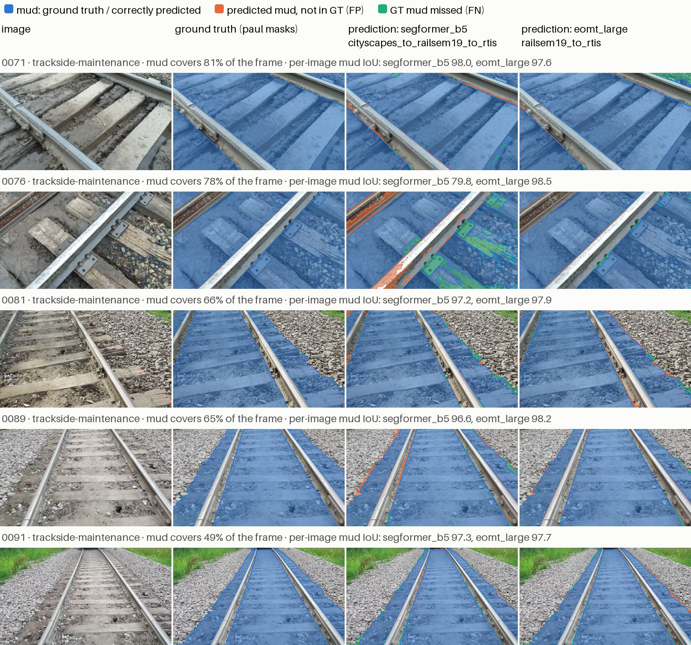
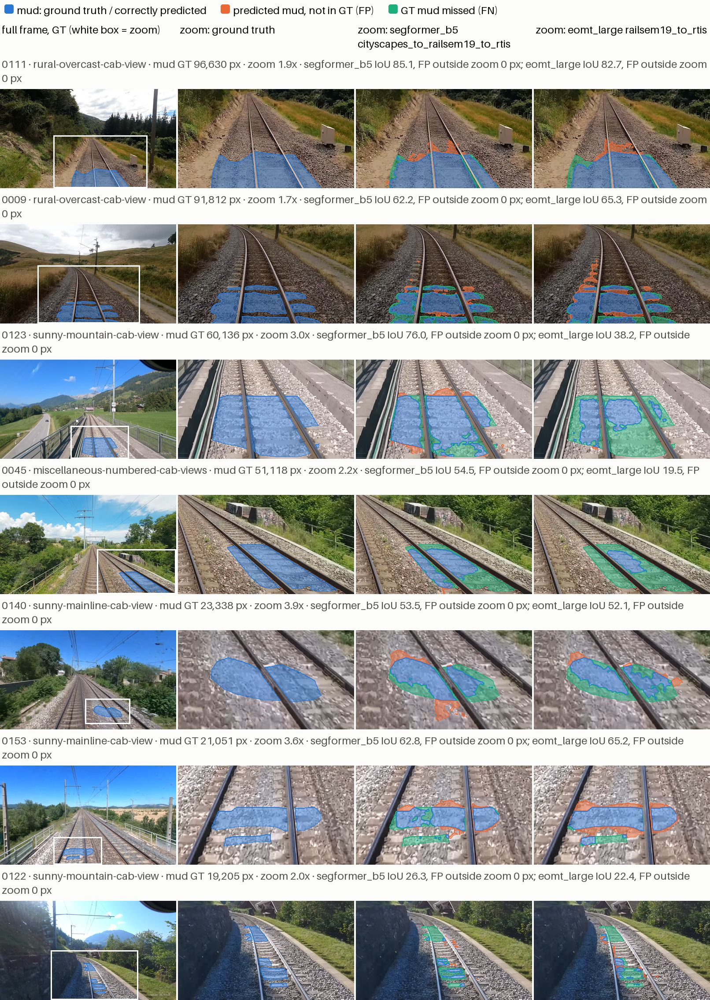
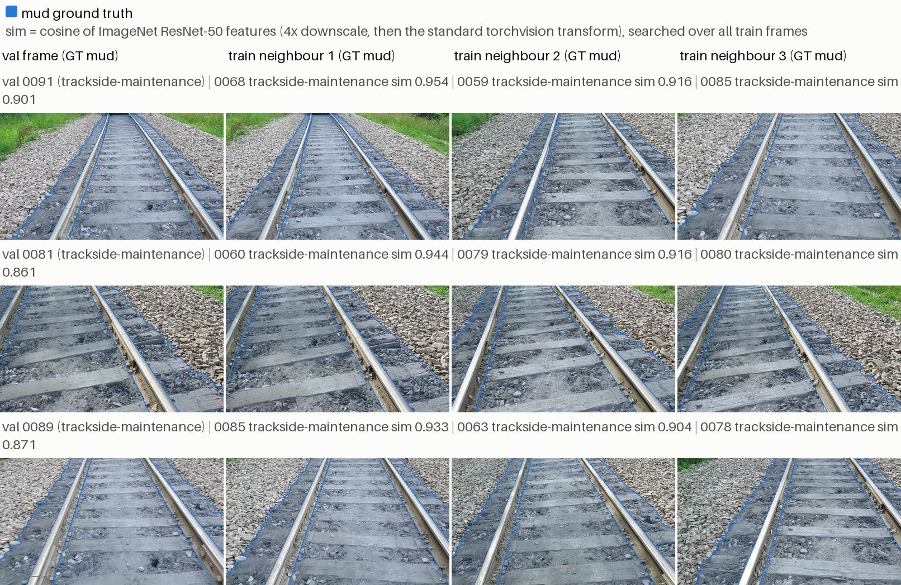
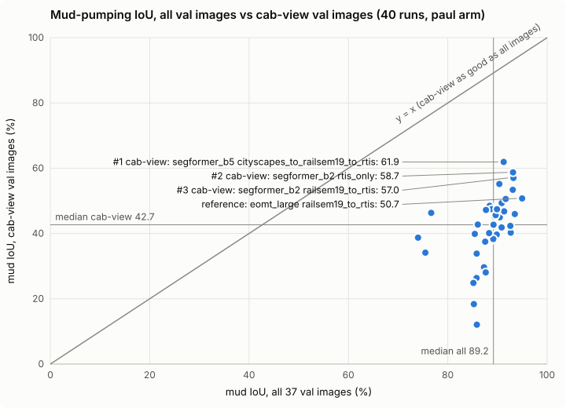

# Where the stratified-split mud-pumping IoU comes from (RAD 9/24/2026)

A case file for the `rad_9_24_2026` comparison ([guide](rad-9-24-2026.md)). Every number, table and figure below is written by `scripts/make_rad_mud_case.py` from the prepared datasets and the campaign results; nothing is typed by hand. Validation split only.

## 1. Summary

- **Where the score comes from.** On the stratified val split, 5 track-level frames from one scene group hold 94.9% of the val mud-pumping pixels. The high all-image mud IoU mostly reflects those frames.
- **Cab-view is much lower.** Over 40 single-seed runs the median mud IoU is 89.2 on all val images and 42.7 on cab-view images; 40 of 40 runs score lower on cab-view. The models do segment cab-view mud in part: the best run reaches 61.9.
- **Same-scene frames are in train.** All 17 of 17 val scene groups also have train frames, including neighbouring frames of the same stretch of track.
- **Optimistic and unreplicated.** One seed per run, and checkpoints are selected on this same val split.
- **Scene-grouped results: pending** (0 of 40 jobs completed).

In more detail: 5 track-level frames from the `trackside-maintenance` scene group hold 94.9% of all mud-pumping ground-truth pixels on the stratified val split, and the 7 cab-view images that contain mud hold 4.9%. Because mud IoU is aggregated over pixels, the headline number mostly measures those frames: across the 40 `paul`-arm runs the median mud IoU is 89.2 on all val images but 42.7 on the cab-view images, and 40 of 40 runs score lower on cab-view. The best cab-view run (segformer_b5 cityscapes_to_railsem19_to_rtis) reaches 61.9. For all 5 track-level frames the most similar train frame is from the same scene group. For 3 of them (0081, 0089, 0091) it scores at least 0.93, against at most 0.701 for any train frame from another group; figure 3 shows them side by side with their nearest train frames. For 0071 and 0076 the best score is only 0.53 and 0.54, so these are neighbouring frames, not copies. The high all-image number therefore mostly measures segmentation of large, close-range mud on a stretch of track whose neighbouring frames are in training; it says little about spotting small mud patches from the cab. The scene-grouped arm, the closest test we have of that, has 0 of 40 jobs completed, so the comparison is still pending.

The `paul` arm uses a stratified random split over frames (multi-label iterative stratification, see the guide), a standard choice that keeps rare classes in every split. The issue here is not the split rule: many frames in this dataset are neighbouring views of the same scene, so a random frame-level split puts such neighbours in both train and val.

## 2. The metric

Pixel-aggregated mud IoU sums true positives, false positives and false negatives over all images first and then computes TP / (TP + FP + FN), so each image counts in proportion to its number of mud pixels. An image whose frame is one-third mud carries as much weight as dozens of cab-view frames with a small patch each, and a model that segments a few large, easy frames can score high even if it does poorly on the rest (here the 5 track-level frames are 94.9% of the mud pixels).

## 3. Evidence A: where the val mud pixels are

Every val image with mud ground truth on the stratified split (`paul` arm masks; the `fixed-stratified` arm uses the same val images, checked by key and image SHA-256). Per-image mud IoU is shown for the best cab-view run, **segformer_b5 cityscapes_to_railsem19_to_rtis**, and for the reference run **eomt_large railsem19_to_rtis**. `share` is the image's share of all 7,435,760 val mud pixels; `frame` is the share of the image covered by mud.

| image | viewpoint | scene group | mud px | share | frame | IoU segformer_b5 | IoU eomt_large |
|---|---|---|---:|---:|---:|---:|---:|
| `0071` | track-level | `trackside-maintenance` | 1,683,356 | 22.6% | 80.6% | 98.0 | 97.6 |
| `0076` | track-level | `trackside-maintenance` | 1,620,393 | 21.8% | 77.6% | 79.8 | 98.5 |
| `0081` | track-level | `trackside-maintenance` | 1,387,127 | 18.7% | 66.4% | 97.2 | 97.9 |
| `0089` | track-level | `trackside-maintenance` | 1,354,165 | 18.2% | 64.8% | 96.6 | 98.2 |
| `0091` | track-level | `trackside-maintenance` | 1,014,568 | 13.6% | 48.6% | 97.3 | 97.7 |
| `0111` | cab-view | `rural-overcast-cab-view` | 96,630 | 1.3% | 4.7% | 85.1 | 82.7 |
| `0009` | cab-view | `rural-overcast-cab-view` | 91,812 | 1.2% | 4.4% | 62.2 | 65.3 |
| `0123` | cab-view | `sunny-mountain-cab-view` | 60,136 | 0.8% | 2.9% | 76.0 | 38.2 |
| `0045` | cab-view | `miscellaneous-numbered-cab-views` | 51,118 | 0.7% | 2.5% | 54.5 | 19.5 |
| `0140` | cab-view | `sunny-mainline-cab-view` | 23,338 | 0.3% | 1.1% | 53.5 | 52.1 |
| `0153` | cab-view | `sunny-mainline-cab-view` | 21,051 | 0.3% | 1.0% | 62.8 | 65.2 |
| `0122` | cab-view | `sunny-mountain-cab-view` | 19,205 | 0.3% | 0.9% | 26.3 | 22.4 |
| `0027` | track-level | `trackside-vegetation-closeups` | 12,861 | 0.2% | 0.6% | 0.0 | 0.0 |

Pixel-aggregated mud IoU of the same two runs on each subset:

| subset | images with mud | segformer_b5 cityscapes_to_railsem19_to_rtis | eomt_large railsem19_to_rtis |
|---|---:|---:|---:|
| all val images | 13 | 91.2 | 95.0 |
| cab-view | 7 | 61.9 | 50.7 |
| excluding `trackside-maintenance` | 8 | 60.1 | 49.0 |

False-positive mud on val images **without** mud ground truth (pixels). They count against every subset that contains them, including all val images, but matter most relative to the small cab-view total (363,290 mud pixels).

| image | viewpoint | scene group | FP segformer_b5 | FP eomt_large |
|---|---|---|---:|---:|
| `0032` | cab-view | `miscellaneous-numbered-cab-views` | 29,686 | 35,263 |
| `0180` | cab-view | `sunny-mainline-cab-view` | 247 | 11,011 |
| `0230` | cab-view | `sunny-mountain-stations` | 1,190 | 1,987 |
| `0223` | cab-view | `rural-non-electrified-cab-view` | 1,796 | 22 |
| `0304` | track-level | `flooded-station-platform` | 233 | 0 |
| `0279` | cab-view | `rain-water-cab-view-with-overlay` | 0 | 19 |
| `0011` | track-level | `trackside-vegetation-closeups` | 0 | 14 |

## 4. Evidence B: what these images look like

Colours are the same in every figure: blue = mud in the ground truth (in a prediction panel, mud predicted correctly), orange = mud predicted where the ground truth has none, green = ground-truth mud the model missed. Images are downscaled; small regions are drawn with any-coverage downscaling and an outline so they stay visible. Click a figure to see it at full size.

**Figure 1.** The 5 `trackside-maintenance` track-level frames that hold 94.9% of the val mud pixels. Two are close-ups of the track bed; the others look down the track from standing height.



**Figure 2.** The 7 cab-view val images with mud ground truth (4.9% of the val mud pixels). The first column is the whole frame with the ground truth and the zoom box; the other columns are the zoomed region. Mud predicted outside the zoom box is counted in the caption.



**Figure 3.** The 3 track-level frames whose nearest train frame is most similar, with their 3 most similar frames among all 227 train images (searched over every scene group). Similarity is the cosine between global-average-pooled ImageNet ResNet-50 features (torchvision `IMAGENET1K_V2`, CPU). Each image is first downscaled 4x (PIL `Image.reduce(4)`) and then passed through the weights' standard transform (resize to 232, centre crop 224, normalise). It is a generic appearance score in which near 1 means near-identical content and framing, not proof of a shared recording.



Nearest train frame of every val image with mud, by the same score. `best other group` is the highest score reached by any train frame from a different scene group; `without downscale` is the nearest train frame when the standard transform is applied to the full-resolution image instead (a sensitivity check); `stem neighbours` are the frames just before and after the image in stem (file-name) order within its scene group, with their split.

| val image | scene group | nearest train | similarity | best other group | without downscale | train frames in group | stem neighbours |
|---|---|---|---:|---:|---|---:|---|
| `0071` | `trackside-maintenance` | `0060` (same group) | 0.525 | 0.406 | same | 38 | `0070` train, `0072` test |
| `0076` | `trackside-maintenance` | `0073` (same group) | 0.535 | 0.504 | same | 38 | `0075` train, `0077` test |
| `0081` | `trackside-maintenance` | `0060` (same group) | 0.944 | 0.660 | same | 38 | `0080` train, `0082` train |
| `0089` | `trackside-maintenance` | `0085` (same group) | 0.933 | 0.575 | same | 38 | `0088` test, `0090` train |
| `0091` | `trackside-maintenance` | `0068` (same group) | 0.954 | 0.701 | same | 38 | `0090` train, `0092` train |
| `0111` | `rural-overcast-cab-view` | `0109` (same group) | 0.952 | 0.826 | same | 14 | `0110` train, `0112` train |
| `0009` | `rural-overcast-cab-view` | `0003` (same group) | 0.906 | 0.827 | same | 14 | `0008` train, `0040` train |
| `0123` | `sunny-mountain-cab-view` | `0043` (same group) | 0.805 | 0.798 | same | 23 | `0122` val, `0251` val |
| `0045` | `miscellaneous-numbered-cab-views` | `0046` (same group) | 0.914 | 0.904 | same | 11 | `0044` train, `0046` train |
| `0140` | `sunny-mainline-cab-view` | `0144` (same group) | 0.932 | 0.907 | `0161` (same group) 0.927 | 41 | `0139` train, `0141` train |
| `0153` | `sunny-mainline-cab-view` | `0163` (same group) | 0.930 | 0.852 | same | 41 | `0152` train, `0154` train |
| `0122` | `sunny-mountain-cab-view` | `0234` (`overcast-mountain-stations`) | 0.821 | 0.821 | `0121` (same group) 0.829 | 23 | `0121` train, `0123` val |
| `0027` | `trackside-vegetation-closeups` | `0028` (same group) | 0.920 | 0.626 | same | 6 | `0020` train, `0028` train |

Cab-view frames look alike to an ImageNet embedding (the best score from another group is already high for them, up to 0.907), so the score separates near-identical frames mainly for the track-level frames. Without the downscale the nearest train frame changes for 2 of 13 images (0140, 0122), none of them track-level frames, so cab-view nearest-frame matches depend on preprocessing and should not be read individually. The stem order shows the track-level frames sit in a numbered sequence whose neighbouring frames went to train and test.

## 5. Evidence C: all 40 runs

Each dot is one `paul`-arm run (selected `best-auto-val` checkpoint). Dots below the diagonal score lower on cab-view images than on all images; 40 of 40 do. The labelled dots are the top 3 runs by cab-view mud IoU and the reference run (eomt_large railsem19_to_rtis).



Medians over the 40 runs (percent):

| metric | median |
|---|---:|
| mud IoU, all val images | 89.2 |
| mud IoU, cab-view | 42.7 |
| mud IoU, excluding `trackside-maintenance` | 37.5 |
| image-mean mud IoU, cab-view | 44.6 |
| GT-class mIoU, all val images | 60.8 |
| GT-class mIoU, cab-view | 57.2 |

Top 10 runs by cab-view mud IoU (percent):

| rank | model | protocol | mud IoU cab | mud IoU all | img-mean mud IoU cab | GT-class mIoU all |
|---:|---|---|---:|---:|---:|---:|
| 1 | `segformer_b5` | `cityscapes_to_railsem19_to_rtis` | 61.9 | 91.2 | 60.0 | 65.1 |
| 2 | `segformer_b2` | `rtis_only` | 58.7 | 93.1 | 59.2 | 58.2 |
| 3 | `segformer_b2` | `railsem19_to_rtis` | 57.0 | 93.2 | 51.6 | 66.4 |
| 4 | `segformer_b5` | `railsem19_to_rtis` | 55.2 | 90.4 | 50.6 | 69.5 |
| 5 | `segformer_b5` | `rtis_only` | 53.4 | 93.1 | 60.0 | 59.1 |
| 6 | `eomt_large` | `railsem19_to_rtis` | 50.7 | 95.0 | 49.3 | 72.8 |
| 7 | `upernet_convnext` | `rtis_only` | 50.6 | 91.7 | 50.9 | 61.5 |
| 8 | `hrnet_w48_ocr` | `rtis_only` | 49.3 | 90.8 | 45.7 | 59.8 |
| 9 | `native_convnext_tiny_uper` | `railsem19_to_rtis` | 48.5 | 88.4 | 43.7 | 64.1 |
| 10 | `native_convnext_tiny_uper` | `rtis_only` | 47.5 | 88.8 | 53.3 | 60.5 |

## 6. Evidence D: split overlap

Scene groups are the directory layout names of the prepared arms. A val group "in train" has at least one train image in the same group.

|  | stratified | scene-grouped |
|---|---:|---:|
| masks | `fixed-stratified` (same val images as `paul`) | `fixed-grouped` |
| val images | 37 | 37 |
| train images | 227 | 217 |
| val scene groups that also have train images | 17 of 17 | 0 of 3 |
| cab-view val images (with mud) | 28 (7) | 27 (17) |
| cab-view share of val mud pixels | 4.9% | 98.9% |
| track-level val images (with mud) | 8 (6) | 9 (1) |
| track-level share of val mud pixels | 95.1% | 1.1% |
| other val images (with mud) | 1 (0) | 1 (0) |
| other share of val mud pixels | 0.0% | 0.0% |
| val mud pixels | 7,436,590 | 1,226,250 |

On the grouped split the cab-view val mud sits in 1 scene group: `rural-overcast-cab-view` (17 images).

## 7. What the scene-grouped arm will tell us

The `fixed-grouped` arm keeps every val scene group out of train. If the stratified numbers are inflated by same-scene frames, its mud IoU should fall to (or below) the stratified cab-view numbers rather than near the stratified all-image numbers. Two things are not separated by this test: the grouped arm also changes the training set (227 vs 217 train images) and its val mud is 17 of 17 cab-view images from one camera setup (`rural-overcast-cab-view`), so it is a different and narrower val set, not the same val set with same-group frames removed.

| arm | completed jobs | other statuses |
|---|---:|---|
| `paul` | 40 / 40 | — |
| `fixed-stratified` | 4 / 40 | queued 32, training 4 |
| `fixed-grouped` | 0 / 40 | queued 40 |

Pending: 40 of 40 `fixed-grouped` jobs are not completed. Regenerate this document with `scripts/make_rad_mud_case.py` when they are.

## 8. Comparison with the published RAD results

The paper this dataset comes from (Stanik et al., IEEE journal manuscript, Rail Anomalies Dataset) reports the same pattern. Quoted facts, from its Section IV-C and Table II:

- **Split:** 152 annotated images, 106 train / 30 validation / 16 test. The paper gives only the sizes. `scripts/shuffle_files.py` in pauls3/rail_segmentation (commit 28191e5) shuffles the image list with `random.seed(17)` and cuts it at 70% and 90%, which gives 106/30/16 for 152 images: a frame-level random split with no scene or recording grouping.
- **Mud-pumping dominates the pixels:** it covers 26.68% of all labelled pixels and appears in 74.34% of frames (Table II), far more than any other non-background class.
- **One source video:** the paper states that "the majority of the frames containing mud-pumping were sourced from a single video from the point-of-view of a person repairing the rail track", with only a few from the locomotive's point of view, and that the trained models produced many mud-pumping false positives on RailSem19.

| Model (paper, RAD test set) | mud-pumping IoU | test mIoU |
| --- | ---: | ---: |
| FRRN-B (City → RS19) | 84.21 | 49.9 |
| HRNet + OCR + MS attention (Map → City → RS19) | 87.49 | 67.1 |
| SFNet-ResNet-18 (Map → City → RS19) | 88.78 | 61.0 |

All three published models, including the older FRRN-B baseline, score 84-89 on mud-pumping, well above their own mIoU. That is consistent with this document's finding: on a frame-level split of a dataset whose mud-pumping comes mostly from one close-range video, pixel-aggregated mud IoU mostly measures those close-range frames. The published numbers are on a different (2022, 19-class) version of the data and a 16-image test set, so they are not directly comparable with the values above; the point is the shared pattern, not the exact figures.

## 9. Caveats

- **Single seed.** Every run is seed 0; there are no repeats or intervals, so differences of a few points between runs are not established.
- **Optimistic checkpoints.** Each run's checkpoint is selected (and early stopped) on val mud IoU of this same val split, so every number here is an optimistic val score, not a held-out estimate.
- **Small cab-view subset.** On the stratified split the cab-view mud numbers rest on 7 images (363,290 mud pixels); one image can move them by many points.
- **Viewpoints are AI-assisted visual judgements.** `configs/datasets/rad_9_24_2026-viewpoints.yaml` comes from two labelling passes by the same AI model with adjudication of disagreements; not independent human annotation.
- **Scene groups are layout names,** assigned from visual evidence, not confirmed recording provenance. The similarity in figure 3 is a generic ImageNet appearance score.
- **Mask-conversion differences in the delivered `masks_machine/` masks** (used by the `paul` arm). The conversion labels pixels covered by no polygon as `person` and ignores polygon holes (see the guide); this is mechanical, not an annotation judgement. The figures use those masks because the runs were scored against them. On val the mud total differs by 830 px (7,435,760 `paul` vs 7,436,590 `fixed-stratified`, 0.01%).
- **The `fixed-stratified` arm** has 4 of 40 jobs completed, so the label-fix comparison on the same val images is not shown here.

## 10. Reproduce

On the GPU host, from a repository checkout, with a Python environment that has torch and torchvision (read-only on the data; writes only this document and its assets). The ResNet-50 ImageNet weights are fetched once into the torch hub cache. Runs on CPU.

```bash
cd segmentary
CUDA_VISIBLE_DEVICES="" PYTHONPATH=.:src python scripts/make_rad_mud_case.py
```

From local copies of the prepared datasets and campaigns (state files keep their HDRFS paths; the script rewrites them to `--campaign-root`):

```bash
CUDA_VISIBLE_DEVICES="" PYTHONPATH=.:src .venv/bin/python scripts/make_rad_mud_case.py \
  --datasets-root <copy>/datasets --campaign-root <copy>/rad_9_24_2026
```

Inputs used for this version:

- viewpoints: `rad_9_24_2026-viewpoints.yaml` (sha256 `7dfc4f730cbe`)
- samples `paul`: sha256 `2338c1e5cd84`
- samples `fixed-stratified`: sha256 `048ba308159f`
- samples `fixed-grouped`: sha256 `46e5b404cb1e`
- similarity weights: torchvision `resnet50-11ad3fa6.pth`
- campaigns: `paul-seed0-20261005-r2`, `fixed-stratified-seed0-20261005-r2`, `fixed-grouped-seed0-20261005-r2`
