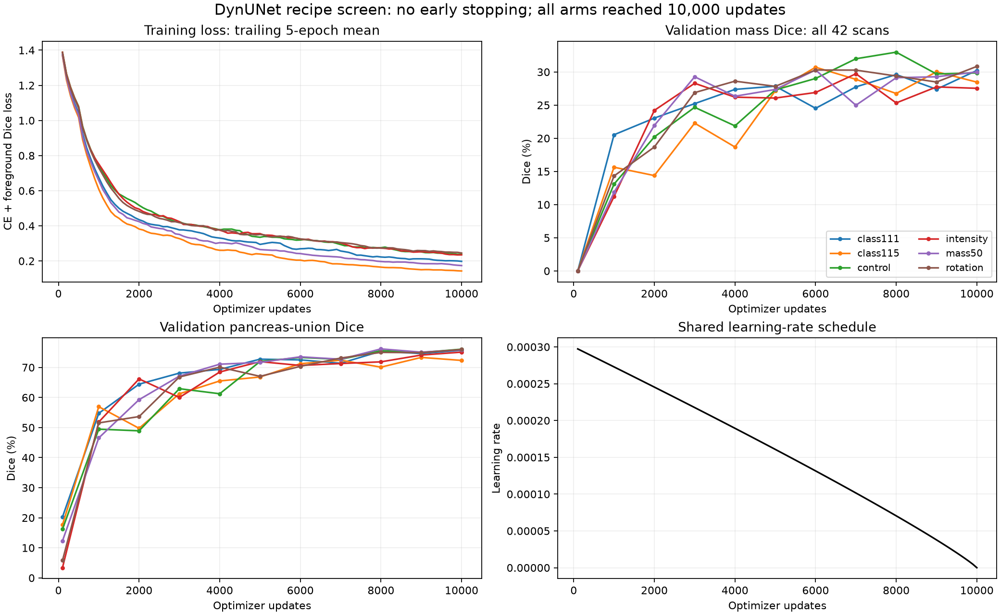

# Convergence and method review: September 14, 2026

All six DynUNet arms completed 10,000 optimizer updates. No early-stopping callback or patience rule stopped them. The training loop executes 100 epochs of 100 randomly sampled batches; an epoch is not one complete pass through the scan inventory. Selecting the best checkpoint is separate from stopping training.

The plot uses recorded epoch loss, validation Dice and learning rates from the [completed recipe records](../recipe-ablation-20260914/records/). Training loss is smoothed with a trailing five-epoch mean; validation points are actual observations connected by lines, not interpolated measurements. Regenerate with `python plot_curves.py` after installing matplotlib. [Aggregate calculations](summary.json) preserve the numerical evidence.

## What the curves establish

Training loss decreases throughout all six runs. For control, mean loss at updates 6,001–8,000 is 0.2905, versus 0.2478 at 8,001–10,000. Its mass Dice peaks at 32.98% at 8,000 and ends at 29.86%; pancreas Dice at the final step is 76.07%. Better optimization of sampled training patches is not the same as better mass segmentation on unseen whole scans.

| Arm | Best mass checkpoint | Best mass Dice | Mass Dice at 10,000 | Pancreas Dice at selected checkpoint | Zero-overlap mass cases at selected checkpoint |
| --- | ---: | ---: | ---: | ---: | ---: |
| control | 8,000 | 32.98% | 29.86% | 75.59% | 12/42 |
| mass50 | 6,000 | 30.30% | 30.00% | 73.54% | 16/42 |
| class111 | 10,000 | 30.23% | 30.23% | 75.73% | 17/42 |
| class115 | 6,000 | 30.71% | 28.47% | 71.24% | 14/42 |
| rotation | 10,000 | 30.84% | 30.84% | 75.98% | 12/42 |
| intensity | 7,000 | 29.73% | 27.54% | 71.30% | 14/42 |

Zero overlap means no predicted mass voxel intersects the reference; it does not necessarily mean no mass was predicted anywhere. Counts come from the native validation case CSV at the selected checkpoint. All 42 references are mass-positive, so checkpoint selection and final evaluation use the same positive cohort here.

Validation mass Dice shows noisy diminishing gains rather than demonstrated convergence. Two arms peak at the final evaluation. The polynomial schedule is `initial_lr * max(0, 1 - step / total_steps)^0.9`, and reaches zero at 10,000. A flattening curve under this schedule cannot establish that a longer schedule would not help. Nor do falling training loss and noisy validation Dice alone prove overfitting: we lack a fixed, comparable whole-volume training evaluation and validation objective curve.

## What may limit this method

- **Budget and schedule:** 10,000 is a screening budget, not a convergence guarantee. Starting fresh with a declared 30,000-update decay schedule tests a longer training recipe. It changes both training duration and learning rates at shared update counts; it does not isolate extra updates alone. Resuming a completed zero-LR run is not equivalent.
- **Resolution:** the current spacing is 1.5/1.5/2.5 mm xyz. The training audit found no entirely lost positive scans or connected components, but that does not establish adequate boundary detail or preservation of thin structures.
- **Localization:** control has mass predictions in 39/42 cases under the clinical diagnostic, but only 25/42 reference components matched at IoU 0.1. There are 17 unmatched reference components and 38 unmatched predicted components. These are exploratory connected-component proxies with a 10 mm³ predicted-component filter, not clinical lesion annotations. They motivate case review, not a diagnostic accuracy claim.
- **Simplified objective and inference:** current DynUNet uses dense CE plus batch-aggregated foreground Dice, no auxiliary decoder supervision, uniform sliding-window probability averaging, and no mirroring. These are valid declared choices, but not the full nnU-Net recipe. The [official nnU-Net trainer](https://github.com/MIC-DKFZ/nnUNet/blob/master/nnunetv2/training/nnUNetTrainer/nnUNetTrainer.py) includes deep supervision and a substantially longer default schedule. Its live patch pseudo-Dice is not comparable to our native whole-scan results.
- **Insufficient diagnostic logging:** total training loss is available, but separate CE/Dice terms and a fixed whole-volume training subset would make optimization versus generalization easier to distinguish. Such extra diagnostics should be isolated from sampler RNG and recorded with their extra cost.
- **Study limits:** only one seed, 42 repeatedly inspected validation scans, and unverified patient grouping. No architecture or clinical superiority follows from this screen.

The reviewed code checks finite loss, preserves paired image/label geometry, uses nearest-neighbor label resampling and performs image-only whole-volume inference. The completed preflight checks provide further evidence. This review did not uncover an early-stopping or obvious label-interpolation bug; it is not an exhaustive proof of correctness or a substitute for radiologist-reviewed overlays.

## Next tests, in priority order

1. **Training-fit diagnostic:** evaluate a fixed small training subset and inspect paired CT/reference/prediction overlays, including native reconstruction. A one- or two-case memorization test should use the same objective/export path. Poor training fit suggests an optimization, capacity or pipeline issue; high training fit with weak validation points toward generalization. Keep reserved-test scans untouched.
2. **Longer-budget control:** scratch DynUNet at 30,000 updates, original sampler and geometry, with its decay horizon declared at initialization. Compare seeds 0/1/2 against 10,000-update controls; the existing seed-0 control can be reused only if scientific code remains unchanged. Do not silently edit completed runs or reset their schedulers.
3. **Finer-detail control:** 1.0/1.0/2.5 mm xyz spacing and 96/144/144 zyx patches preserve approximately the same physical field of view. Start with 10,000 updates, original sampler and batch 8; preflight memory and label geometry first. It uses 2.25 times as many input voxels per update. A forced batch reduction must be declared as another variable.
4. **Inference-only ablation:** uniform versus Gaussian blending, then mirroring separately, using the same selected weights. This can test tile-boundary effects without retraining, but needs a versioned inference option and separate reports.
5. **Deep supervision:** add validated weighted decoder losses as a separate architecture-specific experiment; preserve full-resolution supervision. Do this after the training-fit and budget probes so changes remain interpretable.

A practical proposed allocation is GPUs 1–2 for new 10k control seeds 1/2; GPUs 3–5 for 30k controls at seeds 0/1/2; GPUs 6–8 for finer-detail 10k runs at seeds 0/1/2; GPU 9 for bounded diagnostics. Preserve GPU 0 for the existing nnU-Net. This review launches no new campaign. The finer-detail arm requires a memory smoke test before allocation; duration is not inferred from the smaller-patch throughput.

[Completed results](../recipe-ablation-20260914/README.md) · [Paired uncertainty intervals](../recipe-ablation-20260914/paired-comparisons.md) · [Earlier recipe comparison](../recipe-comparison-20260914/README.md)
