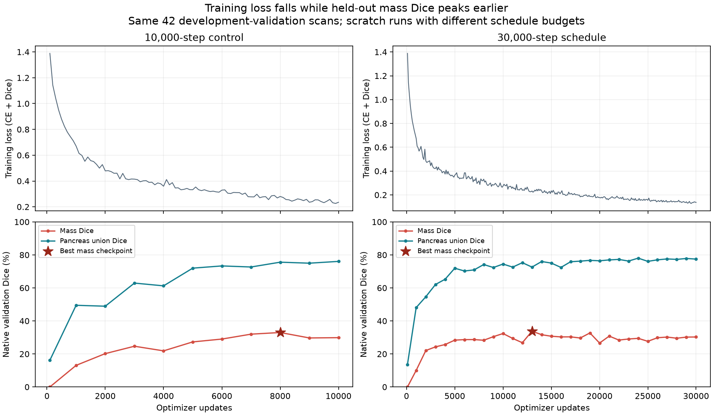

# Why many Task07 models score around 30% mass Dice

The strongest finding is that our **nnU-Net system reaches 54.68–55.90% native mass Dice on the same 42 validation scans**, while the common Torch DynUNet control reaches 32.98%. There is no universal 30% limit imposed by this cohort or evaluator. The common recipe and its interaction with architecture are the leading investigation targets; this comparison changes several ingredients and does not isolate one cause.

All results here are exploratory development measurements. The 42 reserved test scans were not opened. Every model originated from random weights. Pancreas Dice means the union of labels 1 and 2; mass Dice uses label 2. A mass annotation does not establish malignant disease. The source manifest uses dataset cases as patient proxies (`dataset_case_unverified`); these checks preserve the frozen grouping but do not independently establish patient identity or independence. Bootstrap intervals below use those declared groups.

## Reading order

- This page: conclusions, completed checks and remaining hypotheses.
- [Every completed model and experiment](all-models.md), with mass and pancreas Dice; [CSV](completed-models.csv).
- [Full training-versus-validation audit](generalization-summary.json) and [independent geometry checks](geometry-checks.json).
- [Verified nnU-Net snapshots and paired comparisons](nnunet-snapshots.json).
- [Split coverage and missing subtype metadata](split-coverage.md).
- [Completed inference experiments](inference-ablations.md), with [aggregate measurements](inference-ablations.json).
- [Learning curves](training-curves.png), also available as [SVG](training-curves.svg).
- [Earlier recipe comparison](../recipe-comparison-20260914/README.md), [failure-review methods](../failure-review-20260914/README.md), and [new controlled loss study](dice-reduction-protocol.md).

Private CT panels, source mappings, native masks, confidence summaries and patient-level pairing remain in the investigation artifact directory outside Git. The private package includes an architecture-by-case heatmap and synchronized review panels.

## 1. Strong reference under the same native evaluation

| System / immutable checkpoint | Evaluated scans | Mass Dice | Pancreas Dice | Zero mass overlap |
| --- | ---: | ---: | ---: | ---: |
| DynUNet control, selected best at step 8,000 | 42 validation | 32.98% | 75.59% | 12/42 |
| nnU-Net ResEnc L, selected-best snapshot at epoch 602 | 42 validation | **54.68%** | **84.19%** | 5/42 |
| nnU-Net ResEnc L, latest snapshot at epoch 900 | 42 validation | **55.90%** | **84.12%** | 7/42 |

These are whole native-volume results, not nnU-Net's live patch Dice. Every prediction passed native geometry and independent NumPy Dice verification. Both nnU-Net snapshots were copied with stable checkpoint hashes and original binding/runtime guards. Their private operators did not modify or interrupt training.

The selected-best snapshot improves mass Dice by **21.69 percentage points**, with a paired case-proxy bootstrap 95% interval of **[13.62, 30.15]**. It improves 32 cases, ties five and worsens five. It achieves substantial mass-mask overlap in two cases missed by all six earlier recipe variants, gives a third only a small overlap, and still completely misses two of those five cases.

The latest snapshot exceeds selected best by 1.22 points, interval **[-3.51, 5.59]**. This does not establish that it is better. Preserve the official checkpoint-selection rule and keep final training evaluation separate. These intervals condition on the fixed models and cases; they do not establish reproducibility across training seeds or external cohorts.

The nnU-Net comparison changes resolution, physical context, augmentation, normalization, architecture, optimization, deep supervision, training exposure and inference. It supports a stronger reference system, not a claim that any one of those changes caused the gain. See the [actual recipe audit](../recipe-comparison-20260914/README.md).

## 2. Full training fit is incomplete, with an additional validation gap

We used the unchanged control checkpoint to predict **all 197 training scans** and repeated all 42 validation predictions. Eight disjoint deterministic shards covered the complete partitions. Historical source, data, checkpoint and scratch-origin guards passed before and after inference. All 42 validation prediction files reproduced their historical SHA-256 exactly, and Dice differences were zero.

| Scope | Mass mean | Mass median | Pancreas mean | Completely missed mass | Mass Dice at least 70% |
| --- | ---: | ---: | ---: | ---: | ---: |
| All 197 training scans, in sample | 58.52% | 69.86% | 78.79% | 23/197 | 98/197 |
| Fixed 42 validation scans | 32.98% | 27.66% | 75.59% | 12/42 | 7/42 |

The mass gap is **25.54 points**, whereas the whole-pancreas gap is **3.20 points**. This suggests a particular weakness in learning and generalizing mass identity and extent. It is not simply a model that perfectly fits training data and only fails elsewhere: it still misses 23 training masses. These are descriptive differences on this fixed split and checkpoint.

The earlier four-scan training check was too optimistic to represent the full training cohort. The separate two-case memorization experiment reached approximately 90% mass Dice, showing that the implementation can fit those examples; it did not establish a high full-cohort training score.

The 10k control peaks at 32.98% mass Dice at update 8,000 and ends at 29.86%. The 30k schedule peaks at 33.80% at update 13,000 and ends at 30.27%, while its training loss continues falling and pancreas Dice rises. Tripling the update budget with a correspondingly extended polynomial decay schedule has already failed to deliver a large mass improvement. This pattern is consistent with generalization or objective mismatch; it does not identify their exact cause.

## 3. The average hides different failure mechanisms

Among the control's 42 validation scans, 12 have zero mass overlap, four score above zero but below 10%, five score 10–30%, five score 30–50%, nine score 50–70%, and seven reach at least 70%. Even the 30 cases with some mass overlap average only **46.18% Dice**. Recovering completely missed annotated masses alone will not solve the inaccurate extents and extra predictions.

Only three control predictions contain no mass anywhere; nine of the 12 zero-overlap cases predict mass somewhere else. Averaging reference-mass voxel classifications equally across cases gives:

| What the control calls a reference mass voxel | Mean fraction |
| --- | ---: |
| Mass | 35.33% |
| Pancreas | 41.40% |
| Background | 23.27% |

These are equal-case means, not pooled voxel counts. In one shared miss, most reference mass is correctly included in the organ envelope but classified as pancreas. Other misses fall outside the predicted organ envelope. A crop alone cannot solve both mechanisms.

Across eleven original 3D architectures, three cases have zero overlap for every architecture, and median pairwise case-score correlation is 0.786. Among the eight 3D models scoring at least 28% mean Dice, it is 0.836. That latter subgroup is descriptive and selected after observing scores. Shared case difficulty does not by itself prove a software bug. All 27 original architectures span approximately 0.05–35.71%; the near-30% cluster mainly describes the stronger 3D group.

One especially difficult annotation touches the first CT slice. This warrants field-of-view and boundary handling review, not automatic exclusion or a claim of incorrect annotation. A radiologist should review selected difficult and ordinary scans in the private viewer. No labels were changed, and no cases were removed.

## 4. Explanations checked and their limits

| Check | Measured finding | Interpretation |
| --- | --- | --- |
| Native Dice, shape, affine and labels | Independently verified all 42 control predictions and 25 additional shared-miss predictions; Dice agrees within 1e-12 | No simple arithmetic, label-swap or global output-geometry error in the checked payloads |
| Resampling reference labels through the common grid and back | Mean mass overlap 95.99%; worst case 91.82%; whole pancreas 97.57% | The grid can represent accurate labels; this does not test whether coarse CT resampling preserves informative image texture. This oracle is not a model or strict mathematical bound |
| Finer-grid reference round trip | 99.19% mass, 99.39% pancreas | Finer geometry preserves more reference detail; it does not prove a finer-grid trained model generalizes better |
| Macro versus pooled native mass Dice | 32.98% versus 32.66% for the control | A high score is not being hidden by equal-case averaging |
| Training/validation mass-volume distributions | Medians 6.04 versus 5.82 mL, with similar quartiles | Similar central size distributions; the upper tails differ. Phase, acquisition and pathology differences remain unmeasured |
| HU clipping in five shared misses | Almost all annotated mass voxels remain inside [-100,240] HU | Heavy clipping is not evident for these cases; normalization/contrast representation is still a hypothesis |
| Fixed cascade crop coverage | No completely excluded lesions; one partly excluded lesion for either margin | Crop truncation cannot explain most cascade failures |
| Previous uniform versus Gaussian probability blending | 32.98% to 34.96% mass Dice | A small inference improvement was already observed; it did not close the reference-system gap |

## 5. Split coverage is a remaining data question

The [frozen split audit](split-coverage.md) confirms a seeded random allocation of connected groups, without subtype stratification. The inspected Task07 metadata does not provide per-case histology or subtype labels. Similar central mass sizes do not establish similar subtype coverage. The 197 training scans form 196 connected groups because one identical-CT pair has different supplied annotations; both remain in training. This known pair does not cross partitions.

Subtype imbalance is plausible, but its contribution is currently unmeasured. The stronger nnU-Net result on the same validation cohort shows that substantially better performance remains possible. A trustworthy subtype mapping and separately recorded radiologist appearance assessments would support subgroup analysis and later group-preserving cross-validation. The current validation and reserved-test memberships remain unchanged.

## 6. Targeted experiments from the findings

The [completed inference comparisons](inference-ablations.md) tested raw-score versus probability blending and centered versus high-end padding on the same verified checkpoint and all 42 validation cases. Raw-logit/Gaussian averaging scored 34.93% mass Dice versus 34.96% for probability/Gaussian; centered padding reduced the original control from 32.98% to 31.75%. Neither new alternative is being promoted as a fix. Native confidence summaries show substantial tissue-classification errors in shared misses rather than merely close class-score ties.

A separate four-run scratch study, launched on GPUs 4–7 at 09:57 Pacific on September 15, tests **batch Dice versus per-patch Dice at seeds 0 and 1**, with the rest of the 10k DynUNet recipe held fixed. This isolates one difference from nnU-Net without claiming to reproduce its complete recipe. Default historical behavior stays batch Dice. See the [predeclared protocol](dice-reduction-protocol.md).

If those isolated changes have only small effects, the next substantial training comparison should transfer a coherent strong recipe to one alternative architecture and then ablate it. Changes in physical context must accompany resolution changes deliberately; a smaller voxel spacing with the same 96-cube patch is a different physical-context experiment. The stronger nnU-Net system is now the reference for that work.

PanTS and NIH controls remain outside these experiments. They can support later data and generalization studies after overlap and label-semantics audits. A new architecture should target a demonstrated failure mechanism and be compared against this stronger reference across seeds; none of these development results establishes SOTA or clinical validity.

## Verification and reproducibility

The explicit loss option is implemented in source commit `f9051656be4a9800d415b8e99ba782b23632a968`. Its default batch loss and gradients match historical arithmetic bitwise in the numerical tests. Configuration/source binding prevents changing reduction during same-run resume. Dense per-patch Dice is opt-in and rejects unsupported native, focal and deep-supervision objectives. Existing frozen training checkouts retain their original code.

[GitHub Actions](https://github.com/arianizadi/segmentary/actions/runs/34995340720) passed on `segmentary-linux`: **2,615 passed, 13 skipped, 41 deselected**, plus lint, formatting and type checks. New GPU experiments separately require full-batch feasibility checks; CPU CI is not a medical accuracy validation. Report-only updates are covered by the repository's existing pancreas-report workflow exclusion.
