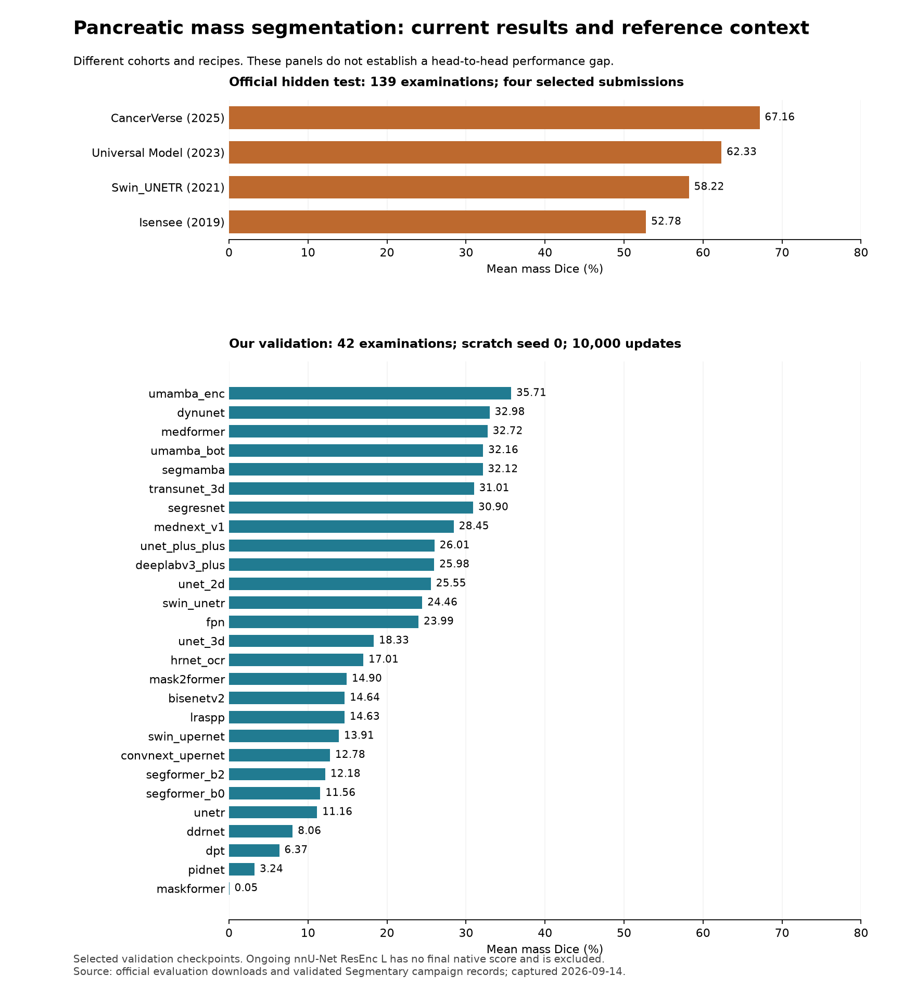

# How our Task07 results compare with the official benchmark

Our completed short screening runs are below the selected official tumor-segmentation references. That is useful evidence to improve the training recipe, but it is not a measured head-to-head performance gap: our 42 validation examinations differ from the 139 hidden test examinations used by the challenge.

Start with [the generated score tables](tables.md), including all 27 completed local models. [Exact source values](official-scores.json) retain the unrounded numbers from the public evaluation pages. Run `python generate_tables.py` in this directory to regenerate the tables from those values and the existing validated campaign CSV.

The [plot source](plot_scores.py) uses those same records. [SVG figure](mass-dice-context.svg) is available for export; the separate panels deliberately preserve the cohort distinction.

## What the two websites show

The [original results page](http://medicaldecathlon.com/results/) is the historical challenge table. It rounds scores to two decimals and separates development tasks (phase 1, including pancreas) from held-out tasks (phase 2). Its original nnU-Net pancreas scores are about 0.80 and 0.52. Do not mix that historical result with the later December 2019 Isensee evaluation, which reports 0.8164329 and 0.5278303.

The [continuing Grand Challenge leaderboard](https://decathlon-10.grand-challenge.org/evaluation/challenge/leaderboard/) has later submissions. Each score opens an evaluation page with a downloadable `metrics.json`. The visible overview rounds to two decimals, but the download contains unrounded per-examination metrics and aggregates. We extracted Task07 only from four selected submissions. The supplied CancerVerse entry was first overall across ten tasks when checked; that does not establish first place for pancreatic tumor segmentation alone.

## What changes in our interpretation

The linked CancerVerse result has mean mass Dice 67.16%, median 76.32%, and seven zero-overlap cases out of 139. The historical Isensee entry has mean 52.78% and 27 zero-overlap cases. These distributions show that a respectable mean can coexist with zero-overlap segmentations; Dice alone does not define patient-level detection. Our best completed screening model, U-Mamba Encoder, has 35.71% mean mass Dice; the DynUNet control has 32.98%. The short-screening recipe is not yet competitive with these reference results.

This does not establish an annotation-imposed ceiling. Nor does it prove that a different architecture alone will close the gap. We trained from scratch on 197 cases, using one seed and a common 10,000-update recipe. Published entries may use more training data, their own planning/augmentation/schedules, model selection, ensembles, or pretrained components. Exact exposure and recipe for each checkpoint must be audited before claiming a scratch-only matched baseline; leaderboard names alone do not establish those details.

The current next experiments address concrete alternatives: [training-fit and two-case memorization](../../../../guides/medical-training-fit-diagnostic.md), [a fresh 30,000-update schedule and finer in-plane sampling](../../../../guides/medical-followup-experiments.md), and [same-checkpoint Gaussian inference blending](../../../../guides/medical-inference-blending.md). The [annotation review](../annotation-review-20260914/README.md) is a separate audit, not a reason to remove difficult cases based on model errors.

## Metric and protocol cautions

- L2 is the tumor/mass target. Our local mass Dice uses native-volume masks and averages positive-reference case/patient scores; all 42 validation references are mass-positive. The official download reports per-case aggregates. Neither number is cancer-diagnosis accuracy.
- Our pancreas score explicitly uses the union of labels 1 and 2. The official entry names its region L1. Until the official binarization is established, keep the official L1 and our union scores labeled separately.
- The official NSD is a tolerance-based surface score, not HD95. The [MSD assessment paper](https://doi.org/10.1038/s41467-022-30695-9) gives a 5 mm pancreas-task tolerance for all its targets. Our previously reported surface Dice uses a 2 mm tolerance, so it must not be substituted for official NSD without harmonization.
- Validation has repeatedly guided our recipe choices. Keep the 42 reserved test scans untouched; do not present validation tuning gains as independent generalization.
- The official 139 scans have no public reference masks in our download. We have not submitted predictions or joined any challenge during this review. An official score would require a frozen protocol and permitted submission, including an audit of training/test exposure.

Links were opened successfully on 2026-09-14. The original site's HTTP page worked; Grand Challenge pages were verified in the browser because a direct text fetch returned 403.
