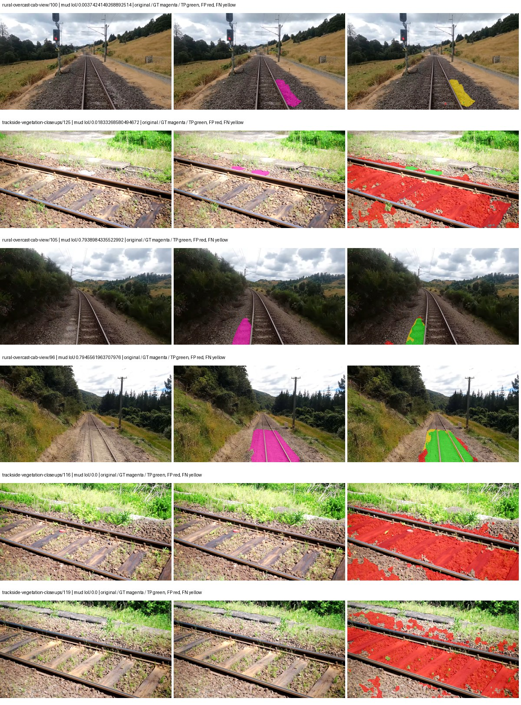
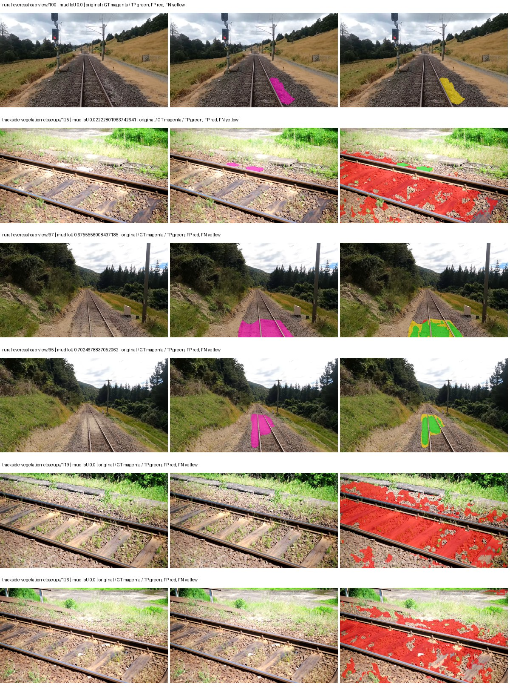
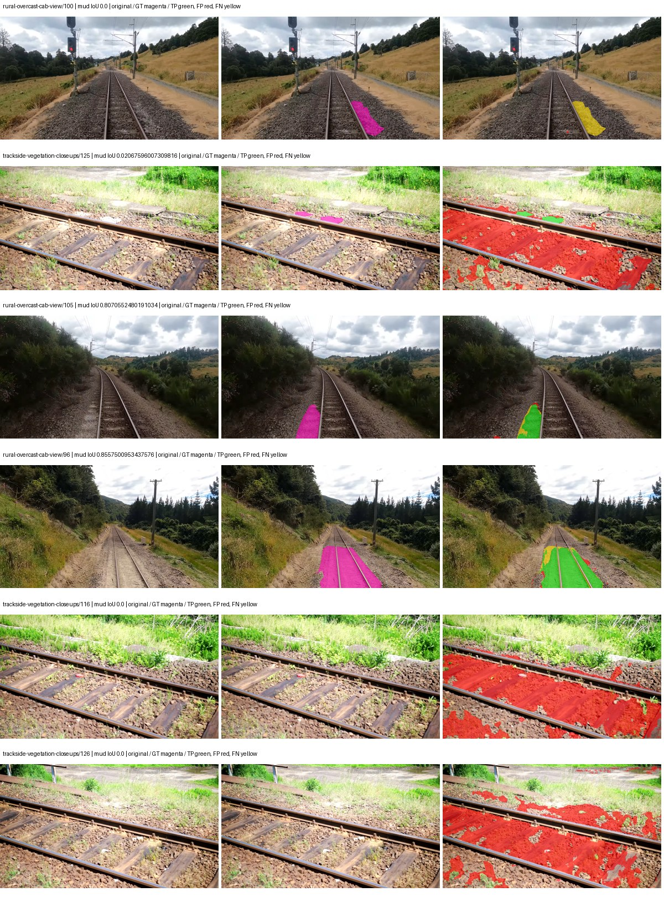
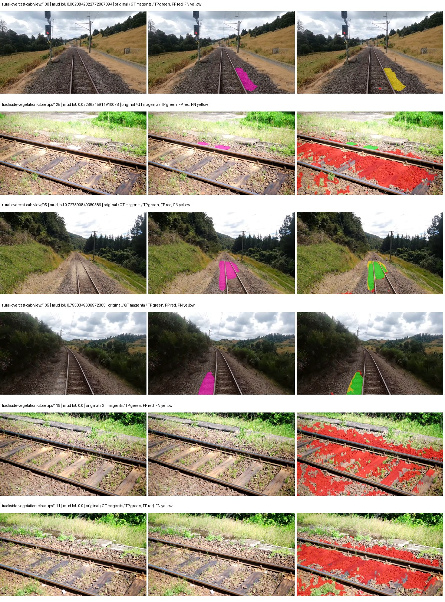
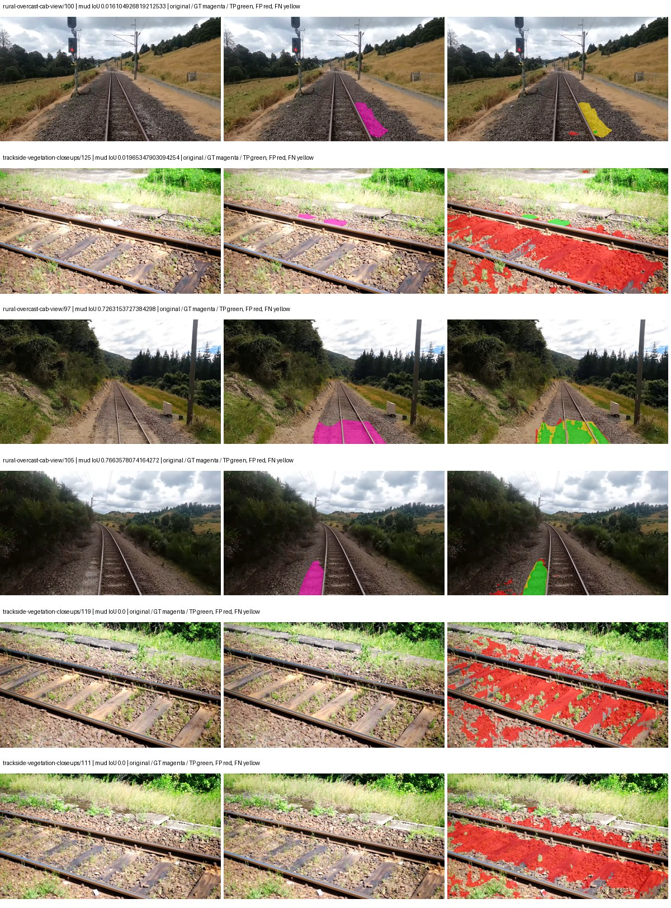
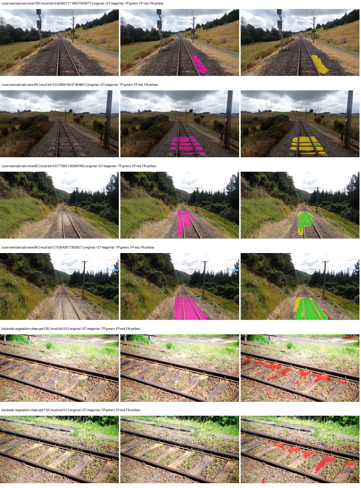
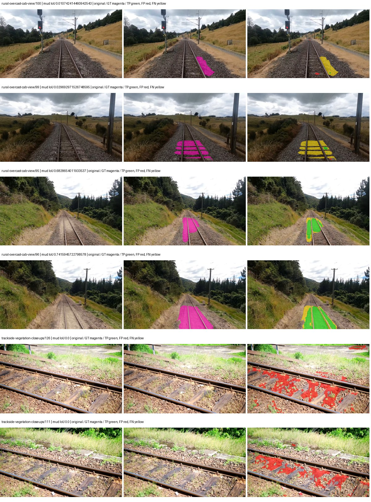
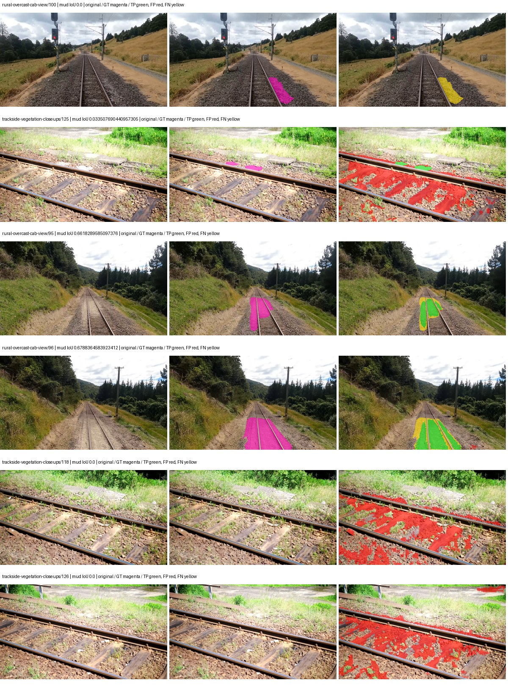
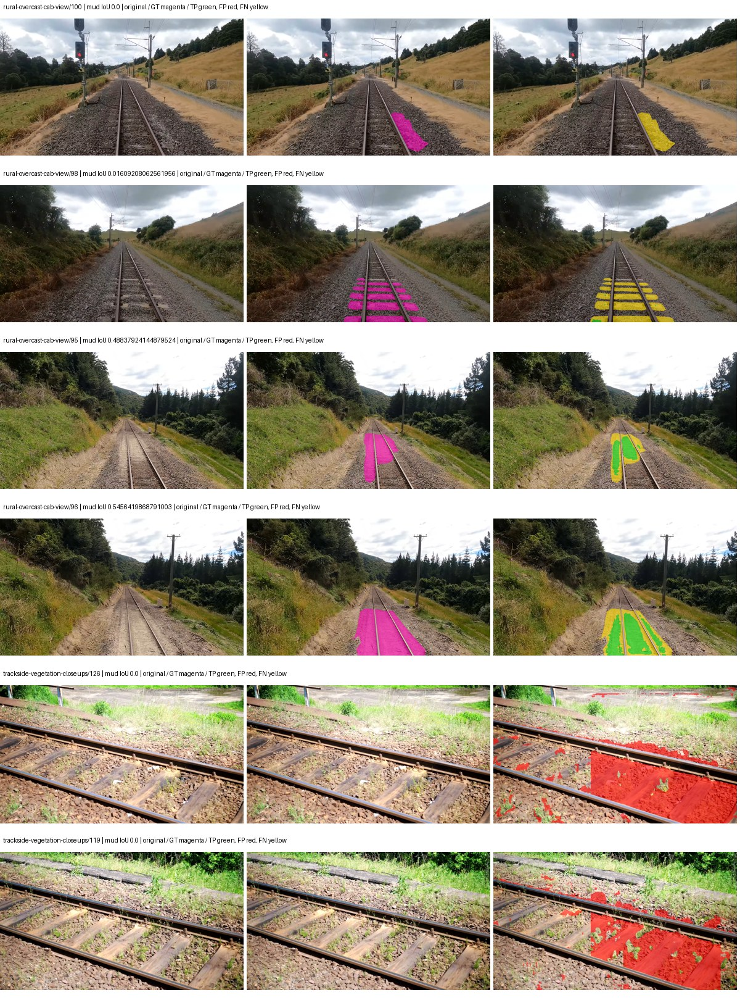
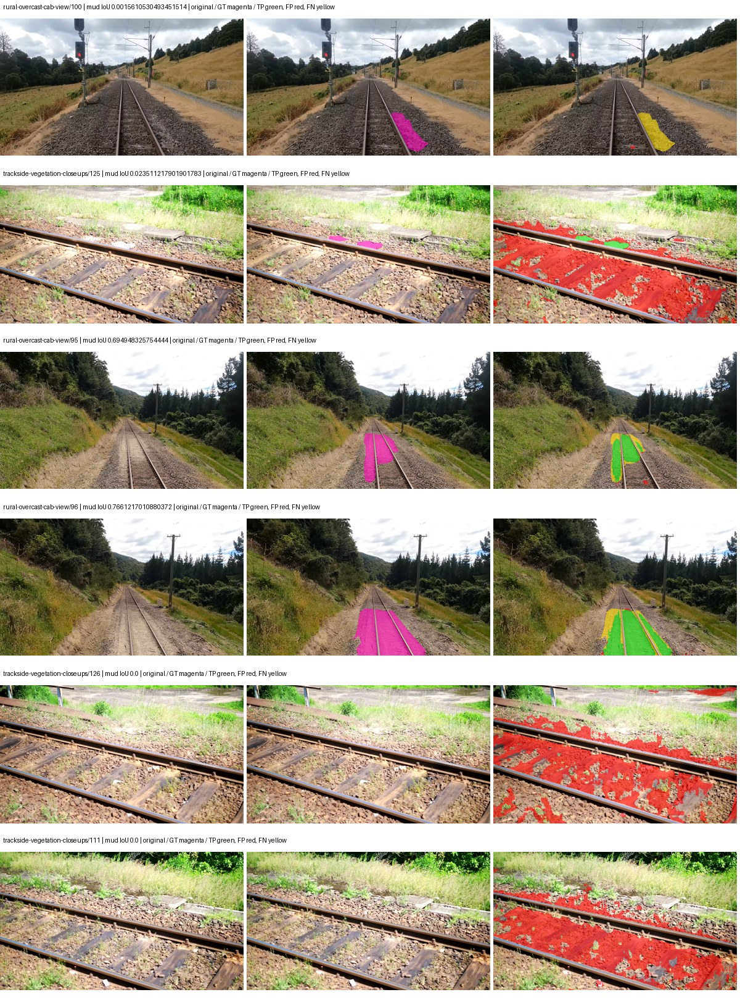

# eomt_dinov3_large — paul-test-rtis

[RTIS comparison](../../README.md) · [Full model records](record.json)

Primary selection and early stopping: **mud-pumping validation IoU**. A job is complete only after full statistics and isolated profiling are verified.

| Model | Initialization path | Seed | Status | Steps | Best step | Mud IoU (%) | Mud precision (%) | Mud recall (%) | Final mud IoU (trainer val, %) | mIoU (%) | Fixed GT-class mIoU (%) |
| --- | --- | --- | --- | --- | --- | --- | --- | --- | --- | --- | --- |
| eomt_dinov3_large | rtis_only | 0 | completed | 3054 | 1781 | 8.26 | 9.10 | 47.36 | 8.05 | 42.55 | 47.27 |
| eomt_dinov3_large | rtis_only | 1 | completed | 3309 | 3309 | 8.29 | 9.59 | 37.90 | 8.31 | 47.51 | 52.79 |
| eomt_dinov3_large | rtis_only | 2 | completed | 2800 | 1527 | 8.85 | 9.99 | 43.73 | 8.40 | 43.20 | 48.00 |
| eomt_dinov3_large | cityscapes_to_rtis | 0 | completed | 4000 | 3818 | 10.71 | 12.33 | 44.98 | 10.70 | 47.84 | 53.16 |
| eomt_dinov3_large | cityscapes_to_rtis | 1 | completed | 3309 | 2036 | 11.60 | 13.21 | 48.82 | 11.52 | 45.54 | 50.60 |
| eomt_dinov3_large | cityscapes_to_rtis | 2 | completed | 2545 | 1272 | 11.47 | 12.83 | 51.97 | 10.09 | 45.99 | 51.10 |
| eomt_dinov3_large | railsem19_to_rtis | 0 | completed | 4000 | 3054 | 24.55 | 40.57 | 38.33 | 24.37 | 52.40 | 61.13 |
| eomt_dinov3_large | railsem19_to_rtis | 1 | completed | 3054 | 1781 | 19.44 | 26.80 | 41.45 | 18.38 | 52.49 | 61.24 |
| eomt_dinov3_large | railsem19_to_rtis | 2 | completed | 2290 | 1018 | 17.93 | 24.33 | 40.54 | 17.29 | 53.99 | 59.99 |
| eomt_dinov3_large | cityscapes_to_railsem19_to_rtis | 0 | completed | 4000 | 3818 | 9.51 | 11.92 | 32.01 | 9.51 | 48.10 | 53.44 |
| eomt_dinov3_large | cityscapes_to_railsem19_to_rtis | 1 | completed | 2290 | 1018 | 6.14 | 8.20 | 19.60 | 5.33 | 50.96 | 53.80 |
| eomt_dinov3_large | cityscapes_to_railsem19_to_rtis | 2 | completed | 2290 | 1018 | 9.57 | 11.10 | 41.04 | 7.70 | 48.35 | 53.72 |

Training: 220 images. Validation: 37 images. Test: 50 held out. Seeds: [0, 1, 2]. Seed variation measures optimization variability, not independent-recording uncertainty. Historical source checkpoints stay fixed across adaptation seeds.

Training code: `066afb2626398b7be59d4d19f5a0e4644fd59adc`. Split SHA-256: `71fef8292610c352da0709fe3bd030f3bcc18f97560394835f4b22826463b83d`.

## rtis_only — seed 0

Status: **completed**. Started: 2026-09-06T04:43:44.142873+00:00. Finished: 2026-09-06T06:16:17.274180+00:00.

Recipe pretrained initializer: `tue-mps/eomt-dinov3-coco-panoptic-large-640 (DINOv3 ViT-L/16, COCO panoptic)`.

`rtis_only` uses the recipe initializer, which may include pretrained segmentation components. Transfer paths load the exact historical source checkpoint below and reset the classifier; they do not reset all query/decoder features.

Source checkpoint: `Recipe pretrained initialization`.

Config SHA-256: `3a7787144fddc7660959f47fbdda5c2577104f5d290df776382ac8b8c38842ae`. Weights used for validation: `ema`.

### Mud-pumping and aggregate quality

| Metric | Selected checkpoint | Final training validation |
| --- | --- | --- |
| Mud IoU | 8.26 | 8.05 |
| Mud precision | 9.10 | 8.88 |
| Mud recall | 47.36 | 46.24 |
| Mud Dice/F1 | 15.26 | 14.91 |
| mIoU | 42.55 | 42.86 |
| Mean accuracy | 59.35 | 60.43 |
| Mean precision | 58.77 | 59.52 |
| Mean Dice | 52.41 | 52.88 |
| Mean specificity | 99.11 | 99.11 |
| Pixel accuracy | 85.14 | 85.12 |
| Frequency-weighted IoU | 78.47 | 78.51 |
| Fixed GT-present class mIoU | 47.27 | 47.62 |
| Boundary F1 | 52.75 | 53.10 |

The selected checkpoint has independent evaluation evidence. Final values are the trainer's final validation record, not a new independent evaluation. mIoU averages classes with nonzero union, so false positives on absent classes can change its denominator. The fixed GT-class mean is supplementary and excludes absent classes; their false positives remain in the confusion matrix.

### Resource usage and timing

| Measurement | Value |
| --- | --- |
| Peak training VRAM, retained training invocation (GiB) | 17.84 |
| Peak evaluation VRAM (GiB) | 10.77 |
| Retained training invocation wall time (seconds) | 5250.70 |
| Retained training invocation GPU-hours (one GPU) | 1.46 |
| Evaluation wall time (seconds) | 22.22 |
| Full evaluation pipeline images/second | 1.67 |
| Best full-state checkpoint (MiB) | 4805.94 |
| Final full-state checkpoint (MiB) | 4805.92 |
| Verified periodic checkpoints removed (GiB) | 28.16 |

VRAM uses the recorded allocator high-water mark; it is not total device usage including CUDA context. Resumed jobs' retained training invocation times and peaks are **not whole-campaign totals**. Earlier invocation resource records are not reconstructed here. Evaluation throughput includes loader, sliding-window inference and metrics; it is not model-only latency/FPS. Missing measurements are shown as —, never inferred from another dataset's run.

### Standardized inference performance

Dedicated model-only profiling waits for an idle worker-locked L40S: BF16, batch 1, 1024x1024, 20 warmup and 100 CUDA-event-timed public forwards. It excludes loading, preprocessing, tiling and metrics.

| Status | Parameters | Weight MiB | FPS | p50 ms | p95 ms | Peak reserved GiB |
| --- | --- | --- | --- | --- | --- | --- |
| complete | 314917910 | 1201.32 | 37.74 | 24.44 | 24.77 | 3.13 |

```json
{
  "schema_version": 1,
  "model_id": "eomt_dinov3_large",
  "measured_at": "2026-09-06T06:15:39+00:00",
  "status": "complete",
  "benchmark_scope": "rtis_selected_checkpoint_model_only",
  "applies_to": [
    "eomt_dinov3_large--rtis_only--seed-0"
  ],
  "source": {
    "campaign_git_sha": "066afb2626398b7be59d4d19f5a0e4644fd59adc",
    "git_dirty": false,
    "config_hash": "c53cc89d63b8",
    "resolved_config": "/data/izadia1/projects/segmentary-runs/paul-test-rtis/mud-fullstats-v1-20260906-r2/configs/eomt_dinov3_large--rtis_only--seed-0.yaml",
    "config_sha256": "3a7787144fddc7660959f47fbdda5c2577104f5d290df776382ac8b8c38842ae",
    "checkpoint_sha256": "566ef4c891513c650500b704f6974ab880420e8fbd77992977bf307d3c4fd8c0",
    "checkpoint_global_step": 1781,
    "checkpoint_bytes": 5039394681,
    "checkpoint_kind": "resume checkpoint with optimizer and EMA state",
    "weights": "ema",
    "measured_checkpoint_job_id": "eomt_dinov3_large--rtis_only--seed-0",
    "result_sha256": "f781c2fc4325a12ba554d001dad592e031209b9a6bb4b41aea2ae6cc964f5918",
    "result_git_sha": "066afb2626398b7be59d4d19f5a0e4644fd59adc",
    "result_stage": "eval:paul-test-rtis:val",
    "result_seed": 0
  },
  "hardware": {
    "gpu_name": "NVIDIA L40S",
    "gpu_uuid": "GPU-84f5ca4d-68db-ae98-d056-40654d859dd9",
    "logical_device": "cuda:0",
    "physical_visibility_token": "0",
    "compute_capability": [
      8,
      9
    ],
    "total_memory_bytes": 47677177856
  },
  "model": {
    "parameter_count": 314917910,
    "trainable_parameter_count": 314917910,
    "resident_parameter_bytes": 1259671640,
    "parameter_dtype_counts": {
      "float32": 314917910
    }
  },
  "contract": {
    "backend": "pytorch",
    "precision": "bf16_autocast",
    "batch_size": 1,
    "input_shape_nchw": [
      1,
      3,
      1024,
      1024
    ],
    "warmup_iterations": 20,
    "measured_iterations": 100,
    "timing": "per-forward CUDA events with end-event synchronization",
    "includes_preprocessing": false,
    "includes_data_loader": false,
    "includes_sliding_window": false,
    "input_resident_on_gpu": true,
    "model_only": true,
    "entrypoint": "public model(image) dense-logits forward"
  },
  "measurements": {
    "latency": {
      "p50_ms": 24.439807891845703,
      "p95_ms": 24.768911838531494,
      "mean_ms": 26.494082546234132,
      "minimum_ms": 24.372224807739258,
      "maximum_ms": 224.24172973632812,
      "fps": 37.74427735910183,
      "raw_ms": [
        24.4715518951416,
        24.441856384277344,
        24.414207458496094,
        24.449024200439453,
        24.451072692871094,
        24.427520751953125,
        24.67430305480957,
        24.384511947631836,
        24.376319885253906,
        24.50636863708496,
        24.423423767089844,
        24.398847579956055,
        24.548351287841797,
        24.400896072387695,
        24.388511657714844,
        24.39580726623535,
        24.437759399414062,
        24.446975708007812,
        24.455167770385742,
        24.428543090820312,
        24.6507511138916,
        24.425472259521484,
        24.768447875976562,
        24.425472259521484,
        24.391616821289062,
        24.442880630493164,
        24.409088134765625,
        24.476736068725586,
        24.438783645629883,
        24.406015396118164,
        24.422399520874023,
        24.424448013305664,
        24.372224807739258,
        24.49715232849121,
        24.419328689575195,
        24.584192276000977,
        24.784896850585938,
        24.399871826171875,
        24.401920318603516,
        24.374271392822266,
        24.424352645874023,
        27.322336196899414,
        24.46950340270996,
        24.457216262817383,
        24.47667121887207,
        24.457216262817383,
        24.416351318359375,
        24.385536193847656,
        24.521728515625,
        24.70911979675293,
        24.48681640625,
        24.398847579956055,
        24.373247146606445,
        24.541183471679688,
        24.421375274658203,
        24.448896408081055,
        24.394752502441406,
        24.444927215576172,
        224.24172973632812,
        24.50943946838379,
        24.376319885253906,
        24.567808151245117,
        24.491008758544922,
        24.52582359313965,
        24.475648880004883,
        24.398975372314453,
        24.52275276184082,
        24.429567337036133,
        24.442880630493164,
        24.465408325195312,
        24.39676856994629,
        24.413280487060547,
        24.440832138061523,
        24.479839324951172,
        24.632320404052734,
        24.435712814331055,
        24.406015396118164,
        24.421375274658203,
        24.423423767089844,
        24.416255950927734,
        24.589311599731445,
        24.431615829467773,
        24.46950340270996,
        24.579072952270508,
        24.420352935791016,
        24.412160873413086,
        24.777727127075195,
        24.399871826171875,
        24.446975708007812,
        24.422399520874023,
        24.466367721557617,
        24.50320053100586,
        24.53811264038086,
        24.491008758544922,
        24.47769546508789,
        24.389631271362305,
        24.380287170410156,
        24.432640075683594,
        24.41427230834961,
        24.86579132080078
      ],
      "percentile_method": "numpy linear interpolation"
    },
    "peak_reserved_bytes": 3359637504,
    "memory_kind": "pytorch_cuda_allocator_peak_reserved_excluding_context",
    "benchmark_wall_clock_s": 3.6741780191659927
  },
  "started_at": "2026-09-06T06:15:35+00:00",
  "finished_at": "2026-09-06T06:15:39+00:00",
  "environment": {
    "hostname": "hdrfs-app-001",
    "python": "3.11.15",
    "platform": "Linux-5.15.0-139-generic-x86_64-with-glibc2.35",
    "torch": "2.11.0+cu128",
    "torch_cuda": "12.8",
    "cudnn": 91900,
    "driver_version": "570.133.20",
    "cuda_available": true,
    "gpu_count": 1,
    "gpu_names": [
      "NVIDIA L40S"
    ],
    "cuda_visible_devices": "0",
    "packages": {
      "segmentary": "0.1.0",
      "torch": "2.11.0+cu128",
      "torchvision": "0.26.0+cu128",
      "transformers": "5.15.0",
      "timm": "1.0.28",
      "segmentation-models-pytorch": "0.5.0",
      "albumentations": "2.0.8",
      "lightning": "2.6.5",
      "numpy": "2.4.4"
    }
  }
}
```

### Per-class validation results

| Class | GT pixels | IoU (%) | Precision (%) | Recall (%) | Dice (%) | Boundary F1 (%) |
| --- | --- | --- | --- | --- | --- | --- |
| car | 29664 | 4.40 | 10.88 | 6.88 | 8.43 | 12.71 |
| construction | 311585 | 41.02 | 45.98 | 79.18 | 58.18 | 49.94 |
| fence | 265137 | 39.82 | 60.32 | 53.95 | 56.96 | 57.94 |
| mud-pumping | 1226250 | 8.26 | 9.10 | 47.36 | 15.26 | 17.33 |
| on-rails | 0 | 0.00 | 0.00 | — | 0.00 | 0.00 |
| person | 0 | — | — | — | — | — |
| pole | 628038 | 75.15 | 83.99 | 87.72 | 85.81 | 93.15 |
| rail-embedded | 16799 | 3.50 | 36.20 | 3.73 | 6.77 | 33.86 |
| rail-raised | 2969797 | 81.03 | 85.24 | 94.26 | 89.52 | 94.96 |
| rail-track | 6323197 | 42.52 | 82.18 | 46.83 | 59.67 | 57.28 |
| road | 1048831 | 9.95 | 25.16 | 14.13 | 18.10 | 20.83 |
| sidewalk | 1297367 | 40.98 | 90.76 | 42.77 | 58.14 | 58.40 |
| sky | 19121606 | 98.74 | 99.37 | 99.36 | 99.37 | 98.36 |
| standing-water | 95802 | 45.48 | 54.20 | 73.88 | 62.53 | 61.39 |
| terrain | 39239306 | 89.73 | 90.72 | 98.79 | 94.59 | 73.47 |
| trackbed | 10643081 | 76.53 | 89.95 | 83.69 | 86.71 | 76.55 |
| traffic-light | 19510 | 72.88 | 94.85 | 75.88 | 84.31 | 80.67 |
| traffic-sign | 13285 | 34.54 | 52.65 | 50.11 | 51.35 | 63.92 |
| tram-track | 56179 | 67.21 | 72.45 | 90.28 | 80.39 | 58.32 |
| truck | 0 | 0.00 | 0.00 | — | 0.00 | 0.00 |
| vegetation-overgrowth | 5901821 | 19.16 | 91.38 | 19.52 | 32.16 | 45.99 |

### Full-run accounting

| Measurement | Value |
| --- | --- |
| Full GPU-reserved wall seconds, all recorded worker attempts | 5553.16 |
| Full reserved GPU-hours | 1.54 |
| Whole-run timing complete | True |

| Phase | Wall seconds including failed attempts |
| --- | --- |
| training | 5257.99 |
| diagnostics | 193.45 |
| performance | 20.86 |

GPU-reserved time includes model loading, training, validation, collection, profiling, checkpoint I/O and orchestration while the worker owns one GPU. It is not GPU kernel-active time. Phase timings and sampled device memory/power/utilization are retained separately; sampled device memory is not the allocator high-water mark.

### Train/validation and raw/EMA diagnostics

| Checkpoint / weights / split | Images | Mud IoU (%) | Mud precision (%) | Mud recall (%) |
| --- | --- | --- | --- | --- |
| best-auto-train / ema | 220 | 94.33 | 96.58 | 97.60 |
| best-auto-val / ema | 37 | 8.26 | 9.10 | 47.36 |
| best-alternate-val / raw | 37 | 8.32 | 9.03 | 51.41 |
| final-auto-val / ema | 37 | 8.05 | 8.89 | 46.26 |

Train uses the evaluation transform without augmentation. Compare mud train/validation metrics for the same selected weights. Alternate EMA on running-stat BatchNorm is explicitly uncalibrated and is diagnostic only. Score-threshold curves use uncalibrated normalized scores and are pixel-level diagnostics, not event detection rates or a selected deployment operating point.

### Downloadable evidence

- best-auto-train: [per-image.csv](rtis_only--seed-0/best-auto-train/per-image.csv) · [per-image-confusion.json.gz](rtis_only--seed-0/best-auto-train/per-image-confusion.json.gz) · [groups.json](rtis_only--seed-0/best-auto-train/groups.json) · [mud-score-curves.json](rtis_only--seed-0/best-auto-train/mud-score-curves.json)
- best-auto-val: [per-image.csv](rtis_only--seed-0/best-auto-val/per-image.csv) · [per-image-confusion.json.gz](rtis_only--seed-0/best-auto-val/per-image-confusion.json.gz) · [groups.json](rtis_only--seed-0/best-auto-val/groups.json) · [mud-score-curves.json](rtis_only--seed-0/best-auto-val/mud-score-curves.json) · [examples.jpg](rtis_only--seed-0/best-auto-val/examples.jpg)
- best-alternate-val: [per-image.csv](rtis_only--seed-0/best-alternate-val/per-image.csv) · [per-image-confusion.json.gz](rtis_only--seed-0/best-alternate-val/per-image-confusion.json.gz) · [groups.json](rtis_only--seed-0/best-alternate-val/groups.json) · [mud-score-curves.json](rtis_only--seed-0/best-alternate-val/mud-score-curves.json)
- final-auto-val: [per-image.csv](rtis_only--seed-0/final-auto-val/per-image.csv) · [per-image-confusion.json.gz](rtis_only--seed-0/final-auto-val/per-image-confusion.json.gz) · [groups.json](rtis_only--seed-0/final-auto-val/groups.json) · [mud-score-curves.json](rtis_only--seed-0/final-auto-val/mud-score-curves.json)
- resources: [telemetry.csv](rtis_only--seed-0/resources/telemetry.csv)



Examples are two lowest and two highest mud-IoU positive images, plus up to two negative images with the most false-positive mud pixels. They are targeted diagnostic examples, not random samples. Green: true positive; red: false positive; yellow: false negative. Full predictions remain on HDRFS.

### Validation tracking

| Logged step | Overall mIoU (%) | Mud IoU (%) |
| --- | --- | --- |
| 254 | 24.01 | 0.00 |
| 508 | 35.84 | 2.88 |
| 763 | 39.40 | 6.11 |
| 1017 | 39.14 | 6.84 |
| 1272 | 39.05 | 7.32 |
| 1527 | 40.59 | 7.87 |
| 1781 | 42.55 | 8.26 |
| 2036 | 42.79 | 8.07 |
| 2290 | 42.83 | 8.05 |
| 2545 | 42.82 | 8.05 |
| 2799 | 42.87 | 8.04 |
| 3054 | 42.86 | 8.05 |

All retained scalar curves, including training loss and per-class IoU, are in record.json. Observed best mud on a curve is not necessarily a retained checkpoint: the pilot saved its selection-metric-best and final checkpoints. Step logging and checkpoint global_step may differ by one.

### Stopping and checkpoint provenance

```json
{
  "stopping": {
    "actual_steps": 3054,
    "maximum_steps": 4000,
    "min_delta": 0.001,
    "monitor": "val_iou/mud-pumping",
    "patience": 5,
    "reason": "validation_plateau"
  },
  "checkpoints": {
    "best": {
      "path": "/data/izadia1/projects/segmentary-runs/paul-test-rtis/mud-fullstats-v1-20260906-r2/future-runs/eomt_dinov3_large--rtis_only--seed-0_seed0/rtis/best.ckpt",
      "sha256": "566ef4c891513c650500b704f6974ab880420e8fbd77992977bf307d3c4fd8c0",
      "global_step": 1781,
      "bytes": 5039394681
    },
    "final": {
      "path": "/data/izadia1/projects/segmentary-runs/paul-test-rtis/mud-fullstats-v1-20260906-r2/future-runs/eomt_dinov3_large--rtis_only--seed-0_seed0/rtis/last.ckpt",
      "sha256": "9e35c8b28e203053610b790fd58d521bd57b80c08d02b3f6f5c366e4d79b1ecf",
      "global_step": 3054,
      "bytes": 5039373945
    }
  },
  "cleanup_error": null
}
```

### Resolved training, initialization and evaluation settings

The optimizer block is the base configuration. Stage LR scales are applied at runtime, and stage warmup is capped at min(base warmup, floor(stage budget / 10), stage budget - 1): 400 steps for this 4,000-step pilot. Model-internal native input grids may differ from augmentation crops (EoMT uses its 640 grid).

```json
{
  "name": "eomt_dinov3_large--rtis_only--seed-0",
  "model": {
    "arch": "eomt_dinov3_large",
    "checkpoint": null,
    "tuning": "full",
    "head": "unified_head",
    "lora_r": 16,
    "lora_alpha": 32,
    "lora_dropout": 0.05,
    "lora_targets": [],
    "drop_path": null,
    "revision": null,
    "subfolder": null,
    "local_files_only": false,
    "trust_remote_code": false,
    "backbone_path": null,
    "head_paths": [],
    "classifier_path": null,
    "inactive_parameter_paths": [],
    "smp_arch": null,
    "encoder_name": null,
    "encoder_weights": null,
    "native": null,
    "batch_norm_momentum": null
  },
  "space": "paul-test-rtis",
  "taxonomy_root": "/data/izadia1/projects/segmentary-rtis-fullstats-066afb2/taxonomy",
  "output_root": "/data/izadia1/projects/segmentary-runs/paul-test-rtis/mud-fullstats-v1-20260906-r2/future-runs",
  "optim": {
    "backbone_lr": 1e-05,
    "head_lr_mult": 10.0,
    "weight_decay": 0.05,
    "llrd": 0.75,
    "warmup_iters": 1500,
    "warmup_ratio": 1e-06,
    "poly_power": 0.9,
    "min_lr_ratio": 0.0,
    "betas": [
      0.9,
      0.999
    ],
    "grad_clip": 1.0
  },
  "train": {
    "iters": 4000,
    "batch_size": 2,
    "accum": 8,
    "num_workers": 2,
    "precision": "bf16-mixed",
    "ema_decay": 0.9998,
    "val_every": 250,
    "ckpt_every": 500,
    "selection_metric": "val_iou/mud-pumping",
    "early_stopping_patience": 5,
    "early_stopping_min_delta": 0.001,
    "seed": 0,
    "devices": 1
  },
  "eval": {
    "sliding_window": true,
    "window": [
      1024,
      1024
    ],
    "stride": [
      768,
      768
    ],
    "batch_size": 1,
    "num_workers": 2,
    "tta_scales": [],
    "tta_flip": false,
    "threshold": 0.5,
    "boundary_tolerance_frac": 0.0075,
    "save_confusion": true
  },
  "loss": {
    "task": "multiclass",
    "activation": "auto",
    "terms": [],
    "aux": "none",
    "aux_weight": 0.0,
    "ce_weight": 1.0,
    "label_smoothing": 0.0,
    "class_weights": null,
    "query": {
      "kind": "hungarian_query",
      "classification_weight": 2.0,
      "mask_bce_weight": 5.0,
      "dice_weight": 5.0,
      "no_object_coefficient": 0.1,
      "match_class_cost": 2.0,
      "match_mask_bce_cost": 5.0,
      "match_dice_cost": 5.0,
      "matching_num_points": 8192,
      "auxiliary_layer_weight": 1.0,
      "dice_smooth": 1.0
    }
  },
  "aug": {
    "crop": [
      1024,
      1024
    ],
    "scale_min": 0.5,
    "scale_max": 2.0,
    "hflip_p": 0.5,
    "color_jitter_p": 0.5,
    "brightness": 0.25,
    "contrast": 0.25,
    "saturation": 0.25,
    "hue": 0.05
  },
  "stages": [
    {
      "name": "rtis",
      "data": [
        {
          "name": "paul-test-rtis",
          "root": "/data/izadia1/datasets/paul-test-rtis",
          "variant": null,
          "split_file": "splits.json",
          "train_split": "train",
          "val_split": "val",
          "limit": null,
          "loader": "folder",
          "mapping": "paul-test-rtis",
          "loader_options": {
            "require_groups": true
          }
        }
      ],
      "iters": null,
      "lr_scale": 1.0,
      "head_group_lr_scale": 1.0,
      "init_from": "pretrained",
      "reset_head": false,
      "freeze": null,
      "sample_weights": null
    }
  ]
}
```

### Hardware and software provenance

```json
{
  "training": {
    "cuda_available": true,
    "cuda_visible_devices": "0",
    "cudnn": 91900,
    "driver_version": "570.133.20",
    "gpu_count": 1,
    "gpu_names": [
      "NVIDIA L40S"
    ],
    "hostname": "hdrfs-app-001",
    "input_normalization": {
      "channel_order": "rgb",
      "mean": [
        0.485,
        0.456,
        0.406
      ],
      "source": "imagenet",
      "std": [
        0.229,
        0.224,
        0.225
      ]
    },
    "model_origins": [
      {
        "hf_commit": "e8c0564219d89c9000add20d89d052d9f7464236",
        "hf_name_or_path": "tue-mps/eomt-dinov3-coco-panoptic-large-640",
        "module": "model",
        "timm_pretrained": {}
      },
      {
        "hf_commit": "e8c0564219d89c9000add20d89d052d9f7464236",
        "hf_name_or_path": "tue-mps/eomt-dinov3-coco-panoptic-large-640",
        "module": "model.embeddings",
        "timm_pretrained": {}
      },
      {
        "hf_commit": "e8c0564219d89c9000add20d89d052d9f7464236",
        "hf_name_or_path": "tue-mps/eomt-dinov3-coco-panoptic-large-640",
        "module": "model.layers.0.attention",
        "timm_pretrained": {}
      },
      {
        "hf_commit": "e8c0564219d89c9000add20d89d052d9f7464236",
        "hf_name_or_path": "tue-mps/eomt-dinov3-coco-panoptic-large-640",
        "module": "model.layers.0.mlp",
        "timm_pretrained": {}
      },
      {
        "hf_commit": "e8c0564219d89c9000add20d89d052d9f7464236",
        "hf_name_or_path": "tue-mps/eomt-dinov3-coco-panoptic-large-640",
        "module": "model.layers.1.attention",
        "timm_pretrained": {}
      },
      {
        "hf_commit": "e8c0564219d89c9000add20d89d052d9f7464236",
        "hf_name_or_path": "tue-mps/eomt-dinov3-coco-panoptic-large-640",
        "module": "model.layers.1.mlp",
        "timm_pretrained": {}
      },
      {
        "hf_commit": "e8c0564219d89c9000add20d89d052d9f7464236",
        "hf_name_or_path": "tue-mps/eomt-dinov3-coco-panoptic-large-640",
        "module": "model.layers.2.attention",
        "timm_pretrained": {}
      },
      {
        "hf_commit": "e8c0564219d89c9000add20d89d052d9f7464236",
        "hf_name_or_path": "tue-mps/eomt-dinov3-coco-panoptic-large-640",
        "module": "model.layers.2.mlp",
        "timm_pretrained": {}
      },
      {
        "hf_commit": "e8c0564219d89c9000add20d89d052d9f7464236",
        "hf_name_or_path": "tue-mps/eomt-dinov3-coco-panoptic-large-640",
        "module": "model.layers.3.attention",
        "timm_pretrained": {}
      },
      {
        "hf_commit": "e8c0564219d89c9000add20d89d052d9f7464236",
        "hf_name_or_path": "tue-mps/eomt-dinov3-coco-panoptic-large-640",
        "module": "model.layers.3.mlp",
        "timm_pretrained": {}
      },
      {
        "hf_commit": "e8c0564219d89c9000add20d89d052d9f7464236",
        "hf_name_or_path": "tue-mps/eomt-dinov3-coco-panoptic-large-640",
        "module": "model.layers.4.attention",
        "timm_pretrained": {}
      },
      {
        "hf_commit": "e8c0564219d89c9000add20d89d052d9f7464236",
        "hf_name_or_path": "tue-mps/eomt-dinov3-coco-panoptic-large-640",
        "module": "model.layers.4.mlp",
        "timm_pretrained": {}
      },
      {
        "hf_commit": "e8c0564219d89c9000add20d89d052d9f7464236",
        "hf_name_or_path": "tue-mps/eomt-dinov3-coco-panoptic-large-640",
        "module": "model.layers.5.attention",
        "timm_pretrained": {}
      },
      {
        "hf_commit": "e8c0564219d89c9000add20d89d052d9f7464236",
        "hf_name_or_path": "tue-mps/eomt-dinov3-coco-panoptic-large-640",
        "module": "model.layers.5.mlp",
        "timm_pretrained": {}
      },
      {
        "hf_commit": "e8c0564219d89c9000add20d89d052d9f7464236",
        "hf_name_or_path": "tue-mps/eomt-dinov3-coco-panoptic-large-640",
        "module": "model.layers.6.attention",
        "timm_pretrained": {}
      },
      {
        "hf_commit": "e8c0564219d89c9000add20d89d052d9f7464236",
        "hf_name_or_path": "tue-mps/eomt-dinov3-coco-panoptic-large-640",
        "module": "model.layers.6.mlp",
        "timm_pretrained": {}
      },
      {
        "hf_commit": "e8c0564219d89c9000add20d89d052d9f7464236",
        "hf_name_or_path": "tue-mps/eomt-dinov3-coco-panoptic-large-640",
        "module": "model.layers.7.attention",
        "timm_pretrained": {}
      },
      {
        "hf_commit": "e8c0564219d89c9000add20d89d052d9f7464236",
        "hf_name_or_path": "tue-mps/eomt-dinov3-coco-panoptic-large-640",
        "module": "model.layers.7.mlp",
        "timm_pretrained": {}
      },
      {
        "hf_commit": "e8c0564219d89c9000add20d89d052d9f7464236",
        "hf_name_or_path": "tue-mps/eomt-dinov3-coco-panoptic-large-640",
        "module": "model.layers.8.attention",
        "timm_pretrained": {}
      },
      {
        "hf_commit": "e8c0564219d89c9000add20d89d052d9f7464236",
        "hf_name_or_path": "tue-mps/eomt-dinov3-coco-panoptic-large-640",
        "module": "model.layers.8.mlp",
        "timm_pretrained": {}
      },
      {
        "hf_commit": "e8c0564219d89c9000add20d89d052d9f7464236",
        "hf_name_or_path": "tue-mps/eomt-dinov3-coco-panoptic-large-640",
        "module": "model.layers.9.attention",
        "timm_pretrained": {}
      },
      {
        "hf_commit": "e8c0564219d89c9000add20d89d052d9f7464236",
        "hf_name_or_path": "tue-mps/eomt-dinov3-coco-panoptic-large-640",
        "module": "model.layers.9.mlp",
        "timm_pretrained": {}
      },
      {
        "hf_commit": "e8c0564219d89c9000add20d89d052d9f7464236",
        "hf_name_or_path": "tue-mps/eomt-dinov3-coco-panoptic-large-640",
        "module": "model.layers.10.attention",
        "timm_pretrained": {}
      },
      {
        "hf_commit": "e8c0564219d89c9000add20d89d052d9f7464236",
        "hf_name_or_path": "tue-mps/eomt-dinov3-coco-panoptic-large-640",
        "module": "model.layers.10.mlp",
        "timm_pretrained": {}
      },
      {
        "hf_commit": "e8c0564219d89c9000add20d89d052d9f7464236",
        "hf_name_or_path": "tue-mps/eomt-dinov3-coco-panoptic-large-640",
        "module": "model.layers.11.attention",
        "timm_pretrained": {}
      },
      {
        "hf_commit": "e8c0564219d89c9000add20d89d052d9f7464236",
        "hf_name_or_path": "tue-mps/eomt-dinov3-coco-panoptic-large-640",
        "module": "model.layers.11.mlp",
        "timm_pretrained": {}
      },
      {
        "hf_commit": "e8c0564219d89c9000add20d89d052d9f7464236",
        "hf_name_or_path": "tue-mps/eomt-dinov3-coco-panoptic-large-640",
        "module": "model.layers.12.attention",
        "timm_pretrained": {}
      },
      {
        "hf_commit": "e8c0564219d89c9000add20d89d052d9f7464236",
        "hf_name_or_path": "tue-mps/eomt-dinov3-coco-panoptic-large-640",
        "module": "model.layers.12.mlp",
        "timm_pretrained": {}
      },
      {
        "hf_commit": "e8c0564219d89c9000add20d89d052d9f7464236",
        "hf_name_or_path": "tue-mps/eomt-dinov3-coco-panoptic-large-640",
        "module": "model.layers.13.attention",
        "timm_pretrained": {}
      },
      {
        "hf_commit": "e8c0564219d89c9000add20d89d052d9f7464236",
        "hf_name_or_path": "tue-mps/eomt-dinov3-coco-panoptic-large-640",
        "module": "model.layers.13.mlp",
        "timm_pretrained": {}
      },
      {
        "hf_commit": "e8c0564219d89c9000add20d89d052d9f7464236",
        "hf_name_or_path": "tue-mps/eomt-dinov3-coco-panoptic-large-640",
        "module": "model.layers.14.attention",
        "timm_pretrained": {}
      },
      {
        "hf_commit": "e8c0564219d89c9000add20d89d052d9f7464236",
        "hf_name_or_path": "tue-mps/eomt-dinov3-coco-panoptic-large-640",
        "module": "model.layers.14.mlp",
        "timm_pretrained": {}
      },
      {
        "hf_commit": "e8c0564219d89c9000add20d89d052d9f7464236",
        "hf_name_or_path": "tue-mps/eomt-dinov3-coco-panoptic-large-640",
        "module": "model.layers.15.attention",
        "timm_pretrained": {}
      },
      {
        "hf_commit": "e8c0564219d89c9000add20d89d052d9f7464236",
        "hf_name_or_path": "tue-mps/eomt-dinov3-coco-panoptic-large-640",
        "module": "model.layers.15.mlp",
        "timm_pretrained": {}
      },
      {
        "hf_commit": "e8c0564219d89c9000add20d89d052d9f7464236",
        "hf_name_or_path": "tue-mps/eomt-dinov3-coco-panoptic-large-640",
        "module": "model.layers.16.attention",
        "timm_pretrained": {}
      },
      {
        "hf_commit": "e8c0564219d89c9000add20d89d052d9f7464236",
        "hf_name_or_path": "tue-mps/eomt-dinov3-coco-panoptic-large-640",
        "module": "model.layers.16.mlp",
        "timm_pretrained": {}
      },
      {
        "hf_commit": "e8c0564219d89c9000add20d89d052d9f7464236",
        "hf_name_or_path": "tue-mps/eomt-dinov3-coco-panoptic-large-640",
        "module": "model.layers.17.attention",
        "timm_pretrained": {}
      },
      {
        "hf_commit": "e8c0564219d89c9000add20d89d052d9f7464236",
        "hf_name_or_path": "tue-mps/eomt-dinov3-coco-panoptic-large-640",
        "module": "model.layers.17.mlp",
        "timm_pretrained": {}
      },
      {
        "hf_commit": "e8c0564219d89c9000add20d89d052d9f7464236",
        "hf_name_or_path": "tue-mps/eomt-dinov3-coco-panoptic-large-640",
        "module": "model.layers.18.attention",
        "timm_pretrained": {}
      },
      {
        "hf_commit": "e8c0564219d89c9000add20d89d052d9f7464236",
        "hf_name_or_path": "tue-mps/eomt-dinov3-coco-panoptic-large-640",
        "module": "model.layers.18.mlp",
        "timm_pretrained": {}
      },
      {
        "hf_commit": "e8c0564219d89c9000add20d89d052d9f7464236",
        "hf_name_or_path": "tue-mps/eomt-dinov3-coco-panoptic-large-640",
        "module": "model.layers.19.attention",
        "timm_pretrained": {}
      },
      {
        "hf_commit": "e8c0564219d89c9000add20d89d052d9f7464236",
        "hf_name_or_path": "tue-mps/eomt-dinov3-coco-panoptic-large-640",
        "module": "model.layers.19.mlp",
        "timm_pretrained": {}
      },
      {
        "hf_commit": "e8c0564219d89c9000add20d89d052d9f7464236",
        "hf_name_or_path": "tue-mps/eomt-dinov3-coco-panoptic-large-640",
        "module": "model.layers.20.attention",
        "timm_pretrained": {}
      },
      {
        "hf_commit": "e8c0564219d89c9000add20d89d052d9f7464236",
        "hf_name_or_path": "tue-mps/eomt-dinov3-coco-panoptic-large-640",
        "module": "model.layers.20.mlp",
        "timm_pretrained": {}
      },
      {
        "hf_commit": "e8c0564219d89c9000add20d89d052d9f7464236",
        "hf_name_or_path": "tue-mps/eomt-dinov3-coco-panoptic-large-640",
        "module": "model.layers.21.attention",
        "timm_pretrained": {}
      },
      {
        "hf_commit": "e8c0564219d89c9000add20d89d052d9f7464236",
        "hf_name_or_path": "tue-mps/eomt-dinov3-coco-panoptic-large-640",
        "module": "model.layers.21.mlp",
        "timm_pretrained": {}
      },
      {
        "hf_commit": "e8c0564219d89c9000add20d89d052d9f7464236",
        "hf_name_or_path": "tue-mps/eomt-dinov3-coco-panoptic-large-640",
        "module": "model.layers.22.attention",
        "timm_pretrained": {}
      },
      {
        "hf_commit": "e8c0564219d89c9000add20d89d052d9f7464236",
        "hf_name_or_path": "tue-mps/eomt-dinov3-coco-panoptic-large-640",
        "module": "model.layers.22.mlp",
        "timm_pretrained": {}
      },
      {
        "hf_commit": "e8c0564219d89c9000add20d89d052d9f7464236",
        "hf_name_or_path": "tue-mps/eomt-dinov3-coco-panoptic-large-640",
        "module": "model.layers.23.attention",
        "timm_pretrained": {}
      },
      {
        "hf_commit": "e8c0564219d89c9000add20d89d052d9f7464236",
        "hf_name_or_path": "tue-mps/eomt-dinov3-coco-panoptic-large-640",
        "module": "model.layers.23.mlp",
        "timm_pretrained": {}
      },
      {
        "hf_commit": "e8c0564219d89c9000add20d89d052d9f7464236",
        "hf_name_or_path": "tue-mps/eomt-dinov3-coco-panoptic-large-640",
        "module": "model.rope_embeddings",
        "timm_pretrained": {}
      }
    ],
    "model_parameter_count": 314917910,
    "packages": {
      "albumentations": "2.0.8",
      "lightning": "2.6.5",
      "numpy": "2.4.4",
      "segmentary": "0.1.0",
      "segmentation-models-pytorch": "0.5.0",
      "timm": "1.0.28",
      "torch": "2.11.0+cu128",
      "torchvision": "0.26.0+cu128",
      "transformers": "5.15.0"
    },
    "platform": "Linux-5.15.0-139-generic-x86_64-with-glibc2.35",
    "python": "3.11.15",
    "torch": "2.11.0+cu128",
    "torch_cuda": "12.8",
    "trainable_parameter_count": 314917910,
    "training_stop": {
      "actual_steps": 3054,
      "maximum_steps": 4000,
      "min_delta": 0.001,
      "monitor": "val_iou/mud-pumping",
      "patience": 5,
      "reason": "validation_plateau"
    },
    "validation_weights": "ema"
  },
  "evaluation": {
    "cuda_available": true,
    "cuda_visible_devices": "0",
    "cudnn": 91900,
    "driver_version": "570.133.20",
    "gpu_count": 1,
    "gpu_names": [
      "NVIDIA L40S"
    ],
    "hostname": "hdrfs-app-001",
    "input_normalization": {
      "channel_order": "rgb",
      "mean": [
        0.485,
        0.456,
        0.406
      ],
      "source": "imagenet",
      "std": [
        0.229,
        0.224,
        0.225
      ]
    },
    "packages": {
      "albumentations": "2.0.8",
      "lightning": "2.6.5",
      "numpy": "2.4.4",
      "segmentary": "0.1.0",
      "segmentation-models-pytorch": "0.5.0",
      "timm": "1.0.28",
      "torch": "2.11.0+cu128",
      "torchvision": "0.26.0+cu128",
      "transformers": "5.15.0"
    },
    "platform": "Linux-5.15.0-139-generic-x86_64-with-glibc2.35",
    "python": "3.11.15",
    "torch": "2.11.0+cu128",
    "torch_cuda": "12.8"
  }
}
```

## rtis_only — seed 1

Status: **completed**. Started: 2026-09-06T04:43:44.151406+00:00. Finished: 2026-09-06T06:19:47.900151+00:00.

Recipe pretrained initializer: `tue-mps/eomt-dinov3-coco-panoptic-large-640 (DINOv3 ViT-L/16, COCO panoptic)`.

`rtis_only` uses the recipe initializer, which may include pretrained segmentation components. Transfer paths load the exact historical source checkpoint below and reset the classifier; they do not reset all query/decoder features.

Source checkpoint: `Recipe pretrained initialization`.

Config SHA-256: `c2e8aaf5fba5b8640e5047721ad3bc77672b964aa27a33f4616740755bcbe8b0`. Weights used for validation: `ema`.

### Mud-pumping and aggregate quality

| Metric | Selected checkpoint | Final training validation |
| --- | --- | --- |
| Mud IoU | 8.29 | 8.31 |
| Mud precision | 9.59 | 9.61 |
| Mud recall | 37.90 | 37.92 |
| Mud Dice/F1 | 15.31 | 15.34 |
| mIoU | 47.51 | 47.51 |
| Mean accuracy | 65.40 | 65.45 |
| Mean precision | 61.51 | 61.47 |
| Mean Dice | 58.05 | 58.05 |
| Mean specificity | 99.20 | 99.20 |
| Pixel accuracy | 86.79 | 86.79 |
| Frequency-weighted IoU | 80.24 | 80.24 |
| Fixed GT-present class mIoU | 52.79 | 52.79 |
| Boundary F1 | 58.43 | 58.48 |

The selected checkpoint has independent evaluation evidence. Final values are the trainer's final validation record, not a new independent evaluation. mIoU averages classes with nonzero union, so false positives on absent classes can change its denominator. The fixed GT-class mean is supplementary and excludes absent classes; their false positives remain in the confusion matrix.

### Resource usage and timing

| Measurement | Value |
| --- | --- |
| Peak training VRAM, retained training invocation (GiB) | 17.84 |
| Peak evaluation VRAM (GiB) | 10.77 |
| Retained training invocation wall time (seconds) | 5464.05 |
| Retained training invocation GPU-hours (one GPU) | 1.52 |
| Evaluation wall time (seconds) | 22.22 |
| Full evaluation pipeline images/second | 1.67 |
| Best full-state checkpoint (MiB) | 4805.94 |
| Final full-state checkpoint (MiB) | 4805.92 |
| Verified periodic checkpoints removed (GiB) | 28.16 |

VRAM uses the recorded allocator high-water mark; it is not total device usage including CUDA context. Resumed jobs' retained training invocation times and peaks are **not whole-campaign totals**. Earlier invocation resource records are not reconstructed here. Evaluation throughput includes loader, sliding-window inference and metrics; it is not model-only latency/FPS. Missing measurements are shown as —, never inferred from another dataset's run.

### Standardized inference performance

Dedicated model-only profiling waits for an idle worker-locked L40S: BF16, batch 1, 1024x1024, 20 warmup and 100 CUDA-event-timed public forwards. It excludes loading, preprocessing, tiling and metrics.

| Status | Parameters | Weight MiB | FPS | p50 ms | p95 ms | Peak reserved GiB |
| --- | --- | --- | --- | --- | --- | --- |
| complete | 314917910 | 1201.32 | 41.29 | 24.14 | 24.53 | 3.13 |

```json
{
  "schema_version": 1,
  "model_id": "eomt_dinov3_large",
  "measured_at": "2026-09-06T06:19:05+00:00",
  "status": "complete",
  "benchmark_scope": "rtis_selected_checkpoint_model_only",
  "applies_to": [
    "eomt_dinov3_large--rtis_only--seed-1"
  ],
  "source": {
    "campaign_git_sha": "066afb2626398b7be59d4d19f5a0e4644fd59adc",
    "git_dirty": false,
    "config_hash": "1f11c301fa35",
    "resolved_config": "/data/izadia1/projects/segmentary-runs/paul-test-rtis/mud-fullstats-v1-20260906-r2/configs/eomt_dinov3_large--rtis_only--seed-1.yaml",
    "config_sha256": "c2e8aaf5fba5b8640e5047721ad3bc77672b964aa27a33f4616740755bcbe8b0",
    "checkpoint_sha256": "d6d06e6d78bd972bfac9fadbb7d7ff8c4a550c24404b50c99e5d6e662ca756eb",
    "checkpoint_global_step": 3309,
    "checkpoint_bytes": 5039394809,
    "checkpoint_kind": "resume checkpoint with optimizer and EMA state",
    "weights": "ema",
    "measured_checkpoint_job_id": "eomt_dinov3_large--rtis_only--seed-1",
    "result_sha256": "d3b4a62397112efb9f964fa073a7bdbabf13bf87e83d08689c8e35e529ba3899",
    "result_git_sha": "066afb2626398b7be59d4d19f5a0e4644fd59adc",
    "result_stage": "eval:paul-test-rtis:val",
    "result_seed": 1
  },
  "hardware": {
    "gpu_name": "NVIDIA L40S",
    "gpu_uuid": "GPU-931d0911-fc78-1638-e3d7-1ba868cbd286",
    "logical_device": "cuda:0",
    "physical_visibility_token": "2",
    "compute_capability": [
      8,
      9
    ],
    "total_memory_bytes": 47677177856
  },
  "model": {
    "parameter_count": 314917910,
    "trainable_parameter_count": 314917910,
    "resident_parameter_bytes": 1259671640,
    "parameter_dtype_counts": {
      "float32": 314917910
    }
  },
  "contract": {
    "backend": "pytorch",
    "precision": "bf16_autocast",
    "batch_size": 1,
    "input_shape_nchw": [
      1,
      3,
      1024,
      1024
    ],
    "warmup_iterations": 20,
    "measured_iterations": 100,
    "timing": "per-forward CUDA events with end-event synchronization",
    "includes_preprocessing": false,
    "includes_data_loader": false,
    "includes_sliding_window": false,
    "input_resident_on_gpu": true,
    "model_only": true,
    "entrypoint": "public model(image) dense-logits forward"
  },
  "measurements": {
    "latency": {
      "p50_ms": 24.13926410675049,
      "p95_ms": 24.533042621612548,
      "mean_ms": 24.219720668792725,
      "minimum_ms": 24.005632400512695,
      "maximum_ms": 25.50169563293457,
      "fps": 41.288667762733816,
      "raw_ms": [
        24.451967239379883,
        25.50169563293457,
        24.2739200592041,
        24.219648361206055,
        24.120319366455078,
        24.128511428833008,
        24.08448028564453,
        24.12441635131836,
        24.061952590942383,
        24.115264892578125,
        24.29132843017578,
        24.391679763793945,
        24.175487518310547,
        24.534015655517578,
        24.46131134033203,
        24.31999969482422,
        24.466432571411133,
        24.04547119140625,
        24.060928344726562,
        24.2554874420166,
        24.08857536315918,
        24.054784774780273,
        24.09779167175293,
        24.10393524169922,
        24.421344757080078,
        24.170495986938477,
        24.69375991821289,
        24.467456817626953,
        24.521728515625,
        24.54425621032715,
        24.10188865661621,
        24.11212730407715,
        24.12441635131836,
        24.11827278137207,
        24.089599609375,
        24.07427215576172,
        24.174591064453125,
        24.138751983642578,
        24.265727996826172,
        24.50739288330078,
        24.250368118286133,
        24.849407196044922,
        24.237056732177734,
        24.13667106628418,
        24.08755111694336,
        24.274944305419922,
        24.052736282348633,
        24.213504791259766,
        24.119295120239258,
        24.08140754699707,
        24.127487182617188,
        24.08550453186035,
        24.200063705444336,
        24.449024200439453,
        24.171520233154297,
        24.177631378173828,
        24.413183212280273,
        24.06604766845703,
        24.166400909423828,
        24.08755111694336,
        24.086528778076172,
        24.12544059753418,
        24.33126449584961,
        24.071168899536133,
        24.08038330078125,
        24.227840423583984,
        24.353792190551758,
        24.430591583251953,
        24.532991409301758,
        24.1397762298584,
        24.181760787963867,
        24.09881591796875,
        24.165376663208008,
        24.10905647277832,
        24.102815628051758,
        24.111103057861328,
        24.08233642578125,
        24.005632400512695,
        24.11507225036621,
        24.179712295532227,
        24.50943946838379,
        24.070144653320312,
        24.10291290283203,
        24.12531280517578,
        24.09164810180664,
        24.07219123840332,
        24.09164810180664,
        24.09369659423828,
        24.1397762298584,
        24.10598373413086,
        24.145919799804688,
        24.1582088470459,
        24.127487182617188,
        24.401920318603516,
        24.261632919311523,
        24.206335067749023,
        24.137727737426758,
        24.14080047607422,
        24.162303924560547,
        24.09267234802246
      ],
      "percentile_method": "numpy linear interpolation"
    },
    "peak_reserved_bytes": 3359637504,
    "memory_kind": "pytorch_cuda_allocator_peak_reserved_excluding_context",
    "benchmark_wall_clock_s": 3.508488990366459
  },
  "started_at": "2026-09-06T06:19:02+00:00",
  "finished_at": "2026-09-06T06:19:05+00:00",
  "environment": {
    "hostname": "hdrfs-app-001",
    "python": "3.11.15",
    "platform": "Linux-5.15.0-139-generic-x86_64-with-glibc2.35",
    "torch": "2.11.0+cu128",
    "torch_cuda": "12.8",
    "cudnn": 91900,
    "driver_version": "570.133.20",
    "cuda_available": true,
    "gpu_count": 1,
    "gpu_names": [
      "NVIDIA L40S"
    ],
    "cuda_visible_devices": "2",
    "packages": {
      "segmentary": "0.1.0",
      "torch": "2.11.0+cu128",
      "torchvision": "0.26.0+cu128",
      "transformers": "5.15.0",
      "timm": "1.0.28",
      "segmentation-models-pytorch": "0.5.0",
      "albumentations": "2.0.8",
      "lightning": "2.6.5",
      "numpy": "2.4.4"
    }
  }
}
```

### Per-class validation results

| Class | GT pixels | IoU (%) | Precision (%) | Recall (%) | Dice (%) | Boundary F1 (%) |
| --- | --- | --- | --- | --- | --- | --- |
| car | 29664 | 4.11 | 9.33 | 6.84 | 7.89 | 11.60 |
| construction | 311585 | 56.31 | 65.33 | 80.32 | 72.05 | 72.16 |
| fence | 265137 | 41.18 | 63.63 | 53.86 | 58.34 | 61.81 |
| mud-pumping | 1226250 | 8.29 | 9.59 | 37.90 | 15.31 | 13.90 |
| on-rails | 0 | 0.00 | 0.00 | — | 0.00 | 0.00 |
| person | 0 | — | — | — | — | — |
| pole | 628038 | 75.59 | 83.92 | 88.40 | 86.10 | 93.27 |
| rail-embedded | 16799 | 56.46 | 75.59 | 69.06 | 72.17 | 95.57 |
| rail-raised | 2969797 | 81.76 | 85.97 | 94.35 | 89.96 | 95.19 |
| rail-track | 6323197 | 53.06 | 82.22 | 59.94 | 69.33 | 64.16 |
| road | 1048831 | 9.51 | 24.03 | 13.59 | 17.36 | 17.20 |
| sidewalk | 1297367 | 50.96 | 87.91 | 54.80 | 67.51 | 72.03 |
| sky | 19121606 | 98.77 | 99.41 | 99.36 | 99.38 | 98.42 |
| standing-water | 95802 | 43.18 | 50.97 | 73.86 | 60.32 | 62.58 |
| terrain | 39239306 | 90.34 | 91.46 | 98.66 | 94.92 | 74.66 |
| trackbed | 10643081 | 77.33 | 88.52 | 85.95 | 87.22 | 76.54 |
| traffic-light | 19510 | 68.46 | 94.90 | 71.08 | 81.28 | 78.98 |
| traffic-sign | 13285 | 49.80 | 66.17 | 66.80 | 66.48 | 76.49 |
| tram-track | 56179 | 59.56 | 61.00 | 96.18 | 74.65 | 53.35 |
| truck | 0 | 0.00 | 0.00 | — | 0.00 | 0.00 |
| vegetation-overgrowth | 5901821 | 25.48 | 90.26 | 26.20 | 40.61 | 50.67 |

### Full-run accounting

| Measurement | Value |
| --- | --- |
| Full GPU-reserved wall seconds, all recorded worker attempts | 5763.78 |
| Full reserved GPU-hours | 1.60 |
| Whole-run timing complete | True |

| Phase | Wall seconds including failed attempts |
| --- | --- |
| training | 5471.29 |
| diagnostics | 188.64 |
| performance | 20.92 |

GPU-reserved time includes model loading, training, validation, collection, profiling, checkpoint I/O and orchestration while the worker owns one GPU. It is not GPU kernel-active time. Phase timings and sampled device memory/power/utilization are retained separately; sampled device memory is not the allocator high-water mark.

### Train/validation and raw/EMA diagnostics

| Checkpoint / weights / split | Images | Mud IoU (%) | Mud precision (%) | Mud recall (%) |
| --- | --- | --- | --- | --- |
| best-auto-train / ema | 220 | 95.56 | 97.57 | 97.89 |
| best-auto-val / ema | 37 | 8.29 | 9.59 | 37.90 |
| best-alternate-val / raw | 37 | 10.74 | 12.89 | 39.27 |
| final-auto-val / ema | 37 | 8.29 | 9.59 | 37.90 |

Train uses the evaluation transform without augmentation. Compare mud train/validation metrics for the same selected weights. Alternate EMA on running-stat BatchNorm is explicitly uncalibrated and is diagnostic only. Score-threshold curves use uncalibrated normalized scores and are pixel-level diagnostics, not event detection rates or a selected deployment operating point.

### Downloadable evidence

- best-auto-train: [per-image.csv](rtis_only--seed-1/best-auto-train/per-image.csv) · [per-image-confusion.json.gz](rtis_only--seed-1/best-auto-train/per-image-confusion.json.gz) · [groups.json](rtis_only--seed-1/best-auto-train/groups.json) · [mud-score-curves.json](rtis_only--seed-1/best-auto-train/mud-score-curves.json)
- best-auto-val: [per-image.csv](rtis_only--seed-1/best-auto-val/per-image.csv) · [per-image-confusion.json.gz](rtis_only--seed-1/best-auto-val/per-image-confusion.json.gz) · [groups.json](rtis_only--seed-1/best-auto-val/groups.json) · [mud-score-curves.json](rtis_only--seed-1/best-auto-val/mud-score-curves.json) · [examples.jpg](rtis_only--seed-1/best-auto-val/examples.jpg)
- best-alternate-val: [per-image.csv](rtis_only--seed-1/best-alternate-val/per-image.csv) · [per-image-confusion.json.gz](rtis_only--seed-1/best-alternate-val/per-image-confusion.json.gz) · [groups.json](rtis_only--seed-1/best-alternate-val/groups.json) · [mud-score-curves.json](rtis_only--seed-1/best-alternate-val/mud-score-curves.json)
- final-auto-val: [per-image.csv](rtis_only--seed-1/final-auto-val/per-image.csv) · [per-image-confusion.json.gz](rtis_only--seed-1/final-auto-val/per-image-confusion.json.gz) · [groups.json](rtis_only--seed-1/final-auto-val/groups.json) · [mud-score-curves.json](rtis_only--seed-1/final-auto-val/mud-score-curves.json)
- resources: [telemetry.csv](rtis_only--seed-1/resources/telemetry.csv)



Examples are two lowest and two highest mud-IoU positive images, plus up to two negative images with the most false-positive mud pixels. They are targeted diagnostic examples, not random samples. Green: true positive; red: false positive; yellow: false negative. Full predictions remain on HDRFS.

### Validation tracking

| Logged step | Overall mIoU (%) | Mud IoU (%) |
| --- | --- | --- |
| 254 | 21.35 | 0.00 |
| 508 | 35.68 | 1.76 |
| 763 | 39.87 | 4.59 |
| 1017 | 40.43 | 5.92 |
| 1272 | 44.28 | 7.62 |
| 1527 | 45.39 | 7.29 |
| 1781 | 46.69 | 7.97 |
| 2036 | 47.36 | 8.27 |
| 2290 | 47.41 | 8.21 |
| 2545 | 47.39 | 8.23 |
| 2799 | 47.42 | 8.18 |
| 3054 | 47.49 | 8.20 |
| 3308 | 47.51 | 8.31 |

All retained scalar curves, including training loss and per-class IoU, are in record.json. Observed best mud on a curve is not necessarily a retained checkpoint: the pilot saved its selection-metric-best and final checkpoints. Step logging and checkpoint global_step may differ by one.

### Stopping and checkpoint provenance

```json
{
  "stopping": {
    "actual_steps": 3309,
    "maximum_steps": 4000,
    "min_delta": 0.001,
    "monitor": "val_iou/mud-pumping",
    "patience": 5,
    "reason": "validation_plateau"
  },
  "checkpoints": {
    "best": {
      "path": "/data/izadia1/projects/segmentary-runs/paul-test-rtis/mud-fullstats-v1-20260906-r2/future-runs/eomt_dinov3_large--rtis_only--seed-1_seed1/rtis/best.ckpt",
      "sha256": "d6d06e6d78bd972bfac9fadbb7d7ff8c4a550c24404b50c99e5d6e662ca756eb",
      "global_step": 3309,
      "bytes": 5039394809
    },
    "final": {
      "path": "/data/izadia1/projects/segmentary-runs/paul-test-rtis/mud-fullstats-v1-20260906-r2/future-runs/eomt_dinov3_large--rtis_only--seed-1_seed1/rtis/last.ckpt",
      "sha256": "e08703d4b3515540440cf45d65b9a23fc8322781993d0379b0b1e9507b6dd3c1",
      "global_step": 3309,
      "bytes": 5039373945
    }
  },
  "cleanup_error": null
}
```

### Resolved training, initialization and evaluation settings

The optimizer block is the base configuration. Stage LR scales are applied at runtime, and stage warmup is capped at min(base warmup, floor(stage budget / 10), stage budget - 1): 400 steps for this 4,000-step pilot. Model-internal native input grids may differ from augmentation crops (EoMT uses its 640 grid).

```json
{
  "name": "eomt_dinov3_large--rtis_only--seed-1",
  "model": {
    "arch": "eomt_dinov3_large",
    "checkpoint": null,
    "tuning": "full",
    "head": "unified_head",
    "lora_r": 16,
    "lora_alpha": 32,
    "lora_dropout": 0.05,
    "lora_targets": [],
    "drop_path": null,
    "revision": null,
    "subfolder": null,
    "local_files_only": false,
    "trust_remote_code": false,
    "backbone_path": null,
    "head_paths": [],
    "classifier_path": null,
    "inactive_parameter_paths": [],
    "smp_arch": null,
    "encoder_name": null,
    "encoder_weights": null,
    "native": null,
    "batch_norm_momentum": null
  },
  "space": "paul-test-rtis",
  "taxonomy_root": "/data/izadia1/projects/segmentary-rtis-fullstats-066afb2/taxonomy",
  "output_root": "/data/izadia1/projects/segmentary-runs/paul-test-rtis/mud-fullstats-v1-20260906-r2/future-runs",
  "optim": {
    "backbone_lr": 1e-05,
    "head_lr_mult": 10.0,
    "weight_decay": 0.05,
    "llrd": 0.75,
    "warmup_iters": 1500,
    "warmup_ratio": 1e-06,
    "poly_power": 0.9,
    "min_lr_ratio": 0.0,
    "betas": [
      0.9,
      0.999
    ],
    "grad_clip": 1.0
  },
  "train": {
    "iters": 4000,
    "batch_size": 2,
    "accum": 8,
    "num_workers": 2,
    "precision": "bf16-mixed",
    "ema_decay": 0.9998,
    "val_every": 250,
    "ckpt_every": 500,
    "selection_metric": "val_iou/mud-pumping",
    "early_stopping_patience": 5,
    "early_stopping_min_delta": 0.001,
    "seed": 1,
    "devices": 1
  },
  "eval": {
    "sliding_window": true,
    "window": [
      1024,
      1024
    ],
    "stride": [
      768,
      768
    ],
    "batch_size": 1,
    "num_workers": 2,
    "tta_scales": [],
    "tta_flip": false,
    "threshold": 0.5,
    "boundary_tolerance_frac": 0.0075,
    "save_confusion": true
  },
  "loss": {
    "task": "multiclass",
    "activation": "auto",
    "terms": [],
    "aux": "none",
    "aux_weight": 0.0,
    "ce_weight": 1.0,
    "label_smoothing": 0.0,
    "class_weights": null,
    "query": {
      "kind": "hungarian_query",
      "classification_weight": 2.0,
      "mask_bce_weight": 5.0,
      "dice_weight": 5.0,
      "no_object_coefficient": 0.1,
      "match_class_cost": 2.0,
      "match_mask_bce_cost": 5.0,
      "match_dice_cost": 5.0,
      "matching_num_points": 8192,
      "auxiliary_layer_weight": 1.0,
      "dice_smooth": 1.0
    }
  },
  "aug": {
    "crop": [
      1024,
      1024
    ],
    "scale_min": 0.5,
    "scale_max": 2.0,
    "hflip_p": 0.5,
    "color_jitter_p": 0.5,
    "brightness": 0.25,
    "contrast": 0.25,
    "saturation": 0.25,
    "hue": 0.05
  },
  "stages": [
    {
      "name": "rtis",
      "data": [
        {
          "name": "paul-test-rtis",
          "root": "/data/izadia1/datasets/paul-test-rtis",
          "variant": null,
          "split_file": "splits.json",
          "train_split": "train",
          "val_split": "val",
          "limit": null,
          "loader": "folder",
          "mapping": "paul-test-rtis",
          "loader_options": {
            "require_groups": true
          }
        }
      ],
      "iters": null,
      "lr_scale": 1.0,
      "head_group_lr_scale": 1.0,
      "init_from": "pretrained",
      "reset_head": false,
      "freeze": null,
      "sample_weights": null
    }
  ]
}
```

### Hardware and software provenance

```json
{
  "training": {
    "cuda_available": true,
    "cuda_visible_devices": "2",
    "cudnn": 91900,
    "driver_version": "570.133.20",
    "gpu_count": 1,
    "gpu_names": [
      "NVIDIA L40S"
    ],
    "hostname": "hdrfs-app-001",
    "input_normalization": {
      "channel_order": "rgb",
      "mean": [
        0.485,
        0.456,
        0.406
      ],
      "source": "imagenet",
      "std": [
        0.229,
        0.224,
        0.225
      ]
    },
    "model_origins": [
      {
        "hf_commit": "e8c0564219d89c9000add20d89d052d9f7464236",
        "hf_name_or_path": "tue-mps/eomt-dinov3-coco-panoptic-large-640",
        "module": "model",
        "timm_pretrained": {}
      },
      {
        "hf_commit": "e8c0564219d89c9000add20d89d052d9f7464236",
        "hf_name_or_path": "tue-mps/eomt-dinov3-coco-panoptic-large-640",
        "module": "model.embeddings",
        "timm_pretrained": {}
      },
      {
        "hf_commit": "e8c0564219d89c9000add20d89d052d9f7464236",
        "hf_name_or_path": "tue-mps/eomt-dinov3-coco-panoptic-large-640",
        "module": "model.layers.0.attention",
        "timm_pretrained": {}
      },
      {
        "hf_commit": "e8c0564219d89c9000add20d89d052d9f7464236",
        "hf_name_or_path": "tue-mps/eomt-dinov3-coco-panoptic-large-640",
        "module": "model.layers.0.mlp",
        "timm_pretrained": {}
      },
      {
        "hf_commit": "e8c0564219d89c9000add20d89d052d9f7464236",
        "hf_name_or_path": "tue-mps/eomt-dinov3-coco-panoptic-large-640",
        "module": "model.layers.1.attention",
        "timm_pretrained": {}
      },
      {
        "hf_commit": "e8c0564219d89c9000add20d89d052d9f7464236",
        "hf_name_or_path": "tue-mps/eomt-dinov3-coco-panoptic-large-640",
        "module": "model.layers.1.mlp",
        "timm_pretrained": {}
      },
      {
        "hf_commit": "e8c0564219d89c9000add20d89d052d9f7464236",
        "hf_name_or_path": "tue-mps/eomt-dinov3-coco-panoptic-large-640",
        "module": "model.layers.2.attention",
        "timm_pretrained": {}
      },
      {
        "hf_commit": "e8c0564219d89c9000add20d89d052d9f7464236",
        "hf_name_or_path": "tue-mps/eomt-dinov3-coco-panoptic-large-640",
        "module": "model.layers.2.mlp",
        "timm_pretrained": {}
      },
      {
        "hf_commit": "e8c0564219d89c9000add20d89d052d9f7464236",
        "hf_name_or_path": "tue-mps/eomt-dinov3-coco-panoptic-large-640",
        "module": "model.layers.3.attention",
        "timm_pretrained": {}
      },
      {
        "hf_commit": "e8c0564219d89c9000add20d89d052d9f7464236",
        "hf_name_or_path": "tue-mps/eomt-dinov3-coco-panoptic-large-640",
        "module": "model.layers.3.mlp",
        "timm_pretrained": {}
      },
      {
        "hf_commit": "e8c0564219d89c9000add20d89d052d9f7464236",
        "hf_name_or_path": "tue-mps/eomt-dinov3-coco-panoptic-large-640",
        "module": "model.layers.4.attention",
        "timm_pretrained": {}
      },
      {
        "hf_commit": "e8c0564219d89c9000add20d89d052d9f7464236",
        "hf_name_or_path": "tue-mps/eomt-dinov3-coco-panoptic-large-640",
        "module": "model.layers.4.mlp",
        "timm_pretrained": {}
      },
      {
        "hf_commit": "e8c0564219d89c9000add20d89d052d9f7464236",
        "hf_name_or_path": "tue-mps/eomt-dinov3-coco-panoptic-large-640",
        "module": "model.layers.5.attention",
        "timm_pretrained": {}
      },
      {
        "hf_commit": "e8c0564219d89c9000add20d89d052d9f7464236",
        "hf_name_or_path": "tue-mps/eomt-dinov3-coco-panoptic-large-640",
        "module": "model.layers.5.mlp",
        "timm_pretrained": {}
      },
      {
        "hf_commit": "e8c0564219d89c9000add20d89d052d9f7464236",
        "hf_name_or_path": "tue-mps/eomt-dinov3-coco-panoptic-large-640",
        "module": "model.layers.6.attention",
        "timm_pretrained": {}
      },
      {
        "hf_commit": "e8c0564219d89c9000add20d89d052d9f7464236",
        "hf_name_or_path": "tue-mps/eomt-dinov3-coco-panoptic-large-640",
        "module": "model.layers.6.mlp",
        "timm_pretrained": {}
      },
      {
        "hf_commit": "e8c0564219d89c9000add20d89d052d9f7464236",
        "hf_name_or_path": "tue-mps/eomt-dinov3-coco-panoptic-large-640",
        "module": "model.layers.7.attention",
        "timm_pretrained": {}
      },
      {
        "hf_commit": "e8c0564219d89c9000add20d89d052d9f7464236",
        "hf_name_or_path": "tue-mps/eomt-dinov3-coco-panoptic-large-640",
        "module": "model.layers.7.mlp",
        "timm_pretrained": {}
      },
      {
        "hf_commit": "e8c0564219d89c9000add20d89d052d9f7464236",
        "hf_name_or_path": "tue-mps/eomt-dinov3-coco-panoptic-large-640",
        "module": "model.layers.8.attention",
        "timm_pretrained": {}
      },
      {
        "hf_commit": "e8c0564219d89c9000add20d89d052d9f7464236",
        "hf_name_or_path": "tue-mps/eomt-dinov3-coco-panoptic-large-640",
        "module": "model.layers.8.mlp",
        "timm_pretrained": {}
      },
      {
        "hf_commit": "e8c0564219d89c9000add20d89d052d9f7464236",
        "hf_name_or_path": "tue-mps/eomt-dinov3-coco-panoptic-large-640",
        "module": "model.layers.9.attention",
        "timm_pretrained": {}
      },
      {
        "hf_commit": "e8c0564219d89c9000add20d89d052d9f7464236",
        "hf_name_or_path": "tue-mps/eomt-dinov3-coco-panoptic-large-640",
        "module": "model.layers.9.mlp",
        "timm_pretrained": {}
      },
      {
        "hf_commit": "e8c0564219d89c9000add20d89d052d9f7464236",
        "hf_name_or_path": "tue-mps/eomt-dinov3-coco-panoptic-large-640",
        "module": "model.layers.10.attention",
        "timm_pretrained": {}
      },
      {
        "hf_commit": "e8c0564219d89c9000add20d89d052d9f7464236",
        "hf_name_or_path": "tue-mps/eomt-dinov3-coco-panoptic-large-640",
        "module": "model.layers.10.mlp",
        "timm_pretrained": {}
      },
      {
        "hf_commit": "e8c0564219d89c9000add20d89d052d9f7464236",
        "hf_name_or_path": "tue-mps/eomt-dinov3-coco-panoptic-large-640",
        "module": "model.layers.11.attention",
        "timm_pretrained": {}
      },
      {
        "hf_commit": "e8c0564219d89c9000add20d89d052d9f7464236",
        "hf_name_or_path": "tue-mps/eomt-dinov3-coco-panoptic-large-640",
        "module": "model.layers.11.mlp",
        "timm_pretrained": {}
      },
      {
        "hf_commit": "e8c0564219d89c9000add20d89d052d9f7464236",
        "hf_name_or_path": "tue-mps/eomt-dinov3-coco-panoptic-large-640",
        "module": "model.layers.12.attention",
        "timm_pretrained": {}
      },
      {
        "hf_commit": "e8c0564219d89c9000add20d89d052d9f7464236",
        "hf_name_or_path": "tue-mps/eomt-dinov3-coco-panoptic-large-640",
        "module": "model.layers.12.mlp",
        "timm_pretrained": {}
      },
      {
        "hf_commit": "e8c0564219d89c9000add20d89d052d9f7464236",
        "hf_name_or_path": "tue-mps/eomt-dinov3-coco-panoptic-large-640",
        "module": "model.layers.13.attention",
        "timm_pretrained": {}
      },
      {
        "hf_commit": "e8c0564219d89c9000add20d89d052d9f7464236",
        "hf_name_or_path": "tue-mps/eomt-dinov3-coco-panoptic-large-640",
        "module": "model.layers.13.mlp",
        "timm_pretrained": {}
      },
      {
        "hf_commit": "e8c0564219d89c9000add20d89d052d9f7464236",
        "hf_name_or_path": "tue-mps/eomt-dinov3-coco-panoptic-large-640",
        "module": "model.layers.14.attention",
        "timm_pretrained": {}
      },
      {
        "hf_commit": "e8c0564219d89c9000add20d89d052d9f7464236",
        "hf_name_or_path": "tue-mps/eomt-dinov3-coco-panoptic-large-640",
        "module": "model.layers.14.mlp",
        "timm_pretrained": {}
      },
      {
        "hf_commit": "e8c0564219d89c9000add20d89d052d9f7464236",
        "hf_name_or_path": "tue-mps/eomt-dinov3-coco-panoptic-large-640",
        "module": "model.layers.15.attention",
        "timm_pretrained": {}
      },
      {
        "hf_commit": "e8c0564219d89c9000add20d89d052d9f7464236",
        "hf_name_or_path": "tue-mps/eomt-dinov3-coco-panoptic-large-640",
        "module": "model.layers.15.mlp",
        "timm_pretrained": {}
      },
      {
        "hf_commit": "e8c0564219d89c9000add20d89d052d9f7464236",
        "hf_name_or_path": "tue-mps/eomt-dinov3-coco-panoptic-large-640",
        "module": "model.layers.16.attention",
        "timm_pretrained": {}
      },
      {
        "hf_commit": "e8c0564219d89c9000add20d89d052d9f7464236",
        "hf_name_or_path": "tue-mps/eomt-dinov3-coco-panoptic-large-640",
        "module": "model.layers.16.mlp",
        "timm_pretrained": {}
      },
      {
        "hf_commit": "e8c0564219d89c9000add20d89d052d9f7464236",
        "hf_name_or_path": "tue-mps/eomt-dinov3-coco-panoptic-large-640",
        "module": "model.layers.17.attention",
        "timm_pretrained": {}
      },
      {
        "hf_commit": "e8c0564219d89c9000add20d89d052d9f7464236",
        "hf_name_or_path": "tue-mps/eomt-dinov3-coco-panoptic-large-640",
        "module": "model.layers.17.mlp",
        "timm_pretrained": {}
      },
      {
        "hf_commit": "e8c0564219d89c9000add20d89d052d9f7464236",
        "hf_name_or_path": "tue-mps/eomt-dinov3-coco-panoptic-large-640",
        "module": "model.layers.18.attention",
        "timm_pretrained": {}
      },
      {
        "hf_commit": "e8c0564219d89c9000add20d89d052d9f7464236",
        "hf_name_or_path": "tue-mps/eomt-dinov3-coco-panoptic-large-640",
        "module": "model.layers.18.mlp",
        "timm_pretrained": {}
      },
      {
        "hf_commit": "e8c0564219d89c9000add20d89d052d9f7464236",
        "hf_name_or_path": "tue-mps/eomt-dinov3-coco-panoptic-large-640",
        "module": "model.layers.19.attention",
        "timm_pretrained": {}
      },
      {
        "hf_commit": "e8c0564219d89c9000add20d89d052d9f7464236",
        "hf_name_or_path": "tue-mps/eomt-dinov3-coco-panoptic-large-640",
        "module": "model.layers.19.mlp",
        "timm_pretrained": {}
      },
      {
        "hf_commit": "e8c0564219d89c9000add20d89d052d9f7464236",
        "hf_name_or_path": "tue-mps/eomt-dinov3-coco-panoptic-large-640",
        "module": "model.layers.20.attention",
        "timm_pretrained": {}
      },
      {
        "hf_commit": "e8c0564219d89c9000add20d89d052d9f7464236",
        "hf_name_or_path": "tue-mps/eomt-dinov3-coco-panoptic-large-640",
        "module": "model.layers.20.mlp",
        "timm_pretrained": {}
      },
      {
        "hf_commit": "e8c0564219d89c9000add20d89d052d9f7464236",
        "hf_name_or_path": "tue-mps/eomt-dinov3-coco-panoptic-large-640",
        "module": "model.layers.21.attention",
        "timm_pretrained": {}
      },
      {
        "hf_commit": "e8c0564219d89c9000add20d89d052d9f7464236",
        "hf_name_or_path": "tue-mps/eomt-dinov3-coco-panoptic-large-640",
        "module": "model.layers.21.mlp",
        "timm_pretrained": {}
      },
      {
        "hf_commit": "e8c0564219d89c9000add20d89d052d9f7464236",
        "hf_name_or_path": "tue-mps/eomt-dinov3-coco-panoptic-large-640",
        "module": "model.layers.22.attention",
        "timm_pretrained": {}
      },
      {
        "hf_commit": "e8c0564219d89c9000add20d89d052d9f7464236",
        "hf_name_or_path": "tue-mps/eomt-dinov3-coco-panoptic-large-640",
        "module": "model.layers.22.mlp",
        "timm_pretrained": {}
      },
      {
        "hf_commit": "e8c0564219d89c9000add20d89d052d9f7464236",
        "hf_name_or_path": "tue-mps/eomt-dinov3-coco-panoptic-large-640",
        "module": "model.layers.23.attention",
        "timm_pretrained": {}
      },
      {
        "hf_commit": "e8c0564219d89c9000add20d89d052d9f7464236",
        "hf_name_or_path": "tue-mps/eomt-dinov3-coco-panoptic-large-640",
        "module": "model.layers.23.mlp",
        "timm_pretrained": {}
      },
      {
        "hf_commit": "e8c0564219d89c9000add20d89d052d9f7464236",
        "hf_name_or_path": "tue-mps/eomt-dinov3-coco-panoptic-large-640",
        "module": "model.rope_embeddings",
        "timm_pretrained": {}
      }
    ],
    "model_parameter_count": 314917910,
    "packages": {
      "albumentations": "2.0.8",
      "lightning": "2.6.5",
      "numpy": "2.4.4",
      "segmentary": "0.1.0",
      "segmentation-models-pytorch": "0.5.0",
      "timm": "1.0.28",
      "torch": "2.11.0+cu128",
      "torchvision": "0.26.0+cu128",
      "transformers": "5.15.0"
    },
    "platform": "Linux-5.15.0-139-generic-x86_64-with-glibc2.35",
    "python": "3.11.15",
    "torch": "2.11.0+cu128",
    "torch_cuda": "12.8",
    "trainable_parameter_count": 314917910,
    "training_stop": {
      "actual_steps": 3309,
      "maximum_steps": 4000,
      "min_delta": 0.001,
      "monitor": "val_iou/mud-pumping",
      "patience": 5,
      "reason": "validation_plateau"
    },
    "validation_weights": "ema"
  },
  "evaluation": {
    "cuda_available": true,
    "cuda_visible_devices": "2",
    "cudnn": 91900,
    "driver_version": "570.133.20",
    "gpu_count": 1,
    "gpu_names": [
      "NVIDIA L40S"
    ],
    "hostname": "hdrfs-app-001",
    "input_normalization": {
      "channel_order": "rgb",
      "mean": [
        0.485,
        0.456,
        0.406
      ],
      "source": "imagenet",
      "std": [
        0.229,
        0.224,
        0.225
      ]
    },
    "packages": {
      "albumentations": "2.0.8",
      "lightning": "2.6.5",
      "numpy": "2.4.4",
      "segmentary": "0.1.0",
      "segmentation-models-pytorch": "0.5.0",
      "timm": "1.0.28",
      "torch": "2.11.0+cu128",
      "torchvision": "0.26.0+cu128",
      "transformers": "5.15.0"
    },
    "platform": "Linux-5.15.0-139-generic-x86_64-with-glibc2.35",
    "python": "3.11.15",
    "torch": "2.11.0+cu128",
    "torch_cuda": "12.8"
  }
}
```

## rtis_only — seed 2

Status: **completed**. Started: 2026-09-06T04:43:44.157512+00:00. Finished: 2026-09-06T06:01:49.036397+00:00.

Recipe pretrained initializer: `tue-mps/eomt-dinov3-coco-panoptic-large-640 (DINOv3 ViT-L/16, COCO panoptic)`.

`rtis_only` uses the recipe initializer, which may include pretrained segmentation components. Transfer paths load the exact historical source checkpoint below and reset the classifier; they do not reset all query/decoder features.

Source checkpoint: `Recipe pretrained initialization`.

Config SHA-256: `449336e30cb733cf09e11b6073b21530bd82509e7299fe686f420883ac1042ad`. Weights used for validation: `ema`.

### Mud-pumping and aggregate quality

| Metric | Selected checkpoint | Final training validation |
| --- | --- | --- |
| Mud IoU | 8.85 | 8.40 |
| Mud precision | 9.99 | 9.59 |
| Mud recall | 43.73 | 40.36 |
| Mud Dice/F1 | 16.27 | 15.49 |
| mIoU | 43.20 | 44.13 |
| Mean accuracy | 59.45 | 60.86 |
| Mean precision | 58.84 | 59.73 |
| Mean Dice | 53.60 | 54.91 |
| Mean specificity | 99.17 | 99.19 |
| Pixel accuracy | 86.23 | 86.43 |
| Frequency-weighted IoU | 79.69 | 80.03 |
| Fixed GT-present class mIoU | 48.00 | 49.04 |
| Boundary F1 | 56.13 | 57.27 |

The selected checkpoint has independent evaluation evidence. Final values are the trainer's final validation record, not a new independent evaluation. mIoU averages classes with nonzero union, so false positives on absent classes can change its denominator. The fixed GT-class mean is supplementary and excludes absent classes; their false positives remain in the confusion matrix.

### Resource usage and timing

| Measurement | Value |
| --- | --- |
| Peak training VRAM, retained training invocation (GiB) | 17.84 |
| Peak evaluation VRAM (GiB) | 10.77 |
| Retained training invocation wall time (seconds) | 4391.45 |
| Retained training invocation GPU-hours (one GPU) | 1.22 |
| Evaluation wall time (seconds) | 22.40 |
| Full evaluation pipeline images/second | 1.65 |
| Best full-state checkpoint (MiB) | 4805.94 |
| Final full-state checkpoint (MiB) | 4805.92 |
| Verified periodic checkpoints removed (GiB) | 23.47 |

VRAM uses the recorded allocator high-water mark; it is not total device usage including CUDA context. Resumed jobs' retained training invocation times and peaks are **not whole-campaign totals**. Earlier invocation resource records are not reconstructed here. Evaluation throughput includes loader, sliding-window inference and metrics; it is not model-only latency/FPS. Missing measurements are shown as —, never inferred from another dataset's run.

### Standardized inference performance

Dedicated model-only profiling waits for an idle worker-locked L40S: BF16, batch 1, 1024x1024, 20 warmup and 100 CUDA-event-timed public forwards. It excludes loading, preprocessing, tiling and metrics.

| Status | Parameters | Weight MiB | FPS | p50 ms | p95 ms | Peak reserved GiB |
| --- | --- | --- | --- | --- | --- | --- |
| complete | 314917910 | 1201.32 | 37.51 | 24.30 | 24.87 | 3.13 |

```json
{
  "schema_version": 1,
  "model_id": "eomt_dinov3_large",
  "measured_at": "2026-09-06T06:01:14+00:00",
  "status": "complete",
  "benchmark_scope": "rtis_selected_checkpoint_model_only",
  "applies_to": [
    "eomt_dinov3_large--rtis_only--seed-2"
  ],
  "source": {
    "campaign_git_sha": "066afb2626398b7be59d4d19f5a0e4644fd59adc",
    "git_dirty": false,
    "config_hash": "c48b873b83f5",
    "resolved_config": "/data/izadia1/projects/segmentary-runs/paul-test-rtis/mud-fullstats-v1-20260906-r2/configs/eomt_dinov3_large--rtis_only--seed-2.yaml",
    "config_sha256": "449336e30cb733cf09e11b6073b21530bd82509e7299fe686f420883ac1042ad",
    "checkpoint_sha256": "c36a129734631b2a821cbdc89c191c7c2842d256a12773569c8a45e3d44c0545",
    "checkpoint_global_step": 1527,
    "checkpoint_bytes": 5039394681,
    "checkpoint_kind": "resume checkpoint with optimizer and EMA state",
    "weights": "ema",
    "measured_checkpoint_job_id": "eomt_dinov3_large--rtis_only--seed-2",
    "result_sha256": "e0136597212a1f09f3de1da628d9d6359ef675e0a644c0d68e47f50e272977c8",
    "result_git_sha": "066afb2626398b7be59d4d19f5a0e4644fd59adc",
    "result_stage": "eval:paul-test-rtis:val",
    "result_seed": 2
  },
  "hardware": {
    "gpu_name": "NVIDIA L40S",
    "gpu_uuid": "GPU-2f8008a1-9b67-11f6-987b-b393a672322c",
    "logical_device": "cuda:0",
    "physical_visibility_token": "3",
    "compute_capability": [
      8,
      9
    ],
    "total_memory_bytes": 47677177856
  },
  "model": {
    "parameter_count": 314917910,
    "trainable_parameter_count": 314917910,
    "resident_parameter_bytes": 1259671640,
    "parameter_dtype_counts": {
      "float32": 314917910
    }
  },
  "contract": {
    "backend": "pytorch",
    "precision": "bf16_autocast",
    "batch_size": 1,
    "input_shape_nchw": [
      1,
      3,
      1024,
      1024
    ],
    "warmup_iterations": 20,
    "measured_iterations": 100,
    "timing": "per-forward CUDA events with end-event synchronization",
    "includes_preprocessing": false,
    "includes_data_loader": false,
    "includes_sliding_window": false,
    "input_resident_on_gpu": true,
    "model_only": true,
    "entrypoint": "public model(image) dense-logits forward"
  },
  "measurements": {
    "latency": {
      "p50_ms": 24.29747200012207,
      "p95_ms": 24.865178108215332,
      "mean_ms": 26.658799991607665,
      "minimum_ms": 24.12441635131836,
      "maximum_ms": 251.0919647216797,
      "fps": 37.511065776209186,
      "raw_ms": [
        24.28927993774414,
        24.14899253845215,
        24.91187286376953,
        24.268800735473633,
        24.327167510986328,
        24.69171142578125,
        24.225791931152344,
        24.200191497802734,
        24.201215744018555,
        24.128480911254883,
        24.195072174072266,
        24.18886375427246,
        24.837024688720703,
        24.391679763793945,
        24.268800735473633,
        25.038848876953125,
        24.66713523864746,
        24.384511947631836,
        24.332256317138672,
        28.008447647094727,
        24.24937629699707,
        24.175615310668945,
        24.12646484375,
        24.22275161743164,
        24.428543090820312,
        24.46847915649414,
        24.227840423583984,
        24.147968292236328,
        24.203264236450195,
        24.195968627929688,
        24.160255432128906,
        24.47871971130371,
        24.73676872253418,
        24.443967819213867,
        24.75212860107422,
        24.611839294433594,
        24.351743698120117,
        24.28620719909668,
        24.3056640625,
        24.354816436767578,
        24.188928604125977,
        24.204288482666016,
        24.185823440551758,
        24.128511428833008,
        24.34662437438965,
        25.10438346862793,
        24.73472023010254,
        24.236032485961914,
        24.830976486206055,
        24.452096939086914,
        24.53811264038086,
        24.240127563476562,
        24.177663803100586,
        24.161279678344727,
        24.208383560180664,
        24.161279678344727,
        24.157184600830078,
        24.556543350219727,
        251.0919647216797,
        24.373247146606445,
        24.34867286682129,
        24.193920135498047,
        24.862720489501953,
        24.385536193847656,
        24.170495986938477,
        24.349695205688477,
        24.196096420288086,
        24.18489646911621,
        24.33228874206543,
        24.360960006713867,
        24.768512725830078,
        24.3240966796875,
        24.19398307800293,
        24.137727737426758,
        24.169471740722656,
        24.146944046020508,
        24.167423248291016,
        24.242176055908203,
        24.174591064453125,
        24.341503143310547,
        24.604671478271484,
        24.165376663208008,
        24.524768829345703,
        24.396799087524414,
        24.470592498779297,
        24.35686492919922,
        24.209407806396484,
        24.212480545043945,
        24.13363265991211,
        24.12441635131836,
        24.210336685180664,
        24.24627113342285,
        24.335359573364258,
        24.48486328125,
        24.465408325195312,
        24.69068717956543,
        24.412160873413086,
        24.395647048950195,
        24.253440856933594,
        24.422399520874023
      ],
      "percentile_method": "numpy linear interpolation"
    },
    "peak_reserved_bytes": 3359637504,
    "memory_kind": "pytorch_cuda_allocator_peak_reserved_excluding_context",
    "benchmark_wall_clock_s": 3.715189427137375
  },
  "started_at": "2026-09-06T06:01:11+00:00",
  "finished_at": "2026-09-06T06:01:14+00:00",
  "environment": {
    "hostname": "hdrfs-app-001",
    "python": "3.11.15",
    "platform": "Linux-5.15.0-139-generic-x86_64-with-glibc2.35",
    "torch": "2.11.0+cu128",
    "torch_cuda": "12.8",
    "cudnn": 91900,
    "driver_version": "570.133.20",
    "cuda_available": true,
    "gpu_count": 1,
    "gpu_names": [
      "NVIDIA L40S"
    ],
    "cuda_visible_devices": "3",
    "packages": {
      "segmentary": "0.1.0",
      "torch": "2.11.0+cu128",
      "torchvision": "0.26.0+cu128",
      "transformers": "5.15.0",
      "timm": "1.0.28",
      "segmentation-models-pytorch": "0.5.0",
      "albumentations": "2.0.8",
      "lightning": "2.6.5",
      "numpy": "2.4.4"
    }
  }
}
```

### Per-class validation results

| Class | GT pixels | IoU (%) | Precision (%) | Recall (%) | Dice (%) | Boundary F1 (%) |
| --- | --- | --- | --- | --- | --- | --- |
| car | 29664 | 4.58 | 11.66 | 7.02 | 8.77 | 13.15 |
| construction | 311585 | 54.06 | 63.40 | 78.57 | 70.18 | 71.55 |
| fence | 265137 | 40.78 | 61.46 | 54.80 | 57.94 | 58.57 |
| mud-pumping | 1226250 | 8.85 | 9.99 | 43.73 | 16.27 | 18.25 |
| on-rails | 0 | 0.00 | 0.00 | — | 0.00 | 0.00 |
| person | 0 | — | — | — | — | — |
| pole | 628038 | 74.36 | 83.10 | 87.62 | 85.30 | 92.25 |
| rail-embedded | 16799 | 44.00 | 73.02 | 52.54 | 61.11 | 88.58 |
| rail-raised | 2969797 | 81.45 | 85.81 | 94.12 | 89.78 | 95.35 |
| rail-track | 6323197 | 46.18 | 79.31 | 52.50 | 63.18 | 58.29 |
| road | 1048831 | 9.73 | 23.79 | 14.13 | 17.73 | 20.99 |
| sidewalk | 1297367 | 49.89 | 85.62 | 54.45 | 66.57 | 66.35 |
| sky | 19121606 | 98.72 | 99.39 | 99.32 | 99.36 | 98.35 |
| standing-water | 95802 | 40.73 | 47.29 | 74.61 | 57.89 | 60.03 |
| terrain | 39239306 | 90.12 | 91.38 | 98.49 | 94.80 | 74.69 |
| trackbed | 10643081 | 77.66 | 89.38 | 85.55 | 87.42 | 77.57 |
| traffic-light | 19510 | 75.56 | 95.74 | 78.19 | 86.08 | 80.92 |
| traffic-sign | 13285 | 21.59 | 29.45 | 44.73 | 35.52 | 43.19 |
| tram-track | 56179 | 19.18 | 57.03 | 22.41 | 32.18 | 53.00 |
| truck | 0 | 0.00 | 0.00 | — | 0.00 | 0.00 |
| vegetation-overgrowth | 5901821 | 26.58 | 90.04 | 27.39 | 42.00 | 51.55 |

### Full-run accounting

| Measurement | Value |
| --- | --- |
| Full GPU-reserved wall seconds, all recorded worker attempts | 4684.91 |
| Full reserved GPU-hours | 1.30 |
| Whole-run timing complete | True |

| Phase | Wall seconds including failed attempts |
| --- | --- |
| training | 4398.46 |
| diagnostics | 190.06 |
| performance | 20.59 |

GPU-reserved time includes model loading, training, validation, collection, profiling, checkpoint I/O and orchestration while the worker owns one GPU. It is not GPU kernel-active time. Phase timings and sampled device memory/power/utilization are retained separately; sampled device memory is not the allocator high-water mark.

### Train/validation and raw/EMA diagnostics

| Checkpoint / weights / split | Images | Mud IoU (%) | Mud precision (%) | Mud recall (%) |
| --- | --- | --- | --- | --- |
| best-auto-train / ema | 220 | 94.25 | 96.70 | 97.38 |
| best-auto-val / ema | 37 | 8.85 | 9.99 | 43.73 |
| best-alternate-val / raw | 37 | 9.04 | 9.96 | 49.45 |
| final-auto-val / ema | 37 | 8.40 | 9.59 | 40.36 |

Train uses the evaluation transform without augmentation. Compare mud train/validation metrics for the same selected weights. Alternate EMA on running-stat BatchNorm is explicitly uncalibrated and is diagnostic only. Score-threshold curves use uncalibrated normalized scores and are pixel-level diagnostics, not event detection rates or a selected deployment operating point.

### Downloadable evidence

- best-auto-train: [per-image.csv](rtis_only--seed-2/best-auto-train/per-image.csv) · [per-image-confusion.json.gz](rtis_only--seed-2/best-auto-train/per-image-confusion.json.gz) · [groups.json](rtis_only--seed-2/best-auto-train/groups.json) · [mud-score-curves.json](rtis_only--seed-2/best-auto-train/mud-score-curves.json)
- best-auto-val: [per-image.csv](rtis_only--seed-2/best-auto-val/per-image.csv) · [per-image-confusion.json.gz](rtis_only--seed-2/best-auto-val/per-image-confusion.json.gz) · [groups.json](rtis_only--seed-2/best-auto-val/groups.json) · [mud-score-curves.json](rtis_only--seed-2/best-auto-val/mud-score-curves.json) · [examples.jpg](rtis_only--seed-2/best-auto-val/examples.jpg)
- best-alternate-val: [per-image.csv](rtis_only--seed-2/best-alternate-val/per-image.csv) · [per-image-confusion.json.gz](rtis_only--seed-2/best-alternate-val/per-image-confusion.json.gz) · [groups.json](rtis_only--seed-2/best-alternate-val/groups.json) · [mud-score-curves.json](rtis_only--seed-2/best-alternate-val/mud-score-curves.json)
- final-auto-val: [per-image.csv](rtis_only--seed-2/final-auto-val/per-image.csv) · [per-image-confusion.json.gz](rtis_only--seed-2/final-auto-val/per-image-confusion.json.gz) · [groups.json](rtis_only--seed-2/final-auto-val/groups.json) · [mud-score-curves.json](rtis_only--seed-2/final-auto-val/mud-score-curves.json)
- resources: [telemetry.csv](rtis_only--seed-2/resources/telemetry.csv)



Examples are two lowest and two highest mud-IoU positive images, plus up to two negative images with the most false-positive mud pixels. They are targeted diagnostic examples, not random samples. Green: true positive; red: false positive; yellow: false negative. Full predictions remain on HDRFS.

### Validation tracking

| Logged step | Overall mIoU (%) | Mud IoU (%) |
| --- | --- | --- |
| 254 | 23.48 | 0.00 |
| 508 | 41.86 | 2.33 |
| 763 | 39.85 | 6.92 |
| 1017 | 40.06 | 8.38 |
| 1272 | 40.40 | 8.27 |
| 1527 | 43.23 | 8.85 |
| 1781 | 43.39 | 8.37 |
| 2036 | 43.99 | 8.40 |
| 2290 | 44.03 | 8.40 |
| 2545 | 44.07 | 8.39 |
| 2799 | 44.13 | 8.40 |

All retained scalar curves, including training loss and per-class IoU, are in record.json. Observed best mud on a curve is not necessarily a retained checkpoint: the pilot saved its selection-metric-best and final checkpoints. Step logging and checkpoint global_step may differ by one.

### Stopping and checkpoint provenance

```json
{
  "stopping": {
    "actual_steps": 2800,
    "maximum_steps": 4000,
    "min_delta": 0.001,
    "monitor": "val_iou/mud-pumping",
    "patience": 5,
    "reason": "validation_plateau"
  },
  "checkpoints": {
    "best": {
      "path": "/data/izadia1/projects/segmentary-runs/paul-test-rtis/mud-fullstats-v1-20260906-r2/future-runs/eomt_dinov3_large--rtis_only--seed-2_seed2/rtis/best.ckpt",
      "sha256": "c36a129734631b2a821cbdc89c191c7c2842d256a12773569c8a45e3d44c0545",
      "global_step": 1527,
      "bytes": 5039394681
    },
    "final": {
      "path": "/data/izadia1/projects/segmentary-runs/paul-test-rtis/mud-fullstats-v1-20260906-r2/future-runs/eomt_dinov3_large--rtis_only--seed-2_seed2/rtis/last.ckpt",
      "sha256": "690b3b9e781827e8bcf1d7a96472876b89cc70885ab89264163b0c887e1db51c",
      "global_step": 2800,
      "bytes": 5039373945
    }
  },
  "cleanup_error": null
}
```

### Resolved training, initialization and evaluation settings

The optimizer block is the base configuration. Stage LR scales are applied at runtime, and stage warmup is capped at min(base warmup, floor(stage budget / 10), stage budget - 1): 400 steps for this 4,000-step pilot. Model-internal native input grids may differ from augmentation crops (EoMT uses its 640 grid).

```json
{
  "name": "eomt_dinov3_large--rtis_only--seed-2",
  "model": {
    "arch": "eomt_dinov3_large",
    "checkpoint": null,
    "tuning": "full",
    "head": "unified_head",
    "lora_r": 16,
    "lora_alpha": 32,
    "lora_dropout": 0.05,
    "lora_targets": [],
    "drop_path": null,
    "revision": null,
    "subfolder": null,
    "local_files_only": false,
    "trust_remote_code": false,
    "backbone_path": null,
    "head_paths": [],
    "classifier_path": null,
    "inactive_parameter_paths": [],
    "smp_arch": null,
    "encoder_name": null,
    "encoder_weights": null,
    "native": null,
    "batch_norm_momentum": null
  },
  "space": "paul-test-rtis",
  "taxonomy_root": "/data/izadia1/projects/segmentary-rtis-fullstats-066afb2/taxonomy",
  "output_root": "/data/izadia1/projects/segmentary-runs/paul-test-rtis/mud-fullstats-v1-20260906-r2/future-runs",
  "optim": {
    "backbone_lr": 1e-05,
    "head_lr_mult": 10.0,
    "weight_decay": 0.05,
    "llrd": 0.75,
    "warmup_iters": 1500,
    "warmup_ratio": 1e-06,
    "poly_power": 0.9,
    "min_lr_ratio": 0.0,
    "betas": [
      0.9,
      0.999
    ],
    "grad_clip": 1.0
  },
  "train": {
    "iters": 4000,
    "batch_size": 2,
    "accum": 8,
    "num_workers": 2,
    "precision": "bf16-mixed",
    "ema_decay": 0.9998,
    "val_every": 250,
    "ckpt_every": 500,
    "selection_metric": "val_iou/mud-pumping",
    "early_stopping_patience": 5,
    "early_stopping_min_delta": 0.001,
    "seed": 2,
    "devices": 1
  },
  "eval": {
    "sliding_window": true,
    "window": [
      1024,
      1024
    ],
    "stride": [
      768,
      768
    ],
    "batch_size": 1,
    "num_workers": 2,
    "tta_scales": [],
    "tta_flip": false,
    "threshold": 0.5,
    "boundary_tolerance_frac": 0.0075,
    "save_confusion": true
  },
  "loss": {
    "task": "multiclass",
    "activation": "auto",
    "terms": [],
    "aux": "none",
    "aux_weight": 0.0,
    "ce_weight": 1.0,
    "label_smoothing": 0.0,
    "class_weights": null,
    "query": {
      "kind": "hungarian_query",
      "classification_weight": 2.0,
      "mask_bce_weight": 5.0,
      "dice_weight": 5.0,
      "no_object_coefficient": 0.1,
      "match_class_cost": 2.0,
      "match_mask_bce_cost": 5.0,
      "match_dice_cost": 5.0,
      "matching_num_points": 8192,
      "auxiliary_layer_weight": 1.0,
      "dice_smooth": 1.0
    }
  },
  "aug": {
    "crop": [
      1024,
      1024
    ],
    "scale_min": 0.5,
    "scale_max": 2.0,
    "hflip_p": 0.5,
    "color_jitter_p": 0.5,
    "brightness": 0.25,
    "contrast": 0.25,
    "saturation": 0.25,
    "hue": 0.05
  },
  "stages": [
    {
      "name": "rtis",
      "data": [
        {
          "name": "paul-test-rtis",
          "root": "/data/izadia1/datasets/paul-test-rtis",
          "variant": null,
          "split_file": "splits.json",
          "train_split": "train",
          "val_split": "val",
          "limit": null,
          "loader": "folder",
          "mapping": "paul-test-rtis",
          "loader_options": {
            "require_groups": true
          }
        }
      ],
      "iters": null,
      "lr_scale": 1.0,
      "head_group_lr_scale": 1.0,
      "init_from": "pretrained",
      "reset_head": false,
      "freeze": null,
      "sample_weights": null
    }
  ]
}
```

### Hardware and software provenance

```json
{
  "training": {
    "cuda_available": true,
    "cuda_visible_devices": "3",
    "cudnn": 91900,
    "driver_version": "570.133.20",
    "gpu_count": 1,
    "gpu_names": [
      "NVIDIA L40S"
    ],
    "hostname": "hdrfs-app-001",
    "input_normalization": {
      "channel_order": "rgb",
      "mean": [
        0.485,
        0.456,
        0.406
      ],
      "source": "imagenet",
      "std": [
        0.229,
        0.224,
        0.225
      ]
    },
    "model_origins": [
      {
        "hf_commit": "e8c0564219d89c9000add20d89d052d9f7464236",
        "hf_name_or_path": "tue-mps/eomt-dinov3-coco-panoptic-large-640",
        "module": "model",
        "timm_pretrained": {}
      },
      {
        "hf_commit": "e8c0564219d89c9000add20d89d052d9f7464236",
        "hf_name_or_path": "tue-mps/eomt-dinov3-coco-panoptic-large-640",
        "module": "model.embeddings",
        "timm_pretrained": {}
      },
      {
        "hf_commit": "e8c0564219d89c9000add20d89d052d9f7464236",
        "hf_name_or_path": "tue-mps/eomt-dinov3-coco-panoptic-large-640",
        "module": "model.layers.0.attention",
        "timm_pretrained": {}
      },
      {
        "hf_commit": "e8c0564219d89c9000add20d89d052d9f7464236",
        "hf_name_or_path": "tue-mps/eomt-dinov3-coco-panoptic-large-640",
        "module": "model.layers.0.mlp",
        "timm_pretrained": {}
      },
      {
        "hf_commit": "e8c0564219d89c9000add20d89d052d9f7464236",
        "hf_name_or_path": "tue-mps/eomt-dinov3-coco-panoptic-large-640",
        "module": "model.layers.1.attention",
        "timm_pretrained": {}
      },
      {
        "hf_commit": "e8c0564219d89c9000add20d89d052d9f7464236",
        "hf_name_or_path": "tue-mps/eomt-dinov3-coco-panoptic-large-640",
        "module": "model.layers.1.mlp",
        "timm_pretrained": {}
      },
      {
        "hf_commit": "e8c0564219d89c9000add20d89d052d9f7464236",
        "hf_name_or_path": "tue-mps/eomt-dinov3-coco-panoptic-large-640",
        "module": "model.layers.2.attention",
        "timm_pretrained": {}
      },
      {
        "hf_commit": "e8c0564219d89c9000add20d89d052d9f7464236",
        "hf_name_or_path": "tue-mps/eomt-dinov3-coco-panoptic-large-640",
        "module": "model.layers.2.mlp",
        "timm_pretrained": {}
      },
      {
        "hf_commit": "e8c0564219d89c9000add20d89d052d9f7464236",
        "hf_name_or_path": "tue-mps/eomt-dinov3-coco-panoptic-large-640",
        "module": "model.layers.3.attention",
        "timm_pretrained": {}
      },
      {
        "hf_commit": "e8c0564219d89c9000add20d89d052d9f7464236",
        "hf_name_or_path": "tue-mps/eomt-dinov3-coco-panoptic-large-640",
        "module": "model.layers.3.mlp",
        "timm_pretrained": {}
      },
      {
        "hf_commit": "e8c0564219d89c9000add20d89d052d9f7464236",
        "hf_name_or_path": "tue-mps/eomt-dinov3-coco-panoptic-large-640",
        "module": "model.layers.4.attention",
        "timm_pretrained": {}
      },
      {
        "hf_commit": "e8c0564219d89c9000add20d89d052d9f7464236",
        "hf_name_or_path": "tue-mps/eomt-dinov3-coco-panoptic-large-640",
        "module": "model.layers.4.mlp",
        "timm_pretrained": {}
      },
      {
        "hf_commit": "e8c0564219d89c9000add20d89d052d9f7464236",
        "hf_name_or_path": "tue-mps/eomt-dinov3-coco-panoptic-large-640",
        "module": "model.layers.5.attention",
        "timm_pretrained": {}
      },
      {
        "hf_commit": "e8c0564219d89c9000add20d89d052d9f7464236",
        "hf_name_or_path": "tue-mps/eomt-dinov3-coco-panoptic-large-640",
        "module": "model.layers.5.mlp",
        "timm_pretrained": {}
      },
      {
        "hf_commit": "e8c0564219d89c9000add20d89d052d9f7464236",
        "hf_name_or_path": "tue-mps/eomt-dinov3-coco-panoptic-large-640",
        "module": "model.layers.6.attention",
        "timm_pretrained": {}
      },
      {
        "hf_commit": "e8c0564219d89c9000add20d89d052d9f7464236",
        "hf_name_or_path": "tue-mps/eomt-dinov3-coco-panoptic-large-640",
        "module": "model.layers.6.mlp",
        "timm_pretrained": {}
      },
      {
        "hf_commit": "e8c0564219d89c9000add20d89d052d9f7464236",
        "hf_name_or_path": "tue-mps/eomt-dinov3-coco-panoptic-large-640",
        "module": "model.layers.7.attention",
        "timm_pretrained": {}
      },
      {
        "hf_commit": "e8c0564219d89c9000add20d89d052d9f7464236",
        "hf_name_or_path": "tue-mps/eomt-dinov3-coco-panoptic-large-640",
        "module": "model.layers.7.mlp",
        "timm_pretrained": {}
      },
      {
        "hf_commit": "e8c0564219d89c9000add20d89d052d9f7464236",
        "hf_name_or_path": "tue-mps/eomt-dinov3-coco-panoptic-large-640",
        "module": "model.layers.8.attention",
        "timm_pretrained": {}
      },
      {
        "hf_commit": "e8c0564219d89c9000add20d89d052d9f7464236",
        "hf_name_or_path": "tue-mps/eomt-dinov3-coco-panoptic-large-640",
        "module": "model.layers.8.mlp",
        "timm_pretrained": {}
      },
      {
        "hf_commit": "e8c0564219d89c9000add20d89d052d9f7464236",
        "hf_name_or_path": "tue-mps/eomt-dinov3-coco-panoptic-large-640",
        "module": "model.layers.9.attention",
        "timm_pretrained": {}
      },
      {
        "hf_commit": "e8c0564219d89c9000add20d89d052d9f7464236",
        "hf_name_or_path": "tue-mps/eomt-dinov3-coco-panoptic-large-640",
        "module": "model.layers.9.mlp",
        "timm_pretrained": {}
      },
      {
        "hf_commit": "e8c0564219d89c9000add20d89d052d9f7464236",
        "hf_name_or_path": "tue-mps/eomt-dinov3-coco-panoptic-large-640",
        "module": "model.layers.10.attention",
        "timm_pretrained": {}
      },
      {
        "hf_commit": "e8c0564219d89c9000add20d89d052d9f7464236",
        "hf_name_or_path": "tue-mps/eomt-dinov3-coco-panoptic-large-640",
        "module": "model.layers.10.mlp",
        "timm_pretrained": {}
      },
      {
        "hf_commit": "e8c0564219d89c9000add20d89d052d9f7464236",
        "hf_name_or_path": "tue-mps/eomt-dinov3-coco-panoptic-large-640",
        "module": "model.layers.11.attention",
        "timm_pretrained": {}
      },
      {
        "hf_commit": "e8c0564219d89c9000add20d89d052d9f7464236",
        "hf_name_or_path": "tue-mps/eomt-dinov3-coco-panoptic-large-640",
        "module": "model.layers.11.mlp",
        "timm_pretrained": {}
      },
      {
        "hf_commit": "e8c0564219d89c9000add20d89d052d9f7464236",
        "hf_name_or_path": "tue-mps/eomt-dinov3-coco-panoptic-large-640",
        "module": "model.layers.12.attention",
        "timm_pretrained": {}
      },
      {
        "hf_commit": "e8c0564219d89c9000add20d89d052d9f7464236",
        "hf_name_or_path": "tue-mps/eomt-dinov3-coco-panoptic-large-640",
        "module": "model.layers.12.mlp",
        "timm_pretrained": {}
      },
      {
        "hf_commit": "e8c0564219d89c9000add20d89d052d9f7464236",
        "hf_name_or_path": "tue-mps/eomt-dinov3-coco-panoptic-large-640",
        "module": "model.layers.13.attention",
        "timm_pretrained": {}
      },
      {
        "hf_commit": "e8c0564219d89c9000add20d89d052d9f7464236",
        "hf_name_or_path": "tue-mps/eomt-dinov3-coco-panoptic-large-640",
        "module": "model.layers.13.mlp",
        "timm_pretrained": {}
      },
      {
        "hf_commit": "e8c0564219d89c9000add20d89d052d9f7464236",
        "hf_name_or_path": "tue-mps/eomt-dinov3-coco-panoptic-large-640",
        "module": "model.layers.14.attention",
        "timm_pretrained": {}
      },
      {
        "hf_commit": "e8c0564219d89c9000add20d89d052d9f7464236",
        "hf_name_or_path": "tue-mps/eomt-dinov3-coco-panoptic-large-640",
        "module": "model.layers.14.mlp",
        "timm_pretrained": {}
      },
      {
        "hf_commit": "e8c0564219d89c9000add20d89d052d9f7464236",
        "hf_name_or_path": "tue-mps/eomt-dinov3-coco-panoptic-large-640",
        "module": "model.layers.15.attention",
        "timm_pretrained": {}
      },
      {
        "hf_commit": "e8c0564219d89c9000add20d89d052d9f7464236",
        "hf_name_or_path": "tue-mps/eomt-dinov3-coco-panoptic-large-640",
        "module": "model.layers.15.mlp",
        "timm_pretrained": {}
      },
      {
        "hf_commit": "e8c0564219d89c9000add20d89d052d9f7464236",
        "hf_name_or_path": "tue-mps/eomt-dinov3-coco-panoptic-large-640",
        "module": "model.layers.16.attention",
        "timm_pretrained": {}
      },
      {
        "hf_commit": "e8c0564219d89c9000add20d89d052d9f7464236",
        "hf_name_or_path": "tue-mps/eomt-dinov3-coco-panoptic-large-640",
        "module": "model.layers.16.mlp",
        "timm_pretrained": {}
      },
      {
        "hf_commit": "e8c0564219d89c9000add20d89d052d9f7464236",
        "hf_name_or_path": "tue-mps/eomt-dinov3-coco-panoptic-large-640",
        "module": "model.layers.17.attention",
        "timm_pretrained": {}
      },
      {
        "hf_commit": "e8c0564219d89c9000add20d89d052d9f7464236",
        "hf_name_or_path": "tue-mps/eomt-dinov3-coco-panoptic-large-640",
        "module": "model.layers.17.mlp",
        "timm_pretrained": {}
      },
      {
        "hf_commit": "e8c0564219d89c9000add20d89d052d9f7464236",
        "hf_name_or_path": "tue-mps/eomt-dinov3-coco-panoptic-large-640",
        "module": "model.layers.18.attention",
        "timm_pretrained": {}
      },
      {
        "hf_commit": "e8c0564219d89c9000add20d89d052d9f7464236",
        "hf_name_or_path": "tue-mps/eomt-dinov3-coco-panoptic-large-640",
        "module": "model.layers.18.mlp",
        "timm_pretrained": {}
      },
      {
        "hf_commit": "e8c0564219d89c9000add20d89d052d9f7464236",
        "hf_name_or_path": "tue-mps/eomt-dinov3-coco-panoptic-large-640",
        "module": "model.layers.19.attention",
        "timm_pretrained": {}
      },
      {
        "hf_commit": "e8c0564219d89c9000add20d89d052d9f7464236",
        "hf_name_or_path": "tue-mps/eomt-dinov3-coco-panoptic-large-640",
        "module": "model.layers.19.mlp",
        "timm_pretrained": {}
      },
      {
        "hf_commit": "e8c0564219d89c9000add20d89d052d9f7464236",
        "hf_name_or_path": "tue-mps/eomt-dinov3-coco-panoptic-large-640",
        "module": "model.layers.20.attention",
        "timm_pretrained": {}
      },
      {
        "hf_commit": "e8c0564219d89c9000add20d89d052d9f7464236",
        "hf_name_or_path": "tue-mps/eomt-dinov3-coco-panoptic-large-640",
        "module": "model.layers.20.mlp",
        "timm_pretrained": {}
      },
      {
        "hf_commit": "e8c0564219d89c9000add20d89d052d9f7464236",
        "hf_name_or_path": "tue-mps/eomt-dinov3-coco-panoptic-large-640",
        "module": "model.layers.21.attention",
        "timm_pretrained": {}
      },
      {
        "hf_commit": "e8c0564219d89c9000add20d89d052d9f7464236",
        "hf_name_or_path": "tue-mps/eomt-dinov3-coco-panoptic-large-640",
        "module": "model.layers.21.mlp",
        "timm_pretrained": {}
      },
      {
        "hf_commit": "e8c0564219d89c9000add20d89d052d9f7464236",
        "hf_name_or_path": "tue-mps/eomt-dinov3-coco-panoptic-large-640",
        "module": "model.layers.22.attention",
        "timm_pretrained": {}
      },
      {
        "hf_commit": "e8c0564219d89c9000add20d89d052d9f7464236",
        "hf_name_or_path": "tue-mps/eomt-dinov3-coco-panoptic-large-640",
        "module": "model.layers.22.mlp",
        "timm_pretrained": {}
      },
      {
        "hf_commit": "e8c0564219d89c9000add20d89d052d9f7464236",
        "hf_name_or_path": "tue-mps/eomt-dinov3-coco-panoptic-large-640",
        "module": "model.layers.23.attention",
        "timm_pretrained": {}
      },
      {
        "hf_commit": "e8c0564219d89c9000add20d89d052d9f7464236",
        "hf_name_or_path": "tue-mps/eomt-dinov3-coco-panoptic-large-640",
        "module": "model.layers.23.mlp",
        "timm_pretrained": {}
      },
      {
        "hf_commit": "e8c0564219d89c9000add20d89d052d9f7464236",
        "hf_name_or_path": "tue-mps/eomt-dinov3-coco-panoptic-large-640",
        "module": "model.rope_embeddings",
        "timm_pretrained": {}
      }
    ],
    "model_parameter_count": 314917910,
    "packages": {
      "albumentations": "2.0.8",
      "lightning": "2.6.5",
      "numpy": "2.4.4",
      "segmentary": "0.1.0",
      "segmentation-models-pytorch": "0.5.0",
      "timm": "1.0.28",
      "torch": "2.11.0+cu128",
      "torchvision": "0.26.0+cu128",
      "transformers": "5.15.0"
    },
    "platform": "Linux-5.15.0-139-generic-x86_64-with-glibc2.35",
    "python": "3.11.15",
    "torch": "2.11.0+cu128",
    "torch_cuda": "12.8",
    "trainable_parameter_count": 314917910,
    "training_stop": {
      "actual_steps": 2800,
      "maximum_steps": 4000,
      "min_delta": 0.001,
      "monitor": "val_iou/mud-pumping",
      "patience": 5,
      "reason": "validation_plateau"
    },
    "validation_weights": "ema"
  },
  "evaluation": {
    "cuda_available": true,
    "cuda_visible_devices": "3",
    "cudnn": 91900,
    "driver_version": "570.133.20",
    "gpu_count": 1,
    "gpu_names": [
      "NVIDIA L40S"
    ],
    "hostname": "hdrfs-app-001",
    "input_normalization": {
      "channel_order": "rgb",
      "mean": [
        0.485,
        0.456,
        0.406
      ],
      "source": "imagenet",
      "std": [
        0.229,
        0.224,
        0.225
      ]
    },
    "packages": {
      "albumentations": "2.0.8",
      "lightning": "2.6.5",
      "numpy": "2.4.4",
      "segmentary": "0.1.0",
      "segmentation-models-pytorch": "0.5.0",
      "timm": "1.0.28",
      "torch": "2.11.0+cu128",
      "torchvision": "0.26.0+cu128",
      "transformers": "5.15.0"
    },
    "platform": "Linux-5.15.0-139-generic-x86_64-with-glibc2.35",
    "python": "3.11.15",
    "torch": "2.11.0+cu128",
    "torch_cuda": "12.8"
  }
}
```

## cityscapes_to_rtis — seed 0

Status: **completed**. Started: 2026-09-06T04:43:47.802421+00:00. Finished: 2026-09-06T06:43:18.421473+00:00.

Recipe pretrained initializer: `tue-mps/eomt-dinov3-coco-panoptic-large-640 (DINOv3 ViT-L/16, COCO panoptic)`.

`rtis_only` uses the recipe initializer, which may include pretrained segmentation components. Transfer paths load the exact historical source checkpoint below and reset the classifier; they do not reset all query/decoder features.

Source checkpoint: `{'name': 'eomt_dinov3_large--cityscapes--seed-0', 'model': 'eomt_dinov3_large', 'protocol': 'cityscapes', 'config': '/data/izadia1/projects/segmentary-runs/all-model-city-rail-seed0-rail20-b9eb3e1/accepted/eomt_dinov3_large--cityscapes--seed-0/resolved-config.yaml', 'checkpoint': '/data/izadia1/projects/segmentary-runs/all-model-city-rail-seed0-a7c0b67/jobs/eomt_dinov3_large--cityscapes--seed-0/attempt-001/train/eomt_dinov3_large--cityscapes_seed0/cityscapes/last.ckpt', 'recorded_sha256': '070ecbb50465dee5614b17a02ca2afc5fda4bd15063608708d2eb06bdd4bf5f9', 'exists': True}`.

Config SHA-256: `c13b14263973b224e6b855af9a64ea99f72fef56674d3110fde337e2c2494a24`. Weights used for validation: `ema`.

### Mud-pumping and aggregate quality

| Metric | Selected checkpoint | Final training validation |
| --- | --- | --- |
| Mud IoU | 10.71 | 10.70 |
| Mud precision | 12.33 | 12.31 |
| Mud recall | 44.98 | 44.99 |
| Mud Dice/F1 | 19.35 | 19.33 |
| mIoU | 47.84 | 47.87 |
| Mean accuracy | 64.35 | 64.36 |
| Mean precision | 63.03 | 63.07 |
| Mean Dice | 57.95 | 57.97 |
| Mean specificity | 99.20 | 99.20 |
| Pixel accuracy | 86.93 | 86.93 |
| Frequency-weighted IoU | 80.02 | 80.02 |
| Fixed GT-present class mIoU | 53.16 | 53.19 |
| Boundary F1 | 54.46 | 54.44 |

The selected checkpoint has independent evaluation evidence. Final values are the trainer's final validation record, not a new independent evaluation. mIoU averages classes with nonzero union, so false positives on absent classes can change its denominator. The fixed GT-class mean is supplementary and excludes absent classes; their false positives remain in the confusion matrix.

### Resource usage and timing

| Measurement | Value |
| --- | --- |
| Peak training VRAM, retained training invocation (GiB) | 17.84 |
| Peak evaluation VRAM (GiB) | 10.77 |
| Retained training invocation wall time (seconds) | 6852.63 |
| Retained training invocation GPU-hours (one GPU) | 1.90 |
| Evaluation wall time (seconds) | 22.03 |
| Full evaluation pipeline images/second | 1.68 |
| Best full-state checkpoint (MiB) | 4805.94 |
| Final full-state checkpoint (MiB) | 4805.92 |
| Verified periodic checkpoints removed (GiB) | 37.55 |

VRAM uses the recorded allocator high-water mark; it is not total device usage including CUDA context. Resumed jobs' retained training invocation times and peaks are **not whole-campaign totals**. Earlier invocation resource records are not reconstructed here. Evaluation throughput includes loader, sliding-window inference and metrics; it is not model-only latency/FPS. Missing measurements are shown as —, never inferred from another dataset's run.

### Standardized inference performance

Dedicated model-only profiling waits for an idle worker-locked L40S: BF16, batch 1, 1024x1024, 20 warmup and 100 CUDA-event-timed public forwards. It excludes loading, preprocessing, tiling and metrics.

| Status | Parameters | Weight MiB | FPS | p50 ms | p95 ms | Peak reserved GiB |
| --- | --- | --- | --- | --- | --- | --- |
| complete | 314917910 | 1201.32 | 40.56 | 24.48 | 25.68 | 3.13 |

```json
{
  "schema_version": 1,
  "model_id": "eomt_dinov3_large",
  "measured_at": "2026-09-06T06:42:26+00:00",
  "status": "complete",
  "benchmark_scope": "rtis_selected_checkpoint_model_only",
  "applies_to": [
    "eomt_dinov3_large--cityscapes_to_rtis--seed-0"
  ],
  "source": {
    "campaign_git_sha": "066afb2626398b7be59d4d19f5a0e4644fd59adc",
    "git_dirty": false,
    "config_hash": "e858350aebc7",
    "resolved_config": "/data/izadia1/projects/segmentary-runs/paul-test-rtis/mud-fullstats-v1-20260906-r2/configs/eomt_dinov3_large--cityscapes_to_rtis--seed-0.yaml",
    "config_sha256": "c13b14263973b224e6b855af9a64ea99f72fef56674d3110fde337e2c2494a24",
    "checkpoint_sha256": "2e5399925a5d3cc6af53eabc5c273418ad78e3024d695014c1381c9ab0acdce5",
    "checkpoint_global_step": 3818,
    "checkpoint_bytes": 5039394745,
    "checkpoint_kind": "resume checkpoint with optimizer and EMA state",
    "weights": "ema",
    "measured_checkpoint_job_id": "eomt_dinov3_large--cityscapes_to_rtis--seed-0",
    "result_sha256": "3b9c92d0308b3b2c55855bc686b985bb024cf7e2cdf83fa5e97414c5f2941287",
    "result_git_sha": "066afb2626398b7be59d4d19f5a0e4644fd59adc",
    "result_stage": "eval:paul-test-rtis:val",
    "result_seed": 0
  },
  "hardware": {
    "gpu_name": "NVIDIA L40S",
    "gpu_uuid": "GPU-fc5dde96-210d-0afa-ac74-7f88477d622b",
    "logical_device": "cuda:0",
    "physical_visibility_token": "4",
    "compute_capability": [
      8,
      9
    ],
    "total_memory_bytes": 47677177856
  },
  "model": {
    "parameter_count": 314917910,
    "trainable_parameter_count": 314917910,
    "resident_parameter_bytes": 1259671640,
    "parameter_dtype_counts": {
      "float32": 314917910
    }
  },
  "contract": {
    "backend": "pytorch",
    "precision": "bf16_autocast",
    "batch_size": 1,
    "input_shape_nchw": [
      1,
      3,
      1024,
      1024
    ],
    "warmup_iterations": 20,
    "measured_iterations": 100,
    "timing": "per-forward CUDA events with end-event synchronization",
    "includes_preprocessing": false,
    "includes_data_loader": false,
    "includes_sliding_window": false,
    "input_resident_on_gpu": true,
    "model_only": true,
    "entrypoint": "public model(image) dense-logits forward"
  },
  "measurements": {
    "latency": {
      "p50_ms": 24.47871971130371,
      "p95_ms": 25.683767986297607,
      "mean_ms": 24.656464214324952,
      "minimum_ms": 24.31999969482422,
      "maximum_ms": 27.867136001586914,
      "fps": 40.55731557077914,
      "raw_ms": [
        24.688608169555664,
        24.365055084228516,
        25.648128509521484,
        24.670207977294922,
        24.445951461791992,
        25.149568557739258,
        24.390560150146484,
        24.542207717895508,
        24.379392623901367,
        25.50374412536621,
        24.46847915649414,
        24.384511947631836,
        24.47667121887207,
        24.64975929260254,
        24.763391494750977,
        24.396799087524414,
        24.399839401245117,
        24.374271392822266,
        24.391616821289062,
        24.448991775512695,
        24.37843132019043,
        24.558591842651367,
        26.062847137451172,
        24.487871170043945,
        24.473600387573242,
        24.421375274658203,
        24.395776748657227,
        24.569759368896484,
        26.09561538696289,
        24.463359832763672,
        24.430591583251953,
        24.406015396118164,
        24.541183471679688,
        24.415231704711914,
        25.256959915161133,
        24.640512466430664,
        24.418304443359375,
        24.31999969482422,
        24.438783645629883,
        24.351743698120117,
        24.375295639038086,
        24.382463455200195,
        24.591360092163086,
        26.422271728515625,
        24.650848388671875,
        24.50432014465332,
        25.677824020385742,
        24.671199798583984,
        24.439807891845703,
        24.432640075683594,
        24.420352935791016,
        24.431615829467773,
        24.48076820373535,
        24.53606414794922,
        24.72447967529297,
        24.49203109741211,
        24.441728591918945,
        24.637439727783203,
        24.389631271362305,
        24.540159225463867,
        24.51148796081543,
        25.796703338623047,
        24.392704010009766,
        24.43155288696289,
        24.627199172973633,
        24.50739288330078,
        25.102336883544922,
        24.75315284729004,
        24.411136627197266,
        24.67635154724121,
        24.367103576660156,
        24.389759063720703,
        24.425472259521484,
        25.576448440551758,
        24.697856903076172,
        24.602624893188477,
        24.45622444152832,
        24.51353645324707,
        24.670207977294922,
        25.12384033203125,
        24.450048446655273,
        24.373247146606445,
        24.363008499145508,
        24.50432014465332,
        24.463359832763672,
        24.48588752746582,
        27.867136001586914,
        24.413183212280273,
        24.555519104003906,
        24.359935760498047,
        24.349599838256836,
        24.54732894897461,
        24.392704010009766,
        24.542207717895508,
        24.50432014465332,
        24.383487701416016,
        24.358911514282227,
        24.400896072387695,
        24.557567596435547,
        24.834047317504883
      ],
      "percentile_method": "numpy linear interpolation"
    },
    "peak_reserved_bytes": 3359637504,
    "memory_kind": "pytorch_cuda_allocator_peak_reserved_excluding_context",
    "benchmark_wall_clock_s": 3.5802818797528744
  },
  "started_at": "2026-09-06T06:42:22+00:00",
  "finished_at": "2026-09-06T06:42:26+00:00",
  "environment": {
    "hostname": "hdrfs-app-001",
    "python": "3.11.15",
    "platform": "Linux-5.15.0-139-generic-x86_64-with-glibc2.35",
    "torch": "2.11.0+cu128",
    "torch_cuda": "12.8",
    "cudnn": 91900,
    "driver_version": "570.133.20",
    "cuda_available": true,
    "gpu_count": 1,
    "gpu_names": [
      "NVIDIA L40S"
    ],
    "cuda_visible_devices": "4",
    "packages": {
      "segmentary": "0.1.0",
      "torch": "2.11.0+cu128",
      "torchvision": "0.26.0+cu128",
      "transformers": "5.15.0",
      "timm": "1.0.28",
      "segmentation-models-pytorch": "0.5.0",
      "albumentations": "2.0.8",
      "lightning": "2.6.5",
      "numpy": "2.4.4"
    }
  }
}
```

### Per-class validation results

| Class | GT pixels | IoU (%) | Precision (%) | Recall (%) | Dice (%) | Boundary F1 (%) |
| --- | --- | --- | --- | --- | --- | --- |
| car | 29664 | 64.67 | 66.39 | 96.16 | 78.54 | 46.57 |
| construction | 311585 | 63.62 | 81.18 | 74.63 | 77.77 | 72.78 |
| fence | 265137 | 46.62 | 77.71 | 53.81 | 63.59 | 62.81 |
| mud-pumping | 1226250 | 10.71 | 12.33 | 44.98 | 19.35 | 14.30 |
| on-rails | 0 | 0.00 | 0.00 | — | 0.00 | 0.00 |
| person | 0 | — | — | — | — | — |
| pole | 628038 | 78.12 | 87.69 | 87.74 | 87.72 | 93.98 |
| rail-embedded | 16799 | 0.00 | 0.00 | 0.00 | 0.00 | 0.00 |
| rail-raised | 2969797 | 80.56 | 85.73 | 93.04 | 89.24 | 94.56 |
| rail-track | 6323197 | 59.15 | 78.51 | 70.58 | 74.33 | 70.81 |
| road | 1048831 | 10.48 | 24.86 | 15.33 | 18.97 | 22.19 |
| sidewalk | 1297367 | 37.15 | 91.87 | 38.41 | 54.17 | 58.77 |
| sky | 19121606 | 98.87 | 99.40 | 99.46 | 99.43 | 98.72 |
| standing-water | 95802 | 37.23 | 66.24 | 45.94 | 54.26 | 54.24 |
| terrain | 39239306 | 90.36 | 91.23 | 98.95 | 94.94 | 73.69 |
| trackbed | 10643081 | 72.01 | 87.11 | 80.60 | 83.73 | 72.43 |
| traffic-light | 19510 | 85.09 | 94.47 | 89.54 | 91.94 | 86.40 |
| traffic-sign | 13285 | 54.53 | 76.39 | 65.59 | 70.58 | 76.64 |
| tram-track | 56179 | 40.81 | 46.86 | 75.97 | 57.97 | 35.77 |
| truck | 0 | 0.00 | 0.00 | — | 0.00 | 0.00 |
| vegetation-overgrowth | 5901821 | 26.90 | 92.70 | 27.48 | 42.39 | 54.50 |

### Full-run accounting

| Measurement | Value |
| --- | --- |
| Full GPU-reserved wall seconds, all recorded worker attempts | 7174.29 |
| Full reserved GPU-hours | 1.99 |
| Whole-run timing complete | True |

| Phase | Wall seconds including failed attempts |
| --- | --- |
| training | 6863.95 |
| diagnostics | 191.91 |
| performance | 20.83 |

GPU-reserved time includes model loading, training, validation, collection, profiling, checkpoint I/O and orchestration while the worker owns one GPU. It is not GPU kernel-active time. Phase timings and sampled device memory/power/utilization are retained separately; sampled device memory is not the allocator high-water mark.

### Train/validation and raw/EMA diagnostics

| Checkpoint / weights / split | Images | Mud IoU (%) | Mud precision (%) | Mud recall (%) |
| --- | --- | --- | --- | --- |
| best-auto-train / ema | 220 | 94.83 | 97.19 | 97.50 |
| best-auto-val / ema | 37 | 10.71 | 12.33 | 44.98 |
| best-alternate-val / raw | 37 | 10.17 | 11.83 | 42.02 |
| final-auto-val / ema | 37 | 10.70 | 12.31 | 45.00 |

Train uses the evaluation transform without augmentation. Compare mud train/validation metrics for the same selected weights. Alternate EMA on running-stat BatchNorm is explicitly uncalibrated and is diagnostic only. Score-threshold curves use uncalibrated normalized scores and are pixel-level diagnostics, not event detection rates or a selected deployment operating point.

### Downloadable evidence

- best-auto-train: [per-image.csv](cityscapes_to_rtis--seed-0/best-auto-train/per-image.csv) · [per-image-confusion.json.gz](cityscapes_to_rtis--seed-0/best-auto-train/per-image-confusion.json.gz) · [groups.json](cityscapes_to_rtis--seed-0/best-auto-train/groups.json) · [mud-score-curves.json](cityscapes_to_rtis--seed-0/best-auto-train/mud-score-curves.json)
- best-auto-val: [per-image.csv](cityscapes_to_rtis--seed-0/best-auto-val/per-image.csv) · [per-image-confusion.json.gz](cityscapes_to_rtis--seed-0/best-auto-val/per-image-confusion.json.gz) · [groups.json](cityscapes_to_rtis--seed-0/best-auto-val/groups.json) · [mud-score-curves.json](cityscapes_to_rtis--seed-0/best-auto-val/mud-score-curves.json) · [examples.jpg](cityscapes_to_rtis--seed-0/best-auto-val/examples.jpg)
- best-alternate-val: [per-image.csv](cityscapes_to_rtis--seed-0/best-alternate-val/per-image.csv) · [per-image-confusion.json.gz](cityscapes_to_rtis--seed-0/best-alternate-val/per-image-confusion.json.gz) · [groups.json](cityscapes_to_rtis--seed-0/best-alternate-val/groups.json) · [mud-score-curves.json](cityscapes_to_rtis--seed-0/best-alternate-val/mud-score-curves.json)
- final-auto-val: [per-image.csv](cityscapes_to_rtis--seed-0/final-auto-val/per-image.csv) · [per-image-confusion.json.gz](cityscapes_to_rtis--seed-0/final-auto-val/per-image-confusion.json.gz) · [groups.json](cityscapes_to_rtis--seed-0/final-auto-val/groups.json) · [mud-score-curves.json](cityscapes_to_rtis--seed-0/final-auto-val/mud-score-curves.json)
- resources: [telemetry.csv](cityscapes_to_rtis--seed-0/resources/telemetry.csv)



Examples are two lowest and two highest mud-IoU positive images, plus up to two negative images with the most false-positive mud pixels. They are targeted diagnostic examples, not random samples. Green: true positive; red: false positive; yellow: false negative. Full predictions remain on HDRFS.

### Validation tracking

| Logged step | Overall mIoU (%) | Mud IoU (%) |
| --- | --- | --- |
| 254 | 26.86 | 0.00 |
| 508 | 45.22 | 1.83 |
| 763 | 43.79 | 6.77 |
| 1017 | 44.65 | 10.33 |
| 1272 | 44.84 | 9.02 |
| 1527 | 44.96 | 8.59 |
| 1781 | 46.10 | 10.38 |
| 2036 | 47.65 | 10.56 |
| 2290 | 47.66 | 10.56 |
| 2545 | 47.69 | 10.63 |
| 2799 | 47.73 | 10.70 |
| 3054 | 47.77 | 10.69 |
| 3308 | 47.80 | 10.70 |
| 3563 | 47.83 | 10.70 |
| 3817 | 47.85 | 10.72 |
| 4000 | 47.87 | 10.70 |

All retained scalar curves, including training loss and per-class IoU, are in record.json. Observed best mud on a curve is not necessarily a retained checkpoint: the pilot saved its selection-metric-best and final checkpoints. Step logging and checkpoint global_step may differ by one.

### Stopping and checkpoint provenance

```json
{
  "stopping": {
    "actual_steps": 4000,
    "maximum_steps": 4000,
    "min_delta": 0.001,
    "monitor": "val_iou/mud-pumping",
    "patience": 5,
    "reason": "budget_complete"
  },
  "checkpoints": {
    "best": {
      "path": "/data/izadia1/projects/segmentary-runs/paul-test-rtis/mud-fullstats-v1-20260906-r2/future-runs/eomt_dinov3_large--cityscapes_to_rtis--seed-0_seed0/rtis/best.ckpt",
      "sha256": "2e5399925a5d3cc6af53eabc5c273418ad78e3024d695014c1381c9ab0acdce5",
      "global_step": 3818,
      "bytes": 5039394745
    },
    "final": {
      "path": "/data/izadia1/projects/segmentary-runs/paul-test-rtis/mud-fullstats-v1-20260906-r2/future-runs/eomt_dinov3_large--cityscapes_to_rtis--seed-0_seed0/rtis/last.ckpt",
      "sha256": "3463fcad34bf17ecd73db26a46a91d682aabff4c6ae4187b23f8034ab51459c3",
      "global_step": 4000,
      "bytes": 5039373881
    }
  },
  "cleanup_error": null
}
```

### Resolved training, initialization and evaluation settings

The optimizer block is the base configuration. Stage LR scales are applied at runtime, and stage warmup is capped at min(base warmup, floor(stage budget / 10), stage budget - 1): 400 steps for this 4,000-step pilot. Model-internal native input grids may differ from augmentation crops (EoMT uses its 640 grid).

```json
{
  "name": "eomt_dinov3_large--cityscapes_to_rtis--seed-0",
  "model": {
    "arch": "eomt_dinov3_large",
    "checkpoint": null,
    "tuning": "full",
    "head": "unified_head",
    "lora_r": 16,
    "lora_alpha": 32,
    "lora_dropout": 0.05,
    "lora_targets": [],
    "drop_path": null,
    "revision": null,
    "subfolder": null,
    "local_files_only": false,
    "trust_remote_code": false,
    "backbone_path": null,
    "head_paths": [],
    "classifier_path": null,
    "inactive_parameter_paths": [],
    "smp_arch": null,
    "encoder_name": null,
    "encoder_weights": null,
    "native": null,
    "batch_norm_momentum": null
  },
  "space": "paul-test-rtis",
  "taxonomy_root": "/data/izadia1/projects/segmentary-rtis-fullstats-066afb2/taxonomy",
  "output_root": "/data/izadia1/projects/segmentary-runs/paul-test-rtis/mud-fullstats-v1-20260906-r2/future-runs",
  "optim": {
    "backbone_lr": 1e-05,
    "head_lr_mult": 10.0,
    "weight_decay": 0.05,
    "llrd": 0.75,
    "warmup_iters": 1500,
    "warmup_ratio": 1e-06,
    "poly_power": 0.9,
    "min_lr_ratio": 0.0,
    "betas": [
      0.9,
      0.999
    ],
    "grad_clip": 1.0
  },
  "train": {
    "iters": 4000,
    "batch_size": 2,
    "accum": 8,
    "num_workers": 2,
    "precision": "bf16-mixed",
    "ema_decay": 0.9998,
    "val_every": 250,
    "ckpt_every": 500,
    "selection_metric": "val_iou/mud-pumping",
    "early_stopping_patience": 5,
    "early_stopping_min_delta": 0.001,
    "seed": 0,
    "devices": 1
  },
  "eval": {
    "sliding_window": true,
    "window": [
      1024,
      1024
    ],
    "stride": [
      768,
      768
    ],
    "batch_size": 1,
    "num_workers": 2,
    "tta_scales": [],
    "tta_flip": false,
    "threshold": 0.5,
    "boundary_tolerance_frac": 0.0075,
    "save_confusion": true
  },
  "loss": {
    "task": "multiclass",
    "activation": "auto",
    "terms": [],
    "aux": "none",
    "aux_weight": 0.0,
    "ce_weight": 1.0,
    "label_smoothing": 0.0,
    "class_weights": null,
    "query": {
      "kind": "hungarian_query",
      "classification_weight": 2.0,
      "mask_bce_weight": 5.0,
      "dice_weight": 5.0,
      "no_object_coefficient": 0.1,
      "match_class_cost": 2.0,
      "match_mask_bce_cost": 5.0,
      "match_dice_cost": 5.0,
      "matching_num_points": 8192,
      "auxiliary_layer_weight": 1.0,
      "dice_smooth": 1.0
    }
  },
  "aug": {
    "crop": [
      1024,
      1024
    ],
    "scale_min": 0.5,
    "scale_max": 2.0,
    "hflip_p": 0.5,
    "color_jitter_p": 0.5,
    "brightness": 0.25,
    "contrast": 0.25,
    "saturation": 0.25,
    "hue": 0.05
  },
  "stages": [
    {
      "name": "rtis",
      "data": [
        {
          "name": "paul-test-rtis",
          "root": "/data/izadia1/datasets/paul-test-rtis",
          "variant": null,
          "split_file": "splits.json",
          "train_split": "train",
          "val_split": "val",
          "limit": null,
          "loader": "folder",
          "mapping": "paul-test-rtis",
          "loader_options": {
            "require_groups": true
          }
        }
      ],
      "iters": null,
      "lr_scale": 0.1,
      "head_group_lr_scale": 1.0,
      "init_from": "/data/izadia1/projects/segmentary-runs/all-model-city-rail-seed0-a7c0b67/jobs/eomt_dinov3_large--cityscapes--seed-0/attempt-001/train/eomt_dinov3_large--cityscapes_seed0/cityscapes/last.ckpt",
      "reset_head": true,
      "freeze": null,
      "sample_weights": null
    }
  ]
}
```

### Hardware and software provenance

```json
{
  "training": {
    "cuda_available": true,
    "cuda_visible_devices": "4",
    "cudnn": 91900,
    "driver_version": "570.133.20",
    "gpu_count": 1,
    "gpu_names": [
      "NVIDIA L40S"
    ],
    "hostname": "hdrfs-app-001",
    "input_normalization": {
      "channel_order": "rgb",
      "mean": [
        0.485,
        0.456,
        0.406
      ],
      "source": "imagenet",
      "std": [
        0.229,
        0.224,
        0.225
      ]
    },
    "model_origins": [
      {
        "hf_commit": "e8c0564219d89c9000add20d89d052d9f7464236",
        "hf_name_or_path": "tue-mps/eomt-dinov3-coco-panoptic-large-640",
        "module": "model",
        "timm_pretrained": {}
      },
      {
        "hf_commit": "e8c0564219d89c9000add20d89d052d9f7464236",
        "hf_name_or_path": "tue-mps/eomt-dinov3-coco-panoptic-large-640",
        "module": "model.embeddings",
        "timm_pretrained": {}
      },
      {
        "hf_commit": "e8c0564219d89c9000add20d89d052d9f7464236",
        "hf_name_or_path": "tue-mps/eomt-dinov3-coco-panoptic-large-640",
        "module": "model.layers.0.attention",
        "timm_pretrained": {}
      },
      {
        "hf_commit": "e8c0564219d89c9000add20d89d052d9f7464236",
        "hf_name_or_path": "tue-mps/eomt-dinov3-coco-panoptic-large-640",
        "module": "model.layers.0.mlp",
        "timm_pretrained": {}
      },
      {
        "hf_commit": "e8c0564219d89c9000add20d89d052d9f7464236",
        "hf_name_or_path": "tue-mps/eomt-dinov3-coco-panoptic-large-640",
        "module": "model.layers.1.attention",
        "timm_pretrained": {}
      },
      {
        "hf_commit": "e8c0564219d89c9000add20d89d052d9f7464236",
        "hf_name_or_path": "tue-mps/eomt-dinov3-coco-panoptic-large-640",
        "module": "model.layers.1.mlp",
        "timm_pretrained": {}
      },
      {
        "hf_commit": "e8c0564219d89c9000add20d89d052d9f7464236",
        "hf_name_or_path": "tue-mps/eomt-dinov3-coco-panoptic-large-640",
        "module": "model.layers.2.attention",
        "timm_pretrained": {}
      },
      {
        "hf_commit": "e8c0564219d89c9000add20d89d052d9f7464236",
        "hf_name_or_path": "tue-mps/eomt-dinov3-coco-panoptic-large-640",
        "module": "model.layers.2.mlp",
        "timm_pretrained": {}
      },
      {
        "hf_commit": "e8c0564219d89c9000add20d89d052d9f7464236",
        "hf_name_or_path": "tue-mps/eomt-dinov3-coco-panoptic-large-640",
        "module": "model.layers.3.attention",
        "timm_pretrained": {}
      },
      {
        "hf_commit": "e8c0564219d89c9000add20d89d052d9f7464236",
        "hf_name_or_path": "tue-mps/eomt-dinov3-coco-panoptic-large-640",
        "module": "model.layers.3.mlp",
        "timm_pretrained": {}
      },
      {
        "hf_commit": "e8c0564219d89c9000add20d89d052d9f7464236",
        "hf_name_or_path": "tue-mps/eomt-dinov3-coco-panoptic-large-640",
        "module": "model.layers.4.attention",
        "timm_pretrained": {}
      },
      {
        "hf_commit": "e8c0564219d89c9000add20d89d052d9f7464236",
        "hf_name_or_path": "tue-mps/eomt-dinov3-coco-panoptic-large-640",
        "module": "model.layers.4.mlp",
        "timm_pretrained": {}
      },
      {
        "hf_commit": "e8c0564219d89c9000add20d89d052d9f7464236",
        "hf_name_or_path": "tue-mps/eomt-dinov3-coco-panoptic-large-640",
        "module": "model.layers.5.attention",
        "timm_pretrained": {}
      },
      {
        "hf_commit": "e8c0564219d89c9000add20d89d052d9f7464236",
        "hf_name_or_path": "tue-mps/eomt-dinov3-coco-panoptic-large-640",
        "module": "model.layers.5.mlp",
        "timm_pretrained": {}
      },
      {
        "hf_commit": "e8c0564219d89c9000add20d89d052d9f7464236",
        "hf_name_or_path": "tue-mps/eomt-dinov3-coco-panoptic-large-640",
        "module": "model.layers.6.attention",
        "timm_pretrained": {}
      },
      {
        "hf_commit": "e8c0564219d89c9000add20d89d052d9f7464236",
        "hf_name_or_path": "tue-mps/eomt-dinov3-coco-panoptic-large-640",
        "module": "model.layers.6.mlp",
        "timm_pretrained": {}
      },
      {
        "hf_commit": "e8c0564219d89c9000add20d89d052d9f7464236",
        "hf_name_or_path": "tue-mps/eomt-dinov3-coco-panoptic-large-640",
        "module": "model.layers.7.attention",
        "timm_pretrained": {}
      },
      {
        "hf_commit": "e8c0564219d89c9000add20d89d052d9f7464236",
        "hf_name_or_path": "tue-mps/eomt-dinov3-coco-panoptic-large-640",
        "module": "model.layers.7.mlp",
        "timm_pretrained": {}
      },
      {
        "hf_commit": "e8c0564219d89c9000add20d89d052d9f7464236",
        "hf_name_or_path": "tue-mps/eomt-dinov3-coco-panoptic-large-640",
        "module": "model.layers.8.attention",
        "timm_pretrained": {}
      },
      {
        "hf_commit": "e8c0564219d89c9000add20d89d052d9f7464236",
        "hf_name_or_path": "tue-mps/eomt-dinov3-coco-panoptic-large-640",
        "module": "model.layers.8.mlp",
        "timm_pretrained": {}
      },
      {
        "hf_commit": "e8c0564219d89c9000add20d89d052d9f7464236",
        "hf_name_or_path": "tue-mps/eomt-dinov3-coco-panoptic-large-640",
        "module": "model.layers.9.attention",
        "timm_pretrained": {}
      },
      {
        "hf_commit": "e8c0564219d89c9000add20d89d052d9f7464236",
        "hf_name_or_path": "tue-mps/eomt-dinov3-coco-panoptic-large-640",
        "module": "model.layers.9.mlp",
        "timm_pretrained": {}
      },
      {
        "hf_commit": "e8c0564219d89c9000add20d89d052d9f7464236",
        "hf_name_or_path": "tue-mps/eomt-dinov3-coco-panoptic-large-640",
        "module": "model.layers.10.attention",
        "timm_pretrained": {}
      },
      {
        "hf_commit": "e8c0564219d89c9000add20d89d052d9f7464236",
        "hf_name_or_path": "tue-mps/eomt-dinov3-coco-panoptic-large-640",
        "module": "model.layers.10.mlp",
        "timm_pretrained": {}
      },
      {
        "hf_commit": "e8c0564219d89c9000add20d89d052d9f7464236",
        "hf_name_or_path": "tue-mps/eomt-dinov3-coco-panoptic-large-640",
        "module": "model.layers.11.attention",
        "timm_pretrained": {}
      },
      {
        "hf_commit": "e8c0564219d89c9000add20d89d052d9f7464236",
        "hf_name_or_path": "tue-mps/eomt-dinov3-coco-panoptic-large-640",
        "module": "model.layers.11.mlp",
        "timm_pretrained": {}
      },
      {
        "hf_commit": "e8c0564219d89c9000add20d89d052d9f7464236",
        "hf_name_or_path": "tue-mps/eomt-dinov3-coco-panoptic-large-640",
        "module": "model.layers.12.attention",
        "timm_pretrained": {}
      },
      {
        "hf_commit": "e8c0564219d89c9000add20d89d052d9f7464236",
        "hf_name_or_path": "tue-mps/eomt-dinov3-coco-panoptic-large-640",
        "module": "model.layers.12.mlp",
        "timm_pretrained": {}
      },
      {
        "hf_commit": "e8c0564219d89c9000add20d89d052d9f7464236",
        "hf_name_or_path": "tue-mps/eomt-dinov3-coco-panoptic-large-640",
        "module": "model.layers.13.attention",
        "timm_pretrained": {}
      },
      {
        "hf_commit": "e8c0564219d89c9000add20d89d052d9f7464236",
        "hf_name_or_path": "tue-mps/eomt-dinov3-coco-panoptic-large-640",
        "module": "model.layers.13.mlp",
        "timm_pretrained": {}
      },
      {
        "hf_commit": "e8c0564219d89c9000add20d89d052d9f7464236",
        "hf_name_or_path": "tue-mps/eomt-dinov3-coco-panoptic-large-640",
        "module": "model.layers.14.attention",
        "timm_pretrained": {}
      },
      {
        "hf_commit": "e8c0564219d89c9000add20d89d052d9f7464236",
        "hf_name_or_path": "tue-mps/eomt-dinov3-coco-panoptic-large-640",
        "module": "model.layers.14.mlp",
        "timm_pretrained": {}
      },
      {
        "hf_commit": "e8c0564219d89c9000add20d89d052d9f7464236",
        "hf_name_or_path": "tue-mps/eomt-dinov3-coco-panoptic-large-640",
        "module": "model.layers.15.attention",
        "timm_pretrained": {}
      },
      {
        "hf_commit": "e8c0564219d89c9000add20d89d052d9f7464236",
        "hf_name_or_path": "tue-mps/eomt-dinov3-coco-panoptic-large-640",
        "module": "model.layers.15.mlp",
        "timm_pretrained": {}
      },
      {
        "hf_commit": "e8c0564219d89c9000add20d89d052d9f7464236",
        "hf_name_or_path": "tue-mps/eomt-dinov3-coco-panoptic-large-640",
        "module": "model.layers.16.attention",
        "timm_pretrained": {}
      },
      {
        "hf_commit": "e8c0564219d89c9000add20d89d052d9f7464236",
        "hf_name_or_path": "tue-mps/eomt-dinov3-coco-panoptic-large-640",
        "module": "model.layers.16.mlp",
        "timm_pretrained": {}
      },
      {
        "hf_commit": "e8c0564219d89c9000add20d89d052d9f7464236",
        "hf_name_or_path": "tue-mps/eomt-dinov3-coco-panoptic-large-640",
        "module": "model.layers.17.attention",
        "timm_pretrained": {}
      },
      {
        "hf_commit": "e8c0564219d89c9000add20d89d052d9f7464236",
        "hf_name_or_path": "tue-mps/eomt-dinov3-coco-panoptic-large-640",
        "module": "model.layers.17.mlp",
        "timm_pretrained": {}
      },
      {
        "hf_commit": "e8c0564219d89c9000add20d89d052d9f7464236",
        "hf_name_or_path": "tue-mps/eomt-dinov3-coco-panoptic-large-640",
        "module": "model.layers.18.attention",
        "timm_pretrained": {}
      },
      {
        "hf_commit": "e8c0564219d89c9000add20d89d052d9f7464236",
        "hf_name_or_path": "tue-mps/eomt-dinov3-coco-panoptic-large-640",
        "module": "model.layers.18.mlp",
        "timm_pretrained": {}
      },
      {
        "hf_commit": "e8c0564219d89c9000add20d89d052d9f7464236",
        "hf_name_or_path": "tue-mps/eomt-dinov3-coco-panoptic-large-640",
        "module": "model.layers.19.attention",
        "timm_pretrained": {}
      },
      {
        "hf_commit": "e8c0564219d89c9000add20d89d052d9f7464236",
        "hf_name_or_path": "tue-mps/eomt-dinov3-coco-panoptic-large-640",
        "module": "model.layers.19.mlp",
        "timm_pretrained": {}
      },
      {
        "hf_commit": "e8c0564219d89c9000add20d89d052d9f7464236",
        "hf_name_or_path": "tue-mps/eomt-dinov3-coco-panoptic-large-640",
        "module": "model.layers.20.attention",
        "timm_pretrained": {}
      },
      {
        "hf_commit": "e8c0564219d89c9000add20d89d052d9f7464236",
        "hf_name_or_path": "tue-mps/eomt-dinov3-coco-panoptic-large-640",
        "module": "model.layers.20.mlp",
        "timm_pretrained": {}
      },
      {
        "hf_commit": "e8c0564219d89c9000add20d89d052d9f7464236",
        "hf_name_or_path": "tue-mps/eomt-dinov3-coco-panoptic-large-640",
        "module": "model.layers.21.attention",
        "timm_pretrained": {}
      },
      {
        "hf_commit": "e8c0564219d89c9000add20d89d052d9f7464236",
        "hf_name_or_path": "tue-mps/eomt-dinov3-coco-panoptic-large-640",
        "module": "model.layers.21.mlp",
        "timm_pretrained": {}
      },
      {
        "hf_commit": "e8c0564219d89c9000add20d89d052d9f7464236",
        "hf_name_or_path": "tue-mps/eomt-dinov3-coco-panoptic-large-640",
        "module": "model.layers.22.attention",
        "timm_pretrained": {}
      },
      {
        "hf_commit": "e8c0564219d89c9000add20d89d052d9f7464236",
        "hf_name_or_path": "tue-mps/eomt-dinov3-coco-panoptic-large-640",
        "module": "model.layers.22.mlp",
        "timm_pretrained": {}
      },
      {
        "hf_commit": "e8c0564219d89c9000add20d89d052d9f7464236",
        "hf_name_or_path": "tue-mps/eomt-dinov3-coco-panoptic-large-640",
        "module": "model.layers.23.attention",
        "timm_pretrained": {}
      },
      {
        "hf_commit": "e8c0564219d89c9000add20d89d052d9f7464236",
        "hf_name_or_path": "tue-mps/eomt-dinov3-coco-panoptic-large-640",
        "module": "model.layers.23.mlp",
        "timm_pretrained": {}
      },
      {
        "hf_commit": "e8c0564219d89c9000add20d89d052d9f7464236",
        "hf_name_or_path": "tue-mps/eomt-dinov3-coco-panoptic-large-640",
        "module": "model.rope_embeddings",
        "timm_pretrained": {}
      }
    ],
    "model_parameter_count": 314917910,
    "packages": {
      "albumentations": "2.0.8",
      "lightning": "2.6.5",
      "numpy": "2.4.4",
      "segmentary": "0.1.0",
      "segmentation-models-pytorch": "0.5.0",
      "timm": "1.0.28",
      "torch": "2.11.0+cu128",
      "torchvision": "0.26.0+cu128",
      "transformers": "5.15.0"
    },
    "platform": "Linux-5.15.0-139-generic-x86_64-with-glibc2.35",
    "python": "3.11.15",
    "torch": "2.11.0+cu128",
    "torch_cuda": "12.8",
    "trainable_parameter_count": 314917910,
    "training_stop": {
      "actual_steps": 4000,
      "maximum_steps": 4000,
      "min_delta": 0.001,
      "monitor": "val_iou/mud-pumping",
      "patience": 5,
      "reason": "budget_complete"
    },
    "validation_weights": "ema"
  },
  "evaluation": {
    "cuda_available": true,
    "cuda_visible_devices": "4",
    "cudnn": 91900,
    "driver_version": "570.133.20",
    "gpu_count": 1,
    "gpu_names": [
      "NVIDIA L40S"
    ],
    "hostname": "hdrfs-app-001",
    "input_normalization": {
      "channel_order": "rgb",
      "mean": [
        0.485,
        0.456,
        0.406
      ],
      "source": "imagenet",
      "std": [
        0.229,
        0.224,
        0.225
      ]
    },
    "packages": {
      "albumentations": "2.0.8",
      "lightning": "2.6.5",
      "numpy": "2.4.4",
      "segmentary": "0.1.0",
      "segmentation-models-pytorch": "0.5.0",
      "timm": "1.0.28",
      "torch": "2.11.0+cu128",
      "torchvision": "0.26.0+cu128",
      "transformers": "5.15.0"
    },
    "platform": "Linux-5.15.0-139-generic-x86_64-with-glibc2.35",
    "python": "3.11.15",
    "torch": "2.11.0+cu128",
    "torch_cuda": "12.8"
  }
}
```

## cityscapes_to_rtis — seed 1

Status: **completed**. Started: 2026-09-06T04:43:47.933085+00:00. Finished: 2026-09-06T06:19:33.425791+00:00.

Recipe pretrained initializer: `tue-mps/eomt-dinov3-coco-panoptic-large-640 (DINOv3 ViT-L/16, COCO panoptic)`.

`rtis_only` uses the recipe initializer, which may include pretrained segmentation components. Transfer paths load the exact historical source checkpoint below and reset the classifier; they do not reset all query/decoder features.

Source checkpoint: `{'name': 'eomt_dinov3_large--cityscapes--seed-0', 'model': 'eomt_dinov3_large', 'protocol': 'cityscapes', 'config': '/data/izadia1/projects/segmentary-runs/all-model-city-rail-seed0-rail20-b9eb3e1/accepted/eomt_dinov3_large--cityscapes--seed-0/resolved-config.yaml', 'checkpoint': '/data/izadia1/projects/segmentary-runs/all-model-city-rail-seed0-a7c0b67/jobs/eomt_dinov3_large--cityscapes--seed-0/attempt-001/train/eomt_dinov3_large--cityscapes_seed0/cityscapes/last.ckpt', 'recorded_sha256': '070ecbb50465dee5614b17a02ca2afc5fda4bd15063608708d2eb06bdd4bf5f9', 'exists': True}`.

Config SHA-256: `a3d0102789d1c0bca8c106dcfa41e454da2ce9d2e3a23cb690ee8903cda920fe`. Weights used for validation: `ema`.

### Mud-pumping and aggregate quality

| Metric | Selected checkpoint | Final training validation |
| --- | --- | --- |
| Mud IoU | 11.60 | 11.52 |
| Mud precision | 13.21 | 13.15 |
| Mud recall | 48.82 | 48.24 |
| Mud Dice/F1 | 20.79 | 20.66 |
| mIoU | 45.54 | 45.67 |
| Mean accuracy | 61.26 | 61.35 |
| Mean precision | 63.79 | 64.10 |
| Mean Dice | 55.34 | 55.52 |
| Mean specificity | 99.21 | 99.21 |
| Pixel accuracy | 86.97 | 86.99 |
| Frequency-weighted IoU | 80.24 | 80.25 |
| Fixed GT-present class mIoU | 50.60 | 50.75 |
| Boundary F1 | 56.66 | 56.83 |

The selected checkpoint has independent evaluation evidence. Final values are the trainer's final validation record, not a new independent evaluation. mIoU averages classes with nonzero union, so false positives on absent classes can change its denominator. The fixed GT-class mean is supplementary and excludes absent classes; their false positives remain in the confusion matrix.

### Resource usage and timing

| Measurement | Value |
| --- | --- |
| Peak training VRAM, retained training invocation (GiB) | 17.84 |
| Peak evaluation VRAM (GiB) | 10.77 |
| Retained training invocation wall time (seconds) | 5444.72 |
| Retained training invocation GPU-hours (one GPU) | 1.51 |
| Evaluation wall time (seconds) | 22.06 |
| Full evaluation pipeline images/second | 1.68 |
| Best full-state checkpoint (MiB) | 4805.94 |
| Final full-state checkpoint (MiB) | 4805.92 |
| Verified periodic checkpoints removed (GiB) | 28.16 |

VRAM uses the recorded allocator high-water mark; it is not total device usage including CUDA context. Resumed jobs' retained training invocation times and peaks are **not whole-campaign totals**. Earlier invocation resource records are not reconstructed here. Evaluation throughput includes loader, sliding-window inference and metrics; it is not model-only latency/FPS. Missing measurements are shown as —, never inferred from another dataset's run.

### Standardized inference performance

Dedicated model-only profiling waits for an idle worker-locked L40S: BF16, batch 1, 1024x1024, 20 warmup and 100 CUDA-event-timed public forwards. It excludes loading, preprocessing, tiling and metrics.

| Status | Parameters | Weight MiB | FPS | p50 ms | p95 ms | Peak reserved GiB |
| --- | --- | --- | --- | --- | --- | --- |
| complete | 314917910 | 1201.32 | 37.90 | 24.26 | 24.42 | 3.13 |

```json
{
  "schema_version": 1,
  "model_id": "eomt_dinov3_large",
  "measured_at": "2026-09-06T06:18:53+00:00",
  "status": "complete",
  "benchmark_scope": "rtis_selected_checkpoint_model_only",
  "applies_to": [
    "eomt_dinov3_large--cityscapes_to_rtis--seed-1"
  ],
  "source": {
    "campaign_git_sha": "066afb2626398b7be59d4d19f5a0e4644fd59adc",
    "git_dirty": false,
    "config_hash": "cafe3ee7bcee",
    "resolved_config": "/data/izadia1/projects/segmentary-runs/paul-test-rtis/mud-fullstats-v1-20260906-r2/configs/eomt_dinov3_large--cityscapes_to_rtis--seed-1.yaml",
    "config_sha256": "a3d0102789d1c0bca8c106dcfa41e454da2ce9d2e3a23cb690ee8903cda920fe",
    "checkpoint_sha256": "f1297bbc3b6331c7544b676951f420a55c6f9819ea8ade199e8650d23e351249",
    "checkpoint_global_step": 2036,
    "checkpoint_bytes": 5039394681,
    "checkpoint_kind": "resume checkpoint with optimizer and EMA state",
    "weights": "ema",
    "measured_checkpoint_job_id": "eomt_dinov3_large--cityscapes_to_rtis--seed-1",
    "result_sha256": "d510b79eb0336b9b31d66cd48fc765028df86a09a6870919b2ca8d411aec8b51",
    "result_git_sha": "066afb2626398b7be59d4d19f5a0e4644fd59adc",
    "result_stage": "eval:paul-test-rtis:val",
    "result_seed": 1
  },
  "hardware": {
    "gpu_name": "NVIDIA L40S",
    "gpu_uuid": "GPU-1c9b612f-e0b5-fbbc-150f-8c2ef13453c9",
    "logical_device": "cuda:0",
    "physical_visibility_token": "5",
    "compute_capability": [
      8,
      9
    ],
    "total_memory_bytes": 47677177856
  },
  "model": {
    "parameter_count": 314917910,
    "trainable_parameter_count": 314917910,
    "resident_parameter_bytes": 1259671640,
    "parameter_dtype_counts": {
      "float32": 314917910
    }
  },
  "contract": {
    "backend": "pytorch",
    "precision": "bf16_autocast",
    "batch_size": 1,
    "input_shape_nchw": [
      1,
      3,
      1024,
      1024
    ],
    "warmup_iterations": 20,
    "measured_iterations": 100,
    "timing": "per-forward CUDA events with end-event synchronization",
    "includes_preprocessing": false,
    "includes_data_loader": false,
    "includes_sliding_window": false,
    "input_resident_on_gpu": true,
    "model_only": true,
    "entrypoint": "public model(image) dense-logits forward"
  },
  "measurements": {
    "latency": {
      "p50_ms": 24.26367950439453,
      "p95_ms": 24.415026664733887,
      "mean_ms": 26.382622604370116,
      "minimum_ms": 24.167423248291016,
      "maximum_ms": 234.7816925048828,
      "fps": 37.903737433379966,
      "raw_ms": [
        24.189952850341797,
        24.217599868774414,
        24.30873680114746,
        24.203264236450195,
        24.222719192504883,
        24.215551376342773,
        24.21353530883789,
        24.224767684936523,
        24.31283187866211,
        24.317951202392578,
        24.183807373046875,
        24.248319625854492,
        24.266752243041992,
        24.196063995361328,
        24.238079071044922,
        24.2554874420166,
        24.204288482666016,
        24.351743698120117,
        24.206335067749023,
        24.32921600341797,
        24.247295379638672,
        24.3240966796875,
        24.375295639038086,
        24.34048080444336,
        24.29644775390625,
        24.30668830871582,
        24.167423248291016,
        24.217599868774414,
        24.27187156677246,
        24.26982307434082,
        24.29952049255371,
        24.219648361206055,
        24.24627113342285,
        24.227840423583984,
        24.280031204223633,
        24.342527389526367,
        24.383487701416016,
        24.27084732055664,
        24.26470375061035,
        24.235008239746094,
        24.206335067749023,
        24.198144912719727,
        24.198144912719727,
        24.198144912719727,
        24.198144912719727,
        24.201215744018555,
        24.25446319580078,
        24.413183212280273,
        24.398847579956055,
        24.257535934448242,
        24.197120666503906,
        24.232959747314453,
        24.195072174072266,
        24.252416610717773,
        24.226816177368164,
        24.30668830871582,
        24.248319625854492,
        24.26265525817871,
        234.7816925048828,
        24.31385612487793,
        24.222719192504883,
        24.367103576660156,
        24.223743438720703,
        24.28313636779785,
        24.226816177368164,
        24.217599868774414,
        24.27084732055664,
        24.33945655822754,
        24.452096939086914,
        24.27289581298828,
        24.28825569152832,
        24.213504791259766,
        24.257535934448242,
        24.177663803100586,
        24.34048080444336,
        24.216575622558594,
        24.253440856933594,
        24.430591583251953,
        24.257535934448242,
        24.32921600341797,
        24.414207458496094,
        24.34048080444336,
        24.279071807861328,
        24.32102394104004,
        24.239103317260742,
        24.29952049255371,
        24.250368118286133,
        24.184831619262695,
        24.665088653564453,
        24.29747200012207,
        24.450048446655273,
        24.32102394104004,
        24.327167510986328,
        24.31999969482422,
        24.371200561523438,
        24.30156707763672,
        24.353792190551758,
        24.31590461730957,
        24.29439926147461,
        24.239103317260742
      ],
      "percentile_method": "numpy linear interpolation"
    },
    "peak_reserved_bytes": 3359637504,
    "memory_kind": "pytorch_cuda_allocator_peak_reserved_excluding_context",
    "benchmark_wall_clock_s": 3.6761024743318558
  },
  "started_at": "2026-09-06T06:18:49+00:00",
  "finished_at": "2026-09-06T06:18:53+00:00",
  "environment": {
    "hostname": "hdrfs-app-001",
    "python": "3.11.15",
    "platform": "Linux-5.15.0-139-generic-x86_64-with-glibc2.35",
    "torch": "2.11.0+cu128",
    "torch_cuda": "12.8",
    "cudnn": 91900,
    "driver_version": "570.133.20",
    "cuda_available": true,
    "gpu_count": 1,
    "gpu_names": [
      "NVIDIA L40S"
    ],
    "cuda_visible_devices": "5",
    "packages": {
      "segmentary": "0.1.0",
      "torch": "2.11.0+cu128",
      "torchvision": "0.26.0+cu128",
      "transformers": "5.15.0",
      "timm": "1.0.28",
      "segmentation-models-pytorch": "0.5.0",
      "albumentations": "2.0.8",
      "lightning": "2.6.5",
      "numpy": "2.4.4"
    }
  }
}
```

### Per-class validation results

| Class | GT pixels | IoU (%) | Precision (%) | Recall (%) | Dice (%) | Boundary F1 (%) |
| --- | --- | --- | --- | --- | --- | --- |
| car | 29664 | 66.20 | 68.39 | 95.37 | 79.66 | 47.73 |
| construction | 311585 | 57.30 | 72.34 | 73.37 | 72.85 | 63.80 |
| fence | 265137 | 46.66 | 78.03 | 53.71 | 63.63 | 62.99 |
| mud-pumping | 1226250 | 11.60 | 13.21 | 48.82 | 20.79 | 16.83 |
| on-rails | 0 | 0.00 | 0.00 | — | 0.00 | 0.00 |
| person | 0 | — | — | — | — | — |
| pole | 628038 | 78.00 | 87.86 | 87.42 | 87.64 | 94.17 |
| rail-embedded | 16799 | 10.00 | 95.10 | 10.05 | 18.18 | 52.46 |
| rail-raised | 2969797 | 80.05 | 84.31 | 94.07 | 88.92 | 94.19 |
| rail-track | 6323197 | 54.61 | 78.46 | 64.24 | 70.64 | 68.29 |
| road | 1048831 | 10.44 | 22.99 | 16.06 | 18.91 | 24.17 |
| sidewalk | 1297367 | 36.22 | 83.31 | 39.05 | 53.18 | 65.13 |
| sky | 19121606 | 98.87 | 99.38 | 99.48 | 99.43 | 98.70 |
| standing-water | 95802 | 20.64 | 27.01 | 46.66 | 34.21 | 44.79 |
| terrain | 39239306 | 90.62 | 91.62 | 98.82 | 95.08 | 74.90 |
| trackbed | 10643081 | 73.34 | 87.99 | 81.50 | 84.62 | 74.31 |
| traffic-light | 19510 | 85.77 | 94.87 | 89.94 | 92.34 | 90.15 |
| traffic-sign | 13285 | 54.34 | 74.90 | 66.44 | 70.42 | 76.04 |
| tram-track | 56179 | 3.91 | 24.63 | 4.45 | 7.53 | 24.55 |
| truck | 0 | 0.00 | 0.00 | — | 0.00 | 0.00 |
| vegetation-overgrowth | 5901821 | 32.19 | 91.44 | 33.19 | 48.70 | 60.02 |

### Full-run accounting

| Measurement | Value |
| --- | --- |
| Full GPU-reserved wall seconds, all recorded worker attempts | 5749.29 |
| Full reserved GPU-hours | 1.60 |
| Whole-run timing complete | True |

| Phase | Wall seconds including failed attempts |
| --- | --- |
| training | 5455.68 |
| diagnostics | 188.22 |
| performance | 20.74 |

GPU-reserved time includes model loading, training, validation, collection, profiling, checkpoint I/O and orchestration while the worker owns one GPU. It is not GPU kernel-active time. Phase timings and sampled device memory/power/utilization are retained separately; sampled device memory is not the allocator high-water mark.

### Train/validation and raw/EMA diagnostics

| Checkpoint / weights / split | Images | Mud IoU (%) | Mud precision (%) | Mud recall (%) |
| --- | --- | --- | --- | --- |
| best-auto-train / ema | 220 | 94.47 | 96.91 | 97.40 |
| best-auto-val / ema | 37 | 11.60 | 13.21 | 48.82 |
| best-alternate-val / raw | 37 | 10.58 | 12.40 | 41.94 |
| final-auto-val / ema | 37 | 11.52 | 13.15 | 48.25 |

Train uses the evaluation transform without augmentation. Compare mud train/validation metrics for the same selected weights. Alternate EMA on running-stat BatchNorm is explicitly uncalibrated and is diagnostic only. Score-threshold curves use uncalibrated normalized scores and are pixel-level diagnostics, not event detection rates or a selected deployment operating point.

### Downloadable evidence

- best-auto-train: [per-image.csv](cityscapes_to_rtis--seed-1/best-auto-train/per-image.csv) · [per-image-confusion.json.gz](cityscapes_to_rtis--seed-1/best-auto-train/per-image-confusion.json.gz) · [groups.json](cityscapes_to_rtis--seed-1/best-auto-train/groups.json) · [mud-score-curves.json](cityscapes_to_rtis--seed-1/best-auto-train/mud-score-curves.json)
- best-auto-val: [per-image.csv](cityscapes_to_rtis--seed-1/best-auto-val/per-image.csv) · [per-image-confusion.json.gz](cityscapes_to_rtis--seed-1/best-auto-val/per-image-confusion.json.gz) · [groups.json](cityscapes_to_rtis--seed-1/best-auto-val/groups.json) · [mud-score-curves.json](cityscapes_to_rtis--seed-1/best-auto-val/mud-score-curves.json) · [examples.jpg](cityscapes_to_rtis--seed-1/best-auto-val/examples.jpg)
- best-alternate-val: [per-image.csv](cityscapes_to_rtis--seed-1/best-alternate-val/per-image.csv) · [per-image-confusion.json.gz](cityscapes_to_rtis--seed-1/best-alternate-val/per-image-confusion.json.gz) · [groups.json](cityscapes_to_rtis--seed-1/best-alternate-val/groups.json) · [mud-score-curves.json](cityscapes_to_rtis--seed-1/best-alternate-val/mud-score-curves.json)
- final-auto-val: [per-image.csv](cityscapes_to_rtis--seed-1/final-auto-val/per-image.csv) · [per-image-confusion.json.gz](cityscapes_to_rtis--seed-1/final-auto-val/per-image-confusion.json.gz) · [groups.json](cityscapes_to_rtis--seed-1/final-auto-val/groups.json) · [mud-score-curves.json](cityscapes_to_rtis--seed-1/final-auto-val/mud-score-curves.json)
- resources: [telemetry.csv](cityscapes_to_rtis--seed-1/resources/telemetry.csv)



Examples are two lowest and two highest mud-IoU positive images, plus up to two negative images with the most false-positive mud pixels. They are targeted diagnostic examples, not random samples. Green: true positive; red: false positive; yellow: false negative. Full predictions remain on HDRFS.

### Validation tracking

| Logged step | Overall mIoU (%) | Mud IoU (%) |
| --- | --- | --- |
| 254 | 26.62 | 0.00 |
| 508 | 48.79 | 3.46 |
| 763 | 44.49 | 8.38 |
| 1017 | 44.35 | 9.97 |
| 1272 | 44.45 | 10.07 |
| 1527 | 44.90 | 10.91 |
| 1781 | 45.11 | 11.37 |
| 2036 | 45.55 | 11.61 |
| 2290 | 45.50 | 11.60 |
| 2545 | 45.53 | 11.57 |
| 2799 | 45.56 | 11.53 |
| 3054 | 45.63 | 11.51 |
| 3308 | 45.67 | 11.52 |

All retained scalar curves, including training loss and per-class IoU, are in record.json. Observed best mud on a curve is not necessarily a retained checkpoint: the pilot saved its selection-metric-best and final checkpoints. Step logging and checkpoint global_step may differ by one.

### Stopping and checkpoint provenance

```json
{
  "stopping": {
    "actual_steps": 3309,
    "maximum_steps": 4000,
    "min_delta": 0.001,
    "monitor": "val_iou/mud-pumping",
    "patience": 5,
    "reason": "validation_plateau"
  },
  "checkpoints": {
    "best": {
      "path": "/data/izadia1/projects/segmentary-runs/paul-test-rtis/mud-fullstats-v1-20260906-r2/future-runs/eomt_dinov3_large--cityscapes_to_rtis--seed-1_seed1/rtis/best.ckpt",
      "sha256": "f1297bbc3b6331c7544b676951f420a55c6f9819ea8ade199e8650d23e351249",
      "global_step": 2036,
      "bytes": 5039394681
    },
    "final": {
      "path": "/data/izadia1/projects/segmentary-runs/paul-test-rtis/mud-fullstats-v1-20260906-r2/future-runs/eomt_dinov3_large--cityscapes_to_rtis--seed-1_seed1/rtis/last.ckpt",
      "sha256": "6e208adb98465892e7e1335a5767b0d82ec1261c387de15f3809b587a87f9233",
      "global_step": 3309,
      "bytes": 5039374009
    }
  },
  "cleanup_error": null
}
```

### Resolved training, initialization and evaluation settings

The optimizer block is the base configuration. Stage LR scales are applied at runtime, and stage warmup is capped at min(base warmup, floor(stage budget / 10), stage budget - 1): 400 steps for this 4,000-step pilot. Model-internal native input grids may differ from augmentation crops (EoMT uses its 640 grid).

```json
{
  "name": "eomt_dinov3_large--cityscapes_to_rtis--seed-1",
  "model": {
    "arch": "eomt_dinov3_large",
    "checkpoint": null,
    "tuning": "full",
    "head": "unified_head",
    "lora_r": 16,
    "lora_alpha": 32,
    "lora_dropout": 0.05,
    "lora_targets": [],
    "drop_path": null,
    "revision": null,
    "subfolder": null,
    "local_files_only": false,
    "trust_remote_code": false,
    "backbone_path": null,
    "head_paths": [],
    "classifier_path": null,
    "inactive_parameter_paths": [],
    "smp_arch": null,
    "encoder_name": null,
    "encoder_weights": null,
    "native": null,
    "batch_norm_momentum": null
  },
  "space": "paul-test-rtis",
  "taxonomy_root": "/data/izadia1/projects/segmentary-rtis-fullstats-066afb2/taxonomy",
  "output_root": "/data/izadia1/projects/segmentary-runs/paul-test-rtis/mud-fullstats-v1-20260906-r2/future-runs",
  "optim": {
    "backbone_lr": 1e-05,
    "head_lr_mult": 10.0,
    "weight_decay": 0.05,
    "llrd": 0.75,
    "warmup_iters": 1500,
    "warmup_ratio": 1e-06,
    "poly_power": 0.9,
    "min_lr_ratio": 0.0,
    "betas": [
      0.9,
      0.999
    ],
    "grad_clip": 1.0
  },
  "train": {
    "iters": 4000,
    "batch_size": 2,
    "accum": 8,
    "num_workers": 2,
    "precision": "bf16-mixed",
    "ema_decay": 0.9998,
    "val_every": 250,
    "ckpt_every": 500,
    "selection_metric": "val_iou/mud-pumping",
    "early_stopping_patience": 5,
    "early_stopping_min_delta": 0.001,
    "seed": 1,
    "devices": 1
  },
  "eval": {
    "sliding_window": true,
    "window": [
      1024,
      1024
    ],
    "stride": [
      768,
      768
    ],
    "batch_size": 1,
    "num_workers": 2,
    "tta_scales": [],
    "tta_flip": false,
    "threshold": 0.5,
    "boundary_tolerance_frac": 0.0075,
    "save_confusion": true
  },
  "loss": {
    "task": "multiclass",
    "activation": "auto",
    "terms": [],
    "aux": "none",
    "aux_weight": 0.0,
    "ce_weight": 1.0,
    "label_smoothing": 0.0,
    "class_weights": null,
    "query": {
      "kind": "hungarian_query",
      "classification_weight": 2.0,
      "mask_bce_weight": 5.0,
      "dice_weight": 5.0,
      "no_object_coefficient": 0.1,
      "match_class_cost": 2.0,
      "match_mask_bce_cost": 5.0,
      "match_dice_cost": 5.0,
      "matching_num_points": 8192,
      "auxiliary_layer_weight": 1.0,
      "dice_smooth": 1.0
    }
  },
  "aug": {
    "crop": [
      1024,
      1024
    ],
    "scale_min": 0.5,
    "scale_max": 2.0,
    "hflip_p": 0.5,
    "color_jitter_p": 0.5,
    "brightness": 0.25,
    "contrast": 0.25,
    "saturation": 0.25,
    "hue": 0.05
  },
  "stages": [
    {
      "name": "rtis",
      "data": [
        {
          "name": "paul-test-rtis",
          "root": "/data/izadia1/datasets/paul-test-rtis",
          "variant": null,
          "split_file": "splits.json",
          "train_split": "train",
          "val_split": "val",
          "limit": null,
          "loader": "folder",
          "mapping": "paul-test-rtis",
          "loader_options": {
            "require_groups": true
          }
        }
      ],
      "iters": null,
      "lr_scale": 0.1,
      "head_group_lr_scale": 1.0,
      "init_from": "/data/izadia1/projects/segmentary-runs/all-model-city-rail-seed0-a7c0b67/jobs/eomt_dinov3_large--cityscapes--seed-0/attempt-001/train/eomt_dinov3_large--cityscapes_seed0/cityscapes/last.ckpt",
      "reset_head": true,
      "freeze": null,
      "sample_weights": null
    }
  ]
}
```

### Hardware and software provenance

```json
{
  "training": {
    "cuda_available": true,
    "cuda_visible_devices": "5",
    "cudnn": 91900,
    "driver_version": "570.133.20",
    "gpu_count": 1,
    "gpu_names": [
      "NVIDIA L40S"
    ],
    "hostname": "hdrfs-app-001",
    "input_normalization": {
      "channel_order": "rgb",
      "mean": [
        0.485,
        0.456,
        0.406
      ],
      "source": "imagenet",
      "std": [
        0.229,
        0.224,
        0.225
      ]
    },
    "model_origins": [
      {
        "hf_commit": "e8c0564219d89c9000add20d89d052d9f7464236",
        "hf_name_or_path": "tue-mps/eomt-dinov3-coco-panoptic-large-640",
        "module": "model",
        "timm_pretrained": {}
      },
      {
        "hf_commit": "e8c0564219d89c9000add20d89d052d9f7464236",
        "hf_name_or_path": "tue-mps/eomt-dinov3-coco-panoptic-large-640",
        "module": "model.embeddings",
        "timm_pretrained": {}
      },
      {
        "hf_commit": "e8c0564219d89c9000add20d89d052d9f7464236",
        "hf_name_or_path": "tue-mps/eomt-dinov3-coco-panoptic-large-640",
        "module": "model.layers.0.attention",
        "timm_pretrained": {}
      },
      {
        "hf_commit": "e8c0564219d89c9000add20d89d052d9f7464236",
        "hf_name_or_path": "tue-mps/eomt-dinov3-coco-panoptic-large-640",
        "module": "model.layers.0.mlp",
        "timm_pretrained": {}
      },
      {
        "hf_commit": "e8c0564219d89c9000add20d89d052d9f7464236",
        "hf_name_or_path": "tue-mps/eomt-dinov3-coco-panoptic-large-640",
        "module": "model.layers.1.attention",
        "timm_pretrained": {}
      },
      {
        "hf_commit": "e8c0564219d89c9000add20d89d052d9f7464236",
        "hf_name_or_path": "tue-mps/eomt-dinov3-coco-panoptic-large-640",
        "module": "model.layers.1.mlp",
        "timm_pretrained": {}
      },
      {
        "hf_commit": "e8c0564219d89c9000add20d89d052d9f7464236",
        "hf_name_or_path": "tue-mps/eomt-dinov3-coco-panoptic-large-640",
        "module": "model.layers.2.attention",
        "timm_pretrained": {}
      },
      {
        "hf_commit": "e8c0564219d89c9000add20d89d052d9f7464236",
        "hf_name_or_path": "tue-mps/eomt-dinov3-coco-panoptic-large-640",
        "module": "model.layers.2.mlp",
        "timm_pretrained": {}
      },
      {
        "hf_commit": "e8c0564219d89c9000add20d89d052d9f7464236",
        "hf_name_or_path": "tue-mps/eomt-dinov3-coco-panoptic-large-640",
        "module": "model.layers.3.attention",
        "timm_pretrained": {}
      },
      {
        "hf_commit": "e8c0564219d89c9000add20d89d052d9f7464236",
        "hf_name_or_path": "tue-mps/eomt-dinov3-coco-panoptic-large-640",
        "module": "model.layers.3.mlp",
        "timm_pretrained": {}
      },
      {
        "hf_commit": "e8c0564219d89c9000add20d89d052d9f7464236",
        "hf_name_or_path": "tue-mps/eomt-dinov3-coco-panoptic-large-640",
        "module": "model.layers.4.attention",
        "timm_pretrained": {}
      },
      {
        "hf_commit": "e8c0564219d89c9000add20d89d052d9f7464236",
        "hf_name_or_path": "tue-mps/eomt-dinov3-coco-panoptic-large-640",
        "module": "model.layers.4.mlp",
        "timm_pretrained": {}
      },
      {
        "hf_commit": "e8c0564219d89c9000add20d89d052d9f7464236",
        "hf_name_or_path": "tue-mps/eomt-dinov3-coco-panoptic-large-640",
        "module": "model.layers.5.attention",
        "timm_pretrained": {}
      },
      {
        "hf_commit": "e8c0564219d89c9000add20d89d052d9f7464236",
        "hf_name_or_path": "tue-mps/eomt-dinov3-coco-panoptic-large-640",
        "module": "model.layers.5.mlp",
        "timm_pretrained": {}
      },
      {
        "hf_commit": "e8c0564219d89c9000add20d89d052d9f7464236",
        "hf_name_or_path": "tue-mps/eomt-dinov3-coco-panoptic-large-640",
        "module": "model.layers.6.attention",
        "timm_pretrained": {}
      },
      {
        "hf_commit": "e8c0564219d89c9000add20d89d052d9f7464236",
        "hf_name_or_path": "tue-mps/eomt-dinov3-coco-panoptic-large-640",
        "module": "model.layers.6.mlp",
        "timm_pretrained": {}
      },
      {
        "hf_commit": "e8c0564219d89c9000add20d89d052d9f7464236",
        "hf_name_or_path": "tue-mps/eomt-dinov3-coco-panoptic-large-640",
        "module": "model.layers.7.attention",
        "timm_pretrained": {}
      },
      {
        "hf_commit": "e8c0564219d89c9000add20d89d052d9f7464236",
        "hf_name_or_path": "tue-mps/eomt-dinov3-coco-panoptic-large-640",
        "module": "model.layers.7.mlp",
        "timm_pretrained": {}
      },
      {
        "hf_commit": "e8c0564219d89c9000add20d89d052d9f7464236",
        "hf_name_or_path": "tue-mps/eomt-dinov3-coco-panoptic-large-640",
        "module": "model.layers.8.attention",
        "timm_pretrained": {}
      },
      {
        "hf_commit": "e8c0564219d89c9000add20d89d052d9f7464236",
        "hf_name_or_path": "tue-mps/eomt-dinov3-coco-panoptic-large-640",
        "module": "model.layers.8.mlp",
        "timm_pretrained": {}
      },
      {
        "hf_commit": "e8c0564219d89c9000add20d89d052d9f7464236",
        "hf_name_or_path": "tue-mps/eomt-dinov3-coco-panoptic-large-640",
        "module": "model.layers.9.attention",
        "timm_pretrained": {}
      },
      {
        "hf_commit": "e8c0564219d89c9000add20d89d052d9f7464236",
        "hf_name_or_path": "tue-mps/eomt-dinov3-coco-panoptic-large-640",
        "module": "model.layers.9.mlp",
        "timm_pretrained": {}
      },
      {
        "hf_commit": "e8c0564219d89c9000add20d89d052d9f7464236",
        "hf_name_or_path": "tue-mps/eomt-dinov3-coco-panoptic-large-640",
        "module": "model.layers.10.attention",
        "timm_pretrained": {}
      },
      {
        "hf_commit": "e8c0564219d89c9000add20d89d052d9f7464236",
        "hf_name_or_path": "tue-mps/eomt-dinov3-coco-panoptic-large-640",
        "module": "model.layers.10.mlp",
        "timm_pretrained": {}
      },
      {
        "hf_commit": "e8c0564219d89c9000add20d89d052d9f7464236",
        "hf_name_or_path": "tue-mps/eomt-dinov3-coco-panoptic-large-640",
        "module": "model.layers.11.attention",
        "timm_pretrained": {}
      },
      {
        "hf_commit": "e8c0564219d89c9000add20d89d052d9f7464236",
        "hf_name_or_path": "tue-mps/eomt-dinov3-coco-panoptic-large-640",
        "module": "model.layers.11.mlp",
        "timm_pretrained": {}
      },
      {
        "hf_commit": "e8c0564219d89c9000add20d89d052d9f7464236",
        "hf_name_or_path": "tue-mps/eomt-dinov3-coco-panoptic-large-640",
        "module": "model.layers.12.attention",
        "timm_pretrained": {}
      },
      {
        "hf_commit": "e8c0564219d89c9000add20d89d052d9f7464236",
        "hf_name_or_path": "tue-mps/eomt-dinov3-coco-panoptic-large-640",
        "module": "model.layers.12.mlp",
        "timm_pretrained": {}
      },
      {
        "hf_commit": "e8c0564219d89c9000add20d89d052d9f7464236",
        "hf_name_or_path": "tue-mps/eomt-dinov3-coco-panoptic-large-640",
        "module": "model.layers.13.attention",
        "timm_pretrained": {}
      },
      {
        "hf_commit": "e8c0564219d89c9000add20d89d052d9f7464236",
        "hf_name_or_path": "tue-mps/eomt-dinov3-coco-panoptic-large-640",
        "module": "model.layers.13.mlp",
        "timm_pretrained": {}
      },
      {
        "hf_commit": "e8c0564219d89c9000add20d89d052d9f7464236",
        "hf_name_or_path": "tue-mps/eomt-dinov3-coco-panoptic-large-640",
        "module": "model.layers.14.attention",
        "timm_pretrained": {}
      },
      {
        "hf_commit": "e8c0564219d89c9000add20d89d052d9f7464236",
        "hf_name_or_path": "tue-mps/eomt-dinov3-coco-panoptic-large-640",
        "module": "model.layers.14.mlp",
        "timm_pretrained": {}
      },
      {
        "hf_commit": "e8c0564219d89c9000add20d89d052d9f7464236",
        "hf_name_or_path": "tue-mps/eomt-dinov3-coco-panoptic-large-640",
        "module": "model.layers.15.attention",
        "timm_pretrained": {}
      },
      {
        "hf_commit": "e8c0564219d89c9000add20d89d052d9f7464236",
        "hf_name_or_path": "tue-mps/eomt-dinov3-coco-panoptic-large-640",
        "module": "model.layers.15.mlp",
        "timm_pretrained": {}
      },
      {
        "hf_commit": "e8c0564219d89c9000add20d89d052d9f7464236",
        "hf_name_or_path": "tue-mps/eomt-dinov3-coco-panoptic-large-640",
        "module": "model.layers.16.attention",
        "timm_pretrained": {}
      },
      {
        "hf_commit": "e8c0564219d89c9000add20d89d052d9f7464236",
        "hf_name_or_path": "tue-mps/eomt-dinov3-coco-panoptic-large-640",
        "module": "model.layers.16.mlp",
        "timm_pretrained": {}
      },
      {
        "hf_commit": "e8c0564219d89c9000add20d89d052d9f7464236",
        "hf_name_or_path": "tue-mps/eomt-dinov3-coco-panoptic-large-640",
        "module": "model.layers.17.attention",
        "timm_pretrained": {}
      },
      {
        "hf_commit": "e8c0564219d89c9000add20d89d052d9f7464236",
        "hf_name_or_path": "tue-mps/eomt-dinov3-coco-panoptic-large-640",
        "module": "model.layers.17.mlp",
        "timm_pretrained": {}
      },
      {
        "hf_commit": "e8c0564219d89c9000add20d89d052d9f7464236",
        "hf_name_or_path": "tue-mps/eomt-dinov3-coco-panoptic-large-640",
        "module": "model.layers.18.attention",
        "timm_pretrained": {}
      },
      {
        "hf_commit": "e8c0564219d89c9000add20d89d052d9f7464236",
        "hf_name_or_path": "tue-mps/eomt-dinov3-coco-panoptic-large-640",
        "module": "model.layers.18.mlp",
        "timm_pretrained": {}
      },
      {
        "hf_commit": "e8c0564219d89c9000add20d89d052d9f7464236",
        "hf_name_or_path": "tue-mps/eomt-dinov3-coco-panoptic-large-640",
        "module": "model.layers.19.attention",
        "timm_pretrained": {}
      },
      {
        "hf_commit": "e8c0564219d89c9000add20d89d052d9f7464236",
        "hf_name_or_path": "tue-mps/eomt-dinov3-coco-panoptic-large-640",
        "module": "model.layers.19.mlp",
        "timm_pretrained": {}
      },
      {
        "hf_commit": "e8c0564219d89c9000add20d89d052d9f7464236",
        "hf_name_or_path": "tue-mps/eomt-dinov3-coco-panoptic-large-640",
        "module": "model.layers.20.attention",
        "timm_pretrained": {}
      },
      {
        "hf_commit": "e8c0564219d89c9000add20d89d052d9f7464236",
        "hf_name_or_path": "tue-mps/eomt-dinov3-coco-panoptic-large-640",
        "module": "model.layers.20.mlp",
        "timm_pretrained": {}
      },
      {
        "hf_commit": "e8c0564219d89c9000add20d89d052d9f7464236",
        "hf_name_or_path": "tue-mps/eomt-dinov3-coco-panoptic-large-640",
        "module": "model.layers.21.attention",
        "timm_pretrained": {}
      },
      {
        "hf_commit": "e8c0564219d89c9000add20d89d052d9f7464236",
        "hf_name_or_path": "tue-mps/eomt-dinov3-coco-panoptic-large-640",
        "module": "model.layers.21.mlp",
        "timm_pretrained": {}
      },
      {
        "hf_commit": "e8c0564219d89c9000add20d89d052d9f7464236",
        "hf_name_or_path": "tue-mps/eomt-dinov3-coco-panoptic-large-640",
        "module": "model.layers.22.attention",
        "timm_pretrained": {}
      },
      {
        "hf_commit": "e8c0564219d89c9000add20d89d052d9f7464236",
        "hf_name_or_path": "tue-mps/eomt-dinov3-coco-panoptic-large-640",
        "module": "model.layers.22.mlp",
        "timm_pretrained": {}
      },
      {
        "hf_commit": "e8c0564219d89c9000add20d89d052d9f7464236",
        "hf_name_or_path": "tue-mps/eomt-dinov3-coco-panoptic-large-640",
        "module": "model.layers.23.attention",
        "timm_pretrained": {}
      },
      {
        "hf_commit": "e8c0564219d89c9000add20d89d052d9f7464236",
        "hf_name_or_path": "tue-mps/eomt-dinov3-coco-panoptic-large-640",
        "module": "model.layers.23.mlp",
        "timm_pretrained": {}
      },
      {
        "hf_commit": "e8c0564219d89c9000add20d89d052d9f7464236",
        "hf_name_or_path": "tue-mps/eomt-dinov3-coco-panoptic-large-640",
        "module": "model.rope_embeddings",
        "timm_pretrained": {}
      }
    ],
    "model_parameter_count": 314917910,
    "packages": {
      "albumentations": "2.0.8",
      "lightning": "2.6.5",
      "numpy": "2.4.4",
      "segmentary": "0.1.0",
      "segmentation-models-pytorch": "0.5.0",
      "timm": "1.0.28",
      "torch": "2.11.0+cu128",
      "torchvision": "0.26.0+cu128",
      "transformers": "5.15.0"
    },
    "platform": "Linux-5.15.0-139-generic-x86_64-with-glibc2.35",
    "python": "3.11.15",
    "torch": "2.11.0+cu128",
    "torch_cuda": "12.8",
    "trainable_parameter_count": 314917910,
    "training_stop": {
      "actual_steps": 3309,
      "maximum_steps": 4000,
      "min_delta": 0.001,
      "monitor": "val_iou/mud-pumping",
      "patience": 5,
      "reason": "validation_plateau"
    },
    "validation_weights": "ema"
  },
  "evaluation": {
    "cuda_available": true,
    "cuda_visible_devices": "5",
    "cudnn": 91900,
    "driver_version": "570.133.20",
    "gpu_count": 1,
    "gpu_names": [
      "NVIDIA L40S"
    ],
    "hostname": "hdrfs-app-001",
    "input_normalization": {
      "channel_order": "rgb",
      "mean": [
        0.485,
        0.456,
        0.406
      ],
      "source": "imagenet",
      "std": [
        0.229,
        0.224,
        0.225
      ]
    },
    "packages": {
      "albumentations": "2.0.8",
      "lightning": "2.6.5",
      "numpy": "2.4.4",
      "segmentary": "0.1.0",
      "segmentation-models-pytorch": "0.5.0",
      "timm": "1.0.28",
      "torch": "2.11.0+cu128",
      "torchvision": "0.26.0+cu128",
      "transformers": "5.15.0"
    },
    "platform": "Linux-5.15.0-139-generic-x86_64-with-glibc2.35",
    "python": "3.11.15",
    "torch": "2.11.0+cu128",
    "torch_cuda": "12.8"
  }
}
```

## cityscapes_to_rtis — seed 2

Status: **completed**. Started: 2026-09-06T04:43:47.855574+00:00. Finished: 2026-09-06T06:00:14.792325+00:00.

Recipe pretrained initializer: `tue-mps/eomt-dinov3-coco-panoptic-large-640 (DINOv3 ViT-L/16, COCO panoptic)`.

`rtis_only` uses the recipe initializer, which may include pretrained segmentation components. Transfer paths load the exact historical source checkpoint below and reset the classifier; they do not reset all query/decoder features.

Source checkpoint: `{'name': 'eomt_dinov3_large--cityscapes--seed-0', 'model': 'eomt_dinov3_large', 'protocol': 'cityscapes', 'config': '/data/izadia1/projects/segmentary-runs/all-model-city-rail-seed0-rail20-b9eb3e1/accepted/eomt_dinov3_large--cityscapes--seed-0/resolved-config.yaml', 'checkpoint': '/data/izadia1/projects/segmentary-runs/all-model-city-rail-seed0-a7c0b67/jobs/eomt_dinov3_large--cityscapes--seed-0/attempt-001/train/eomt_dinov3_large--cityscapes_seed0/cityscapes/last.ckpt', 'recorded_sha256': '070ecbb50465dee5614b17a02ca2afc5fda4bd15063608708d2eb06bdd4bf5f9', 'exists': True}`.

Config SHA-256: `7bcf751c513f24721a192fdcadce72d9de3faab3eff857103e31691c89596373`. Weights used for validation: `ema`.

### Mud-pumping and aggregate quality

| Metric | Selected checkpoint | Final training validation |
| --- | --- | --- |
| Mud IoU | 11.47 | 10.09 |
| Mud precision | 12.83 | 11.26 |
| Mud recall | 51.97 | 49.26 |
| Mud Dice/F1 | 20.58 | 18.33 |
| mIoU | 45.99 | 46.78 |
| Mean accuracy | 61.23 | 61.92 |
| Mean precision | 63.76 | 64.54 |
| Mean Dice | 56.00 | 56.94 |
| Mean specificity | 99.20 | 99.19 |
| Pixel accuracy | 86.84 | 86.55 |
| Frequency-weighted IoU | 80.24 | 80.07 |
| Fixed GT-present class mIoU | 51.10 | 51.98 |
| Boundary F1 | 57.01 | 57.31 |

The selected checkpoint has independent evaluation evidence. Final values are the trainer's final validation record, not a new independent evaluation. mIoU averages classes with nonzero union, so false positives on absent classes can change its denominator. The fixed GT-class mean is supplementary and excludes absent classes; their false positives remain in the confusion matrix.

### Resource usage and timing

| Measurement | Value |
| --- | --- |
| Peak training VRAM, retained training invocation (GiB) | 17.84 |
| Peak evaluation VRAM (GiB) | 10.77 |
| Retained training invocation wall time (seconds) | 4286.28 |
| Retained training invocation GPU-hours (one GPU) | 1.19 |
| Evaluation wall time (seconds) | 21.95 |
| Full evaluation pipeline images/second | 1.69 |
| Best full-state checkpoint (MiB) | 4805.94 |
| Final full-state checkpoint (MiB) | 4805.92 |
| Verified periodic checkpoints removed (GiB) | 23.47 |

VRAM uses the recorded allocator high-water mark; it is not total device usage including CUDA context. Resumed jobs' retained training invocation times and peaks are **not whole-campaign totals**. Earlier invocation resource records are not reconstructed here. Evaluation throughput includes loader, sliding-window inference and metrics; it is not model-only latency/FPS. Missing measurements are shown as —, never inferred from another dataset's run.

### Standardized inference performance

Dedicated model-only profiling waits for an idle worker-locked L40S: BF16, batch 1, 1024x1024, 20 warmup and 100 CUDA-event-timed public forwards. It excludes loading, preprocessing, tiling and metrics.

| Status | Parameters | Weight MiB | FPS | p50 ms | p95 ms | Peak reserved GiB |
| --- | --- | --- | --- | --- | --- | --- |
| complete | 314917910 | 1201.32 | 40.88 | 24.41 | 24.53 | 3.13 |

```json
{
  "schema_version": 1,
  "model_id": "eomt_dinov3_large",
  "measured_at": "2026-09-06T05:59:40+00:00",
  "status": "complete",
  "benchmark_scope": "rtis_selected_checkpoint_model_only",
  "applies_to": [
    "eomt_dinov3_large--cityscapes_to_rtis--seed-2"
  ],
  "source": {
    "campaign_git_sha": "066afb2626398b7be59d4d19f5a0e4644fd59adc",
    "git_dirty": false,
    "config_hash": "98bd3f869c1e",
    "resolved_config": "/data/izadia1/projects/segmentary-runs/paul-test-rtis/mud-fullstats-v1-20260906-r2/configs/eomt_dinov3_large--cityscapes_to_rtis--seed-2.yaml",
    "config_sha256": "7bcf751c513f24721a192fdcadce72d9de3faab3eff857103e31691c89596373",
    "checkpoint_sha256": "b66728d822c1ed2ed33e612d478110d7f0274f0029d12bfab18379332d94cdec",
    "checkpoint_global_step": 1272,
    "checkpoint_bytes": 5039394681,
    "checkpoint_kind": "resume checkpoint with optimizer and EMA state",
    "weights": "ema",
    "measured_checkpoint_job_id": "eomt_dinov3_large--cityscapes_to_rtis--seed-2",
    "result_sha256": "473b62c22d089bbc9efb9213c2329ed12a8431eab1ecbee05dcade1a1e1cee3b",
    "result_git_sha": "066afb2626398b7be59d4d19f5a0e4644fd59adc",
    "result_stage": "eval:paul-test-rtis:val",
    "result_seed": 2
  },
  "hardware": {
    "gpu_name": "NVIDIA L40S",
    "gpu_uuid": "GPU-804aea8b-5f62-423e-72c6-49e1ed15c4e4",
    "logical_device": "cuda:0",
    "physical_visibility_token": "6",
    "compute_capability": [
      8,
      9
    ],
    "total_memory_bytes": 47677177856
  },
  "model": {
    "parameter_count": 314917910,
    "trainable_parameter_count": 314917910,
    "resident_parameter_bytes": 1259671640,
    "parameter_dtype_counts": {
      "float32": 314917910
    }
  },
  "contract": {
    "backend": "pytorch",
    "precision": "bf16_autocast",
    "batch_size": 1,
    "input_shape_nchw": [
      1,
      3,
      1024,
      1024
    ],
    "warmup_iterations": 20,
    "measured_iterations": 100,
    "timing": "per-forward CUDA events with end-event synchronization",
    "includes_preprocessing": false,
    "includes_data_loader": false,
    "includes_sliding_window": false,
    "input_resident_on_gpu": true,
    "model_only": true,
    "entrypoint": "public model(image) dense-logits forward"
  },
  "measurements": {
    "latency": {
      "p50_ms": 24.413183212280273,
      "p95_ms": 24.52899875640869,
      "mean_ms": 24.459182720184327,
      "minimum_ms": 24.33126449584961,
      "maximum_ms": 28.015615463256836,
      "fps": 40.88444047538739,
      "raw_ms": [
        24.459264755249023,
        24.420352935791016,
        24.372255325317383,
        24.33126449584961,
        24.437759399414062,
        24.450016021728516,
        24.46847915649414,
        24.48896026611328,
        24.51456069946289,
        24.398847579956055,
        24.370176315307617,
        24.401952743530273,
        24.374271392822266,
        24.386560440063477,
        24.412160873413086,
        24.394752502441406,
        24.35686492919922,
        24.391679763793945,
        24.388608932495117,
        24.406015396118164,
        24.350719451904297,
        24.420352935791016,
        24.432640075683594,
        24.375295639038086,
        24.426496505737305,
        24.375295639038086,
        24.410112380981445,
        24.396799087524414,
        24.429567337036133,
        24.376319885253906,
        24.392704010009766,
        24.411136627197266,
        24.382463455200195,
        24.67737579345703,
        24.413183212280273,
        24.388608932495117,
        24.416255950927734,
        24.47052764892578,
        24.378368377685547,
        24.403968811035156,
        24.399871826171875,
        24.403968811035156,
        24.381439208984375,
        24.466432571411133,
        24.390655517578125,
        24.400896072387695,
        24.51865577697754,
        24.421375274658203,
        24.443904876708984,
        24.440832138061523,
        24.407039642333984,
        24.352767944335938,
        24.392704010009766,
        24.381439208984375,
        24.428543090820312,
        24.382463455200195,
        24.357887268066406,
        24.52582359313965,
        24.434688568115234,
        24.589344024658203,
        24.363008499145508,
        24.416255950927734,
        24.396799087524414,
        24.434688568115234,
        24.416255950927734,
        24.426496505737305,
        24.52889633178711,
        24.367103576660156,
        24.445951461791992,
        24.430591583251953,
        24.491008758544922,
        24.407039642333984,
        24.447999954223633,
        24.394752502441406,
        28.015615463256836,
        24.621055603027344,
        24.443904876708984,
        24.422399520874023,
        24.4531192779541,
        24.421375274658203,
        24.416255950927734,
        24.386560440063477,
        24.415231704711914,
        24.50124740600586,
        24.413183212280273,
        24.53094482421875,
        24.342527389526367,
        24.455167770385742,
        24.412160873413086,
        24.451072692871094,
        24.411136627197266,
        24.382463455200195,
        24.360960006713867,
        24.385536193847656,
        24.429567337036133,
        24.408063888549805,
        24.466432571411133,
        24.418304443359375,
        24.464384078979492,
        24.449024200439453
      ],
      "percentile_method": "numpy linear interpolation"
    },
    "peak_reserved_bytes": 3359637504,
    "memory_kind": "pytorch_cuda_allocator_peak_reserved_excluding_context",
    "benchmark_wall_clock_s": 3.479173731058836
  },
  "started_at": "2026-09-06T05:59:37+00:00",
  "finished_at": "2026-09-06T05:59:40+00:00",
  "environment": {
    "hostname": "hdrfs-app-001",
    "python": "3.11.15",
    "platform": "Linux-5.15.0-139-generic-x86_64-with-glibc2.35",
    "torch": "2.11.0+cu128",
    "torch_cuda": "12.8",
    "cudnn": 91900,
    "driver_version": "570.133.20",
    "cuda_available": true,
    "gpu_count": 1,
    "gpu_names": [
      "NVIDIA L40S"
    ],
    "cuda_visible_devices": "6",
    "packages": {
      "segmentary": "0.1.0",
      "torch": "2.11.0+cu128",
      "torchvision": "0.26.0+cu128",
      "transformers": "5.15.0",
      "timm": "1.0.28",
      "segmentation-models-pytorch": "0.5.0",
      "albumentations": "2.0.8",
      "lightning": "2.6.5",
      "numpy": "2.4.4"
    }
  }
}
```

### Per-class validation results

| Class | GT pixels | IoU (%) | Precision (%) | Recall (%) | Dice (%) | Boundary F1 (%) |
| --- | --- | --- | --- | --- | --- | --- |
| car | 29664 | 62.44 | 64.11 | 96.01 | 76.88 | 42.06 |
| construction | 311585 | 57.59 | 68.88 | 77.85 | 73.09 | 65.28 |
| fence | 265137 | 45.37 | 73.40 | 54.29 | 62.42 | 60.13 |
| mud-pumping | 1226250 | 11.47 | 12.83 | 51.97 | 20.58 | 16.40 |
| on-rails | 0 | 0.00 | 0.00 | — | 0.00 | 0.00 |
| person | 0 | — | — | — | — | — |
| pole | 628038 | 78.40 | 88.22 | 87.57 | 87.89 | 94.85 |
| rail-embedded | 16799 | 16.42 | 81.71 | 17.05 | 28.21 | 65.66 |
| rail-raised | 2969797 | 80.33 | 84.58 | 94.12 | 89.09 | 94.01 |
| rail-track | 6323197 | 51.12 | 81.56 | 57.80 | 67.65 | 70.00 |
| road | 1048831 | 10.43 | 22.21 | 16.44 | 18.89 | 21.33 |
| sidewalk | 1297367 | 33.86 | 92.91 | 34.75 | 50.59 | 63.03 |
| sky | 19121606 | 98.84 | 99.35 | 99.48 | 99.42 | 98.73 |
| standing-water | 95802 | 32.71 | 63.98 | 40.10 | 49.30 | 49.49 |
| terrain | 39239306 | 90.31 | 91.34 | 98.77 | 94.91 | 74.43 |
| trackbed | 10643081 | 75.46 | 89.38 | 82.89 | 86.01 | 75.71 |
| traffic-light | 19510 | 86.63 | 94.81 | 90.94 | 92.83 | 90.04 |
| traffic-sign | 13285 | 52.99 | 74.91 | 64.43 | 69.27 | 73.21 |
| tram-track | 56179 | 0.93 | 2.06 | 1.67 | 1.85 | 22.22 |
| truck | 0 | 0.00 | 0.00 | — | 0.00 | 0.00 |
| vegetation-overgrowth | 5901821 | 34.40 | 88.89 | 35.95 | 51.19 | 63.57 |

### Full-run accounting

| Measurement | Value |
| --- | --- |
| Full GPU-reserved wall seconds, all recorded worker attempts | 4590.65 |
| Full reserved GPU-hours | 1.28 |
| Whole-run timing complete | True |

| Phase | Wall seconds including failed attempts |
| --- | --- |
| training | 4297.88 |
| diagnostics | 190.82 |
| performance | 21.58 |

GPU-reserved time includes model loading, training, validation, collection, profiling, checkpoint I/O and orchestration while the worker owns one GPU. It is not GPU kernel-active time. Phase timings and sampled device memory/power/utilization are retained separately; sampled device memory is not the allocator high-water mark.

### Train/validation and raw/EMA diagnostics

| Checkpoint / weights / split | Images | Mud IoU (%) | Mud precision (%) | Mud recall (%) |
| --- | --- | --- | --- | --- |
| best-auto-train / ema | 220 | 91.88 | 94.76 | 96.80 |
| best-auto-val / ema | 37 | 11.47 | 12.83 | 51.97 |
| best-alternate-val / raw | 37 | 9.98 | 11.82 | 39.05 |
| final-auto-val / ema | 37 | 10.09 | 11.26 | 49.25 |

Train uses the evaluation transform without augmentation. Compare mud train/validation metrics for the same selected weights. Alternate EMA on running-stat BatchNorm is explicitly uncalibrated and is diagnostic only. Score-threshold curves use uncalibrated normalized scores and are pixel-level diagnostics, not event detection rates or a selected deployment operating point.

### Downloadable evidence

- best-auto-train: [per-image.csv](cityscapes_to_rtis--seed-2/best-auto-train/per-image.csv) · [per-image-confusion.json.gz](cityscapes_to_rtis--seed-2/best-auto-train/per-image-confusion.json.gz) · [groups.json](cityscapes_to_rtis--seed-2/best-auto-train/groups.json) · [mud-score-curves.json](cityscapes_to_rtis--seed-2/best-auto-train/mud-score-curves.json)
- best-auto-val: [per-image.csv](cityscapes_to_rtis--seed-2/best-auto-val/per-image.csv) · [per-image-confusion.json.gz](cityscapes_to_rtis--seed-2/best-auto-val/per-image-confusion.json.gz) · [groups.json](cityscapes_to_rtis--seed-2/best-auto-val/groups.json) · [mud-score-curves.json](cityscapes_to_rtis--seed-2/best-auto-val/mud-score-curves.json) · [examples.jpg](cityscapes_to_rtis--seed-2/best-auto-val/examples.jpg)
- best-alternate-val: [per-image.csv](cityscapes_to_rtis--seed-2/best-alternate-val/per-image.csv) · [per-image-confusion.json.gz](cityscapes_to_rtis--seed-2/best-alternate-val/per-image-confusion.json.gz) · [groups.json](cityscapes_to_rtis--seed-2/best-alternate-val/groups.json) · [mud-score-curves.json](cityscapes_to_rtis--seed-2/best-alternate-val/mud-score-curves.json)
- final-auto-val: [per-image.csv](cityscapes_to_rtis--seed-2/final-auto-val/per-image.csv) · [per-image-confusion.json.gz](cityscapes_to_rtis--seed-2/final-auto-val/per-image-confusion.json.gz) · [groups.json](cityscapes_to_rtis--seed-2/final-auto-val/groups.json) · [mud-score-curves.json](cityscapes_to_rtis--seed-2/final-auto-val/mud-score-curves.json)
- resources: [telemetry.csv](cityscapes_to_rtis--seed-2/resources/telemetry.csv)


Examples are two lowest and two highest mud-IoU positive images, plus up to two negative images with the most false-positive mud pixels. They are targeted diagnostic examples, not random samples. Green: true positive; red: false positive; yellow: false negative. Full predictions remain on HDRFS.

### Validation tracking

| Logged step | Overall mIoU (%) | Mud IoU (%) |
| --- | --- | --- |
| 254 | 27.85 | 0.00 |
| 508 | 45.75 | 3.20 |
| 763 | 44.63 | 10.67 |
| 1017 | 45.67 | 10.42 |
| 1272 | 46.00 | 11.47 |
| 1527 | 46.34 | 10.46 |
| 1781 | 46.56 | 10.57 |
| 2036 | 46.76 | 10.08 |
| 2290 | 46.80 | 10.10 |
| 2545 | 46.78 | 10.09 |

All retained scalar curves, including training loss and per-class IoU, are in record.json. Observed best mud on a curve is not necessarily a retained checkpoint: the pilot saved its selection-metric-best and final checkpoints. Step logging and checkpoint global_step may differ by one.

### Stopping and checkpoint provenance

```json
{
  "stopping": {
    "actual_steps": 2545,
    "maximum_steps": 4000,
    "min_delta": 0.001,
    "monitor": "val_iou/mud-pumping",
    "patience": 5,
    "reason": "validation_plateau"
  },
  "checkpoints": {
    "best": {
      "path": "/data/izadia1/projects/segmentary-runs/paul-test-rtis/mud-fullstats-v1-20260906-r2/future-runs/eomt_dinov3_large--cityscapes_to_rtis--seed-2_seed2/rtis/best.ckpt",
      "sha256": "b66728d822c1ed2ed33e612d478110d7f0274f0029d12bfab18379332d94cdec",
      "global_step": 1272,
      "bytes": 5039394681
    },
    "final": {
      "path": "/data/izadia1/projects/segmentary-runs/paul-test-rtis/mud-fullstats-v1-20260906-r2/future-runs/eomt_dinov3_large--cityscapes_to_rtis--seed-2_seed2/rtis/last.ckpt",
      "sha256": "ab099a212bba3a2522fd941b029e08c06eafc51c858d053afc811c4fd27afde3",
      "global_step": 2545,
      "bytes": 5039374009
    }
  },
  "cleanup_error": null
}
```

### Resolved training, initialization and evaluation settings

The optimizer block is the base configuration. Stage LR scales are applied at runtime, and stage warmup is capped at min(base warmup, floor(stage budget / 10), stage budget - 1): 400 steps for this 4,000-step pilot. Model-internal native input grids may differ from augmentation crops (EoMT uses its 640 grid).

```json
{
  "name": "eomt_dinov3_large--cityscapes_to_rtis--seed-2",
  "model": {
    "arch": "eomt_dinov3_large",
    "checkpoint": null,
    "tuning": "full",
    "head": "unified_head",
    "lora_r": 16,
    "lora_alpha": 32,
    "lora_dropout": 0.05,
    "lora_targets": [],
    "drop_path": null,
    "revision": null,
    "subfolder": null,
    "local_files_only": false,
    "trust_remote_code": false,
    "backbone_path": null,
    "head_paths": [],
    "classifier_path": null,
    "inactive_parameter_paths": [],
    "smp_arch": null,
    "encoder_name": null,
    "encoder_weights": null,
    "native": null,
    "batch_norm_momentum": null
  },
  "space": "paul-test-rtis",
  "taxonomy_root": "/data/izadia1/projects/segmentary-rtis-fullstats-066afb2/taxonomy",
  "output_root": "/data/izadia1/projects/segmentary-runs/paul-test-rtis/mud-fullstats-v1-20260906-r2/future-runs",
  "optim": {
    "backbone_lr": 1e-05,
    "head_lr_mult": 10.0,
    "weight_decay": 0.05,
    "llrd": 0.75,
    "warmup_iters": 1500,
    "warmup_ratio": 1e-06,
    "poly_power": 0.9,
    "min_lr_ratio": 0.0,
    "betas": [
      0.9,
      0.999
    ],
    "grad_clip": 1.0
  },
  "train": {
    "iters": 4000,
    "batch_size": 2,
    "accum": 8,
    "num_workers": 2,
    "precision": "bf16-mixed",
    "ema_decay": 0.9998,
    "val_every": 250,
    "ckpt_every": 500,
    "selection_metric": "val_iou/mud-pumping",
    "early_stopping_patience": 5,
    "early_stopping_min_delta": 0.001,
    "seed": 2,
    "devices": 1
  },
  "eval": {
    "sliding_window": true,
    "window": [
      1024,
      1024
    ],
    "stride": [
      768,
      768
    ],
    "batch_size": 1,
    "num_workers": 2,
    "tta_scales": [],
    "tta_flip": false,
    "threshold": 0.5,
    "boundary_tolerance_frac": 0.0075,
    "save_confusion": true
  },
  "loss": {
    "task": "multiclass",
    "activation": "auto",
    "terms": [],
    "aux": "none",
    "aux_weight": 0.0,
    "ce_weight": 1.0,
    "label_smoothing": 0.0,
    "class_weights": null,
    "query": {
      "kind": "hungarian_query",
      "classification_weight": 2.0,
      "mask_bce_weight": 5.0,
      "dice_weight": 5.0,
      "no_object_coefficient": 0.1,
      "match_class_cost": 2.0,
      "match_mask_bce_cost": 5.0,
      "match_dice_cost": 5.0,
      "matching_num_points": 8192,
      "auxiliary_layer_weight": 1.0,
      "dice_smooth": 1.0
    }
  },
  "aug": {
    "crop": [
      1024,
      1024
    ],
    "scale_min": 0.5,
    "scale_max": 2.0,
    "hflip_p": 0.5,
    "color_jitter_p": 0.5,
    "brightness": 0.25,
    "contrast": 0.25,
    "saturation": 0.25,
    "hue": 0.05
  },
  "stages": [
    {
      "name": "rtis",
      "data": [
        {
          "name": "paul-test-rtis",
          "root": "/data/izadia1/datasets/paul-test-rtis",
          "variant": null,
          "split_file": "splits.json",
          "train_split": "train",
          "val_split": "val",
          "limit": null,
          "loader": "folder",
          "mapping": "paul-test-rtis",
          "loader_options": {
            "require_groups": true
          }
        }
      ],
      "iters": null,
      "lr_scale": 0.1,
      "head_group_lr_scale": 1.0,
      "init_from": "/data/izadia1/projects/segmentary-runs/all-model-city-rail-seed0-a7c0b67/jobs/eomt_dinov3_large--cityscapes--seed-0/attempt-001/train/eomt_dinov3_large--cityscapes_seed0/cityscapes/last.ckpt",
      "reset_head": true,
      "freeze": null,
      "sample_weights": null
    }
  ]
}
```

### Hardware and software provenance

```json
{
  "training": {
    "cuda_available": true,
    "cuda_visible_devices": "6",
    "cudnn": 91900,
    "driver_version": "570.133.20",
    "gpu_count": 1,
    "gpu_names": [
      "NVIDIA L40S"
    ],
    "hostname": "hdrfs-app-001",
    "input_normalization": {
      "channel_order": "rgb",
      "mean": [
        0.485,
        0.456,
        0.406
      ],
      "source": "imagenet",
      "std": [
        0.229,
        0.224,
        0.225
      ]
    },
    "model_origins": [
      {
        "hf_commit": "e8c0564219d89c9000add20d89d052d9f7464236",
        "hf_name_or_path": "tue-mps/eomt-dinov3-coco-panoptic-large-640",
        "module": "model",
        "timm_pretrained": {}
      },
      {
        "hf_commit": "e8c0564219d89c9000add20d89d052d9f7464236",
        "hf_name_or_path": "tue-mps/eomt-dinov3-coco-panoptic-large-640",
        "module": "model.embeddings",
        "timm_pretrained": {}
      },
      {
        "hf_commit": "e8c0564219d89c9000add20d89d052d9f7464236",
        "hf_name_or_path": "tue-mps/eomt-dinov3-coco-panoptic-large-640",
        "module": "model.layers.0.attention",
        "timm_pretrained": {}
      },
      {
        "hf_commit": "e8c0564219d89c9000add20d89d052d9f7464236",
        "hf_name_or_path": "tue-mps/eomt-dinov3-coco-panoptic-large-640",
        "module": "model.layers.0.mlp",
        "timm_pretrained": {}
      },
      {
        "hf_commit": "e8c0564219d89c9000add20d89d052d9f7464236",
        "hf_name_or_path": "tue-mps/eomt-dinov3-coco-panoptic-large-640",
        "module": "model.layers.1.attention",
        "timm_pretrained": {}
      },
      {
        "hf_commit": "e8c0564219d89c9000add20d89d052d9f7464236",
        "hf_name_or_path": "tue-mps/eomt-dinov3-coco-panoptic-large-640",
        "module": "model.layers.1.mlp",
        "timm_pretrained": {}
      },
      {
        "hf_commit": "e8c0564219d89c9000add20d89d052d9f7464236",
        "hf_name_or_path": "tue-mps/eomt-dinov3-coco-panoptic-large-640",
        "module": "model.layers.2.attention",
        "timm_pretrained": {}
      },
      {
        "hf_commit": "e8c0564219d89c9000add20d89d052d9f7464236",
        "hf_name_or_path": "tue-mps/eomt-dinov3-coco-panoptic-large-640",
        "module": "model.layers.2.mlp",
        "timm_pretrained": {}
      },
      {
        "hf_commit": "e8c0564219d89c9000add20d89d052d9f7464236",
        "hf_name_or_path": "tue-mps/eomt-dinov3-coco-panoptic-large-640",
        "module": "model.layers.3.attention",
        "timm_pretrained": {}
      },
      {
        "hf_commit": "e8c0564219d89c9000add20d89d052d9f7464236",
        "hf_name_or_path": "tue-mps/eomt-dinov3-coco-panoptic-large-640",
        "module": "model.layers.3.mlp",
        "timm_pretrained": {}
      },
      {
        "hf_commit": "e8c0564219d89c9000add20d89d052d9f7464236",
        "hf_name_or_path": "tue-mps/eomt-dinov3-coco-panoptic-large-640",
        "module": "model.layers.4.attention",
        "timm_pretrained": {}
      },
      {
        "hf_commit": "e8c0564219d89c9000add20d89d052d9f7464236",
        "hf_name_or_path": "tue-mps/eomt-dinov3-coco-panoptic-large-640",
        "module": "model.layers.4.mlp",
        "timm_pretrained": {}
      },
      {
        "hf_commit": "e8c0564219d89c9000add20d89d052d9f7464236",
        "hf_name_or_path": "tue-mps/eomt-dinov3-coco-panoptic-large-640",
        "module": "model.layers.5.attention",
        "timm_pretrained": {}
      },
      {
        "hf_commit": "e8c0564219d89c9000add20d89d052d9f7464236",
        "hf_name_or_path": "tue-mps/eomt-dinov3-coco-panoptic-large-640",
        "module": "model.layers.5.mlp",
        "timm_pretrained": {}
      },
      {
        "hf_commit": "e8c0564219d89c9000add20d89d052d9f7464236",
        "hf_name_or_path": "tue-mps/eomt-dinov3-coco-panoptic-large-640",
        "module": "model.layers.6.attention",
        "timm_pretrained": {}
      },
      {
        "hf_commit": "e8c0564219d89c9000add20d89d052d9f7464236",
        "hf_name_or_path": "tue-mps/eomt-dinov3-coco-panoptic-large-640",
        "module": "model.layers.6.mlp",
        "timm_pretrained": {}
      },
      {
        "hf_commit": "e8c0564219d89c9000add20d89d052d9f7464236",
        "hf_name_or_path": "tue-mps/eomt-dinov3-coco-panoptic-large-640",
        "module": "model.layers.7.attention",
        "timm_pretrained": {}
      },
      {
        "hf_commit": "e8c0564219d89c9000add20d89d052d9f7464236",
        "hf_name_or_path": "tue-mps/eomt-dinov3-coco-panoptic-large-640",
        "module": "model.layers.7.mlp",
        "timm_pretrained": {}
      },
      {
        "hf_commit": "e8c0564219d89c9000add20d89d052d9f7464236",
        "hf_name_or_path": "tue-mps/eomt-dinov3-coco-panoptic-large-640",
        "module": "model.layers.8.attention",
        "timm_pretrained": {}
      },
      {
        "hf_commit": "e8c0564219d89c9000add20d89d052d9f7464236",
        "hf_name_or_path": "tue-mps/eomt-dinov3-coco-panoptic-large-640",
        "module": "model.layers.8.mlp",
        "timm_pretrained": {}
      },
      {
        "hf_commit": "e8c0564219d89c9000add20d89d052d9f7464236",
        "hf_name_or_path": "tue-mps/eomt-dinov3-coco-panoptic-large-640",
        "module": "model.layers.9.attention",
        "timm_pretrained": {}
      },
      {
        "hf_commit": "e8c0564219d89c9000add20d89d052d9f7464236",
        "hf_name_or_path": "tue-mps/eomt-dinov3-coco-panoptic-large-640",
        "module": "model.layers.9.mlp",
        "timm_pretrained": {}
      },
      {
        "hf_commit": "e8c0564219d89c9000add20d89d052d9f7464236",
        "hf_name_or_path": "tue-mps/eomt-dinov3-coco-panoptic-large-640",
        "module": "model.layers.10.attention",
        "timm_pretrained": {}
      },
      {
        "hf_commit": "e8c0564219d89c9000add20d89d052d9f7464236",
        "hf_name_or_path": "tue-mps/eomt-dinov3-coco-panoptic-large-640",
        "module": "model.layers.10.mlp",
        "timm_pretrained": {}
      },
      {
        "hf_commit": "e8c0564219d89c9000add20d89d052d9f7464236",
        "hf_name_or_path": "tue-mps/eomt-dinov3-coco-panoptic-large-640",
        "module": "model.layers.11.attention",
        "timm_pretrained": {}
      },
      {
        "hf_commit": "e8c0564219d89c9000add20d89d052d9f7464236",
        "hf_name_or_path": "tue-mps/eomt-dinov3-coco-panoptic-large-640",
        "module": "model.layers.11.mlp",
        "timm_pretrained": {}
      },
      {
        "hf_commit": "e8c0564219d89c9000add20d89d052d9f7464236",
        "hf_name_or_path": "tue-mps/eomt-dinov3-coco-panoptic-large-640",
        "module": "model.layers.12.attention",
        "timm_pretrained": {}
      },
      {
        "hf_commit": "e8c0564219d89c9000add20d89d052d9f7464236",
        "hf_name_or_path": "tue-mps/eomt-dinov3-coco-panoptic-large-640",
        "module": "model.layers.12.mlp",
        "timm_pretrained": {}
      },
      {
        "hf_commit": "e8c0564219d89c9000add20d89d052d9f7464236",
        "hf_name_or_path": "tue-mps/eomt-dinov3-coco-panoptic-large-640",
        "module": "model.layers.13.attention",
        "timm_pretrained": {}
      },
      {
        "hf_commit": "e8c0564219d89c9000add20d89d052d9f7464236",
        "hf_name_or_path": "tue-mps/eomt-dinov3-coco-panoptic-large-640",
        "module": "model.layers.13.mlp",
        "timm_pretrained": {}
      },
      {
        "hf_commit": "e8c0564219d89c9000add20d89d052d9f7464236",
        "hf_name_or_path": "tue-mps/eomt-dinov3-coco-panoptic-large-640",
        "module": "model.layers.14.attention",
        "timm_pretrained": {}
      },
      {
        "hf_commit": "e8c0564219d89c9000add20d89d052d9f7464236",
        "hf_name_or_path": "tue-mps/eomt-dinov3-coco-panoptic-large-640",
        "module": "model.layers.14.mlp",
        "timm_pretrained": {}
      },
      {
        "hf_commit": "e8c0564219d89c9000add20d89d052d9f7464236",
        "hf_name_or_path": "tue-mps/eomt-dinov3-coco-panoptic-large-640",
        "module": "model.layers.15.attention",
        "timm_pretrained": {}
      },
      {
        "hf_commit": "e8c0564219d89c9000add20d89d052d9f7464236",
        "hf_name_or_path": "tue-mps/eomt-dinov3-coco-panoptic-large-640",
        "module": "model.layers.15.mlp",
        "timm_pretrained": {}
      },
      {
        "hf_commit": "e8c0564219d89c9000add20d89d052d9f7464236",
        "hf_name_or_path": "tue-mps/eomt-dinov3-coco-panoptic-large-640",
        "module": "model.layers.16.attention",
        "timm_pretrained": {}
      },
      {
        "hf_commit": "e8c0564219d89c9000add20d89d052d9f7464236",
        "hf_name_or_path": "tue-mps/eomt-dinov3-coco-panoptic-large-640",
        "module": "model.layers.16.mlp",
        "timm_pretrained": {}
      },
      {
        "hf_commit": "e8c0564219d89c9000add20d89d052d9f7464236",
        "hf_name_or_path": "tue-mps/eomt-dinov3-coco-panoptic-large-640",
        "module": "model.layers.17.attention",
        "timm_pretrained": {}
      },
      {
        "hf_commit": "e8c0564219d89c9000add20d89d052d9f7464236",
        "hf_name_or_path": "tue-mps/eomt-dinov3-coco-panoptic-large-640",
        "module": "model.layers.17.mlp",
        "timm_pretrained": {}
      },
      {
        "hf_commit": "e8c0564219d89c9000add20d89d052d9f7464236",
        "hf_name_or_path": "tue-mps/eomt-dinov3-coco-panoptic-large-640",
        "module": "model.layers.18.attention",
        "timm_pretrained": {}
      },
      {
        "hf_commit": "e8c0564219d89c9000add20d89d052d9f7464236",
        "hf_name_or_path": "tue-mps/eomt-dinov3-coco-panoptic-large-640",
        "module": "model.layers.18.mlp",
        "timm_pretrained": {}
      },
      {
        "hf_commit": "e8c0564219d89c9000add20d89d052d9f7464236",
        "hf_name_or_path": "tue-mps/eomt-dinov3-coco-panoptic-large-640",
        "module": "model.layers.19.attention",
        "timm_pretrained": {}
      },
      {
        "hf_commit": "e8c0564219d89c9000add20d89d052d9f7464236",
        "hf_name_or_path": "tue-mps/eomt-dinov3-coco-panoptic-large-640",
        "module": "model.layers.19.mlp",
        "timm_pretrained": {}
      },
      {
        "hf_commit": "e8c0564219d89c9000add20d89d052d9f7464236",
        "hf_name_or_path": "tue-mps/eomt-dinov3-coco-panoptic-large-640",
        "module": "model.layers.20.attention",
        "timm_pretrained": {}
      },
      {
        "hf_commit": "e8c0564219d89c9000add20d89d052d9f7464236",
        "hf_name_or_path": "tue-mps/eomt-dinov3-coco-panoptic-large-640",
        "module": "model.layers.20.mlp",
        "timm_pretrained": {}
      },
      {
        "hf_commit": "e8c0564219d89c9000add20d89d052d9f7464236",
        "hf_name_or_path": "tue-mps/eomt-dinov3-coco-panoptic-large-640",
        "module": "model.layers.21.attention",
        "timm_pretrained": {}
      },
      {
        "hf_commit": "e8c0564219d89c9000add20d89d052d9f7464236",
        "hf_name_or_path": "tue-mps/eomt-dinov3-coco-panoptic-large-640",
        "module": "model.layers.21.mlp",
        "timm_pretrained": {}
      },
      {
        "hf_commit": "e8c0564219d89c9000add20d89d052d9f7464236",
        "hf_name_or_path": "tue-mps/eomt-dinov3-coco-panoptic-large-640",
        "module": "model.layers.22.attention",
        "timm_pretrained": {}
      },
      {
        "hf_commit": "e8c0564219d89c9000add20d89d052d9f7464236",
        "hf_name_or_path": "tue-mps/eomt-dinov3-coco-panoptic-large-640",
        "module": "model.layers.22.mlp",
        "timm_pretrained": {}
      },
      {
        "hf_commit": "e8c0564219d89c9000add20d89d052d9f7464236",
        "hf_name_or_path": "tue-mps/eomt-dinov3-coco-panoptic-large-640",
        "module": "model.layers.23.attention",
        "timm_pretrained": {}
      },
      {
        "hf_commit": "e8c0564219d89c9000add20d89d052d9f7464236",
        "hf_name_or_path": "tue-mps/eomt-dinov3-coco-panoptic-large-640",
        "module": "model.layers.23.mlp",
        "timm_pretrained": {}
      },
      {
        "hf_commit": "e8c0564219d89c9000add20d89d052d9f7464236",
        "hf_name_or_path": "tue-mps/eomt-dinov3-coco-panoptic-large-640",
        "module": "model.rope_embeddings",
        "timm_pretrained": {}
      }
    ],
    "model_parameter_count": 314917910,
    "packages": {
      "albumentations": "2.0.8",
      "lightning": "2.6.5",
      "numpy": "2.4.4",
      "segmentary": "0.1.0",
      "segmentation-models-pytorch": "0.5.0",
      "timm": "1.0.28",
      "torch": "2.11.0+cu128",
      "torchvision": "0.26.0+cu128",
      "transformers": "5.15.0"
    },
    "platform": "Linux-5.15.0-139-generic-x86_64-with-glibc2.35",
    "python": "3.11.15",
    "torch": "2.11.0+cu128",
    "torch_cuda": "12.8",
    "trainable_parameter_count": 314917910,
    "training_stop": {
      "actual_steps": 2545,
      "maximum_steps": 4000,
      "min_delta": 0.001,
      "monitor": "val_iou/mud-pumping",
      "patience": 5,
      "reason": "validation_plateau"
    },
    "validation_weights": "ema"
  },
  "evaluation": {
    "cuda_available": true,
    "cuda_visible_devices": "6",
    "cudnn": 91900,
    "driver_version": "570.133.20",
    "gpu_count": 1,
    "gpu_names": [
      "NVIDIA L40S"
    ],
    "hostname": "hdrfs-app-001",
    "input_normalization": {
      "channel_order": "rgb",
      "mean": [
        0.485,
        0.456,
        0.406
      ],
      "source": "imagenet",
      "std": [
        0.229,
        0.224,
        0.225
      ]
    },
    "packages": {
      "albumentations": "2.0.8",
      "lightning": "2.6.5",
      "numpy": "2.4.4",
      "segmentary": "0.1.0",
      "segmentation-models-pytorch": "0.5.0",
      "timm": "1.0.28",
      "torch": "2.11.0+cu128",
      "torchvision": "0.26.0+cu128",
      "transformers": "5.15.0"
    },
    "platform": "Linux-5.15.0-139-generic-x86_64-with-glibc2.35",
    "python": "3.11.15",
    "torch": "2.11.0+cu128",
    "torch_cuda": "12.8"
  }
}
```

## railsem19_to_rtis — seed 0

Status: **completed**. Started: 2026-09-06T04:48:51.245716+00:00. Finished: 2026-09-06T06:47:39.130837+00:00.

Recipe pretrained initializer: `tue-mps/eomt-dinov3-coco-panoptic-large-640 (DINOv3 ViT-L/16, COCO panoptic)`.

`rtis_only` uses the recipe initializer, which may include pretrained segmentation components. Transfer paths load the exact historical source checkpoint below and reset the classifier; they do not reset all query/decoder features.

Source checkpoint: `{'name': 'eomt_dinov3_large--railsem19--seed-0', 'model': 'eomt_dinov3_large', 'protocol': 'railsem19', 'config': '/data/izadia1/projects/segmentary-runs/all-model-city-rail-seed0-rail20-b9eb3e1/accepted/eomt_dinov3_large--railsem19--seed-0/resolved-config.yaml', 'checkpoint': '/data/izadia1/projects/segmentary-runs/all-model-city-rail-seed0-a7c0b67/jobs/eomt_dinov3_large--railsem19--seed-0/attempt-001/train/eomt_dinov3_large--railsem19_seed0/railsem19/last.ckpt', 'recorded_sha256': '8ea5ae97baade3b62637a42dfc27240dc0a49ca21cad3cc317ea4b05d1919220', 'exists': True}`.

Config SHA-256: `de07d8c3fedd66d90334032004c14871aafe24db14684e96f8455fafcec1316c`. Weights used for validation: `ema`.

### Mud-pumping and aggregate quality

| Metric | Selected checkpoint | Final training validation |
| --- | --- | --- |
| Mud IoU | 24.55 | 24.37 |
| Mud precision | 40.57 | 40.28 |
| Mud recall | 38.33 | 38.15 |
| Mud Dice/F1 | 39.42 | 39.19 |
| mIoU | 52.40 | 52.35 |
| Mean accuracy | 73.82 | 73.75 |
| Mean precision | 64.19 | 64.22 |
| Mean Dice | 62.72 | 62.69 |
| Mean specificity | 99.39 | 99.39 |
| Pixel accuracy | 90.56 | 90.54 |
| Frequency-weighted IoU | 83.72 | 83.68 |
| Fixed GT-present class mIoU | 61.13 | 61.08 |
| Boundary F1 | 58.81 | 58.81 |

The selected checkpoint has independent evaluation evidence. Final values are the trainer's final validation record, not a new independent evaluation. mIoU averages classes with nonzero union, so false positives on absent classes can change its denominator. The fixed GT-class mean is supplementary and excludes absent classes; their false positives remain in the confusion matrix.

### Resource usage and timing

| Measurement | Value |
| --- | --- |
| Peak training VRAM, retained training invocation (GiB) | 17.84 |
| Peak evaluation VRAM (GiB) | 10.77 |
| Retained training invocation wall time (seconds) | 6810.59 |
| Retained training invocation GPU-hours (one GPU) | 1.89 |
| Evaluation wall time (seconds) | 22.63 |
| Full evaluation pipeline images/second | 1.63 |
| Best full-state checkpoint (MiB) | 4805.94 |
| Final full-state checkpoint (MiB) | 4805.92 |
| Verified periodic checkpoints removed (GiB) | 37.55 |

VRAM uses the recorded allocator high-water mark; it is not total device usage including CUDA context. Resumed jobs' retained training invocation times and peaks are **not whole-campaign totals**. Earlier invocation resource records are not reconstructed here. Evaluation throughput includes loader, sliding-window inference and metrics; it is not model-only latency/FPS. Missing measurements are shown as —, never inferred from another dataset's run.

### Standardized inference performance

Dedicated model-only profiling waits for an idle worker-locked L40S: BF16, batch 1, 1024x1024, 20 warmup and 100 CUDA-event-timed public forwards. It excludes loading, preprocessing, tiling and metrics.

| Status | Parameters | Weight MiB | FPS | p50 ms | p95 ms | Peak reserved GiB |
| --- | --- | --- | --- | --- | --- | --- |
| complete | 314917910 | 1201.32 | 38.28 | 24.14 | 24.31 | 3.13 |

```json
{
  "schema_version": 1,
  "model_id": "eomt_dinov3_large",
  "measured_at": "2026-09-06T06:46:47+00:00",
  "status": "complete",
  "benchmark_scope": "rtis_selected_checkpoint_model_only",
  "applies_to": [
    "eomt_dinov3_large--railsem19_to_rtis--seed-0"
  ],
  "source": {
    "campaign_git_sha": "066afb2626398b7be59d4d19f5a0e4644fd59adc",
    "git_dirty": false,
    "config_hash": "67185d5c61a5",
    "resolved_config": "/data/izadia1/projects/segmentary-runs/paul-test-rtis/mud-fullstats-v1-20260906-r2/configs/eomt_dinov3_large--railsem19_to_rtis--seed-0.yaml",
    "config_sha256": "de07d8c3fedd66d90334032004c14871aafe24db14684e96f8455fafcec1316c",
    "checkpoint_sha256": "90fd0d9770f8abad75532f90e42787e9d7d569ddd2cc420c97bc0825593c90cd",
    "checkpoint_global_step": 3054,
    "checkpoint_bytes": 5039394681,
    "checkpoint_kind": "resume checkpoint with optimizer and EMA state",
    "weights": "ema",
    "measured_checkpoint_job_id": "eomt_dinov3_large--railsem19_to_rtis--seed-0",
    "result_sha256": "dbda58fd4e42e8b72180360d33aeab63e6f5c623f38c55d669124b7f9886e9ef",
    "result_git_sha": "066afb2626398b7be59d4d19f5a0e4644fd59adc",
    "result_stage": "eval:paul-test-rtis:val",
    "result_seed": 0
  },
  "hardware": {
    "gpu_name": "NVIDIA L40S",
    "gpu_uuid": "GPU-a5ad49e5-0536-5229-ba8a-f8a902808f53",
    "logical_device": "cuda:0",
    "physical_visibility_token": "7",
    "compute_capability": [
      8,
      9
    ],
    "total_memory_bytes": 47677177856
  },
  "model": {
    "parameter_count": 314917910,
    "trainable_parameter_count": 314917910,
    "resident_parameter_bytes": 1259671640,
    "parameter_dtype_counts": {
      "float32": 314917910
    }
  },
  "contract": {
    "backend": "pytorch",
    "precision": "bf16_autocast",
    "batch_size": 1,
    "input_shape_nchw": [
      1,
      3,
      1024,
      1024
    ],
    "warmup_iterations": 20,
    "measured_iterations": 100,
    "timing": "per-forward CUDA events with end-event synchronization",
    "includes_preprocessing": false,
    "includes_data_loader": false,
    "includes_sliding_window": false,
    "input_resident_on_gpu": true,
    "model_only": true,
    "entrypoint": "public model(image) dense-logits forward"
  },
  "measurements": {
    "latency": {
      "p50_ms": 24.135168075561523,
      "p95_ms": 24.30576572418213,
      "mean_ms": 26.125322818756104,
      "minimum_ms": 23.990272521972656,
      "maximum_ms": 222.34521484375,
      "fps": 38.27703898388088,
      "raw_ms": [
        24.08550453186035,
        24.10291290283203,
        23.990272521972656,
        24.046592712402344,
        24.061952590942383,
        24.232959747314453,
        24.041471481323242,
        24.12339210510254,
        24.09267234802246,
        24.171520233154297,
        24.08857536315918,
        24.062976837158203,
        24.185855865478516,
        24.027103424072266,
        24.09062385559082,
        24.053760528564453,
        24.046592712402344,
        24.210432052612305,
        24.08755111694336,
        24.09164810180664,
        24.037376403808594,
        24.10188865661621,
        24.011775970458984,
        24.407039642333984,
        24.08345603942871,
        24.07219123840332,
        24.112192153930664,
        24.036352157592773,
        24.058847427368164,
        24.031232833862305,
        24.393728256225586,
        24.09062385559082,
        24.169471740722656,
        24.0762882232666,
        24.153087615966797,
        24.157184600830078,
        24.0762882232666,
        24.089599609375,
        24.018943786621094,
        24.26367950439453,
        24.052736282348633,
        24.11212730407715,
        24.173568725585938,
        24.159231185913086,
        24.50636863708496,
        24.30259132385254,
        24.059904098510742,
        24.034303665161133,
        24.069120407104492,
        24.293376922607422,
        24.06707191467285,
        24.159263610839844,
        24.223743438720703,
        24.05580711364746,
        24.06707191467285,
        24.06399917602539,
        24.13363265991211,
        24.042495727539062,
        222.34521484375,
        24.232959747314453,
        24.146944046020508,
        24.13055992126465,
        24.127487182617188,
        24.28006362915039,
        24.197120666503906,
        24.09164810180664,
        24.154111862182617,
        24.221696853637695,
        24.089599609375,
        24.135679244995117,
        24.183807373046875,
        24.188928604125977,
        24.18992042541504,
        24.170495986938477,
        24.175615310668945,
        24.13363265991211,
        24.161279678344727,
        24.366079330444336,
        24.184831619262695,
        24.13465690612793,
        24.145919799804688,
        24.169471740722656,
        24.284160614013672,
        24.163328170776367,
        24.143871307373047,
        24.187904357910156,
        24.136703491210938,
        24.169471740722656,
        24.169504165649414,
        24.207359313964844,
        24.094751358032227,
        24.167423248291016,
        24.12544059753418,
        24.29747200012207,
        24.174591064453125,
        24.236032485961914,
        24.25446319580078,
        24.159231185913086,
        24.11520004272461,
        24.175615310668945
      ],
      "percentile_method": "numpy linear interpolation"
    },
    "peak_reserved_bytes": 3359637504,
    "memory_kind": "pytorch_cuda_allocator_peak_reserved_excluding_context",
    "benchmark_wall_clock_s": 3.633909035474062
  },
  "started_at": "2026-09-06T06:46:43+00:00",
  "finished_at": "2026-09-06T06:46:47+00:00",
  "environment": {
    "hostname": "hdrfs-app-001",
    "python": "3.11.15",
    "platform": "Linux-5.15.0-139-generic-x86_64-with-glibc2.35",
    "torch": "2.11.0+cu128",
    "torch_cuda": "12.8",
    "cudnn": 91900,
    "driver_version": "570.133.20",
    "cuda_available": true,
    "gpu_count": 1,
    "gpu_names": [
      "NVIDIA L40S"
    ],
    "cuda_visible_devices": "7",
    "packages": {
      "segmentary": "0.1.0",
      "torch": "2.11.0+cu128",
      "torchvision": "0.26.0+cu128",
      "transformers": "5.15.0",
      "timm": "1.0.28",
      "segmentation-models-pytorch": "0.5.0",
      "albumentations": "2.0.8",
      "lightning": "2.6.5",
      "numpy": "2.4.4"
    }
  }
}
```

### Per-class validation results

| Class | GT pixels | IoU (%) | Precision (%) | Recall (%) | Dice (%) | Boundary F1 (%) |
| --- | --- | --- | --- | --- | --- | --- |
| car | 29664 | 65.50 | 72.54 | 87.10 | 79.15 | 51.82 |
| construction | 311585 | 64.23 | 78.79 | 77.66 | 78.22 | 71.13 |
| fence | 265137 | 49.01 | 74.69 | 58.77 | 65.78 | 65.41 |
| mud-pumping | 1226250 | 24.55 | 40.57 | 38.33 | 39.42 | 23.45 |
| on-rails | 0 | 0.00 | 0.00 | — | 0.00 | 0.00 |
| person | 0 | 0.00 | 0.00 | — | 0.00 | 0.00 |
| pole | 628038 | 76.60 | 86.35 | 87.15 | 86.75 | 94.16 |
| rail-embedded | 16799 | 71.11 | 82.53 | 83.72 | 83.12 | 99.20 |
| rail-raised | 2969797 | 81.99 | 89.63 | 90.59 | 90.10 | 97.32 |
| rail-track | 6323197 | 70.48 | 81.37 | 84.04 | 82.68 | 77.24 |
| road | 1048831 | 12.07 | 33.63 | 15.84 | 21.54 | 24.78 |
| sidewalk | 1297367 | 59.69 | 85.44 | 66.45 | 74.76 | 65.68 |
| sky | 19121606 | 98.87 | 99.47 | 99.39 | 99.43 | 98.69 |
| standing-water | 95802 | 29.94 | 39.98 | 54.39 | 46.08 | 39.85 |
| terrain | 39239306 | 91.19 | 92.28 | 98.72 | 95.39 | 76.35 |
| trackbed | 10643081 | 79.28 | 85.97 | 91.06 | 88.44 | 77.82 |
| traffic-light | 19510 | 72.38 | 92.98 | 76.56 | 83.97 | 78.46 |
| traffic-sign | 13285 | 59.56 | 74.39 | 74.93 | 74.66 | 80.75 |
| tram-track | 56179 | 50.88 | 51.46 | 97.83 | 67.45 | 42.65 |
| truck | 0 | 0.00 | 0.00 | — | 0.00 | 0.00 |
| vegetation-overgrowth | 5901821 | 43.07 | 86.00 | 46.32 | 60.21 | 70.34 |

### Full-run accounting

| Measurement | Value |
| --- | --- |
| Full GPU-reserved wall seconds, all recorded worker attempts | 7131.24 |
| Full reserved GPU-hours | 1.98 |
| Whole-run timing complete | True |

| Phase | Wall seconds including failed attempts |
| --- | --- |
| training | 6822.06 |
| diagnostics | 190.18 |
| performance | 20.43 |

GPU-reserved time includes model loading, training, validation, collection, profiling, checkpoint I/O and orchestration while the worker owns one GPU. It is not GPU kernel-active time. Phase timings and sampled device memory/power/utilization are retained separately; sampled device memory is not the allocator high-water mark.

### Train/validation and raw/EMA diagnostics

| Checkpoint / weights / split | Images | Mud IoU (%) | Mud precision (%) | Mud recall (%) |
| --- | --- | --- | --- | --- |
| best-auto-train / ema | 220 | 95.41 | 97.62 | 97.69 |
| best-auto-val / ema | 37 | 24.55 | 40.57 | 38.33 |
| best-alternate-val / raw | 37 | 22.09 | 40.11 | 32.96 |
| final-auto-val / ema | 37 | 24.40 | 40.34 | 38.18 |

Train uses the evaluation transform without augmentation. Compare mud train/validation metrics for the same selected weights. Alternate EMA on running-stat BatchNorm is explicitly uncalibrated and is diagnostic only. Score-threshold curves use uncalibrated normalized scores and are pixel-level diagnostics, not event detection rates or a selected deployment operating point.

### Downloadable evidence

- best-auto-train: [per-image.csv](railsem19_to_rtis--seed-0/best-auto-train/per-image.csv) · [per-image-confusion.json.gz](railsem19_to_rtis--seed-0/best-auto-train/per-image-confusion.json.gz) · [groups.json](railsem19_to_rtis--seed-0/best-auto-train/groups.json) · [mud-score-curves.json](railsem19_to_rtis--seed-0/best-auto-train/mud-score-curves.json)
- best-auto-val: [per-image.csv](railsem19_to_rtis--seed-0/best-auto-val/per-image.csv) · [per-image-confusion.json.gz](railsem19_to_rtis--seed-0/best-auto-val/per-image-confusion.json.gz) · [groups.json](railsem19_to_rtis--seed-0/best-auto-val/groups.json) · [mud-score-curves.json](railsem19_to_rtis--seed-0/best-auto-val/mud-score-curves.json) · [examples.jpg](railsem19_to_rtis--seed-0/best-auto-val/examples.jpg)
- best-alternate-val: [per-image.csv](railsem19_to_rtis--seed-0/best-alternate-val/per-image.csv) · [per-image-confusion.json.gz](railsem19_to_rtis--seed-0/best-alternate-val/per-image-confusion.json.gz) · [groups.json](railsem19_to_rtis--seed-0/best-alternate-val/groups.json) · [mud-score-curves.json](railsem19_to_rtis--seed-0/best-alternate-val/mud-score-curves.json)
- final-auto-val: [per-image.csv](railsem19_to_rtis--seed-0/final-auto-val/per-image.csv) · [per-image-confusion.json.gz](railsem19_to_rtis--seed-0/final-auto-val/per-image-confusion.json.gz) · [groups.json](railsem19_to_rtis--seed-0/final-auto-val/groups.json) · [mud-score-curves.json](railsem19_to_rtis--seed-0/final-auto-val/mud-score-curves.json)
- resources: [telemetry.csv](railsem19_to_rtis--seed-0/resources/telemetry.csv)



Examples are two lowest and two highest mud-IoU positive images, plus up to two negative images with the most false-positive mud pixels. They are targeted diagnostic examples, not random samples. Green: true positive; red: false positive; yellow: false negative. Full predictions remain on HDRFS.

### Validation tracking

| Logged step | Overall mIoU (%) | Mud IoU (%) |
| --- | --- | --- |
| 254 | 31.89 | 0.00 |
| 508 | 49.21 | 5.54 |
| 763 | 51.56 | 10.67 |
| 1017 | 55.16 | 18.07 |
| 1272 | 53.54 | 15.74 |
| 1527 | 51.79 | 19.75 |
| 1781 | 52.15 | 22.12 |
| 2036 | 55.03 | 24.38 |
| 2290 | 55.03 | 24.36 |
| 2545 | 55.01 | 24.42 |
| 2799 | 52.38 | 24.57 |
| 3054 | 52.38 | 24.58 |
| 3308 | 52.42 | 24.55 |
| 3563 | 52.37 | 24.43 |
| 3817 | 52.44 | 24.40 |
| 4000 | 52.35 | 24.37 |

All retained scalar curves, including training loss and per-class IoU, are in record.json. Observed best mud on a curve is not necessarily a retained checkpoint: the pilot saved its selection-metric-best and final checkpoints. Step logging and checkpoint global_step may differ by one.

### Stopping and checkpoint provenance

```json
{
  "stopping": {
    "actual_steps": 4000,
    "maximum_steps": 4000,
    "min_delta": 0.001,
    "monitor": "val_iou/mud-pumping",
    "patience": 5,
    "reason": "budget_complete"
  },
  "checkpoints": {
    "best": {
      "path": "/data/izadia1/projects/segmentary-runs/paul-test-rtis/mud-fullstats-v1-20260906-r2/future-runs/eomt_dinov3_large--railsem19_to_rtis--seed-0_seed0/rtis/best.ckpt",
      "sha256": "90fd0d9770f8abad75532f90e42787e9d7d569ddd2cc420c97bc0825593c90cd",
      "global_step": 3054,
      "bytes": 5039394681
    },
    "final": {
      "path": "/data/izadia1/projects/segmentary-runs/paul-test-rtis/mud-fullstats-v1-20260906-r2/future-runs/eomt_dinov3_large--railsem19_to_rtis--seed-0_seed0/rtis/last.ckpt",
      "sha256": "464c0d8f34a5dd723ef01729d0ff7c6c800b0d9b9fae90c2fb60f6f1bf99ee1a",
      "global_step": 4000,
      "bytes": 5039373881
    }
  },
  "cleanup_error": null
}
```

### Resolved training, initialization and evaluation settings

The optimizer block is the base configuration. Stage LR scales are applied at runtime, and stage warmup is capped at min(base warmup, floor(stage budget / 10), stage budget - 1): 400 steps for this 4,000-step pilot. Model-internal native input grids may differ from augmentation crops (EoMT uses its 640 grid).

```json
{
  "name": "eomt_dinov3_large--railsem19_to_rtis--seed-0",
  "model": {
    "arch": "eomt_dinov3_large",
    "checkpoint": null,
    "tuning": "full",
    "head": "unified_head",
    "lora_r": 16,
    "lora_alpha": 32,
    "lora_dropout": 0.05,
    "lora_targets": [],
    "drop_path": null,
    "revision": null,
    "subfolder": null,
    "local_files_only": false,
    "trust_remote_code": false,
    "backbone_path": null,
    "head_paths": [],
    "classifier_path": null,
    "inactive_parameter_paths": [],
    "smp_arch": null,
    "encoder_name": null,
    "encoder_weights": null,
    "native": null,
    "batch_norm_momentum": null
  },
  "space": "paul-test-rtis",
  "taxonomy_root": "/data/izadia1/projects/segmentary-rtis-fullstats-066afb2/taxonomy",
  "output_root": "/data/izadia1/projects/segmentary-runs/paul-test-rtis/mud-fullstats-v1-20260906-r2/future-runs",
  "optim": {
    "backbone_lr": 1e-05,
    "head_lr_mult": 10.0,
    "weight_decay": 0.05,
    "llrd": 0.75,
    "warmup_iters": 1500,
    "warmup_ratio": 1e-06,
    "poly_power": 0.9,
    "min_lr_ratio": 0.0,
    "betas": [
      0.9,
      0.999
    ],
    "grad_clip": 1.0
  },
  "train": {
    "iters": 4000,
    "batch_size": 2,
    "accum": 8,
    "num_workers": 2,
    "precision": "bf16-mixed",
    "ema_decay": 0.9998,
    "val_every": 250,
    "ckpt_every": 500,
    "selection_metric": "val_iou/mud-pumping",
    "early_stopping_patience": 5,
    "early_stopping_min_delta": 0.001,
    "seed": 0,
    "devices": 1
  },
  "eval": {
    "sliding_window": true,
    "window": [
      1024,
      1024
    ],
    "stride": [
      768,
      768
    ],
    "batch_size": 1,
    "num_workers": 2,
    "tta_scales": [],
    "tta_flip": false,
    "threshold": 0.5,
    "boundary_tolerance_frac": 0.0075,
    "save_confusion": true
  },
  "loss": {
    "task": "multiclass",
    "activation": "auto",
    "terms": [],
    "aux": "none",
    "aux_weight": 0.0,
    "ce_weight": 1.0,
    "label_smoothing": 0.0,
    "class_weights": null,
    "query": {
      "kind": "hungarian_query",
      "classification_weight": 2.0,
      "mask_bce_weight": 5.0,
      "dice_weight": 5.0,
      "no_object_coefficient": 0.1,
      "match_class_cost": 2.0,
      "match_mask_bce_cost": 5.0,
      "match_dice_cost": 5.0,
      "matching_num_points": 8192,
      "auxiliary_layer_weight": 1.0,
      "dice_smooth": 1.0
    }
  },
  "aug": {
    "crop": [
      1024,
      1024
    ],
    "scale_min": 0.5,
    "scale_max": 2.0,
    "hflip_p": 0.5,
    "color_jitter_p": 0.5,
    "brightness": 0.25,
    "contrast": 0.25,
    "saturation": 0.25,
    "hue": 0.05
  },
  "stages": [
    {
      "name": "rtis",
      "data": [
        {
          "name": "paul-test-rtis",
          "root": "/data/izadia1/datasets/paul-test-rtis",
          "variant": null,
          "split_file": "splits.json",
          "train_split": "train",
          "val_split": "val",
          "limit": null,
          "loader": "folder",
          "mapping": "paul-test-rtis",
          "loader_options": {
            "require_groups": true
          }
        }
      ],
      "iters": null,
      "lr_scale": 0.1,
      "head_group_lr_scale": 1.0,
      "init_from": "/data/izadia1/projects/segmentary-runs/all-model-city-rail-seed0-a7c0b67/jobs/eomt_dinov3_large--railsem19--seed-0/attempt-001/train/eomt_dinov3_large--railsem19_seed0/railsem19/last.ckpt",
      "reset_head": true,
      "freeze": null,
      "sample_weights": null
    }
  ]
}
```

### Hardware and software provenance

```json
{
  "training": {
    "cuda_available": true,
    "cuda_visible_devices": "7",
    "cudnn": 91900,
    "driver_version": "570.133.20",
    "gpu_count": 1,
    "gpu_names": [
      "NVIDIA L40S"
    ],
    "hostname": "hdrfs-app-001",
    "input_normalization": {
      "channel_order": "rgb",
      "mean": [
        0.485,
        0.456,
        0.406
      ],
      "source": "imagenet",
      "std": [
        0.229,
        0.224,
        0.225
      ]
    },
    "model_origins": [
      {
        "hf_commit": "e8c0564219d89c9000add20d89d052d9f7464236",
        "hf_name_or_path": "tue-mps/eomt-dinov3-coco-panoptic-large-640",
        "module": "model",
        "timm_pretrained": {}
      },
      {
        "hf_commit": "e8c0564219d89c9000add20d89d052d9f7464236",
        "hf_name_or_path": "tue-mps/eomt-dinov3-coco-panoptic-large-640",
        "module": "model.embeddings",
        "timm_pretrained": {}
      },
      {
        "hf_commit": "e8c0564219d89c9000add20d89d052d9f7464236",
        "hf_name_or_path": "tue-mps/eomt-dinov3-coco-panoptic-large-640",
        "module": "model.layers.0.attention",
        "timm_pretrained": {}
      },
      {
        "hf_commit": "e8c0564219d89c9000add20d89d052d9f7464236",
        "hf_name_or_path": "tue-mps/eomt-dinov3-coco-panoptic-large-640",
        "module": "model.layers.0.mlp",
        "timm_pretrained": {}
      },
      {
        "hf_commit": "e8c0564219d89c9000add20d89d052d9f7464236",
        "hf_name_or_path": "tue-mps/eomt-dinov3-coco-panoptic-large-640",
        "module": "model.layers.1.attention",
        "timm_pretrained": {}
      },
      {
        "hf_commit": "e8c0564219d89c9000add20d89d052d9f7464236",
        "hf_name_or_path": "tue-mps/eomt-dinov3-coco-panoptic-large-640",
        "module": "model.layers.1.mlp",
        "timm_pretrained": {}
      },
      {
        "hf_commit": "e8c0564219d89c9000add20d89d052d9f7464236",
        "hf_name_or_path": "tue-mps/eomt-dinov3-coco-panoptic-large-640",
        "module": "model.layers.2.attention",
        "timm_pretrained": {}
      },
      {
        "hf_commit": "e8c0564219d89c9000add20d89d052d9f7464236",
        "hf_name_or_path": "tue-mps/eomt-dinov3-coco-panoptic-large-640",
        "module": "model.layers.2.mlp",
        "timm_pretrained": {}
      },
      {
        "hf_commit": "e8c0564219d89c9000add20d89d052d9f7464236",
        "hf_name_or_path": "tue-mps/eomt-dinov3-coco-panoptic-large-640",
        "module": "model.layers.3.attention",
        "timm_pretrained": {}
      },
      {
        "hf_commit": "e8c0564219d89c9000add20d89d052d9f7464236",
        "hf_name_or_path": "tue-mps/eomt-dinov3-coco-panoptic-large-640",
        "module": "model.layers.3.mlp",
        "timm_pretrained": {}
      },
      {
        "hf_commit": "e8c0564219d89c9000add20d89d052d9f7464236",
        "hf_name_or_path": "tue-mps/eomt-dinov3-coco-panoptic-large-640",
        "module": "model.layers.4.attention",
        "timm_pretrained": {}
      },
      {
        "hf_commit": "e8c0564219d89c9000add20d89d052d9f7464236",
        "hf_name_or_path": "tue-mps/eomt-dinov3-coco-panoptic-large-640",
        "module": "model.layers.4.mlp",
        "timm_pretrained": {}
      },
      {
        "hf_commit": "e8c0564219d89c9000add20d89d052d9f7464236",
        "hf_name_or_path": "tue-mps/eomt-dinov3-coco-panoptic-large-640",
        "module": "model.layers.5.attention",
        "timm_pretrained": {}
      },
      {
        "hf_commit": "e8c0564219d89c9000add20d89d052d9f7464236",
        "hf_name_or_path": "tue-mps/eomt-dinov3-coco-panoptic-large-640",
        "module": "model.layers.5.mlp",
        "timm_pretrained": {}
      },
      {
        "hf_commit": "e8c0564219d89c9000add20d89d052d9f7464236",
        "hf_name_or_path": "tue-mps/eomt-dinov3-coco-panoptic-large-640",
        "module": "model.layers.6.attention",
        "timm_pretrained": {}
      },
      {
        "hf_commit": "e8c0564219d89c9000add20d89d052d9f7464236",
        "hf_name_or_path": "tue-mps/eomt-dinov3-coco-panoptic-large-640",
        "module": "model.layers.6.mlp",
        "timm_pretrained": {}
      },
      {
        "hf_commit": "e8c0564219d89c9000add20d89d052d9f7464236",
        "hf_name_or_path": "tue-mps/eomt-dinov3-coco-panoptic-large-640",
        "module": "model.layers.7.attention",
        "timm_pretrained": {}
      },
      {
        "hf_commit": "e8c0564219d89c9000add20d89d052d9f7464236",
        "hf_name_or_path": "tue-mps/eomt-dinov3-coco-panoptic-large-640",
        "module": "model.layers.7.mlp",
        "timm_pretrained": {}
      },
      {
        "hf_commit": "e8c0564219d89c9000add20d89d052d9f7464236",
        "hf_name_or_path": "tue-mps/eomt-dinov3-coco-panoptic-large-640",
        "module": "model.layers.8.attention",
        "timm_pretrained": {}
      },
      {
        "hf_commit": "e8c0564219d89c9000add20d89d052d9f7464236",
        "hf_name_or_path": "tue-mps/eomt-dinov3-coco-panoptic-large-640",
        "module": "model.layers.8.mlp",
        "timm_pretrained": {}
      },
      {
        "hf_commit": "e8c0564219d89c9000add20d89d052d9f7464236",
        "hf_name_or_path": "tue-mps/eomt-dinov3-coco-panoptic-large-640",
        "module": "model.layers.9.attention",
        "timm_pretrained": {}
      },
      {
        "hf_commit": "e8c0564219d89c9000add20d89d052d9f7464236",
        "hf_name_or_path": "tue-mps/eomt-dinov3-coco-panoptic-large-640",
        "module": "model.layers.9.mlp",
        "timm_pretrained": {}
      },
      {
        "hf_commit": "e8c0564219d89c9000add20d89d052d9f7464236",
        "hf_name_or_path": "tue-mps/eomt-dinov3-coco-panoptic-large-640",
        "module": "model.layers.10.attention",
        "timm_pretrained": {}
      },
      {
        "hf_commit": "e8c0564219d89c9000add20d89d052d9f7464236",
        "hf_name_or_path": "tue-mps/eomt-dinov3-coco-panoptic-large-640",
        "module": "model.layers.10.mlp",
        "timm_pretrained": {}
      },
      {
        "hf_commit": "e8c0564219d89c9000add20d89d052d9f7464236",
        "hf_name_or_path": "tue-mps/eomt-dinov3-coco-panoptic-large-640",
        "module": "model.layers.11.attention",
        "timm_pretrained": {}
      },
      {
        "hf_commit": "e8c0564219d89c9000add20d89d052d9f7464236",
        "hf_name_or_path": "tue-mps/eomt-dinov3-coco-panoptic-large-640",
        "module": "model.layers.11.mlp",
        "timm_pretrained": {}
      },
      {
        "hf_commit": "e8c0564219d89c9000add20d89d052d9f7464236",
        "hf_name_or_path": "tue-mps/eomt-dinov3-coco-panoptic-large-640",
        "module": "model.layers.12.attention",
        "timm_pretrained": {}
      },
      {
        "hf_commit": "e8c0564219d89c9000add20d89d052d9f7464236",
        "hf_name_or_path": "tue-mps/eomt-dinov3-coco-panoptic-large-640",
        "module": "model.layers.12.mlp",
        "timm_pretrained": {}
      },
      {
        "hf_commit": "e8c0564219d89c9000add20d89d052d9f7464236",
        "hf_name_or_path": "tue-mps/eomt-dinov3-coco-panoptic-large-640",
        "module": "model.layers.13.attention",
        "timm_pretrained": {}
      },
      {
        "hf_commit": "e8c0564219d89c9000add20d89d052d9f7464236",
        "hf_name_or_path": "tue-mps/eomt-dinov3-coco-panoptic-large-640",
        "module": "model.layers.13.mlp",
        "timm_pretrained": {}
      },
      {
        "hf_commit": "e8c0564219d89c9000add20d89d052d9f7464236",
        "hf_name_or_path": "tue-mps/eomt-dinov3-coco-panoptic-large-640",
        "module": "model.layers.14.attention",
        "timm_pretrained": {}
      },
      {
        "hf_commit": "e8c0564219d89c9000add20d89d052d9f7464236",
        "hf_name_or_path": "tue-mps/eomt-dinov3-coco-panoptic-large-640",
        "module": "model.layers.14.mlp",
        "timm_pretrained": {}
      },
      {
        "hf_commit": "e8c0564219d89c9000add20d89d052d9f7464236",
        "hf_name_or_path": "tue-mps/eomt-dinov3-coco-panoptic-large-640",
        "module": "model.layers.15.attention",
        "timm_pretrained": {}
      },
      {
        "hf_commit": "e8c0564219d89c9000add20d89d052d9f7464236",
        "hf_name_or_path": "tue-mps/eomt-dinov3-coco-panoptic-large-640",
        "module": "model.layers.15.mlp",
        "timm_pretrained": {}
      },
      {
        "hf_commit": "e8c0564219d89c9000add20d89d052d9f7464236",
        "hf_name_or_path": "tue-mps/eomt-dinov3-coco-panoptic-large-640",
        "module": "model.layers.16.attention",
        "timm_pretrained": {}
      },
      {
        "hf_commit": "e8c0564219d89c9000add20d89d052d9f7464236",
        "hf_name_or_path": "tue-mps/eomt-dinov3-coco-panoptic-large-640",
        "module": "model.layers.16.mlp",
        "timm_pretrained": {}
      },
      {
        "hf_commit": "e8c0564219d89c9000add20d89d052d9f7464236",
        "hf_name_or_path": "tue-mps/eomt-dinov3-coco-panoptic-large-640",
        "module": "model.layers.17.attention",
        "timm_pretrained": {}
      },
      {
        "hf_commit": "e8c0564219d89c9000add20d89d052d9f7464236",
        "hf_name_or_path": "tue-mps/eomt-dinov3-coco-panoptic-large-640",
        "module": "model.layers.17.mlp",
        "timm_pretrained": {}
      },
      {
        "hf_commit": "e8c0564219d89c9000add20d89d052d9f7464236",
        "hf_name_or_path": "tue-mps/eomt-dinov3-coco-panoptic-large-640",
        "module": "model.layers.18.attention",
        "timm_pretrained": {}
      },
      {
        "hf_commit": "e8c0564219d89c9000add20d89d052d9f7464236",
        "hf_name_or_path": "tue-mps/eomt-dinov3-coco-panoptic-large-640",
        "module": "model.layers.18.mlp",
        "timm_pretrained": {}
      },
      {
        "hf_commit": "e8c0564219d89c9000add20d89d052d9f7464236",
        "hf_name_or_path": "tue-mps/eomt-dinov3-coco-panoptic-large-640",
        "module": "model.layers.19.attention",
        "timm_pretrained": {}
      },
      {
        "hf_commit": "e8c0564219d89c9000add20d89d052d9f7464236",
        "hf_name_or_path": "tue-mps/eomt-dinov3-coco-panoptic-large-640",
        "module": "model.layers.19.mlp",
        "timm_pretrained": {}
      },
      {
        "hf_commit": "e8c0564219d89c9000add20d89d052d9f7464236",
        "hf_name_or_path": "tue-mps/eomt-dinov3-coco-panoptic-large-640",
        "module": "model.layers.20.attention",
        "timm_pretrained": {}
      },
      {
        "hf_commit": "e8c0564219d89c9000add20d89d052d9f7464236",
        "hf_name_or_path": "tue-mps/eomt-dinov3-coco-panoptic-large-640",
        "module": "model.layers.20.mlp",
        "timm_pretrained": {}
      },
      {
        "hf_commit": "e8c0564219d89c9000add20d89d052d9f7464236",
        "hf_name_or_path": "tue-mps/eomt-dinov3-coco-panoptic-large-640",
        "module": "model.layers.21.attention",
        "timm_pretrained": {}
      },
      {
        "hf_commit": "e8c0564219d89c9000add20d89d052d9f7464236",
        "hf_name_or_path": "tue-mps/eomt-dinov3-coco-panoptic-large-640",
        "module": "model.layers.21.mlp",
        "timm_pretrained": {}
      },
      {
        "hf_commit": "e8c0564219d89c9000add20d89d052d9f7464236",
        "hf_name_or_path": "tue-mps/eomt-dinov3-coco-panoptic-large-640",
        "module": "model.layers.22.attention",
        "timm_pretrained": {}
      },
      {
        "hf_commit": "e8c0564219d89c9000add20d89d052d9f7464236",
        "hf_name_or_path": "tue-mps/eomt-dinov3-coco-panoptic-large-640",
        "module": "model.layers.22.mlp",
        "timm_pretrained": {}
      },
      {
        "hf_commit": "e8c0564219d89c9000add20d89d052d9f7464236",
        "hf_name_or_path": "tue-mps/eomt-dinov3-coco-panoptic-large-640",
        "module": "model.layers.23.attention",
        "timm_pretrained": {}
      },
      {
        "hf_commit": "e8c0564219d89c9000add20d89d052d9f7464236",
        "hf_name_or_path": "tue-mps/eomt-dinov3-coco-panoptic-large-640",
        "module": "model.layers.23.mlp",
        "timm_pretrained": {}
      },
      {
        "hf_commit": "e8c0564219d89c9000add20d89d052d9f7464236",
        "hf_name_or_path": "tue-mps/eomt-dinov3-coco-panoptic-large-640",
        "module": "model.rope_embeddings",
        "timm_pretrained": {}
      }
    ],
    "model_parameter_count": 314917910,
    "packages": {
      "albumentations": "2.0.8",
      "lightning": "2.6.5",
      "numpy": "2.4.4",
      "segmentary": "0.1.0",
      "segmentation-models-pytorch": "0.5.0",
      "timm": "1.0.28",
      "torch": "2.11.0+cu128",
      "torchvision": "0.26.0+cu128",
      "transformers": "5.15.0"
    },
    "platform": "Linux-5.15.0-139-generic-x86_64-with-glibc2.35",
    "python": "3.11.15",
    "torch": "2.11.0+cu128",
    "torch_cuda": "12.8",
    "trainable_parameter_count": 314917910,
    "training_stop": {
      "actual_steps": 4000,
      "maximum_steps": 4000,
      "min_delta": 0.001,
      "monitor": "val_iou/mud-pumping",
      "patience": 5,
      "reason": "budget_complete"
    },
    "validation_weights": "ema"
  },
  "evaluation": {
    "cuda_available": true,
    "cuda_visible_devices": "7",
    "cudnn": 91900,
    "driver_version": "570.133.20",
    "gpu_count": 1,
    "gpu_names": [
      "NVIDIA L40S"
    ],
    "hostname": "hdrfs-app-001",
    "input_normalization": {
      "channel_order": "rgb",
      "mean": [
        0.485,
        0.456,
        0.406
      ],
      "source": "imagenet",
      "std": [
        0.229,
        0.224,
        0.225
      ]
    },
    "packages": {
      "albumentations": "2.0.8",
      "lightning": "2.6.5",
      "numpy": "2.4.4",
      "segmentary": "0.1.0",
      "segmentation-models-pytorch": "0.5.0",
      "timm": "1.0.28",
      "torch": "2.11.0+cu128",
      "torchvision": "0.26.0+cu128",
      "transformers": "5.15.0"
    },
    "platform": "Linux-5.15.0-139-generic-x86_64-with-glibc2.35",
    "python": "3.11.15",
    "torch": "2.11.0+cu128",
    "torch_cuda": "12.8"
  }
}
```

## railsem19_to_rtis — seed 1

Status: **completed**. Started: 2026-09-06T04:49:52.087621+00:00. Finished: 2026-09-06T06:19:00.343218+00:00.

Recipe pretrained initializer: `tue-mps/eomt-dinov3-coco-panoptic-large-640 (DINOv3 ViT-L/16, COCO panoptic)`.

`rtis_only` uses the recipe initializer, which may include pretrained segmentation components. Transfer paths load the exact historical source checkpoint below and reset the classifier; they do not reset all query/decoder features.

Source checkpoint: `{'name': 'eomt_dinov3_large--railsem19--seed-0', 'model': 'eomt_dinov3_large', 'protocol': 'railsem19', 'config': '/data/izadia1/projects/segmentary-runs/all-model-city-rail-seed0-rail20-b9eb3e1/accepted/eomt_dinov3_large--railsem19--seed-0/resolved-config.yaml', 'checkpoint': '/data/izadia1/projects/segmentary-runs/all-model-city-rail-seed0-a7c0b67/jobs/eomt_dinov3_large--railsem19--seed-0/attempt-001/train/eomt_dinov3_large--railsem19_seed0/railsem19/last.ckpt', 'recorded_sha256': '8ea5ae97baade3b62637a42dfc27240dc0a49ca21cad3cc317ea4b05d1919220', 'exists': True}`.

Config SHA-256: `7ad93f3dbac6a4e6cfbb1ae35d335445800edcb16c7ce5e721d0114d76fa8bb4`. Weights used for validation: `ema`.

### Mud-pumping and aggregate quality

| Metric | Selected checkpoint | Final training validation |
| --- | --- | --- |
| Mud IoU | 19.44 | 18.38 |
| Mud precision | 26.80 | 25.42 |
| Mud recall | 41.45 | 39.90 |
| Mud Dice/F1 | 32.56 | 31.06 |
| mIoU | 52.49 | 51.98 |
| Mean accuracy | 73.49 | 72.95 |
| Mean precision | 64.89 | 64.42 |
| Mean Dice | 62.82 | 62.33 |
| Mean specificity | 99.37 | 99.36 |
| Pixel accuracy | 90.20 | 90.05 |
| Frequency-weighted IoU | 83.48 | 83.29 |
| Fixed GT-present class mIoU | 61.24 | 60.64 |
| Boundary F1 | 59.14 | 58.56 |

The selected checkpoint has independent evaluation evidence. Final values are the trainer's final validation record, not a new independent evaluation. mIoU averages classes with nonzero union, so false positives on absent classes can change its denominator. The fixed GT-class mean is supplementary and excludes absent classes; their false positives remain in the confusion matrix.

### Resource usage and timing

| Measurement | Value |
| --- | --- |
| Peak training VRAM, retained training invocation (GiB) | 17.84 |
| Peak evaluation VRAM (GiB) | 10.77 |
| Retained training invocation wall time (seconds) | 5043.03 |
| Retained training invocation GPU-hours (one GPU) | 1.40 |
| Evaluation wall time (seconds) | 22.41 |
| Full evaluation pipeline images/second | 1.65 |
| Best full-state checkpoint (MiB) | 4805.94 |
| Final full-state checkpoint (MiB) | 4805.92 |
| Verified periodic checkpoints removed (GiB) | 28.16 |

VRAM uses the recorded allocator high-water mark; it is not total device usage including CUDA context. Resumed jobs' retained training invocation times and peaks are **not whole-campaign totals**. Earlier invocation resource records are not reconstructed here. Evaluation throughput includes loader, sliding-window inference and metrics; it is not model-only latency/FPS. Missing measurements are shown as —, never inferred from another dataset's run.

### Standardized inference performance

Dedicated model-only profiling waits for an idle worker-locked L40S: BF16, batch 1, 1024x1024, 20 warmup and 100 CUDA-event-timed public forwards. It excludes loading, preprocessing, tiling and metrics.

| Status | Parameters | Weight MiB | FPS | p50 ms | p95 ms | Peak reserved GiB |
| --- | --- | --- | --- | --- | --- | --- |
| complete | 314917910 | 1201.32 | 37.62 | 24.22 | 25.81 | 3.13 |

```json
{
  "schema_version": 1,
  "model_id": "eomt_dinov3_large",
  "measured_at": "2026-09-06T06:18:19+00:00",
  "status": "complete",
  "benchmark_scope": "rtis_selected_checkpoint_model_only",
  "applies_to": [
    "eomt_dinov3_large--railsem19_to_rtis--seed-1"
  ],
  "source": {
    "campaign_git_sha": "066afb2626398b7be59d4d19f5a0e4644fd59adc",
    "git_dirty": false,
    "config_hash": "f7b5d28a71d3",
    "resolved_config": "/data/izadia1/projects/segmentary-runs/paul-test-rtis/mud-fullstats-v1-20260906-r2/configs/eomt_dinov3_large--railsem19_to_rtis--seed-1.yaml",
    "config_sha256": "7ad93f3dbac6a4e6cfbb1ae35d335445800edcb16c7ce5e721d0114d76fa8bb4",
    "checkpoint_sha256": "3cb0ad2f78ca97a2e23641310f31f5b525bed27bbdeddfe7da0b4951d1484d84",
    "checkpoint_global_step": 1781,
    "checkpoint_bytes": 5039394681,
    "checkpoint_kind": "resume checkpoint with optimizer and EMA state",
    "weights": "ema",
    "measured_checkpoint_job_id": "eomt_dinov3_large--railsem19_to_rtis--seed-1",
    "result_sha256": "678b8a998f6bff72110a4187a3a1b0e465431357d219372a3815f4d041919f65",
    "result_git_sha": "066afb2626398b7be59d4d19f5a0e4644fd59adc",
    "result_stage": "eval:paul-test-rtis:val",
    "result_seed": 1
  },
  "hardware": {
    "gpu_name": "NVIDIA L40S",
    "gpu_uuid": "GPU-e2e96741-aec9-e90b-5c46-d0d58be90a56",
    "logical_device": "cuda:0",
    "physical_visibility_token": "8",
    "compute_capability": [
      8,
      9
    ],
    "total_memory_bytes": 47677177856
  },
  "model": {
    "parameter_count": 314917910,
    "trainable_parameter_count": 314917910,
    "resident_parameter_bytes": 1259671640,
    "parameter_dtype_counts": {
      "float32": 314917910
    }
  },
  "contract": {
    "backend": "pytorch",
    "precision": "bf16_autocast",
    "batch_size": 1,
    "input_shape_nchw": [
      1,
      3,
      1024,
      1024
    ],
    "warmup_iterations": 20,
    "measured_iterations": 100,
    "timing": "per-forward CUDA events with end-event synchronization",
    "includes_preprocessing": false,
    "includes_data_loader": false,
    "includes_sliding_window": false,
    "input_resident_on_gpu": true,
    "model_only": true,
    "entrypoint": "public model(image) dense-logits forward"
  },
  "measurements": {
    "latency": {
      "p50_ms": 24.21657657623291,
      "p95_ms": 25.807717990875243,
      "mean_ms": 26.5787593460083,
      "minimum_ms": 24.0578556060791,
      "maximum_ms": 242.59686279296875,
      "fps": 37.62402853277588,
      "raw_ms": [
        24.3374080657959,
        24.223743438720703,
        24.144895553588867,
        24.15001678466797,
        24.253440856933594,
        25.14227294921875,
        24.50739288330078,
        24.202239990234375,
        24.11212730407715,
        24.14182472229004,
        24.89446449279785,
        24.53094482421875,
        24.161279678344727,
        24.14899253845215,
        24.128511428833008,
        24.09676742553711,
        24.417280197143555,
        25.802751541137695,
        24.256511688232422,
        24.184831619262695,
        24.160255432128906,
        24.11827278137207,
        24.08448028564453,
        24.136703491210938,
        24.169471740722656,
        25.667583465576172,
        24.30259132385254,
        24.151039123535156,
        24.15001678466797,
        24.244224548339844,
        25.902080535888672,
        24.193023681640625,
        24.333311080932617,
        24.175615310668945,
        24.160255432128906,
        24.14793586730957,
        24.31385612487793,
        26.251264572143555,
        24.205312728881836,
        24.166400909423828,
        24.2739200592041,
        24.227840423583984,
        25.422847747802734,
        24.46950340270996,
        24.15001678466797,
        24.275968551635742,
        24.161279678344727,
        24.0762882232666,
        24.10393524169922,
        24.171520233154297,
        25.180160522460938,
        24.26265525817871,
        24.228864669799805,
        24.31999969482422,
        24.127487182617188,
        24.0578556060791,
        24.128511428833008,
        25.20476722717285,
        242.59686279296875,
        24.1582088470459,
        24.352767944335938,
        26.437631607055664,
        24.27084732055664,
        24.268800735473633,
        24.137727737426758,
        24.136703491210938,
        24.221696853637695,
        25.69318389892578,
        24.232959747314453,
        24.28620719909668,
        24.12441635131836,
        24.285184860229492,
        24.336383819580078,
        26.49087905883789,
        24.29132843017578,
        24.15407943725586,
        24.378368377685547,
        24.610815048217773,
        24.52070426940918,
        24.243200302124023,
        24.173568725585938,
        24.13260841369629,
        24.179712295532227,
        24.11827278137207,
        24.0578556060791,
        24.26367950439453,
        24.14080047607422,
        24.169471740722656,
        24.13260841369629,
        24.08857536315918,
        24.211456298828125,
        24.183807373046875,
        24.333311080932617,
        24.164352416992188,
        24.266752243041992,
        24.1582088470459,
        24.397823333740234,
        24.2872314453125,
        24.31692886352539,
        24.155136108398438
      ],
      "percentile_method": "numpy linear interpolation"
    },
    "peak_reserved_bytes": 3359637504,
    "memory_kind": "pytorch_cuda_allocator_peak_reserved_excluding_context",
    "benchmark_wall_clock_s": 3.712631918489933
  },
  "started_at": "2026-09-06T06:18:15+00:00",
  "finished_at": "2026-09-06T06:18:19+00:00",
  "environment": {
    "hostname": "hdrfs-app-001",
    "python": "3.11.15",
    "platform": "Linux-5.15.0-139-generic-x86_64-with-glibc2.35",
    "torch": "2.11.0+cu128",
    "torch_cuda": "12.8",
    "cudnn": 91900,
    "driver_version": "570.133.20",
    "cuda_available": true,
    "gpu_count": 1,
    "gpu_names": [
      "NVIDIA L40S"
    ],
    "cuda_visible_devices": "8",
    "packages": {
      "segmentary": "0.1.0",
      "torch": "2.11.0+cu128",
      "torchvision": "0.26.0+cu128",
      "transformers": "5.15.0",
      "timm": "1.0.28",
      "segmentation-models-pytorch": "0.5.0",
      "albumentations": "2.0.8",
      "lightning": "2.6.5",
      "numpy": "2.4.4"
    }
  }
}
```

### Per-class validation results

| Class | GT pixels | IoU (%) | Precision (%) | Recall (%) | Dice (%) | Boundary F1 (%) |
| --- | --- | --- | --- | --- | --- | --- |
| car | 29664 | 59.51 | 69.00 | 81.24 | 74.62 | 48.06 |
| construction | 311585 | 59.14 | 70.35 | 78.77 | 74.32 | 66.67 |
| fence | 265137 | 48.74 | 74.87 | 58.28 | 65.54 | 65.65 |
| mud-pumping | 1226250 | 19.44 | 26.80 | 41.45 | 32.56 | 17.89 |
| on-rails | 0 | 0.00 | 0.00 | — | 0.00 | 0.00 |
| person | 0 | 0.00 | 0.00 | — | 0.00 | 0.00 |
| pole | 628038 | 77.17 | 86.83 | 87.39 | 87.11 | 94.29 |
| rail-embedded | 16799 | 68.26 | 83.76 | 78.68 | 81.14 | 98.79 |
| rail-raised | 2969797 | 82.25 | 89.47 | 91.07 | 90.26 | 97.26 |
| rail-track | 6323197 | 70.52 | 85.19 | 80.37 | 82.71 | 76.86 |
| road | 1048831 | 11.56 | 33.03 | 15.10 | 20.72 | 20.41 |
| sidewalk | 1297367 | 62.72 | 86.85 | 69.30 | 77.09 | 67.66 |
| sky | 19121606 | 98.87 | 99.44 | 99.42 | 99.43 | 98.73 |
| standing-water | 95802 | 47.07 | 71.85 | 57.71 | 64.01 | 58.71 |
| terrain | 39239306 | 90.82 | 91.87 | 98.76 | 95.19 | 75.14 |
| trackbed | 10643081 | 80.60 | 87.38 | 91.22 | 89.26 | 79.62 |
| traffic-light | 19510 | 74.09 | 93.77 | 77.93 | 85.12 | 81.02 |
| traffic-sign | 13285 | 59.90 | 74.04 | 75.81 | 74.92 | 81.10 |
| tram-track | 56179 | 51.85 | 52.48 | 97.74 | 68.29 | 45.29 |
| truck | 0 | 0.00 | 0.00 | — | 0.00 | 0.00 |
| vegetation-overgrowth | 5901821 | 39.81 | 85.63 | 42.66 | 56.95 | 68.83 |

### Full-run accounting

| Measurement | Value |
| --- | --- |
| Full GPU-reserved wall seconds, all recorded worker attempts | 5351.78 |
| Full reserved GPU-hours | 1.49 |
| Whole-run timing complete | True |

| Phase | Wall seconds including failed attempts |
| --- | --- |
| training | 5053.72 |
| diagnostics | 188.28 |
| performance | 21.08 |

GPU-reserved time includes model loading, training, validation, collection, profiling, checkpoint I/O and orchestration while the worker owns one GPU. It is not GPU kernel-active time. Phase timings and sampled device memory/power/utilization are retained separately; sampled device memory is not the allocator high-water mark.

### Train/validation and raw/EMA diagnostics

| Checkpoint / weights / split | Images | Mud IoU (%) | Mud precision (%) | Mud recall (%) |
| --- | --- | --- | --- | --- |
| best-auto-train / ema | 220 | 95.14 | 97.23 | 97.79 |
| best-auto-val / ema | 37 | 19.44 | 26.80 | 41.45 |
| best-alternate-val / raw | 37 | 17.18 | 21.23 | 47.37 |
| final-auto-val / ema | 37 | 18.40 | 25.44 | 39.93 |

Train uses the evaluation transform without augmentation. Compare mud train/validation metrics for the same selected weights. Alternate EMA on running-stat BatchNorm is explicitly uncalibrated and is diagnostic only. Score-threshold curves use uncalibrated normalized scores and are pixel-level diagnostics, not event detection rates or a selected deployment operating point.

### Downloadable evidence

- best-auto-train: [per-image.csv](railsem19_to_rtis--seed-1/best-auto-train/per-image.csv) · [per-image-confusion.json.gz](railsem19_to_rtis--seed-1/best-auto-train/per-image-confusion.json.gz) · [groups.json](railsem19_to_rtis--seed-1/best-auto-train/groups.json) · [mud-score-curves.json](railsem19_to_rtis--seed-1/best-auto-train/mud-score-curves.json)
- best-auto-val: [per-image.csv](railsem19_to_rtis--seed-1/best-auto-val/per-image.csv) · [per-image-confusion.json.gz](railsem19_to_rtis--seed-1/best-auto-val/per-image-confusion.json.gz) · [groups.json](railsem19_to_rtis--seed-1/best-auto-val/groups.json) · [mud-score-curves.json](railsem19_to_rtis--seed-1/best-auto-val/mud-score-curves.json) · [examples.jpg](railsem19_to_rtis--seed-1/best-auto-val/examples.jpg)
- best-alternate-val: [per-image.csv](railsem19_to_rtis--seed-1/best-alternate-val/per-image.csv) · [per-image-confusion.json.gz](railsem19_to_rtis--seed-1/best-alternate-val/per-image-confusion.json.gz) · [groups.json](railsem19_to_rtis--seed-1/best-alternate-val/groups.json) · [mud-score-curves.json](railsem19_to_rtis--seed-1/best-alternate-val/mud-score-curves.json)
- final-auto-val: [per-image.csv](railsem19_to_rtis--seed-1/final-auto-val/per-image.csv) · [per-image-confusion.json.gz](railsem19_to_rtis--seed-1/final-auto-val/per-image-confusion.json.gz) · [groups.json](railsem19_to_rtis--seed-1/final-auto-val/groups.json) · [mud-score-curves.json](railsem19_to_rtis--seed-1/final-auto-val/mud-score-curves.json)
- resources: [telemetry.csv](railsem19_to_rtis--seed-1/resources/telemetry.csv)



Examples are two lowest and two highest mud-IoU positive images, plus up to two negative images with the most false-positive mud pixels. They are targeted diagnostic examples, not random samples. Green: true positive; red: false positive; yellow: false negative. Full predictions remain on HDRFS.

### Validation tracking

| Logged step | Overall mIoU (%) | Mud IoU (%) |
| --- | --- | --- |
| 254 | 29.59 | 0.00 |
| 508 | 49.45 | 3.10 |
| 763 | 51.75 | 9.86 |
| 1017 | 54.60 | 12.20 |
| 1272 | 54.57 | 17.22 |
| 1527 | 52.38 | 19.27 |
| 1781 | 52.51 | 19.45 |
| 2036 | 51.88 | 18.37 |
| 2290 | 51.90 | 18.41 |
| 2545 | 51.93 | 18.35 |
| 2799 | 51.99 | 18.38 |
| 3054 | 51.98 | 18.38 |

All retained scalar curves, including training loss and per-class IoU, are in record.json. Observed best mud on a curve is not necessarily a retained checkpoint: the pilot saved its selection-metric-best and final checkpoints. Step logging and checkpoint global_step may differ by one.

### Stopping and checkpoint provenance

```json
{
  "stopping": {
    "actual_steps": 3054,
    "maximum_steps": 4000,
    "min_delta": 0.001,
    "monitor": "val_iou/mud-pumping",
    "patience": 5,
    "reason": "validation_plateau"
  },
  "checkpoints": {
    "best": {
      "path": "/data/izadia1/projects/segmentary-runs/paul-test-rtis/mud-fullstats-v1-20260906-r2/future-runs/eomt_dinov3_large--railsem19_to_rtis--seed-1_seed1/rtis/best.ckpt",
      "sha256": "3cb0ad2f78ca97a2e23641310f31f5b525bed27bbdeddfe7da0b4951d1484d84",
      "global_step": 1781,
      "bytes": 5039394681
    },
    "final": {
      "path": "/data/izadia1/projects/segmentary-runs/paul-test-rtis/mud-fullstats-v1-20260906-r2/future-runs/eomt_dinov3_large--railsem19_to_rtis--seed-1_seed1/rtis/last.ckpt",
      "sha256": "68012aff42c965f32a34d26146c85cb8f1627076dd0fb054e96b330ba71c80c3",
      "global_step": 3054,
      "bytes": 5039374009
    }
  },
  "cleanup_error": null
}
```

### Resolved training, initialization and evaluation settings

The optimizer block is the base configuration. Stage LR scales are applied at runtime, and stage warmup is capped at min(base warmup, floor(stage budget / 10), stage budget - 1): 400 steps for this 4,000-step pilot. Model-internal native input grids may differ from augmentation crops (EoMT uses its 640 grid).

```json
{
  "name": "eomt_dinov3_large--railsem19_to_rtis--seed-1",
  "model": {
    "arch": "eomt_dinov3_large",
    "checkpoint": null,
    "tuning": "full",
    "head": "unified_head",
    "lora_r": 16,
    "lora_alpha": 32,
    "lora_dropout": 0.05,
    "lora_targets": [],
    "drop_path": null,
    "revision": null,
    "subfolder": null,
    "local_files_only": false,
    "trust_remote_code": false,
    "backbone_path": null,
    "head_paths": [],
    "classifier_path": null,
    "inactive_parameter_paths": [],
    "smp_arch": null,
    "encoder_name": null,
    "encoder_weights": null,
    "native": null,
    "batch_norm_momentum": null
  },
  "space": "paul-test-rtis",
  "taxonomy_root": "/data/izadia1/projects/segmentary-rtis-fullstats-066afb2/taxonomy",
  "output_root": "/data/izadia1/projects/segmentary-runs/paul-test-rtis/mud-fullstats-v1-20260906-r2/future-runs",
  "optim": {
    "backbone_lr": 1e-05,
    "head_lr_mult": 10.0,
    "weight_decay": 0.05,
    "llrd": 0.75,
    "warmup_iters": 1500,
    "warmup_ratio": 1e-06,
    "poly_power": 0.9,
    "min_lr_ratio": 0.0,
    "betas": [
      0.9,
      0.999
    ],
    "grad_clip": 1.0
  },
  "train": {
    "iters": 4000,
    "batch_size": 2,
    "accum": 8,
    "num_workers": 2,
    "precision": "bf16-mixed",
    "ema_decay": 0.9998,
    "val_every": 250,
    "ckpt_every": 500,
    "selection_metric": "val_iou/mud-pumping",
    "early_stopping_patience": 5,
    "early_stopping_min_delta": 0.001,
    "seed": 1,
    "devices": 1
  },
  "eval": {
    "sliding_window": true,
    "window": [
      1024,
      1024
    ],
    "stride": [
      768,
      768
    ],
    "batch_size": 1,
    "num_workers": 2,
    "tta_scales": [],
    "tta_flip": false,
    "threshold": 0.5,
    "boundary_tolerance_frac": 0.0075,
    "save_confusion": true
  },
  "loss": {
    "task": "multiclass",
    "activation": "auto",
    "terms": [],
    "aux": "none",
    "aux_weight": 0.0,
    "ce_weight": 1.0,
    "label_smoothing": 0.0,
    "class_weights": null,
    "query": {
      "kind": "hungarian_query",
      "classification_weight": 2.0,
      "mask_bce_weight": 5.0,
      "dice_weight": 5.0,
      "no_object_coefficient": 0.1,
      "match_class_cost": 2.0,
      "match_mask_bce_cost": 5.0,
      "match_dice_cost": 5.0,
      "matching_num_points": 8192,
      "auxiliary_layer_weight": 1.0,
      "dice_smooth": 1.0
    }
  },
  "aug": {
    "crop": [
      1024,
      1024
    ],
    "scale_min": 0.5,
    "scale_max": 2.0,
    "hflip_p": 0.5,
    "color_jitter_p": 0.5,
    "brightness": 0.25,
    "contrast": 0.25,
    "saturation": 0.25,
    "hue": 0.05
  },
  "stages": [
    {
      "name": "rtis",
      "data": [
        {
          "name": "paul-test-rtis",
          "root": "/data/izadia1/datasets/paul-test-rtis",
          "variant": null,
          "split_file": "splits.json",
          "train_split": "train",
          "val_split": "val",
          "limit": null,
          "loader": "folder",
          "mapping": "paul-test-rtis",
          "loader_options": {
            "require_groups": true
          }
        }
      ],
      "iters": null,
      "lr_scale": 0.1,
      "head_group_lr_scale": 1.0,
      "init_from": "/data/izadia1/projects/segmentary-runs/all-model-city-rail-seed0-a7c0b67/jobs/eomt_dinov3_large--railsem19--seed-0/attempt-001/train/eomt_dinov3_large--railsem19_seed0/railsem19/last.ckpt",
      "reset_head": true,
      "freeze": null,
      "sample_weights": null
    }
  ]
}
```

### Hardware and software provenance

```json
{
  "training": {
    "cuda_available": true,
    "cuda_visible_devices": "8",
    "cudnn": 91900,
    "driver_version": "570.133.20",
    "gpu_count": 1,
    "gpu_names": [
      "NVIDIA L40S"
    ],
    "hostname": "hdrfs-app-001",
    "input_normalization": {
      "channel_order": "rgb",
      "mean": [
        0.485,
        0.456,
        0.406
      ],
      "source": "imagenet",
      "std": [
        0.229,
        0.224,
        0.225
      ]
    },
    "model_origins": [
      {
        "hf_commit": "e8c0564219d89c9000add20d89d052d9f7464236",
        "hf_name_or_path": "tue-mps/eomt-dinov3-coco-panoptic-large-640",
        "module": "model",
        "timm_pretrained": {}
      },
      {
        "hf_commit": "e8c0564219d89c9000add20d89d052d9f7464236",
        "hf_name_or_path": "tue-mps/eomt-dinov3-coco-panoptic-large-640",
        "module": "model.embeddings",
        "timm_pretrained": {}
      },
      {
        "hf_commit": "e8c0564219d89c9000add20d89d052d9f7464236",
        "hf_name_or_path": "tue-mps/eomt-dinov3-coco-panoptic-large-640",
        "module": "model.layers.0.attention",
        "timm_pretrained": {}
      },
      {
        "hf_commit": "e8c0564219d89c9000add20d89d052d9f7464236",
        "hf_name_or_path": "tue-mps/eomt-dinov3-coco-panoptic-large-640",
        "module": "model.layers.0.mlp",
        "timm_pretrained": {}
      },
      {
        "hf_commit": "e8c0564219d89c9000add20d89d052d9f7464236",
        "hf_name_or_path": "tue-mps/eomt-dinov3-coco-panoptic-large-640",
        "module": "model.layers.1.attention",
        "timm_pretrained": {}
      },
      {
        "hf_commit": "e8c0564219d89c9000add20d89d052d9f7464236",
        "hf_name_or_path": "tue-mps/eomt-dinov3-coco-panoptic-large-640",
        "module": "model.layers.1.mlp",
        "timm_pretrained": {}
      },
      {
        "hf_commit": "e8c0564219d89c9000add20d89d052d9f7464236",
        "hf_name_or_path": "tue-mps/eomt-dinov3-coco-panoptic-large-640",
        "module": "model.layers.2.attention",
        "timm_pretrained": {}
      },
      {
        "hf_commit": "e8c0564219d89c9000add20d89d052d9f7464236",
        "hf_name_or_path": "tue-mps/eomt-dinov3-coco-panoptic-large-640",
        "module": "model.layers.2.mlp",
        "timm_pretrained": {}
      },
      {
        "hf_commit": "e8c0564219d89c9000add20d89d052d9f7464236",
        "hf_name_or_path": "tue-mps/eomt-dinov3-coco-panoptic-large-640",
        "module": "model.layers.3.attention",
        "timm_pretrained": {}
      },
      {
        "hf_commit": "e8c0564219d89c9000add20d89d052d9f7464236",
        "hf_name_or_path": "tue-mps/eomt-dinov3-coco-panoptic-large-640",
        "module": "model.layers.3.mlp",
        "timm_pretrained": {}
      },
      {
        "hf_commit": "e8c0564219d89c9000add20d89d052d9f7464236",
        "hf_name_or_path": "tue-mps/eomt-dinov3-coco-panoptic-large-640",
        "module": "model.layers.4.attention",
        "timm_pretrained": {}
      },
      {
        "hf_commit": "e8c0564219d89c9000add20d89d052d9f7464236",
        "hf_name_or_path": "tue-mps/eomt-dinov3-coco-panoptic-large-640",
        "module": "model.layers.4.mlp",
        "timm_pretrained": {}
      },
      {
        "hf_commit": "e8c0564219d89c9000add20d89d052d9f7464236",
        "hf_name_or_path": "tue-mps/eomt-dinov3-coco-panoptic-large-640",
        "module": "model.layers.5.attention",
        "timm_pretrained": {}
      },
      {
        "hf_commit": "e8c0564219d89c9000add20d89d052d9f7464236",
        "hf_name_or_path": "tue-mps/eomt-dinov3-coco-panoptic-large-640",
        "module": "model.layers.5.mlp",
        "timm_pretrained": {}
      },
      {
        "hf_commit": "e8c0564219d89c9000add20d89d052d9f7464236",
        "hf_name_or_path": "tue-mps/eomt-dinov3-coco-panoptic-large-640",
        "module": "model.layers.6.attention",
        "timm_pretrained": {}
      },
      {
        "hf_commit": "e8c0564219d89c9000add20d89d052d9f7464236",
        "hf_name_or_path": "tue-mps/eomt-dinov3-coco-panoptic-large-640",
        "module": "model.layers.6.mlp",
        "timm_pretrained": {}
      },
      {
        "hf_commit": "e8c0564219d89c9000add20d89d052d9f7464236",
        "hf_name_or_path": "tue-mps/eomt-dinov3-coco-panoptic-large-640",
        "module": "model.layers.7.attention",
        "timm_pretrained": {}
      },
      {
        "hf_commit": "e8c0564219d89c9000add20d89d052d9f7464236",
        "hf_name_or_path": "tue-mps/eomt-dinov3-coco-panoptic-large-640",
        "module": "model.layers.7.mlp",
        "timm_pretrained": {}
      },
      {
        "hf_commit": "e8c0564219d89c9000add20d89d052d9f7464236",
        "hf_name_or_path": "tue-mps/eomt-dinov3-coco-panoptic-large-640",
        "module": "model.layers.8.attention",
        "timm_pretrained": {}
      },
      {
        "hf_commit": "e8c0564219d89c9000add20d89d052d9f7464236",
        "hf_name_or_path": "tue-mps/eomt-dinov3-coco-panoptic-large-640",
        "module": "model.layers.8.mlp",
        "timm_pretrained": {}
      },
      {
        "hf_commit": "e8c0564219d89c9000add20d89d052d9f7464236",
        "hf_name_or_path": "tue-mps/eomt-dinov3-coco-panoptic-large-640",
        "module": "model.layers.9.attention",
        "timm_pretrained": {}
      },
      {
        "hf_commit": "e8c0564219d89c9000add20d89d052d9f7464236",
        "hf_name_or_path": "tue-mps/eomt-dinov3-coco-panoptic-large-640",
        "module": "model.layers.9.mlp",
        "timm_pretrained": {}
      },
      {
        "hf_commit": "e8c0564219d89c9000add20d89d052d9f7464236",
        "hf_name_or_path": "tue-mps/eomt-dinov3-coco-panoptic-large-640",
        "module": "model.layers.10.attention",
        "timm_pretrained": {}
      },
      {
        "hf_commit": "e8c0564219d89c9000add20d89d052d9f7464236",
        "hf_name_or_path": "tue-mps/eomt-dinov3-coco-panoptic-large-640",
        "module": "model.layers.10.mlp",
        "timm_pretrained": {}
      },
      {
        "hf_commit": "e8c0564219d89c9000add20d89d052d9f7464236",
        "hf_name_or_path": "tue-mps/eomt-dinov3-coco-panoptic-large-640",
        "module": "model.layers.11.attention",
        "timm_pretrained": {}
      },
      {
        "hf_commit": "e8c0564219d89c9000add20d89d052d9f7464236",
        "hf_name_or_path": "tue-mps/eomt-dinov3-coco-panoptic-large-640",
        "module": "model.layers.11.mlp",
        "timm_pretrained": {}
      },
      {
        "hf_commit": "e8c0564219d89c9000add20d89d052d9f7464236",
        "hf_name_or_path": "tue-mps/eomt-dinov3-coco-panoptic-large-640",
        "module": "model.layers.12.attention",
        "timm_pretrained": {}
      },
      {
        "hf_commit": "e8c0564219d89c9000add20d89d052d9f7464236",
        "hf_name_or_path": "tue-mps/eomt-dinov3-coco-panoptic-large-640",
        "module": "model.layers.12.mlp",
        "timm_pretrained": {}
      },
      {
        "hf_commit": "e8c0564219d89c9000add20d89d052d9f7464236",
        "hf_name_or_path": "tue-mps/eomt-dinov3-coco-panoptic-large-640",
        "module": "model.layers.13.attention",
        "timm_pretrained": {}
      },
      {
        "hf_commit": "e8c0564219d89c9000add20d89d052d9f7464236",
        "hf_name_or_path": "tue-mps/eomt-dinov3-coco-panoptic-large-640",
        "module": "model.layers.13.mlp",
        "timm_pretrained": {}
      },
      {
        "hf_commit": "e8c0564219d89c9000add20d89d052d9f7464236",
        "hf_name_or_path": "tue-mps/eomt-dinov3-coco-panoptic-large-640",
        "module": "model.layers.14.attention",
        "timm_pretrained": {}
      },
      {
        "hf_commit": "e8c0564219d89c9000add20d89d052d9f7464236",
        "hf_name_or_path": "tue-mps/eomt-dinov3-coco-panoptic-large-640",
        "module": "model.layers.14.mlp",
        "timm_pretrained": {}
      },
      {
        "hf_commit": "e8c0564219d89c9000add20d89d052d9f7464236",
        "hf_name_or_path": "tue-mps/eomt-dinov3-coco-panoptic-large-640",
        "module": "model.layers.15.attention",
        "timm_pretrained": {}
      },
      {
        "hf_commit": "e8c0564219d89c9000add20d89d052d9f7464236",
        "hf_name_or_path": "tue-mps/eomt-dinov3-coco-panoptic-large-640",
        "module": "model.layers.15.mlp",
        "timm_pretrained": {}
      },
      {
        "hf_commit": "e8c0564219d89c9000add20d89d052d9f7464236",
        "hf_name_or_path": "tue-mps/eomt-dinov3-coco-panoptic-large-640",
        "module": "model.layers.16.attention",
        "timm_pretrained": {}
      },
      {
        "hf_commit": "e8c0564219d89c9000add20d89d052d9f7464236",
        "hf_name_or_path": "tue-mps/eomt-dinov3-coco-panoptic-large-640",
        "module": "model.layers.16.mlp",
        "timm_pretrained": {}
      },
      {
        "hf_commit": "e8c0564219d89c9000add20d89d052d9f7464236",
        "hf_name_or_path": "tue-mps/eomt-dinov3-coco-panoptic-large-640",
        "module": "model.layers.17.attention",
        "timm_pretrained": {}
      },
      {
        "hf_commit": "e8c0564219d89c9000add20d89d052d9f7464236",
        "hf_name_or_path": "tue-mps/eomt-dinov3-coco-panoptic-large-640",
        "module": "model.layers.17.mlp",
        "timm_pretrained": {}
      },
      {
        "hf_commit": "e8c0564219d89c9000add20d89d052d9f7464236",
        "hf_name_or_path": "tue-mps/eomt-dinov3-coco-panoptic-large-640",
        "module": "model.layers.18.attention",
        "timm_pretrained": {}
      },
      {
        "hf_commit": "e8c0564219d89c9000add20d89d052d9f7464236",
        "hf_name_or_path": "tue-mps/eomt-dinov3-coco-panoptic-large-640",
        "module": "model.layers.18.mlp",
        "timm_pretrained": {}
      },
      {
        "hf_commit": "e8c0564219d89c9000add20d89d052d9f7464236",
        "hf_name_or_path": "tue-mps/eomt-dinov3-coco-panoptic-large-640",
        "module": "model.layers.19.attention",
        "timm_pretrained": {}
      },
      {
        "hf_commit": "e8c0564219d89c9000add20d89d052d9f7464236",
        "hf_name_or_path": "tue-mps/eomt-dinov3-coco-panoptic-large-640",
        "module": "model.layers.19.mlp",
        "timm_pretrained": {}
      },
      {
        "hf_commit": "e8c0564219d89c9000add20d89d052d9f7464236",
        "hf_name_or_path": "tue-mps/eomt-dinov3-coco-panoptic-large-640",
        "module": "model.layers.20.attention",
        "timm_pretrained": {}
      },
      {
        "hf_commit": "e8c0564219d89c9000add20d89d052d9f7464236",
        "hf_name_or_path": "tue-mps/eomt-dinov3-coco-panoptic-large-640",
        "module": "model.layers.20.mlp",
        "timm_pretrained": {}
      },
      {
        "hf_commit": "e8c0564219d89c9000add20d89d052d9f7464236",
        "hf_name_or_path": "tue-mps/eomt-dinov3-coco-panoptic-large-640",
        "module": "model.layers.21.attention",
        "timm_pretrained": {}
      },
      {
        "hf_commit": "e8c0564219d89c9000add20d89d052d9f7464236",
        "hf_name_or_path": "tue-mps/eomt-dinov3-coco-panoptic-large-640",
        "module": "model.layers.21.mlp",
        "timm_pretrained": {}
      },
      {
        "hf_commit": "e8c0564219d89c9000add20d89d052d9f7464236",
        "hf_name_or_path": "tue-mps/eomt-dinov3-coco-panoptic-large-640",
        "module": "model.layers.22.attention",
        "timm_pretrained": {}
      },
      {
        "hf_commit": "e8c0564219d89c9000add20d89d052d9f7464236",
        "hf_name_or_path": "tue-mps/eomt-dinov3-coco-panoptic-large-640",
        "module": "model.layers.22.mlp",
        "timm_pretrained": {}
      },
      {
        "hf_commit": "e8c0564219d89c9000add20d89d052d9f7464236",
        "hf_name_or_path": "tue-mps/eomt-dinov3-coco-panoptic-large-640",
        "module": "model.layers.23.attention",
        "timm_pretrained": {}
      },
      {
        "hf_commit": "e8c0564219d89c9000add20d89d052d9f7464236",
        "hf_name_or_path": "tue-mps/eomt-dinov3-coco-panoptic-large-640",
        "module": "model.layers.23.mlp",
        "timm_pretrained": {}
      },
      {
        "hf_commit": "e8c0564219d89c9000add20d89d052d9f7464236",
        "hf_name_or_path": "tue-mps/eomt-dinov3-coco-panoptic-large-640",
        "module": "model.rope_embeddings",
        "timm_pretrained": {}
      }
    ],
    "model_parameter_count": 314917910,
    "packages": {
      "albumentations": "2.0.8",
      "lightning": "2.6.5",
      "numpy": "2.4.4",
      "segmentary": "0.1.0",
      "segmentation-models-pytorch": "0.5.0",
      "timm": "1.0.28",
      "torch": "2.11.0+cu128",
      "torchvision": "0.26.0+cu128",
      "transformers": "5.15.0"
    },
    "platform": "Linux-5.15.0-139-generic-x86_64-with-glibc2.35",
    "python": "3.11.15",
    "torch": "2.11.0+cu128",
    "torch_cuda": "12.8",
    "trainable_parameter_count": 314917910,
    "training_stop": {
      "actual_steps": 3054,
      "maximum_steps": 4000,
      "min_delta": 0.001,
      "monitor": "val_iou/mud-pumping",
      "patience": 5,
      "reason": "validation_plateau"
    },
    "validation_weights": "ema"
  },
  "evaluation": {
    "cuda_available": true,
    "cuda_visible_devices": "8",
    "cudnn": 91900,
    "driver_version": "570.133.20",
    "gpu_count": 1,
    "gpu_names": [
      "NVIDIA L40S"
    ],
    "hostname": "hdrfs-app-001",
    "input_normalization": {
      "channel_order": "rgb",
      "mean": [
        0.485,
        0.456,
        0.406
      ],
      "source": "imagenet",
      "std": [
        0.229,
        0.224,
        0.225
      ]
    },
    "packages": {
      "albumentations": "2.0.8",
      "lightning": "2.6.5",
      "numpy": "2.4.4",
      "segmentary": "0.1.0",
      "segmentation-models-pytorch": "0.5.0",
      "timm": "1.0.28",
      "torch": "2.11.0+cu128",
      "torchvision": "0.26.0+cu128",
      "transformers": "5.15.0"
    },
    "platform": "Linux-5.15.0-139-generic-x86_64-with-glibc2.35",
    "python": "3.11.15",
    "torch": "2.11.0+cu128",
    "torch_cuda": "12.8"
  }
}
```

## railsem19_to_rtis — seed 2

Status: **completed**. Started: 2026-09-06T04:50:22.235300+00:00. Finished: 2026-09-06T05:55:58.842503+00:00.

Recipe pretrained initializer: `tue-mps/eomt-dinov3-coco-panoptic-large-640 (DINOv3 ViT-L/16, COCO panoptic)`.

`rtis_only` uses the recipe initializer, which may include pretrained segmentation components. Transfer paths load the exact historical source checkpoint below and reset the classifier; they do not reset all query/decoder features.

Source checkpoint: `{'name': 'eomt_dinov3_large--railsem19--seed-0', 'model': 'eomt_dinov3_large', 'protocol': 'railsem19', 'config': '/data/izadia1/projects/segmentary-runs/all-model-city-rail-seed0-rail20-b9eb3e1/accepted/eomt_dinov3_large--railsem19--seed-0/resolved-config.yaml', 'checkpoint': '/data/izadia1/projects/segmentary-runs/all-model-city-rail-seed0-a7c0b67/jobs/eomt_dinov3_large--railsem19--seed-0/attempt-001/train/eomt_dinov3_large--railsem19_seed0/railsem19/last.ckpt', 'recorded_sha256': '8ea5ae97baade3b62637a42dfc27240dc0a49ca21cad3cc317ea4b05d1919220', 'exists': True}`.

Config SHA-256: `9db84412ef404d6ddebf43e72f45ba2cf88469633d67b3c8c023b2c9af93733a`. Weights used for validation: `ema`.

### Mud-pumping and aggregate quality

| Metric | Selected checkpoint | Final training validation |
| --- | --- | --- |
| Mud IoU | 17.93 | 17.29 |
| Mud precision | 24.33 | 23.60 |
| Mud recall | 40.54 | 39.28 |
| Mud Dice/F1 | 30.41 | 29.49 |
| mIoU | 53.99 | 51.87 |
| Mean accuracy | 72.26 | 72.45 |
| Mean precision | 67.31 | 64.43 |
| Mean Dice | 64.85 | 62.24 |
| Mean specificity | 99.33 | 99.35 |
| Pixel accuracy | 89.56 | 89.73 |
| Frequency-weighted IoU | 82.60 | 83.00 |
| Fixed GT-present class mIoU | 59.99 | 60.52 |
| Boundary F1 | 61.74 | 59.08 |

The selected checkpoint has independent evaluation evidence. Final values are the trainer's final validation record, not a new independent evaluation. mIoU averages classes with nonzero union, so false positives on absent classes can change its denominator. The fixed GT-class mean is supplementary and excludes absent classes; their false positives remain in the confusion matrix.

### Resource usage and timing

| Measurement | Value |
| --- | --- |
| Peak training VRAM, retained training invocation (GiB) | 17.84 |
| Peak evaluation VRAM (GiB) | 10.77 |
| Retained training invocation wall time (seconds) | 3639.72 |
| Retained training invocation GPU-hours (one GPU) | 1.01 |
| Evaluation wall time (seconds) | 22.46 |
| Full evaluation pipeline images/second | 1.65 |
| Best full-state checkpoint (MiB) | 4805.94 |
| Final full-state checkpoint (MiB) | 4805.92 |
| Verified periodic checkpoints removed (GiB) | 18.77 |

VRAM uses the recorded allocator high-water mark; it is not total device usage including CUDA context. Resumed jobs' retained training invocation times and peaks are **not whole-campaign totals**. Earlier invocation resource records are not reconstructed here. Evaluation throughput includes loader, sliding-window inference and metrics; it is not model-only latency/FPS. Missing measurements are shown as —, never inferred from another dataset's run.

### Standardized inference performance

Dedicated model-only profiling waits for an idle worker-locked L40S: BF16, batch 1, 1024x1024, 20 warmup and 100 CUDA-event-timed public forwards. It excludes loading, preprocessing, tiling and metrics.

| Status | Parameters | Weight MiB | FPS | p50 ms | p95 ms | Peak reserved GiB |
| --- | --- | --- | --- | --- | --- | --- |
| complete | 314917910 | 1201.32 | 40.90 | 24.34 | 24.88 | 3.13 |

```json
{
  "schema_version": 1,
  "model_id": "eomt_dinov3_large",
  "measured_at": "2026-09-06T05:55:29+00:00",
  "status": "complete",
  "benchmark_scope": "rtis_selected_checkpoint_model_only",
  "applies_to": [
    "eomt_dinov3_large--railsem19_to_rtis--seed-2"
  ],
  "source": {
    "campaign_git_sha": "066afb2626398b7be59d4d19f5a0e4644fd59adc",
    "git_dirty": false,
    "config_hash": "e5fe255238ef",
    "resolved_config": "/data/izadia1/projects/segmentary-runs/paul-test-rtis/mud-fullstats-v1-20260906-r2/configs/eomt_dinov3_large--railsem19_to_rtis--seed-2.yaml",
    "config_sha256": "9db84412ef404d6ddebf43e72f45ba2cf88469633d67b3c8c023b2c9af93733a",
    "checkpoint_sha256": "b6e5856d36918e17729bb639c8c641271cff3e9ecde32a8eae10792d30b383bb",
    "checkpoint_global_step": 1018,
    "checkpoint_bytes": 5039394681,
    "checkpoint_kind": "resume checkpoint with optimizer and EMA state",
    "weights": "ema",
    "measured_checkpoint_job_id": "eomt_dinov3_large--railsem19_to_rtis--seed-2",
    "result_sha256": "0382f70b4c1ee7c8c6ea407061974dd0e0247395138f1b90fc1f5733f628dd31",
    "result_git_sha": "066afb2626398b7be59d4d19f5a0e4644fd59adc",
    "result_stage": "eval:paul-test-rtis:val",
    "result_seed": 2
  },
  "hardware": {
    "gpu_name": "NVIDIA L40S",
    "gpu_uuid": "GPU-c76642eb-64c1-b0ac-b051-d2efd47b32c4",
    "logical_device": "cuda:0",
    "physical_visibility_token": "9",
    "compute_capability": [
      8,
      9
    ],
    "total_memory_bytes": 47677177856
  },
  "model": {
    "parameter_count": 314917910,
    "trainable_parameter_count": 314917910,
    "resident_parameter_bytes": 1259671640,
    "parameter_dtype_counts": {
      "float32": 314917910
    }
  },
  "contract": {
    "backend": "pytorch",
    "precision": "bf16_autocast",
    "batch_size": 1,
    "input_shape_nchw": [
      1,
      3,
      1024,
      1024
    ],
    "warmup_iterations": 20,
    "measured_iterations": 100,
    "timing": "per-forward CUDA events with end-event synchronization",
    "includes_preprocessing": false,
    "includes_data_loader": false,
    "includes_sliding_window": false,
    "input_resident_on_gpu": true,
    "model_only": true,
    "entrypoint": "public model(image) dense-logits forward"
  },
  "measurements": {
    "latency": {
      "p50_ms": 24.336384773254395,
      "p95_ms": 24.882124042510988,
      "mean_ms": 24.450592002868653,
      "minimum_ms": 24.111103057861328,
      "maximum_ms": 26.306560516357422,
      "fps": 40.8988052265841,
      "raw_ms": [
        24.770559310913086,
        24.68556785583496,
        24.574975967407227,
        24.92211151123047,
        24.31999969482422,
        24.688640594482422,
        24.378368377685547,
        26.1713924407959,
        24.2554874420166,
        24.48896026611328,
        24.90163230895996,
        24.33228874206543,
        24.4715518951416,
        24.26470375061035,
        24.794111251831055,
        24.796159744262695,
        24.90060806274414,
        24.613887786865234,
        24.34662437438965,
        24.164384841918945,
        24.25446319580078,
        24.444927215576172,
        24.70707130432129,
        24.30463981628418,
        24.239103317260742,
        24.235008239746094,
        24.208383560180664,
        24.660991668701172,
        24.34048080444336,
        24.70195198059082,
        24.610815048217773,
        24.168447494506836,
        24.28211212158203,
        24.186880111694336,
        24.186880111694336,
        24.225791931152344,
        24.284191131591797,
        24.51456069946289,
        24.451072692871094,
        24.3056640625,
        24.422399520874023,
        24.392704010009766,
        24.772607803344727,
        24.663040161132812,
        24.228864669799805,
        24.252416610717773,
        26.306560516357422,
        24.30975914001465,
        24.205312728881836,
        24.400896072387695,
        24.757247924804688,
        24.240127563476562,
        24.27289581298828,
        24.182783126831055,
        24.31283187866211,
        24.54732894897461,
        24.385536193847656,
        24.572927474975586,
        24.28211212158203,
        24.285184860229492,
        24.227840423583984,
        24.217567443847656,
        24.203264236450195,
        24.323135375976562,
        24.220672607421875,
        24.71321678161621,
        24.614912033081055,
        24.481792449951172,
        24.311840057373047,
        24.31078338623047,
        24.4715518951416,
        24.358911514282227,
        24.284160614013672,
        24.28211212158203,
        24.28006362915039,
        24.30771255493164,
        24.265727996826172,
        24.418304443359375,
        24.72550392150879,
        24.5350399017334,
        24.69068717956543,
        24.349695205688477,
        24.260608673095703,
        24.260608673095703,
        24.28825569152832,
        24.69990348815918,
        24.221696853637695,
        24.276992797851562,
        24.244224548339844,
        24.26470375061035,
        24.432640075683594,
        24.415231704711914,
        24.293376922607422,
        24.52070426940918,
        24.361984252929688,
        24.450048446655273,
        24.88115119934082,
        24.26367950439453,
        24.268800735473633,
        24.111103057861328
      ],
      "percentile_method": "numpy linear interpolation"
    },
    "peak_reserved_bytes": 3359637504,
    "memory_kind": "pytorch_cuda_allocator_peak_reserved_excluding_context",
    "benchmark_wall_clock_s": 3.5720371156930923
  },
  "started_at": "2026-09-06T05:55:25+00:00",
  "finished_at": "2026-09-06T05:55:29+00:00",
  "environment": {
    "hostname": "hdrfs-app-001",
    "python": "3.11.15",
    "platform": "Linux-5.15.0-139-generic-x86_64-with-glibc2.35",
    "torch": "2.11.0+cu128",
    "torch_cuda": "12.8",
    "cudnn": 91900,
    "driver_version": "570.133.20",
    "cuda_available": true,
    "gpu_count": 1,
    "gpu_names": [
      "NVIDIA L40S"
    ],
    "cuda_visible_devices": "9",
    "packages": {
      "segmentary": "0.1.0",
      "torch": "2.11.0+cu128",
      "torchvision": "0.26.0+cu128",
      "transformers": "5.15.0",
      "timm": "1.0.28",
      "segmentation-models-pytorch": "0.5.0",
      "albumentations": "2.0.8",
      "lightning": "2.6.5",
      "numpy": "2.4.4"
    }
  }
}
```

### Per-class validation results

| Class | GT pixels | IoU (%) | Precision (%) | Recall (%) | Dice (%) | Boundary F1 (%) |
| --- | --- | --- | --- | --- | --- | --- |
| car | 29664 | 58.28 | 69.10 | 78.82 | 73.64 | 48.19 |
| construction | 311585 | 58.20 | 66.82 | 81.85 | 73.58 | 62.47 |
| fence | 265137 | 46.03 | 68.46 | 58.42 | 63.05 | 59.84 |
| mud-pumping | 1226250 | 17.93 | 24.33 | 40.54 | 30.41 | 17.34 |
| on-rails | 0 | — | — | — | — | — |
| person | 0 | 0.00 | 0.00 | — | 0.00 | 0.00 |
| pole | 628038 | 77.28 | 86.80 | 87.57 | 87.19 | 94.28 |
| rail-embedded | 16799 | 65.30 | 80.24 | 77.82 | 79.01 | 98.67 |
| rail-raised | 2969797 | 81.60 | 88.24 | 91.56 | 89.87 | 97.00 |
| rail-track | 6323197 | 67.41 | 83.87 | 77.45 | 80.53 | 75.46 |
| road | 1048831 | 10.93 | 27.43 | 15.37 | 19.70 | 21.50 |
| sidewalk | 1297367 | 56.42 | 87.23 | 61.50 | 72.14 | 68.48 |
| sky | 19121606 | 98.83 | 99.45 | 99.37 | 99.41 | 98.65 |
| standing-water | 95802 | 39.97 | 76.40 | 45.60 | 57.11 | 58.32 |
| terrain | 39239306 | 90.47 | 91.47 | 98.80 | 94.99 | 75.85 |
| trackbed | 10643081 | 79.42 | 86.78 | 90.35 | 88.53 | 78.14 |
| traffic-light | 19510 | 84.13 | 95.01 | 88.02 | 91.38 | 85.82 |
| traffic-sign | 13285 | 56.52 | 73.45 | 71.03 | 72.22 | 81.84 |
| tram-track | 56179 | 54.26 | 55.06 | 97.39 | 70.35 | 45.53 |
| truck | 0 | 0.00 | 0.00 | — | 0.00 | 0.00 |
| vegetation-overgrowth | 5901821 | 36.83 | 86.06 | 39.16 | 53.83 | 67.43 |

### Full-run accounting

| Measurement | Value |
| --- | --- |
| Full GPU-reserved wall seconds, all recorded worker attempts | 3939.99 |
| Full reserved GPU-hours | 1.09 |
| Whole-run timing complete | True |

| Phase | Wall seconds including failed attempts |
| --- | --- |
| training | 3650.55 |
| diagnostics | 192.01 |
| performance | 22.38 |

GPU-reserved time includes model loading, training, validation, collection, profiling, checkpoint I/O and orchestration while the worker owns one GPU. It is not GPU kernel-active time. Phase timings and sampled device memory/power/utilization are retained separately; sampled device memory is not the allocator high-water mark.

### Train/validation and raw/EMA diagnostics

| Checkpoint / weights / split | Images | Mud IoU (%) | Mud precision (%) | Mud recall (%) |
| --- | --- | --- | --- | --- |
| best-auto-train / ema | 220 | 91.30 | 93.30 | 97.71 |
| best-auto-val / ema | 37 | 17.93 | 24.33 | 40.54 |
| best-alternate-val / raw | 37 | 19.21 | 24.37 | 47.58 |
| final-auto-val / ema | 37 | 17.32 | 23.65 | 39.29 |

Train uses the evaluation transform without augmentation. Compare mud train/validation metrics for the same selected weights. Alternate EMA on running-stat BatchNorm is explicitly uncalibrated and is diagnostic only. Score-threshold curves use uncalibrated normalized scores and are pixel-level diagnostics, not event detection rates or a selected deployment operating point.

### Downloadable evidence

- best-auto-train: [per-image.csv](railsem19_to_rtis--seed-2/best-auto-train/per-image.csv) · [per-image-confusion.json.gz](railsem19_to_rtis--seed-2/best-auto-train/per-image-confusion.json.gz) · [groups.json](railsem19_to_rtis--seed-2/best-auto-train/groups.json) · [mud-score-curves.json](railsem19_to_rtis--seed-2/best-auto-train/mud-score-curves.json)
- best-auto-val: [per-image.csv](railsem19_to_rtis--seed-2/best-auto-val/per-image.csv) · [per-image-confusion.json.gz](railsem19_to_rtis--seed-2/best-auto-val/per-image-confusion.json.gz) · [groups.json](railsem19_to_rtis--seed-2/best-auto-val/groups.json) · [mud-score-curves.json](railsem19_to_rtis--seed-2/best-auto-val/mud-score-curves.json) · [examples.jpg](railsem19_to_rtis--seed-2/best-auto-val/examples.jpg)
- best-alternate-val: [per-image.csv](railsem19_to_rtis--seed-2/best-alternate-val/per-image.csv) · [per-image-confusion.json.gz](railsem19_to_rtis--seed-2/best-alternate-val/per-image-confusion.json.gz) · [groups.json](railsem19_to_rtis--seed-2/best-alternate-val/groups.json) · [mud-score-curves.json](railsem19_to_rtis--seed-2/best-alternate-val/mud-score-curves.json)
- final-auto-val: [per-image.csv](railsem19_to_rtis--seed-2/final-auto-val/per-image.csv) · [per-image-confusion.json.gz](railsem19_to_rtis--seed-2/final-auto-val/per-image-confusion.json.gz) · [groups.json](railsem19_to_rtis--seed-2/final-auto-val/groups.json) · [mud-score-curves.json](railsem19_to_rtis--seed-2/final-auto-val/mud-score-curves.json)
- resources: [telemetry.csv](railsem19_to_rtis--seed-2/resources/telemetry.csv)


Examples are two lowest and two highest mud-IoU positive images, plus up to two negative images with the most false-positive mud pixels. They are targeted diagnostic examples, not random samples. Green: true positive; red: false positive; yellow: false negative. Full predictions remain on HDRFS.

### Validation tracking

| Logged step | Overall mIoU (%) | Mud IoU (%) |
| --- | --- | --- |
| 254 | 26.87 | 0.00 |
| 508 | 48.19 | 3.42 |
| 763 | 51.66 | 9.12 |
| 1017 | 53.96 | 17.90 |
| 1272 | 54.15 | 16.76 |
| 1527 | 55.02 | 16.29 |
| 1781 | 54.75 | 16.62 |
| 2036 | 51.88 | 17.26 |
| 2290 | 51.87 | 17.29 |

All retained scalar curves, including training loss and per-class IoU, are in record.json. Observed best mud on a curve is not necessarily a retained checkpoint: the pilot saved its selection-metric-best and final checkpoints. Step logging and checkpoint global_step may differ by one.

### Stopping and checkpoint provenance

```json
{
  "stopping": {
    "actual_steps": 2290,
    "maximum_steps": 4000,
    "min_delta": 0.001,
    "monitor": "val_iou/mud-pumping",
    "patience": 5,
    "reason": "validation_plateau"
  },
  "checkpoints": {
    "best": {
      "path": "/data/izadia1/projects/segmentary-runs/paul-test-rtis/mud-fullstats-v1-20260906-r2/future-runs/eomt_dinov3_large--railsem19_to_rtis--seed-2_seed2/rtis/best.ckpt",
      "sha256": "b6e5856d36918e17729bb639c8c641271cff3e9ecde32a8eae10792d30b383bb",
      "global_step": 1018,
      "bytes": 5039394681
    },
    "final": {
      "path": "/data/izadia1/projects/segmentary-runs/paul-test-rtis/mud-fullstats-v1-20260906-r2/future-runs/eomt_dinov3_large--railsem19_to_rtis--seed-2_seed2/rtis/last.ckpt",
      "sha256": "30cdf19ee78a100362e840b81c061b072f73d2a9ca609bf3bbe8f9651035eed4",
      "global_step": 2290,
      "bytes": 5039374009
    }
  },
  "cleanup_error": null
}
```

### Resolved training, initialization and evaluation settings

The optimizer block is the base configuration. Stage LR scales are applied at runtime, and stage warmup is capped at min(base warmup, floor(stage budget / 10), stage budget - 1): 400 steps for this 4,000-step pilot. Model-internal native input grids may differ from augmentation crops (EoMT uses its 640 grid).

```json
{
  "name": "eomt_dinov3_large--railsem19_to_rtis--seed-2",
  "model": {
    "arch": "eomt_dinov3_large",
    "checkpoint": null,
    "tuning": "full",
    "head": "unified_head",
    "lora_r": 16,
    "lora_alpha": 32,
    "lora_dropout": 0.05,
    "lora_targets": [],
    "drop_path": null,
    "revision": null,
    "subfolder": null,
    "local_files_only": false,
    "trust_remote_code": false,
    "backbone_path": null,
    "head_paths": [],
    "classifier_path": null,
    "inactive_parameter_paths": [],
    "smp_arch": null,
    "encoder_name": null,
    "encoder_weights": null,
    "native": null,
    "batch_norm_momentum": null
  },
  "space": "paul-test-rtis",
  "taxonomy_root": "/data/izadia1/projects/segmentary-rtis-fullstats-066afb2/taxonomy",
  "output_root": "/data/izadia1/projects/segmentary-runs/paul-test-rtis/mud-fullstats-v1-20260906-r2/future-runs",
  "optim": {
    "backbone_lr": 1e-05,
    "head_lr_mult": 10.0,
    "weight_decay": 0.05,
    "llrd": 0.75,
    "warmup_iters": 1500,
    "warmup_ratio": 1e-06,
    "poly_power": 0.9,
    "min_lr_ratio": 0.0,
    "betas": [
      0.9,
      0.999
    ],
    "grad_clip": 1.0
  },
  "train": {
    "iters": 4000,
    "batch_size": 2,
    "accum": 8,
    "num_workers": 2,
    "precision": "bf16-mixed",
    "ema_decay": 0.9998,
    "val_every": 250,
    "ckpt_every": 500,
    "selection_metric": "val_iou/mud-pumping",
    "early_stopping_patience": 5,
    "early_stopping_min_delta": 0.001,
    "seed": 2,
    "devices": 1
  },
  "eval": {
    "sliding_window": true,
    "window": [
      1024,
      1024
    ],
    "stride": [
      768,
      768
    ],
    "batch_size": 1,
    "num_workers": 2,
    "tta_scales": [],
    "tta_flip": false,
    "threshold": 0.5,
    "boundary_tolerance_frac": 0.0075,
    "save_confusion": true
  },
  "loss": {
    "task": "multiclass",
    "activation": "auto",
    "terms": [],
    "aux": "none",
    "aux_weight": 0.0,
    "ce_weight": 1.0,
    "label_smoothing": 0.0,
    "class_weights": null,
    "query": {
      "kind": "hungarian_query",
      "classification_weight": 2.0,
      "mask_bce_weight": 5.0,
      "dice_weight": 5.0,
      "no_object_coefficient": 0.1,
      "match_class_cost": 2.0,
      "match_mask_bce_cost": 5.0,
      "match_dice_cost": 5.0,
      "matching_num_points": 8192,
      "auxiliary_layer_weight": 1.0,
      "dice_smooth": 1.0
    }
  },
  "aug": {
    "crop": [
      1024,
      1024
    ],
    "scale_min": 0.5,
    "scale_max": 2.0,
    "hflip_p": 0.5,
    "color_jitter_p": 0.5,
    "brightness": 0.25,
    "contrast": 0.25,
    "saturation": 0.25,
    "hue": 0.05
  },
  "stages": [
    {
      "name": "rtis",
      "data": [
        {
          "name": "paul-test-rtis",
          "root": "/data/izadia1/datasets/paul-test-rtis",
          "variant": null,
          "split_file": "splits.json",
          "train_split": "train",
          "val_split": "val",
          "limit": null,
          "loader": "folder",
          "mapping": "paul-test-rtis",
          "loader_options": {
            "require_groups": true
          }
        }
      ],
      "iters": null,
      "lr_scale": 0.1,
      "head_group_lr_scale": 1.0,
      "init_from": "/data/izadia1/projects/segmentary-runs/all-model-city-rail-seed0-a7c0b67/jobs/eomt_dinov3_large--railsem19--seed-0/attempt-001/train/eomt_dinov3_large--railsem19_seed0/railsem19/last.ckpt",
      "reset_head": true,
      "freeze": null,
      "sample_weights": null
    }
  ]
}
```

### Hardware and software provenance

```json
{
  "training": {
    "cuda_available": true,
    "cuda_visible_devices": "9",
    "cudnn": 91900,
    "driver_version": "570.133.20",
    "gpu_count": 1,
    "gpu_names": [
      "NVIDIA L40S"
    ],
    "hostname": "hdrfs-app-001",
    "input_normalization": {
      "channel_order": "rgb",
      "mean": [
        0.485,
        0.456,
        0.406
      ],
      "source": "imagenet",
      "std": [
        0.229,
        0.224,
        0.225
      ]
    },
    "model_origins": [
      {
        "hf_commit": "e8c0564219d89c9000add20d89d052d9f7464236",
        "hf_name_or_path": "tue-mps/eomt-dinov3-coco-panoptic-large-640",
        "module": "model",
        "timm_pretrained": {}
      },
      {
        "hf_commit": "e8c0564219d89c9000add20d89d052d9f7464236",
        "hf_name_or_path": "tue-mps/eomt-dinov3-coco-panoptic-large-640",
        "module": "model.embeddings",
        "timm_pretrained": {}
      },
      {
        "hf_commit": "e8c0564219d89c9000add20d89d052d9f7464236",
        "hf_name_or_path": "tue-mps/eomt-dinov3-coco-panoptic-large-640",
        "module": "model.layers.0.attention",
        "timm_pretrained": {}
      },
      {
        "hf_commit": "e8c0564219d89c9000add20d89d052d9f7464236",
        "hf_name_or_path": "tue-mps/eomt-dinov3-coco-panoptic-large-640",
        "module": "model.layers.0.mlp",
        "timm_pretrained": {}
      },
      {
        "hf_commit": "e8c0564219d89c9000add20d89d052d9f7464236",
        "hf_name_or_path": "tue-mps/eomt-dinov3-coco-panoptic-large-640",
        "module": "model.layers.1.attention",
        "timm_pretrained": {}
      },
      {
        "hf_commit": "e8c0564219d89c9000add20d89d052d9f7464236",
        "hf_name_or_path": "tue-mps/eomt-dinov3-coco-panoptic-large-640",
        "module": "model.layers.1.mlp",
        "timm_pretrained": {}
      },
      {
        "hf_commit": "e8c0564219d89c9000add20d89d052d9f7464236",
        "hf_name_or_path": "tue-mps/eomt-dinov3-coco-panoptic-large-640",
        "module": "model.layers.2.attention",
        "timm_pretrained": {}
      },
      {
        "hf_commit": "e8c0564219d89c9000add20d89d052d9f7464236",
        "hf_name_or_path": "tue-mps/eomt-dinov3-coco-panoptic-large-640",
        "module": "model.layers.2.mlp",
        "timm_pretrained": {}
      },
      {
        "hf_commit": "e8c0564219d89c9000add20d89d052d9f7464236",
        "hf_name_or_path": "tue-mps/eomt-dinov3-coco-panoptic-large-640",
        "module": "model.layers.3.attention",
        "timm_pretrained": {}
      },
      {
        "hf_commit": "e8c0564219d89c9000add20d89d052d9f7464236",
        "hf_name_or_path": "tue-mps/eomt-dinov3-coco-panoptic-large-640",
        "module": "model.layers.3.mlp",
        "timm_pretrained": {}
      },
      {
        "hf_commit": "e8c0564219d89c9000add20d89d052d9f7464236",
        "hf_name_or_path": "tue-mps/eomt-dinov3-coco-panoptic-large-640",
        "module": "model.layers.4.attention",
        "timm_pretrained": {}
      },
      {
        "hf_commit": "e8c0564219d89c9000add20d89d052d9f7464236",
        "hf_name_or_path": "tue-mps/eomt-dinov3-coco-panoptic-large-640",
        "module": "model.layers.4.mlp",
        "timm_pretrained": {}
      },
      {
        "hf_commit": "e8c0564219d89c9000add20d89d052d9f7464236",
        "hf_name_or_path": "tue-mps/eomt-dinov3-coco-panoptic-large-640",
        "module": "model.layers.5.attention",
        "timm_pretrained": {}
      },
      {
        "hf_commit": "e8c0564219d89c9000add20d89d052d9f7464236",
        "hf_name_or_path": "tue-mps/eomt-dinov3-coco-panoptic-large-640",
        "module": "model.layers.5.mlp",
        "timm_pretrained": {}
      },
      {
        "hf_commit": "e8c0564219d89c9000add20d89d052d9f7464236",
        "hf_name_or_path": "tue-mps/eomt-dinov3-coco-panoptic-large-640",
        "module": "model.layers.6.attention",
        "timm_pretrained": {}
      },
      {
        "hf_commit": "e8c0564219d89c9000add20d89d052d9f7464236",
        "hf_name_or_path": "tue-mps/eomt-dinov3-coco-panoptic-large-640",
        "module": "model.layers.6.mlp",
        "timm_pretrained": {}
      },
      {
        "hf_commit": "e8c0564219d89c9000add20d89d052d9f7464236",
        "hf_name_or_path": "tue-mps/eomt-dinov3-coco-panoptic-large-640",
        "module": "model.layers.7.attention",
        "timm_pretrained": {}
      },
      {
        "hf_commit": "e8c0564219d89c9000add20d89d052d9f7464236",
        "hf_name_or_path": "tue-mps/eomt-dinov3-coco-panoptic-large-640",
        "module": "model.layers.7.mlp",
        "timm_pretrained": {}
      },
      {
        "hf_commit": "e8c0564219d89c9000add20d89d052d9f7464236",
        "hf_name_or_path": "tue-mps/eomt-dinov3-coco-panoptic-large-640",
        "module": "model.layers.8.attention",
        "timm_pretrained": {}
      },
      {
        "hf_commit": "e8c0564219d89c9000add20d89d052d9f7464236",
        "hf_name_or_path": "tue-mps/eomt-dinov3-coco-panoptic-large-640",
        "module": "model.layers.8.mlp",
        "timm_pretrained": {}
      },
      {
        "hf_commit": "e8c0564219d89c9000add20d89d052d9f7464236",
        "hf_name_or_path": "tue-mps/eomt-dinov3-coco-panoptic-large-640",
        "module": "model.layers.9.attention",
        "timm_pretrained": {}
      },
      {
        "hf_commit": "e8c0564219d89c9000add20d89d052d9f7464236",
        "hf_name_or_path": "tue-mps/eomt-dinov3-coco-panoptic-large-640",
        "module": "model.layers.9.mlp",
        "timm_pretrained": {}
      },
      {
        "hf_commit": "e8c0564219d89c9000add20d89d052d9f7464236",
        "hf_name_or_path": "tue-mps/eomt-dinov3-coco-panoptic-large-640",
        "module": "model.layers.10.attention",
        "timm_pretrained": {}
      },
      {
        "hf_commit": "e8c0564219d89c9000add20d89d052d9f7464236",
        "hf_name_or_path": "tue-mps/eomt-dinov3-coco-panoptic-large-640",
        "module": "model.layers.10.mlp",
        "timm_pretrained": {}
      },
      {
        "hf_commit": "e8c0564219d89c9000add20d89d052d9f7464236",
        "hf_name_or_path": "tue-mps/eomt-dinov3-coco-panoptic-large-640",
        "module": "model.layers.11.attention",
        "timm_pretrained": {}
      },
      {
        "hf_commit": "e8c0564219d89c9000add20d89d052d9f7464236",
        "hf_name_or_path": "tue-mps/eomt-dinov3-coco-panoptic-large-640",
        "module": "model.layers.11.mlp",
        "timm_pretrained": {}
      },
      {
        "hf_commit": "e8c0564219d89c9000add20d89d052d9f7464236",
        "hf_name_or_path": "tue-mps/eomt-dinov3-coco-panoptic-large-640",
        "module": "model.layers.12.attention",
        "timm_pretrained": {}
      },
      {
        "hf_commit": "e8c0564219d89c9000add20d89d052d9f7464236",
        "hf_name_or_path": "tue-mps/eomt-dinov3-coco-panoptic-large-640",
        "module": "model.layers.12.mlp",
        "timm_pretrained": {}
      },
      {
        "hf_commit": "e8c0564219d89c9000add20d89d052d9f7464236",
        "hf_name_or_path": "tue-mps/eomt-dinov3-coco-panoptic-large-640",
        "module": "model.layers.13.attention",
        "timm_pretrained": {}
      },
      {
        "hf_commit": "e8c0564219d89c9000add20d89d052d9f7464236",
        "hf_name_or_path": "tue-mps/eomt-dinov3-coco-panoptic-large-640",
        "module": "model.layers.13.mlp",
        "timm_pretrained": {}
      },
      {
        "hf_commit": "e8c0564219d89c9000add20d89d052d9f7464236",
        "hf_name_or_path": "tue-mps/eomt-dinov3-coco-panoptic-large-640",
        "module": "model.layers.14.attention",
        "timm_pretrained": {}
      },
      {
        "hf_commit": "e8c0564219d89c9000add20d89d052d9f7464236",
        "hf_name_or_path": "tue-mps/eomt-dinov3-coco-panoptic-large-640",
        "module": "model.layers.14.mlp",
        "timm_pretrained": {}
      },
      {
        "hf_commit": "e8c0564219d89c9000add20d89d052d9f7464236",
        "hf_name_or_path": "tue-mps/eomt-dinov3-coco-panoptic-large-640",
        "module": "model.layers.15.attention",
        "timm_pretrained": {}
      },
      {
        "hf_commit": "e8c0564219d89c9000add20d89d052d9f7464236",
        "hf_name_or_path": "tue-mps/eomt-dinov3-coco-panoptic-large-640",
        "module": "model.layers.15.mlp",
        "timm_pretrained": {}
      },
      {
        "hf_commit": "e8c0564219d89c9000add20d89d052d9f7464236",
        "hf_name_or_path": "tue-mps/eomt-dinov3-coco-panoptic-large-640",
        "module": "model.layers.16.attention",
        "timm_pretrained": {}
      },
      {
        "hf_commit": "e8c0564219d89c9000add20d89d052d9f7464236",
        "hf_name_or_path": "tue-mps/eomt-dinov3-coco-panoptic-large-640",
        "module": "model.layers.16.mlp",
        "timm_pretrained": {}
      },
      {
        "hf_commit": "e8c0564219d89c9000add20d89d052d9f7464236",
        "hf_name_or_path": "tue-mps/eomt-dinov3-coco-panoptic-large-640",
        "module": "model.layers.17.attention",
        "timm_pretrained": {}
      },
      {
        "hf_commit": "e8c0564219d89c9000add20d89d052d9f7464236",
        "hf_name_or_path": "tue-mps/eomt-dinov3-coco-panoptic-large-640",
        "module": "model.layers.17.mlp",
        "timm_pretrained": {}
      },
      {
        "hf_commit": "e8c0564219d89c9000add20d89d052d9f7464236",
        "hf_name_or_path": "tue-mps/eomt-dinov3-coco-panoptic-large-640",
        "module": "model.layers.18.attention",
        "timm_pretrained": {}
      },
      {
        "hf_commit": "e8c0564219d89c9000add20d89d052d9f7464236",
        "hf_name_or_path": "tue-mps/eomt-dinov3-coco-panoptic-large-640",
        "module": "model.layers.18.mlp",
        "timm_pretrained": {}
      },
      {
        "hf_commit": "e8c0564219d89c9000add20d89d052d9f7464236",
        "hf_name_or_path": "tue-mps/eomt-dinov3-coco-panoptic-large-640",
        "module": "model.layers.19.attention",
        "timm_pretrained": {}
      },
      {
        "hf_commit": "e8c0564219d89c9000add20d89d052d9f7464236",
        "hf_name_or_path": "tue-mps/eomt-dinov3-coco-panoptic-large-640",
        "module": "model.layers.19.mlp",
        "timm_pretrained": {}
      },
      {
        "hf_commit": "e8c0564219d89c9000add20d89d052d9f7464236",
        "hf_name_or_path": "tue-mps/eomt-dinov3-coco-panoptic-large-640",
        "module": "model.layers.20.attention",
        "timm_pretrained": {}
      },
      {
        "hf_commit": "e8c0564219d89c9000add20d89d052d9f7464236",
        "hf_name_or_path": "tue-mps/eomt-dinov3-coco-panoptic-large-640",
        "module": "model.layers.20.mlp",
        "timm_pretrained": {}
      },
      {
        "hf_commit": "e8c0564219d89c9000add20d89d052d9f7464236",
        "hf_name_or_path": "tue-mps/eomt-dinov3-coco-panoptic-large-640",
        "module": "model.layers.21.attention",
        "timm_pretrained": {}
      },
      {
        "hf_commit": "e8c0564219d89c9000add20d89d052d9f7464236",
        "hf_name_or_path": "tue-mps/eomt-dinov3-coco-panoptic-large-640",
        "module": "model.layers.21.mlp",
        "timm_pretrained": {}
      },
      {
        "hf_commit": "e8c0564219d89c9000add20d89d052d9f7464236",
        "hf_name_or_path": "tue-mps/eomt-dinov3-coco-panoptic-large-640",
        "module": "model.layers.22.attention",
        "timm_pretrained": {}
      },
      {
        "hf_commit": "e8c0564219d89c9000add20d89d052d9f7464236",
        "hf_name_or_path": "tue-mps/eomt-dinov3-coco-panoptic-large-640",
        "module": "model.layers.22.mlp",
        "timm_pretrained": {}
      },
      {
        "hf_commit": "e8c0564219d89c9000add20d89d052d9f7464236",
        "hf_name_or_path": "tue-mps/eomt-dinov3-coco-panoptic-large-640",
        "module": "model.layers.23.attention",
        "timm_pretrained": {}
      },
      {
        "hf_commit": "e8c0564219d89c9000add20d89d052d9f7464236",
        "hf_name_or_path": "tue-mps/eomt-dinov3-coco-panoptic-large-640",
        "module": "model.layers.23.mlp",
        "timm_pretrained": {}
      },
      {
        "hf_commit": "e8c0564219d89c9000add20d89d052d9f7464236",
        "hf_name_or_path": "tue-mps/eomt-dinov3-coco-panoptic-large-640",
        "module": "model.rope_embeddings",
        "timm_pretrained": {}
      }
    ],
    "model_parameter_count": 314917910,
    "packages": {
      "albumentations": "2.0.8",
      "lightning": "2.6.5",
      "numpy": "2.4.4",
      "segmentary": "0.1.0",
      "segmentation-models-pytorch": "0.5.0",
      "timm": "1.0.28",
      "torch": "2.11.0+cu128",
      "torchvision": "0.26.0+cu128",
      "transformers": "5.15.0"
    },
    "platform": "Linux-5.15.0-139-generic-x86_64-with-glibc2.35",
    "python": "3.11.15",
    "torch": "2.11.0+cu128",
    "torch_cuda": "12.8",
    "trainable_parameter_count": 314917910,
    "training_stop": {
      "actual_steps": 2290,
      "maximum_steps": 4000,
      "min_delta": 0.001,
      "monitor": "val_iou/mud-pumping",
      "patience": 5,
      "reason": "validation_plateau"
    },
    "validation_weights": "ema"
  },
  "evaluation": {
    "cuda_available": true,
    "cuda_visible_devices": "9",
    "cudnn": 91900,
    "driver_version": "570.133.20",
    "gpu_count": 1,
    "gpu_names": [
      "NVIDIA L40S"
    ],
    "hostname": "hdrfs-app-001",
    "input_normalization": {
      "channel_order": "rgb",
      "mean": [
        0.485,
        0.456,
        0.406
      ],
      "source": "imagenet",
      "std": [
        0.229,
        0.224,
        0.225
      ]
    },
    "packages": {
      "albumentations": "2.0.8",
      "lightning": "2.6.5",
      "numpy": "2.4.4",
      "segmentary": "0.1.0",
      "segmentation-models-pytorch": "0.5.0",
      "timm": "1.0.28",
      "torch": "2.11.0+cu128",
      "torchvision": "0.26.0+cu128",
      "transformers": "5.15.0"
    },
    "platform": "Linux-5.15.0-139-generic-x86_64-with-glibc2.35",
    "python": "3.11.15",
    "torch": "2.11.0+cu128",
    "torch_cuda": "12.8"
  }
}
```

## cityscapes_to_railsem19_to_rtis — seed 0

Status: **completed**. Started: 2026-09-06T05:09:36.388144+00:00. Finished: 2026-09-06T07:07:51.956415+00:00.

Recipe pretrained initializer: `tue-mps/eomt-dinov3-coco-panoptic-large-640 (DINOv3 ViT-L/16, COCO panoptic)`.

`rtis_only` uses the recipe initializer, which may include pretrained segmentation components. Transfer paths load the exact historical source checkpoint below and reset the classifier; they do not reset all query/decoder features.

Source checkpoint: `{'name': 'eomt_dinov3_large--cityscapes_to_railsem19--seed-0', 'model': 'eomt_dinov3_large', 'protocol': 'cityscapes_to_railsem19', 'config': '/data/izadia1/projects/segmentary-runs/all-model-city-rail-seed0-rail20-b9eb3e1/jobs/eomt_dinov3_large--cityscapes_to_railsem19--seed-0/attempt-001/resolved-config.yaml', 'checkpoint': '/data/izadia1/projects/segmentary-runs/all-model-city-rail-seed0-rail20-b9eb3e1/jobs/eomt_dinov3_large--cityscapes_to_railsem19--seed-0/attempt-001/train/eomt_dinov3_large--cityscapes_to_railsem19_seed0/railsem19/last.ckpt', 'recorded_sha256': '08d1d4d82d6f8c0e5f0e5ffe53944d13d5a492bafe5dfec76f5ea064b6fa2a46', 'exists': True}`.

Config SHA-256: `9352e87a893ba0185195c6ca73ac7df24b2694e1e24822f8e972c1671118df85`. Weights used for validation: `ema`.

### Mud-pumping and aggregate quality

| Metric | Selected checkpoint | Final training validation |
| --- | --- | --- |
| Mud IoU | 9.51 | 9.51 |
| Mud precision | 11.92 | 11.91 |
| Mud recall | 32.01 | 32.02 |
| Mud Dice/F1 | 17.37 | 17.37 |
| mIoU | 48.10 | 48.07 |
| Mean accuracy | 62.54 | 62.52 |
| Mean precision | 65.05 | 65.03 |
| Mean Dice | 58.53 | 58.51 |
| Mean specificity | 99.24 | 99.24 |
| Pixel accuracy | 87.79 | 87.79 |
| Frequency-weighted IoU | 80.79 | 80.79 |
| Fixed GT-present class mIoU | 53.44 | 53.41 |
| Boundary F1 | 58.66 | 58.68 |

The selected checkpoint has independent evaluation evidence. Final values are the trainer's final validation record, not a new independent evaluation. mIoU averages classes with nonzero union, so false positives on absent classes can change its denominator. The fixed GT-class mean is supplementary and excludes absent classes; their false positives remain in the confusion matrix.

### Resource usage and timing

| Measurement | Value |
| --- | --- |
| Peak training VRAM, retained training invocation (GiB) | 17.84 |
| Peak evaluation VRAM (GiB) | 10.77 |
| Retained training invocation wall time (seconds) | 6773.37 |
| Retained training invocation GPU-hours (one GPU) | 1.88 |
| Evaluation wall time (seconds) | 22.07 |
| Full evaluation pipeline images/second | 1.68 |
| Best full-state checkpoint (MiB) | 4805.94 |
| Final full-state checkpoint (MiB) | 4805.92 |
| Verified periodic checkpoints removed (GiB) | 37.55 |

VRAM uses the recorded allocator high-water mark; it is not total device usage including CUDA context. Resumed jobs' retained training invocation times and peaks are **not whole-campaign totals**. Earlier invocation resource records are not reconstructed here. Evaluation throughput includes loader, sliding-window inference and metrics; it is not model-only latency/FPS. Missing measurements are shown as —, never inferred from another dataset's run.

### Standardized inference performance

Dedicated model-only profiling waits for an idle worker-locked L40S: BF16, batch 1, 1024x1024, 20 warmup and 100 CUDA-event-timed public forwards. It excludes loading, preprocessing, tiling and metrics.

| Status | Parameters | Weight MiB | FPS | p50 ms | p95 ms | Peak reserved GiB |
| --- | --- | --- | --- | --- | --- | --- |
| complete | 314917910 | 1201.32 | 41.25 | 24.20 | 24.35 | 3.13 |

```json
{
  "schema_version": 1,
  "model_id": "eomt_dinov3_large",
  "measured_at": "2026-09-06T07:06:56+00:00",
  "status": "complete",
  "benchmark_scope": "rtis_selected_checkpoint_model_only",
  "applies_to": [
    "eomt_dinov3_large--cityscapes_to_railsem19_to_rtis--seed-0"
  ],
  "source": {
    "campaign_git_sha": "066afb2626398b7be59d4d19f5a0e4644fd59adc",
    "git_dirty": false,
    "config_hash": "658652b43341",
    "resolved_config": "/data/izadia1/projects/segmentary-runs/paul-test-rtis/mud-fullstats-v1-20260906-r2/configs/eomt_dinov3_large--cityscapes_to_railsem19_to_rtis--seed-0.yaml",
    "config_sha256": "9352e87a893ba0185195c6ca73ac7df24b2694e1e24822f8e972c1671118df85",
    "checkpoint_sha256": "928c97922d0dbc773cb1d91575c6e860bd77c9dc306bdf2290fcaede0584ccde",
    "checkpoint_global_step": 3818,
    "checkpoint_bytes": 5039394745,
    "checkpoint_kind": "resume checkpoint with optimizer and EMA state",
    "weights": "ema",
    "measured_checkpoint_job_id": "eomt_dinov3_large--cityscapes_to_railsem19_to_rtis--seed-0",
    "result_sha256": "86e1dd5672a02d9e920d73b6c97765c05e75e8656281b4d74fa00833f31f01a3",
    "result_git_sha": "066afb2626398b7be59d4d19f5a0e4644fd59adc",
    "result_stage": "eval:paul-test-rtis:val",
    "result_seed": 0
  },
  "hardware": {
    "gpu_name": "NVIDIA L40S",
    "gpu_uuid": "GPU-d411d86a-6d1d-1967-55e7-9f9ec85d13f5",
    "logical_device": "cuda:0",
    "physical_visibility_token": "1",
    "compute_capability": [
      8,
      9
    ],
    "total_memory_bytes": 47677177856
  },
  "model": {
    "parameter_count": 314917910,
    "trainable_parameter_count": 314917910,
    "resident_parameter_bytes": 1259671640,
    "parameter_dtype_counts": {
      "float32": 314917910
    }
  },
  "contract": {
    "backend": "pytorch",
    "precision": "bf16_autocast",
    "batch_size": 1,
    "input_shape_nchw": [
      1,
      3,
      1024,
      1024
    ],
    "warmup_iterations": 20,
    "measured_iterations": 100,
    "timing": "per-forward CUDA events with end-event synchronization",
    "includes_preprocessing": false,
    "includes_data_loader": false,
    "includes_sliding_window": false,
    "input_resident_on_gpu": true,
    "model_only": true,
    "entrypoint": "public model(image) dense-logits forward"
  },
  "measurements": {
    "latency": {
      "p50_ms": 24.19764804840088,
      "p95_ms": 24.34734115600586,
      "mean_ms": 24.244078483581543,
      "minimum_ms": 24.11315155029297,
      "maximum_ms": 26.32499122619629,
      "fps": 41.247185397342086,
      "raw_ms": [
        24.180736541748047,
        24.1582088470459,
        24.1582088470459,
        24.203264236450195,
        24.284095764160156,
        24.392704010009766,
        24.253440856933594,
        24.153087615966797,
        24.143871307373047,
        24.137727737426758,
        24.227840423583984,
        24.187904357910156,
        24.172544479370117,
        24.11315155029297,
        24.188928604125977,
        24.13260841369629,
        24.174591064453125,
        24.206335067749023,
        24.249343872070312,
        24.30873680114746,
        24.284095764160156,
        24.252384185791016,
        24.256511688232422,
        24.185855865478516,
        24.157184600830078,
        24.124479293823242,
        24.199167251586914,
        24.217599868774414,
        24.166400909423828,
        24.30361557006836,
        25.665536880493164,
        24.148000717163086,
        24.1397762298584,
        24.120319366455078,
        24.31488037109375,
        24.205312728881836,
        24.29644775390625,
        24.161279678344727,
        24.177663803100586,
        24.157184600830078,
        24.168447494506836,
        24.170495986938477,
        24.1397762298584,
        24.225664138793945,
        24.210432052612305,
        24.27084732055664,
        24.388608932495117,
        24.256511688232422,
        24.190975189208984,
        24.14899253845215,
        24.200063705444336,
        24.174591064453125,
        24.173568725585938,
        24.267776489257812,
        24.11827278137207,
        24.178815841674805,
        24.220672607421875,
        24.2554874420166,
        24.285184860229492,
        24.199167251586914,
        24.204256057739258,
        24.224767684936523,
        24.13465690612793,
        24.166400909423828,
        24.14803123474121,
        24.176639556884766,
        26.32499122619629,
        24.191999435424805,
        24.169471740722656,
        24.168447494506836,
        24.233983993530273,
        24.33126449584961,
        24.28620719909668,
        24.220672607421875,
        24.221696853637695,
        24.137632369995117,
        24.13158416748047,
        24.12339210510254,
        24.228864669799805,
        24.157184600830078,
        24.258560180664062,
        24.16752052307129,
        24.154111862182617,
        24.147872924804688,
        24.27903938293457,
        24.360960006713867,
        24.193023681640625,
        24.273984909057617,
        24.235008239746094,
        24.308671951293945,
        24.14080047607422,
        24.196128845214844,
        24.191999435424805,
        24.236032485961914,
        24.151039123535156,
        24.209407806396484,
        24.221696853637695,
        24.3374080657959,
        24.34662437438965,
        24.210432052612305
      ],
      "percentile_method": "numpy linear interpolation"
    },
    "peak_reserved_bytes": 3359637504,
    "memory_kind": "pytorch_cuda_allocator_peak_reserved_excluding_context",
    "benchmark_wall_clock_s": 3.5185023210942745
  },
  "started_at": "2026-09-06T07:06:52+00:00",
  "finished_at": "2026-09-06T07:06:56+00:00",
  "environment": {
    "hostname": "hdrfs-app-001",
    "python": "3.11.15",
    "platform": "Linux-5.15.0-139-generic-x86_64-with-glibc2.35",
    "torch": "2.11.0+cu128",
    "torch_cuda": "12.8",
    "cudnn": 91900,
    "driver_version": "570.133.20",
    "cuda_available": true,
    "gpu_count": 1,
    "gpu_names": [
      "NVIDIA L40S"
    ],
    "cuda_visible_devices": "1",
    "packages": {
      "segmentary": "0.1.0",
      "torch": "2.11.0+cu128",
      "torchvision": "0.26.0+cu128",
      "transformers": "5.15.0",
      "timm": "1.0.28",
      "segmentation-models-pytorch": "0.5.0",
      "albumentations": "2.0.8",
      "lightning": "2.6.5",
      "numpy": "2.4.4"
    }
  }
}
```

### Per-class validation results

| Class | GT pixels | IoU (%) | Precision (%) | Recall (%) | Dice (%) | Boundary F1 (%) |
| --- | --- | --- | --- | --- | --- | --- |
| car | 29664 | 64.38 | 69.41 | 89.89 | 78.33 | 53.35 |
| construction | 311585 | 54.80 | 64.91 | 77.87 | 70.80 | 60.98 |
| fence | 265137 | 47.61 | 75.06 | 56.56 | 64.51 | 64.26 |
| mud-pumping | 1226250 | 9.51 | 11.92 | 32.01 | 17.37 | 11.22 |
| on-rails | 0 | 0.00 | 0.00 | — | 0.00 | 0.00 |
| person | 0 | — | — | — | — | — |
| pole | 628038 | 77.78 | 86.47 | 88.55 | 87.50 | 93.97 |
| rail-embedded | 16799 | 43.43 | 85.37 | 46.92 | 60.56 | 91.32 |
| rail-raised | 2969797 | 80.85 | 87.26 | 91.66 | 89.41 | 95.37 |
| rail-track | 6323197 | 60.20 | 78.51 | 72.08 | 75.16 | 69.54 |
| road | 1048831 | 10.89 | 27.82 | 15.18 | 19.64 | 22.45 |
| sidewalk | 1297367 | 48.38 | 90.93 | 50.83 | 65.21 | 61.51 |
| sky | 19121606 | 98.89 | 99.50 | 99.38 | 99.44 | 98.73 |
| standing-water | 95802 | 46.44 | 84.62 | 50.73 | 63.43 | 64.19 |
| terrain | 39239306 | 90.27 | 91.23 | 98.85 | 94.89 | 75.35 |
| trackbed | 10643081 | 75.94 | 86.10 | 86.55 | 86.32 | 73.73 |
| traffic-light | 19510 | 67.21 | 94.43 | 69.99 | 80.39 | 79.35 |
| traffic-sign | 13285 | 55.79 | 75.86 | 67.84 | 71.62 | 83.46 |
| tram-track | 56179 | 0.41 | 0.76 | 0.88 | 0.81 | 13.92 |
| truck | 0 | 0.00 | 0.00 | — | 0.00 | 0.00 |
| vegetation-overgrowth | 5901821 | 29.14 | 90.76 | 30.03 | 45.13 | 60.38 |

### Full-run accounting

| Measurement | Value |
| --- | --- |
| Full GPU-reserved wall seconds, all recorded worker attempts | 7099.04 |
| Full reserved GPU-hours | 1.97 |
| Whole-run timing complete | True |

| Phase | Wall seconds including failed attempts |
| --- | --- |
| training | 6785.09 |
| diagnostics | 190.94 |
| performance | 21.47 |

GPU-reserved time includes model loading, training, validation, collection, profiling, checkpoint I/O and orchestration while the worker owns one GPU. It is not GPU kernel-active time. Phase timings and sampled device memory/power/utilization are retained separately; sampled device memory is not the allocator high-water mark.

### Train/validation and raw/EMA diagnostics

| Checkpoint / weights / split | Images | Mud IoU (%) | Mud precision (%) | Mud recall (%) |
| --- | --- | --- | --- | --- |
| best-auto-train / ema | 220 | 94.88 | 97.73 | 97.02 |
| best-auto-val / ema | 37 | 9.51 | 11.92 | 32.01 |
| best-alternate-val / raw | 37 | 9.41 | 12.10 | 29.74 |
| final-auto-val / ema | 37 | 9.51 | 11.92 | 32.03 |

Train uses the evaluation transform without augmentation. Compare mud train/validation metrics for the same selected weights. Alternate EMA on running-stat BatchNorm is explicitly uncalibrated and is diagnostic only. Score-threshold curves use uncalibrated normalized scores and are pixel-level diagnostics, not event detection rates or a selected deployment operating point.

### Downloadable evidence

- best-auto-train: [per-image.csv](cityscapes_to_railsem19_to_rtis--seed-0/best-auto-train/per-image.csv) · [per-image-confusion.json.gz](cityscapes_to_railsem19_to_rtis--seed-0/best-auto-train/per-image-confusion.json.gz) · [groups.json](cityscapes_to_railsem19_to_rtis--seed-0/best-auto-train/groups.json) · [mud-score-curves.json](cityscapes_to_railsem19_to_rtis--seed-0/best-auto-train/mud-score-curves.json)
- best-auto-val: [per-image.csv](cityscapes_to_railsem19_to_rtis--seed-0/best-auto-val/per-image.csv) · [per-image-confusion.json.gz](cityscapes_to_railsem19_to_rtis--seed-0/best-auto-val/per-image-confusion.json.gz) · [groups.json](cityscapes_to_railsem19_to_rtis--seed-0/best-auto-val/groups.json) · [mud-score-curves.json](cityscapes_to_railsem19_to_rtis--seed-0/best-auto-val/mud-score-curves.json) · [examples.jpg](cityscapes_to_railsem19_to_rtis--seed-0/best-auto-val/examples.jpg)
- best-alternate-val: [per-image.csv](cityscapes_to_railsem19_to_rtis--seed-0/best-alternate-val/per-image.csv) · [per-image-confusion.json.gz](cityscapes_to_railsem19_to_rtis--seed-0/best-alternate-val/per-image-confusion.json.gz) · [groups.json](cityscapes_to_railsem19_to_rtis--seed-0/best-alternate-val/groups.json) · [mud-score-curves.json](cityscapes_to_railsem19_to_rtis--seed-0/best-alternate-val/mud-score-curves.json)
- final-auto-val: [per-image.csv](cityscapes_to_railsem19_to_rtis--seed-0/final-auto-val/per-image.csv) · [per-image-confusion.json.gz](cityscapes_to_railsem19_to_rtis--seed-0/final-auto-val/per-image-confusion.json.gz) · [groups.json](cityscapes_to_railsem19_to_rtis--seed-0/final-auto-val/groups.json) · [mud-score-curves.json](cityscapes_to_railsem19_to_rtis--seed-0/final-auto-val/mud-score-curves.json)
- resources: [telemetry.csv](cityscapes_to_railsem19_to_rtis--seed-0/resources/telemetry.csv)



Examples are two lowest and two highest mud-IoU positive images, plus up to two negative images with the most false-positive mud pixels. They are targeted diagnostic examples, not random samples. Green: true positive; red: false positive; yellow: false negative. Full predictions remain on HDRFS.

### Validation tracking

| Logged step | Overall mIoU (%) | Mud IoU (%) |
| --- | --- | --- |
| 254 | 29.90 | 0.00 |
| 508 | 47.98 | 5.58 |
| 763 | 49.77 | 7.89 |
| 1017 | 51.59 | 8.18 |
| 1272 | 50.83 | 6.90 |
| 1527 | 47.82 | 7.15 |
| 1781 | 47.89 | 8.38 |
| 2036 | 48.12 | 9.18 |
| 2290 | 48.13 | 9.23 |
| 2545 | 48.15 | 9.27 |
| 2799 | 48.12 | 9.36 |
| 3054 | 48.14 | 9.42 |
| 3308 | 48.11 | 9.44 |
| 3563 | 48.12 | 9.48 |
| 3817 | 48.09 | 9.51 |
| 4000 | 48.07 | 9.51 |

All retained scalar curves, including training loss and per-class IoU, are in record.json. Observed best mud on a curve is not necessarily a retained checkpoint: the pilot saved its selection-metric-best and final checkpoints. Step logging and checkpoint global_step may differ by one.

### Stopping and checkpoint provenance

```json
{
  "stopping": {
    "actual_steps": 4000,
    "maximum_steps": 4000,
    "min_delta": 0.001,
    "monitor": "val_iou/mud-pumping",
    "patience": 5,
    "reason": "budget_complete"
  },
  "checkpoints": {
    "best": {
      "path": "/data/izadia1/projects/segmentary-runs/paul-test-rtis/mud-fullstats-v1-20260906-r2/future-runs/eomt_dinov3_large--cityscapes_to_railsem19_to_rtis--seed-0_seed0/rtis/best.ckpt",
      "sha256": "928c97922d0dbc773cb1d91575c6e860bd77c9dc306bdf2290fcaede0584ccde",
      "global_step": 3818,
      "bytes": 5039394745
    },
    "final": {
      "path": "/data/izadia1/projects/segmentary-runs/paul-test-rtis/mud-fullstats-v1-20260906-r2/future-runs/eomt_dinov3_large--cityscapes_to_railsem19_to_rtis--seed-0_seed0/rtis/last.ckpt",
      "sha256": "d2f3607246c1acecb6509f40a18f229b7206b95adb10acd171403f3f6882b707",
      "global_step": 4000,
      "bytes": 5039373945
    }
  },
  "cleanup_error": null
}
```

### Resolved training, initialization and evaluation settings

The optimizer block is the base configuration. Stage LR scales are applied at runtime, and stage warmup is capped at min(base warmup, floor(stage budget / 10), stage budget - 1): 400 steps for this 4,000-step pilot. Model-internal native input grids may differ from augmentation crops (EoMT uses its 640 grid).

```json
{
  "name": "eomt_dinov3_large--cityscapes_to_railsem19_to_rtis--seed-0",
  "model": {
    "arch": "eomt_dinov3_large",
    "checkpoint": null,
    "tuning": "full",
    "head": "unified_head",
    "lora_r": 16,
    "lora_alpha": 32,
    "lora_dropout": 0.05,
    "lora_targets": [],
    "drop_path": null,
    "revision": null,
    "subfolder": null,
    "local_files_only": false,
    "trust_remote_code": false,
    "backbone_path": null,
    "head_paths": [],
    "classifier_path": null,
    "inactive_parameter_paths": [],
    "smp_arch": null,
    "encoder_name": null,
    "encoder_weights": null,
    "native": null,
    "batch_norm_momentum": null
  },
  "space": "paul-test-rtis",
  "taxonomy_root": "/data/izadia1/projects/segmentary-rtis-fullstats-066afb2/taxonomy",
  "output_root": "/data/izadia1/projects/segmentary-runs/paul-test-rtis/mud-fullstats-v1-20260906-r2/future-runs",
  "optim": {
    "backbone_lr": 1e-05,
    "head_lr_mult": 10.0,
    "weight_decay": 0.05,
    "llrd": 0.75,
    "warmup_iters": 1500,
    "warmup_ratio": 1e-06,
    "poly_power": 0.9,
    "min_lr_ratio": 0.0,
    "betas": [
      0.9,
      0.999
    ],
    "grad_clip": 1.0
  },
  "train": {
    "iters": 4000,
    "batch_size": 2,
    "accum": 8,
    "num_workers": 2,
    "precision": "bf16-mixed",
    "ema_decay": 0.9998,
    "val_every": 250,
    "ckpt_every": 500,
    "selection_metric": "val_iou/mud-pumping",
    "early_stopping_patience": 5,
    "early_stopping_min_delta": 0.001,
    "seed": 0,
    "devices": 1
  },
  "eval": {
    "sliding_window": true,
    "window": [
      1024,
      1024
    ],
    "stride": [
      768,
      768
    ],
    "batch_size": 1,
    "num_workers": 2,
    "tta_scales": [],
    "tta_flip": false,
    "threshold": 0.5,
    "boundary_tolerance_frac": 0.0075,
    "save_confusion": true
  },
  "loss": {
    "task": "multiclass",
    "activation": "auto",
    "terms": [],
    "aux": "none",
    "aux_weight": 0.0,
    "ce_weight": 1.0,
    "label_smoothing": 0.0,
    "class_weights": null,
    "query": {
      "kind": "hungarian_query",
      "classification_weight": 2.0,
      "mask_bce_weight": 5.0,
      "dice_weight": 5.0,
      "no_object_coefficient": 0.1,
      "match_class_cost": 2.0,
      "match_mask_bce_cost": 5.0,
      "match_dice_cost": 5.0,
      "matching_num_points": 8192,
      "auxiliary_layer_weight": 1.0,
      "dice_smooth": 1.0
    }
  },
  "aug": {
    "crop": [
      1024,
      1024
    ],
    "scale_min": 0.5,
    "scale_max": 2.0,
    "hflip_p": 0.5,
    "color_jitter_p": 0.5,
    "brightness": 0.25,
    "contrast": 0.25,
    "saturation": 0.25,
    "hue": 0.05
  },
  "stages": [
    {
      "name": "rtis",
      "data": [
        {
          "name": "paul-test-rtis",
          "root": "/data/izadia1/datasets/paul-test-rtis",
          "variant": null,
          "split_file": "splits.json",
          "train_split": "train",
          "val_split": "val",
          "limit": null,
          "loader": "folder",
          "mapping": "paul-test-rtis",
          "loader_options": {
            "require_groups": true
          }
        }
      ],
      "iters": null,
      "lr_scale": 0.1,
      "head_group_lr_scale": 1.0,
      "init_from": "/data/izadia1/projects/segmentary-runs/all-model-city-rail-seed0-rail20-b9eb3e1/jobs/eomt_dinov3_large--cityscapes_to_railsem19--seed-0/attempt-001/train/eomt_dinov3_large--cityscapes_to_railsem19_seed0/railsem19/last.ckpt",
      "reset_head": true,
      "freeze": null,
      "sample_weights": null
    }
  ]
}
```

### Hardware and software provenance

```json
{
  "training": {
    "cuda_available": true,
    "cuda_visible_devices": "1",
    "cudnn": 91900,
    "driver_version": "570.133.20",
    "gpu_count": 1,
    "gpu_names": [
      "NVIDIA L40S"
    ],
    "hostname": "hdrfs-app-001",
    "input_normalization": {
      "channel_order": "rgb",
      "mean": [
        0.485,
        0.456,
        0.406
      ],
      "source": "imagenet",
      "std": [
        0.229,
        0.224,
        0.225
      ]
    },
    "model_origins": [
      {
        "hf_commit": "e8c0564219d89c9000add20d89d052d9f7464236",
        "hf_name_or_path": "tue-mps/eomt-dinov3-coco-panoptic-large-640",
        "module": "model",
        "timm_pretrained": {}
      },
      {
        "hf_commit": "e8c0564219d89c9000add20d89d052d9f7464236",
        "hf_name_or_path": "tue-mps/eomt-dinov3-coco-panoptic-large-640",
        "module": "model.embeddings",
        "timm_pretrained": {}
      },
      {
        "hf_commit": "e8c0564219d89c9000add20d89d052d9f7464236",
        "hf_name_or_path": "tue-mps/eomt-dinov3-coco-panoptic-large-640",
        "module": "model.layers.0.attention",
        "timm_pretrained": {}
      },
      {
        "hf_commit": "e8c0564219d89c9000add20d89d052d9f7464236",
        "hf_name_or_path": "tue-mps/eomt-dinov3-coco-panoptic-large-640",
        "module": "model.layers.0.mlp",
        "timm_pretrained": {}
      },
      {
        "hf_commit": "e8c0564219d89c9000add20d89d052d9f7464236",
        "hf_name_or_path": "tue-mps/eomt-dinov3-coco-panoptic-large-640",
        "module": "model.layers.1.attention",
        "timm_pretrained": {}
      },
      {
        "hf_commit": "e8c0564219d89c9000add20d89d052d9f7464236",
        "hf_name_or_path": "tue-mps/eomt-dinov3-coco-panoptic-large-640",
        "module": "model.layers.1.mlp",
        "timm_pretrained": {}
      },
      {
        "hf_commit": "e8c0564219d89c9000add20d89d052d9f7464236",
        "hf_name_or_path": "tue-mps/eomt-dinov3-coco-panoptic-large-640",
        "module": "model.layers.2.attention",
        "timm_pretrained": {}
      },
      {
        "hf_commit": "e8c0564219d89c9000add20d89d052d9f7464236",
        "hf_name_or_path": "tue-mps/eomt-dinov3-coco-panoptic-large-640",
        "module": "model.layers.2.mlp",
        "timm_pretrained": {}
      },
      {
        "hf_commit": "e8c0564219d89c9000add20d89d052d9f7464236",
        "hf_name_or_path": "tue-mps/eomt-dinov3-coco-panoptic-large-640",
        "module": "model.layers.3.attention",
        "timm_pretrained": {}
      },
      {
        "hf_commit": "e8c0564219d89c9000add20d89d052d9f7464236",
        "hf_name_or_path": "tue-mps/eomt-dinov3-coco-panoptic-large-640",
        "module": "model.layers.3.mlp",
        "timm_pretrained": {}
      },
      {
        "hf_commit": "e8c0564219d89c9000add20d89d052d9f7464236",
        "hf_name_or_path": "tue-mps/eomt-dinov3-coco-panoptic-large-640",
        "module": "model.layers.4.attention",
        "timm_pretrained": {}
      },
      {
        "hf_commit": "e8c0564219d89c9000add20d89d052d9f7464236",
        "hf_name_or_path": "tue-mps/eomt-dinov3-coco-panoptic-large-640",
        "module": "model.layers.4.mlp",
        "timm_pretrained": {}
      },
      {
        "hf_commit": "e8c0564219d89c9000add20d89d052d9f7464236",
        "hf_name_or_path": "tue-mps/eomt-dinov3-coco-panoptic-large-640",
        "module": "model.layers.5.attention",
        "timm_pretrained": {}
      },
      {
        "hf_commit": "e8c0564219d89c9000add20d89d052d9f7464236",
        "hf_name_or_path": "tue-mps/eomt-dinov3-coco-panoptic-large-640",
        "module": "model.layers.5.mlp",
        "timm_pretrained": {}
      },
      {
        "hf_commit": "e8c0564219d89c9000add20d89d052d9f7464236",
        "hf_name_or_path": "tue-mps/eomt-dinov3-coco-panoptic-large-640",
        "module": "model.layers.6.attention",
        "timm_pretrained": {}
      },
      {
        "hf_commit": "e8c0564219d89c9000add20d89d052d9f7464236",
        "hf_name_or_path": "tue-mps/eomt-dinov3-coco-panoptic-large-640",
        "module": "model.layers.6.mlp",
        "timm_pretrained": {}
      },
      {
        "hf_commit": "e8c0564219d89c9000add20d89d052d9f7464236",
        "hf_name_or_path": "tue-mps/eomt-dinov3-coco-panoptic-large-640",
        "module": "model.layers.7.attention",
        "timm_pretrained": {}
      },
      {
        "hf_commit": "e8c0564219d89c9000add20d89d052d9f7464236",
        "hf_name_or_path": "tue-mps/eomt-dinov3-coco-panoptic-large-640",
        "module": "model.layers.7.mlp",
        "timm_pretrained": {}
      },
      {
        "hf_commit": "e8c0564219d89c9000add20d89d052d9f7464236",
        "hf_name_or_path": "tue-mps/eomt-dinov3-coco-panoptic-large-640",
        "module": "model.layers.8.attention",
        "timm_pretrained": {}
      },
      {
        "hf_commit": "e8c0564219d89c9000add20d89d052d9f7464236",
        "hf_name_or_path": "tue-mps/eomt-dinov3-coco-panoptic-large-640",
        "module": "model.layers.8.mlp",
        "timm_pretrained": {}
      },
      {
        "hf_commit": "e8c0564219d89c9000add20d89d052d9f7464236",
        "hf_name_or_path": "tue-mps/eomt-dinov3-coco-panoptic-large-640",
        "module": "model.layers.9.attention",
        "timm_pretrained": {}
      },
      {
        "hf_commit": "e8c0564219d89c9000add20d89d052d9f7464236",
        "hf_name_or_path": "tue-mps/eomt-dinov3-coco-panoptic-large-640",
        "module": "model.layers.9.mlp",
        "timm_pretrained": {}
      },
      {
        "hf_commit": "e8c0564219d89c9000add20d89d052d9f7464236",
        "hf_name_or_path": "tue-mps/eomt-dinov3-coco-panoptic-large-640",
        "module": "model.layers.10.attention",
        "timm_pretrained": {}
      },
      {
        "hf_commit": "e8c0564219d89c9000add20d89d052d9f7464236",
        "hf_name_or_path": "tue-mps/eomt-dinov3-coco-panoptic-large-640",
        "module": "model.layers.10.mlp",
        "timm_pretrained": {}
      },
      {
        "hf_commit": "e8c0564219d89c9000add20d89d052d9f7464236",
        "hf_name_or_path": "tue-mps/eomt-dinov3-coco-panoptic-large-640",
        "module": "model.layers.11.attention",
        "timm_pretrained": {}
      },
      {
        "hf_commit": "e8c0564219d89c9000add20d89d052d9f7464236",
        "hf_name_or_path": "tue-mps/eomt-dinov3-coco-panoptic-large-640",
        "module": "model.layers.11.mlp",
        "timm_pretrained": {}
      },
      {
        "hf_commit": "e8c0564219d89c9000add20d89d052d9f7464236",
        "hf_name_or_path": "tue-mps/eomt-dinov3-coco-panoptic-large-640",
        "module": "model.layers.12.attention",
        "timm_pretrained": {}
      },
      {
        "hf_commit": "e8c0564219d89c9000add20d89d052d9f7464236",
        "hf_name_or_path": "tue-mps/eomt-dinov3-coco-panoptic-large-640",
        "module": "model.layers.12.mlp",
        "timm_pretrained": {}
      },
      {
        "hf_commit": "e8c0564219d89c9000add20d89d052d9f7464236",
        "hf_name_or_path": "tue-mps/eomt-dinov3-coco-panoptic-large-640",
        "module": "model.layers.13.attention",
        "timm_pretrained": {}
      },
      {
        "hf_commit": "e8c0564219d89c9000add20d89d052d9f7464236",
        "hf_name_or_path": "tue-mps/eomt-dinov3-coco-panoptic-large-640",
        "module": "model.layers.13.mlp",
        "timm_pretrained": {}
      },
      {
        "hf_commit": "e8c0564219d89c9000add20d89d052d9f7464236",
        "hf_name_or_path": "tue-mps/eomt-dinov3-coco-panoptic-large-640",
        "module": "model.layers.14.attention",
        "timm_pretrained": {}
      },
      {
        "hf_commit": "e8c0564219d89c9000add20d89d052d9f7464236",
        "hf_name_or_path": "tue-mps/eomt-dinov3-coco-panoptic-large-640",
        "module": "model.layers.14.mlp",
        "timm_pretrained": {}
      },
      {
        "hf_commit": "e8c0564219d89c9000add20d89d052d9f7464236",
        "hf_name_or_path": "tue-mps/eomt-dinov3-coco-panoptic-large-640",
        "module": "model.layers.15.attention",
        "timm_pretrained": {}
      },
      {
        "hf_commit": "e8c0564219d89c9000add20d89d052d9f7464236",
        "hf_name_or_path": "tue-mps/eomt-dinov3-coco-panoptic-large-640",
        "module": "model.layers.15.mlp",
        "timm_pretrained": {}
      },
      {
        "hf_commit": "e8c0564219d89c9000add20d89d052d9f7464236",
        "hf_name_or_path": "tue-mps/eomt-dinov3-coco-panoptic-large-640",
        "module": "model.layers.16.attention",
        "timm_pretrained": {}
      },
      {
        "hf_commit": "e8c0564219d89c9000add20d89d052d9f7464236",
        "hf_name_or_path": "tue-mps/eomt-dinov3-coco-panoptic-large-640",
        "module": "model.layers.16.mlp",
        "timm_pretrained": {}
      },
      {
        "hf_commit": "e8c0564219d89c9000add20d89d052d9f7464236",
        "hf_name_or_path": "tue-mps/eomt-dinov3-coco-panoptic-large-640",
        "module": "model.layers.17.attention",
        "timm_pretrained": {}
      },
      {
        "hf_commit": "e8c0564219d89c9000add20d89d052d9f7464236",
        "hf_name_or_path": "tue-mps/eomt-dinov3-coco-panoptic-large-640",
        "module": "model.layers.17.mlp",
        "timm_pretrained": {}
      },
      {
        "hf_commit": "e8c0564219d89c9000add20d89d052d9f7464236",
        "hf_name_or_path": "tue-mps/eomt-dinov3-coco-panoptic-large-640",
        "module": "model.layers.18.attention",
        "timm_pretrained": {}
      },
      {
        "hf_commit": "e8c0564219d89c9000add20d89d052d9f7464236",
        "hf_name_or_path": "tue-mps/eomt-dinov3-coco-panoptic-large-640",
        "module": "model.layers.18.mlp",
        "timm_pretrained": {}
      },
      {
        "hf_commit": "e8c0564219d89c9000add20d89d052d9f7464236",
        "hf_name_or_path": "tue-mps/eomt-dinov3-coco-panoptic-large-640",
        "module": "model.layers.19.attention",
        "timm_pretrained": {}
      },
      {
        "hf_commit": "e8c0564219d89c9000add20d89d052d9f7464236",
        "hf_name_or_path": "tue-mps/eomt-dinov3-coco-panoptic-large-640",
        "module": "model.layers.19.mlp",
        "timm_pretrained": {}
      },
      {
        "hf_commit": "e8c0564219d89c9000add20d89d052d9f7464236",
        "hf_name_or_path": "tue-mps/eomt-dinov3-coco-panoptic-large-640",
        "module": "model.layers.20.attention",
        "timm_pretrained": {}
      },
      {
        "hf_commit": "e8c0564219d89c9000add20d89d052d9f7464236",
        "hf_name_or_path": "tue-mps/eomt-dinov3-coco-panoptic-large-640",
        "module": "model.layers.20.mlp",
        "timm_pretrained": {}
      },
      {
        "hf_commit": "e8c0564219d89c9000add20d89d052d9f7464236",
        "hf_name_or_path": "tue-mps/eomt-dinov3-coco-panoptic-large-640",
        "module": "model.layers.21.attention",
        "timm_pretrained": {}
      },
      {
        "hf_commit": "e8c0564219d89c9000add20d89d052d9f7464236",
        "hf_name_or_path": "tue-mps/eomt-dinov3-coco-panoptic-large-640",
        "module": "model.layers.21.mlp",
        "timm_pretrained": {}
      },
      {
        "hf_commit": "e8c0564219d89c9000add20d89d052d9f7464236",
        "hf_name_or_path": "tue-mps/eomt-dinov3-coco-panoptic-large-640",
        "module": "model.layers.22.attention",
        "timm_pretrained": {}
      },
      {
        "hf_commit": "e8c0564219d89c9000add20d89d052d9f7464236",
        "hf_name_or_path": "tue-mps/eomt-dinov3-coco-panoptic-large-640",
        "module": "model.layers.22.mlp",
        "timm_pretrained": {}
      },
      {
        "hf_commit": "e8c0564219d89c9000add20d89d052d9f7464236",
        "hf_name_or_path": "tue-mps/eomt-dinov3-coco-panoptic-large-640",
        "module": "model.layers.23.attention",
        "timm_pretrained": {}
      },
      {
        "hf_commit": "e8c0564219d89c9000add20d89d052d9f7464236",
        "hf_name_or_path": "tue-mps/eomt-dinov3-coco-panoptic-large-640",
        "module": "model.layers.23.mlp",
        "timm_pretrained": {}
      },
      {
        "hf_commit": "e8c0564219d89c9000add20d89d052d9f7464236",
        "hf_name_or_path": "tue-mps/eomt-dinov3-coco-panoptic-large-640",
        "module": "model.rope_embeddings",
        "timm_pretrained": {}
      }
    ],
    "model_parameter_count": 314917910,
    "packages": {
      "albumentations": "2.0.8",
      "lightning": "2.6.5",
      "numpy": "2.4.4",
      "segmentary": "0.1.0",
      "segmentation-models-pytorch": "0.5.0",
      "timm": "1.0.28",
      "torch": "2.11.0+cu128",
      "torchvision": "0.26.0+cu128",
      "transformers": "5.15.0"
    },
    "platform": "Linux-5.15.0-139-generic-x86_64-with-glibc2.35",
    "python": "3.11.15",
    "torch": "2.11.0+cu128",
    "torch_cuda": "12.8",
    "trainable_parameter_count": 314917910,
    "training_stop": {
      "actual_steps": 4000,
      "maximum_steps": 4000,
      "min_delta": 0.001,
      "monitor": "val_iou/mud-pumping",
      "patience": 5,
      "reason": "budget_complete"
    },
    "validation_weights": "ema"
  },
  "evaluation": {
    "cuda_available": true,
    "cuda_visible_devices": "1",
    "cudnn": 91900,
    "driver_version": "570.133.20",
    "gpu_count": 1,
    "gpu_names": [
      "NVIDIA L40S"
    ],
    "hostname": "hdrfs-app-001",
    "input_normalization": {
      "channel_order": "rgb",
      "mean": [
        0.485,
        0.456,
        0.406
      ],
      "source": "imagenet",
      "std": [
        0.229,
        0.224,
        0.225
      ]
    },
    "packages": {
      "albumentations": "2.0.8",
      "lightning": "2.6.5",
      "numpy": "2.4.4",
      "segmentary": "0.1.0",
      "segmentation-models-pytorch": "0.5.0",
      "timm": "1.0.28",
      "torch": "2.11.0+cu128",
      "torchvision": "0.26.0+cu128",
      "transformers": "5.15.0"
    },
    "platform": "Linux-5.15.0-139-generic-x86_64-with-glibc2.35",
    "python": "3.11.15",
    "torch": "2.11.0+cu128",
    "torch_cuda": "12.8"
  }
}
```

## cityscapes_to_railsem19_to_rtis — seed 1

Status: **completed**. Started: 2026-09-06T05:56:02.539409+00:00. Finished: 2026-09-06T07:02:00.613402+00:00.

Recipe pretrained initializer: `tue-mps/eomt-dinov3-coco-panoptic-large-640 (DINOv3 ViT-L/16, COCO panoptic)`.

`rtis_only` uses the recipe initializer, which may include pretrained segmentation components. Transfer paths load the exact historical source checkpoint below and reset the classifier; they do not reset all query/decoder features.

Source checkpoint: `{'name': 'eomt_dinov3_large--cityscapes_to_railsem19--seed-0', 'model': 'eomt_dinov3_large', 'protocol': 'cityscapes_to_railsem19', 'config': '/data/izadia1/projects/segmentary-runs/all-model-city-rail-seed0-rail20-b9eb3e1/jobs/eomt_dinov3_large--cityscapes_to_railsem19--seed-0/attempt-001/resolved-config.yaml', 'checkpoint': '/data/izadia1/projects/segmentary-runs/all-model-city-rail-seed0-rail20-b9eb3e1/jobs/eomt_dinov3_large--cityscapes_to_railsem19--seed-0/attempt-001/train/eomt_dinov3_large--cityscapes_to_railsem19_seed0/railsem19/last.ckpt', 'recorded_sha256': '08d1d4d82d6f8c0e5f0e5ffe53944d13d5a492bafe5dfec76f5ea064b6fa2a46', 'exists': True}`.

Config SHA-256: `8942b9645bd0bcb5c0615ce8ce3506e79eee60d76c2348ce3edf1e9d2c00a440`. Weights used for validation: `ema`.

### Mud-pumping and aggregate quality

| Metric | Selected checkpoint | Final training validation |
| --- | --- | --- |
| Mud IoU | 6.14 | 5.33 |
| Mud precision | 8.20 | 6.51 |
| Mud recall | 19.60 | 22.77 |
| Mud Dice/F1 | 11.56 | 10.13 |
| mIoU | 50.96 | 48.02 |
| Mean accuracy | 63.01 | 63.03 |
| Mean precision | 70.01 | 66.27 |
| Mean Dice | 62.31 | 59.14 |
| Mean specificity | 99.21 | 99.19 |
| Pixel accuracy | 87.30 | 86.66 |
| Frequency-weighted IoU | 79.94 | 79.84 |
| Fixed GT-present class mIoU | 53.80 | 53.35 |
| Boundary F1 | 61.98 | 58.78 |

The selected checkpoint has independent evaluation evidence. Final values are the trainer's final validation record, not a new independent evaluation. mIoU averages classes with nonzero union, so false positives on absent classes can change its denominator. The fixed GT-class mean is supplementary and excludes absent classes; their false positives remain in the confusion matrix.

### Resource usage and timing

| Measurement | Value |
| --- | --- |
| Peak training VRAM, retained training invocation (GiB) | 17.84 |
| Peak evaluation VRAM (GiB) | 10.77 |
| Retained training invocation wall time (seconds) | 3667.14 |
| Retained training invocation GPU-hours (one GPU) | 1.02 |
| Evaluation wall time (seconds) | 22.29 |
| Full evaluation pipeline images/second | 1.66 |
| Best full-state checkpoint (MiB) | 4805.94 |
| Final full-state checkpoint (MiB) | 4805.92 |
| Verified periodic checkpoints removed (GiB) | 18.77 |

VRAM uses the recorded allocator high-water mark; it is not total device usage including CUDA context. Resumed jobs' retained training invocation times and peaks are **not whole-campaign totals**. Earlier invocation resource records are not reconstructed here. Evaluation throughput includes loader, sliding-window inference and metrics; it is not model-only latency/FPS. Missing measurements are shown as —, never inferred from another dataset's run.

### Standardized inference performance

Dedicated model-only profiling waits for an idle worker-locked L40S: BF16, batch 1, 1024x1024, 20 warmup and 100 CUDA-event-timed public forwards. It excludes loading, preprocessing, tiling and metrics.

| Status | Parameters | Weight MiB | FPS | p50 ms | p95 ms | Peak reserved GiB |
| --- | --- | --- | --- | --- | --- | --- |
| complete | 314917910 | 1201.32 | 41.05 | 24.29 | 24.70 | 3.13 |

```json
{
  "schema_version": 1,
  "model_id": "eomt_dinov3_large",
  "measured_at": "2026-09-06T07:01:30+00:00",
  "status": "complete",
  "benchmark_scope": "rtis_selected_checkpoint_model_only",
  "applies_to": [
    "eomt_dinov3_large--cityscapes_to_railsem19_to_rtis--seed-1"
  ],
  "source": {
    "campaign_git_sha": "066afb2626398b7be59d4d19f5a0e4644fd59adc",
    "git_dirty": false,
    "config_hash": "06837ea719bc",
    "resolved_config": "/data/izadia1/projects/segmentary-runs/paul-test-rtis/mud-fullstats-v1-20260906-r2/configs/eomt_dinov3_large--cityscapes_to_railsem19_to_rtis--seed-1.yaml",
    "config_sha256": "8942b9645bd0bcb5c0615ce8ce3506e79eee60d76c2348ce3edf1e9d2c00a440",
    "checkpoint_sha256": "a4517659ad2aa0840fa8a7bd6a5168c68af67592739be38ab3edc6700f6fdbd6",
    "checkpoint_global_step": 1018,
    "checkpoint_bytes": 5039394745,
    "checkpoint_kind": "resume checkpoint with optimizer and EMA state",
    "weights": "ema",
    "measured_checkpoint_job_id": "eomt_dinov3_large--cityscapes_to_railsem19_to_rtis--seed-1",
    "result_sha256": "b42895ef358b27e97435b4fb64306ee96448aa72cdc5eacbf28e08316b0dd4af",
    "result_git_sha": "066afb2626398b7be59d4d19f5a0e4644fd59adc",
    "result_stage": "eval:paul-test-rtis:val",
    "result_seed": 1
  },
  "hardware": {
    "gpu_name": "NVIDIA L40S",
    "gpu_uuid": "GPU-c76642eb-64c1-b0ac-b051-d2efd47b32c4",
    "logical_device": "cuda:0",
    "physical_visibility_token": "9",
    "compute_capability": [
      8,
      9
    ],
    "total_memory_bytes": 47677177856
  },
  "model": {
    "parameter_count": 314917910,
    "trainable_parameter_count": 314917910,
    "resident_parameter_bytes": 1259671640,
    "parameter_dtype_counts": {
      "float32": 314917910
    }
  },
  "contract": {
    "backend": "pytorch",
    "precision": "bf16_autocast",
    "batch_size": 1,
    "input_shape_nchw": [
      1,
      3,
      1024,
      1024
    ],
    "warmup_iterations": 20,
    "measured_iterations": 100,
    "timing": "per-forward CUDA events with end-event synchronization",
    "includes_preprocessing": false,
    "includes_data_loader": false,
    "includes_sliding_window": false,
    "input_resident_on_gpu": true,
    "model_only": true,
    "entrypoint": "public model(image) dense-logits forward"
  },
  "measurements": {
    "latency": {
      "p50_ms": 24.28774356842041,
      "p95_ms": 24.69616632461548,
      "mean_ms": 24.35902332305908,
      "minimum_ms": 24.17967987060547,
      "maximum_ms": 25.56108856201172,
      "fps": 41.05254905903251,
      "raw_ms": [
        24.27801513671875,
        24.241151809692383,
        24.31385612487793,
        24.341503143310547,
        24.28620719909668,
        24.204288482666016,
        24.267776489257812,
        24.27903938293457,
        24.28108787536621,
        24.27289581298828,
        24.265727996826172,
        24.266752243041992,
        25.29484748840332,
        24.31590461730957,
        24.27187156677246,
        24.32102394104004,
        24.27801513671875,
        24.365055084228516,
        24.379392623901367,
        24.266752243041992,
        24.26265525817871,
        24.267776489257812,
        24.26367950439453,
        24.367103576660156,
        24.30975914001465,
        24.360960006713867,
        24.336383819580078,
        25.56108856201172,
        24.90163230895996,
        24.392704010009766,
        24.33843231201172,
        24.46131134033203,
        24.74188804626465,
        24.256511688232422,
        24.30054473876953,
        24.336416244506836,
        24.567808151245117,
        24.385536193847656,
        24.253376007080078,
        24.33024024963379,
        24.32307243347168,
        24.374271392822266,
        24.466432571411133,
        25.217023849487305,
        24.401920318603516,
        24.257535934448242,
        24.28211212158203,
        24.253440856933594,
        24.31283187866211,
        24.207359313964844,
        24.242176055908203,
        24.327167510986328,
        24.2739200592041,
        24.251392364501953,
        24.26265525817871,
        24.219648361206055,
        24.27084732055664,
        24.267776489257812,
        24.30259132385254,
        24.240127563476562,
        24.25446319580078,
        24.257535934448242,
        24.32204818725586,
        24.31692886352539,
        24.28620719909668,
        24.17967987060547,
        24.190975189208984,
        24.259584426879883,
        24.256511688232422,
        24.256511688232422,
        24.24627113342285,
        24.584192276000977,
        24.54528045654297,
        24.433664321899414,
        24.69375991821289,
        24.402944564819336,
        24.28108787536621,
        24.253440856933594,
        24.28108787536621,
        24.345600128173828,
        24.253376007080078,
        24.29132843017578,
        24.24118423461914,
        24.293376922607422,
        24.54528045654297,
        24.613887786865234,
        24.250368118286133,
        24.253440856933594,
        24.32204818725586,
        24.200191497802734,
        24.285184860229492,
        24.28927993774414,
        24.257535934448242,
        24.383487701416016,
        24.31180763244629,
        24.267776489257812,
        24.619007110595703,
        24.365055084228516,
        24.325056076049805,
        24.344608306884766
      ],
      "percentile_method": "numpy linear interpolation"
    },
    "peak_reserved_bytes": 3359637504,
    "memory_kind": "pytorch_cuda_allocator_peak_reserved_excluding_context",
    "benchmark_wall_clock_s": 3.4994087889790535
  },
  "started_at": "2026-09-06T07:01:27+00:00",
  "finished_at": "2026-09-06T07:01:30+00:00",
  "environment": {
    "hostname": "hdrfs-app-001",
    "python": "3.11.15",
    "platform": "Linux-5.15.0-139-generic-x86_64-with-glibc2.35",
    "torch": "2.11.0+cu128",
    "torch_cuda": "12.8",
    "cudnn": 91900,
    "driver_version": "570.133.20",
    "cuda_available": true,
    "gpu_count": 1,
    "gpu_names": [
      "NVIDIA L40S"
    ],
    "cuda_visible_devices": "9",
    "packages": {
      "segmentary": "0.1.0",
      "torch": "2.11.0+cu128",
      "torchvision": "0.26.0+cu128",
      "transformers": "5.15.0",
      "timm": "1.0.28",
      "segmentation-models-pytorch": "0.5.0",
      "albumentations": "2.0.8",
      "lightning": "2.6.5",
      "numpy": "2.4.4"
    }
  }
}
```

### Per-class validation results

| Class | GT pixels | IoU (%) | Precision (%) | Recall (%) | Dice (%) | Boundary F1 (%) |
| --- | --- | --- | --- | --- | --- | --- |
| car | 29664 | 58.43 | 65.87 | 83.80 | 73.76 | 47.68 |
| construction | 311585 | 62.23 | 72.82 | 81.06 | 76.72 | 65.75 |
| fence | 265137 | 46.92 | 73.05 | 56.75 | 63.87 | 62.17 |
| mud-pumping | 1226250 | 6.14 | 8.20 | 19.60 | 11.56 | 9.62 |
| on-rails | 0 | — | — | — | — | — |
| person | 0 | — | — | — | — | — |
| pole | 628038 | 78.23 | 87.46 | 88.11 | 87.79 | 94.98 |
| rail-embedded | 16799 | 33.91 | 88.12 | 35.53 | 50.64 | 89.23 |
| rail-raised | 2969797 | 79.90 | 85.89 | 91.97 | 88.83 | 95.52 |
| rail-track | 6323197 | 55.45 | 72.89 | 69.85 | 71.34 | 59.85 |
| road | 1048831 | 11.64 | 31.87 | 15.50 | 20.85 | 27.32 |
| sidewalk | 1297367 | 55.72 | 89.84 | 59.46 | 71.56 | 68.94 |
| sky | 19121606 | 98.85 | 99.46 | 99.38 | 99.42 | 98.86 |
| standing-water | 95802 | 36.38 | 65.98 | 44.78 | 53.35 | 56.08 |
| terrain | 39239306 | 89.86 | 90.79 | 98.87 | 94.66 | 76.44 |
| trackbed | 10643081 | 74.39 | 84.98 | 85.65 | 85.32 | 72.81 |
| traffic-light | 19510 | 80.37 | 92.22 | 86.22 | 89.12 | 75.73 |
| traffic-sign | 13285 | 53.24 | 72.68 | 66.56 | 69.49 | 81.18 |
| tram-track | 56179 | 20.71 | 57.55 | 24.45 | 34.31 | 39.19 |
| truck | 0 | 0.00 | 0.00 | — | 0.00 | 0.00 |
| vegetation-overgrowth | 5901821 | 25.95 | 90.58 | 26.67 | 41.21 | 56.18 |

### Full-run accounting

| Measurement | Value |
| --- | --- |
| Full GPU-reserved wall seconds, all recorded worker attempts | 3961.75 |
| Full reserved GPU-hours | 1.10 |
| Whole-run timing complete | True |

| Phase | Wall seconds including failed attempts |
| --- | --- |
| training | 3678.74 |
| diagnostics | 189.95 |
| performance | 20.06 |

GPU-reserved time includes model loading, training, validation, collection, profiling, checkpoint I/O and orchestration while the worker owns one GPU. It is not GPU kernel-active time. Phase timings and sampled device memory/power/utilization are retained separately; sampled device memory is not the allocator high-water mark.

### Train/validation and raw/EMA diagnostics

| Checkpoint / weights / split | Images | Mud IoU (%) | Mud precision (%) | Mud recall (%) |
| --- | --- | --- | --- | --- |
| best-auto-train / ema | 220 | 80.19 | 88.30 | 89.72 |
| best-auto-val / ema | 37 | 6.14 | 8.20 | 19.60 |
| best-alternate-val / raw | 37 | 8.00 | 10.43 | 25.52 |
| final-auto-val / ema | 37 | 5.36 | 6.54 | 22.80 |

Train uses the evaluation transform without augmentation. Compare mud train/validation metrics for the same selected weights. Alternate EMA on running-stat BatchNorm is explicitly uncalibrated and is diagnostic only. Score-threshold curves use uncalibrated normalized scores and are pixel-level diagnostics, not event detection rates or a selected deployment operating point.

### Downloadable evidence

- best-auto-train: [per-image.csv](cityscapes_to_railsem19_to_rtis--seed-1/best-auto-train/per-image.csv) · [per-image-confusion.json.gz](cityscapes_to_railsem19_to_rtis--seed-1/best-auto-train/per-image-confusion.json.gz) · [groups.json](cityscapes_to_railsem19_to_rtis--seed-1/best-auto-train/groups.json) · [mud-score-curves.json](cityscapes_to_railsem19_to_rtis--seed-1/best-auto-train/mud-score-curves.json)
- best-auto-val: [per-image.csv](cityscapes_to_railsem19_to_rtis--seed-1/best-auto-val/per-image.csv) · [per-image-confusion.json.gz](cityscapes_to_railsem19_to_rtis--seed-1/best-auto-val/per-image-confusion.json.gz) · [groups.json](cityscapes_to_railsem19_to_rtis--seed-1/best-auto-val/groups.json) · [mud-score-curves.json](cityscapes_to_railsem19_to_rtis--seed-1/best-auto-val/mud-score-curves.json) · [examples.jpg](cityscapes_to_railsem19_to_rtis--seed-1/best-auto-val/examples.jpg)
- best-alternate-val: [per-image.csv](cityscapes_to_railsem19_to_rtis--seed-1/best-alternate-val/per-image.csv) · [per-image-confusion.json.gz](cityscapes_to_railsem19_to_rtis--seed-1/best-alternate-val/per-image-confusion.json.gz) · [groups.json](cityscapes_to_railsem19_to_rtis--seed-1/best-alternate-val/groups.json) · [mud-score-curves.json](cityscapes_to_railsem19_to_rtis--seed-1/best-alternate-val/mud-score-curves.json)
- final-auto-val: [per-image.csv](cityscapes_to_railsem19_to_rtis--seed-1/final-auto-val/per-image.csv) · [per-image-confusion.json.gz](cityscapes_to_railsem19_to_rtis--seed-1/final-auto-val/per-image-confusion.json.gz) · [groups.json](cityscapes_to_railsem19_to_rtis--seed-1/final-auto-val/groups.json) · [mud-score-curves.json](cityscapes_to_railsem19_to_rtis--seed-1/final-auto-val/mud-score-curves.json)
- resources: [telemetry.csv](cityscapes_to_railsem19_to_rtis--seed-1/resources/telemetry.csv)



Examples are two lowest and two highest mud-IoU positive images, plus up to two negative images with the most false-positive mud pixels. They are targeted diagnostic examples, not random samples. Green: true positive; red: false positive; yellow: false negative. Full predictions remain on HDRFS.

### Validation tracking

| Logged step | Overall mIoU (%) | Mud IoU (%) |
| --- | --- | --- |
| 254 | 25.72 | 0.00 |
| 508 | 48.47 | 3.69 |
| 763 | 49.30 | 5.27 |
| 1017 | 50.96 | 6.21 |
| 1272 | 50.87 | 5.23 |
| 1527 | 51.16 | 5.74 |
| 1781 | 48.29 | 5.67 |
| 2036 | 48.08 | 5.39 |
| 2290 | 48.02 | 5.33 |

All retained scalar curves, including training loss and per-class IoU, are in record.json. Observed best mud on a curve is not necessarily a retained checkpoint: the pilot saved its selection-metric-best and final checkpoints. Step logging and checkpoint global_step may differ by one.

### Stopping and checkpoint provenance

```json
{
  "stopping": {
    "actual_steps": 2290,
    "maximum_steps": 4000,
    "min_delta": 0.001,
    "monitor": "val_iou/mud-pumping",
    "patience": 5,
    "reason": "validation_plateau"
  },
  "checkpoints": {
    "best": {
      "path": "/data/izadia1/projects/segmentary-runs/paul-test-rtis/mud-fullstats-v1-20260906-r2/future-runs/eomt_dinov3_large--cityscapes_to_railsem19_to_rtis--seed-1_seed1/rtis/best.ckpt",
      "sha256": "a4517659ad2aa0840fa8a7bd6a5168c68af67592739be38ab3edc6700f6fdbd6",
      "global_step": 1018,
      "bytes": 5039394745
    },
    "final": {
      "path": "/data/izadia1/projects/segmentary-runs/paul-test-rtis/mud-fullstats-v1-20260906-r2/future-runs/eomt_dinov3_large--cityscapes_to_railsem19_to_rtis--seed-1_seed1/rtis/last.ckpt",
      "sha256": "8054f237ae6f61b35b57afb3bb5001977acd267f07c846f9d73dac6cf64135b8",
      "global_step": 2290,
      "bytes": 5039374073
    }
  },
  "cleanup_error": null
}
```

### Resolved training, initialization and evaluation settings

The optimizer block is the base configuration. Stage LR scales are applied at runtime, and stage warmup is capped at min(base warmup, floor(stage budget / 10), stage budget - 1): 400 steps for this 4,000-step pilot. Model-internal native input grids may differ from augmentation crops (EoMT uses its 640 grid).

```json
{
  "name": "eomt_dinov3_large--cityscapes_to_railsem19_to_rtis--seed-1",
  "model": {
    "arch": "eomt_dinov3_large",
    "checkpoint": null,
    "tuning": "full",
    "head": "unified_head",
    "lora_r": 16,
    "lora_alpha": 32,
    "lora_dropout": 0.05,
    "lora_targets": [],
    "drop_path": null,
    "revision": null,
    "subfolder": null,
    "local_files_only": false,
    "trust_remote_code": false,
    "backbone_path": null,
    "head_paths": [],
    "classifier_path": null,
    "inactive_parameter_paths": [],
    "smp_arch": null,
    "encoder_name": null,
    "encoder_weights": null,
    "native": null,
    "batch_norm_momentum": null
  },
  "space": "paul-test-rtis",
  "taxonomy_root": "/data/izadia1/projects/segmentary-rtis-fullstats-066afb2/taxonomy",
  "output_root": "/data/izadia1/projects/segmentary-runs/paul-test-rtis/mud-fullstats-v1-20260906-r2/future-runs",
  "optim": {
    "backbone_lr": 1e-05,
    "head_lr_mult": 10.0,
    "weight_decay": 0.05,
    "llrd": 0.75,
    "warmup_iters": 1500,
    "warmup_ratio": 1e-06,
    "poly_power": 0.9,
    "min_lr_ratio": 0.0,
    "betas": [
      0.9,
      0.999
    ],
    "grad_clip": 1.0
  },
  "train": {
    "iters": 4000,
    "batch_size": 2,
    "accum": 8,
    "num_workers": 2,
    "precision": "bf16-mixed",
    "ema_decay": 0.9998,
    "val_every": 250,
    "ckpt_every": 500,
    "selection_metric": "val_iou/mud-pumping",
    "early_stopping_patience": 5,
    "early_stopping_min_delta": 0.001,
    "seed": 1,
    "devices": 1
  },
  "eval": {
    "sliding_window": true,
    "window": [
      1024,
      1024
    ],
    "stride": [
      768,
      768
    ],
    "batch_size": 1,
    "num_workers": 2,
    "tta_scales": [],
    "tta_flip": false,
    "threshold": 0.5,
    "boundary_tolerance_frac": 0.0075,
    "save_confusion": true
  },
  "loss": {
    "task": "multiclass",
    "activation": "auto",
    "terms": [],
    "aux": "none",
    "aux_weight": 0.0,
    "ce_weight": 1.0,
    "label_smoothing": 0.0,
    "class_weights": null,
    "query": {
      "kind": "hungarian_query",
      "classification_weight": 2.0,
      "mask_bce_weight": 5.0,
      "dice_weight": 5.0,
      "no_object_coefficient": 0.1,
      "match_class_cost": 2.0,
      "match_mask_bce_cost": 5.0,
      "match_dice_cost": 5.0,
      "matching_num_points": 8192,
      "auxiliary_layer_weight": 1.0,
      "dice_smooth": 1.0
    }
  },
  "aug": {
    "crop": [
      1024,
      1024
    ],
    "scale_min": 0.5,
    "scale_max": 2.0,
    "hflip_p": 0.5,
    "color_jitter_p": 0.5,
    "brightness": 0.25,
    "contrast": 0.25,
    "saturation": 0.25,
    "hue": 0.05
  },
  "stages": [
    {
      "name": "rtis",
      "data": [
        {
          "name": "paul-test-rtis",
          "root": "/data/izadia1/datasets/paul-test-rtis",
          "variant": null,
          "split_file": "splits.json",
          "train_split": "train",
          "val_split": "val",
          "limit": null,
          "loader": "folder",
          "mapping": "paul-test-rtis",
          "loader_options": {
            "require_groups": true
          }
        }
      ],
      "iters": null,
      "lr_scale": 0.1,
      "head_group_lr_scale": 1.0,
      "init_from": "/data/izadia1/projects/segmentary-runs/all-model-city-rail-seed0-rail20-b9eb3e1/jobs/eomt_dinov3_large--cityscapes_to_railsem19--seed-0/attempt-001/train/eomt_dinov3_large--cityscapes_to_railsem19_seed0/railsem19/last.ckpt",
      "reset_head": true,
      "freeze": null,
      "sample_weights": null
    }
  ]
}
```

### Hardware and software provenance

```json
{
  "training": {
    "cuda_available": true,
    "cuda_visible_devices": "9",
    "cudnn": 91900,
    "driver_version": "570.133.20",
    "gpu_count": 1,
    "gpu_names": [
      "NVIDIA L40S"
    ],
    "hostname": "hdrfs-app-001",
    "input_normalization": {
      "channel_order": "rgb",
      "mean": [
        0.485,
        0.456,
        0.406
      ],
      "source": "imagenet",
      "std": [
        0.229,
        0.224,
        0.225
      ]
    },
    "model_origins": [
      {
        "hf_commit": "e8c0564219d89c9000add20d89d052d9f7464236",
        "hf_name_or_path": "tue-mps/eomt-dinov3-coco-panoptic-large-640",
        "module": "model",
        "timm_pretrained": {}
      },
      {
        "hf_commit": "e8c0564219d89c9000add20d89d052d9f7464236",
        "hf_name_or_path": "tue-mps/eomt-dinov3-coco-panoptic-large-640",
        "module": "model.embeddings",
        "timm_pretrained": {}
      },
      {
        "hf_commit": "e8c0564219d89c9000add20d89d052d9f7464236",
        "hf_name_or_path": "tue-mps/eomt-dinov3-coco-panoptic-large-640",
        "module": "model.layers.0.attention",
        "timm_pretrained": {}
      },
      {
        "hf_commit": "e8c0564219d89c9000add20d89d052d9f7464236",
        "hf_name_or_path": "tue-mps/eomt-dinov3-coco-panoptic-large-640",
        "module": "model.layers.0.mlp",
        "timm_pretrained": {}
      },
      {
        "hf_commit": "e8c0564219d89c9000add20d89d052d9f7464236",
        "hf_name_or_path": "tue-mps/eomt-dinov3-coco-panoptic-large-640",
        "module": "model.layers.1.attention",
        "timm_pretrained": {}
      },
      {
        "hf_commit": "e8c0564219d89c9000add20d89d052d9f7464236",
        "hf_name_or_path": "tue-mps/eomt-dinov3-coco-panoptic-large-640",
        "module": "model.layers.1.mlp",
        "timm_pretrained": {}
      },
      {
        "hf_commit": "e8c0564219d89c9000add20d89d052d9f7464236",
        "hf_name_or_path": "tue-mps/eomt-dinov3-coco-panoptic-large-640",
        "module": "model.layers.2.attention",
        "timm_pretrained": {}
      },
      {
        "hf_commit": "e8c0564219d89c9000add20d89d052d9f7464236",
        "hf_name_or_path": "tue-mps/eomt-dinov3-coco-panoptic-large-640",
        "module": "model.layers.2.mlp",
        "timm_pretrained": {}
      },
      {
        "hf_commit": "e8c0564219d89c9000add20d89d052d9f7464236",
        "hf_name_or_path": "tue-mps/eomt-dinov3-coco-panoptic-large-640",
        "module": "model.layers.3.attention",
        "timm_pretrained": {}
      },
      {
        "hf_commit": "e8c0564219d89c9000add20d89d052d9f7464236",
        "hf_name_or_path": "tue-mps/eomt-dinov3-coco-panoptic-large-640",
        "module": "model.layers.3.mlp",
        "timm_pretrained": {}
      },
      {
        "hf_commit": "e8c0564219d89c9000add20d89d052d9f7464236",
        "hf_name_or_path": "tue-mps/eomt-dinov3-coco-panoptic-large-640",
        "module": "model.layers.4.attention",
        "timm_pretrained": {}
      },
      {
        "hf_commit": "e8c0564219d89c9000add20d89d052d9f7464236",
        "hf_name_or_path": "tue-mps/eomt-dinov3-coco-panoptic-large-640",
        "module": "model.layers.4.mlp",
        "timm_pretrained": {}
      },
      {
        "hf_commit": "e8c0564219d89c9000add20d89d052d9f7464236",
        "hf_name_or_path": "tue-mps/eomt-dinov3-coco-panoptic-large-640",
        "module": "model.layers.5.attention",
        "timm_pretrained": {}
      },
      {
        "hf_commit": "e8c0564219d89c9000add20d89d052d9f7464236",
        "hf_name_or_path": "tue-mps/eomt-dinov3-coco-panoptic-large-640",
        "module": "model.layers.5.mlp",
        "timm_pretrained": {}
      },
      {
        "hf_commit": "e8c0564219d89c9000add20d89d052d9f7464236",
        "hf_name_or_path": "tue-mps/eomt-dinov3-coco-panoptic-large-640",
        "module": "model.layers.6.attention",
        "timm_pretrained": {}
      },
      {
        "hf_commit": "e8c0564219d89c9000add20d89d052d9f7464236",
        "hf_name_or_path": "tue-mps/eomt-dinov3-coco-panoptic-large-640",
        "module": "model.layers.6.mlp",
        "timm_pretrained": {}
      },
      {
        "hf_commit": "e8c0564219d89c9000add20d89d052d9f7464236",
        "hf_name_or_path": "tue-mps/eomt-dinov3-coco-panoptic-large-640",
        "module": "model.layers.7.attention",
        "timm_pretrained": {}
      },
      {
        "hf_commit": "e8c0564219d89c9000add20d89d052d9f7464236",
        "hf_name_or_path": "tue-mps/eomt-dinov3-coco-panoptic-large-640",
        "module": "model.layers.7.mlp",
        "timm_pretrained": {}
      },
      {
        "hf_commit": "e8c0564219d89c9000add20d89d052d9f7464236",
        "hf_name_or_path": "tue-mps/eomt-dinov3-coco-panoptic-large-640",
        "module": "model.layers.8.attention",
        "timm_pretrained": {}
      },
      {
        "hf_commit": "e8c0564219d89c9000add20d89d052d9f7464236",
        "hf_name_or_path": "tue-mps/eomt-dinov3-coco-panoptic-large-640",
        "module": "model.layers.8.mlp",
        "timm_pretrained": {}
      },
      {
        "hf_commit": "e8c0564219d89c9000add20d89d052d9f7464236",
        "hf_name_or_path": "tue-mps/eomt-dinov3-coco-panoptic-large-640",
        "module": "model.layers.9.attention",
        "timm_pretrained": {}
      },
      {
        "hf_commit": "e8c0564219d89c9000add20d89d052d9f7464236",
        "hf_name_or_path": "tue-mps/eomt-dinov3-coco-panoptic-large-640",
        "module": "model.layers.9.mlp",
        "timm_pretrained": {}
      },
      {
        "hf_commit": "e8c0564219d89c9000add20d89d052d9f7464236",
        "hf_name_or_path": "tue-mps/eomt-dinov3-coco-panoptic-large-640",
        "module": "model.layers.10.attention",
        "timm_pretrained": {}
      },
      {
        "hf_commit": "e8c0564219d89c9000add20d89d052d9f7464236",
        "hf_name_or_path": "tue-mps/eomt-dinov3-coco-panoptic-large-640",
        "module": "model.layers.10.mlp",
        "timm_pretrained": {}
      },
      {
        "hf_commit": "e8c0564219d89c9000add20d89d052d9f7464236",
        "hf_name_or_path": "tue-mps/eomt-dinov3-coco-panoptic-large-640",
        "module": "model.layers.11.attention",
        "timm_pretrained": {}
      },
      {
        "hf_commit": "e8c0564219d89c9000add20d89d052d9f7464236",
        "hf_name_or_path": "tue-mps/eomt-dinov3-coco-panoptic-large-640",
        "module": "model.layers.11.mlp",
        "timm_pretrained": {}
      },
      {
        "hf_commit": "e8c0564219d89c9000add20d89d052d9f7464236",
        "hf_name_or_path": "tue-mps/eomt-dinov3-coco-panoptic-large-640",
        "module": "model.layers.12.attention",
        "timm_pretrained": {}
      },
      {
        "hf_commit": "e8c0564219d89c9000add20d89d052d9f7464236",
        "hf_name_or_path": "tue-mps/eomt-dinov3-coco-panoptic-large-640",
        "module": "model.layers.12.mlp",
        "timm_pretrained": {}
      },
      {
        "hf_commit": "e8c0564219d89c9000add20d89d052d9f7464236",
        "hf_name_or_path": "tue-mps/eomt-dinov3-coco-panoptic-large-640",
        "module": "model.layers.13.attention",
        "timm_pretrained": {}
      },
      {
        "hf_commit": "e8c0564219d89c9000add20d89d052d9f7464236",
        "hf_name_or_path": "tue-mps/eomt-dinov3-coco-panoptic-large-640",
        "module": "model.layers.13.mlp",
        "timm_pretrained": {}
      },
      {
        "hf_commit": "e8c0564219d89c9000add20d89d052d9f7464236",
        "hf_name_or_path": "tue-mps/eomt-dinov3-coco-panoptic-large-640",
        "module": "model.layers.14.attention",
        "timm_pretrained": {}
      },
      {
        "hf_commit": "e8c0564219d89c9000add20d89d052d9f7464236",
        "hf_name_or_path": "tue-mps/eomt-dinov3-coco-panoptic-large-640",
        "module": "model.layers.14.mlp",
        "timm_pretrained": {}
      },
      {
        "hf_commit": "e8c0564219d89c9000add20d89d052d9f7464236",
        "hf_name_or_path": "tue-mps/eomt-dinov3-coco-panoptic-large-640",
        "module": "model.layers.15.attention",
        "timm_pretrained": {}
      },
      {
        "hf_commit": "e8c0564219d89c9000add20d89d052d9f7464236",
        "hf_name_or_path": "tue-mps/eomt-dinov3-coco-panoptic-large-640",
        "module": "model.layers.15.mlp",
        "timm_pretrained": {}
      },
      {
        "hf_commit": "e8c0564219d89c9000add20d89d052d9f7464236",
        "hf_name_or_path": "tue-mps/eomt-dinov3-coco-panoptic-large-640",
        "module": "model.layers.16.attention",
        "timm_pretrained": {}
      },
      {
        "hf_commit": "e8c0564219d89c9000add20d89d052d9f7464236",
        "hf_name_or_path": "tue-mps/eomt-dinov3-coco-panoptic-large-640",
        "module": "model.layers.16.mlp",
        "timm_pretrained": {}
      },
      {
        "hf_commit": "e8c0564219d89c9000add20d89d052d9f7464236",
        "hf_name_or_path": "tue-mps/eomt-dinov3-coco-panoptic-large-640",
        "module": "model.layers.17.attention",
        "timm_pretrained": {}
      },
      {
        "hf_commit": "e8c0564219d89c9000add20d89d052d9f7464236",
        "hf_name_or_path": "tue-mps/eomt-dinov3-coco-panoptic-large-640",
        "module": "model.layers.17.mlp",
        "timm_pretrained": {}
      },
      {
        "hf_commit": "e8c0564219d89c9000add20d89d052d9f7464236",
        "hf_name_or_path": "tue-mps/eomt-dinov3-coco-panoptic-large-640",
        "module": "model.layers.18.attention",
        "timm_pretrained": {}
      },
      {
        "hf_commit": "e8c0564219d89c9000add20d89d052d9f7464236",
        "hf_name_or_path": "tue-mps/eomt-dinov3-coco-panoptic-large-640",
        "module": "model.layers.18.mlp",
        "timm_pretrained": {}
      },
      {
        "hf_commit": "e8c0564219d89c9000add20d89d052d9f7464236",
        "hf_name_or_path": "tue-mps/eomt-dinov3-coco-panoptic-large-640",
        "module": "model.layers.19.attention",
        "timm_pretrained": {}
      },
      {
        "hf_commit": "e8c0564219d89c9000add20d89d052d9f7464236",
        "hf_name_or_path": "tue-mps/eomt-dinov3-coco-panoptic-large-640",
        "module": "model.layers.19.mlp",
        "timm_pretrained": {}
      },
      {
        "hf_commit": "e8c0564219d89c9000add20d89d052d9f7464236",
        "hf_name_or_path": "tue-mps/eomt-dinov3-coco-panoptic-large-640",
        "module": "model.layers.20.attention",
        "timm_pretrained": {}
      },
      {
        "hf_commit": "e8c0564219d89c9000add20d89d052d9f7464236",
        "hf_name_or_path": "tue-mps/eomt-dinov3-coco-panoptic-large-640",
        "module": "model.layers.20.mlp",
        "timm_pretrained": {}
      },
      {
        "hf_commit": "e8c0564219d89c9000add20d89d052d9f7464236",
        "hf_name_or_path": "tue-mps/eomt-dinov3-coco-panoptic-large-640",
        "module": "model.layers.21.attention",
        "timm_pretrained": {}
      },
      {
        "hf_commit": "e8c0564219d89c9000add20d89d052d9f7464236",
        "hf_name_or_path": "tue-mps/eomt-dinov3-coco-panoptic-large-640",
        "module": "model.layers.21.mlp",
        "timm_pretrained": {}
      },
      {
        "hf_commit": "e8c0564219d89c9000add20d89d052d9f7464236",
        "hf_name_or_path": "tue-mps/eomt-dinov3-coco-panoptic-large-640",
        "module": "model.layers.22.attention",
        "timm_pretrained": {}
      },
      {
        "hf_commit": "e8c0564219d89c9000add20d89d052d9f7464236",
        "hf_name_or_path": "tue-mps/eomt-dinov3-coco-panoptic-large-640",
        "module": "model.layers.22.mlp",
        "timm_pretrained": {}
      },
      {
        "hf_commit": "e8c0564219d89c9000add20d89d052d9f7464236",
        "hf_name_or_path": "tue-mps/eomt-dinov3-coco-panoptic-large-640",
        "module": "model.layers.23.attention",
        "timm_pretrained": {}
      },
      {
        "hf_commit": "e8c0564219d89c9000add20d89d052d9f7464236",
        "hf_name_or_path": "tue-mps/eomt-dinov3-coco-panoptic-large-640",
        "module": "model.layers.23.mlp",
        "timm_pretrained": {}
      },
      {
        "hf_commit": "e8c0564219d89c9000add20d89d052d9f7464236",
        "hf_name_or_path": "tue-mps/eomt-dinov3-coco-panoptic-large-640",
        "module": "model.rope_embeddings",
        "timm_pretrained": {}
      }
    ],
    "model_parameter_count": 314917910,
    "packages": {
      "albumentations": "2.0.8",
      "lightning": "2.6.5",
      "numpy": "2.4.4",
      "segmentary": "0.1.0",
      "segmentation-models-pytorch": "0.5.0",
      "timm": "1.0.28",
      "torch": "2.11.0+cu128",
      "torchvision": "0.26.0+cu128",
      "transformers": "5.15.0"
    },
    "platform": "Linux-5.15.0-139-generic-x86_64-with-glibc2.35",
    "python": "3.11.15",
    "torch": "2.11.0+cu128",
    "torch_cuda": "12.8",
    "trainable_parameter_count": 314917910,
    "training_stop": {
      "actual_steps": 2290,
      "maximum_steps": 4000,
      "min_delta": 0.001,
      "monitor": "val_iou/mud-pumping",
      "patience": 5,
      "reason": "validation_plateau"
    },
    "validation_weights": "ema"
  },
  "evaluation": {
    "cuda_available": true,
    "cuda_visible_devices": "9",
    "cudnn": 91900,
    "driver_version": "570.133.20",
    "gpu_count": 1,
    "gpu_names": [
      "NVIDIA L40S"
    ],
    "hostname": "hdrfs-app-001",
    "input_normalization": {
      "channel_order": "rgb",
      "mean": [
        0.485,
        0.456,
        0.406
      ],
      "source": "imagenet",
      "std": [
        0.229,
        0.224,
        0.225
      ]
    },
    "packages": {
      "albumentations": "2.0.8",
      "lightning": "2.6.5",
      "numpy": "2.4.4",
      "segmentary": "0.1.0",
      "segmentation-models-pytorch": "0.5.0",
      "timm": "1.0.28",
      "torch": "2.11.0+cu128",
      "torchvision": "0.26.0+cu128",
      "transformers": "5.15.0"
    },
    "platform": "Linux-5.15.0-139-generic-x86_64-with-glibc2.35",
    "python": "3.11.15",
    "torch": "2.11.0+cu128",
    "torch_cuda": "12.8"
  }
}
```

## cityscapes_to_railsem19_to_rtis — seed 2

Status: **completed**. Started: 2026-09-06T06:00:18.176004+00:00. Finished: 2026-09-06T07:07:28.962751+00:00.

Recipe pretrained initializer: `tue-mps/eomt-dinov3-coco-panoptic-large-640 (DINOv3 ViT-L/16, COCO panoptic)`.

`rtis_only` uses the recipe initializer, which may include pretrained segmentation components. Transfer paths load the exact historical source checkpoint below and reset the classifier; they do not reset all query/decoder features.

Source checkpoint: `{'name': 'eomt_dinov3_large--cityscapes_to_railsem19--seed-0', 'model': 'eomt_dinov3_large', 'protocol': 'cityscapes_to_railsem19', 'config': '/data/izadia1/projects/segmentary-runs/all-model-city-rail-seed0-rail20-b9eb3e1/jobs/eomt_dinov3_large--cityscapes_to_railsem19--seed-0/attempt-001/resolved-config.yaml', 'checkpoint': '/data/izadia1/projects/segmentary-runs/all-model-city-rail-seed0-rail20-b9eb3e1/jobs/eomt_dinov3_large--cityscapes_to_railsem19--seed-0/attempt-001/train/eomt_dinov3_large--cityscapes_to_railsem19_seed0/railsem19/last.ckpt', 'recorded_sha256': '08d1d4d82d6f8c0e5f0e5ffe53944d13d5a492bafe5dfec76f5ea064b6fa2a46', 'exists': True}`.

Config SHA-256: `7df989eb8c32075a22f7610169bdc3cfd9b3e728165fce1e4ea09542d7cce447`. Weights used for validation: `ema`.

### Mud-pumping and aggregate quality

| Metric | Selected checkpoint | Final training validation |
| --- | --- | --- |
| Mud IoU | 9.57 | 7.70 |
| Mud precision | 11.10 | 9.06 |
| Mud recall | 41.04 | 33.99 |
| Mud Dice/F1 | 17.47 | 14.30 |
| mIoU | 48.35 | 47.96 |
| Mean accuracy | 64.01 | 63.48 |
| Mean precision | 63.23 | 63.09 |
| Mean Dice | 58.41 | 58.11 |
| Mean specificity | 99.19 | 99.20 |
| Pixel accuracy | 86.85 | 86.85 |
| Frequency-weighted IoU | 79.89 | 80.21 |
| Fixed GT-present class mIoU | 53.72 | 53.29 |
| Boundary F1 | 57.31 | 57.57 |

The selected checkpoint has independent evaluation evidence. Final values are the trainer's final validation record, not a new independent evaluation. mIoU averages classes with nonzero union, so false positives on absent classes can change its denominator. The fixed GT-class mean is supplementary and excludes absent classes; their false positives remain in the confusion matrix.

### Resource usage and timing

| Measurement | Value |
| --- | --- |
| Peak training VRAM, retained training invocation (GiB) | 17.84 |
| Peak evaluation VRAM (GiB) | 10.77 |
| Retained training invocation wall time (seconds) | 3732.23 |
| Retained training invocation GPU-hours (one GPU) | 1.04 |
| Evaluation wall time (seconds) | 22.52 |
| Full evaluation pipeline images/second | 1.64 |
| Best full-state checkpoint (MiB) | 4805.94 |
| Final full-state checkpoint (MiB) | 4805.92 |
| Verified periodic checkpoints removed (GiB) | 18.77 |

VRAM uses the recorded allocator high-water mark; it is not total device usage including CUDA context. Resumed jobs' retained training invocation times and peaks are **not whole-campaign totals**. Earlier invocation resource records are not reconstructed here. Evaluation throughput includes loader, sliding-window inference and metrics; it is not model-only latency/FPS. Missing measurements are shown as —, never inferred from another dataset's run.

### Standardized inference performance

Dedicated model-only profiling waits for an idle worker-locked L40S: BF16, batch 1, 1024x1024, 20 warmup and 100 CUDA-event-timed public forwards. It excludes loading, preprocessing, tiling and metrics.

| Status | Parameters | Weight MiB | FPS | p50 ms | p95 ms | Peak reserved GiB |
| --- | --- | --- | --- | --- | --- | --- |
| complete | 314917910 | 1201.32 | 40.67 | 24.48 | 24.98 | 3.13 |

```json
{
  "schema_version": 1,
  "model_id": "eomt_dinov3_large",
  "measured_at": "2026-09-06T07:06:56+00:00",
  "status": "complete",
  "benchmark_scope": "rtis_selected_checkpoint_model_only",
  "applies_to": [
    "eomt_dinov3_large--cityscapes_to_railsem19_to_rtis--seed-2"
  ],
  "source": {
    "campaign_git_sha": "066afb2626398b7be59d4d19f5a0e4644fd59adc",
    "git_dirty": false,
    "config_hash": "f1b12e02efa5",
    "resolved_config": "/data/izadia1/projects/segmentary-runs/paul-test-rtis/mud-fullstats-v1-20260906-r2/configs/eomt_dinov3_large--cityscapes_to_railsem19_to_rtis--seed-2.yaml",
    "config_sha256": "7df989eb8c32075a22f7610169bdc3cfd9b3e728165fce1e4ea09542d7cce447",
    "checkpoint_sha256": "d707bac0e655dcea035d0df3750101ffb2c66b49ef358b68359f05933a95eb79",
    "checkpoint_global_step": 1018,
    "checkpoint_bytes": 5039394745,
    "checkpoint_kind": "resume checkpoint with optimizer and EMA state",
    "weights": "ema",
    "measured_checkpoint_job_id": "eomt_dinov3_large--cityscapes_to_railsem19_to_rtis--seed-2",
    "result_sha256": "56a14f45ed955e0e08a91bddc39c6750a8aaf67f6332b3377e8fb3862ab23b0a",
    "result_git_sha": "066afb2626398b7be59d4d19f5a0e4644fd59adc",
    "result_stage": "eval:paul-test-rtis:val",
    "result_seed": 2
  },
  "hardware": {
    "gpu_name": "NVIDIA L40S",
    "gpu_uuid": "GPU-804aea8b-5f62-423e-72c6-49e1ed15c4e4",
    "logical_device": "cuda:0",
    "physical_visibility_token": "6",
    "compute_capability": [
      8,
      9
    ],
    "total_memory_bytes": 47677177856
  },
  "model": {
    "parameter_count": 314917910,
    "trainable_parameter_count": 314917910,
    "resident_parameter_bytes": 1259671640,
    "parameter_dtype_counts": {
      "float32": 314917910
    }
  },
  "contract": {
    "backend": "pytorch",
    "precision": "bf16_autocast",
    "batch_size": 1,
    "input_shape_nchw": [
      1,
      3,
      1024,
      1024
    ],
    "warmup_iterations": 20,
    "measured_iterations": 100,
    "timing": "per-forward CUDA events with end-event synchronization",
    "includes_preprocessing": false,
    "includes_data_loader": false,
    "includes_sliding_window": false,
    "input_resident_on_gpu": true,
    "model_only": true,
    "entrypoint": "public model(image) dense-logits forward"
  },
  "measurements": {
    "latency": {
      "p50_ms": 24.47769546508789,
      "p95_ms": 24.97966079711914,
      "mean_ms": 24.586680641174315,
      "minimum_ms": 24.350719451904297,
      "maximum_ms": 27.53843116760254,
      "fps": 40.67242807576638,
      "raw_ms": [
        24.456159591674805,
        24.449024200439453,
        24.428543090820312,
        24.435712814331055,
        24.581119537353516,
        24.590335845947266,
        24.49817657470703,
        25.009151458740234,
        24.532991409301758,
        24.417280197143555,
        24.415231704711914,
        24.398847579956055,
        24.408063888549805,
        24.447999954223633,
        24.383487701416016,
        24.425504684448242,
        24.623104095458984,
        24.629247665405273,
        24.442880630493164,
        24.863744735717773,
        24.979455947875977,
        27.472896575927734,
        24.49305534362793,
        24.439807891845703,
        24.413183212280273,
        24.403968811035156,
        24.390655517578125,
        24.464384078979492,
        24.48588752746582,
        24.384511947631836,
        24.983552932739258,
        24.69375991821289,
        24.837120056152344,
        24.54528045654297,
        24.451072692871094,
        24.53708839416504,
        24.46131134033203,
        24.359935760498047,
        24.417280197143555,
        24.443904876708984,
        24.446975708007812,
        24.430591583251953,
        24.839168548583984,
        24.49817657470703,
        25.074687957763672,
        24.52889633178711,
        24.427520751953125,
        24.52070426940918,
        24.45622444152832,
        24.431615829467773,
        24.447999954223633,
        24.437759399414062,
        24.418304443359375,
        24.46131134033203,
        24.350719451904297,
        24.406015396118164,
        24.754175186157227,
        24.593408584594727,
        24.49407958984375,
        24.781824111938477,
        24.6876163482666,
        24.454143524169922,
        24.50534439086914,
        24.47769546508789,
        24.48588752746582,
        24.50432014465332,
        24.50943946838379,
        24.48896026611328,
        24.482816696166992,
        24.428543090820312,
        24.52275276184082,
        24.52889633178711,
        24.49305534362793,
        24.597471237182617,
        24.475648880004883,
        24.420320510864258,
        24.466432571411133,
        24.509471893310547,
        24.445951461791992,
        24.624128341674805,
        24.51558494567871,
        24.46028709411621,
        24.68351936340332,
        24.71321678161621,
        24.47769546508789,
        24.434656143188477,
        27.53843116760254,
        24.459264755249023,
        24.481760025024414,
        24.440832138061523,
        24.777727127075195,
        24.5534725189209,
        24.70809555053711,
        24.71833610534668,
        24.55449676513672,
        24.429567337036133,
        24.415231704711914,
        24.41935920715332,
        24.420352935791016,
        24.462400436401367
      ],
      "percentile_method": "numpy linear interpolation"
    },
    "peak_reserved_bytes": 3359637504,
    "memory_kind": "pytorch_cuda_allocator_peak_reserved_excluding_context",
    "benchmark_wall_clock_s": 3.553621131926775
  },
  "started_at": "2026-09-06T07:06:53+00:00",
  "finished_at": "2026-09-06T07:06:56+00:00",
  "environment": {
    "hostname": "hdrfs-app-001",
    "python": "3.11.15",
    "platform": "Linux-5.15.0-139-generic-x86_64-with-glibc2.35",
    "torch": "2.11.0+cu128",
    "torch_cuda": "12.8",
    "cudnn": 91900,
    "driver_version": "570.133.20",
    "cuda_available": true,
    "gpu_count": 1,
    "gpu_names": [
      "NVIDIA L40S"
    ],
    "cuda_visible_devices": "6",
    "packages": {
      "segmentary": "0.1.0",
      "torch": "2.11.0+cu128",
      "torchvision": "0.26.0+cu128",
      "transformers": "5.15.0",
      "timm": "1.0.28",
      "segmentation-models-pytorch": "0.5.0",
      "albumentations": "2.0.8",
      "lightning": "2.6.5",
      "numpy": "2.4.4"
    }
  }
}
```

### Per-class validation results

| Class | GT pixels | IoU (%) | Precision (%) | Recall (%) | Dice (%) | Boundary F1 (%) |
| --- | --- | --- | --- | --- | --- | --- |
| car | 29664 | 67.87 | 70.01 | 95.68 | 80.86 | 52.65 |
| construction | 311585 | 56.93 | 65.69 | 81.01 | 72.55 | 60.13 |
| fence | 265137 | 46.36 | 70.19 | 57.72 | 63.35 | 61.39 |
| mud-pumping | 1226250 | 9.57 | 11.10 | 41.04 | 17.47 | 12.63 |
| on-rails | 0 | 0.00 | 0.00 | — | 0.00 | 0.00 |
| person | 0 | — | — | — | — | — |
| pole | 628038 | 78.36 | 87.52 | 88.21 | 87.87 | 95.42 |
| rail-embedded | 16799 | 43.47 | 81.10 | 48.37 | 60.60 | 90.11 |
| rail-raised | 2969797 | 80.57 | 86.57 | 92.08 | 89.24 | 95.78 |
| rail-track | 6323197 | 54.34 | 82.94 | 61.19 | 70.42 | 70.20 |
| road | 1048831 | 10.96 | 30.53 | 14.60 | 19.76 | 24.20 |
| sidewalk | 1297367 | 54.04 | 90.27 | 57.39 | 70.16 | 65.84 |
| sky | 19121606 | 98.84 | 99.47 | 99.36 | 99.42 | 98.81 |
| standing-water | 95802 | 33.18 | 55.56 | 45.17 | 49.83 | 45.98 |
| terrain | 39239306 | 89.80 | 90.79 | 98.80 | 94.63 | 75.67 |
| trackbed | 10643081 | 73.60 | 85.84 | 83.77 | 84.79 | 74.18 |
| traffic-light | 19510 | 86.65 | 94.99 | 90.80 | 92.85 | 82.78 |
| traffic-sign | 13285 | 54.30 | 73.09 | 67.87 | 70.38 | 80.84 |
| tram-track | 56179 | 0.00 | 0.00 | 0.00 | 0.00 | 0.00 |
| truck | 0 | 0.00 | 0.00 | — | 0.00 | 0.00 |
| vegetation-overgrowth | 5901821 | 28.17 | 89.02 | 29.18 | 43.95 | 59.66 |

### Full-run accounting

| Measurement | Value |
| --- | --- |
| Full GPU-reserved wall seconds, all recorded worker attempts | 4034.14 |
| Full reserved GPU-hours | 1.12 |
| Whole-run timing complete | True |

| Phase | Wall seconds including failed attempts |
| --- | --- |
| training | 3743.90 |
| diagnostics | 189.26 |
| performance | 22.06 |

GPU-reserved time includes model loading, training, validation, collection, profiling, checkpoint I/O and orchestration while the worker owns one GPU. It is not GPU kernel-active time. Phase timings and sampled device memory/power/utilization are retained separately; sampled device memory is not the allocator high-water mark.

### Train/validation and raw/EMA diagnostics

| Checkpoint / weights / split | Images | Mud IoU (%) | Mud precision (%) | Mud recall (%) |
| --- | --- | --- | --- | --- |
| best-auto-train / ema | 220 | 91.40 | 93.96 | 97.10 |
| best-auto-val / ema | 37 | 9.57 | 11.10 | 41.04 |
| best-alternate-val / raw | 37 | 13.02 | 16.19 | 39.95 |
| final-auto-val / ema | 37 | 7.53 | 8.87 | 33.25 |

Train uses the evaluation transform without augmentation. Compare mud train/validation metrics for the same selected weights. Alternate EMA on running-stat BatchNorm is explicitly uncalibrated and is diagnostic only. Score-threshold curves use uncalibrated normalized scores and are pixel-level diagnostics, not event detection rates or a selected deployment operating point.

### Downloadable evidence

- best-auto-train: [per-image.csv](cityscapes_to_railsem19_to_rtis--seed-2/best-auto-train/per-image.csv) · [per-image-confusion.json.gz](cityscapes_to_railsem19_to_rtis--seed-2/best-auto-train/per-image-confusion.json.gz) · [groups.json](cityscapes_to_railsem19_to_rtis--seed-2/best-auto-train/groups.json) · [mud-score-curves.json](cityscapes_to_railsem19_to_rtis--seed-2/best-auto-train/mud-score-curves.json)
- best-auto-val: [per-image.csv](cityscapes_to_railsem19_to_rtis--seed-2/best-auto-val/per-image.csv) · [per-image-confusion.json.gz](cityscapes_to_railsem19_to_rtis--seed-2/best-auto-val/per-image-confusion.json.gz) · [groups.json](cityscapes_to_railsem19_to_rtis--seed-2/best-auto-val/groups.json) · [mud-score-curves.json](cityscapes_to_railsem19_to_rtis--seed-2/best-auto-val/mud-score-curves.json) · [examples.jpg](cityscapes_to_railsem19_to_rtis--seed-2/best-auto-val/examples.jpg)
- best-alternate-val: [per-image.csv](cityscapes_to_railsem19_to_rtis--seed-2/best-alternate-val/per-image.csv) · [per-image-confusion.json.gz](cityscapes_to_railsem19_to_rtis--seed-2/best-alternate-val/per-image-confusion.json.gz) · [groups.json](cityscapes_to_railsem19_to_rtis--seed-2/best-alternate-val/groups.json) · [mud-score-curves.json](cityscapes_to_railsem19_to_rtis--seed-2/best-alternate-val/mud-score-curves.json)
- final-auto-val: [per-image.csv](cityscapes_to_railsem19_to_rtis--seed-2/final-auto-val/per-image.csv) · [per-image-confusion.json.gz](cityscapes_to_railsem19_to_rtis--seed-2/final-auto-val/per-image-confusion.json.gz) · [groups.json](cityscapes_to_railsem19_to_rtis--seed-2/final-auto-val/groups.json) · [mud-score-curves.json](cityscapes_to_railsem19_to_rtis--seed-2/final-auto-val/mud-score-curves.json)
- resources: [telemetry.csv](cityscapes_to_railsem19_to_rtis--seed-2/resources/telemetry.csv)



Examples are two lowest and two highest mud-IoU positive images, plus up to two negative images with the most false-positive mud pixels. They are targeted diagnostic examples, not random samples. Green: true positive; red: false positive; yellow: false negative. Full predictions remain on HDRFS.

### Validation tracking

| Logged step | Overall mIoU (%) | Mud IoU (%) |
| --- | --- | --- |
| 254 | 29.64 | 0.00 |
| 508 | 45.19 | 3.19 |
| 763 | 47.96 | 8.41 |
| 1017 | 48.36 | 9.58 |
| 1272 | 47.81 | 8.72 |
| 1527 | 47.62 | 7.90 |
| 1781 | 47.41 | 7.57 |
| 2036 | 47.82 | 7.45 |
| 2290 | 47.96 | 7.70 |

All retained scalar curves, including training loss and per-class IoU, are in record.json. Observed best mud on a curve is not necessarily a retained checkpoint: the pilot saved its selection-metric-best and final checkpoints. Step logging and checkpoint global_step may differ by one.

### Stopping and checkpoint provenance

```json
{
  "stopping": {
    "actual_steps": 2290,
    "maximum_steps": 4000,
    "min_delta": 0.001,
    "monitor": "val_iou/mud-pumping",
    "patience": 5,
    "reason": "validation_plateau"
  },
  "checkpoints": {
    "best": {
      "path": "/data/izadia1/projects/segmentary-runs/paul-test-rtis/mud-fullstats-v1-20260906-r2/future-runs/eomt_dinov3_large--cityscapes_to_railsem19_to_rtis--seed-2_seed2/rtis/best.ckpt",
      "sha256": "d707bac0e655dcea035d0df3750101ffb2c66b49ef358b68359f05933a95eb79",
      "global_step": 1018,
      "bytes": 5039394745
    },
    "final": {
      "path": "/data/izadia1/projects/segmentary-runs/paul-test-rtis/mud-fullstats-v1-20260906-r2/future-runs/eomt_dinov3_large--cityscapes_to_railsem19_to_rtis--seed-2_seed2/rtis/last.ckpt",
      "sha256": "f0bc479f96e739fc3a5820bfb76159fdc3dbf764cdc89e8d1d6dd03c877bacbf",
      "global_step": 2290,
      "bytes": 5039374073
    }
  },
  "cleanup_error": null
}
```

### Resolved training, initialization and evaluation settings

The optimizer block is the base configuration. Stage LR scales are applied at runtime, and stage warmup is capped at min(base warmup, floor(stage budget / 10), stage budget - 1): 400 steps for this 4,000-step pilot. Model-internal native input grids may differ from augmentation crops (EoMT uses its 640 grid).

```json
{
  "name": "eomt_dinov3_large--cityscapes_to_railsem19_to_rtis--seed-2",
  "model": {
    "arch": "eomt_dinov3_large",
    "checkpoint": null,
    "tuning": "full",
    "head": "unified_head",
    "lora_r": 16,
    "lora_alpha": 32,
    "lora_dropout": 0.05,
    "lora_targets": [],
    "drop_path": null,
    "revision": null,
    "subfolder": null,
    "local_files_only": false,
    "trust_remote_code": false,
    "backbone_path": null,
    "head_paths": [],
    "classifier_path": null,
    "inactive_parameter_paths": [],
    "smp_arch": null,
    "encoder_name": null,
    "encoder_weights": null,
    "native": null,
    "batch_norm_momentum": null
  },
  "space": "paul-test-rtis",
  "taxonomy_root": "/data/izadia1/projects/segmentary-rtis-fullstats-066afb2/taxonomy",
  "output_root": "/data/izadia1/projects/segmentary-runs/paul-test-rtis/mud-fullstats-v1-20260906-r2/future-runs",
  "optim": {
    "backbone_lr": 1e-05,
    "head_lr_mult": 10.0,
    "weight_decay": 0.05,
    "llrd": 0.75,
    "warmup_iters": 1500,
    "warmup_ratio": 1e-06,
    "poly_power": 0.9,
    "min_lr_ratio": 0.0,
    "betas": [
      0.9,
      0.999
    ],
    "grad_clip": 1.0
  },
  "train": {
    "iters": 4000,
    "batch_size": 2,
    "accum": 8,
    "num_workers": 2,
    "precision": "bf16-mixed",
    "ema_decay": 0.9998,
    "val_every": 250,
    "ckpt_every": 500,
    "selection_metric": "val_iou/mud-pumping",
    "early_stopping_patience": 5,
    "early_stopping_min_delta": 0.001,
    "seed": 2,
    "devices": 1
  },
  "eval": {
    "sliding_window": true,
    "window": [
      1024,
      1024
    ],
    "stride": [
      768,
      768
    ],
    "batch_size": 1,
    "num_workers": 2,
    "tta_scales": [],
    "tta_flip": false,
    "threshold": 0.5,
    "boundary_tolerance_frac": 0.0075,
    "save_confusion": true
  },
  "loss": {
    "task": "multiclass",
    "activation": "auto",
    "terms": [],
    "aux": "none",
    "aux_weight": 0.0,
    "ce_weight": 1.0,
    "label_smoothing": 0.0,
    "class_weights": null,
    "query": {
      "kind": "hungarian_query",
      "classification_weight": 2.0,
      "mask_bce_weight": 5.0,
      "dice_weight": 5.0,
      "no_object_coefficient": 0.1,
      "match_class_cost": 2.0,
      "match_mask_bce_cost": 5.0,
      "match_dice_cost": 5.0,
      "matching_num_points": 8192,
      "auxiliary_layer_weight": 1.0,
      "dice_smooth": 1.0
    }
  },
  "aug": {
    "crop": [
      1024,
      1024
    ],
    "scale_min": 0.5,
    "scale_max": 2.0,
    "hflip_p": 0.5,
    "color_jitter_p": 0.5,
    "brightness": 0.25,
    "contrast": 0.25,
    "saturation": 0.25,
    "hue": 0.05
  },
  "stages": [
    {
      "name": "rtis",
      "data": [
        {
          "name": "paul-test-rtis",
          "root": "/data/izadia1/datasets/paul-test-rtis",
          "variant": null,
          "split_file": "splits.json",
          "train_split": "train",
          "val_split": "val",
          "limit": null,
          "loader": "folder",
          "mapping": "paul-test-rtis",
          "loader_options": {
            "require_groups": true
          }
        }
      ],
      "iters": null,
      "lr_scale": 0.1,
      "head_group_lr_scale": 1.0,
      "init_from": "/data/izadia1/projects/segmentary-runs/all-model-city-rail-seed0-rail20-b9eb3e1/jobs/eomt_dinov3_large--cityscapes_to_railsem19--seed-0/attempt-001/train/eomt_dinov3_large--cityscapes_to_railsem19_seed0/railsem19/last.ckpt",
      "reset_head": true,
      "freeze": null,
      "sample_weights": null
    }
  ]
}
```

### Hardware and software provenance

```json
{
  "training": {
    "cuda_available": true,
    "cuda_visible_devices": "6",
    "cudnn": 91900,
    "driver_version": "570.133.20",
    "gpu_count": 1,
    "gpu_names": [
      "NVIDIA L40S"
    ],
    "hostname": "hdrfs-app-001",
    "input_normalization": {
      "channel_order": "rgb",
      "mean": [
        0.485,
        0.456,
        0.406
      ],
      "source": "imagenet",
      "std": [
        0.229,
        0.224,
        0.225
      ]
    },
    "model_origins": [
      {
        "hf_commit": "e8c0564219d89c9000add20d89d052d9f7464236",
        "hf_name_or_path": "tue-mps/eomt-dinov3-coco-panoptic-large-640",
        "module": "model",
        "timm_pretrained": {}
      },
      {
        "hf_commit": "e8c0564219d89c9000add20d89d052d9f7464236",
        "hf_name_or_path": "tue-mps/eomt-dinov3-coco-panoptic-large-640",
        "module": "model.embeddings",
        "timm_pretrained": {}
      },
      {
        "hf_commit": "e8c0564219d89c9000add20d89d052d9f7464236",
        "hf_name_or_path": "tue-mps/eomt-dinov3-coco-panoptic-large-640",
        "module": "model.layers.0.attention",
        "timm_pretrained": {}
      },
      {
        "hf_commit": "e8c0564219d89c9000add20d89d052d9f7464236",
        "hf_name_or_path": "tue-mps/eomt-dinov3-coco-panoptic-large-640",
        "module": "model.layers.0.mlp",
        "timm_pretrained": {}
      },
      {
        "hf_commit": "e8c0564219d89c9000add20d89d052d9f7464236",
        "hf_name_or_path": "tue-mps/eomt-dinov3-coco-panoptic-large-640",
        "module": "model.layers.1.attention",
        "timm_pretrained": {}
      },
      {
        "hf_commit": "e8c0564219d89c9000add20d89d052d9f7464236",
        "hf_name_or_path": "tue-mps/eomt-dinov3-coco-panoptic-large-640",
        "module": "model.layers.1.mlp",
        "timm_pretrained": {}
      },
      {
        "hf_commit": "e8c0564219d89c9000add20d89d052d9f7464236",
        "hf_name_or_path": "tue-mps/eomt-dinov3-coco-panoptic-large-640",
        "module": "model.layers.2.attention",
        "timm_pretrained": {}
      },
      {
        "hf_commit": "e8c0564219d89c9000add20d89d052d9f7464236",
        "hf_name_or_path": "tue-mps/eomt-dinov3-coco-panoptic-large-640",
        "module": "model.layers.2.mlp",
        "timm_pretrained": {}
      },
      {
        "hf_commit": "e8c0564219d89c9000add20d89d052d9f7464236",
        "hf_name_or_path": "tue-mps/eomt-dinov3-coco-panoptic-large-640",
        "module": "model.layers.3.attention",
        "timm_pretrained": {}
      },
      {
        "hf_commit": "e8c0564219d89c9000add20d89d052d9f7464236",
        "hf_name_or_path": "tue-mps/eomt-dinov3-coco-panoptic-large-640",
        "module": "model.layers.3.mlp",
        "timm_pretrained": {}
      },
      {
        "hf_commit": "e8c0564219d89c9000add20d89d052d9f7464236",
        "hf_name_or_path": "tue-mps/eomt-dinov3-coco-panoptic-large-640",
        "module": "model.layers.4.attention",
        "timm_pretrained": {}
      },
      {
        "hf_commit": "e8c0564219d89c9000add20d89d052d9f7464236",
        "hf_name_or_path": "tue-mps/eomt-dinov3-coco-panoptic-large-640",
        "module": "model.layers.4.mlp",
        "timm_pretrained": {}
      },
      {
        "hf_commit": "e8c0564219d89c9000add20d89d052d9f7464236",
        "hf_name_or_path": "tue-mps/eomt-dinov3-coco-panoptic-large-640",
        "module": "model.layers.5.attention",
        "timm_pretrained": {}
      },
      {
        "hf_commit": "e8c0564219d89c9000add20d89d052d9f7464236",
        "hf_name_or_path": "tue-mps/eomt-dinov3-coco-panoptic-large-640",
        "module": "model.layers.5.mlp",
        "timm_pretrained": {}
      },
      {
        "hf_commit": "e8c0564219d89c9000add20d89d052d9f7464236",
        "hf_name_or_path": "tue-mps/eomt-dinov3-coco-panoptic-large-640",
        "module": "model.layers.6.attention",
        "timm_pretrained": {}
      },
      {
        "hf_commit": "e8c0564219d89c9000add20d89d052d9f7464236",
        "hf_name_or_path": "tue-mps/eomt-dinov3-coco-panoptic-large-640",
        "module": "model.layers.6.mlp",
        "timm_pretrained": {}
      },
      {
        "hf_commit": "e8c0564219d89c9000add20d89d052d9f7464236",
        "hf_name_or_path": "tue-mps/eomt-dinov3-coco-panoptic-large-640",
        "module": "model.layers.7.attention",
        "timm_pretrained": {}
      },
      {
        "hf_commit": "e8c0564219d89c9000add20d89d052d9f7464236",
        "hf_name_or_path": "tue-mps/eomt-dinov3-coco-panoptic-large-640",
        "module": "model.layers.7.mlp",
        "timm_pretrained": {}
      },
      {
        "hf_commit": "e8c0564219d89c9000add20d89d052d9f7464236",
        "hf_name_or_path": "tue-mps/eomt-dinov3-coco-panoptic-large-640",
        "module": "model.layers.8.attention",
        "timm_pretrained": {}
      },
      {
        "hf_commit": "e8c0564219d89c9000add20d89d052d9f7464236",
        "hf_name_or_path": "tue-mps/eomt-dinov3-coco-panoptic-large-640",
        "module": "model.layers.8.mlp",
        "timm_pretrained": {}
      },
      {
        "hf_commit": "e8c0564219d89c9000add20d89d052d9f7464236",
        "hf_name_or_path": "tue-mps/eomt-dinov3-coco-panoptic-large-640",
        "module": "model.layers.9.attention",
        "timm_pretrained": {}
      },
      {
        "hf_commit": "e8c0564219d89c9000add20d89d052d9f7464236",
        "hf_name_or_path": "tue-mps/eomt-dinov3-coco-panoptic-large-640",
        "module": "model.layers.9.mlp",
        "timm_pretrained": {}
      },
      {
        "hf_commit": "e8c0564219d89c9000add20d89d052d9f7464236",
        "hf_name_or_path": "tue-mps/eomt-dinov3-coco-panoptic-large-640",
        "module": "model.layers.10.attention",
        "timm_pretrained": {}
      },
      {
        "hf_commit": "e8c0564219d89c9000add20d89d052d9f7464236",
        "hf_name_or_path": "tue-mps/eomt-dinov3-coco-panoptic-large-640",
        "module": "model.layers.10.mlp",
        "timm_pretrained": {}
      },
      {
        "hf_commit": "e8c0564219d89c9000add20d89d052d9f7464236",
        "hf_name_or_path": "tue-mps/eomt-dinov3-coco-panoptic-large-640",
        "module": "model.layers.11.attention",
        "timm_pretrained": {}
      },
      {
        "hf_commit": "e8c0564219d89c9000add20d89d052d9f7464236",
        "hf_name_or_path": "tue-mps/eomt-dinov3-coco-panoptic-large-640",
        "module": "model.layers.11.mlp",
        "timm_pretrained": {}
      },
      {
        "hf_commit": "e8c0564219d89c9000add20d89d052d9f7464236",
        "hf_name_or_path": "tue-mps/eomt-dinov3-coco-panoptic-large-640",
        "module": "model.layers.12.attention",
        "timm_pretrained": {}
      },
      {
        "hf_commit": "e8c0564219d89c9000add20d89d052d9f7464236",
        "hf_name_or_path": "tue-mps/eomt-dinov3-coco-panoptic-large-640",
        "module": "model.layers.12.mlp",
        "timm_pretrained": {}
      },
      {
        "hf_commit": "e8c0564219d89c9000add20d89d052d9f7464236",
        "hf_name_or_path": "tue-mps/eomt-dinov3-coco-panoptic-large-640",
        "module": "model.layers.13.attention",
        "timm_pretrained": {}
      },
      {
        "hf_commit": "e8c0564219d89c9000add20d89d052d9f7464236",
        "hf_name_or_path": "tue-mps/eomt-dinov3-coco-panoptic-large-640",
        "module": "model.layers.13.mlp",
        "timm_pretrained": {}
      },
      {
        "hf_commit": "e8c0564219d89c9000add20d89d052d9f7464236",
        "hf_name_or_path": "tue-mps/eomt-dinov3-coco-panoptic-large-640",
        "module": "model.layers.14.attention",
        "timm_pretrained": {}
      },
      {
        "hf_commit": "e8c0564219d89c9000add20d89d052d9f7464236",
        "hf_name_or_path": "tue-mps/eomt-dinov3-coco-panoptic-large-640",
        "module": "model.layers.14.mlp",
        "timm_pretrained": {}
      },
      {
        "hf_commit": "e8c0564219d89c9000add20d89d052d9f7464236",
        "hf_name_or_path": "tue-mps/eomt-dinov3-coco-panoptic-large-640",
        "module": "model.layers.15.attention",
        "timm_pretrained": {}
      },
      {
        "hf_commit": "e8c0564219d89c9000add20d89d052d9f7464236",
        "hf_name_or_path": "tue-mps/eomt-dinov3-coco-panoptic-large-640",
        "module": "model.layers.15.mlp",
        "timm_pretrained": {}
      },
      {
        "hf_commit": "e8c0564219d89c9000add20d89d052d9f7464236",
        "hf_name_or_path": "tue-mps/eomt-dinov3-coco-panoptic-large-640",
        "module": "model.layers.16.attention",
        "timm_pretrained": {}
      },
      {
        "hf_commit": "e8c0564219d89c9000add20d89d052d9f7464236",
        "hf_name_or_path": "tue-mps/eomt-dinov3-coco-panoptic-large-640",
        "module": "model.layers.16.mlp",
        "timm_pretrained": {}
      },
      {
        "hf_commit": "e8c0564219d89c9000add20d89d052d9f7464236",
        "hf_name_or_path": "tue-mps/eomt-dinov3-coco-panoptic-large-640",
        "module": "model.layers.17.attention",
        "timm_pretrained": {}
      },
      {
        "hf_commit": "e8c0564219d89c9000add20d89d052d9f7464236",
        "hf_name_or_path": "tue-mps/eomt-dinov3-coco-panoptic-large-640",
        "module": "model.layers.17.mlp",
        "timm_pretrained": {}
      },
      {
        "hf_commit": "e8c0564219d89c9000add20d89d052d9f7464236",
        "hf_name_or_path": "tue-mps/eomt-dinov3-coco-panoptic-large-640",
        "module": "model.layers.18.attention",
        "timm_pretrained": {}
      },
      {
        "hf_commit": "e8c0564219d89c9000add20d89d052d9f7464236",
        "hf_name_or_path": "tue-mps/eomt-dinov3-coco-panoptic-large-640",
        "module": "model.layers.18.mlp",
        "timm_pretrained": {}
      },
      {
        "hf_commit": "e8c0564219d89c9000add20d89d052d9f7464236",
        "hf_name_or_path": "tue-mps/eomt-dinov3-coco-panoptic-large-640",
        "module": "model.layers.19.attention",
        "timm_pretrained": {}
      },
      {
        "hf_commit": "e8c0564219d89c9000add20d89d052d9f7464236",
        "hf_name_or_path": "tue-mps/eomt-dinov3-coco-panoptic-large-640",
        "module": "model.layers.19.mlp",
        "timm_pretrained": {}
      },
      {
        "hf_commit": "e8c0564219d89c9000add20d89d052d9f7464236",
        "hf_name_or_path": "tue-mps/eomt-dinov3-coco-panoptic-large-640",
        "module": "model.layers.20.attention",
        "timm_pretrained": {}
      },
      {
        "hf_commit": "e8c0564219d89c9000add20d89d052d9f7464236",
        "hf_name_or_path": "tue-mps/eomt-dinov3-coco-panoptic-large-640",
        "module": "model.layers.20.mlp",
        "timm_pretrained": {}
      },
      {
        "hf_commit": "e8c0564219d89c9000add20d89d052d9f7464236",
        "hf_name_or_path": "tue-mps/eomt-dinov3-coco-panoptic-large-640",
        "module": "model.layers.21.attention",
        "timm_pretrained": {}
      },
      {
        "hf_commit": "e8c0564219d89c9000add20d89d052d9f7464236",
        "hf_name_or_path": "tue-mps/eomt-dinov3-coco-panoptic-large-640",
        "module": "model.layers.21.mlp",
        "timm_pretrained": {}
      },
      {
        "hf_commit": "e8c0564219d89c9000add20d89d052d9f7464236",
        "hf_name_or_path": "tue-mps/eomt-dinov3-coco-panoptic-large-640",
        "module": "model.layers.22.attention",
        "timm_pretrained": {}
      },
      {
        "hf_commit": "e8c0564219d89c9000add20d89d052d9f7464236",
        "hf_name_or_path": "tue-mps/eomt-dinov3-coco-panoptic-large-640",
        "module": "model.layers.22.mlp",
        "timm_pretrained": {}
      },
      {
        "hf_commit": "e8c0564219d89c9000add20d89d052d9f7464236",
        "hf_name_or_path": "tue-mps/eomt-dinov3-coco-panoptic-large-640",
        "module": "model.layers.23.attention",
        "timm_pretrained": {}
      },
      {
        "hf_commit": "e8c0564219d89c9000add20d89d052d9f7464236",
        "hf_name_or_path": "tue-mps/eomt-dinov3-coco-panoptic-large-640",
        "module": "model.layers.23.mlp",
        "timm_pretrained": {}
      },
      {
        "hf_commit": "e8c0564219d89c9000add20d89d052d9f7464236",
        "hf_name_or_path": "tue-mps/eomt-dinov3-coco-panoptic-large-640",
        "module": "model.rope_embeddings",
        "timm_pretrained": {}
      }
    ],
    "model_parameter_count": 314917910,
    "packages": {
      "albumentations": "2.0.8",
      "lightning": "2.6.5",
      "numpy": "2.4.4",
      "segmentary": "0.1.0",
      "segmentation-models-pytorch": "0.5.0",
      "timm": "1.0.28",
      "torch": "2.11.0+cu128",
      "torchvision": "0.26.0+cu128",
      "transformers": "5.15.0"
    },
    "platform": "Linux-5.15.0-139-generic-x86_64-with-glibc2.35",
    "python": "3.11.15",
    "torch": "2.11.0+cu128",
    "torch_cuda": "12.8",
    "trainable_parameter_count": 314917910,
    "training_stop": {
      "actual_steps": 2290,
      "maximum_steps": 4000,
      "min_delta": 0.001,
      "monitor": "val_iou/mud-pumping",
      "patience": 5,
      "reason": "validation_plateau"
    },
    "validation_weights": "ema"
  },
  "evaluation": {
    "cuda_available": true,
    "cuda_visible_devices": "6",
    "cudnn": 91900,
    "driver_version": "570.133.20",
    "gpu_count": 1,
    "gpu_names": [
      "NVIDIA L40S"
    ],
    "hostname": "hdrfs-app-001",
    "input_normalization": {
      "channel_order": "rgb",
      "mean": [
        0.485,
        0.456,
        0.406
      ],
      "source": "imagenet",
      "std": [
        0.229,
        0.224,
        0.225
      ]
    },
    "packages": {
      "albumentations": "2.0.8",
      "lightning": "2.6.5",
      "numpy": "2.4.4",
      "segmentary": "0.1.0",
      "segmentation-models-pytorch": "0.5.0",
      "timm": "1.0.28",
      "torch": "2.11.0+cu128",
      "torchvision": "0.26.0+cu128",
      "transformers": "5.15.0"
    },
    "platform": "Linux-5.15.0-139-generic-x86_64-with-glibc2.35",
    "python": "3.11.15",
    "torch": "2.11.0+cu128",
    "torch_cuda": "12.8"
  }
}
```
