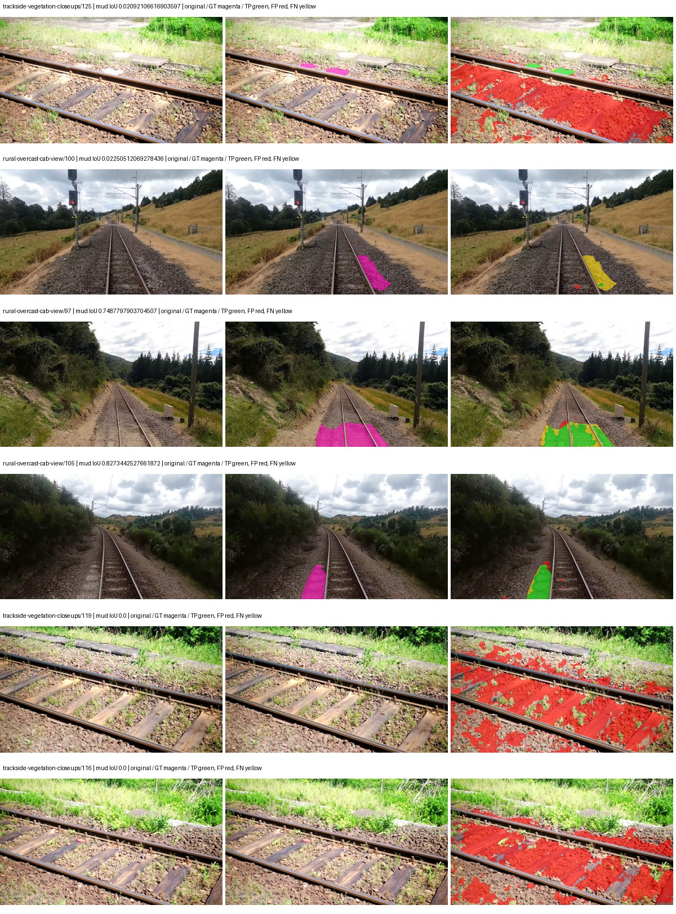
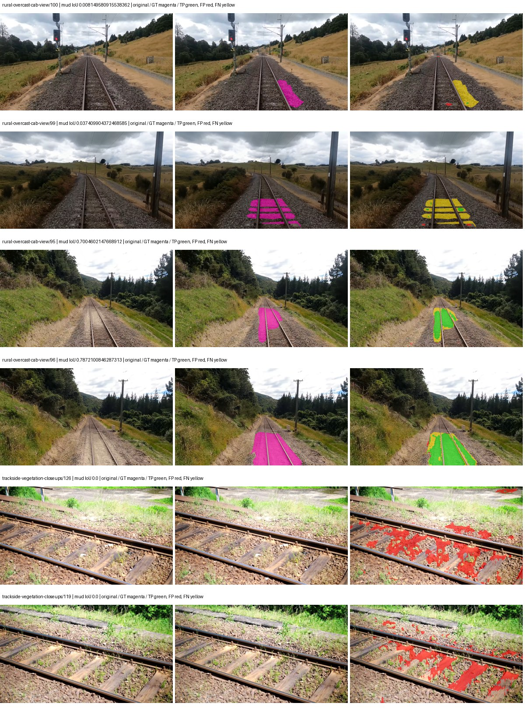

# eomt_dinov3_large — paul-test-rtis

[RTIS comparison](../../README.md) · [Full model records](record.json)

Primary selection and early stopping: **mud-pumping validation IoU**. A job is complete only after full statistics and isolated profiling are verified.

| Model | Initialization path | Seed | Status | Steps | Best step | Mud IoU (%) | Mud precision (%) | Mud recall (%) | Final mud IoU (trainer val, %) | mIoU (%) | Fixed GT-class mIoU (%) |
| --- | --- | --- | --- | --- | --- | --- | --- | --- | --- | --- | --- |
| eomt_dinov3_large | rtis_only | 0 | training | 2699 | — | — | — | — | — | — | — |
| eomt_dinov3_large | rtis_only | 1 | training | 2849 | — | — | — | — | — | — | — |
| eomt_dinov3_large | rtis_only | 2 | collecting | 2800 | 1527 | 8.85 | 9.99 | 43.73 | 8.40 | 43.20 | 48.00 |
| eomt_dinov3_large | cityscapes_to_rtis | 0 | training | 2699 | — | — | — | — | — | — | — |
| eomt_dinov3_large | cityscapes_to_rtis | 1 | training | 2799 | — | — | — | — | — | — | — |
| eomt_dinov3_large | cityscapes_to_rtis | 2 | completed | 2545 | 1272 | 11.47 | 12.83 | 51.97 | 10.09 | 45.99 | 51.10 |
| eomt_dinov3_large | railsem19_to_rtis | 0 | training | 2545 | — | — | — | — | — | — | — |
| eomt_dinov3_large | railsem19_to_rtis | 1 | training | 2599 | — | — | — | — | — | — | — |
| eomt_dinov3_large | railsem19_to_rtis | 2 | completed | 2290 | 1018 | 17.93 | 24.33 | 40.54 | 17.29 | 53.99 | 59.99 |
| eomt_dinov3_large | cityscapes_to_railsem19_to_rtis | 0 | training | 1899 | — | — | — | — | — | — | — |
| eomt_dinov3_large | cityscapes_to_railsem19_to_rtis | 1 | training | 199 | — | — | — | — | — | — | — |
| eomt_dinov3_large | cityscapes_to_railsem19_to_rtis | 2 | training | — | — | — | — | — | — | — | — |

Training: 220 images. Validation: 37 images. Test: 50 held out. Seeds: [0, 1, 2]. Seed variation measures optimization variability, not independent-recording uncertainty. Historical source checkpoints stay fixed across adaptation seeds.

Training code: `066afb2626398b7be59d4d19f5a0e4644fd59adc`. Split SHA-256: `71fef8292610c352da0709fe3bd030f3bcc18f97560394835f4b22826463b83d`.

## rtis_only — seed 0

Status: **training**. Started: 2026-09-06T04:43:44.142873+00:00. Finished: —.

Recipe pretrained initializer: `tue-mps/eomt-dinov3-coco-panoptic-large-640 (DINOv3 ViT-L/16, COCO panoptic)`.

`rtis_only` uses the recipe initializer, which may include pretrained segmentation components. Transfer paths load the exact historical source checkpoint below and reset the classifier; they do not reset all query/decoder features.

Source checkpoint: `Recipe pretrained initialization`.

Config SHA-256: `3a7787144fddc7660959f47fbdda5c2577104f5d290df776382ac8b8c38842ae`. Weights used for validation: `—`.

### Mud-pumping and aggregate quality

| Metric | Selected checkpoint | Final training validation |
| --- | --- | --- |
| Mud IoU | — | — |
| Mud precision | — | — |
| Mud recall | — | — |
| Mud Dice/F1 | — | — |
| mIoU | — | — |
| Mean accuracy | — | — |
| Mean precision | — | — |
| Mean Dice | — | — |
| Mean specificity | — | — |
| Pixel accuracy | — | — |
| Frequency-weighted IoU | — | — |
| Fixed GT-present class mIoU | — | — |
| Boundary F1 | — | — |

The selected checkpoint has independent evaluation evidence. Final values are the trainer's final validation record, not a new independent evaluation. mIoU averages classes with nonzero union, so false positives on absent classes can change its denominator. The fixed GT-class mean is supplementary and excludes absent classes; their false positives remain in the confusion matrix.

### Resource usage and timing

| Measurement | Value |
| --- | --- |
| Peak training VRAM, retained training invocation (GiB) | — |
| Peak evaluation VRAM (GiB) | — |
| Retained training invocation wall time (seconds) | — |
| Retained training invocation GPU-hours (one GPU) | — |
| Evaluation wall time (seconds) | — |
| Full evaluation pipeline images/second | — |
| Best full-state checkpoint (MiB) | — |
| Final full-state checkpoint (MiB) | — |
| Audited periodic checkpoints removed (GiB) | — |

VRAM uses the recorded allocator high-water mark; it is not total device usage including CUDA context. Resumed jobs' retained training invocation times and peaks are **not whole-campaign totals**. Earlier invocation resource records are not reconstructed here. Evaluation throughput includes loader, sliding-window inference and metrics; it is not model-only latency/FPS. Missing measurements are shown as —, never inferred from another dataset's run.

### Standardized inference performance

Dedicated model-only profiling waits for an idle worker-locked L40S: BF16, batch 1, 1024x1024, 20 warmup and 100 CUDA-event-timed public forwards. It excludes loading, preprocessing, tiling and metrics.

| Status | Parameters | Weight MiB | FPS | p50 ms | p95 ms | Peak reserved GiB |
| --- | --- | --- | --- | --- | --- | --- |
| waiting_for_idle_gpu | — | — | — | — | — | — |

```json
{
  "status": "waiting_for_idle_gpu",
  "contract": "L40S; batch 1; 1024x1024; BF16; 20 warmup; 100 timed forwards"
}
```

### Per-class validation results

| Class | GT pixels | IoU (%) | Precision (%) | Recall (%) | Dice (%) | Boundary F1 (%) |
| --- | --- | --- | --- | --- | --- | --- |

### Validation tracking

| Logged step | Overall mIoU (%) | Mud IoU (%) |
| --- | --- | --- |
| 254 | 24.01 | 0.00 |
| 508 | 35.84 | 2.88 |
| 763 | 39.40 | 6.11 |
| 1017 | 39.14 | 6.84 |
| 1272 | 39.05 | 7.32 |
| 1527 | 40.59 | 7.87 |
| 1781 | 42.55 | 8.26 |
| 2036 | 42.79 | 8.07 |
| 2290 | 42.83 | 8.05 |
| 2545 | 42.82 | 8.05 |

All retained scalar curves, including training loss and per-class IoU, are in record.json. Observed best mud on a curve is not necessarily a retained checkpoint: the pilot saved its selection-metric-best and final checkpoints. Step logging and checkpoint global_step may differ by one.

### Stopping and checkpoint provenance

```json
{
  "stopping": null,
  "checkpoints": null,
  "cleanup_error": null
}
```

### Resolved training, initialization and evaluation settings

The optimizer block is the base configuration. Stage LR scales are applied at runtime, and stage warmup is capped at min(base warmup, floor(stage budget / 10), stage budget - 1): 400 steps for this 4,000-step pilot. Model-internal native input grids may differ from augmentation crops (EoMT uses its 640 grid).

```json
{
  "name": "eomt_dinov3_large--rtis_only--seed-0",
  "model": {
    "arch": "eomt_dinov3_large",
    "checkpoint": null,
    "tuning": "full",
    "head": "unified_head",
    "lora_r": 16,
    "lora_alpha": 32,
    "lora_dropout": 0.05,
    "lora_targets": [],
    "drop_path": null,
    "revision": null,
    "subfolder": null,
    "local_files_only": false,
    "trust_remote_code": false,
    "backbone_path": null,
    "head_paths": [],
    "classifier_path": null,
    "inactive_parameter_paths": [],
    "smp_arch": null,
    "encoder_name": null,
    "encoder_weights": null,
    "native": null,
    "batch_norm_momentum": null
  },
  "space": "paul-test-rtis",
  "taxonomy_root": "/data/izadia1/projects/segmentary-rtis-fullstats-066afb2/taxonomy",
  "output_root": "/data/izadia1/projects/segmentary-runs/paul-test-rtis/mud-fullstats-v1-20260906-r2/future-runs",
  "optim": {
    "backbone_lr": 1e-05,
    "head_lr_mult": 10.0,
    "weight_decay": 0.05,
    "llrd": 0.75,
    "warmup_iters": 1500,
    "warmup_ratio": 1e-06,
    "poly_power": 0.9,
    "min_lr_ratio": 0.0,
    "betas": [
      0.9,
      0.999
    ],
    "grad_clip": 1.0
  },
  "train": {
    "iters": 4000,
    "batch_size": 2,
    "accum": 8,
    "num_workers": 2,
    "precision": "bf16-mixed",
    "ema_decay": 0.9998,
    "val_every": 250,
    "ckpt_every": 500,
    "selection_metric": "val_iou/mud-pumping",
    "early_stopping_patience": 5,
    "early_stopping_min_delta": 0.001,
    "seed": 0,
    "devices": 1
  },
  "eval": {
    "sliding_window": true,
    "window": [
      1024,
      1024
    ],
    "stride": [
      768,
      768
    ],
    "batch_size": 1,
    "num_workers": 2,
    "tta_scales": [],
    "tta_flip": false,
    "threshold": 0.5,
    "boundary_tolerance_frac": 0.0075,
    "save_confusion": true
  },
  "loss": {
    "task": "multiclass",
    "activation": "auto",
    "terms": [],
    "aux": "none",
    "aux_weight": 0.0,
    "ce_weight": 1.0,
    "label_smoothing": 0.0,
    "class_weights": null,
    "query": {
      "kind": "hungarian_query",
      "classification_weight": 2.0,
      "mask_bce_weight": 5.0,
      "dice_weight": 5.0,
      "no_object_coefficient": 0.1,
      "match_class_cost": 2.0,
      "match_mask_bce_cost": 5.0,
      "match_dice_cost": 5.0,
      "matching_num_points": 8192,
      "auxiliary_layer_weight": 1.0,
      "dice_smooth": 1.0
    }
  },
  "aug": {
    "crop": [
      1024,
      1024
    ],
    "scale_min": 0.5,
    "scale_max": 2.0,
    "hflip_p": 0.5,
    "color_jitter_p": 0.5,
    "brightness": 0.25,
    "contrast": 0.25,
    "saturation": 0.25,
    "hue": 0.05
  },
  "stages": [
    {
      "name": "rtis",
      "data": [
        {
          "name": "paul-test-rtis",
          "root": "/data/izadia1/datasets/paul-test-rtis",
          "variant": null,
          "split_file": "splits.json",
          "train_split": "train",
          "val_split": "val",
          "limit": null,
          "loader": "folder",
          "mapping": "paul-test-rtis",
          "loader_options": {
            "require_groups": true
          }
        }
      ],
      "iters": null,
      "lr_scale": 1.0,
      "head_group_lr_scale": 1.0,
      "init_from": "pretrained",
      "reset_head": false,
      "freeze": null,
      "sample_weights": null
    }
  ]
}
```

### Hardware and software provenance

```json
{
  "training": null,
  "evaluation": null
}
```

## rtis_only — seed 1

Status: **training**. Started: 2026-09-06T04:43:44.151406+00:00. Finished: —.

Recipe pretrained initializer: `tue-mps/eomt-dinov3-coco-panoptic-large-640 (DINOv3 ViT-L/16, COCO panoptic)`.

`rtis_only` uses the recipe initializer, which may include pretrained segmentation components. Transfer paths load the exact historical source checkpoint below and reset the classifier; they do not reset all query/decoder features.

Source checkpoint: `Recipe pretrained initialization`.

Config SHA-256: `c2e8aaf5fba5b8640e5047721ad3bc77672b964aa27a33f4616740755bcbe8b0`. Weights used for validation: `—`.

### Mud-pumping and aggregate quality

| Metric | Selected checkpoint | Final training validation |
| --- | --- | --- |
| Mud IoU | — | — |
| Mud precision | — | — |
| Mud recall | — | — |
| Mud Dice/F1 | — | — |
| mIoU | — | — |
| Mean accuracy | — | — |
| Mean precision | — | — |
| Mean Dice | — | — |
| Mean specificity | — | — |
| Pixel accuracy | — | — |
| Frequency-weighted IoU | — | — |
| Fixed GT-present class mIoU | — | — |
| Boundary F1 | — | — |

The selected checkpoint has independent evaluation evidence. Final values are the trainer's final validation record, not a new independent evaluation. mIoU averages classes with nonzero union, so false positives on absent classes can change its denominator. The fixed GT-class mean is supplementary and excludes absent classes; their false positives remain in the confusion matrix.

### Resource usage and timing

| Measurement | Value |
| --- | --- |
| Peak training VRAM, retained training invocation (GiB) | — |
| Peak evaluation VRAM (GiB) | — |
| Retained training invocation wall time (seconds) | — |
| Retained training invocation GPU-hours (one GPU) | — |
| Evaluation wall time (seconds) | — |
| Full evaluation pipeline images/second | — |
| Best full-state checkpoint (MiB) | — |
| Final full-state checkpoint (MiB) | — |
| Audited periodic checkpoints removed (GiB) | — |

VRAM uses the recorded allocator high-water mark; it is not total device usage including CUDA context. Resumed jobs' retained training invocation times and peaks are **not whole-campaign totals**. Earlier invocation resource records are not reconstructed here. Evaluation throughput includes loader, sliding-window inference and metrics; it is not model-only latency/FPS. Missing measurements are shown as —, never inferred from another dataset's run.

### Standardized inference performance

Dedicated model-only profiling waits for an idle worker-locked L40S: BF16, batch 1, 1024x1024, 20 warmup and 100 CUDA-event-timed public forwards. It excludes loading, preprocessing, tiling and metrics.

| Status | Parameters | Weight MiB | FPS | p50 ms | p95 ms | Peak reserved GiB |
| --- | --- | --- | --- | --- | --- | --- |
| waiting_for_idle_gpu | — | — | — | — | — | — |

```json
{
  "status": "waiting_for_idle_gpu",
  "contract": "L40S; batch 1; 1024x1024; BF16; 20 warmup; 100 timed forwards"
}
```

### Per-class validation results

| Class | GT pixels | IoU (%) | Precision (%) | Recall (%) | Dice (%) | Boundary F1 (%) |
| --- | --- | --- | --- | --- | --- | --- |

### Validation tracking

| Logged step | Overall mIoU (%) | Mud IoU (%) |
| --- | --- | --- |
| 254 | 21.35 | 0.00 |
| 508 | 35.68 | 1.76 |
| 763 | 39.87 | 4.59 |
| 1017 | 40.43 | 5.92 |
| 1272 | 44.28 | 7.62 |
| 1527 | 45.39 | 7.29 |
| 1781 | 46.69 | 7.97 |
| 2036 | 47.36 | 8.27 |
| 2290 | 47.41 | 8.21 |
| 2545 | 47.39 | 8.23 |
| 2799 | 47.42 | 8.18 |

All retained scalar curves, including training loss and per-class IoU, are in record.json. Observed best mud on a curve is not necessarily a retained checkpoint: the pilot saved its selection-metric-best and final checkpoints. Step logging and checkpoint global_step may differ by one.

### Stopping and checkpoint provenance

```json
{
  "stopping": null,
  "checkpoints": null,
  "cleanup_error": null
}
```

### Resolved training, initialization and evaluation settings

The optimizer block is the base configuration. Stage LR scales are applied at runtime, and stage warmup is capped at min(base warmup, floor(stage budget / 10), stage budget - 1): 400 steps for this 4,000-step pilot. Model-internal native input grids may differ from augmentation crops (EoMT uses its 640 grid).

```json
{
  "name": "eomt_dinov3_large--rtis_only--seed-1",
  "model": {
    "arch": "eomt_dinov3_large",
    "checkpoint": null,
    "tuning": "full",
    "head": "unified_head",
    "lora_r": 16,
    "lora_alpha": 32,
    "lora_dropout": 0.05,
    "lora_targets": [],
    "drop_path": null,
    "revision": null,
    "subfolder": null,
    "local_files_only": false,
    "trust_remote_code": false,
    "backbone_path": null,
    "head_paths": [],
    "classifier_path": null,
    "inactive_parameter_paths": [],
    "smp_arch": null,
    "encoder_name": null,
    "encoder_weights": null,
    "native": null,
    "batch_norm_momentum": null
  },
  "space": "paul-test-rtis",
  "taxonomy_root": "/data/izadia1/projects/segmentary-rtis-fullstats-066afb2/taxonomy",
  "output_root": "/data/izadia1/projects/segmentary-runs/paul-test-rtis/mud-fullstats-v1-20260906-r2/future-runs",
  "optim": {
    "backbone_lr": 1e-05,
    "head_lr_mult": 10.0,
    "weight_decay": 0.05,
    "llrd": 0.75,
    "warmup_iters": 1500,
    "warmup_ratio": 1e-06,
    "poly_power": 0.9,
    "min_lr_ratio": 0.0,
    "betas": [
      0.9,
      0.999
    ],
    "grad_clip": 1.0
  },
  "train": {
    "iters": 4000,
    "batch_size": 2,
    "accum": 8,
    "num_workers": 2,
    "precision": "bf16-mixed",
    "ema_decay": 0.9998,
    "val_every": 250,
    "ckpt_every": 500,
    "selection_metric": "val_iou/mud-pumping",
    "early_stopping_patience": 5,
    "early_stopping_min_delta": 0.001,
    "seed": 1,
    "devices": 1
  },
  "eval": {
    "sliding_window": true,
    "window": [
      1024,
      1024
    ],
    "stride": [
      768,
      768
    ],
    "batch_size": 1,
    "num_workers": 2,
    "tta_scales": [],
    "tta_flip": false,
    "threshold": 0.5,
    "boundary_tolerance_frac": 0.0075,
    "save_confusion": true
  },
  "loss": {
    "task": "multiclass",
    "activation": "auto",
    "terms": [],
    "aux": "none",
    "aux_weight": 0.0,
    "ce_weight": 1.0,
    "label_smoothing": 0.0,
    "class_weights": null,
    "query": {
      "kind": "hungarian_query",
      "classification_weight": 2.0,
      "mask_bce_weight": 5.0,
      "dice_weight": 5.0,
      "no_object_coefficient": 0.1,
      "match_class_cost": 2.0,
      "match_mask_bce_cost": 5.0,
      "match_dice_cost": 5.0,
      "matching_num_points": 8192,
      "auxiliary_layer_weight": 1.0,
      "dice_smooth": 1.0
    }
  },
  "aug": {
    "crop": [
      1024,
      1024
    ],
    "scale_min": 0.5,
    "scale_max": 2.0,
    "hflip_p": 0.5,
    "color_jitter_p": 0.5,
    "brightness": 0.25,
    "contrast": 0.25,
    "saturation": 0.25,
    "hue": 0.05
  },
  "stages": [
    {
      "name": "rtis",
      "data": [
        {
          "name": "paul-test-rtis",
          "root": "/data/izadia1/datasets/paul-test-rtis",
          "variant": null,
          "split_file": "splits.json",
          "train_split": "train",
          "val_split": "val",
          "limit": null,
          "loader": "folder",
          "mapping": "paul-test-rtis",
          "loader_options": {
            "require_groups": true
          }
        }
      ],
      "iters": null,
      "lr_scale": 1.0,
      "head_group_lr_scale": 1.0,
      "init_from": "pretrained",
      "reset_head": false,
      "freeze": null,
      "sample_weights": null
    }
  ]
}
```

### Hardware and software provenance

```json
{
  "training": null,
  "evaluation": null
}
```

## rtis_only — seed 2

Status: **collecting**. Started: 2026-09-06T04:43:44.157512+00:00. Finished: —.

Recipe pretrained initializer: `tue-mps/eomt-dinov3-coco-panoptic-large-640 (DINOv3 ViT-L/16, COCO panoptic)`.

`rtis_only` uses the recipe initializer, which may include pretrained segmentation components. Transfer paths load the exact historical source checkpoint below and reset the classifier; they do not reset all query/decoder features.

Source checkpoint: `Recipe pretrained initialization`.

Config SHA-256: `449336e30cb733cf09e11b6073b21530bd82509e7299fe686f420883ac1042ad`. Weights used for validation: `ema`.

### Mud-pumping and aggregate quality

| Metric | Selected checkpoint | Final training validation |
| --- | --- | --- |
| Mud IoU | 8.85 | 8.40 |
| Mud precision | 9.99 | 9.59 |
| Mud recall | 43.73 | 40.36 |
| Mud Dice/F1 | 16.27 | 15.49 |
| mIoU | 43.20 | 44.13 |
| Mean accuracy | 59.45 | 60.86 |
| Mean precision | 58.84 | 59.73 |
| Mean Dice | 53.60 | 54.91 |
| Mean specificity | 99.17 | 99.19 |
| Pixel accuracy | 86.23 | 86.43 |
| Frequency-weighted IoU | 79.69 | 80.03 |
| Fixed GT-present class mIoU | 48.00 | 49.04 |
| Boundary F1 | 56.13 | 57.27 |

The selected checkpoint has independent evaluation evidence. Final values are the trainer's final validation record, not a new independent evaluation. mIoU averages classes with nonzero union, so false positives on absent classes can change its denominator. The fixed GT-class mean is supplementary and excludes absent classes; their false positives remain in the confusion matrix.

### Resource usage and timing

| Measurement | Value |
| --- | --- |
| Peak training VRAM, retained training invocation (GiB) | 17.84 |
| Peak evaluation VRAM (GiB) | 10.77 |
| Retained training invocation wall time (seconds) | 4391.45 |
| Retained training invocation GPU-hours (one GPU) | 1.22 |
| Evaluation wall time (seconds) | 22.40 |
| Full evaluation pipeline images/second | 1.65 |
| Best full-state checkpoint (MiB) | 4805.94 |
| Final full-state checkpoint (MiB) | 4805.92 |
| Audited periodic checkpoints removed (GiB) | — |

VRAM uses the recorded allocator high-water mark; it is not total device usage including CUDA context. Resumed jobs' retained training invocation times and peaks are **not whole-campaign totals**. Earlier invocation resource records are not reconstructed here. Evaluation throughput includes loader, sliding-window inference and metrics; it is not model-only latency/FPS. Missing measurements are shown as —, never inferred from another dataset's run.

### Standardized inference performance

Dedicated model-only profiling waits for an idle worker-locked L40S: BF16, batch 1, 1024x1024, 20 warmup and 100 CUDA-event-timed public forwards. It excludes loading, preprocessing, tiling and metrics.

| Status | Parameters | Weight MiB | FPS | p50 ms | p95 ms | Peak reserved GiB |
| --- | --- | --- | --- | --- | --- | --- |
| waiting_for_idle_gpu | — | — | — | — | — | — |

```json
{
  "status": "waiting_for_idle_gpu",
  "contract": "L40S; batch 1; 1024x1024; BF16; 20 warmup; 100 timed forwards"
}
```

### Per-class validation results

| Class | GT pixels | IoU (%) | Precision (%) | Recall (%) | Dice (%) | Boundary F1 (%) |
| --- | --- | --- | --- | --- | --- | --- |
| car | 29664 | 4.58 | 11.66 | 7.02 | 8.77 | 13.15 |
| construction | 311585 | 54.06 | 63.40 | 78.57 | 70.18 | 71.55 |
| fence | 265137 | 40.78 | 61.46 | 54.80 | 57.94 | 58.57 |
| mud-pumping | 1226250 | 8.85 | 9.99 | 43.73 | 16.27 | 18.25 |
| on-rails | 0 | 0.00 | 0.00 | — | 0.00 | 0.00 |
| person | 0 | — | — | — | — | — |
| pole | 628038 | 74.36 | 83.10 | 87.62 | 85.30 | 92.25 |
| rail-embedded | 16799 | 44.00 | 73.02 | 52.54 | 61.11 | 88.58 |
| rail-raised | 2969797 | 81.45 | 85.81 | 94.12 | 89.78 | 95.35 |
| rail-track | 6323197 | 46.18 | 79.31 | 52.50 | 63.18 | 58.29 |
| road | 1048831 | 9.73 | 23.79 | 14.13 | 17.73 | 20.99 |
| sidewalk | 1297367 | 49.89 | 85.62 | 54.45 | 66.57 | 66.35 |
| sky | 19121606 | 98.72 | 99.39 | 99.32 | 99.36 | 98.35 |
| standing-water | 95802 | 40.73 | 47.29 | 74.61 | 57.89 | 60.03 |
| terrain | 39239306 | 90.12 | 91.38 | 98.49 | 94.80 | 74.69 |
| trackbed | 10643081 | 77.66 | 89.38 | 85.55 | 87.42 | 77.57 |
| traffic-light | 19510 | 75.56 | 95.74 | 78.19 | 86.08 | 80.92 |
| traffic-sign | 13285 | 21.59 | 29.45 | 44.73 | 35.52 | 43.19 |
| tram-track | 56179 | 19.18 | 57.03 | 22.41 | 32.18 | 53.00 |
| truck | 0 | 0.00 | 0.00 | — | 0.00 | 0.00 |
| vegetation-overgrowth | 5901821 | 26.58 | 90.04 | 27.39 | 42.00 | 51.55 |

### Validation tracking

| Logged step | Overall mIoU (%) | Mud IoU (%) |
| --- | --- | --- |
| 254 | 23.48 | 0.00 |
| 508 | 41.86 | 2.33 |
| 763 | 39.85 | 6.92 |
| 1017 | 40.06 | 8.38 |
| 1272 | 40.40 | 8.27 |
| 1527 | 43.23 | 8.85 |
| 1781 | 43.39 | 8.37 |
| 2036 | 43.99 | 8.40 |
| 2290 | 44.03 | 8.40 |
| 2545 | 44.07 | 8.39 |
| 2799 | 44.13 | 8.40 |

All retained scalar curves, including training loss and per-class IoU, are in record.json. Observed best mud on a curve is not necessarily a retained checkpoint: the pilot saved its selection-metric-best and final checkpoints. Step logging and checkpoint global_step may differ by one.

### Stopping and checkpoint provenance

```json
{
  "stopping": {
    "actual_steps": 2800,
    "maximum_steps": 4000,
    "min_delta": 0.001,
    "monitor": "val_iou/mud-pumping",
    "patience": 5,
    "reason": "validation_plateau"
  },
  "checkpoints": {
    "best": {
      "path": "/data/izadia1/projects/segmentary-runs/paul-test-rtis/mud-fullstats-v1-20260906-r2/future-runs/eomt_dinov3_large--rtis_only--seed-2_seed2/rtis/best.ckpt",
      "sha256": "c36a129734631b2a821cbdc89c191c7c2842d256a12773569c8a45e3d44c0545",
      "global_step": 1527,
      "bytes": 5039394681
    },
    "final": {
      "path": "/data/izadia1/projects/segmentary-runs/paul-test-rtis/mud-fullstats-v1-20260906-r2/future-runs/eomt_dinov3_large--rtis_only--seed-2_seed2/rtis/last.ckpt",
      "sha256": "690b3b9e781827e8bcf1d7a96472876b89cc70885ab89264163b0c887e1db51c",
      "global_step": 2800,
      "bytes": 5039373945
    }
  },
  "cleanup_error": null
}
```

### Resolved training, initialization and evaluation settings

The optimizer block is the base configuration. Stage LR scales are applied at runtime, and stage warmup is capped at min(base warmup, floor(stage budget / 10), stage budget - 1): 400 steps for this 4,000-step pilot. Model-internal native input grids may differ from augmentation crops (EoMT uses its 640 grid).

```json
{
  "name": "eomt_dinov3_large--rtis_only--seed-2",
  "model": {
    "arch": "eomt_dinov3_large",
    "checkpoint": null,
    "tuning": "full",
    "head": "unified_head",
    "lora_r": 16,
    "lora_alpha": 32,
    "lora_dropout": 0.05,
    "lora_targets": [],
    "drop_path": null,
    "revision": null,
    "subfolder": null,
    "local_files_only": false,
    "trust_remote_code": false,
    "backbone_path": null,
    "head_paths": [],
    "classifier_path": null,
    "inactive_parameter_paths": [],
    "smp_arch": null,
    "encoder_name": null,
    "encoder_weights": null,
    "native": null,
    "batch_norm_momentum": null
  },
  "space": "paul-test-rtis",
  "taxonomy_root": "/data/izadia1/projects/segmentary-rtis-fullstats-066afb2/taxonomy",
  "output_root": "/data/izadia1/projects/segmentary-runs/paul-test-rtis/mud-fullstats-v1-20260906-r2/future-runs",
  "optim": {
    "backbone_lr": 1e-05,
    "head_lr_mult": 10.0,
    "weight_decay": 0.05,
    "llrd": 0.75,
    "warmup_iters": 1500,
    "warmup_ratio": 1e-06,
    "poly_power": 0.9,
    "min_lr_ratio": 0.0,
    "betas": [
      0.9,
      0.999
    ],
    "grad_clip": 1.0
  },
  "train": {
    "iters": 4000,
    "batch_size": 2,
    "accum": 8,
    "num_workers": 2,
    "precision": "bf16-mixed",
    "ema_decay": 0.9998,
    "val_every": 250,
    "ckpt_every": 500,
    "selection_metric": "val_iou/mud-pumping",
    "early_stopping_patience": 5,
    "early_stopping_min_delta": 0.001,
    "seed": 2,
    "devices": 1
  },
  "eval": {
    "sliding_window": true,
    "window": [
      1024,
      1024
    ],
    "stride": [
      768,
      768
    ],
    "batch_size": 1,
    "num_workers": 2,
    "tta_scales": [],
    "tta_flip": false,
    "threshold": 0.5,
    "boundary_tolerance_frac": 0.0075,
    "save_confusion": true
  },
  "loss": {
    "task": "multiclass",
    "activation": "auto",
    "terms": [],
    "aux": "none",
    "aux_weight": 0.0,
    "ce_weight": 1.0,
    "label_smoothing": 0.0,
    "class_weights": null,
    "query": {
      "kind": "hungarian_query",
      "classification_weight": 2.0,
      "mask_bce_weight": 5.0,
      "dice_weight": 5.0,
      "no_object_coefficient": 0.1,
      "match_class_cost": 2.0,
      "match_mask_bce_cost": 5.0,
      "match_dice_cost": 5.0,
      "matching_num_points": 8192,
      "auxiliary_layer_weight": 1.0,
      "dice_smooth": 1.0
    }
  },
  "aug": {
    "crop": [
      1024,
      1024
    ],
    "scale_min": 0.5,
    "scale_max": 2.0,
    "hflip_p": 0.5,
    "color_jitter_p": 0.5,
    "brightness": 0.25,
    "contrast": 0.25,
    "saturation": 0.25,
    "hue": 0.05
  },
  "stages": [
    {
      "name": "rtis",
      "data": [
        {
          "name": "paul-test-rtis",
          "root": "/data/izadia1/datasets/paul-test-rtis",
          "variant": null,
          "split_file": "splits.json",
          "train_split": "train",
          "val_split": "val",
          "limit": null,
          "loader": "folder",
          "mapping": "paul-test-rtis",
          "loader_options": {
            "require_groups": true
          }
        }
      ],
      "iters": null,
      "lr_scale": 1.0,
      "head_group_lr_scale": 1.0,
      "init_from": "pretrained",
      "reset_head": false,
      "freeze": null,
      "sample_weights": null
    }
  ]
}
```

### Hardware and software provenance

```json
{
  "training": {
    "cuda_available": true,
    "cuda_visible_devices": "3",
    "cudnn": 91900,
    "driver_version": "570.133.20",
    "gpu_count": 1,
    "gpu_names": [
      "NVIDIA L40S"
    ],
    "hostname": "hdrfs-app-001",
    "input_normalization": {
      "channel_order": "rgb",
      "mean": [
        0.485,
        0.456,
        0.406
      ],
      "source": "imagenet",
      "std": [
        0.229,
        0.224,
        0.225
      ]
    },
    "model_origins": [
      {
        "hf_commit": "e8c0564219d89c9000add20d89d052d9f7464236",
        "hf_name_or_path": "tue-mps/eomt-dinov3-coco-panoptic-large-640",
        "module": "model",
        "timm_pretrained": {}
      },
      {
        "hf_commit": "e8c0564219d89c9000add20d89d052d9f7464236",
        "hf_name_or_path": "tue-mps/eomt-dinov3-coco-panoptic-large-640",
        "module": "model.embeddings",
        "timm_pretrained": {}
      },
      {
        "hf_commit": "e8c0564219d89c9000add20d89d052d9f7464236",
        "hf_name_or_path": "tue-mps/eomt-dinov3-coco-panoptic-large-640",
        "module": "model.layers.0.attention",
        "timm_pretrained": {}
      },
      {
        "hf_commit": "e8c0564219d89c9000add20d89d052d9f7464236",
        "hf_name_or_path": "tue-mps/eomt-dinov3-coco-panoptic-large-640",
        "module": "model.layers.0.mlp",
        "timm_pretrained": {}
      },
      {
        "hf_commit": "e8c0564219d89c9000add20d89d052d9f7464236",
        "hf_name_or_path": "tue-mps/eomt-dinov3-coco-panoptic-large-640",
        "module": "model.layers.1.attention",
        "timm_pretrained": {}
      },
      {
        "hf_commit": "e8c0564219d89c9000add20d89d052d9f7464236",
        "hf_name_or_path": "tue-mps/eomt-dinov3-coco-panoptic-large-640",
        "module": "model.layers.1.mlp",
        "timm_pretrained": {}
      },
      {
        "hf_commit": "e8c0564219d89c9000add20d89d052d9f7464236",
        "hf_name_or_path": "tue-mps/eomt-dinov3-coco-panoptic-large-640",
        "module": "model.layers.2.attention",
        "timm_pretrained": {}
      },
      {
        "hf_commit": "e8c0564219d89c9000add20d89d052d9f7464236",
        "hf_name_or_path": "tue-mps/eomt-dinov3-coco-panoptic-large-640",
        "module": "model.layers.2.mlp",
        "timm_pretrained": {}
      },
      {
        "hf_commit": "e8c0564219d89c9000add20d89d052d9f7464236",
        "hf_name_or_path": "tue-mps/eomt-dinov3-coco-panoptic-large-640",
        "module": "model.layers.3.attention",
        "timm_pretrained": {}
      },
      {
        "hf_commit": "e8c0564219d89c9000add20d89d052d9f7464236",
        "hf_name_or_path": "tue-mps/eomt-dinov3-coco-panoptic-large-640",
        "module": "model.layers.3.mlp",
        "timm_pretrained": {}
      },
      {
        "hf_commit": "e8c0564219d89c9000add20d89d052d9f7464236",
        "hf_name_or_path": "tue-mps/eomt-dinov3-coco-panoptic-large-640",
        "module": "model.layers.4.attention",
        "timm_pretrained": {}
      },
      {
        "hf_commit": "e8c0564219d89c9000add20d89d052d9f7464236",
        "hf_name_or_path": "tue-mps/eomt-dinov3-coco-panoptic-large-640",
        "module": "model.layers.4.mlp",
        "timm_pretrained": {}
      },
      {
        "hf_commit": "e8c0564219d89c9000add20d89d052d9f7464236",
        "hf_name_or_path": "tue-mps/eomt-dinov3-coco-panoptic-large-640",
        "module": "model.layers.5.attention",
        "timm_pretrained": {}
      },
      {
        "hf_commit": "e8c0564219d89c9000add20d89d052d9f7464236",
        "hf_name_or_path": "tue-mps/eomt-dinov3-coco-panoptic-large-640",
        "module": "model.layers.5.mlp",
        "timm_pretrained": {}
      },
      {
        "hf_commit": "e8c0564219d89c9000add20d89d052d9f7464236",
        "hf_name_or_path": "tue-mps/eomt-dinov3-coco-panoptic-large-640",
        "module": "model.layers.6.attention",
        "timm_pretrained": {}
      },
      {
        "hf_commit": "e8c0564219d89c9000add20d89d052d9f7464236",
        "hf_name_or_path": "tue-mps/eomt-dinov3-coco-panoptic-large-640",
        "module": "model.layers.6.mlp",
        "timm_pretrained": {}
      },
      {
        "hf_commit": "e8c0564219d89c9000add20d89d052d9f7464236",
        "hf_name_or_path": "tue-mps/eomt-dinov3-coco-panoptic-large-640",
        "module": "model.layers.7.attention",
        "timm_pretrained": {}
      },
      {
        "hf_commit": "e8c0564219d89c9000add20d89d052d9f7464236",
        "hf_name_or_path": "tue-mps/eomt-dinov3-coco-panoptic-large-640",
        "module": "model.layers.7.mlp",
        "timm_pretrained": {}
      },
      {
        "hf_commit": "e8c0564219d89c9000add20d89d052d9f7464236",
        "hf_name_or_path": "tue-mps/eomt-dinov3-coco-panoptic-large-640",
        "module": "model.layers.8.attention",
        "timm_pretrained": {}
      },
      {
        "hf_commit": "e8c0564219d89c9000add20d89d052d9f7464236",
        "hf_name_or_path": "tue-mps/eomt-dinov3-coco-panoptic-large-640",
        "module": "model.layers.8.mlp",
        "timm_pretrained": {}
      },
      {
        "hf_commit": "e8c0564219d89c9000add20d89d052d9f7464236",
        "hf_name_or_path": "tue-mps/eomt-dinov3-coco-panoptic-large-640",
        "module": "model.layers.9.attention",
        "timm_pretrained": {}
      },
      {
        "hf_commit": "e8c0564219d89c9000add20d89d052d9f7464236",
        "hf_name_or_path": "tue-mps/eomt-dinov3-coco-panoptic-large-640",
        "module": "model.layers.9.mlp",
        "timm_pretrained": {}
      },
      {
        "hf_commit": "e8c0564219d89c9000add20d89d052d9f7464236",
        "hf_name_or_path": "tue-mps/eomt-dinov3-coco-panoptic-large-640",
        "module": "model.layers.10.attention",
        "timm_pretrained": {}
      },
      {
        "hf_commit": "e8c0564219d89c9000add20d89d052d9f7464236",
        "hf_name_or_path": "tue-mps/eomt-dinov3-coco-panoptic-large-640",
        "module": "model.layers.10.mlp",
        "timm_pretrained": {}
      },
      {
        "hf_commit": "e8c0564219d89c9000add20d89d052d9f7464236",
        "hf_name_or_path": "tue-mps/eomt-dinov3-coco-panoptic-large-640",
        "module": "model.layers.11.attention",
        "timm_pretrained": {}
      },
      {
        "hf_commit": "e8c0564219d89c9000add20d89d052d9f7464236",
        "hf_name_or_path": "tue-mps/eomt-dinov3-coco-panoptic-large-640",
        "module": "model.layers.11.mlp",
        "timm_pretrained": {}
      },
      {
        "hf_commit": "e8c0564219d89c9000add20d89d052d9f7464236",
        "hf_name_or_path": "tue-mps/eomt-dinov3-coco-panoptic-large-640",
        "module": "model.layers.12.attention",
        "timm_pretrained": {}
      },
      {
        "hf_commit": "e8c0564219d89c9000add20d89d052d9f7464236",
        "hf_name_or_path": "tue-mps/eomt-dinov3-coco-panoptic-large-640",
        "module": "model.layers.12.mlp",
        "timm_pretrained": {}
      },
      {
        "hf_commit": "e8c0564219d89c9000add20d89d052d9f7464236",
        "hf_name_or_path": "tue-mps/eomt-dinov3-coco-panoptic-large-640",
        "module": "model.layers.13.attention",
        "timm_pretrained": {}
      },
      {
        "hf_commit": "e8c0564219d89c9000add20d89d052d9f7464236",
        "hf_name_or_path": "tue-mps/eomt-dinov3-coco-panoptic-large-640",
        "module": "model.layers.13.mlp",
        "timm_pretrained": {}
      },
      {
        "hf_commit": "e8c0564219d89c9000add20d89d052d9f7464236",
        "hf_name_or_path": "tue-mps/eomt-dinov3-coco-panoptic-large-640",
        "module": "model.layers.14.attention",
        "timm_pretrained": {}
      },
      {
        "hf_commit": "e8c0564219d89c9000add20d89d052d9f7464236",
        "hf_name_or_path": "tue-mps/eomt-dinov3-coco-panoptic-large-640",
        "module": "model.layers.14.mlp",
        "timm_pretrained": {}
      },
      {
        "hf_commit": "e8c0564219d89c9000add20d89d052d9f7464236",
        "hf_name_or_path": "tue-mps/eomt-dinov3-coco-panoptic-large-640",
        "module": "model.layers.15.attention",
        "timm_pretrained": {}
      },
      {
        "hf_commit": "e8c0564219d89c9000add20d89d052d9f7464236",
        "hf_name_or_path": "tue-mps/eomt-dinov3-coco-panoptic-large-640",
        "module": "model.layers.15.mlp",
        "timm_pretrained": {}
      },
      {
        "hf_commit": "e8c0564219d89c9000add20d89d052d9f7464236",
        "hf_name_or_path": "tue-mps/eomt-dinov3-coco-panoptic-large-640",
        "module": "model.layers.16.attention",
        "timm_pretrained": {}
      },
      {
        "hf_commit": "e8c0564219d89c9000add20d89d052d9f7464236",
        "hf_name_or_path": "tue-mps/eomt-dinov3-coco-panoptic-large-640",
        "module": "model.layers.16.mlp",
        "timm_pretrained": {}
      },
      {
        "hf_commit": "e8c0564219d89c9000add20d89d052d9f7464236",
        "hf_name_or_path": "tue-mps/eomt-dinov3-coco-panoptic-large-640",
        "module": "model.layers.17.attention",
        "timm_pretrained": {}
      },
      {
        "hf_commit": "e8c0564219d89c9000add20d89d052d9f7464236",
        "hf_name_or_path": "tue-mps/eomt-dinov3-coco-panoptic-large-640",
        "module": "model.layers.17.mlp",
        "timm_pretrained": {}
      },
      {
        "hf_commit": "e8c0564219d89c9000add20d89d052d9f7464236",
        "hf_name_or_path": "tue-mps/eomt-dinov3-coco-panoptic-large-640",
        "module": "model.layers.18.attention",
        "timm_pretrained": {}
      },
      {
        "hf_commit": "e8c0564219d89c9000add20d89d052d9f7464236",
        "hf_name_or_path": "tue-mps/eomt-dinov3-coco-panoptic-large-640",
        "module": "model.layers.18.mlp",
        "timm_pretrained": {}
      },
      {
        "hf_commit": "e8c0564219d89c9000add20d89d052d9f7464236",
        "hf_name_or_path": "tue-mps/eomt-dinov3-coco-panoptic-large-640",
        "module": "model.layers.19.attention",
        "timm_pretrained": {}
      },
      {
        "hf_commit": "e8c0564219d89c9000add20d89d052d9f7464236",
        "hf_name_or_path": "tue-mps/eomt-dinov3-coco-panoptic-large-640",
        "module": "model.layers.19.mlp",
        "timm_pretrained": {}
      },
      {
        "hf_commit": "e8c0564219d89c9000add20d89d052d9f7464236",
        "hf_name_or_path": "tue-mps/eomt-dinov3-coco-panoptic-large-640",
        "module": "model.layers.20.attention",
        "timm_pretrained": {}
      },
      {
        "hf_commit": "e8c0564219d89c9000add20d89d052d9f7464236",
        "hf_name_or_path": "tue-mps/eomt-dinov3-coco-panoptic-large-640",
        "module": "model.layers.20.mlp",
        "timm_pretrained": {}
      },
      {
        "hf_commit": "e8c0564219d89c9000add20d89d052d9f7464236",
        "hf_name_or_path": "tue-mps/eomt-dinov3-coco-panoptic-large-640",
        "module": "model.layers.21.attention",
        "timm_pretrained": {}
      },
      {
        "hf_commit": "e8c0564219d89c9000add20d89d052d9f7464236",
        "hf_name_or_path": "tue-mps/eomt-dinov3-coco-panoptic-large-640",
        "module": "model.layers.21.mlp",
        "timm_pretrained": {}
      },
      {
        "hf_commit": "e8c0564219d89c9000add20d89d052d9f7464236",
        "hf_name_or_path": "tue-mps/eomt-dinov3-coco-panoptic-large-640",
        "module": "model.layers.22.attention",
        "timm_pretrained": {}
      },
      {
        "hf_commit": "e8c0564219d89c9000add20d89d052d9f7464236",
        "hf_name_or_path": "tue-mps/eomt-dinov3-coco-panoptic-large-640",
        "module": "model.layers.22.mlp",
        "timm_pretrained": {}
      },
      {
        "hf_commit": "e8c0564219d89c9000add20d89d052d9f7464236",
        "hf_name_or_path": "tue-mps/eomt-dinov3-coco-panoptic-large-640",
        "module": "model.layers.23.attention",
        "timm_pretrained": {}
      },
      {
        "hf_commit": "e8c0564219d89c9000add20d89d052d9f7464236",
        "hf_name_or_path": "tue-mps/eomt-dinov3-coco-panoptic-large-640",
        "module": "model.layers.23.mlp",
        "timm_pretrained": {}
      },
      {
        "hf_commit": "e8c0564219d89c9000add20d89d052d9f7464236",
        "hf_name_or_path": "tue-mps/eomt-dinov3-coco-panoptic-large-640",
        "module": "model.rope_embeddings",
        "timm_pretrained": {}
      }
    ],
    "model_parameter_count": 314917910,
    "packages": {
      "albumentations": "2.0.8",
      "lightning": "2.6.5",
      "numpy": "2.4.4",
      "segmentary": "0.1.0",
      "segmentation-models-pytorch": "0.5.0",
      "timm": "1.0.28",
      "torch": "2.11.0+cu128",
      "torchvision": "0.26.0+cu128",
      "transformers": "5.15.0"
    },
    "platform": "Linux-5.15.0-139-generic-x86_64-with-glibc2.35",
    "python": "3.11.15",
    "torch": "2.11.0+cu128",
    "torch_cuda": "12.8",
    "trainable_parameter_count": 314917910,
    "training_stop": {
      "actual_steps": 2800,
      "maximum_steps": 4000,
      "min_delta": 0.001,
      "monitor": "val_iou/mud-pumping",
      "patience": 5,
      "reason": "validation_plateau"
    },
    "validation_weights": "ema"
  },
  "evaluation": {
    "cuda_available": true,
    "cuda_visible_devices": "3",
    "cudnn": 91900,
    "driver_version": "570.133.20",
    "gpu_count": 1,
    "gpu_names": [
      "NVIDIA L40S"
    ],
    "hostname": "hdrfs-app-001",
    "input_normalization": {
      "channel_order": "rgb",
      "mean": [
        0.485,
        0.456,
        0.406
      ],
      "source": "imagenet",
      "std": [
        0.229,
        0.224,
        0.225
      ]
    },
    "packages": {
      "albumentations": "2.0.8",
      "lightning": "2.6.5",
      "numpy": "2.4.4",
      "segmentary": "0.1.0",
      "segmentation-models-pytorch": "0.5.0",
      "timm": "1.0.28",
      "torch": "2.11.0+cu128",
      "torchvision": "0.26.0+cu128",
      "transformers": "5.15.0"
    },
    "platform": "Linux-5.15.0-139-generic-x86_64-with-glibc2.35",
    "python": "3.11.15",
    "torch": "2.11.0+cu128",
    "torch_cuda": "12.8"
  }
}
```

## cityscapes_to_rtis — seed 0

Status: **training**. Started: 2026-09-06T04:43:47.802421+00:00. Finished: —.

Recipe pretrained initializer: `tue-mps/eomt-dinov3-coco-panoptic-large-640 (DINOv3 ViT-L/16, COCO panoptic)`.

`rtis_only` uses the recipe initializer, which may include pretrained segmentation components. Transfer paths load the exact historical source checkpoint below and reset the classifier; they do not reset all query/decoder features.

Source checkpoint: `{'name': 'eomt_dinov3_large--cityscapes--seed-0', 'model': 'eomt_dinov3_large', 'protocol': 'cityscapes', 'config': '/data/izadia1/projects/segmentary-runs/all-model-city-rail-seed0-rail20-b9eb3e1/accepted/eomt_dinov3_large--cityscapes--seed-0/resolved-config.yaml', 'checkpoint': '/data/izadia1/projects/segmentary-runs/all-model-city-rail-seed0-a7c0b67/jobs/eomt_dinov3_large--cityscapes--seed-0/attempt-001/train/eomt_dinov3_large--cityscapes_seed0/cityscapes/last.ckpt', 'recorded_sha256': '070ecbb50465dee5614b17a02ca2afc5fda4bd15063608708d2eb06bdd4bf5f9', 'exists': True}`.

Config SHA-256: `c13b14263973b224e6b855af9a64ea99f72fef56674d3110fde337e2c2494a24`. Weights used for validation: `—`.

### Mud-pumping and aggregate quality

| Metric | Selected checkpoint | Final training validation |
| --- | --- | --- |
| Mud IoU | — | — |
| Mud precision | — | — |
| Mud recall | — | — |
| Mud Dice/F1 | — | — |
| mIoU | — | — |
| Mean accuracy | — | — |
| Mean precision | — | — |
| Mean Dice | — | — |
| Mean specificity | — | — |
| Pixel accuracy | — | — |
| Frequency-weighted IoU | — | — |
| Fixed GT-present class mIoU | — | — |
| Boundary F1 | — | — |

The selected checkpoint has independent evaluation evidence. Final values are the trainer's final validation record, not a new independent evaluation. mIoU averages classes with nonzero union, so false positives on absent classes can change its denominator. The fixed GT-class mean is supplementary and excludes absent classes; their false positives remain in the confusion matrix.

### Resource usage and timing

| Measurement | Value |
| --- | --- |
| Peak training VRAM, retained training invocation (GiB) | — |
| Peak evaluation VRAM (GiB) | — |
| Retained training invocation wall time (seconds) | — |
| Retained training invocation GPU-hours (one GPU) | — |
| Evaluation wall time (seconds) | — |
| Full evaluation pipeline images/second | — |
| Best full-state checkpoint (MiB) | — |
| Final full-state checkpoint (MiB) | — |
| Audited periodic checkpoints removed (GiB) | — |

VRAM uses the recorded allocator high-water mark; it is not total device usage including CUDA context. Resumed jobs' retained training invocation times and peaks are **not whole-campaign totals**. Earlier invocation resource records are not reconstructed here. Evaluation throughput includes loader, sliding-window inference and metrics; it is not model-only latency/FPS. Missing measurements are shown as —, never inferred from another dataset's run.

### Standardized inference performance

Dedicated model-only profiling waits for an idle worker-locked L40S: BF16, batch 1, 1024x1024, 20 warmup and 100 CUDA-event-timed public forwards. It excludes loading, preprocessing, tiling and metrics.

| Status | Parameters | Weight MiB | FPS | p50 ms | p95 ms | Peak reserved GiB |
| --- | --- | --- | --- | --- | --- | --- |
| waiting_for_idle_gpu | — | — | — | — | — | — |

```json
{
  "status": "waiting_for_idle_gpu",
  "contract": "L40S; batch 1; 1024x1024; BF16; 20 warmup; 100 timed forwards"
}
```

### Per-class validation results

| Class | GT pixels | IoU (%) | Precision (%) | Recall (%) | Dice (%) | Boundary F1 (%) |
| --- | --- | --- | --- | --- | --- | --- |

### Validation tracking

| Logged step | Overall mIoU (%) | Mud IoU (%) |
| --- | --- | --- |
| 254 | 26.86 | 0.00 |
| 508 | 45.22 | 1.83 |
| 763 | 43.79 | 6.77 |
| 1017 | 44.65 | 10.33 |
| 1272 | 44.84 | 9.02 |
| 1527 | 44.96 | 8.59 |
| 1781 | 46.10 | 10.38 |
| 2036 | 47.65 | 10.56 |
| 2290 | 47.66 | 10.56 |
| 2545 | 47.69 | 10.63 |

All retained scalar curves, including training loss and per-class IoU, are in record.json. Observed best mud on a curve is not necessarily a retained checkpoint: the pilot saved its selection-metric-best and final checkpoints. Step logging and checkpoint global_step may differ by one.

### Stopping and checkpoint provenance

```json
{
  "stopping": null,
  "checkpoints": null,
  "cleanup_error": null
}
```

### Resolved training, initialization and evaluation settings

The optimizer block is the base configuration. Stage LR scales are applied at runtime, and stage warmup is capped at min(base warmup, floor(stage budget / 10), stage budget - 1): 400 steps for this 4,000-step pilot. Model-internal native input grids may differ from augmentation crops (EoMT uses its 640 grid).

```json
{
  "name": "eomt_dinov3_large--cityscapes_to_rtis--seed-0",
  "model": {
    "arch": "eomt_dinov3_large",
    "checkpoint": null,
    "tuning": "full",
    "head": "unified_head",
    "lora_r": 16,
    "lora_alpha": 32,
    "lora_dropout": 0.05,
    "lora_targets": [],
    "drop_path": null,
    "revision": null,
    "subfolder": null,
    "local_files_only": false,
    "trust_remote_code": false,
    "backbone_path": null,
    "head_paths": [],
    "classifier_path": null,
    "inactive_parameter_paths": [],
    "smp_arch": null,
    "encoder_name": null,
    "encoder_weights": null,
    "native": null,
    "batch_norm_momentum": null
  },
  "space": "paul-test-rtis",
  "taxonomy_root": "/data/izadia1/projects/segmentary-rtis-fullstats-066afb2/taxonomy",
  "output_root": "/data/izadia1/projects/segmentary-runs/paul-test-rtis/mud-fullstats-v1-20260906-r2/future-runs",
  "optim": {
    "backbone_lr": 1e-05,
    "head_lr_mult": 10.0,
    "weight_decay": 0.05,
    "llrd": 0.75,
    "warmup_iters": 1500,
    "warmup_ratio": 1e-06,
    "poly_power": 0.9,
    "min_lr_ratio": 0.0,
    "betas": [
      0.9,
      0.999
    ],
    "grad_clip": 1.0
  },
  "train": {
    "iters": 4000,
    "batch_size": 2,
    "accum": 8,
    "num_workers": 2,
    "precision": "bf16-mixed",
    "ema_decay": 0.9998,
    "val_every": 250,
    "ckpt_every": 500,
    "selection_metric": "val_iou/mud-pumping",
    "early_stopping_patience": 5,
    "early_stopping_min_delta": 0.001,
    "seed": 0,
    "devices": 1
  },
  "eval": {
    "sliding_window": true,
    "window": [
      1024,
      1024
    ],
    "stride": [
      768,
      768
    ],
    "batch_size": 1,
    "num_workers": 2,
    "tta_scales": [],
    "tta_flip": false,
    "threshold": 0.5,
    "boundary_tolerance_frac": 0.0075,
    "save_confusion": true
  },
  "loss": {
    "task": "multiclass",
    "activation": "auto",
    "terms": [],
    "aux": "none",
    "aux_weight": 0.0,
    "ce_weight": 1.0,
    "label_smoothing": 0.0,
    "class_weights": null,
    "query": {
      "kind": "hungarian_query",
      "classification_weight": 2.0,
      "mask_bce_weight": 5.0,
      "dice_weight": 5.0,
      "no_object_coefficient": 0.1,
      "match_class_cost": 2.0,
      "match_mask_bce_cost": 5.0,
      "match_dice_cost": 5.0,
      "matching_num_points": 8192,
      "auxiliary_layer_weight": 1.0,
      "dice_smooth": 1.0
    }
  },
  "aug": {
    "crop": [
      1024,
      1024
    ],
    "scale_min": 0.5,
    "scale_max": 2.0,
    "hflip_p": 0.5,
    "color_jitter_p": 0.5,
    "brightness": 0.25,
    "contrast": 0.25,
    "saturation": 0.25,
    "hue": 0.05
  },
  "stages": [
    {
      "name": "rtis",
      "data": [
        {
          "name": "paul-test-rtis",
          "root": "/data/izadia1/datasets/paul-test-rtis",
          "variant": null,
          "split_file": "splits.json",
          "train_split": "train",
          "val_split": "val",
          "limit": null,
          "loader": "folder",
          "mapping": "paul-test-rtis",
          "loader_options": {
            "require_groups": true
          }
        }
      ],
      "iters": null,
      "lr_scale": 0.1,
      "head_group_lr_scale": 1.0,
      "init_from": "/data/izadia1/projects/segmentary-runs/all-model-city-rail-seed0-a7c0b67/jobs/eomt_dinov3_large--cityscapes--seed-0/attempt-001/train/eomt_dinov3_large--cityscapes_seed0/cityscapes/last.ckpt",
      "reset_head": true,
      "freeze": null,
      "sample_weights": null
    }
  ]
}
```

### Hardware and software provenance

```json
{
  "training": null,
  "evaluation": null
}
```

## cityscapes_to_rtis — seed 1

Status: **training**. Started: 2026-09-06T04:43:47.933085+00:00. Finished: —.

Recipe pretrained initializer: `tue-mps/eomt-dinov3-coco-panoptic-large-640 (DINOv3 ViT-L/16, COCO panoptic)`.

`rtis_only` uses the recipe initializer, which may include pretrained segmentation components. Transfer paths load the exact historical source checkpoint below and reset the classifier; they do not reset all query/decoder features.

Source checkpoint: `{'name': 'eomt_dinov3_large--cityscapes--seed-0', 'model': 'eomt_dinov3_large', 'protocol': 'cityscapes', 'config': '/data/izadia1/projects/segmentary-runs/all-model-city-rail-seed0-rail20-b9eb3e1/accepted/eomt_dinov3_large--cityscapes--seed-0/resolved-config.yaml', 'checkpoint': '/data/izadia1/projects/segmentary-runs/all-model-city-rail-seed0-a7c0b67/jobs/eomt_dinov3_large--cityscapes--seed-0/attempt-001/train/eomt_dinov3_large--cityscapes_seed0/cityscapes/last.ckpt', 'recorded_sha256': '070ecbb50465dee5614b17a02ca2afc5fda4bd15063608708d2eb06bdd4bf5f9', 'exists': True}`.

Config SHA-256: `a3d0102789d1c0bca8c106dcfa41e454da2ce9d2e3a23cb690ee8903cda920fe`. Weights used for validation: `—`.

### Mud-pumping and aggregate quality

| Metric | Selected checkpoint | Final training validation |
| --- | --- | --- |
| Mud IoU | — | — |
| Mud precision | — | — |
| Mud recall | — | — |
| Mud Dice/F1 | — | — |
| mIoU | — | — |
| Mean accuracy | — | — |
| Mean precision | — | — |
| Mean Dice | — | — |
| Mean specificity | — | — |
| Pixel accuracy | — | — |
| Frequency-weighted IoU | — | — |
| Fixed GT-present class mIoU | — | — |
| Boundary F1 | — | — |

The selected checkpoint has independent evaluation evidence. Final values are the trainer's final validation record, not a new independent evaluation. mIoU averages classes with nonzero union, so false positives on absent classes can change its denominator. The fixed GT-class mean is supplementary and excludes absent classes; their false positives remain in the confusion matrix.

### Resource usage and timing

| Measurement | Value |
| --- | --- |
| Peak training VRAM, retained training invocation (GiB) | — |
| Peak evaluation VRAM (GiB) | — |
| Retained training invocation wall time (seconds) | — |
| Retained training invocation GPU-hours (one GPU) | — |
| Evaluation wall time (seconds) | — |
| Full evaluation pipeline images/second | — |
| Best full-state checkpoint (MiB) | — |
| Final full-state checkpoint (MiB) | — |
| Audited periodic checkpoints removed (GiB) | — |

VRAM uses the recorded allocator high-water mark; it is not total device usage including CUDA context. Resumed jobs' retained training invocation times and peaks are **not whole-campaign totals**. Earlier invocation resource records are not reconstructed here. Evaluation throughput includes loader, sliding-window inference and metrics; it is not model-only latency/FPS. Missing measurements are shown as —, never inferred from another dataset's run.

### Standardized inference performance

Dedicated model-only profiling waits for an idle worker-locked L40S: BF16, batch 1, 1024x1024, 20 warmup and 100 CUDA-event-timed public forwards. It excludes loading, preprocessing, tiling and metrics.

| Status | Parameters | Weight MiB | FPS | p50 ms | p95 ms | Peak reserved GiB |
| --- | --- | --- | --- | --- | --- | --- |
| waiting_for_idle_gpu | — | — | — | — | — | — |

```json
{
  "status": "waiting_for_idle_gpu",
  "contract": "L40S; batch 1; 1024x1024; BF16; 20 warmup; 100 timed forwards"
}
```

### Per-class validation results

| Class | GT pixels | IoU (%) | Precision (%) | Recall (%) | Dice (%) | Boundary F1 (%) |
| --- | --- | --- | --- | --- | --- | --- |

### Validation tracking

| Logged step | Overall mIoU (%) | Mud IoU (%) |
| --- | --- | --- |
| 254 | 26.62 | 0.00 |
| 508 | 48.79 | 3.46 |
| 763 | 44.49 | 8.38 |
| 1017 | 44.35 | 9.97 |
| 1272 | 44.45 | 10.07 |
| 1527 | 44.90 | 10.91 |
| 1781 | 45.11 | 11.37 |
| 2036 | 45.55 | 11.61 |
| 2290 | 45.50 | 11.60 |
| 2545 | 45.53 | 11.57 |
| 2799 | 45.56 | 11.53 |

All retained scalar curves, including training loss and per-class IoU, are in record.json. Observed best mud on a curve is not necessarily a retained checkpoint: the pilot saved its selection-metric-best and final checkpoints. Step logging and checkpoint global_step may differ by one.

### Stopping and checkpoint provenance

```json
{
  "stopping": null,
  "checkpoints": null,
  "cleanup_error": null
}
```

### Resolved training, initialization and evaluation settings

The optimizer block is the base configuration. Stage LR scales are applied at runtime, and stage warmup is capped at min(base warmup, floor(stage budget / 10), stage budget - 1): 400 steps for this 4,000-step pilot. Model-internal native input grids may differ from augmentation crops (EoMT uses its 640 grid).

```json
{
  "name": "eomt_dinov3_large--cityscapes_to_rtis--seed-1",
  "model": {
    "arch": "eomt_dinov3_large",
    "checkpoint": null,
    "tuning": "full",
    "head": "unified_head",
    "lora_r": 16,
    "lora_alpha": 32,
    "lora_dropout": 0.05,
    "lora_targets": [],
    "drop_path": null,
    "revision": null,
    "subfolder": null,
    "local_files_only": false,
    "trust_remote_code": false,
    "backbone_path": null,
    "head_paths": [],
    "classifier_path": null,
    "inactive_parameter_paths": [],
    "smp_arch": null,
    "encoder_name": null,
    "encoder_weights": null,
    "native": null,
    "batch_norm_momentum": null
  },
  "space": "paul-test-rtis",
  "taxonomy_root": "/data/izadia1/projects/segmentary-rtis-fullstats-066afb2/taxonomy",
  "output_root": "/data/izadia1/projects/segmentary-runs/paul-test-rtis/mud-fullstats-v1-20260906-r2/future-runs",
  "optim": {
    "backbone_lr": 1e-05,
    "head_lr_mult": 10.0,
    "weight_decay": 0.05,
    "llrd": 0.75,
    "warmup_iters": 1500,
    "warmup_ratio": 1e-06,
    "poly_power": 0.9,
    "min_lr_ratio": 0.0,
    "betas": [
      0.9,
      0.999
    ],
    "grad_clip": 1.0
  },
  "train": {
    "iters": 4000,
    "batch_size": 2,
    "accum": 8,
    "num_workers": 2,
    "precision": "bf16-mixed",
    "ema_decay": 0.9998,
    "val_every": 250,
    "ckpt_every": 500,
    "selection_metric": "val_iou/mud-pumping",
    "early_stopping_patience": 5,
    "early_stopping_min_delta": 0.001,
    "seed": 1,
    "devices": 1
  },
  "eval": {
    "sliding_window": true,
    "window": [
      1024,
      1024
    ],
    "stride": [
      768,
      768
    ],
    "batch_size": 1,
    "num_workers": 2,
    "tta_scales": [],
    "tta_flip": false,
    "threshold": 0.5,
    "boundary_tolerance_frac": 0.0075,
    "save_confusion": true
  },
  "loss": {
    "task": "multiclass",
    "activation": "auto",
    "terms": [],
    "aux": "none",
    "aux_weight": 0.0,
    "ce_weight": 1.0,
    "label_smoothing": 0.0,
    "class_weights": null,
    "query": {
      "kind": "hungarian_query",
      "classification_weight": 2.0,
      "mask_bce_weight": 5.0,
      "dice_weight": 5.0,
      "no_object_coefficient": 0.1,
      "match_class_cost": 2.0,
      "match_mask_bce_cost": 5.0,
      "match_dice_cost": 5.0,
      "matching_num_points": 8192,
      "auxiliary_layer_weight": 1.0,
      "dice_smooth": 1.0
    }
  },
  "aug": {
    "crop": [
      1024,
      1024
    ],
    "scale_min": 0.5,
    "scale_max": 2.0,
    "hflip_p": 0.5,
    "color_jitter_p": 0.5,
    "brightness": 0.25,
    "contrast": 0.25,
    "saturation": 0.25,
    "hue": 0.05
  },
  "stages": [
    {
      "name": "rtis",
      "data": [
        {
          "name": "paul-test-rtis",
          "root": "/data/izadia1/datasets/paul-test-rtis",
          "variant": null,
          "split_file": "splits.json",
          "train_split": "train",
          "val_split": "val",
          "limit": null,
          "loader": "folder",
          "mapping": "paul-test-rtis",
          "loader_options": {
            "require_groups": true
          }
        }
      ],
      "iters": null,
      "lr_scale": 0.1,
      "head_group_lr_scale": 1.0,
      "init_from": "/data/izadia1/projects/segmentary-runs/all-model-city-rail-seed0-a7c0b67/jobs/eomt_dinov3_large--cityscapes--seed-0/attempt-001/train/eomt_dinov3_large--cityscapes_seed0/cityscapes/last.ckpt",
      "reset_head": true,
      "freeze": null,
      "sample_weights": null
    }
  ]
}
```

### Hardware and software provenance

```json
{
  "training": null,
  "evaluation": null
}
```

## cityscapes_to_rtis — seed 2

Status: **completed**. Started: 2026-09-06T04:43:47.855574+00:00. Finished: 2026-09-06T06:00:14.792325+00:00.

Recipe pretrained initializer: `tue-mps/eomt-dinov3-coco-panoptic-large-640 (DINOv3 ViT-L/16, COCO panoptic)`.

`rtis_only` uses the recipe initializer, which may include pretrained segmentation components. Transfer paths load the exact historical source checkpoint below and reset the classifier; they do not reset all query/decoder features.

Source checkpoint: `{'name': 'eomt_dinov3_large--cityscapes--seed-0', 'model': 'eomt_dinov3_large', 'protocol': 'cityscapes', 'config': '/data/izadia1/projects/segmentary-runs/all-model-city-rail-seed0-rail20-b9eb3e1/accepted/eomt_dinov3_large--cityscapes--seed-0/resolved-config.yaml', 'checkpoint': '/data/izadia1/projects/segmentary-runs/all-model-city-rail-seed0-a7c0b67/jobs/eomt_dinov3_large--cityscapes--seed-0/attempt-001/train/eomt_dinov3_large--cityscapes_seed0/cityscapes/last.ckpt', 'recorded_sha256': '070ecbb50465dee5614b17a02ca2afc5fda4bd15063608708d2eb06bdd4bf5f9', 'exists': True}`.

Config SHA-256: `7bcf751c513f24721a192fdcadce72d9de3faab3eff857103e31691c89596373`. Weights used for validation: `ema`.

### Mud-pumping and aggregate quality

| Metric | Selected checkpoint | Final training validation |
| --- | --- | --- |
| Mud IoU | 11.47 | 10.09 |
| Mud precision | 12.83 | 11.26 |
| Mud recall | 51.97 | 49.26 |
| Mud Dice/F1 | 20.58 | 18.33 |
| mIoU | 45.99 | 46.78 |
| Mean accuracy | 61.23 | 61.92 |
| Mean precision | 63.76 | 64.54 |
| Mean Dice | 56.00 | 56.94 |
| Mean specificity | 99.20 | 99.19 |
| Pixel accuracy | 86.84 | 86.55 |
| Frequency-weighted IoU | 80.24 | 80.07 |
| Fixed GT-present class mIoU | 51.10 | 51.98 |
| Boundary F1 | 57.01 | 57.31 |

The selected checkpoint has independent evaluation evidence. Final values are the trainer's final validation record, not a new independent evaluation. mIoU averages classes with nonzero union, so false positives on absent classes can change its denominator. The fixed GT-class mean is supplementary and excludes absent classes; their false positives remain in the confusion matrix.

### Resource usage and timing

| Measurement | Value |
| --- | --- |
| Peak training VRAM, retained training invocation (GiB) | 17.84 |
| Peak evaluation VRAM (GiB) | 10.77 |
| Retained training invocation wall time (seconds) | 4286.28 |
| Retained training invocation GPU-hours (one GPU) | 1.19 |
| Evaluation wall time (seconds) | 21.95 |
| Full evaluation pipeline images/second | 1.69 |
| Best full-state checkpoint (MiB) | 4805.94 |
| Final full-state checkpoint (MiB) | 4805.92 |
| Audited periodic checkpoints removed (GiB) | 23.47 |

VRAM uses the recorded allocator high-water mark; it is not total device usage including CUDA context. Resumed jobs' retained training invocation times and peaks are **not whole-campaign totals**. Earlier invocation resource records are not reconstructed here. Evaluation throughput includes loader, sliding-window inference and metrics; it is not model-only latency/FPS. Missing measurements are shown as —, never inferred from another dataset's run.

### Standardized inference performance

Dedicated model-only profiling waits for an idle worker-locked L40S: BF16, batch 1, 1024x1024, 20 warmup and 100 CUDA-event-timed public forwards. It excludes loading, preprocessing, tiling and metrics.

| Status | Parameters | Weight MiB | FPS | p50 ms | p95 ms | Peak reserved GiB |
| --- | --- | --- | --- | --- | --- | --- |
| complete | 314917910 | 1201.32 | 40.88 | 24.41 | 24.53 | 3.13 |

```json
{
  "schema_version": 1,
  "model_id": "eomt_dinov3_large",
  "measured_at": "2026-09-06T05:59:40+00:00",
  "status": "complete",
  "benchmark_scope": "rtis_selected_checkpoint_model_only",
  "applies_to": [
    "eomt_dinov3_large--cityscapes_to_rtis--seed-2"
  ],
  "source": {
    "campaign_git_sha": "066afb2626398b7be59d4d19f5a0e4644fd59adc",
    "git_dirty": false,
    "config_hash": "98bd3f869c1e",
    "resolved_config": "/data/izadia1/projects/segmentary-runs/paul-test-rtis/mud-fullstats-v1-20260906-r2/configs/eomt_dinov3_large--cityscapes_to_rtis--seed-2.yaml",
    "config_sha256": "7bcf751c513f24721a192fdcadce72d9de3faab3eff857103e31691c89596373",
    "checkpoint_sha256": "b66728d822c1ed2ed33e612d478110d7f0274f0029d12bfab18379332d94cdec",
    "checkpoint_global_step": 1272,
    "checkpoint_bytes": 5039394681,
    "checkpoint_kind": "resume checkpoint with optimizer and EMA state",
    "weights": "ema",
    "measured_checkpoint_job_id": "eomt_dinov3_large--cityscapes_to_rtis--seed-2",
    "result_sha256": "473b62c22d089bbc9efb9213c2329ed12a8431eab1ecbee05dcade1a1e1cee3b",
    "result_git_sha": "066afb2626398b7be59d4d19f5a0e4644fd59adc",
    "result_stage": "eval:paul-test-rtis:val",
    "result_seed": 2
  },
  "hardware": {
    "gpu_name": "NVIDIA L40S",
    "gpu_uuid": "GPU-804aea8b-5f62-423e-72c6-49e1ed15c4e4",
    "logical_device": "cuda:0",
    "physical_visibility_token": "6",
    "compute_capability": [
      8,
      9
    ],
    "total_memory_bytes": 47677177856
  },
  "model": {
    "parameter_count": 314917910,
    "trainable_parameter_count": 314917910,
    "resident_parameter_bytes": 1259671640,
    "parameter_dtype_counts": {
      "float32": 314917910
    }
  },
  "contract": {
    "backend": "pytorch",
    "precision": "bf16_autocast",
    "batch_size": 1,
    "input_shape_nchw": [
      1,
      3,
      1024,
      1024
    ],
    "warmup_iterations": 20,
    "measured_iterations": 100,
    "timing": "per-forward CUDA events with end-event synchronization",
    "includes_preprocessing": false,
    "includes_data_loader": false,
    "includes_sliding_window": false,
    "input_resident_on_gpu": true,
    "model_only": true,
    "entrypoint": "public model(image) dense-logits forward"
  },
  "measurements": {
    "latency": {
      "p50_ms": 24.413183212280273,
      "p95_ms": 24.52899875640869,
      "mean_ms": 24.459182720184327,
      "minimum_ms": 24.33126449584961,
      "maximum_ms": 28.015615463256836,
      "fps": 40.88444047538739,
      "raw_ms": [
        24.459264755249023,
        24.420352935791016,
        24.372255325317383,
        24.33126449584961,
        24.437759399414062,
        24.450016021728516,
        24.46847915649414,
        24.48896026611328,
        24.51456069946289,
        24.398847579956055,
        24.370176315307617,
        24.401952743530273,
        24.374271392822266,
        24.386560440063477,
        24.412160873413086,
        24.394752502441406,
        24.35686492919922,
        24.391679763793945,
        24.388608932495117,
        24.406015396118164,
        24.350719451904297,
        24.420352935791016,
        24.432640075683594,
        24.375295639038086,
        24.426496505737305,
        24.375295639038086,
        24.410112380981445,
        24.396799087524414,
        24.429567337036133,
        24.376319885253906,
        24.392704010009766,
        24.411136627197266,
        24.382463455200195,
        24.67737579345703,
        24.413183212280273,
        24.388608932495117,
        24.416255950927734,
        24.47052764892578,
        24.378368377685547,
        24.403968811035156,
        24.399871826171875,
        24.403968811035156,
        24.381439208984375,
        24.466432571411133,
        24.390655517578125,
        24.400896072387695,
        24.51865577697754,
        24.421375274658203,
        24.443904876708984,
        24.440832138061523,
        24.407039642333984,
        24.352767944335938,
        24.392704010009766,
        24.381439208984375,
        24.428543090820312,
        24.382463455200195,
        24.357887268066406,
        24.52582359313965,
        24.434688568115234,
        24.589344024658203,
        24.363008499145508,
        24.416255950927734,
        24.396799087524414,
        24.434688568115234,
        24.416255950927734,
        24.426496505737305,
        24.52889633178711,
        24.367103576660156,
        24.445951461791992,
        24.430591583251953,
        24.491008758544922,
        24.407039642333984,
        24.447999954223633,
        24.394752502441406,
        28.015615463256836,
        24.621055603027344,
        24.443904876708984,
        24.422399520874023,
        24.4531192779541,
        24.421375274658203,
        24.416255950927734,
        24.386560440063477,
        24.415231704711914,
        24.50124740600586,
        24.413183212280273,
        24.53094482421875,
        24.342527389526367,
        24.455167770385742,
        24.412160873413086,
        24.451072692871094,
        24.411136627197266,
        24.382463455200195,
        24.360960006713867,
        24.385536193847656,
        24.429567337036133,
        24.408063888549805,
        24.466432571411133,
        24.418304443359375,
        24.464384078979492,
        24.449024200439453
      ],
      "percentile_method": "numpy linear interpolation"
    },
    "peak_reserved_bytes": 3359637504,
    "memory_kind": "pytorch_cuda_allocator_peak_reserved_excluding_context",
    "benchmark_wall_clock_s": 3.479173731058836
  },
  "started_at": "2026-09-06T05:59:37+00:00",
  "finished_at": "2026-09-06T05:59:40+00:00",
  "environment": {
    "hostname": "hdrfs-app-001",
    "python": "3.11.15",
    "platform": "Linux-5.15.0-139-generic-x86_64-with-glibc2.35",
    "torch": "2.11.0+cu128",
    "torch_cuda": "12.8",
    "cudnn": 91900,
    "driver_version": "570.133.20",
    "cuda_available": true,
    "gpu_count": 1,
    "gpu_names": [
      "NVIDIA L40S"
    ],
    "cuda_visible_devices": "6",
    "packages": {
      "segmentary": "0.1.0",
      "torch": "2.11.0+cu128",
      "torchvision": "0.26.0+cu128",
      "transformers": "5.15.0",
      "timm": "1.0.28",
      "segmentation-models-pytorch": "0.5.0",
      "albumentations": "2.0.8",
      "lightning": "2.6.5",
      "numpy": "2.4.4"
    }
  }
}
```

### Per-class validation results

| Class | GT pixels | IoU (%) | Precision (%) | Recall (%) | Dice (%) | Boundary F1 (%) |
| --- | --- | --- | --- | --- | --- | --- |
| car | 29664 | 62.44 | 64.11 | 96.01 | 76.88 | 42.06 |
| construction | 311585 | 57.59 | 68.88 | 77.85 | 73.09 | 65.28 |
| fence | 265137 | 45.37 | 73.40 | 54.29 | 62.42 | 60.13 |
| mud-pumping | 1226250 | 11.47 | 12.83 | 51.97 | 20.58 | 16.40 |
| on-rails | 0 | 0.00 | 0.00 | — | 0.00 | 0.00 |
| person | 0 | — | — | — | — | — |
| pole | 628038 | 78.40 | 88.22 | 87.57 | 87.89 | 94.85 |
| rail-embedded | 16799 | 16.42 | 81.71 | 17.05 | 28.21 | 65.66 |
| rail-raised | 2969797 | 80.33 | 84.58 | 94.12 | 89.09 | 94.01 |
| rail-track | 6323197 | 51.12 | 81.56 | 57.80 | 67.65 | 70.00 |
| road | 1048831 | 10.43 | 22.21 | 16.44 | 18.89 | 21.33 |
| sidewalk | 1297367 | 33.86 | 92.91 | 34.75 | 50.59 | 63.03 |
| sky | 19121606 | 98.84 | 99.35 | 99.48 | 99.42 | 98.73 |
| standing-water | 95802 | 32.71 | 63.98 | 40.10 | 49.30 | 49.49 |
| terrain | 39239306 | 90.31 | 91.34 | 98.77 | 94.91 | 74.43 |
| trackbed | 10643081 | 75.46 | 89.38 | 82.89 | 86.01 | 75.71 |
| traffic-light | 19510 | 86.63 | 94.81 | 90.94 | 92.83 | 90.04 |
| traffic-sign | 13285 | 52.99 | 74.91 | 64.43 | 69.27 | 73.21 |
| tram-track | 56179 | 0.93 | 2.06 | 1.67 | 1.85 | 22.22 |
| truck | 0 | 0.00 | 0.00 | — | 0.00 | 0.00 |
| vegetation-overgrowth | 5901821 | 34.40 | 88.89 | 35.95 | 51.19 | 63.57 |

### Full-run accounting

| Measurement | Value |
| --- | --- |
| Full GPU-reserved wall seconds, all recorded worker attempts | 4590.65 |
| Full reserved GPU-hours | 1.28 |
| Whole-run timing complete | True |

| Phase | Wall seconds including failed attempts |
| --- | --- |
| training | 4297.88 |
| diagnostics | 190.82 |
| performance | 21.58 |

GPU-reserved time includes model loading, training, validation, collection, profiling, checkpoint I/O and orchestration while the worker owns one GPU. It is not GPU kernel-active time. Phase timings and sampled device memory/power/utilization are retained separately; sampled device memory is not the allocator high-water mark.

### Train/validation and raw/EMA diagnostics

| Checkpoint / weights / split | Images | Mud IoU (%) | Mud precision (%) | Mud recall (%) |
| --- | --- | --- | --- | --- |
| best-auto-train / ema | 220 | 91.88 | 94.76 | 96.80 |
| best-auto-val / ema | 37 | 11.47 | 12.83 | 51.97 |
| best-alternate-val / raw | 37 | 9.98 | 11.82 | 39.05 |
| final-auto-val / ema | 37 | 10.09 | 11.26 | 49.25 |

Train uses the evaluation transform without augmentation. Compare mud train/validation metrics for the same selected weights. Alternate EMA on running-stat BatchNorm is explicitly uncalibrated and is diagnostic only. Score-threshold curves use uncalibrated normalized scores and are pixel-level diagnostics, not event detection rates or a selected deployment operating point.

### Downloadable evidence

- best-auto-train: [per-image.csv](cityscapes_to_rtis--seed-2/best-auto-train/per-image.csv) · [per-image-confusion.json.gz](cityscapes_to_rtis--seed-2/best-auto-train/per-image-confusion.json.gz) · [groups.json](cityscapes_to_rtis--seed-2/best-auto-train/groups.json) · [mud-score-curves.json](cityscapes_to_rtis--seed-2/best-auto-train/mud-score-curves.json)
- best-auto-val: [per-image.csv](cityscapes_to_rtis--seed-2/best-auto-val/per-image.csv) · [per-image-confusion.json.gz](cityscapes_to_rtis--seed-2/best-auto-val/per-image-confusion.json.gz) · [groups.json](cityscapes_to_rtis--seed-2/best-auto-val/groups.json) · [mud-score-curves.json](cityscapes_to_rtis--seed-2/best-auto-val/mud-score-curves.json) · [examples.jpg](cityscapes_to_rtis--seed-2/best-auto-val/examples.jpg)
- best-alternate-val: [per-image.csv](cityscapes_to_rtis--seed-2/best-alternate-val/per-image.csv) · [per-image-confusion.json.gz](cityscapes_to_rtis--seed-2/best-alternate-val/per-image-confusion.json.gz) · [groups.json](cityscapes_to_rtis--seed-2/best-alternate-val/groups.json) · [mud-score-curves.json](cityscapes_to_rtis--seed-2/best-alternate-val/mud-score-curves.json)
- final-auto-val: [per-image.csv](cityscapes_to_rtis--seed-2/final-auto-val/per-image.csv) · [per-image-confusion.json.gz](cityscapes_to_rtis--seed-2/final-auto-val/per-image-confusion.json.gz) · [groups.json](cityscapes_to_rtis--seed-2/final-auto-val/groups.json) · [mud-score-curves.json](cityscapes_to_rtis--seed-2/final-auto-val/mud-score-curves.json)
- resources: [telemetry.csv](cityscapes_to_rtis--seed-2/resources/telemetry.csv)



Examples are two lowest and two highest mud-IoU positive images, plus up to two negative images with the most false-positive mud pixels. They are targeted diagnostic examples, not random samples. Green: true positive; red: false positive; yellow: false negative. Full predictions remain on HDRFS.

### Validation tracking

| Logged step | Overall mIoU (%) | Mud IoU (%) |
| --- | --- | --- |
| 254 | 27.85 | 0.00 |
| 508 | 45.75 | 3.20 |
| 763 | 44.63 | 10.67 |
| 1017 | 45.67 | 10.42 |
| 1272 | 46.00 | 11.47 |
| 1527 | 46.34 | 10.46 |
| 1781 | 46.56 | 10.57 |
| 2036 | 46.76 | 10.08 |
| 2290 | 46.80 | 10.10 |
| 2545 | 46.78 | 10.09 |

All retained scalar curves, including training loss and per-class IoU, are in record.json. Observed best mud on a curve is not necessarily a retained checkpoint: the pilot saved its selection-metric-best and final checkpoints. Step logging and checkpoint global_step may differ by one.

### Stopping and checkpoint provenance

```json
{
  "stopping": {
    "actual_steps": 2545,
    "maximum_steps": 4000,
    "min_delta": 0.001,
    "monitor": "val_iou/mud-pumping",
    "patience": 5,
    "reason": "validation_plateau"
  },
  "checkpoints": {
    "best": {
      "path": "/data/izadia1/projects/segmentary-runs/paul-test-rtis/mud-fullstats-v1-20260906-r2/future-runs/eomt_dinov3_large--cityscapes_to_rtis--seed-2_seed2/rtis/best.ckpt",
      "sha256": "b66728d822c1ed2ed33e612d478110d7f0274f0029d12bfab18379332d94cdec",
      "global_step": 1272,
      "bytes": 5039394681
    },
    "final": {
      "path": "/data/izadia1/projects/segmentary-runs/paul-test-rtis/mud-fullstats-v1-20260906-r2/future-runs/eomt_dinov3_large--cityscapes_to_rtis--seed-2_seed2/rtis/last.ckpt",
      "sha256": "ab099a212bba3a2522fd941b029e08c06eafc51c858d053afc811c4fd27afde3",
      "global_step": 2545,
      "bytes": 5039374009
    }
  },
  "cleanup_error": null
}
```

### Resolved training, initialization and evaluation settings

The optimizer block is the base configuration. Stage LR scales are applied at runtime, and stage warmup is capped at min(base warmup, floor(stage budget / 10), stage budget - 1): 400 steps for this 4,000-step pilot. Model-internal native input grids may differ from augmentation crops (EoMT uses its 640 grid).

```json
{
  "name": "eomt_dinov3_large--cityscapes_to_rtis--seed-2",
  "model": {
    "arch": "eomt_dinov3_large",
    "checkpoint": null,
    "tuning": "full",
    "head": "unified_head",
    "lora_r": 16,
    "lora_alpha": 32,
    "lora_dropout": 0.05,
    "lora_targets": [],
    "drop_path": null,
    "revision": null,
    "subfolder": null,
    "local_files_only": false,
    "trust_remote_code": false,
    "backbone_path": null,
    "head_paths": [],
    "classifier_path": null,
    "inactive_parameter_paths": [],
    "smp_arch": null,
    "encoder_name": null,
    "encoder_weights": null,
    "native": null,
    "batch_norm_momentum": null
  },
  "space": "paul-test-rtis",
  "taxonomy_root": "/data/izadia1/projects/segmentary-rtis-fullstats-066afb2/taxonomy",
  "output_root": "/data/izadia1/projects/segmentary-runs/paul-test-rtis/mud-fullstats-v1-20260906-r2/future-runs",
  "optim": {
    "backbone_lr": 1e-05,
    "head_lr_mult": 10.0,
    "weight_decay": 0.05,
    "llrd": 0.75,
    "warmup_iters": 1500,
    "warmup_ratio": 1e-06,
    "poly_power": 0.9,
    "min_lr_ratio": 0.0,
    "betas": [
      0.9,
      0.999
    ],
    "grad_clip": 1.0
  },
  "train": {
    "iters": 4000,
    "batch_size": 2,
    "accum": 8,
    "num_workers": 2,
    "precision": "bf16-mixed",
    "ema_decay": 0.9998,
    "val_every": 250,
    "ckpt_every": 500,
    "selection_metric": "val_iou/mud-pumping",
    "early_stopping_patience": 5,
    "early_stopping_min_delta": 0.001,
    "seed": 2,
    "devices": 1
  },
  "eval": {
    "sliding_window": true,
    "window": [
      1024,
      1024
    ],
    "stride": [
      768,
      768
    ],
    "batch_size": 1,
    "num_workers": 2,
    "tta_scales": [],
    "tta_flip": false,
    "threshold": 0.5,
    "boundary_tolerance_frac": 0.0075,
    "save_confusion": true
  },
  "loss": {
    "task": "multiclass",
    "activation": "auto",
    "terms": [],
    "aux": "none",
    "aux_weight": 0.0,
    "ce_weight": 1.0,
    "label_smoothing": 0.0,
    "class_weights": null,
    "query": {
      "kind": "hungarian_query",
      "classification_weight": 2.0,
      "mask_bce_weight": 5.0,
      "dice_weight": 5.0,
      "no_object_coefficient": 0.1,
      "match_class_cost": 2.0,
      "match_mask_bce_cost": 5.0,
      "match_dice_cost": 5.0,
      "matching_num_points": 8192,
      "auxiliary_layer_weight": 1.0,
      "dice_smooth": 1.0
    }
  },
  "aug": {
    "crop": [
      1024,
      1024
    ],
    "scale_min": 0.5,
    "scale_max": 2.0,
    "hflip_p": 0.5,
    "color_jitter_p": 0.5,
    "brightness": 0.25,
    "contrast": 0.25,
    "saturation": 0.25,
    "hue": 0.05
  },
  "stages": [
    {
      "name": "rtis",
      "data": [
        {
          "name": "paul-test-rtis",
          "root": "/data/izadia1/datasets/paul-test-rtis",
          "variant": null,
          "split_file": "splits.json",
          "train_split": "train",
          "val_split": "val",
          "limit": null,
          "loader": "folder",
          "mapping": "paul-test-rtis",
          "loader_options": {
            "require_groups": true
          }
        }
      ],
      "iters": null,
      "lr_scale": 0.1,
      "head_group_lr_scale": 1.0,
      "init_from": "/data/izadia1/projects/segmentary-runs/all-model-city-rail-seed0-a7c0b67/jobs/eomt_dinov3_large--cityscapes--seed-0/attempt-001/train/eomt_dinov3_large--cityscapes_seed0/cityscapes/last.ckpt",
      "reset_head": true,
      "freeze": null,
      "sample_weights": null
    }
  ]
}
```

### Hardware and software provenance

```json
{
  "training": {
    "cuda_available": true,
    "cuda_visible_devices": "6",
    "cudnn": 91900,
    "driver_version": "570.133.20",
    "gpu_count": 1,
    "gpu_names": [
      "NVIDIA L40S"
    ],
    "hostname": "hdrfs-app-001",
    "input_normalization": {
      "channel_order": "rgb",
      "mean": [
        0.485,
        0.456,
        0.406
      ],
      "source": "imagenet",
      "std": [
        0.229,
        0.224,
        0.225
      ]
    },
    "model_origins": [
      {
        "hf_commit": "e8c0564219d89c9000add20d89d052d9f7464236",
        "hf_name_or_path": "tue-mps/eomt-dinov3-coco-panoptic-large-640",
        "module": "model",
        "timm_pretrained": {}
      },
      {
        "hf_commit": "e8c0564219d89c9000add20d89d052d9f7464236",
        "hf_name_or_path": "tue-mps/eomt-dinov3-coco-panoptic-large-640",
        "module": "model.embeddings",
        "timm_pretrained": {}
      },
      {
        "hf_commit": "e8c0564219d89c9000add20d89d052d9f7464236",
        "hf_name_or_path": "tue-mps/eomt-dinov3-coco-panoptic-large-640",
        "module": "model.layers.0.attention",
        "timm_pretrained": {}
      },
      {
        "hf_commit": "e8c0564219d89c9000add20d89d052d9f7464236",
        "hf_name_or_path": "tue-mps/eomt-dinov3-coco-panoptic-large-640",
        "module": "model.layers.0.mlp",
        "timm_pretrained": {}
      },
      {
        "hf_commit": "e8c0564219d89c9000add20d89d052d9f7464236",
        "hf_name_or_path": "tue-mps/eomt-dinov3-coco-panoptic-large-640",
        "module": "model.layers.1.attention",
        "timm_pretrained": {}
      },
      {
        "hf_commit": "e8c0564219d89c9000add20d89d052d9f7464236",
        "hf_name_or_path": "tue-mps/eomt-dinov3-coco-panoptic-large-640",
        "module": "model.layers.1.mlp",
        "timm_pretrained": {}
      },
      {
        "hf_commit": "e8c0564219d89c9000add20d89d052d9f7464236",
        "hf_name_or_path": "tue-mps/eomt-dinov3-coco-panoptic-large-640",
        "module": "model.layers.2.attention",
        "timm_pretrained": {}
      },
      {
        "hf_commit": "e8c0564219d89c9000add20d89d052d9f7464236",
        "hf_name_or_path": "tue-mps/eomt-dinov3-coco-panoptic-large-640",
        "module": "model.layers.2.mlp",
        "timm_pretrained": {}
      },
      {
        "hf_commit": "e8c0564219d89c9000add20d89d052d9f7464236",
        "hf_name_or_path": "tue-mps/eomt-dinov3-coco-panoptic-large-640",
        "module": "model.layers.3.attention",
        "timm_pretrained": {}
      },
      {
        "hf_commit": "e8c0564219d89c9000add20d89d052d9f7464236",
        "hf_name_or_path": "tue-mps/eomt-dinov3-coco-panoptic-large-640",
        "module": "model.layers.3.mlp",
        "timm_pretrained": {}
      },
      {
        "hf_commit": "e8c0564219d89c9000add20d89d052d9f7464236",
        "hf_name_or_path": "tue-mps/eomt-dinov3-coco-panoptic-large-640",
        "module": "model.layers.4.attention",
        "timm_pretrained": {}
      },
      {
        "hf_commit": "e8c0564219d89c9000add20d89d052d9f7464236",
        "hf_name_or_path": "tue-mps/eomt-dinov3-coco-panoptic-large-640",
        "module": "model.layers.4.mlp",
        "timm_pretrained": {}
      },
      {
        "hf_commit": "e8c0564219d89c9000add20d89d052d9f7464236",
        "hf_name_or_path": "tue-mps/eomt-dinov3-coco-panoptic-large-640",
        "module": "model.layers.5.attention",
        "timm_pretrained": {}
      },
      {
        "hf_commit": "e8c0564219d89c9000add20d89d052d9f7464236",
        "hf_name_or_path": "tue-mps/eomt-dinov3-coco-panoptic-large-640",
        "module": "model.layers.5.mlp",
        "timm_pretrained": {}
      },
      {
        "hf_commit": "e8c0564219d89c9000add20d89d052d9f7464236",
        "hf_name_or_path": "tue-mps/eomt-dinov3-coco-panoptic-large-640",
        "module": "model.layers.6.attention",
        "timm_pretrained": {}
      },
      {
        "hf_commit": "e8c0564219d89c9000add20d89d052d9f7464236",
        "hf_name_or_path": "tue-mps/eomt-dinov3-coco-panoptic-large-640",
        "module": "model.layers.6.mlp",
        "timm_pretrained": {}
      },
      {
        "hf_commit": "e8c0564219d89c9000add20d89d052d9f7464236",
        "hf_name_or_path": "tue-mps/eomt-dinov3-coco-panoptic-large-640",
        "module": "model.layers.7.attention",
        "timm_pretrained": {}
      },
      {
        "hf_commit": "e8c0564219d89c9000add20d89d052d9f7464236",
        "hf_name_or_path": "tue-mps/eomt-dinov3-coco-panoptic-large-640",
        "module": "model.layers.7.mlp",
        "timm_pretrained": {}
      },
      {
        "hf_commit": "e8c0564219d89c9000add20d89d052d9f7464236",
        "hf_name_or_path": "tue-mps/eomt-dinov3-coco-panoptic-large-640",
        "module": "model.layers.8.attention",
        "timm_pretrained": {}
      },
      {
        "hf_commit": "e8c0564219d89c9000add20d89d052d9f7464236",
        "hf_name_or_path": "tue-mps/eomt-dinov3-coco-panoptic-large-640",
        "module": "model.layers.8.mlp",
        "timm_pretrained": {}
      },
      {
        "hf_commit": "e8c0564219d89c9000add20d89d052d9f7464236",
        "hf_name_or_path": "tue-mps/eomt-dinov3-coco-panoptic-large-640",
        "module": "model.layers.9.attention",
        "timm_pretrained": {}
      },
      {
        "hf_commit": "e8c0564219d89c9000add20d89d052d9f7464236",
        "hf_name_or_path": "tue-mps/eomt-dinov3-coco-panoptic-large-640",
        "module": "model.layers.9.mlp",
        "timm_pretrained": {}
      },
      {
        "hf_commit": "e8c0564219d89c9000add20d89d052d9f7464236",
        "hf_name_or_path": "tue-mps/eomt-dinov3-coco-panoptic-large-640",
        "module": "model.layers.10.attention",
        "timm_pretrained": {}
      },
      {
        "hf_commit": "e8c0564219d89c9000add20d89d052d9f7464236",
        "hf_name_or_path": "tue-mps/eomt-dinov3-coco-panoptic-large-640",
        "module": "model.layers.10.mlp",
        "timm_pretrained": {}
      },
      {
        "hf_commit": "e8c0564219d89c9000add20d89d052d9f7464236",
        "hf_name_or_path": "tue-mps/eomt-dinov3-coco-panoptic-large-640",
        "module": "model.layers.11.attention",
        "timm_pretrained": {}
      },
      {
        "hf_commit": "e8c0564219d89c9000add20d89d052d9f7464236",
        "hf_name_or_path": "tue-mps/eomt-dinov3-coco-panoptic-large-640",
        "module": "model.layers.11.mlp",
        "timm_pretrained": {}
      },
      {
        "hf_commit": "e8c0564219d89c9000add20d89d052d9f7464236",
        "hf_name_or_path": "tue-mps/eomt-dinov3-coco-panoptic-large-640",
        "module": "model.layers.12.attention",
        "timm_pretrained": {}
      },
      {
        "hf_commit": "e8c0564219d89c9000add20d89d052d9f7464236",
        "hf_name_or_path": "tue-mps/eomt-dinov3-coco-panoptic-large-640",
        "module": "model.layers.12.mlp",
        "timm_pretrained": {}
      },
      {
        "hf_commit": "e8c0564219d89c9000add20d89d052d9f7464236",
        "hf_name_or_path": "tue-mps/eomt-dinov3-coco-panoptic-large-640",
        "module": "model.layers.13.attention",
        "timm_pretrained": {}
      },
      {
        "hf_commit": "e8c0564219d89c9000add20d89d052d9f7464236",
        "hf_name_or_path": "tue-mps/eomt-dinov3-coco-panoptic-large-640",
        "module": "model.layers.13.mlp",
        "timm_pretrained": {}
      },
      {
        "hf_commit": "e8c0564219d89c9000add20d89d052d9f7464236",
        "hf_name_or_path": "tue-mps/eomt-dinov3-coco-panoptic-large-640",
        "module": "model.layers.14.attention",
        "timm_pretrained": {}
      },
      {
        "hf_commit": "e8c0564219d89c9000add20d89d052d9f7464236",
        "hf_name_or_path": "tue-mps/eomt-dinov3-coco-panoptic-large-640",
        "module": "model.layers.14.mlp",
        "timm_pretrained": {}
      },
      {
        "hf_commit": "e8c0564219d89c9000add20d89d052d9f7464236",
        "hf_name_or_path": "tue-mps/eomt-dinov3-coco-panoptic-large-640",
        "module": "model.layers.15.attention",
        "timm_pretrained": {}
      },
      {
        "hf_commit": "e8c0564219d89c9000add20d89d052d9f7464236",
        "hf_name_or_path": "tue-mps/eomt-dinov3-coco-panoptic-large-640",
        "module": "model.layers.15.mlp",
        "timm_pretrained": {}
      },
      {
        "hf_commit": "e8c0564219d89c9000add20d89d052d9f7464236",
        "hf_name_or_path": "tue-mps/eomt-dinov3-coco-panoptic-large-640",
        "module": "model.layers.16.attention",
        "timm_pretrained": {}
      },
      {
        "hf_commit": "e8c0564219d89c9000add20d89d052d9f7464236",
        "hf_name_or_path": "tue-mps/eomt-dinov3-coco-panoptic-large-640",
        "module": "model.layers.16.mlp",
        "timm_pretrained": {}
      },
      {
        "hf_commit": "e8c0564219d89c9000add20d89d052d9f7464236",
        "hf_name_or_path": "tue-mps/eomt-dinov3-coco-panoptic-large-640",
        "module": "model.layers.17.attention",
        "timm_pretrained": {}
      },
      {
        "hf_commit": "e8c0564219d89c9000add20d89d052d9f7464236",
        "hf_name_or_path": "tue-mps/eomt-dinov3-coco-panoptic-large-640",
        "module": "model.layers.17.mlp",
        "timm_pretrained": {}
      },
      {
        "hf_commit": "e8c0564219d89c9000add20d89d052d9f7464236",
        "hf_name_or_path": "tue-mps/eomt-dinov3-coco-panoptic-large-640",
        "module": "model.layers.18.attention",
        "timm_pretrained": {}
      },
      {
        "hf_commit": "e8c0564219d89c9000add20d89d052d9f7464236",
        "hf_name_or_path": "tue-mps/eomt-dinov3-coco-panoptic-large-640",
        "module": "model.layers.18.mlp",
        "timm_pretrained": {}
      },
      {
        "hf_commit": "e8c0564219d89c9000add20d89d052d9f7464236",
        "hf_name_or_path": "tue-mps/eomt-dinov3-coco-panoptic-large-640",
        "module": "model.layers.19.attention",
        "timm_pretrained": {}
      },
      {
        "hf_commit": "e8c0564219d89c9000add20d89d052d9f7464236",
        "hf_name_or_path": "tue-mps/eomt-dinov3-coco-panoptic-large-640",
        "module": "model.layers.19.mlp",
        "timm_pretrained": {}
      },
      {
        "hf_commit": "e8c0564219d89c9000add20d89d052d9f7464236",
        "hf_name_or_path": "tue-mps/eomt-dinov3-coco-panoptic-large-640",
        "module": "model.layers.20.attention",
        "timm_pretrained": {}
      },
      {
        "hf_commit": "e8c0564219d89c9000add20d89d052d9f7464236",
        "hf_name_or_path": "tue-mps/eomt-dinov3-coco-panoptic-large-640",
        "module": "model.layers.20.mlp",
        "timm_pretrained": {}
      },
      {
        "hf_commit": "e8c0564219d89c9000add20d89d052d9f7464236",
        "hf_name_or_path": "tue-mps/eomt-dinov3-coco-panoptic-large-640",
        "module": "model.layers.21.attention",
        "timm_pretrained": {}
      },
      {
        "hf_commit": "e8c0564219d89c9000add20d89d052d9f7464236",
        "hf_name_or_path": "tue-mps/eomt-dinov3-coco-panoptic-large-640",
        "module": "model.layers.21.mlp",
        "timm_pretrained": {}
      },
      {
        "hf_commit": "e8c0564219d89c9000add20d89d052d9f7464236",
        "hf_name_or_path": "tue-mps/eomt-dinov3-coco-panoptic-large-640",
        "module": "model.layers.22.attention",
        "timm_pretrained": {}
      },
      {
        "hf_commit": "e8c0564219d89c9000add20d89d052d9f7464236",
        "hf_name_or_path": "tue-mps/eomt-dinov3-coco-panoptic-large-640",
        "module": "model.layers.22.mlp",
        "timm_pretrained": {}
      },
      {
        "hf_commit": "e8c0564219d89c9000add20d89d052d9f7464236",
        "hf_name_or_path": "tue-mps/eomt-dinov3-coco-panoptic-large-640",
        "module": "model.layers.23.attention",
        "timm_pretrained": {}
      },
      {
        "hf_commit": "e8c0564219d89c9000add20d89d052d9f7464236",
        "hf_name_or_path": "tue-mps/eomt-dinov3-coco-panoptic-large-640",
        "module": "model.layers.23.mlp",
        "timm_pretrained": {}
      },
      {
        "hf_commit": "e8c0564219d89c9000add20d89d052d9f7464236",
        "hf_name_or_path": "tue-mps/eomt-dinov3-coco-panoptic-large-640",
        "module": "model.rope_embeddings",
        "timm_pretrained": {}
      }
    ],
    "model_parameter_count": 314917910,
    "packages": {
      "albumentations": "2.0.8",
      "lightning": "2.6.5",
      "numpy": "2.4.4",
      "segmentary": "0.1.0",
      "segmentation-models-pytorch": "0.5.0",
      "timm": "1.0.28",
      "torch": "2.11.0+cu128",
      "torchvision": "0.26.0+cu128",
      "transformers": "5.15.0"
    },
    "platform": "Linux-5.15.0-139-generic-x86_64-with-glibc2.35",
    "python": "3.11.15",
    "torch": "2.11.0+cu128",
    "torch_cuda": "12.8",
    "trainable_parameter_count": 314917910,
    "training_stop": {
      "actual_steps": 2545,
      "maximum_steps": 4000,
      "min_delta": 0.001,
      "monitor": "val_iou/mud-pumping",
      "patience": 5,
      "reason": "validation_plateau"
    },
    "validation_weights": "ema"
  },
  "evaluation": {
    "cuda_available": true,
    "cuda_visible_devices": "6",
    "cudnn": 91900,
    "driver_version": "570.133.20",
    "gpu_count": 1,
    "gpu_names": [
      "NVIDIA L40S"
    ],
    "hostname": "hdrfs-app-001",
    "input_normalization": {
      "channel_order": "rgb",
      "mean": [
        0.485,
        0.456,
        0.406
      ],
      "source": "imagenet",
      "std": [
        0.229,
        0.224,
        0.225
      ]
    },
    "packages": {
      "albumentations": "2.0.8",
      "lightning": "2.6.5",
      "numpy": "2.4.4",
      "segmentary": "0.1.0",
      "segmentation-models-pytorch": "0.5.0",
      "timm": "1.0.28",
      "torch": "2.11.0+cu128",
      "torchvision": "0.26.0+cu128",
      "transformers": "5.15.0"
    },
    "platform": "Linux-5.15.0-139-generic-x86_64-with-glibc2.35",
    "python": "3.11.15",
    "torch": "2.11.0+cu128",
    "torch_cuda": "12.8"
  }
}
```

## railsem19_to_rtis — seed 0

Status: **training**. Started: 2026-09-06T04:48:51.245716+00:00. Finished: —.

Recipe pretrained initializer: `tue-mps/eomt-dinov3-coco-panoptic-large-640 (DINOv3 ViT-L/16, COCO panoptic)`.

`rtis_only` uses the recipe initializer, which may include pretrained segmentation components. Transfer paths load the exact historical source checkpoint below and reset the classifier; they do not reset all query/decoder features.

Source checkpoint: `{'name': 'eomt_dinov3_large--railsem19--seed-0', 'model': 'eomt_dinov3_large', 'protocol': 'railsem19', 'config': '/data/izadia1/projects/segmentary-runs/all-model-city-rail-seed0-rail20-b9eb3e1/accepted/eomt_dinov3_large--railsem19--seed-0/resolved-config.yaml', 'checkpoint': '/data/izadia1/projects/segmentary-runs/all-model-city-rail-seed0-a7c0b67/jobs/eomt_dinov3_large--railsem19--seed-0/attempt-001/train/eomt_dinov3_large--railsem19_seed0/railsem19/last.ckpt', 'recorded_sha256': '8ea5ae97baade3b62637a42dfc27240dc0a49ca21cad3cc317ea4b05d1919220', 'exists': True}`.

Config SHA-256: `de07d8c3fedd66d90334032004c14871aafe24db14684e96f8455fafcec1316c`. Weights used for validation: `—`.

### Mud-pumping and aggregate quality

| Metric | Selected checkpoint | Final training validation |
| --- | --- | --- |
| Mud IoU | — | — |
| Mud precision | — | — |
| Mud recall | — | — |
| Mud Dice/F1 | — | — |
| mIoU | — | — |
| Mean accuracy | — | — |
| Mean precision | — | — |
| Mean Dice | — | — |
| Mean specificity | — | — |
| Pixel accuracy | — | — |
| Frequency-weighted IoU | — | — |
| Fixed GT-present class mIoU | — | — |
| Boundary F1 | — | — |

The selected checkpoint has independent evaluation evidence. Final values are the trainer's final validation record, not a new independent evaluation. mIoU averages classes with nonzero union, so false positives on absent classes can change its denominator. The fixed GT-class mean is supplementary and excludes absent classes; their false positives remain in the confusion matrix.

### Resource usage and timing

| Measurement | Value |
| --- | --- |
| Peak training VRAM, retained training invocation (GiB) | — |
| Peak evaluation VRAM (GiB) | — |
| Retained training invocation wall time (seconds) | — |
| Retained training invocation GPU-hours (one GPU) | — |
| Evaluation wall time (seconds) | — |
| Full evaluation pipeline images/second | — |
| Best full-state checkpoint (MiB) | — |
| Final full-state checkpoint (MiB) | — |
| Audited periodic checkpoints removed (GiB) | — |

VRAM uses the recorded allocator high-water mark; it is not total device usage including CUDA context. Resumed jobs' retained training invocation times and peaks are **not whole-campaign totals**. Earlier invocation resource records are not reconstructed here. Evaluation throughput includes loader, sliding-window inference and metrics; it is not model-only latency/FPS. Missing measurements are shown as —, never inferred from another dataset's run.

### Standardized inference performance

Dedicated model-only profiling waits for an idle worker-locked L40S: BF16, batch 1, 1024x1024, 20 warmup and 100 CUDA-event-timed public forwards. It excludes loading, preprocessing, tiling and metrics.

| Status | Parameters | Weight MiB | FPS | p50 ms | p95 ms | Peak reserved GiB |
| --- | --- | --- | --- | --- | --- | --- |
| waiting_for_idle_gpu | — | — | — | — | — | — |

```json
{
  "status": "waiting_for_idle_gpu",
  "contract": "L40S; batch 1; 1024x1024; BF16; 20 warmup; 100 timed forwards"
}
```

### Per-class validation results

| Class | GT pixels | IoU (%) | Precision (%) | Recall (%) | Dice (%) | Boundary F1 (%) |
| --- | --- | --- | --- | --- | --- | --- |

### Validation tracking

| Logged step | Overall mIoU (%) | Mud IoU (%) |
| --- | --- | --- |
| 254 | 31.89 | 0.00 |
| 508 | 49.21 | 5.54 |
| 763 | 51.56 | 10.67 |
| 1017 | 55.16 | 18.07 |
| 1272 | 53.54 | 15.74 |
| 1527 | 51.79 | 19.75 |
| 1781 | 52.15 | 22.12 |
| 2036 | 55.03 | 24.38 |
| 2290 | 55.03 | 24.36 |
| 2545 | 55.01 | 24.42 |

All retained scalar curves, including training loss and per-class IoU, are in record.json. Observed best mud on a curve is not necessarily a retained checkpoint: the pilot saved its selection-metric-best and final checkpoints. Step logging and checkpoint global_step may differ by one.

### Stopping and checkpoint provenance

```json
{
  "stopping": null,
  "checkpoints": null,
  "cleanup_error": null
}
```

### Resolved training, initialization and evaluation settings

The optimizer block is the base configuration. Stage LR scales are applied at runtime, and stage warmup is capped at min(base warmup, floor(stage budget / 10), stage budget - 1): 400 steps for this 4,000-step pilot. Model-internal native input grids may differ from augmentation crops (EoMT uses its 640 grid).

```json
{
  "name": "eomt_dinov3_large--railsem19_to_rtis--seed-0",
  "model": {
    "arch": "eomt_dinov3_large",
    "checkpoint": null,
    "tuning": "full",
    "head": "unified_head",
    "lora_r": 16,
    "lora_alpha": 32,
    "lora_dropout": 0.05,
    "lora_targets": [],
    "drop_path": null,
    "revision": null,
    "subfolder": null,
    "local_files_only": false,
    "trust_remote_code": false,
    "backbone_path": null,
    "head_paths": [],
    "classifier_path": null,
    "inactive_parameter_paths": [],
    "smp_arch": null,
    "encoder_name": null,
    "encoder_weights": null,
    "native": null,
    "batch_norm_momentum": null
  },
  "space": "paul-test-rtis",
  "taxonomy_root": "/data/izadia1/projects/segmentary-rtis-fullstats-066afb2/taxonomy",
  "output_root": "/data/izadia1/projects/segmentary-runs/paul-test-rtis/mud-fullstats-v1-20260906-r2/future-runs",
  "optim": {
    "backbone_lr": 1e-05,
    "head_lr_mult": 10.0,
    "weight_decay": 0.05,
    "llrd": 0.75,
    "warmup_iters": 1500,
    "warmup_ratio": 1e-06,
    "poly_power": 0.9,
    "min_lr_ratio": 0.0,
    "betas": [
      0.9,
      0.999
    ],
    "grad_clip": 1.0
  },
  "train": {
    "iters": 4000,
    "batch_size": 2,
    "accum": 8,
    "num_workers": 2,
    "precision": "bf16-mixed",
    "ema_decay": 0.9998,
    "val_every": 250,
    "ckpt_every": 500,
    "selection_metric": "val_iou/mud-pumping",
    "early_stopping_patience": 5,
    "early_stopping_min_delta": 0.001,
    "seed": 0,
    "devices": 1
  },
  "eval": {
    "sliding_window": true,
    "window": [
      1024,
      1024
    ],
    "stride": [
      768,
      768
    ],
    "batch_size": 1,
    "num_workers": 2,
    "tta_scales": [],
    "tta_flip": false,
    "threshold": 0.5,
    "boundary_tolerance_frac": 0.0075,
    "save_confusion": true
  },
  "loss": {
    "task": "multiclass",
    "activation": "auto",
    "terms": [],
    "aux": "none",
    "aux_weight": 0.0,
    "ce_weight": 1.0,
    "label_smoothing": 0.0,
    "class_weights": null,
    "query": {
      "kind": "hungarian_query",
      "classification_weight": 2.0,
      "mask_bce_weight": 5.0,
      "dice_weight": 5.0,
      "no_object_coefficient": 0.1,
      "match_class_cost": 2.0,
      "match_mask_bce_cost": 5.0,
      "match_dice_cost": 5.0,
      "matching_num_points": 8192,
      "auxiliary_layer_weight": 1.0,
      "dice_smooth": 1.0
    }
  },
  "aug": {
    "crop": [
      1024,
      1024
    ],
    "scale_min": 0.5,
    "scale_max": 2.0,
    "hflip_p": 0.5,
    "color_jitter_p": 0.5,
    "brightness": 0.25,
    "contrast": 0.25,
    "saturation": 0.25,
    "hue": 0.05
  },
  "stages": [
    {
      "name": "rtis",
      "data": [
        {
          "name": "paul-test-rtis",
          "root": "/data/izadia1/datasets/paul-test-rtis",
          "variant": null,
          "split_file": "splits.json",
          "train_split": "train",
          "val_split": "val",
          "limit": null,
          "loader": "folder",
          "mapping": "paul-test-rtis",
          "loader_options": {
            "require_groups": true
          }
        }
      ],
      "iters": null,
      "lr_scale": 0.1,
      "head_group_lr_scale": 1.0,
      "init_from": "/data/izadia1/projects/segmentary-runs/all-model-city-rail-seed0-a7c0b67/jobs/eomt_dinov3_large--railsem19--seed-0/attempt-001/train/eomt_dinov3_large--railsem19_seed0/railsem19/last.ckpt",
      "reset_head": true,
      "freeze": null,
      "sample_weights": null
    }
  ]
}
```

### Hardware and software provenance

```json
{
  "training": null,
  "evaluation": null
}
```

## railsem19_to_rtis — seed 1

Status: **training**. Started: 2026-09-06T04:49:52.087621+00:00. Finished: —.

Recipe pretrained initializer: `tue-mps/eomt-dinov3-coco-panoptic-large-640 (DINOv3 ViT-L/16, COCO panoptic)`.

`rtis_only` uses the recipe initializer, which may include pretrained segmentation components. Transfer paths load the exact historical source checkpoint below and reset the classifier; they do not reset all query/decoder features.

Source checkpoint: `{'name': 'eomt_dinov3_large--railsem19--seed-0', 'model': 'eomt_dinov3_large', 'protocol': 'railsem19', 'config': '/data/izadia1/projects/segmentary-runs/all-model-city-rail-seed0-rail20-b9eb3e1/accepted/eomt_dinov3_large--railsem19--seed-0/resolved-config.yaml', 'checkpoint': '/data/izadia1/projects/segmentary-runs/all-model-city-rail-seed0-a7c0b67/jobs/eomt_dinov3_large--railsem19--seed-0/attempt-001/train/eomt_dinov3_large--railsem19_seed0/railsem19/last.ckpt', 'recorded_sha256': '8ea5ae97baade3b62637a42dfc27240dc0a49ca21cad3cc317ea4b05d1919220', 'exists': True}`.

Config SHA-256: `7ad93f3dbac6a4e6cfbb1ae35d335445800edcb16c7ce5e721d0114d76fa8bb4`. Weights used for validation: `—`.

### Mud-pumping and aggregate quality

| Metric | Selected checkpoint | Final training validation |
| --- | --- | --- |
| Mud IoU | — | — |
| Mud precision | — | — |
| Mud recall | — | — |
| Mud Dice/F1 | — | — |
| mIoU | — | — |
| Mean accuracy | — | — |
| Mean precision | — | — |
| Mean Dice | — | — |
| Mean specificity | — | — |
| Pixel accuracy | — | — |
| Frequency-weighted IoU | — | — |
| Fixed GT-present class mIoU | — | — |
| Boundary F1 | — | — |

The selected checkpoint has independent evaluation evidence. Final values are the trainer's final validation record, not a new independent evaluation. mIoU averages classes with nonzero union, so false positives on absent classes can change its denominator. The fixed GT-class mean is supplementary and excludes absent classes; their false positives remain in the confusion matrix.

### Resource usage and timing

| Measurement | Value |
| --- | --- |
| Peak training VRAM, retained training invocation (GiB) | — |
| Peak evaluation VRAM (GiB) | — |
| Retained training invocation wall time (seconds) | — |
| Retained training invocation GPU-hours (one GPU) | — |
| Evaluation wall time (seconds) | — |
| Full evaluation pipeline images/second | — |
| Best full-state checkpoint (MiB) | — |
| Final full-state checkpoint (MiB) | — |
| Audited periodic checkpoints removed (GiB) | — |

VRAM uses the recorded allocator high-water mark; it is not total device usage including CUDA context. Resumed jobs' retained training invocation times and peaks are **not whole-campaign totals**. Earlier invocation resource records are not reconstructed here. Evaluation throughput includes loader, sliding-window inference and metrics; it is not model-only latency/FPS. Missing measurements are shown as —, never inferred from another dataset's run.

### Standardized inference performance

Dedicated model-only profiling waits for an idle worker-locked L40S: BF16, batch 1, 1024x1024, 20 warmup and 100 CUDA-event-timed public forwards. It excludes loading, preprocessing, tiling and metrics.

| Status | Parameters | Weight MiB | FPS | p50 ms | p95 ms | Peak reserved GiB |
| --- | --- | --- | --- | --- | --- | --- |
| waiting_for_idle_gpu | — | — | — | — | — | — |

```json
{
  "status": "waiting_for_idle_gpu",
  "contract": "L40S; batch 1; 1024x1024; BF16; 20 warmup; 100 timed forwards"
}
```

### Per-class validation results

| Class | GT pixels | IoU (%) | Precision (%) | Recall (%) | Dice (%) | Boundary F1 (%) |
| --- | --- | --- | --- | --- | --- | --- |

### Validation tracking

| Logged step | Overall mIoU (%) | Mud IoU (%) |
| --- | --- | --- |
| 254 | 29.59 | 0.00 |
| 508 | 49.45 | 3.10 |
| 763 | 51.75 | 9.86 |
| 1017 | 54.60 | 12.20 |
| 1272 | 54.57 | 17.22 |
| 1527 | 52.38 | 19.27 |
| 1781 | 52.51 | 19.45 |
| 2036 | 51.88 | 18.37 |
| 2290 | 51.90 | 18.41 |
| 2545 | 51.93 | 18.35 |

All retained scalar curves, including training loss and per-class IoU, are in record.json. Observed best mud on a curve is not necessarily a retained checkpoint: the pilot saved its selection-metric-best and final checkpoints. Step logging and checkpoint global_step may differ by one.

### Stopping and checkpoint provenance

```json
{
  "stopping": null,
  "checkpoints": null,
  "cleanup_error": null
}
```

### Resolved training, initialization and evaluation settings

The optimizer block is the base configuration. Stage LR scales are applied at runtime, and stage warmup is capped at min(base warmup, floor(stage budget / 10), stage budget - 1): 400 steps for this 4,000-step pilot. Model-internal native input grids may differ from augmentation crops (EoMT uses its 640 grid).

```json
{
  "name": "eomt_dinov3_large--railsem19_to_rtis--seed-1",
  "model": {
    "arch": "eomt_dinov3_large",
    "checkpoint": null,
    "tuning": "full",
    "head": "unified_head",
    "lora_r": 16,
    "lora_alpha": 32,
    "lora_dropout": 0.05,
    "lora_targets": [],
    "drop_path": null,
    "revision": null,
    "subfolder": null,
    "local_files_only": false,
    "trust_remote_code": false,
    "backbone_path": null,
    "head_paths": [],
    "classifier_path": null,
    "inactive_parameter_paths": [],
    "smp_arch": null,
    "encoder_name": null,
    "encoder_weights": null,
    "native": null,
    "batch_norm_momentum": null
  },
  "space": "paul-test-rtis",
  "taxonomy_root": "/data/izadia1/projects/segmentary-rtis-fullstats-066afb2/taxonomy",
  "output_root": "/data/izadia1/projects/segmentary-runs/paul-test-rtis/mud-fullstats-v1-20260906-r2/future-runs",
  "optim": {
    "backbone_lr": 1e-05,
    "head_lr_mult": 10.0,
    "weight_decay": 0.05,
    "llrd": 0.75,
    "warmup_iters": 1500,
    "warmup_ratio": 1e-06,
    "poly_power": 0.9,
    "min_lr_ratio": 0.0,
    "betas": [
      0.9,
      0.999
    ],
    "grad_clip": 1.0
  },
  "train": {
    "iters": 4000,
    "batch_size": 2,
    "accum": 8,
    "num_workers": 2,
    "precision": "bf16-mixed",
    "ema_decay": 0.9998,
    "val_every": 250,
    "ckpt_every": 500,
    "selection_metric": "val_iou/mud-pumping",
    "early_stopping_patience": 5,
    "early_stopping_min_delta": 0.001,
    "seed": 1,
    "devices": 1
  },
  "eval": {
    "sliding_window": true,
    "window": [
      1024,
      1024
    ],
    "stride": [
      768,
      768
    ],
    "batch_size": 1,
    "num_workers": 2,
    "tta_scales": [],
    "tta_flip": false,
    "threshold": 0.5,
    "boundary_tolerance_frac": 0.0075,
    "save_confusion": true
  },
  "loss": {
    "task": "multiclass",
    "activation": "auto",
    "terms": [],
    "aux": "none",
    "aux_weight": 0.0,
    "ce_weight": 1.0,
    "label_smoothing": 0.0,
    "class_weights": null,
    "query": {
      "kind": "hungarian_query",
      "classification_weight": 2.0,
      "mask_bce_weight": 5.0,
      "dice_weight": 5.0,
      "no_object_coefficient": 0.1,
      "match_class_cost": 2.0,
      "match_mask_bce_cost": 5.0,
      "match_dice_cost": 5.0,
      "matching_num_points": 8192,
      "auxiliary_layer_weight": 1.0,
      "dice_smooth": 1.0
    }
  },
  "aug": {
    "crop": [
      1024,
      1024
    ],
    "scale_min": 0.5,
    "scale_max": 2.0,
    "hflip_p": 0.5,
    "color_jitter_p": 0.5,
    "brightness": 0.25,
    "contrast": 0.25,
    "saturation": 0.25,
    "hue": 0.05
  },
  "stages": [
    {
      "name": "rtis",
      "data": [
        {
          "name": "paul-test-rtis",
          "root": "/data/izadia1/datasets/paul-test-rtis",
          "variant": null,
          "split_file": "splits.json",
          "train_split": "train",
          "val_split": "val",
          "limit": null,
          "loader": "folder",
          "mapping": "paul-test-rtis",
          "loader_options": {
            "require_groups": true
          }
        }
      ],
      "iters": null,
      "lr_scale": 0.1,
      "head_group_lr_scale": 1.0,
      "init_from": "/data/izadia1/projects/segmentary-runs/all-model-city-rail-seed0-a7c0b67/jobs/eomt_dinov3_large--railsem19--seed-0/attempt-001/train/eomt_dinov3_large--railsem19_seed0/railsem19/last.ckpt",
      "reset_head": true,
      "freeze": null,
      "sample_weights": null
    }
  ]
}
```

### Hardware and software provenance

```json
{
  "training": null,
  "evaluation": null
}
```

## railsem19_to_rtis — seed 2

Status: **completed**. Started: 2026-09-06T04:50:22.235300+00:00. Finished: 2026-09-06T05:55:58.842503+00:00.

Recipe pretrained initializer: `tue-mps/eomt-dinov3-coco-panoptic-large-640 (DINOv3 ViT-L/16, COCO panoptic)`.

`rtis_only` uses the recipe initializer, which may include pretrained segmentation components. Transfer paths load the exact historical source checkpoint below and reset the classifier; they do not reset all query/decoder features.

Source checkpoint: `{'name': 'eomt_dinov3_large--railsem19--seed-0', 'model': 'eomt_dinov3_large', 'protocol': 'railsem19', 'config': '/data/izadia1/projects/segmentary-runs/all-model-city-rail-seed0-rail20-b9eb3e1/accepted/eomt_dinov3_large--railsem19--seed-0/resolved-config.yaml', 'checkpoint': '/data/izadia1/projects/segmentary-runs/all-model-city-rail-seed0-a7c0b67/jobs/eomt_dinov3_large--railsem19--seed-0/attempt-001/train/eomt_dinov3_large--railsem19_seed0/railsem19/last.ckpt', 'recorded_sha256': '8ea5ae97baade3b62637a42dfc27240dc0a49ca21cad3cc317ea4b05d1919220', 'exists': True}`.

Config SHA-256: `9db84412ef404d6ddebf43e72f45ba2cf88469633d67b3c8c023b2c9af93733a`. Weights used for validation: `ema`.

### Mud-pumping and aggregate quality

| Metric | Selected checkpoint | Final training validation |
| --- | --- | --- |
| Mud IoU | 17.93 | 17.29 |
| Mud precision | 24.33 | 23.60 |
| Mud recall | 40.54 | 39.28 |
| Mud Dice/F1 | 30.41 | 29.49 |
| mIoU | 53.99 | 51.87 |
| Mean accuracy | 72.26 | 72.45 |
| Mean precision | 67.31 | 64.43 |
| Mean Dice | 64.85 | 62.24 |
| Mean specificity | 99.33 | 99.35 |
| Pixel accuracy | 89.56 | 89.73 |
| Frequency-weighted IoU | 82.60 | 83.00 |
| Fixed GT-present class mIoU | 59.99 | 60.52 |
| Boundary F1 | 61.74 | 59.08 |

The selected checkpoint has independent evaluation evidence. Final values are the trainer's final validation record, not a new independent evaluation. mIoU averages classes with nonzero union, so false positives on absent classes can change its denominator. The fixed GT-class mean is supplementary and excludes absent classes; their false positives remain in the confusion matrix.

### Resource usage and timing

| Measurement | Value |
| --- | --- |
| Peak training VRAM, retained training invocation (GiB) | 17.84 |
| Peak evaluation VRAM (GiB) | 10.77 |
| Retained training invocation wall time (seconds) | 3639.72 |
| Retained training invocation GPU-hours (one GPU) | 1.01 |
| Evaluation wall time (seconds) | 22.46 |
| Full evaluation pipeline images/second | 1.65 |
| Best full-state checkpoint (MiB) | 4805.94 |
| Final full-state checkpoint (MiB) | 4805.92 |
| Audited periodic checkpoints removed (GiB) | 18.77 |

VRAM uses the recorded allocator high-water mark; it is not total device usage including CUDA context. Resumed jobs' retained training invocation times and peaks are **not whole-campaign totals**. Earlier invocation resource records are not reconstructed here. Evaluation throughput includes loader, sliding-window inference and metrics; it is not model-only latency/FPS. Missing measurements are shown as —, never inferred from another dataset's run.

### Standardized inference performance

Dedicated model-only profiling waits for an idle worker-locked L40S: BF16, batch 1, 1024x1024, 20 warmup and 100 CUDA-event-timed public forwards. It excludes loading, preprocessing, tiling and metrics.

| Status | Parameters | Weight MiB | FPS | p50 ms | p95 ms | Peak reserved GiB |
| --- | --- | --- | --- | --- | --- | --- |
| complete | 314917910 | 1201.32 | 40.90 | 24.34 | 24.88 | 3.13 |

```json
{
  "schema_version": 1,
  "model_id": "eomt_dinov3_large",
  "measured_at": "2026-09-06T05:55:29+00:00",
  "status": "complete",
  "benchmark_scope": "rtis_selected_checkpoint_model_only",
  "applies_to": [
    "eomt_dinov3_large--railsem19_to_rtis--seed-2"
  ],
  "source": {
    "campaign_git_sha": "066afb2626398b7be59d4d19f5a0e4644fd59adc",
    "git_dirty": false,
    "config_hash": "e5fe255238ef",
    "resolved_config": "/data/izadia1/projects/segmentary-runs/paul-test-rtis/mud-fullstats-v1-20260906-r2/configs/eomt_dinov3_large--railsem19_to_rtis--seed-2.yaml",
    "config_sha256": "9db84412ef404d6ddebf43e72f45ba2cf88469633d67b3c8c023b2c9af93733a",
    "checkpoint_sha256": "b6e5856d36918e17729bb639c8c641271cff3e9ecde32a8eae10792d30b383bb",
    "checkpoint_global_step": 1018,
    "checkpoint_bytes": 5039394681,
    "checkpoint_kind": "resume checkpoint with optimizer and EMA state",
    "weights": "ema",
    "measured_checkpoint_job_id": "eomt_dinov3_large--railsem19_to_rtis--seed-2",
    "result_sha256": "0382f70b4c1ee7c8c6ea407061974dd0e0247395138f1b90fc1f5733f628dd31",
    "result_git_sha": "066afb2626398b7be59d4d19f5a0e4644fd59adc",
    "result_stage": "eval:paul-test-rtis:val",
    "result_seed": 2
  },
  "hardware": {
    "gpu_name": "NVIDIA L40S",
    "gpu_uuid": "GPU-c76642eb-64c1-b0ac-b051-d2efd47b32c4",
    "logical_device": "cuda:0",
    "physical_visibility_token": "9",
    "compute_capability": [
      8,
      9
    ],
    "total_memory_bytes": 47677177856
  },
  "model": {
    "parameter_count": 314917910,
    "trainable_parameter_count": 314917910,
    "resident_parameter_bytes": 1259671640,
    "parameter_dtype_counts": {
      "float32": 314917910
    }
  },
  "contract": {
    "backend": "pytorch",
    "precision": "bf16_autocast",
    "batch_size": 1,
    "input_shape_nchw": [
      1,
      3,
      1024,
      1024
    ],
    "warmup_iterations": 20,
    "measured_iterations": 100,
    "timing": "per-forward CUDA events with end-event synchronization",
    "includes_preprocessing": false,
    "includes_data_loader": false,
    "includes_sliding_window": false,
    "input_resident_on_gpu": true,
    "model_only": true,
    "entrypoint": "public model(image) dense-logits forward"
  },
  "measurements": {
    "latency": {
      "p50_ms": 24.336384773254395,
      "p95_ms": 24.882124042510988,
      "mean_ms": 24.450592002868653,
      "minimum_ms": 24.111103057861328,
      "maximum_ms": 26.306560516357422,
      "fps": 40.8988052265841,
      "raw_ms": [
        24.770559310913086,
        24.68556785583496,
        24.574975967407227,
        24.92211151123047,
        24.31999969482422,
        24.688640594482422,
        24.378368377685547,
        26.1713924407959,
        24.2554874420166,
        24.48896026611328,
        24.90163230895996,
        24.33228874206543,
        24.4715518951416,
        24.26470375061035,
        24.794111251831055,
        24.796159744262695,
        24.90060806274414,
        24.613887786865234,
        24.34662437438965,
        24.164384841918945,
        24.25446319580078,
        24.444927215576172,
        24.70707130432129,
        24.30463981628418,
        24.239103317260742,
        24.235008239746094,
        24.208383560180664,
        24.660991668701172,
        24.34048080444336,
        24.70195198059082,
        24.610815048217773,
        24.168447494506836,
        24.28211212158203,
        24.186880111694336,
        24.186880111694336,
        24.225791931152344,
        24.284191131591797,
        24.51456069946289,
        24.451072692871094,
        24.3056640625,
        24.422399520874023,
        24.392704010009766,
        24.772607803344727,
        24.663040161132812,
        24.228864669799805,
        24.252416610717773,
        26.306560516357422,
        24.30975914001465,
        24.205312728881836,
        24.400896072387695,
        24.757247924804688,
        24.240127563476562,
        24.27289581298828,
        24.182783126831055,
        24.31283187866211,
        24.54732894897461,
        24.385536193847656,
        24.572927474975586,
        24.28211212158203,
        24.285184860229492,
        24.227840423583984,
        24.217567443847656,
        24.203264236450195,
        24.323135375976562,
        24.220672607421875,
        24.71321678161621,
        24.614912033081055,
        24.481792449951172,
        24.311840057373047,
        24.31078338623047,
        24.4715518951416,
        24.358911514282227,
        24.284160614013672,
        24.28211212158203,
        24.28006362915039,
        24.30771255493164,
        24.265727996826172,
        24.418304443359375,
        24.72550392150879,
        24.5350399017334,
        24.69068717956543,
        24.349695205688477,
        24.260608673095703,
        24.260608673095703,
        24.28825569152832,
        24.69990348815918,
        24.221696853637695,
        24.276992797851562,
        24.244224548339844,
        24.26470375061035,
        24.432640075683594,
        24.415231704711914,
        24.293376922607422,
        24.52070426940918,
        24.361984252929688,
        24.450048446655273,
        24.88115119934082,
        24.26367950439453,
        24.268800735473633,
        24.111103057861328
      ],
      "percentile_method": "numpy linear interpolation"
    },
    "peak_reserved_bytes": 3359637504,
    "memory_kind": "pytorch_cuda_allocator_peak_reserved_excluding_context",
    "benchmark_wall_clock_s": 3.5720371156930923
  },
  "started_at": "2026-09-06T05:55:25+00:00",
  "finished_at": "2026-09-06T05:55:29+00:00",
  "environment": {
    "hostname": "hdrfs-app-001",
    "python": "3.11.15",
    "platform": "Linux-5.15.0-139-generic-x86_64-with-glibc2.35",
    "torch": "2.11.0+cu128",
    "torch_cuda": "12.8",
    "cudnn": 91900,
    "driver_version": "570.133.20",
    "cuda_available": true,
    "gpu_count": 1,
    "gpu_names": [
      "NVIDIA L40S"
    ],
    "cuda_visible_devices": "9",
    "packages": {
      "segmentary": "0.1.0",
      "torch": "2.11.0+cu128",
      "torchvision": "0.26.0+cu128",
      "transformers": "5.15.0",
      "timm": "1.0.28",
      "segmentation-models-pytorch": "0.5.0",
      "albumentations": "2.0.8",
      "lightning": "2.6.5",
      "numpy": "2.4.4"
    }
  }
}
```

### Per-class validation results

| Class | GT pixels | IoU (%) | Precision (%) | Recall (%) | Dice (%) | Boundary F1 (%) |
| --- | --- | --- | --- | --- | --- | --- |
| car | 29664 | 58.28 | 69.10 | 78.82 | 73.64 | 48.19 |
| construction | 311585 | 58.20 | 66.82 | 81.85 | 73.58 | 62.47 |
| fence | 265137 | 46.03 | 68.46 | 58.42 | 63.05 | 59.84 |
| mud-pumping | 1226250 | 17.93 | 24.33 | 40.54 | 30.41 | 17.34 |
| on-rails | 0 | — | — | — | — | — |
| person | 0 | 0.00 | 0.00 | — | 0.00 | 0.00 |
| pole | 628038 | 77.28 | 86.80 | 87.57 | 87.19 | 94.28 |
| rail-embedded | 16799 | 65.30 | 80.24 | 77.82 | 79.01 | 98.67 |
| rail-raised | 2969797 | 81.60 | 88.24 | 91.56 | 89.87 | 97.00 |
| rail-track | 6323197 | 67.41 | 83.87 | 77.45 | 80.53 | 75.46 |
| road | 1048831 | 10.93 | 27.43 | 15.37 | 19.70 | 21.50 |
| sidewalk | 1297367 | 56.42 | 87.23 | 61.50 | 72.14 | 68.48 |
| sky | 19121606 | 98.83 | 99.45 | 99.37 | 99.41 | 98.65 |
| standing-water | 95802 | 39.97 | 76.40 | 45.60 | 57.11 | 58.32 |
| terrain | 39239306 | 90.47 | 91.47 | 98.80 | 94.99 | 75.85 |
| trackbed | 10643081 | 79.42 | 86.78 | 90.35 | 88.53 | 78.14 |
| traffic-light | 19510 | 84.13 | 95.01 | 88.02 | 91.38 | 85.82 |
| traffic-sign | 13285 | 56.52 | 73.45 | 71.03 | 72.22 | 81.84 |
| tram-track | 56179 | 54.26 | 55.06 | 97.39 | 70.35 | 45.53 |
| truck | 0 | 0.00 | 0.00 | — | 0.00 | 0.00 |
| vegetation-overgrowth | 5901821 | 36.83 | 86.06 | 39.16 | 53.83 | 67.43 |

### Full-run accounting

| Measurement | Value |
| --- | --- |
| Full GPU-reserved wall seconds, all recorded worker attempts | 3939.99 |
| Full reserved GPU-hours | 1.09 |
| Whole-run timing complete | True |

| Phase | Wall seconds including failed attempts |
| --- | --- |
| training | 3650.55 |
| diagnostics | 192.01 |
| performance | 22.38 |

GPU-reserved time includes model loading, training, validation, collection, profiling, checkpoint I/O and orchestration while the worker owns one GPU. It is not GPU kernel-active time. Phase timings and sampled device memory/power/utilization are retained separately; sampled device memory is not the allocator high-water mark.

### Train/validation and raw/EMA diagnostics

| Checkpoint / weights / split | Images | Mud IoU (%) | Mud precision (%) | Mud recall (%) |
| --- | --- | --- | --- | --- |
| best-auto-train / ema | 220 | 91.30 | 93.30 | 97.71 |
| best-auto-val / ema | 37 | 17.93 | 24.33 | 40.54 |
| best-alternate-val / raw | 37 | 19.21 | 24.37 | 47.58 |
| final-auto-val / ema | 37 | 17.32 | 23.65 | 39.29 |

Train uses the evaluation transform without augmentation. Compare mud train/validation metrics for the same selected weights. Alternate EMA on running-stat BatchNorm is explicitly uncalibrated and is diagnostic only. Score-threshold curves use uncalibrated normalized scores and are pixel-level diagnostics, not event detection rates or a selected deployment operating point.

### Downloadable evidence

- best-auto-train: [per-image.csv](railsem19_to_rtis--seed-2/best-auto-train/per-image.csv) · [per-image-confusion.json.gz](railsem19_to_rtis--seed-2/best-auto-train/per-image-confusion.json.gz) · [groups.json](railsem19_to_rtis--seed-2/best-auto-train/groups.json) · [mud-score-curves.json](railsem19_to_rtis--seed-2/best-auto-train/mud-score-curves.json)
- best-auto-val: [per-image.csv](railsem19_to_rtis--seed-2/best-auto-val/per-image.csv) · [per-image-confusion.json.gz](railsem19_to_rtis--seed-2/best-auto-val/per-image-confusion.json.gz) · [groups.json](railsem19_to_rtis--seed-2/best-auto-val/groups.json) · [mud-score-curves.json](railsem19_to_rtis--seed-2/best-auto-val/mud-score-curves.json) · [examples.jpg](railsem19_to_rtis--seed-2/best-auto-val/examples.jpg)
- best-alternate-val: [per-image.csv](railsem19_to_rtis--seed-2/best-alternate-val/per-image.csv) · [per-image-confusion.json.gz](railsem19_to_rtis--seed-2/best-alternate-val/per-image-confusion.json.gz) · [groups.json](railsem19_to_rtis--seed-2/best-alternate-val/groups.json) · [mud-score-curves.json](railsem19_to_rtis--seed-2/best-alternate-val/mud-score-curves.json)
- final-auto-val: [per-image.csv](railsem19_to_rtis--seed-2/final-auto-val/per-image.csv) · [per-image-confusion.json.gz](railsem19_to_rtis--seed-2/final-auto-val/per-image-confusion.json.gz) · [groups.json](railsem19_to_rtis--seed-2/final-auto-val/groups.json) · [mud-score-curves.json](railsem19_to_rtis--seed-2/final-auto-val/mud-score-curves.json)
- resources: [telemetry.csv](railsem19_to_rtis--seed-2/resources/telemetry.csv)



Examples are two lowest and two highest mud-IoU positive images, plus up to two negative images with the most false-positive mud pixels. They are targeted diagnostic examples, not random samples. Green: true positive; red: false positive; yellow: false negative. Full predictions remain on HDRFS.

### Validation tracking

| Logged step | Overall mIoU (%) | Mud IoU (%) |
| --- | --- | --- |
| 254 | 26.87 | 0.00 |
| 508 | 48.19 | 3.42 |
| 763 | 51.66 | 9.12 |
| 1017 | 53.96 | 17.90 |
| 1272 | 54.15 | 16.76 |
| 1527 | 55.02 | 16.29 |
| 1781 | 54.75 | 16.62 |
| 2036 | 51.88 | 17.26 |
| 2290 | 51.87 | 17.29 |

All retained scalar curves, including training loss and per-class IoU, are in record.json. Observed best mud on a curve is not necessarily a retained checkpoint: the pilot saved its selection-metric-best and final checkpoints. Step logging and checkpoint global_step may differ by one.

### Stopping and checkpoint provenance

```json
{
  "stopping": {
    "actual_steps": 2290,
    "maximum_steps": 4000,
    "min_delta": 0.001,
    "monitor": "val_iou/mud-pumping",
    "patience": 5,
    "reason": "validation_plateau"
  },
  "checkpoints": {
    "best": {
      "path": "/data/izadia1/projects/segmentary-runs/paul-test-rtis/mud-fullstats-v1-20260906-r2/future-runs/eomt_dinov3_large--railsem19_to_rtis--seed-2_seed2/rtis/best.ckpt",
      "sha256": "b6e5856d36918e17729bb639c8c641271cff3e9ecde32a8eae10792d30b383bb",
      "global_step": 1018,
      "bytes": 5039394681
    },
    "final": {
      "path": "/data/izadia1/projects/segmentary-runs/paul-test-rtis/mud-fullstats-v1-20260906-r2/future-runs/eomt_dinov3_large--railsem19_to_rtis--seed-2_seed2/rtis/last.ckpt",
      "sha256": "30cdf19ee78a100362e840b81c061b072f73d2a9ca609bf3bbe8f9651035eed4",
      "global_step": 2290,
      "bytes": 5039374009
    }
  },
  "cleanup_error": null
}
```

### Resolved training, initialization and evaluation settings

The optimizer block is the base configuration. Stage LR scales are applied at runtime, and stage warmup is capped at min(base warmup, floor(stage budget / 10), stage budget - 1): 400 steps for this 4,000-step pilot. Model-internal native input grids may differ from augmentation crops (EoMT uses its 640 grid).

```json
{
  "name": "eomt_dinov3_large--railsem19_to_rtis--seed-2",
  "model": {
    "arch": "eomt_dinov3_large",
    "checkpoint": null,
    "tuning": "full",
    "head": "unified_head",
    "lora_r": 16,
    "lora_alpha": 32,
    "lora_dropout": 0.05,
    "lora_targets": [],
    "drop_path": null,
    "revision": null,
    "subfolder": null,
    "local_files_only": false,
    "trust_remote_code": false,
    "backbone_path": null,
    "head_paths": [],
    "classifier_path": null,
    "inactive_parameter_paths": [],
    "smp_arch": null,
    "encoder_name": null,
    "encoder_weights": null,
    "native": null,
    "batch_norm_momentum": null
  },
  "space": "paul-test-rtis",
  "taxonomy_root": "/data/izadia1/projects/segmentary-rtis-fullstats-066afb2/taxonomy",
  "output_root": "/data/izadia1/projects/segmentary-runs/paul-test-rtis/mud-fullstats-v1-20260906-r2/future-runs",
  "optim": {
    "backbone_lr": 1e-05,
    "head_lr_mult": 10.0,
    "weight_decay": 0.05,
    "llrd": 0.75,
    "warmup_iters": 1500,
    "warmup_ratio": 1e-06,
    "poly_power": 0.9,
    "min_lr_ratio": 0.0,
    "betas": [
      0.9,
      0.999
    ],
    "grad_clip": 1.0
  },
  "train": {
    "iters": 4000,
    "batch_size": 2,
    "accum": 8,
    "num_workers": 2,
    "precision": "bf16-mixed",
    "ema_decay": 0.9998,
    "val_every": 250,
    "ckpt_every": 500,
    "selection_metric": "val_iou/mud-pumping",
    "early_stopping_patience": 5,
    "early_stopping_min_delta": 0.001,
    "seed": 2,
    "devices": 1
  },
  "eval": {
    "sliding_window": true,
    "window": [
      1024,
      1024
    ],
    "stride": [
      768,
      768
    ],
    "batch_size": 1,
    "num_workers": 2,
    "tta_scales": [],
    "tta_flip": false,
    "threshold": 0.5,
    "boundary_tolerance_frac": 0.0075,
    "save_confusion": true
  },
  "loss": {
    "task": "multiclass",
    "activation": "auto",
    "terms": [],
    "aux": "none",
    "aux_weight": 0.0,
    "ce_weight": 1.0,
    "label_smoothing": 0.0,
    "class_weights": null,
    "query": {
      "kind": "hungarian_query",
      "classification_weight": 2.0,
      "mask_bce_weight": 5.0,
      "dice_weight": 5.0,
      "no_object_coefficient": 0.1,
      "match_class_cost": 2.0,
      "match_mask_bce_cost": 5.0,
      "match_dice_cost": 5.0,
      "matching_num_points": 8192,
      "auxiliary_layer_weight": 1.0,
      "dice_smooth": 1.0
    }
  },
  "aug": {
    "crop": [
      1024,
      1024
    ],
    "scale_min": 0.5,
    "scale_max": 2.0,
    "hflip_p": 0.5,
    "color_jitter_p": 0.5,
    "brightness": 0.25,
    "contrast": 0.25,
    "saturation": 0.25,
    "hue": 0.05
  },
  "stages": [
    {
      "name": "rtis",
      "data": [
        {
          "name": "paul-test-rtis",
          "root": "/data/izadia1/datasets/paul-test-rtis",
          "variant": null,
          "split_file": "splits.json",
          "train_split": "train",
          "val_split": "val",
          "limit": null,
          "loader": "folder",
          "mapping": "paul-test-rtis",
          "loader_options": {
            "require_groups": true
          }
        }
      ],
      "iters": null,
      "lr_scale": 0.1,
      "head_group_lr_scale": 1.0,
      "init_from": "/data/izadia1/projects/segmentary-runs/all-model-city-rail-seed0-a7c0b67/jobs/eomt_dinov3_large--railsem19--seed-0/attempt-001/train/eomt_dinov3_large--railsem19_seed0/railsem19/last.ckpt",
      "reset_head": true,
      "freeze": null,
      "sample_weights": null
    }
  ]
}
```

### Hardware and software provenance

```json
{
  "training": {
    "cuda_available": true,
    "cuda_visible_devices": "9",
    "cudnn": 91900,
    "driver_version": "570.133.20",
    "gpu_count": 1,
    "gpu_names": [
      "NVIDIA L40S"
    ],
    "hostname": "hdrfs-app-001",
    "input_normalization": {
      "channel_order": "rgb",
      "mean": [
        0.485,
        0.456,
        0.406
      ],
      "source": "imagenet",
      "std": [
        0.229,
        0.224,
        0.225
      ]
    },
    "model_origins": [
      {
        "hf_commit": "e8c0564219d89c9000add20d89d052d9f7464236",
        "hf_name_or_path": "tue-mps/eomt-dinov3-coco-panoptic-large-640",
        "module": "model",
        "timm_pretrained": {}
      },
      {
        "hf_commit": "e8c0564219d89c9000add20d89d052d9f7464236",
        "hf_name_or_path": "tue-mps/eomt-dinov3-coco-panoptic-large-640",
        "module": "model.embeddings",
        "timm_pretrained": {}
      },
      {
        "hf_commit": "e8c0564219d89c9000add20d89d052d9f7464236",
        "hf_name_or_path": "tue-mps/eomt-dinov3-coco-panoptic-large-640",
        "module": "model.layers.0.attention",
        "timm_pretrained": {}
      },
      {
        "hf_commit": "e8c0564219d89c9000add20d89d052d9f7464236",
        "hf_name_or_path": "tue-mps/eomt-dinov3-coco-panoptic-large-640",
        "module": "model.layers.0.mlp",
        "timm_pretrained": {}
      },
      {
        "hf_commit": "e8c0564219d89c9000add20d89d052d9f7464236",
        "hf_name_or_path": "tue-mps/eomt-dinov3-coco-panoptic-large-640",
        "module": "model.layers.1.attention",
        "timm_pretrained": {}
      },
      {
        "hf_commit": "e8c0564219d89c9000add20d89d052d9f7464236",
        "hf_name_or_path": "tue-mps/eomt-dinov3-coco-panoptic-large-640",
        "module": "model.layers.1.mlp",
        "timm_pretrained": {}
      },
      {
        "hf_commit": "e8c0564219d89c9000add20d89d052d9f7464236",
        "hf_name_or_path": "tue-mps/eomt-dinov3-coco-panoptic-large-640",
        "module": "model.layers.2.attention",
        "timm_pretrained": {}
      },
      {
        "hf_commit": "e8c0564219d89c9000add20d89d052d9f7464236",
        "hf_name_or_path": "tue-mps/eomt-dinov3-coco-panoptic-large-640",
        "module": "model.layers.2.mlp",
        "timm_pretrained": {}
      },
      {
        "hf_commit": "e8c0564219d89c9000add20d89d052d9f7464236",
        "hf_name_or_path": "tue-mps/eomt-dinov3-coco-panoptic-large-640",
        "module": "model.layers.3.attention",
        "timm_pretrained": {}
      },
      {
        "hf_commit": "e8c0564219d89c9000add20d89d052d9f7464236",
        "hf_name_or_path": "tue-mps/eomt-dinov3-coco-panoptic-large-640",
        "module": "model.layers.3.mlp",
        "timm_pretrained": {}
      },
      {
        "hf_commit": "e8c0564219d89c9000add20d89d052d9f7464236",
        "hf_name_or_path": "tue-mps/eomt-dinov3-coco-panoptic-large-640",
        "module": "model.layers.4.attention",
        "timm_pretrained": {}
      },
      {
        "hf_commit": "e8c0564219d89c9000add20d89d052d9f7464236",
        "hf_name_or_path": "tue-mps/eomt-dinov3-coco-panoptic-large-640",
        "module": "model.layers.4.mlp",
        "timm_pretrained": {}
      },
      {
        "hf_commit": "e8c0564219d89c9000add20d89d052d9f7464236",
        "hf_name_or_path": "tue-mps/eomt-dinov3-coco-panoptic-large-640",
        "module": "model.layers.5.attention",
        "timm_pretrained": {}
      },
      {
        "hf_commit": "e8c0564219d89c9000add20d89d052d9f7464236",
        "hf_name_or_path": "tue-mps/eomt-dinov3-coco-panoptic-large-640",
        "module": "model.layers.5.mlp",
        "timm_pretrained": {}
      },
      {
        "hf_commit": "e8c0564219d89c9000add20d89d052d9f7464236",
        "hf_name_or_path": "tue-mps/eomt-dinov3-coco-panoptic-large-640",
        "module": "model.layers.6.attention",
        "timm_pretrained": {}
      },
      {
        "hf_commit": "e8c0564219d89c9000add20d89d052d9f7464236",
        "hf_name_or_path": "tue-mps/eomt-dinov3-coco-panoptic-large-640",
        "module": "model.layers.6.mlp",
        "timm_pretrained": {}
      },
      {
        "hf_commit": "e8c0564219d89c9000add20d89d052d9f7464236",
        "hf_name_or_path": "tue-mps/eomt-dinov3-coco-panoptic-large-640",
        "module": "model.layers.7.attention",
        "timm_pretrained": {}
      },
      {
        "hf_commit": "e8c0564219d89c9000add20d89d052d9f7464236",
        "hf_name_or_path": "tue-mps/eomt-dinov3-coco-panoptic-large-640",
        "module": "model.layers.7.mlp",
        "timm_pretrained": {}
      },
      {
        "hf_commit": "e8c0564219d89c9000add20d89d052d9f7464236",
        "hf_name_or_path": "tue-mps/eomt-dinov3-coco-panoptic-large-640",
        "module": "model.layers.8.attention",
        "timm_pretrained": {}
      },
      {
        "hf_commit": "e8c0564219d89c9000add20d89d052d9f7464236",
        "hf_name_or_path": "tue-mps/eomt-dinov3-coco-panoptic-large-640",
        "module": "model.layers.8.mlp",
        "timm_pretrained": {}
      },
      {
        "hf_commit": "e8c0564219d89c9000add20d89d052d9f7464236",
        "hf_name_or_path": "tue-mps/eomt-dinov3-coco-panoptic-large-640",
        "module": "model.layers.9.attention",
        "timm_pretrained": {}
      },
      {
        "hf_commit": "e8c0564219d89c9000add20d89d052d9f7464236",
        "hf_name_or_path": "tue-mps/eomt-dinov3-coco-panoptic-large-640",
        "module": "model.layers.9.mlp",
        "timm_pretrained": {}
      },
      {
        "hf_commit": "e8c0564219d89c9000add20d89d052d9f7464236",
        "hf_name_or_path": "tue-mps/eomt-dinov3-coco-panoptic-large-640",
        "module": "model.layers.10.attention",
        "timm_pretrained": {}
      },
      {
        "hf_commit": "e8c0564219d89c9000add20d89d052d9f7464236",
        "hf_name_or_path": "tue-mps/eomt-dinov3-coco-panoptic-large-640",
        "module": "model.layers.10.mlp",
        "timm_pretrained": {}
      },
      {
        "hf_commit": "e8c0564219d89c9000add20d89d052d9f7464236",
        "hf_name_or_path": "tue-mps/eomt-dinov3-coco-panoptic-large-640",
        "module": "model.layers.11.attention",
        "timm_pretrained": {}
      },
      {
        "hf_commit": "e8c0564219d89c9000add20d89d052d9f7464236",
        "hf_name_or_path": "tue-mps/eomt-dinov3-coco-panoptic-large-640",
        "module": "model.layers.11.mlp",
        "timm_pretrained": {}
      },
      {
        "hf_commit": "e8c0564219d89c9000add20d89d052d9f7464236",
        "hf_name_or_path": "tue-mps/eomt-dinov3-coco-panoptic-large-640",
        "module": "model.layers.12.attention",
        "timm_pretrained": {}
      },
      {
        "hf_commit": "e8c0564219d89c9000add20d89d052d9f7464236",
        "hf_name_or_path": "tue-mps/eomt-dinov3-coco-panoptic-large-640",
        "module": "model.layers.12.mlp",
        "timm_pretrained": {}
      },
      {
        "hf_commit": "e8c0564219d89c9000add20d89d052d9f7464236",
        "hf_name_or_path": "tue-mps/eomt-dinov3-coco-panoptic-large-640",
        "module": "model.layers.13.attention",
        "timm_pretrained": {}
      },
      {
        "hf_commit": "e8c0564219d89c9000add20d89d052d9f7464236",
        "hf_name_or_path": "tue-mps/eomt-dinov3-coco-panoptic-large-640",
        "module": "model.layers.13.mlp",
        "timm_pretrained": {}
      },
      {
        "hf_commit": "e8c0564219d89c9000add20d89d052d9f7464236",
        "hf_name_or_path": "tue-mps/eomt-dinov3-coco-panoptic-large-640",
        "module": "model.layers.14.attention",
        "timm_pretrained": {}
      },
      {
        "hf_commit": "e8c0564219d89c9000add20d89d052d9f7464236",
        "hf_name_or_path": "tue-mps/eomt-dinov3-coco-panoptic-large-640",
        "module": "model.layers.14.mlp",
        "timm_pretrained": {}
      },
      {
        "hf_commit": "e8c0564219d89c9000add20d89d052d9f7464236",
        "hf_name_or_path": "tue-mps/eomt-dinov3-coco-panoptic-large-640",
        "module": "model.layers.15.attention",
        "timm_pretrained": {}
      },
      {
        "hf_commit": "e8c0564219d89c9000add20d89d052d9f7464236",
        "hf_name_or_path": "tue-mps/eomt-dinov3-coco-panoptic-large-640",
        "module": "model.layers.15.mlp",
        "timm_pretrained": {}
      },
      {
        "hf_commit": "e8c0564219d89c9000add20d89d052d9f7464236",
        "hf_name_or_path": "tue-mps/eomt-dinov3-coco-panoptic-large-640",
        "module": "model.layers.16.attention",
        "timm_pretrained": {}
      },
      {
        "hf_commit": "e8c0564219d89c9000add20d89d052d9f7464236",
        "hf_name_or_path": "tue-mps/eomt-dinov3-coco-panoptic-large-640",
        "module": "model.layers.16.mlp",
        "timm_pretrained": {}
      },
      {
        "hf_commit": "e8c0564219d89c9000add20d89d052d9f7464236",
        "hf_name_or_path": "tue-mps/eomt-dinov3-coco-panoptic-large-640",
        "module": "model.layers.17.attention",
        "timm_pretrained": {}
      },
      {
        "hf_commit": "e8c0564219d89c9000add20d89d052d9f7464236",
        "hf_name_or_path": "tue-mps/eomt-dinov3-coco-panoptic-large-640",
        "module": "model.layers.17.mlp",
        "timm_pretrained": {}
      },
      {
        "hf_commit": "e8c0564219d89c9000add20d89d052d9f7464236",
        "hf_name_or_path": "tue-mps/eomt-dinov3-coco-panoptic-large-640",
        "module": "model.layers.18.attention",
        "timm_pretrained": {}
      },
      {
        "hf_commit": "e8c0564219d89c9000add20d89d052d9f7464236",
        "hf_name_or_path": "tue-mps/eomt-dinov3-coco-panoptic-large-640",
        "module": "model.layers.18.mlp",
        "timm_pretrained": {}
      },
      {
        "hf_commit": "e8c0564219d89c9000add20d89d052d9f7464236",
        "hf_name_or_path": "tue-mps/eomt-dinov3-coco-panoptic-large-640",
        "module": "model.layers.19.attention",
        "timm_pretrained": {}
      },
      {
        "hf_commit": "e8c0564219d89c9000add20d89d052d9f7464236",
        "hf_name_or_path": "tue-mps/eomt-dinov3-coco-panoptic-large-640",
        "module": "model.layers.19.mlp",
        "timm_pretrained": {}
      },
      {
        "hf_commit": "e8c0564219d89c9000add20d89d052d9f7464236",
        "hf_name_or_path": "tue-mps/eomt-dinov3-coco-panoptic-large-640",
        "module": "model.layers.20.attention",
        "timm_pretrained": {}
      },
      {
        "hf_commit": "e8c0564219d89c9000add20d89d052d9f7464236",
        "hf_name_or_path": "tue-mps/eomt-dinov3-coco-panoptic-large-640",
        "module": "model.layers.20.mlp",
        "timm_pretrained": {}
      },
      {
        "hf_commit": "e8c0564219d89c9000add20d89d052d9f7464236",
        "hf_name_or_path": "tue-mps/eomt-dinov3-coco-panoptic-large-640",
        "module": "model.layers.21.attention",
        "timm_pretrained": {}
      },
      {
        "hf_commit": "e8c0564219d89c9000add20d89d052d9f7464236",
        "hf_name_or_path": "tue-mps/eomt-dinov3-coco-panoptic-large-640",
        "module": "model.layers.21.mlp",
        "timm_pretrained": {}
      },
      {
        "hf_commit": "e8c0564219d89c9000add20d89d052d9f7464236",
        "hf_name_or_path": "tue-mps/eomt-dinov3-coco-panoptic-large-640",
        "module": "model.layers.22.attention",
        "timm_pretrained": {}
      },
      {
        "hf_commit": "e8c0564219d89c9000add20d89d052d9f7464236",
        "hf_name_or_path": "tue-mps/eomt-dinov3-coco-panoptic-large-640",
        "module": "model.layers.22.mlp",
        "timm_pretrained": {}
      },
      {
        "hf_commit": "e8c0564219d89c9000add20d89d052d9f7464236",
        "hf_name_or_path": "tue-mps/eomt-dinov3-coco-panoptic-large-640",
        "module": "model.layers.23.attention",
        "timm_pretrained": {}
      },
      {
        "hf_commit": "e8c0564219d89c9000add20d89d052d9f7464236",
        "hf_name_or_path": "tue-mps/eomt-dinov3-coco-panoptic-large-640",
        "module": "model.layers.23.mlp",
        "timm_pretrained": {}
      },
      {
        "hf_commit": "e8c0564219d89c9000add20d89d052d9f7464236",
        "hf_name_or_path": "tue-mps/eomt-dinov3-coco-panoptic-large-640",
        "module": "model.rope_embeddings",
        "timm_pretrained": {}
      }
    ],
    "model_parameter_count": 314917910,
    "packages": {
      "albumentations": "2.0.8",
      "lightning": "2.6.5",
      "numpy": "2.4.4",
      "segmentary": "0.1.0",
      "segmentation-models-pytorch": "0.5.0",
      "timm": "1.0.28",
      "torch": "2.11.0+cu128",
      "torchvision": "0.26.0+cu128",
      "transformers": "5.15.0"
    },
    "platform": "Linux-5.15.0-139-generic-x86_64-with-glibc2.35",
    "python": "3.11.15",
    "torch": "2.11.0+cu128",
    "torch_cuda": "12.8",
    "trainable_parameter_count": 314917910,
    "training_stop": {
      "actual_steps": 2290,
      "maximum_steps": 4000,
      "min_delta": 0.001,
      "monitor": "val_iou/mud-pumping",
      "patience": 5,
      "reason": "validation_plateau"
    },
    "validation_weights": "ema"
  },
  "evaluation": {
    "cuda_available": true,
    "cuda_visible_devices": "9",
    "cudnn": 91900,
    "driver_version": "570.133.20",
    "gpu_count": 1,
    "gpu_names": [
      "NVIDIA L40S"
    ],
    "hostname": "hdrfs-app-001",
    "input_normalization": {
      "channel_order": "rgb",
      "mean": [
        0.485,
        0.456,
        0.406
      ],
      "source": "imagenet",
      "std": [
        0.229,
        0.224,
        0.225
      ]
    },
    "packages": {
      "albumentations": "2.0.8",
      "lightning": "2.6.5",
      "numpy": "2.4.4",
      "segmentary": "0.1.0",
      "segmentation-models-pytorch": "0.5.0",
      "timm": "1.0.28",
      "torch": "2.11.0+cu128",
      "torchvision": "0.26.0+cu128",
      "transformers": "5.15.0"
    },
    "platform": "Linux-5.15.0-139-generic-x86_64-with-glibc2.35",
    "python": "3.11.15",
    "torch": "2.11.0+cu128",
    "torch_cuda": "12.8"
  }
}
```

## cityscapes_to_railsem19_to_rtis — seed 0

Status: **training**. Started: 2026-09-06T05:09:36.388144+00:00. Finished: —.

Recipe pretrained initializer: `tue-mps/eomt-dinov3-coco-panoptic-large-640 (DINOv3 ViT-L/16, COCO panoptic)`.

`rtis_only` uses the recipe initializer, which may include pretrained segmentation components. Transfer paths load the exact historical source checkpoint below and reset the classifier; they do not reset all query/decoder features.

Source checkpoint: `{'name': 'eomt_dinov3_large--cityscapes_to_railsem19--seed-0', 'model': 'eomt_dinov3_large', 'protocol': 'cityscapes_to_railsem19', 'config': '/data/izadia1/projects/segmentary-runs/all-model-city-rail-seed0-rail20-b9eb3e1/jobs/eomt_dinov3_large--cityscapes_to_railsem19--seed-0/attempt-001/resolved-config.yaml', 'checkpoint': '/data/izadia1/projects/segmentary-runs/all-model-city-rail-seed0-rail20-b9eb3e1/jobs/eomt_dinov3_large--cityscapes_to_railsem19--seed-0/attempt-001/train/eomt_dinov3_large--cityscapes_to_railsem19_seed0/railsem19/last.ckpt', 'recorded_sha256': '08d1d4d82d6f8c0e5f0e5ffe53944d13d5a492bafe5dfec76f5ea064b6fa2a46', 'exists': True}`.

Config SHA-256: `9352e87a893ba0185195c6ca73ac7df24b2694e1e24822f8e972c1671118df85`. Weights used for validation: `—`.

### Mud-pumping and aggregate quality

| Metric | Selected checkpoint | Final training validation |
| --- | --- | --- |
| Mud IoU | — | — |
| Mud precision | — | — |
| Mud recall | — | — |
| Mud Dice/F1 | — | — |
| mIoU | — | — |
| Mean accuracy | — | — |
| Mean precision | — | — |
| Mean Dice | — | — |
| Mean specificity | — | — |
| Pixel accuracy | — | — |
| Frequency-weighted IoU | — | — |
| Fixed GT-present class mIoU | — | — |
| Boundary F1 | — | — |

The selected checkpoint has independent evaluation evidence. Final values are the trainer's final validation record, not a new independent evaluation. mIoU averages classes with nonzero union, so false positives on absent classes can change its denominator. The fixed GT-class mean is supplementary and excludes absent classes; their false positives remain in the confusion matrix.

### Resource usage and timing

| Measurement | Value |
| --- | --- |
| Peak training VRAM, retained training invocation (GiB) | — |
| Peak evaluation VRAM (GiB) | — |
| Retained training invocation wall time (seconds) | — |
| Retained training invocation GPU-hours (one GPU) | — |
| Evaluation wall time (seconds) | — |
| Full evaluation pipeline images/second | — |
| Best full-state checkpoint (MiB) | — |
| Final full-state checkpoint (MiB) | — |
| Audited periodic checkpoints removed (GiB) | — |

VRAM uses the recorded allocator high-water mark; it is not total device usage including CUDA context. Resumed jobs' retained training invocation times and peaks are **not whole-campaign totals**. Earlier invocation resource records are not reconstructed here. Evaluation throughput includes loader, sliding-window inference and metrics; it is not model-only latency/FPS. Missing measurements are shown as —, never inferred from another dataset's run.

### Standardized inference performance

Dedicated model-only profiling waits for an idle worker-locked L40S: BF16, batch 1, 1024x1024, 20 warmup and 100 CUDA-event-timed public forwards. It excludes loading, preprocessing, tiling and metrics.

| Status | Parameters | Weight MiB | FPS | p50 ms | p95 ms | Peak reserved GiB |
| --- | --- | --- | --- | --- | --- | --- |
| waiting_for_idle_gpu | — | — | — | — | — | — |

```json
{
  "status": "waiting_for_idle_gpu",
  "contract": "L40S; batch 1; 1024x1024; BF16; 20 warmup; 100 timed forwards"
}
```

### Per-class validation results

| Class | GT pixels | IoU (%) | Precision (%) | Recall (%) | Dice (%) | Boundary F1 (%) |
| --- | --- | --- | --- | --- | --- | --- |

### Validation tracking

| Logged step | Overall mIoU (%) | Mud IoU (%) |
| --- | --- | --- |
| 254 | 29.90 | 0.00 |
| 508 | 47.98 | 5.58 |
| 763 | 49.77 | 7.89 |
| 1017 | 51.59 | 8.18 |
| 1272 | 50.83 | 6.90 |
| 1527 | 47.82 | 7.15 |
| 1781 | 47.89 | 8.38 |

All retained scalar curves, including training loss and per-class IoU, are in record.json. Observed best mud on a curve is not necessarily a retained checkpoint: the pilot saved its selection-metric-best and final checkpoints. Step logging and checkpoint global_step may differ by one.

### Stopping and checkpoint provenance

```json
{
  "stopping": null,
  "checkpoints": null,
  "cleanup_error": null
}
```

### Resolved training, initialization and evaluation settings

The optimizer block is the base configuration. Stage LR scales are applied at runtime, and stage warmup is capped at min(base warmup, floor(stage budget / 10), stage budget - 1): 400 steps for this 4,000-step pilot. Model-internal native input grids may differ from augmentation crops (EoMT uses its 640 grid).

```json
{
  "name": "eomt_dinov3_large--cityscapes_to_railsem19_to_rtis--seed-0",
  "model": {
    "arch": "eomt_dinov3_large",
    "checkpoint": null,
    "tuning": "full",
    "head": "unified_head",
    "lora_r": 16,
    "lora_alpha": 32,
    "lora_dropout": 0.05,
    "lora_targets": [],
    "drop_path": null,
    "revision": null,
    "subfolder": null,
    "local_files_only": false,
    "trust_remote_code": false,
    "backbone_path": null,
    "head_paths": [],
    "classifier_path": null,
    "inactive_parameter_paths": [],
    "smp_arch": null,
    "encoder_name": null,
    "encoder_weights": null,
    "native": null,
    "batch_norm_momentum": null
  },
  "space": "paul-test-rtis",
  "taxonomy_root": "/data/izadia1/projects/segmentary-rtis-fullstats-066afb2/taxonomy",
  "output_root": "/data/izadia1/projects/segmentary-runs/paul-test-rtis/mud-fullstats-v1-20260906-r2/future-runs",
  "optim": {
    "backbone_lr": 1e-05,
    "head_lr_mult": 10.0,
    "weight_decay": 0.05,
    "llrd": 0.75,
    "warmup_iters": 1500,
    "warmup_ratio": 1e-06,
    "poly_power": 0.9,
    "min_lr_ratio": 0.0,
    "betas": [
      0.9,
      0.999
    ],
    "grad_clip": 1.0
  },
  "train": {
    "iters": 4000,
    "batch_size": 2,
    "accum": 8,
    "num_workers": 2,
    "precision": "bf16-mixed",
    "ema_decay": 0.9998,
    "val_every": 250,
    "ckpt_every": 500,
    "selection_metric": "val_iou/mud-pumping",
    "early_stopping_patience": 5,
    "early_stopping_min_delta": 0.001,
    "seed": 0,
    "devices": 1
  },
  "eval": {
    "sliding_window": true,
    "window": [
      1024,
      1024
    ],
    "stride": [
      768,
      768
    ],
    "batch_size": 1,
    "num_workers": 2,
    "tta_scales": [],
    "tta_flip": false,
    "threshold": 0.5,
    "boundary_tolerance_frac": 0.0075,
    "save_confusion": true
  },
  "loss": {
    "task": "multiclass",
    "activation": "auto",
    "terms": [],
    "aux": "none",
    "aux_weight": 0.0,
    "ce_weight": 1.0,
    "label_smoothing": 0.0,
    "class_weights": null,
    "query": {
      "kind": "hungarian_query",
      "classification_weight": 2.0,
      "mask_bce_weight": 5.0,
      "dice_weight": 5.0,
      "no_object_coefficient": 0.1,
      "match_class_cost": 2.0,
      "match_mask_bce_cost": 5.0,
      "match_dice_cost": 5.0,
      "matching_num_points": 8192,
      "auxiliary_layer_weight": 1.0,
      "dice_smooth": 1.0
    }
  },
  "aug": {
    "crop": [
      1024,
      1024
    ],
    "scale_min": 0.5,
    "scale_max": 2.0,
    "hflip_p": 0.5,
    "color_jitter_p": 0.5,
    "brightness": 0.25,
    "contrast": 0.25,
    "saturation": 0.25,
    "hue": 0.05
  },
  "stages": [
    {
      "name": "rtis",
      "data": [
        {
          "name": "paul-test-rtis",
          "root": "/data/izadia1/datasets/paul-test-rtis",
          "variant": null,
          "split_file": "splits.json",
          "train_split": "train",
          "val_split": "val",
          "limit": null,
          "loader": "folder",
          "mapping": "paul-test-rtis",
          "loader_options": {
            "require_groups": true
          }
        }
      ],
      "iters": null,
      "lr_scale": 0.1,
      "head_group_lr_scale": 1.0,
      "init_from": "/data/izadia1/projects/segmentary-runs/all-model-city-rail-seed0-rail20-b9eb3e1/jobs/eomt_dinov3_large--cityscapes_to_railsem19--seed-0/attempt-001/train/eomt_dinov3_large--cityscapes_to_railsem19_seed0/railsem19/last.ckpt",
      "reset_head": true,
      "freeze": null,
      "sample_weights": null
    }
  ]
}
```

### Hardware and software provenance

```json
{
  "training": null,
  "evaluation": null
}
```

## cityscapes_to_railsem19_to_rtis — seed 1

Status: **training**. Started: 2026-09-06T05:56:02.539409+00:00. Finished: —.

Recipe pretrained initializer: `tue-mps/eomt-dinov3-coco-panoptic-large-640 (DINOv3 ViT-L/16, COCO panoptic)`.

`rtis_only` uses the recipe initializer, which may include pretrained segmentation components. Transfer paths load the exact historical source checkpoint below and reset the classifier; they do not reset all query/decoder features.

Source checkpoint: `{'name': 'eomt_dinov3_large--cityscapes_to_railsem19--seed-0', 'model': 'eomt_dinov3_large', 'protocol': 'cityscapes_to_railsem19', 'config': '/data/izadia1/projects/segmentary-runs/all-model-city-rail-seed0-rail20-b9eb3e1/jobs/eomt_dinov3_large--cityscapes_to_railsem19--seed-0/attempt-001/resolved-config.yaml', 'checkpoint': '/data/izadia1/projects/segmentary-runs/all-model-city-rail-seed0-rail20-b9eb3e1/jobs/eomt_dinov3_large--cityscapes_to_railsem19--seed-0/attempt-001/train/eomt_dinov3_large--cityscapes_to_railsem19_seed0/railsem19/last.ckpt', 'recorded_sha256': '08d1d4d82d6f8c0e5f0e5ffe53944d13d5a492bafe5dfec76f5ea064b6fa2a46', 'exists': True}`.

Config SHA-256: `8942b9645bd0bcb5c0615ce8ce3506e79eee60d76c2348ce3edf1e9d2c00a440`. Weights used for validation: `—`.

### Mud-pumping and aggregate quality

| Metric | Selected checkpoint | Final training validation |
| --- | --- | --- |
| Mud IoU | — | — |
| Mud precision | — | — |
| Mud recall | — | — |
| Mud Dice/F1 | — | — |
| mIoU | — | — |
| Mean accuracy | — | — |
| Mean precision | — | — |
| Mean Dice | — | — |
| Mean specificity | — | — |
| Pixel accuracy | — | — |
| Frequency-weighted IoU | — | — |
| Fixed GT-present class mIoU | — | — |
| Boundary F1 | — | — |

The selected checkpoint has independent evaluation evidence. Final values are the trainer's final validation record, not a new independent evaluation. mIoU averages classes with nonzero union, so false positives on absent classes can change its denominator. The fixed GT-class mean is supplementary and excludes absent classes; their false positives remain in the confusion matrix.

### Resource usage and timing

| Measurement | Value |
| --- | --- |
| Peak training VRAM, retained training invocation (GiB) | — |
| Peak evaluation VRAM (GiB) | — |
| Retained training invocation wall time (seconds) | — |
| Retained training invocation GPU-hours (one GPU) | — |
| Evaluation wall time (seconds) | — |
| Full evaluation pipeline images/second | — |
| Best full-state checkpoint (MiB) | — |
| Final full-state checkpoint (MiB) | — |
| Audited periodic checkpoints removed (GiB) | — |

VRAM uses the recorded allocator high-water mark; it is not total device usage including CUDA context. Resumed jobs' retained training invocation times and peaks are **not whole-campaign totals**. Earlier invocation resource records are not reconstructed here. Evaluation throughput includes loader, sliding-window inference and metrics; it is not model-only latency/FPS. Missing measurements are shown as —, never inferred from another dataset's run.

### Standardized inference performance

Dedicated model-only profiling waits for an idle worker-locked L40S: BF16, batch 1, 1024x1024, 20 warmup and 100 CUDA-event-timed public forwards. It excludes loading, preprocessing, tiling and metrics.

| Status | Parameters | Weight MiB | FPS | p50 ms | p95 ms | Peak reserved GiB |
| --- | --- | --- | --- | --- | --- | --- |
| waiting_for_idle_gpu | — | — | — | — | — | — |

```json
{
  "status": "waiting_for_idle_gpu",
  "contract": "L40S; batch 1; 1024x1024; BF16; 20 warmup; 100 timed forwards"
}
```

### Per-class validation results

| Class | GT pixels | IoU (%) | Precision (%) | Recall (%) | Dice (%) | Boundary F1 (%) |
| --- | --- | --- | --- | --- | --- | --- |

### Validation tracking

| Logged step | Overall mIoU (%) | Mud IoU (%) |
| --- | --- | --- |

All retained scalar curves, including training loss and per-class IoU, are in record.json. Observed best mud on a curve is not necessarily a retained checkpoint: the pilot saved its selection-metric-best and final checkpoints. Step logging and checkpoint global_step may differ by one.

### Stopping and checkpoint provenance

```json
{
  "stopping": null,
  "checkpoints": null,
  "cleanup_error": null
}
```

### Resolved training, initialization and evaluation settings

The optimizer block is the base configuration. Stage LR scales are applied at runtime, and stage warmup is capped at min(base warmup, floor(stage budget / 10), stage budget - 1): 400 steps for this 4,000-step pilot. Model-internal native input grids may differ from augmentation crops (EoMT uses its 640 grid).

```json
{
  "name": "eomt_dinov3_large--cityscapes_to_railsem19_to_rtis--seed-1",
  "model": {
    "arch": "eomt_dinov3_large",
    "checkpoint": null,
    "tuning": "full",
    "head": "unified_head",
    "lora_r": 16,
    "lora_alpha": 32,
    "lora_dropout": 0.05,
    "lora_targets": [],
    "drop_path": null,
    "revision": null,
    "subfolder": null,
    "local_files_only": false,
    "trust_remote_code": false,
    "backbone_path": null,
    "head_paths": [],
    "classifier_path": null,
    "inactive_parameter_paths": [],
    "smp_arch": null,
    "encoder_name": null,
    "encoder_weights": null,
    "native": null,
    "batch_norm_momentum": null
  },
  "space": "paul-test-rtis",
  "taxonomy_root": "/data/izadia1/projects/segmentary-rtis-fullstats-066afb2/taxonomy",
  "output_root": "/data/izadia1/projects/segmentary-runs/paul-test-rtis/mud-fullstats-v1-20260906-r2/future-runs",
  "optim": {
    "backbone_lr": 1e-05,
    "head_lr_mult": 10.0,
    "weight_decay": 0.05,
    "llrd": 0.75,
    "warmup_iters": 1500,
    "warmup_ratio": 1e-06,
    "poly_power": 0.9,
    "min_lr_ratio": 0.0,
    "betas": [
      0.9,
      0.999
    ],
    "grad_clip": 1.0
  },
  "train": {
    "iters": 4000,
    "batch_size": 2,
    "accum": 8,
    "num_workers": 2,
    "precision": "bf16-mixed",
    "ema_decay": 0.9998,
    "val_every": 250,
    "ckpt_every": 500,
    "selection_metric": "val_iou/mud-pumping",
    "early_stopping_patience": 5,
    "early_stopping_min_delta": 0.001,
    "seed": 1,
    "devices": 1
  },
  "eval": {
    "sliding_window": true,
    "window": [
      1024,
      1024
    ],
    "stride": [
      768,
      768
    ],
    "batch_size": 1,
    "num_workers": 2,
    "tta_scales": [],
    "tta_flip": false,
    "threshold": 0.5,
    "boundary_tolerance_frac": 0.0075,
    "save_confusion": true
  },
  "loss": {
    "task": "multiclass",
    "activation": "auto",
    "terms": [],
    "aux": "none",
    "aux_weight": 0.0,
    "ce_weight": 1.0,
    "label_smoothing": 0.0,
    "class_weights": null,
    "query": {
      "kind": "hungarian_query",
      "classification_weight": 2.0,
      "mask_bce_weight": 5.0,
      "dice_weight": 5.0,
      "no_object_coefficient": 0.1,
      "match_class_cost": 2.0,
      "match_mask_bce_cost": 5.0,
      "match_dice_cost": 5.0,
      "matching_num_points": 8192,
      "auxiliary_layer_weight": 1.0,
      "dice_smooth": 1.0
    }
  },
  "aug": {
    "crop": [
      1024,
      1024
    ],
    "scale_min": 0.5,
    "scale_max": 2.0,
    "hflip_p": 0.5,
    "color_jitter_p": 0.5,
    "brightness": 0.25,
    "contrast": 0.25,
    "saturation": 0.25,
    "hue": 0.05
  },
  "stages": [
    {
      "name": "rtis",
      "data": [
        {
          "name": "paul-test-rtis",
          "root": "/data/izadia1/datasets/paul-test-rtis",
          "variant": null,
          "split_file": "splits.json",
          "train_split": "train",
          "val_split": "val",
          "limit": null,
          "loader": "folder",
          "mapping": "paul-test-rtis",
          "loader_options": {
            "require_groups": true
          }
        }
      ],
      "iters": null,
      "lr_scale": 0.1,
      "head_group_lr_scale": 1.0,
      "init_from": "/data/izadia1/projects/segmentary-runs/all-model-city-rail-seed0-rail20-b9eb3e1/jobs/eomt_dinov3_large--cityscapes_to_railsem19--seed-0/attempt-001/train/eomt_dinov3_large--cityscapes_to_railsem19_seed0/railsem19/last.ckpt",
      "reset_head": true,
      "freeze": null,
      "sample_weights": null
    }
  ]
}
```

### Hardware and software provenance

```json
{
  "training": null,
  "evaluation": null
}
```

## cityscapes_to_railsem19_to_rtis — seed 2

Status: **training**. Started: 2026-09-06T06:00:18.176004+00:00. Finished: —.

Recipe pretrained initializer: `tue-mps/eomt-dinov3-coco-panoptic-large-640 (DINOv3 ViT-L/16, COCO panoptic)`.

`rtis_only` uses the recipe initializer, which may include pretrained segmentation components. Transfer paths load the exact historical source checkpoint below and reset the classifier; they do not reset all query/decoder features.

Source checkpoint: `{'name': 'eomt_dinov3_large--cityscapes_to_railsem19--seed-0', 'model': 'eomt_dinov3_large', 'protocol': 'cityscapes_to_railsem19', 'config': '/data/izadia1/projects/segmentary-runs/all-model-city-rail-seed0-rail20-b9eb3e1/jobs/eomt_dinov3_large--cityscapes_to_railsem19--seed-0/attempt-001/resolved-config.yaml', 'checkpoint': '/data/izadia1/projects/segmentary-runs/all-model-city-rail-seed0-rail20-b9eb3e1/jobs/eomt_dinov3_large--cityscapes_to_railsem19--seed-0/attempt-001/train/eomt_dinov3_large--cityscapes_to_railsem19_seed0/railsem19/last.ckpt', 'recorded_sha256': '08d1d4d82d6f8c0e5f0e5ffe53944d13d5a492bafe5dfec76f5ea064b6fa2a46', 'exists': True}`.

Config SHA-256: `7df989eb8c32075a22f7610169bdc3cfd9b3e728165fce1e4ea09542d7cce447`. Weights used for validation: `—`.

### Mud-pumping and aggregate quality

| Metric | Selected checkpoint | Final training validation |
| --- | --- | --- |
| Mud IoU | — | — |
| Mud precision | — | — |
| Mud recall | — | — |
| Mud Dice/F1 | — | — |
| mIoU | — | — |
| Mean accuracy | — | — |
| Mean precision | — | — |
| Mean Dice | — | — |
| Mean specificity | — | — |
| Pixel accuracy | — | — |
| Frequency-weighted IoU | — | — |
| Fixed GT-present class mIoU | — | — |
| Boundary F1 | — | — |

The selected checkpoint has independent evaluation evidence. Final values are the trainer's final validation record, not a new independent evaluation. mIoU averages classes with nonzero union, so false positives on absent classes can change its denominator. The fixed GT-class mean is supplementary and excludes absent classes; their false positives remain in the confusion matrix.

### Resource usage and timing

| Measurement | Value |
| --- | --- |
| Peak training VRAM, retained training invocation (GiB) | — |
| Peak evaluation VRAM (GiB) | — |
| Retained training invocation wall time (seconds) | — |
| Retained training invocation GPU-hours (one GPU) | — |
| Evaluation wall time (seconds) | — |
| Full evaluation pipeline images/second | — |
| Best full-state checkpoint (MiB) | — |
| Final full-state checkpoint (MiB) | — |
| Audited periodic checkpoints removed (GiB) | — |

VRAM uses the recorded allocator high-water mark; it is not total device usage including CUDA context. Resumed jobs' retained training invocation times and peaks are **not whole-campaign totals**. Earlier invocation resource records are not reconstructed here. Evaluation throughput includes loader, sliding-window inference and metrics; it is not model-only latency/FPS. Missing measurements are shown as —, never inferred from another dataset's run.

### Standardized inference performance

Dedicated model-only profiling waits for an idle worker-locked L40S: BF16, batch 1, 1024x1024, 20 warmup and 100 CUDA-event-timed public forwards. It excludes loading, preprocessing, tiling and metrics.

| Status | Parameters | Weight MiB | FPS | p50 ms | p95 ms | Peak reserved GiB |
| --- | --- | --- | --- | --- | --- | --- |
| waiting_for_idle_gpu | — | — | — | — | — | — |

```json
{
  "status": "waiting_for_idle_gpu",
  "contract": "L40S; batch 1; 1024x1024; BF16; 20 warmup; 100 timed forwards"
}
```

### Per-class validation results

| Class | GT pixels | IoU (%) | Precision (%) | Recall (%) | Dice (%) | Boundary F1 (%) |
| --- | --- | --- | --- | --- | --- | --- |

### Validation tracking

| Logged step | Overall mIoU (%) | Mud IoU (%) |
| --- | --- | --- |

All retained scalar curves, including training loss and per-class IoU, are in record.json. Observed best mud on a curve is not necessarily a retained checkpoint: the pilot saved its selection-metric-best and final checkpoints. Step logging and checkpoint global_step may differ by one.

### Stopping and checkpoint provenance

```json
{
  "stopping": null,
  "checkpoints": null,
  "cleanup_error": null
}
```

### Resolved training, initialization and evaluation settings

The optimizer block is the base configuration. Stage LR scales are applied at runtime, and stage warmup is capped at min(base warmup, floor(stage budget / 10), stage budget - 1): 400 steps for this 4,000-step pilot. Model-internal native input grids may differ from augmentation crops (EoMT uses its 640 grid).

```json
{
  "name": "eomt_dinov3_large--cityscapes_to_railsem19_to_rtis--seed-2",
  "model": {
    "arch": "eomt_dinov3_large",
    "checkpoint": null,
    "tuning": "full",
    "head": "unified_head",
    "lora_r": 16,
    "lora_alpha": 32,
    "lora_dropout": 0.05,
    "lora_targets": [],
    "drop_path": null,
    "revision": null,
    "subfolder": null,
    "local_files_only": false,
    "trust_remote_code": false,
    "backbone_path": null,
    "head_paths": [],
    "classifier_path": null,
    "inactive_parameter_paths": [],
    "smp_arch": null,
    "encoder_name": null,
    "encoder_weights": null,
    "native": null,
    "batch_norm_momentum": null
  },
  "space": "paul-test-rtis",
  "taxonomy_root": "/data/izadia1/projects/segmentary-rtis-fullstats-066afb2/taxonomy",
  "output_root": "/data/izadia1/projects/segmentary-runs/paul-test-rtis/mud-fullstats-v1-20260906-r2/future-runs",
  "optim": {
    "backbone_lr": 1e-05,
    "head_lr_mult": 10.0,
    "weight_decay": 0.05,
    "llrd": 0.75,
    "warmup_iters": 1500,
    "warmup_ratio": 1e-06,
    "poly_power": 0.9,
    "min_lr_ratio": 0.0,
    "betas": [
      0.9,
      0.999
    ],
    "grad_clip": 1.0
  },
  "train": {
    "iters": 4000,
    "batch_size": 2,
    "accum": 8,
    "num_workers": 2,
    "precision": "bf16-mixed",
    "ema_decay": 0.9998,
    "val_every": 250,
    "ckpt_every": 500,
    "selection_metric": "val_iou/mud-pumping",
    "early_stopping_patience": 5,
    "early_stopping_min_delta": 0.001,
    "seed": 2,
    "devices": 1
  },
  "eval": {
    "sliding_window": true,
    "window": [
      1024,
      1024
    ],
    "stride": [
      768,
      768
    ],
    "batch_size": 1,
    "num_workers": 2,
    "tta_scales": [],
    "tta_flip": false,
    "threshold": 0.5,
    "boundary_tolerance_frac": 0.0075,
    "save_confusion": true
  },
  "loss": {
    "task": "multiclass",
    "activation": "auto",
    "terms": [],
    "aux": "none",
    "aux_weight": 0.0,
    "ce_weight": 1.0,
    "label_smoothing": 0.0,
    "class_weights": null,
    "query": {
      "kind": "hungarian_query",
      "classification_weight": 2.0,
      "mask_bce_weight": 5.0,
      "dice_weight": 5.0,
      "no_object_coefficient": 0.1,
      "match_class_cost": 2.0,
      "match_mask_bce_cost": 5.0,
      "match_dice_cost": 5.0,
      "matching_num_points": 8192,
      "auxiliary_layer_weight": 1.0,
      "dice_smooth": 1.0
    }
  },
  "aug": {
    "crop": [
      1024,
      1024
    ],
    "scale_min": 0.5,
    "scale_max": 2.0,
    "hflip_p": 0.5,
    "color_jitter_p": 0.5,
    "brightness": 0.25,
    "contrast": 0.25,
    "saturation": 0.25,
    "hue": 0.05
  },
  "stages": [
    {
      "name": "rtis",
      "data": [
        {
          "name": "paul-test-rtis",
          "root": "/data/izadia1/datasets/paul-test-rtis",
          "variant": null,
          "split_file": "splits.json",
          "train_split": "train",
          "val_split": "val",
          "limit": null,
          "loader": "folder",
          "mapping": "paul-test-rtis",
          "loader_options": {
            "require_groups": true
          }
        }
      ],
      "iters": null,
      "lr_scale": 0.1,
      "head_group_lr_scale": 1.0,
      "init_from": "/data/izadia1/projects/segmentary-runs/all-model-city-rail-seed0-rail20-b9eb3e1/jobs/eomt_dinov3_large--cityscapes_to_railsem19--seed-0/attempt-001/train/eomt_dinov3_large--cityscapes_to_railsem19_seed0/railsem19/last.ckpt",
      "reset_head": true,
      "freeze": null,
      "sample_weights": null
    }
  ]
}
```

### Hardware and software provenance

```json
{
  "training": null,
  "evaluation": null
}
```
