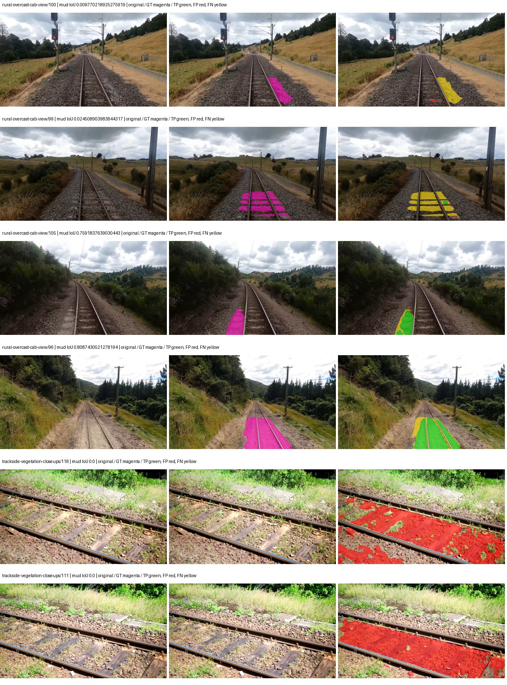
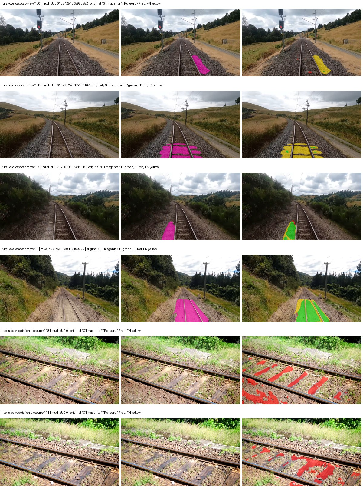
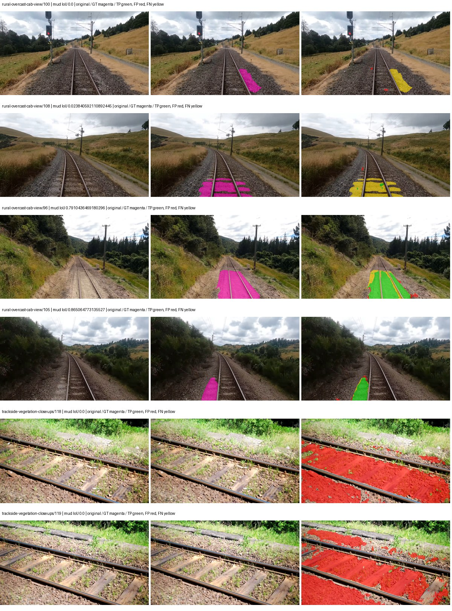
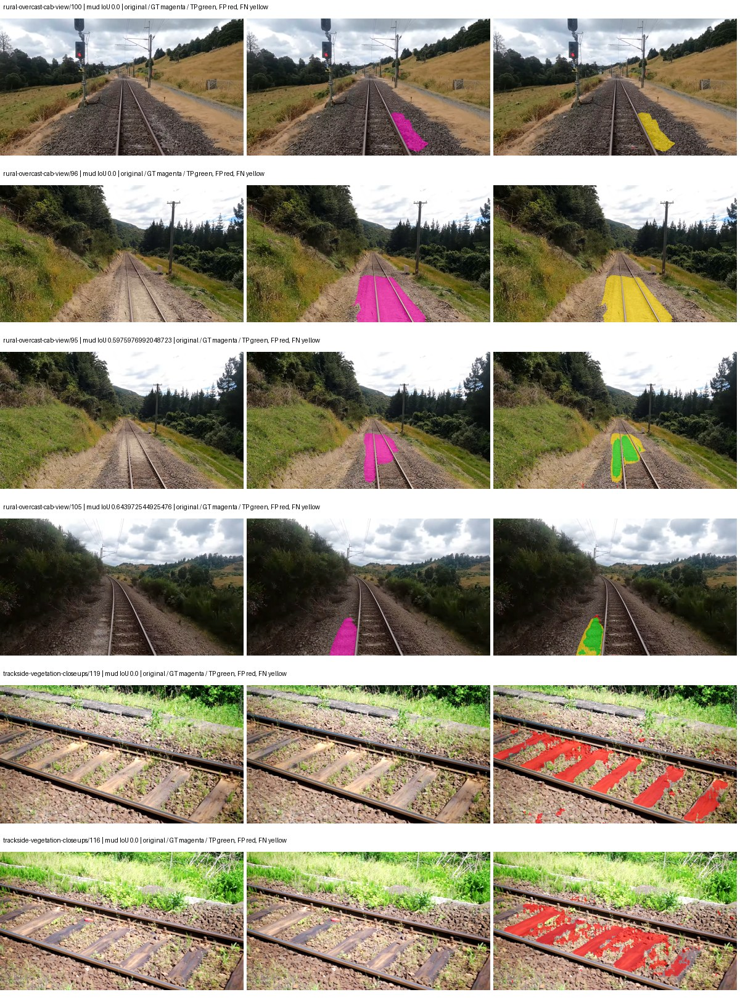
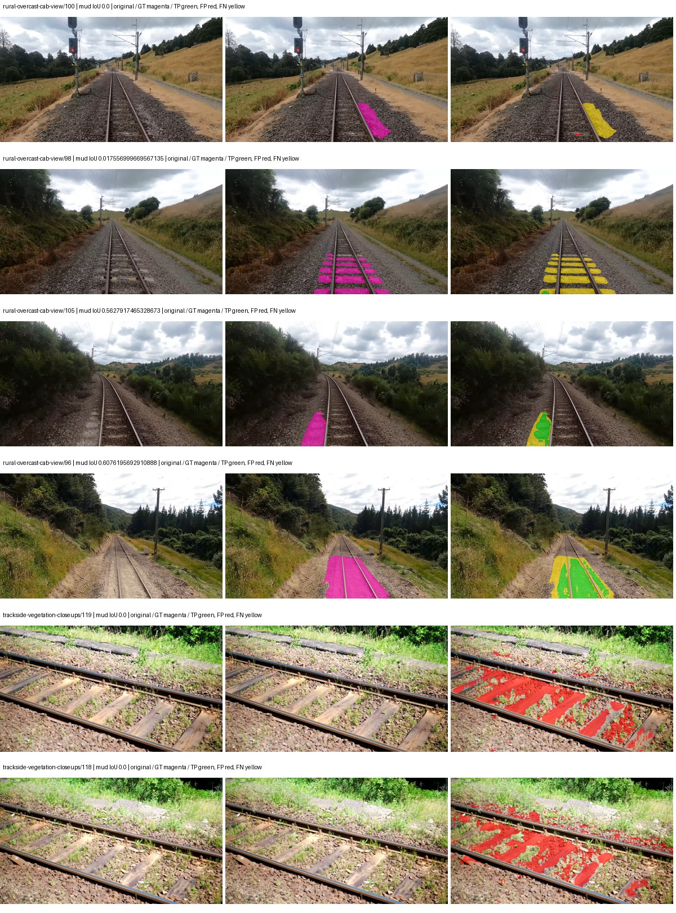
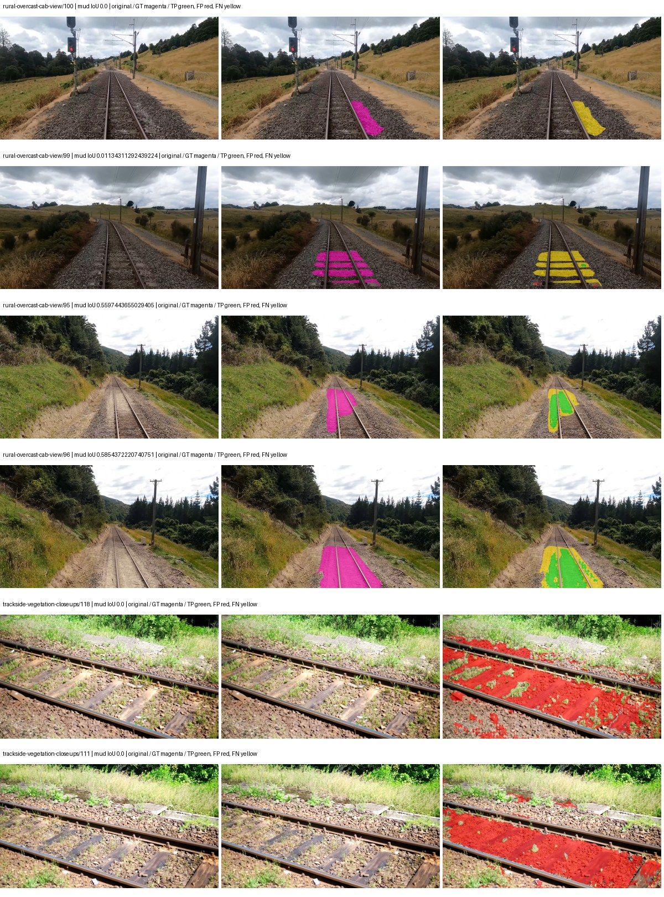
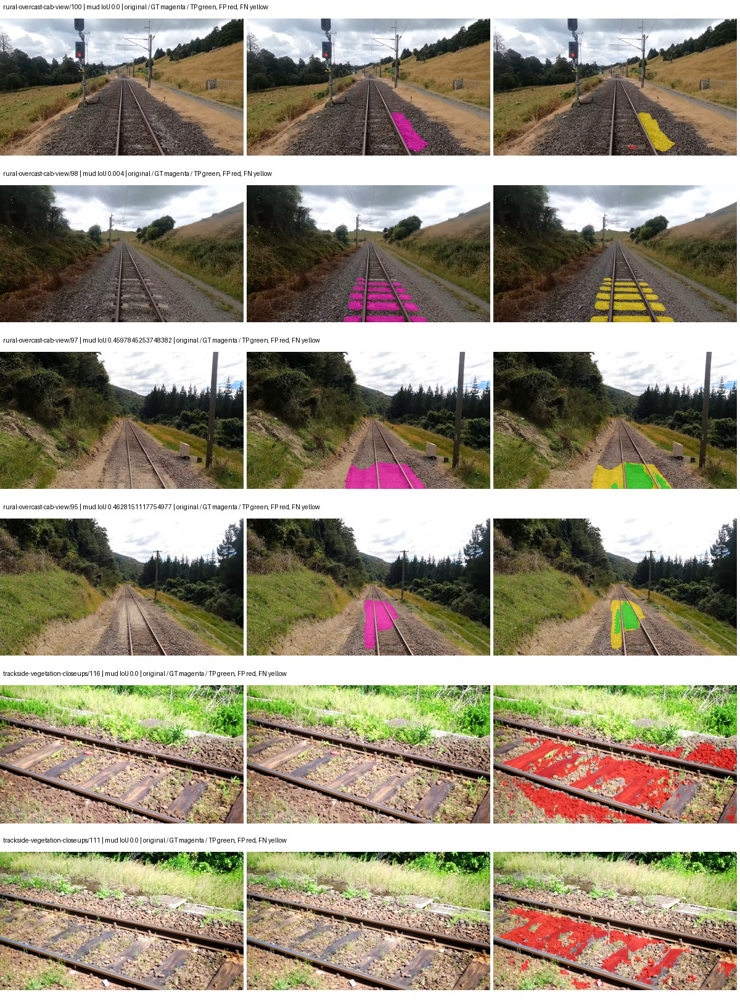

# eomt_large — paul-test-rtis

[RTIS comparison](../../README.md) · [Full model records](record.json)

Primary selection and early stopping: **mud-pumping validation IoU**. A job is complete only after full statistics and isolated profiling are verified.

| Model | Initialization path | Seed | Status | Steps | Best step | Mud IoU (%) | Mud precision (%) | Mud recall (%) | Final mud IoU (trainer val, %) | mIoU (%) | Fixed GT-class mIoU (%) |
| --- | --- | --- | --- | --- | --- | --- | --- | --- | --- | --- | --- |
| eomt_large | rtis_only | 0 | completed | 2290 | 1018 | 12.60 | 14.96 | 44.36 | 11.17 | 46.14 | 51.27 |
| eomt_large | rtis_only | 1 | completed | 2290 | 1018 | 24.76 | 42.02 | 37.60 | 17.76 | 45.89 | 50.99 |
| eomt_large | rtis_only | 2 | completed | 2036 | 763 | 9.29 | 10.45 | 45.40 | 4.17 | 41.29 | 45.88 |
| eomt_large | cityscapes_to_rtis | 0 | completed | 2545 | 2036 | 9.20 | 13.98 | 21.21 | 9.08 | 52.85 | 55.79 |
| eomt_large | cityscapes_to_rtis | 1 | completed | 3054 | 1781 | 11.56 | 17.05 | 26.43 | 9.88 | 53.29 | 56.25 |
| eomt_large | cityscapes_to_rtis | 2 | completed | 3054 | 1781 | 5.74 | 7.07 | 23.39 | 5.46 | 51.42 | 54.27 |
| eomt_large | railsem19_to_rtis | 0 | training | 3308 | — | — | — | — | — | — | — |
| eomt_large | railsem19_to_rtis | 1 | training | 2799 | — | — | — | — | — | — | — |
| eomt_large | railsem19_to_rtis | 2 | training | 2499 | — | — | — | — | — | — | — |
| eomt_large | cityscapes_to_railsem19_to_rtis | 0 | training | 2649 | — | — | — | — | — | — | — |
| eomt_large | cityscapes_to_railsem19_to_rtis | 1 | completed | 2290 | 1018 | 10.29 | 15.41 | 23.66 | 8.36 | 49.80 | 55.33 |
| eomt_large | cityscapes_to_railsem19_to_rtis | 2 | training | 2199 | — | — | — | — | — | — | — |

Training: 220 images. Validation: 37 images. Test: 50 held out. Seeds: [0, 1, 2]. Seed variation measures optimization variability, not independent-recording uncertainty. Historical source checkpoints stay fixed across adaptation seeds.

Training code: `066afb2626398b7be59d4d19f5a0e4644fd59adc`. Split SHA-256: `71fef8292610c352da0709fe3bd030f3bcc18f97560394835f4b22826463b83d`.

## rtis_only — seed 0

Status: **completed**. Started: 2026-09-06T06:01:49.063967+00:00. Finished: 2026-09-06T07:06:48.207773+00:00.

Recipe pretrained initializer: `tue-mps/coco_panoptic_eomt_large_640 (DINOv2-based ViT-L, COCO panoptic)`.

`rtis_only` uses the recipe initializer, which may include pretrained segmentation components. Transfer paths load the exact historical source checkpoint below and reset the classifier; they do not reset all query/decoder features.

Source checkpoint: `Recipe pretrained initialization`.

Config SHA-256: `35ad6a372cf2f7b6fc0baf52682d262fe3761d568aa610f6505c7d059b57ee21`. Weights used for validation: `ema`.

### Mud-pumping and aggregate quality

| Metric | Selected checkpoint | Final training validation |
| --- | --- | --- |
| Mud IoU | 12.60 | 11.17 |
| Mud precision | 14.96 | 13.58 |
| Mud recall | 44.36 | 38.65 |
| Mud Dice/F1 | 22.37 | 20.10 |
| mIoU | 46.14 | 47.68 |
| Mean accuracy | 63.51 | 65.13 |
| Mean precision | 61.43 | 61.40 |
| Mean Dice | 56.95 | 58.31 |
| Mean specificity | 99.27 | 99.29 |
| Pixel accuracy | 87.80 | 88.09 |
| Frequency-weighted IoU | 81.24 | 81.74 |
| Fixed GT-present class mIoU | 51.27 | 52.98 |
| Boundary F1 | 59.27 | 60.73 |

The selected checkpoint has independent evaluation evidence. Final values are the trainer's final validation record, not a new independent evaluation. mIoU averages classes with nonzero union, so false positives on absent classes can change its denominator. The fixed GT-class mean is supplementary and excludes absent classes; their false positives remain in the confusion matrix.

### Resource usage and timing

| Measurement | Value |
| --- | --- |
| Peak training VRAM, retained training invocation (GiB) | 17.70 |
| Peak evaluation VRAM (GiB) | 10.80 |
| Retained training invocation wall time (seconds) | 3614.75 |
| Retained training invocation GPU-hours (one GPU) | 1.00 |
| Evaluation wall time (seconds) | 21.99 |
| Full evaluation pipeline images/second | 1.68 |
| Best full-state checkpoint (MiB) | 4831.36 |
| Final full-state checkpoint (MiB) | 4831.34 |
| Audited periodic checkpoints removed (GiB) | 18.87 |

VRAM uses the recorded allocator high-water mark; it is not total device usage including CUDA context. Resumed jobs' retained training invocation times and peaks are **not whole-campaign totals**. Earlier invocation resource records are not reconstructed here. Evaluation throughput includes loader, sliding-window inference and metrics; it is not model-only latency/FPS. Missing measurements are shown as —, never inferred from another dataset's run.

### Standardized inference performance

Dedicated model-only profiling waits for an idle worker-locked L40S: BF16, batch 1, 1024x1024, 20 warmup and 100 CUDA-event-timed public forwards. It excludes loading, preprocessing, tiling and metrics.

| Status | Parameters | Weight MiB | FPS | p50 ms | p95 ms | Peak reserved GiB |
| --- | --- | --- | --- | --- | --- | --- |
| complete | 316580886 | 1207.66 | 45.60 | 21.86 | 22.09 | 3.12 |

```json
{
  "schema_version": 1,
  "model_id": "eomt_large",
  "measured_at": "2026-09-06T07:06:17+00:00",
  "status": "complete",
  "benchmark_scope": "rtis_selected_checkpoint_model_only",
  "applies_to": [
    "eomt_large--rtis_only--seed-0"
  ],
  "source": {
    "campaign_git_sha": "066afb2626398b7be59d4d19f5a0e4644fd59adc",
    "git_dirty": false,
    "config_hash": "aa6456a4c1d7",
    "resolved_config": "/data/izadia1/projects/segmentary-runs/paul-test-rtis/mud-fullstats-v1-20260906-r2/configs/eomt_large--rtis_only--seed-0.yaml",
    "config_sha256": "35ad6a372cf2f7b6fc0baf52682d262fe3761d568aa610f6505c7d059b57ee21",
    "checkpoint_sha256": "dc0441ccd1d069ff0fdb7dfe35ebb02cd7392d760219427262e8d3abe4042281",
    "checkpoint_global_step": 1018,
    "checkpoint_bytes": 5066052281,
    "checkpoint_kind": "resume checkpoint with optimizer and EMA state",
    "weights": "ema",
    "measured_checkpoint_job_id": "eomt_large--rtis_only--seed-0",
    "result_sha256": "533db0beca91881f921fbeea064431172ef6b0d725230504ba42eba1e561e0b4",
    "result_git_sha": "066afb2626398b7be59d4d19f5a0e4644fd59adc",
    "result_stage": "eval:paul-test-rtis:val",
    "result_seed": 0
  },
  "hardware": {
    "gpu_name": "NVIDIA L40S",
    "gpu_uuid": "GPU-2f8008a1-9b67-11f6-987b-b393a672322c",
    "logical_device": "cuda:0",
    "physical_visibility_token": "3",
    "compute_capability": [
      8,
      9
    ],
    "total_memory_bytes": 47677177856
  },
  "model": {
    "parameter_count": 316580886,
    "trainable_parameter_count": 316580886,
    "resident_parameter_bytes": 1266323544,
    "parameter_dtype_counts": {
      "float32": 316580886
    }
  },
  "contract": {
    "backend": "pytorch",
    "precision": "bf16_autocast",
    "batch_size": 1,
    "input_shape_nchw": [
      1,
      3,
      1024,
      1024
    ],
    "warmup_iterations": 20,
    "measured_iterations": 100,
    "timing": "per-forward CUDA events with end-event synchronization",
    "includes_preprocessing": false,
    "includes_data_loader": false,
    "includes_sliding_window": false,
    "input_resident_on_gpu": true,
    "model_only": true,
    "entrypoint": "public model(image) dense-logits forward"
  },
  "measurements": {
    "latency": {
      "p50_ms": 21.857280731201172,
      "p95_ms": 22.086400318145753,
      "mean_ms": 21.927839946746825,
      "minimum_ms": 21.758975982666016,
      "maximum_ms": 24.93951988220215,
      "fps": 45.60412710182875,
      "raw_ms": [
        21.83679962158203,
        21.86956787109375,
        21.822463989257812,
        21.88492774963379,
        21.764095306396484,
        22.013952255249023,
        23.6625919342041,
        21.86649513244629,
        21.84601593017578,
        22.011903762817383,
        21.88697624206543,
        21.87161636352539,
        21.829631805419922,
        21.85625648498535,
        21.83782386779785,
        21.83782386779785,
        21.807104110717773,
        21.8286075592041,
        21.773311614990234,
        21.891071319580078,
        22.145023345947266,
        21.84396743774414,
        21.949440002441406,
        22.018047332763672,
        21.788671493530273,
        21.906431198120117,
        21.941247940063477,
        21.85215950012207,
        21.876672744750977,
        21.806079864501953,
        21.87366485595703,
        21.805055618286133,
        21.775360107421875,
        21.83475112915039,
        21.805055618286133,
        21.87161636352539,
        21.841920852661133,
        22.10099220275879,
        21.849088668823242,
        21.86649513244629,
        21.984128952026367,
        21.88902473449707,
        21.86342430114746,
        21.85420799255371,
        21.84396743774414,
        21.811199188232422,
        24.93951988220215,
        21.83679962158203,
        22.05081558227539,
        21.86751937866211,
        21.88800048828125,
        21.821439743041992,
        21.788671493530273,
        21.980159759521484,
        21.84899139404297,
        21.857280731201172,
        22.021120071411133,
        21.840896606445312,
        21.813247680664062,
        21.908479690551758,
        21.857280731201172,
        21.914623260498047,
        21.800960540771484,
        22.08563232421875,
        21.797887802124023,
        21.764095306396484,
        21.795839309692383,
        21.833728790283203,
        21.84601593017578,
        21.85215950012207,
        21.820415496826172,
        21.967872619628906,
        21.801984786987305,
        21.946367263793945,
        21.91155242919922,
        21.983232498168945,
        21.831680297851562,
        21.934080123901367,
        21.86751937866211,
        21.87059211730957,
        21.807104110717773,
        21.84294319152832,
        21.927936553955078,
        21.942272186279297,
        21.85215950012207,
        22.213600158691406,
        21.915647506713867,
        21.964736938476562,
        21.88185691833496,
        21.86854362487793,
        21.832704544067383,
        21.87468719482422,
        21.758975982666016,
        21.85625648498535,
        21.89619255065918,
        21.85420799255371,
        21.87468719482422,
        21.85420799255371,
        21.977088928222656,
        21.84499168395996
      ],
      "percentile_method": "numpy linear interpolation"
    },
    "peak_reserved_bytes": 3351248896,
    "memory_kind": "pytorch_cuda_allocator_peak_reserved_excluding_context",
    "benchmark_wall_clock_s": 3.217280011624098
  },
  "started_at": "2026-09-06T07:06:14+00:00",
  "finished_at": "2026-09-06T07:06:17+00:00",
  "environment": {
    "hostname": "hdrfs-app-001",
    "python": "3.11.15",
    "platform": "Linux-5.15.0-139-generic-x86_64-with-glibc2.35",
    "torch": "2.11.0+cu128",
    "torch_cuda": "12.8",
    "cudnn": 91900,
    "driver_version": "570.133.20",
    "cuda_available": true,
    "gpu_count": 1,
    "gpu_names": [
      "NVIDIA L40S"
    ],
    "cuda_visible_devices": "3",
    "packages": {
      "segmentary": "0.1.0",
      "torch": "2.11.0+cu128",
      "torchvision": "0.26.0+cu128",
      "transformers": "5.15.0",
      "timm": "1.0.28",
      "segmentation-models-pytorch": "0.5.0",
      "albumentations": "2.0.8",
      "lightning": "2.6.5",
      "numpy": "2.4.4"
    }
  }
}
```

### Per-class validation results

| Class | GT pixels | IoU (%) | Precision (%) | Recall (%) | Dice (%) | Boundary F1 (%) |
| --- | --- | --- | --- | --- | --- | --- |
| car | 29664 | 4.04 | 10.36 | 6.20 | 7.76 | 14.24 |
| construction | 311585 | 68.93 | 83.58 | 79.72 | 81.61 | 76.96 |
| fence | 265137 | 44.24 | 65.75 | 57.48 | 61.34 | 60.94 |
| mud-pumping | 1226250 | 12.60 | 14.96 | 44.36 | 22.37 | 23.38 |
| on-rails | 0 | 0.00 | 0.00 | — | 0.00 | 0.00 |
| person | 0 | — | — | — | — | — |
| pole | 628038 | 75.18 | 86.19 | 85.48 | 85.83 | 92.82 |
| rail-embedded | 16799 | 32.42 | 84.50 | 34.47 | 48.96 | 83.72 |
| rail-raised | 2969797 | 80.04 | 85.07 | 93.12 | 88.91 | 94.98 |
| rail-track | 6323197 | 51.17 | 77.72 | 59.96 | 67.70 | 70.06 |
| road | 1048831 | 9.39 | 18.58 | 15.95 | 17.17 | 24.42 |
| sidewalk | 1297367 | 44.13 | 77.41 | 50.65 | 61.24 | 79.38 |
| sky | 19121606 | 98.71 | 99.32 | 99.38 | 99.35 | 98.35 |
| standing-water | 95802 | 37.58 | 48.70 | 62.20 | 54.63 | 58.60 |
| terrain | 39239306 | 91.57 | 92.85 | 98.52 | 95.60 | 79.52 |
| trackbed | 10643081 | 79.05 | 85.92 | 90.81 | 88.30 | 79.21 |
| traffic-light | 19510 | 56.75 | 94.11 | 58.84 | 72.41 | 72.06 |
| traffic-sign | 13285 | 45.05 | 52.88 | 75.27 | 62.12 | 64.96 |
| tram-track | 56179 | 59.54 | 60.63 | 97.06 | 74.64 | 52.72 |
| truck | 0 | 0.00 | 0.00 | — | 0.00 | 0.00 |
| vegetation-overgrowth | 5901821 | 32.51 | 90.00 | 33.73 | 49.07 | 58.98 |

### Full-run accounting

| Measurement | Value |
| --- | --- |
| Full GPU-reserved wall seconds, all recorded worker attempts | 3899.15 |
| Full reserved GPU-hours | 1.08 |
| Whole-run timing complete | True |

| Phase | Wall seconds including failed attempts |
| --- | --- |
| training | 3622.28 |
| diagnostics | 186.55 |
| performance | 20.77 |

GPU-reserved time includes model loading, training, validation, collection, profiling, checkpoint I/O and orchestration while the worker owns one GPU. It is not GPU kernel-active time. Phase timings and sampled device memory/power/utilization are retained separately; sampled device memory is not the allocator high-water mark.

### Train/validation and raw/EMA diagnostics

| Checkpoint / weights / split | Images | Mud IoU (%) | Mud precision (%) | Mud recall (%) |
| --- | --- | --- | --- | --- |
| best-auto-train / ema | 220 | 95.12 | 97.56 | 97.44 |
| best-auto-val / ema | 37 | 12.60 | 14.96 | 44.36 |
| best-alternate-val / raw | 37 | 13.52 | 15.60 | 50.36 |
| final-auto-val / ema | 37 | 11.17 | 13.58 | 38.63 |

Train uses the evaluation transform without augmentation. Compare mud train/validation metrics for the same selected weights. Alternate EMA on running-stat BatchNorm is explicitly uncalibrated and is diagnostic only. Score-threshold curves use uncalibrated normalized scores and are pixel-level diagnostics, not event detection rates or a selected deployment operating point.

### Downloadable evidence

- best-auto-train: [per-image.csv](rtis_only--seed-0/best-auto-train/per-image.csv) · [per-image-confusion.json.gz](rtis_only--seed-0/best-auto-train/per-image-confusion.json.gz) · [groups.json](rtis_only--seed-0/best-auto-train/groups.json) · [mud-score-curves.json](rtis_only--seed-0/best-auto-train/mud-score-curves.json)
- best-auto-val: [per-image.csv](rtis_only--seed-0/best-auto-val/per-image.csv) · [per-image-confusion.json.gz](rtis_only--seed-0/best-auto-val/per-image-confusion.json.gz) · [groups.json](rtis_only--seed-0/best-auto-val/groups.json) · [mud-score-curves.json](rtis_only--seed-0/best-auto-val/mud-score-curves.json) · [examples.jpg](rtis_only--seed-0/best-auto-val/examples.jpg)
- best-alternate-val: [per-image.csv](rtis_only--seed-0/best-alternate-val/per-image.csv) · [per-image-confusion.json.gz](rtis_only--seed-0/best-alternate-val/per-image-confusion.json.gz) · [groups.json](rtis_only--seed-0/best-alternate-val/groups.json) · [mud-score-curves.json](rtis_only--seed-0/best-alternate-val/mud-score-curves.json)
- final-auto-val: [per-image.csv](rtis_only--seed-0/final-auto-val/per-image.csv) · [per-image-confusion.json.gz](rtis_only--seed-0/final-auto-val/per-image-confusion.json.gz) · [groups.json](rtis_only--seed-0/final-auto-val/groups.json) · [mud-score-curves.json](rtis_only--seed-0/final-auto-val/mud-score-curves.json)
- resources: [telemetry.csv](rtis_only--seed-0/resources/telemetry.csv)



Examples are two lowest and two highest mud-IoU positive images, plus up to two negative images with the most false-positive mud pixels. They are targeted diagnostic examples, not random samples. Green: true positive; red: false positive; yellow: false negative. Full predictions remain on HDRFS.

### Validation tracking

| Logged step | Overall mIoU (%) | Mud IoU (%) |
| --- | --- | --- |
| 254 | 27.18 | 0.31 |
| 508 | 37.84 | 5.85 |
| 763 | 42.16 | 10.29 |
| 1017 | 46.17 | 12.60 |
| 1272 | 46.24 | 12.24 |
| 1527 | 46.88 | 10.70 |
| 1781 | 47.53 | 10.76 |
| 2036 | 47.61 | 11.11 |
| 2290 | 47.68 | 11.17 |

All retained scalar curves, including training loss and per-class IoU, are in record.json. Observed best mud on a curve is not necessarily a retained checkpoint: the pilot saved its selection-metric-best and final checkpoints. Step logging and checkpoint global_step may differ by one.

### Stopping and checkpoint provenance

```json
{
  "stopping": {
    "actual_steps": 2290,
    "maximum_steps": 4000,
    "min_delta": 0.001,
    "monitor": "val_iou/mud-pumping",
    "patience": 5,
    "reason": "validation_plateau"
  },
  "checkpoints": {
    "best": {
      "path": "/data/izadia1/projects/segmentary-runs/paul-test-rtis/mud-fullstats-v1-20260906-r2/future-runs/eomt_large--rtis_only--seed-0_seed0/rtis/best.ckpt",
      "sha256": "dc0441ccd1d069ff0fdb7dfe35ebb02cd7392d760219427262e8d3abe4042281",
      "global_step": 1018,
      "bytes": 5066052281
    },
    "final": {
      "path": "/data/izadia1/projects/segmentary-runs/paul-test-rtis/mud-fullstats-v1-20260906-r2/future-runs/eomt_large--rtis_only--seed-0_seed0/rtis/last.ckpt",
      "sha256": "dbf812e3f1a72060014da78308d43f6f49f7ce2cc6d1490d859108e1c14ed043",
      "global_step": 2290,
      "bytes": 5066030393
    }
  },
  "cleanup_error": null
}
```

### Resolved training, initialization and evaluation settings

The optimizer block is the base configuration. Stage LR scales are applied at runtime, and stage warmup is capped at min(base warmup, floor(stage budget / 10), stage budget - 1): 400 steps for this 4,000-step pilot. Model-internal native input grids may differ from augmentation crops (EoMT uses its 640 grid).

```json
{
  "name": "eomt_large--rtis_only--seed-0",
  "model": {
    "arch": "eomt_large",
    "checkpoint": null,
    "tuning": "full",
    "head": "unified_head",
    "lora_r": 16,
    "lora_alpha": 32,
    "lora_dropout": 0.05,
    "lora_targets": [],
    "drop_path": null,
    "revision": null,
    "subfolder": null,
    "local_files_only": false,
    "trust_remote_code": false,
    "backbone_path": null,
    "head_paths": [],
    "classifier_path": null,
    "inactive_parameter_paths": [],
    "smp_arch": null,
    "encoder_name": null,
    "encoder_weights": null,
    "native": null,
    "batch_norm_momentum": null
  },
  "space": "paul-test-rtis",
  "taxonomy_root": "/data/izadia1/projects/segmentary-rtis-fullstats-066afb2/taxonomy",
  "output_root": "/data/izadia1/projects/segmentary-runs/paul-test-rtis/mud-fullstats-v1-20260906-r2/future-runs",
  "optim": {
    "backbone_lr": 1e-05,
    "head_lr_mult": 10.0,
    "weight_decay": 0.05,
    "llrd": 0.75,
    "warmup_iters": 1500,
    "warmup_ratio": 1e-06,
    "poly_power": 0.9,
    "min_lr_ratio": 0.0,
    "betas": [
      0.9,
      0.999
    ],
    "grad_clip": 1.0
  },
  "train": {
    "iters": 4000,
    "batch_size": 2,
    "accum": 8,
    "num_workers": 2,
    "precision": "bf16-mixed",
    "ema_decay": 0.9998,
    "val_every": 250,
    "ckpt_every": 500,
    "selection_metric": "val_iou/mud-pumping",
    "early_stopping_patience": 5,
    "early_stopping_min_delta": 0.001,
    "seed": 0,
    "devices": 1
  },
  "eval": {
    "sliding_window": true,
    "window": [
      1024,
      1024
    ],
    "stride": [
      768,
      768
    ],
    "batch_size": 1,
    "num_workers": 2,
    "tta_scales": [],
    "tta_flip": false,
    "threshold": 0.5,
    "boundary_tolerance_frac": 0.0075,
    "save_confusion": true
  },
  "loss": {
    "task": "multiclass",
    "activation": "auto",
    "terms": [],
    "aux": "none",
    "aux_weight": 0.0,
    "ce_weight": 1.0,
    "label_smoothing": 0.0,
    "class_weights": null,
    "query": {
      "kind": "hungarian_query",
      "classification_weight": 2.0,
      "mask_bce_weight": 5.0,
      "dice_weight": 5.0,
      "no_object_coefficient": 0.1,
      "match_class_cost": 2.0,
      "match_mask_bce_cost": 5.0,
      "match_dice_cost": 5.0,
      "matching_num_points": 8192,
      "auxiliary_layer_weight": 1.0,
      "dice_smooth": 1.0
    }
  },
  "aug": {
    "crop": [
      1024,
      1024
    ],
    "scale_min": 0.5,
    "scale_max": 2.0,
    "hflip_p": 0.5,
    "color_jitter_p": 0.5,
    "brightness": 0.25,
    "contrast": 0.25,
    "saturation": 0.25,
    "hue": 0.05
  },
  "stages": [
    {
      "name": "rtis",
      "data": [
        {
          "name": "paul-test-rtis",
          "root": "/data/izadia1/datasets/paul-test-rtis",
          "variant": null,
          "split_file": "splits.json",
          "train_split": "train",
          "val_split": "val",
          "limit": null,
          "loader": "folder",
          "mapping": "paul-test-rtis",
          "loader_options": {
            "require_groups": true
          }
        }
      ],
      "iters": null,
      "lr_scale": 1.0,
      "head_group_lr_scale": 1.0,
      "init_from": "pretrained",
      "reset_head": false,
      "freeze": null,
      "sample_weights": null
    }
  ]
}
```

### Hardware and software provenance

```json
{
  "training": {
    "cuda_available": true,
    "cuda_visible_devices": "3",
    "cudnn": 91900,
    "driver_version": "570.133.20",
    "gpu_count": 1,
    "gpu_names": [
      "NVIDIA L40S"
    ],
    "hostname": "hdrfs-app-001",
    "input_normalization": {
      "channel_order": "rgb",
      "mean": [
        0.485,
        0.456,
        0.406
      ],
      "source": "imagenet",
      "std": [
        0.229,
        0.224,
        0.225
      ]
    },
    "model_origins": [
      {
        "hf_commit": "dcd130bed9b1ebda7041fd660fddb16f905b9c3b",
        "hf_name_or_path": "tue-mps/coco_panoptic_eomt_large_640",
        "module": "model",
        "timm_pretrained": {}
      },
      {
        "hf_commit": "dcd130bed9b1ebda7041fd660fddb16f905b9c3b",
        "hf_name_or_path": "tue-mps/coco_panoptic_eomt_large_640",
        "module": "model.embeddings",
        "timm_pretrained": {}
      },
      {
        "hf_commit": "dcd130bed9b1ebda7041fd660fddb16f905b9c3b",
        "hf_name_or_path": "tue-mps/coco_panoptic_eomt_large_640",
        "module": "model.layers.0.attention",
        "timm_pretrained": {}
      },
      {
        "hf_commit": "dcd130bed9b1ebda7041fd660fddb16f905b9c3b",
        "hf_name_or_path": "tue-mps/coco_panoptic_eomt_large_640",
        "module": "model.layers.1.attention",
        "timm_pretrained": {}
      },
      {
        "hf_commit": "dcd130bed9b1ebda7041fd660fddb16f905b9c3b",
        "hf_name_or_path": "tue-mps/coco_panoptic_eomt_large_640",
        "module": "model.layers.2.attention",
        "timm_pretrained": {}
      },
      {
        "hf_commit": "dcd130bed9b1ebda7041fd660fddb16f905b9c3b",
        "hf_name_or_path": "tue-mps/coco_panoptic_eomt_large_640",
        "module": "model.layers.3.attention",
        "timm_pretrained": {}
      },
      {
        "hf_commit": "dcd130bed9b1ebda7041fd660fddb16f905b9c3b",
        "hf_name_or_path": "tue-mps/coco_panoptic_eomt_large_640",
        "module": "model.layers.4.attention",
        "timm_pretrained": {}
      },
      {
        "hf_commit": "dcd130bed9b1ebda7041fd660fddb16f905b9c3b",
        "hf_name_or_path": "tue-mps/coco_panoptic_eomt_large_640",
        "module": "model.layers.5.attention",
        "timm_pretrained": {}
      },
      {
        "hf_commit": "dcd130bed9b1ebda7041fd660fddb16f905b9c3b",
        "hf_name_or_path": "tue-mps/coco_panoptic_eomt_large_640",
        "module": "model.layers.6.attention",
        "timm_pretrained": {}
      },
      {
        "hf_commit": "dcd130bed9b1ebda7041fd660fddb16f905b9c3b",
        "hf_name_or_path": "tue-mps/coco_panoptic_eomt_large_640",
        "module": "model.layers.7.attention",
        "timm_pretrained": {}
      },
      {
        "hf_commit": "dcd130bed9b1ebda7041fd660fddb16f905b9c3b",
        "hf_name_or_path": "tue-mps/coco_panoptic_eomt_large_640",
        "module": "model.layers.8.attention",
        "timm_pretrained": {}
      },
      {
        "hf_commit": "dcd130bed9b1ebda7041fd660fddb16f905b9c3b",
        "hf_name_or_path": "tue-mps/coco_panoptic_eomt_large_640",
        "module": "model.layers.9.attention",
        "timm_pretrained": {}
      },
      {
        "hf_commit": "dcd130bed9b1ebda7041fd660fddb16f905b9c3b",
        "hf_name_or_path": "tue-mps/coco_panoptic_eomt_large_640",
        "module": "model.layers.10.attention",
        "timm_pretrained": {}
      },
      {
        "hf_commit": "dcd130bed9b1ebda7041fd660fddb16f905b9c3b",
        "hf_name_or_path": "tue-mps/coco_panoptic_eomt_large_640",
        "module": "model.layers.11.attention",
        "timm_pretrained": {}
      },
      {
        "hf_commit": "dcd130bed9b1ebda7041fd660fddb16f905b9c3b",
        "hf_name_or_path": "tue-mps/coco_panoptic_eomt_large_640",
        "module": "model.layers.12.attention",
        "timm_pretrained": {}
      },
      {
        "hf_commit": "dcd130bed9b1ebda7041fd660fddb16f905b9c3b",
        "hf_name_or_path": "tue-mps/coco_panoptic_eomt_large_640",
        "module": "model.layers.13.attention",
        "timm_pretrained": {}
      },
      {
        "hf_commit": "dcd130bed9b1ebda7041fd660fddb16f905b9c3b",
        "hf_name_or_path": "tue-mps/coco_panoptic_eomt_large_640",
        "module": "model.layers.14.attention",
        "timm_pretrained": {}
      },
      {
        "hf_commit": "dcd130bed9b1ebda7041fd660fddb16f905b9c3b",
        "hf_name_or_path": "tue-mps/coco_panoptic_eomt_large_640",
        "module": "model.layers.15.attention",
        "timm_pretrained": {}
      },
      {
        "hf_commit": "dcd130bed9b1ebda7041fd660fddb16f905b9c3b",
        "hf_name_or_path": "tue-mps/coco_panoptic_eomt_large_640",
        "module": "model.layers.16.attention",
        "timm_pretrained": {}
      },
      {
        "hf_commit": "dcd130bed9b1ebda7041fd660fddb16f905b9c3b",
        "hf_name_or_path": "tue-mps/coco_panoptic_eomt_large_640",
        "module": "model.layers.17.attention",
        "timm_pretrained": {}
      },
      {
        "hf_commit": "dcd130bed9b1ebda7041fd660fddb16f905b9c3b",
        "hf_name_or_path": "tue-mps/coco_panoptic_eomt_large_640",
        "module": "model.layers.18.attention",
        "timm_pretrained": {}
      },
      {
        "hf_commit": "dcd130bed9b1ebda7041fd660fddb16f905b9c3b",
        "hf_name_or_path": "tue-mps/coco_panoptic_eomt_large_640",
        "module": "model.layers.19.attention",
        "timm_pretrained": {}
      },
      {
        "hf_commit": "dcd130bed9b1ebda7041fd660fddb16f905b9c3b",
        "hf_name_or_path": "tue-mps/coco_panoptic_eomt_large_640",
        "module": "model.layers.20.attention",
        "timm_pretrained": {}
      },
      {
        "hf_commit": "dcd130bed9b1ebda7041fd660fddb16f905b9c3b",
        "hf_name_or_path": "tue-mps/coco_panoptic_eomt_large_640",
        "module": "model.layers.21.attention",
        "timm_pretrained": {}
      },
      {
        "hf_commit": "dcd130bed9b1ebda7041fd660fddb16f905b9c3b",
        "hf_name_or_path": "tue-mps/coco_panoptic_eomt_large_640",
        "module": "model.layers.22.attention",
        "timm_pretrained": {}
      },
      {
        "hf_commit": "dcd130bed9b1ebda7041fd660fddb16f905b9c3b",
        "hf_name_or_path": "tue-mps/coco_panoptic_eomt_large_640",
        "module": "model.layers.23.attention",
        "timm_pretrained": {}
      }
    ],
    "model_parameter_count": 316580886,
    "packages": {
      "albumentations": "2.0.8",
      "lightning": "2.6.5",
      "numpy": "2.4.4",
      "segmentary": "0.1.0",
      "segmentation-models-pytorch": "0.5.0",
      "timm": "1.0.28",
      "torch": "2.11.0+cu128",
      "torchvision": "0.26.0+cu128",
      "transformers": "5.15.0"
    },
    "platform": "Linux-5.15.0-139-generic-x86_64-with-glibc2.35",
    "python": "3.11.15",
    "torch": "2.11.0+cu128",
    "torch_cuda": "12.8",
    "trainable_parameter_count": 316580886,
    "training_stop": {
      "actual_steps": 2290,
      "maximum_steps": 4000,
      "min_delta": 0.001,
      "monitor": "val_iou/mud-pumping",
      "patience": 5,
      "reason": "validation_plateau"
    },
    "validation_weights": "ema"
  },
  "evaluation": {
    "cuda_available": true,
    "cuda_visible_devices": "3",
    "cudnn": 91900,
    "driver_version": "570.133.20",
    "gpu_count": 1,
    "gpu_names": [
      "NVIDIA L40S"
    ],
    "hostname": "hdrfs-app-001",
    "input_normalization": {
      "channel_order": "rgb",
      "mean": [
        0.485,
        0.456,
        0.406
      ],
      "source": "imagenet",
      "std": [
        0.229,
        0.224,
        0.225
      ]
    },
    "packages": {
      "albumentations": "2.0.8",
      "lightning": "2.6.5",
      "numpy": "2.4.4",
      "segmentary": "0.1.0",
      "segmentation-models-pytorch": "0.5.0",
      "timm": "1.0.28",
      "torch": "2.11.0+cu128",
      "torchvision": "0.26.0+cu128",
      "transformers": "5.15.0"
    },
    "platform": "Linux-5.15.0-139-generic-x86_64-with-glibc2.35",
    "python": "3.11.15",
    "torch": "2.11.0+cu128",
    "torch_cuda": "12.8"
  }
}
```

## rtis_only — seed 1

Status: **completed**. Started: 2026-09-06T06:16:17.303787+00:00. Finished: 2026-09-06T07:19:19.616140+00:00.

Recipe pretrained initializer: `tue-mps/coco_panoptic_eomt_large_640 (DINOv2-based ViT-L, COCO panoptic)`.

`rtis_only` uses the recipe initializer, which may include pretrained segmentation components. Transfer paths load the exact historical source checkpoint below and reset the classifier; they do not reset all query/decoder features.

Source checkpoint: `Recipe pretrained initialization`.

Config SHA-256: `2fcc7979eec3f322638de51fa670f5b7de27c719a2f34ccbca76f760b777da3e`. Weights used for validation: `ema`.

### Mud-pumping and aggregate quality

| Metric | Selected checkpoint | Final training validation |
| --- | --- | --- |
| Mud IoU | 24.76 | 17.76 |
| Mud precision | 42.02 | 26.15 |
| Mud recall | 37.60 | 35.64 |
| Mud Dice/F1 | 39.69 | 30.16 |
| mIoU | 45.89 | 47.18 |
| Mean accuracy | 62.65 | 65.14 |
| Mean precision | 61.03 | 60.04 |
| Mean Dice | 56.93 | 58.06 |
| Mean specificity | 99.37 | 99.35 |
| Pixel accuracy | 89.77 | 89.45 |
| Frequency-weighted IoU | 82.80 | 82.69 |
| Fixed GT-present class mIoU | 50.99 | 52.43 |
| Boundary F1 | 60.18 | 59.61 |

The selected checkpoint has independent evaluation evidence. Final values are the trainer's final validation record, not a new independent evaluation. mIoU averages classes with nonzero union, so false positives on absent classes can change its denominator. The fixed GT-class mean is supplementary and excludes absent classes; their false positives remain in the confusion matrix.

### Resource usage and timing

| Measurement | Value |
| --- | --- |
| Peak training VRAM, retained training invocation (GiB) | 17.70 |
| Peak evaluation VRAM (GiB) | 10.80 |
| Retained training invocation wall time (seconds) | 3498.95 |
| Retained training invocation GPU-hours (one GPU) | 0.97 |
| Evaluation wall time (seconds) | 21.48 |
| Full evaluation pipeline images/second | 1.72 |
| Best full-state checkpoint (MiB) | 4831.36 |
| Final full-state checkpoint (MiB) | 4831.34 |
| Audited periodic checkpoints removed (GiB) | 18.87 |

VRAM uses the recorded allocator high-water mark; it is not total device usage including CUDA context. Resumed jobs' retained training invocation times and peaks are **not whole-campaign totals**. Earlier invocation resource records are not reconstructed here. Evaluation throughput includes loader, sliding-window inference and metrics; it is not model-only latency/FPS. Missing measurements are shown as —, never inferred from another dataset's run.

### Standardized inference performance

Dedicated model-only profiling waits for an idle worker-locked L40S: BF16, batch 1, 1024x1024, 20 warmup and 100 CUDA-event-timed public forwards. It excludes loading, preprocessing, tiling and metrics.

| Status | Parameters | Weight MiB | FPS | p50 ms | p95 ms | Peak reserved GiB |
| --- | --- | --- | --- | --- | --- | --- |
| complete | 316580886 | 1207.66 | 44.67 | 22.28 | 22.84 | 3.12 |

```json
{
  "schema_version": 1,
  "model_id": "eomt_large",
  "measured_at": "2026-09-06T07:18:49+00:00",
  "status": "complete",
  "benchmark_scope": "rtis_selected_checkpoint_model_only",
  "applies_to": [
    "eomt_large--rtis_only--seed-1"
  ],
  "source": {
    "campaign_git_sha": "066afb2626398b7be59d4d19f5a0e4644fd59adc",
    "git_dirty": false,
    "config_hash": "774808928a67",
    "resolved_config": "/data/izadia1/projects/segmentary-runs/paul-test-rtis/mud-fullstats-v1-20260906-r2/configs/eomt_large--rtis_only--seed-1.yaml",
    "config_sha256": "2fcc7979eec3f322638de51fa670f5b7de27c719a2f34ccbca76f760b777da3e",
    "checkpoint_sha256": "2e89f9fdab2c8343426d5a9a39a05b92e78e1935a7ef1ca1fe6ed00e60ad12b2",
    "checkpoint_global_step": 1018,
    "checkpoint_bytes": 5066052281,
    "checkpoint_kind": "resume checkpoint with optimizer and EMA state",
    "weights": "ema",
    "measured_checkpoint_job_id": "eomt_large--rtis_only--seed-1",
    "result_sha256": "9769f14f278370fd5a68c67e42c6732e308d7c35777293e79090b81a8121dcf2",
    "result_git_sha": "066afb2626398b7be59d4d19f5a0e4644fd59adc",
    "result_stage": "eval:paul-test-rtis:val",
    "result_seed": 1
  },
  "hardware": {
    "gpu_name": "NVIDIA L40S",
    "gpu_uuid": "GPU-84f5ca4d-68db-ae98-d056-40654d859dd9",
    "logical_device": "cuda:0",
    "physical_visibility_token": "0",
    "compute_capability": [
      8,
      9
    ],
    "total_memory_bytes": 47677177856
  },
  "model": {
    "parameter_count": 316580886,
    "trainable_parameter_count": 316580886,
    "resident_parameter_bytes": 1266323544,
    "parameter_dtype_counts": {
      "float32": 316580886
    }
  },
  "contract": {
    "backend": "pytorch",
    "precision": "bf16_autocast",
    "batch_size": 1,
    "input_shape_nchw": [
      1,
      3,
      1024,
      1024
    ],
    "warmup_iterations": 20,
    "measured_iterations": 100,
    "timing": "per-forward CUDA events with end-event synchronization",
    "includes_preprocessing": false,
    "includes_data_loader": false,
    "includes_sliding_window": false,
    "input_resident_on_gpu": true,
    "model_only": true,
    "entrypoint": "public model(image) dense-logits forward"
  },
  "measurements": {
    "latency": {
      "p50_ms": 22.28121566772461,
      "p95_ms": 22.839552307128905,
      "mean_ms": 22.387173442840577,
      "minimum_ms": 22.163455963134766,
      "maximum_ms": 25.31532859802246,
      "fps": 44.66843492114902,
      "raw_ms": [
        22.28019142150879,
        22.416383743286133,
        22.2238712310791,
        22.380544662475586,
        22.303743362426758,
        22.388736724853516,
        22.424575805664062,
        22.760448455810547,
        22.4583683013916,
        22.517759323120117,
        22.239168167114258,
        22.353919982910156,
        22.52288055419922,
        22.311935424804688,
        22.25868797302246,
        22.414335250854492,
        22.28019142150879,
        22.778879165649414,
        22.371328353881836,
        22.50547218322754,
        22.392831802368164,
        22.25971221923828,
        25.31532859802246,
        22.687744140625,
        22.4583683013916,
        22.435840606689453,
        22.253568649291992,
        22.42969512939453,
        22.423551559448242,
        22.322175979614258,
        22.253568649291992,
        22.23206329345703,
        22.197248458862305,
        22.508544921875,
        22.743104934692383,
        22.572032928466797,
        22.358015060424805,
        22.26585578918457,
        22.18182373046875,
        22.197248458862305,
        22.19923210144043,
        22.28940773010254,
        22.26790428161621,
        22.361024856567383,
        22.90995216369629,
        22.29145622253418,
        22.29542350769043,
        22.961151123046875,
        22.389759063720703,
        22.526975631713867,
        22.329343795776367,
        22.33344078063965,
        22.310911178588867,
        22.28223991394043,
        22.336416244506836,
        22.46656036376953,
        22.387680053710938,
        22.433792114257812,
        22.28531265258789,
        22.84441566467285,
        22.839296340942383,
        22.397951126098633,
        22.254592895507812,
        22.251455307006836,
        22.220800399780273,
        22.443008422851562,
        23.68511962890625,
        22.29862403869629,
        22.24844741821289,
        22.24742317199707,
        22.226943969726562,
        22.203392028808594,
        22.199296951293945,
        22.23308753967285,
        22.163455963134766,
        22.202367782592773,
        22.261760711669922,
        22.225919723510742,
        22.26483154296875,
        22.228992462158203,
        22.179840087890625,
        22.252544403076172,
        22.225919723510742,
        22.226943969726562,
        22.25152015686035,
        22.218751907348633,
        22.216703414916992,
        22.217727661132812,
        22.226943969726562,
        22.23923110961914,
        22.24127960205078,
        22.226943969726562,
        22.204416275024414,
        22.220800399780273,
        22.206464767456055,
        22.184064865112305,
        22.210464477539062,
        22.217727661132812,
        22.221824645996094,
        22.248319625854492
      ],
      "percentile_method": "numpy linear interpolation"
    },
    "peak_reserved_bytes": 3351248896,
    "memory_kind": "pytorch_cuda_allocator_peak_reserved_excluding_context",
    "benchmark_wall_clock_s": 3.2846432365477085
  },
  "started_at": "2026-09-06T07:18:46+00:00",
  "finished_at": "2026-09-06T07:18:49+00:00",
  "environment": {
    "hostname": "hdrfs-app-001",
    "python": "3.11.15",
    "platform": "Linux-5.15.0-139-generic-x86_64-with-glibc2.35",
    "torch": "2.11.0+cu128",
    "torch_cuda": "12.8",
    "cudnn": 91900,
    "driver_version": "570.133.20",
    "cuda_available": true,
    "gpu_count": 1,
    "gpu_names": [
      "NVIDIA L40S"
    ],
    "cuda_visible_devices": "0",
    "packages": {
      "segmentary": "0.1.0",
      "torch": "2.11.0+cu128",
      "torchvision": "0.26.0+cu128",
      "transformers": "5.15.0",
      "timm": "1.0.28",
      "segmentation-models-pytorch": "0.5.0",
      "albumentations": "2.0.8",
      "lightning": "2.6.5",
      "numpy": "2.4.4"
    }
  }
}
```

### Per-class validation results

| Class | GT pixels | IoU (%) | Precision (%) | Recall (%) | Dice (%) | Boundary F1 (%) |
| --- | --- | --- | --- | --- | --- | --- |
| car | 29664 | 3.84 | 9.50 | 6.05 | 7.39 | 14.40 |
| construction | 311585 | 55.65 | 66.32 | 77.57 | 71.51 | 75.67 |
| fence | 265137 | 43.69 | 64.20 | 57.76 | 60.81 | 59.19 |
| mud-pumping | 1226250 | 24.76 | 42.02 | 37.60 | 39.69 | 33.01 |
| on-rails | 0 | 0.00 | 0.00 | — | 0.00 | 0.00 |
| person | 0 | — | — | — | — | — |
| pole | 628038 | 75.77 | 85.49 | 86.96 | 86.22 | 93.25 |
| rail-embedded | 16799 | 32.56 | 74.91 | 36.55 | 49.13 | 85.70 |
| rail-raised | 2969797 | 81.26 | 86.43 | 93.14 | 89.66 | 95.25 |
| rail-track | 6323197 | 68.45 | 75.05 | 88.62 | 81.27 | 73.50 |
| road | 1048831 | 9.66 | 18.91 | 16.49 | 17.62 | 24.38 |
| sidewalk | 1297367 | 41.50 | 77.89 | 47.05 | 58.66 | 78.85 |
| sky | 19121606 | 98.70 | 99.27 | 99.42 | 99.35 | 98.32 |
| standing-water | 95802 | 33.58 | 41.72 | 63.25 | 50.28 | 54.78 |
| terrain | 39239306 | 91.76 | 93.23 | 98.31 | 95.70 | 80.80 |
| trackbed | 10643081 | 79.14 | 85.78 | 91.08 | 88.35 | 78.73 |
| traffic-light | 19510 | 52.42 | 93.02 | 54.57 | 68.78 | 75.81 |
| traffic-sign | 13285 | 33.50 | 57.24 | 44.67 | 50.18 | 69.97 |
| tram-track | 56179 | 57.20 | 59.84 | 92.84 | 72.77 | 52.84 |
| truck | 0 | 0.00 | 0.00 | — | 0.00 | 0.00 |
| vegetation-overgrowth | 5901821 | 34.37 | 89.70 | 35.79 | 51.16 | 59.05 |

### Full-run accounting

| Measurement | Value |
| --- | --- |
| Full GPU-reserved wall seconds, all recorded worker attempts | 3782.32 |
| Full reserved GPU-hours | 1.05 |
| Whole-run timing complete | True |

| Phase | Wall seconds including failed attempts |
| --- | --- |
| training | 3506.13 |
| diagnostics | 186.79 |
| performance | 21.45 |

GPU-reserved time includes model loading, training, validation, collection, profiling, checkpoint I/O and orchestration while the worker owns one GPU. It is not GPU kernel-active time. Phase timings and sampled device memory/power/utilization are retained separately; sampled device memory is not the allocator high-water mark.

### Train/validation and raw/EMA diagnostics

| Checkpoint / weights / split | Images | Mud IoU (%) | Mud precision (%) | Mud recall (%) |
| --- | --- | --- | --- | --- |
| best-auto-train / ema | 220 | 94.93 | 97.74 | 97.06 |
| best-auto-val / ema | 37 | 24.76 | 42.02 | 37.60 |
| best-alternate-val / raw | 37 | 23.77 | 49.06 | 31.55 |
| final-auto-val / ema | 37 | 17.78 | 26.20 | 35.60 |

Train uses the evaluation transform without augmentation. Compare mud train/validation metrics for the same selected weights. Alternate EMA on running-stat BatchNorm is explicitly uncalibrated and is diagnostic only. Score-threshold curves use uncalibrated normalized scores and are pixel-level diagnostics, not event detection rates or a selected deployment operating point.

### Downloadable evidence

- best-auto-train: [per-image.csv](rtis_only--seed-1/best-auto-train/per-image.csv) · [per-image-confusion.json.gz](rtis_only--seed-1/best-auto-train/per-image-confusion.json.gz) · [groups.json](rtis_only--seed-1/best-auto-train/groups.json) · [mud-score-curves.json](rtis_only--seed-1/best-auto-train/mud-score-curves.json)
- best-auto-val: [per-image.csv](rtis_only--seed-1/best-auto-val/per-image.csv) · [per-image-confusion.json.gz](rtis_only--seed-1/best-auto-val/per-image-confusion.json.gz) · [groups.json](rtis_only--seed-1/best-auto-val/groups.json) · [mud-score-curves.json](rtis_only--seed-1/best-auto-val/mud-score-curves.json) · [examples.jpg](rtis_only--seed-1/best-auto-val/examples.jpg)
- best-alternate-val: [per-image.csv](rtis_only--seed-1/best-alternate-val/per-image.csv) · [per-image-confusion.json.gz](rtis_only--seed-1/best-alternate-val/per-image-confusion.json.gz) · [groups.json](rtis_only--seed-1/best-alternate-val/groups.json) · [mud-score-curves.json](rtis_only--seed-1/best-alternate-val/mud-score-curves.json)
- final-auto-val: [per-image.csv](rtis_only--seed-1/final-auto-val/per-image.csv) · [per-image-confusion.json.gz](rtis_only--seed-1/final-auto-val/per-image-confusion.json.gz) · [groups.json](rtis_only--seed-1/final-auto-val/groups.json) · [mud-score-curves.json](rtis_only--seed-1/final-auto-val/mud-score-curves.json)
- resources: [telemetry.csv](rtis_only--seed-1/resources/telemetry.csv)



Examples are two lowest and two highest mud-IoU positive images, plus up to two negative images with the most false-positive mud pixels. They are targeted diagnostic examples, not random samples. Green: true positive; red: false positive; yellow: false negative. Full predictions remain on HDRFS.

### Validation tracking

| Logged step | Overall mIoU (%) | Mud IoU (%) |
| --- | --- | --- |
| 254 | 27.34 | 0.00 |
| 508 | 40.18 | 12.66 |
| 763 | 43.87 | 17.39 |
| 1017 | 45.90 | 24.78 |
| 1272 | 46.61 | 22.64 |
| 1527 | 46.85 | 18.61 |
| 1781 | 46.78 | 17.01 |
| 2036 | 47.17 | 17.67 |
| 2290 | 47.18 | 17.76 |

All retained scalar curves, including training loss and per-class IoU, are in record.json. Observed best mud on a curve is not necessarily a retained checkpoint: the pilot saved its selection-metric-best and final checkpoints. Step logging and checkpoint global_step may differ by one.

### Stopping and checkpoint provenance

```json
{
  "stopping": {
    "actual_steps": 2290,
    "maximum_steps": 4000,
    "min_delta": 0.001,
    "monitor": "val_iou/mud-pumping",
    "patience": 5,
    "reason": "validation_plateau"
  },
  "checkpoints": {
    "best": {
      "path": "/data/izadia1/projects/segmentary-runs/paul-test-rtis/mud-fullstats-v1-20260906-r2/future-runs/eomt_large--rtis_only--seed-1_seed1/rtis/best.ckpt",
      "sha256": "2e89f9fdab2c8343426d5a9a39a05b92e78e1935a7ef1ca1fe6ed00e60ad12b2",
      "global_step": 1018,
      "bytes": 5066052281
    },
    "final": {
      "path": "/data/izadia1/projects/segmentary-runs/paul-test-rtis/mud-fullstats-v1-20260906-r2/future-runs/eomt_large--rtis_only--seed-1_seed1/rtis/last.ckpt",
      "sha256": "b4bd3acc1298fbd1fdf81d4263f498645698d3313402aff532adbdd923dcb6e2",
      "global_step": 2290,
      "bytes": 5066030393
    }
  },
  "cleanup_error": null
}
```

### Resolved training, initialization and evaluation settings

The optimizer block is the base configuration. Stage LR scales are applied at runtime, and stage warmup is capped at min(base warmup, floor(stage budget / 10), stage budget - 1): 400 steps for this 4,000-step pilot. Model-internal native input grids may differ from augmentation crops (EoMT uses its 640 grid).

```json
{
  "name": "eomt_large--rtis_only--seed-1",
  "model": {
    "arch": "eomt_large",
    "checkpoint": null,
    "tuning": "full",
    "head": "unified_head",
    "lora_r": 16,
    "lora_alpha": 32,
    "lora_dropout": 0.05,
    "lora_targets": [],
    "drop_path": null,
    "revision": null,
    "subfolder": null,
    "local_files_only": false,
    "trust_remote_code": false,
    "backbone_path": null,
    "head_paths": [],
    "classifier_path": null,
    "inactive_parameter_paths": [],
    "smp_arch": null,
    "encoder_name": null,
    "encoder_weights": null,
    "native": null,
    "batch_norm_momentum": null
  },
  "space": "paul-test-rtis",
  "taxonomy_root": "/data/izadia1/projects/segmentary-rtis-fullstats-066afb2/taxonomy",
  "output_root": "/data/izadia1/projects/segmentary-runs/paul-test-rtis/mud-fullstats-v1-20260906-r2/future-runs",
  "optim": {
    "backbone_lr": 1e-05,
    "head_lr_mult": 10.0,
    "weight_decay": 0.05,
    "llrd": 0.75,
    "warmup_iters": 1500,
    "warmup_ratio": 1e-06,
    "poly_power": 0.9,
    "min_lr_ratio": 0.0,
    "betas": [
      0.9,
      0.999
    ],
    "grad_clip": 1.0
  },
  "train": {
    "iters": 4000,
    "batch_size": 2,
    "accum": 8,
    "num_workers": 2,
    "precision": "bf16-mixed",
    "ema_decay": 0.9998,
    "val_every": 250,
    "ckpt_every": 500,
    "selection_metric": "val_iou/mud-pumping",
    "early_stopping_patience": 5,
    "early_stopping_min_delta": 0.001,
    "seed": 1,
    "devices": 1
  },
  "eval": {
    "sliding_window": true,
    "window": [
      1024,
      1024
    ],
    "stride": [
      768,
      768
    ],
    "batch_size": 1,
    "num_workers": 2,
    "tta_scales": [],
    "tta_flip": false,
    "threshold": 0.5,
    "boundary_tolerance_frac": 0.0075,
    "save_confusion": true
  },
  "loss": {
    "task": "multiclass",
    "activation": "auto",
    "terms": [],
    "aux": "none",
    "aux_weight": 0.0,
    "ce_weight": 1.0,
    "label_smoothing": 0.0,
    "class_weights": null,
    "query": {
      "kind": "hungarian_query",
      "classification_weight": 2.0,
      "mask_bce_weight": 5.0,
      "dice_weight": 5.0,
      "no_object_coefficient": 0.1,
      "match_class_cost": 2.0,
      "match_mask_bce_cost": 5.0,
      "match_dice_cost": 5.0,
      "matching_num_points": 8192,
      "auxiliary_layer_weight": 1.0,
      "dice_smooth": 1.0
    }
  },
  "aug": {
    "crop": [
      1024,
      1024
    ],
    "scale_min": 0.5,
    "scale_max": 2.0,
    "hflip_p": 0.5,
    "color_jitter_p": 0.5,
    "brightness": 0.25,
    "contrast": 0.25,
    "saturation": 0.25,
    "hue": 0.05
  },
  "stages": [
    {
      "name": "rtis",
      "data": [
        {
          "name": "paul-test-rtis",
          "root": "/data/izadia1/datasets/paul-test-rtis",
          "variant": null,
          "split_file": "splits.json",
          "train_split": "train",
          "val_split": "val",
          "limit": null,
          "loader": "folder",
          "mapping": "paul-test-rtis",
          "loader_options": {
            "require_groups": true
          }
        }
      ],
      "iters": null,
      "lr_scale": 1.0,
      "head_group_lr_scale": 1.0,
      "init_from": "pretrained",
      "reset_head": false,
      "freeze": null,
      "sample_weights": null
    }
  ]
}
```

### Hardware and software provenance

```json
{
  "training": {
    "cuda_available": true,
    "cuda_visible_devices": "0",
    "cudnn": 91900,
    "driver_version": "570.133.20",
    "gpu_count": 1,
    "gpu_names": [
      "NVIDIA L40S"
    ],
    "hostname": "hdrfs-app-001",
    "input_normalization": {
      "channel_order": "rgb",
      "mean": [
        0.485,
        0.456,
        0.406
      ],
      "source": "imagenet",
      "std": [
        0.229,
        0.224,
        0.225
      ]
    },
    "model_origins": [
      {
        "hf_commit": "dcd130bed9b1ebda7041fd660fddb16f905b9c3b",
        "hf_name_or_path": "tue-mps/coco_panoptic_eomt_large_640",
        "module": "model",
        "timm_pretrained": {}
      },
      {
        "hf_commit": "dcd130bed9b1ebda7041fd660fddb16f905b9c3b",
        "hf_name_or_path": "tue-mps/coco_panoptic_eomt_large_640",
        "module": "model.embeddings",
        "timm_pretrained": {}
      },
      {
        "hf_commit": "dcd130bed9b1ebda7041fd660fddb16f905b9c3b",
        "hf_name_or_path": "tue-mps/coco_panoptic_eomt_large_640",
        "module": "model.layers.0.attention",
        "timm_pretrained": {}
      },
      {
        "hf_commit": "dcd130bed9b1ebda7041fd660fddb16f905b9c3b",
        "hf_name_or_path": "tue-mps/coco_panoptic_eomt_large_640",
        "module": "model.layers.1.attention",
        "timm_pretrained": {}
      },
      {
        "hf_commit": "dcd130bed9b1ebda7041fd660fddb16f905b9c3b",
        "hf_name_or_path": "tue-mps/coco_panoptic_eomt_large_640",
        "module": "model.layers.2.attention",
        "timm_pretrained": {}
      },
      {
        "hf_commit": "dcd130bed9b1ebda7041fd660fddb16f905b9c3b",
        "hf_name_or_path": "tue-mps/coco_panoptic_eomt_large_640",
        "module": "model.layers.3.attention",
        "timm_pretrained": {}
      },
      {
        "hf_commit": "dcd130bed9b1ebda7041fd660fddb16f905b9c3b",
        "hf_name_or_path": "tue-mps/coco_panoptic_eomt_large_640",
        "module": "model.layers.4.attention",
        "timm_pretrained": {}
      },
      {
        "hf_commit": "dcd130bed9b1ebda7041fd660fddb16f905b9c3b",
        "hf_name_or_path": "tue-mps/coco_panoptic_eomt_large_640",
        "module": "model.layers.5.attention",
        "timm_pretrained": {}
      },
      {
        "hf_commit": "dcd130bed9b1ebda7041fd660fddb16f905b9c3b",
        "hf_name_or_path": "tue-mps/coco_panoptic_eomt_large_640",
        "module": "model.layers.6.attention",
        "timm_pretrained": {}
      },
      {
        "hf_commit": "dcd130bed9b1ebda7041fd660fddb16f905b9c3b",
        "hf_name_or_path": "tue-mps/coco_panoptic_eomt_large_640",
        "module": "model.layers.7.attention",
        "timm_pretrained": {}
      },
      {
        "hf_commit": "dcd130bed9b1ebda7041fd660fddb16f905b9c3b",
        "hf_name_or_path": "tue-mps/coco_panoptic_eomt_large_640",
        "module": "model.layers.8.attention",
        "timm_pretrained": {}
      },
      {
        "hf_commit": "dcd130bed9b1ebda7041fd660fddb16f905b9c3b",
        "hf_name_or_path": "tue-mps/coco_panoptic_eomt_large_640",
        "module": "model.layers.9.attention",
        "timm_pretrained": {}
      },
      {
        "hf_commit": "dcd130bed9b1ebda7041fd660fddb16f905b9c3b",
        "hf_name_or_path": "tue-mps/coco_panoptic_eomt_large_640",
        "module": "model.layers.10.attention",
        "timm_pretrained": {}
      },
      {
        "hf_commit": "dcd130bed9b1ebda7041fd660fddb16f905b9c3b",
        "hf_name_or_path": "tue-mps/coco_panoptic_eomt_large_640",
        "module": "model.layers.11.attention",
        "timm_pretrained": {}
      },
      {
        "hf_commit": "dcd130bed9b1ebda7041fd660fddb16f905b9c3b",
        "hf_name_or_path": "tue-mps/coco_panoptic_eomt_large_640",
        "module": "model.layers.12.attention",
        "timm_pretrained": {}
      },
      {
        "hf_commit": "dcd130bed9b1ebda7041fd660fddb16f905b9c3b",
        "hf_name_or_path": "tue-mps/coco_panoptic_eomt_large_640",
        "module": "model.layers.13.attention",
        "timm_pretrained": {}
      },
      {
        "hf_commit": "dcd130bed9b1ebda7041fd660fddb16f905b9c3b",
        "hf_name_or_path": "tue-mps/coco_panoptic_eomt_large_640",
        "module": "model.layers.14.attention",
        "timm_pretrained": {}
      },
      {
        "hf_commit": "dcd130bed9b1ebda7041fd660fddb16f905b9c3b",
        "hf_name_or_path": "tue-mps/coco_panoptic_eomt_large_640",
        "module": "model.layers.15.attention",
        "timm_pretrained": {}
      },
      {
        "hf_commit": "dcd130bed9b1ebda7041fd660fddb16f905b9c3b",
        "hf_name_or_path": "tue-mps/coco_panoptic_eomt_large_640",
        "module": "model.layers.16.attention",
        "timm_pretrained": {}
      },
      {
        "hf_commit": "dcd130bed9b1ebda7041fd660fddb16f905b9c3b",
        "hf_name_or_path": "tue-mps/coco_panoptic_eomt_large_640",
        "module": "model.layers.17.attention",
        "timm_pretrained": {}
      },
      {
        "hf_commit": "dcd130bed9b1ebda7041fd660fddb16f905b9c3b",
        "hf_name_or_path": "tue-mps/coco_panoptic_eomt_large_640",
        "module": "model.layers.18.attention",
        "timm_pretrained": {}
      },
      {
        "hf_commit": "dcd130bed9b1ebda7041fd660fddb16f905b9c3b",
        "hf_name_or_path": "tue-mps/coco_panoptic_eomt_large_640",
        "module": "model.layers.19.attention",
        "timm_pretrained": {}
      },
      {
        "hf_commit": "dcd130bed9b1ebda7041fd660fddb16f905b9c3b",
        "hf_name_or_path": "tue-mps/coco_panoptic_eomt_large_640",
        "module": "model.layers.20.attention",
        "timm_pretrained": {}
      },
      {
        "hf_commit": "dcd130bed9b1ebda7041fd660fddb16f905b9c3b",
        "hf_name_or_path": "tue-mps/coco_panoptic_eomt_large_640",
        "module": "model.layers.21.attention",
        "timm_pretrained": {}
      },
      {
        "hf_commit": "dcd130bed9b1ebda7041fd660fddb16f905b9c3b",
        "hf_name_or_path": "tue-mps/coco_panoptic_eomt_large_640",
        "module": "model.layers.22.attention",
        "timm_pretrained": {}
      },
      {
        "hf_commit": "dcd130bed9b1ebda7041fd660fddb16f905b9c3b",
        "hf_name_or_path": "tue-mps/coco_panoptic_eomt_large_640",
        "module": "model.layers.23.attention",
        "timm_pretrained": {}
      }
    ],
    "model_parameter_count": 316580886,
    "packages": {
      "albumentations": "2.0.8",
      "lightning": "2.6.5",
      "numpy": "2.4.4",
      "segmentary": "0.1.0",
      "segmentation-models-pytorch": "0.5.0",
      "timm": "1.0.28",
      "torch": "2.11.0+cu128",
      "torchvision": "0.26.0+cu128",
      "transformers": "5.15.0"
    },
    "platform": "Linux-5.15.0-139-generic-x86_64-with-glibc2.35",
    "python": "3.11.15",
    "torch": "2.11.0+cu128",
    "torch_cuda": "12.8",
    "trainable_parameter_count": 316580886,
    "training_stop": {
      "actual_steps": 2290,
      "maximum_steps": 4000,
      "min_delta": 0.001,
      "monitor": "val_iou/mud-pumping",
      "patience": 5,
      "reason": "validation_plateau"
    },
    "validation_weights": "ema"
  },
  "evaluation": {
    "cuda_available": true,
    "cuda_visible_devices": "0",
    "cudnn": 91900,
    "driver_version": "570.133.20",
    "gpu_count": 1,
    "gpu_names": [
      "NVIDIA L40S"
    ],
    "hostname": "hdrfs-app-001",
    "input_normalization": {
      "channel_order": "rgb",
      "mean": [
        0.485,
        0.456,
        0.406
      ],
      "source": "imagenet",
      "std": [
        0.229,
        0.224,
        0.225
      ]
    },
    "packages": {
      "albumentations": "2.0.8",
      "lightning": "2.6.5",
      "numpy": "2.4.4",
      "segmentary": "0.1.0",
      "segmentation-models-pytorch": "0.5.0",
      "timm": "1.0.28",
      "torch": "2.11.0+cu128",
      "torchvision": "0.26.0+cu128",
      "transformers": "5.15.0"
    },
    "platform": "Linux-5.15.0-139-generic-x86_64-with-glibc2.35",
    "python": "3.11.15",
    "torch": "2.11.0+cu128",
    "torch_cuda": "12.8"
  }
}
```

## rtis_only — seed 2

Status: **completed**. Started: 2026-09-06T06:19:00.369804+00:00. Finished: 2026-09-06T07:14:07.629954+00:00.

Recipe pretrained initializer: `tue-mps/coco_panoptic_eomt_large_640 (DINOv2-based ViT-L, COCO panoptic)`.

`rtis_only` uses the recipe initializer, which may include pretrained segmentation components. Transfer paths load the exact historical source checkpoint below and reset the classifier; they do not reset all query/decoder features.

Source checkpoint: `Recipe pretrained initialization`.

Config SHA-256: `efca4b0beeef156473935aaa2f0ca3037e7df1c30ec0161f09818e2535f09110`. Weights used for validation: `ema`.

### Mud-pumping and aggregate quality

| Metric | Selected checkpoint | Final training validation |
| --- | --- | --- |
| Mud IoU | 9.29 | 4.17 |
| Mud precision | 10.45 | 5.36 |
| Mud recall | 45.40 | 15.76 |
| Mud Dice/F1 | 16.99 | 8.00 |
| mIoU | 41.29 | 46.81 |
| Mean accuracy | 55.84 | 64.53 |
| Mean precision | 59.89 | 60.03 |
| Mean Dice | 51.82 | 57.14 |
| Mean specificity | 99.13 | 99.23 |
| Pixel accuracy | 85.56 | 87.13 |
| Frequency-weighted IoU | 78.52 | 80.75 |
| Fixed GT-present class mIoU | 45.88 | 52.01 |
| Boundary F1 | 56.01 | 58.81 |

The selected checkpoint has independent evaluation evidence. Final values are the trainer's final validation record, not a new independent evaluation. mIoU averages classes with nonzero union, so false positives on absent classes can change its denominator. The fixed GT-class mean is supplementary and excludes absent classes; their false positives remain in the confusion matrix.

### Resource usage and timing

| Measurement | Value |
| --- | --- |
| Peak training VRAM, retained training invocation (GiB) | 17.70 |
| Peak evaluation VRAM (GiB) | 10.80 |
| Retained training invocation wall time (seconds) | 3027.46 |
| Retained training invocation GPU-hours (one GPU) | 0.84 |
| Evaluation wall time (seconds) | 22.06 |
| Full evaluation pipeline images/second | 1.68 |
| Best full-state checkpoint (MiB) | 4831.36 |
| Final full-state checkpoint (MiB) | 4831.34 |
| Audited periodic checkpoints removed (GiB) | 18.87 |

VRAM uses the recorded allocator high-water mark; it is not total device usage including CUDA context. Resumed jobs' retained training invocation times and peaks are **not whole-campaign totals**. Earlier invocation resource records are not reconstructed here. Evaluation throughput includes loader, sliding-window inference and metrics; it is not model-only latency/FPS. Missing measurements are shown as —, never inferred from another dataset's run.

### Standardized inference performance

Dedicated model-only profiling waits for an idle worker-locked L40S: BF16, batch 1, 1024x1024, 20 warmup and 100 CUDA-event-timed public forwards. It excludes loading, preprocessing, tiling and metrics.

| Status | Parameters | Weight MiB | FPS | p50 ms | p95 ms | Peak reserved GiB |
| --- | --- | --- | --- | --- | --- | --- |
| complete | 316580886 | 1207.66 | 45.77 | 21.82 | 21.92 | 3.12 |

```json
{
  "schema_version": 1,
  "model_id": "eomt_large",
  "measured_at": "2026-09-06T07:13:39+00:00",
  "status": "complete",
  "benchmark_scope": "rtis_selected_checkpoint_model_only",
  "applies_to": [
    "eomt_large--rtis_only--seed-2"
  ],
  "source": {
    "campaign_git_sha": "066afb2626398b7be59d4d19f5a0e4644fd59adc",
    "git_dirty": false,
    "config_hash": "9d50bd599949",
    "resolved_config": "/data/izadia1/projects/segmentary-runs/paul-test-rtis/mud-fullstats-v1-20260906-r2/configs/eomt_large--rtis_only--seed-2.yaml",
    "config_sha256": "efca4b0beeef156473935aaa2f0ca3037e7df1c30ec0161f09818e2535f09110",
    "checkpoint_sha256": "3478baabd281fcfb0cea2aea0608001d6e83936d65a8eddaee09f6cb87158ae1",
    "checkpoint_global_step": 763,
    "checkpoint_bytes": 5066052281,
    "checkpoint_kind": "resume checkpoint with optimizer and EMA state",
    "weights": "ema",
    "measured_checkpoint_job_id": "eomt_large--rtis_only--seed-2",
    "result_sha256": "8dae5a08024ab853fd8fb149b8630ac899068f34030df7390d0fc5f0d9d2b0b7",
    "result_git_sha": "066afb2626398b7be59d4d19f5a0e4644fd59adc",
    "result_stage": "eval:paul-test-rtis:val",
    "result_seed": 2
  },
  "hardware": {
    "gpu_name": "NVIDIA L40S",
    "gpu_uuid": "GPU-e2e96741-aec9-e90b-5c46-d0d58be90a56",
    "logical_device": "cuda:0",
    "physical_visibility_token": "8",
    "compute_capability": [
      8,
      9
    ],
    "total_memory_bytes": 47677177856
  },
  "model": {
    "parameter_count": 316580886,
    "trainable_parameter_count": 316580886,
    "resident_parameter_bytes": 1266323544,
    "parameter_dtype_counts": {
      "float32": 316580886
    }
  },
  "contract": {
    "backend": "pytorch",
    "precision": "bf16_autocast",
    "batch_size": 1,
    "input_shape_nchw": [
      1,
      3,
      1024,
      1024
    ],
    "warmup_iterations": 20,
    "measured_iterations": 100,
    "timing": "per-forward CUDA events with end-event synchronization",
    "includes_preprocessing": false,
    "includes_data_loader": false,
    "includes_sliding_window": false,
    "input_resident_on_gpu": true,
    "model_only": true,
    "entrypoint": "public model(image) dense-logits forward"
  },
  "measurements": {
    "latency": {
      "p50_ms": 21.815296173095703,
      "p95_ms": 21.915698719024657,
      "mean_ms": 21.85005060195923,
      "minimum_ms": 21.736448287963867,
      "maximum_ms": 23.31340789794922,
      "fps": 45.766484399369446,
      "raw_ms": [
        21.810176849365234,
        21.811199188232422,
        21.815296173095703,
        21.793792724609375,
        21.789695739746094,
        22.016000747680664,
        21.915647506713867,
        21.85523223876953,
        21.817344665527344,
        21.815296173095703,
        21.812223434448242,
        21.784576416015625,
        21.793792724609375,
        21.800960540771484,
        21.823488235473633,
        21.804031372070312,
        21.801984786987305,
        21.779455184936523,
        21.791744232177734,
        21.805055618286133,
        21.805055618286133,
        23.31340789794922,
        21.88185691833496,
        21.830656051635742,
        21.820415496826172,
        21.795839309692383,
        21.87673568725586,
        21.81939125061035,
        21.753856658935547,
        21.781503677368164,
        21.813215255737305,
        21.799936294555664,
        21.762048721313477,
        21.839872360229492,
        21.792768478393555,
        21.816320419311523,
        21.794815063476562,
        21.812223434448242,
        21.90336036682129,
        21.85420799255371,
        21.79587173461914,
        21.816320419311523,
        21.813247680664062,
        21.854175567626953,
        21.768192291259766,
        21.783552169799805,
        21.785600662231445,
        21.820415496826172,
        21.800960540771484,
        21.829631805419922,
        21.817344665527344,
        21.801984786987305,
        21.82758331298828,
        21.83782386779785,
        21.85420799255371,
        21.800960540771484,
        21.85420799255371,
        21.794815063476562,
        21.823455810546875,
        21.821439743041992,
        21.785600662231445,
        21.804031372070312,
        21.80303955078125,
        21.87059211730957,
        21.815296173095703,
        21.810176849365234,
        21.775360107421875,
        21.810176849365234,
        21.81939125061035,
        21.840896606445312,
        21.849088668823242,
        21.85932731628418,
        21.749759674072266,
        21.86444854736328,
        21.780479431152344,
        21.84294319152832,
        21.736448287963867,
        23.10553550720215,
        21.780479431152344,
        21.91360092163086,
        21.833728790283203,
        21.82758331298828,
        21.832704544067383,
        21.809215545654297,
        21.807104110717773,
        21.841920852661133,
        21.793792724609375,
        21.832704544067383,
        21.838848114013672,
        21.841920852661133,
        21.82758331298828,
        21.994495391845703,
        21.810176849365234,
        21.916671752929688,
        21.81939125061035,
        21.798912048339844,
        21.815296173095703,
        21.847007751464844,
        21.812223434448242,
        21.88083267211914
      ],
      "percentile_method": "numpy linear interpolation"
    },
    "peak_reserved_bytes": 3351248896,
    "memory_kind": "pytorch_cuda_allocator_peak_reserved_excluding_context",
    "benchmark_wall_clock_s": 3.248547848314047
  },
  "started_at": "2026-09-06T07:13:36+00:00",
  "finished_at": "2026-09-06T07:13:39+00:00",
  "environment": {
    "hostname": "hdrfs-app-001",
    "python": "3.11.15",
    "platform": "Linux-5.15.0-139-generic-x86_64-with-glibc2.35",
    "torch": "2.11.0+cu128",
    "torch_cuda": "12.8",
    "cudnn": 91900,
    "driver_version": "570.133.20",
    "cuda_available": true,
    "gpu_count": 1,
    "gpu_names": [
      "NVIDIA L40S"
    ],
    "cuda_visible_devices": "8",
    "packages": {
      "segmentary": "0.1.0",
      "torch": "2.11.0+cu128",
      "torchvision": "0.26.0+cu128",
      "transformers": "5.15.0",
      "timm": "1.0.28",
      "segmentation-models-pytorch": "0.5.0",
      "albumentations": "2.0.8",
      "lightning": "2.6.5",
      "numpy": "2.4.4"
    }
  }
}
```

### Per-class validation results

| Class | GT pixels | IoU (%) | Precision (%) | Recall (%) | Dice (%) | Boundary F1 (%) |
| --- | --- | --- | --- | --- | --- | --- |
| car | 29664 | 4.11 | 11.04 | 6.16 | 7.90 | 11.56 |
| construction | 311585 | 53.72 | 63.85 | 77.20 | 69.89 | 71.95 |
| fence | 265137 | 42.64 | 65.47 | 55.02 | 59.79 | 56.87 |
| mud-pumping | 1226250 | 9.29 | 10.45 | 45.40 | 16.99 | 19.85 |
| on-rails | 0 | 0.00 | 0.00 | — | 0.00 | 0.00 |
| person | 0 | — | — | — | — | — |
| pole | 628038 | 75.45 | 86.06 | 85.95 | 86.01 | 92.27 |
| rail-embedded | 16799 | 18.51 | 59.40 | 21.19 | 31.24 | 95.11 |
| rail-raised | 2969797 | 79.97 | 84.84 | 93.30 | 88.87 | 94.78 |
| rail-track | 6323197 | 48.64 | 79.29 | 55.72 | 65.44 | 68.58 |
| road | 1048831 | 10.22 | 22.67 | 15.69 | 18.55 | 26.21 |
| sidewalk | 1297367 | 38.81 | 80.40 | 42.87 | 55.92 | 69.17 |
| sky | 19121606 | 98.67 | 99.30 | 99.37 | 99.33 | 98.15 |
| standing-water | 95802 | 43.97 | 63.27 | 59.04 | 61.09 | 57.59 |
| terrain | 39239306 | 89.82 | 91.13 | 98.42 | 94.64 | 77.22 |
| trackbed | 10643081 | 76.03 | 85.85 | 86.92 | 86.38 | 77.94 |
| traffic-light | 19510 | 58.49 | 95.65 | 60.09 | 73.81 | 75.87 |
| traffic-sign | 13285 | 36.73 | 50.54 | 57.35 | 53.73 | 58.50 |
| tram-track | 56179 | 26.67 | 66.03 | 30.92 | 42.11 | 34.35 |
| truck | 0 | 0.00 | 0.00 | — | 0.00 | 0.00 |
| vegetation-overgrowth | 5901821 | 14.05 | 82.55 | 14.48 | 24.64 | 34.27 |

### Full-run accounting

| Measurement | Value |
| --- | --- |
| Full GPU-reserved wall seconds, all recorded worker attempts | 3307.27 |
| Full reserved GPU-hours | 0.92 |
| Whole-run timing complete | True |

| Phase | Wall seconds including failed attempts |
| --- | --- |
| training | 3035.05 |
| diagnostics | 184.59 |
| performance | 20.21 |

GPU-reserved time includes model loading, training, validation, collection, profiling, checkpoint I/O and orchestration while the worker owns one GPU. It is not GPU kernel-active time. Phase timings and sampled device memory/power/utilization are retained separately; sampled device memory is not the allocator high-water mark.

### Train/validation and raw/EMA diagnostics

| Checkpoint / weights / split | Images | Mud IoU (%) | Mud precision (%) | Mud recall (%) |
| --- | --- | --- | --- | --- |
| best-auto-train / ema | 220 | 92.53 | 94.84 | 97.44 |
| best-auto-val / ema | 37 | 9.29 | 10.45 | 45.40 |
| best-alternate-val / raw | 37 | 8.30 | 9.09 | 48.76 |
| final-auto-val / ema | 37 | 4.19 | 5.39 | 15.82 |

Train uses the evaluation transform without augmentation. Compare mud train/validation metrics for the same selected weights. Alternate EMA on running-stat BatchNorm is explicitly uncalibrated and is diagnostic only. Score-threshold curves use uncalibrated normalized scores and are pixel-level diagnostics, not event detection rates or a selected deployment operating point.

### Downloadable evidence

- best-auto-train: [per-image.csv](rtis_only--seed-2/best-auto-train/per-image.csv) · [per-image-confusion.json.gz](rtis_only--seed-2/best-auto-train/per-image-confusion.json.gz) · [groups.json](rtis_only--seed-2/best-auto-train/groups.json) · [mud-score-curves.json](rtis_only--seed-2/best-auto-train/mud-score-curves.json)
- best-auto-val: [per-image.csv](rtis_only--seed-2/best-auto-val/per-image.csv) · [per-image-confusion.json.gz](rtis_only--seed-2/best-auto-val/per-image-confusion.json.gz) · [groups.json](rtis_only--seed-2/best-auto-val/groups.json) · [mud-score-curves.json](rtis_only--seed-2/best-auto-val/mud-score-curves.json) · [examples.jpg](rtis_only--seed-2/best-auto-val/examples.jpg)
- best-alternate-val: [per-image.csv](rtis_only--seed-2/best-alternate-val/per-image.csv) · [per-image-confusion.json.gz](rtis_only--seed-2/best-alternate-val/per-image-confusion.json.gz) · [groups.json](rtis_only--seed-2/best-alternate-val/groups.json) · [mud-score-curves.json](rtis_only--seed-2/best-alternate-val/mud-score-curves.json)
- final-auto-val: [per-image.csv](rtis_only--seed-2/final-auto-val/per-image.csv) · [per-image-confusion.json.gz](rtis_only--seed-2/final-auto-val/per-image-confusion.json.gz) · [groups.json](rtis_only--seed-2/final-auto-val/groups.json) · [mud-score-curves.json](rtis_only--seed-2/final-auto-val/mud-score-curves.json)
- resources: [telemetry.csv](rtis_only--seed-2/resources/telemetry.csv)



Examples are two lowest and two highest mud-IoU positive images, plus up to two negative images with the most false-positive mud pixels. They are targeted diagnostic examples, not random samples. Green: true positive; red: false positive; yellow: false negative. Full predictions remain on HDRFS.

### Validation tracking

| Logged step | Overall mIoU (%) | Mud IoU (%) |
| --- | --- | --- |
| 254 | 27.90 | 0.04 |
| 508 | 37.11 | 6.36 |
| 763 | 41.28 | 9.29 |
| 1017 | 43.99 | 6.40 |
| 1272 | 45.23 | 6.21 |
| 1527 | 46.07 | 5.83 |
| 1781 | 46.53 | 4.65 |
| 2036 | 46.81 | 4.17 |

All retained scalar curves, including training loss and per-class IoU, are in record.json. Observed best mud on a curve is not necessarily a retained checkpoint: the pilot saved its selection-metric-best and final checkpoints. Step logging and checkpoint global_step may differ by one.

### Stopping and checkpoint provenance

```json
{
  "stopping": {
    "actual_steps": 2036,
    "maximum_steps": 4000,
    "min_delta": 0.001,
    "monitor": "val_iou/mud-pumping",
    "patience": 5,
    "reason": "validation_plateau"
  },
  "checkpoints": {
    "best": {
      "path": "/data/izadia1/projects/segmentary-runs/paul-test-rtis/mud-fullstats-v1-20260906-r2/future-runs/eomt_large--rtis_only--seed-2_seed2/rtis/best.ckpt",
      "sha256": "3478baabd281fcfb0cea2aea0608001d6e83936d65a8eddaee09f6cb87158ae1",
      "global_step": 763,
      "bytes": 5066052281
    },
    "final": {
      "path": "/data/izadia1/projects/segmentary-runs/paul-test-rtis/mud-fullstats-v1-20260906-r2/future-runs/eomt_large--rtis_only--seed-2_seed2/rtis/last.ckpt",
      "sha256": "2ba189b5ec5826ffc5f8ac29f0e5f9eb612e80b6162f6fda9e0fdd6174f4a2dd",
      "global_step": 2036,
      "bytes": 5066030393
    }
  },
  "cleanup_error": null
}
```

### Resolved training, initialization and evaluation settings

The optimizer block is the base configuration. Stage LR scales are applied at runtime, and stage warmup is capped at min(base warmup, floor(stage budget / 10), stage budget - 1): 400 steps for this 4,000-step pilot. Model-internal native input grids may differ from augmentation crops (EoMT uses its 640 grid).

```json
{
  "name": "eomt_large--rtis_only--seed-2",
  "model": {
    "arch": "eomt_large",
    "checkpoint": null,
    "tuning": "full",
    "head": "unified_head",
    "lora_r": 16,
    "lora_alpha": 32,
    "lora_dropout": 0.05,
    "lora_targets": [],
    "drop_path": null,
    "revision": null,
    "subfolder": null,
    "local_files_only": false,
    "trust_remote_code": false,
    "backbone_path": null,
    "head_paths": [],
    "classifier_path": null,
    "inactive_parameter_paths": [],
    "smp_arch": null,
    "encoder_name": null,
    "encoder_weights": null,
    "native": null,
    "batch_norm_momentum": null
  },
  "space": "paul-test-rtis",
  "taxonomy_root": "/data/izadia1/projects/segmentary-rtis-fullstats-066afb2/taxonomy",
  "output_root": "/data/izadia1/projects/segmentary-runs/paul-test-rtis/mud-fullstats-v1-20260906-r2/future-runs",
  "optim": {
    "backbone_lr": 1e-05,
    "head_lr_mult": 10.0,
    "weight_decay": 0.05,
    "llrd": 0.75,
    "warmup_iters": 1500,
    "warmup_ratio": 1e-06,
    "poly_power": 0.9,
    "min_lr_ratio": 0.0,
    "betas": [
      0.9,
      0.999
    ],
    "grad_clip": 1.0
  },
  "train": {
    "iters": 4000,
    "batch_size": 2,
    "accum": 8,
    "num_workers": 2,
    "precision": "bf16-mixed",
    "ema_decay": 0.9998,
    "val_every": 250,
    "ckpt_every": 500,
    "selection_metric": "val_iou/mud-pumping",
    "early_stopping_patience": 5,
    "early_stopping_min_delta": 0.001,
    "seed": 2,
    "devices": 1
  },
  "eval": {
    "sliding_window": true,
    "window": [
      1024,
      1024
    ],
    "stride": [
      768,
      768
    ],
    "batch_size": 1,
    "num_workers": 2,
    "tta_scales": [],
    "tta_flip": false,
    "threshold": 0.5,
    "boundary_tolerance_frac": 0.0075,
    "save_confusion": true
  },
  "loss": {
    "task": "multiclass",
    "activation": "auto",
    "terms": [],
    "aux": "none",
    "aux_weight": 0.0,
    "ce_weight": 1.0,
    "label_smoothing": 0.0,
    "class_weights": null,
    "query": {
      "kind": "hungarian_query",
      "classification_weight": 2.0,
      "mask_bce_weight": 5.0,
      "dice_weight": 5.0,
      "no_object_coefficient": 0.1,
      "match_class_cost": 2.0,
      "match_mask_bce_cost": 5.0,
      "match_dice_cost": 5.0,
      "matching_num_points": 8192,
      "auxiliary_layer_weight": 1.0,
      "dice_smooth": 1.0
    }
  },
  "aug": {
    "crop": [
      1024,
      1024
    ],
    "scale_min": 0.5,
    "scale_max": 2.0,
    "hflip_p": 0.5,
    "color_jitter_p": 0.5,
    "brightness": 0.25,
    "contrast": 0.25,
    "saturation": 0.25,
    "hue": 0.05
  },
  "stages": [
    {
      "name": "rtis",
      "data": [
        {
          "name": "paul-test-rtis",
          "root": "/data/izadia1/datasets/paul-test-rtis",
          "variant": null,
          "split_file": "splits.json",
          "train_split": "train",
          "val_split": "val",
          "limit": null,
          "loader": "folder",
          "mapping": "paul-test-rtis",
          "loader_options": {
            "require_groups": true
          }
        }
      ],
      "iters": null,
      "lr_scale": 1.0,
      "head_group_lr_scale": 1.0,
      "init_from": "pretrained",
      "reset_head": false,
      "freeze": null,
      "sample_weights": null
    }
  ]
}
```

### Hardware and software provenance

```json
{
  "training": {
    "cuda_available": true,
    "cuda_visible_devices": "8",
    "cudnn": 91900,
    "driver_version": "570.133.20",
    "gpu_count": 1,
    "gpu_names": [
      "NVIDIA L40S"
    ],
    "hostname": "hdrfs-app-001",
    "input_normalization": {
      "channel_order": "rgb",
      "mean": [
        0.485,
        0.456,
        0.406
      ],
      "source": "imagenet",
      "std": [
        0.229,
        0.224,
        0.225
      ]
    },
    "model_origins": [
      {
        "hf_commit": "dcd130bed9b1ebda7041fd660fddb16f905b9c3b",
        "hf_name_or_path": "tue-mps/coco_panoptic_eomt_large_640",
        "module": "model",
        "timm_pretrained": {}
      },
      {
        "hf_commit": "dcd130bed9b1ebda7041fd660fddb16f905b9c3b",
        "hf_name_or_path": "tue-mps/coco_panoptic_eomt_large_640",
        "module": "model.embeddings",
        "timm_pretrained": {}
      },
      {
        "hf_commit": "dcd130bed9b1ebda7041fd660fddb16f905b9c3b",
        "hf_name_or_path": "tue-mps/coco_panoptic_eomt_large_640",
        "module": "model.layers.0.attention",
        "timm_pretrained": {}
      },
      {
        "hf_commit": "dcd130bed9b1ebda7041fd660fddb16f905b9c3b",
        "hf_name_or_path": "tue-mps/coco_panoptic_eomt_large_640",
        "module": "model.layers.1.attention",
        "timm_pretrained": {}
      },
      {
        "hf_commit": "dcd130bed9b1ebda7041fd660fddb16f905b9c3b",
        "hf_name_or_path": "tue-mps/coco_panoptic_eomt_large_640",
        "module": "model.layers.2.attention",
        "timm_pretrained": {}
      },
      {
        "hf_commit": "dcd130bed9b1ebda7041fd660fddb16f905b9c3b",
        "hf_name_or_path": "tue-mps/coco_panoptic_eomt_large_640",
        "module": "model.layers.3.attention",
        "timm_pretrained": {}
      },
      {
        "hf_commit": "dcd130bed9b1ebda7041fd660fddb16f905b9c3b",
        "hf_name_or_path": "tue-mps/coco_panoptic_eomt_large_640",
        "module": "model.layers.4.attention",
        "timm_pretrained": {}
      },
      {
        "hf_commit": "dcd130bed9b1ebda7041fd660fddb16f905b9c3b",
        "hf_name_or_path": "tue-mps/coco_panoptic_eomt_large_640",
        "module": "model.layers.5.attention",
        "timm_pretrained": {}
      },
      {
        "hf_commit": "dcd130bed9b1ebda7041fd660fddb16f905b9c3b",
        "hf_name_or_path": "tue-mps/coco_panoptic_eomt_large_640",
        "module": "model.layers.6.attention",
        "timm_pretrained": {}
      },
      {
        "hf_commit": "dcd130bed9b1ebda7041fd660fddb16f905b9c3b",
        "hf_name_or_path": "tue-mps/coco_panoptic_eomt_large_640",
        "module": "model.layers.7.attention",
        "timm_pretrained": {}
      },
      {
        "hf_commit": "dcd130bed9b1ebda7041fd660fddb16f905b9c3b",
        "hf_name_or_path": "tue-mps/coco_panoptic_eomt_large_640",
        "module": "model.layers.8.attention",
        "timm_pretrained": {}
      },
      {
        "hf_commit": "dcd130bed9b1ebda7041fd660fddb16f905b9c3b",
        "hf_name_or_path": "tue-mps/coco_panoptic_eomt_large_640",
        "module": "model.layers.9.attention",
        "timm_pretrained": {}
      },
      {
        "hf_commit": "dcd130bed9b1ebda7041fd660fddb16f905b9c3b",
        "hf_name_or_path": "tue-mps/coco_panoptic_eomt_large_640",
        "module": "model.layers.10.attention",
        "timm_pretrained": {}
      },
      {
        "hf_commit": "dcd130bed9b1ebda7041fd660fddb16f905b9c3b",
        "hf_name_or_path": "tue-mps/coco_panoptic_eomt_large_640",
        "module": "model.layers.11.attention",
        "timm_pretrained": {}
      },
      {
        "hf_commit": "dcd130bed9b1ebda7041fd660fddb16f905b9c3b",
        "hf_name_or_path": "tue-mps/coco_panoptic_eomt_large_640",
        "module": "model.layers.12.attention",
        "timm_pretrained": {}
      },
      {
        "hf_commit": "dcd130bed9b1ebda7041fd660fddb16f905b9c3b",
        "hf_name_or_path": "tue-mps/coco_panoptic_eomt_large_640",
        "module": "model.layers.13.attention",
        "timm_pretrained": {}
      },
      {
        "hf_commit": "dcd130bed9b1ebda7041fd660fddb16f905b9c3b",
        "hf_name_or_path": "tue-mps/coco_panoptic_eomt_large_640",
        "module": "model.layers.14.attention",
        "timm_pretrained": {}
      },
      {
        "hf_commit": "dcd130bed9b1ebda7041fd660fddb16f905b9c3b",
        "hf_name_or_path": "tue-mps/coco_panoptic_eomt_large_640",
        "module": "model.layers.15.attention",
        "timm_pretrained": {}
      },
      {
        "hf_commit": "dcd130bed9b1ebda7041fd660fddb16f905b9c3b",
        "hf_name_or_path": "tue-mps/coco_panoptic_eomt_large_640",
        "module": "model.layers.16.attention",
        "timm_pretrained": {}
      },
      {
        "hf_commit": "dcd130bed9b1ebda7041fd660fddb16f905b9c3b",
        "hf_name_or_path": "tue-mps/coco_panoptic_eomt_large_640",
        "module": "model.layers.17.attention",
        "timm_pretrained": {}
      },
      {
        "hf_commit": "dcd130bed9b1ebda7041fd660fddb16f905b9c3b",
        "hf_name_or_path": "tue-mps/coco_panoptic_eomt_large_640",
        "module": "model.layers.18.attention",
        "timm_pretrained": {}
      },
      {
        "hf_commit": "dcd130bed9b1ebda7041fd660fddb16f905b9c3b",
        "hf_name_or_path": "tue-mps/coco_panoptic_eomt_large_640",
        "module": "model.layers.19.attention",
        "timm_pretrained": {}
      },
      {
        "hf_commit": "dcd130bed9b1ebda7041fd660fddb16f905b9c3b",
        "hf_name_or_path": "tue-mps/coco_panoptic_eomt_large_640",
        "module": "model.layers.20.attention",
        "timm_pretrained": {}
      },
      {
        "hf_commit": "dcd130bed9b1ebda7041fd660fddb16f905b9c3b",
        "hf_name_or_path": "tue-mps/coco_panoptic_eomt_large_640",
        "module": "model.layers.21.attention",
        "timm_pretrained": {}
      },
      {
        "hf_commit": "dcd130bed9b1ebda7041fd660fddb16f905b9c3b",
        "hf_name_or_path": "tue-mps/coco_panoptic_eomt_large_640",
        "module": "model.layers.22.attention",
        "timm_pretrained": {}
      },
      {
        "hf_commit": "dcd130bed9b1ebda7041fd660fddb16f905b9c3b",
        "hf_name_or_path": "tue-mps/coco_panoptic_eomt_large_640",
        "module": "model.layers.23.attention",
        "timm_pretrained": {}
      }
    ],
    "model_parameter_count": 316580886,
    "packages": {
      "albumentations": "2.0.8",
      "lightning": "2.6.5",
      "numpy": "2.4.4",
      "segmentary": "0.1.0",
      "segmentation-models-pytorch": "0.5.0",
      "timm": "1.0.28",
      "torch": "2.11.0+cu128",
      "torchvision": "0.26.0+cu128",
      "transformers": "5.15.0"
    },
    "platform": "Linux-5.15.0-139-generic-x86_64-with-glibc2.35",
    "python": "3.11.15",
    "torch": "2.11.0+cu128",
    "torch_cuda": "12.8",
    "trainable_parameter_count": 316580886,
    "training_stop": {
      "actual_steps": 2036,
      "maximum_steps": 4000,
      "min_delta": 0.001,
      "monitor": "val_iou/mud-pumping",
      "patience": 5,
      "reason": "validation_plateau"
    },
    "validation_weights": "ema"
  },
  "evaluation": {
    "cuda_available": true,
    "cuda_visible_devices": "8",
    "cudnn": 91900,
    "driver_version": "570.133.20",
    "gpu_count": 1,
    "gpu_names": [
      "NVIDIA L40S"
    ],
    "hostname": "hdrfs-app-001",
    "input_normalization": {
      "channel_order": "rgb",
      "mean": [
        0.485,
        0.456,
        0.406
      ],
      "source": "imagenet",
      "std": [
        0.229,
        0.224,
        0.225
      ]
    },
    "packages": {
      "albumentations": "2.0.8",
      "lightning": "2.6.5",
      "numpy": "2.4.4",
      "segmentary": "0.1.0",
      "segmentation-models-pytorch": "0.5.0",
      "timm": "1.0.28",
      "torch": "2.11.0+cu128",
      "torchvision": "0.26.0+cu128",
      "transformers": "5.15.0"
    },
    "platform": "Linux-5.15.0-139-generic-x86_64-with-glibc2.35",
    "python": "3.11.15",
    "torch": "2.11.0+cu128",
    "torch_cuda": "12.8"
  }
}
```

## cityscapes_to_rtis — seed 0

Status: **completed**. Started: 2026-09-06T06:19:37.068129+00:00. Finished: 2026-09-06T07:30:10.839896+00:00.

Recipe pretrained initializer: `tue-mps/coco_panoptic_eomt_large_640 (DINOv2-based ViT-L, COCO panoptic)`.

`rtis_only` uses the recipe initializer, which may include pretrained segmentation components. Transfer paths load the exact historical source checkpoint below and reset the classifier; they do not reset all query/decoder features.

Source checkpoint: `{'name': 'eomt_large--cityscapes--seed-0', 'model': 'eomt_large', 'protocol': 'cityscapes', 'config': '/data/izadia1/projects/segmentary-runs/all-model-city-rail-seed0-rail20-b9eb3e1/accepted/eomt_large--cityscapes--seed-0/resolved-config.yaml', 'checkpoint': '/data/izadia1/projects/segmentary-runs/all-model-city-rail-seed0-a7c0b67/jobs/eomt_large--cityscapes--seed-0/attempt-001/train/eomt_large--cityscapes_seed0/cityscapes/last.ckpt', 'recorded_sha256': '2651e4743a617a9b4939dd5fbaaf4a643d7988f028adc18ac9d6027a084b7bdd', 'exists': True}`.

Config SHA-256: `efdf05eea08a82bdd48132cc83f9690d2aca094abb897862c4df4a311b6bc7d4`. Weights used for validation: `ema`.

### Mud-pumping and aggregate quality

| Metric | Selected checkpoint | Final training validation |
| --- | --- | --- |
| Mud IoU | 9.20 | 9.08 |
| Mud precision | 13.98 | 13.73 |
| Mud recall | 21.21 | 21.12 |
| Mud Dice/F1 | 16.86 | 16.64 |
| mIoU | 52.85 | 52.82 |
| Mean accuracy | 68.02 | 67.98 |
| Mean precision | 68.47 | 68.46 |
| Mean Dice | 64.16 | 64.14 |
| Mean specificity | 99.33 | 99.33 |
| Pixel accuracy | 89.17 | 89.16 |
| Frequency-weighted IoU | 82.36 | 82.36 |
| Fixed GT-present class mIoU | 55.79 | 55.76 |
| Boundary F1 | 63.16 | 63.31 |

The selected checkpoint has independent evaluation evidence. Final values are the trainer's final validation record, not a new independent evaluation. mIoU averages classes with nonzero union, so false positives on absent classes can change its denominator. The fixed GT-class mean is supplementary and excludes absent classes; their false positives remain in the confusion matrix.

### Resource usage and timing

| Measurement | Value |
| --- | --- |
| Peak training VRAM, retained training invocation (GiB) | 17.70 |
| Peak evaluation VRAM (GiB) | 10.80 |
| Retained training invocation wall time (seconds) | 3944.40 |
| Retained training invocation GPU-hours (one GPU) | 1.10 |
| Evaluation wall time (seconds) | 22.01 |
| Full evaluation pipeline images/second | 1.68 |
| Best full-state checkpoint (MiB) | 4831.36 |
| Final full-state checkpoint (MiB) | 4831.34 |
| Audited periodic checkpoints removed (GiB) | 23.59 |

VRAM uses the recorded allocator high-water mark; it is not total device usage including CUDA context. Resumed jobs' retained training invocation times and peaks are **not whole-campaign totals**. Earlier invocation resource records are not reconstructed here. Evaluation throughput includes loader, sliding-window inference and metrics; it is not model-only latency/FPS. Missing measurements are shown as —, never inferred from another dataset's run.

### Standardized inference performance

Dedicated model-only profiling waits for an idle worker-locked L40S: BF16, batch 1, 1024x1024, 20 warmup and 100 CUDA-event-timed public forwards. It excludes loading, preprocessing, tiling and metrics.

| Status | Parameters | Weight MiB | FPS | p50 ms | p95 ms | Peak reserved GiB |
| --- | --- | --- | --- | --- | --- | --- |
| complete | 316580886 | 1207.66 | 45.59 | 21.91 | 22.05 | 3.12 |

```json
{
  "schema_version": 1,
  "model_id": "eomt_large",
  "measured_at": "2026-09-06T07:29:37+00:00",
  "status": "complete",
  "benchmark_scope": "rtis_selected_checkpoint_model_only",
  "applies_to": [
    "eomt_large--cityscapes_to_rtis--seed-0"
  ],
  "source": {
    "campaign_git_sha": "066afb2626398b7be59d4d19f5a0e4644fd59adc",
    "git_dirty": false,
    "config_hash": "b32ab2426434",
    "resolved_config": "/data/izadia1/projects/segmentary-runs/paul-test-rtis/mud-fullstats-v1-20260906-r2/configs/eomt_large--cityscapes_to_rtis--seed-0.yaml",
    "config_sha256": "efdf05eea08a82bdd48132cc83f9690d2aca094abb897862c4df4a311b6bc7d4",
    "checkpoint_sha256": "b9864ba37faa2a17ea78b0e38c0d83aad8a17c703eea9d6e2effaa0323690cdd",
    "checkpoint_global_step": 2036,
    "checkpoint_bytes": 5066052345,
    "checkpoint_kind": "resume checkpoint with optimizer and EMA state",
    "weights": "ema",
    "measured_checkpoint_job_id": "eomt_large--cityscapes_to_rtis--seed-0",
    "result_sha256": "634027d9fa10c4bf5be881542a78d6c5ed5b5926cd56cf90dd801c02563d1b3f",
    "result_git_sha": "066afb2626398b7be59d4d19f5a0e4644fd59adc",
    "result_stage": "eval:paul-test-rtis:val",
    "result_seed": 0
  },
  "hardware": {
    "gpu_name": "NVIDIA L40S",
    "gpu_uuid": "GPU-1c9b612f-e0b5-fbbc-150f-8c2ef13453c9",
    "logical_device": "cuda:0",
    "physical_visibility_token": "5",
    "compute_capability": [
      8,
      9
    ],
    "total_memory_bytes": 47677177856
  },
  "model": {
    "parameter_count": 316580886,
    "trainable_parameter_count": 316580886,
    "resident_parameter_bytes": 1266323544,
    "parameter_dtype_counts": {
      "float32": 316580886
    }
  },
  "contract": {
    "backend": "pytorch",
    "precision": "bf16_autocast",
    "batch_size": 1,
    "input_shape_nchw": [
      1,
      3,
      1024,
      1024
    ],
    "warmup_iterations": 20,
    "measured_iterations": 100,
    "timing": "per-forward CUDA events with end-event synchronization",
    "includes_preprocessing": false,
    "includes_data_loader": false,
    "includes_sliding_window": false,
    "input_resident_on_gpu": true,
    "model_only": true,
    "entrypoint": "public model(image) dense-logits forward"
  },
  "measurements": {
    "latency": {
      "p50_ms": 21.90540885925293,
      "p95_ms": 22.049586296081543,
      "mean_ms": 21.932461376190187,
      "minimum_ms": 21.805055618286133,
      "maximum_ms": 23.47212791442871,
      "fps": 45.594517771981444,
      "raw_ms": [
        21.900287628173828,
        21.84499168395996,
        21.929983139038086,
        21.918720245361328,
        21.90336036682129,
        21.88390350341797,
        21.826528549194336,
        21.88492774963379,
        21.8603515625,
        21.891071319580078,
        21.85215950012207,
        21.9289608001709,
        21.8286075592041,
        21.88185691833496,
        21.914623260498047,
        21.85420799255371,
        21.8603515625,
        21.961727142333984,
        21.829631805419922,
        21.86137580871582,
        21.89311981201172,
        21.90540885925293,
        21.87673568725586,
        21.918720245361328,
        21.84396743774414,
        21.88390350341797,
        22.08051109313965,
        21.914623260498047,
        21.8603515625,
        21.982208251953125,
        21.90540885925293,
        22.48806381225586,
        21.899263381958008,
        21.87980842590332,
        21.90540885925293,
        21.848064422607422,
        21.88185691833496,
        21.88492774963379,
        21.87366485595703,
        21.88492774963379,
        21.933055877685547,
        21.805055618286133,
        21.86240005493164,
        21.935104370117188,
        21.890047073364258,
        21.925888061523438,
        21.849088668823242,
        21.89311981201172,
        21.829631805419922,
        21.897151947021484,
        21.915647506713867,
        21.9289608001709,
        21.89311981201172,
        22.018047332763672,
        21.897216796875,
        21.918720245361328,
        21.989376068115234,
        21.953535079956055,
        21.906431198120117,
        21.968896865844727,
        21.906431198120117,
        21.963775634765625,
        21.963775634765625,
        21.86137580871582,
        21.90336036682129,
        21.87059211730957,
        21.88492774963379,
        21.948415756225586,
        22.06515121459961,
        21.935104370117188,
        21.926912307739258,
        21.91155242919922,
        21.85625648498535,
        21.91360092163086,
        21.938175201416016,
        21.939199447631836,
        21.88697624206543,
        21.933055877685547,
        21.88595199584961,
        21.925888061523438,
        21.88390350341797,
        22.000640869140625,
        21.909503936767578,
        21.944320678710938,
        21.899263381958008,
        21.92076873779297,
        21.899263381958008,
        21.91257667541504,
        21.88185691833496,
        21.987327575683594,
        21.922815322875977,
        23.47212791442871,
        22.09587287902832,
        22.04876708984375,
        21.890047073364258,
        21.938175201416016,
        21.956640243530273,
        21.940223693847656,
        21.942272186279297,
        21.940223693847656
      ],
      "percentile_method": "numpy linear interpolation"
    },
    "peak_reserved_bytes": 3351248896,
    "memory_kind": "pytorch_cuda_allocator_peak_reserved_excluding_context",
    "benchmark_wall_clock_s": 3.22108181566
  },
  "started_at": "2026-09-06T07:29:33+00:00",
  "finished_at": "2026-09-06T07:29:37+00:00",
  "environment": {
    "hostname": "hdrfs-app-001",
    "python": "3.11.15",
    "platform": "Linux-5.15.0-139-generic-x86_64-with-glibc2.35",
    "torch": "2.11.0+cu128",
    "torch_cuda": "12.8",
    "cudnn": 91900,
    "driver_version": "570.133.20",
    "cuda_available": true,
    "gpu_count": 1,
    "gpu_names": [
      "NVIDIA L40S"
    ],
    "cuda_visible_devices": "5",
    "packages": {
      "segmentary": "0.1.0",
      "torch": "2.11.0+cu128",
      "torchvision": "0.26.0+cu128",
      "transformers": "5.15.0",
      "timm": "1.0.28",
      "segmentation-models-pytorch": "0.5.0",
      "albumentations": "2.0.8",
      "lightning": "2.6.5",
      "numpy": "2.4.4"
    }
  }
}
```

### Per-class validation results

| Class | GT pixels | IoU (%) | Precision (%) | Recall (%) | Dice (%) | Boundary F1 (%) |
| --- | --- | --- | --- | --- | --- | --- |
| car | 29664 | 72.87 | 75.78 | 95.01 | 84.31 | 60.05 |
| construction | 311585 | 56.47 | 70.88 | 73.53 | 72.18 | 60.77 |
| fence | 265137 | 51.80 | 83.84 | 57.54 | 68.24 | 73.06 |
| mud-pumping | 1226250 | 9.20 | 13.98 | 21.21 | 16.86 | 14.44 |
| on-rails | 0 | — | — | — | — | — |
| person | 0 | — | — | — | — | — |
| pole | 628038 | 77.69 | 86.36 | 88.56 | 87.44 | 93.79 |
| rail-embedded | 16799 | 27.57 | 89.36 | 28.51 | 43.23 | 76.61 |
| rail-raised | 2969797 | 80.82 | 86.36 | 92.65 | 89.39 | 94.82 |
| rail-track | 6323197 | 57.69 | 77.41 | 69.36 | 73.17 | 73.93 |
| road | 1048831 | 9.83 | 27.60 | 13.24 | 17.90 | 19.31 |
| sidewalk | 1297367 | 59.20 | 86.35 | 65.31 | 74.37 | 67.77 |
| sky | 19121606 | 98.87 | 99.41 | 99.45 | 99.43 | 98.80 |
| standing-water | 95802 | 24.91 | 32.55 | 51.48 | 39.89 | 41.88 |
| terrain | 39239306 | 91.26 | 92.44 | 98.62 | 95.43 | 77.20 |
| trackbed | 10643081 | 77.91 | 84.91 | 90.43 | 87.59 | 74.08 |
| traffic-light | 19510 | 74.72 | 92.78 | 79.33 | 85.53 | 82.69 |
| traffic-sign | 13285 | 52.09 | 75.10 | 62.97 | 68.50 | 84.72 |
| tram-track | 56179 | 38.34 | 39.88 | 90.87 | 55.43 | 37.61 |
| truck | 0 | 0.00 | 0.00 | — | 0.00 | 0.00 |
| vegetation-overgrowth | 5901821 | 42.99 | 85.85 | 46.27 | 60.13 | 68.45 |

### Full-run accounting

| Measurement | Value |
| --- | --- |
| Full GPU-reserved wall seconds, all recorded worker attempts | 4237.39 |
| Full reserved GPU-hours | 1.18 |
| Whole-run timing complete | True |

| Phase | Wall seconds including failed attempts |
| --- | --- |
| training | 3955.62 |
| diagnostics | 185.08 |
| performance | 19.80 |

GPU-reserved time includes model loading, training, validation, collection, profiling, checkpoint I/O and orchestration while the worker owns one GPU. It is not GPU kernel-active time. Phase timings and sampled device memory/power/utilization are retained separately; sampled device memory is not the allocator high-water mark.

### Train/validation and raw/EMA diagnostics

| Checkpoint / weights / split | Images | Mud IoU (%) | Mud precision (%) | Mud recall (%) |
| --- | --- | --- | --- | --- |
| best-auto-train / ema | 220 | 95.70 | 97.76 | 97.84 |
| best-auto-val / ema | 37 | 9.20 | 13.98 | 21.21 |
| best-alternate-val / raw | 37 | 7.86 | 10.73 | 22.74 |
| final-auto-val / ema | 37 | 9.06 | 13.70 | 21.10 |

Train uses the evaluation transform without augmentation. Compare mud train/validation metrics for the same selected weights. Alternate EMA on running-stat BatchNorm is explicitly uncalibrated and is diagnostic only. Score-threshold curves use uncalibrated normalized scores and are pixel-level diagnostics, not event detection rates or a selected deployment operating point.

### Downloadable evidence

- best-auto-train: [per-image.csv](cityscapes_to_rtis--seed-0/best-auto-train/per-image.csv) · [per-image-confusion.json.gz](cityscapes_to_rtis--seed-0/best-auto-train/per-image-confusion.json.gz) · [groups.json](cityscapes_to_rtis--seed-0/best-auto-train/groups.json) · [mud-score-curves.json](cityscapes_to_rtis--seed-0/best-auto-train/mud-score-curves.json)
- best-auto-val: [per-image.csv](cityscapes_to_rtis--seed-0/best-auto-val/per-image.csv) · [per-image-confusion.json.gz](cityscapes_to_rtis--seed-0/best-auto-val/per-image-confusion.json.gz) · [groups.json](cityscapes_to_rtis--seed-0/best-auto-val/groups.json) · [mud-score-curves.json](cityscapes_to_rtis--seed-0/best-auto-val/mud-score-curves.json) · [examples.jpg](cityscapes_to_rtis--seed-0/best-auto-val/examples.jpg)
- best-alternate-val: [per-image.csv](cityscapes_to_rtis--seed-0/best-alternate-val/per-image.csv) · [per-image-confusion.json.gz](cityscapes_to_rtis--seed-0/best-alternate-val/per-image-confusion.json.gz) · [groups.json](cityscapes_to_rtis--seed-0/best-alternate-val/groups.json) · [mud-score-curves.json](cityscapes_to_rtis--seed-0/best-alternate-val/mud-score-curves.json)
- final-auto-val: [per-image.csv](cityscapes_to_rtis--seed-0/final-auto-val/per-image.csv) · [per-image-confusion.json.gz](cityscapes_to_rtis--seed-0/final-auto-val/per-image-confusion.json.gz) · [groups.json](cityscapes_to_rtis--seed-0/final-auto-val/groups.json) · [mud-score-curves.json](cityscapes_to_rtis--seed-0/final-auto-val/mud-score-curves.json)
- resources: [telemetry.csv](cityscapes_to_rtis--seed-0/resources/telemetry.csv)



Examples are two lowest and two highest mud-IoU positive images, plus up to two negative images with the most false-positive mud pixels. They are targeted diagnostic examples, not random samples. Green: true positive; red: false positive; yellow: false negative. Full predictions remain on HDRFS.

### Validation tracking

| Logged step | Overall mIoU (%) | Mud IoU (%) |
| --- | --- | --- |
| 254 | 23.73 | 0.00 |
| 508 | 46.79 | 2.25 |
| 763 | 48.47 | 4.91 |
| 1017 | 49.86 | 7.61 |
| 1272 | 49.85 | 9.16 |
| 1527 | 52.00 | 8.00 |
| 1781 | 53.55 | 7.96 |
| 2036 | 52.85 | 9.20 |
| 2290 | 52.83 | 9.18 |
| 2545 | 52.82 | 9.08 |

All retained scalar curves, including training loss and per-class IoU, are in record.json. Observed best mud on a curve is not necessarily a retained checkpoint: the pilot saved its selection-metric-best and final checkpoints. Step logging and checkpoint global_step may differ by one.

### Stopping and checkpoint provenance

```json
{
  "stopping": {
    "actual_steps": 2545,
    "maximum_steps": 4000,
    "min_delta": 0.001,
    "monitor": "val_iou/mud-pumping",
    "patience": 5,
    "reason": "validation_plateau"
  },
  "checkpoints": {
    "best": {
      "path": "/data/izadia1/projects/segmentary-runs/paul-test-rtis/mud-fullstats-v1-20260906-r2/future-runs/eomt_large--cityscapes_to_rtis--seed-0_seed0/rtis/best.ckpt",
      "sha256": "b9864ba37faa2a17ea78b0e38c0d83aad8a17c703eea9d6e2effaa0323690cdd",
      "global_step": 2036,
      "bytes": 5066052345
    },
    "final": {
      "path": "/data/izadia1/projects/segmentary-runs/paul-test-rtis/mud-fullstats-v1-20260906-r2/future-runs/eomt_large--cityscapes_to_rtis--seed-0_seed0/rtis/last.ckpt",
      "sha256": "96af8d7568978aa67ef4172267766ce22cd6aba832be8fca662f7f5fbdc7a5e8",
      "global_step": 2545,
      "bytes": 5066030457
    }
  },
  "cleanup_error": null
}
```

### Resolved training, initialization and evaluation settings

The optimizer block is the base configuration. Stage LR scales are applied at runtime, and stage warmup is capped at min(base warmup, floor(stage budget / 10), stage budget - 1): 400 steps for this 4,000-step pilot. Model-internal native input grids may differ from augmentation crops (EoMT uses its 640 grid).

```json
{
  "name": "eomt_large--cityscapes_to_rtis--seed-0",
  "model": {
    "arch": "eomt_large",
    "checkpoint": null,
    "tuning": "full",
    "head": "unified_head",
    "lora_r": 16,
    "lora_alpha": 32,
    "lora_dropout": 0.05,
    "lora_targets": [],
    "drop_path": null,
    "revision": null,
    "subfolder": null,
    "local_files_only": false,
    "trust_remote_code": false,
    "backbone_path": null,
    "head_paths": [],
    "classifier_path": null,
    "inactive_parameter_paths": [],
    "smp_arch": null,
    "encoder_name": null,
    "encoder_weights": null,
    "native": null,
    "batch_norm_momentum": null
  },
  "space": "paul-test-rtis",
  "taxonomy_root": "/data/izadia1/projects/segmentary-rtis-fullstats-066afb2/taxonomy",
  "output_root": "/data/izadia1/projects/segmentary-runs/paul-test-rtis/mud-fullstats-v1-20260906-r2/future-runs",
  "optim": {
    "backbone_lr": 1e-05,
    "head_lr_mult": 10.0,
    "weight_decay": 0.05,
    "llrd": 0.75,
    "warmup_iters": 1500,
    "warmup_ratio": 1e-06,
    "poly_power": 0.9,
    "min_lr_ratio": 0.0,
    "betas": [
      0.9,
      0.999
    ],
    "grad_clip": 1.0
  },
  "train": {
    "iters": 4000,
    "batch_size": 2,
    "accum": 8,
    "num_workers": 2,
    "precision": "bf16-mixed",
    "ema_decay": 0.9998,
    "val_every": 250,
    "ckpt_every": 500,
    "selection_metric": "val_iou/mud-pumping",
    "early_stopping_patience": 5,
    "early_stopping_min_delta": 0.001,
    "seed": 0,
    "devices": 1
  },
  "eval": {
    "sliding_window": true,
    "window": [
      1024,
      1024
    ],
    "stride": [
      768,
      768
    ],
    "batch_size": 1,
    "num_workers": 2,
    "tta_scales": [],
    "tta_flip": false,
    "threshold": 0.5,
    "boundary_tolerance_frac": 0.0075,
    "save_confusion": true
  },
  "loss": {
    "task": "multiclass",
    "activation": "auto",
    "terms": [],
    "aux": "none",
    "aux_weight": 0.0,
    "ce_weight": 1.0,
    "label_smoothing": 0.0,
    "class_weights": null,
    "query": {
      "kind": "hungarian_query",
      "classification_weight": 2.0,
      "mask_bce_weight": 5.0,
      "dice_weight": 5.0,
      "no_object_coefficient": 0.1,
      "match_class_cost": 2.0,
      "match_mask_bce_cost": 5.0,
      "match_dice_cost": 5.0,
      "matching_num_points": 8192,
      "auxiliary_layer_weight": 1.0,
      "dice_smooth": 1.0
    }
  },
  "aug": {
    "crop": [
      1024,
      1024
    ],
    "scale_min": 0.5,
    "scale_max": 2.0,
    "hflip_p": 0.5,
    "color_jitter_p": 0.5,
    "brightness": 0.25,
    "contrast": 0.25,
    "saturation": 0.25,
    "hue": 0.05
  },
  "stages": [
    {
      "name": "rtis",
      "data": [
        {
          "name": "paul-test-rtis",
          "root": "/data/izadia1/datasets/paul-test-rtis",
          "variant": null,
          "split_file": "splits.json",
          "train_split": "train",
          "val_split": "val",
          "limit": null,
          "loader": "folder",
          "mapping": "paul-test-rtis",
          "loader_options": {
            "require_groups": true
          }
        }
      ],
      "iters": null,
      "lr_scale": 0.1,
      "head_group_lr_scale": 1.0,
      "init_from": "/data/izadia1/projects/segmentary-runs/all-model-city-rail-seed0-a7c0b67/jobs/eomt_large--cityscapes--seed-0/attempt-001/train/eomt_large--cityscapes_seed0/cityscapes/last.ckpt",
      "reset_head": true,
      "freeze": null,
      "sample_weights": null
    }
  ]
}
```

### Hardware and software provenance

```json
{
  "training": {
    "cuda_available": true,
    "cuda_visible_devices": "5",
    "cudnn": 91900,
    "driver_version": "570.133.20",
    "gpu_count": 1,
    "gpu_names": [
      "NVIDIA L40S"
    ],
    "hostname": "hdrfs-app-001",
    "input_normalization": {
      "channel_order": "rgb",
      "mean": [
        0.485,
        0.456,
        0.406
      ],
      "source": "imagenet",
      "std": [
        0.229,
        0.224,
        0.225
      ]
    },
    "model_origins": [
      {
        "hf_commit": "dcd130bed9b1ebda7041fd660fddb16f905b9c3b",
        "hf_name_or_path": "tue-mps/coco_panoptic_eomt_large_640",
        "module": "model",
        "timm_pretrained": {}
      },
      {
        "hf_commit": "dcd130bed9b1ebda7041fd660fddb16f905b9c3b",
        "hf_name_or_path": "tue-mps/coco_panoptic_eomt_large_640",
        "module": "model.embeddings",
        "timm_pretrained": {}
      },
      {
        "hf_commit": "dcd130bed9b1ebda7041fd660fddb16f905b9c3b",
        "hf_name_or_path": "tue-mps/coco_panoptic_eomt_large_640",
        "module": "model.layers.0.attention",
        "timm_pretrained": {}
      },
      {
        "hf_commit": "dcd130bed9b1ebda7041fd660fddb16f905b9c3b",
        "hf_name_or_path": "tue-mps/coco_panoptic_eomt_large_640",
        "module": "model.layers.1.attention",
        "timm_pretrained": {}
      },
      {
        "hf_commit": "dcd130bed9b1ebda7041fd660fddb16f905b9c3b",
        "hf_name_or_path": "tue-mps/coco_panoptic_eomt_large_640",
        "module": "model.layers.2.attention",
        "timm_pretrained": {}
      },
      {
        "hf_commit": "dcd130bed9b1ebda7041fd660fddb16f905b9c3b",
        "hf_name_or_path": "tue-mps/coco_panoptic_eomt_large_640",
        "module": "model.layers.3.attention",
        "timm_pretrained": {}
      },
      {
        "hf_commit": "dcd130bed9b1ebda7041fd660fddb16f905b9c3b",
        "hf_name_or_path": "tue-mps/coco_panoptic_eomt_large_640",
        "module": "model.layers.4.attention",
        "timm_pretrained": {}
      },
      {
        "hf_commit": "dcd130bed9b1ebda7041fd660fddb16f905b9c3b",
        "hf_name_or_path": "tue-mps/coco_panoptic_eomt_large_640",
        "module": "model.layers.5.attention",
        "timm_pretrained": {}
      },
      {
        "hf_commit": "dcd130bed9b1ebda7041fd660fddb16f905b9c3b",
        "hf_name_or_path": "tue-mps/coco_panoptic_eomt_large_640",
        "module": "model.layers.6.attention",
        "timm_pretrained": {}
      },
      {
        "hf_commit": "dcd130bed9b1ebda7041fd660fddb16f905b9c3b",
        "hf_name_or_path": "tue-mps/coco_panoptic_eomt_large_640",
        "module": "model.layers.7.attention",
        "timm_pretrained": {}
      },
      {
        "hf_commit": "dcd130bed9b1ebda7041fd660fddb16f905b9c3b",
        "hf_name_or_path": "tue-mps/coco_panoptic_eomt_large_640",
        "module": "model.layers.8.attention",
        "timm_pretrained": {}
      },
      {
        "hf_commit": "dcd130bed9b1ebda7041fd660fddb16f905b9c3b",
        "hf_name_or_path": "tue-mps/coco_panoptic_eomt_large_640",
        "module": "model.layers.9.attention",
        "timm_pretrained": {}
      },
      {
        "hf_commit": "dcd130bed9b1ebda7041fd660fddb16f905b9c3b",
        "hf_name_or_path": "tue-mps/coco_panoptic_eomt_large_640",
        "module": "model.layers.10.attention",
        "timm_pretrained": {}
      },
      {
        "hf_commit": "dcd130bed9b1ebda7041fd660fddb16f905b9c3b",
        "hf_name_or_path": "tue-mps/coco_panoptic_eomt_large_640",
        "module": "model.layers.11.attention",
        "timm_pretrained": {}
      },
      {
        "hf_commit": "dcd130bed9b1ebda7041fd660fddb16f905b9c3b",
        "hf_name_or_path": "tue-mps/coco_panoptic_eomt_large_640",
        "module": "model.layers.12.attention",
        "timm_pretrained": {}
      },
      {
        "hf_commit": "dcd130bed9b1ebda7041fd660fddb16f905b9c3b",
        "hf_name_or_path": "tue-mps/coco_panoptic_eomt_large_640",
        "module": "model.layers.13.attention",
        "timm_pretrained": {}
      },
      {
        "hf_commit": "dcd130bed9b1ebda7041fd660fddb16f905b9c3b",
        "hf_name_or_path": "tue-mps/coco_panoptic_eomt_large_640",
        "module": "model.layers.14.attention",
        "timm_pretrained": {}
      },
      {
        "hf_commit": "dcd130bed9b1ebda7041fd660fddb16f905b9c3b",
        "hf_name_or_path": "tue-mps/coco_panoptic_eomt_large_640",
        "module": "model.layers.15.attention",
        "timm_pretrained": {}
      },
      {
        "hf_commit": "dcd130bed9b1ebda7041fd660fddb16f905b9c3b",
        "hf_name_or_path": "tue-mps/coco_panoptic_eomt_large_640",
        "module": "model.layers.16.attention",
        "timm_pretrained": {}
      },
      {
        "hf_commit": "dcd130bed9b1ebda7041fd660fddb16f905b9c3b",
        "hf_name_or_path": "tue-mps/coco_panoptic_eomt_large_640",
        "module": "model.layers.17.attention",
        "timm_pretrained": {}
      },
      {
        "hf_commit": "dcd130bed9b1ebda7041fd660fddb16f905b9c3b",
        "hf_name_or_path": "tue-mps/coco_panoptic_eomt_large_640",
        "module": "model.layers.18.attention",
        "timm_pretrained": {}
      },
      {
        "hf_commit": "dcd130bed9b1ebda7041fd660fddb16f905b9c3b",
        "hf_name_or_path": "tue-mps/coco_panoptic_eomt_large_640",
        "module": "model.layers.19.attention",
        "timm_pretrained": {}
      },
      {
        "hf_commit": "dcd130bed9b1ebda7041fd660fddb16f905b9c3b",
        "hf_name_or_path": "tue-mps/coco_panoptic_eomt_large_640",
        "module": "model.layers.20.attention",
        "timm_pretrained": {}
      },
      {
        "hf_commit": "dcd130bed9b1ebda7041fd660fddb16f905b9c3b",
        "hf_name_or_path": "tue-mps/coco_panoptic_eomt_large_640",
        "module": "model.layers.21.attention",
        "timm_pretrained": {}
      },
      {
        "hf_commit": "dcd130bed9b1ebda7041fd660fddb16f905b9c3b",
        "hf_name_or_path": "tue-mps/coco_panoptic_eomt_large_640",
        "module": "model.layers.22.attention",
        "timm_pretrained": {}
      },
      {
        "hf_commit": "dcd130bed9b1ebda7041fd660fddb16f905b9c3b",
        "hf_name_or_path": "tue-mps/coco_panoptic_eomt_large_640",
        "module": "model.layers.23.attention",
        "timm_pretrained": {}
      }
    ],
    "model_parameter_count": 316580886,
    "packages": {
      "albumentations": "2.0.8",
      "lightning": "2.6.5",
      "numpy": "2.4.4",
      "segmentary": "0.1.0",
      "segmentation-models-pytorch": "0.5.0",
      "timm": "1.0.28",
      "torch": "2.11.0+cu128",
      "torchvision": "0.26.0+cu128",
      "transformers": "5.15.0"
    },
    "platform": "Linux-5.15.0-139-generic-x86_64-with-glibc2.35",
    "python": "3.11.15",
    "torch": "2.11.0+cu128",
    "torch_cuda": "12.8",
    "trainable_parameter_count": 316580886,
    "training_stop": {
      "actual_steps": 2545,
      "maximum_steps": 4000,
      "min_delta": 0.001,
      "monitor": "val_iou/mud-pumping",
      "patience": 5,
      "reason": "validation_plateau"
    },
    "validation_weights": "ema"
  },
  "evaluation": {
    "cuda_available": true,
    "cuda_visible_devices": "5",
    "cudnn": 91900,
    "driver_version": "570.133.20",
    "gpu_count": 1,
    "gpu_names": [
      "NVIDIA L40S"
    ],
    "hostname": "hdrfs-app-001",
    "input_normalization": {
      "channel_order": "rgb",
      "mean": [
        0.485,
        0.456,
        0.406
      ],
      "source": "imagenet",
      "std": [
        0.229,
        0.224,
        0.225
      ]
    },
    "packages": {
      "albumentations": "2.0.8",
      "lightning": "2.6.5",
      "numpy": "2.4.4",
      "segmentary": "0.1.0",
      "segmentation-models-pytorch": "0.5.0",
      "timm": "1.0.28",
      "torch": "2.11.0+cu128",
      "torchvision": "0.26.0+cu128",
      "transformers": "5.15.0"
    },
    "platform": "Linux-5.15.0-139-generic-x86_64-with-glibc2.35",
    "python": "3.11.15",
    "torch": "2.11.0+cu128",
    "torch_cuda": "12.8"
  }
}
```

## cityscapes_to_rtis — seed 1

Status: **completed**. Started: 2026-09-06T06:19:51.258576+00:00. Finished: 2026-09-06T07:42:39.687489+00:00.

Recipe pretrained initializer: `tue-mps/coco_panoptic_eomt_large_640 (DINOv2-based ViT-L, COCO panoptic)`.

`rtis_only` uses the recipe initializer, which may include pretrained segmentation components. Transfer paths load the exact historical source checkpoint below and reset the classifier; they do not reset all query/decoder features.

Source checkpoint: `{'name': 'eomt_large--cityscapes--seed-0', 'model': 'eomt_large', 'protocol': 'cityscapes', 'config': '/data/izadia1/projects/segmentary-runs/all-model-city-rail-seed0-rail20-b9eb3e1/accepted/eomt_large--cityscapes--seed-0/resolved-config.yaml', 'checkpoint': '/data/izadia1/projects/segmentary-runs/all-model-city-rail-seed0-a7c0b67/jobs/eomt_large--cityscapes--seed-0/attempt-001/train/eomt_large--cityscapes_seed0/cityscapes/last.ckpt', 'recorded_sha256': '2651e4743a617a9b4939dd5fbaaf4a643d7988f028adc18ac9d6027a084b7bdd', 'exists': True}`.

Config SHA-256: `1334e14f6af1e21d18a272391701421d582dc65640e4e4fe4bc06fb172e899bd`. Weights used for validation: `ema`.

### Mud-pumping and aggregate quality

| Metric | Selected checkpoint | Final training validation |
| --- | --- | --- |
| Mud IoU | 11.56 | 9.88 |
| Mud precision | 17.05 | 13.91 |
| Mud recall | 26.43 | 25.40 |
| Mud Dice/F1 | 20.73 | 17.98 |
| mIoU | 53.29 | 53.40 |
| Mean accuracy | 66.93 | 67.04 |
| Mean precision | 70.04 | 69.66 |
| Mean Dice | 64.88 | 64.85 |
| Mean specificity | 99.34 | 99.32 |
| Pixel accuracy | 89.35 | 89.05 |
| Frequency-weighted IoU | 82.50 | 82.26 |
| Fixed GT-present class mIoU | 56.25 | 56.37 |
| Boundary F1 | 63.34 | 63.49 |

The selected checkpoint has independent evaluation evidence. Final values are the trainer's final validation record, not a new independent evaluation. mIoU averages classes with nonzero union, so false positives on absent classes can change its denominator. The fixed GT-class mean is supplementary and excludes absent classes; their false positives remain in the confusion matrix.

### Resource usage and timing

| Measurement | Value |
| --- | --- |
| Peak training VRAM, retained training invocation (GiB) | 17.70 |
| Peak evaluation VRAM (GiB) | 10.80 |
| Retained training invocation wall time (seconds) | 4670.64 |
| Retained training invocation GPU-hours (one GPU) | 1.30 |
| Evaluation wall time (seconds) | 21.83 |
| Full evaluation pipeline images/second | 1.69 |
| Best full-state checkpoint (MiB) | 4831.36 |
| Final full-state checkpoint (MiB) | 4831.34 |
| Audited periodic checkpoints removed (GiB) | 28.31 |

VRAM uses the recorded allocator high-water mark; it is not total device usage including CUDA context. Resumed jobs' retained training invocation times and peaks are **not whole-campaign totals**. Earlier invocation resource records are not reconstructed here. Evaluation throughput includes loader, sliding-window inference and metrics; it is not model-only latency/FPS. Missing measurements are shown as —, never inferred from another dataset's run.

### Standardized inference performance

Dedicated model-only profiling waits for an idle worker-locked L40S: BF16, batch 1, 1024x1024, 20 warmup and 100 CUDA-event-timed public forwards. It excludes loading, preprocessing, tiling and metrics.

| Status | Parameters | Weight MiB | FPS | p50 ms | p95 ms | Peak reserved GiB |
| --- | --- | --- | --- | --- | --- | --- |
| complete | 316580886 | 1207.66 | 45.81 | 21.82 | 21.91 | 3.12 |

```json
{
  "schema_version": 1,
  "model_id": "eomt_large",
  "measured_at": "2026-09-06T07:41:58+00:00",
  "status": "complete",
  "benchmark_scope": "rtis_selected_checkpoint_model_only",
  "applies_to": [
    "eomt_large--cityscapes_to_rtis--seed-1"
  ],
  "source": {
    "campaign_git_sha": "066afb2626398b7be59d4d19f5a0e4644fd59adc",
    "git_dirty": false,
    "config_hash": "eea426e9c143",
    "resolved_config": "/data/izadia1/projects/segmentary-runs/paul-test-rtis/mud-fullstats-v1-20260906-r2/configs/eomt_large--cityscapes_to_rtis--seed-1.yaml",
    "config_sha256": "1334e14f6af1e21d18a272391701421d582dc65640e4e4fe4bc06fb172e899bd",
    "checkpoint_sha256": "5895baec15c0e5985c3f7506dcc8005ecc0e7d71d7fe1e9c18a054c029af2d8d",
    "checkpoint_global_step": 1781,
    "checkpoint_bytes": 5066052345,
    "checkpoint_kind": "resume checkpoint with optimizer and EMA state",
    "weights": "ema",
    "measured_checkpoint_job_id": "eomt_large--cityscapes_to_rtis--seed-1",
    "result_sha256": "774e4c88a85bdfd346fdde9969e46fd220029d2536a08c33818a37bf77a8cad0",
    "result_git_sha": "066afb2626398b7be59d4d19f5a0e4644fd59adc",
    "result_stage": "eval:paul-test-rtis:val",
    "result_seed": 1
  },
  "hardware": {
    "gpu_name": "NVIDIA L40S",
    "gpu_uuid": "GPU-931d0911-fc78-1638-e3d7-1ba868cbd286",
    "logical_device": "cuda:0",
    "physical_visibility_token": "2",
    "compute_capability": [
      8,
      9
    ],
    "total_memory_bytes": 47677177856
  },
  "model": {
    "parameter_count": 316580886,
    "trainable_parameter_count": 316580886,
    "resident_parameter_bytes": 1266323544,
    "parameter_dtype_counts": {
      "float32": 316580886
    }
  },
  "contract": {
    "backend": "pytorch",
    "precision": "bf16_autocast",
    "batch_size": 1,
    "input_shape_nchw": [
      1,
      3,
      1024,
      1024
    ],
    "warmup_iterations": 20,
    "measured_iterations": 100,
    "timing": "per-forward CUDA events with end-event synchronization",
    "includes_preprocessing": false,
    "includes_data_loader": false,
    "includes_sliding_window": false,
    "input_resident_on_gpu": true,
    "model_only": true,
    "entrypoint": "public model(image) dense-logits forward"
  },
  "measurements": {
    "latency": {
      "p50_ms": 21.820415496826172,
      "p95_ms": 21.90817222595215,
      "mean_ms": 21.8292981338501,
      "minimum_ms": 21.739519119262695,
      "maximum_ms": 21.983232498168945,
      "fps": 45.80999324249125,
      "raw_ms": [
        21.890047073364258,
        21.771135330200195,
        21.934080123901367,
        21.820415496826172,
        21.86751937866211,
        21.86649513244629,
        21.797887802124023,
        21.798912048339844,
        21.773311614990234,
        21.784576416015625,
        21.783552169799805,
        21.783552169799805,
        21.821439743041992,
        21.775360107421875,
        21.83577537536621,
        21.8470401763916,
        21.907455444335938,
        21.749759674072266,
        21.895103454589844,
        21.87059211730957,
        21.90438461303711,
        21.82655906677246,
        21.781471252441406,
        21.782527923583984,
        21.7957763671875,
        21.793792724609375,
        21.841920852661133,
        21.804031372070312,
        21.84601593017578,
        21.86649513244629,
        21.815296173095703,
        21.797887802124023,
        21.808223724365234,
        21.81337547302246,
        21.749759674072266,
        21.818368911743164,
        21.87171173095703,
        21.821439743041992,
        21.87571144104004,
        21.816320419311523,
        21.921791076660156,
        21.8470401763916,
        21.81011199951172,
        21.82035255432129,
        21.764095306396484,
        21.783552169799805,
        21.809152603149414,
        21.88287925720215,
        21.812223434448242,
        21.811199188232422,
        21.807104110717773,
        21.794815063476562,
        21.767168045043945,
        21.85113525390625,
        21.833728790283203,
        21.825536727905273,
        21.768192291259766,
        21.761024475097656,
        21.781503677368164,
        21.983232498168945,
        21.90438461303711,
        21.85625648498535,
        21.805055618286133,
        21.82655906677246,
        21.86854362487793,
        21.804031372070312,
        21.954559326171875,
        21.81318473815918,
        21.839872360229492,
        21.88492774963379,
        21.820415496826172,
        21.891071319580078,
        21.832704544067383,
        21.838848114013672,
        21.777408599853516,
        21.853120803833008,
        21.84601593017578,
        21.90233612060547,
        21.829631805419922,
        21.780479431152344,
        21.8654727935791,
        21.83679962158203,
        21.86751937866211,
        21.84499168395996,
        21.805055618286133,
        21.925888061523438,
        21.783552169799805,
        21.784576416015625,
        21.812192916870117,
        21.816320419311523,
        21.887903213500977,
        21.89299201965332,
        21.810176849365234,
        21.84294319152832,
        21.820415496826172,
        21.739519119262695,
        21.81939125061035,
        21.791744232177734,
        21.820415496826172,
        21.791616439819336
      ],
      "percentile_method": "numpy linear interpolation"
    },
    "peak_reserved_bytes": 3351248896,
    "memory_kind": "pytorch_cuda_allocator_peak_reserved_excluding_context",
    "benchmark_wall_clock_s": 3.1517862752079964
  },
  "started_at": "2026-09-06T07:41:55+00:00",
  "finished_at": "2026-09-06T07:41:58+00:00",
  "environment": {
    "hostname": "hdrfs-app-001",
    "python": "3.11.15",
    "platform": "Linux-5.15.0-139-generic-x86_64-with-glibc2.35",
    "torch": "2.11.0+cu128",
    "torch_cuda": "12.8",
    "cudnn": 91900,
    "driver_version": "570.133.20",
    "cuda_available": true,
    "gpu_count": 1,
    "gpu_names": [
      "NVIDIA L40S"
    ],
    "cuda_visible_devices": "2",
    "packages": {
      "segmentary": "0.1.0",
      "torch": "2.11.0+cu128",
      "torchvision": "0.26.0+cu128",
      "transformers": "5.15.0",
      "timm": "1.0.28",
      "segmentation-models-pytorch": "0.5.0",
      "albumentations": "2.0.8",
      "lightning": "2.6.5",
      "numpy": "2.4.4"
    }
  }
}
```

### Per-class validation results

| Class | GT pixels | IoU (%) | Precision (%) | Recall (%) | Dice (%) | Boundary F1 (%) |
| --- | --- | --- | --- | --- | --- | --- |
| car | 29664 | 69.09 | 71.32 | 95.67 | 81.72 | 47.05 |
| construction | 311585 | 55.47 | 69.08 | 73.78 | 71.35 | 60.20 |
| fence | 265137 | 49.49 | 84.40 | 54.47 | 66.21 | 72.74 |
| mud-pumping | 1226250 | 11.56 | 17.05 | 26.43 | 20.73 | 12.95 |
| on-rails | 0 | — | — | — | — | — |
| person | 0 | — | — | — | — | — |
| pole | 628038 | 78.09 | 86.78 | 88.64 | 87.70 | 93.85 |
| rail-embedded | 16799 | 26.84 | 66.83 | 30.96 | 42.32 | 69.86 |
| rail-raised | 2969797 | 81.19 | 86.71 | 92.72 | 89.62 | 95.12 |
| rail-track | 6323197 | 61.05 | 77.56 | 74.15 | 75.82 | 72.74 |
| road | 1048831 | 8.26 | 25.55 | 10.89 | 15.27 | 25.07 |
| sidewalk | 1297367 | 54.16 | 91.68 | 56.96 | 70.27 | 72.92 |
| sky | 19121606 | 98.87 | 99.39 | 99.48 | 99.43 | 98.81 |
| standing-water | 95802 | 45.16 | 77.23 | 52.10 | 62.22 | 65.16 |
| terrain | 39239306 | 91.31 | 92.49 | 98.63 | 95.46 | 77.49 |
| trackbed | 10643081 | 77.48 | 84.70 | 90.10 | 87.31 | 74.49 |
| traffic-light | 19510 | 71.58 | 93.25 | 75.49 | 83.44 | 81.75 |
| traffic-sign | 13285 | 50.77 | 76.47 | 60.17 | 67.35 | 85.72 |
| tram-track | 56179 | 39.83 | 44.72 | 78.46 | 56.97 | 30.02 |
| truck | 0 | 0.00 | 0.00 | — | 0.00 | 0.00 |
| vegetation-overgrowth | 5901821 | 42.38 | 85.60 | 45.63 | 59.53 | 67.51 |

### Full-run accounting

| Measurement | Value |
| --- | --- |
| Full GPU-reserved wall seconds, all recorded worker attempts | 4971.76 |
| Full reserved GPU-hours | 1.38 |
| Whole-run timing complete | True |

| Phase | Wall seconds including failed attempts |
| --- | --- |
| training | 4682.01 |
| diagnostics | 185.72 |
| performance | 20.72 |

GPU-reserved time includes model loading, training, validation, collection, profiling, checkpoint I/O and orchestration while the worker owns one GPU. It is not GPU kernel-active time. Phase timings and sampled device memory/power/utilization are retained separately; sampled device memory is not the allocator high-water mark.

### Train/validation and raw/EMA diagnostics

| Checkpoint / weights / split | Images | Mud IoU (%) | Mud precision (%) | Mud recall (%) |
| --- | --- | --- | --- | --- |
| best-auto-train / ema | 220 | 95.80 | 98.21 | 97.50 |
| best-auto-val / ema | 37 | 11.56 | 17.05 | 26.43 |
| best-alternate-val / raw | 37 | 8.74 | 10.93 | 30.34 |
| final-auto-val / ema | 37 | 9.86 | 13.88 | 25.41 |

Train uses the evaluation transform without augmentation. Compare mud train/validation metrics for the same selected weights. Alternate EMA on running-stat BatchNorm is explicitly uncalibrated and is diagnostic only. Score-threshold curves use uncalibrated normalized scores and are pixel-level diagnostics, not event detection rates or a selected deployment operating point.

### Downloadable evidence

- best-auto-train: [per-image.csv](cityscapes_to_rtis--seed-1/best-auto-train/per-image.csv) · [per-image-confusion.json.gz](cityscapes_to_rtis--seed-1/best-auto-train/per-image-confusion.json.gz) · [groups.json](cityscapes_to_rtis--seed-1/best-auto-train/groups.json) · [mud-score-curves.json](cityscapes_to_rtis--seed-1/best-auto-train/mud-score-curves.json)
- best-auto-val: [per-image.csv](cityscapes_to_rtis--seed-1/best-auto-val/per-image.csv) · [per-image-confusion.json.gz](cityscapes_to_rtis--seed-1/best-auto-val/per-image-confusion.json.gz) · [groups.json](cityscapes_to_rtis--seed-1/best-auto-val/groups.json) · [mud-score-curves.json](cityscapes_to_rtis--seed-1/best-auto-val/mud-score-curves.json) · [examples.jpg](cityscapes_to_rtis--seed-1/best-auto-val/examples.jpg)
- best-alternate-val: [per-image.csv](cityscapes_to_rtis--seed-1/best-alternate-val/per-image.csv) · [per-image-confusion.json.gz](cityscapes_to_rtis--seed-1/best-alternate-val/per-image-confusion.json.gz) · [groups.json](cityscapes_to_rtis--seed-1/best-alternate-val/groups.json) · [mud-score-curves.json](cityscapes_to_rtis--seed-1/best-alternate-val/mud-score-curves.json)
- final-auto-val: [per-image.csv](cityscapes_to_rtis--seed-1/final-auto-val/per-image.csv) · [per-image-confusion.json.gz](cityscapes_to_rtis--seed-1/final-auto-val/per-image-confusion.json.gz) · [groups.json](cityscapes_to_rtis--seed-1/final-auto-val/groups.json) · [mud-score-curves.json](cityscapes_to_rtis--seed-1/final-auto-val/mud-score-curves.json)
- resources: [telemetry.csv](cityscapes_to_rtis--seed-1/resources/telemetry.csv)



Examples are two lowest and two highest mud-IoU positive images, plus up to two negative images with the most false-positive mud pixels. They are targeted diagnostic examples, not random samples. Green: true positive; red: false positive; yellow: false negative. Full predictions remain on HDRFS.

### Validation tracking

| Logged step | Overall mIoU (%) | Mud IoU (%) |
| --- | --- | --- |
| 254 | 25.01 | 0.00 |
| 508 | 47.83 | 0.69 |
| 763 | 52.18 | 8.38 |
| 1017 | 55.30 | 10.58 |
| 1272 | 53.10 | 10.29 |
| 1527 | 53.16 | 11.45 |
| 1781 | 53.68 | 11.57 |
| 2036 | 53.50 | 10.07 |
| 2290 | 53.54 | 10.03 |
| 2545 | 53.50 | 10.00 |
| 2799 | 53.58 | 9.99 |
| 3054 | 53.40 | 9.88 |

All retained scalar curves, including training loss and per-class IoU, are in record.json. Observed best mud on a curve is not necessarily a retained checkpoint: the pilot saved its selection-metric-best and final checkpoints. Step logging and checkpoint global_step may differ by one.

### Stopping and checkpoint provenance

```json
{
  "stopping": {
    "actual_steps": 3054,
    "maximum_steps": 4000,
    "min_delta": 0.001,
    "monitor": "val_iou/mud-pumping",
    "patience": 5,
    "reason": "validation_plateau"
  },
  "checkpoints": {
    "best": {
      "path": "/data/izadia1/projects/segmentary-runs/paul-test-rtis/mud-fullstats-v1-20260906-r2/future-runs/eomt_large--cityscapes_to_rtis--seed-1_seed1/rtis/best.ckpt",
      "sha256": "5895baec15c0e5985c3f7506dcc8005ecc0e7d71d7fe1e9c18a054c029af2d8d",
      "global_step": 1781,
      "bytes": 5066052345
    },
    "final": {
      "path": "/data/izadia1/projects/segmentary-runs/paul-test-rtis/mud-fullstats-v1-20260906-r2/future-runs/eomt_large--cityscapes_to_rtis--seed-1_seed1/rtis/last.ckpt",
      "sha256": "720f3966f4480040783b39a07f99d0b3c018d906128464a4046c0ffd3e1d1c0d",
      "global_step": 3054,
      "bytes": 5066030457
    }
  },
  "cleanup_error": null
}
```

### Resolved training, initialization and evaluation settings

The optimizer block is the base configuration. Stage LR scales are applied at runtime, and stage warmup is capped at min(base warmup, floor(stage budget / 10), stage budget - 1): 400 steps for this 4,000-step pilot. Model-internal native input grids may differ from augmentation crops (EoMT uses its 640 grid).

```json
{
  "name": "eomt_large--cityscapes_to_rtis--seed-1",
  "model": {
    "arch": "eomt_large",
    "checkpoint": null,
    "tuning": "full",
    "head": "unified_head",
    "lora_r": 16,
    "lora_alpha": 32,
    "lora_dropout": 0.05,
    "lora_targets": [],
    "drop_path": null,
    "revision": null,
    "subfolder": null,
    "local_files_only": false,
    "trust_remote_code": false,
    "backbone_path": null,
    "head_paths": [],
    "classifier_path": null,
    "inactive_parameter_paths": [],
    "smp_arch": null,
    "encoder_name": null,
    "encoder_weights": null,
    "native": null,
    "batch_norm_momentum": null
  },
  "space": "paul-test-rtis",
  "taxonomy_root": "/data/izadia1/projects/segmentary-rtis-fullstats-066afb2/taxonomy",
  "output_root": "/data/izadia1/projects/segmentary-runs/paul-test-rtis/mud-fullstats-v1-20260906-r2/future-runs",
  "optim": {
    "backbone_lr": 1e-05,
    "head_lr_mult": 10.0,
    "weight_decay": 0.05,
    "llrd": 0.75,
    "warmup_iters": 1500,
    "warmup_ratio": 1e-06,
    "poly_power": 0.9,
    "min_lr_ratio": 0.0,
    "betas": [
      0.9,
      0.999
    ],
    "grad_clip": 1.0
  },
  "train": {
    "iters": 4000,
    "batch_size": 2,
    "accum": 8,
    "num_workers": 2,
    "precision": "bf16-mixed",
    "ema_decay": 0.9998,
    "val_every": 250,
    "ckpt_every": 500,
    "selection_metric": "val_iou/mud-pumping",
    "early_stopping_patience": 5,
    "early_stopping_min_delta": 0.001,
    "seed": 1,
    "devices": 1
  },
  "eval": {
    "sliding_window": true,
    "window": [
      1024,
      1024
    ],
    "stride": [
      768,
      768
    ],
    "batch_size": 1,
    "num_workers": 2,
    "tta_scales": [],
    "tta_flip": false,
    "threshold": 0.5,
    "boundary_tolerance_frac": 0.0075,
    "save_confusion": true
  },
  "loss": {
    "task": "multiclass",
    "activation": "auto",
    "terms": [],
    "aux": "none",
    "aux_weight": 0.0,
    "ce_weight": 1.0,
    "label_smoothing": 0.0,
    "class_weights": null,
    "query": {
      "kind": "hungarian_query",
      "classification_weight": 2.0,
      "mask_bce_weight": 5.0,
      "dice_weight": 5.0,
      "no_object_coefficient": 0.1,
      "match_class_cost": 2.0,
      "match_mask_bce_cost": 5.0,
      "match_dice_cost": 5.0,
      "matching_num_points": 8192,
      "auxiliary_layer_weight": 1.0,
      "dice_smooth": 1.0
    }
  },
  "aug": {
    "crop": [
      1024,
      1024
    ],
    "scale_min": 0.5,
    "scale_max": 2.0,
    "hflip_p": 0.5,
    "color_jitter_p": 0.5,
    "brightness": 0.25,
    "contrast": 0.25,
    "saturation": 0.25,
    "hue": 0.05
  },
  "stages": [
    {
      "name": "rtis",
      "data": [
        {
          "name": "paul-test-rtis",
          "root": "/data/izadia1/datasets/paul-test-rtis",
          "variant": null,
          "split_file": "splits.json",
          "train_split": "train",
          "val_split": "val",
          "limit": null,
          "loader": "folder",
          "mapping": "paul-test-rtis",
          "loader_options": {
            "require_groups": true
          }
        }
      ],
      "iters": null,
      "lr_scale": 0.1,
      "head_group_lr_scale": 1.0,
      "init_from": "/data/izadia1/projects/segmentary-runs/all-model-city-rail-seed0-a7c0b67/jobs/eomt_large--cityscapes--seed-0/attempt-001/train/eomt_large--cityscapes_seed0/cityscapes/last.ckpt",
      "reset_head": true,
      "freeze": null,
      "sample_weights": null
    }
  ]
}
```

### Hardware and software provenance

```json
{
  "training": {
    "cuda_available": true,
    "cuda_visible_devices": "2",
    "cudnn": 91900,
    "driver_version": "570.133.20",
    "gpu_count": 1,
    "gpu_names": [
      "NVIDIA L40S"
    ],
    "hostname": "hdrfs-app-001",
    "input_normalization": {
      "channel_order": "rgb",
      "mean": [
        0.485,
        0.456,
        0.406
      ],
      "source": "imagenet",
      "std": [
        0.229,
        0.224,
        0.225
      ]
    },
    "model_origins": [
      {
        "hf_commit": "dcd130bed9b1ebda7041fd660fddb16f905b9c3b",
        "hf_name_or_path": "tue-mps/coco_panoptic_eomt_large_640",
        "module": "model",
        "timm_pretrained": {}
      },
      {
        "hf_commit": "dcd130bed9b1ebda7041fd660fddb16f905b9c3b",
        "hf_name_or_path": "tue-mps/coco_panoptic_eomt_large_640",
        "module": "model.embeddings",
        "timm_pretrained": {}
      },
      {
        "hf_commit": "dcd130bed9b1ebda7041fd660fddb16f905b9c3b",
        "hf_name_or_path": "tue-mps/coco_panoptic_eomt_large_640",
        "module": "model.layers.0.attention",
        "timm_pretrained": {}
      },
      {
        "hf_commit": "dcd130bed9b1ebda7041fd660fddb16f905b9c3b",
        "hf_name_or_path": "tue-mps/coco_panoptic_eomt_large_640",
        "module": "model.layers.1.attention",
        "timm_pretrained": {}
      },
      {
        "hf_commit": "dcd130bed9b1ebda7041fd660fddb16f905b9c3b",
        "hf_name_or_path": "tue-mps/coco_panoptic_eomt_large_640",
        "module": "model.layers.2.attention",
        "timm_pretrained": {}
      },
      {
        "hf_commit": "dcd130bed9b1ebda7041fd660fddb16f905b9c3b",
        "hf_name_or_path": "tue-mps/coco_panoptic_eomt_large_640",
        "module": "model.layers.3.attention",
        "timm_pretrained": {}
      },
      {
        "hf_commit": "dcd130bed9b1ebda7041fd660fddb16f905b9c3b",
        "hf_name_or_path": "tue-mps/coco_panoptic_eomt_large_640",
        "module": "model.layers.4.attention",
        "timm_pretrained": {}
      },
      {
        "hf_commit": "dcd130bed9b1ebda7041fd660fddb16f905b9c3b",
        "hf_name_or_path": "tue-mps/coco_panoptic_eomt_large_640",
        "module": "model.layers.5.attention",
        "timm_pretrained": {}
      },
      {
        "hf_commit": "dcd130bed9b1ebda7041fd660fddb16f905b9c3b",
        "hf_name_or_path": "tue-mps/coco_panoptic_eomt_large_640",
        "module": "model.layers.6.attention",
        "timm_pretrained": {}
      },
      {
        "hf_commit": "dcd130bed9b1ebda7041fd660fddb16f905b9c3b",
        "hf_name_or_path": "tue-mps/coco_panoptic_eomt_large_640",
        "module": "model.layers.7.attention",
        "timm_pretrained": {}
      },
      {
        "hf_commit": "dcd130bed9b1ebda7041fd660fddb16f905b9c3b",
        "hf_name_or_path": "tue-mps/coco_panoptic_eomt_large_640",
        "module": "model.layers.8.attention",
        "timm_pretrained": {}
      },
      {
        "hf_commit": "dcd130bed9b1ebda7041fd660fddb16f905b9c3b",
        "hf_name_or_path": "tue-mps/coco_panoptic_eomt_large_640",
        "module": "model.layers.9.attention",
        "timm_pretrained": {}
      },
      {
        "hf_commit": "dcd130bed9b1ebda7041fd660fddb16f905b9c3b",
        "hf_name_or_path": "tue-mps/coco_panoptic_eomt_large_640",
        "module": "model.layers.10.attention",
        "timm_pretrained": {}
      },
      {
        "hf_commit": "dcd130bed9b1ebda7041fd660fddb16f905b9c3b",
        "hf_name_or_path": "tue-mps/coco_panoptic_eomt_large_640",
        "module": "model.layers.11.attention",
        "timm_pretrained": {}
      },
      {
        "hf_commit": "dcd130bed9b1ebda7041fd660fddb16f905b9c3b",
        "hf_name_or_path": "tue-mps/coco_panoptic_eomt_large_640",
        "module": "model.layers.12.attention",
        "timm_pretrained": {}
      },
      {
        "hf_commit": "dcd130bed9b1ebda7041fd660fddb16f905b9c3b",
        "hf_name_or_path": "tue-mps/coco_panoptic_eomt_large_640",
        "module": "model.layers.13.attention",
        "timm_pretrained": {}
      },
      {
        "hf_commit": "dcd130bed9b1ebda7041fd660fddb16f905b9c3b",
        "hf_name_or_path": "tue-mps/coco_panoptic_eomt_large_640",
        "module": "model.layers.14.attention",
        "timm_pretrained": {}
      },
      {
        "hf_commit": "dcd130bed9b1ebda7041fd660fddb16f905b9c3b",
        "hf_name_or_path": "tue-mps/coco_panoptic_eomt_large_640",
        "module": "model.layers.15.attention",
        "timm_pretrained": {}
      },
      {
        "hf_commit": "dcd130bed9b1ebda7041fd660fddb16f905b9c3b",
        "hf_name_or_path": "tue-mps/coco_panoptic_eomt_large_640",
        "module": "model.layers.16.attention",
        "timm_pretrained": {}
      },
      {
        "hf_commit": "dcd130bed9b1ebda7041fd660fddb16f905b9c3b",
        "hf_name_or_path": "tue-mps/coco_panoptic_eomt_large_640",
        "module": "model.layers.17.attention",
        "timm_pretrained": {}
      },
      {
        "hf_commit": "dcd130bed9b1ebda7041fd660fddb16f905b9c3b",
        "hf_name_or_path": "tue-mps/coco_panoptic_eomt_large_640",
        "module": "model.layers.18.attention",
        "timm_pretrained": {}
      },
      {
        "hf_commit": "dcd130bed9b1ebda7041fd660fddb16f905b9c3b",
        "hf_name_or_path": "tue-mps/coco_panoptic_eomt_large_640",
        "module": "model.layers.19.attention",
        "timm_pretrained": {}
      },
      {
        "hf_commit": "dcd130bed9b1ebda7041fd660fddb16f905b9c3b",
        "hf_name_or_path": "tue-mps/coco_panoptic_eomt_large_640",
        "module": "model.layers.20.attention",
        "timm_pretrained": {}
      },
      {
        "hf_commit": "dcd130bed9b1ebda7041fd660fddb16f905b9c3b",
        "hf_name_or_path": "tue-mps/coco_panoptic_eomt_large_640",
        "module": "model.layers.21.attention",
        "timm_pretrained": {}
      },
      {
        "hf_commit": "dcd130bed9b1ebda7041fd660fddb16f905b9c3b",
        "hf_name_or_path": "tue-mps/coco_panoptic_eomt_large_640",
        "module": "model.layers.22.attention",
        "timm_pretrained": {}
      },
      {
        "hf_commit": "dcd130bed9b1ebda7041fd660fddb16f905b9c3b",
        "hf_name_or_path": "tue-mps/coco_panoptic_eomt_large_640",
        "module": "model.layers.23.attention",
        "timm_pretrained": {}
      }
    ],
    "model_parameter_count": 316580886,
    "packages": {
      "albumentations": "2.0.8",
      "lightning": "2.6.5",
      "numpy": "2.4.4",
      "segmentary": "0.1.0",
      "segmentation-models-pytorch": "0.5.0",
      "timm": "1.0.28",
      "torch": "2.11.0+cu128",
      "torchvision": "0.26.0+cu128",
      "transformers": "5.15.0"
    },
    "platform": "Linux-5.15.0-139-generic-x86_64-with-glibc2.35",
    "python": "3.11.15",
    "torch": "2.11.0+cu128",
    "torch_cuda": "12.8",
    "trainable_parameter_count": 316580886,
    "training_stop": {
      "actual_steps": 3054,
      "maximum_steps": 4000,
      "min_delta": 0.001,
      "monitor": "val_iou/mud-pumping",
      "patience": 5,
      "reason": "validation_plateau"
    },
    "validation_weights": "ema"
  },
  "evaluation": {
    "cuda_available": true,
    "cuda_visible_devices": "2",
    "cudnn": 91900,
    "driver_version": "570.133.20",
    "gpu_count": 1,
    "gpu_names": [
      "NVIDIA L40S"
    ],
    "hostname": "hdrfs-app-001",
    "input_normalization": {
      "channel_order": "rgb",
      "mean": [
        0.485,
        0.456,
        0.406
      ],
      "source": "imagenet",
      "std": [
        0.229,
        0.224,
        0.225
      ]
    },
    "packages": {
      "albumentations": "2.0.8",
      "lightning": "2.6.5",
      "numpy": "2.4.4",
      "segmentary": "0.1.0",
      "segmentation-models-pytorch": "0.5.0",
      "timm": "1.0.28",
      "torch": "2.11.0+cu128",
      "torchvision": "0.26.0+cu128",
      "transformers": "5.15.0"
    },
    "platform": "Linux-5.15.0-139-generic-x86_64-with-glibc2.35",
    "python": "3.11.15",
    "torch": "2.11.0+cu128",
    "torch_cuda": "12.8"
  }
}
```

## cityscapes_to_rtis — seed 2

Status: **completed**. Started: 2026-09-06T06:43:22.019051+00:00. Finished: 2026-09-06T08:07:40.534732+00:00.

Recipe pretrained initializer: `tue-mps/coco_panoptic_eomt_large_640 (DINOv2-based ViT-L, COCO panoptic)`.

`rtis_only` uses the recipe initializer, which may include pretrained segmentation components. Transfer paths load the exact historical source checkpoint below and reset the classifier; they do not reset all query/decoder features.

Source checkpoint: `{'name': 'eomt_large--cityscapes--seed-0', 'model': 'eomt_large', 'protocol': 'cityscapes', 'config': '/data/izadia1/projects/segmentary-runs/all-model-city-rail-seed0-rail20-b9eb3e1/accepted/eomt_large--cityscapes--seed-0/resolved-config.yaml', 'checkpoint': '/data/izadia1/projects/segmentary-runs/all-model-city-rail-seed0-a7c0b67/jobs/eomt_large--cityscapes--seed-0/attempt-001/train/eomt_large--cityscapes_seed0/cityscapes/last.ckpt', 'recorded_sha256': '2651e4743a617a9b4939dd5fbaaf4a643d7988f028adc18ac9d6027a084b7bdd', 'exists': True}`.

Config SHA-256: `af360c4b39a388f7f99ce1258ac046e943ba19c365054ce4fdcb017d32e8b0e5`. Weights used for validation: `ema`.

### Mud-pumping and aggregate quality

| Metric | Selected checkpoint | Final training validation |
| --- | --- | --- |
| Mud IoU | 5.74 | 5.46 |
| Mud precision | 7.07 | 6.67 |
| Mud recall | 23.39 | 23.21 |
| Mud Dice/F1 | 10.86 | 10.36 |
| mIoU | 51.42 | 52.29 |
| Mean accuracy | 63.00 | 64.14 |
| Mean precision | 69.73 | 70.63 |
| Mean Dice | 62.42 | 63.54 |
| Mean specificity | 99.23 | 99.23 |
| Pixel accuracy | 87.35 | 87.31 |
| Frequency-weighted IoU | 80.86 | 80.94 |
| Fixed GT-present class mIoU | 54.27 | 55.20 |
| Boundary F1 | 61.91 | 62.52 |

The selected checkpoint has independent evaluation evidence. Final values are the trainer's final validation record, not a new independent evaluation. mIoU averages classes with nonzero union, so false positives on absent classes can change its denominator. The fixed GT-class mean is supplementary and excludes absent classes; their false positives remain in the confusion matrix.

### Resource usage and timing

| Measurement | Value |
| --- | --- |
| Peak training VRAM, retained training invocation (GiB) | 17.70 |
| Peak evaluation VRAM (GiB) | 10.80 |
| Retained training invocation wall time (seconds) | 4762.61 |
| Retained training invocation GPU-hours (one GPU) | 1.32 |
| Evaluation wall time (seconds) | 21.28 |
| Full evaluation pipeline images/second | 1.74 |
| Best full-state checkpoint (MiB) | 4831.36 |
| Final full-state checkpoint (MiB) | 4831.34 |
| Audited periodic checkpoints removed (GiB) | 28.31 |

VRAM uses the recorded allocator high-water mark; it is not total device usage including CUDA context. Resumed jobs' retained training invocation times and peaks are **not whole-campaign totals**. Earlier invocation resource records are not reconstructed here. Evaluation throughput includes loader, sliding-window inference and metrics; it is not model-only latency/FPS. Missing measurements are shown as —, never inferred from another dataset's run.

### Standardized inference performance

Dedicated model-only profiling waits for an idle worker-locked L40S: BF16, batch 1, 1024x1024, 20 warmup and 100 CUDA-event-timed public forwards. It excludes loading, preprocessing, tiling and metrics.

| Status | Parameters | Weight MiB | FPS | p50 ms | p95 ms | Peak reserved GiB |
| --- | --- | --- | --- | --- | --- | --- |
| complete | 316580886 | 1207.66 | 45.43 | 21.99 | 22.19 | 3.12 |

```json
{
  "schema_version": 1,
  "model_id": "eomt_large",
  "measured_at": "2026-09-06T08:06:59+00:00",
  "status": "complete",
  "benchmark_scope": "rtis_selected_checkpoint_model_only",
  "applies_to": [
    "eomt_large--cityscapes_to_rtis--seed-2"
  ],
  "source": {
    "campaign_git_sha": "066afb2626398b7be59d4d19f5a0e4644fd59adc",
    "git_dirty": false,
    "config_hash": "ed6c60e1e54b",
    "resolved_config": "/data/izadia1/projects/segmentary-runs/paul-test-rtis/mud-fullstats-v1-20260906-r2/configs/eomt_large--cityscapes_to_rtis--seed-2.yaml",
    "config_sha256": "af360c4b39a388f7f99ce1258ac046e943ba19c365054ce4fdcb017d32e8b0e5",
    "checkpoint_sha256": "7f802a5e44599c85ff1c65ace97ea3b97ecfc9b9dc54239215dd5d956e9243f0",
    "checkpoint_global_step": 1781,
    "checkpoint_bytes": 5066052345,
    "checkpoint_kind": "resume checkpoint with optimizer and EMA state",
    "weights": "ema",
    "measured_checkpoint_job_id": "eomt_large--cityscapes_to_rtis--seed-2",
    "result_sha256": "069607d5fac1745003f52a4116ff52ec210166acdf59b078aa21e37634adf1f7",
    "result_git_sha": "066afb2626398b7be59d4d19f5a0e4644fd59adc",
    "result_stage": "eval:paul-test-rtis:val",
    "result_seed": 2
  },
  "hardware": {
    "gpu_name": "NVIDIA L40S",
    "gpu_uuid": "GPU-fc5dde96-210d-0afa-ac74-7f88477d622b",
    "logical_device": "cuda:0",
    "physical_visibility_token": "4",
    "compute_capability": [
      8,
      9
    ],
    "total_memory_bytes": 47677177856
  },
  "model": {
    "parameter_count": 316580886,
    "trainable_parameter_count": 316580886,
    "resident_parameter_bytes": 1266323544,
    "parameter_dtype_counts": {
      "float32": 316580886
    }
  },
  "contract": {
    "backend": "pytorch",
    "precision": "bf16_autocast",
    "batch_size": 1,
    "input_shape_nchw": [
      1,
      3,
      1024,
      1024
    ],
    "warmup_iterations": 20,
    "measured_iterations": 100,
    "timing": "per-forward CUDA events with end-event synchronization",
    "includes_preprocessing": false,
    "includes_data_loader": false,
    "includes_sliding_window": false,
    "input_resident_on_gpu": true,
    "model_only": true,
    "entrypoint": "public model(image) dense-logits forward"
  },
  "measurements": {
    "latency": {
      "p50_ms": 21.9934720993042,
      "p95_ms": 22.189824390411378,
      "mean_ms": 22.01074728012085,
      "minimum_ms": 21.88083267211914,
      "maximum_ms": 22.422527313232422,
      "fps": 45.43235117251819,
      "raw_ms": [
        21.982208251953125,
        21.90233612060547,
        21.945344924926758,
        22.350847244262695,
        22.014976501464844,
        21.955583572387695,
        22.116352081298828,
        22.003711700439453,
        21.952512741088867,
        21.966848373413086,
        21.937152862548828,
        21.90336036682129,
        21.936128616333008,
        21.956607818603516,
        21.963680267333984,
        22.019071578979492,
        21.976064682006836,
        22.000640869140625,
        22.04262351989746,
        21.963775634765625,
        21.979135513305664,
        21.9638729095459,
        21.98739242553711,
        22.011903762817383,
        21.995519638061523,
        22.010976791381836,
        22.04876708984375,
        22.014976501464844,
        21.989376068115234,
        22.010879516601562,
        22.177791595458984,
        22.215679168701172,
        22.07846450805664,
        22.422527313232422,
        22.020160675048828,
        22.016992568969727,
        22.010879516601562,
        22.07948875427246,
        22.019071578979492,
        21.979135513305664,
        21.959680557250977,
        22.018047332763672,
        21.935104370117188,
        21.955583572387695,
        21.979135513305664,
        21.975040435791016,
        22.0948486328125,
        22.09280014038086,
        22.024192810058594,
        22.039583206176758,
        21.917695999145508,
        22.08358383178711,
        22.189056396484375,
        22.000640869140625,
        22.204416275024414,
        22.010879516601562,
        22.024192810058594,
        21.960704803466797,
        21.958656311035156,
        22.010879516601562,
        22.014976501464844,
        22.060928344726562,
        22.319103240966797,
        22.06924819946289,
        21.999616622924805,
        21.992448806762695,
        22.046720504760742,
        22.027263641357422,
        22.05695915222168,
        22.022144317626953,
        21.969024658203125,
        21.994495391845703,
        22.154144287109375,
        22.077375411987305,
        22.123519897460938,
        22.027263641357422,
        21.934080123901367,
        21.967872619628906,
        21.954591751098633,
        21.925888061523438,
        21.914655685424805,
        21.927936553955078,
        21.951488494873047,
        21.989376068115234,
        21.924863815307617,
        21.944320678710938,
        21.931007385253906,
        21.983232498168945,
        21.88083267211914,
        21.947391510009766,
        21.950464248657227,
        22.003711700439453,
        21.937152862548828,
        21.944223403930664,
        21.946367263793945,
        21.936128616333008,
        22.012928009033203,
        21.983232498168945,
        21.940223693847656,
        21.929983139038086
      ],
      "percentile_method": "numpy linear interpolation"
    },
    "peak_reserved_bytes": 3351248896,
    "memory_kind": "pytorch_cuda_allocator_peak_reserved_excluding_context",
    "benchmark_wall_clock_s": 3.225855439901352
  },
  "started_at": "2026-09-06T08:06:56+00:00",
  "finished_at": "2026-09-06T08:06:59+00:00",
  "environment": {
    "hostname": "hdrfs-app-001",
    "python": "3.11.15",
    "platform": "Linux-5.15.0-139-generic-x86_64-with-glibc2.35",
    "torch": "2.11.0+cu128",
    "torch_cuda": "12.8",
    "cudnn": 91900,
    "driver_version": "570.133.20",
    "cuda_available": true,
    "gpu_count": 1,
    "gpu_names": [
      "NVIDIA L40S"
    ],
    "cuda_visible_devices": "4",
    "packages": {
      "segmentary": "0.1.0",
      "torch": "2.11.0+cu128",
      "torchvision": "0.26.0+cu128",
      "transformers": "5.15.0",
      "timm": "1.0.28",
      "segmentation-models-pytorch": "0.5.0",
      "albumentations": "2.0.8",
      "lightning": "2.6.5",
      "numpy": "2.4.4"
    }
  }
}
```

### Per-class validation results

| Class | GT pixels | IoU (%) | Precision (%) | Recall (%) | Dice (%) | Boundary F1 (%) |
| --- | --- | --- | --- | --- | --- | --- |
| car | 29664 | 75.38 | 78.06 | 95.64 | 85.96 | 62.61 |
| construction | 311585 | 57.45 | 72.07 | 73.91 | 72.98 | 62.12 |
| fence | 265137 | 53.40 | 81.57 | 60.73 | 69.62 | 70.80 |
| mud-pumping | 1226250 | 5.74 | 7.07 | 23.39 | 10.86 | 9.59 |
| on-rails | 0 | — | — | — | — | — |
| person | 0 | — | — | — | — | — |
| pole | 628038 | 77.77 | 86.64 | 88.37 | 87.50 | 94.43 |
| rail-embedded | 16799 | 26.81 | 91.66 | 27.48 | 42.29 | 59.28 |
| rail-raised | 2969797 | 80.67 | 86.17 | 92.66 | 89.30 | 94.88 |
| rail-track | 6323197 | 46.37 | 80.98 | 52.04 | 63.36 | 66.38 |
| road | 1048831 | 4.33 | 14.11 | 5.88 | 8.30 | 16.38 |
| sidewalk | 1297367 | 60.84 | 93.07 | 63.73 | 75.65 | 65.43 |
| sky | 19121606 | 98.86 | 99.38 | 99.47 | 99.43 | 98.83 |
| standing-water | 95802 | 36.96 | 51.30 | 56.95 | 53.98 | 45.27 |
| terrain | 39239306 | 90.58 | 91.74 | 98.62 | 95.06 | 75.79 |
| trackbed | 10643081 | 76.34 | 85.53 | 87.66 | 86.58 | 73.66 |
| traffic-light | 19510 | 71.05 | 95.15 | 73.72 | 83.08 | 80.06 |
| traffic-sign | 13285 | 51.16 | 77.16 | 60.29 | 67.69 | 85.31 |
| tram-track | 56179 | 22.06 | 46.26 | 29.65 | 36.14 | 49.74 |
| truck | 0 | 0.00 | 0.00 | — | 0.00 | 0.00 |
| vegetation-overgrowth | 5901821 | 41.12 | 86.99 | 43.82 | 58.28 | 65.71 |

### Full-run accounting

| Measurement | Value |
| --- | --- |
| Full GPU-reserved wall seconds, all recorded worker attempts | 5062.09 |
| Full reserved GPU-hours | 1.41 |
| Whole-run timing complete | True |

| Phase | Wall seconds including failed attempts |
| --- | --- |
| training | 4774.20 |
| diagnostics | 184.55 |
| performance | 20.46 |

GPU-reserved time includes model loading, training, validation, collection, profiling, checkpoint I/O and orchestration while the worker owns one GPU. It is not GPU kernel-active time. Phase timings and sampled device memory/power/utilization are retained separately; sampled device memory is not the allocator high-water mark.

### Train/validation and raw/EMA diagnostics

| Checkpoint / weights / split | Images | Mud IoU (%) | Mud precision (%) | Mud recall (%) |
| --- | --- | --- | --- | --- |
| best-auto-train / ema | 220 | 93.59 | 95.61 | 97.79 |
| best-auto-val / ema | 37 | 5.74 | 7.07 | 23.39 |
| best-alternate-val / raw | 37 | 5.34 | 6.69 | 20.89 |
| final-auto-val / ema | 37 | 5.47 | 6.68 | 23.18 |

Train uses the evaluation transform without augmentation. Compare mud train/validation metrics for the same selected weights. Alternate EMA on running-stat BatchNorm is explicitly uncalibrated and is diagnostic only. Score-threshold curves use uncalibrated normalized scores and are pixel-level diagnostics, not event detection rates or a selected deployment operating point.

### Downloadable evidence

- best-auto-train: [per-image.csv](cityscapes_to_rtis--seed-2/best-auto-train/per-image.csv) · [per-image-confusion.json.gz](cityscapes_to_rtis--seed-2/best-auto-train/per-image-confusion.json.gz) · [groups.json](cityscapes_to_rtis--seed-2/best-auto-train/groups.json) · [mud-score-curves.json](cityscapes_to_rtis--seed-2/best-auto-train/mud-score-curves.json)
- best-auto-val: [per-image.csv](cityscapes_to_rtis--seed-2/best-auto-val/per-image.csv) · [per-image-confusion.json.gz](cityscapes_to_rtis--seed-2/best-auto-val/per-image-confusion.json.gz) · [groups.json](cityscapes_to_rtis--seed-2/best-auto-val/groups.json) · [mud-score-curves.json](cityscapes_to_rtis--seed-2/best-auto-val/mud-score-curves.json) · [examples.jpg](cityscapes_to_rtis--seed-2/best-auto-val/examples.jpg)
- best-alternate-val: [per-image.csv](cityscapes_to_rtis--seed-2/best-alternate-val/per-image.csv) · [per-image-confusion.json.gz](cityscapes_to_rtis--seed-2/best-alternate-val/per-image-confusion.json.gz) · [groups.json](cityscapes_to_rtis--seed-2/best-alternate-val/groups.json) · [mud-score-curves.json](cityscapes_to_rtis--seed-2/best-alternate-val/mud-score-curves.json)
- final-auto-val: [per-image.csv](cityscapes_to_rtis--seed-2/final-auto-val/per-image.csv) · [per-image-confusion.json.gz](cityscapes_to_rtis--seed-2/final-auto-val/per-image-confusion.json.gz) · [groups.json](cityscapes_to_rtis--seed-2/final-auto-val/groups.json) · [mud-score-curves.json](cityscapes_to_rtis--seed-2/final-auto-val/mud-score-curves.json)
- resources: [telemetry.csv](cityscapes_to_rtis--seed-2/resources/telemetry.csv)



Examples are two lowest and two highest mud-IoU positive images, plus up to two negative images with the most false-positive mud pixels. They are targeted diagnostic examples, not random samples. Green: true positive; red: false positive; yellow: false negative. Full predictions remain on HDRFS.

### Validation tracking

| Logged step | Overall mIoU (%) | Mud IoU (%) |
| --- | --- | --- |
| 254 | 25.85 | 0.00 |
| 508 | 48.41 | 1.41 |
| 763 | 47.50 | 3.64 |
| 1017 | 48.08 | 3.94 |
| 1272 | 49.23 | 4.73 |
| 1527 | 47.61 | 5.43 |
| 1781 | 51.40 | 5.74 |
| 2036 | 51.81 | 5.49 |
| 2290 | 51.88 | 5.50 |
| 2545 | 51.97 | 5.49 |
| 2799 | 52.07 | 5.48 |
| 3054 | 52.29 | 5.46 |

All retained scalar curves, including training loss and per-class IoU, are in record.json. Observed best mud on a curve is not necessarily a retained checkpoint: the pilot saved its selection-metric-best and final checkpoints. Step logging and checkpoint global_step may differ by one.

### Stopping and checkpoint provenance

```json
{
  "stopping": {
    "actual_steps": 3054,
    "maximum_steps": 4000,
    "min_delta": 0.001,
    "monitor": "val_iou/mud-pumping",
    "patience": 5,
    "reason": "validation_plateau"
  },
  "checkpoints": {
    "best": {
      "path": "/data/izadia1/projects/segmentary-runs/paul-test-rtis/mud-fullstats-v1-20260906-r2/future-runs/eomt_large--cityscapes_to_rtis--seed-2_seed2/rtis/best.ckpt",
      "sha256": "7f802a5e44599c85ff1c65ace97ea3b97ecfc9b9dc54239215dd5d956e9243f0",
      "global_step": 1781,
      "bytes": 5066052345
    },
    "final": {
      "path": "/data/izadia1/projects/segmentary-runs/paul-test-rtis/mud-fullstats-v1-20260906-r2/future-runs/eomt_large--cityscapes_to_rtis--seed-2_seed2/rtis/last.ckpt",
      "sha256": "f8df5cb9095c5039fc744f374a39b592a585cfddbe24948cd8d41f6c39d87d7c",
      "global_step": 3054,
      "bytes": 5066030457
    }
  },
  "cleanup_error": null
}
```

### Resolved training, initialization and evaluation settings

The optimizer block is the base configuration. Stage LR scales are applied at runtime, and stage warmup is capped at min(base warmup, floor(stage budget / 10), stage budget - 1): 400 steps for this 4,000-step pilot. Model-internal native input grids may differ from augmentation crops (EoMT uses its 640 grid).

```json
{
  "name": "eomt_large--cityscapes_to_rtis--seed-2",
  "model": {
    "arch": "eomt_large",
    "checkpoint": null,
    "tuning": "full",
    "head": "unified_head",
    "lora_r": 16,
    "lora_alpha": 32,
    "lora_dropout": 0.05,
    "lora_targets": [],
    "drop_path": null,
    "revision": null,
    "subfolder": null,
    "local_files_only": false,
    "trust_remote_code": false,
    "backbone_path": null,
    "head_paths": [],
    "classifier_path": null,
    "inactive_parameter_paths": [],
    "smp_arch": null,
    "encoder_name": null,
    "encoder_weights": null,
    "native": null,
    "batch_norm_momentum": null
  },
  "space": "paul-test-rtis",
  "taxonomy_root": "/data/izadia1/projects/segmentary-rtis-fullstats-066afb2/taxonomy",
  "output_root": "/data/izadia1/projects/segmentary-runs/paul-test-rtis/mud-fullstats-v1-20260906-r2/future-runs",
  "optim": {
    "backbone_lr": 1e-05,
    "head_lr_mult": 10.0,
    "weight_decay": 0.05,
    "llrd": 0.75,
    "warmup_iters": 1500,
    "warmup_ratio": 1e-06,
    "poly_power": 0.9,
    "min_lr_ratio": 0.0,
    "betas": [
      0.9,
      0.999
    ],
    "grad_clip": 1.0
  },
  "train": {
    "iters": 4000,
    "batch_size": 2,
    "accum": 8,
    "num_workers": 2,
    "precision": "bf16-mixed",
    "ema_decay": 0.9998,
    "val_every": 250,
    "ckpt_every": 500,
    "selection_metric": "val_iou/mud-pumping",
    "early_stopping_patience": 5,
    "early_stopping_min_delta": 0.001,
    "seed": 2,
    "devices": 1
  },
  "eval": {
    "sliding_window": true,
    "window": [
      1024,
      1024
    ],
    "stride": [
      768,
      768
    ],
    "batch_size": 1,
    "num_workers": 2,
    "tta_scales": [],
    "tta_flip": false,
    "threshold": 0.5,
    "boundary_tolerance_frac": 0.0075,
    "save_confusion": true
  },
  "loss": {
    "task": "multiclass",
    "activation": "auto",
    "terms": [],
    "aux": "none",
    "aux_weight": 0.0,
    "ce_weight": 1.0,
    "label_smoothing": 0.0,
    "class_weights": null,
    "query": {
      "kind": "hungarian_query",
      "classification_weight": 2.0,
      "mask_bce_weight": 5.0,
      "dice_weight": 5.0,
      "no_object_coefficient": 0.1,
      "match_class_cost": 2.0,
      "match_mask_bce_cost": 5.0,
      "match_dice_cost": 5.0,
      "matching_num_points": 8192,
      "auxiliary_layer_weight": 1.0,
      "dice_smooth": 1.0
    }
  },
  "aug": {
    "crop": [
      1024,
      1024
    ],
    "scale_min": 0.5,
    "scale_max": 2.0,
    "hflip_p": 0.5,
    "color_jitter_p": 0.5,
    "brightness": 0.25,
    "contrast": 0.25,
    "saturation": 0.25,
    "hue": 0.05
  },
  "stages": [
    {
      "name": "rtis",
      "data": [
        {
          "name": "paul-test-rtis",
          "root": "/data/izadia1/datasets/paul-test-rtis",
          "variant": null,
          "split_file": "splits.json",
          "train_split": "train",
          "val_split": "val",
          "limit": null,
          "loader": "folder",
          "mapping": "paul-test-rtis",
          "loader_options": {
            "require_groups": true
          }
        }
      ],
      "iters": null,
      "lr_scale": 0.1,
      "head_group_lr_scale": 1.0,
      "init_from": "/data/izadia1/projects/segmentary-runs/all-model-city-rail-seed0-a7c0b67/jobs/eomt_large--cityscapes--seed-0/attempt-001/train/eomt_large--cityscapes_seed0/cityscapes/last.ckpt",
      "reset_head": true,
      "freeze": null,
      "sample_weights": null
    }
  ]
}
```

### Hardware and software provenance

```json
{
  "training": {
    "cuda_available": true,
    "cuda_visible_devices": "4",
    "cudnn": 91900,
    "driver_version": "570.133.20",
    "gpu_count": 1,
    "gpu_names": [
      "NVIDIA L40S"
    ],
    "hostname": "hdrfs-app-001",
    "input_normalization": {
      "channel_order": "rgb",
      "mean": [
        0.485,
        0.456,
        0.406
      ],
      "source": "imagenet",
      "std": [
        0.229,
        0.224,
        0.225
      ]
    },
    "model_origins": [
      {
        "hf_commit": "dcd130bed9b1ebda7041fd660fddb16f905b9c3b",
        "hf_name_or_path": "tue-mps/coco_panoptic_eomt_large_640",
        "module": "model",
        "timm_pretrained": {}
      },
      {
        "hf_commit": "dcd130bed9b1ebda7041fd660fddb16f905b9c3b",
        "hf_name_or_path": "tue-mps/coco_panoptic_eomt_large_640",
        "module": "model.embeddings",
        "timm_pretrained": {}
      },
      {
        "hf_commit": "dcd130bed9b1ebda7041fd660fddb16f905b9c3b",
        "hf_name_or_path": "tue-mps/coco_panoptic_eomt_large_640",
        "module": "model.layers.0.attention",
        "timm_pretrained": {}
      },
      {
        "hf_commit": "dcd130bed9b1ebda7041fd660fddb16f905b9c3b",
        "hf_name_or_path": "tue-mps/coco_panoptic_eomt_large_640",
        "module": "model.layers.1.attention",
        "timm_pretrained": {}
      },
      {
        "hf_commit": "dcd130bed9b1ebda7041fd660fddb16f905b9c3b",
        "hf_name_or_path": "tue-mps/coco_panoptic_eomt_large_640",
        "module": "model.layers.2.attention",
        "timm_pretrained": {}
      },
      {
        "hf_commit": "dcd130bed9b1ebda7041fd660fddb16f905b9c3b",
        "hf_name_or_path": "tue-mps/coco_panoptic_eomt_large_640",
        "module": "model.layers.3.attention",
        "timm_pretrained": {}
      },
      {
        "hf_commit": "dcd130bed9b1ebda7041fd660fddb16f905b9c3b",
        "hf_name_or_path": "tue-mps/coco_panoptic_eomt_large_640",
        "module": "model.layers.4.attention",
        "timm_pretrained": {}
      },
      {
        "hf_commit": "dcd130bed9b1ebda7041fd660fddb16f905b9c3b",
        "hf_name_or_path": "tue-mps/coco_panoptic_eomt_large_640",
        "module": "model.layers.5.attention",
        "timm_pretrained": {}
      },
      {
        "hf_commit": "dcd130bed9b1ebda7041fd660fddb16f905b9c3b",
        "hf_name_or_path": "tue-mps/coco_panoptic_eomt_large_640",
        "module": "model.layers.6.attention",
        "timm_pretrained": {}
      },
      {
        "hf_commit": "dcd130bed9b1ebda7041fd660fddb16f905b9c3b",
        "hf_name_or_path": "tue-mps/coco_panoptic_eomt_large_640",
        "module": "model.layers.7.attention",
        "timm_pretrained": {}
      },
      {
        "hf_commit": "dcd130bed9b1ebda7041fd660fddb16f905b9c3b",
        "hf_name_or_path": "tue-mps/coco_panoptic_eomt_large_640",
        "module": "model.layers.8.attention",
        "timm_pretrained": {}
      },
      {
        "hf_commit": "dcd130bed9b1ebda7041fd660fddb16f905b9c3b",
        "hf_name_or_path": "tue-mps/coco_panoptic_eomt_large_640",
        "module": "model.layers.9.attention",
        "timm_pretrained": {}
      },
      {
        "hf_commit": "dcd130bed9b1ebda7041fd660fddb16f905b9c3b",
        "hf_name_or_path": "tue-mps/coco_panoptic_eomt_large_640",
        "module": "model.layers.10.attention",
        "timm_pretrained": {}
      },
      {
        "hf_commit": "dcd130bed9b1ebda7041fd660fddb16f905b9c3b",
        "hf_name_or_path": "tue-mps/coco_panoptic_eomt_large_640",
        "module": "model.layers.11.attention",
        "timm_pretrained": {}
      },
      {
        "hf_commit": "dcd130bed9b1ebda7041fd660fddb16f905b9c3b",
        "hf_name_or_path": "tue-mps/coco_panoptic_eomt_large_640",
        "module": "model.layers.12.attention",
        "timm_pretrained": {}
      },
      {
        "hf_commit": "dcd130bed9b1ebda7041fd660fddb16f905b9c3b",
        "hf_name_or_path": "tue-mps/coco_panoptic_eomt_large_640",
        "module": "model.layers.13.attention",
        "timm_pretrained": {}
      },
      {
        "hf_commit": "dcd130bed9b1ebda7041fd660fddb16f905b9c3b",
        "hf_name_or_path": "tue-mps/coco_panoptic_eomt_large_640",
        "module": "model.layers.14.attention",
        "timm_pretrained": {}
      },
      {
        "hf_commit": "dcd130bed9b1ebda7041fd660fddb16f905b9c3b",
        "hf_name_or_path": "tue-mps/coco_panoptic_eomt_large_640",
        "module": "model.layers.15.attention",
        "timm_pretrained": {}
      },
      {
        "hf_commit": "dcd130bed9b1ebda7041fd660fddb16f905b9c3b",
        "hf_name_or_path": "tue-mps/coco_panoptic_eomt_large_640",
        "module": "model.layers.16.attention",
        "timm_pretrained": {}
      },
      {
        "hf_commit": "dcd130bed9b1ebda7041fd660fddb16f905b9c3b",
        "hf_name_or_path": "tue-mps/coco_panoptic_eomt_large_640",
        "module": "model.layers.17.attention",
        "timm_pretrained": {}
      },
      {
        "hf_commit": "dcd130bed9b1ebda7041fd660fddb16f905b9c3b",
        "hf_name_or_path": "tue-mps/coco_panoptic_eomt_large_640",
        "module": "model.layers.18.attention",
        "timm_pretrained": {}
      },
      {
        "hf_commit": "dcd130bed9b1ebda7041fd660fddb16f905b9c3b",
        "hf_name_or_path": "tue-mps/coco_panoptic_eomt_large_640",
        "module": "model.layers.19.attention",
        "timm_pretrained": {}
      },
      {
        "hf_commit": "dcd130bed9b1ebda7041fd660fddb16f905b9c3b",
        "hf_name_or_path": "tue-mps/coco_panoptic_eomt_large_640",
        "module": "model.layers.20.attention",
        "timm_pretrained": {}
      },
      {
        "hf_commit": "dcd130bed9b1ebda7041fd660fddb16f905b9c3b",
        "hf_name_or_path": "tue-mps/coco_panoptic_eomt_large_640",
        "module": "model.layers.21.attention",
        "timm_pretrained": {}
      },
      {
        "hf_commit": "dcd130bed9b1ebda7041fd660fddb16f905b9c3b",
        "hf_name_or_path": "tue-mps/coco_panoptic_eomt_large_640",
        "module": "model.layers.22.attention",
        "timm_pretrained": {}
      },
      {
        "hf_commit": "dcd130bed9b1ebda7041fd660fddb16f905b9c3b",
        "hf_name_or_path": "tue-mps/coco_panoptic_eomt_large_640",
        "module": "model.layers.23.attention",
        "timm_pretrained": {}
      }
    ],
    "model_parameter_count": 316580886,
    "packages": {
      "albumentations": "2.0.8",
      "lightning": "2.6.5",
      "numpy": "2.4.4",
      "segmentary": "0.1.0",
      "segmentation-models-pytorch": "0.5.0",
      "timm": "1.0.28",
      "torch": "2.11.0+cu128",
      "torchvision": "0.26.0+cu128",
      "transformers": "5.15.0"
    },
    "platform": "Linux-5.15.0-139-generic-x86_64-with-glibc2.35",
    "python": "3.11.15",
    "torch": "2.11.0+cu128",
    "torch_cuda": "12.8",
    "trainable_parameter_count": 316580886,
    "training_stop": {
      "actual_steps": 3054,
      "maximum_steps": 4000,
      "min_delta": 0.001,
      "monitor": "val_iou/mud-pumping",
      "patience": 5,
      "reason": "validation_plateau"
    },
    "validation_weights": "ema"
  },
  "evaluation": {
    "cuda_available": true,
    "cuda_visible_devices": "4",
    "cudnn": 91900,
    "driver_version": "570.133.20",
    "gpu_count": 1,
    "gpu_names": [
      "NVIDIA L40S"
    ],
    "hostname": "hdrfs-app-001",
    "input_normalization": {
      "channel_order": "rgb",
      "mean": [
        0.485,
        0.456,
        0.406
      ],
      "source": "imagenet",
      "std": [
        0.229,
        0.224,
        0.225
      ]
    },
    "packages": {
      "albumentations": "2.0.8",
      "lightning": "2.6.5",
      "numpy": "2.4.4",
      "segmentary": "0.1.0",
      "segmentation-models-pytorch": "0.5.0",
      "timm": "1.0.28",
      "torch": "2.11.0+cu128",
      "torchvision": "0.26.0+cu128",
      "transformers": "5.15.0"
    },
    "platform": "Linux-5.15.0-139-generic-x86_64-with-glibc2.35",
    "python": "3.11.15",
    "torch": "2.11.0+cu128",
    "torch_cuda": "12.8"
  }
}
```

## railsem19_to_rtis — seed 0

Status: **training**. Started: 2026-09-06T06:47:43.732867+00:00. Finished: —.

Recipe pretrained initializer: `tue-mps/coco_panoptic_eomt_large_640 (DINOv2-based ViT-L, COCO panoptic)`.

`rtis_only` uses the recipe initializer, which may include pretrained segmentation components. Transfer paths load the exact historical source checkpoint below and reset the classifier; they do not reset all query/decoder features.

Source checkpoint: `{'name': 'eomt_large--railsem19--seed-0', 'model': 'eomt_large', 'protocol': 'railsem19', 'config': '/data/izadia1/projects/segmentary-runs/all-model-city-rail-seed0-rail20-b9eb3e1/accepted/eomt_large--railsem19--seed-0/resolved-config.yaml', 'checkpoint': '/data/izadia1/projects/segmentary-runs/all-model-city-rail-seed0-a7c0b67/jobs/eomt_large--railsem19--seed-0/attempt-001/train/eomt_large--railsem19_seed0/railsem19/last.ckpt', 'recorded_sha256': 'bb69373c9ee71051db4f35323b5f398f57e3ef71a71a88f23286df71fe0a0dbd', 'exists': True}`.

Config SHA-256: `3f7fb759b0fb933a26fc2b535aca054c5039d2f2efa99ae575369493bcb9dc17`. Weights used for validation: `—`.

### Mud-pumping and aggregate quality

| Metric | Selected checkpoint | Final training validation |
| --- | --- | --- |
| Mud IoU | — | — |
| Mud precision | — | — |
| Mud recall | — | — |
| Mud Dice/F1 | — | — |
| mIoU | — | — |
| Mean accuracy | — | — |
| Mean precision | — | — |
| Mean Dice | — | — |
| Mean specificity | — | — |
| Pixel accuracy | — | — |
| Frequency-weighted IoU | — | — |
| Fixed GT-present class mIoU | — | — |
| Boundary F1 | — | — |

The selected checkpoint has independent evaluation evidence. Final values are the trainer's final validation record, not a new independent evaluation. mIoU averages classes with nonzero union, so false positives on absent classes can change its denominator. The fixed GT-class mean is supplementary and excludes absent classes; their false positives remain in the confusion matrix.

### Resource usage and timing

| Measurement | Value |
| --- | --- |
| Peak training VRAM, retained training invocation (GiB) | — |
| Peak evaluation VRAM (GiB) | — |
| Retained training invocation wall time (seconds) | — |
| Retained training invocation GPU-hours (one GPU) | — |
| Evaluation wall time (seconds) | — |
| Full evaluation pipeline images/second | — |
| Best full-state checkpoint (MiB) | — |
| Final full-state checkpoint (MiB) | — |
| Audited periodic checkpoints removed (GiB) | — |

VRAM uses the recorded allocator high-water mark; it is not total device usage including CUDA context. Resumed jobs' retained training invocation times and peaks are **not whole-campaign totals**. Earlier invocation resource records are not reconstructed here. Evaluation throughput includes loader, sliding-window inference and metrics; it is not model-only latency/FPS. Missing measurements are shown as —, never inferred from another dataset's run.

### Standardized inference performance

Dedicated model-only profiling waits for an idle worker-locked L40S: BF16, batch 1, 1024x1024, 20 warmup and 100 CUDA-event-timed public forwards. It excludes loading, preprocessing, tiling and metrics.

| Status | Parameters | Weight MiB | FPS | p50 ms | p95 ms | Peak reserved GiB |
| --- | --- | --- | --- | --- | --- | --- |
| waiting_for_idle_gpu | — | — | — | — | — | — |

```json
{
  "status": "waiting_for_idle_gpu",
  "contract": "L40S; batch 1; 1024x1024; BF16; 20 warmup; 100 timed forwards"
}
```

### Per-class validation results

| Class | GT pixels | IoU (%) | Precision (%) | Recall (%) | Dice (%) | Boundary F1 (%) |
| --- | --- | --- | --- | --- | --- | --- |

### Validation tracking

| Logged step | Overall mIoU (%) | Mud IoU (%) |
| --- | --- | --- |
| 254 | 31.53 | 0.00 |
| 508 | 48.92 | 2.12 |
| 763 | 50.34 | 2.20 |
| 1017 | 50.56 | 2.85 |
| 1272 | 50.38 | 2.89 |
| 1527 | 50.23 | 2.86 |
| 1781 | 49.86 | 2.92 |
| 2036 | 49.36 | 3.23 |
| 2290 | 49.34 | 3.24 |
| 2545 | 49.31 | 3.23 |
| 2799 | 49.26 | 3.22 |
| 3054 | 49.19 | 3.22 |
| 3308 | 49.10 | 3.22 |

All retained scalar curves, including training loss and per-class IoU, are in record.json. Observed best mud on a curve is not necessarily a retained checkpoint: the pilot saved its selection-metric-best and final checkpoints. Step logging and checkpoint global_step may differ by one.

### Stopping and checkpoint provenance

```json
{
  "stopping": null,
  "checkpoints": null,
  "cleanup_error": null
}
```

### Resolved training, initialization and evaluation settings

The optimizer block is the base configuration. Stage LR scales are applied at runtime, and stage warmup is capped at min(base warmup, floor(stage budget / 10), stage budget - 1): 400 steps for this 4,000-step pilot. Model-internal native input grids may differ from augmentation crops (EoMT uses its 640 grid).

```json
{
  "name": "eomt_large--railsem19_to_rtis--seed-0",
  "model": {
    "arch": "eomt_large",
    "checkpoint": null,
    "tuning": "full",
    "head": "unified_head",
    "lora_r": 16,
    "lora_alpha": 32,
    "lora_dropout": 0.05,
    "lora_targets": [],
    "drop_path": null,
    "revision": null,
    "subfolder": null,
    "local_files_only": false,
    "trust_remote_code": false,
    "backbone_path": null,
    "head_paths": [],
    "classifier_path": null,
    "inactive_parameter_paths": [],
    "smp_arch": null,
    "encoder_name": null,
    "encoder_weights": null,
    "native": null,
    "batch_norm_momentum": null
  },
  "space": "paul-test-rtis",
  "taxonomy_root": "/data/izadia1/projects/segmentary-rtis-fullstats-066afb2/taxonomy",
  "output_root": "/data/izadia1/projects/segmentary-runs/paul-test-rtis/mud-fullstats-v1-20260906-r2/future-runs",
  "optim": {
    "backbone_lr": 1e-05,
    "head_lr_mult": 10.0,
    "weight_decay": 0.05,
    "llrd": 0.75,
    "warmup_iters": 1500,
    "warmup_ratio": 1e-06,
    "poly_power": 0.9,
    "min_lr_ratio": 0.0,
    "betas": [
      0.9,
      0.999
    ],
    "grad_clip": 1.0
  },
  "train": {
    "iters": 4000,
    "batch_size": 2,
    "accum": 8,
    "num_workers": 2,
    "precision": "bf16-mixed",
    "ema_decay": 0.9998,
    "val_every": 250,
    "ckpt_every": 500,
    "selection_metric": "val_iou/mud-pumping",
    "early_stopping_patience": 5,
    "early_stopping_min_delta": 0.001,
    "seed": 0,
    "devices": 1
  },
  "eval": {
    "sliding_window": true,
    "window": [
      1024,
      1024
    ],
    "stride": [
      768,
      768
    ],
    "batch_size": 1,
    "num_workers": 2,
    "tta_scales": [],
    "tta_flip": false,
    "threshold": 0.5,
    "boundary_tolerance_frac": 0.0075,
    "save_confusion": true
  },
  "loss": {
    "task": "multiclass",
    "activation": "auto",
    "terms": [],
    "aux": "none",
    "aux_weight": 0.0,
    "ce_weight": 1.0,
    "label_smoothing": 0.0,
    "class_weights": null,
    "query": {
      "kind": "hungarian_query",
      "classification_weight": 2.0,
      "mask_bce_weight": 5.0,
      "dice_weight": 5.0,
      "no_object_coefficient": 0.1,
      "match_class_cost": 2.0,
      "match_mask_bce_cost": 5.0,
      "match_dice_cost": 5.0,
      "matching_num_points": 8192,
      "auxiliary_layer_weight": 1.0,
      "dice_smooth": 1.0
    }
  },
  "aug": {
    "crop": [
      1024,
      1024
    ],
    "scale_min": 0.5,
    "scale_max": 2.0,
    "hflip_p": 0.5,
    "color_jitter_p": 0.5,
    "brightness": 0.25,
    "contrast": 0.25,
    "saturation": 0.25,
    "hue": 0.05
  },
  "stages": [
    {
      "name": "rtis",
      "data": [
        {
          "name": "paul-test-rtis",
          "root": "/data/izadia1/datasets/paul-test-rtis",
          "variant": null,
          "split_file": "splits.json",
          "train_split": "train",
          "val_split": "val",
          "limit": null,
          "loader": "folder",
          "mapping": "paul-test-rtis",
          "loader_options": {
            "require_groups": true
          }
        }
      ],
      "iters": null,
      "lr_scale": 0.1,
      "head_group_lr_scale": 1.0,
      "init_from": "/data/izadia1/projects/segmentary-runs/all-model-city-rail-seed0-a7c0b67/jobs/eomt_large--railsem19--seed-0/attempt-001/train/eomt_large--railsem19_seed0/railsem19/last.ckpt",
      "reset_head": true,
      "freeze": null,
      "sample_weights": null
    }
  ]
}
```

### Hardware and software provenance

```json
{
  "training": null,
  "evaluation": null
}
```

## railsem19_to_rtis — seed 1

Status: **training**. Started: 2026-09-06T07:02:04.417240+00:00. Finished: —.

Recipe pretrained initializer: `tue-mps/coco_panoptic_eomt_large_640 (DINOv2-based ViT-L, COCO panoptic)`.

`rtis_only` uses the recipe initializer, which may include pretrained segmentation components. Transfer paths load the exact historical source checkpoint below and reset the classifier; they do not reset all query/decoder features.

Source checkpoint: `{'name': 'eomt_large--railsem19--seed-0', 'model': 'eomt_large', 'protocol': 'railsem19', 'config': '/data/izadia1/projects/segmentary-runs/all-model-city-rail-seed0-rail20-b9eb3e1/accepted/eomt_large--railsem19--seed-0/resolved-config.yaml', 'checkpoint': '/data/izadia1/projects/segmentary-runs/all-model-city-rail-seed0-a7c0b67/jobs/eomt_large--railsem19--seed-0/attempt-001/train/eomt_large--railsem19_seed0/railsem19/last.ckpt', 'recorded_sha256': 'bb69373c9ee71051db4f35323b5f398f57e3ef71a71a88f23286df71fe0a0dbd', 'exists': True}`.

Config SHA-256: `bcfd8401e855361690ccaad11efde68cc20620aa691506de0b4948889d8a4c49`. Weights used for validation: `—`.

### Mud-pumping and aggregate quality

| Metric | Selected checkpoint | Final training validation |
| --- | --- | --- |
| Mud IoU | — | — |
| Mud precision | — | — |
| Mud recall | — | — |
| Mud Dice/F1 | — | — |
| mIoU | — | — |
| Mean accuracy | — | — |
| Mean precision | — | — |
| Mean Dice | — | — |
| Mean specificity | — | — |
| Pixel accuracy | — | — |
| Frequency-weighted IoU | — | — |
| Fixed GT-present class mIoU | — | — |
| Boundary F1 | — | — |

The selected checkpoint has independent evaluation evidence. Final values are the trainer's final validation record, not a new independent evaluation. mIoU averages classes with nonzero union, so false positives on absent classes can change its denominator. The fixed GT-class mean is supplementary and excludes absent classes; their false positives remain in the confusion matrix.

### Resource usage and timing

| Measurement | Value |
| --- | --- |
| Peak training VRAM, retained training invocation (GiB) | — |
| Peak evaluation VRAM (GiB) | — |
| Retained training invocation wall time (seconds) | — |
| Retained training invocation GPU-hours (one GPU) | — |
| Evaluation wall time (seconds) | — |
| Full evaluation pipeline images/second | — |
| Best full-state checkpoint (MiB) | — |
| Final full-state checkpoint (MiB) | — |
| Audited periodic checkpoints removed (GiB) | — |

VRAM uses the recorded allocator high-water mark; it is not total device usage including CUDA context. Resumed jobs' retained training invocation times and peaks are **not whole-campaign totals**. Earlier invocation resource records are not reconstructed here. Evaluation throughput includes loader, sliding-window inference and metrics; it is not model-only latency/FPS. Missing measurements are shown as —, never inferred from another dataset's run.

### Standardized inference performance

Dedicated model-only profiling waits for an idle worker-locked L40S: BF16, batch 1, 1024x1024, 20 warmup and 100 CUDA-event-timed public forwards. It excludes loading, preprocessing, tiling and metrics.

| Status | Parameters | Weight MiB | FPS | p50 ms | p95 ms | Peak reserved GiB |
| --- | --- | --- | --- | --- | --- | --- |
| waiting_for_idle_gpu | — | — | — | — | — | — |

```json
{
  "status": "waiting_for_idle_gpu",
  "contract": "L40S; batch 1; 1024x1024; BF16; 20 warmup; 100 timed forwards"
}
```

### Per-class validation results

| Class | GT pixels | IoU (%) | Precision (%) | Recall (%) | Dice (%) | Boundary F1 (%) |
| --- | --- | --- | --- | --- | --- | --- |

### Validation tracking

| Logged step | Overall mIoU (%) | Mud IoU (%) |
| --- | --- | --- |
| 254 | 31.12 | 0.00 |
| 508 | 48.36 | 0.82 |
| 763 | 50.75 | 3.10 |
| 1017 | 51.04 | 3.31 |
| 1272 | 49.79 | 3.09 |
| 1527 | 49.80 | 3.58 |
| 1781 | 49.91 | 3.36 |
| 2036 | 50.08 | 3.27 |
| 2290 | 50.07 | 3.30 |
| 2545 | 49.99 | 3.30 |
| 2799 | 49.93 | 3.33 |

All retained scalar curves, including training loss and per-class IoU, are in record.json. Observed best mud on a curve is not necessarily a retained checkpoint: the pilot saved its selection-metric-best and final checkpoints. Step logging and checkpoint global_step may differ by one.

### Stopping and checkpoint provenance

```json
{
  "stopping": null,
  "checkpoints": null,
  "cleanup_error": null
}
```

### Resolved training, initialization and evaluation settings

The optimizer block is the base configuration. Stage LR scales are applied at runtime, and stage warmup is capped at min(base warmup, floor(stage budget / 10), stage budget - 1): 400 steps for this 4,000-step pilot. Model-internal native input grids may differ from augmentation crops (EoMT uses its 640 grid).

```json
{
  "name": "eomt_large--railsem19_to_rtis--seed-1",
  "model": {
    "arch": "eomt_large",
    "checkpoint": null,
    "tuning": "full",
    "head": "unified_head",
    "lora_r": 16,
    "lora_alpha": 32,
    "lora_dropout": 0.05,
    "lora_targets": [],
    "drop_path": null,
    "revision": null,
    "subfolder": null,
    "local_files_only": false,
    "trust_remote_code": false,
    "backbone_path": null,
    "head_paths": [],
    "classifier_path": null,
    "inactive_parameter_paths": [],
    "smp_arch": null,
    "encoder_name": null,
    "encoder_weights": null,
    "native": null,
    "batch_norm_momentum": null
  },
  "space": "paul-test-rtis",
  "taxonomy_root": "/data/izadia1/projects/segmentary-rtis-fullstats-066afb2/taxonomy",
  "output_root": "/data/izadia1/projects/segmentary-runs/paul-test-rtis/mud-fullstats-v1-20260906-r2/future-runs",
  "optim": {
    "backbone_lr": 1e-05,
    "head_lr_mult": 10.0,
    "weight_decay": 0.05,
    "llrd": 0.75,
    "warmup_iters": 1500,
    "warmup_ratio": 1e-06,
    "poly_power": 0.9,
    "min_lr_ratio": 0.0,
    "betas": [
      0.9,
      0.999
    ],
    "grad_clip": 1.0
  },
  "train": {
    "iters": 4000,
    "batch_size": 2,
    "accum": 8,
    "num_workers": 2,
    "precision": "bf16-mixed",
    "ema_decay": 0.9998,
    "val_every": 250,
    "ckpt_every": 500,
    "selection_metric": "val_iou/mud-pumping",
    "early_stopping_patience": 5,
    "early_stopping_min_delta": 0.001,
    "seed": 1,
    "devices": 1
  },
  "eval": {
    "sliding_window": true,
    "window": [
      1024,
      1024
    ],
    "stride": [
      768,
      768
    ],
    "batch_size": 1,
    "num_workers": 2,
    "tta_scales": [],
    "tta_flip": false,
    "threshold": 0.5,
    "boundary_tolerance_frac": 0.0075,
    "save_confusion": true
  },
  "loss": {
    "task": "multiclass",
    "activation": "auto",
    "terms": [],
    "aux": "none",
    "aux_weight": 0.0,
    "ce_weight": 1.0,
    "label_smoothing": 0.0,
    "class_weights": null,
    "query": {
      "kind": "hungarian_query",
      "classification_weight": 2.0,
      "mask_bce_weight": 5.0,
      "dice_weight": 5.0,
      "no_object_coefficient": 0.1,
      "match_class_cost": 2.0,
      "match_mask_bce_cost": 5.0,
      "match_dice_cost": 5.0,
      "matching_num_points": 8192,
      "auxiliary_layer_weight": 1.0,
      "dice_smooth": 1.0
    }
  },
  "aug": {
    "crop": [
      1024,
      1024
    ],
    "scale_min": 0.5,
    "scale_max": 2.0,
    "hflip_p": 0.5,
    "color_jitter_p": 0.5,
    "brightness": 0.25,
    "contrast": 0.25,
    "saturation": 0.25,
    "hue": 0.05
  },
  "stages": [
    {
      "name": "rtis",
      "data": [
        {
          "name": "paul-test-rtis",
          "root": "/data/izadia1/datasets/paul-test-rtis",
          "variant": null,
          "split_file": "splits.json",
          "train_split": "train",
          "val_split": "val",
          "limit": null,
          "loader": "folder",
          "mapping": "paul-test-rtis",
          "loader_options": {
            "require_groups": true
          }
        }
      ],
      "iters": null,
      "lr_scale": 0.1,
      "head_group_lr_scale": 1.0,
      "init_from": "/data/izadia1/projects/segmentary-runs/all-model-city-rail-seed0-a7c0b67/jobs/eomt_large--railsem19--seed-0/attempt-001/train/eomt_large--railsem19_seed0/railsem19/last.ckpt",
      "reset_head": true,
      "freeze": null,
      "sample_weights": null
    }
  ]
}
```

### Hardware and software provenance

```json
{
  "training": null,
  "evaluation": null
}
```

## railsem19_to_rtis — seed 2

Status: **training**. Started: 2026-09-06T07:06:51.910137+00:00. Finished: —.

Recipe pretrained initializer: `tue-mps/coco_panoptic_eomt_large_640 (DINOv2-based ViT-L, COCO panoptic)`.

`rtis_only` uses the recipe initializer, which may include pretrained segmentation components. Transfer paths load the exact historical source checkpoint below and reset the classifier; they do not reset all query/decoder features.

Source checkpoint: `{'name': 'eomt_large--railsem19--seed-0', 'model': 'eomt_large', 'protocol': 'railsem19', 'config': '/data/izadia1/projects/segmentary-runs/all-model-city-rail-seed0-rail20-b9eb3e1/accepted/eomt_large--railsem19--seed-0/resolved-config.yaml', 'checkpoint': '/data/izadia1/projects/segmentary-runs/all-model-city-rail-seed0-a7c0b67/jobs/eomt_large--railsem19--seed-0/attempt-001/train/eomt_large--railsem19_seed0/railsem19/last.ckpt', 'recorded_sha256': 'bb69373c9ee71051db4f35323b5f398f57e3ef71a71a88f23286df71fe0a0dbd', 'exists': True}`.

Config SHA-256: `7b11c6cb8bf125c3f679f6eed7f91f0fe2b0a121349abc2ffa3997f21c66c939`. Weights used for validation: `—`.

### Mud-pumping and aggregate quality

| Metric | Selected checkpoint | Final training validation |
| --- | --- | --- |
| Mud IoU | — | — |
| Mud precision | — | — |
| Mud recall | — | — |
| Mud Dice/F1 | — | — |
| mIoU | — | — |
| Mean accuracy | — | — |
| Mean precision | — | — |
| Mean Dice | — | — |
| Mean specificity | — | — |
| Pixel accuracy | — | — |
| Frequency-weighted IoU | — | — |
| Fixed GT-present class mIoU | — | — |
| Boundary F1 | — | — |

The selected checkpoint has independent evaluation evidence. Final values are the trainer's final validation record, not a new independent evaluation. mIoU averages classes with nonzero union, so false positives on absent classes can change its denominator. The fixed GT-class mean is supplementary and excludes absent classes; their false positives remain in the confusion matrix.

### Resource usage and timing

| Measurement | Value |
| --- | --- |
| Peak training VRAM, retained training invocation (GiB) | — |
| Peak evaluation VRAM (GiB) | — |
| Retained training invocation wall time (seconds) | — |
| Retained training invocation GPU-hours (one GPU) | — |
| Evaluation wall time (seconds) | — |
| Full evaluation pipeline images/second | — |
| Best full-state checkpoint (MiB) | — |
| Final full-state checkpoint (MiB) | — |
| Audited periodic checkpoints removed (GiB) | — |

VRAM uses the recorded allocator high-water mark; it is not total device usage including CUDA context. Resumed jobs' retained training invocation times and peaks are **not whole-campaign totals**. Earlier invocation resource records are not reconstructed here. Evaluation throughput includes loader, sliding-window inference and metrics; it is not model-only latency/FPS. Missing measurements are shown as —, never inferred from another dataset's run.

### Standardized inference performance

Dedicated model-only profiling waits for an idle worker-locked L40S: BF16, batch 1, 1024x1024, 20 warmup and 100 CUDA-event-timed public forwards. It excludes loading, preprocessing, tiling and metrics.

| Status | Parameters | Weight MiB | FPS | p50 ms | p95 ms | Peak reserved GiB |
| --- | --- | --- | --- | --- | --- | --- |
| waiting_for_idle_gpu | — | — | — | — | — | — |

```json
{
  "status": "waiting_for_idle_gpu",
  "contract": "L40S; batch 1; 1024x1024; BF16; 20 warmup; 100 timed forwards"
}
```

### Per-class validation results

| Class | GT pixels | IoU (%) | Precision (%) | Recall (%) | Dice (%) | Boundary F1 (%) |
| --- | --- | --- | --- | --- | --- | --- |

### Validation tracking

| Logged step | Overall mIoU (%) | Mud IoU (%) |
| --- | --- | --- |
| 254 | 28.36 | 0.17 |
| 508 | 51.23 | 9.68 |
| 763 | 52.20 | 12.54 |
| 1017 | 51.22 | 15.61 |
| 1272 | 51.55 | 17.72 |
| 1527 | 51.30 | 19.59 |
| 1781 | 50.78 | 20.29 |
| 2036 | 50.58 | 20.77 |
| 2290 | 50.57 | 20.92 |

All retained scalar curves, including training loss and per-class IoU, are in record.json. Observed best mud on a curve is not necessarily a retained checkpoint: the pilot saved its selection-metric-best and final checkpoints. Step logging and checkpoint global_step may differ by one.

### Stopping and checkpoint provenance

```json
{
  "stopping": null,
  "checkpoints": null,
  "cleanup_error": null
}
```

### Resolved training, initialization and evaluation settings

The optimizer block is the base configuration. Stage LR scales are applied at runtime, and stage warmup is capped at min(base warmup, floor(stage budget / 10), stage budget - 1): 400 steps for this 4,000-step pilot. Model-internal native input grids may differ from augmentation crops (EoMT uses its 640 grid).

```json
{
  "name": "eomt_large--railsem19_to_rtis--seed-2",
  "model": {
    "arch": "eomt_large",
    "checkpoint": null,
    "tuning": "full",
    "head": "unified_head",
    "lora_r": 16,
    "lora_alpha": 32,
    "lora_dropout": 0.05,
    "lora_targets": [],
    "drop_path": null,
    "revision": null,
    "subfolder": null,
    "local_files_only": false,
    "trust_remote_code": false,
    "backbone_path": null,
    "head_paths": [],
    "classifier_path": null,
    "inactive_parameter_paths": [],
    "smp_arch": null,
    "encoder_name": null,
    "encoder_weights": null,
    "native": null,
    "batch_norm_momentum": null
  },
  "space": "paul-test-rtis",
  "taxonomy_root": "/data/izadia1/projects/segmentary-rtis-fullstats-066afb2/taxonomy",
  "output_root": "/data/izadia1/projects/segmentary-runs/paul-test-rtis/mud-fullstats-v1-20260906-r2/future-runs",
  "optim": {
    "backbone_lr": 1e-05,
    "head_lr_mult": 10.0,
    "weight_decay": 0.05,
    "llrd": 0.75,
    "warmup_iters": 1500,
    "warmup_ratio": 1e-06,
    "poly_power": 0.9,
    "min_lr_ratio": 0.0,
    "betas": [
      0.9,
      0.999
    ],
    "grad_clip": 1.0
  },
  "train": {
    "iters": 4000,
    "batch_size": 2,
    "accum": 8,
    "num_workers": 2,
    "precision": "bf16-mixed",
    "ema_decay": 0.9998,
    "val_every": 250,
    "ckpt_every": 500,
    "selection_metric": "val_iou/mud-pumping",
    "early_stopping_patience": 5,
    "early_stopping_min_delta": 0.001,
    "seed": 2,
    "devices": 1
  },
  "eval": {
    "sliding_window": true,
    "window": [
      1024,
      1024
    ],
    "stride": [
      768,
      768
    ],
    "batch_size": 1,
    "num_workers": 2,
    "tta_scales": [],
    "tta_flip": false,
    "threshold": 0.5,
    "boundary_tolerance_frac": 0.0075,
    "save_confusion": true
  },
  "loss": {
    "task": "multiclass",
    "activation": "auto",
    "terms": [],
    "aux": "none",
    "aux_weight": 0.0,
    "ce_weight": 1.0,
    "label_smoothing": 0.0,
    "class_weights": null,
    "query": {
      "kind": "hungarian_query",
      "classification_weight": 2.0,
      "mask_bce_weight": 5.0,
      "dice_weight": 5.0,
      "no_object_coefficient": 0.1,
      "match_class_cost": 2.0,
      "match_mask_bce_cost": 5.0,
      "match_dice_cost": 5.0,
      "matching_num_points": 8192,
      "auxiliary_layer_weight": 1.0,
      "dice_smooth": 1.0
    }
  },
  "aug": {
    "crop": [
      1024,
      1024
    ],
    "scale_min": 0.5,
    "scale_max": 2.0,
    "hflip_p": 0.5,
    "color_jitter_p": 0.5,
    "brightness": 0.25,
    "contrast": 0.25,
    "saturation": 0.25,
    "hue": 0.05
  },
  "stages": [
    {
      "name": "rtis",
      "data": [
        {
          "name": "paul-test-rtis",
          "root": "/data/izadia1/datasets/paul-test-rtis",
          "variant": null,
          "split_file": "splits.json",
          "train_split": "train",
          "val_split": "val",
          "limit": null,
          "loader": "folder",
          "mapping": "paul-test-rtis",
          "loader_options": {
            "require_groups": true
          }
        }
      ],
      "iters": null,
      "lr_scale": 0.1,
      "head_group_lr_scale": 1.0,
      "init_from": "/data/izadia1/projects/segmentary-runs/all-model-city-rail-seed0-a7c0b67/jobs/eomt_large--railsem19--seed-0/attempt-001/train/eomt_large--railsem19_seed0/railsem19/last.ckpt",
      "reset_head": true,
      "freeze": null,
      "sample_weights": null
    }
  ]
}
```

### Hardware and software provenance

```json
{
  "training": null,
  "evaluation": null
}
```

## cityscapes_to_railsem19_to_rtis — seed 0

Status: **training**. Started: 2026-09-06T07:07:33.696167+00:00. Finished: —.

Recipe pretrained initializer: `tue-mps/coco_panoptic_eomt_large_640 (DINOv2-based ViT-L, COCO panoptic)`.

`rtis_only` uses the recipe initializer, which may include pretrained segmentation components. Transfer paths load the exact historical source checkpoint below and reset the classifier; they do not reset all query/decoder features.

Source checkpoint: `{'name': 'eomt_large--cityscapes_to_railsem19--seed-0', 'model': 'eomt_large', 'protocol': 'cityscapes_to_railsem19', 'config': '/data/izadia1/projects/segmentary-runs/all-model-city-rail-seed0-rail20-b9eb3e1/jobs/eomt_large--cityscapes_to_railsem19--seed-0/attempt-001/resolved-config.yaml', 'checkpoint': '/data/izadia1/projects/segmentary-runs/all-model-city-rail-seed0-rail20-b9eb3e1/jobs/eomt_large--cityscapes_to_railsem19--seed-0/attempt-001/train/eomt_large--cityscapes_to_railsem19_seed0/railsem19/last.ckpt', 'recorded_sha256': 'a856595b513f6081fbfc534aa777b1cbad824f19e565f3f3b9861bebf79f6e1e', 'exists': True}`.

Config SHA-256: `aa3facdd06f9758a992761d28a758b27b0eb36eb36731df2b9da1ec4464854bb`. Weights used for validation: `—`.

### Mud-pumping and aggregate quality

| Metric | Selected checkpoint | Final training validation |
| --- | --- | --- |
| Mud IoU | — | — |
| Mud precision | — | — |
| Mud recall | — | — |
| Mud Dice/F1 | — | — |
| mIoU | — | — |
| Mean accuracy | — | — |
| Mean precision | — | — |
| Mean Dice | — | — |
| Mean specificity | — | — |
| Pixel accuracy | — | — |
| Frequency-weighted IoU | — | — |
| Fixed GT-present class mIoU | — | — |
| Boundary F1 | — | — |

The selected checkpoint has independent evaluation evidence. Final values are the trainer's final validation record, not a new independent evaluation. mIoU averages classes with nonzero union, so false positives on absent classes can change its denominator. The fixed GT-class mean is supplementary and excludes absent classes; their false positives remain in the confusion matrix.

### Resource usage and timing

| Measurement | Value |
| --- | --- |
| Peak training VRAM, retained training invocation (GiB) | — |
| Peak evaluation VRAM (GiB) | — |
| Retained training invocation wall time (seconds) | — |
| Retained training invocation GPU-hours (one GPU) | — |
| Evaluation wall time (seconds) | — |
| Full evaluation pipeline images/second | — |
| Best full-state checkpoint (MiB) | — |
| Final full-state checkpoint (MiB) | — |
| Audited periodic checkpoints removed (GiB) | — |

VRAM uses the recorded allocator high-water mark; it is not total device usage including CUDA context. Resumed jobs' retained training invocation times and peaks are **not whole-campaign totals**. Earlier invocation resource records are not reconstructed here. Evaluation throughput includes loader, sliding-window inference and metrics; it is not model-only latency/FPS. Missing measurements are shown as —, never inferred from another dataset's run.

### Standardized inference performance

Dedicated model-only profiling waits for an idle worker-locked L40S: BF16, batch 1, 1024x1024, 20 warmup and 100 CUDA-event-timed public forwards. It excludes loading, preprocessing, tiling and metrics.

| Status | Parameters | Weight MiB | FPS | p50 ms | p95 ms | Peak reserved GiB |
| --- | --- | --- | --- | --- | --- | --- |
| waiting_for_idle_gpu | — | — | — | — | — | — |

```json
{
  "status": "waiting_for_idle_gpu",
  "contract": "L40S; batch 1; 1024x1024; BF16; 20 warmup; 100 timed forwards"
}
```

### Per-class validation results

| Class | GT pixels | IoU (%) | Precision (%) | Recall (%) | Dice (%) | Boundary F1 (%) |
| --- | --- | --- | --- | --- | --- | --- |

### Validation tracking

| Logged step | Overall mIoU (%) | Mud IoU (%) |
| --- | --- | --- |
| 254 | 35.77 | 0.55 |
| 508 | 54.37 | 11.65 |
| 763 | 55.00 | 15.13 |
| 1017 | 54.83 | 13.53 |
| 1272 | 55.39 | 14.51 |
| 1527 | 55.87 | 15.01 |
| 1781 | 56.14 | 14.55 |
| 2036 | 56.42 | 18.05 |
| 2290 | 56.41 | 18.01 |
| 2545 | 56.38 | 17.84 |

All retained scalar curves, including training loss and per-class IoU, are in record.json. Observed best mud on a curve is not necessarily a retained checkpoint: the pilot saved its selection-metric-best and final checkpoints. Step logging and checkpoint global_step may differ by one.

### Stopping and checkpoint provenance

```json
{
  "stopping": null,
  "checkpoints": null,
  "cleanup_error": null
}
```

### Resolved training, initialization and evaluation settings

The optimizer block is the base configuration. Stage LR scales are applied at runtime, and stage warmup is capped at min(base warmup, floor(stage budget / 10), stage budget - 1): 400 steps for this 4,000-step pilot. Model-internal native input grids may differ from augmentation crops (EoMT uses its 640 grid).

```json
{
  "name": "eomt_large--cityscapes_to_railsem19_to_rtis--seed-0",
  "model": {
    "arch": "eomt_large",
    "checkpoint": null,
    "tuning": "full",
    "head": "unified_head",
    "lora_r": 16,
    "lora_alpha": 32,
    "lora_dropout": 0.05,
    "lora_targets": [],
    "drop_path": null,
    "revision": null,
    "subfolder": null,
    "local_files_only": false,
    "trust_remote_code": false,
    "backbone_path": null,
    "head_paths": [],
    "classifier_path": null,
    "inactive_parameter_paths": [],
    "smp_arch": null,
    "encoder_name": null,
    "encoder_weights": null,
    "native": null,
    "batch_norm_momentum": null
  },
  "space": "paul-test-rtis",
  "taxonomy_root": "/data/izadia1/projects/segmentary-rtis-fullstats-066afb2/taxonomy",
  "output_root": "/data/izadia1/projects/segmentary-runs/paul-test-rtis/mud-fullstats-v1-20260906-r2/future-runs",
  "optim": {
    "backbone_lr": 1e-05,
    "head_lr_mult": 10.0,
    "weight_decay": 0.05,
    "llrd": 0.75,
    "warmup_iters": 1500,
    "warmup_ratio": 1e-06,
    "poly_power": 0.9,
    "min_lr_ratio": 0.0,
    "betas": [
      0.9,
      0.999
    ],
    "grad_clip": 1.0
  },
  "train": {
    "iters": 4000,
    "batch_size": 2,
    "accum": 8,
    "num_workers": 2,
    "precision": "bf16-mixed",
    "ema_decay": 0.9998,
    "val_every": 250,
    "ckpt_every": 500,
    "selection_metric": "val_iou/mud-pumping",
    "early_stopping_patience": 5,
    "early_stopping_min_delta": 0.001,
    "seed": 0,
    "devices": 1
  },
  "eval": {
    "sliding_window": true,
    "window": [
      1024,
      1024
    ],
    "stride": [
      768,
      768
    ],
    "batch_size": 1,
    "num_workers": 2,
    "tta_scales": [],
    "tta_flip": false,
    "threshold": 0.5,
    "boundary_tolerance_frac": 0.0075,
    "save_confusion": true
  },
  "loss": {
    "task": "multiclass",
    "activation": "auto",
    "terms": [],
    "aux": "none",
    "aux_weight": 0.0,
    "ce_weight": 1.0,
    "label_smoothing": 0.0,
    "class_weights": null,
    "query": {
      "kind": "hungarian_query",
      "classification_weight": 2.0,
      "mask_bce_weight": 5.0,
      "dice_weight": 5.0,
      "no_object_coefficient": 0.1,
      "match_class_cost": 2.0,
      "match_mask_bce_cost": 5.0,
      "match_dice_cost": 5.0,
      "matching_num_points": 8192,
      "auxiliary_layer_weight": 1.0,
      "dice_smooth": 1.0
    }
  },
  "aug": {
    "crop": [
      1024,
      1024
    ],
    "scale_min": 0.5,
    "scale_max": 2.0,
    "hflip_p": 0.5,
    "color_jitter_p": 0.5,
    "brightness": 0.25,
    "contrast": 0.25,
    "saturation": 0.25,
    "hue": 0.05
  },
  "stages": [
    {
      "name": "rtis",
      "data": [
        {
          "name": "paul-test-rtis",
          "root": "/data/izadia1/datasets/paul-test-rtis",
          "variant": null,
          "split_file": "splits.json",
          "train_split": "train",
          "val_split": "val",
          "limit": null,
          "loader": "folder",
          "mapping": "paul-test-rtis",
          "loader_options": {
            "require_groups": true
          }
        }
      ],
      "iters": null,
      "lr_scale": 0.1,
      "head_group_lr_scale": 1.0,
      "init_from": "/data/izadia1/projects/segmentary-runs/all-model-city-rail-seed0-rail20-b9eb3e1/jobs/eomt_large--cityscapes_to_railsem19--seed-0/attempt-001/train/eomt_large--cityscapes_to_railsem19_seed0/railsem19/last.ckpt",
      "reset_head": true,
      "freeze": null,
      "sample_weights": null
    }
  ]
}
```

### Hardware and software provenance

```json
{
  "training": null,
  "evaluation": null
}
```

## cityscapes_to_railsem19_to_rtis — seed 1

Status: **completed**. Started: 2026-09-06T07:07:55.594112+00:00. Finished: 2026-09-06T08:13:03.663203+00:00.

Recipe pretrained initializer: `tue-mps/coco_panoptic_eomt_large_640 (DINOv2-based ViT-L, COCO panoptic)`.

`rtis_only` uses the recipe initializer, which may include pretrained segmentation components. Transfer paths load the exact historical source checkpoint below and reset the classifier; they do not reset all query/decoder features.

Source checkpoint: `{'name': 'eomt_large--cityscapes_to_railsem19--seed-0', 'model': 'eomt_large', 'protocol': 'cityscapes_to_railsem19', 'config': '/data/izadia1/projects/segmentary-runs/all-model-city-rail-seed0-rail20-b9eb3e1/jobs/eomt_large--cityscapes_to_railsem19--seed-0/attempt-001/resolved-config.yaml', 'checkpoint': '/data/izadia1/projects/segmentary-runs/all-model-city-rail-seed0-rail20-b9eb3e1/jobs/eomt_large--cityscapes_to_railsem19--seed-0/attempt-001/train/eomt_large--cityscapes_to_railsem19_seed0/railsem19/last.ckpt', 'recorded_sha256': 'a856595b513f6081fbfc534aa777b1cbad824f19e565f3f3b9861bebf79f6e1e', 'exists': True}`.

Config SHA-256: `d98b6bc132b09ece44d1134b35fe2cb6e520d260245dac0eacbaeaa3966b9c0b`. Weights used for validation: `ema`.

### Mud-pumping and aggregate quality

| Metric | Selected checkpoint | Final training validation |
| --- | --- | --- |
| Mud IoU | 10.29 | 8.36 |
| Mud precision | 15.41 | 11.57 |
| Mud recall | 23.66 | 23.19 |
| Mud Dice/F1 | 18.66 | 15.44 |
| mIoU | 49.80 | 52.07 |
| Mean accuracy | 68.20 | 69.22 |
| Mean precision | 63.09 | 66.89 |
| Mean Dice | 59.94 | 63.38 |
| Mean specificity | 99.30 | 99.30 |
| Pixel accuracy | 88.94 | 88.68 |
| Frequency-weighted IoU | 81.79 | 81.88 |
| Fixed GT-present class mIoU | 55.33 | 54.96 |
| Boundary F1 | 59.92 | 63.21 |

The selected checkpoint has independent evaluation evidence. Final values are the trainer's final validation record, not a new independent evaluation. mIoU averages classes with nonzero union, so false positives on absent classes can change its denominator. The fixed GT-class mean is supplementary and excludes absent classes; their false positives remain in the confusion matrix.

### Resource usage and timing

| Measurement | Value |
| --- | --- |
| Peak training VRAM, retained training invocation (GiB) | 17.70 |
| Peak evaluation VRAM (GiB) | 10.80 |
| Retained training invocation wall time (seconds) | 3624.54 |
| Retained training invocation GPU-hours (one GPU) | 1.01 |
| Evaluation wall time (seconds) | 21.93 |
| Full evaluation pipeline images/second | 1.69 |
| Best full-state checkpoint (MiB) | 4831.36 |
| Final full-state checkpoint (MiB) | 4831.34 |
| Audited periodic checkpoints removed (GiB) | 18.87 |

VRAM uses the recorded allocator high-water mark; it is not total device usage including CUDA context. Resumed jobs' retained training invocation times and peaks are **not whole-campaign totals**. Earlier invocation resource records are not reconstructed here. Evaluation throughput includes loader, sliding-window inference and metrics; it is not model-only latency/FPS. Missing measurements are shown as —, never inferred from another dataset's run.

### Standardized inference performance

Dedicated model-only profiling waits for an idle worker-locked L40S: BF16, batch 1, 1024x1024, 20 warmup and 100 CUDA-event-timed public forwards. It excludes loading, preprocessing, tiling and metrics.

| Status | Parameters | Weight MiB | FPS | p50 ms | p95 ms | Peak reserved GiB |
| --- | --- | --- | --- | --- | --- | --- |
| complete | 316580886 | 1207.66 | 45.54 | 21.87 | 22.46 | 3.12 |

```json
{
  "schema_version": 1,
  "model_id": "eomt_large",
  "measured_at": "2026-09-06T08:12:34+00:00",
  "status": "complete",
  "benchmark_scope": "rtis_selected_checkpoint_model_only",
  "applies_to": [
    "eomt_large--cityscapes_to_railsem19_to_rtis--seed-1"
  ],
  "source": {
    "campaign_git_sha": "066afb2626398b7be59d4d19f5a0e4644fd59adc",
    "git_dirty": false,
    "config_hash": "96f49c78b41b",
    "resolved_config": "/data/izadia1/projects/segmentary-runs/paul-test-rtis/mud-fullstats-v1-20260906-r2/configs/eomt_large--cityscapes_to_railsem19_to_rtis--seed-1.yaml",
    "config_sha256": "d98b6bc132b09ece44d1134b35fe2cb6e520d260245dac0eacbaeaa3966b9c0b",
    "checkpoint_sha256": "5cfcbbe18309884cfdf438dd4730165bf888ce9d31523ddf43ce2de81e0ee809",
    "checkpoint_global_step": 1018,
    "checkpoint_bytes": 5066052345,
    "checkpoint_kind": "resume checkpoint with optimizer and EMA state",
    "weights": "ema",
    "measured_checkpoint_job_id": "eomt_large--cityscapes_to_railsem19_to_rtis--seed-1",
    "result_sha256": "ef968e6e00315faa38fd31d1c93cb212bf35c6d8c984863a2dc1f9f7657d59f1",
    "result_git_sha": "066afb2626398b7be59d4d19f5a0e4644fd59adc",
    "result_stage": "eval:paul-test-rtis:val",
    "result_seed": 1
  },
  "hardware": {
    "gpu_name": "NVIDIA L40S",
    "gpu_uuid": "GPU-d411d86a-6d1d-1967-55e7-9f9ec85d13f5",
    "logical_device": "cuda:0",
    "physical_visibility_token": "1",
    "compute_capability": [
      8,
      9
    ],
    "total_memory_bytes": 47677177856
  },
  "model": {
    "parameter_count": 316580886,
    "trainable_parameter_count": 316580886,
    "resident_parameter_bytes": 1266323544,
    "parameter_dtype_counts": {
      "float32": 316580886
    }
  },
  "contract": {
    "backend": "pytorch",
    "precision": "bf16_autocast",
    "batch_size": 1,
    "input_shape_nchw": [
      1,
      3,
      1024,
      1024
    ],
    "warmup_iterations": 20,
    "measured_iterations": 100,
    "timing": "per-forward CUDA events with end-event synchronization",
    "includes_preprocessing": false,
    "includes_data_loader": false,
    "includes_sliding_window": false,
    "input_resident_on_gpu": true,
    "model_only": true,
    "entrypoint": "public model(image) dense-logits forward"
  },
  "measurements": {
    "latency": {
      "p50_ms": 21.86854362487793,
      "p95_ms": 22.464020919799804,
      "mean_ms": 21.96104566574097,
      "minimum_ms": 21.732351303100586,
      "maximum_ms": 23.25708770751953,
      "fps": 45.53517237842599,
      "raw_ms": [
        21.86854362487793,
        21.86444854736328,
        21.780384063720703,
        21.771263122558594,
        21.787647247314453,
        21.83577537536621,
        21.806079864501953,
        21.780479431152344,
        21.89516830444336,
        21.994495391845703,
        21.757951736450195,
        21.739519119262695,
        22.758399963378906,
        21.768192291259766,
        21.806079864501953,
        21.774335861206055,
        21.745664596557617,
        21.776384353637695,
        21.914623260498047,
        23.25708770751953,
        21.81939125061035,
        21.785600662231445,
        21.732351303100586,
        21.820415496826172,
        21.896255493164062,
        22.28838348388672,
        22.234111785888672,
        22.85875129699707,
        22.129663467407227,
        22.0579833984375,
        21.89708709716797,
        21.830656051635742,
        21.917695999145508,
        22.04979133605957,
        21.790719985961914,
        22.116352081298828,
        22.227968215942383,
        22.369279861450195,
        22.355968475341797,
        21.857215881347656,
        21.85420799255371,
        21.936031341552734,
        21.87161636352539,
        21.962751388549805,
        22.021087646484375,
        21.807231903076172,
        22.459360122680664,
        22.68569564819336,
        22.10918426513672,
        22.225919723510742,
        21.88697624206543,
        21.879711151123047,
        21.772159576416016,
        21.832704544067383,
        21.785600662231445,
        21.884864807128906,
        21.809152603149414,
        22.234111785888672,
        22.0948486328125,
        22.552576065063477,
        21.966848373413086,
        21.87673568725586,
        21.857280731201172,
        21.85625648498535,
        21.824512481689453,
        22.184959411621094,
        21.811199188232422,
        22.022144317626953,
        22.036479949951172,
        22.22275161743164,
        21.989376068115234,
        21.87980842590332,
        21.88492774963379,
        21.915647506713867,
        21.81939125061035,
        21.800960540771484,
        22.372352600097656,
        21.788671493530273,
        21.766143798828125,
        22.014976501464844,
        21.908479690551758,
        21.798912048339844,
        21.783552169799805,
        21.816320419311523,
        21.797887802124023,
        21.909503936767578,
        21.841920852661133,
        21.78563117980957,
        21.79267120361328,
        21.86854362487793,
        22.047744750976562,
        22.08768081665039,
        21.88697624206543,
        21.797887802124023,
        21.807104110717773,
        21.763071060180664,
        21.76723289489746,
        21.779455184936523,
        21.792768478393555,
        21.795839309692383
      ],
      "percentile_method": "numpy linear interpolation"
    },
    "peak_reserved_bytes": 3351248896,
    "memory_kind": "pytorch_cuda_allocator_peak_reserved_excluding_context",
    "benchmark_wall_clock_s": 3.209697410464287
  },
  "started_at": "2026-09-06T08:12:31+00:00",
  "finished_at": "2026-09-06T08:12:34+00:00",
  "environment": {
    "hostname": "hdrfs-app-001",
    "python": "3.11.15",
    "platform": "Linux-5.15.0-139-generic-x86_64-with-glibc2.35",
    "torch": "2.11.0+cu128",
    "torch_cuda": "12.8",
    "cudnn": 91900,
    "driver_version": "570.133.20",
    "cuda_available": true,
    "gpu_count": 1,
    "gpu_names": [
      "NVIDIA L40S"
    ],
    "cuda_visible_devices": "1",
    "packages": {
      "segmentary": "0.1.0",
      "torch": "2.11.0+cu128",
      "torchvision": "0.26.0+cu128",
      "transformers": "5.15.0",
      "timm": "1.0.28",
      "segmentation-models-pytorch": "0.5.0",
      "albumentations": "2.0.8",
      "lightning": "2.6.5",
      "numpy": "2.4.4"
    }
  }
}
```

### Per-class validation results

| Class | GT pixels | IoU (%) | Precision (%) | Recall (%) | Dice (%) | Boundary F1 (%) |
| --- | --- | --- | --- | --- | --- | --- |
| car | 29664 | 75.35 | 79.51 | 93.52 | 85.94 | 70.18 |
| construction | 311585 | 51.08 | 59.95 | 77.54 | 67.62 | 58.40 |
| fence | 265137 | 57.04 | 79.17 | 67.11 | 72.64 | 72.01 |
| mud-pumping | 1226250 | 10.29 | 15.41 | 23.66 | 18.66 | 14.77 |
| on-rails | 0 | — | — | — | — | — |
| person | 0 | 0.00 | 0.00 | — | 0.00 | 0.00 |
| pole | 628038 | 78.35 | 87.57 | 88.16 | 87.86 | 94.42 |
| rail-embedded | 16799 | 26.85 | 38.68 | 46.75 | 42.34 | 75.93 |
| rail-raised | 2969797 | 79.53 | 85.26 | 92.22 | 88.60 | 94.99 |
| rail-track | 6323197 | 64.58 | 80.06 | 76.95 | 78.48 | 75.77 |
| road | 1048831 | 6.87 | 57.86 | 7.23 | 12.86 | 33.28 |
| sidewalk | 1297367 | 68.81 | 88.20 | 75.79 | 81.53 | 70.33 |
| sky | 19121606 | 98.89 | 99.53 | 99.35 | 99.44 | 98.70 |
| standing-water | 95802 | 6.62 | 8.55 | 22.67 | 12.41 | 26.31 |
| terrain | 39239306 | 90.50 | 91.70 | 98.56 | 95.01 | 77.20 |
| trackbed | 10643081 | 74.11 | 83.71 | 86.61 | 85.13 | 71.95 |
| traffic-light | 19510 | 65.83 | 94.62 | 68.39 | 79.39 | 84.33 |
| traffic-sign | 13285 | 56.95 | 79.41 | 66.82 | 72.57 | 87.09 |
| tram-track | 56179 | 46.35 | 47.34 | 95.68 | 63.34 | 27.03 |
| truck | 0 | 0.00 | 0.00 | — | 0.00 | 0.00 |
| vegetation-overgrowth | 5901821 | 37.91 | 85.32 | 40.56 | 54.98 | 65.66 |

### Full-run accounting

| Measurement | Value |
| --- | --- |
| Full GPU-reserved wall seconds, all recorded worker attempts | 3911.68 |
| Full reserved GPU-hours | 1.09 |
| Whole-run timing complete | True |

| Phase | Wall seconds including failed attempts |
| --- | --- |
| training | 3636.36 |
| diagnostics | 183.29 |
| performance | 20.20 |

GPU-reserved time includes model loading, training, validation, collection, profiling, checkpoint I/O and orchestration while the worker owns one GPU. It is not GPU kernel-active time. Phase timings and sampled device memory/power/utilization are retained separately; sampled device memory is not the allocator high-water mark.

### Train/validation and raw/EMA diagnostics

| Checkpoint / weights / split | Images | Mud IoU (%) | Mud precision (%) | Mud recall (%) |
| --- | --- | --- | --- | --- |
| best-auto-train / ema | 220 | 90.14 | 95.79 | 93.86 |
| best-auto-val / ema | 37 | 10.29 | 15.41 | 23.66 |
| best-alternate-val / raw | 37 | 7.55 | 11.97 | 16.96 |
| final-auto-val / ema | 37 | 8.37 | 11.58 | 23.22 |

Train uses the evaluation transform without augmentation. Compare mud train/validation metrics for the same selected weights. Alternate EMA on running-stat BatchNorm is explicitly uncalibrated and is diagnostic only. Score-threshold curves use uncalibrated normalized scores and are pixel-level diagnostics, not event detection rates or a selected deployment operating point.

### Downloadable evidence

- best-auto-train: [per-image.csv](cityscapes_to_railsem19_to_rtis--seed-1/best-auto-train/per-image.csv) · [per-image-confusion.json.gz](cityscapes_to_railsem19_to_rtis--seed-1/best-auto-train/per-image-confusion.json.gz) · [groups.json](cityscapes_to_railsem19_to_rtis--seed-1/best-auto-train/groups.json) · [mud-score-curves.json](cityscapes_to_railsem19_to_rtis--seed-1/best-auto-train/mud-score-curves.json)
- best-auto-val: [per-image.csv](cityscapes_to_railsem19_to_rtis--seed-1/best-auto-val/per-image.csv) · [per-image-confusion.json.gz](cityscapes_to_railsem19_to_rtis--seed-1/best-auto-val/per-image-confusion.json.gz) · [groups.json](cityscapes_to_railsem19_to_rtis--seed-1/best-auto-val/groups.json) · [mud-score-curves.json](cityscapes_to_railsem19_to_rtis--seed-1/best-auto-val/mud-score-curves.json) · [examples.jpg](cityscapes_to_railsem19_to_rtis--seed-1/best-auto-val/examples.jpg)
- best-alternate-val: [per-image.csv](cityscapes_to_railsem19_to_rtis--seed-1/best-alternate-val/per-image.csv) · [per-image-confusion.json.gz](cityscapes_to_railsem19_to_rtis--seed-1/best-alternate-val/per-image-confusion.json.gz) · [groups.json](cityscapes_to_railsem19_to_rtis--seed-1/best-alternate-val/groups.json) · [mud-score-curves.json](cityscapes_to_railsem19_to_rtis--seed-1/best-alternate-val/mud-score-curves.json)
- final-auto-val: [per-image.csv](cityscapes_to_railsem19_to_rtis--seed-1/final-auto-val/per-image.csv) · [per-image-confusion.json.gz](cityscapes_to_railsem19_to_rtis--seed-1/final-auto-val/per-image-confusion.json.gz) · [groups.json](cityscapes_to_railsem19_to_rtis--seed-1/final-auto-val/groups.json) · [mud-score-curves.json](cityscapes_to_railsem19_to_rtis--seed-1/final-auto-val/mud-score-curves.json)
- resources: [telemetry.csv](cityscapes_to_railsem19_to_rtis--seed-1/resources/telemetry.csv)



Examples are two lowest and two highest mud-IoU positive images, plus up to two negative images with the most false-positive mud pixels. They are targeted diagnostic examples, not random samples. Green: true positive; red: false positive; yellow: false negative. Full predictions remain on HDRFS.

### Validation tracking

| Logged step | Overall mIoU (%) | Mud IoU (%) |
| --- | --- | --- |
| 254 | 33.70 | 0.00 |
| 508 | 51.20 | 6.57 |
| 763 | 49.22 | 9.28 |
| 1017 | 49.82 | 10.29 |
| 1272 | 52.52 | 10.09 |
| 1527 | 52.52 | 9.41 |
| 1781 | 52.26 | 9.47 |
| 2036 | 52.06 | 8.37 |
| 2290 | 52.07 | 8.36 |

All retained scalar curves, including training loss and per-class IoU, are in record.json. Observed best mud on a curve is not necessarily a retained checkpoint: the pilot saved its selection-metric-best and final checkpoints. Step logging and checkpoint global_step may differ by one.

### Stopping and checkpoint provenance

```json
{
  "stopping": {
    "actual_steps": 2290,
    "maximum_steps": 4000,
    "min_delta": 0.001,
    "monitor": "val_iou/mud-pumping",
    "patience": 5,
    "reason": "validation_plateau"
  },
  "checkpoints": {
    "best": {
      "path": "/data/izadia1/projects/segmentary-runs/paul-test-rtis/mud-fullstats-v1-20260906-r2/future-runs/eomt_large--cityscapes_to_railsem19_to_rtis--seed-1_seed1/rtis/best.ckpt",
      "sha256": "5cfcbbe18309884cfdf438dd4730165bf888ce9d31523ddf43ce2de81e0ee809",
      "global_step": 1018,
      "bytes": 5066052345
    },
    "final": {
      "path": "/data/izadia1/projects/segmentary-runs/paul-test-rtis/mud-fullstats-v1-20260906-r2/future-runs/eomt_large--cityscapes_to_railsem19_to_rtis--seed-1_seed1/rtis/last.ckpt",
      "sha256": "9df07b341e954ec7870b5635d121e4151a6fa329a4fff82737ed0dece7227c0c",
      "global_step": 2290,
      "bytes": 5066030457
    }
  },
  "cleanup_error": null
}
```

### Resolved training, initialization and evaluation settings

The optimizer block is the base configuration. Stage LR scales are applied at runtime, and stage warmup is capped at min(base warmup, floor(stage budget / 10), stage budget - 1): 400 steps for this 4,000-step pilot. Model-internal native input grids may differ from augmentation crops (EoMT uses its 640 grid).

```json
{
  "name": "eomt_large--cityscapes_to_railsem19_to_rtis--seed-1",
  "model": {
    "arch": "eomt_large",
    "checkpoint": null,
    "tuning": "full",
    "head": "unified_head",
    "lora_r": 16,
    "lora_alpha": 32,
    "lora_dropout": 0.05,
    "lora_targets": [],
    "drop_path": null,
    "revision": null,
    "subfolder": null,
    "local_files_only": false,
    "trust_remote_code": false,
    "backbone_path": null,
    "head_paths": [],
    "classifier_path": null,
    "inactive_parameter_paths": [],
    "smp_arch": null,
    "encoder_name": null,
    "encoder_weights": null,
    "native": null,
    "batch_norm_momentum": null
  },
  "space": "paul-test-rtis",
  "taxonomy_root": "/data/izadia1/projects/segmentary-rtis-fullstats-066afb2/taxonomy",
  "output_root": "/data/izadia1/projects/segmentary-runs/paul-test-rtis/mud-fullstats-v1-20260906-r2/future-runs",
  "optim": {
    "backbone_lr": 1e-05,
    "head_lr_mult": 10.0,
    "weight_decay": 0.05,
    "llrd": 0.75,
    "warmup_iters": 1500,
    "warmup_ratio": 1e-06,
    "poly_power": 0.9,
    "min_lr_ratio": 0.0,
    "betas": [
      0.9,
      0.999
    ],
    "grad_clip": 1.0
  },
  "train": {
    "iters": 4000,
    "batch_size": 2,
    "accum": 8,
    "num_workers": 2,
    "precision": "bf16-mixed",
    "ema_decay": 0.9998,
    "val_every": 250,
    "ckpt_every": 500,
    "selection_metric": "val_iou/mud-pumping",
    "early_stopping_patience": 5,
    "early_stopping_min_delta": 0.001,
    "seed": 1,
    "devices": 1
  },
  "eval": {
    "sliding_window": true,
    "window": [
      1024,
      1024
    ],
    "stride": [
      768,
      768
    ],
    "batch_size": 1,
    "num_workers": 2,
    "tta_scales": [],
    "tta_flip": false,
    "threshold": 0.5,
    "boundary_tolerance_frac": 0.0075,
    "save_confusion": true
  },
  "loss": {
    "task": "multiclass",
    "activation": "auto",
    "terms": [],
    "aux": "none",
    "aux_weight": 0.0,
    "ce_weight": 1.0,
    "label_smoothing": 0.0,
    "class_weights": null,
    "query": {
      "kind": "hungarian_query",
      "classification_weight": 2.0,
      "mask_bce_weight": 5.0,
      "dice_weight": 5.0,
      "no_object_coefficient": 0.1,
      "match_class_cost": 2.0,
      "match_mask_bce_cost": 5.0,
      "match_dice_cost": 5.0,
      "matching_num_points": 8192,
      "auxiliary_layer_weight": 1.0,
      "dice_smooth": 1.0
    }
  },
  "aug": {
    "crop": [
      1024,
      1024
    ],
    "scale_min": 0.5,
    "scale_max": 2.0,
    "hflip_p": 0.5,
    "color_jitter_p": 0.5,
    "brightness": 0.25,
    "contrast": 0.25,
    "saturation": 0.25,
    "hue": 0.05
  },
  "stages": [
    {
      "name": "rtis",
      "data": [
        {
          "name": "paul-test-rtis",
          "root": "/data/izadia1/datasets/paul-test-rtis",
          "variant": null,
          "split_file": "splits.json",
          "train_split": "train",
          "val_split": "val",
          "limit": null,
          "loader": "folder",
          "mapping": "paul-test-rtis",
          "loader_options": {
            "require_groups": true
          }
        }
      ],
      "iters": null,
      "lr_scale": 0.1,
      "head_group_lr_scale": 1.0,
      "init_from": "/data/izadia1/projects/segmentary-runs/all-model-city-rail-seed0-rail20-b9eb3e1/jobs/eomt_large--cityscapes_to_railsem19--seed-0/attempt-001/train/eomt_large--cityscapes_to_railsem19_seed0/railsem19/last.ckpt",
      "reset_head": true,
      "freeze": null,
      "sample_weights": null
    }
  ]
}
```

### Hardware and software provenance

```json
{
  "training": {
    "cuda_available": true,
    "cuda_visible_devices": "1",
    "cudnn": 91900,
    "driver_version": "570.133.20",
    "gpu_count": 1,
    "gpu_names": [
      "NVIDIA L40S"
    ],
    "hostname": "hdrfs-app-001",
    "input_normalization": {
      "channel_order": "rgb",
      "mean": [
        0.485,
        0.456,
        0.406
      ],
      "source": "imagenet",
      "std": [
        0.229,
        0.224,
        0.225
      ]
    },
    "model_origins": [
      {
        "hf_commit": "dcd130bed9b1ebda7041fd660fddb16f905b9c3b",
        "hf_name_or_path": "tue-mps/coco_panoptic_eomt_large_640",
        "module": "model",
        "timm_pretrained": {}
      },
      {
        "hf_commit": "dcd130bed9b1ebda7041fd660fddb16f905b9c3b",
        "hf_name_or_path": "tue-mps/coco_panoptic_eomt_large_640",
        "module": "model.embeddings",
        "timm_pretrained": {}
      },
      {
        "hf_commit": "dcd130bed9b1ebda7041fd660fddb16f905b9c3b",
        "hf_name_or_path": "tue-mps/coco_panoptic_eomt_large_640",
        "module": "model.layers.0.attention",
        "timm_pretrained": {}
      },
      {
        "hf_commit": "dcd130bed9b1ebda7041fd660fddb16f905b9c3b",
        "hf_name_or_path": "tue-mps/coco_panoptic_eomt_large_640",
        "module": "model.layers.1.attention",
        "timm_pretrained": {}
      },
      {
        "hf_commit": "dcd130bed9b1ebda7041fd660fddb16f905b9c3b",
        "hf_name_or_path": "tue-mps/coco_panoptic_eomt_large_640",
        "module": "model.layers.2.attention",
        "timm_pretrained": {}
      },
      {
        "hf_commit": "dcd130bed9b1ebda7041fd660fddb16f905b9c3b",
        "hf_name_or_path": "tue-mps/coco_panoptic_eomt_large_640",
        "module": "model.layers.3.attention",
        "timm_pretrained": {}
      },
      {
        "hf_commit": "dcd130bed9b1ebda7041fd660fddb16f905b9c3b",
        "hf_name_or_path": "tue-mps/coco_panoptic_eomt_large_640",
        "module": "model.layers.4.attention",
        "timm_pretrained": {}
      },
      {
        "hf_commit": "dcd130bed9b1ebda7041fd660fddb16f905b9c3b",
        "hf_name_or_path": "tue-mps/coco_panoptic_eomt_large_640",
        "module": "model.layers.5.attention",
        "timm_pretrained": {}
      },
      {
        "hf_commit": "dcd130bed9b1ebda7041fd660fddb16f905b9c3b",
        "hf_name_or_path": "tue-mps/coco_panoptic_eomt_large_640",
        "module": "model.layers.6.attention",
        "timm_pretrained": {}
      },
      {
        "hf_commit": "dcd130bed9b1ebda7041fd660fddb16f905b9c3b",
        "hf_name_or_path": "tue-mps/coco_panoptic_eomt_large_640",
        "module": "model.layers.7.attention",
        "timm_pretrained": {}
      },
      {
        "hf_commit": "dcd130bed9b1ebda7041fd660fddb16f905b9c3b",
        "hf_name_or_path": "tue-mps/coco_panoptic_eomt_large_640",
        "module": "model.layers.8.attention",
        "timm_pretrained": {}
      },
      {
        "hf_commit": "dcd130bed9b1ebda7041fd660fddb16f905b9c3b",
        "hf_name_or_path": "tue-mps/coco_panoptic_eomt_large_640",
        "module": "model.layers.9.attention",
        "timm_pretrained": {}
      },
      {
        "hf_commit": "dcd130bed9b1ebda7041fd660fddb16f905b9c3b",
        "hf_name_or_path": "tue-mps/coco_panoptic_eomt_large_640",
        "module": "model.layers.10.attention",
        "timm_pretrained": {}
      },
      {
        "hf_commit": "dcd130bed9b1ebda7041fd660fddb16f905b9c3b",
        "hf_name_or_path": "tue-mps/coco_panoptic_eomt_large_640",
        "module": "model.layers.11.attention",
        "timm_pretrained": {}
      },
      {
        "hf_commit": "dcd130bed9b1ebda7041fd660fddb16f905b9c3b",
        "hf_name_or_path": "tue-mps/coco_panoptic_eomt_large_640",
        "module": "model.layers.12.attention",
        "timm_pretrained": {}
      },
      {
        "hf_commit": "dcd130bed9b1ebda7041fd660fddb16f905b9c3b",
        "hf_name_or_path": "tue-mps/coco_panoptic_eomt_large_640",
        "module": "model.layers.13.attention",
        "timm_pretrained": {}
      },
      {
        "hf_commit": "dcd130bed9b1ebda7041fd660fddb16f905b9c3b",
        "hf_name_or_path": "tue-mps/coco_panoptic_eomt_large_640",
        "module": "model.layers.14.attention",
        "timm_pretrained": {}
      },
      {
        "hf_commit": "dcd130bed9b1ebda7041fd660fddb16f905b9c3b",
        "hf_name_or_path": "tue-mps/coco_panoptic_eomt_large_640",
        "module": "model.layers.15.attention",
        "timm_pretrained": {}
      },
      {
        "hf_commit": "dcd130bed9b1ebda7041fd660fddb16f905b9c3b",
        "hf_name_or_path": "tue-mps/coco_panoptic_eomt_large_640",
        "module": "model.layers.16.attention",
        "timm_pretrained": {}
      },
      {
        "hf_commit": "dcd130bed9b1ebda7041fd660fddb16f905b9c3b",
        "hf_name_or_path": "tue-mps/coco_panoptic_eomt_large_640",
        "module": "model.layers.17.attention",
        "timm_pretrained": {}
      },
      {
        "hf_commit": "dcd130bed9b1ebda7041fd660fddb16f905b9c3b",
        "hf_name_or_path": "tue-mps/coco_panoptic_eomt_large_640",
        "module": "model.layers.18.attention",
        "timm_pretrained": {}
      },
      {
        "hf_commit": "dcd130bed9b1ebda7041fd660fddb16f905b9c3b",
        "hf_name_or_path": "tue-mps/coco_panoptic_eomt_large_640",
        "module": "model.layers.19.attention",
        "timm_pretrained": {}
      },
      {
        "hf_commit": "dcd130bed9b1ebda7041fd660fddb16f905b9c3b",
        "hf_name_or_path": "tue-mps/coco_panoptic_eomt_large_640",
        "module": "model.layers.20.attention",
        "timm_pretrained": {}
      },
      {
        "hf_commit": "dcd130bed9b1ebda7041fd660fddb16f905b9c3b",
        "hf_name_or_path": "tue-mps/coco_panoptic_eomt_large_640",
        "module": "model.layers.21.attention",
        "timm_pretrained": {}
      },
      {
        "hf_commit": "dcd130bed9b1ebda7041fd660fddb16f905b9c3b",
        "hf_name_or_path": "tue-mps/coco_panoptic_eomt_large_640",
        "module": "model.layers.22.attention",
        "timm_pretrained": {}
      },
      {
        "hf_commit": "dcd130bed9b1ebda7041fd660fddb16f905b9c3b",
        "hf_name_or_path": "tue-mps/coco_panoptic_eomt_large_640",
        "module": "model.layers.23.attention",
        "timm_pretrained": {}
      }
    ],
    "model_parameter_count": 316580886,
    "packages": {
      "albumentations": "2.0.8",
      "lightning": "2.6.5",
      "numpy": "2.4.4",
      "segmentary": "0.1.0",
      "segmentation-models-pytorch": "0.5.0",
      "timm": "1.0.28",
      "torch": "2.11.0+cu128",
      "torchvision": "0.26.0+cu128",
      "transformers": "5.15.0"
    },
    "platform": "Linux-5.15.0-139-generic-x86_64-with-glibc2.35",
    "python": "3.11.15",
    "torch": "2.11.0+cu128",
    "torch_cuda": "12.8",
    "trainable_parameter_count": 316580886,
    "training_stop": {
      "actual_steps": 2290,
      "maximum_steps": 4000,
      "min_delta": 0.001,
      "monitor": "val_iou/mud-pumping",
      "patience": 5,
      "reason": "validation_plateau"
    },
    "validation_weights": "ema"
  },
  "evaluation": {
    "cuda_available": true,
    "cuda_visible_devices": "1",
    "cudnn": 91900,
    "driver_version": "570.133.20",
    "gpu_count": 1,
    "gpu_names": [
      "NVIDIA L40S"
    ],
    "hostname": "hdrfs-app-001",
    "input_normalization": {
      "channel_order": "rgb",
      "mean": [
        0.485,
        0.456,
        0.406
      ],
      "source": "imagenet",
      "std": [
        0.229,
        0.224,
        0.225
      ]
    },
    "packages": {
      "albumentations": "2.0.8",
      "lightning": "2.6.5",
      "numpy": "2.4.4",
      "segmentary": "0.1.0",
      "segmentation-models-pytorch": "0.5.0",
      "timm": "1.0.28",
      "torch": "2.11.0+cu128",
      "torchvision": "0.26.0+cu128",
      "transformers": "5.15.0"
    },
    "platform": "Linux-5.15.0-139-generic-x86_64-with-glibc2.35",
    "python": "3.11.15",
    "torch": "2.11.0+cu128",
    "torch_cuda": "12.8"
  }
}
```

## cityscapes_to_railsem19_to_rtis — seed 2

Status: **training**. Started: 2026-09-06T07:14:10.985291+00:00. Finished: —.

Recipe pretrained initializer: `tue-mps/coco_panoptic_eomt_large_640 (DINOv2-based ViT-L, COCO panoptic)`.

`rtis_only` uses the recipe initializer, which may include pretrained segmentation components. Transfer paths load the exact historical source checkpoint below and reset the classifier; they do not reset all query/decoder features.

Source checkpoint: `{'name': 'eomt_large--cityscapes_to_railsem19--seed-0', 'model': 'eomt_large', 'protocol': 'cityscapes_to_railsem19', 'config': '/data/izadia1/projects/segmentary-runs/all-model-city-rail-seed0-rail20-b9eb3e1/jobs/eomt_large--cityscapes_to_railsem19--seed-0/attempt-001/resolved-config.yaml', 'checkpoint': '/data/izadia1/projects/segmentary-runs/all-model-city-rail-seed0-rail20-b9eb3e1/jobs/eomt_large--cityscapes_to_railsem19--seed-0/attempt-001/train/eomt_large--cityscapes_to_railsem19_seed0/railsem19/last.ckpt', 'recorded_sha256': 'a856595b513f6081fbfc534aa777b1cbad824f19e565f3f3b9861bebf79f6e1e', 'exists': True}`.

Config SHA-256: `0de8db3c3d307cd31f2b06121576f19f581675b10b360989c2ec609534f65d1e`. Weights used for validation: `—`.

### Mud-pumping and aggregate quality

| Metric | Selected checkpoint | Final training validation |
| --- | --- | --- |
| Mud IoU | — | — |
| Mud precision | — | — |
| Mud recall | — | — |
| Mud Dice/F1 | — | — |
| mIoU | — | — |
| Mean accuracy | — | — |
| Mean precision | — | — |
| Mean Dice | — | — |
| Mean specificity | — | — |
| Pixel accuracy | — | — |
| Frequency-weighted IoU | — | — |
| Fixed GT-present class mIoU | — | — |
| Boundary F1 | — | — |

The selected checkpoint has independent evaluation evidence. Final values are the trainer's final validation record, not a new independent evaluation. mIoU averages classes with nonzero union, so false positives on absent classes can change its denominator. The fixed GT-class mean is supplementary and excludes absent classes; their false positives remain in the confusion matrix.

### Resource usage and timing

| Measurement | Value |
| --- | --- |
| Peak training VRAM, retained training invocation (GiB) | — |
| Peak evaluation VRAM (GiB) | — |
| Retained training invocation wall time (seconds) | — |
| Retained training invocation GPU-hours (one GPU) | — |
| Evaluation wall time (seconds) | — |
| Full evaluation pipeline images/second | — |
| Best full-state checkpoint (MiB) | — |
| Final full-state checkpoint (MiB) | — |
| Audited periodic checkpoints removed (GiB) | — |

VRAM uses the recorded allocator high-water mark; it is not total device usage including CUDA context. Resumed jobs' retained training invocation times and peaks are **not whole-campaign totals**. Earlier invocation resource records are not reconstructed here. Evaluation throughput includes loader, sliding-window inference and metrics; it is not model-only latency/FPS. Missing measurements are shown as —, never inferred from another dataset's run.

### Standardized inference performance

Dedicated model-only profiling waits for an idle worker-locked L40S: BF16, batch 1, 1024x1024, 20 warmup and 100 CUDA-event-timed public forwards. It excludes loading, preprocessing, tiling and metrics.

| Status | Parameters | Weight MiB | FPS | p50 ms | p95 ms | Peak reserved GiB |
| --- | --- | --- | --- | --- | --- | --- |
| waiting_for_idle_gpu | — | — | — | — | — | — |

```json
{
  "status": "waiting_for_idle_gpu",
  "contract": "L40S; batch 1; 1024x1024; BF16; 20 warmup; 100 timed forwards"
}
```

### Per-class validation results

| Class | GT pixels | IoU (%) | Precision (%) | Recall (%) | Dice (%) | Boundary F1 (%) |
| --- | --- | --- | --- | --- | --- | --- |

### Validation tracking

| Logged step | Overall mIoU (%) | Mud IoU (%) |
| --- | --- | --- |
| 254 | 33.83 | 4.24 |
| 508 | 52.10 | 9.45 |
| 763 | 50.76 | 10.70 |
| 1017 | 50.94 | 11.62 |
| 1272 | 48.68 | 12.29 |
| 1527 | 49.36 | 14.10 |
| 1781 | 52.30 | 14.17 |
| 2036 | 52.17 | 13.22 |

All retained scalar curves, including training loss and per-class IoU, are in record.json. Observed best mud on a curve is not necessarily a retained checkpoint: the pilot saved its selection-metric-best and final checkpoints. Step logging and checkpoint global_step may differ by one.

### Stopping and checkpoint provenance

```json
{
  "stopping": null,
  "checkpoints": null,
  "cleanup_error": null
}
```

### Resolved training, initialization and evaluation settings

The optimizer block is the base configuration. Stage LR scales are applied at runtime, and stage warmup is capped at min(base warmup, floor(stage budget / 10), stage budget - 1): 400 steps for this 4,000-step pilot. Model-internal native input grids may differ from augmentation crops (EoMT uses its 640 grid).

```json
{
  "name": "eomt_large--cityscapes_to_railsem19_to_rtis--seed-2",
  "model": {
    "arch": "eomt_large",
    "checkpoint": null,
    "tuning": "full",
    "head": "unified_head",
    "lora_r": 16,
    "lora_alpha": 32,
    "lora_dropout": 0.05,
    "lora_targets": [],
    "drop_path": null,
    "revision": null,
    "subfolder": null,
    "local_files_only": false,
    "trust_remote_code": false,
    "backbone_path": null,
    "head_paths": [],
    "classifier_path": null,
    "inactive_parameter_paths": [],
    "smp_arch": null,
    "encoder_name": null,
    "encoder_weights": null,
    "native": null,
    "batch_norm_momentum": null
  },
  "space": "paul-test-rtis",
  "taxonomy_root": "/data/izadia1/projects/segmentary-rtis-fullstats-066afb2/taxonomy",
  "output_root": "/data/izadia1/projects/segmentary-runs/paul-test-rtis/mud-fullstats-v1-20260906-r2/future-runs",
  "optim": {
    "backbone_lr": 1e-05,
    "head_lr_mult": 10.0,
    "weight_decay": 0.05,
    "llrd": 0.75,
    "warmup_iters": 1500,
    "warmup_ratio": 1e-06,
    "poly_power": 0.9,
    "min_lr_ratio": 0.0,
    "betas": [
      0.9,
      0.999
    ],
    "grad_clip": 1.0
  },
  "train": {
    "iters": 4000,
    "batch_size": 2,
    "accum": 8,
    "num_workers": 2,
    "precision": "bf16-mixed",
    "ema_decay": 0.9998,
    "val_every": 250,
    "ckpt_every": 500,
    "selection_metric": "val_iou/mud-pumping",
    "early_stopping_patience": 5,
    "early_stopping_min_delta": 0.001,
    "seed": 2,
    "devices": 1
  },
  "eval": {
    "sliding_window": true,
    "window": [
      1024,
      1024
    ],
    "stride": [
      768,
      768
    ],
    "batch_size": 1,
    "num_workers": 2,
    "tta_scales": [],
    "tta_flip": false,
    "threshold": 0.5,
    "boundary_tolerance_frac": 0.0075,
    "save_confusion": true
  },
  "loss": {
    "task": "multiclass",
    "activation": "auto",
    "terms": [],
    "aux": "none",
    "aux_weight": 0.0,
    "ce_weight": 1.0,
    "label_smoothing": 0.0,
    "class_weights": null,
    "query": {
      "kind": "hungarian_query",
      "classification_weight": 2.0,
      "mask_bce_weight": 5.0,
      "dice_weight": 5.0,
      "no_object_coefficient": 0.1,
      "match_class_cost": 2.0,
      "match_mask_bce_cost": 5.0,
      "match_dice_cost": 5.0,
      "matching_num_points": 8192,
      "auxiliary_layer_weight": 1.0,
      "dice_smooth": 1.0
    }
  },
  "aug": {
    "crop": [
      1024,
      1024
    ],
    "scale_min": 0.5,
    "scale_max": 2.0,
    "hflip_p": 0.5,
    "color_jitter_p": 0.5,
    "brightness": 0.25,
    "contrast": 0.25,
    "saturation": 0.25,
    "hue": 0.05
  },
  "stages": [
    {
      "name": "rtis",
      "data": [
        {
          "name": "paul-test-rtis",
          "root": "/data/izadia1/datasets/paul-test-rtis",
          "variant": null,
          "split_file": "splits.json",
          "train_split": "train",
          "val_split": "val",
          "limit": null,
          "loader": "folder",
          "mapping": "paul-test-rtis",
          "loader_options": {
            "require_groups": true
          }
        }
      ],
      "iters": null,
      "lr_scale": 0.1,
      "head_group_lr_scale": 1.0,
      "init_from": "/data/izadia1/projects/segmentary-runs/all-model-city-rail-seed0-rail20-b9eb3e1/jobs/eomt_large--cityscapes_to_railsem19--seed-0/attempt-001/train/eomt_large--cityscapes_to_railsem19_seed0/railsem19/last.ckpt",
      "reset_head": true,
      "freeze": null,
      "sample_weights": null
    }
  ]
}
```

### Hardware and software provenance

```json
{
  "training": null,
  "evaluation": null
}
```
