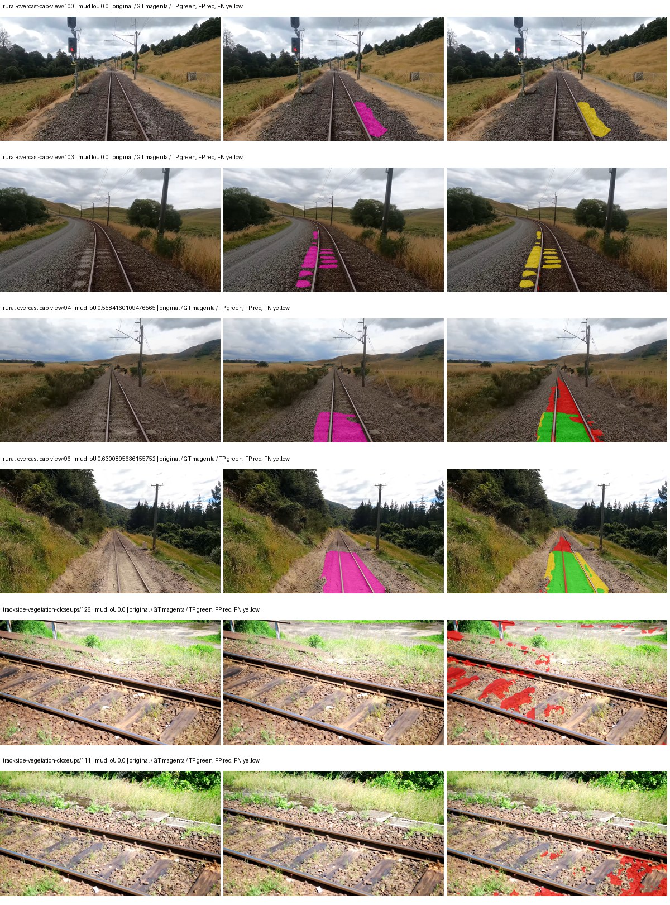
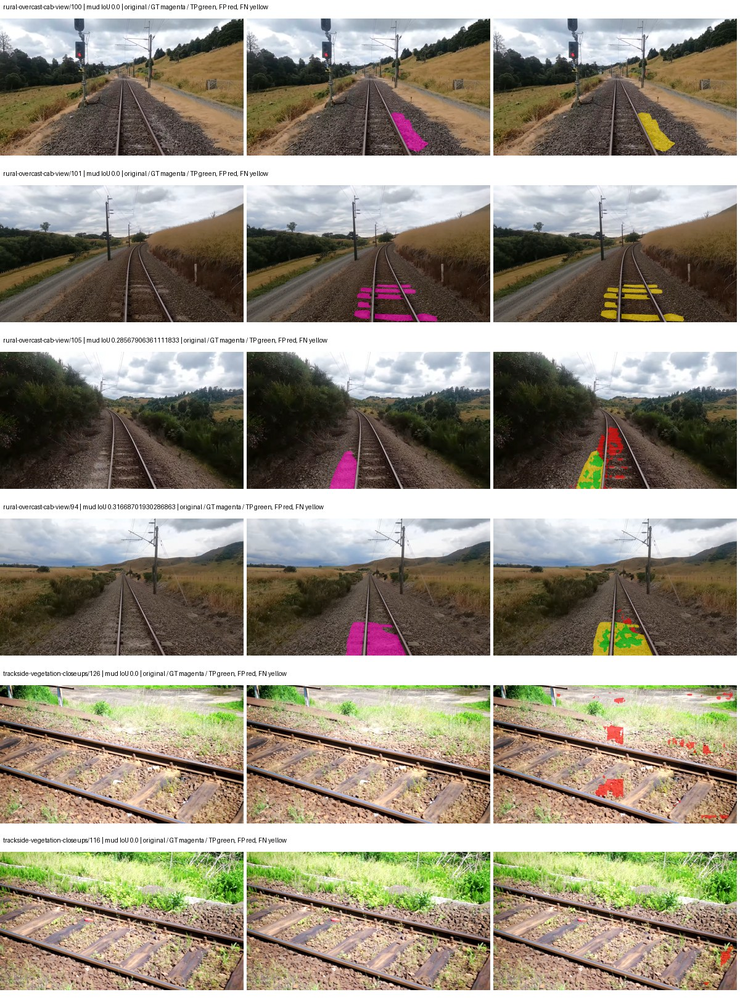
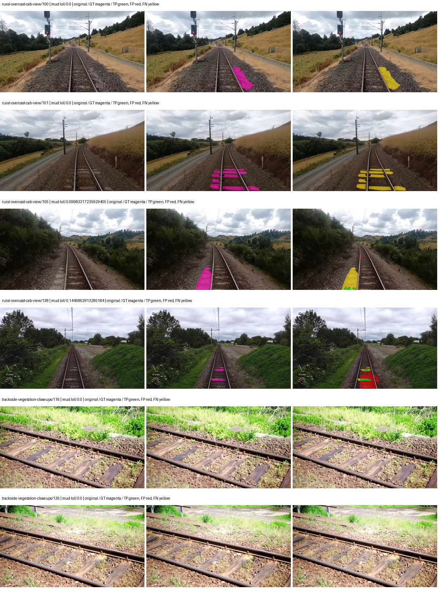
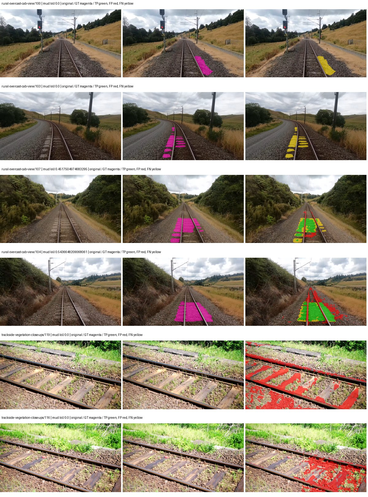

# hf_auto_beit_base_ade — paul-test-rtis

[RTIS comparison](../../README.md) · [Full model records](record.json)

Primary selection and early stopping: **mud-pumping validation IoU**. A job is complete only after full statistics and isolated profiling are verified.

| Model | Initialization path | Seed | Status | Steps | Best step | Mud IoU (%) | Mud precision (%) | Mud recall (%) | Final mud IoU (trainer val, %) | mIoU (%) | Fixed GT-class mIoU (%) |
| --- | --- | --- | --- | --- | --- | --- | --- | --- | --- | --- | --- |
| hf_auto_beit_base_ade | rtis_only | 0 | completed | 1527 | 254 | 23.83 | 29.99 | 53.71 | 1.05 | 20.08 | 22.31 |
| hf_auto_beit_base_ade | rtis_only | 1 | completed | 1527 | 254 | 5.32 | 32.20 | 5.99 | 0.45 | 18.24 | 20.27 |
| hf_auto_beit_base_ade | rtis_only | 2 | completed | 1527 | 254 | 2.91 | 19.85 | 3.30 | 0.04 | 18.98 | 20.03 |
| hf_auto_beit_base_ade | cityscapes_to_rtis | 0 | collecting | 1781 | 509 | 11.38 | 14.59 | 34.12 | 2.94 | 21.51 | 23.90 |
| hf_auto_beit_base_ade | cityscapes_to_rtis | 1 | training | 2199 | — | — | — | — | — | — | — |
| hf_auto_beit_base_ade | cityscapes_to_rtis | 2 | training | 1999 | — | — | — | — | — | — | — |
| hf_auto_beit_base_ade | railsem19_to_rtis | 0 | training | 2036 | — | — | — | — | — | — | — |
| hf_auto_beit_base_ade | railsem19_to_rtis | 1 | collecting | 1527 | 254 | 4.33 | 4.70 | 35.21 | 0.04 | 21.37 | 22.55 |
| hf_auto_beit_base_ade | railsem19_to_rtis | 2 | training | 1649 | — | — | — | — | — | — | — |
| hf_auto_beit_base_ade | cityscapes_to_railsem19_to_rtis | 0 | training | 1499 | — | — | — | — | — | — | — |
| hf_auto_beit_base_ade | cityscapes_to_railsem19_to_rtis | 1 | training | 1349 | — | — | — | — | — | — | — |
| hf_auto_beit_base_ade | cityscapes_to_railsem19_to_rtis | 2 | training | 1199 | — | — | — | — | — | — | — |

Training: 220 images. Validation: 37 images. Test: 50 held out. Seeds: [0, 1, 2]. Seed variation measures optimization variability, not independent-recording uncertainty. Historical source checkpoints stay fixed across adaptation seeds.

Training code: `066afb2626398b7be59d4d19f5a0e4644fd59adc`. Split SHA-256: `71fef8292610c352da0709fe3bd030f3bcc18f97560394835f4b22826463b83d`.

## rtis_only — seed 0

Status: **completed**. Started: 2026-09-06T07:19:19.641960+00:00. Finished: 2026-09-06T08:38:16.721847+00:00.

Recipe pretrained initializer: `microsoft/beit-base-finetuned-ade-640-640`.

`rtis_only` uses the recipe initializer, which may include pretrained segmentation components. Transfer paths load the exact historical source checkpoint below and reset the classifier; they do not reset all query/decoder features.

Source checkpoint: `Recipe pretrained initialization`.

Config SHA-256: `31766fec05c59ef7603e99080adcaefa157fc29a4cc792cda226ba93e077eee1`. Weights used for validation: `raw`.

### Mud-pumping and aggregate quality

| Metric | Selected checkpoint | Final training validation |
| --- | --- | --- |
| Mud IoU | 23.83 | 1.05 |
| Mud precision | 29.99 | 2.61 |
| Mud recall | 53.71 | 1.71 |
| Mud Dice/F1 | 38.49 | 2.07 |
| mIoU | 20.08 | 27.23 |
| Mean accuracy | 28.24 | 36.48 |
| Mean precision | 41.34 | 55.37 |
| Mean Dice | 26.26 | 36.19 |
| Mean specificity | 98.56 | 98.69 |
| Pixel accuracy | 76.32 | 78.38 |
| Frequency-weighted IoU | 66.32 | 68.04 |
| Fixed GT-present class mIoU | 22.31 | 30.25 |
| Boundary F1 | 23.05 | 33.14 |

The selected checkpoint has independent evaluation evidence. Final values are the trainer's final validation record, not a new independent evaluation. mIoU averages classes with nonzero union, so false positives on absent classes can change its denominator. The fixed GT-class mean is supplementary and excludes absent classes; their false positives remain in the confusion matrix.

### Resource usage and timing

| Measurement | Value |
| --- | --- |
| Peak training VRAM, retained training invocation (GiB) | 15.36 |
| Peak evaluation VRAM (GiB) | 7.39 |
| Retained training invocation wall time (seconds) | 3531.35 |
| Retained training invocation GPU-hours (one GPU) | 0.98 |
| Evaluation wall time (seconds) | 119.21 |
| Full evaluation pipeline images/second | 0.31 |
| Best full-state checkpoint (MiB) | 2355.56 |
| Final full-state checkpoint (MiB) | 2355.55 |
| Audited periodic checkpoints removed (GiB) | 6.90 |

VRAM uses the recorded allocator high-water mark; it is not total device usage including CUDA context. Resumed jobs' retained training invocation times and peaks are **not whole-campaign totals**. Earlier invocation resource records are not reconstructed here. Evaluation throughput includes loader, sliding-window inference and metrics; it is not model-only latency/FPS. Missing measurements are shown as —, never inferred from another dataset's run.

### Standardized inference performance

Dedicated model-only profiling waits for an idle worker-locked L40S: BF16, batch 1, 1024x1024, 20 warmup and 100 CUDA-event-timed public forwards. It excludes loading, preprocessing, tiling and metrics.

| Status | Parameters | Weight MiB | FPS | p50 ms | p95 ms | Peak reserved GiB |
| --- | --- | --- | --- | --- | --- | --- |
| complete | 161500245 | 616.07 | 2.55 | 391.58 | 393.47 | 3.77 |

```json
{
  "schema_version": 1,
  "model_id": "hf_auto_beit_base_ade",
  "measured_at": "2026-09-06T08:38:04+00:00",
  "status": "complete",
  "benchmark_scope": "rtis_selected_checkpoint_model_only",
  "applies_to": [
    "hf_auto_beit_base_ade--rtis_only--seed-0"
  ],
  "source": {
    "campaign_git_sha": "066afb2626398b7be59d4d19f5a0e4644fd59adc",
    "git_dirty": false,
    "config_hash": "284a437e136e",
    "resolved_config": "/data/izadia1/projects/segmentary-runs/paul-test-rtis/mud-fullstats-v1-20260906-r2/configs/hf_auto_beit_base_ade--rtis_only--seed-0.yaml",
    "config_sha256": "31766fec05c59ef7603e99080adcaefa157fc29a4cc792cda226ba93e077eee1",
    "checkpoint_sha256": "c0bbf96bb38f19797f1cfcfb9c2c0b245d08ac7a2219c664ebff6e39b6deaab4",
    "checkpoint_global_step": 254,
    "checkpoint_bytes": 2469981509,
    "checkpoint_kind": "resume checkpoint with optimizer and EMA state",
    "weights": "raw",
    "measured_checkpoint_job_id": "hf_auto_beit_base_ade--rtis_only--seed-0",
    "result_sha256": "9b73129cf46b692a4daa931f4ac331acfe85e1636174c9991e0742d45e02c47e",
    "result_git_sha": "066afb2626398b7be59d4d19f5a0e4644fd59adc",
    "result_stage": "eval:paul-test-rtis:val",
    "result_seed": 0
  },
  "hardware": {
    "gpu_name": "NVIDIA L40S",
    "gpu_uuid": "GPU-84f5ca4d-68db-ae98-d056-40654d859dd9",
    "logical_device": "cuda:0",
    "physical_visibility_token": "0",
    "compute_capability": [
      8,
      9
    ],
    "total_memory_bytes": 47677177856
  },
  "model": {
    "parameter_count": 161500245,
    "trainable_parameter_count": 147173109,
    "resident_parameter_bytes": 646000980,
    "parameter_dtype_counts": {
      "float32": 161500245
    }
  },
  "contract": {
    "backend": "pytorch",
    "precision": "bf16_autocast",
    "batch_size": 1,
    "input_shape_nchw": [
      1,
      3,
      1024,
      1024
    ],
    "warmup_iterations": 20,
    "measured_iterations": 100,
    "timing": "per-forward CUDA events with end-event synchronization",
    "includes_preprocessing": false,
    "includes_data_loader": false,
    "includes_sliding_window": false,
    "input_resident_on_gpu": true,
    "model_only": true,
    "entrypoint": "public model(image) dense-logits forward"
  },
  "measurements": {
    "latency": {
      "p50_ms": 391.5765686035156,
      "p95_ms": 393.4656021118164,
      "mean_ms": 392.01403259277345,
      "minimum_ms": 390.7767333984375,
      "maximum_ms": 416.3706970214844,
      "fps": 2.55092909145629,
      "raw_ms": [
        392.8227844238281,
        393.94097900390625,
        394.40692138671875,
        391.7527160644531,
        391.3758850097656,
        391.1178283691406,
        392.0599670410156,
        391.3471984863281,
        392.2995300292969,
        391.2335510253906,
        391.2038269042969,
        391.9574890136719,
        391.088134765625,
        391.8489685058594,
        391.40557861328125,
        390.95806884765625,
        391.1546936035156,
        391.6329040527344,
        391.3809814453125,
        391.1884765625,
        391.520263671875,
        390.9693298339844,
        391.1363220214844,
        391.94317626953125,
        391.4997863769531,
        392.1059875488281,
        390.7767333984375,
        391.2437744140625,
        391.119873046875,
        391.0492248535156,
        391.5857849121094,
        391.11065673828125,
        391.9503479003906,
        391.30517578125,
        391.6810302734375,
        392.00152587890625,
        391.53253173828125,
        391.878662109375,
        391.29278564453125,
        391.22637939453125,
        391.13525390625,
        391.56634521484375,
        391.90338134765625,
        390.9674072265625,
        401.5810546875,
        391.7813720703125,
        391.30010986328125,
        391.74029541015625,
        391.1639099121094,
        391.2232971191406,
        393.4617614746094,
        391.1669616699219,
        391.25811767578125,
        391.6636047363281,
        391.9115295410156,
        416.3706970214844,
        391.9974365234375,
        392.1049499511719,
        391.3809814453125,
        391.62896728515625,
        391.1127014160156,
        393.1208190917969,
        391.22125244140625,
        393.53857421875,
        391.1504821777344,
        390.9273681640625,
        392.4643859863281,
        391.69024658203125,
        391.5673522949219,
        391.3789367675781,
        391.44140625,
        392.0138244628906,
        391.1178283691406,
        392.6896667480469,
        391.6810302734375,
        391.5018310546875,
        391.99847412109375,
        391.18438720703125,
        391.6646423339844,
        391.3645935058594,
        391.1127014160156,
        391.6697692871094,
        392.8514709472656,
        392.01580810546875,
        391.8018493652344,
        391.12396240234375,
        391.6134338378906,
        392.16229248046875,
        392.3343505859375,
        391.49053955078125,
        392.1111145019531,
        392.0742492675781,
        391.6820373535156,
        391.81005859375,
        391.0215759277344,
        391.6707763671875,
        391.7506408691406,
        391.1127014160156,
        391.79583740234375,
        390.95501708984375
      ],
      "percentile_method": "numpy linear interpolation"
    },
    "peak_reserved_bytes": 4049600512,
    "memory_kind": "pytorch_cuda_allocator_peak_reserved_excluding_context",
    "benchmark_wall_clock_s": 53.06577514857054
  },
  "started_at": "2026-09-06T08:37:11+00:00",
  "finished_at": "2026-09-06T08:38:04+00:00",
  "environment": {
    "hostname": "hdrfs-app-001",
    "python": "3.11.15",
    "platform": "Linux-5.15.0-139-generic-x86_64-with-glibc2.35",
    "torch": "2.11.0+cu128",
    "torch_cuda": "12.8",
    "cudnn": 91900,
    "driver_version": "570.133.20",
    "cuda_available": true,
    "gpu_count": 1,
    "gpu_names": [
      "NVIDIA L40S"
    ],
    "cuda_visible_devices": "0",
    "packages": {
      "segmentary": "0.1.0",
      "torch": "2.11.0+cu128",
      "torchvision": "0.26.0+cu128",
      "transformers": "5.15.0",
      "timm": "1.0.28",
      "segmentation-models-pytorch": "0.5.0",
      "albumentations": "2.0.8",
      "lightning": "2.6.5",
      "numpy": "2.4.4"
    }
  }
}
```

### Per-class validation results

| Class | GT pixels | IoU (%) | Precision (%) | Recall (%) | Dice (%) | Boundary F1 (%) |
| --- | --- | --- | --- | --- | --- | --- |
| car | 29664 | 0.00 | 0.00 | 0.00 | 0.00 | 0.00 |
| construction | 311585 | 48.44 | 69.47 | 61.54 | 65.27 | 57.25 |
| fence | 265137 | 1.50 | 30.91 | 1.55 | 2.95 | 2.80 |
| mud-pumping | 1226250 | 23.83 | 29.99 | 53.71 | 38.49 | 28.96 |
| on-rails | 0 | 0.00 | 0.00 | — | 0.00 | 0.00 |
| person | 0 | — | — | — | — | — |
| pole | 628038 | 37.90 | 60.14 | 50.61 | 54.97 | 53.98 |
| rail-embedded | 16799 | 0.00 | 0.00 | 0.00 | 0.00 | 0.00 |
| rail-raised | 2969797 | 17.34 | 97.35 | 17.43 | 29.56 | 54.60 |
| rail-track | 6323197 | 8.93 | 88.17 | 9.04 | 16.40 | 15.61 |
| road | 1048831 | 15.04 | 28.13 | 24.42 | 26.14 | 23.97 |
| sidewalk | 1297367 | 10.88 | 93.50 | 10.96 | 19.62 | 4.49 |
| sky | 19121606 | 97.85 | 98.49 | 99.34 | 98.91 | 91.17 |
| standing-water | 95802 | 0.00 | 0.00 | 0.00 | 0.00 | 0.00 |
| terrain | 39239306 | 84.00 | 86.00 | 97.30 | 91.30 | 52.16 |
| trackbed | 10643081 | 45.03 | 54.95 | 71.38 | 62.10 | 46.87 |
| traffic-light | 19510 | 0.00 | 0.00 | 0.00 | 0.00 | 0.00 |
| traffic-sign | 13285 | 0.00 | 0.00 | 0.00 | 0.00 | 0.00 |
| tram-track | 56179 | 0.00 | 0.00 | 0.00 | 0.00 | 0.00 |
| truck | 0 | 0.00 | 0.00 | — | 0.00 | 0.00 |
| vegetation-overgrowth | 5901821 | 10.83 | 89.77 | 10.97 | 19.55 | 29.12 |

### Full-run accounting

| Measurement | Value |
| --- | --- |
| Full GPU-reserved wall seconds, all recorded worker attempts | 4737.08 |
| Full reserved GPU-hours | 1.32 |
| Whole-run timing complete | True |

| Phase | Wall seconds including failed attempts |
| --- | --- |
| training | 3538.21 |
| diagnostics | 992.30 |
| performance | 64.30 |

GPU-reserved time includes model loading, training, validation, collection, profiling, checkpoint I/O and orchestration while the worker owns one GPU. It is not GPU kernel-active time. Phase timings and sampled device memory/power/utilization are retained separately; sampled device memory is not the allocator high-water mark.

### Train/validation and raw/EMA diagnostics

| Checkpoint / weights / split | Images | Mud IoU (%) | Mud precision (%) | Mud recall (%) |
| --- | --- | --- | --- | --- |
| best-auto-train / raw | 220 | 68.83 | 71.24 | 95.33 |
| best-auto-val / raw | 37 | 23.83 | 29.99 | 53.71 |
| best-alternate-val / ema | 37 | 1.41 | 75.17 | 1.42 |
| final-auto-val / raw | 37 | 1.05 | 2.60 | 1.72 |

Train uses the evaluation transform without augmentation. Compare mud train/validation metrics for the same selected weights. Alternate EMA on running-stat BatchNorm is explicitly uncalibrated and is diagnostic only. Score-threshold curves use uncalibrated normalized scores and are pixel-level diagnostics, not event detection rates or a selected deployment operating point.

### Downloadable evidence

- best-auto-train: [per-image.csv](rtis_only--seed-0/best-auto-train/per-image.csv) · [per-image-confusion.json.gz](rtis_only--seed-0/best-auto-train/per-image-confusion.json.gz) · [groups.json](rtis_only--seed-0/best-auto-train/groups.json) · [mud-score-curves.json](rtis_only--seed-0/best-auto-train/mud-score-curves.json)
- best-auto-val: [per-image.csv](rtis_only--seed-0/best-auto-val/per-image.csv) · [per-image-confusion.json.gz](rtis_only--seed-0/best-auto-val/per-image-confusion.json.gz) · [groups.json](rtis_only--seed-0/best-auto-val/groups.json) · [mud-score-curves.json](rtis_only--seed-0/best-auto-val/mud-score-curves.json) · [examples.jpg](rtis_only--seed-0/best-auto-val/examples.jpg)
- best-alternate-val: [per-image.csv](rtis_only--seed-0/best-alternate-val/per-image.csv) · [per-image-confusion.json.gz](rtis_only--seed-0/best-alternate-val/per-image-confusion.json.gz) · [groups.json](rtis_only--seed-0/best-alternate-val/groups.json) · [mud-score-curves.json](rtis_only--seed-0/best-alternate-val/mud-score-curves.json)
- final-auto-val: [per-image.csv](rtis_only--seed-0/final-auto-val/per-image.csv) · [per-image-confusion.json.gz](rtis_only--seed-0/final-auto-val/per-image-confusion.json.gz) · [groups.json](rtis_only--seed-0/final-auto-val/groups.json) · [mud-score-curves.json](rtis_only--seed-0/final-auto-val/mud-score-curves.json)
- resources: [telemetry.csv](rtis_only--seed-0/resources/telemetry.csv)



Examples are two lowest and two highest mud-IoU positive images, plus up to two negative images with the most false-positive mud pixels. They are targeted diagnostic examples, not random samples. Green: true positive; red: false positive; yellow: false negative. Full predictions remain on HDRFS.

### Validation tracking

| Logged step | Overall mIoU (%) | Mud IoU (%) |
| --- | --- | --- |
| 254 | 20.07 | 23.85 |
| 508 | 17.87 | 9.53 |
| 763 | 20.72 | 4.96 |
| 1017 | 23.63 | 0.89 |
| 1272 | 29.25 | 0.01 |
| 1527 | 27.23 | 1.05 |

All retained scalar curves, including training loss and per-class IoU, are in record.json. Observed best mud on a curve is not necessarily a retained checkpoint: the pilot saved its selection-metric-best and final checkpoints. Step logging and checkpoint global_step may differ by one.

### Stopping and checkpoint provenance

```json
{
  "stopping": {
    "actual_steps": 1527,
    "maximum_steps": 4000,
    "min_delta": 0.001,
    "monitor": "val_iou/mud-pumping",
    "patience": 5,
    "reason": "validation_plateau"
  },
  "checkpoints": {
    "best": {
      "path": "/data/izadia1/projects/segmentary-runs/paul-test-rtis/mud-fullstats-v1-20260906-r2/future-runs/hf_auto_beit_base_ade--rtis_only--seed-0_seed0/rtis/best.ckpt",
      "sha256": "c0bbf96bb38f19797f1cfcfb9c2c0b245d08ac7a2219c664ebff6e39b6deaab4",
      "global_step": 254,
      "bytes": 2469981509
    },
    "final": {
      "path": "/data/izadia1/projects/segmentary-runs/paul-test-rtis/mud-fullstats-v1-20260906-r2/future-runs/hf_auto_beit_base_ade--rtis_only--seed-0_seed0/rtis/last.ckpt",
      "sha256": "60ad3bb24a0130505872f6d204cdb5a39f9d513765f2e667d8929f84c126a045",
      "global_step": 1527,
      "bytes": 2469969541
    }
  },
  "cleanup_error": null
}
```

### Resolved training, initialization and evaluation settings

The optimizer block is the base configuration. Stage LR scales are applied at runtime, and stage warmup is capped at min(base warmup, floor(stage budget / 10), stage budget - 1): 400 steps for this 4,000-step pilot. Model-internal native input grids may differ from augmentation crops (EoMT uses its 640 grid).

```json
{
  "name": "hf_auto_beit_base_ade--rtis_only--seed-0",
  "model": {
    "arch": "hf_auto",
    "checkpoint": "microsoft/beit-base-finetuned-ade-640-640",
    "tuning": "full",
    "head": "unified_head",
    "lora_r": 16,
    "lora_alpha": 32,
    "lora_dropout": 0.05,
    "lora_targets": [],
    "drop_path": null,
    "revision": "a8b6f5ef4acb2ea55d882989deaa02d39401e2b2",
    "subfolder": null,
    "local_files_only": false,
    "trust_remote_code": false,
    "backbone_path": null,
    "head_paths": [],
    "classifier_path": null,
    "inactive_parameter_paths": [
      "beit.layers.10",
      "beit.layers.11"
    ],
    "smp_arch": null,
    "encoder_name": null,
    "encoder_weights": null,
    "native": null,
    "batch_norm_momentum": null
  },
  "space": "paul-test-rtis",
  "taxonomy_root": "/data/izadia1/projects/segmentary-rtis-fullstats-066afb2/taxonomy",
  "output_root": "/data/izadia1/projects/segmentary-runs/paul-test-rtis/mud-fullstats-v1-20260906-r2/future-runs",
  "optim": {
    "backbone_lr": 2e-05,
    "head_lr_mult": 10.0,
    "weight_decay": 0.05,
    "llrd": 0.8,
    "warmup_iters": 1500,
    "warmup_ratio": 1e-06,
    "poly_power": 0.9,
    "min_lr_ratio": 0.0,
    "betas": [
      0.9,
      0.999
    ],
    "grad_clip": 1.0
  },
  "train": {
    "iters": 4000,
    "batch_size": 2,
    "accum": 8,
    "num_workers": 2,
    "precision": "bf16-mixed",
    "ema_decay": 0.9998,
    "val_every": 250,
    "ckpt_every": 500,
    "selection_metric": "val_iou/mud-pumping",
    "early_stopping_patience": 5,
    "early_stopping_min_delta": 0.001,
    "seed": 0,
    "devices": 1
  },
  "eval": {
    "sliding_window": true,
    "window": [
      1024,
      1024
    ],
    "stride": [
      768,
      768
    ],
    "batch_size": 1,
    "num_workers": 2,
    "tta_scales": [],
    "tta_flip": false,
    "threshold": 0.5,
    "boundary_tolerance_frac": 0.0075,
    "save_confusion": true
  },
  "loss": {
    "task": "multiclass",
    "activation": "auto",
    "terms": [],
    "aux": "none",
    "aux_weight": 0.0,
    "ce_weight": 1.0,
    "label_smoothing": 0.0,
    "class_weights": null,
    "query": null
  },
  "aug": {
    "crop": [
      640,
      640
    ],
    "scale_min": 0.5,
    "scale_max": 2.0,
    "hflip_p": 0.5,
    "color_jitter_p": 0.5,
    "brightness": 0.25,
    "contrast": 0.25,
    "saturation": 0.25,
    "hue": 0.05
  },
  "stages": [
    {
      "name": "rtis",
      "data": [
        {
          "name": "paul-test-rtis",
          "root": "/data/izadia1/datasets/paul-test-rtis",
          "variant": null,
          "split_file": "splits.json",
          "train_split": "train",
          "val_split": "val",
          "limit": null,
          "loader": "folder",
          "mapping": "paul-test-rtis",
          "loader_options": {
            "require_groups": true
          }
        }
      ],
      "iters": null,
      "lr_scale": 1.0,
      "head_group_lr_scale": 1.0,
      "init_from": "pretrained",
      "reset_head": false,
      "freeze": null,
      "sample_weights": null
    }
  ]
}
```

### Hardware and software provenance

```json
{
  "training": {
    "cuda_available": true,
    "cuda_visible_devices": "0",
    "cudnn": 91900,
    "driver_version": "570.133.20",
    "gpu_count": 1,
    "gpu_names": [
      "NVIDIA L40S"
    ],
    "hostname": "hdrfs-app-001",
    "input_normalization": {
      "channel_order": "rgb",
      "mean": [
        0.5,
        0.5,
        0.5
      ],
      "source": "hf_image_processor",
      "std": [
        0.5,
        0.5,
        0.5
      ]
    },
    "model_origins": [
      {
        "hf_commit": "a8b6f5ef4acb2ea55d882989deaa02d39401e2b2",
        "hf_name_or_path": "microsoft/beit-base-finetuned-ade-640-640",
        "module": "model",
        "timm_pretrained": {}
      },
      {
        "hf_commit": "a8b6f5ef4acb2ea55d882989deaa02d39401e2b2",
        "hf_name_or_path": "microsoft/beit-base-finetuned-ade-640-640",
        "module": "model.beit",
        "timm_pretrained": {}
      },
      {
        "hf_commit": "a8b6f5ef4acb2ea55d882989deaa02d39401e2b2",
        "hf_name_or_path": "microsoft/beit-base-finetuned-ade-640-640",
        "module": "model.beit.layers.0.attention",
        "timm_pretrained": {}
      },
      {
        "hf_commit": "a8b6f5ef4acb2ea55d882989deaa02d39401e2b2",
        "hf_name_or_path": "microsoft/beit-base-finetuned-ade-640-640",
        "module": "model.beit.layers.0.mlp",
        "timm_pretrained": {}
      },
      {
        "hf_commit": "a8b6f5ef4acb2ea55d882989deaa02d39401e2b2",
        "hf_name_or_path": "microsoft/beit-base-finetuned-ade-640-640",
        "module": "model.beit.layers.1.attention",
        "timm_pretrained": {}
      },
      {
        "hf_commit": "a8b6f5ef4acb2ea55d882989deaa02d39401e2b2",
        "hf_name_or_path": "microsoft/beit-base-finetuned-ade-640-640",
        "module": "model.beit.layers.1.mlp",
        "timm_pretrained": {}
      },
      {
        "hf_commit": "a8b6f5ef4acb2ea55d882989deaa02d39401e2b2",
        "hf_name_or_path": "microsoft/beit-base-finetuned-ade-640-640",
        "module": "model.beit.layers.2.attention",
        "timm_pretrained": {}
      },
      {
        "hf_commit": "a8b6f5ef4acb2ea55d882989deaa02d39401e2b2",
        "hf_name_or_path": "microsoft/beit-base-finetuned-ade-640-640",
        "module": "model.beit.layers.2.mlp",
        "timm_pretrained": {}
      },
      {
        "hf_commit": "a8b6f5ef4acb2ea55d882989deaa02d39401e2b2",
        "hf_name_or_path": "microsoft/beit-base-finetuned-ade-640-640",
        "module": "model.beit.layers.3.attention",
        "timm_pretrained": {}
      },
      {
        "hf_commit": "a8b6f5ef4acb2ea55d882989deaa02d39401e2b2",
        "hf_name_or_path": "microsoft/beit-base-finetuned-ade-640-640",
        "module": "model.beit.layers.3.mlp",
        "timm_pretrained": {}
      },
      {
        "hf_commit": "a8b6f5ef4acb2ea55d882989deaa02d39401e2b2",
        "hf_name_or_path": "microsoft/beit-base-finetuned-ade-640-640",
        "module": "model.beit.layers.4.attention",
        "timm_pretrained": {}
      },
      {
        "hf_commit": "a8b6f5ef4acb2ea55d882989deaa02d39401e2b2",
        "hf_name_or_path": "microsoft/beit-base-finetuned-ade-640-640",
        "module": "model.beit.layers.4.mlp",
        "timm_pretrained": {}
      },
      {
        "hf_commit": "a8b6f5ef4acb2ea55d882989deaa02d39401e2b2",
        "hf_name_or_path": "microsoft/beit-base-finetuned-ade-640-640",
        "module": "model.beit.layers.5.attention",
        "timm_pretrained": {}
      },
      {
        "hf_commit": "a8b6f5ef4acb2ea55d882989deaa02d39401e2b2",
        "hf_name_or_path": "microsoft/beit-base-finetuned-ade-640-640",
        "module": "model.beit.layers.5.mlp",
        "timm_pretrained": {}
      },
      {
        "hf_commit": "a8b6f5ef4acb2ea55d882989deaa02d39401e2b2",
        "hf_name_or_path": "microsoft/beit-base-finetuned-ade-640-640",
        "module": "model.beit.layers.6.attention",
        "timm_pretrained": {}
      },
      {
        "hf_commit": "a8b6f5ef4acb2ea55d882989deaa02d39401e2b2",
        "hf_name_or_path": "microsoft/beit-base-finetuned-ade-640-640",
        "module": "model.beit.layers.6.mlp",
        "timm_pretrained": {}
      },
      {
        "hf_commit": "a8b6f5ef4acb2ea55d882989deaa02d39401e2b2",
        "hf_name_or_path": "microsoft/beit-base-finetuned-ade-640-640",
        "module": "model.beit.layers.7.attention",
        "timm_pretrained": {}
      },
      {
        "hf_commit": "a8b6f5ef4acb2ea55d882989deaa02d39401e2b2",
        "hf_name_or_path": "microsoft/beit-base-finetuned-ade-640-640",
        "module": "model.beit.layers.7.mlp",
        "timm_pretrained": {}
      },
      {
        "hf_commit": "a8b6f5ef4acb2ea55d882989deaa02d39401e2b2",
        "hf_name_or_path": "microsoft/beit-base-finetuned-ade-640-640",
        "module": "model.beit.layers.8.attention",
        "timm_pretrained": {}
      },
      {
        "hf_commit": "a8b6f5ef4acb2ea55d882989deaa02d39401e2b2",
        "hf_name_or_path": "microsoft/beit-base-finetuned-ade-640-640",
        "module": "model.beit.layers.8.mlp",
        "timm_pretrained": {}
      },
      {
        "hf_commit": "a8b6f5ef4acb2ea55d882989deaa02d39401e2b2",
        "hf_name_or_path": "microsoft/beit-base-finetuned-ade-640-640",
        "module": "model.beit.layers.9.attention",
        "timm_pretrained": {}
      },
      {
        "hf_commit": "a8b6f5ef4acb2ea55d882989deaa02d39401e2b2",
        "hf_name_or_path": "microsoft/beit-base-finetuned-ade-640-640",
        "module": "model.beit.layers.9.mlp",
        "timm_pretrained": {}
      },
      {
        "hf_commit": "a8b6f5ef4acb2ea55d882989deaa02d39401e2b2",
        "hf_name_or_path": "microsoft/beit-base-finetuned-ade-640-640",
        "module": "model.beit.layers.10.attention",
        "timm_pretrained": {}
      },
      {
        "hf_commit": "a8b6f5ef4acb2ea55d882989deaa02d39401e2b2",
        "hf_name_or_path": "microsoft/beit-base-finetuned-ade-640-640",
        "module": "model.beit.layers.10.mlp",
        "timm_pretrained": {}
      },
      {
        "hf_commit": "a8b6f5ef4acb2ea55d882989deaa02d39401e2b2",
        "hf_name_or_path": "microsoft/beit-base-finetuned-ade-640-640",
        "module": "model.beit.layers.11.attention",
        "timm_pretrained": {}
      },
      {
        "hf_commit": "a8b6f5ef4acb2ea55d882989deaa02d39401e2b2",
        "hf_name_or_path": "microsoft/beit-base-finetuned-ade-640-640",
        "module": "model.beit.layers.11.mlp",
        "timm_pretrained": {}
      }
    ],
    "model_parameter_count": 161500245,
    "packages": {
      "albumentations": "2.0.8",
      "lightning": "2.6.5",
      "numpy": "2.4.4",
      "segmentary": "0.1.0",
      "segmentation-models-pytorch": "0.5.0",
      "timm": "1.0.28",
      "torch": "2.11.0+cu128",
      "torchvision": "0.26.0+cu128",
      "transformers": "5.15.0"
    },
    "platform": "Linux-5.15.0-139-generic-x86_64-with-glibc2.35",
    "python": "3.11.15",
    "torch": "2.11.0+cu128",
    "torch_cuda": "12.8",
    "trainable_parameter_count": 147173109,
    "training_stop": {
      "actual_steps": 1527,
      "maximum_steps": 4000,
      "min_delta": 0.001,
      "monitor": "val_iou/mud-pumping",
      "patience": 5,
      "reason": "validation_plateau"
    },
    "validation_weights": "raw"
  },
  "evaluation": {
    "cuda_available": true,
    "cuda_visible_devices": "0",
    "cudnn": 91900,
    "driver_version": "570.133.20",
    "gpu_count": 1,
    "gpu_names": [
      "NVIDIA L40S"
    ],
    "hostname": "hdrfs-app-001",
    "input_normalization": {
      "channel_order": "rgb",
      "mean": [
        0.5,
        0.5,
        0.5
      ],
      "source": "hf_image_processor",
      "std": [
        0.5,
        0.5,
        0.5
      ]
    },
    "packages": {
      "albumentations": "2.0.8",
      "lightning": "2.6.5",
      "numpy": "2.4.4",
      "segmentary": "0.1.0",
      "segmentation-models-pytorch": "0.5.0",
      "timm": "1.0.28",
      "torch": "2.11.0+cu128",
      "torchvision": "0.26.0+cu128",
      "transformers": "5.15.0"
    },
    "platform": "Linux-5.15.0-139-generic-x86_64-with-glibc2.35",
    "python": "3.11.15",
    "torch": "2.11.0+cu128",
    "torch_cuda": "12.8"
  }
}
```

## rtis_only — seed 1

Status: **completed**. Started: 2026-09-06T07:30:10.864088+00:00. Finished: 2026-09-06T08:49:52.309692+00:00.

Recipe pretrained initializer: `microsoft/beit-base-finetuned-ade-640-640`.

`rtis_only` uses the recipe initializer, which may include pretrained segmentation components. Transfer paths load the exact historical source checkpoint below and reset the classifier; they do not reset all query/decoder features.

Source checkpoint: `Recipe pretrained initialization`.

Config SHA-256: `2d6911887e0abb2702d60bda770ef90aeaaa700a66e90452490b6a5f587bca3f`. Weights used for validation: `raw`.

### Mud-pumping and aggregate quality

| Metric | Selected checkpoint | Final training validation |
| --- | --- | --- |
| Mud IoU | 5.32 | 0.45 |
| Mud precision | 32.20 | 1.29 |
| Mud recall | 5.99 | 0.69 |
| Mud Dice/F1 | 10.10 | 0.90 |
| mIoU | 18.24 | 21.20 |
| Mean accuracy | 26.18 | 32.44 |
| Mean precision | 39.05 | 46.16 |
| Mean Dice | 23.52 | 28.09 |
| Mean specificity | 98.51 | 98.30 |
| Pixel accuracy | 76.02 | 74.57 |
| Frequency-weighted IoU | 64.73 | 62.19 |
| Fixed GT-present class mIoU | 20.27 | 24.73 |
| Boundary F1 | 21.01 | 25.56 |

The selected checkpoint has independent evaluation evidence. Final values are the trainer's final validation record, not a new independent evaluation. mIoU averages classes with nonzero union, so false positives on absent classes can change its denominator. The fixed GT-class mean is supplementary and excludes absent classes; their false positives remain in the confusion matrix.

### Resource usage and timing

| Measurement | Value |
| --- | --- |
| Peak training VRAM, retained training invocation (GiB) | 15.36 |
| Peak evaluation VRAM (GiB) | 7.39 |
| Retained training invocation wall time (seconds) | 3577.49 |
| Retained training invocation GPU-hours (one GPU) | 0.99 |
| Evaluation wall time (seconds) | 118.87 |
| Full evaluation pipeline images/second | 0.31 |
| Best full-state checkpoint (MiB) | 2355.56 |
| Final full-state checkpoint (MiB) | 2355.55 |
| Audited periodic checkpoints removed (GiB) | 6.90 |

VRAM uses the recorded allocator high-water mark; it is not total device usage including CUDA context. Resumed jobs' retained training invocation times and peaks are **not whole-campaign totals**. Earlier invocation resource records are not reconstructed here. Evaluation throughput includes loader, sliding-window inference and metrics; it is not model-only latency/FPS. Missing measurements are shown as —, never inferred from another dataset's run.

### Standardized inference performance

Dedicated model-only profiling waits for an idle worker-locked L40S: BF16, batch 1, 1024x1024, 20 warmup and 100 CUDA-event-timed public forwards. It excludes loading, preprocessing, tiling and metrics.

| Status | Parameters | Weight MiB | FPS | p50 ms | p95 ms | Peak reserved GiB |
| --- | --- | --- | --- | --- | --- | --- |
| complete | 161500245 | 616.07 | 2.54 | 392.69 | 394.52 | 3.77 |

```json
{
  "schema_version": 1,
  "model_id": "hf_auto_beit_base_ade",
  "measured_at": "2026-09-06T08:49:39+00:00",
  "status": "complete",
  "benchmark_scope": "rtis_selected_checkpoint_model_only",
  "applies_to": [
    "hf_auto_beit_base_ade--rtis_only--seed-1"
  ],
  "source": {
    "campaign_git_sha": "066afb2626398b7be59d4d19f5a0e4644fd59adc",
    "git_dirty": false,
    "config_hash": "c10302849926",
    "resolved_config": "/data/izadia1/projects/segmentary-runs/paul-test-rtis/mud-fullstats-v1-20260906-r2/configs/hf_auto_beit_base_ade--rtis_only--seed-1.yaml",
    "config_sha256": "2d6911887e0abb2702d60bda770ef90aeaaa700a66e90452490b6a5f587bca3f",
    "checkpoint_sha256": "aa10d87208f70a73382c18bea5f1018afdc8e66679ab53b40e48be3fd88972d2",
    "checkpoint_global_step": 254,
    "checkpoint_bytes": 2469981509,
    "checkpoint_kind": "resume checkpoint with optimizer and EMA state",
    "weights": "raw",
    "measured_checkpoint_job_id": "hf_auto_beit_base_ade--rtis_only--seed-1",
    "result_sha256": "225c1352e4292772ac19c252b691ed2d6101f0c9e2d63cf456d3bf49ac23ef61",
    "result_git_sha": "066afb2626398b7be59d4d19f5a0e4644fd59adc",
    "result_stage": "eval:paul-test-rtis:val",
    "result_seed": 1
  },
  "hardware": {
    "gpu_name": "NVIDIA L40S",
    "gpu_uuid": "GPU-1c9b612f-e0b5-fbbc-150f-8c2ef13453c9",
    "logical_device": "cuda:0",
    "physical_visibility_token": "5",
    "compute_capability": [
      8,
      9
    ],
    "total_memory_bytes": 47677177856
  },
  "model": {
    "parameter_count": 161500245,
    "trainable_parameter_count": 147173109,
    "resident_parameter_bytes": 646000980,
    "parameter_dtype_counts": {
      "float32": 161500245
    }
  },
  "contract": {
    "backend": "pytorch",
    "precision": "bf16_autocast",
    "batch_size": 1,
    "input_shape_nchw": [
      1,
      3,
      1024,
      1024
    ],
    "warmup_iterations": 20,
    "measured_iterations": 100,
    "timing": "per-forward CUDA events with end-event synchronization",
    "includes_preprocessing": false,
    "includes_data_loader": false,
    "includes_sliding_window": false,
    "input_resident_on_gpu": true,
    "model_only": true,
    "entrypoint": "public model(image) dense-logits forward"
  },
  "measurements": {
    "latency": {
      "p50_ms": 392.68658447265625,
      "p95_ms": 394.520166015625,
      "mean_ms": 393.2068032836914,
      "minimum_ms": 391.6462097167969,
      "maximum_ms": 425.7976379394531,
      "fps": 2.5431909917349995,
      "raw_ms": [
        393.88262939453125,
        394.14068603515625,
        395.09912109375,
        393.0859375,
        392.226806640625,
        393.29278564453125,
        392.4981689453125,
        393.8242492675781,
        394.5902099609375,
        393.59283447265625,
        393.49041748046875,
        393.3143005371094,
        393.9891052246094,
        392.9190368652344,
        391.9411315917969,
        394.63116455078125,
        393.3122253417969,
        393.08184814453125,
        392.68145751953125,
        392.18072509765625,
        392.2503662109375,
        392.2872314453125,
        392.12542724609375,
        392.41217041015625,
        392.49407958984375,
        392.7132263183594,
        392.9518127441406,
        391.98822021484375,
        392.1694641113281,
        392.86676025390625,
        391.6462097167969,
        392.4961242675781,
        392.4039611816406,
        392.22784423828125,
        392.3670959472656,
        392.3169250488281,
        392.5473327636719,
        393.05419921875,
        392.121337890625,
        392.0875549316406,
        392.3824768066406,
        392.0005187988281,
        392.4377746582031,
        392.4643859863281,
        391.88787841796875,
        392.6005859375,
        392.3875732421875,
        425.7976379394531,
        392.41522216796875,
        392.3906555175781,
        391.7793273925781,
        392.1705017089844,
        392.82073974609375,
        391.7332458496094,
        392.1141662597656,
        392.3210144042969,
        392.0179138183594,
        392.6927490234375,
        392.0506896972656,
        391.9175720214844,
        395.6192932128906,
        392.33331298828125,
        391.66156005859375,
        392.75726318359375,
        392.14593505859375,
        391.9042663574219,
        393.06854248046875,
        392.4285583496094,
        392.453125,
        392.0875549316406,
        392.02099609375,
        394.0034484863281,
        393.6450500488281,
        393.88775634765625,
        393.754638671875,
        393.8580627441406,
        392.75518798828125,
        394.1048278808594,
        394.5164794921875,
        393.6696472167969,
        393.4566345214844,
        393.5262756347656,
        392.9231262207031,
        393.0624084472656,
        393.98809814453125,
        392.637451171875,
        392.4766845703125,
        393.7279968261719,
        393.5570068359375,
        392.89752197265625,
        394.0413513183594,
        392.6292419433594,
        393.90106201171875,
        393.69830322265625,
        392.9640808105469,
        393.26104736328125,
        393.67169189453125,
        393.1217956542969,
        392.0865173339844,
        392.69171142578125
      ],
      "percentile_method": "numpy linear interpolation"
    },
    "peak_reserved_bytes": 4049600512,
    "memory_kind": "pytorch_cuda_allocator_peak_reserved_excluding_context",
    "benchmark_wall_clock_s": 53.087244756519794
  },
  "started_at": "2026-09-06T08:48:46+00:00",
  "finished_at": "2026-09-06T08:49:39+00:00",
  "environment": {
    "hostname": "hdrfs-app-001",
    "python": "3.11.15",
    "platform": "Linux-5.15.0-139-generic-x86_64-with-glibc2.35",
    "torch": "2.11.0+cu128",
    "torch_cuda": "12.8",
    "cudnn": 91900,
    "driver_version": "570.133.20",
    "cuda_available": true,
    "gpu_count": 1,
    "gpu_names": [
      "NVIDIA L40S"
    ],
    "cuda_visible_devices": "5",
    "packages": {
      "segmentary": "0.1.0",
      "torch": "2.11.0+cu128",
      "torchvision": "0.26.0+cu128",
      "transformers": "5.15.0",
      "timm": "1.0.28",
      "segmentation-models-pytorch": "0.5.0",
      "albumentations": "2.0.8",
      "lightning": "2.6.5",
      "numpy": "2.4.4"
    }
  }
}
```

### Per-class validation results

| Class | GT pixels | IoU (%) | Precision (%) | Recall (%) | Dice (%) | Boundary F1 (%) |
| --- | --- | --- | --- | --- | --- | --- |
| car | 29664 | 0.00 | 0.00 | 0.00 | 0.00 | 0.00 |
| construction | 311585 | 44.84 | 54.35 | 71.94 | 61.92 | 46.40 |
| fence | 265137 | 2.46 | 64.89 | 2.49 | 4.79 | 4.90 |
| mud-pumping | 1226250 | 5.32 | 32.20 | 5.99 | 10.10 | 10.45 |
| on-rails | 0 | 0.00 | 0.00 | — | 0.00 | 0.00 |
| person | 0 | — | — | — | — | — |
| pole | 628038 | 42.16 | 58.12 | 60.56 | 59.31 | 58.69 |
| rail-embedded | 16799 | 0.00 | 0.00 | 0.00 | 0.00 | 0.00 |
| rail-raised | 2969797 | 7.99 | 97.83 | 8.01 | 14.80 | 39.86 |
| rail-track | 6323197 | 10.61 | 68.86 | 11.14 | 19.18 | 23.91 |
| road | 1048831 | 13.85 | 28.12 | 21.45 | 24.33 | 26.97 |
| sidewalk | 1297367 | 11.37 | 83.51 | 11.63 | 20.42 | 4.77 |
| sky | 19121606 | 97.50 | 97.69 | 99.80 | 98.73 | 90.53 |
| standing-water | 95802 | 0.00 | 0.00 | 0.00 | 0.00 | 0.00 |
| terrain | 39239306 | 83.57 | 85.27 | 97.67 | 91.05 | 53.17 |
| trackbed | 10643081 | 41.51 | 47.43 | 76.87 | 58.66 | 43.49 |
| traffic-light | 19510 | 0.00 | 0.00 | 0.00 | 0.00 | 0.00 |
| traffic-sign | 13285 | 0.00 | 0.00 | 0.00 | 0.00 | 0.00 |
| tram-track | 56179 | 0.00 | 0.00 | 0.00 | 0.00 | 0.00 |
| truck | 0 | 0.00 | 0.00 | — | 0.00 | 0.00 |
| vegetation-overgrowth | 5901821 | 3.68 | 62.70 | 3.76 | 7.09 | 17.04 |

### Full-run accounting

| Measurement | Value |
| --- | --- |
| Full GPU-reserved wall seconds, all recorded worker attempts | 4781.45 |
| Full reserved GPU-hours | 1.33 |
| Whole-run timing complete | True |

| Phase | Wall seconds including failed attempts |
| --- | --- |
| training | 3584.09 |
| diagnostics | 991.28 |
| performance | 64.09 |

GPU-reserved time includes model loading, training, validation, collection, profiling, checkpoint I/O and orchestration while the worker owns one GPU. It is not GPU kernel-active time. Phase timings and sampled device memory/power/utilization are retained separately; sampled device memory is not the allocator high-water mark.

### Train/validation and raw/EMA diagnostics

| Checkpoint / weights / split | Images | Mud IoU (%) | Mud precision (%) | Mud recall (%) |
| --- | --- | --- | --- | --- |
| best-auto-train / raw | 220 | 77.29 | 85.91 | 88.51 |
| best-auto-val / raw | 37 | 5.32 | 32.20 | 5.99 |
| best-alternate-val / ema | 37 | 0.00 | 0.00 | 0.00 |
| final-auto-val / raw | 37 | 0.45 | 1.30 | 0.69 |

Train uses the evaluation transform without augmentation. Compare mud train/validation metrics for the same selected weights. Alternate EMA on running-stat BatchNorm is explicitly uncalibrated and is diagnostic only. Score-threshold curves use uncalibrated normalized scores and are pixel-level diagnostics, not event detection rates or a selected deployment operating point.

### Downloadable evidence

- best-auto-train: [per-image.csv](rtis_only--seed-1/best-auto-train/per-image.csv) · [per-image-confusion.json.gz](rtis_only--seed-1/best-auto-train/per-image-confusion.json.gz) · [groups.json](rtis_only--seed-1/best-auto-train/groups.json) · [mud-score-curves.json](rtis_only--seed-1/best-auto-train/mud-score-curves.json)
- best-auto-val: [per-image.csv](rtis_only--seed-1/best-auto-val/per-image.csv) · [per-image-confusion.json.gz](rtis_only--seed-1/best-auto-val/per-image-confusion.json.gz) · [groups.json](rtis_only--seed-1/best-auto-val/groups.json) · [mud-score-curves.json](rtis_only--seed-1/best-auto-val/mud-score-curves.json) · [examples.jpg](rtis_only--seed-1/best-auto-val/examples.jpg)
- best-alternate-val: [per-image.csv](rtis_only--seed-1/best-alternate-val/per-image.csv) · [per-image-confusion.json.gz](rtis_only--seed-1/best-alternate-val/per-image-confusion.json.gz) · [groups.json](rtis_only--seed-1/best-alternate-val/groups.json) · [mud-score-curves.json](rtis_only--seed-1/best-alternate-val/mud-score-curves.json)
- final-auto-val: [per-image.csv](rtis_only--seed-1/final-auto-val/per-image.csv) · [per-image-confusion.json.gz](rtis_only--seed-1/final-auto-val/per-image-confusion.json.gz) · [groups.json](rtis_only--seed-1/final-auto-val/groups.json) · [mud-score-curves.json](rtis_only--seed-1/final-auto-val/mud-score-curves.json)
- resources: [telemetry.csv](rtis_only--seed-1/resources/telemetry.csv)



Examples are two lowest and two highest mud-IoU positive images, plus up to two negative images with the most false-positive mud pixels. They are targeted diagnostic examples, not random samples. Green: true positive; red: false positive; yellow: false negative. Full predictions remain on HDRFS.

### Validation tracking

| Logged step | Overall mIoU (%) | Mud IoU (%) |
| --- | --- | --- |
| 254 | 18.24 | 5.30 |
| 508 | 17.56 | 0.01 |
| 763 | 21.24 | 0.00 |
| 1017 | 25.21 | 0.00 |
| 1272 | 20.72 | 0.00 |
| 1527 | 21.20 | 0.45 |

All retained scalar curves, including training loss and per-class IoU, are in record.json. Observed best mud on a curve is not necessarily a retained checkpoint: the pilot saved its selection-metric-best and final checkpoints. Step logging and checkpoint global_step may differ by one.

### Stopping and checkpoint provenance

```json
{
  "stopping": {
    "actual_steps": 1527,
    "maximum_steps": 4000,
    "min_delta": 0.001,
    "monitor": "val_iou/mud-pumping",
    "patience": 5,
    "reason": "validation_plateau"
  },
  "checkpoints": {
    "best": {
      "path": "/data/izadia1/projects/segmentary-runs/paul-test-rtis/mud-fullstats-v1-20260906-r2/future-runs/hf_auto_beit_base_ade--rtis_only--seed-1_seed1/rtis/best.ckpt",
      "sha256": "aa10d87208f70a73382c18bea5f1018afdc8e66679ab53b40e48be3fd88972d2",
      "global_step": 254,
      "bytes": 2469981509
    },
    "final": {
      "path": "/data/izadia1/projects/segmentary-runs/paul-test-rtis/mud-fullstats-v1-20260906-r2/future-runs/hf_auto_beit_base_ade--rtis_only--seed-1_seed1/rtis/last.ckpt",
      "sha256": "c4db3a3b90f3a8efde4f7296238f6e28b9d91295c68ce8599048cf744a113913",
      "global_step": 1527,
      "bytes": 2469969541
    }
  },
  "cleanup_error": null
}
```

### Resolved training, initialization and evaluation settings

The optimizer block is the base configuration. Stage LR scales are applied at runtime, and stage warmup is capped at min(base warmup, floor(stage budget / 10), stage budget - 1): 400 steps for this 4,000-step pilot. Model-internal native input grids may differ from augmentation crops (EoMT uses its 640 grid).

```json
{
  "name": "hf_auto_beit_base_ade--rtis_only--seed-1",
  "model": {
    "arch": "hf_auto",
    "checkpoint": "microsoft/beit-base-finetuned-ade-640-640",
    "tuning": "full",
    "head": "unified_head",
    "lora_r": 16,
    "lora_alpha": 32,
    "lora_dropout": 0.05,
    "lora_targets": [],
    "drop_path": null,
    "revision": "a8b6f5ef4acb2ea55d882989deaa02d39401e2b2",
    "subfolder": null,
    "local_files_only": false,
    "trust_remote_code": false,
    "backbone_path": null,
    "head_paths": [],
    "classifier_path": null,
    "inactive_parameter_paths": [
      "beit.layers.10",
      "beit.layers.11"
    ],
    "smp_arch": null,
    "encoder_name": null,
    "encoder_weights": null,
    "native": null,
    "batch_norm_momentum": null
  },
  "space": "paul-test-rtis",
  "taxonomy_root": "/data/izadia1/projects/segmentary-rtis-fullstats-066afb2/taxonomy",
  "output_root": "/data/izadia1/projects/segmentary-runs/paul-test-rtis/mud-fullstats-v1-20260906-r2/future-runs",
  "optim": {
    "backbone_lr": 2e-05,
    "head_lr_mult": 10.0,
    "weight_decay": 0.05,
    "llrd": 0.8,
    "warmup_iters": 1500,
    "warmup_ratio": 1e-06,
    "poly_power": 0.9,
    "min_lr_ratio": 0.0,
    "betas": [
      0.9,
      0.999
    ],
    "grad_clip": 1.0
  },
  "train": {
    "iters": 4000,
    "batch_size": 2,
    "accum": 8,
    "num_workers": 2,
    "precision": "bf16-mixed",
    "ema_decay": 0.9998,
    "val_every": 250,
    "ckpt_every": 500,
    "selection_metric": "val_iou/mud-pumping",
    "early_stopping_patience": 5,
    "early_stopping_min_delta": 0.001,
    "seed": 1,
    "devices": 1
  },
  "eval": {
    "sliding_window": true,
    "window": [
      1024,
      1024
    ],
    "stride": [
      768,
      768
    ],
    "batch_size": 1,
    "num_workers": 2,
    "tta_scales": [],
    "tta_flip": false,
    "threshold": 0.5,
    "boundary_tolerance_frac": 0.0075,
    "save_confusion": true
  },
  "loss": {
    "task": "multiclass",
    "activation": "auto",
    "terms": [],
    "aux": "none",
    "aux_weight": 0.0,
    "ce_weight": 1.0,
    "label_smoothing": 0.0,
    "class_weights": null,
    "query": null
  },
  "aug": {
    "crop": [
      640,
      640
    ],
    "scale_min": 0.5,
    "scale_max": 2.0,
    "hflip_p": 0.5,
    "color_jitter_p": 0.5,
    "brightness": 0.25,
    "contrast": 0.25,
    "saturation": 0.25,
    "hue": 0.05
  },
  "stages": [
    {
      "name": "rtis",
      "data": [
        {
          "name": "paul-test-rtis",
          "root": "/data/izadia1/datasets/paul-test-rtis",
          "variant": null,
          "split_file": "splits.json",
          "train_split": "train",
          "val_split": "val",
          "limit": null,
          "loader": "folder",
          "mapping": "paul-test-rtis",
          "loader_options": {
            "require_groups": true
          }
        }
      ],
      "iters": null,
      "lr_scale": 1.0,
      "head_group_lr_scale": 1.0,
      "init_from": "pretrained",
      "reset_head": false,
      "freeze": null,
      "sample_weights": null
    }
  ]
}
```

### Hardware and software provenance

```json
{
  "training": {
    "cuda_available": true,
    "cuda_visible_devices": "5",
    "cudnn": 91900,
    "driver_version": "570.133.20",
    "gpu_count": 1,
    "gpu_names": [
      "NVIDIA L40S"
    ],
    "hostname": "hdrfs-app-001",
    "input_normalization": {
      "channel_order": "rgb",
      "mean": [
        0.5,
        0.5,
        0.5
      ],
      "source": "hf_image_processor",
      "std": [
        0.5,
        0.5,
        0.5
      ]
    },
    "model_origins": [
      {
        "hf_commit": "a8b6f5ef4acb2ea55d882989deaa02d39401e2b2",
        "hf_name_or_path": "microsoft/beit-base-finetuned-ade-640-640",
        "module": "model",
        "timm_pretrained": {}
      },
      {
        "hf_commit": "a8b6f5ef4acb2ea55d882989deaa02d39401e2b2",
        "hf_name_or_path": "microsoft/beit-base-finetuned-ade-640-640",
        "module": "model.beit",
        "timm_pretrained": {}
      },
      {
        "hf_commit": "a8b6f5ef4acb2ea55d882989deaa02d39401e2b2",
        "hf_name_or_path": "microsoft/beit-base-finetuned-ade-640-640",
        "module": "model.beit.layers.0.attention",
        "timm_pretrained": {}
      },
      {
        "hf_commit": "a8b6f5ef4acb2ea55d882989deaa02d39401e2b2",
        "hf_name_or_path": "microsoft/beit-base-finetuned-ade-640-640",
        "module": "model.beit.layers.0.mlp",
        "timm_pretrained": {}
      },
      {
        "hf_commit": "a8b6f5ef4acb2ea55d882989deaa02d39401e2b2",
        "hf_name_or_path": "microsoft/beit-base-finetuned-ade-640-640",
        "module": "model.beit.layers.1.attention",
        "timm_pretrained": {}
      },
      {
        "hf_commit": "a8b6f5ef4acb2ea55d882989deaa02d39401e2b2",
        "hf_name_or_path": "microsoft/beit-base-finetuned-ade-640-640",
        "module": "model.beit.layers.1.mlp",
        "timm_pretrained": {}
      },
      {
        "hf_commit": "a8b6f5ef4acb2ea55d882989deaa02d39401e2b2",
        "hf_name_or_path": "microsoft/beit-base-finetuned-ade-640-640",
        "module": "model.beit.layers.2.attention",
        "timm_pretrained": {}
      },
      {
        "hf_commit": "a8b6f5ef4acb2ea55d882989deaa02d39401e2b2",
        "hf_name_or_path": "microsoft/beit-base-finetuned-ade-640-640",
        "module": "model.beit.layers.2.mlp",
        "timm_pretrained": {}
      },
      {
        "hf_commit": "a8b6f5ef4acb2ea55d882989deaa02d39401e2b2",
        "hf_name_or_path": "microsoft/beit-base-finetuned-ade-640-640",
        "module": "model.beit.layers.3.attention",
        "timm_pretrained": {}
      },
      {
        "hf_commit": "a8b6f5ef4acb2ea55d882989deaa02d39401e2b2",
        "hf_name_or_path": "microsoft/beit-base-finetuned-ade-640-640",
        "module": "model.beit.layers.3.mlp",
        "timm_pretrained": {}
      },
      {
        "hf_commit": "a8b6f5ef4acb2ea55d882989deaa02d39401e2b2",
        "hf_name_or_path": "microsoft/beit-base-finetuned-ade-640-640",
        "module": "model.beit.layers.4.attention",
        "timm_pretrained": {}
      },
      {
        "hf_commit": "a8b6f5ef4acb2ea55d882989deaa02d39401e2b2",
        "hf_name_or_path": "microsoft/beit-base-finetuned-ade-640-640",
        "module": "model.beit.layers.4.mlp",
        "timm_pretrained": {}
      },
      {
        "hf_commit": "a8b6f5ef4acb2ea55d882989deaa02d39401e2b2",
        "hf_name_or_path": "microsoft/beit-base-finetuned-ade-640-640",
        "module": "model.beit.layers.5.attention",
        "timm_pretrained": {}
      },
      {
        "hf_commit": "a8b6f5ef4acb2ea55d882989deaa02d39401e2b2",
        "hf_name_or_path": "microsoft/beit-base-finetuned-ade-640-640",
        "module": "model.beit.layers.5.mlp",
        "timm_pretrained": {}
      },
      {
        "hf_commit": "a8b6f5ef4acb2ea55d882989deaa02d39401e2b2",
        "hf_name_or_path": "microsoft/beit-base-finetuned-ade-640-640",
        "module": "model.beit.layers.6.attention",
        "timm_pretrained": {}
      },
      {
        "hf_commit": "a8b6f5ef4acb2ea55d882989deaa02d39401e2b2",
        "hf_name_or_path": "microsoft/beit-base-finetuned-ade-640-640",
        "module": "model.beit.layers.6.mlp",
        "timm_pretrained": {}
      },
      {
        "hf_commit": "a8b6f5ef4acb2ea55d882989deaa02d39401e2b2",
        "hf_name_or_path": "microsoft/beit-base-finetuned-ade-640-640",
        "module": "model.beit.layers.7.attention",
        "timm_pretrained": {}
      },
      {
        "hf_commit": "a8b6f5ef4acb2ea55d882989deaa02d39401e2b2",
        "hf_name_or_path": "microsoft/beit-base-finetuned-ade-640-640",
        "module": "model.beit.layers.7.mlp",
        "timm_pretrained": {}
      },
      {
        "hf_commit": "a8b6f5ef4acb2ea55d882989deaa02d39401e2b2",
        "hf_name_or_path": "microsoft/beit-base-finetuned-ade-640-640",
        "module": "model.beit.layers.8.attention",
        "timm_pretrained": {}
      },
      {
        "hf_commit": "a8b6f5ef4acb2ea55d882989deaa02d39401e2b2",
        "hf_name_or_path": "microsoft/beit-base-finetuned-ade-640-640",
        "module": "model.beit.layers.8.mlp",
        "timm_pretrained": {}
      },
      {
        "hf_commit": "a8b6f5ef4acb2ea55d882989deaa02d39401e2b2",
        "hf_name_or_path": "microsoft/beit-base-finetuned-ade-640-640",
        "module": "model.beit.layers.9.attention",
        "timm_pretrained": {}
      },
      {
        "hf_commit": "a8b6f5ef4acb2ea55d882989deaa02d39401e2b2",
        "hf_name_or_path": "microsoft/beit-base-finetuned-ade-640-640",
        "module": "model.beit.layers.9.mlp",
        "timm_pretrained": {}
      },
      {
        "hf_commit": "a8b6f5ef4acb2ea55d882989deaa02d39401e2b2",
        "hf_name_or_path": "microsoft/beit-base-finetuned-ade-640-640",
        "module": "model.beit.layers.10.attention",
        "timm_pretrained": {}
      },
      {
        "hf_commit": "a8b6f5ef4acb2ea55d882989deaa02d39401e2b2",
        "hf_name_or_path": "microsoft/beit-base-finetuned-ade-640-640",
        "module": "model.beit.layers.10.mlp",
        "timm_pretrained": {}
      },
      {
        "hf_commit": "a8b6f5ef4acb2ea55d882989deaa02d39401e2b2",
        "hf_name_or_path": "microsoft/beit-base-finetuned-ade-640-640",
        "module": "model.beit.layers.11.attention",
        "timm_pretrained": {}
      },
      {
        "hf_commit": "a8b6f5ef4acb2ea55d882989deaa02d39401e2b2",
        "hf_name_or_path": "microsoft/beit-base-finetuned-ade-640-640",
        "module": "model.beit.layers.11.mlp",
        "timm_pretrained": {}
      }
    ],
    "model_parameter_count": 161500245,
    "packages": {
      "albumentations": "2.0.8",
      "lightning": "2.6.5",
      "numpy": "2.4.4",
      "segmentary": "0.1.0",
      "segmentation-models-pytorch": "0.5.0",
      "timm": "1.0.28",
      "torch": "2.11.0+cu128",
      "torchvision": "0.26.0+cu128",
      "transformers": "5.15.0"
    },
    "platform": "Linux-5.15.0-139-generic-x86_64-with-glibc2.35",
    "python": "3.11.15",
    "torch": "2.11.0+cu128",
    "torch_cuda": "12.8",
    "trainable_parameter_count": 147173109,
    "training_stop": {
      "actual_steps": 1527,
      "maximum_steps": 4000,
      "min_delta": 0.001,
      "monitor": "val_iou/mud-pumping",
      "patience": 5,
      "reason": "validation_plateau"
    },
    "validation_weights": "raw"
  },
  "evaluation": {
    "cuda_available": true,
    "cuda_visible_devices": "5",
    "cudnn": 91900,
    "driver_version": "570.133.20",
    "gpu_count": 1,
    "gpu_names": [
      "NVIDIA L40S"
    ],
    "hostname": "hdrfs-app-001",
    "input_normalization": {
      "channel_order": "rgb",
      "mean": [
        0.5,
        0.5,
        0.5
      ],
      "source": "hf_image_processor",
      "std": [
        0.5,
        0.5,
        0.5
      ]
    },
    "packages": {
      "albumentations": "2.0.8",
      "lightning": "2.6.5",
      "numpy": "2.4.4",
      "segmentary": "0.1.0",
      "segmentation-models-pytorch": "0.5.0",
      "timm": "1.0.28",
      "torch": "2.11.0+cu128",
      "torchvision": "0.26.0+cu128",
      "transformers": "5.15.0"
    },
    "platform": "Linux-5.15.0-139-generic-x86_64-with-glibc2.35",
    "python": "3.11.15",
    "torch": "2.11.0+cu128",
    "torch_cuda": "12.8"
  }
}
```

## rtis_only — seed 2

Status: **completed**. Started: 2026-09-06T07:42:39.711401+00:00. Finished: 2026-09-06T09:01:24.629043+00:00.

Recipe pretrained initializer: `microsoft/beit-base-finetuned-ade-640-640`.

`rtis_only` uses the recipe initializer, which may include pretrained segmentation components. Transfer paths load the exact historical source checkpoint below and reset the classifier; they do not reset all query/decoder features.

Source checkpoint: `Recipe pretrained initialization`.

Config SHA-256: `f183cb40895d324bdac72dde796099ed85b437fcc559c4d4ce3fbc39c15cdf14`. Weights used for validation: `raw`.

### Mud-pumping and aggregate quality

| Metric | Selected checkpoint | Final training validation |
| --- | --- | --- |
| Mud IoU | 2.91 | 0.04 |
| Mud precision | 19.85 | 0.13 |
| Mud recall | 3.30 | 0.07 |
| Mud Dice/F1 | 5.66 | 0.09 |
| mIoU | 18.98 | 25.79 |
| Mean accuracy | 27.68 | 36.15 |
| Mean precision | 40.34 | 52.47 |
| Mean Dice | 24.63 | 33.62 |
| Mean specificity | 98.58 | 98.62 |
| Pixel accuracy | 76.58 | 76.79 |
| Frequency-weighted IoU | 66.13 | 66.83 |
| Fixed GT-present class mIoU | 20.03 | 28.66 |
| Boundary F1 | 21.52 | 31.07 |

The selected checkpoint has independent evaluation evidence. Final values are the trainer's final validation record, not a new independent evaluation. mIoU averages classes with nonzero union, so false positives on absent classes can change its denominator. The fixed GT-class mean is supplementary and excludes absent classes; their false positives remain in the confusion matrix.

### Resource usage and timing

| Measurement | Value |
| --- | --- |
| Peak training VRAM, retained training invocation (GiB) | 15.36 |
| Peak evaluation VRAM (GiB) | 7.39 |
| Retained training invocation wall time (seconds) | 3521.23 |
| Retained training invocation GPU-hours (one GPU) | 0.98 |
| Evaluation wall time (seconds) | 119.05 |
| Full evaluation pipeline images/second | 0.31 |
| Best full-state checkpoint (MiB) | 2355.56 |
| Final full-state checkpoint (MiB) | 2355.55 |
| Audited periodic checkpoints removed (GiB) | 6.90 |

VRAM uses the recorded allocator high-water mark; it is not total device usage including CUDA context. Resumed jobs' retained training invocation times and peaks are **not whole-campaign totals**. Earlier invocation resource records are not reconstructed here. Evaluation throughput includes loader, sliding-window inference and metrics; it is not model-only latency/FPS. Missing measurements are shown as —, never inferred from another dataset's run.

### Standardized inference performance

Dedicated model-only profiling waits for an idle worker-locked L40S: BF16, batch 1, 1024x1024, 20 warmup and 100 CUDA-event-timed public forwards. It excludes loading, preprocessing, tiling and metrics.

| Status | Parameters | Weight MiB | FPS | p50 ms | p95 ms | Peak reserved GiB |
| --- | --- | --- | --- | --- | --- | --- |
| complete | 161500245 | 616.07 | 2.53 | 394.61 | 398.16 | 3.77 |

```json
{
  "schema_version": 1,
  "model_id": "hf_auto_beit_base_ade",
  "measured_at": "2026-09-06T09:01:11+00:00",
  "status": "complete",
  "benchmark_scope": "rtis_selected_checkpoint_model_only",
  "applies_to": [
    "hf_auto_beit_base_ade--rtis_only--seed-2"
  ],
  "source": {
    "campaign_git_sha": "066afb2626398b7be59d4d19f5a0e4644fd59adc",
    "git_dirty": false,
    "config_hash": "c18019885776",
    "resolved_config": "/data/izadia1/projects/segmentary-runs/paul-test-rtis/mud-fullstats-v1-20260906-r2/configs/hf_auto_beit_base_ade--rtis_only--seed-2.yaml",
    "config_sha256": "f183cb40895d324bdac72dde796099ed85b437fcc559c4d4ce3fbc39c15cdf14",
    "checkpoint_sha256": "0a0fd637ef64f4721872762f2442dee68c7b7ce689e70e2c2e6e8c62cdeeb2e4",
    "checkpoint_global_step": 254,
    "checkpoint_bytes": 2469981509,
    "checkpoint_kind": "resume checkpoint with optimizer and EMA state",
    "weights": "raw",
    "measured_checkpoint_job_id": "hf_auto_beit_base_ade--rtis_only--seed-2",
    "result_sha256": "96c39102555f50c81ec363515a970baf9162b1a8988d11af4d05f6b25ba83620",
    "result_git_sha": "066afb2626398b7be59d4d19f5a0e4644fd59adc",
    "result_stage": "eval:paul-test-rtis:val",
    "result_seed": 2
  },
  "hardware": {
    "gpu_name": "NVIDIA L40S",
    "gpu_uuid": "GPU-931d0911-fc78-1638-e3d7-1ba868cbd286",
    "logical_device": "cuda:0",
    "physical_visibility_token": "2",
    "compute_capability": [
      8,
      9
    ],
    "total_memory_bytes": 47677177856
  },
  "model": {
    "parameter_count": 161500245,
    "trainable_parameter_count": 147173109,
    "resident_parameter_bytes": 646000980,
    "parameter_dtype_counts": {
      "float32": 161500245
    }
  },
  "contract": {
    "backend": "pytorch",
    "precision": "bf16_autocast",
    "batch_size": 1,
    "input_shape_nchw": [
      1,
      3,
      1024,
      1024
    ],
    "warmup_iterations": 20,
    "measured_iterations": 100,
    "timing": "per-forward CUDA events with end-event synchronization",
    "includes_preprocessing": false,
    "includes_data_loader": false,
    "includes_sliding_window": false,
    "input_resident_on_gpu": true,
    "model_only": true,
    "entrypoint": "public model(image) dense-logits forward"
  },
  "measurements": {
    "latency": {
      "p50_ms": 394.608642578125,
      "p95_ms": 398.1593032836914,
      "mean_ms": 395.98626586914065,
      "minimum_ms": 391.8868408203125,
      "maximum_ms": 429.7041931152344,
      "fps": 2.525340109473555,
      "raw_ms": [
        429.7041931152344,
        394.0289611816406,
        393.56011962890625,
        395.8804626464844,
        396.3187255859375,
        393.7556457519531,
        395.3326110839844,
        394.0863037109375,
        395.60498046875,
        394.8432312011719,
        393.1269226074219,
        394.6608581542969,
        395.4278869628906,
        395.16571044921875,
        394.2615051269531,
        395.7514343261719,
        396.2204284667969,
        394.2010803222656,
        395.01824951171875,
        392.7081298828125,
        392.374267578125,
        392.3507080078125,
        425.5836181640625,
        394.345458984375,
        401.1837463378906,
        397.4359130859375,
        396.40362548828125,
        398.0001220703125,
        395.28961181640625,
        395.40325927734375,
        396.97503662109375,
        397.2126770019531,
        396.0954895019531,
        393.6265563964844,
        395.3775634765625,
        395.8384704589844,
        395.47802734375,
        392.95281982421875,
        394.2164611816406,
        394.5584716796875,
        396.3014221191406,
        394.6639404296875,
        394.95269775390625,
        397.4615173339844,
        395.8835144042969,
        395.9480285644531,
        394.8913269042969,
        394.8871765136719,
        395.652099609375,
        426.2010803222656,
        395.4708557128906,
        393.6583557128906,
        396.66278076171875,
        393.4515075683594,
        394.3219299316406,
        394.79705810546875,
        394.851318359375,
        394.30859375,
        395.0111999511719,
        393.65631103515625,
        394.3946228027344,
        394.26763916015625,
        393.50885009765625,
        395.2679748535156,
        394.9537353515625,
        394.1683349609375,
        394.6588134765625,
        394.2716369628906,
        393.27130126953125,
        393.7320861816406,
        394.8625793457031,
        393.5518798828125,
        394.0146789550781,
        393.3194274902344,
        394.1580810546875,
        394.3485412597656,
        394.0556945800781,
        393.4310302734375,
        393.8734130859375,
        393.03680419921875,
        426.3617248535156,
        393.818115234375,
        394.3526306152344,
        392.329345703125,
        391.8868408203125,
        392.5155944824219,
        392.1500244140625,
        393.1903991699219,
        396.3934631347656,
        394.53900146484375,
        393.0460205078125,
        394.281982421875,
        397.20550537109375,
        393.881591796875,
        393.60614013671875,
        395.3018798828125,
        396.5982666015625,
        393.57952880859375,
        393.9112854003906,
        395.1380615234375
      ],
      "percentile_method": "numpy linear interpolation"
    },
    "peak_reserved_bytes": 4049600512,
    "memory_kind": "pytorch_cuda_allocator_peak_reserved_excluding_context",
    "benchmark_wall_clock_s": 53.6429890319705
  },
  "started_at": "2026-09-06T09:00:18+00:00",
  "finished_at": "2026-09-06T09:01:11+00:00",
  "environment": {
    "hostname": "hdrfs-app-001",
    "python": "3.11.15",
    "platform": "Linux-5.15.0-139-generic-x86_64-with-glibc2.35",
    "torch": "2.11.0+cu128",
    "torch_cuda": "12.8",
    "cudnn": 91900,
    "driver_version": "570.133.20",
    "cuda_available": true,
    "gpu_count": 1,
    "gpu_names": [
      "NVIDIA L40S"
    ],
    "cuda_visible_devices": "2",
    "packages": {
      "segmentary": "0.1.0",
      "torch": "2.11.0+cu128",
      "torchvision": "0.26.0+cu128",
      "transformers": "5.15.0",
      "timm": "1.0.28",
      "segmentation-models-pytorch": "0.5.0",
      "albumentations": "2.0.8",
      "lightning": "2.6.5",
      "numpy": "2.4.4"
    }
  }
}
```

### Per-class validation results

| Class | GT pixels | IoU (%) | Precision (%) | Recall (%) | Dice (%) | Boundary F1 (%) |
| --- | --- | --- | --- | --- | --- | --- |
| car | 29664 | 0.00 | 0.00 | 0.00 | 0.00 | 0.00 |
| construction | 311585 | 31.50 | 33.75 | 82.51 | 47.91 | 34.87 |
| fence | 265137 | 2.07 | 75.63 | 2.08 | 4.05 | 3.74 |
| mud-pumping | 1226250 | 2.91 | 19.85 | 3.30 | 5.66 | 6.90 |
| on-rails | 0 | 0.00 | 0.00 | — | 0.00 | 0.00 |
| person | 0 | — | — | — | — | — |
| pole | 628038 | 42.19 | 56.10 | 62.99 | 59.35 | 59.23 |
| rail-embedded | 16799 | 0.00 | 0.00 | 0.00 | 0.00 | 0.00 |
| rail-raised | 2969797 | 3.97 | 96.76 | 3.97 | 7.63 | 37.00 |
| rail-track | 6323197 | 14.87 | 55.93 | 16.85 | 25.90 | 25.93 |
| road | 1048831 | 19.11 | 31.29 | 32.94 | 32.09 | 25.61 |
| sidewalk | 1297367 | 9.58 | 88.92 | 9.70 | 17.49 | 3.20 |
| sky | 19121606 | 97.93 | 98.66 | 99.25 | 98.95 | 93.02 |
| standing-water | 95802 | 0.00 | 0.00 | 0.00 | 0.00 | 0.00 |
| terrain | 39239306 | 85.56 | 87.54 | 97.43 | 92.22 | 53.82 |
| trackbed | 10643081 | 40.08 | 45.87 | 76.02 | 57.22 | 43.72 |
| traffic-light | 19510 | 0.00 | 0.00 | 0.00 | 0.00 | 0.00 |
| traffic-sign | 13285 | 0.00 | 0.00 | 0.00 | 0.00 | 0.00 |
| tram-track | 56179 | 0.00 | 0.00 | 0.00 | 0.00 | 0.00 |
| truck | 0 | — | — | — | — | — |
| vegetation-overgrowth | 5901821 | 10.81 | 76.09 | 11.19 | 19.50 | 21.79 |

### Full-run accounting

| Measurement | Value |
| --- | --- |
| Full GPU-reserved wall seconds, all recorded worker attempts | 4724.92 |
| Full reserved GPU-hours | 1.31 |
| Whole-run timing complete | True |

| Phase | Wall seconds including failed attempts |
| --- | --- |
| training | 3527.84 |
| diagnostics | 990.05 |
| performance | 65.49 |

GPU-reserved time includes model loading, training, validation, collection, profiling, checkpoint I/O and orchestration while the worker owns one GPU. It is not GPU kernel-active time. Phase timings and sampled device memory/power/utilization are retained separately; sampled device memory is not the allocator high-water mark.

### Train/validation and raw/EMA diagnostics

| Checkpoint / weights / split | Images | Mud IoU (%) | Mud precision (%) | Mud recall (%) |
| --- | --- | --- | --- | --- |
| best-auto-train / raw | 220 | 74.15 | 78.83 | 92.60 |
| best-auto-val / raw | 37 | 2.91 | 19.85 | 3.30 |
| best-alternate-val / ema | 37 | 8.26 | 18.20 | 13.14 |
| final-auto-val / raw | 37 | 0.05 | 0.13 | 0.07 |

Train uses the evaluation transform without augmentation. Compare mud train/validation metrics for the same selected weights. Alternate EMA on running-stat BatchNorm is explicitly uncalibrated and is diagnostic only. Score-threshold curves use uncalibrated normalized scores and are pixel-level diagnostics, not event detection rates or a selected deployment operating point.

### Downloadable evidence

- best-auto-train: [per-image.csv](rtis_only--seed-2/best-auto-train/per-image.csv) · [per-image-confusion.json.gz](rtis_only--seed-2/best-auto-train/per-image-confusion.json.gz) · [groups.json](rtis_only--seed-2/best-auto-train/groups.json) · [mud-score-curves.json](rtis_only--seed-2/best-auto-train/mud-score-curves.json)
- best-auto-val: [per-image.csv](rtis_only--seed-2/best-auto-val/per-image.csv) · [per-image-confusion.json.gz](rtis_only--seed-2/best-auto-val/per-image-confusion.json.gz) · [groups.json](rtis_only--seed-2/best-auto-val/groups.json) · [mud-score-curves.json](rtis_only--seed-2/best-auto-val/mud-score-curves.json) · [examples.jpg](rtis_only--seed-2/best-auto-val/examples.jpg)
- best-alternate-val: [per-image.csv](rtis_only--seed-2/best-alternate-val/per-image.csv) · [per-image-confusion.json.gz](rtis_only--seed-2/best-alternate-val/per-image-confusion.json.gz) · [groups.json](rtis_only--seed-2/best-alternate-val/groups.json) · [mud-score-curves.json](rtis_only--seed-2/best-alternate-val/mud-score-curves.json)
- final-auto-val: [per-image.csv](rtis_only--seed-2/final-auto-val/per-image.csv) · [per-image-confusion.json.gz](rtis_only--seed-2/final-auto-val/per-image-confusion.json.gz) · [groups.json](rtis_only--seed-2/final-auto-val/groups.json) · [mud-score-curves.json](rtis_only--seed-2/final-auto-val/mud-score-curves.json)
- resources: [telemetry.csv](rtis_only--seed-2/resources/telemetry.csv)



Examples are two lowest and two highest mud-IoU positive images, plus up to two negative images with the most false-positive mud pixels. They are targeted diagnostic examples, not random samples. Green: true positive; red: false positive; yellow: false negative. Full predictions remain on HDRFS.

### Validation tracking

| Logged step | Overall mIoU (%) | Mud IoU (%) |
| --- | --- | --- |
| 254 | 18.98 | 2.91 |
| 508 | 21.21 | 0.52 |
| 763 | 23.55 | 0.00 |
| 1017 | 26.47 | 0.02 |
| 1272 | 22.00 | 0.33 |
| 1527 | 25.79 | 0.04 |

All retained scalar curves, including training loss and per-class IoU, are in record.json. Observed best mud on a curve is not necessarily a retained checkpoint: the pilot saved its selection-metric-best and final checkpoints. Step logging and checkpoint global_step may differ by one.

### Stopping and checkpoint provenance

```json
{
  "stopping": {
    "actual_steps": 1527,
    "maximum_steps": 4000,
    "min_delta": 0.001,
    "monitor": "val_iou/mud-pumping",
    "patience": 5,
    "reason": "validation_plateau"
  },
  "checkpoints": {
    "best": {
      "path": "/data/izadia1/projects/segmentary-runs/paul-test-rtis/mud-fullstats-v1-20260906-r2/future-runs/hf_auto_beit_base_ade--rtis_only--seed-2_seed2/rtis/best.ckpt",
      "sha256": "0a0fd637ef64f4721872762f2442dee68c7b7ce689e70e2c2e6e8c62cdeeb2e4",
      "global_step": 254,
      "bytes": 2469981509
    },
    "final": {
      "path": "/data/izadia1/projects/segmentary-runs/paul-test-rtis/mud-fullstats-v1-20260906-r2/future-runs/hf_auto_beit_base_ade--rtis_only--seed-2_seed2/rtis/last.ckpt",
      "sha256": "f7ee64525e68516c2e796abe6f621fc78a3570ad0d1da8daf18d12cc04ebdeb6",
      "global_step": 1527,
      "bytes": 2469969541
    }
  },
  "cleanup_error": null
}
```

### Resolved training, initialization and evaluation settings

The optimizer block is the base configuration. Stage LR scales are applied at runtime, and stage warmup is capped at min(base warmup, floor(stage budget / 10), stage budget - 1): 400 steps for this 4,000-step pilot. Model-internal native input grids may differ from augmentation crops (EoMT uses its 640 grid).

```json
{
  "name": "hf_auto_beit_base_ade--rtis_only--seed-2",
  "model": {
    "arch": "hf_auto",
    "checkpoint": "microsoft/beit-base-finetuned-ade-640-640",
    "tuning": "full",
    "head": "unified_head",
    "lora_r": 16,
    "lora_alpha": 32,
    "lora_dropout": 0.05,
    "lora_targets": [],
    "drop_path": null,
    "revision": "a8b6f5ef4acb2ea55d882989deaa02d39401e2b2",
    "subfolder": null,
    "local_files_only": false,
    "trust_remote_code": false,
    "backbone_path": null,
    "head_paths": [],
    "classifier_path": null,
    "inactive_parameter_paths": [
      "beit.layers.10",
      "beit.layers.11"
    ],
    "smp_arch": null,
    "encoder_name": null,
    "encoder_weights": null,
    "native": null,
    "batch_norm_momentum": null
  },
  "space": "paul-test-rtis",
  "taxonomy_root": "/data/izadia1/projects/segmentary-rtis-fullstats-066afb2/taxonomy",
  "output_root": "/data/izadia1/projects/segmentary-runs/paul-test-rtis/mud-fullstats-v1-20260906-r2/future-runs",
  "optim": {
    "backbone_lr": 2e-05,
    "head_lr_mult": 10.0,
    "weight_decay": 0.05,
    "llrd": 0.8,
    "warmup_iters": 1500,
    "warmup_ratio": 1e-06,
    "poly_power": 0.9,
    "min_lr_ratio": 0.0,
    "betas": [
      0.9,
      0.999
    ],
    "grad_clip": 1.0
  },
  "train": {
    "iters": 4000,
    "batch_size": 2,
    "accum": 8,
    "num_workers": 2,
    "precision": "bf16-mixed",
    "ema_decay": 0.9998,
    "val_every": 250,
    "ckpt_every": 500,
    "selection_metric": "val_iou/mud-pumping",
    "early_stopping_patience": 5,
    "early_stopping_min_delta": 0.001,
    "seed": 2,
    "devices": 1
  },
  "eval": {
    "sliding_window": true,
    "window": [
      1024,
      1024
    ],
    "stride": [
      768,
      768
    ],
    "batch_size": 1,
    "num_workers": 2,
    "tta_scales": [],
    "tta_flip": false,
    "threshold": 0.5,
    "boundary_tolerance_frac": 0.0075,
    "save_confusion": true
  },
  "loss": {
    "task": "multiclass",
    "activation": "auto",
    "terms": [],
    "aux": "none",
    "aux_weight": 0.0,
    "ce_weight": 1.0,
    "label_smoothing": 0.0,
    "class_weights": null,
    "query": null
  },
  "aug": {
    "crop": [
      640,
      640
    ],
    "scale_min": 0.5,
    "scale_max": 2.0,
    "hflip_p": 0.5,
    "color_jitter_p": 0.5,
    "brightness": 0.25,
    "contrast": 0.25,
    "saturation": 0.25,
    "hue": 0.05
  },
  "stages": [
    {
      "name": "rtis",
      "data": [
        {
          "name": "paul-test-rtis",
          "root": "/data/izadia1/datasets/paul-test-rtis",
          "variant": null,
          "split_file": "splits.json",
          "train_split": "train",
          "val_split": "val",
          "limit": null,
          "loader": "folder",
          "mapping": "paul-test-rtis",
          "loader_options": {
            "require_groups": true
          }
        }
      ],
      "iters": null,
      "lr_scale": 1.0,
      "head_group_lr_scale": 1.0,
      "init_from": "pretrained",
      "reset_head": false,
      "freeze": null,
      "sample_weights": null
    }
  ]
}
```

### Hardware and software provenance

```json
{
  "training": {
    "cuda_available": true,
    "cuda_visible_devices": "2",
    "cudnn": 91900,
    "driver_version": "570.133.20",
    "gpu_count": 1,
    "gpu_names": [
      "NVIDIA L40S"
    ],
    "hostname": "hdrfs-app-001",
    "input_normalization": {
      "channel_order": "rgb",
      "mean": [
        0.5,
        0.5,
        0.5
      ],
      "source": "hf_image_processor",
      "std": [
        0.5,
        0.5,
        0.5
      ]
    },
    "model_origins": [
      {
        "hf_commit": "a8b6f5ef4acb2ea55d882989deaa02d39401e2b2",
        "hf_name_or_path": "microsoft/beit-base-finetuned-ade-640-640",
        "module": "model",
        "timm_pretrained": {}
      },
      {
        "hf_commit": "a8b6f5ef4acb2ea55d882989deaa02d39401e2b2",
        "hf_name_or_path": "microsoft/beit-base-finetuned-ade-640-640",
        "module": "model.beit",
        "timm_pretrained": {}
      },
      {
        "hf_commit": "a8b6f5ef4acb2ea55d882989deaa02d39401e2b2",
        "hf_name_or_path": "microsoft/beit-base-finetuned-ade-640-640",
        "module": "model.beit.layers.0.attention",
        "timm_pretrained": {}
      },
      {
        "hf_commit": "a8b6f5ef4acb2ea55d882989deaa02d39401e2b2",
        "hf_name_or_path": "microsoft/beit-base-finetuned-ade-640-640",
        "module": "model.beit.layers.0.mlp",
        "timm_pretrained": {}
      },
      {
        "hf_commit": "a8b6f5ef4acb2ea55d882989deaa02d39401e2b2",
        "hf_name_or_path": "microsoft/beit-base-finetuned-ade-640-640",
        "module": "model.beit.layers.1.attention",
        "timm_pretrained": {}
      },
      {
        "hf_commit": "a8b6f5ef4acb2ea55d882989deaa02d39401e2b2",
        "hf_name_or_path": "microsoft/beit-base-finetuned-ade-640-640",
        "module": "model.beit.layers.1.mlp",
        "timm_pretrained": {}
      },
      {
        "hf_commit": "a8b6f5ef4acb2ea55d882989deaa02d39401e2b2",
        "hf_name_or_path": "microsoft/beit-base-finetuned-ade-640-640",
        "module": "model.beit.layers.2.attention",
        "timm_pretrained": {}
      },
      {
        "hf_commit": "a8b6f5ef4acb2ea55d882989deaa02d39401e2b2",
        "hf_name_or_path": "microsoft/beit-base-finetuned-ade-640-640",
        "module": "model.beit.layers.2.mlp",
        "timm_pretrained": {}
      },
      {
        "hf_commit": "a8b6f5ef4acb2ea55d882989deaa02d39401e2b2",
        "hf_name_or_path": "microsoft/beit-base-finetuned-ade-640-640",
        "module": "model.beit.layers.3.attention",
        "timm_pretrained": {}
      },
      {
        "hf_commit": "a8b6f5ef4acb2ea55d882989deaa02d39401e2b2",
        "hf_name_or_path": "microsoft/beit-base-finetuned-ade-640-640",
        "module": "model.beit.layers.3.mlp",
        "timm_pretrained": {}
      },
      {
        "hf_commit": "a8b6f5ef4acb2ea55d882989deaa02d39401e2b2",
        "hf_name_or_path": "microsoft/beit-base-finetuned-ade-640-640",
        "module": "model.beit.layers.4.attention",
        "timm_pretrained": {}
      },
      {
        "hf_commit": "a8b6f5ef4acb2ea55d882989deaa02d39401e2b2",
        "hf_name_or_path": "microsoft/beit-base-finetuned-ade-640-640",
        "module": "model.beit.layers.4.mlp",
        "timm_pretrained": {}
      },
      {
        "hf_commit": "a8b6f5ef4acb2ea55d882989deaa02d39401e2b2",
        "hf_name_or_path": "microsoft/beit-base-finetuned-ade-640-640",
        "module": "model.beit.layers.5.attention",
        "timm_pretrained": {}
      },
      {
        "hf_commit": "a8b6f5ef4acb2ea55d882989deaa02d39401e2b2",
        "hf_name_or_path": "microsoft/beit-base-finetuned-ade-640-640",
        "module": "model.beit.layers.5.mlp",
        "timm_pretrained": {}
      },
      {
        "hf_commit": "a8b6f5ef4acb2ea55d882989deaa02d39401e2b2",
        "hf_name_or_path": "microsoft/beit-base-finetuned-ade-640-640",
        "module": "model.beit.layers.6.attention",
        "timm_pretrained": {}
      },
      {
        "hf_commit": "a8b6f5ef4acb2ea55d882989deaa02d39401e2b2",
        "hf_name_or_path": "microsoft/beit-base-finetuned-ade-640-640",
        "module": "model.beit.layers.6.mlp",
        "timm_pretrained": {}
      },
      {
        "hf_commit": "a8b6f5ef4acb2ea55d882989deaa02d39401e2b2",
        "hf_name_or_path": "microsoft/beit-base-finetuned-ade-640-640",
        "module": "model.beit.layers.7.attention",
        "timm_pretrained": {}
      },
      {
        "hf_commit": "a8b6f5ef4acb2ea55d882989deaa02d39401e2b2",
        "hf_name_or_path": "microsoft/beit-base-finetuned-ade-640-640",
        "module": "model.beit.layers.7.mlp",
        "timm_pretrained": {}
      },
      {
        "hf_commit": "a8b6f5ef4acb2ea55d882989deaa02d39401e2b2",
        "hf_name_or_path": "microsoft/beit-base-finetuned-ade-640-640",
        "module": "model.beit.layers.8.attention",
        "timm_pretrained": {}
      },
      {
        "hf_commit": "a8b6f5ef4acb2ea55d882989deaa02d39401e2b2",
        "hf_name_or_path": "microsoft/beit-base-finetuned-ade-640-640",
        "module": "model.beit.layers.8.mlp",
        "timm_pretrained": {}
      },
      {
        "hf_commit": "a8b6f5ef4acb2ea55d882989deaa02d39401e2b2",
        "hf_name_or_path": "microsoft/beit-base-finetuned-ade-640-640",
        "module": "model.beit.layers.9.attention",
        "timm_pretrained": {}
      },
      {
        "hf_commit": "a8b6f5ef4acb2ea55d882989deaa02d39401e2b2",
        "hf_name_or_path": "microsoft/beit-base-finetuned-ade-640-640",
        "module": "model.beit.layers.9.mlp",
        "timm_pretrained": {}
      },
      {
        "hf_commit": "a8b6f5ef4acb2ea55d882989deaa02d39401e2b2",
        "hf_name_or_path": "microsoft/beit-base-finetuned-ade-640-640",
        "module": "model.beit.layers.10.attention",
        "timm_pretrained": {}
      },
      {
        "hf_commit": "a8b6f5ef4acb2ea55d882989deaa02d39401e2b2",
        "hf_name_or_path": "microsoft/beit-base-finetuned-ade-640-640",
        "module": "model.beit.layers.10.mlp",
        "timm_pretrained": {}
      },
      {
        "hf_commit": "a8b6f5ef4acb2ea55d882989deaa02d39401e2b2",
        "hf_name_or_path": "microsoft/beit-base-finetuned-ade-640-640",
        "module": "model.beit.layers.11.attention",
        "timm_pretrained": {}
      },
      {
        "hf_commit": "a8b6f5ef4acb2ea55d882989deaa02d39401e2b2",
        "hf_name_or_path": "microsoft/beit-base-finetuned-ade-640-640",
        "module": "model.beit.layers.11.mlp",
        "timm_pretrained": {}
      }
    ],
    "model_parameter_count": 161500245,
    "packages": {
      "albumentations": "2.0.8",
      "lightning": "2.6.5",
      "numpy": "2.4.4",
      "segmentary": "0.1.0",
      "segmentation-models-pytorch": "0.5.0",
      "timm": "1.0.28",
      "torch": "2.11.0+cu128",
      "torchvision": "0.26.0+cu128",
      "transformers": "5.15.0"
    },
    "platform": "Linux-5.15.0-139-generic-x86_64-with-glibc2.35",
    "python": "3.11.15",
    "torch": "2.11.0+cu128",
    "torch_cuda": "12.8",
    "trainable_parameter_count": 147173109,
    "training_stop": {
      "actual_steps": 1527,
      "maximum_steps": 4000,
      "min_delta": 0.001,
      "monitor": "val_iou/mud-pumping",
      "patience": 5,
      "reason": "validation_plateau"
    },
    "validation_weights": "raw"
  },
  "evaluation": {
    "cuda_available": true,
    "cuda_visible_devices": "2",
    "cudnn": 91900,
    "driver_version": "570.133.20",
    "gpu_count": 1,
    "gpu_names": [
      "NVIDIA L40S"
    ],
    "hostname": "hdrfs-app-001",
    "input_normalization": {
      "channel_order": "rgb",
      "mean": [
        0.5,
        0.5,
        0.5
      ],
      "source": "hf_image_processor",
      "std": [
        0.5,
        0.5,
        0.5
      ]
    },
    "packages": {
      "albumentations": "2.0.8",
      "lightning": "2.6.5",
      "numpy": "2.4.4",
      "segmentary": "0.1.0",
      "segmentation-models-pytorch": "0.5.0",
      "timm": "1.0.28",
      "torch": "2.11.0+cu128",
      "torchvision": "0.26.0+cu128",
      "transformers": "5.15.0"
    },
    "platform": "Linux-5.15.0-139-generic-x86_64-with-glibc2.35",
    "python": "3.11.15",
    "torch": "2.11.0+cu128",
    "torch_cuda": "12.8"
  }
}
```

## cityscapes_to_rtis — seed 0

Status: **collecting**. Started: 2026-09-06T08:07:42.444787+00:00. Finished: —.

Recipe pretrained initializer: `microsoft/beit-base-finetuned-ade-640-640`.

`rtis_only` uses the recipe initializer, which may include pretrained segmentation components. Transfer paths load the exact historical source checkpoint below and reset the classifier; they do not reset all query/decoder features.

Source checkpoint: `{'name': 'hf_auto_beit_base_ade--cityscapes--seed-0', 'model': 'hf_auto_beit_base_ade', 'protocol': 'cityscapes', 'config': '/data/izadia1/projects/segmentary-runs/all-model-city-rail-seed0-rail20-b9eb3e1/accepted/hf_auto_beit_base_ade--cityscapes--seed-0/resolved-config.yaml', 'checkpoint': '/data/izadia1/projects/segmentary-runs/all-model-city-rail-seed0-a7c0b67/jobs/hf_auto_beit_base_ade--cityscapes--seed-0/attempt-001/train/hf_auto_beit_base_ade--cityscapes_seed0/cityscapes/last.ckpt', 'recorded_sha256': '0a7ecfaf15bb3636cd8873013bef29fa31037c57fb25731b6757caf0e9a42008', 'exists': True}`.

Config SHA-256: `5ef5fd57b647d87601959a8b514c5badd203235979d1b751e07ab3bc05c8c46e`. Weights used for validation: `raw`.

### Mud-pumping and aggregate quality

| Metric | Selected checkpoint | Final training validation |
| --- | --- | --- |
| Mud IoU | 11.38 | 2.94 |
| Mud precision | 14.59 | 3.51 |
| Mud recall | 34.12 | 15.26 |
| Mud Dice/F1 | 20.44 | 5.71 |
| mIoU | 21.51 | 31.44 |
| Mean accuracy | 28.92 | 39.36 |
| Mean precision | 43.06 | 60.77 |
| Mean Dice | 28.03 | 40.38 |
| Mean specificity | 98.55 | 98.65 |
| Pixel accuracy | 77.37 | 76.51 |
| Frequency-weighted IoU | 67.09 | 68.20 |
| Fixed GT-present class mIoU | 23.90 | 33.19 |
| Boundary F1 | 25.37 | 39.29 |

The selected checkpoint has independent evaluation evidence. Final values are the trainer's final validation record, not a new independent evaluation. mIoU averages classes with nonzero union, so false positives on absent classes can change its denominator. The fixed GT-class mean is supplementary and excludes absent classes; their false positives remain in the confusion matrix.

### Resource usage and timing

| Measurement | Value |
| --- | --- |
| Peak training VRAM, retained training invocation (GiB) | 15.36 |
| Peak evaluation VRAM (GiB) | 7.39 |
| Retained training invocation wall time (seconds) | 4086.40 |
| Retained training invocation GPU-hours (one GPU) | 1.14 |
| Evaluation wall time (seconds) | 120.45 |
| Full evaluation pipeline images/second | 0.31 |
| Best full-state checkpoint (MiB) | 2355.56 |
| Final full-state checkpoint (MiB) | 2355.55 |
| Audited periodic checkpoints removed (GiB) | — |

VRAM uses the recorded allocator high-water mark; it is not total device usage including CUDA context. Resumed jobs' retained training invocation times and peaks are **not whole-campaign totals**. Earlier invocation resource records are not reconstructed here. Evaluation throughput includes loader, sliding-window inference and metrics; it is not model-only latency/FPS. Missing measurements are shown as —, never inferred from another dataset's run.

### Standardized inference performance

Dedicated model-only profiling waits for an idle worker-locked L40S: BF16, batch 1, 1024x1024, 20 warmup and 100 CUDA-event-timed public forwards. It excludes loading, preprocessing, tiling and metrics.

| Status | Parameters | Weight MiB | FPS | p50 ms | p95 ms | Peak reserved GiB |
| --- | --- | --- | --- | --- | --- | --- |
| complete | 161500245 | 616.07 | 2.53 | 393.76 | 398.79 | 3.77 |

```json
{
  "schema_version": 1,
  "model_id": "hf_auto_beit_base_ade",
  "measured_at": "2026-09-06T09:35:47+00:00",
  "status": "complete",
  "benchmark_scope": "rtis_selected_checkpoint_model_only",
  "applies_to": [
    "hf_auto_beit_base_ade--cityscapes_to_rtis--seed-0"
  ],
  "source": {
    "campaign_git_sha": "066afb2626398b7be59d4d19f5a0e4644fd59adc",
    "git_dirty": false,
    "config_hash": "307c63c2d9d9",
    "resolved_config": "/data/izadia1/projects/segmentary-runs/paul-test-rtis/mud-fullstats-v1-20260906-r2/configs/hf_auto_beit_base_ade--cityscapes_to_rtis--seed-0.yaml",
    "config_sha256": "5ef5fd57b647d87601959a8b514c5badd203235979d1b751e07ab3bc05c8c46e",
    "checkpoint_sha256": "754d3c94288dd9bcd37ee14f08db8db522e69e581b4a8c256c35ba3ed650bbc3",
    "checkpoint_global_step": 509,
    "checkpoint_bytes": 2469981701,
    "checkpoint_kind": "resume checkpoint with optimizer and EMA state",
    "weights": "raw",
    "measured_checkpoint_job_id": "hf_auto_beit_base_ade--cityscapes_to_rtis--seed-0",
    "result_sha256": "367894d92b65e8cb20178279d73a83e36cd7ab29a0638b51ceb3a69266d42386",
    "result_git_sha": "066afb2626398b7be59d4d19f5a0e4644fd59adc",
    "result_stage": "eval:paul-test-rtis:val",
    "result_seed": 0
  },
  "hardware": {
    "gpu_name": "NVIDIA L40S",
    "gpu_uuid": "GPU-fc5dde96-210d-0afa-ac74-7f88477d622b",
    "logical_device": "cuda:0",
    "physical_visibility_token": "4",
    "compute_capability": [
      8,
      9
    ],
    "total_memory_bytes": 47677177856
  },
  "model": {
    "parameter_count": 161500245,
    "trainable_parameter_count": 147173109,
    "resident_parameter_bytes": 646000980,
    "parameter_dtype_counts": {
      "float32": 161500245
    }
  },
  "contract": {
    "backend": "pytorch",
    "precision": "bf16_autocast",
    "batch_size": 1,
    "input_shape_nchw": [
      1,
      3,
      1024,
      1024
    ],
    "warmup_iterations": 20,
    "measured_iterations": 100,
    "timing": "per-forward CUDA events with end-event synchronization",
    "includes_preprocessing": false,
    "includes_data_loader": false,
    "includes_sliding_window": false,
    "input_resident_on_gpu": true,
    "model_only": true,
    "entrypoint": "public model(image) dense-logits forward"
  },
  "measurements": {
    "latency": {
      "p50_ms": 393.75718688964844,
      "p95_ms": 398.78697662353517,
      "mean_ms": 395.4196484375,
      "minimum_ms": 392.2616271972656,
      "maximum_ms": 427.5199890136719,
      "fps": 2.5289588009890207,
      "raw_ms": [
        427.3141784667969,
        393.76385498046875,
        393.275390625,
        394.35675048828125,
        394.3956604003906,
        394.1949462890625,
        393.1351013183594,
        393.56927490234375,
        395.8282165527344,
        392.2616271972656,
        393.07366943359375,
        393.1576232910156,
        392.33331298828125,
        392.8719482421875,
        393.26104736328125,
        392.7562255859375,
        393.50579833984375,
        392.5002136230469,
        392.9835510253906,
        393.0306701660156,
        392.5934143066406,
        392.6568908691406,
        426.2881164550781,
        394.1785583496094,
        392.7091064453125,
        393.5682678222656,
        392.7847900390625,
        393.680908203125,
        393.2313537597656,
        392.406005859375,
        393.0071105957031,
        392.7715759277344,
        392.985595703125,
        394.75506591796875,
        395.4595947265625,
        392.3855285644531,
        394.0536193847656,
        393.13714599609375,
        392.374267578125,
        393.43206787109375,
        394.345458984375,
        398.7159118652344,
        400.13720703125,
        393.5252380371094,
        393.9573669433594,
        392.637451171875,
        392.5432434082031,
        393.40850830078125,
        427.2455749511719,
        397.1645202636719,
        398.0175476074219,
        394.50830078125,
        393.16070556640625,
        393.0060729980469,
        393.5436706542969,
        392.92724609375,
        393.4894104003906,
        393.712646484375,
        392.6138916015625,
        393.93280029296875,
        393.7413024902344,
        392.2769775390625,
        394.7745361328125,
        393.9020690917969,
        394.4499206542969,
        392.9938049316406,
        393.4535827636719,
        393.6962585449219,
        393.9665832519531,
        394.15704345703125,
        395.6316223144531,
        394.745849609375,
        393.3327941894531,
        395.2670593261719,
        397.0242614746094,
        396.4497985839844,
        397.01806640625,
        396.3402099609375,
        395.6684875488281,
        396.15704345703125,
        427.5199890136719,
        394.0874328613281,
        394.3168029785156,
        392.8596496582031,
        393.4433288574219,
        394.7069396972656,
        396.0586853027344,
        394.5062255859375,
        396.6924743652344,
        393.7505187988281,
        394.2369384765625,
        394.23590087890625,
        395.5722351074219,
        393.8283386230469,
        396.82769775390625,
        394.9537353515625,
        393.1310119628906,
        394.19903564453125,
        394.9178466796875,
        394.45196533203125
      ],
      "percentile_method": "numpy linear interpolation"
    },
    "peak_reserved_bytes": 4049600512,
    "memory_kind": "pytorch_cuda_allocator_peak_reserved_excluding_context",
    "benchmark_wall_clock_s": 53.51099981367588
  },
  "started_at": "2026-09-06T09:34:54+00:00",
  "finished_at": "2026-09-06T09:35:47+00:00",
  "environment": {
    "hostname": "hdrfs-app-001",
    "python": "3.11.15",
    "platform": "Linux-5.15.0-139-generic-x86_64-with-glibc2.35",
    "torch": "2.11.0+cu128",
    "torch_cuda": "12.8",
    "cudnn": 91900,
    "driver_version": "570.133.20",
    "cuda_available": true,
    "gpu_count": 1,
    "gpu_names": [
      "NVIDIA L40S"
    ],
    "cuda_visible_devices": "4",
    "packages": {
      "segmentary": "0.1.0",
      "torch": "2.11.0+cu128",
      "torchvision": "0.26.0+cu128",
      "transformers": "5.15.0",
      "timm": "1.0.28",
      "segmentation-models-pytorch": "0.5.0",
      "albumentations": "2.0.8",
      "lightning": "2.6.5",
      "numpy": "2.4.4"
    }
  }
}
```

### Per-class validation results

| Class | GT pixels | IoU (%) | Precision (%) | Recall (%) | Dice (%) | Boundary F1 (%) |
| --- | --- | --- | --- | --- | --- | --- |
| car | 29664 | 0.00 | 0.00 | 0.00 | 0.00 | 0.00 |
| construction | 311585 | 44.68 | 62.10 | 61.43 | 61.76 | 42.33 |
| fence | 265137 | 3.00 | 91.55 | 3.00 | 5.82 | 5.86 |
| mud-pumping | 1226250 | 11.38 | 14.59 | 34.12 | 20.44 | 16.22 |
| on-rails | 0 | 0.00 | 0.00 | — | 0.00 | 0.00 |
| person | 0 | — | — | — | — | — |
| pole | 628038 | 54.75 | 86.77 | 59.74 | 70.76 | 76.98 |
| rail-embedded | 16799 | 0.00 | 0.00 | 0.00 | 0.00 | 0.00 |
| rail-raised | 2969797 | 20.71 | 96.67 | 20.86 | 34.32 | 57.03 |
| rail-track | 6323197 | 15.55 | 84.54 | 16.01 | 26.92 | 24.26 |
| road | 1048831 | 8.39 | 16.74 | 14.39 | 15.48 | 18.50 |
| sidewalk | 1297367 | 14.74 | 90.49 | 14.97 | 25.69 | 7.93 |
| sky | 19121606 | 98.23 | 98.86 | 99.36 | 99.11 | 95.26 |
| standing-water | 95802 | 0.00 | 0.00 | 0.00 | 0.00 | 0.00 |
| terrain | 39239306 | 80.70 | 82.83 | 96.91 | 89.32 | 45.84 |
| trackbed | 10643081 | 48.27 | 64.14 | 66.10 | 65.11 | 47.71 |
| traffic-light | 19510 | 0.00 | 0.00 | 0.00 | 0.00 | 0.00 |
| traffic-sign | 13285 | 0.00 | 0.00 | 0.00 | 0.00 | 0.00 |
| tram-track | 56179 | 0.00 | 0.00 | 0.00 | 0.00 | 14.77 |
| truck | 0 | 0.00 | 0.00 | — | 0.00 | 0.00 |
| vegetation-overgrowth | 5901821 | 29.78 | 72.01 | 33.68 | 45.90 | 54.65 |

### Full-run accounting

| Measurement | Value |
| --- | --- |
| Full GPU-reserved wall seconds, all recorded worker attempts | — |
| Full reserved GPU-hours | — |
| Whole-run timing complete | False |

| Phase | Wall seconds including failed attempts |
| --- | --- |
| training | 4094.96 |
| diagnostics | 994.07 |
| performance | 64.89 |

GPU-reserved time includes model loading, training, validation, collection, profiling, checkpoint I/O and orchestration while the worker owns one GPU. It is not GPU kernel-active time. Phase timings and sampled device memory/power/utilization are retained separately; sampled device memory is not the allocator high-water mark.

### Train/validation and raw/EMA diagnostics

| Checkpoint / weights / split | Images | Mud IoU (%) | Mud precision (%) | Mud recall (%) |
| --- | --- | --- | --- | --- |
| best-auto-train / raw | 220 | 75.37 | 78.09 | 95.59 |
| best-auto-val / raw | 37 | 11.38 | 14.59 | 34.12 |
| best-alternate-val / ema | 37 | 6.66 | 7.89 | 29.81 |
| final-auto-val / raw | 37 | 2.94 | 3.52 | 15.29 |

Train uses the evaluation transform without augmentation. Compare mud train/validation metrics for the same selected weights. Alternate EMA on running-stat BatchNorm is explicitly uncalibrated and is diagnostic only. Score-threshold curves use uncalibrated normalized scores and are pixel-level diagnostics, not event detection rates or a selected deployment operating point.

### Downloadable evidence

- best-auto-train: [per-image.csv](cityscapes_to_rtis--seed-0/best-auto-train/per-image.csv) · [per-image-confusion.json.gz](cityscapes_to_rtis--seed-0/best-auto-train/per-image-confusion.json.gz) · [groups.json](cityscapes_to_rtis--seed-0/best-auto-train/groups.json) · [mud-score-curves.json](cityscapes_to_rtis--seed-0/best-auto-train/mud-score-curves.json)
- best-auto-val: [per-image.csv](cityscapes_to_rtis--seed-0/best-auto-val/per-image.csv) · [per-image-confusion.json.gz](cityscapes_to_rtis--seed-0/best-auto-val/per-image-confusion.json.gz) · [groups.json](cityscapes_to_rtis--seed-0/best-auto-val/groups.json) · [mud-score-curves.json](cityscapes_to_rtis--seed-0/best-auto-val/mud-score-curves.json) · [examples.jpg](cityscapes_to_rtis--seed-0/best-auto-val/examples.jpg)
- best-alternate-val: [per-image.csv](cityscapes_to_rtis--seed-0/best-alternate-val/per-image.csv) · [per-image-confusion.json.gz](cityscapes_to_rtis--seed-0/best-alternate-val/per-image-confusion.json.gz) · [groups.json](cityscapes_to_rtis--seed-0/best-alternate-val/groups.json) · [mud-score-curves.json](cityscapes_to_rtis--seed-0/best-alternate-val/mud-score-curves.json)
- final-auto-val: [per-image.csv](cityscapes_to_rtis--seed-0/final-auto-val/per-image.csv) · [per-image-confusion.json.gz](cityscapes_to_rtis--seed-0/final-auto-val/per-image-confusion.json.gz) · [groups.json](cityscapes_to_rtis--seed-0/final-auto-val/groups.json) · [mud-score-curves.json](cityscapes_to_rtis--seed-0/final-auto-val/mud-score-curves.json)
- resources: [telemetry.csv](cityscapes_to_rtis--seed-0/resources/telemetry.csv)



Examples are two lowest and two highest mud-IoU positive images, plus up to two negative images with the most false-positive mud pixels. They are targeted diagnostic examples, not random samples. Green: true positive; red: false positive; yellow: false negative. Full predictions remain on HDRFS.

### Validation tracking

| Logged step | Overall mIoU (%) | Mud IoU (%) |
| --- | --- | --- |
| 254 | 18.95 | 2.33 |
| 508 | 21.50 | 11.39 |
| 763 | 20.31 | 6.20 |
| 1017 | 21.90 | 0.74 |
| 1272 | 28.78 | 5.40 |
| 1527 | 29.12 | 0.26 |
| 1781 | 31.44 | 2.94 |

All retained scalar curves, including training loss and per-class IoU, are in record.json. Observed best mud on a curve is not necessarily a retained checkpoint: the pilot saved its selection-metric-best and final checkpoints. Step logging and checkpoint global_step may differ by one.

### Stopping and checkpoint provenance

```json
{
  "stopping": {
    "actual_steps": 1781,
    "maximum_steps": 4000,
    "min_delta": 0.001,
    "monitor": "val_iou/mud-pumping",
    "patience": 5,
    "reason": "validation_plateau"
  },
  "checkpoints": {
    "best": {
      "path": "/data/izadia1/projects/segmentary-runs/paul-test-rtis/mud-fullstats-v1-20260906-r2/future-runs/hf_auto_beit_base_ade--cityscapes_to_rtis--seed-0_seed0/rtis/best.ckpt",
      "sha256": "754d3c94288dd9bcd37ee14f08db8db522e69e581b4a8c256c35ba3ed650bbc3",
      "global_step": 509,
      "bytes": 2469981701
    },
    "final": {
      "path": "/data/izadia1/projects/segmentary-runs/paul-test-rtis/mud-fullstats-v1-20260906-r2/future-runs/hf_auto_beit_base_ade--cityscapes_to_rtis--seed-0_seed0/rtis/last.ckpt",
      "sha256": "1baea67384175ac87530da24dad10bc08f3f25e472f09a92faee614eb4ecac9e",
      "global_step": 1781,
      "bytes": 2469969541
    }
  },
  "cleanup_error": null
}
```

### Resolved training, initialization and evaluation settings

The optimizer block is the base configuration. Stage LR scales are applied at runtime, and stage warmup is capped at min(base warmup, floor(stage budget / 10), stage budget - 1): 400 steps for this 4,000-step pilot. Model-internal native input grids may differ from augmentation crops (EoMT uses its 640 grid).

```json
{
  "name": "hf_auto_beit_base_ade--cityscapes_to_rtis--seed-0",
  "model": {
    "arch": "hf_auto",
    "checkpoint": "microsoft/beit-base-finetuned-ade-640-640",
    "tuning": "full",
    "head": "unified_head",
    "lora_r": 16,
    "lora_alpha": 32,
    "lora_dropout": 0.05,
    "lora_targets": [],
    "drop_path": null,
    "revision": "a8b6f5ef4acb2ea55d882989deaa02d39401e2b2",
    "subfolder": null,
    "local_files_only": false,
    "trust_remote_code": false,
    "backbone_path": null,
    "head_paths": [],
    "classifier_path": null,
    "inactive_parameter_paths": [
      "beit.layers.10",
      "beit.layers.11"
    ],
    "smp_arch": null,
    "encoder_name": null,
    "encoder_weights": null,
    "native": null,
    "batch_norm_momentum": null
  },
  "space": "paul-test-rtis",
  "taxonomy_root": "/data/izadia1/projects/segmentary-rtis-fullstats-066afb2/taxonomy",
  "output_root": "/data/izadia1/projects/segmentary-runs/paul-test-rtis/mud-fullstats-v1-20260906-r2/future-runs",
  "optim": {
    "backbone_lr": 2e-05,
    "head_lr_mult": 10.0,
    "weight_decay": 0.05,
    "llrd": 0.8,
    "warmup_iters": 1500,
    "warmup_ratio": 1e-06,
    "poly_power": 0.9,
    "min_lr_ratio": 0.0,
    "betas": [
      0.9,
      0.999
    ],
    "grad_clip": 1.0
  },
  "train": {
    "iters": 4000,
    "batch_size": 2,
    "accum": 8,
    "num_workers": 2,
    "precision": "bf16-mixed",
    "ema_decay": 0.9998,
    "val_every": 250,
    "ckpt_every": 500,
    "selection_metric": "val_iou/mud-pumping",
    "early_stopping_patience": 5,
    "early_stopping_min_delta": 0.001,
    "seed": 0,
    "devices": 1
  },
  "eval": {
    "sliding_window": true,
    "window": [
      1024,
      1024
    ],
    "stride": [
      768,
      768
    ],
    "batch_size": 1,
    "num_workers": 2,
    "tta_scales": [],
    "tta_flip": false,
    "threshold": 0.5,
    "boundary_tolerance_frac": 0.0075,
    "save_confusion": true
  },
  "loss": {
    "task": "multiclass",
    "activation": "auto",
    "terms": [],
    "aux": "none",
    "aux_weight": 0.0,
    "ce_weight": 1.0,
    "label_smoothing": 0.0,
    "class_weights": null,
    "query": null
  },
  "aug": {
    "crop": [
      640,
      640
    ],
    "scale_min": 0.5,
    "scale_max": 2.0,
    "hflip_p": 0.5,
    "color_jitter_p": 0.5,
    "brightness": 0.25,
    "contrast": 0.25,
    "saturation": 0.25,
    "hue": 0.05
  },
  "stages": [
    {
      "name": "rtis",
      "data": [
        {
          "name": "paul-test-rtis",
          "root": "/data/izadia1/datasets/paul-test-rtis",
          "variant": null,
          "split_file": "splits.json",
          "train_split": "train",
          "val_split": "val",
          "limit": null,
          "loader": "folder",
          "mapping": "paul-test-rtis",
          "loader_options": {
            "require_groups": true
          }
        }
      ],
      "iters": null,
      "lr_scale": 0.1,
      "head_group_lr_scale": 1.0,
      "init_from": "/data/izadia1/projects/segmentary-runs/all-model-city-rail-seed0-a7c0b67/jobs/hf_auto_beit_base_ade--cityscapes--seed-0/attempt-001/train/hf_auto_beit_base_ade--cityscapes_seed0/cityscapes/last.ckpt",
      "reset_head": true,
      "freeze": null,
      "sample_weights": null
    }
  ]
}
```

### Hardware and software provenance

```json
{
  "training": {
    "cuda_available": true,
    "cuda_visible_devices": "4",
    "cudnn": 91900,
    "driver_version": "570.133.20",
    "gpu_count": 1,
    "gpu_names": [
      "NVIDIA L40S"
    ],
    "hostname": "hdrfs-app-001",
    "input_normalization": {
      "channel_order": "rgb",
      "mean": [
        0.5,
        0.5,
        0.5
      ],
      "source": "hf_image_processor",
      "std": [
        0.5,
        0.5,
        0.5
      ]
    },
    "model_origins": [
      {
        "hf_commit": "a8b6f5ef4acb2ea55d882989deaa02d39401e2b2",
        "hf_name_or_path": "microsoft/beit-base-finetuned-ade-640-640",
        "module": "model",
        "timm_pretrained": {}
      },
      {
        "hf_commit": "a8b6f5ef4acb2ea55d882989deaa02d39401e2b2",
        "hf_name_or_path": "microsoft/beit-base-finetuned-ade-640-640",
        "module": "model.beit",
        "timm_pretrained": {}
      },
      {
        "hf_commit": "a8b6f5ef4acb2ea55d882989deaa02d39401e2b2",
        "hf_name_or_path": "microsoft/beit-base-finetuned-ade-640-640",
        "module": "model.beit.layers.0.attention",
        "timm_pretrained": {}
      },
      {
        "hf_commit": "a8b6f5ef4acb2ea55d882989deaa02d39401e2b2",
        "hf_name_or_path": "microsoft/beit-base-finetuned-ade-640-640",
        "module": "model.beit.layers.0.mlp",
        "timm_pretrained": {}
      },
      {
        "hf_commit": "a8b6f5ef4acb2ea55d882989deaa02d39401e2b2",
        "hf_name_or_path": "microsoft/beit-base-finetuned-ade-640-640",
        "module": "model.beit.layers.1.attention",
        "timm_pretrained": {}
      },
      {
        "hf_commit": "a8b6f5ef4acb2ea55d882989deaa02d39401e2b2",
        "hf_name_or_path": "microsoft/beit-base-finetuned-ade-640-640",
        "module": "model.beit.layers.1.mlp",
        "timm_pretrained": {}
      },
      {
        "hf_commit": "a8b6f5ef4acb2ea55d882989deaa02d39401e2b2",
        "hf_name_or_path": "microsoft/beit-base-finetuned-ade-640-640",
        "module": "model.beit.layers.2.attention",
        "timm_pretrained": {}
      },
      {
        "hf_commit": "a8b6f5ef4acb2ea55d882989deaa02d39401e2b2",
        "hf_name_or_path": "microsoft/beit-base-finetuned-ade-640-640",
        "module": "model.beit.layers.2.mlp",
        "timm_pretrained": {}
      },
      {
        "hf_commit": "a8b6f5ef4acb2ea55d882989deaa02d39401e2b2",
        "hf_name_or_path": "microsoft/beit-base-finetuned-ade-640-640",
        "module": "model.beit.layers.3.attention",
        "timm_pretrained": {}
      },
      {
        "hf_commit": "a8b6f5ef4acb2ea55d882989deaa02d39401e2b2",
        "hf_name_or_path": "microsoft/beit-base-finetuned-ade-640-640",
        "module": "model.beit.layers.3.mlp",
        "timm_pretrained": {}
      },
      {
        "hf_commit": "a8b6f5ef4acb2ea55d882989deaa02d39401e2b2",
        "hf_name_or_path": "microsoft/beit-base-finetuned-ade-640-640",
        "module": "model.beit.layers.4.attention",
        "timm_pretrained": {}
      },
      {
        "hf_commit": "a8b6f5ef4acb2ea55d882989deaa02d39401e2b2",
        "hf_name_or_path": "microsoft/beit-base-finetuned-ade-640-640",
        "module": "model.beit.layers.4.mlp",
        "timm_pretrained": {}
      },
      {
        "hf_commit": "a8b6f5ef4acb2ea55d882989deaa02d39401e2b2",
        "hf_name_or_path": "microsoft/beit-base-finetuned-ade-640-640",
        "module": "model.beit.layers.5.attention",
        "timm_pretrained": {}
      },
      {
        "hf_commit": "a8b6f5ef4acb2ea55d882989deaa02d39401e2b2",
        "hf_name_or_path": "microsoft/beit-base-finetuned-ade-640-640",
        "module": "model.beit.layers.5.mlp",
        "timm_pretrained": {}
      },
      {
        "hf_commit": "a8b6f5ef4acb2ea55d882989deaa02d39401e2b2",
        "hf_name_or_path": "microsoft/beit-base-finetuned-ade-640-640",
        "module": "model.beit.layers.6.attention",
        "timm_pretrained": {}
      },
      {
        "hf_commit": "a8b6f5ef4acb2ea55d882989deaa02d39401e2b2",
        "hf_name_or_path": "microsoft/beit-base-finetuned-ade-640-640",
        "module": "model.beit.layers.6.mlp",
        "timm_pretrained": {}
      },
      {
        "hf_commit": "a8b6f5ef4acb2ea55d882989deaa02d39401e2b2",
        "hf_name_or_path": "microsoft/beit-base-finetuned-ade-640-640",
        "module": "model.beit.layers.7.attention",
        "timm_pretrained": {}
      },
      {
        "hf_commit": "a8b6f5ef4acb2ea55d882989deaa02d39401e2b2",
        "hf_name_or_path": "microsoft/beit-base-finetuned-ade-640-640",
        "module": "model.beit.layers.7.mlp",
        "timm_pretrained": {}
      },
      {
        "hf_commit": "a8b6f5ef4acb2ea55d882989deaa02d39401e2b2",
        "hf_name_or_path": "microsoft/beit-base-finetuned-ade-640-640",
        "module": "model.beit.layers.8.attention",
        "timm_pretrained": {}
      },
      {
        "hf_commit": "a8b6f5ef4acb2ea55d882989deaa02d39401e2b2",
        "hf_name_or_path": "microsoft/beit-base-finetuned-ade-640-640",
        "module": "model.beit.layers.8.mlp",
        "timm_pretrained": {}
      },
      {
        "hf_commit": "a8b6f5ef4acb2ea55d882989deaa02d39401e2b2",
        "hf_name_or_path": "microsoft/beit-base-finetuned-ade-640-640",
        "module": "model.beit.layers.9.attention",
        "timm_pretrained": {}
      },
      {
        "hf_commit": "a8b6f5ef4acb2ea55d882989deaa02d39401e2b2",
        "hf_name_or_path": "microsoft/beit-base-finetuned-ade-640-640",
        "module": "model.beit.layers.9.mlp",
        "timm_pretrained": {}
      },
      {
        "hf_commit": "a8b6f5ef4acb2ea55d882989deaa02d39401e2b2",
        "hf_name_or_path": "microsoft/beit-base-finetuned-ade-640-640",
        "module": "model.beit.layers.10.attention",
        "timm_pretrained": {}
      },
      {
        "hf_commit": "a8b6f5ef4acb2ea55d882989deaa02d39401e2b2",
        "hf_name_or_path": "microsoft/beit-base-finetuned-ade-640-640",
        "module": "model.beit.layers.10.mlp",
        "timm_pretrained": {}
      },
      {
        "hf_commit": "a8b6f5ef4acb2ea55d882989deaa02d39401e2b2",
        "hf_name_or_path": "microsoft/beit-base-finetuned-ade-640-640",
        "module": "model.beit.layers.11.attention",
        "timm_pretrained": {}
      },
      {
        "hf_commit": "a8b6f5ef4acb2ea55d882989deaa02d39401e2b2",
        "hf_name_or_path": "microsoft/beit-base-finetuned-ade-640-640",
        "module": "model.beit.layers.11.mlp",
        "timm_pretrained": {}
      }
    ],
    "model_parameter_count": 161500245,
    "packages": {
      "albumentations": "2.0.8",
      "lightning": "2.6.5",
      "numpy": "2.4.4",
      "segmentary": "0.1.0",
      "segmentation-models-pytorch": "0.5.0",
      "timm": "1.0.28",
      "torch": "2.11.0+cu128",
      "torchvision": "0.26.0+cu128",
      "transformers": "5.15.0"
    },
    "platform": "Linux-5.15.0-139-generic-x86_64-with-glibc2.35",
    "python": "3.11.15",
    "torch": "2.11.0+cu128",
    "torch_cuda": "12.8",
    "trainable_parameter_count": 147173109,
    "training_stop": {
      "actual_steps": 1781,
      "maximum_steps": 4000,
      "min_delta": 0.001,
      "monitor": "val_iou/mud-pumping",
      "patience": 5,
      "reason": "validation_plateau"
    },
    "validation_weights": "raw"
  },
  "evaluation": {
    "cuda_available": true,
    "cuda_visible_devices": "4",
    "cudnn": 91900,
    "driver_version": "570.133.20",
    "gpu_count": 1,
    "gpu_names": [
      "NVIDIA L40S"
    ],
    "hostname": "hdrfs-app-001",
    "input_normalization": {
      "channel_order": "rgb",
      "mean": [
        0.5,
        0.5,
        0.5
      ],
      "source": "hf_image_processor",
      "std": [
        0.5,
        0.5,
        0.5
      ]
    },
    "packages": {
      "albumentations": "2.0.8",
      "lightning": "2.6.5",
      "numpy": "2.4.4",
      "segmentary": "0.1.0",
      "segmentation-models-pytorch": "0.5.0",
      "timm": "1.0.28",
      "torch": "2.11.0+cu128",
      "torchvision": "0.26.0+cu128",
      "transformers": "5.15.0"
    },
    "platform": "Linux-5.15.0-139-generic-x86_64-with-glibc2.35",
    "python": "3.11.15",
    "torch": "2.11.0+cu128",
    "torch_cuda": "12.8"
  }
}
```

## cityscapes_to_rtis — seed 1

Status: **training**. Started: 2026-09-06T08:13:05.461585+00:00. Finished: —.

Recipe pretrained initializer: `microsoft/beit-base-finetuned-ade-640-640`.

`rtis_only` uses the recipe initializer, which may include pretrained segmentation components. Transfer paths load the exact historical source checkpoint below and reset the classifier; they do not reset all query/decoder features.

Source checkpoint: `{'name': 'hf_auto_beit_base_ade--cityscapes--seed-0', 'model': 'hf_auto_beit_base_ade', 'protocol': 'cityscapes', 'config': '/data/izadia1/projects/segmentary-runs/all-model-city-rail-seed0-rail20-b9eb3e1/accepted/hf_auto_beit_base_ade--cityscapes--seed-0/resolved-config.yaml', 'checkpoint': '/data/izadia1/projects/segmentary-runs/all-model-city-rail-seed0-a7c0b67/jobs/hf_auto_beit_base_ade--cityscapes--seed-0/attempt-001/train/hf_auto_beit_base_ade--cityscapes_seed0/cityscapes/last.ckpt', 'recorded_sha256': '0a7ecfaf15bb3636cd8873013bef29fa31037c57fb25731b6757caf0e9a42008', 'exists': True}`.

Config SHA-256: `ca02e8d61e03de4e1b19e53d9601a604b1963348427345f50f739fd637af9b26`. Weights used for validation: `—`.

### Mud-pumping and aggregate quality

| Metric | Selected checkpoint | Final training validation |
| --- | --- | --- |
| Mud IoU | — | — |
| Mud precision | — | — |
| Mud recall | — | — |
| Mud Dice/F1 | — | — |
| mIoU | — | — |
| Mean accuracy | — | — |
| Mean precision | — | — |
| Mean Dice | — | — |
| Mean specificity | — | — |
| Pixel accuracy | — | — |
| Frequency-weighted IoU | — | — |
| Fixed GT-present class mIoU | — | — |
| Boundary F1 | — | — |

The selected checkpoint has independent evaluation evidence. Final values are the trainer's final validation record, not a new independent evaluation. mIoU averages classes with nonzero union, so false positives on absent classes can change its denominator. The fixed GT-class mean is supplementary and excludes absent classes; their false positives remain in the confusion matrix.

### Resource usage and timing

| Measurement | Value |
| --- | --- |
| Peak training VRAM, retained training invocation (GiB) | — |
| Peak evaluation VRAM (GiB) | — |
| Retained training invocation wall time (seconds) | — |
| Retained training invocation GPU-hours (one GPU) | — |
| Evaluation wall time (seconds) | — |
| Full evaluation pipeline images/second | — |
| Best full-state checkpoint (MiB) | — |
| Final full-state checkpoint (MiB) | — |
| Audited periodic checkpoints removed (GiB) | — |

VRAM uses the recorded allocator high-water mark; it is not total device usage including CUDA context. Resumed jobs' retained training invocation times and peaks are **not whole-campaign totals**. Earlier invocation resource records are not reconstructed here. Evaluation throughput includes loader, sliding-window inference and metrics; it is not model-only latency/FPS. Missing measurements are shown as —, never inferred from another dataset's run.

### Standardized inference performance

Dedicated model-only profiling waits for an idle worker-locked L40S: BF16, batch 1, 1024x1024, 20 warmup and 100 CUDA-event-timed public forwards. It excludes loading, preprocessing, tiling and metrics.

| Status | Parameters | Weight MiB | FPS | p50 ms | p95 ms | Peak reserved GiB |
| --- | --- | --- | --- | --- | --- | --- |
| waiting_for_idle_gpu | — | — | — | — | — | — |

```json
{
  "status": "waiting_for_idle_gpu",
  "contract": "L40S; batch 1; 1024x1024; BF16; 20 warmup; 100 timed forwards"
}
```

### Per-class validation results

| Class | GT pixels | IoU (%) | Precision (%) | Recall (%) | Dice (%) | Boundary F1 (%) |
| --- | --- | --- | --- | --- | --- | --- |

### Validation tracking

| Logged step | Overall mIoU (%) | Mud IoU (%) |
| --- | --- | --- |
| 254 | 18.60 | 3.33 |
| 508 | 19.37 | 0.85 |
| 763 | 20.06 | 0.14 |
| 1017 | 22.59 | 4.58 |
| 1272 | 20.94 | 0.26 |
| 1527 | 25.81 | 0.13 |
| 1781 | 26.38 | 2.96 |
| 2036 | 28.16 | 0.32 |

All retained scalar curves, including training loss and per-class IoU, are in record.json. Observed best mud on a curve is not necessarily a retained checkpoint: the pilot saved its selection-metric-best and final checkpoints. Step logging and checkpoint global_step may differ by one.

### Stopping and checkpoint provenance

```json
{
  "stopping": null,
  "checkpoints": null,
  "cleanup_error": null
}
```

### Resolved training, initialization and evaluation settings

The optimizer block is the base configuration. Stage LR scales are applied at runtime, and stage warmup is capped at min(base warmup, floor(stage budget / 10), stage budget - 1): 400 steps for this 4,000-step pilot. Model-internal native input grids may differ from augmentation crops (EoMT uses its 640 grid).

```json
{
  "name": "hf_auto_beit_base_ade--cityscapes_to_rtis--seed-1",
  "model": {
    "arch": "hf_auto",
    "checkpoint": "microsoft/beit-base-finetuned-ade-640-640",
    "tuning": "full",
    "head": "unified_head",
    "lora_r": 16,
    "lora_alpha": 32,
    "lora_dropout": 0.05,
    "lora_targets": [],
    "drop_path": null,
    "revision": "a8b6f5ef4acb2ea55d882989deaa02d39401e2b2",
    "subfolder": null,
    "local_files_only": false,
    "trust_remote_code": false,
    "backbone_path": null,
    "head_paths": [],
    "classifier_path": null,
    "inactive_parameter_paths": [
      "beit.layers.10",
      "beit.layers.11"
    ],
    "smp_arch": null,
    "encoder_name": null,
    "encoder_weights": null,
    "native": null,
    "batch_norm_momentum": null
  },
  "space": "paul-test-rtis",
  "taxonomy_root": "/data/izadia1/projects/segmentary-rtis-fullstats-066afb2/taxonomy",
  "output_root": "/data/izadia1/projects/segmentary-runs/paul-test-rtis/mud-fullstats-v1-20260906-r2/future-runs",
  "optim": {
    "backbone_lr": 2e-05,
    "head_lr_mult": 10.0,
    "weight_decay": 0.05,
    "llrd": 0.8,
    "warmup_iters": 1500,
    "warmup_ratio": 1e-06,
    "poly_power": 0.9,
    "min_lr_ratio": 0.0,
    "betas": [
      0.9,
      0.999
    ],
    "grad_clip": 1.0
  },
  "train": {
    "iters": 4000,
    "batch_size": 2,
    "accum": 8,
    "num_workers": 2,
    "precision": "bf16-mixed",
    "ema_decay": 0.9998,
    "val_every": 250,
    "ckpt_every": 500,
    "selection_metric": "val_iou/mud-pumping",
    "early_stopping_patience": 5,
    "early_stopping_min_delta": 0.001,
    "seed": 1,
    "devices": 1
  },
  "eval": {
    "sliding_window": true,
    "window": [
      1024,
      1024
    ],
    "stride": [
      768,
      768
    ],
    "batch_size": 1,
    "num_workers": 2,
    "tta_scales": [],
    "tta_flip": false,
    "threshold": 0.5,
    "boundary_tolerance_frac": 0.0075,
    "save_confusion": true
  },
  "loss": {
    "task": "multiclass",
    "activation": "auto",
    "terms": [],
    "aux": "none",
    "aux_weight": 0.0,
    "ce_weight": 1.0,
    "label_smoothing": 0.0,
    "class_weights": null,
    "query": null
  },
  "aug": {
    "crop": [
      640,
      640
    ],
    "scale_min": 0.5,
    "scale_max": 2.0,
    "hflip_p": 0.5,
    "color_jitter_p": 0.5,
    "brightness": 0.25,
    "contrast": 0.25,
    "saturation": 0.25,
    "hue": 0.05
  },
  "stages": [
    {
      "name": "rtis",
      "data": [
        {
          "name": "paul-test-rtis",
          "root": "/data/izadia1/datasets/paul-test-rtis",
          "variant": null,
          "split_file": "splits.json",
          "train_split": "train",
          "val_split": "val",
          "limit": null,
          "loader": "folder",
          "mapping": "paul-test-rtis",
          "loader_options": {
            "require_groups": true
          }
        }
      ],
      "iters": null,
      "lr_scale": 0.1,
      "head_group_lr_scale": 1.0,
      "init_from": "/data/izadia1/projects/segmentary-runs/all-model-city-rail-seed0-a7c0b67/jobs/hf_auto_beit_base_ade--cityscapes--seed-0/attempt-001/train/hf_auto_beit_base_ade--cityscapes_seed0/cityscapes/last.ckpt",
      "reset_head": true,
      "freeze": null,
      "sample_weights": null
    }
  ]
}
```

### Hardware and software provenance

```json
{
  "training": null,
  "evaluation": null
}
```

## cityscapes_to_rtis — seed 2

Status: **training**. Started: 2026-09-06T08:18:25.483280+00:00. Finished: —.

Recipe pretrained initializer: `microsoft/beit-base-finetuned-ade-640-640`.

`rtis_only` uses the recipe initializer, which may include pretrained segmentation components. Transfer paths load the exact historical source checkpoint below and reset the classifier; they do not reset all query/decoder features.

Source checkpoint: `{'name': 'hf_auto_beit_base_ade--cityscapes--seed-0', 'model': 'hf_auto_beit_base_ade', 'protocol': 'cityscapes', 'config': '/data/izadia1/projects/segmentary-runs/all-model-city-rail-seed0-rail20-b9eb3e1/accepted/hf_auto_beit_base_ade--cityscapes--seed-0/resolved-config.yaml', 'checkpoint': '/data/izadia1/projects/segmentary-runs/all-model-city-rail-seed0-a7c0b67/jobs/hf_auto_beit_base_ade--cityscapes--seed-0/attempt-001/train/hf_auto_beit_base_ade--cityscapes_seed0/cityscapes/last.ckpt', 'recorded_sha256': '0a7ecfaf15bb3636cd8873013bef29fa31037c57fb25731b6757caf0e9a42008', 'exists': True}`.

Config SHA-256: `b94a7092fcf7888fca34da85669e056899b86fa3bed3706de76edf8fd05e6e8f`. Weights used for validation: `—`.

### Mud-pumping and aggregate quality

| Metric | Selected checkpoint | Final training validation |
| --- | --- | --- |
| Mud IoU | — | — |
| Mud precision | — | — |
| Mud recall | — | — |
| Mud Dice/F1 | — | — |
| mIoU | — | — |
| Mean accuracy | — | — |
| Mean precision | — | — |
| Mean Dice | — | — |
| Mean specificity | — | — |
| Pixel accuracy | — | — |
| Frequency-weighted IoU | — | — |
| Fixed GT-present class mIoU | — | — |
| Boundary F1 | — | — |

The selected checkpoint has independent evaluation evidence. Final values are the trainer's final validation record, not a new independent evaluation. mIoU averages classes with nonzero union, so false positives on absent classes can change its denominator. The fixed GT-class mean is supplementary and excludes absent classes; their false positives remain in the confusion matrix.

### Resource usage and timing

| Measurement | Value |
| --- | --- |
| Peak training VRAM, retained training invocation (GiB) | — |
| Peak evaluation VRAM (GiB) | — |
| Retained training invocation wall time (seconds) | — |
| Retained training invocation GPU-hours (one GPU) | — |
| Evaluation wall time (seconds) | — |
| Full evaluation pipeline images/second | — |
| Best full-state checkpoint (MiB) | — |
| Final full-state checkpoint (MiB) | — |
| Audited periodic checkpoints removed (GiB) | — |

VRAM uses the recorded allocator high-water mark; it is not total device usage including CUDA context. Resumed jobs' retained training invocation times and peaks are **not whole-campaign totals**. Earlier invocation resource records are not reconstructed here. Evaluation throughput includes loader, sliding-window inference and metrics; it is not model-only latency/FPS. Missing measurements are shown as —, never inferred from another dataset's run.

### Standardized inference performance

Dedicated model-only profiling waits for an idle worker-locked L40S: BF16, batch 1, 1024x1024, 20 warmup and 100 CUDA-event-timed public forwards. It excludes loading, preprocessing, tiling and metrics.

| Status | Parameters | Weight MiB | FPS | p50 ms | p95 ms | Peak reserved GiB |
| --- | --- | --- | --- | --- | --- | --- |
| waiting_for_idle_gpu | — | — | — | — | — | — |

```json
{
  "status": "waiting_for_idle_gpu",
  "contract": "L40S; batch 1; 1024x1024; BF16; 20 warmup; 100 timed forwards"
}
```

### Per-class validation results

| Class | GT pixels | IoU (%) | Precision (%) | Recall (%) | Dice (%) | Boundary F1 (%) |
| --- | --- | --- | --- | --- | --- | --- |

### Validation tracking

| Logged step | Overall mIoU (%) | Mud IoU (%) |
| --- | --- | --- |
| 254 | 18.68 | 1.02 |
| 508 | 18.75 | 3.27 |
| 763 | 20.82 | 4.56 |
| 1017 | 25.26 | 0.99 |
| 1272 | 25.36 | 2.71 |
| 1527 | 28.95 | 0.15 |
| 1781 | 28.40 | 2.67 |

All retained scalar curves, including training loss and per-class IoU, are in record.json. Observed best mud on a curve is not necessarily a retained checkpoint: the pilot saved its selection-metric-best and final checkpoints. Step logging and checkpoint global_step may differ by one.

### Stopping and checkpoint provenance

```json
{
  "stopping": null,
  "checkpoints": null,
  "cleanup_error": null
}
```

### Resolved training, initialization and evaluation settings

The optimizer block is the base configuration. Stage LR scales are applied at runtime, and stage warmup is capped at min(base warmup, floor(stage budget / 10), stage budget - 1): 400 steps for this 4,000-step pilot. Model-internal native input grids may differ from augmentation crops (EoMT uses its 640 grid).

```json
{
  "name": "hf_auto_beit_base_ade--cityscapes_to_rtis--seed-2",
  "model": {
    "arch": "hf_auto",
    "checkpoint": "microsoft/beit-base-finetuned-ade-640-640",
    "tuning": "full",
    "head": "unified_head",
    "lora_r": 16,
    "lora_alpha": 32,
    "lora_dropout": 0.05,
    "lora_targets": [],
    "drop_path": null,
    "revision": "a8b6f5ef4acb2ea55d882989deaa02d39401e2b2",
    "subfolder": null,
    "local_files_only": false,
    "trust_remote_code": false,
    "backbone_path": null,
    "head_paths": [],
    "classifier_path": null,
    "inactive_parameter_paths": [
      "beit.layers.10",
      "beit.layers.11"
    ],
    "smp_arch": null,
    "encoder_name": null,
    "encoder_weights": null,
    "native": null,
    "batch_norm_momentum": null
  },
  "space": "paul-test-rtis",
  "taxonomy_root": "/data/izadia1/projects/segmentary-rtis-fullstats-066afb2/taxonomy",
  "output_root": "/data/izadia1/projects/segmentary-runs/paul-test-rtis/mud-fullstats-v1-20260906-r2/future-runs",
  "optim": {
    "backbone_lr": 2e-05,
    "head_lr_mult": 10.0,
    "weight_decay": 0.05,
    "llrd": 0.8,
    "warmup_iters": 1500,
    "warmup_ratio": 1e-06,
    "poly_power": 0.9,
    "min_lr_ratio": 0.0,
    "betas": [
      0.9,
      0.999
    ],
    "grad_clip": 1.0
  },
  "train": {
    "iters": 4000,
    "batch_size": 2,
    "accum": 8,
    "num_workers": 2,
    "precision": "bf16-mixed",
    "ema_decay": 0.9998,
    "val_every": 250,
    "ckpt_every": 500,
    "selection_metric": "val_iou/mud-pumping",
    "early_stopping_patience": 5,
    "early_stopping_min_delta": 0.001,
    "seed": 2,
    "devices": 1
  },
  "eval": {
    "sliding_window": true,
    "window": [
      1024,
      1024
    ],
    "stride": [
      768,
      768
    ],
    "batch_size": 1,
    "num_workers": 2,
    "tta_scales": [],
    "tta_flip": false,
    "threshold": 0.5,
    "boundary_tolerance_frac": 0.0075,
    "save_confusion": true
  },
  "loss": {
    "task": "multiclass",
    "activation": "auto",
    "terms": [],
    "aux": "none",
    "aux_weight": 0.0,
    "ce_weight": 1.0,
    "label_smoothing": 0.0,
    "class_weights": null,
    "query": null
  },
  "aug": {
    "crop": [
      640,
      640
    ],
    "scale_min": 0.5,
    "scale_max": 2.0,
    "hflip_p": 0.5,
    "color_jitter_p": 0.5,
    "brightness": 0.25,
    "contrast": 0.25,
    "saturation": 0.25,
    "hue": 0.05
  },
  "stages": [
    {
      "name": "rtis",
      "data": [
        {
          "name": "paul-test-rtis",
          "root": "/data/izadia1/datasets/paul-test-rtis",
          "variant": null,
          "split_file": "splits.json",
          "train_split": "train",
          "val_split": "val",
          "limit": null,
          "loader": "folder",
          "mapping": "paul-test-rtis",
          "loader_options": {
            "require_groups": true
          }
        }
      ],
      "iters": null,
      "lr_scale": 0.1,
      "head_group_lr_scale": 1.0,
      "init_from": "/data/izadia1/projects/segmentary-runs/all-model-city-rail-seed0-a7c0b67/jobs/hf_auto_beit_base_ade--cityscapes--seed-0/attempt-001/train/hf_auto_beit_base_ade--cityscapes_seed0/cityscapes/last.ckpt",
      "reset_head": true,
      "freeze": null,
      "sample_weights": null
    }
  ]
}
```

### Hardware and software provenance

```json
{
  "training": null,
  "evaluation": null
}
```

## railsem19_to_rtis — seed 0

Status: **training**. Started: 2026-09-06T08:18:41.803580+00:00. Finished: —.

Recipe pretrained initializer: `microsoft/beit-base-finetuned-ade-640-640`.

`rtis_only` uses the recipe initializer, which may include pretrained segmentation components. Transfer paths load the exact historical source checkpoint below and reset the classifier; they do not reset all query/decoder features.

Source checkpoint: `{'name': 'hf_auto_beit_base_ade--railsem19--seed-0', 'model': 'hf_auto_beit_base_ade', 'protocol': 'railsem19', 'config': '/data/izadia1/projects/segmentary-runs/all-model-city-rail-seed0-rail20-b9eb3e1/accepted/hf_auto_beit_base_ade--railsem19--seed-0/resolved-config.yaml', 'checkpoint': '/data/izadia1/projects/segmentary-runs/all-model-city-rail-seed0-a7c0b67/jobs/hf_auto_beit_base_ade--railsem19--seed-0/attempt-001/train/hf_auto_beit_base_ade--railsem19_seed0/railsem19/last.ckpt', 'recorded_sha256': '0e15a6c4ff02f245b1381862a98f63a79d470468f9a16ee8be7c1535568fd224', 'exists': True}`.

Config SHA-256: `7a3853bd96e30a7461c64b4358e6736033a795a07a6963f916ec3aae10817c53`. Weights used for validation: `—`.

### Mud-pumping and aggregate quality

| Metric | Selected checkpoint | Final training validation |
| --- | --- | --- |
| Mud IoU | — | — |
| Mud precision | — | — |
| Mud recall | — | — |
| Mud Dice/F1 | — | — |
| mIoU | — | — |
| Mean accuracy | — | — |
| Mean precision | — | — |
| Mean Dice | — | — |
| Mean specificity | — | — |
| Pixel accuracy | — | — |
| Frequency-weighted IoU | — | — |
| Fixed GT-present class mIoU | — | — |
| Boundary F1 | — | — |

The selected checkpoint has independent evaluation evidence. Final values are the trainer's final validation record, not a new independent evaluation. mIoU averages classes with nonzero union, so false positives on absent classes can change its denominator. The fixed GT-class mean is supplementary and excludes absent classes; their false positives remain in the confusion matrix.

### Resource usage and timing

| Measurement | Value |
| --- | --- |
| Peak training VRAM, retained training invocation (GiB) | — |
| Peak evaluation VRAM (GiB) | — |
| Retained training invocation wall time (seconds) | — |
| Retained training invocation GPU-hours (one GPU) | — |
| Evaluation wall time (seconds) | — |
| Full evaluation pipeline images/second | — |
| Best full-state checkpoint (MiB) | — |
| Final full-state checkpoint (MiB) | — |
| Audited periodic checkpoints removed (GiB) | — |

VRAM uses the recorded allocator high-water mark; it is not total device usage including CUDA context. Resumed jobs' retained training invocation times and peaks are **not whole-campaign totals**. Earlier invocation resource records are not reconstructed here. Evaluation throughput includes loader, sliding-window inference and metrics; it is not model-only latency/FPS. Missing measurements are shown as —, never inferred from another dataset's run.

### Standardized inference performance

Dedicated model-only profiling waits for an idle worker-locked L40S: BF16, batch 1, 1024x1024, 20 warmup and 100 CUDA-event-timed public forwards. It excludes loading, preprocessing, tiling and metrics.

| Status | Parameters | Weight MiB | FPS | p50 ms | p95 ms | Peak reserved GiB |
| --- | --- | --- | --- | --- | --- | --- |
| waiting_for_idle_gpu | — | — | — | — | — | — |

```json
{
  "status": "waiting_for_idle_gpu",
  "contract": "L40S; batch 1; 1024x1024; BF16; 20 warmup; 100 timed forwards"
}
```

### Per-class validation results

| Class | GT pixels | IoU (%) | Precision (%) | Recall (%) | Dice (%) | Boundary F1 (%) |
| --- | --- | --- | --- | --- | --- | --- |

### Validation tracking

| Logged step | Overall mIoU (%) | Mud IoU (%) |
| --- | --- | --- |
| 254 | 21.43 | 4.15 |
| 508 | 21.82 | 4.06 |
| 763 | 21.19 | 1.27 |
| 1017 | 24.71 | 2.82 |
| 1272 | 25.77 | 4.83 |
| 1527 | 25.88 | 1.17 |
| 1781 | 28.80 | 2.44 |
| 2036 | 29.18 | 0.69 |

All retained scalar curves, including training loss and per-class IoU, are in record.json. Observed best mud on a curve is not necessarily a retained checkpoint: the pilot saved its selection-metric-best and final checkpoints. Step logging and checkpoint global_step may differ by one.

### Stopping and checkpoint provenance

```json
{
  "stopping": null,
  "checkpoints": null,
  "cleanup_error": null
}
```

### Resolved training, initialization and evaluation settings

The optimizer block is the base configuration. Stage LR scales are applied at runtime, and stage warmup is capped at min(base warmup, floor(stage budget / 10), stage budget - 1): 400 steps for this 4,000-step pilot. Model-internal native input grids may differ from augmentation crops (EoMT uses its 640 grid).

```json
{
  "name": "hf_auto_beit_base_ade--railsem19_to_rtis--seed-0",
  "model": {
    "arch": "hf_auto",
    "checkpoint": "microsoft/beit-base-finetuned-ade-640-640",
    "tuning": "full",
    "head": "unified_head",
    "lora_r": 16,
    "lora_alpha": 32,
    "lora_dropout": 0.05,
    "lora_targets": [],
    "drop_path": null,
    "revision": "a8b6f5ef4acb2ea55d882989deaa02d39401e2b2",
    "subfolder": null,
    "local_files_only": false,
    "trust_remote_code": false,
    "backbone_path": null,
    "head_paths": [],
    "classifier_path": null,
    "inactive_parameter_paths": [
      "beit.layers.10",
      "beit.layers.11"
    ],
    "smp_arch": null,
    "encoder_name": null,
    "encoder_weights": null,
    "native": null,
    "batch_norm_momentum": null
  },
  "space": "paul-test-rtis",
  "taxonomy_root": "/data/izadia1/projects/segmentary-rtis-fullstats-066afb2/taxonomy",
  "output_root": "/data/izadia1/projects/segmentary-runs/paul-test-rtis/mud-fullstats-v1-20260906-r2/future-runs",
  "optim": {
    "backbone_lr": 2e-05,
    "head_lr_mult": 10.0,
    "weight_decay": 0.05,
    "llrd": 0.8,
    "warmup_iters": 1500,
    "warmup_ratio": 1e-06,
    "poly_power": 0.9,
    "min_lr_ratio": 0.0,
    "betas": [
      0.9,
      0.999
    ],
    "grad_clip": 1.0
  },
  "train": {
    "iters": 4000,
    "batch_size": 2,
    "accum": 8,
    "num_workers": 2,
    "precision": "bf16-mixed",
    "ema_decay": 0.9998,
    "val_every": 250,
    "ckpt_every": 500,
    "selection_metric": "val_iou/mud-pumping",
    "early_stopping_patience": 5,
    "early_stopping_min_delta": 0.001,
    "seed": 0,
    "devices": 1
  },
  "eval": {
    "sliding_window": true,
    "window": [
      1024,
      1024
    ],
    "stride": [
      768,
      768
    ],
    "batch_size": 1,
    "num_workers": 2,
    "tta_scales": [],
    "tta_flip": false,
    "threshold": 0.5,
    "boundary_tolerance_frac": 0.0075,
    "save_confusion": true
  },
  "loss": {
    "task": "multiclass",
    "activation": "auto",
    "terms": [],
    "aux": "none",
    "aux_weight": 0.0,
    "ce_weight": 1.0,
    "label_smoothing": 0.0,
    "class_weights": null,
    "query": null
  },
  "aug": {
    "crop": [
      640,
      640
    ],
    "scale_min": 0.5,
    "scale_max": 2.0,
    "hflip_p": 0.5,
    "color_jitter_p": 0.5,
    "brightness": 0.25,
    "contrast": 0.25,
    "saturation": 0.25,
    "hue": 0.05
  },
  "stages": [
    {
      "name": "rtis",
      "data": [
        {
          "name": "paul-test-rtis",
          "root": "/data/izadia1/datasets/paul-test-rtis",
          "variant": null,
          "split_file": "splits.json",
          "train_split": "train",
          "val_split": "val",
          "limit": null,
          "loader": "folder",
          "mapping": "paul-test-rtis",
          "loader_options": {
            "require_groups": true
          }
        }
      ],
      "iters": null,
      "lr_scale": 0.1,
      "head_group_lr_scale": 1.0,
      "init_from": "/data/izadia1/projects/segmentary-runs/all-model-city-rail-seed0-a7c0b67/jobs/hf_auto_beit_base_ade--railsem19--seed-0/attempt-001/train/hf_auto_beit_base_ade--railsem19_seed0/railsem19/last.ckpt",
      "reset_head": true,
      "freeze": null,
      "sample_weights": null
    }
  ]
}
```

### Hardware and software provenance

```json
{
  "training": null,
  "evaluation": null
}
```

## railsem19_to_rtis — seed 1

Status: **collecting**. Started: 2026-09-06T08:32:01.331824+00:00. Finished: —.

Recipe pretrained initializer: `microsoft/beit-base-finetuned-ade-640-640`.

`rtis_only` uses the recipe initializer, which may include pretrained segmentation components. Transfer paths load the exact historical source checkpoint below and reset the classifier; they do not reset all query/decoder features.

Source checkpoint: `{'name': 'hf_auto_beit_base_ade--railsem19--seed-0', 'model': 'hf_auto_beit_base_ade', 'protocol': 'railsem19', 'config': '/data/izadia1/projects/segmentary-runs/all-model-city-rail-seed0-rail20-b9eb3e1/accepted/hf_auto_beit_base_ade--railsem19--seed-0/resolved-config.yaml', 'checkpoint': '/data/izadia1/projects/segmentary-runs/all-model-city-rail-seed0-a7c0b67/jobs/hf_auto_beit_base_ade--railsem19--seed-0/attempt-001/train/hf_auto_beit_base_ade--railsem19_seed0/railsem19/last.ckpt', 'recorded_sha256': '0e15a6c4ff02f245b1381862a98f63a79d470468f9a16ee8be7c1535568fd224', 'exists': True}`.

Config SHA-256: `bc7ec45e81ed3612173d8c96d8625f7e6e4af56779c5ce77c8e11ddeaf375328`. Weights used for validation: `raw`.

### Mud-pumping and aggregate quality

| Metric | Selected checkpoint | Final training validation |
| --- | --- | --- |
| Mud IoU | 4.33 | 0.04 |
| Mud precision | 4.70 | 0.07 |
| Mud recall | 35.21 | 0.10 |
| Mud Dice/F1 | 8.29 | 0.08 |
| mIoU | 21.37 | 25.00 |
| Mean accuracy | 29.63 | 36.23 |
| Mean precision | 40.44 | 45.81 |
| Mean Dice | 27.85 | 32.58 |
| Mean specificity | 98.55 | 98.72 |
| Pixel accuracy | 76.64 | 78.86 |
| Frequency-weighted IoU | 67.28 | 68.81 |
| Fixed GT-present class mIoU | 22.55 | 29.17 |
| Boundary F1 | 24.16 | 33.71 |

The selected checkpoint has independent evaluation evidence. Final values are the trainer's final validation record, not a new independent evaluation. mIoU averages classes with nonzero union, so false positives on absent classes can change its denominator. The fixed GT-class mean is supplementary and excludes absent classes; their false positives remain in the confusion matrix.

### Resource usage and timing

| Measurement | Value |
| --- | --- |
| Peak training VRAM, retained training invocation (GiB) | 15.36 |
| Peak evaluation VRAM (GiB) | 7.39 |
| Retained training invocation wall time (seconds) | 3511.52 |
| Retained training invocation GPU-hours (one GPU) | 0.98 |
| Evaluation wall time (seconds) | 119.70 |
| Full evaluation pipeline images/second | 0.31 |
| Best full-state checkpoint (MiB) | 2355.56 |
| Final full-state checkpoint (MiB) | 2355.55 |
| Audited periodic checkpoints removed (GiB) | — |

VRAM uses the recorded allocator high-water mark; it is not total device usage including CUDA context. Resumed jobs' retained training invocation times and peaks are **not whole-campaign totals**. Earlier invocation resource records are not reconstructed here. Evaluation throughput includes loader, sliding-window inference and metrics; it is not model-only latency/FPS. Missing measurements are shown as —, never inferred from another dataset's run.

### Standardized inference performance

Dedicated model-only profiling waits for an idle worker-locked L40S: BF16, batch 1, 1024x1024, 20 warmup and 100 CUDA-event-timed public forwards. It excludes loading, preprocessing, tiling and metrics.

| Status | Parameters | Weight MiB | FPS | p50 ms | p95 ms | Peak reserved GiB |
| --- | --- | --- | --- | --- | --- | --- |
| waiting_for_idle_gpu | — | — | — | — | — | — |

```json
{
  "status": "waiting_for_idle_gpu",
  "contract": "L40S; batch 1; 1024x1024; BF16; 20 warmup; 100 timed forwards"
}
```

### Per-class validation results

| Class | GT pixels | IoU (%) | Precision (%) | Recall (%) | Dice (%) | Boundary F1 (%) |
| --- | --- | --- | --- | --- | --- | --- |
| car | 29664 | 0.00 | 0.00 | 0.00 | 0.00 | 0.00 |
| construction | 311585 | 21.55 | 23.34 | 73.79 | 35.46 | 32.33 |
| fence | 265137 | 1.46 | 6.40 | 1.85 | 2.88 | 5.43 |
| mud-pumping | 1226250 | 4.33 | 4.70 | 35.21 | 8.29 | 9.92 |
| on-rails | 0 | 0.00 | 0.00 | — | 0.00 | 0.00 |
| person | 0 | — | — | — | — | — |
| pole | 628038 | 47.91 | 81.47 | 53.76 | 64.78 | 60.70 |
| rail-embedded | 16799 | 0.00 | 0.00 | 0.00 | 0.00 | 0.00 |
| rail-raised | 2969797 | 25.54 | 98.94 | 25.61 | 40.69 | 65.17 |
| rail-track | 6323197 | 30.55 | 75.92 | 33.83 | 46.80 | 37.41 |
| road | 1048831 | 9.90 | 28.23 | 13.23 | 18.02 | 12.82 |
| sidewalk | 1297367 | 26.54 | 91.67 | 27.20 | 41.95 | 14.76 |
| sky | 19121606 | 98.35 | 98.75 | 99.59 | 99.17 | 93.16 |
| standing-water | 95802 | 5.12 | 13.15 | 7.74 | 9.74 | 16.36 |
| terrain | 39239306 | 81.86 | 83.76 | 97.30 | 90.02 | 52.65 |
| trackbed | 10643081 | 50.78 | 73.44 | 62.20 | 67.36 | 47.44 |
| traffic-light | 19510 | 0.00 | 0.00 | 0.00 | 0.00 | 0.00 |
| traffic-sign | 13285 | 0.00 | 0.00 | 0.00 | 0.00 | 0.00 |
| tram-track | 56179 | 0.00 | 0.00 | 0.00 | 0.00 | 0.00 |
| truck | 0 | — | — | — | — | — |
| vegetation-overgrowth | 5901821 | 2.08 | 88.67 | 2.08 | 4.07 | 10.90 |

### Validation tracking

| Logged step | Overall mIoU (%) | Mud IoU (%) |
| --- | --- | --- |
| 254 | 21.37 | 4.33 |
| 508 | 23.64 | 3.24 |
| 763 | 24.54 | 1.17 |
| 1017 | 25.94 | 2.44 |
| 1272 | 27.18 | 1.77 |
| 1527 | 25.00 | 0.04 |

All retained scalar curves, including training loss and per-class IoU, are in record.json. Observed best mud on a curve is not necessarily a retained checkpoint: the pilot saved its selection-metric-best and final checkpoints. Step logging and checkpoint global_step may differ by one.

### Stopping and checkpoint provenance

```json
{
  "stopping": {
    "actual_steps": 1527,
    "maximum_steps": 4000,
    "min_delta": 0.001,
    "monitor": "val_iou/mud-pumping",
    "patience": 5,
    "reason": "validation_plateau"
  },
  "checkpoints": {
    "best": {
      "path": "/data/izadia1/projects/segmentary-runs/paul-test-rtis/mud-fullstats-v1-20260906-r2/future-runs/hf_auto_beit_base_ade--railsem19_to_rtis--seed-1_seed1/rtis/best.ckpt",
      "sha256": "a3ede94d0f7eeab1a43ccfb97b74aaade650f6c79ff420f387e759f94d87e69c",
      "global_step": 254,
      "bytes": 2469981509
    },
    "final": {
      "path": "/data/izadia1/projects/segmentary-runs/paul-test-rtis/mud-fullstats-v1-20260906-r2/future-runs/hf_auto_beit_base_ade--railsem19_to_rtis--seed-1_seed1/rtis/last.ckpt",
      "sha256": "3dbf6eba7597f805063e0b653592a36d5321b20949180ab82f4eabdb5cd58313",
      "global_step": 1527,
      "bytes": 2469969541
    }
  },
  "cleanup_error": null
}
```

### Resolved training, initialization and evaluation settings

The optimizer block is the base configuration. Stage LR scales are applied at runtime, and stage warmup is capped at min(base warmup, floor(stage budget / 10), stage budget - 1): 400 steps for this 4,000-step pilot. Model-internal native input grids may differ from augmentation crops (EoMT uses its 640 grid).

```json
{
  "name": "hf_auto_beit_base_ade--railsem19_to_rtis--seed-1",
  "model": {
    "arch": "hf_auto",
    "checkpoint": "microsoft/beit-base-finetuned-ade-640-640",
    "tuning": "full",
    "head": "unified_head",
    "lora_r": 16,
    "lora_alpha": 32,
    "lora_dropout": 0.05,
    "lora_targets": [],
    "drop_path": null,
    "revision": "a8b6f5ef4acb2ea55d882989deaa02d39401e2b2",
    "subfolder": null,
    "local_files_only": false,
    "trust_remote_code": false,
    "backbone_path": null,
    "head_paths": [],
    "classifier_path": null,
    "inactive_parameter_paths": [
      "beit.layers.10",
      "beit.layers.11"
    ],
    "smp_arch": null,
    "encoder_name": null,
    "encoder_weights": null,
    "native": null,
    "batch_norm_momentum": null
  },
  "space": "paul-test-rtis",
  "taxonomy_root": "/data/izadia1/projects/segmentary-rtis-fullstats-066afb2/taxonomy",
  "output_root": "/data/izadia1/projects/segmentary-runs/paul-test-rtis/mud-fullstats-v1-20260906-r2/future-runs",
  "optim": {
    "backbone_lr": 2e-05,
    "head_lr_mult": 10.0,
    "weight_decay": 0.05,
    "llrd": 0.8,
    "warmup_iters": 1500,
    "warmup_ratio": 1e-06,
    "poly_power": 0.9,
    "min_lr_ratio": 0.0,
    "betas": [
      0.9,
      0.999
    ],
    "grad_clip": 1.0
  },
  "train": {
    "iters": 4000,
    "batch_size": 2,
    "accum": 8,
    "num_workers": 2,
    "precision": "bf16-mixed",
    "ema_decay": 0.9998,
    "val_every": 250,
    "ckpt_every": 500,
    "selection_metric": "val_iou/mud-pumping",
    "early_stopping_patience": 5,
    "early_stopping_min_delta": 0.001,
    "seed": 1,
    "devices": 1
  },
  "eval": {
    "sliding_window": true,
    "window": [
      1024,
      1024
    ],
    "stride": [
      768,
      768
    ],
    "batch_size": 1,
    "num_workers": 2,
    "tta_scales": [],
    "tta_flip": false,
    "threshold": 0.5,
    "boundary_tolerance_frac": 0.0075,
    "save_confusion": true
  },
  "loss": {
    "task": "multiclass",
    "activation": "auto",
    "terms": [],
    "aux": "none",
    "aux_weight": 0.0,
    "ce_weight": 1.0,
    "label_smoothing": 0.0,
    "class_weights": null,
    "query": null
  },
  "aug": {
    "crop": [
      640,
      640
    ],
    "scale_min": 0.5,
    "scale_max": 2.0,
    "hflip_p": 0.5,
    "color_jitter_p": 0.5,
    "brightness": 0.25,
    "contrast": 0.25,
    "saturation": 0.25,
    "hue": 0.05
  },
  "stages": [
    {
      "name": "rtis",
      "data": [
        {
          "name": "paul-test-rtis",
          "root": "/data/izadia1/datasets/paul-test-rtis",
          "variant": null,
          "split_file": "splits.json",
          "train_split": "train",
          "val_split": "val",
          "limit": null,
          "loader": "folder",
          "mapping": "paul-test-rtis",
          "loader_options": {
            "require_groups": true
          }
        }
      ],
      "iters": null,
      "lr_scale": 0.1,
      "head_group_lr_scale": 1.0,
      "init_from": "/data/izadia1/projects/segmentary-runs/all-model-city-rail-seed0-a7c0b67/jobs/hf_auto_beit_base_ade--railsem19--seed-0/attempt-001/train/hf_auto_beit_base_ade--railsem19_seed0/railsem19/last.ckpt",
      "reset_head": true,
      "freeze": null,
      "sample_weights": null
    }
  ]
}
```

### Hardware and software provenance

```json
{
  "training": {
    "cuda_available": true,
    "cuda_visible_devices": "8",
    "cudnn": 91900,
    "driver_version": "570.133.20",
    "gpu_count": 1,
    "gpu_names": [
      "NVIDIA L40S"
    ],
    "hostname": "hdrfs-app-001",
    "input_normalization": {
      "channel_order": "rgb",
      "mean": [
        0.5,
        0.5,
        0.5
      ],
      "source": "hf_image_processor",
      "std": [
        0.5,
        0.5,
        0.5
      ]
    },
    "model_origins": [
      {
        "hf_commit": "a8b6f5ef4acb2ea55d882989deaa02d39401e2b2",
        "hf_name_or_path": "microsoft/beit-base-finetuned-ade-640-640",
        "module": "model",
        "timm_pretrained": {}
      },
      {
        "hf_commit": "a8b6f5ef4acb2ea55d882989deaa02d39401e2b2",
        "hf_name_or_path": "microsoft/beit-base-finetuned-ade-640-640",
        "module": "model.beit",
        "timm_pretrained": {}
      },
      {
        "hf_commit": "a8b6f5ef4acb2ea55d882989deaa02d39401e2b2",
        "hf_name_or_path": "microsoft/beit-base-finetuned-ade-640-640",
        "module": "model.beit.layers.0.attention",
        "timm_pretrained": {}
      },
      {
        "hf_commit": "a8b6f5ef4acb2ea55d882989deaa02d39401e2b2",
        "hf_name_or_path": "microsoft/beit-base-finetuned-ade-640-640",
        "module": "model.beit.layers.0.mlp",
        "timm_pretrained": {}
      },
      {
        "hf_commit": "a8b6f5ef4acb2ea55d882989deaa02d39401e2b2",
        "hf_name_or_path": "microsoft/beit-base-finetuned-ade-640-640",
        "module": "model.beit.layers.1.attention",
        "timm_pretrained": {}
      },
      {
        "hf_commit": "a8b6f5ef4acb2ea55d882989deaa02d39401e2b2",
        "hf_name_or_path": "microsoft/beit-base-finetuned-ade-640-640",
        "module": "model.beit.layers.1.mlp",
        "timm_pretrained": {}
      },
      {
        "hf_commit": "a8b6f5ef4acb2ea55d882989deaa02d39401e2b2",
        "hf_name_or_path": "microsoft/beit-base-finetuned-ade-640-640",
        "module": "model.beit.layers.2.attention",
        "timm_pretrained": {}
      },
      {
        "hf_commit": "a8b6f5ef4acb2ea55d882989deaa02d39401e2b2",
        "hf_name_or_path": "microsoft/beit-base-finetuned-ade-640-640",
        "module": "model.beit.layers.2.mlp",
        "timm_pretrained": {}
      },
      {
        "hf_commit": "a8b6f5ef4acb2ea55d882989deaa02d39401e2b2",
        "hf_name_or_path": "microsoft/beit-base-finetuned-ade-640-640",
        "module": "model.beit.layers.3.attention",
        "timm_pretrained": {}
      },
      {
        "hf_commit": "a8b6f5ef4acb2ea55d882989deaa02d39401e2b2",
        "hf_name_or_path": "microsoft/beit-base-finetuned-ade-640-640",
        "module": "model.beit.layers.3.mlp",
        "timm_pretrained": {}
      },
      {
        "hf_commit": "a8b6f5ef4acb2ea55d882989deaa02d39401e2b2",
        "hf_name_or_path": "microsoft/beit-base-finetuned-ade-640-640",
        "module": "model.beit.layers.4.attention",
        "timm_pretrained": {}
      },
      {
        "hf_commit": "a8b6f5ef4acb2ea55d882989deaa02d39401e2b2",
        "hf_name_or_path": "microsoft/beit-base-finetuned-ade-640-640",
        "module": "model.beit.layers.4.mlp",
        "timm_pretrained": {}
      },
      {
        "hf_commit": "a8b6f5ef4acb2ea55d882989deaa02d39401e2b2",
        "hf_name_or_path": "microsoft/beit-base-finetuned-ade-640-640",
        "module": "model.beit.layers.5.attention",
        "timm_pretrained": {}
      },
      {
        "hf_commit": "a8b6f5ef4acb2ea55d882989deaa02d39401e2b2",
        "hf_name_or_path": "microsoft/beit-base-finetuned-ade-640-640",
        "module": "model.beit.layers.5.mlp",
        "timm_pretrained": {}
      },
      {
        "hf_commit": "a8b6f5ef4acb2ea55d882989deaa02d39401e2b2",
        "hf_name_or_path": "microsoft/beit-base-finetuned-ade-640-640",
        "module": "model.beit.layers.6.attention",
        "timm_pretrained": {}
      },
      {
        "hf_commit": "a8b6f5ef4acb2ea55d882989deaa02d39401e2b2",
        "hf_name_or_path": "microsoft/beit-base-finetuned-ade-640-640",
        "module": "model.beit.layers.6.mlp",
        "timm_pretrained": {}
      },
      {
        "hf_commit": "a8b6f5ef4acb2ea55d882989deaa02d39401e2b2",
        "hf_name_or_path": "microsoft/beit-base-finetuned-ade-640-640",
        "module": "model.beit.layers.7.attention",
        "timm_pretrained": {}
      },
      {
        "hf_commit": "a8b6f5ef4acb2ea55d882989deaa02d39401e2b2",
        "hf_name_or_path": "microsoft/beit-base-finetuned-ade-640-640",
        "module": "model.beit.layers.7.mlp",
        "timm_pretrained": {}
      },
      {
        "hf_commit": "a8b6f5ef4acb2ea55d882989deaa02d39401e2b2",
        "hf_name_or_path": "microsoft/beit-base-finetuned-ade-640-640",
        "module": "model.beit.layers.8.attention",
        "timm_pretrained": {}
      },
      {
        "hf_commit": "a8b6f5ef4acb2ea55d882989deaa02d39401e2b2",
        "hf_name_or_path": "microsoft/beit-base-finetuned-ade-640-640",
        "module": "model.beit.layers.8.mlp",
        "timm_pretrained": {}
      },
      {
        "hf_commit": "a8b6f5ef4acb2ea55d882989deaa02d39401e2b2",
        "hf_name_or_path": "microsoft/beit-base-finetuned-ade-640-640",
        "module": "model.beit.layers.9.attention",
        "timm_pretrained": {}
      },
      {
        "hf_commit": "a8b6f5ef4acb2ea55d882989deaa02d39401e2b2",
        "hf_name_or_path": "microsoft/beit-base-finetuned-ade-640-640",
        "module": "model.beit.layers.9.mlp",
        "timm_pretrained": {}
      },
      {
        "hf_commit": "a8b6f5ef4acb2ea55d882989deaa02d39401e2b2",
        "hf_name_or_path": "microsoft/beit-base-finetuned-ade-640-640",
        "module": "model.beit.layers.10.attention",
        "timm_pretrained": {}
      },
      {
        "hf_commit": "a8b6f5ef4acb2ea55d882989deaa02d39401e2b2",
        "hf_name_or_path": "microsoft/beit-base-finetuned-ade-640-640",
        "module": "model.beit.layers.10.mlp",
        "timm_pretrained": {}
      },
      {
        "hf_commit": "a8b6f5ef4acb2ea55d882989deaa02d39401e2b2",
        "hf_name_or_path": "microsoft/beit-base-finetuned-ade-640-640",
        "module": "model.beit.layers.11.attention",
        "timm_pretrained": {}
      },
      {
        "hf_commit": "a8b6f5ef4acb2ea55d882989deaa02d39401e2b2",
        "hf_name_or_path": "microsoft/beit-base-finetuned-ade-640-640",
        "module": "model.beit.layers.11.mlp",
        "timm_pretrained": {}
      }
    ],
    "model_parameter_count": 161500245,
    "packages": {
      "albumentations": "2.0.8",
      "lightning": "2.6.5",
      "numpy": "2.4.4",
      "segmentary": "0.1.0",
      "segmentation-models-pytorch": "0.5.0",
      "timm": "1.0.28",
      "torch": "2.11.0+cu128",
      "torchvision": "0.26.0+cu128",
      "transformers": "5.15.0"
    },
    "platform": "Linux-5.15.0-139-generic-x86_64-with-glibc2.35",
    "python": "3.11.15",
    "torch": "2.11.0+cu128",
    "torch_cuda": "12.8",
    "trainable_parameter_count": 147173109,
    "training_stop": {
      "actual_steps": 1527,
      "maximum_steps": 4000,
      "min_delta": 0.001,
      "monitor": "val_iou/mud-pumping",
      "patience": 5,
      "reason": "validation_plateau"
    },
    "validation_weights": "raw"
  },
  "evaluation": {
    "cuda_available": true,
    "cuda_visible_devices": "8",
    "cudnn": 91900,
    "driver_version": "570.133.20",
    "gpu_count": 1,
    "gpu_names": [
      "NVIDIA L40S"
    ],
    "hostname": "hdrfs-app-001",
    "input_normalization": {
      "channel_order": "rgb",
      "mean": [
        0.5,
        0.5,
        0.5
      ],
      "source": "hf_image_processor",
      "std": [
        0.5,
        0.5,
        0.5
      ]
    },
    "packages": {
      "albumentations": "2.0.8",
      "lightning": "2.6.5",
      "numpy": "2.4.4",
      "segmentary": "0.1.0",
      "segmentation-models-pytorch": "0.5.0",
      "timm": "1.0.28",
      "torch": "2.11.0+cu128",
      "torchvision": "0.26.0+cu128",
      "transformers": "5.15.0"
    },
    "platform": "Linux-5.15.0-139-generic-x86_64-with-glibc2.35",
    "python": "3.11.15",
    "torch": "2.11.0+cu128",
    "torch_cuda": "12.8"
  }
}
```

## railsem19_to_rtis — seed 2

Status: **training**. Started: 2026-09-06T08:32:58.268312+00:00. Finished: —.

Recipe pretrained initializer: `microsoft/beit-base-finetuned-ade-640-640`.

`rtis_only` uses the recipe initializer, which may include pretrained segmentation components. Transfer paths load the exact historical source checkpoint below and reset the classifier; they do not reset all query/decoder features.

Source checkpoint: `{'name': 'hf_auto_beit_base_ade--railsem19--seed-0', 'model': 'hf_auto_beit_base_ade', 'protocol': 'railsem19', 'config': '/data/izadia1/projects/segmentary-runs/all-model-city-rail-seed0-rail20-b9eb3e1/accepted/hf_auto_beit_base_ade--railsem19--seed-0/resolved-config.yaml', 'checkpoint': '/data/izadia1/projects/segmentary-runs/all-model-city-rail-seed0-a7c0b67/jobs/hf_auto_beit_base_ade--railsem19--seed-0/attempt-001/train/hf_auto_beit_base_ade--railsem19_seed0/railsem19/last.ckpt', 'recorded_sha256': '0e15a6c4ff02f245b1381862a98f63a79d470468f9a16ee8be7c1535568fd224', 'exists': True}`.

Config SHA-256: `cc977f1c515b0b608c6c2420ef51db1d9b14c41e9489f4d286d2573c20f850f1`. Weights used for validation: `—`.

### Mud-pumping and aggregate quality

| Metric | Selected checkpoint | Final training validation |
| --- | --- | --- |
| Mud IoU | — | — |
| Mud precision | — | — |
| Mud recall | — | — |
| Mud Dice/F1 | — | — |
| mIoU | — | — |
| Mean accuracy | — | — |
| Mean precision | — | — |
| Mean Dice | — | — |
| Mean specificity | — | — |
| Pixel accuracy | — | — |
| Frequency-weighted IoU | — | — |
| Fixed GT-present class mIoU | — | — |
| Boundary F1 | — | — |

The selected checkpoint has independent evaluation evidence. Final values are the trainer's final validation record, not a new independent evaluation. mIoU averages classes with nonzero union, so false positives on absent classes can change its denominator. The fixed GT-class mean is supplementary and excludes absent classes; their false positives remain in the confusion matrix.

### Resource usage and timing

| Measurement | Value |
| --- | --- |
| Peak training VRAM, retained training invocation (GiB) | — |
| Peak evaluation VRAM (GiB) | — |
| Retained training invocation wall time (seconds) | — |
| Retained training invocation GPU-hours (one GPU) | — |
| Evaluation wall time (seconds) | — |
| Full evaluation pipeline images/second | — |
| Best full-state checkpoint (MiB) | — |
| Final full-state checkpoint (MiB) | — |
| Audited periodic checkpoints removed (GiB) | — |

VRAM uses the recorded allocator high-water mark; it is not total device usage including CUDA context. Resumed jobs' retained training invocation times and peaks are **not whole-campaign totals**. Earlier invocation resource records are not reconstructed here. Evaluation throughput includes loader, sliding-window inference and metrics; it is not model-only latency/FPS. Missing measurements are shown as —, never inferred from another dataset's run.

### Standardized inference performance

Dedicated model-only profiling waits for an idle worker-locked L40S: BF16, batch 1, 1024x1024, 20 warmup and 100 CUDA-event-timed public forwards. It excludes loading, preprocessing, tiling and metrics.

| Status | Parameters | Weight MiB | FPS | p50 ms | p95 ms | Peak reserved GiB |
| --- | --- | --- | --- | --- | --- | --- |
| waiting_for_idle_gpu | — | — | — | — | — | — |

```json
{
  "status": "waiting_for_idle_gpu",
  "contract": "L40S; batch 1; 1024x1024; BF16; 20 warmup; 100 timed forwards"
}
```

### Per-class validation results

| Class | GT pixels | IoU (%) | Precision (%) | Recall (%) | Dice (%) | Boundary F1 (%) |
| --- | --- | --- | --- | --- | --- | --- |

### Validation tracking

| Logged step | Overall mIoU (%) | Mud IoU (%) |
| --- | --- | --- |
| 254 | 23.55 | 1.82 |
| 508 | 20.03 | 5.08 |
| 763 | 21.46 | 2.85 |
| 1017 | 27.08 | 1.72 |
| 1272 | 24.66 | 1.88 |
| 1527 | 25.86 | 0.30 |

All retained scalar curves, including training loss and per-class IoU, are in record.json. Observed best mud on a curve is not necessarily a retained checkpoint: the pilot saved its selection-metric-best and final checkpoints. Step logging and checkpoint global_step may differ by one.

### Stopping and checkpoint provenance

```json
{
  "stopping": null,
  "checkpoints": null,
  "cleanup_error": null
}
```

### Resolved training, initialization and evaluation settings

The optimizer block is the base configuration. Stage LR scales are applied at runtime, and stage warmup is capped at min(base warmup, floor(stage budget / 10), stage budget - 1): 400 steps for this 4,000-step pilot. Model-internal native input grids may differ from augmentation crops (EoMT uses its 640 grid).

```json
{
  "name": "hf_auto_beit_base_ade--railsem19_to_rtis--seed-2",
  "model": {
    "arch": "hf_auto",
    "checkpoint": "microsoft/beit-base-finetuned-ade-640-640",
    "tuning": "full",
    "head": "unified_head",
    "lora_r": 16,
    "lora_alpha": 32,
    "lora_dropout": 0.05,
    "lora_targets": [],
    "drop_path": null,
    "revision": "a8b6f5ef4acb2ea55d882989deaa02d39401e2b2",
    "subfolder": null,
    "local_files_only": false,
    "trust_remote_code": false,
    "backbone_path": null,
    "head_paths": [],
    "classifier_path": null,
    "inactive_parameter_paths": [
      "beit.layers.10",
      "beit.layers.11"
    ],
    "smp_arch": null,
    "encoder_name": null,
    "encoder_weights": null,
    "native": null,
    "batch_norm_momentum": null
  },
  "space": "paul-test-rtis",
  "taxonomy_root": "/data/izadia1/projects/segmentary-rtis-fullstats-066afb2/taxonomy",
  "output_root": "/data/izadia1/projects/segmentary-runs/paul-test-rtis/mud-fullstats-v1-20260906-r2/future-runs",
  "optim": {
    "backbone_lr": 2e-05,
    "head_lr_mult": 10.0,
    "weight_decay": 0.05,
    "llrd": 0.8,
    "warmup_iters": 1500,
    "warmup_ratio": 1e-06,
    "poly_power": 0.9,
    "min_lr_ratio": 0.0,
    "betas": [
      0.9,
      0.999
    ],
    "grad_clip": 1.0
  },
  "train": {
    "iters": 4000,
    "batch_size": 2,
    "accum": 8,
    "num_workers": 2,
    "precision": "bf16-mixed",
    "ema_decay": 0.9998,
    "val_every": 250,
    "ckpt_every": 500,
    "selection_metric": "val_iou/mud-pumping",
    "early_stopping_patience": 5,
    "early_stopping_min_delta": 0.001,
    "seed": 2,
    "devices": 1
  },
  "eval": {
    "sliding_window": true,
    "window": [
      1024,
      1024
    ],
    "stride": [
      768,
      768
    ],
    "batch_size": 1,
    "num_workers": 2,
    "tta_scales": [],
    "tta_flip": false,
    "threshold": 0.5,
    "boundary_tolerance_frac": 0.0075,
    "save_confusion": true
  },
  "loss": {
    "task": "multiclass",
    "activation": "auto",
    "terms": [],
    "aux": "none",
    "aux_weight": 0.0,
    "ce_weight": 1.0,
    "label_smoothing": 0.0,
    "class_weights": null,
    "query": null
  },
  "aug": {
    "crop": [
      640,
      640
    ],
    "scale_min": 0.5,
    "scale_max": 2.0,
    "hflip_p": 0.5,
    "color_jitter_p": 0.5,
    "brightness": 0.25,
    "contrast": 0.25,
    "saturation": 0.25,
    "hue": 0.05
  },
  "stages": [
    {
      "name": "rtis",
      "data": [
        {
          "name": "paul-test-rtis",
          "root": "/data/izadia1/datasets/paul-test-rtis",
          "variant": null,
          "split_file": "splits.json",
          "train_split": "train",
          "val_split": "val",
          "limit": null,
          "loader": "folder",
          "mapping": "paul-test-rtis",
          "loader_options": {
            "require_groups": true
          }
        }
      ],
      "iters": null,
      "lr_scale": 0.1,
      "head_group_lr_scale": 1.0,
      "init_from": "/data/izadia1/projects/segmentary-runs/all-model-city-rail-seed0-a7c0b67/jobs/hf_auto_beit_base_ade--railsem19--seed-0/attempt-001/train/hf_auto_beit_base_ade--railsem19_seed0/railsem19/last.ckpt",
      "reset_head": true,
      "freeze": null,
      "sample_weights": null
    }
  ]
}
```

### Hardware and software provenance

```json
{
  "training": null,
  "evaluation": null
}
```

## cityscapes_to_railsem19_to_rtis — seed 0

Status: **training**. Started: 2026-09-06T08:38:18.815036+00:00. Finished: —.

Recipe pretrained initializer: `microsoft/beit-base-finetuned-ade-640-640`.

`rtis_only` uses the recipe initializer, which may include pretrained segmentation components. Transfer paths load the exact historical source checkpoint below and reset the classifier; they do not reset all query/decoder features.

Source checkpoint: `{'name': 'hf_auto_beit_base_ade--cityscapes_to_railsem19--seed-0', 'model': 'hf_auto_beit_base_ade', 'protocol': 'cityscapes_to_railsem19', 'config': '/data/izadia1/projects/segmentary-runs/all-model-city-rail-seed0-rail20-b9eb3e1/jobs/hf_auto_beit_base_ade--cityscapes_to_railsem19--seed-0/attempt-001/resolved-config.yaml', 'checkpoint': '/data/izadia1/projects/segmentary-runs/all-model-city-rail-seed0-rail20-b9eb3e1/jobs/hf_auto_beit_base_ade--cityscapes_to_railsem19--seed-0/attempt-001/train/hf_auto_beit_base_ade--cityscapes_to_railsem19_seed0/railsem19/last.ckpt', 'recorded_sha256': '5bed2a6c77050ecedb0cba428814edf73f0130c7d50bfae68584830b74e102b0', 'exists': True}`.

Config SHA-256: `73f66e58e51eebd05363515c31123c92db5966e574e82b663baf912366c26ff6`. Weights used for validation: `—`.

### Mud-pumping and aggregate quality

| Metric | Selected checkpoint | Final training validation |
| --- | --- | --- |
| Mud IoU | — | — |
| Mud precision | — | — |
| Mud recall | — | — |
| Mud Dice/F1 | — | — |
| mIoU | — | — |
| Mean accuracy | — | — |
| Mean precision | — | — |
| Mean Dice | — | — |
| Mean specificity | — | — |
| Pixel accuracy | — | — |
| Frequency-weighted IoU | — | — |
| Fixed GT-present class mIoU | — | — |
| Boundary F1 | — | — |

The selected checkpoint has independent evaluation evidence. Final values are the trainer's final validation record, not a new independent evaluation. mIoU averages classes with nonzero union, so false positives on absent classes can change its denominator. The fixed GT-class mean is supplementary and excludes absent classes; their false positives remain in the confusion matrix.

### Resource usage and timing

| Measurement | Value |
| --- | --- |
| Peak training VRAM, retained training invocation (GiB) | — |
| Peak evaluation VRAM (GiB) | — |
| Retained training invocation wall time (seconds) | — |
| Retained training invocation GPU-hours (one GPU) | — |
| Evaluation wall time (seconds) | — |
| Full evaluation pipeline images/second | — |
| Best full-state checkpoint (MiB) | — |
| Final full-state checkpoint (MiB) | — |
| Audited periodic checkpoints removed (GiB) | — |

VRAM uses the recorded allocator high-water mark; it is not total device usage including CUDA context. Resumed jobs' retained training invocation times and peaks are **not whole-campaign totals**. Earlier invocation resource records are not reconstructed here. Evaluation throughput includes loader, sliding-window inference and metrics; it is not model-only latency/FPS. Missing measurements are shown as —, never inferred from another dataset's run.

### Standardized inference performance

Dedicated model-only profiling waits for an idle worker-locked L40S: BF16, batch 1, 1024x1024, 20 warmup and 100 CUDA-event-timed public forwards. It excludes loading, preprocessing, tiling and metrics.

| Status | Parameters | Weight MiB | FPS | p50 ms | p95 ms | Peak reserved GiB |
| --- | --- | --- | --- | --- | --- | --- |
| waiting_for_idle_gpu | — | — | — | — | — | — |

```json
{
  "status": "waiting_for_idle_gpu",
  "contract": "L40S; batch 1; 1024x1024; BF16; 20 warmup; 100 timed forwards"
}
```

### Per-class validation results

| Class | GT pixels | IoU (%) | Precision (%) | Recall (%) | Dice (%) | Boundary F1 (%) |
| --- | --- | --- | --- | --- | --- | --- |

### Validation tracking

| Logged step | Overall mIoU (%) | Mud IoU (%) |
| --- | --- | --- |
| 254 | 20.38 | 1.62 |
| 508 | 23.49 | 1.07 |
| 763 | 24.93 | 1.74 |
| 1017 | 24.00 | 0.20 |
| 1272 | 26.96 | 2.08 |

All retained scalar curves, including training loss and per-class IoU, are in record.json. Observed best mud on a curve is not necessarily a retained checkpoint: the pilot saved its selection-metric-best and final checkpoints. Step logging and checkpoint global_step may differ by one.

### Stopping and checkpoint provenance

```json
{
  "stopping": null,
  "checkpoints": null,
  "cleanup_error": null
}
```

### Resolved training, initialization and evaluation settings

The optimizer block is the base configuration. Stage LR scales are applied at runtime, and stage warmup is capped at min(base warmup, floor(stage budget / 10), stage budget - 1): 400 steps for this 4,000-step pilot. Model-internal native input grids may differ from augmentation crops (EoMT uses its 640 grid).

```json
{
  "name": "hf_auto_beit_base_ade--cityscapes_to_railsem19_to_rtis--seed-0",
  "model": {
    "arch": "hf_auto",
    "checkpoint": "microsoft/beit-base-finetuned-ade-640-640",
    "tuning": "full",
    "head": "unified_head",
    "lora_r": 16,
    "lora_alpha": 32,
    "lora_dropout": 0.05,
    "lora_targets": [],
    "drop_path": null,
    "revision": "a8b6f5ef4acb2ea55d882989deaa02d39401e2b2",
    "subfolder": null,
    "local_files_only": false,
    "trust_remote_code": false,
    "backbone_path": null,
    "head_paths": [],
    "classifier_path": null,
    "inactive_parameter_paths": [
      "beit.layers.10",
      "beit.layers.11"
    ],
    "smp_arch": null,
    "encoder_name": null,
    "encoder_weights": null,
    "native": null,
    "batch_norm_momentum": null
  },
  "space": "paul-test-rtis",
  "taxonomy_root": "/data/izadia1/projects/segmentary-rtis-fullstats-066afb2/taxonomy",
  "output_root": "/data/izadia1/projects/segmentary-runs/paul-test-rtis/mud-fullstats-v1-20260906-r2/future-runs",
  "optim": {
    "backbone_lr": 2e-05,
    "head_lr_mult": 10.0,
    "weight_decay": 0.05,
    "llrd": 0.8,
    "warmup_iters": 1500,
    "warmup_ratio": 1e-06,
    "poly_power": 0.9,
    "min_lr_ratio": 0.0,
    "betas": [
      0.9,
      0.999
    ],
    "grad_clip": 1.0
  },
  "train": {
    "iters": 4000,
    "batch_size": 2,
    "accum": 8,
    "num_workers": 2,
    "precision": "bf16-mixed",
    "ema_decay": 0.9998,
    "val_every": 250,
    "ckpt_every": 500,
    "selection_metric": "val_iou/mud-pumping",
    "early_stopping_patience": 5,
    "early_stopping_min_delta": 0.001,
    "seed": 0,
    "devices": 1
  },
  "eval": {
    "sliding_window": true,
    "window": [
      1024,
      1024
    ],
    "stride": [
      768,
      768
    ],
    "batch_size": 1,
    "num_workers": 2,
    "tta_scales": [],
    "tta_flip": false,
    "threshold": 0.5,
    "boundary_tolerance_frac": 0.0075,
    "save_confusion": true
  },
  "loss": {
    "task": "multiclass",
    "activation": "auto",
    "terms": [],
    "aux": "none",
    "aux_weight": 0.0,
    "ce_weight": 1.0,
    "label_smoothing": 0.0,
    "class_weights": null,
    "query": null
  },
  "aug": {
    "crop": [
      640,
      640
    ],
    "scale_min": 0.5,
    "scale_max": 2.0,
    "hflip_p": 0.5,
    "color_jitter_p": 0.5,
    "brightness": 0.25,
    "contrast": 0.25,
    "saturation": 0.25,
    "hue": 0.05
  },
  "stages": [
    {
      "name": "rtis",
      "data": [
        {
          "name": "paul-test-rtis",
          "root": "/data/izadia1/datasets/paul-test-rtis",
          "variant": null,
          "split_file": "splits.json",
          "train_split": "train",
          "val_split": "val",
          "limit": null,
          "loader": "folder",
          "mapping": "paul-test-rtis",
          "loader_options": {
            "require_groups": true
          }
        }
      ],
      "iters": null,
      "lr_scale": 0.1,
      "head_group_lr_scale": 1.0,
      "init_from": "/data/izadia1/projects/segmentary-runs/all-model-city-rail-seed0-rail20-b9eb3e1/jobs/hf_auto_beit_base_ade--cityscapes_to_railsem19--seed-0/attempt-001/train/hf_auto_beit_base_ade--cityscapes_to_railsem19_seed0/railsem19/last.ckpt",
      "reset_head": true,
      "freeze": null,
      "sample_weights": null
    }
  ]
}
```

### Hardware and software provenance

```json
{
  "training": null,
  "evaluation": null
}
```

## cityscapes_to_railsem19_to_rtis — seed 1

Status: **training**. Started: 2026-09-06T08:43:42.609781+00:00. Finished: —.

Recipe pretrained initializer: `microsoft/beit-base-finetuned-ade-640-640`.

`rtis_only` uses the recipe initializer, which may include pretrained segmentation components. Transfer paths load the exact historical source checkpoint below and reset the classifier; they do not reset all query/decoder features.

Source checkpoint: `{'name': 'hf_auto_beit_base_ade--cityscapes_to_railsem19--seed-0', 'model': 'hf_auto_beit_base_ade', 'protocol': 'cityscapes_to_railsem19', 'config': '/data/izadia1/projects/segmentary-runs/all-model-city-rail-seed0-rail20-b9eb3e1/jobs/hf_auto_beit_base_ade--cityscapes_to_railsem19--seed-0/attempt-001/resolved-config.yaml', 'checkpoint': '/data/izadia1/projects/segmentary-runs/all-model-city-rail-seed0-rail20-b9eb3e1/jobs/hf_auto_beit_base_ade--cityscapes_to_railsem19--seed-0/attempt-001/train/hf_auto_beit_base_ade--cityscapes_to_railsem19_seed0/railsem19/last.ckpt', 'recorded_sha256': '5bed2a6c77050ecedb0cba428814edf73f0130c7d50bfae68584830b74e102b0', 'exists': True}`.

Config SHA-256: `5e9c5e8d1d2351f001413a3bfe8b18445f526aaed90249328f277285d7d8fcd0`. Weights used for validation: `—`.

### Mud-pumping and aggregate quality

| Metric | Selected checkpoint | Final training validation |
| --- | --- | --- |
| Mud IoU | — | — |
| Mud precision | — | — |
| Mud recall | — | — |
| Mud Dice/F1 | — | — |
| mIoU | — | — |
| Mean accuracy | — | — |
| Mean precision | — | — |
| Mean Dice | — | — |
| Mean specificity | — | — |
| Pixel accuracy | — | — |
| Frequency-weighted IoU | — | — |
| Fixed GT-present class mIoU | — | — |
| Boundary F1 | — | — |

The selected checkpoint has independent evaluation evidence. Final values are the trainer's final validation record, not a new independent evaluation. mIoU averages classes with nonzero union, so false positives on absent classes can change its denominator. The fixed GT-class mean is supplementary and excludes absent classes; their false positives remain in the confusion matrix.

### Resource usage and timing

| Measurement | Value |
| --- | --- |
| Peak training VRAM, retained training invocation (GiB) | — |
| Peak evaluation VRAM (GiB) | — |
| Retained training invocation wall time (seconds) | — |
| Retained training invocation GPU-hours (one GPU) | — |
| Evaluation wall time (seconds) | — |
| Full evaluation pipeline images/second | — |
| Best full-state checkpoint (MiB) | — |
| Final full-state checkpoint (MiB) | — |
| Audited periodic checkpoints removed (GiB) | — |

VRAM uses the recorded allocator high-water mark; it is not total device usage including CUDA context. Resumed jobs' retained training invocation times and peaks are **not whole-campaign totals**. Earlier invocation resource records are not reconstructed here. Evaluation throughput includes loader, sliding-window inference and metrics; it is not model-only latency/FPS. Missing measurements are shown as —, never inferred from another dataset's run.

### Standardized inference performance

Dedicated model-only profiling waits for an idle worker-locked L40S: BF16, batch 1, 1024x1024, 20 warmup and 100 CUDA-event-timed public forwards. It excludes loading, preprocessing, tiling and metrics.

| Status | Parameters | Weight MiB | FPS | p50 ms | p95 ms | Peak reserved GiB |
| --- | --- | --- | --- | --- | --- | --- |
| waiting_for_idle_gpu | — | — | — | — | — | — |

```json
{
  "status": "waiting_for_idle_gpu",
  "contract": "L40S; batch 1; 1024x1024; BF16; 20 warmup; 100 timed forwards"
}
```

### Per-class validation results

| Class | GT pixels | IoU (%) | Precision (%) | Recall (%) | Dice (%) | Boundary F1 (%) |
| --- | --- | --- | --- | --- | --- | --- |

### Validation tracking

| Logged step | Overall mIoU (%) | Mud IoU (%) |
| --- | --- | --- |
| 254 | 21.23 | 1.61 |
| 508 | 20.74 | 0.33 |
| 763 | 26.51 | 0.83 |
| 1017 | 26.81 | 4.63 |
| 1272 | 27.11 | 0.58 |

All retained scalar curves, including training loss and per-class IoU, are in record.json. Observed best mud on a curve is not necessarily a retained checkpoint: the pilot saved its selection-metric-best and final checkpoints. Step logging and checkpoint global_step may differ by one.

### Stopping and checkpoint provenance

```json
{
  "stopping": null,
  "checkpoints": null,
  "cleanup_error": null
}
```

### Resolved training, initialization and evaluation settings

The optimizer block is the base configuration. Stage LR scales are applied at runtime, and stage warmup is capped at min(base warmup, floor(stage budget / 10), stage budget - 1): 400 steps for this 4,000-step pilot. Model-internal native input grids may differ from augmentation crops (EoMT uses its 640 grid).

```json
{
  "name": "hf_auto_beit_base_ade--cityscapes_to_railsem19_to_rtis--seed-1",
  "model": {
    "arch": "hf_auto",
    "checkpoint": "microsoft/beit-base-finetuned-ade-640-640",
    "tuning": "full",
    "head": "unified_head",
    "lora_r": 16,
    "lora_alpha": 32,
    "lora_dropout": 0.05,
    "lora_targets": [],
    "drop_path": null,
    "revision": "a8b6f5ef4acb2ea55d882989deaa02d39401e2b2",
    "subfolder": null,
    "local_files_only": false,
    "trust_remote_code": false,
    "backbone_path": null,
    "head_paths": [],
    "classifier_path": null,
    "inactive_parameter_paths": [
      "beit.layers.10",
      "beit.layers.11"
    ],
    "smp_arch": null,
    "encoder_name": null,
    "encoder_weights": null,
    "native": null,
    "batch_norm_momentum": null
  },
  "space": "paul-test-rtis",
  "taxonomy_root": "/data/izadia1/projects/segmentary-rtis-fullstats-066afb2/taxonomy",
  "output_root": "/data/izadia1/projects/segmentary-runs/paul-test-rtis/mud-fullstats-v1-20260906-r2/future-runs",
  "optim": {
    "backbone_lr": 2e-05,
    "head_lr_mult": 10.0,
    "weight_decay": 0.05,
    "llrd": 0.8,
    "warmup_iters": 1500,
    "warmup_ratio": 1e-06,
    "poly_power": 0.9,
    "min_lr_ratio": 0.0,
    "betas": [
      0.9,
      0.999
    ],
    "grad_clip": 1.0
  },
  "train": {
    "iters": 4000,
    "batch_size": 2,
    "accum": 8,
    "num_workers": 2,
    "precision": "bf16-mixed",
    "ema_decay": 0.9998,
    "val_every": 250,
    "ckpt_every": 500,
    "selection_metric": "val_iou/mud-pumping",
    "early_stopping_patience": 5,
    "early_stopping_min_delta": 0.001,
    "seed": 1,
    "devices": 1
  },
  "eval": {
    "sliding_window": true,
    "window": [
      1024,
      1024
    ],
    "stride": [
      768,
      768
    ],
    "batch_size": 1,
    "num_workers": 2,
    "tta_scales": [],
    "tta_flip": false,
    "threshold": 0.5,
    "boundary_tolerance_frac": 0.0075,
    "save_confusion": true
  },
  "loss": {
    "task": "multiclass",
    "activation": "auto",
    "terms": [],
    "aux": "none",
    "aux_weight": 0.0,
    "ce_weight": 1.0,
    "label_smoothing": 0.0,
    "class_weights": null,
    "query": null
  },
  "aug": {
    "crop": [
      640,
      640
    ],
    "scale_min": 0.5,
    "scale_max": 2.0,
    "hflip_p": 0.5,
    "color_jitter_p": 0.5,
    "brightness": 0.25,
    "contrast": 0.25,
    "saturation": 0.25,
    "hue": 0.05
  },
  "stages": [
    {
      "name": "rtis",
      "data": [
        {
          "name": "paul-test-rtis",
          "root": "/data/izadia1/datasets/paul-test-rtis",
          "variant": null,
          "split_file": "splits.json",
          "train_split": "train",
          "val_split": "val",
          "limit": null,
          "loader": "folder",
          "mapping": "paul-test-rtis",
          "loader_options": {
            "require_groups": true
          }
        }
      ],
      "iters": null,
      "lr_scale": 0.1,
      "head_group_lr_scale": 1.0,
      "init_from": "/data/izadia1/projects/segmentary-runs/all-model-city-rail-seed0-rail20-b9eb3e1/jobs/hf_auto_beit_base_ade--cityscapes_to_railsem19--seed-0/attempt-001/train/hf_auto_beit_base_ade--cityscapes_to_railsem19_seed0/railsem19/last.ckpt",
      "reset_head": true,
      "freeze": null,
      "sample_weights": null
    }
  ]
}
```

### Hardware and software provenance

```json
{
  "training": null,
  "evaluation": null
}
```

## cityscapes_to_railsem19_to_rtis — seed 2

Status: **training**. Started: 2026-09-06T08:49:54.165414+00:00. Finished: —.

Recipe pretrained initializer: `microsoft/beit-base-finetuned-ade-640-640`.

`rtis_only` uses the recipe initializer, which may include pretrained segmentation components. Transfer paths load the exact historical source checkpoint below and reset the classifier; they do not reset all query/decoder features.

Source checkpoint: `{'name': 'hf_auto_beit_base_ade--cityscapes_to_railsem19--seed-0', 'model': 'hf_auto_beit_base_ade', 'protocol': 'cityscapes_to_railsem19', 'config': '/data/izadia1/projects/segmentary-runs/all-model-city-rail-seed0-rail20-b9eb3e1/jobs/hf_auto_beit_base_ade--cityscapes_to_railsem19--seed-0/attempt-001/resolved-config.yaml', 'checkpoint': '/data/izadia1/projects/segmentary-runs/all-model-city-rail-seed0-rail20-b9eb3e1/jobs/hf_auto_beit_base_ade--cityscapes_to_railsem19--seed-0/attempt-001/train/hf_auto_beit_base_ade--cityscapes_to_railsem19_seed0/railsem19/last.ckpt', 'recorded_sha256': '5bed2a6c77050ecedb0cba428814edf73f0130c7d50bfae68584830b74e102b0', 'exists': True}`.

Config SHA-256: `966bf0cf78f1aeabb163b0a0a1548c1bf66cce4ad4a742505f67ab5951ef684b`. Weights used for validation: `—`.

### Mud-pumping and aggregate quality

| Metric | Selected checkpoint | Final training validation |
| --- | --- | --- |
| Mud IoU | — | — |
| Mud precision | — | — |
| Mud recall | — | — |
| Mud Dice/F1 | — | — |
| mIoU | — | — |
| Mean accuracy | — | — |
| Mean precision | — | — |
| Mean Dice | — | — |
| Mean specificity | — | — |
| Pixel accuracy | — | — |
| Frequency-weighted IoU | — | — |
| Fixed GT-present class mIoU | — | — |
| Boundary F1 | — | — |

The selected checkpoint has independent evaluation evidence. Final values are the trainer's final validation record, not a new independent evaluation. mIoU averages classes with nonzero union, so false positives on absent classes can change its denominator. The fixed GT-class mean is supplementary and excludes absent classes; their false positives remain in the confusion matrix.

### Resource usage and timing

| Measurement | Value |
| --- | --- |
| Peak training VRAM, retained training invocation (GiB) | — |
| Peak evaluation VRAM (GiB) | — |
| Retained training invocation wall time (seconds) | — |
| Retained training invocation GPU-hours (one GPU) | — |
| Evaluation wall time (seconds) | — |
| Full evaluation pipeline images/second | — |
| Best full-state checkpoint (MiB) | — |
| Final full-state checkpoint (MiB) | — |
| Audited periodic checkpoints removed (GiB) | — |

VRAM uses the recorded allocator high-water mark; it is not total device usage including CUDA context. Resumed jobs' retained training invocation times and peaks are **not whole-campaign totals**. Earlier invocation resource records are not reconstructed here. Evaluation throughput includes loader, sliding-window inference and metrics; it is not model-only latency/FPS. Missing measurements are shown as —, never inferred from another dataset's run.

### Standardized inference performance

Dedicated model-only profiling waits for an idle worker-locked L40S: BF16, batch 1, 1024x1024, 20 warmup and 100 CUDA-event-timed public forwards. It excludes loading, preprocessing, tiling and metrics.

| Status | Parameters | Weight MiB | FPS | p50 ms | p95 ms | Peak reserved GiB |
| --- | --- | --- | --- | --- | --- | --- |
| waiting_for_idle_gpu | — | — | — | — | — | — |

```json
{
  "status": "waiting_for_idle_gpu",
  "contract": "L40S; batch 1; 1024x1024; BF16; 20 warmup; 100 timed forwards"
}
```

### Per-class validation results

| Class | GT pixels | IoU (%) | Precision (%) | Recall (%) | Dice (%) | Boundary F1 (%) |
| --- | --- | --- | --- | --- | --- | --- |

### Validation tracking

| Logged step | Overall mIoU (%) | Mud IoU (%) |
| --- | --- | --- |
| 254 | 22.56 | 1.13 |
| 508 | 21.87 | 5.04 |
| 763 | 25.07 | 4.85 |
| 1017 | 28.77 | 1.58 |

All retained scalar curves, including training loss and per-class IoU, are in record.json. Observed best mud on a curve is not necessarily a retained checkpoint: the pilot saved its selection-metric-best and final checkpoints. Step logging and checkpoint global_step may differ by one.

### Stopping and checkpoint provenance

```json
{
  "stopping": null,
  "checkpoints": null,
  "cleanup_error": null
}
```

### Resolved training, initialization and evaluation settings

The optimizer block is the base configuration. Stage LR scales are applied at runtime, and stage warmup is capped at min(base warmup, floor(stage budget / 10), stage budget - 1): 400 steps for this 4,000-step pilot. Model-internal native input grids may differ from augmentation crops (EoMT uses its 640 grid).

```json
{
  "name": "hf_auto_beit_base_ade--cityscapes_to_railsem19_to_rtis--seed-2",
  "model": {
    "arch": "hf_auto",
    "checkpoint": "microsoft/beit-base-finetuned-ade-640-640",
    "tuning": "full",
    "head": "unified_head",
    "lora_r": 16,
    "lora_alpha": 32,
    "lora_dropout": 0.05,
    "lora_targets": [],
    "drop_path": null,
    "revision": "a8b6f5ef4acb2ea55d882989deaa02d39401e2b2",
    "subfolder": null,
    "local_files_only": false,
    "trust_remote_code": false,
    "backbone_path": null,
    "head_paths": [],
    "classifier_path": null,
    "inactive_parameter_paths": [
      "beit.layers.10",
      "beit.layers.11"
    ],
    "smp_arch": null,
    "encoder_name": null,
    "encoder_weights": null,
    "native": null,
    "batch_norm_momentum": null
  },
  "space": "paul-test-rtis",
  "taxonomy_root": "/data/izadia1/projects/segmentary-rtis-fullstats-066afb2/taxonomy",
  "output_root": "/data/izadia1/projects/segmentary-runs/paul-test-rtis/mud-fullstats-v1-20260906-r2/future-runs",
  "optim": {
    "backbone_lr": 2e-05,
    "head_lr_mult": 10.0,
    "weight_decay": 0.05,
    "llrd": 0.8,
    "warmup_iters": 1500,
    "warmup_ratio": 1e-06,
    "poly_power": 0.9,
    "min_lr_ratio": 0.0,
    "betas": [
      0.9,
      0.999
    ],
    "grad_clip": 1.0
  },
  "train": {
    "iters": 4000,
    "batch_size": 2,
    "accum": 8,
    "num_workers": 2,
    "precision": "bf16-mixed",
    "ema_decay": 0.9998,
    "val_every": 250,
    "ckpt_every": 500,
    "selection_metric": "val_iou/mud-pumping",
    "early_stopping_patience": 5,
    "early_stopping_min_delta": 0.001,
    "seed": 2,
    "devices": 1
  },
  "eval": {
    "sliding_window": true,
    "window": [
      1024,
      1024
    ],
    "stride": [
      768,
      768
    ],
    "batch_size": 1,
    "num_workers": 2,
    "tta_scales": [],
    "tta_flip": false,
    "threshold": 0.5,
    "boundary_tolerance_frac": 0.0075,
    "save_confusion": true
  },
  "loss": {
    "task": "multiclass",
    "activation": "auto",
    "terms": [],
    "aux": "none",
    "aux_weight": 0.0,
    "ce_weight": 1.0,
    "label_smoothing": 0.0,
    "class_weights": null,
    "query": null
  },
  "aug": {
    "crop": [
      640,
      640
    ],
    "scale_min": 0.5,
    "scale_max": 2.0,
    "hflip_p": 0.5,
    "color_jitter_p": 0.5,
    "brightness": 0.25,
    "contrast": 0.25,
    "saturation": 0.25,
    "hue": 0.05
  },
  "stages": [
    {
      "name": "rtis",
      "data": [
        {
          "name": "paul-test-rtis",
          "root": "/data/izadia1/datasets/paul-test-rtis",
          "variant": null,
          "split_file": "splits.json",
          "train_split": "train",
          "val_split": "val",
          "limit": null,
          "loader": "folder",
          "mapping": "paul-test-rtis",
          "loader_options": {
            "require_groups": true
          }
        }
      ],
      "iters": null,
      "lr_scale": 0.1,
      "head_group_lr_scale": 1.0,
      "init_from": "/data/izadia1/projects/segmentary-runs/all-model-city-rail-seed0-rail20-b9eb3e1/jobs/hf_auto_beit_base_ade--cityscapes_to_railsem19--seed-0/attempt-001/train/hf_auto_beit_base_ade--cityscapes_to_railsem19_seed0/railsem19/last.ckpt",
      "reset_head": true,
      "freeze": null,
      "sample_weights": null
    }
  ]
}
```

### Hardware and software provenance

```json
{
  "training": null,
  "evaluation": null
}
```
