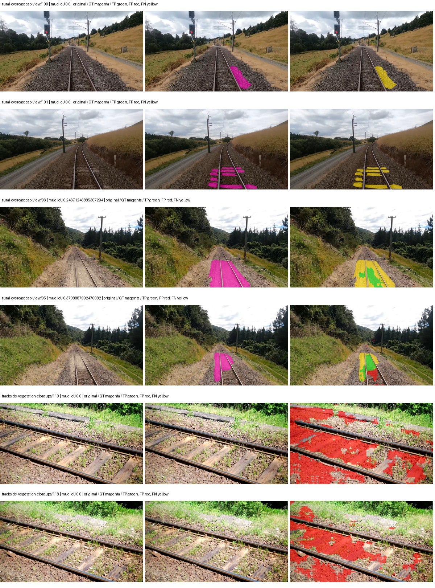

# hf_auto_mobilenetv2_deeplabv3 — paul-test-rtis

[RTIS comparison](../../README.md) · [Full model records](record.json)

Primary selection and early stopping: **mud-pumping validation IoU**. A job is complete only after full statistics and isolated profiling are verified.

| Model | Initialization path | Seed | Status | Steps | Best step | Mud IoU (%) | Mud precision (%) | Mud recall (%) | Final mud IoU (trainer val, %) | mIoU (%) | Fixed GT-class mIoU (%) |
| --- | --- | --- | --- | --- | --- | --- | --- | --- | --- | --- | --- |
| hf_auto_mobilenetv2_deeplabv3 | rtis_only | 0 | completed | 2290 | 1018 | 1.80 | 2.45 | 6.38 | 1.47 | 19.76 | 21.96 |
| hf_auto_mobilenetv2_deeplabv3 | rtis_only | 1 | training | 449 | — | — | — | — | — | — | — |
| hf_auto_mobilenetv2_deeplabv3 | rtis_only | 2 | training | 399 | — | — | — | — | — | — | — |
| hf_auto_mobilenetv2_deeplabv3 | cityscapes_to_rtis | 0 | queued | — | — | — | — | — | — | — | — |
| hf_auto_mobilenetv2_deeplabv3 | cityscapes_to_rtis | 1 | queued | — | — | — | — | — | — | — | — |
| hf_auto_mobilenetv2_deeplabv3 | cityscapes_to_rtis | 2 | queued | — | — | — | — | — | — | — | — |
| hf_auto_mobilenetv2_deeplabv3 | railsem19_to_rtis | 0 | queued | — | — | — | — | — | — | — | — |
| hf_auto_mobilenetv2_deeplabv3 | railsem19_to_rtis | 1 | queued | — | — | — | — | — | — | — | — |
| hf_auto_mobilenetv2_deeplabv3 | railsem19_to_rtis | 2 | queued | — | — | — | — | — | — | — | — |
| hf_auto_mobilenetv2_deeplabv3 | cityscapes_to_railsem19_to_rtis | 0 | queued | — | — | — | — | — | — | — | — |
| hf_auto_mobilenetv2_deeplabv3 | cityscapes_to_railsem19_to_rtis | 1 | queued | — | — | — | — | — | — | — | — |
| hf_auto_mobilenetv2_deeplabv3 | cityscapes_to_railsem19_to_rtis | 2 | queued | — | — | — | — | — | — | — | — |

Training: 220 images. Validation: 37 images. Test: 50 held out. Seeds: [0, 1, 2]. Seed variation measures optimization variability, not independent-recording uncertainty. Historical source checkpoints stay fixed across adaptation seeds.

Training code: `066afb2626398b7be59d4d19f5a0e4644fd59adc`. Split SHA-256: `71fef8292610c352da0709fe3bd030f3bcc18f97560394835f4b22826463b83d`.

## rtis_only — seed 0

Status: **completed**. Started: 2026-09-06T09:01:24.653383+00:00. Finished: 2026-09-06T09:35:27.189683+00:00.

Recipe pretrained initializer: `google/deeplabv3_mobilenet_v2_1.0_513`.

`rtis_only` uses the recipe initializer, which may include pretrained segmentation components. Transfer paths load the exact historical source checkpoint below and reset the classifier; they do not reset all query/decoder features.

Source checkpoint: `Recipe pretrained initialization`.

Config SHA-256: `cafd5725061f6ed6e811214da72ab823acf0150a80142583709a67f2664cbb2f`. Weights used for validation: `raw`.

### Mud-pumping and aggregate quality

| Metric | Selected checkpoint | Final training validation |
| --- | --- | --- |
| Mud IoU | 1.80 | 1.47 |
| Mud precision | 2.45 | 2.01 |
| Mud recall | 6.38 | 5.20 |
| Mud Dice/F1 | 3.55 | 2.90 |
| mIoU | 19.76 | 23.10 |
| Mean accuracy | 29.44 | 31.49 |
| Mean precision | 34.50 | 37.97 |
| Mean Dice | 25.21 | 29.24 |
| Mean specificity | 98.27 | 98.69 |
| Pixel accuracy | 70.62 | 79.61 |
| Frequency-weighted IoU | 60.66 | 68.81 |
| Fixed GT-present class mIoU | 21.96 | 25.67 |
| Boundary F1 | 20.60 | 25.53 |

The selected checkpoint has independent evaluation evidence. Final values are the trainer's final validation record, not a new independent evaluation. mIoU averages classes with nonzero union, so false positives on absent classes can change its denominator. The fixed GT-class mean is supplementary and excludes absent classes; their false positives remain in the confusion matrix.

### Resource usage and timing

| Measurement | Value |
| --- | --- |
| Peak training VRAM, retained training invocation (GiB) | 9.88 |
| Peak evaluation VRAM (GiB) | 6.55 |
| Retained training invocation wall time (seconds) | 1933.41 |
| Retained training invocation GPU-hours (one GPU) | 0.54 |
| Evaluation wall time (seconds) | 10.49 |
| Full evaluation pipeline images/second | 3.53 |
| Best full-state checkpoint (MiB) | 36.06 |
| Final full-state checkpoint (MiB) | 36.05 |
| Audited periodic checkpoints removed (GiB) | 0.14 |

VRAM uses the recorded allocator high-water mark; it is not total device usage including CUDA context. Resumed jobs' retained training invocation times and peaks are **not whole-campaign totals**. Earlier invocation resource records are not reconstructed here. Evaluation throughput includes loader, sliding-window inference and metrics; it is not model-only latency/FPS. Missing measurements are shown as —, never inferred from another dataset's run.

### Standardized inference performance

Dedicated model-only profiling waits for an idle worker-locked L40S: BF16, batch 1, 1024x1024, 20 warmup and 100 CUDA-event-timed public forwards. It excludes loading, preprocessing, tiling and metrics.

| Status | Parameters | Weight MiB | FPS | p50 ms | p95 ms | Peak reserved GiB |
| --- | --- | --- | --- | --- | --- | --- |
| complete | 2525717 | 9.63 | 175.66 | 5.66 | 5.80 | 0.45 |

```json
{
  "schema_version": 1,
  "model_id": "hf_auto_mobilenetv2_deeplabv3",
  "measured_at": "2026-09-06T09:35:25+00:00",
  "status": "complete",
  "benchmark_scope": "rtis_selected_checkpoint_model_only",
  "applies_to": [
    "hf_auto_mobilenetv2_deeplabv3--rtis_only--seed-0"
  ],
  "source": {
    "campaign_git_sha": "066afb2626398b7be59d4d19f5a0e4644fd59adc",
    "git_dirty": false,
    "config_hash": "3fc97980a6b9",
    "resolved_config": "/data/izadia1/projects/segmentary-runs/paul-test-rtis/mud-fullstats-v1-20260906-r2/configs/hf_auto_mobilenetv2_deeplabv3--rtis_only--seed-0.yaml",
    "config_sha256": "cafd5725061f6ed6e811214da72ab823acf0150a80142583709a67f2664cbb2f",
    "checkpoint_sha256": "1ac235c8f148424e45bac7d825d2bf72c1e7acde7c9e6da1d0b203877e4d00be",
    "checkpoint_global_step": 1018,
    "checkpoint_bytes": 37808208,
    "checkpoint_kind": "resume checkpoint with optimizer and EMA state",
    "weights": "raw",
    "measured_checkpoint_job_id": "hf_auto_mobilenetv2_deeplabv3--rtis_only--seed-0",
    "result_sha256": "3fb8b8ce6870fffef7424c012b675468f51635b6c141c422fe554b5a83182fa0",
    "result_git_sha": "066afb2626398b7be59d4d19f5a0e4644fd59adc",
    "result_stage": "eval:paul-test-rtis:val",
    "result_seed": 0
  },
  "hardware": {
    "gpu_name": "NVIDIA L40S",
    "gpu_uuid": "GPU-931d0911-fc78-1638-e3d7-1ba868cbd286",
    "logical_device": "cuda:0",
    "physical_visibility_token": "2",
    "compute_capability": [
      8,
      9
    ],
    "total_memory_bytes": 47677177856
  },
  "model": {
    "parameter_count": 2525717,
    "trainable_parameter_count": 2113557,
    "resident_parameter_bytes": 10102868,
    "parameter_dtype_counts": {
      "float32": 2525717
    }
  },
  "contract": {
    "backend": "pytorch",
    "precision": "bf16_autocast",
    "batch_size": 1,
    "input_shape_nchw": [
      1,
      3,
      1024,
      1024
    ],
    "warmup_iterations": 20,
    "measured_iterations": 100,
    "timing": "per-forward CUDA events with end-event synchronization",
    "includes_preprocessing": false,
    "includes_data_loader": false,
    "includes_sliding_window": false,
    "input_resident_on_gpu": true,
    "model_only": true,
    "entrypoint": "public model(image) dense-logits forward"
  },
  "measurements": {
    "latency": {
      "p50_ms": 5.6596479415893555,
      "p95_ms": 5.801827001571655,
      "mean_ms": 5.692954235076904,
      "minimum_ms": 5.616640090942383,
      "maximum_ms": 6.541312217712402,
      "fps": 175.65572437567494,
      "raw_ms": [
        5.725183963775635,
        5.642240047454834,
        5.637119770050049,
        5.625855922698975,
        5.6299519538879395,
        5.654623985290527,
        5.6381120681762695,
        5.657599925994873,
        6.541312217712402,
        5.67091178894043,
        5.673984050750732,
        5.915584087371826,
        5.648384094238281,
        6.461440086364746,
        5.657599925994873,
        5.625855922698975,
        5.648384094238281,
        5.638144016265869,
        5.648384094238281,
        5.655551910400391,
        5.652383804321289,
        5.68012809753418,
        5.638144016265869,
        5.6596479415893555,
        5.677055835723877,
        5.7282562255859375,
        5.707776069641113,
        5.716991901397705,
        5.666816234588623,
        5.656576156616211,
        5.706751823425293,
        5.736447811126709,
        5.795839786529541,
        5.7047038078308105,
        5.666816234588623,
        5.677055835723877,
        5.628928184509277,
        5.661695957183838,
        5.693439960479736,
        5.667840003967285,
        6.056960105895996,
        5.921792030334473,
        5.727231979370117,
        5.6750078201293945,
        5.637119770050049,
        5.650432109832764,
        5.6453118324279785,
        5.640192031860352,
        5.774335861206055,
        5.743616104125977,
        5.716991901397705,
        5.656576156616211,
        5.63097620010376,
        5.664768218994141,
        5.679103851318359,
        5.6493120193481445,
        5.647359848022461,
        5.645279884338379,
        5.653503894805908,
        5.647264003753662,
        5.690368175506592,
        5.648384094238281,
        5.67193603515625,
        5.664768218994141,
        5.668960094451904,
        5.655551910400391,
        5.66483211517334,
        5.642240047454834,
        5.640192031860352,
        5.659615993499756,
        5.790719985961914,
        5.674880027770996,
        5.646336078643799,
        5.669888019561768,
        5.678048133850098,
        5.736447811126709,
        5.7139201164245605,
        5.682271957397461,
        5.633024215698242,
        5.672959804534912,
        5.641215801239014,
        5.6596479415893555,
        5.6596479415893555,
        5.616640090942383,
        5.672959804534912,
        5.639167785644531,
        5.679103851318359,
        5.664671897888184,
        5.666816234588623,
        5.646336078643799,
        5.618688106536865,
        5.673984050750732,
        5.665791988372803,
        5.642144203186035,
        5.649407863616943,
        5.648384094238281,
        5.639167785644531,
        5.62278413772583,
        5.653503894805908,
        5.647359848022461
      ],
      "percentile_method": "numpy linear interpolation"
    },
    "peak_reserved_bytes": 484442112,
    "memory_kind": "pytorch_cuda_allocator_peak_reserved_excluding_context",
    "benchmark_wall_clock_s": 9.670409008860588
  },
  "started_at": "2026-09-06T09:35:16+00:00",
  "finished_at": "2026-09-06T09:35:25+00:00",
  "environment": {
    "hostname": "hdrfs-app-001",
    "python": "3.11.15",
    "platform": "Linux-5.15.0-139-generic-x86_64-with-glibc2.35",
    "torch": "2.11.0+cu128",
    "torch_cuda": "12.8",
    "cudnn": 91900,
    "driver_version": "570.133.20",
    "cuda_available": true,
    "gpu_count": 1,
    "gpu_names": [
      "NVIDIA L40S"
    ],
    "cuda_visible_devices": "2",
    "packages": {
      "segmentary": "0.1.0",
      "torch": "2.11.0+cu128",
      "torchvision": "0.26.0+cu128",
      "transformers": "5.15.0",
      "timm": "1.0.28",
      "segmentation-models-pytorch": "0.5.0",
      "albumentations": "2.0.8",
      "lightning": "2.6.5",
      "numpy": "2.4.4"
    }
  }
}
```

### Per-class validation results

| Class | GT pixels | IoU (%) | Precision (%) | Recall (%) | Dice (%) | Boundary F1 (%) |
| --- | --- | --- | --- | --- | --- | --- |
| car | 29664 | 0.00 | 0.00 | 0.00 | 0.00 | 0.00 |
| construction | 311585 | 2.18 | 2.23 | 51.13 | 4.27 | 9.94 |
| fence | 265137 | 5.01 | 35.87 | 5.51 | 9.55 | 14.44 |
| mud-pumping | 1226250 | 1.80 | 2.45 | 6.38 | 3.55 | 3.39 |
| on-rails | 0 | 0.00 | 0.00 | — | 0.00 | 0.00 |
| person | 0 | — | — | — | — | — |
| pole | 628038 | 48.25 | 78.44 | 55.62 | 65.09 | 76.21 |
| rail-embedded | 16799 | 0.00 | 0.00 | 0.00 | 0.00 | 0.00 |
| rail-raised | 2969797 | 70.18 | 78.24 | 87.20 | 82.48 | 83.17 |
| rail-track | 6323197 | 28.01 | 63.76 | 33.31 | 43.76 | 38.23 |
| road | 1048831 | 6.84 | 38.27 | 7.69 | 12.80 | 18.19 |
| sidewalk | 1297367 | 22.86 | 82.40 | 24.03 | 37.21 | 9.62 |
| sky | 19121606 | 87.69 | 98.65 | 88.76 | 93.44 | 66.17 |
| standing-water | 95802 | 0.59 | 0.63 | 9.01 | 1.17 | 4.05 |
| terrain | 39239306 | 69.28 | 82.75 | 80.98 | 81.85 | 42.23 |
| trackbed | 10643081 | 52.51 | 60.27 | 80.30 | 68.86 | 44.76 |
| traffic-light | 19510 | 0.00 | 0.00 | 0.00 | 0.00 | 0.00 |
| traffic-sign | 13285 | 0.00 | 0.00 | 0.00 | 0.00 | 0.00 |
| tram-track | 56179 | 0.00 | 0.00 | 0.00 | 0.00 | 0.00 |
| truck | 0 | 0.00 | 0.00 | — | 0.00 | 0.00 |
| vegetation-overgrowth | 5901821 | 0.06 | 66.03 | 0.06 | 0.11 | 1.63 |

### Full-run accounting

| Measurement | Value |
| --- | --- |
| Full GPU-reserved wall seconds, all recorded worker attempts | 2042.54 |
| Full reserved GPU-hours | 0.57 |
| Whole-run timing complete | True |

| Phase | Wall seconds including failed attempts |
| --- | --- |
| training | 1939.68 |
| diagnostics | 69.37 |
| performance | 15.78 |

GPU-reserved time includes model loading, training, validation, collection, profiling, checkpoint I/O and orchestration while the worker owns one GPU. It is not GPU kernel-active time. Phase timings and sampled device memory/power/utilization are retained separately; sampled device memory is not the allocator high-water mark.

### Train/validation and raw/EMA diagnostics

| Checkpoint / weights / split | Images | Mud IoU (%) | Mud precision (%) | Mud recall (%) |
| --- | --- | --- | --- | --- |
| best-auto-train / raw | 220 | 79.69 | 91.61 | 85.96 |
| best-auto-val / raw | 37 | 1.80 | 2.45 | 6.38 |
| best-alternate-val / ema | 37 | 1.09 | 1.31 | 6.15 |
| final-auto-val / raw | 37 | 1.46 | 2.00 | 5.19 |

Train uses the evaluation transform without augmentation. Compare mud train/validation metrics for the same selected weights. Alternate EMA on running-stat BatchNorm is explicitly uncalibrated and is diagnostic only. Score-threshold curves use uncalibrated normalized scores and are pixel-level diagnostics, not event detection rates or a selected deployment operating point.

### Downloadable evidence

- best-auto-train: [per-image.csv](rtis_only--seed-0/best-auto-train/per-image.csv) · [per-image-confusion.json.gz](rtis_only--seed-0/best-auto-train/per-image-confusion.json.gz) · [groups.json](rtis_only--seed-0/best-auto-train/groups.json) · [mud-score-curves.json](rtis_only--seed-0/best-auto-train/mud-score-curves.json)
- best-auto-val: [per-image.csv](rtis_only--seed-0/best-auto-val/per-image.csv) · [per-image-confusion.json.gz](rtis_only--seed-0/best-auto-val/per-image-confusion.json.gz) · [groups.json](rtis_only--seed-0/best-auto-val/groups.json) · [mud-score-curves.json](rtis_only--seed-0/best-auto-val/mud-score-curves.json) · [examples.jpg](rtis_only--seed-0/best-auto-val/examples.jpg)
- best-alternate-val: [per-image.csv](rtis_only--seed-0/best-alternate-val/per-image.csv) · [per-image-confusion.json.gz](rtis_only--seed-0/best-alternate-val/per-image-confusion.json.gz) · [groups.json](rtis_only--seed-0/best-alternate-val/groups.json) · [mud-score-curves.json](rtis_only--seed-0/best-alternate-val/mud-score-curves.json)
- final-auto-val: [per-image.csv](rtis_only--seed-0/final-auto-val/per-image.csv) · [per-image-confusion.json.gz](rtis_only--seed-0/final-auto-val/per-image-confusion.json.gz) · [groups.json](rtis_only--seed-0/final-auto-val/groups.json) · [mud-score-curves.json](rtis_only--seed-0/final-auto-val/mud-score-curves.json)
- resources: [telemetry.csv](rtis_only--seed-0/resources/telemetry.csv)



Examples are two lowest and two highest mud-IoU positive images, plus up to two negative images with the most false-positive mud pixels. They are targeted diagnostic examples, not random samples. Green: true positive; red: false positive; yellow: false negative. Full predictions remain on HDRFS.

### Validation tracking

| Logged step | Overall mIoU (%) | Mud IoU (%) |
| --- | --- | --- |
| 254 | 14.81 | 0.13 |
| 508 | 17.19 | 0.60 |
| 763 | 17.97 | 0.19 |
| 1017 | 19.74 | 1.81 |
| 1272 | 20.03 | 0.96 |
| 1527 | 21.73 | 0.25 |
| 1781 | 20.81 | 0.60 |
| 2036 | 21.26 | 0.92 |
| 2290 | 23.10 | 1.47 |

All retained scalar curves, including training loss and per-class IoU, are in record.json. Observed best mud on a curve is not necessarily a retained checkpoint: the pilot saved its selection-metric-best and final checkpoints. Step logging and checkpoint global_step may differ by one.

### Stopping and checkpoint provenance

```json
{
  "stopping": {
    "actual_steps": 2290,
    "maximum_steps": 4000,
    "min_delta": 0.001,
    "monitor": "val_iou/mud-pumping",
    "patience": 5,
    "reason": "validation_plateau"
  },
  "checkpoints": {
    "best": {
      "path": "/data/izadia1/projects/segmentary-runs/paul-test-rtis/mud-fullstats-v1-20260906-r2/future-runs/hf_auto_mobilenetv2_deeplabv3--rtis_only--seed-0_seed0/rtis/best.ckpt",
      "sha256": "1ac235c8f148424e45bac7d825d2bf72c1e7acde7c9e6da1d0b203877e4d00be",
      "global_step": 1018,
      "bytes": 37808208
    },
    "final": {
      "path": "/data/izadia1/projects/segmentary-runs/paul-test-rtis/mud-fullstats-v1-20260906-r2/future-runs/hf_auto_mobilenetv2_deeplabv3--rtis_only--seed-0_seed0/rtis/last.ckpt",
      "sha256": "e2d3f39ec99b0b439d8242d32d7cc274e46db2a3a51a8ff64fe63a334ad52467",
      "global_step": 2290,
      "bytes": 37797648
    }
  },
  "cleanup_error": null
}
```

### Resolved training, initialization and evaluation settings

The optimizer block is the base configuration. Stage LR scales are applied at runtime, and stage warmup is capped at min(base warmup, floor(stage budget / 10), stage budget - 1): 400 steps for this 4,000-step pilot. Model-internal native input grids may differ from augmentation crops (EoMT uses its 640 grid).

```json
{
  "name": "hf_auto_mobilenetv2_deeplabv3--rtis_only--seed-0",
  "model": {
    "arch": "hf_auto",
    "checkpoint": "google/deeplabv3_mobilenet_v2_1.0_513",
    "tuning": "full",
    "head": "unified_head",
    "lora_r": 16,
    "lora_alpha": 32,
    "lora_dropout": 0.05,
    "lora_targets": [],
    "drop_path": null,
    "revision": "5282e0eaf10de7cc7f35ee5e40f47981b801bf63",
    "subfolder": null,
    "local_files_only": false,
    "trust_remote_code": false,
    "backbone_path": null,
    "head_paths": [],
    "classifier_path": null,
    "inactive_parameter_paths": [
      "mobilenet_v2.conv_1x1"
    ],
    "smp_arch": null,
    "encoder_name": null,
    "encoder_weights": null,
    "native": null,
    "batch_norm_momentum": 0.003
  },
  "space": "paul-test-rtis",
  "taxonomy_root": "/data/izadia1/projects/segmentary-rtis-fullstats-066afb2/taxonomy",
  "output_root": "/data/izadia1/projects/segmentary-runs/paul-test-rtis/mud-fullstats-v1-20260906-r2/future-runs",
  "optim": {
    "backbone_lr": 0.0001,
    "head_lr_mult": 10.0,
    "weight_decay": 0.05,
    "llrd": 1.0,
    "warmup_iters": 1500,
    "warmup_ratio": 1e-06,
    "poly_power": 0.9,
    "min_lr_ratio": 0.0,
    "betas": [
      0.9,
      0.999
    ],
    "grad_clip": 1.0
  },
  "train": {
    "iters": 4000,
    "batch_size": 2,
    "accum": 8,
    "num_workers": 2,
    "precision": "bf16-mixed",
    "ema_decay": 0.9998,
    "val_every": 250,
    "ckpt_every": 500,
    "selection_metric": "val_iou/mud-pumping",
    "early_stopping_patience": 5,
    "early_stopping_min_delta": 0.001,
    "seed": 0,
    "devices": 1
  },
  "eval": {
    "sliding_window": true,
    "window": [
      1024,
      1024
    ],
    "stride": [
      768,
      768
    ],
    "batch_size": 1,
    "num_workers": 2,
    "tta_scales": [],
    "tta_flip": false,
    "threshold": 0.5,
    "boundary_tolerance_frac": 0.0075,
    "save_confusion": true
  },
  "loss": {
    "task": "multiclass",
    "activation": "auto",
    "terms": [],
    "aux": "none",
    "aux_weight": 0.0,
    "ce_weight": 1.0,
    "label_smoothing": 0.0,
    "class_weights": null,
    "query": null
  },
  "aug": {
    "crop": [
      1024,
      1024
    ],
    "scale_min": 0.5,
    "scale_max": 2.0,
    "hflip_p": 0.5,
    "color_jitter_p": 0.5,
    "brightness": 0.25,
    "contrast": 0.25,
    "saturation": 0.25,
    "hue": 0.05
  },
  "stages": [
    {
      "name": "rtis",
      "data": [
        {
          "name": "paul-test-rtis",
          "root": "/data/izadia1/datasets/paul-test-rtis",
          "variant": null,
          "split_file": "splits.json",
          "train_split": "train",
          "val_split": "val",
          "limit": null,
          "loader": "folder",
          "mapping": "paul-test-rtis",
          "loader_options": {
            "require_groups": true
          }
        }
      ],
      "iters": null,
      "lr_scale": 1.0,
      "head_group_lr_scale": 1.0,
      "init_from": "pretrained",
      "reset_head": false,
      "freeze": null,
      "sample_weights": null
    }
  ]
}
```

### Hardware and software provenance

```json
{
  "training": {
    "cuda_available": true,
    "cuda_visible_devices": "2",
    "cudnn": 91900,
    "driver_version": "570.133.20",
    "gpu_count": 1,
    "gpu_names": [
      "NVIDIA L40S"
    ],
    "hostname": "hdrfs-app-001",
    "input_normalization": {
      "channel_order": "rgb",
      "mean": [
        0.5,
        0.5,
        0.5
      ],
      "source": "hf_image_processor",
      "std": [
        0.5,
        0.5,
        0.5
      ]
    },
    "model_origins": [
      {
        "hf_commit": "5282e0eaf10de7cc7f35ee5e40f47981b801bf63",
        "hf_name_or_path": "google/deeplabv3_mobilenet_v2_1.0_513",
        "module": "model",
        "timm_pretrained": {}
      },
      {
        "hf_commit": "5282e0eaf10de7cc7f35ee5e40f47981b801bf63",
        "hf_name_or_path": "google/deeplabv3_mobilenet_v2_1.0_513",
        "module": "model.mobilenet_v2",
        "timm_pretrained": {}
      },
      {
        "hf_commit": "5282e0eaf10de7cc7f35ee5e40f47981b801bf63",
        "hf_name_or_path": "google/deeplabv3_mobilenet_v2_1.0_513",
        "module": "model.mobilenet_v2.conv_stem.first_conv",
        "timm_pretrained": {}
      },
      {
        "hf_commit": "5282e0eaf10de7cc7f35ee5e40f47981b801bf63",
        "hf_name_or_path": "google/deeplabv3_mobilenet_v2_1.0_513",
        "module": "model.mobilenet_v2.conv_stem.conv_3x3",
        "timm_pretrained": {}
      },
      {
        "hf_commit": "5282e0eaf10de7cc7f35ee5e40f47981b801bf63",
        "hf_name_or_path": "google/deeplabv3_mobilenet_v2_1.0_513",
        "module": "model.mobilenet_v2.conv_stem.reduce_1x1",
        "timm_pretrained": {}
      },
      {
        "hf_commit": "5282e0eaf10de7cc7f35ee5e40f47981b801bf63",
        "hf_name_or_path": "google/deeplabv3_mobilenet_v2_1.0_513",
        "module": "model.mobilenet_v2.layer.0.expand_1x1",
        "timm_pretrained": {}
      },
      {
        "hf_commit": "5282e0eaf10de7cc7f35ee5e40f47981b801bf63",
        "hf_name_or_path": "google/deeplabv3_mobilenet_v2_1.0_513",
        "module": "model.mobilenet_v2.layer.0.conv_3x3",
        "timm_pretrained": {}
      },
      {
        "hf_commit": "5282e0eaf10de7cc7f35ee5e40f47981b801bf63",
        "hf_name_or_path": "google/deeplabv3_mobilenet_v2_1.0_513",
        "module": "model.mobilenet_v2.layer.0.reduce_1x1",
        "timm_pretrained": {}
      },
      {
        "hf_commit": "5282e0eaf10de7cc7f35ee5e40f47981b801bf63",
        "hf_name_or_path": "google/deeplabv3_mobilenet_v2_1.0_513",
        "module": "model.mobilenet_v2.layer.1.expand_1x1",
        "timm_pretrained": {}
      },
      {
        "hf_commit": "5282e0eaf10de7cc7f35ee5e40f47981b801bf63",
        "hf_name_or_path": "google/deeplabv3_mobilenet_v2_1.0_513",
        "module": "model.mobilenet_v2.layer.1.conv_3x3",
        "timm_pretrained": {}
      },
      {
        "hf_commit": "5282e0eaf10de7cc7f35ee5e40f47981b801bf63",
        "hf_name_or_path": "google/deeplabv3_mobilenet_v2_1.0_513",
        "module": "model.mobilenet_v2.layer.1.reduce_1x1",
        "timm_pretrained": {}
      },
      {
        "hf_commit": "5282e0eaf10de7cc7f35ee5e40f47981b801bf63",
        "hf_name_or_path": "google/deeplabv3_mobilenet_v2_1.0_513",
        "module": "model.mobilenet_v2.layer.2.expand_1x1",
        "timm_pretrained": {}
      },
      {
        "hf_commit": "5282e0eaf10de7cc7f35ee5e40f47981b801bf63",
        "hf_name_or_path": "google/deeplabv3_mobilenet_v2_1.0_513",
        "module": "model.mobilenet_v2.layer.2.conv_3x3",
        "timm_pretrained": {}
      },
      {
        "hf_commit": "5282e0eaf10de7cc7f35ee5e40f47981b801bf63",
        "hf_name_or_path": "google/deeplabv3_mobilenet_v2_1.0_513",
        "module": "model.mobilenet_v2.layer.2.reduce_1x1",
        "timm_pretrained": {}
      },
      {
        "hf_commit": "5282e0eaf10de7cc7f35ee5e40f47981b801bf63",
        "hf_name_or_path": "google/deeplabv3_mobilenet_v2_1.0_513",
        "module": "model.mobilenet_v2.layer.3.expand_1x1",
        "timm_pretrained": {}
      },
      {
        "hf_commit": "5282e0eaf10de7cc7f35ee5e40f47981b801bf63",
        "hf_name_or_path": "google/deeplabv3_mobilenet_v2_1.0_513",
        "module": "model.mobilenet_v2.layer.3.conv_3x3",
        "timm_pretrained": {}
      },
      {
        "hf_commit": "5282e0eaf10de7cc7f35ee5e40f47981b801bf63",
        "hf_name_or_path": "google/deeplabv3_mobilenet_v2_1.0_513",
        "module": "model.mobilenet_v2.layer.3.reduce_1x1",
        "timm_pretrained": {}
      },
      {
        "hf_commit": "5282e0eaf10de7cc7f35ee5e40f47981b801bf63",
        "hf_name_or_path": "google/deeplabv3_mobilenet_v2_1.0_513",
        "module": "model.mobilenet_v2.layer.4.expand_1x1",
        "timm_pretrained": {}
      },
      {
        "hf_commit": "5282e0eaf10de7cc7f35ee5e40f47981b801bf63",
        "hf_name_or_path": "google/deeplabv3_mobilenet_v2_1.0_513",
        "module": "model.mobilenet_v2.layer.4.conv_3x3",
        "timm_pretrained": {}
      },
      {
        "hf_commit": "5282e0eaf10de7cc7f35ee5e40f47981b801bf63",
        "hf_name_or_path": "google/deeplabv3_mobilenet_v2_1.0_513",
        "module": "model.mobilenet_v2.layer.4.reduce_1x1",
        "timm_pretrained": {}
      },
      {
        "hf_commit": "5282e0eaf10de7cc7f35ee5e40f47981b801bf63",
        "hf_name_or_path": "google/deeplabv3_mobilenet_v2_1.0_513",
        "module": "model.mobilenet_v2.layer.5.expand_1x1",
        "timm_pretrained": {}
      },
      {
        "hf_commit": "5282e0eaf10de7cc7f35ee5e40f47981b801bf63",
        "hf_name_or_path": "google/deeplabv3_mobilenet_v2_1.0_513",
        "module": "model.mobilenet_v2.layer.5.conv_3x3",
        "timm_pretrained": {}
      },
      {
        "hf_commit": "5282e0eaf10de7cc7f35ee5e40f47981b801bf63",
        "hf_name_or_path": "google/deeplabv3_mobilenet_v2_1.0_513",
        "module": "model.mobilenet_v2.layer.5.reduce_1x1",
        "timm_pretrained": {}
      },
      {
        "hf_commit": "5282e0eaf10de7cc7f35ee5e40f47981b801bf63",
        "hf_name_or_path": "google/deeplabv3_mobilenet_v2_1.0_513",
        "module": "model.mobilenet_v2.layer.6.expand_1x1",
        "timm_pretrained": {}
      },
      {
        "hf_commit": "5282e0eaf10de7cc7f35ee5e40f47981b801bf63",
        "hf_name_or_path": "google/deeplabv3_mobilenet_v2_1.0_513",
        "module": "model.mobilenet_v2.layer.6.conv_3x3",
        "timm_pretrained": {}
      },
      {
        "hf_commit": "5282e0eaf10de7cc7f35ee5e40f47981b801bf63",
        "hf_name_or_path": "google/deeplabv3_mobilenet_v2_1.0_513",
        "module": "model.mobilenet_v2.layer.6.reduce_1x1",
        "timm_pretrained": {}
      },
      {
        "hf_commit": "5282e0eaf10de7cc7f35ee5e40f47981b801bf63",
        "hf_name_or_path": "google/deeplabv3_mobilenet_v2_1.0_513",
        "module": "model.mobilenet_v2.layer.7.expand_1x1",
        "timm_pretrained": {}
      },
      {
        "hf_commit": "5282e0eaf10de7cc7f35ee5e40f47981b801bf63",
        "hf_name_or_path": "google/deeplabv3_mobilenet_v2_1.0_513",
        "module": "model.mobilenet_v2.layer.7.conv_3x3",
        "timm_pretrained": {}
      },
      {
        "hf_commit": "5282e0eaf10de7cc7f35ee5e40f47981b801bf63",
        "hf_name_or_path": "google/deeplabv3_mobilenet_v2_1.0_513",
        "module": "model.mobilenet_v2.layer.7.reduce_1x1",
        "timm_pretrained": {}
      },
      {
        "hf_commit": "5282e0eaf10de7cc7f35ee5e40f47981b801bf63",
        "hf_name_or_path": "google/deeplabv3_mobilenet_v2_1.0_513",
        "module": "model.mobilenet_v2.layer.8.expand_1x1",
        "timm_pretrained": {}
      },
      {
        "hf_commit": "5282e0eaf10de7cc7f35ee5e40f47981b801bf63",
        "hf_name_or_path": "google/deeplabv3_mobilenet_v2_1.0_513",
        "module": "model.mobilenet_v2.layer.8.conv_3x3",
        "timm_pretrained": {}
      },
      {
        "hf_commit": "5282e0eaf10de7cc7f35ee5e40f47981b801bf63",
        "hf_name_or_path": "google/deeplabv3_mobilenet_v2_1.0_513",
        "module": "model.mobilenet_v2.layer.8.reduce_1x1",
        "timm_pretrained": {}
      },
      {
        "hf_commit": "5282e0eaf10de7cc7f35ee5e40f47981b801bf63",
        "hf_name_or_path": "google/deeplabv3_mobilenet_v2_1.0_513",
        "module": "model.mobilenet_v2.layer.9.expand_1x1",
        "timm_pretrained": {}
      },
      {
        "hf_commit": "5282e0eaf10de7cc7f35ee5e40f47981b801bf63",
        "hf_name_or_path": "google/deeplabv3_mobilenet_v2_1.0_513",
        "module": "model.mobilenet_v2.layer.9.conv_3x3",
        "timm_pretrained": {}
      },
      {
        "hf_commit": "5282e0eaf10de7cc7f35ee5e40f47981b801bf63",
        "hf_name_or_path": "google/deeplabv3_mobilenet_v2_1.0_513",
        "module": "model.mobilenet_v2.layer.9.reduce_1x1",
        "timm_pretrained": {}
      },
      {
        "hf_commit": "5282e0eaf10de7cc7f35ee5e40f47981b801bf63",
        "hf_name_or_path": "google/deeplabv3_mobilenet_v2_1.0_513",
        "module": "model.mobilenet_v2.layer.10.expand_1x1",
        "timm_pretrained": {}
      },
      {
        "hf_commit": "5282e0eaf10de7cc7f35ee5e40f47981b801bf63",
        "hf_name_or_path": "google/deeplabv3_mobilenet_v2_1.0_513",
        "module": "model.mobilenet_v2.layer.10.conv_3x3",
        "timm_pretrained": {}
      },
      {
        "hf_commit": "5282e0eaf10de7cc7f35ee5e40f47981b801bf63",
        "hf_name_or_path": "google/deeplabv3_mobilenet_v2_1.0_513",
        "module": "model.mobilenet_v2.layer.10.reduce_1x1",
        "timm_pretrained": {}
      },
      {
        "hf_commit": "5282e0eaf10de7cc7f35ee5e40f47981b801bf63",
        "hf_name_or_path": "google/deeplabv3_mobilenet_v2_1.0_513",
        "module": "model.mobilenet_v2.layer.11.expand_1x1",
        "timm_pretrained": {}
      },
      {
        "hf_commit": "5282e0eaf10de7cc7f35ee5e40f47981b801bf63",
        "hf_name_or_path": "google/deeplabv3_mobilenet_v2_1.0_513",
        "module": "model.mobilenet_v2.layer.11.conv_3x3",
        "timm_pretrained": {}
      },
      {
        "hf_commit": "5282e0eaf10de7cc7f35ee5e40f47981b801bf63",
        "hf_name_or_path": "google/deeplabv3_mobilenet_v2_1.0_513",
        "module": "model.mobilenet_v2.layer.11.reduce_1x1",
        "timm_pretrained": {}
      },
      {
        "hf_commit": "5282e0eaf10de7cc7f35ee5e40f47981b801bf63",
        "hf_name_or_path": "google/deeplabv3_mobilenet_v2_1.0_513",
        "module": "model.mobilenet_v2.layer.12.expand_1x1",
        "timm_pretrained": {}
      },
      {
        "hf_commit": "5282e0eaf10de7cc7f35ee5e40f47981b801bf63",
        "hf_name_or_path": "google/deeplabv3_mobilenet_v2_1.0_513",
        "module": "model.mobilenet_v2.layer.12.conv_3x3",
        "timm_pretrained": {}
      },
      {
        "hf_commit": "5282e0eaf10de7cc7f35ee5e40f47981b801bf63",
        "hf_name_or_path": "google/deeplabv3_mobilenet_v2_1.0_513",
        "module": "model.mobilenet_v2.layer.12.reduce_1x1",
        "timm_pretrained": {}
      },
      {
        "hf_commit": "5282e0eaf10de7cc7f35ee5e40f47981b801bf63",
        "hf_name_or_path": "google/deeplabv3_mobilenet_v2_1.0_513",
        "module": "model.mobilenet_v2.layer.13.expand_1x1",
        "timm_pretrained": {}
      },
      {
        "hf_commit": "5282e0eaf10de7cc7f35ee5e40f47981b801bf63",
        "hf_name_or_path": "google/deeplabv3_mobilenet_v2_1.0_513",
        "module": "model.mobilenet_v2.layer.13.conv_3x3",
        "timm_pretrained": {}
      },
      {
        "hf_commit": "5282e0eaf10de7cc7f35ee5e40f47981b801bf63",
        "hf_name_or_path": "google/deeplabv3_mobilenet_v2_1.0_513",
        "module": "model.mobilenet_v2.layer.13.reduce_1x1",
        "timm_pretrained": {}
      },
      {
        "hf_commit": "5282e0eaf10de7cc7f35ee5e40f47981b801bf63",
        "hf_name_or_path": "google/deeplabv3_mobilenet_v2_1.0_513",
        "module": "model.mobilenet_v2.layer.14.expand_1x1",
        "timm_pretrained": {}
      },
      {
        "hf_commit": "5282e0eaf10de7cc7f35ee5e40f47981b801bf63",
        "hf_name_or_path": "google/deeplabv3_mobilenet_v2_1.0_513",
        "module": "model.mobilenet_v2.layer.14.conv_3x3",
        "timm_pretrained": {}
      },
      {
        "hf_commit": "5282e0eaf10de7cc7f35ee5e40f47981b801bf63",
        "hf_name_or_path": "google/deeplabv3_mobilenet_v2_1.0_513",
        "module": "model.mobilenet_v2.layer.14.reduce_1x1",
        "timm_pretrained": {}
      },
      {
        "hf_commit": "5282e0eaf10de7cc7f35ee5e40f47981b801bf63",
        "hf_name_or_path": "google/deeplabv3_mobilenet_v2_1.0_513",
        "module": "model.mobilenet_v2.layer.15.expand_1x1",
        "timm_pretrained": {}
      },
      {
        "hf_commit": "5282e0eaf10de7cc7f35ee5e40f47981b801bf63",
        "hf_name_or_path": "google/deeplabv3_mobilenet_v2_1.0_513",
        "module": "model.mobilenet_v2.layer.15.conv_3x3",
        "timm_pretrained": {}
      },
      {
        "hf_commit": "5282e0eaf10de7cc7f35ee5e40f47981b801bf63",
        "hf_name_or_path": "google/deeplabv3_mobilenet_v2_1.0_513",
        "module": "model.mobilenet_v2.layer.15.reduce_1x1",
        "timm_pretrained": {}
      },
      {
        "hf_commit": "5282e0eaf10de7cc7f35ee5e40f47981b801bf63",
        "hf_name_or_path": "google/deeplabv3_mobilenet_v2_1.0_513",
        "module": "model.mobilenet_v2.conv_1x1",
        "timm_pretrained": {}
      },
      {
        "hf_commit": "5282e0eaf10de7cc7f35ee5e40f47981b801bf63",
        "hf_name_or_path": "google/deeplabv3_mobilenet_v2_1.0_513",
        "module": "model.segmentation_head.conv_pool",
        "timm_pretrained": {}
      },
      {
        "hf_commit": "5282e0eaf10de7cc7f35ee5e40f47981b801bf63",
        "hf_name_or_path": "google/deeplabv3_mobilenet_v2_1.0_513",
        "module": "model.segmentation_head.conv_aspp",
        "timm_pretrained": {}
      },
      {
        "hf_commit": "5282e0eaf10de7cc7f35ee5e40f47981b801bf63",
        "hf_name_or_path": "google/deeplabv3_mobilenet_v2_1.0_513",
        "module": "model.segmentation_head.conv_projection",
        "timm_pretrained": {}
      },
      {
        "hf_commit": "5282e0eaf10de7cc7f35ee5e40f47981b801bf63",
        "hf_name_or_path": "google/deeplabv3_mobilenet_v2_1.0_513",
        "module": "model.segmentation_head.classifier",
        "timm_pretrained": {}
      }
    ],
    "model_parameter_count": 2525717,
    "packages": {
      "albumentations": "2.0.8",
      "lightning": "2.6.5",
      "numpy": "2.4.4",
      "segmentary": "0.1.0",
      "segmentation-models-pytorch": "0.5.0",
      "timm": "1.0.28",
      "torch": "2.11.0+cu128",
      "torchvision": "0.26.0+cu128",
      "transformers": "5.15.0"
    },
    "platform": "Linux-5.15.0-139-generic-x86_64-with-glibc2.35",
    "python": "3.11.15",
    "torch": "2.11.0+cu128",
    "torch_cuda": "12.8",
    "trainable_parameter_count": 2113557,
    "training_stop": {
      "actual_steps": 2290,
      "maximum_steps": 4000,
      "min_delta": 0.001,
      "monitor": "val_iou/mud-pumping",
      "patience": 5,
      "reason": "validation_plateau"
    },
    "validation_weights": "raw"
  },
  "evaluation": {
    "cuda_available": true,
    "cuda_visible_devices": "2",
    "cudnn": 91900,
    "driver_version": "570.133.20",
    "gpu_count": 1,
    "gpu_names": [
      "NVIDIA L40S"
    ],
    "hostname": "hdrfs-app-001",
    "input_normalization": {
      "channel_order": "rgb",
      "mean": [
        0.5,
        0.5,
        0.5
      ],
      "source": "hf_image_processor",
      "std": [
        0.5,
        0.5,
        0.5
      ]
    },
    "packages": {
      "albumentations": "2.0.8",
      "lightning": "2.6.5",
      "numpy": "2.4.4",
      "segmentary": "0.1.0",
      "segmentation-models-pytorch": "0.5.0",
      "timm": "1.0.28",
      "torch": "2.11.0+cu128",
      "torchvision": "0.26.0+cu128",
      "transformers": "5.15.0"
    },
    "platform": "Linux-5.15.0-139-generic-x86_64-with-glibc2.35",
    "python": "3.11.15",
    "torch": "2.11.0+cu128",
    "torch_cuda": "12.8"
  }
}
```

## rtis_only — seed 1

Status: **training**. Started: 2026-09-06T09:35:27.213104+00:00. Finished: —.

Recipe pretrained initializer: `google/deeplabv3_mobilenet_v2_1.0_513`.

`rtis_only` uses the recipe initializer, which may include pretrained segmentation components. Transfer paths load the exact historical source checkpoint below and reset the classifier; they do not reset all query/decoder features.

Source checkpoint: `Recipe pretrained initialization`.

Config SHA-256: `b660d1a7324b7524674be5285088eb14026028dc278746aa6f5008986400967f`. Weights used for validation: `—`.

### Mud-pumping and aggregate quality

| Metric | Selected checkpoint | Final training validation |
| --- | --- | --- |
| Mud IoU | — | — |
| Mud precision | — | — |
| Mud recall | — | — |
| Mud Dice/F1 | — | — |
| mIoU | — | — |
| Mean accuracy | — | — |
| Mean precision | — | — |
| Mean Dice | — | — |
| Mean specificity | — | — |
| Pixel accuracy | — | — |
| Frequency-weighted IoU | — | — |
| Fixed GT-present class mIoU | — | — |
| Boundary F1 | — | — |

The selected checkpoint has independent evaluation evidence. Final values are the trainer's final validation record, not a new independent evaluation. mIoU averages classes with nonzero union, so false positives on absent classes can change its denominator. The fixed GT-class mean is supplementary and excludes absent classes; their false positives remain in the confusion matrix.

### Resource usage and timing

| Measurement | Value |
| --- | --- |
| Peak training VRAM, retained training invocation (GiB) | — |
| Peak evaluation VRAM (GiB) | — |
| Retained training invocation wall time (seconds) | — |
| Retained training invocation GPU-hours (one GPU) | — |
| Evaluation wall time (seconds) | — |
| Full evaluation pipeline images/second | — |
| Best full-state checkpoint (MiB) | — |
| Final full-state checkpoint (MiB) | — |
| Audited periodic checkpoints removed (GiB) | — |

VRAM uses the recorded allocator high-water mark; it is not total device usage including CUDA context. Resumed jobs' retained training invocation times and peaks are **not whole-campaign totals**. Earlier invocation resource records are not reconstructed here. Evaluation throughput includes loader, sliding-window inference and metrics; it is not model-only latency/FPS. Missing measurements are shown as —, never inferred from another dataset's run.

### Standardized inference performance

Dedicated model-only profiling waits for an idle worker-locked L40S: BF16, batch 1, 1024x1024, 20 warmup and 100 CUDA-event-timed public forwards. It excludes loading, preprocessing, tiling and metrics.

| Status | Parameters | Weight MiB | FPS | p50 ms | p95 ms | Peak reserved GiB |
| --- | --- | --- | --- | --- | --- | --- |
| waiting_for_idle_gpu | — | — | — | — | — | — |

```json
{
  "status": "waiting_for_idle_gpu",
  "contract": "L40S; batch 1; 1024x1024; BF16; 20 warmup; 100 timed forwards"
}
```

### Per-class validation results

| Class | GT pixels | IoU (%) | Precision (%) | Recall (%) | Dice (%) | Boundary F1 (%) |
| --- | --- | --- | --- | --- | --- | --- |

### Validation tracking

| Logged step | Overall mIoU (%) | Mud IoU (%) |
| --- | --- | --- |
| 254 | 14.15 | 0.17 |

All retained scalar curves, including training loss and per-class IoU, are in record.json. Observed best mud on a curve is not necessarily a retained checkpoint: the pilot saved its selection-metric-best and final checkpoints. Step logging and checkpoint global_step may differ by one.

### Stopping and checkpoint provenance

```json
{
  "stopping": null,
  "checkpoints": null,
  "cleanup_error": null
}
```

### Resolved training, initialization and evaluation settings

The optimizer block is the base configuration. Stage LR scales are applied at runtime, and stage warmup is capped at min(base warmup, floor(stage budget / 10), stage budget - 1): 400 steps for this 4,000-step pilot. Model-internal native input grids may differ from augmentation crops (EoMT uses its 640 grid).

```json
{
  "name": "hf_auto_mobilenetv2_deeplabv3--rtis_only--seed-1",
  "model": {
    "arch": "hf_auto",
    "checkpoint": "google/deeplabv3_mobilenet_v2_1.0_513",
    "tuning": "full",
    "head": "unified_head",
    "lora_r": 16,
    "lora_alpha": 32,
    "lora_dropout": 0.05,
    "lora_targets": [],
    "drop_path": null,
    "revision": "5282e0eaf10de7cc7f35ee5e40f47981b801bf63",
    "subfolder": null,
    "local_files_only": false,
    "trust_remote_code": false,
    "backbone_path": null,
    "head_paths": [],
    "classifier_path": null,
    "inactive_parameter_paths": [
      "mobilenet_v2.conv_1x1"
    ],
    "smp_arch": null,
    "encoder_name": null,
    "encoder_weights": null,
    "native": null,
    "batch_norm_momentum": 0.003
  },
  "space": "paul-test-rtis",
  "taxonomy_root": "/data/izadia1/projects/segmentary-rtis-fullstats-066afb2/taxonomy",
  "output_root": "/data/izadia1/projects/segmentary-runs/paul-test-rtis/mud-fullstats-v1-20260906-r2/future-runs",
  "optim": {
    "backbone_lr": 0.0001,
    "head_lr_mult": 10.0,
    "weight_decay": 0.05,
    "llrd": 1.0,
    "warmup_iters": 1500,
    "warmup_ratio": 1e-06,
    "poly_power": 0.9,
    "min_lr_ratio": 0.0,
    "betas": [
      0.9,
      0.999
    ],
    "grad_clip": 1.0
  },
  "train": {
    "iters": 4000,
    "batch_size": 2,
    "accum": 8,
    "num_workers": 2,
    "precision": "bf16-mixed",
    "ema_decay": 0.9998,
    "val_every": 250,
    "ckpt_every": 500,
    "selection_metric": "val_iou/mud-pumping",
    "early_stopping_patience": 5,
    "early_stopping_min_delta": 0.001,
    "seed": 1,
    "devices": 1
  },
  "eval": {
    "sliding_window": true,
    "window": [
      1024,
      1024
    ],
    "stride": [
      768,
      768
    ],
    "batch_size": 1,
    "num_workers": 2,
    "tta_scales": [],
    "tta_flip": false,
    "threshold": 0.5,
    "boundary_tolerance_frac": 0.0075,
    "save_confusion": true
  },
  "loss": {
    "task": "multiclass",
    "activation": "auto",
    "terms": [],
    "aux": "none",
    "aux_weight": 0.0,
    "ce_weight": 1.0,
    "label_smoothing": 0.0,
    "class_weights": null,
    "query": null
  },
  "aug": {
    "crop": [
      1024,
      1024
    ],
    "scale_min": 0.5,
    "scale_max": 2.0,
    "hflip_p": 0.5,
    "color_jitter_p": 0.5,
    "brightness": 0.25,
    "contrast": 0.25,
    "saturation": 0.25,
    "hue": 0.05
  },
  "stages": [
    {
      "name": "rtis",
      "data": [
        {
          "name": "paul-test-rtis",
          "root": "/data/izadia1/datasets/paul-test-rtis",
          "variant": null,
          "split_file": "splits.json",
          "train_split": "train",
          "val_split": "val",
          "limit": null,
          "loader": "folder",
          "mapping": "paul-test-rtis",
          "loader_options": {
            "require_groups": true
          }
        }
      ],
      "iters": null,
      "lr_scale": 1.0,
      "head_group_lr_scale": 1.0,
      "init_from": "pretrained",
      "reset_head": false,
      "freeze": null,
      "sample_weights": null
    }
  ]
}
```

### Hardware and software provenance

```json
{
  "training": null,
  "evaluation": null
}
```

## rtis_only — seed 2

Status: **training**. Started: 2026-09-06T09:36:00.527468+00:00. Finished: —.

Recipe pretrained initializer: `google/deeplabv3_mobilenet_v2_1.0_513`.

`rtis_only` uses the recipe initializer, which may include pretrained segmentation components. Transfer paths load the exact historical source checkpoint below and reset the classifier; they do not reset all query/decoder features.

Source checkpoint: `Recipe pretrained initialization`.

Config SHA-256: `4d933cd1bea6c9b7d6012d661519cb26a0eee1eb4feaab04f8e77b6faf477c80`. Weights used for validation: `—`.

### Mud-pumping and aggregate quality

| Metric | Selected checkpoint | Final training validation |
| --- | --- | --- |
| Mud IoU | — | — |
| Mud precision | — | — |
| Mud recall | — | — |
| Mud Dice/F1 | — | — |
| mIoU | — | — |
| Mean accuracy | — | — |
| Mean precision | — | — |
| Mean Dice | — | — |
| Mean specificity | — | — |
| Pixel accuracy | — | — |
| Frequency-weighted IoU | — | — |
| Fixed GT-present class mIoU | — | — |
| Boundary F1 | — | — |

The selected checkpoint has independent evaluation evidence. Final values are the trainer's final validation record, not a new independent evaluation. mIoU averages classes with nonzero union, so false positives on absent classes can change its denominator. The fixed GT-class mean is supplementary and excludes absent classes; their false positives remain in the confusion matrix.

### Resource usage and timing

| Measurement | Value |
| --- | --- |
| Peak training VRAM, retained training invocation (GiB) | — |
| Peak evaluation VRAM (GiB) | — |
| Retained training invocation wall time (seconds) | — |
| Retained training invocation GPU-hours (one GPU) | — |
| Evaluation wall time (seconds) | — |
| Full evaluation pipeline images/second | — |
| Best full-state checkpoint (MiB) | — |
| Final full-state checkpoint (MiB) | — |
| Audited periodic checkpoints removed (GiB) | — |

VRAM uses the recorded allocator high-water mark; it is not total device usage including CUDA context. Resumed jobs' retained training invocation times and peaks are **not whole-campaign totals**. Earlier invocation resource records are not reconstructed here. Evaluation throughput includes loader, sliding-window inference and metrics; it is not model-only latency/FPS. Missing measurements are shown as —, never inferred from another dataset's run.

### Standardized inference performance

Dedicated model-only profiling waits for an idle worker-locked L40S: BF16, batch 1, 1024x1024, 20 warmup and 100 CUDA-event-timed public forwards. It excludes loading, preprocessing, tiling and metrics.

| Status | Parameters | Weight MiB | FPS | p50 ms | p95 ms | Peak reserved GiB |
| --- | --- | --- | --- | --- | --- | --- |
| waiting_for_idle_gpu | — | — | — | — | — | — |

```json
{
  "status": "waiting_for_idle_gpu",
  "contract": "L40S; batch 1; 1024x1024; BF16; 20 warmup; 100 timed forwards"
}
```

### Per-class validation results

| Class | GT pixels | IoU (%) | Precision (%) | Recall (%) | Dice (%) | Boundary F1 (%) |
| --- | --- | --- | --- | --- | --- | --- |

### Validation tracking

| Logged step | Overall mIoU (%) | Mud IoU (%) |
| --- | --- | --- |
| 254 | 14.34 | 0.17 |

All retained scalar curves, including training loss and per-class IoU, are in record.json. Observed best mud on a curve is not necessarily a retained checkpoint: the pilot saved its selection-metric-best and final checkpoints. Step logging and checkpoint global_step may differ by one.

### Stopping and checkpoint provenance

```json
{
  "stopping": null,
  "checkpoints": null,
  "cleanup_error": null
}
```

### Resolved training, initialization and evaluation settings

The optimizer block is the base configuration. Stage LR scales are applied at runtime, and stage warmup is capped at min(base warmup, floor(stage budget / 10), stage budget - 1): 400 steps for this 4,000-step pilot. Model-internal native input grids may differ from augmentation crops (EoMT uses its 640 grid).

```json
{
  "name": "hf_auto_mobilenetv2_deeplabv3--rtis_only--seed-2",
  "model": {
    "arch": "hf_auto",
    "checkpoint": "google/deeplabv3_mobilenet_v2_1.0_513",
    "tuning": "full",
    "head": "unified_head",
    "lora_r": 16,
    "lora_alpha": 32,
    "lora_dropout": 0.05,
    "lora_targets": [],
    "drop_path": null,
    "revision": "5282e0eaf10de7cc7f35ee5e40f47981b801bf63",
    "subfolder": null,
    "local_files_only": false,
    "trust_remote_code": false,
    "backbone_path": null,
    "head_paths": [],
    "classifier_path": null,
    "inactive_parameter_paths": [
      "mobilenet_v2.conv_1x1"
    ],
    "smp_arch": null,
    "encoder_name": null,
    "encoder_weights": null,
    "native": null,
    "batch_norm_momentum": 0.003
  },
  "space": "paul-test-rtis",
  "taxonomy_root": "/data/izadia1/projects/segmentary-rtis-fullstats-066afb2/taxonomy",
  "output_root": "/data/izadia1/projects/segmentary-runs/paul-test-rtis/mud-fullstats-v1-20260906-r2/future-runs",
  "optim": {
    "backbone_lr": 0.0001,
    "head_lr_mult": 10.0,
    "weight_decay": 0.05,
    "llrd": 1.0,
    "warmup_iters": 1500,
    "warmup_ratio": 1e-06,
    "poly_power": 0.9,
    "min_lr_ratio": 0.0,
    "betas": [
      0.9,
      0.999
    ],
    "grad_clip": 1.0
  },
  "train": {
    "iters": 4000,
    "batch_size": 2,
    "accum": 8,
    "num_workers": 2,
    "precision": "bf16-mixed",
    "ema_decay": 0.9998,
    "val_every": 250,
    "ckpt_every": 500,
    "selection_metric": "val_iou/mud-pumping",
    "early_stopping_patience": 5,
    "early_stopping_min_delta": 0.001,
    "seed": 2,
    "devices": 1
  },
  "eval": {
    "sliding_window": true,
    "window": [
      1024,
      1024
    ],
    "stride": [
      768,
      768
    ],
    "batch_size": 1,
    "num_workers": 2,
    "tta_scales": [],
    "tta_flip": false,
    "threshold": 0.5,
    "boundary_tolerance_frac": 0.0075,
    "save_confusion": true
  },
  "loss": {
    "task": "multiclass",
    "activation": "auto",
    "terms": [],
    "aux": "none",
    "aux_weight": 0.0,
    "ce_weight": 1.0,
    "label_smoothing": 0.0,
    "class_weights": null,
    "query": null
  },
  "aug": {
    "crop": [
      1024,
      1024
    ],
    "scale_min": 0.5,
    "scale_max": 2.0,
    "hflip_p": 0.5,
    "color_jitter_p": 0.5,
    "brightness": 0.25,
    "contrast": 0.25,
    "saturation": 0.25,
    "hue": 0.05
  },
  "stages": [
    {
      "name": "rtis",
      "data": [
        {
          "name": "paul-test-rtis",
          "root": "/data/izadia1/datasets/paul-test-rtis",
          "variant": null,
          "split_file": "splits.json",
          "train_split": "train",
          "val_split": "val",
          "limit": null,
          "loader": "folder",
          "mapping": "paul-test-rtis",
          "loader_options": {
            "require_groups": true
          }
        }
      ],
      "iters": null,
      "lr_scale": 1.0,
      "head_group_lr_scale": 1.0,
      "init_from": "pretrained",
      "reset_head": false,
      "freeze": null,
      "sample_weights": null
    }
  ]
}
```

### Hardware and software provenance

```json
{
  "training": null,
  "evaluation": null
}
```

## cityscapes_to_rtis — seed 0

Status: **queued**. Started: —. Finished: —.

Recipe pretrained initializer: `google/deeplabv3_mobilenet_v2_1.0_513`.

`rtis_only` uses the recipe initializer, which may include pretrained segmentation components. Transfer paths load the exact historical source checkpoint below and reset the classifier; they do not reset all query/decoder features.

Source checkpoint: `{'name': 'hf_auto_mobilenetv2_deeplabv3--cityscapes--seed-0', 'model': 'hf_auto_mobilenetv2_deeplabv3', 'protocol': 'cityscapes', 'config': '/data/izadia1/projects/segmentary-runs/all-model-city-rail-seed0-rail20-b9eb3e1/jobs/hf_auto_mobilenetv2_deeplabv3--cityscapes--seed-0/attempt-001/resolved-config.yaml', 'checkpoint': '/data/izadia1/projects/segmentary-runs/all-model-city-rail-seed0-rail20-b9eb3e1/jobs/hf_auto_mobilenetv2_deeplabv3--cityscapes--seed-0/attempt-001/train/hf_auto_mobilenetv2_deeplabv3--cityscapes_seed0/cityscapes/last.bn-recalibrated.ckpt', 'recorded_sha256': '4f3711930ae1df9eaa26a222ba7652799b210f3a244770289a5e58a1c8bf3aa5', 'exists': True}`.

Config SHA-256: `9534b348fe826dd4399a8666e27b1a795a1002e336f8e5dc6a7771d6ebf760b3`. Weights used for validation: `—`.

### Mud-pumping and aggregate quality

| Metric | Selected checkpoint | Final training validation |
| --- | --- | --- |
| Mud IoU | — | — |
| Mud precision | — | — |
| Mud recall | — | — |
| Mud Dice/F1 | — | — |
| mIoU | — | — |
| Mean accuracy | — | — |
| Mean precision | — | — |
| Mean Dice | — | — |
| Mean specificity | — | — |
| Pixel accuracy | — | — |
| Frequency-weighted IoU | — | — |
| Fixed GT-present class mIoU | — | — |
| Boundary F1 | — | — |

The selected checkpoint has independent evaluation evidence. Final values are the trainer's final validation record, not a new independent evaluation. mIoU averages classes with nonzero union, so false positives on absent classes can change its denominator. The fixed GT-class mean is supplementary and excludes absent classes; their false positives remain in the confusion matrix.

### Resource usage and timing

| Measurement | Value |
| --- | --- |
| Peak training VRAM, retained training invocation (GiB) | — |
| Peak evaluation VRAM (GiB) | — |
| Retained training invocation wall time (seconds) | — |
| Retained training invocation GPU-hours (one GPU) | — |
| Evaluation wall time (seconds) | — |
| Full evaluation pipeline images/second | — |
| Best full-state checkpoint (MiB) | — |
| Final full-state checkpoint (MiB) | — |
| Audited periodic checkpoints removed (GiB) | — |

VRAM uses the recorded allocator high-water mark; it is not total device usage including CUDA context. Resumed jobs' retained training invocation times and peaks are **not whole-campaign totals**. Earlier invocation resource records are not reconstructed here. Evaluation throughput includes loader, sliding-window inference and metrics; it is not model-only latency/FPS. Missing measurements are shown as —, never inferred from another dataset's run.

### Standardized inference performance

Dedicated model-only profiling waits for an idle worker-locked L40S: BF16, batch 1, 1024x1024, 20 warmup and 100 CUDA-event-timed public forwards. It excludes loading, preprocessing, tiling and metrics.

| Status | Parameters | Weight MiB | FPS | p50 ms | p95 ms | Peak reserved GiB |
| --- | --- | --- | --- | --- | --- | --- |
| waiting_for_idle_gpu | — | — | — | — | — | — |

```json
{
  "status": "waiting_for_idle_gpu",
  "contract": "L40S; batch 1; 1024x1024; BF16; 20 warmup; 100 timed forwards"
}
```

### Per-class validation results

| Class | GT pixels | IoU (%) | Precision (%) | Recall (%) | Dice (%) | Boundary F1 (%) |
| --- | --- | --- | --- | --- | --- | --- |

### Validation tracking

| Logged step | Overall mIoU (%) | Mud IoU (%) |
| --- | --- | --- |

All retained scalar curves, including training loss and per-class IoU, are in record.json. Observed best mud on a curve is not necessarily a retained checkpoint: the pilot saved its selection-metric-best and final checkpoints. Step logging and checkpoint global_step may differ by one.

### Stopping and checkpoint provenance

```json
{
  "stopping": null,
  "checkpoints": null,
  "cleanup_error": null
}
```

### Resolved training, initialization and evaluation settings

The optimizer block is the base configuration. Stage LR scales are applied at runtime, and stage warmup is capped at min(base warmup, floor(stage budget / 10), stage budget - 1): 400 steps for this 4,000-step pilot. Model-internal native input grids may differ from augmentation crops (EoMT uses its 640 grid).

```json
{
  "name": "hf_auto_mobilenetv2_deeplabv3--cityscapes_to_rtis--seed-0",
  "model": {
    "arch": "hf_auto",
    "checkpoint": "google/deeplabv3_mobilenet_v2_1.0_513",
    "tuning": "full",
    "head": "unified_head",
    "lora_r": 16,
    "lora_alpha": 32,
    "lora_dropout": 0.05,
    "lora_targets": [],
    "drop_path": null,
    "revision": "5282e0eaf10de7cc7f35ee5e40f47981b801bf63",
    "subfolder": null,
    "local_files_only": false,
    "trust_remote_code": false,
    "backbone_path": null,
    "head_paths": [],
    "classifier_path": null,
    "inactive_parameter_paths": [
      "mobilenet_v2.conv_1x1"
    ],
    "smp_arch": null,
    "encoder_name": null,
    "encoder_weights": null,
    "native": null,
    "batch_norm_momentum": 0.003
  },
  "space": "paul-test-rtis",
  "taxonomy_root": "/data/izadia1/projects/segmentary-rtis-fullstats-066afb2/taxonomy",
  "output_root": "/data/izadia1/projects/segmentary-runs/paul-test-rtis/mud-fullstats-v1-20260906-r2/future-runs",
  "optim": {
    "backbone_lr": 0.0001,
    "head_lr_mult": 10.0,
    "weight_decay": 0.05,
    "llrd": 1.0,
    "warmup_iters": 1500,
    "warmup_ratio": 1e-06,
    "poly_power": 0.9,
    "min_lr_ratio": 0.0,
    "betas": [
      0.9,
      0.999
    ],
    "grad_clip": 1.0
  },
  "train": {
    "iters": 4000,
    "batch_size": 2,
    "accum": 8,
    "num_workers": 2,
    "precision": "bf16-mixed",
    "ema_decay": 0.9998,
    "val_every": 250,
    "ckpt_every": 500,
    "selection_metric": "val_iou/mud-pumping",
    "early_stopping_patience": 5,
    "early_stopping_min_delta": 0.001,
    "seed": 0,
    "devices": 1
  },
  "eval": {
    "sliding_window": true,
    "window": [
      1024,
      1024
    ],
    "stride": [
      768,
      768
    ],
    "batch_size": 1,
    "num_workers": 2,
    "tta_scales": [],
    "tta_flip": false,
    "threshold": 0.5,
    "boundary_tolerance_frac": 0.0075,
    "save_confusion": true
  },
  "loss": {
    "task": "multiclass",
    "activation": "auto",
    "terms": [],
    "aux": "none",
    "aux_weight": 0.0,
    "ce_weight": 1.0,
    "label_smoothing": 0.0,
    "class_weights": null,
    "query": null
  },
  "aug": {
    "crop": [
      1024,
      1024
    ],
    "scale_min": 0.5,
    "scale_max": 2.0,
    "hflip_p": 0.5,
    "color_jitter_p": 0.5,
    "brightness": 0.25,
    "contrast": 0.25,
    "saturation": 0.25,
    "hue": 0.05
  },
  "stages": [
    {
      "name": "rtis",
      "data": [
        {
          "name": "paul-test-rtis",
          "root": "/data/izadia1/datasets/paul-test-rtis",
          "variant": null,
          "split_file": "splits.json",
          "train_split": "train",
          "val_split": "val",
          "limit": null,
          "loader": "folder",
          "mapping": "paul-test-rtis",
          "loader_options": {
            "require_groups": true
          }
        }
      ],
      "iters": null,
      "lr_scale": 0.1,
      "head_group_lr_scale": 1.0,
      "init_from": "/data/izadia1/projects/segmentary-runs/all-model-city-rail-seed0-rail20-b9eb3e1/jobs/hf_auto_mobilenetv2_deeplabv3--cityscapes--seed-0/attempt-001/train/hf_auto_mobilenetv2_deeplabv3--cityscapes_seed0/cityscapes/last.bn-recalibrated.ckpt",
      "reset_head": true,
      "freeze": null,
      "sample_weights": null
    }
  ]
}
```

### Hardware and software provenance

```json
{
  "training": null,
  "evaluation": null
}
```

## cityscapes_to_rtis — seed 1

Status: **queued**. Started: —. Finished: —.

Recipe pretrained initializer: `google/deeplabv3_mobilenet_v2_1.0_513`.

`rtis_only` uses the recipe initializer, which may include pretrained segmentation components. Transfer paths load the exact historical source checkpoint below and reset the classifier; they do not reset all query/decoder features.

Source checkpoint: `{'name': 'hf_auto_mobilenetv2_deeplabv3--cityscapes--seed-0', 'model': 'hf_auto_mobilenetv2_deeplabv3', 'protocol': 'cityscapes', 'config': '/data/izadia1/projects/segmentary-runs/all-model-city-rail-seed0-rail20-b9eb3e1/jobs/hf_auto_mobilenetv2_deeplabv3--cityscapes--seed-0/attempt-001/resolved-config.yaml', 'checkpoint': '/data/izadia1/projects/segmentary-runs/all-model-city-rail-seed0-rail20-b9eb3e1/jobs/hf_auto_mobilenetv2_deeplabv3--cityscapes--seed-0/attempt-001/train/hf_auto_mobilenetv2_deeplabv3--cityscapes_seed0/cityscapes/last.bn-recalibrated.ckpt', 'recorded_sha256': '4f3711930ae1df9eaa26a222ba7652799b210f3a244770289a5e58a1c8bf3aa5', 'exists': True}`.

Config SHA-256: `70a8f84a30385a1a34649ea93af668140e2afeaba4ab2743c9baf784a4f8021e`. Weights used for validation: `—`.

### Mud-pumping and aggregate quality

| Metric | Selected checkpoint | Final training validation |
| --- | --- | --- |
| Mud IoU | — | — |
| Mud precision | — | — |
| Mud recall | — | — |
| Mud Dice/F1 | — | — |
| mIoU | — | — |
| Mean accuracy | — | — |
| Mean precision | — | — |
| Mean Dice | — | — |
| Mean specificity | — | — |
| Pixel accuracy | — | — |
| Frequency-weighted IoU | — | — |
| Fixed GT-present class mIoU | — | — |
| Boundary F1 | — | — |

The selected checkpoint has independent evaluation evidence. Final values are the trainer's final validation record, not a new independent evaluation. mIoU averages classes with nonzero union, so false positives on absent classes can change its denominator. The fixed GT-class mean is supplementary and excludes absent classes; their false positives remain in the confusion matrix.

### Resource usage and timing

| Measurement | Value |
| --- | --- |
| Peak training VRAM, retained training invocation (GiB) | — |
| Peak evaluation VRAM (GiB) | — |
| Retained training invocation wall time (seconds) | — |
| Retained training invocation GPU-hours (one GPU) | — |
| Evaluation wall time (seconds) | — |
| Full evaluation pipeline images/second | — |
| Best full-state checkpoint (MiB) | — |
| Final full-state checkpoint (MiB) | — |
| Audited periodic checkpoints removed (GiB) | — |

VRAM uses the recorded allocator high-water mark; it is not total device usage including CUDA context. Resumed jobs' retained training invocation times and peaks are **not whole-campaign totals**. Earlier invocation resource records are not reconstructed here. Evaluation throughput includes loader, sliding-window inference and metrics; it is not model-only latency/FPS. Missing measurements are shown as —, never inferred from another dataset's run.

### Standardized inference performance

Dedicated model-only profiling waits for an idle worker-locked L40S: BF16, batch 1, 1024x1024, 20 warmup and 100 CUDA-event-timed public forwards. It excludes loading, preprocessing, tiling and metrics.

| Status | Parameters | Weight MiB | FPS | p50 ms | p95 ms | Peak reserved GiB |
| --- | --- | --- | --- | --- | --- | --- |
| waiting_for_idle_gpu | — | — | — | — | — | — |

```json
{
  "status": "waiting_for_idle_gpu",
  "contract": "L40S; batch 1; 1024x1024; BF16; 20 warmup; 100 timed forwards"
}
```

### Per-class validation results

| Class | GT pixels | IoU (%) | Precision (%) | Recall (%) | Dice (%) | Boundary F1 (%) |
| --- | --- | --- | --- | --- | --- | --- |

### Validation tracking

| Logged step | Overall mIoU (%) | Mud IoU (%) |
| --- | --- | --- |

All retained scalar curves, including training loss and per-class IoU, are in record.json. Observed best mud on a curve is not necessarily a retained checkpoint: the pilot saved its selection-metric-best and final checkpoints. Step logging and checkpoint global_step may differ by one.

### Stopping and checkpoint provenance

```json
{
  "stopping": null,
  "checkpoints": null,
  "cleanup_error": null
}
```

### Resolved training, initialization and evaluation settings

The optimizer block is the base configuration. Stage LR scales are applied at runtime, and stage warmup is capped at min(base warmup, floor(stage budget / 10), stage budget - 1): 400 steps for this 4,000-step pilot. Model-internal native input grids may differ from augmentation crops (EoMT uses its 640 grid).

```json
{
  "name": "hf_auto_mobilenetv2_deeplabv3--cityscapes_to_rtis--seed-1",
  "model": {
    "arch": "hf_auto",
    "checkpoint": "google/deeplabv3_mobilenet_v2_1.0_513",
    "tuning": "full",
    "head": "unified_head",
    "lora_r": 16,
    "lora_alpha": 32,
    "lora_dropout": 0.05,
    "lora_targets": [],
    "drop_path": null,
    "revision": "5282e0eaf10de7cc7f35ee5e40f47981b801bf63",
    "subfolder": null,
    "local_files_only": false,
    "trust_remote_code": false,
    "backbone_path": null,
    "head_paths": [],
    "classifier_path": null,
    "inactive_parameter_paths": [
      "mobilenet_v2.conv_1x1"
    ],
    "smp_arch": null,
    "encoder_name": null,
    "encoder_weights": null,
    "native": null,
    "batch_norm_momentum": 0.003
  },
  "space": "paul-test-rtis",
  "taxonomy_root": "/data/izadia1/projects/segmentary-rtis-fullstats-066afb2/taxonomy",
  "output_root": "/data/izadia1/projects/segmentary-runs/paul-test-rtis/mud-fullstats-v1-20260906-r2/future-runs",
  "optim": {
    "backbone_lr": 0.0001,
    "head_lr_mult": 10.0,
    "weight_decay": 0.05,
    "llrd": 1.0,
    "warmup_iters": 1500,
    "warmup_ratio": 1e-06,
    "poly_power": 0.9,
    "min_lr_ratio": 0.0,
    "betas": [
      0.9,
      0.999
    ],
    "grad_clip": 1.0
  },
  "train": {
    "iters": 4000,
    "batch_size": 2,
    "accum": 8,
    "num_workers": 2,
    "precision": "bf16-mixed",
    "ema_decay": 0.9998,
    "val_every": 250,
    "ckpt_every": 500,
    "selection_metric": "val_iou/mud-pumping",
    "early_stopping_patience": 5,
    "early_stopping_min_delta": 0.001,
    "seed": 1,
    "devices": 1
  },
  "eval": {
    "sliding_window": true,
    "window": [
      1024,
      1024
    ],
    "stride": [
      768,
      768
    ],
    "batch_size": 1,
    "num_workers": 2,
    "tta_scales": [],
    "tta_flip": false,
    "threshold": 0.5,
    "boundary_tolerance_frac": 0.0075,
    "save_confusion": true
  },
  "loss": {
    "task": "multiclass",
    "activation": "auto",
    "terms": [],
    "aux": "none",
    "aux_weight": 0.0,
    "ce_weight": 1.0,
    "label_smoothing": 0.0,
    "class_weights": null,
    "query": null
  },
  "aug": {
    "crop": [
      1024,
      1024
    ],
    "scale_min": 0.5,
    "scale_max": 2.0,
    "hflip_p": 0.5,
    "color_jitter_p": 0.5,
    "brightness": 0.25,
    "contrast": 0.25,
    "saturation": 0.25,
    "hue": 0.05
  },
  "stages": [
    {
      "name": "rtis",
      "data": [
        {
          "name": "paul-test-rtis",
          "root": "/data/izadia1/datasets/paul-test-rtis",
          "variant": null,
          "split_file": "splits.json",
          "train_split": "train",
          "val_split": "val",
          "limit": null,
          "loader": "folder",
          "mapping": "paul-test-rtis",
          "loader_options": {
            "require_groups": true
          }
        }
      ],
      "iters": null,
      "lr_scale": 0.1,
      "head_group_lr_scale": 1.0,
      "init_from": "/data/izadia1/projects/segmentary-runs/all-model-city-rail-seed0-rail20-b9eb3e1/jobs/hf_auto_mobilenetv2_deeplabv3--cityscapes--seed-0/attempt-001/train/hf_auto_mobilenetv2_deeplabv3--cityscapes_seed0/cityscapes/last.bn-recalibrated.ckpt",
      "reset_head": true,
      "freeze": null,
      "sample_weights": null
    }
  ]
}
```

### Hardware and software provenance

```json
{
  "training": null,
  "evaluation": null
}
```

## cityscapes_to_rtis — seed 2

Status: **queued**. Started: —. Finished: —.

Recipe pretrained initializer: `google/deeplabv3_mobilenet_v2_1.0_513`.

`rtis_only` uses the recipe initializer, which may include pretrained segmentation components. Transfer paths load the exact historical source checkpoint below and reset the classifier; they do not reset all query/decoder features.

Source checkpoint: `{'name': 'hf_auto_mobilenetv2_deeplabv3--cityscapes--seed-0', 'model': 'hf_auto_mobilenetv2_deeplabv3', 'protocol': 'cityscapes', 'config': '/data/izadia1/projects/segmentary-runs/all-model-city-rail-seed0-rail20-b9eb3e1/jobs/hf_auto_mobilenetv2_deeplabv3--cityscapes--seed-0/attempt-001/resolved-config.yaml', 'checkpoint': '/data/izadia1/projects/segmentary-runs/all-model-city-rail-seed0-rail20-b9eb3e1/jobs/hf_auto_mobilenetv2_deeplabv3--cityscapes--seed-0/attempt-001/train/hf_auto_mobilenetv2_deeplabv3--cityscapes_seed0/cityscapes/last.bn-recalibrated.ckpt', 'recorded_sha256': '4f3711930ae1df9eaa26a222ba7652799b210f3a244770289a5e58a1c8bf3aa5', 'exists': True}`.

Config SHA-256: `2eaaba359fa8809ae84dfb2ebb3f24d8aaf2d306494bdf20a1570db8a0df1671`. Weights used for validation: `—`.

### Mud-pumping and aggregate quality

| Metric | Selected checkpoint | Final training validation |
| --- | --- | --- |
| Mud IoU | — | — |
| Mud precision | — | — |
| Mud recall | — | — |
| Mud Dice/F1 | — | — |
| mIoU | — | — |
| Mean accuracy | — | — |
| Mean precision | — | — |
| Mean Dice | — | — |
| Mean specificity | — | — |
| Pixel accuracy | — | — |
| Frequency-weighted IoU | — | — |
| Fixed GT-present class mIoU | — | — |
| Boundary F1 | — | — |

The selected checkpoint has independent evaluation evidence. Final values are the trainer's final validation record, not a new independent evaluation. mIoU averages classes with nonzero union, so false positives on absent classes can change its denominator. The fixed GT-class mean is supplementary and excludes absent classes; their false positives remain in the confusion matrix.

### Resource usage and timing

| Measurement | Value |
| --- | --- |
| Peak training VRAM, retained training invocation (GiB) | — |
| Peak evaluation VRAM (GiB) | — |
| Retained training invocation wall time (seconds) | — |
| Retained training invocation GPU-hours (one GPU) | — |
| Evaluation wall time (seconds) | — |
| Full evaluation pipeline images/second | — |
| Best full-state checkpoint (MiB) | — |
| Final full-state checkpoint (MiB) | — |
| Audited periodic checkpoints removed (GiB) | — |

VRAM uses the recorded allocator high-water mark; it is not total device usage including CUDA context. Resumed jobs' retained training invocation times and peaks are **not whole-campaign totals**. Earlier invocation resource records are not reconstructed here. Evaluation throughput includes loader, sliding-window inference and metrics; it is not model-only latency/FPS. Missing measurements are shown as —, never inferred from another dataset's run.

### Standardized inference performance

Dedicated model-only profiling waits for an idle worker-locked L40S: BF16, batch 1, 1024x1024, 20 warmup and 100 CUDA-event-timed public forwards. It excludes loading, preprocessing, tiling and metrics.

| Status | Parameters | Weight MiB | FPS | p50 ms | p95 ms | Peak reserved GiB |
| --- | --- | --- | --- | --- | --- | --- |
| waiting_for_idle_gpu | — | — | — | — | — | — |

```json
{
  "status": "waiting_for_idle_gpu",
  "contract": "L40S; batch 1; 1024x1024; BF16; 20 warmup; 100 timed forwards"
}
```

### Per-class validation results

| Class | GT pixels | IoU (%) | Precision (%) | Recall (%) | Dice (%) | Boundary F1 (%) |
| --- | --- | --- | --- | --- | --- | --- |

### Validation tracking

| Logged step | Overall mIoU (%) | Mud IoU (%) |
| --- | --- | --- |

All retained scalar curves, including training loss and per-class IoU, are in record.json. Observed best mud on a curve is not necessarily a retained checkpoint: the pilot saved its selection-metric-best and final checkpoints. Step logging and checkpoint global_step may differ by one.

### Stopping and checkpoint provenance

```json
{
  "stopping": null,
  "checkpoints": null,
  "cleanup_error": null
}
```

### Resolved training, initialization and evaluation settings

The optimizer block is the base configuration. Stage LR scales are applied at runtime, and stage warmup is capped at min(base warmup, floor(stage budget / 10), stage budget - 1): 400 steps for this 4,000-step pilot. Model-internal native input grids may differ from augmentation crops (EoMT uses its 640 grid).

```json
{
  "name": "hf_auto_mobilenetv2_deeplabv3--cityscapes_to_rtis--seed-2",
  "model": {
    "arch": "hf_auto",
    "checkpoint": "google/deeplabv3_mobilenet_v2_1.0_513",
    "tuning": "full",
    "head": "unified_head",
    "lora_r": 16,
    "lora_alpha": 32,
    "lora_dropout": 0.05,
    "lora_targets": [],
    "drop_path": null,
    "revision": "5282e0eaf10de7cc7f35ee5e40f47981b801bf63",
    "subfolder": null,
    "local_files_only": false,
    "trust_remote_code": false,
    "backbone_path": null,
    "head_paths": [],
    "classifier_path": null,
    "inactive_parameter_paths": [
      "mobilenet_v2.conv_1x1"
    ],
    "smp_arch": null,
    "encoder_name": null,
    "encoder_weights": null,
    "native": null,
    "batch_norm_momentum": 0.003
  },
  "space": "paul-test-rtis",
  "taxonomy_root": "/data/izadia1/projects/segmentary-rtis-fullstats-066afb2/taxonomy",
  "output_root": "/data/izadia1/projects/segmentary-runs/paul-test-rtis/mud-fullstats-v1-20260906-r2/future-runs",
  "optim": {
    "backbone_lr": 0.0001,
    "head_lr_mult": 10.0,
    "weight_decay": 0.05,
    "llrd": 1.0,
    "warmup_iters": 1500,
    "warmup_ratio": 1e-06,
    "poly_power": 0.9,
    "min_lr_ratio": 0.0,
    "betas": [
      0.9,
      0.999
    ],
    "grad_clip": 1.0
  },
  "train": {
    "iters": 4000,
    "batch_size": 2,
    "accum": 8,
    "num_workers": 2,
    "precision": "bf16-mixed",
    "ema_decay": 0.9998,
    "val_every": 250,
    "ckpt_every": 500,
    "selection_metric": "val_iou/mud-pumping",
    "early_stopping_patience": 5,
    "early_stopping_min_delta": 0.001,
    "seed": 2,
    "devices": 1
  },
  "eval": {
    "sliding_window": true,
    "window": [
      1024,
      1024
    ],
    "stride": [
      768,
      768
    ],
    "batch_size": 1,
    "num_workers": 2,
    "tta_scales": [],
    "tta_flip": false,
    "threshold": 0.5,
    "boundary_tolerance_frac": 0.0075,
    "save_confusion": true
  },
  "loss": {
    "task": "multiclass",
    "activation": "auto",
    "terms": [],
    "aux": "none",
    "aux_weight": 0.0,
    "ce_weight": 1.0,
    "label_smoothing": 0.0,
    "class_weights": null,
    "query": null
  },
  "aug": {
    "crop": [
      1024,
      1024
    ],
    "scale_min": 0.5,
    "scale_max": 2.0,
    "hflip_p": 0.5,
    "color_jitter_p": 0.5,
    "brightness": 0.25,
    "contrast": 0.25,
    "saturation": 0.25,
    "hue": 0.05
  },
  "stages": [
    {
      "name": "rtis",
      "data": [
        {
          "name": "paul-test-rtis",
          "root": "/data/izadia1/datasets/paul-test-rtis",
          "variant": null,
          "split_file": "splits.json",
          "train_split": "train",
          "val_split": "val",
          "limit": null,
          "loader": "folder",
          "mapping": "paul-test-rtis",
          "loader_options": {
            "require_groups": true
          }
        }
      ],
      "iters": null,
      "lr_scale": 0.1,
      "head_group_lr_scale": 1.0,
      "init_from": "/data/izadia1/projects/segmentary-runs/all-model-city-rail-seed0-rail20-b9eb3e1/jobs/hf_auto_mobilenetv2_deeplabv3--cityscapes--seed-0/attempt-001/train/hf_auto_mobilenetv2_deeplabv3--cityscapes_seed0/cityscapes/last.bn-recalibrated.ckpt",
      "reset_head": true,
      "freeze": null,
      "sample_weights": null
    }
  ]
}
```

### Hardware and software provenance

```json
{
  "training": null,
  "evaluation": null
}
```

## railsem19_to_rtis — seed 0

Status: **queued**. Started: —. Finished: —.

Recipe pretrained initializer: `google/deeplabv3_mobilenet_v2_1.0_513`.

`rtis_only` uses the recipe initializer, which may include pretrained segmentation components. Transfer paths load the exact historical source checkpoint below and reset the classifier; they do not reset all query/decoder features.

Source checkpoint: `{'name': 'hf_auto_mobilenetv2_deeplabv3--railsem19--seed-0', 'model': 'hf_auto_mobilenetv2_deeplabv3', 'protocol': 'railsem19', 'config': '/data/izadia1/projects/segmentary-runs/all-model-city-rail-seed0-rail20-b9eb3e1/jobs/hf_auto_mobilenetv2_deeplabv3--railsem19--seed-0/attempt-001/resolved-config.yaml', 'checkpoint': '/data/izadia1/projects/segmentary-runs/all-model-city-rail-seed0-rail20-b9eb3e1/jobs/hf_auto_mobilenetv2_deeplabv3--railsem19--seed-0/attempt-001/train/hf_auto_mobilenetv2_deeplabv3--railsem19_seed0/railsem19/last.bn-recalibrated.ckpt', 'recorded_sha256': '79a6185e64264a8fa64a4bca840b7536c498c9e989fae15c821957420f97e768', 'exists': True}`.

Config SHA-256: `6df78549d7e304169daecdda31db255821d404fb5d19f788173fd35e71e2ac55`. Weights used for validation: `—`.

### Mud-pumping and aggregate quality

| Metric | Selected checkpoint | Final training validation |
| --- | --- | --- |
| Mud IoU | — | — |
| Mud precision | — | — |
| Mud recall | — | — |
| Mud Dice/F1 | — | — |
| mIoU | — | — |
| Mean accuracy | — | — |
| Mean precision | — | — |
| Mean Dice | — | — |
| Mean specificity | — | — |
| Pixel accuracy | — | — |
| Frequency-weighted IoU | — | — |
| Fixed GT-present class mIoU | — | — |
| Boundary F1 | — | — |

The selected checkpoint has independent evaluation evidence. Final values are the trainer's final validation record, not a new independent evaluation. mIoU averages classes with nonzero union, so false positives on absent classes can change its denominator. The fixed GT-class mean is supplementary and excludes absent classes; their false positives remain in the confusion matrix.

### Resource usage and timing

| Measurement | Value |
| --- | --- |
| Peak training VRAM, retained training invocation (GiB) | — |
| Peak evaluation VRAM (GiB) | — |
| Retained training invocation wall time (seconds) | — |
| Retained training invocation GPU-hours (one GPU) | — |
| Evaluation wall time (seconds) | — |
| Full evaluation pipeline images/second | — |
| Best full-state checkpoint (MiB) | — |
| Final full-state checkpoint (MiB) | — |
| Audited periodic checkpoints removed (GiB) | — |

VRAM uses the recorded allocator high-water mark; it is not total device usage including CUDA context. Resumed jobs' retained training invocation times and peaks are **not whole-campaign totals**. Earlier invocation resource records are not reconstructed here. Evaluation throughput includes loader, sliding-window inference and metrics; it is not model-only latency/FPS. Missing measurements are shown as —, never inferred from another dataset's run.

### Standardized inference performance

Dedicated model-only profiling waits for an idle worker-locked L40S: BF16, batch 1, 1024x1024, 20 warmup and 100 CUDA-event-timed public forwards. It excludes loading, preprocessing, tiling and metrics.

| Status | Parameters | Weight MiB | FPS | p50 ms | p95 ms | Peak reserved GiB |
| --- | --- | --- | --- | --- | --- | --- |
| waiting_for_idle_gpu | — | — | — | — | — | — |

```json
{
  "status": "waiting_for_idle_gpu",
  "contract": "L40S; batch 1; 1024x1024; BF16; 20 warmup; 100 timed forwards"
}
```

### Per-class validation results

| Class | GT pixels | IoU (%) | Precision (%) | Recall (%) | Dice (%) | Boundary F1 (%) |
| --- | --- | --- | --- | --- | --- | --- |

### Validation tracking

| Logged step | Overall mIoU (%) | Mud IoU (%) |
| --- | --- | --- |

All retained scalar curves, including training loss and per-class IoU, are in record.json. Observed best mud on a curve is not necessarily a retained checkpoint: the pilot saved its selection-metric-best and final checkpoints. Step logging and checkpoint global_step may differ by one.

### Stopping and checkpoint provenance

```json
{
  "stopping": null,
  "checkpoints": null,
  "cleanup_error": null
}
```

### Resolved training, initialization and evaluation settings

The optimizer block is the base configuration. Stage LR scales are applied at runtime, and stage warmup is capped at min(base warmup, floor(stage budget / 10), stage budget - 1): 400 steps for this 4,000-step pilot. Model-internal native input grids may differ from augmentation crops (EoMT uses its 640 grid).

```json
{
  "name": "hf_auto_mobilenetv2_deeplabv3--railsem19_to_rtis--seed-0",
  "model": {
    "arch": "hf_auto",
    "checkpoint": "google/deeplabv3_mobilenet_v2_1.0_513",
    "tuning": "full",
    "head": "unified_head",
    "lora_r": 16,
    "lora_alpha": 32,
    "lora_dropout": 0.05,
    "lora_targets": [],
    "drop_path": null,
    "revision": "5282e0eaf10de7cc7f35ee5e40f47981b801bf63",
    "subfolder": null,
    "local_files_only": false,
    "trust_remote_code": false,
    "backbone_path": null,
    "head_paths": [],
    "classifier_path": null,
    "inactive_parameter_paths": [
      "mobilenet_v2.conv_1x1"
    ],
    "smp_arch": null,
    "encoder_name": null,
    "encoder_weights": null,
    "native": null,
    "batch_norm_momentum": 0.003
  },
  "space": "paul-test-rtis",
  "taxonomy_root": "/data/izadia1/projects/segmentary-rtis-fullstats-066afb2/taxonomy",
  "output_root": "/data/izadia1/projects/segmentary-runs/paul-test-rtis/mud-fullstats-v1-20260906-r2/future-runs",
  "optim": {
    "backbone_lr": 0.0001,
    "head_lr_mult": 10.0,
    "weight_decay": 0.05,
    "llrd": 1.0,
    "warmup_iters": 1500,
    "warmup_ratio": 1e-06,
    "poly_power": 0.9,
    "min_lr_ratio": 0.0,
    "betas": [
      0.9,
      0.999
    ],
    "grad_clip": 1.0
  },
  "train": {
    "iters": 4000,
    "batch_size": 2,
    "accum": 8,
    "num_workers": 2,
    "precision": "bf16-mixed",
    "ema_decay": 0.9998,
    "val_every": 250,
    "ckpt_every": 500,
    "selection_metric": "val_iou/mud-pumping",
    "early_stopping_patience": 5,
    "early_stopping_min_delta": 0.001,
    "seed": 0,
    "devices": 1
  },
  "eval": {
    "sliding_window": true,
    "window": [
      1024,
      1024
    ],
    "stride": [
      768,
      768
    ],
    "batch_size": 1,
    "num_workers": 2,
    "tta_scales": [],
    "tta_flip": false,
    "threshold": 0.5,
    "boundary_tolerance_frac": 0.0075,
    "save_confusion": true
  },
  "loss": {
    "task": "multiclass",
    "activation": "auto",
    "terms": [],
    "aux": "none",
    "aux_weight": 0.0,
    "ce_weight": 1.0,
    "label_smoothing": 0.0,
    "class_weights": null,
    "query": null
  },
  "aug": {
    "crop": [
      1024,
      1024
    ],
    "scale_min": 0.5,
    "scale_max": 2.0,
    "hflip_p": 0.5,
    "color_jitter_p": 0.5,
    "brightness": 0.25,
    "contrast": 0.25,
    "saturation": 0.25,
    "hue": 0.05
  },
  "stages": [
    {
      "name": "rtis",
      "data": [
        {
          "name": "paul-test-rtis",
          "root": "/data/izadia1/datasets/paul-test-rtis",
          "variant": null,
          "split_file": "splits.json",
          "train_split": "train",
          "val_split": "val",
          "limit": null,
          "loader": "folder",
          "mapping": "paul-test-rtis",
          "loader_options": {
            "require_groups": true
          }
        }
      ],
      "iters": null,
      "lr_scale": 0.1,
      "head_group_lr_scale": 1.0,
      "init_from": "/data/izadia1/projects/segmentary-runs/all-model-city-rail-seed0-rail20-b9eb3e1/jobs/hf_auto_mobilenetv2_deeplabv3--railsem19--seed-0/attempt-001/train/hf_auto_mobilenetv2_deeplabv3--railsem19_seed0/railsem19/last.bn-recalibrated.ckpt",
      "reset_head": true,
      "freeze": null,
      "sample_weights": null
    }
  ]
}
```

### Hardware and software provenance

```json
{
  "training": null,
  "evaluation": null
}
```

## railsem19_to_rtis — seed 1

Status: **queued**. Started: —. Finished: —.

Recipe pretrained initializer: `google/deeplabv3_mobilenet_v2_1.0_513`.

`rtis_only` uses the recipe initializer, which may include pretrained segmentation components. Transfer paths load the exact historical source checkpoint below and reset the classifier; they do not reset all query/decoder features.

Source checkpoint: `{'name': 'hf_auto_mobilenetv2_deeplabv3--railsem19--seed-0', 'model': 'hf_auto_mobilenetv2_deeplabv3', 'protocol': 'railsem19', 'config': '/data/izadia1/projects/segmentary-runs/all-model-city-rail-seed0-rail20-b9eb3e1/jobs/hf_auto_mobilenetv2_deeplabv3--railsem19--seed-0/attempt-001/resolved-config.yaml', 'checkpoint': '/data/izadia1/projects/segmentary-runs/all-model-city-rail-seed0-rail20-b9eb3e1/jobs/hf_auto_mobilenetv2_deeplabv3--railsem19--seed-0/attempt-001/train/hf_auto_mobilenetv2_deeplabv3--railsem19_seed0/railsem19/last.bn-recalibrated.ckpt', 'recorded_sha256': '79a6185e64264a8fa64a4bca840b7536c498c9e989fae15c821957420f97e768', 'exists': True}`.

Config SHA-256: `be4e3828afe355d3a55e6af5cd1270e23391d80035fb07e7650973fbef3cfa3e`. Weights used for validation: `—`.

### Mud-pumping and aggregate quality

| Metric | Selected checkpoint | Final training validation |
| --- | --- | --- |
| Mud IoU | — | — |
| Mud precision | — | — |
| Mud recall | — | — |
| Mud Dice/F1 | — | — |
| mIoU | — | — |
| Mean accuracy | — | — |
| Mean precision | — | — |
| Mean Dice | — | — |
| Mean specificity | — | — |
| Pixel accuracy | — | — |
| Frequency-weighted IoU | — | — |
| Fixed GT-present class mIoU | — | — |
| Boundary F1 | — | — |

The selected checkpoint has independent evaluation evidence. Final values are the trainer's final validation record, not a new independent evaluation. mIoU averages classes with nonzero union, so false positives on absent classes can change its denominator. The fixed GT-class mean is supplementary and excludes absent classes; their false positives remain in the confusion matrix.

### Resource usage and timing

| Measurement | Value |
| --- | --- |
| Peak training VRAM, retained training invocation (GiB) | — |
| Peak evaluation VRAM (GiB) | — |
| Retained training invocation wall time (seconds) | — |
| Retained training invocation GPU-hours (one GPU) | — |
| Evaluation wall time (seconds) | — |
| Full evaluation pipeline images/second | — |
| Best full-state checkpoint (MiB) | — |
| Final full-state checkpoint (MiB) | — |
| Audited periodic checkpoints removed (GiB) | — |

VRAM uses the recorded allocator high-water mark; it is not total device usage including CUDA context. Resumed jobs' retained training invocation times and peaks are **not whole-campaign totals**. Earlier invocation resource records are not reconstructed here. Evaluation throughput includes loader, sliding-window inference and metrics; it is not model-only latency/FPS. Missing measurements are shown as —, never inferred from another dataset's run.

### Standardized inference performance

Dedicated model-only profiling waits for an idle worker-locked L40S: BF16, batch 1, 1024x1024, 20 warmup and 100 CUDA-event-timed public forwards. It excludes loading, preprocessing, tiling and metrics.

| Status | Parameters | Weight MiB | FPS | p50 ms | p95 ms | Peak reserved GiB |
| --- | --- | --- | --- | --- | --- | --- |
| waiting_for_idle_gpu | — | — | — | — | — | — |

```json
{
  "status": "waiting_for_idle_gpu",
  "contract": "L40S; batch 1; 1024x1024; BF16; 20 warmup; 100 timed forwards"
}
```

### Per-class validation results

| Class | GT pixels | IoU (%) | Precision (%) | Recall (%) | Dice (%) | Boundary F1 (%) |
| --- | --- | --- | --- | --- | --- | --- |

### Validation tracking

| Logged step | Overall mIoU (%) | Mud IoU (%) |
| --- | --- | --- |

All retained scalar curves, including training loss and per-class IoU, are in record.json. Observed best mud on a curve is not necessarily a retained checkpoint: the pilot saved its selection-metric-best and final checkpoints. Step logging and checkpoint global_step may differ by one.

### Stopping and checkpoint provenance

```json
{
  "stopping": null,
  "checkpoints": null,
  "cleanup_error": null
}
```

### Resolved training, initialization and evaluation settings

The optimizer block is the base configuration. Stage LR scales are applied at runtime, and stage warmup is capped at min(base warmup, floor(stage budget / 10), stage budget - 1): 400 steps for this 4,000-step pilot. Model-internal native input grids may differ from augmentation crops (EoMT uses its 640 grid).

```json
{
  "name": "hf_auto_mobilenetv2_deeplabv3--railsem19_to_rtis--seed-1",
  "model": {
    "arch": "hf_auto",
    "checkpoint": "google/deeplabv3_mobilenet_v2_1.0_513",
    "tuning": "full",
    "head": "unified_head",
    "lora_r": 16,
    "lora_alpha": 32,
    "lora_dropout": 0.05,
    "lora_targets": [],
    "drop_path": null,
    "revision": "5282e0eaf10de7cc7f35ee5e40f47981b801bf63",
    "subfolder": null,
    "local_files_only": false,
    "trust_remote_code": false,
    "backbone_path": null,
    "head_paths": [],
    "classifier_path": null,
    "inactive_parameter_paths": [
      "mobilenet_v2.conv_1x1"
    ],
    "smp_arch": null,
    "encoder_name": null,
    "encoder_weights": null,
    "native": null,
    "batch_norm_momentum": 0.003
  },
  "space": "paul-test-rtis",
  "taxonomy_root": "/data/izadia1/projects/segmentary-rtis-fullstats-066afb2/taxonomy",
  "output_root": "/data/izadia1/projects/segmentary-runs/paul-test-rtis/mud-fullstats-v1-20260906-r2/future-runs",
  "optim": {
    "backbone_lr": 0.0001,
    "head_lr_mult": 10.0,
    "weight_decay": 0.05,
    "llrd": 1.0,
    "warmup_iters": 1500,
    "warmup_ratio": 1e-06,
    "poly_power": 0.9,
    "min_lr_ratio": 0.0,
    "betas": [
      0.9,
      0.999
    ],
    "grad_clip": 1.0
  },
  "train": {
    "iters": 4000,
    "batch_size": 2,
    "accum": 8,
    "num_workers": 2,
    "precision": "bf16-mixed",
    "ema_decay": 0.9998,
    "val_every": 250,
    "ckpt_every": 500,
    "selection_metric": "val_iou/mud-pumping",
    "early_stopping_patience": 5,
    "early_stopping_min_delta": 0.001,
    "seed": 1,
    "devices": 1
  },
  "eval": {
    "sliding_window": true,
    "window": [
      1024,
      1024
    ],
    "stride": [
      768,
      768
    ],
    "batch_size": 1,
    "num_workers": 2,
    "tta_scales": [],
    "tta_flip": false,
    "threshold": 0.5,
    "boundary_tolerance_frac": 0.0075,
    "save_confusion": true
  },
  "loss": {
    "task": "multiclass",
    "activation": "auto",
    "terms": [],
    "aux": "none",
    "aux_weight": 0.0,
    "ce_weight": 1.0,
    "label_smoothing": 0.0,
    "class_weights": null,
    "query": null
  },
  "aug": {
    "crop": [
      1024,
      1024
    ],
    "scale_min": 0.5,
    "scale_max": 2.0,
    "hflip_p": 0.5,
    "color_jitter_p": 0.5,
    "brightness": 0.25,
    "contrast": 0.25,
    "saturation": 0.25,
    "hue": 0.05
  },
  "stages": [
    {
      "name": "rtis",
      "data": [
        {
          "name": "paul-test-rtis",
          "root": "/data/izadia1/datasets/paul-test-rtis",
          "variant": null,
          "split_file": "splits.json",
          "train_split": "train",
          "val_split": "val",
          "limit": null,
          "loader": "folder",
          "mapping": "paul-test-rtis",
          "loader_options": {
            "require_groups": true
          }
        }
      ],
      "iters": null,
      "lr_scale": 0.1,
      "head_group_lr_scale": 1.0,
      "init_from": "/data/izadia1/projects/segmentary-runs/all-model-city-rail-seed0-rail20-b9eb3e1/jobs/hf_auto_mobilenetv2_deeplabv3--railsem19--seed-0/attempt-001/train/hf_auto_mobilenetv2_deeplabv3--railsem19_seed0/railsem19/last.bn-recalibrated.ckpt",
      "reset_head": true,
      "freeze": null,
      "sample_weights": null
    }
  ]
}
```

### Hardware and software provenance

```json
{
  "training": null,
  "evaluation": null
}
```

## railsem19_to_rtis — seed 2

Status: **queued**. Started: —. Finished: —.

Recipe pretrained initializer: `google/deeplabv3_mobilenet_v2_1.0_513`.

`rtis_only` uses the recipe initializer, which may include pretrained segmentation components. Transfer paths load the exact historical source checkpoint below and reset the classifier; they do not reset all query/decoder features.

Source checkpoint: `{'name': 'hf_auto_mobilenetv2_deeplabv3--railsem19--seed-0', 'model': 'hf_auto_mobilenetv2_deeplabv3', 'protocol': 'railsem19', 'config': '/data/izadia1/projects/segmentary-runs/all-model-city-rail-seed0-rail20-b9eb3e1/jobs/hf_auto_mobilenetv2_deeplabv3--railsem19--seed-0/attempt-001/resolved-config.yaml', 'checkpoint': '/data/izadia1/projects/segmentary-runs/all-model-city-rail-seed0-rail20-b9eb3e1/jobs/hf_auto_mobilenetv2_deeplabv3--railsem19--seed-0/attempt-001/train/hf_auto_mobilenetv2_deeplabv3--railsem19_seed0/railsem19/last.bn-recalibrated.ckpt', 'recorded_sha256': '79a6185e64264a8fa64a4bca840b7536c498c9e989fae15c821957420f97e768', 'exists': True}`.

Config SHA-256: `24f13745b842b3cdfc444934134efa563842456510987a640f10aa292344a295`. Weights used for validation: `—`.

### Mud-pumping and aggregate quality

| Metric | Selected checkpoint | Final training validation |
| --- | --- | --- |
| Mud IoU | — | — |
| Mud precision | — | — |
| Mud recall | — | — |
| Mud Dice/F1 | — | — |
| mIoU | — | — |
| Mean accuracy | — | — |
| Mean precision | — | — |
| Mean Dice | — | — |
| Mean specificity | — | — |
| Pixel accuracy | — | — |
| Frequency-weighted IoU | — | — |
| Fixed GT-present class mIoU | — | — |
| Boundary F1 | — | — |

The selected checkpoint has independent evaluation evidence. Final values are the trainer's final validation record, not a new independent evaluation. mIoU averages classes with nonzero union, so false positives on absent classes can change its denominator. The fixed GT-class mean is supplementary and excludes absent classes; their false positives remain in the confusion matrix.

### Resource usage and timing

| Measurement | Value |
| --- | --- |
| Peak training VRAM, retained training invocation (GiB) | — |
| Peak evaluation VRAM (GiB) | — |
| Retained training invocation wall time (seconds) | — |
| Retained training invocation GPU-hours (one GPU) | — |
| Evaluation wall time (seconds) | — |
| Full evaluation pipeline images/second | — |
| Best full-state checkpoint (MiB) | — |
| Final full-state checkpoint (MiB) | — |
| Audited periodic checkpoints removed (GiB) | — |

VRAM uses the recorded allocator high-water mark; it is not total device usage including CUDA context. Resumed jobs' retained training invocation times and peaks are **not whole-campaign totals**. Earlier invocation resource records are not reconstructed here. Evaluation throughput includes loader, sliding-window inference and metrics; it is not model-only latency/FPS. Missing measurements are shown as —, never inferred from another dataset's run.

### Standardized inference performance

Dedicated model-only profiling waits for an idle worker-locked L40S: BF16, batch 1, 1024x1024, 20 warmup and 100 CUDA-event-timed public forwards. It excludes loading, preprocessing, tiling and metrics.

| Status | Parameters | Weight MiB | FPS | p50 ms | p95 ms | Peak reserved GiB |
| --- | --- | --- | --- | --- | --- | --- |
| waiting_for_idle_gpu | — | — | — | — | — | — |

```json
{
  "status": "waiting_for_idle_gpu",
  "contract": "L40S; batch 1; 1024x1024; BF16; 20 warmup; 100 timed forwards"
}
```

### Per-class validation results

| Class | GT pixels | IoU (%) | Precision (%) | Recall (%) | Dice (%) | Boundary F1 (%) |
| --- | --- | --- | --- | --- | --- | --- |

### Validation tracking

| Logged step | Overall mIoU (%) | Mud IoU (%) |
| --- | --- | --- |

All retained scalar curves, including training loss and per-class IoU, are in record.json. Observed best mud on a curve is not necessarily a retained checkpoint: the pilot saved its selection-metric-best and final checkpoints. Step logging and checkpoint global_step may differ by one.

### Stopping and checkpoint provenance

```json
{
  "stopping": null,
  "checkpoints": null,
  "cleanup_error": null
}
```

### Resolved training, initialization and evaluation settings

The optimizer block is the base configuration. Stage LR scales are applied at runtime, and stage warmup is capped at min(base warmup, floor(stage budget / 10), stage budget - 1): 400 steps for this 4,000-step pilot. Model-internal native input grids may differ from augmentation crops (EoMT uses its 640 grid).

```json
{
  "name": "hf_auto_mobilenetv2_deeplabv3--railsem19_to_rtis--seed-2",
  "model": {
    "arch": "hf_auto",
    "checkpoint": "google/deeplabv3_mobilenet_v2_1.0_513",
    "tuning": "full",
    "head": "unified_head",
    "lora_r": 16,
    "lora_alpha": 32,
    "lora_dropout": 0.05,
    "lora_targets": [],
    "drop_path": null,
    "revision": "5282e0eaf10de7cc7f35ee5e40f47981b801bf63",
    "subfolder": null,
    "local_files_only": false,
    "trust_remote_code": false,
    "backbone_path": null,
    "head_paths": [],
    "classifier_path": null,
    "inactive_parameter_paths": [
      "mobilenet_v2.conv_1x1"
    ],
    "smp_arch": null,
    "encoder_name": null,
    "encoder_weights": null,
    "native": null,
    "batch_norm_momentum": 0.003
  },
  "space": "paul-test-rtis",
  "taxonomy_root": "/data/izadia1/projects/segmentary-rtis-fullstats-066afb2/taxonomy",
  "output_root": "/data/izadia1/projects/segmentary-runs/paul-test-rtis/mud-fullstats-v1-20260906-r2/future-runs",
  "optim": {
    "backbone_lr": 0.0001,
    "head_lr_mult": 10.0,
    "weight_decay": 0.05,
    "llrd": 1.0,
    "warmup_iters": 1500,
    "warmup_ratio": 1e-06,
    "poly_power": 0.9,
    "min_lr_ratio": 0.0,
    "betas": [
      0.9,
      0.999
    ],
    "grad_clip": 1.0
  },
  "train": {
    "iters": 4000,
    "batch_size": 2,
    "accum": 8,
    "num_workers": 2,
    "precision": "bf16-mixed",
    "ema_decay": 0.9998,
    "val_every": 250,
    "ckpt_every": 500,
    "selection_metric": "val_iou/mud-pumping",
    "early_stopping_patience": 5,
    "early_stopping_min_delta": 0.001,
    "seed": 2,
    "devices": 1
  },
  "eval": {
    "sliding_window": true,
    "window": [
      1024,
      1024
    ],
    "stride": [
      768,
      768
    ],
    "batch_size": 1,
    "num_workers": 2,
    "tta_scales": [],
    "tta_flip": false,
    "threshold": 0.5,
    "boundary_tolerance_frac": 0.0075,
    "save_confusion": true
  },
  "loss": {
    "task": "multiclass",
    "activation": "auto",
    "terms": [],
    "aux": "none",
    "aux_weight": 0.0,
    "ce_weight": 1.0,
    "label_smoothing": 0.0,
    "class_weights": null,
    "query": null
  },
  "aug": {
    "crop": [
      1024,
      1024
    ],
    "scale_min": 0.5,
    "scale_max": 2.0,
    "hflip_p": 0.5,
    "color_jitter_p": 0.5,
    "brightness": 0.25,
    "contrast": 0.25,
    "saturation": 0.25,
    "hue": 0.05
  },
  "stages": [
    {
      "name": "rtis",
      "data": [
        {
          "name": "paul-test-rtis",
          "root": "/data/izadia1/datasets/paul-test-rtis",
          "variant": null,
          "split_file": "splits.json",
          "train_split": "train",
          "val_split": "val",
          "limit": null,
          "loader": "folder",
          "mapping": "paul-test-rtis",
          "loader_options": {
            "require_groups": true
          }
        }
      ],
      "iters": null,
      "lr_scale": 0.1,
      "head_group_lr_scale": 1.0,
      "init_from": "/data/izadia1/projects/segmentary-runs/all-model-city-rail-seed0-rail20-b9eb3e1/jobs/hf_auto_mobilenetv2_deeplabv3--railsem19--seed-0/attempt-001/train/hf_auto_mobilenetv2_deeplabv3--railsem19_seed0/railsem19/last.bn-recalibrated.ckpt",
      "reset_head": true,
      "freeze": null,
      "sample_weights": null
    }
  ]
}
```

### Hardware and software provenance

```json
{
  "training": null,
  "evaluation": null
}
```

## cityscapes_to_railsem19_to_rtis — seed 0

Status: **queued**. Started: —. Finished: —.

Recipe pretrained initializer: `google/deeplabv3_mobilenet_v2_1.0_513`.

`rtis_only` uses the recipe initializer, which may include pretrained segmentation components. Transfer paths load the exact historical source checkpoint below and reset the classifier; they do not reset all query/decoder features.

Source checkpoint: `{'name': 'hf_auto_mobilenetv2_deeplabv3--cityscapes_to_railsem19--seed-0', 'model': 'hf_auto_mobilenetv2_deeplabv3', 'protocol': 'cityscapes_to_railsem19', 'config': '/data/izadia1/projects/segmentary-runs/all-model-city-rail-seed0-rail20-b9eb3e1/jobs/hf_auto_mobilenetv2_deeplabv3--cityscapes_to_railsem19--seed-0/attempt-001/resolved-config.yaml', 'checkpoint': '/data/izadia1/projects/segmentary-runs/all-model-city-rail-seed0-rail20-b9eb3e1/jobs/hf_auto_mobilenetv2_deeplabv3--cityscapes_to_railsem19--seed-0/attempt-001/train/hf_auto_mobilenetv2_deeplabv3--cityscapes_to_railsem19_seed0/railsem19/last.bn-recalibrated.ckpt', 'recorded_sha256': '2671491cfd7ee6602687c37110da7b0e85183c7fe0bb5aa429ca8541f2a7ce35', 'exists': True}`.

Config SHA-256: `841c445344a94d34f18071ee61be16e90f728693fff57a8fb888d32f76c6bc13`. Weights used for validation: `—`.

### Mud-pumping and aggregate quality

| Metric | Selected checkpoint | Final training validation |
| --- | --- | --- |
| Mud IoU | — | — |
| Mud precision | — | — |
| Mud recall | — | — |
| Mud Dice/F1 | — | — |
| mIoU | — | — |
| Mean accuracy | — | — |
| Mean precision | — | — |
| Mean Dice | — | — |
| Mean specificity | — | — |
| Pixel accuracy | — | — |
| Frequency-weighted IoU | — | — |
| Fixed GT-present class mIoU | — | — |
| Boundary F1 | — | — |

The selected checkpoint has independent evaluation evidence. Final values are the trainer's final validation record, not a new independent evaluation. mIoU averages classes with nonzero union, so false positives on absent classes can change its denominator. The fixed GT-class mean is supplementary and excludes absent classes; their false positives remain in the confusion matrix.

### Resource usage and timing

| Measurement | Value |
| --- | --- |
| Peak training VRAM, retained training invocation (GiB) | — |
| Peak evaluation VRAM (GiB) | — |
| Retained training invocation wall time (seconds) | — |
| Retained training invocation GPU-hours (one GPU) | — |
| Evaluation wall time (seconds) | — |
| Full evaluation pipeline images/second | — |
| Best full-state checkpoint (MiB) | — |
| Final full-state checkpoint (MiB) | — |
| Audited periodic checkpoints removed (GiB) | — |

VRAM uses the recorded allocator high-water mark; it is not total device usage including CUDA context. Resumed jobs' retained training invocation times and peaks are **not whole-campaign totals**. Earlier invocation resource records are not reconstructed here. Evaluation throughput includes loader, sliding-window inference and metrics; it is not model-only latency/FPS. Missing measurements are shown as —, never inferred from another dataset's run.

### Standardized inference performance

Dedicated model-only profiling waits for an idle worker-locked L40S: BF16, batch 1, 1024x1024, 20 warmup and 100 CUDA-event-timed public forwards. It excludes loading, preprocessing, tiling and metrics.

| Status | Parameters | Weight MiB | FPS | p50 ms | p95 ms | Peak reserved GiB |
| --- | --- | --- | --- | --- | --- | --- |
| waiting_for_idle_gpu | — | — | — | — | — | — |

```json
{
  "status": "waiting_for_idle_gpu",
  "contract": "L40S; batch 1; 1024x1024; BF16; 20 warmup; 100 timed forwards"
}
```

### Per-class validation results

| Class | GT pixels | IoU (%) | Precision (%) | Recall (%) | Dice (%) | Boundary F1 (%) |
| --- | --- | --- | --- | --- | --- | --- |

### Validation tracking

| Logged step | Overall mIoU (%) | Mud IoU (%) |
| --- | --- | --- |

All retained scalar curves, including training loss and per-class IoU, are in record.json. Observed best mud on a curve is not necessarily a retained checkpoint: the pilot saved its selection-metric-best and final checkpoints. Step logging and checkpoint global_step may differ by one.

### Stopping and checkpoint provenance

```json
{
  "stopping": null,
  "checkpoints": null,
  "cleanup_error": null
}
```

### Resolved training, initialization and evaluation settings

The optimizer block is the base configuration. Stage LR scales are applied at runtime, and stage warmup is capped at min(base warmup, floor(stage budget / 10), stage budget - 1): 400 steps for this 4,000-step pilot. Model-internal native input grids may differ from augmentation crops (EoMT uses its 640 grid).

```json
{
  "name": "hf_auto_mobilenetv2_deeplabv3--cityscapes_to_railsem19_to_rtis--seed-0",
  "model": {
    "arch": "hf_auto",
    "checkpoint": "google/deeplabv3_mobilenet_v2_1.0_513",
    "tuning": "full",
    "head": "unified_head",
    "lora_r": 16,
    "lora_alpha": 32,
    "lora_dropout": 0.05,
    "lora_targets": [],
    "drop_path": null,
    "revision": "5282e0eaf10de7cc7f35ee5e40f47981b801bf63",
    "subfolder": null,
    "local_files_only": false,
    "trust_remote_code": false,
    "backbone_path": null,
    "head_paths": [],
    "classifier_path": null,
    "inactive_parameter_paths": [
      "mobilenet_v2.conv_1x1"
    ],
    "smp_arch": null,
    "encoder_name": null,
    "encoder_weights": null,
    "native": null,
    "batch_norm_momentum": 0.003
  },
  "space": "paul-test-rtis",
  "taxonomy_root": "/data/izadia1/projects/segmentary-rtis-fullstats-066afb2/taxonomy",
  "output_root": "/data/izadia1/projects/segmentary-runs/paul-test-rtis/mud-fullstats-v1-20260906-r2/future-runs",
  "optim": {
    "backbone_lr": 0.0001,
    "head_lr_mult": 10.0,
    "weight_decay": 0.05,
    "llrd": 1.0,
    "warmup_iters": 1500,
    "warmup_ratio": 1e-06,
    "poly_power": 0.9,
    "min_lr_ratio": 0.0,
    "betas": [
      0.9,
      0.999
    ],
    "grad_clip": 1.0
  },
  "train": {
    "iters": 4000,
    "batch_size": 2,
    "accum": 8,
    "num_workers": 2,
    "precision": "bf16-mixed",
    "ema_decay": 0.9998,
    "val_every": 250,
    "ckpt_every": 500,
    "selection_metric": "val_iou/mud-pumping",
    "early_stopping_patience": 5,
    "early_stopping_min_delta": 0.001,
    "seed": 0,
    "devices": 1
  },
  "eval": {
    "sliding_window": true,
    "window": [
      1024,
      1024
    ],
    "stride": [
      768,
      768
    ],
    "batch_size": 1,
    "num_workers": 2,
    "tta_scales": [],
    "tta_flip": false,
    "threshold": 0.5,
    "boundary_tolerance_frac": 0.0075,
    "save_confusion": true
  },
  "loss": {
    "task": "multiclass",
    "activation": "auto",
    "terms": [],
    "aux": "none",
    "aux_weight": 0.0,
    "ce_weight": 1.0,
    "label_smoothing": 0.0,
    "class_weights": null,
    "query": null
  },
  "aug": {
    "crop": [
      1024,
      1024
    ],
    "scale_min": 0.5,
    "scale_max": 2.0,
    "hflip_p": 0.5,
    "color_jitter_p": 0.5,
    "brightness": 0.25,
    "contrast": 0.25,
    "saturation": 0.25,
    "hue": 0.05
  },
  "stages": [
    {
      "name": "rtis",
      "data": [
        {
          "name": "paul-test-rtis",
          "root": "/data/izadia1/datasets/paul-test-rtis",
          "variant": null,
          "split_file": "splits.json",
          "train_split": "train",
          "val_split": "val",
          "limit": null,
          "loader": "folder",
          "mapping": "paul-test-rtis",
          "loader_options": {
            "require_groups": true
          }
        }
      ],
      "iters": null,
      "lr_scale": 0.1,
      "head_group_lr_scale": 1.0,
      "init_from": "/data/izadia1/projects/segmentary-runs/all-model-city-rail-seed0-rail20-b9eb3e1/jobs/hf_auto_mobilenetv2_deeplabv3--cityscapes_to_railsem19--seed-0/attempt-001/train/hf_auto_mobilenetv2_deeplabv3--cityscapes_to_railsem19_seed0/railsem19/last.bn-recalibrated.ckpt",
      "reset_head": true,
      "freeze": null,
      "sample_weights": null
    }
  ]
}
```

### Hardware and software provenance

```json
{
  "training": null,
  "evaluation": null
}
```

## cityscapes_to_railsem19_to_rtis — seed 1

Status: **queued**. Started: —. Finished: —.

Recipe pretrained initializer: `google/deeplabv3_mobilenet_v2_1.0_513`.

`rtis_only` uses the recipe initializer, which may include pretrained segmentation components. Transfer paths load the exact historical source checkpoint below and reset the classifier; they do not reset all query/decoder features.

Source checkpoint: `{'name': 'hf_auto_mobilenetv2_deeplabv3--cityscapes_to_railsem19--seed-0', 'model': 'hf_auto_mobilenetv2_deeplabv3', 'protocol': 'cityscapes_to_railsem19', 'config': '/data/izadia1/projects/segmentary-runs/all-model-city-rail-seed0-rail20-b9eb3e1/jobs/hf_auto_mobilenetv2_deeplabv3--cityscapes_to_railsem19--seed-0/attempt-001/resolved-config.yaml', 'checkpoint': '/data/izadia1/projects/segmentary-runs/all-model-city-rail-seed0-rail20-b9eb3e1/jobs/hf_auto_mobilenetv2_deeplabv3--cityscapes_to_railsem19--seed-0/attempt-001/train/hf_auto_mobilenetv2_deeplabv3--cityscapes_to_railsem19_seed0/railsem19/last.bn-recalibrated.ckpt', 'recorded_sha256': '2671491cfd7ee6602687c37110da7b0e85183c7fe0bb5aa429ca8541f2a7ce35', 'exists': True}`.

Config SHA-256: `aef919f7dc98f30b494db5e4b8f69f9b34eabf7fc1b1eca858dc980b043a540f`. Weights used for validation: `—`.

### Mud-pumping and aggregate quality

| Metric | Selected checkpoint | Final training validation |
| --- | --- | --- |
| Mud IoU | — | — |
| Mud precision | — | — |
| Mud recall | — | — |
| Mud Dice/F1 | — | — |
| mIoU | — | — |
| Mean accuracy | — | — |
| Mean precision | — | — |
| Mean Dice | — | — |
| Mean specificity | — | — |
| Pixel accuracy | — | — |
| Frequency-weighted IoU | — | — |
| Fixed GT-present class mIoU | — | — |
| Boundary F1 | — | — |

The selected checkpoint has independent evaluation evidence. Final values are the trainer's final validation record, not a new independent evaluation. mIoU averages classes with nonzero union, so false positives on absent classes can change its denominator. The fixed GT-class mean is supplementary and excludes absent classes; their false positives remain in the confusion matrix.

### Resource usage and timing

| Measurement | Value |
| --- | --- |
| Peak training VRAM, retained training invocation (GiB) | — |
| Peak evaluation VRAM (GiB) | — |
| Retained training invocation wall time (seconds) | — |
| Retained training invocation GPU-hours (one GPU) | — |
| Evaluation wall time (seconds) | — |
| Full evaluation pipeline images/second | — |
| Best full-state checkpoint (MiB) | — |
| Final full-state checkpoint (MiB) | — |
| Audited periodic checkpoints removed (GiB) | — |

VRAM uses the recorded allocator high-water mark; it is not total device usage including CUDA context. Resumed jobs' retained training invocation times and peaks are **not whole-campaign totals**. Earlier invocation resource records are not reconstructed here. Evaluation throughput includes loader, sliding-window inference and metrics; it is not model-only latency/FPS. Missing measurements are shown as —, never inferred from another dataset's run.

### Standardized inference performance

Dedicated model-only profiling waits for an idle worker-locked L40S: BF16, batch 1, 1024x1024, 20 warmup and 100 CUDA-event-timed public forwards. It excludes loading, preprocessing, tiling and metrics.

| Status | Parameters | Weight MiB | FPS | p50 ms | p95 ms | Peak reserved GiB |
| --- | --- | --- | --- | --- | --- | --- |
| waiting_for_idle_gpu | — | — | — | — | — | — |

```json
{
  "status": "waiting_for_idle_gpu",
  "contract": "L40S; batch 1; 1024x1024; BF16; 20 warmup; 100 timed forwards"
}
```

### Per-class validation results

| Class | GT pixels | IoU (%) | Precision (%) | Recall (%) | Dice (%) | Boundary F1 (%) |
| --- | --- | --- | --- | --- | --- | --- |

### Validation tracking

| Logged step | Overall mIoU (%) | Mud IoU (%) |
| --- | --- | --- |

All retained scalar curves, including training loss and per-class IoU, are in record.json. Observed best mud on a curve is not necessarily a retained checkpoint: the pilot saved its selection-metric-best and final checkpoints. Step logging and checkpoint global_step may differ by one.

### Stopping and checkpoint provenance

```json
{
  "stopping": null,
  "checkpoints": null,
  "cleanup_error": null
}
```

### Resolved training, initialization and evaluation settings

The optimizer block is the base configuration. Stage LR scales are applied at runtime, and stage warmup is capped at min(base warmup, floor(stage budget / 10), stage budget - 1): 400 steps for this 4,000-step pilot. Model-internal native input grids may differ from augmentation crops (EoMT uses its 640 grid).

```json
{
  "name": "hf_auto_mobilenetv2_deeplabv3--cityscapes_to_railsem19_to_rtis--seed-1",
  "model": {
    "arch": "hf_auto",
    "checkpoint": "google/deeplabv3_mobilenet_v2_1.0_513",
    "tuning": "full",
    "head": "unified_head",
    "lora_r": 16,
    "lora_alpha": 32,
    "lora_dropout": 0.05,
    "lora_targets": [],
    "drop_path": null,
    "revision": "5282e0eaf10de7cc7f35ee5e40f47981b801bf63",
    "subfolder": null,
    "local_files_only": false,
    "trust_remote_code": false,
    "backbone_path": null,
    "head_paths": [],
    "classifier_path": null,
    "inactive_parameter_paths": [
      "mobilenet_v2.conv_1x1"
    ],
    "smp_arch": null,
    "encoder_name": null,
    "encoder_weights": null,
    "native": null,
    "batch_norm_momentum": 0.003
  },
  "space": "paul-test-rtis",
  "taxonomy_root": "/data/izadia1/projects/segmentary-rtis-fullstats-066afb2/taxonomy",
  "output_root": "/data/izadia1/projects/segmentary-runs/paul-test-rtis/mud-fullstats-v1-20260906-r2/future-runs",
  "optim": {
    "backbone_lr": 0.0001,
    "head_lr_mult": 10.0,
    "weight_decay": 0.05,
    "llrd": 1.0,
    "warmup_iters": 1500,
    "warmup_ratio": 1e-06,
    "poly_power": 0.9,
    "min_lr_ratio": 0.0,
    "betas": [
      0.9,
      0.999
    ],
    "grad_clip": 1.0
  },
  "train": {
    "iters": 4000,
    "batch_size": 2,
    "accum": 8,
    "num_workers": 2,
    "precision": "bf16-mixed",
    "ema_decay": 0.9998,
    "val_every": 250,
    "ckpt_every": 500,
    "selection_metric": "val_iou/mud-pumping",
    "early_stopping_patience": 5,
    "early_stopping_min_delta": 0.001,
    "seed": 1,
    "devices": 1
  },
  "eval": {
    "sliding_window": true,
    "window": [
      1024,
      1024
    ],
    "stride": [
      768,
      768
    ],
    "batch_size": 1,
    "num_workers": 2,
    "tta_scales": [],
    "tta_flip": false,
    "threshold": 0.5,
    "boundary_tolerance_frac": 0.0075,
    "save_confusion": true
  },
  "loss": {
    "task": "multiclass",
    "activation": "auto",
    "terms": [],
    "aux": "none",
    "aux_weight": 0.0,
    "ce_weight": 1.0,
    "label_smoothing": 0.0,
    "class_weights": null,
    "query": null
  },
  "aug": {
    "crop": [
      1024,
      1024
    ],
    "scale_min": 0.5,
    "scale_max": 2.0,
    "hflip_p": 0.5,
    "color_jitter_p": 0.5,
    "brightness": 0.25,
    "contrast": 0.25,
    "saturation": 0.25,
    "hue": 0.05
  },
  "stages": [
    {
      "name": "rtis",
      "data": [
        {
          "name": "paul-test-rtis",
          "root": "/data/izadia1/datasets/paul-test-rtis",
          "variant": null,
          "split_file": "splits.json",
          "train_split": "train",
          "val_split": "val",
          "limit": null,
          "loader": "folder",
          "mapping": "paul-test-rtis",
          "loader_options": {
            "require_groups": true
          }
        }
      ],
      "iters": null,
      "lr_scale": 0.1,
      "head_group_lr_scale": 1.0,
      "init_from": "/data/izadia1/projects/segmentary-runs/all-model-city-rail-seed0-rail20-b9eb3e1/jobs/hf_auto_mobilenetv2_deeplabv3--cityscapes_to_railsem19--seed-0/attempt-001/train/hf_auto_mobilenetv2_deeplabv3--cityscapes_to_railsem19_seed0/railsem19/last.bn-recalibrated.ckpt",
      "reset_head": true,
      "freeze": null,
      "sample_weights": null
    }
  ]
}
```

### Hardware and software provenance

```json
{
  "training": null,
  "evaluation": null
}
```

## cityscapes_to_railsem19_to_rtis — seed 2

Status: **queued**. Started: —. Finished: —.

Recipe pretrained initializer: `google/deeplabv3_mobilenet_v2_1.0_513`.

`rtis_only` uses the recipe initializer, which may include pretrained segmentation components. Transfer paths load the exact historical source checkpoint below and reset the classifier; they do not reset all query/decoder features.

Source checkpoint: `{'name': 'hf_auto_mobilenetv2_deeplabv3--cityscapes_to_railsem19--seed-0', 'model': 'hf_auto_mobilenetv2_deeplabv3', 'protocol': 'cityscapes_to_railsem19', 'config': '/data/izadia1/projects/segmentary-runs/all-model-city-rail-seed0-rail20-b9eb3e1/jobs/hf_auto_mobilenetv2_deeplabv3--cityscapes_to_railsem19--seed-0/attempt-001/resolved-config.yaml', 'checkpoint': '/data/izadia1/projects/segmentary-runs/all-model-city-rail-seed0-rail20-b9eb3e1/jobs/hf_auto_mobilenetv2_deeplabv3--cityscapes_to_railsem19--seed-0/attempt-001/train/hf_auto_mobilenetv2_deeplabv3--cityscapes_to_railsem19_seed0/railsem19/last.bn-recalibrated.ckpt', 'recorded_sha256': '2671491cfd7ee6602687c37110da7b0e85183c7fe0bb5aa429ca8541f2a7ce35', 'exists': True}`.

Config SHA-256: `cbec201c2e9d872bbd662871af5c49b063e971ef908467675b02f1886a338c2e`. Weights used for validation: `—`.

### Mud-pumping and aggregate quality

| Metric | Selected checkpoint | Final training validation |
| --- | --- | --- |
| Mud IoU | — | — |
| Mud precision | — | — |
| Mud recall | — | — |
| Mud Dice/F1 | — | — |
| mIoU | — | — |
| Mean accuracy | — | — |
| Mean precision | — | — |
| Mean Dice | — | — |
| Mean specificity | — | — |
| Pixel accuracy | — | — |
| Frequency-weighted IoU | — | — |
| Fixed GT-present class mIoU | — | — |
| Boundary F1 | — | — |

The selected checkpoint has independent evaluation evidence. Final values are the trainer's final validation record, not a new independent evaluation. mIoU averages classes with nonzero union, so false positives on absent classes can change its denominator. The fixed GT-class mean is supplementary and excludes absent classes; their false positives remain in the confusion matrix.

### Resource usage and timing

| Measurement | Value |
| --- | --- |
| Peak training VRAM, retained training invocation (GiB) | — |
| Peak evaluation VRAM (GiB) | — |
| Retained training invocation wall time (seconds) | — |
| Retained training invocation GPU-hours (one GPU) | — |
| Evaluation wall time (seconds) | — |
| Full evaluation pipeline images/second | — |
| Best full-state checkpoint (MiB) | — |
| Final full-state checkpoint (MiB) | — |
| Audited periodic checkpoints removed (GiB) | — |

VRAM uses the recorded allocator high-water mark; it is not total device usage including CUDA context. Resumed jobs' retained training invocation times and peaks are **not whole-campaign totals**. Earlier invocation resource records are not reconstructed here. Evaluation throughput includes loader, sliding-window inference and metrics; it is not model-only latency/FPS. Missing measurements are shown as —, never inferred from another dataset's run.

### Standardized inference performance

Dedicated model-only profiling waits for an idle worker-locked L40S: BF16, batch 1, 1024x1024, 20 warmup and 100 CUDA-event-timed public forwards. It excludes loading, preprocessing, tiling and metrics.

| Status | Parameters | Weight MiB | FPS | p50 ms | p95 ms | Peak reserved GiB |
| --- | --- | --- | --- | --- | --- | --- |
| waiting_for_idle_gpu | — | — | — | — | — | — |

```json
{
  "status": "waiting_for_idle_gpu",
  "contract": "L40S; batch 1; 1024x1024; BF16; 20 warmup; 100 timed forwards"
}
```

### Per-class validation results

| Class | GT pixels | IoU (%) | Precision (%) | Recall (%) | Dice (%) | Boundary F1 (%) |
| --- | --- | --- | --- | --- | --- | --- |

### Validation tracking

| Logged step | Overall mIoU (%) | Mud IoU (%) |
| --- | --- | --- |

All retained scalar curves, including training loss and per-class IoU, are in record.json. Observed best mud on a curve is not necessarily a retained checkpoint: the pilot saved its selection-metric-best and final checkpoints. Step logging and checkpoint global_step may differ by one.

### Stopping and checkpoint provenance

```json
{
  "stopping": null,
  "checkpoints": null,
  "cleanup_error": null
}
```

### Resolved training, initialization and evaluation settings

The optimizer block is the base configuration. Stage LR scales are applied at runtime, and stage warmup is capped at min(base warmup, floor(stage budget / 10), stage budget - 1): 400 steps for this 4,000-step pilot. Model-internal native input grids may differ from augmentation crops (EoMT uses its 640 grid).

```json
{
  "name": "hf_auto_mobilenetv2_deeplabv3--cityscapes_to_railsem19_to_rtis--seed-2",
  "model": {
    "arch": "hf_auto",
    "checkpoint": "google/deeplabv3_mobilenet_v2_1.0_513",
    "tuning": "full",
    "head": "unified_head",
    "lora_r": 16,
    "lora_alpha": 32,
    "lora_dropout": 0.05,
    "lora_targets": [],
    "drop_path": null,
    "revision": "5282e0eaf10de7cc7f35ee5e40f47981b801bf63",
    "subfolder": null,
    "local_files_only": false,
    "trust_remote_code": false,
    "backbone_path": null,
    "head_paths": [],
    "classifier_path": null,
    "inactive_parameter_paths": [
      "mobilenet_v2.conv_1x1"
    ],
    "smp_arch": null,
    "encoder_name": null,
    "encoder_weights": null,
    "native": null,
    "batch_norm_momentum": 0.003
  },
  "space": "paul-test-rtis",
  "taxonomy_root": "/data/izadia1/projects/segmentary-rtis-fullstats-066afb2/taxonomy",
  "output_root": "/data/izadia1/projects/segmentary-runs/paul-test-rtis/mud-fullstats-v1-20260906-r2/future-runs",
  "optim": {
    "backbone_lr": 0.0001,
    "head_lr_mult": 10.0,
    "weight_decay": 0.05,
    "llrd": 1.0,
    "warmup_iters": 1500,
    "warmup_ratio": 1e-06,
    "poly_power": 0.9,
    "min_lr_ratio": 0.0,
    "betas": [
      0.9,
      0.999
    ],
    "grad_clip": 1.0
  },
  "train": {
    "iters": 4000,
    "batch_size": 2,
    "accum": 8,
    "num_workers": 2,
    "precision": "bf16-mixed",
    "ema_decay": 0.9998,
    "val_every": 250,
    "ckpt_every": 500,
    "selection_metric": "val_iou/mud-pumping",
    "early_stopping_patience": 5,
    "early_stopping_min_delta": 0.001,
    "seed": 2,
    "devices": 1
  },
  "eval": {
    "sliding_window": true,
    "window": [
      1024,
      1024
    ],
    "stride": [
      768,
      768
    ],
    "batch_size": 1,
    "num_workers": 2,
    "tta_scales": [],
    "tta_flip": false,
    "threshold": 0.5,
    "boundary_tolerance_frac": 0.0075,
    "save_confusion": true
  },
  "loss": {
    "task": "multiclass",
    "activation": "auto",
    "terms": [],
    "aux": "none",
    "aux_weight": 0.0,
    "ce_weight": 1.0,
    "label_smoothing": 0.0,
    "class_weights": null,
    "query": null
  },
  "aug": {
    "crop": [
      1024,
      1024
    ],
    "scale_min": 0.5,
    "scale_max": 2.0,
    "hflip_p": 0.5,
    "color_jitter_p": 0.5,
    "brightness": 0.25,
    "contrast": 0.25,
    "saturation": 0.25,
    "hue": 0.05
  },
  "stages": [
    {
      "name": "rtis",
      "data": [
        {
          "name": "paul-test-rtis",
          "root": "/data/izadia1/datasets/paul-test-rtis",
          "variant": null,
          "split_file": "splits.json",
          "train_split": "train",
          "val_split": "val",
          "limit": null,
          "loader": "folder",
          "mapping": "paul-test-rtis",
          "loader_options": {
            "require_groups": true
          }
        }
      ],
      "iters": null,
      "lr_scale": 0.1,
      "head_group_lr_scale": 1.0,
      "init_from": "/data/izadia1/projects/segmentary-runs/all-model-city-rail-seed0-rail20-b9eb3e1/jobs/hf_auto_mobilenetv2_deeplabv3--cityscapes_to_railsem19--seed-0/attempt-001/train/hf_auto_mobilenetv2_deeplabv3--cityscapes_to_railsem19_seed0/railsem19/last.bn-recalibrated.ckpt",
      "reset_head": true,
      "freeze": null,
      "sample_weights": null
    }
  ]
}
```

### Hardware and software provenance

```json
{
  "training": null,
  "evaluation": null
}
```
