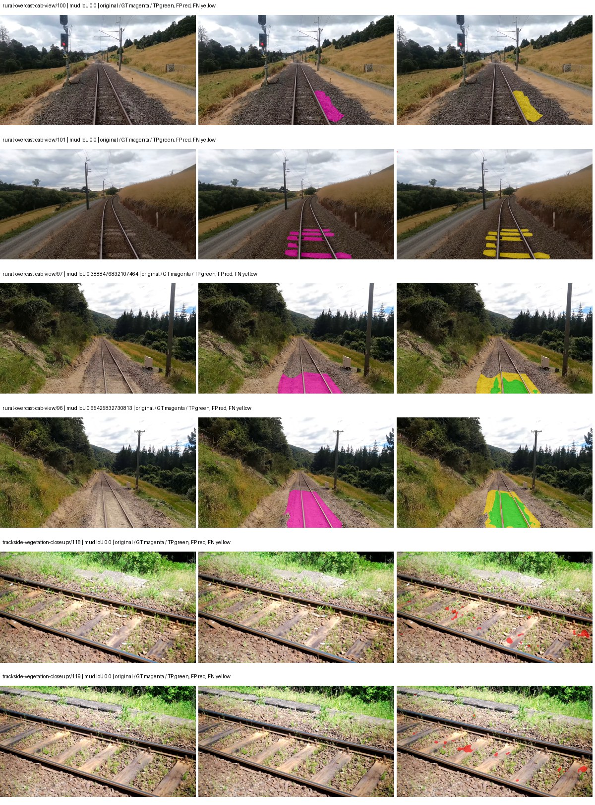
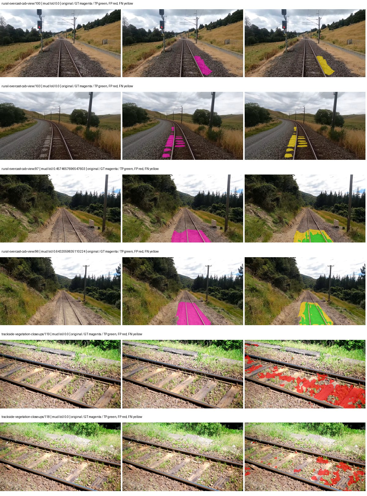
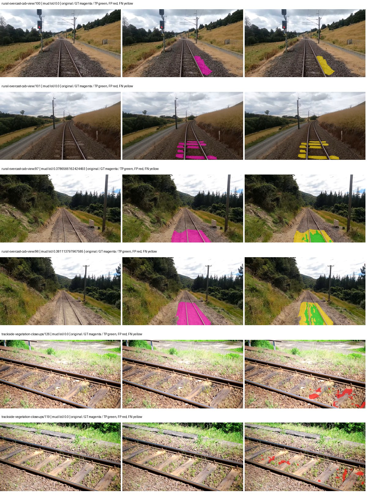
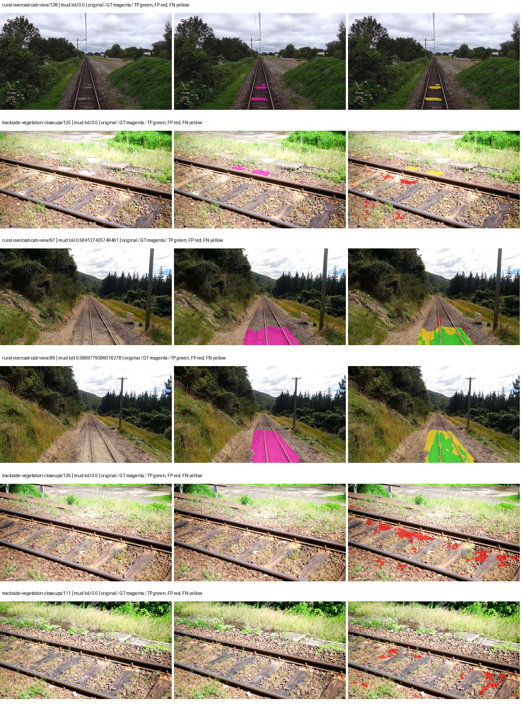
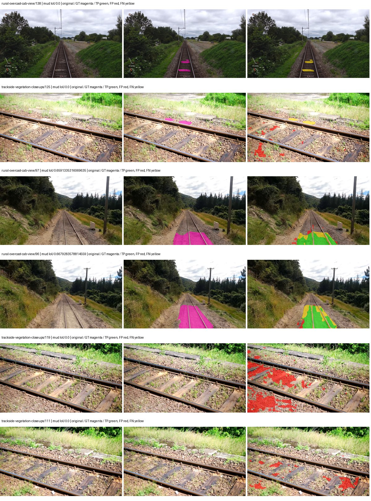
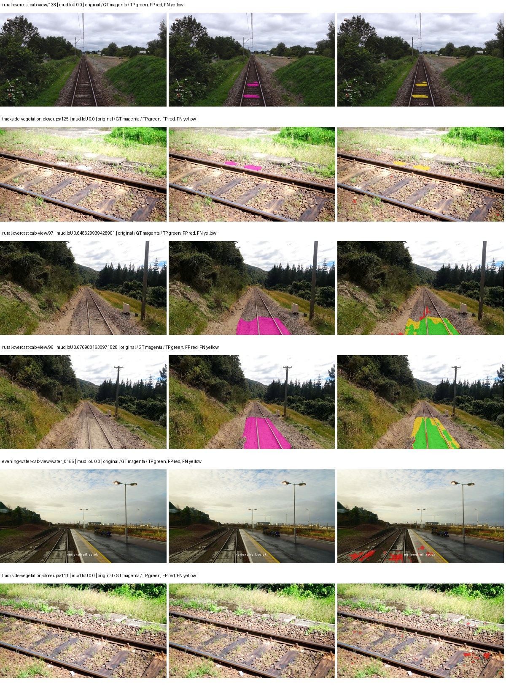
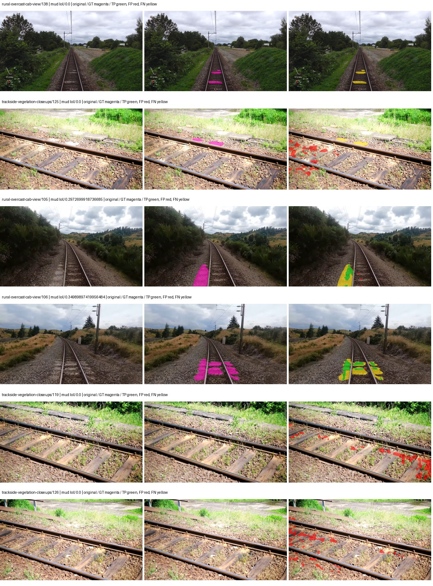
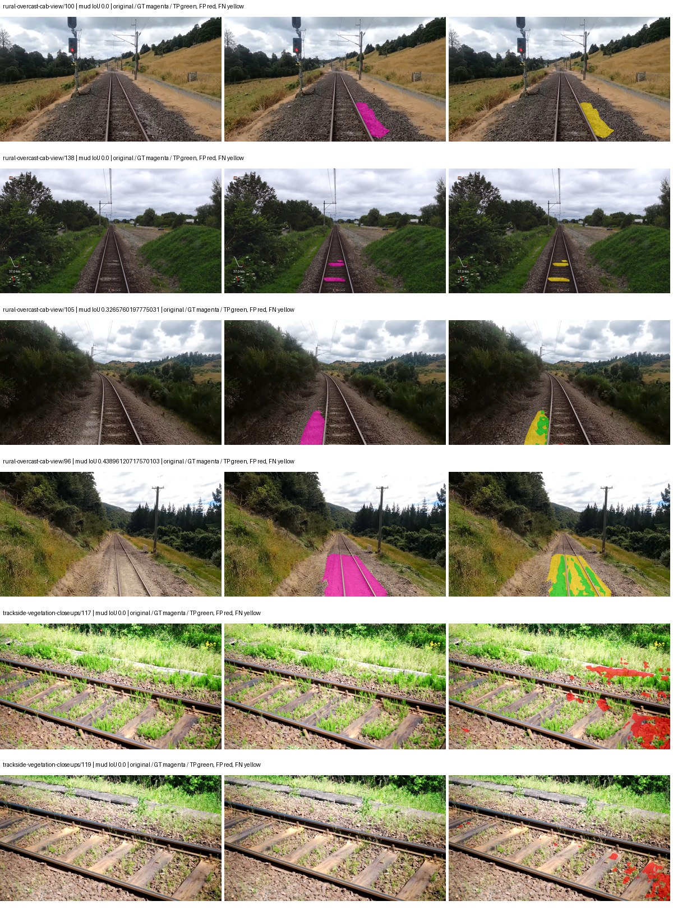
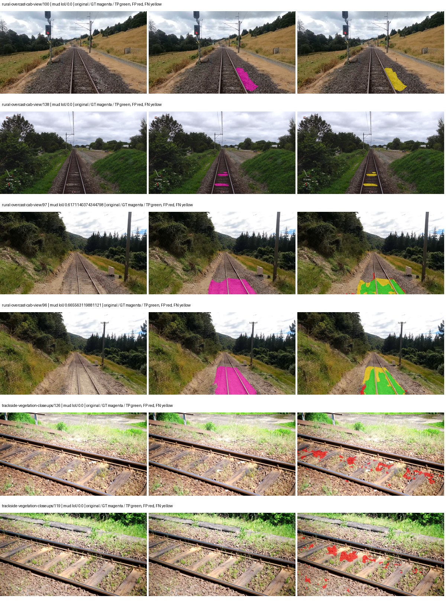

# hf_auto_mobilevit_xxs_deeplabv3 — paul-test-rtis

[RTIS comparison](../../README.md) · [Full model records](record.json)

Primary selection and early stopping: **mud-pumping validation IoU**. A job is complete only after full statistics and isolated profiling are verified.

| Model | Initialization path | Seed | Status | Steps | Best step | Mud IoU (%) | Mud precision (%) | Mud recall (%) | Final mud IoU (trainer val, %) | mIoU (%) | Fixed GT-class mIoU (%) |
| --- | --- | --- | --- | --- | --- | --- | --- | --- | --- | --- | --- |
| hf_auto_mobilevit_xxs_deeplabv3 | rtis_only | 0 | completed | 3818 | 2545 | 15.00 | 72.08 | 15.93 | 9.49 | 25.52 | 29.77 |
| hf_auto_mobilevit_xxs_deeplabv3 | rtis_only | 1 | completed | 4000 | 3563 | 11.25 | 22.76 | 18.20 | 10.20 | 23.95 | 27.94 |
| hf_auto_mobilevit_xxs_deeplabv3 | rtis_only | 2 | completed | 3309 | 2036 | 13.21 | 49.57 | 15.26 | 5.77 | 23.47 | 27.38 |
| hf_auto_mobilevit_xxs_deeplabv3 | cityscapes_to_rtis | 0 | completed | 3309 | 2036 | 25.20 | 50.79 | 33.34 | 9.75 | 26.89 | 31.37 |
| hf_auto_mobilevit_xxs_deeplabv3 | cityscapes_to_rtis | 1 | completed | 2800 | 1527 | 23.18 | 37.21 | 38.08 | 13.61 | 24.31 | 28.36 |
| hf_auto_mobilevit_xxs_deeplabv3 | cityscapes_to_rtis | 2 | completed | 3309 | 2036 | 27.45 | 69.40 | 31.23 | 24.03 | 24.83 | 28.96 |
| hf_auto_mobilevit_xxs_deeplabv3 | railsem19_to_rtis | 0 | completed | 3563 | 2290 | 9.09 | 29.95 | 11.54 | 7.35 | 28.20 | 32.90 |
| hf_auto_mobilevit_xxs_deeplabv3 | railsem19_to_rtis | 1 | completed | 4000 | 3309 | 12.35 | 38.05 | 15.45 | 8.46 | 27.46 | 32.04 |
| hf_auto_mobilevit_xxs_deeplabv3 | railsem19_to_rtis | 2 | collecting | 3563 | 2290 | 10.33 | 32.17 | 13.21 | 6.05 | 26.44 | 30.85 |
| hf_auto_mobilevit_xxs_deeplabv3 | cityscapes_to_railsem19_to_rtis | 0 | completed | 2800 | 1527 | 16.38 | 43.63 | 20.78 | 11.87 | 25.58 | 29.84 |
| hf_auto_mobilevit_xxs_deeplabv3 | cityscapes_to_railsem19_to_rtis | 1 | training | 1599 | — | — | — | — | — | — | — |
| hf_auto_mobilevit_xxs_deeplabv3 | cityscapes_to_railsem19_to_rtis | 2 | training | 1149 | — | — | — | — | — | — | — |

Training: 220 images. Validation: 37 images. Test: 50 held out. Seeds: [0, 1, 2]. Seed variation measures optimization variability, not independent-recording uncertainty. Historical source checkpoints stay fixed across adaptation seeds.

Training code: `066afb2626398b7be59d4d19f5a0e4644fd59adc`. Split SHA-256: `71fef8292610c352da0709fe3bd030f3bcc18f97560394835f4b22826463b83d`.

## rtis_only — seed 0

Status: **completed**. Started: 2026-09-06T10:35:18.187566+00:00. Finished: 2026-09-06T12:23:48.651694+00:00.

Recipe pretrained initializer: `apple/deeplabv3-mobilevit-xx-small`.

`rtis_only` uses the recipe initializer, which may include pretrained segmentation components. Transfer paths load the exact historical source checkpoint below and reset the classifier; they do not reset all query/decoder features.

Source checkpoint: `Recipe pretrained initialization`.

Config SHA-256: `cf12af7dcad17276d1503e17b8ec6925105d11bba7490da55d633d137b791d9e`. Weights used for validation: `raw`.

### Mud-pumping and aggregate quality

| Metric | Selected checkpoint | Final training validation |
| --- | --- | --- |
| Mud IoU | 15.00 | 9.49 |
| Mud precision | 72.08 | 14.17 |
| Mud recall | 15.93 | 22.34 |
| Mud Dice/F1 | 26.09 | 17.34 |
| mIoU | 25.52 | 25.57 |
| Mean accuracy | 35.41 | 36.15 |
| Mean precision | 49.46 | 42.17 |
| Mean Dice | 32.65 | 32.72 |
| Mean specificity | 98.73 | 98.81 |
| Pixel accuracy | 80.86 | 81.39 |
| Frequency-weighted IoU | 69.21 | 70.93 |
| Fixed GT-present class mIoU | 29.77 | 29.83 |
| Boundary F1 | 30.36 | 30.00 |

The selected checkpoint has independent evaluation evidence. Final values are the trainer's final validation record, not a new independent evaluation. mIoU averages classes with nonzero union, so false positives on absent classes can change its denominator. The fixed GT-class mean is supplementary and excludes absent classes; their false positives remain in the confusion matrix.

### Resource usage and timing

| Measurement | Value |
| --- | --- |
| Peak training VRAM, retained training invocation (GiB) | 15.78 |
| Peak evaluation VRAM (GiB) | 6.64 |
| Retained training invocation wall time (seconds) | 6331.26 |
| Retained training invocation GPU-hours (one GPU) | 1.76 |
| Evaluation wall time (seconds) | 16.66 |
| Full evaluation pipeline images/second | 2.22 |
| Best full-state checkpoint (MiB) | 28.88 |
| Final full-state checkpoint (MiB) | 28.87 |
| Audited periodic checkpoints removed (GiB) | 0.20 |

VRAM uses the recorded allocator high-water mark; it is not total device usage including CUDA context. Resumed jobs' retained training invocation times and peaks are **not whole-campaign totals**. Earlier invocation resource records are not reconstructed here. Evaluation throughput includes loader, sliding-window inference and metrics; it is not model-only latency/FPS. Missing measurements are shown as —, never inferred from another dataset's run.

### Standardized inference performance

Dedicated model-only profiling waits for an idle worker-locked L40S: BF16, batch 1, 1024x1024, 20 warmup and 100 CUDA-event-timed public forwards. It excludes loading, preprocessing, tiling and metrics.

| Status | Parameters | Weight MiB | FPS | p50 ms | p95 ms | Peak reserved GiB |
| --- | --- | --- | --- | --- | --- | --- |
| complete | 1854853 | 7.08 | 34.64 | 28.81 | 29.22 | 3.30 |

```json
{
  "schema_version": 1,
  "model_id": "hf_auto_mobilevit_xxs_deeplabv3",
  "measured_at": "2026-09-06T12:23:46+00:00",
  "status": "complete",
  "benchmark_scope": "rtis_selected_checkpoint_model_only",
  "applies_to": [
    "hf_auto_mobilevit_xxs_deeplabv3--rtis_only--seed-0"
  ],
  "source": {
    "campaign_git_sha": "066afb2626398b7be59d4d19f5a0e4644fd59adc",
    "git_dirty": false,
    "config_hash": "674c4d40bac5",
    "resolved_config": "/data/izadia1/projects/segmentary-runs/paul-test-rtis/mud-fullstats-v1-20260906-r2/configs/hf_auto_mobilevit_xxs_deeplabv3--rtis_only--seed-0.yaml",
    "config_sha256": "cf12af7dcad17276d1503e17b8ec6925105d11bba7490da55d633d137b791d9e",
    "checkpoint_sha256": "61e72fc8c36ba27efaea95816cc3239edf3bec5b7b4e784022a3faded7b3dce0",
    "checkpoint_global_step": 2545,
    "checkpoint_bytes": 30284868,
    "checkpoint_kind": "resume checkpoint with optimizer and EMA state",
    "weights": "raw",
    "measured_checkpoint_job_id": "hf_auto_mobilevit_xxs_deeplabv3--rtis_only--seed-0",
    "result_sha256": "e3e8708133afd3e11572a493bf0fd4ee92393b7c4b87985abfa6dd7aca9c1ead",
    "result_git_sha": "066afb2626398b7be59d4d19f5a0e4644fd59adc",
    "result_stage": "eval:paul-test-rtis:val",
    "result_seed": 0
  },
  "hardware": {
    "gpu_name": "NVIDIA L40S",
    "gpu_uuid": "GPU-804aea8b-5f62-423e-72c6-49e1ed15c4e4",
    "logical_device": "cuda:0",
    "physical_visibility_token": "6",
    "compute_capability": [
      8,
      9
    ],
    "total_memory_bytes": 47677177856
  },
  "model": {
    "parameter_count": 1854853,
    "trainable_parameter_count": 1854853,
    "resident_parameter_bytes": 7419412,
    "parameter_dtype_counts": {
      "float32": 1854853
    }
  },
  "contract": {
    "backend": "pytorch",
    "precision": "bf16_autocast",
    "batch_size": 1,
    "input_shape_nchw": [
      1,
      3,
      1024,
      1024
    ],
    "warmup_iterations": 20,
    "measured_iterations": 100,
    "timing": "per-forward CUDA events with end-event synchronization",
    "includes_preprocessing": false,
    "includes_data_loader": false,
    "includes_sliding_window": false,
    "input_resident_on_gpu": true,
    "model_only": true,
    "entrypoint": "public model(image) dense-logits forward"
  },
  "measurements": {
    "latency": {
      "p50_ms": 28.812304496765137,
      "p95_ms": 29.22301378250122,
      "mean_ms": 28.871024703979494,
      "minimum_ms": 28.593151092529297,
      "maximum_ms": 29.684736251831055,
      "fps": 34.63680317041754,
      "raw_ms": [
        28.802047729492188,
        29.684736251831055,
        28.905471801757812,
        28.742656707763672,
        29.113344192504883,
        28.94643211364746,
        28.659711837768555,
        28.705791473388672,
        28.93926429748535,
        29.206527709960938,
        29.041664123535156,
        28.75904083251953,
        28.95462417602539,
        28.77132797241211,
        28.92083168029785,
        28.865535736083984,
        28.94540786743164,
        28.661727905273438,
        28.642303466796875,
        28.90239906311035,
        28.76723289489746,
        28.643327713012695,
        28.94643211364746,
        28.84809684753418,
        28.73036766052246,
        28.74880027770996,
        28.863487243652344,
        28.78976058959961,
        29.007871627807617,
        28.681215286254883,
        28.593151092529297,
        28.799999237060547,
        28.93414306640625,
        29.00275230407715,
        28.77030372619629,
        28.900352478027344,
        28.803071975708008,
        28.72934341430664,
        28.914688110351562,
        29.263872146606445,
        28.94643211364746,
        28.895231246948242,
        29.050880432128906,
        28.73139190673828,
        28.708864212036133,
        29.463552474975586,
        28.75801658630371,
        28.812288284301758,
        29.518848419189453,
        28.76108741760254,
        28.613632202148438,
        28.608543395996094,
        28.820480346679688,
        29.074432373046875,
        28.75699234008789,
        28.869632720947266,
        28.707839965820312,
        28.661760330200195,
        29.220863342285156,
        28.77952003479004,
        28.7825927734375,
        28.697599411010742,
        28.75699234008789,
        28.694528579711914,
        28.708864212036133,
        28.703744888305664,
        29.048864364624023,
        28.9617919921875,
        28.700672149658203,
        28.898303985595703,
        28.719104766845703,
        28.817407608032227,
        29.015039443969727,
        28.9617919921875,
        29.14201545715332,
        28.703744888305664,
        28.98739242553711,
        28.98841667175293,
        28.80614471435547,
        28.969951629638672,
        28.823551177978516,
        29.40108871459961,
        28.96588706970215,
        28.79692840576172,
        28.791807174682617,
        28.99660873413086,
        29.027328491210938,
        28.726272583007812,
        28.701696395874023,
        28.636159896850586,
        28.7825927734375,
        28.812320709228516,
        28.7508487701416,
        28.97305679321289,
        29.11743927001953,
        29.007871627807617,
        28.7774715423584,
        28.95564842224121,
        28.60851287841797,
        28.715007781982422
      ],
      "percentile_method": "numpy linear interpolation"
    },
    "peak_reserved_bytes": 3548381184,
    "memory_kind": "pytorch_cuda_allocator_peak_reserved_excluding_context",
    "benchmark_wall_clock_s": 15.035555399954319
  },
  "started_at": "2026-09-06T12:23:31+00:00",
  "finished_at": "2026-09-06T12:23:46+00:00",
  "environment": {
    "hostname": "hdrfs-app-001",
    "python": "3.11.15",
    "platform": "Linux-5.15.0-139-generic-x86_64-with-glibc2.35",
    "torch": "2.11.0+cu128",
    "torch_cuda": "12.8",
    "cudnn": 91900,
    "driver_version": "570.133.20",
    "cuda_available": true,
    "gpu_count": 1,
    "gpu_names": [
      "NVIDIA L40S"
    ],
    "cuda_visible_devices": "6",
    "packages": {
      "segmentary": "0.1.0",
      "torch": "2.11.0+cu128",
      "torchvision": "0.26.0+cu128",
      "transformers": "5.15.0",
      "timm": "1.0.28",
      "segmentation-models-pytorch": "0.5.0",
      "albumentations": "2.0.8",
      "lightning": "2.6.5",
      "numpy": "2.4.4"
    }
  }
}
```

### Per-class validation results

| Class | GT pixels | IoU (%) | Precision (%) | Recall (%) | Dice (%) | Boundary F1 (%) |
| --- | --- | --- | --- | --- | --- | --- |
| car | 29664 | 0.85 | 67.02 | 0.86 | 1.69 | 29.74 |
| construction | 311585 | 28.46 | 49.55 | 40.07 | 44.31 | 45.27 |
| fence | 265137 | 3.33 | 14.29 | 4.16 | 6.44 | 11.90 |
| mud-pumping | 1226250 | 15.00 | 72.08 | 15.93 | 26.09 | 18.25 |
| on-rails | 0 | 0.00 | 0.00 | — | 0.00 | 0.00 |
| person | 0 | 0.00 | 0.00 | — | 0.00 | 0.00 |
| pole | 628038 | 58.82 | 76.19 | 72.06 | 74.07 | 79.65 |
| rail-embedded | 16799 | 0.00 | 0.00 | 0.00 | 0.00 | 0.00 |
| rail-raised | 2969797 | 66.09 | 77.88 | 81.37 | 79.59 | 87.67 |
| rail-track | 6323197 | 30.94 | 72.74 | 35.00 | 47.26 | 39.15 |
| road | 1048831 | 8.33 | 34.23 | 9.91 | 15.37 | 16.35 |
| sidewalk | 1297367 | 26.88 | 97.89 | 27.03 | 42.36 | 8.53 |
| sky | 19121606 | 97.16 | 98.58 | 98.54 | 98.56 | 90.59 |
| standing-water | 95802 | 0.27 | 0.30 | 2.35 | 0.53 | 1.43 |
| terrain | 39239306 | 82.21 | 83.94 | 97.56 | 90.24 | 54.18 |
| trackbed | 10643081 | 50.54 | 57.37 | 80.92 | 67.14 | 53.63 |
| traffic-light | 19510 | 56.19 | 88.60 | 60.56 | 71.95 | 67.09 |
| traffic-sign | 13285 | 2.24 | 69.68 | 2.27 | 4.39 | 11.90 |
| tram-track | 56179 | 0.00 | 0.00 | 0.00 | 0.00 | 0.00 |
| truck | 0 | 0.00 | 0.00 | — | 0.00 | 0.00 |
| vegetation-overgrowth | 5901821 | 8.55 | 78.22 | 8.76 | 15.75 | 22.18 |

### Full-run accounting

| Measurement | Value |
| --- | --- |
| Full GPU-reserved wall seconds, all recorded worker attempts | 6510.47 |
| Full reserved GPU-hours | 1.81 |
| Whole-run timing complete | True |

| Phase | Wall seconds including failed attempts |
| --- | --- |
| training | 6337.60 |
| diagnostics | 126.84 |
| performance | 22.01 |

GPU-reserved time includes model loading, training, validation, collection, profiling, checkpoint I/O and orchestration while the worker owns one GPU. It is not GPU kernel-active time. Phase timings and sampled device memory/power/utilization are retained separately; sampled device memory is not the allocator high-water mark.

### Train/validation and raw/EMA diagnostics

| Checkpoint / weights / split | Images | Mud IoU (%) | Mud precision (%) | Mud recall (%) |
| --- | --- | --- | --- | --- |
| best-auto-train / raw | 220 | 87.60 | 95.03 | 91.80 |
| best-auto-val / raw | 37 | 15.00 | 72.08 | 15.93 |
| best-alternate-val / ema | 37 | 0.11 | 15.89 | 0.11 |
| final-auto-val / raw | 37 | 9.47 | 14.12 | 22.35 |

Train uses the evaluation transform without augmentation. Compare mud train/validation metrics for the same selected weights. Alternate EMA on running-stat BatchNorm is explicitly uncalibrated and is diagnostic only. Score-threshold curves use uncalibrated normalized scores and are pixel-level diagnostics, not event detection rates or a selected deployment operating point.

### Downloadable evidence

- best-auto-train: [per-image.csv](rtis_only--seed-0/best-auto-train/per-image.csv) · [per-image-confusion.json.gz](rtis_only--seed-0/best-auto-train/per-image-confusion.json.gz) · [groups.json](rtis_only--seed-0/best-auto-train/groups.json) · [mud-score-curves.json](rtis_only--seed-0/best-auto-train/mud-score-curves.json)
- best-auto-val: [per-image.csv](rtis_only--seed-0/best-auto-val/per-image.csv) · [per-image-confusion.json.gz](rtis_only--seed-0/best-auto-val/per-image-confusion.json.gz) · [groups.json](rtis_only--seed-0/best-auto-val/groups.json) · [mud-score-curves.json](rtis_only--seed-0/best-auto-val/mud-score-curves.json) · [examples.jpg](rtis_only--seed-0/best-auto-val/examples.jpg)
- best-alternate-val: [per-image.csv](rtis_only--seed-0/best-alternate-val/per-image.csv) · [per-image-confusion.json.gz](rtis_only--seed-0/best-alternate-val/per-image-confusion.json.gz) · [groups.json](rtis_only--seed-0/best-alternate-val/groups.json) · [mud-score-curves.json](rtis_only--seed-0/best-alternate-val/mud-score-curves.json)
- final-auto-val: [per-image.csv](rtis_only--seed-0/final-auto-val/per-image.csv) · [per-image-confusion.json.gz](rtis_only--seed-0/final-auto-val/per-image-confusion.json.gz) · [groups.json](rtis_only--seed-0/final-auto-val/groups.json) · [mud-score-curves.json](rtis_only--seed-0/final-auto-val/mud-score-curves.json)
- resources: [telemetry.csv](rtis_only--seed-0/resources/telemetry.csv)



Examples are two lowest and two highest mud-IoU positive images, plus up to two negative images with the most false-positive mud pixels. They are targeted diagnostic examples, not random samples. Green: true positive; red: false positive; yellow: false negative. Full predictions remain on HDRFS.

### Validation tracking

| Logged step | Overall mIoU (%) | Mud IoU (%) |
| --- | --- | --- |
| 254 | 11.27 | 0.00 |
| 508 | 17.49 | 0.80 |
| 763 | 20.54 | 0.48 |
| 1017 | 21.73 | 6.00 |
| 1272 | 21.19 | 3.80 |
| 1527 | 24.23 | 10.89 |
| 1781 | 23.89 | 5.14 |
| 2036 | 26.13 | 4.43 |
| 2290 | 24.29 | 13.50 |
| 2545 | 25.53 | 15.03 |
| 2799 | 24.24 | 11.82 |
| 3054 | 25.44 | 13.12 |
| 3308 | 25.01 | 12.62 |
| 3563 | 25.12 | 9.14 |
| 3817 | 25.57 | 9.49 |

All retained scalar curves, including training loss and per-class IoU, are in record.json. Observed best mud on a curve is not necessarily a retained checkpoint: the pilot saved its selection-metric-best and final checkpoints. Step logging and checkpoint global_step may differ by one.

### Stopping and checkpoint provenance

```json
{
  "stopping": {
    "actual_steps": 3818,
    "maximum_steps": 4000,
    "min_delta": 0.001,
    "monitor": "val_iou/mud-pumping",
    "patience": 5,
    "reason": "validation_plateau"
  },
  "checkpoints": {
    "best": {
      "path": "/data/izadia1/projects/segmentary-runs/paul-test-rtis/mud-fullstats-v1-20260906-r2/future-runs/hf_auto_mobilevit_xxs_deeplabv3--rtis_only--seed-0_seed0/rtis/best.ckpt",
      "sha256": "61e72fc8c36ba27efaea95816cc3239edf3bec5b7b4e784022a3faded7b3dce0",
      "global_step": 2545,
      "bytes": 30284868
    },
    "final": {
      "path": "/data/izadia1/projects/segmentary-runs/paul-test-rtis/mud-fullstats-v1-20260906-r2/future-runs/hf_auto_mobilevit_xxs_deeplabv3--rtis_only--seed-0_seed0/rtis/last.ckpt",
      "sha256": "b0a5f69c9f6327ff319ef03ec051d573f860f2c5c06addbb18ce877b5f2a88b0",
      "global_step": 3818,
      "bytes": 30270404
    }
  },
  "cleanup_error": null
}
```

### Resolved training, initialization and evaluation settings

The optimizer block is the base configuration. Stage LR scales are applied at runtime, and stage warmup is capped at min(base warmup, floor(stage budget / 10), stage budget - 1): 400 steps for this 4,000-step pilot. Model-internal native input grids may differ from augmentation crops (EoMT uses its 640 grid).

```json
{
  "name": "hf_auto_mobilevit_xxs_deeplabv3--rtis_only--seed-0",
  "model": {
    "arch": "hf_auto",
    "checkpoint": "apple/deeplabv3-mobilevit-xx-small",
    "tuning": "full",
    "head": "unified_head",
    "lora_r": 16,
    "lora_alpha": 32,
    "lora_dropout": 0.05,
    "lora_targets": [],
    "drop_path": null,
    "revision": "2bece0a6464b15913c1f2c82cb5ab11bc5b7b3ad",
    "subfolder": null,
    "local_files_only": false,
    "trust_remote_code": false,
    "backbone_path": null,
    "head_paths": [],
    "classifier_path": null,
    "inactive_parameter_paths": [],
    "smp_arch": null,
    "encoder_name": null,
    "encoder_weights": null,
    "native": null,
    "batch_norm_momentum": null
  },
  "space": "paul-test-rtis",
  "taxonomy_root": "/data/izadia1/projects/segmentary-rtis-fullstats-066afb2/taxonomy",
  "output_root": "/data/izadia1/projects/segmentary-runs/paul-test-rtis/mud-fullstats-v1-20260906-r2/future-runs",
  "optim": {
    "backbone_lr": 0.0001,
    "head_lr_mult": 10.0,
    "weight_decay": 0.05,
    "llrd": 1.0,
    "warmup_iters": 1500,
    "warmup_ratio": 1e-06,
    "poly_power": 0.9,
    "min_lr_ratio": 0.0,
    "betas": [
      0.9,
      0.999
    ],
    "grad_clip": 1.0
  },
  "train": {
    "iters": 4000,
    "batch_size": 2,
    "accum": 8,
    "num_workers": 2,
    "precision": "bf16-mixed",
    "ema_decay": 0.9998,
    "val_every": 250,
    "ckpt_every": 500,
    "selection_metric": "val_iou/mud-pumping",
    "early_stopping_patience": 5,
    "early_stopping_min_delta": 0.001,
    "seed": 0,
    "devices": 1
  },
  "eval": {
    "sliding_window": true,
    "window": [
      1024,
      1024
    ],
    "stride": [
      768,
      768
    ],
    "batch_size": 1,
    "num_workers": 2,
    "tta_scales": [],
    "tta_flip": false,
    "threshold": 0.5,
    "boundary_tolerance_frac": 0.0075,
    "save_confusion": true
  },
  "loss": {
    "task": "multiclass",
    "activation": "auto",
    "terms": [],
    "aux": "none",
    "aux_weight": 0.0,
    "ce_weight": 1.0,
    "label_smoothing": 0.0,
    "class_weights": null,
    "query": null
  },
  "aug": {
    "crop": [
      1024,
      1024
    ],
    "scale_min": 0.5,
    "scale_max": 2.0,
    "hflip_p": 0.5,
    "color_jitter_p": 0.5,
    "brightness": 0.25,
    "contrast": 0.25,
    "saturation": 0.25,
    "hue": 0.05
  },
  "stages": [
    {
      "name": "rtis",
      "data": [
        {
          "name": "paul-test-rtis",
          "root": "/data/izadia1/datasets/paul-test-rtis",
          "variant": null,
          "split_file": "splits.json",
          "train_split": "train",
          "val_split": "val",
          "limit": null,
          "loader": "folder",
          "mapping": "paul-test-rtis",
          "loader_options": {
            "require_groups": true
          }
        }
      ],
      "iters": null,
      "lr_scale": 1.0,
      "head_group_lr_scale": 1.0,
      "init_from": "pretrained",
      "reset_head": false,
      "freeze": null,
      "sample_weights": null
    }
  ]
}
```

### Hardware and software provenance

```json
{
  "training": {
    "cuda_available": true,
    "cuda_visible_devices": "6",
    "cudnn": 91900,
    "driver_version": "570.133.20",
    "gpu_count": 1,
    "gpu_names": [
      "NVIDIA L40S"
    ],
    "hostname": "hdrfs-app-001",
    "input_normalization": {
      "channel_order": "bgr",
      "mean": [
        0.0,
        0.0,
        0.0
      ],
      "source": "hf_image_processor",
      "std": [
        1.0,
        1.0,
        1.0
      ]
    },
    "model_origins": [
      {
        "hf_commit": "2bece0a6464b15913c1f2c82cb5ab11bc5b7b3ad",
        "hf_name_or_path": "apple/deeplabv3-mobilevit-xx-small",
        "module": "model",
        "timm_pretrained": {}
      },
      {
        "hf_commit": "2bece0a6464b15913c1f2c82cb5ab11bc5b7b3ad",
        "hf_name_or_path": "apple/deeplabv3-mobilevit-xx-small",
        "module": "model.mobilevit",
        "timm_pretrained": {}
      },
      {
        "hf_commit": "2bece0a6464b15913c1f2c82cb5ab11bc5b7b3ad",
        "hf_name_or_path": "apple/deeplabv3-mobilevit-xx-small",
        "module": "model.mobilevit.encoder",
        "timm_pretrained": {}
      }
    ],
    "model_parameter_count": 1854853,
    "packages": {
      "albumentations": "2.0.8",
      "lightning": "2.6.5",
      "numpy": "2.4.4",
      "segmentary": "0.1.0",
      "segmentation-models-pytorch": "0.5.0",
      "timm": "1.0.28",
      "torch": "2.11.0+cu128",
      "torchvision": "0.26.0+cu128",
      "transformers": "5.15.0"
    },
    "platform": "Linux-5.15.0-139-generic-x86_64-with-glibc2.35",
    "python": "3.11.15",
    "torch": "2.11.0+cu128",
    "torch_cuda": "12.8",
    "trainable_parameter_count": 1854853,
    "training_stop": {
      "actual_steps": 3818,
      "maximum_steps": 4000,
      "min_delta": 0.001,
      "monitor": "val_iou/mud-pumping",
      "patience": 5,
      "reason": "validation_plateau"
    },
    "validation_weights": "raw"
  },
  "evaluation": {
    "cuda_available": true,
    "cuda_visible_devices": "6",
    "cudnn": 91900,
    "driver_version": "570.133.20",
    "gpu_count": 1,
    "gpu_names": [
      "NVIDIA L40S"
    ],
    "hostname": "hdrfs-app-001",
    "input_normalization": {
      "channel_order": "bgr",
      "mean": [
        0.0,
        0.0,
        0.0
      ],
      "source": "hf_image_processor",
      "std": [
        1.0,
        1.0,
        1.0
      ]
    },
    "packages": {
      "albumentations": "2.0.8",
      "lightning": "2.6.5",
      "numpy": "2.4.4",
      "segmentary": "0.1.0",
      "segmentation-models-pytorch": "0.5.0",
      "timm": "1.0.28",
      "torch": "2.11.0+cu128",
      "torchvision": "0.26.0+cu128",
      "transformers": "5.15.0"
    },
    "platform": "Linux-5.15.0-139-generic-x86_64-with-glibc2.35",
    "python": "3.11.15",
    "torch": "2.11.0+cu128",
    "torch_cuda": "12.8"
  }
}
```

## rtis_only — seed 1

Status: **completed**. Started: 2026-09-06T10:40:54.250880+00:00. Finished: 2026-09-06T12:34:48.581206+00:00.

Recipe pretrained initializer: `apple/deeplabv3-mobilevit-xx-small`.

`rtis_only` uses the recipe initializer, which may include pretrained segmentation components. Transfer paths load the exact historical source checkpoint below and reset the classifier; they do not reset all query/decoder features.

Source checkpoint: `Recipe pretrained initialization`.

Config SHA-256: `762802bc71a6a3a15f97f26963419de5056c57c3c2037b687e4ddeec3c834462`. Weights used for validation: `raw`.

### Mud-pumping and aggregate quality

| Metric | Selected checkpoint | Final training validation |
| --- | --- | --- |
| Mud IoU | 11.25 | 10.20 |
| Mud precision | 22.76 | 14.33 |
| Mud recall | 18.20 | 26.14 |
| Mud Dice/F1 | 20.23 | 18.51 |
| mIoU | 23.95 | 24.10 |
| Mean accuracy | 34.19 | 35.29 |
| Mean precision | 42.43 | 37.98 |
| Mean Dice | 30.59 | 30.92 |
| Mean specificity | 98.79 | 98.80 |
| Pixel accuracy | 81.75 | 81.68 |
| Frequency-weighted IoU | 70.51 | 70.94 |
| Fixed GT-present class mIoU | 27.94 | 28.11 |
| Boundary F1 | 27.08 | 28.28 |

The selected checkpoint has independent evaluation evidence. Final values are the trainer's final validation record, not a new independent evaluation. mIoU averages classes with nonzero union, so false positives on absent classes can change its denominator. The fixed GT-class mean is supplementary and excludes absent classes; their false positives remain in the confusion matrix.

### Resource usage and timing

| Measurement | Value |
| --- | --- |
| Peak training VRAM, retained training invocation (GiB) | 15.78 |
| Peak evaluation VRAM (GiB) | 6.64 |
| Retained training invocation wall time (seconds) | 6652.28 |
| Retained training invocation GPU-hours (one GPU) | 1.85 |
| Evaluation wall time (seconds) | 16.71 |
| Full evaluation pipeline images/second | 2.21 |
| Best full-state checkpoint (MiB) | 28.88 |
| Final full-state checkpoint (MiB) | 28.87 |
| Audited periodic checkpoints removed (GiB) | 0.23 |

VRAM uses the recorded allocator high-water mark; it is not total device usage including CUDA context. Resumed jobs' retained training invocation times and peaks are **not whole-campaign totals**. Earlier invocation resource records are not reconstructed here. Evaluation throughput includes loader, sliding-window inference and metrics; it is not model-only latency/FPS. Missing measurements are shown as —, never inferred from another dataset's run.

### Standardized inference performance

Dedicated model-only profiling waits for an idle worker-locked L40S: BF16, batch 1, 1024x1024, 20 warmup and 100 CUDA-event-timed public forwards. It excludes loading, preprocessing, tiling and metrics.

| Status | Parameters | Weight MiB | FPS | p50 ms | p95 ms | Peak reserved GiB |
| --- | --- | --- | --- | --- | --- | --- |
| complete | 1854853 | 7.08 | 34.69 | 28.72 | 29.26 | 3.30 |

```json
{
  "schema_version": 1,
  "model_id": "hf_auto_mobilevit_xxs_deeplabv3",
  "measured_at": "2026-09-06T12:34:46+00:00",
  "status": "complete",
  "benchmark_scope": "rtis_selected_checkpoint_model_only",
  "applies_to": [
    "hf_auto_mobilevit_xxs_deeplabv3--rtis_only--seed-1"
  ],
  "source": {
    "campaign_git_sha": "066afb2626398b7be59d4d19f5a0e4644fd59adc",
    "git_dirty": false,
    "config_hash": "c08f549048a6",
    "resolved_config": "/data/izadia1/projects/segmentary-runs/paul-test-rtis/mud-fullstats-v1-20260906-r2/configs/hf_auto_mobilevit_xxs_deeplabv3--rtis_only--seed-1.yaml",
    "config_sha256": "762802bc71a6a3a15f97f26963419de5056c57c3c2037b687e4ddeec3c834462",
    "checkpoint_sha256": "21142ea6a7142ceb54feeff6986069fe869162dc413b18171f1484a97b79bf6d",
    "checkpoint_global_step": 3563,
    "checkpoint_bytes": 30284868,
    "checkpoint_kind": "resume checkpoint with optimizer and EMA state",
    "weights": "raw",
    "measured_checkpoint_job_id": "hf_auto_mobilevit_xxs_deeplabv3--rtis_only--seed-1",
    "result_sha256": "3f824be1b2e3c71b2ed7dd4fe6a96b84eaecd4fdbb335e8ce87a1d2c4f4e8ddc",
    "result_git_sha": "066afb2626398b7be59d4d19f5a0e4644fd59adc",
    "result_stage": "eval:paul-test-rtis:val",
    "result_seed": 1
  },
  "hardware": {
    "gpu_name": "NVIDIA L40S",
    "gpu_uuid": "GPU-fc5dde96-210d-0afa-ac74-7f88477d622b",
    "logical_device": "cuda:0",
    "physical_visibility_token": "4",
    "compute_capability": [
      8,
      9
    ],
    "total_memory_bytes": 47677177856
  },
  "model": {
    "parameter_count": 1854853,
    "trainable_parameter_count": 1854853,
    "resident_parameter_bytes": 7419412,
    "parameter_dtype_counts": {
      "float32": 1854853
    }
  },
  "contract": {
    "backend": "pytorch",
    "precision": "bf16_autocast",
    "batch_size": 1,
    "input_shape_nchw": [
      1,
      3,
      1024,
      1024
    ],
    "warmup_iterations": 20,
    "measured_iterations": 100,
    "timing": "per-forward CUDA events with end-event synchronization",
    "includes_preprocessing": false,
    "includes_data_loader": false,
    "includes_sliding_window": false,
    "input_resident_on_gpu": true,
    "model_only": true,
    "entrypoint": "public model(image) dense-logits forward"
  },
  "measurements": {
    "latency": {
      "p50_ms": 28.7237606048584,
      "p95_ms": 29.26423053741455,
      "mean_ms": 28.82872735977173,
      "minimum_ms": 28.587007522583008,
      "maximum_ms": 30.067712783813477,
      "fps": 34.687622090298134,
      "raw_ms": [
        28.824575424194336,
        28.785663604736328,
        28.676095962524414,
        28.638208389282227,
        28.669952392578125,
        28.72831916809082,
        28.661727905273438,
        28.717056274414062,
        28.671903610229492,
        28.652544021606445,
        28.669952392578125,
        28.659711837768555,
        28.692480087280273,
        28.669952392578125,
        28.678144454956055,
        28.696575164794922,
        28.98431968688965,
        28.627967834472656,
        28.705791473388672,
        28.668928146362305,
        28.676095962524414,
        28.77849578857422,
        28.73139190673828,
        29.843456268310547,
        28.622848510742188,
        29.905920028686523,
        28.685312271118164,
        29.145055770874023,
        28.878847122192383,
        28.97715187072754,
        28.94745635986328,
        28.677120208740234,
        28.636159896850586,
        28.7959041595459,
        28.772319793701172,
        28.867584228515625,
        29.042688369750977,
        28.75391960144043,
        28.878847122192383,
        28.647424697875977,
        29.032447814941406,
        29.039520263671875,
        30.067712783813477,
        29.271039962768555,
        28.7271671295166,
        28.73855972290039,
        28.634111404418945,
        28.661760330200195,
        28.879871368408203,
        29.256704330444336,
        28.660736083984375,
        28.74982452392578,
        28.708864212036133,
        28.596223831176758,
        28.667903900146484,
        29.074432373046875,
        29.172639846801758,
        29.028352737426758,
        28.825632095336914,
        28.802047729492188,
        28.718015670776367,
        28.723264694213867,
        28.711936950683594,
        28.80614471435547,
        28.60851287841797,
        28.650495529174805,
        28.626943588256836,
        28.601343154907227,
        28.74163246154785,
        29.01299285888672,
        29.042688369750977,
        29.16659164428711,
        28.717056274414062,
        28.667903900146484,
        28.79078483581543,
        28.72934341430664,
        28.931007385253906,
        28.682239532470703,
        28.655616760253906,
        28.633087158203125,
        28.689407348632812,
        28.587007522583008,
        28.654495239257812,
        28.72012710571289,
        28.6167049407959,
        29.114368438720703,
        29.7205753326416,
        28.854272842407227,
        28.807167053222656,
        28.95667266845703,
        28.621824264526367,
        28.7774715423584,
        28.676095962524414,
        28.635135650634766,
        28.980224609375,
        28.636159896850586,
        28.72425651550293,
        28.98124885559082,
        28.698623657226562,
        29.263872146606445
      ],
      "percentile_method": "numpy linear interpolation"
    },
    "peak_reserved_bytes": 3548381184,
    "memory_kind": "pytorch_cuda_allocator_peak_reserved_excluding_context",
    "benchmark_wall_clock_s": 15.143524695187807
  },
  "started_at": "2026-09-06T12:34:31+00:00",
  "finished_at": "2026-09-06T12:34:46+00:00",
  "environment": {
    "hostname": "hdrfs-app-001",
    "python": "3.11.15",
    "platform": "Linux-5.15.0-139-generic-x86_64-with-glibc2.35",
    "torch": "2.11.0+cu128",
    "torch_cuda": "12.8",
    "cudnn": 91900,
    "driver_version": "570.133.20",
    "cuda_available": true,
    "gpu_count": 1,
    "gpu_names": [
      "NVIDIA L40S"
    ],
    "cuda_visible_devices": "4",
    "packages": {
      "segmentary": "0.1.0",
      "torch": "2.11.0+cu128",
      "torchvision": "0.26.0+cu128",
      "transformers": "5.15.0",
      "timm": "1.0.28",
      "segmentation-models-pytorch": "0.5.0",
      "albumentations": "2.0.8",
      "lightning": "2.6.5",
      "numpy": "2.4.4"
    }
  }
}
```

### Per-class validation results

| Class | GT pixels | IoU (%) | Precision (%) | Recall (%) | Dice (%) | Boundary F1 (%) |
| --- | --- | --- | --- | --- | --- | --- |
| car | 29664 | 0.00 | 0.00 | 0.00 | 0.00 | 0.00 |
| construction | 311585 | 17.38 | 21.97 | 45.43 | 29.61 | 23.02 |
| fence | 265137 | 1.93 | 10.98 | 2.29 | 3.79 | 9.48 |
| mud-pumping | 1226250 | 11.25 | 22.76 | 18.20 | 20.23 | 14.26 |
| on-rails | 0 | 0.00 | 0.00 | — | 0.00 | 0.00 |
| person | 0 | 0.00 | 0.00 | — | 0.00 | 0.00 |
| pole | 628038 | 57.26 | 83.41 | 64.62 | 72.82 | 77.98 |
| rail-embedded | 16799 | 0.00 | 0.00 | 0.00 | 0.00 | 0.00 |
| rail-raised | 2969797 | 65.80 | 77.31 | 81.55 | 79.37 | 85.80 |
| rail-track | 6323197 | 31.69 | 70.49 | 36.54 | 48.13 | 38.66 |
| road | 1048831 | 5.18 | 19.19 | 6.62 | 9.85 | 8.52 |
| sidewalk | 1297367 | 18.53 | 71.38 | 20.01 | 31.26 | 9.71 |
| sky | 19121606 | 97.51 | 98.22 | 99.27 | 98.74 | 91.64 |
| standing-water | 95802 | 0.48 | 0.73 | 1.36 | 0.95 | 2.93 |
| terrain | 39239306 | 83.04 | 84.46 | 98.02 | 90.74 | 55.36 |
| trackbed | 10643081 | 56.20 | 64.09 | 82.02 | 71.96 | 56.30 |
| traffic-light | 19510 | 41.73 | 89.45 | 43.90 | 58.89 | 55.76 |
| traffic-sign | 13285 | 0.14 | 100.00 | 0.14 | 0.27 | 7.81 |
| tram-track | 56179 | 0.00 | 0.00 | 0.00 | 0.00 | 0.00 |
| truck | 0 | 0.00 | 0.00 | — | 0.00 | 0.00 |
| vegetation-overgrowth | 5901821 | 14.72 | 76.56 | 15.42 | 25.67 | 31.39 |

### Full-run accounting

| Measurement | Value |
| --- | --- |
| Full GPU-reserved wall seconds, all recorded worker attempts | 6834.34 |
| Full reserved GPU-hours | 1.90 |
| Whole-run timing complete | True |

| Phase | Wall seconds including failed attempts |
| --- | --- |
| training | 6658.82 |
| diagnostics | 129.63 |
| performance | 21.69 |

GPU-reserved time includes model loading, training, validation, collection, profiling, checkpoint I/O and orchestration while the worker owns one GPU. It is not GPU kernel-active time. Phase timings and sampled device memory/power/utilization are retained separately; sampled device memory is not the allocator high-water mark.

### Train/validation and raw/EMA diagnostics

| Checkpoint / weights / split | Images | Mud IoU (%) | Mud precision (%) | Mud recall (%) |
| --- | --- | --- | --- | --- |
| best-auto-train / raw | 220 | 90.04 | 93.78 | 95.76 |
| best-auto-val / raw | 37 | 11.25 | 22.76 | 18.20 |
| best-alternate-val / ema | 37 | 0.02 | 7.98 | 0.02 |
| final-auto-val / raw | 37 | 10.21 | 14.33 | 26.17 |

Train uses the evaluation transform without augmentation. Compare mud train/validation metrics for the same selected weights. Alternate EMA on running-stat BatchNorm is explicitly uncalibrated and is diagnostic only. Score-threshold curves use uncalibrated normalized scores and are pixel-level diagnostics, not event detection rates or a selected deployment operating point.

### Downloadable evidence

- best-auto-train: [per-image.csv](rtis_only--seed-1/best-auto-train/per-image.csv) · [per-image-confusion.json.gz](rtis_only--seed-1/best-auto-train/per-image-confusion.json.gz) · [groups.json](rtis_only--seed-1/best-auto-train/groups.json) · [mud-score-curves.json](rtis_only--seed-1/best-auto-train/mud-score-curves.json)
- best-auto-val: [per-image.csv](rtis_only--seed-1/best-auto-val/per-image.csv) · [per-image-confusion.json.gz](rtis_only--seed-1/best-auto-val/per-image-confusion.json.gz) · [groups.json](rtis_only--seed-1/best-auto-val/groups.json) · [mud-score-curves.json](rtis_only--seed-1/best-auto-val/mud-score-curves.json) · [examples.jpg](rtis_only--seed-1/best-auto-val/examples.jpg)
- best-alternate-val: [per-image.csv](rtis_only--seed-1/best-alternate-val/per-image.csv) · [per-image-confusion.json.gz](rtis_only--seed-1/best-alternate-val/per-image-confusion.json.gz) · [groups.json](rtis_only--seed-1/best-alternate-val/groups.json) · [mud-score-curves.json](rtis_only--seed-1/best-alternate-val/mud-score-curves.json)
- final-auto-val: [per-image.csv](rtis_only--seed-1/final-auto-val/per-image.csv) · [per-image-confusion.json.gz](rtis_only--seed-1/final-auto-val/per-image-confusion.json.gz) · [groups.json](rtis_only--seed-1/final-auto-val/groups.json) · [mud-score-curves.json](rtis_only--seed-1/final-auto-val/mud-score-curves.json)
- resources: [telemetry.csv](rtis_only--seed-1/resources/telemetry.csv)



Examples are two lowest and two highest mud-IoU positive images, plus up to two negative images with the most false-positive mud pixels. They are targeted diagnostic examples, not random samples. Green: true positive; red: false positive; yellow: false negative. Full predictions remain on HDRFS.

### Validation tracking

| Logged step | Overall mIoU (%) | Mud IoU (%) |
| --- | --- | --- |
| 254 | 11.61 | 0.26 |
| 508 | 19.08 | 0.82 |
| 763 | 18.87 | 1.89 |
| 1017 | 20.87 | 0.44 |
| 1272 | 20.92 | 2.45 |
| 1527 | 23.44 | 2.90 |
| 1781 | 24.41 | 6.07 |
| 2036 | 25.13 | 9.76 |
| 2290 | 23.08 | 5.51 |
| 2545 | 23.95 | 7.11 |
| 2799 | 25.24 | 11.06 |
| 3054 | 24.63 | 11.20 |
| 3308 | 24.38 | 10.12 |
| 3563 | 23.93 | 11.25 |
| 3817 | 23.87 | 8.34 |
| 4000 | 24.10 | 10.20 |

All retained scalar curves, including training loss and per-class IoU, are in record.json. Observed best mud on a curve is not necessarily a retained checkpoint: the pilot saved its selection-metric-best and final checkpoints. Step logging and checkpoint global_step may differ by one.

### Stopping and checkpoint provenance

```json
{
  "stopping": {
    "actual_steps": 4000,
    "maximum_steps": 4000,
    "min_delta": 0.001,
    "monitor": "val_iou/mud-pumping",
    "patience": 5,
    "reason": "budget_complete"
  },
  "checkpoints": {
    "best": {
      "path": "/data/izadia1/projects/segmentary-runs/paul-test-rtis/mud-fullstats-v1-20260906-r2/future-runs/hf_auto_mobilevit_xxs_deeplabv3--rtis_only--seed-1_seed1/rtis/best.ckpt",
      "sha256": "21142ea6a7142ceb54feeff6986069fe869162dc413b18171f1484a97b79bf6d",
      "global_step": 3563,
      "bytes": 30284868
    },
    "final": {
      "path": "/data/izadia1/projects/segmentary-runs/paul-test-rtis/mud-fullstats-v1-20260906-r2/future-runs/hf_auto_mobilevit_xxs_deeplabv3--rtis_only--seed-1_seed1/rtis/last.ckpt",
      "sha256": "b23deb4fc6b6087bef32b4747f09f1965fa592675c9f778890e97d29683a0322",
      "global_step": 4000,
      "bytes": 30270276
    }
  },
  "cleanup_error": null
}
```

### Resolved training, initialization and evaluation settings

The optimizer block is the base configuration. Stage LR scales are applied at runtime, and stage warmup is capped at min(base warmup, floor(stage budget / 10), stage budget - 1): 400 steps for this 4,000-step pilot. Model-internal native input grids may differ from augmentation crops (EoMT uses its 640 grid).

```json
{
  "name": "hf_auto_mobilevit_xxs_deeplabv3--rtis_only--seed-1",
  "model": {
    "arch": "hf_auto",
    "checkpoint": "apple/deeplabv3-mobilevit-xx-small",
    "tuning": "full",
    "head": "unified_head",
    "lora_r": 16,
    "lora_alpha": 32,
    "lora_dropout": 0.05,
    "lora_targets": [],
    "drop_path": null,
    "revision": "2bece0a6464b15913c1f2c82cb5ab11bc5b7b3ad",
    "subfolder": null,
    "local_files_only": false,
    "trust_remote_code": false,
    "backbone_path": null,
    "head_paths": [],
    "classifier_path": null,
    "inactive_parameter_paths": [],
    "smp_arch": null,
    "encoder_name": null,
    "encoder_weights": null,
    "native": null,
    "batch_norm_momentum": null
  },
  "space": "paul-test-rtis",
  "taxonomy_root": "/data/izadia1/projects/segmentary-rtis-fullstats-066afb2/taxonomy",
  "output_root": "/data/izadia1/projects/segmentary-runs/paul-test-rtis/mud-fullstats-v1-20260906-r2/future-runs",
  "optim": {
    "backbone_lr": 0.0001,
    "head_lr_mult": 10.0,
    "weight_decay": 0.05,
    "llrd": 1.0,
    "warmup_iters": 1500,
    "warmup_ratio": 1e-06,
    "poly_power": 0.9,
    "min_lr_ratio": 0.0,
    "betas": [
      0.9,
      0.999
    ],
    "grad_clip": 1.0
  },
  "train": {
    "iters": 4000,
    "batch_size": 2,
    "accum": 8,
    "num_workers": 2,
    "precision": "bf16-mixed",
    "ema_decay": 0.9998,
    "val_every": 250,
    "ckpt_every": 500,
    "selection_metric": "val_iou/mud-pumping",
    "early_stopping_patience": 5,
    "early_stopping_min_delta": 0.001,
    "seed": 1,
    "devices": 1
  },
  "eval": {
    "sliding_window": true,
    "window": [
      1024,
      1024
    ],
    "stride": [
      768,
      768
    ],
    "batch_size": 1,
    "num_workers": 2,
    "tta_scales": [],
    "tta_flip": false,
    "threshold": 0.5,
    "boundary_tolerance_frac": 0.0075,
    "save_confusion": true
  },
  "loss": {
    "task": "multiclass",
    "activation": "auto",
    "terms": [],
    "aux": "none",
    "aux_weight": 0.0,
    "ce_weight": 1.0,
    "label_smoothing": 0.0,
    "class_weights": null,
    "query": null
  },
  "aug": {
    "crop": [
      1024,
      1024
    ],
    "scale_min": 0.5,
    "scale_max": 2.0,
    "hflip_p": 0.5,
    "color_jitter_p": 0.5,
    "brightness": 0.25,
    "contrast": 0.25,
    "saturation": 0.25,
    "hue": 0.05
  },
  "stages": [
    {
      "name": "rtis",
      "data": [
        {
          "name": "paul-test-rtis",
          "root": "/data/izadia1/datasets/paul-test-rtis",
          "variant": null,
          "split_file": "splits.json",
          "train_split": "train",
          "val_split": "val",
          "limit": null,
          "loader": "folder",
          "mapping": "paul-test-rtis",
          "loader_options": {
            "require_groups": true
          }
        }
      ],
      "iters": null,
      "lr_scale": 1.0,
      "head_group_lr_scale": 1.0,
      "init_from": "pretrained",
      "reset_head": false,
      "freeze": null,
      "sample_weights": null
    }
  ]
}
```

### Hardware and software provenance

```json
{
  "training": {
    "cuda_available": true,
    "cuda_visible_devices": "4",
    "cudnn": 91900,
    "driver_version": "570.133.20",
    "gpu_count": 1,
    "gpu_names": [
      "NVIDIA L40S"
    ],
    "hostname": "hdrfs-app-001",
    "input_normalization": {
      "channel_order": "bgr",
      "mean": [
        0.0,
        0.0,
        0.0
      ],
      "source": "hf_image_processor",
      "std": [
        1.0,
        1.0,
        1.0
      ]
    },
    "model_origins": [
      {
        "hf_commit": "2bece0a6464b15913c1f2c82cb5ab11bc5b7b3ad",
        "hf_name_or_path": "apple/deeplabv3-mobilevit-xx-small",
        "module": "model",
        "timm_pretrained": {}
      },
      {
        "hf_commit": "2bece0a6464b15913c1f2c82cb5ab11bc5b7b3ad",
        "hf_name_or_path": "apple/deeplabv3-mobilevit-xx-small",
        "module": "model.mobilevit",
        "timm_pretrained": {}
      },
      {
        "hf_commit": "2bece0a6464b15913c1f2c82cb5ab11bc5b7b3ad",
        "hf_name_or_path": "apple/deeplabv3-mobilevit-xx-small",
        "module": "model.mobilevit.encoder",
        "timm_pretrained": {}
      }
    ],
    "model_parameter_count": 1854853,
    "packages": {
      "albumentations": "2.0.8",
      "lightning": "2.6.5",
      "numpy": "2.4.4",
      "segmentary": "0.1.0",
      "segmentation-models-pytorch": "0.5.0",
      "timm": "1.0.28",
      "torch": "2.11.0+cu128",
      "torchvision": "0.26.0+cu128",
      "transformers": "5.15.0"
    },
    "platform": "Linux-5.15.0-139-generic-x86_64-with-glibc2.35",
    "python": "3.11.15",
    "torch": "2.11.0+cu128",
    "torch_cuda": "12.8",
    "trainable_parameter_count": 1854853,
    "training_stop": {
      "actual_steps": 4000,
      "maximum_steps": 4000,
      "min_delta": 0.001,
      "monitor": "val_iou/mud-pumping",
      "patience": 5,
      "reason": "budget_complete"
    },
    "validation_weights": "raw"
  },
  "evaluation": {
    "cuda_available": true,
    "cuda_visible_devices": "4",
    "cudnn": 91900,
    "driver_version": "570.133.20",
    "gpu_count": 1,
    "gpu_names": [
      "NVIDIA L40S"
    ],
    "hostname": "hdrfs-app-001",
    "input_normalization": {
      "channel_order": "bgr",
      "mean": [
        0.0,
        0.0,
        0.0
      ],
      "source": "hf_image_processor",
      "std": [
        1.0,
        1.0,
        1.0
      ]
    },
    "packages": {
      "albumentations": "2.0.8",
      "lightning": "2.6.5",
      "numpy": "2.4.4",
      "segmentary": "0.1.0",
      "segmentation-models-pytorch": "0.5.0",
      "timm": "1.0.28",
      "torch": "2.11.0+cu128",
      "torchvision": "0.26.0+cu128",
      "transformers": "5.15.0"
    },
    "platform": "Linux-5.15.0-139-generic-x86_64-with-glibc2.35",
    "python": "3.11.15",
    "torch": "2.11.0+cu128",
    "torch_cuda": "12.8"
  }
}
```

## rtis_only — seed 2

Status: **completed**. Started: 2026-09-06T10:46:12.898559+00:00. Finished: 2026-09-06T12:20:52.626489+00:00.

Recipe pretrained initializer: `apple/deeplabv3-mobilevit-xx-small`.

`rtis_only` uses the recipe initializer, which may include pretrained segmentation components. Transfer paths load the exact historical source checkpoint below and reset the classifier; they do not reset all query/decoder features.

Source checkpoint: `Recipe pretrained initialization`.

Config SHA-256: `6abec937b2335b505101a38fa436fbe07fa606b7be55e2140ef3aa82c9c0c1d3`. Weights used for validation: `raw`.

### Mud-pumping and aggregate quality

| Metric | Selected checkpoint | Final training validation |
| --- | --- | --- |
| Mud IoU | 13.21 | 5.77 |
| Mud precision | 49.57 | 9.35 |
| Mud recall | 15.26 | 13.07 |
| Mud Dice/F1 | 23.34 | 10.90 |
| mIoU | 23.47 | 25.83 |
| Mean accuracy | 33.39 | 36.40 |
| Mean precision | 44.45 | 41.08 |
| Mean Dice | 29.71 | 32.83 |
| Mean specificity | 98.57 | 98.75 |
| Pixel accuracy | 78.61 | 80.94 |
| Frequency-weighted IoU | 66.82 | 69.95 |
| Fixed GT-present class mIoU | 27.38 | 30.13 |
| Boundary F1 | 26.73 | 30.95 |

The selected checkpoint has independent evaluation evidence. Final values are the trainer's final validation record, not a new independent evaluation. mIoU averages classes with nonzero union, so false positives on absent classes can change its denominator. The fixed GT-class mean is supplementary and excludes absent classes; their false positives remain in the confusion matrix.

### Resource usage and timing

| Measurement | Value |
| --- | --- |
| Peak training VRAM, retained training invocation (GiB) | 15.78 |
| Peak evaluation VRAM (GiB) | 6.64 |
| Retained training invocation wall time (seconds) | 5500.81 |
| Retained training invocation GPU-hours (one GPU) | 1.53 |
| Evaluation wall time (seconds) | 16.38 |
| Full evaluation pipeline images/second | 2.26 |
| Best full-state checkpoint (MiB) | 28.88 |
| Final full-state checkpoint (MiB) | 28.87 |
| Audited periodic checkpoints removed (GiB) | 0.17 |

VRAM uses the recorded allocator high-water mark; it is not total device usage including CUDA context. Resumed jobs' retained training invocation times and peaks are **not whole-campaign totals**. Earlier invocation resource records are not reconstructed here. Evaluation throughput includes loader, sliding-window inference and metrics; it is not model-only latency/FPS. Missing measurements are shown as —, never inferred from another dataset's run.

### Standardized inference performance

Dedicated model-only profiling waits for an idle worker-locked L40S: BF16, batch 1, 1024x1024, 20 warmup and 100 CUDA-event-timed public forwards. It excludes loading, preprocessing, tiling and metrics.

| Status | Parameters | Weight MiB | FPS | p50 ms | p95 ms | Peak reserved GiB |
| --- | --- | --- | --- | --- | --- | --- |
| complete | 1854853 | 7.08 | 34.76 | 28.67 | 29.12 | 3.30 |

```json
{
  "schema_version": 1,
  "model_id": "hf_auto_mobilevit_xxs_deeplabv3",
  "measured_at": "2026-09-06T12:20:50+00:00",
  "status": "complete",
  "benchmark_scope": "rtis_selected_checkpoint_model_only",
  "applies_to": [
    "hf_auto_mobilevit_xxs_deeplabv3--rtis_only--seed-2"
  ],
  "source": {
    "campaign_git_sha": "066afb2626398b7be59d4d19f5a0e4644fd59adc",
    "git_dirty": false,
    "config_hash": "7a20f3cc7083",
    "resolved_config": "/data/izadia1/projects/segmentary-runs/paul-test-rtis/mud-fullstats-v1-20260906-r2/configs/hf_auto_mobilevit_xxs_deeplabv3--rtis_only--seed-2.yaml",
    "config_sha256": "6abec937b2335b505101a38fa436fbe07fa606b7be55e2140ef3aa82c9c0c1d3",
    "checkpoint_sha256": "3a8faa0ee2f73d56649937a5863d8c8d8fd820a1fb747d9cf6ea6227eb02f1ec",
    "checkpoint_global_step": 2036,
    "checkpoint_bytes": 30284868,
    "checkpoint_kind": "resume checkpoint with optimizer and EMA state",
    "weights": "raw",
    "measured_checkpoint_job_id": "hf_auto_mobilevit_xxs_deeplabv3--rtis_only--seed-2",
    "result_sha256": "84e82e0f5606347389bc5acb1f3b35632a2e05742f28d0f66843238052e82bec",
    "result_git_sha": "066afb2626398b7be59d4d19f5a0e4644fd59adc",
    "result_stage": "eval:paul-test-rtis:val",
    "result_seed": 2
  },
  "hardware": {
    "gpu_name": "NVIDIA L40S",
    "gpu_uuid": "GPU-a5ad49e5-0536-5229-ba8a-f8a902808f53",
    "logical_device": "cuda:0",
    "physical_visibility_token": "7",
    "compute_capability": [
      8,
      9
    ],
    "total_memory_bytes": 47677177856
  },
  "model": {
    "parameter_count": 1854853,
    "trainable_parameter_count": 1854853,
    "resident_parameter_bytes": 7419412,
    "parameter_dtype_counts": {
      "float32": 1854853
    }
  },
  "contract": {
    "backend": "pytorch",
    "precision": "bf16_autocast",
    "batch_size": 1,
    "input_shape_nchw": [
      1,
      3,
      1024,
      1024
    ],
    "warmup_iterations": 20,
    "measured_iterations": 100,
    "timing": "per-forward CUDA events with end-event synchronization",
    "includes_preprocessing": false,
    "includes_data_loader": false,
    "includes_sliding_window": false,
    "input_resident_on_gpu": true,
    "model_only": true,
    "entrypoint": "public model(image) dense-logits forward"
  },
  "measurements": {
    "latency": {
      "p50_ms": 28.669984817504883,
      "p95_ms": 29.124760723114015,
      "mean_ms": 28.767948474884033,
      "minimum_ms": 28.5798397064209,
      "maximum_ms": 29.283327102661133,
      "fps": 34.76090764251242,
      "raw_ms": [
        28.75596809387207,
        29.005823135375977,
        28.60748863220215,
        28.623872756958008,
        28.618751525878906,
        28.595199584960938,
        28.615680694580078,
        28.647424697875977,
        28.603391647338867,
        28.619775772094727,
        28.60748863220215,
        28.660736083984375,
        28.611583709716797,
        28.59110450744629,
        28.593120574951172,
        28.650495529174805,
        28.627967834472656,
        28.850175857543945,
        28.643327713012695,
        28.60851287841797,
        28.617727279663086,
        28.719104766845703,
        28.653568267822266,
        28.610559463500977,
        28.617727279663086,
        28.72115135192871,
        28.640256881713867,
        28.658687591552734,
        28.631040573120117,
        28.624895095825195,
        28.673023223876953,
        28.60851287841797,
        28.642303466796875,
        28.6167049407959,
        28.655616760253906,
        28.660736083984375,
        28.672000885009766,
        28.593151092529297,
        28.675071716308594,
        28.626943588256836,
        28.656639099121094,
        28.622848510742188,
        28.605440139770508,
        28.92697525024414,
        28.66796875,
        28.685344696044922,
        28.6167049407959,
        28.62486457824707,
        28.657663345336914,
        28.58905601501465,
        28.647424697875977,
        28.690431594848633,
        28.594175338745117,
        28.649471282958984,
        29.114368438720703,
        28.75801658630371,
        29.085695266723633,
        28.931072235107422,
        28.655616760253906,
        29.046783447265625,
        28.943359375,
        29.19321632385254,
        29.066240310668945,
        28.834815979003906,
        28.875776290893555,
        28.606464385986328,
        28.64031982421875,
        28.983295440673828,
        28.687360763549805,
        28.96076774597168,
        28.794879913330078,
        29.1276798248291,
        28.97920036315918,
        29.101055145263672,
        28.838911056518555,
        28.676095962524414,
        29.033472061157227,
        29.283327102661133,
        28.75494384765625,
        29.139936447143555,
        29.028352737426758,
        28.95871925354004,
        29.070335388183594,
        28.7825927734375,
        29.283327102661133,
        28.87673568725586,
        28.76620864868164,
        29.12460708618164,
        28.690431594848633,
        29.04572868347168,
        28.645376205444336,
        28.700672149658203,
        28.663808822631836,
        28.604415893554688,
        28.5798397064209,
        28.73139190673828,
        28.877824783325195,
        29.007871627807617,
        28.992511749267578,
        28.95974349975586
      ],
      "percentile_method": "numpy linear interpolation"
    },
    "peak_reserved_bytes": 3548381184,
    "memory_kind": "pytorch_cuda_allocator_peak_reserved_excluding_context",
    "benchmark_wall_clock_s": 14.926780350506306
  },
  "started_at": "2026-09-06T12:20:36+00:00",
  "finished_at": "2026-09-06T12:20:50+00:00",
  "environment": {
    "hostname": "hdrfs-app-001",
    "python": "3.11.15",
    "platform": "Linux-5.15.0-139-generic-x86_64-with-glibc2.35",
    "torch": "2.11.0+cu128",
    "torch_cuda": "12.8",
    "cudnn": 91900,
    "driver_version": "570.133.20",
    "cuda_available": true,
    "gpu_count": 1,
    "gpu_names": [
      "NVIDIA L40S"
    ],
    "cuda_visible_devices": "7",
    "packages": {
      "segmentary": "0.1.0",
      "torch": "2.11.0+cu128",
      "torchvision": "0.26.0+cu128",
      "transformers": "5.15.0",
      "timm": "1.0.28",
      "segmentation-models-pytorch": "0.5.0",
      "albumentations": "2.0.8",
      "lightning": "2.6.5",
      "numpy": "2.4.4"
    }
  }
}
```

### Per-class validation results

| Class | GT pixels | IoU (%) | Precision (%) | Recall (%) | Dice (%) | Boundary F1 (%) |
| --- | --- | --- | --- | --- | --- | --- |
| car | 29664 | 0.00 | 0.00 | 0.00 | 0.00 | 0.00 |
| construction | 311585 | 26.58 | 37.35 | 47.95 | 41.99 | 36.60 |
| fence | 265137 | 1.39 | 3.84 | 2.14 | 2.75 | 6.20 |
| mud-pumping | 1226250 | 13.21 | 49.57 | 15.26 | 23.34 | 19.99 |
| on-rails | 0 | 0.00 | 0.00 | — | 0.00 | 0.00 |
| person | 0 | 0.00 | 0.00 | — | 0.00 | 0.00 |
| pole | 628038 | 56.94 | 79.78 | 66.54 | 72.56 | 76.94 |
| rail-embedded | 16799 | 0.08 | 0.39 | 0.11 | 0.17 | 1.48 |
| rail-raised | 2969797 | 65.92 | 78.74 | 80.20 | 79.46 | 87.12 |
| rail-track | 6323197 | 29.93 | 77.05 | 32.86 | 46.07 | 40.26 |
| road | 1048831 | 1.51 | 6.40 | 1.94 | 2.97 | 5.31 |
| sidewalk | 1297367 | 14.22 | 96.19 | 14.31 | 24.91 | 9.51 |
| sky | 19121606 | 97.22 | 98.07 | 99.12 | 98.59 | 90.28 |
| standing-water | 95802 | 0.37 | 0.38 | 10.29 | 0.74 | 2.14 |
| terrain | 39239306 | 78.82 | 81.33 | 96.23 | 88.16 | 51.75 |
| trackbed | 10643081 | 49.72 | 60.52 | 73.59 | 66.42 | 54.40 |
| traffic-light | 19510 | 54.04 | 90.06 | 57.47 | 70.16 | 59.69 |
| traffic-sign | 13285 | 0.38 | 100.00 | 0.38 | 0.75 | 10.16 |
| tram-track | 56179 | 0.27 | 0.88 | 0.39 | 0.54 | 2.58 |
| truck | 0 | 0.00 | 0.00 | — | 0.00 | 0.00 |
| vegetation-overgrowth | 5901821 | 2.25 | 72.91 | 2.27 | 4.39 | 6.94 |

### Full-run accounting

| Measurement | Value |
| --- | --- |
| Full GPU-reserved wall seconds, all recorded worker attempts | 5679.73 |
| Full reserved GPU-hours | 1.58 |
| Whole-run timing complete | True |

| Phase | Wall seconds including failed attempts |
| --- | --- |
| training | 5507.18 |
| diagnostics | 127.32 |
| performance | 21.41 |

GPU-reserved time includes model loading, training, validation, collection, profiling, checkpoint I/O and orchestration while the worker owns one GPU. It is not GPU kernel-active time. Phase timings and sampled device memory/power/utilization are retained separately; sampled device memory is not the allocator high-water mark.

### Train/validation and raw/EMA diagnostics

| Checkpoint / weights / split | Images | Mud IoU (%) | Mud precision (%) | Mud recall (%) |
| --- | --- | --- | --- | --- |
| best-auto-train / raw | 220 | 87.18 | 92.77 | 93.54 |
| best-auto-val / raw | 37 | 13.21 | 49.57 | 15.26 |
| best-alternate-val / ema | 37 | 14.35 | 23.38 | 27.07 |
| final-auto-val / raw | 37 | 5.74 | 9.27 | 13.07 |

Train uses the evaluation transform without augmentation. Compare mud train/validation metrics for the same selected weights. Alternate EMA on running-stat BatchNorm is explicitly uncalibrated and is diagnostic only. Score-threshold curves use uncalibrated normalized scores and are pixel-level diagnostics, not event detection rates or a selected deployment operating point.

### Downloadable evidence

- best-auto-train: [per-image.csv](rtis_only--seed-2/best-auto-train/per-image.csv) · [per-image-confusion.json.gz](rtis_only--seed-2/best-auto-train/per-image-confusion.json.gz) · [groups.json](rtis_only--seed-2/best-auto-train/groups.json) · [mud-score-curves.json](rtis_only--seed-2/best-auto-train/mud-score-curves.json)
- best-auto-val: [per-image.csv](rtis_only--seed-2/best-auto-val/per-image.csv) · [per-image-confusion.json.gz](rtis_only--seed-2/best-auto-val/per-image-confusion.json.gz) · [groups.json](rtis_only--seed-2/best-auto-val/groups.json) · [mud-score-curves.json](rtis_only--seed-2/best-auto-val/mud-score-curves.json) · [examples.jpg](rtis_only--seed-2/best-auto-val/examples.jpg)
- best-alternate-val: [per-image.csv](rtis_only--seed-2/best-alternate-val/per-image.csv) · [per-image-confusion.json.gz](rtis_only--seed-2/best-alternate-val/per-image-confusion.json.gz) · [groups.json](rtis_only--seed-2/best-alternate-val/groups.json) · [mud-score-curves.json](rtis_only--seed-2/best-alternate-val/mud-score-curves.json)
- final-auto-val: [per-image.csv](rtis_only--seed-2/final-auto-val/per-image.csv) · [per-image-confusion.json.gz](rtis_only--seed-2/final-auto-val/per-image-confusion.json.gz) · [groups.json](rtis_only--seed-2/final-auto-val/groups.json) · [mud-score-curves.json](rtis_only--seed-2/final-auto-val/mud-score-curves.json)
- resources: [telemetry.csv](rtis_only--seed-2/resources/telemetry.csv)



Examples are two lowest and two highest mud-IoU positive images, plus up to two negative images with the most false-positive mud pixels. They are targeted diagnostic examples, not random samples. Green: true positive; red: false positive; yellow: false negative. Full predictions remain on HDRFS.

### Validation tracking

| Logged step | Overall mIoU (%) | Mud IoU (%) |
| --- | --- | --- |
| 254 | 10.82 | 0.28 |
| 508 | 17.11 | 1.30 |
| 763 | 19.52 | 2.51 |
| 1017 | 19.55 | 0.59 |
| 1272 | 21.57 | 3.18 |
| 1527 | 24.30 | 5.17 |
| 1781 | 23.45 | 8.23 |
| 2036 | 23.46 | 13.15 |
| 2290 | 24.35 | 9.07 |
| 2545 | 24.42 | 4.35 |
| 2799 | 24.93 | 2.26 |
| 3054 | 24.72 | 9.07 |
| 3308 | 25.83 | 5.77 |

All retained scalar curves, including training loss and per-class IoU, are in record.json. Observed best mud on a curve is not necessarily a retained checkpoint: the pilot saved its selection-metric-best and final checkpoints. Step logging and checkpoint global_step may differ by one.

### Stopping and checkpoint provenance

```json
{
  "stopping": {
    "actual_steps": 3309,
    "maximum_steps": 4000,
    "min_delta": 0.001,
    "monitor": "val_iou/mud-pumping",
    "patience": 5,
    "reason": "validation_plateau"
  },
  "checkpoints": {
    "best": {
      "path": "/data/izadia1/projects/segmentary-runs/paul-test-rtis/mud-fullstats-v1-20260906-r2/future-runs/hf_auto_mobilevit_xxs_deeplabv3--rtis_only--seed-2_seed2/rtis/best.ckpt",
      "sha256": "3a8faa0ee2f73d56649937a5863d8c8d8fd820a1fb747d9cf6ea6227eb02f1ec",
      "global_step": 2036,
      "bytes": 30284868
    },
    "final": {
      "path": "/data/izadia1/projects/segmentary-runs/paul-test-rtis/mud-fullstats-v1-20260906-r2/future-runs/hf_auto_mobilevit_xxs_deeplabv3--rtis_only--seed-2_seed2/rtis/last.ckpt",
      "sha256": "4cd4df7462267a7bbc1ac5889b0a5582750cdc8a4d7693621eaa52ccbabdfed7",
      "global_step": 3309,
      "bytes": 30270340
    }
  },
  "cleanup_error": null
}
```

### Resolved training, initialization and evaluation settings

The optimizer block is the base configuration. Stage LR scales are applied at runtime, and stage warmup is capped at min(base warmup, floor(stage budget / 10), stage budget - 1): 400 steps for this 4,000-step pilot. Model-internal native input grids may differ from augmentation crops (EoMT uses its 640 grid).

```json
{
  "name": "hf_auto_mobilevit_xxs_deeplabv3--rtis_only--seed-2",
  "model": {
    "arch": "hf_auto",
    "checkpoint": "apple/deeplabv3-mobilevit-xx-small",
    "tuning": "full",
    "head": "unified_head",
    "lora_r": 16,
    "lora_alpha": 32,
    "lora_dropout": 0.05,
    "lora_targets": [],
    "drop_path": null,
    "revision": "2bece0a6464b15913c1f2c82cb5ab11bc5b7b3ad",
    "subfolder": null,
    "local_files_only": false,
    "trust_remote_code": false,
    "backbone_path": null,
    "head_paths": [],
    "classifier_path": null,
    "inactive_parameter_paths": [],
    "smp_arch": null,
    "encoder_name": null,
    "encoder_weights": null,
    "native": null,
    "batch_norm_momentum": null
  },
  "space": "paul-test-rtis",
  "taxonomy_root": "/data/izadia1/projects/segmentary-rtis-fullstats-066afb2/taxonomy",
  "output_root": "/data/izadia1/projects/segmentary-runs/paul-test-rtis/mud-fullstats-v1-20260906-r2/future-runs",
  "optim": {
    "backbone_lr": 0.0001,
    "head_lr_mult": 10.0,
    "weight_decay": 0.05,
    "llrd": 1.0,
    "warmup_iters": 1500,
    "warmup_ratio": 1e-06,
    "poly_power": 0.9,
    "min_lr_ratio": 0.0,
    "betas": [
      0.9,
      0.999
    ],
    "grad_clip": 1.0
  },
  "train": {
    "iters": 4000,
    "batch_size": 2,
    "accum": 8,
    "num_workers": 2,
    "precision": "bf16-mixed",
    "ema_decay": 0.9998,
    "val_every": 250,
    "ckpt_every": 500,
    "selection_metric": "val_iou/mud-pumping",
    "early_stopping_patience": 5,
    "early_stopping_min_delta": 0.001,
    "seed": 2,
    "devices": 1
  },
  "eval": {
    "sliding_window": true,
    "window": [
      1024,
      1024
    ],
    "stride": [
      768,
      768
    ],
    "batch_size": 1,
    "num_workers": 2,
    "tta_scales": [],
    "tta_flip": false,
    "threshold": 0.5,
    "boundary_tolerance_frac": 0.0075,
    "save_confusion": true
  },
  "loss": {
    "task": "multiclass",
    "activation": "auto",
    "terms": [],
    "aux": "none",
    "aux_weight": 0.0,
    "ce_weight": 1.0,
    "label_smoothing": 0.0,
    "class_weights": null,
    "query": null
  },
  "aug": {
    "crop": [
      1024,
      1024
    ],
    "scale_min": 0.5,
    "scale_max": 2.0,
    "hflip_p": 0.5,
    "color_jitter_p": 0.5,
    "brightness": 0.25,
    "contrast": 0.25,
    "saturation": 0.25,
    "hue": 0.05
  },
  "stages": [
    {
      "name": "rtis",
      "data": [
        {
          "name": "paul-test-rtis",
          "root": "/data/izadia1/datasets/paul-test-rtis",
          "variant": null,
          "split_file": "splits.json",
          "train_split": "train",
          "val_split": "val",
          "limit": null,
          "loader": "folder",
          "mapping": "paul-test-rtis",
          "loader_options": {
            "require_groups": true
          }
        }
      ],
      "iters": null,
      "lr_scale": 1.0,
      "head_group_lr_scale": 1.0,
      "init_from": "pretrained",
      "reset_head": false,
      "freeze": null,
      "sample_weights": null
    }
  ]
}
```

### Hardware and software provenance

```json
{
  "training": {
    "cuda_available": true,
    "cuda_visible_devices": "7",
    "cudnn": 91900,
    "driver_version": "570.133.20",
    "gpu_count": 1,
    "gpu_names": [
      "NVIDIA L40S"
    ],
    "hostname": "hdrfs-app-001",
    "input_normalization": {
      "channel_order": "bgr",
      "mean": [
        0.0,
        0.0,
        0.0
      ],
      "source": "hf_image_processor",
      "std": [
        1.0,
        1.0,
        1.0
      ]
    },
    "model_origins": [
      {
        "hf_commit": "2bece0a6464b15913c1f2c82cb5ab11bc5b7b3ad",
        "hf_name_or_path": "apple/deeplabv3-mobilevit-xx-small",
        "module": "model",
        "timm_pretrained": {}
      },
      {
        "hf_commit": "2bece0a6464b15913c1f2c82cb5ab11bc5b7b3ad",
        "hf_name_or_path": "apple/deeplabv3-mobilevit-xx-small",
        "module": "model.mobilevit",
        "timm_pretrained": {}
      },
      {
        "hf_commit": "2bece0a6464b15913c1f2c82cb5ab11bc5b7b3ad",
        "hf_name_or_path": "apple/deeplabv3-mobilevit-xx-small",
        "module": "model.mobilevit.encoder",
        "timm_pretrained": {}
      }
    ],
    "model_parameter_count": 1854853,
    "packages": {
      "albumentations": "2.0.8",
      "lightning": "2.6.5",
      "numpy": "2.4.4",
      "segmentary": "0.1.0",
      "segmentation-models-pytorch": "0.5.0",
      "timm": "1.0.28",
      "torch": "2.11.0+cu128",
      "torchvision": "0.26.0+cu128",
      "transformers": "5.15.0"
    },
    "platform": "Linux-5.15.0-139-generic-x86_64-with-glibc2.35",
    "python": "3.11.15",
    "torch": "2.11.0+cu128",
    "torch_cuda": "12.8",
    "trainable_parameter_count": 1854853,
    "training_stop": {
      "actual_steps": 3309,
      "maximum_steps": 4000,
      "min_delta": 0.001,
      "monitor": "val_iou/mud-pumping",
      "patience": 5,
      "reason": "validation_plateau"
    },
    "validation_weights": "raw"
  },
  "evaluation": {
    "cuda_available": true,
    "cuda_visible_devices": "7",
    "cudnn": 91900,
    "driver_version": "570.133.20",
    "gpu_count": 1,
    "gpu_names": [
      "NVIDIA L40S"
    ],
    "hostname": "hdrfs-app-001",
    "input_normalization": {
      "channel_order": "bgr",
      "mean": [
        0.0,
        0.0,
        0.0
      ],
      "source": "hf_image_processor",
      "std": [
        1.0,
        1.0,
        1.0
      ]
    },
    "packages": {
      "albumentations": "2.0.8",
      "lightning": "2.6.5",
      "numpy": "2.4.4",
      "segmentary": "0.1.0",
      "segmentation-models-pytorch": "0.5.0",
      "timm": "1.0.28",
      "torch": "2.11.0+cu128",
      "torchvision": "0.26.0+cu128",
      "transformers": "5.15.0"
    },
    "platform": "Linux-5.15.0-139-generic-x86_64-with-glibc2.35",
    "python": "3.11.15",
    "torch": "2.11.0+cu128",
    "torch_cuda": "12.8"
  }
}
```

## cityscapes_to_rtis — seed 0

Status: **completed**. Started: 2026-09-06T10:47:31.181718+00:00. Finished: 2026-09-06T12:22:01.957736+00:00.

Recipe pretrained initializer: `apple/deeplabv3-mobilevit-xx-small`.

`rtis_only` uses the recipe initializer, which may include pretrained segmentation components. Transfer paths load the exact historical source checkpoint below and reset the classifier; they do not reset all query/decoder features.

Source checkpoint: `{'name': 'hf_auto_mobilevit_xxs_deeplabv3--cityscapes--seed-0', 'model': 'hf_auto_mobilevit_xxs_deeplabv3', 'protocol': 'cityscapes', 'config': '/data/izadia1/projects/segmentary-runs/all-model-city-rail-seed0-rail20-b9eb3e1/jobs/hf_auto_mobilevit_xxs_deeplabv3--cityscapes--seed-0/attempt-001/resolved-config.yaml', 'checkpoint': '/data/izadia1/projects/segmentary-runs/all-model-city-rail-seed0-rail20-b9eb3e1/jobs/hf_auto_mobilevit_xxs_deeplabv3--cityscapes--seed-0/attempt-001/train/hf_auto_mobilevit_xxs_deeplabv3--cityscapes_seed0/cityscapes/last.ckpt', 'recorded_sha256': '01d26e2baac106b0f31d7180ff889bc67cb7eaaed954174221aca62b4f1c726f', 'exists': True}`.

Config SHA-256: `f83331358bb2600f3064bb7d9a0266acbefd99d1f500cde1089774d674e42db3`. Weights used for validation: `raw`.

### Mud-pumping and aggregate quality

| Metric | Selected checkpoint | Final training validation |
| --- | --- | --- |
| Mud IoU | 25.20 | 9.75 |
| Mud precision | 50.79 | 75.74 |
| Mud recall | 33.34 | 10.06 |
| Mud Dice/F1 | 40.26 | 17.77 |
| mIoU | 26.89 | 27.14 |
| Mean accuracy | 38.88 | 40.35 |
| Mean precision | 44.20 | 45.99 |
| Mean Dice | 35.10 | 35.27 |
| Mean specificity | 98.76 | 98.75 |
| Pixel accuracy | 81.08 | 80.49 |
| Frequency-weighted IoU | 70.58 | 69.90 |
| Fixed GT-present class mIoU | 31.37 | 31.67 |
| Boundary F1 | 33.43 | 33.26 |

The selected checkpoint has independent evaluation evidence. Final values are the trainer's final validation record, not a new independent evaluation. mIoU averages classes with nonzero union, so false positives on absent classes can change its denominator. The fixed GT-class mean is supplementary and excludes absent classes; their false positives remain in the confusion matrix.

### Resource usage and timing

| Measurement | Value |
| --- | --- |
| Peak training VRAM, retained training invocation (GiB) | 15.78 |
| Peak evaluation VRAM (GiB) | 6.64 |
| Retained training invocation wall time (seconds) | 5491.01 |
| Retained training invocation GPU-hours (one GPU) | 1.53 |
| Evaluation wall time (seconds) | 16.74 |
| Full evaluation pipeline images/second | 2.21 |
| Best full-state checkpoint (MiB) | 28.88 |
| Final full-state checkpoint (MiB) | 28.87 |
| Audited periodic checkpoints removed (GiB) | 0.17 |

VRAM uses the recorded allocator high-water mark; it is not total device usage including CUDA context. Resumed jobs' retained training invocation times and peaks are **not whole-campaign totals**. Earlier invocation resource records are not reconstructed here. Evaluation throughput includes loader, sliding-window inference and metrics; it is not model-only latency/FPS. Missing measurements are shown as —, never inferred from another dataset's run.

### Standardized inference performance

Dedicated model-only profiling waits for an idle worker-locked L40S: BF16, batch 1, 1024x1024, 20 warmup and 100 CUDA-event-timed public forwards. It excludes loading, preprocessing, tiling and metrics.

| Status | Parameters | Weight MiB | FPS | p50 ms | p95 ms | Peak reserved GiB |
| --- | --- | --- | --- | --- | --- | --- |
| complete | 1854853 | 7.08 | 34.90 | 28.63 | 28.95 | 3.30 |

```json
{
  "schema_version": 1,
  "model_id": "hf_auto_mobilevit_xxs_deeplabv3",
  "measured_at": "2026-09-06T12:22:00+00:00",
  "status": "complete",
  "benchmark_scope": "rtis_selected_checkpoint_model_only",
  "applies_to": [
    "hf_auto_mobilevit_xxs_deeplabv3--cityscapes_to_rtis--seed-0"
  ],
  "source": {
    "campaign_git_sha": "066afb2626398b7be59d4d19f5a0e4644fd59adc",
    "git_dirty": false,
    "config_hash": "fff114444218",
    "resolved_config": "/data/izadia1/projects/segmentary-runs/paul-test-rtis/mud-fullstats-v1-20260906-r2/configs/hf_auto_mobilevit_xxs_deeplabv3--cityscapes_to_rtis--seed-0.yaml",
    "config_sha256": "f83331358bb2600f3064bb7d9a0266acbefd99d1f500cde1089774d674e42db3",
    "checkpoint_sha256": "e1cc9bdeb7bcbe10713856299800d3d2d6f8881b4dba1589a0de8c44951d948e",
    "checkpoint_global_step": 2036,
    "checkpoint_bytes": 30284932,
    "checkpoint_kind": "resume checkpoint with optimizer and EMA state",
    "weights": "raw",
    "measured_checkpoint_job_id": "hf_auto_mobilevit_xxs_deeplabv3--cityscapes_to_rtis--seed-0",
    "result_sha256": "bc14da7c144e97fc4d5e5916d24a18b176ce004c63af0a512772904dbb582257",
    "result_git_sha": "066afb2626398b7be59d4d19f5a0e4644fd59adc",
    "result_stage": "eval:paul-test-rtis:val",
    "result_seed": 0
  },
  "hardware": {
    "gpu_name": "NVIDIA L40S",
    "gpu_uuid": "GPU-d411d86a-6d1d-1967-55e7-9f9ec85d13f5",
    "logical_device": "cuda:0",
    "physical_visibility_token": "1",
    "compute_capability": [
      8,
      9
    ],
    "total_memory_bytes": 47677177856
  },
  "model": {
    "parameter_count": 1854853,
    "trainable_parameter_count": 1854853,
    "resident_parameter_bytes": 7419412,
    "parameter_dtype_counts": {
      "float32": 1854853
    }
  },
  "contract": {
    "backend": "pytorch",
    "precision": "bf16_autocast",
    "batch_size": 1,
    "input_shape_nchw": [
      1,
      3,
      1024,
      1024
    ],
    "warmup_iterations": 20,
    "measured_iterations": 100,
    "timing": "per-forward CUDA events with end-event synchronization",
    "includes_preprocessing": false,
    "includes_data_loader": false,
    "includes_sliding_window": false,
    "input_resident_on_gpu": true,
    "model_only": true,
    "entrypoint": "public model(image) dense-logits forward"
  },
  "measurements": {
    "latency": {
      "p50_ms": 28.628975868225098,
      "p95_ms": 28.94889497756958,
      "mean_ms": 28.654776058197022,
      "minimum_ms": 28.5347843170166,
      "maximum_ms": 29.023231506347656,
      "fps": 34.89819630657831,
      "raw_ms": [
        28.75904083251953,
        28.610559463500977,
        28.62281608581543,
        28.72115135192871,
        28.77337646484375,
        28.606464385986328,
        28.74880027770996,
        28.548032760620117,
        28.9484806060791,
        28.99456024169922,
        28.60848045349121,
        28.700672149658203,
        28.56755256652832,
        28.59008026123047,
        28.536832809448242,
        28.59110450744629,
        28.60032081604004,
        28.634143829345703,
        28.611583709716797,
        28.59119987487793,
        28.84105682373047,
        28.609407424926758,
        28.873727798461914,
        28.635135650634766,
        28.56345558166504,
        28.702720642089844,
        28.60851287841797,
        28.630016326904297,
        28.60851287841797,
        28.56038475036621,
        28.650495529174805,
        28.732288360595703,
        28.56755256652832,
        28.57369613647461,
        28.607423782348633,
        28.601343154907227,
        28.60748863220215,
        28.637184143066406,
        28.605440139770508,
        29.020160675048828,
        28.652544021606445,
        29.02118492126465,
        28.637184143066406,
        28.619775772094727,
        28.628992080688477,
        28.661760330200195,
        28.641279220581055,
        28.5798397064209,
        28.651519775390625,
        28.648448944091797,
        28.57369613647461,
        28.569599151611328,
        28.73651123046875,
        28.642303466796875,
        28.647424697875977,
        28.647424697875977,
        28.58086395263672,
        28.545120239257812,
        28.59929656982422,
        28.634111404418945,
        28.628992080688477,
        28.608415603637695,
        28.956768035888672,
        28.560352325439453,
        28.554271697998047,
        28.654592514038086,
        28.57369613647461,
        28.673023223876953,
        28.621824264526367,
        28.60032081604004,
        28.5347843170166,
        28.614656448364258,
        28.588031768798828,
        28.652639389038086,
        28.654592514038086,
        28.585983276367188,
        29.023231506347656,
        28.73958396911621,
        28.621824264526367,
        28.815359115600586,
        28.581951141357422,
        28.593151092529297,
        28.62895965576172,
        28.629919052124023,
        28.647520065307617,
        28.55628776550293,
        28.684288024902344,
        28.649471282958984,
        28.660736083984375,
        28.700672149658203,
        28.640256881713867,
        28.61257553100586,
        28.569599151611328,
        28.727296829223633,
        28.54195213317871,
        28.615680694580078,
        28.678144454956055,
        28.72831916809082,
        28.587007522583008,
        28.660736083984375
      ],
      "percentile_method": "numpy linear interpolation"
    },
    "peak_reserved_bytes": 3548381184,
    "memory_kind": "pytorch_cuda_allocator_peak_reserved_excluding_context",
    "benchmark_wall_clock_s": 14.704514283686876
  },
  "started_at": "2026-09-06T12:21:45+00:00",
  "finished_at": "2026-09-06T12:22:00+00:00",
  "environment": {
    "hostname": "hdrfs-app-001",
    "python": "3.11.15",
    "platform": "Linux-5.15.0-139-generic-x86_64-with-glibc2.35",
    "torch": "2.11.0+cu128",
    "torch_cuda": "12.8",
    "cudnn": 91900,
    "driver_version": "570.133.20",
    "cuda_available": true,
    "gpu_count": 1,
    "gpu_names": [
      "NVIDIA L40S"
    ],
    "cuda_visible_devices": "1",
    "packages": {
      "segmentary": "0.1.0",
      "torch": "2.11.0+cu128",
      "torchvision": "0.26.0+cu128",
      "transformers": "5.15.0",
      "timm": "1.0.28",
      "segmentation-models-pytorch": "0.5.0",
      "albumentations": "2.0.8",
      "lightning": "2.6.5",
      "numpy": "2.4.4"
    }
  }
}
```

### Per-class validation results

| Class | GT pixels | IoU (%) | Precision (%) | Recall (%) | Dice (%) | Boundary F1 (%) |
| --- | --- | --- | --- | --- | --- | --- |
| car | 29664 | 40.75 | 83.78 | 44.24 | 57.91 | 53.79 |
| construction | 311585 | 24.64 | 28.12 | 66.58 | 39.54 | 27.83 |
| fence | 265137 | 1.11 | 1.27 | 8.17 | 2.20 | 2.05 |
| mud-pumping | 1226250 | 25.20 | 50.79 | 33.34 | 40.26 | 32.44 |
| on-rails | 0 | 0.00 | 0.00 | — | 0.00 | 0.00 |
| person | 0 | 0.00 | 0.00 | — | 0.00 | 0.00 |
| pole | 628038 | 60.95 | 82.61 | 69.92 | 75.74 | 84.07 |
| rail-embedded | 16799 | 0.00 | 0.00 | 0.00 | 0.00 | 0.00 |
| rail-raised | 2969797 | 64.77 | 79.14 | 78.10 | 78.62 | 86.18 |
| rail-track | 6323197 | 36.08 | 66.14 | 44.26 | 53.03 | 49.83 |
| road | 1048831 | 2.44 | 12.53 | 2.93 | 4.75 | 11.88 |
| sidewalk | 1297367 | 12.52 | 59.36 | 13.70 | 22.26 | 3.56 |
| sky | 19121606 | 96.69 | 98.91 | 97.73 | 98.32 | 89.84 |
| standing-water | 95802 | 0.46 | 1.46 | 0.66 | 0.91 | 2.34 |
| terrain | 39239306 | 81.98 | 84.32 | 96.72 | 90.10 | 52.31 |
| trackbed | 10643081 | 53.51 | 67.72 | 71.83 | 69.72 | 50.93 |
| traffic-light | 19510 | 13.27 | 80.15 | 13.72 | 23.43 | 46.69 |
| traffic-sign | 13285 | 26.05 | 64.38 | 30.43 | 41.33 | 57.78 |
| tram-track | 56179 | 0.00 | 0.00 | 0.00 | 0.00 | 0.00 |
| truck | 0 | 0.00 | 0.00 | — | 0.00 | 0.00 |
| vegetation-overgrowth | 5901821 | 24.25 | 67.43 | 27.46 | 39.03 | 50.45 |

### Full-run accounting

| Measurement | Value |
| --- | --- |
| Full GPU-reserved wall seconds, all recorded worker attempts | 5670.82 |
| Full reserved GPU-hours | 1.58 |
| Whole-run timing complete | True |

| Phase | Wall seconds including failed attempts |
| --- | --- |
| training | 5497.56 |
| diagnostics | 127.97 |
| performance | 21.14 |

GPU-reserved time includes model loading, training, validation, collection, profiling, checkpoint I/O and orchestration while the worker owns one GPU. It is not GPU kernel-active time. Phase timings and sampled device memory/power/utilization are retained separately; sampled device memory is not the allocator high-water mark.

### Train/validation and raw/EMA diagnostics

| Checkpoint / weights / split | Images | Mud IoU (%) | Mud precision (%) | Mud recall (%) |
| --- | --- | --- | --- | --- |
| best-auto-train / raw | 220 | 85.06 | 88.98 | 95.08 |
| best-auto-val / raw | 37 | 25.20 | 50.79 | 33.34 |
| best-alternate-val / ema | 37 | 22.11 | 23.87 | 74.95 |
| final-auto-val / raw | 37 | 9.77 | 75.89 | 10.08 |

Train uses the evaluation transform without augmentation. Compare mud train/validation metrics for the same selected weights. Alternate EMA on running-stat BatchNorm is explicitly uncalibrated and is diagnostic only. Score-threshold curves use uncalibrated normalized scores and are pixel-level diagnostics, not event detection rates or a selected deployment operating point.

### Downloadable evidence

- best-auto-train: [per-image.csv](cityscapes_to_rtis--seed-0/best-auto-train/per-image.csv) · [per-image-confusion.json.gz](cityscapes_to_rtis--seed-0/best-auto-train/per-image-confusion.json.gz) · [groups.json](cityscapes_to_rtis--seed-0/best-auto-train/groups.json) · [mud-score-curves.json](cityscapes_to_rtis--seed-0/best-auto-train/mud-score-curves.json)
- best-auto-val: [per-image.csv](cityscapes_to_rtis--seed-0/best-auto-val/per-image.csv) · [per-image-confusion.json.gz](cityscapes_to_rtis--seed-0/best-auto-val/per-image-confusion.json.gz) · [groups.json](cityscapes_to_rtis--seed-0/best-auto-val/groups.json) · [mud-score-curves.json](cityscapes_to_rtis--seed-0/best-auto-val/mud-score-curves.json) · [examples.jpg](cityscapes_to_rtis--seed-0/best-auto-val/examples.jpg)
- best-alternate-val: [per-image.csv](cityscapes_to_rtis--seed-0/best-alternate-val/per-image.csv) · [per-image-confusion.json.gz](cityscapes_to_rtis--seed-0/best-alternate-val/per-image-confusion.json.gz) · [groups.json](cityscapes_to_rtis--seed-0/best-alternate-val/groups.json) · [mud-score-curves.json](cityscapes_to_rtis--seed-0/best-alternate-val/mud-score-curves.json)
- final-auto-val: [per-image.csv](cityscapes_to_rtis--seed-0/final-auto-val/per-image.csv) · [per-image-confusion.json.gz](cityscapes_to_rtis--seed-0/final-auto-val/per-image-confusion.json.gz) · [groups.json](cityscapes_to_rtis--seed-0/final-auto-val/groups.json) · [mud-score-curves.json](cityscapes_to_rtis--seed-0/final-auto-val/mud-score-curves.json)
- resources: [telemetry.csv](cityscapes_to_rtis--seed-0/resources/telemetry.csv)



Examples are two lowest and two highest mud-IoU positive images, plus up to two negative images with the most false-positive mud pixels. They are targeted diagnostic examples, not random samples. Green: true positive; red: false positive; yellow: false negative. Full predictions remain on HDRFS.

### Validation tracking

| Logged step | Overall mIoU (%) | Mud IoU (%) |
| --- | --- | --- |
| 254 | 19.32 | 0.00 |
| 508 | 24.04 | 6.05 |
| 763 | 21.54 | 4.38 |
| 1017 | 22.94 | 7.20 |
| 1272 | 23.97 | 20.90 |
| 1527 | 23.67 | 22.84 |
| 1781 | 23.25 | 18.44 |
| 2036 | 26.87 | 25.24 |
| 2290 | 25.99 | 23.87 |
| 2545 | 24.71 | 13.73 |
| 2799 | 26.47 | 14.60 |
| 3054 | 29.24 | 21.84 |
| 3308 | 27.14 | 9.75 |

All retained scalar curves, including training loss and per-class IoU, are in record.json. Observed best mud on a curve is not necessarily a retained checkpoint: the pilot saved its selection-metric-best and final checkpoints. Step logging and checkpoint global_step may differ by one.

### Stopping and checkpoint provenance

```json
{
  "stopping": {
    "actual_steps": 3309,
    "maximum_steps": 4000,
    "min_delta": 0.001,
    "monitor": "val_iou/mud-pumping",
    "patience": 5,
    "reason": "validation_plateau"
  },
  "checkpoints": {
    "best": {
      "path": "/data/izadia1/projects/segmentary-runs/paul-test-rtis/mud-fullstats-v1-20260906-r2/future-runs/hf_auto_mobilevit_xxs_deeplabv3--cityscapes_to_rtis--seed-0_seed0/rtis/best.ckpt",
      "sha256": "e1cc9bdeb7bcbe10713856299800d3d2d6f8881b4dba1589a0de8c44951d948e",
      "global_step": 2036,
      "bytes": 30284932
    },
    "final": {
      "path": "/data/izadia1/projects/segmentary-runs/paul-test-rtis/mud-fullstats-v1-20260906-r2/future-runs/hf_auto_mobilevit_xxs_deeplabv3--cityscapes_to_rtis--seed-0_seed0/rtis/last.ckpt",
      "sha256": "e23cdc51478bf46744507734e7765061c3bb0b389b02dab121cd9de328915a95",
      "global_step": 3309,
      "bytes": 30270404
    }
  },
  "cleanup_error": null
}
```

### Resolved training, initialization and evaluation settings

The optimizer block is the base configuration. Stage LR scales are applied at runtime, and stage warmup is capped at min(base warmup, floor(stage budget / 10), stage budget - 1): 400 steps for this 4,000-step pilot. Model-internal native input grids may differ from augmentation crops (EoMT uses its 640 grid).

```json
{
  "name": "hf_auto_mobilevit_xxs_deeplabv3--cityscapes_to_rtis--seed-0",
  "model": {
    "arch": "hf_auto",
    "checkpoint": "apple/deeplabv3-mobilevit-xx-small",
    "tuning": "full",
    "head": "unified_head",
    "lora_r": 16,
    "lora_alpha": 32,
    "lora_dropout": 0.05,
    "lora_targets": [],
    "drop_path": null,
    "revision": "2bece0a6464b15913c1f2c82cb5ab11bc5b7b3ad",
    "subfolder": null,
    "local_files_only": false,
    "trust_remote_code": false,
    "backbone_path": null,
    "head_paths": [],
    "classifier_path": null,
    "inactive_parameter_paths": [],
    "smp_arch": null,
    "encoder_name": null,
    "encoder_weights": null,
    "native": null,
    "batch_norm_momentum": null
  },
  "space": "paul-test-rtis",
  "taxonomy_root": "/data/izadia1/projects/segmentary-rtis-fullstats-066afb2/taxonomy",
  "output_root": "/data/izadia1/projects/segmentary-runs/paul-test-rtis/mud-fullstats-v1-20260906-r2/future-runs",
  "optim": {
    "backbone_lr": 0.0001,
    "head_lr_mult": 10.0,
    "weight_decay": 0.05,
    "llrd": 1.0,
    "warmup_iters": 1500,
    "warmup_ratio": 1e-06,
    "poly_power": 0.9,
    "min_lr_ratio": 0.0,
    "betas": [
      0.9,
      0.999
    ],
    "grad_clip": 1.0
  },
  "train": {
    "iters": 4000,
    "batch_size": 2,
    "accum": 8,
    "num_workers": 2,
    "precision": "bf16-mixed",
    "ema_decay": 0.9998,
    "val_every": 250,
    "ckpt_every": 500,
    "selection_metric": "val_iou/mud-pumping",
    "early_stopping_patience": 5,
    "early_stopping_min_delta": 0.001,
    "seed": 0,
    "devices": 1
  },
  "eval": {
    "sliding_window": true,
    "window": [
      1024,
      1024
    ],
    "stride": [
      768,
      768
    ],
    "batch_size": 1,
    "num_workers": 2,
    "tta_scales": [],
    "tta_flip": false,
    "threshold": 0.5,
    "boundary_tolerance_frac": 0.0075,
    "save_confusion": true
  },
  "loss": {
    "task": "multiclass",
    "activation": "auto",
    "terms": [],
    "aux": "none",
    "aux_weight": 0.0,
    "ce_weight": 1.0,
    "label_smoothing": 0.0,
    "class_weights": null,
    "query": null
  },
  "aug": {
    "crop": [
      1024,
      1024
    ],
    "scale_min": 0.5,
    "scale_max": 2.0,
    "hflip_p": 0.5,
    "color_jitter_p": 0.5,
    "brightness": 0.25,
    "contrast": 0.25,
    "saturation": 0.25,
    "hue": 0.05
  },
  "stages": [
    {
      "name": "rtis",
      "data": [
        {
          "name": "paul-test-rtis",
          "root": "/data/izadia1/datasets/paul-test-rtis",
          "variant": null,
          "split_file": "splits.json",
          "train_split": "train",
          "val_split": "val",
          "limit": null,
          "loader": "folder",
          "mapping": "paul-test-rtis",
          "loader_options": {
            "require_groups": true
          }
        }
      ],
      "iters": null,
      "lr_scale": 0.1,
      "head_group_lr_scale": 1.0,
      "init_from": "/data/izadia1/projects/segmentary-runs/all-model-city-rail-seed0-rail20-b9eb3e1/jobs/hf_auto_mobilevit_xxs_deeplabv3--cityscapes--seed-0/attempt-001/train/hf_auto_mobilevit_xxs_deeplabv3--cityscapes_seed0/cityscapes/last.ckpt",
      "reset_head": true,
      "freeze": null,
      "sample_weights": null
    }
  ]
}
```

### Hardware and software provenance

```json
{
  "training": {
    "cuda_available": true,
    "cuda_visible_devices": "1",
    "cudnn": 91900,
    "driver_version": "570.133.20",
    "gpu_count": 1,
    "gpu_names": [
      "NVIDIA L40S"
    ],
    "hostname": "hdrfs-app-001",
    "input_normalization": {
      "channel_order": "bgr",
      "mean": [
        0.0,
        0.0,
        0.0
      ],
      "source": "hf_image_processor",
      "std": [
        1.0,
        1.0,
        1.0
      ]
    },
    "model_origins": [
      {
        "hf_commit": "2bece0a6464b15913c1f2c82cb5ab11bc5b7b3ad",
        "hf_name_or_path": "apple/deeplabv3-mobilevit-xx-small",
        "module": "model",
        "timm_pretrained": {}
      },
      {
        "hf_commit": "2bece0a6464b15913c1f2c82cb5ab11bc5b7b3ad",
        "hf_name_or_path": "apple/deeplabv3-mobilevit-xx-small",
        "module": "model.mobilevit",
        "timm_pretrained": {}
      },
      {
        "hf_commit": "2bece0a6464b15913c1f2c82cb5ab11bc5b7b3ad",
        "hf_name_or_path": "apple/deeplabv3-mobilevit-xx-small",
        "module": "model.mobilevit.encoder",
        "timm_pretrained": {}
      }
    ],
    "model_parameter_count": 1854853,
    "packages": {
      "albumentations": "2.0.8",
      "lightning": "2.6.5",
      "numpy": "2.4.4",
      "segmentary": "0.1.0",
      "segmentation-models-pytorch": "0.5.0",
      "timm": "1.0.28",
      "torch": "2.11.0+cu128",
      "torchvision": "0.26.0+cu128",
      "transformers": "5.15.0"
    },
    "platform": "Linux-5.15.0-139-generic-x86_64-with-glibc2.35",
    "python": "3.11.15",
    "torch": "2.11.0+cu128",
    "torch_cuda": "12.8",
    "trainable_parameter_count": 1854853,
    "training_stop": {
      "actual_steps": 3309,
      "maximum_steps": 4000,
      "min_delta": 0.001,
      "monitor": "val_iou/mud-pumping",
      "patience": 5,
      "reason": "validation_plateau"
    },
    "validation_weights": "raw"
  },
  "evaluation": {
    "cuda_available": true,
    "cuda_visible_devices": "1",
    "cudnn": 91900,
    "driver_version": "570.133.20",
    "gpu_count": 1,
    "gpu_names": [
      "NVIDIA L40S"
    ],
    "hostname": "hdrfs-app-001",
    "input_normalization": {
      "channel_order": "bgr",
      "mean": [
        0.0,
        0.0,
        0.0
      ],
      "source": "hf_image_processor",
      "std": [
        1.0,
        1.0,
        1.0
      ]
    },
    "packages": {
      "albumentations": "2.0.8",
      "lightning": "2.6.5",
      "numpy": "2.4.4",
      "segmentary": "0.1.0",
      "segmentation-models-pytorch": "0.5.0",
      "timm": "1.0.28",
      "torch": "2.11.0+cu128",
      "torchvision": "0.26.0+cu128",
      "transformers": "5.15.0"
    },
    "platform": "Linux-5.15.0-139-generic-x86_64-with-glibc2.35",
    "python": "3.11.15",
    "torch": "2.11.0+cu128",
    "torch_cuda": "12.8"
  }
}
```

## cityscapes_to_rtis — seed 1

Status: **completed**. Started: 2026-09-06T10:48:40.113074+00:00. Finished: 2026-09-06T12:09:26.153496+00:00.

Recipe pretrained initializer: `apple/deeplabv3-mobilevit-xx-small`.

`rtis_only` uses the recipe initializer, which may include pretrained segmentation components. Transfer paths load the exact historical source checkpoint below and reset the classifier; they do not reset all query/decoder features.

Source checkpoint: `{'name': 'hf_auto_mobilevit_xxs_deeplabv3--cityscapes--seed-0', 'model': 'hf_auto_mobilevit_xxs_deeplabv3', 'protocol': 'cityscapes', 'config': '/data/izadia1/projects/segmentary-runs/all-model-city-rail-seed0-rail20-b9eb3e1/jobs/hf_auto_mobilevit_xxs_deeplabv3--cityscapes--seed-0/attempt-001/resolved-config.yaml', 'checkpoint': '/data/izadia1/projects/segmentary-runs/all-model-city-rail-seed0-rail20-b9eb3e1/jobs/hf_auto_mobilevit_xxs_deeplabv3--cityscapes--seed-0/attempt-001/train/hf_auto_mobilevit_xxs_deeplabv3--cityscapes_seed0/cityscapes/last.ckpt', 'recorded_sha256': '01d26e2baac106b0f31d7180ff889bc67cb7eaaed954174221aca62b4f1c726f', 'exists': True}`.

Config SHA-256: `11a5faf7d54d3406465cb385cd5a829fc005719a3ae5862e0a6f72b9b345e3ce`. Weights used for validation: `raw`.

### Mud-pumping and aggregate quality

| Metric | Selected checkpoint | Final training validation |
| --- | --- | --- |
| Mud IoU | 23.18 | 13.61 |
| Mud precision | 37.21 | 58.72 |
| Mud recall | 38.08 | 15.05 |
| Mud Dice/F1 | 37.64 | 23.96 |
| mIoU | 24.31 | 27.39 |
| Mean accuracy | 37.00 | 40.41 |
| Mean precision | 40.71 | 44.78 |
| Mean Dice | 31.52 | 35.48 |
| Mean specificity | 98.67 | 98.86 |
| Pixel accuracy | 79.65 | 82.07 |
| Frequency-weighted IoU | 69.23 | 71.98 |
| Fixed GT-present class mIoU | 28.36 | 31.96 |
| Boundary F1 | 29.74 | 34.50 |

The selected checkpoint has independent evaluation evidence. Final values are the trainer's final validation record, not a new independent evaluation. mIoU averages classes with nonzero union, so false positives on absent classes can change its denominator. The fixed GT-class mean is supplementary and excludes absent classes; their false positives remain in the confusion matrix.

### Resource usage and timing

| Measurement | Value |
| --- | --- |
| Peak training VRAM, retained training invocation (GiB) | 15.78 |
| Peak evaluation VRAM (GiB) | 6.64 |
| Retained training invocation wall time (seconds) | 4665.78 |
| Retained training invocation GPU-hours (one GPU) | 1.30 |
| Evaluation wall time (seconds) | 16.52 |
| Full evaluation pipeline images/second | 2.24 |
| Best full-state checkpoint (MiB) | 28.88 |
| Final full-state checkpoint (MiB) | 28.87 |
| Audited periodic checkpoints removed (GiB) | 0.14 |

VRAM uses the recorded allocator high-water mark; it is not total device usage including CUDA context. Resumed jobs' retained training invocation times and peaks are **not whole-campaign totals**. Earlier invocation resource records are not reconstructed here. Evaluation throughput includes loader, sliding-window inference and metrics; it is not model-only latency/FPS. Missing measurements are shown as —, never inferred from another dataset's run.

### Standardized inference performance

Dedicated model-only profiling waits for an idle worker-locked L40S: BF16, batch 1, 1024x1024, 20 warmup and 100 CUDA-event-timed public forwards. It excludes loading, preprocessing, tiling and metrics.

| Status | Parameters | Weight MiB | FPS | p50 ms | p95 ms | Peak reserved GiB |
| --- | --- | --- | --- | --- | --- | --- |
| complete | 1854853 | 7.08 | 34.72 | 28.72 | 29.20 | 3.30 |

```json
{
  "schema_version": 1,
  "model_id": "hf_auto_mobilevit_xxs_deeplabv3",
  "measured_at": "2026-09-06T12:09:24+00:00",
  "status": "complete",
  "benchmark_scope": "rtis_selected_checkpoint_model_only",
  "applies_to": [
    "hf_auto_mobilevit_xxs_deeplabv3--cityscapes_to_rtis--seed-1"
  ],
  "source": {
    "campaign_git_sha": "066afb2626398b7be59d4d19f5a0e4644fd59adc",
    "git_dirty": false,
    "config_hash": "4a7a065047ed",
    "resolved_config": "/data/izadia1/projects/segmentary-runs/paul-test-rtis/mud-fullstats-v1-20260906-r2/configs/hf_auto_mobilevit_xxs_deeplabv3--cityscapes_to_rtis--seed-1.yaml",
    "config_sha256": "11a5faf7d54d3406465cb385cd5a829fc005719a3ae5862e0a6f72b9b345e3ce",
    "checkpoint_sha256": "996388efeaf31eb51eb2c46bc978d832eb592b74a9831ad1999e01049389c9d9",
    "checkpoint_global_step": 1527,
    "checkpoint_bytes": 30284932,
    "checkpoint_kind": "resume checkpoint with optimizer and EMA state",
    "weights": "raw",
    "measured_checkpoint_job_id": "hf_auto_mobilevit_xxs_deeplabv3--cityscapes_to_rtis--seed-1",
    "result_sha256": "ed628e6d4bd36d28603063e9dfe1530025e312601f837339fe96c40a4e73ed7b",
    "result_git_sha": "066afb2626398b7be59d4d19f5a0e4644fd59adc",
    "result_stage": "eval:paul-test-rtis:val",
    "result_seed": 1
  },
  "hardware": {
    "gpu_name": "NVIDIA L40S",
    "gpu_uuid": "GPU-e2e96741-aec9-e90b-5c46-d0d58be90a56",
    "logical_device": "cuda:0",
    "physical_visibility_token": "8",
    "compute_capability": [
      8,
      9
    ],
    "total_memory_bytes": 47677177856
  },
  "model": {
    "parameter_count": 1854853,
    "trainable_parameter_count": 1854853,
    "resident_parameter_bytes": 7419412,
    "parameter_dtype_counts": {
      "float32": 1854853
    }
  },
  "contract": {
    "backend": "pytorch",
    "precision": "bf16_autocast",
    "batch_size": 1,
    "input_shape_nchw": [
      1,
      3,
      1024,
      1024
    ],
    "warmup_iterations": 20,
    "measured_iterations": 100,
    "timing": "per-forward CUDA events with end-event synchronization",
    "includes_preprocessing": false,
    "includes_data_loader": false,
    "includes_sliding_window": false,
    "input_resident_on_gpu": true,
    "model_only": true,
    "entrypoint": "public model(image) dense-logits forward"
  },
  "measurements": {
    "latency": {
      "p50_ms": 28.72060775756836,
      "p95_ms": 29.196502208709717,
      "mean_ms": 28.805498313903808,
      "minimum_ms": 28.603391647338867,
      "maximum_ms": 29.330432891845703,
      "fps": 34.715594540411786,
      "raw_ms": [
        29.16659164428711,
        28.708864212036133,
        28.95359992980957,
        28.652544021606445,
        28.655616760253906,
        28.649471282958984,
        28.680192947387695,
        28.666879653930664,
        28.691455841064453,
        28.67398452758789,
        28.924928665161133,
        28.776447296142578,
        28.663808822631836,
        29.330432891845703,
        29.064191818237305,
        28.95052719116211,
        28.72319984436035,
        28.675071716308594,
        28.650495529174805,
        28.61769676208496,
        28.650495529174805,
        28.648448944091797,
        28.668928146362305,
        28.655616760253906,
        28.917760848999023,
        28.825599670410156,
        28.97715187072754,
        29.13587188720703,
        29.050880432128906,
        28.720064163208008,
        28.662784576416016,
        28.695552825927734,
        28.711936950683594,
        28.74367904663086,
        28.603391647338867,
        28.655616760253906,
        28.623872756958008,
        28.652544021606445,
        28.682239532470703,
        28.983295440673828,
        28.72115135192871,
        28.883968353271484,
        29.195327758789062,
        29.00480079650879,
        28.622848510742188,
        28.801023483276367,
        28.688383102416992,
        28.681215286254883,
        28.664831161499023,
        28.623872756958008,
        28.672000885009766,
        28.709888458251953,
        28.603391647338867,
        28.98944091796875,
        28.76416015625,
        29.227008819580078,
        29.147136688232422,
        29.105152130126953,
        28.707839965820312,
        28.697599411010742,
        29.21881675720215,
        28.661760330200195,
        28.73855972290039,
        28.75187110900879,
        28.702720642089844,
        28.690431594848633,
        28.688383102416992,
        28.74982452392578,
        28.80512046813965,
        28.941312789916992,
        28.95974349975586,
        29.241344451904297,
        29.043712615966797,
        28.72115135192871,
        28.72831916809082,
        28.655616760253906,
        28.676095962524414,
        28.711936950683594,
        28.637184143066406,
        28.742656707763672,
        28.75699234008789,
        29.028352737426758,
        28.76006317138672,
        29.11542320251465,
        29.079551696777344,
        29.057024002075195,
        28.77235221862793,
        28.685312271118164,
        28.67100715637207,
        28.921855926513672,
        28.695552825927734,
        28.657663345336914,
        28.638208389282227,
        28.74163246154785,
        28.65660858154297,
        29.009920120239258,
        28.816383361816406,
        28.77030372619629,
        28.688383102416992,
        29.307903289794922
      ],
      "percentile_method": "numpy linear interpolation"
    },
    "peak_reserved_bytes": 3548381184,
    "memory_kind": "pytorch_cuda_allocator_peak_reserved_excluding_context",
    "benchmark_wall_clock_s": 14.885972280055285
  },
  "started_at": "2026-09-06T12:09:09+00:00",
  "finished_at": "2026-09-06T12:09:24+00:00",
  "environment": {
    "hostname": "hdrfs-app-001",
    "python": "3.11.15",
    "platform": "Linux-5.15.0-139-generic-x86_64-with-glibc2.35",
    "torch": "2.11.0+cu128",
    "torch_cuda": "12.8",
    "cudnn": 91900,
    "driver_version": "570.133.20",
    "cuda_available": true,
    "gpu_count": 1,
    "gpu_names": [
      "NVIDIA L40S"
    ],
    "cuda_visible_devices": "8",
    "packages": {
      "segmentary": "0.1.0",
      "torch": "2.11.0+cu128",
      "torchvision": "0.26.0+cu128",
      "transformers": "5.15.0",
      "timm": "1.0.28",
      "segmentation-models-pytorch": "0.5.0",
      "albumentations": "2.0.8",
      "lightning": "2.6.5",
      "numpy": "2.4.4"
    }
  }
}
```

### Per-class validation results

| Class | GT pixels | IoU (%) | Precision (%) | Recall (%) | Dice (%) | Boundary F1 (%) |
| --- | --- | --- | --- | --- | --- | --- |
| car | 29664 | 3.34 | 71.24 | 3.38 | 6.46 | 21.39 |
| construction | 311585 | 15.60 | 16.56 | 72.98 | 27.00 | 22.62 |
| fence | 265137 | 1.04 | 1.23 | 6.28 | 2.06 | 3.12 |
| mud-pumping | 1226250 | 23.18 | 37.21 | 38.08 | 37.64 | 31.60 |
| on-rails | 0 | 0.00 | 0.00 | — | 0.00 | 0.00 |
| person | 0 | 0.00 | 0.00 | — | 0.00 | 0.00 |
| pole | 628038 | 60.74 | 78.99 | 72.45 | 75.58 | 84.39 |
| rail-embedded | 16799 | 0.00 | 0.00 | 0.00 | 0.00 | 0.00 |
| rail-raised | 2969797 | 68.52 | 78.65 | 84.18 | 81.32 | 88.66 |
| rail-track | 6323197 | 31.47 | 69.81 | 36.43 | 47.87 | 50.80 |
| road | 1048831 | 2.57 | 10.27 | 3.32 | 5.02 | 8.31 |
| sidewalk | 1297367 | 29.18 | 83.48 | 30.97 | 45.18 | 5.86 |
| sky | 19121606 | 94.62 | 98.99 | 95.55 | 97.24 | 83.96 |
| standing-water | 95802 | 0.42 | 0.45 | 5.94 | 0.83 | 2.29 |
| terrain | 39239306 | 80.65 | 83.02 | 96.58 | 89.29 | 48.42 |
| trackbed | 10643081 | 52.61 | 71.94 | 66.19 | 68.95 | 51.90 |
| traffic-light | 19510 | 3.39 | 30.05 | 3.69 | 6.57 | 26.24 |
| traffic-sign | 13285 | 21.63 | 56.53 | 25.95 | 35.57 | 45.65 |
| tram-track | 56179 | 0.00 | 0.00 | 0.00 | 0.00 | 0.00 |
| truck | 0 | 0.00 | 0.00 | — | 0.00 | 0.00 |
| vegetation-overgrowth | 5901821 | 21.45 | 66.50 | 24.04 | 35.32 | 49.26 |

### Full-run accounting

| Measurement | Value |
| --- | --- |
| Full GPU-reserved wall seconds, all recorded worker attempts | 4846.07 |
| Full reserved GPU-hours | 1.35 |
| Whole-run timing complete | True |

| Phase | Wall seconds including failed attempts |
| --- | --- |
| training | 4672.22 |
| diagnostics | 128.71 |
| performance | 21.17 |

GPU-reserved time includes model loading, training, validation, collection, profiling, checkpoint I/O and orchestration while the worker owns one GPU. It is not GPU kernel-active time. Phase timings and sampled device memory/power/utilization are retained separately; sampled device memory is not the allocator high-water mark.

### Train/validation and raw/EMA diagnostics

| Checkpoint / weights / split | Images | Mud IoU (%) | Mud precision (%) | Mud recall (%) |
| --- | --- | --- | --- | --- |
| best-auto-train / raw | 220 | 80.68 | 83.39 | 96.13 |
| best-auto-val / raw | 37 | 23.18 | 37.21 | 38.08 |
| best-alternate-val / ema | 37 | 2.49 | 2.51 | 75.56 |
| final-auto-val / raw | 37 | 13.62 | 58.38 | 15.08 |

Train uses the evaluation transform without augmentation. Compare mud train/validation metrics for the same selected weights. Alternate EMA on running-stat BatchNorm is explicitly uncalibrated and is diagnostic only. Score-threshold curves use uncalibrated normalized scores and are pixel-level diagnostics, not event detection rates or a selected deployment operating point.

### Downloadable evidence

- best-auto-train: [per-image.csv](cityscapes_to_rtis--seed-1/best-auto-train/per-image.csv) · [per-image-confusion.json.gz](cityscapes_to_rtis--seed-1/best-auto-train/per-image-confusion.json.gz) · [groups.json](cityscapes_to_rtis--seed-1/best-auto-train/groups.json) · [mud-score-curves.json](cityscapes_to_rtis--seed-1/best-auto-train/mud-score-curves.json)
- best-auto-val: [per-image.csv](cityscapes_to_rtis--seed-1/best-auto-val/per-image.csv) · [per-image-confusion.json.gz](cityscapes_to_rtis--seed-1/best-auto-val/per-image-confusion.json.gz) · [groups.json](cityscapes_to_rtis--seed-1/best-auto-val/groups.json) · [mud-score-curves.json](cityscapes_to_rtis--seed-1/best-auto-val/mud-score-curves.json) · [examples.jpg](cityscapes_to_rtis--seed-1/best-auto-val/examples.jpg)
- best-alternate-val: [per-image.csv](cityscapes_to_rtis--seed-1/best-alternate-val/per-image.csv) · [per-image-confusion.json.gz](cityscapes_to_rtis--seed-1/best-alternate-val/per-image-confusion.json.gz) · [groups.json](cityscapes_to_rtis--seed-1/best-alternate-val/groups.json) · [mud-score-curves.json](cityscapes_to_rtis--seed-1/best-alternate-val/mud-score-curves.json)
- final-auto-val: [per-image.csv](cityscapes_to_rtis--seed-1/final-auto-val/per-image.csv) · [per-image-confusion.json.gz](cityscapes_to_rtis--seed-1/final-auto-val/per-image-confusion.json.gz) · [groups.json](cityscapes_to_rtis--seed-1/final-auto-val/groups.json) · [mud-score-curves.json](cityscapes_to_rtis--seed-1/final-auto-val/mud-score-curves.json)
- resources: [telemetry.csv](cityscapes_to_rtis--seed-1/resources/telemetry.csv)



Examples are two lowest and two highest mud-IoU positive images, plus up to two negative images with the most false-positive mud pixels. They are targeted diagnostic examples, not random samples. Green: true positive; red: false positive; yellow: false negative. Full predictions remain on HDRFS.

### Validation tracking

| Logged step | Overall mIoU (%) | Mud IoU (%) |
| --- | --- | --- |
| 254 | 19.33 | 0.58 |
| 508 | 21.33 | 4.32 |
| 763 | 20.50 | 9.34 |
| 1017 | 23.37 | 14.26 |
| 1272 | 24.38 | 10.29 |
| 1527 | 24.29 | 23.21 |
| 1781 | 24.35 | 16.68 |
| 2036 | 25.42 | 20.82 |
| 2290 | 26.84 | 14.08 |
| 2545 | 28.29 | 13.70 |
| 2799 | 27.39 | 13.61 |

All retained scalar curves, including training loss and per-class IoU, are in record.json. Observed best mud on a curve is not necessarily a retained checkpoint: the pilot saved its selection-metric-best and final checkpoints. Step logging and checkpoint global_step may differ by one.

### Stopping and checkpoint provenance

```json
{
  "stopping": {
    "actual_steps": 2800,
    "maximum_steps": 4000,
    "min_delta": 0.001,
    "monitor": "val_iou/mud-pumping",
    "patience": 5,
    "reason": "validation_plateau"
  },
  "checkpoints": {
    "best": {
      "path": "/data/izadia1/projects/segmentary-runs/paul-test-rtis/mud-fullstats-v1-20260906-r2/future-runs/hf_auto_mobilevit_xxs_deeplabv3--cityscapes_to_rtis--seed-1_seed1/rtis/best.ckpt",
      "sha256": "996388efeaf31eb51eb2c46bc978d832eb592b74a9831ad1999e01049389c9d9",
      "global_step": 1527,
      "bytes": 30284932
    },
    "final": {
      "path": "/data/izadia1/projects/segmentary-runs/paul-test-rtis/mud-fullstats-v1-20260906-r2/future-runs/hf_auto_mobilevit_xxs_deeplabv3--cityscapes_to_rtis--seed-1_seed1/rtis/last.ckpt",
      "sha256": "6c3fdf28968613b477cfca52ea5cfcd569d1a8f378d00184757bb0c9c1b3602e",
      "global_step": 2800,
      "bytes": 30270404
    }
  },
  "cleanup_error": null
}
```

### Resolved training, initialization and evaluation settings

The optimizer block is the base configuration. Stage LR scales are applied at runtime, and stage warmup is capped at min(base warmup, floor(stage budget / 10), stage budget - 1): 400 steps for this 4,000-step pilot. Model-internal native input grids may differ from augmentation crops (EoMT uses its 640 grid).

```json
{
  "name": "hf_auto_mobilevit_xxs_deeplabv3--cityscapes_to_rtis--seed-1",
  "model": {
    "arch": "hf_auto",
    "checkpoint": "apple/deeplabv3-mobilevit-xx-small",
    "tuning": "full",
    "head": "unified_head",
    "lora_r": 16,
    "lora_alpha": 32,
    "lora_dropout": 0.05,
    "lora_targets": [],
    "drop_path": null,
    "revision": "2bece0a6464b15913c1f2c82cb5ab11bc5b7b3ad",
    "subfolder": null,
    "local_files_only": false,
    "trust_remote_code": false,
    "backbone_path": null,
    "head_paths": [],
    "classifier_path": null,
    "inactive_parameter_paths": [],
    "smp_arch": null,
    "encoder_name": null,
    "encoder_weights": null,
    "native": null,
    "batch_norm_momentum": null
  },
  "space": "paul-test-rtis",
  "taxonomy_root": "/data/izadia1/projects/segmentary-rtis-fullstats-066afb2/taxonomy",
  "output_root": "/data/izadia1/projects/segmentary-runs/paul-test-rtis/mud-fullstats-v1-20260906-r2/future-runs",
  "optim": {
    "backbone_lr": 0.0001,
    "head_lr_mult": 10.0,
    "weight_decay": 0.05,
    "llrd": 1.0,
    "warmup_iters": 1500,
    "warmup_ratio": 1e-06,
    "poly_power": 0.9,
    "min_lr_ratio": 0.0,
    "betas": [
      0.9,
      0.999
    ],
    "grad_clip": 1.0
  },
  "train": {
    "iters": 4000,
    "batch_size": 2,
    "accum": 8,
    "num_workers": 2,
    "precision": "bf16-mixed",
    "ema_decay": 0.9998,
    "val_every": 250,
    "ckpt_every": 500,
    "selection_metric": "val_iou/mud-pumping",
    "early_stopping_patience": 5,
    "early_stopping_min_delta": 0.001,
    "seed": 1,
    "devices": 1
  },
  "eval": {
    "sliding_window": true,
    "window": [
      1024,
      1024
    ],
    "stride": [
      768,
      768
    ],
    "batch_size": 1,
    "num_workers": 2,
    "tta_scales": [],
    "tta_flip": false,
    "threshold": 0.5,
    "boundary_tolerance_frac": 0.0075,
    "save_confusion": true
  },
  "loss": {
    "task": "multiclass",
    "activation": "auto",
    "terms": [],
    "aux": "none",
    "aux_weight": 0.0,
    "ce_weight": 1.0,
    "label_smoothing": 0.0,
    "class_weights": null,
    "query": null
  },
  "aug": {
    "crop": [
      1024,
      1024
    ],
    "scale_min": 0.5,
    "scale_max": 2.0,
    "hflip_p": 0.5,
    "color_jitter_p": 0.5,
    "brightness": 0.25,
    "contrast": 0.25,
    "saturation": 0.25,
    "hue": 0.05
  },
  "stages": [
    {
      "name": "rtis",
      "data": [
        {
          "name": "paul-test-rtis",
          "root": "/data/izadia1/datasets/paul-test-rtis",
          "variant": null,
          "split_file": "splits.json",
          "train_split": "train",
          "val_split": "val",
          "limit": null,
          "loader": "folder",
          "mapping": "paul-test-rtis",
          "loader_options": {
            "require_groups": true
          }
        }
      ],
      "iters": null,
      "lr_scale": 0.1,
      "head_group_lr_scale": 1.0,
      "init_from": "/data/izadia1/projects/segmentary-runs/all-model-city-rail-seed0-rail20-b9eb3e1/jobs/hf_auto_mobilevit_xxs_deeplabv3--cityscapes--seed-0/attempt-001/train/hf_auto_mobilevit_xxs_deeplabv3--cityscapes_seed0/cityscapes/last.ckpt",
      "reset_head": true,
      "freeze": null,
      "sample_weights": null
    }
  ]
}
```

### Hardware and software provenance

```json
{
  "training": {
    "cuda_available": true,
    "cuda_visible_devices": "8",
    "cudnn": 91900,
    "driver_version": "570.133.20",
    "gpu_count": 1,
    "gpu_names": [
      "NVIDIA L40S"
    ],
    "hostname": "hdrfs-app-001",
    "input_normalization": {
      "channel_order": "bgr",
      "mean": [
        0.0,
        0.0,
        0.0
      ],
      "source": "hf_image_processor",
      "std": [
        1.0,
        1.0,
        1.0
      ]
    },
    "model_origins": [
      {
        "hf_commit": "2bece0a6464b15913c1f2c82cb5ab11bc5b7b3ad",
        "hf_name_or_path": "apple/deeplabv3-mobilevit-xx-small",
        "module": "model",
        "timm_pretrained": {}
      },
      {
        "hf_commit": "2bece0a6464b15913c1f2c82cb5ab11bc5b7b3ad",
        "hf_name_or_path": "apple/deeplabv3-mobilevit-xx-small",
        "module": "model.mobilevit",
        "timm_pretrained": {}
      },
      {
        "hf_commit": "2bece0a6464b15913c1f2c82cb5ab11bc5b7b3ad",
        "hf_name_or_path": "apple/deeplabv3-mobilevit-xx-small",
        "module": "model.mobilevit.encoder",
        "timm_pretrained": {}
      }
    ],
    "model_parameter_count": 1854853,
    "packages": {
      "albumentations": "2.0.8",
      "lightning": "2.6.5",
      "numpy": "2.4.4",
      "segmentary": "0.1.0",
      "segmentation-models-pytorch": "0.5.0",
      "timm": "1.0.28",
      "torch": "2.11.0+cu128",
      "torchvision": "0.26.0+cu128",
      "transformers": "5.15.0"
    },
    "platform": "Linux-5.15.0-139-generic-x86_64-with-glibc2.35",
    "python": "3.11.15",
    "torch": "2.11.0+cu128",
    "torch_cuda": "12.8",
    "trainable_parameter_count": 1854853,
    "training_stop": {
      "actual_steps": 2800,
      "maximum_steps": 4000,
      "min_delta": 0.001,
      "monitor": "val_iou/mud-pumping",
      "patience": 5,
      "reason": "validation_plateau"
    },
    "validation_weights": "raw"
  },
  "evaluation": {
    "cuda_available": true,
    "cuda_visible_devices": "8",
    "cudnn": 91900,
    "driver_version": "570.133.20",
    "gpu_count": 1,
    "gpu_names": [
      "NVIDIA L40S"
    ],
    "hostname": "hdrfs-app-001",
    "input_normalization": {
      "channel_order": "bgr",
      "mean": [
        0.0,
        0.0,
        0.0
      ],
      "source": "hf_image_processor",
      "std": [
        1.0,
        1.0,
        1.0
      ]
    },
    "packages": {
      "albumentations": "2.0.8",
      "lightning": "2.6.5",
      "numpy": "2.4.4",
      "segmentary": "0.1.0",
      "segmentation-models-pytorch": "0.5.0",
      "timm": "1.0.28",
      "torch": "2.11.0+cu128",
      "torchvision": "0.26.0+cu128",
      "transformers": "5.15.0"
    },
    "platform": "Linux-5.15.0-139-generic-x86_64-with-glibc2.35",
    "python": "3.11.15",
    "torch": "2.11.0+cu128",
    "torch_cuda": "12.8"
  }
}
```

## cityscapes_to_rtis — seed 2

Status: **completed**. Started: 2026-09-06T10:54:34.201116+00:00. Finished: 2026-09-06T12:29:12.915280+00:00.

Recipe pretrained initializer: `apple/deeplabv3-mobilevit-xx-small`.

`rtis_only` uses the recipe initializer, which may include pretrained segmentation components. Transfer paths load the exact historical source checkpoint below and reset the classifier; they do not reset all query/decoder features.

Source checkpoint: `{'name': 'hf_auto_mobilevit_xxs_deeplabv3--cityscapes--seed-0', 'model': 'hf_auto_mobilevit_xxs_deeplabv3', 'protocol': 'cityscapes', 'config': '/data/izadia1/projects/segmentary-runs/all-model-city-rail-seed0-rail20-b9eb3e1/jobs/hf_auto_mobilevit_xxs_deeplabv3--cityscapes--seed-0/attempt-001/resolved-config.yaml', 'checkpoint': '/data/izadia1/projects/segmentary-runs/all-model-city-rail-seed0-rail20-b9eb3e1/jobs/hf_auto_mobilevit_xxs_deeplabv3--cityscapes--seed-0/attempt-001/train/hf_auto_mobilevit_xxs_deeplabv3--cityscapes_seed0/cityscapes/last.ckpt', 'recorded_sha256': '01d26e2baac106b0f31d7180ff889bc67cb7eaaed954174221aca62b4f1c726f', 'exists': True}`.

Config SHA-256: `6fbd19ee6edc04507def5fb8347be9600ea8011726829e4e0dd1e2e1962bf0fa`. Weights used for validation: `raw`.

### Mud-pumping and aggregate quality

| Metric | Selected checkpoint | Final training validation |
| --- | --- | --- |
| Mud IoU | 27.45 | 24.03 |
| Mud precision | 69.40 | 53.77 |
| Mud recall | 31.23 | 30.29 |
| Mud Dice/F1 | 43.08 | 38.75 |
| mIoU | 24.83 | 28.38 |
| Mean accuracy | 35.52 | 40.43 |
| Mean precision | 43.79 | 45.94 |
| Mean Dice | 32.54 | 36.99 |
| Mean specificity | 98.68 | 98.84 |
| Pixel accuracy | 80.79 | 81.75 |
| Frequency-weighted IoU | 69.31 | 72.00 |
| Fixed GT-present class mIoU | 28.96 | 33.11 |
| Boundary F1 | 32.37 | 34.84 |

The selected checkpoint has independent evaluation evidence. Final values are the trainer's final validation record, not a new independent evaluation. mIoU averages classes with nonzero union, so false positives on absent classes can change its denominator. The fixed GT-class mean is supplementary and excludes absent classes; their false positives remain in the confusion matrix.

### Resource usage and timing

| Measurement | Value |
| --- | --- |
| Peak training VRAM, retained training invocation (GiB) | 15.78 |
| Peak evaluation VRAM (GiB) | 6.64 |
| Retained training invocation wall time (seconds) | 5496.43 |
| Retained training invocation GPU-hours (one GPU) | 1.53 |
| Evaluation wall time (seconds) | 17.17 |
| Full evaluation pipeline images/second | 2.16 |
| Best full-state checkpoint (MiB) | 28.88 |
| Final full-state checkpoint (MiB) | 28.87 |
| Audited periodic checkpoints removed (GiB) | 0.17 |

VRAM uses the recorded allocator high-water mark; it is not total device usage including CUDA context. Resumed jobs' retained training invocation times and peaks are **not whole-campaign totals**. Earlier invocation resource records are not reconstructed here. Evaluation throughput includes loader, sliding-window inference and metrics; it is not model-only latency/FPS. Missing measurements are shown as —, never inferred from another dataset's run.

### Standardized inference performance

Dedicated model-only profiling waits for an idle worker-locked L40S: BF16, batch 1, 1024x1024, 20 warmup and 100 CUDA-event-timed public forwards. It excludes loading, preprocessing, tiling and metrics.

| Status | Parameters | Weight MiB | FPS | p50 ms | p95 ms | Peak reserved GiB |
| --- | --- | --- | --- | --- | --- | --- |
| complete | 1854853 | 7.08 | 34.88 | 28.61 | 28.98 | 3.30 |

```json
{
  "schema_version": 1,
  "model_id": "hf_auto_mobilevit_xxs_deeplabv3",
  "measured_at": "2026-09-06T12:29:11+00:00",
  "status": "complete",
  "benchmark_scope": "rtis_selected_checkpoint_model_only",
  "applies_to": [
    "hf_auto_mobilevit_xxs_deeplabv3--cityscapes_to_rtis--seed-2"
  ],
  "source": {
    "campaign_git_sha": "066afb2626398b7be59d4d19f5a0e4644fd59adc",
    "git_dirty": false,
    "config_hash": "743103fa2392",
    "resolved_config": "/data/izadia1/projects/segmentary-runs/paul-test-rtis/mud-fullstats-v1-20260906-r2/configs/hf_auto_mobilevit_xxs_deeplabv3--cityscapes_to_rtis--seed-2.yaml",
    "config_sha256": "6fbd19ee6edc04507def5fb8347be9600ea8011726829e4e0dd1e2e1962bf0fa",
    "checkpoint_sha256": "05b9ddae38e15b3c113b2e3b1002266a6ea7db7980be5e4b91a7210a6ca380f7",
    "checkpoint_global_step": 2036,
    "checkpoint_bytes": 30284932,
    "checkpoint_kind": "resume checkpoint with optimizer and EMA state",
    "weights": "raw",
    "measured_checkpoint_job_id": "hf_auto_mobilevit_xxs_deeplabv3--cityscapes_to_rtis--seed-2",
    "result_sha256": "95fb5bce7700d7ac1a31e11b16025adc6007488a6e56ad0d5f4389d3aa0648e2",
    "result_git_sha": "066afb2626398b7be59d4d19f5a0e4644fd59adc",
    "result_stage": "eval:paul-test-rtis:val",
    "result_seed": 2
  },
  "hardware": {
    "gpu_name": "NVIDIA L40S",
    "gpu_uuid": "GPU-931d0911-fc78-1638-e3d7-1ba868cbd286",
    "logical_device": "cuda:0",
    "physical_visibility_token": "2",
    "compute_capability": [
      8,
      9
    ],
    "total_memory_bytes": 47677177856
  },
  "model": {
    "parameter_count": 1854853,
    "trainable_parameter_count": 1854853,
    "resident_parameter_bytes": 7419412,
    "parameter_dtype_counts": {
      "float32": 1854853
    }
  },
  "contract": {
    "backend": "pytorch",
    "precision": "bf16_autocast",
    "batch_size": 1,
    "input_shape_nchw": [
      1,
      3,
      1024,
      1024
    ],
    "warmup_iterations": 20,
    "measured_iterations": 100,
    "timing": "per-forward CUDA events with end-event synchronization",
    "includes_preprocessing": false,
    "includes_data_loader": false,
    "includes_sliding_window": false,
    "input_resident_on_gpu": true,
    "model_only": true,
    "entrypoint": "public model(image) dense-logits forward"
  },
  "measurements": {
    "latency": {
      "p50_ms": 28.61257553100586,
      "p95_ms": 28.97822732925415,
      "mean_ms": 28.66608127593994,
      "minimum_ms": 28.517375946044922,
      "maximum_ms": 29.147136688232422,
      "fps": 34.88443329152637,
      "raw_ms": [
        28.75596809387207,
        28.701696395874023,
        28.96076774597168,
        28.91980743408203,
        28.696575164794922,
        28.53990364074707,
        28.925952911376953,
        28.612607955932617,
        29.147136688232422,
        28.680192947387695,
        28.56755256652832,
        28.605375289916992,
        28.58905601501465,
        28.614656448364258,
        28.55628776550293,
        28.641279220581055,
        28.60857582092285,
        28.609535217285156,
        28.57676887512207,
        28.560447692871094,
        28.630144119262695,
        28.5665283203125,
        28.595232009887695,
        28.60032081604004,
        28.5645751953125,
        28.660736083984375,
        28.97920036315918,
        28.6125431060791,
        28.98841667175293,
        28.594175338745117,
        28.56550407409668,
        28.57676887512207,
        28.56345558166504,
        28.589183807373047,
        28.642303466796875,
        29.051904678344727,
        28.60032081604004,
        28.640256881713867,
        28.577791213989258,
        28.613632202148438,
        28.624895095825195,
        28.560447692871094,
        28.626943588256836,
        28.64531135559082,
        28.626943588256836,
        28.57369613647461,
        28.59110450744629,
        28.569599151611328,
        28.618751525878906,
        28.54092788696289,
        28.614656448364258,
        28.596128463745117,
        28.58086395263672,
        28.58073616027832,
        28.768287658691406,
        28.99456024169922,
        28.56550407409668,
        28.649471282958984,
        28.59110450744629,
        28.895360946655273,
        28.60748863220215,
        28.604415893554688,
        28.685279846191406,
        28.626943588256836,
        28.602367401123047,
        28.571584701538086,
        28.620800018310547,
        28.835840225219727,
        28.907487869262695,
        28.57164764404297,
        28.517375946044922,
        28.61350440979004,
        28.578815460205078,
        28.870655059814453,
        28.602304458618164,
        28.55116844177246,
        28.596223831176758,
        28.625919342041016,
        28.57574462890625,
        28.95564842224121,
        28.617727279663086,
        28.56857681274414,
        28.57164764404297,
        28.63007926940918,
        28.5849609375,
        28.59110450744629,
        28.633087158203125,
        28.654495239257812,
        28.611583709716797,
        28.645280838012695,
        28.5798397064209,
        28.672000885009766,
        28.97817611694336,
        28.54707145690918,
        28.902528762817383,
        28.703744888305664,
        28.93619155883789,
        28.93721580505371,
        28.602367401123047,
        28.620800018310547
      ],
      "percentile_method": "numpy linear interpolation"
    },
    "peak_reserved_bytes": 3548381184,
    "memory_kind": "pytorch_cuda_allocator_peak_reserved_excluding_context",
    "benchmark_wall_clock_s": 14.809541825205088
  },
  "started_at": "2026-09-06T12:28:56+00:00",
  "finished_at": "2026-09-06T12:29:11+00:00",
  "environment": {
    "hostname": "hdrfs-app-001",
    "python": "3.11.15",
    "platform": "Linux-5.15.0-139-generic-x86_64-with-glibc2.35",
    "torch": "2.11.0+cu128",
    "torch_cuda": "12.8",
    "cudnn": 91900,
    "driver_version": "570.133.20",
    "cuda_available": true,
    "gpu_count": 1,
    "gpu_names": [
      "NVIDIA L40S"
    ],
    "cuda_visible_devices": "2",
    "packages": {
      "segmentary": "0.1.0",
      "torch": "2.11.0+cu128",
      "torchvision": "0.26.0+cu128",
      "transformers": "5.15.0",
      "timm": "1.0.28",
      "segmentation-models-pytorch": "0.5.0",
      "albumentations": "2.0.8",
      "lightning": "2.6.5",
      "numpy": "2.4.4"
    }
  }
}
```

### Per-class validation results

| Class | GT pixels | IoU (%) | Precision (%) | Recall (%) | Dice (%) | Boundary F1 (%) |
| --- | --- | --- | --- | --- | --- | --- |
| car | 29664 | 8.01 | 49.97 | 8.71 | 14.83 | 37.40 |
| construction | 311585 | 26.98 | 32.95 | 59.83 | 42.50 | 33.93 |
| fence | 265137 | 1.70 | 2.09 | 8.26 | 3.34 | 4.51 |
| mud-pumping | 1226250 | 27.45 | 69.40 | 31.23 | 43.08 | 37.97 |
| on-rails | 0 | 0.00 | 0.00 | — | 0.00 | 0.00 |
| person | 0 | 0.00 | 0.00 | — | 0.00 | 0.00 |
| pole | 628038 | 61.80 | 77.46 | 75.35 | 76.39 | 85.15 |
| rail-embedded | 16799 | 0.00 | 0.00 | 0.00 | 0.00 | 0.00 |
| rail-raised | 2969797 | 59.37 | 82.53 | 67.91 | 74.51 | 85.79 |
| rail-track | 6323197 | 35.52 | 61.31 | 45.79 | 52.42 | 49.67 |
| road | 1048831 | 1.02 | 8.36 | 1.15 | 2.02 | 8.63 |
| sidewalk | 1297367 | 26.43 | 81.71 | 28.09 | 41.81 | 7.29 |
| sky | 19121606 | 95.61 | 98.92 | 96.62 | 97.76 | 86.70 |
| standing-water | 95802 | 0.24 | 0.67 | 0.38 | 0.48 | 2.72 |
| terrain | 39239306 | 80.30 | 81.65 | 97.99 | 89.07 | 48.15 |
| trackbed | 10643081 | 53.60 | 69.06 | 70.53 | 69.79 | 52.67 |
| traffic-light | 19510 | 5.20 | 47.30 | 5.52 | 9.88 | 29.21 |
| traffic-sign | 13285 | 15.72 | 81.11 | 16.32 | 27.17 | 56.67 |
| tram-track | 56179 | 2.92 | 8.89 | 4.16 | 5.67 | 2.14 |
| truck | 0 | 0.00 | 0.00 | — | 0.00 | 0.00 |
| vegetation-overgrowth | 5901821 | 19.45 | 66.26 | 21.59 | 32.57 | 51.11 |

### Full-run accounting

| Measurement | Value |
| --- | --- |
| Full GPU-reserved wall seconds, all recorded worker attempts | 5678.74 |
| Full reserved GPU-hours | 1.58 |
| Whole-run timing complete | True |

| Phase | Wall seconds including failed attempts |
| --- | --- |
| training | 5503.12 |
| diagnostics | 129.57 |
| performance | 21.66 |

GPU-reserved time includes model loading, training, validation, collection, profiling, checkpoint I/O and orchestration while the worker owns one GPU. It is not GPU kernel-active time. Phase timings and sampled device memory/power/utilization are retained separately; sampled device memory is not the allocator high-water mark.

### Train/validation and raw/EMA diagnostics

| Checkpoint / weights / split | Images | Mud IoU (%) | Mud precision (%) | Mud recall (%) |
| --- | --- | --- | --- | --- |
| best-auto-train / raw | 220 | 85.36 | 90.18 | 94.10 |
| best-auto-val / raw | 37 | 27.45 | 69.40 | 31.23 |
| best-alternate-val / ema | 37 | 1.76 | 1.77 | 84.26 |
| final-auto-val / raw | 37 | 24.09 | 53.65 | 30.42 |

Train uses the evaluation transform without augmentation. Compare mud train/validation metrics for the same selected weights. Alternate EMA on running-stat BatchNorm is explicitly uncalibrated and is diagnostic only. Score-threshold curves use uncalibrated normalized scores and are pixel-level diagnostics, not event detection rates or a selected deployment operating point.

### Downloadable evidence

- best-auto-train: [per-image.csv](cityscapes_to_rtis--seed-2/best-auto-train/per-image.csv) · [per-image-confusion.json.gz](cityscapes_to_rtis--seed-2/best-auto-train/per-image-confusion.json.gz) · [groups.json](cityscapes_to_rtis--seed-2/best-auto-train/groups.json) · [mud-score-curves.json](cityscapes_to_rtis--seed-2/best-auto-train/mud-score-curves.json)
- best-auto-val: [per-image.csv](cityscapes_to_rtis--seed-2/best-auto-val/per-image.csv) · [per-image-confusion.json.gz](cityscapes_to_rtis--seed-2/best-auto-val/per-image-confusion.json.gz) · [groups.json](cityscapes_to_rtis--seed-2/best-auto-val/groups.json) · [mud-score-curves.json](cityscapes_to_rtis--seed-2/best-auto-val/mud-score-curves.json) · [examples.jpg](cityscapes_to_rtis--seed-2/best-auto-val/examples.jpg)
- best-alternate-val: [per-image.csv](cityscapes_to_rtis--seed-2/best-alternate-val/per-image.csv) · [per-image-confusion.json.gz](cityscapes_to_rtis--seed-2/best-alternate-val/per-image-confusion.json.gz) · [groups.json](cityscapes_to_rtis--seed-2/best-alternate-val/groups.json) · [mud-score-curves.json](cityscapes_to_rtis--seed-2/best-alternate-val/mud-score-curves.json)
- final-auto-val: [per-image.csv](cityscapes_to_rtis--seed-2/final-auto-val/per-image.csv) · [per-image-confusion.json.gz](cityscapes_to_rtis--seed-2/final-auto-val/per-image-confusion.json.gz) · [groups.json](cityscapes_to_rtis--seed-2/final-auto-val/groups.json) · [mud-score-curves.json](cityscapes_to_rtis--seed-2/final-auto-val/mud-score-curves.json)
- resources: [telemetry.csv](cityscapes_to_rtis--seed-2/resources/telemetry.csv)



Examples are two lowest and two highest mud-IoU positive images, plus up to two negative images with the most false-positive mud pixels. They are targeted diagnostic examples, not random samples. Green: true positive; red: false positive; yellow: false negative. Full predictions remain on HDRFS.

### Validation tracking

| Logged step | Overall mIoU (%) | Mud IoU (%) |
| --- | --- | --- |
| 254 | 18.75 | 1.71 |
| 508 | 22.93 | 9.50 |
| 763 | 23.52 | 4.82 |
| 1017 | 20.83 | 18.48 |
| 1272 | 24.09 | 16.18 |
| 1527 | 22.62 | 15.53 |
| 1781 | 24.33 | 16.35 |
| 2036 | 24.82 | 27.42 |
| 2290 | 27.15 | 18.89 |
| 2545 | 25.88 | 16.20 |
| 2799 | 27.41 | 21.80 |
| 3054 | 27.02 | 16.71 |
| 3308 | 28.38 | 24.03 |

All retained scalar curves, including training loss and per-class IoU, are in record.json. Observed best mud on a curve is not necessarily a retained checkpoint: the pilot saved its selection-metric-best and final checkpoints. Step logging and checkpoint global_step may differ by one.

### Stopping and checkpoint provenance

```json
{
  "stopping": {
    "actual_steps": 3309,
    "maximum_steps": 4000,
    "min_delta": 0.001,
    "monitor": "val_iou/mud-pumping",
    "patience": 5,
    "reason": "validation_plateau"
  },
  "checkpoints": {
    "best": {
      "path": "/data/izadia1/projects/segmentary-runs/paul-test-rtis/mud-fullstats-v1-20260906-r2/future-runs/hf_auto_mobilevit_xxs_deeplabv3--cityscapes_to_rtis--seed-2_seed2/rtis/best.ckpt",
      "sha256": "05b9ddae38e15b3c113b2e3b1002266a6ea7db7980be5e4b91a7210a6ca380f7",
      "global_step": 2036,
      "bytes": 30284932
    },
    "final": {
      "path": "/data/izadia1/projects/segmentary-runs/paul-test-rtis/mud-fullstats-v1-20260906-r2/future-runs/hf_auto_mobilevit_xxs_deeplabv3--cityscapes_to_rtis--seed-2_seed2/rtis/last.ckpt",
      "sha256": "1c11020277ca25505e53980ef9e79463a903bf185058bf372edbc8f1da5c36bd",
      "global_step": 3309,
      "bytes": 30270404
    }
  },
  "cleanup_error": null
}
```

### Resolved training, initialization and evaluation settings

The optimizer block is the base configuration. Stage LR scales are applied at runtime, and stage warmup is capped at min(base warmup, floor(stage budget / 10), stage budget - 1): 400 steps for this 4,000-step pilot. Model-internal native input grids may differ from augmentation crops (EoMT uses its 640 grid).

```json
{
  "name": "hf_auto_mobilevit_xxs_deeplabv3--cityscapes_to_rtis--seed-2",
  "model": {
    "arch": "hf_auto",
    "checkpoint": "apple/deeplabv3-mobilevit-xx-small",
    "tuning": "full",
    "head": "unified_head",
    "lora_r": 16,
    "lora_alpha": 32,
    "lora_dropout": 0.05,
    "lora_targets": [],
    "drop_path": null,
    "revision": "2bece0a6464b15913c1f2c82cb5ab11bc5b7b3ad",
    "subfolder": null,
    "local_files_only": false,
    "trust_remote_code": false,
    "backbone_path": null,
    "head_paths": [],
    "classifier_path": null,
    "inactive_parameter_paths": [],
    "smp_arch": null,
    "encoder_name": null,
    "encoder_weights": null,
    "native": null,
    "batch_norm_momentum": null
  },
  "space": "paul-test-rtis",
  "taxonomy_root": "/data/izadia1/projects/segmentary-rtis-fullstats-066afb2/taxonomy",
  "output_root": "/data/izadia1/projects/segmentary-runs/paul-test-rtis/mud-fullstats-v1-20260906-r2/future-runs",
  "optim": {
    "backbone_lr": 0.0001,
    "head_lr_mult": 10.0,
    "weight_decay": 0.05,
    "llrd": 1.0,
    "warmup_iters": 1500,
    "warmup_ratio": 1e-06,
    "poly_power": 0.9,
    "min_lr_ratio": 0.0,
    "betas": [
      0.9,
      0.999
    ],
    "grad_clip": 1.0
  },
  "train": {
    "iters": 4000,
    "batch_size": 2,
    "accum": 8,
    "num_workers": 2,
    "precision": "bf16-mixed",
    "ema_decay": 0.9998,
    "val_every": 250,
    "ckpt_every": 500,
    "selection_metric": "val_iou/mud-pumping",
    "early_stopping_patience": 5,
    "early_stopping_min_delta": 0.001,
    "seed": 2,
    "devices": 1
  },
  "eval": {
    "sliding_window": true,
    "window": [
      1024,
      1024
    ],
    "stride": [
      768,
      768
    ],
    "batch_size": 1,
    "num_workers": 2,
    "tta_scales": [],
    "tta_flip": false,
    "threshold": 0.5,
    "boundary_tolerance_frac": 0.0075,
    "save_confusion": true
  },
  "loss": {
    "task": "multiclass",
    "activation": "auto",
    "terms": [],
    "aux": "none",
    "aux_weight": 0.0,
    "ce_weight": 1.0,
    "label_smoothing": 0.0,
    "class_weights": null,
    "query": null
  },
  "aug": {
    "crop": [
      1024,
      1024
    ],
    "scale_min": 0.5,
    "scale_max": 2.0,
    "hflip_p": 0.5,
    "color_jitter_p": 0.5,
    "brightness": 0.25,
    "contrast": 0.25,
    "saturation": 0.25,
    "hue": 0.05
  },
  "stages": [
    {
      "name": "rtis",
      "data": [
        {
          "name": "paul-test-rtis",
          "root": "/data/izadia1/datasets/paul-test-rtis",
          "variant": null,
          "split_file": "splits.json",
          "train_split": "train",
          "val_split": "val",
          "limit": null,
          "loader": "folder",
          "mapping": "paul-test-rtis",
          "loader_options": {
            "require_groups": true
          }
        }
      ],
      "iters": null,
      "lr_scale": 0.1,
      "head_group_lr_scale": 1.0,
      "init_from": "/data/izadia1/projects/segmentary-runs/all-model-city-rail-seed0-rail20-b9eb3e1/jobs/hf_auto_mobilevit_xxs_deeplabv3--cityscapes--seed-0/attempt-001/train/hf_auto_mobilevit_xxs_deeplabv3--cityscapes_seed0/cityscapes/last.ckpt",
      "reset_head": true,
      "freeze": null,
      "sample_weights": null
    }
  ]
}
```

### Hardware and software provenance

```json
{
  "training": {
    "cuda_available": true,
    "cuda_visible_devices": "2",
    "cudnn": 91900,
    "driver_version": "570.133.20",
    "gpu_count": 1,
    "gpu_names": [
      "NVIDIA L40S"
    ],
    "hostname": "hdrfs-app-001",
    "input_normalization": {
      "channel_order": "bgr",
      "mean": [
        0.0,
        0.0,
        0.0
      ],
      "source": "hf_image_processor",
      "std": [
        1.0,
        1.0,
        1.0
      ]
    },
    "model_origins": [
      {
        "hf_commit": "2bece0a6464b15913c1f2c82cb5ab11bc5b7b3ad",
        "hf_name_or_path": "apple/deeplabv3-mobilevit-xx-small",
        "module": "model",
        "timm_pretrained": {}
      },
      {
        "hf_commit": "2bece0a6464b15913c1f2c82cb5ab11bc5b7b3ad",
        "hf_name_or_path": "apple/deeplabv3-mobilevit-xx-small",
        "module": "model.mobilevit",
        "timm_pretrained": {}
      },
      {
        "hf_commit": "2bece0a6464b15913c1f2c82cb5ab11bc5b7b3ad",
        "hf_name_or_path": "apple/deeplabv3-mobilevit-xx-small",
        "module": "model.mobilevit.encoder",
        "timm_pretrained": {}
      }
    ],
    "model_parameter_count": 1854853,
    "packages": {
      "albumentations": "2.0.8",
      "lightning": "2.6.5",
      "numpy": "2.4.4",
      "segmentary": "0.1.0",
      "segmentation-models-pytorch": "0.5.0",
      "timm": "1.0.28",
      "torch": "2.11.0+cu128",
      "torchvision": "0.26.0+cu128",
      "transformers": "5.15.0"
    },
    "platform": "Linux-5.15.0-139-generic-x86_64-with-glibc2.35",
    "python": "3.11.15",
    "torch": "2.11.0+cu128",
    "torch_cuda": "12.8",
    "trainable_parameter_count": 1854853,
    "training_stop": {
      "actual_steps": 3309,
      "maximum_steps": 4000,
      "min_delta": 0.001,
      "monitor": "val_iou/mud-pumping",
      "patience": 5,
      "reason": "validation_plateau"
    },
    "validation_weights": "raw"
  },
  "evaluation": {
    "cuda_available": true,
    "cuda_visible_devices": "2",
    "cudnn": 91900,
    "driver_version": "570.133.20",
    "gpu_count": 1,
    "gpu_names": [
      "NVIDIA L40S"
    ],
    "hostname": "hdrfs-app-001",
    "input_normalization": {
      "channel_order": "bgr",
      "mean": [
        0.0,
        0.0,
        0.0
      ],
      "source": "hf_image_processor",
      "std": [
        1.0,
        1.0,
        1.0
      ]
    },
    "packages": {
      "albumentations": "2.0.8",
      "lightning": "2.6.5",
      "numpy": "2.4.4",
      "segmentary": "0.1.0",
      "segmentation-models-pytorch": "0.5.0",
      "timm": "1.0.28",
      "torch": "2.11.0+cu128",
      "torchvision": "0.26.0+cu128",
      "transformers": "5.15.0"
    },
    "platform": "Linux-5.15.0-139-generic-x86_64-with-glibc2.35",
    "python": "3.11.15",
    "torch": "2.11.0+cu128",
    "torch_cuda": "12.8"
  }
}
```

## railsem19_to_rtis — seed 0

Status: **completed**. Started: 2026-09-06T10:55:25.611569+00:00. Finished: 2026-09-06T12:37:08.835491+00:00.

Recipe pretrained initializer: `apple/deeplabv3-mobilevit-xx-small`.

`rtis_only` uses the recipe initializer, which may include pretrained segmentation components. Transfer paths load the exact historical source checkpoint below and reset the classifier; they do not reset all query/decoder features.

Source checkpoint: `{'name': 'hf_auto_mobilevit_xxs_deeplabv3--railsem19--seed-0', 'model': 'hf_auto_mobilevit_xxs_deeplabv3', 'protocol': 'railsem19', 'config': '/data/izadia1/projects/segmentary-runs/all-model-city-rail-seed0-rail20-b9eb3e1/jobs/hf_auto_mobilevit_xxs_deeplabv3--railsem19--seed-0/attempt-001/resolved-config.yaml', 'checkpoint': '/data/izadia1/projects/segmentary-runs/all-model-city-rail-seed0-rail20-b9eb3e1/jobs/hf_auto_mobilevit_xxs_deeplabv3--railsem19--seed-0/attempt-001/train/hf_auto_mobilevit_xxs_deeplabv3--railsem19_seed0/railsem19/last.ckpt', 'recorded_sha256': '9a4a000c2398260d53a1e1fb0e073bbc3fde8d64049cb54dc0895da390ce5131', 'exists': True}`.

Config SHA-256: `a0878db5498ee9592aaf88f7c93832ce1712a3832720dae70b58904ab89c5259`. Weights used for validation: `raw`.

### Mud-pumping and aggregate quality

| Metric | Selected checkpoint | Final training validation |
| --- | --- | --- |
| Mud IoU | 9.09 | 7.35 |
| Mud precision | 29.95 | 22.72 |
| Mud recall | 11.54 | 9.81 |
| Mud Dice/F1 | 16.66 | 13.70 |
| mIoU | 28.20 | 29.46 |
| Mean accuracy | 40.32 | 42.59 |
| Mean precision | 49.69 | 50.17 |
| Mean Dice | 36.15 | 38.08 |
| Mean specificity | 98.82 | 98.87 |
| Pixel accuracy | 82.14 | 82.54 |
| Frequency-weighted IoU | 70.95 | 71.75 |
| Fixed GT-present class mIoU | 32.90 | 34.37 |
| Boundary F1 | 32.86 | 35.06 |

The selected checkpoint has independent evaluation evidence. Final values are the trainer's final validation record, not a new independent evaluation. mIoU averages classes with nonzero union, so false positives on absent classes can change its denominator. The fixed GT-class mean is supplementary and excludes absent classes; their false positives remain in the confusion matrix.

### Resource usage and timing

| Measurement | Value |
| --- | --- |
| Peak training VRAM, retained training invocation (GiB) | 15.78 |
| Peak evaluation VRAM (GiB) | 6.64 |
| Retained training invocation wall time (seconds) | 5922.20 |
| Retained training invocation GPU-hours (one GPU) | 1.65 |
| Evaluation wall time (seconds) | 16.83 |
| Full evaluation pipeline images/second | 2.20 |
| Best full-state checkpoint (MiB) | 28.88 |
| Final full-state checkpoint (MiB) | 28.87 |
| Audited periodic checkpoints removed (GiB) | 0.20 |

VRAM uses the recorded allocator high-water mark; it is not total device usage including CUDA context. Resumed jobs' retained training invocation times and peaks are **not whole-campaign totals**. Earlier invocation resource records are not reconstructed here. Evaluation throughput includes loader, sliding-window inference and metrics; it is not model-only latency/FPS. Missing measurements are shown as —, never inferred from another dataset's run.

### Standardized inference performance

Dedicated model-only profiling waits for an idle worker-locked L40S: BF16, batch 1, 1024x1024, 20 warmup and 100 CUDA-event-timed public forwards. It excludes loading, preprocessing, tiling and metrics.

| Status | Parameters | Weight MiB | FPS | p50 ms | p95 ms | Peak reserved GiB |
| --- | --- | --- | --- | --- | --- | --- |
| complete | 1854853 | 7.08 | 34.79 | 28.65 | 29.18 | 3.30 |

```json
{
  "schema_version": 1,
  "model_id": "hf_auto_mobilevit_xxs_deeplabv3",
  "measured_at": "2026-09-06T12:37:07+00:00",
  "status": "complete",
  "benchmark_scope": "rtis_selected_checkpoint_model_only",
  "applies_to": [
    "hf_auto_mobilevit_xxs_deeplabv3--railsem19_to_rtis--seed-0"
  ],
  "source": {
    "campaign_git_sha": "066afb2626398b7be59d4d19f5a0e4644fd59adc",
    "git_dirty": false,
    "config_hash": "29d81858be99",
    "resolved_config": "/data/izadia1/projects/segmentary-runs/paul-test-rtis/mud-fullstats-v1-20260906-r2/configs/hf_auto_mobilevit_xxs_deeplabv3--railsem19_to_rtis--seed-0.yaml",
    "config_sha256": "a0878db5498ee9592aaf88f7c93832ce1712a3832720dae70b58904ab89c5259",
    "checkpoint_sha256": "29aa3941cd910624451ee742bff16832411f8eebdfc168a8db515b091e37f792",
    "checkpoint_global_step": 2290,
    "checkpoint_bytes": 30284932,
    "checkpoint_kind": "resume checkpoint with optimizer and EMA state",
    "weights": "raw",
    "measured_checkpoint_job_id": "hf_auto_mobilevit_xxs_deeplabv3--railsem19_to_rtis--seed-0",
    "result_sha256": "90df4537e3772c3db417a9dedf5bdd40e70f48ff77520c07d87cfc4e79bdac27",
    "result_git_sha": "066afb2626398b7be59d4d19f5a0e4644fd59adc",
    "result_stage": "eval:paul-test-rtis:val",
    "result_seed": 0
  },
  "hardware": {
    "gpu_name": "NVIDIA L40S",
    "gpu_uuid": "GPU-c76642eb-64c1-b0ac-b051-d2efd47b32c4",
    "logical_device": "cuda:0",
    "physical_visibility_token": "9",
    "compute_capability": [
      8,
      9
    ],
    "total_memory_bytes": 47677177856
  },
  "model": {
    "parameter_count": 1854853,
    "trainable_parameter_count": 1854853,
    "resident_parameter_bytes": 7419412,
    "parameter_dtype_counts": {
      "float32": 1854853
    }
  },
  "contract": {
    "backend": "pytorch",
    "precision": "bf16_autocast",
    "batch_size": 1,
    "input_shape_nchw": [
      1,
      3,
      1024,
      1024
    ],
    "warmup_iterations": 20,
    "measured_iterations": 100,
    "timing": "per-forward CUDA events with end-event synchronization",
    "includes_preprocessing": false,
    "includes_data_loader": false,
    "includes_sliding_window": false,
    "input_resident_on_gpu": true,
    "model_only": true,
    "entrypoint": "public model(image) dense-logits forward"
  },
  "measurements": {
    "latency": {
      "p50_ms": 28.647408485412598,
      "p95_ms": 29.179955863952635,
      "mean_ms": 28.74427307128906,
      "minimum_ms": 28.489728927612305,
      "maximum_ms": 30.940160751342773,
      "fps": 34.789538685493504,
      "raw_ms": [
        28.78873634338379,
        28.602367401123047,
        28.9751033782959,
        28.863487243652344,
        29.16966438293457,
        29.097984313964844,
        28.857343673706055,
        29.15430450439453,
        28.58393669128418,
        28.675071716308594,
        28.615680694580078,
        28.605440139770508,
        29.086719512939453,
        28.817407608032227,
        28.674047470092773,
        28.9484806060791,
        29.17888069152832,
        28.892160415649414,
        28.64739227294922,
        29.230079650878906,
        29.074432373046875,
        29.37651252746582,
        28.692480087280273,
        28.623872756958008,
        28.54911994934082,
        28.664831161499023,
        28.60950469970703,
        28.633087158203125,
        28.662784576416016,
        28.588031768798828,
        28.96281623840332,
        28.618751525878906,
        29.291519165039062,
        29.20038414001465,
        29.084672927856445,
        28.76108741760254,
        28.56550407409668,
        28.60851287841797,
        28.50611114501953,
        28.54400062561035,
        28.635135650634766,
        28.647424697875977,
        28.640256881713867,
        28.603391647338867,
        29.16966438293457,
        28.693504333496094,
        28.54297637939453,
        28.829696655273438,
        28.76416015625,
        28.73855972290039,
        30.940160751342773,
        28.776447296142578,
        28.504064559936523,
        28.58905601501465,
        28.654624938964844,
        28.635135650634766,
        28.5665283203125,
        28.502016067504883,
        28.866559982299805,
        28.505088806152344,
        28.53376007080078,
        28.74880027770996,
        28.633087158203125,
        28.688383102416992,
        28.54297637939453,
        28.676095962524414,
        28.52454376220703,
        28.58083152770996,
        28.58188819885254,
        28.585983276367188,
        28.663808822631836,
        28.55731201171875,
        28.630016326904297,
        28.55014419555664,
        28.54195213317871,
        28.649471282958984,
        28.624895095825195,
        28.648448944091797,
        28.489728927612305,
        28.60032081604004,
        28.5665283203125,
        28.58905601501465,
        28.60032081604004,
        28.840959548950195,
        28.660736083984375,
        28.489728927612305,
        28.632064819335938,
        28.60748863220215,
        28.6146240234375,
        29.111295700073242,
        28.56243133544922,
        28.717056274414062,
        28.632064819335938,
        28.632064819335938,
        28.92697525024414,
        28.692480087280273,
        28.655616760253906,
        28.632064819335938,
        28.673023223876953,
        28.651519775390625
      ],
      "percentile_method": "numpy linear interpolation"
    },
    "peak_reserved_bytes": 3548381184,
    "memory_kind": "pytorch_cuda_allocator_peak_reserved_excluding_context",
    "benchmark_wall_clock_s": 15.12118911370635
  },
  "started_at": "2026-09-06T12:36:51+00:00",
  "finished_at": "2026-09-06T12:37:07+00:00",
  "environment": {
    "hostname": "hdrfs-app-001",
    "python": "3.11.15",
    "platform": "Linux-5.15.0-139-generic-x86_64-with-glibc2.35",
    "torch": "2.11.0+cu128",
    "torch_cuda": "12.8",
    "cudnn": 91900,
    "driver_version": "570.133.20",
    "cuda_available": true,
    "gpu_count": 1,
    "gpu_names": [
      "NVIDIA L40S"
    ],
    "cuda_visible_devices": "9",
    "packages": {
      "segmentary": "0.1.0",
      "torch": "2.11.0+cu128",
      "torchvision": "0.26.0+cu128",
      "transformers": "5.15.0",
      "timm": "1.0.28",
      "segmentation-models-pytorch": "0.5.0",
      "albumentations": "2.0.8",
      "lightning": "2.6.5",
      "numpy": "2.4.4"
    }
  }
}
```

### Per-class validation results

| Class | GT pixels | IoU (%) | Precision (%) | Recall (%) | Dice (%) | Boundary F1 (%) |
| --- | --- | --- | --- | --- | --- | --- |
| car | 29664 | 3.27 | 24.24 | 3.64 | 6.34 | 22.92 |
| construction | 311585 | 50.22 | 62.57 | 71.79 | 66.86 | 58.03 |
| fence | 265137 | 4.39 | 5.85 | 14.94 | 8.40 | 8.08 |
| mud-pumping | 1226250 | 9.09 | 29.95 | 11.54 | 16.66 | 12.72 |
| on-rails | 0 | 0.00 | 0.00 | — | 0.00 | 0.00 |
| person | 0 | 0.00 | 0.00 | — | 0.00 | 0.00 |
| pole | 628038 | 63.36 | 84.96 | 71.37 | 77.57 | 86.55 |
| rail-embedded | 16799 | 3.23 | 100.00 | 3.23 | 6.26 | 7.47 |
| rail-raised | 2969797 | 67.99 | 75.17 | 87.68 | 80.95 | 85.93 |
| rail-track | 6323197 | 34.53 | 72.51 | 39.73 | 51.34 | 42.56 |
| road | 1048831 | 2.95 | 30.48 | 3.16 | 5.72 | 12.46 |
| sidewalk | 1297367 | 46.80 | 83.39 | 51.61 | 63.76 | 14.06 |
| sky | 19121606 | 97.85 | 98.87 | 98.96 | 98.92 | 95.43 |
| standing-water | 95802 | 0.24 | 0.32 | 0.96 | 0.48 | 1.54 |
| terrain | 39239306 | 83.99 | 85.07 | 98.50 | 91.30 | 56.44 |
| trackbed | 10643081 | 55.13 | 62.42 | 82.51 | 71.07 | 56.66 |
| traffic-light | 19510 | 14.47 | 43.45 | 17.82 | 25.28 | 37.65 |
| traffic-sign | 13285 | 23.00 | 63.01 | 26.59 | 37.40 | 52.33 |
| tram-track | 56179 | 28.04 | 51.82 | 37.93 | 43.80 | 26.51 |
| truck | 0 | 0.00 | 0.00 | — | 0.00 | 0.00 |
| vegetation-overgrowth | 5901821 | 3.64 | 69.49 | 3.70 | 7.02 | 12.80 |

### Full-run accounting

| Measurement | Value |
| --- | --- |
| Full GPU-reserved wall seconds, all recorded worker attempts | 6103.26 |
| Full reserved GPU-hours | 1.70 |
| Whole-run timing complete | True |

| Phase | Wall seconds including failed attempts |
| --- | --- |
| training | 5928.65 |
| diagnostics | 128.56 |
| performance | 21.97 |

GPU-reserved time includes model loading, training, validation, collection, profiling, checkpoint I/O and orchestration while the worker owns one GPU. It is not GPU kernel-active time. Phase timings and sampled device memory/power/utilization are retained separately; sampled device memory is not the allocator high-water mark.

### Train/validation and raw/EMA diagnostics

| Checkpoint / weights / split | Images | Mud IoU (%) | Mud precision (%) | Mud recall (%) |
| --- | --- | --- | --- | --- |
| best-auto-train / raw | 220 | 88.23 | 91.89 | 95.68 |
| best-auto-val / raw | 37 | 9.09 | 29.95 | 11.54 |
| best-alternate-val / ema | 37 | 0.02 | 0.04 | 0.04 |
| final-auto-val / raw | 37 | 7.37 | 22.77 | 9.83 |

Train uses the evaluation transform without augmentation. Compare mud train/validation metrics for the same selected weights. Alternate EMA on running-stat BatchNorm is explicitly uncalibrated and is diagnostic only. Score-threshold curves use uncalibrated normalized scores and are pixel-level diagnostics, not event detection rates or a selected deployment operating point.

### Downloadable evidence

- best-auto-train: [per-image.csv](railsem19_to_rtis--seed-0/best-auto-train/per-image.csv) · [per-image-confusion.json.gz](railsem19_to_rtis--seed-0/best-auto-train/per-image-confusion.json.gz) · [groups.json](railsem19_to_rtis--seed-0/best-auto-train/groups.json) · [mud-score-curves.json](railsem19_to_rtis--seed-0/best-auto-train/mud-score-curves.json)
- best-auto-val: [per-image.csv](railsem19_to_rtis--seed-0/best-auto-val/per-image.csv) · [per-image-confusion.json.gz](railsem19_to_rtis--seed-0/best-auto-val/per-image-confusion.json.gz) · [groups.json](railsem19_to_rtis--seed-0/best-auto-val/groups.json) · [mud-score-curves.json](railsem19_to_rtis--seed-0/best-auto-val/mud-score-curves.json) · [examples.jpg](railsem19_to_rtis--seed-0/best-auto-val/examples.jpg)
- best-alternate-val: [per-image.csv](railsem19_to_rtis--seed-0/best-alternate-val/per-image.csv) · [per-image-confusion.json.gz](railsem19_to_rtis--seed-0/best-alternate-val/per-image-confusion.json.gz) · [groups.json](railsem19_to_rtis--seed-0/best-alternate-val/groups.json) · [mud-score-curves.json](railsem19_to_rtis--seed-0/best-alternate-val/mud-score-curves.json)
- final-auto-val: [per-image.csv](railsem19_to_rtis--seed-0/final-auto-val/per-image.csv) · [per-image-confusion.json.gz](railsem19_to_rtis--seed-0/final-auto-val/per-image-confusion.json.gz) · [groups.json](railsem19_to_rtis--seed-0/final-auto-val/groups.json) · [mud-score-curves.json](railsem19_to_rtis--seed-0/final-auto-val/mud-score-curves.json)
- resources: [telemetry.csv](railsem19_to_rtis--seed-0/resources/telemetry.csv)



Examples are two lowest and two highest mud-IoU positive images, plus up to two negative images with the most false-positive mud pixels. They are targeted diagnostic examples, not random samples. Green: true positive; red: false positive; yellow: false negative. Full predictions remain on HDRFS.

### Validation tracking

| Logged step | Overall mIoU (%) | Mud IoU (%) |
| --- | --- | --- |
| 254 | 22.76 | 0.51 |
| 508 | 26.76 | 0.06 |
| 763 | 25.89 | 4.47 |
| 1017 | 25.59 | 4.85 |
| 1272 | 25.60 | 5.99 |
| 1527 | 26.55 | 6.36 |
| 1781 | 27.30 | 3.97 |
| 2036 | 28.27 | 6.61 |
| 2290 | 28.21 | 9.11 |
| 2545 | 27.64 | 8.52 |
| 2799 | 27.13 | 9.11 |
| 3054 | 28.54 | 6.05 |
| 3308 | 28.12 | 6.89 |
| 3563 | 29.46 | 7.35 |

All retained scalar curves, including training loss and per-class IoU, are in record.json. Observed best mud on a curve is not necessarily a retained checkpoint: the pilot saved its selection-metric-best and final checkpoints. Step logging and checkpoint global_step may differ by one.

### Stopping and checkpoint provenance

```json
{
  "stopping": {
    "actual_steps": 3563,
    "maximum_steps": 4000,
    "min_delta": 0.001,
    "monitor": "val_iou/mud-pumping",
    "patience": 5,
    "reason": "validation_plateau"
  },
  "checkpoints": {
    "best": {
      "path": "/data/izadia1/projects/segmentary-runs/paul-test-rtis/mud-fullstats-v1-20260906-r2/future-runs/hf_auto_mobilevit_xxs_deeplabv3--railsem19_to_rtis--seed-0_seed0/rtis/best.ckpt",
      "sha256": "29aa3941cd910624451ee742bff16832411f8eebdfc168a8db515b091e37f792",
      "global_step": 2290,
      "bytes": 30284932
    },
    "final": {
      "path": "/data/izadia1/projects/segmentary-runs/paul-test-rtis/mud-fullstats-v1-20260906-r2/future-runs/hf_auto_mobilevit_xxs_deeplabv3--railsem19_to_rtis--seed-0_seed0/rtis/last.ckpt",
      "sha256": "1061fd173809619f00fefb406d167906a7a023228a86dbb12c5f76e766faec94",
      "global_step": 3563,
      "bytes": 30270404
    }
  },
  "cleanup_error": null
}
```

### Resolved training, initialization and evaluation settings

The optimizer block is the base configuration. Stage LR scales are applied at runtime, and stage warmup is capped at min(base warmup, floor(stage budget / 10), stage budget - 1): 400 steps for this 4,000-step pilot. Model-internal native input grids may differ from augmentation crops (EoMT uses its 640 grid).

```json
{
  "name": "hf_auto_mobilevit_xxs_deeplabv3--railsem19_to_rtis--seed-0",
  "model": {
    "arch": "hf_auto",
    "checkpoint": "apple/deeplabv3-mobilevit-xx-small",
    "tuning": "full",
    "head": "unified_head",
    "lora_r": 16,
    "lora_alpha": 32,
    "lora_dropout": 0.05,
    "lora_targets": [],
    "drop_path": null,
    "revision": "2bece0a6464b15913c1f2c82cb5ab11bc5b7b3ad",
    "subfolder": null,
    "local_files_only": false,
    "trust_remote_code": false,
    "backbone_path": null,
    "head_paths": [],
    "classifier_path": null,
    "inactive_parameter_paths": [],
    "smp_arch": null,
    "encoder_name": null,
    "encoder_weights": null,
    "native": null,
    "batch_norm_momentum": null
  },
  "space": "paul-test-rtis",
  "taxonomy_root": "/data/izadia1/projects/segmentary-rtis-fullstats-066afb2/taxonomy",
  "output_root": "/data/izadia1/projects/segmentary-runs/paul-test-rtis/mud-fullstats-v1-20260906-r2/future-runs",
  "optim": {
    "backbone_lr": 0.0001,
    "head_lr_mult": 10.0,
    "weight_decay": 0.05,
    "llrd": 1.0,
    "warmup_iters": 1500,
    "warmup_ratio": 1e-06,
    "poly_power": 0.9,
    "min_lr_ratio": 0.0,
    "betas": [
      0.9,
      0.999
    ],
    "grad_clip": 1.0
  },
  "train": {
    "iters": 4000,
    "batch_size": 2,
    "accum": 8,
    "num_workers": 2,
    "precision": "bf16-mixed",
    "ema_decay": 0.9998,
    "val_every": 250,
    "ckpt_every": 500,
    "selection_metric": "val_iou/mud-pumping",
    "early_stopping_patience": 5,
    "early_stopping_min_delta": 0.001,
    "seed": 0,
    "devices": 1
  },
  "eval": {
    "sliding_window": true,
    "window": [
      1024,
      1024
    ],
    "stride": [
      768,
      768
    ],
    "batch_size": 1,
    "num_workers": 2,
    "tta_scales": [],
    "tta_flip": false,
    "threshold": 0.5,
    "boundary_tolerance_frac": 0.0075,
    "save_confusion": true
  },
  "loss": {
    "task": "multiclass",
    "activation": "auto",
    "terms": [],
    "aux": "none",
    "aux_weight": 0.0,
    "ce_weight": 1.0,
    "label_smoothing": 0.0,
    "class_weights": null,
    "query": null
  },
  "aug": {
    "crop": [
      1024,
      1024
    ],
    "scale_min": 0.5,
    "scale_max": 2.0,
    "hflip_p": 0.5,
    "color_jitter_p": 0.5,
    "brightness": 0.25,
    "contrast": 0.25,
    "saturation": 0.25,
    "hue": 0.05
  },
  "stages": [
    {
      "name": "rtis",
      "data": [
        {
          "name": "paul-test-rtis",
          "root": "/data/izadia1/datasets/paul-test-rtis",
          "variant": null,
          "split_file": "splits.json",
          "train_split": "train",
          "val_split": "val",
          "limit": null,
          "loader": "folder",
          "mapping": "paul-test-rtis",
          "loader_options": {
            "require_groups": true
          }
        }
      ],
      "iters": null,
      "lr_scale": 0.1,
      "head_group_lr_scale": 1.0,
      "init_from": "/data/izadia1/projects/segmentary-runs/all-model-city-rail-seed0-rail20-b9eb3e1/jobs/hf_auto_mobilevit_xxs_deeplabv3--railsem19--seed-0/attempt-001/train/hf_auto_mobilevit_xxs_deeplabv3--railsem19_seed0/railsem19/last.ckpt",
      "reset_head": true,
      "freeze": null,
      "sample_weights": null
    }
  ]
}
```

### Hardware and software provenance

```json
{
  "training": {
    "cuda_available": true,
    "cuda_visible_devices": "9",
    "cudnn": 91900,
    "driver_version": "570.133.20",
    "gpu_count": 1,
    "gpu_names": [
      "NVIDIA L40S"
    ],
    "hostname": "hdrfs-app-001",
    "input_normalization": {
      "channel_order": "bgr",
      "mean": [
        0.0,
        0.0,
        0.0
      ],
      "source": "hf_image_processor",
      "std": [
        1.0,
        1.0,
        1.0
      ]
    },
    "model_origins": [
      {
        "hf_commit": "2bece0a6464b15913c1f2c82cb5ab11bc5b7b3ad",
        "hf_name_or_path": "apple/deeplabv3-mobilevit-xx-small",
        "module": "model",
        "timm_pretrained": {}
      },
      {
        "hf_commit": "2bece0a6464b15913c1f2c82cb5ab11bc5b7b3ad",
        "hf_name_or_path": "apple/deeplabv3-mobilevit-xx-small",
        "module": "model.mobilevit",
        "timm_pretrained": {}
      },
      {
        "hf_commit": "2bece0a6464b15913c1f2c82cb5ab11bc5b7b3ad",
        "hf_name_or_path": "apple/deeplabv3-mobilevit-xx-small",
        "module": "model.mobilevit.encoder",
        "timm_pretrained": {}
      }
    ],
    "model_parameter_count": 1854853,
    "packages": {
      "albumentations": "2.0.8",
      "lightning": "2.6.5",
      "numpy": "2.4.4",
      "segmentary": "0.1.0",
      "segmentation-models-pytorch": "0.5.0",
      "timm": "1.0.28",
      "torch": "2.11.0+cu128",
      "torchvision": "0.26.0+cu128",
      "transformers": "5.15.0"
    },
    "platform": "Linux-5.15.0-139-generic-x86_64-with-glibc2.35",
    "python": "3.11.15",
    "torch": "2.11.0+cu128",
    "torch_cuda": "12.8",
    "trainable_parameter_count": 1854853,
    "training_stop": {
      "actual_steps": 3563,
      "maximum_steps": 4000,
      "min_delta": 0.001,
      "monitor": "val_iou/mud-pumping",
      "patience": 5,
      "reason": "validation_plateau"
    },
    "validation_weights": "raw"
  },
  "evaluation": {
    "cuda_available": true,
    "cuda_visible_devices": "9",
    "cudnn": 91900,
    "driver_version": "570.133.20",
    "gpu_count": 1,
    "gpu_names": [
      "NVIDIA L40S"
    ],
    "hostname": "hdrfs-app-001",
    "input_normalization": {
      "channel_order": "bgr",
      "mean": [
        0.0,
        0.0,
        0.0
      ],
      "source": "hf_image_processor",
      "std": [
        1.0,
        1.0,
        1.0
      ]
    },
    "packages": {
      "albumentations": "2.0.8",
      "lightning": "2.6.5",
      "numpy": "2.4.4",
      "segmentary": "0.1.0",
      "segmentation-models-pytorch": "0.5.0",
      "timm": "1.0.28",
      "torch": "2.11.0+cu128",
      "torchvision": "0.26.0+cu128",
      "transformers": "5.15.0"
    },
    "platform": "Linux-5.15.0-139-generic-x86_64-with-glibc2.35",
    "python": "3.11.15",
    "torch": "2.11.0+cu128",
    "torch_cuda": "12.8"
  }
}
```

## railsem19_to_rtis — seed 1

Status: **completed**. Started: 2026-09-06T10:57:11.632241+00:00. Finished: 2026-09-06T12:50:55.644472+00:00.

Recipe pretrained initializer: `apple/deeplabv3-mobilevit-xx-small`.

`rtis_only` uses the recipe initializer, which may include pretrained segmentation components. Transfer paths load the exact historical source checkpoint below and reset the classifier; they do not reset all query/decoder features.

Source checkpoint: `{'name': 'hf_auto_mobilevit_xxs_deeplabv3--railsem19--seed-0', 'model': 'hf_auto_mobilevit_xxs_deeplabv3', 'protocol': 'railsem19', 'config': '/data/izadia1/projects/segmentary-runs/all-model-city-rail-seed0-rail20-b9eb3e1/jobs/hf_auto_mobilevit_xxs_deeplabv3--railsem19--seed-0/attempt-001/resolved-config.yaml', 'checkpoint': '/data/izadia1/projects/segmentary-runs/all-model-city-rail-seed0-rail20-b9eb3e1/jobs/hf_auto_mobilevit_xxs_deeplabv3--railsem19--seed-0/attempt-001/train/hf_auto_mobilevit_xxs_deeplabv3--railsem19_seed0/railsem19/last.ckpt', 'recorded_sha256': '9a4a000c2398260d53a1e1fb0e073bbc3fde8d64049cb54dc0895da390ce5131', 'exists': True}`.

Config SHA-256: `f2e73158a4633bb71d59dee0b6df7f8e9cd1959e4bed1f3a792eaad07d9ed80f`. Weights used for validation: `raw`.

### Mud-pumping and aggregate quality

| Metric | Selected checkpoint | Final training validation |
| --- | --- | --- |
| Mud IoU | 12.35 | 8.46 |
| Mud precision | 38.05 | 20.80 |
| Mud recall | 15.45 | 12.48 |
| Mud Dice/F1 | 21.98 | 15.60 |
| mIoU | 27.46 | 27.98 |
| Mean accuracy | 40.16 | 40.46 |
| Mean precision | 48.34 | 49.16 |
| Mean Dice | 35.32 | 35.94 |
| Mean specificity | 98.87 | 98.91 |
| Pixel accuracy | 82.42 | 82.88 |
| Frequency-weighted IoU | 72.04 | 72.65 |
| Fixed GT-present class mIoU | 32.04 | 32.64 |
| Boundary F1 | 32.32 | 32.61 |

The selected checkpoint has independent evaluation evidence. Final values are the trainer's final validation record, not a new independent evaluation. mIoU averages classes with nonzero union, so false positives on absent classes can change its denominator. The fixed GT-class mean is supplementary and excludes absent classes; their false positives remain in the confusion matrix.

### Resource usage and timing

| Measurement | Value |
| --- | --- |
| Peak training VRAM, retained training invocation (GiB) | 15.78 |
| Peak evaluation VRAM (GiB) | 6.64 |
| Retained training invocation wall time (seconds) | 6643.32 |
| Retained training invocation GPU-hours (one GPU) | 1.85 |
| Evaluation wall time (seconds) | 16.82 |
| Full evaluation pipeline images/second | 2.20 |
| Best full-state checkpoint (MiB) | 28.88 |
| Final full-state checkpoint (MiB) | 28.87 |
| Audited periodic checkpoints removed (GiB) | 0.23 |

VRAM uses the recorded allocator high-water mark; it is not total device usage including CUDA context. Resumed jobs' retained training invocation times and peaks are **not whole-campaign totals**. Earlier invocation resource records are not reconstructed here. Evaluation throughput includes loader, sliding-window inference and metrics; it is not model-only latency/FPS. Missing measurements are shown as —, never inferred from another dataset's run.

### Standardized inference performance

Dedicated model-only profiling waits for an idle worker-locked L40S: BF16, batch 1, 1024x1024, 20 warmup and 100 CUDA-event-timed public forwards. It excludes loading, preprocessing, tiling and metrics.

| Status | Parameters | Weight MiB | FPS | p50 ms | p95 ms | Peak reserved GiB |
| --- | --- | --- | --- | --- | --- | --- |
| complete | 1854853 | 7.08 | 34.51 | 28.93 | 29.36 | 3.30 |

```json
{
  "schema_version": 1,
  "model_id": "hf_auto_mobilevit_xxs_deeplabv3",
  "measured_at": "2026-09-06T12:50:53+00:00",
  "status": "complete",
  "benchmark_scope": "rtis_selected_checkpoint_model_only",
  "applies_to": [
    "hf_auto_mobilevit_xxs_deeplabv3--railsem19_to_rtis--seed-1"
  ],
  "source": {
    "campaign_git_sha": "066afb2626398b7be59d4d19f5a0e4644fd59adc",
    "git_dirty": false,
    "config_hash": "2ffd228f37b5",
    "resolved_config": "/data/izadia1/projects/segmentary-runs/paul-test-rtis/mud-fullstats-v1-20260906-r2/configs/hf_auto_mobilevit_xxs_deeplabv3--railsem19_to_rtis--seed-1.yaml",
    "config_sha256": "f2e73158a4633bb71d59dee0b6df7f8e9cd1959e4bed1f3a792eaad07d9ed80f",
    "checkpoint_sha256": "3ef9c5950d7a676da7cd0ba15eb4b2ca860c1b4f5bfa36f40cb36c23afdf72cb",
    "checkpoint_global_step": 3309,
    "checkpoint_bytes": 30284932,
    "checkpoint_kind": "resume checkpoint with optimizer and EMA state",
    "weights": "raw",
    "measured_checkpoint_job_id": "hf_auto_mobilevit_xxs_deeplabv3--railsem19_to_rtis--seed-1",
    "result_sha256": "9165f21b68df13f506cab36d27340a1d096e68280555f1957351c5fa2b2998b9",
    "result_git_sha": "066afb2626398b7be59d4d19f5a0e4644fd59adc",
    "result_stage": "eval:paul-test-rtis:val",
    "result_seed": 1
  },
  "hardware": {
    "gpu_name": "NVIDIA L40S",
    "gpu_uuid": "GPU-84f5ca4d-68db-ae98-d056-40654d859dd9",
    "logical_device": "cuda:0",
    "physical_visibility_token": "0",
    "compute_capability": [
      8,
      9
    ],
    "total_memory_bytes": 47677177856
  },
  "model": {
    "parameter_count": 1854853,
    "trainable_parameter_count": 1854853,
    "resident_parameter_bytes": 7419412,
    "parameter_dtype_counts": {
      "float32": 1854853
    }
  },
  "contract": {
    "backend": "pytorch",
    "precision": "bf16_autocast",
    "batch_size": 1,
    "input_shape_nchw": [
      1,
      3,
      1024,
      1024
    ],
    "warmup_iterations": 20,
    "measured_iterations": 100,
    "timing": "per-forward CUDA events with end-event synchronization",
    "includes_preprocessing": false,
    "includes_data_loader": false,
    "includes_sliding_window": false,
    "input_resident_on_gpu": true,
    "model_only": true,
    "entrypoint": "public model(image) dense-logits forward"
  },
  "measurements": {
    "latency": {
      "p50_ms": 28.934144020080566,
      "p95_ms": 29.359819507598875,
      "mean_ms": 28.976599044799805,
      "minimum_ms": 28.567424774169922,
      "maximum_ms": 30.732160568237305,
      "fps": 34.510606246576124,
      "raw_ms": [
        28.886016845703125,
        29.050880432128906,
        29.02118492126465,
        28.72640037536621,
        29.088768005371094,
        28.983295440673828,
        28.96384048461914,
        29.019136428833008,
        28.91878318786621,
        29.13689613342285,
        28.710912704467773,
        29.190143585205078,
        28.787647247314453,
        29.129728317260742,
        28.92697525024414,
        29.02422332763672,
        29.035520553588867,
        28.78054428100586,
        28.97100830078125,
        28.75289535522461,
        29.3437442779541,
        28.990463256835938,
        29.04876708984375,
        28.92799949645996,
        29.079551696777344,
        28.98431968688965,
        28.821504592895508,
        28.931072235107422,
        29.051904678344727,
        28.800960540771484,
        29.172607421875,
        28.73651123046875,
        28.74675178527832,
        29.16659164428711,
        29.045759201049805,
        29.071359634399414,
        29.006847381591797,
        28.652544021606445,
        28.71392059326172,
        28.844032287597656,
        28.715007781982422,
        29.16147232055664,
        28.895231246948242,
        28.784639358520508,
        29.049856185913086,
        28.703744888305664,
        28.623872756958008,
        28.95564842224121,
        28.74777603149414,
        28.611583709716797,
        28.650495529174805,
        28.567424774169922,
        29.00275230407715,
        29.10406494140625,
        30.732160568237305,
        28.821504592895508,
        28.92799949645996,
        30.15782356262207,
        28.699647903442383,
        28.861440658569336,
        29.66524887084961,
        29.0446720123291,
        28.91980743408203,
        30.445472717285156,
        28.98944091796875,
        28.96998405456543,
        29.317119598388672,
        28.77849578857422,
        28.659711837768555,
        28.931072235107422,
        29.248512268066406,
        28.91059112548828,
        28.87068748474121,
        28.726272583007812,
        28.932096481323242,
        28.857343673706055,
        30.008319854736328,
        28.96895980834961,
        29.007871627807617,
        28.77235221862793,
        28.95871925354004,
        28.95462417602539,
        28.615680694580078,
        28.630016326904297,
        28.803071975708008,
        29.010944366455078,
        28.872703552246094,
        28.726240158081055,
        28.646400451660156,
        28.877824783325195,
        29.059072494506836,
        28.93619155883789,
        28.99456024169922,
        28.688383102416992,
        28.891136169433594,
        29.210559844970703,
        28.73753547668457,
        29.029375076293945,
        28.980127334594727,
        28.996543884277344
      ],
      "percentile_method": "numpy linear interpolation"
    },
    "peak_reserved_bytes": 3548381184,
    "memory_kind": "pytorch_cuda_allocator_peak_reserved_excluding_context",
    "benchmark_wall_clock_s": 15.362281862646341
  },
  "started_at": "2026-09-06T12:50:38+00:00",
  "finished_at": "2026-09-06T12:50:53+00:00",
  "environment": {
    "hostname": "hdrfs-app-001",
    "python": "3.11.15",
    "platform": "Linux-5.15.0-139-generic-x86_64-with-glibc2.35",
    "torch": "2.11.0+cu128",
    "torch_cuda": "12.8",
    "cudnn": 91900,
    "driver_version": "570.133.20",
    "cuda_available": true,
    "gpu_count": 1,
    "gpu_names": [
      "NVIDIA L40S"
    ],
    "cuda_visible_devices": "0",
    "packages": {
      "segmentary": "0.1.0",
      "torch": "2.11.0+cu128",
      "torchvision": "0.26.0+cu128",
      "transformers": "5.15.0",
      "timm": "1.0.28",
      "segmentation-models-pytorch": "0.5.0",
      "albumentations": "2.0.8",
      "lightning": "2.6.5",
      "numpy": "2.4.4"
    }
  }
}
```

### Per-class validation results

| Class | GT pixels | IoU (%) | Precision (%) | Recall (%) | Dice (%) | Boundary F1 (%) |
| --- | --- | --- | --- | --- | --- | --- |
| car | 29664 | 2.87 | 22.39 | 3.19 | 5.58 | 29.26 |
| construction | 311585 | 38.18 | 46.32 | 68.46 | 55.26 | 50.76 |
| fence | 265137 | 2.66 | 3.30 | 12.15 | 5.19 | 6.63 |
| mud-pumping | 1226250 | 12.35 | 38.05 | 15.45 | 21.98 | 18.99 |
| on-rails | 0 | 0.00 | 0.00 | — | 0.00 | 0.00 |
| person | 0 | 0.00 | 0.00 | — | 0.00 | 0.00 |
| pole | 628038 | 64.70 | 82.31 | 75.16 | 78.57 | 85.55 |
| rail-embedded | 16799 | 3.72 | 100.00 | 3.72 | 7.17 | 7.90 |
| rail-raised | 2969797 | 66.86 | 75.11 | 85.90 | 80.14 | 86.57 |
| rail-track | 6323197 | 39.64 | 66.88 | 49.33 | 56.78 | 49.04 |
| road | 1048831 | 1.59 | 21.18 | 1.69 | 3.12 | 11.34 |
| sidewalk | 1297367 | 46.17 | 84.06 | 50.60 | 63.18 | 14.05 |
| sky | 19121606 | 97.94 | 98.85 | 99.07 | 98.96 | 95.32 |
| standing-water | 95802 | 0.03 | 0.03 | 0.19 | 0.06 | 0.34 |
| terrain | 39239306 | 85.12 | 86.63 | 98.00 | 91.96 | 58.70 |
| trackbed | 10643081 | 55.29 | 64.86 | 78.94 | 71.21 | 54.66 |
| traffic-light | 19510 | 16.43 | 51.21 | 19.48 | 28.22 | 34.63 |
| traffic-sign | 13285 | 16.54 | 24.45 | 33.81 | 28.38 | 36.46 |
| tram-track | 56179 | 19.17 | 79.55 | 20.16 | 32.17 | 17.35 |
| truck | 0 | 0.00 | 0.00 | — | 0.00 | 0.00 |
| vegetation-overgrowth | 5901821 | 7.42 | 69.94 | 7.66 | 13.81 | 21.14 |

### Full-run accounting

| Measurement | Value |
| --- | --- |
| Full GPU-reserved wall seconds, all recorded worker attempts | 6824.04 |
| Full reserved GPU-hours | 1.90 |
| Whole-run timing complete | True |

| Phase | Wall seconds including failed attempts |
| --- | --- |
| training | 6649.88 |
| diagnostics | 128.33 |
| performance | 21.97 |

GPU-reserved time includes model loading, training, validation, collection, profiling, checkpoint I/O and orchestration while the worker owns one GPU. It is not GPU kernel-active time. Phase timings and sampled device memory/power/utilization are retained separately; sampled device memory is not the allocator high-water mark.

### Train/validation and raw/EMA diagnostics

| Checkpoint / weights / split | Images | Mud IoU (%) | Mud precision (%) | Mud recall (%) |
| --- | --- | --- | --- | --- |
| best-auto-train / raw | 220 | 89.75 | 93.25 | 95.99 |
| best-auto-val / raw | 37 | 12.35 | 38.05 | 15.45 |
| best-alternate-val / ema | 37 | 0.00 | — | 0.00 |
| final-auto-val / raw | 37 | 8.45 | 20.68 | 12.49 |

Train uses the evaluation transform without augmentation. Compare mud train/validation metrics for the same selected weights. Alternate EMA on running-stat BatchNorm is explicitly uncalibrated and is diagnostic only. Score-threshold curves use uncalibrated normalized scores and are pixel-level diagnostics, not event detection rates or a selected deployment operating point.

### Downloadable evidence

- best-auto-train: [per-image.csv](railsem19_to_rtis--seed-1/best-auto-train/per-image.csv) · [per-image-confusion.json.gz](railsem19_to_rtis--seed-1/best-auto-train/per-image-confusion.json.gz) · [groups.json](railsem19_to_rtis--seed-1/best-auto-train/groups.json) · [mud-score-curves.json](railsem19_to_rtis--seed-1/best-auto-train/mud-score-curves.json)
- best-auto-val: [per-image.csv](railsem19_to_rtis--seed-1/best-auto-val/per-image.csv) · [per-image-confusion.json.gz](railsem19_to_rtis--seed-1/best-auto-val/per-image-confusion.json.gz) · [groups.json](railsem19_to_rtis--seed-1/best-auto-val/groups.json) · [mud-score-curves.json](railsem19_to_rtis--seed-1/best-auto-val/mud-score-curves.json) · [examples.jpg](railsem19_to_rtis--seed-1/best-auto-val/examples.jpg)
- best-alternate-val: [per-image.csv](railsem19_to_rtis--seed-1/best-alternate-val/per-image.csv) · [per-image-confusion.json.gz](railsem19_to_rtis--seed-1/best-alternate-val/per-image-confusion.json.gz) · [groups.json](railsem19_to_rtis--seed-1/best-alternate-val/groups.json) · [mud-score-curves.json](railsem19_to_rtis--seed-1/best-alternate-val/mud-score-curves.json)
- final-auto-val: [per-image.csv](railsem19_to_rtis--seed-1/final-auto-val/per-image.csv) · [per-image-confusion.json.gz](railsem19_to_rtis--seed-1/final-auto-val/per-image-confusion.json.gz) · [groups.json](railsem19_to_rtis--seed-1/final-auto-val/groups.json) · [mud-score-curves.json](railsem19_to_rtis--seed-1/final-auto-val/mud-score-curves.json)
- resources: [telemetry.csv](railsem19_to_rtis--seed-1/resources/telemetry.csv)



Examples are two lowest and two highest mud-IoU positive images, plus up to two negative images with the most false-positive mud pixels. They are targeted diagnostic examples, not random samples. Green: true positive; red: false positive; yellow: false negative. Full predictions remain on HDRFS.

### Validation tracking

| Logged step | Overall mIoU (%) | Mud IoU (%) |
| --- | --- | --- |
| 254 | 22.66 | 1.07 |
| 508 | 25.54 | 2.34 |
| 763 | 26.57 | 4.72 |
| 1017 | 25.41 | 9.03 |
| 1272 | 25.52 | 6.90 |
| 1527 | 26.29 | 10.26 |
| 1781 | 27.40 | 10.95 |
| 2036 | 27.53 | 11.76 |
| 2290 | 27.70 | 5.25 |
| 2545 | 27.99 | 9.88 |
| 2799 | 27.91 | 4.65 |
| 3054 | 28.91 | 5.08 |
| 3308 | 27.45 | 12.32 |
| 3563 | 28.35 | 8.89 |
| 3817 | 27.82 | 8.67 |
| 4000 | 27.98 | 8.46 |

All retained scalar curves, including training loss and per-class IoU, are in record.json. Observed best mud on a curve is not necessarily a retained checkpoint: the pilot saved its selection-metric-best and final checkpoints. Step logging and checkpoint global_step may differ by one.

### Stopping and checkpoint provenance

```json
{
  "stopping": {
    "actual_steps": 4000,
    "maximum_steps": 4000,
    "min_delta": 0.001,
    "monitor": "val_iou/mud-pumping",
    "patience": 5,
    "reason": "budget_complete"
  },
  "checkpoints": {
    "best": {
      "path": "/data/izadia1/projects/segmentary-runs/paul-test-rtis/mud-fullstats-v1-20260906-r2/future-runs/hf_auto_mobilevit_xxs_deeplabv3--railsem19_to_rtis--seed-1_seed1/rtis/best.ckpt",
      "sha256": "3ef9c5950d7a676da7cd0ba15eb4b2ca860c1b4f5bfa36f40cb36c23afdf72cb",
      "global_step": 3309,
      "bytes": 30284932
    },
    "final": {
      "path": "/data/izadia1/projects/segmentary-runs/paul-test-rtis/mud-fullstats-v1-20260906-r2/future-runs/hf_auto_mobilevit_xxs_deeplabv3--railsem19_to_rtis--seed-1_seed1/rtis/last.ckpt",
      "sha256": "f91b7feae34c14728a6ed372f0b68f466e940d4621df05bfae917bdd26f07ce8",
      "global_step": 4000,
      "bytes": 30270276
    }
  },
  "cleanup_error": null
}
```

### Resolved training, initialization and evaluation settings

The optimizer block is the base configuration. Stage LR scales are applied at runtime, and stage warmup is capped at min(base warmup, floor(stage budget / 10), stage budget - 1): 400 steps for this 4,000-step pilot. Model-internal native input grids may differ from augmentation crops (EoMT uses its 640 grid).

```json
{
  "name": "hf_auto_mobilevit_xxs_deeplabv3--railsem19_to_rtis--seed-1",
  "model": {
    "arch": "hf_auto",
    "checkpoint": "apple/deeplabv3-mobilevit-xx-small",
    "tuning": "full",
    "head": "unified_head",
    "lora_r": 16,
    "lora_alpha": 32,
    "lora_dropout": 0.05,
    "lora_targets": [],
    "drop_path": null,
    "revision": "2bece0a6464b15913c1f2c82cb5ab11bc5b7b3ad",
    "subfolder": null,
    "local_files_only": false,
    "trust_remote_code": false,
    "backbone_path": null,
    "head_paths": [],
    "classifier_path": null,
    "inactive_parameter_paths": [],
    "smp_arch": null,
    "encoder_name": null,
    "encoder_weights": null,
    "native": null,
    "batch_norm_momentum": null
  },
  "space": "paul-test-rtis",
  "taxonomy_root": "/data/izadia1/projects/segmentary-rtis-fullstats-066afb2/taxonomy",
  "output_root": "/data/izadia1/projects/segmentary-runs/paul-test-rtis/mud-fullstats-v1-20260906-r2/future-runs",
  "optim": {
    "backbone_lr": 0.0001,
    "head_lr_mult": 10.0,
    "weight_decay": 0.05,
    "llrd": 1.0,
    "warmup_iters": 1500,
    "warmup_ratio": 1e-06,
    "poly_power": 0.9,
    "min_lr_ratio": 0.0,
    "betas": [
      0.9,
      0.999
    ],
    "grad_clip": 1.0
  },
  "train": {
    "iters": 4000,
    "batch_size": 2,
    "accum": 8,
    "num_workers": 2,
    "precision": "bf16-mixed",
    "ema_decay": 0.9998,
    "val_every": 250,
    "ckpt_every": 500,
    "selection_metric": "val_iou/mud-pumping",
    "early_stopping_patience": 5,
    "early_stopping_min_delta": 0.001,
    "seed": 1,
    "devices": 1
  },
  "eval": {
    "sliding_window": true,
    "window": [
      1024,
      1024
    ],
    "stride": [
      768,
      768
    ],
    "batch_size": 1,
    "num_workers": 2,
    "tta_scales": [],
    "tta_flip": false,
    "threshold": 0.5,
    "boundary_tolerance_frac": 0.0075,
    "save_confusion": true
  },
  "loss": {
    "task": "multiclass",
    "activation": "auto",
    "terms": [],
    "aux": "none",
    "aux_weight": 0.0,
    "ce_weight": 1.0,
    "label_smoothing": 0.0,
    "class_weights": null,
    "query": null
  },
  "aug": {
    "crop": [
      1024,
      1024
    ],
    "scale_min": 0.5,
    "scale_max": 2.0,
    "hflip_p": 0.5,
    "color_jitter_p": 0.5,
    "brightness": 0.25,
    "contrast": 0.25,
    "saturation": 0.25,
    "hue": 0.05
  },
  "stages": [
    {
      "name": "rtis",
      "data": [
        {
          "name": "paul-test-rtis",
          "root": "/data/izadia1/datasets/paul-test-rtis",
          "variant": null,
          "split_file": "splits.json",
          "train_split": "train",
          "val_split": "val",
          "limit": null,
          "loader": "folder",
          "mapping": "paul-test-rtis",
          "loader_options": {
            "require_groups": true
          }
        }
      ],
      "iters": null,
      "lr_scale": 0.1,
      "head_group_lr_scale": 1.0,
      "init_from": "/data/izadia1/projects/segmentary-runs/all-model-city-rail-seed0-rail20-b9eb3e1/jobs/hf_auto_mobilevit_xxs_deeplabv3--railsem19--seed-0/attempt-001/train/hf_auto_mobilevit_xxs_deeplabv3--railsem19_seed0/railsem19/last.ckpt",
      "reset_head": true,
      "freeze": null,
      "sample_weights": null
    }
  ]
}
```

### Hardware and software provenance

```json
{
  "training": {
    "cuda_available": true,
    "cuda_visible_devices": "0",
    "cudnn": 91900,
    "driver_version": "570.133.20",
    "gpu_count": 1,
    "gpu_names": [
      "NVIDIA L40S"
    ],
    "hostname": "hdrfs-app-001",
    "input_normalization": {
      "channel_order": "bgr",
      "mean": [
        0.0,
        0.0,
        0.0
      ],
      "source": "hf_image_processor",
      "std": [
        1.0,
        1.0,
        1.0
      ]
    },
    "model_origins": [
      {
        "hf_commit": "2bece0a6464b15913c1f2c82cb5ab11bc5b7b3ad",
        "hf_name_or_path": "apple/deeplabv3-mobilevit-xx-small",
        "module": "model",
        "timm_pretrained": {}
      },
      {
        "hf_commit": "2bece0a6464b15913c1f2c82cb5ab11bc5b7b3ad",
        "hf_name_or_path": "apple/deeplabv3-mobilevit-xx-small",
        "module": "model.mobilevit",
        "timm_pretrained": {}
      },
      {
        "hf_commit": "2bece0a6464b15913c1f2c82cb5ab11bc5b7b3ad",
        "hf_name_or_path": "apple/deeplabv3-mobilevit-xx-small",
        "module": "model.mobilevit.encoder",
        "timm_pretrained": {}
      }
    ],
    "model_parameter_count": 1854853,
    "packages": {
      "albumentations": "2.0.8",
      "lightning": "2.6.5",
      "numpy": "2.4.4",
      "segmentary": "0.1.0",
      "segmentation-models-pytorch": "0.5.0",
      "timm": "1.0.28",
      "torch": "2.11.0+cu128",
      "torchvision": "0.26.0+cu128",
      "transformers": "5.15.0"
    },
    "platform": "Linux-5.15.0-139-generic-x86_64-with-glibc2.35",
    "python": "3.11.15",
    "torch": "2.11.0+cu128",
    "torch_cuda": "12.8",
    "trainable_parameter_count": 1854853,
    "training_stop": {
      "actual_steps": 4000,
      "maximum_steps": 4000,
      "min_delta": 0.001,
      "monitor": "val_iou/mud-pumping",
      "patience": 5,
      "reason": "budget_complete"
    },
    "validation_weights": "raw"
  },
  "evaluation": {
    "cuda_available": true,
    "cuda_visible_devices": "0",
    "cudnn": 91900,
    "driver_version": "570.133.20",
    "gpu_count": 1,
    "gpu_names": [
      "NVIDIA L40S"
    ],
    "hostname": "hdrfs-app-001",
    "input_normalization": {
      "channel_order": "bgr",
      "mean": [
        0.0,
        0.0,
        0.0
      ],
      "source": "hf_image_processor",
      "std": [
        1.0,
        1.0,
        1.0
      ]
    },
    "packages": {
      "albumentations": "2.0.8",
      "lightning": "2.6.5",
      "numpy": "2.4.4",
      "segmentary": "0.1.0",
      "segmentation-models-pytorch": "0.5.0",
      "timm": "1.0.28",
      "torch": "2.11.0+cu128",
      "torchvision": "0.26.0+cu128",
      "transformers": "5.15.0"
    },
    "platform": "Linux-5.15.0-139-generic-x86_64-with-glibc2.35",
    "python": "3.11.15",
    "torch": "2.11.0+cu128",
    "torch_cuda": "12.8"
  }
}
```

## railsem19_to_rtis — seed 2

Status: **collecting**. Started: 2026-09-06T11:15:05.291531+00:00. Finished: —.

Recipe pretrained initializer: `apple/deeplabv3-mobilevit-xx-small`.

`rtis_only` uses the recipe initializer, which may include pretrained segmentation components. Transfer paths load the exact historical source checkpoint below and reset the classifier; they do not reset all query/decoder features.

Source checkpoint: `{'name': 'hf_auto_mobilevit_xxs_deeplabv3--railsem19--seed-0', 'model': 'hf_auto_mobilevit_xxs_deeplabv3', 'protocol': 'railsem19', 'config': '/data/izadia1/projects/segmentary-runs/all-model-city-rail-seed0-rail20-b9eb3e1/jobs/hf_auto_mobilevit_xxs_deeplabv3--railsem19--seed-0/attempt-001/resolved-config.yaml', 'checkpoint': '/data/izadia1/projects/segmentary-runs/all-model-city-rail-seed0-rail20-b9eb3e1/jobs/hf_auto_mobilevit_xxs_deeplabv3--railsem19--seed-0/attempt-001/train/hf_auto_mobilevit_xxs_deeplabv3--railsem19_seed0/railsem19/last.ckpt', 'recorded_sha256': '9a4a000c2398260d53a1e1fb0e073bbc3fde8d64049cb54dc0895da390ce5131', 'exists': True}`.

Config SHA-256: `5ecb04eedc71ffd2088e99c8779c9862ecd2bb98f7d4e4092c217b94e9413f7c`. Weights used for validation: `raw`.

### Mud-pumping and aggregate quality

| Metric | Selected checkpoint | Final training validation |
| --- | --- | --- |
| Mud IoU | 10.33 | 6.05 |
| Mud precision | 32.17 | 12.80 |
| Mud recall | 13.21 | 10.28 |
| Mud Dice/F1 | 18.73 | 11.41 |
| mIoU | 26.44 | 27.12 |
| Mean accuracy | 39.29 | 39.39 |
| Mean precision | 42.48 | 48.26 |
| Mean Dice | 34.06 | 34.99 |
| Mean specificity | 98.81 | 98.88 |
| Pixel accuracy | 81.90 | 82.33 |
| Frequency-weighted IoU | 71.07 | 71.98 |
| Fixed GT-present class mIoU | 30.85 | 31.64 |
| Boundary F1 | 31.35 | 32.38 |

The selected checkpoint has independent evaluation evidence. Final values are the trainer's final validation record, not a new independent evaluation. mIoU averages classes with nonzero union, so false positives on absent classes can change its denominator. The fixed GT-class mean is supplementary and excludes absent classes; their false positives remain in the confusion matrix.

### Resource usage and timing

| Measurement | Value |
| --- | --- |
| Peak training VRAM, retained training invocation (GiB) | 15.78 |
| Peak evaluation VRAM (GiB) | 6.64 |
| Retained training invocation wall time (seconds) | 5916.02 |
| Retained training invocation GPU-hours (one GPU) | 1.64 |
| Evaluation wall time (seconds) | 17.00 |
| Full evaluation pipeline images/second | 2.18 |
| Best full-state checkpoint (MiB) | 28.88 |
| Final full-state checkpoint (MiB) | 28.87 |
| Audited periodic checkpoints removed (GiB) | — |

VRAM uses the recorded allocator high-water mark; it is not total device usage including CUDA context. Resumed jobs' retained training invocation times and peaks are **not whole-campaign totals**. Earlier invocation resource records are not reconstructed here. Evaluation throughput includes loader, sliding-window inference and metrics; it is not model-only latency/FPS. Missing measurements are shown as —, never inferred from another dataset's run.

### Standardized inference performance

Dedicated model-only profiling waits for an idle worker-locked L40S: BF16, batch 1, 1024x1024, 20 warmup and 100 CUDA-event-timed public forwards. It excludes loading, preprocessing, tiling and metrics.

| Status | Parameters | Weight MiB | FPS | p50 ms | p95 ms | Peak reserved GiB |
| --- | --- | --- | --- | --- | --- | --- |
| waiting_for_idle_gpu | — | — | — | — | — | — |

```json
{
  "status": "waiting_for_idle_gpu",
  "contract": "L40S; batch 1; 1024x1024; BF16; 20 warmup; 100 timed forwards"
}
```

### Per-class validation results

| Class | GT pixels | IoU (%) | Precision (%) | Recall (%) | Dice (%) | Boundary F1 (%) |
| --- | --- | --- | --- | --- | --- | --- |
| car | 29664 | 1.08 | 11.37 | 1.18 | 2.13 | 20.27 |
| construction | 311585 | 31.52 | 34.56 | 78.19 | 47.93 | 43.37 |
| fence | 265137 | 2.93 | 3.68 | 12.67 | 5.70 | 5.57 |
| mud-pumping | 1226250 | 10.33 | 32.17 | 13.21 | 18.73 | 16.06 |
| on-rails | 0 | 0.00 | 0.00 | — | 0.00 | 0.00 |
| person | 0 | 0.00 | 0.00 | — | 0.00 | 0.00 |
| pole | 628038 | 62.68 | 84.43 | 70.87 | 77.06 | 85.77 |
| rail-embedded | 16799 | 0.00 | 0.00 | 0.00 | 0.00 | 0.00 |
| rail-raised | 2969797 | 64.20 | 69.76 | 88.96 | 78.20 | 83.42 |
| rail-track | 6323197 | 35.57 | 67.64 | 42.86 | 52.47 | 45.03 |
| road | 1048831 | 1.24 | 16.43 | 1.32 | 2.45 | 8.90 |
| sidewalk | 1297367 | 47.92 | 83.95 | 52.76 | 64.80 | 14.77 |
| sky | 19121606 | 97.77 | 99.03 | 98.72 | 98.87 | 94.31 |
| standing-water | 95802 | 0.35 | 0.43 | 1.93 | 0.70 | 2.09 |
| terrain | 39239306 | 83.44 | 85.06 | 97.76 | 90.97 | 56.44 |
| trackbed | 10643081 | 56.33 | 66.86 | 78.15 | 72.06 | 57.13 |
| traffic-light | 19510 | 12.32 | 42.45 | 14.79 | 21.93 | 30.22 |
| traffic-sign | 13285 | 18.80 | 50.69 | 23.01 | 31.65 | 50.75 |
| tram-track | 56179 | 19.80 | 72.35 | 21.42 | 33.05 | 18.66 |
| truck | 0 | 0.00 | 0.00 | — | 0.00 | 0.00 |
| vegetation-overgrowth | 5901821 | 9.02 | 71.23 | 9.36 | 16.55 | 25.54 |

### Validation tracking

| Logged step | Overall mIoU (%) | Mud IoU (%) |
| --- | --- | --- |
| 254 | 23.22 | 0.72 |
| 508 | 27.07 | 0.99 |
| 763 | 27.81 | 2.36 |
| 1017 | 24.96 | 5.02 |
| 1272 | 25.44 | 5.32 |
| 1527 | 26.54 | 8.74 |
| 1781 | 26.37 | 4.93 |
| 2036 | 26.76 | 8.71 |
| 2290 | 26.47 | 10.35 |
| 2545 | 27.92 | 8.35 |
| 2799 | 27.15 | 7.66 |
| 3054 | 28.05 | 8.19 |
| 3308 | 28.41 | 6.72 |
| 3563 | 27.12 | 6.05 |

All retained scalar curves, including training loss and per-class IoU, are in record.json. Observed best mud on a curve is not necessarily a retained checkpoint: the pilot saved its selection-metric-best and final checkpoints. Step logging and checkpoint global_step may differ by one.

### Stopping and checkpoint provenance

```json
{
  "stopping": {
    "actual_steps": 3563,
    "maximum_steps": 4000,
    "min_delta": 0.001,
    "monitor": "val_iou/mud-pumping",
    "patience": 5,
    "reason": "validation_plateau"
  },
  "checkpoints": {
    "best": {
      "path": "/data/izadia1/projects/segmentary-runs/paul-test-rtis/mud-fullstats-v1-20260906-r2/future-runs/hf_auto_mobilevit_xxs_deeplabv3--railsem19_to_rtis--seed-2_seed2/rtis/best.ckpt",
      "sha256": "55a91bbce7dd25d5d56105c575bbc88dba4897b8f24ff267d66327b86710c11b",
      "global_step": 2290,
      "bytes": 30284932
    },
    "final": {
      "path": "/data/izadia1/projects/segmentary-runs/paul-test-rtis/mud-fullstats-v1-20260906-r2/future-runs/hf_auto_mobilevit_xxs_deeplabv3--railsem19_to_rtis--seed-2_seed2/rtis/last.ckpt",
      "sha256": "3fcd641e34f9f2d8845387608499f87d9e8a589a3547de6b0c4e4cc14d30b05b",
      "global_step": 3563,
      "bytes": 30270404
    }
  },
  "cleanup_error": null
}
```

### Resolved training, initialization and evaluation settings

The optimizer block is the base configuration. Stage LR scales are applied at runtime, and stage warmup is capped at min(base warmup, floor(stage budget / 10), stage budget - 1): 400 steps for this 4,000-step pilot. Model-internal native input grids may differ from augmentation crops (EoMT uses its 640 grid).

```json
{
  "name": "hf_auto_mobilevit_xxs_deeplabv3--railsem19_to_rtis--seed-2",
  "model": {
    "arch": "hf_auto",
    "checkpoint": "apple/deeplabv3-mobilevit-xx-small",
    "tuning": "full",
    "head": "unified_head",
    "lora_r": 16,
    "lora_alpha": 32,
    "lora_dropout": 0.05,
    "lora_targets": [],
    "drop_path": null,
    "revision": "2bece0a6464b15913c1f2c82cb5ab11bc5b7b3ad",
    "subfolder": null,
    "local_files_only": false,
    "trust_remote_code": false,
    "backbone_path": null,
    "head_paths": [],
    "classifier_path": null,
    "inactive_parameter_paths": [],
    "smp_arch": null,
    "encoder_name": null,
    "encoder_weights": null,
    "native": null,
    "batch_norm_momentum": null
  },
  "space": "paul-test-rtis",
  "taxonomy_root": "/data/izadia1/projects/segmentary-rtis-fullstats-066afb2/taxonomy",
  "output_root": "/data/izadia1/projects/segmentary-runs/paul-test-rtis/mud-fullstats-v1-20260906-r2/future-runs",
  "optim": {
    "backbone_lr": 0.0001,
    "head_lr_mult": 10.0,
    "weight_decay": 0.05,
    "llrd": 1.0,
    "warmup_iters": 1500,
    "warmup_ratio": 1e-06,
    "poly_power": 0.9,
    "min_lr_ratio": 0.0,
    "betas": [
      0.9,
      0.999
    ],
    "grad_clip": 1.0
  },
  "train": {
    "iters": 4000,
    "batch_size": 2,
    "accum": 8,
    "num_workers": 2,
    "precision": "bf16-mixed",
    "ema_decay": 0.9998,
    "val_every": 250,
    "ckpt_every": 500,
    "selection_metric": "val_iou/mud-pumping",
    "early_stopping_patience": 5,
    "early_stopping_min_delta": 0.001,
    "seed": 2,
    "devices": 1
  },
  "eval": {
    "sliding_window": true,
    "window": [
      1024,
      1024
    ],
    "stride": [
      768,
      768
    ],
    "batch_size": 1,
    "num_workers": 2,
    "tta_scales": [],
    "tta_flip": false,
    "threshold": 0.5,
    "boundary_tolerance_frac": 0.0075,
    "save_confusion": true
  },
  "loss": {
    "task": "multiclass",
    "activation": "auto",
    "terms": [],
    "aux": "none",
    "aux_weight": 0.0,
    "ce_weight": 1.0,
    "label_smoothing": 0.0,
    "class_weights": null,
    "query": null
  },
  "aug": {
    "crop": [
      1024,
      1024
    ],
    "scale_min": 0.5,
    "scale_max": 2.0,
    "hflip_p": 0.5,
    "color_jitter_p": 0.5,
    "brightness": 0.25,
    "contrast": 0.25,
    "saturation": 0.25,
    "hue": 0.05
  },
  "stages": [
    {
      "name": "rtis",
      "data": [
        {
          "name": "paul-test-rtis",
          "root": "/data/izadia1/datasets/paul-test-rtis",
          "variant": null,
          "split_file": "splits.json",
          "train_split": "train",
          "val_split": "val",
          "limit": null,
          "loader": "folder",
          "mapping": "paul-test-rtis",
          "loader_options": {
            "require_groups": true
          }
        }
      ],
      "iters": null,
      "lr_scale": 0.1,
      "head_group_lr_scale": 1.0,
      "init_from": "/data/izadia1/projects/segmentary-runs/all-model-city-rail-seed0-rail20-b9eb3e1/jobs/hf_auto_mobilevit_xxs_deeplabv3--railsem19--seed-0/attempt-001/train/hf_auto_mobilevit_xxs_deeplabv3--railsem19_seed0/railsem19/last.ckpt",
      "reset_head": true,
      "freeze": null,
      "sample_weights": null
    }
  ]
}
```

### Hardware and software provenance

```json
{
  "training": {
    "cuda_available": true,
    "cuda_visible_devices": "5",
    "cudnn": 91900,
    "driver_version": "570.133.20",
    "gpu_count": 1,
    "gpu_names": [
      "NVIDIA L40S"
    ],
    "hostname": "hdrfs-app-001",
    "input_normalization": {
      "channel_order": "bgr",
      "mean": [
        0.0,
        0.0,
        0.0
      ],
      "source": "hf_image_processor",
      "std": [
        1.0,
        1.0,
        1.0
      ]
    },
    "model_origins": [
      {
        "hf_commit": "2bece0a6464b15913c1f2c82cb5ab11bc5b7b3ad",
        "hf_name_or_path": "apple/deeplabv3-mobilevit-xx-small",
        "module": "model",
        "timm_pretrained": {}
      },
      {
        "hf_commit": "2bece0a6464b15913c1f2c82cb5ab11bc5b7b3ad",
        "hf_name_or_path": "apple/deeplabv3-mobilevit-xx-small",
        "module": "model.mobilevit",
        "timm_pretrained": {}
      },
      {
        "hf_commit": "2bece0a6464b15913c1f2c82cb5ab11bc5b7b3ad",
        "hf_name_or_path": "apple/deeplabv3-mobilevit-xx-small",
        "module": "model.mobilevit.encoder",
        "timm_pretrained": {}
      }
    ],
    "model_parameter_count": 1854853,
    "packages": {
      "albumentations": "2.0.8",
      "lightning": "2.6.5",
      "numpy": "2.4.4",
      "segmentary": "0.1.0",
      "segmentation-models-pytorch": "0.5.0",
      "timm": "1.0.28",
      "torch": "2.11.0+cu128",
      "torchvision": "0.26.0+cu128",
      "transformers": "5.15.0"
    },
    "platform": "Linux-5.15.0-139-generic-x86_64-with-glibc2.35",
    "python": "3.11.15",
    "torch": "2.11.0+cu128",
    "torch_cuda": "12.8",
    "trainable_parameter_count": 1854853,
    "training_stop": {
      "actual_steps": 3563,
      "maximum_steps": 4000,
      "min_delta": 0.001,
      "monitor": "val_iou/mud-pumping",
      "patience": 5,
      "reason": "validation_plateau"
    },
    "validation_weights": "raw"
  },
  "evaluation": {
    "cuda_available": true,
    "cuda_visible_devices": "5",
    "cudnn": 91900,
    "driver_version": "570.133.20",
    "gpu_count": 1,
    "gpu_names": [
      "NVIDIA L40S"
    ],
    "hostname": "hdrfs-app-001",
    "input_normalization": {
      "channel_order": "bgr",
      "mean": [
        0.0,
        0.0,
        0.0
      ],
      "source": "hf_image_processor",
      "std": [
        1.0,
        1.0,
        1.0
      ]
    },
    "packages": {
      "albumentations": "2.0.8",
      "lightning": "2.6.5",
      "numpy": "2.4.4",
      "segmentary": "0.1.0",
      "segmentation-models-pytorch": "0.5.0",
      "timm": "1.0.28",
      "torch": "2.11.0+cu128",
      "torchvision": "0.26.0+cu128",
      "transformers": "5.15.0"
    },
    "platform": "Linux-5.15.0-139-generic-x86_64-with-glibc2.35",
    "python": "3.11.15",
    "torch": "2.11.0+cu128",
    "torch_cuda": "12.8"
  }
}
```

## cityscapes_to_railsem19_to_rtis — seed 0

Status: **completed**. Started: 2026-09-06T11:29:56.215992+00:00. Finished: 2026-09-06T12:50:45.866819+00:00.

Recipe pretrained initializer: `apple/deeplabv3-mobilevit-xx-small`.

`rtis_only` uses the recipe initializer, which may include pretrained segmentation components. Transfer paths load the exact historical source checkpoint below and reset the classifier; they do not reset all query/decoder features.

Source checkpoint: `{'name': 'hf_auto_mobilevit_xxs_deeplabv3--cityscapes_to_railsem19--seed-0', 'model': 'hf_auto_mobilevit_xxs_deeplabv3', 'protocol': 'cityscapes_to_railsem19', 'config': '/data/izadia1/projects/segmentary-runs/all-model-city-rail-seed0-rail20-b9eb3e1/jobs/hf_auto_mobilevit_xxs_deeplabv3--cityscapes_to_railsem19--seed-0/attempt-001/resolved-config.yaml', 'checkpoint': '/data/izadia1/projects/segmentary-runs/all-model-city-rail-seed0-rail20-b9eb3e1/jobs/hf_auto_mobilevit_xxs_deeplabv3--cityscapes_to_railsem19--seed-0/attempt-001/train/hf_auto_mobilevit_xxs_deeplabv3--cityscapes_to_railsem19_seed0/railsem19/last.ckpt', 'recorded_sha256': 'ede10f1547709ba617ffe445c5867e6c314514fd952532bb083fecb7bb0876b7', 'exists': True}`.

Config SHA-256: `029213d8417cc2cb3eb6cd19511ec48bfeee6277ce287e3a93a7d61a2dec25cf`. Weights used for validation: `raw`.

### Mud-pumping and aggregate quality

| Metric | Selected checkpoint | Final training validation |
| --- | --- | --- |
| Mud IoU | 16.38 | 11.87 |
| Mud precision | 43.63 | 32.79 |
| Mud recall | 20.78 | 15.68 |
| Mud Dice/F1 | 28.15 | 21.22 |
| mIoU | 25.58 | 26.98 |
| Mean accuracy | 36.98 | 38.69 |
| Mean precision | 44.82 | 44.58 |
| Mean Dice | 33.47 | 34.97 |
| Mean specificity | 98.62 | 98.79 |
| Pixel accuracy | 80.09 | 81.68 |
| Frequency-weighted IoU | 68.35 | 70.94 |
| Fixed GT-present class mIoU | 29.84 | 31.48 |
| Boundary F1 | 33.77 | 34.45 |

The selected checkpoint has independent evaluation evidence. Final values are the trainer's final validation record, not a new independent evaluation. mIoU averages classes with nonzero union, so false positives on absent classes can change its denominator. The fixed GT-class mean is supplementary and excludes absent classes; their false positives remain in the confusion matrix.

### Resource usage and timing

| Measurement | Value |
| --- | --- |
| Peak training VRAM, retained training invocation (GiB) | 15.78 |
| Peak evaluation VRAM (GiB) | 6.64 |
| Retained training invocation wall time (seconds) | 4667.37 |
| Retained training invocation GPU-hours (one GPU) | 1.30 |
| Evaluation wall time (seconds) | 16.83 |
| Full evaluation pipeline images/second | 2.20 |
| Best full-state checkpoint (MiB) | 28.88 |
| Final full-state checkpoint (MiB) | 28.87 |
| Audited periodic checkpoints removed (GiB) | 0.14 |

VRAM uses the recorded allocator high-water mark; it is not total device usage including CUDA context. Resumed jobs' retained training invocation times and peaks are **not whole-campaign totals**. Earlier invocation resource records are not reconstructed here. Evaluation throughput includes loader, sliding-window inference and metrics; it is not model-only latency/FPS. Missing measurements are shown as —, never inferred from another dataset's run.

### Standardized inference performance

Dedicated model-only profiling waits for an idle worker-locked L40S: BF16, batch 1, 1024x1024, 20 warmup and 100 CUDA-event-timed public forwards. It excludes loading, preprocessing, tiling and metrics.

| Status | Parameters | Weight MiB | FPS | p50 ms | p95 ms | Peak reserved GiB |
| --- | --- | --- | --- | --- | --- | --- |
| complete | 1854853 | 7.08 | 34.72 | 28.71 | 29.12 | 3.30 |

```json
{
  "schema_version": 1,
  "model_id": "hf_auto_mobilevit_xxs_deeplabv3",
  "measured_at": "2026-09-06T12:50:44+00:00",
  "status": "complete",
  "benchmark_scope": "rtis_selected_checkpoint_model_only",
  "applies_to": [
    "hf_auto_mobilevit_xxs_deeplabv3--cityscapes_to_railsem19_to_rtis--seed-0"
  ],
  "source": {
    "campaign_git_sha": "066afb2626398b7be59d4d19f5a0e4644fd59adc",
    "git_dirty": false,
    "config_hash": "39e124a3c4a5",
    "resolved_config": "/data/izadia1/projects/segmentary-runs/paul-test-rtis/mud-fullstats-v1-20260906-r2/configs/hf_auto_mobilevit_xxs_deeplabv3--cityscapes_to_railsem19_to_rtis--seed-0.yaml",
    "config_sha256": "029213d8417cc2cb3eb6cd19511ec48bfeee6277ce287e3a93a7d61a2dec25cf",
    "checkpoint_sha256": "c86a92d745b4a222950f51ef3fe3d6e4fd4b32bfeeb576d3e3b367462d0a48c8",
    "checkpoint_global_step": 1527,
    "checkpoint_bytes": 30284996,
    "checkpoint_kind": "resume checkpoint with optimizer and EMA state",
    "weights": "raw",
    "measured_checkpoint_job_id": "hf_auto_mobilevit_xxs_deeplabv3--cityscapes_to_railsem19_to_rtis--seed-0",
    "result_sha256": "9644decd59b47983e408e5a7b606f5dc53b0a9715b2dfd8e6e9ce526c0070f4b",
    "result_git_sha": "066afb2626398b7be59d4d19f5a0e4644fd59adc",
    "result_stage": "eval:paul-test-rtis:val",
    "result_seed": 0
  },
  "hardware": {
    "gpu_name": "NVIDIA L40S",
    "gpu_uuid": "GPU-2f8008a1-9b67-11f6-987b-b393a672322c",
    "logical_device": "cuda:0",
    "physical_visibility_token": "3",
    "compute_capability": [
      8,
      9
    ],
    "total_memory_bytes": 47677177856
  },
  "model": {
    "parameter_count": 1854853,
    "trainable_parameter_count": 1854853,
    "resident_parameter_bytes": 7419412,
    "parameter_dtype_counts": {
      "float32": 1854853
    }
  },
  "contract": {
    "backend": "pytorch",
    "precision": "bf16_autocast",
    "batch_size": 1,
    "input_shape_nchw": [
      1,
      3,
      1024,
      1024
    ],
    "warmup_iterations": 20,
    "measured_iterations": 100,
    "timing": "per-forward CUDA events with end-event synchronization",
    "includes_preprocessing": false,
    "includes_data_loader": false,
    "includes_sliding_window": false,
    "input_resident_on_gpu": true,
    "model_only": true,
    "entrypoint": "public model(image) dense-logits forward"
  },
  "measurements": {
    "latency": {
      "p50_ms": 28.708864212036133,
      "p95_ms": 29.117543029785157,
      "mean_ms": 28.799802284240723,
      "minimum_ms": 28.55731201171875,
      "maximum_ms": 29.627391815185547,
      "fps": 34.72246059644655,
      "raw_ms": [
        28.811264038085938,
        29.115392684936523,
        28.688383102416992,
        28.889087677001953,
        29.057952880859375,
        28.83184051513672,
        28.982208251953125,
        28.697599411010742,
        28.666879653930664,
        28.630016326904297,
        28.73958396911621,
        28.859392166137695,
        28.676095962524414,
        28.639232635498047,
        28.692480087280273,
        28.594175338745117,
        28.877824783325195,
        28.727296829223633,
        28.636159896850586,
        28.580768585205078,
        28.97305679321289,
        28.76620864868164,
        28.609535217285156,
        28.653568267822266,
        28.666879653930664,
        28.627967834472656,
        28.619775772094727,
        28.92697525024414,
        28.684288024902344,
        28.92902374267578,
        28.657663345336914,
        29.430784225463867,
        28.659711837768555,
        28.627967834472656,
        28.650432586669922,
        28.670976638793945,
        28.610559463500977,
        28.635135650634766,
        28.630016326904297,
        28.55731201171875,
        28.634111404418945,
        28.655616760253906,
        28.719104766845703,
        28.868608474731445,
        28.811328887939453,
        28.647424697875977,
        28.662784576416016,
        28.5614070892334,
        28.76108741760254,
        28.680192947387695,
        28.653568267822266,
        28.634111404418945,
        28.658687591552734,
        28.99558448791504,
        28.900352478027344,
        28.676095962524414,
        29.075456619262695,
        28.645376205444336,
        29.062143325805664,
        29.00876808166504,
        28.651519775390625,
        28.899328231811523,
        28.811264038085938,
        29.086719512939453,
        28.650495529174805,
        28.665855407714844,
        28.5982723236084,
        28.819456100463867,
        28.78054428100586,
        28.95564842224121,
        28.98431968688965,
        28.676095962524414,
        28.601343154907227,
        29.229055404663086,
        29.007871627807617,
        29.15839958190918,
        29.0119686126709,
        28.665855407714844,
        28.848127365112305,
        28.652544021606445,
        28.949504852294922,
        28.78873634338379,
        29.052928924560547,
        29.040639877319336,
        29.090816497802734,
        28.734464645385742,
        29.034496307373047,
        29.627391815185547,
        29.047807693481445,
        28.619775772094727,
        28.697471618652344,
        28.907520294189453,
        28.809215545654297,
        29.005823135375977,
        28.622848510742188,
        28.654592514038086,
        28.698623657226562,
        28.719104766845703,
        28.662784576416016,
        29.16771125793457
      ],
      "percentile_method": "numpy linear interpolation"
    },
    "peak_reserved_bytes": 3548381184,
    "memory_kind": "pytorch_cuda_allocator_peak_reserved_excluding_context",
    "benchmark_wall_clock_s": 15.27574485167861
  },
  "started_at": "2026-09-06T12:50:28+00:00",
  "finished_at": "2026-09-06T12:50:44+00:00",
  "environment": {
    "hostname": "hdrfs-app-001",
    "python": "3.11.15",
    "platform": "Linux-5.15.0-139-generic-x86_64-with-glibc2.35",
    "torch": "2.11.0+cu128",
    "torch_cuda": "12.8",
    "cudnn": 91900,
    "driver_version": "570.133.20",
    "cuda_available": true,
    "gpu_count": 1,
    "gpu_names": [
      "NVIDIA L40S"
    ],
    "cuda_visible_devices": "3",
    "packages": {
      "segmentary": "0.1.0",
      "torch": "2.11.0+cu128",
      "torchvision": "0.26.0+cu128",
      "transformers": "5.15.0",
      "timm": "1.0.28",
      "segmentation-models-pytorch": "0.5.0",
      "albumentations": "2.0.8",
      "lightning": "2.6.5",
      "numpy": "2.4.4"
    }
  }
}
```

### Per-class validation results

| Class | GT pixels | IoU (%) | Precision (%) | Recall (%) | Dice (%) | Boundary F1 (%) |
| --- | --- | --- | --- | --- | --- | --- |
| car | 29664 | 19.95 | 77.41 | 21.19 | 33.27 | 50.39 |
| construction | 311585 | 32.59 | 38.59 | 67.71 | 49.16 | 39.80 |
| fence | 265137 | 4.14 | 5.44 | 14.78 | 7.95 | 7.32 |
| mud-pumping | 1226250 | 16.38 | 43.63 | 20.78 | 28.15 | 20.63 |
| on-rails | 0 | 0.00 | 0.00 | — | 0.00 | 0.00 |
| person | 0 | 0.00 | 0.00 | — | 0.00 | 0.00 |
| pole | 628038 | 61.34 | 82.88 | 70.24 | 76.04 | 83.49 |
| rail-embedded | 16799 | 1.17 | 6.78 | 1.39 | 2.31 | 6.76 |
| rail-raised | 2969797 | 69.05 | 84.70 | 78.89 | 81.69 | 88.22 |
| rail-track | 6323197 | 32.19 | 54.75 | 43.85 | 48.70 | 39.54 |
| road | 1048831 | 2.41 | 6.25 | 3.77 | 4.71 | 17.78 |
| sidewalk | 1297367 | 4.57 | 95.42 | 4.58 | 8.73 | 5.80 |
| sky | 19121606 | 97.85 | 98.77 | 99.06 | 98.91 | 93.60 |
| standing-water | 95802 | 0.00 | 0.00 | 0.00 | 0.00 | 0.02 |
| terrain | 39239306 | 79.64 | 80.37 | 98.88 | 88.67 | 52.41 |
| trackbed | 10643081 | 48.32 | 70.20 | 60.79 | 65.16 | 51.28 |
| traffic-light | 19510 | 30.33 | 59.74 | 38.11 | 46.54 | 55.55 |
| traffic-sign | 13285 | 20.07 | 59.53 | 23.24 | 33.43 | 48.86 |
| tram-track | 56179 | 0.43 | 5.97 | 0.46 | 0.86 | 6.24 |
| truck | 0 | 0.00 | 0.00 | — | 0.00 | 0.00 |
| vegetation-overgrowth | 5901821 | 16.71 | 70.70 | 17.96 | 28.64 | 41.55 |

### Full-run accounting

| Measurement | Value |
| --- | --- |
| Full GPU-reserved wall seconds, all recorded worker attempts | 4849.69 |
| Full reserved GPU-hours | 1.35 |
| Whole-run timing complete | True |

| Phase | Wall seconds including failed attempts |
| --- | --- |
| training | 4673.83 |
| diagnostics | 129.78 |
| performance | 21.99 |

GPU-reserved time includes model loading, training, validation, collection, profiling, checkpoint I/O and orchestration while the worker owns one GPU. It is not GPU kernel-active time. Phase timings and sampled device memory/power/utilization are retained separately; sampled device memory is not the allocator high-water mark.

### Train/validation and raw/EMA diagnostics

| Checkpoint / weights / split | Images | Mud IoU (%) | Mud precision (%) | Mud recall (%) |
| --- | --- | --- | --- | --- |
| best-auto-train / raw | 220 | 87.04 | 90.02 | 96.34 |
| best-auto-val / raw | 37 | 16.38 | 43.63 | 20.78 |
| best-alternate-val / ema | 37 | 4.57 | 4.59 | 91.45 |
| final-auto-val / raw | 37 | 11.88 | 32.70 | 15.72 |

Train uses the evaluation transform without augmentation. Compare mud train/validation metrics for the same selected weights. Alternate EMA on running-stat BatchNorm is explicitly uncalibrated and is diagnostic only. Score-threshold curves use uncalibrated normalized scores and are pixel-level diagnostics, not event detection rates or a selected deployment operating point.

### Downloadable evidence

- best-auto-train: [per-image.csv](cityscapes_to_railsem19_to_rtis--seed-0/best-auto-train/per-image.csv) · [per-image-confusion.json.gz](cityscapes_to_railsem19_to_rtis--seed-0/best-auto-train/per-image-confusion.json.gz) · [groups.json](cityscapes_to_railsem19_to_rtis--seed-0/best-auto-train/groups.json) · [mud-score-curves.json](cityscapes_to_railsem19_to_rtis--seed-0/best-auto-train/mud-score-curves.json)
- best-auto-val: [per-image.csv](cityscapes_to_railsem19_to_rtis--seed-0/best-auto-val/per-image.csv) · [per-image-confusion.json.gz](cityscapes_to_railsem19_to_rtis--seed-0/best-auto-val/per-image-confusion.json.gz) · [groups.json](cityscapes_to_railsem19_to_rtis--seed-0/best-auto-val/groups.json) · [mud-score-curves.json](cityscapes_to_railsem19_to_rtis--seed-0/best-auto-val/mud-score-curves.json) · [examples.jpg](cityscapes_to_railsem19_to_rtis--seed-0/best-auto-val/examples.jpg)
- best-alternate-val: [per-image.csv](cityscapes_to_railsem19_to_rtis--seed-0/best-alternate-val/per-image.csv) · [per-image-confusion.json.gz](cityscapes_to_railsem19_to_rtis--seed-0/best-alternate-val/per-image-confusion.json.gz) · [groups.json](cityscapes_to_railsem19_to_rtis--seed-0/best-alternate-val/groups.json) · [mud-score-curves.json](cityscapes_to_railsem19_to_rtis--seed-0/best-alternate-val/mud-score-curves.json)
- final-auto-val: [per-image.csv](cityscapes_to_railsem19_to_rtis--seed-0/final-auto-val/per-image.csv) · [per-image-confusion.json.gz](cityscapes_to_railsem19_to_rtis--seed-0/final-auto-val/per-image-confusion.json.gz) · [groups.json](cityscapes_to_railsem19_to_rtis--seed-0/final-auto-val/groups.json) · [mud-score-curves.json](cityscapes_to_railsem19_to_rtis--seed-0/final-auto-val/mud-score-curves.json)
- resources: [telemetry.csv](cityscapes_to_railsem19_to_rtis--seed-0/resources/telemetry.csv)



Examples are two lowest and two highest mud-IoU positive images, plus up to two negative images with the most false-positive mud pixels. They are targeted diagnostic examples, not random samples. Green: true positive; red: false positive; yellow: false negative. Full predictions remain on HDRFS.

### Validation tracking

| Logged step | Overall mIoU (%) | Mud IoU (%) |
| --- | --- | --- |
| 254 | 22.83 | 0.02 |
| 508 | 24.98 | 10.20 |
| 763 | 23.46 | 3.16 |
| 1017 | 24.48 | 12.30 |
| 1272 | 25.40 | 11.07 |
| 1527 | 25.57 | 16.37 |
| 1781 | 25.29 | 6.18 |
| 2036 | 27.39 | 10.73 |
| 2290 | 26.34 | 8.20 |
| 2545 | 25.34 | 10.08 |
| 2799 | 26.98 | 11.87 |

All retained scalar curves, including training loss and per-class IoU, are in record.json. Observed best mud on a curve is not necessarily a retained checkpoint: the pilot saved its selection-metric-best and final checkpoints. Step logging and checkpoint global_step may differ by one.

### Stopping and checkpoint provenance

```json
{
  "stopping": {
    "actual_steps": 2800,
    "maximum_steps": 4000,
    "min_delta": 0.001,
    "monitor": "val_iou/mud-pumping",
    "patience": 5,
    "reason": "validation_plateau"
  },
  "checkpoints": {
    "best": {
      "path": "/data/izadia1/projects/segmentary-runs/paul-test-rtis/mud-fullstats-v1-20260906-r2/future-runs/hf_auto_mobilevit_xxs_deeplabv3--cityscapes_to_railsem19_to_rtis--seed-0_seed0/rtis/best.ckpt",
      "sha256": "c86a92d745b4a222950f51ef3fe3d6e4fd4b32bfeeb576d3e3b367462d0a48c8",
      "global_step": 1527,
      "bytes": 30284996
    },
    "final": {
      "path": "/data/izadia1/projects/segmentary-runs/paul-test-rtis/mud-fullstats-v1-20260906-r2/future-runs/hf_auto_mobilevit_xxs_deeplabv3--cityscapes_to_railsem19_to_rtis--seed-0_seed0/rtis/last.ckpt",
      "sha256": "75677664a601831567e57a4e496a7237f78d59e9b6e2d50994cfac3094e859fa",
      "global_step": 2800,
      "bytes": 30270468
    }
  },
  "cleanup_error": null
}
```

### Resolved training, initialization and evaluation settings

The optimizer block is the base configuration. Stage LR scales are applied at runtime, and stage warmup is capped at min(base warmup, floor(stage budget / 10), stage budget - 1): 400 steps for this 4,000-step pilot. Model-internal native input grids may differ from augmentation crops (EoMT uses its 640 grid).

```json
{
  "name": "hf_auto_mobilevit_xxs_deeplabv3--cityscapes_to_railsem19_to_rtis--seed-0",
  "model": {
    "arch": "hf_auto",
    "checkpoint": "apple/deeplabv3-mobilevit-xx-small",
    "tuning": "full",
    "head": "unified_head",
    "lora_r": 16,
    "lora_alpha": 32,
    "lora_dropout": 0.05,
    "lora_targets": [],
    "drop_path": null,
    "revision": "2bece0a6464b15913c1f2c82cb5ab11bc5b7b3ad",
    "subfolder": null,
    "local_files_only": false,
    "trust_remote_code": false,
    "backbone_path": null,
    "head_paths": [],
    "classifier_path": null,
    "inactive_parameter_paths": [],
    "smp_arch": null,
    "encoder_name": null,
    "encoder_weights": null,
    "native": null,
    "batch_norm_momentum": null
  },
  "space": "paul-test-rtis",
  "taxonomy_root": "/data/izadia1/projects/segmentary-rtis-fullstats-066afb2/taxonomy",
  "output_root": "/data/izadia1/projects/segmentary-runs/paul-test-rtis/mud-fullstats-v1-20260906-r2/future-runs",
  "optim": {
    "backbone_lr": 0.0001,
    "head_lr_mult": 10.0,
    "weight_decay": 0.05,
    "llrd": 1.0,
    "warmup_iters": 1500,
    "warmup_ratio": 1e-06,
    "poly_power": 0.9,
    "min_lr_ratio": 0.0,
    "betas": [
      0.9,
      0.999
    ],
    "grad_clip": 1.0
  },
  "train": {
    "iters": 4000,
    "batch_size": 2,
    "accum": 8,
    "num_workers": 2,
    "precision": "bf16-mixed",
    "ema_decay": 0.9998,
    "val_every": 250,
    "ckpt_every": 500,
    "selection_metric": "val_iou/mud-pumping",
    "early_stopping_patience": 5,
    "early_stopping_min_delta": 0.001,
    "seed": 0,
    "devices": 1
  },
  "eval": {
    "sliding_window": true,
    "window": [
      1024,
      1024
    ],
    "stride": [
      768,
      768
    ],
    "batch_size": 1,
    "num_workers": 2,
    "tta_scales": [],
    "tta_flip": false,
    "threshold": 0.5,
    "boundary_tolerance_frac": 0.0075,
    "save_confusion": true
  },
  "loss": {
    "task": "multiclass",
    "activation": "auto",
    "terms": [],
    "aux": "none",
    "aux_weight": 0.0,
    "ce_weight": 1.0,
    "label_smoothing": 0.0,
    "class_weights": null,
    "query": null
  },
  "aug": {
    "crop": [
      1024,
      1024
    ],
    "scale_min": 0.5,
    "scale_max": 2.0,
    "hflip_p": 0.5,
    "color_jitter_p": 0.5,
    "brightness": 0.25,
    "contrast": 0.25,
    "saturation": 0.25,
    "hue": 0.05
  },
  "stages": [
    {
      "name": "rtis",
      "data": [
        {
          "name": "paul-test-rtis",
          "root": "/data/izadia1/datasets/paul-test-rtis",
          "variant": null,
          "split_file": "splits.json",
          "train_split": "train",
          "val_split": "val",
          "limit": null,
          "loader": "folder",
          "mapping": "paul-test-rtis",
          "loader_options": {
            "require_groups": true
          }
        }
      ],
      "iters": null,
      "lr_scale": 0.1,
      "head_group_lr_scale": 1.0,
      "init_from": "/data/izadia1/projects/segmentary-runs/all-model-city-rail-seed0-rail20-b9eb3e1/jobs/hf_auto_mobilevit_xxs_deeplabv3--cityscapes_to_railsem19--seed-0/attempt-001/train/hf_auto_mobilevit_xxs_deeplabv3--cityscapes_to_railsem19_seed0/railsem19/last.ckpt",
      "reset_head": true,
      "freeze": null,
      "sample_weights": null
    }
  ]
}
```

### Hardware and software provenance

```json
{
  "training": {
    "cuda_available": true,
    "cuda_visible_devices": "3",
    "cudnn": 91900,
    "driver_version": "570.133.20",
    "gpu_count": 1,
    "gpu_names": [
      "NVIDIA L40S"
    ],
    "hostname": "hdrfs-app-001",
    "input_normalization": {
      "channel_order": "bgr",
      "mean": [
        0.0,
        0.0,
        0.0
      ],
      "source": "hf_image_processor",
      "std": [
        1.0,
        1.0,
        1.0
      ]
    },
    "model_origins": [
      {
        "hf_commit": "2bece0a6464b15913c1f2c82cb5ab11bc5b7b3ad",
        "hf_name_or_path": "apple/deeplabv3-mobilevit-xx-small",
        "module": "model",
        "timm_pretrained": {}
      },
      {
        "hf_commit": "2bece0a6464b15913c1f2c82cb5ab11bc5b7b3ad",
        "hf_name_or_path": "apple/deeplabv3-mobilevit-xx-small",
        "module": "model.mobilevit",
        "timm_pretrained": {}
      },
      {
        "hf_commit": "2bece0a6464b15913c1f2c82cb5ab11bc5b7b3ad",
        "hf_name_or_path": "apple/deeplabv3-mobilevit-xx-small",
        "module": "model.mobilevit.encoder",
        "timm_pretrained": {}
      }
    ],
    "model_parameter_count": 1854853,
    "packages": {
      "albumentations": "2.0.8",
      "lightning": "2.6.5",
      "numpy": "2.4.4",
      "segmentary": "0.1.0",
      "segmentation-models-pytorch": "0.5.0",
      "timm": "1.0.28",
      "torch": "2.11.0+cu128",
      "torchvision": "0.26.0+cu128",
      "transformers": "5.15.0"
    },
    "platform": "Linux-5.15.0-139-generic-x86_64-with-glibc2.35",
    "python": "3.11.15",
    "torch": "2.11.0+cu128",
    "torch_cuda": "12.8",
    "trainable_parameter_count": 1854853,
    "training_stop": {
      "actual_steps": 2800,
      "maximum_steps": 4000,
      "min_delta": 0.001,
      "monitor": "val_iou/mud-pumping",
      "patience": 5,
      "reason": "validation_plateau"
    },
    "validation_weights": "raw"
  },
  "evaluation": {
    "cuda_available": true,
    "cuda_visible_devices": "3",
    "cudnn": 91900,
    "driver_version": "570.133.20",
    "gpu_count": 1,
    "gpu_names": [
      "NVIDIA L40S"
    ],
    "hostname": "hdrfs-app-001",
    "input_normalization": {
      "channel_order": "bgr",
      "mean": [
        0.0,
        0.0,
        0.0
      ],
      "source": "hf_image_processor",
      "std": [
        1.0,
        1.0,
        1.0
      ]
    },
    "packages": {
      "albumentations": "2.0.8",
      "lightning": "2.6.5",
      "numpy": "2.4.4",
      "segmentary": "0.1.0",
      "segmentation-models-pytorch": "0.5.0",
      "timm": "1.0.28",
      "torch": "2.11.0+cu128",
      "torchvision": "0.26.0+cu128",
      "transformers": "5.15.0"
    },
    "platform": "Linux-5.15.0-139-generic-x86_64-with-glibc2.35",
    "python": "3.11.15",
    "torch": "2.11.0+cu128",
    "torch_cuda": "12.8"
  }
}
```

## cityscapes_to_railsem19_to_rtis — seed 1

Status: **training**. Started: 2026-09-06T12:09:26.204880+00:00. Finished: —.

Recipe pretrained initializer: `apple/deeplabv3-mobilevit-xx-small`.

`rtis_only` uses the recipe initializer, which may include pretrained segmentation components. Transfer paths load the exact historical source checkpoint below and reset the classifier; they do not reset all query/decoder features.

Source checkpoint: `{'name': 'hf_auto_mobilevit_xxs_deeplabv3--cityscapes_to_railsem19--seed-0', 'model': 'hf_auto_mobilevit_xxs_deeplabv3', 'protocol': 'cityscapes_to_railsem19', 'config': '/data/izadia1/projects/segmentary-runs/all-model-city-rail-seed0-rail20-b9eb3e1/jobs/hf_auto_mobilevit_xxs_deeplabv3--cityscapes_to_railsem19--seed-0/attempt-001/resolved-config.yaml', 'checkpoint': '/data/izadia1/projects/segmentary-runs/all-model-city-rail-seed0-rail20-b9eb3e1/jobs/hf_auto_mobilevit_xxs_deeplabv3--cityscapes_to_railsem19--seed-0/attempt-001/train/hf_auto_mobilevit_xxs_deeplabv3--cityscapes_to_railsem19_seed0/railsem19/last.ckpt', 'recorded_sha256': 'ede10f1547709ba617ffe445c5867e6c314514fd952532bb083fecb7bb0876b7', 'exists': True}`.

Config SHA-256: `159e3abe08ca4fb41a5dc3f818ca880f0baec8778c552aa713b7bbc4763a9992`. Weights used for validation: `—`.

### Mud-pumping and aggregate quality

| Metric | Selected checkpoint | Final training validation |
| --- | --- | --- |
| Mud IoU | — | — |
| Mud precision | — | — |
| Mud recall | — | — |
| Mud Dice/F1 | — | — |
| mIoU | — | — |
| Mean accuracy | — | — |
| Mean precision | — | — |
| Mean Dice | — | — |
| Mean specificity | — | — |
| Pixel accuracy | — | — |
| Frequency-weighted IoU | — | — |
| Fixed GT-present class mIoU | — | — |
| Boundary F1 | — | — |

The selected checkpoint has independent evaluation evidence. Final values are the trainer's final validation record, not a new independent evaluation. mIoU averages classes with nonzero union, so false positives on absent classes can change its denominator. The fixed GT-class mean is supplementary and excludes absent classes; their false positives remain in the confusion matrix.

### Resource usage and timing

| Measurement | Value |
| --- | --- |
| Peak training VRAM, retained training invocation (GiB) | — |
| Peak evaluation VRAM (GiB) | — |
| Retained training invocation wall time (seconds) | — |
| Retained training invocation GPU-hours (one GPU) | — |
| Evaluation wall time (seconds) | — |
| Full evaluation pipeline images/second | — |
| Best full-state checkpoint (MiB) | — |
| Final full-state checkpoint (MiB) | — |
| Audited periodic checkpoints removed (GiB) | — |

VRAM uses the recorded allocator high-water mark; it is not total device usage including CUDA context. Resumed jobs' retained training invocation times and peaks are **not whole-campaign totals**. Earlier invocation resource records are not reconstructed here. Evaluation throughput includes loader, sliding-window inference and metrics; it is not model-only latency/FPS. Missing measurements are shown as —, never inferred from another dataset's run.

### Standardized inference performance

Dedicated model-only profiling waits for an idle worker-locked L40S: BF16, batch 1, 1024x1024, 20 warmup and 100 CUDA-event-timed public forwards. It excludes loading, preprocessing, tiling and metrics.

| Status | Parameters | Weight MiB | FPS | p50 ms | p95 ms | Peak reserved GiB |
| --- | --- | --- | --- | --- | --- | --- |
| waiting_for_idle_gpu | — | — | — | — | — | — |

```json
{
  "status": "waiting_for_idle_gpu",
  "contract": "L40S; batch 1; 1024x1024; BF16; 20 warmup; 100 timed forwards"
}
```

### Per-class validation results

| Class | GT pixels | IoU (%) | Precision (%) | Recall (%) | Dice (%) | Boundary F1 (%) |
| --- | --- | --- | --- | --- | --- | --- |

### Validation tracking

| Logged step | Overall mIoU (%) | Mud IoU (%) |
| --- | --- | --- |
| 254 | 24.02 | 0.44 |
| 508 | 23.00 | 11.76 |
| 763 | 23.29 | 12.67 |
| 1017 | 25.51 | 11.53 |
| 1272 | 26.94 | 12.75 |
| 1527 | 26.34 | 17.26 |

All retained scalar curves, including training loss and per-class IoU, are in record.json. Observed best mud on a curve is not necessarily a retained checkpoint: the pilot saved its selection-metric-best and final checkpoints. Step logging and checkpoint global_step may differ by one.

### Stopping and checkpoint provenance

```json
{
  "stopping": null,
  "checkpoints": null,
  "cleanup_error": null
}
```

### Resolved training, initialization and evaluation settings

The optimizer block is the base configuration. Stage LR scales are applied at runtime, and stage warmup is capped at min(base warmup, floor(stage budget / 10), stage budget - 1): 400 steps for this 4,000-step pilot. Model-internal native input grids may differ from augmentation crops (EoMT uses its 640 grid).

```json
{
  "name": "hf_auto_mobilevit_xxs_deeplabv3--cityscapes_to_railsem19_to_rtis--seed-1",
  "model": {
    "arch": "hf_auto",
    "checkpoint": "apple/deeplabv3-mobilevit-xx-small",
    "tuning": "full",
    "head": "unified_head",
    "lora_r": 16,
    "lora_alpha": 32,
    "lora_dropout": 0.05,
    "lora_targets": [],
    "drop_path": null,
    "revision": "2bece0a6464b15913c1f2c82cb5ab11bc5b7b3ad",
    "subfolder": null,
    "local_files_only": false,
    "trust_remote_code": false,
    "backbone_path": null,
    "head_paths": [],
    "classifier_path": null,
    "inactive_parameter_paths": [],
    "smp_arch": null,
    "encoder_name": null,
    "encoder_weights": null,
    "native": null,
    "batch_norm_momentum": null
  },
  "space": "paul-test-rtis",
  "taxonomy_root": "/data/izadia1/projects/segmentary-rtis-fullstats-066afb2/taxonomy",
  "output_root": "/data/izadia1/projects/segmentary-runs/paul-test-rtis/mud-fullstats-v1-20260906-r2/future-runs",
  "optim": {
    "backbone_lr": 0.0001,
    "head_lr_mult": 10.0,
    "weight_decay": 0.05,
    "llrd": 1.0,
    "warmup_iters": 1500,
    "warmup_ratio": 1e-06,
    "poly_power": 0.9,
    "min_lr_ratio": 0.0,
    "betas": [
      0.9,
      0.999
    ],
    "grad_clip": 1.0
  },
  "train": {
    "iters": 4000,
    "batch_size": 2,
    "accum": 8,
    "num_workers": 2,
    "precision": "bf16-mixed",
    "ema_decay": 0.9998,
    "val_every": 250,
    "ckpt_every": 500,
    "selection_metric": "val_iou/mud-pumping",
    "early_stopping_patience": 5,
    "early_stopping_min_delta": 0.001,
    "seed": 1,
    "devices": 1
  },
  "eval": {
    "sliding_window": true,
    "window": [
      1024,
      1024
    ],
    "stride": [
      768,
      768
    ],
    "batch_size": 1,
    "num_workers": 2,
    "tta_scales": [],
    "tta_flip": false,
    "threshold": 0.5,
    "boundary_tolerance_frac": 0.0075,
    "save_confusion": true
  },
  "loss": {
    "task": "multiclass",
    "activation": "auto",
    "terms": [],
    "aux": "none",
    "aux_weight": 0.0,
    "ce_weight": 1.0,
    "label_smoothing": 0.0,
    "class_weights": null,
    "query": null
  },
  "aug": {
    "crop": [
      1024,
      1024
    ],
    "scale_min": 0.5,
    "scale_max": 2.0,
    "hflip_p": 0.5,
    "color_jitter_p": 0.5,
    "brightness": 0.25,
    "contrast": 0.25,
    "saturation": 0.25,
    "hue": 0.05
  },
  "stages": [
    {
      "name": "rtis",
      "data": [
        {
          "name": "paul-test-rtis",
          "root": "/data/izadia1/datasets/paul-test-rtis",
          "variant": null,
          "split_file": "splits.json",
          "train_split": "train",
          "val_split": "val",
          "limit": null,
          "loader": "folder",
          "mapping": "paul-test-rtis",
          "loader_options": {
            "require_groups": true
          }
        }
      ],
      "iters": null,
      "lr_scale": 0.1,
      "head_group_lr_scale": 1.0,
      "init_from": "/data/izadia1/projects/segmentary-runs/all-model-city-rail-seed0-rail20-b9eb3e1/jobs/hf_auto_mobilevit_xxs_deeplabv3--cityscapes_to_railsem19--seed-0/attempt-001/train/hf_auto_mobilevit_xxs_deeplabv3--cityscapes_to_railsem19_seed0/railsem19/last.ckpt",
      "reset_head": true,
      "freeze": null,
      "sample_weights": null
    }
  ]
}
```

### Hardware and software provenance

```json
{
  "training": null,
  "evaluation": null
}
```

## cityscapes_to_railsem19_to_rtis — seed 2

Status: **training**. Started: 2026-09-06T12:20:52.674602+00:00. Finished: —.

Recipe pretrained initializer: `apple/deeplabv3-mobilevit-xx-small`.

`rtis_only` uses the recipe initializer, which may include pretrained segmentation components. Transfer paths load the exact historical source checkpoint below and reset the classifier; they do not reset all query/decoder features.

Source checkpoint: `{'name': 'hf_auto_mobilevit_xxs_deeplabv3--cityscapes_to_railsem19--seed-0', 'model': 'hf_auto_mobilevit_xxs_deeplabv3', 'protocol': 'cityscapes_to_railsem19', 'config': '/data/izadia1/projects/segmentary-runs/all-model-city-rail-seed0-rail20-b9eb3e1/jobs/hf_auto_mobilevit_xxs_deeplabv3--cityscapes_to_railsem19--seed-0/attempt-001/resolved-config.yaml', 'checkpoint': '/data/izadia1/projects/segmentary-runs/all-model-city-rail-seed0-rail20-b9eb3e1/jobs/hf_auto_mobilevit_xxs_deeplabv3--cityscapes_to_railsem19--seed-0/attempt-001/train/hf_auto_mobilevit_xxs_deeplabv3--cityscapes_to_railsem19_seed0/railsem19/last.ckpt', 'recorded_sha256': 'ede10f1547709ba617ffe445c5867e6c314514fd952532bb083fecb7bb0876b7', 'exists': True}`.

Config SHA-256: `14c23e80b5063258a97a33d69c8d5eaa5f228269e3ef4fc72663ed3307deb009`. Weights used for validation: `—`.

### Mud-pumping and aggregate quality

| Metric | Selected checkpoint | Final training validation |
| --- | --- | --- |
| Mud IoU | — | — |
| Mud precision | — | — |
| Mud recall | — | — |
| Mud Dice/F1 | — | — |
| mIoU | — | — |
| Mean accuracy | — | — |
| Mean precision | — | — |
| Mean Dice | — | — |
| Mean specificity | — | — |
| Pixel accuracy | — | — |
| Frequency-weighted IoU | — | — |
| Fixed GT-present class mIoU | — | — |
| Boundary F1 | — | — |

The selected checkpoint has independent evaluation evidence. Final values are the trainer's final validation record, not a new independent evaluation. mIoU averages classes with nonzero union, so false positives on absent classes can change its denominator. The fixed GT-class mean is supplementary and excludes absent classes; their false positives remain in the confusion matrix.

### Resource usage and timing

| Measurement | Value |
| --- | --- |
| Peak training VRAM, retained training invocation (GiB) | — |
| Peak evaluation VRAM (GiB) | — |
| Retained training invocation wall time (seconds) | — |
| Retained training invocation GPU-hours (one GPU) | — |
| Evaluation wall time (seconds) | — |
| Full evaluation pipeline images/second | — |
| Best full-state checkpoint (MiB) | — |
| Final full-state checkpoint (MiB) | — |
| Audited periodic checkpoints removed (GiB) | — |

VRAM uses the recorded allocator high-water mark; it is not total device usage including CUDA context. Resumed jobs' retained training invocation times and peaks are **not whole-campaign totals**. Earlier invocation resource records are not reconstructed here. Evaluation throughput includes loader, sliding-window inference and metrics; it is not model-only latency/FPS. Missing measurements are shown as —, never inferred from another dataset's run.

### Standardized inference performance

Dedicated model-only profiling waits for an idle worker-locked L40S: BF16, batch 1, 1024x1024, 20 warmup and 100 CUDA-event-timed public forwards. It excludes loading, preprocessing, tiling and metrics.

| Status | Parameters | Weight MiB | FPS | p50 ms | p95 ms | Peak reserved GiB |
| --- | --- | --- | --- | --- | --- | --- |
| waiting_for_idle_gpu | — | — | — | — | — | — |

```json
{
  "status": "waiting_for_idle_gpu",
  "contract": "L40S; batch 1; 1024x1024; BF16; 20 warmup; 100 timed forwards"
}
```

### Per-class validation results

| Class | GT pixels | IoU (%) | Precision (%) | Recall (%) | Dice (%) | Boundary F1 (%) |
| --- | --- | --- | --- | --- | --- | --- |

### Validation tracking

| Logged step | Overall mIoU (%) | Mud IoU (%) |
| --- | --- | --- |
| 254 | 24.67 | 1.91 |
| 508 | 21.67 | 12.77 |
| 763 | 24.18 | 9.83 |
| 1017 | 22.64 | 16.56 |

All retained scalar curves, including training loss and per-class IoU, are in record.json. Observed best mud on a curve is not necessarily a retained checkpoint: the pilot saved its selection-metric-best and final checkpoints. Step logging and checkpoint global_step may differ by one.

### Stopping and checkpoint provenance

```json
{
  "stopping": null,
  "checkpoints": null,
  "cleanup_error": null
}
```

### Resolved training, initialization and evaluation settings

The optimizer block is the base configuration. Stage LR scales are applied at runtime, and stage warmup is capped at min(base warmup, floor(stage budget / 10), stage budget - 1): 400 steps for this 4,000-step pilot. Model-internal native input grids may differ from augmentation crops (EoMT uses its 640 grid).

```json
{
  "name": "hf_auto_mobilevit_xxs_deeplabv3--cityscapes_to_railsem19_to_rtis--seed-2",
  "model": {
    "arch": "hf_auto",
    "checkpoint": "apple/deeplabv3-mobilevit-xx-small",
    "tuning": "full",
    "head": "unified_head",
    "lora_r": 16,
    "lora_alpha": 32,
    "lora_dropout": 0.05,
    "lora_targets": [],
    "drop_path": null,
    "revision": "2bece0a6464b15913c1f2c82cb5ab11bc5b7b3ad",
    "subfolder": null,
    "local_files_only": false,
    "trust_remote_code": false,
    "backbone_path": null,
    "head_paths": [],
    "classifier_path": null,
    "inactive_parameter_paths": [],
    "smp_arch": null,
    "encoder_name": null,
    "encoder_weights": null,
    "native": null,
    "batch_norm_momentum": null
  },
  "space": "paul-test-rtis",
  "taxonomy_root": "/data/izadia1/projects/segmentary-rtis-fullstats-066afb2/taxonomy",
  "output_root": "/data/izadia1/projects/segmentary-runs/paul-test-rtis/mud-fullstats-v1-20260906-r2/future-runs",
  "optim": {
    "backbone_lr": 0.0001,
    "head_lr_mult": 10.0,
    "weight_decay": 0.05,
    "llrd": 1.0,
    "warmup_iters": 1500,
    "warmup_ratio": 1e-06,
    "poly_power": 0.9,
    "min_lr_ratio": 0.0,
    "betas": [
      0.9,
      0.999
    ],
    "grad_clip": 1.0
  },
  "train": {
    "iters": 4000,
    "batch_size": 2,
    "accum": 8,
    "num_workers": 2,
    "precision": "bf16-mixed",
    "ema_decay": 0.9998,
    "val_every": 250,
    "ckpt_every": 500,
    "selection_metric": "val_iou/mud-pumping",
    "early_stopping_patience": 5,
    "early_stopping_min_delta": 0.001,
    "seed": 2,
    "devices": 1
  },
  "eval": {
    "sliding_window": true,
    "window": [
      1024,
      1024
    ],
    "stride": [
      768,
      768
    ],
    "batch_size": 1,
    "num_workers": 2,
    "tta_scales": [],
    "tta_flip": false,
    "threshold": 0.5,
    "boundary_tolerance_frac": 0.0075,
    "save_confusion": true
  },
  "loss": {
    "task": "multiclass",
    "activation": "auto",
    "terms": [],
    "aux": "none",
    "aux_weight": 0.0,
    "ce_weight": 1.0,
    "label_smoothing": 0.0,
    "class_weights": null,
    "query": null
  },
  "aug": {
    "crop": [
      1024,
      1024
    ],
    "scale_min": 0.5,
    "scale_max": 2.0,
    "hflip_p": 0.5,
    "color_jitter_p": 0.5,
    "brightness": 0.25,
    "contrast": 0.25,
    "saturation": 0.25,
    "hue": 0.05
  },
  "stages": [
    {
      "name": "rtis",
      "data": [
        {
          "name": "paul-test-rtis",
          "root": "/data/izadia1/datasets/paul-test-rtis",
          "variant": null,
          "split_file": "splits.json",
          "train_split": "train",
          "val_split": "val",
          "limit": null,
          "loader": "folder",
          "mapping": "paul-test-rtis",
          "loader_options": {
            "require_groups": true
          }
        }
      ],
      "iters": null,
      "lr_scale": 0.1,
      "head_group_lr_scale": 1.0,
      "init_from": "/data/izadia1/projects/segmentary-runs/all-model-city-rail-seed0-rail20-b9eb3e1/jobs/hf_auto_mobilevit_xxs_deeplabv3--cityscapes_to_railsem19--seed-0/attempt-001/train/hf_auto_mobilevit_xxs_deeplabv3--cityscapes_to_railsem19_seed0/railsem19/last.ckpt",
      "reset_head": true,
      "freeze": null,
      "sample_weights": null
    }
  ]
}
```

### Hardware and software provenance

```json
{
  "training": null,
  "evaluation": null
}
```
