# hf_auto_segformer_b0 — paul-test-rtis

[RTIS comparison](../../README.md) · [Full model records](record.json)

Primary selection and early stopping: **mud-pumping validation IoU**. A job is complete only after full statistics and isolated profiling are verified.

| Model | Initialization path | Seed | Status | Steps | Best step | Mud IoU (%) | Mud precision (%) | Mud recall (%) | Final mud IoU (trainer val, %) | mIoU (%) | Fixed GT-class mIoU (%) |
| --- | --- | --- | --- | --- | --- | --- | --- | --- | --- | --- | --- |
| hf_auto_segformer_b0 | rtis_only | 0 | completed | 4000 | 2800 | 5.86 | 7.17 | 24.17 | 4.42 | 30.26 | 35.30 |
| hf_auto_segformer_b0 | rtis_only | 1 | completed | 4000 | 3309 | 10.13 | 14.58 | 24.92 | 7.08 | 30.91 | 36.07 |
| hf_auto_segformer_b0 | rtis_only | 2 | completed | 3818 | 2545 | 12.86 | 16.09 | 39.02 | 9.56 | 29.52 | 32.80 |
| hf_auto_segformer_b0 | cityscapes_to_rtis | 0 | completed | 3818 | 2545 | 1.50 | 2.88 | 3.04 | 1.07 | 29.26 | 34.14 |
| hf_auto_segformer_b0 | cityscapes_to_rtis | 1 | completed | 4000 | 3563 | 1.44 | 2.76 | 2.91 | 1.42 | 28.70 | 33.48 |
| hf_auto_segformer_b0 | cityscapes_to_rtis | 2 | completed | 4000 | 3818 | 3.12 | 6.96 | 5.34 | 2.04 | 29.51 | 34.43 |
| hf_auto_segformer_b0 | railsem19_to_rtis | 0 | completed | 4000 | 3309 | 10.93 | 57.54 | 11.88 | 9.33 | 36.58 | 42.67 |
| hf_auto_segformer_b0 | railsem19_to_rtis | 1 | completed | 3563 | 2290 | 10.63 | 45.28 | 12.20 | 8.56 | 35.67 | 41.61 |
| hf_auto_segformer_b0 | railsem19_to_rtis | 2 | completed | 2290 | 1018 | 9.23 | 17.75 | 16.12 | 5.18 | 32.50 | 36.11 |
| hf_auto_segformer_b0 | cityscapes_to_railsem19_to_rtis | 0 | completed | 3818 | 2545 | 4.52 | 22.01 | 5.39 | 2.00 | 35.56 | 39.51 |
| hf_auto_segformer_b0 | cityscapes_to_railsem19_to_rtis | 1 | training | 3749 | — | — | — | — | — | — | — |
| hf_auto_segformer_b0 | cityscapes_to_railsem19_to_rtis | 2 | completed | 1781 | 509 | 6.27 | 21.17 | 8.19 | 1.07 | 25.74 | 28.61 |

Training: 220 images. Validation: 37 images. Test: 50 held out. Seeds: [0, 1, 2]. Seed variation measures optimization variability, not independent-recording uncertainty. Historical source checkpoints stay fixed across adaptation seeds.

Training code: `066afb2626398b7be59d4d19f5a0e4644fd59adc`. Split SHA-256: `71fef8292610c352da0709fe3bd030f3bcc18f97560394835f4b22826463b83d`.

## rtis_only — seed 0

Status: **completed**. Started: 2026-09-06T13:11:23.521598+00:00. Finished: 2026-09-06T13:54:09.816778+00:00.

Recipe pretrained initializer: `nvidia/segformer-b0-finetuned-ade-512-512`.

`rtis_only` uses the recipe initializer, which may include pretrained segmentation components. Transfer paths load the exact historical source checkpoint below and reset the classifier; they do not reset all query/decoder features.

Source checkpoint: `Recipe pretrained initialization`.

Config SHA-256: `526bba24a4ad12eb16aed8d4f8fea3408d1d962d22a7139b9238b072a96e3bca`. Weights used for validation: `raw`.

### Mud-pumping and aggregate quality

| Metric | Selected checkpoint | Final training validation |
| --- | --- | --- |
| Mud IoU | 5.86 | 4.42 |
| Mud precision | 7.17 | 5.17 |
| Mud recall | 24.17 | 23.53 |
| Mud Dice/F1 | 11.06 | 8.47 |
| mIoU | 30.26 | 30.09 |
| Mean accuracy | 42.66 | 41.54 |
| Mean precision | 55.63 | 58.12 |
| Mean Dice | 38.74 | 38.57 |
| Mean specificity | 99.06 | 99.02 |
| Pixel accuracy | 83.80 | 83.21 |
| Frequency-weighted IoU | 76.42 | 76.20 |
| Fixed GT-present class mIoU | 35.30 | 35.10 |
| Boundary F1 | 37.61 | 39.62 |

The selected checkpoint has independent evaluation evidence. Final values are the trainer's final validation record, not a new independent evaluation. mIoU averages classes with nonzero union, so false positives on absent classes can change its denominator. The fixed GT-class mean is supplementary and excludes absent classes; their false positives remain in the confusion matrix.

### Resource usage and timing

| Measurement | Value |
| --- | --- |
| Peak training VRAM, retained training invocation (GiB) | 7.79 |
| Peak evaluation VRAM (GiB) | 7.03 |
| Retained training invocation wall time (seconds) | 2430.35 |
| Retained training invocation GPU-hours (one GPU) | 0.68 |
| Evaluation wall time (seconds) | 14.31 |
| Full evaluation pipeline images/second | 2.59 |
| Best full-state checkpoint (MiB) | 57.10 |
| Final full-state checkpoint (MiB) | 57.09 |
| Audited periodic checkpoints removed (GiB) | 0.45 |

VRAM uses the recorded allocator high-water mark; it is not total device usage including CUDA context. Resumed jobs' retained training invocation times and peaks are **not whole-campaign totals**. Earlier invocation resource records are not reconstructed here. Evaluation throughput includes loader, sliding-window inference and metrics; it is not model-only latency/FPS. Missing measurements are shown as —, never inferred from another dataset's run.

### Standardized inference performance

Dedicated model-only profiling waits for an idle worker-locked L40S: BF16, batch 1, 1024x1024, 20 warmup and 100 CUDA-event-timed public forwards. It excludes loading, preprocessing, tiling and metrics.

| Status | Parameters | Weight MiB | FPS | p50 ms | p95 ms | Peak reserved GiB |
| --- | --- | --- | --- | --- | --- | --- |
| complete | 3719541 | 14.19 | 120.41 | 8.17 | 9.55 | 0.89 |

```json
{
  "schema_version": 1,
  "model_id": "hf_auto_segformer_b0",
  "measured_at": "2026-09-06T13:54:07+00:00",
  "status": "complete",
  "benchmark_scope": "rtis_selected_checkpoint_model_only",
  "applies_to": [
    "hf_auto_segformer_b0--rtis_only--seed-0"
  ],
  "source": {
    "campaign_git_sha": "066afb2626398b7be59d4d19f5a0e4644fd59adc",
    "git_dirty": false,
    "config_hash": "a29883a26371",
    "resolved_config": "/data/izadia1/projects/segmentary-runs/paul-test-rtis/mud-fullstats-v1-20260906-r2/configs/hf_auto_segformer_b0--rtis_only--seed-0.yaml",
    "config_sha256": "526bba24a4ad12eb16aed8d4f8fea3408d1d962d22a7139b9238b072a96e3bca",
    "checkpoint_sha256": "2fe6a057399ac39111a8b73770263aa7fa916a836f3325770e64d968c0976dfe",
    "checkpoint_global_step": 2800,
    "checkpoint_bytes": 59870093,
    "checkpoint_kind": "resume checkpoint with optimizer and EMA state",
    "weights": "raw",
    "measured_checkpoint_job_id": "hf_auto_segformer_b0--rtis_only--seed-0",
    "result_sha256": "d620033fda24622b799f5883d0325055e99b66b5ee1da468504d44cc49090be6",
    "result_git_sha": "066afb2626398b7be59d4d19f5a0e4644fd59adc",
    "result_stage": "eval:paul-test-rtis:val",
    "result_seed": 0
  },
  "hardware": {
    "gpu_name": "NVIDIA L40S",
    "gpu_uuid": "GPU-804aea8b-5f62-423e-72c6-49e1ed15c4e4",
    "logical_device": "cuda:0",
    "physical_visibility_token": "6",
    "compute_capability": [
      8,
      9
    ],
    "total_memory_bytes": 47677177856
  },
  "model": {
    "parameter_count": 3719541,
    "trainable_parameter_count": 3719541,
    "resident_parameter_bytes": 14878164,
    "parameter_dtype_counts": {
      "float32": 3719541
    }
  },
  "contract": {
    "backend": "pytorch",
    "precision": "bf16_autocast",
    "batch_size": 1,
    "input_shape_nchw": [
      1,
      3,
      1024,
      1024
    ],
    "warmup_iterations": 20,
    "measured_iterations": 100,
    "timing": "per-forward CUDA events with end-event synchronization",
    "includes_preprocessing": false,
    "includes_data_loader": false,
    "includes_sliding_window": false,
    "input_resident_on_gpu": true,
    "model_only": true,
    "entrypoint": "public model(image) dense-logits forward"
  },
  "measurements": {
    "latency": {
      "p50_ms": 8.171519756317139,
      "p95_ms": 9.54992618560791,
      "mean_ms": 8.305264630317687,
      "minimum_ms": 7.376895904541016,
      "maximum_ms": 10.996735572814941,
      "fps": 120.40555533288874,
      "raw_ms": [
        8.797183990478516,
        8.484864234924316,
        8.176639556884766,
        8.525823593139648,
        7.704576015472412,
        7.762944221496582,
        7.831552028656006,
        7.933919906616211,
        7.584767818450928,
        8.427519798278809,
        7.663616180419922,
        7.779327869415283,
        8.166399955749512,
        8.256511688232422,
        9.108480453491211,
        9.551872253417969,
        8.179743766784668,
        8.489983558654785,
        7.649280071258545,
        7.64518404006958,
        7.709695816040039,
        7.633920192718506,
        7.768064022064209,
        7.8448638916015625,
        7.973887920379639,
        8.556544303894043,
        8.341504096984863,
        8.334336280822754,
        8.075263977050781,
        8.00153636932373,
        8.030207633972168,
        8.18995189666748,
        8.121343612670898,
        8.102911949157715,
        8.120320320129395,
        7.881728172302246,
        8.634367942810059,
        9.171968460083008,
        8.341471672058105,
        8.29849624633789,
        8.438783645629883,
        9.272319793701172,
        8.069120407104492,
        9.516032218933105,
        8.112128257751465,
        8.237055778503418,
        8.605695724487305,
        9.103360176086426,
        7.819263935089111,
        7.73529577255249,
        7.687168121337891,
        8.901632308959961,
        8.542207717895508,
        8.294400215148926,
        8.051712036132812,
        7.917568206787109,
        7.792640209197998,
        8.375295639038086,
        8.725503921508789,
        10.24614429473877,
        9.870335578918457,
        8.580096244812012,
        8.786944389343262,
        7.769087791442871,
        7.606272220611572,
        8.39577579498291,
        8.462335586547852,
        9.886719703674316,
        8.561663627624512,
        8.90675163269043,
        7.811071872711182,
        7.818240165710449,
        8.973343849182129,
        7.884799957275391,
        8.265727996826172,
        8.730624198913574,
        8.833024024963379,
        10.996735572814941,
        7.618559837341309,
        7.600128173828125,
        7.376895904541016,
        7.451648235321045,
        7.59500789642334,
        7.714816093444824,
        8.20633602142334,
        9.368576049804688,
        7.796735763549805,
        7.663616180419922,
        7.903232097625732,
        7.889920234680176,
        8.41215991973877,
        9.549823760986328,
        8.763392448425293,
        8.049663543701172,
        8.671232223510742,
        8.014847755432129,
        8.758272171020508,
        7.945216178894043,
        8.00767993927002,
        7.733248233795166
      ],
      "percentile_method": "numpy linear interpolation"
    },
    "peak_reserved_bytes": 960495616,
    "memory_kind": "pytorch_cuda_allocator_peak_reserved_excluding_context",
    "benchmark_wall_clock_s": 5.03799681738019
  },
  "started_at": "2026-09-06T13:54:02+00:00",
  "finished_at": "2026-09-06T13:54:07+00:00",
  "environment": {
    "hostname": "hdrfs-app-001",
    "python": "3.11.15",
    "platform": "Linux-5.15.0-139-generic-x86_64-with-glibc2.35",
    "torch": "2.11.0+cu128",
    "torch_cuda": "12.8",
    "cudnn": 91900,
    "driver_version": "570.133.20",
    "cuda_available": true,
    "gpu_count": 1,
    "gpu_names": [
      "NVIDIA L40S"
    ],
    "cuda_visible_devices": "6",
    "packages": {
      "segmentary": "0.1.0",
      "torch": "2.11.0+cu128",
      "torchvision": "0.26.0+cu128",
      "transformers": "5.15.0",
      "timm": "1.0.28",
      "segmentation-models-pytorch": "0.5.0",
      "albumentations": "2.0.8",
      "lightning": "2.6.5",
      "numpy": "2.4.4"
    }
  }
}
```

### Per-class validation results

| Class | GT pixels | IoU (%) | Precision (%) | Recall (%) | Dice (%) | Boundary F1 (%) |
| --- | --- | --- | --- | --- | --- | --- |
| car | 29664 | 1.20 | 14.52 | 1.29 | 2.37 | 32.34 |
| construction | 311585 | 46.29 | 60.51 | 66.33 | 63.28 | 59.20 |
| fence | 265137 | 6.62 | 42.67 | 7.26 | 12.41 | 21.46 |
| mud-pumping | 1226250 | 5.86 | 7.17 | 24.17 | 11.06 | 8.91 |
| on-rails | 0 | 0.00 | 0.00 | — | 0.00 | 0.00 |
| person | 0 | 0.00 | 0.00 | — | 0.00 | 0.00 |
| pole | 628038 | 64.25 | 80.46 | 76.12 | 78.23 | 86.90 |
| rail-embedded | 16799 | 8.69 | 98.65 | 8.70 | 15.99 | 20.03 |
| rail-raised | 2969797 | 76.38 | 82.56 | 91.07 | 86.61 | 91.75 |
| rail-track | 6323197 | 34.52 | 67.89 | 41.26 | 51.32 | 45.79 |
| road | 1048831 | 32.31 | 50.83 | 47.00 | 48.84 | 34.73 |
| sidewalk | 1297367 | 32.98 | 92.07 | 33.95 | 49.60 | 9.40 |
| sky | 19121606 | 97.99 | 99.06 | 98.92 | 98.99 | 93.98 |
| standing-water | 95802 | 2.02 | 2.41 | 11.13 | 3.96 | 7.64 |
| terrain | 39239306 | 89.27 | 92.06 | 96.71 | 94.33 | 68.15 |
| trackbed | 10643081 | 54.58 | 75.18 | 66.58 | 70.62 | 57.19 |
| traffic-light | 19510 | 13.58 | 71.95 | 14.34 | 23.92 | 37.36 |
| traffic-sign | 13285 | 19.18 | 91.69 | 19.52 | 32.19 | 38.33 |
| tram-track | 56179 | 3.47 | 71.78 | 3.51 | 6.70 | 13.70 |
| truck | 0 | 0.00 | 0.00 | — | 0.00 | 0.00 |
| vegetation-overgrowth | 5901821 | 46.21 | 66.80 | 59.99 | 63.21 | 62.93 |

### Full-run accounting

| Measurement | Value |
| --- | --- |
| Full GPU-reserved wall seconds, all recorded worker attempts | 2566.30 |
| Full reserved GPU-hours | 0.71 |
| Whole-run timing complete | True |

| Phase | Wall seconds including failed attempts |
| --- | --- |
| training | 2437.39 |
| diagnostics | 94.87 |
| performance | 11.94 |

GPU-reserved time includes model loading, training, validation, collection, profiling, checkpoint I/O and orchestration while the worker owns one GPU. It is not GPU kernel-active time. Phase timings and sampled device memory/power/utilization are retained separately; sampled device memory is not the allocator high-water mark.

### Train/validation and raw/EMA diagnostics

| Checkpoint / weights / split | Images | Mud IoU (%) | Mud precision (%) | Mud recall (%) |
| --- | --- | --- | --- | --- |
| best-auto-train / raw | 220 | 94.78 | 97.80 | 96.84 |
| best-auto-val / raw | 37 | 5.86 | 7.17 | 24.17 |
| best-alternate-val / ema | 37 | 4.25 | 4.72 | 29.99 |
| final-auto-val / raw | 37 | 4.43 | 5.17 | 23.55 |

Train uses the evaluation transform without augmentation. Compare mud train/validation metrics for the same selected weights. Alternate EMA on running-stat BatchNorm is explicitly uncalibrated and is diagnostic only. Score-threshold curves use uncalibrated normalized scores and are pixel-level diagnostics, not event detection rates or a selected deployment operating point.

### Downloadable evidence

- best-auto-train: [per-image.csv](rtis_only--seed-0/best-auto-train/per-image.csv) · [per-image-confusion.json.gz](rtis_only--seed-0/best-auto-train/per-image-confusion.json.gz) · [groups.json](rtis_only--seed-0/best-auto-train/groups.json) · [mud-score-curves.json](rtis_only--seed-0/best-auto-train/mud-score-curves.json)
- best-auto-val: [per-image.csv](rtis_only--seed-0/best-auto-val/per-image.csv) · [per-image-confusion.json.gz](rtis_only--seed-0/best-auto-val/per-image-confusion.json.gz) · [groups.json](rtis_only--seed-0/best-auto-val/groups.json) · [mud-score-curves.json](rtis_only--seed-0/best-auto-val/mud-score-curves.json) · [examples.jpg](rtis_only--seed-0/best-auto-val/examples.jpg)
- best-alternate-val: [per-image.csv](rtis_only--seed-0/best-alternate-val/per-image.csv) · [per-image-confusion.json.gz](rtis_only--seed-0/best-alternate-val/per-image-confusion.json.gz) · [groups.json](rtis_only--seed-0/best-alternate-val/groups.json) · [mud-score-curves.json](rtis_only--seed-0/best-alternate-val/mud-score-curves.json)
- final-auto-val: [per-image.csv](rtis_only--seed-0/final-auto-val/per-image.csv) · [per-image-confusion.json.gz](rtis_only--seed-0/final-auto-val/per-image-confusion.json.gz) · [groups.json](rtis_only--seed-0/final-auto-val/groups.json) · [mud-score-curves.json](rtis_only--seed-0/final-auto-val/mud-score-curves.json)
- resources: [telemetry.csv](rtis_only--seed-0/resources/telemetry.csv)

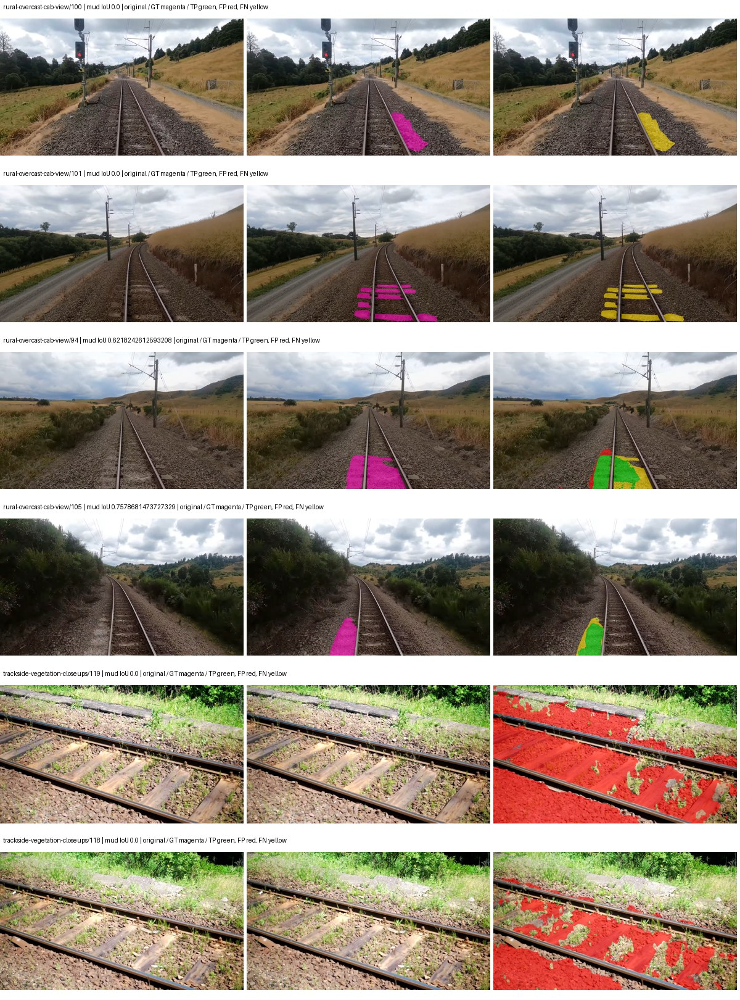

Examples are two lowest and two highest mud-IoU positive images, plus up to two negative images with the most false-positive mud pixels. They are targeted diagnostic examples, not random samples. Green: true positive; red: false positive; yellow: false negative. Full predictions remain on HDRFS.

### Validation tracking

| Logged step | Overall mIoU (%) | Mud IoU (%) |
| --- | --- | --- |
| 254 | 19.75 | 0.12 |
| 508 | 26.54 | 0.21 |
| 763 | 26.84 | 1.15 |
| 1017 | 26.59 | 1.42 |
| 1272 | 27.17 | 3.29 |
| 1527 | 26.60 | 4.55 |
| 1781 | 26.18 | 3.48 |
| 2036 | 28.23 | 5.59 |
| 2290 | 28.08 | 5.03 |
| 2545 | 28.41 | 4.13 |
| 2799 | 30.27 | 5.85 |
| 3054 | 29.80 | 4.51 |
| 3308 | 30.29 | 5.81 |
| 3563 | 30.12 | 5.12 |
| 3817 | 29.80 | 4.62 |
| 4000 | 30.09 | 4.42 |

All retained scalar curves, including training loss and per-class IoU, are in record.json. Observed best mud on a curve is not necessarily a retained checkpoint: the pilot saved its selection-metric-best and final checkpoints. Step logging and checkpoint global_step may differ by one.

### Stopping and checkpoint provenance

```json
{
  "stopping": {
    "actual_steps": 4000,
    "maximum_steps": 4000,
    "min_delta": 0.001,
    "monitor": "val_iou/mud-pumping",
    "patience": 5,
    "reason": "budget_complete"
  },
  "checkpoints": {
    "best": {
      "path": "/data/izadia1/projects/segmentary-runs/paul-test-rtis/mud-fullstats-v1-20260906-r2/future-runs/hf_auto_segformer_b0--rtis_only--seed-0_seed0/rtis/best.ckpt",
      "sha256": "2fe6a057399ac39111a8b73770263aa7fa916a836f3325770e64d968c0976dfe",
      "global_step": 2800,
      "bytes": 59870093
    },
    "final": {
      "path": "/data/izadia1/projects/segmentary-runs/paul-test-rtis/mud-fullstats-v1-20260906-r2/future-runs/hf_auto_segformer_b0--rtis_only--seed-0_seed0/rtis/last.ckpt",
      "sha256": "cd24e611de5a1e8c1b194536df6988b83b33ecf69c7c25cdc8d99c7dcf70c375",
      "global_step": 4000,
      "bytes": 59860237
    }
  },
  "cleanup_error": null
}
```

### Resolved training, initialization and evaluation settings

The optimizer block is the base configuration. Stage LR scales are applied at runtime, and stage warmup is capped at min(base warmup, floor(stage budget / 10), stage budget - 1): 400 steps for this 4,000-step pilot. Model-internal native input grids may differ from augmentation crops (EoMT uses its 640 grid).

```json
{
  "name": "hf_auto_segformer_b0--rtis_only--seed-0",
  "model": {
    "arch": "hf_auto",
    "checkpoint": "nvidia/segformer-b0-finetuned-ade-512-512",
    "tuning": "full",
    "head": "unified_head",
    "lora_r": 16,
    "lora_alpha": 32,
    "lora_dropout": 0.05,
    "lora_targets": [],
    "drop_path": null,
    "revision": "489d5cd81a0b59fab9b7ea758d3548ebe99677da",
    "subfolder": null,
    "local_files_only": false,
    "trust_remote_code": false,
    "backbone_path": null,
    "head_paths": [],
    "classifier_path": null,
    "inactive_parameter_paths": [],
    "smp_arch": null,
    "encoder_name": null,
    "encoder_weights": null,
    "native": null,
    "batch_norm_momentum": null
  },
  "space": "paul-test-rtis",
  "taxonomy_root": "/data/izadia1/projects/segmentary-rtis-fullstats-066afb2/taxonomy",
  "output_root": "/data/izadia1/projects/segmentary-runs/paul-test-rtis/mud-fullstats-v1-20260906-r2/future-runs",
  "optim": {
    "backbone_lr": 6e-05,
    "head_lr_mult": 10.0,
    "weight_decay": 0.05,
    "llrd": 1.0,
    "warmup_iters": 1500,
    "warmup_ratio": 1e-06,
    "poly_power": 0.9,
    "min_lr_ratio": 0.0,
    "betas": [
      0.9,
      0.999
    ],
    "grad_clip": 1.0
  },
  "train": {
    "iters": 4000,
    "batch_size": 2,
    "accum": 8,
    "num_workers": 2,
    "precision": "bf16-mixed",
    "ema_decay": 0.9998,
    "val_every": 250,
    "ckpt_every": 500,
    "selection_metric": "val_iou/mud-pumping",
    "early_stopping_patience": 5,
    "early_stopping_min_delta": 0.001,
    "seed": 0,
    "devices": 1
  },
  "eval": {
    "sliding_window": true,
    "window": [
      1024,
      1024
    ],
    "stride": [
      768,
      768
    ],
    "batch_size": 1,
    "num_workers": 2,
    "tta_scales": [],
    "tta_flip": false,
    "threshold": 0.5,
    "boundary_tolerance_frac": 0.0075,
    "save_confusion": true
  },
  "loss": {
    "task": "multiclass",
    "activation": "auto",
    "terms": [],
    "aux": "none",
    "aux_weight": 0.0,
    "ce_weight": 1.0,
    "label_smoothing": 0.0,
    "class_weights": null,
    "query": null
  },
  "aug": {
    "crop": [
      1024,
      1024
    ],
    "scale_min": 0.5,
    "scale_max": 2.0,
    "hflip_p": 0.5,
    "color_jitter_p": 0.5,
    "brightness": 0.25,
    "contrast": 0.25,
    "saturation": 0.25,
    "hue": 0.05
  },
  "stages": [
    {
      "name": "rtis",
      "data": [
        {
          "name": "paul-test-rtis",
          "root": "/data/izadia1/datasets/paul-test-rtis",
          "variant": null,
          "split_file": "splits.json",
          "train_split": "train",
          "val_split": "val",
          "limit": null,
          "loader": "folder",
          "mapping": "paul-test-rtis",
          "loader_options": {
            "require_groups": true
          }
        }
      ],
      "iters": null,
      "lr_scale": 1.0,
      "head_group_lr_scale": 1.0,
      "init_from": "pretrained",
      "reset_head": false,
      "freeze": null,
      "sample_weights": null
    }
  ]
}
```

### Hardware and software provenance

```json
{
  "training": {
    "cuda_available": true,
    "cuda_visible_devices": "6",
    "cudnn": 91900,
    "driver_version": "570.133.20",
    "gpu_count": 1,
    "gpu_names": [
      "NVIDIA L40S"
    ],
    "hostname": "hdrfs-app-001",
    "input_normalization": {
      "channel_order": "rgb",
      "mean": [
        0.485,
        0.456,
        0.406
      ],
      "source": "hf_image_processor",
      "std": [
        0.229,
        0.224,
        0.225
      ]
    },
    "model_origins": [
      {
        "hf_commit": "489d5cd81a0b59fab9b7ea758d3548ebe99677da",
        "hf_name_or_path": "nvidia/segformer-b0-finetuned-ade-512-512",
        "module": "model",
        "timm_pretrained": {}
      },
      {
        "hf_commit": "489d5cd81a0b59fab9b7ea758d3548ebe99677da",
        "hf_name_or_path": "nvidia/segformer-b0-finetuned-ade-512-512",
        "module": "model.segformer",
        "timm_pretrained": {}
      },
      {
        "hf_commit": "489d5cd81a0b59fab9b7ea758d3548ebe99677da",
        "hf_name_or_path": "nvidia/segformer-b0-finetuned-ade-512-512",
        "module": "model.segformer.stages.0.blocks.0.attention",
        "timm_pretrained": {}
      },
      {
        "hf_commit": "489d5cd81a0b59fab9b7ea758d3548ebe99677da",
        "hf_name_or_path": "nvidia/segformer-b0-finetuned-ade-512-512",
        "module": "model.segformer.stages.0.blocks.1.attention",
        "timm_pretrained": {}
      },
      {
        "hf_commit": "489d5cd81a0b59fab9b7ea758d3548ebe99677da",
        "hf_name_or_path": "nvidia/segformer-b0-finetuned-ade-512-512",
        "module": "model.segformer.stages.1.blocks.0.attention",
        "timm_pretrained": {}
      },
      {
        "hf_commit": "489d5cd81a0b59fab9b7ea758d3548ebe99677da",
        "hf_name_or_path": "nvidia/segformer-b0-finetuned-ade-512-512",
        "module": "model.segformer.stages.1.blocks.1.attention",
        "timm_pretrained": {}
      },
      {
        "hf_commit": "489d5cd81a0b59fab9b7ea758d3548ebe99677da",
        "hf_name_or_path": "nvidia/segformer-b0-finetuned-ade-512-512",
        "module": "model.segformer.stages.2.blocks.0.attention",
        "timm_pretrained": {}
      },
      {
        "hf_commit": "489d5cd81a0b59fab9b7ea758d3548ebe99677da",
        "hf_name_or_path": "nvidia/segformer-b0-finetuned-ade-512-512",
        "module": "model.segformer.stages.2.blocks.1.attention",
        "timm_pretrained": {}
      },
      {
        "hf_commit": "489d5cd81a0b59fab9b7ea758d3548ebe99677da",
        "hf_name_or_path": "nvidia/segformer-b0-finetuned-ade-512-512",
        "module": "model.segformer.stages.3.blocks.0.attention",
        "timm_pretrained": {}
      },
      {
        "hf_commit": "489d5cd81a0b59fab9b7ea758d3548ebe99677da",
        "hf_name_or_path": "nvidia/segformer-b0-finetuned-ade-512-512",
        "module": "model.segformer.stages.3.blocks.1.attention",
        "timm_pretrained": {}
      },
      {
        "hf_commit": "489d5cd81a0b59fab9b7ea758d3548ebe99677da",
        "hf_name_or_path": "nvidia/segformer-b0-finetuned-ade-512-512",
        "module": "model.decode_head",
        "timm_pretrained": {}
      }
    ],
    "model_parameter_count": 3719541,
    "packages": {
      "albumentations": "2.0.8",
      "lightning": "2.6.5",
      "numpy": "2.4.4",
      "segmentary": "0.1.0",
      "segmentation-models-pytorch": "0.5.0",
      "timm": "1.0.28",
      "torch": "2.11.0+cu128",
      "torchvision": "0.26.0+cu128",
      "transformers": "5.15.0"
    },
    "platform": "Linux-5.15.0-139-generic-x86_64-with-glibc2.35",
    "python": "3.11.15",
    "torch": "2.11.0+cu128",
    "torch_cuda": "12.8",
    "trainable_parameter_count": 3719541,
    "training_stop": {
      "actual_steps": 4000,
      "maximum_steps": 4000,
      "min_delta": 0.001,
      "monitor": "val_iou/mud-pumping",
      "patience": 5,
      "reason": "budget_complete"
    },
    "validation_weights": "raw"
  },
  "evaluation": {
    "cuda_available": true,
    "cuda_visible_devices": "6",
    "cudnn": 91900,
    "driver_version": "570.133.20",
    "gpu_count": 1,
    "gpu_names": [
      "NVIDIA L40S"
    ],
    "hostname": "hdrfs-app-001",
    "input_normalization": {
      "channel_order": "rgb",
      "mean": [
        0.485,
        0.456,
        0.406
      ],
      "source": "hf_image_processor",
      "std": [
        0.229,
        0.224,
        0.225
      ]
    },
    "packages": {
      "albumentations": "2.0.8",
      "lightning": "2.6.5",
      "numpy": "2.4.4",
      "segmentary": "0.1.0",
      "segmentation-models-pytorch": "0.5.0",
      "timm": "1.0.28",
      "torch": "2.11.0+cu128",
      "torchvision": "0.26.0+cu128",
      "transformers": "5.15.0"
    },
    "platform": "Linux-5.15.0-139-generic-x86_64-with-glibc2.35",
    "python": "3.11.15",
    "torch": "2.11.0+cu128",
    "torch_cuda": "12.8"
  }
}
```

## rtis_only — seed 1

Status: **completed**. Started: 2026-09-06T13:13:48.336452+00:00. Finished: 2026-09-06T13:56:19.885303+00:00.

Recipe pretrained initializer: `nvidia/segformer-b0-finetuned-ade-512-512`.

`rtis_only` uses the recipe initializer, which may include pretrained segmentation components. Transfer paths load the exact historical source checkpoint below and reset the classifier; they do not reset all query/decoder features.

Source checkpoint: `Recipe pretrained initialization`.

Config SHA-256: `95ba5451ac71e717332e6fd115149498db49e6420646a94b14055ef5e6f2b481`. Weights used for validation: `raw`.

### Mud-pumping and aggregate quality

| Metric | Selected checkpoint | Final training validation |
| --- | --- | --- |
| Mud IoU | 10.13 | 7.08 |
| Mud precision | 14.58 | 10.52 |
| Mud recall | 24.92 | 17.78 |
| Mud Dice/F1 | 18.40 | 13.22 |
| mIoU | 30.91 | 32.80 |
| Mean accuracy | 42.79 | 43.20 |
| Mean precision | 54.07 | 54.91 |
| Mean Dice | 39.60 | 42.07 |
| Mean specificity | 99.07 | 99.07 |
| Pixel accuracy | 84.58 | 84.52 |
| Frequency-weighted IoU | 76.09 | 76.13 |
| Fixed GT-present class mIoU | 36.07 | 36.45 |
| Boundary F1 | 38.24 | 40.67 |

The selected checkpoint has independent evaluation evidence. Final values are the trainer's final validation record, not a new independent evaluation. mIoU averages classes with nonzero union, so false positives on absent classes can change its denominator. The fixed GT-class mean is supplementary and excludes absent classes; their false positives remain in the confusion matrix.

### Resource usage and timing

| Measurement | Value |
| --- | --- |
| Peak training VRAM, retained training invocation (GiB) | 7.79 |
| Peak evaluation VRAM (GiB) | 7.03 |
| Retained training invocation wall time (seconds) | 2415.91 |
| Retained training invocation GPU-hours (one GPU) | 0.67 |
| Evaluation wall time (seconds) | 13.05 |
| Full evaluation pipeline images/second | 2.84 |
| Best full-state checkpoint (MiB) | 57.10 |
| Final full-state checkpoint (MiB) | 57.09 |
| Audited periodic checkpoints removed (GiB) | 0.45 |

VRAM uses the recorded allocator high-water mark; it is not total device usage including CUDA context. Resumed jobs' retained training invocation times and peaks are **not whole-campaign totals**. Earlier invocation resource records are not reconstructed here. Evaluation throughput includes loader, sliding-window inference and metrics; it is not model-only latency/FPS. Missing measurements are shown as —, never inferred from another dataset's run.

### Standardized inference performance

Dedicated model-only profiling waits for an idle worker-locked L40S: BF16, batch 1, 1024x1024, 20 warmup and 100 CUDA-event-timed public forwards. It excludes loading, preprocessing, tiling and metrics.

| Status | Parameters | Weight MiB | FPS | p50 ms | p95 ms | Peak reserved GiB |
| --- | --- | --- | --- | --- | --- | --- |
| complete | 3719541 | 14.19 | 134.57 | 7.26 | 8.15 | 0.89 |

```json
{
  "schema_version": 1,
  "model_id": "hf_auto_segformer_b0",
  "measured_at": "2026-09-06T13:56:17+00:00",
  "status": "complete",
  "benchmark_scope": "rtis_selected_checkpoint_model_only",
  "applies_to": [
    "hf_auto_segformer_b0--rtis_only--seed-1"
  ],
  "source": {
    "campaign_git_sha": "066afb2626398b7be59d4d19f5a0e4644fd59adc",
    "git_dirty": false,
    "config_hash": "13a102672dc3",
    "resolved_config": "/data/izadia1/projects/segmentary-runs/paul-test-rtis/mud-fullstats-v1-20260906-r2/configs/hf_auto_segformer_b0--rtis_only--seed-1.yaml",
    "config_sha256": "95ba5451ac71e717332e6fd115149498db49e6420646a94b14055ef5e6f2b481",
    "checkpoint_sha256": "84aba4cb639efd1628869d695e71a37f578255f632af8fa1959f2ccf8e4ce81d",
    "checkpoint_global_step": 3309,
    "checkpoint_bytes": 59870093,
    "checkpoint_kind": "resume checkpoint with optimizer and EMA state",
    "weights": "raw",
    "measured_checkpoint_job_id": "hf_auto_segformer_b0--rtis_only--seed-1",
    "result_sha256": "18757ec1cdfdebbe0965418ff48cc92cf218d46e36df27b72ef86ee8ccf59f16",
    "result_git_sha": "066afb2626398b7be59d4d19f5a0e4644fd59adc",
    "result_stage": "eval:paul-test-rtis:val",
    "result_seed": 1
  },
  "hardware": {
    "gpu_name": "NVIDIA L40S",
    "gpu_uuid": "GPU-931d0911-fc78-1638-e3d7-1ba868cbd286",
    "logical_device": "cuda:0",
    "physical_visibility_token": "2",
    "compute_capability": [
      8,
      9
    ],
    "total_memory_bytes": 47677177856
  },
  "model": {
    "parameter_count": 3719541,
    "trainable_parameter_count": 3719541,
    "resident_parameter_bytes": 14878164,
    "parameter_dtype_counts": {
      "float32": 3719541
    }
  },
  "contract": {
    "backend": "pytorch",
    "precision": "bf16_autocast",
    "batch_size": 1,
    "input_shape_nchw": [
      1,
      3,
      1024,
      1024
    ],
    "warmup_iterations": 20,
    "measured_iterations": 100,
    "timing": "per-forward CUDA events with end-event synchronization",
    "includes_preprocessing": false,
    "includes_data_loader": false,
    "includes_sliding_window": false,
    "input_resident_on_gpu": true,
    "model_only": true,
    "entrypoint": "public model(image) dense-logits forward"
  },
  "measurements": {
    "latency": {
      "p50_ms": 7.262720108032227,
      "p95_ms": 8.146688270568848,
      "mean_ms": 7.430982751846313,
      "minimum_ms": 7.145472049713135,
      "maximum_ms": 8.384608268737793,
      "fps": 134.57170247791768,
      "raw_ms": [
        7.344128131866455,
        7.729152202606201,
        8.384511947631836,
        7.783423900604248,
        8.143872261047363,
        7.276544094085693,
        7.620575904846191,
        7.196671962738037,
        7.151616096496582,
        7.224319934844971,
        7.270400047302246,
        7.4792962074279785,
        7.831552028656006,
        8.286208152770996,
        7.413760185241699,
        7.205920219421387,
        7.173247814178467,
        7.249919891357422,
        7.237631797790527,
        7.494656085968018,
        7.6523518562316895,
        8.061951637268066,
        7.889920234680176,
        7.309311866760254,
        7.325695991516113,
        7.259232044219971,
        7.152639865875244,
        7.179264068603516,
        7.1987199783325195,
        7.371776103973389,
        7.813119888305664,
        7.540736198425293,
        7.434239864349365,
        7.263232231140137,
        7.251967906951904,
        7.602272033691406,
        8.286208152770996,
        7.579648017883301,
        7.838719844818115,
        7.334911823272705,
        7.19974422454834,
        7.1987199783325195,
        7.179264068603516,
        7.177216053009033,
        7.208992004394531,
        7.318431854248047,
        8.050687789916992,
        7.1987199783325195,
        7.195648193359375,
        7.2284159660339355,
        7.222271919250488,
        8.09062385559082,
        8.20019245147705,
        8.384608268737793,
        7.231488227844238,
        7.262207984924316,
        7.3758721351623535,
        7.500800132751465,
        7.753727912902832,
        7.4352641105651855,
        7.209983825683594,
        7.222271919250488,
        7.220223903656006,
        8.077312469482422,
        7.170048236846924,
        7.2478718757629395,
        7.145472049713135,
        7.1741437911987305,
        7.168000221252441,
        8.037376403808594,
        7.256959915161133,
        7.7209601402282715,
        7.186431884765625,
        7.193600177764893,
        7.189504146575928,
        7.168000221252441,
        7.387135982513428,
        7.229343891143799,
        7.154687881469727,
        7.154687881469727,
        7.1495041847229,
        7.176191806793213,
        7.294976234436035,
        7.60422420501709,
        7.547904014587402,
        7.189504146575928,
        7.2570881843566895,
        7.171072006225586,
        7.500800132751465,
        7.533567905426025,
        7.215104103088379,
        7.229343891143799,
        7.273471832275391,
        7.861184120178223,
        7.273471832275391,
        7.532544136047363,
        7.165952205657959,
        7.1741437911987305,
        7.189504146575928,
        7.188479900360107
      ],
      "percentile_method": "numpy linear interpolation"
    },
    "peak_reserved_bytes": 960495616,
    "memory_kind": "pytorch_cuda_allocator_peak_reserved_excluding_context",
    "benchmark_wall_clock_s": 4.605744443833828
  },
  "started_at": "2026-09-06T13:56:13+00:00",
  "finished_at": "2026-09-06T13:56:17+00:00",
  "environment": {
    "hostname": "hdrfs-app-001",
    "python": "3.11.15",
    "platform": "Linux-5.15.0-139-generic-x86_64-with-glibc2.35",
    "torch": "2.11.0+cu128",
    "torch_cuda": "12.8",
    "cudnn": 91900,
    "driver_version": "570.133.20",
    "cuda_available": true,
    "gpu_count": 1,
    "gpu_names": [
      "NVIDIA L40S"
    ],
    "cuda_visible_devices": "2",
    "packages": {
      "segmentary": "0.1.0",
      "torch": "2.11.0+cu128",
      "torchvision": "0.26.0+cu128",
      "transformers": "5.15.0",
      "timm": "1.0.28",
      "segmentation-models-pytorch": "0.5.0",
      "albumentations": "2.0.8",
      "lightning": "2.6.5",
      "numpy": "2.4.4"
    }
  }
}
```

### Per-class validation results

| Class | GT pixels | IoU (%) | Precision (%) | Recall (%) | Dice (%) | Boundary F1 (%) |
| --- | --- | --- | --- | --- | --- | --- |
| car | 29664 | 3.09 | 24.11 | 3.42 | 5.99 | 30.43 |
| construction | 311585 | 51.05 | 63.17 | 72.68 | 67.59 | 63.14 |
| fence | 265137 | 10.13 | 37.84 | 12.15 | 18.40 | 12.84 |
| mud-pumping | 1226250 | 10.13 | 14.58 | 24.92 | 18.40 | 14.18 |
| on-rails | 0 | 0.00 | 0.00 | — | 0.00 | 0.00 |
| person | 0 | 0.00 | 0.00 | — | 0.00 | 0.00 |
| pole | 628038 | 65.53 | 80.82 | 77.60 | 79.18 | 87.81 |
| rail-embedded | 16799 | 16.94 | 94.08 | 17.12 | 28.97 | 31.95 |
| rail-raised | 2969797 | 77.59 | 88.02 | 86.75 | 87.38 | 92.58 |
| rail-track | 6323197 | 30.64 | 76.53 | 33.82 | 46.90 | 47.51 |
| road | 1048831 | 4.00 | 23.49 | 4.60 | 7.69 | 21.03 |
| sidewalk | 1297367 | 44.05 | 92.21 | 45.75 | 61.16 | 10.25 |
| sky | 19121606 | 98.28 | 99.03 | 99.23 | 99.13 | 94.74 |
| standing-water | 95802 | 1.90 | 3.45 | 4.08 | 3.74 | 5.38 |
| terrain | 39239306 | 89.07 | 91.39 | 97.23 | 94.22 | 69.99 |
| trackbed | 10643081 | 53.55 | 66.46 | 73.38 | 69.75 | 55.50 |
| traffic-light | 19510 | 17.57 | 59.66 | 19.94 | 29.89 | 40.53 |
| traffic-sign | 13285 | 16.83 | 91.18 | 17.11 | 28.81 | 49.44 |
| tram-track | 56179 | 10.73 | 68.24 | 11.30 | 19.38 | 17.18 |
| truck | 0 | 0.00 | 0.00 | — | 0.00 | 0.00 |
| vegetation-overgrowth | 5901821 | 48.13 | 61.26 | 69.19 | 64.98 | 58.55 |

### Full-run accounting

| Measurement | Value |
| --- | --- |
| Full GPU-reserved wall seconds, all recorded worker attempts | 2551.55 |
| Full reserved GPU-hours | 0.71 |
| Whole-run timing complete | True |

| Phase | Wall seconds including failed attempts |
| --- | --- |
| training | 2422.71 |
| diagnostics | 96.39 |
| performance | 11.25 |

GPU-reserved time includes model loading, training, validation, collection, profiling, checkpoint I/O and orchestration while the worker owns one GPU. It is not GPU kernel-active time. Phase timings and sampled device memory/power/utilization are retained separately; sampled device memory is not the allocator high-water mark.

### Train/validation and raw/EMA diagnostics

| Checkpoint / weights / split | Images | Mud IoU (%) | Mud precision (%) | Mud recall (%) |
| --- | --- | --- | --- | --- |
| best-auto-train / raw | 220 | 95.10 | 98.03 | 96.95 |
| best-auto-val / raw | 37 | 10.13 | 14.58 | 24.92 |
| best-alternate-val / ema | 37 | 4.25 | 5.67 | 14.51 |
| final-auto-val / raw | 37 | 7.08 | 10.52 | 17.78 |

Train uses the evaluation transform without augmentation. Compare mud train/validation metrics for the same selected weights. Alternate EMA on running-stat BatchNorm is explicitly uncalibrated and is diagnostic only. Score-threshold curves use uncalibrated normalized scores and are pixel-level diagnostics, not event detection rates or a selected deployment operating point.

### Downloadable evidence

- best-auto-train: [per-image.csv](rtis_only--seed-1/best-auto-train/per-image.csv) · [per-image-confusion.json.gz](rtis_only--seed-1/best-auto-train/per-image-confusion.json.gz) · [groups.json](rtis_only--seed-1/best-auto-train/groups.json) · [mud-score-curves.json](rtis_only--seed-1/best-auto-train/mud-score-curves.json)
- best-auto-val: [per-image.csv](rtis_only--seed-1/best-auto-val/per-image.csv) · [per-image-confusion.json.gz](rtis_only--seed-1/best-auto-val/per-image-confusion.json.gz) · [groups.json](rtis_only--seed-1/best-auto-val/groups.json) · [mud-score-curves.json](rtis_only--seed-1/best-auto-val/mud-score-curves.json) · [examples.jpg](rtis_only--seed-1/best-auto-val/examples.jpg)
- best-alternate-val: [per-image.csv](rtis_only--seed-1/best-alternate-val/per-image.csv) · [per-image-confusion.json.gz](rtis_only--seed-1/best-alternate-val/per-image-confusion.json.gz) · [groups.json](rtis_only--seed-1/best-alternate-val/groups.json) · [mud-score-curves.json](rtis_only--seed-1/best-alternate-val/mud-score-curves.json)
- final-auto-val: [per-image.csv](rtis_only--seed-1/final-auto-val/per-image.csv) · [per-image-confusion.json.gz](rtis_only--seed-1/final-auto-val/per-image-confusion.json.gz) · [groups.json](rtis_only--seed-1/final-auto-val/groups.json) · [mud-score-curves.json](rtis_only--seed-1/final-auto-val/mud-score-curves.json)
- resources: [telemetry.csv](rtis_only--seed-1/resources/telemetry.csv)

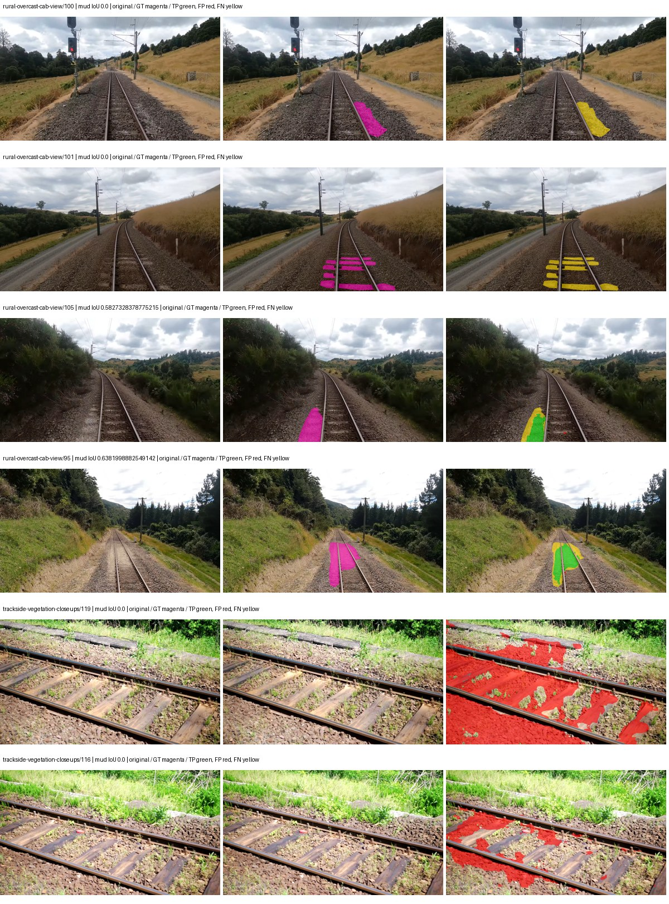

Examples are two lowest and two highest mud-IoU positive images, plus up to two negative images with the most false-positive mud pixels. They are targeted diagnostic examples, not random samples. Green: true positive; red: false positive; yellow: false negative. Full predictions remain on HDRFS.

### Validation tracking

| Logged step | Overall mIoU (%) | Mud IoU (%) |
| --- | --- | --- |
| 254 | 21.27 | 0.13 |
| 508 | 24.94 | 1.70 |
| 763 | 26.35 | 2.76 |
| 1017 | 26.35 | 2.28 |
| 1272 | 28.47 | 0.68 |
| 1527 | 27.05 | 5.24 |
| 1781 | 27.24 | 1.91 |
| 2036 | 29.24 | 7.73 |
| 2290 | 30.62 | 4.48 |
| 2545 | 29.63 | 6.09 |
| 2799 | 31.49 | 3.93 |
| 3054 | 30.19 | 6.34 |
| 3308 | 30.93 | 10.14 |
| 3563 | 31.51 | 7.85 |
| 3817 | 31.34 | 9.07 |
| 4000 | 32.80 | 7.08 |

All retained scalar curves, including training loss and per-class IoU, are in record.json. Observed best mud on a curve is not necessarily a retained checkpoint: the pilot saved its selection-metric-best and final checkpoints. Step logging and checkpoint global_step may differ by one.

### Stopping and checkpoint provenance

```json
{
  "stopping": {
    "actual_steps": 4000,
    "maximum_steps": 4000,
    "min_delta": 0.001,
    "monitor": "val_iou/mud-pumping",
    "patience": 5,
    "reason": "budget_complete"
  },
  "checkpoints": {
    "best": {
      "path": "/data/izadia1/projects/segmentary-runs/paul-test-rtis/mud-fullstats-v1-20260906-r2/future-runs/hf_auto_segformer_b0--rtis_only--seed-1_seed1/rtis/best.ckpt",
      "sha256": "84aba4cb639efd1628869d695e71a37f578255f632af8fa1959f2ccf8e4ce81d",
      "global_step": 3309,
      "bytes": 59870093
    },
    "final": {
      "path": "/data/izadia1/projects/segmentary-runs/paul-test-rtis/mud-fullstats-v1-20260906-r2/future-runs/hf_auto_segformer_b0--rtis_only--seed-1_seed1/rtis/last.ckpt",
      "sha256": "65e090e0ece2bdc736441ef5ee85e47b69a6da6d67144b5525a0aa020d84d5fc",
      "global_step": 4000,
      "bytes": 59860237
    }
  },
  "cleanup_error": null
}
```

### Resolved training, initialization and evaluation settings

The optimizer block is the base configuration. Stage LR scales are applied at runtime, and stage warmup is capped at min(base warmup, floor(stage budget / 10), stage budget - 1): 400 steps for this 4,000-step pilot. Model-internal native input grids may differ from augmentation crops (EoMT uses its 640 grid).

```json
{
  "name": "hf_auto_segformer_b0--rtis_only--seed-1",
  "model": {
    "arch": "hf_auto",
    "checkpoint": "nvidia/segformer-b0-finetuned-ade-512-512",
    "tuning": "full",
    "head": "unified_head",
    "lora_r": 16,
    "lora_alpha": 32,
    "lora_dropout": 0.05,
    "lora_targets": [],
    "drop_path": null,
    "revision": "489d5cd81a0b59fab9b7ea758d3548ebe99677da",
    "subfolder": null,
    "local_files_only": false,
    "trust_remote_code": false,
    "backbone_path": null,
    "head_paths": [],
    "classifier_path": null,
    "inactive_parameter_paths": [],
    "smp_arch": null,
    "encoder_name": null,
    "encoder_weights": null,
    "native": null,
    "batch_norm_momentum": null
  },
  "space": "paul-test-rtis",
  "taxonomy_root": "/data/izadia1/projects/segmentary-rtis-fullstats-066afb2/taxonomy",
  "output_root": "/data/izadia1/projects/segmentary-runs/paul-test-rtis/mud-fullstats-v1-20260906-r2/future-runs",
  "optim": {
    "backbone_lr": 6e-05,
    "head_lr_mult": 10.0,
    "weight_decay": 0.05,
    "llrd": 1.0,
    "warmup_iters": 1500,
    "warmup_ratio": 1e-06,
    "poly_power": 0.9,
    "min_lr_ratio": 0.0,
    "betas": [
      0.9,
      0.999
    ],
    "grad_clip": 1.0
  },
  "train": {
    "iters": 4000,
    "batch_size": 2,
    "accum": 8,
    "num_workers": 2,
    "precision": "bf16-mixed",
    "ema_decay": 0.9998,
    "val_every": 250,
    "ckpt_every": 500,
    "selection_metric": "val_iou/mud-pumping",
    "early_stopping_patience": 5,
    "early_stopping_min_delta": 0.001,
    "seed": 1,
    "devices": 1
  },
  "eval": {
    "sliding_window": true,
    "window": [
      1024,
      1024
    ],
    "stride": [
      768,
      768
    ],
    "batch_size": 1,
    "num_workers": 2,
    "tta_scales": [],
    "tta_flip": false,
    "threshold": 0.5,
    "boundary_tolerance_frac": 0.0075,
    "save_confusion": true
  },
  "loss": {
    "task": "multiclass",
    "activation": "auto",
    "terms": [],
    "aux": "none",
    "aux_weight": 0.0,
    "ce_weight": 1.0,
    "label_smoothing": 0.0,
    "class_weights": null,
    "query": null
  },
  "aug": {
    "crop": [
      1024,
      1024
    ],
    "scale_min": 0.5,
    "scale_max": 2.0,
    "hflip_p": 0.5,
    "color_jitter_p": 0.5,
    "brightness": 0.25,
    "contrast": 0.25,
    "saturation": 0.25,
    "hue": 0.05
  },
  "stages": [
    {
      "name": "rtis",
      "data": [
        {
          "name": "paul-test-rtis",
          "root": "/data/izadia1/datasets/paul-test-rtis",
          "variant": null,
          "split_file": "splits.json",
          "train_split": "train",
          "val_split": "val",
          "limit": null,
          "loader": "folder",
          "mapping": "paul-test-rtis",
          "loader_options": {
            "require_groups": true
          }
        }
      ],
      "iters": null,
      "lr_scale": 1.0,
      "head_group_lr_scale": 1.0,
      "init_from": "pretrained",
      "reset_head": false,
      "freeze": null,
      "sample_weights": null
    }
  ]
}
```

### Hardware and software provenance

```json
{
  "training": {
    "cuda_available": true,
    "cuda_visible_devices": "2",
    "cudnn": 91900,
    "driver_version": "570.133.20",
    "gpu_count": 1,
    "gpu_names": [
      "NVIDIA L40S"
    ],
    "hostname": "hdrfs-app-001",
    "input_normalization": {
      "channel_order": "rgb",
      "mean": [
        0.485,
        0.456,
        0.406
      ],
      "source": "hf_image_processor",
      "std": [
        0.229,
        0.224,
        0.225
      ]
    },
    "model_origins": [
      {
        "hf_commit": "489d5cd81a0b59fab9b7ea758d3548ebe99677da",
        "hf_name_or_path": "nvidia/segformer-b0-finetuned-ade-512-512",
        "module": "model",
        "timm_pretrained": {}
      },
      {
        "hf_commit": "489d5cd81a0b59fab9b7ea758d3548ebe99677da",
        "hf_name_or_path": "nvidia/segformer-b0-finetuned-ade-512-512",
        "module": "model.segformer",
        "timm_pretrained": {}
      },
      {
        "hf_commit": "489d5cd81a0b59fab9b7ea758d3548ebe99677da",
        "hf_name_or_path": "nvidia/segformer-b0-finetuned-ade-512-512",
        "module": "model.segformer.stages.0.blocks.0.attention",
        "timm_pretrained": {}
      },
      {
        "hf_commit": "489d5cd81a0b59fab9b7ea758d3548ebe99677da",
        "hf_name_or_path": "nvidia/segformer-b0-finetuned-ade-512-512",
        "module": "model.segformer.stages.0.blocks.1.attention",
        "timm_pretrained": {}
      },
      {
        "hf_commit": "489d5cd81a0b59fab9b7ea758d3548ebe99677da",
        "hf_name_or_path": "nvidia/segformer-b0-finetuned-ade-512-512",
        "module": "model.segformer.stages.1.blocks.0.attention",
        "timm_pretrained": {}
      },
      {
        "hf_commit": "489d5cd81a0b59fab9b7ea758d3548ebe99677da",
        "hf_name_or_path": "nvidia/segformer-b0-finetuned-ade-512-512",
        "module": "model.segformer.stages.1.blocks.1.attention",
        "timm_pretrained": {}
      },
      {
        "hf_commit": "489d5cd81a0b59fab9b7ea758d3548ebe99677da",
        "hf_name_or_path": "nvidia/segformer-b0-finetuned-ade-512-512",
        "module": "model.segformer.stages.2.blocks.0.attention",
        "timm_pretrained": {}
      },
      {
        "hf_commit": "489d5cd81a0b59fab9b7ea758d3548ebe99677da",
        "hf_name_or_path": "nvidia/segformer-b0-finetuned-ade-512-512",
        "module": "model.segformer.stages.2.blocks.1.attention",
        "timm_pretrained": {}
      },
      {
        "hf_commit": "489d5cd81a0b59fab9b7ea758d3548ebe99677da",
        "hf_name_or_path": "nvidia/segformer-b0-finetuned-ade-512-512",
        "module": "model.segformer.stages.3.blocks.0.attention",
        "timm_pretrained": {}
      },
      {
        "hf_commit": "489d5cd81a0b59fab9b7ea758d3548ebe99677da",
        "hf_name_or_path": "nvidia/segformer-b0-finetuned-ade-512-512",
        "module": "model.segformer.stages.3.blocks.1.attention",
        "timm_pretrained": {}
      },
      {
        "hf_commit": "489d5cd81a0b59fab9b7ea758d3548ebe99677da",
        "hf_name_or_path": "nvidia/segformer-b0-finetuned-ade-512-512",
        "module": "model.decode_head",
        "timm_pretrained": {}
      }
    ],
    "model_parameter_count": 3719541,
    "packages": {
      "albumentations": "2.0.8",
      "lightning": "2.6.5",
      "numpy": "2.4.4",
      "segmentary": "0.1.0",
      "segmentation-models-pytorch": "0.5.0",
      "timm": "1.0.28",
      "torch": "2.11.0+cu128",
      "torchvision": "0.26.0+cu128",
      "transformers": "5.15.0"
    },
    "platform": "Linux-5.15.0-139-generic-x86_64-with-glibc2.35",
    "python": "3.11.15",
    "torch": "2.11.0+cu128",
    "torch_cuda": "12.8",
    "trainable_parameter_count": 3719541,
    "training_stop": {
      "actual_steps": 4000,
      "maximum_steps": 4000,
      "min_delta": 0.001,
      "monitor": "val_iou/mud-pumping",
      "patience": 5,
      "reason": "budget_complete"
    },
    "validation_weights": "raw"
  },
  "evaluation": {
    "cuda_available": true,
    "cuda_visible_devices": "2",
    "cudnn": 91900,
    "driver_version": "570.133.20",
    "gpu_count": 1,
    "gpu_names": [
      "NVIDIA L40S"
    ],
    "hostname": "hdrfs-app-001",
    "input_normalization": {
      "channel_order": "rgb",
      "mean": [
        0.485,
        0.456,
        0.406
      ],
      "source": "hf_image_processor",
      "std": [
        0.229,
        0.224,
        0.225
      ]
    },
    "packages": {
      "albumentations": "2.0.8",
      "lightning": "2.6.5",
      "numpy": "2.4.4",
      "segmentary": "0.1.0",
      "segmentation-models-pytorch": "0.5.0",
      "timm": "1.0.28",
      "torch": "2.11.0+cu128",
      "torchvision": "0.26.0+cu128",
      "transformers": "5.15.0"
    },
    "platform": "Linux-5.15.0-139-generic-x86_64-with-glibc2.35",
    "python": "3.11.15",
    "torch": "2.11.0+cu128",
    "torch_cuda": "12.8"
  }
}
```

## rtis_only — seed 2

Status: **completed**. Started: 2026-09-06T13:16:19.750039+00:00. Finished: 2026-09-06T13:56:56.288691+00:00.

Recipe pretrained initializer: `nvidia/segformer-b0-finetuned-ade-512-512`.

`rtis_only` uses the recipe initializer, which may include pretrained segmentation components. Transfer paths load the exact historical source checkpoint below and reset the classifier; they do not reset all query/decoder features.

Source checkpoint: `Recipe pretrained initialization`.

Config SHA-256: `2b170214d95842961070bc17b42e1a62b7d575ee547cf4d70eabb790ace72a25`. Weights used for validation: `raw`.

### Mud-pumping and aggregate quality

| Metric | Selected checkpoint | Final training validation |
| --- | --- | --- |
| Mud IoU | 12.86 | 9.56 |
| Mud precision | 16.09 | 12.11 |
| Mud recall | 39.02 | 31.24 |
| Mud Dice/F1 | 22.79 | 17.45 |
| mIoU | 29.52 | 29.21 |
| Mean accuracy | 40.53 | 41.66 |
| Mean precision | 52.11 | 49.92 |
| Mean Dice | 37.87 | 37.51 |
| Mean specificity | 98.99 | 99.01 |
| Pixel accuracy | 83.09 | 83.49 |
| Frequency-weighted IoU | 74.74 | 75.28 |
| Fixed GT-present class mIoU | 32.80 | 34.07 |
| Boundary F1 | 37.62 | 38.34 |

The selected checkpoint has independent evaluation evidence. Final values are the trainer's final validation record, not a new independent evaluation. mIoU averages classes with nonzero union, so false positives on absent classes can change its denominator. The fixed GT-class mean is supplementary and excludes absent classes; their false positives remain in the confusion matrix.

### Resource usage and timing

| Measurement | Value |
| --- | --- |
| Peak training VRAM, retained training invocation (GiB) | 7.79 |
| Peak evaluation VRAM (GiB) | 7.03 |
| Retained training invocation wall time (seconds) | 2303.44 |
| Retained training invocation GPU-hours (one GPU) | 0.64 |
| Evaluation wall time (seconds) | 13.31 |
| Full evaluation pipeline images/second | 2.78 |
| Best full-state checkpoint (MiB) | 57.10 |
| Final full-state checkpoint (MiB) | 57.09 |
| Audited periodic checkpoints removed (GiB) | 0.39 |

VRAM uses the recorded allocator high-water mark; it is not total device usage including CUDA context. Resumed jobs' retained training invocation times and peaks are **not whole-campaign totals**. Earlier invocation resource records are not reconstructed here. Evaluation throughput includes loader, sliding-window inference and metrics; it is not model-only latency/FPS. Missing measurements are shown as —, never inferred from another dataset's run.

### Standardized inference performance

Dedicated model-only profiling waits for an idle worker-locked L40S: BF16, batch 1, 1024x1024, 20 warmup and 100 CUDA-event-timed public forwards. It excludes loading, preprocessing, tiling and metrics.

| Status | Parameters | Weight MiB | FPS | p50 ms | p95 ms | Peak reserved GiB |
| --- | --- | --- | --- | --- | --- | --- |
| complete | 3719541 | 14.19 | 132.81 | 7.45 | 8.19 | 0.89 |

```json
{
  "schema_version": 1,
  "model_id": "hf_auto_segformer_b0",
  "measured_at": "2026-09-06T13:56:54+00:00",
  "status": "complete",
  "benchmark_scope": "rtis_selected_checkpoint_model_only",
  "applies_to": [
    "hf_auto_segformer_b0--rtis_only--seed-2"
  ],
  "source": {
    "campaign_git_sha": "066afb2626398b7be59d4d19f5a0e4644fd59adc",
    "git_dirty": false,
    "config_hash": "6bfb3ec250a5",
    "resolved_config": "/data/izadia1/projects/segmentary-runs/paul-test-rtis/mud-fullstats-v1-20260906-r2/configs/hf_auto_segformer_b0--rtis_only--seed-2.yaml",
    "config_sha256": "2b170214d95842961070bc17b42e1a62b7d575ee547cf4d70eabb790ace72a25",
    "checkpoint_sha256": "e9f2c02925e754bcde8cfbe48a965ec1f5b7aa590a0d534c7157a424ce858d93",
    "checkpoint_global_step": 2545,
    "checkpoint_bytes": 59870093,
    "checkpoint_kind": "resume checkpoint with optimizer and EMA state",
    "weights": "raw",
    "measured_checkpoint_job_id": "hf_auto_segformer_b0--rtis_only--seed-2",
    "result_sha256": "5e919bc312d65e85af682e1ef18f057a034bfadbe795c9255eb381a78ef7e57a",
    "result_git_sha": "066afb2626398b7be59d4d19f5a0e4644fd59adc",
    "result_stage": "eval:paul-test-rtis:val",
    "result_seed": 2
  },
  "hardware": {
    "gpu_name": "NVIDIA L40S",
    "gpu_uuid": "GPU-84f5ca4d-68db-ae98-d056-40654d859dd9",
    "logical_device": "cuda:0",
    "physical_visibility_token": "0",
    "compute_capability": [
      8,
      9
    ],
    "total_memory_bytes": 47677177856
  },
  "model": {
    "parameter_count": 3719541,
    "trainable_parameter_count": 3719541,
    "resident_parameter_bytes": 14878164,
    "parameter_dtype_counts": {
      "float32": 3719541
    }
  },
  "contract": {
    "backend": "pytorch",
    "precision": "bf16_autocast",
    "batch_size": 1,
    "input_shape_nchw": [
      1,
      3,
      1024,
      1024
    ],
    "warmup_iterations": 20,
    "measured_iterations": 100,
    "timing": "per-forward CUDA events with end-event synchronization",
    "includes_preprocessing": false,
    "includes_data_loader": false,
    "includes_sliding_window": false,
    "input_resident_on_gpu": true,
    "model_only": true,
    "entrypoint": "public model(image) dense-logits forward"
  },
  "measurements": {
    "latency": {
      "p50_ms": 7.447039842605591,
      "p95_ms": 8.187280416488647,
      "mean_ms": 7.529591369628906,
      "minimum_ms": 7.1444478034973145,
      "maximum_ms": 8.772512435913086,
      "fps": 132.80933199556682,
      "raw_ms": [
        7.649280071258545,
        7.1833600997924805,
        7.162879943847656,
        7.180352210998535,
        7.560192108154297,
        7.26643180847168,
        7.319551944732666,
        7.24070405960083,
        7.670783996582031,
        7.6328959465026855,
        7.324672222137451,
        7.270304203033447,
        7.309311866760254,
        7.9923200607299805,
        7.4106879234313965,
        7.327744007110596,
        7.704576015472412,
        7.639039993286133,
        7.288832187652588,
        7.185408115386963,
        7.1690239906311035,
        7.186431884765625,
        7.1444478034973145,
        7.164927959442139,
        7.145472049713135,
        7.4106879234313965,
        8.479743957519531,
        7.280640125274658,
        7.214079856872559,
        7.2867841720581055,
        7.486432075500488,
        7.560192108154297,
        7.719935894012451,
        7.353343963623047,
        7.164927959442139,
        7.3809919357299805,
        7.218175888061523,
        7.164063930511475,
        7.216127872467041,
        7.57257604598999,
        7.209983825683594,
        7.527423858642578,
        7.34003210067749,
        8.431615829467773,
        7.725088119506836,
        7.511040210723877,
        7.467008113861084,
        7.5141119956970215,
        7.459839820861816,
        7.873536109924316,
        7.8243842124938965,
        7.935999870300293,
        7.399424076080322,
        7.349152088165283,
        7.217152118682861,
        7.2325119972229,
        7.156735897064209,
        7.229440212249756,
        7.197696208953857,
        8.254464149475098,
        7.501823902130127,
        7.434239864349365,
        7.415808200836182,
        8.035264015197754,
        7.511104106903076,
        7.856128215789795,
        8.107071876525879,
        7.675903797149658,
        7.385983943939209,
        7.302080154418945,
        7.357439994812012,
        7.583615779876709,
        7.34003210067749,
        7.513088226318359,
        7.224319934844971,
        7.23967981338501,
        7.518208026885986,
        7.574528217315674,
        7.8621439933776855,
        7.719935894012451,
        7.404543876647949,
        7.4260478019714355,
        7.929855823516846,
        8.772512435913086,
        8.145919799804688,
        7.605247974395752,
        7.33897590637207,
        8.687616348266602,
        7.706592082977295,
        7.483391761779785,
        7.589888095855713,
        7.569407939910889,
        7.251967906951904,
        7.321599960327148,
        8.057855606079102,
        7.658495903015137,
        7.858176231384277,
        7.668735980987549,
        7.64518404006958,
        8.183744430541992
      ],
      "percentile_method": "numpy linear interpolation"
    },
    "peak_reserved_bytes": 960495616,
    "memory_kind": "pytorch_cuda_allocator_peak_reserved_excluding_context",
    "benchmark_wall_clock_s": 4.635058891028166
  },
  "started_at": "2026-09-06T13:56:49+00:00",
  "finished_at": "2026-09-06T13:56:54+00:00",
  "environment": {
    "hostname": "hdrfs-app-001",
    "python": "3.11.15",
    "platform": "Linux-5.15.0-139-generic-x86_64-with-glibc2.35",
    "torch": "2.11.0+cu128",
    "torch_cuda": "12.8",
    "cudnn": 91900,
    "driver_version": "570.133.20",
    "cuda_available": true,
    "gpu_count": 1,
    "gpu_names": [
      "NVIDIA L40S"
    ],
    "cuda_visible_devices": "0",
    "packages": {
      "segmentary": "0.1.0",
      "torch": "2.11.0+cu128",
      "torchvision": "0.26.0+cu128",
      "transformers": "5.15.0",
      "timm": "1.0.28",
      "segmentation-models-pytorch": "0.5.0",
      "albumentations": "2.0.8",
      "lightning": "2.6.5",
      "numpy": "2.4.4"
    }
  }
}
```

### Per-class validation results

| Class | GT pixels | IoU (%) | Precision (%) | Recall (%) | Dice (%) | Boundary F1 (%) |
| --- | --- | --- | --- | --- | --- | --- |
| car | 29664 | 0.00 | 0.00 | 0.00 | 0.00 | 0.00 |
| construction | 311585 | 45.88 | 53.86 | 75.60 | 62.91 | 57.93 |
| fence | 265137 | 12.73 | 53.87 | 14.29 | 22.59 | 36.52 |
| mud-pumping | 1226250 | 12.86 | 16.09 | 39.02 | 22.79 | 17.76 |
| on-rails | 0 | — | — | — | — | — |
| person | 0 | 0.00 | 0.00 | — | 0.00 | 0.00 |
| pole | 628038 | 65.40 | 83.03 | 75.49 | 79.08 | 88.86 |
| rail-embedded | 16799 | 10.33 | 92.59 | 10.41 | 18.72 | 15.92 |
| rail-raised | 2969797 | 76.44 | 86.83 | 86.47 | 86.65 | 92.05 |
| rail-track | 6323197 | 33.06 | 61.45 | 41.71 | 49.69 | 46.14 |
| road | 1048831 | 6.26 | 13.84 | 10.25 | 11.78 | 21.15 |
| sidewalk | 1297367 | 11.32 | 57.28 | 12.37 | 20.34 | 6.91 |
| sky | 19121606 | 96.84 | 99.17 | 97.63 | 98.40 | 91.13 |
| standing-water | 95802 | 1.75 | 2.15 | 8.57 | 3.43 | 6.75 |
| terrain | 39239306 | 87.90 | 90.75 | 96.55 | 93.56 | 68.63 |
| trackbed | 10643081 | 52.69 | 68.64 | 69.40 | 69.02 | 55.72 |
| traffic-light | 19510 | 10.04 | 86.18 | 10.20 | 18.24 | 32.94 |
| traffic-sign | 13285 | 6.75 | 53.18 | 7.18 | 12.65 | 31.97 |
| tram-track | 56179 | 14.00 | 55.13 | 15.80 | 24.56 | 15.73 |
| truck | 0 | 0.00 | 0.00 | — | 0.00 | 0.00 |
| vegetation-overgrowth | 5901821 | 46.09 | 68.26 | 58.67 | 63.10 | 66.37 |

### Full-run accounting

| Measurement | Value |
| --- | --- |
| Full GPU-reserved wall seconds, all recorded worker attempts | 2436.54 |
| Full reserved GPU-hours | 0.68 |
| Whole-run timing complete | True |

| Phase | Wall seconds including failed attempts |
| --- | --- |
| training | 2310.25 |
| diagnostics | 94.45 |
| performance | 11.06 |

GPU-reserved time includes model loading, training, validation, collection, profiling, checkpoint I/O and orchestration while the worker owns one GPU. It is not GPU kernel-active time. Phase timings and sampled device memory/power/utilization are retained separately; sampled device memory is not the allocator high-water mark.

### Train/validation and raw/EMA diagnostics

| Checkpoint / weights / split | Images | Mud IoU (%) | Mud precision (%) | Mud recall (%) |
| --- | --- | --- | --- | --- |
| best-auto-train / raw | 220 | 94.75 | 97.48 | 97.13 |
| best-auto-val / raw | 37 | 12.86 | 16.09 | 39.02 |
| best-alternate-val / ema | 37 | 7.26 | 8.44 | 34.04 |
| final-auto-val / raw | 37 | 9.55 | 12.09 | 31.25 |

Train uses the evaluation transform without augmentation. Compare mud train/validation metrics for the same selected weights. Alternate EMA on running-stat BatchNorm is explicitly uncalibrated and is diagnostic only. Score-threshold curves use uncalibrated normalized scores and are pixel-level diagnostics, not event detection rates or a selected deployment operating point.

### Downloadable evidence

- best-auto-train: [per-image.csv](rtis_only--seed-2/best-auto-train/per-image.csv) · [per-image-confusion.json.gz](rtis_only--seed-2/best-auto-train/per-image-confusion.json.gz) · [groups.json](rtis_only--seed-2/best-auto-train/groups.json) · [mud-score-curves.json](rtis_only--seed-2/best-auto-train/mud-score-curves.json)
- best-auto-val: [per-image.csv](rtis_only--seed-2/best-auto-val/per-image.csv) · [per-image-confusion.json.gz](rtis_only--seed-2/best-auto-val/per-image-confusion.json.gz) · [groups.json](rtis_only--seed-2/best-auto-val/groups.json) · [mud-score-curves.json](rtis_only--seed-2/best-auto-val/mud-score-curves.json) · [examples.jpg](rtis_only--seed-2/best-auto-val/examples.jpg)
- best-alternate-val: [per-image.csv](rtis_only--seed-2/best-alternate-val/per-image.csv) · [per-image-confusion.json.gz](rtis_only--seed-2/best-alternate-val/per-image-confusion.json.gz) · [groups.json](rtis_only--seed-2/best-alternate-val/groups.json) · [mud-score-curves.json](rtis_only--seed-2/best-alternate-val/mud-score-curves.json)
- final-auto-val: [per-image.csv](rtis_only--seed-2/final-auto-val/per-image.csv) · [per-image-confusion.json.gz](rtis_only--seed-2/final-auto-val/per-image-confusion.json.gz) · [groups.json](rtis_only--seed-2/final-auto-val/groups.json) · [mud-score-curves.json](rtis_only--seed-2/final-auto-val/mud-score-curves.json)
- resources: [telemetry.csv](rtis_only--seed-2/resources/telemetry.csv)

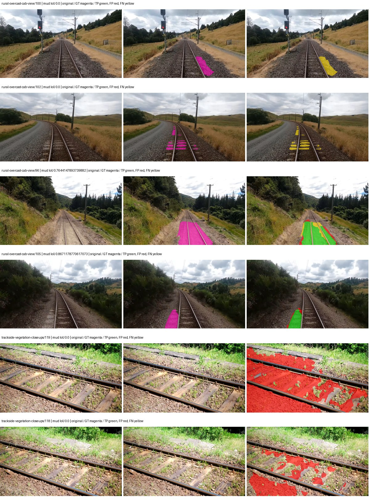

Examples are two lowest and two highest mud-IoU positive images, plus up to two negative images with the most false-positive mud pixels. They are targeted diagnostic examples, not random samples. Green: true positive; red: false positive; yellow: false negative. Full predictions remain on HDRFS.

### Validation tracking

| Logged step | Overall mIoU (%) | Mud IoU (%) |
| --- | --- | --- |
| 254 | 20.92 | 1.48 |
| 508 | 27.93 | 1.72 |
| 763 | 29.26 | 7.88 |
| 1017 | 26.01 | 3.08 |
| 1272 | 25.86 | 2.48 |
| 1527 | 25.74 | 5.53 |
| 1781 | 28.62 | 8.64 |
| 2036 | 27.83 | 8.53 |
| 2290 | 29.20 | 9.37 |
| 2545 | 29.53 | 12.86 |
| 2799 | 30.34 | 9.10 |
| 3054 | 28.44 | 8.81 |
| 3308 | 28.05 | 7.97 |
| 3563 | 28.30 | 9.03 |
| 3817 | 29.21 | 9.56 |

All retained scalar curves, including training loss and per-class IoU, are in record.json. Observed best mud on a curve is not necessarily a retained checkpoint: the pilot saved its selection-metric-best and final checkpoints. Step logging and checkpoint global_step may differ by one.

### Stopping and checkpoint provenance

```json
{
  "stopping": {
    "actual_steps": 3818,
    "maximum_steps": 4000,
    "min_delta": 0.001,
    "monitor": "val_iou/mud-pumping",
    "patience": 5,
    "reason": "validation_plateau"
  },
  "checkpoints": {
    "best": {
      "path": "/data/izadia1/projects/segmentary-runs/paul-test-rtis/mud-fullstats-v1-20260906-r2/future-runs/hf_auto_segformer_b0--rtis_only--seed-2_seed2/rtis/best.ckpt",
      "sha256": "e9f2c02925e754bcde8cfbe48a965ec1f5b7aa590a0d534c7157a424ce858d93",
      "global_step": 2545,
      "bytes": 59870093
    },
    "final": {
      "path": "/data/izadia1/projects/segmentary-runs/paul-test-rtis/mud-fullstats-v1-20260906-r2/future-runs/hf_auto_segformer_b0--rtis_only--seed-2_seed2/rtis/last.ckpt",
      "sha256": "306b37018b0c032ba1db9e009d616b4ba33871b47e483f9b4491f361199ef7cf",
      "global_step": 3818,
      "bytes": 59860365
    }
  },
  "cleanup_error": null
}
```

### Resolved training, initialization and evaluation settings

The optimizer block is the base configuration. Stage LR scales are applied at runtime, and stage warmup is capped at min(base warmup, floor(stage budget / 10), stage budget - 1): 400 steps for this 4,000-step pilot. Model-internal native input grids may differ from augmentation crops (EoMT uses its 640 grid).

```json
{
  "name": "hf_auto_segformer_b0--rtis_only--seed-2",
  "model": {
    "arch": "hf_auto",
    "checkpoint": "nvidia/segformer-b0-finetuned-ade-512-512",
    "tuning": "full",
    "head": "unified_head",
    "lora_r": 16,
    "lora_alpha": 32,
    "lora_dropout": 0.05,
    "lora_targets": [],
    "drop_path": null,
    "revision": "489d5cd81a0b59fab9b7ea758d3548ebe99677da",
    "subfolder": null,
    "local_files_only": false,
    "trust_remote_code": false,
    "backbone_path": null,
    "head_paths": [],
    "classifier_path": null,
    "inactive_parameter_paths": [],
    "smp_arch": null,
    "encoder_name": null,
    "encoder_weights": null,
    "native": null,
    "batch_norm_momentum": null
  },
  "space": "paul-test-rtis",
  "taxonomy_root": "/data/izadia1/projects/segmentary-rtis-fullstats-066afb2/taxonomy",
  "output_root": "/data/izadia1/projects/segmentary-runs/paul-test-rtis/mud-fullstats-v1-20260906-r2/future-runs",
  "optim": {
    "backbone_lr": 6e-05,
    "head_lr_mult": 10.0,
    "weight_decay": 0.05,
    "llrd": 1.0,
    "warmup_iters": 1500,
    "warmup_ratio": 1e-06,
    "poly_power": 0.9,
    "min_lr_ratio": 0.0,
    "betas": [
      0.9,
      0.999
    ],
    "grad_clip": 1.0
  },
  "train": {
    "iters": 4000,
    "batch_size": 2,
    "accum": 8,
    "num_workers": 2,
    "precision": "bf16-mixed",
    "ema_decay": 0.9998,
    "val_every": 250,
    "ckpt_every": 500,
    "selection_metric": "val_iou/mud-pumping",
    "early_stopping_patience": 5,
    "early_stopping_min_delta": 0.001,
    "seed": 2,
    "devices": 1
  },
  "eval": {
    "sliding_window": true,
    "window": [
      1024,
      1024
    ],
    "stride": [
      768,
      768
    ],
    "batch_size": 1,
    "num_workers": 2,
    "tta_scales": [],
    "tta_flip": false,
    "threshold": 0.5,
    "boundary_tolerance_frac": 0.0075,
    "save_confusion": true
  },
  "loss": {
    "task": "multiclass",
    "activation": "auto",
    "terms": [],
    "aux": "none",
    "aux_weight": 0.0,
    "ce_weight": 1.0,
    "label_smoothing": 0.0,
    "class_weights": null,
    "query": null
  },
  "aug": {
    "crop": [
      1024,
      1024
    ],
    "scale_min": 0.5,
    "scale_max": 2.0,
    "hflip_p": 0.5,
    "color_jitter_p": 0.5,
    "brightness": 0.25,
    "contrast": 0.25,
    "saturation": 0.25,
    "hue": 0.05
  },
  "stages": [
    {
      "name": "rtis",
      "data": [
        {
          "name": "paul-test-rtis",
          "root": "/data/izadia1/datasets/paul-test-rtis",
          "variant": null,
          "split_file": "splits.json",
          "train_split": "train",
          "val_split": "val",
          "limit": null,
          "loader": "folder",
          "mapping": "paul-test-rtis",
          "loader_options": {
            "require_groups": true
          }
        }
      ],
      "iters": null,
      "lr_scale": 1.0,
      "head_group_lr_scale": 1.0,
      "init_from": "pretrained",
      "reset_head": false,
      "freeze": null,
      "sample_weights": null
    }
  ]
}
```

### Hardware and software provenance

```json
{
  "training": {
    "cuda_available": true,
    "cuda_visible_devices": "0",
    "cudnn": 91900,
    "driver_version": "570.133.20",
    "gpu_count": 1,
    "gpu_names": [
      "NVIDIA L40S"
    ],
    "hostname": "hdrfs-app-001",
    "input_normalization": {
      "channel_order": "rgb",
      "mean": [
        0.485,
        0.456,
        0.406
      ],
      "source": "hf_image_processor",
      "std": [
        0.229,
        0.224,
        0.225
      ]
    },
    "model_origins": [
      {
        "hf_commit": "489d5cd81a0b59fab9b7ea758d3548ebe99677da",
        "hf_name_or_path": "nvidia/segformer-b0-finetuned-ade-512-512",
        "module": "model",
        "timm_pretrained": {}
      },
      {
        "hf_commit": "489d5cd81a0b59fab9b7ea758d3548ebe99677da",
        "hf_name_or_path": "nvidia/segformer-b0-finetuned-ade-512-512",
        "module": "model.segformer",
        "timm_pretrained": {}
      },
      {
        "hf_commit": "489d5cd81a0b59fab9b7ea758d3548ebe99677da",
        "hf_name_or_path": "nvidia/segformer-b0-finetuned-ade-512-512",
        "module": "model.segformer.stages.0.blocks.0.attention",
        "timm_pretrained": {}
      },
      {
        "hf_commit": "489d5cd81a0b59fab9b7ea758d3548ebe99677da",
        "hf_name_or_path": "nvidia/segformer-b0-finetuned-ade-512-512",
        "module": "model.segformer.stages.0.blocks.1.attention",
        "timm_pretrained": {}
      },
      {
        "hf_commit": "489d5cd81a0b59fab9b7ea758d3548ebe99677da",
        "hf_name_or_path": "nvidia/segformer-b0-finetuned-ade-512-512",
        "module": "model.segformer.stages.1.blocks.0.attention",
        "timm_pretrained": {}
      },
      {
        "hf_commit": "489d5cd81a0b59fab9b7ea758d3548ebe99677da",
        "hf_name_or_path": "nvidia/segformer-b0-finetuned-ade-512-512",
        "module": "model.segformer.stages.1.blocks.1.attention",
        "timm_pretrained": {}
      },
      {
        "hf_commit": "489d5cd81a0b59fab9b7ea758d3548ebe99677da",
        "hf_name_or_path": "nvidia/segformer-b0-finetuned-ade-512-512",
        "module": "model.segformer.stages.2.blocks.0.attention",
        "timm_pretrained": {}
      },
      {
        "hf_commit": "489d5cd81a0b59fab9b7ea758d3548ebe99677da",
        "hf_name_or_path": "nvidia/segformer-b0-finetuned-ade-512-512",
        "module": "model.segformer.stages.2.blocks.1.attention",
        "timm_pretrained": {}
      },
      {
        "hf_commit": "489d5cd81a0b59fab9b7ea758d3548ebe99677da",
        "hf_name_or_path": "nvidia/segformer-b0-finetuned-ade-512-512",
        "module": "model.segformer.stages.3.blocks.0.attention",
        "timm_pretrained": {}
      },
      {
        "hf_commit": "489d5cd81a0b59fab9b7ea758d3548ebe99677da",
        "hf_name_or_path": "nvidia/segformer-b0-finetuned-ade-512-512",
        "module": "model.segformer.stages.3.blocks.1.attention",
        "timm_pretrained": {}
      },
      {
        "hf_commit": "489d5cd81a0b59fab9b7ea758d3548ebe99677da",
        "hf_name_or_path": "nvidia/segformer-b0-finetuned-ade-512-512",
        "module": "model.decode_head",
        "timm_pretrained": {}
      }
    ],
    "model_parameter_count": 3719541,
    "packages": {
      "albumentations": "2.0.8",
      "lightning": "2.6.5",
      "numpy": "2.4.4",
      "segmentary": "0.1.0",
      "segmentation-models-pytorch": "0.5.0",
      "timm": "1.0.28",
      "torch": "2.11.0+cu128",
      "torchvision": "0.26.0+cu128",
      "transformers": "5.15.0"
    },
    "platform": "Linux-5.15.0-139-generic-x86_64-with-glibc2.35",
    "python": "3.11.15",
    "torch": "2.11.0+cu128",
    "torch_cuda": "12.8",
    "trainable_parameter_count": 3719541,
    "training_stop": {
      "actual_steps": 3818,
      "maximum_steps": 4000,
      "min_delta": 0.001,
      "monitor": "val_iou/mud-pumping",
      "patience": 5,
      "reason": "validation_plateau"
    },
    "validation_weights": "raw"
  },
  "evaluation": {
    "cuda_available": true,
    "cuda_visible_devices": "0",
    "cudnn": 91900,
    "driver_version": "570.133.20",
    "gpu_count": 1,
    "gpu_names": [
      "NVIDIA L40S"
    ],
    "hostname": "hdrfs-app-001",
    "input_normalization": {
      "channel_order": "rgb",
      "mean": [
        0.485,
        0.456,
        0.406
      ],
      "source": "hf_image_processor",
      "std": [
        0.229,
        0.224,
        0.225
      ]
    },
    "packages": {
      "albumentations": "2.0.8",
      "lightning": "2.6.5",
      "numpy": "2.4.4",
      "segmentary": "0.1.0",
      "segmentation-models-pytorch": "0.5.0",
      "timm": "1.0.28",
      "torch": "2.11.0+cu128",
      "torchvision": "0.26.0+cu128",
      "transformers": "5.15.0"
    },
    "platform": "Linux-5.15.0-139-generic-x86_64-with-glibc2.35",
    "python": "3.11.15",
    "torch": "2.11.0+cu128",
    "torch_cuda": "12.8"
  }
}
```

## cityscapes_to_rtis — seed 0

Status: **completed**. Started: 2026-09-06T13:22:32.919358+00:00. Finished: 2026-09-06T14:02:49.125899+00:00.

Recipe pretrained initializer: `nvidia/segformer-b0-finetuned-ade-512-512`.

`rtis_only` uses the recipe initializer, which may include pretrained segmentation components. Transfer paths load the exact historical source checkpoint below and reset the classifier; they do not reset all query/decoder features.

Source checkpoint: `{'name': 'hf_auto_segformer_b0--cityscapes--seed-0', 'model': 'hf_auto_segformer_b0', 'protocol': 'cityscapes', 'config': '/data/izadia1/projects/segmentary-runs/all-model-city-rail-seed0-rail20-b9eb3e1/jobs/hf_auto_segformer_b0--cityscapes--seed-0/attempt-001/resolved-config.yaml', 'checkpoint': '/data/izadia1/projects/segmentary-runs/all-model-city-rail-seed0-rail20-b9eb3e1/jobs/hf_auto_segformer_b0--cityscapes--seed-0/attempt-001/train/hf_auto_segformer_b0--cityscapes_seed0/cityscapes/last.ckpt', 'recorded_sha256': '68c80fba89b35c10ef9974fcd7163c2bf6b0afaf0ad6c00ff14cbc2b97e30dc9', 'exists': True}`.

Config SHA-256: `f875447f156e6ed0cdfffee8e73f11ef4aabbe180aba849d0cb530ed8e7af64c`. Weights used for validation: `raw`.

### Mud-pumping and aggregate quality

| Metric | Selected checkpoint | Final training validation |
| --- | --- | --- |
| Mud IoU | 1.50 | 1.07 |
| Mud precision | 2.88 | 2.58 |
| Mud recall | 3.04 | 1.80 |
| Mud Dice/F1 | 2.96 | 2.12 |
| mIoU | 29.26 | 30.31 |
| Mean accuracy | 39.28 | 40.97 |
| Mean precision | 51.21 | 52.09 |
| Mean Dice | 37.60 | 39.19 |
| Mean specificity | 98.91 | 98.96 |
| Pixel accuracy | 81.98 | 82.56 |
| Frequency-weighted IoU | 73.92 | 74.54 |
| Fixed GT-present class mIoU | 34.14 | 35.36 |
| Boundary F1 | 35.69 | 37.56 |

The selected checkpoint has independent evaluation evidence. Final values are the trainer's final validation record, not a new independent evaluation. mIoU averages classes with nonzero union, so false positives on absent classes can change its denominator. The fixed GT-class mean is supplementary and excludes absent classes; their false positives remain in the confusion matrix.

### Resource usage and timing

| Measurement | Value |
| --- | --- |
| Peak training VRAM, retained training invocation (GiB) | 7.79 |
| Peak evaluation VRAM (GiB) | 7.03 |
| Retained training invocation wall time (seconds) | 2281.77 |
| Retained training invocation GPU-hours (one GPU) | 0.63 |
| Evaluation wall time (seconds) | 13.44 |
| Full evaluation pipeline images/second | 2.75 |
| Best full-state checkpoint (MiB) | 57.10 |
| Final full-state checkpoint (MiB) | 57.09 |
| Audited periodic checkpoints removed (GiB) | 0.39 |

VRAM uses the recorded allocator high-water mark; it is not total device usage including CUDA context. Resumed jobs' retained training invocation times and peaks are **not whole-campaign totals**. Earlier invocation resource records are not reconstructed here. Evaluation throughput includes loader, sliding-window inference and metrics; it is not model-only latency/FPS. Missing measurements are shown as —, never inferred from another dataset's run.

### Standardized inference performance

Dedicated model-only profiling waits for an idle worker-locked L40S: BF16, batch 1, 1024x1024, 20 warmup and 100 CUDA-event-timed public forwards. It excludes loading, preprocessing, tiling and metrics.

| Status | Parameters | Weight MiB | FPS | p50 ms | p95 ms | Peak reserved GiB |
| --- | --- | --- | --- | --- | --- | --- |
| complete | 3719541 | 14.19 | 130.11 | 7.48 | 8.39 | 0.89 |

```json
{
  "schema_version": 1,
  "model_id": "hf_auto_segformer_b0",
  "measured_at": "2026-09-06T14:02:47+00:00",
  "status": "complete",
  "benchmark_scope": "rtis_selected_checkpoint_model_only",
  "applies_to": [
    "hf_auto_segformer_b0--cityscapes_to_rtis--seed-0"
  ],
  "source": {
    "campaign_git_sha": "066afb2626398b7be59d4d19f5a0e4644fd59adc",
    "git_dirty": false,
    "config_hash": "097693bd9b0e",
    "resolved_config": "/data/izadia1/projects/segmentary-runs/paul-test-rtis/mud-fullstats-v1-20260906-r2/configs/hf_auto_segformer_b0--cityscapes_to_rtis--seed-0.yaml",
    "config_sha256": "f875447f156e6ed0cdfffee8e73f11ef4aabbe180aba849d0cb530ed8e7af64c",
    "checkpoint_sha256": "ab26f9dc4f9aa56a2d7017da85cc61372a7d8ca009192049957bd825b6cce15a",
    "checkpoint_global_step": 2545,
    "checkpoint_bytes": 59870157,
    "checkpoint_kind": "resume checkpoint with optimizer and EMA state",
    "weights": "raw",
    "measured_checkpoint_job_id": "hf_auto_segformer_b0--cityscapes_to_rtis--seed-0",
    "result_sha256": "048d3f168f2421b18c694b1cc5076e1f4b1b6622e4f12bd548a3c881b401efea",
    "result_git_sha": "066afb2626398b7be59d4d19f5a0e4644fd59adc",
    "result_stage": "eval:paul-test-rtis:val",
    "result_seed": 0
  },
  "hardware": {
    "gpu_name": "NVIDIA L40S",
    "gpu_uuid": "GPU-d411d86a-6d1d-1967-55e7-9f9ec85d13f5",
    "logical_device": "cuda:0",
    "physical_visibility_token": "1",
    "compute_capability": [
      8,
      9
    ],
    "total_memory_bytes": 47677177856
  },
  "model": {
    "parameter_count": 3719541,
    "trainable_parameter_count": 3719541,
    "resident_parameter_bytes": 14878164,
    "parameter_dtype_counts": {
      "float32": 3719541
    }
  },
  "contract": {
    "backend": "pytorch",
    "precision": "bf16_autocast",
    "batch_size": 1,
    "input_shape_nchw": [
      1,
      3,
      1024,
      1024
    ],
    "warmup_iterations": 20,
    "measured_iterations": 100,
    "timing": "per-forward CUDA events with end-event synchronization",
    "includes_preprocessing": false,
    "includes_data_loader": false,
    "includes_sliding_window": false,
    "input_resident_on_gpu": true,
    "model_only": true,
    "entrypoint": "public model(image) dense-logits forward"
  },
  "measurements": {
    "latency": {
      "p50_ms": 7.475200176239014,
      "p95_ms": 8.39382905960083,
      "mean_ms": 7.685903692245484,
      "minimum_ms": 7.192575931549072,
      "maximum_ms": 11.801600456237793,
      "fps": 130.10831777776855,
      "raw_ms": [
        7.335936069488525,
        7.357439994812012,
        8.217599868774414,
        7.869440078735352,
        7.398335933685303,
        7.192575931549072,
        7.220191955566406,
        7.477248191833496,
        7.3318400382995605,
        7.287807941436768,
        8.18073558807373,
        7.946239948272705,
        7.473152160644531,
        7.250847816467285,
        7.56009578704834,
        7.256063938140869,
        7.890944004058838,
        8.29849624633789,
        7.252992153167725,
        7.4997758865356445,
        7.267327785491943,
        7.235583782196045,
        7.542784214019775,
        8.040351867675781,
        7.528448104858398,
        7.725056171417236,
        7.718912124633789,
        8.168448448181152,
        7.294976234436035,
        8.143872261047363,
        7.796735763549805,
        7.4403839111328125,
        7.695231914520264,
        7.372799873352051,
        7.361536026000977,
        8.023039817810059,
        7.8540802001953125,
        8.21350383758545,
        7.3318400382995605,
        7.2284159660339355,
        7.3461761474609375,
        7.274464130401611,
        7.2325119972229,
        7.571487903594971,
        7.642111778259277,
        9.158783912658691,
        11.801600456237793,
        9.203712463378906,
        7.4352641105651855,
        7.301119804382324,
        7.304192066192627,
        10.12224006652832,
        8.921055793762207,
        7.797760009765625,
        7.4435200691223145,
        7.448575973510742,
        7.39737606048584,
        7.370751857757568,
        7.382016181945801,
        7.39737606048584,
        7.8448638916015625,
        7.670783996582031,
        7.421951770782471,
        7.2478718757629395,
        7.50489616394043,
        7.885824203491211,
        7.708672046661377,
        7.359488010406494,
        7.6247358322143555,
        7.75270414352417,
        7.217152118682861,
        7.590911865234375,
        7.353343963623047,
        7.462751865386963,
        8.212479591369629,
        7.420928001403809,
        7.395328044891357,
        7.941120147705078,
        7.5581440925598145,
        7.790592193603516,
        7.703551769256592,
        7.510015964508057,
        7.3758721351623535,
        8.173567771911621,
        8.092672348022461,
        7.968768119812012,
        7.404543876647949,
        7.305215835571289,
        7.201791763305664,
        7.344128131866455,
        7.291903972625732,
        7.267392158508301,
        8.10905647277832,
        7.674880027770996,
        7.370751857757568,
        7.742464065551758,
        7.326720237731934,
        7.274496078491211,
        7.2887678146362305,
        8.366080284118652
      ],
      "percentile_method": "numpy linear interpolation"
    },
    "peak_reserved_bytes": 960495616,
    "memory_kind": "pytorch_cuda_allocator_peak_reserved_excluding_context",
    "benchmark_wall_clock_s": 4.5540193580091
  },
  "started_at": "2026-09-06T14:02:42+00:00",
  "finished_at": "2026-09-06T14:02:47+00:00",
  "environment": {
    "hostname": "hdrfs-app-001",
    "python": "3.11.15",
    "platform": "Linux-5.15.0-139-generic-x86_64-with-glibc2.35",
    "torch": "2.11.0+cu128",
    "torch_cuda": "12.8",
    "cudnn": 91900,
    "driver_version": "570.133.20",
    "cuda_available": true,
    "gpu_count": 1,
    "gpu_names": [
      "NVIDIA L40S"
    ],
    "cuda_visible_devices": "1",
    "packages": {
      "segmentary": "0.1.0",
      "torch": "2.11.0+cu128",
      "torchvision": "0.26.0+cu128",
      "transformers": "5.15.0",
      "timm": "1.0.28",
      "segmentation-models-pytorch": "0.5.0",
      "albumentations": "2.0.8",
      "lightning": "2.6.5",
      "numpy": "2.4.4"
    }
  }
}
```

### Per-class validation results

| Class | GT pixels | IoU (%) | Precision (%) | Recall (%) | Dice (%) | Boundary F1 (%) |
| --- | --- | --- | --- | --- | --- | --- |
| car | 29664 | 0.00 | 0.00 | 0.00 | 0.00 | 0.00 |
| construction | 311585 | 53.93 | 75.17 | 65.62 | 70.07 | 67.79 |
| fence | 265137 | 2.77 | 6.45 | 4.63 | 5.39 | 10.78 |
| mud-pumping | 1226250 | 1.50 | 2.88 | 3.04 | 2.96 | 5.08 |
| on-rails | 0 | 0.00 | 0.00 | — | 0.00 | 0.00 |
| person | 0 | 0.00 | 0.00 | — | 0.00 | 0.00 |
| pole | 628038 | 65.66 | 80.48 | 78.10 | 79.27 | 87.30 |
| rail-embedded | 16799 | 15.03 | 83.67 | 15.49 | 26.14 | 23.38 |
| rail-raised | 2969797 | 68.01 | 77.53 | 84.70 | 80.96 | 86.49 |
| rail-track | 6323197 | 32.70 | 55.53 | 44.31 | 49.29 | 44.42 |
| road | 1048831 | 4.23 | 10.90 | 6.46 | 8.12 | 10.09 |
| sidewalk | 1297367 | 28.34 | 91.08 | 29.15 | 44.17 | 11.35 |
| sky | 19121606 | 97.76 | 99.33 | 98.40 | 98.87 | 92.87 |
| standing-water | 95802 | 0.09 | 0.09 | 2.91 | 0.18 | 0.46 |
| terrain | 39239306 | 86.23 | 88.84 | 96.70 | 92.60 | 54.64 |
| trackbed | 10643081 | 55.41 | 76.36 | 66.89 | 71.31 | 56.16 |
| traffic-light | 19510 | 26.69 | 96.57 | 26.95 | 42.13 | 50.40 |
| traffic-sign | 13285 | 17.32 | 73.02 | 18.50 | 29.52 | 45.62 |
| tram-track | 56179 | 18.27 | 80.37 | 19.12 | 30.89 | 36.78 |
| truck | 0 | 0.00 | 0.00 | — | 0.00 | 0.00 |
| vegetation-overgrowth | 5901821 | 40.56 | 77.17 | 46.10 | 57.72 | 65.91 |

### Full-run accounting

| Measurement | Value |
| --- | --- |
| Full GPU-reserved wall seconds, all recorded worker attempts | 2416.26 |
| Full reserved GPU-hours | 0.67 |
| Whole-run timing complete | True |

| Phase | Wall seconds including failed attempts |
| --- | --- |
| training | 2288.64 |
| diagnostics | 95.28 |
| performance | 11.26 |

GPU-reserved time includes model loading, training, validation, collection, profiling, checkpoint I/O and orchestration while the worker owns one GPU. It is not GPU kernel-active time. Phase timings and sampled device memory/power/utilization are retained separately; sampled device memory is not the allocator high-water mark.

### Train/validation and raw/EMA diagnostics

| Checkpoint / weights / split | Images | Mud IoU (%) | Mud precision (%) | Mud recall (%) |
| --- | --- | --- | --- | --- |
| best-auto-train / raw | 220 | 90.14 | 93.26 | 96.42 |
| best-auto-val / raw | 37 | 1.50 | 2.88 | 3.04 |
| best-alternate-val / ema | 37 | 0.82 | 1.52 | 1.74 |
| final-auto-val / raw | 37 | 1.07 | 2.58 | 1.80 |

Train uses the evaluation transform without augmentation. Compare mud train/validation metrics for the same selected weights. Alternate EMA on running-stat BatchNorm is explicitly uncalibrated and is diagnostic only. Score-threshold curves use uncalibrated normalized scores and are pixel-level diagnostics, not event detection rates or a selected deployment operating point.

### Downloadable evidence

- best-auto-train: [per-image.csv](cityscapes_to_rtis--seed-0/best-auto-train/per-image.csv) · [per-image-confusion.json.gz](cityscapes_to_rtis--seed-0/best-auto-train/per-image-confusion.json.gz) · [groups.json](cityscapes_to_rtis--seed-0/best-auto-train/groups.json) · [mud-score-curves.json](cityscapes_to_rtis--seed-0/best-auto-train/mud-score-curves.json)
- best-auto-val: [per-image.csv](cityscapes_to_rtis--seed-0/best-auto-val/per-image.csv) · [per-image-confusion.json.gz](cityscapes_to_rtis--seed-0/best-auto-val/per-image-confusion.json.gz) · [groups.json](cityscapes_to_rtis--seed-0/best-auto-val/groups.json) · [mud-score-curves.json](cityscapes_to_rtis--seed-0/best-auto-val/mud-score-curves.json) · [examples.jpg](cityscapes_to_rtis--seed-0/best-auto-val/examples.jpg)
- best-alternate-val: [per-image.csv](cityscapes_to_rtis--seed-0/best-alternate-val/per-image.csv) · [per-image-confusion.json.gz](cityscapes_to_rtis--seed-0/best-alternate-val/per-image-confusion.json.gz) · [groups.json](cityscapes_to_rtis--seed-0/best-alternate-val/groups.json) · [mud-score-curves.json](cityscapes_to_rtis--seed-0/best-alternate-val/mud-score-curves.json)
- final-auto-val: [per-image.csv](cityscapes_to_rtis--seed-0/final-auto-val/per-image.csv) · [per-image-confusion.json.gz](cityscapes_to_rtis--seed-0/final-auto-val/per-image-confusion.json.gz) · [groups.json](cityscapes_to_rtis--seed-0/final-auto-val/groups.json) · [mud-score-curves.json](cityscapes_to_rtis--seed-0/final-auto-val/mud-score-curves.json)
- resources: [telemetry.csv](cityscapes_to_rtis--seed-0/resources/telemetry.csv)

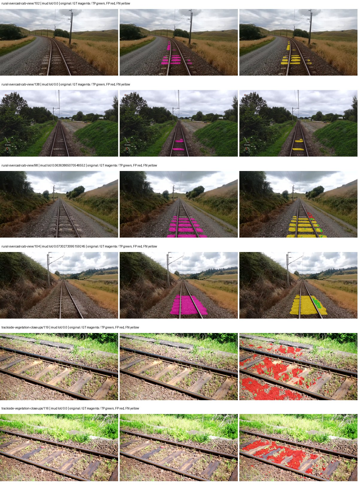

Examples are two lowest and two highest mud-IoU positive images, plus up to two negative images with the most false-positive mud pixels. They are targeted diagnostic examples, not random samples. Green: true positive; red: false positive; yellow: false negative. Full predictions remain on HDRFS.

### Validation tracking

| Logged step | Overall mIoU (%) | Mud IoU (%) |
| --- | --- | --- |
| 254 | 19.49 | 0.08 |
| 508 | 21.83 | 0.03 |
| 763 | 23.65 | 0.05 |
| 1017 | 26.35 | 0.19 |
| 1272 | 24.52 | 0.33 |
| 1527 | 26.06 | 0.52 |
| 1781 | 27.32 | 0.56 |
| 2036 | 28.29 | 0.70 |
| 2290 | 29.29 | 0.88 |
| 2545 | 29.28 | 1.50 |
| 2799 | 29.43 | 0.84 |
| 3054 | 30.06 | 0.79 |
| 3308 | 30.23 | 1.47 |
| 3563 | 30.65 | 1.17 |
| 3817 | 30.31 | 1.07 |

All retained scalar curves, including training loss and per-class IoU, are in record.json. Observed best mud on a curve is not necessarily a retained checkpoint: the pilot saved its selection-metric-best and final checkpoints. Step logging and checkpoint global_step may differ by one.

### Stopping and checkpoint provenance

```json
{
  "stopping": {
    "actual_steps": 3818,
    "maximum_steps": 4000,
    "min_delta": 0.001,
    "monitor": "val_iou/mud-pumping",
    "patience": 5,
    "reason": "validation_plateau"
  },
  "checkpoints": {
    "best": {
      "path": "/data/izadia1/projects/segmentary-runs/paul-test-rtis/mud-fullstats-v1-20260906-r2/future-runs/hf_auto_segformer_b0--cityscapes_to_rtis--seed-0_seed0/rtis/best.ckpt",
      "sha256": "ab26f9dc4f9aa56a2d7017da85cc61372a7d8ca009192049957bd825b6cce15a",
      "global_step": 2545,
      "bytes": 59870157
    },
    "final": {
      "path": "/data/izadia1/projects/segmentary-runs/paul-test-rtis/mud-fullstats-v1-20260906-r2/future-runs/hf_auto_segformer_b0--cityscapes_to_rtis--seed-0_seed0/rtis/last.ckpt",
      "sha256": "bfc43646b3fd5add6eaa746c424b2fdb5d940ca90388f95dc1370ad06a1cf3d1",
      "global_step": 3818,
      "bytes": 59860365
    }
  },
  "cleanup_error": null
}
```

### Resolved training, initialization and evaluation settings

The optimizer block is the base configuration. Stage LR scales are applied at runtime, and stage warmup is capped at min(base warmup, floor(stage budget / 10), stage budget - 1): 400 steps for this 4,000-step pilot. Model-internal native input grids may differ from augmentation crops (EoMT uses its 640 grid).

```json
{
  "name": "hf_auto_segformer_b0--cityscapes_to_rtis--seed-0",
  "model": {
    "arch": "hf_auto",
    "checkpoint": "nvidia/segformer-b0-finetuned-ade-512-512",
    "tuning": "full",
    "head": "unified_head",
    "lora_r": 16,
    "lora_alpha": 32,
    "lora_dropout": 0.05,
    "lora_targets": [],
    "drop_path": null,
    "revision": "489d5cd81a0b59fab9b7ea758d3548ebe99677da",
    "subfolder": null,
    "local_files_only": false,
    "trust_remote_code": false,
    "backbone_path": null,
    "head_paths": [],
    "classifier_path": null,
    "inactive_parameter_paths": [],
    "smp_arch": null,
    "encoder_name": null,
    "encoder_weights": null,
    "native": null,
    "batch_norm_momentum": null
  },
  "space": "paul-test-rtis",
  "taxonomy_root": "/data/izadia1/projects/segmentary-rtis-fullstats-066afb2/taxonomy",
  "output_root": "/data/izadia1/projects/segmentary-runs/paul-test-rtis/mud-fullstats-v1-20260906-r2/future-runs",
  "optim": {
    "backbone_lr": 6e-05,
    "head_lr_mult": 10.0,
    "weight_decay": 0.05,
    "llrd": 1.0,
    "warmup_iters": 1500,
    "warmup_ratio": 1e-06,
    "poly_power": 0.9,
    "min_lr_ratio": 0.0,
    "betas": [
      0.9,
      0.999
    ],
    "grad_clip": 1.0
  },
  "train": {
    "iters": 4000,
    "batch_size": 2,
    "accum": 8,
    "num_workers": 2,
    "precision": "bf16-mixed",
    "ema_decay": 0.9998,
    "val_every": 250,
    "ckpt_every": 500,
    "selection_metric": "val_iou/mud-pumping",
    "early_stopping_patience": 5,
    "early_stopping_min_delta": 0.001,
    "seed": 0,
    "devices": 1
  },
  "eval": {
    "sliding_window": true,
    "window": [
      1024,
      1024
    ],
    "stride": [
      768,
      768
    ],
    "batch_size": 1,
    "num_workers": 2,
    "tta_scales": [],
    "tta_flip": false,
    "threshold": 0.5,
    "boundary_tolerance_frac": 0.0075,
    "save_confusion": true
  },
  "loss": {
    "task": "multiclass",
    "activation": "auto",
    "terms": [],
    "aux": "none",
    "aux_weight": 0.0,
    "ce_weight": 1.0,
    "label_smoothing": 0.0,
    "class_weights": null,
    "query": null
  },
  "aug": {
    "crop": [
      1024,
      1024
    ],
    "scale_min": 0.5,
    "scale_max": 2.0,
    "hflip_p": 0.5,
    "color_jitter_p": 0.5,
    "brightness": 0.25,
    "contrast": 0.25,
    "saturation": 0.25,
    "hue": 0.05
  },
  "stages": [
    {
      "name": "rtis",
      "data": [
        {
          "name": "paul-test-rtis",
          "root": "/data/izadia1/datasets/paul-test-rtis",
          "variant": null,
          "split_file": "splits.json",
          "train_split": "train",
          "val_split": "val",
          "limit": null,
          "loader": "folder",
          "mapping": "paul-test-rtis",
          "loader_options": {
            "require_groups": true
          }
        }
      ],
      "iters": null,
      "lr_scale": 0.1,
      "head_group_lr_scale": 1.0,
      "init_from": "/data/izadia1/projects/segmentary-runs/all-model-city-rail-seed0-rail20-b9eb3e1/jobs/hf_auto_segformer_b0--cityscapes--seed-0/attempt-001/train/hf_auto_segformer_b0--cityscapes_seed0/cityscapes/last.ckpt",
      "reset_head": true,
      "freeze": null,
      "sample_weights": null
    }
  ]
}
```

### Hardware and software provenance

```json
{
  "training": {
    "cuda_available": true,
    "cuda_visible_devices": "1",
    "cudnn": 91900,
    "driver_version": "570.133.20",
    "gpu_count": 1,
    "gpu_names": [
      "NVIDIA L40S"
    ],
    "hostname": "hdrfs-app-001",
    "input_normalization": {
      "channel_order": "rgb",
      "mean": [
        0.485,
        0.456,
        0.406
      ],
      "source": "hf_image_processor",
      "std": [
        0.229,
        0.224,
        0.225
      ]
    },
    "model_origins": [
      {
        "hf_commit": "489d5cd81a0b59fab9b7ea758d3548ebe99677da",
        "hf_name_or_path": "nvidia/segformer-b0-finetuned-ade-512-512",
        "module": "model",
        "timm_pretrained": {}
      },
      {
        "hf_commit": "489d5cd81a0b59fab9b7ea758d3548ebe99677da",
        "hf_name_or_path": "nvidia/segformer-b0-finetuned-ade-512-512",
        "module": "model.segformer",
        "timm_pretrained": {}
      },
      {
        "hf_commit": "489d5cd81a0b59fab9b7ea758d3548ebe99677da",
        "hf_name_or_path": "nvidia/segformer-b0-finetuned-ade-512-512",
        "module": "model.segformer.stages.0.blocks.0.attention",
        "timm_pretrained": {}
      },
      {
        "hf_commit": "489d5cd81a0b59fab9b7ea758d3548ebe99677da",
        "hf_name_or_path": "nvidia/segformer-b0-finetuned-ade-512-512",
        "module": "model.segformer.stages.0.blocks.1.attention",
        "timm_pretrained": {}
      },
      {
        "hf_commit": "489d5cd81a0b59fab9b7ea758d3548ebe99677da",
        "hf_name_or_path": "nvidia/segformer-b0-finetuned-ade-512-512",
        "module": "model.segformer.stages.1.blocks.0.attention",
        "timm_pretrained": {}
      },
      {
        "hf_commit": "489d5cd81a0b59fab9b7ea758d3548ebe99677da",
        "hf_name_or_path": "nvidia/segformer-b0-finetuned-ade-512-512",
        "module": "model.segformer.stages.1.blocks.1.attention",
        "timm_pretrained": {}
      },
      {
        "hf_commit": "489d5cd81a0b59fab9b7ea758d3548ebe99677da",
        "hf_name_or_path": "nvidia/segformer-b0-finetuned-ade-512-512",
        "module": "model.segformer.stages.2.blocks.0.attention",
        "timm_pretrained": {}
      },
      {
        "hf_commit": "489d5cd81a0b59fab9b7ea758d3548ebe99677da",
        "hf_name_or_path": "nvidia/segformer-b0-finetuned-ade-512-512",
        "module": "model.segformer.stages.2.blocks.1.attention",
        "timm_pretrained": {}
      },
      {
        "hf_commit": "489d5cd81a0b59fab9b7ea758d3548ebe99677da",
        "hf_name_or_path": "nvidia/segformer-b0-finetuned-ade-512-512",
        "module": "model.segformer.stages.3.blocks.0.attention",
        "timm_pretrained": {}
      },
      {
        "hf_commit": "489d5cd81a0b59fab9b7ea758d3548ebe99677da",
        "hf_name_or_path": "nvidia/segformer-b0-finetuned-ade-512-512",
        "module": "model.segformer.stages.3.blocks.1.attention",
        "timm_pretrained": {}
      },
      {
        "hf_commit": "489d5cd81a0b59fab9b7ea758d3548ebe99677da",
        "hf_name_or_path": "nvidia/segformer-b0-finetuned-ade-512-512",
        "module": "model.decode_head",
        "timm_pretrained": {}
      }
    ],
    "model_parameter_count": 3719541,
    "packages": {
      "albumentations": "2.0.8",
      "lightning": "2.6.5",
      "numpy": "2.4.4",
      "segmentary": "0.1.0",
      "segmentation-models-pytorch": "0.5.0",
      "timm": "1.0.28",
      "torch": "2.11.0+cu128",
      "torchvision": "0.26.0+cu128",
      "transformers": "5.15.0"
    },
    "platform": "Linux-5.15.0-139-generic-x86_64-with-glibc2.35",
    "python": "3.11.15",
    "torch": "2.11.0+cu128",
    "torch_cuda": "12.8",
    "trainable_parameter_count": 3719541,
    "training_stop": {
      "actual_steps": 3818,
      "maximum_steps": 4000,
      "min_delta": 0.001,
      "monitor": "val_iou/mud-pumping",
      "patience": 5,
      "reason": "validation_plateau"
    },
    "validation_weights": "raw"
  },
  "evaluation": {
    "cuda_available": true,
    "cuda_visible_devices": "1",
    "cudnn": 91900,
    "driver_version": "570.133.20",
    "gpu_count": 1,
    "gpu_names": [
      "NVIDIA L40S"
    ],
    "hostname": "hdrfs-app-001",
    "input_normalization": {
      "channel_order": "rgb",
      "mean": [
        0.485,
        0.456,
        0.406
      ],
      "source": "hf_image_processor",
      "std": [
        0.229,
        0.224,
        0.225
      ]
    },
    "packages": {
      "albumentations": "2.0.8",
      "lightning": "2.6.5",
      "numpy": "2.4.4",
      "segmentary": "0.1.0",
      "segmentation-models-pytorch": "0.5.0",
      "timm": "1.0.28",
      "torch": "2.11.0+cu128",
      "torchvision": "0.26.0+cu128",
      "transformers": "5.15.0"
    },
    "platform": "Linux-5.15.0-139-generic-x86_64-with-glibc2.35",
    "python": "3.11.15",
    "torch": "2.11.0+cu128",
    "torch_cuda": "12.8"
  }
}
```

## cityscapes_to_rtis — seed 1

Status: **completed**. Started: 2026-09-06T13:22:39.979481+00:00. Finished: 2026-09-06T14:05:58.745079+00:00.

Recipe pretrained initializer: `nvidia/segformer-b0-finetuned-ade-512-512`.

`rtis_only` uses the recipe initializer, which may include pretrained segmentation components. Transfer paths load the exact historical source checkpoint below and reset the classifier; they do not reset all query/decoder features.

Source checkpoint: `{'name': 'hf_auto_segformer_b0--cityscapes--seed-0', 'model': 'hf_auto_segformer_b0', 'protocol': 'cityscapes', 'config': '/data/izadia1/projects/segmentary-runs/all-model-city-rail-seed0-rail20-b9eb3e1/jobs/hf_auto_segformer_b0--cityscapes--seed-0/attempt-001/resolved-config.yaml', 'checkpoint': '/data/izadia1/projects/segmentary-runs/all-model-city-rail-seed0-rail20-b9eb3e1/jobs/hf_auto_segformer_b0--cityscapes--seed-0/attempt-001/train/hf_auto_segformer_b0--cityscapes_seed0/cityscapes/last.ckpt', 'recorded_sha256': '68c80fba89b35c10ef9974fcd7163c2bf6b0afaf0ad6c00ff14cbc2b97e30dc9', 'exists': True}`.

Config SHA-256: `8b22baef556843555a764c413886939bd9b3b99f2f0614c79e15e09bd61f16ea`. Weights used for validation: `raw`.

### Mud-pumping and aggregate quality

| Metric | Selected checkpoint | Final training validation |
| --- | --- | --- |
| Mud IoU | 1.44 | 1.42 |
| Mud precision | 2.76 | 2.74 |
| Mud recall | 2.91 | 2.88 |
| Mud Dice/F1 | 2.83 | 2.81 |
| mIoU | 28.70 | 29.07 |
| Mean accuracy | 39.38 | 40.12 |
| Mean precision | 46.72 | 46.69 |
| Mean Dice | 36.82 | 37.44 |
| Mean specificity | 98.95 | 98.90 |
| Pixel accuracy | 82.40 | 81.47 |
| Frequency-weighted IoU | 74.22 | 73.71 |
| Fixed GT-present class mIoU | 33.48 | 33.91 |
| Boundary F1 | 36.61 | 36.91 |

The selected checkpoint has independent evaluation evidence. Final values are the trainer's final validation record, not a new independent evaluation. mIoU averages classes with nonzero union, so false positives on absent classes can change its denominator. The fixed GT-class mean is supplementary and excludes absent classes; their false positives remain in the confusion matrix.

### Resource usage and timing

| Measurement | Value |
| --- | --- |
| Peak training VRAM, retained training invocation (GiB) | 7.79 |
| Peak evaluation VRAM (GiB) | 7.03 |
| Retained training invocation wall time (seconds) | 2464.27 |
| Retained training invocation GPU-hours (one GPU) | 0.68 |
| Evaluation wall time (seconds) | 13.37 |
| Full evaluation pipeline images/second | 2.77 |
| Best full-state checkpoint (MiB) | 57.10 |
| Final full-state checkpoint (MiB) | 57.09 |
| Audited periodic checkpoints removed (GiB) | 0.45 |

VRAM uses the recorded allocator high-water mark; it is not total device usage including CUDA context. Resumed jobs' retained training invocation times and peaks are **not whole-campaign totals**. Earlier invocation resource records are not reconstructed here. Evaluation throughput includes loader, sliding-window inference and metrics; it is not model-only latency/FPS. Missing measurements are shown as —, never inferred from another dataset's run.

### Standardized inference performance

Dedicated model-only profiling waits for an idle worker-locked L40S: BF16, batch 1, 1024x1024, 20 warmup and 100 CUDA-event-timed public forwards. It excludes loading, preprocessing, tiling and metrics.

| Status | Parameters | Weight MiB | FPS | p50 ms | p95 ms | Peak reserved GiB |
| --- | --- | --- | --- | --- | --- | --- |
| complete | 3719541 | 14.19 | 123.85 | 7.72 | 10.04 | 0.89 |

```json
{
  "schema_version": 1,
  "model_id": "hf_auto_segformer_b0",
  "measured_at": "2026-09-06T14:05:56+00:00",
  "status": "complete",
  "benchmark_scope": "rtis_selected_checkpoint_model_only",
  "applies_to": [
    "hf_auto_segformer_b0--cityscapes_to_rtis--seed-1"
  ],
  "source": {
    "campaign_git_sha": "066afb2626398b7be59d4d19f5a0e4644fd59adc",
    "git_dirty": false,
    "config_hash": "43892ec1e767",
    "resolved_config": "/data/izadia1/projects/segmentary-runs/paul-test-rtis/mud-fullstats-v1-20260906-r2/configs/hf_auto_segformer_b0--cityscapes_to_rtis--seed-1.yaml",
    "config_sha256": "8b22baef556843555a764c413886939bd9b3b99f2f0614c79e15e09bd61f16ea",
    "checkpoint_sha256": "2992ed78474a81a36c2d3590df1e6b33df6d02132ae786796a18a3b256175172",
    "checkpoint_global_step": 3563,
    "checkpoint_bytes": 59870157,
    "checkpoint_kind": "resume checkpoint with optimizer and EMA state",
    "weights": "raw",
    "measured_checkpoint_job_id": "hf_auto_segformer_b0--cityscapes_to_rtis--seed-1",
    "result_sha256": "a7d9fb99e2338d6f49ac939a7b654691178ceef415d670a617f9e7fd951898cb",
    "result_git_sha": "066afb2626398b7be59d4d19f5a0e4644fd59adc",
    "result_stage": "eval:paul-test-rtis:val",
    "result_seed": 1
  },
  "hardware": {
    "gpu_name": "NVIDIA L40S",
    "gpu_uuid": "GPU-2f8008a1-9b67-11f6-987b-b393a672322c",
    "logical_device": "cuda:0",
    "physical_visibility_token": "3",
    "compute_capability": [
      8,
      9
    ],
    "total_memory_bytes": 47677177856
  },
  "model": {
    "parameter_count": 3719541,
    "trainable_parameter_count": 3719541,
    "resident_parameter_bytes": 14878164,
    "parameter_dtype_counts": {
      "float32": 3719541
    }
  },
  "contract": {
    "backend": "pytorch",
    "precision": "bf16_autocast",
    "batch_size": 1,
    "input_shape_nchw": [
      1,
      3,
      1024,
      1024
    ],
    "warmup_iterations": 20,
    "measured_iterations": 100,
    "timing": "per-forward CUDA events with end-event synchronization",
    "includes_preprocessing": false,
    "includes_data_loader": false,
    "includes_sliding_window": false,
    "input_resident_on_gpu": true,
    "model_only": true,
    "entrypoint": "public model(image) dense-logits forward"
  },
  "measurements": {
    "latency": {
      "p50_ms": 7.722496032714844,
      "p95_ms": 10.041241693496703,
      "mean_ms": 8.074407033920288,
      "minimum_ms": 7.299071788787842,
      "maximum_ms": 17.080320358276367,
      "fps": 123.8481037429791,
      "raw_ms": [
        8.284159660339355,
        7.372799873352051,
        7.622655868530273,
        9.194496154785156,
        8.140800476074219,
        8.568832397460938,
        7.79366397857666,
        8.069024085998535,
        7.358463764190674,
        7.334911823272705,
        7.704512119293213,
        8.018879890441895,
        8.466496467590332,
        7.947264194488525,
        10.2359037399292,
        8.648703575134277,
        7.8888959884643555,
        7.503871917724609,
        8.198111534118652,
        7.827455997467041,
        7.391232013702393,
        7.9779839515686035,
        7.564288139343262,
        9.176063537597656,
        8.026111602783203,
        7.3471999168396,
        7.324672222137451,
        7.305215835571289,
        7.343967914581299,
        7.350272178649902,
        7.4055681228637695,
        7.334911823272705,
        7.376992225646973,
        7.460864067077637,
        7.792640209197998,
        7.408639907836914,
        7.379968166351318,
        7.299071788787842,
        7.3318400382995605,
        7.33081579208374,
        7.312384128570557,
        10.277888298034668,
        7.855103969573975,
        7.385087966918945,
        7.392255783081055,
        7.3758721351623535,
        7.473120212554932,
        7.34822416305542,
        10.156031608581543,
        10.035200119018555,
        12.546048164367676,
        8.258560180664062,
        8.241151809692383,
        8.38758373260498,
        7.8888959884643555,
        7.409599781036377,
        7.427072048187256,
        8.023136138916016,
        8.546303749084473,
        17.080320358276367,
        8.340479850769043,
        8.181632041931152,
        7.410783767700195,
        7.442431926727295,
        7.923711776733398,
        7.3369598388671875,
        7.696383953094482,
        8.254400253295898,
        8.514559745788574,
        9.877504348754883,
        7.895040035247803,
        8.40499210357666,
        7.5663042068481445,
        7.3388800621032715,
        7.3133440017700195,
        7.708672046661377,
        8.606719970703125,
        7.716864109039307,
        8.236031532287598,
        7.485439777374268,
        8.044544219970703,
        7.728127956390381,
        7.932928085327148,
        7.8355841636657715,
        7.33900785446167,
        7.343103885650635,
        7.501728057861328,
        7.51529598236084,
        9.094143867492676,
        7.503871917724609,
        7.593984127044678,
        7.44755220413208,
        7.80185604095459,
        7.634943962097168,
        7.563263893127441,
        8.246272087097168,
        8.9169282913208,
        8.535039901733398,
        7.666687965393066,
        9.416640281677246
      ],
      "percentile_method": "numpy linear interpolation"
    },
    "peak_reserved_bytes": 960495616,
    "memory_kind": "pytorch_cuda_allocator_peak_reserved_excluding_context",
    "benchmark_wall_clock_s": 4.776340257376432
  },
  "started_at": "2026-09-06T14:05:51+00:00",
  "finished_at": "2026-09-06T14:05:56+00:00",
  "environment": {
    "hostname": "hdrfs-app-001",
    "python": "3.11.15",
    "platform": "Linux-5.15.0-139-generic-x86_64-with-glibc2.35",
    "torch": "2.11.0+cu128",
    "torch_cuda": "12.8",
    "cudnn": 91900,
    "driver_version": "570.133.20",
    "cuda_available": true,
    "gpu_count": 1,
    "gpu_names": [
      "NVIDIA L40S"
    ],
    "cuda_visible_devices": "3",
    "packages": {
      "segmentary": "0.1.0",
      "torch": "2.11.0+cu128",
      "torchvision": "0.26.0+cu128",
      "transformers": "5.15.0",
      "timm": "1.0.28",
      "segmentation-models-pytorch": "0.5.0",
      "albumentations": "2.0.8",
      "lightning": "2.6.5",
      "numpy": "2.4.4"
    }
  }
}
```

### Per-class validation results

| Class | GT pixels | IoU (%) | Precision (%) | Recall (%) | Dice (%) | Boundary F1 (%) |
| --- | --- | --- | --- | --- | --- | --- |
| car | 29664 | 3.47 | 23.19 | 3.92 | 6.71 | 28.94 |
| construction | 311585 | 51.84 | 68.54 | 68.02 | 68.28 | 65.71 |
| fence | 265137 | 1.95 | 3.98 | 3.68 | 3.82 | 8.72 |
| mud-pumping | 1226250 | 1.44 | 2.76 | 2.91 | 2.83 | 4.26 |
| on-rails | 0 | 0.00 | 0.00 | — | 0.00 | 0.00 |
| person | 0 | 0.00 | 0.00 | — | 0.00 | 0.00 |
| pole | 628038 | 66.71 | 79.03 | 81.06 | 80.03 | 86.83 |
| rail-embedded | 16799 | 16.33 | 71.94 | 17.44 | 28.08 | 25.55 |
| rail-raised | 2969797 | 63.39 | 84.32 | 71.85 | 77.59 | 86.66 |
| rail-track | 6323197 | 34.63 | 52.46 | 50.48 | 51.45 | 48.51 |
| road | 1048831 | 2.73 | 6.38 | 4.56 | 5.32 | 8.24 |
| sidewalk | 1297367 | 17.17 | 90.10 | 17.50 | 29.30 | 9.22 |
| sky | 19121606 | 98.30 | 99.28 | 99.00 | 99.14 | 95.19 |
| standing-water | 95802 | 0.09 | 0.09 | 1.44 | 0.17 | 0.48 |
| terrain | 39239306 | 86.78 | 90.13 | 95.89 | 92.92 | 55.61 |
| trackbed | 10643081 | 54.89 | 71.84 | 69.93 | 70.87 | 54.34 |
| traffic-light | 19510 | 33.71 | 89.02 | 35.17 | 50.42 | 58.59 |
| traffic-sign | 13285 | 13.28 | 31.76 | 18.58 | 23.45 | 40.10 |
| tram-track | 56179 | 12.35 | 44.61 | 14.59 | 21.99 | 25.05 |
| truck | 0 | 0.00 | 0.00 | — | 0.00 | 0.00 |
| vegetation-overgrowth | 5901821 | 43.66 | 71.70 | 52.75 | 60.78 | 66.84 |

### Full-run accounting

| Measurement | Value |
| --- | --- |
| Full GPU-reserved wall seconds, all recorded worker attempts | 2598.85 |
| Full reserved GPU-hours | 0.72 |
| Whole-run timing complete | True |

| Phase | Wall seconds including failed attempts |
| --- | --- |
| training | 2471.15 |
| diagnostics | 94.59 |
| performance | 12.09 |

GPU-reserved time includes model loading, training, validation, collection, profiling, checkpoint I/O and orchestration while the worker owns one GPU. It is not GPU kernel-active time. Phase timings and sampled device memory/power/utilization are retained separately; sampled device memory is not the allocator high-water mark.

### Train/validation and raw/EMA diagnostics

| Checkpoint / weights / split | Images | Mud IoU (%) | Mud precision (%) | Mud recall (%) |
| --- | --- | --- | --- | --- |
| best-auto-train / raw | 220 | 91.24 | 95.48 | 95.36 |
| best-auto-val / raw | 37 | 1.44 | 2.76 | 2.91 |
| best-alternate-val / ema | 37 | 0.92 | 1.44 | 2.47 |
| final-auto-val / raw | 37 | 1.42 | 2.73 | 2.87 |

Train uses the evaluation transform without augmentation. Compare mud train/validation metrics for the same selected weights. Alternate EMA on running-stat BatchNorm is explicitly uncalibrated and is diagnostic only. Score-threshold curves use uncalibrated normalized scores and are pixel-level diagnostics, not event detection rates or a selected deployment operating point.

### Downloadable evidence

- best-auto-train: [per-image.csv](cityscapes_to_rtis--seed-1/best-auto-train/per-image.csv) · [per-image-confusion.json.gz](cityscapes_to_rtis--seed-1/best-auto-train/per-image-confusion.json.gz) · [groups.json](cityscapes_to_rtis--seed-1/best-auto-train/groups.json) · [mud-score-curves.json](cityscapes_to_rtis--seed-1/best-auto-train/mud-score-curves.json)
- best-auto-val: [per-image.csv](cityscapes_to_rtis--seed-1/best-auto-val/per-image.csv) · [per-image-confusion.json.gz](cityscapes_to_rtis--seed-1/best-auto-val/per-image-confusion.json.gz) · [groups.json](cityscapes_to_rtis--seed-1/best-auto-val/groups.json) · [mud-score-curves.json](cityscapes_to_rtis--seed-1/best-auto-val/mud-score-curves.json) · [examples.jpg](cityscapes_to_rtis--seed-1/best-auto-val/examples.jpg)
- best-alternate-val: [per-image.csv](cityscapes_to_rtis--seed-1/best-alternate-val/per-image.csv) · [per-image-confusion.json.gz](cityscapes_to_rtis--seed-1/best-alternate-val/per-image-confusion.json.gz) · [groups.json](cityscapes_to_rtis--seed-1/best-alternate-val/groups.json) · [mud-score-curves.json](cityscapes_to_rtis--seed-1/best-alternate-val/mud-score-curves.json)
- final-auto-val: [per-image.csv](cityscapes_to_rtis--seed-1/final-auto-val/per-image.csv) · [per-image-confusion.json.gz](cityscapes_to_rtis--seed-1/final-auto-val/per-image-confusion.json.gz) · [groups.json](cityscapes_to_rtis--seed-1/final-auto-val/groups.json) · [mud-score-curves.json](cityscapes_to_rtis--seed-1/final-auto-val/mud-score-curves.json)
- resources: [telemetry.csv](cityscapes_to_rtis--seed-1/resources/telemetry.csv)

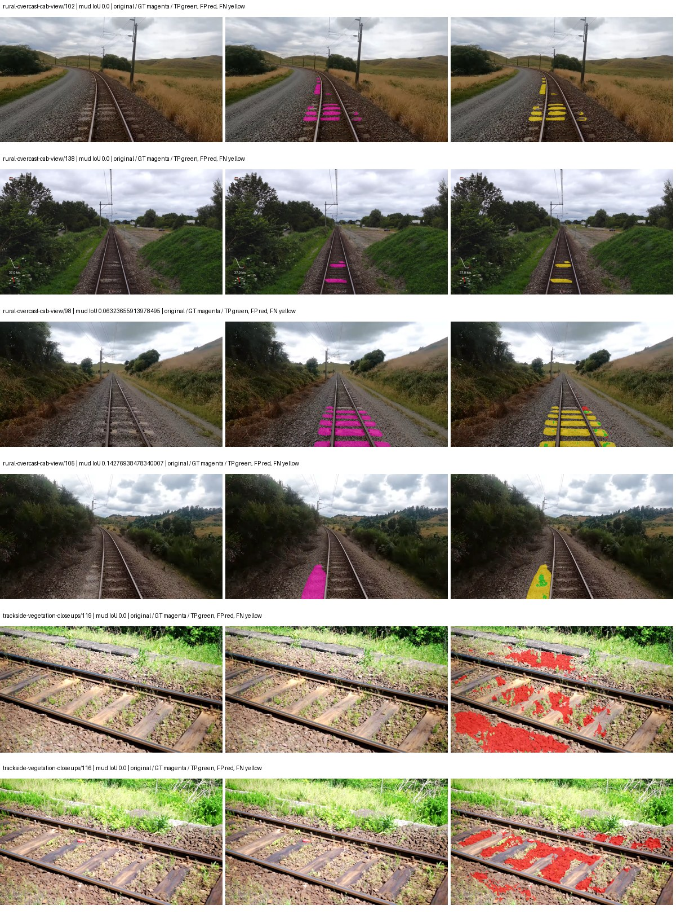

Examples are two lowest and two highest mud-IoU positive images, plus up to two negative images with the most false-positive mud pixels. They are targeted diagnostic examples, not random samples. Green: true positive; red: false positive; yellow: false negative. Full predictions remain on HDRFS.

### Validation tracking

| Logged step | Overall mIoU (%) | Mud IoU (%) |
| --- | --- | --- |
| 254 | 18.14 | 0.22 |
| 508 | 21.92 | 0.30 |
| 763 | 25.47 | 0.13 |
| 1017 | 24.55 | 0.35 |
| 1272 | 24.63 | 0.58 |
| 1527 | 26.47 | 0.40 |
| 1781 | 25.64 | 0.54 |
| 2036 | 26.11 | 0.69 |
| 2290 | 26.14 | 0.82 |
| 2545 | 27.31 | 0.94 |
| 2799 | 27.43 | 0.84 |
| 3054 | 28.01 | 0.96 |
| 3308 | 28.75 | 1.16 |
| 3563 | 28.71 | 1.44 |
| 3817 | 28.16 | 1.20 |
| 4000 | 29.07 | 1.42 |

All retained scalar curves, including training loss and per-class IoU, are in record.json. Observed best mud on a curve is not necessarily a retained checkpoint: the pilot saved its selection-metric-best and final checkpoints. Step logging and checkpoint global_step may differ by one.

### Stopping and checkpoint provenance

```json
{
  "stopping": {
    "actual_steps": 4000,
    "maximum_steps": 4000,
    "min_delta": 0.001,
    "monitor": "val_iou/mud-pumping",
    "patience": 5,
    "reason": "budget_complete"
  },
  "checkpoints": {
    "best": {
      "path": "/data/izadia1/projects/segmentary-runs/paul-test-rtis/mud-fullstats-v1-20260906-r2/future-runs/hf_auto_segformer_b0--cityscapes_to_rtis--seed-1_seed1/rtis/best.ckpt",
      "sha256": "2992ed78474a81a36c2d3590df1e6b33df6d02132ae786796a18a3b256175172",
      "global_step": 3563,
      "bytes": 59870157
    },
    "final": {
      "path": "/data/izadia1/projects/segmentary-runs/paul-test-rtis/mud-fullstats-v1-20260906-r2/future-runs/hf_auto_segformer_b0--cityscapes_to_rtis--seed-1_seed1/rtis/last.ckpt",
      "sha256": "f1fed569f1421923330f738dfd537cadc563540fa7c3d8ef616c0aabb4d9b589",
      "global_step": 4000,
      "bytes": 59860237
    }
  },
  "cleanup_error": null
}
```

### Resolved training, initialization and evaluation settings

The optimizer block is the base configuration. Stage LR scales are applied at runtime, and stage warmup is capped at min(base warmup, floor(stage budget / 10), stage budget - 1): 400 steps for this 4,000-step pilot. Model-internal native input grids may differ from augmentation crops (EoMT uses its 640 grid).

```json
{
  "name": "hf_auto_segformer_b0--cityscapes_to_rtis--seed-1",
  "model": {
    "arch": "hf_auto",
    "checkpoint": "nvidia/segformer-b0-finetuned-ade-512-512",
    "tuning": "full",
    "head": "unified_head",
    "lora_r": 16,
    "lora_alpha": 32,
    "lora_dropout": 0.05,
    "lora_targets": [],
    "drop_path": null,
    "revision": "489d5cd81a0b59fab9b7ea758d3548ebe99677da",
    "subfolder": null,
    "local_files_only": false,
    "trust_remote_code": false,
    "backbone_path": null,
    "head_paths": [],
    "classifier_path": null,
    "inactive_parameter_paths": [],
    "smp_arch": null,
    "encoder_name": null,
    "encoder_weights": null,
    "native": null,
    "batch_norm_momentum": null
  },
  "space": "paul-test-rtis",
  "taxonomy_root": "/data/izadia1/projects/segmentary-rtis-fullstats-066afb2/taxonomy",
  "output_root": "/data/izadia1/projects/segmentary-runs/paul-test-rtis/mud-fullstats-v1-20260906-r2/future-runs",
  "optim": {
    "backbone_lr": 6e-05,
    "head_lr_mult": 10.0,
    "weight_decay": 0.05,
    "llrd": 1.0,
    "warmup_iters": 1500,
    "warmup_ratio": 1e-06,
    "poly_power": 0.9,
    "min_lr_ratio": 0.0,
    "betas": [
      0.9,
      0.999
    ],
    "grad_clip": 1.0
  },
  "train": {
    "iters": 4000,
    "batch_size": 2,
    "accum": 8,
    "num_workers": 2,
    "precision": "bf16-mixed",
    "ema_decay": 0.9998,
    "val_every": 250,
    "ckpt_every": 500,
    "selection_metric": "val_iou/mud-pumping",
    "early_stopping_patience": 5,
    "early_stopping_min_delta": 0.001,
    "seed": 1,
    "devices": 1
  },
  "eval": {
    "sliding_window": true,
    "window": [
      1024,
      1024
    ],
    "stride": [
      768,
      768
    ],
    "batch_size": 1,
    "num_workers": 2,
    "tta_scales": [],
    "tta_flip": false,
    "threshold": 0.5,
    "boundary_tolerance_frac": 0.0075,
    "save_confusion": true
  },
  "loss": {
    "task": "multiclass",
    "activation": "auto",
    "terms": [],
    "aux": "none",
    "aux_weight": 0.0,
    "ce_weight": 1.0,
    "label_smoothing": 0.0,
    "class_weights": null,
    "query": null
  },
  "aug": {
    "crop": [
      1024,
      1024
    ],
    "scale_min": 0.5,
    "scale_max": 2.0,
    "hflip_p": 0.5,
    "color_jitter_p": 0.5,
    "brightness": 0.25,
    "contrast": 0.25,
    "saturation": 0.25,
    "hue": 0.05
  },
  "stages": [
    {
      "name": "rtis",
      "data": [
        {
          "name": "paul-test-rtis",
          "root": "/data/izadia1/datasets/paul-test-rtis",
          "variant": null,
          "split_file": "splits.json",
          "train_split": "train",
          "val_split": "val",
          "limit": null,
          "loader": "folder",
          "mapping": "paul-test-rtis",
          "loader_options": {
            "require_groups": true
          }
        }
      ],
      "iters": null,
      "lr_scale": 0.1,
      "head_group_lr_scale": 1.0,
      "init_from": "/data/izadia1/projects/segmentary-runs/all-model-city-rail-seed0-rail20-b9eb3e1/jobs/hf_auto_segformer_b0--cityscapes--seed-0/attempt-001/train/hf_auto_segformer_b0--cityscapes_seed0/cityscapes/last.ckpt",
      "reset_head": true,
      "freeze": null,
      "sample_weights": null
    }
  ]
}
```

### Hardware and software provenance

```json
{
  "training": {
    "cuda_available": true,
    "cuda_visible_devices": "3",
    "cudnn": 91900,
    "driver_version": "570.133.20",
    "gpu_count": 1,
    "gpu_names": [
      "NVIDIA L40S"
    ],
    "hostname": "hdrfs-app-001",
    "input_normalization": {
      "channel_order": "rgb",
      "mean": [
        0.485,
        0.456,
        0.406
      ],
      "source": "hf_image_processor",
      "std": [
        0.229,
        0.224,
        0.225
      ]
    },
    "model_origins": [
      {
        "hf_commit": "489d5cd81a0b59fab9b7ea758d3548ebe99677da",
        "hf_name_or_path": "nvidia/segformer-b0-finetuned-ade-512-512",
        "module": "model",
        "timm_pretrained": {}
      },
      {
        "hf_commit": "489d5cd81a0b59fab9b7ea758d3548ebe99677da",
        "hf_name_or_path": "nvidia/segformer-b0-finetuned-ade-512-512",
        "module": "model.segformer",
        "timm_pretrained": {}
      },
      {
        "hf_commit": "489d5cd81a0b59fab9b7ea758d3548ebe99677da",
        "hf_name_or_path": "nvidia/segformer-b0-finetuned-ade-512-512",
        "module": "model.segformer.stages.0.blocks.0.attention",
        "timm_pretrained": {}
      },
      {
        "hf_commit": "489d5cd81a0b59fab9b7ea758d3548ebe99677da",
        "hf_name_or_path": "nvidia/segformer-b0-finetuned-ade-512-512",
        "module": "model.segformer.stages.0.blocks.1.attention",
        "timm_pretrained": {}
      },
      {
        "hf_commit": "489d5cd81a0b59fab9b7ea758d3548ebe99677da",
        "hf_name_or_path": "nvidia/segformer-b0-finetuned-ade-512-512",
        "module": "model.segformer.stages.1.blocks.0.attention",
        "timm_pretrained": {}
      },
      {
        "hf_commit": "489d5cd81a0b59fab9b7ea758d3548ebe99677da",
        "hf_name_or_path": "nvidia/segformer-b0-finetuned-ade-512-512",
        "module": "model.segformer.stages.1.blocks.1.attention",
        "timm_pretrained": {}
      },
      {
        "hf_commit": "489d5cd81a0b59fab9b7ea758d3548ebe99677da",
        "hf_name_or_path": "nvidia/segformer-b0-finetuned-ade-512-512",
        "module": "model.segformer.stages.2.blocks.0.attention",
        "timm_pretrained": {}
      },
      {
        "hf_commit": "489d5cd81a0b59fab9b7ea758d3548ebe99677da",
        "hf_name_or_path": "nvidia/segformer-b0-finetuned-ade-512-512",
        "module": "model.segformer.stages.2.blocks.1.attention",
        "timm_pretrained": {}
      },
      {
        "hf_commit": "489d5cd81a0b59fab9b7ea758d3548ebe99677da",
        "hf_name_or_path": "nvidia/segformer-b0-finetuned-ade-512-512",
        "module": "model.segformer.stages.3.blocks.0.attention",
        "timm_pretrained": {}
      },
      {
        "hf_commit": "489d5cd81a0b59fab9b7ea758d3548ebe99677da",
        "hf_name_or_path": "nvidia/segformer-b0-finetuned-ade-512-512",
        "module": "model.segformer.stages.3.blocks.1.attention",
        "timm_pretrained": {}
      },
      {
        "hf_commit": "489d5cd81a0b59fab9b7ea758d3548ebe99677da",
        "hf_name_or_path": "nvidia/segformer-b0-finetuned-ade-512-512",
        "module": "model.decode_head",
        "timm_pretrained": {}
      }
    ],
    "model_parameter_count": 3719541,
    "packages": {
      "albumentations": "2.0.8",
      "lightning": "2.6.5",
      "numpy": "2.4.4",
      "segmentary": "0.1.0",
      "segmentation-models-pytorch": "0.5.0",
      "timm": "1.0.28",
      "torch": "2.11.0+cu128",
      "torchvision": "0.26.0+cu128",
      "transformers": "5.15.0"
    },
    "platform": "Linux-5.15.0-139-generic-x86_64-with-glibc2.35",
    "python": "3.11.15",
    "torch": "2.11.0+cu128",
    "torch_cuda": "12.8",
    "trainable_parameter_count": 3719541,
    "training_stop": {
      "actual_steps": 4000,
      "maximum_steps": 4000,
      "min_delta": 0.001,
      "monitor": "val_iou/mud-pumping",
      "patience": 5,
      "reason": "budget_complete"
    },
    "validation_weights": "raw"
  },
  "evaluation": {
    "cuda_available": true,
    "cuda_visible_devices": "3",
    "cudnn": 91900,
    "driver_version": "570.133.20",
    "gpu_count": 1,
    "gpu_names": [
      "NVIDIA L40S"
    ],
    "hostname": "hdrfs-app-001",
    "input_normalization": {
      "channel_order": "rgb",
      "mean": [
        0.485,
        0.456,
        0.406
      ],
      "source": "hf_image_processor",
      "std": [
        0.229,
        0.224,
        0.225
      ]
    },
    "packages": {
      "albumentations": "2.0.8",
      "lightning": "2.6.5",
      "numpy": "2.4.4",
      "segmentary": "0.1.0",
      "segmentation-models-pytorch": "0.5.0",
      "timm": "1.0.28",
      "torch": "2.11.0+cu128",
      "torchvision": "0.26.0+cu128",
      "transformers": "5.15.0"
    },
    "platform": "Linux-5.15.0-139-generic-x86_64-with-glibc2.35",
    "python": "3.11.15",
    "torch": "2.11.0+cu128",
    "torch_cuda": "12.8"
  }
}
```

## cityscapes_to_rtis — seed 2

Status: **completed**. Started: 2026-09-06T13:25:21.365236+00:00. Finished: 2026-09-06T14:07:18.913945+00:00.

Recipe pretrained initializer: `nvidia/segformer-b0-finetuned-ade-512-512`.

`rtis_only` uses the recipe initializer, which may include pretrained segmentation components. Transfer paths load the exact historical source checkpoint below and reset the classifier; they do not reset all query/decoder features.

Source checkpoint: `{'name': 'hf_auto_segformer_b0--cityscapes--seed-0', 'model': 'hf_auto_segformer_b0', 'protocol': 'cityscapes', 'config': '/data/izadia1/projects/segmentary-runs/all-model-city-rail-seed0-rail20-b9eb3e1/jobs/hf_auto_segformer_b0--cityscapes--seed-0/attempt-001/resolved-config.yaml', 'checkpoint': '/data/izadia1/projects/segmentary-runs/all-model-city-rail-seed0-rail20-b9eb3e1/jobs/hf_auto_segformer_b0--cityscapes--seed-0/attempt-001/train/hf_auto_segformer_b0--cityscapes_seed0/cityscapes/last.ckpt', 'recorded_sha256': '68c80fba89b35c10ef9974fcd7163c2bf6b0afaf0ad6c00ff14cbc2b97e30dc9', 'exists': True}`.

Config SHA-256: `cf44b9fe2e02fde8fc8ce18a545403046fb03932b4967826baae6a645c3337f7`. Weights used for validation: `raw`.

### Mud-pumping and aggregate quality

| Metric | Selected checkpoint | Final training validation |
| --- | --- | --- |
| Mud IoU | 3.12 | 2.04 |
| Mud precision | 6.96 | 5.22 |
| Mud recall | 5.34 | 3.25 |
| Mud Dice/F1 | 6.04 | 4.00 |
| mIoU | 29.51 | 30.05 |
| Mean accuracy | 39.80 | 40.82 |
| Mean precision | 51.45 | 50.26 |
| Mean Dice | 37.83 | 38.38 |
| Mean specificity | 98.91 | 98.98 |
| Pixel accuracy | 81.69 | 82.63 |
| Frequency-weighted IoU | 74.08 | 74.70 |
| Fixed GT-present class mIoU | 34.43 | 35.06 |
| Boundary F1 | 37.60 | 37.67 |

The selected checkpoint has independent evaluation evidence. Final values are the trainer's final validation record, not a new independent evaluation. mIoU averages classes with nonzero union, so false positives on absent classes can change its denominator. The fixed GT-class mean is supplementary and excludes absent classes; their false positives remain in the confusion matrix.

### Resource usage and timing

| Measurement | Value |
| --- | --- |
| Peak training VRAM, retained training invocation (GiB) | 7.79 |
| Peak evaluation VRAM (GiB) | 7.03 |
| Retained training invocation wall time (seconds) | 2384.46 |
| Retained training invocation GPU-hours (one GPU) | 0.66 |
| Evaluation wall time (seconds) | 13.20 |
| Full evaluation pipeline images/second | 2.80 |
| Best full-state checkpoint (MiB) | 57.10 |
| Final full-state checkpoint (MiB) | 57.09 |
| Audited periodic checkpoints removed (GiB) | 0.45 |

VRAM uses the recorded allocator high-water mark; it is not total device usage including CUDA context. Resumed jobs' retained training invocation times and peaks are **not whole-campaign totals**. Earlier invocation resource records are not reconstructed here. Evaluation throughput includes loader, sliding-window inference and metrics; it is not model-only latency/FPS. Missing measurements are shown as —, never inferred from another dataset's run.

### Standardized inference performance

Dedicated model-only profiling waits for an idle worker-locked L40S: BF16, batch 1, 1024x1024, 20 warmup and 100 CUDA-event-timed public forwards. It excludes loading, preprocessing, tiling and metrics.

| Status | Parameters | Weight MiB | FPS | p50 ms | p95 ms | Peak reserved GiB |
| --- | --- | --- | --- | --- | --- | --- |
| complete | 3719541 | 14.19 | 125.55 | 7.64 | 9.61 | 0.89 |

```json
{
  "schema_version": 1,
  "model_id": "hf_auto_segformer_b0",
  "measured_at": "2026-09-06T14:07:16+00:00",
  "status": "complete",
  "benchmark_scope": "rtis_selected_checkpoint_model_only",
  "applies_to": [
    "hf_auto_segformer_b0--cityscapes_to_rtis--seed-2"
  ],
  "source": {
    "campaign_git_sha": "066afb2626398b7be59d4d19f5a0e4644fd59adc",
    "git_dirty": false,
    "config_hash": "5c2331c16494",
    "resolved_config": "/data/izadia1/projects/segmentary-runs/paul-test-rtis/mud-fullstats-v1-20260906-r2/configs/hf_auto_segformer_b0--cityscapes_to_rtis--seed-2.yaml",
    "config_sha256": "cf44b9fe2e02fde8fc8ce18a545403046fb03932b4967826baae6a645c3337f7",
    "checkpoint_sha256": "04b9804b589a71d492d0b7be4650d491b6da10be06864bcff65a0061d56e5fc6",
    "checkpoint_global_step": 3818,
    "checkpoint_bytes": 59870157,
    "checkpoint_kind": "resume checkpoint with optimizer and EMA state",
    "weights": "raw",
    "measured_checkpoint_job_id": "hf_auto_segformer_b0--cityscapes_to_rtis--seed-2",
    "result_sha256": "322ce7f0e6904b2f8ba93e1cad9b4b3b182c98817dbf0433abb2fa67d1f83267",
    "result_git_sha": "066afb2626398b7be59d4d19f5a0e4644fd59adc",
    "result_stage": "eval:paul-test-rtis:val",
    "result_seed": 2
  },
  "hardware": {
    "gpu_name": "NVIDIA L40S",
    "gpu_uuid": "GPU-1c9b612f-e0b5-fbbc-150f-8c2ef13453c9",
    "logical_device": "cuda:0",
    "physical_visibility_token": "5",
    "compute_capability": [
      8,
      9
    ],
    "total_memory_bytes": 47677177856
  },
  "model": {
    "parameter_count": 3719541,
    "trainable_parameter_count": 3719541,
    "resident_parameter_bytes": 14878164,
    "parameter_dtype_counts": {
      "float32": 3719541
    }
  },
  "contract": {
    "backend": "pytorch",
    "precision": "bf16_autocast",
    "batch_size": 1,
    "input_shape_nchw": [
      1,
      3,
      1024,
      1024
    ],
    "warmup_iterations": 20,
    "measured_iterations": 100,
    "timing": "per-forward CUDA events with end-event synchronization",
    "includes_preprocessing": false,
    "includes_data_loader": false,
    "includes_sliding_window": false,
    "input_resident_on_gpu": true,
    "model_only": true,
    "entrypoint": "public model(image) dense-logits forward"
  },
  "measurements": {
    "latency": {
      "p50_ms": 7.644672155380249,
      "p95_ms": 9.612441778182983,
      "mean_ms": 7.964734091758728,
      "minimum_ms": 7.283711910247803,
      "maximum_ms": 10.646528244018555,
      "fps": 125.5534696424731,
      "raw_ms": [
        8.275967597961426,
        7.363584041595459,
        8.894463539123535,
        7.7066240310668945,
        7.497727870941162,
        7.357439994812012,
        7.363584041595459,
        8.273920059204102,
        7.792640209197998,
        7.3512959480285645,
        7.384064197540283,
        7.425024032592773,
        8.095744132995605,
        10.403840065002441,
        9.529343605041504,
        9.603072166442871,
        9.790464401245117,
        10.646528244018555,
        7.995391845703125,
        7.631872177124023,
        7.547904014587402,
        7.5735039710998535,
        7.521312236785889,
        7.411712169647217,
        7.44652795791626,
        7.360511779785156,
        7.569407939910889,
        7.798783779144287,
        7.362559795379639,
        7.35536003112793,
        7.291903972625732,
        7.283711910247803,
        7.374847888946533,
        7.367680072784424,
        7.662591934204102,
        7.5581440925598145,
        7.477280139923096,
        7.465983867645264,
        7.6615681648254395,
        7.666687965393066,
        8.683520317077637,
        7.415808200836182,
        7.363584041595459,
        7.296000003814697,
        7.291903972625732,
        7.320576190948486,
        7.327744007110596,
        7.868415832519531,
        9.208831787109375,
        9.289728164672852,
        9.325568199157715,
        9.296895980834961,
        9.217023849487305,
        7.7711358070373535,
        7.705599784851074,
        7.625728130340576,
        7.4700798988342285,
        8.535039901733398,
        7.511040210723877,
        7.515135765075684,
        7.808000087738037,
        7.868415832519531,
        7.766016006469727,
        7.970816135406494,
        7.715839862823486,
        7.4301438331604,
        7.631872177124023,
        8.084480285644531,
        7.318528175354004,
        7.396416187286377,
        7.355391979217529,
        7.369728088378906,
        7.3809919357299805,
        7.657472133636475,
        7.612415790557861,
        7.881728172302246,
        8.20531177520752,
        7.398399829864502,
        7.3369598388671875,
        7.716864109039307,
        7.921664237976074,
        7.733248233795166,
        9.404383659362793,
        7.932928085327148,
        8.169471740722656,
        7.4547200202941895,
        7.392255783081055,
        8.056832313537598,
        7.387135982513428,
        8.10700798034668,
        8.142848014831543,
        9.92563247680664,
        9.594880104064941,
        9.566207885742188,
        9.449472427368164,
        9.801728248596191,
        7.700479984283447,
        7.616511821746826,
        7.584767818450928,
        7.445504188537598
      ],
      "percentile_method": "numpy linear interpolation"
    },
    "peak_reserved_bytes": 960495616,
    "memory_kind": "pytorch_cuda_allocator_peak_reserved_excluding_context",
    "benchmark_wall_clock_s": 4.618793822824955
  },
  "started_at": "2026-09-06T14:07:12+00:00",
  "finished_at": "2026-09-06T14:07:16+00:00",
  "environment": {
    "hostname": "hdrfs-app-001",
    "python": "3.11.15",
    "platform": "Linux-5.15.0-139-generic-x86_64-with-glibc2.35",
    "torch": "2.11.0+cu128",
    "torch_cuda": "12.8",
    "cudnn": 91900,
    "driver_version": "570.133.20",
    "cuda_available": true,
    "gpu_count": 1,
    "gpu_names": [
      "NVIDIA L40S"
    ],
    "cuda_visible_devices": "5",
    "packages": {
      "segmentary": "0.1.0",
      "torch": "2.11.0+cu128",
      "torchvision": "0.26.0+cu128",
      "transformers": "5.15.0",
      "timm": "1.0.28",
      "segmentation-models-pytorch": "0.5.0",
      "albumentations": "2.0.8",
      "lightning": "2.6.5",
      "numpy": "2.4.4"
    }
  }
}
```

### Per-class validation results

| Class | GT pixels | IoU (%) | Precision (%) | Recall (%) | Dice (%) | Boundary F1 (%) |
| --- | --- | --- | --- | --- | --- | --- |
| car | 29664 | 5.55 | 32.10 | 6.28 | 10.51 | 32.17 |
| construction | 311585 | 52.71 | 70.60 | 67.53 | 69.03 | 66.45 |
| fence | 265137 | 3.61 | 14.88 | 4.55 | 6.97 | 14.83 |
| mud-pumping | 1226250 | 3.12 | 6.96 | 5.34 | 6.04 | 7.82 |
| on-rails | 0 | 0.00 | 0.00 | — | 0.00 | 0.00 |
| person | 0 | 0.00 | 0.00 | — | 0.00 | 0.00 |
| pole | 628038 | 66.64 | 81.15 | 78.85 | 79.98 | 88.28 |
| rail-embedded | 16799 | 14.50 | 94.00 | 14.63 | 25.32 | 16.06 |
| rail-raised | 2969797 | 71.29 | 83.83 | 82.66 | 83.24 | 88.37 |
| rail-track | 6323197 | 34.55 | 54.53 | 48.54 | 51.36 | 47.36 |
| road | 1048831 | 2.97 | 6.91 | 4.94 | 5.76 | 7.78 |
| sidewalk | 1297367 | 17.96 | 94.06 | 18.16 | 30.44 | 12.58 |
| sky | 19121606 | 98.27 | 99.25 | 99.01 | 99.13 | 95.28 |
| standing-water | 95802 | 0.08 | 0.08 | 3.49 | 0.16 | 0.49 |
| terrain | 39239306 | 86.80 | 89.73 | 96.37 | 92.93 | 58.67 |
| trackbed | 10643081 | 55.04 | 75.93 | 66.67 | 71.00 | 56.00 |
| traffic-light | 19510 | 38.68 | 93.22 | 39.80 | 55.78 | 64.30 |
| traffic-sign | 13285 | 22.22 | 86.77 | 23.00 | 36.37 | 54.21 |
| tram-track | 56179 | 9.21 | 18.12 | 15.78 | 16.87 | 15.15 |
| truck | 0 | 0.00 | 0.00 | — | 0.00 | 0.00 |
| vegetation-overgrowth | 5901821 | 36.61 | 78.43 | 40.70 | 53.59 | 63.67 |

### Full-run accounting

| Measurement | Value |
| --- | --- |
| Full GPU-reserved wall seconds, all recorded worker attempts | 2518.15 |
| Full reserved GPU-hours | 0.70 |
| Whole-run timing complete | True |

| Phase | Wall seconds including failed attempts |
| --- | --- |
| training | 2391.38 |
| diagnostics | 94.28 |
| performance | 11.10 |

GPU-reserved time includes model loading, training, validation, collection, profiling, checkpoint I/O and orchestration while the worker owns one GPU. It is not GPU kernel-active time. Phase timings and sampled device memory/power/utilization are retained separately; sampled device memory is not the allocator high-water mark.

### Train/validation and raw/EMA diagnostics

| Checkpoint / weights / split | Images | Mud IoU (%) | Mud precision (%) | Mud recall (%) |
| --- | --- | --- | --- | --- |
| best-auto-train / raw | 220 | 90.74 | 94.47 | 95.82 |
| best-auto-val / raw | 37 | 3.12 | 6.96 | 5.34 |
| best-alternate-val / ema | 37 | 1.38 | 2.77 | 2.69 |
| final-auto-val / raw | 37 | 2.04 | 5.22 | 3.25 |

Train uses the evaluation transform without augmentation. Compare mud train/validation metrics for the same selected weights. Alternate EMA on running-stat BatchNorm is explicitly uncalibrated and is diagnostic only. Score-threshold curves use uncalibrated normalized scores and are pixel-level diagnostics, not event detection rates or a selected deployment operating point.

### Downloadable evidence

- best-auto-train: [per-image.csv](cityscapes_to_rtis--seed-2/best-auto-train/per-image.csv) · [per-image-confusion.json.gz](cityscapes_to_rtis--seed-2/best-auto-train/per-image-confusion.json.gz) · [groups.json](cityscapes_to_rtis--seed-2/best-auto-train/groups.json) · [mud-score-curves.json](cityscapes_to_rtis--seed-2/best-auto-train/mud-score-curves.json)
- best-auto-val: [per-image.csv](cityscapes_to_rtis--seed-2/best-auto-val/per-image.csv) · [per-image-confusion.json.gz](cityscapes_to_rtis--seed-2/best-auto-val/per-image-confusion.json.gz) · [groups.json](cityscapes_to_rtis--seed-2/best-auto-val/groups.json) · [mud-score-curves.json](cityscapes_to_rtis--seed-2/best-auto-val/mud-score-curves.json) · [examples.jpg](cityscapes_to_rtis--seed-2/best-auto-val/examples.jpg)
- best-alternate-val: [per-image.csv](cityscapes_to_rtis--seed-2/best-alternate-val/per-image.csv) · [per-image-confusion.json.gz](cityscapes_to_rtis--seed-2/best-alternate-val/per-image-confusion.json.gz) · [groups.json](cityscapes_to_rtis--seed-2/best-alternate-val/groups.json) · [mud-score-curves.json](cityscapes_to_rtis--seed-2/best-alternate-val/mud-score-curves.json)
- final-auto-val: [per-image.csv](cityscapes_to_rtis--seed-2/final-auto-val/per-image.csv) · [per-image-confusion.json.gz](cityscapes_to_rtis--seed-2/final-auto-val/per-image-confusion.json.gz) · [groups.json](cityscapes_to_rtis--seed-2/final-auto-val/groups.json) · [mud-score-curves.json](cityscapes_to_rtis--seed-2/final-auto-val/mud-score-curves.json)
- resources: [telemetry.csv](cityscapes_to_rtis--seed-2/resources/telemetry.csv)

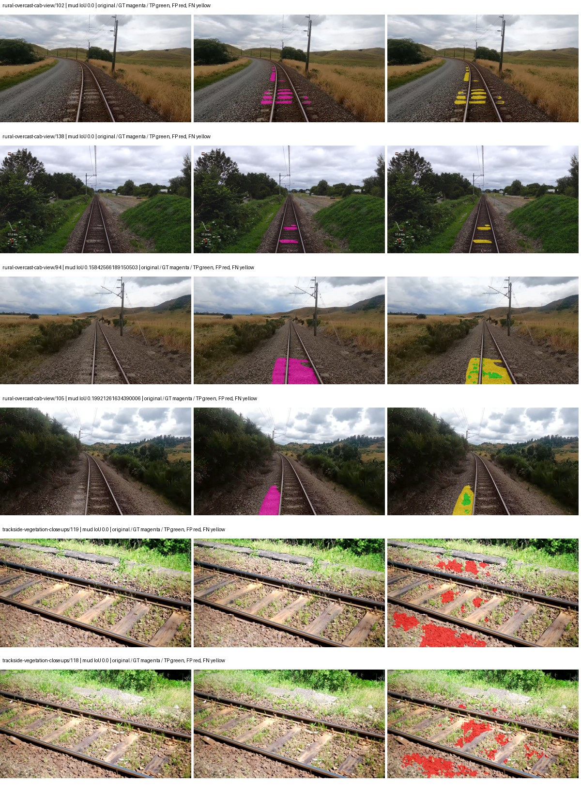

Examples are two lowest and two highest mud-IoU positive images, plus up to two negative images with the most false-positive mud pixels. They are targeted diagnostic examples, not random samples. Green: true positive; red: false positive; yellow: false negative. Full predictions remain on HDRFS.

### Validation tracking

| Logged step | Overall mIoU (%) | Mud IoU (%) |
| --- | --- | --- |
| 254 | 19.45 | 0.20 |
| 508 | 22.63 | 0.09 |
| 763 | 27.72 | 0.10 |
| 1017 | 26.54 | 0.22 |
| 1272 | 26.05 | 0.30 |
| 1527 | 26.08 | 0.80 |
| 1781 | 26.20 | 0.54 |
| 2036 | 27.21 | 0.67 |
| 2290 | 27.99 | 0.57 |
| 2545 | 29.45 | 1.00 |
| 2799 | 29.96 | 1.79 |
| 3054 | 29.45 | 2.54 |
| 3308 | 29.14 | 1.75 |
| 3563 | 30.34 | 2.85 |
| 3817 | 29.53 | 3.11 |
| 4000 | 30.05 | 2.04 |

All retained scalar curves, including training loss and per-class IoU, are in record.json. Observed best mud on a curve is not necessarily a retained checkpoint: the pilot saved its selection-metric-best and final checkpoints. Step logging and checkpoint global_step may differ by one.

### Stopping and checkpoint provenance

```json
{
  "stopping": {
    "actual_steps": 4000,
    "maximum_steps": 4000,
    "min_delta": 0.001,
    "monitor": "val_iou/mud-pumping",
    "patience": 5,
    "reason": "budget_complete"
  },
  "checkpoints": {
    "best": {
      "path": "/data/izadia1/projects/segmentary-runs/paul-test-rtis/mud-fullstats-v1-20260906-r2/future-runs/hf_auto_segformer_b0--cityscapes_to_rtis--seed-2_seed2/rtis/best.ckpt",
      "sha256": "04b9804b589a71d492d0b7be4650d491b6da10be06864bcff65a0061d56e5fc6",
      "global_step": 3818,
      "bytes": 59870157
    },
    "final": {
      "path": "/data/izadia1/projects/segmentary-runs/paul-test-rtis/mud-fullstats-v1-20260906-r2/future-runs/hf_auto_segformer_b0--cityscapes_to_rtis--seed-2_seed2/rtis/last.ckpt",
      "sha256": "9e95b8011e7590ef863cd9081da84d73b32a12e28e7d9cd8719c45ed9306c6af",
      "global_step": 4000,
      "bytes": 59860237
    }
  },
  "cleanup_error": null
}
```

### Resolved training, initialization and evaluation settings

The optimizer block is the base configuration. Stage LR scales are applied at runtime, and stage warmup is capped at min(base warmup, floor(stage budget / 10), stage budget - 1): 400 steps for this 4,000-step pilot. Model-internal native input grids may differ from augmentation crops (EoMT uses its 640 grid).

```json
{
  "name": "hf_auto_segformer_b0--cityscapes_to_rtis--seed-2",
  "model": {
    "arch": "hf_auto",
    "checkpoint": "nvidia/segformer-b0-finetuned-ade-512-512",
    "tuning": "full",
    "head": "unified_head",
    "lora_r": 16,
    "lora_alpha": 32,
    "lora_dropout": 0.05,
    "lora_targets": [],
    "drop_path": null,
    "revision": "489d5cd81a0b59fab9b7ea758d3548ebe99677da",
    "subfolder": null,
    "local_files_only": false,
    "trust_remote_code": false,
    "backbone_path": null,
    "head_paths": [],
    "classifier_path": null,
    "inactive_parameter_paths": [],
    "smp_arch": null,
    "encoder_name": null,
    "encoder_weights": null,
    "native": null,
    "batch_norm_momentum": null
  },
  "space": "paul-test-rtis",
  "taxonomy_root": "/data/izadia1/projects/segmentary-rtis-fullstats-066afb2/taxonomy",
  "output_root": "/data/izadia1/projects/segmentary-runs/paul-test-rtis/mud-fullstats-v1-20260906-r2/future-runs",
  "optim": {
    "backbone_lr": 6e-05,
    "head_lr_mult": 10.0,
    "weight_decay": 0.05,
    "llrd": 1.0,
    "warmup_iters": 1500,
    "warmup_ratio": 1e-06,
    "poly_power": 0.9,
    "min_lr_ratio": 0.0,
    "betas": [
      0.9,
      0.999
    ],
    "grad_clip": 1.0
  },
  "train": {
    "iters": 4000,
    "batch_size": 2,
    "accum": 8,
    "num_workers": 2,
    "precision": "bf16-mixed",
    "ema_decay": 0.9998,
    "val_every": 250,
    "ckpt_every": 500,
    "selection_metric": "val_iou/mud-pumping",
    "early_stopping_patience": 5,
    "early_stopping_min_delta": 0.001,
    "seed": 2,
    "devices": 1
  },
  "eval": {
    "sliding_window": true,
    "window": [
      1024,
      1024
    ],
    "stride": [
      768,
      768
    ],
    "batch_size": 1,
    "num_workers": 2,
    "tta_scales": [],
    "tta_flip": false,
    "threshold": 0.5,
    "boundary_tolerance_frac": 0.0075,
    "save_confusion": true
  },
  "loss": {
    "task": "multiclass",
    "activation": "auto",
    "terms": [],
    "aux": "none",
    "aux_weight": 0.0,
    "ce_weight": 1.0,
    "label_smoothing": 0.0,
    "class_weights": null,
    "query": null
  },
  "aug": {
    "crop": [
      1024,
      1024
    ],
    "scale_min": 0.5,
    "scale_max": 2.0,
    "hflip_p": 0.5,
    "color_jitter_p": 0.5,
    "brightness": 0.25,
    "contrast": 0.25,
    "saturation": 0.25,
    "hue": 0.05
  },
  "stages": [
    {
      "name": "rtis",
      "data": [
        {
          "name": "paul-test-rtis",
          "root": "/data/izadia1/datasets/paul-test-rtis",
          "variant": null,
          "split_file": "splits.json",
          "train_split": "train",
          "val_split": "val",
          "limit": null,
          "loader": "folder",
          "mapping": "paul-test-rtis",
          "loader_options": {
            "require_groups": true
          }
        }
      ],
      "iters": null,
      "lr_scale": 0.1,
      "head_group_lr_scale": 1.0,
      "init_from": "/data/izadia1/projects/segmentary-runs/all-model-city-rail-seed0-rail20-b9eb3e1/jobs/hf_auto_segformer_b0--cityscapes--seed-0/attempt-001/train/hf_auto_segformer_b0--cityscapes_seed0/cityscapes/last.ckpt",
      "reset_head": true,
      "freeze": null,
      "sample_weights": null
    }
  ]
}
```

### Hardware and software provenance

```json
{
  "training": {
    "cuda_available": true,
    "cuda_visible_devices": "5",
    "cudnn": 91900,
    "driver_version": "570.133.20",
    "gpu_count": 1,
    "gpu_names": [
      "NVIDIA L40S"
    ],
    "hostname": "hdrfs-app-001",
    "input_normalization": {
      "channel_order": "rgb",
      "mean": [
        0.485,
        0.456,
        0.406
      ],
      "source": "hf_image_processor",
      "std": [
        0.229,
        0.224,
        0.225
      ]
    },
    "model_origins": [
      {
        "hf_commit": "489d5cd81a0b59fab9b7ea758d3548ebe99677da",
        "hf_name_or_path": "nvidia/segformer-b0-finetuned-ade-512-512",
        "module": "model",
        "timm_pretrained": {}
      },
      {
        "hf_commit": "489d5cd81a0b59fab9b7ea758d3548ebe99677da",
        "hf_name_or_path": "nvidia/segformer-b0-finetuned-ade-512-512",
        "module": "model.segformer",
        "timm_pretrained": {}
      },
      {
        "hf_commit": "489d5cd81a0b59fab9b7ea758d3548ebe99677da",
        "hf_name_or_path": "nvidia/segformer-b0-finetuned-ade-512-512",
        "module": "model.segformer.stages.0.blocks.0.attention",
        "timm_pretrained": {}
      },
      {
        "hf_commit": "489d5cd81a0b59fab9b7ea758d3548ebe99677da",
        "hf_name_or_path": "nvidia/segformer-b0-finetuned-ade-512-512",
        "module": "model.segformer.stages.0.blocks.1.attention",
        "timm_pretrained": {}
      },
      {
        "hf_commit": "489d5cd81a0b59fab9b7ea758d3548ebe99677da",
        "hf_name_or_path": "nvidia/segformer-b0-finetuned-ade-512-512",
        "module": "model.segformer.stages.1.blocks.0.attention",
        "timm_pretrained": {}
      },
      {
        "hf_commit": "489d5cd81a0b59fab9b7ea758d3548ebe99677da",
        "hf_name_or_path": "nvidia/segformer-b0-finetuned-ade-512-512",
        "module": "model.segformer.stages.1.blocks.1.attention",
        "timm_pretrained": {}
      },
      {
        "hf_commit": "489d5cd81a0b59fab9b7ea758d3548ebe99677da",
        "hf_name_or_path": "nvidia/segformer-b0-finetuned-ade-512-512",
        "module": "model.segformer.stages.2.blocks.0.attention",
        "timm_pretrained": {}
      },
      {
        "hf_commit": "489d5cd81a0b59fab9b7ea758d3548ebe99677da",
        "hf_name_or_path": "nvidia/segformer-b0-finetuned-ade-512-512",
        "module": "model.segformer.stages.2.blocks.1.attention",
        "timm_pretrained": {}
      },
      {
        "hf_commit": "489d5cd81a0b59fab9b7ea758d3548ebe99677da",
        "hf_name_or_path": "nvidia/segformer-b0-finetuned-ade-512-512",
        "module": "model.segformer.stages.3.blocks.0.attention",
        "timm_pretrained": {}
      },
      {
        "hf_commit": "489d5cd81a0b59fab9b7ea758d3548ebe99677da",
        "hf_name_or_path": "nvidia/segformer-b0-finetuned-ade-512-512",
        "module": "model.segformer.stages.3.blocks.1.attention",
        "timm_pretrained": {}
      },
      {
        "hf_commit": "489d5cd81a0b59fab9b7ea758d3548ebe99677da",
        "hf_name_or_path": "nvidia/segformer-b0-finetuned-ade-512-512",
        "module": "model.decode_head",
        "timm_pretrained": {}
      }
    ],
    "model_parameter_count": 3719541,
    "packages": {
      "albumentations": "2.0.8",
      "lightning": "2.6.5",
      "numpy": "2.4.4",
      "segmentary": "0.1.0",
      "segmentation-models-pytorch": "0.5.0",
      "timm": "1.0.28",
      "torch": "2.11.0+cu128",
      "torchvision": "0.26.0+cu128",
      "transformers": "5.15.0"
    },
    "platform": "Linux-5.15.0-139-generic-x86_64-with-glibc2.35",
    "python": "3.11.15",
    "torch": "2.11.0+cu128",
    "torch_cuda": "12.8",
    "trainable_parameter_count": 3719541,
    "training_stop": {
      "actual_steps": 4000,
      "maximum_steps": 4000,
      "min_delta": 0.001,
      "monitor": "val_iou/mud-pumping",
      "patience": 5,
      "reason": "budget_complete"
    },
    "validation_weights": "raw"
  },
  "evaluation": {
    "cuda_available": true,
    "cuda_visible_devices": "5",
    "cudnn": 91900,
    "driver_version": "570.133.20",
    "gpu_count": 1,
    "gpu_names": [
      "NVIDIA L40S"
    ],
    "hostname": "hdrfs-app-001",
    "input_normalization": {
      "channel_order": "rgb",
      "mean": [
        0.485,
        0.456,
        0.406
      ],
      "source": "hf_image_processor",
      "std": [
        0.229,
        0.224,
        0.225
      ]
    },
    "packages": {
      "albumentations": "2.0.8",
      "lightning": "2.6.5",
      "numpy": "2.4.4",
      "segmentary": "0.1.0",
      "segmentation-models-pytorch": "0.5.0",
      "timm": "1.0.28",
      "torch": "2.11.0+cu128",
      "torchvision": "0.26.0+cu128",
      "transformers": "5.15.0"
    },
    "platform": "Linux-5.15.0-139-generic-x86_64-with-glibc2.35",
    "python": "3.11.15",
    "torch": "2.11.0+cu128",
    "torch_cuda": "12.8"
  }
}
```

## railsem19_to_rtis — seed 0

Status: **completed**. Started: 2026-09-06T13:27:52.471170+00:00. Finished: 2026-09-06T14:10:28.263782+00:00.

Recipe pretrained initializer: `nvidia/segformer-b0-finetuned-ade-512-512`.

`rtis_only` uses the recipe initializer, which may include pretrained segmentation components. Transfer paths load the exact historical source checkpoint below and reset the classifier; they do not reset all query/decoder features.

Source checkpoint: `{'name': 'hf_auto_segformer_b0--railsem19--seed-0', 'model': 'hf_auto_segformer_b0', 'protocol': 'railsem19', 'config': '/data/izadia1/projects/segmentary-runs/all-model-city-rail-seed0-rail20-b9eb3e1/jobs/hf_auto_segformer_b0--railsem19--seed-0/attempt-001/resolved-config.yaml', 'checkpoint': '/data/izadia1/projects/segmentary-runs/all-model-city-rail-seed0-rail20-b9eb3e1/jobs/hf_auto_segformer_b0--railsem19--seed-0/attempt-001/train/hf_auto_segformer_b0--railsem19_seed0/railsem19/last.ckpt', 'recorded_sha256': '32dc1a1782498981e96d56a57c665fef9cc51ba9285097ecb9ca1feed9368946', 'exists': True}`.

Config SHA-256: `f01afd8cefe3c832c6f2cf0cbf8e16fffc1d192106a7cbc215fcad548b217bea`. Weights used for validation: `raw`.

### Mud-pumping and aggregate quality

| Metric | Selected checkpoint | Final training validation |
| --- | --- | --- |
| Mud IoU | 10.93 | 9.33 |
| Mud precision | 57.54 | 57.51 |
| Mud recall | 11.88 | 10.02 |
| Mud Dice/F1 | 19.70 | 17.07 |
| mIoU | 36.58 | 38.03 |
| Mean accuracy | 52.17 | 52.06 |
| Mean precision | 55.56 | 58.22 |
| Mean Dice | 47.04 | 49.01 |
| Mean specificity | 99.11 | 99.09 |
| Pixel accuracy | 85.24 | 84.85 |
| Frequency-weighted IoU | 76.72 | 76.34 |
| Fixed GT-present class mIoU | 42.67 | 42.26 |
| Boundary F1 | 45.15 | 47.19 |

The selected checkpoint has independent evaluation evidence. Final values are the trainer's final validation record, not a new independent evaluation. mIoU averages classes with nonzero union, so false positives on absent classes can change its denominator. The fixed GT-class mean is supplementary and excludes absent classes; their false positives remain in the confusion matrix.

### Resource usage and timing

| Measurement | Value |
| --- | --- |
| Peak training VRAM, retained training invocation (GiB) | 7.79 |
| Peak evaluation VRAM (GiB) | 7.03 |
| Retained training invocation wall time (seconds) | 2423.54 |
| Retained training invocation GPU-hours (one GPU) | 0.67 |
| Evaluation wall time (seconds) | 13.20 |
| Full evaluation pipeline images/second | 2.80 |
| Best full-state checkpoint (MiB) | 57.10 |
| Final full-state checkpoint (MiB) | 57.09 |
| Audited periodic checkpoints removed (GiB) | 0.45 |

VRAM uses the recorded allocator high-water mark; it is not total device usage including CUDA context. Resumed jobs' retained training invocation times and peaks are **not whole-campaign totals**. Earlier invocation resource records are not reconstructed here. Evaluation throughput includes loader, sliding-window inference and metrics; it is not model-only latency/FPS. Missing measurements are shown as —, never inferred from another dataset's run.

### Standardized inference performance

Dedicated model-only profiling waits for an idle worker-locked L40S: BF16, batch 1, 1024x1024, 20 warmup and 100 CUDA-event-timed public forwards. It excludes loading, preprocessing, tiling and metrics.

| Status | Parameters | Weight MiB | FPS | p50 ms | p95 ms | Peak reserved GiB |
| --- | --- | --- | --- | --- | --- | --- |
| complete | 3719541 | 14.19 | 134.10 | 7.27 | 8.19 | 0.89 |

```json
{
  "schema_version": 1,
  "model_id": "hf_auto_segformer_b0",
  "measured_at": "2026-09-06T14:10:26+00:00",
  "status": "complete",
  "benchmark_scope": "rtis_selected_checkpoint_model_only",
  "applies_to": [
    "hf_auto_segformer_b0--railsem19_to_rtis--seed-0"
  ],
  "source": {
    "campaign_git_sha": "066afb2626398b7be59d4d19f5a0e4644fd59adc",
    "git_dirty": false,
    "config_hash": "0da835b96c59",
    "resolved_config": "/data/izadia1/projects/segmentary-runs/paul-test-rtis/mud-fullstats-v1-20260906-r2/configs/hf_auto_segformer_b0--railsem19_to_rtis--seed-0.yaml",
    "config_sha256": "f01afd8cefe3c832c6f2cf0cbf8e16fffc1d192106a7cbc215fcad548b217bea",
    "checkpoint_sha256": "699440d4642881589005eb0f78a3fdd22e804a62c01d8322676afd525a8f96cc",
    "checkpoint_global_step": 3309,
    "checkpoint_bytes": 59870157,
    "checkpoint_kind": "resume checkpoint with optimizer and EMA state",
    "weights": "raw",
    "measured_checkpoint_job_id": "hf_auto_segformer_b0--railsem19_to_rtis--seed-0",
    "result_sha256": "bee1bd8d21e8de9d0596be4cc8d5d266d24c7e7d8b35ee7e92eb4fe3a8bc5a57",
    "result_git_sha": "066afb2626398b7be59d4d19f5a0e4644fd59adc",
    "result_stage": "eval:paul-test-rtis:val",
    "result_seed": 0
  },
  "hardware": {
    "gpu_name": "NVIDIA L40S",
    "gpu_uuid": "GPU-a5ad49e5-0536-5229-ba8a-f8a902808f53",
    "logical_device": "cuda:0",
    "physical_visibility_token": "7",
    "compute_capability": [
      8,
      9
    ],
    "total_memory_bytes": 47677177856
  },
  "model": {
    "parameter_count": 3719541,
    "trainable_parameter_count": 3719541,
    "resident_parameter_bytes": 14878164,
    "parameter_dtype_counts": {
      "float32": 3719541
    }
  },
  "contract": {
    "backend": "pytorch",
    "precision": "bf16_autocast",
    "batch_size": 1,
    "input_shape_nchw": [
      1,
      3,
      1024,
      1024
    ],
    "warmup_iterations": 20,
    "measured_iterations": 100,
    "timing": "per-forward CUDA events with end-event synchronization",
    "includes_preprocessing": false,
    "includes_data_loader": false,
    "includes_sliding_window": false,
    "input_resident_on_gpu": true,
    "model_only": true,
    "entrypoint": "public model(image) dense-logits forward"
  },
  "measurements": {
    "latency": {
      "p50_ms": 7.271935939788818,
      "p95_ms": 8.19412965774536,
      "mean_ms": 7.457341103553772,
      "minimum_ms": 7.205887794494629,
      "maximum_ms": 9.843711853027344,
      "fps": 134.09605194584074,
      "raw_ms": [
        7.474175930023193,
        7.270400047302246,
        7.235583782196045,
        7.246848106384277,
        8.569855690002441,
        7.273471832275391,
        7.436287879943848,
        7.241727828979492,
        7.256063938140869,
        7.224319934844971,
        7.592959880828857,
        7.250944137573242,
        7.268352031707764,
        7.224319934844971,
        7.238656044006348,
        7.616511821746826,
        7.244800090789795,
        7.318528175354004,
        7.393280029296875,
        7.649280071258545,
        7.314432144165039,
        7.362559795379639,
        7.547904014587402,
        7.269375801086426,
        7.245823860168457,
        7.258111953735352,
        7.263232231140137,
        7.309311866760254,
        7.311359882354736,
        7.651328086853027,
        7.797760009765625,
        7.6031999588012695,
        7.237631797790527,
        7.2478718757629395,
        7.433216094970703,
        7.862271785736084,
        7.321599960327148,
        7.278592109680176,
        7.2335357666015625,
        7.230463981628418,
        7.237631797790527,
        7.229440212249756,
        7.266304016113281,
        7.211008071899414,
        7.905280113220215,
        7.699456214904785,
        7.2325119972229,
        7.217152118682861,
        7.206912040710449,
        7.2335357666015625,
        7.235583782196045,
        8.292351722717285,
        7.43833589553833,
        7.2130560874938965,
        7.227392196655273,
        7.798783779144287,
        7.325695991516113,
        7.2478718757629395,
        7.217152118682861,
        7.217152118682861,
        7.666687965393066,
        7.254015922546387,
        7.254015922546387,
        7.320576190948486,
        7.251967906951904,
        7.222271919250488,
        7.2499518394470215,
        7.211008071899414,
        7.259136199951172,
        7.697408199310303,
        8.188960075378418,
        7.294976234436035,
        7.502848148345947,
        9.279487609863281,
        7.536640167236328,
        7.244800090789795,
        7.276544094085693,
        7.501823902130127,
        7.923711776733398,
        9.843711853027344,
        8.979455947875977,
        7.3369598388671875,
        7.265279769897461,
        7.229440212249756,
        7.252992153167725,
        7.324672222137451,
        7.675903797149658,
        7.2325119972229,
        7.205887794494629,
        7.246784210205078,
        7.499743938446045,
        7.250944137573242,
        7.326720237731934,
        7.300096035003662,
        7.234560012817383,
        7.234560012817383,
        7.698431968688965,
        7.531519889831543,
        7.865344047546387,
        7.6031999588012695
      ],
      "percentile_method": "numpy linear interpolation"
    },
    "peak_reserved_bytes": 960495616,
    "memory_kind": "pytorch_cuda_allocator_peak_reserved_excluding_context",
    "benchmark_wall_clock_s": 4.464119117707014
  },
  "started_at": "2026-09-06T14:10:21+00:00",
  "finished_at": "2026-09-06T14:10:26+00:00",
  "environment": {
    "hostname": "hdrfs-app-001",
    "python": "3.11.15",
    "platform": "Linux-5.15.0-139-generic-x86_64-with-glibc2.35",
    "torch": "2.11.0+cu128",
    "torch_cuda": "12.8",
    "cudnn": 91900,
    "driver_version": "570.133.20",
    "cuda_available": true,
    "gpu_count": 1,
    "gpu_names": [
      "NVIDIA L40S"
    ],
    "cuda_visible_devices": "7",
    "packages": {
      "segmentary": "0.1.0",
      "torch": "2.11.0+cu128",
      "torchvision": "0.26.0+cu128",
      "transformers": "5.15.0",
      "timm": "1.0.28",
      "segmentation-models-pytorch": "0.5.0",
      "albumentations": "2.0.8",
      "lightning": "2.6.5",
      "numpy": "2.4.4"
    }
  }
}
```

### Per-class validation results

| Class | GT pixels | IoU (%) | Precision (%) | Recall (%) | Dice (%) | Boundary F1 (%) |
| --- | --- | --- | --- | --- | --- | --- |
| car | 29664 | 27.16 | 71.37 | 30.48 | 42.72 | 53.76 |
| construction | 311585 | 59.57 | 72.11 | 77.40 | 74.66 | 71.21 |
| fence | 265137 | 12.78 | 26.53 | 19.78 | 22.66 | 25.61 |
| mud-pumping | 1226250 | 10.93 | 57.54 | 11.88 | 19.70 | 28.77 |
| on-rails | 0 | 0.00 | 0.00 | — | 0.00 | 0.00 |
| person | 0 | 0.00 | 0.00 | — | 0.00 | 0.00 |
| pole | 628038 | 71.58 | 84.89 | 82.03 | 83.44 | 90.62 |
| rail-embedded | 16799 | 37.70 | 77.34 | 42.38 | 54.76 | 69.51 |
| rail-raised | 2969797 | 71.33 | 89.56 | 77.80 | 83.27 | 90.78 |
| rail-track | 6323197 | 38.72 | 79.58 | 42.99 | 55.82 | 47.62 |
| road | 1048831 | 5.96 | 21.99 | 7.55 | 11.25 | 15.92 |
| sidewalk | 1297367 | 41.22 | 70.83 | 49.65 | 58.38 | 11.90 |
| sky | 19121606 | 98.70 | 99.32 | 99.37 | 99.35 | 96.87 |
| standing-water | 95802 | 0.90 | 1.06 | 5.76 | 1.79 | 3.13 |
| terrain | 39239306 | 90.07 | 92.45 | 97.22 | 94.78 | 69.28 |
| trackbed | 10643081 | 54.69 | 59.02 | 88.18 | 70.71 | 55.52 |
| traffic-light | 19510 | 35.51 | 81.74 | 38.57 | 52.41 | 47.68 |
| traffic-sign | 13285 | 34.65 | 64.85 | 42.66 | 51.46 | 63.60 |
| tram-track | 56179 | 36.21 | 40.02 | 79.20 | 53.17 | 40.85 |
| truck | 0 | 0.00 | 0.00 | — | 0.00 | 0.00 |
| vegetation-overgrowth | 5901821 | 40.46 | 76.62 | 46.15 | 57.61 | 65.54 |

### Full-run accounting

| Measurement | Value |
| --- | --- |
| Full GPU-reserved wall seconds, all recorded worker attempts | 2555.84 |
| Full reserved GPU-hours | 0.71 |
| Whole-run timing complete | True |

| Phase | Wall seconds including failed attempts |
| --- | --- |
| training | 2430.08 |
| diagnostics | 94.10 |
| performance | 10.98 |

GPU-reserved time includes model loading, training, validation, collection, profiling, checkpoint I/O and orchestration while the worker owns one GPU. It is not GPU kernel-active time. Phase timings and sampled device memory/power/utilization are retained separately; sampled device memory is not the allocator high-water mark.

### Train/validation and raw/EMA diagnostics

| Checkpoint / weights / split | Images | Mud IoU (%) | Mud precision (%) | Mud recall (%) |
| --- | --- | --- | --- | --- |
| best-auto-train / raw | 220 | 91.71 | 94.85 | 96.52 |
| best-auto-val / raw | 37 | 10.93 | 57.54 | 11.88 |
| best-alternate-val / ema | 37 | 5.78 | 34.26 | 6.50 |
| final-auto-val / raw | 37 | 9.33 | 57.52 | 10.03 |

Train uses the evaluation transform without augmentation. Compare mud train/validation metrics for the same selected weights. Alternate EMA on running-stat BatchNorm is explicitly uncalibrated and is diagnostic only. Score-threshold curves use uncalibrated normalized scores and are pixel-level diagnostics, not event detection rates or a selected deployment operating point.

### Downloadable evidence

- best-auto-train: [per-image.csv](railsem19_to_rtis--seed-0/best-auto-train/per-image.csv) · [per-image-confusion.json.gz](railsem19_to_rtis--seed-0/best-auto-train/per-image-confusion.json.gz) · [groups.json](railsem19_to_rtis--seed-0/best-auto-train/groups.json) · [mud-score-curves.json](railsem19_to_rtis--seed-0/best-auto-train/mud-score-curves.json)
- best-auto-val: [per-image.csv](railsem19_to_rtis--seed-0/best-auto-val/per-image.csv) · [per-image-confusion.json.gz](railsem19_to_rtis--seed-0/best-auto-val/per-image-confusion.json.gz) · [groups.json](railsem19_to_rtis--seed-0/best-auto-val/groups.json) · [mud-score-curves.json](railsem19_to_rtis--seed-0/best-auto-val/mud-score-curves.json) · [examples.jpg](railsem19_to_rtis--seed-0/best-auto-val/examples.jpg)
- best-alternate-val: [per-image.csv](railsem19_to_rtis--seed-0/best-alternate-val/per-image.csv) · [per-image-confusion.json.gz](railsem19_to_rtis--seed-0/best-alternate-val/per-image-confusion.json.gz) · [groups.json](railsem19_to_rtis--seed-0/best-alternate-val/groups.json) · [mud-score-curves.json](railsem19_to_rtis--seed-0/best-alternate-val/mud-score-curves.json)
- final-auto-val: [per-image.csv](railsem19_to_rtis--seed-0/final-auto-val/per-image.csv) · [per-image-confusion.json.gz](railsem19_to_rtis--seed-0/final-auto-val/per-image-confusion.json.gz) · [groups.json](railsem19_to_rtis--seed-0/final-auto-val/groups.json) · [mud-score-curves.json](railsem19_to_rtis--seed-0/final-auto-val/mud-score-curves.json)
- resources: [telemetry.csv](railsem19_to_rtis--seed-0/resources/telemetry.csv)

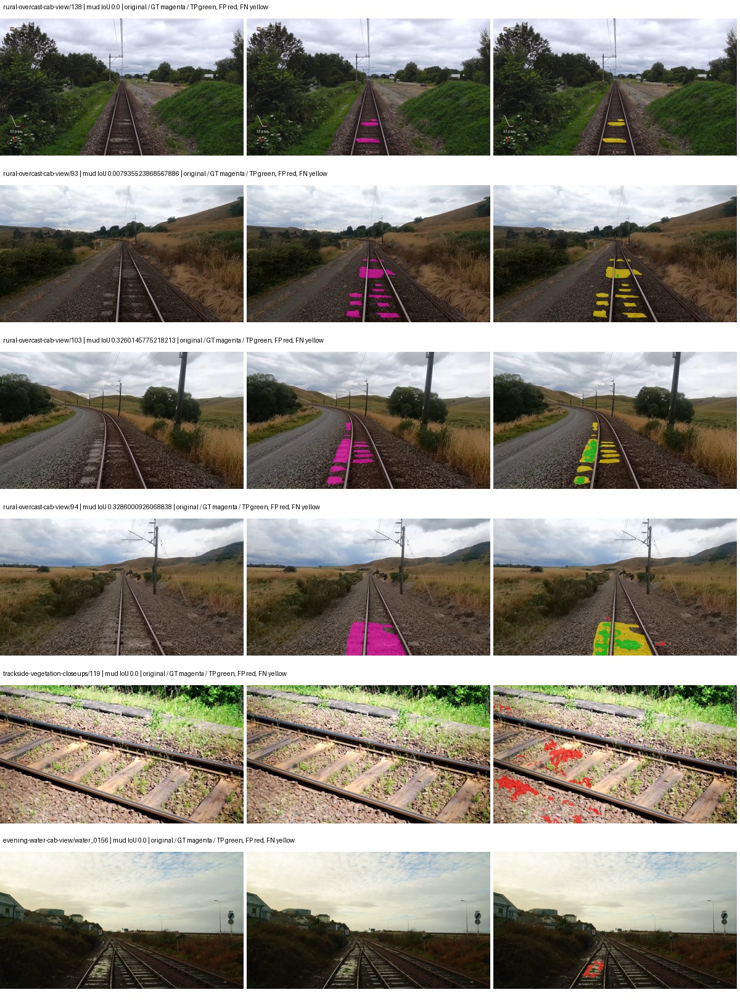

Examples are two lowest and two highest mud-IoU positive images, plus up to two negative images with the most false-positive mud pixels. They are targeted diagnostic examples, not random samples. Green: true positive; red: false positive; yellow: false negative. Full predictions remain on HDRFS.

### Validation tracking

| Logged step | Overall mIoU (%) | Mud IoU (%) |
| --- | --- | --- |
| 254 | 25.23 | 0.54 |
| 508 | 30.45 | 0.85 |
| 763 | 29.85 | 1.38 |
| 1017 | 32.62 | 4.35 |
| 1272 | 35.18 | 5.69 |
| 1527 | 36.42 | 4.60 |
| 1781 | 34.55 | 4.63 |
| 2036 | 35.51 | 2.06 |
| 2290 | 37.05 | 5.73 |
| 2545 | 37.78 | 8.85 |
| 2799 | 36.59 | 5.70 |
| 3054 | 36.40 | 5.20 |
| 3308 | 36.61 | 10.93 |
| 3563 | 38.07 | 6.86 |
| 3817 | 38.36 | 8.53 |
| 4000 | 38.03 | 9.33 |

All retained scalar curves, including training loss and per-class IoU, are in record.json. Observed best mud on a curve is not necessarily a retained checkpoint: the pilot saved its selection-metric-best and final checkpoints. Step logging and checkpoint global_step may differ by one.

### Stopping and checkpoint provenance

```json
{
  "stopping": {
    "actual_steps": 4000,
    "maximum_steps": 4000,
    "min_delta": 0.001,
    "monitor": "val_iou/mud-pumping",
    "patience": 5,
    "reason": "budget_complete"
  },
  "checkpoints": {
    "best": {
      "path": "/data/izadia1/projects/segmentary-runs/paul-test-rtis/mud-fullstats-v1-20260906-r2/future-runs/hf_auto_segformer_b0--railsem19_to_rtis--seed-0_seed0/rtis/best.ckpt",
      "sha256": "699440d4642881589005eb0f78a3fdd22e804a62c01d8322676afd525a8f96cc",
      "global_step": 3309,
      "bytes": 59870157
    },
    "final": {
      "path": "/data/izadia1/projects/segmentary-runs/paul-test-rtis/mud-fullstats-v1-20260906-r2/future-runs/hf_auto_segformer_b0--railsem19_to_rtis--seed-0_seed0/rtis/last.ckpt",
      "sha256": "f90805fee76ebd17fa0f602b49b86bc222fb3c68ddca061d680a6ef507dffd20",
      "global_step": 4000,
      "bytes": 59860237
    }
  },
  "cleanup_error": null
}
```

### Resolved training, initialization and evaluation settings

The optimizer block is the base configuration. Stage LR scales are applied at runtime, and stage warmup is capped at min(base warmup, floor(stage budget / 10), stage budget - 1): 400 steps for this 4,000-step pilot. Model-internal native input grids may differ from augmentation crops (EoMT uses its 640 grid).

```json
{
  "name": "hf_auto_segformer_b0--railsem19_to_rtis--seed-0",
  "model": {
    "arch": "hf_auto",
    "checkpoint": "nvidia/segformer-b0-finetuned-ade-512-512",
    "tuning": "full",
    "head": "unified_head",
    "lora_r": 16,
    "lora_alpha": 32,
    "lora_dropout": 0.05,
    "lora_targets": [],
    "drop_path": null,
    "revision": "489d5cd81a0b59fab9b7ea758d3548ebe99677da",
    "subfolder": null,
    "local_files_only": false,
    "trust_remote_code": false,
    "backbone_path": null,
    "head_paths": [],
    "classifier_path": null,
    "inactive_parameter_paths": [],
    "smp_arch": null,
    "encoder_name": null,
    "encoder_weights": null,
    "native": null,
    "batch_norm_momentum": null
  },
  "space": "paul-test-rtis",
  "taxonomy_root": "/data/izadia1/projects/segmentary-rtis-fullstats-066afb2/taxonomy",
  "output_root": "/data/izadia1/projects/segmentary-runs/paul-test-rtis/mud-fullstats-v1-20260906-r2/future-runs",
  "optim": {
    "backbone_lr": 6e-05,
    "head_lr_mult": 10.0,
    "weight_decay": 0.05,
    "llrd": 1.0,
    "warmup_iters": 1500,
    "warmup_ratio": 1e-06,
    "poly_power": 0.9,
    "min_lr_ratio": 0.0,
    "betas": [
      0.9,
      0.999
    ],
    "grad_clip": 1.0
  },
  "train": {
    "iters": 4000,
    "batch_size": 2,
    "accum": 8,
    "num_workers": 2,
    "precision": "bf16-mixed",
    "ema_decay": 0.9998,
    "val_every": 250,
    "ckpt_every": 500,
    "selection_metric": "val_iou/mud-pumping",
    "early_stopping_patience": 5,
    "early_stopping_min_delta": 0.001,
    "seed": 0,
    "devices": 1
  },
  "eval": {
    "sliding_window": true,
    "window": [
      1024,
      1024
    ],
    "stride": [
      768,
      768
    ],
    "batch_size": 1,
    "num_workers": 2,
    "tta_scales": [],
    "tta_flip": false,
    "threshold": 0.5,
    "boundary_tolerance_frac": 0.0075,
    "save_confusion": true
  },
  "loss": {
    "task": "multiclass",
    "activation": "auto",
    "terms": [],
    "aux": "none",
    "aux_weight": 0.0,
    "ce_weight": 1.0,
    "label_smoothing": 0.0,
    "class_weights": null,
    "query": null
  },
  "aug": {
    "crop": [
      1024,
      1024
    ],
    "scale_min": 0.5,
    "scale_max": 2.0,
    "hflip_p": 0.5,
    "color_jitter_p": 0.5,
    "brightness": 0.25,
    "contrast": 0.25,
    "saturation": 0.25,
    "hue": 0.05
  },
  "stages": [
    {
      "name": "rtis",
      "data": [
        {
          "name": "paul-test-rtis",
          "root": "/data/izadia1/datasets/paul-test-rtis",
          "variant": null,
          "split_file": "splits.json",
          "train_split": "train",
          "val_split": "val",
          "limit": null,
          "loader": "folder",
          "mapping": "paul-test-rtis",
          "loader_options": {
            "require_groups": true
          }
        }
      ],
      "iters": null,
      "lr_scale": 0.1,
      "head_group_lr_scale": 1.0,
      "init_from": "/data/izadia1/projects/segmentary-runs/all-model-city-rail-seed0-rail20-b9eb3e1/jobs/hf_auto_segformer_b0--railsem19--seed-0/attempt-001/train/hf_auto_segformer_b0--railsem19_seed0/railsem19/last.ckpt",
      "reset_head": true,
      "freeze": null,
      "sample_weights": null
    }
  ]
}
```

### Hardware and software provenance

```json
{
  "training": {
    "cuda_available": true,
    "cuda_visible_devices": "7",
    "cudnn": 91900,
    "driver_version": "570.133.20",
    "gpu_count": 1,
    "gpu_names": [
      "NVIDIA L40S"
    ],
    "hostname": "hdrfs-app-001",
    "input_normalization": {
      "channel_order": "rgb",
      "mean": [
        0.485,
        0.456,
        0.406
      ],
      "source": "hf_image_processor",
      "std": [
        0.229,
        0.224,
        0.225
      ]
    },
    "model_origins": [
      {
        "hf_commit": "489d5cd81a0b59fab9b7ea758d3548ebe99677da",
        "hf_name_or_path": "nvidia/segformer-b0-finetuned-ade-512-512",
        "module": "model",
        "timm_pretrained": {}
      },
      {
        "hf_commit": "489d5cd81a0b59fab9b7ea758d3548ebe99677da",
        "hf_name_or_path": "nvidia/segformer-b0-finetuned-ade-512-512",
        "module": "model.segformer",
        "timm_pretrained": {}
      },
      {
        "hf_commit": "489d5cd81a0b59fab9b7ea758d3548ebe99677da",
        "hf_name_or_path": "nvidia/segformer-b0-finetuned-ade-512-512",
        "module": "model.segformer.stages.0.blocks.0.attention",
        "timm_pretrained": {}
      },
      {
        "hf_commit": "489d5cd81a0b59fab9b7ea758d3548ebe99677da",
        "hf_name_or_path": "nvidia/segformer-b0-finetuned-ade-512-512",
        "module": "model.segformer.stages.0.blocks.1.attention",
        "timm_pretrained": {}
      },
      {
        "hf_commit": "489d5cd81a0b59fab9b7ea758d3548ebe99677da",
        "hf_name_or_path": "nvidia/segformer-b0-finetuned-ade-512-512",
        "module": "model.segformer.stages.1.blocks.0.attention",
        "timm_pretrained": {}
      },
      {
        "hf_commit": "489d5cd81a0b59fab9b7ea758d3548ebe99677da",
        "hf_name_or_path": "nvidia/segformer-b0-finetuned-ade-512-512",
        "module": "model.segformer.stages.1.blocks.1.attention",
        "timm_pretrained": {}
      },
      {
        "hf_commit": "489d5cd81a0b59fab9b7ea758d3548ebe99677da",
        "hf_name_or_path": "nvidia/segformer-b0-finetuned-ade-512-512",
        "module": "model.segformer.stages.2.blocks.0.attention",
        "timm_pretrained": {}
      },
      {
        "hf_commit": "489d5cd81a0b59fab9b7ea758d3548ebe99677da",
        "hf_name_or_path": "nvidia/segformer-b0-finetuned-ade-512-512",
        "module": "model.segformer.stages.2.blocks.1.attention",
        "timm_pretrained": {}
      },
      {
        "hf_commit": "489d5cd81a0b59fab9b7ea758d3548ebe99677da",
        "hf_name_or_path": "nvidia/segformer-b0-finetuned-ade-512-512",
        "module": "model.segformer.stages.3.blocks.0.attention",
        "timm_pretrained": {}
      },
      {
        "hf_commit": "489d5cd81a0b59fab9b7ea758d3548ebe99677da",
        "hf_name_or_path": "nvidia/segformer-b0-finetuned-ade-512-512",
        "module": "model.segformer.stages.3.blocks.1.attention",
        "timm_pretrained": {}
      },
      {
        "hf_commit": "489d5cd81a0b59fab9b7ea758d3548ebe99677da",
        "hf_name_or_path": "nvidia/segformer-b0-finetuned-ade-512-512",
        "module": "model.decode_head",
        "timm_pretrained": {}
      }
    ],
    "model_parameter_count": 3719541,
    "packages": {
      "albumentations": "2.0.8",
      "lightning": "2.6.5",
      "numpy": "2.4.4",
      "segmentary": "0.1.0",
      "segmentation-models-pytorch": "0.5.0",
      "timm": "1.0.28",
      "torch": "2.11.0+cu128",
      "torchvision": "0.26.0+cu128",
      "transformers": "5.15.0"
    },
    "platform": "Linux-5.15.0-139-generic-x86_64-with-glibc2.35",
    "python": "3.11.15",
    "torch": "2.11.0+cu128",
    "torch_cuda": "12.8",
    "trainable_parameter_count": 3719541,
    "training_stop": {
      "actual_steps": 4000,
      "maximum_steps": 4000,
      "min_delta": 0.001,
      "monitor": "val_iou/mud-pumping",
      "patience": 5,
      "reason": "budget_complete"
    },
    "validation_weights": "raw"
  },
  "evaluation": {
    "cuda_available": true,
    "cuda_visible_devices": "7",
    "cudnn": 91900,
    "driver_version": "570.133.20",
    "gpu_count": 1,
    "gpu_names": [
      "NVIDIA L40S"
    ],
    "hostname": "hdrfs-app-001",
    "input_normalization": {
      "channel_order": "rgb",
      "mean": [
        0.485,
        0.456,
        0.406
      ],
      "source": "hf_image_processor",
      "std": [
        0.229,
        0.224,
        0.225
      ]
    },
    "packages": {
      "albumentations": "2.0.8",
      "lightning": "2.6.5",
      "numpy": "2.4.4",
      "segmentary": "0.1.0",
      "segmentation-models-pytorch": "0.5.0",
      "timm": "1.0.28",
      "torch": "2.11.0+cu128",
      "torchvision": "0.26.0+cu128",
      "transformers": "5.15.0"
    },
    "platform": "Linux-5.15.0-139-generic-x86_64-with-glibc2.35",
    "python": "3.11.15",
    "torch": "2.11.0+cu128",
    "torch_cuda": "12.8"
  }
}
```

## railsem19_to_rtis — seed 1

Status: **completed**. Started: 2026-09-06T13:28:54.139328+00:00. Finished: 2026-09-06T14:06:45.899243+00:00.

Recipe pretrained initializer: `nvidia/segformer-b0-finetuned-ade-512-512`.

`rtis_only` uses the recipe initializer, which may include pretrained segmentation components. Transfer paths load the exact historical source checkpoint below and reset the classifier; they do not reset all query/decoder features.

Source checkpoint: `{'name': 'hf_auto_segformer_b0--railsem19--seed-0', 'model': 'hf_auto_segformer_b0', 'protocol': 'railsem19', 'config': '/data/izadia1/projects/segmentary-runs/all-model-city-rail-seed0-rail20-b9eb3e1/jobs/hf_auto_segformer_b0--railsem19--seed-0/attempt-001/resolved-config.yaml', 'checkpoint': '/data/izadia1/projects/segmentary-runs/all-model-city-rail-seed0-rail20-b9eb3e1/jobs/hf_auto_segformer_b0--railsem19--seed-0/attempt-001/train/hf_auto_segformer_b0--railsem19_seed0/railsem19/last.ckpt', 'recorded_sha256': '32dc1a1782498981e96d56a57c665fef9cc51ba9285097ecb9ca1feed9368946', 'exists': True}`.

Config SHA-256: `c0d24c17e590b466148ac7b073055b27c1354d766a0446341faf66e9a04de924`. Weights used for validation: `raw`.

### Mud-pumping and aggregate quality

| Metric | Selected checkpoint | Final training validation |
| --- | --- | --- |
| Mud IoU | 10.63 | 8.56 |
| Mud precision | 45.28 | 56.90 |
| Mud recall | 12.20 | 9.16 |
| Mud Dice/F1 | 19.22 | 15.78 |
| mIoU | 35.67 | 37.39 |
| Mean accuracy | 50.36 | 53.54 |
| Mean precision | 55.01 | 54.62 |
| Mean Dice | 45.74 | 47.59 |
| Mean specificity | 99.09 | 99.10 |
| Pixel accuracy | 84.71 | 84.98 |
| Frequency-weighted IoU | 76.53 | 76.53 |
| Fixed GT-present class mIoU | 41.61 | 43.62 |
| Boundary F1 | 43.90 | 44.29 |

The selected checkpoint has independent evaluation evidence. Final values are the trainer's final validation record, not a new independent evaluation. mIoU averages classes with nonzero union, so false positives on absent classes can change its denominator. The fixed GT-class mean is supplementary and excludes absent classes; their false positives remain in the confusion matrix.

### Resource usage and timing

| Measurement | Value |
| --- | --- |
| Peak training VRAM, retained training invocation (GiB) | 7.79 |
| Peak evaluation VRAM (GiB) | 7.03 |
| Retained training invocation wall time (seconds) | 2138.41 |
| Retained training invocation GPU-hours (one GPU) | 0.59 |
| Evaluation wall time (seconds) | 13.12 |
| Full evaluation pipeline images/second | 2.82 |
| Best full-state checkpoint (MiB) | 57.10 |
| Final full-state checkpoint (MiB) | 57.09 |
| Audited periodic checkpoints removed (GiB) | 0.39 |

VRAM uses the recorded allocator high-water mark; it is not total device usage including CUDA context. Resumed jobs' retained training invocation times and peaks are **not whole-campaign totals**. Earlier invocation resource records are not reconstructed here. Evaluation throughput includes loader, sliding-window inference and metrics; it is not model-only latency/FPS. Missing measurements are shown as —, never inferred from another dataset's run.

### Standardized inference performance

Dedicated model-only profiling waits for an idle worker-locked L40S: BF16, batch 1, 1024x1024, 20 warmup and 100 CUDA-event-timed public forwards. It excludes loading, preprocessing, tiling and metrics.

| Status | Parameters | Weight MiB | FPS | p50 ms | p95 ms | Peak reserved GiB |
| --- | --- | --- | --- | --- | --- | --- |
| complete | 3719541 | 14.19 | 132.19 | 7.42 | 8.23 | 0.89 |

```json
{
  "schema_version": 1,
  "model_id": "hf_auto_segformer_b0",
  "measured_at": "2026-09-06T14:06:43+00:00",
  "status": "complete",
  "benchmark_scope": "rtis_selected_checkpoint_model_only",
  "applies_to": [
    "hf_auto_segformer_b0--railsem19_to_rtis--seed-1"
  ],
  "source": {
    "campaign_git_sha": "066afb2626398b7be59d4d19f5a0e4644fd59adc",
    "git_dirty": false,
    "config_hash": "0cd99ff99acf",
    "resolved_config": "/data/izadia1/projects/segmentary-runs/paul-test-rtis/mud-fullstats-v1-20260906-r2/configs/hf_auto_segformer_b0--railsem19_to_rtis--seed-1.yaml",
    "config_sha256": "c0d24c17e590b466148ac7b073055b27c1354d766a0446341faf66e9a04de924",
    "checkpoint_sha256": "266428e11240ae6f17f63c63be3a8b4133f05de7af252d4a76f9adb957cd8b55",
    "checkpoint_global_step": 2290,
    "checkpoint_bytes": 59870157,
    "checkpoint_kind": "resume checkpoint with optimizer and EMA state",
    "weights": "raw",
    "measured_checkpoint_job_id": "hf_auto_segformer_b0--railsem19_to_rtis--seed-1",
    "result_sha256": "ad80ca47aba354e6eb231c7a65f35a0a089a5e65736b6bc1925b39301559f126",
    "result_git_sha": "066afb2626398b7be59d4d19f5a0e4644fd59adc",
    "result_stage": "eval:paul-test-rtis:val",
    "result_seed": 1
  },
  "hardware": {
    "gpu_name": "NVIDIA L40S",
    "gpu_uuid": "GPU-fc5dde96-210d-0afa-ac74-7f88477d622b",
    "logical_device": "cuda:0",
    "physical_visibility_token": "4",
    "compute_capability": [
      8,
      9
    ],
    "total_memory_bytes": 47677177856
  },
  "model": {
    "parameter_count": 3719541,
    "trainable_parameter_count": 3719541,
    "resident_parameter_bytes": 14878164,
    "parameter_dtype_counts": {
      "float32": 3719541
    }
  },
  "contract": {
    "backend": "pytorch",
    "precision": "bf16_autocast",
    "batch_size": 1,
    "input_shape_nchw": [
      1,
      3,
      1024,
      1024
    ],
    "warmup_iterations": 20,
    "measured_iterations": 100,
    "timing": "per-forward CUDA events with end-event synchronization",
    "includes_preprocessing": false,
    "includes_data_loader": false,
    "includes_sliding_window": false,
    "input_resident_on_gpu": true,
    "model_only": true,
    "entrypoint": "public model(image) dense-logits forward"
  },
  "measurements": {
    "latency": {
      "p50_ms": 7.424511909484863,
      "p95_ms": 8.233697605133056,
      "mean_ms": 7.565131812095642,
      "minimum_ms": 7.264256000518799,
      "maximum_ms": 9.085951805114746,
      "fps": 132.1854033529373,
      "raw_ms": [
        7.517183780670166,
        7.3369598388671875,
        7.980031967163086,
        7.6175360679626465,
        7.299071788787842,
        7.273471832275391,
        7.414783954620361,
        7.460864067077637,
        7.503871917724609,
        7.333888053894043,
        7.355391979217529,
        7.328767776489258,
        7.269375801086426,
        7.905280113220215,
        7.689087867736816,
        7.353343963623047,
        7.292928218841553,
        7.463935852050781,
        7.649184226989746,
        7.621632099151611,
        7.593984127044678,
        7.349247932434082,
        9.085951805114746,
        7.9585280418396,
        7.675903797149658,
        8.267775535583496,
        7.4496002197265625,
        7.345056056976318,
        7.311359882354736,
        7.35641622543335,
        7.299071788787842,
        7.266304016113281,
        7.513088226318359,
        7.762944221496582,
        7.343103885650635,
        7.707647800445557,
        7.914495944976807,
        7.301055908203125,
        7.287807941436768,
        7.29088020324707,
        8.2227201461792,
        7.334911823272705,
        7.3512959480285645,
        7.643136024475098,
        8.30463981628418,
        7.4260478019714355,
        7.625631809234619,
        7.294976234436035,
        7.264256000518799,
        7.9431681632995605,
        7.422976016998291,
        7.3809919357299805,
        8.186880111694336,
        7.861248016357422,
        7.313407897949219,
        7.283711910247803,
        7.291903972625732,
        7.3461761474609375,
        7.288832187652588,
        8.20633602142334,
        8.410207748413086,
        7.533567905426025,
        7.573408126831055,
        7.6472320556640625,
        7.862271785736084,
        7.345151901245117,
        7.282688140869141,
        7.278592109680176,
        7.3369598388671875,
        7.683072090148926,
        8.231904029846191,
        7.846911907196045,
        7.826432228088379,
        7.30515193939209,
        7.357471942901611,
        7.3164801597595215,
        7.283711910247803,
        7.274496078491211,
        7.267327785491943,
        7.535615921020508,
        8.438783645629883,
        8.09779167175293,
        7.769087791442871,
        7.4352641105651855,
        7.675903797149658,
        7.301119804382324,
        7.282688140869141,
        7.304192066192627,
        7.325695991516113,
        7.748608112335205,
        7.643136024475098,
        8.09779167175293,
        7.3369598388671875,
        7.325695991516113,
        7.278592109680176,
        7.278592109680176,
        7.906303882598877,
        7.3051838874816895,
        7.462912082672119,
        7.560160160064697
      ],
      "percentile_method": "numpy linear interpolation"
    },
    "peak_reserved_bytes": 960495616,
    "memory_kind": "pytorch_cuda_allocator_peak_reserved_excluding_context",
    "benchmark_wall_clock_s": 4.45641028881073
  },
  "started_at": "2026-09-06T14:06:39+00:00",
  "finished_at": "2026-09-06T14:06:43+00:00",
  "environment": {
    "hostname": "hdrfs-app-001",
    "python": "3.11.15",
    "platform": "Linux-5.15.0-139-generic-x86_64-with-glibc2.35",
    "torch": "2.11.0+cu128",
    "torch_cuda": "12.8",
    "cudnn": 91900,
    "driver_version": "570.133.20",
    "cuda_available": true,
    "gpu_count": 1,
    "gpu_names": [
      "NVIDIA L40S"
    ],
    "cuda_visible_devices": "4",
    "packages": {
      "segmentary": "0.1.0",
      "torch": "2.11.0+cu128",
      "torchvision": "0.26.0+cu128",
      "transformers": "5.15.0",
      "timm": "1.0.28",
      "segmentation-models-pytorch": "0.5.0",
      "albumentations": "2.0.8",
      "lightning": "2.6.5",
      "numpy": "2.4.4"
    }
  }
}
```

### Per-class validation results

| Class | GT pixels | IoU (%) | Precision (%) | Recall (%) | Dice (%) | Boundary F1 (%) |
| --- | --- | --- | --- | --- | --- | --- |
| car | 29664 | 13.65 | 52.03 | 15.62 | 24.03 | 52.78 |
| construction | 311585 | 62.67 | 74.96 | 79.26 | 77.05 | 73.43 |
| fence | 265137 | 11.80 | 19.45 | 23.07 | 21.10 | 23.96 |
| mud-pumping | 1226250 | 10.63 | 45.28 | 12.20 | 19.22 | 28.20 |
| on-rails | 0 | 0.00 | 0.00 | — | 0.00 | 0.00 |
| person | 0 | 0.00 | 0.00 | — | 0.00 | 0.00 |
| pole | 628038 | 70.97 | 83.23 | 82.80 | 83.02 | 90.91 |
| rail-embedded | 16799 | 38.72 | 87.63 | 40.96 | 55.83 | 62.61 |
| rail-raised | 2969797 | 72.18 | 87.38 | 80.58 | 83.84 | 91.17 |
| rail-track | 6323197 | 38.38 | 75.78 | 43.75 | 55.47 | 47.88 |
| road | 1048831 | 7.36 | 25.64 | 9.35 | 13.70 | 17.88 |
| sidewalk | 1297367 | 43.17 | 77.71 | 49.28 | 60.31 | 13.10 |
| sky | 19121606 | 98.68 | 99.24 | 99.43 | 99.33 | 97.10 |
| standing-water | 95802 | 0.43 | 0.46 | 6.56 | 0.87 | 2.39 |
| terrain | 39239306 | 89.63 | 92.58 | 96.57 | 94.53 | 69.56 |
| trackbed | 10643081 | 54.37 | 60.25 | 84.77 | 70.44 | 53.96 |
| traffic-light | 19510 | 27.81 | 92.74 | 28.43 | 43.52 | 35.24 |
| traffic-sign | 13285 | 26.89 | 54.33 | 34.75 | 42.39 | 58.70 |
| tram-track | 56179 | 41.07 | 48.27 | 73.35 | 58.22 | 37.58 |
| truck | 0 | 0.00 | 0.00 | — | 0.00 | 0.00 |
| vegetation-overgrowth | 5901821 | 40.57 | 78.34 | 45.70 | 57.72 | 65.53 |

### Full-run accounting

| Measurement | Value |
| --- | --- |
| Full GPU-reserved wall seconds, all recorded worker attempts | 2271.87 |
| Full reserved GPU-hours | 0.63 |
| Whole-run timing complete | True |

| Phase | Wall seconds including failed attempts |
| --- | --- |
| training | 2145.44 |
| diagnostics | 94.48 |
| performance | 11.24 |

GPU-reserved time includes model loading, training, validation, collection, profiling, checkpoint I/O and orchestration while the worker owns one GPU. It is not GPU kernel-active time. Phase timings and sampled device memory/power/utilization are retained separately; sampled device memory is not the allocator high-water mark.

### Train/validation and raw/EMA diagnostics

| Checkpoint / weights / split | Images | Mud IoU (%) | Mud precision (%) | Mud recall (%) |
| --- | --- | --- | --- | --- |
| best-auto-train / raw | 220 | 91.11 | 95.13 | 95.56 |
| best-auto-val / raw | 37 | 10.63 | 45.28 | 12.20 |
| best-alternate-val / ema | 37 | 5.04 | 33.23 | 5.61 |
| final-auto-val / raw | 37 | 8.56 | 56.83 | 9.15 |

Train uses the evaluation transform without augmentation. Compare mud train/validation metrics for the same selected weights. Alternate EMA on running-stat BatchNorm is explicitly uncalibrated and is diagnostic only. Score-threshold curves use uncalibrated normalized scores and are pixel-level diagnostics, not event detection rates or a selected deployment operating point.

### Downloadable evidence

- best-auto-train: [per-image.csv](railsem19_to_rtis--seed-1/best-auto-train/per-image.csv) · [per-image-confusion.json.gz](railsem19_to_rtis--seed-1/best-auto-train/per-image-confusion.json.gz) · [groups.json](railsem19_to_rtis--seed-1/best-auto-train/groups.json) · [mud-score-curves.json](railsem19_to_rtis--seed-1/best-auto-train/mud-score-curves.json)
- best-auto-val: [per-image.csv](railsem19_to_rtis--seed-1/best-auto-val/per-image.csv) · [per-image-confusion.json.gz](railsem19_to_rtis--seed-1/best-auto-val/per-image-confusion.json.gz) · [groups.json](railsem19_to_rtis--seed-1/best-auto-val/groups.json) · [mud-score-curves.json](railsem19_to_rtis--seed-1/best-auto-val/mud-score-curves.json) · [examples.jpg](railsem19_to_rtis--seed-1/best-auto-val/examples.jpg)
- best-alternate-val: [per-image.csv](railsem19_to_rtis--seed-1/best-alternate-val/per-image.csv) · [per-image-confusion.json.gz](railsem19_to_rtis--seed-1/best-alternate-val/per-image-confusion.json.gz) · [groups.json](railsem19_to_rtis--seed-1/best-alternate-val/groups.json) · [mud-score-curves.json](railsem19_to_rtis--seed-1/best-alternate-val/mud-score-curves.json)
- final-auto-val: [per-image.csv](railsem19_to_rtis--seed-1/final-auto-val/per-image.csv) · [per-image-confusion.json.gz](railsem19_to_rtis--seed-1/final-auto-val/per-image-confusion.json.gz) · [groups.json](railsem19_to_rtis--seed-1/final-auto-val/groups.json) · [mud-score-curves.json](railsem19_to_rtis--seed-1/final-auto-val/mud-score-curves.json)
- resources: [telemetry.csv](railsem19_to_rtis--seed-1/resources/telemetry.csv)

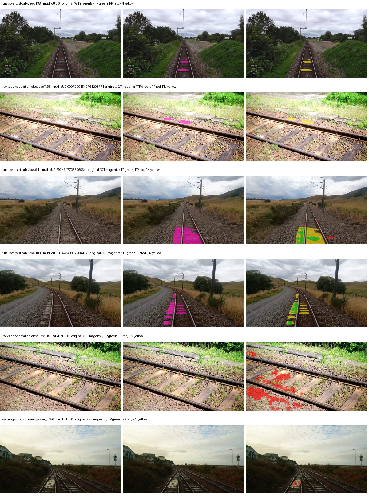

Examples are two lowest and two highest mud-IoU positive images, plus up to two negative images with the most false-positive mud pixels. They are targeted diagnostic examples, not random samples. Green: true positive; red: false positive; yellow: false negative. Full predictions remain on HDRFS.

### Validation tracking

| Logged step | Overall mIoU (%) | Mud IoU (%) |
| --- | --- | --- |
| 254 | 23.99 | 0.67 |
| 508 | 30.95 | 3.20 |
| 763 | 29.55 | 1.58 |
| 1017 | 30.47 | 5.60 |
| 1272 | 31.99 | 6.80 |
| 1527 | 33.32 | 2.38 |
| 1781 | 34.52 | 3.35 |
| 2036 | 34.42 | 7.83 |
| 2290 | 35.69 | 10.63 |
| 2545 | 36.44 | 9.37 |
| 2799 | 35.11 | 7.43 |
| 3054 | 36.21 | 8.29 |
| 3308 | 36.41 | 6.36 |
| 3563 | 37.39 | 8.56 |

All retained scalar curves, including training loss and per-class IoU, are in record.json. Observed best mud on a curve is not necessarily a retained checkpoint: the pilot saved its selection-metric-best and final checkpoints. Step logging and checkpoint global_step may differ by one.

### Stopping and checkpoint provenance

```json
{
  "stopping": {
    "actual_steps": 3563,
    "maximum_steps": 4000,
    "min_delta": 0.001,
    "monitor": "val_iou/mud-pumping",
    "patience": 5,
    "reason": "validation_plateau"
  },
  "checkpoints": {
    "best": {
      "path": "/data/izadia1/projects/segmentary-runs/paul-test-rtis/mud-fullstats-v1-20260906-r2/future-runs/hf_auto_segformer_b0--railsem19_to_rtis--seed-1_seed1/rtis/best.ckpt",
      "sha256": "266428e11240ae6f17f63c63be3a8b4133f05de7af252d4a76f9adb957cd8b55",
      "global_step": 2290,
      "bytes": 59870157
    },
    "final": {
      "path": "/data/izadia1/projects/segmentary-runs/paul-test-rtis/mud-fullstats-v1-20260906-r2/future-runs/hf_auto_segformer_b0--railsem19_to_rtis--seed-1_seed1/rtis/last.ckpt",
      "sha256": "b01573b97392396e36fab06ee90acde63ddbcdd438bbfba7f7c2159eac23cf83",
      "global_step": 3563,
      "bytes": 59860365
    }
  },
  "cleanup_error": null
}
```

### Resolved training, initialization and evaluation settings

The optimizer block is the base configuration. Stage LR scales are applied at runtime, and stage warmup is capped at min(base warmup, floor(stage budget / 10), stage budget - 1): 400 steps for this 4,000-step pilot. Model-internal native input grids may differ from augmentation crops (EoMT uses its 640 grid).

```json
{
  "name": "hf_auto_segformer_b0--railsem19_to_rtis--seed-1",
  "model": {
    "arch": "hf_auto",
    "checkpoint": "nvidia/segformer-b0-finetuned-ade-512-512",
    "tuning": "full",
    "head": "unified_head",
    "lora_r": 16,
    "lora_alpha": 32,
    "lora_dropout": 0.05,
    "lora_targets": [],
    "drop_path": null,
    "revision": "489d5cd81a0b59fab9b7ea758d3548ebe99677da",
    "subfolder": null,
    "local_files_only": false,
    "trust_remote_code": false,
    "backbone_path": null,
    "head_paths": [],
    "classifier_path": null,
    "inactive_parameter_paths": [],
    "smp_arch": null,
    "encoder_name": null,
    "encoder_weights": null,
    "native": null,
    "batch_norm_momentum": null
  },
  "space": "paul-test-rtis",
  "taxonomy_root": "/data/izadia1/projects/segmentary-rtis-fullstats-066afb2/taxonomy",
  "output_root": "/data/izadia1/projects/segmentary-runs/paul-test-rtis/mud-fullstats-v1-20260906-r2/future-runs",
  "optim": {
    "backbone_lr": 6e-05,
    "head_lr_mult": 10.0,
    "weight_decay": 0.05,
    "llrd": 1.0,
    "warmup_iters": 1500,
    "warmup_ratio": 1e-06,
    "poly_power": 0.9,
    "min_lr_ratio": 0.0,
    "betas": [
      0.9,
      0.999
    ],
    "grad_clip": 1.0
  },
  "train": {
    "iters": 4000,
    "batch_size": 2,
    "accum": 8,
    "num_workers": 2,
    "precision": "bf16-mixed",
    "ema_decay": 0.9998,
    "val_every": 250,
    "ckpt_every": 500,
    "selection_metric": "val_iou/mud-pumping",
    "early_stopping_patience": 5,
    "early_stopping_min_delta": 0.001,
    "seed": 1,
    "devices": 1
  },
  "eval": {
    "sliding_window": true,
    "window": [
      1024,
      1024
    ],
    "stride": [
      768,
      768
    ],
    "batch_size": 1,
    "num_workers": 2,
    "tta_scales": [],
    "tta_flip": false,
    "threshold": 0.5,
    "boundary_tolerance_frac": 0.0075,
    "save_confusion": true
  },
  "loss": {
    "task": "multiclass",
    "activation": "auto",
    "terms": [],
    "aux": "none",
    "aux_weight": 0.0,
    "ce_weight": 1.0,
    "label_smoothing": 0.0,
    "class_weights": null,
    "query": null
  },
  "aug": {
    "crop": [
      1024,
      1024
    ],
    "scale_min": 0.5,
    "scale_max": 2.0,
    "hflip_p": 0.5,
    "color_jitter_p": 0.5,
    "brightness": 0.25,
    "contrast": 0.25,
    "saturation": 0.25,
    "hue": 0.05
  },
  "stages": [
    {
      "name": "rtis",
      "data": [
        {
          "name": "paul-test-rtis",
          "root": "/data/izadia1/datasets/paul-test-rtis",
          "variant": null,
          "split_file": "splits.json",
          "train_split": "train",
          "val_split": "val",
          "limit": null,
          "loader": "folder",
          "mapping": "paul-test-rtis",
          "loader_options": {
            "require_groups": true
          }
        }
      ],
      "iters": null,
      "lr_scale": 0.1,
      "head_group_lr_scale": 1.0,
      "init_from": "/data/izadia1/projects/segmentary-runs/all-model-city-rail-seed0-rail20-b9eb3e1/jobs/hf_auto_segformer_b0--railsem19--seed-0/attempt-001/train/hf_auto_segformer_b0--railsem19_seed0/railsem19/last.ckpt",
      "reset_head": true,
      "freeze": null,
      "sample_weights": null
    }
  ]
}
```

### Hardware and software provenance

```json
{
  "training": {
    "cuda_available": true,
    "cuda_visible_devices": "4",
    "cudnn": 91900,
    "driver_version": "570.133.20",
    "gpu_count": 1,
    "gpu_names": [
      "NVIDIA L40S"
    ],
    "hostname": "hdrfs-app-001",
    "input_normalization": {
      "channel_order": "rgb",
      "mean": [
        0.485,
        0.456,
        0.406
      ],
      "source": "hf_image_processor",
      "std": [
        0.229,
        0.224,
        0.225
      ]
    },
    "model_origins": [
      {
        "hf_commit": "489d5cd81a0b59fab9b7ea758d3548ebe99677da",
        "hf_name_or_path": "nvidia/segformer-b0-finetuned-ade-512-512",
        "module": "model",
        "timm_pretrained": {}
      },
      {
        "hf_commit": "489d5cd81a0b59fab9b7ea758d3548ebe99677da",
        "hf_name_or_path": "nvidia/segformer-b0-finetuned-ade-512-512",
        "module": "model.segformer",
        "timm_pretrained": {}
      },
      {
        "hf_commit": "489d5cd81a0b59fab9b7ea758d3548ebe99677da",
        "hf_name_or_path": "nvidia/segformer-b0-finetuned-ade-512-512",
        "module": "model.segformer.stages.0.blocks.0.attention",
        "timm_pretrained": {}
      },
      {
        "hf_commit": "489d5cd81a0b59fab9b7ea758d3548ebe99677da",
        "hf_name_or_path": "nvidia/segformer-b0-finetuned-ade-512-512",
        "module": "model.segformer.stages.0.blocks.1.attention",
        "timm_pretrained": {}
      },
      {
        "hf_commit": "489d5cd81a0b59fab9b7ea758d3548ebe99677da",
        "hf_name_or_path": "nvidia/segformer-b0-finetuned-ade-512-512",
        "module": "model.segformer.stages.1.blocks.0.attention",
        "timm_pretrained": {}
      },
      {
        "hf_commit": "489d5cd81a0b59fab9b7ea758d3548ebe99677da",
        "hf_name_or_path": "nvidia/segformer-b0-finetuned-ade-512-512",
        "module": "model.segformer.stages.1.blocks.1.attention",
        "timm_pretrained": {}
      },
      {
        "hf_commit": "489d5cd81a0b59fab9b7ea758d3548ebe99677da",
        "hf_name_or_path": "nvidia/segformer-b0-finetuned-ade-512-512",
        "module": "model.segformer.stages.2.blocks.0.attention",
        "timm_pretrained": {}
      },
      {
        "hf_commit": "489d5cd81a0b59fab9b7ea758d3548ebe99677da",
        "hf_name_or_path": "nvidia/segformer-b0-finetuned-ade-512-512",
        "module": "model.segformer.stages.2.blocks.1.attention",
        "timm_pretrained": {}
      },
      {
        "hf_commit": "489d5cd81a0b59fab9b7ea758d3548ebe99677da",
        "hf_name_or_path": "nvidia/segformer-b0-finetuned-ade-512-512",
        "module": "model.segformer.stages.3.blocks.0.attention",
        "timm_pretrained": {}
      },
      {
        "hf_commit": "489d5cd81a0b59fab9b7ea758d3548ebe99677da",
        "hf_name_or_path": "nvidia/segformer-b0-finetuned-ade-512-512",
        "module": "model.segformer.stages.3.blocks.1.attention",
        "timm_pretrained": {}
      },
      {
        "hf_commit": "489d5cd81a0b59fab9b7ea758d3548ebe99677da",
        "hf_name_or_path": "nvidia/segformer-b0-finetuned-ade-512-512",
        "module": "model.decode_head",
        "timm_pretrained": {}
      }
    ],
    "model_parameter_count": 3719541,
    "packages": {
      "albumentations": "2.0.8",
      "lightning": "2.6.5",
      "numpy": "2.4.4",
      "segmentary": "0.1.0",
      "segmentation-models-pytorch": "0.5.0",
      "timm": "1.0.28",
      "torch": "2.11.0+cu128",
      "torchvision": "0.26.0+cu128",
      "transformers": "5.15.0"
    },
    "platform": "Linux-5.15.0-139-generic-x86_64-with-glibc2.35",
    "python": "3.11.15",
    "torch": "2.11.0+cu128",
    "torch_cuda": "12.8",
    "trainable_parameter_count": 3719541,
    "training_stop": {
      "actual_steps": 3563,
      "maximum_steps": 4000,
      "min_delta": 0.001,
      "monitor": "val_iou/mud-pumping",
      "patience": 5,
      "reason": "validation_plateau"
    },
    "validation_weights": "raw"
  },
  "evaluation": {
    "cuda_available": true,
    "cuda_visible_devices": "4",
    "cudnn": 91900,
    "driver_version": "570.133.20",
    "gpu_count": 1,
    "gpu_names": [
      "NVIDIA L40S"
    ],
    "hostname": "hdrfs-app-001",
    "input_normalization": {
      "channel_order": "rgb",
      "mean": [
        0.485,
        0.456,
        0.406
      ],
      "source": "hf_image_processor",
      "std": [
        0.229,
        0.224,
        0.225
      ]
    },
    "packages": {
      "albumentations": "2.0.8",
      "lightning": "2.6.5",
      "numpy": "2.4.4",
      "segmentary": "0.1.0",
      "segmentation-models-pytorch": "0.5.0",
      "timm": "1.0.28",
      "torch": "2.11.0+cu128",
      "torchvision": "0.26.0+cu128",
      "transformers": "5.15.0"
    },
    "platform": "Linux-5.15.0-139-generic-x86_64-with-glibc2.35",
    "python": "3.11.15",
    "torch": "2.11.0+cu128",
    "torch_cuda": "12.8"
  }
}
```

## railsem19_to_rtis — seed 2

Status: **completed**. Started: 2026-09-06T13:30:22.115167+00:00. Finished: 2026-09-06T13:55:38.819491+00:00.

Recipe pretrained initializer: `nvidia/segformer-b0-finetuned-ade-512-512`.

`rtis_only` uses the recipe initializer, which may include pretrained segmentation components. Transfer paths load the exact historical source checkpoint below and reset the classifier; they do not reset all query/decoder features.

Source checkpoint: `{'name': 'hf_auto_segformer_b0--railsem19--seed-0', 'model': 'hf_auto_segformer_b0', 'protocol': 'railsem19', 'config': '/data/izadia1/projects/segmentary-runs/all-model-city-rail-seed0-rail20-b9eb3e1/jobs/hf_auto_segformer_b0--railsem19--seed-0/attempt-001/resolved-config.yaml', 'checkpoint': '/data/izadia1/projects/segmentary-runs/all-model-city-rail-seed0-rail20-b9eb3e1/jobs/hf_auto_segformer_b0--railsem19--seed-0/attempt-001/train/hf_auto_segformer_b0--railsem19_seed0/railsem19/last.ckpt', 'recorded_sha256': '32dc1a1782498981e96d56a57c665fef9cc51ba9285097ecb9ca1feed9368946', 'exists': True}`.

Config SHA-256: `cacd7b1c78913ffd2b1663d8cb14119863cf2ec989f3abb708f07e6287009d6c`. Weights used for validation: `raw`.

### Mud-pumping and aggregate quality

| Metric | Selected checkpoint | Final training validation |
| --- | --- | --- |
| Mud IoU | 9.23 | 5.18 |
| Mud precision | 17.75 | 18.10 |
| Mud recall | 16.12 | 6.77 |
| Mud Dice/F1 | 16.90 | 9.85 |
| mIoU | 32.50 | 39.65 |
| Mean accuracy | 44.60 | 52.50 |
| Mean precision | 47.83 | 58.02 |
| Mean Dice | 40.52 | 50.20 |
| Mean specificity | 99.10 | 99.11 |
| Pixel accuracy | 84.73 | 85.19 |
| Frequency-weighted IoU | 76.67 | 77.03 |
| Fixed GT-present class mIoU | 36.11 | 44.06 |
| Boundary F1 | 37.04 | 48.41 |

The selected checkpoint has independent evaluation evidence. Final values are the trainer's final validation record, not a new independent evaluation. mIoU averages classes with nonzero union, so false positives on absent classes can change its denominator. The fixed GT-class mean is supplementary and excludes absent classes; their false positives remain in the confusion matrix.

### Resource usage and timing

| Measurement | Value |
| --- | --- |
| Peak training VRAM, retained training invocation (GiB) | 7.79 |
| Peak evaluation VRAM (GiB) | 7.03 |
| Retained training invocation wall time (seconds) | 1381.76 |
| Retained training invocation GPU-hours (one GPU) | 0.38 |
| Evaluation wall time (seconds) | 13.36 |
| Full evaluation pipeline images/second | 2.77 |
| Best full-state checkpoint (MiB) | 57.10 |
| Final full-state checkpoint (MiB) | 57.09 |
| Audited periodic checkpoints removed (GiB) | 0.22 |

VRAM uses the recorded allocator high-water mark; it is not total device usage including CUDA context. Resumed jobs' retained training invocation times and peaks are **not whole-campaign totals**. Earlier invocation resource records are not reconstructed here. Evaluation throughput includes loader, sliding-window inference and metrics; it is not model-only latency/FPS. Missing measurements are shown as —, never inferred from another dataset's run.

### Standardized inference performance

Dedicated model-only profiling waits for an idle worker-locked L40S: BF16, batch 1, 1024x1024, 20 warmup and 100 CUDA-event-timed public forwards. It excludes loading, preprocessing, tiling and metrics.

| Status | Parameters | Weight MiB | FPS | p50 ms | p95 ms | Peak reserved GiB |
| --- | --- | --- | --- | --- | --- | --- |
| complete | 3719541 | 14.19 | 132.36 | 7.32 | 8.58 | 0.89 |

```json
{
  "schema_version": 1,
  "model_id": "hf_auto_segformer_b0",
  "measured_at": "2026-09-06T13:55:36+00:00",
  "status": "complete",
  "benchmark_scope": "rtis_selected_checkpoint_model_only",
  "applies_to": [
    "hf_auto_segformer_b0--railsem19_to_rtis--seed-2"
  ],
  "source": {
    "campaign_git_sha": "066afb2626398b7be59d4d19f5a0e4644fd59adc",
    "git_dirty": false,
    "config_hash": "e8f9eecb2782",
    "resolved_config": "/data/izadia1/projects/segmentary-runs/paul-test-rtis/mud-fullstats-v1-20260906-r2/configs/hf_auto_segformer_b0--railsem19_to_rtis--seed-2.yaml",
    "config_sha256": "cacd7b1c78913ffd2b1663d8cb14119863cf2ec989f3abb708f07e6287009d6c",
    "checkpoint_sha256": "3305046f099dab9c2efa1200e381bcae850d9c438a4341ec2a96987199b09c40",
    "checkpoint_global_step": 1018,
    "checkpoint_bytes": 59870157,
    "checkpoint_kind": "resume checkpoint with optimizer and EMA state",
    "weights": "raw",
    "measured_checkpoint_job_id": "hf_auto_segformer_b0--railsem19_to_rtis--seed-2",
    "result_sha256": "0c0988f12c461e57493b946025a12687b6e9b1638c7f4b06f6c0352bcebae837",
    "result_git_sha": "066afb2626398b7be59d4d19f5a0e4644fd59adc",
    "result_stage": "eval:paul-test-rtis:val",
    "result_seed": 2
  },
  "hardware": {
    "gpu_name": "NVIDIA L40S",
    "gpu_uuid": "GPU-e2e96741-aec9-e90b-5c46-d0d58be90a56",
    "logical_device": "cuda:0",
    "physical_visibility_token": "8",
    "compute_capability": [
      8,
      9
    ],
    "total_memory_bytes": 47677177856
  },
  "model": {
    "parameter_count": 3719541,
    "trainable_parameter_count": 3719541,
    "resident_parameter_bytes": 14878164,
    "parameter_dtype_counts": {
      "float32": 3719541
    }
  },
  "contract": {
    "backend": "pytorch",
    "precision": "bf16_autocast",
    "batch_size": 1,
    "input_shape_nchw": [
      1,
      3,
      1024,
      1024
    ],
    "warmup_iterations": 20,
    "measured_iterations": 100,
    "timing": "per-forward CUDA events with end-event synchronization",
    "includes_preprocessing": false,
    "includes_data_loader": false,
    "includes_sliding_window": false,
    "input_resident_on_gpu": true,
    "model_only": true,
    "entrypoint": "public model(image) dense-logits forward"
  },
  "measurements": {
    "latency": {
      "p50_ms": 7.324672222137451,
      "p95_ms": 8.576512145996093,
      "mean_ms": 7.555328664779663,
      "minimum_ms": 7.135231971740723,
      "maximum_ms": 9.920512199401855,
      "fps": 132.35691580985156,
      "raw_ms": [
        8.751104354858398,
        7.383039951324463,
        7.362559795379639,
        7.262207984924316,
        7.2130560874938965,
        7.217152118682861,
        7.172095775604248,
        7.204864025115967,
        7.19155216217041,
        7.350272178649902,
        7.322624206542969,
        7.890944004058838,
        7.8438401222229,
        7.99948787689209,
        7.480319976806641,
        7.341055870056152,
        7.223296165466309,
        7.305215835571289,
        7.227392196655273,
        7.185408115386963,
        7.163904190063477,
        7.53766393661499,
        7.294976234436035,
        7.520256042480469,
        7.557119846343994,
        8.434687614440918,
        7.8837761878967285,
        7.244863986968994,
        7.311359882354736,
        7.818240165710449,
        7.879680156707764,
        7.567359924316406,
        7.18233585357666,
        7.148543834686279,
        7.195648193359375,
        7.222271919250488,
        7.275519847869873,
        7.218175888061523,
        7.223296165466309,
        7.164927959442139,
        7.164927959442139,
        7.185408115386963,
        7.265247821807861,
        7.301152229309082,
        7.181312084197998,
        7.619584083557129,
        7.808000087738037,
        7.178239822387695,
        7.230463981628418,
        7.1444478034973145,
        7.326720237731934,
        7.7608962059021,
        7.208960056304932,
        7.165952205657959,
        7.250944137573242,
        7.168000221252441,
        7.24889612197876,
        7.598080158233643,
        7.364607810974121,
        7.236608028411865,
        7.135231971740723,
        7.178239822387695,
        7.432191848754883,
        7.469056129455566,
        8.236031532287598,
        7.457791805267334,
        7.29088020324707,
        7.221248149871826,
        7.236608028411865,
        7.254015922546387,
        7.212031841278076,
        8.741888046264648,
        8.123392105102539,
        7.8397440910339355,
        7.524352073669434,
        7.299071788787842,
        8.060928344726562,
        8.056832313537598,
        7.4967041015625,
        8.567808151245117,
        9.920512199401855,
        8.741888046264648,
        9.390080451965332,
        8.125439643859863,
        7.754752159118652,
        7.249919891357422,
        7.2478718757629395,
        7.685120105743408,
        7.288832187652588,
        7.146495819091797,
        7.349247932434082,
        8.310784339904785,
        8.2042875289917,
        7.4844160079956055,
        7.24889612197876,
        7.575551986694336,
        7.672832012176514,
        8.085503578186035,
        8.251392364501953,
        7.784448146820068
      ],
      "percentile_method": "numpy linear interpolation"
    },
    "peak_reserved_bytes": 960495616,
    "memory_kind": "pytorch_cuda_allocator_peak_reserved_excluding_context",
    "benchmark_wall_clock_s": 4.66288348659873
  },
  "started_at": "2026-09-06T13:55:32+00:00",
  "finished_at": "2026-09-06T13:55:36+00:00",
  "environment": {
    "hostname": "hdrfs-app-001",
    "python": "3.11.15",
    "platform": "Linux-5.15.0-139-generic-x86_64-with-glibc2.35",
    "torch": "2.11.0+cu128",
    "torch_cuda": "12.8",
    "cudnn": 91900,
    "driver_version": "570.133.20",
    "cuda_available": true,
    "gpu_count": 1,
    "gpu_names": [
      "NVIDIA L40S"
    ],
    "cuda_visible_devices": "8",
    "packages": {
      "segmentary": "0.1.0",
      "torch": "2.11.0+cu128",
      "torchvision": "0.26.0+cu128",
      "transformers": "5.15.0",
      "timm": "1.0.28",
      "segmentation-models-pytorch": "0.5.0",
      "albumentations": "2.0.8",
      "lightning": "2.6.5",
      "numpy": "2.4.4"
    }
  }
}
```

### Per-class validation results

| Class | GT pixels | IoU (%) | Precision (%) | Recall (%) | Dice (%) | Boundary F1 (%) |
| --- | --- | --- | --- | --- | --- | --- |
| car | 29664 | 0.00 | 0.00 | 0.00 | 0.00 | 0.00 |
| construction | 311585 | 61.83 | 80.14 | 73.01 | 76.41 | 74.00 |
| fence | 265137 | 18.12 | 36.56 | 26.44 | 30.69 | 29.07 |
| mud-pumping | 1226250 | 9.23 | 17.75 | 16.12 | 16.90 | 20.00 |
| on-rails | 0 | — | — | — | — | — |
| person | 0 | 0.00 | 0.00 | — | 0.00 | 0.00 |
| pole | 628038 | 69.09 | 83.10 | 80.39 | 81.72 | 88.80 |
| rail-embedded | 16799 | 3.25 | 86.16 | 3.26 | 6.29 | 30.53 |
| rail-raised | 2969797 | 73.01 | 80.82 | 88.32 | 84.40 | 90.36 |
| rail-track | 6323197 | 35.64 | 80.84 | 38.93 | 52.55 | 44.32 |
| road | 1048831 | 10.66 | 27.21 | 14.92 | 19.27 | 20.79 |
| sidewalk | 1297367 | 42.91 | 84.54 | 46.56 | 60.05 | 17.47 |
| sky | 19121606 | 98.60 | 99.08 | 99.51 | 99.29 | 96.94 |
| standing-water | 95802 | 0.52 | 0.56 | 6.95 | 1.04 | 3.09 |
| terrain | 39239306 | 90.37 | 93.06 | 96.90 | 94.94 | 71.47 |
| trackbed | 10643081 | 55.78 | 61.49 | 85.74 | 71.61 | 54.86 |
| traffic-light | 19510 | 0.00 | 0.00 | 0.00 | 0.00 | 0.00 |
| traffic-sign | 13285 | 0.00 | 0.00 | 0.00 | 0.00 | 0.00 |
| tram-track | 56179 | 43.03 | 47.12 | 83.22 | 60.17 | 35.62 |
| truck | 0 | 0.00 | 0.00 | — | 0.00 | 0.00 |
| vegetation-overgrowth | 5901821 | 38.01 | 78.24 | 42.50 | 55.08 | 63.40 |

### Full-run accounting

| Measurement | Value |
| --- | --- |
| Full GPU-reserved wall seconds, all recorded worker attempts | 1516.75 |
| Full reserved GPU-hours | 0.42 |
| Whole-run timing complete | True |

| Phase | Wall seconds including failed attempts |
| --- | --- |
| training | 1388.72 |
| diagnostics | 95.85 |
| performance | 11.37 |

GPU-reserved time includes model loading, training, validation, collection, profiling, checkpoint I/O and orchestration while the worker owns one GPU. It is not GPU kernel-active time. Phase timings and sampled device memory/power/utilization are retained separately; sampled device memory is not the allocator high-water mark.

### Train/validation and raw/EMA diagnostics

| Checkpoint / weights / split | Images | Mud IoU (%) | Mud precision (%) | Mud recall (%) |
| --- | --- | --- | --- | --- |
| best-auto-train / raw | 220 | 86.88 | 90.71 | 95.36 |
| best-auto-val / raw | 37 | 9.23 | 17.75 | 16.12 |
| best-alternate-val / ema | 37 | 2.67 | 9.63 | 3.57 |
| final-auto-val / raw | 37 | 5.17 | 18.03 | 6.75 |

Train uses the evaluation transform without augmentation. Compare mud train/validation metrics for the same selected weights. Alternate EMA on running-stat BatchNorm is explicitly uncalibrated and is diagnostic only. Score-threshold curves use uncalibrated normalized scores and are pixel-level diagnostics, not event detection rates or a selected deployment operating point.

### Downloadable evidence

- best-auto-train: [per-image.csv](railsem19_to_rtis--seed-2/best-auto-train/per-image.csv) · [per-image-confusion.json.gz](railsem19_to_rtis--seed-2/best-auto-train/per-image-confusion.json.gz) · [groups.json](railsem19_to_rtis--seed-2/best-auto-train/groups.json) · [mud-score-curves.json](railsem19_to_rtis--seed-2/best-auto-train/mud-score-curves.json)
- best-auto-val: [per-image.csv](railsem19_to_rtis--seed-2/best-auto-val/per-image.csv) · [per-image-confusion.json.gz](railsem19_to_rtis--seed-2/best-auto-val/per-image-confusion.json.gz) · [groups.json](railsem19_to_rtis--seed-2/best-auto-val/groups.json) · [mud-score-curves.json](railsem19_to_rtis--seed-2/best-auto-val/mud-score-curves.json) · [examples.jpg](railsem19_to_rtis--seed-2/best-auto-val/examples.jpg)
- best-alternate-val: [per-image.csv](railsem19_to_rtis--seed-2/best-alternate-val/per-image.csv) · [per-image-confusion.json.gz](railsem19_to_rtis--seed-2/best-alternate-val/per-image-confusion.json.gz) · [groups.json](railsem19_to_rtis--seed-2/best-alternate-val/groups.json) · [mud-score-curves.json](railsem19_to_rtis--seed-2/best-alternate-val/mud-score-curves.json)
- final-auto-val: [per-image.csv](railsem19_to_rtis--seed-2/final-auto-val/per-image.csv) · [per-image-confusion.json.gz](railsem19_to_rtis--seed-2/final-auto-val/per-image-confusion.json.gz) · [groups.json](railsem19_to_rtis--seed-2/final-auto-val/groups.json) · [mud-score-curves.json](railsem19_to_rtis--seed-2/final-auto-val/mud-score-curves.json)
- resources: [telemetry.csv](railsem19_to_rtis--seed-2/resources/telemetry.csv)

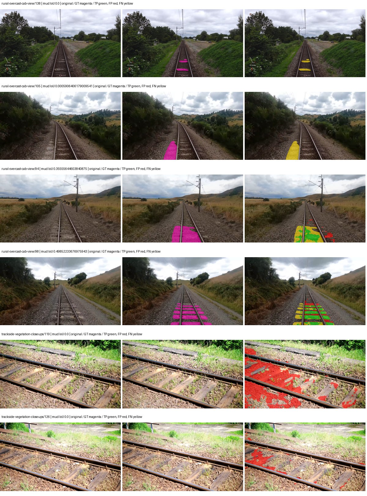

Examples are two lowest and two highest mud-IoU positive images, plus up to two negative images with the most false-positive mud pixels. They are targeted diagnostic examples, not random samples. Green: true positive; red: false positive; yellow: false negative. Full predictions remain on HDRFS.

### Validation tracking

| Logged step | Overall mIoU (%) | Mud IoU (%) |
| --- | --- | --- |
| 254 | 24.76 | 0.68 |
| 508 | 30.16 | 3.45 |
| 763 | 33.38 | 3.84 |
| 1017 | 32.50 | 9.26 |
| 1272 | 34.21 | 6.58 |
| 1527 | 37.13 | 4.96 |
| 1781 | 37.21 | 2.69 |
| 2036 | 36.77 | 6.53 |
| 2290 | 39.65 | 5.18 |

All retained scalar curves, including training loss and per-class IoU, are in record.json. Observed best mud on a curve is not necessarily a retained checkpoint: the pilot saved its selection-metric-best and final checkpoints. Step logging and checkpoint global_step may differ by one.

### Stopping and checkpoint provenance

```json
{
  "stopping": {
    "actual_steps": 2290,
    "maximum_steps": 4000,
    "min_delta": 0.001,
    "monitor": "val_iou/mud-pumping",
    "patience": 5,
    "reason": "validation_plateau"
  },
  "checkpoints": {
    "best": {
      "path": "/data/izadia1/projects/segmentary-runs/paul-test-rtis/mud-fullstats-v1-20260906-r2/future-runs/hf_auto_segformer_b0--railsem19_to_rtis--seed-2_seed2/rtis/best.ckpt",
      "sha256": "3305046f099dab9c2efa1200e381bcae850d9c438a4341ec2a96987199b09c40",
      "global_step": 1018,
      "bytes": 59870157
    },
    "final": {
      "path": "/data/izadia1/projects/segmentary-runs/paul-test-rtis/mud-fullstats-v1-20260906-r2/future-runs/hf_auto_segformer_b0--railsem19_to_rtis--seed-2_seed2/rtis/last.ckpt",
      "sha256": "6504e1ea9b56344fd30f6a7f27cdb5346ec3f535ab1d1901313db88544453cc1",
      "global_step": 2290,
      "bytes": 59860365
    }
  },
  "cleanup_error": null
}
```

### Resolved training, initialization and evaluation settings

The optimizer block is the base configuration. Stage LR scales are applied at runtime, and stage warmup is capped at min(base warmup, floor(stage budget / 10), stage budget - 1): 400 steps for this 4,000-step pilot. Model-internal native input grids may differ from augmentation crops (EoMT uses its 640 grid).

```json
{
  "name": "hf_auto_segformer_b0--railsem19_to_rtis--seed-2",
  "model": {
    "arch": "hf_auto",
    "checkpoint": "nvidia/segformer-b0-finetuned-ade-512-512",
    "tuning": "full",
    "head": "unified_head",
    "lora_r": 16,
    "lora_alpha": 32,
    "lora_dropout": 0.05,
    "lora_targets": [],
    "drop_path": null,
    "revision": "489d5cd81a0b59fab9b7ea758d3548ebe99677da",
    "subfolder": null,
    "local_files_only": false,
    "trust_remote_code": false,
    "backbone_path": null,
    "head_paths": [],
    "classifier_path": null,
    "inactive_parameter_paths": [],
    "smp_arch": null,
    "encoder_name": null,
    "encoder_weights": null,
    "native": null,
    "batch_norm_momentum": null
  },
  "space": "paul-test-rtis",
  "taxonomy_root": "/data/izadia1/projects/segmentary-rtis-fullstats-066afb2/taxonomy",
  "output_root": "/data/izadia1/projects/segmentary-runs/paul-test-rtis/mud-fullstats-v1-20260906-r2/future-runs",
  "optim": {
    "backbone_lr": 6e-05,
    "head_lr_mult": 10.0,
    "weight_decay": 0.05,
    "llrd": 1.0,
    "warmup_iters": 1500,
    "warmup_ratio": 1e-06,
    "poly_power": 0.9,
    "min_lr_ratio": 0.0,
    "betas": [
      0.9,
      0.999
    ],
    "grad_clip": 1.0
  },
  "train": {
    "iters": 4000,
    "batch_size": 2,
    "accum": 8,
    "num_workers": 2,
    "precision": "bf16-mixed",
    "ema_decay": 0.9998,
    "val_every": 250,
    "ckpt_every": 500,
    "selection_metric": "val_iou/mud-pumping",
    "early_stopping_patience": 5,
    "early_stopping_min_delta": 0.001,
    "seed": 2,
    "devices": 1
  },
  "eval": {
    "sliding_window": true,
    "window": [
      1024,
      1024
    ],
    "stride": [
      768,
      768
    ],
    "batch_size": 1,
    "num_workers": 2,
    "tta_scales": [],
    "tta_flip": false,
    "threshold": 0.5,
    "boundary_tolerance_frac": 0.0075,
    "save_confusion": true
  },
  "loss": {
    "task": "multiclass",
    "activation": "auto",
    "terms": [],
    "aux": "none",
    "aux_weight": 0.0,
    "ce_weight": 1.0,
    "label_smoothing": 0.0,
    "class_weights": null,
    "query": null
  },
  "aug": {
    "crop": [
      1024,
      1024
    ],
    "scale_min": 0.5,
    "scale_max": 2.0,
    "hflip_p": 0.5,
    "color_jitter_p": 0.5,
    "brightness": 0.25,
    "contrast": 0.25,
    "saturation": 0.25,
    "hue": 0.05
  },
  "stages": [
    {
      "name": "rtis",
      "data": [
        {
          "name": "paul-test-rtis",
          "root": "/data/izadia1/datasets/paul-test-rtis",
          "variant": null,
          "split_file": "splits.json",
          "train_split": "train",
          "val_split": "val",
          "limit": null,
          "loader": "folder",
          "mapping": "paul-test-rtis",
          "loader_options": {
            "require_groups": true
          }
        }
      ],
      "iters": null,
      "lr_scale": 0.1,
      "head_group_lr_scale": 1.0,
      "init_from": "/data/izadia1/projects/segmentary-runs/all-model-city-rail-seed0-rail20-b9eb3e1/jobs/hf_auto_segformer_b0--railsem19--seed-0/attempt-001/train/hf_auto_segformer_b0--railsem19_seed0/railsem19/last.ckpt",
      "reset_head": true,
      "freeze": null,
      "sample_weights": null
    }
  ]
}
```

### Hardware and software provenance

```json
{
  "training": {
    "cuda_available": true,
    "cuda_visible_devices": "8",
    "cudnn": 91900,
    "driver_version": "570.133.20",
    "gpu_count": 1,
    "gpu_names": [
      "NVIDIA L40S"
    ],
    "hostname": "hdrfs-app-001",
    "input_normalization": {
      "channel_order": "rgb",
      "mean": [
        0.485,
        0.456,
        0.406
      ],
      "source": "hf_image_processor",
      "std": [
        0.229,
        0.224,
        0.225
      ]
    },
    "model_origins": [
      {
        "hf_commit": "489d5cd81a0b59fab9b7ea758d3548ebe99677da",
        "hf_name_or_path": "nvidia/segformer-b0-finetuned-ade-512-512",
        "module": "model",
        "timm_pretrained": {}
      },
      {
        "hf_commit": "489d5cd81a0b59fab9b7ea758d3548ebe99677da",
        "hf_name_or_path": "nvidia/segformer-b0-finetuned-ade-512-512",
        "module": "model.segformer",
        "timm_pretrained": {}
      },
      {
        "hf_commit": "489d5cd81a0b59fab9b7ea758d3548ebe99677da",
        "hf_name_or_path": "nvidia/segformer-b0-finetuned-ade-512-512",
        "module": "model.segformer.stages.0.blocks.0.attention",
        "timm_pretrained": {}
      },
      {
        "hf_commit": "489d5cd81a0b59fab9b7ea758d3548ebe99677da",
        "hf_name_or_path": "nvidia/segformer-b0-finetuned-ade-512-512",
        "module": "model.segformer.stages.0.blocks.1.attention",
        "timm_pretrained": {}
      },
      {
        "hf_commit": "489d5cd81a0b59fab9b7ea758d3548ebe99677da",
        "hf_name_or_path": "nvidia/segformer-b0-finetuned-ade-512-512",
        "module": "model.segformer.stages.1.blocks.0.attention",
        "timm_pretrained": {}
      },
      {
        "hf_commit": "489d5cd81a0b59fab9b7ea758d3548ebe99677da",
        "hf_name_or_path": "nvidia/segformer-b0-finetuned-ade-512-512",
        "module": "model.segformer.stages.1.blocks.1.attention",
        "timm_pretrained": {}
      },
      {
        "hf_commit": "489d5cd81a0b59fab9b7ea758d3548ebe99677da",
        "hf_name_or_path": "nvidia/segformer-b0-finetuned-ade-512-512",
        "module": "model.segformer.stages.2.blocks.0.attention",
        "timm_pretrained": {}
      },
      {
        "hf_commit": "489d5cd81a0b59fab9b7ea758d3548ebe99677da",
        "hf_name_or_path": "nvidia/segformer-b0-finetuned-ade-512-512",
        "module": "model.segformer.stages.2.blocks.1.attention",
        "timm_pretrained": {}
      },
      {
        "hf_commit": "489d5cd81a0b59fab9b7ea758d3548ebe99677da",
        "hf_name_or_path": "nvidia/segformer-b0-finetuned-ade-512-512",
        "module": "model.segformer.stages.3.blocks.0.attention",
        "timm_pretrained": {}
      },
      {
        "hf_commit": "489d5cd81a0b59fab9b7ea758d3548ebe99677da",
        "hf_name_or_path": "nvidia/segformer-b0-finetuned-ade-512-512",
        "module": "model.segformer.stages.3.blocks.1.attention",
        "timm_pretrained": {}
      },
      {
        "hf_commit": "489d5cd81a0b59fab9b7ea758d3548ebe99677da",
        "hf_name_or_path": "nvidia/segformer-b0-finetuned-ade-512-512",
        "module": "model.decode_head",
        "timm_pretrained": {}
      }
    ],
    "model_parameter_count": 3719541,
    "packages": {
      "albumentations": "2.0.8",
      "lightning": "2.6.5",
      "numpy": "2.4.4",
      "segmentary": "0.1.0",
      "segmentation-models-pytorch": "0.5.0",
      "timm": "1.0.28",
      "torch": "2.11.0+cu128",
      "torchvision": "0.26.0+cu128",
      "transformers": "5.15.0"
    },
    "platform": "Linux-5.15.0-139-generic-x86_64-with-glibc2.35",
    "python": "3.11.15",
    "torch": "2.11.0+cu128",
    "torch_cuda": "12.8",
    "trainable_parameter_count": 3719541,
    "training_stop": {
      "actual_steps": 2290,
      "maximum_steps": 4000,
      "min_delta": 0.001,
      "monitor": "val_iou/mud-pumping",
      "patience": 5,
      "reason": "validation_plateau"
    },
    "validation_weights": "raw"
  },
  "evaluation": {
    "cuda_available": true,
    "cuda_visible_devices": "8",
    "cudnn": 91900,
    "driver_version": "570.133.20",
    "gpu_count": 1,
    "gpu_names": [
      "NVIDIA L40S"
    ],
    "hostname": "hdrfs-app-001",
    "input_normalization": {
      "channel_order": "rgb",
      "mean": [
        0.485,
        0.456,
        0.406
      ],
      "source": "hf_image_processor",
      "std": [
        0.229,
        0.224,
        0.225
      ]
    },
    "packages": {
      "albumentations": "2.0.8",
      "lightning": "2.6.5",
      "numpy": "2.4.4",
      "segmentary": "0.1.0",
      "segmentation-models-pytorch": "0.5.0",
      "timm": "1.0.28",
      "torch": "2.11.0+cu128",
      "torchvision": "0.26.0+cu128",
      "transformers": "5.15.0"
    },
    "platform": "Linux-5.15.0-139-generic-x86_64-with-glibc2.35",
    "python": "3.11.15",
    "torch": "2.11.0+cu128",
    "torch_cuda": "12.8"
  }
}
```

## cityscapes_to_railsem19_to_rtis — seed 0

Status: **completed**. Started: 2026-09-06T13:47:14.581915+00:00. Finished: 2026-09-06T14:27:26.080067+00:00.

Recipe pretrained initializer: `nvidia/segformer-b0-finetuned-ade-512-512`.

`rtis_only` uses the recipe initializer, which may include pretrained segmentation components. Transfer paths load the exact historical source checkpoint below and reset the classifier; they do not reset all query/decoder features.

Source checkpoint: `{'name': 'hf_auto_segformer_b0--cityscapes_to_railsem19--seed-0', 'model': 'hf_auto_segformer_b0', 'protocol': 'cityscapes_to_railsem19', 'config': '/data/izadia1/projects/segmentary-runs/all-model-city-rail-seed0-rail20-b9eb3e1/jobs/hf_auto_segformer_b0--cityscapes_to_railsem19--seed-0/attempt-001/resolved-config.yaml', 'checkpoint': '/data/izadia1/projects/segmentary-runs/all-model-city-rail-seed0-rail20-b9eb3e1/jobs/hf_auto_segformer_b0--cityscapes_to_railsem19--seed-0/attempt-001/train/hf_auto_segformer_b0--cityscapes_to_railsem19_seed0/railsem19/last.ckpt', 'recorded_sha256': '0b1eb3721dd80aa34dd87a6293a2844e0e51d418f59acc5f39c2f81f5395df7f', 'exists': True}`.

Config SHA-256: `b9db59208ecc96bb4f6f02c17a22dc609bc1f9072fad9cd1508e97ef90d7317c`. Weights used for validation: `raw`.

### Mud-pumping and aggregate quality

| Metric | Selected checkpoint | Final training validation |
| --- | --- | --- |
| Mud IoU | 4.52 | 2.00 |
| Mud precision | 22.01 | 9.82 |
| Mud recall | 5.39 | 2.44 |
| Mud Dice/F1 | 8.66 | 3.91 |
| mIoU | 35.56 | 34.98 |
| Mean accuracy | 45.77 | 47.49 |
| Mean precision | 58.86 | 55.71 |
| Mean Dice | 45.68 | 44.54 |
| Mean specificity | 98.85 | 98.96 |
| Pixel accuracy | 82.79 | 83.90 |
| Frequency-weighted IoU | 72.86 | 74.54 |
| Fixed GT-present class mIoU | 39.51 | 40.81 |
| Boundary F1 | 42.07 | 41.04 |

The selected checkpoint has independent evaluation evidence. Final values are the trainer's final validation record, not a new independent evaluation. mIoU averages classes with nonzero union, so false positives on absent classes can change its denominator. The fixed GT-class mean is supplementary and excludes absent classes; their false positives remain in the confusion matrix.

### Resource usage and timing

| Measurement | Value |
| --- | --- |
| Peak training VRAM, retained training invocation (GiB) | 7.79 |
| Peak evaluation VRAM (GiB) | 7.03 |
| Retained training invocation wall time (seconds) | 2280.13 |
| Retained training invocation GPU-hours (one GPU) | 0.63 |
| Evaluation wall time (seconds) | 12.93 |
| Full evaluation pipeline images/second | 2.86 |
| Best full-state checkpoint (MiB) | 57.10 |
| Final full-state checkpoint (MiB) | 57.09 |
| Audited periodic checkpoints removed (GiB) | 0.39 |

VRAM uses the recorded allocator high-water mark; it is not total device usage including CUDA context. Resumed jobs' retained training invocation times and peaks are **not whole-campaign totals**. Earlier invocation resource records are not reconstructed here. Evaluation throughput includes loader, sliding-window inference and metrics; it is not model-only latency/FPS. Missing measurements are shown as —, never inferred from another dataset's run.

### Standardized inference performance

Dedicated model-only profiling waits for an idle worker-locked L40S: BF16, batch 1, 1024x1024, 20 warmup and 100 CUDA-event-timed public forwards. It excludes loading, preprocessing, tiling and metrics.

| Status | Parameters | Weight MiB | FPS | p50 ms | p95 ms | Peak reserved GiB |
| --- | --- | --- | --- | --- | --- | --- |
| complete | 3719541 | 14.19 | 134.95 | 7.28 | 8.07 | 0.89 |

```json
{
  "schema_version": 1,
  "model_id": "hf_auto_segformer_b0",
  "measured_at": "2026-09-06T14:27:23+00:00",
  "status": "complete",
  "benchmark_scope": "rtis_selected_checkpoint_model_only",
  "applies_to": [
    "hf_auto_segformer_b0--cityscapes_to_railsem19_to_rtis--seed-0"
  ],
  "source": {
    "campaign_git_sha": "066afb2626398b7be59d4d19f5a0e4644fd59adc",
    "git_dirty": false,
    "config_hash": "ec74bcd36635",
    "resolved_config": "/data/izadia1/projects/segmentary-runs/paul-test-rtis/mud-fullstats-v1-20260906-r2/configs/hf_auto_segformer_b0--cityscapes_to_railsem19_to_rtis--seed-0.yaml",
    "config_sha256": "b9db59208ecc96bb4f6f02c17a22dc609bc1f9072fad9cd1508e97ef90d7317c",
    "checkpoint_sha256": "7584269061333cc71bbd7fe7139daa83b7709ad0defb6e3133690e158efa978f",
    "checkpoint_global_step": 2545,
    "checkpoint_bytes": 59870157,
    "checkpoint_kind": "resume checkpoint with optimizer and EMA state",
    "weights": "raw",
    "measured_checkpoint_job_id": "hf_auto_segformer_b0--cityscapes_to_railsem19_to_rtis--seed-0",
    "result_sha256": "bf577933a8a2f5aaec8c68ace5440553a5f099c3fa214e1412628e154378260e",
    "result_git_sha": "066afb2626398b7be59d4d19f5a0e4644fd59adc",
    "result_stage": "eval:paul-test-rtis:val",
    "result_seed": 0
  },
  "hardware": {
    "gpu_name": "NVIDIA L40S",
    "gpu_uuid": "GPU-c76642eb-64c1-b0ac-b051-d2efd47b32c4",
    "logical_device": "cuda:0",
    "physical_visibility_token": "9",
    "compute_capability": [
      8,
      9
    ],
    "total_memory_bytes": 47677177856
  },
  "model": {
    "parameter_count": 3719541,
    "trainable_parameter_count": 3719541,
    "resident_parameter_bytes": 14878164,
    "parameter_dtype_counts": {
      "float32": 3719541
    }
  },
  "contract": {
    "backend": "pytorch",
    "precision": "bf16_autocast",
    "batch_size": 1,
    "input_shape_nchw": [
      1,
      3,
      1024,
      1024
    ],
    "warmup_iterations": 20,
    "measured_iterations": 100,
    "timing": "per-forward CUDA events with end-event synchronization",
    "includes_preprocessing": false,
    "includes_data_loader": false,
    "includes_sliding_window": false,
    "input_resident_on_gpu": true,
    "model_only": true,
    "entrypoint": "public model(image) dense-logits forward"
  },
  "measurements": {
    "latency": {
      "p50_ms": 7.278592109680176,
      "p95_ms": 8.06830096244812,
      "mean_ms": 7.410216636657715,
      "minimum_ms": 7.1741437911987305,
      "maximum_ms": 8.254464149475098,
      "fps": 134.94882120626332,
      "raw_ms": [
        8.09779167175293,
        7.326720237731934,
        7.223264217376709,
        7.408639907836914,
        7.541759967803955,
        7.533567905426025,
        7.710720062255859,
        7.491583824157715,
        7.280640125274658,
        7.205887794494629,
        7.323647975921631,
        7.2325119972229,
        8.037376403808594,
        8.254464149475098,
        7.383039951324463,
        7.2038397789001465,
        7.2724480628967285,
        7.2867841720581055,
        7.189504146575928,
        7.1997761726379395,
        7.1741437911987305,
        7.235583782196045,
        7.194623947143555,
        8.139776229858398,
        8.208383560180664,
        7.223296165466309,
        7.197696208953857,
        7.208960056304932,
        7.2038397789001465,
        7.202816009521484,
        7.651328086853027,
        7.39737606048584,
        7.688191890716553,
        7.216127872467041,
        7.200767993927002,
        7.202847957611084,
        7.2038397789001465,
        7.283711910247803,
        7.217152118682861,
        7.59603214263916,
        7.299071788787842,
        7.2038397789001465,
        7.214079856872559,
        7.194623947143555,
        7.270400047302246,
        7.24889612197876,
        7.267327785491943,
        7.701504230499268,
        7.194623947143555,
        7.5438079833984375,
        7.382016181945801,
        7.969791889190674,
        7.640063762664795,
        7.400447845458984,
        7.270400047302246,
        7.3461761474609375,
        7.6175360679626465,
        8.068096160888672,
        7.485439777374268,
        8.072192192077637,
        7.327744007110596,
        7.305215835571289,
        7.2427520751953125,
        7.226367950439453,
        7.575551986694336,
        7.54585599899292,
        7.214079856872559,
        7.178239822387695,
        7.192575931549072,
        7.187456130981445,
        7.187456130981445,
        7.3471999168396,
        7.280640125274658,
        7.276544094085693,
        7.306240081787109,
        7.236608028411865,
        7.217152118682861,
        7.187456130981445,
        7.803904056549072,
        7.2478718757629395,
        7.222271919250488,
        7.223296165466309,
        8.06499195098877,
        7.254015922546387,
        7.401472091674805,
        7.728127956390381,
        7.402495861053467,
        7.271423816680908,
        7.261184215545654,
        7.329792022705078,
        7.205887794494629,
        7.95033597946167,
        7.250944137573242,
        7.252992153167725,
        7.204864025115967,
        7.211008071899414,
        7.651328086853027,
        7.634943962097168,
        7.6062397956848145,
        7.566336154937744
      ],
      "percentile_method": "numpy linear interpolation"
    },
    "peak_reserved_bytes": 960495616,
    "memory_kind": "pytorch_cuda_allocator_peak_reserved_excluding_context",
    "benchmark_wall_clock_s": 4.513377960771322
  },
  "started_at": "2026-09-06T14:27:19+00:00",
  "finished_at": "2026-09-06T14:27:23+00:00",
  "environment": {
    "hostname": "hdrfs-app-001",
    "python": "3.11.15",
    "platform": "Linux-5.15.0-139-generic-x86_64-with-glibc2.35",
    "torch": "2.11.0+cu128",
    "torch_cuda": "12.8",
    "cudnn": 91900,
    "driver_version": "570.133.20",
    "cuda_available": true,
    "gpu_count": 1,
    "gpu_names": [
      "NVIDIA L40S"
    ],
    "cuda_visible_devices": "9",
    "packages": {
      "segmentary": "0.1.0",
      "torch": "2.11.0+cu128",
      "torchvision": "0.26.0+cu128",
      "transformers": "5.15.0",
      "timm": "1.0.28",
      "segmentation-models-pytorch": "0.5.0",
      "albumentations": "2.0.8",
      "lightning": "2.6.5",
      "numpy": "2.4.4"
    }
  }
}
```

### Per-class validation results

| Class | GT pixels | IoU (%) | Precision (%) | Recall (%) | Dice (%) | Boundary F1 (%) |
| --- | --- | --- | --- | --- | --- | --- |
| car | 29664 | 34.84 | 75.38 | 39.31 | 51.68 | 53.13 |
| construction | 311585 | 56.54 | 72.66 | 71.82 | 72.24 | 68.88 |
| fence | 265137 | 3.93 | 6.58 | 8.90 | 7.57 | 6.88 |
| mud-pumping | 1226250 | 4.52 | 22.01 | 5.39 | 8.66 | 11.63 |
| on-rails | 0 | 0.00 | 0.00 | — | 0.00 | 0.00 |
| person | 0 | — | — | — | — | — |
| pole | 628038 | 70.26 | 83.62 | 81.47 | 82.53 | 89.56 |
| rail-embedded | 16799 | 21.06 | 98.91 | 21.11 | 34.79 | 26.90 |
| rail-raised | 2969797 | 72.94 | 84.21 | 84.50 | 84.35 | 89.94 |
| rail-track | 6323197 | 34.87 | 67.75 | 41.81 | 51.71 | 44.44 |
| road | 1048831 | 11.36 | 21.95 | 19.05 | 20.40 | 22.38 |
| sidewalk | 1297367 | 15.37 | 81.11 | 15.94 | 26.64 | 7.79 |
| sky | 19121606 | 98.61 | 99.29 | 99.31 | 99.30 | 96.57 |
| standing-water | 95802 | 0.25 | 0.26 | 4.03 | 0.50 | 1.33 |
| terrain | 39239306 | 82.92 | 84.23 | 98.15 | 90.66 | 48.50 |
| trackbed | 10643081 | 58.17 | 75.11 | 72.06 | 73.56 | 54.89 |
| traffic-light | 19510 | 57.07 | 90.74 | 60.60 | 72.67 | 68.47 |
| traffic-sign | 13285 | 29.24 | 76.51 | 32.13 | 45.25 | 52.91 |
| tram-track | 56179 | 25.38 | 61.52 | 30.17 | 40.49 | 31.16 |
| truck | 0 | 0.00 | 0.00 | — | 0.00 | 0.00 |
| vegetation-overgrowth | 5901821 | 33.82 | 75.27 | 38.04 | 50.54 | 65.99 |

### Full-run accounting

| Measurement | Value |
| --- | --- |
| Full GPU-reserved wall seconds, all recorded worker attempts | 2411.56 |
| Full reserved GPU-hours | 0.67 |
| Whole-run timing complete | True |

| Phase | Wall seconds including failed attempts |
| --- | --- |
| training | 2287.03 |
| diagnostics | 93.20 |
| performance | 11.12 |

GPU-reserved time includes model loading, training, validation, collection, profiling, checkpoint I/O and orchestration while the worker owns one GPU. It is not GPU kernel-active time. Phase timings and sampled device memory/power/utilization are retained separately; sampled device memory is not the allocator high-water mark.

### Train/validation and raw/EMA diagnostics

| Checkpoint / weights / split | Images | Mud IoU (%) | Mud precision (%) | Mud recall (%) |
| --- | --- | --- | --- | --- |
| best-auto-train / raw | 220 | 90.71 | 93.87 | 96.43 |
| best-auto-val / raw | 37 | 4.52 | 22.01 | 5.39 |
| best-alternate-val / ema | 37 | 2.22 | 10.72 | 2.73 |
| final-auto-val / raw | 37 | 1.99 | 9.79 | 2.44 |

Train uses the evaluation transform without augmentation. Compare mud train/validation metrics for the same selected weights. Alternate EMA on running-stat BatchNorm is explicitly uncalibrated and is diagnostic only. Score-threshold curves use uncalibrated normalized scores and are pixel-level diagnostics, not event detection rates or a selected deployment operating point.

### Downloadable evidence

- best-auto-train: [per-image.csv](cityscapes_to_railsem19_to_rtis--seed-0/best-auto-train/per-image.csv) · [per-image-confusion.json.gz](cityscapes_to_railsem19_to_rtis--seed-0/best-auto-train/per-image-confusion.json.gz) · [groups.json](cityscapes_to_railsem19_to_rtis--seed-0/best-auto-train/groups.json) · [mud-score-curves.json](cityscapes_to_railsem19_to_rtis--seed-0/best-auto-train/mud-score-curves.json)
- best-auto-val: [per-image.csv](cityscapes_to_railsem19_to_rtis--seed-0/best-auto-val/per-image.csv) · [per-image-confusion.json.gz](cityscapes_to_railsem19_to_rtis--seed-0/best-auto-val/per-image-confusion.json.gz) · [groups.json](cityscapes_to_railsem19_to_rtis--seed-0/best-auto-val/groups.json) · [mud-score-curves.json](cityscapes_to_railsem19_to_rtis--seed-0/best-auto-val/mud-score-curves.json) · [examples.jpg](cityscapes_to_railsem19_to_rtis--seed-0/best-auto-val/examples.jpg)
- best-alternate-val: [per-image.csv](cityscapes_to_railsem19_to_rtis--seed-0/best-alternate-val/per-image.csv) · [per-image-confusion.json.gz](cityscapes_to_railsem19_to_rtis--seed-0/best-alternate-val/per-image-confusion.json.gz) · [groups.json](cityscapes_to_railsem19_to_rtis--seed-0/best-alternate-val/groups.json) · [mud-score-curves.json](cityscapes_to_railsem19_to_rtis--seed-0/best-alternate-val/mud-score-curves.json)
- final-auto-val: [per-image.csv](cityscapes_to_railsem19_to_rtis--seed-0/final-auto-val/per-image.csv) · [per-image-confusion.json.gz](cityscapes_to_railsem19_to_rtis--seed-0/final-auto-val/per-image-confusion.json.gz) · [groups.json](cityscapes_to_railsem19_to_rtis--seed-0/final-auto-val/groups.json) · [mud-score-curves.json](cityscapes_to_railsem19_to_rtis--seed-0/final-auto-val/mud-score-curves.json)
- resources: [telemetry.csv](cityscapes_to_railsem19_to_rtis--seed-0/resources/telemetry.csv)

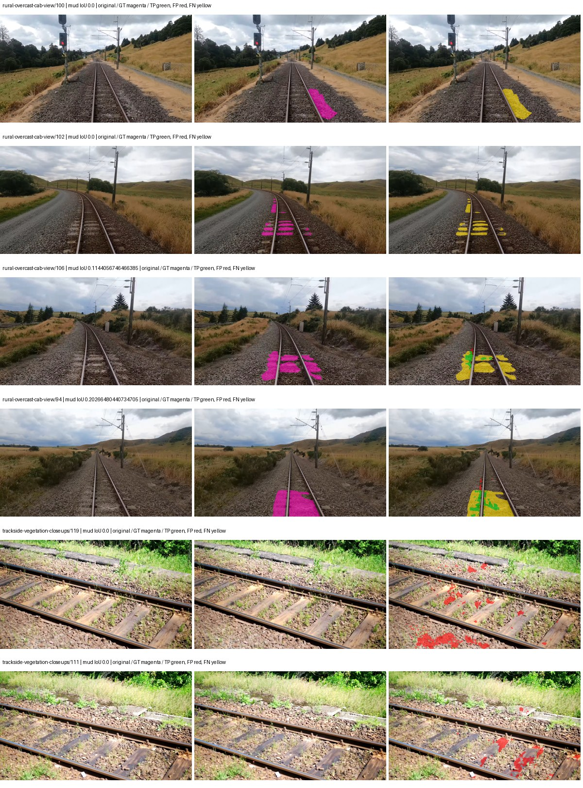

Examples are two lowest and two highest mud-IoU positive images, plus up to two negative images with the most false-positive mud pixels. They are targeted diagnostic examples, not random samples. Green: true positive; red: false positive; yellow: false negative. Full predictions remain on HDRFS.

### Validation tracking

| Logged step | Overall mIoU (%) | Mud IoU (%) |
| --- | --- | --- |
| 254 | 24.28 | 1.29 |
| 508 | 26.81 | 1.36 |
| 763 | 28.56 | 0.79 |
| 1017 | 30.73 | 1.60 |
| 1272 | 29.33 | 1.22 |
| 1527 | 33.98 | 2.51 |
| 1781 | 31.49 | 2.16 |
| 2036 | 32.36 | 0.38 |
| 2290 | 33.03 | 1.57 |
| 2545 | 35.57 | 4.54 |
| 2799 | 33.75 | 1.29 |
| 3054 | 35.12 | 1.28 |
| 3308 | 35.02 | 2.84 |
| 3563 | 35.38 | 1.69 |
| 3817 | 34.98 | 2.00 |

All retained scalar curves, including training loss and per-class IoU, are in record.json. Observed best mud on a curve is not necessarily a retained checkpoint: the pilot saved its selection-metric-best and final checkpoints. Step logging and checkpoint global_step may differ by one.

### Stopping and checkpoint provenance

```json
{
  "stopping": {
    "actual_steps": 3818,
    "maximum_steps": 4000,
    "min_delta": 0.001,
    "monitor": "val_iou/mud-pumping",
    "patience": 5,
    "reason": "validation_plateau"
  },
  "checkpoints": {
    "best": {
      "path": "/data/izadia1/projects/segmentary-runs/paul-test-rtis/mud-fullstats-v1-20260906-r2/future-runs/hf_auto_segformer_b0--cityscapes_to_railsem19_to_rtis--seed-0_seed0/rtis/best.ckpt",
      "sha256": "7584269061333cc71bbd7fe7139daa83b7709ad0defb6e3133690e158efa978f",
      "global_step": 2545,
      "bytes": 59870157
    },
    "final": {
      "path": "/data/izadia1/projects/segmentary-runs/paul-test-rtis/mud-fullstats-v1-20260906-r2/future-runs/hf_auto_segformer_b0--cityscapes_to_railsem19_to_rtis--seed-0_seed0/rtis/last.ckpt",
      "sha256": "ffd3c486fa0d2bc59af7145218255118dd8b19019c2388e18e31878c76e2d573",
      "global_step": 3818,
      "bytes": 59860429
    }
  },
  "cleanup_error": null
}
```

### Resolved training, initialization and evaluation settings

The optimizer block is the base configuration. Stage LR scales are applied at runtime, and stage warmup is capped at min(base warmup, floor(stage budget / 10), stage budget - 1): 400 steps for this 4,000-step pilot. Model-internal native input grids may differ from augmentation crops (EoMT uses its 640 grid).

```json
{
  "name": "hf_auto_segformer_b0--cityscapes_to_railsem19_to_rtis--seed-0",
  "model": {
    "arch": "hf_auto",
    "checkpoint": "nvidia/segformer-b0-finetuned-ade-512-512",
    "tuning": "full",
    "head": "unified_head",
    "lora_r": 16,
    "lora_alpha": 32,
    "lora_dropout": 0.05,
    "lora_targets": [],
    "drop_path": null,
    "revision": "489d5cd81a0b59fab9b7ea758d3548ebe99677da",
    "subfolder": null,
    "local_files_only": false,
    "trust_remote_code": false,
    "backbone_path": null,
    "head_paths": [],
    "classifier_path": null,
    "inactive_parameter_paths": [],
    "smp_arch": null,
    "encoder_name": null,
    "encoder_weights": null,
    "native": null,
    "batch_norm_momentum": null
  },
  "space": "paul-test-rtis",
  "taxonomy_root": "/data/izadia1/projects/segmentary-rtis-fullstats-066afb2/taxonomy",
  "output_root": "/data/izadia1/projects/segmentary-runs/paul-test-rtis/mud-fullstats-v1-20260906-r2/future-runs",
  "optim": {
    "backbone_lr": 6e-05,
    "head_lr_mult": 10.0,
    "weight_decay": 0.05,
    "llrd": 1.0,
    "warmup_iters": 1500,
    "warmup_ratio": 1e-06,
    "poly_power": 0.9,
    "min_lr_ratio": 0.0,
    "betas": [
      0.9,
      0.999
    ],
    "grad_clip": 1.0
  },
  "train": {
    "iters": 4000,
    "batch_size": 2,
    "accum": 8,
    "num_workers": 2,
    "precision": "bf16-mixed",
    "ema_decay": 0.9998,
    "val_every": 250,
    "ckpt_every": 500,
    "selection_metric": "val_iou/mud-pumping",
    "early_stopping_patience": 5,
    "early_stopping_min_delta": 0.001,
    "seed": 0,
    "devices": 1
  },
  "eval": {
    "sliding_window": true,
    "window": [
      1024,
      1024
    ],
    "stride": [
      768,
      768
    ],
    "batch_size": 1,
    "num_workers": 2,
    "tta_scales": [],
    "tta_flip": false,
    "threshold": 0.5,
    "boundary_tolerance_frac": 0.0075,
    "save_confusion": true
  },
  "loss": {
    "task": "multiclass",
    "activation": "auto",
    "terms": [],
    "aux": "none",
    "aux_weight": 0.0,
    "ce_weight": 1.0,
    "label_smoothing": 0.0,
    "class_weights": null,
    "query": null
  },
  "aug": {
    "crop": [
      1024,
      1024
    ],
    "scale_min": 0.5,
    "scale_max": 2.0,
    "hflip_p": 0.5,
    "color_jitter_p": 0.5,
    "brightness": 0.25,
    "contrast": 0.25,
    "saturation": 0.25,
    "hue": 0.05
  },
  "stages": [
    {
      "name": "rtis",
      "data": [
        {
          "name": "paul-test-rtis",
          "root": "/data/izadia1/datasets/paul-test-rtis",
          "variant": null,
          "split_file": "splits.json",
          "train_split": "train",
          "val_split": "val",
          "limit": null,
          "loader": "folder",
          "mapping": "paul-test-rtis",
          "loader_options": {
            "require_groups": true
          }
        }
      ],
      "iters": null,
      "lr_scale": 0.1,
      "head_group_lr_scale": 1.0,
      "init_from": "/data/izadia1/projects/segmentary-runs/all-model-city-rail-seed0-rail20-b9eb3e1/jobs/hf_auto_segformer_b0--cityscapes_to_railsem19--seed-0/attempt-001/train/hf_auto_segformer_b0--cityscapes_to_railsem19_seed0/railsem19/last.ckpt",
      "reset_head": true,
      "freeze": null,
      "sample_weights": null
    }
  ]
}
```

### Hardware and software provenance

```json
{
  "training": {
    "cuda_available": true,
    "cuda_visible_devices": "9",
    "cudnn": 91900,
    "driver_version": "570.133.20",
    "gpu_count": 1,
    "gpu_names": [
      "NVIDIA L40S"
    ],
    "hostname": "hdrfs-app-001",
    "input_normalization": {
      "channel_order": "rgb",
      "mean": [
        0.485,
        0.456,
        0.406
      ],
      "source": "hf_image_processor",
      "std": [
        0.229,
        0.224,
        0.225
      ]
    },
    "model_origins": [
      {
        "hf_commit": "489d5cd81a0b59fab9b7ea758d3548ebe99677da",
        "hf_name_or_path": "nvidia/segformer-b0-finetuned-ade-512-512",
        "module": "model",
        "timm_pretrained": {}
      },
      {
        "hf_commit": "489d5cd81a0b59fab9b7ea758d3548ebe99677da",
        "hf_name_or_path": "nvidia/segformer-b0-finetuned-ade-512-512",
        "module": "model.segformer",
        "timm_pretrained": {}
      },
      {
        "hf_commit": "489d5cd81a0b59fab9b7ea758d3548ebe99677da",
        "hf_name_or_path": "nvidia/segformer-b0-finetuned-ade-512-512",
        "module": "model.segformer.stages.0.blocks.0.attention",
        "timm_pretrained": {}
      },
      {
        "hf_commit": "489d5cd81a0b59fab9b7ea758d3548ebe99677da",
        "hf_name_or_path": "nvidia/segformer-b0-finetuned-ade-512-512",
        "module": "model.segformer.stages.0.blocks.1.attention",
        "timm_pretrained": {}
      },
      {
        "hf_commit": "489d5cd81a0b59fab9b7ea758d3548ebe99677da",
        "hf_name_or_path": "nvidia/segformer-b0-finetuned-ade-512-512",
        "module": "model.segformer.stages.1.blocks.0.attention",
        "timm_pretrained": {}
      },
      {
        "hf_commit": "489d5cd81a0b59fab9b7ea758d3548ebe99677da",
        "hf_name_or_path": "nvidia/segformer-b0-finetuned-ade-512-512",
        "module": "model.segformer.stages.1.blocks.1.attention",
        "timm_pretrained": {}
      },
      {
        "hf_commit": "489d5cd81a0b59fab9b7ea758d3548ebe99677da",
        "hf_name_or_path": "nvidia/segformer-b0-finetuned-ade-512-512",
        "module": "model.segformer.stages.2.blocks.0.attention",
        "timm_pretrained": {}
      },
      {
        "hf_commit": "489d5cd81a0b59fab9b7ea758d3548ebe99677da",
        "hf_name_or_path": "nvidia/segformer-b0-finetuned-ade-512-512",
        "module": "model.segformer.stages.2.blocks.1.attention",
        "timm_pretrained": {}
      },
      {
        "hf_commit": "489d5cd81a0b59fab9b7ea758d3548ebe99677da",
        "hf_name_or_path": "nvidia/segformer-b0-finetuned-ade-512-512",
        "module": "model.segformer.stages.3.blocks.0.attention",
        "timm_pretrained": {}
      },
      {
        "hf_commit": "489d5cd81a0b59fab9b7ea758d3548ebe99677da",
        "hf_name_or_path": "nvidia/segformer-b0-finetuned-ade-512-512",
        "module": "model.segformer.stages.3.blocks.1.attention",
        "timm_pretrained": {}
      },
      {
        "hf_commit": "489d5cd81a0b59fab9b7ea758d3548ebe99677da",
        "hf_name_or_path": "nvidia/segformer-b0-finetuned-ade-512-512",
        "module": "model.decode_head",
        "timm_pretrained": {}
      }
    ],
    "model_parameter_count": 3719541,
    "packages": {
      "albumentations": "2.0.8",
      "lightning": "2.6.5",
      "numpy": "2.4.4",
      "segmentary": "0.1.0",
      "segmentation-models-pytorch": "0.5.0",
      "timm": "1.0.28",
      "torch": "2.11.0+cu128",
      "torchvision": "0.26.0+cu128",
      "transformers": "5.15.0"
    },
    "platform": "Linux-5.15.0-139-generic-x86_64-with-glibc2.35",
    "python": "3.11.15",
    "torch": "2.11.0+cu128",
    "torch_cuda": "12.8",
    "trainable_parameter_count": 3719541,
    "training_stop": {
      "actual_steps": 3818,
      "maximum_steps": 4000,
      "min_delta": 0.001,
      "monitor": "val_iou/mud-pumping",
      "patience": 5,
      "reason": "validation_plateau"
    },
    "validation_weights": "raw"
  },
  "evaluation": {
    "cuda_available": true,
    "cuda_visible_devices": "9",
    "cudnn": 91900,
    "driver_version": "570.133.20",
    "gpu_count": 1,
    "gpu_names": [
      "NVIDIA L40S"
    ],
    "hostname": "hdrfs-app-001",
    "input_normalization": {
      "channel_order": "rgb",
      "mean": [
        0.485,
        0.456,
        0.406
      ],
      "source": "hf_image_processor",
      "std": [
        0.229,
        0.224,
        0.225
      ]
    },
    "packages": {
      "albumentations": "2.0.8",
      "lightning": "2.6.5",
      "numpy": "2.4.4",
      "segmentary": "0.1.0",
      "segmentation-models-pytorch": "0.5.0",
      "timm": "1.0.28",
      "torch": "2.11.0+cu128",
      "torchvision": "0.26.0+cu128",
      "transformers": "5.15.0"
    },
    "platform": "Linux-5.15.0-139-generic-x86_64-with-glibc2.35",
    "python": "3.11.15",
    "torch": "2.11.0+cu128",
    "torch_cuda": "12.8"
  }
}
```

## cityscapes_to_railsem19_to_rtis — seed 1

Status: **training**. Started: 2026-09-06T13:54:09.888658+00:00. Finished: —.

Recipe pretrained initializer: `nvidia/segformer-b0-finetuned-ade-512-512`.

`rtis_only` uses the recipe initializer, which may include pretrained segmentation components. Transfer paths load the exact historical source checkpoint below and reset the classifier; they do not reset all query/decoder features.

Source checkpoint: `{'name': 'hf_auto_segformer_b0--cityscapes_to_railsem19--seed-0', 'model': 'hf_auto_segformer_b0', 'protocol': 'cityscapes_to_railsem19', 'config': '/data/izadia1/projects/segmentary-runs/all-model-city-rail-seed0-rail20-b9eb3e1/jobs/hf_auto_segformer_b0--cityscapes_to_railsem19--seed-0/attempt-001/resolved-config.yaml', 'checkpoint': '/data/izadia1/projects/segmentary-runs/all-model-city-rail-seed0-rail20-b9eb3e1/jobs/hf_auto_segformer_b0--cityscapes_to_railsem19--seed-0/attempt-001/train/hf_auto_segformer_b0--cityscapes_to_railsem19_seed0/railsem19/last.ckpt', 'recorded_sha256': '0b1eb3721dd80aa34dd87a6293a2844e0e51d418f59acc5f39c2f81f5395df7f', 'exists': True}`.

Config SHA-256: `7c58de31ac2dd3a96020855d2bc2b10c15f22146ebe53a390bf44bf77e446829`. Weights used for validation: `—`.

### Mud-pumping and aggregate quality

| Metric | Selected checkpoint | Final training validation |
| --- | --- | --- |
| Mud IoU | — | — |
| Mud precision | — | — |
| Mud recall | — | — |
| Mud Dice/F1 | — | — |
| mIoU | — | — |
| Mean accuracy | — | — |
| Mean precision | — | — |
| Mean Dice | — | — |
| Mean specificity | — | — |
| Pixel accuracy | — | — |
| Frequency-weighted IoU | — | — |
| Fixed GT-present class mIoU | — | — |
| Boundary F1 | — | — |

The selected checkpoint has independent evaluation evidence. Final values are the trainer's final validation record, not a new independent evaluation. mIoU averages classes with nonzero union, so false positives on absent classes can change its denominator. The fixed GT-class mean is supplementary and excludes absent classes; their false positives remain in the confusion matrix.

### Resource usage and timing

| Measurement | Value |
| --- | --- |
| Peak training VRAM, retained training invocation (GiB) | — |
| Peak evaluation VRAM (GiB) | — |
| Retained training invocation wall time (seconds) | — |
| Retained training invocation GPU-hours (one GPU) | — |
| Evaluation wall time (seconds) | — |
| Full evaluation pipeline images/second | — |
| Best full-state checkpoint (MiB) | — |
| Final full-state checkpoint (MiB) | — |
| Audited periodic checkpoints removed (GiB) | — |

VRAM uses the recorded allocator high-water mark; it is not total device usage including CUDA context. Resumed jobs' retained training invocation times and peaks are **not whole-campaign totals**. Earlier invocation resource records are not reconstructed here. Evaluation throughput includes loader, sliding-window inference and metrics; it is not model-only latency/FPS. Missing measurements are shown as —, never inferred from another dataset's run.

### Standardized inference performance

Dedicated model-only profiling waits for an idle worker-locked L40S: BF16, batch 1, 1024x1024, 20 warmup and 100 CUDA-event-timed public forwards. It excludes loading, preprocessing, tiling and metrics.

| Status | Parameters | Weight MiB | FPS | p50 ms | p95 ms | Peak reserved GiB |
| --- | --- | --- | --- | --- | --- | --- |
| waiting_for_idle_gpu | — | — | — | — | — | — |

```json
{
  "status": "waiting_for_idle_gpu",
  "contract": "L40S; batch 1; 1024x1024; BF16; 20 warmup; 100 timed forwards"
}
```

### Per-class validation results

| Class | GT pixels | IoU (%) | Precision (%) | Recall (%) | Dice (%) | Boundary F1 (%) |
| --- | --- | --- | --- | --- | --- | --- |

### Validation tracking

| Logged step | Overall mIoU (%) | Mud IoU (%) |
| --- | --- | --- |
| 254 | 24.33 | 2.88 |
| 508 | 25.96 | 3.05 |
| 763 | 25.68 | 1.62 |
| 1017 | 26.16 | 1.88 |
| 1272 | 29.66 | 4.37 |
| 1527 | 31.24 | 1.52 |
| 1781 | 32.55 | 2.31 |
| 2036 | 32.27 | 4.14 |
| 2290 | 32.54 | 5.11 |
| 2545 | 33.74 | 5.96 |
| 2799 | 33.30 | 4.94 |
| 3054 | 34.61 | 5.85 |
| 3308 | 34.53 | 5.81 |
| 3563 | 35.50 | 5.80 |

All retained scalar curves, including training loss and per-class IoU, are in record.json. Observed best mud on a curve is not necessarily a retained checkpoint: the pilot saved its selection-metric-best and final checkpoints. Step logging and checkpoint global_step may differ by one.

### Stopping and checkpoint provenance

```json
{
  "stopping": null,
  "checkpoints": null,
  "cleanup_error": null
}
```

### Resolved training, initialization and evaluation settings

The optimizer block is the base configuration. Stage LR scales are applied at runtime, and stage warmup is capped at min(base warmup, floor(stage budget / 10), stage budget - 1): 400 steps for this 4,000-step pilot. Model-internal native input grids may differ from augmentation crops (EoMT uses its 640 grid).

```json
{
  "name": "hf_auto_segformer_b0--cityscapes_to_railsem19_to_rtis--seed-1",
  "model": {
    "arch": "hf_auto",
    "checkpoint": "nvidia/segformer-b0-finetuned-ade-512-512",
    "tuning": "full",
    "head": "unified_head",
    "lora_r": 16,
    "lora_alpha": 32,
    "lora_dropout": 0.05,
    "lora_targets": [],
    "drop_path": null,
    "revision": "489d5cd81a0b59fab9b7ea758d3548ebe99677da",
    "subfolder": null,
    "local_files_only": false,
    "trust_remote_code": false,
    "backbone_path": null,
    "head_paths": [],
    "classifier_path": null,
    "inactive_parameter_paths": [],
    "smp_arch": null,
    "encoder_name": null,
    "encoder_weights": null,
    "native": null,
    "batch_norm_momentum": null
  },
  "space": "paul-test-rtis",
  "taxonomy_root": "/data/izadia1/projects/segmentary-rtis-fullstats-066afb2/taxonomy",
  "output_root": "/data/izadia1/projects/segmentary-runs/paul-test-rtis/mud-fullstats-v1-20260906-r2/future-runs",
  "optim": {
    "backbone_lr": 6e-05,
    "head_lr_mult": 10.0,
    "weight_decay": 0.05,
    "llrd": 1.0,
    "warmup_iters": 1500,
    "warmup_ratio": 1e-06,
    "poly_power": 0.9,
    "min_lr_ratio": 0.0,
    "betas": [
      0.9,
      0.999
    ],
    "grad_clip": 1.0
  },
  "train": {
    "iters": 4000,
    "batch_size": 2,
    "accum": 8,
    "num_workers": 2,
    "precision": "bf16-mixed",
    "ema_decay": 0.9998,
    "val_every": 250,
    "ckpt_every": 500,
    "selection_metric": "val_iou/mud-pumping",
    "early_stopping_patience": 5,
    "early_stopping_min_delta": 0.001,
    "seed": 1,
    "devices": 1
  },
  "eval": {
    "sliding_window": true,
    "window": [
      1024,
      1024
    ],
    "stride": [
      768,
      768
    ],
    "batch_size": 1,
    "num_workers": 2,
    "tta_scales": [],
    "tta_flip": false,
    "threshold": 0.5,
    "boundary_tolerance_frac": 0.0075,
    "save_confusion": true
  },
  "loss": {
    "task": "multiclass",
    "activation": "auto",
    "terms": [],
    "aux": "none",
    "aux_weight": 0.0,
    "ce_weight": 1.0,
    "label_smoothing": 0.0,
    "class_weights": null,
    "query": null
  },
  "aug": {
    "crop": [
      1024,
      1024
    ],
    "scale_min": 0.5,
    "scale_max": 2.0,
    "hflip_p": 0.5,
    "color_jitter_p": 0.5,
    "brightness": 0.25,
    "contrast": 0.25,
    "saturation": 0.25,
    "hue": 0.05
  },
  "stages": [
    {
      "name": "rtis",
      "data": [
        {
          "name": "paul-test-rtis",
          "root": "/data/izadia1/datasets/paul-test-rtis",
          "variant": null,
          "split_file": "splits.json",
          "train_split": "train",
          "val_split": "val",
          "limit": null,
          "loader": "folder",
          "mapping": "paul-test-rtis",
          "loader_options": {
            "require_groups": true
          }
        }
      ],
      "iters": null,
      "lr_scale": 0.1,
      "head_group_lr_scale": 1.0,
      "init_from": "/data/izadia1/projects/segmentary-runs/all-model-city-rail-seed0-rail20-b9eb3e1/jobs/hf_auto_segformer_b0--cityscapes_to_railsem19--seed-0/attempt-001/train/hf_auto_segformer_b0--cityscapes_to_railsem19_seed0/railsem19/last.ckpt",
      "reset_head": true,
      "freeze": null,
      "sample_weights": null
    }
  ]
}
```

### Hardware and software provenance

```json
{
  "training": null,
  "evaluation": null
}
```

## cityscapes_to_railsem19_to_rtis — seed 2

Status: **completed**. Started: 2026-09-06T13:55:38.891614+00:00. Finished: 2026-09-06T14:16:12.448183+00:00.

Recipe pretrained initializer: `nvidia/segformer-b0-finetuned-ade-512-512`.

`rtis_only` uses the recipe initializer, which may include pretrained segmentation components. Transfer paths load the exact historical source checkpoint below and reset the classifier; they do not reset all query/decoder features.

Source checkpoint: `{'name': 'hf_auto_segformer_b0--cityscapes_to_railsem19--seed-0', 'model': 'hf_auto_segformer_b0', 'protocol': 'cityscapes_to_railsem19', 'config': '/data/izadia1/projects/segmentary-runs/all-model-city-rail-seed0-rail20-b9eb3e1/jobs/hf_auto_segformer_b0--cityscapes_to_railsem19--seed-0/attempt-001/resolved-config.yaml', 'checkpoint': '/data/izadia1/projects/segmentary-runs/all-model-city-rail-seed0-rail20-b9eb3e1/jobs/hf_auto_segformer_b0--cityscapes_to_railsem19--seed-0/attempt-001/train/hf_auto_segformer_b0--cityscapes_to_railsem19_seed0/railsem19/last.ckpt', 'recorded_sha256': '0b1eb3721dd80aa34dd87a6293a2844e0e51d418f59acc5f39c2f81f5395df7f', 'exists': True}`.

Config SHA-256: `c479f66465dea9d22c5abc77731723e49642795fd5ec9e6b52ea3549fe18e597`. Weights used for validation: `raw`.

### Mud-pumping and aggregate quality

| Metric | Selected checkpoint | Final training validation |
| --- | --- | --- |
| Mud IoU | 6.27 | 1.07 |
| Mud precision | 21.17 | 13.61 |
| Mud recall | 8.19 | 1.15 |
| Mud Dice/F1 | 11.81 | 2.12 |
| mIoU | 25.74 | 31.16 |
| Mean accuracy | 33.83 | 42.08 |
| Mean precision | 44.47 | 54.04 |
| Mean Dice | 32.19 | 39.54 |
| Mean specificity | 98.67 | 98.85 |
| Pixel accuracy | 81.12 | 82.87 |
| Frequency-weighted IoU | 69.66 | 72.65 |
| Fixed GT-present class mIoU | 28.61 | 36.35 |
| Boundary F1 | 29.71 | 39.86 |

The selected checkpoint has independent evaluation evidence. Final values are the trainer's final validation record, not a new independent evaluation. mIoU averages classes with nonzero union, so false positives on absent classes can change its denominator. The fixed GT-class mean is supplementary and excludes absent classes; their false positives remain in the confusion matrix.

### Resource usage and timing

| Measurement | Value |
| --- | --- |
| Peak training VRAM, retained training invocation (GiB) | 7.79 |
| Peak evaluation VRAM (GiB) | 7.03 |
| Retained training invocation wall time (seconds) | 1100.32 |
| Retained training invocation GPU-hours (one GPU) | 0.31 |
| Evaluation wall time (seconds) | 13.52 |
| Full evaluation pipeline images/second | 2.74 |
| Best full-state checkpoint (MiB) | 57.10 |
| Final full-state checkpoint (MiB) | 57.09 |
| Audited periodic checkpoints removed (GiB) | 0.17 |

VRAM uses the recorded allocator high-water mark; it is not total device usage including CUDA context. Resumed jobs' retained training invocation times and peaks are **not whole-campaign totals**. Earlier invocation resource records are not reconstructed here. Evaluation throughput includes loader, sliding-window inference and metrics; it is not model-only latency/FPS. Missing measurements are shown as —, never inferred from another dataset's run.

### Standardized inference performance

Dedicated model-only profiling waits for an idle worker-locked L40S: BF16, batch 1, 1024x1024, 20 warmup and 100 CUDA-event-timed public forwards. It excludes loading, preprocessing, tiling and metrics.

| Status | Parameters | Weight MiB | FPS | p50 ms | p95 ms | Peak reserved GiB |
| --- | --- | --- | --- | --- | --- | --- |
| complete | 3719541 | 14.19 | 134.36 | 7.29 | 8.17 | 0.89 |

```json
{
  "schema_version": 1,
  "model_id": "hf_auto_segformer_b0",
  "measured_at": "2026-09-06T14:16:10+00:00",
  "status": "complete",
  "benchmark_scope": "rtis_selected_checkpoint_model_only",
  "applies_to": [
    "hf_auto_segformer_b0--cityscapes_to_railsem19_to_rtis--seed-2"
  ],
  "source": {
    "campaign_git_sha": "066afb2626398b7be59d4d19f5a0e4644fd59adc",
    "git_dirty": false,
    "config_hash": "0ded24b9800e",
    "resolved_config": "/data/izadia1/projects/segmentary-runs/paul-test-rtis/mud-fullstats-v1-20260906-r2/configs/hf_auto_segformer_b0--cityscapes_to_railsem19_to_rtis--seed-2.yaml",
    "config_sha256": "c479f66465dea9d22c5abc77731723e49642795fd5ec9e6b52ea3549fe18e597",
    "checkpoint_sha256": "3ac31d810c00b2210d458db4a30c993cacd44afd9956e6ee4360c895887b702c",
    "checkpoint_global_step": 509,
    "checkpoint_bytes": 59870157,
    "checkpoint_kind": "resume checkpoint with optimizer and EMA state",
    "weights": "raw",
    "measured_checkpoint_job_id": "hf_auto_segformer_b0--cityscapes_to_railsem19_to_rtis--seed-2",
    "result_sha256": "201b1f1059d26a2848fdaa00c8634e8b60c7cda89b5804fb0dda55922bcf9b92",
    "result_git_sha": "066afb2626398b7be59d4d19f5a0e4644fd59adc",
    "result_stage": "eval:paul-test-rtis:val",
    "result_seed": 2
  },
  "hardware": {
    "gpu_name": "NVIDIA L40S",
    "gpu_uuid": "GPU-e2e96741-aec9-e90b-5c46-d0d58be90a56",
    "logical_device": "cuda:0",
    "physical_visibility_token": "8",
    "compute_capability": [
      8,
      9
    ],
    "total_memory_bytes": 47677177856
  },
  "model": {
    "parameter_count": 3719541,
    "trainable_parameter_count": 3719541,
    "resident_parameter_bytes": 14878164,
    "parameter_dtype_counts": {
      "float32": 3719541
    }
  },
  "contract": {
    "backend": "pytorch",
    "precision": "bf16_autocast",
    "batch_size": 1,
    "input_shape_nchw": [
      1,
      3,
      1024,
      1024
    ],
    "warmup_iterations": 20,
    "measured_iterations": 100,
    "timing": "per-forward CUDA events with end-event synchronization",
    "includes_preprocessing": false,
    "includes_data_loader": false,
    "includes_sliding_window": false,
    "input_resident_on_gpu": true,
    "model_only": true,
    "entrypoint": "public model(image) dense-logits forward"
  },
  "measurements": {
    "latency": {
      "p50_ms": 7.293471813201904,
      "p95_ms": 8.166758584976195,
      "mean_ms": 7.442636790275574,
      "minimum_ms": 7.180287837982178,
      "maximum_ms": 9.490431785583496,
      "fps": 134.36098363775906,
      "raw_ms": [
        7.44652795791626,
        7.518208026885986,
        7.219200134277344,
        7.273471832275391,
        7.279615879058838,
        7.180287837982178,
        7.2427520751953125,
        7.60422420501709,
        8.130559921264648,
        7.622655868530273,
        8.293375968933105,
        7.289919853210449,
        7.245823860168457,
        7.261184215545654,
        7.4700798988342285,
        7.249919891357422,
        7.315455913543701,
        7.39737606048584,
        7.310336112976074,
        8.40396785736084,
        7.528448104858398,
        7.436287879943848,
        7.324672222137451,
        7.207903861999512,
        7.6820478439331055,
        7.222271919250488,
        7.19974422454834,
        7.217088222503662,
        7.282688140869141,
        7.196671962738037,
        7.181312084197998,
        7.600128173828125,
        7.216127872467041,
        7.206912040710449,
        7.201791763305664,
        7.297023773193359,
        7.217120170593262,
        7.460864067077637,
        7.1833600997924805,
        7.202816009521484,
        7.452703952789307,
        7.220223903656006,
        7.19052791595459,
        7.241727828979492,
        7.194623947143555,
        9.490431785583496,
        7.512063980102539,
        7.519231796264648,
        7.541759967803955,
        7.721983909606934,
        7.7506561279296875,
        7.3072638511657715,
        7.231488227844238,
        8.163328170776367,
        7.561215877532959,
        7.541759967803955,
        8.23193645477295,
        7.491583824157715,
        7.818240165710449,
        7.4403839111328125,
        7.709695816040039,
        7.886847972869873,
        7.403520107269287,
        7.311359882354736,
        7.258111953735352,
        7.651328086853027,
        7.628799915313721,
        7.231488227844238,
        7.2427520751953125,
        7.1833600997924805,
        7.2570881843566895,
        7.374847888946533,
        7.208960056304932,
        7.214079856872559,
        7.237631797790527,
        7.208960056304932,
        7.704576015472412,
        7.532544136047363,
        7.254015922546387,
        7.6472320556640625,
        7.217152118682861,
        7.192575931549072,
        7.212031841278076,
        7.1926398277282715,
        7.202816009521484,
        7.609344005584717,
        7.2284159660339355,
        7.6943359375,
        7.29804801940918,
        7.1833600997924805,
        7.225344181060791,
        7.1976637840271,
        7.186431884765625,
        7.68614387512207,
        8.935423851013184,
        7.378943920135498,
        7.357439994812012,
        7.217152118682861,
        7.1987199783325195,
        7.259136199951172
      ],
      "percentile_method": "numpy linear interpolation"
    },
    "peak_reserved_bytes": 960495616,
    "memory_kind": "pytorch_cuda_allocator_peak_reserved_excluding_context",
    "benchmark_wall_clock_s": 4.482184175401926
  },
  "started_at": "2026-09-06T14:16:06+00:00",
  "finished_at": "2026-09-06T14:16:10+00:00",
  "environment": {
    "hostname": "hdrfs-app-001",
    "python": "3.11.15",
    "platform": "Linux-5.15.0-139-generic-x86_64-with-glibc2.35",
    "torch": "2.11.0+cu128",
    "torch_cuda": "12.8",
    "cudnn": 91900,
    "driver_version": "570.133.20",
    "cuda_available": true,
    "gpu_count": 1,
    "gpu_names": [
      "NVIDIA L40S"
    ],
    "cuda_visible_devices": "8",
    "packages": {
      "segmentary": "0.1.0",
      "torch": "2.11.0+cu128",
      "torchvision": "0.26.0+cu128",
      "transformers": "5.15.0",
      "timm": "1.0.28",
      "segmentation-models-pytorch": "0.5.0",
      "albumentations": "2.0.8",
      "lightning": "2.6.5",
      "numpy": "2.4.4"
    }
  }
}
```

### Per-class validation results

| Class | GT pixels | IoU (%) | Precision (%) | Recall (%) | Dice (%) | Boundary F1 (%) |
| --- | --- | --- | --- | --- | --- | --- |
| car | 29664 | 0.00 | 0.00 | 0.00 | 0.00 | 0.00 |
| construction | 311585 | 53.10 | 67.37 | 71.49 | 69.37 | 65.22 |
| fence | 265137 | 3.66 | 11.73 | 5.06 | 7.07 | 7.81 |
| mud-pumping | 1226250 | 6.27 | 21.17 | 8.19 | 11.81 | 10.12 |
| on-rails | 0 | 0.00 | 0.00 | — | 0.00 | 0.00 |
| person | 0 | — | — | — | — | — |
| pole | 628038 | 63.34 | 84.34 | 71.78 | 77.56 | 85.58 |
| rail-embedded | 16799 | 0.00 | 0.00 | 0.00 | 0.00 | 0.00 |
| rail-raised | 2969797 | 72.48 | 84.52 | 83.58 | 84.05 | 89.19 |
| rail-track | 6323197 | 32.84 | 66.49 | 39.35 | 49.44 | 43.57 |
| road | 1048831 | 15.14 | 25.50 | 27.16 | 26.30 | 25.14 |
| sidewalk | 1297367 | 13.82 | 89.63 | 14.04 | 24.28 | 7.79 |
| sky | 19121606 | 98.27 | 99.04 | 99.22 | 99.13 | 95.20 |
| standing-water | 95802 | 0.02 | 0.03 | 0.36 | 0.05 | 0.98 |
| terrain | 39239306 | 79.16 | 80.05 | 98.61 | 88.37 | 48.66 |
| trackbed | 10643081 | 58.64 | 76.29 | 71.71 | 73.92 | 54.67 |
| traffic-light | 19510 | 0.00 | 0.00 | 0.00 | 0.00 | 0.00 |
| traffic-sign | 13285 | 0.00 | 0.00 | 0.00 | 0.00 | 0.00 |
| tram-track | 56179 | 4.08 | 95.19 | 4.09 | 7.84 | 10.18 |
| truck | 0 | 0.00 | 0.00 | — | 0.00 | 0.00 |
| vegetation-overgrowth | 5901821 | 14.06 | 88.13 | 14.33 | 24.65 | 50.07 |

### Full-run accounting

| Measurement | Value |
| --- | --- |
| Full GPU-reserved wall seconds, all recorded worker attempts | 1233.61 |
| Full reserved GPU-hours | 0.34 |
| Whole-run timing complete | True |

| Phase | Wall seconds including failed attempts |
| --- | --- |
| training | 1107.29 |
| diagnostics | 94.23 |
| performance | 11.04 |

GPU-reserved time includes model loading, training, validation, collection, profiling, checkpoint I/O and orchestration while the worker owns one GPU. It is not GPU kernel-active time. Phase timings and sampled device memory/power/utilization are retained separately; sampled device memory is not the allocator high-water mark.

### Train/validation and raw/EMA diagnostics

| Checkpoint / weights / split | Images | Mud IoU (%) | Mud precision (%) | Mud recall (%) |
| --- | --- | --- | --- | --- |
| best-auto-train / raw | 220 | 82.87 | 86.79 | 94.82 |
| best-auto-val / raw | 37 | 6.27 | 21.17 | 8.19 |
| best-alternate-val / ema | 37 | 2.69 | 17.53 | 3.07 |
| final-auto-val / raw | 37 | 1.07 | 13.61 | 1.15 |

Train uses the evaluation transform without augmentation. Compare mud train/validation metrics for the same selected weights. Alternate EMA on running-stat BatchNorm is explicitly uncalibrated and is diagnostic only. Score-threshold curves use uncalibrated normalized scores and are pixel-level diagnostics, not event detection rates or a selected deployment operating point.

### Downloadable evidence

- best-auto-train: [per-image.csv](cityscapes_to_railsem19_to_rtis--seed-2/best-auto-train/per-image.csv) · [per-image-confusion.json.gz](cityscapes_to_railsem19_to_rtis--seed-2/best-auto-train/per-image-confusion.json.gz) · [groups.json](cityscapes_to_railsem19_to_rtis--seed-2/best-auto-train/groups.json) · [mud-score-curves.json](cityscapes_to_railsem19_to_rtis--seed-2/best-auto-train/mud-score-curves.json)
- best-auto-val: [per-image.csv](cityscapes_to_railsem19_to_rtis--seed-2/best-auto-val/per-image.csv) · [per-image-confusion.json.gz](cityscapes_to_railsem19_to_rtis--seed-2/best-auto-val/per-image-confusion.json.gz) · [groups.json](cityscapes_to_railsem19_to_rtis--seed-2/best-auto-val/groups.json) · [mud-score-curves.json](cityscapes_to_railsem19_to_rtis--seed-2/best-auto-val/mud-score-curves.json) · [examples.jpg](cityscapes_to_railsem19_to_rtis--seed-2/best-auto-val/examples.jpg)
- best-alternate-val: [per-image.csv](cityscapes_to_railsem19_to_rtis--seed-2/best-alternate-val/per-image.csv) · [per-image-confusion.json.gz](cityscapes_to_railsem19_to_rtis--seed-2/best-alternate-val/per-image-confusion.json.gz) · [groups.json](cityscapes_to_railsem19_to_rtis--seed-2/best-alternate-val/groups.json) · [mud-score-curves.json](cityscapes_to_railsem19_to_rtis--seed-2/best-alternate-val/mud-score-curves.json)
- final-auto-val: [per-image.csv](cityscapes_to_railsem19_to_rtis--seed-2/final-auto-val/per-image.csv) · [per-image-confusion.json.gz](cityscapes_to_railsem19_to_rtis--seed-2/final-auto-val/per-image-confusion.json.gz) · [groups.json](cityscapes_to_railsem19_to_rtis--seed-2/final-auto-val/groups.json) · [mud-score-curves.json](cityscapes_to_railsem19_to_rtis--seed-2/final-auto-val/mud-score-curves.json)
- resources: [telemetry.csv](cityscapes_to_railsem19_to_rtis--seed-2/resources/telemetry.csv)

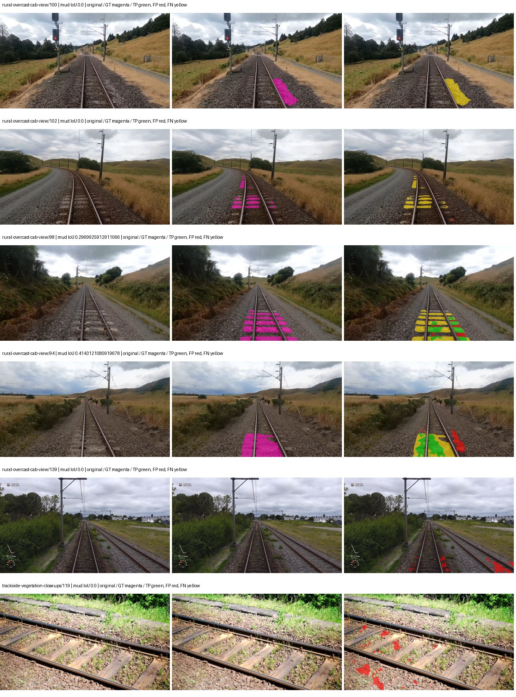

Examples are two lowest and two highest mud-IoU positive images, plus up to two negative images with the most false-positive mud pixels. They are targeted diagnostic examples, not random samples. Green: true positive; red: false positive; yellow: false negative. Full predictions remain on HDRFS.

### Validation tracking

| Logged step | Overall mIoU (%) | Mud IoU (%) |
| --- | --- | --- |
| 254 | 24.11 | 2.02 |
| 508 | 25.74 | 6.28 |
| 763 | 28.11 | 2.23 |
| 1017 | 28.53 | 4.01 |
| 1272 | 28.06 | 3.57 |
| 1527 | 31.09 | 1.19 |
| 1781 | 31.16 | 1.07 |

All retained scalar curves, including training loss and per-class IoU, are in record.json. Observed best mud on a curve is not necessarily a retained checkpoint: the pilot saved its selection-metric-best and final checkpoints. Step logging and checkpoint global_step may differ by one.

### Stopping and checkpoint provenance

```json
{
  "stopping": {
    "actual_steps": 1781,
    "maximum_steps": 4000,
    "min_delta": 0.001,
    "monitor": "val_iou/mud-pumping",
    "patience": 5,
    "reason": "validation_plateau"
  },
  "checkpoints": {
    "best": {
      "path": "/data/izadia1/projects/segmentary-runs/paul-test-rtis/mud-fullstats-v1-20260906-r2/future-runs/hf_auto_segformer_b0--cityscapes_to_railsem19_to_rtis--seed-2_seed2/rtis/best.ckpt",
      "sha256": "3ac31d810c00b2210d458db4a30c993cacd44afd9956e6ee4360c895887b702c",
      "global_step": 509,
      "bytes": 59870157
    },
    "final": {
      "path": "/data/izadia1/projects/segmentary-runs/paul-test-rtis/mud-fullstats-v1-20260906-r2/future-runs/hf_auto_segformer_b0--cityscapes_to_railsem19_to_rtis--seed-2_seed2/rtis/last.ckpt",
      "sha256": "61e85b9d786ad23a9717e7638526dad796449769f9de4ac514404af152152315",
      "global_step": 1781,
      "bytes": 59860429
    }
  },
  "cleanup_error": null
}
```

### Resolved training, initialization and evaluation settings

The optimizer block is the base configuration. Stage LR scales are applied at runtime, and stage warmup is capped at min(base warmup, floor(stage budget / 10), stage budget - 1): 400 steps for this 4,000-step pilot. Model-internal native input grids may differ from augmentation crops (EoMT uses its 640 grid).

```json
{
  "name": "hf_auto_segformer_b0--cityscapes_to_railsem19_to_rtis--seed-2",
  "model": {
    "arch": "hf_auto",
    "checkpoint": "nvidia/segformer-b0-finetuned-ade-512-512",
    "tuning": "full",
    "head": "unified_head",
    "lora_r": 16,
    "lora_alpha": 32,
    "lora_dropout": 0.05,
    "lora_targets": [],
    "drop_path": null,
    "revision": "489d5cd81a0b59fab9b7ea758d3548ebe99677da",
    "subfolder": null,
    "local_files_only": false,
    "trust_remote_code": false,
    "backbone_path": null,
    "head_paths": [],
    "classifier_path": null,
    "inactive_parameter_paths": [],
    "smp_arch": null,
    "encoder_name": null,
    "encoder_weights": null,
    "native": null,
    "batch_norm_momentum": null
  },
  "space": "paul-test-rtis",
  "taxonomy_root": "/data/izadia1/projects/segmentary-rtis-fullstats-066afb2/taxonomy",
  "output_root": "/data/izadia1/projects/segmentary-runs/paul-test-rtis/mud-fullstats-v1-20260906-r2/future-runs",
  "optim": {
    "backbone_lr": 6e-05,
    "head_lr_mult": 10.0,
    "weight_decay": 0.05,
    "llrd": 1.0,
    "warmup_iters": 1500,
    "warmup_ratio": 1e-06,
    "poly_power": 0.9,
    "min_lr_ratio": 0.0,
    "betas": [
      0.9,
      0.999
    ],
    "grad_clip": 1.0
  },
  "train": {
    "iters": 4000,
    "batch_size": 2,
    "accum": 8,
    "num_workers": 2,
    "precision": "bf16-mixed",
    "ema_decay": 0.9998,
    "val_every": 250,
    "ckpt_every": 500,
    "selection_metric": "val_iou/mud-pumping",
    "early_stopping_patience": 5,
    "early_stopping_min_delta": 0.001,
    "seed": 2,
    "devices": 1
  },
  "eval": {
    "sliding_window": true,
    "window": [
      1024,
      1024
    ],
    "stride": [
      768,
      768
    ],
    "batch_size": 1,
    "num_workers": 2,
    "tta_scales": [],
    "tta_flip": false,
    "threshold": 0.5,
    "boundary_tolerance_frac": 0.0075,
    "save_confusion": true
  },
  "loss": {
    "task": "multiclass",
    "activation": "auto",
    "terms": [],
    "aux": "none",
    "aux_weight": 0.0,
    "ce_weight": 1.0,
    "label_smoothing": 0.0,
    "class_weights": null,
    "query": null
  },
  "aug": {
    "crop": [
      1024,
      1024
    ],
    "scale_min": 0.5,
    "scale_max": 2.0,
    "hflip_p": 0.5,
    "color_jitter_p": 0.5,
    "brightness": 0.25,
    "contrast": 0.25,
    "saturation": 0.25,
    "hue": 0.05
  },
  "stages": [
    {
      "name": "rtis",
      "data": [
        {
          "name": "paul-test-rtis",
          "root": "/data/izadia1/datasets/paul-test-rtis",
          "variant": null,
          "split_file": "splits.json",
          "train_split": "train",
          "val_split": "val",
          "limit": null,
          "loader": "folder",
          "mapping": "paul-test-rtis",
          "loader_options": {
            "require_groups": true
          }
        }
      ],
      "iters": null,
      "lr_scale": 0.1,
      "head_group_lr_scale": 1.0,
      "init_from": "/data/izadia1/projects/segmentary-runs/all-model-city-rail-seed0-rail20-b9eb3e1/jobs/hf_auto_segformer_b0--cityscapes_to_railsem19--seed-0/attempt-001/train/hf_auto_segformer_b0--cityscapes_to_railsem19_seed0/railsem19/last.ckpt",
      "reset_head": true,
      "freeze": null,
      "sample_weights": null
    }
  ]
}
```

### Hardware and software provenance

```json
{
  "training": {
    "cuda_available": true,
    "cuda_visible_devices": "8",
    "cudnn": 91900,
    "driver_version": "570.133.20",
    "gpu_count": 1,
    "gpu_names": [
      "NVIDIA L40S"
    ],
    "hostname": "hdrfs-app-001",
    "input_normalization": {
      "channel_order": "rgb",
      "mean": [
        0.485,
        0.456,
        0.406
      ],
      "source": "hf_image_processor",
      "std": [
        0.229,
        0.224,
        0.225
      ]
    },
    "model_origins": [
      {
        "hf_commit": "489d5cd81a0b59fab9b7ea758d3548ebe99677da",
        "hf_name_or_path": "nvidia/segformer-b0-finetuned-ade-512-512",
        "module": "model",
        "timm_pretrained": {}
      },
      {
        "hf_commit": "489d5cd81a0b59fab9b7ea758d3548ebe99677da",
        "hf_name_or_path": "nvidia/segformer-b0-finetuned-ade-512-512",
        "module": "model.segformer",
        "timm_pretrained": {}
      },
      {
        "hf_commit": "489d5cd81a0b59fab9b7ea758d3548ebe99677da",
        "hf_name_or_path": "nvidia/segformer-b0-finetuned-ade-512-512",
        "module": "model.segformer.stages.0.blocks.0.attention",
        "timm_pretrained": {}
      },
      {
        "hf_commit": "489d5cd81a0b59fab9b7ea758d3548ebe99677da",
        "hf_name_or_path": "nvidia/segformer-b0-finetuned-ade-512-512",
        "module": "model.segformer.stages.0.blocks.1.attention",
        "timm_pretrained": {}
      },
      {
        "hf_commit": "489d5cd81a0b59fab9b7ea758d3548ebe99677da",
        "hf_name_or_path": "nvidia/segformer-b0-finetuned-ade-512-512",
        "module": "model.segformer.stages.1.blocks.0.attention",
        "timm_pretrained": {}
      },
      {
        "hf_commit": "489d5cd81a0b59fab9b7ea758d3548ebe99677da",
        "hf_name_or_path": "nvidia/segformer-b0-finetuned-ade-512-512",
        "module": "model.segformer.stages.1.blocks.1.attention",
        "timm_pretrained": {}
      },
      {
        "hf_commit": "489d5cd81a0b59fab9b7ea758d3548ebe99677da",
        "hf_name_or_path": "nvidia/segformer-b0-finetuned-ade-512-512",
        "module": "model.segformer.stages.2.blocks.0.attention",
        "timm_pretrained": {}
      },
      {
        "hf_commit": "489d5cd81a0b59fab9b7ea758d3548ebe99677da",
        "hf_name_or_path": "nvidia/segformer-b0-finetuned-ade-512-512",
        "module": "model.segformer.stages.2.blocks.1.attention",
        "timm_pretrained": {}
      },
      {
        "hf_commit": "489d5cd81a0b59fab9b7ea758d3548ebe99677da",
        "hf_name_or_path": "nvidia/segformer-b0-finetuned-ade-512-512",
        "module": "model.segformer.stages.3.blocks.0.attention",
        "timm_pretrained": {}
      },
      {
        "hf_commit": "489d5cd81a0b59fab9b7ea758d3548ebe99677da",
        "hf_name_or_path": "nvidia/segformer-b0-finetuned-ade-512-512",
        "module": "model.segformer.stages.3.blocks.1.attention",
        "timm_pretrained": {}
      },
      {
        "hf_commit": "489d5cd81a0b59fab9b7ea758d3548ebe99677da",
        "hf_name_or_path": "nvidia/segformer-b0-finetuned-ade-512-512",
        "module": "model.decode_head",
        "timm_pretrained": {}
      }
    ],
    "model_parameter_count": 3719541,
    "packages": {
      "albumentations": "2.0.8",
      "lightning": "2.6.5",
      "numpy": "2.4.4",
      "segmentary": "0.1.0",
      "segmentation-models-pytorch": "0.5.0",
      "timm": "1.0.28",
      "torch": "2.11.0+cu128",
      "torchvision": "0.26.0+cu128",
      "transformers": "5.15.0"
    },
    "platform": "Linux-5.15.0-139-generic-x86_64-with-glibc2.35",
    "python": "3.11.15",
    "torch": "2.11.0+cu128",
    "torch_cuda": "12.8",
    "trainable_parameter_count": 3719541,
    "training_stop": {
      "actual_steps": 1781,
      "maximum_steps": 4000,
      "min_delta": 0.001,
      "monitor": "val_iou/mud-pumping",
      "patience": 5,
      "reason": "validation_plateau"
    },
    "validation_weights": "raw"
  },
  "evaluation": {
    "cuda_available": true,
    "cuda_visible_devices": "8",
    "cudnn": 91900,
    "driver_version": "570.133.20",
    "gpu_count": 1,
    "gpu_names": [
      "NVIDIA L40S"
    ],
    "hostname": "hdrfs-app-001",
    "input_normalization": {
      "channel_order": "rgb",
      "mean": [
        0.485,
        0.456,
        0.406
      ],
      "source": "hf_image_processor",
      "std": [
        0.229,
        0.224,
        0.225
      ]
    },
    "packages": {
      "albumentations": "2.0.8",
      "lightning": "2.6.5",
      "numpy": "2.4.4",
      "segmentary": "0.1.0",
      "segmentation-models-pytorch": "0.5.0",
      "timm": "1.0.28",
      "torch": "2.11.0+cu128",
      "torchvision": "0.26.0+cu128",
      "transformers": "5.15.0"
    },
    "platform": "Linux-5.15.0-139-generic-x86_64-with-glibc2.35",
    "python": "3.11.15",
    "torch": "2.11.0+cu128",
    "torch_cuda": "12.8"
  }
}
```
