# hf_auto_upernet_swin_tiny — paul-test-rtis

[RTIS comparison](../../README.md) · [Full model records](record.json)

Primary selection and early stopping: **mud-pumping validation IoU**. A job is complete only after full statistics and isolated profiling are verified.

| Model | Initialization path | Seed | Status | Steps | Best step | Mud IoU (%) | Mud precision (%) | Mud recall (%) | Final mud IoU (trainer val, %) | mIoU (%) | Fixed GT-class mIoU (%) |
| --- | --- | --- | --- | --- | --- | --- | --- | --- | --- | --- | --- |
| hf_auto_upernet_swin_tiny | rtis_only | 0 | completed | 1527 | 254 | 19.92 | 22.13 | 66.64 | 2.62 | 31.08 | 34.54 |
| hf_auto_upernet_swin_tiny | rtis_only | 1 | completed | 1781 | 509 | 10.30 | 11.25 | 54.87 | 6.92 | 33.09 | 38.61 |
| hf_auto_upernet_swin_tiny | rtis_only | 2 | completed | 1527 | 254 | 12.35 | 16.15 | 34.38 | 3.43 | 28.93 | 32.15 |
| hf_auto_upernet_swin_tiny | cityscapes_to_rtis | 0 | completed | 2036 | 1018 | 2.79 | 3.63 | 10.78 | 2.41 | 32.13 | 37.48 |
| hf_auto_upernet_swin_tiny | cityscapes_to_rtis | 1 | completed | 2036 | 763 | 2.90 | 3.45 | 15.39 | 0.39 | 32.70 | 36.33 |
| hf_auto_upernet_swin_tiny | cityscapes_to_rtis | 2 | completed | 1781 | 509 | 5.33 | 10.68 | 9.63 | 2.73 | 26.60 | 29.56 |
| hf_auto_upernet_swin_tiny | railsem19_to_rtis | 0 | completed | 1781 | 509 | 7.27 | 20.48 | 10.13 | 2.35 | 45.13 | 47.64 |
| hf_auto_upernet_swin_tiny | railsem19_to_rtis | 1 | completed | 1527 | 254 | 4.69 | 6.16 | 16.47 | 3.89 | 32.94 | 34.77 |
| hf_auto_upernet_swin_tiny | railsem19_to_rtis | 2 | evaluating | 2290 | — | — | — | — | — | — | — |
| hf_auto_upernet_swin_tiny | cityscapes_to_railsem19_to_rtis | 0 | completed | 1527 | 254 | 4.74 | 6.56 | 14.63 | 1.67 | 30.09 | 33.43 |
| hf_auto_upernet_swin_tiny | cityscapes_to_railsem19_to_rtis | 1 | completed | 1527 | 254 | 18.14 | 25.10 | 39.55 | 4.04 | 32.87 | 34.70 |
| hf_auto_upernet_swin_tiny | cityscapes_to_railsem19_to_rtis | 2 | completed | 1527 | 254 | 11.36 | 15.02 | 31.78 | 1.99 | 29.31 | 32.57 |

Training: 220 images. Validation: 37 images. Test: 50 held out. Seeds: [0, 1, 2]. Seed variation measures optimization variability, not independent-recording uncertainty. Historical source checkpoints stay fixed across adaptation seeds.

Training code: `066afb2626398b7be59d4d19f5a0e4644fd59adc`. Split SHA-256: `71fef8292610c352da0709fe3bd030f3bcc18f97560394835f4b22826463b83d`.

## rtis_only — seed 0

Status: **completed**. Started: 2026-09-06T13:56:19.909933+00:00. Finished: 2026-09-06T14:34:05.833285+00:00.

Recipe pretrained initializer: `openmmlab/upernet-swin-tiny`.

`rtis_only` uses the recipe initializer, which may include pretrained segmentation components. Transfer paths load the exact historical source checkpoint below and reset the classifier; they do not reset all query/decoder features.

Source checkpoint: `Recipe pretrained initialization`.

Config SHA-256: `b467aa9c6696a7c0f9e75814b29014ef7e99a2cbd674f2eb381c990dce839c47`. Weights used for validation: `raw`.

### Mud-pumping and aggregate quality

| Metric | Selected checkpoint | Final training validation |
| --- | --- | --- |
| Mud IoU | 19.92 | 2.62 |
| Mud precision | 22.13 | 3.35 |
| Mud recall | 66.64 | 10.80 |
| Mud Dice/F1 | 33.23 | 5.12 |
| mIoU | 31.08 | 32.65 |
| Mean accuracy | 42.52 | 45.92 |
| Mean precision | 51.55 | 53.03 |
| Mean Dice | 39.62 | 40.54 |
| Mean specificity | 98.85 | 98.96 |
| Pixel accuracy | 82.62 | 83.29 |
| Frequency-weighted IoU | 72.66 | 75.17 |
| Fixed GT-present class mIoU | 34.54 | 38.09 |
| Boundary F1 | 35.44 | 39.58 |

The selected checkpoint has independent evaluation evidence. Final values are the trainer's final validation record, not a new independent evaluation. mIoU averages classes with nonzero union, so false positives on absent classes can change its denominator. The fixed GT-class mean is supplementary and excludes absent classes; their false positives remain in the confusion matrix.

### Resource usage and timing

| Measurement | Value |
| --- | --- |
| Peak training VRAM, retained training invocation (GiB) | 11.71 |
| Peak evaluation VRAM (GiB) | 7.52 |
| Retained training invocation wall time (seconds) | 2053.79 |
| Retained training invocation GPU-hours (one GPU) | 0.57 |
| Evaluation wall time (seconds) | 19.82 |
| Full evaluation pipeline images/second | 1.87 |
| Best full-state checkpoint (MiB) | 900.33 |
| Final full-state checkpoint (MiB) | 900.31 |
| Audited periodic checkpoints removed (GiB) | 2.64 |

VRAM uses the recorded allocator high-water mark; it is not total device usage including CUDA context. Resumed jobs' retained training invocation times and peaks are **not whole-campaign totals**. Earlier invocation resource records are not reconstructed here. Evaluation throughput includes loader, sliding-window inference and metrics; it is not model-only latency/FPS. Missing measurements are shown as —, never inferred from another dataset's run.

### Standardized inference performance

Dedicated model-only profiling waits for an idle worker-locked L40S: BF16, batch 1, 1024x1024, 20 warmup and 100 CUDA-event-timed public forwards. It excludes loading, preprocessing, tiling and metrics.

| Status | Parameters | Weight MiB | FPS | p50 ms | p95 ms | Peak reserved GiB |
| --- | --- | --- | --- | --- | --- | --- |
| complete | 58953423 | 224.89 | 42.16 | 23.44 | 24.61 | 2.41 |

```json
{
  "schema_version": 1,
  "model_id": "hf_auto_upernet_swin_tiny",
  "measured_at": "2026-09-06T14:34:00+00:00",
  "status": "complete",
  "benchmark_scope": "rtis_selected_checkpoint_model_only",
  "applies_to": [
    "hf_auto_upernet_swin_tiny--rtis_only--seed-0"
  ],
  "source": {
    "campaign_git_sha": "066afb2626398b7be59d4d19f5a0e4644fd59adc",
    "git_dirty": false,
    "config_hash": "0eb2feede3d0",
    "resolved_config": "/data/izadia1/projects/segmentary-runs/paul-test-rtis/mud-fullstats-v1-20260906-r2/configs/hf_auto_upernet_swin_tiny--rtis_only--seed-0.yaml",
    "config_sha256": "b467aa9c6696a7c0f9e75814b29014ef7e99a2cbd674f2eb381c990dce839c47",
    "checkpoint_sha256": "373e088fb040de9be129cdfe88bf5f4c69081a9972c05d1646f0a06317b661a8",
    "checkpoint_global_step": 254,
    "checkpoint_bytes": 944059545,
    "checkpoint_kind": "resume checkpoint with optimizer and EMA state",
    "weights": "raw",
    "measured_checkpoint_job_id": "hf_auto_upernet_swin_tiny--rtis_only--seed-0",
    "result_sha256": "64e761cd36a1193958be82f6e458fc211a344b1a5db308c60c34cff8bba5247e",
    "result_git_sha": "066afb2626398b7be59d4d19f5a0e4644fd59adc",
    "result_stage": "eval:paul-test-rtis:val",
    "result_seed": 0
  },
  "hardware": {
    "gpu_name": "NVIDIA L40S",
    "gpu_uuid": "GPU-931d0911-fc78-1638-e3d7-1ba868cbd286",
    "logical_device": "cuda:0",
    "physical_visibility_token": "2",
    "compute_capability": [
      8,
      9
    ],
    "total_memory_bytes": 47677177856
  },
  "model": {
    "parameter_count": 58953423,
    "trainable_parameter_count": 58951887,
    "resident_parameter_bytes": 235813692,
    "parameter_dtype_counts": {
      "float32": 58953423
    }
  },
  "contract": {
    "backend": "pytorch",
    "precision": "bf16_autocast",
    "batch_size": 1,
    "input_shape_nchw": [
      1,
      3,
      1024,
      1024
    ],
    "warmup_iterations": 20,
    "measured_iterations": 100,
    "timing": "per-forward CUDA events with end-event synchronization",
    "includes_preprocessing": false,
    "includes_data_loader": false,
    "includes_sliding_window": false,
    "input_resident_on_gpu": true,
    "model_only": true,
    "entrypoint": "public model(image) dense-logits forward"
  },
  "measurements": {
    "latency": {
      "p50_ms": 23.442928314208984,
      "p95_ms": 24.612300395965576,
      "mean_ms": 23.72060386657715,
      "minimum_ms": 23.236576080322266,
      "maximum_ms": 27.94598388671875,
      "fps": 42.157442771051116,
      "raw_ms": [
        24.46531105041504,
        24.040447235107422,
        23.636991500854492,
        23.42198371887207,
        23.29292869567871,
        23.29599952697754,
        23.30624008178711,
        23.70355224609375,
        23.259136199951172,
        23.336959838867188,
        23.32364845275879,
        23.28371238708496,
        24.361984252929688,
        24.237056732177734,
        24.456192016601562,
        23.48739242553711,
        23.768991470336914,
        23.28691291809082,
        23.27142333984375,
        23.252992630004883,
        23.30726432800293,
        23.593984603881836,
        23.309215545654297,
        23.52751922607422,
        23.375871658325195,
        24.47871971130371,
        23.570432662963867,
        23.997440338134766,
        24.28620719909668,
        23.48953628540039,
        23.32569694519043,
        23.30624008178711,
        23.389184951782227,
        23.607295989990234,
        23.339008331298828,
        23.68307113647461,
        23.32364845275879,
        23.999391555786133,
        24.173568725585938,
        23.44646453857422,
        24.203264236450195,
        24.142847061157227,
        23.773183822631836,
        26.440704345703125,
        23.51923179626465,
        23.354368209838867,
        23.447551727294922,
        23.31340789794922,
        23.364608764648438,
        23.27347183227539,
        23.28371238708496,
        24.01375961303711,
        23.27347183227539,
        24.581119537353516,
        23.584768295288086,
        27.94598388671875,
        23.787519454956055,
        23.90630340576172,
        23.628704071044922,
        23.3123836517334,
        23.346176147460938,
        23.292831420898438,
        23.328767776489258,
        23.571456909179688,
        23.380992889404297,
        23.358463287353516,
        23.31648063659668,
        23.407615661621094,
        24.231807708740234,
        27.502592086791992,
        23.803903579711914,
        23.571456909179688,
        23.275423049926758,
        23.29190444946289,
        23.441408157348633,
        23.30419158935547,
        23.443456649780273,
        23.28780746459961,
        23.572479248046875,
        23.346176147460938,
        23.442399978637695,
        24.275968551635742,
        25.68191909790039,
        23.734272003173828,
        23.560192108154297,
        23.25699234008789,
        23.310335159301758,
        23.32467269897461,
        23.28780746459961,
        23.252992630004883,
        23.30624008178711,
        23.30624008178711,
        23.251968383789062,
        23.236576080322266,
        23.370880126953125,
        24.028160095214844,
        25.204736709594727,
        23.769088745117188,
        23.587839126586914,
        23.625728607177734
      ],
      "percentile_method": "numpy linear interpolation"
    },
    "peak_reserved_bytes": 2583691264,
    "memory_kind": "pytorch_cuda_allocator_peak_reserved_excluding_context",
    "benchmark_wall_clock_s": 8.263288654386997
  },
  "started_at": "2026-09-06T14:33:51+00:00",
  "finished_at": "2026-09-06T14:34:00+00:00",
  "environment": {
    "hostname": "hdrfs-app-001",
    "python": "3.11.15",
    "platform": "Linux-5.15.0-139-generic-x86_64-with-glibc2.35",
    "torch": "2.11.0+cu128",
    "torch_cuda": "12.8",
    "cudnn": 91900,
    "driver_version": "570.133.20",
    "cuda_available": true,
    "gpu_count": 1,
    "gpu_names": [
      "NVIDIA L40S"
    ],
    "cuda_visible_devices": "2",
    "packages": {
      "segmentary": "0.1.0",
      "torch": "2.11.0+cu128",
      "torchvision": "0.26.0+cu128",
      "transformers": "5.15.0",
      "timm": "1.0.28",
      "segmentation-models-pytorch": "0.5.0",
      "albumentations": "2.0.8",
      "lightning": "2.6.5",
      "numpy": "2.4.4"
    }
  }
}
```

### Per-class validation results

| Class | GT pixels | IoU (%) | Precision (%) | Recall (%) | Dice (%) | Boundary F1 (%) |
| --- | --- | --- | --- | --- | --- | --- |
| car | 29664 | 0.00 | 0.00 | 0.00 | 0.00 | 0.00 |
| construction | 311585 | 52.68 | 68.45 | 69.58 | 69.01 | 61.88 |
| fence | 265137 | 13.57 | 78.75 | 14.09 | 23.90 | 42.73 |
| mud-pumping | 1226250 | 19.92 | 22.13 | 66.64 | 33.23 | 24.78 |
| on-rails | 0 | — | — | — | — | — |
| person | 0 | 0.00 | 0.00 | — | 0.00 | 0.00 |
| pole | 628038 | 68.17 | 80.24 | 81.91 | 81.07 | 88.37 |
| rail-embedded | 16799 | 0.00 | 0.00 | 0.00 | 0.00 | 0.00 |
| rail-raised | 2969797 | 71.62 | 80.07 | 87.16 | 83.46 | 87.59 |
| rail-track | 6323197 | 36.93 | 56.53 | 51.58 | 53.94 | 49.94 |
| road | 1048831 | 10.62 | 41.42 | 12.50 | 19.20 | 18.41 |
| sidewalk | 1297367 | 34.93 | 65.85 | 42.65 | 51.77 | 13.78 |
| sky | 19121606 | 97.64 | 99.28 | 98.34 | 98.80 | 93.08 |
| standing-water | 95802 | 0.31 | 2.26 | 0.36 | 0.62 | 5.55 |
| terrain | 39239306 | 82.96 | 84.37 | 98.02 | 90.68 | 48.72 |
| trackbed | 10643081 | 53.70 | 90.79 | 56.79 | 69.88 | 58.40 |
| traffic-light | 19510 | 0.00 | 0.00 | 0.00 | 0.00 | 0.00 |
| traffic-sign | 13285 | 4.82 | 100.00 | 4.82 | 9.19 | 19.82 |
| tram-track | 56179 | 40.62 | 88.37 | 42.91 | 57.77 | 41.97 |
| truck | 0 | 0.00 | 0.00 | — | 0.00 | 0.00 |
| vegetation-overgrowth | 5901821 | 33.20 | 72.53 | 37.97 | 49.84 | 53.86 |

### Full-run accounting

| Measurement | Value |
| --- | --- |
| Full GPU-reserved wall seconds, all recorded worker attempts | 2265.93 |
| Full reserved GPU-hours | 0.63 |
| Whole-run timing complete | True |

| Phase | Wall seconds including failed attempts |
| --- | --- |
| training | 2060.79 |
| diagnostics | 155.55 |
| performance | 16.52 |

GPU-reserved time includes model loading, training, validation, collection, profiling, checkpoint I/O and orchestration while the worker owns one GPU. It is not GPU kernel-active time. Phase timings and sampled device memory/power/utilization are retained separately; sampled device memory is not the allocator high-water mark.

### Train/validation and raw/EMA diagnostics

| Checkpoint / weights / split | Images | Mud IoU (%) | Mud precision (%) | Mud recall (%) |
| --- | --- | --- | --- | --- |
| best-auto-train / raw | 220 | 84.55 | 86.94 | 96.85 |
| best-auto-val / raw | 37 | 19.92 | 22.13 | 66.64 |
| best-alternate-val / ema | 37 | 3.43 | 6.64 | 6.63 |
| final-auto-val / raw | 37 | 2.63 | 3.35 | 10.80 |

Train uses the evaluation transform without augmentation. Compare mud train/validation metrics for the same selected weights. Alternate EMA on running-stat BatchNorm is explicitly uncalibrated and is diagnostic only. Score-threshold curves use uncalibrated normalized scores and are pixel-level diagnostics, not event detection rates or a selected deployment operating point.

### Downloadable evidence

- best-auto-train: [per-image.csv](rtis_only--seed-0/best-auto-train/per-image.csv) · [per-image-confusion.json.gz](rtis_only--seed-0/best-auto-train/per-image-confusion.json.gz) · [groups.json](rtis_only--seed-0/best-auto-train/groups.json) · [mud-score-curves.json](rtis_only--seed-0/best-auto-train/mud-score-curves.json)
- best-auto-val: [per-image.csv](rtis_only--seed-0/best-auto-val/per-image.csv) · [per-image-confusion.json.gz](rtis_only--seed-0/best-auto-val/per-image-confusion.json.gz) · [groups.json](rtis_only--seed-0/best-auto-val/groups.json) · [mud-score-curves.json](rtis_only--seed-0/best-auto-val/mud-score-curves.json) · [examples.jpg](rtis_only--seed-0/best-auto-val/examples.jpg)
- best-alternate-val: [per-image.csv](rtis_only--seed-0/best-alternate-val/per-image.csv) · [per-image-confusion.json.gz](rtis_only--seed-0/best-alternate-val/per-image-confusion.json.gz) · [groups.json](rtis_only--seed-0/best-alternate-val/groups.json) · [mud-score-curves.json](rtis_only--seed-0/best-alternate-val/mud-score-curves.json)
- final-auto-val: [per-image.csv](rtis_only--seed-0/final-auto-val/per-image.csv) · [per-image-confusion.json.gz](rtis_only--seed-0/final-auto-val/per-image-confusion.json.gz) · [groups.json](rtis_only--seed-0/final-auto-val/groups.json) · [mud-score-curves.json](rtis_only--seed-0/final-auto-val/mud-score-curves.json)
- resources: [telemetry.csv](rtis_only--seed-0/resources/telemetry.csv)

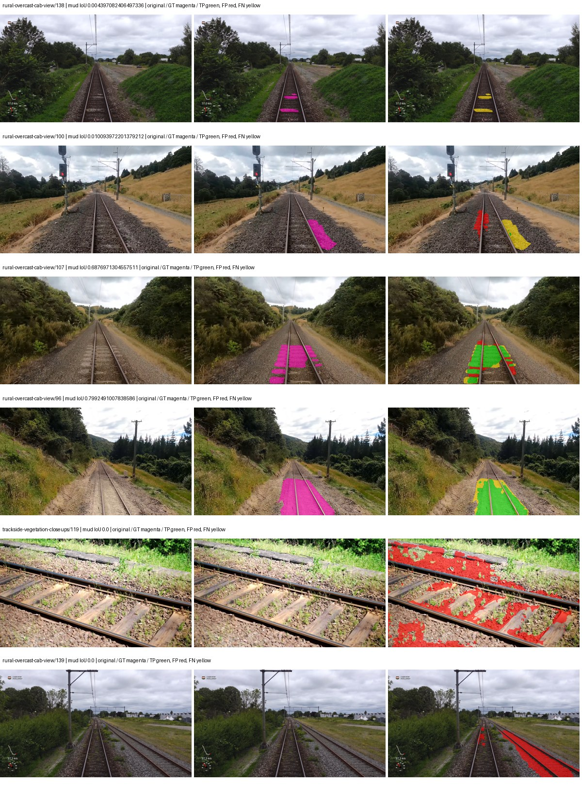

Examples are two lowest and two highest mud-IoU positive images, plus up to two negative images with the most false-positive mud pixels. They are targeted diagnostic examples, not random samples. Green: true positive; red: false positive; yellow: false negative. Full predictions remain on HDRFS.

### Validation tracking

| Logged step | Overall mIoU (%) | Mud IoU (%) |
| --- | --- | --- |
| 254 | 31.08 | 19.93 |
| 508 | 32.14 | 1.88 |
| 763 | 33.13 | 1.43 |
| 1017 | 37.36 | 0.29 |
| 1272 | 32.19 | 0.93 |
| 1527 | 32.65 | 2.62 |

All retained scalar curves, including training loss and per-class IoU, are in record.json. Observed best mud on a curve is not necessarily a retained checkpoint: the pilot saved its selection-metric-best and final checkpoints. Step logging and checkpoint global_step may differ by one.

### Stopping and checkpoint provenance

```json
{
  "stopping": {
    "actual_steps": 1527,
    "maximum_steps": 4000,
    "min_delta": 0.001,
    "monitor": "val_iou/mud-pumping",
    "patience": 5,
    "reason": "validation_plateau"
  },
  "checkpoints": {
    "best": {
      "path": "/data/izadia1/projects/segmentary-runs/paul-test-rtis/mud-fullstats-v1-20260906-r2/future-runs/hf_auto_upernet_swin_tiny--rtis_only--seed-0_seed0/rtis/best.ckpt",
      "sha256": "373e088fb040de9be129cdfe88bf5f4c69081a9972c05d1646f0a06317b661a8",
      "global_step": 254,
      "bytes": 944059545
    },
    "final": {
      "path": "/data/izadia1/projects/segmentary-runs/paul-test-rtis/mud-fullstats-v1-20260906-r2/future-runs/hf_auto_upernet_swin_tiny--rtis_only--seed-0_seed0/rtis/last.ckpt",
      "sha256": "6b6f5aac1a4b8e14840f95cf5a8a66a3bd23db1b4d944c4b96308995dc88caa7",
      "global_step": 1527,
      "bytes": 944046553
    }
  },
  "cleanup_error": null
}
```

### Resolved training, initialization and evaluation settings

The optimizer block is the base configuration. Stage LR scales are applied at runtime, and stage warmup is capped at min(base warmup, floor(stage budget / 10), stage budget - 1): 400 steps for this 4,000-step pilot. Model-internal native input grids may differ from augmentation crops (EoMT uses its 640 grid).

```json
{
  "name": "hf_auto_upernet_swin_tiny--rtis_only--seed-0",
  "model": {
    "arch": "hf_auto",
    "checkpoint": "openmmlab/upernet-swin-tiny",
    "tuning": "full",
    "head": "unified_head",
    "lora_r": 16,
    "lora_alpha": 32,
    "lora_dropout": 0.05,
    "lora_targets": [],
    "drop_path": null,
    "revision": "dc8e8c94669c6f14d5cc4c21a141daebd2280d59",
    "subfolder": null,
    "local_files_only": false,
    "trust_remote_code": false,
    "backbone_path": "backbone",
    "head_paths": [
      "decode_head"
    ],
    "classifier_path": "decode_head.classifier",
    "inactive_parameter_paths": [
      "backbone.swin.layernorm"
    ],
    "smp_arch": null,
    "encoder_name": null,
    "encoder_weights": null,
    "native": null,
    "batch_norm_momentum": null
  },
  "space": "paul-test-rtis",
  "taxonomy_root": "/data/izadia1/projects/segmentary-rtis-fullstats-066afb2/taxonomy",
  "output_root": "/data/izadia1/projects/segmentary-runs/paul-test-rtis/mud-fullstats-v1-20260906-r2/future-runs",
  "optim": {
    "backbone_lr": 6e-05,
    "head_lr_mult": 10.0,
    "weight_decay": 0.05,
    "llrd": 0.9,
    "warmup_iters": 1500,
    "warmup_ratio": 1e-06,
    "poly_power": 0.9,
    "min_lr_ratio": 0.0,
    "betas": [
      0.9,
      0.999
    ],
    "grad_clip": 1.0
  },
  "train": {
    "iters": 4000,
    "batch_size": 2,
    "accum": 8,
    "num_workers": 2,
    "precision": "bf16-mixed",
    "ema_decay": 0.9998,
    "val_every": 250,
    "ckpt_every": 500,
    "selection_metric": "val_iou/mud-pumping",
    "early_stopping_patience": 5,
    "early_stopping_min_delta": 0.001,
    "seed": 0,
    "devices": 1
  },
  "eval": {
    "sliding_window": true,
    "window": [
      1024,
      1024
    ],
    "stride": [
      768,
      768
    ],
    "batch_size": 1,
    "num_workers": 2,
    "tta_scales": [],
    "tta_flip": false,
    "threshold": 0.5,
    "boundary_tolerance_frac": 0.0075,
    "save_confusion": true
  },
  "loss": {
    "task": "multiclass",
    "activation": "auto",
    "terms": [],
    "aux": "none",
    "aux_weight": 0.0,
    "ce_weight": 1.0,
    "label_smoothing": 0.0,
    "class_weights": null,
    "query": null
  },
  "aug": {
    "crop": [
      1024,
      1024
    ],
    "scale_min": 0.5,
    "scale_max": 2.0,
    "hflip_p": 0.5,
    "color_jitter_p": 0.5,
    "brightness": 0.25,
    "contrast": 0.25,
    "saturation": 0.25,
    "hue": 0.05
  },
  "stages": [
    {
      "name": "rtis",
      "data": [
        {
          "name": "paul-test-rtis",
          "root": "/data/izadia1/datasets/paul-test-rtis",
          "variant": null,
          "split_file": "splits.json",
          "train_split": "train",
          "val_split": "val",
          "limit": null,
          "loader": "folder",
          "mapping": "paul-test-rtis",
          "loader_options": {
            "require_groups": true
          }
        }
      ],
      "iters": null,
      "lr_scale": 1.0,
      "head_group_lr_scale": 1.0,
      "init_from": "pretrained",
      "reset_head": false,
      "freeze": null,
      "sample_weights": null
    }
  ]
}
```

### Hardware and software provenance

```json
{
  "training": {
    "cuda_available": true,
    "cuda_visible_devices": "2",
    "cudnn": 91900,
    "driver_version": "570.133.20",
    "gpu_count": 1,
    "gpu_names": [
      "NVIDIA L40S"
    ],
    "hostname": "hdrfs-app-001",
    "input_normalization": {
      "channel_order": "rgb",
      "mean": [
        0.485,
        0.456,
        0.406
      ],
      "source": "hf_image_processor",
      "std": [
        0.229,
        0.224,
        0.225
      ]
    },
    "model_origins": [
      {
        "hf_commit": "dc8e8c94669c6f14d5cc4c21a141daebd2280d59",
        "hf_name_or_path": "openmmlab/upernet-swin-tiny",
        "module": "model",
        "timm_pretrained": {}
      },
      {
        "hf_commit": null,
        "hf_name_or_path": "",
        "module": "model.backbone",
        "timm_pretrained": {}
      },
      {
        "hf_commit": null,
        "hf_name_or_path": "",
        "module": "model.backbone.swin",
        "timm_pretrained": {}
      },
      {
        "hf_commit": null,
        "hf_name_or_path": "",
        "module": "model.backbone.swin.embeddings",
        "timm_pretrained": {}
      },
      {
        "hf_commit": null,
        "hf_name_or_path": "",
        "module": "model.backbone.swin.encoder",
        "timm_pretrained": {}
      },
      {
        "hf_commit": null,
        "hf_name_or_path": "",
        "module": "model.backbone.swin.encoder.layers.0",
        "timm_pretrained": {}
      },
      {
        "hf_commit": null,
        "hf_name_or_path": "",
        "module": "model.backbone.swin.encoder.layers.0.blocks.0.attention",
        "timm_pretrained": {}
      },
      {
        "hf_commit": null,
        "hf_name_or_path": "",
        "module": "model.backbone.swin.encoder.layers.0.blocks.1.attention",
        "timm_pretrained": {}
      },
      {
        "hf_commit": null,
        "hf_name_or_path": "",
        "module": "model.backbone.swin.encoder.layers.1",
        "timm_pretrained": {}
      },
      {
        "hf_commit": null,
        "hf_name_or_path": "",
        "module": "model.backbone.swin.encoder.layers.1.blocks.0.attention",
        "timm_pretrained": {}
      },
      {
        "hf_commit": null,
        "hf_name_or_path": "",
        "module": "model.backbone.swin.encoder.layers.1.blocks.1.attention",
        "timm_pretrained": {}
      },
      {
        "hf_commit": null,
        "hf_name_or_path": "",
        "module": "model.backbone.swin.encoder.layers.2",
        "timm_pretrained": {}
      },
      {
        "hf_commit": null,
        "hf_name_or_path": "",
        "module": "model.backbone.swin.encoder.layers.2.blocks.0.attention",
        "timm_pretrained": {}
      },
      {
        "hf_commit": null,
        "hf_name_or_path": "",
        "module": "model.backbone.swin.encoder.layers.2.blocks.1.attention",
        "timm_pretrained": {}
      },
      {
        "hf_commit": null,
        "hf_name_or_path": "",
        "module": "model.backbone.swin.encoder.layers.2.blocks.2.attention",
        "timm_pretrained": {}
      },
      {
        "hf_commit": null,
        "hf_name_or_path": "",
        "module": "model.backbone.swin.encoder.layers.2.blocks.3.attention",
        "timm_pretrained": {}
      },
      {
        "hf_commit": null,
        "hf_name_or_path": "",
        "module": "model.backbone.swin.encoder.layers.2.blocks.4.attention",
        "timm_pretrained": {}
      },
      {
        "hf_commit": null,
        "hf_name_or_path": "",
        "module": "model.backbone.swin.encoder.layers.2.blocks.5.attention",
        "timm_pretrained": {}
      },
      {
        "hf_commit": null,
        "hf_name_or_path": "",
        "module": "model.backbone.swin.encoder.layers.3",
        "timm_pretrained": {}
      },
      {
        "hf_commit": null,
        "hf_name_or_path": "",
        "module": "model.backbone.swin.encoder.layers.3.blocks.0.attention",
        "timm_pretrained": {}
      },
      {
        "hf_commit": null,
        "hf_name_or_path": "",
        "module": "model.backbone.swin.encoder.layers.3.blocks.1.attention",
        "timm_pretrained": {}
      },
      {
        "hf_commit": "dc8e8c94669c6f14d5cc4c21a141daebd2280d59",
        "hf_name_or_path": "openmmlab/upernet-swin-tiny",
        "module": "model.decode_head",
        "timm_pretrained": {}
      }
    ],
    "model_parameter_count": 58953423,
    "packages": {
      "albumentations": "2.0.8",
      "lightning": "2.6.5",
      "numpy": "2.4.4",
      "segmentary": "0.1.0",
      "segmentation-models-pytorch": "0.5.0",
      "timm": "1.0.28",
      "torch": "2.11.0+cu128",
      "torchvision": "0.26.0+cu128",
      "transformers": "5.15.0"
    },
    "platform": "Linux-5.15.0-139-generic-x86_64-with-glibc2.35",
    "python": "3.11.15",
    "torch": "2.11.0+cu128",
    "torch_cuda": "12.8",
    "trainable_parameter_count": 58951887,
    "training_stop": {
      "actual_steps": 1527,
      "maximum_steps": 4000,
      "min_delta": 0.001,
      "monitor": "val_iou/mud-pumping",
      "patience": 5,
      "reason": "validation_plateau"
    },
    "validation_weights": "raw"
  },
  "evaluation": {
    "cuda_available": true,
    "cuda_visible_devices": "2",
    "cudnn": 91900,
    "driver_version": "570.133.20",
    "gpu_count": 1,
    "gpu_names": [
      "NVIDIA L40S"
    ],
    "hostname": "hdrfs-app-001",
    "input_normalization": {
      "channel_order": "rgb",
      "mean": [
        0.485,
        0.456,
        0.406
      ],
      "source": "hf_image_processor",
      "std": [
        0.229,
        0.224,
        0.225
      ]
    },
    "packages": {
      "albumentations": "2.0.8",
      "lightning": "2.6.5",
      "numpy": "2.4.4",
      "segmentary": "0.1.0",
      "segmentation-models-pytorch": "0.5.0",
      "timm": "1.0.28",
      "torch": "2.11.0+cu128",
      "torchvision": "0.26.0+cu128",
      "transformers": "5.15.0"
    },
    "platform": "Linux-5.15.0-139-generic-x86_64-with-glibc2.35",
    "python": "3.11.15",
    "torch": "2.11.0+cu128",
    "torch_cuda": "12.8"
  }
}
```

## rtis_only — seed 1

Status: **completed**. Started: 2026-09-06T13:56:56.315948+00:00. Finished: 2026-09-06T14:41:04.334697+00:00.

Recipe pretrained initializer: `openmmlab/upernet-swin-tiny`.

`rtis_only` uses the recipe initializer, which may include pretrained segmentation components. Transfer paths load the exact historical source checkpoint below and reset the classifier; they do not reset all query/decoder features.

Source checkpoint: `Recipe pretrained initialization`.

Config SHA-256: `7f32814fc43bb671a08a581bc897302bf9a3f700db40db53e06a397c04d3a8c8`. Weights used for validation: `raw`.

### Mud-pumping and aggregate quality

| Metric | Selected checkpoint | Final training validation |
| --- | --- | --- |
| Mud IoU | 10.30 | 6.92 |
| Mud precision | 11.25 | 10.82 |
| Mud recall | 54.87 | 16.08 |
| Mud Dice/F1 | 18.67 | 12.94 |
| mIoU | 33.09 | 33.00 |
| Mean accuracy | 47.70 | 46.60 |
| Mean precision | 57.22 | 53.71 |
| Mean Dice | 42.41 | 41.22 |
| Mean specificity | 99.03 | 99.02 |
| Pixel accuracy | 83.57 | 84.19 |
| Frequency-weighted IoU | 76.46 | 75.51 |
| Fixed GT-present class mIoU | 38.61 | 38.50 |
| Boundary F1 | 43.25 | 39.82 |

The selected checkpoint has independent evaluation evidence. Final values are the trainer's final validation record, not a new independent evaluation. mIoU averages classes with nonzero union, so false positives on absent classes can change its denominator. The fixed GT-class mean is supplementary and excludes absent classes; their false positives remain in the confusion matrix.

### Resource usage and timing

| Measurement | Value |
| --- | --- |
| Peak training VRAM, retained training invocation (GiB) | 11.71 |
| Peak evaluation VRAM (GiB) | 7.52 |
| Retained training invocation wall time (seconds) | 2432.38 |
| Retained training invocation GPU-hours (one GPU) | 0.68 |
| Evaluation wall time (seconds) | 20.21 |
| Full evaluation pipeline images/second | 1.83 |
| Best full-state checkpoint (MiB) | 900.33 |
| Final full-state checkpoint (MiB) | 900.31 |
| Audited periodic checkpoints removed (GiB) | 2.64 |

VRAM uses the recorded allocator high-water mark; it is not total device usage including CUDA context. Resumed jobs' retained training invocation times and peaks are **not whole-campaign totals**. Earlier invocation resource records are not reconstructed here. Evaluation throughput includes loader, sliding-window inference and metrics; it is not model-only latency/FPS. Missing measurements are shown as —, never inferred from another dataset's run.

### Standardized inference performance

Dedicated model-only profiling waits for an idle worker-locked L40S: BF16, batch 1, 1024x1024, 20 warmup and 100 CUDA-event-timed public forwards. It excludes loading, preprocessing, tiling and metrics.

| Status | Parameters | Weight MiB | FPS | p50 ms | p95 ms | Peak reserved GiB |
| --- | --- | --- | --- | --- | --- | --- |
| complete | 58953423 | 224.89 | 41.68 | 23.71 | 24.97 | 2.41 |

```json
{
  "schema_version": 1,
  "model_id": "hf_auto_upernet_swin_tiny",
  "measured_at": "2026-09-06T14:40:58+00:00",
  "status": "complete",
  "benchmark_scope": "rtis_selected_checkpoint_model_only",
  "applies_to": [
    "hf_auto_upernet_swin_tiny--rtis_only--seed-1"
  ],
  "source": {
    "campaign_git_sha": "066afb2626398b7be59d4d19f5a0e4644fd59adc",
    "git_dirty": false,
    "config_hash": "f142b693a2c5",
    "resolved_config": "/data/izadia1/projects/segmentary-runs/paul-test-rtis/mud-fullstats-v1-20260906-r2/configs/hf_auto_upernet_swin_tiny--rtis_only--seed-1.yaml",
    "config_sha256": "7f32814fc43bb671a08a581bc897302bf9a3f700db40db53e06a397c04d3a8c8",
    "checkpoint_sha256": "4b8117d5de612239d4fc526d068afad5b3b40576181aa9eb8c97042bad3e3124",
    "checkpoint_global_step": 509,
    "checkpoint_bytes": 944059737,
    "checkpoint_kind": "resume checkpoint with optimizer and EMA state",
    "weights": "raw",
    "measured_checkpoint_job_id": "hf_auto_upernet_swin_tiny--rtis_only--seed-1",
    "result_sha256": "48633251b9ce2364cac16e04670fabd3c5c01114c9b07bfc9f3b79816e3c341c",
    "result_git_sha": "066afb2626398b7be59d4d19f5a0e4644fd59adc",
    "result_stage": "eval:paul-test-rtis:val",
    "result_seed": 1
  },
  "hardware": {
    "gpu_name": "NVIDIA L40S",
    "gpu_uuid": "GPU-84f5ca4d-68db-ae98-d056-40654d859dd9",
    "logical_device": "cuda:0",
    "physical_visibility_token": "0",
    "compute_capability": [
      8,
      9
    ],
    "total_memory_bytes": 47677177856
  },
  "model": {
    "parameter_count": 58953423,
    "trainable_parameter_count": 58951887,
    "resident_parameter_bytes": 235813692,
    "parameter_dtype_counts": {
      "float32": 58953423
    }
  },
  "contract": {
    "backend": "pytorch",
    "precision": "bf16_autocast",
    "batch_size": 1,
    "input_shape_nchw": [
      1,
      3,
      1024,
      1024
    ],
    "warmup_iterations": 20,
    "measured_iterations": 100,
    "timing": "per-forward CUDA events with end-event synchronization",
    "includes_preprocessing": false,
    "includes_data_loader": false,
    "includes_sliding_window": false,
    "input_resident_on_gpu": true,
    "model_only": true,
    "entrypoint": "public model(image) dense-logits forward"
  },
  "measurements": {
    "latency": {
      "p50_ms": 23.714303970336914,
      "p95_ms": 24.97040500640869,
      "mean_ms": 23.991798324584963,
      "minimum_ms": 23.421951293945312,
      "maximum_ms": 29.240320205688477,
      "fps": 41.68091055414035,
      "raw_ms": [
        23.88684844970703,
        23.421951293945312,
        23.612415313720703,
        23.554975509643555,
        23.48543930053711,
        23.51103973388672,
        23.752704620361328,
        23.738367080688477,
        23.89811134338379,
        24.50534439086914,
        24.32815933227539,
        26.11609649658203,
        23.971839904785156,
        23.538623809814453,
        23.544832229614258,
        23.50387191772461,
        23.91142463684082,
        23.68716812133789,
        23.86636734008789,
        23.46188735961914,
        23.633920669555664,
        24.210432052612305,
        23.606271743774414,
        24.378463745117188,
        24.5534725189209,
        24.542207717895508,
        23.567359924316406,
        23.66876792907715,
        23.979007720947266,
        23.52751922607422,
        23.508991241455078,
        23.5468807220459,
        23.561216354370117,
        23.621631622314453,
        24.06505584716797,
        23.878719329833984,
        24.441856384277344,
        24.930208206176758,
        24.688640594482422,
        24.174591064453125,
        23.6441593170166,
        23.429119110107422,
        24.532991409301758,
        23.463903427124023,
        23.965696334838867,
        23.52025604248047,
        24.28313636779785,
        23.654399871826172,
        23.784448623657227,
        23.523231506347656,
        23.542783737182617,
        23.610368728637695,
        23.625728607177734,
        29.240320205688477,
        26.96303939819336,
        25.73414421081543,
        24.54528045654297,
        24.51251220703125,
        24.51968002319336,
        23.71174430847168,
        23.622655868530273,
        23.673856735229492,
        23.88275146484375,
        23.739391326904297,
        24.48588752746582,
        25.761791229248047,
        24.434816360473633,
        23.649280548095703,
        23.48953628540039,
        23.610368728637695,
        23.476224899291992,
        24.156160354614258,
        23.508991241455078,
        23.5100154876709,
        23.45267105102539,
        23.748607635498047,
        24.119295120239258,
        23.553024291992188,
        23.641088485717773,
        24.595455169677734,
        23.90425682067871,
        23.954431533813477,
        24.06399917602539,
        23.558143615722656,
        23.465087890625,
        23.71686363220215,
        23.53971290588379,
        23.482528686523438,
        24.342527389526367,
        23.757823944091797,
        23.553024291992188,
        23.438207626342773,
        24.403968811035156,
        24.48588752746582,
        23.614336013793945,
        23.962528228759766,
        24.142847061157227,
        23.53971290588379,
        23.467008590698242,
        23.48543930053711
      ],
      "percentile_method": "numpy linear interpolation"
    },
    "peak_reserved_bytes": 2583691264,
    "memory_kind": "pytorch_cuda_allocator_peak_reserved_excluding_context",
    "benchmark_wall_clock_s": 8.316907703876495
  },
  "started_at": "2026-09-06T14:40:49+00:00",
  "finished_at": "2026-09-06T14:40:58+00:00",
  "environment": {
    "hostname": "hdrfs-app-001",
    "python": "3.11.15",
    "platform": "Linux-5.15.0-139-generic-x86_64-with-glibc2.35",
    "torch": "2.11.0+cu128",
    "torch_cuda": "12.8",
    "cudnn": 91900,
    "driver_version": "570.133.20",
    "cuda_available": true,
    "gpu_count": 1,
    "gpu_names": [
      "NVIDIA L40S"
    ],
    "cuda_visible_devices": "0",
    "packages": {
      "segmentary": "0.1.0",
      "torch": "2.11.0+cu128",
      "torchvision": "0.26.0+cu128",
      "transformers": "5.15.0",
      "timm": "1.0.28",
      "segmentation-models-pytorch": "0.5.0",
      "albumentations": "2.0.8",
      "lightning": "2.6.5",
      "numpy": "2.4.4"
    }
  }
}
```

### Per-class validation results

| Class | GT pixels | IoU (%) | Precision (%) | Recall (%) | Dice (%) | Boundary F1 (%) |
| --- | --- | --- | --- | --- | --- | --- |
| car | 29664 | 4.96 | 29.59 | 5.62 | 9.45 | 22.67 |
| construction | 311585 | 59.18 | 68.59 | 81.18 | 74.36 | 65.20 |
| fence | 265137 | 21.58 | 61.52 | 24.95 | 35.50 | 42.49 |
| mud-pumping | 1226250 | 10.30 | 11.25 | 54.87 | 18.67 | 21.52 |
| on-rails | 0 | 0.00 | 0.00 | — | 0.00 | 0.00 |
| person | 0 | 0.00 | 0.00 | — | 0.00 | 0.00 |
| pole | 628038 | 70.39 | 81.30 | 83.99 | 82.62 | 90.28 |
| rail-embedded | 16799 | 13.93 | 93.58 | 14.07 | 24.46 | 36.20 |
| rail-raised | 2969797 | 75.48 | 82.92 | 89.38 | 86.03 | 91.83 |
| rail-track | 6323197 | 30.12 | 69.99 | 34.58 | 46.29 | 44.61 |
| road | 1048831 | 17.60 | 34.12 | 26.67 | 29.94 | 22.03 |
| sidewalk | 1297367 | 16.36 | 62.85 | 18.11 | 28.12 | 7.39 |
| sky | 19121606 | 98.39 | 99.33 | 99.05 | 99.19 | 95.87 |
| standing-water | 95802 | 2.95 | 3.22 | 25.79 | 5.73 | 12.59 |
| terrain | 39239306 | 88.36 | 90.75 | 97.10 | 93.82 | 66.67 |
| trackbed | 10643081 | 64.77 | 83.33 | 74.41 | 78.62 | 66.15 |
| traffic-light | 19510 | 46.86 | 89.04 | 49.72 | 63.81 | 68.42 |
| traffic-sign | 13285 | 17.40 | 69.50 | 18.83 | 29.64 | 43.66 |
| tram-track | 56179 | 14.81 | 86.91 | 15.14 | 25.79 | 39.18 |
| truck | 0 | 0.00 | 0.00 | — | 0.00 | 0.00 |
| vegetation-overgrowth | 5901821 | 41.51 | 83.74 | 45.15 | 58.67 | 71.47 |

### Full-run accounting

| Measurement | Value |
| --- | --- |
| Full GPU-reserved wall seconds, all recorded worker attempts | 2648.02 |
| Full reserved GPU-hours | 0.74 |
| Whole-run timing complete | True |

| Phase | Wall seconds including failed attempts |
| --- | --- |
| training | 2439.72 |
| diagnostics | 156.91 |
| performance | 17.09 |

GPU-reserved time includes model loading, training, validation, collection, profiling, checkpoint I/O and orchestration while the worker owns one GPU. It is not GPU kernel-active time. Phase timings and sampled device memory/power/utilization are retained separately; sampled device memory is not the allocator high-water mark.

### Train/validation and raw/EMA diagnostics

| Checkpoint / weights / split | Images | Mud IoU (%) | Mud precision (%) | Mud recall (%) |
| --- | --- | --- | --- | --- |
| best-auto-train / raw | 220 | 90.84 | 92.71 | 97.83 |
| best-auto-val / raw | 37 | 10.30 | 11.25 | 54.87 |
| best-alternate-val / ema | 37 | 7.03 | 8.52 | 28.59 |
| final-auto-val / raw | 37 | 6.92 | 10.82 | 16.10 |

Train uses the evaluation transform without augmentation. Compare mud train/validation metrics for the same selected weights. Alternate EMA on running-stat BatchNorm is explicitly uncalibrated and is diagnostic only. Score-threshold curves use uncalibrated normalized scores and are pixel-level diagnostics, not event detection rates or a selected deployment operating point.

### Downloadable evidence

- best-auto-train: [per-image.csv](rtis_only--seed-1/best-auto-train/per-image.csv) · [per-image-confusion.json.gz](rtis_only--seed-1/best-auto-train/per-image-confusion.json.gz) · [groups.json](rtis_only--seed-1/best-auto-train/groups.json) · [mud-score-curves.json](rtis_only--seed-1/best-auto-train/mud-score-curves.json)
- best-auto-val: [per-image.csv](rtis_only--seed-1/best-auto-val/per-image.csv) · [per-image-confusion.json.gz](rtis_only--seed-1/best-auto-val/per-image-confusion.json.gz) · [groups.json](rtis_only--seed-1/best-auto-val/groups.json) · [mud-score-curves.json](rtis_only--seed-1/best-auto-val/mud-score-curves.json) · [examples.jpg](rtis_only--seed-1/best-auto-val/examples.jpg)
- best-alternate-val: [per-image.csv](rtis_only--seed-1/best-alternate-val/per-image.csv) · [per-image-confusion.json.gz](rtis_only--seed-1/best-alternate-val/per-image-confusion.json.gz) · [groups.json](rtis_only--seed-1/best-alternate-val/groups.json) · [mud-score-curves.json](rtis_only--seed-1/best-alternate-val/mud-score-curves.json)
- final-auto-val: [per-image.csv](rtis_only--seed-1/final-auto-val/per-image.csv) · [per-image-confusion.json.gz](rtis_only--seed-1/final-auto-val/per-image-confusion.json.gz) · [groups.json](rtis_only--seed-1/final-auto-val/groups.json) · [mud-score-curves.json](rtis_only--seed-1/final-auto-val/mud-score-curves.json)
- resources: [telemetry.csv](rtis_only--seed-1/resources/telemetry.csv)

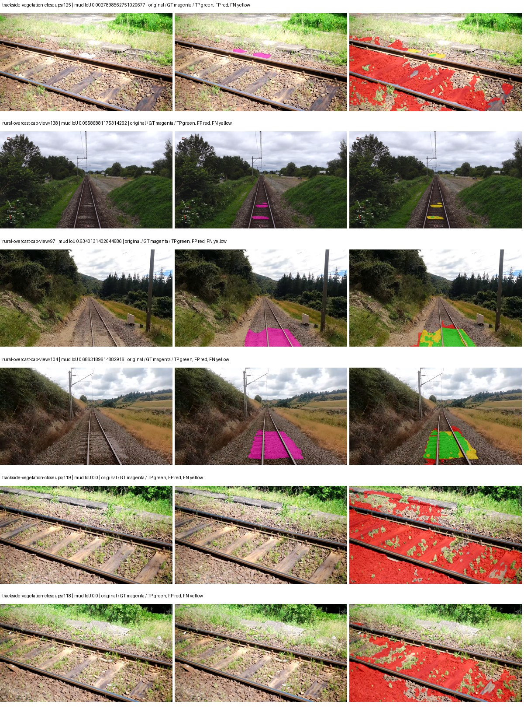

Examples are two lowest and two highest mud-IoU positive images, plus up to two negative images with the most false-positive mud pixels. They are targeted diagnostic examples, not random samples. Green: true positive; red: false positive; yellow: false negative. Full predictions remain on HDRFS.

### Validation tracking

| Logged step | Overall mIoU (%) | Mud IoU (%) |
| --- | --- | --- |
| 254 | 29.78 | 7.40 |
| 508 | 33.09 | 10.30 |
| 763 | 30.78 | 4.20 |
| 1017 | 28.36 | 2.79 |
| 1272 | 31.07 | 0.12 |
| 1527 | 31.21 | 0.61 |
| 1781 | 33.00 | 6.92 |

All retained scalar curves, including training loss and per-class IoU, are in record.json. Observed best mud on a curve is not necessarily a retained checkpoint: the pilot saved its selection-metric-best and final checkpoints. Step logging and checkpoint global_step may differ by one.

### Stopping and checkpoint provenance

```json
{
  "stopping": {
    "actual_steps": 1781,
    "maximum_steps": 4000,
    "min_delta": 0.001,
    "monitor": "val_iou/mud-pumping",
    "patience": 5,
    "reason": "validation_plateau"
  },
  "checkpoints": {
    "best": {
      "path": "/data/izadia1/projects/segmentary-runs/paul-test-rtis/mud-fullstats-v1-20260906-r2/future-runs/hf_auto_upernet_swin_tiny--rtis_only--seed-1_seed1/rtis/best.ckpt",
      "sha256": "4b8117d5de612239d4fc526d068afad5b3b40576181aa9eb8c97042bad3e3124",
      "global_step": 509,
      "bytes": 944059737
    },
    "final": {
      "path": "/data/izadia1/projects/segmentary-runs/paul-test-rtis/mud-fullstats-v1-20260906-r2/future-runs/hf_auto_upernet_swin_tiny--rtis_only--seed-1_seed1/rtis/last.ckpt",
      "sha256": "78fcc23e8cd82570bdb74061c9bb05c7476c9f58cd5b7c81a845d4aeb201bcdb",
      "global_step": 1781,
      "bytes": 944046553
    }
  },
  "cleanup_error": null
}
```

### Resolved training, initialization and evaluation settings

The optimizer block is the base configuration. Stage LR scales are applied at runtime, and stage warmup is capped at min(base warmup, floor(stage budget / 10), stage budget - 1): 400 steps for this 4,000-step pilot. Model-internal native input grids may differ from augmentation crops (EoMT uses its 640 grid).

```json
{
  "name": "hf_auto_upernet_swin_tiny--rtis_only--seed-1",
  "model": {
    "arch": "hf_auto",
    "checkpoint": "openmmlab/upernet-swin-tiny",
    "tuning": "full",
    "head": "unified_head",
    "lora_r": 16,
    "lora_alpha": 32,
    "lora_dropout": 0.05,
    "lora_targets": [],
    "drop_path": null,
    "revision": "dc8e8c94669c6f14d5cc4c21a141daebd2280d59",
    "subfolder": null,
    "local_files_only": false,
    "trust_remote_code": false,
    "backbone_path": "backbone",
    "head_paths": [
      "decode_head"
    ],
    "classifier_path": "decode_head.classifier",
    "inactive_parameter_paths": [
      "backbone.swin.layernorm"
    ],
    "smp_arch": null,
    "encoder_name": null,
    "encoder_weights": null,
    "native": null,
    "batch_norm_momentum": null
  },
  "space": "paul-test-rtis",
  "taxonomy_root": "/data/izadia1/projects/segmentary-rtis-fullstats-066afb2/taxonomy",
  "output_root": "/data/izadia1/projects/segmentary-runs/paul-test-rtis/mud-fullstats-v1-20260906-r2/future-runs",
  "optim": {
    "backbone_lr": 6e-05,
    "head_lr_mult": 10.0,
    "weight_decay": 0.05,
    "llrd": 0.9,
    "warmup_iters": 1500,
    "warmup_ratio": 1e-06,
    "poly_power": 0.9,
    "min_lr_ratio": 0.0,
    "betas": [
      0.9,
      0.999
    ],
    "grad_clip": 1.0
  },
  "train": {
    "iters": 4000,
    "batch_size": 2,
    "accum": 8,
    "num_workers": 2,
    "precision": "bf16-mixed",
    "ema_decay": 0.9998,
    "val_every": 250,
    "ckpt_every": 500,
    "selection_metric": "val_iou/mud-pumping",
    "early_stopping_patience": 5,
    "early_stopping_min_delta": 0.001,
    "seed": 1,
    "devices": 1
  },
  "eval": {
    "sliding_window": true,
    "window": [
      1024,
      1024
    ],
    "stride": [
      768,
      768
    ],
    "batch_size": 1,
    "num_workers": 2,
    "tta_scales": [],
    "tta_flip": false,
    "threshold": 0.5,
    "boundary_tolerance_frac": 0.0075,
    "save_confusion": true
  },
  "loss": {
    "task": "multiclass",
    "activation": "auto",
    "terms": [],
    "aux": "none",
    "aux_weight": 0.0,
    "ce_weight": 1.0,
    "label_smoothing": 0.0,
    "class_weights": null,
    "query": null
  },
  "aug": {
    "crop": [
      1024,
      1024
    ],
    "scale_min": 0.5,
    "scale_max": 2.0,
    "hflip_p": 0.5,
    "color_jitter_p": 0.5,
    "brightness": 0.25,
    "contrast": 0.25,
    "saturation": 0.25,
    "hue": 0.05
  },
  "stages": [
    {
      "name": "rtis",
      "data": [
        {
          "name": "paul-test-rtis",
          "root": "/data/izadia1/datasets/paul-test-rtis",
          "variant": null,
          "split_file": "splits.json",
          "train_split": "train",
          "val_split": "val",
          "limit": null,
          "loader": "folder",
          "mapping": "paul-test-rtis",
          "loader_options": {
            "require_groups": true
          }
        }
      ],
      "iters": null,
      "lr_scale": 1.0,
      "head_group_lr_scale": 1.0,
      "init_from": "pretrained",
      "reset_head": false,
      "freeze": null,
      "sample_weights": null
    }
  ]
}
```

### Hardware and software provenance

```json
{
  "training": {
    "cuda_available": true,
    "cuda_visible_devices": "0",
    "cudnn": 91900,
    "driver_version": "570.133.20",
    "gpu_count": 1,
    "gpu_names": [
      "NVIDIA L40S"
    ],
    "hostname": "hdrfs-app-001",
    "input_normalization": {
      "channel_order": "rgb",
      "mean": [
        0.485,
        0.456,
        0.406
      ],
      "source": "hf_image_processor",
      "std": [
        0.229,
        0.224,
        0.225
      ]
    },
    "model_origins": [
      {
        "hf_commit": "dc8e8c94669c6f14d5cc4c21a141daebd2280d59",
        "hf_name_or_path": "openmmlab/upernet-swin-tiny",
        "module": "model",
        "timm_pretrained": {}
      },
      {
        "hf_commit": null,
        "hf_name_or_path": "",
        "module": "model.backbone",
        "timm_pretrained": {}
      },
      {
        "hf_commit": null,
        "hf_name_or_path": "",
        "module": "model.backbone.swin",
        "timm_pretrained": {}
      },
      {
        "hf_commit": null,
        "hf_name_or_path": "",
        "module": "model.backbone.swin.embeddings",
        "timm_pretrained": {}
      },
      {
        "hf_commit": null,
        "hf_name_or_path": "",
        "module": "model.backbone.swin.encoder",
        "timm_pretrained": {}
      },
      {
        "hf_commit": null,
        "hf_name_or_path": "",
        "module": "model.backbone.swin.encoder.layers.0",
        "timm_pretrained": {}
      },
      {
        "hf_commit": null,
        "hf_name_or_path": "",
        "module": "model.backbone.swin.encoder.layers.0.blocks.0.attention",
        "timm_pretrained": {}
      },
      {
        "hf_commit": null,
        "hf_name_or_path": "",
        "module": "model.backbone.swin.encoder.layers.0.blocks.1.attention",
        "timm_pretrained": {}
      },
      {
        "hf_commit": null,
        "hf_name_or_path": "",
        "module": "model.backbone.swin.encoder.layers.1",
        "timm_pretrained": {}
      },
      {
        "hf_commit": null,
        "hf_name_or_path": "",
        "module": "model.backbone.swin.encoder.layers.1.blocks.0.attention",
        "timm_pretrained": {}
      },
      {
        "hf_commit": null,
        "hf_name_or_path": "",
        "module": "model.backbone.swin.encoder.layers.1.blocks.1.attention",
        "timm_pretrained": {}
      },
      {
        "hf_commit": null,
        "hf_name_or_path": "",
        "module": "model.backbone.swin.encoder.layers.2",
        "timm_pretrained": {}
      },
      {
        "hf_commit": null,
        "hf_name_or_path": "",
        "module": "model.backbone.swin.encoder.layers.2.blocks.0.attention",
        "timm_pretrained": {}
      },
      {
        "hf_commit": null,
        "hf_name_or_path": "",
        "module": "model.backbone.swin.encoder.layers.2.blocks.1.attention",
        "timm_pretrained": {}
      },
      {
        "hf_commit": null,
        "hf_name_or_path": "",
        "module": "model.backbone.swin.encoder.layers.2.blocks.2.attention",
        "timm_pretrained": {}
      },
      {
        "hf_commit": null,
        "hf_name_or_path": "",
        "module": "model.backbone.swin.encoder.layers.2.blocks.3.attention",
        "timm_pretrained": {}
      },
      {
        "hf_commit": null,
        "hf_name_or_path": "",
        "module": "model.backbone.swin.encoder.layers.2.blocks.4.attention",
        "timm_pretrained": {}
      },
      {
        "hf_commit": null,
        "hf_name_or_path": "",
        "module": "model.backbone.swin.encoder.layers.2.blocks.5.attention",
        "timm_pretrained": {}
      },
      {
        "hf_commit": null,
        "hf_name_or_path": "",
        "module": "model.backbone.swin.encoder.layers.3",
        "timm_pretrained": {}
      },
      {
        "hf_commit": null,
        "hf_name_or_path": "",
        "module": "model.backbone.swin.encoder.layers.3.blocks.0.attention",
        "timm_pretrained": {}
      },
      {
        "hf_commit": null,
        "hf_name_or_path": "",
        "module": "model.backbone.swin.encoder.layers.3.blocks.1.attention",
        "timm_pretrained": {}
      },
      {
        "hf_commit": "dc8e8c94669c6f14d5cc4c21a141daebd2280d59",
        "hf_name_or_path": "openmmlab/upernet-swin-tiny",
        "module": "model.decode_head",
        "timm_pretrained": {}
      }
    ],
    "model_parameter_count": 58953423,
    "packages": {
      "albumentations": "2.0.8",
      "lightning": "2.6.5",
      "numpy": "2.4.4",
      "segmentary": "0.1.0",
      "segmentation-models-pytorch": "0.5.0",
      "timm": "1.0.28",
      "torch": "2.11.0+cu128",
      "torchvision": "0.26.0+cu128",
      "transformers": "5.15.0"
    },
    "platform": "Linux-5.15.0-139-generic-x86_64-with-glibc2.35",
    "python": "3.11.15",
    "torch": "2.11.0+cu128",
    "torch_cuda": "12.8",
    "trainable_parameter_count": 58951887,
    "training_stop": {
      "actual_steps": 1781,
      "maximum_steps": 4000,
      "min_delta": 0.001,
      "monitor": "val_iou/mud-pumping",
      "patience": 5,
      "reason": "validation_plateau"
    },
    "validation_weights": "raw"
  },
  "evaluation": {
    "cuda_available": true,
    "cuda_visible_devices": "0",
    "cudnn": 91900,
    "driver_version": "570.133.20",
    "gpu_count": 1,
    "gpu_names": [
      "NVIDIA L40S"
    ],
    "hostname": "hdrfs-app-001",
    "input_normalization": {
      "channel_order": "rgb",
      "mean": [
        0.485,
        0.456,
        0.406
      ],
      "source": "hf_image_processor",
      "std": [
        0.229,
        0.224,
        0.225
      ]
    },
    "packages": {
      "albumentations": "2.0.8",
      "lightning": "2.6.5",
      "numpy": "2.4.4",
      "segmentary": "0.1.0",
      "segmentation-models-pytorch": "0.5.0",
      "timm": "1.0.28",
      "torch": "2.11.0+cu128",
      "torchvision": "0.26.0+cu128",
      "transformers": "5.15.0"
    },
    "platform": "Linux-5.15.0-139-generic-x86_64-with-glibc2.35",
    "python": "3.11.15",
    "torch": "2.11.0+cu128",
    "torch_cuda": "12.8"
  }
}
```

## rtis_only — seed 2

Status: **completed**. Started: 2026-09-06T14:02:49.151821+00:00. Finished: 2026-09-06T14:40:18.623734+00:00.

Recipe pretrained initializer: `openmmlab/upernet-swin-tiny`.

`rtis_only` uses the recipe initializer, which may include pretrained segmentation components. Transfer paths load the exact historical source checkpoint below and reset the classifier; they do not reset all query/decoder features.

Source checkpoint: `Recipe pretrained initialization`.

Config SHA-256: `702d0ce757b4507aeede8128a10dfd6eadbf6257e00576a86f2f931d2757203f`. Weights used for validation: `raw`.

### Mud-pumping and aggregate quality

| Metric | Selected checkpoint | Final training validation |
| --- | --- | --- |
| Mud IoU | 12.35 | 3.43 |
| Mud precision | 16.15 | 4.10 |
| Mud recall | 34.38 | 17.25 |
| Mud Dice/F1 | 21.98 | 6.63 |
| mIoU | 28.93 | 30.01 |
| Mean accuracy | 39.75 | 42.64 |
| Mean precision | 48.50 | 57.56 |
| Mean Dice | 36.87 | 38.31 |
| Mean specificity | 98.92 | 98.89 |
| Pixel accuracy | 83.24 | 82.39 |
| Frequency-weighted IoU | 73.68 | 73.93 |
| Fixed GT-present class mIoU | 32.15 | 35.01 |
| Boundary F1 | 34.63 | 39.97 |

The selected checkpoint has independent evaluation evidence. Final values are the trainer's final validation record, not a new independent evaluation. mIoU averages classes with nonzero union, so false positives on absent classes can change its denominator. The fixed GT-class mean is supplementary and excludes absent classes; their false positives remain in the confusion matrix.

### Resource usage and timing

| Measurement | Value |
| --- | --- |
| Peak training VRAM, retained training invocation (GiB) | 11.71 |
| Peak evaluation VRAM (GiB) | 7.52 |
| Retained training invocation wall time (seconds) | 2036.24 |
| Retained training invocation GPU-hours (one GPU) | 0.57 |
| Evaluation wall time (seconds) | 20.15 |
| Full evaluation pipeline images/second | 1.84 |
| Best full-state checkpoint (MiB) | 900.33 |
| Final full-state checkpoint (MiB) | 900.31 |
| Audited periodic checkpoints removed (GiB) | 2.64 |

VRAM uses the recorded allocator high-water mark; it is not total device usage including CUDA context. Resumed jobs' retained training invocation times and peaks are **not whole-campaign totals**. Earlier invocation resource records are not reconstructed here. Evaluation throughput includes loader, sliding-window inference and metrics; it is not model-only latency/FPS. Missing measurements are shown as —, never inferred from another dataset's run.

### Standardized inference performance

Dedicated model-only profiling waits for an idle worker-locked L40S: BF16, batch 1, 1024x1024, 20 warmup and 100 CUDA-event-timed public forwards. It excludes loading, preprocessing, tiling and metrics.

| Status | Parameters | Weight MiB | FPS | p50 ms | p95 ms | Peak reserved GiB |
| --- | --- | --- | --- | --- | --- | --- |
| complete | 58953423 | 224.89 | 42.72 | 23.29 | 23.80 | 2.41 |

```json
{
  "schema_version": 1,
  "model_id": "hf_auto_upernet_swin_tiny",
  "measured_at": "2026-09-06T14:40:13+00:00",
  "status": "complete",
  "benchmark_scope": "rtis_selected_checkpoint_model_only",
  "applies_to": [
    "hf_auto_upernet_swin_tiny--rtis_only--seed-2"
  ],
  "source": {
    "campaign_git_sha": "066afb2626398b7be59d4d19f5a0e4644fd59adc",
    "git_dirty": false,
    "config_hash": "f762a5e2e26e",
    "resolved_config": "/data/izadia1/projects/segmentary-runs/paul-test-rtis/mud-fullstats-v1-20260906-r2/configs/hf_auto_upernet_swin_tiny--rtis_only--seed-2.yaml",
    "config_sha256": "702d0ce757b4507aeede8128a10dfd6eadbf6257e00576a86f2f931d2757203f",
    "checkpoint_sha256": "79529af67d2adef535db215c5e0e60bd0482f197c9e3c8936fa58de8ba34d796",
    "checkpoint_global_step": 254,
    "checkpoint_bytes": 944059545,
    "checkpoint_kind": "resume checkpoint with optimizer and EMA state",
    "weights": "raw",
    "measured_checkpoint_job_id": "hf_auto_upernet_swin_tiny--rtis_only--seed-2",
    "result_sha256": "2fadbfb2879f184f0886b579bd992de45c6eb1f56c8f69abc01f4bd398fbc292",
    "result_git_sha": "066afb2626398b7be59d4d19f5a0e4644fd59adc",
    "result_stage": "eval:paul-test-rtis:val",
    "result_seed": 2
  },
  "hardware": {
    "gpu_name": "NVIDIA L40S",
    "gpu_uuid": "GPU-d411d86a-6d1d-1967-55e7-9f9ec85d13f5",
    "logical_device": "cuda:0",
    "physical_visibility_token": "1",
    "compute_capability": [
      8,
      9
    ],
    "total_memory_bytes": 47677177856
  },
  "model": {
    "parameter_count": 58953423,
    "trainable_parameter_count": 58951887,
    "resident_parameter_bytes": 235813692,
    "parameter_dtype_counts": {
      "float32": 58953423
    }
  },
  "contract": {
    "backend": "pytorch",
    "precision": "bf16_autocast",
    "batch_size": 1,
    "input_shape_nchw": [
      1,
      3,
      1024,
      1024
    ],
    "warmup_iterations": 20,
    "measured_iterations": 100,
    "timing": "per-forward CUDA events with end-event synchronization",
    "includes_preprocessing": false,
    "includes_data_loader": false,
    "includes_sliding_window": false,
    "input_resident_on_gpu": true,
    "model_only": true,
    "entrypoint": "public model(image) dense-logits forward"
  },
  "measurements": {
    "latency": {
      "p50_ms": 23.28985595703125,
      "p95_ms": 23.80185670852661,
      "mean_ms": 23.409033870697023,
      "minimum_ms": 23.18841552734375,
      "maximum_ms": 26.735584259033203,
      "fps": 42.718550689602814,
      "raw_ms": [
        23.49158477783203,
        23.28268814086914,
        23.215103149414062,
        23.28985595703125,
        23.353343963623047,
        23.261184692382812,
        23.417856216430664,
        23.75372886657715,
        23.35647964477539,
        23.643007278442383,
        23.285823822021484,
        23.23967933654785,
        23.25708770751953,
        23.242752075195312,
        23.25708770751953,
        23.29804801940918,
        23.29190444946289,
        23.218143463134766,
        23.228416442871094,
        23.27859115600586,
        23.2857608795166,
        23.377920150756836,
        23.357440948486328,
        24.310688018798828,
        23.323583602905273,
        23.243776321411133,
        23.698528289794922,
        23.237632751464844,
        23.260128021240234,
        23.29702377319336,
        23.23865509033203,
        23.397375106811523,
        23.32159996032715,
        23.425024032592773,
        23.821311950683594,
        23.49977684020996,
        23.26425552368164,
        23.43731117248535,
        23.270368576049805,
        23.234527587890625,
        24.202239990234375,
        23.244800567626953,
        23.244800567626953,
        23.277568817138672,
        23.250816345214844,
        23.259136199951172,
        23.213056564331055,
        23.302143096923828,
        23.46291160583496,
        23.647232055664062,
        23.28985595703125,
        23.277568817138672,
        23.751680374145508,
        23.32467269897461,
        23.228416442871094,
        23.268352508544922,
        23.245824813842773,
        23.249887466430664,
        23.28166389465332,
        23.205791473388672,
        23.24787139892578,
        23.302143096923828,
        23.47315216064453,
        23.800832748413086,
        23.979007720947266,
        23.333887100219727,
        23.216127395629883,
        23.244800567626953,
        23.26425552368164,
        23.250944137573242,
        23.397375106811523,
        23.234560012817383,
        23.32364845275879,
        23.244800567626953,
        23.220224380493164,
        23.2488956451416,
        23.572479248046875,
        23.747583389282227,
        23.428096771240234,
        23.27449607849121,
        23.28985595703125,
        23.31443214416504,
        23.24790382385254,
        23.342079162597656,
        23.23967933654785,
        23.69945526123047,
        23.359487533569336,
        23.64419174194336,
        23.6125431060791,
        26.735584259033203,
        23.337984085083008,
        23.734272003173828,
        23.227392196655273,
        23.361536026000977,
        23.45574378967285,
        23.29497528076172,
        23.18841552734375,
        23.30624008178711,
        23.253887176513672,
        23.259071350097656
      ],
      "percentile_method": "numpy linear interpolation"
    },
    "peak_reserved_bytes": 2583691264,
    "memory_kind": "pytorch_cuda_allocator_peak_reserved_excluding_context",
    "benchmark_wall_clock_s": 8.11588041856885
  },
  "started_at": "2026-09-06T14:40:04+00:00",
  "finished_at": "2026-09-06T14:40:13+00:00",
  "environment": {
    "hostname": "hdrfs-app-001",
    "python": "3.11.15",
    "platform": "Linux-5.15.0-139-generic-x86_64-with-glibc2.35",
    "torch": "2.11.0+cu128",
    "torch_cuda": "12.8",
    "cudnn": 91900,
    "driver_version": "570.133.20",
    "cuda_available": true,
    "gpu_count": 1,
    "gpu_names": [
      "NVIDIA L40S"
    ],
    "cuda_visible_devices": "1",
    "packages": {
      "segmentary": "0.1.0",
      "torch": "2.11.0+cu128",
      "torchvision": "0.26.0+cu128",
      "transformers": "5.15.0",
      "timm": "1.0.28",
      "segmentation-models-pytorch": "0.5.0",
      "albumentations": "2.0.8",
      "lightning": "2.6.5",
      "numpy": "2.4.4"
    }
  }
}
```

### Per-class validation results

| Class | GT pixels | IoU (%) | Precision (%) | Recall (%) | Dice (%) | Boundary F1 (%) |
| --- | --- | --- | --- | --- | --- | --- |
| car | 29664 | 0.00 | 0.00 | 0.00 | 0.00 | 0.00 |
| construction | 311585 | 29.00 | 33.60 | 67.94 | 44.96 | 62.80 |
| fence | 265137 | 12.85 | 76.11 | 13.39 | 22.77 | 39.76 |
| mud-pumping | 1226250 | 12.35 | 16.15 | 34.38 | 21.98 | 22.97 |
| on-rails | 0 | 0.00 | 0.00 | — | 0.00 | 0.00 |
| person | 0 | — | — | — | — | — |
| pole | 628038 | 64.46 | 82.27 | 74.86 | 78.39 | 88.30 |
| rail-embedded | 16799 | 0.00 | 0.00 | 0.00 | 0.00 | 0.00 |
| rail-raised | 2969797 | 73.93 | 82.80 | 87.34 | 85.01 | 89.48 |
| rail-track | 6323197 | 32.48 | 63.45 | 39.96 | 49.04 | 42.56 |
| road | 1048831 | 12.38 | 40.11 | 15.19 | 22.03 | 22.58 |
| sidewalk | 1297367 | 17.65 | 41.63 | 23.46 | 30.01 | 9.18 |
| sky | 19121606 | 92.70 | 99.77 | 92.90 | 96.21 | 86.45 |
| standing-water | 95802 | 0.00 | 0.00 | 0.00 | 0.00 | 0.00 |
| terrain | 39239306 | 86.63 | 87.05 | 99.45 | 92.84 | 57.58 |
| trackbed | 10643081 | 57.54 | 72.31 | 73.80 | 73.05 | 57.28 |
| traffic-light | 19510 | 0.11 | 100.00 | 0.11 | 0.22 | 0.00 |
| traffic-sign | 13285 | 0.00 | 0.00 | 0.00 | 0.00 | 0.00 |
| tram-track | 56179 | 43.00 | 94.04 | 44.20 | 60.14 | 46.11 |
| truck | 0 | 0.00 | 0.00 | — | 0.00 | 0.00 |
| vegetation-overgrowth | 5901821 | 43.54 | 80.80 | 48.57 | 60.67 | 67.63 |

### Full-run accounting

| Measurement | Value |
| --- | --- |
| Full GPU-reserved wall seconds, all recorded worker attempts | 2249.48 |
| Full reserved GPU-hours | 0.62 |
| Whole-run timing complete | True |

| Phase | Wall seconds including failed attempts |
| --- | --- |
| training | 2043.30 |
| diagnostics | 156.76 |
| performance | 16.13 |

GPU-reserved time includes model loading, training, validation, collection, profiling, checkpoint I/O and orchestration while the worker owns one GPU. It is not GPU kernel-active time. Phase timings and sampled device memory/power/utilization are retained separately; sampled device memory is not the allocator high-water mark.

### Train/validation and raw/EMA diagnostics

| Checkpoint / weights / split | Images | Mud IoU (%) | Mud precision (%) | Mud recall (%) |
| --- | --- | --- | --- | --- |
| best-auto-train / raw | 220 | 87.51 | 91.64 | 95.10 |
| best-auto-val / raw | 37 | 12.35 | 16.15 | 34.38 |
| best-alternate-val / ema | 37 | 8.00 | 13.04 | 17.16 |
| final-auto-val / raw | 37 | 3.43 | 4.10 | 17.26 |

Train uses the evaluation transform without augmentation. Compare mud train/validation metrics for the same selected weights. Alternate EMA on running-stat BatchNorm is explicitly uncalibrated and is diagnostic only. Score-threshold curves use uncalibrated normalized scores and are pixel-level diagnostics, not event detection rates or a selected deployment operating point.

### Downloadable evidence

- best-auto-train: [per-image.csv](rtis_only--seed-2/best-auto-train/per-image.csv) · [per-image-confusion.json.gz](rtis_only--seed-2/best-auto-train/per-image-confusion.json.gz) · [groups.json](rtis_only--seed-2/best-auto-train/groups.json) · [mud-score-curves.json](rtis_only--seed-2/best-auto-train/mud-score-curves.json)
- best-auto-val: [per-image.csv](rtis_only--seed-2/best-auto-val/per-image.csv) · [per-image-confusion.json.gz](rtis_only--seed-2/best-auto-val/per-image-confusion.json.gz) · [groups.json](rtis_only--seed-2/best-auto-val/groups.json) · [mud-score-curves.json](rtis_only--seed-2/best-auto-val/mud-score-curves.json) · [examples.jpg](rtis_only--seed-2/best-auto-val/examples.jpg)
- best-alternate-val: [per-image.csv](rtis_only--seed-2/best-alternate-val/per-image.csv) · [per-image-confusion.json.gz](rtis_only--seed-2/best-alternate-val/per-image-confusion.json.gz) · [groups.json](rtis_only--seed-2/best-alternate-val/groups.json) · [mud-score-curves.json](rtis_only--seed-2/best-alternate-val/mud-score-curves.json)
- final-auto-val: [per-image.csv](rtis_only--seed-2/final-auto-val/per-image.csv) · [per-image-confusion.json.gz](rtis_only--seed-2/final-auto-val/per-image-confusion.json.gz) · [groups.json](rtis_only--seed-2/final-auto-val/groups.json) · [mud-score-curves.json](rtis_only--seed-2/final-auto-val/mud-score-curves.json)
- resources: [telemetry.csv](rtis_only--seed-2/resources/telemetry.csv)

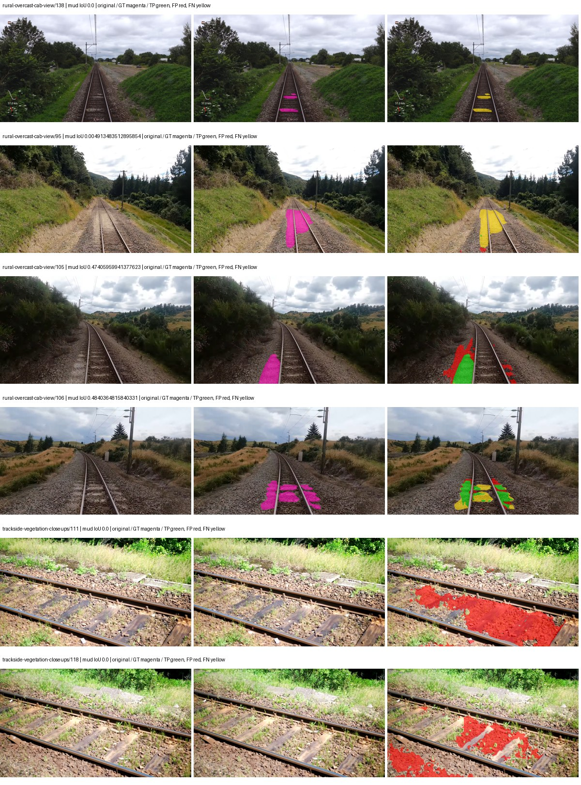

Examples are two lowest and two highest mud-IoU positive images, plus up to two negative images with the most false-positive mud pixels. They are targeted diagnostic examples, not random samples. Green: true positive; red: false positive; yellow: false negative. Full predictions remain on HDRFS.

### Validation tracking

| Logged step | Overall mIoU (%) | Mud IoU (%) |
| --- | --- | --- |
| 254 | 28.93 | 12.35 |
| 508 | 28.09 | 1.17 |
| 763 | 35.10 | 2.63 |
| 1017 | 29.82 | 2.51 |
| 1272 | 33.18 | 4.08 |
| 1527 | 30.01 | 3.43 |

All retained scalar curves, including training loss and per-class IoU, are in record.json. Observed best mud on a curve is not necessarily a retained checkpoint: the pilot saved its selection-metric-best and final checkpoints. Step logging and checkpoint global_step may differ by one.

### Stopping and checkpoint provenance

```json
{
  "stopping": {
    "actual_steps": 1527,
    "maximum_steps": 4000,
    "min_delta": 0.001,
    "monitor": "val_iou/mud-pumping",
    "patience": 5,
    "reason": "validation_plateau"
  },
  "checkpoints": {
    "best": {
      "path": "/data/izadia1/projects/segmentary-runs/paul-test-rtis/mud-fullstats-v1-20260906-r2/future-runs/hf_auto_upernet_swin_tiny--rtis_only--seed-2_seed2/rtis/best.ckpt",
      "sha256": "79529af67d2adef535db215c5e0e60bd0482f197c9e3c8936fa58de8ba34d796",
      "global_step": 254,
      "bytes": 944059545
    },
    "final": {
      "path": "/data/izadia1/projects/segmentary-runs/paul-test-rtis/mud-fullstats-v1-20260906-r2/future-runs/hf_auto_upernet_swin_tiny--rtis_only--seed-2_seed2/rtis/last.ckpt",
      "sha256": "9143c1c15a885a13f6583bc238c48b5e590112b1d711c64fddfee0574bf7416e",
      "global_step": 1527,
      "bytes": 944046553
    }
  },
  "cleanup_error": null
}
```

### Resolved training, initialization and evaluation settings

The optimizer block is the base configuration. Stage LR scales are applied at runtime, and stage warmup is capped at min(base warmup, floor(stage budget / 10), stage budget - 1): 400 steps for this 4,000-step pilot. Model-internal native input grids may differ from augmentation crops (EoMT uses its 640 grid).

```json
{
  "name": "hf_auto_upernet_swin_tiny--rtis_only--seed-2",
  "model": {
    "arch": "hf_auto",
    "checkpoint": "openmmlab/upernet-swin-tiny",
    "tuning": "full",
    "head": "unified_head",
    "lora_r": 16,
    "lora_alpha": 32,
    "lora_dropout": 0.05,
    "lora_targets": [],
    "drop_path": null,
    "revision": "dc8e8c94669c6f14d5cc4c21a141daebd2280d59",
    "subfolder": null,
    "local_files_only": false,
    "trust_remote_code": false,
    "backbone_path": "backbone",
    "head_paths": [
      "decode_head"
    ],
    "classifier_path": "decode_head.classifier",
    "inactive_parameter_paths": [
      "backbone.swin.layernorm"
    ],
    "smp_arch": null,
    "encoder_name": null,
    "encoder_weights": null,
    "native": null,
    "batch_norm_momentum": null
  },
  "space": "paul-test-rtis",
  "taxonomy_root": "/data/izadia1/projects/segmentary-rtis-fullstats-066afb2/taxonomy",
  "output_root": "/data/izadia1/projects/segmentary-runs/paul-test-rtis/mud-fullstats-v1-20260906-r2/future-runs",
  "optim": {
    "backbone_lr": 6e-05,
    "head_lr_mult": 10.0,
    "weight_decay": 0.05,
    "llrd": 0.9,
    "warmup_iters": 1500,
    "warmup_ratio": 1e-06,
    "poly_power": 0.9,
    "min_lr_ratio": 0.0,
    "betas": [
      0.9,
      0.999
    ],
    "grad_clip": 1.0
  },
  "train": {
    "iters": 4000,
    "batch_size": 2,
    "accum": 8,
    "num_workers": 2,
    "precision": "bf16-mixed",
    "ema_decay": 0.9998,
    "val_every": 250,
    "ckpt_every": 500,
    "selection_metric": "val_iou/mud-pumping",
    "early_stopping_patience": 5,
    "early_stopping_min_delta": 0.001,
    "seed": 2,
    "devices": 1
  },
  "eval": {
    "sliding_window": true,
    "window": [
      1024,
      1024
    ],
    "stride": [
      768,
      768
    ],
    "batch_size": 1,
    "num_workers": 2,
    "tta_scales": [],
    "tta_flip": false,
    "threshold": 0.5,
    "boundary_tolerance_frac": 0.0075,
    "save_confusion": true
  },
  "loss": {
    "task": "multiclass",
    "activation": "auto",
    "terms": [],
    "aux": "none",
    "aux_weight": 0.0,
    "ce_weight": 1.0,
    "label_smoothing": 0.0,
    "class_weights": null,
    "query": null
  },
  "aug": {
    "crop": [
      1024,
      1024
    ],
    "scale_min": 0.5,
    "scale_max": 2.0,
    "hflip_p": 0.5,
    "color_jitter_p": 0.5,
    "brightness": 0.25,
    "contrast": 0.25,
    "saturation": 0.25,
    "hue": 0.05
  },
  "stages": [
    {
      "name": "rtis",
      "data": [
        {
          "name": "paul-test-rtis",
          "root": "/data/izadia1/datasets/paul-test-rtis",
          "variant": null,
          "split_file": "splits.json",
          "train_split": "train",
          "val_split": "val",
          "limit": null,
          "loader": "folder",
          "mapping": "paul-test-rtis",
          "loader_options": {
            "require_groups": true
          }
        }
      ],
      "iters": null,
      "lr_scale": 1.0,
      "head_group_lr_scale": 1.0,
      "init_from": "pretrained",
      "reset_head": false,
      "freeze": null,
      "sample_weights": null
    }
  ]
}
```

### Hardware and software provenance

```json
{
  "training": {
    "cuda_available": true,
    "cuda_visible_devices": "1",
    "cudnn": 91900,
    "driver_version": "570.133.20",
    "gpu_count": 1,
    "gpu_names": [
      "NVIDIA L40S"
    ],
    "hostname": "hdrfs-app-001",
    "input_normalization": {
      "channel_order": "rgb",
      "mean": [
        0.485,
        0.456,
        0.406
      ],
      "source": "hf_image_processor",
      "std": [
        0.229,
        0.224,
        0.225
      ]
    },
    "model_origins": [
      {
        "hf_commit": "dc8e8c94669c6f14d5cc4c21a141daebd2280d59",
        "hf_name_or_path": "openmmlab/upernet-swin-tiny",
        "module": "model",
        "timm_pretrained": {}
      },
      {
        "hf_commit": null,
        "hf_name_or_path": "",
        "module": "model.backbone",
        "timm_pretrained": {}
      },
      {
        "hf_commit": null,
        "hf_name_or_path": "",
        "module": "model.backbone.swin",
        "timm_pretrained": {}
      },
      {
        "hf_commit": null,
        "hf_name_or_path": "",
        "module": "model.backbone.swin.embeddings",
        "timm_pretrained": {}
      },
      {
        "hf_commit": null,
        "hf_name_or_path": "",
        "module": "model.backbone.swin.encoder",
        "timm_pretrained": {}
      },
      {
        "hf_commit": null,
        "hf_name_or_path": "",
        "module": "model.backbone.swin.encoder.layers.0",
        "timm_pretrained": {}
      },
      {
        "hf_commit": null,
        "hf_name_or_path": "",
        "module": "model.backbone.swin.encoder.layers.0.blocks.0.attention",
        "timm_pretrained": {}
      },
      {
        "hf_commit": null,
        "hf_name_or_path": "",
        "module": "model.backbone.swin.encoder.layers.0.blocks.1.attention",
        "timm_pretrained": {}
      },
      {
        "hf_commit": null,
        "hf_name_or_path": "",
        "module": "model.backbone.swin.encoder.layers.1",
        "timm_pretrained": {}
      },
      {
        "hf_commit": null,
        "hf_name_or_path": "",
        "module": "model.backbone.swin.encoder.layers.1.blocks.0.attention",
        "timm_pretrained": {}
      },
      {
        "hf_commit": null,
        "hf_name_or_path": "",
        "module": "model.backbone.swin.encoder.layers.1.blocks.1.attention",
        "timm_pretrained": {}
      },
      {
        "hf_commit": null,
        "hf_name_or_path": "",
        "module": "model.backbone.swin.encoder.layers.2",
        "timm_pretrained": {}
      },
      {
        "hf_commit": null,
        "hf_name_or_path": "",
        "module": "model.backbone.swin.encoder.layers.2.blocks.0.attention",
        "timm_pretrained": {}
      },
      {
        "hf_commit": null,
        "hf_name_or_path": "",
        "module": "model.backbone.swin.encoder.layers.2.blocks.1.attention",
        "timm_pretrained": {}
      },
      {
        "hf_commit": null,
        "hf_name_or_path": "",
        "module": "model.backbone.swin.encoder.layers.2.blocks.2.attention",
        "timm_pretrained": {}
      },
      {
        "hf_commit": null,
        "hf_name_or_path": "",
        "module": "model.backbone.swin.encoder.layers.2.blocks.3.attention",
        "timm_pretrained": {}
      },
      {
        "hf_commit": null,
        "hf_name_or_path": "",
        "module": "model.backbone.swin.encoder.layers.2.blocks.4.attention",
        "timm_pretrained": {}
      },
      {
        "hf_commit": null,
        "hf_name_or_path": "",
        "module": "model.backbone.swin.encoder.layers.2.blocks.5.attention",
        "timm_pretrained": {}
      },
      {
        "hf_commit": null,
        "hf_name_or_path": "",
        "module": "model.backbone.swin.encoder.layers.3",
        "timm_pretrained": {}
      },
      {
        "hf_commit": null,
        "hf_name_or_path": "",
        "module": "model.backbone.swin.encoder.layers.3.blocks.0.attention",
        "timm_pretrained": {}
      },
      {
        "hf_commit": null,
        "hf_name_or_path": "",
        "module": "model.backbone.swin.encoder.layers.3.blocks.1.attention",
        "timm_pretrained": {}
      },
      {
        "hf_commit": "dc8e8c94669c6f14d5cc4c21a141daebd2280d59",
        "hf_name_or_path": "openmmlab/upernet-swin-tiny",
        "module": "model.decode_head",
        "timm_pretrained": {}
      }
    ],
    "model_parameter_count": 58953423,
    "packages": {
      "albumentations": "2.0.8",
      "lightning": "2.6.5",
      "numpy": "2.4.4",
      "segmentary": "0.1.0",
      "segmentation-models-pytorch": "0.5.0",
      "timm": "1.0.28",
      "torch": "2.11.0+cu128",
      "torchvision": "0.26.0+cu128",
      "transformers": "5.15.0"
    },
    "platform": "Linux-5.15.0-139-generic-x86_64-with-glibc2.35",
    "python": "3.11.15",
    "torch": "2.11.0+cu128",
    "torch_cuda": "12.8",
    "trainable_parameter_count": 58951887,
    "training_stop": {
      "actual_steps": 1527,
      "maximum_steps": 4000,
      "min_delta": 0.001,
      "monitor": "val_iou/mud-pumping",
      "patience": 5,
      "reason": "validation_plateau"
    },
    "validation_weights": "raw"
  },
  "evaluation": {
    "cuda_available": true,
    "cuda_visible_devices": "1",
    "cudnn": 91900,
    "driver_version": "570.133.20",
    "gpu_count": 1,
    "gpu_names": [
      "NVIDIA L40S"
    ],
    "hostname": "hdrfs-app-001",
    "input_normalization": {
      "channel_order": "rgb",
      "mean": [
        0.485,
        0.456,
        0.406
      ],
      "source": "hf_image_processor",
      "std": [
        0.229,
        0.224,
        0.225
      ]
    },
    "packages": {
      "albumentations": "2.0.8",
      "lightning": "2.6.5",
      "numpy": "2.4.4",
      "segmentary": "0.1.0",
      "segmentation-models-pytorch": "0.5.0",
      "timm": "1.0.28",
      "torch": "2.11.0+cu128",
      "torchvision": "0.26.0+cu128",
      "transformers": "5.15.0"
    },
    "platform": "Linux-5.15.0-139-generic-x86_64-with-glibc2.35",
    "python": "3.11.15",
    "torch": "2.11.0+cu128",
    "torch_cuda": "12.8"
  }
}
```

## cityscapes_to_rtis — seed 0

Status: **completed**. Started: 2026-09-06T14:05:59.579410+00:00. Finished: 2026-09-06T14:55:06.510301+00:00.

Recipe pretrained initializer: `openmmlab/upernet-swin-tiny`.

`rtis_only` uses the recipe initializer, which may include pretrained segmentation components. Transfer paths load the exact historical source checkpoint below and reset the classifier; they do not reset all query/decoder features.

Source checkpoint: `{'name': 'hf_auto_upernet_swin_tiny--cityscapes--seed-0', 'model': 'hf_auto_upernet_swin_tiny', 'protocol': 'cityscapes', 'config': '/data/izadia1/projects/segmentary-runs/all-model-city-rail-seed0-rail20-b9eb3e1/accepted/hf_auto_upernet_swin_tiny--cityscapes--seed-0/resolved-config.yaml', 'checkpoint': '/data/izadia1/projects/segmentary-runs/all-model-city-rail-seed0-a7c0b67/jobs/hf_auto_upernet_swin_tiny--cityscapes--seed-0/attempt-001/train/hf_auto_upernet_swin_tiny--cityscapes_seed0/cityscapes/last.ckpt', 'recorded_sha256': 'e7102f15e3adae759eeed4520ad72904fa929dc0c2a74fdc8120e2c147d53cc3', 'exists': True}`.

Config SHA-256: `0bbe1a5fabd162de2b5c76a216fd2e1345179e2316028ae026959f198bb8fdcd`. Weights used for validation: `raw`.

### Mud-pumping and aggregate quality

| Metric | Selected checkpoint | Final training validation |
| --- | --- | --- |
| Mud IoU | 2.79 | 2.41 |
| Mud precision | 3.63 | 3.10 |
| Mud recall | 10.78 | 9.66 |
| Mud Dice/F1 | 5.43 | 4.70 |
| mIoU | 32.13 | 31.70 |
| Mean accuracy | 48.16 | 46.13 |
| Mean precision | 54.95 | 51.85 |
| Mean Dice | 41.22 | 40.31 |
| Mean specificity | 98.75 | 98.79 |
| Pixel accuracy | 80.00 | 80.63 |
| Frequency-weighted IoU | 70.50 | 71.46 |
| Fixed GT-present class mIoU | 37.48 | 36.98 |
| Boundary F1 | 38.89 | 38.72 |

The selected checkpoint has independent evaluation evidence. Final values are the trainer's final validation record, not a new independent evaluation. mIoU averages classes with nonzero union, so false positives on absent classes can change its denominator. The fixed GT-class mean is supplementary and excludes absent classes; their false positives remain in the confusion matrix.

### Resource usage and timing

| Measurement | Value |
| --- | --- |
| Peak training VRAM, retained training invocation (GiB) | 11.71 |
| Peak evaluation VRAM (GiB) | 7.52 |
| Retained training invocation wall time (seconds) | 2735.11 |
| Retained training invocation GPU-hours (one GPU) | 0.76 |
| Evaluation wall time (seconds) | 19.35 |
| Full evaluation pipeline images/second | 1.91 |
| Best full-state checkpoint (MiB) | 900.33 |
| Final full-state checkpoint (MiB) | 900.31 |
| Audited periodic checkpoints removed (GiB) | 3.52 |

VRAM uses the recorded allocator high-water mark; it is not total device usage including CUDA context. Resumed jobs' retained training invocation times and peaks are **not whole-campaign totals**. Earlier invocation resource records are not reconstructed here. Evaluation throughput includes loader, sliding-window inference and metrics; it is not model-only latency/FPS. Missing measurements are shown as —, never inferred from another dataset's run.

### Standardized inference performance

Dedicated model-only profiling waits for an idle worker-locked L40S: BF16, batch 1, 1024x1024, 20 warmup and 100 CUDA-event-timed public forwards. It excludes loading, preprocessing, tiling and metrics.

| Status | Parameters | Weight MiB | FPS | p50 ms | p95 ms | Peak reserved GiB |
| --- | --- | --- | --- | --- | --- | --- |
| complete | 58953423 | 224.89 | 42.25 | 23.42 | 24.72 | 2.41 |

```json
{
  "schema_version": 1,
  "model_id": "hf_auto_upernet_swin_tiny",
  "measured_at": "2026-09-06T14:54:59+00:00",
  "status": "complete",
  "benchmark_scope": "rtis_selected_checkpoint_model_only",
  "applies_to": [
    "hf_auto_upernet_swin_tiny--cityscapes_to_rtis--seed-0"
  ],
  "source": {
    "campaign_git_sha": "066afb2626398b7be59d4d19f5a0e4644fd59adc",
    "git_dirty": false,
    "config_hash": "08ecfc7d82a7",
    "resolved_config": "/data/izadia1/projects/segmentary-runs/paul-test-rtis/mud-fullstats-v1-20260906-r2/configs/hf_auto_upernet_swin_tiny--cityscapes_to_rtis--seed-0.yaml",
    "config_sha256": "0bbe1a5fabd162de2b5c76a216fd2e1345179e2316028ae026959f198bb8fdcd",
    "checkpoint_sha256": "a9cd50ab882ef47bcb9aa93d8d32c6677ba63343fb351e0c59a9e84052972c25",
    "checkpoint_global_step": 1018,
    "checkpoint_bytes": 944059801,
    "checkpoint_kind": "resume checkpoint with optimizer and EMA state",
    "weights": "raw",
    "measured_checkpoint_job_id": "hf_auto_upernet_swin_tiny--cityscapes_to_rtis--seed-0",
    "result_sha256": "40a8dc2dc1df83f421e4636f48933a6a5b65764e1069c161b0d4741c33a1775e",
    "result_git_sha": "066afb2626398b7be59d4d19f5a0e4644fd59adc",
    "result_stage": "eval:paul-test-rtis:val",
    "result_seed": 0
  },
  "hardware": {
    "gpu_name": "NVIDIA L40S",
    "gpu_uuid": "GPU-2f8008a1-9b67-11f6-987b-b393a672322c",
    "logical_device": "cuda:0",
    "physical_visibility_token": "3",
    "compute_capability": [
      8,
      9
    ],
    "total_memory_bytes": 47677177856
  },
  "model": {
    "parameter_count": 58953423,
    "trainable_parameter_count": 58951887,
    "resident_parameter_bytes": 235813692,
    "parameter_dtype_counts": {
      "float32": 58953423
    }
  },
  "contract": {
    "backend": "pytorch",
    "precision": "bf16_autocast",
    "batch_size": 1,
    "input_shape_nchw": [
      1,
      3,
      1024,
      1024
    ],
    "warmup_iterations": 20,
    "measured_iterations": 100,
    "timing": "per-forward CUDA events with end-event synchronization",
    "includes_preprocessing": false,
    "includes_data_loader": false,
    "includes_sliding_window": false,
    "input_resident_on_gpu": true,
    "model_only": true,
    "entrypoint": "public model(image) dense-logits forward"
  },
  "measurements": {
    "latency": {
      "p50_ms": 23.42092800140381,
      "p95_ms": 24.717610454559328,
      "mean_ms": 23.669986000061034,
      "minimum_ms": 23.213056564331055,
      "maximum_ms": 25.265151977539062,
      "fps": 42.24759575258817,
      "raw_ms": [
        23.776256561279297,
        23.29292869567871,
        23.23865509033203,
        23.419904708862305,
        23.28371238708496,
        24.005632400512695,
        23.379968643188477,
        24.34662437438965,
        23.911455154418945,
        23.269376754760742,
        23.291967391967773,
        23.372800827026367,
        23.30316734313965,
        23.564287185668945,
        24.573951721191406,
        25.239551544189453,
        25.181215286254883,
        23.542783737182617,
        24.427520751953125,
        24.119295120239258,
        23.715839385986328,
        23.305280685424805,
        23.593984603881836,
        23.250944137573242,
        23.326719284057617,
        23.30624008178711,
        23.213056564331055,
        23.28678321838379,
        23.228416442871094,
        23.779327392578125,
        23.277568817138672,
        25.265151977539062,
        23.570432662963867,
        24.72447967529297,
        24.116384506225586,
        23.33286476135254,
        23.244800567626953,
        23.30406379699707,
        23.26323127746582,
        24.445920944213867,
        23.45471954345703,
        23.371776580810547,
        23.372896194458008,
        24.464384078979492,
        23.560192108154297,
        25.126976013183594,
        23.66771125793457,
        23.342208862304688,
        23.395328521728516,
        23.815168380737305,
        23.395328521728516,
        23.87660789489746,
        23.362560272216797,
        23.382015228271484,
        23.249919891357422,
        23.30624008178711,
        23.28473663330078,
        24.717248916625977,
        23.459840774536133,
        23.994367599487305,
        24.54630470275879,
        23.421951293945312,
        23.320512771606445,
        23.67795181274414,
        23.34003257751465,
        23.47212791442871,
        23.33286476135254,
        23.26425552368164,
        23.213056564331055,
        23.282560348510742,
        24.52889633178711,
        23.961599349975586,
        23.48236846923828,
        24.386560440063477,
        23.553024291992188,
        23.25503921508789,
        23.26323127746582,
        23.29702377319336,
        23.379968643188477,
        24.184768676757812,
        23.30828857421875,
        23.360511779785156,
        23.400447845458984,
        23.27244758605957,
        24.206335067749023,
        23.47417640686035,
        24.13363265991211,
        23.368703842163086,
        23.31340789794922,
        23.221248626708984,
        23.302143096923828,
        23.7127685546875,
        23.43731117248535,
        23.795711517333984,
        24.409088134765625,
        23.597984313964844,
        23.353343963623047,
        24.34764862060547,
        23.49567985534668,
        23.630847930908203
      ],
      "percentile_method": "numpy linear interpolation"
    },
    "peak_reserved_bytes": 2583691264,
    "memory_kind": "pytorch_cuda_allocator_peak_reserved_excluding_context",
    "benchmark_wall_clock_s": 8.333811655640602
  },
  "started_at": "2026-09-06T14:54:51+00:00",
  "finished_at": "2026-09-06T14:54:59+00:00",
  "environment": {
    "hostname": "hdrfs-app-001",
    "python": "3.11.15",
    "platform": "Linux-5.15.0-139-generic-x86_64-with-glibc2.35",
    "torch": "2.11.0+cu128",
    "torch_cuda": "12.8",
    "cudnn": 91900,
    "driver_version": "570.133.20",
    "cuda_available": true,
    "gpu_count": 1,
    "gpu_names": [
      "NVIDIA L40S"
    ],
    "cuda_visible_devices": "3",
    "packages": {
      "segmentary": "0.1.0",
      "torch": "2.11.0+cu128",
      "torchvision": "0.26.0+cu128",
      "transformers": "5.15.0",
      "timm": "1.0.28",
      "segmentation-models-pytorch": "0.5.0",
      "albumentations": "2.0.8",
      "lightning": "2.6.5",
      "numpy": "2.4.4"
    }
  }
}
```

### Per-class validation results

| Class | GT pixels | IoU (%) | Precision (%) | Recall (%) | Dice (%) | Boundary F1 (%) |
| --- | --- | --- | --- | --- | --- | --- |
| car | 29664 | 54.87 | 83.34 | 61.63 | 70.86 | 60.56 |
| construction | 311585 | 13.20 | 13.80 | 75.24 | 23.32 | 29.76 |
| fence | 265137 | 11.40 | 55.20 | 12.57 | 20.47 | 25.36 |
| mud-pumping | 1226250 | 2.79 | 3.63 | 10.78 | 5.43 | 6.81 |
| on-rails | 0 | 0.00 | 0.00 | — | 0.00 | 0.00 |
| person | 0 | 0.00 | 0.00 | — | 0.00 | 0.00 |
| pole | 628038 | 71.25 | 83.70 | 82.72 | 83.21 | 89.93 |
| rail-embedded | 16799 | 13.49 | 95.32 | 13.58 | 23.78 | 16.23 |
| rail-raised | 2969797 | 73.36 | 82.77 | 86.58 | 84.63 | 90.26 |
| rail-track | 6323197 | 32.62 | 64.94 | 39.60 | 49.20 | 40.57 |
| road | 1048831 | 1.98 | 5.76 | 2.93 | 3.89 | 6.70 |
| sidewalk | 1297367 | 12.32 | 82.09 | 12.66 | 21.94 | 12.22 |
| sky | 19121606 | 89.14 | 99.58 | 89.47 | 94.26 | 86.47 |
| standing-water | 95802 | 2.50 | 2.78 | 19.47 | 4.87 | 19.83 |
| terrain | 39239306 | 82.13 | 85.38 | 95.57 | 90.19 | 55.69 |
| trackbed | 10643081 | 63.61 | 75.28 | 80.40 | 77.75 | 61.18 |
| traffic-light | 19510 | 61.74 | 66.22 | 90.13 | 76.35 | 68.09 |
| traffic-sign | 13285 | 36.03 | 83.93 | 38.70 | 52.97 | 61.91 |
| tram-track | 56179 | 21.32 | 85.03 | 22.15 | 35.14 | 21.61 |
| truck | 0 | 0.00 | 0.00 | — | 0.00 | 0.00 |
| vegetation-overgrowth | 5901821 | 30.96 | 85.19 | 32.72 | 47.28 | 63.60 |

### Full-run accounting

| Measurement | Value |
| --- | --- |
| Full GPU-reserved wall seconds, all recorded worker attempts | 2947.75 |
| Full reserved GPU-hours | 0.82 |
| Whole-run timing complete | True |

| Phase | Wall seconds including failed attempts |
| --- | --- |
| training | 2742.92 |
| diagnostics | 154.58 |
| performance | 16.74 |

GPU-reserved time includes model loading, training, validation, collection, profiling, checkpoint I/O and orchestration while the worker owns one GPU. It is not GPU kernel-active time. Phase timings and sampled device memory/power/utilization are retained separately; sampled device memory is not the allocator high-water mark.

### Train/validation and raw/EMA diagnostics

| Checkpoint / weights / split | Images | Mud IoU (%) | Mud precision (%) | Mud recall (%) |
| --- | --- | --- | --- | --- |
| best-auto-train / raw | 220 | 94.60 | 96.27 | 98.19 |
| best-auto-val / raw | 37 | 2.79 | 3.63 | 10.78 |
| best-alternate-val / ema | 37 | 3.56 | 5.96 | 8.10 |
| final-auto-val / raw | 37 | 2.41 | 3.10 | 9.67 |

Train uses the evaluation transform without augmentation. Compare mud train/validation metrics for the same selected weights. Alternate EMA on running-stat BatchNorm is explicitly uncalibrated and is diagnostic only. Score-threshold curves use uncalibrated normalized scores and are pixel-level diagnostics, not event detection rates or a selected deployment operating point.

### Downloadable evidence

- best-auto-train: [per-image.csv](cityscapes_to_rtis--seed-0/best-auto-train/per-image.csv) · [per-image-confusion.json.gz](cityscapes_to_rtis--seed-0/best-auto-train/per-image-confusion.json.gz) · [groups.json](cityscapes_to_rtis--seed-0/best-auto-train/groups.json) · [mud-score-curves.json](cityscapes_to_rtis--seed-0/best-auto-train/mud-score-curves.json)
- best-auto-val: [per-image.csv](cityscapes_to_rtis--seed-0/best-auto-val/per-image.csv) · [per-image-confusion.json.gz](cityscapes_to_rtis--seed-0/best-auto-val/per-image-confusion.json.gz) · [groups.json](cityscapes_to_rtis--seed-0/best-auto-val/groups.json) · [mud-score-curves.json](cityscapes_to_rtis--seed-0/best-auto-val/mud-score-curves.json) · [examples.jpg](cityscapes_to_rtis--seed-0/best-auto-val/examples.jpg)
- best-alternate-val: [per-image.csv](cityscapes_to_rtis--seed-0/best-alternate-val/per-image.csv) · [per-image-confusion.json.gz](cityscapes_to_rtis--seed-0/best-alternate-val/per-image-confusion.json.gz) · [groups.json](cityscapes_to_rtis--seed-0/best-alternate-val/groups.json) · [mud-score-curves.json](cityscapes_to_rtis--seed-0/best-alternate-val/mud-score-curves.json)
- final-auto-val: [per-image.csv](cityscapes_to_rtis--seed-0/final-auto-val/per-image.csv) · [per-image-confusion.json.gz](cityscapes_to_rtis--seed-0/final-auto-val/per-image-confusion.json.gz) · [groups.json](cityscapes_to_rtis--seed-0/final-auto-val/groups.json) · [mud-score-curves.json](cityscapes_to_rtis--seed-0/final-auto-val/mud-score-curves.json)
- resources: [telemetry.csv](cityscapes_to_rtis--seed-0/resources/telemetry.csv)

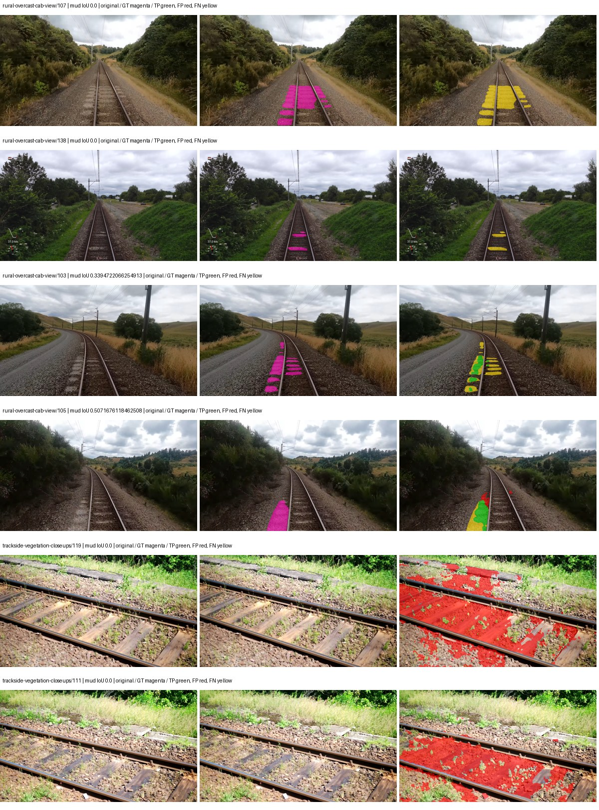

Examples are two lowest and two highest mud-IoU positive images, plus up to two negative images with the most false-positive mud pixels. They are targeted diagnostic examples, not random samples. Green: true positive; red: false positive; yellow: false negative. Full predictions remain on HDRFS.

### Validation tracking

| Logged step | Overall mIoU (%) | Mud IoU (%) |
| --- | --- | --- |
| 254 | 24.93 | 0.82 |
| 508 | 24.47 | 0.62 |
| 763 | 31.03 | 2.71 |
| 1017 | 32.14 | 2.79 |
| 1272 | 32.77 | 1.42 |
| 1527 | 33.13 | 0.71 |
| 1781 | 34.21 | 1.98 |
| 2036 | 31.70 | 2.41 |

All retained scalar curves, including training loss and per-class IoU, are in record.json. Observed best mud on a curve is not necessarily a retained checkpoint: the pilot saved its selection-metric-best and final checkpoints. Step logging and checkpoint global_step may differ by one.

### Stopping and checkpoint provenance

```json
{
  "stopping": {
    "actual_steps": 2036,
    "maximum_steps": 4000,
    "min_delta": 0.001,
    "monitor": "val_iou/mud-pumping",
    "patience": 5,
    "reason": "validation_plateau"
  },
  "checkpoints": {
    "best": {
      "path": "/data/izadia1/projects/segmentary-runs/paul-test-rtis/mud-fullstats-v1-20260906-r2/future-runs/hf_auto_upernet_swin_tiny--cityscapes_to_rtis--seed-0_seed0/rtis/best.ckpt",
      "sha256": "a9cd50ab882ef47bcb9aa93d8d32c6677ba63343fb351e0c59a9e84052972c25",
      "global_step": 1018,
      "bytes": 944059801
    },
    "final": {
      "path": "/data/izadia1/projects/segmentary-runs/paul-test-rtis/mud-fullstats-v1-20260906-r2/future-runs/hf_auto_upernet_swin_tiny--cityscapes_to_rtis--seed-0_seed0/rtis/last.ckpt",
      "sha256": "6818cdcc6e2437960347798a7c8940bfc61b4677635c154f430e58b631e9e87b",
      "global_step": 2036,
      "bytes": 944046617
    }
  },
  "cleanup_error": null
}
```

### Resolved training, initialization and evaluation settings

The optimizer block is the base configuration. Stage LR scales are applied at runtime, and stage warmup is capped at min(base warmup, floor(stage budget / 10), stage budget - 1): 400 steps for this 4,000-step pilot. Model-internal native input grids may differ from augmentation crops (EoMT uses its 640 grid).

```json
{
  "name": "hf_auto_upernet_swin_tiny--cityscapes_to_rtis--seed-0",
  "model": {
    "arch": "hf_auto",
    "checkpoint": "openmmlab/upernet-swin-tiny",
    "tuning": "full",
    "head": "unified_head",
    "lora_r": 16,
    "lora_alpha": 32,
    "lora_dropout": 0.05,
    "lora_targets": [],
    "drop_path": null,
    "revision": "dc8e8c94669c6f14d5cc4c21a141daebd2280d59",
    "subfolder": null,
    "local_files_only": false,
    "trust_remote_code": false,
    "backbone_path": "backbone",
    "head_paths": [
      "decode_head"
    ],
    "classifier_path": "decode_head.classifier",
    "inactive_parameter_paths": [
      "backbone.swin.layernorm"
    ],
    "smp_arch": null,
    "encoder_name": null,
    "encoder_weights": null,
    "native": null,
    "batch_norm_momentum": null
  },
  "space": "paul-test-rtis",
  "taxonomy_root": "/data/izadia1/projects/segmentary-rtis-fullstats-066afb2/taxonomy",
  "output_root": "/data/izadia1/projects/segmentary-runs/paul-test-rtis/mud-fullstats-v1-20260906-r2/future-runs",
  "optim": {
    "backbone_lr": 6e-05,
    "head_lr_mult": 10.0,
    "weight_decay": 0.05,
    "llrd": 0.9,
    "warmup_iters": 1500,
    "warmup_ratio": 1e-06,
    "poly_power": 0.9,
    "min_lr_ratio": 0.0,
    "betas": [
      0.9,
      0.999
    ],
    "grad_clip": 1.0
  },
  "train": {
    "iters": 4000,
    "batch_size": 2,
    "accum": 8,
    "num_workers": 2,
    "precision": "bf16-mixed",
    "ema_decay": 0.9998,
    "val_every": 250,
    "ckpt_every": 500,
    "selection_metric": "val_iou/mud-pumping",
    "early_stopping_patience": 5,
    "early_stopping_min_delta": 0.001,
    "seed": 0,
    "devices": 1
  },
  "eval": {
    "sliding_window": true,
    "window": [
      1024,
      1024
    ],
    "stride": [
      768,
      768
    ],
    "batch_size": 1,
    "num_workers": 2,
    "tta_scales": [],
    "tta_flip": false,
    "threshold": 0.5,
    "boundary_tolerance_frac": 0.0075,
    "save_confusion": true
  },
  "loss": {
    "task": "multiclass",
    "activation": "auto",
    "terms": [],
    "aux": "none",
    "aux_weight": 0.0,
    "ce_weight": 1.0,
    "label_smoothing": 0.0,
    "class_weights": null,
    "query": null
  },
  "aug": {
    "crop": [
      1024,
      1024
    ],
    "scale_min": 0.5,
    "scale_max": 2.0,
    "hflip_p": 0.5,
    "color_jitter_p": 0.5,
    "brightness": 0.25,
    "contrast": 0.25,
    "saturation": 0.25,
    "hue": 0.05
  },
  "stages": [
    {
      "name": "rtis",
      "data": [
        {
          "name": "paul-test-rtis",
          "root": "/data/izadia1/datasets/paul-test-rtis",
          "variant": null,
          "split_file": "splits.json",
          "train_split": "train",
          "val_split": "val",
          "limit": null,
          "loader": "folder",
          "mapping": "paul-test-rtis",
          "loader_options": {
            "require_groups": true
          }
        }
      ],
      "iters": null,
      "lr_scale": 0.1,
      "head_group_lr_scale": 1.0,
      "init_from": "/data/izadia1/projects/segmentary-runs/all-model-city-rail-seed0-a7c0b67/jobs/hf_auto_upernet_swin_tiny--cityscapes--seed-0/attempt-001/train/hf_auto_upernet_swin_tiny--cityscapes_seed0/cityscapes/last.ckpt",
      "reset_head": true,
      "freeze": null,
      "sample_weights": null
    }
  ]
}
```

### Hardware and software provenance

```json
{
  "training": {
    "cuda_available": true,
    "cuda_visible_devices": "3",
    "cudnn": 91900,
    "driver_version": "570.133.20",
    "gpu_count": 1,
    "gpu_names": [
      "NVIDIA L40S"
    ],
    "hostname": "hdrfs-app-001",
    "input_normalization": {
      "channel_order": "rgb",
      "mean": [
        0.485,
        0.456,
        0.406
      ],
      "source": "hf_image_processor",
      "std": [
        0.229,
        0.224,
        0.225
      ]
    },
    "model_origins": [
      {
        "hf_commit": "dc8e8c94669c6f14d5cc4c21a141daebd2280d59",
        "hf_name_or_path": "openmmlab/upernet-swin-tiny",
        "module": "model",
        "timm_pretrained": {}
      },
      {
        "hf_commit": null,
        "hf_name_or_path": "",
        "module": "model.backbone",
        "timm_pretrained": {}
      },
      {
        "hf_commit": null,
        "hf_name_or_path": "",
        "module": "model.backbone.swin",
        "timm_pretrained": {}
      },
      {
        "hf_commit": null,
        "hf_name_or_path": "",
        "module": "model.backbone.swin.embeddings",
        "timm_pretrained": {}
      },
      {
        "hf_commit": null,
        "hf_name_or_path": "",
        "module": "model.backbone.swin.encoder",
        "timm_pretrained": {}
      },
      {
        "hf_commit": null,
        "hf_name_or_path": "",
        "module": "model.backbone.swin.encoder.layers.0",
        "timm_pretrained": {}
      },
      {
        "hf_commit": null,
        "hf_name_or_path": "",
        "module": "model.backbone.swin.encoder.layers.0.blocks.0.attention",
        "timm_pretrained": {}
      },
      {
        "hf_commit": null,
        "hf_name_or_path": "",
        "module": "model.backbone.swin.encoder.layers.0.blocks.1.attention",
        "timm_pretrained": {}
      },
      {
        "hf_commit": null,
        "hf_name_or_path": "",
        "module": "model.backbone.swin.encoder.layers.1",
        "timm_pretrained": {}
      },
      {
        "hf_commit": null,
        "hf_name_or_path": "",
        "module": "model.backbone.swin.encoder.layers.1.blocks.0.attention",
        "timm_pretrained": {}
      },
      {
        "hf_commit": null,
        "hf_name_or_path": "",
        "module": "model.backbone.swin.encoder.layers.1.blocks.1.attention",
        "timm_pretrained": {}
      },
      {
        "hf_commit": null,
        "hf_name_or_path": "",
        "module": "model.backbone.swin.encoder.layers.2",
        "timm_pretrained": {}
      },
      {
        "hf_commit": null,
        "hf_name_or_path": "",
        "module": "model.backbone.swin.encoder.layers.2.blocks.0.attention",
        "timm_pretrained": {}
      },
      {
        "hf_commit": null,
        "hf_name_or_path": "",
        "module": "model.backbone.swin.encoder.layers.2.blocks.1.attention",
        "timm_pretrained": {}
      },
      {
        "hf_commit": null,
        "hf_name_or_path": "",
        "module": "model.backbone.swin.encoder.layers.2.blocks.2.attention",
        "timm_pretrained": {}
      },
      {
        "hf_commit": null,
        "hf_name_or_path": "",
        "module": "model.backbone.swin.encoder.layers.2.blocks.3.attention",
        "timm_pretrained": {}
      },
      {
        "hf_commit": null,
        "hf_name_or_path": "",
        "module": "model.backbone.swin.encoder.layers.2.blocks.4.attention",
        "timm_pretrained": {}
      },
      {
        "hf_commit": null,
        "hf_name_or_path": "",
        "module": "model.backbone.swin.encoder.layers.2.blocks.5.attention",
        "timm_pretrained": {}
      },
      {
        "hf_commit": null,
        "hf_name_or_path": "",
        "module": "model.backbone.swin.encoder.layers.3",
        "timm_pretrained": {}
      },
      {
        "hf_commit": null,
        "hf_name_or_path": "",
        "module": "model.backbone.swin.encoder.layers.3.blocks.0.attention",
        "timm_pretrained": {}
      },
      {
        "hf_commit": null,
        "hf_name_or_path": "",
        "module": "model.backbone.swin.encoder.layers.3.blocks.1.attention",
        "timm_pretrained": {}
      },
      {
        "hf_commit": "dc8e8c94669c6f14d5cc4c21a141daebd2280d59",
        "hf_name_or_path": "openmmlab/upernet-swin-tiny",
        "module": "model.decode_head",
        "timm_pretrained": {}
      }
    ],
    "model_parameter_count": 58953423,
    "packages": {
      "albumentations": "2.0.8",
      "lightning": "2.6.5",
      "numpy": "2.4.4",
      "segmentary": "0.1.0",
      "segmentation-models-pytorch": "0.5.0",
      "timm": "1.0.28",
      "torch": "2.11.0+cu128",
      "torchvision": "0.26.0+cu128",
      "transformers": "5.15.0"
    },
    "platform": "Linux-5.15.0-139-generic-x86_64-with-glibc2.35",
    "python": "3.11.15",
    "torch": "2.11.0+cu128",
    "torch_cuda": "12.8",
    "trainable_parameter_count": 58951887,
    "training_stop": {
      "actual_steps": 2036,
      "maximum_steps": 4000,
      "min_delta": 0.001,
      "monitor": "val_iou/mud-pumping",
      "patience": 5,
      "reason": "validation_plateau"
    },
    "validation_weights": "raw"
  },
  "evaluation": {
    "cuda_available": true,
    "cuda_visible_devices": "3",
    "cudnn": 91900,
    "driver_version": "570.133.20",
    "gpu_count": 1,
    "gpu_names": [
      "NVIDIA L40S"
    ],
    "hostname": "hdrfs-app-001",
    "input_normalization": {
      "channel_order": "rgb",
      "mean": [
        0.485,
        0.456,
        0.406
      ],
      "source": "hf_image_processor",
      "std": [
        0.229,
        0.224,
        0.225
      ]
    },
    "packages": {
      "albumentations": "2.0.8",
      "lightning": "2.6.5",
      "numpy": "2.4.4",
      "segmentary": "0.1.0",
      "segmentation-models-pytorch": "0.5.0",
      "timm": "1.0.28",
      "torch": "2.11.0+cu128",
      "torchvision": "0.26.0+cu128",
      "transformers": "5.15.0"
    },
    "platform": "Linux-5.15.0-139-generic-x86_64-with-glibc2.35",
    "python": "3.11.15",
    "torch": "2.11.0+cu128",
    "torch_cuda": "12.8"
  }
}
```

## cityscapes_to_rtis — seed 1

Status: **completed**. Started: 2026-09-06T14:06:46.634178+00:00. Finished: 2026-09-06T14:55:47.164114+00:00.

Recipe pretrained initializer: `openmmlab/upernet-swin-tiny`.

`rtis_only` uses the recipe initializer, which may include pretrained segmentation components. Transfer paths load the exact historical source checkpoint below and reset the classifier; they do not reset all query/decoder features.

Source checkpoint: `{'name': 'hf_auto_upernet_swin_tiny--cityscapes--seed-0', 'model': 'hf_auto_upernet_swin_tiny', 'protocol': 'cityscapes', 'config': '/data/izadia1/projects/segmentary-runs/all-model-city-rail-seed0-rail20-b9eb3e1/accepted/hf_auto_upernet_swin_tiny--cityscapes--seed-0/resolved-config.yaml', 'checkpoint': '/data/izadia1/projects/segmentary-runs/all-model-city-rail-seed0-a7c0b67/jobs/hf_auto_upernet_swin_tiny--cityscapes--seed-0/attempt-001/train/hf_auto_upernet_swin_tiny--cityscapes_seed0/cityscapes/last.ckpt', 'recorded_sha256': 'e7102f15e3adae759eeed4520ad72904fa929dc0c2a74fdc8120e2c147d53cc3', 'exists': True}`.

Config SHA-256: `864374776bfa64062c7c4fb97fd2eaef90a7c865232e284aec92e9df57c8a180`. Weights used for validation: `raw`.

### Mud-pumping and aggregate quality

| Metric | Selected checkpoint | Final training validation |
| --- | --- | --- |
| Mud IoU | 2.90 | 0.39 |
| Mud precision | 3.45 | 0.49 |
| Mud recall | 15.39 | 1.92 |
| Mud Dice/F1 | 5.63 | 0.78 |
| mIoU | 32.70 | 33.38 |
| Mean accuracy | 45.12 | 45.15 |
| Mean precision | 55.07 | 54.32 |
| Mean Dice | 42.76 | 42.05 |
| Mean specificity | 98.78 | 98.74 |
| Pixel accuracy | 80.06 | 80.19 |
| Frequency-weighted IoU | 71.39 | 71.04 |
| Fixed GT-present class mIoU | 36.33 | 38.94 |
| Boundary F1 | 40.53 | 39.76 |

The selected checkpoint has independent evaluation evidence. Final values are the trainer's final validation record, not a new independent evaluation. mIoU averages classes with nonzero union, so false positives on absent classes can change its denominator. The fixed GT-class mean is supplementary and excludes absent classes; their false positives remain in the confusion matrix.

### Resource usage and timing

| Measurement | Value |
| --- | --- |
| Peak training VRAM, retained training invocation (GiB) | 11.71 |
| Peak evaluation VRAM (GiB) | 7.52 |
| Retained training invocation wall time (seconds) | 2725.56 |
| Retained training invocation GPU-hours (one GPU) | 0.76 |
| Evaluation wall time (seconds) | 19.74 |
| Full evaluation pipeline images/second | 1.87 |
| Best full-state checkpoint (MiB) | 900.33 |
| Final full-state checkpoint (MiB) | 900.31 |
| Audited periodic checkpoints removed (GiB) | 3.52 |

VRAM uses the recorded allocator high-water mark; it is not total device usage including CUDA context. Resumed jobs' retained training invocation times and peaks are **not whole-campaign totals**. Earlier invocation resource records are not reconstructed here. Evaluation throughput includes loader, sliding-window inference and metrics; it is not model-only latency/FPS. Missing measurements are shown as —, never inferred from another dataset's run.

### Standardized inference performance

Dedicated model-only profiling waits for an idle worker-locked L40S: BF16, batch 1, 1024x1024, 20 warmup and 100 CUDA-event-timed public forwards. It excludes loading, preprocessing, tiling and metrics.

| Status | Parameters | Weight MiB | FPS | p50 ms | p95 ms | Peak reserved GiB |
| --- | --- | --- | --- | --- | --- | --- |
| complete | 58953423 | 224.89 | 42.60 | 23.32 | 24.22 | 2.41 |

```json
{
  "schema_version": 1,
  "model_id": "hf_auto_upernet_swin_tiny",
  "measured_at": "2026-09-06T14:55:40+00:00",
  "status": "complete",
  "benchmark_scope": "rtis_selected_checkpoint_model_only",
  "applies_to": [
    "hf_auto_upernet_swin_tiny--cityscapes_to_rtis--seed-1"
  ],
  "source": {
    "campaign_git_sha": "066afb2626398b7be59d4d19f5a0e4644fd59adc",
    "git_dirty": false,
    "config_hash": "aabca9ccdfaa",
    "resolved_config": "/data/izadia1/projects/segmentary-runs/paul-test-rtis/mud-fullstats-v1-20260906-r2/configs/hf_auto_upernet_swin_tiny--cityscapes_to_rtis--seed-1.yaml",
    "config_sha256": "864374776bfa64062c7c4fb97fd2eaef90a7c865232e284aec92e9df57c8a180",
    "checkpoint_sha256": "8545c147615fb3049a22c8007bcba147058ddaff2acde82d963cf3d3b7c6432f",
    "checkpoint_global_step": 763,
    "checkpoint_bytes": 944059801,
    "checkpoint_kind": "resume checkpoint with optimizer and EMA state",
    "weights": "raw",
    "measured_checkpoint_job_id": "hf_auto_upernet_swin_tiny--cityscapes_to_rtis--seed-1",
    "result_sha256": "9451fb40c5564ab5d3a5afa8ececc4f123fa10e6ac53402e3c0ae78549bd0443",
    "result_git_sha": "066afb2626398b7be59d4d19f5a0e4644fd59adc",
    "result_stage": "eval:paul-test-rtis:val",
    "result_seed": 1
  },
  "hardware": {
    "gpu_name": "NVIDIA L40S",
    "gpu_uuid": "GPU-fc5dde96-210d-0afa-ac74-7f88477d622b",
    "logical_device": "cuda:0",
    "physical_visibility_token": "4",
    "compute_capability": [
      8,
      9
    ],
    "total_memory_bytes": 47677177856
  },
  "model": {
    "parameter_count": 58953423,
    "trainable_parameter_count": 58951887,
    "resident_parameter_bytes": 235813692,
    "parameter_dtype_counts": {
      "float32": 58953423
    }
  },
  "contract": {
    "backend": "pytorch",
    "precision": "bf16_autocast",
    "batch_size": 1,
    "input_shape_nchw": [
      1,
      3,
      1024,
      1024
    ],
    "warmup_iterations": 20,
    "measured_iterations": 100,
    "timing": "per-forward CUDA events with end-event synchronization",
    "includes_preprocessing": false,
    "includes_data_loader": false,
    "includes_sliding_window": false,
    "input_resident_on_gpu": true,
    "model_only": true,
    "entrypoint": "public model(image) dense-logits forward"
  },
  "measurements": {
    "latency": {
      "p50_ms": 23.318016052246094,
      "p95_ms": 24.218061065673826,
      "mean_ms": 23.476917552948,
      "minimum_ms": 23.157760620117188,
      "maximum_ms": 25.174976348876953,
      "fps": 42.59502968158739,
      "raw_ms": [
        24.211456298828125,
        23.352256774902344,
        24.196096420288086,
        23.362560272216797,
        23.372800827026367,
        23.417856216430664,
        23.2673282623291,
        23.310272216796875,
        23.318527221679688,
        23.574527740478516,
        23.358463287353516,
        25.015296936035156,
        25.174976348876953,
        23.26425552368164,
        23.420927047729492,
        23.999488830566406,
        23.631744384765625,
        23.808000564575195,
        23.374847412109375,
        23.3175048828125,
        23.26630401611328,
        23.73734474182129,
        23.27552032470703,
        23.448575973510742,
        23.853055953979492,
        23.421951293945312,
        24.182783126831055,
        23.31648063659668,
        23.410688400268555,
        23.656448364257812,
        23.31443214416504,
        23.612319946289062,
        23.25811195373535,
        23.663616180419922,
        24.13363265991211,
        24.90265655517578,
        23.91142463684082,
        23.27552032470703,
        23.28473663330078,
        23.27961540222168,
        23.245824813842773,
        23.232511520385742,
        23.28371238708496,
        23.829504013061523,
        23.285856246948242,
        23.379968643188477,
        23.157760620117188,
        23.243776321411133,
        23.328767776489258,
        23.232511520385742,
        23.602176666259766,
        23.38105583190918,
        23.724031448364258,
        23.328767776489258,
        23.635967254638672,
        23.352319717407227,
        23.259136199951172,
        23.337984085083008,
        23.208959579467773,
        23.244800567626953,
        23.32467269897461,
        23.212032318115234,
        23.2806396484375,
        23.28678321838379,
        23.28883171081543,
        23.672704696655273,
        23.29190444946289,
        23.218175888061523,
        23.375871658325195,
        23.225343704223633,
        23.2192325592041,
        23.31340789794922,
        23.27961540222168,
        23.2488956451416,
        23.252992630004883,
        23.304224014282227,
        23.207935333251953,
        23.28780746459961,
        23.28985595703125,
        23.192575454711914,
        23.526432037353516,
        24.343551635742188,
        23.28166389465332,
        23.320575714111328,
        24.634368896484375,
        23.237632751464844,
        23.277568817138672,
        23.427072525024414,
        23.49158477783203,
        23.232511520385742,
        23.205888748168945,
        23.363584518432617,
        23.30419158935547,
        23.27244758605957,
        23.329696655273438,
        23.207008361816406,
        23.268352508544922,
        23.4649600982666,
        23.226367950439453,
        23.252992630004883
      ],
      "percentile_method": "numpy linear interpolation"
    },
    "peak_reserved_bytes": 2583691264,
    "memory_kind": "pytorch_cuda_allocator_peak_reserved_excluding_context",
    "benchmark_wall_clock_s": 8.359092358499765
  },
  "started_at": "2026-09-06T14:55:31+00:00",
  "finished_at": "2026-09-06T14:55:40+00:00",
  "environment": {
    "hostname": "hdrfs-app-001",
    "python": "3.11.15",
    "platform": "Linux-5.15.0-139-generic-x86_64-with-glibc2.35",
    "torch": "2.11.0+cu128",
    "torch_cuda": "12.8",
    "cudnn": 91900,
    "driver_version": "570.133.20",
    "cuda_available": true,
    "gpu_count": 1,
    "gpu_names": [
      "NVIDIA L40S"
    ],
    "cuda_visible_devices": "4",
    "packages": {
      "segmentary": "0.1.0",
      "torch": "2.11.0+cu128",
      "torchvision": "0.26.0+cu128",
      "transformers": "5.15.0",
      "timm": "1.0.28",
      "segmentation-models-pytorch": "0.5.0",
      "albumentations": "2.0.8",
      "lightning": "2.6.5",
      "numpy": "2.4.4"
    }
  }
}
```

### Per-class validation results

| Class | GT pixels | IoU (%) | Precision (%) | Recall (%) | Dice (%) | Boundary F1 (%) |
| --- | --- | --- | --- | --- | --- | --- |
| car | 29664 | 33.92 | 83.89 | 36.28 | 50.66 | 49.08 |
| construction | 311585 | 23.49 | 25.28 | 76.82 | 38.05 | 34.96 |
| fence | 265137 | 3.34 | 14.77 | 4.14 | 6.47 | 11.31 |
| mud-pumping | 1226250 | 2.90 | 3.45 | 15.39 | 5.63 | 9.83 |
| on-rails | 0 | — | — | — | — | — |
| person | 0 | 0.00 | 0.00 | — | 0.00 | 0.00 |
| pole | 628038 | 70.45 | 86.71 | 78.98 | 82.67 | 90.61 |
| rail-embedded | 16799 | 18.01 | 85.66 | 18.57 | 30.52 | 37.79 |
| rail-raised | 2969797 | 73.68 | 88.05 | 81.87 | 84.85 | 90.67 |
| rail-track | 6323197 | 31.67 | 62.57 | 39.07 | 48.10 | 41.38 |
| road | 1048831 | 6.30 | 20.65 | 8.31 | 11.85 | 13.05 |
| sidewalk | 1297367 | 15.41 | 62.90 | 16.95 | 26.70 | 8.51 |
| sky | 19121606 | 88.53 | 99.39 | 89.01 | 93.92 | 84.57 |
| standing-water | 95802 | 0.18 | 0.21 | 1.28 | 0.37 | 2.94 |
| terrain | 39239306 | 84.14 | 86.90 | 96.36 | 91.39 | 60.96 |
| trackbed | 10643081 | 60.55 | 75.49 | 75.36 | 75.43 | 60.84 |
| traffic-light | 19510 | 30.61 | 91.53 | 31.51 | 46.88 | 55.84 |
| traffic-sign | 13285 | 38.15 | 48.86 | 63.52 | 55.23 | 55.30 |
| tram-track | 56179 | 34.71 | 78.04 | 38.46 | 51.53 | 33.95 |
| truck | 0 | 0.00 | 0.00 | — | 0.00 | 0.00 |
| vegetation-overgrowth | 5901821 | 37.98 | 86.99 | 40.26 | 55.05 | 68.97 |

### Full-run accounting

| Measurement | Value |
| --- | --- |
| Full GPU-reserved wall seconds, all recorded worker attempts | 2941.24 |
| Full reserved GPU-hours | 0.82 |
| Whole-run timing complete | True |

| Phase | Wall seconds including failed attempts |
| --- | --- |
| training | 2733.74 |
| diagnostics | 156.19 |
| performance | 16.82 |

GPU-reserved time includes model loading, training, validation, collection, profiling, checkpoint I/O and orchestration while the worker owns one GPU. It is not GPU kernel-active time. Phase timings and sampled device memory/power/utilization are retained separately; sampled device memory is not the allocator high-water mark.

### Train/validation and raw/EMA diagnostics

| Checkpoint / weights / split | Images | Mud IoU (%) | Mud precision (%) | Mud recall (%) |
| --- | --- | --- | --- | --- |
| best-auto-train / raw | 220 | 92.40 | 93.48 | 98.77 |
| best-auto-val / raw | 37 | 2.90 | 3.45 | 15.39 |
| best-alternate-val / ema | 37 | 0.83 | 1.19 | 2.69 |
| final-auto-val / raw | 37 | 0.39 | 0.49 | 1.92 |

Train uses the evaluation transform without augmentation. Compare mud train/validation metrics for the same selected weights. Alternate EMA on running-stat BatchNorm is explicitly uncalibrated and is diagnostic only. Score-threshold curves use uncalibrated normalized scores and are pixel-level diagnostics, not event detection rates or a selected deployment operating point.

### Downloadable evidence

- best-auto-train: [per-image.csv](cityscapes_to_rtis--seed-1/best-auto-train/per-image.csv) · [per-image-confusion.json.gz](cityscapes_to_rtis--seed-1/best-auto-train/per-image-confusion.json.gz) · [groups.json](cityscapes_to_rtis--seed-1/best-auto-train/groups.json) · [mud-score-curves.json](cityscapes_to_rtis--seed-1/best-auto-train/mud-score-curves.json)
- best-auto-val: [per-image.csv](cityscapes_to_rtis--seed-1/best-auto-val/per-image.csv) · [per-image-confusion.json.gz](cityscapes_to_rtis--seed-1/best-auto-val/per-image-confusion.json.gz) · [groups.json](cityscapes_to_rtis--seed-1/best-auto-val/groups.json) · [mud-score-curves.json](cityscapes_to_rtis--seed-1/best-auto-val/mud-score-curves.json) · [examples.jpg](cityscapes_to_rtis--seed-1/best-auto-val/examples.jpg)
- best-alternate-val: [per-image.csv](cityscapes_to_rtis--seed-1/best-alternate-val/per-image.csv) · [per-image-confusion.json.gz](cityscapes_to_rtis--seed-1/best-alternate-val/per-image-confusion.json.gz) · [groups.json](cityscapes_to_rtis--seed-1/best-alternate-val/groups.json) · [mud-score-curves.json](cityscapes_to_rtis--seed-1/best-alternate-val/mud-score-curves.json)
- final-auto-val: [per-image.csv](cityscapes_to_rtis--seed-1/final-auto-val/per-image.csv) · [per-image-confusion.json.gz](cityscapes_to_rtis--seed-1/final-auto-val/per-image-confusion.json.gz) · [groups.json](cityscapes_to_rtis--seed-1/final-auto-val/groups.json) · [mud-score-curves.json](cityscapes_to_rtis--seed-1/final-auto-val/mud-score-curves.json)
- resources: [telemetry.csv](cityscapes_to_rtis--seed-1/resources/telemetry.csv)

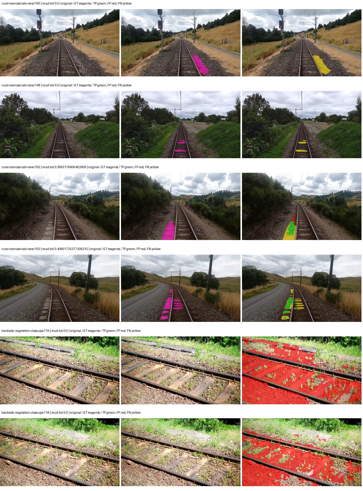

Examples are two lowest and two highest mud-IoU positive images, plus up to two negative images with the most false-positive mud pixels. They are targeted diagnostic examples, not random samples. Green: true positive; red: false positive; yellow: false negative. Full predictions remain on HDRFS.

### Validation tracking

| Logged step | Overall mIoU (%) | Mud IoU (%) |
| --- | --- | --- |
| 254 | 25.77 | 0.97 |
| 508 | 26.32 | 1.95 |
| 763 | 32.77 | 2.90 |
| 1017 | 36.84 | 0.44 |
| 1272 | 31.22 | 1.30 |
| 1527 | 32.37 | 1.55 |
| 1781 | 30.88 | 0.56 |
| 2036 | 33.38 | 0.39 |

All retained scalar curves, including training loss and per-class IoU, are in record.json. Observed best mud on a curve is not necessarily a retained checkpoint: the pilot saved its selection-metric-best and final checkpoints. Step logging and checkpoint global_step may differ by one.

### Stopping and checkpoint provenance

```json
{
  "stopping": {
    "actual_steps": 2036,
    "maximum_steps": 4000,
    "min_delta": 0.001,
    "monitor": "val_iou/mud-pumping",
    "patience": 5,
    "reason": "validation_plateau"
  },
  "checkpoints": {
    "best": {
      "path": "/data/izadia1/projects/segmentary-runs/paul-test-rtis/mud-fullstats-v1-20260906-r2/future-runs/hf_auto_upernet_swin_tiny--cityscapes_to_rtis--seed-1_seed1/rtis/best.ckpt",
      "sha256": "8545c147615fb3049a22c8007bcba147058ddaff2acde82d963cf3d3b7c6432f",
      "global_step": 763,
      "bytes": 944059801
    },
    "final": {
      "path": "/data/izadia1/projects/segmentary-runs/paul-test-rtis/mud-fullstats-v1-20260906-r2/future-runs/hf_auto_upernet_swin_tiny--cityscapes_to_rtis--seed-1_seed1/rtis/last.ckpt",
      "sha256": "b2ed993a8cf68087ad3263920c2313ff889e448d807f3320473065de51e3faa1",
      "global_step": 2036,
      "bytes": 944046617
    }
  },
  "cleanup_error": null
}
```

### Resolved training, initialization and evaluation settings

The optimizer block is the base configuration. Stage LR scales are applied at runtime, and stage warmup is capped at min(base warmup, floor(stage budget / 10), stage budget - 1): 400 steps for this 4,000-step pilot. Model-internal native input grids may differ from augmentation crops (EoMT uses its 640 grid).

```json
{
  "name": "hf_auto_upernet_swin_tiny--cityscapes_to_rtis--seed-1",
  "model": {
    "arch": "hf_auto",
    "checkpoint": "openmmlab/upernet-swin-tiny",
    "tuning": "full",
    "head": "unified_head",
    "lora_r": 16,
    "lora_alpha": 32,
    "lora_dropout": 0.05,
    "lora_targets": [],
    "drop_path": null,
    "revision": "dc8e8c94669c6f14d5cc4c21a141daebd2280d59",
    "subfolder": null,
    "local_files_only": false,
    "trust_remote_code": false,
    "backbone_path": "backbone",
    "head_paths": [
      "decode_head"
    ],
    "classifier_path": "decode_head.classifier",
    "inactive_parameter_paths": [
      "backbone.swin.layernorm"
    ],
    "smp_arch": null,
    "encoder_name": null,
    "encoder_weights": null,
    "native": null,
    "batch_norm_momentum": null
  },
  "space": "paul-test-rtis",
  "taxonomy_root": "/data/izadia1/projects/segmentary-rtis-fullstats-066afb2/taxonomy",
  "output_root": "/data/izadia1/projects/segmentary-runs/paul-test-rtis/mud-fullstats-v1-20260906-r2/future-runs",
  "optim": {
    "backbone_lr": 6e-05,
    "head_lr_mult": 10.0,
    "weight_decay": 0.05,
    "llrd": 0.9,
    "warmup_iters": 1500,
    "warmup_ratio": 1e-06,
    "poly_power": 0.9,
    "min_lr_ratio": 0.0,
    "betas": [
      0.9,
      0.999
    ],
    "grad_clip": 1.0
  },
  "train": {
    "iters": 4000,
    "batch_size": 2,
    "accum": 8,
    "num_workers": 2,
    "precision": "bf16-mixed",
    "ema_decay": 0.9998,
    "val_every": 250,
    "ckpt_every": 500,
    "selection_metric": "val_iou/mud-pumping",
    "early_stopping_patience": 5,
    "early_stopping_min_delta": 0.001,
    "seed": 1,
    "devices": 1
  },
  "eval": {
    "sliding_window": true,
    "window": [
      1024,
      1024
    ],
    "stride": [
      768,
      768
    ],
    "batch_size": 1,
    "num_workers": 2,
    "tta_scales": [],
    "tta_flip": false,
    "threshold": 0.5,
    "boundary_tolerance_frac": 0.0075,
    "save_confusion": true
  },
  "loss": {
    "task": "multiclass",
    "activation": "auto",
    "terms": [],
    "aux": "none",
    "aux_weight": 0.0,
    "ce_weight": 1.0,
    "label_smoothing": 0.0,
    "class_weights": null,
    "query": null
  },
  "aug": {
    "crop": [
      1024,
      1024
    ],
    "scale_min": 0.5,
    "scale_max": 2.0,
    "hflip_p": 0.5,
    "color_jitter_p": 0.5,
    "brightness": 0.25,
    "contrast": 0.25,
    "saturation": 0.25,
    "hue": 0.05
  },
  "stages": [
    {
      "name": "rtis",
      "data": [
        {
          "name": "paul-test-rtis",
          "root": "/data/izadia1/datasets/paul-test-rtis",
          "variant": null,
          "split_file": "splits.json",
          "train_split": "train",
          "val_split": "val",
          "limit": null,
          "loader": "folder",
          "mapping": "paul-test-rtis",
          "loader_options": {
            "require_groups": true
          }
        }
      ],
      "iters": null,
      "lr_scale": 0.1,
      "head_group_lr_scale": 1.0,
      "init_from": "/data/izadia1/projects/segmentary-runs/all-model-city-rail-seed0-a7c0b67/jobs/hf_auto_upernet_swin_tiny--cityscapes--seed-0/attempt-001/train/hf_auto_upernet_swin_tiny--cityscapes_seed0/cityscapes/last.ckpt",
      "reset_head": true,
      "freeze": null,
      "sample_weights": null
    }
  ]
}
```

### Hardware and software provenance

```json
{
  "training": {
    "cuda_available": true,
    "cuda_visible_devices": "4",
    "cudnn": 91900,
    "driver_version": "570.133.20",
    "gpu_count": 1,
    "gpu_names": [
      "NVIDIA L40S"
    ],
    "hostname": "hdrfs-app-001",
    "input_normalization": {
      "channel_order": "rgb",
      "mean": [
        0.485,
        0.456,
        0.406
      ],
      "source": "hf_image_processor",
      "std": [
        0.229,
        0.224,
        0.225
      ]
    },
    "model_origins": [
      {
        "hf_commit": "dc8e8c94669c6f14d5cc4c21a141daebd2280d59",
        "hf_name_or_path": "openmmlab/upernet-swin-tiny",
        "module": "model",
        "timm_pretrained": {}
      },
      {
        "hf_commit": null,
        "hf_name_or_path": "",
        "module": "model.backbone",
        "timm_pretrained": {}
      },
      {
        "hf_commit": null,
        "hf_name_or_path": "",
        "module": "model.backbone.swin",
        "timm_pretrained": {}
      },
      {
        "hf_commit": null,
        "hf_name_or_path": "",
        "module": "model.backbone.swin.embeddings",
        "timm_pretrained": {}
      },
      {
        "hf_commit": null,
        "hf_name_or_path": "",
        "module": "model.backbone.swin.encoder",
        "timm_pretrained": {}
      },
      {
        "hf_commit": null,
        "hf_name_or_path": "",
        "module": "model.backbone.swin.encoder.layers.0",
        "timm_pretrained": {}
      },
      {
        "hf_commit": null,
        "hf_name_or_path": "",
        "module": "model.backbone.swin.encoder.layers.0.blocks.0.attention",
        "timm_pretrained": {}
      },
      {
        "hf_commit": null,
        "hf_name_or_path": "",
        "module": "model.backbone.swin.encoder.layers.0.blocks.1.attention",
        "timm_pretrained": {}
      },
      {
        "hf_commit": null,
        "hf_name_or_path": "",
        "module": "model.backbone.swin.encoder.layers.1",
        "timm_pretrained": {}
      },
      {
        "hf_commit": null,
        "hf_name_or_path": "",
        "module": "model.backbone.swin.encoder.layers.1.blocks.0.attention",
        "timm_pretrained": {}
      },
      {
        "hf_commit": null,
        "hf_name_or_path": "",
        "module": "model.backbone.swin.encoder.layers.1.blocks.1.attention",
        "timm_pretrained": {}
      },
      {
        "hf_commit": null,
        "hf_name_or_path": "",
        "module": "model.backbone.swin.encoder.layers.2",
        "timm_pretrained": {}
      },
      {
        "hf_commit": null,
        "hf_name_or_path": "",
        "module": "model.backbone.swin.encoder.layers.2.blocks.0.attention",
        "timm_pretrained": {}
      },
      {
        "hf_commit": null,
        "hf_name_or_path": "",
        "module": "model.backbone.swin.encoder.layers.2.blocks.1.attention",
        "timm_pretrained": {}
      },
      {
        "hf_commit": null,
        "hf_name_or_path": "",
        "module": "model.backbone.swin.encoder.layers.2.blocks.2.attention",
        "timm_pretrained": {}
      },
      {
        "hf_commit": null,
        "hf_name_or_path": "",
        "module": "model.backbone.swin.encoder.layers.2.blocks.3.attention",
        "timm_pretrained": {}
      },
      {
        "hf_commit": null,
        "hf_name_or_path": "",
        "module": "model.backbone.swin.encoder.layers.2.blocks.4.attention",
        "timm_pretrained": {}
      },
      {
        "hf_commit": null,
        "hf_name_or_path": "",
        "module": "model.backbone.swin.encoder.layers.2.blocks.5.attention",
        "timm_pretrained": {}
      },
      {
        "hf_commit": null,
        "hf_name_or_path": "",
        "module": "model.backbone.swin.encoder.layers.3",
        "timm_pretrained": {}
      },
      {
        "hf_commit": null,
        "hf_name_or_path": "",
        "module": "model.backbone.swin.encoder.layers.3.blocks.0.attention",
        "timm_pretrained": {}
      },
      {
        "hf_commit": null,
        "hf_name_or_path": "",
        "module": "model.backbone.swin.encoder.layers.3.blocks.1.attention",
        "timm_pretrained": {}
      },
      {
        "hf_commit": "dc8e8c94669c6f14d5cc4c21a141daebd2280d59",
        "hf_name_or_path": "openmmlab/upernet-swin-tiny",
        "module": "model.decode_head",
        "timm_pretrained": {}
      }
    ],
    "model_parameter_count": 58953423,
    "packages": {
      "albumentations": "2.0.8",
      "lightning": "2.6.5",
      "numpy": "2.4.4",
      "segmentary": "0.1.0",
      "segmentation-models-pytorch": "0.5.0",
      "timm": "1.0.28",
      "torch": "2.11.0+cu128",
      "torchvision": "0.26.0+cu128",
      "transformers": "5.15.0"
    },
    "platform": "Linux-5.15.0-139-generic-x86_64-with-glibc2.35",
    "python": "3.11.15",
    "torch": "2.11.0+cu128",
    "torch_cuda": "12.8",
    "trainable_parameter_count": 58951887,
    "training_stop": {
      "actual_steps": 2036,
      "maximum_steps": 4000,
      "min_delta": 0.001,
      "monitor": "val_iou/mud-pumping",
      "patience": 5,
      "reason": "validation_plateau"
    },
    "validation_weights": "raw"
  },
  "evaluation": {
    "cuda_available": true,
    "cuda_visible_devices": "4",
    "cudnn": 91900,
    "driver_version": "570.133.20",
    "gpu_count": 1,
    "gpu_names": [
      "NVIDIA L40S"
    ],
    "hostname": "hdrfs-app-001",
    "input_normalization": {
      "channel_order": "rgb",
      "mean": [
        0.485,
        0.456,
        0.406
      ],
      "source": "hf_image_processor",
      "std": [
        0.229,
        0.224,
        0.225
      ]
    },
    "packages": {
      "albumentations": "2.0.8",
      "lightning": "2.6.5",
      "numpy": "2.4.4",
      "segmentary": "0.1.0",
      "segmentation-models-pytorch": "0.5.0",
      "timm": "1.0.28",
      "torch": "2.11.0+cu128",
      "torchvision": "0.26.0+cu128",
      "transformers": "5.15.0"
    },
    "platform": "Linux-5.15.0-139-generic-x86_64-with-glibc2.35",
    "python": "3.11.15",
    "torch": "2.11.0+cu128",
    "torch_cuda": "12.8"
  }
}
```

## cityscapes_to_rtis — seed 2

Status: **completed**. Started: 2026-09-06T14:07:19.611068+00:00. Finished: 2026-09-06T14:50:46.146189+00:00.

Recipe pretrained initializer: `openmmlab/upernet-swin-tiny`.

`rtis_only` uses the recipe initializer, which may include pretrained segmentation components. Transfer paths load the exact historical source checkpoint below and reset the classifier; they do not reset all query/decoder features.

Source checkpoint: `{'name': 'hf_auto_upernet_swin_tiny--cityscapes--seed-0', 'model': 'hf_auto_upernet_swin_tiny', 'protocol': 'cityscapes', 'config': '/data/izadia1/projects/segmentary-runs/all-model-city-rail-seed0-rail20-b9eb3e1/accepted/hf_auto_upernet_swin_tiny--cityscapes--seed-0/resolved-config.yaml', 'checkpoint': '/data/izadia1/projects/segmentary-runs/all-model-city-rail-seed0-a7c0b67/jobs/hf_auto_upernet_swin_tiny--cityscapes--seed-0/attempt-001/train/hf_auto_upernet_swin_tiny--cityscapes_seed0/cityscapes/last.ckpt', 'recorded_sha256': 'e7102f15e3adae759eeed4520ad72904fa929dc0c2a74fdc8120e2c147d53cc3', 'exists': True}`.

Config SHA-256: `293014aabe691d14c7132993ad0e533bf8d351af6f4c07ed40bd6cd91f0080d4`. Weights used for validation: `raw`.

### Mud-pumping and aggregate quality

| Metric | Selected checkpoint | Final training validation |
| --- | --- | --- |
| Mud IoU | 5.33 | 2.73 |
| Mud precision | 10.68 | 3.42 |
| Mud recall | 9.63 | 11.91 |
| Mud Dice/F1 | 10.13 | 5.31 |
| mIoU | 26.60 | 30.45 |
| Mean accuracy | 39.55 | 43.09 |
| Mean precision | 40.75 | 51.98 |
| Mean Dice | 33.78 | 38.84 |
| Mean specificity | 98.86 | 98.68 |
| Pixel accuracy | 80.15 | 79.93 |
| Frequency-weighted IoU | 71.66 | 69.72 |
| Fixed GT-present class mIoU | 29.56 | 35.52 |
| Boundary F1 | 32.71 | 37.26 |

The selected checkpoint has independent evaluation evidence. Final values are the trainer's final validation record, not a new independent evaluation. mIoU averages classes with nonzero union, so false positives on absent classes can change its denominator. The fixed GT-class mean is supplementary and excludes absent classes; their false positives remain in the confusion matrix.

### Resource usage and timing

| Measurement | Value |
| --- | --- |
| Peak training VRAM, retained training invocation (GiB) | 11.71 |
| Peak evaluation VRAM (GiB) | 7.52 |
| Retained training invocation wall time (seconds) | 2390.65 |
| Retained training invocation GPU-hours (one GPU) | 0.66 |
| Evaluation wall time (seconds) | 20.13 |
| Full evaluation pipeline images/second | 1.84 |
| Best full-state checkpoint (MiB) | 900.33 |
| Final full-state checkpoint (MiB) | 900.31 |
| Audited periodic checkpoints removed (GiB) | 2.64 |

VRAM uses the recorded allocator high-water mark; it is not total device usage including CUDA context. Resumed jobs' retained training invocation times and peaks are **not whole-campaign totals**. Earlier invocation resource records are not reconstructed here. Evaluation throughput includes loader, sliding-window inference and metrics; it is not model-only latency/FPS. Missing measurements are shown as —, never inferred from another dataset's run.

### Standardized inference performance

Dedicated model-only profiling waits for an idle worker-locked L40S: BF16, batch 1, 1024x1024, 20 warmup and 100 CUDA-event-timed public forwards. It excludes loading, preprocessing, tiling and metrics.

| Status | Parameters | Weight MiB | FPS | p50 ms | p95 ms | Peak reserved GiB |
| --- | --- | --- | --- | --- | --- | --- |
| complete | 58953423 | 224.89 | 42.13 | 23.52 | 24.62 | 2.41 |

```json
{
  "schema_version": 1,
  "model_id": "hf_auto_upernet_swin_tiny",
  "measured_at": "2026-09-06T14:50:40+00:00",
  "status": "complete",
  "benchmark_scope": "rtis_selected_checkpoint_model_only",
  "applies_to": [
    "hf_auto_upernet_swin_tiny--cityscapes_to_rtis--seed-2"
  ],
  "source": {
    "campaign_git_sha": "066afb2626398b7be59d4d19f5a0e4644fd59adc",
    "git_dirty": false,
    "config_hash": "26474c66683b",
    "resolved_config": "/data/izadia1/projects/segmentary-runs/paul-test-rtis/mud-fullstats-v1-20260906-r2/configs/hf_auto_upernet_swin_tiny--cityscapes_to_rtis--seed-2.yaml",
    "config_sha256": "293014aabe691d14c7132993ad0e533bf8d351af6f4c07ed40bd6cd91f0080d4",
    "checkpoint_sha256": "fabc5f9330c5153e8f925a549be91ef26fb4e0eb9e81d01808805e7938f1e515",
    "checkpoint_global_step": 509,
    "checkpoint_bytes": 944059801,
    "checkpoint_kind": "resume checkpoint with optimizer and EMA state",
    "weights": "raw",
    "measured_checkpoint_job_id": "hf_auto_upernet_swin_tiny--cityscapes_to_rtis--seed-2",
    "result_sha256": "35bb4cdd03ba2f7b4f5dedff394f1b42681e209920941aac09d72ab78b87c5a6",
    "result_git_sha": "066afb2626398b7be59d4d19f5a0e4644fd59adc",
    "result_stage": "eval:paul-test-rtis:val",
    "result_seed": 2
  },
  "hardware": {
    "gpu_name": "NVIDIA L40S",
    "gpu_uuid": "GPU-1c9b612f-e0b5-fbbc-150f-8c2ef13453c9",
    "logical_device": "cuda:0",
    "physical_visibility_token": "5",
    "compute_capability": [
      8,
      9
    ],
    "total_memory_bytes": 47677177856
  },
  "model": {
    "parameter_count": 58953423,
    "trainable_parameter_count": 58951887,
    "resident_parameter_bytes": 235813692,
    "parameter_dtype_counts": {
      "float32": 58953423
    }
  },
  "contract": {
    "backend": "pytorch",
    "precision": "bf16_autocast",
    "batch_size": 1,
    "input_shape_nchw": [
      1,
      3,
      1024,
      1024
    ],
    "warmup_iterations": 20,
    "measured_iterations": 100,
    "timing": "per-forward CUDA events with end-event synchronization",
    "includes_preprocessing": false,
    "includes_data_loader": false,
    "includes_sliding_window": false,
    "input_resident_on_gpu": true,
    "model_only": true,
    "entrypoint": "public model(image) dense-logits forward"
  },
  "measurements": {
    "latency": {
      "p50_ms": 23.517695426940918,
      "p95_ms": 24.621261310577392,
      "mean_ms": 23.73337055206299,
      "minimum_ms": 23.27961540222168,
      "maximum_ms": 26.084352493286133,
      "fps": 42.13476538472857,
      "raw_ms": [
        24.078336715698242,
        25.775104522705078,
        23.937023162841797,
        23.611391067504883,
        26.084352493286133,
        23.541759490966797,
        25.68294334411621,
        23.648256301879883,
        23.478271484375,
        24.147968292236328,
        23.959552764892578,
        24.128511428833008,
        25.150463104248047,
        24.0578556060791,
        23.559167861938477,
        23.344127655029297,
        23.427072525024414,
        23.451648712158203,
        23.72096061706543,
        23.393280029296875,
        24.549375534057617,
        23.390207290649414,
        23.954431533813477,
        23.69536018371582,
        24.266752243041992,
        23.45471954345703,
        23.394304275512695,
        23.5100154876709,
        23.367679595947266,
        23.32159996032715,
        23.354368209838867,
        23.384063720703125,
        25.69113540649414,
        23.665664672851562,
        23.763967514038086,
        23.403520584106445,
        23.769088745117188,
        24.28006362915039,
        23.46905517578125,
        23.34614372253418,
        23.27961540222168,
        23.421951293945312,
        23.386112213134766,
        23.378944396972656,
        23.826431274414062,
        23.888896942138672,
        23.438335418701172,
        24.30463981628418,
        23.46291160583496,
        23.71891212463379,
        23.793664932250977,
        23.793664932250977,
        23.590911865234375,
        23.620607376098633,
        23.47110366821289,
        23.385087966918945,
        23.434240341186523,
        23.30009651184082,
        23.352319717407227,
        23.368703842163086,
        23.428096771240234,
        23.540735244750977,
        23.536640167236328,
        23.32364845275879,
        23.421951293945312,
        23.384063720703125,
        23.581695556640625,
        24.54630470275879,
        23.609344482421875,
        23.525375366210938,
        23.360511779785156,
        23.419904708862305,
        23.374847412109375,
        23.384063720703125,
        23.345151901245117,
        24.061952590942383,
        23.592960357666016,
        24.060928344726562,
        24.224767684936523,
        24.420352935791016,
        24.162303924560547,
        23.49772834777832,
        23.47724723815918,
        23.393280029296875,
        23.366655349731445,
        23.400447845458984,
        23.634944915771484,
        23.428096771240234,
        23.50592041015625,
        23.601152420043945,
        23.69945526123047,
        24.593408584594727,
        23.913471221923828,
        23.610368728637695,
        23.415807723999023,
        23.372800827026367,
        23.428096771240234,
        23.329792022705078,
        23.508991241455078,
        23.427072525024414
      ],
      "percentile_method": "numpy linear interpolation"
    },
    "peak_reserved_bytes": 2583691264,
    "memory_kind": "pytorch_cuda_allocator_peak_reserved_excluding_context",
    "benchmark_wall_clock_s": 8.393912866711617
  },
  "started_at": "2026-09-06T14:50:31+00:00",
  "finished_at": "2026-09-06T14:50:40+00:00",
  "environment": {
    "hostname": "hdrfs-app-001",
    "python": "3.11.15",
    "platform": "Linux-5.15.0-139-generic-x86_64-with-glibc2.35",
    "torch": "2.11.0+cu128",
    "torch_cuda": "12.8",
    "cudnn": 91900,
    "driver_version": "570.133.20",
    "cuda_available": true,
    "gpu_count": 1,
    "gpu_names": [
      "NVIDIA L40S"
    ],
    "cuda_visible_devices": "5",
    "packages": {
      "segmentary": "0.1.0",
      "torch": "2.11.0+cu128",
      "torchvision": "0.26.0+cu128",
      "transformers": "5.15.0",
      "timm": "1.0.28",
      "segmentation-models-pytorch": "0.5.0",
      "albumentations": "2.0.8",
      "lightning": "2.6.5",
      "numpy": "2.4.4"
    }
  }
}
```

### Per-class validation results

| Class | GT pixels | IoU (%) | Precision (%) | Recall (%) | Dice (%) | Boundary F1 (%) |
| --- | --- | --- | --- | --- | --- | --- |
| car | 29664 | 0.00 | 0.00 | 0.00 | 0.00 | 0.00 |
| construction | 311585 | 5.46 | 5.59 | 69.96 | 10.36 | 24.61 |
| fence | 265137 | 13.02 | 64.35 | 14.04 | 23.04 | 27.63 |
| mud-pumping | 1226250 | 5.33 | 10.68 | 9.63 | 10.13 | 9.09 |
| on-rails | 0 | — | — | — | — | — |
| person | 0 | 0.00 | 0.00 | — | 0.00 | 0.00 |
| pole | 628038 | 68.11 | 76.20 | 86.50 | 81.03 | 89.02 |
| rail-embedded | 16799 | 0.00 | 0.00 | 0.00 | 0.00 | 0.00 |
| rail-raised | 2969797 | 74.26 | 82.65 | 87.97 | 85.23 | 89.41 |
| rail-track | 6323197 | 44.00 | 59.59 | 62.71 | 61.11 | 53.07 |
| road | 1048831 | 5.73 | 13.97 | 8.85 | 10.83 | 14.07 |
| sidewalk | 1297367 | 10.74 | 54.66 | 11.79 | 19.39 | 10.52 |
| sky | 19121606 | 82.15 | 99.51 | 82.49 | 90.20 | 83.62 |
| standing-water | 95802 | 0.63 | 0.70 | 6.15 | 1.26 | 4.83 |
| terrain | 39239306 | 85.72 | 91.33 | 93.31 | 92.31 | 63.46 |
| trackbed | 10643081 | 58.06 | 68.68 | 78.96 | 73.47 | 58.73 |
| traffic-light | 19510 | 6.57 | 61.67 | 6.85 | 12.34 | 27.22 |
| traffic-sign | 13285 | 0.00 | 0.00 | 0.00 | 0.00 | 0.00 |
| tram-track | 56179 | 27.42 | 43.18 | 42.90 | 43.04 | 26.31 |
| truck | 0 | 0.00 | 0.00 | — | 0.00 | 0.00 |
| vegetation-overgrowth | 5901821 | 44.89 | 82.19 | 49.72 | 61.96 | 72.70 |

### Full-run accounting

| Measurement | Value |
| --- | --- |
| Full GPU-reserved wall seconds, all recorded worker attempts | 2607.21 |
| Full reserved GPU-hours | 0.72 |
| Whole-run timing complete | True |

| Phase | Wall seconds including failed attempts |
| --- | --- |
| training | 2398.91 |
| diagnostics | 156.85 |
| performance | 16.63 |

GPU-reserved time includes model loading, training, validation, collection, profiling, checkpoint I/O and orchestration while the worker owns one GPU. It is not GPU kernel-active time. Phase timings and sampled device memory/power/utilization are retained separately; sampled device memory is not the allocator high-water mark.

### Train/validation and raw/EMA diagnostics

| Checkpoint / weights / split | Images | Mud IoU (%) | Mud precision (%) | Mud recall (%) |
| --- | --- | --- | --- | --- |
| best-auto-train / raw | 220 | 91.90 | 95.82 | 95.74 |
| best-auto-val / raw | 37 | 5.33 | 10.68 | 9.63 |
| best-alternate-val / ema | 37 | 2.14 | 3.20 | 6.05 |
| final-auto-val / raw | 37 | 2.73 | 3.42 | 11.91 |

Train uses the evaluation transform without augmentation. Compare mud train/validation metrics for the same selected weights. Alternate EMA on running-stat BatchNorm is explicitly uncalibrated and is diagnostic only. Score-threshold curves use uncalibrated normalized scores and are pixel-level diagnostics, not event detection rates or a selected deployment operating point.

### Downloadable evidence

- best-auto-train: [per-image.csv](cityscapes_to_rtis--seed-2/best-auto-train/per-image.csv) · [per-image-confusion.json.gz](cityscapes_to_rtis--seed-2/best-auto-train/per-image-confusion.json.gz) · [groups.json](cityscapes_to_rtis--seed-2/best-auto-train/groups.json) · [mud-score-curves.json](cityscapes_to_rtis--seed-2/best-auto-train/mud-score-curves.json)
- best-auto-val: [per-image.csv](cityscapes_to_rtis--seed-2/best-auto-val/per-image.csv) · [per-image-confusion.json.gz](cityscapes_to_rtis--seed-2/best-auto-val/per-image-confusion.json.gz) · [groups.json](cityscapes_to_rtis--seed-2/best-auto-val/groups.json) · [mud-score-curves.json](cityscapes_to_rtis--seed-2/best-auto-val/mud-score-curves.json) · [examples.jpg](cityscapes_to_rtis--seed-2/best-auto-val/examples.jpg)
- best-alternate-val: [per-image.csv](cityscapes_to_rtis--seed-2/best-alternate-val/per-image.csv) · [per-image-confusion.json.gz](cityscapes_to_rtis--seed-2/best-alternate-val/per-image-confusion.json.gz) · [groups.json](cityscapes_to_rtis--seed-2/best-alternate-val/groups.json) · [mud-score-curves.json](cityscapes_to_rtis--seed-2/best-alternate-val/mud-score-curves.json)
- final-auto-val: [per-image.csv](cityscapes_to_rtis--seed-2/final-auto-val/per-image.csv) · [per-image-confusion.json.gz](cityscapes_to_rtis--seed-2/final-auto-val/per-image-confusion.json.gz) · [groups.json](cityscapes_to_rtis--seed-2/final-auto-val/groups.json) · [mud-score-curves.json](cityscapes_to_rtis--seed-2/final-auto-val/mud-score-curves.json)
- resources: [telemetry.csv](cityscapes_to_rtis--seed-2/resources/telemetry.csv)

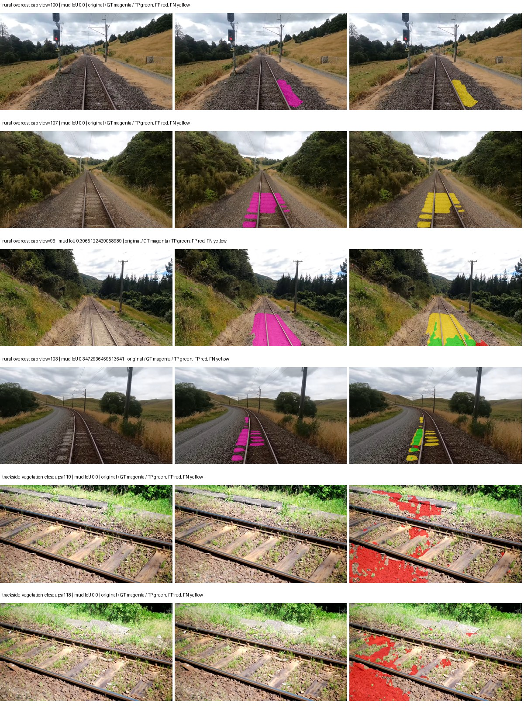

Examples are two lowest and two highest mud-IoU positive images, plus up to two negative images with the most false-positive mud pixels. They are targeted diagnostic examples, not random samples. Green: true positive; red: false positive; yellow: false negative. Full predictions remain on HDRFS.

### Validation tracking

| Logged step | Overall mIoU (%) | Mud IoU (%) |
| --- | --- | --- |
| 254 | 24.64 | 2.59 |
| 508 | 26.61 | 5.33 |
| 763 | 33.46 | 1.79 |
| 1017 | 32.44 | 0.94 |
| 1272 | 36.09 | 1.83 |
| 1527 | 30.42 | 0.92 |
| 1781 | 30.45 | 2.73 |

All retained scalar curves, including training loss and per-class IoU, are in record.json. Observed best mud on a curve is not necessarily a retained checkpoint: the pilot saved its selection-metric-best and final checkpoints. Step logging and checkpoint global_step may differ by one.

### Stopping and checkpoint provenance

```json
{
  "stopping": {
    "actual_steps": 1781,
    "maximum_steps": 4000,
    "min_delta": 0.001,
    "monitor": "val_iou/mud-pumping",
    "patience": 5,
    "reason": "validation_plateau"
  },
  "checkpoints": {
    "best": {
      "path": "/data/izadia1/projects/segmentary-runs/paul-test-rtis/mud-fullstats-v1-20260906-r2/future-runs/hf_auto_upernet_swin_tiny--cityscapes_to_rtis--seed-2_seed2/rtis/best.ckpt",
      "sha256": "fabc5f9330c5153e8f925a549be91ef26fb4e0eb9e81d01808805e7938f1e515",
      "global_step": 509,
      "bytes": 944059801
    },
    "final": {
      "path": "/data/izadia1/projects/segmentary-runs/paul-test-rtis/mud-fullstats-v1-20260906-r2/future-runs/hf_auto_upernet_swin_tiny--cityscapes_to_rtis--seed-2_seed2/rtis/last.ckpt",
      "sha256": "1f42033f09985a28fac9d32f55638edcedd98e2f998138f985dc7f92bbb908fa",
      "global_step": 1781,
      "bytes": 944046617
    }
  },
  "cleanup_error": null
}
```

### Resolved training, initialization and evaluation settings

The optimizer block is the base configuration. Stage LR scales are applied at runtime, and stage warmup is capped at min(base warmup, floor(stage budget / 10), stage budget - 1): 400 steps for this 4,000-step pilot. Model-internal native input grids may differ from augmentation crops (EoMT uses its 640 grid).

```json
{
  "name": "hf_auto_upernet_swin_tiny--cityscapes_to_rtis--seed-2",
  "model": {
    "arch": "hf_auto",
    "checkpoint": "openmmlab/upernet-swin-tiny",
    "tuning": "full",
    "head": "unified_head",
    "lora_r": 16,
    "lora_alpha": 32,
    "lora_dropout": 0.05,
    "lora_targets": [],
    "drop_path": null,
    "revision": "dc8e8c94669c6f14d5cc4c21a141daebd2280d59",
    "subfolder": null,
    "local_files_only": false,
    "trust_remote_code": false,
    "backbone_path": "backbone",
    "head_paths": [
      "decode_head"
    ],
    "classifier_path": "decode_head.classifier",
    "inactive_parameter_paths": [
      "backbone.swin.layernorm"
    ],
    "smp_arch": null,
    "encoder_name": null,
    "encoder_weights": null,
    "native": null,
    "batch_norm_momentum": null
  },
  "space": "paul-test-rtis",
  "taxonomy_root": "/data/izadia1/projects/segmentary-rtis-fullstats-066afb2/taxonomy",
  "output_root": "/data/izadia1/projects/segmentary-runs/paul-test-rtis/mud-fullstats-v1-20260906-r2/future-runs",
  "optim": {
    "backbone_lr": 6e-05,
    "head_lr_mult": 10.0,
    "weight_decay": 0.05,
    "llrd": 0.9,
    "warmup_iters": 1500,
    "warmup_ratio": 1e-06,
    "poly_power": 0.9,
    "min_lr_ratio": 0.0,
    "betas": [
      0.9,
      0.999
    ],
    "grad_clip": 1.0
  },
  "train": {
    "iters": 4000,
    "batch_size": 2,
    "accum": 8,
    "num_workers": 2,
    "precision": "bf16-mixed",
    "ema_decay": 0.9998,
    "val_every": 250,
    "ckpt_every": 500,
    "selection_metric": "val_iou/mud-pumping",
    "early_stopping_patience": 5,
    "early_stopping_min_delta": 0.001,
    "seed": 2,
    "devices": 1
  },
  "eval": {
    "sliding_window": true,
    "window": [
      1024,
      1024
    ],
    "stride": [
      768,
      768
    ],
    "batch_size": 1,
    "num_workers": 2,
    "tta_scales": [],
    "tta_flip": false,
    "threshold": 0.5,
    "boundary_tolerance_frac": 0.0075,
    "save_confusion": true
  },
  "loss": {
    "task": "multiclass",
    "activation": "auto",
    "terms": [],
    "aux": "none",
    "aux_weight": 0.0,
    "ce_weight": 1.0,
    "label_smoothing": 0.0,
    "class_weights": null,
    "query": null
  },
  "aug": {
    "crop": [
      1024,
      1024
    ],
    "scale_min": 0.5,
    "scale_max": 2.0,
    "hflip_p": 0.5,
    "color_jitter_p": 0.5,
    "brightness": 0.25,
    "contrast": 0.25,
    "saturation": 0.25,
    "hue": 0.05
  },
  "stages": [
    {
      "name": "rtis",
      "data": [
        {
          "name": "paul-test-rtis",
          "root": "/data/izadia1/datasets/paul-test-rtis",
          "variant": null,
          "split_file": "splits.json",
          "train_split": "train",
          "val_split": "val",
          "limit": null,
          "loader": "folder",
          "mapping": "paul-test-rtis",
          "loader_options": {
            "require_groups": true
          }
        }
      ],
      "iters": null,
      "lr_scale": 0.1,
      "head_group_lr_scale": 1.0,
      "init_from": "/data/izadia1/projects/segmentary-runs/all-model-city-rail-seed0-a7c0b67/jobs/hf_auto_upernet_swin_tiny--cityscapes--seed-0/attempt-001/train/hf_auto_upernet_swin_tiny--cityscapes_seed0/cityscapes/last.ckpt",
      "reset_head": true,
      "freeze": null,
      "sample_weights": null
    }
  ]
}
```

### Hardware and software provenance

```json
{
  "training": {
    "cuda_available": true,
    "cuda_visible_devices": "5",
    "cudnn": 91900,
    "driver_version": "570.133.20",
    "gpu_count": 1,
    "gpu_names": [
      "NVIDIA L40S"
    ],
    "hostname": "hdrfs-app-001",
    "input_normalization": {
      "channel_order": "rgb",
      "mean": [
        0.485,
        0.456,
        0.406
      ],
      "source": "hf_image_processor",
      "std": [
        0.229,
        0.224,
        0.225
      ]
    },
    "model_origins": [
      {
        "hf_commit": "dc8e8c94669c6f14d5cc4c21a141daebd2280d59",
        "hf_name_or_path": "openmmlab/upernet-swin-tiny",
        "module": "model",
        "timm_pretrained": {}
      },
      {
        "hf_commit": null,
        "hf_name_or_path": "",
        "module": "model.backbone",
        "timm_pretrained": {}
      },
      {
        "hf_commit": null,
        "hf_name_or_path": "",
        "module": "model.backbone.swin",
        "timm_pretrained": {}
      },
      {
        "hf_commit": null,
        "hf_name_or_path": "",
        "module": "model.backbone.swin.embeddings",
        "timm_pretrained": {}
      },
      {
        "hf_commit": null,
        "hf_name_or_path": "",
        "module": "model.backbone.swin.encoder",
        "timm_pretrained": {}
      },
      {
        "hf_commit": null,
        "hf_name_or_path": "",
        "module": "model.backbone.swin.encoder.layers.0",
        "timm_pretrained": {}
      },
      {
        "hf_commit": null,
        "hf_name_or_path": "",
        "module": "model.backbone.swin.encoder.layers.0.blocks.0.attention",
        "timm_pretrained": {}
      },
      {
        "hf_commit": null,
        "hf_name_or_path": "",
        "module": "model.backbone.swin.encoder.layers.0.blocks.1.attention",
        "timm_pretrained": {}
      },
      {
        "hf_commit": null,
        "hf_name_or_path": "",
        "module": "model.backbone.swin.encoder.layers.1",
        "timm_pretrained": {}
      },
      {
        "hf_commit": null,
        "hf_name_or_path": "",
        "module": "model.backbone.swin.encoder.layers.1.blocks.0.attention",
        "timm_pretrained": {}
      },
      {
        "hf_commit": null,
        "hf_name_or_path": "",
        "module": "model.backbone.swin.encoder.layers.1.blocks.1.attention",
        "timm_pretrained": {}
      },
      {
        "hf_commit": null,
        "hf_name_or_path": "",
        "module": "model.backbone.swin.encoder.layers.2",
        "timm_pretrained": {}
      },
      {
        "hf_commit": null,
        "hf_name_or_path": "",
        "module": "model.backbone.swin.encoder.layers.2.blocks.0.attention",
        "timm_pretrained": {}
      },
      {
        "hf_commit": null,
        "hf_name_or_path": "",
        "module": "model.backbone.swin.encoder.layers.2.blocks.1.attention",
        "timm_pretrained": {}
      },
      {
        "hf_commit": null,
        "hf_name_or_path": "",
        "module": "model.backbone.swin.encoder.layers.2.blocks.2.attention",
        "timm_pretrained": {}
      },
      {
        "hf_commit": null,
        "hf_name_or_path": "",
        "module": "model.backbone.swin.encoder.layers.2.blocks.3.attention",
        "timm_pretrained": {}
      },
      {
        "hf_commit": null,
        "hf_name_or_path": "",
        "module": "model.backbone.swin.encoder.layers.2.blocks.4.attention",
        "timm_pretrained": {}
      },
      {
        "hf_commit": null,
        "hf_name_or_path": "",
        "module": "model.backbone.swin.encoder.layers.2.blocks.5.attention",
        "timm_pretrained": {}
      },
      {
        "hf_commit": null,
        "hf_name_or_path": "",
        "module": "model.backbone.swin.encoder.layers.3",
        "timm_pretrained": {}
      },
      {
        "hf_commit": null,
        "hf_name_or_path": "",
        "module": "model.backbone.swin.encoder.layers.3.blocks.0.attention",
        "timm_pretrained": {}
      },
      {
        "hf_commit": null,
        "hf_name_or_path": "",
        "module": "model.backbone.swin.encoder.layers.3.blocks.1.attention",
        "timm_pretrained": {}
      },
      {
        "hf_commit": "dc8e8c94669c6f14d5cc4c21a141daebd2280d59",
        "hf_name_or_path": "openmmlab/upernet-swin-tiny",
        "module": "model.decode_head",
        "timm_pretrained": {}
      }
    ],
    "model_parameter_count": 58953423,
    "packages": {
      "albumentations": "2.0.8",
      "lightning": "2.6.5",
      "numpy": "2.4.4",
      "segmentary": "0.1.0",
      "segmentation-models-pytorch": "0.5.0",
      "timm": "1.0.28",
      "torch": "2.11.0+cu128",
      "torchvision": "0.26.0+cu128",
      "transformers": "5.15.0"
    },
    "platform": "Linux-5.15.0-139-generic-x86_64-with-glibc2.35",
    "python": "3.11.15",
    "torch": "2.11.0+cu128",
    "torch_cuda": "12.8",
    "trainable_parameter_count": 58951887,
    "training_stop": {
      "actual_steps": 1781,
      "maximum_steps": 4000,
      "min_delta": 0.001,
      "monitor": "val_iou/mud-pumping",
      "patience": 5,
      "reason": "validation_plateau"
    },
    "validation_weights": "raw"
  },
  "evaluation": {
    "cuda_available": true,
    "cuda_visible_devices": "5",
    "cudnn": 91900,
    "driver_version": "570.133.20",
    "gpu_count": 1,
    "gpu_names": [
      "NVIDIA L40S"
    ],
    "hostname": "hdrfs-app-001",
    "input_normalization": {
      "channel_order": "rgb",
      "mean": [
        0.485,
        0.456,
        0.406
      ],
      "source": "hf_image_processor",
      "std": [
        0.229,
        0.224,
        0.225
      ]
    },
    "packages": {
      "albumentations": "2.0.8",
      "lightning": "2.6.5",
      "numpy": "2.4.4",
      "segmentary": "0.1.0",
      "segmentation-models-pytorch": "0.5.0",
      "timm": "1.0.28",
      "torch": "2.11.0+cu128",
      "torchvision": "0.26.0+cu128",
      "transformers": "5.15.0"
    },
    "platform": "Linux-5.15.0-139-generic-x86_64-with-glibc2.35",
    "python": "3.11.15",
    "torch": "2.11.0+cu128",
    "torch_cuda": "12.8"
  }
}
```

## railsem19_to_rtis — seed 0

Status: **completed**. Started: 2026-09-06T14:10:29.150332+00:00. Finished: 2026-09-06T14:53:41.936914+00:00.

Recipe pretrained initializer: `openmmlab/upernet-swin-tiny`.

`rtis_only` uses the recipe initializer, which may include pretrained segmentation components. Transfer paths load the exact historical source checkpoint below and reset the classifier; they do not reset all query/decoder features.

Source checkpoint: `{'name': 'hf_auto_upernet_swin_tiny--railsem19--seed-0', 'model': 'hf_auto_upernet_swin_tiny', 'protocol': 'railsem19', 'config': '/data/izadia1/projects/segmentary-runs/all-model-city-rail-seed0-rail20-b9eb3e1/accepted/hf_auto_upernet_swin_tiny--railsem19--seed-0/resolved-config.yaml', 'checkpoint': '/data/izadia1/projects/segmentary-runs/all-model-city-rail-seed0-a7c0b67/jobs/hf_auto_upernet_swin_tiny--railsem19--seed-0/attempt-001/train/hf_auto_upernet_swin_tiny--railsem19_seed0/railsem19/last.ckpt', 'recorded_sha256': '1a00f7ff228b31ec3367dca876e5bfa14a671d1f320cf84fcb4f8cbae11b7431', 'exists': True}`.

Config SHA-256: `dded3e866b996c3e11f632bb3948b95c26a4d0610a47d64da09f84a9e5303f89`. Weights used for validation: `raw`.

### Mud-pumping and aggregate quality

| Metric | Selected checkpoint | Final training validation |
| --- | --- | --- |
| Mud IoU | 7.27 | 2.35 |
| Mud precision | 20.48 | 4.36 |
| Mud recall | 10.13 | 4.87 |
| Mud Dice/F1 | 13.56 | 4.60 |
| mIoU | 45.13 | 45.53 |
| Mean accuracy | 55.47 | 60.03 |
| Mean precision | 66.41 | 62.14 |
| Mean Dice | 56.62 | 55.71 |
| Mean specificity | 98.87 | 99.13 |
| Pixel accuracy | 84.17 | 86.27 |
| Frequency-weighted IoU | 73.52 | 78.02 |
| Fixed GT-present class mIoU | 47.64 | 50.59 |
| Boundary F1 | 55.32 | 54.09 |

The selected checkpoint has independent evaluation evidence. Final values are the trainer's final validation record, not a new independent evaluation. mIoU averages classes with nonzero union, so false positives on absent classes can change its denominator. The fixed GT-class mean is supplementary and excludes absent classes; their false positives remain in the confusion matrix.

### Resource usage and timing

| Measurement | Value |
| --- | --- |
| Peak training VRAM, retained training invocation (GiB) | 11.71 |
| Peak evaluation VRAM (GiB) | 7.52 |
| Retained training invocation wall time (seconds) | 2381.04 |
| Retained training invocation GPU-hours (one GPU) | 0.66 |
| Evaluation wall time (seconds) | 19.25 |
| Full evaluation pipeline images/second | 1.92 |
| Best full-state checkpoint (MiB) | 900.33 |
| Final full-state checkpoint (MiB) | 900.31 |
| Audited periodic checkpoints removed (GiB) | 2.64 |

VRAM uses the recorded allocator high-water mark; it is not total device usage including CUDA context. Resumed jobs' retained training invocation times and peaks are **not whole-campaign totals**. Earlier invocation resource records are not reconstructed here. Evaluation throughput includes loader, sliding-window inference and metrics; it is not model-only latency/FPS. Missing measurements are shown as —, never inferred from another dataset's run.

### Standardized inference performance

Dedicated model-only profiling waits for an idle worker-locked L40S: BF16, batch 1, 1024x1024, 20 warmup and 100 CUDA-event-timed public forwards. It excludes loading, preprocessing, tiling and metrics.

| Status | Parameters | Weight MiB | FPS | p50 ms | p95 ms | Peak reserved GiB |
| --- | --- | --- | --- | --- | --- | --- |
| complete | 58953423 | 224.89 | 42.93 | 23.07 | 24.04 | 2.41 |

```json
{
  "schema_version": 1,
  "model_id": "hf_auto_upernet_swin_tiny",
  "measured_at": "2026-09-06T14:53:36+00:00",
  "status": "complete",
  "benchmark_scope": "rtis_selected_checkpoint_model_only",
  "applies_to": [
    "hf_auto_upernet_swin_tiny--railsem19_to_rtis--seed-0"
  ],
  "source": {
    "campaign_git_sha": "066afb2626398b7be59d4d19f5a0e4644fd59adc",
    "git_dirty": false,
    "config_hash": "4c7c8b6c07e6",
    "resolved_config": "/data/izadia1/projects/segmentary-runs/paul-test-rtis/mud-fullstats-v1-20260906-r2/configs/hf_auto_upernet_swin_tiny--railsem19_to_rtis--seed-0.yaml",
    "config_sha256": "dded3e866b996c3e11f632bb3948b95c26a4d0610a47d64da09f84a9e5303f89",
    "checkpoint_sha256": "7b0fb39bbeb29be161f5b4e8d3f3a9f0b6e999d04f77869124c3e5a1d5edcb7c",
    "checkpoint_global_step": 509,
    "checkpoint_bytes": 944059801,
    "checkpoint_kind": "resume checkpoint with optimizer and EMA state",
    "weights": "raw",
    "measured_checkpoint_job_id": "hf_auto_upernet_swin_tiny--railsem19_to_rtis--seed-0",
    "result_sha256": "f60db31c225392559805a6bf90c982acdbb92314c92c44e71ddeca657900578e",
    "result_git_sha": "066afb2626398b7be59d4d19f5a0e4644fd59adc",
    "result_stage": "eval:paul-test-rtis:val",
    "result_seed": 0
  },
  "hardware": {
    "gpu_name": "NVIDIA L40S",
    "gpu_uuid": "GPU-a5ad49e5-0536-5229-ba8a-f8a902808f53",
    "logical_device": "cuda:0",
    "physical_visibility_token": "7",
    "compute_capability": [
      8,
      9
    ],
    "total_memory_bytes": 47677177856
  },
  "model": {
    "parameter_count": 58953423,
    "trainable_parameter_count": 58951887,
    "resident_parameter_bytes": 235813692,
    "parameter_dtype_counts": {
      "float32": 58953423
    }
  },
  "contract": {
    "backend": "pytorch",
    "precision": "bf16_autocast",
    "batch_size": 1,
    "input_shape_nchw": [
      1,
      3,
      1024,
      1024
    ],
    "warmup_iterations": 20,
    "measured_iterations": 100,
    "timing": "per-forward CUDA events with end-event synchronization",
    "includes_preprocessing": false,
    "includes_data_loader": false,
    "includes_sliding_window": false,
    "input_resident_on_gpu": true,
    "model_only": true,
    "entrypoint": "public model(image) dense-logits forward"
  },
  "measurements": {
    "latency": {
      "p50_ms": 23.070720672607422,
      "p95_ms": 24.036403083801268,
      "mean_ms": 23.291821460723877,
      "minimum_ms": 22.90176010131836,
      "maximum_ms": 29.107200622558594,
      "fps": 42.93352504381259,
      "raw_ms": [
        23.35433578491211,
        22.985727310180664,
        22.976512908935547,
        23.07686424255371,
        23.016447067260742,
        24.160255432128906,
        23.023616790771484,
        23.007232666015625,
        22.965248107910156,
        23.221248626708984,
        23.67897605895996,
        23.225343704223633,
        23.021535873413086,
        23.11782455444336,
        24.004608154296875,
        22.998016357421875,
        23.011327743530273,
        22.983680725097656,
        23.545856475830078,
        23.013376235961914,
        23.49260711669922,
        23.034879684448242,
        23.08505630493164,
        23.199743270874023,
        24.035327911376953,
        23.260160446166992,
        23.10041618347168,
        23.07686424255371,
        22.980575561523438,
        23.378944396972656,
        23.031808853149414,
        23.009279251098633,
        23.034879684448242,
        23.08198356628418,
        23.87660789489746,
        23.021568298339844,
        23.002111434936523,
        23.53766441345215,
        23.597055435180664,
        23.29088020324707,
        23.006208419799805,
        22.996992111206055,
        23.06559944152832,
        23.07686424255371,
        23.357440948486328,
        22.962175369262695,
        23.09427261352539,
        22.977535247802734,
        23.370752334594727,
        23.31443214416504,
        23.28166389465332,
        23.261184692382812,
        23.013376235961914,
        23.171072006225586,
        25.979904174804688,
        26.7642879486084,
        29.107200622558594,
        22.976512908935547,
        22.978559494018555,
        22.931455612182617,
        22.94476890563965,
        22.941696166992188,
        22.90892791748047,
        23.024639129638672,
        22.923263549804688,
        23.25708770751953,
        23.27961540222168,
        23.025663375854492,
        23.071744918823242,
        22.995967864990234,
        23.66975975036621,
        23.362560272216797,
        23.07788848876953,
        23.062528610229492,
        24.05683135986328,
        23.212032318115234,
        22.977535247802734,
        22.959104537963867,
        22.95702362060547,
        22.96326446533203,
        22.956031799316406,
        22.982656478881836,
        22.970367431640625,
        22.994943618774414,
        23.405567169189453,
        23.131135940551758,
        22.955007553100586,
        23.0696964263916,
        23.141376495361328,
        23.805952072143555,
        23.07481575012207,
        23.08403205871582,
        23.232511520385742,
        23.49567985534668,
        22.90176010131836,
        22.987775802612305,
        22.93657684326172,
        23.206911087036133,
        23.007232666015625,
        22.966272354125977
      ],
      "percentile_method": "numpy linear interpolation"
    },
    "peak_reserved_bytes": 2583691264,
    "memory_kind": "pytorch_cuda_allocator_peak_reserved_excluding_context",
    "benchmark_wall_clock_s": 8.252680327743292
  },
  "started_at": "2026-09-06T14:53:27+00:00",
  "finished_at": "2026-09-06T14:53:36+00:00",
  "environment": {
    "hostname": "hdrfs-app-001",
    "python": "3.11.15",
    "platform": "Linux-5.15.0-139-generic-x86_64-with-glibc2.35",
    "torch": "2.11.0+cu128",
    "torch_cuda": "12.8",
    "cudnn": 91900,
    "driver_version": "570.133.20",
    "cuda_available": true,
    "gpu_count": 1,
    "gpu_names": [
      "NVIDIA L40S"
    ],
    "cuda_visible_devices": "7",
    "packages": {
      "segmentary": "0.1.0",
      "torch": "2.11.0+cu128",
      "torchvision": "0.26.0+cu128",
      "transformers": "5.15.0",
      "timm": "1.0.28",
      "segmentation-models-pytorch": "0.5.0",
      "albumentations": "2.0.8",
      "lightning": "2.6.5",
      "numpy": "2.4.4"
    }
  }
}
```

### Per-class validation results

| Class | GT pixels | IoU (%) | Precision (%) | Recall (%) | Dice (%) | Boundary F1 (%) |
| --- | --- | --- | --- | --- | --- | --- |
| car | 29664 | 39.08 | 83.91 | 42.24 | 56.20 | 58.10 |
| construction | 311585 | 56.95 | 66.72 | 79.55 | 72.57 | 59.45 |
| fence | 265137 | 23.38 | 76.57 | 25.18 | 37.89 | 49.95 |
| mud-pumping | 1226250 | 7.27 | 20.48 | 10.13 | 13.56 | 11.37 |
| on-rails | 0 | — | — | — | — | — |
| person | 0 | — | — | — | — | — |
| pole | 628038 | 74.74 | 88.53 | 82.76 | 85.55 | 92.48 |
| rail-embedded | 16799 | 42.01 | 77.86 | 47.71 | 59.16 | 84.36 |
| rail-raised | 2969797 | 76.25 | 89.26 | 83.96 | 86.53 | 93.68 |
| rail-track | 6323197 | 48.95 | 73.08 | 59.73 | 65.73 | 55.12 |
| road | 1048831 | 3.54 | 8.94 | 5.53 | 6.84 | 13.04 |
| sidewalk | 1297367 | 41.13 | 85.63 | 44.18 | 58.29 | 13.50 |
| sky | 19121606 | 98.56 | 99.11 | 99.44 | 99.27 | 96.45 |
| standing-water | 95802 | 8.11 | 15.27 | 14.74 | 15.00 | 30.60 |
| terrain | 39239306 | 81.01 | 82.12 | 98.36 | 89.51 | 57.32 |
| trackbed | 10643081 | 64.39 | 80.10 | 76.66 | 78.34 | 62.22 |
| traffic-light | 19510 | 62.28 | 98.32 | 62.95 | 76.76 | 81.89 |
| traffic-sign | 13285 | 42.33 | 57.85 | 61.20 | 59.48 | 68.84 |
| tram-track | 56179 | 65.75 | 77.56 | 81.19 | 79.33 | 68.68 |
| truck | 0 | 0.00 | 0.00 | — | 0.00 | 0.00 |
| vegetation-overgrowth | 5901821 | 21.78 | 80.45 | 23.00 | 35.77 | 53.97 |

### Full-run accounting

| Measurement | Value |
| --- | --- |
| Full GPU-reserved wall seconds, all recorded worker attempts | 2593.65 |
| Full reserved GPU-hours | 0.72 |
| Whole-run timing complete | True |

| Phase | Wall seconds including failed attempts |
| --- | --- |
| training | 2388.84 |
| diagnostics | 155.06 |
| performance | 16.43 |

GPU-reserved time includes model loading, training, validation, collection, profiling, checkpoint I/O and orchestration while the worker owns one GPU. It is not GPU kernel-active time. Phase timings and sampled device memory/power/utilization are retained separately; sampled device memory is not the allocator high-water mark.

### Train/validation and raw/EMA diagnostics

| Checkpoint / weights / split | Images | Mud IoU (%) | Mud precision (%) | Mud recall (%) |
| --- | --- | --- | --- | --- |
| best-auto-train / raw | 220 | 93.18 | 95.33 | 97.64 |
| best-auto-val / raw | 37 | 7.27 | 20.48 | 10.13 |
| best-alternate-val / ema | 37 | 6.44 | 10.59 | 14.09 |
| final-auto-val / raw | 37 | 2.35 | 4.36 | 4.87 |

Train uses the evaluation transform without augmentation. Compare mud train/validation metrics for the same selected weights. Alternate EMA on running-stat BatchNorm is explicitly uncalibrated and is diagnostic only. Score-threshold curves use uncalibrated normalized scores and are pixel-level diagnostics, not event detection rates or a selected deployment operating point.

### Downloadable evidence

- best-auto-train: [per-image.csv](railsem19_to_rtis--seed-0/best-auto-train/per-image.csv) · [per-image-confusion.json.gz](railsem19_to_rtis--seed-0/best-auto-train/per-image-confusion.json.gz) · [groups.json](railsem19_to_rtis--seed-0/best-auto-train/groups.json) · [mud-score-curves.json](railsem19_to_rtis--seed-0/best-auto-train/mud-score-curves.json)
- best-auto-val: [per-image.csv](railsem19_to_rtis--seed-0/best-auto-val/per-image.csv) · [per-image-confusion.json.gz](railsem19_to_rtis--seed-0/best-auto-val/per-image-confusion.json.gz) · [groups.json](railsem19_to_rtis--seed-0/best-auto-val/groups.json) · [mud-score-curves.json](railsem19_to_rtis--seed-0/best-auto-val/mud-score-curves.json) · [examples.jpg](railsem19_to_rtis--seed-0/best-auto-val/examples.jpg)
- best-alternate-val: [per-image.csv](railsem19_to_rtis--seed-0/best-alternate-val/per-image.csv) · [per-image-confusion.json.gz](railsem19_to_rtis--seed-0/best-alternate-val/per-image-confusion.json.gz) · [groups.json](railsem19_to_rtis--seed-0/best-alternate-val/groups.json) · [mud-score-curves.json](railsem19_to_rtis--seed-0/best-alternate-val/mud-score-curves.json)
- final-auto-val: [per-image.csv](railsem19_to_rtis--seed-0/final-auto-val/per-image.csv) · [per-image-confusion.json.gz](railsem19_to_rtis--seed-0/final-auto-val/per-image-confusion.json.gz) · [groups.json](railsem19_to_rtis--seed-0/final-auto-val/groups.json) · [mud-score-curves.json](railsem19_to_rtis--seed-0/final-auto-val/mud-score-curves.json)
- resources: [telemetry.csv](railsem19_to_rtis--seed-0/resources/telemetry.csv)

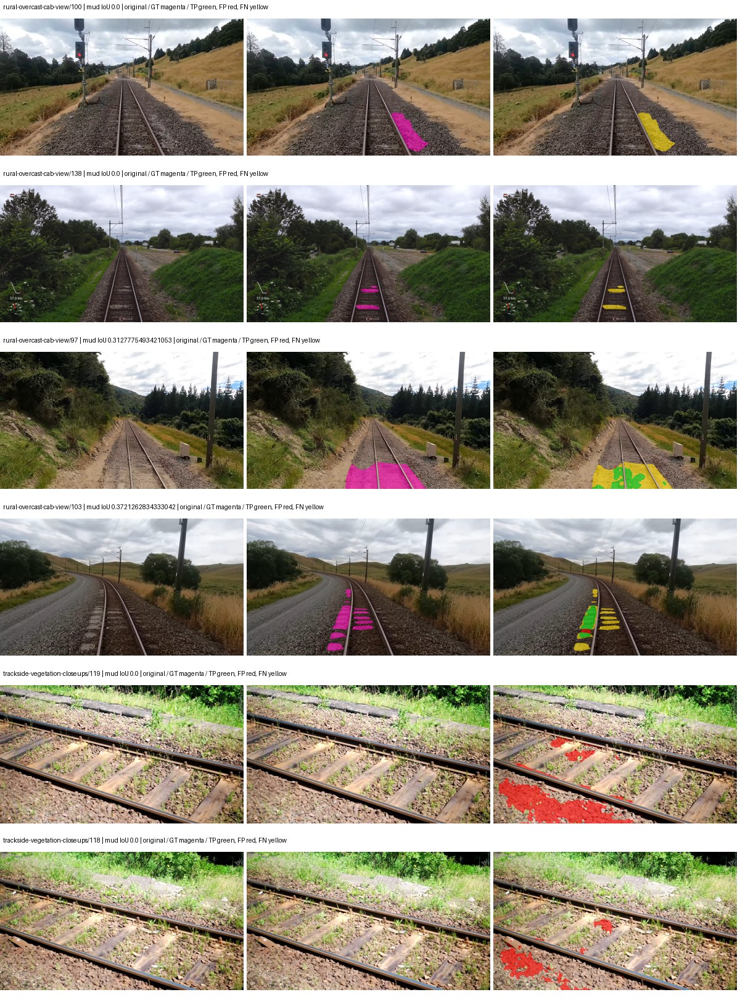

Examples are two lowest and two highest mud-IoU positive images, plus up to two negative images with the most false-positive mud pixels. They are targeted diagnostic examples, not random samples. Green: true positive; red: false positive; yellow: false negative. Full predictions remain on HDRFS.

### Validation tracking

| Logged step | Overall mIoU (%) | Mud IoU (%) |
| --- | --- | --- |
| 254 | 31.50 | 2.99 |
| 508 | 45.16 | 7.26 |
| 763 | 45.66 | 2.84 |
| 1017 | 46.53 | 1.54 |
| 1272 | 44.96 | 1.89 |
| 1527 | 41.08 | 2.76 |
| 1781 | 45.53 | 2.35 |

All retained scalar curves, including training loss and per-class IoU, are in record.json. Observed best mud on a curve is not necessarily a retained checkpoint: the pilot saved its selection-metric-best and final checkpoints. Step logging and checkpoint global_step may differ by one.

### Stopping and checkpoint provenance

```json
{
  "stopping": {
    "actual_steps": 1781,
    "maximum_steps": 4000,
    "min_delta": 0.001,
    "monitor": "val_iou/mud-pumping",
    "patience": 5,
    "reason": "validation_plateau"
  },
  "checkpoints": {
    "best": {
      "path": "/data/izadia1/projects/segmentary-runs/paul-test-rtis/mud-fullstats-v1-20260906-r2/future-runs/hf_auto_upernet_swin_tiny--railsem19_to_rtis--seed-0_seed0/rtis/best.ckpt",
      "sha256": "7b0fb39bbeb29be161f5b4e8d3f3a9f0b6e999d04f77869124c3e5a1d5edcb7c",
      "global_step": 509,
      "bytes": 944059801
    },
    "final": {
      "path": "/data/izadia1/projects/segmentary-runs/paul-test-rtis/mud-fullstats-v1-20260906-r2/future-runs/hf_auto_upernet_swin_tiny--railsem19_to_rtis--seed-0_seed0/rtis/last.ckpt",
      "sha256": "5ceda7273f2378378fff8fddfdc788c2bc59dcc40631a3ddd51c9ec351f22357",
      "global_step": 1781,
      "bytes": 944046617
    }
  },
  "cleanup_error": null
}
```

### Resolved training, initialization and evaluation settings

The optimizer block is the base configuration. Stage LR scales are applied at runtime, and stage warmup is capped at min(base warmup, floor(stage budget / 10), stage budget - 1): 400 steps for this 4,000-step pilot. Model-internal native input grids may differ from augmentation crops (EoMT uses its 640 grid).

```json
{
  "name": "hf_auto_upernet_swin_tiny--railsem19_to_rtis--seed-0",
  "model": {
    "arch": "hf_auto",
    "checkpoint": "openmmlab/upernet-swin-tiny",
    "tuning": "full",
    "head": "unified_head",
    "lora_r": 16,
    "lora_alpha": 32,
    "lora_dropout": 0.05,
    "lora_targets": [],
    "drop_path": null,
    "revision": "dc8e8c94669c6f14d5cc4c21a141daebd2280d59",
    "subfolder": null,
    "local_files_only": false,
    "trust_remote_code": false,
    "backbone_path": "backbone",
    "head_paths": [
      "decode_head"
    ],
    "classifier_path": "decode_head.classifier",
    "inactive_parameter_paths": [
      "backbone.swin.layernorm"
    ],
    "smp_arch": null,
    "encoder_name": null,
    "encoder_weights": null,
    "native": null,
    "batch_norm_momentum": null
  },
  "space": "paul-test-rtis",
  "taxonomy_root": "/data/izadia1/projects/segmentary-rtis-fullstats-066afb2/taxonomy",
  "output_root": "/data/izadia1/projects/segmentary-runs/paul-test-rtis/mud-fullstats-v1-20260906-r2/future-runs",
  "optim": {
    "backbone_lr": 6e-05,
    "head_lr_mult": 10.0,
    "weight_decay": 0.05,
    "llrd": 0.9,
    "warmup_iters": 1500,
    "warmup_ratio": 1e-06,
    "poly_power": 0.9,
    "min_lr_ratio": 0.0,
    "betas": [
      0.9,
      0.999
    ],
    "grad_clip": 1.0
  },
  "train": {
    "iters": 4000,
    "batch_size": 2,
    "accum": 8,
    "num_workers": 2,
    "precision": "bf16-mixed",
    "ema_decay": 0.9998,
    "val_every": 250,
    "ckpt_every": 500,
    "selection_metric": "val_iou/mud-pumping",
    "early_stopping_patience": 5,
    "early_stopping_min_delta": 0.001,
    "seed": 0,
    "devices": 1
  },
  "eval": {
    "sliding_window": true,
    "window": [
      1024,
      1024
    ],
    "stride": [
      768,
      768
    ],
    "batch_size": 1,
    "num_workers": 2,
    "tta_scales": [],
    "tta_flip": false,
    "threshold": 0.5,
    "boundary_tolerance_frac": 0.0075,
    "save_confusion": true
  },
  "loss": {
    "task": "multiclass",
    "activation": "auto",
    "terms": [],
    "aux": "none",
    "aux_weight": 0.0,
    "ce_weight": 1.0,
    "label_smoothing": 0.0,
    "class_weights": null,
    "query": null
  },
  "aug": {
    "crop": [
      1024,
      1024
    ],
    "scale_min": 0.5,
    "scale_max": 2.0,
    "hflip_p": 0.5,
    "color_jitter_p": 0.5,
    "brightness": 0.25,
    "contrast": 0.25,
    "saturation": 0.25,
    "hue": 0.05
  },
  "stages": [
    {
      "name": "rtis",
      "data": [
        {
          "name": "paul-test-rtis",
          "root": "/data/izadia1/datasets/paul-test-rtis",
          "variant": null,
          "split_file": "splits.json",
          "train_split": "train",
          "val_split": "val",
          "limit": null,
          "loader": "folder",
          "mapping": "paul-test-rtis",
          "loader_options": {
            "require_groups": true
          }
        }
      ],
      "iters": null,
      "lr_scale": 0.1,
      "head_group_lr_scale": 1.0,
      "init_from": "/data/izadia1/projects/segmentary-runs/all-model-city-rail-seed0-a7c0b67/jobs/hf_auto_upernet_swin_tiny--railsem19--seed-0/attempt-001/train/hf_auto_upernet_swin_tiny--railsem19_seed0/railsem19/last.ckpt",
      "reset_head": true,
      "freeze": null,
      "sample_weights": null
    }
  ]
}
```

### Hardware and software provenance

```json
{
  "training": {
    "cuda_available": true,
    "cuda_visible_devices": "7",
    "cudnn": 91900,
    "driver_version": "570.133.20",
    "gpu_count": 1,
    "gpu_names": [
      "NVIDIA L40S"
    ],
    "hostname": "hdrfs-app-001",
    "input_normalization": {
      "channel_order": "rgb",
      "mean": [
        0.485,
        0.456,
        0.406
      ],
      "source": "hf_image_processor",
      "std": [
        0.229,
        0.224,
        0.225
      ]
    },
    "model_origins": [
      {
        "hf_commit": "dc8e8c94669c6f14d5cc4c21a141daebd2280d59",
        "hf_name_or_path": "openmmlab/upernet-swin-tiny",
        "module": "model",
        "timm_pretrained": {}
      },
      {
        "hf_commit": null,
        "hf_name_or_path": "",
        "module": "model.backbone",
        "timm_pretrained": {}
      },
      {
        "hf_commit": null,
        "hf_name_or_path": "",
        "module": "model.backbone.swin",
        "timm_pretrained": {}
      },
      {
        "hf_commit": null,
        "hf_name_or_path": "",
        "module": "model.backbone.swin.embeddings",
        "timm_pretrained": {}
      },
      {
        "hf_commit": null,
        "hf_name_or_path": "",
        "module": "model.backbone.swin.encoder",
        "timm_pretrained": {}
      },
      {
        "hf_commit": null,
        "hf_name_or_path": "",
        "module": "model.backbone.swin.encoder.layers.0",
        "timm_pretrained": {}
      },
      {
        "hf_commit": null,
        "hf_name_or_path": "",
        "module": "model.backbone.swin.encoder.layers.0.blocks.0.attention",
        "timm_pretrained": {}
      },
      {
        "hf_commit": null,
        "hf_name_or_path": "",
        "module": "model.backbone.swin.encoder.layers.0.blocks.1.attention",
        "timm_pretrained": {}
      },
      {
        "hf_commit": null,
        "hf_name_or_path": "",
        "module": "model.backbone.swin.encoder.layers.1",
        "timm_pretrained": {}
      },
      {
        "hf_commit": null,
        "hf_name_or_path": "",
        "module": "model.backbone.swin.encoder.layers.1.blocks.0.attention",
        "timm_pretrained": {}
      },
      {
        "hf_commit": null,
        "hf_name_or_path": "",
        "module": "model.backbone.swin.encoder.layers.1.blocks.1.attention",
        "timm_pretrained": {}
      },
      {
        "hf_commit": null,
        "hf_name_or_path": "",
        "module": "model.backbone.swin.encoder.layers.2",
        "timm_pretrained": {}
      },
      {
        "hf_commit": null,
        "hf_name_or_path": "",
        "module": "model.backbone.swin.encoder.layers.2.blocks.0.attention",
        "timm_pretrained": {}
      },
      {
        "hf_commit": null,
        "hf_name_or_path": "",
        "module": "model.backbone.swin.encoder.layers.2.blocks.1.attention",
        "timm_pretrained": {}
      },
      {
        "hf_commit": null,
        "hf_name_or_path": "",
        "module": "model.backbone.swin.encoder.layers.2.blocks.2.attention",
        "timm_pretrained": {}
      },
      {
        "hf_commit": null,
        "hf_name_or_path": "",
        "module": "model.backbone.swin.encoder.layers.2.blocks.3.attention",
        "timm_pretrained": {}
      },
      {
        "hf_commit": null,
        "hf_name_or_path": "",
        "module": "model.backbone.swin.encoder.layers.2.blocks.4.attention",
        "timm_pretrained": {}
      },
      {
        "hf_commit": null,
        "hf_name_or_path": "",
        "module": "model.backbone.swin.encoder.layers.2.blocks.5.attention",
        "timm_pretrained": {}
      },
      {
        "hf_commit": null,
        "hf_name_or_path": "",
        "module": "model.backbone.swin.encoder.layers.3",
        "timm_pretrained": {}
      },
      {
        "hf_commit": null,
        "hf_name_or_path": "",
        "module": "model.backbone.swin.encoder.layers.3.blocks.0.attention",
        "timm_pretrained": {}
      },
      {
        "hf_commit": null,
        "hf_name_or_path": "",
        "module": "model.backbone.swin.encoder.layers.3.blocks.1.attention",
        "timm_pretrained": {}
      },
      {
        "hf_commit": "dc8e8c94669c6f14d5cc4c21a141daebd2280d59",
        "hf_name_or_path": "openmmlab/upernet-swin-tiny",
        "module": "model.decode_head",
        "timm_pretrained": {}
      }
    ],
    "model_parameter_count": 58953423,
    "packages": {
      "albumentations": "2.0.8",
      "lightning": "2.6.5",
      "numpy": "2.4.4",
      "segmentary": "0.1.0",
      "segmentation-models-pytorch": "0.5.0",
      "timm": "1.0.28",
      "torch": "2.11.0+cu128",
      "torchvision": "0.26.0+cu128",
      "transformers": "5.15.0"
    },
    "platform": "Linux-5.15.0-139-generic-x86_64-with-glibc2.35",
    "python": "3.11.15",
    "torch": "2.11.0+cu128",
    "torch_cuda": "12.8",
    "trainable_parameter_count": 58951887,
    "training_stop": {
      "actual_steps": 1781,
      "maximum_steps": 4000,
      "min_delta": 0.001,
      "monitor": "val_iou/mud-pumping",
      "patience": 5,
      "reason": "validation_plateau"
    },
    "validation_weights": "raw"
  },
  "evaluation": {
    "cuda_available": true,
    "cuda_visible_devices": "7",
    "cudnn": 91900,
    "driver_version": "570.133.20",
    "gpu_count": 1,
    "gpu_names": [
      "NVIDIA L40S"
    ],
    "hostname": "hdrfs-app-001",
    "input_normalization": {
      "channel_order": "rgb",
      "mean": [
        0.485,
        0.456,
        0.406
      ],
      "source": "hf_image_processor",
      "std": [
        0.229,
        0.224,
        0.225
      ]
    },
    "packages": {
      "albumentations": "2.0.8",
      "lightning": "2.6.5",
      "numpy": "2.4.4",
      "segmentary": "0.1.0",
      "segmentation-models-pytorch": "0.5.0",
      "timm": "1.0.28",
      "torch": "2.11.0+cu128",
      "torchvision": "0.26.0+cu128",
      "transformers": "5.15.0"
    },
    "platform": "Linux-5.15.0-139-generic-x86_64-with-glibc2.35",
    "python": "3.11.15",
    "torch": "2.11.0+cu128",
    "torch_cuda": "12.8"
  }
}
```

## railsem19_to_rtis — seed 1

Status: **completed**. Started: 2026-09-06T14:16:13.188953+00:00. Finished: 2026-09-06T14:53:52.104380+00:00.

Recipe pretrained initializer: `openmmlab/upernet-swin-tiny`.

`rtis_only` uses the recipe initializer, which may include pretrained segmentation components. Transfer paths load the exact historical source checkpoint below and reset the classifier; they do not reset all query/decoder features.

Source checkpoint: `{'name': 'hf_auto_upernet_swin_tiny--railsem19--seed-0', 'model': 'hf_auto_upernet_swin_tiny', 'protocol': 'railsem19', 'config': '/data/izadia1/projects/segmentary-runs/all-model-city-rail-seed0-rail20-b9eb3e1/accepted/hf_auto_upernet_swin_tiny--railsem19--seed-0/resolved-config.yaml', 'checkpoint': '/data/izadia1/projects/segmentary-runs/all-model-city-rail-seed0-a7c0b67/jobs/hf_auto_upernet_swin_tiny--railsem19--seed-0/attempt-001/train/hf_auto_upernet_swin_tiny--railsem19_seed0/railsem19/last.ckpt', 'recorded_sha256': '1a00f7ff228b31ec3367dca876e5bfa14a671d1f320cf84fcb4f8cbae11b7431', 'exists': True}`.

Config SHA-256: `537231b36ac21a97f6a398114f191180d54363f794b2152b89448420f08d92ba`. Weights used for validation: `raw`.

### Mud-pumping and aggregate quality

| Metric | Selected checkpoint | Final training validation |
| --- | --- | --- |
| Mud IoU | 4.69 | 3.89 |
| Mud precision | 6.16 | 6.29 |
| Mud recall | 16.47 | 9.26 |
| Mud Dice/F1 | 8.96 | 7.49 |
| mIoU | 32.94 | 45.75 |
| Mean accuracy | 40.50 | 59.23 |
| Mean precision | 48.43 | 63.77 |
| Mean Dice | 40.80 | 56.23 |
| Mean specificity | 98.91 | 99.10 |
| Pixel accuracy | 83.40 | 86.16 |
| Frequency-weighted IoU | 74.07 | 77.62 |
| Fixed GT-present class mIoU | 34.77 | 50.83 |
| Boundary F1 | 37.93 | 55.58 |

The selected checkpoint has independent evaluation evidence. Final values are the trainer's final validation record, not a new independent evaluation. mIoU averages classes with nonzero union, so false positives on absent classes can change its denominator. The fixed GT-class mean is supplementary and excludes absent classes; their false positives remain in the confusion matrix.

### Resource usage and timing

| Measurement | Value |
| --- | --- |
| Peak training VRAM, retained training invocation (GiB) | 11.71 |
| Peak evaluation VRAM (GiB) | 7.52 |
| Retained training invocation wall time (seconds) | 2046.73 |
| Retained training invocation GPU-hours (one GPU) | 0.57 |
| Evaluation wall time (seconds) | 19.53 |
| Full evaluation pipeline images/second | 1.89 |
| Best full-state checkpoint (MiB) | 900.33 |
| Final full-state checkpoint (MiB) | 900.31 |
| Audited periodic checkpoints removed (GiB) | 2.64 |

VRAM uses the recorded allocator high-water mark; it is not total device usage including CUDA context. Resumed jobs' retained training invocation times and peaks are **not whole-campaign totals**. Earlier invocation resource records are not reconstructed here. Evaluation throughput includes loader, sliding-window inference and metrics; it is not model-only latency/FPS. Missing measurements are shown as —, never inferred from another dataset's run.

### Standardized inference performance

Dedicated model-only profiling waits for an idle worker-locked L40S: BF16, batch 1, 1024x1024, 20 warmup and 100 CUDA-event-timed public forwards. It excludes loading, preprocessing, tiling and metrics.

| Status | Parameters | Weight MiB | FPS | p50 ms | p95 ms | Peak reserved GiB |
| --- | --- | --- | --- | --- | --- | --- |
| complete | 58953423 | 224.89 | 43.06 | 23.14 | 23.73 | 2.41 |

```json
{
  "schema_version": 1,
  "model_id": "hf_auto_upernet_swin_tiny",
  "measured_at": "2026-09-06T14:53:46+00:00",
  "status": "complete",
  "benchmark_scope": "rtis_selected_checkpoint_model_only",
  "applies_to": [
    "hf_auto_upernet_swin_tiny--railsem19_to_rtis--seed-1"
  ],
  "source": {
    "campaign_git_sha": "066afb2626398b7be59d4d19f5a0e4644fd59adc",
    "git_dirty": false,
    "config_hash": "82b8035dff98",
    "resolved_config": "/data/izadia1/projects/segmentary-runs/paul-test-rtis/mud-fullstats-v1-20260906-r2/configs/hf_auto_upernet_swin_tiny--railsem19_to_rtis--seed-1.yaml",
    "config_sha256": "537231b36ac21a97f6a398114f191180d54363f794b2152b89448420f08d92ba",
    "checkpoint_sha256": "5d62c71c9f787d053b31fcd44b502272ca18987f60a5bc72881bd0d49c1d2512",
    "checkpoint_global_step": 254,
    "checkpoint_bytes": 944059545,
    "checkpoint_kind": "resume checkpoint with optimizer and EMA state",
    "weights": "raw",
    "measured_checkpoint_job_id": "hf_auto_upernet_swin_tiny--railsem19_to_rtis--seed-1",
    "result_sha256": "3b1236bf7f2e898021661bd985ba4b44c47909e3ad50a72b1516661cde42f92e",
    "result_git_sha": "066afb2626398b7be59d4d19f5a0e4644fd59adc",
    "result_stage": "eval:paul-test-rtis:val",
    "result_seed": 1
  },
  "hardware": {
    "gpu_name": "NVIDIA L40S",
    "gpu_uuid": "GPU-e2e96741-aec9-e90b-5c46-d0d58be90a56",
    "logical_device": "cuda:0",
    "physical_visibility_token": "8",
    "compute_capability": [
      8,
      9
    ],
    "total_memory_bytes": 47677177856
  },
  "model": {
    "parameter_count": 58953423,
    "trainable_parameter_count": 58951887,
    "resident_parameter_bytes": 235813692,
    "parameter_dtype_counts": {
      "float32": 58953423
    }
  },
  "contract": {
    "backend": "pytorch",
    "precision": "bf16_autocast",
    "batch_size": 1,
    "input_shape_nchw": [
      1,
      3,
      1024,
      1024
    ],
    "warmup_iterations": 20,
    "measured_iterations": 100,
    "timing": "per-forward CUDA events with end-event synchronization",
    "includes_preprocessing": false,
    "includes_data_loader": false,
    "includes_sliding_window": false,
    "input_resident_on_gpu": true,
    "model_only": true,
    "entrypoint": "public model(image) dense-logits forward"
  },
  "measurements": {
    "latency": {
      "p50_ms": 23.14136028289795,
      "p95_ms": 23.73437366485596,
      "mean_ms": 23.223222999572755,
      "minimum_ms": 23.046144485473633,
      "maximum_ms": 24.39263916015625,
      "fps": 43.06034524227741,
      "raw_ms": [
        23.48441505432129,
        23.201791763305664,
        23.10758399963379,
        23.170047760009766,
        23.119871139526367,
        23.26323127746582,
        23.187456130981445,
        23.06662368774414,
        23.08095932006836,
        23.09734344482422,
        23.09939193725586,
        23.07276725769043,
        23.070720672607422,
        24.038400650024414,
        23.225343704223633,
        23.626752853393555,
        23.132160186767578,
        23.156736373901367,
        23.046144485473633,
        23.28268814086914,
        23.07481575012207,
        23.11680030822754,
        23.1014404296875,
        23.187456130981445,
        23.14441680908203,
        23.122943878173828,
        23.0963191986084,
        23.07276725769043,
        23.130111694335938,
        23.14134407043457,
        23.062528610229492,
        23.828479766845703,
        23.131135940551758,
        23.794687271118164,
        23.07379150390625,
        24.171520233154297,
        23.151647567749023,
        23.063552856445312,
        23.146495819091797,
        23.07276725769043,
        23.120895385742188,
        23.10246467590332,
        23.09427261352539,
        23.214080810546875,
        23.145471572875977,
        23.09836769104004,
        24.39263916015625,
        23.122943878173828,
        23.25708770751953,
        23.190528869628906,
        23.129087448120117,
        23.09324836730957,
        23.09427261352539,
        23.177215576171875,
        23.562240600585938,
        23.136255264282227,
        23.130111694335938,
        23.183359146118164,
        23.08403205871582,
        23.12601661682129,
        23.147520065307617,
        23.163904190063477,
        23.11577606201172,
        23.647232055664062,
        23.27449607849121,
        23.149568557739258,
        23.403520584106445,
        23.201791763305664,
        23.0963191986084,
        23.14240074157715,
        23.180288314819336,
        23.079967498779297,
        23.172096252441406,
        23.07481575012207,
        23.141376495361328,
        23.69740867614746,
        23.08198356628418,
        23.194623947143555,
        23.731199264526367,
        23.104511260986328,
        23.0830078125,
        23.08710479736328,
        23.11680030822754,
        23.07686424255371,
        23.244800567626953,
        23.214080810546875,
        23.13724708557129,
        23.421951293945312,
        23.25708770751953,
        23.11577606201172,
        23.48134422302246,
        23.179264068603516,
        23.1331844329834,
        23.189504623413086,
        23.08915138244629,
        23.143423080444336,
        23.337984085083008,
        23.11782455444336,
        23.218143463134766,
        23.206911087036133
      ],
      "percentile_method": "numpy linear interpolation"
    },
    "peak_reserved_bytes": 2583691264,
    "memory_kind": "pytorch_cuda_allocator_peak_reserved_excluding_context",
    "benchmark_wall_clock_s": 8.400466602295637
  },
  "started_at": "2026-09-06T14:53:37+00:00",
  "finished_at": "2026-09-06T14:53:46+00:00",
  "environment": {
    "hostname": "hdrfs-app-001",
    "python": "3.11.15",
    "platform": "Linux-5.15.0-139-generic-x86_64-with-glibc2.35",
    "torch": "2.11.0+cu128",
    "torch_cuda": "12.8",
    "cudnn": 91900,
    "driver_version": "570.133.20",
    "cuda_available": true,
    "gpu_count": 1,
    "gpu_names": [
      "NVIDIA L40S"
    ],
    "cuda_visible_devices": "8",
    "packages": {
      "segmentary": "0.1.0",
      "torch": "2.11.0+cu128",
      "torchvision": "0.26.0+cu128",
      "transformers": "5.15.0",
      "timm": "1.0.28",
      "segmentation-models-pytorch": "0.5.0",
      "albumentations": "2.0.8",
      "lightning": "2.6.5",
      "numpy": "2.4.4"
    }
  }
}
```

### Per-class validation results

| Class | GT pixels | IoU (%) | Precision (%) | Recall (%) | Dice (%) | Boundary F1 (%) |
| --- | --- | --- | --- | --- | --- | --- |
| car | 29664 | 0.00 | 0.00 | 0.00 | 0.00 | 0.00 |
| construction | 311585 | 64.66 | 77.83 | 79.26 | 78.54 | 71.96 |
| fence | 265137 | 28.01 | 64.33 | 33.17 | 43.77 | 47.75 |
| mud-pumping | 1226250 | 4.69 | 6.16 | 16.47 | 8.96 | 7.07 |
| on-rails | 0 | 0.00 | 0.00 | — | 0.00 | 0.00 |
| person | 0 | — | — | — | — | — |
| pole | 628038 | 69.48 | 85.68 | 78.61 | 81.99 | 89.71 |
| rail-embedded | 16799 | 0.00 | 0.00 | 0.00 | 0.00 | 0.00 |
| rail-raised | 2969797 | 75.41 | 84.94 | 87.05 | 85.98 | 91.53 |
| rail-track | 6323197 | 45.16 | 77.08 | 52.16 | 62.22 | 55.57 |
| road | 1048831 | 11.95 | 24.08 | 19.17 | 21.35 | 24.25 |
| sidewalk | 1297367 | 23.69 | 74.32 | 25.80 | 38.31 | 15.00 |
| sky | 19121606 | 98.62 | 99.07 | 99.54 | 99.31 | 96.55 |
| standing-water | 95802 | 0.00 | 0.01 | 0.01 | 0.01 | 1.54 |
| terrain | 39239306 | 84.78 | 85.85 | 98.56 | 91.76 | 58.57 |
| trackbed | 10643081 | 62.37 | 76.63 | 77.02 | 76.82 | 60.24 |
| traffic-light | 19510 | 0.00 | 0.00 | 0.00 | 0.00 | 0.00 |
| traffic-sign | 13285 | 0.00 | 0.00 | 0.00 | 0.00 | 0.00 |
| tram-track | 56179 | 40.26 | 79.48 | 44.93 | 57.41 | 55.67 |
| truck | 0 | — | — | — | — | — |
| vegetation-overgrowth | 5901821 | 16.80 | 84.71 | 17.33 | 28.77 | 45.33 |

### Full-run accounting

| Measurement | Value |
| --- | --- |
| Full GPU-reserved wall seconds, all recorded worker attempts | 2259.63 |
| Full reserved GPU-hours | 0.63 |
| Whole-run timing complete | True |

| Phase | Wall seconds including failed attempts |
| --- | --- |
| training | 2054.35 |
| diagnostics | 155.64 |
| performance | 16.45 |

GPU-reserved time includes model loading, training, validation, collection, profiling, checkpoint I/O and orchestration while the worker owns one GPU. It is not GPU kernel-active time. Phase timings and sampled device memory/power/utilization are retained separately; sampled device memory is not the allocator high-water mark.

### Train/validation and raw/EMA diagnostics

| Checkpoint / weights / split | Images | Mud IoU (%) | Mud precision (%) | Mud recall (%) |
| --- | --- | --- | --- | --- |
| best-auto-train / raw | 220 | 89.97 | 93.43 | 96.04 |
| best-auto-val / raw | 37 | 4.69 | 6.16 | 16.47 |
| best-alternate-val / ema | 37 | 4.78 | 5.67 | 23.40 |
| final-auto-val / raw | 37 | 3.90 | 6.31 | 9.29 |

Train uses the evaluation transform without augmentation. Compare mud train/validation metrics for the same selected weights. Alternate EMA on running-stat BatchNorm is explicitly uncalibrated and is diagnostic only. Score-threshold curves use uncalibrated normalized scores and are pixel-level diagnostics, not event detection rates or a selected deployment operating point.

### Downloadable evidence

- best-auto-train: [per-image.csv](railsem19_to_rtis--seed-1/best-auto-train/per-image.csv) · [per-image-confusion.json.gz](railsem19_to_rtis--seed-1/best-auto-train/per-image-confusion.json.gz) · [groups.json](railsem19_to_rtis--seed-1/best-auto-train/groups.json) · [mud-score-curves.json](railsem19_to_rtis--seed-1/best-auto-train/mud-score-curves.json)
- best-auto-val: [per-image.csv](railsem19_to_rtis--seed-1/best-auto-val/per-image.csv) · [per-image-confusion.json.gz](railsem19_to_rtis--seed-1/best-auto-val/per-image-confusion.json.gz) · [groups.json](railsem19_to_rtis--seed-1/best-auto-val/groups.json) · [mud-score-curves.json](railsem19_to_rtis--seed-1/best-auto-val/mud-score-curves.json) · [examples.jpg](railsem19_to_rtis--seed-1/best-auto-val/examples.jpg)
- best-alternate-val: [per-image.csv](railsem19_to_rtis--seed-1/best-alternate-val/per-image.csv) · [per-image-confusion.json.gz](railsem19_to_rtis--seed-1/best-alternate-val/per-image-confusion.json.gz) · [groups.json](railsem19_to_rtis--seed-1/best-alternate-val/groups.json) · [mud-score-curves.json](railsem19_to_rtis--seed-1/best-alternate-val/mud-score-curves.json)
- final-auto-val: [per-image.csv](railsem19_to_rtis--seed-1/final-auto-val/per-image.csv) · [per-image-confusion.json.gz](railsem19_to_rtis--seed-1/final-auto-val/per-image-confusion.json.gz) · [groups.json](railsem19_to_rtis--seed-1/final-auto-val/groups.json) · [mud-score-curves.json](railsem19_to_rtis--seed-1/final-auto-val/mud-score-curves.json)
- resources: [telemetry.csv](railsem19_to_rtis--seed-1/resources/telemetry.csv)

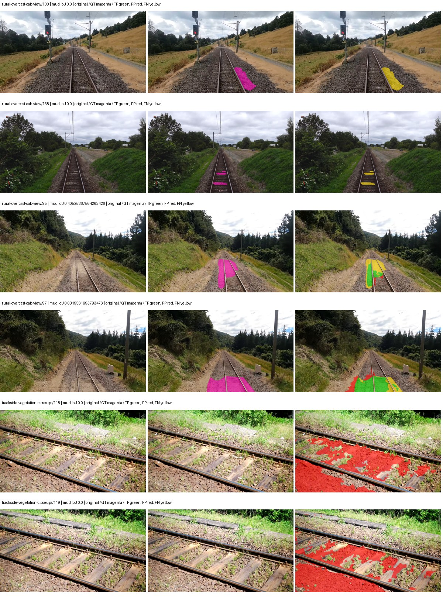

Examples are two lowest and two highest mud-IoU positive images, plus up to two negative images with the most false-positive mud pixels. They are targeted diagnostic examples, not random samples. Green: true positive; red: false positive; yellow: false negative. Full predictions remain on HDRFS.

### Validation tracking

| Logged step | Overall mIoU (%) | Mud IoU (%) |
| --- | --- | --- |
| 254 | 32.93 | 4.69 |
| 508 | 45.96 | 1.88 |
| 763 | 53.25 | 4.27 |
| 1017 | 53.73 | 1.68 |
| 1272 | 47.12 | 3.27 |
| 1527 | 45.75 | 3.89 |

All retained scalar curves, including training loss and per-class IoU, are in record.json. Observed best mud on a curve is not necessarily a retained checkpoint: the pilot saved its selection-metric-best and final checkpoints. Step logging and checkpoint global_step may differ by one.

### Stopping and checkpoint provenance

```json
{
  "stopping": {
    "actual_steps": 1527,
    "maximum_steps": 4000,
    "min_delta": 0.001,
    "monitor": "val_iou/mud-pumping",
    "patience": 5,
    "reason": "validation_plateau"
  },
  "checkpoints": {
    "best": {
      "path": "/data/izadia1/projects/segmentary-runs/paul-test-rtis/mud-fullstats-v1-20260906-r2/future-runs/hf_auto_upernet_swin_tiny--railsem19_to_rtis--seed-1_seed1/rtis/best.ckpt",
      "sha256": "5d62c71c9f787d053b31fcd44b502272ca18987f60a5bc72881bd0d49c1d2512",
      "global_step": 254,
      "bytes": 944059545
    },
    "final": {
      "path": "/data/izadia1/projects/segmentary-runs/paul-test-rtis/mud-fullstats-v1-20260906-r2/future-runs/hf_auto_upernet_swin_tiny--railsem19_to_rtis--seed-1_seed1/rtis/last.ckpt",
      "sha256": "8232016b3060954ce8638f454cedfd38200b3dcac08415e3abe29b73f6cb1fd7",
      "global_step": 1527,
      "bytes": 944046617
    }
  },
  "cleanup_error": null
}
```

### Resolved training, initialization and evaluation settings

The optimizer block is the base configuration. Stage LR scales are applied at runtime, and stage warmup is capped at min(base warmup, floor(stage budget / 10), stage budget - 1): 400 steps for this 4,000-step pilot. Model-internal native input grids may differ from augmentation crops (EoMT uses its 640 grid).

```json
{
  "name": "hf_auto_upernet_swin_tiny--railsem19_to_rtis--seed-1",
  "model": {
    "arch": "hf_auto",
    "checkpoint": "openmmlab/upernet-swin-tiny",
    "tuning": "full",
    "head": "unified_head",
    "lora_r": 16,
    "lora_alpha": 32,
    "lora_dropout": 0.05,
    "lora_targets": [],
    "drop_path": null,
    "revision": "dc8e8c94669c6f14d5cc4c21a141daebd2280d59",
    "subfolder": null,
    "local_files_only": false,
    "trust_remote_code": false,
    "backbone_path": "backbone",
    "head_paths": [
      "decode_head"
    ],
    "classifier_path": "decode_head.classifier",
    "inactive_parameter_paths": [
      "backbone.swin.layernorm"
    ],
    "smp_arch": null,
    "encoder_name": null,
    "encoder_weights": null,
    "native": null,
    "batch_norm_momentum": null
  },
  "space": "paul-test-rtis",
  "taxonomy_root": "/data/izadia1/projects/segmentary-rtis-fullstats-066afb2/taxonomy",
  "output_root": "/data/izadia1/projects/segmentary-runs/paul-test-rtis/mud-fullstats-v1-20260906-r2/future-runs",
  "optim": {
    "backbone_lr": 6e-05,
    "head_lr_mult": 10.0,
    "weight_decay": 0.05,
    "llrd": 0.9,
    "warmup_iters": 1500,
    "warmup_ratio": 1e-06,
    "poly_power": 0.9,
    "min_lr_ratio": 0.0,
    "betas": [
      0.9,
      0.999
    ],
    "grad_clip": 1.0
  },
  "train": {
    "iters": 4000,
    "batch_size": 2,
    "accum": 8,
    "num_workers": 2,
    "precision": "bf16-mixed",
    "ema_decay": 0.9998,
    "val_every": 250,
    "ckpt_every": 500,
    "selection_metric": "val_iou/mud-pumping",
    "early_stopping_patience": 5,
    "early_stopping_min_delta": 0.001,
    "seed": 1,
    "devices": 1
  },
  "eval": {
    "sliding_window": true,
    "window": [
      1024,
      1024
    ],
    "stride": [
      768,
      768
    ],
    "batch_size": 1,
    "num_workers": 2,
    "tta_scales": [],
    "tta_flip": false,
    "threshold": 0.5,
    "boundary_tolerance_frac": 0.0075,
    "save_confusion": true
  },
  "loss": {
    "task": "multiclass",
    "activation": "auto",
    "terms": [],
    "aux": "none",
    "aux_weight": 0.0,
    "ce_weight": 1.0,
    "label_smoothing": 0.0,
    "class_weights": null,
    "query": null
  },
  "aug": {
    "crop": [
      1024,
      1024
    ],
    "scale_min": 0.5,
    "scale_max": 2.0,
    "hflip_p": 0.5,
    "color_jitter_p": 0.5,
    "brightness": 0.25,
    "contrast": 0.25,
    "saturation": 0.25,
    "hue": 0.05
  },
  "stages": [
    {
      "name": "rtis",
      "data": [
        {
          "name": "paul-test-rtis",
          "root": "/data/izadia1/datasets/paul-test-rtis",
          "variant": null,
          "split_file": "splits.json",
          "train_split": "train",
          "val_split": "val",
          "limit": null,
          "loader": "folder",
          "mapping": "paul-test-rtis",
          "loader_options": {
            "require_groups": true
          }
        }
      ],
      "iters": null,
      "lr_scale": 0.1,
      "head_group_lr_scale": 1.0,
      "init_from": "/data/izadia1/projects/segmentary-runs/all-model-city-rail-seed0-a7c0b67/jobs/hf_auto_upernet_swin_tiny--railsem19--seed-0/attempt-001/train/hf_auto_upernet_swin_tiny--railsem19_seed0/railsem19/last.ckpt",
      "reset_head": true,
      "freeze": null,
      "sample_weights": null
    }
  ]
}
```

### Hardware and software provenance

```json
{
  "training": {
    "cuda_available": true,
    "cuda_visible_devices": "8",
    "cudnn": 91900,
    "driver_version": "570.133.20",
    "gpu_count": 1,
    "gpu_names": [
      "NVIDIA L40S"
    ],
    "hostname": "hdrfs-app-001",
    "input_normalization": {
      "channel_order": "rgb",
      "mean": [
        0.485,
        0.456,
        0.406
      ],
      "source": "hf_image_processor",
      "std": [
        0.229,
        0.224,
        0.225
      ]
    },
    "model_origins": [
      {
        "hf_commit": "dc8e8c94669c6f14d5cc4c21a141daebd2280d59",
        "hf_name_or_path": "openmmlab/upernet-swin-tiny",
        "module": "model",
        "timm_pretrained": {}
      },
      {
        "hf_commit": null,
        "hf_name_or_path": "",
        "module": "model.backbone",
        "timm_pretrained": {}
      },
      {
        "hf_commit": null,
        "hf_name_or_path": "",
        "module": "model.backbone.swin",
        "timm_pretrained": {}
      },
      {
        "hf_commit": null,
        "hf_name_or_path": "",
        "module": "model.backbone.swin.embeddings",
        "timm_pretrained": {}
      },
      {
        "hf_commit": null,
        "hf_name_or_path": "",
        "module": "model.backbone.swin.encoder",
        "timm_pretrained": {}
      },
      {
        "hf_commit": null,
        "hf_name_or_path": "",
        "module": "model.backbone.swin.encoder.layers.0",
        "timm_pretrained": {}
      },
      {
        "hf_commit": null,
        "hf_name_or_path": "",
        "module": "model.backbone.swin.encoder.layers.0.blocks.0.attention",
        "timm_pretrained": {}
      },
      {
        "hf_commit": null,
        "hf_name_or_path": "",
        "module": "model.backbone.swin.encoder.layers.0.blocks.1.attention",
        "timm_pretrained": {}
      },
      {
        "hf_commit": null,
        "hf_name_or_path": "",
        "module": "model.backbone.swin.encoder.layers.1",
        "timm_pretrained": {}
      },
      {
        "hf_commit": null,
        "hf_name_or_path": "",
        "module": "model.backbone.swin.encoder.layers.1.blocks.0.attention",
        "timm_pretrained": {}
      },
      {
        "hf_commit": null,
        "hf_name_or_path": "",
        "module": "model.backbone.swin.encoder.layers.1.blocks.1.attention",
        "timm_pretrained": {}
      },
      {
        "hf_commit": null,
        "hf_name_or_path": "",
        "module": "model.backbone.swin.encoder.layers.2",
        "timm_pretrained": {}
      },
      {
        "hf_commit": null,
        "hf_name_or_path": "",
        "module": "model.backbone.swin.encoder.layers.2.blocks.0.attention",
        "timm_pretrained": {}
      },
      {
        "hf_commit": null,
        "hf_name_or_path": "",
        "module": "model.backbone.swin.encoder.layers.2.blocks.1.attention",
        "timm_pretrained": {}
      },
      {
        "hf_commit": null,
        "hf_name_or_path": "",
        "module": "model.backbone.swin.encoder.layers.2.blocks.2.attention",
        "timm_pretrained": {}
      },
      {
        "hf_commit": null,
        "hf_name_or_path": "",
        "module": "model.backbone.swin.encoder.layers.2.blocks.3.attention",
        "timm_pretrained": {}
      },
      {
        "hf_commit": null,
        "hf_name_or_path": "",
        "module": "model.backbone.swin.encoder.layers.2.blocks.4.attention",
        "timm_pretrained": {}
      },
      {
        "hf_commit": null,
        "hf_name_or_path": "",
        "module": "model.backbone.swin.encoder.layers.2.blocks.5.attention",
        "timm_pretrained": {}
      },
      {
        "hf_commit": null,
        "hf_name_or_path": "",
        "module": "model.backbone.swin.encoder.layers.3",
        "timm_pretrained": {}
      },
      {
        "hf_commit": null,
        "hf_name_or_path": "",
        "module": "model.backbone.swin.encoder.layers.3.blocks.0.attention",
        "timm_pretrained": {}
      },
      {
        "hf_commit": null,
        "hf_name_or_path": "",
        "module": "model.backbone.swin.encoder.layers.3.blocks.1.attention",
        "timm_pretrained": {}
      },
      {
        "hf_commit": "dc8e8c94669c6f14d5cc4c21a141daebd2280d59",
        "hf_name_or_path": "openmmlab/upernet-swin-tiny",
        "module": "model.decode_head",
        "timm_pretrained": {}
      }
    ],
    "model_parameter_count": 58953423,
    "packages": {
      "albumentations": "2.0.8",
      "lightning": "2.6.5",
      "numpy": "2.4.4",
      "segmentary": "0.1.0",
      "segmentation-models-pytorch": "0.5.0",
      "timm": "1.0.28",
      "torch": "2.11.0+cu128",
      "torchvision": "0.26.0+cu128",
      "transformers": "5.15.0"
    },
    "platform": "Linux-5.15.0-139-generic-x86_64-with-glibc2.35",
    "python": "3.11.15",
    "torch": "2.11.0+cu128",
    "torch_cuda": "12.8",
    "trainable_parameter_count": 58951887,
    "training_stop": {
      "actual_steps": 1527,
      "maximum_steps": 4000,
      "min_delta": 0.001,
      "monitor": "val_iou/mud-pumping",
      "patience": 5,
      "reason": "validation_plateau"
    },
    "validation_weights": "raw"
  },
  "evaluation": {
    "cuda_available": true,
    "cuda_visible_devices": "8",
    "cudnn": 91900,
    "driver_version": "570.133.20",
    "gpu_count": 1,
    "gpu_names": [
      "NVIDIA L40S"
    ],
    "hostname": "hdrfs-app-001",
    "input_normalization": {
      "channel_order": "rgb",
      "mean": [
        0.485,
        0.456,
        0.406
      ],
      "source": "hf_image_processor",
      "std": [
        0.229,
        0.224,
        0.225
      ]
    },
    "packages": {
      "albumentations": "2.0.8",
      "lightning": "2.6.5",
      "numpy": "2.4.4",
      "segmentary": "0.1.0",
      "segmentation-models-pytorch": "0.5.0",
      "timm": "1.0.28",
      "torch": "2.11.0+cu128",
      "torchvision": "0.26.0+cu128",
      "transformers": "5.15.0"
    },
    "platform": "Linux-5.15.0-139-generic-x86_64-with-glibc2.35",
    "python": "3.11.15",
    "torch": "2.11.0+cu128",
    "torch_cuda": "12.8"
  }
}
```

## railsem19_to_rtis — seed 2

Status: **evaluating**. Started: 2026-09-06T14:27:26.822506+00:00. Finished: —.

Recipe pretrained initializer: `openmmlab/upernet-swin-tiny`.

`rtis_only` uses the recipe initializer, which may include pretrained segmentation components. Transfer paths load the exact historical source checkpoint below and reset the classifier; they do not reset all query/decoder features.

Source checkpoint: `{'name': 'hf_auto_upernet_swin_tiny--railsem19--seed-0', 'model': 'hf_auto_upernet_swin_tiny', 'protocol': 'railsem19', 'config': '/data/izadia1/projects/segmentary-runs/all-model-city-rail-seed0-rail20-b9eb3e1/accepted/hf_auto_upernet_swin_tiny--railsem19--seed-0/resolved-config.yaml', 'checkpoint': '/data/izadia1/projects/segmentary-runs/all-model-city-rail-seed0-a7c0b67/jobs/hf_auto_upernet_swin_tiny--railsem19--seed-0/attempt-001/train/hf_auto_upernet_swin_tiny--railsem19_seed0/railsem19/last.ckpt', 'recorded_sha256': '1a00f7ff228b31ec3367dca876e5bfa14a671d1f320cf84fcb4f8cbae11b7431', 'exists': True}`.

Config SHA-256: `2fb94e95f1897a13da4581882a80a9f7406a5a1a54a37a2fe9cd9b38a9a16fa6`. Weights used for validation: `—`.

### Mud-pumping and aggregate quality

| Metric | Selected checkpoint | Final training validation |
| --- | --- | --- |
| Mud IoU | — | — |
| Mud precision | — | — |
| Mud recall | — | — |
| Mud Dice/F1 | — | — |
| mIoU | — | — |
| Mean accuracy | — | — |
| Mean precision | — | — |
| Mean Dice | — | — |
| Mean specificity | — | — |
| Pixel accuracy | — | — |
| Frequency-weighted IoU | — | — |
| Fixed GT-present class mIoU | — | — |
| Boundary F1 | — | — |

The selected checkpoint has independent evaluation evidence. Final values are the trainer's final validation record, not a new independent evaluation. mIoU averages classes with nonzero union, so false positives on absent classes can change its denominator. The fixed GT-class mean is supplementary and excludes absent classes; their false positives remain in the confusion matrix.

### Resource usage and timing

| Measurement | Value |
| --- | --- |
| Peak training VRAM, retained training invocation (GiB) | — |
| Peak evaluation VRAM (GiB) | — |
| Retained training invocation wall time (seconds) | — |
| Retained training invocation GPU-hours (one GPU) | — |
| Evaluation wall time (seconds) | — |
| Full evaluation pipeline images/second | — |
| Best full-state checkpoint (MiB) | — |
| Final full-state checkpoint (MiB) | — |
| Audited periodic checkpoints removed (GiB) | — |

VRAM uses the recorded allocator high-water mark; it is not total device usage including CUDA context. Resumed jobs' retained training invocation times and peaks are **not whole-campaign totals**. Earlier invocation resource records are not reconstructed here. Evaluation throughput includes loader, sliding-window inference and metrics; it is not model-only latency/FPS. Missing measurements are shown as —, never inferred from another dataset's run.

### Standardized inference performance

Dedicated model-only profiling waits for an idle worker-locked L40S: BF16, batch 1, 1024x1024, 20 warmup and 100 CUDA-event-timed public forwards. It excludes loading, preprocessing, tiling and metrics.

| Status | Parameters | Weight MiB | FPS | p50 ms | p95 ms | Peak reserved GiB |
| --- | --- | --- | --- | --- | --- | --- |
| waiting_for_idle_gpu | — | — | — | — | — | — |

```json
{
  "status": "waiting_for_idle_gpu",
  "contract": "L40S; batch 1; 1024x1024; BF16; 20 warmup; 100 timed forwards"
}
```

### Per-class validation results

| Class | GT pixels | IoU (%) | Precision (%) | Recall (%) | Dice (%) | Boundary F1 (%) |
| --- | --- | --- | --- | --- | --- | --- |

### Validation tracking

| Logged step | Overall mIoU (%) | Mud IoU (%) |
| --- | --- | --- |
| 254 | 30.15 | 7.79 |
| 508 | 44.76 | 5.99 |
| 763 | 50.83 | 8.27 |
| 1017 | 44.26 | 10.32 |
| 1272 | 42.23 | 2.12 |
| 1527 | 40.33 | 4.62 |
| 1781 | 44.58 | 6.95 |
| 2036 | 40.81 | 2.65 |
| 2290 | 41.02 | 2.39 |

All retained scalar curves, including training loss and per-class IoU, are in record.json. Observed best mud on a curve is not necessarily a retained checkpoint: the pilot saved its selection-metric-best and final checkpoints. Step logging and checkpoint global_step may differ by one.

### Stopping and checkpoint provenance

```json
{
  "stopping": null,
  "checkpoints": null,
  "cleanup_error": null
}
```

### Resolved training, initialization and evaluation settings

The optimizer block is the base configuration. Stage LR scales are applied at runtime, and stage warmup is capped at min(base warmup, floor(stage budget / 10), stage budget - 1): 400 steps for this 4,000-step pilot. Model-internal native input grids may differ from augmentation crops (EoMT uses its 640 grid).

```json
{
  "name": "hf_auto_upernet_swin_tiny--railsem19_to_rtis--seed-2",
  "model": {
    "arch": "hf_auto",
    "checkpoint": "openmmlab/upernet-swin-tiny",
    "tuning": "full",
    "head": "unified_head",
    "lora_r": 16,
    "lora_alpha": 32,
    "lora_dropout": 0.05,
    "lora_targets": [],
    "drop_path": null,
    "revision": "dc8e8c94669c6f14d5cc4c21a141daebd2280d59",
    "subfolder": null,
    "local_files_only": false,
    "trust_remote_code": false,
    "backbone_path": "backbone",
    "head_paths": [
      "decode_head"
    ],
    "classifier_path": "decode_head.classifier",
    "inactive_parameter_paths": [
      "backbone.swin.layernorm"
    ],
    "smp_arch": null,
    "encoder_name": null,
    "encoder_weights": null,
    "native": null,
    "batch_norm_momentum": null
  },
  "space": "paul-test-rtis",
  "taxonomy_root": "/data/izadia1/projects/segmentary-rtis-fullstats-066afb2/taxonomy",
  "output_root": "/data/izadia1/projects/segmentary-runs/paul-test-rtis/mud-fullstats-v1-20260906-r2/future-runs",
  "optim": {
    "backbone_lr": 6e-05,
    "head_lr_mult": 10.0,
    "weight_decay": 0.05,
    "llrd": 0.9,
    "warmup_iters": 1500,
    "warmup_ratio": 1e-06,
    "poly_power": 0.9,
    "min_lr_ratio": 0.0,
    "betas": [
      0.9,
      0.999
    ],
    "grad_clip": 1.0
  },
  "train": {
    "iters": 4000,
    "batch_size": 2,
    "accum": 8,
    "num_workers": 2,
    "precision": "bf16-mixed",
    "ema_decay": 0.9998,
    "val_every": 250,
    "ckpt_every": 500,
    "selection_metric": "val_iou/mud-pumping",
    "early_stopping_patience": 5,
    "early_stopping_min_delta": 0.001,
    "seed": 2,
    "devices": 1
  },
  "eval": {
    "sliding_window": true,
    "window": [
      1024,
      1024
    ],
    "stride": [
      768,
      768
    ],
    "batch_size": 1,
    "num_workers": 2,
    "tta_scales": [],
    "tta_flip": false,
    "threshold": 0.5,
    "boundary_tolerance_frac": 0.0075,
    "save_confusion": true
  },
  "loss": {
    "task": "multiclass",
    "activation": "auto",
    "terms": [],
    "aux": "none",
    "aux_weight": 0.0,
    "ce_weight": 1.0,
    "label_smoothing": 0.0,
    "class_weights": null,
    "query": null
  },
  "aug": {
    "crop": [
      1024,
      1024
    ],
    "scale_min": 0.5,
    "scale_max": 2.0,
    "hflip_p": 0.5,
    "color_jitter_p": 0.5,
    "brightness": 0.25,
    "contrast": 0.25,
    "saturation": 0.25,
    "hue": 0.05
  },
  "stages": [
    {
      "name": "rtis",
      "data": [
        {
          "name": "paul-test-rtis",
          "root": "/data/izadia1/datasets/paul-test-rtis",
          "variant": null,
          "split_file": "splits.json",
          "train_split": "train",
          "val_split": "val",
          "limit": null,
          "loader": "folder",
          "mapping": "paul-test-rtis",
          "loader_options": {
            "require_groups": true
          }
        }
      ],
      "iters": null,
      "lr_scale": 0.1,
      "head_group_lr_scale": 1.0,
      "init_from": "/data/izadia1/projects/segmentary-runs/all-model-city-rail-seed0-a7c0b67/jobs/hf_auto_upernet_swin_tiny--railsem19--seed-0/attempt-001/train/hf_auto_upernet_swin_tiny--railsem19_seed0/railsem19/last.ckpt",
      "reset_head": true,
      "freeze": null,
      "sample_weights": null
    }
  ]
}
```

### Hardware and software provenance

```json
{
  "training": null,
  "evaluation": null
}
```

## cityscapes_to_railsem19_to_rtis — seed 0

Status: **completed**. Started: 2026-09-06T14:34:06.681409+00:00. Finished: 2026-09-06T15:11:41.638860+00:00.

Recipe pretrained initializer: `openmmlab/upernet-swin-tiny`.

`rtis_only` uses the recipe initializer, which may include pretrained segmentation components. Transfer paths load the exact historical source checkpoint below and reset the classifier; they do not reset all query/decoder features.

Source checkpoint: `{'name': 'hf_auto_upernet_swin_tiny--cityscapes_to_railsem19--seed-0', 'model': 'hf_auto_upernet_swin_tiny', 'protocol': 'cityscapes_to_railsem19', 'config': '/data/izadia1/projects/segmentary-runs/all-model-city-rail-seed0-rail20-b9eb3e1/accepted/hf_auto_upernet_swin_tiny--cityscapes_to_railsem19--seed-0/resolved-config.yaml', 'checkpoint': '/data/izadia1/projects/segmentary-runs/city-rail-transfer-rail20/hf_auto_upernet_swin_tiny/railsem19/last.ckpt', 'recorded_sha256': 'ebdfc5ac3d69bb58c8c396908b2b1d3f1c1e6d195f24b3b634a5ea4844173915', 'exists': True}`.

Config SHA-256: `5150fa98ba77a22c8f2d309d565736d645e47e4b205c6d48507fc788b13f7cfd`. Weights used for validation: `raw`.

### Mud-pumping and aggregate quality

| Metric | Selected checkpoint | Final training validation |
| --- | --- | --- |
| Mud IoU | 4.74 | 1.67 |
| Mud precision | 6.56 | 2.21 |
| Mud recall | 14.63 | 6.33 |
| Mud Dice/F1 | 9.06 | 3.28 |
| mIoU | 30.09 | 35.42 |
| Mean accuracy | 40.96 | 48.71 |
| Mean precision | 45.01 | 58.72 |
| Mean Dice | 37.44 | 44.35 |
| Mean specificity | 99.00 | 99.05 |
| Pixel accuracy | 84.42 | 84.70 |
| Frequency-weighted IoU | 75.47 | 76.93 |
| Fixed GT-present class mIoU | 33.43 | 41.33 |
| Boundary F1 | 34.31 | 42.18 |

The selected checkpoint has independent evaluation evidence. Final values are the trainer's final validation record, not a new independent evaluation. mIoU averages classes with nonzero union, so false positives on absent classes can change its denominator. The fixed GT-class mean is supplementary and excludes absent classes; their false positives remain in the confusion matrix.

### Resource usage and timing

| Measurement | Value |
| --- | --- |
| Peak training VRAM, retained training invocation (GiB) | 11.71 |
| Peak evaluation VRAM (GiB) | 7.52 |
| Retained training invocation wall time (seconds) | 2040.39 |
| Retained training invocation GPU-hours (one GPU) | 0.57 |
| Evaluation wall time (seconds) | 19.58 |
| Full evaluation pipeline images/second | 1.89 |
| Best full-state checkpoint (MiB) | 900.33 |
| Final full-state checkpoint (MiB) | 900.31 |
| Audited periodic checkpoints removed (GiB) | 2.64 |

VRAM uses the recorded allocator high-water mark; it is not total device usage including CUDA context. Resumed jobs' retained training invocation times and peaks are **not whole-campaign totals**. Earlier invocation resource records are not reconstructed here. Evaluation throughput includes loader, sliding-window inference and metrics; it is not model-only latency/FPS. Missing measurements are shown as —, never inferred from another dataset's run.

### Standardized inference performance

Dedicated model-only profiling waits for an idle worker-locked L40S: BF16, batch 1, 1024x1024, 20 warmup and 100 CUDA-event-timed public forwards. It excludes loading, preprocessing, tiling and metrics.

| Status | Parameters | Weight MiB | FPS | p50 ms | p95 ms | Peak reserved GiB |
| --- | --- | --- | --- | --- | --- | --- |
| complete | 58953423 | 224.89 | 42.87 | 23.17 | 24.07 | 2.41 |

```json
{
  "schema_version": 1,
  "model_id": "hf_auto_upernet_swin_tiny",
  "measured_at": "2026-09-06T15:11:35+00:00",
  "status": "complete",
  "benchmark_scope": "rtis_selected_checkpoint_model_only",
  "applies_to": [
    "hf_auto_upernet_swin_tiny--cityscapes_to_railsem19_to_rtis--seed-0"
  ],
  "source": {
    "campaign_git_sha": "066afb2626398b7be59d4d19f5a0e4644fd59adc",
    "git_dirty": false,
    "config_hash": "1fa0036f1ae0",
    "resolved_config": "/data/izadia1/projects/segmentary-runs/paul-test-rtis/mud-fullstats-v1-20260906-r2/configs/hf_auto_upernet_swin_tiny--cityscapes_to_railsem19_to_rtis--seed-0.yaml",
    "config_sha256": "5150fa98ba77a22c8f2d309d565736d645e47e4b205c6d48507fc788b13f7cfd",
    "checkpoint_sha256": "16515385bf438369739db376f844c617539a4ffd41ede8b6cc39e6d0cb2d0252",
    "checkpoint_global_step": 254,
    "checkpoint_bytes": 944059609,
    "checkpoint_kind": "resume checkpoint with optimizer and EMA state",
    "weights": "raw",
    "measured_checkpoint_job_id": "hf_auto_upernet_swin_tiny--cityscapes_to_railsem19_to_rtis--seed-0",
    "result_sha256": "d438966f7097f389dc3946db7627194f4dbff5467515c8e193dd120d4d9031b9",
    "result_git_sha": "066afb2626398b7be59d4d19f5a0e4644fd59adc",
    "result_stage": "eval:paul-test-rtis:val",
    "result_seed": 0
  },
  "hardware": {
    "gpu_name": "NVIDIA L40S",
    "gpu_uuid": "GPU-931d0911-fc78-1638-e3d7-1ba868cbd286",
    "logical_device": "cuda:0",
    "physical_visibility_token": "2",
    "compute_capability": [
      8,
      9
    ],
    "total_memory_bytes": 47677177856
  },
  "model": {
    "parameter_count": 58953423,
    "trainable_parameter_count": 58951887,
    "resident_parameter_bytes": 235813692,
    "parameter_dtype_counts": {
      "float32": 58953423
    }
  },
  "contract": {
    "backend": "pytorch",
    "precision": "bf16_autocast",
    "batch_size": 1,
    "input_shape_nchw": [
      1,
      3,
      1024,
      1024
    ],
    "warmup_iterations": 20,
    "measured_iterations": 100,
    "timing": "per-forward CUDA events with end-event synchronization",
    "includes_preprocessing": false,
    "includes_data_loader": false,
    "includes_sliding_window": false,
    "input_resident_on_gpu": true,
    "model_only": true,
    "entrypoint": "public model(image) dense-logits forward"
  },
  "measurements": {
    "latency": {
      "p50_ms": 23.16748809814453,
      "p95_ms": 24.073112869262694,
      "mean_ms": 23.325258617401122,
      "minimum_ms": 22.84444808959961,
      "maximum_ms": 24.70809555053711,
      "fps": 42.87197910225868,
      "raw_ms": [
        24.70809555053711,
        23.394304275512695,
        24.07219123840332,
        23.09529685974121,
        22.89139175415039,
        22.990816116333008,
        22.84444808959961,
        23.408639907836914,
        23.131135940551758,
        23.603168487548828,
        24.216575622558594,
        23.162879943847656,
        24.284160614013672,
        23.10963249206543,
        24.50124740600586,
        23.023584365844727,
        23.026687622070312,
        23.1331844329834,
        23.0328311920166,
        22.941696166992188,
        23.015424728393555,
        22.958080291748047,
        23.29088020324707,
        23.84998321533203,
        23.628799438476562,
        23.29599952697754,
        22.88844871520996,
        23.223295211791992,
        23.434240341186523,
        23.516096115112305,
        23.65337562561035,
        22.989824295043945,
        22.948896408081055,
        23.005184173583984,
        23.12499237060547,
        23.222272872924805,
        23.27039909362793,
        23.017471313476562,
        22.933504104614258,
        22.89664077758789,
        23.613439559936523,
        23.614463806152344,
        23.673856735229492,
        23.06559944152832,
        23.809024810791016,
        23.0830078125,
        23.005184173583984,
        23.50079917907715,
        23.919519424438477,
        23.29497528076172,
        23.307199478149414,
        23.061504364013672,
        23.166976928710938,
        23.68409538269043,
        23.657472610473633,
        23.09939193725586,
        23.030784606933594,
        23.603200912475586,
        23.395328521728516,
        24.050687789916992,
        23.4833927154541,
        23.13523292541504,
        23.014400482177734,
        23.070720672607422,
        22.981632232666016,
        23.173120498657227,
        23.153663635253906,
        23.799808502197266,
        23.122943878173828,
        23.09929656982422,
        23.842815399169922,
        24.09062385559082,
        23.08505630493164,
        23.13523292541504,
        23.845888137817383,
        23.63488006591797,
        23.153663635253906,
        23.044095993041992,
        23.021568298339844,
        22.981632232666016,
        23.397375106811523,
        23.626752853393555,
        23.18022346496582,
        23.055360794067383,
        22.972415924072266,
        23.68511962890625,
        23.018367767333984,
        23.32159996032715,
        23.167999267578125,
        23.49465560913086,
        23.237632751464844,
        23.003135681152344,
        22.91200065612793,
        23.386112213134766,
        23.47929573059082,
        23.225343704223633,
        24.007680892944336,
        23.152639389038086,
        22.90790367126465,
        23.052288055419922
      ],
      "percentile_method": "numpy linear interpolation"
    },
    "peak_reserved_bytes": 2583691264,
    "memory_kind": "pytorch_cuda_allocator_peak_reserved_excluding_context",
    "benchmark_wall_clock_s": 8.266017843037844
  },
  "started_at": "2026-09-06T15:11:27+00:00",
  "finished_at": "2026-09-06T15:11:35+00:00",
  "environment": {
    "hostname": "hdrfs-app-001",
    "python": "3.11.15",
    "platform": "Linux-5.15.0-139-generic-x86_64-with-glibc2.35",
    "torch": "2.11.0+cu128",
    "torch_cuda": "12.8",
    "cudnn": 91900,
    "driver_version": "570.133.20",
    "cuda_available": true,
    "gpu_count": 1,
    "gpu_names": [
      "NVIDIA L40S"
    ],
    "cuda_visible_devices": "2",
    "packages": {
      "segmentary": "0.1.0",
      "torch": "2.11.0+cu128",
      "torchvision": "0.26.0+cu128",
      "transformers": "5.15.0",
      "timm": "1.0.28",
      "segmentation-models-pytorch": "0.5.0",
      "albumentations": "2.0.8",
      "lightning": "2.6.5",
      "numpy": "2.4.4"
    }
  }
}
```

### Per-class validation results

| Class | GT pixels | IoU (%) | Precision (%) | Recall (%) | Dice (%) | Boundary F1 (%) |
| --- | --- | --- | --- | --- | --- | --- |
| car | 29664 | 0.00 | 0.00 | 0.00 | 0.00 | 0.00 |
| construction | 311585 | 48.00 | 51.84 | 86.63 | 64.86 | 52.85 |
| fence | 265137 | 27.75 | 60.64 | 33.84 | 43.44 | 44.10 |
| mud-pumping | 1226250 | 4.74 | 6.56 | 14.63 | 9.06 | 13.74 |
| on-rails | 0 | 0.00 | 0.00 | — | 0.00 | 0.00 |
| person | 0 | — | — | — | — | — |
| pole | 628038 | 70.90 | 81.15 | 84.87 | 82.97 | 91.10 |
| rail-embedded | 16799 | 0.00 | 0.00 | 0.00 | 0.00 | 0.00 |
| rail-raised | 2969797 | 73.55 | 80.92 | 88.97 | 84.76 | 89.26 |
| rail-track | 6323197 | 43.70 | 69.45 | 54.09 | 60.82 | 54.72 |
| road | 1048831 | 1.43 | 9.25 | 1.66 | 2.82 | 9.21 |
| sidewalk | 1297367 | 38.99 | 69.71 | 46.94 | 56.10 | 11.43 |
| sky | 19121606 | 96.71 | 99.48 | 97.21 | 98.33 | 93.29 |
| standing-water | 95802 | 8.26 | 20.24 | 12.25 | 15.26 | 19.33 |
| terrain | 39239306 | 86.88 | 87.91 | 98.67 | 92.98 | 63.88 |
| trackbed | 10643081 | 62.67 | 76.45 | 77.67 | 77.05 | 62.70 |
| traffic-light | 19510 | 0.00 | 0.00 | 0.00 | 0.00 | 0.00 |
| traffic-sign | 13285 | 6.53 | 100.00 | 6.53 | 12.25 | 19.82 |
| tram-track | 56179 | 0.00 | 0.00 | 0.00 | 0.00 | 0.00 |
| truck | 0 | 0.00 | 0.00 | — | 0.00 | 0.00 |
| vegetation-overgrowth | 5901821 | 31.67 | 86.57 | 33.30 | 48.10 | 60.78 |

### Full-run accounting

| Measurement | Value |
| --- | --- |
| Full GPU-reserved wall seconds, all recorded worker attempts | 2255.79 |
| Full reserved GPU-hours | 0.63 |
| Whole-run timing complete | True |

| Phase | Wall seconds including failed attempts |
| --- | --- |
| training | 2048.20 |
| diagnostics | 157.01 |
| performance | 16.67 |

GPU-reserved time includes model loading, training, validation, collection, profiling, checkpoint I/O and orchestration while the worker owns one GPU. It is not GPU kernel-active time. Phase timings and sampled device memory/power/utilization are retained separately; sampled device memory is not the allocator high-water mark.

### Train/validation and raw/EMA diagnostics

| Checkpoint / weights / split | Images | Mud IoU (%) | Mud precision (%) | Mud recall (%) |
| --- | --- | --- | --- | --- |
| best-auto-train / raw | 220 | 89.27 | 93.95 | 94.70 |
| best-auto-val / raw | 37 | 4.74 | 6.56 | 14.63 |
| best-alternate-val / ema | 37 | 4.79 | 6.34 | 16.35 |
| final-auto-val / raw | 37 | 1.67 | 2.22 | 6.34 |

Train uses the evaluation transform without augmentation. Compare mud train/validation metrics for the same selected weights. Alternate EMA on running-stat BatchNorm is explicitly uncalibrated and is diagnostic only. Score-threshold curves use uncalibrated normalized scores and are pixel-level diagnostics, not event detection rates or a selected deployment operating point.

### Downloadable evidence

- best-auto-train: [per-image.csv](cityscapes_to_railsem19_to_rtis--seed-0/best-auto-train/per-image.csv) · [per-image-confusion.json.gz](cityscapes_to_railsem19_to_rtis--seed-0/best-auto-train/per-image-confusion.json.gz) · [groups.json](cityscapes_to_railsem19_to_rtis--seed-0/best-auto-train/groups.json) · [mud-score-curves.json](cityscapes_to_railsem19_to_rtis--seed-0/best-auto-train/mud-score-curves.json)
- best-auto-val: [per-image.csv](cityscapes_to_railsem19_to_rtis--seed-0/best-auto-val/per-image.csv) · [per-image-confusion.json.gz](cityscapes_to_railsem19_to_rtis--seed-0/best-auto-val/per-image-confusion.json.gz) · [groups.json](cityscapes_to_railsem19_to_rtis--seed-0/best-auto-val/groups.json) · [mud-score-curves.json](cityscapes_to_railsem19_to_rtis--seed-0/best-auto-val/mud-score-curves.json) · [examples.jpg](cityscapes_to_railsem19_to_rtis--seed-0/best-auto-val/examples.jpg)
- best-alternate-val: [per-image.csv](cityscapes_to_railsem19_to_rtis--seed-0/best-alternate-val/per-image.csv) · [per-image-confusion.json.gz](cityscapes_to_railsem19_to_rtis--seed-0/best-alternate-val/per-image-confusion.json.gz) · [groups.json](cityscapes_to_railsem19_to_rtis--seed-0/best-alternate-val/groups.json) · [mud-score-curves.json](cityscapes_to_railsem19_to_rtis--seed-0/best-alternate-val/mud-score-curves.json)
- final-auto-val: [per-image.csv](cityscapes_to_railsem19_to_rtis--seed-0/final-auto-val/per-image.csv) · [per-image-confusion.json.gz](cityscapes_to_railsem19_to_rtis--seed-0/final-auto-val/per-image-confusion.json.gz) · [groups.json](cityscapes_to_railsem19_to_rtis--seed-0/final-auto-val/groups.json) · [mud-score-curves.json](cityscapes_to_railsem19_to_rtis--seed-0/final-auto-val/mud-score-curves.json)
- resources: [telemetry.csv](cityscapes_to_railsem19_to_rtis--seed-0/resources/telemetry.csv)

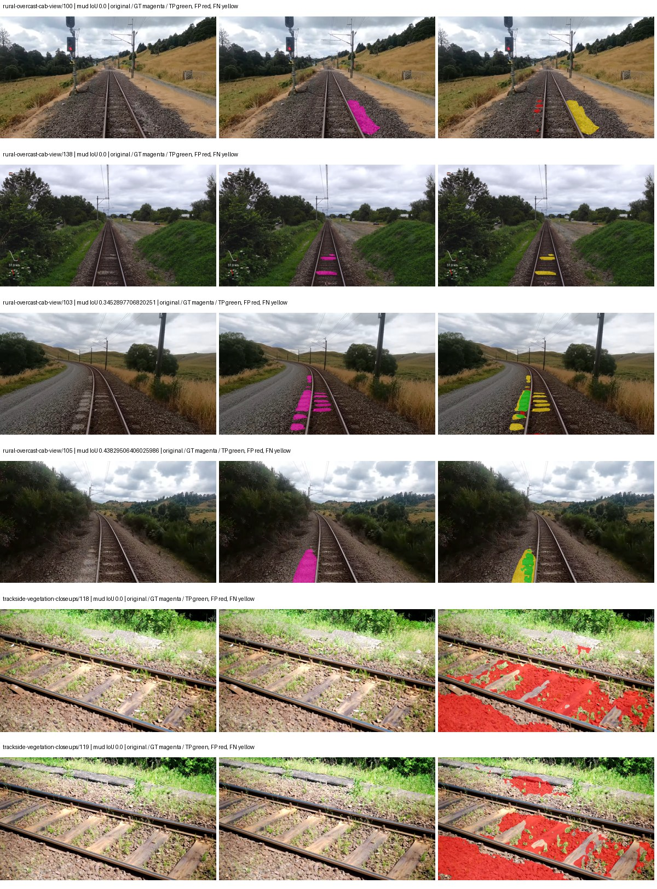

Examples are two lowest and two highest mud-IoU positive images, plus up to two negative images with the most false-positive mud pixels. They are targeted diagnostic examples, not random samples. Green: true positive; red: false positive; yellow: false negative. Full predictions remain on HDRFS.

### Validation tracking

| Logged step | Overall mIoU (%) | Mud IoU (%) |
| --- | --- | --- |
| 254 | 30.09 | 4.74 |
| 508 | 35.12 | 0.91 |
| 763 | 39.52 | 4.20 |
| 1017 | 36.05 | 1.48 |
| 1272 | 36.08 | 1.31 |
| 1527 | 35.42 | 1.67 |

All retained scalar curves, including training loss and per-class IoU, are in record.json. Observed best mud on a curve is not necessarily a retained checkpoint: the pilot saved its selection-metric-best and final checkpoints. Step logging and checkpoint global_step may differ by one.

### Stopping and checkpoint provenance

```json
{
  "stopping": {
    "actual_steps": 1527,
    "maximum_steps": 4000,
    "min_delta": 0.001,
    "monitor": "val_iou/mud-pumping",
    "patience": 5,
    "reason": "validation_plateau"
  },
  "checkpoints": {
    "best": {
      "path": "/data/izadia1/projects/segmentary-runs/paul-test-rtis/mud-fullstats-v1-20260906-r2/future-runs/hf_auto_upernet_swin_tiny--cityscapes_to_railsem19_to_rtis--seed-0_seed0/rtis/best.ckpt",
      "sha256": "16515385bf438369739db376f844c617539a4ffd41ede8b6cc39e6d0cb2d0252",
      "global_step": 254,
      "bytes": 944059609
    },
    "final": {
      "path": "/data/izadia1/projects/segmentary-runs/paul-test-rtis/mud-fullstats-v1-20260906-r2/future-runs/hf_auto_upernet_swin_tiny--cityscapes_to_railsem19_to_rtis--seed-0_seed0/rtis/last.ckpt",
      "sha256": "94e320b2b204ef10f0b6b131be886f536f31ee68176352f74e34d582b2e5b9bd",
      "global_step": 1527,
      "bytes": 944046681
    }
  },
  "cleanup_error": null
}
```

### Resolved training, initialization and evaluation settings

The optimizer block is the base configuration. Stage LR scales are applied at runtime, and stage warmup is capped at min(base warmup, floor(stage budget / 10), stage budget - 1): 400 steps for this 4,000-step pilot. Model-internal native input grids may differ from augmentation crops (EoMT uses its 640 grid).

```json
{
  "name": "hf_auto_upernet_swin_tiny--cityscapes_to_railsem19_to_rtis--seed-0",
  "model": {
    "arch": "hf_auto",
    "checkpoint": "openmmlab/upernet-swin-tiny",
    "tuning": "full",
    "head": "unified_head",
    "lora_r": 16,
    "lora_alpha": 32,
    "lora_dropout": 0.05,
    "lora_targets": [],
    "drop_path": null,
    "revision": "dc8e8c94669c6f14d5cc4c21a141daebd2280d59",
    "subfolder": null,
    "local_files_only": false,
    "trust_remote_code": false,
    "backbone_path": "backbone",
    "head_paths": [
      "decode_head"
    ],
    "classifier_path": "decode_head.classifier",
    "inactive_parameter_paths": [
      "backbone.swin.layernorm"
    ],
    "smp_arch": null,
    "encoder_name": null,
    "encoder_weights": null,
    "native": null,
    "batch_norm_momentum": null
  },
  "space": "paul-test-rtis",
  "taxonomy_root": "/data/izadia1/projects/segmentary-rtis-fullstats-066afb2/taxonomy",
  "output_root": "/data/izadia1/projects/segmentary-runs/paul-test-rtis/mud-fullstats-v1-20260906-r2/future-runs",
  "optim": {
    "backbone_lr": 6e-05,
    "head_lr_mult": 10.0,
    "weight_decay": 0.05,
    "llrd": 0.9,
    "warmup_iters": 1500,
    "warmup_ratio": 1e-06,
    "poly_power": 0.9,
    "min_lr_ratio": 0.0,
    "betas": [
      0.9,
      0.999
    ],
    "grad_clip": 1.0
  },
  "train": {
    "iters": 4000,
    "batch_size": 2,
    "accum": 8,
    "num_workers": 2,
    "precision": "bf16-mixed",
    "ema_decay": 0.9998,
    "val_every": 250,
    "ckpt_every": 500,
    "selection_metric": "val_iou/mud-pumping",
    "early_stopping_patience": 5,
    "early_stopping_min_delta": 0.001,
    "seed": 0,
    "devices": 1
  },
  "eval": {
    "sliding_window": true,
    "window": [
      1024,
      1024
    ],
    "stride": [
      768,
      768
    ],
    "batch_size": 1,
    "num_workers": 2,
    "tta_scales": [],
    "tta_flip": false,
    "threshold": 0.5,
    "boundary_tolerance_frac": 0.0075,
    "save_confusion": true
  },
  "loss": {
    "task": "multiclass",
    "activation": "auto",
    "terms": [],
    "aux": "none",
    "aux_weight": 0.0,
    "ce_weight": 1.0,
    "label_smoothing": 0.0,
    "class_weights": null,
    "query": null
  },
  "aug": {
    "crop": [
      1024,
      1024
    ],
    "scale_min": 0.5,
    "scale_max": 2.0,
    "hflip_p": 0.5,
    "color_jitter_p": 0.5,
    "brightness": 0.25,
    "contrast": 0.25,
    "saturation": 0.25,
    "hue": 0.05
  },
  "stages": [
    {
      "name": "rtis",
      "data": [
        {
          "name": "paul-test-rtis",
          "root": "/data/izadia1/datasets/paul-test-rtis",
          "variant": null,
          "split_file": "splits.json",
          "train_split": "train",
          "val_split": "val",
          "limit": null,
          "loader": "folder",
          "mapping": "paul-test-rtis",
          "loader_options": {
            "require_groups": true
          }
        }
      ],
      "iters": null,
      "lr_scale": 0.1,
      "head_group_lr_scale": 1.0,
      "init_from": "/data/izadia1/projects/segmentary-runs/city-rail-transfer-rail20/hf_auto_upernet_swin_tiny/railsem19/last.ckpt",
      "reset_head": true,
      "freeze": null,
      "sample_weights": null
    }
  ]
}
```

### Hardware and software provenance

```json
{
  "training": {
    "cuda_available": true,
    "cuda_visible_devices": "2",
    "cudnn": 91900,
    "driver_version": "570.133.20",
    "gpu_count": 1,
    "gpu_names": [
      "NVIDIA L40S"
    ],
    "hostname": "hdrfs-app-001",
    "input_normalization": {
      "channel_order": "rgb",
      "mean": [
        0.485,
        0.456,
        0.406
      ],
      "source": "hf_image_processor",
      "std": [
        0.229,
        0.224,
        0.225
      ]
    },
    "model_origins": [
      {
        "hf_commit": "dc8e8c94669c6f14d5cc4c21a141daebd2280d59",
        "hf_name_or_path": "openmmlab/upernet-swin-tiny",
        "module": "model",
        "timm_pretrained": {}
      },
      {
        "hf_commit": null,
        "hf_name_or_path": "",
        "module": "model.backbone",
        "timm_pretrained": {}
      },
      {
        "hf_commit": null,
        "hf_name_or_path": "",
        "module": "model.backbone.swin",
        "timm_pretrained": {}
      },
      {
        "hf_commit": null,
        "hf_name_or_path": "",
        "module": "model.backbone.swin.embeddings",
        "timm_pretrained": {}
      },
      {
        "hf_commit": null,
        "hf_name_or_path": "",
        "module": "model.backbone.swin.encoder",
        "timm_pretrained": {}
      },
      {
        "hf_commit": null,
        "hf_name_or_path": "",
        "module": "model.backbone.swin.encoder.layers.0",
        "timm_pretrained": {}
      },
      {
        "hf_commit": null,
        "hf_name_or_path": "",
        "module": "model.backbone.swin.encoder.layers.0.blocks.0.attention",
        "timm_pretrained": {}
      },
      {
        "hf_commit": null,
        "hf_name_or_path": "",
        "module": "model.backbone.swin.encoder.layers.0.blocks.1.attention",
        "timm_pretrained": {}
      },
      {
        "hf_commit": null,
        "hf_name_or_path": "",
        "module": "model.backbone.swin.encoder.layers.1",
        "timm_pretrained": {}
      },
      {
        "hf_commit": null,
        "hf_name_or_path": "",
        "module": "model.backbone.swin.encoder.layers.1.blocks.0.attention",
        "timm_pretrained": {}
      },
      {
        "hf_commit": null,
        "hf_name_or_path": "",
        "module": "model.backbone.swin.encoder.layers.1.blocks.1.attention",
        "timm_pretrained": {}
      },
      {
        "hf_commit": null,
        "hf_name_or_path": "",
        "module": "model.backbone.swin.encoder.layers.2",
        "timm_pretrained": {}
      },
      {
        "hf_commit": null,
        "hf_name_or_path": "",
        "module": "model.backbone.swin.encoder.layers.2.blocks.0.attention",
        "timm_pretrained": {}
      },
      {
        "hf_commit": null,
        "hf_name_or_path": "",
        "module": "model.backbone.swin.encoder.layers.2.blocks.1.attention",
        "timm_pretrained": {}
      },
      {
        "hf_commit": null,
        "hf_name_or_path": "",
        "module": "model.backbone.swin.encoder.layers.2.blocks.2.attention",
        "timm_pretrained": {}
      },
      {
        "hf_commit": null,
        "hf_name_or_path": "",
        "module": "model.backbone.swin.encoder.layers.2.blocks.3.attention",
        "timm_pretrained": {}
      },
      {
        "hf_commit": null,
        "hf_name_or_path": "",
        "module": "model.backbone.swin.encoder.layers.2.blocks.4.attention",
        "timm_pretrained": {}
      },
      {
        "hf_commit": null,
        "hf_name_or_path": "",
        "module": "model.backbone.swin.encoder.layers.2.blocks.5.attention",
        "timm_pretrained": {}
      },
      {
        "hf_commit": null,
        "hf_name_or_path": "",
        "module": "model.backbone.swin.encoder.layers.3",
        "timm_pretrained": {}
      },
      {
        "hf_commit": null,
        "hf_name_or_path": "",
        "module": "model.backbone.swin.encoder.layers.3.blocks.0.attention",
        "timm_pretrained": {}
      },
      {
        "hf_commit": null,
        "hf_name_or_path": "",
        "module": "model.backbone.swin.encoder.layers.3.blocks.1.attention",
        "timm_pretrained": {}
      },
      {
        "hf_commit": "dc8e8c94669c6f14d5cc4c21a141daebd2280d59",
        "hf_name_or_path": "openmmlab/upernet-swin-tiny",
        "module": "model.decode_head",
        "timm_pretrained": {}
      }
    ],
    "model_parameter_count": 58953423,
    "packages": {
      "albumentations": "2.0.8",
      "lightning": "2.6.5",
      "numpy": "2.4.4",
      "segmentary": "0.1.0",
      "segmentation-models-pytorch": "0.5.0",
      "timm": "1.0.28",
      "torch": "2.11.0+cu128",
      "torchvision": "0.26.0+cu128",
      "transformers": "5.15.0"
    },
    "platform": "Linux-5.15.0-139-generic-x86_64-with-glibc2.35",
    "python": "3.11.15",
    "torch": "2.11.0+cu128",
    "torch_cuda": "12.8",
    "trainable_parameter_count": 58951887,
    "training_stop": {
      "actual_steps": 1527,
      "maximum_steps": 4000,
      "min_delta": 0.001,
      "monitor": "val_iou/mud-pumping",
      "patience": 5,
      "reason": "validation_plateau"
    },
    "validation_weights": "raw"
  },
  "evaluation": {
    "cuda_available": true,
    "cuda_visible_devices": "2",
    "cudnn": 91900,
    "driver_version": "570.133.20",
    "gpu_count": 1,
    "gpu_names": [
      "NVIDIA L40S"
    ],
    "hostname": "hdrfs-app-001",
    "input_normalization": {
      "channel_order": "rgb",
      "mean": [
        0.485,
        0.456,
        0.406
      ],
      "source": "hf_image_processor",
      "std": [
        0.229,
        0.224,
        0.225
      ]
    },
    "packages": {
      "albumentations": "2.0.8",
      "lightning": "2.6.5",
      "numpy": "2.4.4",
      "segmentary": "0.1.0",
      "segmentation-models-pytorch": "0.5.0",
      "timm": "1.0.28",
      "torch": "2.11.0+cu128",
      "torchvision": "0.26.0+cu128",
      "transformers": "5.15.0"
    },
    "platform": "Linux-5.15.0-139-generic-x86_64-with-glibc2.35",
    "python": "3.11.15",
    "torch": "2.11.0+cu128",
    "torch_cuda": "12.8"
  }
}
```

## cityscapes_to_railsem19_to_rtis — seed 1

Status: **completed**. Started: 2026-09-06T14:34:10.921557+00:00. Finished: 2026-09-06T15:11:46.605247+00:00.

Recipe pretrained initializer: `openmmlab/upernet-swin-tiny`.

`rtis_only` uses the recipe initializer, which may include pretrained segmentation components. Transfer paths load the exact historical source checkpoint below and reset the classifier; they do not reset all query/decoder features.

Source checkpoint: `{'name': 'hf_auto_upernet_swin_tiny--cityscapes_to_railsem19--seed-0', 'model': 'hf_auto_upernet_swin_tiny', 'protocol': 'cityscapes_to_railsem19', 'config': '/data/izadia1/projects/segmentary-runs/all-model-city-rail-seed0-rail20-b9eb3e1/accepted/hf_auto_upernet_swin_tiny--cityscapes_to_railsem19--seed-0/resolved-config.yaml', 'checkpoint': '/data/izadia1/projects/segmentary-runs/city-rail-transfer-rail20/hf_auto_upernet_swin_tiny/railsem19/last.ckpt', 'recorded_sha256': 'ebdfc5ac3d69bb58c8c396908b2b1d3f1c1e6d195f24b3b634a5ea4844173915', 'exists': True}`.

Config SHA-256: `5ab9f52d0893753fce413e82b52b9324e5e1180e71da1fb7b401856b5915e7d3`. Weights used for validation: `raw`.

### Mud-pumping and aggregate quality

| Metric | Selected checkpoint | Final training validation |
| --- | --- | --- |
| Mud IoU | 18.14 | 4.04 |
| Mud precision | 25.10 | 6.29 |
| Mud recall | 39.55 | 10.16 |
| Mud Dice/F1 | 30.71 | 7.77 |
| mIoU | 32.87 | 37.71 |
| Mean accuracy | 42.33 | 49.78 |
| Mean precision | 47.30 | 58.04 |
| Mean Dice | 41.20 | 46.71 |
| Mean specificity | 98.89 | 98.97 |
| Pixel accuracy | 83.62 | 84.18 |
| Frequency-weighted IoU | 73.06 | 74.93 |
| Fixed GT-present class mIoU | 34.70 | 41.90 |
| Boundary F1 | 37.05 | 46.14 |

The selected checkpoint has independent evaluation evidence. Final values are the trainer's final validation record, not a new independent evaluation. mIoU averages classes with nonzero union, so false positives on absent classes can change its denominator. The fixed GT-class mean is supplementary and excludes absent classes; their false positives remain in the confusion matrix.

### Resource usage and timing

| Measurement | Value |
| --- | --- |
| Peak training VRAM, retained training invocation (GiB) | 11.71 |
| Peak evaluation VRAM (GiB) | 7.52 |
| Retained training invocation wall time (seconds) | 2042.43 |
| Retained training invocation GPU-hours (one GPU) | 0.57 |
| Evaluation wall time (seconds) | 19.77 |
| Full evaluation pipeline images/second | 1.87 |
| Best full-state checkpoint (MiB) | 900.33 |
| Final full-state checkpoint (MiB) | 900.31 |
| Audited periodic checkpoints removed (GiB) | 2.64 |

VRAM uses the recorded allocator high-water mark; it is not total device usage including CUDA context. Resumed jobs' retained training invocation times and peaks are **not whole-campaign totals**. Earlier invocation resource records are not reconstructed here. Evaluation throughput includes loader, sliding-window inference and metrics; it is not model-only latency/FPS. Missing measurements are shown as —, never inferred from another dataset's run.

### Standardized inference performance

Dedicated model-only profiling waits for an idle worker-locked L40S: BF16, batch 1, 1024x1024, 20 warmup and 100 CUDA-event-timed public forwards. It excludes loading, preprocessing, tiling and metrics.

| Status | Parameters | Weight MiB | FPS | p50 ms | p95 ms | Peak reserved GiB |
| --- | --- | --- | --- | --- | --- | --- |
| complete | 58953423 | 224.89 | 41.97 | 23.66 | 24.68 | 2.41 |

```json
{
  "schema_version": 1,
  "model_id": "hf_auto_upernet_swin_tiny",
  "measured_at": "2026-09-06T15:11:40+00:00",
  "status": "complete",
  "benchmark_scope": "rtis_selected_checkpoint_model_only",
  "applies_to": [
    "hf_auto_upernet_swin_tiny--cityscapes_to_railsem19_to_rtis--seed-1"
  ],
  "source": {
    "campaign_git_sha": "066afb2626398b7be59d4d19f5a0e4644fd59adc",
    "git_dirty": false,
    "config_hash": "1935e5c416e1",
    "resolved_config": "/data/izadia1/projects/segmentary-runs/paul-test-rtis/mud-fullstats-v1-20260906-r2/configs/hf_auto_upernet_swin_tiny--cityscapes_to_railsem19_to_rtis--seed-1.yaml",
    "config_sha256": "5ab9f52d0893753fce413e82b52b9324e5e1180e71da1fb7b401856b5915e7d3",
    "checkpoint_sha256": "f8423c9adab4cbd144e00f7ed644957292cec60236197a86df68a912f6e0b34e",
    "checkpoint_global_step": 254,
    "checkpoint_bytes": 944059609,
    "checkpoint_kind": "resume checkpoint with optimizer and EMA state",
    "weights": "raw",
    "measured_checkpoint_job_id": "hf_auto_upernet_swin_tiny--cityscapes_to_railsem19_to_rtis--seed-1",
    "result_sha256": "8108feb1fdf5359b239673a6a0ca47fc99b19166cf8c15b245d1378b10768f56",
    "result_git_sha": "066afb2626398b7be59d4d19f5a0e4644fd59adc",
    "result_stage": "eval:paul-test-rtis:val",
    "result_seed": 1
  },
  "hardware": {
    "gpu_name": "NVIDIA L40S",
    "gpu_uuid": "GPU-804aea8b-5f62-423e-72c6-49e1ed15c4e4",
    "logical_device": "cuda:0",
    "physical_visibility_token": "6",
    "compute_capability": [
      8,
      9
    ],
    "total_memory_bytes": 47677177856
  },
  "model": {
    "parameter_count": 58953423,
    "trainable_parameter_count": 58951887,
    "resident_parameter_bytes": 235813692,
    "parameter_dtype_counts": {
      "float32": 58953423
    }
  },
  "contract": {
    "backend": "pytorch",
    "precision": "bf16_autocast",
    "batch_size": 1,
    "input_shape_nchw": [
      1,
      3,
      1024,
      1024
    ],
    "warmup_iterations": 20,
    "measured_iterations": 100,
    "timing": "per-forward CUDA events with end-event synchronization",
    "includes_preprocessing": false,
    "includes_data_loader": false,
    "includes_sliding_window": false,
    "input_resident_on_gpu": true,
    "model_only": true,
    "entrypoint": "public model(image) dense-logits forward"
  },
  "measurements": {
    "latency": {
      "p50_ms": 23.659008026123047,
      "p95_ms": 24.68408260345459,
      "mean_ms": 23.828459186553957,
      "minimum_ms": 23.204864501953125,
      "maximum_ms": 25.27743911743164,
      "fps": 41.966624537951034,
      "raw_ms": [
        24.67635154724121,
        23.852031707763672,
        23.88582420349121,
        24.250368118286133,
        23.459840774536133,
        23.204864501953125,
        23.254016876220703,
        23.245824813842773,
        23.995391845703125,
        23.348224639892578,
        24.66713523864746,
        24.163328170776367,
        24.06502342224121,
        23.28985595703125,
        23.28473663330078,
        23.277568817138672,
        23.65132713317871,
        24.111103057861328,
        23.822368621826172,
        23.622655868530273,
        24.380416870117188,
        23.370752334594727,
        23.68000030517578,
        23.29702377319336,
        23.48953628540039,
        23.809024810791016,
        23.996416091918945,
        24.615936279296875,
        24.611839294433594,
        23.50079917907715,
        23.646207809448242,
        23.458816528320312,
        23.540735244750977,
        23.402496337890625,
        23.3175048828125,
        23.805952072143555,
        23.391231536865234,
        23.996416091918945,
        24.089599609375,
        23.791616439819336,
        23.411680221557617,
        24.65894317626953,
        23.526399612426758,
        23.666688919067383,
        24.48076820373535,
        24.5166072845459,
        23.50796890258789,
        23.31340789794922,
        23.48543930053711,
        23.30419158935547,
        23.383039474487305,
        24.360960006713867,
        23.614463806152344,
        24.371200561523438,
        23.731199264526367,
        23.626752853393555,
        23.226367950439453,
        23.7076473236084,
        23.29292869567871,
        24.357887268066406,
        23.382015228271484,
        25.27743911743164,
        24.34662437438965,
        24.178688049316406,
        23.398399353027344,
        23.3492488861084,
        24.49612808227539,
        23.48646354675293,
        24.834047317504883,
        23.589887619018555,
        23.311359405517578,
        23.28371238708496,
        24.350719451904297,
        24.449024200439453,
        23.4833927154541,
        23.47724723815918,
        24.216575622558594,
        23.573503494262695,
        24.808448791503906,
        24.129535675048828,
        24.07935905456543,
        23.47724723815918,
        23.456768035888672,
        24.607744216918945,
        23.415807723999023,
        23.989248275756836,
        24.28313636779785,
        23.32364845275879,
        23.883743286132812,
        23.4833927154541,
        23.26425552368164,
        23.4967041015625,
        23.34003257751465,
        24.68351936340332,
        23.777280807495117,
        24.189952850341797,
        24.69478416442871,
        24.730623245239258,
        23.5468807220459,
        23.834623336791992
      ],
      "percentile_method": "numpy linear interpolation"
    },
    "peak_reserved_bytes": 2583691264,
    "memory_kind": "pytorch_cuda_allocator_peak_reserved_excluding_context",
    "benchmark_wall_clock_s": 8.421647872775793
  },
  "started_at": "2026-09-06T15:11:32+00:00",
  "finished_at": "2026-09-06T15:11:40+00:00",
  "environment": {
    "hostname": "hdrfs-app-001",
    "python": "3.11.15",
    "platform": "Linux-5.15.0-139-generic-x86_64-with-glibc2.35",
    "torch": "2.11.0+cu128",
    "torch_cuda": "12.8",
    "cudnn": 91900,
    "driver_version": "570.133.20",
    "cuda_available": true,
    "gpu_count": 1,
    "gpu_names": [
      "NVIDIA L40S"
    ],
    "cuda_visible_devices": "6",
    "packages": {
      "segmentary": "0.1.0",
      "torch": "2.11.0+cu128",
      "torchvision": "0.26.0+cu128",
      "transformers": "5.15.0",
      "timm": "1.0.28",
      "segmentation-models-pytorch": "0.5.0",
      "albumentations": "2.0.8",
      "lightning": "2.6.5",
      "numpy": "2.4.4"
    }
  }
}
```

### Per-class validation results

| Class | GT pixels | IoU (%) | Precision (%) | Recall (%) | Dice (%) | Boundary F1 (%) |
| --- | --- | --- | --- | --- | --- | --- |
| car | 29664 | 0.00 | 0.00 | 0.00 | 0.00 | 0.00 |
| construction | 311585 | 60.98 | 71.21 | 80.93 | 75.76 | 65.15 |
| fence | 265137 | 29.69 | 51.59 | 41.16 | 45.79 | 43.06 |
| mud-pumping | 1226250 | 18.14 | 25.10 | 39.55 | 30.71 | 27.69 |
| on-rails | 0 | 0.00 | 0.00 | — | 0.00 | 0.00 |
| person | 0 | — | — | — | — | — |
| pole | 628038 | 71.36 | 85.72 | 80.98 | 83.28 | 89.66 |
| rail-embedded | 16799 | 0.00 | 0.00 | 0.00 | 0.00 | 0.00 |
| rail-raised | 2969797 | 70.63 | 74.95 | 92.47 | 82.79 | 87.22 |
| rail-track | 6323197 | 41.90 | 71.36 | 50.37 | 59.05 | 53.18 |
| road | 1048831 | 6.89 | 17.80 | 10.11 | 12.90 | 16.53 |
| sidewalk | 1297367 | 22.88 | 65.71 | 25.99 | 37.24 | 11.68 |
| sky | 19121606 | 98.54 | 98.97 | 99.57 | 99.27 | 96.08 |
| standing-water | 95802 | 3.86 | 7.97 | 6.97 | 7.44 | 10.01 |
| terrain | 39239306 | 83.18 | 84.18 | 98.60 | 90.82 | 58.23 |
| trackbed | 10643081 | 64.14 | 78.23 | 78.07 | 78.15 | 65.38 |
| traffic-light | 19510 | 0.00 | 0.00 | 0.00 | 0.00 | 0.00 |
| traffic-sign | 13285 | 0.00 | 0.00 | 0.00 | 0.00 | 0.00 |
| tram-track | 56179 | 39.08 | 79.11 | 43.58 | 56.20 | 38.77 |
| truck | 0 | — | — | — | — | — |
| vegetation-overgrowth | 5901821 | 13.27 | 86.80 | 13.55 | 23.44 | 41.31 |

### Full-run accounting

| Measurement | Value |
| --- | --- |
| Full GPU-reserved wall seconds, all recorded worker attempts | 2256.34 |
| Full reserved GPU-hours | 0.63 |
| Whole-run timing complete | True |

| Phase | Wall seconds including failed attempts |
| --- | --- |
| training | 2049.75 |
| diagnostics | 156.25 |
| performance | 17.11 |

GPU-reserved time includes model loading, training, validation, collection, profiling, checkpoint I/O and orchestration while the worker owns one GPU. It is not GPU kernel-active time. Phase timings and sampled device memory/power/utilization are retained separately; sampled device memory is not the allocator high-water mark.

### Train/validation and raw/EMA diagnostics

| Checkpoint / weights / split | Images | Mud IoU (%) | Mud precision (%) | Mud recall (%) |
| --- | --- | --- | --- | --- |
| best-auto-train / raw | 220 | 87.98 | 92.30 | 94.94 |
| best-auto-val / raw | 37 | 18.14 | 25.10 | 39.55 |
| best-alternate-val / ema | 37 | 12.47 | 15.52 | 38.79 |
| final-auto-val / raw | 37 | 4.05 | 6.29 | 10.18 |

Train uses the evaluation transform without augmentation. Compare mud train/validation metrics for the same selected weights. Alternate EMA on running-stat BatchNorm is explicitly uncalibrated and is diagnostic only. Score-threshold curves use uncalibrated normalized scores and are pixel-level diagnostics, not event detection rates or a selected deployment operating point.

### Downloadable evidence

- best-auto-train: [per-image.csv](cityscapes_to_railsem19_to_rtis--seed-1/best-auto-train/per-image.csv) · [per-image-confusion.json.gz](cityscapes_to_railsem19_to_rtis--seed-1/best-auto-train/per-image-confusion.json.gz) · [groups.json](cityscapes_to_railsem19_to_rtis--seed-1/best-auto-train/groups.json) · [mud-score-curves.json](cityscapes_to_railsem19_to_rtis--seed-1/best-auto-train/mud-score-curves.json)
- best-auto-val: [per-image.csv](cityscapes_to_railsem19_to_rtis--seed-1/best-auto-val/per-image.csv) · [per-image-confusion.json.gz](cityscapes_to_railsem19_to_rtis--seed-1/best-auto-val/per-image-confusion.json.gz) · [groups.json](cityscapes_to_railsem19_to_rtis--seed-1/best-auto-val/groups.json) · [mud-score-curves.json](cityscapes_to_railsem19_to_rtis--seed-1/best-auto-val/mud-score-curves.json) · [examples.jpg](cityscapes_to_railsem19_to_rtis--seed-1/best-auto-val/examples.jpg)
- best-alternate-val: [per-image.csv](cityscapes_to_railsem19_to_rtis--seed-1/best-alternate-val/per-image.csv) · [per-image-confusion.json.gz](cityscapes_to_railsem19_to_rtis--seed-1/best-alternate-val/per-image-confusion.json.gz) · [groups.json](cityscapes_to_railsem19_to_rtis--seed-1/best-alternate-val/groups.json) · [mud-score-curves.json](cityscapes_to_railsem19_to_rtis--seed-1/best-alternate-val/mud-score-curves.json)
- final-auto-val: [per-image.csv](cityscapes_to_railsem19_to_rtis--seed-1/final-auto-val/per-image.csv) · [per-image-confusion.json.gz](cityscapes_to_railsem19_to_rtis--seed-1/final-auto-val/per-image-confusion.json.gz) · [groups.json](cityscapes_to_railsem19_to_rtis--seed-1/final-auto-val/groups.json) · [mud-score-curves.json](cityscapes_to_railsem19_to_rtis--seed-1/final-auto-val/mud-score-curves.json)
- resources: [telemetry.csv](cityscapes_to_railsem19_to_rtis--seed-1/resources/telemetry.csv)

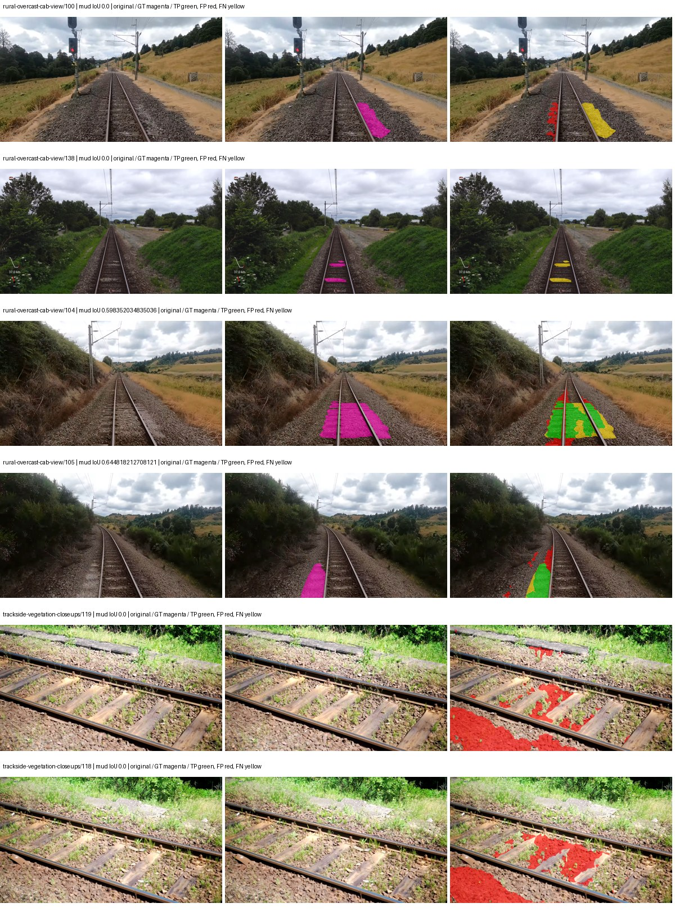

Examples are two lowest and two highest mud-IoU positive images, plus up to two negative images with the most false-positive mud pixels. They are targeted diagnostic examples, not random samples. Green: true positive; red: false positive; yellow: false negative. Full predictions remain on HDRFS.

### Validation tracking

| Logged step | Overall mIoU (%) | Mud IoU (%) |
| --- | --- | --- |
| 254 | 32.87 | 18.15 |
| 508 | 36.77 | 3.24 |
| 763 | 38.80 | 6.14 |
| 1017 | 38.89 | 7.52 |
| 1272 | 37.74 | 6.61 |
| 1527 | 37.71 | 4.04 |

All retained scalar curves, including training loss and per-class IoU, are in record.json. Observed best mud on a curve is not necessarily a retained checkpoint: the pilot saved its selection-metric-best and final checkpoints. Step logging and checkpoint global_step may differ by one.

### Stopping and checkpoint provenance

```json
{
  "stopping": {
    "actual_steps": 1527,
    "maximum_steps": 4000,
    "min_delta": 0.001,
    "monitor": "val_iou/mud-pumping",
    "patience": 5,
    "reason": "validation_plateau"
  },
  "checkpoints": {
    "best": {
      "path": "/data/izadia1/projects/segmentary-runs/paul-test-rtis/mud-fullstats-v1-20260906-r2/future-runs/hf_auto_upernet_swin_tiny--cityscapes_to_railsem19_to_rtis--seed-1_seed1/rtis/best.ckpt",
      "sha256": "f8423c9adab4cbd144e00f7ed644957292cec60236197a86df68a912f6e0b34e",
      "global_step": 254,
      "bytes": 944059609
    },
    "final": {
      "path": "/data/izadia1/projects/segmentary-runs/paul-test-rtis/mud-fullstats-v1-20260906-r2/future-runs/hf_auto_upernet_swin_tiny--cityscapes_to_railsem19_to_rtis--seed-1_seed1/rtis/last.ckpt",
      "sha256": "140e054a807f0a16e4b5791a93af9f51f6fd1e4107cb352160ef5331692f2210",
      "global_step": 1527,
      "bytes": 944046681
    }
  },
  "cleanup_error": null
}
```

### Resolved training, initialization and evaluation settings

The optimizer block is the base configuration. Stage LR scales are applied at runtime, and stage warmup is capped at min(base warmup, floor(stage budget / 10), stage budget - 1): 400 steps for this 4,000-step pilot. Model-internal native input grids may differ from augmentation crops (EoMT uses its 640 grid).

```json
{
  "name": "hf_auto_upernet_swin_tiny--cityscapes_to_railsem19_to_rtis--seed-1",
  "model": {
    "arch": "hf_auto",
    "checkpoint": "openmmlab/upernet-swin-tiny",
    "tuning": "full",
    "head": "unified_head",
    "lora_r": 16,
    "lora_alpha": 32,
    "lora_dropout": 0.05,
    "lora_targets": [],
    "drop_path": null,
    "revision": "dc8e8c94669c6f14d5cc4c21a141daebd2280d59",
    "subfolder": null,
    "local_files_only": false,
    "trust_remote_code": false,
    "backbone_path": "backbone",
    "head_paths": [
      "decode_head"
    ],
    "classifier_path": "decode_head.classifier",
    "inactive_parameter_paths": [
      "backbone.swin.layernorm"
    ],
    "smp_arch": null,
    "encoder_name": null,
    "encoder_weights": null,
    "native": null,
    "batch_norm_momentum": null
  },
  "space": "paul-test-rtis",
  "taxonomy_root": "/data/izadia1/projects/segmentary-rtis-fullstats-066afb2/taxonomy",
  "output_root": "/data/izadia1/projects/segmentary-runs/paul-test-rtis/mud-fullstats-v1-20260906-r2/future-runs",
  "optim": {
    "backbone_lr": 6e-05,
    "head_lr_mult": 10.0,
    "weight_decay": 0.05,
    "llrd": 0.9,
    "warmup_iters": 1500,
    "warmup_ratio": 1e-06,
    "poly_power": 0.9,
    "min_lr_ratio": 0.0,
    "betas": [
      0.9,
      0.999
    ],
    "grad_clip": 1.0
  },
  "train": {
    "iters": 4000,
    "batch_size": 2,
    "accum": 8,
    "num_workers": 2,
    "precision": "bf16-mixed",
    "ema_decay": 0.9998,
    "val_every": 250,
    "ckpt_every": 500,
    "selection_metric": "val_iou/mud-pumping",
    "early_stopping_patience": 5,
    "early_stopping_min_delta": 0.001,
    "seed": 1,
    "devices": 1
  },
  "eval": {
    "sliding_window": true,
    "window": [
      1024,
      1024
    ],
    "stride": [
      768,
      768
    ],
    "batch_size": 1,
    "num_workers": 2,
    "tta_scales": [],
    "tta_flip": false,
    "threshold": 0.5,
    "boundary_tolerance_frac": 0.0075,
    "save_confusion": true
  },
  "loss": {
    "task": "multiclass",
    "activation": "auto",
    "terms": [],
    "aux": "none",
    "aux_weight": 0.0,
    "ce_weight": 1.0,
    "label_smoothing": 0.0,
    "class_weights": null,
    "query": null
  },
  "aug": {
    "crop": [
      1024,
      1024
    ],
    "scale_min": 0.5,
    "scale_max": 2.0,
    "hflip_p": 0.5,
    "color_jitter_p": 0.5,
    "brightness": 0.25,
    "contrast": 0.25,
    "saturation": 0.25,
    "hue": 0.05
  },
  "stages": [
    {
      "name": "rtis",
      "data": [
        {
          "name": "paul-test-rtis",
          "root": "/data/izadia1/datasets/paul-test-rtis",
          "variant": null,
          "split_file": "splits.json",
          "train_split": "train",
          "val_split": "val",
          "limit": null,
          "loader": "folder",
          "mapping": "paul-test-rtis",
          "loader_options": {
            "require_groups": true
          }
        }
      ],
      "iters": null,
      "lr_scale": 0.1,
      "head_group_lr_scale": 1.0,
      "init_from": "/data/izadia1/projects/segmentary-runs/city-rail-transfer-rail20/hf_auto_upernet_swin_tiny/railsem19/last.ckpt",
      "reset_head": true,
      "freeze": null,
      "sample_weights": null
    }
  ]
}
```

### Hardware and software provenance

```json
{
  "training": {
    "cuda_available": true,
    "cuda_visible_devices": "6",
    "cudnn": 91900,
    "driver_version": "570.133.20",
    "gpu_count": 1,
    "gpu_names": [
      "NVIDIA L40S"
    ],
    "hostname": "hdrfs-app-001",
    "input_normalization": {
      "channel_order": "rgb",
      "mean": [
        0.485,
        0.456,
        0.406
      ],
      "source": "hf_image_processor",
      "std": [
        0.229,
        0.224,
        0.225
      ]
    },
    "model_origins": [
      {
        "hf_commit": "dc8e8c94669c6f14d5cc4c21a141daebd2280d59",
        "hf_name_or_path": "openmmlab/upernet-swin-tiny",
        "module": "model",
        "timm_pretrained": {}
      },
      {
        "hf_commit": null,
        "hf_name_or_path": "",
        "module": "model.backbone",
        "timm_pretrained": {}
      },
      {
        "hf_commit": null,
        "hf_name_or_path": "",
        "module": "model.backbone.swin",
        "timm_pretrained": {}
      },
      {
        "hf_commit": null,
        "hf_name_or_path": "",
        "module": "model.backbone.swin.embeddings",
        "timm_pretrained": {}
      },
      {
        "hf_commit": null,
        "hf_name_or_path": "",
        "module": "model.backbone.swin.encoder",
        "timm_pretrained": {}
      },
      {
        "hf_commit": null,
        "hf_name_or_path": "",
        "module": "model.backbone.swin.encoder.layers.0",
        "timm_pretrained": {}
      },
      {
        "hf_commit": null,
        "hf_name_or_path": "",
        "module": "model.backbone.swin.encoder.layers.0.blocks.0.attention",
        "timm_pretrained": {}
      },
      {
        "hf_commit": null,
        "hf_name_or_path": "",
        "module": "model.backbone.swin.encoder.layers.0.blocks.1.attention",
        "timm_pretrained": {}
      },
      {
        "hf_commit": null,
        "hf_name_or_path": "",
        "module": "model.backbone.swin.encoder.layers.1",
        "timm_pretrained": {}
      },
      {
        "hf_commit": null,
        "hf_name_or_path": "",
        "module": "model.backbone.swin.encoder.layers.1.blocks.0.attention",
        "timm_pretrained": {}
      },
      {
        "hf_commit": null,
        "hf_name_or_path": "",
        "module": "model.backbone.swin.encoder.layers.1.blocks.1.attention",
        "timm_pretrained": {}
      },
      {
        "hf_commit": null,
        "hf_name_or_path": "",
        "module": "model.backbone.swin.encoder.layers.2",
        "timm_pretrained": {}
      },
      {
        "hf_commit": null,
        "hf_name_or_path": "",
        "module": "model.backbone.swin.encoder.layers.2.blocks.0.attention",
        "timm_pretrained": {}
      },
      {
        "hf_commit": null,
        "hf_name_or_path": "",
        "module": "model.backbone.swin.encoder.layers.2.blocks.1.attention",
        "timm_pretrained": {}
      },
      {
        "hf_commit": null,
        "hf_name_or_path": "",
        "module": "model.backbone.swin.encoder.layers.2.blocks.2.attention",
        "timm_pretrained": {}
      },
      {
        "hf_commit": null,
        "hf_name_or_path": "",
        "module": "model.backbone.swin.encoder.layers.2.blocks.3.attention",
        "timm_pretrained": {}
      },
      {
        "hf_commit": null,
        "hf_name_or_path": "",
        "module": "model.backbone.swin.encoder.layers.2.blocks.4.attention",
        "timm_pretrained": {}
      },
      {
        "hf_commit": null,
        "hf_name_or_path": "",
        "module": "model.backbone.swin.encoder.layers.2.blocks.5.attention",
        "timm_pretrained": {}
      },
      {
        "hf_commit": null,
        "hf_name_or_path": "",
        "module": "model.backbone.swin.encoder.layers.3",
        "timm_pretrained": {}
      },
      {
        "hf_commit": null,
        "hf_name_or_path": "",
        "module": "model.backbone.swin.encoder.layers.3.blocks.0.attention",
        "timm_pretrained": {}
      },
      {
        "hf_commit": null,
        "hf_name_or_path": "",
        "module": "model.backbone.swin.encoder.layers.3.blocks.1.attention",
        "timm_pretrained": {}
      },
      {
        "hf_commit": "dc8e8c94669c6f14d5cc4c21a141daebd2280d59",
        "hf_name_or_path": "openmmlab/upernet-swin-tiny",
        "module": "model.decode_head",
        "timm_pretrained": {}
      }
    ],
    "model_parameter_count": 58953423,
    "packages": {
      "albumentations": "2.0.8",
      "lightning": "2.6.5",
      "numpy": "2.4.4",
      "segmentary": "0.1.0",
      "segmentation-models-pytorch": "0.5.0",
      "timm": "1.0.28",
      "torch": "2.11.0+cu128",
      "torchvision": "0.26.0+cu128",
      "transformers": "5.15.0"
    },
    "platform": "Linux-5.15.0-139-generic-x86_64-with-glibc2.35",
    "python": "3.11.15",
    "torch": "2.11.0+cu128",
    "torch_cuda": "12.8",
    "trainable_parameter_count": 58951887,
    "training_stop": {
      "actual_steps": 1527,
      "maximum_steps": 4000,
      "min_delta": 0.001,
      "monitor": "val_iou/mud-pumping",
      "patience": 5,
      "reason": "validation_plateau"
    },
    "validation_weights": "raw"
  },
  "evaluation": {
    "cuda_available": true,
    "cuda_visible_devices": "6",
    "cudnn": 91900,
    "driver_version": "570.133.20",
    "gpu_count": 1,
    "gpu_names": [
      "NVIDIA L40S"
    ],
    "hostname": "hdrfs-app-001",
    "input_normalization": {
      "channel_order": "rgb",
      "mean": [
        0.485,
        0.456,
        0.406
      ],
      "source": "hf_image_processor",
      "std": [
        0.229,
        0.224,
        0.225
      ]
    },
    "packages": {
      "albumentations": "2.0.8",
      "lightning": "2.6.5",
      "numpy": "2.4.4",
      "segmentary": "0.1.0",
      "segmentation-models-pytorch": "0.5.0",
      "timm": "1.0.28",
      "torch": "2.11.0+cu128",
      "torchvision": "0.26.0+cu128",
      "transformers": "5.15.0"
    },
    "platform": "Linux-5.15.0-139-generic-x86_64-with-glibc2.35",
    "python": "3.11.15",
    "torch": "2.11.0+cu128",
    "torch_cuda": "12.8"
  }
}
```

## cityscapes_to_railsem19_to_rtis — seed 2

Status: **completed**. Started: 2026-09-06T14:40:19.289075+00:00. Finished: 2026-09-06T15:17:39.099360+00:00.

Recipe pretrained initializer: `openmmlab/upernet-swin-tiny`.

`rtis_only` uses the recipe initializer, which may include pretrained segmentation components. Transfer paths load the exact historical source checkpoint below and reset the classifier; they do not reset all query/decoder features.

Source checkpoint: `{'name': 'hf_auto_upernet_swin_tiny--cityscapes_to_railsem19--seed-0', 'model': 'hf_auto_upernet_swin_tiny', 'protocol': 'cityscapes_to_railsem19', 'config': '/data/izadia1/projects/segmentary-runs/all-model-city-rail-seed0-rail20-b9eb3e1/accepted/hf_auto_upernet_swin_tiny--cityscapes_to_railsem19--seed-0/resolved-config.yaml', 'checkpoint': '/data/izadia1/projects/segmentary-runs/city-rail-transfer-rail20/hf_auto_upernet_swin_tiny/railsem19/last.ckpt', 'recorded_sha256': 'ebdfc5ac3d69bb58c8c396908b2b1d3f1c1e6d195f24b3b634a5ea4844173915', 'exists': True}`.

Config SHA-256: `5811d9e8fe3029cd4715fcda561dcdda73b88d2b29c7a9307df2832e1e77dff5`. Weights used for validation: `raw`.

### Mud-pumping and aggregate quality

| Metric | Selected checkpoint | Final training validation |
| --- | --- | --- |
| Mud IoU | 11.36 | 1.99 |
| Mud precision | 15.02 | 2.91 |
| Mud recall | 31.78 | 5.95 |
| Mud Dice/F1 | 20.40 | 3.91 |
| mIoU | 29.31 | 34.66 |
| Mean accuracy | 40.34 | 46.08 |
| Mean precision | 44.71 | 59.61 |
| Mean Dice | 36.52 | 43.43 |
| Mean specificity | 98.93 | 98.93 |
| Pixel accuracy | 83.74 | 83.42 |
| Frequency-weighted IoU | 73.95 | 74.11 |
| Fixed GT-present class mIoU | 32.57 | 38.51 |
| Boundary F1 | 34.86 | 41.46 |

The selected checkpoint has independent evaluation evidence. Final values are the trainer's final validation record, not a new independent evaluation. mIoU averages classes with nonzero union, so false positives on absent classes can change its denominator. The fixed GT-class mean is supplementary and excludes absent classes; their false positives remain in the confusion matrix.

### Resource usage and timing

| Measurement | Value |
| --- | --- |
| Peak training VRAM, retained training invocation (GiB) | 11.71 |
| Peak evaluation VRAM (GiB) | 7.52 |
| Retained training invocation wall time (seconds) | 2027.11 |
| Retained training invocation GPU-hours (one GPU) | 0.56 |
| Evaluation wall time (seconds) | 20.01 |
| Full evaluation pipeline images/second | 1.85 |
| Best full-state checkpoint (MiB) | 900.33 |
| Final full-state checkpoint (MiB) | 900.31 |
| Audited periodic checkpoints removed (GiB) | 2.64 |

VRAM uses the recorded allocator high-water mark; it is not total device usage including CUDA context. Resumed jobs' retained training invocation times and peaks are **not whole-campaign totals**. Earlier invocation resource records are not reconstructed here. Evaluation throughput includes loader, sliding-window inference and metrics; it is not model-only latency/FPS. Missing measurements are shown as —, never inferred from another dataset's run.

### Standardized inference performance

Dedicated model-only profiling waits for an idle worker-locked L40S: BF16, batch 1, 1024x1024, 20 warmup and 100 CUDA-event-timed public forwards. It excludes loading, preprocessing, tiling and metrics.

| Status | Parameters | Weight MiB | FPS | p50 ms | p95 ms | Peak reserved GiB |
| --- | --- | --- | --- | --- | --- | --- |
| complete | 58953423 | 224.89 | 43.21 | 23.01 | 23.71 | 2.41 |

```json
{
  "schema_version": 1,
  "model_id": "hf_auto_upernet_swin_tiny",
  "measured_at": "2026-09-06T15:17:33+00:00",
  "status": "complete",
  "benchmark_scope": "rtis_selected_checkpoint_model_only",
  "applies_to": [
    "hf_auto_upernet_swin_tiny--cityscapes_to_railsem19_to_rtis--seed-2"
  ],
  "source": {
    "campaign_git_sha": "066afb2626398b7be59d4d19f5a0e4644fd59adc",
    "git_dirty": false,
    "config_hash": "b6c258ad6d9d",
    "resolved_config": "/data/izadia1/projects/segmentary-runs/paul-test-rtis/mud-fullstats-v1-20260906-r2/configs/hf_auto_upernet_swin_tiny--cityscapes_to_railsem19_to_rtis--seed-2.yaml",
    "config_sha256": "5811d9e8fe3029cd4715fcda561dcdda73b88d2b29c7a9307df2832e1e77dff5",
    "checkpoint_sha256": "44c039e3db45676112122d281f1eafa3174030dba50868ab0a15d06e5a4398d1",
    "checkpoint_global_step": 254,
    "checkpoint_bytes": 944059609,
    "checkpoint_kind": "resume checkpoint with optimizer and EMA state",
    "weights": "raw",
    "measured_checkpoint_job_id": "hf_auto_upernet_swin_tiny--cityscapes_to_railsem19_to_rtis--seed-2",
    "result_sha256": "256cdcc7fb318a9e4ee94ed81adf070303d48bfee32c4f1ae604c1323a0c814c",
    "result_git_sha": "066afb2626398b7be59d4d19f5a0e4644fd59adc",
    "result_stage": "eval:paul-test-rtis:val",
    "result_seed": 2
  },
  "hardware": {
    "gpu_name": "NVIDIA L40S",
    "gpu_uuid": "GPU-d411d86a-6d1d-1967-55e7-9f9ec85d13f5",
    "logical_device": "cuda:0",
    "physical_visibility_token": "1",
    "compute_capability": [
      8,
      9
    ],
    "total_memory_bytes": 47677177856
  },
  "model": {
    "parameter_count": 58953423,
    "trainable_parameter_count": 58951887,
    "resident_parameter_bytes": 235813692,
    "parameter_dtype_counts": {
      "float32": 58953423
    }
  },
  "contract": {
    "backend": "pytorch",
    "precision": "bf16_autocast",
    "batch_size": 1,
    "input_shape_nchw": [
      1,
      3,
      1024,
      1024
    ],
    "warmup_iterations": 20,
    "measured_iterations": 100,
    "timing": "per-forward CUDA events with end-event synchronization",
    "includes_preprocessing": false,
    "includes_data_loader": false,
    "includes_sliding_window": false,
    "input_resident_on_gpu": true,
    "model_only": true,
    "entrypoint": "public model(image) dense-logits forward"
  },
  "measurements": {
    "latency": {
      "p50_ms": 23.005184173583984,
      "p95_ms": 23.71488857269287,
      "mean_ms": 23.140521965026856,
      "minimum_ms": 22.88025665283203,
      "maximum_ms": 25.151391983032227,
      "fps": 43.21423697837662,
      "raw_ms": [
        24.589183807373047,
        22.998016357421875,
        23.401472091674805,
        23.011327743530273,
        23.575551986694336,
        23.657535552978516,
        22.985727310180664,
        23.155712127685547,
        23.214111328125,
        23.111679077148438,
        23.11680030822754,
        23.357440948486328,
        22.999040603637695,
        22.962175369262695,
        22.965248107910156,
        23.26527976989746,
        22.946815490722656,
        22.92019271850586,
        22.90176010131836,
        23.040000915527344,
        22.951936721801758,
        22.921215057373047,
        23.036928176879883,
        23.1014404296875,
        23.0645751953125,
        23.30009651184082,
        22.945791244506836,
        22.943744659423828,
        23.08095932006836,
        22.916095733642578,
        23.43731117248535,
        23.714784622192383,
        23.09529685974121,
        23.176128387451172,
        22.964223861694336,
        22.978559494018555,
        23.029695510864258,
        23.161855697631836,
        23.141376495361328,
        22.932512283325195,
        23.25004768371582,
        23.746496200561523,
        23.71686363220215,
        23.147520065307617,
        22.951936721801758,
        22.986751556396484,
        23.403488159179688,
        22.88025665283203,
        22.924287796020508,
        22.88528060913086,
        23.05740737915039,
        23.015424728393555,
        23.379968643188477,
        23.017471313476562,
        23.617408752441406,
        22.976512908935547,
        22.94486427307129,
        22.92838478088379,
        24.06502342224121,
        23.392255783081055,
        23.578624725341797,
        23.156736373901367,
        23.363584518432617,
        23.420927047729492,
        22.921247482299805,
        23.0830078125,
        23.51206398010254,
        22.90073585510254,
        22.959104537963867,
        22.943744659423828,
        23.412736892700195,
        22.91200065612793,
        23.035903930664062,
        22.975488662719727,
        22.92019271850586,
        22.90790367126465,
        22.937599182128906,
        22.913984298706055,
        22.996992111206055,
        22.956031799316406,
        22.89151954650879,
        22.978559494018555,
        22.973440170288086,
        23.071744918823242,
        22.948863983154297,
        22.952863693237305,
        23.129087448120117,
        22.88435173034668,
        22.937599182128906,
        22.941696166992188,
        22.90995216369629,
        23.182336807250977,
        22.98476791381836,
        25.151391983032227,
        22.963199615478516,
        22.999040603637695,
        22.89971160888672,
        23.06559944152832,
        23.11065673828125,
        22.90995216369629
      ],
      "percentile_method": "numpy linear interpolation"
    },
    "peak_reserved_bytes": 2583691264,
    "memory_kind": "pytorch_cuda_allocator_peak_reserved_excluding_context",
    "benchmark_wall_clock_s": 8.209286622703075
  },
  "started_at": "2026-09-06T15:17:25+00:00",
  "finished_at": "2026-09-06T15:17:33+00:00",
  "environment": {
    "hostname": "hdrfs-app-001",
    "python": "3.11.15",
    "platform": "Linux-5.15.0-139-generic-x86_64-with-glibc2.35",
    "torch": "2.11.0+cu128",
    "torch_cuda": "12.8",
    "cudnn": 91900,
    "driver_version": "570.133.20",
    "cuda_available": true,
    "gpu_count": 1,
    "gpu_names": [
      "NVIDIA L40S"
    ],
    "cuda_visible_devices": "1",
    "packages": {
      "segmentary": "0.1.0",
      "torch": "2.11.0+cu128",
      "torchvision": "0.26.0+cu128",
      "transformers": "5.15.0",
      "timm": "1.0.28",
      "segmentation-models-pytorch": "0.5.0",
      "albumentations": "2.0.8",
      "lightning": "2.6.5",
      "numpy": "2.4.4"
    }
  }
}
```

### Per-class validation results

| Class | GT pixels | IoU (%) | Precision (%) | Recall (%) | Dice (%) | Boundary F1 (%) |
| --- | --- | --- | --- | --- | --- | --- |
| car | 29664 | 0.00 | 0.00 | 0.00 | 0.00 | 0.00 |
| construction | 311585 | 53.14 | 58.10 | 86.16 | 69.40 | 55.75 |
| fence | 265137 | 30.12 | 57.53 | 38.73 | 46.30 | 46.94 |
| mud-pumping | 1226250 | 11.36 | 15.02 | 31.78 | 20.40 | 21.63 |
| on-rails | 0 | 0.00 | 0.00 | — | 0.00 | 0.00 |
| person | 0 | — | — | — | — | — |
| pole | 628038 | 72.27 | 85.92 | 81.97 | 83.90 | 91.49 |
| rail-embedded | 16799 | 0.00 | 0.00 | 0.00 | 0.00 | 0.00 |
| rail-raised | 2969797 | 70.25 | 75.40 | 91.13 | 82.52 | 85.97 |
| rail-track | 6323197 | 45.65 | 64.88 | 60.63 | 62.68 | 59.10 |
| road | 1048831 | 8.44 | 25.79 | 11.15 | 15.57 | 21.43 |
| sidewalk | 1297367 | 27.91 | 69.01 | 31.91 | 43.64 | 11.60 |
| sky | 19121606 | 96.28 | 99.39 | 96.86 | 98.11 | 93.33 |
| standing-water | 95802 | 0.71 | 1.91 | 1.11 | 1.40 | 7.86 |
| terrain | 39239306 | 85.11 | 85.93 | 98.89 | 91.96 | 60.86 |
| trackbed | 10643081 | 61.93 | 81.15 | 72.33 | 76.49 | 63.84 |
| traffic-light | 19510 | 0.00 | 0.00 | 0.00 | 0.00 | 0.00 |
| traffic-sign | 13285 | 0.00 | 0.00 | 0.00 | 0.00 | 0.00 |
| tram-track | 56179 | 0.96 | 83.20 | 0.96 | 1.90 | 25.35 |
| truck | 0 | 0.00 | 0.00 | — | 0.00 | 0.00 |
| vegetation-overgrowth | 5901821 | 22.09 | 90.93 | 22.59 | 36.19 | 51.98 |

### Full-run accounting

| Measurement | Value |
| --- | --- |
| Full GPU-reserved wall seconds, all recorded worker attempts | 2240.46 |
| Full reserved GPU-hours | 0.62 |
| Whole-run timing complete | True |

| Phase | Wall seconds including failed attempts |
| --- | --- |
| training | 2034.49 |
| diagnostics | 155.55 |
| performance | 16.50 |

GPU-reserved time includes model loading, training, validation, collection, profiling, checkpoint I/O and orchestration while the worker owns one GPU. It is not GPU kernel-active time. Phase timings and sampled device memory/power/utilization are retained separately; sampled device memory is not the allocator high-water mark.

### Train/validation and raw/EMA diagnostics

| Checkpoint / weights / split | Images | Mud IoU (%) | Mud precision (%) | Mud recall (%) |
| --- | --- | --- | --- | --- |
| best-auto-train / raw | 220 | 88.34 | 92.45 | 95.21 |
| best-auto-val / raw | 37 | 11.36 | 15.02 | 31.78 |
| best-alternate-val / ema | 37 | 12.05 | 13.77 | 49.16 |
| final-auto-val / raw | 37 | 2.00 | 2.91 | 5.96 |

Train uses the evaluation transform without augmentation. Compare mud train/validation metrics for the same selected weights. Alternate EMA on running-stat BatchNorm is explicitly uncalibrated and is diagnostic only. Score-threshold curves use uncalibrated normalized scores and are pixel-level diagnostics, not event detection rates or a selected deployment operating point.

### Downloadable evidence

- best-auto-train: [per-image.csv](cityscapes_to_railsem19_to_rtis--seed-2/best-auto-train/per-image.csv) · [per-image-confusion.json.gz](cityscapes_to_railsem19_to_rtis--seed-2/best-auto-train/per-image-confusion.json.gz) · [groups.json](cityscapes_to_railsem19_to_rtis--seed-2/best-auto-train/groups.json) · [mud-score-curves.json](cityscapes_to_railsem19_to_rtis--seed-2/best-auto-train/mud-score-curves.json)
- best-auto-val: [per-image.csv](cityscapes_to_railsem19_to_rtis--seed-2/best-auto-val/per-image.csv) · [per-image-confusion.json.gz](cityscapes_to_railsem19_to_rtis--seed-2/best-auto-val/per-image-confusion.json.gz) · [groups.json](cityscapes_to_railsem19_to_rtis--seed-2/best-auto-val/groups.json) · [mud-score-curves.json](cityscapes_to_railsem19_to_rtis--seed-2/best-auto-val/mud-score-curves.json) · [examples.jpg](cityscapes_to_railsem19_to_rtis--seed-2/best-auto-val/examples.jpg)
- best-alternate-val: [per-image.csv](cityscapes_to_railsem19_to_rtis--seed-2/best-alternate-val/per-image.csv) · [per-image-confusion.json.gz](cityscapes_to_railsem19_to_rtis--seed-2/best-alternate-val/per-image-confusion.json.gz) · [groups.json](cityscapes_to_railsem19_to_rtis--seed-2/best-alternate-val/groups.json) · [mud-score-curves.json](cityscapes_to_railsem19_to_rtis--seed-2/best-alternate-val/mud-score-curves.json)
- final-auto-val: [per-image.csv](cityscapes_to_railsem19_to_rtis--seed-2/final-auto-val/per-image.csv) · [per-image-confusion.json.gz](cityscapes_to_railsem19_to_rtis--seed-2/final-auto-val/per-image-confusion.json.gz) · [groups.json](cityscapes_to_railsem19_to_rtis--seed-2/final-auto-val/groups.json) · [mud-score-curves.json](cityscapes_to_railsem19_to_rtis--seed-2/final-auto-val/mud-score-curves.json)
- resources: [telemetry.csv](cityscapes_to_railsem19_to_rtis--seed-2/resources/telemetry.csv)

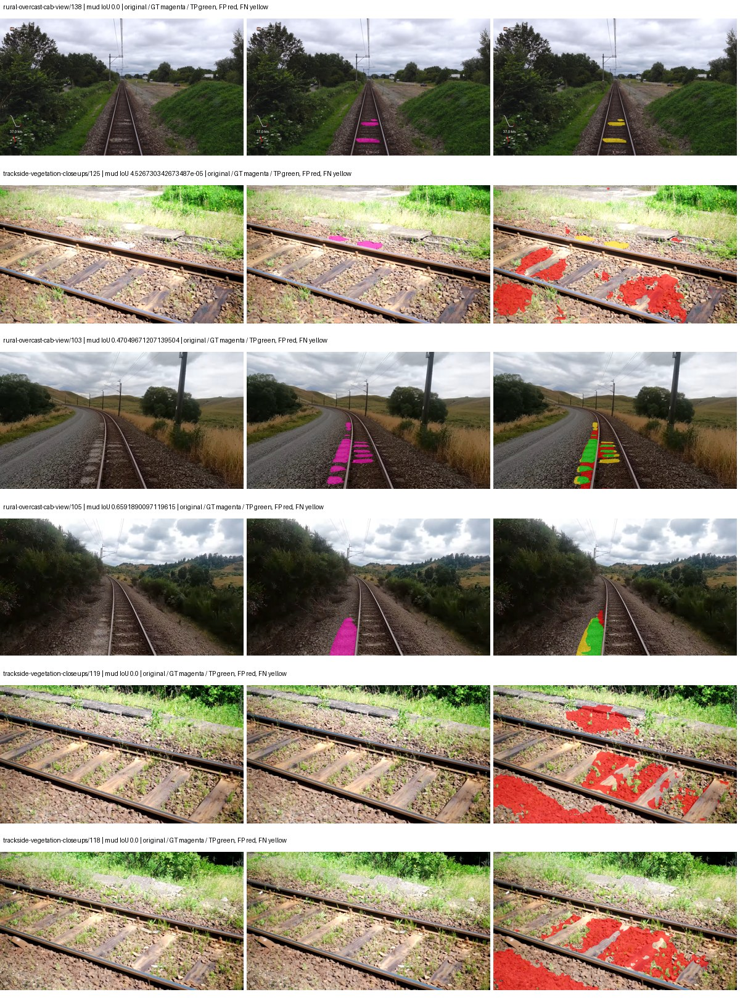

Examples are two lowest and two highest mud-IoU positive images, plus up to two negative images with the most false-positive mud pixels. They are targeted diagnostic examples, not random samples. Green: true positive; red: false positive; yellow: false negative. Full predictions remain on HDRFS.

### Validation tracking

| Logged step | Overall mIoU (%) | Mud IoU (%) |
| --- | --- | --- |
| 254 | 29.31 | 11.35 |
| 508 | 39.26 | 3.93 |
| 763 | 39.39 | 2.45 |
| 1017 | 37.86 | 3.43 |
| 1272 | 38.35 | 2.52 |
| 1527 | 34.66 | 1.99 |

All retained scalar curves, including training loss and per-class IoU, are in record.json. Observed best mud on a curve is not necessarily a retained checkpoint: the pilot saved its selection-metric-best and final checkpoints. Step logging and checkpoint global_step may differ by one.

### Stopping and checkpoint provenance

```json
{
  "stopping": {
    "actual_steps": 1527,
    "maximum_steps": 4000,
    "min_delta": 0.001,
    "monitor": "val_iou/mud-pumping",
    "patience": 5,
    "reason": "validation_plateau"
  },
  "checkpoints": {
    "best": {
      "path": "/data/izadia1/projects/segmentary-runs/paul-test-rtis/mud-fullstats-v1-20260906-r2/future-runs/hf_auto_upernet_swin_tiny--cityscapes_to_railsem19_to_rtis--seed-2_seed2/rtis/best.ckpt",
      "sha256": "44c039e3db45676112122d281f1eafa3174030dba50868ab0a15d06e5a4398d1",
      "global_step": 254,
      "bytes": 944059609
    },
    "final": {
      "path": "/data/izadia1/projects/segmentary-runs/paul-test-rtis/mud-fullstats-v1-20260906-r2/future-runs/hf_auto_upernet_swin_tiny--cityscapes_to_railsem19_to_rtis--seed-2_seed2/rtis/last.ckpt",
      "sha256": "e9a9f5041c748af1f09c35605a3f6c92b4dcfaf92d4da15256365b7e6eb48210",
      "global_step": 1527,
      "bytes": 944046681
    }
  },
  "cleanup_error": null
}
```

### Resolved training, initialization and evaluation settings

The optimizer block is the base configuration. Stage LR scales are applied at runtime, and stage warmup is capped at min(base warmup, floor(stage budget / 10), stage budget - 1): 400 steps for this 4,000-step pilot. Model-internal native input grids may differ from augmentation crops (EoMT uses its 640 grid).

```json
{
  "name": "hf_auto_upernet_swin_tiny--cityscapes_to_railsem19_to_rtis--seed-2",
  "model": {
    "arch": "hf_auto",
    "checkpoint": "openmmlab/upernet-swin-tiny",
    "tuning": "full",
    "head": "unified_head",
    "lora_r": 16,
    "lora_alpha": 32,
    "lora_dropout": 0.05,
    "lora_targets": [],
    "drop_path": null,
    "revision": "dc8e8c94669c6f14d5cc4c21a141daebd2280d59",
    "subfolder": null,
    "local_files_only": false,
    "trust_remote_code": false,
    "backbone_path": "backbone",
    "head_paths": [
      "decode_head"
    ],
    "classifier_path": "decode_head.classifier",
    "inactive_parameter_paths": [
      "backbone.swin.layernorm"
    ],
    "smp_arch": null,
    "encoder_name": null,
    "encoder_weights": null,
    "native": null,
    "batch_norm_momentum": null
  },
  "space": "paul-test-rtis",
  "taxonomy_root": "/data/izadia1/projects/segmentary-rtis-fullstats-066afb2/taxonomy",
  "output_root": "/data/izadia1/projects/segmentary-runs/paul-test-rtis/mud-fullstats-v1-20260906-r2/future-runs",
  "optim": {
    "backbone_lr": 6e-05,
    "head_lr_mult": 10.0,
    "weight_decay": 0.05,
    "llrd": 0.9,
    "warmup_iters": 1500,
    "warmup_ratio": 1e-06,
    "poly_power": 0.9,
    "min_lr_ratio": 0.0,
    "betas": [
      0.9,
      0.999
    ],
    "grad_clip": 1.0
  },
  "train": {
    "iters": 4000,
    "batch_size": 2,
    "accum": 8,
    "num_workers": 2,
    "precision": "bf16-mixed",
    "ema_decay": 0.9998,
    "val_every": 250,
    "ckpt_every": 500,
    "selection_metric": "val_iou/mud-pumping",
    "early_stopping_patience": 5,
    "early_stopping_min_delta": 0.001,
    "seed": 2,
    "devices": 1
  },
  "eval": {
    "sliding_window": true,
    "window": [
      1024,
      1024
    ],
    "stride": [
      768,
      768
    ],
    "batch_size": 1,
    "num_workers": 2,
    "tta_scales": [],
    "tta_flip": false,
    "threshold": 0.5,
    "boundary_tolerance_frac": 0.0075,
    "save_confusion": true
  },
  "loss": {
    "task": "multiclass",
    "activation": "auto",
    "terms": [],
    "aux": "none",
    "aux_weight": 0.0,
    "ce_weight": 1.0,
    "label_smoothing": 0.0,
    "class_weights": null,
    "query": null
  },
  "aug": {
    "crop": [
      1024,
      1024
    ],
    "scale_min": 0.5,
    "scale_max": 2.0,
    "hflip_p": 0.5,
    "color_jitter_p": 0.5,
    "brightness": 0.25,
    "contrast": 0.25,
    "saturation": 0.25,
    "hue": 0.05
  },
  "stages": [
    {
      "name": "rtis",
      "data": [
        {
          "name": "paul-test-rtis",
          "root": "/data/izadia1/datasets/paul-test-rtis",
          "variant": null,
          "split_file": "splits.json",
          "train_split": "train",
          "val_split": "val",
          "limit": null,
          "loader": "folder",
          "mapping": "paul-test-rtis",
          "loader_options": {
            "require_groups": true
          }
        }
      ],
      "iters": null,
      "lr_scale": 0.1,
      "head_group_lr_scale": 1.0,
      "init_from": "/data/izadia1/projects/segmentary-runs/city-rail-transfer-rail20/hf_auto_upernet_swin_tiny/railsem19/last.ckpt",
      "reset_head": true,
      "freeze": null,
      "sample_weights": null
    }
  ]
}
```

### Hardware and software provenance

```json
{
  "training": {
    "cuda_available": true,
    "cuda_visible_devices": "1",
    "cudnn": 91900,
    "driver_version": "570.133.20",
    "gpu_count": 1,
    "gpu_names": [
      "NVIDIA L40S"
    ],
    "hostname": "hdrfs-app-001",
    "input_normalization": {
      "channel_order": "rgb",
      "mean": [
        0.485,
        0.456,
        0.406
      ],
      "source": "hf_image_processor",
      "std": [
        0.229,
        0.224,
        0.225
      ]
    },
    "model_origins": [
      {
        "hf_commit": "dc8e8c94669c6f14d5cc4c21a141daebd2280d59",
        "hf_name_or_path": "openmmlab/upernet-swin-tiny",
        "module": "model",
        "timm_pretrained": {}
      },
      {
        "hf_commit": null,
        "hf_name_or_path": "",
        "module": "model.backbone",
        "timm_pretrained": {}
      },
      {
        "hf_commit": null,
        "hf_name_or_path": "",
        "module": "model.backbone.swin",
        "timm_pretrained": {}
      },
      {
        "hf_commit": null,
        "hf_name_or_path": "",
        "module": "model.backbone.swin.embeddings",
        "timm_pretrained": {}
      },
      {
        "hf_commit": null,
        "hf_name_or_path": "",
        "module": "model.backbone.swin.encoder",
        "timm_pretrained": {}
      },
      {
        "hf_commit": null,
        "hf_name_or_path": "",
        "module": "model.backbone.swin.encoder.layers.0",
        "timm_pretrained": {}
      },
      {
        "hf_commit": null,
        "hf_name_or_path": "",
        "module": "model.backbone.swin.encoder.layers.0.blocks.0.attention",
        "timm_pretrained": {}
      },
      {
        "hf_commit": null,
        "hf_name_or_path": "",
        "module": "model.backbone.swin.encoder.layers.0.blocks.1.attention",
        "timm_pretrained": {}
      },
      {
        "hf_commit": null,
        "hf_name_or_path": "",
        "module": "model.backbone.swin.encoder.layers.1",
        "timm_pretrained": {}
      },
      {
        "hf_commit": null,
        "hf_name_or_path": "",
        "module": "model.backbone.swin.encoder.layers.1.blocks.0.attention",
        "timm_pretrained": {}
      },
      {
        "hf_commit": null,
        "hf_name_or_path": "",
        "module": "model.backbone.swin.encoder.layers.1.blocks.1.attention",
        "timm_pretrained": {}
      },
      {
        "hf_commit": null,
        "hf_name_or_path": "",
        "module": "model.backbone.swin.encoder.layers.2",
        "timm_pretrained": {}
      },
      {
        "hf_commit": null,
        "hf_name_or_path": "",
        "module": "model.backbone.swin.encoder.layers.2.blocks.0.attention",
        "timm_pretrained": {}
      },
      {
        "hf_commit": null,
        "hf_name_or_path": "",
        "module": "model.backbone.swin.encoder.layers.2.blocks.1.attention",
        "timm_pretrained": {}
      },
      {
        "hf_commit": null,
        "hf_name_or_path": "",
        "module": "model.backbone.swin.encoder.layers.2.blocks.2.attention",
        "timm_pretrained": {}
      },
      {
        "hf_commit": null,
        "hf_name_or_path": "",
        "module": "model.backbone.swin.encoder.layers.2.blocks.3.attention",
        "timm_pretrained": {}
      },
      {
        "hf_commit": null,
        "hf_name_or_path": "",
        "module": "model.backbone.swin.encoder.layers.2.blocks.4.attention",
        "timm_pretrained": {}
      },
      {
        "hf_commit": null,
        "hf_name_or_path": "",
        "module": "model.backbone.swin.encoder.layers.2.blocks.5.attention",
        "timm_pretrained": {}
      },
      {
        "hf_commit": null,
        "hf_name_or_path": "",
        "module": "model.backbone.swin.encoder.layers.3",
        "timm_pretrained": {}
      },
      {
        "hf_commit": null,
        "hf_name_or_path": "",
        "module": "model.backbone.swin.encoder.layers.3.blocks.0.attention",
        "timm_pretrained": {}
      },
      {
        "hf_commit": null,
        "hf_name_or_path": "",
        "module": "model.backbone.swin.encoder.layers.3.blocks.1.attention",
        "timm_pretrained": {}
      },
      {
        "hf_commit": "dc8e8c94669c6f14d5cc4c21a141daebd2280d59",
        "hf_name_or_path": "openmmlab/upernet-swin-tiny",
        "module": "model.decode_head",
        "timm_pretrained": {}
      }
    ],
    "model_parameter_count": 58953423,
    "packages": {
      "albumentations": "2.0.8",
      "lightning": "2.6.5",
      "numpy": "2.4.4",
      "segmentary": "0.1.0",
      "segmentation-models-pytorch": "0.5.0",
      "timm": "1.0.28",
      "torch": "2.11.0+cu128",
      "torchvision": "0.26.0+cu128",
      "transformers": "5.15.0"
    },
    "platform": "Linux-5.15.0-139-generic-x86_64-with-glibc2.35",
    "python": "3.11.15",
    "torch": "2.11.0+cu128",
    "torch_cuda": "12.8",
    "trainable_parameter_count": 58951887,
    "training_stop": {
      "actual_steps": 1527,
      "maximum_steps": 4000,
      "min_delta": 0.001,
      "monitor": "val_iou/mud-pumping",
      "patience": 5,
      "reason": "validation_plateau"
    },
    "validation_weights": "raw"
  },
  "evaluation": {
    "cuda_available": true,
    "cuda_visible_devices": "1",
    "cudnn": 91900,
    "driver_version": "570.133.20",
    "gpu_count": 1,
    "gpu_names": [
      "NVIDIA L40S"
    ],
    "hostname": "hdrfs-app-001",
    "input_normalization": {
      "channel_order": "rgb",
      "mean": [
        0.485,
        0.456,
        0.406
      ],
      "source": "hf_image_processor",
      "std": [
        0.229,
        0.224,
        0.225
      ]
    },
    "packages": {
      "albumentations": "2.0.8",
      "lightning": "2.6.5",
      "numpy": "2.4.4",
      "segmentary": "0.1.0",
      "segmentation-models-pytorch": "0.5.0",
      "timm": "1.0.28",
      "torch": "2.11.0+cu128",
      "torchvision": "0.26.0+cu128",
      "transformers": "5.15.0"
    },
    "platform": "Linux-5.15.0-139-generic-x86_64-with-glibc2.35",
    "python": "3.11.15",
    "torch": "2.11.0+cu128",
    "torch_cuda": "12.8"
  }
}
```
