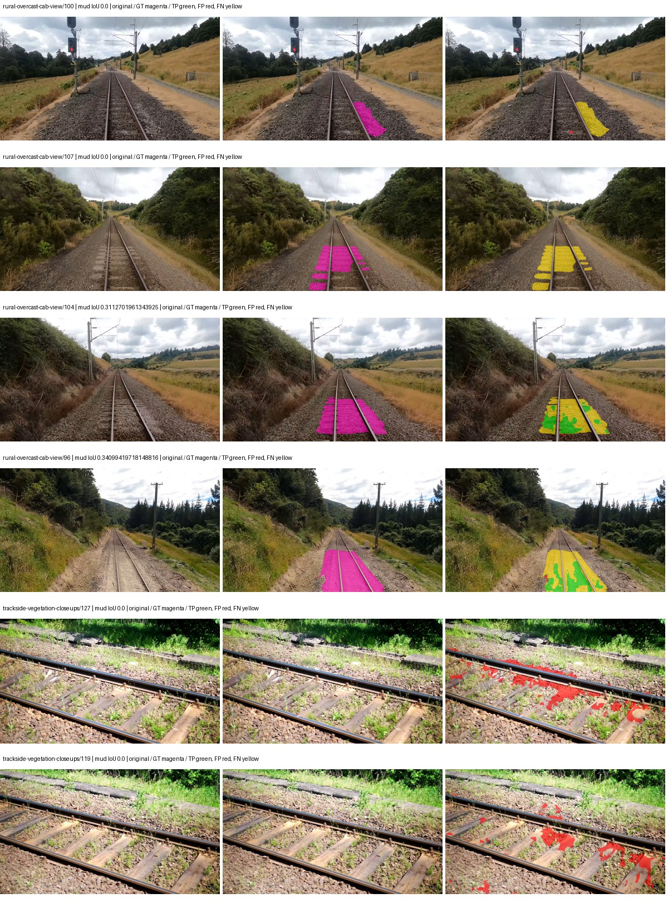
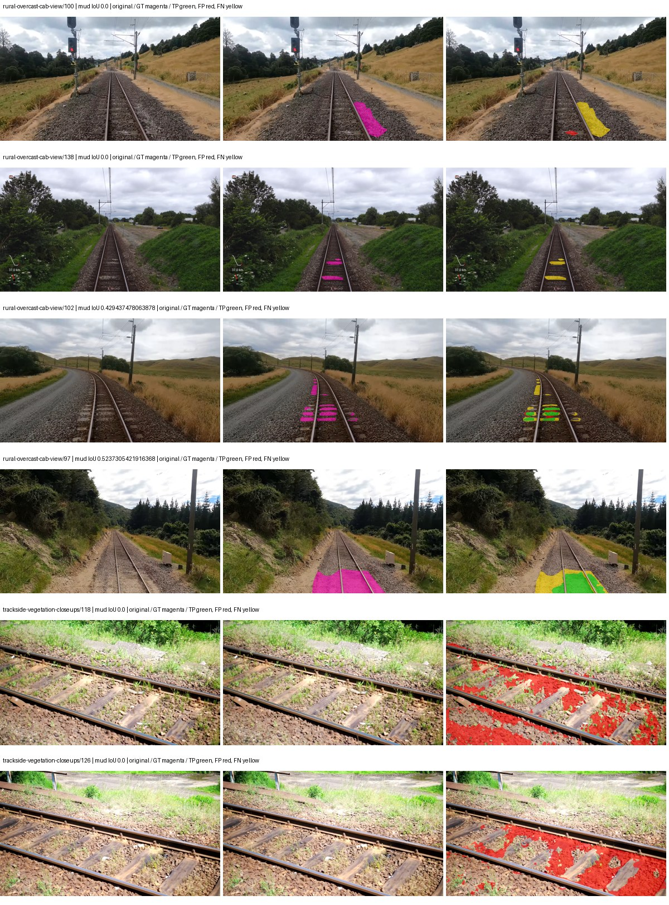
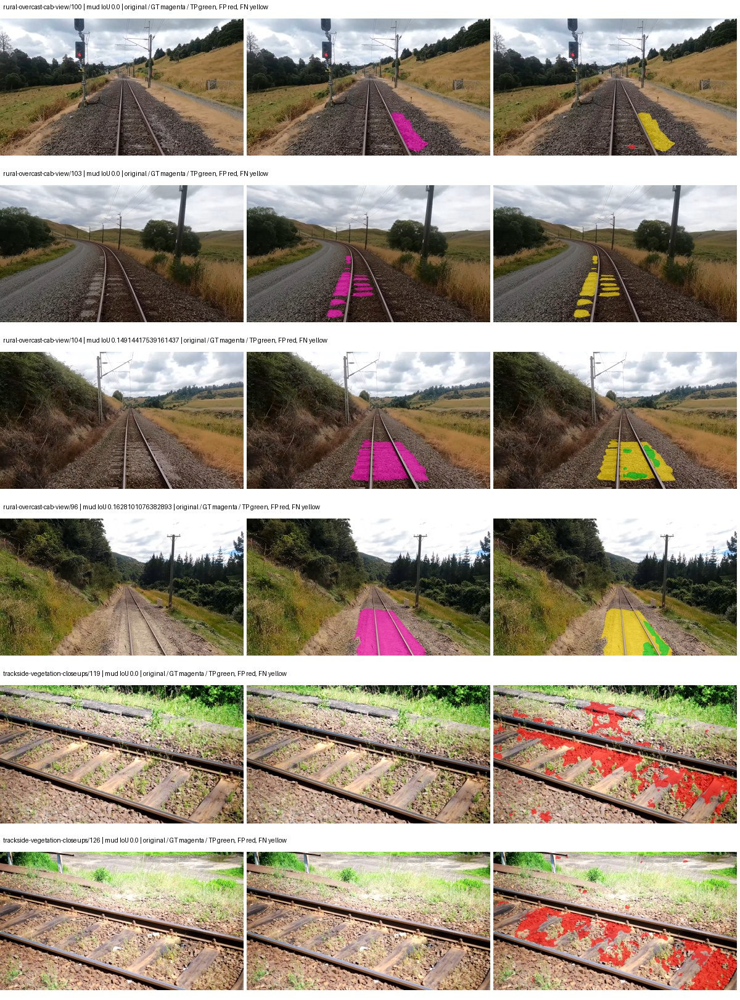
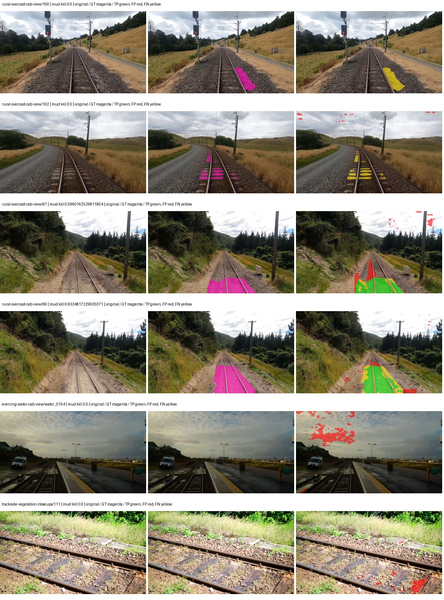
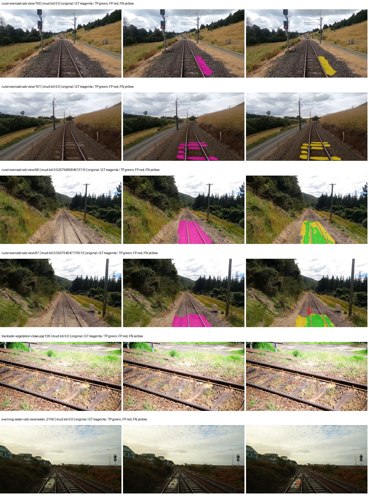
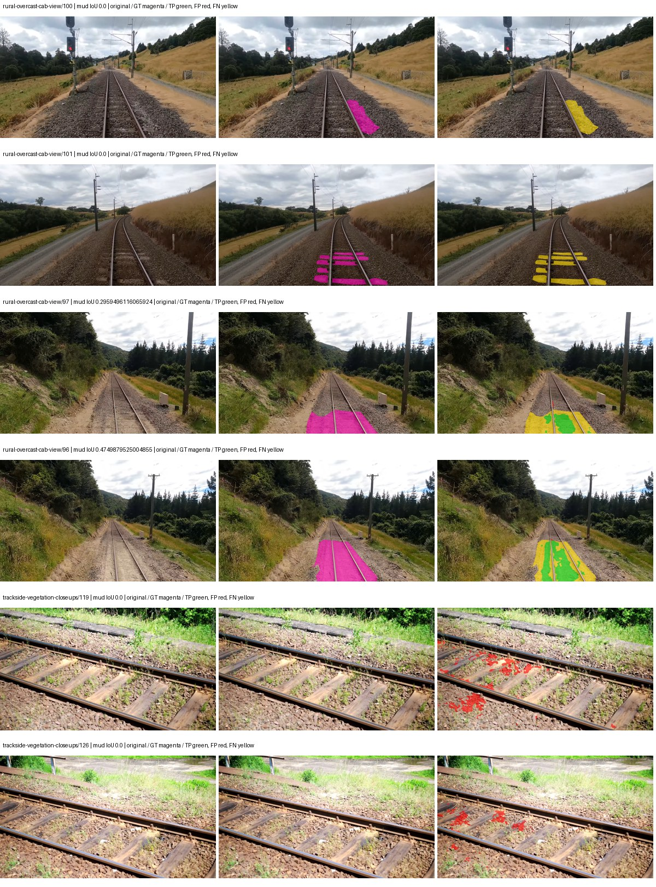
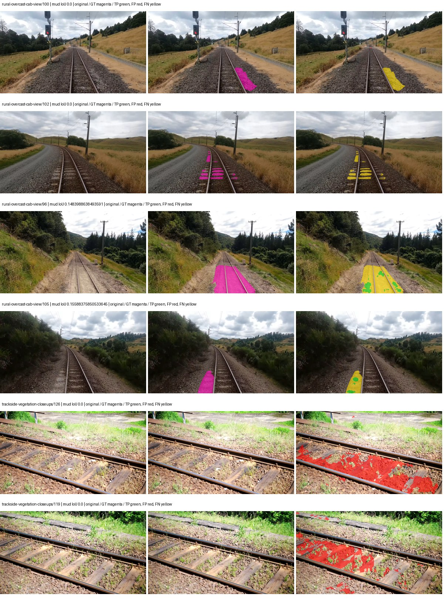
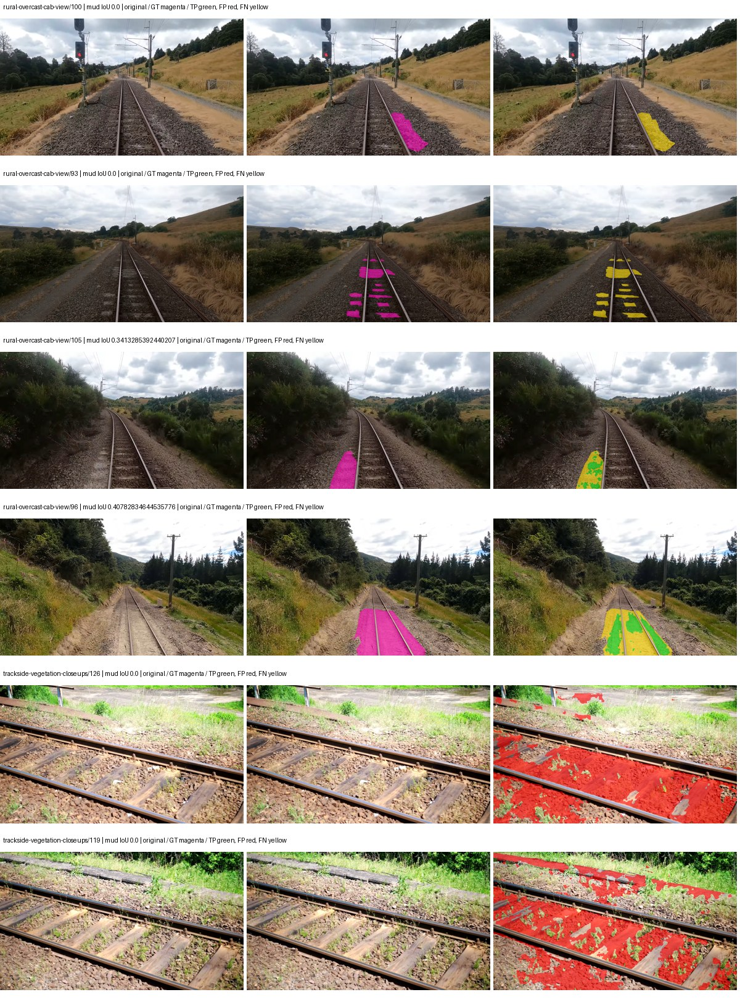
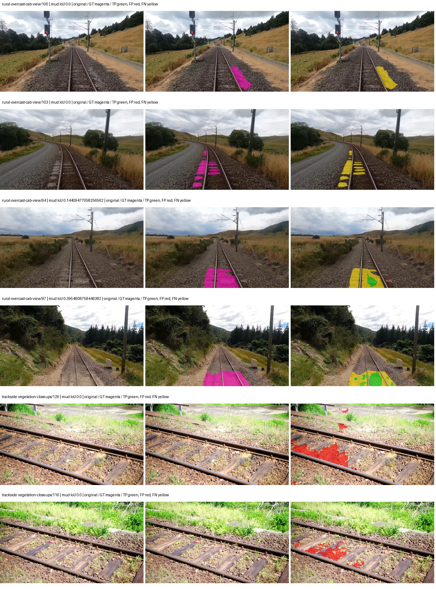
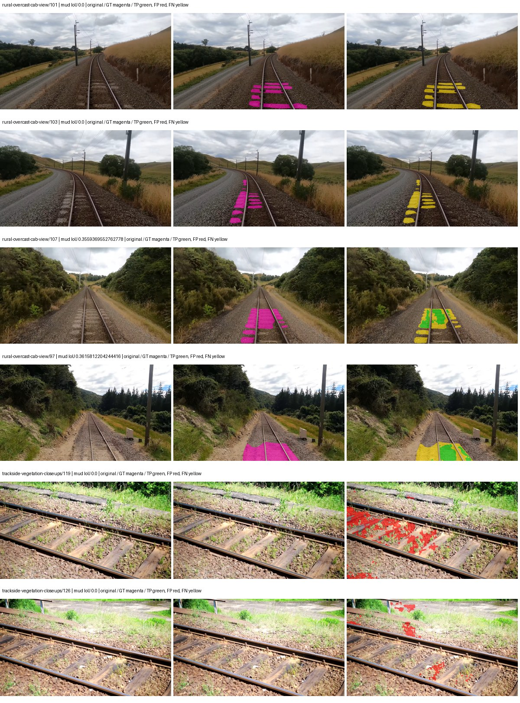

# hrnet_w48_ocr — paul-test-rtis

[RTIS comparison](../../README.md) · [Full model records](record.json)

Primary selection and early stopping: **mud-pumping validation IoU**. A job is complete only after full statistics and isolated profiling are verified.

| Model | Initialization path | Seed | Status | Steps | Best step | Mud IoU (%) | Mud precision (%) | Mud recall (%) | Final mud IoU (trainer val, %) | mIoU (%) | Fixed GT-class mIoU (%) |
| --- | --- | --- | --- | --- | --- | --- | --- | --- | --- | --- | --- |
| hrnet_w48_ocr | rtis_only | 0 | completed | 3818 | 2545 | 8.60 | 30.10 | 10.75 | 1.07 | 35.24 | 41.11 |
| hrnet_w48_ocr | rtis_only | 1 | completed | 4000 | 2800 | 5.37 | 7.55 | 15.63 | 1.76 | 31.52 | 36.78 |
| hrnet_w48_ocr | rtis_only | 2 | completed | 2545 | 1527 | 3.54 | 6.73 | 6.96 | 0.72 | 32.45 | 37.85 |
| hrnet_w48_ocr | cityscapes_to_rtis | 0 | completed | 1781 | 509 | 13.86 | 36.74 | 18.21 | 5.76 | 21.60 | 22.80 |
| hrnet_w48_ocr | cityscapes_to_rtis | 1 | completed | 2545 | 1272 | 16.12 | 92.85 | 16.32 | 2.39 | 32.26 | 37.64 |
| hrnet_w48_ocr | cityscapes_to_rtis | 2 | completed | 2290 | 1018 | 7.50 | 45.22 | 8.25 | 0.83 | 29.56 | 34.49 |
| hrnet_w48_ocr | railsem19_to_rtis | 0 | completed | 3309 | 2036 | 1.98 | 4.17 | 3.63 | 1.78 | 44.72 | 52.17 |
| hrnet_w48_ocr | railsem19_to_rtis | 1 | completed | 2290 | 1018 | 2.75 | 3.40 | 12.56 | 0.71 | 45.37 | 52.93 |
| hrnet_w48_ocr | railsem19_to_rtis | 2 | training | 3817 | — | — | — | — | — | — | — |
| hrnet_w48_ocr | cityscapes_to_railsem19_to_rtis | 0 | completed | 1781 | 509 | 5.57 | 15.83 | 7.91 | 3.58 | 34.05 | 39.72 |
| hrnet_w48_ocr | cityscapes_to_railsem19_to_rtis | 1 | completed | 2545 | 1272 | 12.57 | 41.92 | 15.22 | 2.06 | 45.48 | 48.01 |
| hrnet_w48_ocr | cityscapes_to_railsem19_to_rtis | 2 | training | 2049 | — | — | — | — | — | — | — |

Training: 220 images. Validation: 37 images. Test: 50 held out. Seeds: [0, 1, 2]. Seed variation measures optimization variability, not independent-recording uncertainty. Historical source checkpoints stay fixed across adaptation seeds.

Training code: `066afb2626398b7be59d4d19f5a0e4644fd59adc`. Split SHA-256: `71fef8292610c352da0709fe3bd030f3bcc18f97560394835f4b22826463b83d`.

## rtis_only — seed 0

Status: **completed**. Started: 2026-09-06T14:41:04.358120+00:00. Finished: 2026-09-06T16:33:44.644334+00:00.

Recipe pretrained initializer: `timm hrnet_w48 pretrained ImageNet backbone; fresh OCR head`.

`rtis_only` uses the recipe initializer, which may include pretrained segmentation components. Transfer paths load the exact historical source checkpoint below and reset the classifier; they do not reset all query/decoder features.

Source checkpoint: `Recipe pretrained initialization`.

Config SHA-256: `3efad458a9dee189a337100d6fd9c7d348b8cdb56a08fe9f27830a93e0e82af3`. Weights used for validation: `raw`.

### Mud-pumping and aggregate quality

| Metric | Selected checkpoint | Final training validation |
| --- | --- | --- |
| Mud IoU | 8.60 | 1.07 |
| Mud precision | 30.10 | 2.15 |
| Mud recall | 10.75 | 2.10 |
| Mud Dice/F1 | 15.85 | 2.13 |
| mIoU | 35.24 | 36.84 |
| Mean accuracy | 48.94 | 51.07 |
| Mean precision | 56.82 | 56.52 |
| Mean Dice | 44.94 | 46.98 |
| Mean specificity | 99.06 | 99.00 |
| Pixel accuracy | 84.78 | 84.37 |
| Frequency-weighted IoU | 75.90 | 75.05 |
| Fixed GT-present class mIoU | 41.11 | 42.98 |
| Boundary F1 | 43.72 | 44.16 |

The selected checkpoint has independent evaluation evidence. Final values are the trainer's final validation record, not a new independent evaluation. mIoU averages classes with nonzero union, so false positives on absent classes can change its denominator. The fixed GT-class mean is supplementary and excludes absent classes; their false positives remain in the confusion matrix.

### Resource usage and timing

| Measurement | Value |
| --- | --- |
| Peak training VRAM, retained training invocation (GiB) | 17.35 |
| Peak evaluation VRAM (GiB) | 7.58 |
| Retained training invocation wall time (seconds) | 6538.43 |
| Retained training invocation GPU-hours (one GPU) | 1.82 |
| Evaluation wall time (seconds) | 19.01 |
| Full evaluation pipeline images/second | 1.95 |
| Best full-state checkpoint (MiB) | 1119.23 |
| Final full-state checkpoint (MiB) | 1119.18 |
| Audited periodic checkpoints removed (GiB) | 7.65 |

VRAM uses the recorded allocator high-water mark; it is not total device usage including CUDA context. Resumed jobs' retained training invocation times and peaks are **not whole-campaign totals**. Earlier invocation resource records are not reconstructed here. Evaluation throughput includes loader, sliding-window inference and metrics; it is not model-only latency/FPS. Missing measurements are shown as —, never inferred from another dataset's run.

### Standardized inference performance

Dedicated model-only profiling waits for an idle worker-locked L40S: BF16, batch 1, 1024x1024, 20 warmup and 100 CUDA-event-timed public forwards. It excludes loading, preprocessing, tiling and metrics.

| Status | Parameters | Weight MiB | FPS | p50 ms | p95 ms | Peak reserved GiB |
| --- | --- | --- | --- | --- | --- | --- |
| complete | 73168490 | 279.12 | 29.85 | 33.33 | 34.82 | 1.26 |

```json
{
  "schema_version": 1,
  "model_id": "hrnet_w48_ocr",
  "measured_at": "2026-09-06T16:33:34+00:00",
  "status": "complete",
  "benchmark_scope": "rtis_selected_checkpoint_model_only",
  "applies_to": [
    "hrnet_w48_ocr--rtis_only--seed-0"
  ],
  "source": {
    "campaign_git_sha": "066afb2626398b7be59d4d19f5a0e4644fd59adc",
    "git_dirty": false,
    "config_hash": "eabb854d0644",
    "resolved_config": "/data/izadia1/projects/segmentary-runs/paul-test-rtis/mud-fullstats-v1-20260906-r2/configs/hrnet_w48_ocr--rtis_only--seed-0.yaml",
    "config_sha256": "3efad458a9dee189a337100d6fd9c7d348b8cdb56a08fe9f27830a93e0e82af3",
    "checkpoint_sha256": "246313006628624bb72b48b5b675e216a689af0b84c7accb4b23bc3202c76778",
    "checkpoint_global_step": 2545,
    "checkpoint_bytes": 1173602814,
    "checkpoint_kind": "resume checkpoint with optimizer and EMA state",
    "weights": "raw",
    "measured_checkpoint_job_id": "hrnet_w48_ocr--rtis_only--seed-0",
    "result_sha256": "45e5461d00379a1280b1a5dea2b25dce394afb4eb3f465ffeed8e263db9c3cba",
    "result_git_sha": "066afb2626398b7be59d4d19f5a0e4644fd59adc",
    "result_stage": "eval:paul-test-rtis:val",
    "result_seed": 0
  },
  "hardware": {
    "gpu_name": "NVIDIA L40S",
    "gpu_uuid": "GPU-84f5ca4d-68db-ae98-d056-40654d859dd9",
    "logical_device": "cuda:0",
    "physical_visibility_token": "0",
    "compute_capability": [
      8,
      9
    ],
    "total_memory_bytes": 47677177856
  },
  "model": {
    "parameter_count": 73168490,
    "trainable_parameter_count": 73168490,
    "resident_parameter_bytes": 292673960,
    "parameter_dtype_counts": {
      "float32": 73168490
    }
  },
  "contract": {
    "backend": "pytorch",
    "precision": "bf16_autocast",
    "batch_size": 1,
    "input_shape_nchw": [
      1,
      3,
      1024,
      1024
    ],
    "warmup_iterations": 20,
    "measured_iterations": 100,
    "timing": "per-forward CUDA events with end-event synchronization",
    "includes_preprocessing": false,
    "includes_data_loader": false,
    "includes_sliding_window": false,
    "input_resident_on_gpu": true,
    "model_only": true,
    "entrypoint": "public model(image) dense-logits forward"
  },
  "measurements": {
    "latency": {
      "p50_ms": 33.33017539978027,
      "p95_ms": 34.81702423095703,
      "mean_ms": 33.49924457550049,
      "minimum_ms": 32.34406280517578,
      "maximum_ms": 36.19007873535156,
      "fps": 29.851419417718606,
      "raw_ms": [
        32.62771224975586,
        33.24310302734375,
        32.85606384277344,
        34.105342864990234,
        33.0618896484375,
        33.386592864990234,
        32.647071838378906,
        34.69615936279297,
        34.270206451416016,
        33.477630615234375,
        33.81747055053711,
        34.072574615478516,
        32.5109748840332,
        32.891902923583984,
        32.9246711730957,
        32.55705642700195,
        33.625953674316406,
        33.50310516357422,
        32.84975814819336,
        32.63897705078125,
        34.506752014160156,
        33.1591682434082,
        36.19007873535156,
        33.593345642089844,
        32.67881774902344,
        32.785343170166016,
        32.91136169433594,
        34.186241149902344,
        33.0250244140625,
        33.18067169189453,
        32.74540710449219,
        32.66457748413086,
        34.312191009521484,
        33.70393753051758,
        34.22412872314453,
        32.76697540283203,
        32.48128128051758,
        32.34406280517578,
        32.85504150390625,
        33.41823959350586,
        34.01420974731445,
        33.426334381103516,
        33.17555236816406,
        32.522239685058594,
        32.80793762207031,
        34.75872039794922,
        35.646400451660156,
        32.86006546020508,
        32.905216217041016,
        33.88825607299805,
        35.95772933959961,
        34.56819152832031,
        33.25030517578125,
        32.7639045715332,
        33.500160217285156,
        32.700416564941406,
        33.80428695678711,
        33.93843078613281,
        34.676734924316406,
        33.03219223022461,
        33.23904037475586,
        32.95027160644531,
        33.85958480834961,
        32.82432174682617,
        33.704959869384766,
        33.17145538330078,
        33.15711975097656,
        33.152000427246094,
        33.73673629760742,
        34.216896057128906,
        33.682430267333984,
        33.03936004638672,
        33.52473449707031,
        35.29011154174805,
        33.80940628051758,
        34.61222457885742,
        32.36454391479492,
        33.7704963684082,
        34.81702423095703,
        34.181121826171875,
        34.15449523925781,
        33.08339309692383,
        33.25129699707031,
        33.56364822387695,
        33.880001068115234,
        32.937984466552734,
        33.22880172729492,
        33.379329681396484,
        33.50425720214844,
        32.77814483642578,
        34.1923828125,
        33.5994873046875,
        33.34860610961914,
        32.73932647705078,
        33.188865661621094,
        32.97587203979492,
        34.81702423095703,
        32.96870422363281,
        34.22310256958008,
        33.311744689941406
      ],
      "percentile_method": "numpy linear interpolation"
    },
    "peak_reserved_bytes": 1350565888,
    "memory_kind": "pytorch_cuda_allocator_peak_reserved_excluding_context",
    "benchmark_wall_clock_s": 17.00750419870019
  },
  "started_at": "2026-09-06T16:33:17+00:00",
  "finished_at": "2026-09-06T16:33:34+00:00",
  "environment": {
    "hostname": "hdrfs-app-001",
    "python": "3.11.15",
    "platform": "Linux-5.15.0-139-generic-x86_64-with-glibc2.35",
    "torch": "2.11.0+cu128",
    "torch_cuda": "12.8",
    "cudnn": 91900,
    "driver_version": "570.133.20",
    "cuda_available": true,
    "gpu_count": 1,
    "gpu_names": [
      "NVIDIA L40S"
    ],
    "cuda_visible_devices": "0",
    "packages": {
      "segmentary": "0.1.0",
      "torch": "2.11.0+cu128",
      "torchvision": "0.26.0+cu128",
      "transformers": "5.15.0",
      "timm": "1.0.28",
      "segmentation-models-pytorch": "0.5.0",
      "albumentations": "2.0.8",
      "lightning": "2.6.5",
      "numpy": "2.4.4"
    }
  }
}
```

### Per-class validation results

| Class | GT pixels | IoU (%) | Precision (%) | Recall (%) | Dice (%) | Boundary F1 (%) |
| --- | --- | --- | --- | --- | --- | --- |
| car | 29664 | 56.97 | 74.55 | 70.73 | 72.59 | 59.25 |
| construction | 311585 | 36.99 | 41.05 | 78.92 | 54.01 | 41.55 |
| fence | 265137 | 5.71 | 42.51 | 6.19 | 10.80 | 25.68 |
| mud-pumping | 1226250 | 8.60 | 30.10 | 10.75 | 15.85 | 13.51 |
| on-rails | 0 | 0.00 | 0.00 | — | 0.00 | 0.00 |
| person | 0 | 0.00 | 0.00 | — | 0.00 | 0.00 |
| pole | 628038 | 71.00 | 85.71 | 80.54 | 83.04 | 89.89 |
| rail-embedded | 16799 | 23.72 | 88.39 | 24.48 | 38.35 | 34.50 |
| rail-raised | 2969797 | 77.32 | 83.52 | 91.24 | 87.21 | 88.99 |
| rail-track | 6323197 | 44.64 | 71.60 | 54.24 | 61.72 | 58.50 |
| road | 1048831 | 6.35 | 19.34 | 8.64 | 11.94 | 15.95 |
| sidewalk | 1297367 | 15.02 | 43.79 | 18.61 | 26.12 | 13.76 |
| sky | 19121606 | 97.28 | 99.29 | 97.96 | 98.62 | 89.89 |
| standing-water | 95802 | 0.08 | 0.09 | 0.93 | 0.16 | 0.37 |
| terrain | 39239306 | 88.59 | 90.23 | 97.99 | 93.95 | 66.40 |
| trackbed | 10643081 | 58.68 | 66.15 | 83.86 | 73.96 | 53.81 |
| traffic-light | 19510 | 43.29 | 92.87 | 44.78 | 60.43 | 79.77 |
| traffic-sign | 13285 | 45.67 | 90.84 | 47.87 | 62.70 | 73.50 |
| tram-track | 56179 | 26.48 | 86.86 | 27.59 | 41.87 | 45.92 |
| truck | 0 | 0.00 | 0.00 | — | 0.00 | 0.00 |
| vegetation-overgrowth | 5901821 | 33.64 | 86.35 | 35.53 | 50.34 | 66.86 |

### Full-run accounting

| Measurement | Value |
| --- | --- |
| Full GPU-reserved wall seconds, all recorded worker attempts | 6760.29 |
| Full reserved GPU-hours | 1.88 |
| Whole-run timing complete | True |

| Phase | Wall seconds including failed attempts |
| --- | --- |
| training | 6546.01 |
| diagnostics | 149.53 |
| performance | 26.58 |

GPU-reserved time includes model loading, training, validation, collection, profiling, checkpoint I/O and orchestration while the worker owns one GPU. It is not GPU kernel-active time. Phase timings and sampled device memory/power/utilization are retained separately; sampled device memory is not the allocator high-water mark.

### Train/validation and raw/EMA diagnostics

| Checkpoint / weights / split | Images | Mud IoU (%) | Mud precision (%) | Mud recall (%) |
| --- | --- | --- | --- | --- |
| best-auto-train / raw | 220 | 95.25 | 96.40 | 98.76 |
| best-auto-val / raw | 37 | 8.60 | 30.10 | 10.75 |
| best-alternate-val / ema | 37 | 2.85 | 5.59 | 5.50 |
| final-auto-val / raw | 37 | 1.08 | 2.16 | 2.10 |

Train uses the evaluation transform without augmentation. Compare mud train/validation metrics for the same selected weights. Alternate EMA on running-stat BatchNorm is explicitly uncalibrated and is diagnostic only. Score-threshold curves use uncalibrated normalized scores and are pixel-level diagnostics, not event detection rates or a selected deployment operating point.

### Downloadable evidence

- best-auto-train: [per-image.csv](rtis_only--seed-0/best-auto-train/per-image.csv) · [per-image-confusion.json.gz](rtis_only--seed-0/best-auto-train/per-image-confusion.json.gz) · [groups.json](rtis_only--seed-0/best-auto-train/groups.json) · [mud-score-curves.json](rtis_only--seed-0/best-auto-train/mud-score-curves.json)
- best-auto-val: [per-image.csv](rtis_only--seed-0/best-auto-val/per-image.csv) · [per-image-confusion.json.gz](rtis_only--seed-0/best-auto-val/per-image-confusion.json.gz) · [groups.json](rtis_only--seed-0/best-auto-val/groups.json) · [mud-score-curves.json](rtis_only--seed-0/best-auto-val/mud-score-curves.json) · [examples.jpg](rtis_only--seed-0/best-auto-val/examples.jpg)
- best-alternate-val: [per-image.csv](rtis_only--seed-0/best-alternate-val/per-image.csv) · [per-image-confusion.json.gz](rtis_only--seed-0/best-alternate-val/per-image-confusion.json.gz) · [groups.json](rtis_only--seed-0/best-alternate-val/groups.json) · [mud-score-curves.json](rtis_only--seed-0/best-alternate-val/mud-score-curves.json)
- final-auto-val: [per-image.csv](rtis_only--seed-0/final-auto-val/per-image.csv) · [per-image-confusion.json.gz](rtis_only--seed-0/final-auto-val/per-image-confusion.json.gz) · [groups.json](rtis_only--seed-0/final-auto-val/groups.json) · [mud-score-curves.json](rtis_only--seed-0/final-auto-val/mud-score-curves.json)
- resources: [telemetry.csv](rtis_only--seed-0/resources/telemetry.csv)



Examples are two lowest and two highest mud-IoU positive images, plus up to two negative images with the most false-positive mud pixels. They are targeted diagnostic examples, not random samples. Green: true positive; red: false positive; yellow: false negative. Full predictions remain on HDRFS.

### Validation tracking

| Logged step | Overall mIoU (%) | Mud IoU (%) |
| --- | --- | --- |
| 254 | 22.96 | 0.26 |
| 508 | 27.08 | 0.10 |
| 763 | 27.51 | 2.56 |
| 1017 | 29.12 | 3.58 |
| 1272 | 32.79 | 3.70 |
| 1527 | 31.53 | 1.03 |
| 1781 | 33.57 | 0.82 |
| 2036 | 33.83 | 0.92 |
| 2290 | 36.83 | 5.25 |
| 2545 | 35.25 | 8.62 |
| 2799 | 36.38 | 2.67 |
| 3054 | 35.90 | 1.83 |
| 3308 | 35.26 | 0.77 |
| 3563 | 35.19 | 1.08 |
| 3817 | 36.84 | 1.07 |

All retained scalar curves, including training loss and per-class IoU, are in record.json. Observed best mud on a curve is not necessarily a retained checkpoint: the pilot saved its selection-metric-best and final checkpoints. Step logging and checkpoint global_step may differ by one.

### Stopping and checkpoint provenance

```json
{
  "stopping": {
    "actual_steps": 3818,
    "maximum_steps": 4000,
    "min_delta": 0.001,
    "monitor": "val_iou/mud-pumping",
    "patience": 5,
    "reason": "validation_plateau"
  },
  "checkpoints": {
    "best": {
      "path": "/data/izadia1/projects/segmentary-runs/paul-test-rtis/mud-fullstats-v1-20260906-r2/future-runs/hrnet_w48_ocr--rtis_only--seed-0_seed0/rtis/best.ckpt",
      "sha256": "246313006628624bb72b48b5b675e216a689af0b84c7accb4b23bc3202c76778",
      "global_step": 2545,
      "bytes": 1173602814
    },
    "final": {
      "path": "/data/izadia1/projects/segmentary-runs/paul-test-rtis/mud-fullstats-v1-20260906-r2/future-runs/hrnet_w48_ocr--rtis_only--seed-0_seed0/rtis/last.ckpt",
      "sha256": "a44e6083a32b513910a6e04120494168e1530802229b78e8f41328e2091b3f3c",
      "global_step": 3818,
      "bytes": 1173541502
    }
  },
  "cleanup_error": null
}
```

### Resolved training, initialization and evaluation settings

The optimizer block is the base configuration. Stage LR scales are applied at runtime, and stage warmup is capped at min(base warmup, floor(stage budget / 10), stage budget - 1): 400 steps for this 4,000-step pilot. Model-internal native input grids may differ from augmentation crops (EoMT uses its 640 grid).

```json
{
  "name": "hrnet_w48_ocr--rtis_only--seed-0",
  "model": {
    "arch": "hrnet_w48_ocr",
    "checkpoint": null,
    "tuning": "full",
    "head": "unified_head",
    "lora_r": 16,
    "lora_alpha": 32,
    "lora_dropout": 0.05,
    "lora_targets": [],
    "drop_path": null,
    "revision": null,
    "subfolder": null,
    "local_files_only": false,
    "trust_remote_code": false,
    "backbone_path": null,
    "head_paths": [],
    "classifier_path": null,
    "inactive_parameter_paths": [],
    "smp_arch": null,
    "encoder_name": null,
    "encoder_weights": null,
    "native": null,
    "batch_norm_momentum": null
  },
  "space": "paul-test-rtis",
  "taxonomy_root": "/data/izadia1/projects/segmentary-rtis-fullstats-066afb2/taxonomy",
  "output_root": "/data/izadia1/projects/segmentary-runs/paul-test-rtis/mud-fullstats-v1-20260906-r2/future-runs",
  "optim": {
    "backbone_lr": 0.0001,
    "head_lr_mult": 10.0,
    "weight_decay": 0.05,
    "llrd": 1.0,
    "warmup_iters": 1500,
    "warmup_ratio": 1e-06,
    "poly_power": 0.9,
    "min_lr_ratio": 0.0,
    "betas": [
      0.9,
      0.999
    ],
    "grad_clip": 1.0
  },
  "train": {
    "iters": 4000,
    "batch_size": 2,
    "accum": 8,
    "num_workers": 2,
    "precision": "bf16-mixed",
    "ema_decay": 0.9998,
    "val_every": 250,
    "ckpt_every": 500,
    "selection_metric": "val_iou/mud-pumping",
    "early_stopping_patience": 5,
    "early_stopping_min_delta": 0.001,
    "seed": 0,
    "devices": 1
  },
  "eval": {
    "sliding_window": true,
    "window": [
      1024,
      1024
    ],
    "stride": [
      768,
      768
    ],
    "batch_size": 1,
    "num_workers": 2,
    "tta_scales": [],
    "tta_flip": false,
    "threshold": 0.5,
    "boundary_tolerance_frac": 0.0075,
    "save_confusion": true
  },
  "loss": {
    "task": "multiclass",
    "activation": "auto",
    "terms": [],
    "aux": "none",
    "aux_weight": 0.0,
    "ce_weight": 1.0,
    "label_smoothing": 0.0,
    "class_weights": null,
    "query": null
  },
  "aug": {
    "crop": [
      1024,
      1024
    ],
    "scale_min": 0.5,
    "scale_max": 2.0,
    "hflip_p": 0.5,
    "color_jitter_p": 0.5,
    "brightness": 0.25,
    "contrast": 0.25,
    "saturation": 0.25,
    "hue": 0.05
  },
  "stages": [
    {
      "name": "rtis",
      "data": [
        {
          "name": "paul-test-rtis",
          "root": "/data/izadia1/datasets/paul-test-rtis",
          "variant": null,
          "split_file": "splits.json",
          "train_split": "train",
          "val_split": "val",
          "limit": null,
          "loader": "folder",
          "mapping": "paul-test-rtis",
          "loader_options": {
            "require_groups": true
          }
        }
      ],
      "iters": null,
      "lr_scale": 1.0,
      "head_group_lr_scale": 1.0,
      "init_from": "pretrained",
      "reset_head": false,
      "freeze": null,
      "sample_weights": null
    }
  ]
}
```

### Hardware and software provenance

```json
{
  "training": {
    "cuda_available": true,
    "cuda_visible_devices": "0",
    "cudnn": 91900,
    "driver_version": "570.133.20",
    "gpu_count": 1,
    "gpu_names": [
      "NVIDIA L40S"
    ],
    "hostname": "hdrfs-app-001",
    "input_normalization": {
      "channel_order": "rgb",
      "mean": [
        0.485,
        0.456,
        0.406
      ],
      "source": "imagenet",
      "std": [
        0.229,
        0.224,
        0.225
      ]
    },
    "model_origins": [
      {
        "hf_commit": null,
        "hf_name_or_path": null,
        "module": "trunk",
        "timm_pretrained": {
          "architecture": "hrnet_w48",
          "hf_hub_id": "timm/hrnet_w48.ms_in1k",
          "tag": "ms_in1k",
          "url": ""
        }
      }
    ],
    "model_parameter_count": 73168490,
    "packages": {
      "albumentations": "2.0.8",
      "lightning": "2.6.5",
      "numpy": "2.4.4",
      "segmentary": "0.1.0",
      "segmentation-models-pytorch": "0.5.0",
      "timm": "1.0.28",
      "torch": "2.11.0+cu128",
      "torchvision": "0.26.0+cu128",
      "transformers": "5.15.0"
    },
    "platform": "Linux-5.15.0-139-generic-x86_64-with-glibc2.35",
    "python": "3.11.15",
    "torch": "2.11.0+cu128",
    "torch_cuda": "12.8",
    "trainable_parameter_count": 73168490,
    "training_stop": {
      "actual_steps": 3818,
      "maximum_steps": 4000,
      "min_delta": 0.001,
      "monitor": "val_iou/mud-pumping",
      "patience": 5,
      "reason": "validation_plateau"
    },
    "validation_weights": "raw"
  },
  "evaluation": {
    "cuda_available": true,
    "cuda_visible_devices": "0",
    "cudnn": 91900,
    "driver_version": "570.133.20",
    "gpu_count": 1,
    "gpu_names": [
      "NVIDIA L40S"
    ],
    "hostname": "hdrfs-app-001",
    "input_normalization": {
      "channel_order": "rgb",
      "mean": [
        0.485,
        0.456,
        0.406
      ],
      "source": "imagenet",
      "std": [
        0.229,
        0.224,
        0.225
      ]
    },
    "packages": {
      "albumentations": "2.0.8",
      "lightning": "2.6.5",
      "numpy": "2.4.4",
      "segmentary": "0.1.0",
      "segmentation-models-pytorch": "0.5.0",
      "timm": "1.0.28",
      "torch": "2.11.0+cu128",
      "torchvision": "0.26.0+cu128",
      "transformers": "5.15.0"
    },
    "platform": "Linux-5.15.0-139-generic-x86_64-with-glibc2.35",
    "python": "3.11.15",
    "torch": "2.11.0+cu128",
    "torch_cuda": "12.8"
  }
}
```

## rtis_only — seed 1

Status: **completed**. Started: 2026-09-06T14:50:46.170264+00:00. Finished: 2026-09-06T16:49:16.696128+00:00.

Recipe pretrained initializer: `timm hrnet_w48 pretrained ImageNet backbone; fresh OCR head`.

`rtis_only` uses the recipe initializer, which may include pretrained segmentation components. Transfer paths load the exact historical source checkpoint below and reset the classifier; they do not reset all query/decoder features.

Source checkpoint: `Recipe pretrained initialization`.

Config SHA-256: `0ff9a9e7a5e8f097998cd843686bc7bb724fe97390d175944a2770607bbdb979`. Weights used for validation: `raw`.

### Mud-pumping and aggregate quality

| Metric | Selected checkpoint | Final training validation |
| --- | --- | --- |
| Mud IoU | 5.37 | 1.76 |
| Mud precision | 7.55 | 2.43 |
| Mud recall | 15.63 | 6.03 |
| Mud Dice/F1 | 10.19 | 3.46 |
| mIoU | 31.52 | 32.25 |
| Mean accuracy | 46.46 | 44.59 |
| Mean precision | 50.26 | 53.57 |
| Mean Dice | 40.79 | 41.56 |
| Mean specificity | 98.79 | 98.77 |
| Pixel accuracy | 81.02 | 80.59 |
| Frequency-weighted IoU | 71.20 | 70.80 |
| Fixed GT-present class mIoU | 36.78 | 37.63 |
| Boundary F1 | 39.53 | 40.90 |

The selected checkpoint has independent evaluation evidence. Final values are the trainer's final validation record, not a new independent evaluation. mIoU averages classes with nonzero union, so false positives on absent classes can change its denominator. The fixed GT-class mean is supplementary and excludes absent classes; their false positives remain in the confusion matrix.

### Resource usage and timing

| Measurement | Value |
| --- | --- |
| Peak training VRAM, retained training invocation (GiB) | 17.35 |
| Peak evaluation VRAM (GiB) | 7.58 |
| Retained training invocation wall time (seconds) | 6890.99 |
| Retained training invocation GPU-hours (one GPU) | 1.91 |
| Evaluation wall time (seconds) | 18.47 |
| Full evaluation pipeline images/second | 2.00 |
| Best full-state checkpoint (MiB) | 1119.23 |
| Final full-state checkpoint (MiB) | 1119.18 |
| Audited periodic checkpoints removed (GiB) | 8.74 |

VRAM uses the recorded allocator high-water mark; it is not total device usage including CUDA context. Resumed jobs' retained training invocation times and peaks are **not whole-campaign totals**. Earlier invocation resource records are not reconstructed here. Evaluation throughput includes loader, sliding-window inference and metrics; it is not model-only latency/FPS. Missing measurements are shown as —, never inferred from another dataset's run.

### Standardized inference performance

Dedicated model-only profiling waits for an idle worker-locked L40S: BF16, batch 1, 1024x1024, 20 warmup and 100 CUDA-event-timed public forwards. It excludes loading, preprocessing, tiling and metrics.

| Status | Parameters | Weight MiB | FPS | p50 ms | p95 ms | Peak reserved GiB |
| --- | --- | --- | --- | --- | --- | --- |
| complete | 73168490 | 279.12 | 30.18 | 32.67 | 34.62 | 1.26 |

```json
{
  "schema_version": 1,
  "model_id": "hrnet_w48_ocr",
  "measured_at": "2026-09-06T16:49:05+00:00",
  "status": "complete",
  "benchmark_scope": "rtis_selected_checkpoint_model_only",
  "applies_to": [
    "hrnet_w48_ocr--rtis_only--seed-1"
  ],
  "source": {
    "campaign_git_sha": "066afb2626398b7be59d4d19f5a0e4644fd59adc",
    "git_dirty": false,
    "config_hash": "295a3879351a",
    "resolved_config": "/data/izadia1/projects/segmentary-runs/paul-test-rtis/mud-fullstats-v1-20260906-r2/configs/hrnet_w48_ocr--rtis_only--seed-1.yaml",
    "config_sha256": "0ff9a9e7a5e8f097998cd843686bc7bb724fe97390d175944a2770607bbdb979",
    "checkpoint_sha256": "0434f6381e321a30b7a700dfa2c6fe097d1992d695bbb6f9736c3f487b2d050f",
    "checkpoint_global_step": 2800,
    "checkpoint_bytes": 1173602814,
    "checkpoint_kind": "resume checkpoint with optimizer and EMA state",
    "weights": "raw",
    "measured_checkpoint_job_id": "hrnet_w48_ocr--rtis_only--seed-1",
    "result_sha256": "61edaaa292c77f75d240f6a0edeaa57b443add4c6f4041292fcf3961f964408d",
    "result_git_sha": "066afb2626398b7be59d4d19f5a0e4644fd59adc",
    "result_stage": "eval:paul-test-rtis:val",
    "result_seed": 1
  },
  "hardware": {
    "gpu_name": "NVIDIA L40S",
    "gpu_uuid": "GPU-1c9b612f-e0b5-fbbc-150f-8c2ef13453c9",
    "logical_device": "cuda:0",
    "physical_visibility_token": "5",
    "compute_capability": [
      8,
      9
    ],
    "total_memory_bytes": 47677177856
  },
  "model": {
    "parameter_count": 73168490,
    "trainable_parameter_count": 73168490,
    "resident_parameter_bytes": 292673960,
    "parameter_dtype_counts": {
      "float32": 73168490
    }
  },
  "contract": {
    "backend": "pytorch",
    "precision": "bf16_autocast",
    "batch_size": 1,
    "input_shape_nchw": [
      1,
      3,
      1024,
      1024
    ],
    "warmup_iterations": 20,
    "measured_iterations": 100,
    "timing": "per-forward CUDA events with end-event synchronization",
    "includes_preprocessing": false,
    "includes_data_loader": false,
    "includes_sliding_window": false,
    "input_resident_on_gpu": true,
    "model_only": true,
    "entrypoint": "public model(image) dense-logits forward"
  },
  "measurements": {
    "latency": {
      "p50_ms": 32.6748161315918,
      "p95_ms": 34.61514072418212,
      "mean_ms": 33.13862701416016,
      "minimum_ms": 32.44134521484375,
      "maximum_ms": 42.46527862548828,
      "fps": 30.176265286208125,
      "raw_ms": [
        32.5662727355957,
        33.0250244140625,
        32.58572769165039,
        32.586753845214844,
        32.58163070678711,
        33.01068878173828,
        32.535552978515625,
        32.62054443359375,
        32.57344055175781,
        33.362945556640625,
        32.56217575073242,
        32.96051025390625,
        32.886783599853516,
        32.694271087646484,
        32.563201904296875,
        32.9799690246582,
        33.00147247314453,
        32.87859344482422,
        32.46284866333008,
        32.540672302246094,
        33.04652786254883,
        37.956607818603516,
        42.46527862548828,
        33.494014739990234,
        32.563201904296875,
        32.515071868896484,
        32.99225616455078,
        32.50175857543945,
        32.6932487487793,
        32.54169464111328,
        32.44953536987305,
        32.61030578613281,
        32.62259292602539,
        33.068031311035156,
        33.02707290649414,
        37.41388702392578,
        34.146305084228516,
        32.70451354980469,
        32.56524658203125,
        33.22265625,
        32.57855987548828,
        33.69676971435547,
        33.942527770996094,
        38.150142669677734,
        34.04595184326172,
        33.72032165527344,
        37.501953125,
        33.284095764160156,
        32.45363235473633,
        32.44134521484375,
        32.747520446777344,
        32.5478401184082,
        32.577537536621094,
        32.59699249267578,
        32.72499084472656,
        33.39775848388672,
        32.710655212402344,
        32.68812942504883,
        32.58367919921875,
        32.56012725830078,
        32.53964614868164,
        32.97177505493164,
        34.09302520751953,
        32.895999908447266,
        32.756736755371094,
        32.47206497192383,
        32.972801208496094,
        32.705535888671875,
        34.04492950439453,
        34.467838287353516,
        32.868350982666016,
        32.63283157348633,
        32.47206497192383,
        32.48332977294922,
        32.53657531738281,
        32.60313415527344,
        32.66048049926758,
        32.54579162597656,
        32.66048049926758,
        32.654335021972656,
        32.61644744873047,
        32.519168853759766,
        32.4587516784668,
        32.903167724609375,
        32.972801208496094,
        32.553985595703125,
        32.661502838134766,
        32.660545349121094,
        32.60825729370117,
        32.60211181640625,
        32.60825729370117,
        32.689151763916016,
        32.81919860839844,
        34.15654373168945,
        32.484352111816406,
        32.958465576171875,
        32.482303619384766,
        32.9697265625,
        32.56524658203125,
        33.00556945800781
      ],
      "percentile_method": "numpy linear interpolation"
    },
    "peak_reserved_bytes": 1350565888,
    "memory_kind": "pytorch_cuda_allocator_peak_reserved_excluding_context",
    "benchmark_wall_clock_s": 16.619011983275414
  },
  "started_at": "2026-09-06T16:48:48+00:00",
  "finished_at": "2026-09-06T16:49:05+00:00",
  "environment": {
    "hostname": "hdrfs-app-001",
    "python": "3.11.15",
    "platform": "Linux-5.15.0-139-generic-x86_64-with-glibc2.35",
    "torch": "2.11.0+cu128",
    "torch_cuda": "12.8",
    "cudnn": 91900,
    "driver_version": "570.133.20",
    "cuda_available": true,
    "gpu_count": 1,
    "gpu_names": [
      "NVIDIA L40S"
    ],
    "cuda_visible_devices": "5",
    "packages": {
      "segmentary": "0.1.0",
      "torch": "2.11.0+cu128",
      "torchvision": "0.26.0+cu128",
      "transformers": "5.15.0",
      "timm": "1.0.28",
      "segmentation-models-pytorch": "0.5.0",
      "albumentations": "2.0.8",
      "lightning": "2.6.5",
      "numpy": "2.4.4"
    }
  }
}
```

### Per-class validation results

| Class | GT pixels | IoU (%) | Precision (%) | Recall (%) | Dice (%) | Boundary F1 (%) |
| --- | --- | --- | --- | --- | --- | --- |
| car | 29664 | 29.53 | 64.86 | 35.16 | 45.60 | 43.40 |
| construction | 311585 | 22.21 | 23.42 | 81.18 | 36.35 | 26.74 |
| fence | 265137 | 7.77 | 11.11 | 20.56 | 14.42 | 12.18 |
| mud-pumping | 1226250 | 5.37 | 7.55 | 15.63 | 10.19 | 8.91 |
| on-rails | 0 | 0.00 | 0.00 | — | 0.00 | 0.00 |
| person | 0 | 0.00 | 0.00 | — | 0.00 | 0.00 |
| pole | 628038 | 68.77 | 86.26 | 77.24 | 81.50 | 91.32 |
| rail-embedded | 16799 | 32.29 | 73.18 | 36.62 | 48.81 | 52.01 |
| rail-raised | 2969797 | 79.20 | 86.18 | 90.73 | 88.40 | 92.44 |
| rail-track | 6323197 | 37.78 | 73.92 | 43.58 | 54.84 | 50.58 |
| road | 1048831 | 4.81 | 17.88 | 6.18 | 9.18 | 14.54 |
| sidewalk | 1297367 | 12.92 | 21.13 | 24.95 | 22.88 | 23.86 |
| sky | 19121606 | 93.12 | 99.40 | 93.65 | 96.44 | 80.65 |
| standing-water | 95802 | 0.12 | 0.14 | 0.65 | 0.24 | 1.86 |
| terrain | 39239306 | 81.89 | 84.97 | 95.76 | 90.04 | 50.92 |
| trackbed | 10643081 | 65.83 | 75.53 | 83.68 | 79.40 | 62.21 |
| traffic-light | 19510 | 16.85 | 81.16 | 17.53 | 28.84 | 41.69 |
| traffic-sign | 13285 | 44.52 | 92.59 | 46.16 | 61.61 | 73.28 |
| tram-track | 56179 | 42.50 | 74.22 | 49.87 | 59.65 | 47.00 |
| truck | 0 | 0.00 | 0.00 | — | 0.00 | 0.00 |
| vegetation-overgrowth | 5901821 | 16.46 | 81.88 | 17.08 | 28.27 | 56.54 |

### Full-run accounting

| Measurement | Value |
| --- | --- |
| Full GPU-reserved wall seconds, all recorded worker attempts | 7110.53 |
| Full reserved GPU-hours | 1.98 |
| Whole-run timing complete | True |

| Phase | Wall seconds including failed attempts |
| --- | --- |
| training | 6898.49 |
| diagnostics | 147.54 |
| performance | 25.65 |

GPU-reserved time includes model loading, training, validation, collection, profiling, checkpoint I/O and orchestration while the worker owns one GPU. It is not GPU kernel-active time. Phase timings and sampled device memory/power/utilization are retained separately; sampled device memory is not the allocator high-water mark.

### Train/validation and raw/EMA diagnostics

| Checkpoint / weights / split | Images | Mud IoU (%) | Mud precision (%) | Mud recall (%) |
| --- | --- | --- | --- | --- |
| best-auto-train / raw | 220 | 96.51 | 97.46 | 99.00 |
| best-auto-val / raw | 37 | 5.37 | 7.55 | 15.63 |
| best-alternate-val / ema | 37 | 2.24 | 10.88 | 2.75 |
| final-auto-val / raw | 37 | 1.76 | 2.42 | 6.01 |

Train uses the evaluation transform without augmentation. Compare mud train/validation metrics for the same selected weights. Alternate EMA on running-stat BatchNorm is explicitly uncalibrated and is diagnostic only. Score-threshold curves use uncalibrated normalized scores and are pixel-level diagnostics, not event detection rates or a selected deployment operating point.

### Downloadable evidence

- best-auto-train: [per-image.csv](rtis_only--seed-1/best-auto-train/per-image.csv) · [per-image-confusion.json.gz](rtis_only--seed-1/best-auto-train/per-image-confusion.json.gz) · [groups.json](rtis_only--seed-1/best-auto-train/groups.json) · [mud-score-curves.json](rtis_only--seed-1/best-auto-train/mud-score-curves.json)
- best-auto-val: [per-image.csv](rtis_only--seed-1/best-auto-val/per-image.csv) · [per-image-confusion.json.gz](rtis_only--seed-1/best-auto-val/per-image-confusion.json.gz) · [groups.json](rtis_only--seed-1/best-auto-val/groups.json) · [mud-score-curves.json](rtis_only--seed-1/best-auto-val/mud-score-curves.json) · [examples.jpg](rtis_only--seed-1/best-auto-val/examples.jpg)
- best-alternate-val: [per-image.csv](rtis_only--seed-1/best-alternate-val/per-image.csv) · [per-image-confusion.json.gz](rtis_only--seed-1/best-alternate-val/per-image-confusion.json.gz) · [groups.json](rtis_only--seed-1/best-alternate-val/groups.json) · [mud-score-curves.json](rtis_only--seed-1/best-alternate-val/mud-score-curves.json)
- final-auto-val: [per-image.csv](rtis_only--seed-1/final-auto-val/per-image.csv) · [per-image-confusion.json.gz](rtis_only--seed-1/final-auto-val/per-image-confusion.json.gz) · [groups.json](rtis_only--seed-1/final-auto-val/groups.json) · [mud-score-curves.json](rtis_only--seed-1/final-auto-val/mud-score-curves.json)
- resources: [telemetry.csv](rtis_only--seed-1/resources/telemetry.csv)



Examples are two lowest and two highest mud-IoU positive images, plus up to two negative images with the most false-positive mud pixels. They are targeted diagnostic examples, not random samples. Green: true positive; red: false positive; yellow: false negative. Full predictions remain on HDRFS.

### Validation tracking

| Logged step | Overall mIoU (%) | Mud IoU (%) |
| --- | --- | --- |
| 254 | 24.37 | 0.06 |
| 508 | 21.55 | 0.67 |
| 763 | 27.91 | 1.78 |
| 1017 | 29.44 | 1.12 |
| 1272 | 29.06 | 2.07 |
| 1527 | 30.91 | 3.79 |
| 1781 | 29.50 | 0.33 |
| 2036 | 34.63 | 5.01 |
| 2290 | 30.44 | 0.56 |
| 2545 | 33.61 | 2.57 |
| 2799 | 31.53 | 5.37 |
| 3054 | 31.50 | 0.57 |
| 3308 | 30.08 | 1.15 |
| 3563 | 33.26 | 1.59 |
| 3817 | 32.64 | 2.18 |
| 4000 | 32.25 | 1.76 |

All retained scalar curves, including training loss and per-class IoU, are in record.json. Observed best mud on a curve is not necessarily a retained checkpoint: the pilot saved its selection-metric-best and final checkpoints. Step logging and checkpoint global_step may differ by one.

### Stopping and checkpoint provenance

```json
{
  "stopping": {
    "actual_steps": 4000,
    "maximum_steps": 4000,
    "min_delta": 0.001,
    "monitor": "val_iou/mud-pumping",
    "patience": 5,
    "reason": "budget_complete"
  },
  "checkpoints": {
    "best": {
      "path": "/data/izadia1/projects/segmentary-runs/paul-test-rtis/mud-fullstats-v1-20260906-r2/future-runs/hrnet_w48_ocr--rtis_only--seed-1_seed1/rtis/best.ckpt",
      "sha256": "0434f6381e321a30b7a700dfa2c6fe097d1992d695bbb6f9736c3f487b2d050f",
      "global_step": 2800,
      "bytes": 1173602814
    },
    "final": {
      "path": "/data/izadia1/projects/segmentary-runs/paul-test-rtis/mud-fullstats-v1-20260906-r2/future-runs/hrnet_w48_ocr--rtis_only--seed-1_seed1/rtis/last.ckpt",
      "sha256": "202cb4489d128cc3846cce7dcd2ede02feea42aabf8d7dca39267f9c5cbf1dc3",
      "global_step": 4000,
      "bytes": 1173541374
    }
  },
  "cleanup_error": null
}
```

### Resolved training, initialization and evaluation settings

The optimizer block is the base configuration. Stage LR scales are applied at runtime, and stage warmup is capped at min(base warmup, floor(stage budget / 10), stage budget - 1): 400 steps for this 4,000-step pilot. Model-internal native input grids may differ from augmentation crops (EoMT uses its 640 grid).

```json
{
  "name": "hrnet_w48_ocr--rtis_only--seed-1",
  "model": {
    "arch": "hrnet_w48_ocr",
    "checkpoint": null,
    "tuning": "full",
    "head": "unified_head",
    "lora_r": 16,
    "lora_alpha": 32,
    "lora_dropout": 0.05,
    "lora_targets": [],
    "drop_path": null,
    "revision": null,
    "subfolder": null,
    "local_files_only": false,
    "trust_remote_code": false,
    "backbone_path": null,
    "head_paths": [],
    "classifier_path": null,
    "inactive_parameter_paths": [],
    "smp_arch": null,
    "encoder_name": null,
    "encoder_weights": null,
    "native": null,
    "batch_norm_momentum": null
  },
  "space": "paul-test-rtis",
  "taxonomy_root": "/data/izadia1/projects/segmentary-rtis-fullstats-066afb2/taxonomy",
  "output_root": "/data/izadia1/projects/segmentary-runs/paul-test-rtis/mud-fullstats-v1-20260906-r2/future-runs",
  "optim": {
    "backbone_lr": 0.0001,
    "head_lr_mult": 10.0,
    "weight_decay": 0.05,
    "llrd": 1.0,
    "warmup_iters": 1500,
    "warmup_ratio": 1e-06,
    "poly_power": 0.9,
    "min_lr_ratio": 0.0,
    "betas": [
      0.9,
      0.999
    ],
    "grad_clip": 1.0
  },
  "train": {
    "iters": 4000,
    "batch_size": 2,
    "accum": 8,
    "num_workers": 2,
    "precision": "bf16-mixed",
    "ema_decay": 0.9998,
    "val_every": 250,
    "ckpt_every": 500,
    "selection_metric": "val_iou/mud-pumping",
    "early_stopping_patience": 5,
    "early_stopping_min_delta": 0.001,
    "seed": 1,
    "devices": 1
  },
  "eval": {
    "sliding_window": true,
    "window": [
      1024,
      1024
    ],
    "stride": [
      768,
      768
    ],
    "batch_size": 1,
    "num_workers": 2,
    "tta_scales": [],
    "tta_flip": false,
    "threshold": 0.5,
    "boundary_tolerance_frac": 0.0075,
    "save_confusion": true
  },
  "loss": {
    "task": "multiclass",
    "activation": "auto",
    "terms": [],
    "aux": "none",
    "aux_weight": 0.0,
    "ce_weight": 1.0,
    "label_smoothing": 0.0,
    "class_weights": null,
    "query": null
  },
  "aug": {
    "crop": [
      1024,
      1024
    ],
    "scale_min": 0.5,
    "scale_max": 2.0,
    "hflip_p": 0.5,
    "color_jitter_p": 0.5,
    "brightness": 0.25,
    "contrast": 0.25,
    "saturation": 0.25,
    "hue": 0.05
  },
  "stages": [
    {
      "name": "rtis",
      "data": [
        {
          "name": "paul-test-rtis",
          "root": "/data/izadia1/datasets/paul-test-rtis",
          "variant": null,
          "split_file": "splits.json",
          "train_split": "train",
          "val_split": "val",
          "limit": null,
          "loader": "folder",
          "mapping": "paul-test-rtis",
          "loader_options": {
            "require_groups": true
          }
        }
      ],
      "iters": null,
      "lr_scale": 1.0,
      "head_group_lr_scale": 1.0,
      "init_from": "pretrained",
      "reset_head": false,
      "freeze": null,
      "sample_weights": null
    }
  ]
}
```

### Hardware and software provenance

```json
{
  "training": {
    "cuda_available": true,
    "cuda_visible_devices": "5",
    "cudnn": 91900,
    "driver_version": "570.133.20",
    "gpu_count": 1,
    "gpu_names": [
      "NVIDIA L40S"
    ],
    "hostname": "hdrfs-app-001",
    "input_normalization": {
      "channel_order": "rgb",
      "mean": [
        0.485,
        0.456,
        0.406
      ],
      "source": "imagenet",
      "std": [
        0.229,
        0.224,
        0.225
      ]
    },
    "model_origins": [
      {
        "hf_commit": null,
        "hf_name_or_path": null,
        "module": "trunk",
        "timm_pretrained": {
          "architecture": "hrnet_w48",
          "hf_hub_id": "timm/hrnet_w48.ms_in1k",
          "tag": "ms_in1k",
          "url": ""
        }
      }
    ],
    "model_parameter_count": 73168490,
    "packages": {
      "albumentations": "2.0.8",
      "lightning": "2.6.5",
      "numpy": "2.4.4",
      "segmentary": "0.1.0",
      "segmentation-models-pytorch": "0.5.0",
      "timm": "1.0.28",
      "torch": "2.11.0+cu128",
      "torchvision": "0.26.0+cu128",
      "transformers": "5.15.0"
    },
    "platform": "Linux-5.15.0-139-generic-x86_64-with-glibc2.35",
    "python": "3.11.15",
    "torch": "2.11.0+cu128",
    "torch_cuda": "12.8",
    "trainable_parameter_count": 73168490,
    "training_stop": {
      "actual_steps": 4000,
      "maximum_steps": 4000,
      "min_delta": 0.001,
      "monitor": "val_iou/mud-pumping",
      "patience": 5,
      "reason": "budget_complete"
    },
    "validation_weights": "raw"
  },
  "evaluation": {
    "cuda_available": true,
    "cuda_visible_devices": "5",
    "cudnn": 91900,
    "driver_version": "570.133.20",
    "gpu_count": 1,
    "gpu_names": [
      "NVIDIA L40S"
    ],
    "hostname": "hdrfs-app-001",
    "input_normalization": {
      "channel_order": "rgb",
      "mean": [
        0.485,
        0.456,
        0.406
      ],
      "source": "imagenet",
      "std": [
        0.229,
        0.224,
        0.225
      ]
    },
    "packages": {
      "albumentations": "2.0.8",
      "lightning": "2.6.5",
      "numpy": "2.4.4",
      "segmentary": "0.1.0",
      "segmentation-models-pytorch": "0.5.0",
      "timm": "1.0.28",
      "torch": "2.11.0+cu128",
      "torchvision": "0.26.0+cu128",
      "transformers": "5.15.0"
    },
    "platform": "Linux-5.15.0-139-generic-x86_64-with-glibc2.35",
    "python": "3.11.15",
    "torch": "2.11.0+cu128",
    "torch_cuda": "12.8"
  }
}
```

## rtis_only — seed 2

Status: **completed**. Started: 2026-09-06T14:53:41.962872+00:00. Finished: 2026-09-06T16:10:11.783298+00:00.

Recipe pretrained initializer: `timm hrnet_w48 pretrained ImageNet backbone; fresh OCR head`.

`rtis_only` uses the recipe initializer, which may include pretrained segmentation components. Transfer paths load the exact historical source checkpoint below and reset the classifier; they do not reset all query/decoder features.

Source checkpoint: `Recipe pretrained initialization`.

Config SHA-256: `9405aa095dea5293f80b8e994e55ddce3c95f8665eb085a03218f35bf1de4a9a`. Weights used for validation: `raw`.

### Mud-pumping and aggregate quality

| Metric | Selected checkpoint | Final training validation |
| --- | --- | --- |
| Mud IoU | 3.54 | 0.72 |
| Mud precision | 6.73 | 0.96 |
| Mud recall | 6.96 | 2.77 |
| Mud Dice/F1 | 6.84 | 1.43 |
| mIoU | 32.45 | 32.04 |
| Mean accuracy | 45.00 | 43.83 |
| Mean precision | 53.40 | 50.87 |
| Mean Dice | 41.59 | 40.25 |
| Mean specificity | 98.87 | 98.87 |
| Pixel accuracy | 83.07 | 82.02 |
| Frequency-weighted IoU | 72.87 | 72.86 |
| Fixed GT-present class mIoU | 37.85 | 37.38 |
| Boundary F1 | 39.14 | 39.08 |

The selected checkpoint has independent evaluation evidence. Final values are the trainer's final validation record, not a new independent evaluation. mIoU averages classes with nonzero union, so false positives on absent classes can change its denominator. The fixed GT-class mean is supplementary and excludes absent classes; their false positives remain in the confusion matrix.

### Resource usage and timing

| Measurement | Value |
| --- | --- |
| Peak training VRAM, retained training invocation (GiB) | 17.35 |
| Peak evaluation VRAM (GiB) | 7.58 |
| Retained training invocation wall time (seconds) | 4369.42 |
| Retained training invocation GPU-hours (one GPU) | 1.21 |
| Evaluation wall time (seconds) | 19.10 |
| Full evaluation pipeline images/second | 1.94 |
| Best full-state checkpoint (MiB) | 1119.23 |
| Final full-state checkpoint (MiB) | 1119.18 |
| Audited periodic checkpoints removed (GiB) | 5.47 |

VRAM uses the recorded allocator high-water mark; it is not total device usage including CUDA context. Resumed jobs' retained training invocation times and peaks are **not whole-campaign totals**. Earlier invocation resource records are not reconstructed here. Evaluation throughput includes loader, sliding-window inference and metrics; it is not model-only latency/FPS. Missing measurements are shown as —, never inferred from another dataset's run.

### Standardized inference performance

Dedicated model-only profiling waits for an idle worker-locked L40S: BF16, batch 1, 1024x1024, 20 warmup and 100 CUDA-event-timed public forwards. It excludes loading, preprocessing, tiling and metrics.

| Status | Parameters | Weight MiB | FPS | p50 ms | p95 ms | Peak reserved GiB |
| --- | --- | --- | --- | --- | --- | --- |
| complete | 73168490 | 279.12 | 30.30 | 32.71 | 34.50 | 1.26 |

```json
{
  "schema_version": 1,
  "model_id": "hrnet_w48_ocr",
  "measured_at": "2026-09-06T16:10:02+00:00",
  "status": "complete",
  "benchmark_scope": "rtis_selected_checkpoint_model_only",
  "applies_to": [
    "hrnet_w48_ocr--rtis_only--seed-2"
  ],
  "source": {
    "campaign_git_sha": "066afb2626398b7be59d4d19f5a0e4644fd59adc",
    "git_dirty": false,
    "config_hash": "80b5242f8f4b",
    "resolved_config": "/data/izadia1/projects/segmentary-runs/paul-test-rtis/mud-fullstats-v1-20260906-r2/configs/hrnet_w48_ocr--rtis_only--seed-2.yaml",
    "config_sha256": "9405aa095dea5293f80b8e994e55ddce3c95f8665eb085a03218f35bf1de4a9a",
    "checkpoint_sha256": "4f87efdb179b4c07c2db21ce2b861b554ff70c032813dcc327b87ff5119d3318",
    "checkpoint_global_step": 1527,
    "checkpoint_bytes": 1173602814,
    "checkpoint_kind": "resume checkpoint with optimizer and EMA state",
    "weights": "raw",
    "measured_checkpoint_job_id": "hrnet_w48_ocr--rtis_only--seed-2",
    "result_sha256": "f979a650e9683535bfbda850f1b135ff1c20930ca365be82d7623830a0dfbc6d",
    "result_git_sha": "066afb2626398b7be59d4d19f5a0e4644fd59adc",
    "result_stage": "eval:paul-test-rtis:val",
    "result_seed": 2
  },
  "hardware": {
    "gpu_name": "NVIDIA L40S",
    "gpu_uuid": "GPU-a5ad49e5-0536-5229-ba8a-f8a902808f53",
    "logical_device": "cuda:0",
    "physical_visibility_token": "7",
    "compute_capability": [
      8,
      9
    ],
    "total_memory_bytes": 47677177856
  },
  "model": {
    "parameter_count": 73168490,
    "trainable_parameter_count": 73168490,
    "resident_parameter_bytes": 292673960,
    "parameter_dtype_counts": {
      "float32": 73168490
    }
  },
  "contract": {
    "backend": "pytorch",
    "precision": "bf16_autocast",
    "batch_size": 1,
    "input_shape_nchw": [
      1,
      3,
      1024,
      1024
    ],
    "warmup_iterations": 20,
    "measured_iterations": 100,
    "timing": "per-forward CUDA events with end-event synchronization",
    "includes_preprocessing": false,
    "includes_data_loader": false,
    "includes_sliding_window": false,
    "input_resident_on_gpu": true,
    "model_only": true,
    "entrypoint": "public model(image) dense-logits forward"
  },
  "measurements": {
    "latency": {
      "p50_ms": 32.7142391204834,
      "p95_ms": 34.49620361328125,
      "mean_ms": 33.00001693725586,
      "minimum_ms": 32.16179275512695,
      "maximum_ms": 36.173824310302734,
      "fps": 30.303014750002603,
      "raw_ms": [
        32.521217346191406,
        32.295936584472656,
        32.345088958740234,
        32.16179275512695,
        32.36249542236328,
        33.87187194824219,
        33.658878326416016,
        33.85958480834961,
        33.259521484375,
        32.36966323852539,
        34.02547073364258,
        32.356353759765625,
        33.3045768737793,
        33.40288162231445,
        33.17350387573242,
        32.500736236572266,
        32.293888092041016,
        32.36761474609375,
        32.21503829956055,
        33.987552642822266,
        32.32767868041992,
        32.32563018798828,
        34.9562873840332,
        34.548736572265625,
        33.04652786254883,
        34.29171371459961,
        32.39014434814453,
        32.503807067871094,
        32.337921142578125,
        32.29286575317383,
        34.070526123046875,
        32.43622589111328,
        33.900543212890625,
        32.41062545776367,
        32.287742614746094,
        32.703487396240234,
        34.493438720703125,
        33.549312591552734,
        32.56934356689453,
        32.26931381225586,
        32.57344055175781,
        32.52735900878906,
        32.23961639404297,
        33.88723373413086,
        32.28364944458008,
        32.76287841796875,
        32.34099197387695,
        32.56729507446289,
        35.00851058959961,
        32.95743942260742,
        32.912384033203125,
        32.537601470947266,
        32.827392578125,
        32.37580871582031,
        34.685951232910156,
        33.154048919677734,
        33.36908721923828,
        32.35327911376953,
        32.77414321899414,
        33.25849533081055,
        33.353729248046875,
        33.737728118896484,
        33.272830963134766,
        32.70655822753906,
        32.47206497192383,
        32.56934356689453,
        32.2529296875,
        32.38399887084961,
        32.23756790161133,
        34.050048828125,
        32.19456100463867,
        33.25849533081055,
        33.63225555419922,
        34.22412872314453,
        32.87449645996094,
        34.01216125488281,
        32.337921142578125,
        32.721920013427734,
        32.62771224975586,
        33.20217514038086,
        32.696319580078125,
        33.333248138427734,
        32.84684753417969,
        36.173824310302734,
        33.85548782348633,
        32.58879852294922,
        32.54579162597656,
        32.44339370727539,
        32.38195037841797,
        32.83763122558594,
        32.496639251708984,
        32.40755081176758,
        33.29119873046875,
        32.23347091674805,
        33.37420654296875,
        32.77107238769531,
        33.57798385620117,
        33.21548843383789,
        33.15507125854492,
        32.21094512939453
      ],
      "percentile_method": "numpy linear interpolation"
    },
    "peak_reserved_bytes": 1350565888,
    "memory_kind": "pytorch_cuda_allocator_peak_reserved_excluding_context",
    "benchmark_wall_clock_s": 16.73607324436307
  },
  "started_at": "2026-09-06T16:09:46+00:00",
  "finished_at": "2026-09-06T16:10:02+00:00",
  "environment": {
    "hostname": "hdrfs-app-001",
    "python": "3.11.15",
    "platform": "Linux-5.15.0-139-generic-x86_64-with-glibc2.35",
    "torch": "2.11.0+cu128",
    "torch_cuda": "12.8",
    "cudnn": 91900,
    "driver_version": "570.133.20",
    "cuda_available": true,
    "gpu_count": 1,
    "gpu_names": [
      "NVIDIA L40S"
    ],
    "cuda_visible_devices": "7",
    "packages": {
      "segmentary": "0.1.0",
      "torch": "2.11.0+cu128",
      "torchvision": "0.26.0+cu128",
      "transformers": "5.15.0",
      "timm": "1.0.28",
      "segmentation-models-pytorch": "0.5.0",
      "albumentations": "2.0.8",
      "lightning": "2.6.5",
      "numpy": "2.4.4"
    }
  }
}
```

### Per-class validation results

| Class | GT pixels | IoU (%) | Precision (%) | Recall (%) | Dice (%) | Boundary F1 (%) |
| --- | --- | --- | --- | --- | --- | --- |
| car | 29664 | 35.01 | 74.00 | 39.92 | 51.86 | 49.86 |
| construction | 311585 | 49.01 | 57.78 | 76.36 | 65.78 | 53.54 |
| fence | 265137 | 15.90 | 34.50 | 22.79 | 27.44 | 31.93 |
| mud-pumping | 1226250 | 3.54 | 6.73 | 6.96 | 6.84 | 6.77 |
| on-rails | 0 | 0.00 | 0.00 | — | 0.00 | 0.00 |
| person | 0 | 0.00 | 0.00 | — | 0.00 | 0.00 |
| pole | 628038 | 70.80 | 81.25 | 84.63 | 82.90 | 88.36 |
| rail-embedded | 16799 | 7.95 | 96.33 | 7.98 | 14.73 | 13.94 |
| rail-raised | 2969797 | 76.25 | 81.95 | 91.64 | 86.53 | 89.29 |
| rail-track | 6323197 | 37.05 | 70.38 | 43.90 | 54.07 | 47.96 |
| road | 1048831 | 0.69 | 4.44 | 0.81 | 1.37 | 4.98 |
| sidewalk | 1297367 | 18.04 | 31.11 | 30.04 | 30.57 | 23.14 |
| sky | 19121606 | 95.06 | 99.35 | 95.65 | 97.46 | 84.74 |
| standing-water | 95802 | 0.00 | 0.00 | 0.00 | 0.00 | 0.00 |
| terrain | 39239306 | 83.81 | 84.77 | 98.66 | 91.19 | 54.27 |
| trackbed | 10643081 | 64.24 | 75.69 | 80.93 | 78.22 | 59.09 |
| traffic-light | 19510 | 40.79 | 94.95 | 41.70 | 57.95 | 62.21 |
| traffic-sign | 13285 | 42.64 | 95.69 | 43.47 | 59.78 | 71.52 |
| tram-track | 56179 | 14.42 | 51.21 | 16.72 | 25.21 | 19.57 |
| truck | 0 | 0.00 | 0.00 | — | 0.00 | 0.00 |
| vegetation-overgrowth | 5901821 | 26.15 | 81.36 | 27.82 | 41.46 | 60.77 |

### Full-run accounting

| Measurement | Value |
| --- | --- |
| Full GPU-reserved wall seconds, all recorded worker attempts | 4589.82 |
| Full reserved GPU-hours | 1.27 |
| Whole-run timing complete | True |

| Phase | Wall seconds including failed attempts |
| --- | --- |
| training | 4376.45 |
| diagnostics | 149.07 |
| performance | 26.83 |

GPU-reserved time includes model loading, training, validation, collection, profiling, checkpoint I/O and orchestration while the worker owns one GPU. It is not GPU kernel-active time. Phase timings and sampled device memory/power/utilization are retained separately; sampled device memory is not the allocator high-water mark.

### Train/validation and raw/EMA diagnostics

| Checkpoint / weights / split | Images | Mud IoU (%) | Mud precision (%) | Mud recall (%) |
| --- | --- | --- | --- | --- |
| best-auto-train / raw | 220 | 92.46 | 96.72 | 95.45 |
| best-auto-val / raw | 37 | 3.54 | 6.73 | 6.96 |
| best-alternate-val / ema | 37 | 0.73 | 1.34 | 1.59 |
| final-auto-val / raw | 37 | 0.72 | 0.97 | 2.78 |

Train uses the evaluation transform without augmentation. Compare mud train/validation metrics for the same selected weights. Alternate EMA on running-stat BatchNorm is explicitly uncalibrated and is diagnostic only. Score-threshold curves use uncalibrated normalized scores and are pixel-level diagnostics, not event detection rates or a selected deployment operating point.

### Downloadable evidence

- best-auto-train: [per-image.csv](rtis_only--seed-2/best-auto-train/per-image.csv) · [per-image-confusion.json.gz](rtis_only--seed-2/best-auto-train/per-image-confusion.json.gz) · [groups.json](rtis_only--seed-2/best-auto-train/groups.json) · [mud-score-curves.json](rtis_only--seed-2/best-auto-train/mud-score-curves.json)
- best-auto-val: [per-image.csv](rtis_only--seed-2/best-auto-val/per-image.csv) · [per-image-confusion.json.gz](rtis_only--seed-2/best-auto-val/per-image-confusion.json.gz) · [groups.json](rtis_only--seed-2/best-auto-val/groups.json) · [mud-score-curves.json](rtis_only--seed-2/best-auto-val/mud-score-curves.json) · [examples.jpg](rtis_only--seed-2/best-auto-val/examples.jpg)
- best-alternate-val: [per-image.csv](rtis_only--seed-2/best-alternate-val/per-image.csv) · [per-image-confusion.json.gz](rtis_only--seed-2/best-alternate-val/per-image-confusion.json.gz) · [groups.json](rtis_only--seed-2/best-alternate-val/groups.json) · [mud-score-curves.json](rtis_only--seed-2/best-alternate-val/mud-score-curves.json)
- final-auto-val: [per-image.csv](rtis_only--seed-2/final-auto-val/per-image.csv) · [per-image-confusion.json.gz](rtis_only--seed-2/final-auto-val/per-image-confusion.json.gz) · [groups.json](rtis_only--seed-2/final-auto-val/groups.json) · [mud-score-curves.json](rtis_only--seed-2/final-auto-val/mud-score-curves.json)
- resources: [telemetry.csv](rtis_only--seed-2/resources/telemetry.csv)



Examples are two lowest and two highest mud-IoU positive images, plus up to two negative images with the most false-positive mud pixels. They are targeted diagnostic examples, not random samples. Green: true positive; red: false positive; yellow: false negative. Full predictions remain on HDRFS.

### Validation tracking

| Logged step | Overall mIoU (%) | Mud IoU (%) |
| --- | --- | --- |
| 254 | 21.70 | 0.09 |
| 508 | 23.51 | 0.27 |
| 763 | 25.75 | 1.61 |
| 1017 | 26.30 | 0.75 |
| 1272 | 31.36 | 3.54 |
| 1527 | 32.45 | 3.55 |
| 1781 | 31.86 | 1.70 |
| 2036 | 30.17 | 0.28 |
| 2290 | 33.07 | 0.90 |
| 2545 | 32.04 | 0.72 |

All retained scalar curves, including training loss and per-class IoU, are in record.json. Observed best mud on a curve is not necessarily a retained checkpoint: the pilot saved its selection-metric-best and final checkpoints. Step logging and checkpoint global_step may differ by one.

### Stopping and checkpoint provenance

```json
{
  "stopping": {
    "actual_steps": 2545,
    "maximum_steps": 4000,
    "min_delta": 0.001,
    "monitor": "val_iou/mud-pumping",
    "patience": 5,
    "reason": "validation_plateau"
  },
  "checkpoints": {
    "best": {
      "path": "/data/izadia1/projects/segmentary-runs/paul-test-rtis/mud-fullstats-v1-20260906-r2/future-runs/hrnet_w48_ocr--rtis_only--seed-2_seed2/rtis/best.ckpt",
      "sha256": "4f87efdb179b4c07c2db21ce2b861b554ff70c032813dcc327b87ff5119d3318",
      "global_step": 1527,
      "bytes": 1173602814
    },
    "final": {
      "path": "/data/izadia1/projects/segmentary-runs/paul-test-rtis/mud-fullstats-v1-20260906-r2/future-runs/hrnet_w48_ocr--rtis_only--seed-2_seed2/rtis/last.ckpt",
      "sha256": "5e528d1de183a0f049dbcec5a32e1fee6eb8ee1b88441caa33db2a71d05b7e47",
      "global_step": 2545,
      "bytes": 1173541502
    }
  },
  "cleanup_error": null
}
```

### Resolved training, initialization and evaluation settings

The optimizer block is the base configuration. Stage LR scales are applied at runtime, and stage warmup is capped at min(base warmup, floor(stage budget / 10), stage budget - 1): 400 steps for this 4,000-step pilot. Model-internal native input grids may differ from augmentation crops (EoMT uses its 640 grid).

```json
{
  "name": "hrnet_w48_ocr--rtis_only--seed-2",
  "model": {
    "arch": "hrnet_w48_ocr",
    "checkpoint": null,
    "tuning": "full",
    "head": "unified_head",
    "lora_r": 16,
    "lora_alpha": 32,
    "lora_dropout": 0.05,
    "lora_targets": [],
    "drop_path": null,
    "revision": null,
    "subfolder": null,
    "local_files_only": false,
    "trust_remote_code": false,
    "backbone_path": null,
    "head_paths": [],
    "classifier_path": null,
    "inactive_parameter_paths": [],
    "smp_arch": null,
    "encoder_name": null,
    "encoder_weights": null,
    "native": null,
    "batch_norm_momentum": null
  },
  "space": "paul-test-rtis",
  "taxonomy_root": "/data/izadia1/projects/segmentary-rtis-fullstats-066afb2/taxonomy",
  "output_root": "/data/izadia1/projects/segmentary-runs/paul-test-rtis/mud-fullstats-v1-20260906-r2/future-runs",
  "optim": {
    "backbone_lr": 0.0001,
    "head_lr_mult": 10.0,
    "weight_decay": 0.05,
    "llrd": 1.0,
    "warmup_iters": 1500,
    "warmup_ratio": 1e-06,
    "poly_power": 0.9,
    "min_lr_ratio": 0.0,
    "betas": [
      0.9,
      0.999
    ],
    "grad_clip": 1.0
  },
  "train": {
    "iters": 4000,
    "batch_size": 2,
    "accum": 8,
    "num_workers": 2,
    "precision": "bf16-mixed",
    "ema_decay": 0.9998,
    "val_every": 250,
    "ckpt_every": 500,
    "selection_metric": "val_iou/mud-pumping",
    "early_stopping_patience": 5,
    "early_stopping_min_delta": 0.001,
    "seed": 2,
    "devices": 1
  },
  "eval": {
    "sliding_window": true,
    "window": [
      1024,
      1024
    ],
    "stride": [
      768,
      768
    ],
    "batch_size": 1,
    "num_workers": 2,
    "tta_scales": [],
    "tta_flip": false,
    "threshold": 0.5,
    "boundary_tolerance_frac": 0.0075,
    "save_confusion": true
  },
  "loss": {
    "task": "multiclass",
    "activation": "auto",
    "terms": [],
    "aux": "none",
    "aux_weight": 0.0,
    "ce_weight": 1.0,
    "label_smoothing": 0.0,
    "class_weights": null,
    "query": null
  },
  "aug": {
    "crop": [
      1024,
      1024
    ],
    "scale_min": 0.5,
    "scale_max": 2.0,
    "hflip_p": 0.5,
    "color_jitter_p": 0.5,
    "brightness": 0.25,
    "contrast": 0.25,
    "saturation": 0.25,
    "hue": 0.05
  },
  "stages": [
    {
      "name": "rtis",
      "data": [
        {
          "name": "paul-test-rtis",
          "root": "/data/izadia1/datasets/paul-test-rtis",
          "variant": null,
          "split_file": "splits.json",
          "train_split": "train",
          "val_split": "val",
          "limit": null,
          "loader": "folder",
          "mapping": "paul-test-rtis",
          "loader_options": {
            "require_groups": true
          }
        }
      ],
      "iters": null,
      "lr_scale": 1.0,
      "head_group_lr_scale": 1.0,
      "init_from": "pretrained",
      "reset_head": false,
      "freeze": null,
      "sample_weights": null
    }
  ]
}
```

### Hardware and software provenance

```json
{
  "training": {
    "cuda_available": true,
    "cuda_visible_devices": "7",
    "cudnn": 91900,
    "driver_version": "570.133.20",
    "gpu_count": 1,
    "gpu_names": [
      "NVIDIA L40S"
    ],
    "hostname": "hdrfs-app-001",
    "input_normalization": {
      "channel_order": "rgb",
      "mean": [
        0.485,
        0.456,
        0.406
      ],
      "source": "imagenet",
      "std": [
        0.229,
        0.224,
        0.225
      ]
    },
    "model_origins": [
      {
        "hf_commit": null,
        "hf_name_or_path": null,
        "module": "trunk",
        "timm_pretrained": {
          "architecture": "hrnet_w48",
          "hf_hub_id": "timm/hrnet_w48.ms_in1k",
          "tag": "ms_in1k",
          "url": ""
        }
      }
    ],
    "model_parameter_count": 73168490,
    "packages": {
      "albumentations": "2.0.8",
      "lightning": "2.6.5",
      "numpy": "2.4.4",
      "segmentary": "0.1.0",
      "segmentation-models-pytorch": "0.5.0",
      "timm": "1.0.28",
      "torch": "2.11.0+cu128",
      "torchvision": "0.26.0+cu128",
      "transformers": "5.15.0"
    },
    "platform": "Linux-5.15.0-139-generic-x86_64-with-glibc2.35",
    "python": "3.11.15",
    "torch": "2.11.0+cu128",
    "torch_cuda": "12.8",
    "trainable_parameter_count": 73168490,
    "training_stop": {
      "actual_steps": 2545,
      "maximum_steps": 4000,
      "min_delta": 0.001,
      "monitor": "val_iou/mud-pumping",
      "patience": 5,
      "reason": "validation_plateau"
    },
    "validation_weights": "raw"
  },
  "evaluation": {
    "cuda_available": true,
    "cuda_visible_devices": "7",
    "cudnn": 91900,
    "driver_version": "570.133.20",
    "gpu_count": 1,
    "gpu_names": [
      "NVIDIA L40S"
    ],
    "hostname": "hdrfs-app-001",
    "input_normalization": {
      "channel_order": "rgb",
      "mean": [
        0.485,
        0.456,
        0.406
      ],
      "source": "imagenet",
      "std": [
        0.229,
        0.224,
        0.225
      ]
    },
    "packages": {
      "albumentations": "2.0.8",
      "lightning": "2.6.5",
      "numpy": "2.4.4",
      "segmentary": "0.1.0",
      "segmentation-models-pytorch": "0.5.0",
      "timm": "1.0.28",
      "torch": "2.11.0+cu128",
      "torchvision": "0.26.0+cu128",
      "transformers": "5.15.0"
    },
    "platform": "Linux-5.15.0-139-generic-x86_64-with-glibc2.35",
    "python": "3.11.15",
    "torch": "2.11.0+cu128",
    "torch_cuda": "12.8"
  }
}
```

## cityscapes_to_rtis — seed 0

Status: **completed**. Started: 2026-09-06T14:53:53.138593+00:00. Finished: 2026-09-06T15:48:42.931296+00:00.

Recipe pretrained initializer: `timm hrnet_w48 pretrained ImageNet backbone; fresh OCR head`.

`rtis_only` uses the recipe initializer, which may include pretrained segmentation components. Transfer paths load the exact historical source checkpoint below and reset the classifier; they do not reset all query/decoder features.

Source checkpoint: `{'name': 'hrnet_w48_ocr--cityscapes--seed-0', 'model': 'hrnet_w48_ocr', 'protocol': 'cityscapes', 'config': '/data/izadia1/projects/segmentary-runs/all-model-city-rail-seed0-rail20-b9eb3e1/accepted/hrnet_w48_ocr--cityscapes--seed-0/resolved-config.yaml', 'checkpoint': '/data/izadia1/projects/segmentary-runs/current-main-fill-v2/jobs/hrnet_w48_ocr--cityscapes--seed-0/train/hrnet_w48_ocr--cityscapes_seed0/cityscapes/last.ckpt', 'recorded_sha256': '38fb6ca68c932ae2a8224708568d0825f3d188f076da708d6eca79932cde4e84', 'exists': True}`.

Config SHA-256: `f0d40ce05337a2f1d131ad72aaf4cce64d86aa207726dbc7d153cd36612b68da`. Weights used for validation: `raw`.

### Mud-pumping and aggregate quality

| Metric | Selected checkpoint | Final training validation |
| --- | --- | --- |
| Mud IoU | 13.86 | 5.76 |
| Mud precision | 36.74 | 31.66 |
| Mud recall | 18.21 | 6.58 |
| Mud Dice/F1 | 24.35 | 10.90 |
| mIoU | 21.60 | 34.60 |
| Mean accuracy | 31.67 | 46.95 |
| Mean precision | 35.56 | 53.98 |
| Mean Dice | 28.05 | 43.53 |
| Mean specificity | 98.04 | 98.70 |
| Pixel accuracy | 72.74 | 80.07 |
| Frequency-weighted IoU | 57.66 | 68.37 |
| Fixed GT-present class mIoU | 22.80 | 38.44 |
| Boundary F1 | 24.32 | 41.95 |

The selected checkpoint has independent evaluation evidence. Final values are the trainer's final validation record, not a new independent evaluation. mIoU averages classes with nonzero union, so false positives on absent classes can change its denominator. The fixed GT-class mean is supplementary and excludes absent classes; their false positives remain in the confusion matrix.

### Resource usage and timing

| Measurement | Value |
| --- | --- |
| Peak training VRAM, retained training invocation (GiB) | 17.35 |
| Peak evaluation VRAM (GiB) | 7.58 |
| Retained training invocation wall time (seconds) | 3070.83 |
| Retained training invocation GPU-hours (one GPU) | 0.85 |
| Evaluation wall time (seconds) | 19.51 |
| Full evaluation pipeline images/second | 1.90 |
| Best full-state checkpoint (MiB) | 1119.23 |
| Final full-state checkpoint (MiB) | 1119.18 |
| Audited periodic checkpoints removed (GiB) | 3.28 |

VRAM uses the recorded allocator high-water mark; it is not total device usage including CUDA context. Resumed jobs' retained training invocation times and peaks are **not whole-campaign totals**. Earlier invocation resource records are not reconstructed here. Evaluation throughput includes loader, sliding-window inference and metrics; it is not model-only latency/FPS. Missing measurements are shown as —, never inferred from another dataset's run.

### Standardized inference performance

Dedicated model-only profiling waits for an idle worker-locked L40S: BF16, batch 1, 1024x1024, 20 warmup and 100 CUDA-event-timed public forwards. It excludes loading, preprocessing, tiling and metrics.

| Status | Parameters | Weight MiB | FPS | p50 ms | p95 ms | Peak reserved GiB |
| --- | --- | --- | --- | --- | --- | --- |
| complete | 73168490 | 279.12 | 30.46 | 32.59 | 34.32 | 1.26 |

```json
{
  "schema_version": 1,
  "model_id": "hrnet_w48_ocr",
  "measured_at": "2026-09-06T15:48:35+00:00",
  "status": "complete",
  "benchmark_scope": "rtis_selected_checkpoint_model_only",
  "applies_to": [
    "hrnet_w48_ocr--cityscapes_to_rtis--seed-0"
  ],
  "source": {
    "campaign_git_sha": "066afb2626398b7be59d4d19f5a0e4644fd59adc",
    "git_dirty": false,
    "config_hash": "79243e6476b8",
    "resolved_config": "/data/izadia1/projects/segmentary-runs/paul-test-rtis/mud-fullstats-v1-20260906-r2/configs/hrnet_w48_ocr--cityscapes_to_rtis--seed-0.yaml",
    "config_sha256": "f0d40ce05337a2f1d131ad72aaf4cce64d86aa207726dbc7d153cd36612b68da",
    "checkpoint_sha256": "baefaa2d45190f925d0d27c3569b011bea43344af169549f86e2b7e77a28610d",
    "checkpoint_global_step": 509,
    "checkpoint_bytes": 1173602814,
    "checkpoint_kind": "resume checkpoint with optimizer and EMA state",
    "weights": "raw",
    "measured_checkpoint_job_id": "hrnet_w48_ocr--cityscapes_to_rtis--seed-0",
    "result_sha256": "998db1fcb122aafdaf81b2aa029b26d7cd77083f04794530ebe3f7c3cd915aab",
    "result_git_sha": "066afb2626398b7be59d4d19f5a0e4644fd59adc",
    "result_stage": "eval:paul-test-rtis:val",
    "result_seed": 0
  },
  "hardware": {
    "gpu_name": "NVIDIA L40S",
    "gpu_uuid": "GPU-e2e96741-aec9-e90b-5c46-d0d58be90a56",
    "logical_device": "cuda:0",
    "physical_visibility_token": "8",
    "compute_capability": [
      8,
      9
    ],
    "total_memory_bytes": 47677177856
  },
  "model": {
    "parameter_count": 73168490,
    "trainable_parameter_count": 73168490,
    "resident_parameter_bytes": 292673960,
    "parameter_dtype_counts": {
      "float32": 73168490
    }
  },
  "contract": {
    "backend": "pytorch",
    "precision": "bf16_autocast",
    "batch_size": 1,
    "input_shape_nchw": [
      1,
      3,
      1024,
      1024
    ],
    "warmup_iterations": 20,
    "measured_iterations": 100,
    "timing": "per-forward CUDA events with end-event synchronization",
    "includes_preprocessing": false,
    "includes_data_loader": false,
    "includes_sliding_window": false,
    "input_resident_on_gpu": true,
    "model_only": true,
    "entrypoint": "public model(image) dense-logits forward"
  },
  "measurements": {
    "latency": {
      "p50_ms": 32.59084892272949,
      "p95_ms": 34.319254302978514,
      "mean_ms": 32.83176141738892,
      "minimum_ms": 31.880159378051758,
      "maximum_ms": 35.568641662597656,
      "fps": 30.458311002173733,
      "raw_ms": [
        33.17452621459961,
        32.519168853759766,
        32.89702224731445,
        32.165889739990234,
        33.104896545410156,
        33.872894287109375,
        32.512001037597656,
        32.38502502441406,
        32.18739318847656,
        32.47411346435547,
        32.56217575073242,
        33.23699188232422,
        34.93171310424805,
        32.76492691040039,
        32.39321517944336,
        32.339969635009766,
        32.21196746826172,
        32.45772933959961,
        32.11977767944336,
        32.289791107177734,
        32.27033615112305,
        32.23347091674805,
        32.264190673828125,
        34.316287994384766,
        33.316864013671875,
        32.866302490234375,
        32.13004684448242,
        32.55807876586914,
        32.35935974121094,
        32.954368591308594,
        33.372161865234375,
        33.78995132446289,
        32.99430465698242,
        32.8908805847168,
        32.291839599609375,
        33.988609313964844,
        33.77561569213867,
        33.34758377075195,
        32.58777618408203,
        32.25084686279297,
        32.40345764160156,
        32.27238464355469,
        32.238590240478516,
        34.63065719604492,
        33.58822250366211,
        32.512001037597656,
        32.303104400634766,
        32.20172882080078,
        34.375614166259766,
        32.110591888427734,
        32.36556625366211,
        32.45772933959961,
        33.562625885009766,
        32.626686096191406,
        32.54374313354492,
        32.38809585571289,
        33.61996841430664,
        32.61337661743164,
        33.265663146972656,
        32.66457748413086,
        33.617919921875,
        32.551937103271484,
        32.6932487487793,
        32.46080017089844,
        32.20684814453125,
        32.16486358642578,
        32.59392166137695,
        32.27648162841797,
        32.39321517944336,
        33.355777740478516,
        32.87449645996094,
        32.66048049926758,
        31.880159378051758,
        33.80524826049805,
        32.24371337890625,
        33.23183822631836,
        32.733184814453125,
        32.19660949707031,
        32.47001647949219,
        32.264190673828125,
        32.326656341552734,
        33.61996841430664,
        32.163841247558594,
        33.11308670043945,
        32.870399475097656,
        33.35987091064453,
        32.28160095214844,
        33.05472183227539,
        32.26726531982422,
        32.78847885131836,
        32.50892639160156,
        32.79974365234375,
        33.22163009643555,
        33.01478576660156,
        32.27648162841797,
        32.75980758666992,
        32.942081451416016,
        34.973697662353516,
        35.568641662597656,
        32.685054779052734
      ],
      "percentile_method": "numpy linear interpolation"
    },
    "peak_reserved_bytes": 1350565888,
    "memory_kind": "pytorch_cuda_allocator_peak_reserved_excluding_context",
    "benchmark_wall_clock_s": 16.82877926528454
  },
  "started_at": "2026-09-06T15:48:19+00:00",
  "finished_at": "2026-09-06T15:48:35+00:00",
  "environment": {
    "hostname": "hdrfs-app-001",
    "python": "3.11.15",
    "platform": "Linux-5.15.0-139-generic-x86_64-with-glibc2.35",
    "torch": "2.11.0+cu128",
    "torch_cuda": "12.8",
    "cudnn": 91900,
    "driver_version": "570.133.20",
    "cuda_available": true,
    "gpu_count": 1,
    "gpu_names": [
      "NVIDIA L40S"
    ],
    "cuda_visible_devices": "8",
    "packages": {
      "segmentary": "0.1.0",
      "torch": "2.11.0+cu128",
      "torchvision": "0.26.0+cu128",
      "transformers": "5.15.0",
      "timm": "1.0.28",
      "segmentation-models-pytorch": "0.5.0",
      "albumentations": "2.0.8",
      "lightning": "2.6.5",
      "numpy": "2.4.4"
    }
  }
}
```

### Per-class validation results

| Class | GT pixels | IoU (%) | Precision (%) | Recall (%) | Dice (%) | Boundary F1 (%) |
| --- | --- | --- | --- | --- | --- | --- |
| car | 29664 | 0.00 | 0.00 | 0.00 | 0.00 | 0.00 |
| construction | 311585 | 8.82 | 9.19 | 68.89 | 16.21 | 9.87 |
| fence | 265137 | 26.36 | 60.90 | 31.73 | 41.73 | 43.91 |
| mud-pumping | 1226250 | 13.86 | 36.74 | 18.21 | 24.35 | 13.55 |
| on-rails | 0 | — | — | — | — | — |
| person | 0 | — | — | — | — | — |
| pole | 628038 | 70.71 | 80.25 | 85.61 | 82.84 | 89.06 |
| rail-embedded | 16799 | 0.00 | 0.00 | 0.00 | 0.00 | 0.00 |
| rail-raised | 2969797 | 63.15 | 67.30 | 91.11 | 77.41 | 77.55 |
| rail-track | 6323197 | 29.41 | 54.70 | 38.87 | 45.45 | 37.77 |
| road | 1048831 | 2.61 | 9.21 | 3.52 | 5.09 | 13.30 |
| sidewalk | 1297367 | 1.49 | 64.83 | 1.50 | 2.93 | 4.42 |
| sky | 19121606 | 72.16 | 99.52 | 72.41 | 83.83 | 60.41 |
| standing-water | 95802 | 0.12 | 0.14 | 1.05 | 0.25 | 2.94 |
| terrain | 39239306 | 71.01 | 71.80 | 98.47 | 83.05 | 41.27 |
| trackbed | 10643081 | 48.34 | 77.56 | 56.20 | 65.17 | 47.93 |
| traffic-light | 19510 | 0.00 | 0.00 | 0.00 | 0.00 | 0.00 |
| traffic-sign | 13285 | 0.00 | 0.00 | 0.00 | 0.00 | 0.00 |
| tram-track | 56179 | 0.02 | 1.46 | 0.02 | 0.05 | 9.66 |
| truck | 0 | 0.00 | 0.00 | — | 0.00 | 0.00 |
| vegetation-overgrowth | 5901821 | 2.34 | 42.12 | 2.42 | 4.57 | 10.44 |

### Full-run accounting

| Measurement | Value |
| --- | --- |
| Full GPU-reserved wall seconds, all recorded worker attempts | 3290.80 |
| Full reserved GPU-hours | 0.91 |
| Whole-run timing complete | True |

| Phase | Wall seconds including failed attempts |
| --- | --- |
| training | 3079.19 |
| diagnostics | 148.66 |
| performance | 26.38 |

GPU-reserved time includes model loading, training, validation, collection, profiling, checkpoint I/O and orchestration while the worker owns one GPU. It is not GPU kernel-active time. Phase timings and sampled device memory/power/utilization are retained separately; sampled device memory is not the allocator high-water mark.

### Train/validation and raw/EMA diagnostics

| Checkpoint / weights / split | Images | Mud IoU (%) | Mud precision (%) | Mud recall (%) |
| --- | --- | --- | --- | --- |
| best-auto-train / raw | 220 | 84.38 | 91.10 | 91.95 |
| best-auto-val / raw | 37 | 13.86 | 36.74 | 18.21 |
| best-alternate-val / ema | 37 | 3.77 | 91.40 | 3.78 |
| final-auto-val / raw | 37 | 5.75 | 31.55 | 6.57 |

Train uses the evaluation transform without augmentation. Compare mud train/validation metrics for the same selected weights. Alternate EMA on running-stat BatchNorm is explicitly uncalibrated and is diagnostic only. Score-threshold curves use uncalibrated normalized scores and are pixel-level diagnostics, not event detection rates or a selected deployment operating point.

### Downloadable evidence

- best-auto-train: [per-image.csv](cityscapes_to_rtis--seed-0/best-auto-train/per-image.csv) · [per-image-confusion.json.gz](cityscapes_to_rtis--seed-0/best-auto-train/per-image-confusion.json.gz) · [groups.json](cityscapes_to_rtis--seed-0/best-auto-train/groups.json) · [mud-score-curves.json](cityscapes_to_rtis--seed-0/best-auto-train/mud-score-curves.json)
- best-auto-val: [per-image.csv](cityscapes_to_rtis--seed-0/best-auto-val/per-image.csv) · [per-image-confusion.json.gz](cityscapes_to_rtis--seed-0/best-auto-val/per-image-confusion.json.gz) · [groups.json](cityscapes_to_rtis--seed-0/best-auto-val/groups.json) · [mud-score-curves.json](cityscapes_to_rtis--seed-0/best-auto-val/mud-score-curves.json) · [examples.jpg](cityscapes_to_rtis--seed-0/best-auto-val/examples.jpg)
- best-alternate-val: [per-image.csv](cityscapes_to_rtis--seed-0/best-alternate-val/per-image.csv) · [per-image-confusion.json.gz](cityscapes_to_rtis--seed-0/best-alternate-val/per-image-confusion.json.gz) · [groups.json](cityscapes_to_rtis--seed-0/best-alternate-val/groups.json) · [mud-score-curves.json](cityscapes_to_rtis--seed-0/best-alternate-val/mud-score-curves.json)
- final-auto-val: [per-image.csv](cityscapes_to_rtis--seed-0/final-auto-val/per-image.csv) · [per-image-confusion.json.gz](cityscapes_to_rtis--seed-0/final-auto-val/per-image-confusion.json.gz) · [groups.json](cityscapes_to_rtis--seed-0/final-auto-val/groups.json) · [mud-score-curves.json](cityscapes_to_rtis--seed-0/final-auto-val/mud-score-curves.json)
- resources: [telemetry.csv](cityscapes_to_rtis--seed-0/resources/telemetry.csv)



Examples are two lowest and two highest mud-IoU positive images, plus up to two negative images with the most false-positive mud pixels. They are targeted diagnostic examples, not random samples. Green: true positive; red: false positive; yellow: false negative. Full predictions remain on HDRFS.

### Validation tracking

| Logged step | Overall mIoU (%) | Mud IoU (%) |
| --- | --- | --- |
| 254 | 21.11 | 0.47 |
| 508 | 21.60 | 13.87 |
| 763 | 24.22 | 5.36 |
| 1017 | 33.40 | 9.10 |
| 1272 | 32.01 | 8.93 |
| 1527 | 36.10 | 4.30 |
| 1781 | 34.60 | 5.76 |

All retained scalar curves, including training loss and per-class IoU, are in record.json. Observed best mud on a curve is not necessarily a retained checkpoint: the pilot saved its selection-metric-best and final checkpoints. Step logging and checkpoint global_step may differ by one.

### Stopping and checkpoint provenance

```json
{
  "stopping": {
    "actual_steps": 1781,
    "maximum_steps": 4000,
    "min_delta": 0.001,
    "monitor": "val_iou/mud-pumping",
    "patience": 5,
    "reason": "validation_plateau"
  },
  "checkpoints": {
    "best": {
      "path": "/data/izadia1/projects/segmentary-runs/paul-test-rtis/mud-fullstats-v1-20260906-r2/future-runs/hrnet_w48_ocr--cityscapes_to_rtis--seed-0_seed0/rtis/best.ckpt",
      "sha256": "baefaa2d45190f925d0d27c3569b011bea43344af169549f86e2b7e77a28610d",
      "global_step": 509,
      "bytes": 1173602814
    },
    "final": {
      "path": "/data/izadia1/projects/segmentary-runs/paul-test-rtis/mud-fullstats-v1-20260906-r2/future-runs/hrnet_w48_ocr--cityscapes_to_rtis--seed-0_seed0/rtis/last.ckpt",
      "sha256": "fb17bddd541a28f77c640cbbec1616c50e834797f0c18c3c7ea1d3ee0cf908d8",
      "global_step": 1781,
      "bytes": 1173541566
    }
  },
  "cleanup_error": null
}
```

### Resolved training, initialization and evaluation settings

The optimizer block is the base configuration. Stage LR scales are applied at runtime, and stage warmup is capped at min(base warmup, floor(stage budget / 10), stage budget - 1): 400 steps for this 4,000-step pilot. Model-internal native input grids may differ from augmentation crops (EoMT uses its 640 grid).

```json
{
  "name": "hrnet_w48_ocr--cityscapes_to_rtis--seed-0",
  "model": {
    "arch": "hrnet_w48_ocr",
    "checkpoint": null,
    "tuning": "full",
    "head": "unified_head",
    "lora_r": 16,
    "lora_alpha": 32,
    "lora_dropout": 0.05,
    "lora_targets": [],
    "drop_path": null,
    "revision": null,
    "subfolder": null,
    "local_files_only": false,
    "trust_remote_code": false,
    "backbone_path": null,
    "head_paths": [],
    "classifier_path": null,
    "inactive_parameter_paths": [],
    "smp_arch": null,
    "encoder_name": null,
    "encoder_weights": null,
    "native": null,
    "batch_norm_momentum": null
  },
  "space": "paul-test-rtis",
  "taxonomy_root": "/data/izadia1/projects/segmentary-rtis-fullstats-066afb2/taxonomy",
  "output_root": "/data/izadia1/projects/segmentary-runs/paul-test-rtis/mud-fullstats-v1-20260906-r2/future-runs",
  "optim": {
    "backbone_lr": 0.0001,
    "head_lr_mult": 10.0,
    "weight_decay": 0.05,
    "llrd": 1.0,
    "warmup_iters": 1500,
    "warmup_ratio": 1e-06,
    "poly_power": 0.9,
    "min_lr_ratio": 0.0,
    "betas": [
      0.9,
      0.999
    ],
    "grad_clip": 1.0
  },
  "train": {
    "iters": 4000,
    "batch_size": 2,
    "accum": 8,
    "num_workers": 2,
    "precision": "bf16-mixed",
    "ema_decay": 0.9998,
    "val_every": 250,
    "ckpt_every": 500,
    "selection_metric": "val_iou/mud-pumping",
    "early_stopping_patience": 5,
    "early_stopping_min_delta": 0.001,
    "seed": 0,
    "devices": 1
  },
  "eval": {
    "sliding_window": true,
    "window": [
      1024,
      1024
    ],
    "stride": [
      768,
      768
    ],
    "batch_size": 1,
    "num_workers": 2,
    "tta_scales": [],
    "tta_flip": false,
    "threshold": 0.5,
    "boundary_tolerance_frac": 0.0075,
    "save_confusion": true
  },
  "loss": {
    "task": "multiclass",
    "activation": "auto",
    "terms": [],
    "aux": "none",
    "aux_weight": 0.0,
    "ce_weight": 1.0,
    "label_smoothing": 0.0,
    "class_weights": null,
    "query": null
  },
  "aug": {
    "crop": [
      1024,
      1024
    ],
    "scale_min": 0.5,
    "scale_max": 2.0,
    "hflip_p": 0.5,
    "color_jitter_p": 0.5,
    "brightness": 0.25,
    "contrast": 0.25,
    "saturation": 0.25,
    "hue": 0.05
  },
  "stages": [
    {
      "name": "rtis",
      "data": [
        {
          "name": "paul-test-rtis",
          "root": "/data/izadia1/datasets/paul-test-rtis",
          "variant": null,
          "split_file": "splits.json",
          "train_split": "train",
          "val_split": "val",
          "limit": null,
          "loader": "folder",
          "mapping": "paul-test-rtis",
          "loader_options": {
            "require_groups": true
          }
        }
      ],
      "iters": null,
      "lr_scale": 0.1,
      "head_group_lr_scale": 1.0,
      "init_from": "/data/izadia1/projects/segmentary-runs/current-main-fill-v2/jobs/hrnet_w48_ocr--cityscapes--seed-0/train/hrnet_w48_ocr--cityscapes_seed0/cityscapes/last.ckpt",
      "reset_head": true,
      "freeze": null,
      "sample_weights": null
    }
  ]
}
```

### Hardware and software provenance

```json
{
  "training": {
    "cuda_available": true,
    "cuda_visible_devices": "8",
    "cudnn": 91900,
    "driver_version": "570.133.20",
    "gpu_count": 1,
    "gpu_names": [
      "NVIDIA L40S"
    ],
    "hostname": "hdrfs-app-001",
    "input_normalization": {
      "channel_order": "rgb",
      "mean": [
        0.485,
        0.456,
        0.406
      ],
      "source": "imagenet",
      "std": [
        0.229,
        0.224,
        0.225
      ]
    },
    "model_origins": [
      {
        "hf_commit": null,
        "hf_name_or_path": null,
        "module": "trunk",
        "timm_pretrained": {
          "architecture": "hrnet_w48",
          "hf_hub_id": "timm/hrnet_w48.ms_in1k",
          "tag": "ms_in1k",
          "url": ""
        }
      }
    ],
    "model_parameter_count": 73168490,
    "packages": {
      "albumentations": "2.0.8",
      "lightning": "2.6.5",
      "numpy": "2.4.4",
      "segmentary": "0.1.0",
      "segmentation-models-pytorch": "0.5.0",
      "timm": "1.0.28",
      "torch": "2.11.0+cu128",
      "torchvision": "0.26.0+cu128",
      "transformers": "5.15.0"
    },
    "platform": "Linux-5.15.0-139-generic-x86_64-with-glibc2.35",
    "python": "3.11.15",
    "torch": "2.11.0+cu128",
    "torch_cuda": "12.8",
    "trainable_parameter_count": 73168490,
    "training_stop": {
      "actual_steps": 1781,
      "maximum_steps": 4000,
      "min_delta": 0.001,
      "monitor": "val_iou/mud-pumping",
      "patience": 5,
      "reason": "validation_plateau"
    },
    "validation_weights": "raw"
  },
  "evaluation": {
    "cuda_available": true,
    "cuda_visible_devices": "8",
    "cudnn": 91900,
    "driver_version": "570.133.20",
    "gpu_count": 1,
    "gpu_names": [
      "NVIDIA L40S"
    ],
    "hostname": "hdrfs-app-001",
    "input_normalization": {
      "channel_order": "rgb",
      "mean": [
        0.485,
        0.456,
        0.406
      ],
      "source": "imagenet",
      "std": [
        0.229,
        0.224,
        0.225
      ]
    },
    "packages": {
      "albumentations": "2.0.8",
      "lightning": "2.6.5",
      "numpy": "2.4.4",
      "segmentary": "0.1.0",
      "segmentation-models-pytorch": "0.5.0",
      "timm": "1.0.28",
      "torch": "2.11.0+cu128",
      "torchvision": "0.26.0+cu128",
      "transformers": "5.15.0"
    },
    "platform": "Linux-5.15.0-139-generic-x86_64-with-glibc2.35",
    "python": "3.11.15",
    "torch": "2.11.0+cu128",
    "torch_cuda": "12.8"
  }
}
```

## cityscapes_to_rtis — seed 1

Status: **completed**. Started: 2026-09-06T14:55:07.438490+00:00. Finished: 2026-09-06T16:11:27.289226+00:00.

Recipe pretrained initializer: `timm hrnet_w48 pretrained ImageNet backbone; fresh OCR head`.

`rtis_only` uses the recipe initializer, which may include pretrained segmentation components. Transfer paths load the exact historical source checkpoint below and reset the classifier; they do not reset all query/decoder features.

Source checkpoint: `{'name': 'hrnet_w48_ocr--cityscapes--seed-0', 'model': 'hrnet_w48_ocr', 'protocol': 'cityscapes', 'config': '/data/izadia1/projects/segmentary-runs/all-model-city-rail-seed0-rail20-b9eb3e1/accepted/hrnet_w48_ocr--cityscapes--seed-0/resolved-config.yaml', 'checkpoint': '/data/izadia1/projects/segmentary-runs/current-main-fill-v2/jobs/hrnet_w48_ocr--cityscapes--seed-0/train/hrnet_w48_ocr--cityscapes_seed0/cityscapes/last.ckpt', 'recorded_sha256': '38fb6ca68c932ae2a8224708568d0825f3d188f076da708d6eca79932cde4e84', 'exists': True}`.

Config SHA-256: `0c5262dba1d5eaf2a40317f2e2d113304e753f52d91283326022b628dc4bf83f`. Weights used for validation: `raw`.

### Mud-pumping and aggregate quality

| Metric | Selected checkpoint | Final training validation |
| --- | --- | --- |
| Mud IoU | 16.12 | 2.39 |
| Mud precision | 92.85 | 19.80 |
| Mud recall | 16.32 | 2.64 |
| Mud Dice/F1 | 27.77 | 4.66 |
| mIoU | 32.26 | 38.68 |
| Mean accuracy | 48.25 | 51.82 |
| Mean precision | 56.12 | 58.92 |
| Mean Dice | 41.72 | 49.06 |
| Mean specificity | 98.34 | 98.47 |
| Pixel accuracy | 76.52 | 77.99 |
| Frequency-weighted IoU | 63.09 | 64.86 |
| Fixed GT-present class mIoU | 37.64 | 40.83 |
| Boundary F1 | 36.70 | 44.41 |

The selected checkpoint has independent evaluation evidence. Final values are the trainer's final validation record, not a new independent evaluation. mIoU averages classes with nonzero union, so false positives on absent classes can change its denominator. The fixed GT-class mean is supplementary and excludes absent classes; their false positives remain in the confusion matrix.

### Resource usage and timing

| Measurement | Value |
| --- | --- |
| Peak training VRAM, retained training invocation (GiB) | 17.35 |
| Peak evaluation VRAM (GiB) | 7.58 |
| Retained training invocation wall time (seconds) | 4358.94 |
| Retained training invocation GPU-hours (one GPU) | 1.21 |
| Evaluation wall time (seconds) | 18.74 |
| Full evaluation pipeline images/second | 1.97 |
| Best full-state checkpoint (MiB) | 1119.23 |
| Final full-state checkpoint (MiB) | 1119.18 |
| Audited periodic checkpoints removed (GiB) | 5.47 |

VRAM uses the recorded allocator high-water mark; it is not total device usage including CUDA context. Resumed jobs' retained training invocation times and peaks are **not whole-campaign totals**. Earlier invocation resource records are not reconstructed here. Evaluation throughput includes loader, sliding-window inference and metrics; it is not model-only latency/FPS. Missing measurements are shown as —, never inferred from another dataset's run.

### Standardized inference performance

Dedicated model-only profiling waits for an idle worker-locked L40S: BF16, batch 1, 1024x1024, 20 warmup and 100 CUDA-event-timed public forwards. It excludes loading, preprocessing, tiling and metrics.

| Status | Parameters | Weight MiB | FPS | p50 ms | p95 ms | Peak reserved GiB |
| --- | --- | --- | --- | --- | --- | --- |
| complete | 73168490 | 279.12 | 29.96 | 33.17 | 34.86 | 1.26 |

```json
{
  "schema_version": 1,
  "model_id": "hrnet_w48_ocr",
  "measured_at": "2026-09-06T16:11:18+00:00",
  "status": "complete",
  "benchmark_scope": "rtis_selected_checkpoint_model_only",
  "applies_to": [
    "hrnet_w48_ocr--cityscapes_to_rtis--seed-1"
  ],
  "source": {
    "campaign_git_sha": "066afb2626398b7be59d4d19f5a0e4644fd59adc",
    "git_dirty": false,
    "config_hash": "2cf052f3af9f",
    "resolved_config": "/data/izadia1/projects/segmentary-runs/paul-test-rtis/mud-fullstats-v1-20260906-r2/configs/hrnet_w48_ocr--cityscapes_to_rtis--seed-1.yaml",
    "config_sha256": "0c5262dba1d5eaf2a40317f2e2d113304e753f52d91283326022b628dc4bf83f",
    "checkpoint_sha256": "3a810c4cb1a81b27e9d63f9d3ce51b20c29e56c6281f2c9f15cd19745d03ab07",
    "checkpoint_global_step": 1272,
    "checkpoint_bytes": 1173602814,
    "checkpoint_kind": "resume checkpoint with optimizer and EMA state",
    "weights": "raw",
    "measured_checkpoint_job_id": "hrnet_w48_ocr--cityscapes_to_rtis--seed-1",
    "result_sha256": "0af9042c44bec965d6e8ed6dc9c48d552c5a7d26b4124f4c6ded27dae88a1071",
    "result_git_sha": "066afb2626398b7be59d4d19f5a0e4644fd59adc",
    "result_stage": "eval:paul-test-rtis:val",
    "result_seed": 1
  },
  "hardware": {
    "gpu_name": "NVIDIA L40S",
    "gpu_uuid": "GPU-2f8008a1-9b67-11f6-987b-b393a672322c",
    "logical_device": "cuda:0",
    "physical_visibility_token": "3",
    "compute_capability": [
      8,
      9
    ],
    "total_memory_bytes": 47677177856
  },
  "model": {
    "parameter_count": 73168490,
    "trainable_parameter_count": 73168490,
    "resident_parameter_bytes": 292673960,
    "parameter_dtype_counts": {
      "float32": 73168490
    }
  },
  "contract": {
    "backend": "pytorch",
    "precision": "bf16_autocast",
    "batch_size": 1,
    "input_shape_nchw": [
      1,
      3,
      1024,
      1024
    ],
    "warmup_iterations": 20,
    "measured_iterations": 100,
    "timing": "per-forward CUDA events with end-event synchronization",
    "includes_preprocessing": false,
    "includes_data_loader": false,
    "includes_sliding_window": false,
    "input_resident_on_gpu": true,
    "model_only": true,
    "entrypoint": "public model(image) dense-logits forward"
  },
  "measurements": {
    "latency": {
      "p50_ms": 33.17196846008301,
      "p95_ms": 34.86197624206543,
      "mean_ms": 33.37506061553955,
      "minimum_ms": 32.369537353515625,
      "maximum_ms": 36.49638366699219,
      "fps": 29.962492398722304,
      "raw_ms": [
        35.41401672363281,
        32.58879852294922,
        33.03424072265625,
        32.44851303100586,
        32.87753677368164,
        34.151424407958984,
        34.48012924194336,
        33.670143127441406,
        33.05472183227539,
        32.8458251953125,
        32.97382354736328,
        33.18374252319336,
        33.43769454956055,
        32.73827362060547,
        32.369537353515625,
        32.528385162353516,
        32.41779327392578,
        32.36966323852539,
        33.887168884277344,
        33.16838455200195,
        33.64556884765625,
        32.493568420410156,
        32.4505615234375,
        32.61043167114258,
        33.09056091308594,
        33.061824798583984,
        32.41881561279297,
        32.500736236572266,
        32.41779327392578,
        34.20364761352539,
        33.089534759521484,
        33.36908721923828,
        33.62303924560547,
        32.40755081176758,
        32.7116813659668,
        32.41984176635742,
        32.63385772705078,
        35.3884162902832,
        32.663551330566406,
        32.60620880126953,
        32.56524658203125,
        34.500606536865234,
        33.22982406616211,
        33.562625885009766,
        33.99987030029297,
        33.944576263427734,
        32.77619171142578,
        34.01113510131836,
        32.524288177490234,
        33.6864013671875,
        32.85504150390625,
        32.69232177734375,
        32.57241439819336,
        32.531455993652344,
        36.49638366699219,
        32.97075271606445,
        34.64908981323242,
        34.10636901855469,
        34.806785583496094,
        33.70393753051758,
        33.75718307495117,
        33.25030517578125,
        33.53395080566406,
        32.43519973754883,
        32.7086067199707,
        32.6440315246582,
        33.349632263183594,
        32.60406494140625,
        34.17804718017578,
        33.65990447998047,
        33.137664794921875,
        32.65843200683594,
        33.83695983886719,
        33.82783889770508,
        33.37318420410156,
        33.16428756713867,
        33.170433044433594,
        33.17350387573242,
        33.11305618286133,
        34.9378547668457,
        33.328033447265625,
        33.326080322265625,
        34.34086227416992,
        32.86220932006836,
        34.33881759643555,
        35.104766845703125,
        33.12131118774414,
        34.046974182128906,
        34.39411163330078,
        34.65923309326172,
        33.04857635498047,
        33.94047927856445,
        33.78585433959961,
        33.35782241821289,
        34.288543701171875,
        33.02195358276367,
        33.50425720214844,
        33.314815521240234,
        32.71782302856445,
        34.85798263549805
      ],
      "percentile_method": "numpy linear interpolation"
    },
    "peak_reserved_bytes": 1350565888,
    "memory_kind": "pytorch_cuda_allocator_peak_reserved_excluding_context",
    "benchmark_wall_clock_s": 16.769790429621935
  },
  "started_at": "2026-09-06T16:11:01+00:00",
  "finished_at": "2026-09-06T16:11:18+00:00",
  "environment": {
    "hostname": "hdrfs-app-001",
    "python": "3.11.15",
    "platform": "Linux-5.15.0-139-generic-x86_64-with-glibc2.35",
    "torch": "2.11.0+cu128",
    "torch_cuda": "12.8",
    "cudnn": 91900,
    "driver_version": "570.133.20",
    "cuda_available": true,
    "gpu_count": 1,
    "gpu_names": [
      "NVIDIA L40S"
    ],
    "cuda_visible_devices": "3",
    "packages": {
      "segmentary": "0.1.0",
      "torch": "2.11.0+cu128",
      "torchvision": "0.26.0+cu128",
      "transformers": "5.15.0",
      "timm": "1.0.28",
      "segmentation-models-pytorch": "0.5.0",
      "albumentations": "2.0.8",
      "lightning": "2.6.5",
      "numpy": "2.4.4"
    }
  }
}
```

### Per-class validation results

| Class | GT pixels | IoU (%) | Precision (%) | Recall (%) | Dice (%) | Boundary F1 (%) |
| --- | --- | --- | --- | --- | --- | --- |
| car | 29664 | 74.75 | 87.30 | 83.87 | 85.55 | 76.97 |
| construction | 311585 | 44.72 | 52.25 | 75.64 | 61.81 | 43.69 |
| fence | 265137 | 18.47 | 71.37 | 19.95 | 31.19 | 43.95 |
| mud-pumping | 1226250 | 16.12 | 92.85 | 16.32 | 27.77 | 20.58 |
| on-rails | 0 | 0.00 | 0.00 | — | 0.00 | 0.00 |
| person | 0 | 0.00 | 0.00 | — | 0.00 | 0.00 |
| pole | 628038 | 74.27 | 82.92 | 87.68 | 85.24 | 90.48 |
| rail-embedded | 16799 | 4.36 | 16.71 | 5.57 | 8.36 | 14.05 |
| rail-raised | 2969797 | 73.29 | 80.70 | 88.86 | 84.58 | 87.60 |
| rail-track | 6323197 | 36.74 | 55.28 | 52.28 | 53.74 | 47.94 |
| road | 1048831 | 16.32 | 25.89 | 30.61 | 28.05 | 19.08 |
| sidewalk | 1297367 | 12.00 | 72.02 | 12.59 | 21.44 | 7.19 |
| sky | 19121606 | 82.84 | 99.49 | 83.20 | 90.62 | 72.65 |
| standing-water | 95802 | 2.05 | 2.12 | 37.92 | 4.02 | 5.47 |
| terrain | 39239306 | 72.72 | 75.46 | 95.26 | 84.21 | 44.48 |
| trackbed | 10643081 | 56.06 | 76.63 | 67.63 | 71.85 | 53.49 |
| traffic-light | 19510 | 12.53 | 100.00 | 12.53 | 22.27 | 24.06 |
| traffic-sign | 13285 | 50.26 | 84.19 | 55.49 | 66.89 | 83.13 |
| tram-track | 56179 | 26.50 | 44.63 | 39.49 | 41.90 | 17.42 |
| truck | 0 | 0.00 | 0.00 | — | 0.00 | 0.00 |
| vegetation-overgrowth | 5901821 | 3.46 | 58.63 | 3.55 | 6.69 | 18.53 |

### Full-run accounting

| Measurement | Value |
| --- | --- |
| Full GPU-reserved wall seconds, all recorded worker attempts | 4580.75 |
| Full reserved GPU-hours | 1.27 |
| Whole-run timing complete | True |

| Phase | Wall seconds including failed attempts |
| --- | --- |
| training | 4367.59 |
| diagnostics | 149.78 |
| performance | 26.48 |

GPU-reserved time includes model loading, training, validation, collection, profiling, checkpoint I/O and orchestration while the worker owns one GPU. It is not GPU kernel-active time. Phase timings and sampled device memory/power/utilization are retained separately; sampled device memory is not the allocator high-water mark.

### Train/validation and raw/EMA diagnostics

| Checkpoint / weights / split | Images | Mud IoU (%) | Mud precision (%) | Mud recall (%) |
| --- | --- | --- | --- | --- |
| best-auto-train / raw | 220 | 89.48 | 93.58 | 95.33 |
| best-auto-val / raw | 37 | 16.12 | 92.85 | 16.32 |
| best-alternate-val / ema | 37 | 6.07 | 64.92 | 6.27 |
| final-auto-val / raw | 37 | 2.38 | 19.59 | 2.64 |

Train uses the evaluation transform without augmentation. Compare mud train/validation metrics for the same selected weights. Alternate EMA on running-stat BatchNorm is explicitly uncalibrated and is diagnostic only. Score-threshold curves use uncalibrated normalized scores and are pixel-level diagnostics, not event detection rates or a selected deployment operating point.

### Downloadable evidence

- best-auto-train: [per-image.csv](cityscapes_to_rtis--seed-1/best-auto-train/per-image.csv) · [per-image-confusion.json.gz](cityscapes_to_rtis--seed-1/best-auto-train/per-image-confusion.json.gz) · [groups.json](cityscapes_to_rtis--seed-1/best-auto-train/groups.json) · [mud-score-curves.json](cityscapes_to_rtis--seed-1/best-auto-train/mud-score-curves.json)
- best-auto-val: [per-image.csv](cityscapes_to_rtis--seed-1/best-auto-val/per-image.csv) · [per-image-confusion.json.gz](cityscapes_to_rtis--seed-1/best-auto-val/per-image-confusion.json.gz) · [groups.json](cityscapes_to_rtis--seed-1/best-auto-val/groups.json) · [mud-score-curves.json](cityscapes_to_rtis--seed-1/best-auto-val/mud-score-curves.json) · [examples.jpg](cityscapes_to_rtis--seed-1/best-auto-val/examples.jpg)
- best-alternate-val: [per-image.csv](cityscapes_to_rtis--seed-1/best-alternate-val/per-image.csv) · [per-image-confusion.json.gz](cityscapes_to_rtis--seed-1/best-alternate-val/per-image-confusion.json.gz) · [groups.json](cityscapes_to_rtis--seed-1/best-alternate-val/groups.json) · [mud-score-curves.json](cityscapes_to_rtis--seed-1/best-alternate-val/mud-score-curves.json)
- final-auto-val: [per-image.csv](cityscapes_to_rtis--seed-1/final-auto-val/per-image.csv) · [per-image-confusion.json.gz](cityscapes_to_rtis--seed-1/final-auto-val/per-image-confusion.json.gz) · [groups.json](cityscapes_to_rtis--seed-1/final-auto-val/groups.json) · [mud-score-curves.json](cityscapes_to_rtis--seed-1/final-auto-val/mud-score-curves.json)
- resources: [telemetry.csv](cityscapes_to_rtis--seed-1/resources/telemetry.csv)



Examples are two lowest and two highest mud-IoU positive images, plus up to two negative images with the most false-positive mud pixels. They are targeted diagnostic examples, not random samples. Green: true positive; red: false positive; yellow: false negative. Full predictions remain on HDRFS.

### Validation tracking

| Logged step | Overall mIoU (%) | Mud IoU (%) |
| --- | --- | --- |
| 254 | 20.64 | 2.74 |
| 508 | 20.71 | 8.53 |
| 763 | 25.16 | 0.96 |
| 1017 | 32.23 | 7.57 |
| 1272 | 32.26 | 16.14 |
| 1527 | 37.68 | 3.22 |
| 1781 | 35.62 | 1.33 |
| 2036 | 36.72 | 1.12 |
| 2290 | 38.76 | 1.25 |
| 2545 | 38.68 | 2.39 |

All retained scalar curves, including training loss and per-class IoU, are in record.json. Observed best mud on a curve is not necessarily a retained checkpoint: the pilot saved its selection-metric-best and final checkpoints. Step logging and checkpoint global_step may differ by one.

### Stopping and checkpoint provenance

```json
{
  "stopping": {
    "actual_steps": 2545,
    "maximum_steps": 4000,
    "min_delta": 0.001,
    "monitor": "val_iou/mud-pumping",
    "patience": 5,
    "reason": "validation_plateau"
  },
  "checkpoints": {
    "best": {
      "path": "/data/izadia1/projects/segmentary-runs/paul-test-rtis/mud-fullstats-v1-20260906-r2/future-runs/hrnet_w48_ocr--cityscapes_to_rtis--seed-1_seed1/rtis/best.ckpt",
      "sha256": "3a810c4cb1a81b27e9d63f9d3ce51b20c29e56c6281f2c9f15cd19745d03ab07",
      "global_step": 1272,
      "bytes": 1173602814
    },
    "final": {
      "path": "/data/izadia1/projects/segmentary-runs/paul-test-rtis/mud-fullstats-v1-20260906-r2/future-runs/hrnet_w48_ocr--cityscapes_to_rtis--seed-1_seed1/rtis/last.ckpt",
      "sha256": "33949dd4da0623b7770cd95e1b6b9d7bb099f7d2dfd72d2291fe0d45245c20e4",
      "global_step": 2545,
      "bytes": 1173541566
    }
  },
  "cleanup_error": null
}
```

### Resolved training, initialization and evaluation settings

The optimizer block is the base configuration. Stage LR scales are applied at runtime, and stage warmup is capped at min(base warmup, floor(stage budget / 10), stage budget - 1): 400 steps for this 4,000-step pilot. Model-internal native input grids may differ from augmentation crops (EoMT uses its 640 grid).

```json
{
  "name": "hrnet_w48_ocr--cityscapes_to_rtis--seed-1",
  "model": {
    "arch": "hrnet_w48_ocr",
    "checkpoint": null,
    "tuning": "full",
    "head": "unified_head",
    "lora_r": 16,
    "lora_alpha": 32,
    "lora_dropout": 0.05,
    "lora_targets": [],
    "drop_path": null,
    "revision": null,
    "subfolder": null,
    "local_files_only": false,
    "trust_remote_code": false,
    "backbone_path": null,
    "head_paths": [],
    "classifier_path": null,
    "inactive_parameter_paths": [],
    "smp_arch": null,
    "encoder_name": null,
    "encoder_weights": null,
    "native": null,
    "batch_norm_momentum": null
  },
  "space": "paul-test-rtis",
  "taxonomy_root": "/data/izadia1/projects/segmentary-rtis-fullstats-066afb2/taxonomy",
  "output_root": "/data/izadia1/projects/segmentary-runs/paul-test-rtis/mud-fullstats-v1-20260906-r2/future-runs",
  "optim": {
    "backbone_lr": 0.0001,
    "head_lr_mult": 10.0,
    "weight_decay": 0.05,
    "llrd": 1.0,
    "warmup_iters": 1500,
    "warmup_ratio": 1e-06,
    "poly_power": 0.9,
    "min_lr_ratio": 0.0,
    "betas": [
      0.9,
      0.999
    ],
    "grad_clip": 1.0
  },
  "train": {
    "iters": 4000,
    "batch_size": 2,
    "accum": 8,
    "num_workers": 2,
    "precision": "bf16-mixed",
    "ema_decay": 0.9998,
    "val_every": 250,
    "ckpt_every": 500,
    "selection_metric": "val_iou/mud-pumping",
    "early_stopping_patience": 5,
    "early_stopping_min_delta": 0.001,
    "seed": 1,
    "devices": 1
  },
  "eval": {
    "sliding_window": true,
    "window": [
      1024,
      1024
    ],
    "stride": [
      768,
      768
    ],
    "batch_size": 1,
    "num_workers": 2,
    "tta_scales": [],
    "tta_flip": false,
    "threshold": 0.5,
    "boundary_tolerance_frac": 0.0075,
    "save_confusion": true
  },
  "loss": {
    "task": "multiclass",
    "activation": "auto",
    "terms": [],
    "aux": "none",
    "aux_weight": 0.0,
    "ce_weight": 1.0,
    "label_smoothing": 0.0,
    "class_weights": null,
    "query": null
  },
  "aug": {
    "crop": [
      1024,
      1024
    ],
    "scale_min": 0.5,
    "scale_max": 2.0,
    "hflip_p": 0.5,
    "color_jitter_p": 0.5,
    "brightness": 0.25,
    "contrast": 0.25,
    "saturation": 0.25,
    "hue": 0.05
  },
  "stages": [
    {
      "name": "rtis",
      "data": [
        {
          "name": "paul-test-rtis",
          "root": "/data/izadia1/datasets/paul-test-rtis",
          "variant": null,
          "split_file": "splits.json",
          "train_split": "train",
          "val_split": "val",
          "limit": null,
          "loader": "folder",
          "mapping": "paul-test-rtis",
          "loader_options": {
            "require_groups": true
          }
        }
      ],
      "iters": null,
      "lr_scale": 0.1,
      "head_group_lr_scale": 1.0,
      "init_from": "/data/izadia1/projects/segmentary-runs/current-main-fill-v2/jobs/hrnet_w48_ocr--cityscapes--seed-0/train/hrnet_w48_ocr--cityscapes_seed0/cityscapes/last.ckpt",
      "reset_head": true,
      "freeze": null,
      "sample_weights": null
    }
  ]
}
```

### Hardware and software provenance

```json
{
  "training": {
    "cuda_available": true,
    "cuda_visible_devices": "3",
    "cudnn": 91900,
    "driver_version": "570.133.20",
    "gpu_count": 1,
    "gpu_names": [
      "NVIDIA L40S"
    ],
    "hostname": "hdrfs-app-001",
    "input_normalization": {
      "channel_order": "rgb",
      "mean": [
        0.485,
        0.456,
        0.406
      ],
      "source": "imagenet",
      "std": [
        0.229,
        0.224,
        0.225
      ]
    },
    "model_origins": [
      {
        "hf_commit": null,
        "hf_name_or_path": null,
        "module": "trunk",
        "timm_pretrained": {
          "architecture": "hrnet_w48",
          "hf_hub_id": "timm/hrnet_w48.ms_in1k",
          "tag": "ms_in1k",
          "url": ""
        }
      }
    ],
    "model_parameter_count": 73168490,
    "packages": {
      "albumentations": "2.0.8",
      "lightning": "2.6.5",
      "numpy": "2.4.4",
      "segmentary": "0.1.0",
      "segmentation-models-pytorch": "0.5.0",
      "timm": "1.0.28",
      "torch": "2.11.0+cu128",
      "torchvision": "0.26.0+cu128",
      "transformers": "5.15.0"
    },
    "platform": "Linux-5.15.0-139-generic-x86_64-with-glibc2.35",
    "python": "3.11.15",
    "torch": "2.11.0+cu128",
    "torch_cuda": "12.8",
    "trainable_parameter_count": 73168490,
    "training_stop": {
      "actual_steps": 2545,
      "maximum_steps": 4000,
      "min_delta": 0.001,
      "monitor": "val_iou/mud-pumping",
      "patience": 5,
      "reason": "validation_plateau"
    },
    "validation_weights": "raw"
  },
  "evaluation": {
    "cuda_available": true,
    "cuda_visible_devices": "3",
    "cudnn": 91900,
    "driver_version": "570.133.20",
    "gpu_count": 1,
    "gpu_names": [
      "NVIDIA L40S"
    ],
    "hostname": "hdrfs-app-001",
    "input_normalization": {
      "channel_order": "rgb",
      "mean": [
        0.485,
        0.456,
        0.406
      ],
      "source": "imagenet",
      "std": [
        0.229,
        0.224,
        0.225
      ]
    },
    "packages": {
      "albumentations": "2.0.8",
      "lightning": "2.6.5",
      "numpy": "2.4.4",
      "segmentary": "0.1.0",
      "segmentation-models-pytorch": "0.5.0",
      "timm": "1.0.28",
      "torch": "2.11.0+cu128",
      "torchvision": "0.26.0+cu128",
      "transformers": "5.15.0"
    },
    "platform": "Linux-5.15.0-139-generic-x86_64-with-glibc2.35",
    "python": "3.11.15",
    "torch": "2.11.0+cu128",
    "torch_cuda": "12.8"
  }
}
```

## cityscapes_to_rtis — seed 2

Status: **completed**. Started: 2026-09-06T14:55:48.073076+00:00. Finished: 2026-09-06T16:04:53.099227+00:00.

Recipe pretrained initializer: `timm hrnet_w48 pretrained ImageNet backbone; fresh OCR head`.

`rtis_only` uses the recipe initializer, which may include pretrained segmentation components. Transfer paths load the exact historical source checkpoint below and reset the classifier; they do not reset all query/decoder features.

Source checkpoint: `{'name': 'hrnet_w48_ocr--cityscapes--seed-0', 'model': 'hrnet_w48_ocr', 'protocol': 'cityscapes', 'config': '/data/izadia1/projects/segmentary-runs/all-model-city-rail-seed0-rail20-b9eb3e1/accepted/hrnet_w48_ocr--cityscapes--seed-0/resolved-config.yaml', 'checkpoint': '/data/izadia1/projects/segmentary-runs/current-main-fill-v2/jobs/hrnet_w48_ocr--cityscapes--seed-0/train/hrnet_w48_ocr--cityscapes_seed0/cityscapes/last.ckpt', 'recorded_sha256': '38fb6ca68c932ae2a8224708568d0825f3d188f076da708d6eca79932cde4e84', 'exists': True}`.

Config SHA-256: `85cd10c06ef64cad6e33edc165702227b527814966e4d82e5a013545b3d5144b`. Weights used for validation: `raw`.

### Mud-pumping and aggregate quality

| Metric | Selected checkpoint | Final training validation |
| --- | --- | --- |
| Mud IoU | 7.50 | 0.83 |
| Mud precision | 45.22 | 5.78 |
| Mud recall | 8.25 | 0.96 |
| Mud Dice/F1 | 13.95 | 1.65 |
| mIoU | 29.56 | 38.18 |
| Mean accuracy | 42.42 | 50.23 |
| Mean precision | 52.89 | 61.45 |
| Mean Dice | 39.04 | 47.66 |
| Mean specificity | 98.12 | 98.48 |
| Pixel accuracy | 74.49 | 78.03 |
| Frequency-weighted IoU | 59.81 | 65.00 |
| Fixed GT-present class mIoU | 34.49 | 40.30 |
| Boundary F1 | 35.72 | 42.60 |

The selected checkpoint has independent evaluation evidence. Final values are the trainer's final validation record, not a new independent evaluation. mIoU averages classes with nonzero union, so false positives on absent classes can change its denominator. The fixed GT-class mean is supplementary and excludes absent classes; their false positives remain in the confusion matrix.

### Resource usage and timing

| Measurement | Value |
| --- | --- |
| Peak training VRAM, retained training invocation (GiB) | 17.35 |
| Peak evaluation VRAM (GiB) | 7.58 |
| Retained training invocation wall time (seconds) | 3925.00 |
| Retained training invocation GPU-hours (one GPU) | 1.09 |
| Evaluation wall time (seconds) | 18.97 |
| Full evaluation pipeline images/second | 1.95 |
| Best full-state checkpoint (MiB) | 1119.23 |
| Final full-state checkpoint (MiB) | 1119.18 |
| Audited periodic checkpoints removed (GiB) | 4.37 |

VRAM uses the recorded allocator high-water mark; it is not total device usage including CUDA context. Resumed jobs' retained training invocation times and peaks are **not whole-campaign totals**. Earlier invocation resource records are not reconstructed here. Evaluation throughput includes loader, sliding-window inference and metrics; it is not model-only latency/FPS. Missing measurements are shown as —, never inferred from another dataset's run.

### Standardized inference performance

Dedicated model-only profiling waits for an idle worker-locked L40S: BF16, batch 1, 1024x1024, 20 warmup and 100 CUDA-event-timed public forwards. It excludes loading, preprocessing, tiling and metrics.

| Status | Parameters | Weight MiB | FPS | p50 ms | p95 ms | Peak reserved GiB |
| --- | --- | --- | --- | --- | --- | --- |
| complete | 73168490 | 279.12 | 29.19 | 33.32 | 43.73 | 1.26 |

```json
{
  "schema_version": 1,
  "model_id": "hrnet_w48_ocr",
  "measured_at": "2026-09-06T16:04:45+00:00",
  "status": "complete",
  "benchmark_scope": "rtis_selected_checkpoint_model_only",
  "applies_to": [
    "hrnet_w48_ocr--cityscapes_to_rtis--seed-2"
  ],
  "source": {
    "campaign_git_sha": "066afb2626398b7be59d4d19f5a0e4644fd59adc",
    "git_dirty": false,
    "config_hash": "36d3e7b582e8",
    "resolved_config": "/data/izadia1/projects/segmentary-runs/paul-test-rtis/mud-fullstats-v1-20260906-r2/configs/hrnet_w48_ocr--cityscapes_to_rtis--seed-2.yaml",
    "config_sha256": "85cd10c06ef64cad6e33edc165702227b527814966e4d82e5a013545b3d5144b",
    "checkpoint_sha256": "f19ba47abf7d96aa0b430a7741246421e85f0598dd17ea064e08a266a92a7c8f",
    "checkpoint_global_step": 1018,
    "checkpoint_bytes": 1173602814,
    "checkpoint_kind": "resume checkpoint with optimizer and EMA state",
    "weights": "raw",
    "measured_checkpoint_job_id": "hrnet_w48_ocr--cityscapes_to_rtis--seed-2",
    "result_sha256": "90fbbe075cc09062d7f5313608d3c7ce1fee71472b763ffca30d0424cc669f30",
    "result_git_sha": "066afb2626398b7be59d4d19f5a0e4644fd59adc",
    "result_stage": "eval:paul-test-rtis:val",
    "result_seed": 2
  },
  "hardware": {
    "gpu_name": "NVIDIA L40S",
    "gpu_uuid": "GPU-fc5dde96-210d-0afa-ac74-7f88477d622b",
    "logical_device": "cuda:0",
    "physical_visibility_token": "4",
    "compute_capability": [
      8,
      9
    ],
    "total_memory_bytes": 47677177856
  },
  "model": {
    "parameter_count": 73168490,
    "trainable_parameter_count": 73168490,
    "resident_parameter_bytes": 292673960,
    "parameter_dtype_counts": {
      "float32": 73168490
    }
  },
  "contract": {
    "backend": "pytorch",
    "precision": "bf16_autocast",
    "batch_size": 1,
    "input_shape_nchw": [
      1,
      3,
      1024,
      1024
    ],
    "warmup_iterations": 20,
    "measured_iterations": 100,
    "timing": "per-forward CUDA events with end-event synchronization",
    "includes_preprocessing": false,
    "includes_data_loader": false,
    "includes_sliding_window": false,
    "input_resident_on_gpu": true,
    "model_only": true,
    "entrypoint": "public model(image) dense-logits forward"
  },
  "measurements": {
    "latency": {
      "p50_ms": 33.31532669067383,
      "p95_ms": 43.7341194152832,
      "mean_ms": 34.26300666809082,
      "minimum_ms": 32.56934356689453,
      "maximum_ms": 44.98329544067383,
      "fps": 29.18599671322194,
      "raw_ms": [
        32.73420715332031,
        32.81817626953125,
        32.56934356689453,
        33.040382385253906,
        33.540096282958984,
        33.737728118896484,
        32.57548904418945,
        40.0629768371582,
        37.49273681640625,
        33.75001525878906,
        32.99430465698242,
        33.12025451660156,
        32.78540802001953,
        33.04447937011719,
        33.98758316040039,
        33.961822509765625,
        32.80384063720703,
        32.82841491699219,
        33.882110595703125,
        44.98329544067383,
        34.525184631347656,
        33.289215087890625,
        33.84115219116211,
        32.935935974121094,
        32.87859344482422,
        32.857086181640625,
        33.55750274658203,
        32.77004623413086,
        33.494014739990234,
        32.775169372558594,
        33.077247619628906,
        42.9936637878418,
        34.85798263549805,
        33.40185546875,
        34.511871337890625,
        33.41926574707031,
        32.64204788208008,
        32.738304138183594,
        33.45916748046875,
        32.81510543823242,
        33.98041534423828,
        32.78643035888672,
        33.02092742919922,
        44.1446418762207,
        34.66239929199219,
        33.07212829589844,
        34.27328109741211,
        32.84377670288086,
        32.570369720458984,
        32.8171501159668,
        32.751617431640625,
        32.85606384277344,
        34.318336486816406,
        32.917503356933594,
        32.78335952758789,
        44.55830383300781,
        34.82624053955078,
        33.546241760253906,
        32.98099136352539,
        33.34143829345703,
        32.889854431152344,
        32.88371276855469,
        33.23596954345703,
        33.760257720947266,
        32.891902923583984,
        33.238014221191406,
        44.293121337890625,
        34.26006317138672,
        34.144256591796875,
        32.915489196777344,
        33.188865661621094,
        33.05369567871094,
        32.96051025390625,
        32.57651138305664,
        34.06233596801758,
        33.62815856933594,
        33.891326904296875,
        35.699710845947266,
        44.251136779785156,
        34.29171371459961,
        34.74534225463867,
        32.775169372558594,
        32.90214538574219,
        33.43462371826172,
        33.26259231567383,
        32.86220932006836,
        33.41823959350586,
        32.8908805847168,
        34.66444778442383,
        35.154945373535156,
        43.7125129699707,
        34.105342864990234,
        34.100223541259766,
        34.070526123046875,
        33.003456115722656,
        33.43657684326172,
        32.80793762207031,
        33.496063232421875,
        33.996768951416016,
        32.73936080932617
      ],
      "percentile_method": "numpy linear interpolation"
    },
    "peak_reserved_bytes": 1350565888,
    "memory_kind": "pytorch_cuda_allocator_peak_reserved_excluding_context",
    "benchmark_wall_clock_s": 16.926963187754154
  },
  "started_at": "2026-09-06T16:04:28+00:00",
  "finished_at": "2026-09-06T16:04:45+00:00",
  "environment": {
    "hostname": "hdrfs-app-001",
    "python": "3.11.15",
    "platform": "Linux-5.15.0-139-generic-x86_64-with-glibc2.35",
    "torch": "2.11.0+cu128",
    "torch_cuda": "12.8",
    "cudnn": 91900,
    "driver_version": "570.133.20",
    "cuda_available": true,
    "gpu_count": 1,
    "gpu_names": [
      "NVIDIA L40S"
    ],
    "cuda_visible_devices": "4",
    "packages": {
      "segmentary": "0.1.0",
      "torch": "2.11.0+cu128",
      "torchvision": "0.26.0+cu128",
      "transformers": "5.15.0",
      "timm": "1.0.28",
      "segmentation-models-pytorch": "0.5.0",
      "albumentations": "2.0.8",
      "lightning": "2.6.5",
      "numpy": "2.4.4"
    }
  }
}
```

### Per-class validation results

| Class | GT pixels | IoU (%) | Precision (%) | Recall (%) | Dice (%) | Boundary F1 (%) |
| --- | --- | --- | --- | --- | --- | --- |
| car | 29664 | 35.51 | 99.34 | 35.60 | 52.41 | 64.30 |
| construction | 311585 | 39.47 | 45.32 | 75.33 | 56.60 | 41.40 |
| fence | 265137 | 17.66 | 63.21 | 19.68 | 30.02 | 35.53 |
| mud-pumping | 1226250 | 7.50 | 45.22 | 8.25 | 13.95 | 6.77 |
| on-rails | 0 | 0.00 | 0.00 | — | 0.00 | 0.00 |
| person | 0 | 0.00 | 0.00 | — | 0.00 | 0.00 |
| pole | 628038 | 74.28 | 83.87 | 86.65 | 85.24 | 90.59 |
| rail-embedded | 16799 | 6.11 | 50.18 | 6.51 | 11.52 | 20.22 |
| rail-raised | 2969797 | 72.80 | 78.83 | 90.50 | 84.26 | 87.56 |
| rail-track | 6323197 | 36.53 | 59.17 | 48.85 | 53.52 | 44.92 |
| road | 1048831 | 2.42 | 4.17 | 5.44 | 4.72 | 9.10 |
| sidewalk | 1297367 | 11.71 | 67.67 | 12.41 | 20.97 | 6.12 |
| sky | 19121606 | 78.04 | 99.44 | 78.38 | 87.66 | 70.58 |
| standing-water | 95802 | 0.19 | 0.21 | 1.98 | 0.38 | 4.23 |
| terrain | 39239306 | 70.07 | 71.47 | 97.28 | 82.40 | 43.93 |
| trackbed | 10643081 | 50.31 | 79.74 | 57.69 | 66.94 | 50.02 |
| traffic-light | 19510 | 53.63 | 93.80 | 55.60 | 69.81 | 68.80 |
| traffic-sign | 13285 | 35.81 | 71.43 | 41.79 | 52.73 | 68.96 |
| tram-track | 56179 | 25.90 | 43.97 | 38.66 | 41.14 | 27.37 |
| truck | 0 | 0.00 | 0.00 | — | 0.00 | 0.00 |
| vegetation-overgrowth | 5901821 | 2.87 | 53.63 | 2.94 | 5.57 | 9.70 |

### Full-run accounting

| Measurement | Value |
| --- | --- |
| Full GPU-reserved wall seconds, all recorded worker attempts | 4145.91 |
| Full reserved GPU-hours | 1.15 |
| Whole-run timing complete | True |

| Phase | Wall seconds including failed attempts |
| --- | --- |
| training | 3933.12 |
| diagnostics | 149.35 |
| performance | 26.59 |

GPU-reserved time includes model loading, training, validation, collection, profiling, checkpoint I/O and orchestration while the worker owns one GPU. It is not GPU kernel-active time. Phase timings and sampled device memory/power/utilization are retained separately; sampled device memory is not the allocator high-water mark.

### Train/validation and raw/EMA diagnostics

| Checkpoint / weights / split | Images | Mud IoU (%) | Mud precision (%) | Mud recall (%) |
| --- | --- | --- | --- | --- |
| best-auto-train / raw | 220 | 88.72 | 94.92 | 93.14 |
| best-auto-val / raw | 37 | 7.50 | 45.22 | 8.25 |
| best-alternate-val / ema | 37 | 3.11 | 98.77 | 3.11 |
| final-auto-val / raw | 37 | 0.83 | 5.75 | 0.96 |

Train uses the evaluation transform without augmentation. Compare mud train/validation metrics for the same selected weights. Alternate EMA on running-stat BatchNorm is explicitly uncalibrated and is diagnostic only. Score-threshold curves use uncalibrated normalized scores and are pixel-level diagnostics, not event detection rates or a selected deployment operating point.

### Downloadable evidence

- best-auto-train: [per-image.csv](cityscapes_to_rtis--seed-2/best-auto-train/per-image.csv) · [per-image-confusion.json.gz](cityscapes_to_rtis--seed-2/best-auto-train/per-image-confusion.json.gz) · [groups.json](cityscapes_to_rtis--seed-2/best-auto-train/groups.json) · [mud-score-curves.json](cityscapes_to_rtis--seed-2/best-auto-train/mud-score-curves.json)
- best-auto-val: [per-image.csv](cityscapes_to_rtis--seed-2/best-auto-val/per-image.csv) · [per-image-confusion.json.gz](cityscapes_to_rtis--seed-2/best-auto-val/per-image-confusion.json.gz) · [groups.json](cityscapes_to_rtis--seed-2/best-auto-val/groups.json) · [mud-score-curves.json](cityscapes_to_rtis--seed-2/best-auto-val/mud-score-curves.json) · [examples.jpg](cityscapes_to_rtis--seed-2/best-auto-val/examples.jpg)
- best-alternate-val: [per-image.csv](cityscapes_to_rtis--seed-2/best-alternate-val/per-image.csv) · [per-image-confusion.json.gz](cityscapes_to_rtis--seed-2/best-alternate-val/per-image-confusion.json.gz) · [groups.json](cityscapes_to_rtis--seed-2/best-alternate-val/groups.json) · [mud-score-curves.json](cityscapes_to_rtis--seed-2/best-alternate-val/mud-score-curves.json)
- final-auto-val: [per-image.csv](cityscapes_to_rtis--seed-2/final-auto-val/per-image.csv) · [per-image-confusion.json.gz](cityscapes_to_rtis--seed-2/final-auto-val/per-image-confusion.json.gz) · [groups.json](cityscapes_to_rtis--seed-2/final-auto-val/groups.json) · [mud-score-curves.json](cityscapes_to_rtis--seed-2/final-auto-val/mud-score-curves.json)
- resources: [telemetry.csv](cityscapes_to_rtis--seed-2/resources/telemetry.csv)



Examples are two lowest and two highest mud-IoU positive images, plus up to two negative images with the most false-positive mud pixels. They are targeted diagnostic examples, not random samples. Green: true positive; red: false positive; yellow: false negative. Full predictions remain on HDRFS.

### Validation tracking

| Logged step | Overall mIoU (%) | Mud IoU (%) |
| --- | --- | --- |
| 254 | 20.92 | 1.21 |
| 508 | 21.16 | 4.36 |
| 763 | 27.09 | 4.13 |
| 1017 | 29.61 | 7.50 |
| 1272 | 36.01 | 3.42 |
| 1527 | 35.63 | 3.23 |
| 1781 | 34.19 | 5.90 |
| 2036 | 37.04 | 3.17 |
| 2290 | 38.18 | 0.83 |

All retained scalar curves, including training loss and per-class IoU, are in record.json. Observed best mud on a curve is not necessarily a retained checkpoint: the pilot saved its selection-metric-best and final checkpoints. Step logging and checkpoint global_step may differ by one.

### Stopping and checkpoint provenance

```json
{
  "stopping": {
    "actual_steps": 2290,
    "maximum_steps": 4000,
    "min_delta": 0.001,
    "monitor": "val_iou/mud-pumping",
    "patience": 5,
    "reason": "validation_plateau"
  },
  "checkpoints": {
    "best": {
      "path": "/data/izadia1/projects/segmentary-runs/paul-test-rtis/mud-fullstats-v1-20260906-r2/future-runs/hrnet_w48_ocr--cityscapes_to_rtis--seed-2_seed2/rtis/best.ckpt",
      "sha256": "f19ba47abf7d96aa0b430a7741246421e85f0598dd17ea064e08a266a92a7c8f",
      "global_step": 1018,
      "bytes": 1173602814
    },
    "final": {
      "path": "/data/izadia1/projects/segmentary-runs/paul-test-rtis/mud-fullstats-v1-20260906-r2/future-runs/hrnet_w48_ocr--cityscapes_to_rtis--seed-2_seed2/rtis/last.ckpt",
      "sha256": "bb01e3705d003b1db7c291a9b1e0c2bcf00ab08e2f6caea20c4c1ba9f3e10a6e",
      "global_step": 2290,
      "bytes": 1173541566
    }
  },
  "cleanup_error": null
}
```

### Resolved training, initialization and evaluation settings

The optimizer block is the base configuration. Stage LR scales are applied at runtime, and stage warmup is capped at min(base warmup, floor(stage budget / 10), stage budget - 1): 400 steps for this 4,000-step pilot. Model-internal native input grids may differ from augmentation crops (EoMT uses its 640 grid).

```json
{
  "name": "hrnet_w48_ocr--cityscapes_to_rtis--seed-2",
  "model": {
    "arch": "hrnet_w48_ocr",
    "checkpoint": null,
    "tuning": "full",
    "head": "unified_head",
    "lora_r": 16,
    "lora_alpha": 32,
    "lora_dropout": 0.05,
    "lora_targets": [],
    "drop_path": null,
    "revision": null,
    "subfolder": null,
    "local_files_only": false,
    "trust_remote_code": false,
    "backbone_path": null,
    "head_paths": [],
    "classifier_path": null,
    "inactive_parameter_paths": [],
    "smp_arch": null,
    "encoder_name": null,
    "encoder_weights": null,
    "native": null,
    "batch_norm_momentum": null
  },
  "space": "paul-test-rtis",
  "taxonomy_root": "/data/izadia1/projects/segmentary-rtis-fullstats-066afb2/taxonomy",
  "output_root": "/data/izadia1/projects/segmentary-runs/paul-test-rtis/mud-fullstats-v1-20260906-r2/future-runs",
  "optim": {
    "backbone_lr": 0.0001,
    "head_lr_mult": 10.0,
    "weight_decay": 0.05,
    "llrd": 1.0,
    "warmup_iters": 1500,
    "warmup_ratio": 1e-06,
    "poly_power": 0.9,
    "min_lr_ratio": 0.0,
    "betas": [
      0.9,
      0.999
    ],
    "grad_clip": 1.0
  },
  "train": {
    "iters": 4000,
    "batch_size": 2,
    "accum": 8,
    "num_workers": 2,
    "precision": "bf16-mixed",
    "ema_decay": 0.9998,
    "val_every": 250,
    "ckpt_every": 500,
    "selection_metric": "val_iou/mud-pumping",
    "early_stopping_patience": 5,
    "early_stopping_min_delta": 0.001,
    "seed": 2,
    "devices": 1
  },
  "eval": {
    "sliding_window": true,
    "window": [
      1024,
      1024
    ],
    "stride": [
      768,
      768
    ],
    "batch_size": 1,
    "num_workers": 2,
    "tta_scales": [],
    "tta_flip": false,
    "threshold": 0.5,
    "boundary_tolerance_frac": 0.0075,
    "save_confusion": true
  },
  "loss": {
    "task": "multiclass",
    "activation": "auto",
    "terms": [],
    "aux": "none",
    "aux_weight": 0.0,
    "ce_weight": 1.0,
    "label_smoothing": 0.0,
    "class_weights": null,
    "query": null
  },
  "aug": {
    "crop": [
      1024,
      1024
    ],
    "scale_min": 0.5,
    "scale_max": 2.0,
    "hflip_p": 0.5,
    "color_jitter_p": 0.5,
    "brightness": 0.25,
    "contrast": 0.25,
    "saturation": 0.25,
    "hue": 0.05
  },
  "stages": [
    {
      "name": "rtis",
      "data": [
        {
          "name": "paul-test-rtis",
          "root": "/data/izadia1/datasets/paul-test-rtis",
          "variant": null,
          "split_file": "splits.json",
          "train_split": "train",
          "val_split": "val",
          "limit": null,
          "loader": "folder",
          "mapping": "paul-test-rtis",
          "loader_options": {
            "require_groups": true
          }
        }
      ],
      "iters": null,
      "lr_scale": 0.1,
      "head_group_lr_scale": 1.0,
      "init_from": "/data/izadia1/projects/segmentary-runs/current-main-fill-v2/jobs/hrnet_w48_ocr--cityscapes--seed-0/train/hrnet_w48_ocr--cityscapes_seed0/cityscapes/last.ckpt",
      "reset_head": true,
      "freeze": null,
      "sample_weights": null
    }
  ]
}
```

### Hardware and software provenance

```json
{
  "training": {
    "cuda_available": true,
    "cuda_visible_devices": "4",
    "cudnn": 91900,
    "driver_version": "570.133.20",
    "gpu_count": 1,
    "gpu_names": [
      "NVIDIA L40S"
    ],
    "hostname": "hdrfs-app-001",
    "input_normalization": {
      "channel_order": "rgb",
      "mean": [
        0.485,
        0.456,
        0.406
      ],
      "source": "imagenet",
      "std": [
        0.229,
        0.224,
        0.225
      ]
    },
    "model_origins": [
      {
        "hf_commit": null,
        "hf_name_or_path": null,
        "module": "trunk",
        "timm_pretrained": {
          "architecture": "hrnet_w48",
          "hf_hub_id": "timm/hrnet_w48.ms_in1k",
          "tag": "ms_in1k",
          "url": ""
        }
      }
    ],
    "model_parameter_count": 73168490,
    "packages": {
      "albumentations": "2.0.8",
      "lightning": "2.6.5",
      "numpy": "2.4.4",
      "segmentary": "0.1.0",
      "segmentation-models-pytorch": "0.5.0",
      "timm": "1.0.28",
      "torch": "2.11.0+cu128",
      "torchvision": "0.26.0+cu128",
      "transformers": "5.15.0"
    },
    "platform": "Linux-5.15.0-139-generic-x86_64-with-glibc2.35",
    "python": "3.11.15",
    "torch": "2.11.0+cu128",
    "torch_cuda": "12.8",
    "trainable_parameter_count": 73168490,
    "training_stop": {
      "actual_steps": 2290,
      "maximum_steps": 4000,
      "min_delta": 0.001,
      "monitor": "val_iou/mud-pumping",
      "patience": 5,
      "reason": "validation_plateau"
    },
    "validation_weights": "raw"
  },
  "evaluation": {
    "cuda_available": true,
    "cuda_visible_devices": "4",
    "cudnn": 91900,
    "driver_version": "570.133.20",
    "gpu_count": 1,
    "gpu_names": [
      "NVIDIA L40S"
    ],
    "hostname": "hdrfs-app-001",
    "input_normalization": {
      "channel_order": "rgb",
      "mean": [
        0.485,
        0.456,
        0.406
      ],
      "source": "imagenet",
      "std": [
        0.229,
        0.224,
        0.225
      ]
    },
    "packages": {
      "albumentations": "2.0.8",
      "lightning": "2.6.5",
      "numpy": "2.4.4",
      "segmentary": "0.1.0",
      "segmentation-models-pytorch": "0.5.0",
      "timm": "1.0.28",
      "torch": "2.11.0+cu128",
      "torchvision": "0.26.0+cu128",
      "transformers": "5.15.0"
    },
    "platform": "Linux-5.15.0-139-generic-x86_64-with-glibc2.35",
    "python": "3.11.15",
    "torch": "2.11.0+cu128",
    "torch_cuda": "12.8"
  }
}
```

## railsem19_to_rtis — seed 0

Status: **completed**. Started: 2026-09-06T15:11:42.680050+00:00. Finished: 2026-09-06T16:49:05.070876+00:00.

Recipe pretrained initializer: `timm hrnet_w48 pretrained ImageNet backbone; fresh OCR head`.

`rtis_only` uses the recipe initializer, which may include pretrained segmentation components. Transfer paths load the exact historical source checkpoint below and reset the classifier; they do not reset all query/decoder features.

Source checkpoint: `{'name': 'hrnet_w48_ocr--railsem19--seed-0', 'model': 'hrnet_w48_ocr', 'protocol': 'railsem19', 'config': '/data/izadia1/projects/segmentary-runs/all-model-city-rail-seed0-rail20-b9eb3e1/accepted/hrnet_w48_ocr--railsem19--seed-0/resolved-config.yaml', 'checkpoint': '/data/izadia1/projects/segmentary-runs/all-model-city-rail-seed0-a7c0b67/jobs/hrnet_w48_ocr--railsem19--seed-0/attempt-001/train/hrnet_w48_ocr--railsem19_seed0/railsem19/last.ckpt', 'recorded_sha256': '0331c7ee6a029ad5e05837084fbb02cfe48f29dcf82ae3d4edef249af3990510', 'exists': True}`.

Config SHA-256: `6583a5fd2b002a02c114b8210ed9ee6102a534ac63191043952d0e2e618016f7`. Weights used for validation: `raw`.

### Mud-pumping and aggregate quality

| Metric | Selected checkpoint | Final training validation |
| --- | --- | --- |
| Mud IoU | 1.98 | 1.78 |
| Mud precision | 4.17 | 2.54 |
| Mud recall | 3.63 | 5.65 |
| Mud Dice/F1 | 3.88 | 3.50 |
| mIoU | 44.72 | 44.46 |
| Mean accuracy | 60.63 | 57.51 |
| Mean precision | 60.23 | 62.41 |
| Mean Dice | 54.37 | 54.82 |
| Mean specificity | 99.11 | 99.11 |
| Pixel accuracy | 85.51 | 85.29 |
| Frequency-weighted IoU | 77.34 | 77.74 |
| Fixed GT-present class mIoU | 52.17 | 49.40 |
| Boundary F1 | 51.45 | 53.79 |

The selected checkpoint has independent evaluation evidence. Final values are the trainer's final validation record, not a new independent evaluation. mIoU averages classes with nonzero union, so false positives on absent classes can change its denominator. The fixed GT-class mean is supplementary and excludes absent classes; their false positives remain in the confusion matrix.

### Resource usage and timing

| Measurement | Value |
| --- | --- |
| Peak training VRAM, retained training invocation (GiB) | 17.35 |
| Peak evaluation VRAM (GiB) | 7.58 |
| Retained training invocation wall time (seconds) | 5624.71 |
| Retained training invocation GPU-hours (one GPU) | 1.56 |
| Evaluation wall time (seconds) | 18.46 |
| Full evaluation pipeline images/second | 2.00 |
| Best full-state checkpoint (MiB) | 1119.23 |
| Final full-state checkpoint (MiB) | 1119.18 |
| Audited periodic checkpoints removed (GiB) | 6.56 |

VRAM uses the recorded allocator high-water mark; it is not total device usage including CUDA context. Resumed jobs' retained training invocation times and peaks are **not whole-campaign totals**. Earlier invocation resource records are not reconstructed here. Evaluation throughput includes loader, sliding-window inference and metrics; it is not model-only latency/FPS. Missing measurements are shown as —, never inferred from another dataset's run.

### Standardized inference performance

Dedicated model-only profiling waits for an idle worker-locked L40S: BF16, batch 1, 1024x1024, 20 warmup and 100 CUDA-event-timed public forwards. It excludes loading, preprocessing, tiling and metrics.

| Status | Parameters | Weight MiB | FPS | p50 ms | p95 ms | Peak reserved GiB |
| --- | --- | --- | --- | --- | --- | --- |
| complete | 73168490 | 279.12 | 29.57 | 33.45 | 36.03 | 1.26 |

```json
{
  "schema_version": 1,
  "model_id": "hrnet_w48_ocr",
  "measured_at": "2026-09-06T16:48:55+00:00",
  "status": "complete",
  "benchmark_scope": "rtis_selected_checkpoint_model_only",
  "applies_to": [
    "hrnet_w48_ocr--railsem19_to_rtis--seed-0"
  ],
  "source": {
    "campaign_git_sha": "066afb2626398b7be59d4d19f5a0e4644fd59adc",
    "git_dirty": false,
    "config_hash": "aa44048e746e",
    "resolved_config": "/data/izadia1/projects/segmentary-runs/paul-test-rtis/mud-fullstats-v1-20260906-r2/configs/hrnet_w48_ocr--railsem19_to_rtis--seed-0.yaml",
    "config_sha256": "6583a5fd2b002a02c114b8210ed9ee6102a534ac63191043952d0e2e618016f7",
    "checkpoint_sha256": "43a7c5d9039c6c65483209475d16c31b46293907d12aa689e9c05ec9d60e6a99",
    "checkpoint_global_step": 2036,
    "checkpoint_bytes": 1173602814,
    "checkpoint_kind": "resume checkpoint with optimizer and EMA state",
    "weights": "raw",
    "measured_checkpoint_job_id": "hrnet_w48_ocr--railsem19_to_rtis--seed-0",
    "result_sha256": "c942eac630cfc33dee5c55c5b8d62d0f121c86cfad7c2bad44ea107620c201e0",
    "result_git_sha": "066afb2626398b7be59d4d19f5a0e4644fd59adc",
    "result_stage": "eval:paul-test-rtis:val",
    "result_seed": 0
  },
  "hardware": {
    "gpu_name": "NVIDIA L40S",
    "gpu_uuid": "GPU-931d0911-fc78-1638-e3d7-1ba868cbd286",
    "logical_device": "cuda:0",
    "physical_visibility_token": "2",
    "compute_capability": [
      8,
      9
    ],
    "total_memory_bytes": 47677177856
  },
  "model": {
    "parameter_count": 73168490,
    "trainable_parameter_count": 73168490,
    "resident_parameter_bytes": 292673960,
    "parameter_dtype_counts": {
      "float32": 73168490
    }
  },
  "contract": {
    "backend": "pytorch",
    "precision": "bf16_autocast",
    "batch_size": 1,
    "input_shape_nchw": [
      1,
      3,
      1024,
      1024
    ],
    "warmup_iterations": 20,
    "measured_iterations": 100,
    "timing": "per-forward CUDA events with end-event synchronization",
    "includes_preprocessing": false,
    "includes_data_loader": false,
    "includes_sliding_window": false,
    "input_resident_on_gpu": true,
    "model_only": true,
    "entrypoint": "public model(image) dense-logits forward"
  },
  "measurements": {
    "latency": {
      "p50_ms": 33.44536018371582,
      "p95_ms": 36.034304237365724,
      "mean_ms": 33.81647674560547,
      "minimum_ms": 32.59596633911133,
      "maximum_ms": 42.111968994140625,
      "fps": 29.5713834271618,
      "raw_ms": [
        33.95686340332031,
        34.293758392333984,
        33.95475387573242,
        34.05516815185547,
        33.677310943603516,
        35.081214904785156,
        36.10726547241211,
        33.65478515625,
        32.85606384277344,
        32.75059127807617,
        32.728065490722656,
        33.09977722167969,
        32.78540802001953,
        33.59641647338867,
        33.095584869384766,
        33.14585494995117,
        36.03046417236328,
        34.408447265625,
        35.08428955078125,
        34.895870208740234,
        34.144256591796875,
        33.45305633544922,
        33.099647521972656,
        32.96870422363281,
        33.46432113647461,
        33.65990447998047,
        34.270206451416016,
        34.1473274230957,
        34.467838287353516,
        34.757633209228516,
        33.99375915527344,
        34.49651336669922,
        34.325504302978516,
        33.61996841430664,
        33.04652786254883,
        33.121280670166016,
        33.236961364746094,
        33.26464080810547,
        33.12422561645508,
        34.402305603027344,
        34.229248046875,
        35.090335845947266,
        33.146881103515625,
        33.7520637512207,
        33.172481536865234,
        33.61075210571289,
        32.60620880126953,
        33.73775863647461,
        32.75980758666992,
        33.04447937011719,
        33.309696197509766,
        34.081790924072266,
        33.670143127441406,
        33.43766403198242,
        35.40582275390625,
        33.10182571411133,
        35.75193786621094,
        33.28102493286133,
        32.62972640991211,
        33.305599212646484,
        33.181697845458984,
        33.59539031982422,
        33.41926574707031,
        32.76287841796875,
        32.760833740234375,
        34.07360076904297,
        33.69363021850586,
        35.15903854370117,
        34.266143798828125,
        32.59596633911133,
        32.74342346191406,
        32.67686462402344,
        32.712703704833984,
        32.78028869628906,
        32.677886962890625,
        42.111968994140625,
        33.97932815551758,
        33.87392044067383,
        32.61235046386719,
        32.99641418457031,
        32.74342346191406,
        32.870399475097656,
        33.06086349487305,
        32.888832092285156,
        32.67580795288086,
        33.72441482543945,
        39.87865447998047,
        33.45305633544922,
        32.914432525634766,
        37.29094314575195,
        33.997825622558594,
        33.477630615234375,
        32.79564666748047,
        32.97075271606445,
        32.877567291259766,
        32.696319580078125,
        32.73420715332031,
        33.37113571166992,
        39.67385482788086,
        33.43052673339844
      ],
      "percentile_method": "numpy linear interpolation"
    },
    "peak_reserved_bytes": 1350565888,
    "memory_kind": "pytorch_cuda_allocator_peak_reserved_excluding_context",
    "benchmark_wall_clock_s": 17.094296265393496
  },
  "started_at": "2026-09-06T16:48:38+00:00",
  "finished_at": "2026-09-06T16:48:55+00:00",
  "environment": {
    "hostname": "hdrfs-app-001",
    "python": "3.11.15",
    "platform": "Linux-5.15.0-139-generic-x86_64-with-glibc2.35",
    "torch": "2.11.0+cu128",
    "torch_cuda": "12.8",
    "cudnn": 91900,
    "driver_version": "570.133.20",
    "cuda_available": true,
    "gpu_count": 1,
    "gpu_names": [
      "NVIDIA L40S"
    ],
    "cuda_visible_devices": "2",
    "packages": {
      "segmentary": "0.1.0",
      "torch": "2.11.0+cu128",
      "torchvision": "0.26.0+cu128",
      "transformers": "5.15.0",
      "timm": "1.0.28",
      "segmentation-models-pytorch": "0.5.0",
      "albumentations": "2.0.8",
      "lightning": "2.6.5",
      "numpy": "2.4.4"
    }
  }
}
```

### Per-class validation results

| Class | GT pixels | IoU (%) | Precision (%) | Recall (%) | Dice (%) | Boundary F1 (%) |
| --- | --- | --- | --- | --- | --- | --- |
| car | 29664 | 71.08 | 79.47 | 87.07 | 83.09 | 67.95 |
| construction | 311585 | 58.08 | 71.07 | 76.06 | 73.48 | 68.04 |
| fence | 265137 | 30.10 | 77.52 | 32.98 | 46.27 | 43.28 |
| mud-pumping | 1226250 | 1.98 | 4.17 | 3.63 | 3.88 | 2.05 |
| on-rails | 0 | 0.00 | 0.00 | — | 0.00 | 0.00 |
| person | 0 | 0.00 | 0.00 | — | 0.00 | 0.00 |
| pole | 628038 | 76.59 | 88.75 | 84.83 | 86.74 | 93.19 |
| rail-embedded | 16799 | 56.99 | 82.77 | 64.66 | 72.60 | 93.10 |
| rail-raised | 2969797 | 76.32 | 83.86 | 89.46 | 86.57 | 90.64 |
| rail-track | 6323197 | 48.17 | 69.70 | 60.93 | 65.02 | 61.04 |
| road | 1048831 | 4.79 | 17.23 | 6.23 | 9.15 | 18.47 |
| sidewalk | 1297367 | 41.53 | 96.52 | 42.16 | 58.69 | 18.89 |
| sky | 19121606 | 98.58 | 99.54 | 99.03 | 99.29 | 95.72 |
| standing-water | 95802 | 0.64 | 0.69 | 8.16 | 1.28 | 6.38 |
| terrain | 39239306 | 87.03 | 90.40 | 95.90 | 93.07 | 67.52 |
| trackbed | 10643081 | 62.97 | 73.04 | 82.03 | 77.28 | 59.93 |
| traffic-light | 19510 | 54.05 | 89.60 | 57.67 | 70.17 | 79.86 |
| traffic-sign | 13285 | 56.77 | 83.14 | 64.16 | 72.43 | 80.00 |
| tram-track | 56179 | 70.52 | 77.94 | 88.10 | 82.71 | 63.12 |
| truck | 0 | 0.00 | 0.00 | — | 0.00 | 0.00 |
| vegetation-overgrowth | 5901821 | 42.90 | 79.47 | 48.24 | 60.04 | 71.25 |

### Full-run accounting

| Measurement | Value |
| --- | --- |
| Full GPU-reserved wall seconds, all recorded worker attempts | 5843.41 |
| Full reserved GPU-hours | 1.62 |
| Whole-run timing complete | True |

| Phase | Wall seconds including failed attempts |
| --- | --- |
| training | 5632.76 |
| diagnostics | 145.96 |
| performance | 27.04 |

GPU-reserved time includes model loading, training, validation, collection, profiling, checkpoint I/O and orchestration while the worker owns one GPU. It is not GPU kernel-active time. Phase timings and sampled device memory/power/utilization are retained separately; sampled device memory is not the allocator high-water mark.

### Train/validation and raw/EMA diagnostics

| Checkpoint / weights / split | Images | Mud IoU (%) | Mud precision (%) | Mud recall (%) |
| --- | --- | --- | --- | --- |
| best-auto-train / raw | 220 | 92.12 | 97.27 | 94.56 |
| best-auto-val / raw | 37 | 1.98 | 4.17 | 3.63 |
| best-alternate-val / ema | 37 | 1.26 | 2.79 | 2.24 |
| final-auto-val / raw | 37 | 1.78 | 2.53 | 5.64 |

Train uses the evaluation transform without augmentation. Compare mud train/validation metrics for the same selected weights. Alternate EMA on running-stat BatchNorm is explicitly uncalibrated and is diagnostic only. Score-threshold curves use uncalibrated normalized scores and are pixel-level diagnostics, not event detection rates or a selected deployment operating point.

### Downloadable evidence

- best-auto-train: [per-image.csv](railsem19_to_rtis--seed-0/best-auto-train/per-image.csv) · [per-image-confusion.json.gz](railsem19_to_rtis--seed-0/best-auto-train/per-image-confusion.json.gz) · [groups.json](railsem19_to_rtis--seed-0/best-auto-train/groups.json) · [mud-score-curves.json](railsem19_to_rtis--seed-0/best-auto-train/mud-score-curves.json)
- best-auto-val: [per-image.csv](railsem19_to_rtis--seed-0/best-auto-val/per-image.csv) · [per-image-confusion.json.gz](railsem19_to_rtis--seed-0/best-auto-val/per-image-confusion.json.gz) · [groups.json](railsem19_to_rtis--seed-0/best-auto-val/groups.json) · [mud-score-curves.json](railsem19_to_rtis--seed-0/best-auto-val/mud-score-curves.json) · [examples.jpg](railsem19_to_rtis--seed-0/best-auto-val/examples.jpg)
- best-alternate-val: [per-image.csv](railsem19_to_rtis--seed-0/best-alternate-val/per-image.csv) · [per-image-confusion.json.gz](railsem19_to_rtis--seed-0/best-alternate-val/per-image-confusion.json.gz) · [groups.json](railsem19_to_rtis--seed-0/best-alternate-val/groups.json) · [mud-score-curves.json](railsem19_to_rtis--seed-0/best-alternate-val/mud-score-curves.json)
- final-auto-val: [per-image.csv](railsem19_to_rtis--seed-0/final-auto-val/per-image.csv) · [per-image-confusion.json.gz](railsem19_to_rtis--seed-0/final-auto-val/per-image-confusion.json.gz) · [groups.json](railsem19_to_rtis--seed-0/final-auto-val/groups.json) · [mud-score-curves.json](railsem19_to_rtis--seed-0/final-auto-val/mud-score-curves.json)
- resources: [telemetry.csv](railsem19_to_rtis--seed-0/resources/telemetry.csv)



Examples are two lowest and two highest mud-IoU positive images, plus up to two negative images with the most false-positive mud pixels. They are targeted diagnostic examples, not random samples. Green: true positive; red: false positive; yellow: false negative. Full predictions remain on HDRFS.

### Validation tracking

| Logged step | Overall mIoU (%) | Mud IoU (%) |
| --- | --- | --- |
| 254 | 31.42 | 0.04 |
| 508 | 34.01 | 0.07 |
| 763 | 42.06 | 0.00 |
| 1017 | 46.70 | 0.85 |
| 1272 | 45.06 | 0.87 |
| 1527 | 46.60 | 1.70 |
| 1781 | 45.07 | 1.05 |
| 2036 | 44.70 | 1.99 |
| 2290 | 45.13 | 1.32 |
| 2545 | 43.14 | 0.54 |
| 2799 | 41.52 | 1.85 |
| 3054 | 43.14 | 1.19 |
| 3308 | 44.46 | 1.78 |

All retained scalar curves, including training loss and per-class IoU, are in record.json. Observed best mud on a curve is not necessarily a retained checkpoint: the pilot saved its selection-metric-best and final checkpoints. Step logging and checkpoint global_step may differ by one.

### Stopping and checkpoint provenance

```json
{
  "stopping": {
    "actual_steps": 3309,
    "maximum_steps": 4000,
    "min_delta": 0.001,
    "monitor": "val_iou/mud-pumping",
    "patience": 5,
    "reason": "validation_plateau"
  },
  "checkpoints": {
    "best": {
      "path": "/data/izadia1/projects/segmentary-runs/paul-test-rtis/mud-fullstats-v1-20260906-r2/future-runs/hrnet_w48_ocr--railsem19_to_rtis--seed-0_seed0/rtis/best.ckpt",
      "sha256": "43a7c5d9039c6c65483209475d16c31b46293907d12aa689e9c05ec9d60e6a99",
      "global_step": 2036,
      "bytes": 1173602814
    },
    "final": {
      "path": "/data/izadia1/projects/segmentary-runs/paul-test-rtis/mud-fullstats-v1-20260906-r2/future-runs/hrnet_w48_ocr--railsem19_to_rtis--seed-0_seed0/rtis/last.ckpt",
      "sha256": "8308bf9786ffe1886aa0042f8a16552673b9a710ce8ba179c21f7ca8c4dd4ede",
      "global_step": 3309,
      "bytes": 1173541566
    }
  },
  "cleanup_error": null
}
```

### Resolved training, initialization and evaluation settings

The optimizer block is the base configuration. Stage LR scales are applied at runtime, and stage warmup is capped at min(base warmup, floor(stage budget / 10), stage budget - 1): 400 steps for this 4,000-step pilot. Model-internal native input grids may differ from augmentation crops (EoMT uses its 640 grid).

```json
{
  "name": "hrnet_w48_ocr--railsem19_to_rtis--seed-0",
  "model": {
    "arch": "hrnet_w48_ocr",
    "checkpoint": null,
    "tuning": "full",
    "head": "unified_head",
    "lora_r": 16,
    "lora_alpha": 32,
    "lora_dropout": 0.05,
    "lora_targets": [],
    "drop_path": null,
    "revision": null,
    "subfolder": null,
    "local_files_only": false,
    "trust_remote_code": false,
    "backbone_path": null,
    "head_paths": [],
    "classifier_path": null,
    "inactive_parameter_paths": [],
    "smp_arch": null,
    "encoder_name": null,
    "encoder_weights": null,
    "native": null,
    "batch_norm_momentum": null
  },
  "space": "paul-test-rtis",
  "taxonomy_root": "/data/izadia1/projects/segmentary-rtis-fullstats-066afb2/taxonomy",
  "output_root": "/data/izadia1/projects/segmentary-runs/paul-test-rtis/mud-fullstats-v1-20260906-r2/future-runs",
  "optim": {
    "backbone_lr": 0.0001,
    "head_lr_mult": 10.0,
    "weight_decay": 0.05,
    "llrd": 1.0,
    "warmup_iters": 1500,
    "warmup_ratio": 1e-06,
    "poly_power": 0.9,
    "min_lr_ratio": 0.0,
    "betas": [
      0.9,
      0.999
    ],
    "grad_clip": 1.0
  },
  "train": {
    "iters": 4000,
    "batch_size": 2,
    "accum": 8,
    "num_workers": 2,
    "precision": "bf16-mixed",
    "ema_decay": 0.9998,
    "val_every": 250,
    "ckpt_every": 500,
    "selection_metric": "val_iou/mud-pumping",
    "early_stopping_patience": 5,
    "early_stopping_min_delta": 0.001,
    "seed": 0,
    "devices": 1
  },
  "eval": {
    "sliding_window": true,
    "window": [
      1024,
      1024
    ],
    "stride": [
      768,
      768
    ],
    "batch_size": 1,
    "num_workers": 2,
    "tta_scales": [],
    "tta_flip": false,
    "threshold": 0.5,
    "boundary_tolerance_frac": 0.0075,
    "save_confusion": true
  },
  "loss": {
    "task": "multiclass",
    "activation": "auto",
    "terms": [],
    "aux": "none",
    "aux_weight": 0.0,
    "ce_weight": 1.0,
    "label_smoothing": 0.0,
    "class_weights": null,
    "query": null
  },
  "aug": {
    "crop": [
      1024,
      1024
    ],
    "scale_min": 0.5,
    "scale_max": 2.0,
    "hflip_p": 0.5,
    "color_jitter_p": 0.5,
    "brightness": 0.25,
    "contrast": 0.25,
    "saturation": 0.25,
    "hue": 0.05
  },
  "stages": [
    {
      "name": "rtis",
      "data": [
        {
          "name": "paul-test-rtis",
          "root": "/data/izadia1/datasets/paul-test-rtis",
          "variant": null,
          "split_file": "splits.json",
          "train_split": "train",
          "val_split": "val",
          "limit": null,
          "loader": "folder",
          "mapping": "paul-test-rtis",
          "loader_options": {
            "require_groups": true
          }
        }
      ],
      "iters": null,
      "lr_scale": 0.1,
      "head_group_lr_scale": 1.0,
      "init_from": "/data/izadia1/projects/segmentary-runs/all-model-city-rail-seed0-a7c0b67/jobs/hrnet_w48_ocr--railsem19--seed-0/attempt-001/train/hrnet_w48_ocr--railsem19_seed0/railsem19/last.ckpt",
      "reset_head": true,
      "freeze": null,
      "sample_weights": null
    }
  ]
}
```

### Hardware and software provenance

```json
{
  "training": {
    "cuda_available": true,
    "cuda_visible_devices": "2",
    "cudnn": 91900,
    "driver_version": "570.133.20",
    "gpu_count": 1,
    "gpu_names": [
      "NVIDIA L40S"
    ],
    "hostname": "hdrfs-app-001",
    "input_normalization": {
      "channel_order": "rgb",
      "mean": [
        0.485,
        0.456,
        0.406
      ],
      "source": "imagenet",
      "std": [
        0.229,
        0.224,
        0.225
      ]
    },
    "model_origins": [
      {
        "hf_commit": null,
        "hf_name_or_path": null,
        "module": "trunk",
        "timm_pretrained": {
          "architecture": "hrnet_w48",
          "hf_hub_id": "timm/hrnet_w48.ms_in1k",
          "tag": "ms_in1k",
          "url": ""
        }
      }
    ],
    "model_parameter_count": 73168490,
    "packages": {
      "albumentations": "2.0.8",
      "lightning": "2.6.5",
      "numpy": "2.4.4",
      "segmentary": "0.1.0",
      "segmentation-models-pytorch": "0.5.0",
      "timm": "1.0.28",
      "torch": "2.11.0+cu128",
      "torchvision": "0.26.0+cu128",
      "transformers": "5.15.0"
    },
    "platform": "Linux-5.15.0-139-generic-x86_64-with-glibc2.35",
    "python": "3.11.15",
    "torch": "2.11.0+cu128",
    "torch_cuda": "12.8",
    "trainable_parameter_count": 73168490,
    "training_stop": {
      "actual_steps": 3309,
      "maximum_steps": 4000,
      "min_delta": 0.001,
      "monitor": "val_iou/mud-pumping",
      "patience": 5,
      "reason": "validation_plateau"
    },
    "validation_weights": "raw"
  },
  "evaluation": {
    "cuda_available": true,
    "cuda_visible_devices": "2",
    "cudnn": 91900,
    "driver_version": "570.133.20",
    "gpu_count": 1,
    "gpu_names": [
      "NVIDIA L40S"
    ],
    "hostname": "hdrfs-app-001",
    "input_normalization": {
      "channel_order": "rgb",
      "mean": [
        0.485,
        0.456,
        0.406
      ],
      "source": "imagenet",
      "std": [
        0.229,
        0.224,
        0.225
      ]
    },
    "packages": {
      "albumentations": "2.0.8",
      "lightning": "2.6.5",
      "numpy": "2.4.4",
      "segmentary": "0.1.0",
      "segmentation-models-pytorch": "0.5.0",
      "timm": "1.0.28",
      "torch": "2.11.0+cu128",
      "torchvision": "0.26.0+cu128",
      "transformers": "5.15.0"
    },
    "platform": "Linux-5.15.0-139-generic-x86_64-with-glibc2.35",
    "python": "3.11.15",
    "torch": "2.11.0+cu128",
    "torch_cuda": "12.8"
  }
}
```

## railsem19_to_rtis — seed 1

Status: **completed**. Started: 2026-09-06T15:11:47.504178+00:00. Finished: 2026-09-06T16:21:33.134088+00:00.

Recipe pretrained initializer: `timm hrnet_w48 pretrained ImageNet backbone; fresh OCR head`.

`rtis_only` uses the recipe initializer, which may include pretrained segmentation components. Transfer paths load the exact historical source checkpoint below and reset the classifier; they do not reset all query/decoder features.

Source checkpoint: `{'name': 'hrnet_w48_ocr--railsem19--seed-0', 'model': 'hrnet_w48_ocr', 'protocol': 'railsem19', 'config': '/data/izadia1/projects/segmentary-runs/all-model-city-rail-seed0-rail20-b9eb3e1/accepted/hrnet_w48_ocr--railsem19--seed-0/resolved-config.yaml', 'checkpoint': '/data/izadia1/projects/segmentary-runs/all-model-city-rail-seed0-a7c0b67/jobs/hrnet_w48_ocr--railsem19--seed-0/attempt-001/train/hrnet_w48_ocr--railsem19_seed0/railsem19/last.ckpt', 'recorded_sha256': '0331c7ee6a029ad5e05837084fbb02cfe48f29dcf82ae3d4edef249af3990510', 'exists': True}`.

Config SHA-256: `f9074d6902a1ae2dde688605120ca7a60d218cf88537a3e27176f0cf906fccd0`. Weights used for validation: `raw`.

### Mud-pumping and aggregate quality

| Metric | Selected checkpoint | Final training validation |
| --- | --- | --- |
| Mud IoU | 2.75 | 0.71 |
| Mud precision | 3.40 | 1.01 |
| Mud recall | 12.56 | 2.37 |
| Mud Dice/F1 | 5.35 | 1.42 |
| mIoU | 45.37 | 41.37 |
| Mean accuracy | 62.30 | 55.63 |
| Mean precision | 59.57 | 60.81 |
| Mean Dice | 55.03 | 51.24 |
| Mean specificity | 99.12 | 99.14 |
| Pixel accuracy | 85.00 | 85.59 |
| Frequency-weighted IoU | 78.28 | 78.11 |
| Fixed GT-present class mIoU | 52.93 | 48.27 |
| Boundary F1 | 52.55 | 50.76 |

The selected checkpoint has independent evaluation evidence. Final values are the trainer's final validation record, not a new independent evaluation. mIoU averages classes with nonzero union, so false positives on absent classes can change its denominator. The fixed GT-class mean is supplementary and excludes absent classes; their false positives remain in the confusion matrix.

### Resource usage and timing

| Measurement | Value |
| --- | --- |
| Peak training VRAM, retained training invocation (GiB) | 17.35 |
| Peak evaluation VRAM (GiB) | 7.58 |
| Retained training invocation wall time (seconds) | 3964.91 |
| Retained training invocation GPU-hours (one GPU) | 1.10 |
| Evaluation wall time (seconds) | 19.05 |
| Full evaluation pipeline images/second | 1.94 |
| Best full-state checkpoint (MiB) | 1119.23 |
| Final full-state checkpoint (MiB) | 1119.18 |
| Audited periodic checkpoints removed (GiB) | 4.37 |

VRAM uses the recorded allocator high-water mark; it is not total device usage including CUDA context. Resumed jobs' retained training invocation times and peaks are **not whole-campaign totals**. Earlier invocation resource records are not reconstructed here. Evaluation throughput includes loader, sliding-window inference and metrics; it is not model-only latency/FPS. Missing measurements are shown as —, never inferred from another dataset's run.

### Standardized inference performance

Dedicated model-only profiling waits for an idle worker-locked L40S: BF16, batch 1, 1024x1024, 20 warmup and 100 CUDA-event-timed public forwards. It excludes loading, preprocessing, tiling and metrics.

| Status | Parameters | Weight MiB | FPS | p50 ms | p95 ms | Peak reserved GiB |
| --- | --- | --- | --- | --- | --- | --- |
| complete | 73168490 | 279.12 | 29.14 | 33.80 | 36.58 | 1.26 |

```json
{
  "schema_version": 1,
  "model_id": "hrnet_w48_ocr",
  "measured_at": "2026-09-06T16:21:24+00:00",
  "status": "complete",
  "benchmark_scope": "rtis_selected_checkpoint_model_only",
  "applies_to": [
    "hrnet_w48_ocr--railsem19_to_rtis--seed-1"
  ],
  "source": {
    "campaign_git_sha": "066afb2626398b7be59d4d19f5a0e4644fd59adc",
    "git_dirty": false,
    "config_hash": "295888a7cdae",
    "resolved_config": "/data/izadia1/projects/segmentary-runs/paul-test-rtis/mud-fullstats-v1-20260906-r2/configs/hrnet_w48_ocr--railsem19_to_rtis--seed-1.yaml",
    "config_sha256": "f9074d6902a1ae2dde688605120ca7a60d218cf88537a3e27176f0cf906fccd0",
    "checkpoint_sha256": "279ad93217a95df2e720686c8ebe87194e61997dcf0bd4e726f66b8a1b17d7ac",
    "checkpoint_global_step": 1018,
    "checkpoint_bytes": 1173602814,
    "checkpoint_kind": "resume checkpoint with optimizer and EMA state",
    "weights": "raw",
    "measured_checkpoint_job_id": "hrnet_w48_ocr--railsem19_to_rtis--seed-1",
    "result_sha256": "1eb35a6fb427dc504ff97a49620f369a46c9ae4ff76c6d75bd4711710f7dadbc",
    "result_git_sha": "066afb2626398b7be59d4d19f5a0e4644fd59adc",
    "result_stage": "eval:paul-test-rtis:val",
    "result_seed": 1
  },
  "hardware": {
    "gpu_name": "NVIDIA L40S",
    "gpu_uuid": "GPU-804aea8b-5f62-423e-72c6-49e1ed15c4e4",
    "logical_device": "cuda:0",
    "physical_visibility_token": "6",
    "compute_capability": [
      8,
      9
    ],
    "total_memory_bytes": 47677177856
  },
  "model": {
    "parameter_count": 73168490,
    "trainable_parameter_count": 73168490,
    "resident_parameter_bytes": 292673960,
    "parameter_dtype_counts": {
      "float32": 73168490
    }
  },
  "contract": {
    "backend": "pytorch",
    "precision": "bf16_autocast",
    "batch_size": 1,
    "input_shape_nchw": [
      1,
      3,
      1024,
      1024
    ],
    "warmup_iterations": 20,
    "measured_iterations": 100,
    "timing": "per-forward CUDA events with end-event synchronization",
    "includes_preprocessing": false,
    "includes_data_loader": false,
    "includes_sliding_window": false,
    "input_resident_on_gpu": true,
    "model_only": true,
    "entrypoint": "public model(image) dense-logits forward"
  },
  "measurements": {
    "latency": {
      "p50_ms": 33.79609680175781,
      "p95_ms": 36.581172180175784,
      "mean_ms": 34.31803882598877,
      "minimum_ms": 32.974849700927734,
      "maximum_ms": 37.978111267089844,
      "fps": 29.139194260795232,
      "raw_ms": [
        35.013633728027344,
        33.303550720214844,
        35.8389778137207,
        34.32038497924805,
        33.907711029052734,
        34.00396728515625,
        35.341312408447266,
        37.978111267089844,
        36.573184967041016,
        36.07244873046875,
        33.734657287597656,
        33.20524978637695,
        34.750465393066406,
        33.358848571777344,
        33.01068878173828,
        33.24620819091797,
        33.5359992980957,
        33.698814392089844,
        35.81849670410156,
        37.610496520996094,
        34.408447265625,
        33.21241760253906,
        34.39923095703125,
        33.60358428955078,
        35.24710464477539,
        33.51142501831055,
        33.17862319946289,
        35.17030334472656,
        33.54521560668945,
        36.73292922973633,
        33.86368179321289,
        35.99769592285156,
        34.53132629394531,
        34.19647979736328,
        33.70188903808594,
        33.29228973388672,
        33.565696716308594,
        33.26768112182617,
        33.17555236816406,
        34.658302307128906,
        33.63532638549805,
        35.1539192199707,
        36.21376037597656,
        37.6545295715332,
        34.09715270996094,
        33.36191940307617,
        32.974849700927734,
        33.719295501708984,
        33.10899353027344,
        33.27180862426758,
        33.5728645324707,
        33.08134460449219,
        34.37567901611328,
        35.80825424194336,
        34.03571319580078,
        35.70995330810547,
        33.296382904052734,
        33.1223030090332,
        33.58310317993164,
        33.353729248046875,
        33.20217514038086,
        33.63225555419922,
        33.24825668334961,
        33.470462799072266,
        34.35417556762695,
        35.59628677368164,
        34.92764663696289,
        33.756160736083984,
        33.00249481201172,
        33.09056091308594,
        33.39468765258789,
        33.41312026977539,
        33.83603286743164,
        33.26976013183594,
        33.084415435791016,
        33.52473449707031,
        35.23072052001953,
        35.57068634033203,
        35.57990264892578,
        33.43564987182617,
        33.20320129394531,
        33.09056091308594,
        33.16223907470703,
        34.16883087158203,
        33.46227264404297,
        33.07622528076172,
        34.65216064453125,
        33.6445426940918,
        36.08473587036133,
        33.35987091064453,
        33.97119903564453,
        34.78630447387695,
        35.35871887207031,
        36.2608642578125,
        35.28908920288086,
        35.24915313720703,
        36.508670806884766,
        35.89628982543945,
        34.43916702270508,
        36.805633544921875
      ],
      "percentile_method": "numpy linear interpolation"
    },
    "peak_reserved_bytes": 1350565888,
    "memory_kind": "pytorch_cuda_allocator_peak_reserved_excluding_context",
    "benchmark_wall_clock_s": 16.95412753522396
  },
  "started_at": "2026-09-06T16:21:08+00:00",
  "finished_at": "2026-09-06T16:21:24+00:00",
  "environment": {
    "hostname": "hdrfs-app-001",
    "python": "3.11.15",
    "platform": "Linux-5.15.0-139-generic-x86_64-with-glibc2.35",
    "torch": "2.11.0+cu128",
    "torch_cuda": "12.8",
    "cudnn": 91900,
    "driver_version": "570.133.20",
    "cuda_available": true,
    "gpu_count": 1,
    "gpu_names": [
      "NVIDIA L40S"
    ],
    "cuda_visible_devices": "6",
    "packages": {
      "segmentary": "0.1.0",
      "torch": "2.11.0+cu128",
      "torchvision": "0.26.0+cu128",
      "transformers": "5.15.0",
      "timm": "1.0.28",
      "segmentation-models-pytorch": "0.5.0",
      "albumentations": "2.0.8",
      "lightning": "2.6.5",
      "numpy": "2.4.4"
    }
  }
}
```

### Per-class validation results

| Class | GT pixels | IoU (%) | Precision (%) | Recall (%) | Dice (%) | Boundary F1 (%) |
| --- | --- | --- | --- | --- | --- | --- |
| car | 29664 | 72.68 | 83.42 | 84.96 | 84.18 | 74.53 |
| construction | 311585 | 54.91 | 63.41 | 80.39 | 70.89 | 66.30 |
| fence | 265137 | 34.22 | 62.17 | 43.21 | 50.99 | 40.97 |
| mud-pumping | 1226250 | 2.75 | 3.40 | 12.56 | 5.35 | 5.30 |
| on-rails | 0 | 0.00 | 0.00 | — | 0.00 | 0.00 |
| person | 0 | 0.00 | 0.00 | — | 0.00 | 0.00 |
| pole | 628038 | 78.46 | 90.72 | 85.31 | 87.93 | 94.27 |
| rail-embedded | 16799 | 59.68 | 77.03 | 72.60 | 74.75 | 95.81 |
| rail-raised | 2969797 | 62.36 | 66.01 | 91.85 | 76.81 | 81.19 |
| rail-track | 6323197 | 38.60 | 71.30 | 45.70 | 55.70 | 52.73 |
| road | 1048831 | 6.61 | 30.26 | 7.80 | 12.40 | 23.66 |
| sidewalk | 1297367 | 50.18 | 96.24 | 51.19 | 66.83 | 20.02 |
| sky | 19121606 | 98.48 | 99.49 | 98.98 | 99.24 | 95.53 |
| standing-water | 95802 | 0.00 | 0.00 | 0.00 | 0.00 | 0.00 |
| terrain | 39239306 | 89.48 | 92.04 | 96.98 | 94.45 | 70.17 |
| trackbed | 10643081 | 69.71 | 85.76 | 78.83 | 82.15 | 70.91 |
| traffic-light | 19510 | 60.96 | 90.43 | 65.17 | 75.75 | 88.38 |
| traffic-sign | 13285 | 59.39 | 83.15 | 67.51 | 74.52 | 84.29 |
| tram-track | 56179 | 70.62 | 77.60 | 88.70 | 82.78 | 68.67 |
| truck | 0 | 0.00 | 0.00 | — | 0.00 | 0.00 |
| vegetation-overgrowth | 5901821 | 43.70 | 78.63 | 49.59 | 60.82 | 70.84 |

### Full-run accounting

| Measurement | Value |
| --- | --- |
| Full GPU-reserved wall seconds, all recorded worker attempts | 4186.51 |
| Full reserved GPU-hours | 1.16 |
| Whole-run timing complete | True |

| Phase | Wall seconds including failed attempts |
| --- | --- |
| training | 3973.14 |
| diagnostics | 149.31 |
| performance | 26.63 |

GPU-reserved time includes model loading, training, validation, collection, profiling, checkpoint I/O and orchestration while the worker owns one GPU. It is not GPU kernel-active time. Phase timings and sampled device memory/power/utilization are retained separately; sampled device memory is not the allocator high-water mark.

### Train/validation and raw/EMA diagnostics

| Checkpoint / weights / split | Images | Mud IoU (%) | Mud precision (%) | Mud recall (%) |
| --- | --- | --- | --- | --- |
| best-auto-train / raw | 220 | 88.98 | 92.28 | 96.13 |
| best-auto-val / raw | 37 | 2.75 | 3.40 | 12.56 |
| best-alternate-val / ema | 37 | 0.08 | 1.83 | 0.08 |
| final-auto-val / raw | 37 | 0.72 | 1.02 | 2.38 |

Train uses the evaluation transform without augmentation. Compare mud train/validation metrics for the same selected weights. Alternate EMA on running-stat BatchNorm is explicitly uncalibrated and is diagnostic only. Score-threshold curves use uncalibrated normalized scores and are pixel-level diagnostics, not event detection rates or a selected deployment operating point.

### Downloadable evidence

- best-auto-train: [per-image.csv](railsem19_to_rtis--seed-1/best-auto-train/per-image.csv) · [per-image-confusion.json.gz](railsem19_to_rtis--seed-1/best-auto-train/per-image-confusion.json.gz) · [groups.json](railsem19_to_rtis--seed-1/best-auto-train/groups.json) · [mud-score-curves.json](railsem19_to_rtis--seed-1/best-auto-train/mud-score-curves.json)
- best-auto-val: [per-image.csv](railsem19_to_rtis--seed-1/best-auto-val/per-image.csv) · [per-image-confusion.json.gz](railsem19_to_rtis--seed-1/best-auto-val/per-image-confusion.json.gz) · [groups.json](railsem19_to_rtis--seed-1/best-auto-val/groups.json) · [mud-score-curves.json](railsem19_to_rtis--seed-1/best-auto-val/mud-score-curves.json) · [examples.jpg](railsem19_to_rtis--seed-1/best-auto-val/examples.jpg)
- best-alternate-val: [per-image.csv](railsem19_to_rtis--seed-1/best-alternate-val/per-image.csv) · [per-image-confusion.json.gz](railsem19_to_rtis--seed-1/best-alternate-val/per-image-confusion.json.gz) · [groups.json](railsem19_to_rtis--seed-1/best-alternate-val/groups.json) · [mud-score-curves.json](railsem19_to_rtis--seed-1/best-alternate-val/mud-score-curves.json)
- final-auto-val: [per-image.csv](railsem19_to_rtis--seed-1/final-auto-val/per-image.csv) · [per-image-confusion.json.gz](railsem19_to_rtis--seed-1/final-auto-val/per-image-confusion.json.gz) · [groups.json](railsem19_to_rtis--seed-1/final-auto-val/groups.json) · [mud-score-curves.json](railsem19_to_rtis--seed-1/final-auto-val/mud-score-curves.json)
- resources: [telemetry.csv](railsem19_to_rtis--seed-1/resources/telemetry.csv)



Examples are two lowest and two highest mud-IoU positive images, plus up to two negative images with the most false-positive mud pixels. They are targeted diagnostic examples, not random samples. Green: true positive; red: false positive; yellow: false negative. Full predictions remain on HDRFS.

### Validation tracking

| Logged step | Overall mIoU (%) | Mud IoU (%) |
| --- | --- | --- |
| 254 | 31.65 | 0.04 |
| 508 | 34.67 | 0.23 |
| 763 | 44.91 | 0.24 |
| 1017 | 45.35 | 2.74 |
| 1272 | 44.67 | 2.13 |
| 1527 | 46.39 | 2.28 |
| 1781 | 43.61 | 0.16 |
| 2036 | 41.83 | 1.31 |
| 2290 | 41.37 | 0.71 |

All retained scalar curves, including training loss and per-class IoU, are in record.json. Observed best mud on a curve is not necessarily a retained checkpoint: the pilot saved its selection-metric-best and final checkpoints. Step logging and checkpoint global_step may differ by one.

### Stopping and checkpoint provenance

```json
{
  "stopping": {
    "actual_steps": 2290,
    "maximum_steps": 4000,
    "min_delta": 0.001,
    "monitor": "val_iou/mud-pumping",
    "patience": 5,
    "reason": "validation_plateau"
  },
  "checkpoints": {
    "best": {
      "path": "/data/izadia1/projects/segmentary-runs/paul-test-rtis/mud-fullstats-v1-20260906-r2/future-runs/hrnet_w48_ocr--railsem19_to_rtis--seed-1_seed1/rtis/best.ckpt",
      "sha256": "279ad93217a95df2e720686c8ebe87194e61997dcf0bd4e726f66b8a1b17d7ac",
      "global_step": 1018,
      "bytes": 1173602814
    },
    "final": {
      "path": "/data/izadia1/projects/segmentary-runs/paul-test-rtis/mud-fullstats-v1-20260906-r2/future-runs/hrnet_w48_ocr--railsem19_to_rtis--seed-1_seed1/rtis/last.ckpt",
      "sha256": "e796d0a242d82eb26f01f10ee9650aec57ae4a686a66d08f2a8929b861b031fb",
      "global_step": 2290,
      "bytes": 1173541566
    }
  },
  "cleanup_error": null
}
```

### Resolved training, initialization and evaluation settings

The optimizer block is the base configuration. Stage LR scales are applied at runtime, and stage warmup is capped at min(base warmup, floor(stage budget / 10), stage budget - 1): 400 steps for this 4,000-step pilot. Model-internal native input grids may differ from augmentation crops (EoMT uses its 640 grid).

```json
{
  "name": "hrnet_w48_ocr--railsem19_to_rtis--seed-1",
  "model": {
    "arch": "hrnet_w48_ocr",
    "checkpoint": null,
    "tuning": "full",
    "head": "unified_head",
    "lora_r": 16,
    "lora_alpha": 32,
    "lora_dropout": 0.05,
    "lora_targets": [],
    "drop_path": null,
    "revision": null,
    "subfolder": null,
    "local_files_only": false,
    "trust_remote_code": false,
    "backbone_path": null,
    "head_paths": [],
    "classifier_path": null,
    "inactive_parameter_paths": [],
    "smp_arch": null,
    "encoder_name": null,
    "encoder_weights": null,
    "native": null,
    "batch_norm_momentum": null
  },
  "space": "paul-test-rtis",
  "taxonomy_root": "/data/izadia1/projects/segmentary-rtis-fullstats-066afb2/taxonomy",
  "output_root": "/data/izadia1/projects/segmentary-runs/paul-test-rtis/mud-fullstats-v1-20260906-r2/future-runs",
  "optim": {
    "backbone_lr": 0.0001,
    "head_lr_mult": 10.0,
    "weight_decay": 0.05,
    "llrd": 1.0,
    "warmup_iters": 1500,
    "warmup_ratio": 1e-06,
    "poly_power": 0.9,
    "min_lr_ratio": 0.0,
    "betas": [
      0.9,
      0.999
    ],
    "grad_clip": 1.0
  },
  "train": {
    "iters": 4000,
    "batch_size": 2,
    "accum": 8,
    "num_workers": 2,
    "precision": "bf16-mixed",
    "ema_decay": 0.9998,
    "val_every": 250,
    "ckpt_every": 500,
    "selection_metric": "val_iou/mud-pumping",
    "early_stopping_patience": 5,
    "early_stopping_min_delta": 0.001,
    "seed": 1,
    "devices": 1
  },
  "eval": {
    "sliding_window": true,
    "window": [
      1024,
      1024
    ],
    "stride": [
      768,
      768
    ],
    "batch_size": 1,
    "num_workers": 2,
    "tta_scales": [],
    "tta_flip": false,
    "threshold": 0.5,
    "boundary_tolerance_frac": 0.0075,
    "save_confusion": true
  },
  "loss": {
    "task": "multiclass",
    "activation": "auto",
    "terms": [],
    "aux": "none",
    "aux_weight": 0.0,
    "ce_weight": 1.0,
    "label_smoothing": 0.0,
    "class_weights": null,
    "query": null
  },
  "aug": {
    "crop": [
      1024,
      1024
    ],
    "scale_min": 0.5,
    "scale_max": 2.0,
    "hflip_p": 0.5,
    "color_jitter_p": 0.5,
    "brightness": 0.25,
    "contrast": 0.25,
    "saturation": 0.25,
    "hue": 0.05
  },
  "stages": [
    {
      "name": "rtis",
      "data": [
        {
          "name": "paul-test-rtis",
          "root": "/data/izadia1/datasets/paul-test-rtis",
          "variant": null,
          "split_file": "splits.json",
          "train_split": "train",
          "val_split": "val",
          "limit": null,
          "loader": "folder",
          "mapping": "paul-test-rtis",
          "loader_options": {
            "require_groups": true
          }
        }
      ],
      "iters": null,
      "lr_scale": 0.1,
      "head_group_lr_scale": 1.0,
      "init_from": "/data/izadia1/projects/segmentary-runs/all-model-city-rail-seed0-a7c0b67/jobs/hrnet_w48_ocr--railsem19--seed-0/attempt-001/train/hrnet_w48_ocr--railsem19_seed0/railsem19/last.ckpt",
      "reset_head": true,
      "freeze": null,
      "sample_weights": null
    }
  ]
}
```

### Hardware and software provenance

```json
{
  "training": {
    "cuda_available": true,
    "cuda_visible_devices": "6",
    "cudnn": 91900,
    "driver_version": "570.133.20",
    "gpu_count": 1,
    "gpu_names": [
      "NVIDIA L40S"
    ],
    "hostname": "hdrfs-app-001",
    "input_normalization": {
      "channel_order": "rgb",
      "mean": [
        0.485,
        0.456,
        0.406
      ],
      "source": "imagenet",
      "std": [
        0.229,
        0.224,
        0.225
      ]
    },
    "model_origins": [
      {
        "hf_commit": null,
        "hf_name_or_path": null,
        "module": "trunk",
        "timm_pretrained": {
          "architecture": "hrnet_w48",
          "hf_hub_id": "timm/hrnet_w48.ms_in1k",
          "tag": "ms_in1k",
          "url": ""
        }
      }
    ],
    "model_parameter_count": 73168490,
    "packages": {
      "albumentations": "2.0.8",
      "lightning": "2.6.5",
      "numpy": "2.4.4",
      "segmentary": "0.1.0",
      "segmentation-models-pytorch": "0.5.0",
      "timm": "1.0.28",
      "torch": "2.11.0+cu128",
      "torchvision": "0.26.0+cu128",
      "transformers": "5.15.0"
    },
    "platform": "Linux-5.15.0-139-generic-x86_64-with-glibc2.35",
    "python": "3.11.15",
    "torch": "2.11.0+cu128",
    "torch_cuda": "12.8",
    "trainable_parameter_count": 73168490,
    "training_stop": {
      "actual_steps": 2290,
      "maximum_steps": 4000,
      "min_delta": 0.001,
      "monitor": "val_iou/mud-pumping",
      "patience": 5,
      "reason": "validation_plateau"
    },
    "validation_weights": "raw"
  },
  "evaluation": {
    "cuda_available": true,
    "cuda_visible_devices": "6",
    "cudnn": 91900,
    "driver_version": "570.133.20",
    "gpu_count": 1,
    "gpu_names": [
      "NVIDIA L40S"
    ],
    "hostname": "hdrfs-app-001",
    "input_normalization": {
      "channel_order": "rgb",
      "mean": [
        0.485,
        0.456,
        0.406
      ],
      "source": "imagenet",
      "std": [
        0.229,
        0.224,
        0.225
      ]
    },
    "packages": {
      "albumentations": "2.0.8",
      "lightning": "2.6.5",
      "numpy": "2.4.4",
      "segmentary": "0.1.0",
      "segmentation-models-pytorch": "0.5.0",
      "timm": "1.0.28",
      "torch": "2.11.0+cu128",
      "torchvision": "0.26.0+cu128",
      "transformers": "5.15.0"
    },
    "platform": "Linux-5.15.0-139-generic-x86_64-with-glibc2.35",
    "python": "3.11.15",
    "torch": "2.11.0+cu128",
    "torch_cuda": "12.8"
  }
}
```

## railsem19_to_rtis — seed 2

Status: **training**. Started: 2026-09-06T15:17:39.999606+00:00. Finished: —.

Recipe pretrained initializer: `timm hrnet_w48 pretrained ImageNet backbone; fresh OCR head`.

`rtis_only` uses the recipe initializer, which may include pretrained segmentation components. Transfer paths load the exact historical source checkpoint below and reset the classifier; they do not reset all query/decoder features.

Source checkpoint: `{'name': 'hrnet_w48_ocr--railsem19--seed-0', 'model': 'hrnet_w48_ocr', 'protocol': 'railsem19', 'config': '/data/izadia1/projects/segmentary-runs/all-model-city-rail-seed0-rail20-b9eb3e1/accepted/hrnet_w48_ocr--railsem19--seed-0/resolved-config.yaml', 'checkpoint': '/data/izadia1/projects/segmentary-runs/all-model-city-rail-seed0-a7c0b67/jobs/hrnet_w48_ocr--railsem19--seed-0/attempt-001/train/hrnet_w48_ocr--railsem19_seed0/railsem19/last.ckpt', 'recorded_sha256': '0331c7ee6a029ad5e05837084fbb02cfe48f29dcf82ae3d4edef249af3990510', 'exists': True}`.

Config SHA-256: `5a75cacae516ea49054a33c90f8673f7636da41babfe75d4da801485b1579098`. Weights used for validation: `—`.

### Mud-pumping and aggregate quality

| Metric | Selected checkpoint | Final training validation |
| --- | --- | --- |
| Mud IoU | — | — |
| Mud precision | — | — |
| Mud recall | — | — |
| Mud Dice/F1 | — | — |
| mIoU | — | — |
| Mean accuracy | — | — |
| Mean precision | — | — |
| Mean Dice | — | — |
| Mean specificity | — | — |
| Pixel accuracy | — | — |
| Frequency-weighted IoU | — | — |
| Fixed GT-present class mIoU | — | — |
| Boundary F1 | — | — |

The selected checkpoint has independent evaluation evidence. Final values are the trainer's final validation record, not a new independent evaluation. mIoU averages classes with nonzero union, so false positives on absent classes can change its denominator. The fixed GT-class mean is supplementary and excludes absent classes; their false positives remain in the confusion matrix.

### Resource usage and timing

| Measurement | Value |
| --- | --- |
| Peak training VRAM, retained training invocation (GiB) | — |
| Peak evaluation VRAM (GiB) | — |
| Retained training invocation wall time (seconds) | — |
| Retained training invocation GPU-hours (one GPU) | — |
| Evaluation wall time (seconds) | — |
| Full evaluation pipeline images/second | — |
| Best full-state checkpoint (MiB) | — |
| Final full-state checkpoint (MiB) | — |
| Audited periodic checkpoints removed (GiB) | — |

VRAM uses the recorded allocator high-water mark; it is not total device usage including CUDA context. Resumed jobs' retained training invocation times and peaks are **not whole-campaign totals**. Earlier invocation resource records are not reconstructed here. Evaluation throughput includes loader, sliding-window inference and metrics; it is not model-only latency/FPS. Missing measurements are shown as —, never inferred from another dataset's run.

### Standardized inference performance

Dedicated model-only profiling waits for an idle worker-locked L40S: BF16, batch 1, 1024x1024, 20 warmup and 100 CUDA-event-timed public forwards. It excludes loading, preprocessing, tiling and metrics.

| Status | Parameters | Weight MiB | FPS | p50 ms | p95 ms | Peak reserved GiB |
| --- | --- | --- | --- | --- | --- | --- |
| waiting_for_idle_gpu | — | — | — | — | — | — |

```json
{
  "status": "waiting_for_idle_gpu",
  "contract": "L40S; batch 1; 1024x1024; BF16; 20 warmup; 100 timed forwards"
}
```

### Per-class validation results

| Class | GT pixels | IoU (%) | Precision (%) | Recall (%) | Dice (%) | Boundary F1 (%) |
| --- | --- | --- | --- | --- | --- | --- |

### Validation tracking

| Logged step | Overall mIoU (%) | Mud IoU (%) |
| --- | --- | --- |
| 254 | 30.79 | 0.07 |
| 508 | 34.36 | 0.06 |
| 763 | 42.66 | 0.83 |
| 1017 | 39.97 | 0.43 |
| 1272 | 40.21 | 1.76 |
| 1527 | 44.66 | 0.77 |
| 1781 | 44.35 | 1.70 |
| 2036 | 44.35 | 3.04 |
| 2290 | 44.18 | 1.88 |
| 2545 | 41.11 | 2.86 |
| 2799 | 44.30 | 2.46 |
| 3054 | 43.92 | 3.00 |
| 3308 | 44.17 | 3.66 |
| 3563 | 42.67 | 2.14 |
| 3817 | 43.87 | 3.79 |

All retained scalar curves, including training loss and per-class IoU, are in record.json. Observed best mud on a curve is not necessarily a retained checkpoint: the pilot saved its selection-metric-best and final checkpoints. Step logging and checkpoint global_step may differ by one.

### Stopping and checkpoint provenance

```json
{
  "stopping": null,
  "checkpoints": null,
  "cleanup_error": null
}
```

### Resolved training, initialization and evaluation settings

The optimizer block is the base configuration. Stage LR scales are applied at runtime, and stage warmup is capped at min(base warmup, floor(stage budget / 10), stage budget - 1): 400 steps for this 4,000-step pilot. Model-internal native input grids may differ from augmentation crops (EoMT uses its 640 grid).

```json
{
  "name": "hrnet_w48_ocr--railsem19_to_rtis--seed-2",
  "model": {
    "arch": "hrnet_w48_ocr",
    "checkpoint": null,
    "tuning": "full",
    "head": "unified_head",
    "lora_r": 16,
    "lora_alpha": 32,
    "lora_dropout": 0.05,
    "lora_targets": [],
    "drop_path": null,
    "revision": null,
    "subfolder": null,
    "local_files_only": false,
    "trust_remote_code": false,
    "backbone_path": null,
    "head_paths": [],
    "classifier_path": null,
    "inactive_parameter_paths": [],
    "smp_arch": null,
    "encoder_name": null,
    "encoder_weights": null,
    "native": null,
    "batch_norm_momentum": null
  },
  "space": "paul-test-rtis",
  "taxonomy_root": "/data/izadia1/projects/segmentary-rtis-fullstats-066afb2/taxonomy",
  "output_root": "/data/izadia1/projects/segmentary-runs/paul-test-rtis/mud-fullstats-v1-20260906-r2/future-runs",
  "optim": {
    "backbone_lr": 0.0001,
    "head_lr_mult": 10.0,
    "weight_decay": 0.05,
    "llrd": 1.0,
    "warmup_iters": 1500,
    "warmup_ratio": 1e-06,
    "poly_power": 0.9,
    "min_lr_ratio": 0.0,
    "betas": [
      0.9,
      0.999
    ],
    "grad_clip": 1.0
  },
  "train": {
    "iters": 4000,
    "batch_size": 2,
    "accum": 8,
    "num_workers": 2,
    "precision": "bf16-mixed",
    "ema_decay": 0.9998,
    "val_every": 250,
    "ckpt_every": 500,
    "selection_metric": "val_iou/mud-pumping",
    "early_stopping_patience": 5,
    "early_stopping_min_delta": 0.001,
    "seed": 2,
    "devices": 1
  },
  "eval": {
    "sliding_window": true,
    "window": [
      1024,
      1024
    ],
    "stride": [
      768,
      768
    ],
    "batch_size": 1,
    "num_workers": 2,
    "tta_scales": [],
    "tta_flip": false,
    "threshold": 0.5,
    "boundary_tolerance_frac": 0.0075,
    "save_confusion": true
  },
  "loss": {
    "task": "multiclass",
    "activation": "auto",
    "terms": [],
    "aux": "none",
    "aux_weight": 0.0,
    "ce_weight": 1.0,
    "label_smoothing": 0.0,
    "class_weights": null,
    "query": null
  },
  "aug": {
    "crop": [
      1024,
      1024
    ],
    "scale_min": 0.5,
    "scale_max": 2.0,
    "hflip_p": 0.5,
    "color_jitter_p": 0.5,
    "brightness": 0.25,
    "contrast": 0.25,
    "saturation": 0.25,
    "hue": 0.05
  },
  "stages": [
    {
      "name": "rtis",
      "data": [
        {
          "name": "paul-test-rtis",
          "root": "/data/izadia1/datasets/paul-test-rtis",
          "variant": null,
          "split_file": "splits.json",
          "train_split": "train",
          "val_split": "val",
          "limit": null,
          "loader": "folder",
          "mapping": "paul-test-rtis",
          "loader_options": {
            "require_groups": true
          }
        }
      ],
      "iters": null,
      "lr_scale": 0.1,
      "head_group_lr_scale": 1.0,
      "init_from": "/data/izadia1/projects/segmentary-runs/all-model-city-rail-seed0-a7c0b67/jobs/hrnet_w48_ocr--railsem19--seed-0/attempt-001/train/hrnet_w48_ocr--railsem19_seed0/railsem19/last.ckpt",
      "reset_head": true,
      "freeze": null,
      "sample_weights": null
    }
  ]
}
```

### Hardware and software provenance

```json
{
  "training": null,
  "evaluation": null
}
```

## cityscapes_to_railsem19_to_rtis — seed 0

Status: **completed**. Started: 2026-09-06T15:21:53.398265+00:00. Finished: 2026-09-06T16:16:18.259251+00:00.

Recipe pretrained initializer: `timm hrnet_w48 pretrained ImageNet backbone; fresh OCR head`.

`rtis_only` uses the recipe initializer, which may include pretrained segmentation components. Transfer paths load the exact historical source checkpoint below and reset the classifier; they do not reset all query/decoder features.

Source checkpoint: `{'name': 'hrnet_w48_ocr--cityscapes_to_railsem19--seed-0', 'model': 'hrnet_w48_ocr', 'protocol': 'cityscapes_to_railsem19', 'config': '/data/izadia1/projects/segmentary-runs/all-model-city-rail-seed0-rail20-b9eb3e1/jobs/hrnet_w48_ocr--cityscapes_to_railsem19--seed-0/attempt-001/resolved-config.yaml', 'checkpoint': '/data/izadia1/projects/segmentary-runs/all-model-city-rail-seed0-rail20-b9eb3e1/jobs/hrnet_w48_ocr--cityscapes_to_railsem19--seed-0/attempt-001/train/hrnet_w48_ocr--cityscapes_to_railsem19_seed0/railsem19/last.ckpt', 'recorded_sha256': '35f0c4ae7228f09da7b511df61a84d5a379d8f28830f8f91149fde0a44b6f3d3', 'exists': True}`.

Config SHA-256: `37d0cd2339e1468d19d46855c56d4291cde77a4e303b2f2d65935942f2e090d9`. Weights used for validation: `raw`.

### Mud-pumping and aggregate quality

| Metric | Selected checkpoint | Final training validation |
| --- | --- | --- |
| Mud IoU | 5.57 | 3.58 |
| Mud precision | 15.83 | 20.64 |
| Mud recall | 7.91 | 4.15 |
| Mud Dice/F1 | 10.55 | 6.91 |
| mIoU | 34.05 | 40.71 |
| Mean accuracy | 46.45 | 52.74 |
| Mean precision | 62.52 | 66.61 |
| Mean Dice | 42.82 | 50.00 |
| Mean specificity | 98.72 | 99.00 |
| Pixel accuracy | 82.15 | 84.79 |
| Frequency-weighted IoU | 70.23 | 74.59 |
| Fixed GT-present class mIoU | 39.72 | 45.23 |
| Boundary F1 | 39.78 | 46.61 |

The selected checkpoint has independent evaluation evidence. Final values are the trainer's final validation record, not a new independent evaluation. mIoU averages classes with nonzero union, so false positives on absent classes can change its denominator. The fixed GT-class mean is supplementary and excludes absent classes; their false positives remain in the confusion matrix.

### Resource usage and timing

| Measurement | Value |
| --- | --- |
| Peak training VRAM, retained training invocation (GiB) | 17.35 |
| Peak evaluation VRAM (GiB) | 7.58 |
| Retained training invocation wall time (seconds) | 3048.60 |
| Retained training invocation GPU-hours (one GPU) | 0.85 |
| Evaluation wall time (seconds) | 18.75 |
| Full evaluation pipeline images/second | 1.97 |
| Best full-state checkpoint (MiB) | 1119.23 |
| Final full-state checkpoint (MiB) | 1119.18 |
| Audited periodic checkpoints removed (GiB) | 3.28 |

VRAM uses the recorded allocator high-water mark; it is not total device usage including CUDA context. Resumed jobs' retained training invocation times and peaks are **not whole-campaign totals**. Earlier invocation resource records are not reconstructed here. Evaluation throughput includes loader, sliding-window inference and metrics; it is not model-only latency/FPS. Missing measurements are shown as —, never inferred from another dataset's run.

### Standardized inference performance

Dedicated model-only profiling waits for an idle worker-locked L40S: BF16, batch 1, 1024x1024, 20 warmup and 100 CUDA-event-timed public forwards. It excludes loading, preprocessing, tiling and metrics.

| Status | Parameters | Weight MiB | FPS | p50 ms | p95 ms | Peak reserved GiB |
| --- | --- | --- | --- | --- | --- | --- |
| complete | 73168490 | 279.12 | 30.90 | 32.14 | 33.74 | 1.26 |

```json
{
  "schema_version": 1,
  "model_id": "hrnet_w48_ocr",
  "measured_at": "2026-09-06T16:16:11+00:00",
  "status": "complete",
  "benchmark_scope": "rtis_selected_checkpoint_model_only",
  "applies_to": [
    "hrnet_w48_ocr--cityscapes_to_railsem19_to_rtis--seed-0"
  ],
  "source": {
    "campaign_git_sha": "066afb2626398b7be59d4d19f5a0e4644fd59adc",
    "git_dirty": false,
    "config_hash": "8d662883d518",
    "resolved_config": "/data/izadia1/projects/segmentary-runs/paul-test-rtis/mud-fullstats-v1-20260906-r2/configs/hrnet_w48_ocr--cityscapes_to_railsem19_to_rtis--seed-0.yaml",
    "config_sha256": "37d0cd2339e1468d19d46855c56d4291cde77a4e303b2f2d65935942f2e090d9",
    "checkpoint_sha256": "5b15cbea7010ebe6e42c1aa878a79d099afb63b6b88a39f9fa1dfaf2e424ee3b",
    "checkpoint_global_step": 509,
    "checkpoint_bytes": 1173602878,
    "checkpoint_kind": "resume checkpoint with optimizer and EMA state",
    "weights": "raw",
    "measured_checkpoint_job_id": "hrnet_w48_ocr--cityscapes_to_railsem19_to_rtis--seed-0",
    "result_sha256": "d8d5b9cf85efc8c6c0cc717fd20d0321deac283e76154fe4301c146defe149ed",
    "result_git_sha": "066afb2626398b7be59d4d19f5a0e4644fd59adc",
    "result_stage": "eval:paul-test-rtis:val",
    "result_seed": 0
  },
  "hardware": {
    "gpu_name": "NVIDIA L40S",
    "gpu_uuid": "GPU-c76642eb-64c1-b0ac-b051-d2efd47b32c4",
    "logical_device": "cuda:0",
    "physical_visibility_token": "9",
    "compute_capability": [
      8,
      9
    ],
    "total_memory_bytes": 47677177856
  },
  "model": {
    "parameter_count": 73168490,
    "trainable_parameter_count": 73168490,
    "resident_parameter_bytes": 292673960,
    "parameter_dtype_counts": {
      "float32": 73168490
    }
  },
  "contract": {
    "backend": "pytorch",
    "precision": "bf16_autocast",
    "batch_size": 1,
    "input_shape_nchw": [
      1,
      3,
      1024,
      1024
    ],
    "warmup_iterations": 20,
    "measured_iterations": 100,
    "timing": "per-forward CUDA events with end-event synchronization",
    "includes_preprocessing": false,
    "includes_data_loader": false,
    "includes_sliding_window": false,
    "input_resident_on_gpu": true,
    "model_only": true,
    "entrypoint": "public model(image) dense-logits forward"
  },
  "measurements": {
    "latency": {
      "p50_ms": 32.14336013793945,
      "p95_ms": 33.73701286315918,
      "mean_ms": 32.36207656860351,
      "minimum_ms": 31.506431579589844,
      "maximum_ms": 34.89177703857422,
      "fps": 30.9003656758591,
      "raw_ms": [
        31.716352462768555,
        31.692800521850586,
        32.81407928466797,
        32.53862380981445,
        32.82124710083008,
        32.923648834228516,
        32.58879852294922,
        33.5810546875,
        31.920127868652344,
        33.032222747802734,
        31.80441665649414,
        31.669248580932617,
        32.40345764160156,
        31.668224334716797,
        31.687679290771484,
        31.506431579589844,
        33.28819274902344,
        31.62726402282715,
        31.925247192382812,
        32.52019119262695,
        33.26464080810547,
        32.52230453491211,
        31.681535720825195,
        33.296382904052734,
        31.5729923248291,
        32.69833755493164,
        31.676416397094727,
        31.76959991455078,
        31.642623901367188,
        31.666175842285156,
        31.526912689208984,
        32.094207763671875,
        32.84070587158203,
        32.489471435546875,
        31.942655563354492,
        32.61439895629883,
        31.864831924438477,
        31.59552001953125,
        31.99692726135254,
        31.662080764770508,
        32.052223205566406,
        31.99488067626953,
        32.126976013183594,
        31.673343658447266,
        32.02867126464844,
        32.72089767456055,
        34.89177703857422,
        33.01375961303711,
        31.83718490600586,
        33.289215087890625,
        31.61084747314453,
        32.95334243774414,
        31.61190414428711,
        32.165889739990234,
        31.62112045288086,
        31.876096725463867,
        32.033790588378906,
        32.910335540771484,
        32.82841491699219,
        32.343040466308594,
        31.81158447265625,
        31.797279357910156,
        32.87449645996094,
        31.61292839050293,
        33.72032165527344,
        31.558624267578125,
        33.07827377319336,
        32.59801483154297,
        32.6379508972168,
        33.01785659790039,
        32.06041717529297,
        31.626239776611328,
        32.29286575317383,
        34.18009567260742,
        34.05414581298828,
        34.120704650878906,
        34.18214416503906,
        33.309696197509766,
        31.675392150878906,
        32.20991897583008,
        31.709184646606445,
        31.893503189086914,
        32.947200775146484,
        32.70451354980469,
        31.926271438598633,
        33.532928466796875,
        32.343040466308594,
        31.57196807861328,
        31.58425521850586,
        32.473087310791016,
        31.56070327758789,
        32.738304138183594,
        31.841279983520508,
        33.21855926513672,
        33.24313735961914,
        32.15974426269531,
        31.846399307250977,
        31.849472045898438,
        32.69734573364258,
        32.216064453125
      ],
      "percentile_method": "numpy linear interpolation"
    },
    "peak_reserved_bytes": 1350565888,
    "memory_kind": "pytorch_cuda_allocator_peak_reserved_excluding_context",
    "benchmark_wall_clock_s": 16.79582516476512
  },
  "started_at": "2026-09-06T16:15:54+00:00",
  "finished_at": "2026-09-06T16:16:11+00:00",
  "environment": {
    "hostname": "hdrfs-app-001",
    "python": "3.11.15",
    "platform": "Linux-5.15.0-139-generic-x86_64-with-glibc2.35",
    "torch": "2.11.0+cu128",
    "torch_cuda": "12.8",
    "cudnn": 91900,
    "driver_version": "570.133.20",
    "cuda_available": true,
    "gpu_count": 1,
    "gpu_names": [
      "NVIDIA L40S"
    ],
    "cuda_visible_devices": "9",
    "packages": {
      "segmentary": "0.1.0",
      "torch": "2.11.0+cu128",
      "torchvision": "0.26.0+cu128",
      "transformers": "5.15.0",
      "timm": "1.0.28",
      "segmentation-models-pytorch": "0.5.0",
      "albumentations": "2.0.8",
      "lightning": "2.6.5",
      "numpy": "2.4.4"
    }
  }
}
```

### Per-class validation results

| Class | GT pixels | IoU (%) | Precision (%) | Recall (%) | Dice (%) | Boundary F1 (%) |
| --- | --- | --- | --- | --- | --- | --- |
| car | 29664 | 0.01 | 100.00 | 0.01 | 0.01 | 0.00 |
| construction | 311585 | 59.71 | 68.82 | 81.84 | 74.77 | 65.61 |
| fence | 265137 | 16.46 | 43.28 | 20.99 | 28.27 | 35.86 |
| mud-pumping | 1226250 | 5.57 | 15.83 | 7.91 | 10.55 | 8.30 |
| on-rails | 0 | 0.00 | 0.00 | — | 0.00 | 0.00 |
| person | 0 | 0.00 | 0.00 | — | 0.00 | 0.00 |
| pole | 628038 | 77.10 | 87.16 | 86.98 | 87.07 | 91.63 |
| rail-embedded | 16799 | 3.91 | 85.29 | 3.93 | 7.52 | 23.92 |
| rail-raised | 2969797 | 63.31 | 66.53 | 92.89 | 77.53 | 78.89 |
| rail-track | 6323197 | 39.15 | 63.59 | 50.47 | 56.27 | 46.69 |
| road | 1048831 | 28.31 | 60.06 | 34.88 | 44.13 | 28.79 |
| sidewalk | 1297367 | 31.04 | 96.31 | 31.41 | 47.37 | 13.86 |
| sky | 19121606 | 98.66 | 99.09 | 99.56 | 99.33 | 96.90 |
| standing-water | 95802 | 0.00 | 0.00 | 0.00 | 0.00 | 0.00 |
| terrain | 39239306 | 79.01 | 80.06 | 98.37 | 88.27 | 58.19 |
| trackbed | 10643081 | 63.40 | 82.72 | 73.08 | 77.60 | 64.44 |
| traffic-light | 19510 | 60.77 | 95.98 | 62.36 | 75.60 | 80.31 |
| traffic-sign | 13285 | 48.35 | 93.18 | 50.12 | 65.19 | 85.86 |
| tram-track | 56179 | 37.65 | 93.97 | 38.59 | 54.71 | 45.26 |
| truck | 0 | 0.00 | 0.00 | — | 0.00 | 0.00 |
| vegetation-overgrowth | 5901821 | 2.63 | 81.11 | 2.65 | 5.13 | 10.84 |

### Full-run accounting

| Measurement | Value |
| --- | --- |
| Full GPU-reserved wall seconds, all recorded worker attempts | 3265.88 |
| Full reserved GPU-hours | 0.91 |
| Whole-run timing complete | True |

| Phase | Wall seconds including failed attempts |
| --- | --- |
| training | 3056.34 |
| diagnostics | 148.05 |
| performance | 26.14 |

GPU-reserved time includes model loading, training, validation, collection, profiling, checkpoint I/O and orchestration while the worker owns one GPU. It is not GPU kernel-active time. Phase timings and sampled device memory/power/utilization are retained separately; sampled device memory is not the allocator high-water mark.

### Train/validation and raw/EMA diagnostics

| Checkpoint / weights / split | Images | Mud IoU (%) | Mud precision (%) | Mud recall (%) |
| --- | --- | --- | --- | --- |
| best-auto-train / raw | 220 | 81.44 | 93.08 | 86.69 |
| best-auto-val / raw | 37 | 5.57 | 15.83 | 7.91 |
| best-alternate-val / ema | 37 | 4.81 | 22.55 | 5.77 |
| final-auto-val / raw | 37 | 3.58 | 20.68 | 4.15 |

Train uses the evaluation transform without augmentation. Compare mud train/validation metrics for the same selected weights. Alternate EMA on running-stat BatchNorm is explicitly uncalibrated and is diagnostic only. Score-threshold curves use uncalibrated normalized scores and are pixel-level diagnostics, not event detection rates or a selected deployment operating point.

### Downloadable evidence

- best-auto-train: [per-image.csv](cityscapes_to_railsem19_to_rtis--seed-0/best-auto-train/per-image.csv) · [per-image-confusion.json.gz](cityscapes_to_railsem19_to_rtis--seed-0/best-auto-train/per-image-confusion.json.gz) · [groups.json](cityscapes_to_railsem19_to_rtis--seed-0/best-auto-train/groups.json) · [mud-score-curves.json](cityscapes_to_railsem19_to_rtis--seed-0/best-auto-train/mud-score-curves.json)
- best-auto-val: [per-image.csv](cityscapes_to_railsem19_to_rtis--seed-0/best-auto-val/per-image.csv) · [per-image-confusion.json.gz](cityscapes_to_railsem19_to_rtis--seed-0/best-auto-val/per-image-confusion.json.gz) · [groups.json](cityscapes_to_railsem19_to_rtis--seed-0/best-auto-val/groups.json) · [mud-score-curves.json](cityscapes_to_railsem19_to_rtis--seed-0/best-auto-val/mud-score-curves.json) · [examples.jpg](cityscapes_to_railsem19_to_rtis--seed-0/best-auto-val/examples.jpg)
- best-alternate-val: [per-image.csv](cityscapes_to_railsem19_to_rtis--seed-0/best-alternate-val/per-image.csv) · [per-image-confusion.json.gz](cityscapes_to_railsem19_to_rtis--seed-0/best-alternate-val/per-image-confusion.json.gz) · [groups.json](cityscapes_to_railsem19_to_rtis--seed-0/best-alternate-val/groups.json) · [mud-score-curves.json](cityscapes_to_railsem19_to_rtis--seed-0/best-alternate-val/mud-score-curves.json)
- final-auto-val: [per-image.csv](cityscapes_to_railsem19_to_rtis--seed-0/final-auto-val/per-image.csv) · [per-image-confusion.json.gz](cityscapes_to_railsem19_to_rtis--seed-0/final-auto-val/per-image-confusion.json.gz) · [groups.json](cityscapes_to_railsem19_to_rtis--seed-0/final-auto-val/groups.json) · [mud-score-curves.json](cityscapes_to_railsem19_to_rtis--seed-0/final-auto-val/mud-score-curves.json)
- resources: [telemetry.csv](cityscapes_to_railsem19_to_rtis--seed-0/resources/telemetry.csv)



Examples are two lowest and two highest mud-IoU positive images, plus up to two negative images with the most false-positive mud pixels. They are targeted diagnostic examples, not random samples. Green: true positive; red: false positive; yellow: false negative. Full predictions remain on HDRFS.

### Validation tracking

| Logged step | Overall mIoU (%) | Mud IoU (%) |
| --- | --- | --- |
| 254 | 26.10 | 0.04 |
| 508 | 34.04 | 5.58 |
| 763 | 39.65 | 4.39 |
| 1017 | 44.33 | 2.01 |
| 1272 | 42.69 | 1.39 |
| 1527 | 41.75 | 4.08 |
| 1781 | 40.71 | 3.58 |

All retained scalar curves, including training loss and per-class IoU, are in record.json. Observed best mud on a curve is not necessarily a retained checkpoint: the pilot saved its selection-metric-best and final checkpoints. Step logging and checkpoint global_step may differ by one.

### Stopping and checkpoint provenance

```json
{
  "stopping": {
    "actual_steps": 1781,
    "maximum_steps": 4000,
    "min_delta": 0.001,
    "monitor": "val_iou/mud-pumping",
    "patience": 5,
    "reason": "validation_plateau"
  },
  "checkpoints": {
    "best": {
      "path": "/data/izadia1/projects/segmentary-runs/paul-test-rtis/mud-fullstats-v1-20260906-r2/future-runs/hrnet_w48_ocr--cityscapes_to_railsem19_to_rtis--seed-0_seed0/rtis/best.ckpt",
      "sha256": "5b15cbea7010ebe6e42c1aa878a79d099afb63b6b88a39f9fa1dfaf2e424ee3b",
      "global_step": 509,
      "bytes": 1173602878
    },
    "final": {
      "path": "/data/izadia1/projects/segmentary-runs/paul-test-rtis/mud-fullstats-v1-20260906-r2/future-runs/hrnet_w48_ocr--cityscapes_to_railsem19_to_rtis--seed-0_seed0/rtis/last.ckpt",
      "sha256": "88aa5d0a93023212fbff54ccec48ad21b1fb1a254dbb7d47e74dc0d790bcd315",
      "global_step": 1781,
      "bytes": 1173541630
    }
  },
  "cleanup_error": null
}
```

### Resolved training, initialization and evaluation settings

The optimizer block is the base configuration. Stage LR scales are applied at runtime, and stage warmup is capped at min(base warmup, floor(stage budget / 10), stage budget - 1): 400 steps for this 4,000-step pilot. Model-internal native input grids may differ from augmentation crops (EoMT uses its 640 grid).

```json
{
  "name": "hrnet_w48_ocr--cityscapes_to_railsem19_to_rtis--seed-0",
  "model": {
    "arch": "hrnet_w48_ocr",
    "checkpoint": null,
    "tuning": "full",
    "head": "unified_head",
    "lora_r": 16,
    "lora_alpha": 32,
    "lora_dropout": 0.05,
    "lora_targets": [],
    "drop_path": null,
    "revision": null,
    "subfolder": null,
    "local_files_only": false,
    "trust_remote_code": false,
    "backbone_path": null,
    "head_paths": [],
    "classifier_path": null,
    "inactive_parameter_paths": [],
    "smp_arch": null,
    "encoder_name": null,
    "encoder_weights": null,
    "native": null,
    "batch_norm_momentum": null
  },
  "space": "paul-test-rtis",
  "taxonomy_root": "/data/izadia1/projects/segmentary-rtis-fullstats-066afb2/taxonomy",
  "output_root": "/data/izadia1/projects/segmentary-runs/paul-test-rtis/mud-fullstats-v1-20260906-r2/future-runs",
  "optim": {
    "backbone_lr": 0.0001,
    "head_lr_mult": 10.0,
    "weight_decay": 0.05,
    "llrd": 1.0,
    "warmup_iters": 1500,
    "warmup_ratio": 1e-06,
    "poly_power": 0.9,
    "min_lr_ratio": 0.0,
    "betas": [
      0.9,
      0.999
    ],
    "grad_clip": 1.0
  },
  "train": {
    "iters": 4000,
    "batch_size": 2,
    "accum": 8,
    "num_workers": 2,
    "precision": "bf16-mixed",
    "ema_decay": 0.9998,
    "val_every": 250,
    "ckpt_every": 500,
    "selection_metric": "val_iou/mud-pumping",
    "early_stopping_patience": 5,
    "early_stopping_min_delta": 0.001,
    "seed": 0,
    "devices": 1
  },
  "eval": {
    "sliding_window": true,
    "window": [
      1024,
      1024
    ],
    "stride": [
      768,
      768
    ],
    "batch_size": 1,
    "num_workers": 2,
    "tta_scales": [],
    "tta_flip": false,
    "threshold": 0.5,
    "boundary_tolerance_frac": 0.0075,
    "save_confusion": true
  },
  "loss": {
    "task": "multiclass",
    "activation": "auto",
    "terms": [],
    "aux": "none",
    "aux_weight": 0.0,
    "ce_weight": 1.0,
    "label_smoothing": 0.0,
    "class_weights": null,
    "query": null
  },
  "aug": {
    "crop": [
      1024,
      1024
    ],
    "scale_min": 0.5,
    "scale_max": 2.0,
    "hflip_p": 0.5,
    "color_jitter_p": 0.5,
    "brightness": 0.25,
    "contrast": 0.25,
    "saturation": 0.25,
    "hue": 0.05
  },
  "stages": [
    {
      "name": "rtis",
      "data": [
        {
          "name": "paul-test-rtis",
          "root": "/data/izadia1/datasets/paul-test-rtis",
          "variant": null,
          "split_file": "splits.json",
          "train_split": "train",
          "val_split": "val",
          "limit": null,
          "loader": "folder",
          "mapping": "paul-test-rtis",
          "loader_options": {
            "require_groups": true
          }
        }
      ],
      "iters": null,
      "lr_scale": 0.1,
      "head_group_lr_scale": 1.0,
      "init_from": "/data/izadia1/projects/segmentary-runs/all-model-city-rail-seed0-rail20-b9eb3e1/jobs/hrnet_w48_ocr--cityscapes_to_railsem19--seed-0/attempt-001/train/hrnet_w48_ocr--cityscapes_to_railsem19_seed0/railsem19/last.ckpt",
      "reset_head": true,
      "freeze": null,
      "sample_weights": null
    }
  ]
}
```

### Hardware and software provenance

```json
{
  "training": {
    "cuda_available": true,
    "cuda_visible_devices": "9",
    "cudnn": 91900,
    "driver_version": "570.133.20",
    "gpu_count": 1,
    "gpu_names": [
      "NVIDIA L40S"
    ],
    "hostname": "hdrfs-app-001",
    "input_normalization": {
      "channel_order": "rgb",
      "mean": [
        0.485,
        0.456,
        0.406
      ],
      "source": "imagenet",
      "std": [
        0.229,
        0.224,
        0.225
      ]
    },
    "model_origins": [
      {
        "hf_commit": null,
        "hf_name_or_path": null,
        "module": "trunk",
        "timm_pretrained": {
          "architecture": "hrnet_w48",
          "hf_hub_id": "timm/hrnet_w48.ms_in1k",
          "tag": "ms_in1k",
          "url": ""
        }
      }
    ],
    "model_parameter_count": 73168490,
    "packages": {
      "albumentations": "2.0.8",
      "lightning": "2.6.5",
      "numpy": "2.4.4",
      "segmentary": "0.1.0",
      "segmentation-models-pytorch": "0.5.0",
      "timm": "1.0.28",
      "torch": "2.11.0+cu128",
      "torchvision": "0.26.0+cu128",
      "transformers": "5.15.0"
    },
    "platform": "Linux-5.15.0-139-generic-x86_64-with-glibc2.35",
    "python": "3.11.15",
    "torch": "2.11.0+cu128",
    "torch_cuda": "12.8",
    "trainable_parameter_count": 73168490,
    "training_stop": {
      "actual_steps": 1781,
      "maximum_steps": 4000,
      "min_delta": 0.001,
      "monitor": "val_iou/mud-pumping",
      "patience": 5,
      "reason": "validation_plateau"
    },
    "validation_weights": "raw"
  },
  "evaluation": {
    "cuda_available": true,
    "cuda_visible_devices": "9",
    "cudnn": 91900,
    "driver_version": "570.133.20",
    "gpu_count": 1,
    "gpu_names": [
      "NVIDIA L40S"
    ],
    "hostname": "hdrfs-app-001",
    "input_normalization": {
      "channel_order": "rgb",
      "mean": [
        0.485,
        0.456,
        0.406
      ],
      "source": "imagenet",
      "std": [
        0.229,
        0.224,
        0.225
      ]
    },
    "packages": {
      "albumentations": "2.0.8",
      "lightning": "2.6.5",
      "numpy": "2.4.4",
      "segmentary": "0.1.0",
      "segmentation-models-pytorch": "0.5.0",
      "timm": "1.0.28",
      "torch": "2.11.0+cu128",
      "torchvision": "0.26.0+cu128",
      "transformers": "5.15.0"
    },
    "platform": "Linux-5.15.0-139-generic-x86_64-with-glibc2.35",
    "python": "3.11.15",
    "torch": "2.11.0+cu128",
    "torch_cuda": "12.8"
  }
}
```

## cityscapes_to_railsem19_to_rtis — seed 1

Status: **completed**. Started: 2026-09-06T15:48:43.766989+00:00. Finished: 2026-09-06T17:04:58.506146+00:00.

Recipe pretrained initializer: `timm hrnet_w48 pretrained ImageNet backbone; fresh OCR head`.

`rtis_only` uses the recipe initializer, which may include pretrained segmentation components. Transfer paths load the exact historical source checkpoint below and reset the classifier; they do not reset all query/decoder features.

Source checkpoint: `{'name': 'hrnet_w48_ocr--cityscapes_to_railsem19--seed-0', 'model': 'hrnet_w48_ocr', 'protocol': 'cityscapes_to_railsem19', 'config': '/data/izadia1/projects/segmentary-runs/all-model-city-rail-seed0-rail20-b9eb3e1/jobs/hrnet_w48_ocr--cityscapes_to_railsem19--seed-0/attempt-001/resolved-config.yaml', 'checkpoint': '/data/izadia1/projects/segmentary-runs/all-model-city-rail-seed0-rail20-b9eb3e1/jobs/hrnet_w48_ocr--cityscapes_to_railsem19--seed-0/attempt-001/train/hrnet_w48_ocr--cityscapes_to_railsem19_seed0/railsem19/last.ckpt', 'recorded_sha256': '35f0c4ae7228f09da7b511df61a84d5a379d8f28830f8f91149fde0a44b6f3d3', 'exists': True}`.

Config SHA-256: `f0150be101e2376e6a95784842bb9faab6aacf28b25ef8e6f8a089d3c998eedd`. Weights used for validation: `raw`.

### Mud-pumping and aggregate quality

| Metric | Selected checkpoint | Final training validation |
| --- | --- | --- |
| Mud IoU | 12.57 | 2.06 |
| Mud precision | 41.92 | 23.74 |
| Mud recall | 15.22 | 2.20 |
| Mud Dice/F1 | 22.33 | 4.03 |
| mIoU | 45.48 | 41.81 |
| Mean accuracy | 55.11 | 54.40 |
| Mean precision | 73.35 | 66.64 |
| Mean Dice | 56.48 | 51.30 |
| Mean specificity | 98.92 | 98.87 |
| Pixel accuracy | 83.94 | 83.65 |
| Frequency-weighted IoU | 73.03 | 72.56 |
| Fixed GT-present class mIoU | 48.01 | 46.46 |
| Boundary F1 | 52.79 | 50.14 |

The selected checkpoint has independent evaluation evidence. Final values are the trainer's final validation record, not a new independent evaluation. mIoU averages classes with nonzero union, so false positives on absent classes can change its denominator. The fixed GT-class mean is supplementary and excludes absent classes; their false positives remain in the confusion matrix.

### Resource usage and timing

| Measurement | Value |
| --- | --- |
| Peak training VRAM, retained training invocation (GiB) | 17.35 |
| Peak evaluation VRAM (GiB) | 7.58 |
| Retained training invocation wall time (seconds) | 4357.98 |
| Retained training invocation GPU-hours (one GPU) | 1.21 |
| Evaluation wall time (seconds) | 18.32 |
| Full evaluation pipeline images/second | 2.02 |
| Best full-state checkpoint (MiB) | 1119.23 |
| Final full-state checkpoint (MiB) | 1119.18 |
| Audited periodic checkpoints removed (GiB) | 5.47 |

VRAM uses the recorded allocator high-water mark; it is not total device usage including CUDA context. Resumed jobs' retained training invocation times and peaks are **not whole-campaign totals**. Earlier invocation resource records are not reconstructed here. Evaluation throughput includes loader, sliding-window inference and metrics; it is not model-only latency/FPS. Missing measurements are shown as —, never inferred from another dataset's run.

### Standardized inference performance

Dedicated model-only profiling waits for an idle worker-locked L40S: BF16, batch 1, 1024x1024, 20 warmup and 100 CUDA-event-timed public forwards. It excludes loading, preprocessing, tiling and metrics.

| Status | Parameters | Weight MiB | FPS | p50 ms | p95 ms | Peak reserved GiB |
| --- | --- | --- | --- | --- | --- | --- |
| complete | 73168490 | 279.12 | 30.73 | 32.35 | 34.12 | 1.26 |

```json
{
  "schema_version": 1,
  "model_id": "hrnet_w48_ocr",
  "measured_at": "2026-09-06T17:04:49+00:00",
  "status": "complete",
  "benchmark_scope": "rtis_selected_checkpoint_model_only",
  "applies_to": [
    "hrnet_w48_ocr--cityscapes_to_railsem19_to_rtis--seed-1"
  ],
  "source": {
    "campaign_git_sha": "066afb2626398b7be59d4d19f5a0e4644fd59adc",
    "git_dirty": false,
    "config_hash": "a9f4eb7385b5",
    "resolved_config": "/data/izadia1/projects/segmentary-runs/paul-test-rtis/mud-fullstats-v1-20260906-r2/configs/hrnet_w48_ocr--cityscapes_to_railsem19_to_rtis--seed-1.yaml",
    "config_sha256": "f0150be101e2376e6a95784842bb9faab6aacf28b25ef8e6f8a089d3c998eedd",
    "checkpoint_sha256": "7c5cc2a80ec25dccd608af7239862f921f7f53afcebb2c89e6bce0869622f083",
    "checkpoint_global_step": 1272,
    "checkpoint_bytes": 1173602878,
    "checkpoint_kind": "resume checkpoint with optimizer and EMA state",
    "weights": "raw",
    "measured_checkpoint_job_id": "hrnet_w48_ocr--cityscapes_to_railsem19_to_rtis--seed-1",
    "result_sha256": "11b50b87fbc2a1e1fd19ccb179af4e55b40409044e7d37c18a7c729644981e0d",
    "result_git_sha": "066afb2626398b7be59d4d19f5a0e4644fd59adc",
    "result_stage": "eval:paul-test-rtis:val",
    "result_seed": 1
  },
  "hardware": {
    "gpu_name": "NVIDIA L40S",
    "gpu_uuid": "GPU-e2e96741-aec9-e90b-5c46-d0d58be90a56",
    "logical_device": "cuda:0",
    "physical_visibility_token": "8",
    "compute_capability": [
      8,
      9
    ],
    "total_memory_bytes": 47677177856
  },
  "model": {
    "parameter_count": 73168490,
    "trainable_parameter_count": 73168490,
    "resident_parameter_bytes": 292673960,
    "parameter_dtype_counts": {
      "float32": 73168490
    }
  },
  "contract": {
    "backend": "pytorch",
    "precision": "bf16_autocast",
    "batch_size": 1,
    "input_shape_nchw": [
      1,
      3,
      1024,
      1024
    ],
    "warmup_iterations": 20,
    "measured_iterations": 100,
    "timing": "per-forward CUDA events with end-event synchronization",
    "includes_preprocessing": false,
    "includes_data_loader": false,
    "includes_sliding_window": false,
    "input_resident_on_gpu": true,
    "model_only": true,
    "entrypoint": "public model(image) dense-logits forward"
  },
  "measurements": {
    "latency": {
      "p50_ms": 32.352256774902344,
      "p95_ms": 34.11777687072754,
      "mean_ms": 32.54576780319214,
      "minimum_ms": 31.449087142944336,
      "maximum_ms": 34.855934143066406,
      "fps": 30.725961238558284,
      "raw_ms": [
        32.064510345458984,
        33.071102142333984,
        32.746463775634766,
        31.489023208618164,
        32.0972785949707,
        31.8341121673584,
        32.84684753417969,
        31.930368423461914,
        31.6231689453125,
        31.80339241027832,
        31.667200088500977,
        32.643070220947266,
        34.48934555053711,
        33.55033493041992,
        33.527809143066406,
        32.80995178222656,
        32.79564666748047,
        32.323585510253906,
        32.27033615112305,
        31.582176208496094,
        31.56275177001953,
        31.583232879638672,
        31.517696380615234,
        31.499263763427734,
        31.921152114868164,
        32.44028854370117,
        33.09977722167969,
        32.156673431396484,
        31.97439956665039,
        31.738880157470703,
        32.182273864746094,
        31.59552001953125,
        31.59654426574707,
        31.882240295410156,
        31.449087142944336,
        31.737855911254883,
        31.631359100341797,
        33.562625885009766,
        33.537025451660156,
        33.523712158203125,
        32.97177505493164,
        32.963584899902344,
        32.38092803955078,
        33.333248138427734,
        32.82944107055664,
        33.024993896484375,
        34.19136047363281,
        32.19865417480469,
        33.38240051269531,
        33.1960334777832,
        34.855934143066406,
        34.25484848022461,
        32.10240173339844,
        32.13209533691406,
        33.82579040527344,
        33.56159973144531,
        32.91852951049805,
        33.500160217285156,
        32.8007698059082,
        34.121726989746094,
        33.67116928100586,
        33.22675323486328,
        33.24620819091797,
        32.937984466552734,
        32.17407989501953,
        32.96051025390625,
        32.131072998046875,
        31.655935287475586,
        31.780864715576172,
        31.5729923248291,
        31.518720626831055,
        34.11756896972656,
        32.077823638916016,
        33.058815002441406,
        33.60563278198242,
        32.98303985595703,
        32.096256256103516,
        31.64672088623047,
        32.27443313598633,
        32.97689437866211,
        32.733184814453125,
        33.00454330444336,
        31.963104248046875,
        32.63897705078125,
        31.727615356445312,
        31.913984298706055,
        32.22630310058594,
        33.3680305480957,
        33.137664794921875,
        33.09465789794922,
        31.84739112854004,
        32.38399887084961,
        31.918079376220703,
        31.662080764770508,
        31.6364803314209,
        32.19968032836914,
        31.972288131713867,
        32.707584381103516,
        31.823871612548828,
        32.99942398071289
      ],
      "percentile_method": "numpy linear interpolation"
    },
    "peak_reserved_bytes": 1350565888,
    "memory_kind": "pytorch_cuda_allocator_peak_reserved_excluding_context",
    "benchmark_wall_clock_s": 16.922885704785585
  },
  "started_at": "2026-09-06T17:04:33+00:00",
  "finished_at": "2026-09-06T17:04:49+00:00",
  "environment": {
    "hostname": "hdrfs-app-001",
    "python": "3.11.15",
    "platform": "Linux-5.15.0-139-generic-x86_64-with-glibc2.35",
    "torch": "2.11.0+cu128",
    "torch_cuda": "12.8",
    "cudnn": 91900,
    "driver_version": "570.133.20",
    "cuda_available": true,
    "gpu_count": 1,
    "gpu_names": [
      "NVIDIA L40S"
    ],
    "cuda_visible_devices": "8",
    "packages": {
      "segmentary": "0.1.0",
      "torch": "2.11.0+cu128",
      "torchvision": "0.26.0+cu128",
      "transformers": "5.15.0",
      "timm": "1.0.28",
      "segmentation-models-pytorch": "0.5.0",
      "albumentations": "2.0.8",
      "lightning": "2.6.5",
      "numpy": "2.4.4"
    }
  }
}
```

### Per-class validation results

| Class | GT pixels | IoU (%) | Precision (%) | Recall (%) | Dice (%) | Boundary F1 (%) |
| --- | --- | --- | --- | --- | --- | --- |
| car | 29664 | 76.79 | 85.68 | 88.10 | 86.87 | 81.99 |
| construction | 311585 | 64.86 | 75.01 | 82.73 | 78.68 | 72.57 |
| fence | 265137 | 20.35 | 88.53 | 20.90 | 33.82 | 41.00 |
| mud-pumping | 1226250 | 12.57 | 41.92 | 15.22 | 22.33 | 19.85 |
| on-rails | 0 | 0.00 | 0.00 | — | 0.00 | 0.00 |
| person | 0 | — | — | — | — | — |
| pole | 628038 | 76.22 | 88.17 | 84.91 | 86.51 | 92.57 |
| rail-embedded | 16799 | 14.31 | 89.36 | 14.55 | 25.03 | 33.13 |
| rail-raised | 2969797 | 75.36 | 81.64 | 90.74 | 85.95 | 90.89 |
| rail-track | 6323197 | 50.99 | 55.94 | 85.22 | 67.54 | 59.13 |
| road | 1048831 | 33.95 | 62.99 | 42.40 | 50.69 | 26.85 |
| sidewalk | 1297367 | 32.91 | 89.46 | 34.24 | 49.53 | 13.27 |
| sky | 19121606 | 95.77 | 97.00 | 98.70 | 97.84 | 84.90 |
| standing-water | 95802 | 0.00 | 0.00 | 0.00 | 0.00 | 0.00 |
| terrain | 39239306 | 83.29 | 85.14 | 97.45 | 90.88 | 54.73 |
| trackbed | 10643081 | 60.45 | 85.60 | 67.29 | 75.35 | 64.29 |
| traffic-light | 19510 | 43.87 | 95.14 | 44.87 | 60.98 | 63.43 |
| traffic-sign | 13285 | 56.81 | 95.77 | 58.27 | 72.45 | 81.16 |
| tram-track | 56179 | 56.91 | 98.32 | 57.47 | 72.54 | 79.62 |
| truck | 0 | — | — | — | — | — |
| vegetation-overgrowth | 5901821 | 8.75 | 78.04 | 8.97 | 16.09 | 43.64 |

### Full-run accounting

| Measurement | Value |
| --- | --- |
| Full GPU-reserved wall seconds, all recorded worker attempts | 4575.55 |
| Full reserved GPU-hours | 1.27 |
| Whole-run timing complete | True |

| Phase | Wall seconds including failed attempts |
| --- | --- |
| training | 4365.78 |
| diagnostics | 146.81 |
| performance | 26.52 |

GPU-reserved time includes model loading, training, validation, collection, profiling, checkpoint I/O and orchestration while the worker owns one GPU. It is not GPU kernel-active time. Phase timings and sampled device memory/power/utilization are retained separately; sampled device memory is not the allocator high-water mark.

### Train/validation and raw/EMA diagnostics

| Checkpoint / weights / split | Images | Mud IoU (%) | Mud precision (%) | Mud recall (%) |
| --- | --- | --- | --- | --- |
| best-auto-train / raw | 220 | 87.81 | 89.31 | 98.12 |
| best-auto-val / raw | 37 | 12.57 | 41.92 | 15.22 |
| best-alternate-val / ema | 37 | 4.04 | 22.60 | 4.69 |
| final-auto-val / raw | 37 | 2.05 | 23.65 | 2.20 |

Train uses the evaluation transform without augmentation. Compare mud train/validation metrics for the same selected weights. Alternate EMA on running-stat BatchNorm is explicitly uncalibrated and is diagnostic only. Score-threshold curves use uncalibrated normalized scores and are pixel-level diagnostics, not event detection rates or a selected deployment operating point.

### Downloadable evidence

- best-auto-train: [per-image.csv](cityscapes_to_railsem19_to_rtis--seed-1/best-auto-train/per-image.csv) · [per-image-confusion.json.gz](cityscapes_to_railsem19_to_rtis--seed-1/best-auto-train/per-image-confusion.json.gz) · [groups.json](cityscapes_to_railsem19_to_rtis--seed-1/best-auto-train/groups.json) · [mud-score-curves.json](cityscapes_to_railsem19_to_rtis--seed-1/best-auto-train/mud-score-curves.json)
- best-auto-val: [per-image.csv](cityscapes_to_railsem19_to_rtis--seed-1/best-auto-val/per-image.csv) · [per-image-confusion.json.gz](cityscapes_to_railsem19_to_rtis--seed-1/best-auto-val/per-image-confusion.json.gz) · [groups.json](cityscapes_to_railsem19_to_rtis--seed-1/best-auto-val/groups.json) · [mud-score-curves.json](cityscapes_to_railsem19_to_rtis--seed-1/best-auto-val/mud-score-curves.json) · [examples.jpg](cityscapes_to_railsem19_to_rtis--seed-1/best-auto-val/examples.jpg)
- best-alternate-val: [per-image.csv](cityscapes_to_railsem19_to_rtis--seed-1/best-alternate-val/per-image.csv) · [per-image-confusion.json.gz](cityscapes_to_railsem19_to_rtis--seed-1/best-alternate-val/per-image-confusion.json.gz) · [groups.json](cityscapes_to_railsem19_to_rtis--seed-1/best-alternate-val/groups.json) · [mud-score-curves.json](cityscapes_to_railsem19_to_rtis--seed-1/best-alternate-val/mud-score-curves.json)
- final-auto-val: [per-image.csv](cityscapes_to_railsem19_to_rtis--seed-1/final-auto-val/per-image.csv) · [per-image-confusion.json.gz](cityscapes_to_railsem19_to_rtis--seed-1/final-auto-val/per-image-confusion.json.gz) · [groups.json](cityscapes_to_railsem19_to_rtis--seed-1/final-auto-val/groups.json) · [mud-score-curves.json](cityscapes_to_railsem19_to_rtis--seed-1/final-auto-val/mud-score-curves.json)
- resources: [telemetry.csv](cityscapes_to_railsem19_to_rtis--seed-1/resources/telemetry.csv)



Examples are two lowest and two highest mud-IoU positive images, plus up to two negative images with the most false-positive mud pixels. They are targeted diagnostic examples, not random samples. Green: true positive; red: false positive; yellow: false negative. Full predictions remain on HDRFS.

### Validation tracking

| Logged step | Overall mIoU (%) | Mud IoU (%) |
| --- | --- | --- |
| 254 | 26.41 | 0.07 |
| 508 | 34.37 | 0.89 |
| 763 | 42.81 | 3.14 |
| 1017 | 42.10 | 7.79 |
| 1272 | 45.51 | 12.58 |
| 1527 | 45.88 | 6.53 |
| 1781 | 40.36 | 0.72 |
| 2036 | 44.23 | 1.41 |
| 2290 | 39.68 | 1.03 |
| 2545 | 41.81 | 2.06 |

All retained scalar curves, including training loss and per-class IoU, are in record.json. Observed best mud on a curve is not necessarily a retained checkpoint: the pilot saved its selection-metric-best and final checkpoints. Step logging and checkpoint global_step may differ by one.

### Stopping and checkpoint provenance

```json
{
  "stopping": {
    "actual_steps": 2545,
    "maximum_steps": 4000,
    "min_delta": 0.001,
    "monitor": "val_iou/mud-pumping",
    "patience": 5,
    "reason": "validation_plateau"
  },
  "checkpoints": {
    "best": {
      "path": "/data/izadia1/projects/segmentary-runs/paul-test-rtis/mud-fullstats-v1-20260906-r2/future-runs/hrnet_w48_ocr--cityscapes_to_railsem19_to_rtis--seed-1_seed1/rtis/best.ckpt",
      "sha256": "7c5cc2a80ec25dccd608af7239862f921f7f53afcebb2c89e6bce0869622f083",
      "global_step": 1272,
      "bytes": 1173602878
    },
    "final": {
      "path": "/data/izadia1/projects/segmentary-runs/paul-test-rtis/mud-fullstats-v1-20260906-r2/future-runs/hrnet_w48_ocr--cityscapes_to_railsem19_to_rtis--seed-1_seed1/rtis/last.ckpt",
      "sha256": "a016a8da1e110771c53ef3470665dcdb1795083123a02e60c55ec7415a0a749a",
      "global_step": 2545,
      "bytes": 1173541630
    }
  },
  "cleanup_error": null
}
```

### Resolved training, initialization and evaluation settings

The optimizer block is the base configuration. Stage LR scales are applied at runtime, and stage warmup is capped at min(base warmup, floor(stage budget / 10), stage budget - 1): 400 steps for this 4,000-step pilot. Model-internal native input grids may differ from augmentation crops (EoMT uses its 640 grid).

```json
{
  "name": "hrnet_w48_ocr--cityscapes_to_railsem19_to_rtis--seed-1",
  "model": {
    "arch": "hrnet_w48_ocr",
    "checkpoint": null,
    "tuning": "full",
    "head": "unified_head",
    "lora_r": 16,
    "lora_alpha": 32,
    "lora_dropout": 0.05,
    "lora_targets": [],
    "drop_path": null,
    "revision": null,
    "subfolder": null,
    "local_files_only": false,
    "trust_remote_code": false,
    "backbone_path": null,
    "head_paths": [],
    "classifier_path": null,
    "inactive_parameter_paths": [],
    "smp_arch": null,
    "encoder_name": null,
    "encoder_weights": null,
    "native": null,
    "batch_norm_momentum": null
  },
  "space": "paul-test-rtis",
  "taxonomy_root": "/data/izadia1/projects/segmentary-rtis-fullstats-066afb2/taxonomy",
  "output_root": "/data/izadia1/projects/segmentary-runs/paul-test-rtis/mud-fullstats-v1-20260906-r2/future-runs",
  "optim": {
    "backbone_lr": 0.0001,
    "head_lr_mult": 10.0,
    "weight_decay": 0.05,
    "llrd": 1.0,
    "warmup_iters": 1500,
    "warmup_ratio": 1e-06,
    "poly_power": 0.9,
    "min_lr_ratio": 0.0,
    "betas": [
      0.9,
      0.999
    ],
    "grad_clip": 1.0
  },
  "train": {
    "iters": 4000,
    "batch_size": 2,
    "accum": 8,
    "num_workers": 2,
    "precision": "bf16-mixed",
    "ema_decay": 0.9998,
    "val_every": 250,
    "ckpt_every": 500,
    "selection_metric": "val_iou/mud-pumping",
    "early_stopping_patience": 5,
    "early_stopping_min_delta": 0.001,
    "seed": 1,
    "devices": 1
  },
  "eval": {
    "sliding_window": true,
    "window": [
      1024,
      1024
    ],
    "stride": [
      768,
      768
    ],
    "batch_size": 1,
    "num_workers": 2,
    "tta_scales": [],
    "tta_flip": false,
    "threshold": 0.5,
    "boundary_tolerance_frac": 0.0075,
    "save_confusion": true
  },
  "loss": {
    "task": "multiclass",
    "activation": "auto",
    "terms": [],
    "aux": "none",
    "aux_weight": 0.0,
    "ce_weight": 1.0,
    "label_smoothing": 0.0,
    "class_weights": null,
    "query": null
  },
  "aug": {
    "crop": [
      1024,
      1024
    ],
    "scale_min": 0.5,
    "scale_max": 2.0,
    "hflip_p": 0.5,
    "color_jitter_p": 0.5,
    "brightness": 0.25,
    "contrast": 0.25,
    "saturation": 0.25,
    "hue": 0.05
  },
  "stages": [
    {
      "name": "rtis",
      "data": [
        {
          "name": "paul-test-rtis",
          "root": "/data/izadia1/datasets/paul-test-rtis",
          "variant": null,
          "split_file": "splits.json",
          "train_split": "train",
          "val_split": "val",
          "limit": null,
          "loader": "folder",
          "mapping": "paul-test-rtis",
          "loader_options": {
            "require_groups": true
          }
        }
      ],
      "iters": null,
      "lr_scale": 0.1,
      "head_group_lr_scale": 1.0,
      "init_from": "/data/izadia1/projects/segmentary-runs/all-model-city-rail-seed0-rail20-b9eb3e1/jobs/hrnet_w48_ocr--cityscapes_to_railsem19--seed-0/attempt-001/train/hrnet_w48_ocr--cityscapes_to_railsem19_seed0/railsem19/last.ckpt",
      "reset_head": true,
      "freeze": null,
      "sample_weights": null
    }
  ]
}
```

### Hardware and software provenance

```json
{
  "training": {
    "cuda_available": true,
    "cuda_visible_devices": "8",
    "cudnn": 91900,
    "driver_version": "570.133.20",
    "gpu_count": 1,
    "gpu_names": [
      "NVIDIA L40S"
    ],
    "hostname": "hdrfs-app-001",
    "input_normalization": {
      "channel_order": "rgb",
      "mean": [
        0.485,
        0.456,
        0.406
      ],
      "source": "imagenet",
      "std": [
        0.229,
        0.224,
        0.225
      ]
    },
    "model_origins": [
      {
        "hf_commit": null,
        "hf_name_or_path": null,
        "module": "trunk",
        "timm_pretrained": {
          "architecture": "hrnet_w48",
          "hf_hub_id": "timm/hrnet_w48.ms_in1k",
          "tag": "ms_in1k",
          "url": ""
        }
      }
    ],
    "model_parameter_count": 73168490,
    "packages": {
      "albumentations": "2.0.8",
      "lightning": "2.6.5",
      "numpy": "2.4.4",
      "segmentary": "0.1.0",
      "segmentation-models-pytorch": "0.5.0",
      "timm": "1.0.28",
      "torch": "2.11.0+cu128",
      "torchvision": "0.26.0+cu128",
      "transformers": "5.15.0"
    },
    "platform": "Linux-5.15.0-139-generic-x86_64-with-glibc2.35",
    "python": "3.11.15",
    "torch": "2.11.0+cu128",
    "torch_cuda": "12.8",
    "trainable_parameter_count": 73168490,
    "training_stop": {
      "actual_steps": 2545,
      "maximum_steps": 4000,
      "min_delta": 0.001,
      "monitor": "val_iou/mud-pumping",
      "patience": 5,
      "reason": "validation_plateau"
    },
    "validation_weights": "raw"
  },
  "evaluation": {
    "cuda_available": true,
    "cuda_visible_devices": "8",
    "cudnn": 91900,
    "driver_version": "570.133.20",
    "gpu_count": 1,
    "gpu_names": [
      "NVIDIA L40S"
    ],
    "hostname": "hdrfs-app-001",
    "input_normalization": {
      "channel_order": "rgb",
      "mean": [
        0.485,
        0.456,
        0.406
      ],
      "source": "imagenet",
      "std": [
        0.229,
        0.224,
        0.225
      ]
    },
    "packages": {
      "albumentations": "2.0.8",
      "lightning": "2.6.5",
      "numpy": "2.4.4",
      "segmentary": "0.1.0",
      "segmentation-models-pytorch": "0.5.0",
      "timm": "1.0.28",
      "torch": "2.11.0+cu128",
      "torchvision": "0.26.0+cu128",
      "transformers": "5.15.0"
    },
    "platform": "Linux-5.15.0-139-generic-x86_64-with-glibc2.35",
    "python": "3.11.15",
    "torch": "2.11.0+cu128",
    "torch_cuda": "12.8"
  }
}
```

## cityscapes_to_railsem19_to_rtis — seed 2

Status: **training**. Started: 2026-09-06T16:04:53.931337+00:00. Finished: —.

Recipe pretrained initializer: `timm hrnet_w48 pretrained ImageNet backbone; fresh OCR head`.

`rtis_only` uses the recipe initializer, which may include pretrained segmentation components. Transfer paths load the exact historical source checkpoint below and reset the classifier; they do not reset all query/decoder features.

Source checkpoint: `{'name': 'hrnet_w48_ocr--cityscapes_to_railsem19--seed-0', 'model': 'hrnet_w48_ocr', 'protocol': 'cityscapes_to_railsem19', 'config': '/data/izadia1/projects/segmentary-runs/all-model-city-rail-seed0-rail20-b9eb3e1/jobs/hrnet_w48_ocr--cityscapes_to_railsem19--seed-0/attempt-001/resolved-config.yaml', 'checkpoint': '/data/izadia1/projects/segmentary-runs/all-model-city-rail-seed0-rail20-b9eb3e1/jobs/hrnet_w48_ocr--cityscapes_to_railsem19--seed-0/attempt-001/train/hrnet_w48_ocr--cityscapes_to_railsem19_seed0/railsem19/last.ckpt', 'recorded_sha256': '35f0c4ae7228f09da7b511df61a84d5a379d8f28830f8f91149fde0a44b6f3d3', 'exists': True}`.

Config SHA-256: `a095d0f0e305649d2db223ed760a1f242d057ba45a94d64f1b98c66fe48c1fb7`. Weights used for validation: `—`.

### Mud-pumping and aggregate quality

| Metric | Selected checkpoint | Final training validation |
| --- | --- | --- |
| Mud IoU | — | — |
| Mud precision | — | — |
| Mud recall | — | — |
| Mud Dice/F1 | — | — |
| mIoU | — | — |
| Mean accuracy | — | — |
| Mean precision | — | — |
| Mean Dice | — | — |
| Mean specificity | — | — |
| Pixel accuracy | — | — |
| Frequency-weighted IoU | — | — |
| Fixed GT-present class mIoU | — | — |
| Boundary F1 | — | — |

The selected checkpoint has independent evaluation evidence. Final values are the trainer's final validation record, not a new independent evaluation. mIoU averages classes with nonzero union, so false positives on absent classes can change its denominator. The fixed GT-class mean is supplementary and excludes absent classes; their false positives remain in the confusion matrix.

### Resource usage and timing

| Measurement | Value |
| --- | --- |
| Peak training VRAM, retained training invocation (GiB) | — |
| Peak evaluation VRAM (GiB) | — |
| Retained training invocation wall time (seconds) | — |
| Retained training invocation GPU-hours (one GPU) | — |
| Evaluation wall time (seconds) | — |
| Full evaluation pipeline images/second | — |
| Best full-state checkpoint (MiB) | — |
| Final full-state checkpoint (MiB) | — |
| Audited periodic checkpoints removed (GiB) | — |

VRAM uses the recorded allocator high-water mark; it is not total device usage including CUDA context. Resumed jobs' retained training invocation times and peaks are **not whole-campaign totals**. Earlier invocation resource records are not reconstructed here. Evaluation throughput includes loader, sliding-window inference and metrics; it is not model-only latency/FPS. Missing measurements are shown as —, never inferred from another dataset's run.

### Standardized inference performance

Dedicated model-only profiling waits for an idle worker-locked L40S: BF16, batch 1, 1024x1024, 20 warmup and 100 CUDA-event-timed public forwards. It excludes loading, preprocessing, tiling and metrics.

| Status | Parameters | Weight MiB | FPS | p50 ms | p95 ms | Peak reserved GiB |
| --- | --- | --- | --- | --- | --- | --- |
| waiting_for_idle_gpu | — | — | — | — | — | — |

```json
{
  "status": "waiting_for_idle_gpu",
  "contract": "L40S; batch 1; 1024x1024; BF16; 20 warmup; 100 timed forwards"
}
```

### Per-class validation results

| Class | GT pixels | IoU (%) | Precision (%) | Recall (%) | Dice (%) | Boundary F1 (%) |
| --- | --- | --- | --- | --- | --- | --- |

### Validation tracking

| Logged step | Overall mIoU (%) | Mud IoU (%) |
| --- | --- | --- |
| 254 | 28.19 | 0.27 |
| 508 | 33.95 | 0.27 |
| 763 | 38.80 | 1.56 |
| 1017 | 38.21 | 0.66 |
| 1272 | 42.53 | 2.68 |
| 1527 | 40.05 | 2.50 |
| 1781 | 41.59 | 2.25 |
| 2036 | 43.00 | 3.22 |

All retained scalar curves, including training loss and per-class IoU, are in record.json. Observed best mud on a curve is not necessarily a retained checkpoint: the pilot saved its selection-metric-best and final checkpoints. Step logging and checkpoint global_step may differ by one.

### Stopping and checkpoint provenance

```json
{
  "stopping": null,
  "checkpoints": null,
  "cleanup_error": null
}
```

### Resolved training, initialization and evaluation settings

The optimizer block is the base configuration. Stage LR scales are applied at runtime, and stage warmup is capped at min(base warmup, floor(stage budget / 10), stage budget - 1): 400 steps for this 4,000-step pilot. Model-internal native input grids may differ from augmentation crops (EoMT uses its 640 grid).

```json
{
  "name": "hrnet_w48_ocr--cityscapes_to_railsem19_to_rtis--seed-2",
  "model": {
    "arch": "hrnet_w48_ocr",
    "checkpoint": null,
    "tuning": "full",
    "head": "unified_head",
    "lora_r": 16,
    "lora_alpha": 32,
    "lora_dropout": 0.05,
    "lora_targets": [],
    "drop_path": null,
    "revision": null,
    "subfolder": null,
    "local_files_only": false,
    "trust_remote_code": false,
    "backbone_path": null,
    "head_paths": [],
    "classifier_path": null,
    "inactive_parameter_paths": [],
    "smp_arch": null,
    "encoder_name": null,
    "encoder_weights": null,
    "native": null,
    "batch_norm_momentum": null
  },
  "space": "paul-test-rtis",
  "taxonomy_root": "/data/izadia1/projects/segmentary-rtis-fullstats-066afb2/taxonomy",
  "output_root": "/data/izadia1/projects/segmentary-runs/paul-test-rtis/mud-fullstats-v1-20260906-r2/future-runs",
  "optim": {
    "backbone_lr": 0.0001,
    "head_lr_mult": 10.0,
    "weight_decay": 0.05,
    "llrd": 1.0,
    "warmup_iters": 1500,
    "warmup_ratio": 1e-06,
    "poly_power": 0.9,
    "min_lr_ratio": 0.0,
    "betas": [
      0.9,
      0.999
    ],
    "grad_clip": 1.0
  },
  "train": {
    "iters": 4000,
    "batch_size": 2,
    "accum": 8,
    "num_workers": 2,
    "precision": "bf16-mixed",
    "ema_decay": 0.9998,
    "val_every": 250,
    "ckpt_every": 500,
    "selection_metric": "val_iou/mud-pumping",
    "early_stopping_patience": 5,
    "early_stopping_min_delta": 0.001,
    "seed": 2,
    "devices": 1
  },
  "eval": {
    "sliding_window": true,
    "window": [
      1024,
      1024
    ],
    "stride": [
      768,
      768
    ],
    "batch_size": 1,
    "num_workers": 2,
    "tta_scales": [],
    "tta_flip": false,
    "threshold": 0.5,
    "boundary_tolerance_frac": 0.0075,
    "save_confusion": true
  },
  "loss": {
    "task": "multiclass",
    "activation": "auto",
    "terms": [],
    "aux": "none",
    "aux_weight": 0.0,
    "ce_weight": 1.0,
    "label_smoothing": 0.0,
    "class_weights": null,
    "query": null
  },
  "aug": {
    "crop": [
      1024,
      1024
    ],
    "scale_min": 0.5,
    "scale_max": 2.0,
    "hflip_p": 0.5,
    "color_jitter_p": 0.5,
    "brightness": 0.25,
    "contrast": 0.25,
    "saturation": 0.25,
    "hue": 0.05
  },
  "stages": [
    {
      "name": "rtis",
      "data": [
        {
          "name": "paul-test-rtis",
          "root": "/data/izadia1/datasets/paul-test-rtis",
          "variant": null,
          "split_file": "splits.json",
          "train_split": "train",
          "val_split": "val",
          "limit": null,
          "loader": "folder",
          "mapping": "paul-test-rtis",
          "loader_options": {
            "require_groups": true
          }
        }
      ],
      "iters": null,
      "lr_scale": 0.1,
      "head_group_lr_scale": 1.0,
      "init_from": "/data/izadia1/projects/segmentary-runs/all-model-city-rail-seed0-rail20-b9eb3e1/jobs/hrnet_w48_ocr--cityscapes_to_railsem19--seed-0/attempt-001/train/hrnet_w48_ocr--cityscapes_to_railsem19_seed0/railsem19/last.ckpt",
      "reset_head": true,
      "freeze": null,
      "sample_weights": null
    }
  ]
}
```

### Hardware and software provenance

```json
{
  "training": null,
  "evaluation": null
}
```
