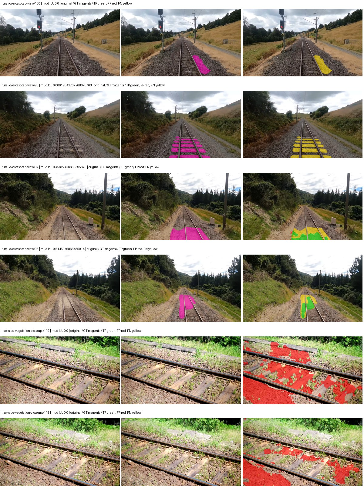
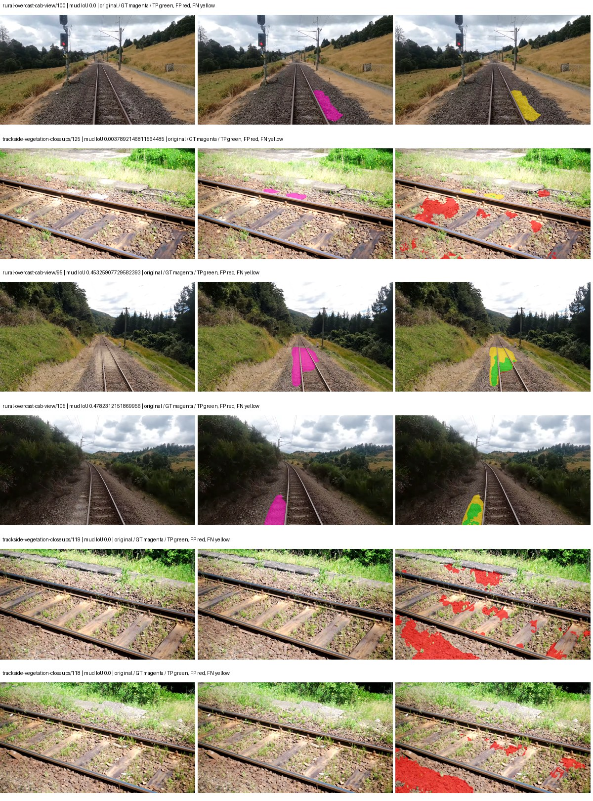
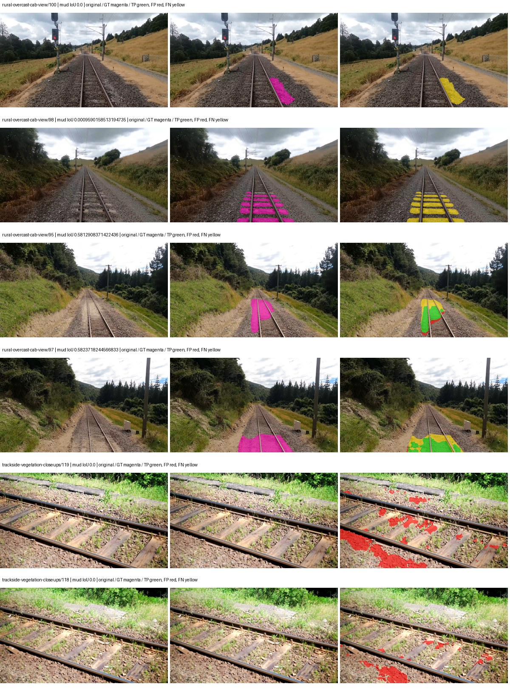
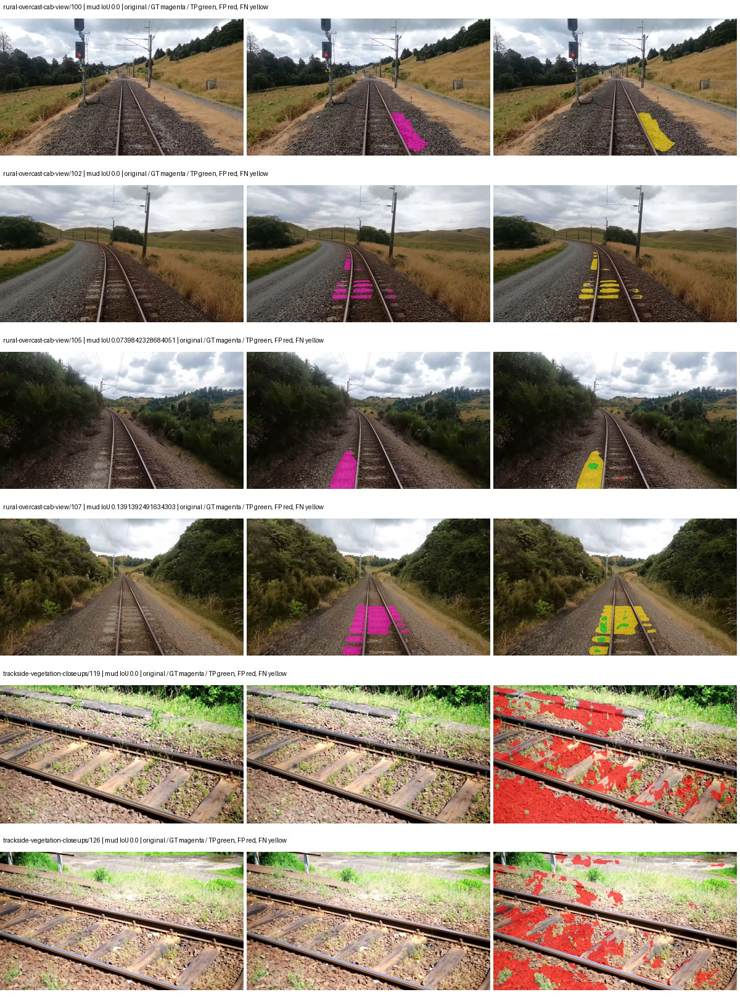
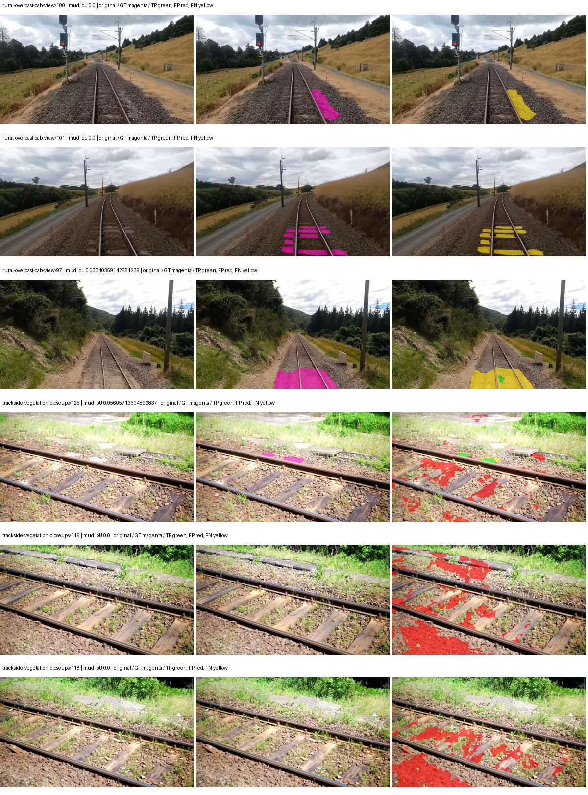

# native_convnext_tiny_channelmapper_dpt — paul-test-rtis

[RTIS comparison](../../README.md) · [Full model records](record.json)

Primary selection and early stopping: **mud-pumping validation IoU**. A job is complete only after full statistics and isolated profiling are verified.

| Model | Initialization path | Seed | Status | Steps | Best step | Mud IoU (%) | Mud precision (%) | Mud recall (%) | Final mud IoU (trainer val, %) | mIoU (%) | Fixed GT-class mIoU (%) |
| --- | --- | --- | --- | --- | --- | --- | --- | --- | --- | --- | --- |
| native_convnext_tiny_channelmapper_dpt | rtis_only | 0 | collecting | 4000 | 3563 | 6.32 | 8.91 | 17.83 | 6.33 | 32.81 | 38.27 |
| native_convnext_tiny_channelmapper_dpt | rtis_only | 1 | completed | 2290 | 1018 | 10.65 | 20.63 | 18.04 | 9.51 | 32.68 | 38.12 |
| native_convnext_tiny_channelmapper_dpt | rtis_only | 2 | completed | 3309 | 2036 | 15.01 | 30.64 | 22.72 | 13.87 | 35.12 | 40.97 |
| native_convnext_tiny_channelmapper_dpt | cityscapes_to_rtis | 0 | completed | 2800 | 1527 | 0.88 | 1.30 | 2.64 | 0.82 | 35.02 | 40.85 |
| native_convnext_tiny_channelmapper_dpt | cityscapes_to_rtis | 1 | completed | 2036 | 1781 | 0.55 | 1.14 | 1.06 | 0.50 | 36.50 | 40.56 |
| native_convnext_tiny_channelmapper_dpt | cityscapes_to_rtis | 2 | training | 2699 | — | — | — | — | — | — | — |
| native_convnext_tiny_channelmapper_dpt | railsem19_to_rtis | 0 | training | 2699 | — | — | — | — | — | — | — |
| native_convnext_tiny_channelmapper_dpt | railsem19_to_rtis | 1 | training | 2099 | — | — | — | — | — | — | — |
| native_convnext_tiny_channelmapper_dpt | railsem19_to_rtis | 2 | training | 1799 | — | — | — | — | — | — | — |
| native_convnext_tiny_channelmapper_dpt | cityscapes_to_railsem19_to_rtis | 0 | training | 1649 | — | — | — | — | — | — | — |
| native_convnext_tiny_channelmapper_dpt | cityscapes_to_railsem19_to_rtis | 1 | training | 1049 | — | — | — | — | — | — | — |
| native_convnext_tiny_channelmapper_dpt | cityscapes_to_railsem19_to_rtis | 2 | training | 763 | — | — | — | — | — | — | — |

Training: 220 images. Validation: 37 images. Test: 50 held out. Seeds: [0, 1, 2]. Seed variation measures optimization variability, not independent-recording uncertainty. Historical source checkpoints stay fixed across adaptation seeds.

Training code: `066afb2626398b7be59d4d19f5a0e4644fd59adc`. Split SHA-256: `71fef8292610c352da0709fe3bd030f3bcc18f97560394835f4b22826463b83d`.

## rtis_only — seed 0

Status: **collecting**. Started: 2026-09-06T16:10:11.812045+00:00. Finished: —.

Recipe pretrained initializer: `{"arch": "native", "backbone_path": null, "batch_norm_momentum": null, "checkpoint": null, "classifier_path": null, "drop_path": null, "encoder_name": null, "encoder_weights": null, "head": "unified_head", "head_paths": [], "inactive_parameter_paths": [], "local_files_only": false, "lora_alpha": 32, "lora_dropout": 0.05, "lora_r": 16, "lora_targets": [], "native": {"auxiliary_heads": [], "backbone": {"in_channels": 3, "kind": "timm", "name": "convnext_tiny.fb_in22k_ft_in1k", "out_indices": [0, 1, 2, 3], "weights": "pretrained"}, "head": {"activation": "relu", "channels": 256, "dropout": 0.1, "in_indices": [0, 1, 2, 3], "kind": "dpt", "norm": "group"}, "neck": {"activation": "relu", "kernel_size": 1, "kind": "channel_mapper", "norm": "group", "num_outputs": 4, "out_channels": 256}, "task": "multiclass"}, "revision": null, "smp_arch": null, "subfolder": null, "trust_remote_code": false, "tuning": "full"}`.

`rtis_only` uses the recipe initializer, which may include pretrained segmentation components. Transfer paths load the exact historical source checkpoint below and reset the classifier; they do not reset all query/decoder features.

Source checkpoint: `Recipe pretrained initialization`.

Config SHA-256: `16a0169c38c62025902783d36fb80a005992975cb50df49aaa0b2b7a4ccf390e`. Weights used for validation: `ema`.

### Mud-pumping and aggregate quality

| Metric | Selected checkpoint | Final training validation |
| --- | --- | --- |
| Mud IoU | 6.32 | 6.33 |
| Mud precision | 8.91 | 8.88 |
| Mud recall | 17.83 | 18.05 |
| Mud Dice/F1 | 11.88 | 11.90 |
| mIoU | 32.81 | 32.79 |
| Mean accuracy | 50.98 | 50.92 |
| Mean precision | 49.24 | 49.30 |
| Mean Dice | 43.16 | 43.15 |
| Mean specificity | 98.83 | 98.83 |
| Pixel accuracy | 81.46 | 81.37 |
| Frequency-weighted IoU | 72.06 | 71.97 |
| Fixed GT-present class mIoU | 38.27 | 38.26 |
| Boundary F1 | 42.85 | 42.84 |

The selected checkpoint has independent evaluation evidence. Final values are the trainer's final validation record, not a new independent evaluation. mIoU averages classes with nonzero union, so false positives on absent classes can change its denominator. The fixed GT-class mean is supplementary and excludes absent classes; their false positives remain in the confusion matrix.

### Resource usage and timing

| Measurement | Value |
| --- | --- |
| Peak training VRAM, retained training invocation (GiB) | 15.81 |
| Peak evaluation VRAM (GiB) | 8.11 |
| Retained training invocation wall time (seconds) | 6537.79 |
| Retained training invocation GPU-hours (one GPU) | 1.82 |
| Evaluation wall time (seconds) | 22.47 |
| Full evaluation pipeline images/second | 1.65 |
| Best full-state checkpoint (MiB) | 583.74 |
| Final full-state checkpoint (MiB) | 583.73 |
| Audited periodic checkpoints removed (GiB) | — |

VRAM uses the recorded allocator high-water mark; it is not total device usage including CUDA context. Resumed jobs' retained training invocation times and peaks are **not whole-campaign totals**. Earlier invocation resource records are not reconstructed here. Evaluation throughput includes loader, sliding-window inference and metrics; it is not model-only latency/FPS. Missing measurements are shown as —, never inferred from another dataset's run.

### Standardized inference performance

Dedicated model-only profiling waits for an idle worker-locked L40S: BF16, batch 1, 1024x1024, 20 warmup and 100 CUDA-event-timed public forwards. It excludes loading, preprocessing, tiling and metrics.

| Status | Parameters | Weight MiB | FPS | p50 ms | p95 ms | Peak reserved GiB |
| --- | --- | --- | --- | --- | --- | --- |
| complete | 38230389 | 145.84 | 29.00 | 34.37 | 34.63 | 1.95 |

```json
{
  "schema_version": 1,
  "model_id": "native_convnext_tiny_channelmapper_dpt",
  "measured_at": "2026-09-06T18:03:01+00:00",
  "status": "complete",
  "benchmark_scope": "rtis_selected_checkpoint_model_only",
  "applies_to": [
    "native_convnext_tiny_channelmapper_dpt--rtis_only--seed-0"
  ],
  "source": {
    "campaign_git_sha": "066afb2626398b7be59d4d19f5a0e4644fd59adc",
    "git_dirty": false,
    "config_hash": "1226ed74bbee",
    "resolved_config": "/data/izadia1/projects/segmentary-runs/paul-test-rtis/mud-fullstats-v1-20260906-r2/configs/native_convnext_tiny_channelmapper_dpt--rtis_only--seed-0.yaml",
    "config_sha256": "16a0169c38c62025902783d36fb80a005992975cb50df49aaa0b2b7a4ccf390e",
    "checkpoint_sha256": "b6b92ba30a5401660850e1aed8937c4353bdbb675bba6ead2b5f417d11ba1ac9",
    "checkpoint_global_step": 3563,
    "checkpoint_bytes": 612094805,
    "checkpoint_kind": "resume checkpoint with optimizer and EMA state",
    "weights": "ema",
    "measured_checkpoint_job_id": "native_convnext_tiny_channelmapper_dpt--rtis_only--seed-0",
    "result_sha256": "71c44ac040eaf42b6ecaf5334c825bd7b48cf03bac9f65b8426c98c9bc347af2",
    "result_git_sha": "066afb2626398b7be59d4d19f5a0e4644fd59adc",
    "result_stage": "eval:paul-test-rtis:val",
    "result_seed": 0
  },
  "hardware": {
    "gpu_name": "NVIDIA L40S",
    "gpu_uuid": "GPU-a5ad49e5-0536-5229-ba8a-f8a902808f53",
    "logical_device": "cuda:0",
    "physical_visibility_token": "7",
    "compute_capability": [
      8,
      9
    ],
    "total_memory_bytes": 47677177856
  },
  "model": {
    "parameter_count": 38230389,
    "trainable_parameter_count": 38230389,
    "resident_parameter_bytes": 152921556,
    "parameter_dtype_counts": {
      "float32": 38230389
    }
  },
  "contract": {
    "backend": "pytorch",
    "precision": "bf16_autocast",
    "batch_size": 1,
    "input_shape_nchw": [
      1,
      3,
      1024,
      1024
    ],
    "warmup_iterations": 20,
    "measured_iterations": 100,
    "timing": "per-forward CUDA events with end-event synchronization",
    "includes_preprocessing": false,
    "includes_data_loader": false,
    "includes_sliding_window": false,
    "input_resident_on_gpu": true,
    "model_only": true,
    "entrypoint": "public model(image) dense-logits forward"
  },
  "measurements": {
    "latency": {
      "p50_ms": 34.37363052368164,
      "p95_ms": 34.63024539947509,
      "mean_ms": 34.47856044769287,
      "minimum_ms": 34.26713562011719,
      "maximum_ms": 37.62278366088867,
      "fps": 29.003531093390382,
      "raw_ms": [
        34.39616012573242,
        34.337791442871094,
        34.3449592590332,
        34.33881759643555,
        34.42176055908203,
        34.45657730102539,
        34.383872985839844,
        34.43404769897461,
        34.574337005615234,
        34.3449592590332,
        34.356224060058594,
        34.378753662109375,
        37.62278366088867,
        34.42585754394531,
        34.488319396972656,
        34.37363052368164,
        34.343936920166016,
        34.488319396972656,
        34.42995071411133,
        34.28044891357422,
        34.3900146484375,
        34.58969497680664,
        34.33164978027344,
        34.39616012573242,
        34.48524856567383,
        34.43507385253906,
        34.385921478271484,
        34.57126235961914,
        34.57740783691406,
        34.347007751464844,
        34.33164978027344,
        34.3449592590332,
        34.44736099243164,
        34.323455810546875,
        34.300926208496094,
        34.3818244934082,
        34.330623626708984,
        34.362369537353516,
        34.4186897277832,
        34.47398376464844,
        34.30400085449219,
        34.33574295043945,
        34.41151809692383,
        36.29158401489258,
        34.318336486816406,
        34.35929489135742,
        35.40070343017578,
        34.475006103515625,
        34.53132629394531,
        34.35619354248047,
        34.36646270751953,
        34.37567901611328,
        35.77446365356445,
        34.371585845947266,
        35.52153778076172,
        34.4637451171875,
        34.39820861816406,
        34.460670471191406,
        34.37363052368164,
        34.46886444091797,
        34.49446487426758,
        34.39820861816406,
        34.34086227416992,
        34.47091293334961,
        34.3633918762207,
        34.58662414550781,
        34.3633918762207,
        34.493438720703125,
        34.3296012878418,
        34.328575134277344,
        34.3633918762207,
        34.286590576171875,
        34.45657730102539,
        34.53849411010742,
        34.29888153076172,
        34.3111686706543,
        34.3265266418457,
        34.318336486816406,
        34.45862579345703,
        34.38489532470703,
        34.321407318115234,
        34.428897857666016,
        34.26713562011719,
        34.349056243896484,
        34.356224060058594,
        34.28144073486328,
        34.56819152832031,
        34.44326400756836,
        34.29171371459961,
        34.339839935302734,
        34.34086227416992,
        34.49958419799805,
        34.33164978027344,
        34.32038497924805,
        34.33881759643555,
        34.337791442871094,
        34.307071685791016,
        34.33164978027344,
        34.367488861083984,
        34.31526565551758
      ],
      "percentile_method": "numpy linear interpolation"
    },
    "peak_reserved_bytes": 2090860544,
    "memory_kind": "pytorch_cuda_allocator_peak_reserved_excluding_context",
    "benchmark_wall_clock_s": 10.503778837621212
  },
  "started_at": "2026-09-06T18:02:51+00:00",
  "finished_at": "2026-09-06T18:03:01+00:00",
  "environment": {
    "hostname": "hdrfs-app-001",
    "python": "3.11.15",
    "platform": "Linux-5.15.0-139-generic-x86_64-with-glibc2.35",
    "torch": "2.11.0+cu128",
    "torch_cuda": "12.8",
    "cudnn": 91900,
    "driver_version": "570.133.20",
    "cuda_available": true,
    "gpu_count": 1,
    "gpu_names": [
      "NVIDIA L40S"
    ],
    "cuda_visible_devices": "7",
    "packages": {
      "segmentary": "0.1.0",
      "torch": "2.11.0+cu128",
      "torchvision": "0.26.0+cu128",
      "transformers": "5.15.0",
      "timm": "1.0.28",
      "segmentation-models-pytorch": "0.5.0",
      "albumentations": "2.0.8",
      "lightning": "2.6.5",
      "numpy": "2.4.4"
    }
  }
}
```

### Per-class validation results

| Class | GT pixels | IoU (%) | Precision (%) | Recall (%) | Dice (%) | Boundary F1 (%) |
| --- | --- | --- | --- | --- | --- | --- |
| car | 29664 | 20.84 | 50.43 | 26.21 | 34.50 | 45.41 |
| construction | 311585 | 18.96 | 20.09 | 77.09 | 31.87 | 33.46 |
| fence | 265137 | 22.39 | 76.49 | 24.05 | 36.59 | 51.07 |
| mud-pumping | 1226250 | 6.32 | 8.91 | 17.83 | 11.88 | 9.29 |
| on-rails | 0 | 0.00 | 0.00 | — | 0.00 | 0.00 |
| person | 0 | 0.00 | 0.00 | — | 0.00 | 0.00 |
| pole | 628038 | 72.85 | 86.29 | 82.39 | 84.29 | 91.56 |
| rail-embedded | 16799 | 25.45 | 59.73 | 30.73 | 40.58 | 50.41 |
| rail-raised | 2969797 | 78.61 | 84.80 | 91.50 | 88.02 | 92.72 |
| rail-track | 6323197 | 40.09 | 65.92 | 50.57 | 57.23 | 55.87 |
| road | 1048831 | 15.07 | 25.27 | 27.18 | 26.19 | 20.30 |
| sidewalk | 1297367 | 18.71 | 47.26 | 23.65 | 31.52 | 17.13 |
| sky | 19121606 | 91.72 | 99.32 | 92.29 | 95.68 | 89.51 |
| standing-water | 95802 | 2.60 | 2.82 | 25.31 | 5.07 | 13.19 |
| terrain | 39239306 | 83.08 | 86.06 | 95.99 | 90.76 | 63.33 |
| trackbed | 10643081 | 59.57 | 76.40 | 73.01 | 74.66 | 61.98 |
| traffic-light | 19510 | 42.28 | 73.17 | 50.04 | 59.43 | 62.92 |
| traffic-sign | 13285 | 36.25 | 54.82 | 51.70 | 53.21 | 56.46 |
| tram-track | 56179 | 22.91 | 31.86 | 44.93 | 37.28 | 20.28 |
| truck | 0 | 0.00 | 0.00 | — | 0.00 | 0.00 |
| vegetation-overgrowth | 5901821 | 31.25 | 84.49 | 33.15 | 47.61 | 64.96 |

### Full-run accounting

| Measurement | Value |
| --- | --- |
| Full GPU-reserved wall seconds, all recorded worker attempts | — |
| Full reserved GPU-hours | — |
| Whole-run timing complete | False |

| Phase | Wall seconds including failed attempts |
| --- | --- |
| training | 6544.83 |
| diagnostics | 176.96 |
| performance | 18.64 |

GPU-reserved time includes model loading, training, validation, collection, profiling, checkpoint I/O and orchestration while the worker owns one GPU. It is not GPU kernel-active time. Phase timings and sampled device memory/power/utilization are retained separately; sampled device memory is not the allocator high-water mark.

### Train/validation and raw/EMA diagnostics

| Checkpoint / weights / split | Images | Mud IoU (%) | Mud precision (%) | Mud recall (%) |
| --- | --- | --- | --- | --- |
| best-auto-train / ema | 220 | 98.02 | 98.95 | 99.05 |
| best-auto-val / ema | 37 | 6.32 | 8.91 | 17.83 |
| best-alternate-val / raw | 37 | 7.34 | 9.70 | 23.17 |
| final-auto-val / ema | 37 | 6.34 | 8.89 | 18.07 |

Train uses the evaluation transform without augmentation. Compare mud train/validation metrics for the same selected weights. Alternate EMA on running-stat BatchNorm is explicitly uncalibrated and is diagnostic only. Score-threshold curves use uncalibrated normalized scores and are pixel-level diagnostics, not event detection rates or a selected deployment operating point.

### Downloadable evidence

- best-auto-train: [per-image.csv](rtis_only--seed-0/best-auto-train/per-image.csv) · [per-image-confusion.json.gz](rtis_only--seed-0/best-auto-train/per-image-confusion.json.gz) · [groups.json](rtis_only--seed-0/best-auto-train/groups.json) · [mud-score-curves.json](rtis_only--seed-0/best-auto-train/mud-score-curves.json)
- best-auto-val: [per-image.csv](rtis_only--seed-0/best-auto-val/per-image.csv) · [per-image-confusion.json.gz](rtis_only--seed-0/best-auto-val/per-image-confusion.json.gz) · [groups.json](rtis_only--seed-0/best-auto-val/groups.json) · [mud-score-curves.json](rtis_only--seed-0/best-auto-val/mud-score-curves.json) · [examples.jpg](rtis_only--seed-0/best-auto-val/examples.jpg)
- best-alternate-val: [per-image.csv](rtis_only--seed-0/best-alternate-val/per-image.csv) · [per-image-confusion.json.gz](rtis_only--seed-0/best-alternate-val/per-image-confusion.json.gz) · [groups.json](rtis_only--seed-0/best-alternate-val/groups.json) · [mud-score-curves.json](rtis_only--seed-0/best-alternate-val/mud-score-curves.json)
- final-auto-val: [per-image.csv](rtis_only--seed-0/final-auto-val/per-image.csv) · [per-image-confusion.json.gz](rtis_only--seed-0/final-auto-val/per-image-confusion.json.gz) · [groups.json](rtis_only--seed-0/final-auto-val/groups.json) · [mud-score-curves.json](rtis_only--seed-0/final-auto-val/mud-score-curves.json)
- resources: [telemetry.csv](rtis_only--seed-0/resources/telemetry.csv)



Examples are two lowest and two highest mud-IoU positive images, plus up to two negative images with the most false-positive mud pixels. They are targeted diagnostic examples, not random samples. Green: true positive; red: false positive; yellow: false negative. Full predictions remain on HDRFS.

### Validation tracking

| Logged step | Overall mIoU (%) | Mud IoU (%) |
| --- | --- | --- |
| 254 | 23.05 | 1.45 |
| 508 | 26.95 | 2.11 |
| 763 | 30.63 | 4.19 |
| 1017 | 32.50 | 3.82 |
| 1272 | 33.49 | 4.19 |
| 1527 | 33.17 | 5.85 |
| 1781 | 33.15 | 5.95 |
| 2036 | 32.73 | 5.96 |
| 2290 | 32.78 | 6.10 |
| 2545 | 32.82 | 6.15 |
| 2799 | 32.78 | 6.17 |
| 3054 | 32.81 | 6.21 |
| 3308 | 32.83 | 6.25 |
| 3563 | 32.82 | 6.31 |
| 3817 | 32.79 | 6.28 |
| 4000 | 32.79 | 6.33 |

All retained scalar curves, including training loss and per-class IoU, are in record.json. Observed best mud on a curve is not necessarily a retained checkpoint: the pilot saved its selection-metric-best and final checkpoints. Step logging and checkpoint global_step may differ by one.

### Stopping and checkpoint provenance

```json
{
  "stopping": {
    "actual_steps": 4000,
    "maximum_steps": 4000,
    "min_delta": 0.001,
    "monitor": "val_iou/mud-pumping",
    "patience": 5,
    "reason": "budget_complete"
  },
  "checkpoints": {
    "best": {
      "path": "/data/izadia1/projects/segmentary-runs/paul-test-rtis/mud-fullstats-v1-20260906-r2/future-runs/native_convnext_tiny_channelmapper_dpt--rtis_only--seed-0_seed0/rtis/best.ckpt",
      "sha256": "b6b92ba30a5401660850e1aed8937c4353bdbb675bba6ead2b5f417d11ba1ac9",
      "global_step": 3563,
      "bytes": 612094805
    },
    "final": {
      "path": "/data/izadia1/projects/segmentary-runs/paul-test-rtis/mud-fullstats-v1-20260906-r2/future-runs/native_convnext_tiny_channelmapper_dpt--rtis_only--seed-0_seed0/rtis/last.ckpt",
      "sha256": "abfb3e055852fa34ee0488200dea5f425c0c9f0166a969a77b08fbdd71b5cb6f",
      "global_step": 4000,
      "bytes": 612083093
    }
  },
  "cleanup_error": null
}
```

### Resolved training, initialization and evaluation settings

The optimizer block is the base configuration. Stage LR scales are applied at runtime, and stage warmup is capped at min(base warmup, floor(stage budget / 10), stage budget - 1): 400 steps for this 4,000-step pilot. Model-internal native input grids may differ from augmentation crops (EoMT uses its 640 grid).

```json
{
  "name": "native_convnext_tiny_channelmapper_dpt--rtis_only--seed-0",
  "model": {
    "arch": "native",
    "checkpoint": null,
    "tuning": "full",
    "head": "unified_head",
    "lora_r": 16,
    "lora_alpha": 32,
    "lora_dropout": 0.05,
    "lora_targets": [],
    "drop_path": null,
    "revision": null,
    "subfolder": null,
    "local_files_only": false,
    "trust_remote_code": false,
    "backbone_path": null,
    "head_paths": [],
    "classifier_path": null,
    "inactive_parameter_paths": [],
    "smp_arch": null,
    "encoder_name": null,
    "encoder_weights": null,
    "native": {
      "task": "multiclass",
      "backbone": {
        "kind": "timm",
        "name": "convnext_tiny.fb_in22k_ft_in1k",
        "weights": "pretrained",
        "out_indices": [
          0,
          1,
          2,
          3
        ],
        "in_channels": 3
      },
      "neck": {
        "kind": "channel_mapper",
        "out_channels": 256,
        "kernel_size": 1,
        "num_outputs": 4,
        "norm": "group",
        "activation": "relu"
      },
      "head": {
        "kind": "dpt",
        "in_indices": [
          0,
          1,
          2,
          3
        ],
        "channels": 256,
        "dropout": 0.1,
        "norm": "group",
        "activation": "relu"
      },
      "auxiliary_heads": []
    },
    "batch_norm_momentum": null
  },
  "space": "paul-test-rtis",
  "taxonomy_root": "/data/izadia1/projects/segmentary-rtis-fullstats-066afb2/taxonomy",
  "output_root": "/data/izadia1/projects/segmentary-runs/paul-test-rtis/mud-fullstats-v1-20260906-r2/future-runs",
  "optim": {
    "backbone_lr": 0.0001,
    "head_lr_mult": 10.0,
    "weight_decay": 0.05,
    "llrd": 1.0,
    "warmup_iters": 1500,
    "warmup_ratio": 1e-06,
    "poly_power": 0.9,
    "min_lr_ratio": 0.0,
    "betas": [
      0.9,
      0.999
    ],
    "grad_clip": 1.0
  },
  "train": {
    "iters": 4000,
    "batch_size": 2,
    "accum": 8,
    "num_workers": 2,
    "precision": "bf16-mixed",
    "ema_decay": 0.9998,
    "val_every": 250,
    "ckpt_every": 500,
    "selection_metric": "val_iou/mud-pumping",
    "early_stopping_patience": 5,
    "early_stopping_min_delta": 0.001,
    "seed": 0,
    "devices": 1
  },
  "eval": {
    "sliding_window": true,
    "window": [
      1024,
      1024
    ],
    "stride": [
      768,
      768
    ],
    "batch_size": 1,
    "num_workers": 2,
    "tta_scales": [],
    "tta_flip": false,
    "threshold": 0.5,
    "boundary_tolerance_frac": 0.0075,
    "save_confusion": true
  },
  "loss": {
    "task": "multiclass",
    "activation": "auto",
    "terms": [],
    "aux": "none",
    "aux_weight": 0.0,
    "ce_weight": 1.0,
    "label_smoothing": 0.0,
    "class_weights": null,
    "query": null
  },
  "aug": {
    "crop": [
      1024,
      1024
    ],
    "scale_min": 0.5,
    "scale_max": 2.0,
    "hflip_p": 0.5,
    "color_jitter_p": 0.5,
    "brightness": 0.25,
    "contrast": 0.25,
    "saturation": 0.25,
    "hue": 0.05
  },
  "stages": [
    {
      "name": "rtis",
      "data": [
        {
          "name": "paul-test-rtis",
          "root": "/data/izadia1/datasets/paul-test-rtis",
          "variant": null,
          "split_file": "splits.json",
          "train_split": "train",
          "val_split": "val",
          "limit": null,
          "loader": "folder",
          "mapping": "paul-test-rtis",
          "loader_options": {
            "require_groups": true
          }
        }
      ],
      "iters": null,
      "lr_scale": 1.0,
      "head_group_lr_scale": 1.0,
      "init_from": "pretrained",
      "reset_head": false,
      "freeze": null,
      "sample_weights": null
    }
  ]
}
```

### Hardware and software provenance

```json
{
  "training": {
    "cuda_available": true,
    "cuda_visible_devices": "7",
    "cudnn": 91900,
    "driver_version": "570.133.20",
    "gpu_count": 1,
    "gpu_names": [
      "NVIDIA L40S"
    ],
    "hostname": "hdrfs-app-001",
    "input_normalization": {
      "channel_order": "rgb",
      "mean": [
        0.485,
        0.456,
        0.406
      ],
      "source": "timm_pretrained_cfg",
      "std": [
        0.229,
        0.224,
        0.225
      ]
    },
    "model_origins": [
      {
        "hf_commit": null,
        "hf_name_or_path": null,
        "module": "backbone",
        "timm_pretrained": {
          "architecture": "convnext_tiny",
          "hf_hub_id": "timm/convnext_tiny.fb_in22k_ft_in1k",
          "tag": "fb_in22k_ft_in1k",
          "url": "https://dl.fbaipublicfiles.com/convnext/convnext_tiny_22k_1k_224.pth"
        }
      },
      {
        "hf_commit": null,
        "hf_name_or_path": null,
        "module": "backbone.model",
        "timm_pretrained": {
          "architecture": "convnext_tiny",
          "hf_hub_id": "timm/convnext_tiny.fb_in22k_ft_in1k",
          "tag": "fb_in22k_ft_in1k",
          "url": "https://dl.fbaipublicfiles.com/convnext/convnext_tiny_22k_1k_224.pth"
        }
      }
    ],
    "model_parameter_count": 38230389,
    "packages": {
      "albumentations": "2.0.8",
      "lightning": "2.6.5",
      "numpy": "2.4.4",
      "segmentary": "0.1.0",
      "segmentation-models-pytorch": "0.5.0",
      "timm": "1.0.28",
      "torch": "2.11.0+cu128",
      "torchvision": "0.26.0+cu128",
      "transformers": "5.15.0"
    },
    "platform": "Linux-5.15.0-139-generic-x86_64-with-glibc2.35",
    "python": "3.11.15",
    "torch": "2.11.0+cu128",
    "torch_cuda": "12.8",
    "trainable_parameter_count": 38230389,
    "training_stop": {
      "actual_steps": 4000,
      "maximum_steps": 4000,
      "min_delta": 0.001,
      "monitor": "val_iou/mud-pumping",
      "patience": 5,
      "reason": "budget_complete"
    },
    "validation_weights": "ema"
  },
  "evaluation": {
    "cuda_available": true,
    "cuda_visible_devices": "7",
    "cudnn": 91900,
    "driver_version": "570.133.20",
    "gpu_count": 1,
    "gpu_names": [
      "NVIDIA L40S"
    ],
    "hostname": "hdrfs-app-001",
    "input_normalization": {
      "channel_order": "rgb",
      "mean": [
        0.485,
        0.456,
        0.406
      ],
      "source": "timm_pretrained_cfg",
      "std": [
        0.229,
        0.224,
        0.225
      ]
    },
    "packages": {
      "albumentations": "2.0.8",
      "lightning": "2.6.5",
      "numpy": "2.4.4",
      "segmentary": "0.1.0",
      "segmentation-models-pytorch": "0.5.0",
      "timm": "1.0.28",
      "torch": "2.11.0+cu128",
      "torchvision": "0.26.0+cu128",
      "transformers": "5.15.0"
    },
    "platform": "Linux-5.15.0-139-generic-x86_64-with-glibc2.35",
    "python": "3.11.15",
    "torch": "2.11.0+cu128",
    "torch_cuda": "12.8"
  }
}
```

## rtis_only — seed 1

Status: **completed**. Started: 2026-09-06T16:11:27.316343+00:00. Finished: 2026-09-06T17:17:24.895233+00:00.

Recipe pretrained initializer: `{"arch": "native", "backbone_path": null, "batch_norm_momentum": null, "checkpoint": null, "classifier_path": null, "drop_path": null, "encoder_name": null, "encoder_weights": null, "head": "unified_head", "head_paths": [], "inactive_parameter_paths": [], "local_files_only": false, "lora_alpha": 32, "lora_dropout": 0.05, "lora_r": 16, "lora_targets": [], "native": {"auxiliary_heads": [], "backbone": {"in_channels": 3, "kind": "timm", "name": "convnext_tiny.fb_in22k_ft_in1k", "out_indices": [0, 1, 2, 3], "weights": "pretrained"}, "head": {"activation": "relu", "channels": 256, "dropout": 0.1, "in_indices": [0, 1, 2, 3], "kind": "dpt", "norm": "group"}, "neck": {"activation": "relu", "kernel_size": 1, "kind": "channel_mapper", "norm": "group", "num_outputs": 4, "out_channels": 256}, "task": "multiclass"}, "revision": null, "smp_arch": null, "subfolder": null, "trust_remote_code": false, "tuning": "full"}`.

`rtis_only` uses the recipe initializer, which may include pretrained segmentation components. Transfer paths load the exact historical source checkpoint below and reset the classifier; they do not reset all query/decoder features.

Source checkpoint: `Recipe pretrained initialization`.

Config SHA-256: `007f799ff4aa1748e0dcf893ab28b26d5d0b3f86440cc3515fc010c05006f458`. Weights used for validation: `ema`.

### Mud-pumping and aggregate quality

| Metric | Selected checkpoint | Final training validation |
| --- | --- | --- |
| Mud IoU | 10.65 | 9.51 |
| Mud precision | 20.63 | 25.58 |
| Mud recall | 18.04 | 13.15 |
| Mud Dice/F1 | 19.25 | 17.37 |
| mIoU | 32.68 | 34.12 |
| Mean accuracy | 49.31 | 50.31 |
| Mean precision | 49.75 | 49.56 |
| Mean Dice | 42.34 | 43.90 |
| Mean specificity | 98.99 | 98.94 |
| Pixel accuracy | 83.37 | 83.28 |
| Frequency-weighted IoU | 74.49 | 73.61 |
| Fixed GT-present class mIoU | 38.12 | 39.81 |
| Boundary F1 | 42.74 | 43.64 |

The selected checkpoint has independent evaluation evidence. Final values are the trainer's final validation record, not a new independent evaluation. mIoU averages classes with nonzero union, so false positives on absent classes can change its denominator. The fixed GT-class mean is supplementary and excludes absent classes; their false positives remain in the confusion matrix.

### Resource usage and timing

| Measurement | Value |
| --- | --- |
| Peak training VRAM, retained training invocation (GiB) | 15.83 |
| Peak evaluation VRAM (GiB) | 8.11 |
| Retained training invocation wall time (seconds) | 3722.47 |
| Retained training invocation GPU-hours (one GPU) | 1.03 |
| Evaluation wall time (seconds) | 22.31 |
| Full evaluation pipeline images/second | 1.66 |
| Best full-state checkpoint (MiB) | 583.74 |
| Final full-state checkpoint (MiB) | 583.73 |
| Audited periodic checkpoints removed (GiB) | 2.28 |

VRAM uses the recorded allocator high-water mark; it is not total device usage including CUDA context. Resumed jobs' retained training invocation times and peaks are **not whole-campaign totals**. Earlier invocation resource records are not reconstructed here. Evaluation throughput includes loader, sliding-window inference and metrics; it is not model-only latency/FPS. Missing measurements are shown as —, never inferred from another dataset's run.

### Standardized inference performance

Dedicated model-only profiling waits for an idle worker-locked L40S: BF16, batch 1, 1024x1024, 20 warmup and 100 CUDA-event-timed public forwards. It excludes loading, preprocessing, tiling and metrics.

| Status | Parameters | Weight MiB | FPS | p50 ms | p95 ms | Peak reserved GiB |
| --- | --- | --- | --- | --- | --- | --- |
| complete | 38230389 | 145.84 | 29.08 | 34.37 | 34.52 | 1.95 |

```json
{
  "schema_version": 1,
  "model_id": "native_convnext_tiny_channelmapper_dpt",
  "measured_at": "2026-09-06T17:17:20+00:00",
  "status": "complete",
  "benchmark_scope": "rtis_selected_checkpoint_model_only",
  "applies_to": [
    "native_convnext_tiny_channelmapper_dpt--rtis_only--seed-1"
  ],
  "source": {
    "campaign_git_sha": "066afb2626398b7be59d4d19f5a0e4644fd59adc",
    "git_dirty": false,
    "config_hash": "ff5eef2f6dfe",
    "resolved_config": "/data/izadia1/projects/segmentary-runs/paul-test-rtis/mud-fullstats-v1-20260906-r2/configs/native_convnext_tiny_channelmapper_dpt--rtis_only--seed-1.yaml",
    "config_sha256": "007f799ff4aa1748e0dcf893ab28b26d5d0b3f86440cc3515fc010c05006f458",
    "checkpoint_sha256": "1fb88fbe1724d3dbeaa73bcd612ed559313fe9c6452185f1a77c89700dfc3e73",
    "checkpoint_global_step": 1018,
    "checkpoint_bytes": 612094805,
    "checkpoint_kind": "resume checkpoint with optimizer and EMA state",
    "weights": "ema",
    "measured_checkpoint_job_id": "native_convnext_tiny_channelmapper_dpt--rtis_only--seed-1",
    "result_sha256": "bd76013532cd6d124687a8c6fdf16b8a62a0a073d4996c3f5a8a10d704acb979",
    "result_git_sha": "066afb2626398b7be59d4d19f5a0e4644fd59adc",
    "result_stage": "eval:paul-test-rtis:val",
    "result_seed": 1
  },
  "hardware": {
    "gpu_name": "NVIDIA L40S",
    "gpu_uuid": "GPU-2f8008a1-9b67-11f6-987b-b393a672322c",
    "logical_device": "cuda:0",
    "physical_visibility_token": "3",
    "compute_capability": [
      8,
      9
    ],
    "total_memory_bytes": 47677177856
  },
  "model": {
    "parameter_count": 38230389,
    "trainable_parameter_count": 38230389,
    "resident_parameter_bytes": 152921556,
    "parameter_dtype_counts": {
      "float32": 38230389
    }
  },
  "contract": {
    "backend": "pytorch",
    "precision": "bf16_autocast",
    "batch_size": 1,
    "input_shape_nchw": [
      1,
      3,
      1024,
      1024
    ],
    "warmup_iterations": 20,
    "measured_iterations": 100,
    "timing": "per-forward CUDA events with end-event synchronization",
    "includes_preprocessing": false,
    "includes_data_loader": false,
    "includes_sliding_window": false,
    "input_resident_on_gpu": true,
    "model_only": true,
    "entrypoint": "public model(image) dense-logits forward"
  },
  "measurements": {
    "latency": {
      "p50_ms": 34.36748695373535,
      "p95_ms": 34.519704818725586,
      "mean_ms": 34.38615009307861,
      "minimum_ms": 34.28860855102539,
      "maximum_ms": 34.62553787231445,
      "fps": 29.081476038845192,
      "raw_ms": [
        34.51801681518555,
        34.42278289794922,
        34.48524856567383,
        34.44416046142578,
        34.330623626708984,
        34.327518463134766,
        34.299903869628906,
        34.30809783935547,
        34.37977600097656,
        34.38684844970703,
        34.395137786865234,
        34.33881759643555,
        34.60095977783203,
        34.307071685791016,
        34.37772750854492,
        34.39718246459961,
        34.351104736328125,
        34.34291076660156,
        34.327552795410156,
        34.31321716308594,
        34.3480339050293,
        34.36441421508789,
        34.355201721191406,
        34.323455810546875,
        34.297855377197266,
        34.308128356933594,
        34.3633918762207,
        34.347007751464844,
        34.32243347167969,
        34.360321044921875,
        34.336769104003906,
        34.42278289794922,
        34.38489532470703,
        34.35007858276367,
        34.344993591308594,
        34.362369537353516,
        34.332672119140625,
        34.46268844604492,
        34.42585754394531,
        34.40537643432617,
        34.519039154052734,
        34.4268798828125,
        34.385921478271484,
        34.36556625366211,
        34.408447265625,
        34.36646270751953,
        34.358272552490234,
        34.300926208496094,
        34.323455810546875,
        34.37161636352539,
        34.337791442871094,
        34.34694290161133,
        34.35007858276367,
        34.355201721191406,
        34.35724639892578,
        34.36851119995117,
        34.34291076660156,
        34.33977508544922,
        34.3070068359375,
        34.36227035522461,
        34.37356948852539,
        34.37055969238281,
        34.32243347167969,
        34.33574295043945,
        34.28860855102539,
        34.43302536010742,
        34.43209457397461,
        34.3265266418457,
        34.411617279052734,
        34.60812759399414,
        34.38796615600586,
        34.349056243896484,
        34.338783264160156,
        34.44019317626953,
        34.532352447509766,
        34.61324691772461,
        34.378753662109375,
        34.62553787231445,
        34.38489532470703,
        34.38899230957031,
        34.383872985839844,
        34.40127944946289,
        34.37363052368164,
        34.3818244934082,
        34.41664123535156,
        34.44518280029297,
        34.36134338378906,
        34.511871337890625,
        34.45964813232422,
        34.336769104003906,
        34.43097686767578,
        34.3633918762207,
        34.408416748046875,
        34.37977600097656,
        34.36134338378906,
        34.38796615600586,
        34.44121551513672,
        34.36537551879883,
        34.459617614746094,
        34.43507385253906
      ],
      "percentile_method": "numpy linear interpolation"
    },
    "peak_reserved_bytes": 2090860544,
    "memory_kind": "pytorch_cuda_allocator_peak_reserved_excluding_context",
    "benchmark_wall_clock_s": 10.396397814154625
  },
  "started_at": "2026-09-06T17:17:09+00:00",
  "finished_at": "2026-09-06T17:17:20+00:00",
  "environment": {
    "hostname": "hdrfs-app-001",
    "python": "3.11.15",
    "platform": "Linux-5.15.0-139-generic-x86_64-with-glibc2.35",
    "torch": "2.11.0+cu128",
    "torch_cuda": "12.8",
    "cudnn": 91900,
    "driver_version": "570.133.20",
    "cuda_available": true,
    "gpu_count": 1,
    "gpu_names": [
      "NVIDIA L40S"
    ],
    "cuda_visible_devices": "3",
    "packages": {
      "segmentary": "0.1.0",
      "torch": "2.11.0+cu128",
      "torchvision": "0.26.0+cu128",
      "transformers": "5.15.0",
      "timm": "1.0.28",
      "segmentation-models-pytorch": "0.5.0",
      "albumentations": "2.0.8",
      "lightning": "2.6.5",
      "numpy": "2.4.4"
    }
  }
}
```

### Per-class validation results

| Class | GT pixels | IoU (%) | Precision (%) | Recall (%) | Dice (%) | Boundary F1 (%) |
| --- | --- | --- | --- | --- | --- | --- |
| car | 29664 | 3.25 | 16.22 | 3.91 | 6.30 | 23.85 |
| construction | 311585 | 15.90 | 16.75 | 75.73 | 27.44 | 36.15 |
| fence | 265137 | 18.91 | 66.48 | 20.90 | 31.81 | 46.41 |
| mud-pumping | 1226250 | 10.65 | 20.63 | 18.04 | 19.25 | 12.89 |
| on-rails | 0 | 0.00 | 0.00 | — | 0.00 | 0.00 |
| person | 0 | 0.00 | 0.00 | — | 0.00 | 0.00 |
| pole | 628038 | 72.48 | 84.16 | 83.93 | 84.05 | 90.43 |
| rail-embedded | 16799 | 21.08 | 71.15 | 23.05 | 34.82 | 54.64 |
| rail-raised | 2969797 | 75.49 | 81.58 | 91.00 | 86.03 | 90.10 |
| rail-track | 6323197 | 43.74 | 68.21 | 54.94 | 60.86 | 58.11 |
| road | 1048831 | 12.60 | 21.78 | 23.01 | 22.38 | 15.15 |
| sidewalk | 1297367 | 17.64 | 47.95 | 21.82 | 29.99 | 20.63 |
| sky | 19121606 | 94.01 | 99.41 | 94.54 | 96.91 | 86.30 |
| standing-water | 95802 | 2.74 | 3.08 | 19.88 | 5.33 | 10.82 |
| terrain | 39239306 | 86.27 | 89.74 | 95.71 | 92.63 | 66.24 |
| trackbed | 10643081 | 59.26 | 69.17 | 80.53 | 74.42 | 60.36 |
| traffic-light | 19510 | 51.75 | 90.69 | 54.66 | 68.21 | 73.10 |
| traffic-sign | 13285 | 40.85 | 78.75 | 45.92 | 58.01 | 65.10 |
| tram-track | 56179 | 21.87 | 32.51 | 40.04 | 35.89 | 18.96 |
| truck | 0 | 0.00 | 0.00 | — | 0.00 | 0.00 |
| vegetation-overgrowth | 5901821 | 37.71 | 86.56 | 40.05 | 54.76 | 68.29 |

### Full-run accounting

| Measurement | Value |
| --- | --- |
| Full GPU-reserved wall seconds, all recorded worker attempts | 3957.58 |
| Full reserved GPU-hours | 1.10 |
| Whole-run timing complete | True |

| Phase | Wall seconds including failed attempts |
| --- | --- |
| training | 3729.16 |
| diagnostics | 176.64 |
| performance | 17.94 |

GPU-reserved time includes model loading, training, validation, collection, profiling, checkpoint I/O and orchestration while the worker owns one GPU. It is not GPU kernel-active time. Phase timings and sampled device memory/power/utilization are retained separately; sampled device memory is not the allocator high-water mark.

### Train/validation and raw/EMA diagnostics

| Checkpoint / weights / split | Images | Mud IoU (%) | Mud precision (%) | Mud recall (%) |
| --- | --- | --- | --- | --- |
| best-auto-train / ema | 220 | 96.77 | 98.51 | 98.21 |
| best-auto-val / ema | 37 | 10.65 | 20.63 | 18.04 |
| best-alternate-val / raw | 37 | 25.49 | 31.09 | 58.62 |
| final-auto-val / ema | 37 | 9.53 | 25.60 | 13.19 |

Train uses the evaluation transform without augmentation. Compare mud train/validation metrics for the same selected weights. Alternate EMA on running-stat BatchNorm is explicitly uncalibrated and is diagnostic only. Score-threshold curves use uncalibrated normalized scores and are pixel-level diagnostics, not event detection rates or a selected deployment operating point.

### Downloadable evidence

- best-auto-train: [per-image.csv](rtis_only--seed-1/best-auto-train/per-image.csv) · [per-image-confusion.json.gz](rtis_only--seed-1/best-auto-train/per-image-confusion.json.gz) · [groups.json](rtis_only--seed-1/best-auto-train/groups.json) · [mud-score-curves.json](rtis_only--seed-1/best-auto-train/mud-score-curves.json)
- best-auto-val: [per-image.csv](rtis_only--seed-1/best-auto-val/per-image.csv) · [per-image-confusion.json.gz](rtis_only--seed-1/best-auto-val/per-image-confusion.json.gz) · [groups.json](rtis_only--seed-1/best-auto-val/groups.json) · [mud-score-curves.json](rtis_only--seed-1/best-auto-val/mud-score-curves.json) · [examples.jpg](rtis_only--seed-1/best-auto-val/examples.jpg)
- best-alternate-val: [per-image.csv](rtis_only--seed-1/best-alternate-val/per-image.csv) · [per-image-confusion.json.gz](rtis_only--seed-1/best-alternate-val/per-image-confusion.json.gz) · [groups.json](rtis_only--seed-1/best-alternate-val/groups.json) · [mud-score-curves.json](rtis_only--seed-1/best-alternate-val/mud-score-curves.json)
- final-auto-val: [per-image.csv](rtis_only--seed-1/final-auto-val/per-image.csv) · [per-image-confusion.json.gz](rtis_only--seed-1/final-auto-val/per-image-confusion.json.gz) · [groups.json](rtis_only--seed-1/final-auto-val/groups.json) · [mud-score-curves.json](rtis_only--seed-1/final-auto-val/mud-score-curves.json)
- resources: [telemetry.csv](rtis_only--seed-1/resources/telemetry.csv)



Examples are two lowest and two highest mud-IoU positive images, plus up to two negative images with the most false-positive mud pixels. They are targeted diagnostic examples, not random samples. Green: true positive; red: false positive; yellow: false negative. Full predictions remain on HDRFS.

### Validation tracking

| Logged step | Overall mIoU (%) | Mud IoU (%) |
| --- | --- | --- |
| 254 | 24.75 | 7.41 |
| 508 | 26.89 | 3.16 |
| 763 | 30.55 | 4.83 |
| 1017 | 32.68 | 10.64 |
| 1272 | 33.39 | 7.31 |
| 1527 | 33.66 | 9.04 |
| 1781 | 33.69 | 8.54 |
| 2036 | 34.07 | 9.52 |
| 2290 | 34.12 | 9.51 |

All retained scalar curves, including training loss and per-class IoU, are in record.json. Observed best mud on a curve is not necessarily a retained checkpoint: the pilot saved its selection-metric-best and final checkpoints. Step logging and checkpoint global_step may differ by one.

### Stopping and checkpoint provenance

```json
{
  "stopping": {
    "actual_steps": 2290,
    "maximum_steps": 4000,
    "min_delta": 0.001,
    "monitor": "val_iou/mud-pumping",
    "patience": 5,
    "reason": "validation_plateau"
  },
  "checkpoints": {
    "best": {
      "path": "/data/izadia1/projects/segmentary-runs/paul-test-rtis/mud-fullstats-v1-20260906-r2/future-runs/native_convnext_tiny_channelmapper_dpt--rtis_only--seed-1_seed1/rtis/best.ckpt",
      "sha256": "1fb88fbe1724d3dbeaa73bcd612ed559313fe9c6452185f1a77c89700dfc3e73",
      "global_step": 1018,
      "bytes": 612094805
    },
    "final": {
      "path": "/data/izadia1/projects/segmentary-runs/paul-test-rtis/mud-fullstats-v1-20260906-r2/future-runs/native_convnext_tiny_channelmapper_dpt--rtis_only--seed-1_seed1/rtis/last.ckpt",
      "sha256": "e9bc911eadce638fb5368f9a889b314c7dafceb54b615c95f4d637ac64e25403",
      "global_step": 2290,
      "bytes": 612083221
    }
  },
  "cleanup_error": null
}
```

### Resolved training, initialization and evaluation settings

The optimizer block is the base configuration. Stage LR scales are applied at runtime, and stage warmup is capped at min(base warmup, floor(stage budget / 10), stage budget - 1): 400 steps for this 4,000-step pilot. Model-internal native input grids may differ from augmentation crops (EoMT uses its 640 grid).

```json
{
  "name": "native_convnext_tiny_channelmapper_dpt--rtis_only--seed-1",
  "model": {
    "arch": "native",
    "checkpoint": null,
    "tuning": "full",
    "head": "unified_head",
    "lora_r": 16,
    "lora_alpha": 32,
    "lora_dropout": 0.05,
    "lora_targets": [],
    "drop_path": null,
    "revision": null,
    "subfolder": null,
    "local_files_only": false,
    "trust_remote_code": false,
    "backbone_path": null,
    "head_paths": [],
    "classifier_path": null,
    "inactive_parameter_paths": [],
    "smp_arch": null,
    "encoder_name": null,
    "encoder_weights": null,
    "native": {
      "task": "multiclass",
      "backbone": {
        "kind": "timm",
        "name": "convnext_tiny.fb_in22k_ft_in1k",
        "weights": "pretrained",
        "out_indices": [
          0,
          1,
          2,
          3
        ],
        "in_channels": 3
      },
      "neck": {
        "kind": "channel_mapper",
        "out_channels": 256,
        "kernel_size": 1,
        "num_outputs": 4,
        "norm": "group",
        "activation": "relu"
      },
      "head": {
        "kind": "dpt",
        "in_indices": [
          0,
          1,
          2,
          3
        ],
        "channels": 256,
        "dropout": 0.1,
        "norm": "group",
        "activation": "relu"
      },
      "auxiliary_heads": []
    },
    "batch_norm_momentum": null
  },
  "space": "paul-test-rtis",
  "taxonomy_root": "/data/izadia1/projects/segmentary-rtis-fullstats-066afb2/taxonomy",
  "output_root": "/data/izadia1/projects/segmentary-runs/paul-test-rtis/mud-fullstats-v1-20260906-r2/future-runs",
  "optim": {
    "backbone_lr": 0.0001,
    "head_lr_mult": 10.0,
    "weight_decay": 0.05,
    "llrd": 1.0,
    "warmup_iters": 1500,
    "warmup_ratio": 1e-06,
    "poly_power": 0.9,
    "min_lr_ratio": 0.0,
    "betas": [
      0.9,
      0.999
    ],
    "grad_clip": 1.0
  },
  "train": {
    "iters": 4000,
    "batch_size": 2,
    "accum": 8,
    "num_workers": 2,
    "precision": "bf16-mixed",
    "ema_decay": 0.9998,
    "val_every": 250,
    "ckpt_every": 500,
    "selection_metric": "val_iou/mud-pumping",
    "early_stopping_patience": 5,
    "early_stopping_min_delta": 0.001,
    "seed": 1,
    "devices": 1
  },
  "eval": {
    "sliding_window": true,
    "window": [
      1024,
      1024
    ],
    "stride": [
      768,
      768
    ],
    "batch_size": 1,
    "num_workers": 2,
    "tta_scales": [],
    "tta_flip": false,
    "threshold": 0.5,
    "boundary_tolerance_frac": 0.0075,
    "save_confusion": true
  },
  "loss": {
    "task": "multiclass",
    "activation": "auto",
    "terms": [],
    "aux": "none",
    "aux_weight": 0.0,
    "ce_weight": 1.0,
    "label_smoothing": 0.0,
    "class_weights": null,
    "query": null
  },
  "aug": {
    "crop": [
      1024,
      1024
    ],
    "scale_min": 0.5,
    "scale_max": 2.0,
    "hflip_p": 0.5,
    "color_jitter_p": 0.5,
    "brightness": 0.25,
    "contrast": 0.25,
    "saturation": 0.25,
    "hue": 0.05
  },
  "stages": [
    {
      "name": "rtis",
      "data": [
        {
          "name": "paul-test-rtis",
          "root": "/data/izadia1/datasets/paul-test-rtis",
          "variant": null,
          "split_file": "splits.json",
          "train_split": "train",
          "val_split": "val",
          "limit": null,
          "loader": "folder",
          "mapping": "paul-test-rtis",
          "loader_options": {
            "require_groups": true
          }
        }
      ],
      "iters": null,
      "lr_scale": 1.0,
      "head_group_lr_scale": 1.0,
      "init_from": "pretrained",
      "reset_head": false,
      "freeze": null,
      "sample_weights": null
    }
  ]
}
```

### Hardware and software provenance

```json
{
  "training": {
    "cuda_available": true,
    "cuda_visible_devices": "3",
    "cudnn": 91900,
    "driver_version": "570.133.20",
    "gpu_count": 1,
    "gpu_names": [
      "NVIDIA L40S"
    ],
    "hostname": "hdrfs-app-001",
    "input_normalization": {
      "channel_order": "rgb",
      "mean": [
        0.485,
        0.456,
        0.406
      ],
      "source": "timm_pretrained_cfg",
      "std": [
        0.229,
        0.224,
        0.225
      ]
    },
    "model_origins": [
      {
        "hf_commit": null,
        "hf_name_or_path": null,
        "module": "backbone",
        "timm_pretrained": {
          "architecture": "convnext_tiny",
          "hf_hub_id": "timm/convnext_tiny.fb_in22k_ft_in1k",
          "tag": "fb_in22k_ft_in1k",
          "url": "https://dl.fbaipublicfiles.com/convnext/convnext_tiny_22k_1k_224.pth"
        }
      },
      {
        "hf_commit": null,
        "hf_name_or_path": null,
        "module": "backbone.model",
        "timm_pretrained": {
          "architecture": "convnext_tiny",
          "hf_hub_id": "timm/convnext_tiny.fb_in22k_ft_in1k",
          "tag": "fb_in22k_ft_in1k",
          "url": "https://dl.fbaipublicfiles.com/convnext/convnext_tiny_22k_1k_224.pth"
        }
      }
    ],
    "model_parameter_count": 38230389,
    "packages": {
      "albumentations": "2.0.8",
      "lightning": "2.6.5",
      "numpy": "2.4.4",
      "segmentary": "0.1.0",
      "segmentation-models-pytorch": "0.5.0",
      "timm": "1.0.28",
      "torch": "2.11.0+cu128",
      "torchvision": "0.26.0+cu128",
      "transformers": "5.15.0"
    },
    "platform": "Linux-5.15.0-139-generic-x86_64-with-glibc2.35",
    "python": "3.11.15",
    "torch": "2.11.0+cu128",
    "torch_cuda": "12.8",
    "trainable_parameter_count": 38230389,
    "training_stop": {
      "actual_steps": 2290,
      "maximum_steps": 4000,
      "min_delta": 0.001,
      "monitor": "val_iou/mud-pumping",
      "patience": 5,
      "reason": "validation_plateau"
    },
    "validation_weights": "ema"
  },
  "evaluation": {
    "cuda_available": true,
    "cuda_visible_devices": "3",
    "cudnn": 91900,
    "driver_version": "570.133.20",
    "gpu_count": 1,
    "gpu_names": [
      "NVIDIA L40S"
    ],
    "hostname": "hdrfs-app-001",
    "input_normalization": {
      "channel_order": "rgb",
      "mean": [
        0.485,
        0.456,
        0.406
      ],
      "source": "timm_pretrained_cfg",
      "std": [
        0.229,
        0.224,
        0.225
      ]
    },
    "packages": {
      "albumentations": "2.0.8",
      "lightning": "2.6.5",
      "numpy": "2.4.4",
      "segmentary": "0.1.0",
      "segmentation-models-pytorch": "0.5.0",
      "timm": "1.0.28",
      "torch": "2.11.0+cu128",
      "torchvision": "0.26.0+cu128",
      "transformers": "5.15.0"
    },
    "platform": "Linux-5.15.0-139-generic-x86_64-with-glibc2.35",
    "python": "3.11.15",
    "torch": "2.11.0+cu128",
    "torch_cuda": "12.8"
  }
}
```

## rtis_only — seed 2

Status: **completed**. Started: 2026-09-06T16:16:18.283857+00:00. Finished: 2026-09-06T17:50:16.240018+00:00.

Recipe pretrained initializer: `{"arch": "native", "backbone_path": null, "batch_norm_momentum": null, "checkpoint": null, "classifier_path": null, "drop_path": null, "encoder_name": null, "encoder_weights": null, "head": "unified_head", "head_paths": [], "inactive_parameter_paths": [], "local_files_only": false, "lora_alpha": 32, "lora_dropout": 0.05, "lora_r": 16, "lora_targets": [], "native": {"auxiliary_heads": [], "backbone": {"in_channels": 3, "kind": "timm", "name": "convnext_tiny.fb_in22k_ft_in1k", "out_indices": [0, 1, 2, 3], "weights": "pretrained"}, "head": {"activation": "relu", "channels": 256, "dropout": 0.1, "in_indices": [0, 1, 2, 3], "kind": "dpt", "norm": "group"}, "neck": {"activation": "relu", "kernel_size": 1, "kind": "channel_mapper", "norm": "group", "num_outputs": 4, "out_channels": 256}, "task": "multiclass"}, "revision": null, "smp_arch": null, "subfolder": null, "trust_remote_code": false, "tuning": "full"}`.

`rtis_only` uses the recipe initializer, which may include pretrained segmentation components. Transfer paths load the exact historical source checkpoint below and reset the classifier; they do not reset all query/decoder features.

Source checkpoint: `Recipe pretrained initialization`.

Config SHA-256: `b944813023fad2809dc39cc1d12d3eadb912858c2e1b41cdd4a98fe9aedb8f62`. Weights used for validation: `ema`.

### Mud-pumping and aggregate quality

| Metric | Selected checkpoint | Final training validation |
| --- | --- | --- |
| Mud IoU | 15.01 | 13.87 |
| Mud precision | 30.64 | 28.13 |
| Mud recall | 22.72 | 21.48 |
| Mud Dice/F1 | 26.10 | 24.36 |
| mIoU | 35.12 | 34.99 |
| Mean accuracy | 52.91 | 53.05 |
| Mean precision | 52.12 | 51.83 |
| Mean Dice | 45.60 | 45.45 |
| Mean specificity | 98.90 | 98.90 |
| Pixel accuracy | 83.07 | 82.97 |
| Frequency-weighted IoU | 73.10 | 73.05 |
| Fixed GT-present class mIoU | 40.97 | 40.83 |
| Boundary F1 | 44.18 | 44.25 |

The selected checkpoint has independent evaluation evidence. Final values are the trainer's final validation record, not a new independent evaluation. mIoU averages classes with nonzero union, so false positives on absent classes can change its denominator. The fixed GT-class mean is supplementary and excludes absent classes; their false positives remain in the confusion matrix.

### Resource usage and timing

| Measurement | Value |
| --- | --- |
| Peak training VRAM, retained training invocation (GiB) | 15.83 |
| Peak evaluation VRAM (GiB) | 8.11 |
| Retained training invocation wall time (seconds) | 5401.00 |
| Retained training invocation GPU-hours (one GPU) | 1.50 |
| Evaluation wall time (seconds) | 22.41 |
| Full evaluation pipeline images/second | 1.65 |
| Best full-state checkpoint (MiB) | 583.74 |
| Final full-state checkpoint (MiB) | 583.73 |
| Audited periodic checkpoints removed (GiB) | 3.42 |

VRAM uses the recorded allocator high-water mark; it is not total device usage including CUDA context. Resumed jobs' retained training invocation times and peaks are **not whole-campaign totals**. Earlier invocation resource records are not reconstructed here. Evaluation throughput includes loader, sliding-window inference and metrics; it is not model-only latency/FPS. Missing measurements are shown as —, never inferred from another dataset's run.

### Standardized inference performance

Dedicated model-only profiling waits for an idle worker-locked L40S: BF16, batch 1, 1024x1024, 20 warmup and 100 CUDA-event-timed public forwards. It excludes loading, preprocessing, tiling and metrics.

| Status | Parameters | Weight MiB | FPS | p50 ms | p95 ms | Peak reserved GiB |
| --- | --- | --- | --- | --- | --- | --- |
| complete | 38230389 | 145.84 | 29.03 | 34.44 | 34.49 | 1.95 |

```json
{
  "schema_version": 1,
  "model_id": "native_convnext_tiny_channelmapper_dpt",
  "measured_at": "2026-09-06T17:50:10+00:00",
  "status": "complete",
  "benchmark_scope": "rtis_selected_checkpoint_model_only",
  "applies_to": [
    "native_convnext_tiny_channelmapper_dpt--rtis_only--seed-2"
  ],
  "source": {
    "campaign_git_sha": "066afb2626398b7be59d4d19f5a0e4644fd59adc",
    "git_dirty": false,
    "config_hash": "acc5b22599e7",
    "resolved_config": "/data/izadia1/projects/segmentary-runs/paul-test-rtis/mud-fullstats-v1-20260906-r2/configs/native_convnext_tiny_channelmapper_dpt--rtis_only--seed-2.yaml",
    "config_sha256": "b944813023fad2809dc39cc1d12d3eadb912858c2e1b41cdd4a98fe9aedb8f62",
    "checkpoint_sha256": "f3f301382895332b0c5560bd7f5461300141c42ab922f21f9ac98a3b28065ab5",
    "checkpoint_global_step": 2036,
    "checkpoint_bytes": 612094805,
    "checkpoint_kind": "resume checkpoint with optimizer and EMA state",
    "weights": "ema",
    "measured_checkpoint_job_id": "native_convnext_tiny_channelmapper_dpt--rtis_only--seed-2",
    "result_sha256": "42d437677a55612cd40a17ecaaf955f6182eab63b324428b7dece0ba0068e2f5",
    "result_git_sha": "066afb2626398b7be59d4d19f5a0e4644fd59adc",
    "result_stage": "eval:paul-test-rtis:val",
    "result_seed": 2
  },
  "hardware": {
    "gpu_name": "NVIDIA L40S",
    "gpu_uuid": "GPU-c76642eb-64c1-b0ac-b051-d2efd47b32c4",
    "logical_device": "cuda:0",
    "physical_visibility_token": "9",
    "compute_capability": [
      8,
      9
    ],
    "total_memory_bytes": 47677177856
  },
  "model": {
    "parameter_count": 38230389,
    "trainable_parameter_count": 38230389,
    "resident_parameter_bytes": 152921556,
    "parameter_dtype_counts": {
      "float32": 38230389
    }
  },
  "contract": {
    "backend": "pytorch",
    "precision": "bf16_autocast",
    "batch_size": 1,
    "input_shape_nchw": [
      1,
      3,
      1024,
      1024
    ],
    "warmup_iterations": 20,
    "measured_iterations": 100,
    "timing": "per-forward CUDA events with end-event synchronization",
    "includes_preprocessing": false,
    "includes_data_loader": false,
    "includes_sliding_window": false,
    "input_resident_on_gpu": true,
    "model_only": true,
    "entrypoint": "public model(image) dense-logits forward"
  },
  "measurements": {
    "latency": {
      "p50_ms": 34.437631607055664,
      "p95_ms": 34.486373329162596,
      "mean_ms": 34.4429976272583,
      "minimum_ms": 34.36646270751953,
      "maximum_ms": 34.63577651977539,
      "fps": 29.033477597449206,
      "raw_ms": [
        34.557952880859375,
        34.46271896362305,
        34.44940948486328,
        34.39206314086914,
        34.451454162597656,
        34.36646270751953,
        34.40742492675781,
        34.40332794189453,
        34.42585754394531,
        34.488319396972656,
        34.41664123535156,
        34.39718246459961,
        34.475006103515625,
        34.41971206665039,
        34.484222412109375,
        34.42995071411133,
        34.4535026550293,
        34.44633483886719,
        34.43302536010742,
        34.4719352722168,
        34.41971206665039,
        34.43302536010742,
        34.45862579345703,
        34.4268798828125,
        34.44326400756836,
        34.43711853027344,
        34.46476745605469,
        34.45452880859375,
        34.45043182373047,
        34.4186897277832,
        34.42790222167969,
        34.45043182373047,
        34.4535026550293,
        34.44019317626953,
        34.41151809692383,
        34.44019317626953,
        34.484222412109375,
        34.41151809692383,
        34.4719352722168,
        34.63577651977539,
        34.41151809692383,
        34.3900146484375,
        34.45043182373047,
        34.45043182373047,
        34.42278289794922,
        34.40435028076172,
        34.402305603027344,
        34.42278289794922,
        34.488319396972656,
        34.45759963989258,
        34.4268798828125,
        34.43711853027344,
        34.4719352722168,
        34.43302536010742,
        34.486270904541016,
        34.44428634643555,
        34.43302536010742,
        34.46886444091797,
        34.47398376464844,
        34.40639877319336,
        34.43609619140625,
        34.43609619140625,
        34.451454162597656,
        34.43609619140625,
        34.41664123535156,
        34.45964813232422,
        34.43097686767578,
        34.39411163330078,
        34.451454162597656,
        34.43609619140625,
        34.43404769897461,
        34.43097686767578,
        34.44326400756836,
        34.4719352722168,
        34.45862579345703,
        34.46886444091797,
        34.46684646606445,
        34.45555114746094,
        34.43609619140625,
        34.4186897277832,
        34.41664123535156,
        34.43302536010742,
        34.4453125,
        34.43814468383789,
        34.44428634643555,
        34.42073440551758,
        34.43609619140625,
        34.41459274291992,
        34.43711853027344,
        34.42790222167969,
        34.46886444091797,
        34.49651336669922,
        34.47296142578125,
        34.44019317626953,
        34.42585754394531,
        34.44019317626953,
        34.40332794189453,
        34.48009490966797,
        34.43507385253906,
        34.44019317626953
      ],
      "percentile_method": "numpy linear interpolation"
    },
    "peak_reserved_bytes": 2090860544,
    "memory_kind": "pytorch_cuda_allocator_peak_reserved_excluding_context",
    "benchmark_wall_clock_s": 10.231430016458035
  },
  "started_at": "2026-09-06T17:50:00+00:00",
  "finished_at": "2026-09-06T17:50:10+00:00",
  "environment": {
    "hostname": "hdrfs-app-001",
    "python": "3.11.15",
    "platform": "Linux-5.15.0-139-generic-x86_64-with-glibc2.35",
    "torch": "2.11.0+cu128",
    "torch_cuda": "12.8",
    "cudnn": 91900,
    "driver_version": "570.133.20",
    "cuda_available": true,
    "gpu_count": 1,
    "gpu_names": [
      "NVIDIA L40S"
    ],
    "cuda_visible_devices": "9",
    "packages": {
      "segmentary": "0.1.0",
      "torch": "2.11.0+cu128",
      "torchvision": "0.26.0+cu128",
      "transformers": "5.15.0",
      "timm": "1.0.28",
      "segmentation-models-pytorch": "0.5.0",
      "albumentations": "2.0.8",
      "lightning": "2.6.5",
      "numpy": "2.4.4"
    }
  }
}
```

### Per-class validation results

| Class | GT pixels | IoU (%) | Precision (%) | Recall (%) | Dice (%) | Boundary F1 (%) |
| --- | --- | --- | --- | --- | --- | --- |
| car | 29664 | 38.03 | 60.29 | 50.75 | 55.11 | 50.11 |
| construction | 311585 | 20.99 | 22.44 | 76.44 | 34.70 | 41.76 |
| fence | 265137 | 14.79 | 67.02 | 15.95 | 25.77 | 44.44 |
| mud-pumping | 1226250 | 15.01 | 30.64 | 22.72 | 26.10 | 16.79 |
| on-rails | 0 | 0.00 | 0.00 | — | 0.00 | 0.00 |
| person | 0 | 0.00 | 0.00 | — | 0.00 | 0.00 |
| pole | 628038 | 73.50 | 85.58 | 83.89 | 84.73 | 91.02 |
| rail-embedded | 16799 | 25.72 | 60.62 | 30.88 | 40.92 | 38.60 |
| rail-raised | 2969797 | 78.78 | 85.85 | 90.55 | 88.13 | 92.59 |
| rail-track | 6323197 | 45.73 | 70.35 | 56.64 | 62.76 | 60.01 |
| road | 1048831 | 12.38 | 27.65 | 18.31 | 22.03 | 17.03 |
| sidewalk | 1297367 | 16.56 | 51.49 | 19.62 | 28.41 | 22.37 |
| sky | 19121606 | 91.11 | 99.33 | 91.68 | 95.35 | 88.95 |
| standing-water | 95802 | 2.24 | 2.44 | 22.00 | 4.39 | 8.46 |
| terrain | 39239306 | 83.34 | 85.83 | 96.64 | 90.91 | 63.48 |
| trackbed | 10643081 | 61.37 | 73.16 | 79.20 | 76.06 | 61.24 |
| traffic-light | 19510 | 57.84 | 93.95 | 60.08 | 73.29 | 80.79 |
| traffic-sign | 13285 | 38.52 | 57.79 | 53.60 | 55.62 | 60.91 |
| tram-track | 56179 | 24.62 | 36.07 | 43.70 | 39.52 | 19.78 |
| truck | 0 | 0.00 | 0.00 | — | 0.00 | 0.00 |
| vegetation-overgrowth | 5901821 | 36.89 | 84.01 | 39.68 | 53.90 | 69.44 |

### Full-run accounting

| Measurement | Value |
| --- | --- |
| Full GPU-reserved wall seconds, all recorded worker attempts | 5637.96 |
| Full reserved GPU-hours | 1.57 |
| Whole-run timing complete | True |

| Phase | Wall seconds including failed attempts |
| --- | --- |
| training | 5407.27 |
| diagnostics | 178.40 |
| performance | 17.58 |

GPU-reserved time includes model loading, training, validation, collection, profiling, checkpoint I/O and orchestration while the worker owns one GPU. It is not GPU kernel-active time. Phase timings and sampled device memory/power/utilization are retained separately; sampled device memory is not the allocator high-water mark.

### Train/validation and raw/EMA diagnostics

| Checkpoint / weights / split | Images | Mud IoU (%) | Mud precision (%) | Mud recall (%) |
| --- | --- | --- | --- | --- |
| best-auto-train / ema | 220 | 97.95 | 99.01 | 98.92 |
| best-auto-val / ema | 37 | 15.01 | 30.64 | 22.72 |
| best-alternate-val / raw | 37 | 10.81 | 29.66 | 14.54 |
| final-auto-val / ema | 37 | 13.87 | 28.13 | 21.47 |

Train uses the evaluation transform without augmentation. Compare mud train/validation metrics for the same selected weights. Alternate EMA on running-stat BatchNorm is explicitly uncalibrated and is diagnostic only. Score-threshold curves use uncalibrated normalized scores and are pixel-level diagnostics, not event detection rates or a selected deployment operating point.

### Downloadable evidence

- best-auto-train: [per-image.csv](rtis_only--seed-2/best-auto-train/per-image.csv) · [per-image-confusion.json.gz](rtis_only--seed-2/best-auto-train/per-image-confusion.json.gz) · [groups.json](rtis_only--seed-2/best-auto-train/groups.json) · [mud-score-curves.json](rtis_only--seed-2/best-auto-train/mud-score-curves.json)
- best-auto-val: [per-image.csv](rtis_only--seed-2/best-auto-val/per-image.csv) · [per-image-confusion.json.gz](rtis_only--seed-2/best-auto-val/per-image-confusion.json.gz) · [groups.json](rtis_only--seed-2/best-auto-val/groups.json) · [mud-score-curves.json](rtis_only--seed-2/best-auto-val/mud-score-curves.json) · [examples.jpg](rtis_only--seed-2/best-auto-val/examples.jpg)
- best-alternate-val: [per-image.csv](rtis_only--seed-2/best-alternate-val/per-image.csv) · [per-image-confusion.json.gz](rtis_only--seed-2/best-alternate-val/per-image-confusion.json.gz) · [groups.json](rtis_only--seed-2/best-alternate-val/groups.json) · [mud-score-curves.json](rtis_only--seed-2/best-alternate-val/mud-score-curves.json)
- final-auto-val: [per-image.csv](rtis_only--seed-2/final-auto-val/per-image.csv) · [per-image-confusion.json.gz](rtis_only--seed-2/final-auto-val/per-image-confusion.json.gz) · [groups.json](rtis_only--seed-2/final-auto-val/groups.json) · [mud-score-curves.json](rtis_only--seed-2/final-auto-val/mud-score-curves.json)
- resources: [telemetry.csv](rtis_only--seed-2/resources/telemetry.csv)



Examples are two lowest and two highest mud-IoU positive images, plus up to two negative images with the most false-positive mud pixels. They are targeted diagnostic examples, not random samples. Green: true positive; red: false positive; yellow: false negative. Full predictions remain on HDRFS.

### Validation tracking

| Logged step | Overall mIoU (%) | Mud IoU (%) |
| --- | --- | --- |
| 254 | 22.65 | 4.13 |
| 508 | 28.42 | 5.15 |
| 763 | 30.76 | 8.02 |
| 1017 | 33.95 | 9.73 |
| 1272 | 33.45 | 11.25 |
| 1527 | 33.48 | 12.63 |
| 1781 | 34.18 | 14.82 |
| 2036 | 35.12 | 15.01 |
| 2290 | 35.11 | 14.87 |
| 2545 | 35.11 | 14.62 |
| 2799 | 35.11 | 14.40 |
| 3054 | 35.01 | 14.07 |
| 3308 | 34.99 | 13.87 |

All retained scalar curves, including training loss and per-class IoU, are in record.json. Observed best mud on a curve is not necessarily a retained checkpoint: the pilot saved its selection-metric-best and final checkpoints. Step logging and checkpoint global_step may differ by one.

### Stopping and checkpoint provenance

```json
{
  "stopping": {
    "actual_steps": 3309,
    "maximum_steps": 4000,
    "min_delta": 0.001,
    "monitor": "val_iou/mud-pumping",
    "patience": 5,
    "reason": "validation_plateau"
  },
  "checkpoints": {
    "best": {
      "path": "/data/izadia1/projects/segmentary-runs/paul-test-rtis/mud-fullstats-v1-20260906-r2/future-runs/native_convnext_tiny_channelmapper_dpt--rtis_only--seed-2_seed2/rtis/best.ckpt",
      "sha256": "f3f301382895332b0c5560bd7f5461300141c42ab922f21f9ac98a3b28065ab5",
      "global_step": 2036,
      "bytes": 612094805
    },
    "final": {
      "path": "/data/izadia1/projects/segmentary-runs/paul-test-rtis/mud-fullstats-v1-20260906-r2/future-runs/native_convnext_tiny_channelmapper_dpt--rtis_only--seed-2_seed2/rtis/last.ckpt",
      "sha256": "bde7c4ab8c9b668a048ec0af62ea5d34049f426737663883aade6f117296424c",
      "global_step": 3309,
      "bytes": 612083221
    }
  },
  "cleanup_error": null
}
```

### Resolved training, initialization and evaluation settings

The optimizer block is the base configuration. Stage LR scales are applied at runtime, and stage warmup is capped at min(base warmup, floor(stage budget / 10), stage budget - 1): 400 steps for this 4,000-step pilot. Model-internal native input grids may differ from augmentation crops (EoMT uses its 640 grid).

```json
{
  "name": "native_convnext_tiny_channelmapper_dpt--rtis_only--seed-2",
  "model": {
    "arch": "native",
    "checkpoint": null,
    "tuning": "full",
    "head": "unified_head",
    "lora_r": 16,
    "lora_alpha": 32,
    "lora_dropout": 0.05,
    "lora_targets": [],
    "drop_path": null,
    "revision": null,
    "subfolder": null,
    "local_files_only": false,
    "trust_remote_code": false,
    "backbone_path": null,
    "head_paths": [],
    "classifier_path": null,
    "inactive_parameter_paths": [],
    "smp_arch": null,
    "encoder_name": null,
    "encoder_weights": null,
    "native": {
      "task": "multiclass",
      "backbone": {
        "kind": "timm",
        "name": "convnext_tiny.fb_in22k_ft_in1k",
        "weights": "pretrained",
        "out_indices": [
          0,
          1,
          2,
          3
        ],
        "in_channels": 3
      },
      "neck": {
        "kind": "channel_mapper",
        "out_channels": 256,
        "kernel_size": 1,
        "num_outputs": 4,
        "norm": "group",
        "activation": "relu"
      },
      "head": {
        "kind": "dpt",
        "in_indices": [
          0,
          1,
          2,
          3
        ],
        "channels": 256,
        "dropout": 0.1,
        "norm": "group",
        "activation": "relu"
      },
      "auxiliary_heads": []
    },
    "batch_norm_momentum": null
  },
  "space": "paul-test-rtis",
  "taxonomy_root": "/data/izadia1/projects/segmentary-rtis-fullstats-066afb2/taxonomy",
  "output_root": "/data/izadia1/projects/segmentary-runs/paul-test-rtis/mud-fullstats-v1-20260906-r2/future-runs",
  "optim": {
    "backbone_lr": 0.0001,
    "head_lr_mult": 10.0,
    "weight_decay": 0.05,
    "llrd": 1.0,
    "warmup_iters": 1500,
    "warmup_ratio": 1e-06,
    "poly_power": 0.9,
    "min_lr_ratio": 0.0,
    "betas": [
      0.9,
      0.999
    ],
    "grad_clip": 1.0
  },
  "train": {
    "iters": 4000,
    "batch_size": 2,
    "accum": 8,
    "num_workers": 2,
    "precision": "bf16-mixed",
    "ema_decay": 0.9998,
    "val_every": 250,
    "ckpt_every": 500,
    "selection_metric": "val_iou/mud-pumping",
    "early_stopping_patience": 5,
    "early_stopping_min_delta": 0.001,
    "seed": 2,
    "devices": 1
  },
  "eval": {
    "sliding_window": true,
    "window": [
      1024,
      1024
    ],
    "stride": [
      768,
      768
    ],
    "batch_size": 1,
    "num_workers": 2,
    "tta_scales": [],
    "tta_flip": false,
    "threshold": 0.5,
    "boundary_tolerance_frac": 0.0075,
    "save_confusion": true
  },
  "loss": {
    "task": "multiclass",
    "activation": "auto",
    "terms": [],
    "aux": "none",
    "aux_weight": 0.0,
    "ce_weight": 1.0,
    "label_smoothing": 0.0,
    "class_weights": null,
    "query": null
  },
  "aug": {
    "crop": [
      1024,
      1024
    ],
    "scale_min": 0.5,
    "scale_max": 2.0,
    "hflip_p": 0.5,
    "color_jitter_p": 0.5,
    "brightness": 0.25,
    "contrast": 0.25,
    "saturation": 0.25,
    "hue": 0.05
  },
  "stages": [
    {
      "name": "rtis",
      "data": [
        {
          "name": "paul-test-rtis",
          "root": "/data/izadia1/datasets/paul-test-rtis",
          "variant": null,
          "split_file": "splits.json",
          "train_split": "train",
          "val_split": "val",
          "limit": null,
          "loader": "folder",
          "mapping": "paul-test-rtis",
          "loader_options": {
            "require_groups": true
          }
        }
      ],
      "iters": null,
      "lr_scale": 1.0,
      "head_group_lr_scale": 1.0,
      "init_from": "pretrained",
      "reset_head": false,
      "freeze": null,
      "sample_weights": null
    }
  ]
}
```

### Hardware and software provenance

```json
{
  "training": {
    "cuda_available": true,
    "cuda_visible_devices": "9",
    "cudnn": 91900,
    "driver_version": "570.133.20",
    "gpu_count": 1,
    "gpu_names": [
      "NVIDIA L40S"
    ],
    "hostname": "hdrfs-app-001",
    "input_normalization": {
      "channel_order": "rgb",
      "mean": [
        0.485,
        0.456,
        0.406
      ],
      "source": "timm_pretrained_cfg",
      "std": [
        0.229,
        0.224,
        0.225
      ]
    },
    "model_origins": [
      {
        "hf_commit": null,
        "hf_name_or_path": null,
        "module": "backbone",
        "timm_pretrained": {
          "architecture": "convnext_tiny",
          "hf_hub_id": "timm/convnext_tiny.fb_in22k_ft_in1k",
          "tag": "fb_in22k_ft_in1k",
          "url": "https://dl.fbaipublicfiles.com/convnext/convnext_tiny_22k_1k_224.pth"
        }
      },
      {
        "hf_commit": null,
        "hf_name_or_path": null,
        "module": "backbone.model",
        "timm_pretrained": {
          "architecture": "convnext_tiny",
          "hf_hub_id": "timm/convnext_tiny.fb_in22k_ft_in1k",
          "tag": "fb_in22k_ft_in1k",
          "url": "https://dl.fbaipublicfiles.com/convnext/convnext_tiny_22k_1k_224.pth"
        }
      }
    ],
    "model_parameter_count": 38230389,
    "packages": {
      "albumentations": "2.0.8",
      "lightning": "2.6.5",
      "numpy": "2.4.4",
      "segmentary": "0.1.0",
      "segmentation-models-pytorch": "0.5.0",
      "timm": "1.0.28",
      "torch": "2.11.0+cu128",
      "torchvision": "0.26.0+cu128",
      "transformers": "5.15.0"
    },
    "platform": "Linux-5.15.0-139-generic-x86_64-with-glibc2.35",
    "python": "3.11.15",
    "torch": "2.11.0+cu128",
    "torch_cuda": "12.8",
    "trainable_parameter_count": 38230389,
    "training_stop": {
      "actual_steps": 3309,
      "maximum_steps": 4000,
      "min_delta": 0.001,
      "monitor": "val_iou/mud-pumping",
      "patience": 5,
      "reason": "validation_plateau"
    },
    "validation_weights": "ema"
  },
  "evaluation": {
    "cuda_available": true,
    "cuda_visible_devices": "9",
    "cudnn": 91900,
    "driver_version": "570.133.20",
    "gpu_count": 1,
    "gpu_names": [
      "NVIDIA L40S"
    ],
    "hostname": "hdrfs-app-001",
    "input_normalization": {
      "channel_order": "rgb",
      "mean": [
        0.485,
        0.456,
        0.406
      ],
      "source": "timm_pretrained_cfg",
      "std": [
        0.229,
        0.224,
        0.225
      ]
    },
    "packages": {
      "albumentations": "2.0.8",
      "lightning": "2.6.5",
      "numpy": "2.4.4",
      "segmentary": "0.1.0",
      "segmentation-models-pytorch": "0.5.0",
      "timm": "1.0.28",
      "torch": "2.11.0+cu128",
      "torchvision": "0.26.0+cu128",
      "transformers": "5.15.0"
    },
    "platform": "Linux-5.15.0-139-generic-x86_64-with-glibc2.35",
    "python": "3.11.15",
    "torch": "2.11.0+cu128",
    "torch_cuda": "12.8"
  }
}
```

## cityscapes_to_rtis — seed 0

Status: **completed**. Started: 2026-09-06T16:21:33.656746+00:00. Finished: 2026-09-06T17:41:23.158666+00:00.

Recipe pretrained initializer: `{"arch": "native", "backbone_path": null, "batch_norm_momentum": null, "checkpoint": null, "classifier_path": null, "drop_path": null, "encoder_name": null, "encoder_weights": null, "head": "unified_head", "head_paths": [], "inactive_parameter_paths": [], "local_files_only": false, "lora_alpha": 32, "lora_dropout": 0.05, "lora_r": 16, "lora_targets": [], "native": {"auxiliary_heads": [], "backbone": {"in_channels": 3, "kind": "timm", "name": "convnext_tiny.fb_in22k_ft_in1k", "out_indices": [0, 1, 2, 3], "weights": "pretrained"}, "head": {"activation": "relu", "channels": 256, "dropout": 0.1, "in_indices": [0, 1, 2, 3], "kind": "dpt", "norm": "group"}, "neck": {"activation": "relu", "kernel_size": 1, "kind": "channel_mapper", "norm": "group", "num_outputs": 4, "out_channels": 256}, "task": "multiclass"}, "revision": null, "smp_arch": null, "subfolder": null, "trust_remote_code": false, "tuning": "full"}`.

`rtis_only` uses the recipe initializer, which may include pretrained segmentation components. Transfer paths load the exact historical source checkpoint below and reset the classifier; they do not reset all query/decoder features.

Source checkpoint: `{'name': 'native_convnext_tiny_channelmapper_dpt--cityscapes--seed-0', 'model': 'native_convnext_tiny_channelmapper_dpt', 'protocol': 'cityscapes', 'config': '/data/izadia1/projects/segmentary-runs/all-model-city-rail-seed0-rail20-b9eb3e1/accepted/native_convnext_tiny_channelmapper_dpt--cityscapes--seed-0/resolved-config.yaml', 'checkpoint': '/data/izadia1/projects/segmentary-runs/current-main-fill-v2/jobs/native_convnext_tiny_channelmapper_dpt--cityscapes--seed-0/train/native_convnext_tiny_channelmapper_dpt--cityscapes_seed0/cityscapes/last.ckpt', 'recorded_sha256': 'f7a8f68311a3e12924b3c25bb86ca30549789182ea5f1d4a3ae8424af523ee6d', 'exists': True}`.

Config SHA-256: `ec858b87b381b3063bd5c225486843f3885570dfc55d320c4448ee0791073842`. Weights used for validation: `ema`.

### Mud-pumping and aggregate quality

| Metric | Selected checkpoint | Final training validation |
| --- | --- | --- |
| Mud IoU | 0.88 | 0.82 |
| Mud precision | 1.30 | 1.33 |
| Mud recall | 2.64 | 2.12 |
| Mud Dice/F1 | 1.74 | 1.63 |
| mIoU | 35.02 | 34.49 |
| Mean accuracy | 52.30 | 51.19 |
| Mean precision | 49.77 | 50.81 |
| Mean Dice | 44.09 | 43.97 |
| Mean specificity | 98.89 | 98.90 |
| Pixel accuracy | 81.74 | 82.26 |
| Frequency-weighted IoU | 72.66 | 72.70 |
| Fixed GT-present class mIoU | 40.85 | 40.24 |
| Boundary F1 | 42.28 | 42.32 |

The selected checkpoint has independent evaluation evidence. Final values are the trainer's final validation record, not a new independent evaluation. mIoU averages classes with nonzero union, so false positives on absent classes can change its denominator. The fixed GT-class mean is supplementary and excludes absent classes; their false positives remain in the confusion matrix.

### Resource usage and timing

| Measurement | Value |
| --- | --- |
| Peak training VRAM, retained training invocation (GiB) | 15.80 |
| Peak evaluation VRAM (GiB) | 8.11 |
| Retained training invocation wall time (seconds) | 4553.99 |
| Retained training invocation GPU-hours (one GPU) | 1.26 |
| Evaluation wall time (seconds) | 22.33 |
| Full evaluation pipeline images/second | 1.66 |
| Best full-state checkpoint (MiB) | 583.74 |
| Final full-state checkpoint (MiB) | 583.73 |
| Audited periodic checkpoints removed (GiB) | 2.85 |

VRAM uses the recorded allocator high-water mark; it is not total device usage including CUDA context. Resumed jobs' retained training invocation times and peaks are **not whole-campaign totals**. Earlier invocation resource records are not reconstructed here. Evaluation throughput includes loader, sliding-window inference and metrics; it is not model-only latency/FPS. Missing measurements are shown as —, never inferred from another dataset's run.

### Standardized inference performance

Dedicated model-only profiling waits for an idle worker-locked L40S: BF16, batch 1, 1024x1024, 20 warmup and 100 CUDA-event-timed public forwards. It excludes loading, preprocessing, tiling and metrics.

| Status | Parameters | Weight MiB | FPS | p50 ms | p95 ms | Peak reserved GiB |
| --- | --- | --- | --- | --- | --- | --- |
| complete | 38230389 | 145.84 | 28.95 | 34.54 | 34.60 | 1.95 |

```json
{
  "schema_version": 1,
  "model_id": "native_convnext_tiny_channelmapper_dpt",
  "measured_at": "2026-09-06T17:41:18+00:00",
  "status": "complete",
  "benchmark_scope": "rtis_selected_checkpoint_model_only",
  "applies_to": [
    "native_convnext_tiny_channelmapper_dpt--cityscapes_to_rtis--seed-0"
  ],
  "source": {
    "campaign_git_sha": "066afb2626398b7be59d4d19f5a0e4644fd59adc",
    "git_dirty": false,
    "config_hash": "ce6355ed02fc",
    "resolved_config": "/data/izadia1/projects/segmentary-runs/paul-test-rtis/mud-fullstats-v1-20260906-r2/configs/native_convnext_tiny_channelmapper_dpt--cityscapes_to_rtis--seed-0.yaml",
    "config_sha256": "ec858b87b381b3063bd5c225486843f3885570dfc55d320c4448ee0791073842",
    "checkpoint_sha256": "356330d1e9ce9900c7b85b7f8a6e4859024790e3af6541c754afcbba511419a9",
    "checkpoint_global_step": 1527,
    "checkpoint_bytes": 612094805,
    "checkpoint_kind": "resume checkpoint with optimizer and EMA state",
    "weights": "ema",
    "measured_checkpoint_job_id": "native_convnext_tiny_channelmapper_dpt--cityscapes_to_rtis--seed-0",
    "result_sha256": "0d6fd630a5cdf28601d9eb9c468f643e3e42bff58184b977feeb03f3083aabe9",
    "result_git_sha": "066afb2626398b7be59d4d19f5a0e4644fd59adc",
    "result_stage": "eval:paul-test-rtis:val",
    "result_seed": 0
  },
  "hardware": {
    "gpu_name": "NVIDIA L40S",
    "gpu_uuid": "GPU-804aea8b-5f62-423e-72c6-49e1ed15c4e4",
    "logical_device": "cuda:0",
    "physical_visibility_token": "6",
    "compute_capability": [
      8,
      9
    ],
    "total_memory_bytes": 47677177856
  },
  "model": {
    "parameter_count": 38230389,
    "trainable_parameter_count": 38230389,
    "resident_parameter_bytes": 152921556,
    "parameter_dtype_counts": {
      "float32": 38230389
    }
  },
  "contract": {
    "backend": "pytorch",
    "precision": "bf16_autocast",
    "batch_size": 1,
    "input_shape_nchw": [
      1,
      3,
      1024,
      1024
    ],
    "warmup_iterations": 20,
    "measured_iterations": 100,
    "timing": "per-forward CUDA events with end-event synchronization",
    "includes_preprocessing": false,
    "includes_data_loader": false,
    "includes_sliding_window": false,
    "input_resident_on_gpu": true,
    "model_only": true,
    "entrypoint": "public model(image) dense-logits forward"
  },
  "measurements": {
    "latency": {
      "p50_ms": 34.54054260253906,
      "p95_ms": 34.598093605041505,
      "mean_ms": 34.544793586730954,
      "minimum_ms": 34.45759963989258,
      "maximum_ms": 34.86412811279297,
      "fps": 28.947922282103644,
      "raw_ms": [
        34.733055114746094,
        34.515968322753906,
        34.467838287353516,
        34.5088005065918,
        34.532352447509766,
        34.56614303588867,
        34.50368118286133,
        34.49856185913086,
        34.516990661621094,
        34.519039154052734,
        34.509822845458984,
        34.506752014160156,
        34.55487823486328,
        34.572288513183594,
        34.45759963989258,
        34.525184631347656,
        34.528255462646484,
        34.544639587402344,
        34.52928161621094,
        34.48524856567383,
        34.51289749145508,
        34.49651336669922,
        34.541568756103516,
        34.543617248535156,
        34.491390228271484,
        34.530303955078125,
        34.550785064697266,
        34.532352447509766,
        34.54054260253906,
        34.576385498046875,
        34.565120697021484,
        34.507774353027344,
        34.488319396972656,
        34.544639587402344,
        34.57843017578125,
        34.51084899902344,
        34.5978889465332,
        34.54054260253906,
        34.560001373291016,
        34.53644943237305,
        34.537471771240234,
        34.5610237121582,
        34.54054260253906,
        34.50572967529297,
        34.526206970214844,
        34.58047866821289,
        34.544639587402344,
        34.541568756103516,
        34.541568756103516,
        34.534400939941406,
        34.539520263671875,
        34.5241584777832,
        34.58867263793945,
        34.45759963989258,
        34.560001373291016,
        34.56409454345703,
        34.52822494506836,
        34.54771041870117,
        34.500640869140625,
        34.55487823486328,
        34.57535934448242,
        34.543617248535156,
        34.57331085205078,
        34.49958419799805,
        34.572288513183594,
        34.5610237121582,
        34.51289749145508,
        34.54771041870117,
        34.56819152832031,
        34.57331085205078,
        34.546688079833984,
        34.537471771240234,
        34.541568756103516,
        34.58457565307617,
        34.553855895996094,
        34.63270568847656,
        34.553855895996094,
        34.562049865722656,
        34.674686431884766,
        34.555904388427734,
        34.509822845458984,
        34.576385498046875,
        34.86412811279297,
        34.56409454345703,
        34.541568756103516,
        34.50368118286133,
        34.57740783691406,
        34.52211380004883,
        34.557952880859375,
        34.516990661621094,
        34.51801681518555,
        34.5272331237793,
        34.50368118286133,
        34.60198211669922,
        34.523136138916016,
        34.54054260253906,
        34.53849411010742,
        34.534400939941406,
        34.530303955078125,
        34.55487823486328
      ],
      "percentile_method": "numpy linear interpolation"
    },
    "peak_reserved_bytes": 2090860544,
    "memory_kind": "pytorch_cuda_allocator_peak_reserved_excluding_context",
    "benchmark_wall_clock_s": 10.235273584723473
  },
  "started_at": "2026-09-06T17:41:07+00:00",
  "finished_at": "2026-09-06T17:41:18+00:00",
  "environment": {
    "hostname": "hdrfs-app-001",
    "python": "3.11.15",
    "platform": "Linux-5.15.0-139-generic-x86_64-with-glibc2.35",
    "torch": "2.11.0+cu128",
    "torch_cuda": "12.8",
    "cudnn": 91900,
    "driver_version": "570.133.20",
    "cuda_available": true,
    "gpu_count": 1,
    "gpu_names": [
      "NVIDIA L40S"
    ],
    "cuda_visible_devices": "6",
    "packages": {
      "segmentary": "0.1.0",
      "torch": "2.11.0+cu128",
      "torchvision": "0.26.0+cu128",
      "transformers": "5.15.0",
      "timm": "1.0.28",
      "segmentation-models-pytorch": "0.5.0",
      "albumentations": "2.0.8",
      "lightning": "2.6.5",
      "numpy": "2.4.4"
    }
  }
}
```

### Per-class validation results

| Class | GT pixels | IoU (%) | Precision (%) | Recall (%) | Dice (%) | Boundary F1 (%) |
| --- | --- | --- | --- | --- | --- | --- |
| car | 29664 | 69.77 | 79.64 | 84.91 | 82.19 | 66.91 |
| construction | 311585 | 21.01 | 22.35 | 77.78 | 34.73 | 34.84 |
| fence | 265137 | 26.23 | 57.47 | 32.55 | 41.56 | 43.49 |
| mud-pumping | 1226250 | 0.88 | 1.30 | 2.64 | 1.74 | 2.22 |
| on-rails | 0 | 0.00 | 0.00 | — | 0.00 | 0.00 |
| person | 0 | 0.00 | 0.00 | — | 0.00 | 0.00 |
| pole | 628038 | 74.57 | 85.75 | 85.12 | 85.43 | 91.31 |
| rail-embedded | 16799 | 9.45 | 31.89 | 11.83 | 17.26 | 17.63 |
| rail-raised | 2969797 | 69.26 | 73.85 | 91.75 | 81.84 | 85.18 |
| rail-track | 6323197 | 43.84 | 61.60 | 60.33 | 60.96 | 57.11 |
| road | 1048831 | 3.39 | 9.27 | 5.07 | 6.56 | 16.19 |
| sidewalk | 1297367 | 13.41 | 63.74 | 14.52 | 23.65 | 11.43 |
| sky | 19121606 | 92.82 | 99.41 | 93.33 | 96.28 | 87.34 |
| standing-water | 95802 | 3.22 | 3.53 | 26.54 | 6.23 | 12.92 |
| terrain | 39239306 | 84.63 | 88.27 | 95.36 | 91.68 | 63.09 |
| trackbed | 10643081 | 59.58 | 74.38 | 74.96 | 74.67 | 59.49 |
| traffic-light | 19510 | 67.06 | 86.19 | 75.13 | 80.28 | 75.49 |
| traffic-sign | 13285 | 49.62 | 81.07 | 56.12 | 66.33 | 73.50 |
| tram-track | 56179 | 15.89 | 39.28 | 21.07 | 27.43 | 21.17 |
| truck | 0 | 0.00 | 0.00 | — | 0.00 | 0.00 |
| vegetation-overgrowth | 5901821 | 30.76 | 86.08 | 32.37 | 47.05 | 68.67 |

### Full-run accounting

| Measurement | Value |
| --- | --- |
| Full GPU-reserved wall seconds, all recorded worker attempts | 4790.00 |
| Full reserved GPU-hours | 1.33 |
| Whole-run timing complete | True |

| Phase | Wall seconds including failed attempts |
| --- | --- |
| training | 4560.86 |
| diagnostics | 176.82 |
| performance | 17.72 |

GPU-reserved time includes model loading, training, validation, collection, profiling, checkpoint I/O and orchestration while the worker owns one GPU. It is not GPU kernel-active time. Phase timings and sampled device memory/power/utilization are retained separately; sampled device memory is not the allocator high-water mark.

### Train/validation and raw/EMA diagnostics

| Checkpoint / weights / split | Images | Mud IoU (%) | Mud precision (%) | Mud recall (%) |
| --- | --- | --- | --- | --- |
| best-auto-train / ema | 220 | 96.90 | 98.44 | 98.41 |
| best-auto-val / ema | 37 | 0.88 | 1.30 | 2.64 |
| best-alternate-val / raw | 37 | 2.42 | 3.03 | 10.77 |
| final-auto-val / ema | 37 | 0.82 | 1.33 | 2.12 |

Train uses the evaluation transform without augmentation. Compare mud train/validation metrics for the same selected weights. Alternate EMA on running-stat BatchNorm is explicitly uncalibrated and is diagnostic only. Score-threshold curves use uncalibrated normalized scores and are pixel-level diagnostics, not event detection rates or a selected deployment operating point.

### Downloadable evidence

- best-auto-train: [per-image.csv](cityscapes_to_rtis--seed-0/best-auto-train/per-image.csv) · [per-image-confusion.json.gz](cityscapes_to_rtis--seed-0/best-auto-train/per-image-confusion.json.gz) · [groups.json](cityscapes_to_rtis--seed-0/best-auto-train/groups.json) · [mud-score-curves.json](cityscapes_to_rtis--seed-0/best-auto-train/mud-score-curves.json)
- best-auto-val: [per-image.csv](cityscapes_to_rtis--seed-0/best-auto-val/per-image.csv) · [per-image-confusion.json.gz](cityscapes_to_rtis--seed-0/best-auto-val/per-image-confusion.json.gz) · [groups.json](cityscapes_to_rtis--seed-0/best-auto-val/groups.json) · [mud-score-curves.json](cityscapes_to_rtis--seed-0/best-auto-val/mud-score-curves.json) · [examples.jpg](cityscapes_to_rtis--seed-0/best-auto-val/examples.jpg)
- best-alternate-val: [per-image.csv](cityscapes_to_rtis--seed-0/best-alternate-val/per-image.csv) · [per-image-confusion.json.gz](cityscapes_to_rtis--seed-0/best-alternate-val/per-image-confusion.json.gz) · [groups.json](cityscapes_to_rtis--seed-0/best-alternate-val/groups.json) · [mud-score-curves.json](cityscapes_to_rtis--seed-0/best-alternate-val/mud-score-curves.json)
- final-auto-val: [per-image.csv](cityscapes_to_rtis--seed-0/final-auto-val/per-image.csv) · [per-image-confusion.json.gz](cityscapes_to_rtis--seed-0/final-auto-val/per-image-confusion.json.gz) · [groups.json](cityscapes_to_rtis--seed-0/final-auto-val/groups.json) · [mud-score-curves.json](cityscapes_to_rtis--seed-0/final-auto-val/mud-score-curves.json)
- resources: [telemetry.csv](cityscapes_to_rtis--seed-0/resources/telemetry.csv)



Examples are two lowest and two highest mud-IoU positive images, plus up to two negative images with the most false-positive mud pixels. They are targeted diagnostic examples, not random samples. Green: true positive; red: false positive; yellow: false negative. Full predictions remain on HDRFS.

### Validation tracking

| Logged step | Overall mIoU (%) | Mud IoU (%) |
| --- | --- | --- |
| 254 | 23.89 | 0.12 |
| 508 | 27.47 | 0.31 |
| 763 | 33.32 | 0.55 |
| 1017 | 34.95 | 0.49 |
| 1272 | 34.72 | 0.71 |
| 1527 | 35.02 | 0.88 |
| 1781 | 35.02 | 0.81 |
| 2036 | 34.48 | 0.82 |
| 2290 | 34.46 | 0.81 |
| 2545 | 34.49 | 0.82 |
| 2799 | 34.49 | 0.82 |

All retained scalar curves, including training loss and per-class IoU, are in record.json. Observed best mud on a curve is not necessarily a retained checkpoint: the pilot saved its selection-metric-best and final checkpoints. Step logging and checkpoint global_step may differ by one.

### Stopping and checkpoint provenance

```json
{
  "stopping": {
    "actual_steps": 2800,
    "maximum_steps": 4000,
    "min_delta": 0.001,
    "monitor": "val_iou/mud-pumping",
    "patience": 5,
    "reason": "validation_plateau"
  },
  "checkpoints": {
    "best": {
      "path": "/data/izadia1/projects/segmentary-runs/paul-test-rtis/mud-fullstats-v1-20260906-r2/future-runs/native_convnext_tiny_channelmapper_dpt--cityscapes_to_rtis--seed-0_seed0/rtis/best.ckpt",
      "sha256": "356330d1e9ce9900c7b85b7f8a6e4859024790e3af6541c754afcbba511419a9",
      "global_step": 1527,
      "bytes": 612094805
    },
    "final": {
      "path": "/data/izadia1/projects/segmentary-runs/paul-test-rtis/mud-fullstats-v1-20260906-r2/future-runs/native_convnext_tiny_channelmapper_dpt--cityscapes_to_rtis--seed-0_seed0/rtis/last.ckpt",
      "sha256": "3135e3560b4ebe4caf6228857b2757f8d93110b33f0e7650b328e6015f6b11d8",
      "global_step": 2800,
      "bytes": 612083285
    }
  },
  "cleanup_error": null
}
```

### Resolved training, initialization and evaluation settings

The optimizer block is the base configuration. Stage LR scales are applied at runtime, and stage warmup is capped at min(base warmup, floor(stage budget / 10), stage budget - 1): 400 steps for this 4,000-step pilot. Model-internal native input grids may differ from augmentation crops (EoMT uses its 640 grid).

```json
{
  "name": "native_convnext_tiny_channelmapper_dpt--cityscapes_to_rtis--seed-0",
  "model": {
    "arch": "native",
    "checkpoint": null,
    "tuning": "full",
    "head": "unified_head",
    "lora_r": 16,
    "lora_alpha": 32,
    "lora_dropout": 0.05,
    "lora_targets": [],
    "drop_path": null,
    "revision": null,
    "subfolder": null,
    "local_files_only": false,
    "trust_remote_code": false,
    "backbone_path": null,
    "head_paths": [],
    "classifier_path": null,
    "inactive_parameter_paths": [],
    "smp_arch": null,
    "encoder_name": null,
    "encoder_weights": null,
    "native": {
      "task": "multiclass",
      "backbone": {
        "kind": "timm",
        "name": "convnext_tiny.fb_in22k_ft_in1k",
        "weights": "pretrained",
        "out_indices": [
          0,
          1,
          2,
          3
        ],
        "in_channels": 3
      },
      "neck": {
        "kind": "channel_mapper",
        "out_channels": 256,
        "kernel_size": 1,
        "num_outputs": 4,
        "norm": "group",
        "activation": "relu"
      },
      "head": {
        "kind": "dpt",
        "in_indices": [
          0,
          1,
          2,
          3
        ],
        "channels": 256,
        "dropout": 0.1,
        "norm": "group",
        "activation": "relu"
      },
      "auxiliary_heads": []
    },
    "batch_norm_momentum": null
  },
  "space": "paul-test-rtis",
  "taxonomy_root": "/data/izadia1/projects/segmentary-rtis-fullstats-066afb2/taxonomy",
  "output_root": "/data/izadia1/projects/segmentary-runs/paul-test-rtis/mud-fullstats-v1-20260906-r2/future-runs",
  "optim": {
    "backbone_lr": 0.0001,
    "head_lr_mult": 10.0,
    "weight_decay": 0.05,
    "llrd": 1.0,
    "warmup_iters": 1500,
    "warmup_ratio": 1e-06,
    "poly_power": 0.9,
    "min_lr_ratio": 0.0,
    "betas": [
      0.9,
      0.999
    ],
    "grad_clip": 1.0
  },
  "train": {
    "iters": 4000,
    "batch_size": 2,
    "accum": 8,
    "num_workers": 2,
    "precision": "bf16-mixed",
    "ema_decay": 0.9998,
    "val_every": 250,
    "ckpt_every": 500,
    "selection_metric": "val_iou/mud-pumping",
    "early_stopping_patience": 5,
    "early_stopping_min_delta": 0.001,
    "seed": 0,
    "devices": 1
  },
  "eval": {
    "sliding_window": true,
    "window": [
      1024,
      1024
    ],
    "stride": [
      768,
      768
    ],
    "batch_size": 1,
    "num_workers": 2,
    "tta_scales": [],
    "tta_flip": false,
    "threshold": 0.5,
    "boundary_tolerance_frac": 0.0075,
    "save_confusion": true
  },
  "loss": {
    "task": "multiclass",
    "activation": "auto",
    "terms": [],
    "aux": "none",
    "aux_weight": 0.0,
    "ce_weight": 1.0,
    "label_smoothing": 0.0,
    "class_weights": null,
    "query": null
  },
  "aug": {
    "crop": [
      1024,
      1024
    ],
    "scale_min": 0.5,
    "scale_max": 2.0,
    "hflip_p": 0.5,
    "color_jitter_p": 0.5,
    "brightness": 0.25,
    "contrast": 0.25,
    "saturation": 0.25,
    "hue": 0.05
  },
  "stages": [
    {
      "name": "rtis",
      "data": [
        {
          "name": "paul-test-rtis",
          "root": "/data/izadia1/datasets/paul-test-rtis",
          "variant": null,
          "split_file": "splits.json",
          "train_split": "train",
          "val_split": "val",
          "limit": null,
          "loader": "folder",
          "mapping": "paul-test-rtis",
          "loader_options": {
            "require_groups": true
          }
        }
      ],
      "iters": null,
      "lr_scale": 0.1,
      "head_group_lr_scale": 1.0,
      "init_from": "/data/izadia1/projects/segmentary-runs/current-main-fill-v2/jobs/native_convnext_tiny_channelmapper_dpt--cityscapes--seed-0/train/native_convnext_tiny_channelmapper_dpt--cityscapes_seed0/cityscapes/last.ckpt",
      "reset_head": true,
      "freeze": null,
      "sample_weights": null
    }
  ]
}
```

### Hardware and software provenance

```json
{
  "training": {
    "cuda_available": true,
    "cuda_visible_devices": "6",
    "cudnn": 91900,
    "driver_version": "570.133.20",
    "gpu_count": 1,
    "gpu_names": [
      "NVIDIA L40S"
    ],
    "hostname": "hdrfs-app-001",
    "input_normalization": {
      "channel_order": "rgb",
      "mean": [
        0.485,
        0.456,
        0.406
      ],
      "source": "timm_pretrained_cfg",
      "std": [
        0.229,
        0.224,
        0.225
      ]
    },
    "model_origins": [
      {
        "hf_commit": null,
        "hf_name_or_path": null,
        "module": "backbone",
        "timm_pretrained": {
          "architecture": "convnext_tiny",
          "hf_hub_id": "timm/convnext_tiny.fb_in22k_ft_in1k",
          "tag": "fb_in22k_ft_in1k",
          "url": "https://dl.fbaipublicfiles.com/convnext/convnext_tiny_22k_1k_224.pth"
        }
      },
      {
        "hf_commit": null,
        "hf_name_or_path": null,
        "module": "backbone.model",
        "timm_pretrained": {
          "architecture": "convnext_tiny",
          "hf_hub_id": "timm/convnext_tiny.fb_in22k_ft_in1k",
          "tag": "fb_in22k_ft_in1k",
          "url": "https://dl.fbaipublicfiles.com/convnext/convnext_tiny_22k_1k_224.pth"
        }
      }
    ],
    "model_parameter_count": 38230389,
    "packages": {
      "albumentations": "2.0.8",
      "lightning": "2.6.5",
      "numpy": "2.4.4",
      "segmentary": "0.1.0",
      "segmentation-models-pytorch": "0.5.0",
      "timm": "1.0.28",
      "torch": "2.11.0+cu128",
      "torchvision": "0.26.0+cu128",
      "transformers": "5.15.0"
    },
    "platform": "Linux-5.15.0-139-generic-x86_64-with-glibc2.35",
    "python": "3.11.15",
    "torch": "2.11.0+cu128",
    "torch_cuda": "12.8",
    "trainable_parameter_count": 38230389,
    "training_stop": {
      "actual_steps": 2800,
      "maximum_steps": 4000,
      "min_delta": 0.001,
      "monitor": "val_iou/mud-pumping",
      "patience": 5,
      "reason": "validation_plateau"
    },
    "validation_weights": "ema"
  },
  "evaluation": {
    "cuda_available": true,
    "cuda_visible_devices": "6",
    "cudnn": 91900,
    "driver_version": "570.133.20",
    "gpu_count": 1,
    "gpu_names": [
      "NVIDIA L40S"
    ],
    "hostname": "hdrfs-app-001",
    "input_normalization": {
      "channel_order": "rgb",
      "mean": [
        0.485,
        0.456,
        0.406
      ],
      "source": "timm_pretrained_cfg",
      "std": [
        0.229,
        0.224,
        0.225
      ]
    },
    "packages": {
      "albumentations": "2.0.8",
      "lightning": "2.6.5",
      "numpy": "2.4.4",
      "segmentary": "0.1.0",
      "segmentation-models-pytorch": "0.5.0",
      "timm": "1.0.28",
      "torch": "2.11.0+cu128",
      "torchvision": "0.26.0+cu128",
      "transformers": "5.15.0"
    },
    "platform": "Linux-5.15.0-139-generic-x86_64-with-glibc2.35",
    "python": "3.11.15",
    "torch": "2.11.0+cu128",
    "torch_cuda": "12.8"
  }
}
```

## cityscapes_to_rtis — seed 1

Status: **completed**. Started: 2026-09-06T16:33:45.099486+00:00. Finished: 2026-09-06T17:33:41.889238+00:00.

Recipe pretrained initializer: `{"arch": "native", "backbone_path": null, "batch_norm_momentum": null, "checkpoint": null, "classifier_path": null, "drop_path": null, "encoder_name": null, "encoder_weights": null, "head": "unified_head", "head_paths": [], "inactive_parameter_paths": [], "local_files_only": false, "lora_alpha": 32, "lora_dropout": 0.05, "lora_r": 16, "lora_targets": [], "native": {"auxiliary_heads": [], "backbone": {"in_channels": 3, "kind": "timm", "name": "convnext_tiny.fb_in22k_ft_in1k", "out_indices": [0, 1, 2, 3], "weights": "pretrained"}, "head": {"activation": "relu", "channels": 256, "dropout": 0.1, "in_indices": [0, 1, 2, 3], "kind": "dpt", "norm": "group"}, "neck": {"activation": "relu", "kernel_size": 1, "kind": "channel_mapper", "norm": "group", "num_outputs": 4, "out_channels": 256}, "task": "multiclass"}, "revision": null, "smp_arch": null, "subfolder": null, "trust_remote_code": false, "tuning": "full"}`.

`rtis_only` uses the recipe initializer, which may include pretrained segmentation components. Transfer paths load the exact historical source checkpoint below and reset the classifier; they do not reset all query/decoder features.

Source checkpoint: `{'name': 'native_convnext_tiny_channelmapper_dpt--cityscapes--seed-0', 'model': 'native_convnext_tiny_channelmapper_dpt', 'protocol': 'cityscapes', 'config': '/data/izadia1/projects/segmentary-runs/all-model-city-rail-seed0-rail20-b9eb3e1/accepted/native_convnext_tiny_channelmapper_dpt--cityscapes--seed-0/resolved-config.yaml', 'checkpoint': '/data/izadia1/projects/segmentary-runs/current-main-fill-v2/jobs/native_convnext_tiny_channelmapper_dpt--cityscapes--seed-0/train/native_convnext_tiny_channelmapper_dpt--cityscapes_seed0/cityscapes/last.ckpt', 'recorded_sha256': 'f7a8f68311a3e12924b3c25bb86ca30549789182ea5f1d4a3ae8424af523ee6d', 'exists': True}`.

Config SHA-256: `c63015e2008eafb24b65a0e0494fc7c61b187541684631eb5122ce2a61168a11`. Weights used for validation: `ema`.

### Mud-pumping and aggregate quality

| Metric | Selected checkpoint | Final training validation |
| --- | --- | --- |
| Mud IoU | 0.55 | 0.50 |
| Mud precision | 1.14 | 0.98 |
| Mud recall | 1.06 | 1.01 |
| Mud Dice/F1 | 1.10 | 0.99 |
| mIoU | 36.50 | 36.41 |
| Mean accuracy | 52.03 | 51.83 |
| Mean precision | 51.43 | 51.43 |
| Mean Dice | 46.29 | 46.19 |
| Mean specificity | 98.90 | 98.88 |
| Pixel accuracy | 82.59 | 82.43 |
| Frequency-weighted IoU | 72.50 | 72.29 |
| Fixed GT-present class mIoU | 40.56 | 40.46 |
| Boundary F1 | 43.62 | 43.44 |

The selected checkpoint has independent evaluation evidence. Final values are the trainer's final validation record, not a new independent evaluation. mIoU averages classes with nonzero union, so false positives on absent classes can change its denominator. The fixed GT-class mean is supplementary and excludes absent classes; their false positives remain in the confusion matrix.

### Resource usage and timing

| Measurement | Value |
| --- | --- |
| Peak training VRAM, retained training invocation (GiB) | 15.80 |
| Peak evaluation VRAM (GiB) | 8.11 |
| Retained training invocation wall time (seconds) | 3361.33 |
| Retained training invocation GPU-hours (one GPU) | 0.93 |
| Evaluation wall time (seconds) | 22.05 |
| Full evaluation pipeline images/second | 1.68 |
| Best full-state checkpoint (MiB) | 583.74 |
| Final full-state checkpoint (MiB) | 583.73 |
| Audited periodic checkpoints removed (GiB) | 2.28 |

VRAM uses the recorded allocator high-water mark; it is not total device usage including CUDA context. Resumed jobs' retained training invocation times and peaks are **not whole-campaign totals**. Earlier invocation resource records are not reconstructed here. Evaluation throughput includes loader, sliding-window inference and metrics; it is not model-only latency/FPS. Missing measurements are shown as —, never inferred from another dataset's run.

### Standardized inference performance

Dedicated model-only profiling waits for an idle worker-locked L40S: BF16, batch 1, 1024x1024, 20 warmup and 100 CUDA-event-timed public forwards. It excludes loading, preprocessing, tiling and metrics.

| Status | Parameters | Weight MiB | FPS | p50 ms | p95 ms | Peak reserved GiB |
| --- | --- | --- | --- | --- | --- | --- |
| complete | 38230389 | 145.84 | 28.83 | 34.66 | 34.77 | 1.95 |

```json
{
  "schema_version": 1,
  "model_id": "native_convnext_tiny_channelmapper_dpt",
  "measured_at": "2026-09-06T17:33:37+00:00",
  "status": "complete",
  "benchmark_scope": "rtis_selected_checkpoint_model_only",
  "applies_to": [
    "native_convnext_tiny_channelmapper_dpt--cityscapes_to_rtis--seed-1"
  ],
  "source": {
    "campaign_git_sha": "066afb2626398b7be59d4d19f5a0e4644fd59adc",
    "git_dirty": false,
    "config_hash": "75fe6dbd7aa5",
    "resolved_config": "/data/izadia1/projects/segmentary-runs/paul-test-rtis/mud-fullstats-v1-20260906-r2/configs/native_convnext_tiny_channelmapper_dpt--cityscapes_to_rtis--seed-1.yaml",
    "config_sha256": "c63015e2008eafb24b65a0e0494fc7c61b187541684631eb5122ce2a61168a11",
    "checkpoint_sha256": "3b7681468a5d614e7c9b2d83495e9d0ed6e8086f9361382dad3ef079ea8065d7",
    "checkpoint_global_step": 1781,
    "checkpoint_bytes": 612094805,
    "checkpoint_kind": "resume checkpoint with optimizer and EMA state",
    "weights": "ema",
    "measured_checkpoint_job_id": "native_convnext_tiny_channelmapper_dpt--cityscapes_to_rtis--seed-1",
    "result_sha256": "255f3f2ba1c509a34007463849f243a80bf67110d9aca922f16acdca8802ac62",
    "result_git_sha": "066afb2626398b7be59d4d19f5a0e4644fd59adc",
    "result_stage": "eval:paul-test-rtis:val",
    "result_seed": 1
  },
  "hardware": {
    "gpu_name": "NVIDIA L40S",
    "gpu_uuid": "GPU-84f5ca4d-68db-ae98-d056-40654d859dd9",
    "logical_device": "cuda:0",
    "physical_visibility_token": "0",
    "compute_capability": [
      8,
      9
    ],
    "total_memory_bytes": 47677177856
  },
  "model": {
    "parameter_count": 38230389,
    "trainable_parameter_count": 38230389,
    "resident_parameter_bytes": 152921556,
    "parameter_dtype_counts": {
      "float32": 38230389
    }
  },
  "contract": {
    "backend": "pytorch",
    "precision": "bf16_autocast",
    "batch_size": 1,
    "input_shape_nchw": [
      1,
      3,
      1024,
      1024
    ],
    "warmup_iterations": 20,
    "measured_iterations": 100,
    "timing": "per-forward CUDA events with end-event synchronization",
    "includes_preprocessing": false,
    "includes_data_loader": false,
    "includes_sliding_window": false,
    "input_resident_on_gpu": true,
    "model_only": true,
    "entrypoint": "public model(image) dense-logits forward"
  },
  "measurements": {
    "latency": {
      "p50_ms": 34.663936614990234,
      "p95_ms": 34.76951179504395,
      "mean_ms": 34.68120895385742,
      "minimum_ms": 34.581504821777344,
      "maximum_ms": 35.66592025756836,
      "fps": 28.83405827433749,
      "raw_ms": [
        34.783233642578125,
        34.62870407104492,
        34.67353439331055,
        34.63884735107422,
        34.66342544555664,
        34.64704132080078,
        34.62144088745117,
        34.61427307128906,
        34.6163215637207,
        34.6602897644043,
        34.658302307128906,
        34.713600158691406,
        34.65420913696289,
        34.74726486206055,
        34.66444778442383,
        34.64396667480469,
        34.685951232910156,
        34.63577651977539,
        34.58265686035156,
        34.66342544555664,
        34.59379196166992,
        34.626686096191406,
        34.759681701660156,
        34.64806365966797,
        34.73004913330078,
        34.61420822143555,
        34.62246322631836,
        34.62451171875,
        34.68288040161133,
        34.6511344909668,
        34.61939239501953,
        34.64908981323242,
        34.683902740478516,
        34.713600158691406,
        34.713600158691406,
        34.681854248046875,
        34.6429443359375,
        34.63679885864258,
        34.683998107910156,
        34.67366409301758,
        34.60710525512695,
        34.59584045410156,
        34.62144088745117,
        34.71574401855469,
        34.713600158691406,
        34.744319915771484,
        34.68281555175781,
        34.691070556640625,
        34.698238372802734,
        34.67366409301758,
        34.65318298339844,
        34.65523147583008,
        34.63065719604492,
        34.581504821777344,
        34.63158416748047,
        34.7248649597168,
        35.66592025756836,
        34.79244613647461,
        34.6695671081543,
        34.65011215209961,
        34.714622497558594,
        34.65523147583008,
        34.68288040161133,
        34.68076705932617,
        34.60825729370117,
        34.6879997253418,
        34.61315155029297,
        34.727935791015625,
        34.66444778442383,
        34.722816467285156,
        34.63065719604492,
        34.66649627685547,
        34.97062301635742,
        34.683902740478516,
        34.68582534790039,
        34.62451171875,
        34.70848083496094,
        34.720767974853516,
        34.665470123291016,
        34.700416564941406,
        34.781246185302734,
        34.63270568847656,
        34.674686431884766,
        34.65718460083008,
        34.69414520263672,
        34.65011215209961,
        34.63363265991211,
        34.658302307128906,
        34.667518615722656,
        34.64499282836914,
        34.68083190917969,
        34.76889419555664,
        34.685951232910156,
        34.64806365966797,
        34.66342544555664,
        34.63884735107422,
        34.65411376953125,
        34.66239929199219,
        34.66649627685547,
        34.69414520263672
      ],
      "percentile_method": "numpy linear interpolation"
    },
    "peak_reserved_bytes": 2090860544,
    "memory_kind": "pytorch_cuda_allocator_peak_reserved_excluding_context",
    "benchmark_wall_clock_s": 10.296670313924551
  },
  "started_at": "2026-09-06T17:33:26+00:00",
  "finished_at": "2026-09-06T17:33:37+00:00",
  "environment": {
    "hostname": "hdrfs-app-001",
    "python": "3.11.15",
    "platform": "Linux-5.15.0-139-generic-x86_64-with-glibc2.35",
    "torch": "2.11.0+cu128",
    "torch_cuda": "12.8",
    "cudnn": 91900,
    "driver_version": "570.133.20",
    "cuda_available": true,
    "gpu_count": 1,
    "gpu_names": [
      "NVIDIA L40S"
    ],
    "cuda_visible_devices": "0",
    "packages": {
      "segmentary": "0.1.0",
      "torch": "2.11.0+cu128",
      "torchvision": "0.26.0+cu128",
      "transformers": "5.15.0",
      "timm": "1.0.28",
      "segmentation-models-pytorch": "0.5.0",
      "albumentations": "2.0.8",
      "lightning": "2.6.5",
      "numpy": "2.4.4"
    }
  }
}
```

### Per-class validation results

| Class | GT pixels | IoU (%) | Precision (%) | Recall (%) | Dice (%) | Boundary F1 (%) |
| --- | --- | --- | --- | --- | --- | --- |
| car | 29664 | 68.30 | 77.00 | 85.81 | 81.17 | 65.01 |
| construction | 311585 | 25.42 | 27.30 | 78.69 | 40.54 | 38.30 |
| fence | 265137 | 19.70 | 56.93 | 23.15 | 32.92 | 43.64 |
| mud-pumping | 1226250 | 0.55 | 1.14 | 1.06 | 1.10 | 1.79 |
| on-rails | 0 | 0.00 | 0.00 | — | 0.00 | 0.00 |
| person | 0 | — | — | — | — | — |
| pole | 628038 | 73.24 | 85.08 | 84.04 | 84.55 | 91.21 |
| rail-embedded | 16799 | 7.26 | 20.00 | 10.23 | 13.54 | 14.94 |
| rail-raised | 2969797 | 69.96 | 74.88 | 91.41 | 82.32 | 84.49 |
| rail-track | 6323197 | 46.39 | 62.92 | 63.84 | 63.38 | 59.02 |
| road | 1048831 | 3.43 | 14.62 | 4.29 | 6.63 | 16.40 |
| sidewalk | 1297367 | 15.79 | 63.85 | 17.34 | 27.27 | 15.40 |
| sky | 19121606 | 90.76 | 99.34 | 91.32 | 95.16 | 84.08 |
| standing-water | 95802 | 1.98 | 2.35 | 11.23 | 3.89 | 7.51 |
| terrain | 39239306 | 84.64 | 87.12 | 96.74 | 91.68 | 63.34 |
| trackbed | 10643081 | 59.41 | 71.26 | 78.12 | 74.53 | 58.90 |
| traffic-light | 19510 | 47.83 | 82.88 | 53.08 | 64.71 | 69.58 |
| traffic-sign | 13285 | 58.05 | 71.81 | 75.18 | 73.46 | 74.22 |
| tram-track | 56179 | 25.49 | 44.73 | 37.20 | 40.62 | 16.29 |
| truck | 0 | 0.00 | 0.00 | — | 0.00 | 0.00 |
| vegetation-overgrowth | 5901821 | 31.88 | 85.32 | 33.73 | 48.34 | 68.32 |

### Full-run accounting

| Measurement | Value |
| --- | --- |
| Full GPU-reserved wall seconds, all recorded worker attempts | 3597.22 |
| Full reserved GPU-hours | 1.00 |
| Whole-run timing complete | True |

| Phase | Wall seconds including failed attempts |
| --- | --- |
| training | 3368.81 |
| diagnostics | 176.17 |
| performance | 17.99 |

GPU-reserved time includes model loading, training, validation, collection, profiling, checkpoint I/O and orchestration while the worker owns one GPU. It is not GPU kernel-active time. Phase timings and sampled device memory/power/utilization are retained separately; sampled device memory is not the allocator high-water mark.

### Train/validation and raw/EMA diagnostics

| Checkpoint / weights / split | Images | Mud IoU (%) | Mud precision (%) | Mud recall (%) |
| --- | --- | --- | --- | --- |
| best-auto-train / ema | 220 | 97.18 | 98.65 | 98.49 |
| best-auto-val / ema | 37 | 0.55 | 1.14 | 1.06 |
| best-alternate-val / raw | 37 | 0.57 | 0.90 | 1.50 |
| final-auto-val / ema | 37 | 0.50 | 0.98 | 1.02 |

Train uses the evaluation transform without augmentation. Compare mud train/validation metrics for the same selected weights. Alternate EMA on running-stat BatchNorm is explicitly uncalibrated and is diagnostic only. Score-threshold curves use uncalibrated normalized scores and are pixel-level diagnostics, not event detection rates or a selected deployment operating point.

### Downloadable evidence

- best-auto-train: [per-image.csv](cityscapes_to_rtis--seed-1/best-auto-train/per-image.csv) · [per-image-confusion.json.gz](cityscapes_to_rtis--seed-1/best-auto-train/per-image-confusion.json.gz) · [groups.json](cityscapes_to_rtis--seed-1/best-auto-train/groups.json) · [mud-score-curves.json](cityscapes_to_rtis--seed-1/best-auto-train/mud-score-curves.json)
- best-auto-val: [per-image.csv](cityscapes_to_rtis--seed-1/best-auto-val/per-image.csv) · [per-image-confusion.json.gz](cityscapes_to_rtis--seed-1/best-auto-val/per-image-confusion.json.gz) · [groups.json](cityscapes_to_rtis--seed-1/best-auto-val/groups.json) · [mud-score-curves.json](cityscapes_to_rtis--seed-1/best-auto-val/mud-score-curves.json) · [examples.jpg](cityscapes_to_rtis--seed-1/best-auto-val/examples.jpg)
- best-alternate-val: [per-image.csv](cityscapes_to_rtis--seed-1/best-alternate-val/per-image.csv) · [per-image-confusion.json.gz](cityscapes_to_rtis--seed-1/best-alternate-val/per-image-confusion.json.gz) · [groups.json](cityscapes_to_rtis--seed-1/best-alternate-val/groups.json) · [mud-score-curves.json](cityscapes_to_rtis--seed-1/best-alternate-val/mud-score-curves.json)
- final-auto-val: [per-image.csv](cityscapes_to_rtis--seed-1/final-auto-val/per-image.csv) · [per-image-confusion.json.gz](cityscapes_to_rtis--seed-1/final-auto-val/per-image-confusion.json.gz) · [groups.json](cityscapes_to_rtis--seed-1/final-auto-val/groups.json) · [mud-score-curves.json](cityscapes_to_rtis--seed-1/final-auto-val/mud-score-curves.json)
- resources: [telemetry.csv](cityscapes_to_rtis--seed-1/resources/telemetry.csv)



Examples are two lowest and two highest mud-IoU positive images, plus up to two negative images with the most false-positive mud pixels. They are targeted diagnostic examples, not random samples. Green: true positive; red: false positive; yellow: false negative. Full predictions remain on HDRFS.

### Validation tracking

| Logged step | Overall mIoU (%) | Mud IoU (%) |
| --- | --- | --- |
| 254 | 23.62 | 0.25 |
| 508 | 27.78 | 0.25 |
| 763 | 36.48 | 0.48 |
| 1017 | 36.94 | 0.45 |
| 1272 | 36.05 | 0.42 |
| 1527 | 34.49 | 0.37 |
| 1781 | 36.52 | 0.56 |
| 2036 | 36.41 | 0.50 |

All retained scalar curves, including training loss and per-class IoU, are in record.json. Observed best mud on a curve is not necessarily a retained checkpoint: the pilot saved its selection-metric-best and final checkpoints. Step logging and checkpoint global_step may differ by one.

### Stopping and checkpoint provenance

```json
{
  "stopping": {
    "actual_steps": 2036,
    "maximum_steps": 4000,
    "min_delta": 0.001,
    "monitor": "val_iou/mud-pumping",
    "patience": 5,
    "reason": "validation_plateau"
  },
  "checkpoints": {
    "best": {
      "path": "/data/izadia1/projects/segmentary-runs/paul-test-rtis/mud-fullstats-v1-20260906-r2/future-runs/native_convnext_tiny_channelmapper_dpt--cityscapes_to_rtis--seed-1_seed1/rtis/best.ckpt",
      "sha256": "3b7681468a5d614e7c9b2d83495e9d0ed6e8086f9361382dad3ef079ea8065d7",
      "global_step": 1781,
      "bytes": 612094805
    },
    "final": {
      "path": "/data/izadia1/projects/segmentary-runs/paul-test-rtis/mud-fullstats-v1-20260906-r2/future-runs/native_convnext_tiny_channelmapper_dpt--cityscapes_to_rtis--seed-1_seed1/rtis/last.ckpt",
      "sha256": "d995f7506c4774fce719596eaabe433d91ead97d2bfd038e8def8b742541a5d9",
      "global_step": 2036,
      "bytes": 612083285
    }
  },
  "cleanup_error": null
}
```

### Resolved training, initialization and evaluation settings

The optimizer block is the base configuration. Stage LR scales are applied at runtime, and stage warmup is capped at min(base warmup, floor(stage budget / 10), stage budget - 1): 400 steps for this 4,000-step pilot. Model-internal native input grids may differ from augmentation crops (EoMT uses its 640 grid).

```json
{
  "name": "native_convnext_tiny_channelmapper_dpt--cityscapes_to_rtis--seed-1",
  "model": {
    "arch": "native",
    "checkpoint": null,
    "tuning": "full",
    "head": "unified_head",
    "lora_r": 16,
    "lora_alpha": 32,
    "lora_dropout": 0.05,
    "lora_targets": [],
    "drop_path": null,
    "revision": null,
    "subfolder": null,
    "local_files_only": false,
    "trust_remote_code": false,
    "backbone_path": null,
    "head_paths": [],
    "classifier_path": null,
    "inactive_parameter_paths": [],
    "smp_arch": null,
    "encoder_name": null,
    "encoder_weights": null,
    "native": {
      "task": "multiclass",
      "backbone": {
        "kind": "timm",
        "name": "convnext_tiny.fb_in22k_ft_in1k",
        "weights": "pretrained",
        "out_indices": [
          0,
          1,
          2,
          3
        ],
        "in_channels": 3
      },
      "neck": {
        "kind": "channel_mapper",
        "out_channels": 256,
        "kernel_size": 1,
        "num_outputs": 4,
        "norm": "group",
        "activation": "relu"
      },
      "head": {
        "kind": "dpt",
        "in_indices": [
          0,
          1,
          2,
          3
        ],
        "channels": 256,
        "dropout": 0.1,
        "norm": "group",
        "activation": "relu"
      },
      "auxiliary_heads": []
    },
    "batch_norm_momentum": null
  },
  "space": "paul-test-rtis",
  "taxonomy_root": "/data/izadia1/projects/segmentary-rtis-fullstats-066afb2/taxonomy",
  "output_root": "/data/izadia1/projects/segmentary-runs/paul-test-rtis/mud-fullstats-v1-20260906-r2/future-runs",
  "optim": {
    "backbone_lr": 0.0001,
    "head_lr_mult": 10.0,
    "weight_decay": 0.05,
    "llrd": 1.0,
    "warmup_iters": 1500,
    "warmup_ratio": 1e-06,
    "poly_power": 0.9,
    "min_lr_ratio": 0.0,
    "betas": [
      0.9,
      0.999
    ],
    "grad_clip": 1.0
  },
  "train": {
    "iters": 4000,
    "batch_size": 2,
    "accum": 8,
    "num_workers": 2,
    "precision": "bf16-mixed",
    "ema_decay": 0.9998,
    "val_every": 250,
    "ckpt_every": 500,
    "selection_metric": "val_iou/mud-pumping",
    "early_stopping_patience": 5,
    "early_stopping_min_delta": 0.001,
    "seed": 1,
    "devices": 1
  },
  "eval": {
    "sliding_window": true,
    "window": [
      1024,
      1024
    ],
    "stride": [
      768,
      768
    ],
    "batch_size": 1,
    "num_workers": 2,
    "tta_scales": [],
    "tta_flip": false,
    "threshold": 0.5,
    "boundary_tolerance_frac": 0.0075,
    "save_confusion": true
  },
  "loss": {
    "task": "multiclass",
    "activation": "auto",
    "terms": [],
    "aux": "none",
    "aux_weight": 0.0,
    "ce_weight": 1.0,
    "label_smoothing": 0.0,
    "class_weights": null,
    "query": null
  },
  "aug": {
    "crop": [
      1024,
      1024
    ],
    "scale_min": 0.5,
    "scale_max": 2.0,
    "hflip_p": 0.5,
    "color_jitter_p": 0.5,
    "brightness": 0.25,
    "contrast": 0.25,
    "saturation": 0.25,
    "hue": 0.05
  },
  "stages": [
    {
      "name": "rtis",
      "data": [
        {
          "name": "paul-test-rtis",
          "root": "/data/izadia1/datasets/paul-test-rtis",
          "variant": null,
          "split_file": "splits.json",
          "train_split": "train",
          "val_split": "val",
          "limit": null,
          "loader": "folder",
          "mapping": "paul-test-rtis",
          "loader_options": {
            "require_groups": true
          }
        }
      ],
      "iters": null,
      "lr_scale": 0.1,
      "head_group_lr_scale": 1.0,
      "init_from": "/data/izadia1/projects/segmentary-runs/current-main-fill-v2/jobs/native_convnext_tiny_channelmapper_dpt--cityscapes--seed-0/train/native_convnext_tiny_channelmapper_dpt--cityscapes_seed0/cityscapes/last.ckpt",
      "reset_head": true,
      "freeze": null,
      "sample_weights": null
    }
  ]
}
```

### Hardware and software provenance

```json
{
  "training": {
    "cuda_available": true,
    "cuda_visible_devices": "0",
    "cudnn": 91900,
    "driver_version": "570.133.20",
    "gpu_count": 1,
    "gpu_names": [
      "NVIDIA L40S"
    ],
    "hostname": "hdrfs-app-001",
    "input_normalization": {
      "channel_order": "rgb",
      "mean": [
        0.485,
        0.456,
        0.406
      ],
      "source": "timm_pretrained_cfg",
      "std": [
        0.229,
        0.224,
        0.225
      ]
    },
    "model_origins": [
      {
        "hf_commit": null,
        "hf_name_or_path": null,
        "module": "backbone",
        "timm_pretrained": {
          "architecture": "convnext_tiny",
          "hf_hub_id": "timm/convnext_tiny.fb_in22k_ft_in1k",
          "tag": "fb_in22k_ft_in1k",
          "url": "https://dl.fbaipublicfiles.com/convnext/convnext_tiny_22k_1k_224.pth"
        }
      },
      {
        "hf_commit": null,
        "hf_name_or_path": null,
        "module": "backbone.model",
        "timm_pretrained": {
          "architecture": "convnext_tiny",
          "hf_hub_id": "timm/convnext_tiny.fb_in22k_ft_in1k",
          "tag": "fb_in22k_ft_in1k",
          "url": "https://dl.fbaipublicfiles.com/convnext/convnext_tiny_22k_1k_224.pth"
        }
      }
    ],
    "model_parameter_count": 38230389,
    "packages": {
      "albumentations": "2.0.8",
      "lightning": "2.6.5",
      "numpy": "2.4.4",
      "segmentary": "0.1.0",
      "segmentation-models-pytorch": "0.5.0",
      "timm": "1.0.28",
      "torch": "2.11.0+cu128",
      "torchvision": "0.26.0+cu128",
      "transformers": "5.15.0"
    },
    "platform": "Linux-5.15.0-139-generic-x86_64-with-glibc2.35",
    "python": "3.11.15",
    "torch": "2.11.0+cu128",
    "torch_cuda": "12.8",
    "trainable_parameter_count": 38230389,
    "training_stop": {
      "actual_steps": 2036,
      "maximum_steps": 4000,
      "min_delta": 0.001,
      "monitor": "val_iou/mud-pumping",
      "patience": 5,
      "reason": "validation_plateau"
    },
    "validation_weights": "ema"
  },
  "evaluation": {
    "cuda_available": true,
    "cuda_visible_devices": "0",
    "cudnn": 91900,
    "driver_version": "570.133.20",
    "gpu_count": 1,
    "gpu_names": [
      "NVIDIA L40S"
    ],
    "hostname": "hdrfs-app-001",
    "input_normalization": {
      "channel_order": "rgb",
      "mean": [
        0.485,
        0.456,
        0.406
      ],
      "source": "timm_pretrained_cfg",
      "std": [
        0.229,
        0.224,
        0.225
      ]
    },
    "packages": {
      "albumentations": "2.0.8",
      "lightning": "2.6.5",
      "numpy": "2.4.4",
      "segmentary": "0.1.0",
      "segmentation-models-pytorch": "0.5.0",
      "timm": "1.0.28",
      "torch": "2.11.0+cu128",
      "torchvision": "0.26.0+cu128",
      "transformers": "5.15.0"
    },
    "platform": "Linux-5.15.0-139-generic-x86_64-with-glibc2.35",
    "python": "3.11.15",
    "torch": "2.11.0+cu128",
    "torch_cuda": "12.8"
  }
}
```

## cityscapes_to_rtis — seed 2

Status: **training**. Started: 2026-09-06T16:49:05.516695+00:00. Finished: —.

Recipe pretrained initializer: `{"arch": "native", "backbone_path": null, "batch_norm_momentum": null, "checkpoint": null, "classifier_path": null, "drop_path": null, "encoder_name": null, "encoder_weights": null, "head": "unified_head", "head_paths": [], "inactive_parameter_paths": [], "local_files_only": false, "lora_alpha": 32, "lora_dropout": 0.05, "lora_r": 16, "lora_targets": [], "native": {"auxiliary_heads": [], "backbone": {"in_channels": 3, "kind": "timm", "name": "convnext_tiny.fb_in22k_ft_in1k", "out_indices": [0, 1, 2, 3], "weights": "pretrained"}, "head": {"activation": "relu", "channels": 256, "dropout": 0.1, "in_indices": [0, 1, 2, 3], "kind": "dpt", "norm": "group"}, "neck": {"activation": "relu", "kernel_size": 1, "kind": "channel_mapper", "norm": "group", "num_outputs": 4, "out_channels": 256}, "task": "multiclass"}, "revision": null, "smp_arch": null, "subfolder": null, "trust_remote_code": false, "tuning": "full"}`.

`rtis_only` uses the recipe initializer, which may include pretrained segmentation components. Transfer paths load the exact historical source checkpoint below and reset the classifier; they do not reset all query/decoder features.

Source checkpoint: `{'name': 'native_convnext_tiny_channelmapper_dpt--cityscapes--seed-0', 'model': 'native_convnext_tiny_channelmapper_dpt', 'protocol': 'cityscapes', 'config': '/data/izadia1/projects/segmentary-runs/all-model-city-rail-seed0-rail20-b9eb3e1/accepted/native_convnext_tiny_channelmapper_dpt--cityscapes--seed-0/resolved-config.yaml', 'checkpoint': '/data/izadia1/projects/segmentary-runs/current-main-fill-v2/jobs/native_convnext_tiny_channelmapper_dpt--cityscapes--seed-0/train/native_convnext_tiny_channelmapper_dpt--cityscapes_seed0/cityscapes/last.ckpt', 'recorded_sha256': 'f7a8f68311a3e12924b3c25bb86ca30549789182ea5f1d4a3ae8424af523ee6d', 'exists': True}`.

Config SHA-256: `2c7964c6e65e1dd29b74bdf66aa8e0e62adfb54643f7b1ba33b65e09c21736dd`. Weights used for validation: `—`.

### Mud-pumping and aggregate quality

| Metric | Selected checkpoint | Final training validation |
| --- | --- | --- |
| Mud IoU | — | — |
| Mud precision | — | — |
| Mud recall | — | — |
| Mud Dice/F1 | — | — |
| mIoU | — | — |
| Mean accuracy | — | — |
| Mean precision | — | — |
| Mean Dice | — | — |
| Mean specificity | — | — |
| Pixel accuracy | — | — |
| Frequency-weighted IoU | — | — |
| Fixed GT-present class mIoU | — | — |
| Boundary F1 | — | — |

The selected checkpoint has independent evaluation evidence. Final values are the trainer's final validation record, not a new independent evaluation. mIoU averages classes with nonzero union, so false positives on absent classes can change its denominator. The fixed GT-class mean is supplementary and excludes absent classes; their false positives remain in the confusion matrix.

### Resource usage and timing

| Measurement | Value |
| --- | --- |
| Peak training VRAM, retained training invocation (GiB) | — |
| Peak evaluation VRAM (GiB) | — |
| Retained training invocation wall time (seconds) | — |
| Retained training invocation GPU-hours (one GPU) | — |
| Evaluation wall time (seconds) | — |
| Full evaluation pipeline images/second | — |
| Best full-state checkpoint (MiB) | — |
| Final full-state checkpoint (MiB) | — |
| Audited periodic checkpoints removed (GiB) | — |

VRAM uses the recorded allocator high-water mark; it is not total device usage including CUDA context. Resumed jobs' retained training invocation times and peaks are **not whole-campaign totals**. Earlier invocation resource records are not reconstructed here. Evaluation throughput includes loader, sliding-window inference and metrics; it is not model-only latency/FPS. Missing measurements are shown as —, never inferred from another dataset's run.

### Standardized inference performance

Dedicated model-only profiling waits for an idle worker-locked L40S: BF16, batch 1, 1024x1024, 20 warmup and 100 CUDA-event-timed public forwards. It excludes loading, preprocessing, tiling and metrics.

| Status | Parameters | Weight MiB | FPS | p50 ms | p95 ms | Peak reserved GiB |
| --- | --- | --- | --- | --- | --- | --- |
| waiting_for_idle_gpu | — | — | — | — | — | — |

```json
{
  "status": "waiting_for_idle_gpu",
  "contract": "L40S; batch 1; 1024x1024; BF16; 20 warmup; 100 timed forwards"
}
```

### Per-class validation results

| Class | GT pixels | IoU (%) | Precision (%) | Recall (%) | Dice (%) | Boundary F1 (%) |
| --- | --- | --- | --- | --- | --- | --- |

### Validation tracking

| Logged step | Overall mIoU (%) | Mud IoU (%) |
| --- | --- | --- |
| 254 | 23.76 | 0.19 |
| 508 | 24.98 | 0.21 |
| 763 | 31.39 | 0.32 |
| 1017 | 33.22 | 0.30 |
| 1272 | 33.08 | 0.67 |
| 1527 | 33.25 | 0.72 |
| 1781 | 33.79 | 0.94 |
| 2036 | 33.81 | 0.88 |
| 2290 | 33.81 | 0.89 |
| 2545 | 33.80 | 0.89 |

All retained scalar curves, including training loss and per-class IoU, are in record.json. Observed best mud on a curve is not necessarily a retained checkpoint: the pilot saved its selection-metric-best and final checkpoints. Step logging and checkpoint global_step may differ by one.

### Stopping and checkpoint provenance

```json
{
  "stopping": null,
  "checkpoints": null,
  "cleanup_error": null
}
```

### Resolved training, initialization and evaluation settings

The optimizer block is the base configuration. Stage LR scales are applied at runtime, and stage warmup is capped at min(base warmup, floor(stage budget / 10), stage budget - 1): 400 steps for this 4,000-step pilot. Model-internal native input grids may differ from augmentation crops (EoMT uses its 640 grid).

```json
{
  "name": "native_convnext_tiny_channelmapper_dpt--cityscapes_to_rtis--seed-2",
  "model": {
    "arch": "native",
    "checkpoint": null,
    "tuning": "full",
    "head": "unified_head",
    "lora_r": 16,
    "lora_alpha": 32,
    "lora_dropout": 0.05,
    "lora_targets": [],
    "drop_path": null,
    "revision": null,
    "subfolder": null,
    "local_files_only": false,
    "trust_remote_code": false,
    "backbone_path": null,
    "head_paths": [],
    "classifier_path": null,
    "inactive_parameter_paths": [],
    "smp_arch": null,
    "encoder_name": null,
    "encoder_weights": null,
    "native": {
      "task": "multiclass",
      "backbone": {
        "kind": "timm",
        "name": "convnext_tiny.fb_in22k_ft_in1k",
        "weights": "pretrained",
        "out_indices": [
          0,
          1,
          2,
          3
        ],
        "in_channels": 3
      },
      "neck": {
        "kind": "channel_mapper",
        "out_channels": 256,
        "kernel_size": 1,
        "num_outputs": 4,
        "norm": "group",
        "activation": "relu"
      },
      "head": {
        "kind": "dpt",
        "in_indices": [
          0,
          1,
          2,
          3
        ],
        "channels": 256,
        "dropout": 0.1,
        "norm": "group",
        "activation": "relu"
      },
      "auxiliary_heads": []
    },
    "batch_norm_momentum": null
  },
  "space": "paul-test-rtis",
  "taxonomy_root": "/data/izadia1/projects/segmentary-rtis-fullstats-066afb2/taxonomy",
  "output_root": "/data/izadia1/projects/segmentary-runs/paul-test-rtis/mud-fullstats-v1-20260906-r2/future-runs",
  "optim": {
    "backbone_lr": 0.0001,
    "head_lr_mult": 10.0,
    "weight_decay": 0.05,
    "llrd": 1.0,
    "warmup_iters": 1500,
    "warmup_ratio": 1e-06,
    "poly_power": 0.9,
    "min_lr_ratio": 0.0,
    "betas": [
      0.9,
      0.999
    ],
    "grad_clip": 1.0
  },
  "train": {
    "iters": 4000,
    "batch_size": 2,
    "accum": 8,
    "num_workers": 2,
    "precision": "bf16-mixed",
    "ema_decay": 0.9998,
    "val_every": 250,
    "ckpt_every": 500,
    "selection_metric": "val_iou/mud-pumping",
    "early_stopping_patience": 5,
    "early_stopping_min_delta": 0.001,
    "seed": 2,
    "devices": 1
  },
  "eval": {
    "sliding_window": true,
    "window": [
      1024,
      1024
    ],
    "stride": [
      768,
      768
    ],
    "batch_size": 1,
    "num_workers": 2,
    "tta_scales": [],
    "tta_flip": false,
    "threshold": 0.5,
    "boundary_tolerance_frac": 0.0075,
    "save_confusion": true
  },
  "loss": {
    "task": "multiclass",
    "activation": "auto",
    "terms": [],
    "aux": "none",
    "aux_weight": 0.0,
    "ce_weight": 1.0,
    "label_smoothing": 0.0,
    "class_weights": null,
    "query": null
  },
  "aug": {
    "crop": [
      1024,
      1024
    ],
    "scale_min": 0.5,
    "scale_max": 2.0,
    "hflip_p": 0.5,
    "color_jitter_p": 0.5,
    "brightness": 0.25,
    "contrast": 0.25,
    "saturation": 0.25,
    "hue": 0.05
  },
  "stages": [
    {
      "name": "rtis",
      "data": [
        {
          "name": "paul-test-rtis",
          "root": "/data/izadia1/datasets/paul-test-rtis",
          "variant": null,
          "split_file": "splits.json",
          "train_split": "train",
          "val_split": "val",
          "limit": null,
          "loader": "folder",
          "mapping": "paul-test-rtis",
          "loader_options": {
            "require_groups": true
          }
        }
      ],
      "iters": null,
      "lr_scale": 0.1,
      "head_group_lr_scale": 1.0,
      "init_from": "/data/izadia1/projects/segmentary-runs/current-main-fill-v2/jobs/native_convnext_tiny_channelmapper_dpt--cityscapes--seed-0/train/native_convnext_tiny_channelmapper_dpt--cityscapes_seed0/cityscapes/last.ckpt",
      "reset_head": true,
      "freeze": null,
      "sample_weights": null
    }
  ]
}
```

### Hardware and software provenance

```json
{
  "training": null,
  "evaluation": null
}
```

## railsem19_to_rtis — seed 0

Status: **training**. Started: 2026-09-06T16:49:17.209149+00:00. Finished: —.

Recipe pretrained initializer: `{"arch": "native", "backbone_path": null, "batch_norm_momentum": null, "checkpoint": null, "classifier_path": null, "drop_path": null, "encoder_name": null, "encoder_weights": null, "head": "unified_head", "head_paths": [], "inactive_parameter_paths": [], "local_files_only": false, "lora_alpha": 32, "lora_dropout": 0.05, "lora_r": 16, "lora_targets": [], "native": {"auxiliary_heads": [], "backbone": {"in_channels": 3, "kind": "timm", "name": "convnext_tiny.fb_in22k_ft_in1k", "out_indices": [0, 1, 2, 3], "weights": "pretrained"}, "head": {"activation": "relu", "channels": 256, "dropout": 0.1, "in_indices": [0, 1, 2, 3], "kind": "dpt", "norm": "group"}, "neck": {"activation": "relu", "kernel_size": 1, "kind": "channel_mapper", "norm": "group", "num_outputs": 4, "out_channels": 256}, "task": "multiclass"}, "revision": null, "smp_arch": null, "subfolder": null, "trust_remote_code": false, "tuning": "full"}`.

`rtis_only` uses the recipe initializer, which may include pretrained segmentation components. Transfer paths load the exact historical source checkpoint below and reset the classifier; they do not reset all query/decoder features.

Source checkpoint: `{'name': 'native_convnext_tiny_channelmapper_dpt--railsem19--seed-0', 'model': 'native_convnext_tiny_channelmapper_dpt', 'protocol': 'railsem19', 'config': '/data/izadia1/projects/segmentary-runs/all-model-city-rail-seed0-rail20-b9eb3e1/accepted/native_convnext_tiny_channelmapper_dpt--railsem19--seed-0/resolved-config.yaml', 'checkpoint': '/data/izadia1/projects/segmentary-runs/all-model-city-rail-seed0-a7c0b67/jobs/native_convnext_tiny_channelmapper_dpt--railsem19--seed-0/attempt-001/train/native_convnext_tiny_channelmapper_dpt--railsem19_seed0/railsem19/last.ckpt', 'recorded_sha256': '55a44b2d5007d4d837a0cab332ae783de7d0d5625ec3c8077c4f910bc81c2da3', 'exists': True}`.

Config SHA-256: `bcafdc168b73adda9ec5aa2d08614d641d32f77539c5e3cb83c6407e8817d32a`. Weights used for validation: `—`.

### Mud-pumping and aggregate quality

| Metric | Selected checkpoint | Final training validation |
| --- | --- | --- |
| Mud IoU | — | — |
| Mud precision | — | — |
| Mud recall | — | — |
| Mud Dice/F1 | — | — |
| mIoU | — | — |
| Mean accuracy | — | — |
| Mean precision | — | — |
| Mean Dice | — | — |
| Mean specificity | — | — |
| Pixel accuracy | — | — |
| Frequency-weighted IoU | — | — |
| Fixed GT-present class mIoU | — | — |
| Boundary F1 | — | — |

The selected checkpoint has independent evaluation evidence. Final values are the trainer's final validation record, not a new independent evaluation. mIoU averages classes with nonzero union, so false positives on absent classes can change its denominator. The fixed GT-class mean is supplementary and excludes absent classes; their false positives remain in the confusion matrix.

### Resource usage and timing

| Measurement | Value |
| --- | --- |
| Peak training VRAM, retained training invocation (GiB) | — |
| Peak evaluation VRAM (GiB) | — |
| Retained training invocation wall time (seconds) | — |
| Retained training invocation GPU-hours (one GPU) | — |
| Evaluation wall time (seconds) | — |
| Full evaluation pipeline images/second | — |
| Best full-state checkpoint (MiB) | — |
| Final full-state checkpoint (MiB) | — |
| Audited periodic checkpoints removed (GiB) | — |

VRAM uses the recorded allocator high-water mark; it is not total device usage including CUDA context. Resumed jobs' retained training invocation times and peaks are **not whole-campaign totals**. Earlier invocation resource records are not reconstructed here. Evaluation throughput includes loader, sliding-window inference and metrics; it is not model-only latency/FPS. Missing measurements are shown as —, never inferred from another dataset's run.

### Standardized inference performance

Dedicated model-only profiling waits for an idle worker-locked L40S: BF16, batch 1, 1024x1024, 20 warmup and 100 CUDA-event-timed public forwards. It excludes loading, preprocessing, tiling and metrics.

| Status | Parameters | Weight MiB | FPS | p50 ms | p95 ms | Peak reserved GiB |
| --- | --- | --- | --- | --- | --- | --- |
| waiting_for_idle_gpu | — | — | — | — | — | — |

```json
{
  "status": "waiting_for_idle_gpu",
  "contract": "L40S; batch 1; 1024x1024; BF16; 20 warmup; 100 timed forwards"
}
```

### Per-class validation results

| Class | GT pixels | IoU (%) | Precision (%) | Recall (%) | Dice (%) | Boundary F1 (%) |
| --- | --- | --- | --- | --- | --- | --- |

### Validation tracking

| Logged step | Overall mIoU (%) | Mud IoU (%) |
| --- | --- | --- |
| 254 | 31.08 | 0.10 |
| 508 | 38.47 | 1.19 |
| 763 | 41.84 | 1.17 |
| 1017 | 41.15 | 1.41 |
| 1272 | 42.98 | 1.82 |
| 1527 | 40.64 | 2.44 |
| 1781 | 40.50 | 2.37 |
| 2036 | 40.92 | 2.38 |
| 2290 | 40.92 | 2.36 |
| 2545 | 40.92 | 2.37 |

All retained scalar curves, including training loss and per-class IoU, are in record.json. Observed best mud on a curve is not necessarily a retained checkpoint: the pilot saved its selection-metric-best and final checkpoints. Step logging and checkpoint global_step may differ by one.

### Stopping and checkpoint provenance

```json
{
  "stopping": null,
  "checkpoints": null,
  "cleanup_error": null
}
```

### Resolved training, initialization and evaluation settings

The optimizer block is the base configuration. Stage LR scales are applied at runtime, and stage warmup is capped at min(base warmup, floor(stage budget / 10), stage budget - 1): 400 steps for this 4,000-step pilot. Model-internal native input grids may differ from augmentation crops (EoMT uses its 640 grid).

```json
{
  "name": "native_convnext_tiny_channelmapper_dpt--railsem19_to_rtis--seed-0",
  "model": {
    "arch": "native",
    "checkpoint": null,
    "tuning": "full",
    "head": "unified_head",
    "lora_r": 16,
    "lora_alpha": 32,
    "lora_dropout": 0.05,
    "lora_targets": [],
    "drop_path": null,
    "revision": null,
    "subfolder": null,
    "local_files_only": false,
    "trust_remote_code": false,
    "backbone_path": null,
    "head_paths": [],
    "classifier_path": null,
    "inactive_parameter_paths": [],
    "smp_arch": null,
    "encoder_name": null,
    "encoder_weights": null,
    "native": {
      "task": "multiclass",
      "backbone": {
        "kind": "timm",
        "name": "convnext_tiny.fb_in22k_ft_in1k",
        "weights": "pretrained",
        "out_indices": [
          0,
          1,
          2,
          3
        ],
        "in_channels": 3
      },
      "neck": {
        "kind": "channel_mapper",
        "out_channels": 256,
        "kernel_size": 1,
        "num_outputs": 4,
        "norm": "group",
        "activation": "relu"
      },
      "head": {
        "kind": "dpt",
        "in_indices": [
          0,
          1,
          2,
          3
        ],
        "channels": 256,
        "dropout": 0.1,
        "norm": "group",
        "activation": "relu"
      },
      "auxiliary_heads": []
    },
    "batch_norm_momentum": null
  },
  "space": "paul-test-rtis",
  "taxonomy_root": "/data/izadia1/projects/segmentary-rtis-fullstats-066afb2/taxonomy",
  "output_root": "/data/izadia1/projects/segmentary-runs/paul-test-rtis/mud-fullstats-v1-20260906-r2/future-runs",
  "optim": {
    "backbone_lr": 0.0001,
    "head_lr_mult": 10.0,
    "weight_decay": 0.05,
    "llrd": 1.0,
    "warmup_iters": 1500,
    "warmup_ratio": 1e-06,
    "poly_power": 0.9,
    "min_lr_ratio": 0.0,
    "betas": [
      0.9,
      0.999
    ],
    "grad_clip": 1.0
  },
  "train": {
    "iters": 4000,
    "batch_size": 2,
    "accum": 8,
    "num_workers": 2,
    "precision": "bf16-mixed",
    "ema_decay": 0.9998,
    "val_every": 250,
    "ckpt_every": 500,
    "selection_metric": "val_iou/mud-pumping",
    "early_stopping_patience": 5,
    "early_stopping_min_delta": 0.001,
    "seed": 0,
    "devices": 1
  },
  "eval": {
    "sliding_window": true,
    "window": [
      1024,
      1024
    ],
    "stride": [
      768,
      768
    ],
    "batch_size": 1,
    "num_workers": 2,
    "tta_scales": [],
    "tta_flip": false,
    "threshold": 0.5,
    "boundary_tolerance_frac": 0.0075,
    "save_confusion": true
  },
  "loss": {
    "task": "multiclass",
    "activation": "auto",
    "terms": [],
    "aux": "none",
    "aux_weight": 0.0,
    "ce_weight": 1.0,
    "label_smoothing": 0.0,
    "class_weights": null,
    "query": null
  },
  "aug": {
    "crop": [
      1024,
      1024
    ],
    "scale_min": 0.5,
    "scale_max": 2.0,
    "hflip_p": 0.5,
    "color_jitter_p": 0.5,
    "brightness": 0.25,
    "contrast": 0.25,
    "saturation": 0.25,
    "hue": 0.05
  },
  "stages": [
    {
      "name": "rtis",
      "data": [
        {
          "name": "paul-test-rtis",
          "root": "/data/izadia1/datasets/paul-test-rtis",
          "variant": null,
          "split_file": "splits.json",
          "train_split": "train",
          "val_split": "val",
          "limit": null,
          "loader": "folder",
          "mapping": "paul-test-rtis",
          "loader_options": {
            "require_groups": true
          }
        }
      ],
      "iters": null,
      "lr_scale": 0.1,
      "head_group_lr_scale": 1.0,
      "init_from": "/data/izadia1/projects/segmentary-runs/all-model-city-rail-seed0-a7c0b67/jobs/native_convnext_tiny_channelmapper_dpt--railsem19--seed-0/attempt-001/train/native_convnext_tiny_channelmapper_dpt--railsem19_seed0/railsem19/last.ckpt",
      "reset_head": true,
      "freeze": null,
      "sample_weights": null
    }
  ]
}
```

### Hardware and software provenance

```json
{
  "training": null,
  "evaluation": null
}
```

## railsem19_to_rtis — seed 1

Status: **training**. Started: 2026-09-06T17:04:58.997193+00:00. Finished: —.

Recipe pretrained initializer: `{"arch": "native", "backbone_path": null, "batch_norm_momentum": null, "checkpoint": null, "classifier_path": null, "drop_path": null, "encoder_name": null, "encoder_weights": null, "head": "unified_head", "head_paths": [], "inactive_parameter_paths": [], "local_files_only": false, "lora_alpha": 32, "lora_dropout": 0.05, "lora_r": 16, "lora_targets": [], "native": {"auxiliary_heads": [], "backbone": {"in_channels": 3, "kind": "timm", "name": "convnext_tiny.fb_in22k_ft_in1k", "out_indices": [0, 1, 2, 3], "weights": "pretrained"}, "head": {"activation": "relu", "channels": 256, "dropout": 0.1, "in_indices": [0, 1, 2, 3], "kind": "dpt", "norm": "group"}, "neck": {"activation": "relu", "kernel_size": 1, "kind": "channel_mapper", "norm": "group", "num_outputs": 4, "out_channels": 256}, "task": "multiclass"}, "revision": null, "smp_arch": null, "subfolder": null, "trust_remote_code": false, "tuning": "full"}`.

`rtis_only` uses the recipe initializer, which may include pretrained segmentation components. Transfer paths load the exact historical source checkpoint below and reset the classifier; they do not reset all query/decoder features.

Source checkpoint: `{'name': 'native_convnext_tiny_channelmapper_dpt--railsem19--seed-0', 'model': 'native_convnext_tiny_channelmapper_dpt', 'protocol': 'railsem19', 'config': '/data/izadia1/projects/segmentary-runs/all-model-city-rail-seed0-rail20-b9eb3e1/accepted/native_convnext_tiny_channelmapper_dpt--railsem19--seed-0/resolved-config.yaml', 'checkpoint': '/data/izadia1/projects/segmentary-runs/all-model-city-rail-seed0-a7c0b67/jobs/native_convnext_tiny_channelmapper_dpt--railsem19--seed-0/attempt-001/train/native_convnext_tiny_channelmapper_dpt--railsem19_seed0/railsem19/last.ckpt', 'recorded_sha256': '55a44b2d5007d4d837a0cab332ae783de7d0d5625ec3c8077c4f910bc81c2da3', 'exists': True}`.

Config SHA-256: `eebf033ea170e094d6180c6bc07b36ae61df7c8cf524cf6c535aae769ac4ac4c`. Weights used for validation: `—`.

### Mud-pumping and aggregate quality

| Metric | Selected checkpoint | Final training validation |
| --- | --- | --- |
| Mud IoU | — | — |
| Mud precision | — | — |
| Mud recall | — | — |
| Mud Dice/F1 | — | — |
| mIoU | — | — |
| Mean accuracy | — | — |
| Mean precision | — | — |
| Mean Dice | — | — |
| Mean specificity | — | — |
| Pixel accuracy | — | — |
| Frequency-weighted IoU | — | — |
| Fixed GT-present class mIoU | — | — |
| Boundary F1 | — | — |

The selected checkpoint has independent evaluation evidence. Final values are the trainer's final validation record, not a new independent evaluation. mIoU averages classes with nonzero union, so false positives on absent classes can change its denominator. The fixed GT-class mean is supplementary and excludes absent classes; their false positives remain in the confusion matrix.

### Resource usage and timing

| Measurement | Value |
| --- | --- |
| Peak training VRAM, retained training invocation (GiB) | — |
| Peak evaluation VRAM (GiB) | — |
| Retained training invocation wall time (seconds) | — |
| Retained training invocation GPU-hours (one GPU) | — |
| Evaluation wall time (seconds) | — |
| Full evaluation pipeline images/second | — |
| Best full-state checkpoint (MiB) | — |
| Final full-state checkpoint (MiB) | — |
| Audited periodic checkpoints removed (GiB) | — |

VRAM uses the recorded allocator high-water mark; it is not total device usage including CUDA context. Resumed jobs' retained training invocation times and peaks are **not whole-campaign totals**. Earlier invocation resource records are not reconstructed here. Evaluation throughput includes loader, sliding-window inference and metrics; it is not model-only latency/FPS. Missing measurements are shown as —, never inferred from another dataset's run.

### Standardized inference performance

Dedicated model-only profiling waits for an idle worker-locked L40S: BF16, batch 1, 1024x1024, 20 warmup and 100 CUDA-event-timed public forwards. It excludes loading, preprocessing, tiling and metrics.

| Status | Parameters | Weight MiB | FPS | p50 ms | p95 ms | Peak reserved GiB |
| --- | --- | --- | --- | --- | --- | --- |
| waiting_for_idle_gpu | — | — | — | — | — | — |

```json
{
  "status": "waiting_for_idle_gpu",
  "contract": "L40S; batch 1; 1024x1024; BF16; 20 warmup; 100 timed forwards"
}
```

### Per-class validation results

| Class | GT pixels | IoU (%) | Precision (%) | Recall (%) | Dice (%) | Boundary F1 (%) |
| --- | --- | --- | --- | --- | --- | --- |

### Validation tracking

| Logged step | Overall mIoU (%) | Mud IoU (%) |
| --- | --- | --- |
| 254 | 31.34 | 0.18 |
| 508 | 37.78 | 0.82 |
| 763 | 41.61 | 1.14 |
| 1017 | 40.43 | 1.40 |
| 1272 | 41.08 | 2.15 |
| 1527 | 40.64 | 2.01 |
| 1781 | 40.56 | 1.97 |
| 2036 | 40.65 | 1.83 |

All retained scalar curves, including training loss and per-class IoU, are in record.json. Observed best mud on a curve is not necessarily a retained checkpoint: the pilot saved its selection-metric-best and final checkpoints. Step logging and checkpoint global_step may differ by one.

### Stopping and checkpoint provenance

```json
{
  "stopping": null,
  "checkpoints": null,
  "cleanup_error": null
}
```

### Resolved training, initialization and evaluation settings

The optimizer block is the base configuration. Stage LR scales are applied at runtime, and stage warmup is capped at min(base warmup, floor(stage budget / 10), stage budget - 1): 400 steps for this 4,000-step pilot. Model-internal native input grids may differ from augmentation crops (EoMT uses its 640 grid).

```json
{
  "name": "native_convnext_tiny_channelmapper_dpt--railsem19_to_rtis--seed-1",
  "model": {
    "arch": "native",
    "checkpoint": null,
    "tuning": "full",
    "head": "unified_head",
    "lora_r": 16,
    "lora_alpha": 32,
    "lora_dropout": 0.05,
    "lora_targets": [],
    "drop_path": null,
    "revision": null,
    "subfolder": null,
    "local_files_only": false,
    "trust_remote_code": false,
    "backbone_path": null,
    "head_paths": [],
    "classifier_path": null,
    "inactive_parameter_paths": [],
    "smp_arch": null,
    "encoder_name": null,
    "encoder_weights": null,
    "native": {
      "task": "multiclass",
      "backbone": {
        "kind": "timm",
        "name": "convnext_tiny.fb_in22k_ft_in1k",
        "weights": "pretrained",
        "out_indices": [
          0,
          1,
          2,
          3
        ],
        "in_channels": 3
      },
      "neck": {
        "kind": "channel_mapper",
        "out_channels": 256,
        "kernel_size": 1,
        "num_outputs": 4,
        "norm": "group",
        "activation": "relu"
      },
      "head": {
        "kind": "dpt",
        "in_indices": [
          0,
          1,
          2,
          3
        ],
        "channels": 256,
        "dropout": 0.1,
        "norm": "group",
        "activation": "relu"
      },
      "auxiliary_heads": []
    },
    "batch_norm_momentum": null
  },
  "space": "paul-test-rtis",
  "taxonomy_root": "/data/izadia1/projects/segmentary-rtis-fullstats-066afb2/taxonomy",
  "output_root": "/data/izadia1/projects/segmentary-runs/paul-test-rtis/mud-fullstats-v1-20260906-r2/future-runs",
  "optim": {
    "backbone_lr": 0.0001,
    "head_lr_mult": 10.0,
    "weight_decay": 0.05,
    "llrd": 1.0,
    "warmup_iters": 1500,
    "warmup_ratio": 1e-06,
    "poly_power": 0.9,
    "min_lr_ratio": 0.0,
    "betas": [
      0.9,
      0.999
    ],
    "grad_clip": 1.0
  },
  "train": {
    "iters": 4000,
    "batch_size": 2,
    "accum": 8,
    "num_workers": 2,
    "precision": "bf16-mixed",
    "ema_decay": 0.9998,
    "val_every": 250,
    "ckpt_every": 500,
    "selection_metric": "val_iou/mud-pumping",
    "early_stopping_patience": 5,
    "early_stopping_min_delta": 0.001,
    "seed": 1,
    "devices": 1
  },
  "eval": {
    "sliding_window": true,
    "window": [
      1024,
      1024
    ],
    "stride": [
      768,
      768
    ],
    "batch_size": 1,
    "num_workers": 2,
    "tta_scales": [],
    "tta_flip": false,
    "threshold": 0.5,
    "boundary_tolerance_frac": 0.0075,
    "save_confusion": true
  },
  "loss": {
    "task": "multiclass",
    "activation": "auto",
    "terms": [],
    "aux": "none",
    "aux_weight": 0.0,
    "ce_weight": 1.0,
    "label_smoothing": 0.0,
    "class_weights": null,
    "query": null
  },
  "aug": {
    "crop": [
      1024,
      1024
    ],
    "scale_min": 0.5,
    "scale_max": 2.0,
    "hflip_p": 0.5,
    "color_jitter_p": 0.5,
    "brightness": 0.25,
    "contrast": 0.25,
    "saturation": 0.25,
    "hue": 0.05
  },
  "stages": [
    {
      "name": "rtis",
      "data": [
        {
          "name": "paul-test-rtis",
          "root": "/data/izadia1/datasets/paul-test-rtis",
          "variant": null,
          "split_file": "splits.json",
          "train_split": "train",
          "val_split": "val",
          "limit": null,
          "loader": "folder",
          "mapping": "paul-test-rtis",
          "loader_options": {
            "require_groups": true
          }
        }
      ],
      "iters": null,
      "lr_scale": 0.1,
      "head_group_lr_scale": 1.0,
      "init_from": "/data/izadia1/projects/segmentary-runs/all-model-city-rail-seed0-a7c0b67/jobs/native_convnext_tiny_channelmapper_dpt--railsem19--seed-0/attempt-001/train/native_convnext_tiny_channelmapper_dpt--railsem19_seed0/railsem19/last.ckpt",
      "reset_head": true,
      "freeze": null,
      "sample_weights": null
    }
  ]
}
```

### Hardware and software provenance

```json
{
  "training": null,
  "evaluation": null
}
```

## railsem19_to_rtis — seed 2

Status: **training**. Started: 2026-09-06T17:14:16.377387+00:00. Finished: —.

Recipe pretrained initializer: `{"arch": "native", "backbone_path": null, "batch_norm_momentum": null, "checkpoint": null, "classifier_path": null, "drop_path": null, "encoder_name": null, "encoder_weights": null, "head": "unified_head", "head_paths": [], "inactive_parameter_paths": [], "local_files_only": false, "lora_alpha": 32, "lora_dropout": 0.05, "lora_r": 16, "lora_targets": [], "native": {"auxiliary_heads": [], "backbone": {"in_channels": 3, "kind": "timm", "name": "convnext_tiny.fb_in22k_ft_in1k", "out_indices": [0, 1, 2, 3], "weights": "pretrained"}, "head": {"activation": "relu", "channels": 256, "dropout": 0.1, "in_indices": [0, 1, 2, 3], "kind": "dpt", "norm": "group"}, "neck": {"activation": "relu", "kernel_size": 1, "kind": "channel_mapper", "norm": "group", "num_outputs": 4, "out_channels": 256}, "task": "multiclass"}, "revision": null, "smp_arch": null, "subfolder": null, "trust_remote_code": false, "tuning": "full"}`.

`rtis_only` uses the recipe initializer, which may include pretrained segmentation components. Transfer paths load the exact historical source checkpoint below and reset the classifier; they do not reset all query/decoder features.

Source checkpoint: `{'name': 'native_convnext_tiny_channelmapper_dpt--railsem19--seed-0', 'model': 'native_convnext_tiny_channelmapper_dpt', 'protocol': 'railsem19', 'config': '/data/izadia1/projects/segmentary-runs/all-model-city-rail-seed0-rail20-b9eb3e1/accepted/native_convnext_tiny_channelmapper_dpt--railsem19--seed-0/resolved-config.yaml', 'checkpoint': '/data/izadia1/projects/segmentary-runs/all-model-city-rail-seed0-a7c0b67/jobs/native_convnext_tiny_channelmapper_dpt--railsem19--seed-0/attempt-001/train/native_convnext_tiny_channelmapper_dpt--railsem19_seed0/railsem19/last.ckpt', 'recorded_sha256': '55a44b2d5007d4d837a0cab332ae783de7d0d5625ec3c8077c4f910bc81c2da3', 'exists': True}`.

Config SHA-256: `b11d6c0d44d7c5bc9431c7ab24596f537f48aa81248a61dd69abf32bd401b0e5`. Weights used for validation: `—`.

### Mud-pumping and aggregate quality

| Metric | Selected checkpoint | Final training validation |
| --- | --- | --- |
| Mud IoU | — | — |
| Mud precision | — | — |
| Mud recall | — | — |
| Mud Dice/F1 | — | — |
| mIoU | — | — |
| Mean accuracy | — | — |
| Mean precision | — | — |
| Mean Dice | — | — |
| Mean specificity | — | — |
| Pixel accuracy | — | — |
| Frequency-weighted IoU | — | — |
| Fixed GT-present class mIoU | — | — |
| Boundary F1 | — | — |

The selected checkpoint has independent evaluation evidence. Final values are the trainer's final validation record, not a new independent evaluation. mIoU averages classes with nonzero union, so false positives on absent classes can change its denominator. The fixed GT-class mean is supplementary and excludes absent classes; their false positives remain in the confusion matrix.

### Resource usage and timing

| Measurement | Value |
| --- | --- |
| Peak training VRAM, retained training invocation (GiB) | — |
| Peak evaluation VRAM (GiB) | — |
| Retained training invocation wall time (seconds) | — |
| Retained training invocation GPU-hours (one GPU) | — |
| Evaluation wall time (seconds) | — |
| Full evaluation pipeline images/second | — |
| Best full-state checkpoint (MiB) | — |
| Final full-state checkpoint (MiB) | — |
| Audited periodic checkpoints removed (GiB) | — |

VRAM uses the recorded allocator high-water mark; it is not total device usage including CUDA context. Resumed jobs' retained training invocation times and peaks are **not whole-campaign totals**. Earlier invocation resource records are not reconstructed here. Evaluation throughput includes loader, sliding-window inference and metrics; it is not model-only latency/FPS. Missing measurements are shown as —, never inferred from another dataset's run.

### Standardized inference performance

Dedicated model-only profiling waits for an idle worker-locked L40S: BF16, batch 1, 1024x1024, 20 warmup and 100 CUDA-event-timed public forwards. It excludes loading, preprocessing, tiling and metrics.

| Status | Parameters | Weight MiB | FPS | p50 ms | p95 ms | Peak reserved GiB |
| --- | --- | --- | --- | --- | --- | --- |
| waiting_for_idle_gpu | — | — | — | — | — | — |

```json
{
  "status": "waiting_for_idle_gpu",
  "contract": "L40S; batch 1; 1024x1024; BF16; 20 warmup; 100 timed forwards"
}
```

### Per-class validation results

| Class | GT pixels | IoU (%) | Precision (%) | Recall (%) | Dice (%) | Boundary F1 (%) |
| --- | --- | --- | --- | --- | --- | --- |

### Validation tracking

| Logged step | Overall mIoU (%) | Mud IoU (%) |
| --- | --- | --- |
| 254 | 31.69 | 0.12 |
| 508 | 35.82 | 0.38 |
| 763 | 41.23 | 1.03 |
| 1017 | 39.96 | 1.53 |
| 1272 | 39.95 | 1.86 |
| 1527 | 39.93 | 1.75 |
| 1781 | 41.74 | 1.67 |

All retained scalar curves, including training loss and per-class IoU, are in record.json. Observed best mud on a curve is not necessarily a retained checkpoint: the pilot saved its selection-metric-best and final checkpoints. Step logging and checkpoint global_step may differ by one.

### Stopping and checkpoint provenance

```json
{
  "stopping": null,
  "checkpoints": null,
  "cleanup_error": null
}
```

### Resolved training, initialization and evaluation settings

The optimizer block is the base configuration. Stage LR scales are applied at runtime, and stage warmup is capped at min(base warmup, floor(stage budget / 10), stage budget - 1): 400 steps for this 4,000-step pilot. Model-internal native input grids may differ from augmentation crops (EoMT uses its 640 grid).

```json
{
  "name": "native_convnext_tiny_channelmapper_dpt--railsem19_to_rtis--seed-2",
  "model": {
    "arch": "native",
    "checkpoint": null,
    "tuning": "full",
    "head": "unified_head",
    "lora_r": 16,
    "lora_alpha": 32,
    "lora_dropout": 0.05,
    "lora_targets": [],
    "drop_path": null,
    "revision": null,
    "subfolder": null,
    "local_files_only": false,
    "trust_remote_code": false,
    "backbone_path": null,
    "head_paths": [],
    "classifier_path": null,
    "inactive_parameter_paths": [],
    "smp_arch": null,
    "encoder_name": null,
    "encoder_weights": null,
    "native": {
      "task": "multiclass",
      "backbone": {
        "kind": "timm",
        "name": "convnext_tiny.fb_in22k_ft_in1k",
        "weights": "pretrained",
        "out_indices": [
          0,
          1,
          2,
          3
        ],
        "in_channels": 3
      },
      "neck": {
        "kind": "channel_mapper",
        "out_channels": 256,
        "kernel_size": 1,
        "num_outputs": 4,
        "norm": "group",
        "activation": "relu"
      },
      "head": {
        "kind": "dpt",
        "in_indices": [
          0,
          1,
          2,
          3
        ],
        "channels": 256,
        "dropout": 0.1,
        "norm": "group",
        "activation": "relu"
      },
      "auxiliary_heads": []
    },
    "batch_norm_momentum": null
  },
  "space": "paul-test-rtis",
  "taxonomy_root": "/data/izadia1/projects/segmentary-rtis-fullstats-066afb2/taxonomy",
  "output_root": "/data/izadia1/projects/segmentary-runs/paul-test-rtis/mud-fullstats-v1-20260906-r2/future-runs",
  "optim": {
    "backbone_lr": 0.0001,
    "head_lr_mult": 10.0,
    "weight_decay": 0.05,
    "llrd": 1.0,
    "warmup_iters": 1500,
    "warmup_ratio": 1e-06,
    "poly_power": 0.9,
    "min_lr_ratio": 0.0,
    "betas": [
      0.9,
      0.999
    ],
    "grad_clip": 1.0
  },
  "train": {
    "iters": 4000,
    "batch_size": 2,
    "accum": 8,
    "num_workers": 2,
    "precision": "bf16-mixed",
    "ema_decay": 0.9998,
    "val_every": 250,
    "ckpt_every": 500,
    "selection_metric": "val_iou/mud-pumping",
    "early_stopping_patience": 5,
    "early_stopping_min_delta": 0.001,
    "seed": 2,
    "devices": 1
  },
  "eval": {
    "sliding_window": true,
    "window": [
      1024,
      1024
    ],
    "stride": [
      768,
      768
    ],
    "batch_size": 1,
    "num_workers": 2,
    "tta_scales": [],
    "tta_flip": false,
    "threshold": 0.5,
    "boundary_tolerance_frac": 0.0075,
    "save_confusion": true
  },
  "loss": {
    "task": "multiclass",
    "activation": "auto",
    "terms": [],
    "aux": "none",
    "aux_weight": 0.0,
    "ce_weight": 1.0,
    "label_smoothing": 0.0,
    "class_weights": null,
    "query": null
  },
  "aug": {
    "crop": [
      1024,
      1024
    ],
    "scale_min": 0.5,
    "scale_max": 2.0,
    "hflip_p": 0.5,
    "color_jitter_p": 0.5,
    "brightness": 0.25,
    "contrast": 0.25,
    "saturation": 0.25,
    "hue": 0.05
  },
  "stages": [
    {
      "name": "rtis",
      "data": [
        {
          "name": "paul-test-rtis",
          "root": "/data/izadia1/datasets/paul-test-rtis",
          "variant": null,
          "split_file": "splits.json",
          "train_split": "train",
          "val_split": "val",
          "limit": null,
          "loader": "folder",
          "mapping": "paul-test-rtis",
          "loader_options": {
            "require_groups": true
          }
        }
      ],
      "iters": null,
      "lr_scale": 0.1,
      "head_group_lr_scale": 1.0,
      "init_from": "/data/izadia1/projects/segmentary-runs/all-model-city-rail-seed0-a7c0b67/jobs/native_convnext_tiny_channelmapper_dpt--railsem19--seed-0/attempt-001/train/native_convnext_tiny_channelmapper_dpt--railsem19_seed0/railsem19/last.ckpt",
      "reset_head": true,
      "freeze": null,
      "sample_weights": null
    }
  ]
}
```

### Hardware and software provenance

```json
{
  "training": null,
  "evaluation": null
}
```

## cityscapes_to_railsem19_to_rtis — seed 0

Status: **training**. Started: 2026-09-06T17:17:25.490690+00:00. Finished: —.

Recipe pretrained initializer: `{"arch": "native", "backbone_path": null, "batch_norm_momentum": null, "checkpoint": null, "classifier_path": null, "drop_path": null, "encoder_name": null, "encoder_weights": null, "head": "unified_head", "head_paths": [], "inactive_parameter_paths": [], "local_files_only": false, "lora_alpha": 32, "lora_dropout": 0.05, "lora_r": 16, "lora_targets": [], "native": {"auxiliary_heads": [], "backbone": {"in_channels": 3, "kind": "timm", "name": "convnext_tiny.fb_in22k_ft_in1k", "out_indices": [0, 1, 2, 3], "weights": "pretrained"}, "head": {"activation": "relu", "channels": 256, "dropout": 0.1, "in_indices": [0, 1, 2, 3], "kind": "dpt", "norm": "group"}, "neck": {"activation": "relu", "kernel_size": 1, "kind": "channel_mapper", "norm": "group", "num_outputs": 4, "out_channels": 256}, "task": "multiclass"}, "revision": null, "smp_arch": null, "subfolder": null, "trust_remote_code": false, "tuning": "full"}`.

`rtis_only` uses the recipe initializer, which may include pretrained segmentation components. Transfer paths load the exact historical source checkpoint below and reset the classifier; they do not reset all query/decoder features.

Source checkpoint: `{'name': 'native_convnext_tiny_channelmapper_dpt--cityscapes_to_railsem19--seed-0', 'model': 'native_convnext_tiny_channelmapper_dpt', 'protocol': 'cityscapes_to_railsem19', 'config': '/data/izadia1/projects/segmentary-runs/all-model-city-rail-seed0-rail20-b9eb3e1/jobs/native_convnext_tiny_channelmapper_dpt--cityscapes_to_railsem19--seed-0/attempt-001/resolved-config.yaml', 'checkpoint': '/data/izadia1/projects/segmentary-runs/all-model-city-rail-seed0-rail20-b9eb3e1/jobs/native_convnext_tiny_channelmapper_dpt--cityscapes_to_railsem19--seed-0/attempt-001/train/native_convnext_tiny_channelmapper_dpt--cityscapes_to_railsem19_seed0/railsem19/last.ckpt', 'recorded_sha256': '47944f30c1e3aeefd5254246af3b98470eac27c5874b311e3241000c2efa2276', 'exists': True}`.

Config SHA-256: `8c83369605fbba9f4ac82f14fe6aaf093f1328ec538a6a18af705610b7cfa403`. Weights used for validation: `—`.

### Mud-pumping and aggregate quality

| Metric | Selected checkpoint | Final training validation |
| --- | --- | --- |
| Mud IoU | — | — |
| Mud precision | — | — |
| Mud recall | — | — |
| Mud Dice/F1 | — | — |
| mIoU | — | — |
| Mean accuracy | — | — |
| Mean precision | — | — |
| Mean Dice | — | — |
| Mean specificity | — | — |
| Pixel accuracy | — | — |
| Frequency-weighted IoU | — | — |
| Fixed GT-present class mIoU | — | — |
| Boundary F1 | — | — |

The selected checkpoint has independent evaluation evidence. Final values are the trainer's final validation record, not a new independent evaluation. mIoU averages classes with nonzero union, so false positives on absent classes can change its denominator. The fixed GT-class mean is supplementary and excludes absent classes; their false positives remain in the confusion matrix.

### Resource usage and timing

| Measurement | Value |
| --- | --- |
| Peak training VRAM, retained training invocation (GiB) | — |
| Peak evaluation VRAM (GiB) | — |
| Retained training invocation wall time (seconds) | — |
| Retained training invocation GPU-hours (one GPU) | — |
| Evaluation wall time (seconds) | — |
| Full evaluation pipeline images/second | — |
| Best full-state checkpoint (MiB) | — |
| Final full-state checkpoint (MiB) | — |
| Audited periodic checkpoints removed (GiB) | — |

VRAM uses the recorded allocator high-water mark; it is not total device usage including CUDA context. Resumed jobs' retained training invocation times and peaks are **not whole-campaign totals**. Earlier invocation resource records are not reconstructed here. Evaluation throughput includes loader, sliding-window inference and metrics; it is not model-only latency/FPS. Missing measurements are shown as —, never inferred from another dataset's run.

### Standardized inference performance

Dedicated model-only profiling waits for an idle worker-locked L40S: BF16, batch 1, 1024x1024, 20 warmup and 100 CUDA-event-timed public forwards. It excludes loading, preprocessing, tiling and metrics.

| Status | Parameters | Weight MiB | FPS | p50 ms | p95 ms | Peak reserved GiB |
| --- | --- | --- | --- | --- | --- | --- |
| waiting_for_idle_gpu | — | — | — | — | — | — |

```json
{
  "status": "waiting_for_idle_gpu",
  "contract": "L40S; batch 1; 1024x1024; BF16; 20 warmup; 100 timed forwards"
}
```

### Per-class validation results

| Class | GT pixels | IoU (%) | Precision (%) | Recall (%) | Dice (%) | Boundary F1 (%) |
| --- | --- | --- | --- | --- | --- | --- |

### Validation tracking

| Logged step | Overall mIoU (%) | Mud IoU (%) |
| --- | --- | --- |
| 254 | 32.07 | 0.26 |
| 508 | 40.83 | 0.58 |
| 763 | 43.74 | 1.64 |
| 1017 | 44.67 | 1.92 |
| 1272 | 42.69 | 1.89 |
| 1527 | 41.93 | 2.53 |

All retained scalar curves, including training loss and per-class IoU, are in record.json. Observed best mud on a curve is not necessarily a retained checkpoint: the pilot saved its selection-metric-best and final checkpoints. Step logging and checkpoint global_step may differ by one.

### Stopping and checkpoint provenance

```json
{
  "stopping": null,
  "checkpoints": null,
  "cleanup_error": null
}
```

### Resolved training, initialization and evaluation settings

The optimizer block is the base configuration. Stage LR scales are applied at runtime, and stage warmup is capped at min(base warmup, floor(stage budget / 10), stage budget - 1): 400 steps for this 4,000-step pilot. Model-internal native input grids may differ from augmentation crops (EoMT uses its 640 grid).

```json
{
  "name": "native_convnext_tiny_channelmapper_dpt--cityscapes_to_railsem19_to_rtis--seed-0",
  "model": {
    "arch": "native",
    "checkpoint": null,
    "tuning": "full",
    "head": "unified_head",
    "lora_r": 16,
    "lora_alpha": 32,
    "lora_dropout": 0.05,
    "lora_targets": [],
    "drop_path": null,
    "revision": null,
    "subfolder": null,
    "local_files_only": false,
    "trust_remote_code": false,
    "backbone_path": null,
    "head_paths": [],
    "classifier_path": null,
    "inactive_parameter_paths": [],
    "smp_arch": null,
    "encoder_name": null,
    "encoder_weights": null,
    "native": {
      "task": "multiclass",
      "backbone": {
        "kind": "timm",
        "name": "convnext_tiny.fb_in22k_ft_in1k",
        "weights": "pretrained",
        "out_indices": [
          0,
          1,
          2,
          3
        ],
        "in_channels": 3
      },
      "neck": {
        "kind": "channel_mapper",
        "out_channels": 256,
        "kernel_size": 1,
        "num_outputs": 4,
        "norm": "group",
        "activation": "relu"
      },
      "head": {
        "kind": "dpt",
        "in_indices": [
          0,
          1,
          2,
          3
        ],
        "channels": 256,
        "dropout": 0.1,
        "norm": "group",
        "activation": "relu"
      },
      "auxiliary_heads": []
    },
    "batch_norm_momentum": null
  },
  "space": "paul-test-rtis",
  "taxonomy_root": "/data/izadia1/projects/segmentary-rtis-fullstats-066afb2/taxonomy",
  "output_root": "/data/izadia1/projects/segmentary-runs/paul-test-rtis/mud-fullstats-v1-20260906-r2/future-runs",
  "optim": {
    "backbone_lr": 0.0001,
    "head_lr_mult": 10.0,
    "weight_decay": 0.05,
    "llrd": 1.0,
    "warmup_iters": 1500,
    "warmup_ratio": 1e-06,
    "poly_power": 0.9,
    "min_lr_ratio": 0.0,
    "betas": [
      0.9,
      0.999
    ],
    "grad_clip": 1.0
  },
  "train": {
    "iters": 4000,
    "batch_size": 2,
    "accum": 8,
    "num_workers": 2,
    "precision": "bf16-mixed",
    "ema_decay": 0.9998,
    "val_every": 250,
    "ckpt_every": 500,
    "selection_metric": "val_iou/mud-pumping",
    "early_stopping_patience": 5,
    "early_stopping_min_delta": 0.001,
    "seed": 0,
    "devices": 1
  },
  "eval": {
    "sliding_window": true,
    "window": [
      1024,
      1024
    ],
    "stride": [
      768,
      768
    ],
    "batch_size": 1,
    "num_workers": 2,
    "tta_scales": [],
    "tta_flip": false,
    "threshold": 0.5,
    "boundary_tolerance_frac": 0.0075,
    "save_confusion": true
  },
  "loss": {
    "task": "multiclass",
    "activation": "auto",
    "terms": [],
    "aux": "none",
    "aux_weight": 0.0,
    "ce_weight": 1.0,
    "label_smoothing": 0.0,
    "class_weights": null,
    "query": null
  },
  "aug": {
    "crop": [
      1024,
      1024
    ],
    "scale_min": 0.5,
    "scale_max": 2.0,
    "hflip_p": 0.5,
    "color_jitter_p": 0.5,
    "brightness": 0.25,
    "contrast": 0.25,
    "saturation": 0.25,
    "hue": 0.05
  },
  "stages": [
    {
      "name": "rtis",
      "data": [
        {
          "name": "paul-test-rtis",
          "root": "/data/izadia1/datasets/paul-test-rtis",
          "variant": null,
          "split_file": "splits.json",
          "train_split": "train",
          "val_split": "val",
          "limit": null,
          "loader": "folder",
          "mapping": "paul-test-rtis",
          "loader_options": {
            "require_groups": true
          }
        }
      ],
      "iters": null,
      "lr_scale": 0.1,
      "head_group_lr_scale": 1.0,
      "init_from": "/data/izadia1/projects/segmentary-runs/all-model-city-rail-seed0-rail20-b9eb3e1/jobs/native_convnext_tiny_channelmapper_dpt--cityscapes_to_railsem19--seed-0/attempt-001/train/native_convnext_tiny_channelmapper_dpt--cityscapes_to_railsem19_seed0/railsem19/last.ckpt",
      "reset_head": true,
      "freeze": null,
      "sample_weights": null
    }
  ]
}
```

### Hardware and software provenance

```json
{
  "training": null,
  "evaluation": null
}
```

## cityscapes_to_railsem19_to_rtis — seed 1

Status: **training**. Started: 2026-09-06T17:33:42.339093+00:00. Finished: —.

Recipe pretrained initializer: `{"arch": "native", "backbone_path": null, "batch_norm_momentum": null, "checkpoint": null, "classifier_path": null, "drop_path": null, "encoder_name": null, "encoder_weights": null, "head": "unified_head", "head_paths": [], "inactive_parameter_paths": [], "local_files_only": false, "lora_alpha": 32, "lora_dropout": 0.05, "lora_r": 16, "lora_targets": [], "native": {"auxiliary_heads": [], "backbone": {"in_channels": 3, "kind": "timm", "name": "convnext_tiny.fb_in22k_ft_in1k", "out_indices": [0, 1, 2, 3], "weights": "pretrained"}, "head": {"activation": "relu", "channels": 256, "dropout": 0.1, "in_indices": [0, 1, 2, 3], "kind": "dpt", "norm": "group"}, "neck": {"activation": "relu", "kernel_size": 1, "kind": "channel_mapper", "norm": "group", "num_outputs": 4, "out_channels": 256}, "task": "multiclass"}, "revision": null, "smp_arch": null, "subfolder": null, "trust_remote_code": false, "tuning": "full"}`.

`rtis_only` uses the recipe initializer, which may include pretrained segmentation components. Transfer paths load the exact historical source checkpoint below and reset the classifier; they do not reset all query/decoder features.

Source checkpoint: `{'name': 'native_convnext_tiny_channelmapper_dpt--cityscapes_to_railsem19--seed-0', 'model': 'native_convnext_tiny_channelmapper_dpt', 'protocol': 'cityscapes_to_railsem19', 'config': '/data/izadia1/projects/segmentary-runs/all-model-city-rail-seed0-rail20-b9eb3e1/jobs/native_convnext_tiny_channelmapper_dpt--cityscapes_to_railsem19--seed-0/attempt-001/resolved-config.yaml', 'checkpoint': '/data/izadia1/projects/segmentary-runs/all-model-city-rail-seed0-rail20-b9eb3e1/jobs/native_convnext_tiny_channelmapper_dpt--cityscapes_to_railsem19--seed-0/attempt-001/train/native_convnext_tiny_channelmapper_dpt--cityscapes_to_railsem19_seed0/railsem19/last.ckpt', 'recorded_sha256': '47944f30c1e3aeefd5254246af3b98470eac27c5874b311e3241000c2efa2276', 'exists': True}`.

Config SHA-256: `3d240ef3523568b834e83a489f510f1e427ecbc94f3968655f62202a64d08c24`. Weights used for validation: `—`.

### Mud-pumping and aggregate quality

| Metric | Selected checkpoint | Final training validation |
| --- | --- | --- |
| Mud IoU | — | — |
| Mud precision | — | — |
| Mud recall | — | — |
| Mud Dice/F1 | — | — |
| mIoU | — | — |
| Mean accuracy | — | — |
| Mean precision | — | — |
| Mean Dice | — | — |
| Mean specificity | — | — |
| Pixel accuracy | — | — |
| Frequency-weighted IoU | — | — |
| Fixed GT-present class mIoU | — | — |
| Boundary F1 | — | — |

The selected checkpoint has independent evaluation evidence. Final values are the trainer's final validation record, not a new independent evaluation. mIoU averages classes with nonzero union, so false positives on absent classes can change its denominator. The fixed GT-class mean is supplementary and excludes absent classes; their false positives remain in the confusion matrix.

### Resource usage and timing

| Measurement | Value |
| --- | --- |
| Peak training VRAM, retained training invocation (GiB) | — |
| Peak evaluation VRAM (GiB) | — |
| Retained training invocation wall time (seconds) | — |
| Retained training invocation GPU-hours (one GPU) | — |
| Evaluation wall time (seconds) | — |
| Full evaluation pipeline images/second | — |
| Best full-state checkpoint (MiB) | — |
| Final full-state checkpoint (MiB) | — |
| Audited periodic checkpoints removed (GiB) | — |

VRAM uses the recorded allocator high-water mark; it is not total device usage including CUDA context. Resumed jobs' retained training invocation times and peaks are **not whole-campaign totals**. Earlier invocation resource records are not reconstructed here. Evaluation throughput includes loader, sliding-window inference and metrics; it is not model-only latency/FPS. Missing measurements are shown as —, never inferred from another dataset's run.

### Standardized inference performance

Dedicated model-only profiling waits for an idle worker-locked L40S: BF16, batch 1, 1024x1024, 20 warmup and 100 CUDA-event-timed public forwards. It excludes loading, preprocessing, tiling and metrics.

| Status | Parameters | Weight MiB | FPS | p50 ms | p95 ms | Peak reserved GiB |
| --- | --- | --- | --- | --- | --- | --- |
| waiting_for_idle_gpu | — | — | — | — | — | — |

```json
{
  "status": "waiting_for_idle_gpu",
  "contract": "L40S; batch 1; 1024x1024; BF16; 20 warmup; 100 timed forwards"
}
```

### Per-class validation results

| Class | GT pixels | IoU (%) | Precision (%) | Recall (%) | Dice (%) | Boundary F1 (%) |
| --- | --- | --- | --- | --- | --- | --- |

### Validation tracking

| Logged step | Overall mIoU (%) | Mud IoU (%) |
| --- | --- | --- |
| 254 | 29.84 | 0.34 |
| 508 | 43.46 | 0.43 |
| 763 | 42.14 | 1.32 |
| 1017 | 41.70 | 2.24 |

All retained scalar curves, including training loss and per-class IoU, are in record.json. Observed best mud on a curve is not necessarily a retained checkpoint: the pilot saved its selection-metric-best and final checkpoints. Step logging and checkpoint global_step may differ by one.

### Stopping and checkpoint provenance

```json
{
  "stopping": null,
  "checkpoints": null,
  "cleanup_error": null
}
```

### Resolved training, initialization and evaluation settings

The optimizer block is the base configuration. Stage LR scales are applied at runtime, and stage warmup is capped at min(base warmup, floor(stage budget / 10), stage budget - 1): 400 steps for this 4,000-step pilot. Model-internal native input grids may differ from augmentation crops (EoMT uses its 640 grid).

```json
{
  "name": "native_convnext_tiny_channelmapper_dpt--cityscapes_to_railsem19_to_rtis--seed-1",
  "model": {
    "arch": "native",
    "checkpoint": null,
    "tuning": "full",
    "head": "unified_head",
    "lora_r": 16,
    "lora_alpha": 32,
    "lora_dropout": 0.05,
    "lora_targets": [],
    "drop_path": null,
    "revision": null,
    "subfolder": null,
    "local_files_only": false,
    "trust_remote_code": false,
    "backbone_path": null,
    "head_paths": [],
    "classifier_path": null,
    "inactive_parameter_paths": [],
    "smp_arch": null,
    "encoder_name": null,
    "encoder_weights": null,
    "native": {
      "task": "multiclass",
      "backbone": {
        "kind": "timm",
        "name": "convnext_tiny.fb_in22k_ft_in1k",
        "weights": "pretrained",
        "out_indices": [
          0,
          1,
          2,
          3
        ],
        "in_channels": 3
      },
      "neck": {
        "kind": "channel_mapper",
        "out_channels": 256,
        "kernel_size": 1,
        "num_outputs": 4,
        "norm": "group",
        "activation": "relu"
      },
      "head": {
        "kind": "dpt",
        "in_indices": [
          0,
          1,
          2,
          3
        ],
        "channels": 256,
        "dropout": 0.1,
        "norm": "group",
        "activation": "relu"
      },
      "auxiliary_heads": []
    },
    "batch_norm_momentum": null
  },
  "space": "paul-test-rtis",
  "taxonomy_root": "/data/izadia1/projects/segmentary-rtis-fullstats-066afb2/taxonomy",
  "output_root": "/data/izadia1/projects/segmentary-runs/paul-test-rtis/mud-fullstats-v1-20260906-r2/future-runs",
  "optim": {
    "backbone_lr": 0.0001,
    "head_lr_mult": 10.0,
    "weight_decay": 0.05,
    "llrd": 1.0,
    "warmup_iters": 1500,
    "warmup_ratio": 1e-06,
    "poly_power": 0.9,
    "min_lr_ratio": 0.0,
    "betas": [
      0.9,
      0.999
    ],
    "grad_clip": 1.0
  },
  "train": {
    "iters": 4000,
    "batch_size": 2,
    "accum": 8,
    "num_workers": 2,
    "precision": "bf16-mixed",
    "ema_decay": 0.9998,
    "val_every": 250,
    "ckpt_every": 500,
    "selection_metric": "val_iou/mud-pumping",
    "early_stopping_patience": 5,
    "early_stopping_min_delta": 0.001,
    "seed": 1,
    "devices": 1
  },
  "eval": {
    "sliding_window": true,
    "window": [
      1024,
      1024
    ],
    "stride": [
      768,
      768
    ],
    "batch_size": 1,
    "num_workers": 2,
    "tta_scales": [],
    "tta_flip": false,
    "threshold": 0.5,
    "boundary_tolerance_frac": 0.0075,
    "save_confusion": true
  },
  "loss": {
    "task": "multiclass",
    "activation": "auto",
    "terms": [],
    "aux": "none",
    "aux_weight": 0.0,
    "ce_weight": 1.0,
    "label_smoothing": 0.0,
    "class_weights": null,
    "query": null
  },
  "aug": {
    "crop": [
      1024,
      1024
    ],
    "scale_min": 0.5,
    "scale_max": 2.0,
    "hflip_p": 0.5,
    "color_jitter_p": 0.5,
    "brightness": 0.25,
    "contrast": 0.25,
    "saturation": 0.25,
    "hue": 0.05
  },
  "stages": [
    {
      "name": "rtis",
      "data": [
        {
          "name": "paul-test-rtis",
          "root": "/data/izadia1/datasets/paul-test-rtis",
          "variant": null,
          "split_file": "splits.json",
          "train_split": "train",
          "val_split": "val",
          "limit": null,
          "loader": "folder",
          "mapping": "paul-test-rtis",
          "loader_options": {
            "require_groups": true
          }
        }
      ],
      "iters": null,
      "lr_scale": 0.1,
      "head_group_lr_scale": 1.0,
      "init_from": "/data/izadia1/projects/segmentary-runs/all-model-city-rail-seed0-rail20-b9eb3e1/jobs/native_convnext_tiny_channelmapper_dpt--cityscapes_to_railsem19--seed-0/attempt-001/train/native_convnext_tiny_channelmapper_dpt--cityscapes_to_railsem19_seed0/railsem19/last.ckpt",
      "reset_head": true,
      "freeze": null,
      "sample_weights": null
    }
  ]
}
```

### Hardware and software provenance

```json
{
  "training": null,
  "evaluation": null
}
```

## cityscapes_to_railsem19_to_rtis — seed 2

Status: **training**. Started: 2026-09-06T17:41:23.631472+00:00. Finished: —.

Recipe pretrained initializer: `{"arch": "native", "backbone_path": null, "batch_norm_momentum": null, "checkpoint": null, "classifier_path": null, "drop_path": null, "encoder_name": null, "encoder_weights": null, "head": "unified_head", "head_paths": [], "inactive_parameter_paths": [], "local_files_only": false, "lora_alpha": 32, "lora_dropout": 0.05, "lora_r": 16, "lora_targets": [], "native": {"auxiliary_heads": [], "backbone": {"in_channels": 3, "kind": "timm", "name": "convnext_tiny.fb_in22k_ft_in1k", "out_indices": [0, 1, 2, 3], "weights": "pretrained"}, "head": {"activation": "relu", "channels": 256, "dropout": 0.1, "in_indices": [0, 1, 2, 3], "kind": "dpt", "norm": "group"}, "neck": {"activation": "relu", "kernel_size": 1, "kind": "channel_mapper", "norm": "group", "num_outputs": 4, "out_channels": 256}, "task": "multiclass"}, "revision": null, "smp_arch": null, "subfolder": null, "trust_remote_code": false, "tuning": "full"}`.

`rtis_only` uses the recipe initializer, which may include pretrained segmentation components. Transfer paths load the exact historical source checkpoint below and reset the classifier; they do not reset all query/decoder features.

Source checkpoint: `{'name': 'native_convnext_tiny_channelmapper_dpt--cityscapes_to_railsem19--seed-0', 'model': 'native_convnext_tiny_channelmapper_dpt', 'protocol': 'cityscapes_to_railsem19', 'config': '/data/izadia1/projects/segmentary-runs/all-model-city-rail-seed0-rail20-b9eb3e1/jobs/native_convnext_tiny_channelmapper_dpt--cityscapes_to_railsem19--seed-0/attempt-001/resolved-config.yaml', 'checkpoint': '/data/izadia1/projects/segmentary-runs/all-model-city-rail-seed0-rail20-b9eb3e1/jobs/native_convnext_tiny_channelmapper_dpt--cityscapes_to_railsem19--seed-0/attempt-001/train/native_convnext_tiny_channelmapper_dpt--cityscapes_to_railsem19_seed0/railsem19/last.ckpt', 'recorded_sha256': '47944f30c1e3aeefd5254246af3b98470eac27c5874b311e3241000c2efa2276', 'exists': True}`.

Config SHA-256: `87a51a0d78370050d0e9aacaee2f925bdce2d21313a49c9b8ee36b94f65bfa65`. Weights used for validation: `—`.

### Mud-pumping and aggregate quality

| Metric | Selected checkpoint | Final training validation |
| --- | --- | --- |
| Mud IoU | — | — |
| Mud precision | — | — |
| Mud recall | — | — |
| Mud Dice/F1 | — | — |
| mIoU | — | — |
| Mean accuracy | — | — |
| Mean precision | — | — |
| Mean Dice | — | — |
| Mean specificity | — | — |
| Pixel accuracy | — | — |
| Frequency-weighted IoU | — | — |
| Fixed GT-present class mIoU | — | — |
| Boundary F1 | — | — |

The selected checkpoint has independent evaluation evidence. Final values are the trainer's final validation record, not a new independent evaluation. mIoU averages classes with nonzero union, so false positives on absent classes can change its denominator. The fixed GT-class mean is supplementary and excludes absent classes; their false positives remain in the confusion matrix.

### Resource usage and timing

| Measurement | Value |
| --- | --- |
| Peak training VRAM, retained training invocation (GiB) | — |
| Peak evaluation VRAM (GiB) | — |
| Retained training invocation wall time (seconds) | — |
| Retained training invocation GPU-hours (one GPU) | — |
| Evaluation wall time (seconds) | — |
| Full evaluation pipeline images/second | — |
| Best full-state checkpoint (MiB) | — |
| Final full-state checkpoint (MiB) | — |
| Audited periodic checkpoints removed (GiB) | — |

VRAM uses the recorded allocator high-water mark; it is not total device usage including CUDA context. Resumed jobs' retained training invocation times and peaks are **not whole-campaign totals**. Earlier invocation resource records are not reconstructed here. Evaluation throughput includes loader, sliding-window inference and metrics; it is not model-only latency/FPS. Missing measurements are shown as —, never inferred from another dataset's run.

### Standardized inference performance

Dedicated model-only profiling waits for an idle worker-locked L40S: BF16, batch 1, 1024x1024, 20 warmup and 100 CUDA-event-timed public forwards. It excludes loading, preprocessing, tiling and metrics.

| Status | Parameters | Weight MiB | FPS | p50 ms | p95 ms | Peak reserved GiB |
| --- | --- | --- | --- | --- | --- | --- |
| waiting_for_idle_gpu | — | — | — | — | — | — |

```json
{
  "status": "waiting_for_idle_gpu",
  "contract": "L40S; batch 1; 1024x1024; BF16; 20 warmup; 100 timed forwards"
}
```

### Per-class validation results

| Class | GT pixels | IoU (%) | Precision (%) | Recall (%) | Dice (%) | Boundary F1 (%) |
| --- | --- | --- | --- | --- | --- | --- |

### Validation tracking

| Logged step | Overall mIoU (%) | Mud IoU (%) |
| --- | --- | --- |
| 254 | 29.24 | 0.21 |
| 508 | 40.61 | 1.62 |
| 763 | 44.87 | 2.22 |

All retained scalar curves, including training loss and per-class IoU, are in record.json. Observed best mud on a curve is not necessarily a retained checkpoint: the pilot saved its selection-metric-best and final checkpoints. Step logging and checkpoint global_step may differ by one.

### Stopping and checkpoint provenance

```json
{
  "stopping": null,
  "checkpoints": null,
  "cleanup_error": null
}
```

### Resolved training, initialization and evaluation settings

The optimizer block is the base configuration. Stage LR scales are applied at runtime, and stage warmup is capped at min(base warmup, floor(stage budget / 10), stage budget - 1): 400 steps for this 4,000-step pilot. Model-internal native input grids may differ from augmentation crops (EoMT uses its 640 grid).

```json
{
  "name": "native_convnext_tiny_channelmapper_dpt--cityscapes_to_railsem19_to_rtis--seed-2",
  "model": {
    "arch": "native",
    "checkpoint": null,
    "tuning": "full",
    "head": "unified_head",
    "lora_r": 16,
    "lora_alpha": 32,
    "lora_dropout": 0.05,
    "lora_targets": [],
    "drop_path": null,
    "revision": null,
    "subfolder": null,
    "local_files_only": false,
    "trust_remote_code": false,
    "backbone_path": null,
    "head_paths": [],
    "classifier_path": null,
    "inactive_parameter_paths": [],
    "smp_arch": null,
    "encoder_name": null,
    "encoder_weights": null,
    "native": {
      "task": "multiclass",
      "backbone": {
        "kind": "timm",
        "name": "convnext_tiny.fb_in22k_ft_in1k",
        "weights": "pretrained",
        "out_indices": [
          0,
          1,
          2,
          3
        ],
        "in_channels": 3
      },
      "neck": {
        "kind": "channel_mapper",
        "out_channels": 256,
        "kernel_size": 1,
        "num_outputs": 4,
        "norm": "group",
        "activation": "relu"
      },
      "head": {
        "kind": "dpt",
        "in_indices": [
          0,
          1,
          2,
          3
        ],
        "channels": 256,
        "dropout": 0.1,
        "norm": "group",
        "activation": "relu"
      },
      "auxiliary_heads": []
    },
    "batch_norm_momentum": null
  },
  "space": "paul-test-rtis",
  "taxonomy_root": "/data/izadia1/projects/segmentary-rtis-fullstats-066afb2/taxonomy",
  "output_root": "/data/izadia1/projects/segmentary-runs/paul-test-rtis/mud-fullstats-v1-20260906-r2/future-runs",
  "optim": {
    "backbone_lr": 0.0001,
    "head_lr_mult": 10.0,
    "weight_decay": 0.05,
    "llrd": 1.0,
    "warmup_iters": 1500,
    "warmup_ratio": 1e-06,
    "poly_power": 0.9,
    "min_lr_ratio": 0.0,
    "betas": [
      0.9,
      0.999
    ],
    "grad_clip": 1.0
  },
  "train": {
    "iters": 4000,
    "batch_size": 2,
    "accum": 8,
    "num_workers": 2,
    "precision": "bf16-mixed",
    "ema_decay": 0.9998,
    "val_every": 250,
    "ckpt_every": 500,
    "selection_metric": "val_iou/mud-pumping",
    "early_stopping_patience": 5,
    "early_stopping_min_delta": 0.001,
    "seed": 2,
    "devices": 1
  },
  "eval": {
    "sliding_window": true,
    "window": [
      1024,
      1024
    ],
    "stride": [
      768,
      768
    ],
    "batch_size": 1,
    "num_workers": 2,
    "tta_scales": [],
    "tta_flip": false,
    "threshold": 0.5,
    "boundary_tolerance_frac": 0.0075,
    "save_confusion": true
  },
  "loss": {
    "task": "multiclass",
    "activation": "auto",
    "terms": [],
    "aux": "none",
    "aux_weight": 0.0,
    "ce_weight": 1.0,
    "label_smoothing": 0.0,
    "class_weights": null,
    "query": null
  },
  "aug": {
    "crop": [
      1024,
      1024
    ],
    "scale_min": 0.5,
    "scale_max": 2.0,
    "hflip_p": 0.5,
    "color_jitter_p": 0.5,
    "brightness": 0.25,
    "contrast": 0.25,
    "saturation": 0.25,
    "hue": 0.05
  },
  "stages": [
    {
      "name": "rtis",
      "data": [
        {
          "name": "paul-test-rtis",
          "root": "/data/izadia1/datasets/paul-test-rtis",
          "variant": null,
          "split_file": "splits.json",
          "train_split": "train",
          "val_split": "val",
          "limit": null,
          "loader": "folder",
          "mapping": "paul-test-rtis",
          "loader_options": {
            "require_groups": true
          }
        }
      ],
      "iters": null,
      "lr_scale": 0.1,
      "head_group_lr_scale": 1.0,
      "init_from": "/data/izadia1/projects/segmentary-runs/all-model-city-rail-seed0-rail20-b9eb3e1/jobs/native_convnext_tiny_channelmapper_dpt--cityscapes_to_railsem19--seed-0/attempt-001/train/native_convnext_tiny_channelmapper_dpt--cityscapes_to_railsem19_seed0/railsem19/last.ckpt",
      "reset_head": true,
      "freeze": null,
      "sample_weights": null
    }
  ]
}
```

### Hardware and software provenance

```json
{
  "training": null,
  "evaluation": null
}
```
