# native_convnext_tiny_uper — paul-test-rtis

[RTIS comparison](../../README.md) · [Full model records](record.json)

Primary selection and early stopping: **mud-pumping validation IoU**. A job is complete only after full statistics and isolated profiling are verified.

| Model | Initialization path | Seed | Status | Steps | Best step | Mud IoU (%) | Mud precision (%) | Mud recall (%) | Final mud IoU (trainer val, %) | mIoU (%) | Fixed GT-class mIoU (%) |
| --- | --- | --- | --- | --- | --- | --- | --- | --- | --- | --- | --- |
| native_convnext_tiny_uper | rtis_only | 0 | completed | 1527 | 254 | 14.15 | 46.83 | 16.85 | 7.73 | 26.55 | 28.02 |
| native_convnext_tiny_uper | rtis_only | 1 | completed | 4000 | 3818 | 14.43 | 54.15 | 16.44 | 14.45 | 38.55 | 44.98 |
| native_convnext_tiny_uper | rtis_only | 2 | completed | 4000 | 3818 | 11.06 | 42.22 | 13.03 | 11.06 | 37.08 | 43.27 |
| native_convnext_tiny_uper | cityscapes_to_rtis | 0 | completed | 2036 | 763 | 3.22 | 8.93 | 4.78 | 2.12 | 34.11 | 39.80 |
| native_convnext_tiny_uper | cityscapes_to_rtis | 1 | completed | 2036 | 763 | 2.04 | 6.06 | 2.99 | 1.56 | 34.02 | 39.69 |
| native_convnext_tiny_uper | cityscapes_to_rtis | 2 | completed | 2036 | 763 | 6.94 | 27.95 | 8.46 | 3.46 | 35.53 | 41.45 |
| native_convnext_tiny_uper | railsem19_to_rtis | 0 | completed | 2290 | 1018 | 1.14 | 1.88 | 2.80 | 0.95 | 43.81 | 48.68 |
| native_convnext_tiny_uper | railsem19_to_rtis | 1 | completed | 1527 | 1527 | 1.79 | 3.27 | 3.80 | 1.79 | 40.15 | 46.84 |
| native_convnext_tiny_uper | railsem19_to_rtis | 2 | completed | 1781 | 509 | 2.09 | 2.89 | 7.08 | 1.41 | 39.85 | 44.27 |
| native_convnext_tiny_uper | cityscapes_to_railsem19_to_rtis | 0 | completed | 2800 | 1527 | 7.64 | 18.62 | 11.47 | 6.26 | 41.52 | 48.44 |
| native_convnext_tiny_uper | cityscapes_to_railsem19_to_rtis | 1 | collecting | 3054 | 3054 | 3.55 | 5.62 | 8.76 | 3.55 | 41.80 | 48.77 |
| native_convnext_tiny_uper | cityscapes_to_railsem19_to_rtis | 2 | completed | 2036 | 763 | 6.16 | 12.89 | 10.55 | 4.33 | 41.96 | 48.95 |

Training: 220 images. Validation: 37 images. Test: 50 held out. Seeds: [0, 1, 2]. Seed variation measures optimization variability, not independent-recording uncertainty. Historical source checkpoints stay fixed across adaptation seeds.

Training code: `066afb2626398b7be59d4d19f5a0e4644fd59adc`. Split SHA-256: `71fef8292610c352da0709fe3bd030f3bcc18f97560394835f4b22826463b83d`.

## rtis_only — seed 0

Status: **completed**. Started: 2026-09-06T17:50:16.269868+00:00. Finished: 2026-09-06T18:14:29.181005+00:00.

Recipe pretrained initializer: `{"arch": "native", "backbone_path": null, "batch_norm_momentum": null, "checkpoint": null, "classifier_path": null, "drop_path": null, "encoder_name": null, "encoder_weights": null, "head": "unified_head", "head_paths": [], "inactive_parameter_paths": [], "local_files_only": false, "lora_alpha": 32, "lora_dropout": 0.05, "lora_r": 16, "lora_targets": [], "native": {"auxiliary_heads": [], "backbone": {"in_channels": 3, "kind": "timm", "name": "convnext_tiny.fb_in22k_ft_in1k", "out_indices": [0, 1, 2, 3], "weights": "pretrained"}, "head": {"activation": "relu", "channels": 256, "dropout": 0.1, "in_indices": [0, 1, 2, 3], "kind": "uper", "norm": "group", "pool_bins": [1, 2, 3, 6]}, "neck": {"kind": "identity"}, "task": "multiclass"}, "revision": null, "smp_arch": null, "subfolder": null, "trust_remote_code": false, "tuning": "full"}`.

`rtis_only` uses the recipe initializer, which may include pretrained segmentation components. Transfer paths load the exact historical source checkpoint below and reset the classifier; they do not reset all query/decoder features.

Source checkpoint: `Recipe pretrained initialization`.

Config SHA-256: `6eccc9cb5ddd5fbadb3553de8d2219971ef6be4d4c0672cdb1d9feb7691a297e`. Weights used for validation: `ema`.

### Mud-pumping and aggregate quality

| Metric | Selected checkpoint | Final training validation |
| --- | --- | --- |
| Mud IoU | 14.15 | 7.73 |
| Mud precision | 46.83 | 43.07 |
| Mud recall | 16.85 | 8.61 |
| Mud Dice/F1 | 24.78 | 14.35 |
| mIoU | 26.55 | 36.31 |
| Mean accuracy | 38.86 | 53.45 |
| Mean precision | 38.08 | 53.45 |
| Mean Dice | 34.18 | 46.87 |
| Mean specificity | 98.77 | 99.02 |
| Pixel accuracy | 81.03 | 84.34 |
| Frequency-weighted IoU | 70.04 | 75.13 |
| Fixed GT-present class mIoU | 28.02 | 42.36 |
| Boundary F1 | 29.62 | 46.11 |

The selected checkpoint has independent evaluation evidence. Final values are the trainer's final validation record, not a new independent evaluation. mIoU averages classes with nonzero union, so false positives on absent classes can change its denominator. The fixed GT-class mean is supplementary and excludes absent classes; their false positives remain in the confusion matrix.

### Resource usage and timing

| Measurement | Value |
| --- | --- |
| Peak training VRAM, retained training invocation (GiB) | 10.20 |
| Peak evaluation VRAM (GiB) | 7.42 |
| Retained training invocation wall time (seconds) | 1281.48 |
| Retained training invocation GPU-hours (one GPU) | 0.36 |
| Evaluation wall time (seconds) | 15.66 |
| Full evaluation pipeline images/second | 2.36 |
| Best full-state checkpoint (MiB) | 562.63 |
| Final full-state checkpoint (MiB) | 562.62 |
| Audited periodic checkpoints removed (GiB) | 1.65 |

VRAM uses the recorded allocator high-water mark; it is not total device usage including CUDA context. Resumed jobs' retained training invocation times and peaks are **not whole-campaign totals**. Earlier invocation resource records are not reconstructed here. Evaluation throughput includes loader, sliding-window inference and metrics; it is not model-only latency/FPS. Missing measurements are shown as —, never inferred from another dataset's run.

### Standardized inference performance

Dedicated model-only profiling waits for an idle worker-locked L40S: BF16, batch 1, 1024x1024, 20 warmup and 100 CUDA-event-timed public forwards. It excludes loading, preprocessing, tiling and metrics.

| Status | Parameters | Weight MiB | FPS | p50 ms | p95 ms | Peak reserved GiB |
| --- | --- | --- | --- | --- | --- | --- |
| complete | 36849525 | 140.57 | 76.12 | 13.13 | 13.17 | 1.24 |

```json
{
  "schema_version": 1,
  "model_id": "native_convnext_tiny_uper",
  "measured_at": "2026-09-06T18:14:25+00:00",
  "status": "complete",
  "benchmark_scope": "rtis_selected_checkpoint_model_only",
  "applies_to": [
    "native_convnext_tiny_uper--rtis_only--seed-0"
  ],
  "source": {
    "campaign_git_sha": "066afb2626398b7be59d4d19f5a0e4644fd59adc",
    "git_dirty": false,
    "config_hash": "f1e7c598bc1e",
    "resolved_config": "/data/izadia1/projects/segmentary-runs/paul-test-rtis/mud-fullstats-v1-20260906-r2/configs/native_convnext_tiny_uper--rtis_only--seed-0.yaml",
    "config_sha256": "6eccc9cb5ddd5fbadb3553de8d2219971ef6be4d4c0672cdb1d9feb7691a297e",
    "checkpoint_sha256": "f8ae1ac0dccd4d43c9f9f153ea906dce8bab4d47a15ea076db26253073820350",
    "checkpoint_global_step": 254,
    "checkpoint_bytes": 589961485,
    "checkpoint_kind": "resume checkpoint with optimizer and EMA state",
    "weights": "ema",
    "measured_checkpoint_job_id": "native_convnext_tiny_uper--rtis_only--seed-0",
    "result_sha256": "c21075064a106a04bc6c308ac22e68312263139a2854aa7e673b598309b569ce",
    "result_git_sha": "066afb2626398b7be59d4d19f5a0e4644fd59adc",
    "result_stage": "eval:paul-test-rtis:val",
    "result_seed": 0
  },
  "hardware": {
    "gpu_name": "NVIDIA L40S",
    "gpu_uuid": "GPU-c76642eb-64c1-b0ac-b051-d2efd47b32c4",
    "logical_device": "cuda:0",
    "physical_visibility_token": "9",
    "compute_capability": [
      8,
      9
    ],
    "total_memory_bytes": 47677177856
  },
  "model": {
    "parameter_count": 36849525,
    "trainable_parameter_count": 36849525,
    "resident_parameter_bytes": 147398100,
    "parameter_dtype_counts": {
      "float32": 36849525
    }
  },
  "contract": {
    "backend": "pytorch",
    "precision": "bf16_autocast",
    "batch_size": 1,
    "input_shape_nchw": [
      1,
      3,
      1024,
      1024
    ],
    "warmup_iterations": 20,
    "measured_iterations": 100,
    "timing": "per-forward CUDA events with end-event synchronization",
    "includes_preprocessing": false,
    "includes_data_loader": false,
    "includes_sliding_window": false,
    "input_resident_on_gpu": true,
    "model_only": true,
    "entrypoint": "public model(image) dense-logits forward"
  },
  "measurements": {
    "latency": {
      "p50_ms": 13.134847640991211,
      "p95_ms": 13.16792311668396,
      "mean_ms": 13.137980794906616,
      "minimum_ms": 13.096960067749023,
      "maximum_ms": 13.341695785522461,
      "fps": 76.1151972750397,
      "raw_ms": [
        13.246463775634766,
        13.107199668884277,
        13.16761589050293,
        13.121536254882812,
        13.137920379638672,
        13.120512008666992,
        13.096960067749023,
        13.128704071044922,
        13.114368438720703,
        13.119487762451172,
        13.124608039855957,
        13.165568351745605,
        13.16147232055664,
        13.133824348449707,
        13.114368438720703,
        13.105152130126953,
        13.15839958190918,
        13.142016410827637,
        13.150208473205566,
        13.145088195800781,
        13.134847640991211,
        13.122559547424316,
        13.119487762451172,
        13.137920379638672,
        13.152192115783691,
        13.134847640991211,
        13.140992164611816,
        13.130751609802246,
        13.130751609802246,
        13.134847640991211,
        13.154303550720215,
        13.187071800231934,
        13.145088195800781,
        13.163488388061523,
        13.117440223693848,
        13.135871887207031,
        13.117440223693848,
        13.150208473205566,
        13.144063949584961,
        13.128704071044922,
        13.153280258178711,
        13.115391731262207,
        13.341695785522461,
        13.16659164428711,
        13.115391731262207,
        13.153280258178711,
        13.102080345153809,
        13.118464469909668,
        13.15123176574707,
        13.123583793640137,
        13.119487762451172,
        13.137920379638672,
        13.107199668884277,
        13.121536254882812,
        13.135871887207031,
        13.104127883911133,
        13.107199668884277,
        13.119487762451172,
        13.130751609802246,
        13.138943672180176,
        13.173760414123535,
        13.122559547424316,
        13.142016410827637,
        13.140992164611816,
        13.112319946289062,
        13.174783706665039,
        13.132800102233887,
        13.146112442016602,
        13.144063949584961,
        13.16147232055664,
        13.120512008666992,
        13.103103637695312,
        13.134847640991211,
        13.133824348449707,
        13.16147232055664,
        13.14303970336914,
        13.117440223693848,
        13.131775856018066,
        13.164544105529785,
        13.138943672180176,
        13.106176376342773,
        13.134847640991211,
        13.118464469909668,
        13.142016410827637,
        13.117440223693848,
        13.153280258178711,
        13.155327796936035,
        13.138943672180176,
        13.12054443359375,
        13.15839958190918,
        13.116415977478027,
        13.123583793640137,
        13.145088195800781,
        13.153280258178711,
        13.134847640991211,
        13.159423828125,
        13.14303970336914,
        13.122559547424316,
        13.134847640991211,
        13.111295700073242
      ],
      "percentile_method": "numpy linear interpolation"
    },
    "peak_reserved_bytes": 1335885824,
    "memory_kind": "pytorch_cuda_allocator_peak_reserved_excluding_context",
    "benchmark_wall_clock_s": 9.124972321093082
  },
  "started_at": "2026-09-06T18:14:16+00:00",
  "finished_at": "2026-09-06T18:14:25+00:00",
  "environment": {
    "hostname": "hdrfs-app-001",
    "python": "3.11.15",
    "platform": "Linux-5.15.0-139-generic-x86_64-with-glibc2.35",
    "torch": "2.11.0+cu128",
    "torch_cuda": "12.8",
    "cudnn": 91900,
    "driver_version": "570.133.20",
    "cuda_available": true,
    "gpu_count": 1,
    "gpu_names": [
      "NVIDIA L40S"
    ],
    "cuda_visible_devices": "9",
    "packages": {
      "segmentary": "0.1.0",
      "torch": "2.11.0+cu128",
      "torchvision": "0.26.0+cu128",
      "transformers": "5.15.0",
      "timm": "1.0.28",
      "segmentation-models-pytorch": "0.5.0",
      "albumentations": "2.0.8",
      "lightning": "2.6.5",
      "numpy": "2.4.4"
    }
  }
}
```

### Per-class validation results

| Class | GT pixels | IoU (%) | Precision (%) | Recall (%) | Dice (%) | Boundary F1 (%) |
| --- | --- | --- | --- | --- | --- | --- |
| car | 29664 | 0.00 | 0.00 | 0.00 | 0.00 | 0.00 |
| construction | 311585 | 22.48 | 23.92 | 78.88 | 36.71 | 32.75 |
| fence | 265137 | 9.27 | 23.25 | 13.36 | 16.97 | 20.20 |
| mud-pumping | 1226250 | 14.15 | 46.83 | 16.85 | 24.78 | 12.11 |
| on-rails | 0 | 0.00 | 0.00 | — | 0.00 | 0.00 |
| person | 0 | — | — | — | — | — |
| pole | 628038 | 57.29 | 73.01 | 72.69 | 72.85 | 82.09 |
| rail-embedded | 16799 | 0.00 | 0.00 | 0.00 | 0.00 | 0.00 |
| rail-raised | 2969797 | 74.05 | 82.90 | 87.39 | 85.09 | 89.67 |
| rail-track | 6323197 | 40.25 | 65.20 | 51.26 | 57.39 | 52.20 |
| road | 1048831 | 10.60 | 20.82 | 17.75 | 19.16 | 15.16 |
| sidewalk | 1297367 | 22.60 | 55.70 | 27.56 | 36.87 | 13.61 |
| sky | 19121606 | 86.92 | 99.17 | 87.56 | 93.00 | 74.78 |
| standing-water | 95802 | 4.01 | 4.23 | 44.58 | 7.72 | 13.26 |
| terrain | 39239306 | 82.93 | 85.12 | 97.00 | 90.67 | 56.19 |
| trackbed | 10643081 | 59.73 | 68.01 | 83.07 | 74.79 | 58.76 |
| traffic-light | 19510 | 0.00 | 0.00 | 0.00 | 0.00 | 0.00 |
| traffic-sign | 13285 | 0.00 | 0.00 | 0.00 | 0.00 | 0.00 |
| tram-track | 56179 | 0.00 | 0.00 | 0.00 | 0.00 | 0.00 |
| truck | 0 | — | — | — | — | — |
| vegetation-overgrowth | 5901821 | 20.08 | 75.46 | 21.48 | 33.44 | 42.02 |

### Full-run accounting

| Measurement | Value |
| --- | --- |
| Full GPU-reserved wall seconds, all recorded worker attempts | 1452.92 |
| Full reserved GPU-hours | 0.40 |
| Whole-run timing complete | True |

| Phase | Wall seconds including failed attempts |
| --- | --- |
| training | 1287.90 |
| diagnostics | 122.14 |
| performance | 16.57 |

GPU-reserved time includes model loading, training, validation, collection, profiling, checkpoint I/O and orchestration while the worker owns one GPU. It is not GPU kernel-active time. Phase timings and sampled device memory/power/utilization are retained separately; sampled device memory is not the allocator high-water mark.

### Train/validation and raw/EMA diagnostics

| Checkpoint / weights / split | Images | Mud IoU (%) | Mud precision (%) | Mud recall (%) |
| --- | --- | --- | --- | --- |
| best-auto-train / ema | 220 | 91.46 | 95.97 | 95.11 |
| best-auto-val / ema | 37 | 14.15 | 46.83 | 16.85 |
| best-alternate-val / raw | 37 | 3.63 | 73.28 | 3.67 |
| final-auto-val / ema | 37 | 7.74 | 43.09 | 8.62 |

Train uses the evaluation transform without augmentation. Compare mud train/validation metrics for the same selected weights. Alternate EMA on running-stat BatchNorm is explicitly uncalibrated and is diagnostic only. Score-threshold curves use uncalibrated normalized scores and are pixel-level diagnostics, not event detection rates or a selected deployment operating point.

### Downloadable evidence

- best-auto-train: [per-image.csv](rtis_only--seed-0/best-auto-train/per-image.csv) · [per-image-confusion.json.gz](rtis_only--seed-0/best-auto-train/per-image-confusion.json.gz) · [groups.json](rtis_only--seed-0/best-auto-train/groups.json) · [mud-score-curves.json](rtis_only--seed-0/best-auto-train/mud-score-curves.json)
- best-auto-val: [per-image.csv](rtis_only--seed-0/best-auto-val/per-image.csv) · [per-image-confusion.json.gz](rtis_only--seed-0/best-auto-val/per-image-confusion.json.gz) · [groups.json](rtis_only--seed-0/best-auto-val/groups.json) · [mud-score-curves.json](rtis_only--seed-0/best-auto-val/mud-score-curves.json) · [examples.jpg](rtis_only--seed-0/best-auto-val/examples.jpg)
- best-alternate-val: [per-image.csv](rtis_only--seed-0/best-alternate-val/per-image.csv) · [per-image-confusion.json.gz](rtis_only--seed-0/best-alternate-val/per-image-confusion.json.gz) · [groups.json](rtis_only--seed-0/best-alternate-val/groups.json) · [mud-score-curves.json](rtis_only--seed-0/best-alternate-val/mud-score-curves.json)
- final-auto-val: [per-image.csv](rtis_only--seed-0/final-auto-val/per-image.csv) · [per-image-confusion.json.gz](rtis_only--seed-0/final-auto-val/per-image-confusion.json.gz) · [groups.json](rtis_only--seed-0/final-auto-val/groups.json) · [mud-score-curves.json](rtis_only--seed-0/final-auto-val/mud-score-curves.json)
- resources: [telemetry.csv](rtis_only--seed-0/resources/telemetry.csv)

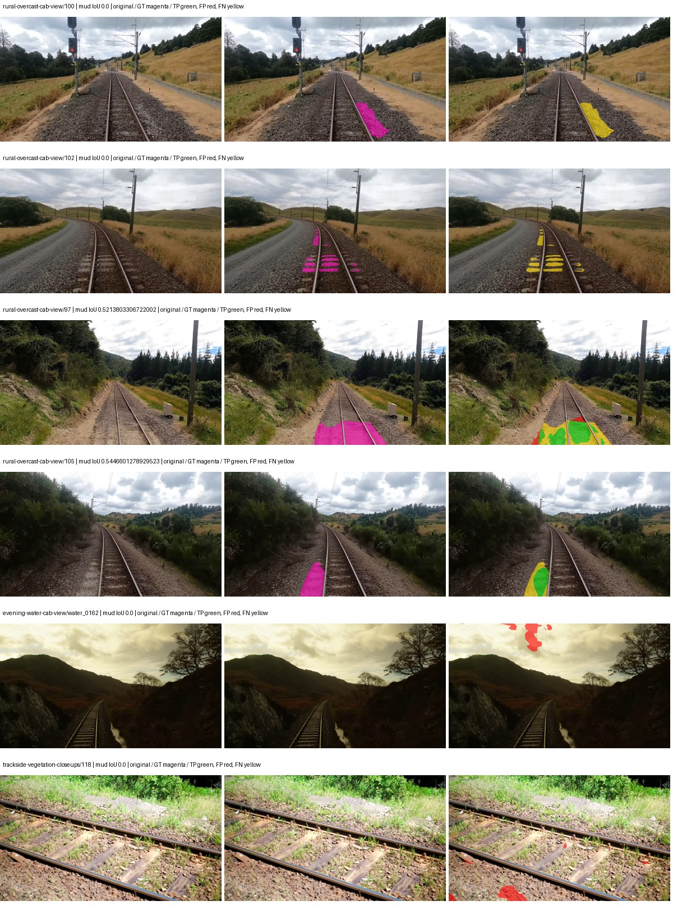

Examples are two lowest and two highest mud-IoU positive images, plus up to two negative images with the most false-positive mud pixels. They are targeted diagnostic examples, not random samples. Green: true positive; red: false positive; yellow: false negative. Full predictions remain on HDRFS.

### Validation tracking

| Logged step | Overall mIoU (%) | Mud IoU (%) |
| --- | --- | --- |
| 254 | 26.54 | 14.16 |
| 508 | 31.83 | 1.07 |
| 763 | 33.75 | 4.25 |
| 1017 | 36.28 | 9.44 |
| 1272 | 36.33 | 5.24 |
| 1527 | 36.31 | 7.73 |

All retained scalar curves, including training loss and per-class IoU, are in record.json. Observed best mud on a curve is not necessarily a retained checkpoint: the pilot saved its selection-metric-best and final checkpoints. Step logging and checkpoint global_step may differ by one.

### Stopping and checkpoint provenance

```json
{
  "stopping": {
    "actual_steps": 1527,
    "maximum_steps": 4000,
    "min_delta": 0.001,
    "monitor": "val_iou/mud-pumping",
    "patience": 5,
    "reason": "validation_plateau"
  },
  "checkpoints": {
    "best": {
      "path": "/data/izadia1/projects/segmentary-runs/paul-test-rtis/mud-fullstats-v1-20260906-r2/future-runs/native_convnext_tiny_uper--rtis_only--seed-0_seed0/rtis/best.ckpt",
      "sha256": "f8ae1ac0dccd4d43c9f9f153ea906dce8bab4d47a15ea076db26253073820350",
      "global_step": 254,
      "bytes": 589961485
    },
    "final": {
      "path": "/data/izadia1/projects/segmentary-runs/paul-test-rtis/mud-fullstats-v1-20260906-r2/future-runs/native_convnext_tiny_uper--rtis_only--seed-0_seed0/rtis/last.ckpt",
      "sha256": "5c98395a29002af0ea2bfcd5341ebf38b11d232c57b1f995fe7134cc0dac8e3c",
      "global_step": 1527,
      "bytes": 589951309
    }
  },
  "cleanup_error": null
}
```

### Resolved training, initialization and evaluation settings

The optimizer block is the base configuration. Stage LR scales are applied at runtime, and stage warmup is capped at min(base warmup, floor(stage budget / 10), stage budget - 1): 400 steps for this 4,000-step pilot. Model-internal native input grids may differ from augmentation crops (EoMT uses its 640 grid).

```json
{
  "name": "native_convnext_tiny_uper--rtis_only--seed-0",
  "model": {
    "arch": "native",
    "checkpoint": null,
    "tuning": "full",
    "head": "unified_head",
    "lora_r": 16,
    "lora_alpha": 32,
    "lora_dropout": 0.05,
    "lora_targets": [],
    "drop_path": null,
    "revision": null,
    "subfolder": null,
    "local_files_only": false,
    "trust_remote_code": false,
    "backbone_path": null,
    "head_paths": [],
    "classifier_path": null,
    "inactive_parameter_paths": [],
    "smp_arch": null,
    "encoder_name": null,
    "encoder_weights": null,
    "native": {
      "task": "multiclass",
      "backbone": {
        "kind": "timm",
        "name": "convnext_tiny.fb_in22k_ft_in1k",
        "weights": "pretrained",
        "out_indices": [
          0,
          1,
          2,
          3
        ],
        "in_channels": 3
      },
      "neck": {
        "kind": "identity"
      },
      "head": {
        "kind": "uper",
        "in_indices": [
          0,
          1,
          2,
          3
        ],
        "channels": 256,
        "pool_bins": [
          1,
          2,
          3,
          6
        ],
        "dropout": 0.1,
        "norm": "group",
        "activation": "relu"
      },
      "auxiliary_heads": []
    },
    "batch_norm_momentum": null
  },
  "space": "paul-test-rtis",
  "taxonomy_root": "/data/izadia1/projects/segmentary-rtis-fullstats-066afb2/taxonomy",
  "output_root": "/data/izadia1/projects/segmentary-runs/paul-test-rtis/mud-fullstats-v1-20260906-r2/future-runs",
  "optim": {
    "backbone_lr": 0.0001,
    "head_lr_mult": 10.0,
    "weight_decay": 0.05,
    "llrd": 1.0,
    "warmup_iters": 1500,
    "warmup_ratio": 1e-06,
    "poly_power": 0.9,
    "min_lr_ratio": 0.0,
    "betas": [
      0.9,
      0.999
    ],
    "grad_clip": 1.0
  },
  "train": {
    "iters": 4000,
    "batch_size": 2,
    "accum": 8,
    "num_workers": 2,
    "precision": "bf16-mixed",
    "ema_decay": 0.9998,
    "val_every": 250,
    "ckpt_every": 500,
    "selection_metric": "val_iou/mud-pumping",
    "early_stopping_patience": 5,
    "early_stopping_min_delta": 0.001,
    "seed": 0,
    "devices": 1
  },
  "eval": {
    "sliding_window": true,
    "window": [
      1024,
      1024
    ],
    "stride": [
      768,
      768
    ],
    "batch_size": 1,
    "num_workers": 2,
    "tta_scales": [],
    "tta_flip": false,
    "threshold": 0.5,
    "boundary_tolerance_frac": 0.0075,
    "save_confusion": true
  },
  "loss": {
    "task": "multiclass",
    "activation": "auto",
    "terms": [],
    "aux": "none",
    "aux_weight": 0.0,
    "ce_weight": 1.0,
    "label_smoothing": 0.0,
    "class_weights": null,
    "query": null
  },
  "aug": {
    "crop": [
      1024,
      1024
    ],
    "scale_min": 0.5,
    "scale_max": 2.0,
    "hflip_p": 0.5,
    "color_jitter_p": 0.5,
    "brightness": 0.25,
    "contrast": 0.25,
    "saturation": 0.25,
    "hue": 0.05
  },
  "stages": [
    {
      "name": "rtis",
      "data": [
        {
          "name": "paul-test-rtis",
          "root": "/data/izadia1/datasets/paul-test-rtis",
          "variant": null,
          "split_file": "splits.json",
          "train_split": "train",
          "val_split": "val",
          "limit": null,
          "loader": "folder",
          "mapping": "paul-test-rtis",
          "loader_options": {
            "require_groups": true
          }
        }
      ],
      "iters": null,
      "lr_scale": 1.0,
      "head_group_lr_scale": 1.0,
      "init_from": "pretrained",
      "reset_head": false,
      "freeze": null,
      "sample_weights": null
    }
  ]
}
```

### Hardware and software provenance

```json
{
  "training": {
    "cuda_available": true,
    "cuda_visible_devices": "9",
    "cudnn": 91900,
    "driver_version": "570.133.20",
    "gpu_count": 1,
    "gpu_names": [
      "NVIDIA L40S"
    ],
    "hostname": "hdrfs-app-001",
    "input_normalization": {
      "channel_order": "rgb",
      "mean": [
        0.485,
        0.456,
        0.406
      ],
      "source": "timm_pretrained_cfg",
      "std": [
        0.229,
        0.224,
        0.225
      ]
    },
    "model_origins": [
      {
        "hf_commit": null,
        "hf_name_or_path": null,
        "module": "backbone",
        "timm_pretrained": {
          "architecture": "convnext_tiny",
          "hf_hub_id": "timm/convnext_tiny.fb_in22k_ft_in1k",
          "tag": "fb_in22k_ft_in1k",
          "url": "https://dl.fbaipublicfiles.com/convnext/convnext_tiny_22k_1k_224.pth"
        }
      },
      {
        "hf_commit": null,
        "hf_name_or_path": null,
        "module": "backbone.model",
        "timm_pretrained": {
          "architecture": "convnext_tiny",
          "hf_hub_id": "timm/convnext_tiny.fb_in22k_ft_in1k",
          "tag": "fb_in22k_ft_in1k",
          "url": "https://dl.fbaipublicfiles.com/convnext/convnext_tiny_22k_1k_224.pth"
        }
      }
    ],
    "model_parameter_count": 36849525,
    "packages": {
      "albumentations": "2.0.8",
      "lightning": "2.6.5",
      "numpy": "2.4.4",
      "segmentary": "0.1.0",
      "segmentation-models-pytorch": "0.5.0",
      "timm": "1.0.28",
      "torch": "2.11.0+cu128",
      "torchvision": "0.26.0+cu128",
      "transformers": "5.15.0"
    },
    "platform": "Linux-5.15.0-139-generic-x86_64-with-glibc2.35",
    "python": "3.11.15",
    "torch": "2.11.0+cu128",
    "torch_cuda": "12.8",
    "trainable_parameter_count": 36849525,
    "training_stop": {
      "actual_steps": 1527,
      "maximum_steps": 4000,
      "min_delta": 0.001,
      "monitor": "val_iou/mud-pumping",
      "patience": 5,
      "reason": "validation_plateau"
    },
    "validation_weights": "ema"
  },
  "evaluation": {
    "cuda_available": true,
    "cuda_visible_devices": "9",
    "cudnn": 91900,
    "driver_version": "570.133.20",
    "gpu_count": 1,
    "gpu_names": [
      "NVIDIA L40S"
    ],
    "hostname": "hdrfs-app-001",
    "input_normalization": {
      "channel_order": "rgb",
      "mean": [
        0.485,
        0.456,
        0.406
      ],
      "source": "timm_pretrained_cfg",
      "std": [
        0.229,
        0.224,
        0.225
      ]
    },
    "packages": {
      "albumentations": "2.0.8",
      "lightning": "2.6.5",
      "numpy": "2.4.4",
      "segmentary": "0.1.0",
      "segmentation-models-pytorch": "0.5.0",
      "timm": "1.0.28",
      "torch": "2.11.0+cu128",
      "torchvision": "0.26.0+cu128",
      "transformers": "5.15.0"
    },
    "platform": "Linux-5.15.0-139-generic-x86_64-with-glibc2.35",
    "python": "3.11.15",
    "torch": "2.11.0+cu128",
    "torch_cuda": "12.8"
  }
}
```

## rtis_only — seed 1

Status: **completed**. Started: 2026-09-06T17:57:29.785825+00:00. Finished: 2026-09-06T18:55:44.961857+00:00.

Recipe pretrained initializer: `{"arch": "native", "backbone_path": null, "batch_norm_momentum": null, "checkpoint": null, "classifier_path": null, "drop_path": null, "encoder_name": null, "encoder_weights": null, "head": "unified_head", "head_paths": [], "inactive_parameter_paths": [], "local_files_only": false, "lora_alpha": 32, "lora_dropout": 0.05, "lora_r": 16, "lora_targets": [], "native": {"auxiliary_heads": [], "backbone": {"in_channels": 3, "kind": "timm", "name": "convnext_tiny.fb_in22k_ft_in1k", "out_indices": [0, 1, 2, 3], "weights": "pretrained"}, "head": {"activation": "relu", "channels": 256, "dropout": 0.1, "in_indices": [0, 1, 2, 3], "kind": "uper", "norm": "group", "pool_bins": [1, 2, 3, 6]}, "neck": {"kind": "identity"}, "task": "multiclass"}, "revision": null, "smp_arch": null, "subfolder": null, "trust_remote_code": false, "tuning": "full"}`.

`rtis_only` uses the recipe initializer, which may include pretrained segmentation components. Transfer paths load the exact historical source checkpoint below and reset the classifier; they do not reset all query/decoder features.

Source checkpoint: `Recipe pretrained initialization`.

Config SHA-256: `fcf11800b455bc31ad41c82f6f15c797951d24f8860f6708f281b669abb89f5d`. Weights used for validation: `ema`.

### Mud-pumping and aggregate quality

| Metric | Selected checkpoint | Final training validation |
| --- | --- | --- |
| Mud IoU | 14.43 | 14.45 |
| Mud precision | 54.15 | 54.13 |
| Mud recall | 16.44 | 16.47 |
| Mud Dice/F1 | 25.22 | 25.26 |
| mIoU | 38.55 | 38.57 |
| Mean accuracy | 55.08 | 55.06 |
| Mean precision | 54.90 | 54.99 |
| Mean Dice | 49.10 | 49.12 |
| Mean specificity | 99.09 | 99.09 |
| Pixel accuracy | 85.41 | 85.40 |
| Frequency-weighted IoU | 76.60 | 76.59 |
| Fixed GT-present class mIoU | 44.98 | 45.00 |
| Boundary F1 | 46.55 | 46.65 |

The selected checkpoint has independent evaluation evidence. Final values are the trainer's final validation record, not a new independent evaluation. mIoU averages classes with nonzero union, so false positives on absent classes can change its denominator. The fixed GT-class mean is supplementary and excludes absent classes; their false positives remain in the confusion matrix.

### Resource usage and timing

| Measurement | Value |
| --- | --- |
| Peak training VRAM, retained training invocation (GiB) | 10.20 |
| Peak evaluation VRAM (GiB) | 7.42 |
| Retained training invocation wall time (seconds) | 3317.98 |
| Retained training invocation GPU-hours (one GPU) | 0.92 |
| Evaluation wall time (seconds) | 16.36 |
| Full evaluation pipeline images/second | 2.26 |
| Best full-state checkpoint (MiB) | 562.63 |
| Final full-state checkpoint (MiB) | 562.62 |
| Audited periodic checkpoints removed (GiB) | 4.40 |

VRAM uses the recorded allocator high-water mark; it is not total device usage including CUDA context. Resumed jobs' retained training invocation times and peaks are **not whole-campaign totals**. Earlier invocation resource records are not reconstructed here. Evaluation throughput includes loader, sliding-window inference and metrics; it is not model-only latency/FPS. Missing measurements are shown as —, never inferred from another dataset's run.

### Standardized inference performance

Dedicated model-only profiling waits for an idle worker-locked L40S: BF16, batch 1, 1024x1024, 20 warmup and 100 CUDA-event-timed public forwards. It excludes loading, preprocessing, tiling and metrics.

| Status | Parameters | Weight MiB | FPS | p50 ms | p95 ms | Peak reserved GiB |
| --- | --- | --- | --- | --- | --- | --- |
| complete | 36849525 | 140.57 | 76.02 | 13.14 | 13.19 | 1.24 |

```json
{
  "schema_version": 1,
  "model_id": "native_convnext_tiny_uper",
  "measured_at": "2026-09-06T18:55:38+00:00",
  "status": "complete",
  "benchmark_scope": "rtis_selected_checkpoint_model_only",
  "applies_to": [
    "native_convnext_tiny_uper--rtis_only--seed-1"
  ],
  "source": {
    "campaign_git_sha": "066afb2626398b7be59d4d19f5a0e4644fd59adc",
    "git_dirty": false,
    "config_hash": "b8fe974496c7",
    "resolved_config": "/data/izadia1/projects/segmentary-runs/paul-test-rtis/mud-fullstats-v1-20260906-r2/configs/native_convnext_tiny_uper--rtis_only--seed-1.yaml",
    "config_sha256": "fcf11800b455bc31ad41c82f6f15c797951d24f8860f6708f281b669abb89f5d",
    "checkpoint_sha256": "4d5e2b6665241a17b01332b5e4317cab9ed373f4189d78253e2ce5b559984ba5",
    "checkpoint_global_step": 3818,
    "checkpoint_bytes": 589961677,
    "checkpoint_kind": "resume checkpoint with optimizer and EMA state",
    "weights": "ema",
    "measured_checkpoint_job_id": "native_convnext_tiny_uper--rtis_only--seed-1",
    "result_sha256": "2c641398879fc509fb15139348e91b85c32287fb7ff09777ce86208818406df3",
    "result_git_sha": "066afb2626398b7be59d4d19f5a0e4644fd59adc",
    "result_stage": "eval:paul-test-rtis:val",
    "result_seed": 1
  },
  "hardware": {
    "gpu_name": "NVIDIA L40S",
    "gpu_uuid": "GPU-fc5dde96-210d-0afa-ac74-7f88477d622b",
    "logical_device": "cuda:0",
    "physical_visibility_token": "4",
    "compute_capability": [
      8,
      9
    ],
    "total_memory_bytes": 47677177856
  },
  "model": {
    "parameter_count": 36849525,
    "trainable_parameter_count": 36849525,
    "resident_parameter_bytes": 147398100,
    "parameter_dtype_counts": {
      "float32": 36849525
    }
  },
  "contract": {
    "backend": "pytorch",
    "precision": "bf16_autocast",
    "batch_size": 1,
    "input_shape_nchw": [
      1,
      3,
      1024,
      1024
    ],
    "warmup_iterations": 20,
    "measured_iterations": 100,
    "timing": "per-forward CUDA events with end-event synchronization",
    "includes_preprocessing": false,
    "includes_data_loader": false,
    "includes_sliding_window": false,
    "input_resident_on_gpu": true,
    "model_only": true,
    "entrypoint": "public model(image) dense-logits forward"
  },
  "measurements": {
    "latency": {
      "p50_ms": 13.14359998703003,
      "p95_ms": 13.191572618484496,
      "mean_ms": 13.154141101837158,
      "minimum_ms": 13.106176376342773,
      "maximum_ms": 13.723648071289062,
      "fps": 76.02168718262693,
      "raw_ms": [
        13.244416236877441,
        13.14303970336914,
        13.165568351745605,
        13.199263572692871,
        13.228032112121582,
        13.17471981048584,
        13.154303550720215,
        13.723648071289062,
        13.15123176574707,
        13.112319946289062,
        13.253631591796875,
        13.138943672180176,
        13.147135734558105,
        13.162367820739746,
        13.139967918395996,
        13.171711921691895,
        13.148159980773926,
        13.138943672180176,
        13.127679824829102,
        13.125632286071777,
        13.137920379638672,
        13.129728317260742,
        13.142016410827637,
        13.165568351745605,
        13.156352043151855,
        13.138943672180176,
        13.155327796936035,
        13.123456001281738,
        13.136896133422852,
        13.133824348449707,
        13.123583793640137,
        13.137920379638672,
        13.163519859313965,
        13.132800102233887,
        13.116415977478027,
        13.137920379638672,
        13.14303970336914,
        13.106176376342773,
        13.162495613098145,
        13.146112442016602,
        13.124608039855957,
        13.135871887207031,
        13.144063949584961,
        13.133824348449707,
        13.117440223693848,
        13.15123176574707,
        13.133695602416992,
        13.126655578613281,
        13.156352043151855,
        13.15839958190918,
        13.111295700073242,
        13.147135734558105,
        13.130751609802246,
        13.137920379638672,
        13.132800102233887,
        13.157376289367676,
        13.16147232055664,
        13.112319946289062,
        13.187071800231934,
        13.149184226989746,
        13.16147232055664,
        13.138943672180176,
        13.150208473205566,
        13.150208473205566,
        13.134847640991211,
        13.151103973388672,
        13.1429443359375,
        13.16659164428711,
        13.148159980773926,
        13.156352043151855,
        13.142016410827637,
        13.138943672180176,
        13.174783706665039,
        13.133824348449707,
        13.131775856018066,
        13.10812759399414,
        13.155327796936035,
        13.173760414123535,
        13.147135734558105,
        13.139007568359375,
        13.143136024475098,
        13.114368438720703,
        13.142016410827637,
        13.153280258178711,
        13.149184226989746,
        13.130751609802246,
        13.127679824829102,
        13.155327796936035,
        13.140992164611816,
        13.191167831420898,
        13.16966438293457,
        13.158271789550781,
        13.110272407531738,
        13.163519859313965,
        13.190143585205078,
        13.16659164428711,
        13.14089584350586,
        13.16761589050293,
        13.172736167907715,
        13.130751609802246
      ],
      "percentile_method": "numpy linear interpolation"
    },
    "peak_reserved_bytes": 1335885824,
    "memory_kind": "pytorch_cuda_allocator_peak_reserved_excluding_context",
    "benchmark_wall_clock_s": 9.515259604901075
  },
  "started_at": "2026-09-06T18:55:28+00:00",
  "finished_at": "2026-09-06T18:55:38+00:00",
  "environment": {
    "hostname": "hdrfs-app-001",
    "python": "3.11.15",
    "platform": "Linux-5.15.0-139-generic-x86_64-with-glibc2.35",
    "torch": "2.11.0+cu128",
    "torch_cuda": "12.8",
    "cudnn": 91900,
    "driver_version": "570.133.20",
    "cuda_available": true,
    "gpu_count": 1,
    "gpu_names": [
      "NVIDIA L40S"
    ],
    "cuda_visible_devices": "4",
    "packages": {
      "segmentary": "0.1.0",
      "torch": "2.11.0+cu128",
      "torchvision": "0.26.0+cu128",
      "transformers": "5.15.0",
      "timm": "1.0.28",
      "segmentation-models-pytorch": "0.5.0",
      "albumentations": "2.0.8",
      "lightning": "2.6.5",
      "numpy": "2.4.4"
    }
  }
}
```

### Per-class validation results

| Class | GT pixels | IoU (%) | Precision (%) | Recall (%) | Dice (%) | Boundary F1 (%) |
| --- | --- | --- | --- | --- | --- | --- |
| car | 29664 | 42.43 | 65.02 | 54.98 | 59.58 | 48.15 |
| construction | 311585 | 48.45 | 55.33 | 79.57 | 65.28 | 63.13 |
| fence | 265137 | 16.66 | 61.74 | 18.58 | 28.56 | 44.70 |
| mud-pumping | 1226250 | 14.43 | 54.15 | 16.44 | 25.22 | 24.42 |
| on-rails | 0 | 0.00 | 0.00 | — | 0.00 | 0.00 |
| person | 0 | 0.00 | 0.00 | — | 0.00 | 0.00 |
| pole | 628038 | 73.91 | 85.90 | 84.12 | 85.00 | 91.07 |
| rail-embedded | 16799 | 30.19 | 78.91 | 32.84 | 46.37 | 45.17 |
| rail-raised | 2969797 | 77.12 | 85.17 | 89.07 | 87.08 | 91.47 |
| rail-track | 6323197 | 40.88 | 63.11 | 53.72 | 58.04 | 57.08 |
| road | 1048831 | 17.18 | 34.87 | 25.30 | 29.33 | 24.13 |
| sidewalk | 1297367 | 13.97 | 27.74 | 21.96 | 24.51 | 13.32 |
| sky | 19121606 | 95.90 | 99.29 | 96.56 | 97.91 | 90.40 |
| standing-water | 95802 | 3.01 | 4.09 | 10.21 | 5.84 | 9.35 |
| terrain | 39239306 | 88.71 | 90.11 | 98.28 | 94.02 | 71.84 |
| trackbed | 10643081 | 59.64 | 70.58 | 79.37 | 74.71 | 60.50 |
| traffic-light | 19510 | 70.08 | 87.97 | 77.50 | 82.41 | 81.34 |
| traffic-sign | 13285 | 41.92 | 60.30 | 57.90 | 59.08 | 63.79 |
| tram-track | 56179 | 29.14 | 46.45 | 43.89 | 45.13 | 24.58 |
| truck | 0 | 0.00 | 0.00 | — | 0.00 | 0.00 |
| vegetation-overgrowth | 5901821 | 45.96 | 82.11 | 51.07 | 62.97 | 73.10 |

### Full-run accounting

| Measurement | Value |
| --- | --- |
| Full GPU-reserved wall seconds, all recorded worker attempts | 3495.18 |
| Full reserved GPU-hours | 0.97 |
| Whole-run timing complete | True |

| Phase | Wall seconds including failed attempts |
| --- | --- |
| training | 3324.44 |
| diagnostics | 123.11 |
| performance | 17.76 |

GPU-reserved time includes model loading, training, validation, collection, profiling, checkpoint I/O and orchestration while the worker owns one GPU. It is not GPU kernel-active time. Phase timings and sampled device memory/power/utilization are retained separately; sampled device memory is not the allocator high-water mark.

### Train/validation and raw/EMA diagnostics

| Checkpoint / weights / split | Images | Mud IoU (%) | Mud precision (%) | Mud recall (%) |
| --- | --- | --- | --- | --- |
| best-auto-train / ema | 220 | 98.13 | 99.01 | 99.09 |
| best-auto-val / ema | 37 | 14.43 | 54.15 | 16.44 |
| best-alternate-val / raw | 37 | 14.64 | 50.02 | 17.14 |
| final-auto-val / ema | 37 | 14.46 | 54.16 | 16.48 |

Train uses the evaluation transform without augmentation. Compare mud train/validation metrics for the same selected weights. Alternate EMA on running-stat BatchNorm is explicitly uncalibrated and is diagnostic only. Score-threshold curves use uncalibrated normalized scores and are pixel-level diagnostics, not event detection rates or a selected deployment operating point.

### Downloadable evidence

- best-auto-train: [per-image.csv](rtis_only--seed-1/best-auto-train/per-image.csv) · [per-image-confusion.json.gz](rtis_only--seed-1/best-auto-train/per-image-confusion.json.gz) · [groups.json](rtis_only--seed-1/best-auto-train/groups.json) · [mud-score-curves.json](rtis_only--seed-1/best-auto-train/mud-score-curves.json)
- best-auto-val: [per-image.csv](rtis_only--seed-1/best-auto-val/per-image.csv) · [per-image-confusion.json.gz](rtis_only--seed-1/best-auto-val/per-image-confusion.json.gz) · [groups.json](rtis_only--seed-1/best-auto-val/groups.json) · [mud-score-curves.json](rtis_only--seed-1/best-auto-val/mud-score-curves.json) · [examples.jpg](rtis_only--seed-1/best-auto-val/examples.jpg)
- best-alternate-val: [per-image.csv](rtis_only--seed-1/best-alternate-val/per-image.csv) · [per-image-confusion.json.gz](rtis_only--seed-1/best-alternate-val/per-image-confusion.json.gz) · [groups.json](rtis_only--seed-1/best-alternate-val/groups.json) · [mud-score-curves.json](rtis_only--seed-1/best-alternate-val/mud-score-curves.json)
- final-auto-val: [per-image.csv](rtis_only--seed-1/final-auto-val/per-image.csv) · [per-image-confusion.json.gz](rtis_only--seed-1/final-auto-val/per-image-confusion.json.gz) · [groups.json](rtis_only--seed-1/final-auto-val/groups.json) · [mud-score-curves.json](rtis_only--seed-1/final-auto-val/mud-score-curves.json)
- resources: [telemetry.csv](rtis_only--seed-1/resources/telemetry.csv)

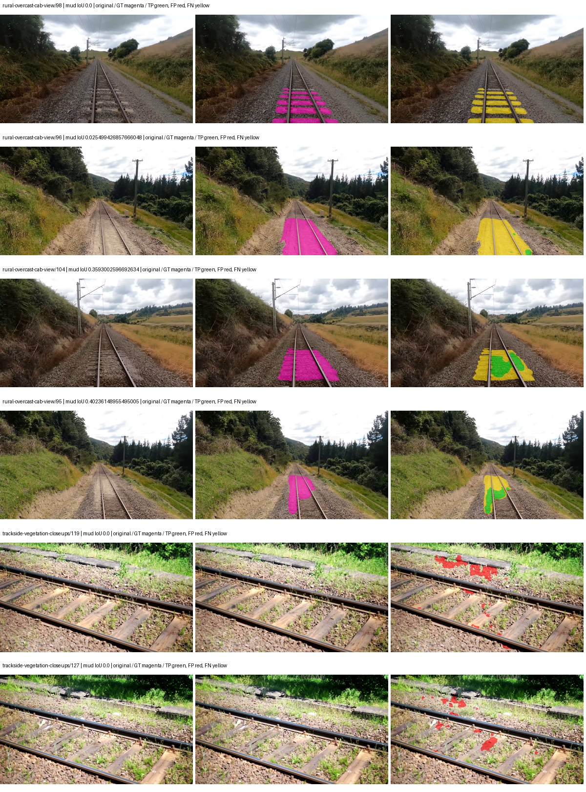

Examples are two lowest and two highest mud-IoU positive images, plus up to two negative images with the most false-positive mud pixels. They are targeted diagnostic examples, not random samples. Green: true positive; red: false positive; yellow: false negative. Full predictions remain on HDRFS.

### Validation tracking

| Logged step | Overall mIoU (%) | Mud IoU (%) |
| --- | --- | --- |
| 254 | 25.76 | 4.55 |
| 508 | 33.59 | 1.83 |
| 763 | 35.12 | 7.80 |
| 1017 | 36.01 | 8.73 |
| 1272 | 37.12 | 9.38 |
| 1527 | 37.27 | 12.25 |
| 1781 | 37.79 | 11.89 |
| 2036 | 38.43 | 13.85 |
| 2290 | 38.45 | 13.96 |
| 2545 | 38.46 | 14.00 |
| 2799 | 38.46 | 14.00 |
| 3054 | 38.44 | 14.05 |
| 3308 | 38.49 | 14.17 |
| 3563 | 38.53 | 14.31 |
| 3817 | 38.55 | 14.43 |
| 4000 | 38.57 | 14.45 |

All retained scalar curves, including training loss and per-class IoU, are in record.json. Observed best mud on a curve is not necessarily a retained checkpoint: the pilot saved its selection-metric-best and final checkpoints. Step logging and checkpoint global_step may differ by one.

### Stopping and checkpoint provenance

```json
{
  "stopping": {
    "actual_steps": 4000,
    "maximum_steps": 4000,
    "min_delta": 0.001,
    "monitor": "val_iou/mud-pumping",
    "patience": 5,
    "reason": "budget_complete"
  },
  "checkpoints": {
    "best": {
      "path": "/data/izadia1/projects/segmentary-runs/paul-test-rtis/mud-fullstats-v1-20260906-r2/future-runs/native_convnext_tiny_uper--rtis_only--seed-1_seed1/rtis/best.ckpt",
      "sha256": "4d5e2b6665241a17b01332b5e4317cab9ed373f4189d78253e2ce5b559984ba5",
      "global_step": 3818,
      "bytes": 589961677
    },
    "final": {
      "path": "/data/izadia1/projects/segmentary-runs/paul-test-rtis/mud-fullstats-v1-20260906-r2/future-runs/native_convnext_tiny_uper--rtis_only--seed-1_seed1/rtis/last.ckpt",
      "sha256": "481eef69e75d1d0ec15dc0a1eb6c0336fda3f5de105beec47bd94372762acba3",
      "global_step": 4000,
      "bytes": 589951181
    }
  },
  "cleanup_error": null
}
```

### Resolved training, initialization and evaluation settings

The optimizer block is the base configuration. Stage LR scales are applied at runtime, and stage warmup is capped at min(base warmup, floor(stage budget / 10), stage budget - 1): 400 steps for this 4,000-step pilot. Model-internal native input grids may differ from augmentation crops (EoMT uses its 640 grid).

```json
{
  "name": "native_convnext_tiny_uper--rtis_only--seed-1",
  "model": {
    "arch": "native",
    "checkpoint": null,
    "tuning": "full",
    "head": "unified_head",
    "lora_r": 16,
    "lora_alpha": 32,
    "lora_dropout": 0.05,
    "lora_targets": [],
    "drop_path": null,
    "revision": null,
    "subfolder": null,
    "local_files_only": false,
    "trust_remote_code": false,
    "backbone_path": null,
    "head_paths": [],
    "classifier_path": null,
    "inactive_parameter_paths": [],
    "smp_arch": null,
    "encoder_name": null,
    "encoder_weights": null,
    "native": {
      "task": "multiclass",
      "backbone": {
        "kind": "timm",
        "name": "convnext_tiny.fb_in22k_ft_in1k",
        "weights": "pretrained",
        "out_indices": [
          0,
          1,
          2,
          3
        ],
        "in_channels": 3
      },
      "neck": {
        "kind": "identity"
      },
      "head": {
        "kind": "uper",
        "in_indices": [
          0,
          1,
          2,
          3
        ],
        "channels": 256,
        "pool_bins": [
          1,
          2,
          3,
          6
        ],
        "dropout": 0.1,
        "norm": "group",
        "activation": "relu"
      },
      "auxiliary_heads": []
    },
    "batch_norm_momentum": null
  },
  "space": "paul-test-rtis",
  "taxonomy_root": "/data/izadia1/projects/segmentary-rtis-fullstats-066afb2/taxonomy",
  "output_root": "/data/izadia1/projects/segmentary-runs/paul-test-rtis/mud-fullstats-v1-20260906-r2/future-runs",
  "optim": {
    "backbone_lr": 0.0001,
    "head_lr_mult": 10.0,
    "weight_decay": 0.05,
    "llrd": 1.0,
    "warmup_iters": 1500,
    "warmup_ratio": 1e-06,
    "poly_power": 0.9,
    "min_lr_ratio": 0.0,
    "betas": [
      0.9,
      0.999
    ],
    "grad_clip": 1.0
  },
  "train": {
    "iters": 4000,
    "batch_size": 2,
    "accum": 8,
    "num_workers": 2,
    "precision": "bf16-mixed",
    "ema_decay": 0.9998,
    "val_every": 250,
    "ckpt_every": 500,
    "selection_metric": "val_iou/mud-pumping",
    "early_stopping_patience": 5,
    "early_stopping_min_delta": 0.001,
    "seed": 1,
    "devices": 1
  },
  "eval": {
    "sliding_window": true,
    "window": [
      1024,
      1024
    ],
    "stride": [
      768,
      768
    ],
    "batch_size": 1,
    "num_workers": 2,
    "tta_scales": [],
    "tta_flip": false,
    "threshold": 0.5,
    "boundary_tolerance_frac": 0.0075,
    "save_confusion": true
  },
  "loss": {
    "task": "multiclass",
    "activation": "auto",
    "terms": [],
    "aux": "none",
    "aux_weight": 0.0,
    "ce_weight": 1.0,
    "label_smoothing": 0.0,
    "class_weights": null,
    "query": null
  },
  "aug": {
    "crop": [
      1024,
      1024
    ],
    "scale_min": 0.5,
    "scale_max": 2.0,
    "hflip_p": 0.5,
    "color_jitter_p": 0.5,
    "brightness": 0.25,
    "contrast": 0.25,
    "saturation": 0.25,
    "hue": 0.05
  },
  "stages": [
    {
      "name": "rtis",
      "data": [
        {
          "name": "paul-test-rtis",
          "root": "/data/izadia1/datasets/paul-test-rtis",
          "variant": null,
          "split_file": "splits.json",
          "train_split": "train",
          "val_split": "val",
          "limit": null,
          "loader": "folder",
          "mapping": "paul-test-rtis",
          "loader_options": {
            "require_groups": true
          }
        }
      ],
      "iters": null,
      "lr_scale": 1.0,
      "head_group_lr_scale": 1.0,
      "init_from": "pretrained",
      "reset_head": false,
      "freeze": null,
      "sample_weights": null
    }
  ]
}
```

### Hardware and software provenance

```json
{
  "training": {
    "cuda_available": true,
    "cuda_visible_devices": "4",
    "cudnn": 91900,
    "driver_version": "570.133.20",
    "gpu_count": 1,
    "gpu_names": [
      "NVIDIA L40S"
    ],
    "hostname": "hdrfs-app-001",
    "input_normalization": {
      "channel_order": "rgb",
      "mean": [
        0.485,
        0.456,
        0.406
      ],
      "source": "timm_pretrained_cfg",
      "std": [
        0.229,
        0.224,
        0.225
      ]
    },
    "model_origins": [
      {
        "hf_commit": null,
        "hf_name_or_path": null,
        "module": "backbone",
        "timm_pretrained": {
          "architecture": "convnext_tiny",
          "hf_hub_id": "timm/convnext_tiny.fb_in22k_ft_in1k",
          "tag": "fb_in22k_ft_in1k",
          "url": "https://dl.fbaipublicfiles.com/convnext/convnext_tiny_22k_1k_224.pth"
        }
      },
      {
        "hf_commit": null,
        "hf_name_or_path": null,
        "module": "backbone.model",
        "timm_pretrained": {
          "architecture": "convnext_tiny",
          "hf_hub_id": "timm/convnext_tiny.fb_in22k_ft_in1k",
          "tag": "fb_in22k_ft_in1k",
          "url": "https://dl.fbaipublicfiles.com/convnext/convnext_tiny_22k_1k_224.pth"
        }
      }
    ],
    "model_parameter_count": 36849525,
    "packages": {
      "albumentations": "2.0.8",
      "lightning": "2.6.5",
      "numpy": "2.4.4",
      "segmentary": "0.1.0",
      "segmentation-models-pytorch": "0.5.0",
      "timm": "1.0.28",
      "torch": "2.11.0+cu128",
      "torchvision": "0.26.0+cu128",
      "transformers": "5.15.0"
    },
    "platform": "Linux-5.15.0-139-generic-x86_64-with-glibc2.35",
    "python": "3.11.15",
    "torch": "2.11.0+cu128",
    "torch_cuda": "12.8",
    "trainable_parameter_count": 36849525,
    "training_stop": {
      "actual_steps": 4000,
      "maximum_steps": 4000,
      "min_delta": 0.001,
      "monitor": "val_iou/mud-pumping",
      "patience": 5,
      "reason": "budget_complete"
    },
    "validation_weights": "ema"
  },
  "evaluation": {
    "cuda_available": true,
    "cuda_visible_devices": "4",
    "cudnn": 91900,
    "driver_version": "570.133.20",
    "gpu_count": 1,
    "gpu_names": [
      "NVIDIA L40S"
    ],
    "hostname": "hdrfs-app-001",
    "input_normalization": {
      "channel_order": "rgb",
      "mean": [
        0.485,
        0.456,
        0.406
      ],
      "source": "timm_pretrained_cfg",
      "std": [
        0.229,
        0.224,
        0.225
      ]
    },
    "packages": {
      "albumentations": "2.0.8",
      "lightning": "2.6.5",
      "numpy": "2.4.4",
      "segmentary": "0.1.0",
      "segmentation-models-pytorch": "0.5.0",
      "timm": "1.0.28",
      "torch": "2.11.0+cu128",
      "torchvision": "0.26.0+cu128",
      "transformers": "5.15.0"
    },
    "platform": "Linux-5.15.0-139-generic-x86_64-with-glibc2.35",
    "python": "3.11.15",
    "torch": "2.11.0+cu128",
    "torch_cuda": "12.8"
  }
}
```

## rtis_only — seed 2

Status: **completed**. Started: 2026-09-06T18:03:08.620468+00:00. Finished: 2026-09-06T19:01:03.996813+00:00.

Recipe pretrained initializer: `{"arch": "native", "backbone_path": null, "batch_norm_momentum": null, "checkpoint": null, "classifier_path": null, "drop_path": null, "encoder_name": null, "encoder_weights": null, "head": "unified_head", "head_paths": [], "inactive_parameter_paths": [], "local_files_only": false, "lora_alpha": 32, "lora_dropout": 0.05, "lora_r": 16, "lora_targets": [], "native": {"auxiliary_heads": [], "backbone": {"in_channels": 3, "kind": "timm", "name": "convnext_tiny.fb_in22k_ft_in1k", "out_indices": [0, 1, 2, 3], "weights": "pretrained"}, "head": {"activation": "relu", "channels": 256, "dropout": 0.1, "in_indices": [0, 1, 2, 3], "kind": "uper", "norm": "group", "pool_bins": [1, 2, 3, 6]}, "neck": {"kind": "identity"}, "task": "multiclass"}, "revision": null, "smp_arch": null, "subfolder": null, "trust_remote_code": false, "tuning": "full"}`.

`rtis_only` uses the recipe initializer, which may include pretrained segmentation components. Transfer paths load the exact historical source checkpoint below and reset the classifier; they do not reset all query/decoder features.

Source checkpoint: `Recipe pretrained initialization`.

Config SHA-256: `b6c8da63267871d9235b8598e40f7d3136f1698e351d1206ef7b903b92d199d3`. Weights used for validation: `ema`.

### Mud-pumping and aggregate quality

| Metric | Selected checkpoint | Final training validation |
| --- | --- | --- |
| Mud IoU | 11.06 | 11.06 |
| Mud precision | 42.22 | 41.44 |
| Mud recall | 13.03 | 13.12 |
| Mud Dice/F1 | 19.91 | 19.92 |
| mIoU | 37.08 | 37.14 |
| Mean accuracy | 52.92 | 52.97 |
| Mean precision | 56.05 | 56.08 |
| Mean Dice | 47.59 | 47.65 |
| Mean specificity | 99.05 | 99.05 |
| Pixel accuracy | 84.90 | 84.90 |
| Frequency-weighted IoU | 75.88 | 75.88 |
| Fixed GT-present class mIoU | 43.27 | 43.33 |
| Boundary F1 | 47.57 | 47.63 |

The selected checkpoint has independent evaluation evidence. Final values are the trainer's final validation record, not a new independent evaluation. mIoU averages classes with nonzero union, so false positives on absent classes can change its denominator. The fixed GT-class mean is supplementary and excludes absent classes; their false positives remain in the confusion matrix.

### Resource usage and timing

| Measurement | Value |
| --- | --- |
| Peak training VRAM, retained training invocation (GiB) | 10.27 |
| Peak evaluation VRAM (GiB) | 7.42 |
| Retained training invocation wall time (seconds) | 3298.56 |
| Retained training invocation GPU-hours (one GPU) | 0.92 |
| Evaluation wall time (seconds) | 16.45 |
| Full evaluation pipeline images/second | 2.25 |
| Best full-state checkpoint (MiB) | 562.63 |
| Final full-state checkpoint (MiB) | 562.62 |
| Audited periodic checkpoints removed (GiB) | 4.40 |

VRAM uses the recorded allocator high-water mark; it is not total device usage including CUDA context. Resumed jobs' retained training invocation times and peaks are **not whole-campaign totals**. Earlier invocation resource records are not reconstructed here. Evaluation throughput includes loader, sliding-window inference and metrics; it is not model-only latency/FPS. Missing measurements are shown as —, never inferred from another dataset's run.

### Standardized inference performance

Dedicated model-only profiling waits for an idle worker-locked L40S: BF16, batch 1, 1024x1024, 20 warmup and 100 CUDA-event-timed public forwards. It excludes loading, preprocessing, tiling and metrics.

| Status | Parameters | Weight MiB | FPS | p50 ms | p95 ms | Peak reserved GiB |
| --- | --- | --- | --- | --- | --- | --- |
| complete | 36849525 | 140.57 | 76.15 | 13.13 | 13.16 | 1.24 |

```json
{
  "schema_version": 1,
  "model_id": "native_convnext_tiny_uper",
  "measured_at": "2026-09-06T19:00:57+00:00",
  "status": "complete",
  "benchmark_scope": "rtis_selected_checkpoint_model_only",
  "applies_to": [
    "native_convnext_tiny_uper--rtis_only--seed-2"
  ],
  "source": {
    "campaign_git_sha": "066afb2626398b7be59d4d19f5a0e4644fd59adc",
    "git_dirty": false,
    "config_hash": "1776e2b5f3ac",
    "resolved_config": "/data/izadia1/projects/segmentary-runs/paul-test-rtis/mud-fullstats-v1-20260906-r2/configs/native_convnext_tiny_uper--rtis_only--seed-2.yaml",
    "config_sha256": "b6c8da63267871d9235b8598e40f7d3136f1698e351d1206ef7b903b92d199d3",
    "checkpoint_sha256": "7aa0a54d89ff1207fc5eb8afb558ac70258af013f69e8115a0ddd1e54fcad27d",
    "checkpoint_global_step": 3818,
    "checkpoint_bytes": 589961677,
    "checkpoint_kind": "resume checkpoint with optimizer and EMA state",
    "weights": "ema",
    "measured_checkpoint_job_id": "native_convnext_tiny_uper--rtis_only--seed-2",
    "result_sha256": "c94ebb637a2374b2d55b030d70a054364518af400f8c6dca5e4fbe703bdca43d",
    "result_git_sha": "066afb2626398b7be59d4d19f5a0e4644fd59adc",
    "result_stage": "eval:paul-test-rtis:val",
    "result_seed": 2
  },
  "hardware": {
    "gpu_name": "NVIDIA L40S",
    "gpu_uuid": "GPU-a5ad49e5-0536-5229-ba8a-f8a902808f53",
    "logical_device": "cuda:0",
    "physical_visibility_token": "7",
    "compute_capability": [
      8,
      9
    ],
    "total_memory_bytes": 47677177856
  },
  "model": {
    "parameter_count": 36849525,
    "trainable_parameter_count": 36849525,
    "resident_parameter_bytes": 147398100,
    "parameter_dtype_counts": {
      "float32": 36849525
    }
  },
  "contract": {
    "backend": "pytorch",
    "precision": "bf16_autocast",
    "batch_size": 1,
    "input_shape_nchw": [
      1,
      3,
      1024,
      1024
    ],
    "warmup_iterations": 20,
    "measured_iterations": 100,
    "timing": "per-forward CUDA events with end-event synchronization",
    "includes_preprocessing": false,
    "includes_data_loader": false,
    "includes_sliding_window": false,
    "input_resident_on_gpu": true,
    "model_only": true,
    "entrypoint": "public model(image) dense-logits forward"
  },
  "measurements": {
    "latency": {
      "p50_ms": 13.128704071044922,
      "p95_ms": 13.15947504043579,
      "mean_ms": 13.1311709690094,
      "minimum_ms": 13.082624435424805,
      "maximum_ms": 13.287424087524414,
      "fps": 76.15467062001393,
      "raw_ms": [
        13.209600448608398,
        13.119487762451172,
        13.125632286071777,
        13.133824348449707,
        13.116415977478027,
        13.124608039855957,
        13.118464469909668,
        13.146112442016602,
        13.110272407531738,
        13.114368438720703,
        13.121536254882812,
        13.109248161315918,
        13.114368438720703,
        13.127679824829102,
        13.137920379638672,
        13.137920379638672,
        13.120512008666992,
        13.150208473205566,
        13.11945629119873,
        13.119487762451172,
        13.136896133422852,
        13.121536254882812,
        13.121536254882812,
        13.091839790344238,
        13.131775856018066,
        13.117440223693848,
        13.113344192504883,
        13.137920379638672,
        13.131775856018066,
        13.107199668884277,
        13.111295700073242,
        13.115391731262207,
        13.123583793640137,
        13.136896133422852,
        13.119487762451172,
        13.08569622039795,
        13.130751609802246,
        13.099967956542969,
        13.287424087524414,
        13.134847640991211,
        13.136896133422852,
        13.16761589050293,
        13.134847640991211,
        13.109248161315918,
        13.129728317260742,
        13.156352043151855,
        13.15225601196289,
        13.124608039855957,
        13.128704071044922,
        13.15123176574707,
        13.082624435424805,
        13.137920379638672,
        13.149184226989746,
        13.133824348449707,
        13.108223915100098,
        13.121536254882812,
        13.125632286071777,
        13.106176376342773,
        13.106176376342773,
        13.155327796936035,
        13.127679824829102,
        13.148192405700684,
        13.120512008666992,
        13.144063949584961,
        13.128704071044922,
        13.131775856018066,
        13.159423828125,
        13.127679824829102,
        13.156352043151855,
        13.118464469909668,
        13.16044807434082,
        13.131775856018066,
        13.089792251586914,
        13.119487762451172,
        13.15225601196289,
        13.124608039855957,
        13.134847640991211,
        13.150208473205566,
        13.11023998260498,
        13.137920379638672,
        13.110272407531738,
        13.120512008666992,
        13.155327796936035,
        13.1778564453125,
        13.133824348449707,
        13.127679824829102,
        13.153280258178711,
        13.15225601196289,
        13.130751609802246,
        13.134847640991211,
        13.135871887207031,
        13.145088195800781,
        13.121536254882812,
        13.127679824829102,
        13.135871887207031,
        13.106176376342773,
        13.146112442016602,
        13.150208473205566,
        13.093888282775879,
        13.131775856018066
      ],
      "percentile_method": "numpy linear interpolation"
    },
    "peak_reserved_bytes": 1335885824,
    "memory_kind": "pytorch_cuda_allocator_peak_reserved_excluding_context",
    "benchmark_wall_clock_s": 9.439657486975193
  },
  "started_at": "2026-09-06T19:00:47+00:00",
  "finished_at": "2026-09-06T19:00:57+00:00",
  "environment": {
    "hostname": "hdrfs-app-001",
    "python": "3.11.15",
    "platform": "Linux-5.15.0-139-generic-x86_64-with-glibc2.35",
    "torch": "2.11.0+cu128",
    "torch_cuda": "12.8",
    "cudnn": 91900,
    "driver_version": "570.133.20",
    "cuda_available": true,
    "gpu_count": 1,
    "gpu_names": [
      "NVIDIA L40S"
    ],
    "cuda_visible_devices": "7",
    "packages": {
      "segmentary": "0.1.0",
      "torch": "2.11.0+cu128",
      "torchvision": "0.26.0+cu128",
      "transformers": "5.15.0",
      "timm": "1.0.28",
      "segmentation-models-pytorch": "0.5.0",
      "albumentations": "2.0.8",
      "lightning": "2.6.5",
      "numpy": "2.4.4"
    }
  }
}
```

### Per-class validation results

| Class | GT pixels | IoU (%) | Precision (%) | Recall (%) | Dice (%) | Boundary F1 (%) |
| --- | --- | --- | --- | --- | --- | --- |
| car | 29664 | 32.13 | 60.62 | 40.61 | 48.64 | 45.68 |
| construction | 311585 | 40.20 | 46.17 | 75.64 | 57.34 | 52.43 |
| fence | 265137 | 19.90 | 73.79 | 21.42 | 33.20 | 51.79 |
| mud-pumping | 1226250 | 11.06 | 42.22 | 13.03 | 19.91 | 20.08 |
| on-rails | 0 | 0.00 | 0.00 | — | 0.00 | 0.00 |
| person | 0 | 0.00 | 0.00 | — | 0.00 | 0.00 |
| pole | 628038 | 73.58 | 85.74 | 83.84 | 84.78 | 91.08 |
| rail-embedded | 16799 | 23.50 | 93.22 | 23.91 | 38.05 | 58.41 |
| rail-raised | 2969797 | 77.69 | 84.18 | 90.97 | 87.44 | 92.39 |
| rail-track | 6323197 | 40.64 | 62.25 | 53.94 | 57.80 | 57.17 |
| road | 1048831 | 14.40 | 29.09 | 22.18 | 25.17 | 18.08 |
| sidewalk | 1297367 | 14.39 | 29.42 | 21.98 | 25.16 | 11.74 |
| sky | 19121606 | 95.52 | 99.33 | 96.14 | 97.71 | 89.14 |
| standing-water | 95802 | 3.78 | 4.57 | 17.91 | 7.28 | 8.78 |
| terrain | 39239306 | 87.99 | 89.19 | 98.49 | 93.61 | 69.67 |
| trackbed | 10643081 | 59.02 | 71.65 | 77.00 | 74.23 | 61.29 |
| traffic-light | 19510 | 65.40 | 85.03 | 73.91 | 79.08 | 79.49 |
| traffic-sign | 13285 | 45.33 | 66.76 | 58.53 | 62.38 | 70.81 |
| tram-track | 56179 | 30.61 | 70.84 | 35.02 | 46.87 | 48.54 |
| truck | 0 | 0.00 | 0.00 | — | 0.00 | 0.00 |
| vegetation-overgrowth | 5901821 | 43.63 | 82.92 | 47.94 | 60.75 | 72.32 |

### Full-run accounting

| Measurement | Value |
| --- | --- |
| Full GPU-reserved wall seconds, all recorded worker attempts | 3475.38 |
| Full reserved GPU-hours | 0.97 |
| Whole-run timing complete | True |

| Phase | Wall seconds including failed attempts |
| --- | --- |
| training | 3305.25 |
| diagnostics | 123.05 |
| performance | 17.18 |

GPU-reserved time includes model loading, training, validation, collection, profiling, checkpoint I/O and orchestration while the worker owns one GPU. It is not GPU kernel-active time. Phase timings and sampled device memory/power/utilization are retained separately; sampled device memory is not the allocator high-water mark.

### Train/validation and raw/EMA diagnostics

| Checkpoint / weights / split | Images | Mud IoU (%) | Mud precision (%) | Mud recall (%) |
| --- | --- | --- | --- | --- |
| best-auto-train / ema | 220 | 98.14 | 98.99 | 99.14 |
| best-auto-val / ema | 37 | 11.06 | 42.22 | 13.03 |
| best-alternate-val / raw | 37 | 11.65 | 31.40 | 15.62 |
| final-auto-val / ema | 37 | 11.07 | 41.45 | 13.12 |

Train uses the evaluation transform without augmentation. Compare mud train/validation metrics for the same selected weights. Alternate EMA on running-stat BatchNorm is explicitly uncalibrated and is diagnostic only. Score-threshold curves use uncalibrated normalized scores and are pixel-level diagnostics, not event detection rates or a selected deployment operating point.

### Downloadable evidence

- best-auto-train: [per-image.csv](rtis_only--seed-2/best-auto-train/per-image.csv) · [per-image-confusion.json.gz](rtis_only--seed-2/best-auto-train/per-image-confusion.json.gz) · [groups.json](rtis_only--seed-2/best-auto-train/groups.json) · [mud-score-curves.json](rtis_only--seed-2/best-auto-train/mud-score-curves.json)
- best-auto-val: [per-image.csv](rtis_only--seed-2/best-auto-val/per-image.csv) · [per-image-confusion.json.gz](rtis_only--seed-2/best-auto-val/per-image-confusion.json.gz) · [groups.json](rtis_only--seed-2/best-auto-val/groups.json) · [mud-score-curves.json](rtis_only--seed-2/best-auto-val/mud-score-curves.json) · [examples.jpg](rtis_only--seed-2/best-auto-val/examples.jpg)
- best-alternate-val: [per-image.csv](rtis_only--seed-2/best-alternate-val/per-image.csv) · [per-image-confusion.json.gz](rtis_only--seed-2/best-alternate-val/per-image-confusion.json.gz) · [groups.json](rtis_only--seed-2/best-alternate-val/groups.json) · [mud-score-curves.json](rtis_only--seed-2/best-alternate-val/mud-score-curves.json)
- final-auto-val: [per-image.csv](rtis_only--seed-2/final-auto-val/per-image.csv) · [per-image-confusion.json.gz](rtis_only--seed-2/final-auto-val/per-image-confusion.json.gz) · [groups.json](rtis_only--seed-2/final-auto-val/groups.json) · [mud-score-curves.json](rtis_only--seed-2/final-auto-val/mud-score-curves.json)
- resources: [telemetry.csv](rtis_only--seed-2/resources/telemetry.csv)

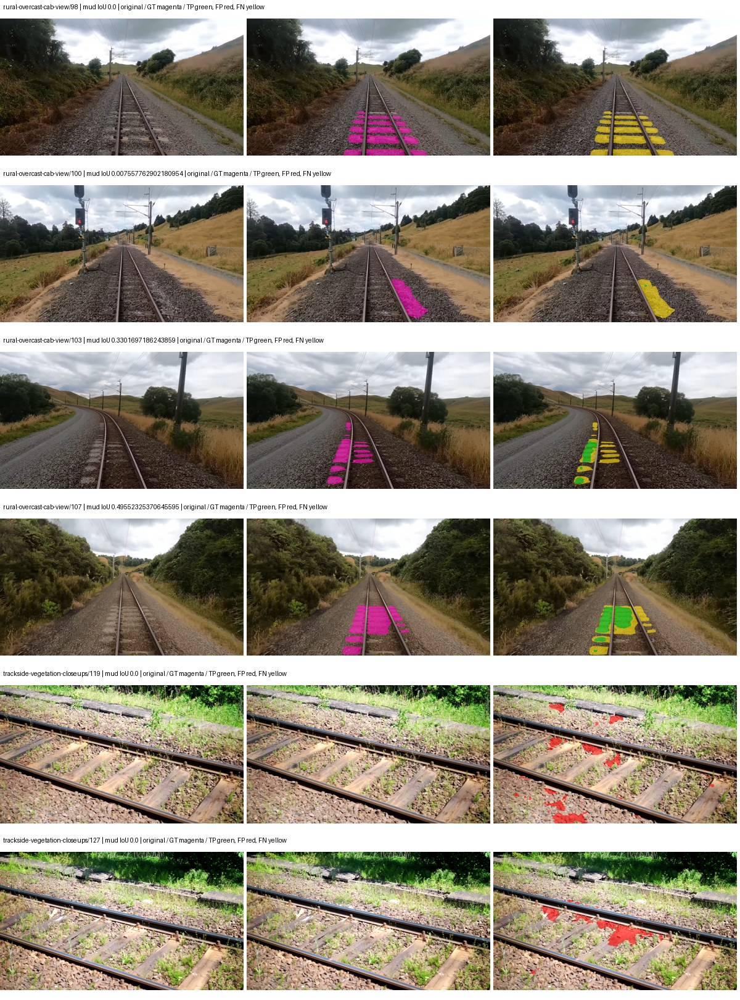

Examples are two lowest and two highest mud-IoU positive images, plus up to two negative images with the most false-positive mud pixels. They are targeted diagnostic examples, not random samples. Green: true positive; red: false positive; yellow: false negative. Full predictions remain on HDRFS.

### Validation tracking

| Logged step | Overall mIoU (%) | Mud IoU (%) |
| --- | --- | --- |
| 254 | 27.68 | 8.69 |
| 508 | 30.91 | 6.20 |
| 763 | 33.20 | 6.57 |
| 1017 | 34.97 | 9.52 |
| 1272 | 35.41 | 7.47 |
| 1527 | 36.62 | 8.58 |
| 1781 | 36.38 | 8.53 |
| 2036 | 36.78 | 10.62 |
| 2290 | 36.76 | 10.61 |
| 2545 | 36.73 | 10.70 |
| 2799 | 36.82 | 10.68 |
| 3054 | 36.91 | 10.75 |
| 3308 | 37.01 | 10.83 |
| 3563 | 37.07 | 10.92 |
| 3817 | 37.09 | 11.05 |
| 4000 | 37.14 | 11.06 |

All retained scalar curves, including training loss and per-class IoU, are in record.json. Observed best mud on a curve is not necessarily a retained checkpoint: the pilot saved its selection-metric-best and final checkpoints. Step logging and checkpoint global_step may differ by one.

### Stopping and checkpoint provenance

```json
{
  "stopping": {
    "actual_steps": 4000,
    "maximum_steps": 4000,
    "min_delta": 0.001,
    "monitor": "val_iou/mud-pumping",
    "patience": 5,
    "reason": "budget_complete"
  },
  "checkpoints": {
    "best": {
      "path": "/data/izadia1/projects/segmentary-runs/paul-test-rtis/mud-fullstats-v1-20260906-r2/future-runs/native_convnext_tiny_uper--rtis_only--seed-2_seed2/rtis/best.ckpt",
      "sha256": "7aa0a54d89ff1207fc5eb8afb558ac70258af013f69e8115a0ddd1e54fcad27d",
      "global_step": 3818,
      "bytes": 589961677
    },
    "final": {
      "path": "/data/izadia1/projects/segmentary-runs/paul-test-rtis/mud-fullstats-v1-20260906-r2/future-runs/native_convnext_tiny_uper--rtis_only--seed-2_seed2/rtis/last.ckpt",
      "sha256": "bde7e35eae773edc8742513e8385f5ad1d87978b47f3f68807d360babbc54119",
      "global_step": 4000,
      "bytes": 589951181
    }
  },
  "cleanup_error": null
}
```

### Resolved training, initialization and evaluation settings

The optimizer block is the base configuration. Stage LR scales are applied at runtime, and stage warmup is capped at min(base warmup, floor(stage budget / 10), stage budget - 1): 400 steps for this 4,000-step pilot. Model-internal native input grids may differ from augmentation crops (EoMT uses its 640 grid).

```json
{
  "name": "native_convnext_tiny_uper--rtis_only--seed-2",
  "model": {
    "arch": "native",
    "checkpoint": null,
    "tuning": "full",
    "head": "unified_head",
    "lora_r": 16,
    "lora_alpha": 32,
    "lora_dropout": 0.05,
    "lora_targets": [],
    "drop_path": null,
    "revision": null,
    "subfolder": null,
    "local_files_only": false,
    "trust_remote_code": false,
    "backbone_path": null,
    "head_paths": [],
    "classifier_path": null,
    "inactive_parameter_paths": [],
    "smp_arch": null,
    "encoder_name": null,
    "encoder_weights": null,
    "native": {
      "task": "multiclass",
      "backbone": {
        "kind": "timm",
        "name": "convnext_tiny.fb_in22k_ft_in1k",
        "weights": "pretrained",
        "out_indices": [
          0,
          1,
          2,
          3
        ],
        "in_channels": 3
      },
      "neck": {
        "kind": "identity"
      },
      "head": {
        "kind": "uper",
        "in_indices": [
          0,
          1,
          2,
          3
        ],
        "channels": 256,
        "pool_bins": [
          1,
          2,
          3,
          6
        ],
        "dropout": 0.1,
        "norm": "group",
        "activation": "relu"
      },
      "auxiliary_heads": []
    },
    "batch_norm_momentum": null
  },
  "space": "paul-test-rtis",
  "taxonomy_root": "/data/izadia1/projects/segmentary-rtis-fullstats-066afb2/taxonomy",
  "output_root": "/data/izadia1/projects/segmentary-runs/paul-test-rtis/mud-fullstats-v1-20260906-r2/future-runs",
  "optim": {
    "backbone_lr": 0.0001,
    "head_lr_mult": 10.0,
    "weight_decay": 0.05,
    "llrd": 1.0,
    "warmup_iters": 1500,
    "warmup_ratio": 1e-06,
    "poly_power": 0.9,
    "min_lr_ratio": 0.0,
    "betas": [
      0.9,
      0.999
    ],
    "grad_clip": 1.0
  },
  "train": {
    "iters": 4000,
    "batch_size": 2,
    "accum": 8,
    "num_workers": 2,
    "precision": "bf16-mixed",
    "ema_decay": 0.9998,
    "val_every": 250,
    "ckpt_every": 500,
    "selection_metric": "val_iou/mud-pumping",
    "early_stopping_patience": 5,
    "early_stopping_min_delta": 0.001,
    "seed": 2,
    "devices": 1
  },
  "eval": {
    "sliding_window": true,
    "window": [
      1024,
      1024
    ],
    "stride": [
      768,
      768
    ],
    "batch_size": 1,
    "num_workers": 2,
    "tta_scales": [],
    "tta_flip": false,
    "threshold": 0.5,
    "boundary_tolerance_frac": 0.0075,
    "save_confusion": true
  },
  "loss": {
    "task": "multiclass",
    "activation": "auto",
    "terms": [],
    "aux": "none",
    "aux_weight": 0.0,
    "ce_weight": 1.0,
    "label_smoothing": 0.0,
    "class_weights": null,
    "query": null
  },
  "aug": {
    "crop": [
      1024,
      1024
    ],
    "scale_min": 0.5,
    "scale_max": 2.0,
    "hflip_p": 0.5,
    "color_jitter_p": 0.5,
    "brightness": 0.25,
    "contrast": 0.25,
    "saturation": 0.25,
    "hue": 0.05
  },
  "stages": [
    {
      "name": "rtis",
      "data": [
        {
          "name": "paul-test-rtis",
          "root": "/data/izadia1/datasets/paul-test-rtis",
          "variant": null,
          "split_file": "splits.json",
          "train_split": "train",
          "val_split": "val",
          "limit": null,
          "loader": "folder",
          "mapping": "paul-test-rtis",
          "loader_options": {
            "require_groups": true
          }
        }
      ],
      "iters": null,
      "lr_scale": 1.0,
      "head_group_lr_scale": 1.0,
      "init_from": "pretrained",
      "reset_head": false,
      "freeze": null,
      "sample_weights": null
    }
  ]
}
```

### Hardware and software provenance

```json
{
  "training": {
    "cuda_available": true,
    "cuda_visible_devices": "7",
    "cudnn": 91900,
    "driver_version": "570.133.20",
    "gpu_count": 1,
    "gpu_names": [
      "NVIDIA L40S"
    ],
    "hostname": "hdrfs-app-001",
    "input_normalization": {
      "channel_order": "rgb",
      "mean": [
        0.485,
        0.456,
        0.406
      ],
      "source": "timm_pretrained_cfg",
      "std": [
        0.229,
        0.224,
        0.225
      ]
    },
    "model_origins": [
      {
        "hf_commit": null,
        "hf_name_or_path": null,
        "module": "backbone",
        "timm_pretrained": {
          "architecture": "convnext_tiny",
          "hf_hub_id": "timm/convnext_tiny.fb_in22k_ft_in1k",
          "tag": "fb_in22k_ft_in1k",
          "url": "https://dl.fbaipublicfiles.com/convnext/convnext_tiny_22k_1k_224.pth"
        }
      },
      {
        "hf_commit": null,
        "hf_name_or_path": null,
        "module": "backbone.model",
        "timm_pretrained": {
          "architecture": "convnext_tiny",
          "hf_hub_id": "timm/convnext_tiny.fb_in22k_ft_in1k",
          "tag": "fb_in22k_ft_in1k",
          "url": "https://dl.fbaipublicfiles.com/convnext/convnext_tiny_22k_1k_224.pth"
        }
      }
    ],
    "model_parameter_count": 36849525,
    "packages": {
      "albumentations": "2.0.8",
      "lightning": "2.6.5",
      "numpy": "2.4.4",
      "segmentary": "0.1.0",
      "segmentation-models-pytorch": "0.5.0",
      "timm": "1.0.28",
      "torch": "2.11.0+cu128",
      "torchvision": "0.26.0+cu128",
      "transformers": "5.15.0"
    },
    "platform": "Linux-5.15.0-139-generic-x86_64-with-glibc2.35",
    "python": "3.11.15",
    "torch": "2.11.0+cu128",
    "torch_cuda": "12.8",
    "trainable_parameter_count": 36849525,
    "training_stop": {
      "actual_steps": 4000,
      "maximum_steps": 4000,
      "min_delta": 0.001,
      "monitor": "val_iou/mud-pumping",
      "patience": 5,
      "reason": "budget_complete"
    },
    "validation_weights": "ema"
  },
  "evaluation": {
    "cuda_available": true,
    "cuda_visible_devices": "7",
    "cudnn": 91900,
    "driver_version": "570.133.20",
    "gpu_count": 1,
    "gpu_names": [
      "NVIDIA L40S"
    ],
    "hostname": "hdrfs-app-001",
    "input_normalization": {
      "channel_order": "rgb",
      "mean": [
        0.485,
        0.456,
        0.406
      ],
      "source": "timm_pretrained_cfg",
      "std": [
        0.229,
        0.224,
        0.225
      ]
    },
    "packages": {
      "albumentations": "2.0.8",
      "lightning": "2.6.5",
      "numpy": "2.4.4",
      "segmentary": "0.1.0",
      "segmentation-models-pytorch": "0.5.0",
      "timm": "1.0.28",
      "torch": "2.11.0+cu128",
      "torchvision": "0.26.0+cu128",
      "transformers": "5.15.0"
    },
    "platform": "Linux-5.15.0-139-generic-x86_64-with-glibc2.35",
    "python": "3.11.15",
    "torch": "2.11.0+cu128",
    "torch_cuda": "12.8"
  }
}
```

## cityscapes_to_rtis — seed 0

Status: **completed**. Started: 2026-09-06T18:09:10.938730+00:00. Finished: 2026-09-06T18:40:06.706919+00:00.

Recipe pretrained initializer: `{"arch": "native", "backbone_path": null, "batch_norm_momentum": null, "checkpoint": null, "classifier_path": null, "drop_path": null, "encoder_name": null, "encoder_weights": null, "head": "unified_head", "head_paths": [], "inactive_parameter_paths": [], "local_files_only": false, "lora_alpha": 32, "lora_dropout": 0.05, "lora_r": 16, "lora_targets": [], "native": {"auxiliary_heads": [], "backbone": {"in_channels": 3, "kind": "timm", "name": "convnext_tiny.fb_in22k_ft_in1k", "out_indices": [0, 1, 2, 3], "weights": "pretrained"}, "head": {"activation": "relu", "channels": 256, "dropout": 0.1, "in_indices": [0, 1, 2, 3], "kind": "uper", "norm": "group", "pool_bins": [1, 2, 3, 6]}, "neck": {"kind": "identity"}, "task": "multiclass"}, "revision": null, "smp_arch": null, "subfolder": null, "trust_remote_code": false, "tuning": "full"}`.

`rtis_only` uses the recipe initializer, which may include pretrained segmentation components. Transfer paths load the exact historical source checkpoint below and reset the classifier; they do not reset all query/decoder features.

Source checkpoint: `{'name': 'native_convnext_tiny_uper--cityscapes--seed-0', 'model': 'native_convnext_tiny_uper', 'protocol': 'cityscapes', 'config': '/data/izadia1/projects/segmentary-runs/all-model-city-rail-seed0-rail20-b9eb3e1/accepted/native_convnext_tiny_uper--cityscapes--seed-0/resolved-config.yaml', 'checkpoint': '/data/izadia1/projects/segmentary-runs/all-model-city-rail-seed0-a7c0b67/jobs/native_convnext_tiny_uper--cityscapes--seed-0/attempt-001/train/native_convnext_tiny_uper--cityscapes_seed0/cityscapes/last.ckpt', 'recorded_sha256': '5b371ccbb1c2f1ad354d205d07f867135039dd82de6fffac6c27c76b1cbc88ea', 'exists': True}`.

Config SHA-256: `be98c1d26c2e43e38edb06a9039be062d4bfa7a31464fd2721e7db4498265501`. Weights used for validation: `ema`.

### Mud-pumping and aggregate quality

| Metric | Selected checkpoint | Final training validation |
| --- | --- | --- |
| Mud IoU | 3.22 | 2.12 |
| Mud precision | 8.93 | 7.21 |
| Mud recall | 4.78 | 2.91 |
| Mud Dice/F1 | 6.23 | 4.15 |
| mIoU | 34.11 | 35.45 |
| Mean accuracy | 49.33 | 50.20 |
| Mean precision | 48.85 | 50.98 |
| Mean Dice | 43.81 | 45.10 |
| Mean specificity | 98.89 | 98.85 |
| Pixel accuracy | 82.59 | 82.19 |
| Frequency-weighted IoU | 72.31 | 71.55 |
| Fixed GT-present class mIoU | 39.80 | 41.36 |
| Boundary F1 | 41.05 | 42.06 |

The selected checkpoint has independent evaluation evidence. Final values are the trainer's final validation record, not a new independent evaluation. mIoU averages classes with nonzero union, so false positives on absent classes can change its denominator. The fixed GT-class mean is supplementary and excludes absent classes; their false positives remain in the confusion matrix.

### Resource usage and timing

| Measurement | Value |
| --- | --- |
| Peak training VRAM, retained training invocation (GiB) | 10.27 |
| Peak evaluation VRAM (GiB) | 7.42 |
| Retained training invocation wall time (seconds) | 1684.52 |
| Retained training invocation GPU-hours (one GPU) | 0.47 |
| Evaluation wall time (seconds) | 15.66 |
| Full evaluation pipeline images/second | 2.36 |
| Best full-state checkpoint (MiB) | 562.63 |
| Final full-state checkpoint (MiB) | 562.62 |
| Audited periodic checkpoints removed (GiB) | 2.20 |

VRAM uses the recorded allocator high-water mark; it is not total device usage including CUDA context. Resumed jobs' retained training invocation times and peaks are **not whole-campaign totals**. Earlier invocation resource records are not reconstructed here. Evaluation throughput includes loader, sliding-window inference and metrics; it is not model-only latency/FPS. Missing measurements are shown as —, never inferred from another dataset's run.

### Standardized inference performance

Dedicated model-only profiling waits for an idle worker-locked L40S: BF16, batch 1, 1024x1024, 20 warmup and 100 CUDA-event-timed public forwards. It excludes loading, preprocessing, tiling and metrics.

| Status | Parameters | Weight MiB | FPS | p50 ms | p95 ms | Peak reserved GiB |
| --- | --- | --- | --- | --- | --- | --- |
| complete | 36849525 | 140.57 | 76.01 | 13.14 | 13.23 | 1.24 |

```json
{
  "schema_version": 1,
  "model_id": "native_convnext_tiny_uper",
  "measured_at": "2026-09-06T18:40:02+00:00",
  "status": "complete",
  "benchmark_scope": "rtis_selected_checkpoint_model_only",
  "applies_to": [
    "native_convnext_tiny_uper--cityscapes_to_rtis--seed-0"
  ],
  "source": {
    "campaign_git_sha": "066afb2626398b7be59d4d19f5a0e4644fd59adc",
    "git_dirty": false,
    "config_hash": "beee4c9630cc",
    "resolved_config": "/data/izadia1/projects/segmentary-runs/paul-test-rtis/mud-fullstats-v1-20260906-r2/configs/native_convnext_tiny_uper--cityscapes_to_rtis--seed-0.yaml",
    "config_sha256": "be98c1d26c2e43e38edb06a9039be062d4bfa7a31464fd2721e7db4498265501",
    "checkpoint_sha256": "9df4c5c1f7ce9fa02206478acba187adbaaacc02952a3fc6fd62ad8ed15bbe99",
    "checkpoint_global_step": 763,
    "checkpoint_bytes": 589961741,
    "checkpoint_kind": "resume checkpoint with optimizer and EMA state",
    "weights": "ema",
    "measured_checkpoint_job_id": "native_convnext_tiny_uper--cityscapes_to_rtis--seed-0",
    "result_sha256": "38014580e139eee30fdc06a40e34d7da77d5733e6e6b70fa1ca3dc0f2f94d5ca",
    "result_git_sha": "066afb2626398b7be59d4d19f5a0e4644fd59adc",
    "result_stage": "eval:paul-test-rtis:val",
    "result_seed": 0
  },
  "hardware": {
    "gpu_name": "NVIDIA L40S",
    "gpu_uuid": "GPU-1c9b612f-e0b5-fbbc-150f-8c2ef13453c9",
    "logical_device": "cuda:0",
    "physical_visibility_token": "5",
    "compute_capability": [
      8,
      9
    ],
    "total_memory_bytes": 47677177856
  },
  "model": {
    "parameter_count": 36849525,
    "trainable_parameter_count": 36849525,
    "resident_parameter_bytes": 147398100,
    "parameter_dtype_counts": {
      "float32": 36849525
    }
  },
  "contract": {
    "backend": "pytorch",
    "precision": "bf16_autocast",
    "batch_size": 1,
    "input_shape_nchw": [
      1,
      3,
      1024,
      1024
    ],
    "warmup_iterations": 20,
    "measured_iterations": 100,
    "timing": "per-forward CUDA events with end-event synchronization",
    "includes_preprocessing": false,
    "includes_data_loader": false,
    "includes_sliding_window": false,
    "input_resident_on_gpu": true,
    "model_only": true,
    "entrypoint": "public model(image) dense-logits forward"
  },
  "measurements": {
    "latency": {
      "p50_ms": 13.144063949584961,
      "p95_ms": 13.230282878875732,
      "mean_ms": 13.156382064819336,
      "minimum_ms": 13.100031852722168,
      "maximum_ms": 13.338624000549316,
      "fps": 76.00873819817363,
      "raw_ms": [
        13.191167831420898,
        13.149215698242188,
        13.142016410827637,
        13.124608039855957,
        13.178879737854004,
        13.203455924987793,
        13.130784034729004,
        13.132800102233887,
        13.210623741149902,
        13.197312355041504,
        13.154303550720215,
        13.100031852722168,
        13.136896133422852,
        13.16864013671875,
        13.144063949584961,
        13.139967918395996,
        13.134847640991211,
        13.133824348449707,
        13.223936080932617,
        13.146112442016602,
        13.14303970336914,
        13.192192077636719,
        13.338624000549316,
        13.125632286071777,
        13.187071800231934,
        13.163519859313965,
        13.108223915100098,
        13.142016410827637,
        13.110272407531738,
        13.147135734558105,
        13.120512008666992,
        13.144063949584961,
        13.216768264770508,
        13.111295700073242,
        13.247488021850586,
        13.17580795288086,
        13.16659164428711,
        13.122559547424316,
        13.234175682067871,
        13.187071800231934,
        13.15225601196289,
        13.194239616394043,
        13.192192077636719,
        13.219840049743652,
        13.15225601196289,
        13.108223915100098,
        13.118464469909668,
        13.148159980773926,
        13.173760414123535,
        13.126655578613281,
        13.118464469909668,
        13.113344192504883,
        13.139967918395996,
        13.126655578613281,
        13.116415977478027,
        13.139967918395996,
        13.171711921691895,
        13.139967918395996,
        13.137920379638672,
        13.16761589050293,
        13.112319946289062,
        13.194239616394043,
        13.133824348449707,
        13.154303550720215,
        13.118464469909668,
        13.120512008666992,
        13.186047554016113,
        13.141951560974121,
        13.125632286071777,
        13.114368438720703,
        13.2259521484375,
        13.230079650878906,
        13.271039962768555,
        13.14303970336914,
        13.16966438293457,
        13.108223915100098,
        13.164544105529785,
        13.136896133422852,
        13.14303970336914,
        13.102080345153809,
        13.159423828125,
        13.174783706665039,
        13.125632286071777,
        13.132800102233887,
        13.130751609802246,
        13.178879737854004,
        13.129728317260742,
        13.124608039855957,
        13.146112442016602,
        13.154303550720215,
        13.120512008666992,
        13.16044807434082,
        13.120512008666992,
        13.164544105529785,
        13.186047554016113,
        13.130751609802246,
        13.133824348449707,
        13.144063949584961,
        13.204480171203613,
        13.23414421081543
      ],
      "percentile_method": "numpy linear interpolation"
    },
    "peak_reserved_bytes": 1335885824,
    "memory_kind": "pytorch_cuda_allocator_peak_reserved_excluding_context",
    "benchmark_wall_clock_s": 9.135533384978771
  },
  "started_at": "2026-09-06T18:39:53+00:00",
  "finished_at": "2026-09-06T18:40:02+00:00",
  "environment": {
    "hostname": "hdrfs-app-001",
    "python": "3.11.15",
    "platform": "Linux-5.15.0-139-generic-x86_64-with-glibc2.35",
    "torch": "2.11.0+cu128",
    "torch_cuda": "12.8",
    "cudnn": 91900,
    "driver_version": "570.133.20",
    "cuda_available": true,
    "gpu_count": 1,
    "gpu_names": [
      "NVIDIA L40S"
    ],
    "cuda_visible_devices": "5",
    "packages": {
      "segmentary": "0.1.0",
      "torch": "2.11.0+cu128",
      "torchvision": "0.26.0+cu128",
      "transformers": "5.15.0",
      "timm": "1.0.28",
      "segmentation-models-pytorch": "0.5.0",
      "albumentations": "2.0.8",
      "lightning": "2.6.5",
      "numpy": "2.4.4"
    }
  }
}
```

### Per-class validation results

| Class | GT pixels | IoU (%) | Precision (%) | Recall (%) | Dice (%) | Boundary F1 (%) |
| --- | --- | --- | --- | --- | --- | --- |
| car | 29664 | 48.10 | 81.88 | 53.83 | 64.96 | 57.03 |
| construction | 311585 | 51.27 | 59.64 | 78.52 | 67.79 | 53.36 |
| fence | 265137 | 18.36 | 44.83 | 23.71 | 31.02 | 37.92 |
| mud-pumping | 1226250 | 3.22 | 8.93 | 4.78 | 6.23 | 9.42 |
| on-rails | 0 | 0.00 | 0.00 | — | 0.00 | 0.00 |
| person | 0 | 0.00 | 0.00 | — | 0.00 | 0.00 |
| pole | 628038 | 74.52 | 83.98 | 86.87 | 85.40 | 91.66 |
| rail-embedded | 16799 | 11.75 | 37.23 | 14.65 | 21.03 | 19.82 |
| rail-raised | 2969797 | 74.07 | 81.17 | 89.43 | 85.10 | 88.52 |
| rail-track | 6323197 | 42.93 | 60.77 | 59.39 | 60.07 | 56.02 |
| road | 1048831 | 2.90 | 7.57 | 4.49 | 5.64 | 12.31 |
| sidewalk | 1297367 | 8.58 | 34.32 | 10.26 | 15.80 | 12.55 |
| sky | 19121606 | 88.82 | 99.47 | 89.25 | 94.08 | 79.66 |
| standing-water | 95802 | 3.93 | 5.02 | 15.35 | 7.57 | 16.89 |
| terrain | 39239306 | 84.97 | 87.34 | 96.90 | 91.87 | 64.78 |
| trackbed | 10643081 | 57.37 | 66.64 | 80.49 | 72.91 | 56.17 |
| traffic-light | 19510 | 37.49 | 78.40 | 41.81 | 54.54 | 57.72 |
| traffic-sign | 13285 | 47.91 | 65.60 | 63.98 | 64.78 | 66.70 |
| tram-track | 56179 | 21.86 | 39.77 | 32.68 | 35.88 | 14.18 |
| truck | 0 | 0.00 | 0.00 | — | 0.00 | 0.00 |
| vegetation-overgrowth | 5901821 | 38.32 | 83.22 | 41.52 | 55.40 | 67.35 |

### Full-run accounting

| Measurement | Value |
| --- | --- |
| Full GPU-reserved wall seconds, all recorded worker attempts | 1856.26 |
| Full reserved GPU-hours | 0.52 |
| Whole-run timing complete | True |

| Phase | Wall seconds including failed attempts |
| --- | --- |
| training | 1691.43 |
| diagnostics | 120.88 |
| performance | 16.95 |

GPU-reserved time includes model loading, training, validation, collection, profiling, checkpoint I/O and orchestration while the worker owns one GPU. It is not GPU kernel-active time. Phase timings and sampled device memory/power/utilization are retained separately; sampled device memory is not the allocator high-water mark.

### Train/validation and raw/EMA diagnostics

| Checkpoint / weights / split | Images | Mud IoU (%) | Mud precision (%) | Mud recall (%) |
| --- | --- | --- | --- | --- |
| best-auto-train / ema | 220 | 95.57 | 97.73 | 97.73 |
| best-auto-val / ema | 37 | 3.22 | 8.93 | 4.78 |
| best-alternate-val / raw | 37 | 6.43 | 16.41 | 9.56 |
| final-auto-val / ema | 37 | 2.12 | 7.21 | 2.91 |

Train uses the evaluation transform without augmentation. Compare mud train/validation metrics for the same selected weights. Alternate EMA on running-stat BatchNorm is explicitly uncalibrated and is diagnostic only. Score-threshold curves use uncalibrated normalized scores and are pixel-level diagnostics, not event detection rates or a selected deployment operating point.

### Downloadable evidence

- best-auto-train: [per-image.csv](cityscapes_to_rtis--seed-0/best-auto-train/per-image.csv) · [per-image-confusion.json.gz](cityscapes_to_rtis--seed-0/best-auto-train/per-image-confusion.json.gz) · [groups.json](cityscapes_to_rtis--seed-0/best-auto-train/groups.json) · [mud-score-curves.json](cityscapes_to_rtis--seed-0/best-auto-train/mud-score-curves.json)
- best-auto-val: [per-image.csv](cityscapes_to_rtis--seed-0/best-auto-val/per-image.csv) · [per-image-confusion.json.gz](cityscapes_to_rtis--seed-0/best-auto-val/per-image-confusion.json.gz) · [groups.json](cityscapes_to_rtis--seed-0/best-auto-val/groups.json) · [mud-score-curves.json](cityscapes_to_rtis--seed-0/best-auto-val/mud-score-curves.json) · [examples.jpg](cityscapes_to_rtis--seed-0/best-auto-val/examples.jpg)
- best-alternate-val: [per-image.csv](cityscapes_to_rtis--seed-0/best-alternate-val/per-image.csv) · [per-image-confusion.json.gz](cityscapes_to_rtis--seed-0/best-alternate-val/per-image-confusion.json.gz) · [groups.json](cityscapes_to_rtis--seed-0/best-alternate-val/groups.json) · [mud-score-curves.json](cityscapes_to_rtis--seed-0/best-alternate-val/mud-score-curves.json)
- final-auto-val: [per-image.csv](cityscapes_to_rtis--seed-0/final-auto-val/per-image.csv) · [per-image-confusion.json.gz](cityscapes_to_rtis--seed-0/final-auto-val/per-image-confusion.json.gz) · [groups.json](cityscapes_to_rtis--seed-0/final-auto-val/groups.json) · [mud-score-curves.json](cityscapes_to_rtis--seed-0/final-auto-val/mud-score-curves.json)
- resources: [telemetry.csv](cityscapes_to_rtis--seed-0/resources/telemetry.csv)

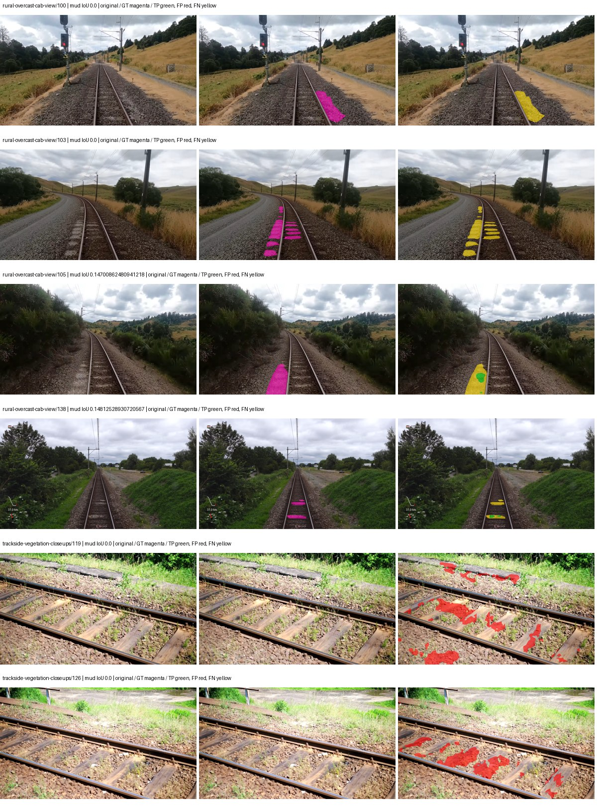

Examples are two lowest and two highest mud-IoU positive images, plus up to two negative images with the most false-positive mud pixels. They are targeted diagnostic examples, not random samples. Green: true positive; red: false positive; yellow: false negative. Full predictions remain on HDRFS.

### Validation tracking

| Logged step | Overall mIoU (%) | Mud IoU (%) |
| --- | --- | --- |
| 254 | 24.82 | 1.19 |
| 508 | 29.24 | 1.57 |
| 763 | 34.12 | 3.22 |
| 1017 | 34.93 | 2.98 |
| 1272 | 35.94 | 2.28 |
| 1527 | 35.38 | 2.16 |
| 1781 | 35.74 | 2.56 |
| 2036 | 35.45 | 2.12 |

All retained scalar curves, including training loss and per-class IoU, are in record.json. Observed best mud on a curve is not necessarily a retained checkpoint: the pilot saved its selection-metric-best and final checkpoints. Step logging and checkpoint global_step may differ by one.

### Stopping and checkpoint provenance

```json
{
  "stopping": {
    "actual_steps": 2036,
    "maximum_steps": 4000,
    "min_delta": 0.001,
    "monitor": "val_iou/mud-pumping",
    "patience": 5,
    "reason": "validation_plateau"
  },
  "checkpoints": {
    "best": {
      "path": "/data/izadia1/projects/segmentary-runs/paul-test-rtis/mud-fullstats-v1-20260906-r2/future-runs/native_convnext_tiny_uper--cityscapes_to_rtis--seed-0_seed0/rtis/best.ckpt",
      "sha256": "9df4c5c1f7ce9fa02206478acba187adbaaacc02952a3fc6fd62ad8ed15bbe99",
      "global_step": 763,
      "bytes": 589961741
    },
    "final": {
      "path": "/data/izadia1/projects/segmentary-runs/paul-test-rtis/mud-fullstats-v1-20260906-r2/future-runs/native_convnext_tiny_uper--cityscapes_to_rtis--seed-0_seed0/rtis/last.ckpt",
      "sha256": "42986075b526467003bcdb73d4a9e99e17c46e09c3f376b9743bf2a0176fd7eb",
      "global_step": 2036,
      "bytes": 589951373
    }
  },
  "cleanup_error": null
}
```

### Resolved training, initialization and evaluation settings

The optimizer block is the base configuration. Stage LR scales are applied at runtime, and stage warmup is capped at min(base warmup, floor(stage budget / 10), stage budget - 1): 400 steps for this 4,000-step pilot. Model-internal native input grids may differ from augmentation crops (EoMT uses its 640 grid).

```json
{
  "name": "native_convnext_tiny_uper--cityscapes_to_rtis--seed-0",
  "model": {
    "arch": "native",
    "checkpoint": null,
    "tuning": "full",
    "head": "unified_head",
    "lora_r": 16,
    "lora_alpha": 32,
    "lora_dropout": 0.05,
    "lora_targets": [],
    "drop_path": null,
    "revision": null,
    "subfolder": null,
    "local_files_only": false,
    "trust_remote_code": false,
    "backbone_path": null,
    "head_paths": [],
    "classifier_path": null,
    "inactive_parameter_paths": [],
    "smp_arch": null,
    "encoder_name": null,
    "encoder_weights": null,
    "native": {
      "task": "multiclass",
      "backbone": {
        "kind": "timm",
        "name": "convnext_tiny.fb_in22k_ft_in1k",
        "weights": "pretrained",
        "out_indices": [
          0,
          1,
          2,
          3
        ],
        "in_channels": 3
      },
      "neck": {
        "kind": "identity"
      },
      "head": {
        "kind": "uper",
        "in_indices": [
          0,
          1,
          2,
          3
        ],
        "channels": 256,
        "pool_bins": [
          1,
          2,
          3,
          6
        ],
        "dropout": 0.1,
        "norm": "group",
        "activation": "relu"
      },
      "auxiliary_heads": []
    },
    "batch_norm_momentum": null
  },
  "space": "paul-test-rtis",
  "taxonomy_root": "/data/izadia1/projects/segmentary-rtis-fullstats-066afb2/taxonomy",
  "output_root": "/data/izadia1/projects/segmentary-runs/paul-test-rtis/mud-fullstats-v1-20260906-r2/future-runs",
  "optim": {
    "backbone_lr": 0.0001,
    "head_lr_mult": 10.0,
    "weight_decay": 0.05,
    "llrd": 1.0,
    "warmup_iters": 1500,
    "warmup_ratio": 1e-06,
    "poly_power": 0.9,
    "min_lr_ratio": 0.0,
    "betas": [
      0.9,
      0.999
    ],
    "grad_clip": 1.0
  },
  "train": {
    "iters": 4000,
    "batch_size": 2,
    "accum": 8,
    "num_workers": 2,
    "precision": "bf16-mixed",
    "ema_decay": 0.9998,
    "val_every": 250,
    "ckpt_every": 500,
    "selection_metric": "val_iou/mud-pumping",
    "early_stopping_patience": 5,
    "early_stopping_min_delta": 0.001,
    "seed": 0,
    "devices": 1
  },
  "eval": {
    "sliding_window": true,
    "window": [
      1024,
      1024
    ],
    "stride": [
      768,
      768
    ],
    "batch_size": 1,
    "num_workers": 2,
    "tta_scales": [],
    "tta_flip": false,
    "threshold": 0.5,
    "boundary_tolerance_frac": 0.0075,
    "save_confusion": true
  },
  "loss": {
    "task": "multiclass",
    "activation": "auto",
    "terms": [],
    "aux": "none",
    "aux_weight": 0.0,
    "ce_weight": 1.0,
    "label_smoothing": 0.0,
    "class_weights": null,
    "query": null
  },
  "aug": {
    "crop": [
      1024,
      1024
    ],
    "scale_min": 0.5,
    "scale_max": 2.0,
    "hflip_p": 0.5,
    "color_jitter_p": 0.5,
    "brightness": 0.25,
    "contrast": 0.25,
    "saturation": 0.25,
    "hue": 0.05
  },
  "stages": [
    {
      "name": "rtis",
      "data": [
        {
          "name": "paul-test-rtis",
          "root": "/data/izadia1/datasets/paul-test-rtis",
          "variant": null,
          "split_file": "splits.json",
          "train_split": "train",
          "val_split": "val",
          "limit": null,
          "loader": "folder",
          "mapping": "paul-test-rtis",
          "loader_options": {
            "require_groups": true
          }
        }
      ],
      "iters": null,
      "lr_scale": 0.1,
      "head_group_lr_scale": 1.0,
      "init_from": "/data/izadia1/projects/segmentary-runs/all-model-city-rail-seed0-a7c0b67/jobs/native_convnext_tiny_uper--cityscapes--seed-0/attempt-001/train/native_convnext_tiny_uper--cityscapes_seed0/cityscapes/last.ckpt",
      "reset_head": true,
      "freeze": null,
      "sample_weights": null
    }
  ]
}
```

### Hardware and software provenance

```json
{
  "training": {
    "cuda_available": true,
    "cuda_visible_devices": "5",
    "cudnn": 91900,
    "driver_version": "570.133.20",
    "gpu_count": 1,
    "gpu_names": [
      "NVIDIA L40S"
    ],
    "hostname": "hdrfs-app-001",
    "input_normalization": {
      "channel_order": "rgb",
      "mean": [
        0.485,
        0.456,
        0.406
      ],
      "source": "timm_pretrained_cfg",
      "std": [
        0.229,
        0.224,
        0.225
      ]
    },
    "model_origins": [
      {
        "hf_commit": null,
        "hf_name_or_path": null,
        "module": "backbone",
        "timm_pretrained": {
          "architecture": "convnext_tiny",
          "hf_hub_id": "timm/convnext_tiny.fb_in22k_ft_in1k",
          "tag": "fb_in22k_ft_in1k",
          "url": "https://dl.fbaipublicfiles.com/convnext/convnext_tiny_22k_1k_224.pth"
        }
      },
      {
        "hf_commit": null,
        "hf_name_or_path": null,
        "module": "backbone.model",
        "timm_pretrained": {
          "architecture": "convnext_tiny",
          "hf_hub_id": "timm/convnext_tiny.fb_in22k_ft_in1k",
          "tag": "fb_in22k_ft_in1k",
          "url": "https://dl.fbaipublicfiles.com/convnext/convnext_tiny_22k_1k_224.pth"
        }
      }
    ],
    "model_parameter_count": 36849525,
    "packages": {
      "albumentations": "2.0.8",
      "lightning": "2.6.5",
      "numpy": "2.4.4",
      "segmentary": "0.1.0",
      "segmentation-models-pytorch": "0.5.0",
      "timm": "1.0.28",
      "torch": "2.11.0+cu128",
      "torchvision": "0.26.0+cu128",
      "transformers": "5.15.0"
    },
    "platform": "Linux-5.15.0-139-generic-x86_64-with-glibc2.35",
    "python": "3.11.15",
    "torch": "2.11.0+cu128",
    "torch_cuda": "12.8",
    "trainable_parameter_count": 36849525,
    "training_stop": {
      "actual_steps": 2036,
      "maximum_steps": 4000,
      "min_delta": 0.001,
      "monitor": "val_iou/mud-pumping",
      "patience": 5,
      "reason": "validation_plateau"
    },
    "validation_weights": "ema"
  },
  "evaluation": {
    "cuda_available": true,
    "cuda_visible_devices": "5",
    "cudnn": 91900,
    "driver_version": "570.133.20",
    "gpu_count": 1,
    "gpu_names": [
      "NVIDIA L40S"
    ],
    "hostname": "hdrfs-app-001",
    "input_normalization": {
      "channel_order": "rgb",
      "mean": [
        0.485,
        0.456,
        0.406
      ],
      "source": "timm_pretrained_cfg",
      "std": [
        0.229,
        0.224,
        0.225
      ]
    },
    "packages": {
      "albumentations": "2.0.8",
      "lightning": "2.6.5",
      "numpy": "2.4.4",
      "segmentary": "0.1.0",
      "segmentation-models-pytorch": "0.5.0",
      "timm": "1.0.28",
      "torch": "2.11.0+cu128",
      "torchvision": "0.26.0+cu128",
      "transformers": "5.15.0"
    },
    "platform": "Linux-5.15.0-139-generic-x86_64-with-glibc2.35",
    "python": "3.11.15",
    "torch": "2.11.0+cu128",
    "torch_cuda": "12.8"
  }
}
```

## cityscapes_to_rtis — seed 1

Status: **completed**. Started: 2026-09-06T18:14:29.660955+00:00. Finished: 2026-09-06T18:45:49.008416+00:00.

Recipe pretrained initializer: `{"arch": "native", "backbone_path": null, "batch_norm_momentum": null, "checkpoint": null, "classifier_path": null, "drop_path": null, "encoder_name": null, "encoder_weights": null, "head": "unified_head", "head_paths": [], "inactive_parameter_paths": [], "local_files_only": false, "lora_alpha": 32, "lora_dropout": 0.05, "lora_r": 16, "lora_targets": [], "native": {"auxiliary_heads": [], "backbone": {"in_channels": 3, "kind": "timm", "name": "convnext_tiny.fb_in22k_ft_in1k", "out_indices": [0, 1, 2, 3], "weights": "pretrained"}, "head": {"activation": "relu", "channels": 256, "dropout": 0.1, "in_indices": [0, 1, 2, 3], "kind": "uper", "norm": "group", "pool_bins": [1, 2, 3, 6]}, "neck": {"kind": "identity"}, "task": "multiclass"}, "revision": null, "smp_arch": null, "subfolder": null, "trust_remote_code": false, "tuning": "full"}`.

`rtis_only` uses the recipe initializer, which may include pretrained segmentation components. Transfer paths load the exact historical source checkpoint below and reset the classifier; they do not reset all query/decoder features.

Source checkpoint: `{'name': 'native_convnext_tiny_uper--cityscapes--seed-0', 'model': 'native_convnext_tiny_uper', 'protocol': 'cityscapes', 'config': '/data/izadia1/projects/segmentary-runs/all-model-city-rail-seed0-rail20-b9eb3e1/accepted/native_convnext_tiny_uper--cityscapes--seed-0/resolved-config.yaml', 'checkpoint': '/data/izadia1/projects/segmentary-runs/all-model-city-rail-seed0-a7c0b67/jobs/native_convnext_tiny_uper--cityscapes--seed-0/attempt-001/train/native_convnext_tiny_uper--cityscapes_seed0/cityscapes/last.ckpt', 'recorded_sha256': '5b371ccbb1c2f1ad354d205d07f867135039dd82de6fffac6c27c76b1cbc88ea', 'exists': True}`.

Config SHA-256: `19a1db0556482ee702e4603236333024c7202c1cb7b2af3a3c66911f848aade3`. Weights used for validation: `ema`.

### Mud-pumping and aggregate quality

| Metric | Selected checkpoint | Final training validation |
| --- | --- | --- |
| Mud IoU | 2.04 | 1.56 |
| Mud precision | 6.06 | 4.02 |
| Mud recall | 2.99 | 2.48 |
| Mud Dice/F1 | 4.01 | 3.07 |
| mIoU | 34.02 | 36.53 |
| Mean accuracy | 50.55 | 50.29 |
| Mean precision | 49.25 | 53.61 |
| Mean Dice | 43.43 | 46.34 |
| Mean specificity | 98.85 | 98.86 |
| Pixel accuracy | 82.07 | 82.46 |
| Frequency-weighted IoU | 71.48 | 71.75 |
| Fixed GT-present class mIoU | 39.69 | 40.59 |
| Boundary F1 | 40.82 | 44.61 |

The selected checkpoint has independent evaluation evidence. Final values are the trainer's final validation record, not a new independent evaluation. mIoU averages classes with nonzero union, so false positives on absent classes can change its denominator. The fixed GT-class mean is supplementary and excludes absent classes; their false positives remain in the confusion matrix.

### Resource usage and timing

| Measurement | Value |
| --- | --- |
| Peak training VRAM, retained training invocation (GiB) | 10.20 |
| Peak evaluation VRAM (GiB) | 7.42 |
| Retained training invocation wall time (seconds) | 1704.34 |
| Retained training invocation GPU-hours (one GPU) | 0.47 |
| Evaluation wall time (seconds) | 16.17 |
| Full evaluation pipeline images/second | 2.29 |
| Best full-state checkpoint (MiB) | 562.63 |
| Final full-state checkpoint (MiB) | 562.62 |
| Audited periodic checkpoints removed (GiB) | 2.20 |

VRAM uses the recorded allocator high-water mark; it is not total device usage including CUDA context. Resumed jobs' retained training invocation times and peaks are **not whole-campaign totals**. Earlier invocation resource records are not reconstructed here. Evaluation throughput includes loader, sliding-window inference and metrics; it is not model-only latency/FPS. Missing measurements are shown as —, never inferred from another dataset's run.

### Standardized inference performance

Dedicated model-only profiling waits for an idle worker-locked L40S: BF16, batch 1, 1024x1024, 20 warmup and 100 CUDA-event-timed public forwards. It excludes loading, preprocessing, tiling and metrics.

| Status | Parameters | Weight MiB | FPS | p50 ms | p95 ms | Peak reserved GiB |
| --- | --- | --- | --- | --- | --- | --- |
| complete | 36849525 | 140.57 | 76.04 | 13.16 | 13.22 | 1.24 |

```json
{
  "schema_version": 1,
  "model_id": "native_convnext_tiny_uper",
  "measured_at": "2026-09-06T18:45:44+00:00",
  "status": "complete",
  "benchmark_scope": "rtis_selected_checkpoint_model_only",
  "applies_to": [
    "native_convnext_tiny_uper--cityscapes_to_rtis--seed-1"
  ],
  "source": {
    "campaign_git_sha": "066afb2626398b7be59d4d19f5a0e4644fd59adc",
    "git_dirty": false,
    "config_hash": "ae4085421a17",
    "resolved_config": "/data/izadia1/projects/segmentary-runs/paul-test-rtis/mud-fullstats-v1-20260906-r2/configs/native_convnext_tiny_uper--cityscapes_to_rtis--seed-1.yaml",
    "config_sha256": "19a1db0556482ee702e4603236333024c7202c1cb7b2af3a3c66911f848aade3",
    "checkpoint_sha256": "157034c9b8368c46926839cb724558ec23ee25daf38ebd7917dca287f6559e75",
    "checkpoint_global_step": 763,
    "checkpoint_bytes": 589961741,
    "checkpoint_kind": "resume checkpoint with optimizer and EMA state",
    "weights": "ema",
    "measured_checkpoint_job_id": "native_convnext_tiny_uper--cityscapes_to_rtis--seed-1",
    "result_sha256": "384c54f4192f1bb0f86bbd55481759e616bc84fd5bd8de734b2ffb9483032b1f",
    "result_git_sha": "066afb2626398b7be59d4d19f5a0e4644fd59adc",
    "result_stage": "eval:paul-test-rtis:val",
    "result_seed": 1
  },
  "hardware": {
    "gpu_name": "NVIDIA L40S",
    "gpu_uuid": "GPU-c76642eb-64c1-b0ac-b051-d2efd47b32c4",
    "logical_device": "cuda:0",
    "physical_visibility_token": "9",
    "compute_capability": [
      8,
      9
    ],
    "total_memory_bytes": 47677177856
  },
  "model": {
    "parameter_count": 36849525,
    "trainable_parameter_count": 36849525,
    "resident_parameter_bytes": 147398100,
    "parameter_dtype_counts": {
      "float32": 36849525
    }
  },
  "contract": {
    "backend": "pytorch",
    "precision": "bf16_autocast",
    "batch_size": 1,
    "input_shape_nchw": [
      1,
      3,
      1024,
      1024
    ],
    "warmup_iterations": 20,
    "measured_iterations": 100,
    "timing": "per-forward CUDA events with end-event synchronization",
    "includes_preprocessing": false,
    "includes_data_loader": false,
    "includes_sliding_window": false,
    "input_resident_on_gpu": true,
    "model_only": true,
    "entrypoint": "public model(image) dense-logits forward"
  },
  "measurements": {
    "latency": {
      "p50_ms": 13.160959720611572,
      "p95_ms": 13.219840049743652,
      "mean_ms": 13.15153889656067,
      "minimum_ms": 13.046784400939941,
      "maximum_ms": 13.324288368225098,
      "fps": 76.0367290752199,
      "raw_ms": [
        13.154303550720215,
        13.074432373046875,
        13.209600448608398,
        13.180928230285645,
        13.199359893798828,
        13.091839790344238,
        13.205504417419434,
        13.16659164428711,
        13.215776443481445,
        13.095935821533203,
        13.174783706665039,
        13.096960067749023,
        13.205504417419434,
        13.136896133422852,
        13.046784400939941,
        13.0764799118042,
        13.206527709960938,
        13.07033634185791,
        13.199359893798828,
        13.134847640991211,
        13.150208473205566,
        13.058048248291016,
        13.155327796936035,
        13.16864013671875,
        13.209600448608398,
        13.159423828125,
        13.200384140014648,
        13.198335647583008,
        13.198335647583008,
        13.16864013671875,
        13.112319946289062,
        13.184000015258789,
        13.049856185913086,
        13.142016410827637,
        13.182975769042969,
        13.07033634185791,
        13.162495613098145,
        13.165568351745605,
        13.172736167907715,
        13.219840049743652,
        13.196288108825684,
        13.072383880615234,
        13.179903984069824,
        13.120512008666992,
        13.189120292663574,
        13.182975769042969,
        13.101056098937988,
        13.1778564453125,
        13.06828784942627,
        13.211647987365723,
        13.194239616394043,
        13.144063949584961,
        13.176799774169922,
        13.149184226989746,
        13.137920379638672,
        13.095935821533203,
        13.210623741149902,
        13.089792251586914,
        13.074432373046875,
        13.07033634185791,
        13.193216323852539,
        13.138943672180176,
        13.209600448608398,
        13.17683219909668,
        13.170687675476074,
        13.155327796936035,
        13.324288368225098,
        13.186047554016113,
        13.101056098937988,
        13.178879737854004,
        13.096960067749023,
        13.193216323852539,
        13.221887588500977,
        13.079551696777344,
        13.15225601196289,
        13.144063949584961,
        13.115391731262207,
        13.089792251586914,
        13.182975769042969,
        13.219840049743652,
        13.099007606506348,
        13.164544105529785,
        13.233152389526367,
        13.201408386230469,
        13.071359634399414,
        13.111295700073242,
        13.15123176574707,
        13.124608039855957,
        13.096960067749023,
        13.1778564453125,
        13.195263862609863,
        13.191167831420898,
        13.204480171203613,
        13.222911834716797,
        13.111295700073242,
        13.099007606506348,
        13.089792251586914,
        13.093855857849121,
        13.110272407531738,
        13.15839958190918
      ],
      "percentile_method": "numpy linear interpolation"
    },
    "peak_reserved_bytes": 1335885824,
    "memory_kind": "pytorch_cuda_allocator_peak_reserved_excluding_context",
    "benchmark_wall_clock_s": 9.256676647812128
  },
  "started_at": "2026-09-06T18:45:34+00:00",
  "finished_at": "2026-09-06T18:45:44+00:00",
  "environment": {
    "hostname": "hdrfs-app-001",
    "python": "3.11.15",
    "platform": "Linux-5.15.0-139-generic-x86_64-with-glibc2.35",
    "torch": "2.11.0+cu128",
    "torch_cuda": "12.8",
    "cudnn": 91900,
    "driver_version": "570.133.20",
    "cuda_available": true,
    "gpu_count": 1,
    "gpu_names": [
      "NVIDIA L40S"
    ],
    "cuda_visible_devices": "9",
    "packages": {
      "segmentary": "0.1.0",
      "torch": "2.11.0+cu128",
      "torchvision": "0.26.0+cu128",
      "transformers": "5.15.0",
      "timm": "1.0.28",
      "segmentation-models-pytorch": "0.5.0",
      "albumentations": "2.0.8",
      "lightning": "2.6.5",
      "numpy": "2.4.4"
    }
  }
}
```

### Per-class validation results

| Class | GT pixels | IoU (%) | Precision (%) | Recall (%) | Dice (%) | Boundary F1 (%) |
| --- | --- | --- | --- | --- | --- | --- |
| car | 29664 | 67.47 | 80.91 | 80.25 | 80.58 | 67.55 |
| construction | 311585 | 25.48 | 27.32 | 79.15 | 40.61 | 36.27 |
| fence | 265137 | 25.30 | 62.21 | 29.89 | 40.38 | 43.24 |
| mud-pumping | 1226250 | 2.04 | 6.06 | 2.99 | 4.01 | 6.38 |
| on-rails | 0 | 0.00 | 0.00 | — | 0.00 | 0.00 |
| person | 0 | 0.00 | 0.00 | — | 0.00 | 0.00 |
| pole | 628038 | 72.98 | 82.79 | 86.03 | 84.38 | 91.01 |
| rail-embedded | 16799 | 7.15 | 40.98 | 7.96 | 13.34 | 20.58 |
| rail-raised | 2969797 | 73.98 | 81.02 | 89.49 | 85.04 | 87.72 |
| rail-track | 6323197 | 44.59 | 60.72 | 62.66 | 61.68 | 59.40 |
| road | 1048831 | 4.04 | 12.77 | 5.59 | 7.77 | 14.26 |
| sidewalk | 1297367 | 10.66 | 50.56 | 11.90 | 19.26 | 12.88 |
| sky | 19121606 | 88.48 | 99.41 | 88.95 | 93.89 | 79.36 |
| standing-water | 95802 | 3.49 | 4.31 | 15.62 | 6.75 | 11.88 |
| terrain | 39239306 | 83.16 | 86.28 | 95.83 | 90.81 | 63.91 |
| trackbed | 10643081 | 57.21 | 67.56 | 78.88 | 72.78 | 55.30 |
| traffic-light | 19510 | 34.05 | 61.23 | 43.41 | 50.81 | 48.99 |
| traffic-sign | 13285 | 57.24 | 86.11 | 63.06 | 72.81 | 71.48 |
| tram-track | 56179 | 19.09 | 38.15 | 27.65 | 32.06 | 18.78 |
| truck | 0 | 0.00 | 0.00 | — | 0.00 | 0.00 |
| vegetation-overgrowth | 5901821 | 38.02 | 85.88 | 40.56 | 55.10 | 68.30 |

### Full-run accounting

| Measurement | Value |
| --- | --- |
| Full GPU-reserved wall seconds, all recorded worker attempts | 1879.81 |
| Full reserved GPU-hours | 0.52 |
| Whole-run timing complete | True |

| Phase | Wall seconds including failed attempts |
| --- | --- |
| training | 1711.19 |
| diagnostics | 123.15 |
| performance | 17.33 |

GPU-reserved time includes model loading, training, validation, collection, profiling, checkpoint I/O and orchestration while the worker owns one GPU. It is not GPU kernel-active time. Phase timings and sampled device memory/power/utilization are retained separately; sampled device memory is not the allocator high-water mark.

### Train/validation and raw/EMA diagnostics

| Checkpoint / weights / split | Images | Mud IoU (%) | Mud precision (%) | Mud recall (%) |
| --- | --- | --- | --- | --- |
| best-auto-train / ema | 220 | 95.66 | 97.73 | 97.83 |
| best-auto-val / ema | 37 | 2.04 | 6.06 | 2.99 |
| best-alternate-val / raw | 37 | 0.37 | 7.79 | 0.39 |
| final-auto-val / ema | 37 | 1.55 | 4.01 | 2.47 |

Train uses the evaluation transform without augmentation. Compare mud train/validation metrics for the same selected weights. Alternate EMA on running-stat BatchNorm is explicitly uncalibrated and is diagnostic only. Score-threshold curves use uncalibrated normalized scores and are pixel-level diagnostics, not event detection rates or a selected deployment operating point.

### Downloadable evidence

- best-auto-train: [per-image.csv](cityscapes_to_rtis--seed-1/best-auto-train/per-image.csv) · [per-image-confusion.json.gz](cityscapes_to_rtis--seed-1/best-auto-train/per-image-confusion.json.gz) · [groups.json](cityscapes_to_rtis--seed-1/best-auto-train/groups.json) · [mud-score-curves.json](cityscapes_to_rtis--seed-1/best-auto-train/mud-score-curves.json)
- best-auto-val: [per-image.csv](cityscapes_to_rtis--seed-1/best-auto-val/per-image.csv) · [per-image-confusion.json.gz](cityscapes_to_rtis--seed-1/best-auto-val/per-image-confusion.json.gz) · [groups.json](cityscapes_to_rtis--seed-1/best-auto-val/groups.json) · [mud-score-curves.json](cityscapes_to_rtis--seed-1/best-auto-val/mud-score-curves.json) · [examples.jpg](cityscapes_to_rtis--seed-1/best-auto-val/examples.jpg)
- best-alternate-val: [per-image.csv](cityscapes_to_rtis--seed-1/best-alternate-val/per-image.csv) · [per-image-confusion.json.gz](cityscapes_to_rtis--seed-1/best-alternate-val/per-image-confusion.json.gz) · [groups.json](cityscapes_to_rtis--seed-1/best-alternate-val/groups.json) · [mud-score-curves.json](cityscapes_to_rtis--seed-1/best-alternate-val/mud-score-curves.json)
- final-auto-val: [per-image.csv](cityscapes_to_rtis--seed-1/final-auto-val/per-image.csv) · [per-image-confusion.json.gz](cityscapes_to_rtis--seed-1/final-auto-val/per-image-confusion.json.gz) · [groups.json](cityscapes_to_rtis--seed-1/final-auto-val/groups.json) · [mud-score-curves.json](cityscapes_to_rtis--seed-1/final-auto-val/mud-score-curves.json)
- resources: [telemetry.csv](cityscapes_to_rtis--seed-1/resources/telemetry.csv)

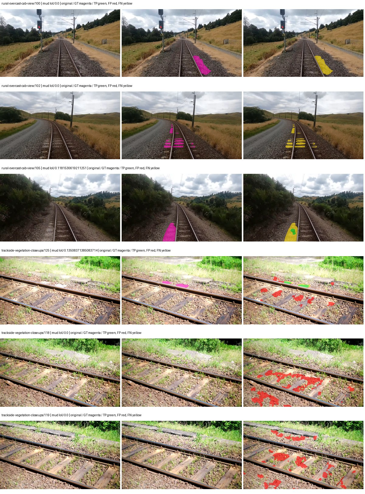

Examples are two lowest and two highest mud-IoU positive images, plus up to two negative images with the most false-positive mud pixels. They are targeted diagnostic examples, not random samples. Green: true positive; red: false positive; yellow: false negative. Full predictions remain on HDRFS.

### Validation tracking

| Logged step | Overall mIoU (%) | Mud IoU (%) |
| --- | --- | --- |
| 254 | 23.66 | 0.48 |
| 508 | 30.68 | 1.92 |
| 763 | 34.03 | 2.04 |
| 1017 | 34.95 | 1.78 |
| 1272 | 37.12 | 1.99 |
| 1527 | 36.89 | 1.41 |
| 1781 | 34.98 | 1.61 |
| 2036 | 36.53 | 1.56 |

All retained scalar curves, including training loss and per-class IoU, are in record.json. Observed best mud on a curve is not necessarily a retained checkpoint: the pilot saved its selection-metric-best and final checkpoints. Step logging and checkpoint global_step may differ by one.

### Stopping and checkpoint provenance

```json
{
  "stopping": {
    "actual_steps": 2036,
    "maximum_steps": 4000,
    "min_delta": 0.001,
    "monitor": "val_iou/mud-pumping",
    "patience": 5,
    "reason": "validation_plateau"
  },
  "checkpoints": {
    "best": {
      "path": "/data/izadia1/projects/segmentary-runs/paul-test-rtis/mud-fullstats-v1-20260906-r2/future-runs/native_convnext_tiny_uper--cityscapes_to_rtis--seed-1_seed1/rtis/best.ckpt",
      "sha256": "157034c9b8368c46926839cb724558ec23ee25daf38ebd7917dca287f6559e75",
      "global_step": 763,
      "bytes": 589961741
    },
    "final": {
      "path": "/data/izadia1/projects/segmentary-runs/paul-test-rtis/mud-fullstats-v1-20260906-r2/future-runs/native_convnext_tiny_uper--cityscapes_to_rtis--seed-1_seed1/rtis/last.ckpt",
      "sha256": "b41427afba3d6ea3052851bc9ffc0c2149bab625cc6e0a2060d7990fa191a1be",
      "global_step": 2036,
      "bytes": 589951373
    }
  },
  "cleanup_error": null
}
```

### Resolved training, initialization and evaluation settings

The optimizer block is the base configuration. Stage LR scales are applied at runtime, and stage warmup is capped at min(base warmup, floor(stage budget / 10), stage budget - 1): 400 steps for this 4,000-step pilot. Model-internal native input grids may differ from augmentation crops (EoMT uses its 640 grid).

```json
{
  "name": "native_convnext_tiny_uper--cityscapes_to_rtis--seed-1",
  "model": {
    "arch": "native",
    "checkpoint": null,
    "tuning": "full",
    "head": "unified_head",
    "lora_r": 16,
    "lora_alpha": 32,
    "lora_dropout": 0.05,
    "lora_targets": [],
    "drop_path": null,
    "revision": null,
    "subfolder": null,
    "local_files_only": false,
    "trust_remote_code": false,
    "backbone_path": null,
    "head_paths": [],
    "classifier_path": null,
    "inactive_parameter_paths": [],
    "smp_arch": null,
    "encoder_name": null,
    "encoder_weights": null,
    "native": {
      "task": "multiclass",
      "backbone": {
        "kind": "timm",
        "name": "convnext_tiny.fb_in22k_ft_in1k",
        "weights": "pretrained",
        "out_indices": [
          0,
          1,
          2,
          3
        ],
        "in_channels": 3
      },
      "neck": {
        "kind": "identity"
      },
      "head": {
        "kind": "uper",
        "in_indices": [
          0,
          1,
          2,
          3
        ],
        "channels": 256,
        "pool_bins": [
          1,
          2,
          3,
          6
        ],
        "dropout": 0.1,
        "norm": "group",
        "activation": "relu"
      },
      "auxiliary_heads": []
    },
    "batch_norm_momentum": null
  },
  "space": "paul-test-rtis",
  "taxonomy_root": "/data/izadia1/projects/segmentary-rtis-fullstats-066afb2/taxonomy",
  "output_root": "/data/izadia1/projects/segmentary-runs/paul-test-rtis/mud-fullstats-v1-20260906-r2/future-runs",
  "optim": {
    "backbone_lr": 0.0001,
    "head_lr_mult": 10.0,
    "weight_decay": 0.05,
    "llrd": 1.0,
    "warmup_iters": 1500,
    "warmup_ratio": 1e-06,
    "poly_power": 0.9,
    "min_lr_ratio": 0.0,
    "betas": [
      0.9,
      0.999
    ],
    "grad_clip": 1.0
  },
  "train": {
    "iters": 4000,
    "batch_size": 2,
    "accum": 8,
    "num_workers": 2,
    "precision": "bf16-mixed",
    "ema_decay": 0.9998,
    "val_every": 250,
    "ckpt_every": 500,
    "selection_metric": "val_iou/mud-pumping",
    "early_stopping_patience": 5,
    "early_stopping_min_delta": 0.001,
    "seed": 1,
    "devices": 1
  },
  "eval": {
    "sliding_window": true,
    "window": [
      1024,
      1024
    ],
    "stride": [
      768,
      768
    ],
    "batch_size": 1,
    "num_workers": 2,
    "tta_scales": [],
    "tta_flip": false,
    "threshold": 0.5,
    "boundary_tolerance_frac": 0.0075,
    "save_confusion": true
  },
  "loss": {
    "task": "multiclass",
    "activation": "auto",
    "terms": [],
    "aux": "none",
    "aux_weight": 0.0,
    "ce_weight": 1.0,
    "label_smoothing": 0.0,
    "class_weights": null,
    "query": null
  },
  "aug": {
    "crop": [
      1024,
      1024
    ],
    "scale_min": 0.5,
    "scale_max": 2.0,
    "hflip_p": 0.5,
    "color_jitter_p": 0.5,
    "brightness": 0.25,
    "contrast": 0.25,
    "saturation": 0.25,
    "hue": 0.05
  },
  "stages": [
    {
      "name": "rtis",
      "data": [
        {
          "name": "paul-test-rtis",
          "root": "/data/izadia1/datasets/paul-test-rtis",
          "variant": null,
          "split_file": "splits.json",
          "train_split": "train",
          "val_split": "val",
          "limit": null,
          "loader": "folder",
          "mapping": "paul-test-rtis",
          "loader_options": {
            "require_groups": true
          }
        }
      ],
      "iters": null,
      "lr_scale": 0.1,
      "head_group_lr_scale": 1.0,
      "init_from": "/data/izadia1/projects/segmentary-runs/all-model-city-rail-seed0-a7c0b67/jobs/native_convnext_tiny_uper--cityscapes--seed-0/attempt-001/train/native_convnext_tiny_uper--cityscapes_seed0/cityscapes/last.ckpt",
      "reset_head": true,
      "freeze": null,
      "sample_weights": null
    }
  ]
}
```

### Hardware and software provenance

```json
{
  "training": {
    "cuda_available": true,
    "cuda_visible_devices": "9",
    "cudnn": 91900,
    "driver_version": "570.133.20",
    "gpu_count": 1,
    "gpu_names": [
      "NVIDIA L40S"
    ],
    "hostname": "hdrfs-app-001",
    "input_normalization": {
      "channel_order": "rgb",
      "mean": [
        0.485,
        0.456,
        0.406
      ],
      "source": "timm_pretrained_cfg",
      "std": [
        0.229,
        0.224,
        0.225
      ]
    },
    "model_origins": [
      {
        "hf_commit": null,
        "hf_name_or_path": null,
        "module": "backbone",
        "timm_pretrained": {
          "architecture": "convnext_tiny",
          "hf_hub_id": "timm/convnext_tiny.fb_in22k_ft_in1k",
          "tag": "fb_in22k_ft_in1k",
          "url": "https://dl.fbaipublicfiles.com/convnext/convnext_tiny_22k_1k_224.pth"
        }
      },
      {
        "hf_commit": null,
        "hf_name_or_path": null,
        "module": "backbone.model",
        "timm_pretrained": {
          "architecture": "convnext_tiny",
          "hf_hub_id": "timm/convnext_tiny.fb_in22k_ft_in1k",
          "tag": "fb_in22k_ft_in1k",
          "url": "https://dl.fbaipublicfiles.com/convnext/convnext_tiny_22k_1k_224.pth"
        }
      }
    ],
    "model_parameter_count": 36849525,
    "packages": {
      "albumentations": "2.0.8",
      "lightning": "2.6.5",
      "numpy": "2.4.4",
      "segmentary": "0.1.0",
      "segmentation-models-pytorch": "0.5.0",
      "timm": "1.0.28",
      "torch": "2.11.0+cu128",
      "torchvision": "0.26.0+cu128",
      "transformers": "5.15.0"
    },
    "platform": "Linux-5.15.0-139-generic-x86_64-with-glibc2.35",
    "python": "3.11.15",
    "torch": "2.11.0+cu128",
    "torch_cuda": "12.8",
    "trainable_parameter_count": 36849525,
    "training_stop": {
      "actual_steps": 2036,
      "maximum_steps": 4000,
      "min_delta": 0.001,
      "monitor": "val_iou/mud-pumping",
      "patience": 5,
      "reason": "validation_plateau"
    },
    "validation_weights": "ema"
  },
  "evaluation": {
    "cuda_available": true,
    "cuda_visible_devices": "9",
    "cudnn": 91900,
    "driver_version": "570.133.20",
    "gpu_count": 1,
    "gpu_names": [
      "NVIDIA L40S"
    ],
    "hostname": "hdrfs-app-001",
    "input_normalization": {
      "channel_order": "rgb",
      "mean": [
        0.485,
        0.456,
        0.406
      ],
      "source": "timm_pretrained_cfg",
      "std": [
        0.229,
        0.224,
        0.225
      ]
    },
    "packages": {
      "albumentations": "2.0.8",
      "lightning": "2.6.5",
      "numpy": "2.4.4",
      "segmentary": "0.1.0",
      "segmentation-models-pytorch": "0.5.0",
      "timm": "1.0.28",
      "torch": "2.11.0+cu128",
      "torchvision": "0.26.0+cu128",
      "transformers": "5.15.0"
    },
    "platform": "Linux-5.15.0-139-generic-x86_64-with-glibc2.35",
    "python": "3.11.15",
    "torch": "2.11.0+cu128",
    "torch_cuda": "12.8"
  }
}
```

## cityscapes_to_rtis — seed 2

Status: **completed**. Started: 2026-09-06T18:15:36.000818+00:00. Finished: 2026-09-06T18:46:32.297662+00:00.

Recipe pretrained initializer: `{"arch": "native", "backbone_path": null, "batch_norm_momentum": null, "checkpoint": null, "classifier_path": null, "drop_path": null, "encoder_name": null, "encoder_weights": null, "head": "unified_head", "head_paths": [], "inactive_parameter_paths": [], "local_files_only": false, "lora_alpha": 32, "lora_dropout": 0.05, "lora_r": 16, "lora_targets": [], "native": {"auxiliary_heads": [], "backbone": {"in_channels": 3, "kind": "timm", "name": "convnext_tiny.fb_in22k_ft_in1k", "out_indices": [0, 1, 2, 3], "weights": "pretrained"}, "head": {"activation": "relu", "channels": 256, "dropout": 0.1, "in_indices": [0, 1, 2, 3], "kind": "uper", "norm": "group", "pool_bins": [1, 2, 3, 6]}, "neck": {"kind": "identity"}, "task": "multiclass"}, "revision": null, "smp_arch": null, "subfolder": null, "trust_remote_code": false, "tuning": "full"}`.

`rtis_only` uses the recipe initializer, which may include pretrained segmentation components. Transfer paths load the exact historical source checkpoint below and reset the classifier; they do not reset all query/decoder features.

Source checkpoint: `{'name': 'native_convnext_tiny_uper--cityscapes--seed-0', 'model': 'native_convnext_tiny_uper', 'protocol': 'cityscapes', 'config': '/data/izadia1/projects/segmentary-runs/all-model-city-rail-seed0-rail20-b9eb3e1/accepted/native_convnext_tiny_uper--cityscapes--seed-0/resolved-config.yaml', 'checkpoint': '/data/izadia1/projects/segmentary-runs/all-model-city-rail-seed0-a7c0b67/jobs/native_convnext_tiny_uper--cityscapes--seed-0/attempt-001/train/native_convnext_tiny_uper--cityscapes_seed0/cityscapes/last.ckpt', 'recorded_sha256': '5b371ccbb1c2f1ad354d205d07f867135039dd82de6fffac6c27c76b1cbc88ea', 'exists': True}`.

Config SHA-256: `14079c287685c5fafa29d317dd620ef01a63a65975a7e422f351b088da3d553d`. Weights used for validation: `ema`.

### Mud-pumping and aggregate quality

| Metric | Selected checkpoint | Final training validation |
| --- | --- | --- |
| Mud IoU | 6.94 | 3.46 |
| Mud precision | 27.95 | 13.03 |
| Mud recall | 8.46 | 4.50 |
| Mud Dice/F1 | 12.98 | 6.69 |
| mIoU | 35.53 | 34.83 |
| Mean accuracy | 52.01 | 51.00 |
| Mean precision | 50.34 | 47.48 |
| Mean Dice | 45.02 | 43.93 |
| Mean specificity | 98.92 | 98.91 |
| Pixel accuracy | 82.70 | 83.17 |
| Frequency-weighted IoU | 72.82 | 72.81 |
| Fixed GT-present class mIoU | 41.45 | 40.63 |
| Boundary F1 | 42.74 | 42.87 |

The selected checkpoint has independent evaluation evidence. Final values are the trainer's final validation record, not a new independent evaluation. mIoU averages classes with nonzero union, so false positives on absent classes can change its denominator. The fixed GT-class mean is supplementary and excludes absent classes; their false positives remain in the confusion matrix.

### Resource usage and timing

| Measurement | Value |
| --- | --- |
| Peak training VRAM, retained training invocation (GiB) | 10.20 |
| Peak evaluation VRAM (GiB) | 7.42 |
| Retained training invocation wall time (seconds) | 1683.32 |
| Retained training invocation GPU-hours (one GPU) | 0.47 |
| Evaluation wall time (seconds) | 16.30 |
| Full evaluation pipeline images/second | 2.27 |
| Best full-state checkpoint (MiB) | 562.63 |
| Final full-state checkpoint (MiB) | 562.62 |
| Audited periodic checkpoints removed (GiB) | 2.20 |

VRAM uses the recorded allocator high-water mark; it is not total device usage including CUDA context. Resumed jobs' retained training invocation times and peaks are **not whole-campaign totals**. Earlier invocation resource records are not reconstructed here. Evaluation throughput includes loader, sliding-window inference and metrics; it is not model-only latency/FPS. Missing measurements are shown as —, never inferred from another dataset's run.

### Standardized inference performance

Dedicated model-only profiling waits for an idle worker-locked L40S: BF16, batch 1, 1024x1024, 20 warmup and 100 CUDA-event-timed public forwards. It excludes loading, preprocessing, tiling and metrics.

| Status | Parameters | Weight MiB | FPS | p50 ms | p95 ms | Peak reserved GiB |
| --- | --- | --- | --- | --- | --- | --- |
| complete | 36849525 | 140.57 | 76.50 | 13.07 | 13.15 | 1.24 |

```json
{
  "schema_version": 1,
  "model_id": "native_convnext_tiny_uper",
  "measured_at": "2026-09-06T18:46:27+00:00",
  "status": "complete",
  "benchmark_scope": "rtis_selected_checkpoint_model_only",
  "applies_to": [
    "native_convnext_tiny_uper--cityscapes_to_rtis--seed-2"
  ],
  "source": {
    "campaign_git_sha": "066afb2626398b7be59d4d19f5a0e4644fd59adc",
    "git_dirty": false,
    "config_hash": "d4828ed7b60e",
    "resolved_config": "/data/izadia1/projects/segmentary-runs/paul-test-rtis/mud-fullstats-v1-20260906-r2/configs/native_convnext_tiny_uper--cityscapes_to_rtis--seed-2.yaml",
    "config_sha256": "14079c287685c5fafa29d317dd620ef01a63a65975a7e422f351b088da3d553d",
    "checkpoint_sha256": "7eb3d9245fe00c978a58b4e5d846a17984f62e753a666c91ee3e3c168fa686d2",
    "checkpoint_global_step": 763,
    "checkpoint_bytes": 589961741,
    "checkpoint_kind": "resume checkpoint with optimizer and EMA state",
    "weights": "ema",
    "measured_checkpoint_job_id": "native_convnext_tiny_uper--cityscapes_to_rtis--seed-2",
    "result_sha256": "f94c786b3181c50a61d5ab31b3fcf8b4f75c6d1213459cf13c2a1afdde3ec77b",
    "result_git_sha": "066afb2626398b7be59d4d19f5a0e4644fd59adc",
    "result_stage": "eval:paul-test-rtis:val",
    "result_seed": 2
  },
  "hardware": {
    "gpu_name": "NVIDIA L40S",
    "gpu_uuid": "GPU-931d0911-fc78-1638-e3d7-1ba868cbd286",
    "logical_device": "cuda:0",
    "physical_visibility_token": "2",
    "compute_capability": [
      8,
      9
    ],
    "total_memory_bytes": 47677177856
  },
  "model": {
    "parameter_count": 36849525,
    "trainable_parameter_count": 36849525,
    "resident_parameter_bytes": 147398100,
    "parameter_dtype_counts": {
      "float32": 36849525
    }
  },
  "contract": {
    "backend": "pytorch",
    "precision": "bf16_autocast",
    "batch_size": 1,
    "input_shape_nchw": [
      1,
      3,
      1024,
      1024
    ],
    "warmup_iterations": 20,
    "measured_iterations": 100,
    "timing": "per-forward CUDA events with end-event synchronization",
    "includes_preprocessing": false,
    "includes_data_loader": false,
    "includes_sliding_window": false,
    "input_resident_on_gpu": true,
    "model_only": true,
    "entrypoint": "public model(image) dense-logits forward"
  },
  "measurements": {
    "latency": {
      "p50_ms": 13.066751956939697,
      "p95_ms": 13.146592235565185,
      "mean_ms": 13.072274265289307,
      "minimum_ms": 13.028351783752441,
      "maximum_ms": 13.252608299255371,
      "fps": 76.49778299521232,
      "raw_ms": [
        13.123711585998535,
        13.055999755859375,
        13.153280258178711,
        13.080575942993164,
        13.042688369750977,
        13.057024002075195,
        13.08672046661377,
        13.03551959991455,
        13.081600189208984,
        13.055999755859375,
        13.032447814941406,
        13.092864036560059,
        13.074496269226074,
        13.028351783752441,
        13.180928230285645,
        13.06726360321045,
        13.046784400939941,
        13.045760154724121,
        13.06112003326416,
        13.06009578704834,
        13.05900764465332,
        13.059040069580078,
        13.042688369750977,
        13.045760154724121,
        13.06931209564209,
        13.08569622039795,
        13.165535926818848,
        13.07033634185791,
        13.050880432128906,
        13.083647727966309,
        13.058048248291016,
        13.089792251586914,
        13.081600189208984,
        13.047807693481445,
        13.045760154724121,
        13.06726360321045,
        13.252608299255371,
        13.083776473999023,
        13.051775932312012,
        13.06112003326416,
        13.071359634399414,
        13.146240234375,
        13.06112003326416,
        13.073408126831055,
        13.034527778625488,
        13.07759952545166,
        13.06726360321045,
        13.07750415802002,
        13.041664123535156,
        13.065216064453125,
        13.084671974182129,
        13.066240310668945,
        13.071359634399414,
        13.046751976013184,
        13.05190372467041,
        13.055904388427734,
        13.080575942993164,
        13.05292797088623,
        13.063167572021484,
        13.046784400939941,
        13.039615631103516,
        13.07852840423584,
        13.041664123535156,
        13.073408126831055,
        13.066240310668945,
        13.033472061157227,
        13.089792251586914,
        13.047807693481445,
        13.066240310668945,
        13.046784400939941,
        13.100031852722168,
        13.07750415802002,
        13.080544471740723,
        13.06726360321045,
        13.084671974182129,
        13.073375701904297,
        13.06009578704834,
        13.103103637695312,
        13.06214427947998,
        13.045760154724121,
        13.042688369750977,
        13.064191818237305,
        13.040639877319336,
        13.06828784942627,
        13.05907154083252,
        13.080575942993164,
        13.06009578704834,
        13.0447359085083,
        13.086784362792969,
        13.06931209564209,
        13.109248161315918,
        13.072383880615234,
        13.08579158782959,
        13.089792251586914,
        13.179903984069824,
        13.07750415802002,
        13.050880432128906,
        13.046784400939941,
        13.0764799118042,
        13.113344192504883
      ],
      "percentile_method": "numpy linear interpolation"
    },
    "peak_reserved_bytes": 1335885824,
    "memory_kind": "pytorch_cuda_allocator_peak_reserved_excluding_context",
    "benchmark_wall_clock_s": 9.239223055541515
  },
  "started_at": "2026-09-06T18:46:18+00:00",
  "finished_at": "2026-09-06T18:46:27+00:00",
  "environment": {
    "hostname": "hdrfs-app-001",
    "python": "3.11.15",
    "platform": "Linux-5.15.0-139-generic-x86_64-with-glibc2.35",
    "torch": "2.11.0+cu128",
    "torch_cuda": "12.8",
    "cudnn": 91900,
    "driver_version": "570.133.20",
    "cuda_available": true,
    "gpu_count": 1,
    "gpu_names": [
      "NVIDIA L40S"
    ],
    "cuda_visible_devices": "2",
    "packages": {
      "segmentary": "0.1.0",
      "torch": "2.11.0+cu128",
      "torchvision": "0.26.0+cu128",
      "transformers": "5.15.0",
      "timm": "1.0.28",
      "segmentation-models-pytorch": "0.5.0",
      "albumentations": "2.0.8",
      "lightning": "2.6.5",
      "numpy": "2.4.4"
    }
  }
}
```

### Per-class validation results

| Class | GT pixels | IoU (%) | Precision (%) | Recall (%) | Dice (%) | Boundary F1 (%) |
| --- | --- | --- | --- | --- | --- | --- |
| car | 29664 | 72.68 | 83.76 | 84.61 | 84.18 | 77.88 |
| construction | 311585 | 44.93 | 50.26 | 80.92 | 62.01 | 50.82 |
| fence | 265137 | 23.21 | 68.53 | 25.98 | 37.68 | 48.61 |
| mud-pumping | 1226250 | 6.94 | 27.95 | 8.46 | 12.98 | 15.51 |
| on-rails | 0 | 0.00 | 0.00 | — | 0.00 | 0.00 |
| person | 0 | 0.00 | 0.00 | — | 0.00 | 0.00 |
| pole | 628038 | 72.51 | 82.98 | 85.18 | 84.07 | 90.86 |
| rail-embedded | 16799 | 10.11 | 33.07 | 12.71 | 18.36 | 19.46 |
| rail-raised | 2969797 | 74.73 | 82.86 | 88.39 | 85.54 | 88.63 |
| rail-track | 6323197 | 41.18 | 58.61 | 58.08 | 58.34 | 54.65 |
| road | 1048831 | 3.01 | 7.39 | 4.84 | 5.85 | 8.72 |
| sidewalk | 1297367 | 8.83 | 35.75 | 10.49 | 16.23 | 14.36 |
| sky | 19121606 | 92.97 | 99.39 | 93.50 | 96.36 | 82.71 |
| standing-water | 95802 | 3.12 | 3.44 | 24.93 | 6.04 | 15.57 |
| terrain | 39239306 | 84.32 | 88.25 | 94.99 | 91.50 | 64.55 |
| trackbed | 10643081 | 57.06 | 65.48 | 81.59 | 72.66 | 54.71 |
| traffic-light | 19510 | 34.93 | 53.59 | 50.08 | 51.78 | 52.39 |
| traffic-sign | 13285 | 56.69 | 84.69 | 63.16 | 72.36 | 74.35 |
| tram-track | 56179 | 20.65 | 45.30 | 27.50 | 34.23 | 15.02 |
| truck | 0 | 0.00 | 0.00 | — | 0.00 | 0.00 |
| vegetation-overgrowth | 5901821 | 38.21 | 85.94 | 40.76 | 55.29 | 68.73 |

### Full-run accounting

| Measurement | Value |
| --- | --- |
| Full GPU-reserved wall seconds, all recorded worker attempts | 1856.71 |
| Full reserved GPU-hours | 0.52 |
| Whole-run timing complete | True |

| Phase | Wall seconds including failed attempts |
| --- | --- |
| training | 1690.07 |
| diagnostics | 121.35 |
| performance | 17.06 |

GPU-reserved time includes model loading, training, validation, collection, profiling, checkpoint I/O and orchestration while the worker owns one GPU. It is not GPU kernel-active time. Phase timings and sampled device memory/power/utilization are retained separately; sampled device memory is not the allocator high-water mark.

### Train/validation and raw/EMA diagnostics

| Checkpoint / weights / split | Images | Mud IoU (%) | Mud precision (%) | Mud recall (%) |
| --- | --- | --- | --- | --- |
| best-auto-train / ema | 220 | 95.71 | 97.60 | 98.02 |
| best-auto-val / ema | 37 | 6.94 | 27.95 | 8.46 |
| best-alternate-val / raw | 37 | 8.81 | 45.04 | 9.87 |
| final-auto-val / ema | 37 | 3.46 | 13.02 | 4.50 |

Train uses the evaluation transform without augmentation. Compare mud train/validation metrics for the same selected weights. Alternate EMA on running-stat BatchNorm is explicitly uncalibrated and is diagnostic only. Score-threshold curves use uncalibrated normalized scores and are pixel-level diagnostics, not event detection rates or a selected deployment operating point.

### Downloadable evidence

- best-auto-train: [per-image.csv](cityscapes_to_rtis--seed-2/best-auto-train/per-image.csv) · [per-image-confusion.json.gz](cityscapes_to_rtis--seed-2/best-auto-train/per-image-confusion.json.gz) · [groups.json](cityscapes_to_rtis--seed-2/best-auto-train/groups.json) · [mud-score-curves.json](cityscapes_to_rtis--seed-2/best-auto-train/mud-score-curves.json)
- best-auto-val: [per-image.csv](cityscapes_to_rtis--seed-2/best-auto-val/per-image.csv) · [per-image-confusion.json.gz](cityscapes_to_rtis--seed-2/best-auto-val/per-image-confusion.json.gz) · [groups.json](cityscapes_to_rtis--seed-2/best-auto-val/groups.json) · [mud-score-curves.json](cityscapes_to_rtis--seed-2/best-auto-val/mud-score-curves.json) · [examples.jpg](cityscapes_to_rtis--seed-2/best-auto-val/examples.jpg)
- best-alternate-val: [per-image.csv](cityscapes_to_rtis--seed-2/best-alternate-val/per-image.csv) · [per-image-confusion.json.gz](cityscapes_to_rtis--seed-2/best-alternate-val/per-image-confusion.json.gz) · [groups.json](cityscapes_to_rtis--seed-2/best-alternate-val/groups.json) · [mud-score-curves.json](cityscapes_to_rtis--seed-2/best-alternate-val/mud-score-curves.json)
- final-auto-val: [per-image.csv](cityscapes_to_rtis--seed-2/final-auto-val/per-image.csv) · [per-image-confusion.json.gz](cityscapes_to_rtis--seed-2/final-auto-val/per-image-confusion.json.gz) · [groups.json](cityscapes_to_rtis--seed-2/final-auto-val/groups.json) · [mud-score-curves.json](cityscapes_to_rtis--seed-2/final-auto-val/mud-score-curves.json)
- resources: [telemetry.csv](cityscapes_to_rtis--seed-2/resources/telemetry.csv)

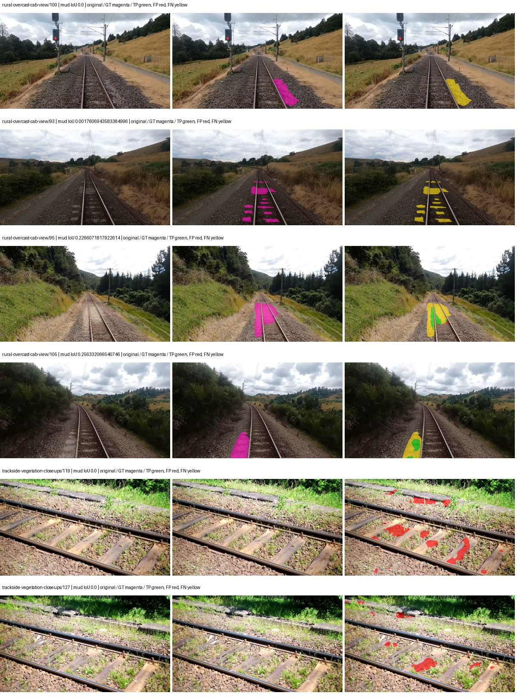

Examples are two lowest and two highest mud-IoU positive images, plus up to two negative images with the most false-positive mud pixels. They are targeted diagnostic examples, not random samples. Green: true positive; red: false positive; yellow: false negative. Full predictions remain on HDRFS.

### Validation tracking

| Logged step | Overall mIoU (%) | Mud IoU (%) |
| --- | --- | --- |
| 254 | 24.45 | 1.52 |
| 508 | 30.57 | 5.49 |
| 763 | 35.53 | 6.95 |
| 1017 | 34.44 | 5.21 |
| 1272 | 34.88 | 6.71 |
| 1527 | 34.77 | 5.26 |
| 1781 | 35.08 | 4.07 |
| 2036 | 34.83 | 3.46 |

All retained scalar curves, including training loss and per-class IoU, are in record.json. Observed best mud on a curve is not necessarily a retained checkpoint: the pilot saved its selection-metric-best and final checkpoints. Step logging and checkpoint global_step may differ by one.

### Stopping and checkpoint provenance

```json
{
  "stopping": {
    "actual_steps": 2036,
    "maximum_steps": 4000,
    "min_delta": 0.001,
    "monitor": "val_iou/mud-pumping",
    "patience": 5,
    "reason": "validation_plateau"
  },
  "checkpoints": {
    "best": {
      "path": "/data/izadia1/projects/segmentary-runs/paul-test-rtis/mud-fullstats-v1-20260906-r2/future-runs/native_convnext_tiny_uper--cityscapes_to_rtis--seed-2_seed2/rtis/best.ckpt",
      "sha256": "7eb3d9245fe00c978a58b4e5d846a17984f62e753a666c91ee3e3c168fa686d2",
      "global_step": 763,
      "bytes": 589961741
    },
    "final": {
      "path": "/data/izadia1/projects/segmentary-runs/paul-test-rtis/mud-fullstats-v1-20260906-r2/future-runs/native_convnext_tiny_uper--cityscapes_to_rtis--seed-2_seed2/rtis/last.ckpt",
      "sha256": "d35e4fec516358989b3951b933b916eda4a2de8d3711ada4c481faa0d25ff551",
      "global_step": 2036,
      "bytes": 589951373
    }
  },
  "cleanup_error": null
}
```

### Resolved training, initialization and evaluation settings

The optimizer block is the base configuration. Stage LR scales are applied at runtime, and stage warmup is capped at min(base warmup, floor(stage budget / 10), stage budget - 1): 400 steps for this 4,000-step pilot. Model-internal native input grids may differ from augmentation crops (EoMT uses its 640 grid).

```json
{
  "name": "native_convnext_tiny_uper--cityscapes_to_rtis--seed-2",
  "model": {
    "arch": "native",
    "checkpoint": null,
    "tuning": "full",
    "head": "unified_head",
    "lora_r": 16,
    "lora_alpha": 32,
    "lora_dropout": 0.05,
    "lora_targets": [],
    "drop_path": null,
    "revision": null,
    "subfolder": null,
    "local_files_only": false,
    "trust_remote_code": false,
    "backbone_path": null,
    "head_paths": [],
    "classifier_path": null,
    "inactive_parameter_paths": [],
    "smp_arch": null,
    "encoder_name": null,
    "encoder_weights": null,
    "native": {
      "task": "multiclass",
      "backbone": {
        "kind": "timm",
        "name": "convnext_tiny.fb_in22k_ft_in1k",
        "weights": "pretrained",
        "out_indices": [
          0,
          1,
          2,
          3
        ],
        "in_channels": 3
      },
      "neck": {
        "kind": "identity"
      },
      "head": {
        "kind": "uper",
        "in_indices": [
          0,
          1,
          2,
          3
        ],
        "channels": 256,
        "pool_bins": [
          1,
          2,
          3,
          6
        ],
        "dropout": 0.1,
        "norm": "group",
        "activation": "relu"
      },
      "auxiliary_heads": []
    },
    "batch_norm_momentum": null
  },
  "space": "paul-test-rtis",
  "taxonomy_root": "/data/izadia1/projects/segmentary-rtis-fullstats-066afb2/taxonomy",
  "output_root": "/data/izadia1/projects/segmentary-runs/paul-test-rtis/mud-fullstats-v1-20260906-r2/future-runs",
  "optim": {
    "backbone_lr": 0.0001,
    "head_lr_mult": 10.0,
    "weight_decay": 0.05,
    "llrd": 1.0,
    "warmup_iters": 1500,
    "warmup_ratio": 1e-06,
    "poly_power": 0.9,
    "min_lr_ratio": 0.0,
    "betas": [
      0.9,
      0.999
    ],
    "grad_clip": 1.0
  },
  "train": {
    "iters": 4000,
    "batch_size": 2,
    "accum": 8,
    "num_workers": 2,
    "precision": "bf16-mixed",
    "ema_decay": 0.9998,
    "val_every": 250,
    "ckpt_every": 500,
    "selection_metric": "val_iou/mud-pumping",
    "early_stopping_patience": 5,
    "early_stopping_min_delta": 0.001,
    "seed": 2,
    "devices": 1
  },
  "eval": {
    "sliding_window": true,
    "window": [
      1024,
      1024
    ],
    "stride": [
      768,
      768
    ],
    "batch_size": 1,
    "num_workers": 2,
    "tta_scales": [],
    "tta_flip": false,
    "threshold": 0.5,
    "boundary_tolerance_frac": 0.0075,
    "save_confusion": true
  },
  "loss": {
    "task": "multiclass",
    "activation": "auto",
    "terms": [],
    "aux": "none",
    "aux_weight": 0.0,
    "ce_weight": 1.0,
    "label_smoothing": 0.0,
    "class_weights": null,
    "query": null
  },
  "aug": {
    "crop": [
      1024,
      1024
    ],
    "scale_min": 0.5,
    "scale_max": 2.0,
    "hflip_p": 0.5,
    "color_jitter_p": 0.5,
    "brightness": 0.25,
    "contrast": 0.25,
    "saturation": 0.25,
    "hue": 0.05
  },
  "stages": [
    {
      "name": "rtis",
      "data": [
        {
          "name": "paul-test-rtis",
          "root": "/data/izadia1/datasets/paul-test-rtis",
          "variant": null,
          "split_file": "splits.json",
          "train_split": "train",
          "val_split": "val",
          "limit": null,
          "loader": "folder",
          "mapping": "paul-test-rtis",
          "loader_options": {
            "require_groups": true
          }
        }
      ],
      "iters": null,
      "lr_scale": 0.1,
      "head_group_lr_scale": 1.0,
      "init_from": "/data/izadia1/projects/segmentary-runs/all-model-city-rail-seed0-a7c0b67/jobs/native_convnext_tiny_uper--cityscapes--seed-0/attempt-001/train/native_convnext_tiny_uper--cityscapes_seed0/cityscapes/last.ckpt",
      "reset_head": true,
      "freeze": null,
      "sample_weights": null
    }
  ]
}
```

### Hardware and software provenance

```json
{
  "training": {
    "cuda_available": true,
    "cuda_visible_devices": "2",
    "cudnn": 91900,
    "driver_version": "570.133.20",
    "gpu_count": 1,
    "gpu_names": [
      "NVIDIA L40S"
    ],
    "hostname": "hdrfs-app-001",
    "input_normalization": {
      "channel_order": "rgb",
      "mean": [
        0.485,
        0.456,
        0.406
      ],
      "source": "timm_pretrained_cfg",
      "std": [
        0.229,
        0.224,
        0.225
      ]
    },
    "model_origins": [
      {
        "hf_commit": null,
        "hf_name_or_path": null,
        "module": "backbone",
        "timm_pretrained": {
          "architecture": "convnext_tiny",
          "hf_hub_id": "timm/convnext_tiny.fb_in22k_ft_in1k",
          "tag": "fb_in22k_ft_in1k",
          "url": "https://dl.fbaipublicfiles.com/convnext/convnext_tiny_22k_1k_224.pth"
        }
      },
      {
        "hf_commit": null,
        "hf_name_or_path": null,
        "module": "backbone.model",
        "timm_pretrained": {
          "architecture": "convnext_tiny",
          "hf_hub_id": "timm/convnext_tiny.fb_in22k_ft_in1k",
          "tag": "fb_in22k_ft_in1k",
          "url": "https://dl.fbaipublicfiles.com/convnext/convnext_tiny_22k_1k_224.pth"
        }
      }
    ],
    "model_parameter_count": 36849525,
    "packages": {
      "albumentations": "2.0.8",
      "lightning": "2.6.5",
      "numpy": "2.4.4",
      "segmentary": "0.1.0",
      "segmentation-models-pytorch": "0.5.0",
      "timm": "1.0.28",
      "torch": "2.11.0+cu128",
      "torchvision": "0.26.0+cu128",
      "transformers": "5.15.0"
    },
    "platform": "Linux-5.15.0-139-generic-x86_64-with-glibc2.35",
    "python": "3.11.15",
    "torch": "2.11.0+cu128",
    "torch_cuda": "12.8",
    "trainable_parameter_count": 36849525,
    "training_stop": {
      "actual_steps": 2036,
      "maximum_steps": 4000,
      "min_delta": 0.001,
      "monitor": "val_iou/mud-pumping",
      "patience": 5,
      "reason": "validation_plateau"
    },
    "validation_weights": "ema"
  },
  "evaluation": {
    "cuda_available": true,
    "cuda_visible_devices": "2",
    "cudnn": 91900,
    "driver_version": "570.133.20",
    "gpu_count": 1,
    "gpu_names": [
      "NVIDIA L40S"
    ],
    "hostname": "hdrfs-app-001",
    "input_normalization": {
      "channel_order": "rgb",
      "mean": [
        0.485,
        0.456,
        0.406
      ],
      "source": "timm_pretrained_cfg",
      "std": [
        0.229,
        0.224,
        0.225
      ]
    },
    "packages": {
      "albumentations": "2.0.8",
      "lightning": "2.6.5",
      "numpy": "2.4.4",
      "segmentary": "0.1.0",
      "segmentation-models-pytorch": "0.5.0",
      "timm": "1.0.28",
      "torch": "2.11.0+cu128",
      "torchvision": "0.26.0+cu128",
      "transformers": "5.15.0"
    },
    "platform": "Linux-5.15.0-139-generic-x86_64-with-glibc2.35",
    "python": "3.11.15",
    "torch": "2.11.0+cu128",
    "torch_cuda": "12.8"
  }
}
```

## railsem19_to_rtis — seed 0

Status: **completed**. Started: 2026-09-06T18:17:58.861969+00:00. Finished: 2026-09-06T18:52:25.821475+00:00.

Recipe pretrained initializer: `{"arch": "native", "backbone_path": null, "batch_norm_momentum": null, "checkpoint": null, "classifier_path": null, "drop_path": null, "encoder_name": null, "encoder_weights": null, "head": "unified_head", "head_paths": [], "inactive_parameter_paths": [], "local_files_only": false, "lora_alpha": 32, "lora_dropout": 0.05, "lora_r": 16, "lora_targets": [], "native": {"auxiliary_heads": [], "backbone": {"in_channels": 3, "kind": "timm", "name": "convnext_tiny.fb_in22k_ft_in1k", "out_indices": [0, 1, 2, 3], "weights": "pretrained"}, "head": {"activation": "relu", "channels": 256, "dropout": 0.1, "in_indices": [0, 1, 2, 3], "kind": "uper", "norm": "group", "pool_bins": [1, 2, 3, 6]}, "neck": {"kind": "identity"}, "task": "multiclass"}, "revision": null, "smp_arch": null, "subfolder": null, "trust_remote_code": false, "tuning": "full"}`.

`rtis_only` uses the recipe initializer, which may include pretrained segmentation components. Transfer paths load the exact historical source checkpoint below and reset the classifier; they do not reset all query/decoder features.

Source checkpoint: `{'name': 'native_convnext_tiny_uper--railsem19--seed-0', 'model': 'native_convnext_tiny_uper', 'protocol': 'railsem19', 'config': '/data/izadia1/projects/segmentary-runs/all-model-city-rail-seed0-rail20-b9eb3e1/jobs/native_convnext_tiny_uper--railsem19--seed-0/attempt-001/resolved-config.yaml', 'checkpoint': '/data/izadia1/projects/segmentary-runs/all-model-city-rail-seed0-rail20-b9eb3e1/jobs/native_convnext_tiny_uper--railsem19--seed-0/attempt-001/train/native_convnext_tiny_uper--railsem19_seed0/railsem19/last.ckpt', 'recorded_sha256': 'c9d8b86e7010fbe8b3f53c0683701f659ed08d6326c16e1de022bfdb51de7a79', 'exists': True}`.

Config SHA-256: `0e982ee21bcf6d2dd516ec32bbfb4feb64260e9853302b8af4d805fe658d6988`. Weights used for validation: `ema`.

### Mud-pumping and aggregate quality

| Metric | Selected checkpoint | Final training validation |
| --- | --- | --- |
| Mud IoU | 1.14 | 0.95 |
| Mud precision | 1.88 | 1.53 |
| Mud recall | 2.80 | 2.43 |
| Mud Dice/F1 | 2.25 | 1.87 |
| mIoU | 43.81 | 43.08 |
| Mean accuracy | 56.20 | 55.83 |
| Mean precision | 62.92 | 61.19 |
| Mean Dice | 54.31 | 53.55 |
| Mean specificity | 99.06 | 99.08 |
| Pixel accuracy | 85.11 | 85.39 |
| Frequency-weighted IoU | 76.49 | 76.95 |
| Fixed GT-present class mIoU | 48.68 | 47.87 |
| Boundary F1 | 54.14 | 52.83 |

The selected checkpoint has independent evaluation evidence. Final values are the trainer's final validation record, not a new independent evaluation. mIoU averages classes with nonzero union, so false positives on absent classes can change its denominator. The fixed GT-class mean is supplementary and excludes absent classes; their false positives remain in the confusion matrix.

### Resource usage and timing

| Measurement | Value |
| --- | --- |
| Peak training VRAM, retained training invocation (GiB) | 10.20 |
| Peak evaluation VRAM (GiB) | 7.42 |
| Retained training invocation wall time (seconds) | 1892.01 |
| Retained training invocation GPU-hours (one GPU) | 0.53 |
| Evaluation wall time (seconds) | 16.06 |
| Full evaluation pipeline images/second | 2.30 |
| Best full-state checkpoint (MiB) | 562.63 |
| Final full-state checkpoint (MiB) | 562.62 |
| Audited periodic checkpoints removed (GiB) | 2.20 |

VRAM uses the recorded allocator high-water mark; it is not total device usage including CUDA context. Resumed jobs' retained training invocation times and peaks are **not whole-campaign totals**. Earlier invocation resource records are not reconstructed here. Evaluation throughput includes loader, sliding-window inference and metrics; it is not model-only latency/FPS. Missing measurements are shown as —, never inferred from another dataset's run.

### Standardized inference performance

Dedicated model-only profiling waits for an idle worker-locked L40S: BF16, batch 1, 1024x1024, 20 warmup and 100 CUDA-event-timed public forwards. It excludes loading, preprocessing, tiling and metrics.

| Status | Parameters | Weight MiB | FPS | p50 ms | p95 ms | Peak reserved GiB |
| --- | --- | --- | --- | --- | --- | --- |
| complete | 36849525 | 140.57 | 75.84 | 13.17 | 13.25 | 1.24 |

```json
{
  "schema_version": 1,
  "model_id": "native_convnext_tiny_uper",
  "measured_at": "2026-09-06T18:52:21+00:00",
  "status": "complete",
  "benchmark_scope": "rtis_selected_checkpoint_model_only",
  "applies_to": [
    "native_convnext_tiny_uper--railsem19_to_rtis--seed-0"
  ],
  "source": {
    "campaign_git_sha": "066afb2626398b7be59d4d19f5a0e4644fd59adc",
    "git_dirty": false,
    "config_hash": "73e3b18f58be",
    "resolved_config": "/data/izadia1/projects/segmentary-runs/paul-test-rtis/mud-fullstats-v1-20260906-r2/configs/native_convnext_tiny_uper--railsem19_to_rtis--seed-0.yaml",
    "config_sha256": "0e982ee21bcf6d2dd516ec32bbfb4feb64260e9853302b8af4d805fe658d6988",
    "checkpoint_sha256": "5a20e865f09baf2a39c8de13a5085c812b5ccd0ef0a40309cc4332f0822e48ca",
    "checkpoint_global_step": 1018,
    "checkpoint_bytes": 589961741,
    "checkpoint_kind": "resume checkpoint with optimizer and EMA state",
    "weights": "ema",
    "measured_checkpoint_job_id": "native_convnext_tiny_uper--railsem19_to_rtis--seed-0",
    "result_sha256": "0c237444977edf3608d5e4542a564a99a52fc8714bf0ba4bd4239361fb99c706",
    "result_git_sha": "066afb2626398b7be59d4d19f5a0e4644fd59adc",
    "result_stage": "eval:paul-test-rtis:val",
    "result_seed": 0
  },
  "hardware": {
    "gpu_name": "NVIDIA L40S",
    "gpu_uuid": "GPU-e2e96741-aec9-e90b-5c46-d0d58be90a56",
    "logical_device": "cuda:0",
    "physical_visibility_token": "8",
    "compute_capability": [
      8,
      9
    ],
    "total_memory_bytes": 47677177856
  },
  "model": {
    "parameter_count": 36849525,
    "trainable_parameter_count": 36849525,
    "resident_parameter_bytes": 147398100,
    "parameter_dtype_counts": {
      "float32": 36849525
    }
  },
  "contract": {
    "backend": "pytorch",
    "precision": "bf16_autocast",
    "batch_size": 1,
    "input_shape_nchw": [
      1,
      3,
      1024,
      1024
    ],
    "warmup_iterations": 20,
    "measured_iterations": 100,
    "timing": "per-forward CUDA events with end-event synchronization",
    "includes_preprocessing": false,
    "includes_data_loader": false,
    "includes_sliding_window": false,
    "input_resident_on_gpu": true,
    "model_only": true,
    "entrypoint": "public model(image) dense-logits forward"
  },
  "measurements": {
    "latency": {
      "p50_ms": 13.173232078552246,
      "p95_ms": 13.253990030288696,
      "mean_ms": 13.185473642349244,
      "minimum_ms": 13.04371166229248,
      "maximum_ms": 15.19820785522461,
      "fps": 75.84103742683838,
      "raw_ms": [
        13.148192405700684,
        13.074432373046875,
        13.189120292663574,
        13.103103637695312,
        13.155327796936035,
        13.200384140014648,
        13.146112442016602,
        13.199359893798828,
        13.04371166229248,
        13.198335647583008,
        13.187071800231934,
        13.095935821533203,
        13.06931209564209,
        13.184000015258789,
        13.204480171203613,
        13.189120292663574,
        13.172736167907715,
        13.157376289367676,
        13.16966438293457,
        13.06931209564209,
        13.15123176574707,
        13.190143585205078,
        13.182975769042969,
        13.204480171203613,
        13.137920379638672,
        13.171711921691895,
        13.094911575317383,
        13.18502426147461,
        13.113344192504883,
        13.075455665588379,
        13.08569622039795,
        13.219840049743652,
        13.100031852722168,
        13.316096305847168,
        13.091839790344238,
        13.225983619689941,
        13.172736167907715,
        13.205504417419434,
        13.191167831420898,
        15.19820785522461,
        13.209600448608398,
        13.191167831420898,
        13.218815803527832,
        13.181952476501465,
        13.090815544128418,
        13.198304176330566,
        13.155327796936035,
        13.181920051574707,
        13.157376289367676,
        13.153280258178711,
        13.187071800231934,
        13.164544105529785,
        13.206527709960938,
        13.137855529785156,
        13.187071800231934,
        13.2608003616333,
        13.2608003616333,
        13.083647727966309,
        13.123583793640137,
        13.163519859313965,
        13.173727989196777,
        13.133824348449707,
        13.155327796936035,
        13.173760414123535,
        13.1778564453125,
        13.16864013671875,
        13.234175682067871,
        13.117440223693848,
        13.091839790344238,
        13.150208473205566,
        13.084671974182129,
        13.129695892333984,
        13.210623741149902,
        13.189120292663574,
        13.1778564453125,
        13.097984313964844,
        13.133824348449707,
        13.253631591796875,
        13.158464431762695,
        13.16761589050293,
        13.27616024017334,
        13.121536254882812,
        13.119487762451172,
        13.189120292663574,
        13.219840049743652,
        13.134847640991211,
        13.216768264770508,
        13.191167831420898,
        13.165568351745605,
        13.210623741149902,
        13.188096046447754,
        13.188096046447754,
        13.089792251586914,
        13.16761589050293,
        13.188096046447754,
        13.236224174499512,
        13.197312355041504,
        13.229056358337402,
        13.194239616394043,
        13.058048248291016
      ],
      "percentile_method": "numpy linear interpolation"
    },
    "peak_reserved_bytes": 1335885824,
    "memory_kind": "pytorch_cuda_allocator_peak_reserved_excluding_context",
    "benchmark_wall_clock_s": 9.429730918258429
  },
  "started_at": "2026-09-06T18:52:11+00:00",
  "finished_at": "2026-09-06T18:52:21+00:00",
  "environment": {
    "hostname": "hdrfs-app-001",
    "python": "3.11.15",
    "platform": "Linux-5.15.0-139-generic-x86_64-with-glibc2.35",
    "torch": "2.11.0+cu128",
    "torch_cuda": "12.8",
    "cudnn": 91900,
    "driver_version": "570.133.20",
    "cuda_available": true,
    "gpu_count": 1,
    "gpu_names": [
      "NVIDIA L40S"
    ],
    "cuda_visible_devices": "8",
    "packages": {
      "segmentary": "0.1.0",
      "torch": "2.11.0+cu128",
      "torchvision": "0.26.0+cu128",
      "transformers": "5.15.0",
      "timm": "1.0.28",
      "segmentation-models-pytorch": "0.5.0",
      "albumentations": "2.0.8",
      "lightning": "2.6.5",
      "numpy": "2.4.4"
    }
  }
}
```

### Per-class validation results

| Class | GT pixels | IoU (%) | Precision (%) | Recall (%) | Dice (%) | Boundary F1 (%) |
| --- | --- | --- | --- | --- | --- | --- |
| car | 29664 | 76.40 | 82.40 | 91.30 | 86.62 | 75.55 |
| construction | 311585 | 57.04 | 66.88 | 79.49 | 72.64 | 63.20 |
| fence | 265137 | 36.51 | 78.23 | 40.64 | 53.49 | 51.52 |
| mud-pumping | 1226250 | 1.14 | 1.88 | 2.80 | 2.25 | 2.76 |
| on-rails | 0 | 0.00 | 0.00 | — | 0.00 | 0.00 |
| person | 0 | — | — | — | — | — |
| pole | 628038 | 77.05 | 88.41 | 85.71 | 87.04 | 93.77 |
| rail-embedded | 16799 | 44.00 | 93.25 | 45.45 | 61.11 | 87.80 |
| rail-raised | 2969797 | 77.15 | 86.66 | 87.54 | 87.10 | 92.01 |
| rail-track | 6323197 | 39.50 | 63.44 | 51.14 | 56.63 | 54.15 |
| road | 1048831 | 6.48 | 18.66 | 9.03 | 12.17 | 20.02 |
| sidewalk | 1297367 | 36.22 | 78.34 | 40.25 | 53.18 | 18.92 |
| sky | 19121606 | 98.98 | 99.33 | 99.64 | 99.48 | 98.23 |
| standing-water | 95802 | 2.46 | 4.54 | 5.09 | 4.80 | 9.30 |
| terrain | 39239306 | 87.90 | 89.19 | 98.38 | 93.56 | 72.48 |
| trackbed | 10643081 | 64.57 | 73.59 | 84.03 | 78.47 | 61.51 |
| traffic-light | 19510 | 45.74 | 95.57 | 46.73 | 62.77 | 84.38 |
| traffic-sign | 13285 | 50.84 | 85.73 | 55.54 | 67.41 | 75.08 |
| tram-track | 56179 | 44.14 | 65.74 | 57.32 | 61.24 | 55.38 |
| truck | 0 | 0.00 | 0.00 | — | 0.00 | 0.00 |
| vegetation-overgrowth | 5901821 | 30.09 | 86.61 | 31.55 | 46.26 | 66.81 |

### Full-run accounting

| Measurement | Value |
| --- | --- |
| Full GPU-reserved wall seconds, all recorded worker attempts | 2067.61 |
| Full reserved GPU-hours | 0.57 |
| Whole-run timing complete | True |

| Phase | Wall seconds including failed attempts |
| --- | --- |
| training | 1898.97 |
| diagnostics | 123.42 |
| performance | 17.20 |

GPU-reserved time includes model loading, training, validation, collection, profiling, checkpoint I/O and orchestration while the worker owns one GPU. It is not GPU kernel-active time. Phase timings and sampled device memory/power/utilization are retained separately; sampled device memory is not the allocator high-water mark.

### Train/validation and raw/EMA diagnostics

| Checkpoint / weights / split | Images | Mud IoU (%) | Mud precision (%) | Mud recall (%) |
| --- | --- | --- | --- | --- |
| best-auto-train / ema | 220 | 96.84 | 98.20 | 98.59 |
| best-auto-val / ema | 37 | 1.14 | 1.88 | 2.80 |
| best-alternate-val / raw | 37 | 0.69 | 1.00 | 2.18 |
| final-auto-val / ema | 37 | 0.95 | 1.53 | 2.43 |

Train uses the evaluation transform without augmentation. Compare mud train/validation metrics for the same selected weights. Alternate EMA on running-stat BatchNorm is explicitly uncalibrated and is diagnostic only. Score-threshold curves use uncalibrated normalized scores and are pixel-level diagnostics, not event detection rates or a selected deployment operating point.

### Downloadable evidence

- best-auto-train: [per-image.csv](railsem19_to_rtis--seed-0/best-auto-train/per-image.csv) · [per-image-confusion.json.gz](railsem19_to_rtis--seed-0/best-auto-train/per-image-confusion.json.gz) · [groups.json](railsem19_to_rtis--seed-0/best-auto-train/groups.json) · [mud-score-curves.json](railsem19_to_rtis--seed-0/best-auto-train/mud-score-curves.json)
- best-auto-val: [per-image.csv](railsem19_to_rtis--seed-0/best-auto-val/per-image.csv) · [per-image-confusion.json.gz](railsem19_to_rtis--seed-0/best-auto-val/per-image-confusion.json.gz) · [groups.json](railsem19_to_rtis--seed-0/best-auto-val/groups.json) · [mud-score-curves.json](railsem19_to_rtis--seed-0/best-auto-val/mud-score-curves.json) · [examples.jpg](railsem19_to_rtis--seed-0/best-auto-val/examples.jpg)
- best-alternate-val: [per-image.csv](railsem19_to_rtis--seed-0/best-alternate-val/per-image.csv) · [per-image-confusion.json.gz](railsem19_to_rtis--seed-0/best-alternate-val/per-image-confusion.json.gz) · [groups.json](railsem19_to_rtis--seed-0/best-alternate-val/groups.json) · [mud-score-curves.json](railsem19_to_rtis--seed-0/best-alternate-val/mud-score-curves.json)
- final-auto-val: [per-image.csv](railsem19_to_rtis--seed-0/final-auto-val/per-image.csv) · [per-image-confusion.json.gz](railsem19_to_rtis--seed-0/final-auto-val/per-image-confusion.json.gz) · [groups.json](railsem19_to_rtis--seed-0/final-auto-val/groups.json) · [mud-score-curves.json](railsem19_to_rtis--seed-0/final-auto-val/mud-score-curves.json)
- resources: [telemetry.csv](railsem19_to_rtis--seed-0/resources/telemetry.csv)

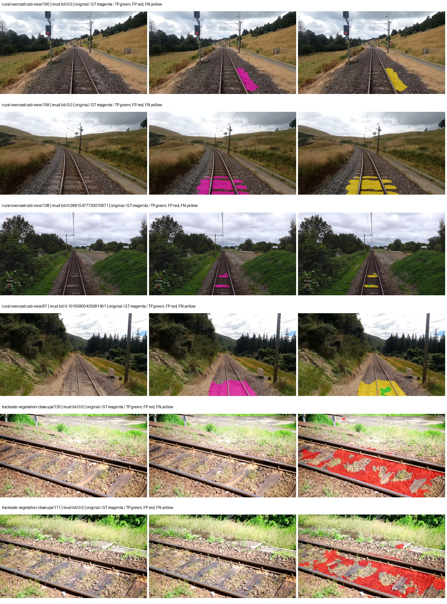

Examples are two lowest and two highest mud-IoU positive images, plus up to two negative images with the most false-positive mud pixels. They are targeted diagnostic examples, not random samples. Green: true positive; red: false positive; yellow: false negative. Full predictions remain on HDRFS.

### Validation tracking

| Logged step | Overall mIoU (%) | Mud IoU (%) |
| --- | --- | --- |
| 254 | 30.95 | 0.21 |
| 508 | 40.50 | 0.94 |
| 763 | 45.74 | 0.80 |
| 1017 | 43.81 | 1.14 |
| 1272 | 43.68 | 0.95 |
| 1527 | 41.16 | 0.79 |
| 1781 | 40.88 | 0.93 |
| 2036 | 43.07 | 0.96 |
| 2290 | 43.08 | 0.95 |

All retained scalar curves, including training loss and per-class IoU, are in record.json. Observed best mud on a curve is not necessarily a retained checkpoint: the pilot saved its selection-metric-best and final checkpoints. Step logging and checkpoint global_step may differ by one.

### Stopping and checkpoint provenance

```json
{
  "stopping": {
    "actual_steps": 2290,
    "maximum_steps": 4000,
    "min_delta": 0.001,
    "monitor": "val_iou/mud-pumping",
    "patience": 5,
    "reason": "validation_plateau"
  },
  "checkpoints": {
    "best": {
      "path": "/data/izadia1/projects/segmentary-runs/paul-test-rtis/mud-fullstats-v1-20260906-r2/future-runs/native_convnext_tiny_uper--railsem19_to_rtis--seed-0_seed0/rtis/best.ckpt",
      "sha256": "5a20e865f09baf2a39c8de13a5085c812b5ccd0ef0a40309cc4332f0822e48ca",
      "global_step": 1018,
      "bytes": 589961741
    },
    "final": {
      "path": "/data/izadia1/projects/segmentary-runs/paul-test-rtis/mud-fullstats-v1-20260906-r2/future-runs/native_convnext_tiny_uper--railsem19_to_rtis--seed-0_seed0/rtis/last.ckpt",
      "sha256": "22aa3701f51eeb017e40643cb4dc30d8198d5247474809aa1b60423644854da3",
      "global_step": 2290,
      "bytes": 589951373
    }
  },
  "cleanup_error": null
}
```

### Resolved training, initialization and evaluation settings

The optimizer block is the base configuration. Stage LR scales are applied at runtime, and stage warmup is capped at min(base warmup, floor(stage budget / 10), stage budget - 1): 400 steps for this 4,000-step pilot. Model-internal native input grids may differ from augmentation crops (EoMT uses its 640 grid).

```json
{
  "name": "native_convnext_tiny_uper--railsem19_to_rtis--seed-0",
  "model": {
    "arch": "native",
    "checkpoint": null,
    "tuning": "full",
    "head": "unified_head",
    "lora_r": 16,
    "lora_alpha": 32,
    "lora_dropout": 0.05,
    "lora_targets": [],
    "drop_path": null,
    "revision": null,
    "subfolder": null,
    "local_files_only": false,
    "trust_remote_code": false,
    "backbone_path": null,
    "head_paths": [],
    "classifier_path": null,
    "inactive_parameter_paths": [],
    "smp_arch": null,
    "encoder_name": null,
    "encoder_weights": null,
    "native": {
      "task": "multiclass",
      "backbone": {
        "kind": "timm",
        "name": "convnext_tiny.fb_in22k_ft_in1k",
        "weights": "pretrained",
        "out_indices": [
          0,
          1,
          2,
          3
        ],
        "in_channels": 3
      },
      "neck": {
        "kind": "identity"
      },
      "head": {
        "kind": "uper",
        "in_indices": [
          0,
          1,
          2,
          3
        ],
        "channels": 256,
        "pool_bins": [
          1,
          2,
          3,
          6
        ],
        "dropout": 0.1,
        "norm": "group",
        "activation": "relu"
      },
      "auxiliary_heads": []
    },
    "batch_norm_momentum": null
  },
  "space": "paul-test-rtis",
  "taxonomy_root": "/data/izadia1/projects/segmentary-rtis-fullstats-066afb2/taxonomy",
  "output_root": "/data/izadia1/projects/segmentary-runs/paul-test-rtis/mud-fullstats-v1-20260906-r2/future-runs",
  "optim": {
    "backbone_lr": 0.0001,
    "head_lr_mult": 10.0,
    "weight_decay": 0.05,
    "llrd": 1.0,
    "warmup_iters": 1500,
    "warmup_ratio": 1e-06,
    "poly_power": 0.9,
    "min_lr_ratio": 0.0,
    "betas": [
      0.9,
      0.999
    ],
    "grad_clip": 1.0
  },
  "train": {
    "iters": 4000,
    "batch_size": 2,
    "accum": 8,
    "num_workers": 2,
    "precision": "bf16-mixed",
    "ema_decay": 0.9998,
    "val_every": 250,
    "ckpt_every": 500,
    "selection_metric": "val_iou/mud-pumping",
    "early_stopping_patience": 5,
    "early_stopping_min_delta": 0.001,
    "seed": 0,
    "devices": 1
  },
  "eval": {
    "sliding_window": true,
    "window": [
      1024,
      1024
    ],
    "stride": [
      768,
      768
    ],
    "batch_size": 1,
    "num_workers": 2,
    "tta_scales": [],
    "tta_flip": false,
    "threshold": 0.5,
    "boundary_tolerance_frac": 0.0075,
    "save_confusion": true
  },
  "loss": {
    "task": "multiclass",
    "activation": "auto",
    "terms": [],
    "aux": "none",
    "aux_weight": 0.0,
    "ce_weight": 1.0,
    "label_smoothing": 0.0,
    "class_weights": null,
    "query": null
  },
  "aug": {
    "crop": [
      1024,
      1024
    ],
    "scale_min": 0.5,
    "scale_max": 2.0,
    "hflip_p": 0.5,
    "color_jitter_p": 0.5,
    "brightness": 0.25,
    "contrast": 0.25,
    "saturation": 0.25,
    "hue": 0.05
  },
  "stages": [
    {
      "name": "rtis",
      "data": [
        {
          "name": "paul-test-rtis",
          "root": "/data/izadia1/datasets/paul-test-rtis",
          "variant": null,
          "split_file": "splits.json",
          "train_split": "train",
          "val_split": "val",
          "limit": null,
          "loader": "folder",
          "mapping": "paul-test-rtis",
          "loader_options": {
            "require_groups": true
          }
        }
      ],
      "iters": null,
      "lr_scale": 0.1,
      "head_group_lr_scale": 1.0,
      "init_from": "/data/izadia1/projects/segmentary-runs/all-model-city-rail-seed0-rail20-b9eb3e1/jobs/native_convnext_tiny_uper--railsem19--seed-0/attempt-001/train/native_convnext_tiny_uper--railsem19_seed0/railsem19/last.ckpt",
      "reset_head": true,
      "freeze": null,
      "sample_weights": null
    }
  ]
}
```

### Hardware and software provenance

```json
{
  "training": {
    "cuda_available": true,
    "cuda_visible_devices": "8",
    "cudnn": 91900,
    "driver_version": "570.133.20",
    "gpu_count": 1,
    "gpu_names": [
      "NVIDIA L40S"
    ],
    "hostname": "hdrfs-app-001",
    "input_normalization": {
      "channel_order": "rgb",
      "mean": [
        0.485,
        0.456,
        0.406
      ],
      "source": "timm_pretrained_cfg",
      "std": [
        0.229,
        0.224,
        0.225
      ]
    },
    "model_origins": [
      {
        "hf_commit": null,
        "hf_name_or_path": null,
        "module": "backbone",
        "timm_pretrained": {
          "architecture": "convnext_tiny",
          "hf_hub_id": "timm/convnext_tiny.fb_in22k_ft_in1k",
          "tag": "fb_in22k_ft_in1k",
          "url": "https://dl.fbaipublicfiles.com/convnext/convnext_tiny_22k_1k_224.pth"
        }
      },
      {
        "hf_commit": null,
        "hf_name_or_path": null,
        "module": "backbone.model",
        "timm_pretrained": {
          "architecture": "convnext_tiny",
          "hf_hub_id": "timm/convnext_tiny.fb_in22k_ft_in1k",
          "tag": "fb_in22k_ft_in1k",
          "url": "https://dl.fbaipublicfiles.com/convnext/convnext_tiny_22k_1k_224.pth"
        }
      }
    ],
    "model_parameter_count": 36849525,
    "packages": {
      "albumentations": "2.0.8",
      "lightning": "2.6.5",
      "numpy": "2.4.4",
      "segmentary": "0.1.0",
      "segmentation-models-pytorch": "0.5.0",
      "timm": "1.0.28",
      "torch": "2.11.0+cu128",
      "torchvision": "0.26.0+cu128",
      "transformers": "5.15.0"
    },
    "platform": "Linux-5.15.0-139-generic-x86_64-with-glibc2.35",
    "python": "3.11.15",
    "torch": "2.11.0+cu128",
    "torch_cuda": "12.8",
    "trainable_parameter_count": 36849525,
    "training_stop": {
      "actual_steps": 2290,
      "maximum_steps": 4000,
      "min_delta": 0.001,
      "monitor": "val_iou/mud-pumping",
      "patience": 5,
      "reason": "validation_plateau"
    },
    "validation_weights": "ema"
  },
  "evaluation": {
    "cuda_available": true,
    "cuda_visible_devices": "8",
    "cudnn": 91900,
    "driver_version": "570.133.20",
    "gpu_count": 1,
    "gpu_names": [
      "NVIDIA L40S"
    ],
    "hostname": "hdrfs-app-001",
    "input_normalization": {
      "channel_order": "rgb",
      "mean": [
        0.485,
        0.456,
        0.406
      ],
      "source": "timm_pretrained_cfg",
      "std": [
        0.229,
        0.224,
        0.225
      ]
    },
    "packages": {
      "albumentations": "2.0.8",
      "lightning": "2.6.5",
      "numpy": "2.4.4",
      "segmentary": "0.1.0",
      "segmentation-models-pytorch": "0.5.0",
      "timm": "1.0.28",
      "torch": "2.11.0+cu128",
      "torchvision": "0.26.0+cu128",
      "transformers": "5.15.0"
    },
    "platform": "Linux-5.15.0-139-generic-x86_64-with-glibc2.35",
    "python": "3.11.15",
    "torch": "2.11.0+cu128",
    "torch_cuda": "12.8"
  }
}
```

## railsem19_to_rtis — seed 1

Status: **completed**. Started: 2026-09-06T18:37:27.266807+00:00. Finished: 2026-09-06T19:01:49.394817+00:00.

Recipe pretrained initializer: `{"arch": "native", "backbone_path": null, "batch_norm_momentum": null, "checkpoint": null, "classifier_path": null, "drop_path": null, "encoder_name": null, "encoder_weights": null, "head": "unified_head", "head_paths": [], "inactive_parameter_paths": [], "local_files_only": false, "lora_alpha": 32, "lora_dropout": 0.05, "lora_r": 16, "lora_targets": [], "native": {"auxiliary_heads": [], "backbone": {"in_channels": 3, "kind": "timm", "name": "convnext_tiny.fb_in22k_ft_in1k", "out_indices": [0, 1, 2, 3], "weights": "pretrained"}, "head": {"activation": "relu", "channels": 256, "dropout": 0.1, "in_indices": [0, 1, 2, 3], "kind": "uper", "norm": "group", "pool_bins": [1, 2, 3, 6]}, "neck": {"kind": "identity"}, "task": "multiclass"}, "revision": null, "smp_arch": null, "subfolder": null, "trust_remote_code": false, "tuning": "full"}`.

`rtis_only` uses the recipe initializer, which may include pretrained segmentation components. Transfer paths load the exact historical source checkpoint below and reset the classifier; they do not reset all query/decoder features.

Source checkpoint: `{'name': 'native_convnext_tiny_uper--railsem19--seed-0', 'model': 'native_convnext_tiny_uper', 'protocol': 'railsem19', 'config': '/data/izadia1/projects/segmentary-runs/all-model-city-rail-seed0-rail20-b9eb3e1/jobs/native_convnext_tiny_uper--railsem19--seed-0/attempt-001/resolved-config.yaml', 'checkpoint': '/data/izadia1/projects/segmentary-runs/all-model-city-rail-seed0-rail20-b9eb3e1/jobs/native_convnext_tiny_uper--railsem19--seed-0/attempt-001/train/native_convnext_tiny_uper--railsem19_seed0/railsem19/last.ckpt', 'recorded_sha256': 'c9d8b86e7010fbe8b3f53c0683701f659ed08d6326c16e1de022bfdb51de7a79', 'exists': True}`.

Config SHA-256: `ff656bd5e732d29644da0cb5acf0f108df3a70396b20b45107ea527883b13a0a`. Weights used for validation: `ema`.

### Mud-pumping and aggregate quality

| Metric | Selected checkpoint | Final training validation |
| --- | --- | --- |
| Mud IoU | 1.79 | 1.79 |
| Mud precision | 3.27 | 3.28 |
| Mud recall | 3.80 | 3.81 |
| Mud Dice/F1 | 3.51 | 3.52 |
| mIoU | 40.15 | 40.15 |
| Mean accuracy | 55.12 | 55.12 |
| Mean precision | 58.19 | 58.20 |
| Mean Dice | 50.33 | 50.34 |
| Mean specificity | 99.10 | 99.10 |
| Pixel accuracy | 85.66 | 85.66 |
| Frequency-weighted IoU | 77.23 | 77.23 |
| Fixed GT-present class mIoU | 46.84 | 46.85 |
| Boundary F1 | 50.07 | 50.09 |

The selected checkpoint has independent evaluation evidence. Final values are the trainer's final validation record, not a new independent evaluation. mIoU averages classes with nonzero union, so false positives on absent classes can change its denominator. The fixed GT-class mean is supplementary and excludes absent classes; their false positives remain in the confusion matrix.

### Resource usage and timing

| Measurement | Value |
| --- | --- |
| Peak training VRAM, retained training invocation (GiB) | 10.20 |
| Peak evaluation VRAM (GiB) | 7.42 |
| Retained training invocation wall time (seconds) | 1286.01 |
| Retained training invocation GPU-hours (one GPU) | 0.36 |
| Evaluation wall time (seconds) | 16.22 |
| Full evaluation pipeline images/second | 2.28 |
| Best full-state checkpoint (MiB) | 562.63 |
| Final full-state checkpoint (MiB) | 562.62 |
| Audited periodic checkpoints removed (GiB) | 1.65 |

VRAM uses the recorded allocator high-water mark; it is not total device usage including CUDA context. Resumed jobs' retained training invocation times and peaks are **not whole-campaign totals**. Earlier invocation resource records are not reconstructed here. Evaluation throughput includes loader, sliding-window inference and metrics; it is not model-only latency/FPS. Missing measurements are shown as —, never inferred from another dataset's run.

### Standardized inference performance

Dedicated model-only profiling waits for an idle worker-locked L40S: BF16, batch 1, 1024x1024, 20 warmup and 100 CUDA-event-timed public forwards. It excludes loading, preprocessing, tiling and metrics.

| Status | Parameters | Weight MiB | FPS | p50 ms | p95 ms | Peak reserved GiB |
| --- | --- | --- | --- | --- | --- | --- |
| complete | 36849525 | 140.57 | 75.59 | 13.21 | 13.35 | 1.24 |

```json
{
  "schema_version": 1,
  "model_id": "native_convnext_tiny_uper",
  "measured_at": "2026-09-06T19:01:45+00:00",
  "status": "complete",
  "benchmark_scope": "rtis_selected_checkpoint_model_only",
  "applies_to": [
    "native_convnext_tiny_uper--railsem19_to_rtis--seed-1"
  ],
  "source": {
    "campaign_git_sha": "066afb2626398b7be59d4d19f5a0e4644fd59adc",
    "git_dirty": false,
    "config_hash": "14f4d2e05b97",
    "resolved_config": "/data/izadia1/projects/segmentary-runs/paul-test-rtis/mud-fullstats-v1-20260906-r2/configs/native_convnext_tiny_uper--railsem19_to_rtis--seed-1.yaml",
    "config_sha256": "ff656bd5e732d29644da0cb5acf0f108df3a70396b20b45107ea527883b13a0a",
    "checkpoint_sha256": "f987544e3fc3829a24c40858e6465e336ae8e445de879773c9cea78113a9e181",
    "checkpoint_global_step": 1527,
    "checkpoint_bytes": 589961869,
    "checkpoint_kind": "resume checkpoint with optimizer and EMA state",
    "weights": "ema",
    "measured_checkpoint_job_id": "native_convnext_tiny_uper--railsem19_to_rtis--seed-1",
    "result_sha256": "78b4b6772f826cd764f7181c7df41cafc7a28a14c803131f5f3d2567326257a6",
    "result_git_sha": "066afb2626398b7be59d4d19f5a0e4644fd59adc",
    "result_stage": "eval:paul-test-rtis:val",
    "result_seed": 1
  },
  "hardware": {
    "gpu_name": "NVIDIA L40S",
    "gpu_uuid": "GPU-2f8008a1-9b67-11f6-987b-b393a672322c",
    "logical_device": "cuda:0",
    "physical_visibility_token": "3",
    "compute_capability": [
      8,
      9
    ],
    "total_memory_bytes": 47677177856
  },
  "model": {
    "parameter_count": 36849525,
    "trainable_parameter_count": 36849525,
    "resident_parameter_bytes": 147398100,
    "parameter_dtype_counts": {
      "float32": 36849525
    }
  },
  "contract": {
    "backend": "pytorch",
    "precision": "bf16_autocast",
    "batch_size": 1,
    "input_shape_nchw": [
      1,
      3,
      1024,
      1024
    ],
    "warmup_iterations": 20,
    "measured_iterations": 100,
    "timing": "per-forward CUDA events with end-event synchronization",
    "includes_preprocessing": false,
    "includes_data_loader": false,
    "includes_sliding_window": false,
    "input_resident_on_gpu": true,
    "model_only": true,
    "entrypoint": "public model(image) dense-logits forward"
  },
  "measurements": {
    "latency": {
      "p50_ms": 13.21011209487915,
      "p95_ms": 13.34555549621582,
      "mean_ms": 13.22985571861267,
      "minimum_ms": 13.15443229675293,
      "maximum_ms": 13.451264381408691,
      "fps": 75.58661419059402,
      "raw_ms": [
        13.308032035827637,
        13.15839958190918,
        13.451264381408691,
        13.16966438293457,
        13.344736099243164,
        13.208576202392578,
        13.16966438293457,
        13.15443229675293,
        13.196288108825684,
        13.35807991027832,
        13.180928230285645,
        13.180928230285645,
        13.174783706665039,
        13.206527709960938,
        13.163455963134766,
        13.179807662963867,
        13.215744018554688,
        13.196288108825684,
        13.18502426147461,
        13.186047554016113,
        13.184000015258789,
        13.208576202392578,
        13.192192077636719,
        13.16864013671875,
        13.225983619689941,
        13.204480171203613,
        13.18502426147461,
        13.26796817779541,
        13.379584312438965,
        13.221887588500977,
        13.285375595092773,
        13.212672233581543,
        13.330431938171387,
        13.213695526123047,
        13.205504417419434,
        13.172736167907715,
        13.240320205688477,
        13.199328422546387,
        13.214752197265625,
        13.191167831420898,
        13.215744018554688,
        13.220864295959473,
        13.328288078308105,
        13.326399803161621,
        13.241344451904297,
        13.248512268066406,
        13.37343978881836,
        13.305855751037598,
        13.209600448608398,
        13.2608003616333,
        13.336576461791992,
        13.205504417419434,
        13.218815803527832,
        13.214719772338867,
        13.218815803527832,
        13.18502426147461,
        13.204511642456055,
        13.332480430603027,
        13.194239616394043,
        13.182944297790527,
        13.206527709960938,
        13.282367706298828,
        13.362175941467285,
        13.291520118713379,
        13.303808212280273,
        13.187071800231934,
        13.186047554016113,
        13.222911834716797,
        13.330431938171387,
        13.232128143310547,
        13.229056358337402,
        13.193216323852539,
        13.228096008300781,
        13.18502426147461,
        13.210623741149902,
        13.34489631652832,
        13.192192077636719,
        13.201408386230469,
        13.195391654968262,
        13.200287818908691,
        13.204480171203613,
        13.17683219909668,
        13.223936080932617,
        13.246463775634766,
        13.269887924194336,
        13.220864295959473,
        13.212672233581543,
        13.192192077636719,
        13.304832458496094,
        13.2423677444458,
        13.191167831420898,
        13.17683219909668,
        13.184000015258789,
        13.238271713256836,
        13.218815803527832,
        13.199359893798828,
        13.222911834716797,
        13.197216033935547,
        13.16761589050293,
        13.192192077636719
      ],
      "percentile_method": "numpy linear interpolation"
    },
    "peak_reserved_bytes": 1335885824,
    "memory_kind": "pytorch_cuda_allocator_peak_reserved_excluding_context",
    "benchmark_wall_clock_s": 9.629334345459938
  },
  "started_at": "2026-09-06T19:01:35+00:00",
  "finished_at": "2026-09-06T19:01:45+00:00",
  "environment": {
    "hostname": "hdrfs-app-001",
    "python": "3.11.15",
    "platform": "Linux-5.15.0-139-generic-x86_64-with-glibc2.35",
    "torch": "2.11.0+cu128",
    "torch_cuda": "12.8",
    "cudnn": 91900,
    "driver_version": "570.133.20",
    "cuda_available": true,
    "gpu_count": 1,
    "gpu_names": [
      "NVIDIA L40S"
    ],
    "cuda_visible_devices": "3",
    "packages": {
      "segmentary": "0.1.0",
      "torch": "2.11.0+cu128",
      "torchvision": "0.26.0+cu128",
      "transformers": "5.15.0",
      "timm": "1.0.28",
      "segmentation-models-pytorch": "0.5.0",
      "albumentations": "2.0.8",
      "lightning": "2.6.5",
      "numpy": "2.4.4"
    }
  }
}
```

### Per-class validation results

| Class | GT pixels | IoU (%) | Precision (%) | Recall (%) | Dice (%) | Boundary F1 (%) |
| --- | --- | --- | --- | --- | --- | --- |
| car | 29664 | 70.88 | 77.69 | 89.00 | 82.96 | 64.72 |
| construction | 311585 | 54.46 | 63.20 | 79.76 | 70.52 | 58.37 |
| fence | 265137 | 33.60 | 70.23 | 39.19 | 50.30 | 52.87 |
| mud-pumping | 1226250 | 1.79 | 3.27 | 3.80 | 3.51 | 3.36 |
| on-rails | 0 | 0.00 | 0.00 | — | 0.00 | 0.00 |
| person | 0 | 0.00 | 0.00 | — | 0.00 | 0.00 |
| pole | 628038 | 76.71 | 87.97 | 85.70 | 86.82 | 93.63 |
| rail-embedded | 16799 | 31.39 | 92.40 | 32.22 | 47.78 | 85.03 |
| rail-raised | 2969797 | 77.46 | 88.33 | 86.29 | 87.30 | 92.64 |
| rail-track | 6323197 | 41.76 | 62.75 | 55.51 | 58.91 | 57.61 |
| road | 1048831 | 8.61 | 24.36 | 11.75 | 15.85 | 19.38 |
| sidewalk | 1297367 | 35.01 | 83.52 | 37.60 | 51.86 | 21.75 |
| sky | 19121606 | 98.99 | 99.35 | 99.63 | 99.49 | 98.22 |
| standing-water | 95802 | 2.72 | 8.60 | 3.82 | 5.29 | 11.96 |
| terrain | 39239306 | 89.10 | 90.35 | 98.47 | 94.23 | 73.00 |
| trackbed | 10643081 | 62.19 | 71.46 | 82.75 | 76.69 | 59.50 |
| traffic-light | 19510 | 46.46 | 92.37 | 48.31 | 63.44 | 80.30 |
| traffic-sign | 13285 | 46.55 | 72.22 | 56.70 | 63.53 | 69.61 |
| tram-track | 56179 | 30.13 | 48.91 | 43.97 | 46.31 | 38.57 |
| truck | 0 | 0.00 | 0.00 | — | 0.00 | 0.00 |
| vegetation-overgrowth | 5901821 | 35.25 | 85.00 | 37.58 | 52.12 | 70.97 |

### Full-run accounting

| Measurement | Value |
| --- | --- |
| Full GPU-reserved wall seconds, all recorded worker attempts | 1462.55 |
| Full reserved GPU-hours | 0.41 |
| Whole-run timing complete | True |

| Phase | Wall seconds including failed attempts |
| --- | --- |
| training | 1293.69 |
| diagnostics | 123.28 |
| performance | 17.33 |

GPU-reserved time includes model loading, training, validation, collection, profiling, checkpoint I/O and orchestration while the worker owns one GPU. It is not GPU kernel-active time. Phase timings and sampled device memory/power/utilization are retained separately; sampled device memory is not the allocator high-water mark.

### Train/validation and raw/EMA diagnostics

| Checkpoint / weights / split | Images | Mud IoU (%) | Mud precision (%) | Mud recall (%) |
| --- | --- | --- | --- | --- |
| best-auto-train / ema | 220 | 97.32 | 98.49 | 98.80 |
| best-auto-val / ema | 37 | 1.79 | 3.27 | 3.80 |
| best-alternate-val / raw | 37 | 4.89 | 7.90 | 11.35 |
| final-auto-val / ema | 37 | 1.79 | 3.27 | 3.80 |

Train uses the evaluation transform without augmentation. Compare mud train/validation metrics for the same selected weights. Alternate EMA on running-stat BatchNorm is explicitly uncalibrated and is diagnostic only. Score-threshold curves use uncalibrated normalized scores and are pixel-level diagnostics, not event detection rates or a selected deployment operating point.

### Downloadable evidence

- best-auto-train: [per-image.csv](railsem19_to_rtis--seed-1/best-auto-train/per-image.csv) · [per-image-confusion.json.gz](railsem19_to_rtis--seed-1/best-auto-train/per-image-confusion.json.gz) · [groups.json](railsem19_to_rtis--seed-1/best-auto-train/groups.json) · [mud-score-curves.json](railsem19_to_rtis--seed-1/best-auto-train/mud-score-curves.json)
- best-auto-val: [per-image.csv](railsem19_to_rtis--seed-1/best-auto-val/per-image.csv) · [per-image-confusion.json.gz](railsem19_to_rtis--seed-1/best-auto-val/per-image-confusion.json.gz) · [groups.json](railsem19_to_rtis--seed-1/best-auto-val/groups.json) · [mud-score-curves.json](railsem19_to_rtis--seed-1/best-auto-val/mud-score-curves.json) · [examples.jpg](railsem19_to_rtis--seed-1/best-auto-val/examples.jpg)
- best-alternate-val: [per-image.csv](railsem19_to_rtis--seed-1/best-alternate-val/per-image.csv) · [per-image-confusion.json.gz](railsem19_to_rtis--seed-1/best-alternate-val/per-image-confusion.json.gz) · [groups.json](railsem19_to_rtis--seed-1/best-alternate-val/groups.json) · [mud-score-curves.json](railsem19_to_rtis--seed-1/best-alternate-val/mud-score-curves.json)
- final-auto-val: [per-image.csv](railsem19_to_rtis--seed-1/final-auto-val/per-image.csv) · [per-image-confusion.json.gz](railsem19_to_rtis--seed-1/final-auto-val/per-image-confusion.json.gz) · [groups.json](railsem19_to_rtis--seed-1/final-auto-val/groups.json) · [mud-score-curves.json](railsem19_to_rtis--seed-1/final-auto-val/mud-score-curves.json)
- resources: [telemetry.csv](railsem19_to_rtis--seed-1/resources/telemetry.csv)

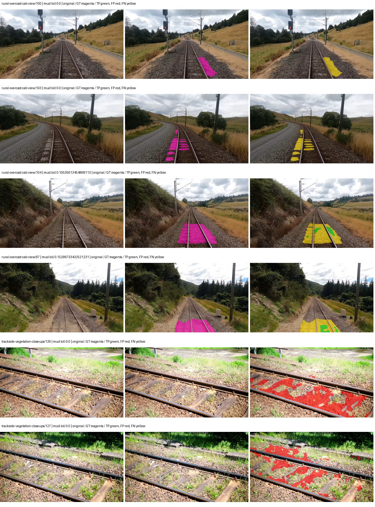

Examples are two lowest and two highest mud-IoU positive images, plus up to two negative images with the most false-positive mud pixels. They are targeted diagnostic examples, not random samples. Green: true positive; red: false positive; yellow: false negative. Full predictions remain on HDRFS.

### Validation tracking

| Logged step | Overall mIoU (%) | Mud IoU (%) |
| --- | --- | --- |
| 254 | 32.78 | 1.71 |
| 508 | 40.21 | 1.65 |
| 763 | 43.71 | 1.47 |
| 1017 | 43.56 | 1.77 |
| 1272 | 40.73 | 1.63 |
| 1527 | 40.15 | 1.79 |

All retained scalar curves, including training loss and per-class IoU, are in record.json. Observed best mud on a curve is not necessarily a retained checkpoint: the pilot saved its selection-metric-best and final checkpoints. Step logging and checkpoint global_step may differ by one.

### Stopping and checkpoint provenance

```json
{
  "stopping": {
    "actual_steps": 1527,
    "maximum_steps": 4000,
    "min_delta": 0.001,
    "monitor": "val_iou/mud-pumping",
    "patience": 5,
    "reason": "validation_plateau"
  },
  "checkpoints": {
    "best": {
      "path": "/data/izadia1/projects/segmentary-runs/paul-test-rtis/mud-fullstats-v1-20260906-r2/future-runs/native_convnext_tiny_uper--railsem19_to_rtis--seed-1_seed1/rtis/best.ckpt",
      "sha256": "f987544e3fc3829a24c40858e6465e336ae8e445de879773c9cea78113a9e181",
      "global_step": 1527,
      "bytes": 589961869
    },
    "final": {
      "path": "/data/izadia1/projects/segmentary-runs/paul-test-rtis/mud-fullstats-v1-20260906-r2/future-runs/native_convnext_tiny_uper--railsem19_to_rtis--seed-1_seed1/rtis/last.ckpt",
      "sha256": "d433e1cf9b25a67b51d279d6ac5063101f92606c475c155c82851eca090d7955",
      "global_step": 1527,
      "bytes": 589951373
    }
  },
  "cleanup_error": null
}
```

### Resolved training, initialization and evaluation settings

The optimizer block is the base configuration. Stage LR scales are applied at runtime, and stage warmup is capped at min(base warmup, floor(stage budget / 10), stage budget - 1): 400 steps for this 4,000-step pilot. Model-internal native input grids may differ from augmentation crops (EoMT uses its 640 grid).

```json
{
  "name": "native_convnext_tiny_uper--railsem19_to_rtis--seed-1",
  "model": {
    "arch": "native",
    "checkpoint": null,
    "tuning": "full",
    "head": "unified_head",
    "lora_r": 16,
    "lora_alpha": 32,
    "lora_dropout": 0.05,
    "lora_targets": [],
    "drop_path": null,
    "revision": null,
    "subfolder": null,
    "local_files_only": false,
    "trust_remote_code": false,
    "backbone_path": null,
    "head_paths": [],
    "classifier_path": null,
    "inactive_parameter_paths": [],
    "smp_arch": null,
    "encoder_name": null,
    "encoder_weights": null,
    "native": {
      "task": "multiclass",
      "backbone": {
        "kind": "timm",
        "name": "convnext_tiny.fb_in22k_ft_in1k",
        "weights": "pretrained",
        "out_indices": [
          0,
          1,
          2,
          3
        ],
        "in_channels": 3
      },
      "neck": {
        "kind": "identity"
      },
      "head": {
        "kind": "uper",
        "in_indices": [
          0,
          1,
          2,
          3
        ],
        "channels": 256,
        "pool_bins": [
          1,
          2,
          3,
          6
        ],
        "dropout": 0.1,
        "norm": "group",
        "activation": "relu"
      },
      "auxiliary_heads": []
    },
    "batch_norm_momentum": null
  },
  "space": "paul-test-rtis",
  "taxonomy_root": "/data/izadia1/projects/segmentary-rtis-fullstats-066afb2/taxonomy",
  "output_root": "/data/izadia1/projects/segmentary-runs/paul-test-rtis/mud-fullstats-v1-20260906-r2/future-runs",
  "optim": {
    "backbone_lr": 0.0001,
    "head_lr_mult": 10.0,
    "weight_decay": 0.05,
    "llrd": 1.0,
    "warmup_iters": 1500,
    "warmup_ratio": 1e-06,
    "poly_power": 0.9,
    "min_lr_ratio": 0.0,
    "betas": [
      0.9,
      0.999
    ],
    "grad_clip": 1.0
  },
  "train": {
    "iters": 4000,
    "batch_size": 2,
    "accum": 8,
    "num_workers": 2,
    "precision": "bf16-mixed",
    "ema_decay": 0.9998,
    "val_every": 250,
    "ckpt_every": 500,
    "selection_metric": "val_iou/mud-pumping",
    "early_stopping_patience": 5,
    "early_stopping_min_delta": 0.001,
    "seed": 1,
    "devices": 1
  },
  "eval": {
    "sliding_window": true,
    "window": [
      1024,
      1024
    ],
    "stride": [
      768,
      768
    ],
    "batch_size": 1,
    "num_workers": 2,
    "tta_scales": [],
    "tta_flip": false,
    "threshold": 0.5,
    "boundary_tolerance_frac": 0.0075,
    "save_confusion": true
  },
  "loss": {
    "task": "multiclass",
    "activation": "auto",
    "terms": [],
    "aux": "none",
    "aux_weight": 0.0,
    "ce_weight": 1.0,
    "label_smoothing": 0.0,
    "class_weights": null,
    "query": null
  },
  "aug": {
    "crop": [
      1024,
      1024
    ],
    "scale_min": 0.5,
    "scale_max": 2.0,
    "hflip_p": 0.5,
    "color_jitter_p": 0.5,
    "brightness": 0.25,
    "contrast": 0.25,
    "saturation": 0.25,
    "hue": 0.05
  },
  "stages": [
    {
      "name": "rtis",
      "data": [
        {
          "name": "paul-test-rtis",
          "root": "/data/izadia1/datasets/paul-test-rtis",
          "variant": null,
          "split_file": "splits.json",
          "train_split": "train",
          "val_split": "val",
          "limit": null,
          "loader": "folder",
          "mapping": "paul-test-rtis",
          "loader_options": {
            "require_groups": true
          }
        }
      ],
      "iters": null,
      "lr_scale": 0.1,
      "head_group_lr_scale": 1.0,
      "init_from": "/data/izadia1/projects/segmentary-runs/all-model-city-rail-seed0-rail20-b9eb3e1/jobs/native_convnext_tiny_uper--railsem19--seed-0/attempt-001/train/native_convnext_tiny_uper--railsem19_seed0/railsem19/last.ckpt",
      "reset_head": true,
      "freeze": null,
      "sample_weights": null
    }
  ]
}
```

### Hardware and software provenance

```json
{
  "training": {
    "cuda_available": true,
    "cuda_visible_devices": "3",
    "cudnn": 91900,
    "driver_version": "570.133.20",
    "gpu_count": 1,
    "gpu_names": [
      "NVIDIA L40S"
    ],
    "hostname": "hdrfs-app-001",
    "input_normalization": {
      "channel_order": "rgb",
      "mean": [
        0.485,
        0.456,
        0.406
      ],
      "source": "timm_pretrained_cfg",
      "std": [
        0.229,
        0.224,
        0.225
      ]
    },
    "model_origins": [
      {
        "hf_commit": null,
        "hf_name_or_path": null,
        "module": "backbone",
        "timm_pretrained": {
          "architecture": "convnext_tiny",
          "hf_hub_id": "timm/convnext_tiny.fb_in22k_ft_in1k",
          "tag": "fb_in22k_ft_in1k",
          "url": "https://dl.fbaipublicfiles.com/convnext/convnext_tiny_22k_1k_224.pth"
        }
      },
      {
        "hf_commit": null,
        "hf_name_or_path": null,
        "module": "backbone.model",
        "timm_pretrained": {
          "architecture": "convnext_tiny",
          "hf_hub_id": "timm/convnext_tiny.fb_in22k_ft_in1k",
          "tag": "fb_in22k_ft_in1k",
          "url": "https://dl.fbaipublicfiles.com/convnext/convnext_tiny_22k_1k_224.pth"
        }
      }
    ],
    "model_parameter_count": 36849525,
    "packages": {
      "albumentations": "2.0.8",
      "lightning": "2.6.5",
      "numpy": "2.4.4",
      "segmentary": "0.1.0",
      "segmentation-models-pytorch": "0.5.0",
      "timm": "1.0.28",
      "torch": "2.11.0+cu128",
      "torchvision": "0.26.0+cu128",
      "transformers": "5.15.0"
    },
    "platform": "Linux-5.15.0-139-generic-x86_64-with-glibc2.35",
    "python": "3.11.15",
    "torch": "2.11.0+cu128",
    "torch_cuda": "12.8",
    "trainable_parameter_count": 36849525,
    "training_stop": {
      "actual_steps": 1527,
      "maximum_steps": 4000,
      "min_delta": 0.001,
      "monitor": "val_iou/mud-pumping",
      "patience": 5,
      "reason": "validation_plateau"
    },
    "validation_weights": "ema"
  },
  "evaluation": {
    "cuda_available": true,
    "cuda_visible_devices": "3",
    "cudnn": 91900,
    "driver_version": "570.133.20",
    "gpu_count": 1,
    "gpu_names": [
      "NVIDIA L40S"
    ],
    "hostname": "hdrfs-app-001",
    "input_normalization": {
      "channel_order": "rgb",
      "mean": [
        0.485,
        0.456,
        0.406
      ],
      "source": "timm_pretrained_cfg",
      "std": [
        0.229,
        0.224,
        0.225
      ]
    },
    "packages": {
      "albumentations": "2.0.8",
      "lightning": "2.6.5",
      "numpy": "2.4.4",
      "segmentary": "0.1.0",
      "segmentation-models-pytorch": "0.5.0",
      "timm": "1.0.28",
      "torch": "2.11.0+cu128",
      "torchvision": "0.26.0+cu128",
      "transformers": "5.15.0"
    },
    "platform": "Linux-5.15.0-139-generic-x86_64-with-glibc2.35",
    "python": "3.11.15",
    "torch": "2.11.0+cu128",
    "torch_cuda": "12.8"
  }
}
```

## railsem19_to_rtis — seed 2

Status: **completed**. Started: 2026-09-06T18:40:07.189456+00:00. Finished: 2026-09-06T19:07:43.180430+00:00.

Recipe pretrained initializer: `{"arch": "native", "backbone_path": null, "batch_norm_momentum": null, "checkpoint": null, "classifier_path": null, "drop_path": null, "encoder_name": null, "encoder_weights": null, "head": "unified_head", "head_paths": [], "inactive_parameter_paths": [], "local_files_only": false, "lora_alpha": 32, "lora_dropout": 0.05, "lora_r": 16, "lora_targets": [], "native": {"auxiliary_heads": [], "backbone": {"in_channels": 3, "kind": "timm", "name": "convnext_tiny.fb_in22k_ft_in1k", "out_indices": [0, 1, 2, 3], "weights": "pretrained"}, "head": {"activation": "relu", "channels": 256, "dropout": 0.1, "in_indices": [0, 1, 2, 3], "kind": "uper", "norm": "group", "pool_bins": [1, 2, 3, 6]}, "neck": {"kind": "identity"}, "task": "multiclass"}, "revision": null, "smp_arch": null, "subfolder": null, "trust_remote_code": false, "tuning": "full"}`.

`rtis_only` uses the recipe initializer, which may include pretrained segmentation components. Transfer paths load the exact historical source checkpoint below and reset the classifier; they do not reset all query/decoder features.

Source checkpoint: `{'name': 'native_convnext_tiny_uper--railsem19--seed-0', 'model': 'native_convnext_tiny_uper', 'protocol': 'railsem19', 'config': '/data/izadia1/projects/segmentary-runs/all-model-city-rail-seed0-rail20-b9eb3e1/jobs/native_convnext_tiny_uper--railsem19--seed-0/attempt-001/resolved-config.yaml', 'checkpoint': '/data/izadia1/projects/segmentary-runs/all-model-city-rail-seed0-rail20-b9eb3e1/jobs/native_convnext_tiny_uper--railsem19--seed-0/attempt-001/train/native_convnext_tiny_uper--railsem19_seed0/railsem19/last.ckpt', 'recorded_sha256': 'c9d8b86e7010fbe8b3f53c0683701f659ed08d6326c16e1de022bfdb51de7a79', 'exists': True}`.

Config SHA-256: `c83cd2fa19c2bdb6c6d98424aafad46be7ec386bbf780e8bc2103b19d96aa3fc`. Weights used for validation: `ema`.

### Mud-pumping and aggregate quality

| Metric | Selected checkpoint | Final training validation |
| --- | --- | --- |
| Mud IoU | 2.09 | 1.41 |
| Mud precision | 2.89 | 2.19 |
| Mud recall | 7.08 | 3.82 |
| Mud Dice/F1 | 4.10 | 2.78 |
| mIoU | 39.85 | 41.81 |
| Mean accuracy | 51.99 | 54.76 |
| Mean precision | 59.57 | 60.88 |
| Mean Dice | 49.93 | 52.38 |
| Mean specificity | 99.05 | 99.05 |
| Pixel accuracy | 84.45 | 84.70 |
| Frequency-weighted IoU | 76.04 | 76.11 |
| Fixed GT-present class mIoU | 44.27 | 46.46 |
| Boundary F1 | 52.45 | 52.33 |

The selected checkpoint has independent evaluation evidence. Final values are the trainer's final validation record, not a new independent evaluation. mIoU averages classes with nonzero union, so false positives on absent classes can change its denominator. The fixed GT-class mean is supplementary and excludes absent classes; their false positives remain in the confusion matrix.

### Resource usage and timing

| Measurement | Value |
| --- | --- |
| Peak training VRAM, retained training invocation (GiB) | 10.20 |
| Peak evaluation VRAM (GiB) | 7.42 |
| Retained training invocation wall time (seconds) | 1480.19 |
| Retained training invocation GPU-hours (one GPU) | 0.41 |
| Evaluation wall time (seconds) | 16.35 |
| Full evaluation pipeline images/second | 2.26 |
| Best full-state checkpoint (MiB) | 562.63 |
| Final full-state checkpoint (MiB) | 562.62 |
| Audited periodic checkpoints removed (GiB) | 1.65 |

VRAM uses the recorded allocator high-water mark; it is not total device usage including CUDA context. Resumed jobs' retained training invocation times and peaks are **not whole-campaign totals**. Earlier invocation resource records are not reconstructed here. Evaluation throughput includes loader, sliding-window inference and metrics; it is not model-only latency/FPS. Missing measurements are shown as —, never inferred from another dataset's run.

### Standardized inference performance

Dedicated model-only profiling waits for an idle worker-locked L40S: BF16, batch 1, 1024x1024, 20 warmup and 100 CUDA-event-timed public forwards. It excludes loading, preprocessing, tiling and metrics.

| Status | Parameters | Weight MiB | FPS | p50 ms | p95 ms | Peak reserved GiB |
| --- | --- | --- | --- | --- | --- | --- |
| complete | 36849525 | 140.57 | 74.95 | 13.26 | 13.58 | 1.24 |

```json
{
  "schema_version": 1,
  "model_id": "native_convnext_tiny_uper",
  "measured_at": "2026-09-06T19:07:39+00:00",
  "status": "complete",
  "benchmark_scope": "rtis_selected_checkpoint_model_only",
  "applies_to": [
    "native_convnext_tiny_uper--railsem19_to_rtis--seed-2"
  ],
  "source": {
    "campaign_git_sha": "066afb2626398b7be59d4d19f5a0e4644fd59adc",
    "git_dirty": false,
    "config_hash": "9d42d60d9d2a",
    "resolved_config": "/data/izadia1/projects/segmentary-runs/paul-test-rtis/mud-fullstats-v1-20260906-r2/configs/native_convnext_tiny_uper--railsem19_to_rtis--seed-2.yaml",
    "config_sha256": "c83cd2fa19c2bdb6c6d98424aafad46be7ec386bbf780e8bc2103b19d96aa3fc",
    "checkpoint_sha256": "0d7e79354d442b41a47874c88feca605a862c15ba38ff08df18cc2356c456b4b",
    "checkpoint_global_step": 509,
    "checkpoint_bytes": 589961741,
    "checkpoint_kind": "resume checkpoint with optimizer and EMA state",
    "weights": "ema",
    "measured_checkpoint_job_id": "native_convnext_tiny_uper--railsem19_to_rtis--seed-2",
    "result_sha256": "b9f15e785554aa93185c5b49e6ab15d6e1866cc19a15e285163c0f03fd85c500",
    "result_git_sha": "066afb2626398b7be59d4d19f5a0e4644fd59adc",
    "result_stage": "eval:paul-test-rtis:val",
    "result_seed": 2
  },
  "hardware": {
    "gpu_name": "NVIDIA L40S",
    "gpu_uuid": "GPU-1c9b612f-e0b5-fbbc-150f-8c2ef13453c9",
    "logical_device": "cuda:0",
    "physical_visibility_token": "5",
    "compute_capability": [
      8,
      9
    ],
    "total_memory_bytes": 47677177856
  },
  "model": {
    "parameter_count": 36849525,
    "trainable_parameter_count": 36849525,
    "resident_parameter_bytes": 147398100,
    "parameter_dtype_counts": {
      "float32": 36849525
    }
  },
  "contract": {
    "backend": "pytorch",
    "precision": "bf16_autocast",
    "batch_size": 1,
    "input_shape_nchw": [
      1,
      3,
      1024,
      1024
    ],
    "warmup_iterations": 20,
    "measured_iterations": 100,
    "timing": "per-forward CUDA events with end-event synchronization",
    "includes_preprocessing": false,
    "includes_data_loader": false,
    "includes_sliding_window": false,
    "input_resident_on_gpu": true,
    "model_only": true,
    "entrypoint": "public model(image) dense-logits forward"
  },
  "measurements": {
    "latency": {
      "p50_ms": 13.263360023498535,
      "p95_ms": 13.576653146743775,
      "mean_ms": 13.341573162078857,
      "minimum_ms": 13.139967918395996,
      "maximum_ms": 16.81100845336914,
      "fps": 74.95367958872565,
      "raw_ms": [
        13.289471626281738,
        13.139967918395996,
        13.307904243469238,
        13.236224174499512,
        13.2423677444458,
        13.329407691955566,
        13.376543998718262,
        13.57414436340332,
        13.326335906982422,
        13.229056358337402,
        13.282303810119629,
        13.2423677444458,
        13.264896392822266,
        13.227007865905762,
        13.270015716552734,
        13.25158405303955,
        13.253631591796875,
        13.319168090820312,
        13.394944190979004,
        13.300736427307129,
        13.302783966064453,
        13.240320205688477,
        13.243391990661621,
        13.253600120544434,
        13.289471626281738,
        13.235199928283691,
        13.279232025146484,
        13.273088455200195,
        13.2608003616333,
        13.227007865905762,
        13.239295959472656,
        13.232128143310547,
        13.196288108825684,
        13.305855751037598,
        13.443072319030762,
        13.318143844604492,
        13.343744277954102,
        13.309951782226562,
        14.635007858276367,
        13.337599754333496,
        13.28332805633545,
        13.476863861083984,
        13.216768264770508,
        13.235199928283691,
        13.28332805633545,
        13.225983619689941,
        13.199359893798828,
        13.227007865905762,
        13.232128143310547,
        13.255680084228516,
        13.567999839782715,
        13.26899242401123,
        13.248512268066406,
        13.256704330444336,
        13.216768264770508,
        13.303808212280273,
        13.240320205688477,
        13.245439529418945,
        13.261823654174805,
        13.212672233581543,
        13.2423677444458,
        13.216768264770508,
        13.264896392822266,
        13.301759719848633,
        13.302783966064453,
        13.26591968536377,
        13.316096305847168,
        14.141440391540527,
        13.313023567199707,
        13.624320030212402,
        13.2608003616333,
        16.81100845336914,
        13.290495872497559,
        13.224960327148438,
        13.240320205688477,
        13.26899242401123,
        13.25772762298584,
        13.232128143310547,
        13.233152389526367,
        13.229056358337402,
        13.230079650878906,
        13.255680084228516,
        13.240320205688477,
        13.636608123779297,
        13.209600448608398,
        13.229056358337402,
        13.309951782226562,
        13.277183532714844,
        13.247488021850586,
        13.272064208984375,
        13.264896392822266,
        13.370368003845215,
        13.296640396118164,
        13.224960327148438,
        13.235199928283691,
        13.270015716552734,
        13.513728141784668,
        13.232128143310547,
        13.271039962768555,
        13.24953556060791
      ],
      "percentile_method": "numpy linear interpolation"
    },
    "peak_reserved_bytes": 1335885824,
    "memory_kind": "pytorch_cuda_allocator_peak_reserved_excluding_context",
    "benchmark_wall_clock_s": 9.581280961632729
  },
  "started_at": "2026-09-06T19:07:29+00:00",
  "finished_at": "2026-09-06T19:07:39+00:00",
  "environment": {
    "hostname": "hdrfs-app-001",
    "python": "3.11.15",
    "platform": "Linux-5.15.0-139-generic-x86_64-with-glibc2.35",
    "torch": "2.11.0+cu128",
    "torch_cuda": "12.8",
    "cudnn": 91900,
    "driver_version": "570.133.20",
    "cuda_available": true,
    "gpu_count": 1,
    "gpu_names": [
      "NVIDIA L40S"
    ],
    "cuda_visible_devices": "5",
    "packages": {
      "segmentary": "0.1.0",
      "torch": "2.11.0+cu128",
      "torchvision": "0.26.0+cu128",
      "transformers": "5.15.0",
      "timm": "1.0.28",
      "segmentation-models-pytorch": "0.5.0",
      "albumentations": "2.0.8",
      "lightning": "2.6.5",
      "numpy": "2.4.4"
    }
  }
}
```

### Per-class validation results

| Class | GT pixels | IoU (%) | Precision (%) | Recall (%) | Dice (%) | Boundary F1 (%) |
| --- | --- | --- | --- | --- | --- | --- |
| car | 29664 | 7.99 | 38.64 | 9.15 | 14.80 | 49.06 |
| construction | 311585 | 55.92 | 64.66 | 80.54 | 71.73 | 60.65 |
| fence | 265137 | 40.91 | 67.09 | 51.18 | 58.07 | 51.88 |
| mud-pumping | 1226250 | 2.09 | 2.89 | 7.08 | 4.10 | 5.02 |
| on-rails | 0 | 0.00 | 0.00 | — | 0.00 | 0.00 |
| person | 0 | — | — | — | — | — |
| pole | 628038 | 77.90 | 87.52 | 87.63 | 87.58 | 93.37 |
| rail-embedded | 16799 | 34.71 | 81.07 | 37.77 | 51.53 | 87.69 |
| rail-raised | 2969797 | 75.78 | 80.54 | 92.77 | 86.22 | 89.77 |
| rail-track | 6323197 | 38.53 | 66.92 | 47.59 | 55.62 | 54.93 |
| road | 1048831 | 5.83 | 19.66 | 7.65 | 11.02 | 21.42 |
| sidewalk | 1297367 | 42.79 | 85.61 | 46.11 | 59.94 | 27.28 |
| sky | 19121606 | 98.94 | 99.33 | 99.60 | 99.47 | 98.37 |
| standing-water | 95802 | 0.00 | 0.01 | 0.01 | 0.01 | 0.00 |
| terrain | 39239306 | 88.66 | 90.15 | 98.18 | 93.99 | 72.96 |
| trackbed | 10643081 | 64.20 | 72.20 | 85.28 | 78.20 | 60.75 |
| traffic-light | 19510 | 46.43 | 96.37 | 47.25 | 63.41 | 84.35 |
| traffic-sign | 13285 | 48.36 | 81.22 | 54.45 | 65.19 | 76.42 |
| tram-track | 56179 | 48.50 | 66.83 | 63.88 | 65.32 | 57.90 |
| truck | 0 | 0.00 | 0.00 | — | 0.00 | 0.00 |
| vegetation-overgrowth | 5901821 | 19.35 | 90.67 | 19.74 | 32.43 | 57.21 |

### Full-run accounting

| Measurement | Value |
| --- | --- |
| Full GPU-reserved wall seconds, all recorded worker attempts | 1656.45 |
| Full reserved GPU-hours | 0.46 |
| Whole-run timing complete | True |

| Phase | Wall seconds including failed attempts |
| --- | --- |
| training | 1487.16 |
| diagnostics | 123.53 |
| performance | 17.79 |

GPU-reserved time includes model loading, training, validation, collection, profiling, checkpoint I/O and orchestration while the worker owns one GPU. It is not GPU kernel-active time. Phase timings and sampled device memory/power/utilization are retained separately; sampled device memory is not the allocator high-water mark.

### Train/validation and raw/EMA diagnostics

| Checkpoint / weights / split | Images | Mud IoU (%) | Mud precision (%) | Mud recall (%) |
| --- | --- | --- | --- | --- |
| best-auto-train / ema | 220 | 95.06 | 97.10 | 97.84 |
| best-auto-val / ema | 37 | 2.09 | 2.89 | 7.08 |
| best-alternate-val / raw | 37 | 0.97 | 1.64 | 2.32 |
| final-auto-val / ema | 37 | 1.41 | 2.19 | 3.83 |

Train uses the evaluation transform without augmentation. Compare mud train/validation metrics for the same selected weights. Alternate EMA on running-stat BatchNorm is explicitly uncalibrated and is diagnostic only. Score-threshold curves use uncalibrated normalized scores and are pixel-level diagnostics, not event detection rates or a selected deployment operating point.

### Downloadable evidence

- best-auto-train: [per-image.csv](railsem19_to_rtis--seed-2/best-auto-train/per-image.csv) · [per-image-confusion.json.gz](railsem19_to_rtis--seed-2/best-auto-train/per-image-confusion.json.gz) · [groups.json](railsem19_to_rtis--seed-2/best-auto-train/groups.json) · [mud-score-curves.json](railsem19_to_rtis--seed-2/best-auto-train/mud-score-curves.json)
- best-auto-val: [per-image.csv](railsem19_to_rtis--seed-2/best-auto-val/per-image.csv) · [per-image-confusion.json.gz](railsem19_to_rtis--seed-2/best-auto-val/per-image-confusion.json.gz) · [groups.json](railsem19_to_rtis--seed-2/best-auto-val/groups.json) · [mud-score-curves.json](railsem19_to_rtis--seed-2/best-auto-val/mud-score-curves.json) · [examples.jpg](railsem19_to_rtis--seed-2/best-auto-val/examples.jpg)
- best-alternate-val: [per-image.csv](railsem19_to_rtis--seed-2/best-alternate-val/per-image.csv) · [per-image-confusion.json.gz](railsem19_to_rtis--seed-2/best-alternate-val/per-image-confusion.json.gz) · [groups.json](railsem19_to_rtis--seed-2/best-alternate-val/groups.json) · [mud-score-curves.json](railsem19_to_rtis--seed-2/best-alternate-val/mud-score-curves.json)
- final-auto-val: [per-image.csv](railsem19_to_rtis--seed-2/final-auto-val/per-image.csv) · [per-image-confusion.json.gz](railsem19_to_rtis--seed-2/final-auto-val/per-image-confusion.json.gz) · [groups.json](railsem19_to_rtis--seed-2/final-auto-val/groups.json) · [mud-score-curves.json](railsem19_to_rtis--seed-2/final-auto-val/mud-score-curves.json)
- resources: [telemetry.csv](railsem19_to_rtis--seed-2/resources/telemetry.csv)

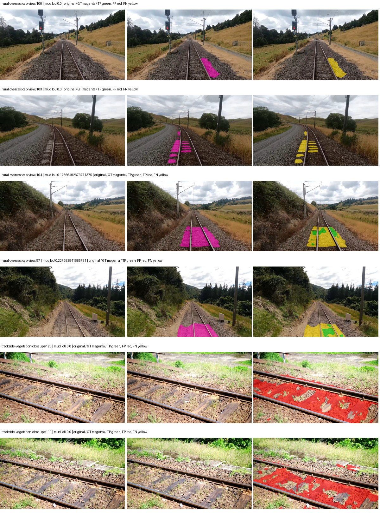

Examples are two lowest and two highest mud-IoU positive images, plus up to two negative images with the most false-positive mud pixels. They are targeted diagnostic examples, not random samples. Green: true positive; red: false positive; yellow: false negative. Full predictions remain on HDRFS.

### Validation tracking

| Logged step | Overall mIoU (%) | Mud IoU (%) |
| --- | --- | --- |
| 254 | 29.88 | 1.37 |
| 508 | 39.87 | 2.10 |
| 763 | 44.51 | 1.56 |
| 1017 | 43.36 | 1.35 |
| 1272 | 41.05 | 1.65 |
| 1527 | 39.76 | 1.65 |
| 1781 | 41.81 | 1.41 |

All retained scalar curves, including training loss and per-class IoU, are in record.json. Observed best mud on a curve is not necessarily a retained checkpoint: the pilot saved its selection-metric-best and final checkpoints. Step logging and checkpoint global_step may differ by one.

### Stopping and checkpoint provenance

```json
{
  "stopping": {
    "actual_steps": 1781,
    "maximum_steps": 4000,
    "min_delta": 0.001,
    "monitor": "val_iou/mud-pumping",
    "patience": 5,
    "reason": "validation_plateau"
  },
  "checkpoints": {
    "best": {
      "path": "/data/izadia1/projects/segmentary-runs/paul-test-rtis/mud-fullstats-v1-20260906-r2/future-runs/native_convnext_tiny_uper--railsem19_to_rtis--seed-2_seed2/rtis/best.ckpt",
      "sha256": "0d7e79354d442b41a47874c88feca605a862c15ba38ff08df18cc2356c456b4b",
      "global_step": 509,
      "bytes": 589961741
    },
    "final": {
      "path": "/data/izadia1/projects/segmentary-runs/paul-test-rtis/mud-fullstats-v1-20260906-r2/future-runs/native_convnext_tiny_uper--railsem19_to_rtis--seed-2_seed2/rtis/last.ckpt",
      "sha256": "e4e1a0adbdf0e616f131a5d5103b8f2df0ae308cc3954516438674177165cf49",
      "global_step": 1781,
      "bytes": 589951373
    }
  },
  "cleanup_error": null
}
```

### Resolved training, initialization and evaluation settings

The optimizer block is the base configuration. Stage LR scales are applied at runtime, and stage warmup is capped at min(base warmup, floor(stage budget / 10), stage budget - 1): 400 steps for this 4,000-step pilot. Model-internal native input grids may differ from augmentation crops (EoMT uses its 640 grid).

```json
{
  "name": "native_convnext_tiny_uper--railsem19_to_rtis--seed-2",
  "model": {
    "arch": "native",
    "checkpoint": null,
    "tuning": "full",
    "head": "unified_head",
    "lora_r": 16,
    "lora_alpha": 32,
    "lora_dropout": 0.05,
    "lora_targets": [],
    "drop_path": null,
    "revision": null,
    "subfolder": null,
    "local_files_only": false,
    "trust_remote_code": false,
    "backbone_path": null,
    "head_paths": [],
    "classifier_path": null,
    "inactive_parameter_paths": [],
    "smp_arch": null,
    "encoder_name": null,
    "encoder_weights": null,
    "native": {
      "task": "multiclass",
      "backbone": {
        "kind": "timm",
        "name": "convnext_tiny.fb_in22k_ft_in1k",
        "weights": "pretrained",
        "out_indices": [
          0,
          1,
          2,
          3
        ],
        "in_channels": 3
      },
      "neck": {
        "kind": "identity"
      },
      "head": {
        "kind": "uper",
        "in_indices": [
          0,
          1,
          2,
          3
        ],
        "channels": 256,
        "pool_bins": [
          1,
          2,
          3,
          6
        ],
        "dropout": 0.1,
        "norm": "group",
        "activation": "relu"
      },
      "auxiliary_heads": []
    },
    "batch_norm_momentum": null
  },
  "space": "paul-test-rtis",
  "taxonomy_root": "/data/izadia1/projects/segmentary-rtis-fullstats-066afb2/taxonomy",
  "output_root": "/data/izadia1/projects/segmentary-runs/paul-test-rtis/mud-fullstats-v1-20260906-r2/future-runs",
  "optim": {
    "backbone_lr": 0.0001,
    "head_lr_mult": 10.0,
    "weight_decay": 0.05,
    "llrd": 1.0,
    "warmup_iters": 1500,
    "warmup_ratio": 1e-06,
    "poly_power": 0.9,
    "min_lr_ratio": 0.0,
    "betas": [
      0.9,
      0.999
    ],
    "grad_clip": 1.0
  },
  "train": {
    "iters": 4000,
    "batch_size": 2,
    "accum": 8,
    "num_workers": 2,
    "precision": "bf16-mixed",
    "ema_decay": 0.9998,
    "val_every": 250,
    "ckpt_every": 500,
    "selection_metric": "val_iou/mud-pumping",
    "early_stopping_patience": 5,
    "early_stopping_min_delta": 0.001,
    "seed": 2,
    "devices": 1
  },
  "eval": {
    "sliding_window": true,
    "window": [
      1024,
      1024
    ],
    "stride": [
      768,
      768
    ],
    "batch_size": 1,
    "num_workers": 2,
    "tta_scales": [],
    "tta_flip": false,
    "threshold": 0.5,
    "boundary_tolerance_frac": 0.0075,
    "save_confusion": true
  },
  "loss": {
    "task": "multiclass",
    "activation": "auto",
    "terms": [],
    "aux": "none",
    "aux_weight": 0.0,
    "ce_weight": 1.0,
    "label_smoothing": 0.0,
    "class_weights": null,
    "query": null
  },
  "aug": {
    "crop": [
      1024,
      1024
    ],
    "scale_min": 0.5,
    "scale_max": 2.0,
    "hflip_p": 0.5,
    "color_jitter_p": 0.5,
    "brightness": 0.25,
    "contrast": 0.25,
    "saturation": 0.25,
    "hue": 0.05
  },
  "stages": [
    {
      "name": "rtis",
      "data": [
        {
          "name": "paul-test-rtis",
          "root": "/data/izadia1/datasets/paul-test-rtis",
          "variant": null,
          "split_file": "splits.json",
          "train_split": "train",
          "val_split": "val",
          "limit": null,
          "loader": "folder",
          "mapping": "paul-test-rtis",
          "loader_options": {
            "require_groups": true
          }
        }
      ],
      "iters": null,
      "lr_scale": 0.1,
      "head_group_lr_scale": 1.0,
      "init_from": "/data/izadia1/projects/segmentary-runs/all-model-city-rail-seed0-rail20-b9eb3e1/jobs/native_convnext_tiny_uper--railsem19--seed-0/attempt-001/train/native_convnext_tiny_uper--railsem19_seed0/railsem19/last.ckpt",
      "reset_head": true,
      "freeze": null,
      "sample_weights": null
    }
  ]
}
```

### Hardware and software provenance

```json
{
  "training": {
    "cuda_available": true,
    "cuda_visible_devices": "5",
    "cudnn": 91900,
    "driver_version": "570.133.20",
    "gpu_count": 1,
    "gpu_names": [
      "NVIDIA L40S"
    ],
    "hostname": "hdrfs-app-001",
    "input_normalization": {
      "channel_order": "rgb",
      "mean": [
        0.485,
        0.456,
        0.406
      ],
      "source": "timm_pretrained_cfg",
      "std": [
        0.229,
        0.224,
        0.225
      ]
    },
    "model_origins": [
      {
        "hf_commit": null,
        "hf_name_or_path": null,
        "module": "backbone",
        "timm_pretrained": {
          "architecture": "convnext_tiny",
          "hf_hub_id": "timm/convnext_tiny.fb_in22k_ft_in1k",
          "tag": "fb_in22k_ft_in1k",
          "url": "https://dl.fbaipublicfiles.com/convnext/convnext_tiny_22k_1k_224.pth"
        }
      },
      {
        "hf_commit": null,
        "hf_name_or_path": null,
        "module": "backbone.model",
        "timm_pretrained": {
          "architecture": "convnext_tiny",
          "hf_hub_id": "timm/convnext_tiny.fb_in22k_ft_in1k",
          "tag": "fb_in22k_ft_in1k",
          "url": "https://dl.fbaipublicfiles.com/convnext/convnext_tiny_22k_1k_224.pth"
        }
      }
    ],
    "model_parameter_count": 36849525,
    "packages": {
      "albumentations": "2.0.8",
      "lightning": "2.6.5",
      "numpy": "2.4.4",
      "segmentary": "0.1.0",
      "segmentation-models-pytorch": "0.5.0",
      "timm": "1.0.28",
      "torch": "2.11.0+cu128",
      "torchvision": "0.26.0+cu128",
      "transformers": "5.15.0"
    },
    "platform": "Linux-5.15.0-139-generic-x86_64-with-glibc2.35",
    "python": "3.11.15",
    "torch": "2.11.0+cu128",
    "torch_cuda": "12.8",
    "trainable_parameter_count": 36849525,
    "training_stop": {
      "actual_steps": 1781,
      "maximum_steps": 4000,
      "min_delta": 0.001,
      "monitor": "val_iou/mud-pumping",
      "patience": 5,
      "reason": "validation_plateau"
    },
    "validation_weights": "ema"
  },
  "evaluation": {
    "cuda_available": true,
    "cuda_visible_devices": "5",
    "cudnn": 91900,
    "driver_version": "570.133.20",
    "gpu_count": 1,
    "gpu_names": [
      "NVIDIA L40S"
    ],
    "hostname": "hdrfs-app-001",
    "input_normalization": {
      "channel_order": "rgb",
      "mean": [
        0.485,
        0.456,
        0.406
      ],
      "source": "timm_pretrained_cfg",
      "std": [
        0.229,
        0.224,
        0.225
      ]
    },
    "packages": {
      "albumentations": "2.0.8",
      "lightning": "2.6.5",
      "numpy": "2.4.4",
      "segmentary": "0.1.0",
      "segmentation-models-pytorch": "0.5.0",
      "timm": "1.0.28",
      "torch": "2.11.0+cu128",
      "torchvision": "0.26.0+cu128",
      "transformers": "5.15.0"
    },
    "platform": "Linux-5.15.0-139-generic-x86_64-with-glibc2.35",
    "python": "3.11.15",
    "torch": "2.11.0+cu128",
    "torch_cuda": "12.8"
  }
}
```

## cityscapes_to_railsem19_to_rtis — seed 0

Status: **completed**. Started: 2026-09-06T18:40:11.439992+00:00. Finished: 2026-09-06T19:21:47.338367+00:00.

Recipe pretrained initializer: `{"arch": "native", "backbone_path": null, "batch_norm_momentum": null, "checkpoint": null, "classifier_path": null, "drop_path": null, "encoder_name": null, "encoder_weights": null, "head": "unified_head", "head_paths": [], "inactive_parameter_paths": [], "local_files_only": false, "lora_alpha": 32, "lora_dropout": 0.05, "lora_r": 16, "lora_targets": [], "native": {"auxiliary_heads": [], "backbone": {"in_channels": 3, "kind": "timm", "name": "convnext_tiny.fb_in22k_ft_in1k", "out_indices": [0, 1, 2, 3], "weights": "pretrained"}, "head": {"activation": "relu", "channels": 256, "dropout": 0.1, "in_indices": [0, 1, 2, 3], "kind": "uper", "norm": "group", "pool_bins": [1, 2, 3, 6]}, "neck": {"kind": "identity"}, "task": "multiclass"}, "revision": null, "smp_arch": null, "subfolder": null, "trust_remote_code": false, "tuning": "full"}`.

`rtis_only` uses the recipe initializer, which may include pretrained segmentation components. Transfer paths load the exact historical source checkpoint below and reset the classifier; they do not reset all query/decoder features.

Source checkpoint: `{'name': 'native_convnext_tiny_uper--cityscapes_to_railsem19--seed-0', 'model': 'native_convnext_tiny_uper', 'protocol': 'cityscapes_to_railsem19', 'config': '/data/izadia1/projects/segmentary-runs/all-model-city-rail-seed0-rail20-b9eb3e1/accepted/native_convnext_tiny_uper--cityscapes_to_railsem19--seed-0/resolved-config.yaml', 'checkpoint': '/data/izadia1/projects/segmentary-runs/city-rail-transfer-rail20/native_convnext_tiny_uper/railsem19/last.ckpt', 'recorded_sha256': '4c64ebd37d92449a029c1a9161c4a35cdd0453c05d49baea6d23458e21ff4c30', 'exists': True}`.

Config SHA-256: `37d36bdbda6e4a278d44014fb8874b91a1e3e276262677590f6e2dc452f80b37`. Weights used for validation: `ema`.

### Mud-pumping and aggregate quality

| Metric | Selected checkpoint | Final training validation |
| --- | --- | --- |
| Mud IoU | 7.64 | 6.26 |
| Mud precision | 18.62 | 19.36 |
| Mud recall | 11.47 | 8.48 |
| Mud Dice/F1 | 14.20 | 11.79 |
| mIoU | 41.52 | 42.62 |
| Mean accuracy | 57.25 | 58.52 |
| Mean precision | 59.75 | 60.35 |
| Mean Dice | 52.08 | 53.13 |
| Mean specificity | 99.12 | 99.10 |
| Pixel accuracy | 86.00 | 85.77 |
| Frequency-weighted IoU | 77.22 | 76.69 |
| Fixed GT-present class mIoU | 48.44 | 49.72 |
| Boundary F1 | 50.38 | 51.41 |

The selected checkpoint has independent evaluation evidence. Final values are the trainer's final validation record, not a new independent evaluation. mIoU averages classes with nonzero union, so false positives on absent classes can change its denominator. The fixed GT-class mean is supplementary and excludes absent classes; their false positives remain in the confusion matrix.

### Resource usage and timing

| Measurement | Value |
| --- | --- |
| Peak training VRAM, retained training invocation (GiB) | 10.20 |
| Peak evaluation VRAM (GiB) | 7.42 |
| Retained training invocation wall time (seconds) | 2317.74 |
| Retained training invocation GPU-hours (one GPU) | 0.64 |
| Evaluation wall time (seconds) | 16.29 |
| Full evaluation pipeline images/second | 2.27 |
| Best full-state checkpoint (MiB) | 562.63 |
| Final full-state checkpoint (MiB) | 562.62 |
| Audited periodic checkpoints removed (GiB) | 2.75 |

VRAM uses the recorded allocator high-water mark; it is not total device usage including CUDA context. Resumed jobs' retained training invocation times and peaks are **not whole-campaign totals**. Earlier invocation resource records are not reconstructed here. Evaluation throughput includes loader, sliding-window inference and metrics; it is not model-only latency/FPS. Missing measurements are shown as —, never inferred from another dataset's run.

### Standardized inference performance

Dedicated model-only profiling waits for an idle worker-locked L40S: BF16, batch 1, 1024x1024, 20 warmup and 100 CUDA-event-timed public forwards. It excludes loading, preprocessing, tiling and metrics.

| Status | Parameters | Weight MiB | FPS | p50 ms | p95 ms | Peak reserved GiB |
| --- | --- | --- | --- | --- | --- | --- |
| complete | 36849525 | 140.57 | 75.26 | 13.28 | 13.34 | 1.24 |

```json
{
  "schema_version": 1,
  "model_id": "native_convnext_tiny_uper",
  "measured_at": "2026-09-06T19:21:41+00:00",
  "status": "complete",
  "benchmark_scope": "rtis_selected_checkpoint_model_only",
  "applies_to": [
    "native_convnext_tiny_uper--cityscapes_to_railsem19_to_rtis--seed-0"
  ],
  "source": {
    "campaign_git_sha": "066afb2626398b7be59d4d19f5a0e4644fd59adc",
    "git_dirty": false,
    "config_hash": "7e2db0092090",
    "resolved_config": "/data/izadia1/projects/segmentary-runs/paul-test-rtis/mud-fullstats-v1-20260906-r2/configs/native_convnext_tiny_uper--cityscapes_to_railsem19_to_rtis--seed-0.yaml",
    "config_sha256": "37d36bdbda6e4a278d44014fb8874b91a1e3e276262677590f6e2dc452f80b37",
    "checkpoint_sha256": "10e769db914ce97a111e14fd8ef88d11ba8391e3981d690adae8f24643c3a218",
    "checkpoint_global_step": 1527,
    "checkpoint_bytes": 589961805,
    "checkpoint_kind": "resume checkpoint with optimizer and EMA state",
    "weights": "ema",
    "measured_checkpoint_job_id": "native_convnext_tiny_uper--cityscapes_to_railsem19_to_rtis--seed-0",
    "result_sha256": "c90a15c963b4263a158cd24fad5955a0e3c809f9c8b9686a3db0a8f52a2c23e0",
    "result_git_sha": "066afb2626398b7be59d4d19f5a0e4644fd59adc",
    "result_stage": "eval:paul-test-rtis:val",
    "result_seed": 0
  },
  "hardware": {
    "gpu_name": "NVIDIA L40S",
    "gpu_uuid": "GPU-84f5ca4d-68db-ae98-d056-40654d859dd9",
    "logical_device": "cuda:0",
    "physical_visibility_token": "0",
    "compute_capability": [
      8,
      9
    ],
    "total_memory_bytes": 47677177856
  },
  "model": {
    "parameter_count": 36849525,
    "trainable_parameter_count": 36849525,
    "resident_parameter_bytes": 147398100,
    "parameter_dtype_counts": {
      "float32": 36849525
    }
  },
  "contract": {
    "backend": "pytorch",
    "precision": "bf16_autocast",
    "batch_size": 1,
    "input_shape_nchw": [
      1,
      3,
      1024,
      1024
    ],
    "warmup_iterations": 20,
    "measured_iterations": 100,
    "timing": "per-forward CUDA events with end-event synchronization",
    "includes_preprocessing": false,
    "includes_data_loader": false,
    "includes_sliding_window": false,
    "input_resident_on_gpu": true,
    "model_only": true,
    "entrypoint": "public model(image) dense-logits forward"
  },
  "measurements": {
    "latency": {
      "p50_ms": 13.276671886444092,
      "p95_ms": 13.337906980514527,
      "mean_ms": 13.28660385131836,
      "minimum_ms": 13.223936080932617,
      "maximum_ms": 13.733823776245117,
      "fps": 75.26377780133599,
      "raw_ms": [
        13.473888397216797,
        13.271039962768555,
        13.244416236877441,
        13.291520118713379,
        13.223936080932617,
        13.278207778930664,
        13.271039962768555,
        13.235199928283691,
        13.285375595092773,
        13.305855751037598,
        13.315072059631348,
        13.269920349121094,
        13.264896392822266,
        13.273088455200195,
        13.233152389526367,
        13.294591903686523,
        13.253631591796875,
        13.289471626281738,
        13.295616149902344,
        13.308927536010742,
        13.313023567199707,
        13.2423677444458,
        13.26591968536377,
        13.277183532714844,
        13.256832122802734,
        13.25772762298584,
        13.299712181091309,
        13.290495872497559,
        13.2608003616333,
        13.297632217407227,
        13.289471626281738,
        13.26591968536377,
        13.27616024017334,
        13.26591968536377,
        13.279359817504883,
        13.26585578918457,
        13.252511978149414,
        13.272064208984375,
        13.26591968536377,
        13.343744277954102,
        13.296640396118164,
        13.2957124710083,
        13.28332805633545,
        13.277183532714844,
        13.258720397949219,
        13.23100757598877,
        13.281279563903809,
        13.300736427307129,
        13.278207778930664,
        13.307904243469238,
        13.310976028442383,
        13.337599754333496,
        13.25158405303955,
        13.26899242401123,
        13.2608003616333,
        13.280192375183105,
        13.271039962768555,
        13.25772762298584,
        13.252608299255371,
        13.240320205688477,
        13.300736427307129,
        13.280256271362305,
        13.295616149902344,
        13.25772762298584,
        13.289471626281738,
        13.262816429138184,
        13.26899242401123,
        13.263872146606445,
        13.301759719848633,
        13.280256271362305,
        13.430784225463867,
        13.294591903686523,
        13.2608003616333,
        13.254655838012695,
        13.295616149902344,
        13.2741117477417,
        13.273119926452637,
        13.272992134094238,
        13.259872436523438,
        13.25875186920166,
        13.255680084228516,
        13.295616149902344,
        13.286399841308594,
        13.278207778930664,
        13.299712181091309,
        13.231103897094727,
        13.25158405303955,
        13.247488021850586,
        13.293567657470703,
        13.303808212280273,
        13.271039962768555,
        13.45740795135498,
        13.264896392822266,
        13.28332805633545,
        13.313023567199707,
        13.25772762298584,
        13.336576461791992,
        13.25772762298584,
        13.304832458496094,
        13.733823776245117
      ],
      "percentile_method": "numpy linear interpolation"
    },
    "peak_reserved_bytes": 1335885824,
    "memory_kind": "pytorch_cuda_allocator_peak_reserved_excluding_context",
    "benchmark_wall_clock_s": 9.628915548324585
  },
  "started_at": "2026-09-06T19:21:32+00:00",
  "finished_at": "2026-09-06T19:21:41+00:00",
  "environment": {
    "hostname": "hdrfs-app-001",
    "python": "3.11.15",
    "platform": "Linux-5.15.0-139-generic-x86_64-with-glibc2.35",
    "torch": "2.11.0+cu128",
    "torch_cuda": "12.8",
    "cudnn": 91900,
    "driver_version": "570.133.20",
    "cuda_available": true,
    "gpu_count": 1,
    "gpu_names": [
      "NVIDIA L40S"
    ],
    "cuda_visible_devices": "0",
    "packages": {
      "segmentary": "0.1.0",
      "torch": "2.11.0+cu128",
      "torchvision": "0.26.0+cu128",
      "transformers": "5.15.0",
      "timm": "1.0.28",
      "segmentation-models-pytorch": "0.5.0",
      "albumentations": "2.0.8",
      "lightning": "2.6.5",
      "numpy": "2.4.4"
    }
  }
}
```

### Per-class validation results

| Class | GT pixels | IoU (%) | Precision (%) | Recall (%) | Dice (%) | Boundary F1 (%) |
| --- | --- | --- | --- | --- | --- | --- |
| car | 29664 | 74.14 | 81.02 | 89.72 | 85.15 | 67.94 |
| construction | 311585 | 55.12 | 63.69 | 80.39 | 71.07 | 56.73 |
| fence | 265137 | 28.23 | 64.08 | 33.54 | 44.03 | 48.05 |
| mud-pumping | 1226250 | 7.64 | 18.62 | 11.47 | 14.20 | 12.67 |
| on-rails | 0 | 0.00 | 0.00 | — | 0.00 | 0.00 |
| person | 0 | 0.00 | 0.00 | — | 0.00 | 0.00 |
| pole | 628038 | 75.13 | 84.83 | 86.79 | 85.80 | 90.96 |
| rail-embedded | 16799 | 30.39 | 88.75 | 31.61 | 46.62 | 73.48 |
| rail-raised | 2969797 | 73.40 | 80.22 | 89.63 | 84.66 | 87.55 |
| rail-track | 6323197 | 46.57 | 62.61 | 64.51 | 63.55 | 61.40 |
| road | 1048831 | 8.76 | 27.66 | 11.37 | 16.11 | 21.88 |
| sidewalk | 1297367 | 40.87 | 88.70 | 43.12 | 58.03 | 21.95 |
| sky | 19121606 | 98.07 | 99.33 | 98.72 | 99.02 | 94.25 |
| standing-water | 95802 | 5.20 | 8.84 | 11.20 | 9.88 | 24.44 |
| terrain | 39239306 | 88.96 | 90.42 | 98.21 | 94.16 | 74.06 |
| trackbed | 10643081 | 60.58 | 71.73 | 79.59 | 75.45 | 59.68 |
| traffic-light | 19510 | 54.21 | 91.55 | 57.07 | 70.31 | 74.28 |
| traffic-sign | 13285 | 47.82 | 73.14 | 58.01 | 64.70 | 66.28 |
| tram-track | 56179 | 40.41 | 75.15 | 46.64 | 57.56 | 54.31 |
| truck | 0 | 0.00 | 0.00 | — | 0.00 | 0.00 |
| vegetation-overgrowth | 5901821 | 36.35 | 84.48 | 38.95 | 53.31 | 68.17 |

### Full-run accounting

| Measurement | Value |
| --- | --- |
| Full GPU-reserved wall seconds, all recorded worker attempts | 2496.43 |
| Full reserved GPU-hours | 0.69 |
| Whole-run timing complete | True |

| Phase | Wall seconds including failed attempts |
| --- | --- |
| training | 2325.00 |
| diagnostics | 124.11 |
| performance | 18.10 |

GPU-reserved time includes model loading, training, validation, collection, profiling, checkpoint I/O and orchestration while the worker owns one GPU. It is not GPU kernel-active time. Phase timings and sampled device memory/power/utilization are retained separately; sampled device memory is not the allocator high-water mark.

### Train/validation and raw/EMA diagnostics

| Checkpoint / weights / split | Images | Mud IoU (%) | Mud precision (%) | Mud recall (%) |
| --- | --- | --- | --- | --- |
| best-auto-train / ema | 220 | 97.34 | 98.73 | 98.57 |
| best-auto-val / ema | 37 | 7.64 | 18.62 | 11.47 |
| best-alternate-val / raw | 37 | 8.60 | 18.57 | 13.81 |
| final-auto-val / ema | 37 | 6.27 | 19.35 | 8.48 |

Train uses the evaluation transform without augmentation. Compare mud train/validation metrics for the same selected weights. Alternate EMA on running-stat BatchNorm is explicitly uncalibrated and is diagnostic only. Score-threshold curves use uncalibrated normalized scores and are pixel-level diagnostics, not event detection rates or a selected deployment operating point.

### Downloadable evidence

- best-auto-train: [per-image.csv](cityscapes_to_railsem19_to_rtis--seed-0/best-auto-train/per-image.csv) · [per-image-confusion.json.gz](cityscapes_to_railsem19_to_rtis--seed-0/best-auto-train/per-image-confusion.json.gz) · [groups.json](cityscapes_to_railsem19_to_rtis--seed-0/best-auto-train/groups.json) · [mud-score-curves.json](cityscapes_to_railsem19_to_rtis--seed-0/best-auto-train/mud-score-curves.json)
- best-auto-val: [per-image.csv](cityscapes_to_railsem19_to_rtis--seed-0/best-auto-val/per-image.csv) · [per-image-confusion.json.gz](cityscapes_to_railsem19_to_rtis--seed-0/best-auto-val/per-image-confusion.json.gz) · [groups.json](cityscapes_to_railsem19_to_rtis--seed-0/best-auto-val/groups.json) · [mud-score-curves.json](cityscapes_to_railsem19_to_rtis--seed-0/best-auto-val/mud-score-curves.json) · [examples.jpg](cityscapes_to_railsem19_to_rtis--seed-0/best-auto-val/examples.jpg)
- best-alternate-val: [per-image.csv](cityscapes_to_railsem19_to_rtis--seed-0/best-alternate-val/per-image.csv) · [per-image-confusion.json.gz](cityscapes_to_railsem19_to_rtis--seed-0/best-alternate-val/per-image-confusion.json.gz) · [groups.json](cityscapes_to_railsem19_to_rtis--seed-0/best-alternate-val/groups.json) · [mud-score-curves.json](cityscapes_to_railsem19_to_rtis--seed-0/best-alternate-val/mud-score-curves.json)
- final-auto-val: [per-image.csv](cityscapes_to_railsem19_to_rtis--seed-0/final-auto-val/per-image.csv) · [per-image-confusion.json.gz](cityscapes_to_railsem19_to_rtis--seed-0/final-auto-val/per-image-confusion.json.gz) · [groups.json](cityscapes_to_railsem19_to_rtis--seed-0/final-auto-val/groups.json) · [mud-score-curves.json](cityscapes_to_railsem19_to_rtis--seed-0/final-auto-val/mud-score-curves.json)
- resources: [telemetry.csv](cityscapes_to_railsem19_to_rtis--seed-0/resources/telemetry.csv)

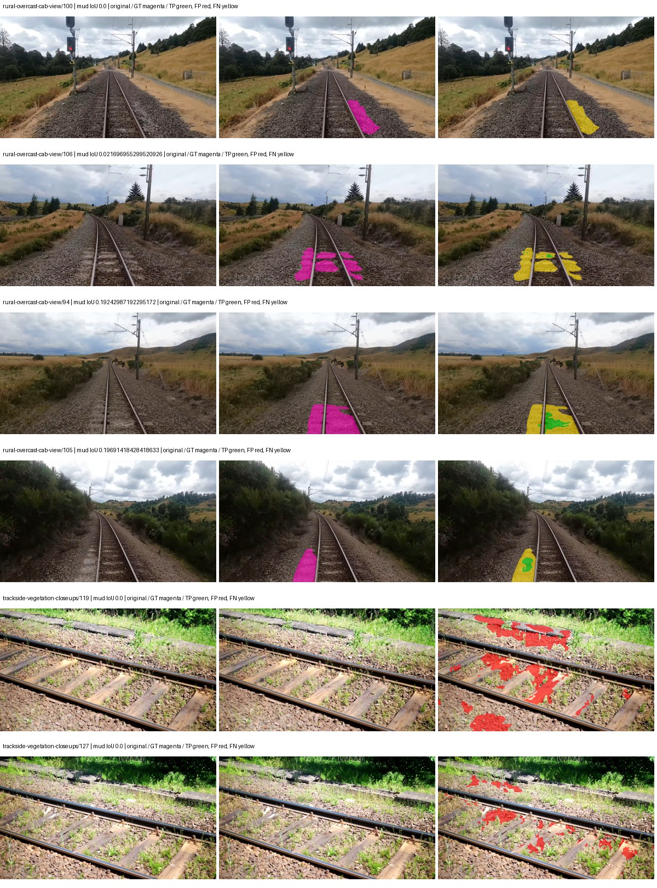

Examples are two lowest and two highest mud-IoU positive images, plus up to two negative images with the most false-positive mud pixels. They are targeted diagnostic examples, not random samples. Green: true positive; red: false positive; yellow: false negative. Full predictions remain on HDRFS.

### Validation tracking

| Logged step | Overall mIoU (%) | Mud IoU (%) |
| --- | --- | --- |
| 254 | 32.04 | 1.04 |
| 508 | 41.11 | 4.31 |
| 763 | 41.17 | 3.12 |
| 1017 | 41.50 | 5.40 |
| 1272 | 41.63 | 6.62 |
| 1527 | 41.54 | 7.64 |
| 1781 | 42.12 | 6.61 |
| 2036 | 42.66 | 6.26 |
| 2290 | 42.62 | 6.26 |
| 2545 | 42.63 | 6.26 |
| 2799 | 42.62 | 6.26 |

All retained scalar curves, including training loss and per-class IoU, are in record.json. Observed best mud on a curve is not necessarily a retained checkpoint: the pilot saved its selection-metric-best and final checkpoints. Step logging and checkpoint global_step may differ by one.

### Stopping and checkpoint provenance

```json
{
  "stopping": {
    "actual_steps": 2800,
    "maximum_steps": 4000,
    "min_delta": 0.001,
    "monitor": "val_iou/mud-pumping",
    "patience": 5,
    "reason": "validation_plateau"
  },
  "checkpoints": {
    "best": {
      "path": "/data/izadia1/projects/segmentary-runs/paul-test-rtis/mud-fullstats-v1-20260906-r2/future-runs/native_convnext_tiny_uper--cityscapes_to_railsem19_to_rtis--seed-0_seed0/rtis/best.ckpt",
      "sha256": "10e769db914ce97a111e14fd8ef88d11ba8391e3981d690adae8f24643c3a218",
      "global_step": 1527,
      "bytes": 589961805
    },
    "final": {
      "path": "/data/izadia1/projects/segmentary-runs/paul-test-rtis/mud-fullstats-v1-20260906-r2/future-runs/native_convnext_tiny_uper--cityscapes_to_railsem19_to_rtis--seed-0_seed0/rtis/last.ckpt",
      "sha256": "f448ed069b24abf62e0164afbff15b02cf56f04787112d9c56d6ffb7c472fd5c",
      "global_step": 2800,
      "bytes": 589951373
    }
  },
  "cleanup_error": null
}
```

### Resolved training, initialization and evaluation settings

The optimizer block is the base configuration. Stage LR scales are applied at runtime, and stage warmup is capped at min(base warmup, floor(stage budget / 10), stage budget - 1): 400 steps for this 4,000-step pilot. Model-internal native input grids may differ from augmentation crops (EoMT uses its 640 grid).

```json
{
  "name": "native_convnext_tiny_uper--cityscapes_to_railsem19_to_rtis--seed-0",
  "model": {
    "arch": "native",
    "checkpoint": null,
    "tuning": "full",
    "head": "unified_head",
    "lora_r": 16,
    "lora_alpha": 32,
    "lora_dropout": 0.05,
    "lora_targets": [],
    "drop_path": null,
    "revision": null,
    "subfolder": null,
    "local_files_only": false,
    "trust_remote_code": false,
    "backbone_path": null,
    "head_paths": [],
    "classifier_path": null,
    "inactive_parameter_paths": [],
    "smp_arch": null,
    "encoder_name": null,
    "encoder_weights": null,
    "native": {
      "task": "multiclass",
      "backbone": {
        "kind": "timm",
        "name": "convnext_tiny.fb_in22k_ft_in1k",
        "weights": "pretrained",
        "out_indices": [
          0,
          1,
          2,
          3
        ],
        "in_channels": 3
      },
      "neck": {
        "kind": "identity"
      },
      "head": {
        "kind": "uper",
        "in_indices": [
          0,
          1,
          2,
          3
        ],
        "channels": 256,
        "pool_bins": [
          1,
          2,
          3,
          6
        ],
        "dropout": 0.1,
        "norm": "group",
        "activation": "relu"
      },
      "auxiliary_heads": []
    },
    "batch_norm_momentum": null
  },
  "space": "paul-test-rtis",
  "taxonomy_root": "/data/izadia1/projects/segmentary-rtis-fullstats-066afb2/taxonomy",
  "output_root": "/data/izadia1/projects/segmentary-runs/paul-test-rtis/mud-fullstats-v1-20260906-r2/future-runs",
  "optim": {
    "backbone_lr": 0.0001,
    "head_lr_mult": 10.0,
    "weight_decay": 0.05,
    "llrd": 1.0,
    "warmup_iters": 1500,
    "warmup_ratio": 1e-06,
    "poly_power": 0.9,
    "min_lr_ratio": 0.0,
    "betas": [
      0.9,
      0.999
    ],
    "grad_clip": 1.0
  },
  "train": {
    "iters": 4000,
    "batch_size": 2,
    "accum": 8,
    "num_workers": 2,
    "precision": "bf16-mixed",
    "ema_decay": 0.9998,
    "val_every": 250,
    "ckpt_every": 500,
    "selection_metric": "val_iou/mud-pumping",
    "early_stopping_patience": 5,
    "early_stopping_min_delta": 0.001,
    "seed": 0,
    "devices": 1
  },
  "eval": {
    "sliding_window": true,
    "window": [
      1024,
      1024
    ],
    "stride": [
      768,
      768
    ],
    "batch_size": 1,
    "num_workers": 2,
    "tta_scales": [],
    "tta_flip": false,
    "threshold": 0.5,
    "boundary_tolerance_frac": 0.0075,
    "save_confusion": true
  },
  "loss": {
    "task": "multiclass",
    "activation": "auto",
    "terms": [],
    "aux": "none",
    "aux_weight": 0.0,
    "ce_weight": 1.0,
    "label_smoothing": 0.0,
    "class_weights": null,
    "query": null
  },
  "aug": {
    "crop": [
      1024,
      1024
    ],
    "scale_min": 0.5,
    "scale_max": 2.0,
    "hflip_p": 0.5,
    "color_jitter_p": 0.5,
    "brightness": 0.25,
    "contrast": 0.25,
    "saturation": 0.25,
    "hue": 0.05
  },
  "stages": [
    {
      "name": "rtis",
      "data": [
        {
          "name": "paul-test-rtis",
          "root": "/data/izadia1/datasets/paul-test-rtis",
          "variant": null,
          "split_file": "splits.json",
          "train_split": "train",
          "val_split": "val",
          "limit": null,
          "loader": "folder",
          "mapping": "paul-test-rtis",
          "loader_options": {
            "require_groups": true
          }
        }
      ],
      "iters": null,
      "lr_scale": 0.1,
      "head_group_lr_scale": 1.0,
      "init_from": "/data/izadia1/projects/segmentary-runs/city-rail-transfer-rail20/native_convnext_tiny_uper/railsem19/last.ckpt",
      "reset_head": true,
      "freeze": null,
      "sample_weights": null
    }
  ]
}
```

### Hardware and software provenance

```json
{
  "training": {
    "cuda_available": true,
    "cuda_visible_devices": "0",
    "cudnn": 91900,
    "driver_version": "570.133.20",
    "gpu_count": 1,
    "gpu_names": [
      "NVIDIA L40S"
    ],
    "hostname": "hdrfs-app-001",
    "input_normalization": {
      "channel_order": "rgb",
      "mean": [
        0.485,
        0.456,
        0.406
      ],
      "source": "timm_pretrained_cfg",
      "std": [
        0.229,
        0.224,
        0.225
      ]
    },
    "model_origins": [
      {
        "hf_commit": null,
        "hf_name_or_path": null,
        "module": "backbone",
        "timm_pretrained": {
          "architecture": "convnext_tiny",
          "hf_hub_id": "timm/convnext_tiny.fb_in22k_ft_in1k",
          "tag": "fb_in22k_ft_in1k",
          "url": "https://dl.fbaipublicfiles.com/convnext/convnext_tiny_22k_1k_224.pth"
        }
      },
      {
        "hf_commit": null,
        "hf_name_or_path": null,
        "module": "backbone.model",
        "timm_pretrained": {
          "architecture": "convnext_tiny",
          "hf_hub_id": "timm/convnext_tiny.fb_in22k_ft_in1k",
          "tag": "fb_in22k_ft_in1k",
          "url": "https://dl.fbaipublicfiles.com/convnext/convnext_tiny_22k_1k_224.pth"
        }
      }
    ],
    "model_parameter_count": 36849525,
    "packages": {
      "albumentations": "2.0.8",
      "lightning": "2.6.5",
      "numpy": "2.4.4",
      "segmentary": "0.1.0",
      "segmentation-models-pytorch": "0.5.0",
      "timm": "1.0.28",
      "torch": "2.11.0+cu128",
      "torchvision": "0.26.0+cu128",
      "transformers": "5.15.0"
    },
    "platform": "Linux-5.15.0-139-generic-x86_64-with-glibc2.35",
    "python": "3.11.15",
    "torch": "2.11.0+cu128",
    "torch_cuda": "12.8",
    "trainable_parameter_count": 36849525,
    "training_stop": {
      "actual_steps": 2800,
      "maximum_steps": 4000,
      "min_delta": 0.001,
      "monitor": "val_iou/mud-pumping",
      "patience": 5,
      "reason": "validation_plateau"
    },
    "validation_weights": "ema"
  },
  "evaluation": {
    "cuda_available": true,
    "cuda_visible_devices": "0",
    "cudnn": 91900,
    "driver_version": "570.133.20",
    "gpu_count": 1,
    "gpu_names": [
      "NVIDIA L40S"
    ],
    "hostname": "hdrfs-app-001",
    "input_normalization": {
      "channel_order": "rgb",
      "mean": [
        0.485,
        0.456,
        0.406
      ],
      "source": "timm_pretrained_cfg",
      "std": [
        0.229,
        0.224,
        0.225
      ]
    },
    "packages": {
      "albumentations": "2.0.8",
      "lightning": "2.6.5",
      "numpy": "2.4.4",
      "segmentary": "0.1.0",
      "segmentation-models-pytorch": "0.5.0",
      "timm": "1.0.28",
      "torch": "2.11.0+cu128",
      "torchvision": "0.26.0+cu128",
      "transformers": "5.15.0"
    },
    "platform": "Linux-5.15.0-139-generic-x86_64-with-glibc2.35",
    "python": "3.11.15",
    "torch": "2.11.0+cu128",
    "torch_cuda": "12.8"
  }
}
```

## cityscapes_to_railsem19_to_rtis — seed 1

Status: **collecting**. Started: 2026-09-06T18:40:53.758089+00:00. Finished: —.

Recipe pretrained initializer: `{"arch": "native", "backbone_path": null, "batch_norm_momentum": null, "checkpoint": null, "classifier_path": null, "drop_path": null, "encoder_name": null, "encoder_weights": null, "head": "unified_head", "head_paths": [], "inactive_parameter_paths": [], "local_files_only": false, "lora_alpha": 32, "lora_dropout": 0.05, "lora_r": 16, "lora_targets": [], "native": {"auxiliary_heads": [], "backbone": {"in_channels": 3, "kind": "timm", "name": "convnext_tiny.fb_in22k_ft_in1k", "out_indices": [0, 1, 2, 3], "weights": "pretrained"}, "head": {"activation": "relu", "channels": 256, "dropout": 0.1, "in_indices": [0, 1, 2, 3], "kind": "uper", "norm": "group", "pool_bins": [1, 2, 3, 6]}, "neck": {"kind": "identity"}, "task": "multiclass"}, "revision": null, "smp_arch": null, "subfolder": null, "trust_remote_code": false, "tuning": "full"}`.

`rtis_only` uses the recipe initializer, which may include pretrained segmentation components. Transfer paths load the exact historical source checkpoint below and reset the classifier; they do not reset all query/decoder features.

Source checkpoint: `{'name': 'native_convnext_tiny_uper--cityscapes_to_railsem19--seed-0', 'model': 'native_convnext_tiny_uper', 'protocol': 'cityscapes_to_railsem19', 'config': '/data/izadia1/projects/segmentary-runs/all-model-city-rail-seed0-rail20-b9eb3e1/accepted/native_convnext_tiny_uper--cityscapes_to_railsem19--seed-0/resolved-config.yaml', 'checkpoint': '/data/izadia1/projects/segmentary-runs/city-rail-transfer-rail20/native_convnext_tiny_uper/railsem19/last.ckpt', 'recorded_sha256': '4c64ebd37d92449a029c1a9161c4a35cdd0453c05d49baea6d23458e21ff4c30', 'exists': True}`.

Config SHA-256: `f7a453ae0d057152f834f244f2e58db72ae55dbbab63e71483bb25ba833fc93d`. Weights used for validation: `ema`.

### Mud-pumping and aggregate quality

| Metric | Selected checkpoint | Final training validation |
| --- | --- | --- |
| Mud IoU | 3.55 | 3.55 |
| Mud precision | 5.62 | 5.63 |
| Mud recall | 8.76 | 8.76 |
| Mud Dice/F1 | 6.85 | 6.85 |
| mIoU | 41.80 | 41.80 |
| Mean accuracy | 57.27 | 57.27 |
| Mean precision | 59.36 | 59.37 |
| Mean Dice | 51.87 | 51.87 |
| Mean specificity | 99.11 | 99.11 |
| Pixel accuracy | 85.59 | 85.59 |
| Frequency-weighted IoU | 77.22 | 77.23 |
| Fixed GT-present class mIoU | 48.77 | 48.77 |
| Boundary F1 | 49.77 | 49.78 |

The selected checkpoint has independent evaluation evidence. Final values are the trainer's final validation record, not a new independent evaluation. mIoU averages classes with nonzero union, so false positives on absent classes can change its denominator. The fixed GT-class mean is supplementary and excludes absent classes; their false positives remain in the confusion matrix.

### Resource usage and timing

| Measurement | Value |
| --- | --- |
| Peak training VRAM, retained training invocation (GiB) | 10.20 |
| Peak evaluation VRAM (GiB) | 7.42 |
| Retained training invocation wall time (seconds) | 2545.70 |
| Retained training invocation GPU-hours (one GPU) | 0.71 |
| Evaluation wall time (seconds) | 16.95 |
| Full evaluation pipeline images/second | 2.18 |
| Best full-state checkpoint (MiB) | 562.63 |
| Final full-state checkpoint (MiB) | 562.62 |
| Audited periodic checkpoints removed (GiB) | — |

VRAM uses the recorded allocator high-water mark; it is not total device usage including CUDA context. Resumed jobs' retained training invocation times and peaks are **not whole-campaign totals**. Earlier invocation resource records are not reconstructed here. Evaluation throughput includes loader, sliding-window inference and metrics; it is not model-only latency/FPS. Missing measurements are shown as —, never inferred from another dataset's run.

### Standardized inference performance

Dedicated model-only profiling waits for an idle worker-locked L40S: BF16, batch 1, 1024x1024, 20 warmup and 100 CUDA-event-timed public forwards. It excludes loading, preprocessing, tiling and metrics.

| Status | Parameters | Weight MiB | FPS | p50 ms | p95 ms | Peak reserved GiB |
| --- | --- | --- | --- | --- | --- | --- |
| complete | 36849525 | 140.57 | 75.27 | 13.27 | 13.37 | 1.24 |

```json
{
  "schema_version": 1,
  "model_id": "native_convnext_tiny_uper",
  "measured_at": "2026-09-06T19:26:14+00:00",
  "status": "complete",
  "benchmark_scope": "rtis_selected_checkpoint_model_only",
  "applies_to": [
    "native_convnext_tiny_uper--cityscapes_to_railsem19_to_rtis--seed-1"
  ],
  "source": {
    "campaign_git_sha": "066afb2626398b7be59d4d19f5a0e4644fd59adc",
    "git_dirty": false,
    "config_hash": "b1b42940ed20",
    "resolved_config": "/data/izadia1/projects/segmentary-runs/paul-test-rtis/mud-fullstats-v1-20260906-r2/configs/native_convnext_tiny_uper--cityscapes_to_railsem19_to_rtis--seed-1.yaml",
    "config_sha256": "f7a453ae0d057152f834f244f2e58db72ae55dbbab63e71483bb25ba833fc93d",
    "checkpoint_sha256": "4feb31f2d8690e427211f79bb227879b967253af326e13b405aa02922f353ab6",
    "checkpoint_global_step": 3054,
    "checkpoint_bytes": 589961933,
    "checkpoint_kind": "resume checkpoint with optimizer and EMA state",
    "weights": "ema",
    "measured_checkpoint_job_id": "native_convnext_tiny_uper--cityscapes_to_railsem19_to_rtis--seed-1",
    "result_sha256": "4b30c960868c3bbe2c2846129136a9b13e32a105105ecb9854790b527609fd9f",
    "result_git_sha": "066afb2626398b7be59d4d19f5a0e4644fd59adc",
    "result_stage": "eval:paul-test-rtis:val",
    "result_seed": 1
  },
  "hardware": {
    "gpu_name": "NVIDIA L40S",
    "gpu_uuid": "GPU-804aea8b-5f62-423e-72c6-49e1ed15c4e4",
    "logical_device": "cuda:0",
    "physical_visibility_token": "6",
    "compute_capability": [
      8,
      9
    ],
    "total_memory_bytes": 47677177856
  },
  "model": {
    "parameter_count": 36849525,
    "trainable_parameter_count": 36849525,
    "resident_parameter_bytes": 147398100,
    "parameter_dtype_counts": {
      "float32": 36849525
    }
  },
  "contract": {
    "backend": "pytorch",
    "precision": "bf16_autocast",
    "batch_size": 1,
    "input_shape_nchw": [
      1,
      3,
      1024,
      1024
    ],
    "warmup_iterations": 20,
    "measured_iterations": 100,
    "timing": "per-forward CUDA events with end-event synchronization",
    "includes_preprocessing": false,
    "includes_data_loader": false,
    "includes_sliding_window": false,
    "input_resident_on_gpu": true,
    "model_only": true,
    "entrypoint": "public model(image) dense-logits forward"
  },
  "measurements": {
    "latency": {
      "p50_ms": 13.272064208984375,
      "p95_ms": 13.37451524734497,
      "mean_ms": 13.285979795455933,
      "minimum_ms": 13.205504417419434,
      "maximum_ms": 13.498368263244629,
      "fps": 75.26731301684048,
      "raw_ms": [
        13.294591903686523,
        13.246463775634766,
        13.332480430603027,
        13.309951782226562,
        13.272064208984375,
        13.332480430603027,
        13.261823654174805,
        13.353983879089355,
        13.285375595092773,
        13.334527969360352,
        13.302783966064453,
        13.229056358337402,
        13.237248420715332,
        13.205504417419434,
        13.245439529418945,
        13.252608299255371,
        13.355008125305176,
        13.320192337036133,
        13.35807991027832,
        13.323264122009277,
        13.25055980682373,
        13.246463775634766,
        13.27513599395752,
        13.25055980682373,
        13.213695526123047,
        13.271039962768555,
        13.282303810119629,
        13.255680084228516,
        13.429759979248047,
        13.323264122009277,
        13.302783966064453,
        13.237248420715332,
        13.254655838012695,
        13.256704330444336,
        13.278207778930664,
        13.28435230255127,
        13.339648246765137,
        13.245439529418945,
        13.37548828125,
        13.279232025146484,
        13.222911834716797,
        13.272064208984375,
        13.270015716552734,
        13.293567657470703,
        13.296640396118164,
        13.498368263244629,
        13.239295959472656,
        13.278207778930664,
        13.278207778930664,
        13.2608003616333,
        13.25158405303955,
        13.246463775634766,
        13.26796817779541,
        13.278207778930664,
        13.2741117477417,
        13.305855751037598,
        13.259743690490723,
        13.285375595092773,
        13.334527969360352,
        13.290495872497559,
        13.240320205688477,
        13.25772762298584,
        13.254655838012695,
        13.264896392822266,
        13.252608299255371,
        13.256704330444336,
        13.273088455200195,
        13.35807991027832,
        13.285375595092773,
        13.281279563903809,
        13.404159545898438,
        13.310976028442383,
        13.26694393157959,
        13.223936080932617,
        13.435903549194336,
        13.2741117477417,
        13.253631591796875,
        13.25875186920166,
        13.293567657470703,
        13.253631591796875,
        13.26796817779541,
        13.253631591796875,
        13.2608003616333,
        13.363200187683105,
        13.37446403503418,
        13.252608299255371,
        13.318143844604492,
        13.243391990661621,
        13.26591968536377,
        13.238271713256836,
        13.253631591796875,
        13.238271713256836,
        13.272064208984375,
        13.35910415649414,
        13.371392250061035,
        13.341695785522461,
        13.25772762298584,
        13.254655838012695,
        13.277183532714844,
        13.223936080932617
      ],
      "percentile_method": "numpy linear interpolation"
    },
    "peak_reserved_bytes": 1335885824,
    "memory_kind": "pytorch_cuda_allocator_peak_reserved_excluding_context",
    "benchmark_wall_clock_s": 10.33663360401988
  },
  "started_at": "2026-09-06T19:26:04+00:00",
  "finished_at": "2026-09-06T19:26:14+00:00",
  "environment": {
    "hostname": "hdrfs-app-001",
    "python": "3.11.15",
    "platform": "Linux-5.15.0-139-generic-x86_64-with-glibc2.35",
    "torch": "2.11.0+cu128",
    "torch_cuda": "12.8",
    "cudnn": 91900,
    "driver_version": "570.133.20",
    "cuda_available": true,
    "gpu_count": 1,
    "gpu_names": [
      "NVIDIA L40S"
    ],
    "cuda_visible_devices": "6",
    "packages": {
      "segmentary": "0.1.0",
      "torch": "2.11.0+cu128",
      "torchvision": "0.26.0+cu128",
      "transformers": "5.15.0",
      "timm": "1.0.28",
      "segmentation-models-pytorch": "0.5.0",
      "albumentations": "2.0.8",
      "lightning": "2.6.5",
      "numpy": "2.4.4"
    }
  }
}
```

### Per-class validation results

| Class | GT pixels | IoU (%) | Precision (%) | Recall (%) | Dice (%) | Boundary F1 (%) |
| --- | --- | --- | --- | --- | --- | --- |
| car | 29664 | 74.55 | 81.43 | 89.83 | 85.42 | 64.72 |
| construction | 311585 | 56.78 | 65.74 | 80.64 | 72.43 | 62.04 |
| fence | 265137 | 24.52 | 66.32 | 28.00 | 39.38 | 49.90 |
| mud-pumping | 1226250 | 3.55 | 5.62 | 8.76 | 6.85 | 5.17 |
| on-rails | 0 | 0.00 | 0.00 | — | 0.00 | 0.00 |
| person | 0 | 0.00 | 0.00 | — | 0.00 | 0.00 |
| pole | 628038 | 75.59 | 84.95 | 87.28 | 86.10 | 89.83 |
| rail-embedded | 16799 | 25.77 | 79.72 | 27.57 | 40.97 | 77.06 |
| rail-raised | 2969797 | 75.44 | 81.43 | 91.12 | 86.00 | 89.26 |
| rail-track | 6323197 | 44.75 | 67.35 | 57.14 | 61.83 | 56.87 |
| road | 1048831 | 11.61 | 38.34 | 14.28 | 20.81 | 26.58 |
| sidewalk | 1297367 | 40.99 | 83.02 | 44.74 | 58.15 | 20.65 |
| sky | 19121606 | 98.28 | 99.32 | 98.94 | 99.13 | 94.59 |
| standing-water | 95802 | 1.88 | 6.24 | 2.62 | 3.69 | 11.57 |
| terrain | 39239306 | 89.48 | 90.97 | 98.21 | 94.45 | 73.92 |
| trackbed | 10643081 | 60.45 | 70.04 | 81.54 | 75.35 | 60.24 |
| traffic-light | 19510 | 63.22 | 93.32 | 66.21 | 77.46 | 77.66 |
| traffic-sign | 13285 | 51.38 | 74.53 | 62.33 | 67.88 | 73.21 |
| tram-track | 56179 | 45.82 | 71.44 | 56.10 | 62.84 | 45.12 |
| truck | 0 | 0.00 | 0.00 | — | 0.00 | 0.00 |
| vegetation-overgrowth | 5901821 | 33.81 | 86.83 | 35.64 | 50.53 | 66.74 |

### Full-run accounting

| Measurement | Value |
| --- | --- |
| Full GPU-reserved wall seconds, all recorded worker attempts | — |
| Full reserved GPU-hours | — |
| Whole-run timing complete | False |

| Phase | Wall seconds including failed attempts |
| --- | --- |
| training | 2553.14 |
| diagnostics | 125.00 |
| performance | 18.57 |

GPU-reserved time includes model loading, training, validation, collection, profiling, checkpoint I/O and orchestration while the worker owns one GPU. It is not GPU kernel-active time. Phase timings and sampled device memory/power/utilization are retained separately; sampled device memory is not the allocator high-water mark.

### Train/validation and raw/EMA diagnostics

| Checkpoint / weights / split | Images | Mud IoU (%) | Mud precision (%) | Mud recall (%) |
| --- | --- | --- | --- | --- |
| best-auto-train / ema | 220 | 97.69 | 98.80 | 98.86 |
| best-auto-val / ema | 37 | 3.55 | 5.62 | 8.76 |
| best-alternate-val / raw | 37 | 3.74 | 5.94 | 9.15 |
| final-auto-val / ema | 37 | 3.55 | 5.62 | 8.76 |

Train uses the evaluation transform without augmentation. Compare mud train/validation metrics for the same selected weights. Alternate EMA on running-stat BatchNorm is explicitly uncalibrated and is diagnostic only. Score-threshold curves use uncalibrated normalized scores and are pixel-level diagnostics, not event detection rates or a selected deployment operating point.

### Downloadable evidence

- best-auto-train: [per-image.csv](cityscapes_to_railsem19_to_rtis--seed-1/best-auto-train/per-image.csv) · [per-image-confusion.json.gz](cityscapes_to_railsem19_to_rtis--seed-1/best-auto-train/per-image-confusion.json.gz) · [groups.json](cityscapes_to_railsem19_to_rtis--seed-1/best-auto-train/groups.json) · [mud-score-curves.json](cityscapes_to_railsem19_to_rtis--seed-1/best-auto-train/mud-score-curves.json)
- best-auto-val: [per-image.csv](cityscapes_to_railsem19_to_rtis--seed-1/best-auto-val/per-image.csv) · [per-image-confusion.json.gz](cityscapes_to_railsem19_to_rtis--seed-1/best-auto-val/per-image-confusion.json.gz) · [groups.json](cityscapes_to_railsem19_to_rtis--seed-1/best-auto-val/groups.json) · [mud-score-curves.json](cityscapes_to_railsem19_to_rtis--seed-1/best-auto-val/mud-score-curves.json) · [examples.jpg](cityscapes_to_railsem19_to_rtis--seed-1/best-auto-val/examples.jpg)
- best-alternate-val: [per-image.csv](cityscapes_to_railsem19_to_rtis--seed-1/best-alternate-val/per-image.csv) · [per-image-confusion.json.gz](cityscapes_to_railsem19_to_rtis--seed-1/best-alternate-val/per-image-confusion.json.gz) · [groups.json](cityscapes_to_railsem19_to_rtis--seed-1/best-alternate-val/groups.json) · [mud-score-curves.json](cityscapes_to_railsem19_to_rtis--seed-1/best-alternate-val/mud-score-curves.json)
- final-auto-val: [per-image.csv](cityscapes_to_railsem19_to_rtis--seed-1/final-auto-val/per-image.csv) · [per-image-confusion.json.gz](cityscapes_to_railsem19_to_rtis--seed-1/final-auto-val/per-image-confusion.json.gz) · [groups.json](cityscapes_to_railsem19_to_rtis--seed-1/final-auto-val/groups.json) · [mud-score-curves.json](cityscapes_to_railsem19_to_rtis--seed-1/final-auto-val/mud-score-curves.json)
- resources: [telemetry.csv](cityscapes_to_railsem19_to_rtis--seed-1/resources/telemetry.csv)

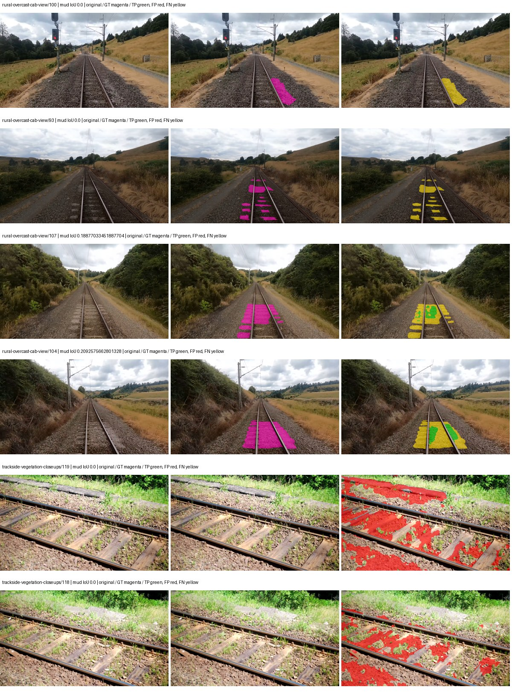

Examples are two lowest and two highest mud-IoU positive images, plus up to two negative images with the most false-positive mud pixels. They are targeted diagnostic examples, not random samples. Green: true positive; red: false positive; yellow: false negative. Full predictions remain on HDRFS.

### Validation tracking

| Logged step | Overall mIoU (%) | Mud IoU (%) |
| --- | --- | --- |
| 254 | 31.42 | 2.03 |
| 508 | 41.17 | 1.81 |
| 763 | 43.27 | 3.02 |
| 1017 | 42.97 | 2.94 |
| 1272 | 42.11 | 3.13 |
| 1527 | 41.77 | 3.24 |
| 1781 | 41.99 | 3.46 |
| 2036 | 41.67 | 3.41 |
| 2290 | 41.73 | 3.42 |
| 2545 | 41.81 | 3.47 |
| 2799 | 41.79 | 3.53 |
| 3054 | 41.80 | 3.55 |

All retained scalar curves, including training loss and per-class IoU, are in record.json. Observed best mud on a curve is not necessarily a retained checkpoint: the pilot saved its selection-metric-best and final checkpoints. Step logging and checkpoint global_step may differ by one.

### Stopping and checkpoint provenance

```json
{
  "stopping": {
    "actual_steps": 3054,
    "maximum_steps": 4000,
    "min_delta": 0.001,
    "monitor": "val_iou/mud-pumping",
    "patience": 5,
    "reason": "validation_plateau"
  },
  "checkpoints": {
    "best": {
      "path": "/data/izadia1/projects/segmentary-runs/paul-test-rtis/mud-fullstats-v1-20260906-r2/future-runs/native_convnext_tiny_uper--cityscapes_to_railsem19_to_rtis--seed-1_seed1/rtis/best.ckpt",
      "sha256": "4feb31f2d8690e427211f79bb227879b967253af326e13b405aa02922f353ab6",
      "global_step": 3054,
      "bytes": 589961933
    },
    "final": {
      "path": "/data/izadia1/projects/segmentary-runs/paul-test-rtis/mud-fullstats-v1-20260906-r2/future-runs/native_convnext_tiny_uper--cityscapes_to_railsem19_to_rtis--seed-1_seed1/rtis/last.ckpt",
      "sha256": "79c0c57ca7d789202d40938537578d6ca2b7389b8dc5312e8810b5b03b94fbb9",
      "global_step": 3054,
      "bytes": 589951373
    }
  },
  "cleanup_error": null
}
```

### Resolved training, initialization and evaluation settings

The optimizer block is the base configuration. Stage LR scales are applied at runtime, and stage warmup is capped at min(base warmup, floor(stage budget / 10), stage budget - 1): 400 steps for this 4,000-step pilot. Model-internal native input grids may differ from augmentation crops (EoMT uses its 640 grid).

```json
{
  "name": "native_convnext_tiny_uper--cityscapes_to_railsem19_to_rtis--seed-1",
  "model": {
    "arch": "native",
    "checkpoint": null,
    "tuning": "full",
    "head": "unified_head",
    "lora_r": 16,
    "lora_alpha": 32,
    "lora_dropout": 0.05,
    "lora_targets": [],
    "drop_path": null,
    "revision": null,
    "subfolder": null,
    "local_files_only": false,
    "trust_remote_code": false,
    "backbone_path": null,
    "head_paths": [],
    "classifier_path": null,
    "inactive_parameter_paths": [],
    "smp_arch": null,
    "encoder_name": null,
    "encoder_weights": null,
    "native": {
      "task": "multiclass",
      "backbone": {
        "kind": "timm",
        "name": "convnext_tiny.fb_in22k_ft_in1k",
        "weights": "pretrained",
        "out_indices": [
          0,
          1,
          2,
          3
        ],
        "in_channels": 3
      },
      "neck": {
        "kind": "identity"
      },
      "head": {
        "kind": "uper",
        "in_indices": [
          0,
          1,
          2,
          3
        ],
        "channels": 256,
        "pool_bins": [
          1,
          2,
          3,
          6
        ],
        "dropout": 0.1,
        "norm": "group",
        "activation": "relu"
      },
      "auxiliary_heads": []
    },
    "batch_norm_momentum": null
  },
  "space": "paul-test-rtis",
  "taxonomy_root": "/data/izadia1/projects/segmentary-rtis-fullstats-066afb2/taxonomy",
  "output_root": "/data/izadia1/projects/segmentary-runs/paul-test-rtis/mud-fullstats-v1-20260906-r2/future-runs",
  "optim": {
    "backbone_lr": 0.0001,
    "head_lr_mult": 10.0,
    "weight_decay": 0.05,
    "llrd": 1.0,
    "warmup_iters": 1500,
    "warmup_ratio": 1e-06,
    "poly_power": 0.9,
    "min_lr_ratio": 0.0,
    "betas": [
      0.9,
      0.999
    ],
    "grad_clip": 1.0
  },
  "train": {
    "iters": 4000,
    "batch_size": 2,
    "accum": 8,
    "num_workers": 2,
    "precision": "bf16-mixed",
    "ema_decay": 0.9998,
    "val_every": 250,
    "ckpt_every": 500,
    "selection_metric": "val_iou/mud-pumping",
    "early_stopping_patience": 5,
    "early_stopping_min_delta": 0.001,
    "seed": 1,
    "devices": 1
  },
  "eval": {
    "sliding_window": true,
    "window": [
      1024,
      1024
    ],
    "stride": [
      768,
      768
    ],
    "batch_size": 1,
    "num_workers": 2,
    "tta_scales": [],
    "tta_flip": false,
    "threshold": 0.5,
    "boundary_tolerance_frac": 0.0075,
    "save_confusion": true
  },
  "loss": {
    "task": "multiclass",
    "activation": "auto",
    "terms": [],
    "aux": "none",
    "aux_weight": 0.0,
    "ce_weight": 1.0,
    "label_smoothing": 0.0,
    "class_weights": null,
    "query": null
  },
  "aug": {
    "crop": [
      1024,
      1024
    ],
    "scale_min": 0.5,
    "scale_max": 2.0,
    "hflip_p": 0.5,
    "color_jitter_p": 0.5,
    "brightness": 0.25,
    "contrast": 0.25,
    "saturation": 0.25,
    "hue": 0.05
  },
  "stages": [
    {
      "name": "rtis",
      "data": [
        {
          "name": "paul-test-rtis",
          "root": "/data/izadia1/datasets/paul-test-rtis",
          "variant": null,
          "split_file": "splits.json",
          "train_split": "train",
          "val_split": "val",
          "limit": null,
          "loader": "folder",
          "mapping": "paul-test-rtis",
          "loader_options": {
            "require_groups": true
          }
        }
      ],
      "iters": null,
      "lr_scale": 0.1,
      "head_group_lr_scale": 1.0,
      "init_from": "/data/izadia1/projects/segmentary-runs/city-rail-transfer-rail20/native_convnext_tiny_uper/railsem19/last.ckpt",
      "reset_head": true,
      "freeze": null,
      "sample_weights": null
    }
  ]
}
```

### Hardware and software provenance

```json
{
  "training": {
    "cuda_available": true,
    "cuda_visible_devices": "6",
    "cudnn": 91900,
    "driver_version": "570.133.20",
    "gpu_count": 1,
    "gpu_names": [
      "NVIDIA L40S"
    ],
    "hostname": "hdrfs-app-001",
    "input_normalization": {
      "channel_order": "rgb",
      "mean": [
        0.485,
        0.456,
        0.406
      ],
      "source": "timm_pretrained_cfg",
      "std": [
        0.229,
        0.224,
        0.225
      ]
    },
    "model_origins": [
      {
        "hf_commit": null,
        "hf_name_or_path": null,
        "module": "backbone",
        "timm_pretrained": {
          "architecture": "convnext_tiny",
          "hf_hub_id": "timm/convnext_tiny.fb_in22k_ft_in1k",
          "tag": "fb_in22k_ft_in1k",
          "url": "https://dl.fbaipublicfiles.com/convnext/convnext_tiny_22k_1k_224.pth"
        }
      },
      {
        "hf_commit": null,
        "hf_name_or_path": null,
        "module": "backbone.model",
        "timm_pretrained": {
          "architecture": "convnext_tiny",
          "hf_hub_id": "timm/convnext_tiny.fb_in22k_ft_in1k",
          "tag": "fb_in22k_ft_in1k",
          "url": "https://dl.fbaipublicfiles.com/convnext/convnext_tiny_22k_1k_224.pth"
        }
      }
    ],
    "model_parameter_count": 36849525,
    "packages": {
      "albumentations": "2.0.8",
      "lightning": "2.6.5",
      "numpy": "2.4.4",
      "segmentary": "0.1.0",
      "segmentation-models-pytorch": "0.5.0",
      "timm": "1.0.28",
      "torch": "2.11.0+cu128",
      "torchvision": "0.26.0+cu128",
      "transformers": "5.15.0"
    },
    "platform": "Linux-5.15.0-139-generic-x86_64-with-glibc2.35",
    "python": "3.11.15",
    "torch": "2.11.0+cu128",
    "torch_cuda": "12.8",
    "trainable_parameter_count": 36849525,
    "training_stop": {
      "actual_steps": 3054,
      "maximum_steps": 4000,
      "min_delta": 0.001,
      "monitor": "val_iou/mud-pumping",
      "patience": 5,
      "reason": "validation_plateau"
    },
    "validation_weights": "ema"
  },
  "evaluation": {
    "cuda_available": true,
    "cuda_visible_devices": "6",
    "cudnn": 91900,
    "driver_version": "570.133.20",
    "gpu_count": 1,
    "gpu_names": [
      "NVIDIA L40S"
    ],
    "hostname": "hdrfs-app-001",
    "input_normalization": {
      "channel_order": "rgb",
      "mean": [
        0.485,
        0.456,
        0.406
      ],
      "source": "timm_pretrained_cfg",
      "std": [
        0.229,
        0.224,
        0.225
      ]
    },
    "packages": {
      "albumentations": "2.0.8",
      "lightning": "2.6.5",
      "numpy": "2.4.4",
      "segmentary": "0.1.0",
      "segmentation-models-pytorch": "0.5.0",
      "timm": "1.0.28",
      "torch": "2.11.0+cu128",
      "torchvision": "0.26.0+cu128",
      "transformers": "5.15.0"
    },
    "platform": "Linux-5.15.0-139-generic-x86_64-with-glibc2.35",
    "python": "3.11.15",
    "torch": "2.11.0+cu128",
    "torch_cuda": "12.8"
  }
}
```

## cityscapes_to_railsem19_to_rtis — seed 2

Status: **completed**. Started: 2026-09-06T18:45:49.473398+00:00. Finished: 2026-09-06T19:17:03.430326+00:00.

Recipe pretrained initializer: `{"arch": "native", "backbone_path": null, "batch_norm_momentum": null, "checkpoint": null, "classifier_path": null, "drop_path": null, "encoder_name": null, "encoder_weights": null, "head": "unified_head", "head_paths": [], "inactive_parameter_paths": [], "local_files_only": false, "lora_alpha": 32, "lora_dropout": 0.05, "lora_r": 16, "lora_targets": [], "native": {"auxiliary_heads": [], "backbone": {"in_channels": 3, "kind": "timm", "name": "convnext_tiny.fb_in22k_ft_in1k", "out_indices": [0, 1, 2, 3], "weights": "pretrained"}, "head": {"activation": "relu", "channels": 256, "dropout": 0.1, "in_indices": [0, 1, 2, 3], "kind": "uper", "norm": "group", "pool_bins": [1, 2, 3, 6]}, "neck": {"kind": "identity"}, "task": "multiclass"}, "revision": null, "smp_arch": null, "subfolder": null, "trust_remote_code": false, "tuning": "full"}`.

`rtis_only` uses the recipe initializer, which may include pretrained segmentation components. Transfer paths load the exact historical source checkpoint below and reset the classifier; they do not reset all query/decoder features.

Source checkpoint: `{'name': 'native_convnext_tiny_uper--cityscapes_to_railsem19--seed-0', 'model': 'native_convnext_tiny_uper', 'protocol': 'cityscapes_to_railsem19', 'config': '/data/izadia1/projects/segmentary-runs/all-model-city-rail-seed0-rail20-b9eb3e1/accepted/native_convnext_tiny_uper--cityscapes_to_railsem19--seed-0/resolved-config.yaml', 'checkpoint': '/data/izadia1/projects/segmentary-runs/city-rail-transfer-rail20/native_convnext_tiny_uper/railsem19/last.ckpt', 'recorded_sha256': '4c64ebd37d92449a029c1a9161c4a35cdd0453c05d49baea6d23458e21ff4c30', 'exists': True}`.

Config SHA-256: `830d072b54981bd05bdfffb257c9784f4cafa82f78c30ae481778c085e072825`. Weights used for validation: `ema`.

### Mud-pumping and aggregate quality

| Metric | Selected checkpoint | Final training validation |
| --- | --- | --- |
| Mud IoU | 6.16 | 4.33 |
| Mud precision | 12.89 | 8.58 |
| Mud recall | 10.55 | 8.04 |
| Mud Dice/F1 | 11.60 | 8.30 |
| mIoU | 41.96 | 39.98 |
| Mean accuracy | 57.29 | 55.21 |
| Mean precision | 60.26 | 58.54 |
| Mean Dice | 52.00 | 50.08 |
| Mean specificity | 99.10 | 99.11 |
| Pixel accuracy | 85.56 | 85.67 |
| Frequency-weighted IoU | 76.58 | 76.91 |
| Fixed GT-present class mIoU | 48.95 | 46.65 |
| Boundary F1 | 50.04 | 48.05 |

The selected checkpoint has independent evaluation evidence. Final values are the trainer's final validation record, not a new independent evaluation. mIoU averages classes with nonzero union, so false positives on absent classes can change its denominator. The fixed GT-class mean is supplementary and excludes absent classes; their false positives remain in the confusion matrix.

### Resource usage and timing

| Measurement | Value |
| --- | --- |
| Peak training VRAM, retained training invocation (GiB) | 10.27 |
| Peak evaluation VRAM (GiB) | 7.42 |
| Retained training invocation wall time (seconds) | 1694.36 |
| Retained training invocation GPU-hours (one GPU) | 0.47 |
| Evaluation wall time (seconds) | 16.96 |
| Full evaluation pipeline images/second | 2.18 |
| Best full-state checkpoint (MiB) | 562.63 |
| Final full-state checkpoint (MiB) | 562.62 |
| Audited periodic checkpoints removed (GiB) | 2.20 |

VRAM uses the recorded allocator high-water mark; it is not total device usage including CUDA context. Resumed jobs' retained training invocation times and peaks are **not whole-campaign totals**. Earlier invocation resource records are not reconstructed here. Evaluation throughput includes loader, sliding-window inference and metrics; it is not model-only latency/FPS. Missing measurements are shown as —, never inferred from another dataset's run.

### Standardized inference performance

Dedicated model-only profiling waits for an idle worker-locked L40S: BF16, batch 1, 1024x1024, 20 warmup and 100 CUDA-event-timed public forwards. It excludes loading, preprocessing, tiling and metrics.

| Status | Parameters | Weight MiB | FPS | p50 ms | p95 ms | Peak reserved GiB |
| --- | --- | --- | --- | --- | --- | --- |
| complete | 36849525 | 140.57 | 75.58 | 13.19 | 13.33 | 1.24 |

```json
{
  "schema_version": 1,
  "model_id": "native_convnext_tiny_uper",
  "measured_at": "2026-09-06T19:16:58+00:00",
  "status": "complete",
  "benchmark_scope": "rtis_selected_checkpoint_model_only",
  "applies_to": [
    "native_convnext_tiny_uper--cityscapes_to_railsem19_to_rtis--seed-2"
  ],
  "source": {
    "campaign_git_sha": "066afb2626398b7be59d4d19f5a0e4644fd59adc",
    "git_dirty": false,
    "config_hash": "b06ba5be0abb",
    "resolved_config": "/data/izadia1/projects/segmentary-runs/paul-test-rtis/mud-fullstats-v1-20260906-r2/configs/native_convnext_tiny_uper--cityscapes_to_railsem19_to_rtis--seed-2.yaml",
    "config_sha256": "830d072b54981bd05bdfffb257c9784f4cafa82f78c30ae481778c085e072825",
    "checkpoint_sha256": "95687eab2642318645dbec13a013630f3b6df7526520f16c9898e61166ba4758",
    "checkpoint_global_step": 763,
    "checkpoint_bytes": 589961805,
    "checkpoint_kind": "resume checkpoint with optimizer and EMA state",
    "weights": "ema",
    "measured_checkpoint_job_id": "native_convnext_tiny_uper--cityscapes_to_railsem19_to_rtis--seed-2",
    "result_sha256": "547a6ee66de2ad88796191fe0a2224ac71677d236c4ec271cd854f65468192e4",
    "result_git_sha": "066afb2626398b7be59d4d19f5a0e4644fd59adc",
    "result_stage": "eval:paul-test-rtis:val",
    "result_seed": 2
  },
  "hardware": {
    "gpu_name": "NVIDIA L40S",
    "gpu_uuid": "GPU-c76642eb-64c1-b0ac-b051-d2efd47b32c4",
    "logical_device": "cuda:0",
    "physical_visibility_token": "9",
    "compute_capability": [
      8,
      9
    ],
    "total_memory_bytes": 47677177856
  },
  "model": {
    "parameter_count": 36849525,
    "trainable_parameter_count": 36849525,
    "resident_parameter_bytes": 147398100,
    "parameter_dtype_counts": {
      "float32": 36849525
    }
  },
  "contract": {
    "backend": "pytorch",
    "precision": "bf16_autocast",
    "batch_size": 1,
    "input_shape_nchw": [
      1,
      3,
      1024,
      1024
    ],
    "warmup_iterations": 20,
    "measured_iterations": 100,
    "timing": "per-forward CUDA events with end-event synchronization",
    "includes_preprocessing": false,
    "includes_data_loader": false,
    "includes_sliding_window": false,
    "input_resident_on_gpu": true,
    "model_only": true,
    "entrypoint": "public model(image) dense-logits forward"
  },
  "measurements": {
    "latency": {
      "p50_ms": 13.191679954528809,
      "p95_ms": 13.333400392532349,
      "mean_ms": 13.231471376419067,
      "minimum_ms": 13.07852840423584,
      "maximum_ms": 16.39731216430664,
      "fps": 75.57738452143616,
      "raw_ms": [
        13.332480430603027,
        13.148159980773926,
        16.39731216430664,
        13.126655578613281,
        13.299712181091309,
        13.108223915100098,
        13.214719772338867,
        13.205504417419434,
        13.145088195800781,
        14.125056266784668,
        13.4717435836792,
        13.263872146606445,
        13.122559547424316,
        13.125632286071777,
        13.171711921691895,
        13.291520118713379,
        13.187071800231934,
        13.233152389526367,
        13.124608039855957,
        13.16966438293457,
        13.137920379638672,
        13.332480430603027,
        13.218815803527832,
        13.217791557312012,
        13.217791557312012,
        13.137855529785156,
        13.111295700073242,
        13.270015716552734,
        13.16147232055664,
        13.310976028442383,
        13.207551956176758,
        13.194239616394043,
        13.178879737854004,
        13.172736167907715,
        13.156352043151855,
        13.229056358337402,
        13.254655838012695,
        13.211647987365723,
        13.189120292663574,
        13.228032112121582,
        13.108223915100098,
        13.194208145141602,
        13.15839958190918,
        13.206527709960938,
        13.08672046661377,
        13.189120292663574,
        13.109248161315918,
        13.205504417419434,
        13.238271713256836,
        13.193216323852539,
        13.206527709960938,
        13.140992164611816,
        13.208576202392578,
        13.253664016723633,
        13.223936080932617,
        13.350879669189453,
        13.116415977478027,
        13.15839958190918,
        13.170687675476074,
        13.411328315734863,
        13.146112442016602,
        13.113344192504883,
        13.236224174499512,
        13.291520118713379,
        13.07852840423584,
        13.149184226989746,
        13.221887588500977,
        13.164544105529785,
        13.188096046447754,
        13.231103897094727,
        13.127679824829102,
        13.104127883911133,
        13.246463775634766,
        13.205504417419434,
        13.206527709960938,
        13.212672233581543,
        13.109248161315918,
        13.090815544128418,
        13.08672046661377,
        13.116415977478027,
        13.207551956176758,
        13.125632286071777,
        13.16864013671875,
        13.215744018554688,
        13.216768264770508,
        13.14303970336914,
        13.125632286071777,
        13.25772762298584,
        13.201408386230469,
        13.135871887207031,
        13.134847640991211,
        13.232128143310547,
        13.190143585205078,
        13.113344192504883,
        13.201408386230469,
        13.234175682067871,
        13.156319618225098,
        13.130751609802246,
        13.08569622039795,
        13.209600448608398
      ],
      "percentile_method": "numpy linear interpolation"
    },
    "peak_reserved_bytes": 1335885824,
    "memory_kind": "pytorch_cuda_allocator_peak_reserved_excluding_context",
    "benchmark_wall_clock_s": 9.775002725422382
  },
  "started_at": "2026-09-06T19:16:48+00:00",
  "finished_at": "2026-09-06T19:16:58+00:00",
  "environment": {
    "hostname": "hdrfs-app-001",
    "python": "3.11.15",
    "platform": "Linux-5.15.0-139-generic-x86_64-with-glibc2.35",
    "torch": "2.11.0+cu128",
    "torch_cuda": "12.8",
    "cudnn": 91900,
    "driver_version": "570.133.20",
    "cuda_available": true,
    "gpu_count": 1,
    "gpu_names": [
      "NVIDIA L40S"
    ],
    "cuda_visible_devices": "9",
    "packages": {
      "segmentary": "0.1.0",
      "torch": "2.11.0+cu128",
      "torchvision": "0.26.0+cu128",
      "transformers": "5.15.0",
      "timm": "1.0.28",
      "segmentation-models-pytorch": "0.5.0",
      "albumentations": "2.0.8",
      "lightning": "2.6.5",
      "numpy": "2.4.4"
    }
  }
}
```

### Per-class validation results

| Class | GT pixels | IoU (%) | Precision (%) | Recall (%) | Dice (%) | Boundary F1 (%) |
| --- | --- | --- | --- | --- | --- | --- |
| car | 29664 | 74.38 | 79.84 | 91.58 | 85.31 | 70.35 |
| construction | 311585 | 64.23 | 74.43 | 82.41 | 78.22 | 69.19 |
| fence | 265137 | 26.59 | 82.93 | 28.13 | 42.01 | 53.64 |
| mud-pumping | 1226250 | 6.16 | 12.89 | 10.55 | 11.60 | 7.92 |
| on-rails | 0 | 0.00 | 0.00 | — | 0.00 | 0.00 |
| person | 0 | 0.00 | 0.00 | — | 0.00 | 0.00 |
| pole | 628038 | 75.57 | 86.23 | 85.95 | 86.09 | 90.60 |
| rail-embedded | 16799 | 29.22 | 90.34 | 30.16 | 45.22 | 64.08 |
| rail-raised | 2969797 | 76.43 | 81.75 | 92.14 | 86.64 | 89.90 |
| rail-track | 6323197 | 42.56 | 73.66 | 50.20 | 59.71 | 55.10 |
| road | 1048831 | 7.58 | 22.27 | 10.31 | 14.09 | 21.42 |
| sidewalk | 1297367 | 40.49 | 84.16 | 43.83 | 57.64 | 22.00 |
| sky | 19121606 | 98.36 | 99.27 | 99.08 | 99.17 | 95.27 |
| standing-water | 95802 | 4.84 | 9.53 | 8.94 | 9.23 | 15.97 |
| terrain | 39239306 | 88.67 | 90.41 | 97.88 | 94.00 | 73.42 |
| trackbed | 10643081 | 59.37 | 65.21 | 86.90 | 74.51 | 59.29 |
| traffic-light | 19510 | 69.53 | 92.11 | 73.94 | 82.03 | 88.61 |
| traffic-sign | 13285 | 52.07 | 81.94 | 58.82 | 68.48 | 74.25 |
| tram-track | 56179 | 32.17 | 51.98 | 45.77 | 48.68 | 32.79 |
| truck | 0 | 0.00 | 0.00 | — | 0.00 | 0.00 |
| vegetation-overgrowth | 5901821 | 32.87 | 86.57 | 34.64 | 49.48 | 67.02 |

### Full-run accounting

| Measurement | Value |
| --- | --- |
| Full GPU-reserved wall seconds, all recorded worker attempts | 1874.40 |
| Full reserved GPU-hours | 0.52 |
| Whole-run timing complete | True |

| Phase | Wall seconds including failed attempts |
| --- | --- |
| training | 1701.89 |
| diagnostics | 124.50 |
| performance | 18.13 |

GPU-reserved time includes model loading, training, validation, collection, profiling, checkpoint I/O and orchestration while the worker owns one GPU. It is not GPU kernel-active time. Phase timings and sampled device memory/power/utilization are retained separately; sampled device memory is not the allocator high-water mark.

### Train/validation and raw/EMA diagnostics

| Checkpoint / weights / split | Images | Mud IoU (%) | Mud precision (%) | Mud recall (%) |
| --- | --- | --- | --- | --- |
| best-auto-train / ema | 220 | 96.08 | 97.72 | 98.28 |
| best-auto-val / ema | 37 | 6.16 | 12.89 | 10.55 |
| best-alternate-val / raw | 37 | 5.04 | 10.29 | 8.98 |
| final-auto-val / ema | 37 | 4.32 | 8.56 | 8.03 |

Train uses the evaluation transform without augmentation. Compare mud train/validation metrics for the same selected weights. Alternate EMA on running-stat BatchNorm is explicitly uncalibrated and is diagnostic only. Score-threshold curves use uncalibrated normalized scores and are pixel-level diagnostics, not event detection rates or a selected deployment operating point.

### Downloadable evidence

- best-auto-train: [per-image.csv](cityscapes_to_railsem19_to_rtis--seed-2/best-auto-train/per-image.csv) · [per-image-confusion.json.gz](cityscapes_to_railsem19_to_rtis--seed-2/best-auto-train/per-image-confusion.json.gz) · [groups.json](cityscapes_to_railsem19_to_rtis--seed-2/best-auto-train/groups.json) · [mud-score-curves.json](cityscapes_to_railsem19_to_rtis--seed-2/best-auto-train/mud-score-curves.json)
- best-auto-val: [per-image.csv](cityscapes_to_railsem19_to_rtis--seed-2/best-auto-val/per-image.csv) · [per-image-confusion.json.gz](cityscapes_to_railsem19_to_rtis--seed-2/best-auto-val/per-image-confusion.json.gz) · [groups.json](cityscapes_to_railsem19_to_rtis--seed-2/best-auto-val/groups.json) · [mud-score-curves.json](cityscapes_to_railsem19_to_rtis--seed-2/best-auto-val/mud-score-curves.json) · [examples.jpg](cityscapes_to_railsem19_to_rtis--seed-2/best-auto-val/examples.jpg)
- best-alternate-val: [per-image.csv](cityscapes_to_railsem19_to_rtis--seed-2/best-alternate-val/per-image.csv) · [per-image-confusion.json.gz](cityscapes_to_railsem19_to_rtis--seed-2/best-alternate-val/per-image-confusion.json.gz) · [groups.json](cityscapes_to_railsem19_to_rtis--seed-2/best-alternate-val/groups.json) · [mud-score-curves.json](cityscapes_to_railsem19_to_rtis--seed-2/best-alternate-val/mud-score-curves.json)
- final-auto-val: [per-image.csv](cityscapes_to_railsem19_to_rtis--seed-2/final-auto-val/per-image.csv) · [per-image-confusion.json.gz](cityscapes_to_railsem19_to_rtis--seed-2/final-auto-val/per-image-confusion.json.gz) · [groups.json](cityscapes_to_railsem19_to_rtis--seed-2/final-auto-val/groups.json) · [mud-score-curves.json](cityscapes_to_railsem19_to_rtis--seed-2/final-auto-val/mud-score-curves.json)
- resources: [telemetry.csv](cityscapes_to_railsem19_to_rtis--seed-2/resources/telemetry.csv)

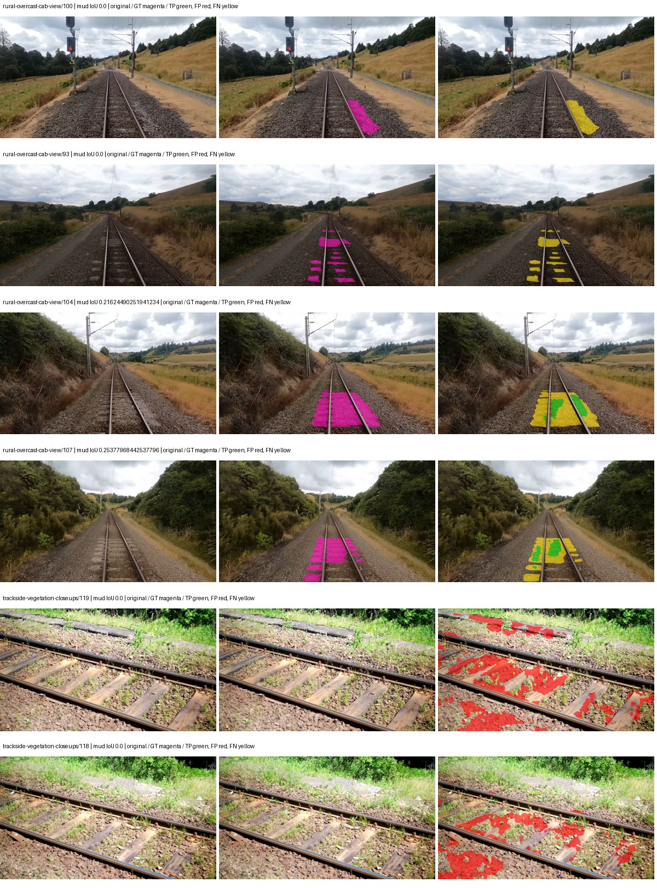

Examples are two lowest and two highest mud-IoU positive images, plus up to two negative images with the most false-positive mud pixels. They are targeted diagnostic examples, not random samples. Green: true positive; red: false positive; yellow: false negative. Full predictions remain on HDRFS.

### Validation tracking

| Logged step | Overall mIoU (%) | Mud IoU (%) |
| --- | --- | --- |
| 254 | 31.19 | 1.32 |
| 508 | 41.32 | 4.11 |
| 763 | 41.95 | 6.16 |
| 1017 | 40.44 | 4.37 |
| 1272 | 40.54 | 4.80 |
| 1527 | 40.48 | 4.32 |
| 1781 | 40.10 | 4.33 |
| 2036 | 39.98 | 4.33 |

All retained scalar curves, including training loss and per-class IoU, are in record.json. Observed best mud on a curve is not necessarily a retained checkpoint: the pilot saved its selection-metric-best and final checkpoints. Step logging and checkpoint global_step may differ by one.

### Stopping and checkpoint provenance

```json
{
  "stopping": {
    "actual_steps": 2036,
    "maximum_steps": 4000,
    "min_delta": 0.001,
    "monitor": "val_iou/mud-pumping",
    "patience": 5,
    "reason": "validation_plateau"
  },
  "checkpoints": {
    "best": {
      "path": "/data/izadia1/projects/segmentary-runs/paul-test-rtis/mud-fullstats-v1-20260906-r2/future-runs/native_convnext_tiny_uper--cityscapes_to_railsem19_to_rtis--seed-2_seed2/rtis/best.ckpt",
      "sha256": "95687eab2642318645dbec13a013630f3b6df7526520f16c9898e61166ba4758",
      "global_step": 763,
      "bytes": 589961805
    },
    "final": {
      "path": "/data/izadia1/projects/segmentary-runs/paul-test-rtis/mud-fullstats-v1-20260906-r2/future-runs/native_convnext_tiny_uper--cityscapes_to_railsem19_to_rtis--seed-2_seed2/rtis/last.ckpt",
      "sha256": "34a0eeabf0975db69cc2b80c710dbad72baa3cc7e9a18d5fe70e7b38fcd3bb73",
      "global_step": 2036,
      "bytes": 589951373
    }
  },
  "cleanup_error": null
}
```

### Resolved training, initialization and evaluation settings

The optimizer block is the base configuration. Stage LR scales are applied at runtime, and stage warmup is capped at min(base warmup, floor(stage budget / 10), stage budget - 1): 400 steps for this 4,000-step pilot. Model-internal native input grids may differ from augmentation crops (EoMT uses its 640 grid).

```json
{
  "name": "native_convnext_tiny_uper--cityscapes_to_railsem19_to_rtis--seed-2",
  "model": {
    "arch": "native",
    "checkpoint": null,
    "tuning": "full",
    "head": "unified_head",
    "lora_r": 16,
    "lora_alpha": 32,
    "lora_dropout": 0.05,
    "lora_targets": [],
    "drop_path": null,
    "revision": null,
    "subfolder": null,
    "local_files_only": false,
    "trust_remote_code": false,
    "backbone_path": null,
    "head_paths": [],
    "classifier_path": null,
    "inactive_parameter_paths": [],
    "smp_arch": null,
    "encoder_name": null,
    "encoder_weights": null,
    "native": {
      "task": "multiclass",
      "backbone": {
        "kind": "timm",
        "name": "convnext_tiny.fb_in22k_ft_in1k",
        "weights": "pretrained",
        "out_indices": [
          0,
          1,
          2,
          3
        ],
        "in_channels": 3
      },
      "neck": {
        "kind": "identity"
      },
      "head": {
        "kind": "uper",
        "in_indices": [
          0,
          1,
          2,
          3
        ],
        "channels": 256,
        "pool_bins": [
          1,
          2,
          3,
          6
        ],
        "dropout": 0.1,
        "norm": "group",
        "activation": "relu"
      },
      "auxiliary_heads": []
    },
    "batch_norm_momentum": null
  },
  "space": "paul-test-rtis",
  "taxonomy_root": "/data/izadia1/projects/segmentary-rtis-fullstats-066afb2/taxonomy",
  "output_root": "/data/izadia1/projects/segmentary-runs/paul-test-rtis/mud-fullstats-v1-20260906-r2/future-runs",
  "optim": {
    "backbone_lr": 0.0001,
    "head_lr_mult": 10.0,
    "weight_decay": 0.05,
    "llrd": 1.0,
    "warmup_iters": 1500,
    "warmup_ratio": 1e-06,
    "poly_power": 0.9,
    "min_lr_ratio": 0.0,
    "betas": [
      0.9,
      0.999
    ],
    "grad_clip": 1.0
  },
  "train": {
    "iters": 4000,
    "batch_size": 2,
    "accum": 8,
    "num_workers": 2,
    "precision": "bf16-mixed",
    "ema_decay": 0.9998,
    "val_every": 250,
    "ckpt_every": 500,
    "selection_metric": "val_iou/mud-pumping",
    "early_stopping_patience": 5,
    "early_stopping_min_delta": 0.001,
    "seed": 2,
    "devices": 1
  },
  "eval": {
    "sliding_window": true,
    "window": [
      1024,
      1024
    ],
    "stride": [
      768,
      768
    ],
    "batch_size": 1,
    "num_workers": 2,
    "tta_scales": [],
    "tta_flip": false,
    "threshold": 0.5,
    "boundary_tolerance_frac": 0.0075,
    "save_confusion": true
  },
  "loss": {
    "task": "multiclass",
    "activation": "auto",
    "terms": [],
    "aux": "none",
    "aux_weight": 0.0,
    "ce_weight": 1.0,
    "label_smoothing": 0.0,
    "class_weights": null,
    "query": null
  },
  "aug": {
    "crop": [
      1024,
      1024
    ],
    "scale_min": 0.5,
    "scale_max": 2.0,
    "hflip_p": 0.5,
    "color_jitter_p": 0.5,
    "brightness": 0.25,
    "contrast": 0.25,
    "saturation": 0.25,
    "hue": 0.05
  },
  "stages": [
    {
      "name": "rtis",
      "data": [
        {
          "name": "paul-test-rtis",
          "root": "/data/izadia1/datasets/paul-test-rtis",
          "variant": null,
          "split_file": "splits.json",
          "train_split": "train",
          "val_split": "val",
          "limit": null,
          "loader": "folder",
          "mapping": "paul-test-rtis",
          "loader_options": {
            "require_groups": true
          }
        }
      ],
      "iters": null,
      "lr_scale": 0.1,
      "head_group_lr_scale": 1.0,
      "init_from": "/data/izadia1/projects/segmentary-runs/city-rail-transfer-rail20/native_convnext_tiny_uper/railsem19/last.ckpt",
      "reset_head": true,
      "freeze": null,
      "sample_weights": null
    }
  ]
}
```

### Hardware and software provenance

```json
{
  "training": {
    "cuda_available": true,
    "cuda_visible_devices": "9",
    "cudnn": 91900,
    "driver_version": "570.133.20",
    "gpu_count": 1,
    "gpu_names": [
      "NVIDIA L40S"
    ],
    "hostname": "hdrfs-app-001",
    "input_normalization": {
      "channel_order": "rgb",
      "mean": [
        0.485,
        0.456,
        0.406
      ],
      "source": "timm_pretrained_cfg",
      "std": [
        0.229,
        0.224,
        0.225
      ]
    },
    "model_origins": [
      {
        "hf_commit": null,
        "hf_name_or_path": null,
        "module": "backbone",
        "timm_pretrained": {
          "architecture": "convnext_tiny",
          "hf_hub_id": "timm/convnext_tiny.fb_in22k_ft_in1k",
          "tag": "fb_in22k_ft_in1k",
          "url": "https://dl.fbaipublicfiles.com/convnext/convnext_tiny_22k_1k_224.pth"
        }
      },
      {
        "hf_commit": null,
        "hf_name_or_path": null,
        "module": "backbone.model",
        "timm_pretrained": {
          "architecture": "convnext_tiny",
          "hf_hub_id": "timm/convnext_tiny.fb_in22k_ft_in1k",
          "tag": "fb_in22k_ft_in1k",
          "url": "https://dl.fbaipublicfiles.com/convnext/convnext_tiny_22k_1k_224.pth"
        }
      }
    ],
    "model_parameter_count": 36849525,
    "packages": {
      "albumentations": "2.0.8",
      "lightning": "2.6.5",
      "numpy": "2.4.4",
      "segmentary": "0.1.0",
      "segmentation-models-pytorch": "0.5.0",
      "timm": "1.0.28",
      "torch": "2.11.0+cu128",
      "torchvision": "0.26.0+cu128",
      "transformers": "5.15.0"
    },
    "platform": "Linux-5.15.0-139-generic-x86_64-with-glibc2.35",
    "python": "3.11.15",
    "torch": "2.11.0+cu128",
    "torch_cuda": "12.8",
    "trainable_parameter_count": 36849525,
    "training_stop": {
      "actual_steps": 2036,
      "maximum_steps": 4000,
      "min_delta": 0.001,
      "monitor": "val_iou/mud-pumping",
      "patience": 5,
      "reason": "validation_plateau"
    },
    "validation_weights": "ema"
  },
  "evaluation": {
    "cuda_available": true,
    "cuda_visible_devices": "9",
    "cudnn": 91900,
    "driver_version": "570.133.20",
    "gpu_count": 1,
    "gpu_names": [
      "NVIDIA L40S"
    ],
    "hostname": "hdrfs-app-001",
    "input_normalization": {
      "channel_order": "rgb",
      "mean": [
        0.485,
        0.456,
        0.406
      ],
      "source": "timm_pretrained_cfg",
      "std": [
        0.229,
        0.224,
        0.225
      ]
    },
    "packages": {
      "albumentations": "2.0.8",
      "lightning": "2.6.5",
      "numpy": "2.4.4",
      "segmentary": "0.1.0",
      "segmentation-models-pytorch": "0.5.0",
      "timm": "1.0.28",
      "torch": "2.11.0+cu128",
      "torchvision": "0.26.0+cu128",
      "transformers": "5.15.0"
    },
    "platform": "Linux-5.15.0-139-generic-x86_64-with-glibc2.35",
    "python": "3.11.15",
    "torch": "2.11.0+cu128",
    "torch_cuda": "12.8"
  }
}
```
