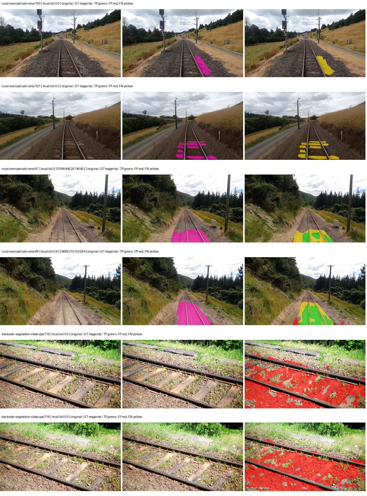
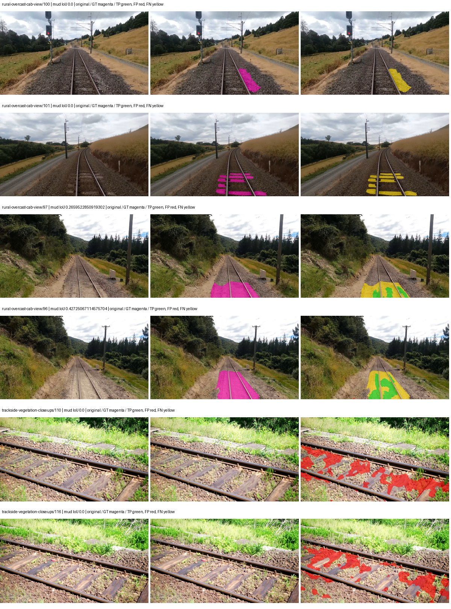
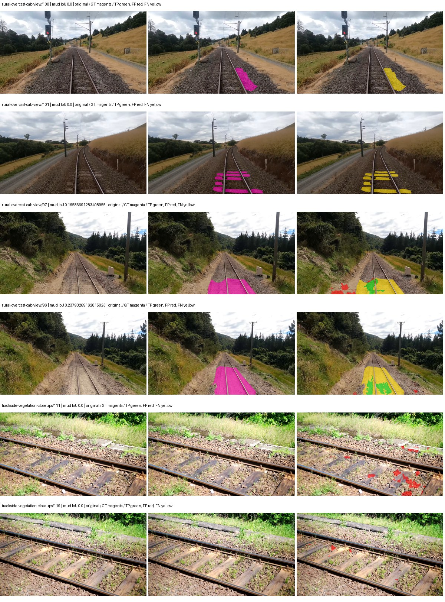
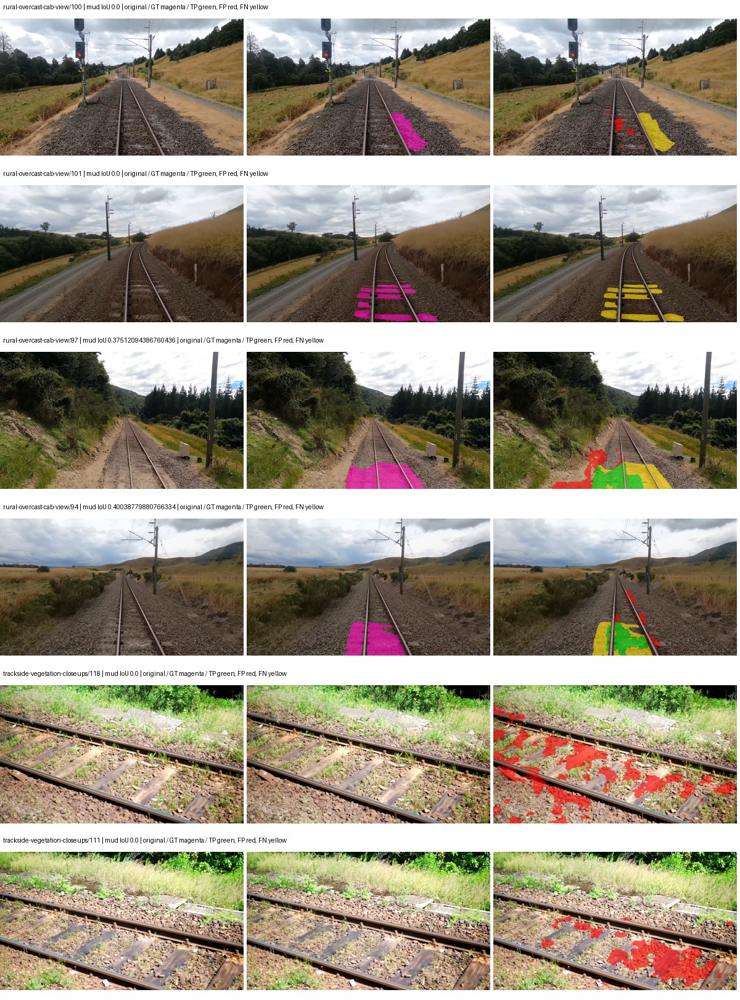
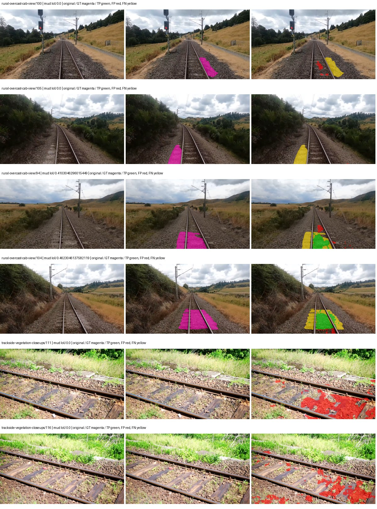
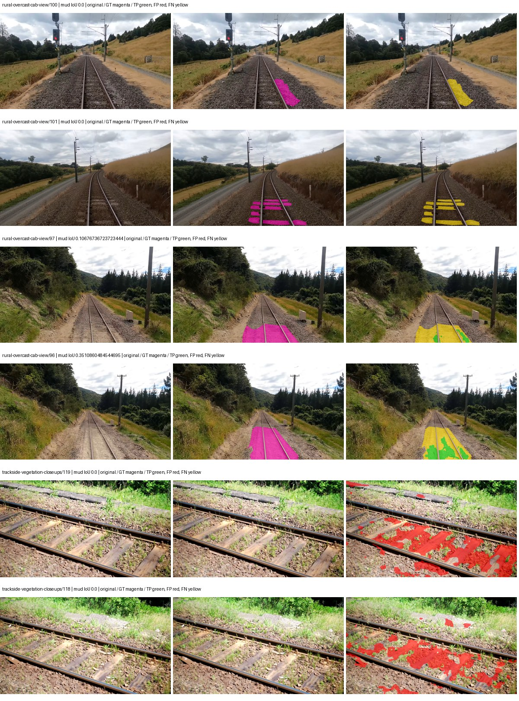
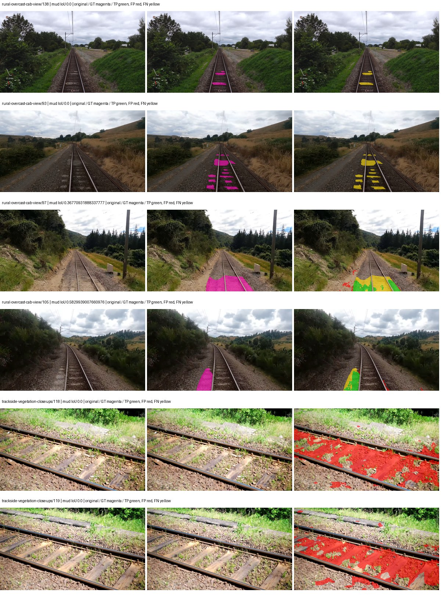
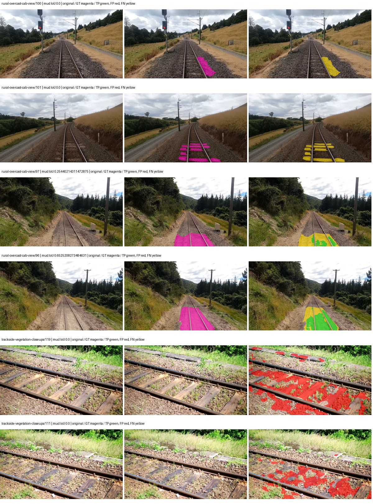
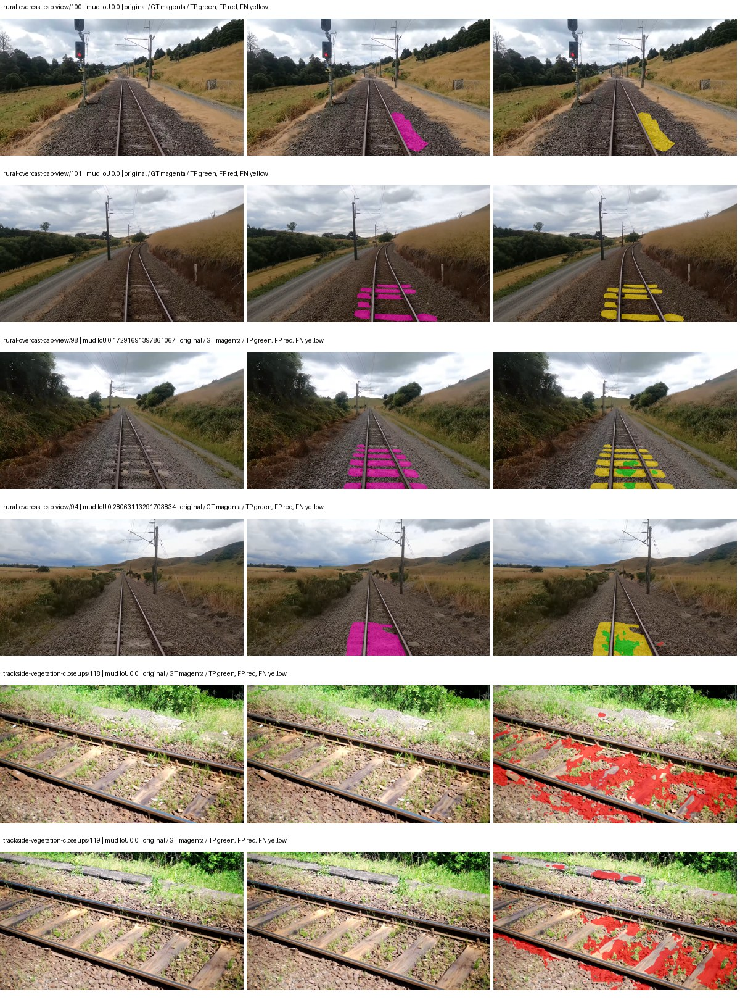
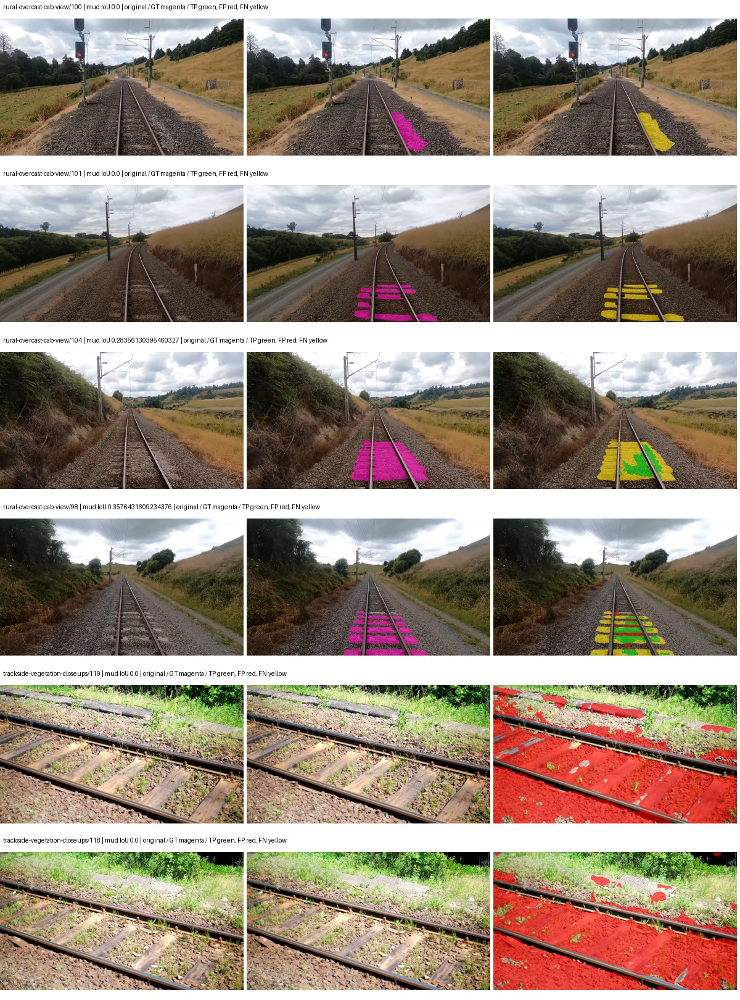

# native_efficientnet_b0_deeplabv3plus — paul-test-rtis

[RTIS comparison](../../README.md) · [Full model records](record.json)

Primary selection and early stopping: **mud-pumping validation IoU**. A job is complete only after full statistics and isolated profiling are verified.

| Model | Initialization path | Seed | Status | Steps | Best step | Mud IoU (%) | Mud precision (%) | Mud recall (%) | Final mud IoU (trainer val, %) | mIoU (%) | Fixed GT-class mIoU (%) |
| --- | --- | --- | --- | --- | --- | --- | --- | --- | --- | --- | --- |
| native_efficientnet_b0_deeplabv3plus | rtis_only | 0 | completed | 2290 | 1018 | 2.82 | 3.31 | 15.98 | 0.61 | 24.81 | 28.95 |
| native_efficientnet_b0_deeplabv3plus | rtis_only | 1 | completed | 1527 | 254 | 1.50 | 1.86 | 7.15 | 0.79 | 21.96 | 23.18 |
| native_efficientnet_b0_deeplabv3plus | rtis_only | 2 | completed | 3309 | 2036 | 3.58 | 6.09 | 8.00 | 1.76 | 26.87 | 31.35 |
| native_efficientnet_b0_deeplabv3plus | cityscapes_to_rtis | 0 | completed | 1781 | 509 | 4.41 | 39.78 | 4.73 | 2.16 | 20.24 | 23.61 |
| native_efficientnet_b0_deeplabv3plus | cityscapes_to_rtis | 1 | completed | 2290 | 1018 | 10.82 | 18.44 | 20.75 | 5.67 | 23.55 | 27.48 |
| native_efficientnet_b0_deeplabv3plus | cityscapes_to_rtis | 2 | completed | 3054 | 1781 | 6.86 | 12.59 | 13.11 | 1.56 | 25.12 | 29.30 |
| native_efficientnet_b0_deeplabv3plus | railsem19_to_rtis | 0 | completed | 2036 | 763 | 2.36 | 3.79 | 5.89 | 0.65 | 30.53 | 35.62 |
| native_efficientnet_b0_deeplabv3plus | railsem19_to_rtis | 1 | completed | 2800 | 1527 | 5.97 | 7.95 | 19.36 | 1.09 | 37.35 | 41.50 |
| native_efficientnet_b0_deeplabv3plus | railsem19_to_rtis | 2 | completed | 2036 | 763 | 4.01 | 6.05 | 10.65 | 0.59 | 31.78 | 37.08 |
| native_efficientnet_b0_deeplabv3plus | cityscapes_to_railsem19_to_rtis | 0 | completed | 1781 | 509 | 3.02 | 4.92 | 7.26 | 1.95 | 29.55 | 34.47 |
| native_efficientnet_b0_deeplabv3plus | cityscapes_to_railsem19_to_rtis | 1 | completed | 2800 | 1527 | 1.87 | 2.10 | 14.76 | 0.34 | 35.71 | 41.66 |
| native_efficientnet_b0_deeplabv3plus | cityscapes_to_railsem19_to_rtis | 2 | collecting | 3054 | 1781 | 2.96 | 4.00 | 10.16 | 0.41 | 35.61 | 41.55 |

Training: 220 images. Validation: 37 images. Test: 50 held out. Seeds: [0, 1, 2]. Seed variation measures optimization variability, not independent-recording uncertainty. Historical source checkpoints stay fixed across adaptation seeds.

Training code: `066afb2626398b7be59d4d19f5a0e4644fd59adc`. Split SHA-256: `71fef8292610c352da0709fe3bd030f3bcc18f97560394835f4b22826463b83d`.

## rtis_only — seed 0

Status: **completed**. Started: 2026-09-06T18:46:32.322287+00:00. Finished: 2026-09-06T19:12:01.548020+00:00.

Recipe pretrained initializer: `{"arch": "native", "backbone_path": null, "batch_norm_momentum": null, "checkpoint": null, "classifier_path": null, "drop_path": null, "encoder_name": null, "encoder_weights": null, "head": "unified_head", "head_paths": [], "inactive_parameter_paths": [], "local_files_only": false, "lora_alpha": 32, "lora_dropout": 0.05, "lora_r": 16, "lora_targets": [], "native": {"auxiliary_heads": [], "backbone": {"in_channels": 3, "kind": "timm", "name": "efficientnet_b0.ra_in1k", "out_indices": [1, 2, 3, 4], "weights": "pretrained"}, "head": {"activation": "relu", "channels": 160, "dilation_rates": [6, 12, 18], "dropout": 0.1, "high_index": 3, "kind": "deeplabv3plus", "low_channels": 32, "low_index": 0, "norm": "group"}, "neck": {"kind": "identity"}, "task": "multiclass"}, "revision": null, "smp_arch": null, "subfolder": null, "trust_remote_code": false, "tuning": "full"}`.

`rtis_only` uses the recipe initializer, which may include pretrained segmentation components. Transfer paths load the exact historical source checkpoint below and reset the classifier; they do not reset all query/decoder features.

Source checkpoint: `Recipe pretrained initialization`.

Config SHA-256: `05c99a5f4ff67242a22180a46bd2297c400c42727e25d65e5cb01621ebf59049`. Weights used for validation: `raw`.

### Mud-pumping and aggregate quality

| Metric | Selected checkpoint | Final training validation |
| --- | --- | --- |
| Mud IoU | 2.82 | 0.61 |
| Mud precision | 3.31 | 1.72 |
| Mud recall | 15.98 | 0.95 |
| Mud Dice/F1 | 5.49 | 1.22 |
| mIoU | 24.81 | 27.32 |
| Mean accuracy | 34.71 | 40.16 |
| Mean precision | 47.99 | 46.17 |
| Mean Dice | 31.80 | 34.89 |
| Mean specificity | 98.64 | 98.82 |
| Pixel accuracy | 79.63 | 82.13 |
| Frequency-weighted IoU | 69.55 | 71.11 |
| Fixed GT-present class mIoU | 28.95 | 31.87 |
| Boundary F1 | 28.69 | 33.04 |

The selected checkpoint has independent evaluation evidence. Final values are the trainer's final validation record, not a new independent evaluation. mIoU averages classes with nonzero union, so false positives on absent classes can change its denominator. The fixed GT-class mean is supplementary and excludes absent classes; their false positives remain in the confusion matrix.

### Resource usage and timing

| Measurement | Value |
| --- | --- |
| Peak training VRAM, retained training invocation (GiB) | 8.31 |
| Peak evaluation VRAM (GiB) | 6.78 |
| Retained training invocation wall time (seconds) | 1407.02 |
| Retained training invocation GPU-hours (one GPU) | 0.39 |
| Evaluation wall time (seconds) | 11.36 |
| Full evaluation pipeline images/second | 3.26 |
| Best full-state checkpoint (MiB) | 88.07 |
| Final full-state checkpoint (MiB) | 88.06 |
| Audited periodic checkpoints removed (GiB) | 0.34 |

VRAM uses the recorded allocator high-water mark; it is not total device usage including CUDA context. Resumed jobs' retained training invocation times and peaks are **not whole-campaign totals**. Earlier invocation resource records are not reconstructed here. Evaluation throughput includes loader, sliding-window inference and metrics; it is not model-only latency/FPS. Missing measurements are shown as —, never inferred from another dataset's run.

### Standardized inference performance

Dedicated model-only profiling waits for an idle worker-locked L40S: BF16, batch 1, 1024x1024, 20 warmup and 100 CUDA-event-timed public forwards. It excludes loading, preprocessing, tiling and metrics.

| Status | Parameters | Weight MiB | FPS | p50 ms | p95 ms | Peak reserved GiB |
| --- | --- | --- | --- | --- | --- | --- |
| complete | 5721681 | 21.83 | 154.10 | 6.40 | 6.88 | 0.43 |

```json
{
  "schema_version": 1,
  "model_id": "native_efficientnet_b0_deeplabv3plus",
  "measured_at": "2026-09-06T19:11:59+00:00",
  "status": "complete",
  "benchmark_scope": "rtis_selected_checkpoint_model_only",
  "applies_to": [
    "native_efficientnet_b0_deeplabv3plus--rtis_only--seed-0"
  ],
  "source": {
    "campaign_git_sha": "066afb2626398b7be59d4d19f5a0e4644fd59adc",
    "git_dirty": false,
    "config_hash": "028ab1596e23",
    "resolved_config": "/data/izadia1/projects/segmentary-runs/paul-test-rtis/mud-fullstats-v1-20260906-r2/configs/native_efficientnet_b0_deeplabv3plus--rtis_only--seed-0.yaml",
    "config_sha256": "05c99a5f4ff67242a22180a46bd2297c400c42727e25d65e5cb01621ebf59049",
    "checkpoint_sha256": "b2467d6e25c8a5d1fa5a66661df3d276b2a9bd338befd9bbc27e40eaa060d014",
    "checkpoint_global_step": 1018,
    "checkpoint_bytes": 92351256,
    "checkpoint_kind": "resume checkpoint with optimizer and EMA state",
    "weights": "raw",
    "measured_checkpoint_job_id": "native_efficientnet_b0_deeplabv3plus--rtis_only--seed-0",
    "result_sha256": "3bfa7d3105bfd5ae12c9dfe9b751425e9aea6b1326ee4a467f8bfec42f56db15",
    "result_git_sha": "066afb2626398b7be59d4d19f5a0e4644fd59adc",
    "result_stage": "eval:paul-test-rtis:val",
    "result_seed": 0
  },
  "hardware": {
    "gpu_name": "NVIDIA L40S",
    "gpu_uuid": "GPU-931d0911-fc78-1638-e3d7-1ba868cbd286",
    "logical_device": "cuda:0",
    "physical_visibility_token": "2",
    "compute_capability": [
      8,
      9
    ],
    "total_memory_bytes": 47677177856
  },
  "model": {
    "parameter_count": 5721681,
    "trainable_parameter_count": 5721681,
    "resident_parameter_bytes": 22886724,
    "parameter_dtype_counts": {
      "float32": 5721681
    }
  },
  "contract": {
    "backend": "pytorch",
    "precision": "bf16_autocast",
    "batch_size": 1,
    "input_shape_nchw": [
      1,
      3,
      1024,
      1024
    ],
    "warmup_iterations": 20,
    "measured_iterations": 100,
    "timing": "per-forward CUDA events with end-event synchronization",
    "includes_preprocessing": false,
    "includes_data_loader": false,
    "includes_sliding_window": false,
    "input_resident_on_gpu": true,
    "model_only": true,
    "entrypoint": "public model(image) dense-logits forward"
  },
  "measurements": {
    "latency": {
      "p50_ms": 6.39903998374939,
      "p95_ms": 6.882201552391052,
      "mean_ms": 6.489342098236084,
      "minimum_ms": 6.304768085479736,
      "maximum_ms": 7.614463806152344,
      "fps": 154.0988261771278,
      "raw_ms": [
        6.881279945373535,
        6.4686079025268555,
        6.4040961265563965,
        6.4389119148254395,
        6.444128036499023,
        6.560768127441406,
        6.534143924713135,
        7.278592109680176,
        6.488063812255859,
        6.386559963226318,
        6.43174409866333,
        6.347775936126709,
        6.345727920532227,
        6.343679904937744,
        6.380544185638428,
        6.407104015350342,
        6.440959930419922,
        6.568960189819336,
        7.614463806152344,
        6.390719890594482,
        6.347775936126709,
        6.359968185424805,
        6.350848197937012,
        6.67033576965332,
        6.641536235809326,
        6.53926420211792,
        6.383615970611572,
        6.398975849151611,
        6.847487926483154,
        6.346752166748047,
        6.399104118347168,
        6.339583873748779,
        6.351871967315674,
        6.429696083068848,
        6.406144142150879,
        6.650879859924316,
        6.53107213973999,
        6.528960227966309,
        6.506495952606201,
        6.383711814880371,
        6.325247764587402,
        6.736959934234619,
        6.319104194641113,
        6.383615970611572,
        6.378496170043945,
        6.360960006713867,
        6.350848197937012,
        6.353919982910156,
        6.363135814666748,
        6.366208076477051,
        6.4839677810668945,
        6.446080207824707,
        6.323200225830078,
        6.371327877044678,
        6.416384220123291,
        6.369279861450195,
        6.359039783477783,
        6.338560104370117,
        7.4311041831970215,
        6.688767910003662,
        6.39686393737793,
        6.368256092071533,
        6.311935901641846,
        6.338560104370117,
        6.406144142150879,
        6.43174409866333,
        6.454400062561035,
        6.396927833557129,
        6.3897600173950195,
        6.375423908233643,
        6.3744001388549805,
        6.376448154449463,
        6.859776020050049,
        6.526976108551025,
        6.71343994140625,
        6.6611199378967285,
        6.490111827850342,
        6.446080207824707,
        6.825984001159668,
        6.412288188934326,
        6.343679904937744,
        6.304768085479736,
        6.333439826965332,
        7.157760143280029,
        6.899712085723877,
        6.649856090545654,
        6.565887928009033,
        6.605823993682861,
        6.63756799697876,
        6.593535900115967,
        6.379519939422607,
        6.352896213531494,
        6.350848197937012,
        6.3303680419921875,
        6.358016014099121,
        6.393856048583984,
        6.402048110961914,
        6.336512088775635,
        6.32422399520874,
        6.320127964019775
      ],
      "percentile_method": "numpy linear interpolation"
    },
    "peak_reserved_bytes": 457179136,
    "memory_kind": "pytorch_cuda_allocator_peak_reserved_excluding_context",
    "benchmark_wall_clock_s": 16.855253379791975
  },
  "started_at": "2026-09-06T19:11:42+00:00",
  "finished_at": "2026-09-06T19:11:59+00:00",
  "environment": {
    "hostname": "hdrfs-app-001",
    "python": "3.11.15",
    "platform": "Linux-5.15.0-139-generic-x86_64-with-glibc2.35",
    "torch": "2.11.0+cu128",
    "torch_cuda": "12.8",
    "cudnn": 91900,
    "driver_version": "570.133.20",
    "cuda_available": true,
    "gpu_count": 1,
    "gpu_names": [
      "NVIDIA L40S"
    ],
    "cuda_visible_devices": "2",
    "packages": {
      "segmentary": "0.1.0",
      "torch": "2.11.0+cu128",
      "torchvision": "0.26.0+cu128",
      "transformers": "5.15.0",
      "timm": "1.0.28",
      "segmentation-models-pytorch": "0.5.0",
      "albumentations": "2.0.8",
      "lightning": "2.6.5",
      "numpy": "2.4.4"
    }
  }
}
```

### Per-class validation results

| Class | GT pixels | IoU (%) | Precision (%) | Recall (%) | Dice (%) | Boundary F1 (%) |
| --- | --- | --- | --- | --- | --- | --- |
| car | 29664 | 0.00 | 0.00 | 0.00 | 0.00 | 0.00 |
| construction | 311585 | 32.22 | 40.91 | 60.28 | 48.74 | 44.38 |
| fence | 265137 | 3.43 | 44.78 | 3.59 | 6.64 | 13.92 |
| mud-pumping | 1226250 | 2.82 | 3.31 | 15.98 | 5.49 | 5.94 |
| on-rails | 0 | 0.00 | 0.00 | — | 0.00 | 0.00 |
| person | 0 | 0.00 | 0.00 | — | 0.00 | 0.00 |
| pole | 628038 | 51.19 | 74.71 | 61.92 | 67.72 | 81.72 |
| rail-embedded | 16799 | 9.72 | 87.07 | 9.86 | 17.71 | 11.59 |
| rail-raised | 2969797 | 71.26 | 81.70 | 84.80 | 83.22 | 91.51 |
| rail-track | 6323197 | 34.18 | 75.85 | 38.35 | 50.95 | 42.07 |
| road | 1048831 | 0.82 | 8.95 | 0.90 | 1.63 | 7.66 |
| sidewalk | 1297367 | 44.08 | 88.91 | 46.65 | 61.19 | 12.95 |
| sky | 19121606 | 97.90 | 99.17 | 98.71 | 98.94 | 92.05 |
| standing-water | 95802 | 2.66 | 4.74 | 5.69 | 5.17 | 7.41 |
| terrain | 39239306 | 80.85 | 81.55 | 98.95 | 89.41 | 49.80 |
| trackbed | 10643081 | 54.56 | 83.44 | 61.19 | 70.60 | 58.51 |
| traffic-light | 19510 | 23.54 | 72.65 | 25.83 | 38.11 | 30.50 |
| traffic-sign | 13285 | 3.70 | 58.18 | 3.80 | 7.14 | 12.89 |
| tram-track | 56179 | 0.37 | 24.88 | 0.38 | 0.74 | 7.46 |
| truck | 0 | 0.00 | 0.00 | — | 0.00 | 0.00 |
| vegetation-overgrowth | 5901821 | 7.76 | 77.03 | 7.95 | 14.41 | 32.05 |

### Full-run accounting

| Measurement | Value |
| --- | --- |
| Full GPU-reserved wall seconds, all recorded worker attempts | 1529.23 |
| Full reserved GPU-hours | 0.42 |
| Whole-run timing complete | True |

| Phase | Wall seconds including failed attempts |
| --- | --- |
| training | 1413.31 |
| diagnostics | 72.70 |
| performance | 23.80 |

GPU-reserved time includes model loading, training, validation, collection, profiling, checkpoint I/O and orchestration while the worker owns one GPU. It is not GPU kernel-active time. Phase timings and sampled device memory/power/utilization are retained separately; sampled device memory is not the allocator high-water mark.

### Train/validation and raw/EMA diagnostics

| Checkpoint / weights / split | Images | Mud IoU (%) | Mud precision (%) | Mud recall (%) |
| --- | --- | --- | --- | --- |
| best-auto-train / raw | 220 | 87.80 | 89.00 | 98.49 |
| best-auto-val / raw | 37 | 2.82 | 3.31 | 15.98 |
| best-alternate-val / ema | 37 | 0.29 | 0.40 | 1.13 |
| final-auto-val / raw | 37 | 0.62 | 1.73 | 0.96 |

Train uses the evaluation transform without augmentation. Compare mud train/validation metrics for the same selected weights. Alternate EMA on running-stat BatchNorm is explicitly uncalibrated and is diagnostic only. Score-threshold curves use uncalibrated normalized scores and are pixel-level diagnostics, not event detection rates or a selected deployment operating point.

### Downloadable evidence

- best-auto-train: [per-image.csv](rtis_only--seed-0/best-auto-train/per-image.csv) · [per-image-confusion.json.gz](rtis_only--seed-0/best-auto-train/per-image-confusion.json.gz) · [groups.json](rtis_only--seed-0/best-auto-train/groups.json) · [mud-score-curves.json](rtis_only--seed-0/best-auto-train/mud-score-curves.json)
- best-auto-val: [per-image.csv](rtis_only--seed-0/best-auto-val/per-image.csv) · [per-image-confusion.json.gz](rtis_only--seed-0/best-auto-val/per-image-confusion.json.gz) · [groups.json](rtis_only--seed-0/best-auto-val/groups.json) · [mud-score-curves.json](rtis_only--seed-0/best-auto-val/mud-score-curves.json) · [examples.jpg](rtis_only--seed-0/best-auto-val/examples.jpg)
- best-alternate-val: [per-image.csv](rtis_only--seed-0/best-alternate-val/per-image.csv) · [per-image-confusion.json.gz](rtis_only--seed-0/best-alternate-val/per-image-confusion.json.gz) · [groups.json](rtis_only--seed-0/best-alternate-val/groups.json) · [mud-score-curves.json](rtis_only--seed-0/best-alternate-val/mud-score-curves.json)
- final-auto-val: [per-image.csv](rtis_only--seed-0/final-auto-val/per-image.csv) · [per-image-confusion.json.gz](rtis_only--seed-0/final-auto-val/per-image-confusion.json.gz) · [groups.json](rtis_only--seed-0/final-auto-val/groups.json) · [mud-score-curves.json](rtis_only--seed-0/final-auto-val/mud-score-curves.json)
- resources: [telemetry.csv](rtis_only--seed-0/resources/telemetry.csv)



Examples are two lowest and two highest mud-IoU positive images, plus up to two negative images with the most false-positive mud pixels. They are targeted diagnostic examples, not random samples. Green: true positive; red: false positive; yellow: false negative. Full predictions remain on HDRFS.

### Validation tracking

| Logged step | Overall mIoU (%) | Mud IoU (%) |
| --- | --- | --- |
| 254 | 20.78 | 0.00 |
| 508 | 23.30 | 0.00 |
| 763 | 22.19 | 0.24 |
| 1017 | 24.82 | 2.82 |
| 1272 | 24.61 | 0.01 |
| 1527 | 24.20 | 0.72 |
| 1781 | 26.53 | 0.24 |
| 2036 | 25.74 | 0.07 |
| 2290 | 27.32 | 0.61 |

All retained scalar curves, including training loss and per-class IoU, are in record.json. Observed best mud on a curve is not necessarily a retained checkpoint: the pilot saved its selection-metric-best and final checkpoints. Step logging and checkpoint global_step may differ by one.

### Stopping and checkpoint provenance

```json
{
  "stopping": {
    "actual_steps": 2290,
    "maximum_steps": 4000,
    "min_delta": 0.001,
    "monitor": "val_iou/mud-pumping",
    "patience": 5,
    "reason": "validation_plateau"
  },
  "checkpoints": {
    "best": {
      "path": "/data/izadia1/projects/segmentary-runs/paul-test-rtis/mud-fullstats-v1-20260906-r2/future-runs/native_efficientnet_b0_deeplabv3plus--rtis_only--seed-0_seed0/rtis/best.ckpt",
      "sha256": "b2467d6e25c8a5d1fa5a66661df3d276b2a9bd338befd9bbc27e40eaa060d014",
      "global_step": 1018,
      "bytes": 92351256
    },
    "final": {
      "path": "/data/izadia1/projects/segmentary-runs/paul-test-rtis/mud-fullstats-v1-20260906-r2/future-runs/native_efficientnet_b0_deeplabv3plus--rtis_only--seed-0_seed0/rtis/last.ckpt",
      "sha256": "d61484cc6be5bc7ca021f588b7b9aaf67b2a2929e0945b880b1bee3347a861ff",
      "global_step": 2290,
      "bytes": 92337624
    }
  },
  "cleanup_error": null
}
```

### Resolved training, initialization and evaluation settings

The optimizer block is the base configuration. Stage LR scales are applied at runtime, and stage warmup is capped at min(base warmup, floor(stage budget / 10), stage budget - 1): 400 steps for this 4,000-step pilot. Model-internal native input grids may differ from augmentation crops (EoMT uses its 640 grid).

```json
{
  "name": "native_efficientnet_b0_deeplabv3plus--rtis_only--seed-0",
  "model": {
    "arch": "native",
    "checkpoint": null,
    "tuning": "full",
    "head": "unified_head",
    "lora_r": 16,
    "lora_alpha": 32,
    "lora_dropout": 0.05,
    "lora_targets": [],
    "drop_path": null,
    "revision": null,
    "subfolder": null,
    "local_files_only": false,
    "trust_remote_code": false,
    "backbone_path": null,
    "head_paths": [],
    "classifier_path": null,
    "inactive_parameter_paths": [],
    "smp_arch": null,
    "encoder_name": null,
    "encoder_weights": null,
    "native": {
      "task": "multiclass",
      "backbone": {
        "kind": "timm",
        "name": "efficientnet_b0.ra_in1k",
        "weights": "pretrained",
        "out_indices": [
          1,
          2,
          3,
          4
        ],
        "in_channels": 3
      },
      "neck": {
        "kind": "identity"
      },
      "head": {
        "kind": "deeplabv3plus",
        "low_index": 0,
        "high_index": 3,
        "channels": 160,
        "low_channels": 32,
        "dilation_rates": [
          6,
          12,
          18
        ],
        "dropout": 0.1,
        "norm": "group",
        "activation": "relu"
      },
      "auxiliary_heads": []
    },
    "batch_norm_momentum": null
  },
  "space": "paul-test-rtis",
  "taxonomy_root": "/data/izadia1/projects/segmentary-rtis-fullstats-066afb2/taxonomy",
  "output_root": "/data/izadia1/projects/segmentary-runs/paul-test-rtis/mud-fullstats-v1-20260906-r2/future-runs",
  "optim": {
    "backbone_lr": 0.0001,
    "head_lr_mult": 10.0,
    "weight_decay": 0.05,
    "llrd": 1.0,
    "warmup_iters": 1500,
    "warmup_ratio": 1e-06,
    "poly_power": 0.9,
    "min_lr_ratio": 0.0,
    "betas": [
      0.9,
      0.999
    ],
    "grad_clip": 1.0
  },
  "train": {
    "iters": 4000,
    "batch_size": 2,
    "accum": 8,
    "num_workers": 2,
    "precision": "bf16-mixed",
    "ema_decay": 0.9998,
    "val_every": 250,
    "ckpt_every": 500,
    "selection_metric": "val_iou/mud-pumping",
    "early_stopping_patience": 5,
    "early_stopping_min_delta": 0.001,
    "seed": 0,
    "devices": 1
  },
  "eval": {
    "sliding_window": true,
    "window": [
      1024,
      1024
    ],
    "stride": [
      768,
      768
    ],
    "batch_size": 1,
    "num_workers": 2,
    "tta_scales": [],
    "tta_flip": false,
    "threshold": 0.5,
    "boundary_tolerance_frac": 0.0075,
    "save_confusion": true
  },
  "loss": {
    "task": "multiclass",
    "activation": "auto",
    "terms": [],
    "aux": "none",
    "aux_weight": 0.0,
    "ce_weight": 1.0,
    "label_smoothing": 0.0,
    "class_weights": null,
    "query": null
  },
  "aug": {
    "crop": [
      1024,
      1024
    ],
    "scale_min": 0.5,
    "scale_max": 2.0,
    "hflip_p": 0.5,
    "color_jitter_p": 0.5,
    "brightness": 0.25,
    "contrast": 0.25,
    "saturation": 0.25,
    "hue": 0.05
  },
  "stages": [
    {
      "name": "rtis",
      "data": [
        {
          "name": "paul-test-rtis",
          "root": "/data/izadia1/datasets/paul-test-rtis",
          "variant": null,
          "split_file": "splits.json",
          "train_split": "train",
          "val_split": "val",
          "limit": null,
          "loader": "folder",
          "mapping": "paul-test-rtis",
          "loader_options": {
            "require_groups": true
          }
        }
      ],
      "iters": null,
      "lr_scale": 1.0,
      "head_group_lr_scale": 1.0,
      "init_from": "pretrained",
      "reset_head": false,
      "freeze": null,
      "sample_weights": null
    }
  ]
}
```

### Hardware and software provenance

```json
{
  "training": {
    "cuda_available": true,
    "cuda_visible_devices": "2",
    "cudnn": 91900,
    "driver_version": "570.133.20",
    "gpu_count": 1,
    "gpu_names": [
      "NVIDIA L40S"
    ],
    "hostname": "hdrfs-app-001",
    "input_normalization": {
      "channel_order": "rgb",
      "mean": [
        0.485,
        0.456,
        0.406
      ],
      "source": "timm_pretrained_cfg",
      "std": [
        0.229,
        0.224,
        0.225
      ]
    },
    "model_origins": [
      {
        "hf_commit": null,
        "hf_name_or_path": null,
        "module": "backbone",
        "timm_pretrained": {
          "architecture": "efficientnet_b0",
          "hf_hub_id": "timm/efficientnet_b0.ra_in1k",
          "tag": "ra_in1k",
          "url": "https://github.com/rwightman/pytorch-image-models/releases/download/v0.1-weights/efficientnet_b0_ra-3dd342df.pth"
        }
      },
      {
        "hf_commit": null,
        "hf_name_or_path": null,
        "module": "backbone.model",
        "timm_pretrained": {
          "architecture": "efficientnet_b0",
          "hf_hub_id": "timm/efficientnet_b0.ra_in1k",
          "tag": "ra_in1k",
          "url": "https://github.com/rwightman/pytorch-image-models/releases/download/v0.1-weights/efficientnet_b0_ra-3dd342df.pth"
        }
      }
    ],
    "model_parameter_count": 5721681,
    "packages": {
      "albumentations": "2.0.8",
      "lightning": "2.6.5",
      "numpy": "2.4.4",
      "segmentary": "0.1.0",
      "segmentation-models-pytorch": "0.5.0",
      "timm": "1.0.28",
      "torch": "2.11.0+cu128",
      "torchvision": "0.26.0+cu128",
      "transformers": "5.15.0"
    },
    "platform": "Linux-5.15.0-139-generic-x86_64-with-glibc2.35",
    "python": "3.11.15",
    "torch": "2.11.0+cu128",
    "torch_cuda": "12.8",
    "trainable_parameter_count": 5721681,
    "training_stop": {
      "actual_steps": 2290,
      "maximum_steps": 4000,
      "min_delta": 0.001,
      "monitor": "val_iou/mud-pumping",
      "patience": 5,
      "reason": "validation_plateau"
    },
    "validation_weights": "raw"
  },
  "evaluation": {
    "cuda_available": true,
    "cuda_visible_devices": "2",
    "cudnn": 91900,
    "driver_version": "570.133.20",
    "gpu_count": 1,
    "gpu_names": [
      "NVIDIA L40S"
    ],
    "hostname": "hdrfs-app-001",
    "input_normalization": {
      "channel_order": "rgb",
      "mean": [
        0.485,
        0.456,
        0.406
      ],
      "source": "timm_pretrained_cfg",
      "std": [
        0.229,
        0.224,
        0.225
      ]
    },
    "packages": {
      "albumentations": "2.0.8",
      "lightning": "2.6.5",
      "numpy": "2.4.4",
      "segmentary": "0.1.0",
      "segmentation-models-pytorch": "0.5.0",
      "timm": "1.0.28",
      "torch": "2.11.0+cu128",
      "torchvision": "0.26.0+cu128",
      "transformers": "5.15.0"
    },
    "platform": "Linux-5.15.0-139-generic-x86_64-with-glibc2.35",
    "python": "3.11.15",
    "torch": "2.11.0+cu128",
    "torch_cuda": "12.8"
  }
}
```

## rtis_only — seed 1

Status: **completed**. Started: 2026-09-06T18:47:36.787446+00:00. Finished: 2026-09-06T19:05:46.262699+00:00.

Recipe pretrained initializer: `{"arch": "native", "backbone_path": null, "batch_norm_momentum": null, "checkpoint": null, "classifier_path": null, "drop_path": null, "encoder_name": null, "encoder_weights": null, "head": "unified_head", "head_paths": [], "inactive_parameter_paths": [], "local_files_only": false, "lora_alpha": 32, "lora_dropout": 0.05, "lora_r": 16, "lora_targets": [], "native": {"auxiliary_heads": [], "backbone": {"in_channels": 3, "kind": "timm", "name": "efficientnet_b0.ra_in1k", "out_indices": [1, 2, 3, 4], "weights": "pretrained"}, "head": {"activation": "relu", "channels": 160, "dilation_rates": [6, 12, 18], "dropout": 0.1, "high_index": 3, "kind": "deeplabv3plus", "low_channels": 32, "low_index": 0, "norm": "group"}, "neck": {"kind": "identity"}, "task": "multiclass"}, "revision": null, "smp_arch": null, "subfolder": null, "trust_remote_code": false, "tuning": "full"}`.

`rtis_only` uses the recipe initializer, which may include pretrained segmentation components. Transfer paths load the exact historical source checkpoint below and reset the classifier; they do not reset all query/decoder features.

Source checkpoint: `Recipe pretrained initialization`.

Config SHA-256: `b4ce17972a9da100000960bc84be4862c6c8a8b539e07d4f818e08cfc7391272`. Weights used for validation: `raw`.

### Mud-pumping and aggregate quality

| Metric | Selected checkpoint | Final training validation |
| --- | --- | --- |
| Mud IoU | 1.50 | 0.79 |
| Mud precision | 1.86 | 0.98 |
| Mud recall | 7.15 | 3.94 |
| Mud Dice/F1 | 2.96 | 1.57 |
| mIoU | 21.96 | 25.96 |
| Mean accuracy | 30.23 | 36.57 |
| Mean precision | 33.89 | 51.66 |
| Mean Dice | 27.57 | 33.08 |
| Mean specificity | 98.71 | 98.84 |
| Pixel accuracy | 78.92 | 81.14 |
| Frequency-weighted IoU | 69.22 | 72.11 |
| Fixed GT-present class mIoU | 23.18 | 30.29 |
| Boundary F1 | 23.60 | 31.70 |

The selected checkpoint has independent evaluation evidence. Final values are the trainer's final validation record, not a new independent evaluation. mIoU averages classes with nonzero union, so false positives on absent classes can change its denominator. The fixed GT-class mean is supplementary and excludes absent classes; their false positives remain in the confusion matrix.

### Resource usage and timing

| Measurement | Value |
| --- | --- |
| Peak training VRAM, retained training invocation (GiB) | 8.31 |
| Peak evaluation VRAM (GiB) | 6.78 |
| Retained training invocation wall time (seconds) | 968.97 |
| Retained training invocation GPU-hours (one GPU) | 0.27 |
| Evaluation wall time (seconds) | 10.85 |
| Full evaluation pipeline images/second | 3.41 |
| Best full-state checkpoint (MiB) | 88.07 |
| Final full-state checkpoint (MiB) | 88.06 |
| Audited periodic checkpoints removed (GiB) | 0.26 |

VRAM uses the recorded allocator high-water mark; it is not total device usage including CUDA context. Resumed jobs' retained training invocation times and peaks are **not whole-campaign totals**. Earlier invocation resource records are not reconstructed here. Evaluation throughput includes loader, sliding-window inference and metrics; it is not model-only latency/FPS. Missing measurements are shown as —, never inferred from another dataset's run.

### Standardized inference performance

Dedicated model-only profiling waits for an idle worker-locked L40S: BF16, batch 1, 1024x1024, 20 warmup and 100 CUDA-event-timed public forwards. It excludes loading, preprocessing, tiling and metrics.

| Status | Parameters | Weight MiB | FPS | p50 ms | p95 ms | Peak reserved GiB |
| --- | --- | --- | --- | --- | --- | --- |
| complete | 5721681 | 21.83 | 145.42 | 6.71 | 7.85 | 0.43 |

```json
{
  "schema_version": 1,
  "model_id": "native_efficientnet_b0_deeplabv3plus",
  "measured_at": "2026-09-06T19:05:44+00:00",
  "status": "complete",
  "benchmark_scope": "rtis_selected_checkpoint_model_only",
  "applies_to": [
    "native_efficientnet_b0_deeplabv3plus--rtis_only--seed-1"
  ],
  "source": {
    "campaign_git_sha": "066afb2626398b7be59d4d19f5a0e4644fd59adc",
    "git_dirty": false,
    "config_hash": "267be61a5e86",
    "resolved_config": "/data/izadia1/projects/segmentary-runs/paul-test-rtis/mud-fullstats-v1-20260906-r2/configs/native_efficientnet_b0_deeplabv3plus--rtis_only--seed-1.yaml",
    "config_sha256": "b4ce17972a9da100000960bc84be4862c6c8a8b539e07d4f818e08cfc7391272",
    "checkpoint_sha256": "79749ccd822a02e9f042397a231ff2e4b37cc30c3aa3926b271d9cfe468c8342",
    "checkpoint_global_step": 254,
    "checkpoint_bytes": 92351064,
    "checkpoint_kind": "resume checkpoint with optimizer and EMA state",
    "weights": "raw",
    "measured_checkpoint_job_id": "native_efficientnet_b0_deeplabv3plus--rtis_only--seed-1",
    "result_sha256": "8feb17d8134768ec4cc1e1e6b26f57b06c9ff56f262d41e185a08aec107a6a27",
    "result_git_sha": "066afb2626398b7be59d4d19f5a0e4644fd59adc",
    "result_stage": "eval:paul-test-rtis:val",
    "result_seed": 1
  },
  "hardware": {
    "gpu_name": "NVIDIA L40S",
    "gpu_uuid": "GPU-d411d86a-6d1d-1967-55e7-9f9ec85d13f5",
    "logical_device": "cuda:0",
    "physical_visibility_token": "1",
    "compute_capability": [
      8,
      9
    ],
    "total_memory_bytes": 47677177856
  },
  "model": {
    "parameter_count": 5721681,
    "trainable_parameter_count": 5721681,
    "resident_parameter_bytes": 22886724,
    "parameter_dtype_counts": {
      "float32": 5721681
    }
  },
  "contract": {
    "backend": "pytorch",
    "precision": "bf16_autocast",
    "batch_size": 1,
    "input_shape_nchw": [
      1,
      3,
      1024,
      1024
    ],
    "warmup_iterations": 20,
    "measured_iterations": 100,
    "timing": "per-forward CUDA events with end-event synchronization",
    "includes_preprocessing": false,
    "includes_data_loader": false,
    "includes_sliding_window": false,
    "input_resident_on_gpu": true,
    "model_only": true,
    "entrypoint": "public model(image) dense-logits forward"
  },
  "measurements": {
    "latency": {
      "p50_ms": 6.71129584312439,
      "p95_ms": 7.845939326286316,
      "mean_ms": 6.876819205284119,
      "minimum_ms": 6.37337589263916,
      "maximum_ms": 8.211456298828125,
      "fps": 145.4160666651821,
      "raw_ms": [
        6.532095909118652,
        6.421504020690918,
        6.452127933502197,
        6.436863899230957,
        6.453248023986816,
        6.421504020690918,
        6.58022403717041,
        6.585343837738037,
        7.1361918449401855,
        7.02566385269165,
        8.042495727539062,
        7.795711994171143,
        7.132063865661621,
        6.712319850921631,
        7.067647933959961,
        6.710271835327148,
        6.3948798179626465,
        6.461440086364746,
        6.63040018081665,
        7.4792962074279785,
        7.885824203491211,
        7.672832012176514,
        6.779903888702393,
        6.658048152923584,
        6.9191999435424805,
        7.3512959480285645,
        6.793216228485107,
        6.960000038146973,
        6.900735855102539,
        7.8438401222229,
        6.622208118438721,
        6.7348480224609375,
        7.461887836456299,
        6.680575847625732,
        6.549503803253174,
        6.455296039581299,
        6.586368083953857,
        6.719488143920898,
        7.99129581451416,
        6.6129279136657715,
        7.408736228942871,
        6.758399963378906,
        7.500800132751465,
        6.743040084838867,
        6.478720188140869,
        6.443007946014404,
        6.466559886932373,
        6.509568214416504,
        6.519807815551758,
        6.636447906494141,
        7.997439861297607,
        7.53766393661499,
        6.67955207824707,
        6.556672096252441,
        6.922272205352783,
        7.268352031707764,
        6.42252779006958,
        6.4040961265563965,
        6.37337589263916,
        6.383615970611572,
        6.387712001800537,
        6.460415840148926,
        6.5372161865234375,
        7.7414398193359375,
        8.211456298828125,
        7.568352222442627,
        7.779327869415283,
        6.83622407913208,
        6.5913920402526855,
        6.62937593460083,
        6.488063812255859,
        6.9416961669921875,
        6.961152076721191,
        7.1690239906311035,
        7.670783996582031,
        7.129087924957275,
        7.685120105743408,
        7.494656085968018,
        6.648960113525391,
        6.759424209594727,
        6.473728179931641,
        6.447103977203369,
        6.405119895935059,
        6.385695934295654,
        7.352320194244385,
        6.402048110961914,
        6.414336204528809,
        6.432767868041992,
        6.47270393371582,
        6.383615970611572,
        6.461376190185547,
        6.855679988861084,
        6.9600958824157715,
        6.406144142150879,
        6.966271877288818,
        6.497280120849609,
        7.017439842224121,
        7.04201602935791,
        7.106560230255127,
        6.847487926483154
      ],
      "percentile_method": "numpy linear interpolation"
    },
    "peak_reserved_bytes": 457179136,
    "memory_kind": "pytorch_cuda_allocator_peak_reserved_excluding_context",
    "benchmark_wall_clock_s": 16.781184252351522
  },
  "started_at": "2026-09-06T19:05:27+00:00",
  "finished_at": "2026-09-06T19:05:44+00:00",
  "environment": {
    "hostname": "hdrfs-app-001",
    "python": "3.11.15",
    "platform": "Linux-5.15.0-139-generic-x86_64-with-glibc2.35",
    "torch": "2.11.0+cu128",
    "torch_cuda": "12.8",
    "cudnn": 91900,
    "driver_version": "570.133.20",
    "cuda_available": true,
    "gpu_count": 1,
    "gpu_names": [
      "NVIDIA L40S"
    ],
    "cuda_visible_devices": "1",
    "packages": {
      "segmentary": "0.1.0",
      "torch": "2.11.0+cu128",
      "torchvision": "0.26.0+cu128",
      "transformers": "5.15.0",
      "timm": "1.0.28",
      "segmentation-models-pytorch": "0.5.0",
      "albumentations": "2.0.8",
      "lightning": "2.6.5",
      "numpy": "2.4.4"
    }
  }
}
```

### Per-class validation results

| Class | GT pixels | IoU (%) | Precision (%) | Recall (%) | Dice (%) | Boundary F1 (%) |
| --- | --- | --- | --- | --- | --- | --- |
| car | 29664 | 0.00 | 0.00 | 0.00 | 0.00 | 0.00 |
| construction | 311585 | 13.14 | 14.81 | 53.86 | 23.23 | 22.44 |
| fence | 265137 | 6.82 | 13.83 | 11.85 | 12.76 | 25.03 |
| mud-pumping | 1226250 | 1.50 | 1.86 | 7.15 | 2.96 | 2.41 |
| on-rails | 0 | 0.00 | 0.00 | — | 0.00 | 0.00 |
| person | 0 | — | — | — | — | — |
| pole | 628038 | 39.35 | 61.76 | 52.02 | 56.48 | 69.65 |
| rail-embedded | 16799 | 0.00 | 0.00 | 0.00 | 0.00 | 0.00 |
| rail-raised | 2969797 | 62.55 | 71.95 | 82.72 | 76.96 | 84.69 |
| rail-track | 6323197 | 32.65 | 63.58 | 40.15 | 49.22 | 40.90 |
| road | 1048831 | 0.17 | 1.83 | 0.19 | 0.35 | 0.35 |
| sidewalk | 1297367 | 26.32 | 92.38 | 26.90 | 41.67 | 12.74 |
| sky | 19121606 | 95.95 | 98.09 | 97.78 | 97.93 | 81.95 |
| standing-water | 95802 | 0.00 | 0.00 | 0.01 | 0.00 | 0.00 |
| terrain | 39239306 | 84.07 | 86.99 | 96.15 | 91.34 | 54.87 |
| trackbed | 10643081 | 54.66 | 66.60 | 75.30 | 70.68 | 52.30 |
| traffic-light | 19510 | 0.00 | 0.00 | 0.00 | 0.00 | 0.00 |
| traffic-sign | 13285 | 0.00 | 0.00 | 0.00 | 0.00 | 0.00 |
| tram-track | 56179 | 0.00 | 0.00 | 0.00 | 0.00 | 0.00 |
| truck | 0 | — | — | — | — | — |
| vegetation-overgrowth | 5901821 | 0.09 | 70.21 | 0.09 | 0.17 | 1.15 |

### Full-run accounting

| Measurement | Value |
| --- | --- |
| Full GPU-reserved wall seconds, all recorded worker attempts | 1089.48 |
| Full reserved GPU-hours | 0.30 |
| Whole-run timing complete | True |

| Phase | Wall seconds including failed attempts |
| --- | --- |
| training | 975.70 |
| diagnostics | 72.19 |
| performance | 23.18 |

GPU-reserved time includes model loading, training, validation, collection, profiling, checkpoint I/O and orchestration while the worker owns one GPU. It is not GPU kernel-active time. Phase timings and sampled device memory/power/utilization are retained separately; sampled device memory is not the allocator high-water mark.

### Train/validation and raw/EMA diagnostics

| Checkpoint / weights / split | Images | Mud IoU (%) | Mud precision (%) | Mud recall (%) |
| --- | --- | --- | --- | --- |
| best-auto-train / raw | 220 | 83.64 | 89.88 | 92.33 |
| best-auto-val / raw | 37 | 1.50 | 1.86 | 7.15 |
| best-alternate-val / ema | 37 | 0.82 | 1.00 | 4.21 |
| final-auto-val / raw | 37 | 0.79 | 0.98 | 3.94 |

Train uses the evaluation transform without augmentation. Compare mud train/validation metrics for the same selected weights. Alternate EMA on running-stat BatchNorm is explicitly uncalibrated and is diagnostic only. Score-threshold curves use uncalibrated normalized scores and are pixel-level diagnostics, not event detection rates or a selected deployment operating point.

### Downloadable evidence

- best-auto-train: [per-image.csv](rtis_only--seed-1/best-auto-train/per-image.csv) · [per-image-confusion.json.gz](rtis_only--seed-1/best-auto-train/per-image-confusion.json.gz) · [groups.json](rtis_only--seed-1/best-auto-train/groups.json) · [mud-score-curves.json](rtis_only--seed-1/best-auto-train/mud-score-curves.json)
- best-auto-val: [per-image.csv](rtis_only--seed-1/best-auto-val/per-image.csv) · [per-image-confusion.json.gz](rtis_only--seed-1/best-auto-val/per-image-confusion.json.gz) · [groups.json](rtis_only--seed-1/best-auto-val/groups.json) · [mud-score-curves.json](rtis_only--seed-1/best-auto-val/mud-score-curves.json) · [examples.jpg](rtis_only--seed-1/best-auto-val/examples.jpg)
- best-alternate-val: [per-image.csv](rtis_only--seed-1/best-alternate-val/per-image.csv) · [per-image-confusion.json.gz](rtis_only--seed-1/best-alternate-val/per-image-confusion.json.gz) · [groups.json](rtis_only--seed-1/best-alternate-val/groups.json) · [mud-score-curves.json](rtis_only--seed-1/best-alternate-val/mud-score-curves.json)
- final-auto-val: [per-image.csv](rtis_only--seed-1/final-auto-val/per-image.csv) · [per-image-confusion.json.gz](rtis_only--seed-1/final-auto-val/per-image-confusion.json.gz) · [groups.json](rtis_only--seed-1/final-auto-val/groups.json) · [mud-score-curves.json](rtis_only--seed-1/final-auto-val/mud-score-curves.json)
- resources: [telemetry.csv](rtis_only--seed-1/resources/telemetry.csv)


Examples are two lowest and two highest mud-IoU positive images, plus up to two negative images with the most false-positive mud pixels. They are targeted diagnostic examples, not random samples. Green: true positive; red: false positive; yellow: false negative. Full predictions remain on HDRFS.

### Validation tracking

| Logged step | Overall mIoU (%) | Mud IoU (%) |
| --- | --- | --- |
| 254 | 21.96 | 1.50 |
| 508 | 22.12 | 0.23 |
| 763 | 22.37 | 0.01 |
| 1017 | 24.06 | 0.31 |
| 1272 | 24.10 | 0.10 |
| 1527 | 25.96 | 0.79 |

All retained scalar curves, including training loss and per-class IoU, are in record.json. Observed best mud on a curve is not necessarily a retained checkpoint: the pilot saved its selection-metric-best and final checkpoints. Step logging and checkpoint global_step may differ by one.

### Stopping and checkpoint provenance

```json
{
  "stopping": {
    "actual_steps": 1527,
    "maximum_steps": 4000,
    "min_delta": 0.001,
    "monitor": "val_iou/mud-pumping",
    "patience": 5,
    "reason": "validation_plateau"
  },
  "checkpoints": {
    "best": {
      "path": "/data/izadia1/projects/segmentary-runs/paul-test-rtis/mud-fullstats-v1-20260906-r2/future-runs/native_efficientnet_b0_deeplabv3plus--rtis_only--seed-1_seed1/rtis/best.ckpt",
      "sha256": "79749ccd822a02e9f042397a231ff2e4b37cc30c3aa3926b271d9cfe468c8342",
      "global_step": 254,
      "bytes": 92351064
    },
    "final": {
      "path": "/data/izadia1/projects/segmentary-runs/paul-test-rtis/mud-fullstats-v1-20260906-r2/future-runs/native_efficientnet_b0_deeplabv3plus--rtis_only--seed-1_seed1/rtis/last.ckpt",
      "sha256": "365e7b8e71b4b397c6f34d5d3c69b0826410ffccb08bc71a6e08c715e6e94294",
      "global_step": 1527,
      "bytes": 92337624
    }
  },
  "cleanup_error": null
}
```

### Resolved training, initialization and evaluation settings

The optimizer block is the base configuration. Stage LR scales are applied at runtime, and stage warmup is capped at min(base warmup, floor(stage budget / 10), stage budget - 1): 400 steps for this 4,000-step pilot. Model-internal native input grids may differ from augmentation crops (EoMT uses its 640 grid).

```json
{
  "name": "native_efficientnet_b0_deeplabv3plus--rtis_only--seed-1",
  "model": {
    "arch": "native",
    "checkpoint": null,
    "tuning": "full",
    "head": "unified_head",
    "lora_r": 16,
    "lora_alpha": 32,
    "lora_dropout": 0.05,
    "lora_targets": [],
    "drop_path": null,
    "revision": null,
    "subfolder": null,
    "local_files_only": false,
    "trust_remote_code": false,
    "backbone_path": null,
    "head_paths": [],
    "classifier_path": null,
    "inactive_parameter_paths": [],
    "smp_arch": null,
    "encoder_name": null,
    "encoder_weights": null,
    "native": {
      "task": "multiclass",
      "backbone": {
        "kind": "timm",
        "name": "efficientnet_b0.ra_in1k",
        "weights": "pretrained",
        "out_indices": [
          1,
          2,
          3,
          4
        ],
        "in_channels": 3
      },
      "neck": {
        "kind": "identity"
      },
      "head": {
        "kind": "deeplabv3plus",
        "low_index": 0,
        "high_index": 3,
        "channels": 160,
        "low_channels": 32,
        "dilation_rates": [
          6,
          12,
          18
        ],
        "dropout": 0.1,
        "norm": "group",
        "activation": "relu"
      },
      "auxiliary_heads": []
    },
    "batch_norm_momentum": null
  },
  "space": "paul-test-rtis",
  "taxonomy_root": "/data/izadia1/projects/segmentary-rtis-fullstats-066afb2/taxonomy",
  "output_root": "/data/izadia1/projects/segmentary-runs/paul-test-rtis/mud-fullstats-v1-20260906-r2/future-runs",
  "optim": {
    "backbone_lr": 0.0001,
    "head_lr_mult": 10.0,
    "weight_decay": 0.05,
    "llrd": 1.0,
    "warmup_iters": 1500,
    "warmup_ratio": 1e-06,
    "poly_power": 0.9,
    "min_lr_ratio": 0.0,
    "betas": [
      0.9,
      0.999
    ],
    "grad_clip": 1.0
  },
  "train": {
    "iters": 4000,
    "batch_size": 2,
    "accum": 8,
    "num_workers": 2,
    "precision": "bf16-mixed",
    "ema_decay": 0.9998,
    "val_every": 250,
    "ckpt_every": 500,
    "selection_metric": "val_iou/mud-pumping",
    "early_stopping_patience": 5,
    "early_stopping_min_delta": 0.001,
    "seed": 1,
    "devices": 1
  },
  "eval": {
    "sliding_window": true,
    "window": [
      1024,
      1024
    ],
    "stride": [
      768,
      768
    ],
    "batch_size": 1,
    "num_workers": 2,
    "tta_scales": [],
    "tta_flip": false,
    "threshold": 0.5,
    "boundary_tolerance_frac": 0.0075,
    "save_confusion": true
  },
  "loss": {
    "task": "multiclass",
    "activation": "auto",
    "terms": [],
    "aux": "none",
    "aux_weight": 0.0,
    "ce_weight": 1.0,
    "label_smoothing": 0.0,
    "class_weights": null,
    "query": null
  },
  "aug": {
    "crop": [
      1024,
      1024
    ],
    "scale_min": 0.5,
    "scale_max": 2.0,
    "hflip_p": 0.5,
    "color_jitter_p": 0.5,
    "brightness": 0.25,
    "contrast": 0.25,
    "saturation": 0.25,
    "hue": 0.05
  },
  "stages": [
    {
      "name": "rtis",
      "data": [
        {
          "name": "paul-test-rtis",
          "root": "/data/izadia1/datasets/paul-test-rtis",
          "variant": null,
          "split_file": "splits.json",
          "train_split": "train",
          "val_split": "val",
          "limit": null,
          "loader": "folder",
          "mapping": "paul-test-rtis",
          "loader_options": {
            "require_groups": true
          }
        }
      ],
      "iters": null,
      "lr_scale": 1.0,
      "head_group_lr_scale": 1.0,
      "init_from": "pretrained",
      "reset_head": false,
      "freeze": null,
      "sample_weights": null
    }
  ]
}
```

### Hardware and software provenance

```json
{
  "training": {
    "cuda_available": true,
    "cuda_visible_devices": "1",
    "cudnn": 91900,
    "driver_version": "570.133.20",
    "gpu_count": 1,
    "gpu_names": [
      "NVIDIA L40S"
    ],
    "hostname": "hdrfs-app-001",
    "input_normalization": {
      "channel_order": "rgb",
      "mean": [
        0.485,
        0.456,
        0.406
      ],
      "source": "timm_pretrained_cfg",
      "std": [
        0.229,
        0.224,
        0.225
      ]
    },
    "model_origins": [
      {
        "hf_commit": null,
        "hf_name_or_path": null,
        "module": "backbone",
        "timm_pretrained": {
          "architecture": "efficientnet_b0",
          "hf_hub_id": "timm/efficientnet_b0.ra_in1k",
          "tag": "ra_in1k",
          "url": "https://github.com/rwightman/pytorch-image-models/releases/download/v0.1-weights/efficientnet_b0_ra-3dd342df.pth"
        }
      },
      {
        "hf_commit": null,
        "hf_name_or_path": null,
        "module": "backbone.model",
        "timm_pretrained": {
          "architecture": "efficientnet_b0",
          "hf_hub_id": "timm/efficientnet_b0.ra_in1k",
          "tag": "ra_in1k",
          "url": "https://github.com/rwightman/pytorch-image-models/releases/download/v0.1-weights/efficientnet_b0_ra-3dd342df.pth"
        }
      }
    ],
    "model_parameter_count": 5721681,
    "packages": {
      "albumentations": "2.0.8",
      "lightning": "2.6.5",
      "numpy": "2.4.4",
      "segmentary": "0.1.0",
      "segmentation-models-pytorch": "0.5.0",
      "timm": "1.0.28",
      "torch": "2.11.0+cu128",
      "torchvision": "0.26.0+cu128",
      "transformers": "5.15.0"
    },
    "platform": "Linux-5.15.0-139-generic-x86_64-with-glibc2.35",
    "python": "3.11.15",
    "torch": "2.11.0+cu128",
    "torch_cuda": "12.8",
    "trainable_parameter_count": 5721681,
    "training_stop": {
      "actual_steps": 1527,
      "maximum_steps": 4000,
      "min_delta": 0.001,
      "monitor": "val_iou/mud-pumping",
      "patience": 5,
      "reason": "validation_plateau"
    },
    "validation_weights": "raw"
  },
  "evaluation": {
    "cuda_available": true,
    "cuda_visible_devices": "1",
    "cudnn": 91900,
    "driver_version": "570.133.20",
    "gpu_count": 1,
    "gpu_names": [
      "NVIDIA L40S"
    ],
    "hostname": "hdrfs-app-001",
    "input_normalization": {
      "channel_order": "rgb",
      "mean": [
        0.485,
        0.456,
        0.406
      ],
      "source": "timm_pretrained_cfg",
      "std": [
        0.229,
        0.224,
        0.225
      ]
    },
    "packages": {
      "albumentations": "2.0.8",
      "lightning": "2.6.5",
      "numpy": "2.4.4",
      "segmentary": "0.1.0",
      "segmentation-models-pytorch": "0.5.0",
      "timm": "1.0.28",
      "torch": "2.11.0+cu128",
      "torchvision": "0.26.0+cu128",
      "transformers": "5.15.0"
    },
    "platform": "Linux-5.15.0-139-generic-x86_64-with-glibc2.35",
    "python": "3.11.15",
    "torch": "2.11.0+cu128",
    "torch_cuda": "12.8"
  }
}
```

## rtis_only — seed 2

Status: **completed**. Started: 2026-09-06T18:52:25.849321+00:00. Finished: 2026-09-06T19:28:19.947923+00:00.

Recipe pretrained initializer: `{"arch": "native", "backbone_path": null, "batch_norm_momentum": null, "checkpoint": null, "classifier_path": null, "drop_path": null, "encoder_name": null, "encoder_weights": null, "head": "unified_head", "head_paths": [], "inactive_parameter_paths": [], "local_files_only": false, "lora_alpha": 32, "lora_dropout": 0.05, "lora_r": 16, "lora_targets": [], "native": {"auxiliary_heads": [], "backbone": {"in_channels": 3, "kind": "timm", "name": "efficientnet_b0.ra_in1k", "out_indices": [1, 2, 3, 4], "weights": "pretrained"}, "head": {"activation": "relu", "channels": 160, "dilation_rates": [6, 12, 18], "dropout": 0.1, "high_index": 3, "kind": "deeplabv3plus", "low_channels": 32, "low_index": 0, "norm": "group"}, "neck": {"kind": "identity"}, "task": "multiclass"}, "revision": null, "smp_arch": null, "subfolder": null, "trust_remote_code": false, "tuning": "full"}`.

`rtis_only` uses the recipe initializer, which may include pretrained segmentation components. Transfer paths load the exact historical source checkpoint below and reset the classifier; they do not reset all query/decoder features.

Source checkpoint: `Recipe pretrained initialization`.

Config SHA-256: `82fd41c0e692e1b7b15e5d215053ad35f48ca229bc016924ecb547202afea887`. Weights used for validation: `raw`.

### Mud-pumping and aggregate quality

| Metric | Selected checkpoint | Final training validation |
| --- | --- | --- |
| Mud IoU | 3.58 | 1.76 |
| Mud precision | 6.09 | 2.15 |
| Mud recall | 8.00 | 8.87 |
| Mud Dice/F1 | 6.91 | 3.46 |
| mIoU | 26.87 | 28.35 |
| Mean accuracy | 38.76 | 40.90 |
| Mean precision | 50.88 | 49.46 |
| Mean Dice | 34.54 | 36.27 |
| Mean specificity | 98.87 | 98.81 |
| Pixel accuracy | 82.08 | 80.94 |
| Frequency-weighted IoU | 71.87 | 71.79 |
| Fixed GT-present class mIoU | 31.35 | 33.08 |
| Boundary F1 | 31.50 | 32.62 |

The selected checkpoint has independent evaluation evidence. Final values are the trainer's final validation record, not a new independent evaluation. mIoU averages classes with nonzero union, so false positives on absent classes can change its denominator. The fixed GT-class mean is supplementary and excludes absent classes; their false positives remain in the confusion matrix.

### Resource usage and timing

| Measurement | Value |
| --- | --- |
| Peak training VRAM, retained training invocation (GiB) | 8.31 |
| Peak evaluation VRAM (GiB) | 6.78 |
| Retained training invocation wall time (seconds) | 2033.74 |
| Retained training invocation GPU-hours (one GPU) | 0.56 |
| Evaluation wall time (seconds) | 10.59 |
| Full evaluation pipeline images/second | 3.49 |
| Best full-state checkpoint (MiB) | 88.07 |
| Final full-state checkpoint (MiB) | 88.06 |
| Audited periodic checkpoints removed (GiB) | 0.52 |

VRAM uses the recorded allocator high-water mark; it is not total device usage including CUDA context. Resumed jobs' retained training invocation times and peaks are **not whole-campaign totals**. Earlier invocation resource records are not reconstructed here. Evaluation throughput includes loader, sliding-window inference and metrics; it is not model-only latency/FPS. Missing measurements are shown as —, never inferred from another dataset's run.

### Standardized inference performance

Dedicated model-only profiling waits for an idle worker-locked L40S: BF16, batch 1, 1024x1024, 20 warmup and 100 CUDA-event-timed public forwards. It excludes loading, preprocessing, tiling and metrics.

| Status | Parameters | Weight MiB | FPS | p50 ms | p95 ms | Peak reserved GiB |
| --- | --- | --- | --- | --- | --- | --- |
| complete | 5721681 | 21.83 | 143.99 | 6.86 | 7.83 | 0.43 |

```json
{
  "schema_version": 1,
  "model_id": "native_efficientnet_b0_deeplabv3plus",
  "measured_at": "2026-09-06T19:28:17+00:00",
  "status": "complete",
  "benchmark_scope": "rtis_selected_checkpoint_model_only",
  "applies_to": [
    "native_efficientnet_b0_deeplabv3plus--rtis_only--seed-2"
  ],
  "source": {
    "campaign_git_sha": "066afb2626398b7be59d4d19f5a0e4644fd59adc",
    "git_dirty": false,
    "config_hash": "731dbcb555e6",
    "resolved_config": "/data/izadia1/projects/segmentary-runs/paul-test-rtis/mud-fullstats-v1-20260906-r2/configs/native_efficientnet_b0_deeplabv3plus--rtis_only--seed-2.yaml",
    "config_sha256": "82fd41c0e692e1b7b15e5d215053ad35f48ca229bc016924ecb547202afea887",
    "checkpoint_sha256": "abab984f4a419f52f2dd657d390e8706e6a8ab74ccc39c4c3f5a7fd030951a8a",
    "checkpoint_global_step": 2036,
    "checkpoint_bytes": 92351256,
    "checkpoint_kind": "resume checkpoint with optimizer and EMA state",
    "weights": "raw",
    "measured_checkpoint_job_id": "native_efficientnet_b0_deeplabv3plus--rtis_only--seed-2",
    "result_sha256": "8857b9b4cf632fc78cdddcc6bfc3194c1b6650763e40adcbf06d8a17ef7e99a4",
    "result_git_sha": "066afb2626398b7be59d4d19f5a0e4644fd59adc",
    "result_stage": "eval:paul-test-rtis:val",
    "result_seed": 2
  },
  "hardware": {
    "gpu_name": "NVIDIA L40S",
    "gpu_uuid": "GPU-e2e96741-aec9-e90b-5c46-d0d58be90a56",
    "logical_device": "cuda:0",
    "physical_visibility_token": "8",
    "compute_capability": [
      8,
      9
    ],
    "total_memory_bytes": 47677177856
  },
  "model": {
    "parameter_count": 5721681,
    "trainable_parameter_count": 5721681,
    "resident_parameter_bytes": 22886724,
    "parameter_dtype_counts": {
      "float32": 5721681
    }
  },
  "contract": {
    "backend": "pytorch",
    "precision": "bf16_autocast",
    "batch_size": 1,
    "input_shape_nchw": [
      1,
      3,
      1024,
      1024
    ],
    "warmup_iterations": 20,
    "measured_iterations": 100,
    "timing": "per-forward CUDA events with end-event synchronization",
    "includes_preprocessing": false,
    "includes_data_loader": false,
    "includes_sliding_window": false,
    "input_resident_on_gpu": true,
    "model_only": true,
    "entrypoint": "public model(image) dense-logits forward"
  },
  "measurements": {
    "latency": {
      "p50_ms": 6.8633599281311035,
      "p95_ms": 7.825971412658691,
      "mean_ms": 6.944707527160644,
      "minimum_ms": 6.26585578918457,
      "maximum_ms": 8.73574447631836,
      "fps": 143.99454492345652,
      "raw_ms": [
        6.5720319747924805,
        6.682623863220215,
        7.136256217956543,
        7.364607810974121,
        7.19974422454834,
        7.431168079376221,
        6.702079772949219,
        7.8243842124938965,
        7.402527809143066,
        6.703104019165039,
        6.738944053649902,
        6.704127788543701,
        6.915071964263916,
        7.242784023284912,
        6.706175804138184,
        6.647808074951172,
        6.664192199707031,
        7.24070405960083,
        7.731200218200684,
        7.418879985809326,
        6.391808032989502,
        6.38156795501709,
        6.532095909118652,
        6.532095909118652,
        7.581696033477783,
        7.365632057189941,
        6.882336139678955,
        6.583295822143555,
        6.465536117553711,
        6.359039783477783,
        7.13318395614624,
        6.980607986450195,
        6.3303680419921875,
        6.724607944488525,
        6.348800182342529,
        6.328320026397705,
        7.046144008636475,
        6.7358717918396,
        7.797760009765625,
        8.037376403808594,
        6.996992111206055,
        6.837247848510742,
        6.706175804138184,
        6.506495952606201,
        6.805503845214844,
        7.877632141113281,
        7.031807899475098,
        6.586368083953857,
        6.915071964263916,
        7.5581440925598145,
        6.731776237487793,
        6.387712001800537,
        6.26585578918457,
        7.096320152282715,
        6.408192157745361,
        7.108607769012451,
        7.7711358070373535,
        6.72870397567749,
        6.747136116027832,
        6.955008029937744,
        6.861824035644531,
        6.772736072540283,
        7.542784214019775,
        8.73574447631836,
        7.575551986694336,
        6.857728004455566,
        7.147520065307617,
        6.4245758056640625,
        6.339583873748779,
        6.27507209777832,
        6.548480033874512,
        6.4337921142578125,
        6.4778242111206055,
        6.619135856628418,
        7.008255958557129,
        7.811071872711182,
        7.055359840393066,
        6.864895820617676,
        7.186431884765625,
        7.856128215789795,
        6.918144226074219,
        6.930431842803955,
        6.888448238372803,
        6.565887928009033,
        7.2478718757629395,
        6.871039867401123,
        7.119872093200684,
        7.3390398025512695,
        7.108607769012451,
        6.501344203948975,
        6.544384002685547,
        6.5372161865234375,
        6.550528049468994,
        6.913023948669434,
        8.00153636932373,
        7.3666558265686035,
        6.72870397567749,
        6.7051520347595215,
        6.611968040466309,
        7.037951946258545
      ],
      "percentile_method": "numpy linear interpolation"
    },
    "peak_reserved_bytes": 457179136,
    "memory_kind": "pytorch_cuda_allocator_peak_reserved_excluding_context",
    "benchmark_wall_clock_s": 17.262113370001316
  },
  "started_at": "2026-09-06T19:28:00+00:00",
  "finished_at": "2026-09-06T19:28:17+00:00",
  "environment": {
    "hostname": "hdrfs-app-001",
    "python": "3.11.15",
    "platform": "Linux-5.15.0-139-generic-x86_64-with-glibc2.35",
    "torch": "2.11.0+cu128",
    "torch_cuda": "12.8",
    "cudnn": 91900,
    "driver_version": "570.133.20",
    "cuda_available": true,
    "gpu_count": 1,
    "gpu_names": [
      "NVIDIA L40S"
    ],
    "cuda_visible_devices": "8",
    "packages": {
      "segmentary": "0.1.0",
      "torch": "2.11.0+cu128",
      "torchvision": "0.26.0+cu128",
      "transformers": "5.15.0",
      "timm": "1.0.28",
      "segmentation-models-pytorch": "0.5.0",
      "albumentations": "2.0.8",
      "lightning": "2.6.5",
      "numpy": "2.4.4"
    }
  }
}
```

### Per-class validation results

| Class | GT pixels | IoU (%) | Precision (%) | Recall (%) | Dice (%) | Boundary F1 (%) |
| --- | --- | --- | --- | --- | --- | --- |
| car | 29664 | 0.00 | 0.00 | 0.00 | 0.00 | 0.00 |
| construction | 311585 | 31.99 | 35.80 | 75.05 | 48.47 | 43.16 |
| fence | 265137 | 7.95 | 60.51 | 8.38 | 14.72 | 16.77 |
| mud-pumping | 1226250 | 3.58 | 6.09 | 8.00 | 6.91 | 4.49 |
| on-rails | 0 | 0.00 | 0.00 | — | 0.00 | 0.00 |
| person | 0 | 0.00 | 0.00 | — | 0.00 | 0.00 |
| pole | 628038 | 60.14 | 79.77 | 70.96 | 75.11 | 87.32 |
| rail-embedded | 16799 | 8.39 | 99.72 | 8.39 | 15.48 | 17.50 |
| rail-raised | 2969797 | 68.73 | 80.21 | 82.77 | 81.47 | 89.42 |
| rail-track | 6323197 | 34.18 | 75.67 | 38.40 | 50.94 | 41.64 |
| road | 1048831 | 0.33 | 3.39 | 0.36 | 0.65 | 3.24 |
| sidewalk | 1297367 | 43.19 | 89.71 | 45.44 | 60.33 | 15.67 |
| sky | 19121606 | 97.70 | 99.16 | 98.52 | 98.84 | 90.08 |
| standing-water | 95802 | 0.75 | 5.84 | 0.86 | 1.50 | 2.64 |
| terrain | 39239306 | 86.63 | 88.23 | 97.96 | 92.84 | 62.58 |
| trackbed | 10643081 | 51.70 | 56.97 | 84.82 | 68.16 | 48.89 |
| traffic-light | 19510 | 40.18 | 72.11 | 47.57 | 57.33 | 47.65 |
| traffic-sign | 13285 | 11.18 | 59.88 | 12.09 | 20.12 | 31.88 |
| tram-track | 56179 | 7.45 | 72.14 | 7.67 | 13.87 | 19.57 |
| truck | 0 | 0.00 | 0.00 | — | 0.00 | 0.00 |
| vegetation-overgrowth | 5901821 | 10.29 | 83.19 | 10.51 | 18.66 | 38.87 |

### Full-run accounting

| Measurement | Value |
| --- | --- |
| Full GPU-reserved wall seconds, all recorded worker attempts | 2154.10 |
| Full reserved GPU-hours | 0.60 |
| Whole-run timing complete | True |

| Phase | Wall seconds including failed attempts |
| --- | --- |
| training | 2039.97 |
| diagnostics | 71.97 |
| performance | 23.97 |

GPU-reserved time includes model loading, training, validation, collection, profiling, checkpoint I/O and orchestration while the worker owns one GPU. It is not GPU kernel-active time. Phase timings and sampled device memory/power/utilization are retained separately; sampled device memory is not the allocator high-water mark.

### Train/validation and raw/EMA diagnostics

| Checkpoint / weights / split | Images | Mud IoU (%) | Mud precision (%) | Mud recall (%) |
| --- | --- | --- | --- | --- |
| best-auto-train / raw | 220 | 93.72 | 97.76 | 95.77 |
| best-auto-val / raw | 37 | 3.58 | 6.09 | 8.00 |
| best-alternate-val / ema | 37 | 0.34 | 0.55 | 0.92 |
| final-auto-val / raw | 37 | 1.77 | 2.16 | 8.89 |

Train uses the evaluation transform without augmentation. Compare mud train/validation metrics for the same selected weights. Alternate EMA on running-stat BatchNorm is explicitly uncalibrated and is diagnostic only. Score-threshold curves use uncalibrated normalized scores and are pixel-level diagnostics, not event detection rates or a selected deployment operating point.

### Downloadable evidence

- best-auto-train: [per-image.csv](rtis_only--seed-2/best-auto-train/per-image.csv) · [per-image-confusion.json.gz](rtis_only--seed-2/best-auto-train/per-image-confusion.json.gz) · [groups.json](rtis_only--seed-2/best-auto-train/groups.json) · [mud-score-curves.json](rtis_only--seed-2/best-auto-train/mud-score-curves.json)
- best-auto-val: [per-image.csv](rtis_only--seed-2/best-auto-val/per-image.csv) · [per-image-confusion.json.gz](rtis_only--seed-2/best-auto-val/per-image-confusion.json.gz) · [groups.json](rtis_only--seed-2/best-auto-val/groups.json) · [mud-score-curves.json](rtis_only--seed-2/best-auto-val/mud-score-curves.json) · [examples.jpg](rtis_only--seed-2/best-auto-val/examples.jpg)
- best-alternate-val: [per-image.csv](rtis_only--seed-2/best-alternate-val/per-image.csv) · [per-image-confusion.json.gz](rtis_only--seed-2/best-alternate-val/per-image-confusion.json.gz) · [groups.json](rtis_only--seed-2/best-alternate-val/groups.json) · [mud-score-curves.json](rtis_only--seed-2/best-alternate-val/mud-score-curves.json)
- final-auto-val: [per-image.csv](rtis_only--seed-2/final-auto-val/per-image.csv) · [per-image-confusion.json.gz](rtis_only--seed-2/final-auto-val/per-image-confusion.json.gz) · [groups.json](rtis_only--seed-2/final-auto-val/groups.json) · [mud-score-curves.json](rtis_only--seed-2/final-auto-val/mud-score-curves.json)
- resources: [telemetry.csv](rtis_only--seed-2/resources/telemetry.csv)



Examples are two lowest and two highest mud-IoU positive images, plus up to two negative images with the most false-positive mud pixels. They are targeted diagnostic examples, not random samples. Green: true positive; red: false positive; yellow: false negative. Full predictions remain on HDRFS.

### Validation tracking

| Logged step | Overall mIoU (%) | Mud IoU (%) |
| --- | --- | --- |
| 254 | 22.66 | 0.10 |
| 508 | 21.22 | 0.79 |
| 763 | 22.06 | 0.11 |
| 1017 | 25.73 | 2.26 |
| 1272 | 25.33 | 0.15 |
| 1527 | 28.58 | 1.64 |
| 1781 | 26.84 | 0.01 |
| 2036 | 26.87 | 3.60 |
| 2290 | 28.42 | 1.98 |
| 2545 | 28.10 | 0.17 |
| 2799 | 27.81 | 0.56 |
| 3054 | 29.12 | 1.13 |
| 3308 | 28.35 | 1.76 |

All retained scalar curves, including training loss and per-class IoU, are in record.json. Observed best mud on a curve is not necessarily a retained checkpoint: the pilot saved its selection-metric-best and final checkpoints. Step logging and checkpoint global_step may differ by one.

### Stopping and checkpoint provenance

```json
{
  "stopping": {
    "actual_steps": 3309,
    "maximum_steps": 4000,
    "min_delta": 0.001,
    "monitor": "val_iou/mud-pumping",
    "patience": 5,
    "reason": "validation_plateau"
  },
  "checkpoints": {
    "best": {
      "path": "/data/izadia1/projects/segmentary-runs/paul-test-rtis/mud-fullstats-v1-20260906-r2/future-runs/native_efficientnet_b0_deeplabv3plus--rtis_only--seed-2_seed2/rtis/best.ckpt",
      "sha256": "abab984f4a419f52f2dd657d390e8706e6a8ab74ccc39c4c3f5a7fd030951a8a",
      "global_step": 2036,
      "bytes": 92351256
    },
    "final": {
      "path": "/data/izadia1/projects/segmentary-runs/paul-test-rtis/mud-fullstats-v1-20260906-r2/future-runs/native_efficientnet_b0_deeplabv3plus--rtis_only--seed-2_seed2/rtis/last.ckpt",
      "sha256": "bf6b51ea9982be504c104c5dc478b557e0d49459f21f8b1f95884bdbeb85ca42",
      "global_step": 3309,
      "bytes": 92337624
    }
  },
  "cleanup_error": null
}
```

### Resolved training, initialization and evaluation settings

The optimizer block is the base configuration. Stage LR scales are applied at runtime, and stage warmup is capped at min(base warmup, floor(stage budget / 10), stage budget - 1): 400 steps for this 4,000-step pilot. Model-internal native input grids may differ from augmentation crops (EoMT uses its 640 grid).

```json
{
  "name": "native_efficientnet_b0_deeplabv3plus--rtis_only--seed-2",
  "model": {
    "arch": "native",
    "checkpoint": null,
    "tuning": "full",
    "head": "unified_head",
    "lora_r": 16,
    "lora_alpha": 32,
    "lora_dropout": 0.05,
    "lora_targets": [],
    "drop_path": null,
    "revision": null,
    "subfolder": null,
    "local_files_only": false,
    "trust_remote_code": false,
    "backbone_path": null,
    "head_paths": [],
    "classifier_path": null,
    "inactive_parameter_paths": [],
    "smp_arch": null,
    "encoder_name": null,
    "encoder_weights": null,
    "native": {
      "task": "multiclass",
      "backbone": {
        "kind": "timm",
        "name": "efficientnet_b0.ra_in1k",
        "weights": "pretrained",
        "out_indices": [
          1,
          2,
          3,
          4
        ],
        "in_channels": 3
      },
      "neck": {
        "kind": "identity"
      },
      "head": {
        "kind": "deeplabv3plus",
        "low_index": 0,
        "high_index": 3,
        "channels": 160,
        "low_channels": 32,
        "dilation_rates": [
          6,
          12,
          18
        ],
        "dropout": 0.1,
        "norm": "group",
        "activation": "relu"
      },
      "auxiliary_heads": []
    },
    "batch_norm_momentum": null
  },
  "space": "paul-test-rtis",
  "taxonomy_root": "/data/izadia1/projects/segmentary-rtis-fullstats-066afb2/taxonomy",
  "output_root": "/data/izadia1/projects/segmentary-runs/paul-test-rtis/mud-fullstats-v1-20260906-r2/future-runs",
  "optim": {
    "backbone_lr": 0.0001,
    "head_lr_mult": 10.0,
    "weight_decay": 0.05,
    "llrd": 1.0,
    "warmup_iters": 1500,
    "warmup_ratio": 1e-06,
    "poly_power": 0.9,
    "min_lr_ratio": 0.0,
    "betas": [
      0.9,
      0.999
    ],
    "grad_clip": 1.0
  },
  "train": {
    "iters": 4000,
    "batch_size": 2,
    "accum": 8,
    "num_workers": 2,
    "precision": "bf16-mixed",
    "ema_decay": 0.9998,
    "val_every": 250,
    "ckpt_every": 500,
    "selection_metric": "val_iou/mud-pumping",
    "early_stopping_patience": 5,
    "early_stopping_min_delta": 0.001,
    "seed": 2,
    "devices": 1
  },
  "eval": {
    "sliding_window": true,
    "window": [
      1024,
      1024
    ],
    "stride": [
      768,
      768
    ],
    "batch_size": 1,
    "num_workers": 2,
    "tta_scales": [],
    "tta_flip": false,
    "threshold": 0.5,
    "boundary_tolerance_frac": 0.0075,
    "save_confusion": true
  },
  "loss": {
    "task": "multiclass",
    "activation": "auto",
    "terms": [],
    "aux": "none",
    "aux_weight": 0.0,
    "ce_weight": 1.0,
    "label_smoothing": 0.0,
    "class_weights": null,
    "query": null
  },
  "aug": {
    "crop": [
      1024,
      1024
    ],
    "scale_min": 0.5,
    "scale_max": 2.0,
    "hflip_p": 0.5,
    "color_jitter_p": 0.5,
    "brightness": 0.25,
    "contrast": 0.25,
    "saturation": 0.25,
    "hue": 0.05
  },
  "stages": [
    {
      "name": "rtis",
      "data": [
        {
          "name": "paul-test-rtis",
          "root": "/data/izadia1/datasets/paul-test-rtis",
          "variant": null,
          "split_file": "splits.json",
          "train_split": "train",
          "val_split": "val",
          "limit": null,
          "loader": "folder",
          "mapping": "paul-test-rtis",
          "loader_options": {
            "require_groups": true
          }
        }
      ],
      "iters": null,
      "lr_scale": 1.0,
      "head_group_lr_scale": 1.0,
      "init_from": "pretrained",
      "reset_head": false,
      "freeze": null,
      "sample_weights": null
    }
  ]
}
```

### Hardware and software provenance

```json
{
  "training": {
    "cuda_available": true,
    "cuda_visible_devices": "8",
    "cudnn": 91900,
    "driver_version": "570.133.20",
    "gpu_count": 1,
    "gpu_names": [
      "NVIDIA L40S"
    ],
    "hostname": "hdrfs-app-001",
    "input_normalization": {
      "channel_order": "rgb",
      "mean": [
        0.485,
        0.456,
        0.406
      ],
      "source": "timm_pretrained_cfg",
      "std": [
        0.229,
        0.224,
        0.225
      ]
    },
    "model_origins": [
      {
        "hf_commit": null,
        "hf_name_or_path": null,
        "module": "backbone",
        "timm_pretrained": {
          "architecture": "efficientnet_b0",
          "hf_hub_id": "timm/efficientnet_b0.ra_in1k",
          "tag": "ra_in1k",
          "url": "https://github.com/rwightman/pytorch-image-models/releases/download/v0.1-weights/efficientnet_b0_ra-3dd342df.pth"
        }
      },
      {
        "hf_commit": null,
        "hf_name_or_path": null,
        "module": "backbone.model",
        "timm_pretrained": {
          "architecture": "efficientnet_b0",
          "hf_hub_id": "timm/efficientnet_b0.ra_in1k",
          "tag": "ra_in1k",
          "url": "https://github.com/rwightman/pytorch-image-models/releases/download/v0.1-weights/efficientnet_b0_ra-3dd342df.pth"
        }
      }
    ],
    "model_parameter_count": 5721681,
    "packages": {
      "albumentations": "2.0.8",
      "lightning": "2.6.5",
      "numpy": "2.4.4",
      "segmentary": "0.1.0",
      "segmentation-models-pytorch": "0.5.0",
      "timm": "1.0.28",
      "torch": "2.11.0+cu128",
      "torchvision": "0.26.0+cu128",
      "transformers": "5.15.0"
    },
    "platform": "Linux-5.15.0-139-generic-x86_64-with-glibc2.35",
    "python": "3.11.15",
    "torch": "2.11.0+cu128",
    "torch_cuda": "12.8",
    "trainable_parameter_count": 5721681,
    "training_stop": {
      "actual_steps": 3309,
      "maximum_steps": 4000,
      "min_delta": 0.001,
      "monitor": "val_iou/mud-pumping",
      "patience": 5,
      "reason": "validation_plateau"
    },
    "validation_weights": "raw"
  },
  "evaluation": {
    "cuda_available": true,
    "cuda_visible_devices": "8",
    "cudnn": 91900,
    "driver_version": "570.133.20",
    "gpu_count": 1,
    "gpu_names": [
      "NVIDIA L40S"
    ],
    "hostname": "hdrfs-app-001",
    "input_normalization": {
      "channel_order": "rgb",
      "mean": [
        0.485,
        0.456,
        0.406
      ],
      "source": "timm_pretrained_cfg",
      "std": [
        0.229,
        0.224,
        0.225
      ]
    },
    "packages": {
      "albumentations": "2.0.8",
      "lightning": "2.6.5",
      "numpy": "2.4.4",
      "segmentary": "0.1.0",
      "segmentation-models-pytorch": "0.5.0",
      "timm": "1.0.28",
      "torch": "2.11.0+cu128",
      "torchvision": "0.26.0+cu128",
      "transformers": "5.15.0"
    },
    "platform": "Linux-5.15.0-139-generic-x86_64-with-glibc2.35",
    "python": "3.11.15",
    "torch": "2.11.0+cu128",
    "torch_cuda": "12.8"
  }
}
```

## cityscapes_to_rtis — seed 0

Status: **completed**. Started: 2026-09-06T18:55:45.097374+00:00. Finished: 2026-09-06T19:16:17.633770+00:00.

Recipe pretrained initializer: `{"arch": "native", "backbone_path": null, "batch_norm_momentum": null, "checkpoint": null, "classifier_path": null, "drop_path": null, "encoder_name": null, "encoder_weights": null, "head": "unified_head", "head_paths": [], "inactive_parameter_paths": [], "local_files_only": false, "lora_alpha": 32, "lora_dropout": 0.05, "lora_r": 16, "lora_targets": [], "native": {"auxiliary_heads": [], "backbone": {"in_channels": 3, "kind": "timm", "name": "efficientnet_b0.ra_in1k", "out_indices": [1, 2, 3, 4], "weights": "pretrained"}, "head": {"activation": "relu", "channels": 160, "dilation_rates": [6, 12, 18], "dropout": 0.1, "high_index": 3, "kind": "deeplabv3plus", "low_channels": 32, "low_index": 0, "norm": "group"}, "neck": {"kind": "identity"}, "task": "multiclass"}, "revision": null, "smp_arch": null, "subfolder": null, "trust_remote_code": false, "tuning": "full"}`.

`rtis_only` uses the recipe initializer, which may include pretrained segmentation components. Transfer paths load the exact historical source checkpoint below and reset the classifier; they do not reset all query/decoder features.

Source checkpoint: `{'name': 'native_efficientnet_b0_deeplabv3plus--cityscapes--seed-0', 'model': 'native_efficientnet_b0_deeplabv3plus', 'protocol': 'cityscapes', 'config': '/data/izadia1/projects/segmentary-runs/all-model-city-rail-seed0-rail20-b9eb3e1/jobs/native_efficientnet_b0_deeplabv3plus--cityscapes--seed-0/attempt-001/resolved-config.yaml', 'checkpoint': '/data/izadia1/projects/segmentary-runs/all-model-city-rail-seed0-rail20-b9eb3e1/jobs/native_efficientnet_b0_deeplabv3plus--cityscapes--seed-0/attempt-001/train/native_efficientnet_b0_deeplabv3plus--cityscapes_seed0/cityscapes/last.ckpt', 'recorded_sha256': 'f287c443ed0dff9b4ba6966e8cfd4e0e4e74e6694b2a74a49948df30ba979f8f', 'exists': True}`.

Config SHA-256: `5a4a0fa0c404a239627879ec20c79378ca09e2c6a30ad46a584224e8f7b2f787`. Weights used for validation: `raw`.

### Mud-pumping and aggregate quality

| Metric | Selected checkpoint | Final training validation |
| --- | --- | --- |
| Mud IoU | 4.41 | 2.16 |
| Mud precision | 39.78 | 2.65 |
| Mud recall | 4.73 | 10.41 |
| Mud Dice/F1 | 8.45 | 4.23 |
| mIoU | 20.24 | 25.02 |
| Mean accuracy | 30.19 | 34.75 |
| Mean precision | 33.36 | 48.91 |
| Mean Dice | 25.74 | 32.02 |
| Mean specificity | 98.59 | 98.82 |
| Pixel accuracy | 79.49 | 80.40 |
| Frequency-weighted IoU | 67.06 | 71.65 |
| Fixed GT-present class mIoU | 23.61 | 29.19 |
| Boundary F1 | 22.94 | 32.51 |

The selected checkpoint has independent evaluation evidence. Final values are the trainer's final validation record, not a new independent evaluation. mIoU averages classes with nonzero union, so false positives on absent classes can change its denominator. The fixed GT-class mean is supplementary and excludes absent classes; their false positives remain in the confusion matrix.

### Resource usage and timing

| Measurement | Value |
| --- | --- |
| Peak training VRAM, retained training invocation (GiB) | 8.31 |
| Peak evaluation VRAM (GiB) | 6.78 |
| Retained training invocation wall time (seconds) | 1109.79 |
| Retained training invocation GPU-hours (one GPU) | 0.31 |
| Evaluation wall time (seconds) | 11.67 |
| Full evaluation pipeline images/second | 3.17 |
| Best full-state checkpoint (MiB) | 88.07 |
| Final full-state checkpoint (MiB) | 88.06 |
| Audited periodic checkpoints removed (GiB) | 0.26 |

VRAM uses the recorded allocator high-water mark; it is not total device usage including CUDA context. Resumed jobs' retained training invocation times and peaks are **not whole-campaign totals**. Earlier invocation resource records are not reconstructed here. Evaluation throughput includes loader, sliding-window inference and metrics; it is not model-only latency/FPS. Missing measurements are shown as —, never inferred from another dataset's run.

### Standardized inference performance

Dedicated model-only profiling waits for an idle worker-locked L40S: BF16, batch 1, 1024x1024, 20 warmup and 100 CUDA-event-timed public forwards. It excludes loading, preprocessing, tiling and metrics.

| Status | Parameters | Weight MiB | FPS | p50 ms | p95 ms | Peak reserved GiB |
| --- | --- | --- | --- | --- | --- | --- |
| complete | 5721681 | 21.83 | 149.50 | 6.51 | 7.28 | 0.43 |

```json
{
  "schema_version": 1,
  "model_id": "native_efficientnet_b0_deeplabv3plus",
  "measured_at": "2026-09-06T19:16:15+00:00",
  "status": "complete",
  "benchmark_scope": "rtis_selected_checkpoint_model_only",
  "applies_to": [
    "native_efficientnet_b0_deeplabv3plus--cityscapes_to_rtis--seed-0"
  ],
  "source": {
    "campaign_git_sha": "066afb2626398b7be59d4d19f5a0e4644fd59adc",
    "git_dirty": false,
    "config_hash": "077d2379eb50",
    "resolved_config": "/data/izadia1/projects/segmentary-runs/paul-test-rtis/mud-fullstats-v1-20260906-r2/configs/native_efficientnet_b0_deeplabv3plus--cityscapes_to_rtis--seed-0.yaml",
    "config_sha256": "5a4a0fa0c404a239627879ec20c79378ca09e2c6a30ad46a584224e8f7b2f787",
    "checkpoint_sha256": "aa1043d759ceb84fe236e5928098c23e9d9066bdd137d0c98386eb0e5b3ee006",
    "checkpoint_global_step": 509,
    "checkpoint_bytes": 92351320,
    "checkpoint_kind": "resume checkpoint with optimizer and EMA state",
    "weights": "raw",
    "measured_checkpoint_job_id": "native_efficientnet_b0_deeplabv3plus--cityscapes_to_rtis--seed-0",
    "result_sha256": "befb6a7c5ce30bb2cf914bec4cb6c08e971cd82fbf7ff82975111e72d354e7ba",
    "result_git_sha": "066afb2626398b7be59d4d19f5a0e4644fd59adc",
    "result_stage": "eval:paul-test-rtis:val",
    "result_seed": 0
  },
  "hardware": {
    "gpu_name": "NVIDIA L40S",
    "gpu_uuid": "GPU-fc5dde96-210d-0afa-ac74-7f88477d622b",
    "logical_device": "cuda:0",
    "physical_visibility_token": "4",
    "compute_capability": [
      8,
      9
    ],
    "total_memory_bytes": 47677177856
  },
  "model": {
    "parameter_count": 5721681,
    "trainable_parameter_count": 5721681,
    "resident_parameter_bytes": 22886724,
    "parameter_dtype_counts": {
      "float32": 5721681
    }
  },
  "contract": {
    "backend": "pytorch",
    "precision": "bf16_autocast",
    "batch_size": 1,
    "input_shape_nchw": [
      1,
      3,
      1024,
      1024
    ],
    "warmup_iterations": 20,
    "measured_iterations": 100,
    "timing": "per-forward CUDA events with end-event synchronization",
    "includes_preprocessing": false,
    "includes_data_loader": false,
    "includes_sliding_window": false,
    "input_resident_on_gpu": true,
    "model_only": true,
    "entrypoint": "public model(image) dense-logits forward"
  },
  "measurements": {
    "latency": {
      "p50_ms": 6.5075201988220215,
      "p95_ms": 7.280896067619324,
      "mean_ms": 6.689041910171508,
      "minimum_ms": 6.3447041511535645,
      "maximum_ms": 9.10540771484375,
      "fps": 149.4982410678841,
      "raw_ms": [
        6.428703784942627,
        6.503424167633057,
        6.891456127166748,
        7.02566385269165,
        6.4245758056640625,
        6.376448154449463,
        6.381472110748291,
        6.3447041511535645,
        6.380544185638428,
        6.459392070770264,
        7.117824077606201,
        6.4418559074401855,
        6.4235520362854,
        6.461376190185547,
        6.6528639793396,
        6.405119895935059,
        6.9468159675598145,
        6.591487884521484,
        6.367231845855713,
        6.425600051879883,
        6.349823951721191,
        6.467584133148193,
        6.765567779541016,
        6.948863983154297,
        6.7358717918396,
        6.369279861450195,
        6.760447978973389,
        9.10540771484375,
        7.017471790313721,
        6.779903888702393,
        6.48908805847168,
        6.455296039581299,
        6.452223777770996,
        6.614016056060791,
        6.509568214416504,
        6.53004789352417,
        6.692992210388184,
        7.008255958557129,
        6.848512172698975,
        6.38259220123291,
        6.895616054534912,
        6.4152960777282715,
        6.372352123260498,
        6.795263767242432,
        7.246848106384277,
        6.738944053649902,
        7.402495861053467,
        6.551551818847656,
        6.437888145446777,
        6.371391773223877,
        6.928383827209473,
        6.690847873687744,
        7.270400047302246,
        6.3948798179626465,
        6.505472183227539,
        6.352896213531494,
        6.386688232421875,
        6.722559928894043,
        6.715424060821533,
        6.83519983291626,
        7.116799831390381,
        7.026688098907471,
        6.345727920532227,
        6.440959930419922,
        6.385663986206055,
        6.561791896820068,
        6.412288188934326,
        6.4235520362854,
        6.396927833557129,
        6.347775936126709,
        6.3600640296936035,
        7.159808158874512,
        7.274496078491211,
        7.204864025115967,
        6.756351947784424,
        6.397952079772949,
        6.801407814025879,
        6.43993616104126,
        6.3600640296936035,
        6.633471965789795,
        6.9621758460998535,
        6.856575965881348,
        6.426527976989746,
        6.561791896820068,
        6.395967960357666,
        6.411263942718506,
        7.606272220611572,
        6.443007946014404,
        6.7051520347595215,
        8.574975967407227,
        7.045119762420654,
        6.48089599609375,
        6.429823875427246,
        6.446080207824707,
        6.48908805847168,
        6.87718391418457,
        6.446080207824707,
        6.608895778656006,
        7.508959770202637,
        6.418432235717773
      ],
      "percentile_method": "numpy linear interpolation"
    },
    "peak_reserved_bytes": 457179136,
    "memory_kind": "pytorch_cuda_allocator_peak_reserved_excluding_context",
    "benchmark_wall_clock_s": 16.291892055422068
  },
  "started_at": "2026-09-06T19:15:59+00:00",
  "finished_at": "2026-09-06T19:16:15+00:00",
  "environment": {
    "hostname": "hdrfs-app-001",
    "python": "3.11.15",
    "platform": "Linux-5.15.0-139-generic-x86_64-with-glibc2.35",
    "torch": "2.11.0+cu128",
    "torch_cuda": "12.8",
    "cudnn": 91900,
    "driver_version": "570.133.20",
    "cuda_available": true,
    "gpu_count": 1,
    "gpu_names": [
      "NVIDIA L40S"
    ],
    "cuda_visible_devices": "4",
    "packages": {
      "segmentary": "0.1.0",
      "torch": "2.11.0+cu128",
      "torchvision": "0.26.0+cu128",
      "transformers": "5.15.0",
      "timm": "1.0.28",
      "segmentation-models-pytorch": "0.5.0",
      "albumentations": "2.0.8",
      "lightning": "2.6.5",
      "numpy": "2.4.4"
    }
  }
}
```

### Per-class validation results

| Class | GT pixels | IoU (%) | Precision (%) | Recall (%) | Dice (%) | Boundary F1 (%) |
| --- | --- | --- | --- | --- | --- | --- |
| car | 29664 | 0.00 | 0.00 | 0.00 | 0.00 | 0.00 |
| construction | 311585 | 24.29 | 29.47 | 58.02 | 39.09 | 31.75 |
| fence | 265137 | 3.29 | 7.21 | 5.70 | 6.37 | 7.47 |
| mud-pumping | 1226250 | 4.41 | 39.78 | 4.73 | 8.45 | 7.42 |
| on-rails | 0 | 0.00 | 0.00 | — | 0.00 | 0.00 |
| person | 0 | 0.00 | 0.00 | — | 0.00 | 0.00 |
| pole | 628038 | 55.13 | 76.80 | 66.14 | 71.07 | 79.25 |
| rail-embedded | 16799 | 0.00 | 0.00 | 0.00 | 0.00 | 0.00 |
| rail-raised | 2969797 | 59.34 | 69.02 | 80.89 | 74.49 | 81.45 |
| rail-track | 6323197 | 30.79 | 66.02 | 36.59 | 47.08 | 40.78 |
| road | 1048831 | 1.24 | 4.97 | 1.62 | 2.45 | 3.77 |
| sidewalk | 1297367 | 11.55 | 73.99 | 12.04 | 20.71 | 10.16 |
| sky | 19121606 | 96.68 | 99.50 | 97.16 | 98.31 | 90.07 |
| standing-water | 95802 | 0.02 | 0.03 | 0.09 | 0.05 | 0.71 |
| terrain | 39239306 | 79.78 | 80.80 | 98.45 | 88.75 | 43.36 |
| trackbed | 10643081 | 48.70 | 60.19 | 71.84 | 65.50 | 51.20 |
| traffic-light | 19510 | 0.00 | 0.00 | 0.00 | 0.00 | 0.00 |
| traffic-sign | 13285 | 0.00 | 0.00 | 0.00 | 0.00 | 0.00 |
| tram-track | 56179 | 1.52 | 10.97 | 1.73 | 2.99 | 0.00 |
| truck | 0 | 0.00 | 0.00 | — | 0.00 | 0.00 |
| vegetation-overgrowth | 5901821 | 8.29 | 81.79 | 8.44 | 15.31 | 34.37 |

### Full-run accounting

| Measurement | Value |
| --- | --- |
| Full GPU-reserved wall seconds, all recorded worker attempts | 1232.65 |
| Full reserved GPU-hours | 0.34 |
| Whole-run timing complete | True |

| Phase | Wall seconds including failed attempts |
| --- | --- |
| training | 1117.02 |
| diagnostics | 72.90 |
| performance | 23.23 |

GPU-reserved time includes model loading, training, validation, collection, profiling, checkpoint I/O and orchestration while the worker owns one GPU. It is not GPU kernel-active time. Phase timings and sampled device memory/power/utilization are retained separately; sampled device memory is not the allocator high-water mark.

### Train/validation and raw/EMA diagnostics

| Checkpoint / weights / split | Images | Mud IoU (%) | Mud precision (%) | Mud recall (%) |
| --- | --- | --- | --- | --- |
| best-auto-train / raw | 220 | 84.55 | 95.77 | 87.83 |
| best-auto-val / raw | 37 | 4.41 | 39.78 | 4.73 |
| best-alternate-val / ema | 37 | 2.75 | 15.18 | 3.25 |
| final-auto-val / raw | 37 | 2.17 | 2.66 | 10.46 |

Train uses the evaluation transform without augmentation. Compare mud train/validation metrics for the same selected weights. Alternate EMA on running-stat BatchNorm is explicitly uncalibrated and is diagnostic only. Score-threshold curves use uncalibrated normalized scores and are pixel-level diagnostics, not event detection rates or a selected deployment operating point.

### Downloadable evidence

- best-auto-train: [per-image.csv](cityscapes_to_rtis--seed-0/best-auto-train/per-image.csv) · [per-image-confusion.json.gz](cityscapes_to_rtis--seed-0/best-auto-train/per-image-confusion.json.gz) · [groups.json](cityscapes_to_rtis--seed-0/best-auto-train/groups.json) · [mud-score-curves.json](cityscapes_to_rtis--seed-0/best-auto-train/mud-score-curves.json)
- best-auto-val: [per-image.csv](cityscapes_to_rtis--seed-0/best-auto-val/per-image.csv) · [per-image-confusion.json.gz](cityscapes_to_rtis--seed-0/best-auto-val/per-image-confusion.json.gz) · [groups.json](cityscapes_to_rtis--seed-0/best-auto-val/groups.json) · [mud-score-curves.json](cityscapes_to_rtis--seed-0/best-auto-val/mud-score-curves.json) · [examples.jpg](cityscapes_to_rtis--seed-0/best-auto-val/examples.jpg)
- best-alternate-val: [per-image.csv](cityscapes_to_rtis--seed-0/best-alternate-val/per-image.csv) · [per-image-confusion.json.gz](cityscapes_to_rtis--seed-0/best-alternate-val/per-image-confusion.json.gz) · [groups.json](cityscapes_to_rtis--seed-0/best-alternate-val/groups.json) · [mud-score-curves.json](cityscapes_to_rtis--seed-0/best-alternate-val/mud-score-curves.json)
- final-auto-val: [per-image.csv](cityscapes_to_rtis--seed-0/final-auto-val/per-image.csv) · [per-image-confusion.json.gz](cityscapes_to_rtis--seed-0/final-auto-val/per-image-confusion.json.gz) · [groups.json](cityscapes_to_rtis--seed-0/final-auto-val/groups.json) · [mud-score-curves.json](cityscapes_to_rtis--seed-0/final-auto-val/mud-score-curves.json)
- resources: [telemetry.csv](cityscapes_to_rtis--seed-0/resources/telemetry.csv)



Examples are two lowest and two highest mud-IoU positive images, plus up to two negative images with the most false-positive mud pixels. They are targeted diagnostic examples, not random samples. Green: true positive; red: false positive; yellow: false negative. Full predictions remain on HDRFS.

### Validation tracking

| Logged step | Overall mIoU (%) | Mud IoU (%) |
| --- | --- | --- |
| 254 | 20.02 | 0.58 |
| 508 | 20.23 | 4.40 |
| 763 | 20.11 | 0.69 |
| 1017 | 22.87 | 0.48 |
| 1272 | 24.25 | 1.69 |
| 1527 | 25.23 | 0.82 |
| 1781 | 25.02 | 2.16 |

All retained scalar curves, including training loss and per-class IoU, are in record.json. Observed best mud on a curve is not necessarily a retained checkpoint: the pilot saved its selection-metric-best and final checkpoints. Step logging and checkpoint global_step may differ by one.

### Stopping and checkpoint provenance

```json
{
  "stopping": {
    "actual_steps": 1781,
    "maximum_steps": 4000,
    "min_delta": 0.001,
    "monitor": "val_iou/mud-pumping",
    "patience": 5,
    "reason": "validation_plateau"
  },
  "checkpoints": {
    "best": {
      "path": "/data/izadia1/projects/segmentary-runs/paul-test-rtis/mud-fullstats-v1-20260906-r2/future-runs/native_efficientnet_b0_deeplabv3plus--cityscapes_to_rtis--seed-0_seed0/rtis/best.ckpt",
      "sha256": "aa1043d759ceb84fe236e5928098c23e9d9066bdd137d0c98386eb0e5b3ee006",
      "global_step": 509,
      "bytes": 92351320
    },
    "final": {
      "path": "/data/izadia1/projects/segmentary-runs/paul-test-rtis/mud-fullstats-v1-20260906-r2/future-runs/native_efficientnet_b0_deeplabv3plus--cityscapes_to_rtis--seed-0_seed0/rtis/last.ckpt",
      "sha256": "72affeebdda5b14804cdbd7fc073956d700a7c29c5caac0872b3174bb08ddf21",
      "global_step": 1781,
      "bytes": 92337688
    }
  },
  "cleanup_error": null
}
```

### Resolved training, initialization and evaluation settings

The optimizer block is the base configuration. Stage LR scales are applied at runtime, and stage warmup is capped at min(base warmup, floor(stage budget / 10), stage budget - 1): 400 steps for this 4,000-step pilot. Model-internal native input grids may differ from augmentation crops (EoMT uses its 640 grid).

```json
{
  "name": "native_efficientnet_b0_deeplabv3plus--cityscapes_to_rtis--seed-0",
  "model": {
    "arch": "native",
    "checkpoint": null,
    "tuning": "full",
    "head": "unified_head",
    "lora_r": 16,
    "lora_alpha": 32,
    "lora_dropout": 0.05,
    "lora_targets": [],
    "drop_path": null,
    "revision": null,
    "subfolder": null,
    "local_files_only": false,
    "trust_remote_code": false,
    "backbone_path": null,
    "head_paths": [],
    "classifier_path": null,
    "inactive_parameter_paths": [],
    "smp_arch": null,
    "encoder_name": null,
    "encoder_weights": null,
    "native": {
      "task": "multiclass",
      "backbone": {
        "kind": "timm",
        "name": "efficientnet_b0.ra_in1k",
        "weights": "pretrained",
        "out_indices": [
          1,
          2,
          3,
          4
        ],
        "in_channels": 3
      },
      "neck": {
        "kind": "identity"
      },
      "head": {
        "kind": "deeplabv3plus",
        "low_index": 0,
        "high_index": 3,
        "channels": 160,
        "low_channels": 32,
        "dilation_rates": [
          6,
          12,
          18
        ],
        "dropout": 0.1,
        "norm": "group",
        "activation": "relu"
      },
      "auxiliary_heads": []
    },
    "batch_norm_momentum": null
  },
  "space": "paul-test-rtis",
  "taxonomy_root": "/data/izadia1/projects/segmentary-rtis-fullstats-066afb2/taxonomy",
  "output_root": "/data/izadia1/projects/segmentary-runs/paul-test-rtis/mud-fullstats-v1-20260906-r2/future-runs",
  "optim": {
    "backbone_lr": 0.0001,
    "head_lr_mult": 10.0,
    "weight_decay": 0.05,
    "llrd": 1.0,
    "warmup_iters": 1500,
    "warmup_ratio": 1e-06,
    "poly_power": 0.9,
    "min_lr_ratio": 0.0,
    "betas": [
      0.9,
      0.999
    ],
    "grad_clip": 1.0
  },
  "train": {
    "iters": 4000,
    "batch_size": 2,
    "accum": 8,
    "num_workers": 2,
    "precision": "bf16-mixed",
    "ema_decay": 0.9998,
    "val_every": 250,
    "ckpt_every": 500,
    "selection_metric": "val_iou/mud-pumping",
    "early_stopping_patience": 5,
    "early_stopping_min_delta": 0.001,
    "seed": 0,
    "devices": 1
  },
  "eval": {
    "sliding_window": true,
    "window": [
      1024,
      1024
    ],
    "stride": [
      768,
      768
    ],
    "batch_size": 1,
    "num_workers": 2,
    "tta_scales": [],
    "tta_flip": false,
    "threshold": 0.5,
    "boundary_tolerance_frac": 0.0075,
    "save_confusion": true
  },
  "loss": {
    "task": "multiclass",
    "activation": "auto",
    "terms": [],
    "aux": "none",
    "aux_weight": 0.0,
    "ce_weight": 1.0,
    "label_smoothing": 0.0,
    "class_weights": null,
    "query": null
  },
  "aug": {
    "crop": [
      1024,
      1024
    ],
    "scale_min": 0.5,
    "scale_max": 2.0,
    "hflip_p": 0.5,
    "color_jitter_p": 0.5,
    "brightness": 0.25,
    "contrast": 0.25,
    "saturation": 0.25,
    "hue": 0.05
  },
  "stages": [
    {
      "name": "rtis",
      "data": [
        {
          "name": "paul-test-rtis",
          "root": "/data/izadia1/datasets/paul-test-rtis",
          "variant": null,
          "split_file": "splits.json",
          "train_split": "train",
          "val_split": "val",
          "limit": null,
          "loader": "folder",
          "mapping": "paul-test-rtis",
          "loader_options": {
            "require_groups": true
          }
        }
      ],
      "iters": null,
      "lr_scale": 0.1,
      "head_group_lr_scale": 1.0,
      "init_from": "/data/izadia1/projects/segmentary-runs/all-model-city-rail-seed0-rail20-b9eb3e1/jobs/native_efficientnet_b0_deeplabv3plus--cityscapes--seed-0/attempt-001/train/native_efficientnet_b0_deeplabv3plus--cityscapes_seed0/cityscapes/last.ckpt",
      "reset_head": true,
      "freeze": null,
      "sample_weights": null
    }
  ]
}
```

### Hardware and software provenance

```json
{
  "training": {
    "cuda_available": true,
    "cuda_visible_devices": "4",
    "cudnn": 91900,
    "driver_version": "570.133.20",
    "gpu_count": 1,
    "gpu_names": [
      "NVIDIA L40S"
    ],
    "hostname": "hdrfs-app-001",
    "input_normalization": {
      "channel_order": "rgb",
      "mean": [
        0.485,
        0.456,
        0.406
      ],
      "source": "timm_pretrained_cfg",
      "std": [
        0.229,
        0.224,
        0.225
      ]
    },
    "model_origins": [
      {
        "hf_commit": null,
        "hf_name_or_path": null,
        "module": "backbone",
        "timm_pretrained": {
          "architecture": "efficientnet_b0",
          "hf_hub_id": "timm/efficientnet_b0.ra_in1k",
          "tag": "ra_in1k",
          "url": "https://github.com/rwightman/pytorch-image-models/releases/download/v0.1-weights/efficientnet_b0_ra-3dd342df.pth"
        }
      },
      {
        "hf_commit": null,
        "hf_name_or_path": null,
        "module": "backbone.model",
        "timm_pretrained": {
          "architecture": "efficientnet_b0",
          "hf_hub_id": "timm/efficientnet_b0.ra_in1k",
          "tag": "ra_in1k",
          "url": "https://github.com/rwightman/pytorch-image-models/releases/download/v0.1-weights/efficientnet_b0_ra-3dd342df.pth"
        }
      }
    ],
    "model_parameter_count": 5721681,
    "packages": {
      "albumentations": "2.0.8",
      "lightning": "2.6.5",
      "numpy": "2.4.4",
      "segmentary": "0.1.0",
      "segmentation-models-pytorch": "0.5.0",
      "timm": "1.0.28",
      "torch": "2.11.0+cu128",
      "torchvision": "0.26.0+cu128",
      "transformers": "5.15.0"
    },
    "platform": "Linux-5.15.0-139-generic-x86_64-with-glibc2.35",
    "python": "3.11.15",
    "torch": "2.11.0+cu128",
    "torch_cuda": "12.8",
    "trainable_parameter_count": 5721681,
    "training_stop": {
      "actual_steps": 1781,
      "maximum_steps": 4000,
      "min_delta": 0.001,
      "monitor": "val_iou/mud-pumping",
      "patience": 5,
      "reason": "validation_plateau"
    },
    "validation_weights": "raw"
  },
  "evaluation": {
    "cuda_available": true,
    "cuda_visible_devices": "4",
    "cudnn": 91900,
    "driver_version": "570.133.20",
    "gpu_count": 1,
    "gpu_names": [
      "NVIDIA L40S"
    ],
    "hostname": "hdrfs-app-001",
    "input_normalization": {
      "channel_order": "rgb",
      "mean": [
        0.485,
        0.456,
        0.406
      ],
      "source": "timm_pretrained_cfg",
      "std": [
        0.229,
        0.224,
        0.225
      ]
    },
    "packages": {
      "albumentations": "2.0.8",
      "lightning": "2.6.5",
      "numpy": "2.4.4",
      "segmentary": "0.1.0",
      "segmentation-models-pytorch": "0.5.0",
      "timm": "1.0.28",
      "torch": "2.11.0+cu128",
      "torchvision": "0.26.0+cu128",
      "transformers": "5.15.0"
    },
    "platform": "Linux-5.15.0-139-generic-x86_64-with-glibc2.35",
    "python": "3.11.15",
    "torch": "2.11.0+cu128",
    "torch_cuda": "12.8"
  }
}
```

## cityscapes_to_rtis — seed 1

Status: **completed**. Started: 2026-09-06T19:01:04.093094+00:00. Finished: 2026-09-06T19:26:35.244488+00:00.

Recipe pretrained initializer: `{"arch": "native", "backbone_path": null, "batch_norm_momentum": null, "checkpoint": null, "classifier_path": null, "drop_path": null, "encoder_name": null, "encoder_weights": null, "head": "unified_head", "head_paths": [], "inactive_parameter_paths": [], "local_files_only": false, "lora_alpha": 32, "lora_dropout": 0.05, "lora_r": 16, "lora_targets": [], "native": {"auxiliary_heads": [], "backbone": {"in_channels": 3, "kind": "timm", "name": "efficientnet_b0.ra_in1k", "out_indices": [1, 2, 3, 4], "weights": "pretrained"}, "head": {"activation": "relu", "channels": 160, "dilation_rates": [6, 12, 18], "dropout": 0.1, "high_index": 3, "kind": "deeplabv3plus", "low_channels": 32, "low_index": 0, "norm": "group"}, "neck": {"kind": "identity"}, "task": "multiclass"}, "revision": null, "smp_arch": null, "subfolder": null, "trust_remote_code": false, "tuning": "full"}`.

`rtis_only` uses the recipe initializer, which may include pretrained segmentation components. Transfer paths load the exact historical source checkpoint below and reset the classifier; they do not reset all query/decoder features.

Source checkpoint: `{'name': 'native_efficientnet_b0_deeplabv3plus--cityscapes--seed-0', 'model': 'native_efficientnet_b0_deeplabv3plus', 'protocol': 'cityscapes', 'config': '/data/izadia1/projects/segmentary-runs/all-model-city-rail-seed0-rail20-b9eb3e1/jobs/native_efficientnet_b0_deeplabv3plus--cityscapes--seed-0/attempt-001/resolved-config.yaml', 'checkpoint': '/data/izadia1/projects/segmentary-runs/all-model-city-rail-seed0-rail20-b9eb3e1/jobs/native_efficientnet_b0_deeplabv3plus--cityscapes--seed-0/attempt-001/train/native_efficientnet_b0_deeplabv3plus--cityscapes_seed0/cityscapes/last.ckpt', 'recorded_sha256': 'f287c443ed0dff9b4ba6966e8cfd4e0e4e74e6694b2a74a49948df30ba979f8f', 'exists': True}`.

Config SHA-256: `57c478d47b403d20a7f7678c4cf680503580df81670cb53ad73eef26cae3ee35`. Weights used for validation: `raw`.

### Mud-pumping and aggregate quality

| Metric | Selected checkpoint | Final training validation |
| --- | --- | --- |
| Mud IoU | 10.82 | 5.67 |
| Mud precision | 18.44 | 6.61 |
| Mud recall | 20.75 | 28.63 |
| Mud Dice/F1 | 19.52 | 10.74 |
| mIoU | 23.55 | 26.77 |
| Mean accuracy | 33.54 | 37.51 |
| Mean precision | 39.05 | 45.28 |
| Mean Dice | 30.00 | 34.41 |
| Mean specificity | 98.84 | 98.90 |
| Pixel accuracy | 81.36 | 80.92 |
| Frequency-weighted IoU | 71.30 | 72.76 |
| Fixed GT-present class mIoU | 27.48 | 31.24 |
| Boundary F1 | 28.04 | 33.63 |

The selected checkpoint has independent evaluation evidence. Final values are the trainer's final validation record, not a new independent evaluation. mIoU averages classes with nonzero union, so false positives on absent classes can change its denominator. The fixed GT-class mean is supplementary and excludes absent classes; their false positives remain in the confusion matrix.

### Resource usage and timing

| Measurement | Value |
| --- | --- |
| Peak training VRAM, retained training invocation (GiB) | 8.31 |
| Peak evaluation VRAM (GiB) | 6.78 |
| Retained training invocation wall time (seconds) | 1409.42 |
| Retained training invocation GPU-hours (one GPU) | 0.39 |
| Evaluation wall time (seconds) | 11.16 |
| Full evaluation pipeline images/second | 3.31 |
| Best full-state checkpoint (MiB) | 88.07 |
| Final full-state checkpoint (MiB) | 88.06 |
| Audited periodic checkpoints removed (GiB) | 0.34 |

VRAM uses the recorded allocator high-water mark; it is not total device usage including CUDA context. Resumed jobs' retained training invocation times and peaks are **not whole-campaign totals**. Earlier invocation resource records are not reconstructed here. Evaluation throughput includes loader, sliding-window inference and metrics; it is not model-only latency/FPS. Missing measurements are shown as —, never inferred from another dataset's run.

### Standardized inference performance

Dedicated model-only profiling waits for an idle worker-locked L40S: BF16, batch 1, 1024x1024, 20 warmup and 100 CUDA-event-timed public forwards. It excludes loading, preprocessing, tiling and metrics.

| Status | Parameters | Weight MiB | FPS | p50 ms | p95 ms | Peak reserved GiB |
| --- | --- | --- | --- | --- | --- | --- |
| complete | 5721681 | 21.83 | 148.66 | 6.38 | 8.79 | 0.43 |

```json
{
  "schema_version": 1,
  "model_id": "native_efficientnet_b0_deeplabv3plus",
  "measured_at": "2026-09-06T19:26:33+00:00",
  "status": "complete",
  "benchmark_scope": "rtis_selected_checkpoint_model_only",
  "applies_to": [
    "native_efficientnet_b0_deeplabv3plus--cityscapes_to_rtis--seed-1"
  ],
  "source": {
    "campaign_git_sha": "066afb2626398b7be59d4d19f5a0e4644fd59adc",
    "git_dirty": false,
    "config_hash": "99bd2db4f187",
    "resolved_config": "/data/izadia1/projects/segmentary-runs/paul-test-rtis/mud-fullstats-v1-20260906-r2/configs/native_efficientnet_b0_deeplabv3plus--cityscapes_to_rtis--seed-1.yaml",
    "config_sha256": "57c478d47b403d20a7f7678c4cf680503580df81670cb53ad73eef26cae3ee35",
    "checkpoint_sha256": "1e533049028eaf4178ac288eb3b61b6dcb664e07ee0e928712f6ea08a9543ee1",
    "checkpoint_global_step": 1018,
    "checkpoint_bytes": 92351320,
    "checkpoint_kind": "resume checkpoint with optimizer and EMA state",
    "weights": "raw",
    "measured_checkpoint_job_id": "native_efficientnet_b0_deeplabv3plus--cityscapes_to_rtis--seed-1",
    "result_sha256": "3e69a1c06f7f0c4d3e73cd9cbab08495aa0b265cd41c35989a4194a1e1d5c6a2",
    "result_git_sha": "066afb2626398b7be59d4d19f5a0e4644fd59adc",
    "result_stage": "eval:paul-test-rtis:val",
    "result_seed": 1
  },
  "hardware": {
    "gpu_name": "NVIDIA L40S",
    "gpu_uuid": "GPU-a5ad49e5-0536-5229-ba8a-f8a902808f53",
    "logical_device": "cuda:0",
    "physical_visibility_token": "7",
    "compute_capability": [
      8,
      9
    ],
    "total_memory_bytes": 47677177856
  },
  "model": {
    "parameter_count": 5721681,
    "trainable_parameter_count": 5721681,
    "resident_parameter_bytes": 22886724,
    "parameter_dtype_counts": {
      "float32": 5721681
    }
  },
  "contract": {
    "backend": "pytorch",
    "precision": "bf16_autocast",
    "batch_size": 1,
    "input_shape_nchw": [
      1,
      3,
      1024,
      1024
    ],
    "warmup_iterations": 20,
    "measured_iterations": 100,
    "timing": "per-forward CUDA events with end-event synchronization",
    "includes_preprocessing": false,
    "includes_data_loader": false,
    "includes_sliding_window": false,
    "input_resident_on_gpu": true,
    "model_only": true,
    "entrypoint": "public model(image) dense-logits forward"
  },
  "measurements": {
    "latency": {
      "p50_ms": 6.381056070327759,
      "p95_ms": 8.787200117111206,
      "mean_ms": 6.726663994789123,
      "minimum_ms": 6.223872184753418,
      "maximum_ms": 10.13862419128418,
      "fps": 148.66210067496456,
      "raw_ms": [
        6.333439826965332,
        6.276095867156982,
        6.264832019805908,
        6.465536117553711,
        6.354944229125977,
        6.294528007507324,
        7.819263935089111,
        6.547455787658691,
        6.254591941833496,
        6.305791854858398,
        6.263807773590088,
        6.328320026397705,
        6.356991767883301,
        6.348800182342529,
        7.086080074310303,
        6.924287796020508,
        6.421504020690918,
        6.456287860870361,
        6.525951862335205,
        6.94271993637085,
        6.5576958656311035,
        6.74508810043335,
        6.68671989440918,
        6.391808032989502,
        6.277120113372803,
        6.237184047698975,
        7.287807941436768,
        7.2038397789001465,
        6.342656135559082,
        6.22489595413208,
        6.223872184753418,
        6.345727920532227,
        6.484992027282715,
        6.321152210235596,
        7.218175888061523,
        6.393856048583984,
        6.370304107666016,
        6.696959972381592,
        6.371327877044678,
        6.289408206939697,
        6.240255832672119,
        6.279168128967285,
        6.3447041511535645,
        6.245376110076904,
        6.253568172454834,
        6.5873918533325195,
        6.800384044647217,
        9.367551803588867,
        8.811519622802734,
        8.785920143127441,
        8.780799865722656,
        9.056256294250488,
        8.948736190795898,
        8.651776313781738,
        10.13862419128418,
        8.256511688232422,
        6.351840019226074,
        6.2566399574279785,
        6.343679904937744,
        6.3406081199646,
        6.255616188049316,
        6.236159801483154,
        6.250495910644531,
        7.493631839752197,
        6.4235520362854,
        6.593535900115967,
        7.254015922546387,
        6.410240173339844,
        6.402048110961914,
        6.296576023101807,
        6.343679904937744,
        6.5873918533325195,
        7.0830078125,
        7.360511779785156,
        7.7649922370910645,
        6.800384044647217,
        6.652927875518799,
        6.386688232421875,
        6.27507209777832,
        6.333439826965332,
        6.290431976318359,
        6.277120113372803,
        6.402048110961914,
        6.347775936126709,
        6.846464157104492,
        6.577151775360107,
        6.473728179931641,
        6.318079948425293,
        6.253568172454834,
        6.2566399574279785,
        6.273024082183838,
        6.321087837219238,
        6.383615970611572,
        6.356991767883301,
        6.464511871337891,
        6.378496170043945,
        6.395840167999268,
        6.248447895050049,
        6.239200115203857,
        6.27507209777832
      ],
      "percentile_method": "numpy linear interpolation"
    },
    "peak_reserved_bytes": 457179136,
    "memory_kind": "pytorch_cuda_allocator_peak_reserved_excluding_context",
    "benchmark_wall_clock_s": 17.055883795022964
  },
  "started_at": "2026-09-06T19:26:16+00:00",
  "finished_at": "2026-09-06T19:26:33+00:00",
  "environment": {
    "hostname": "hdrfs-app-001",
    "python": "3.11.15",
    "platform": "Linux-5.15.0-139-generic-x86_64-with-glibc2.35",
    "torch": "2.11.0+cu128",
    "torch_cuda": "12.8",
    "cudnn": 91900,
    "driver_version": "570.133.20",
    "cuda_available": true,
    "gpu_count": 1,
    "gpu_names": [
      "NVIDIA L40S"
    ],
    "cuda_visible_devices": "7",
    "packages": {
      "segmentary": "0.1.0",
      "torch": "2.11.0+cu128",
      "torchvision": "0.26.0+cu128",
      "transformers": "5.15.0",
      "timm": "1.0.28",
      "segmentation-models-pytorch": "0.5.0",
      "albumentations": "2.0.8",
      "lightning": "2.6.5",
      "numpy": "2.4.4"
    }
  }
}
```

### Per-class validation results

| Class | GT pixels | IoU (%) | Precision (%) | Recall (%) | Dice (%) | Boundary F1 (%) |
| --- | --- | --- | --- | --- | --- | --- |
| car | 29664 | 0.00 | 0.00 | 0.00 | 0.00 | 0.00 |
| construction | 311585 | 19.09 | 29.13 | 35.64 | 32.05 | 31.71 |
| fence | 265137 | 1.78 | 5.56 | 2.56 | 3.50 | 8.11 |
| mud-pumping | 1226250 | 10.82 | 18.44 | 20.75 | 19.52 | 15.42 |
| on-rails | 0 | 0.00 | 0.00 | — | 0.00 | 0.00 |
| person | 0 | 0.00 | 0.00 | — | 0.00 | 0.00 |
| pole | 628038 | 60.90 | 86.83 | 67.09 | 75.70 | 87.73 |
| rail-embedded | 16799 | 0.00 | 0.00 | 0.00 | 0.00 | 0.00 |
| rail-raised | 2969797 | 65.91 | 77.34 | 81.70 | 79.46 | 87.38 |
| rail-track | 6323197 | 40.47 | 69.54 | 49.19 | 57.62 | 53.68 |
| road | 1048831 | 0.47 | 1.53 | 0.68 | 0.94 | 2.94 |
| sidewalk | 1297367 | 16.43 | 86.10 | 16.88 | 28.22 | 8.99 |
| sky | 19121606 | 97.07 | 99.45 | 97.60 | 98.52 | 90.51 |
| standing-water | 95802 | 0.00 | 0.00 | 0.00 | 0.00 | 0.00 |
| terrain | 39239306 | 84.13 | 88.10 | 94.91 | 91.38 | 51.86 |
| trackbed | 10643081 | 52.31 | 58.70 | 82.77 | 68.69 | 48.60 |
| traffic-light | 19510 | 24.39 | 54.56 | 30.61 | 39.22 | 22.49 |
| traffic-sign | 13285 | 1.35 | 82.95 | 1.35 | 2.67 | 32.11 |
| tram-track | 56179 | 0.00 | 0.00 | 0.00 | 0.00 | 0.00 |
| truck | 0 | 0.00 | 0.00 | — | 0.00 | 0.00 |
| vegetation-overgrowth | 5901821 | 19.43 | 61.83 | 22.07 | 32.53 | 47.29 |

### Full-run accounting

| Measurement | Value |
| --- | --- |
| Full GPU-reserved wall seconds, all recorded worker attempts | 1531.22 |
| Full reserved GPU-hours | 0.43 |
| Whole-run timing complete | True |

| Phase | Wall seconds including failed attempts |
| --- | --- |
| training | 1416.15 |
| diagnostics | 72.82 |
| performance | 23.58 |

GPU-reserved time includes model loading, training, validation, collection, profiling, checkpoint I/O and orchestration while the worker owns one GPU. It is not GPU kernel-active time. Phase timings and sampled device memory/power/utilization are retained separately; sampled device memory is not the allocator high-water mark.

### Train/validation and raw/EMA diagnostics

| Checkpoint / weights / split | Images | Mud IoU (%) | Mud precision (%) | Mud recall (%) |
| --- | --- | --- | --- | --- |
| best-auto-train / raw | 220 | 89.50 | 96.84 | 92.19 |
| best-auto-val / raw | 37 | 10.82 | 18.44 | 20.75 |
| best-alternate-val / ema | 37 | 6.24 | 9.84 | 14.57 |
| final-auto-val / raw | 37 | 5.67 | 6.60 | 28.64 |

Train uses the evaluation transform without augmentation. Compare mud train/validation metrics for the same selected weights. Alternate EMA on running-stat BatchNorm is explicitly uncalibrated and is diagnostic only. Score-threshold curves use uncalibrated normalized scores and are pixel-level diagnostics, not event detection rates or a selected deployment operating point.

### Downloadable evidence

- best-auto-train: [per-image.csv](cityscapes_to_rtis--seed-1/best-auto-train/per-image.csv) · [per-image-confusion.json.gz](cityscapes_to_rtis--seed-1/best-auto-train/per-image-confusion.json.gz) · [groups.json](cityscapes_to_rtis--seed-1/best-auto-train/groups.json) · [mud-score-curves.json](cityscapes_to_rtis--seed-1/best-auto-train/mud-score-curves.json)
- best-auto-val: [per-image.csv](cityscapes_to_rtis--seed-1/best-auto-val/per-image.csv) · [per-image-confusion.json.gz](cityscapes_to_rtis--seed-1/best-auto-val/per-image-confusion.json.gz) · [groups.json](cityscapes_to_rtis--seed-1/best-auto-val/groups.json) · [mud-score-curves.json](cityscapes_to_rtis--seed-1/best-auto-val/mud-score-curves.json) · [examples.jpg](cityscapes_to_rtis--seed-1/best-auto-val/examples.jpg)
- best-alternate-val: [per-image.csv](cityscapes_to_rtis--seed-1/best-alternate-val/per-image.csv) · [per-image-confusion.json.gz](cityscapes_to_rtis--seed-1/best-alternate-val/per-image-confusion.json.gz) · [groups.json](cityscapes_to_rtis--seed-1/best-alternate-val/groups.json) · [mud-score-curves.json](cityscapes_to_rtis--seed-1/best-alternate-val/mud-score-curves.json)
- final-auto-val: [per-image.csv](cityscapes_to_rtis--seed-1/final-auto-val/per-image.csv) · [per-image-confusion.json.gz](cityscapes_to_rtis--seed-1/final-auto-val/per-image-confusion.json.gz) · [groups.json](cityscapes_to_rtis--seed-1/final-auto-val/groups.json) · [mud-score-curves.json](cityscapes_to_rtis--seed-1/final-auto-val/mud-score-curves.json)
- resources: [telemetry.csv](cityscapes_to_rtis--seed-1/resources/telemetry.csv)



Examples are two lowest and two highest mud-IoU positive images, plus up to two negative images with the most false-positive mud pixels. They are targeted diagnostic examples, not random samples. Green: true positive; red: false positive; yellow: false negative. Full predictions remain on HDRFS.

### Validation tracking

| Logged step | Overall mIoU (%) | Mud IoU (%) |
| --- | --- | --- |
| 254 | 20.30 | 0.05 |
| 508 | 21.70 | 0.10 |
| 763 | 21.99 | 0.70 |
| 1017 | 23.55 | 10.83 |
| 1272 | 24.66 | 1.69 |
| 1527 | 25.65 | 4.91 |
| 1781 | 25.06 | 1.61 |
| 2036 | 26.80 | 3.38 |
| 2290 | 26.77 | 5.67 |

All retained scalar curves, including training loss and per-class IoU, are in record.json. Observed best mud on a curve is not necessarily a retained checkpoint: the pilot saved its selection-metric-best and final checkpoints. Step logging and checkpoint global_step may differ by one.

### Stopping and checkpoint provenance

```json
{
  "stopping": {
    "actual_steps": 2290,
    "maximum_steps": 4000,
    "min_delta": 0.001,
    "monitor": "val_iou/mud-pumping",
    "patience": 5,
    "reason": "validation_plateau"
  },
  "checkpoints": {
    "best": {
      "path": "/data/izadia1/projects/segmentary-runs/paul-test-rtis/mud-fullstats-v1-20260906-r2/future-runs/native_efficientnet_b0_deeplabv3plus--cityscapes_to_rtis--seed-1_seed1/rtis/best.ckpt",
      "sha256": "1e533049028eaf4178ac288eb3b61b6dcb664e07ee0e928712f6ea08a9543ee1",
      "global_step": 1018,
      "bytes": 92351320
    },
    "final": {
      "path": "/data/izadia1/projects/segmentary-runs/paul-test-rtis/mud-fullstats-v1-20260906-r2/future-runs/native_efficientnet_b0_deeplabv3plus--cityscapes_to_rtis--seed-1_seed1/rtis/last.ckpt",
      "sha256": "7379b8def035dc3d330cf1e6e570980b4cca15d44aff2ce2e09704e50aceb3ec",
      "global_step": 2290,
      "bytes": 92337688
    }
  },
  "cleanup_error": null
}
```

### Resolved training, initialization and evaluation settings

The optimizer block is the base configuration. Stage LR scales are applied at runtime, and stage warmup is capped at min(base warmup, floor(stage budget / 10), stage budget - 1): 400 steps for this 4,000-step pilot. Model-internal native input grids may differ from augmentation crops (EoMT uses its 640 grid).

```json
{
  "name": "native_efficientnet_b0_deeplabv3plus--cityscapes_to_rtis--seed-1",
  "model": {
    "arch": "native",
    "checkpoint": null,
    "tuning": "full",
    "head": "unified_head",
    "lora_r": 16,
    "lora_alpha": 32,
    "lora_dropout": 0.05,
    "lora_targets": [],
    "drop_path": null,
    "revision": null,
    "subfolder": null,
    "local_files_only": false,
    "trust_remote_code": false,
    "backbone_path": null,
    "head_paths": [],
    "classifier_path": null,
    "inactive_parameter_paths": [],
    "smp_arch": null,
    "encoder_name": null,
    "encoder_weights": null,
    "native": {
      "task": "multiclass",
      "backbone": {
        "kind": "timm",
        "name": "efficientnet_b0.ra_in1k",
        "weights": "pretrained",
        "out_indices": [
          1,
          2,
          3,
          4
        ],
        "in_channels": 3
      },
      "neck": {
        "kind": "identity"
      },
      "head": {
        "kind": "deeplabv3plus",
        "low_index": 0,
        "high_index": 3,
        "channels": 160,
        "low_channels": 32,
        "dilation_rates": [
          6,
          12,
          18
        ],
        "dropout": 0.1,
        "norm": "group",
        "activation": "relu"
      },
      "auxiliary_heads": []
    },
    "batch_norm_momentum": null
  },
  "space": "paul-test-rtis",
  "taxonomy_root": "/data/izadia1/projects/segmentary-rtis-fullstats-066afb2/taxonomy",
  "output_root": "/data/izadia1/projects/segmentary-runs/paul-test-rtis/mud-fullstats-v1-20260906-r2/future-runs",
  "optim": {
    "backbone_lr": 0.0001,
    "head_lr_mult": 10.0,
    "weight_decay": 0.05,
    "llrd": 1.0,
    "warmup_iters": 1500,
    "warmup_ratio": 1e-06,
    "poly_power": 0.9,
    "min_lr_ratio": 0.0,
    "betas": [
      0.9,
      0.999
    ],
    "grad_clip": 1.0
  },
  "train": {
    "iters": 4000,
    "batch_size": 2,
    "accum": 8,
    "num_workers": 2,
    "precision": "bf16-mixed",
    "ema_decay": 0.9998,
    "val_every": 250,
    "ckpt_every": 500,
    "selection_metric": "val_iou/mud-pumping",
    "early_stopping_patience": 5,
    "early_stopping_min_delta": 0.001,
    "seed": 1,
    "devices": 1
  },
  "eval": {
    "sliding_window": true,
    "window": [
      1024,
      1024
    ],
    "stride": [
      768,
      768
    ],
    "batch_size": 1,
    "num_workers": 2,
    "tta_scales": [],
    "tta_flip": false,
    "threshold": 0.5,
    "boundary_tolerance_frac": 0.0075,
    "save_confusion": true
  },
  "loss": {
    "task": "multiclass",
    "activation": "auto",
    "terms": [],
    "aux": "none",
    "aux_weight": 0.0,
    "ce_weight": 1.0,
    "label_smoothing": 0.0,
    "class_weights": null,
    "query": null
  },
  "aug": {
    "crop": [
      1024,
      1024
    ],
    "scale_min": 0.5,
    "scale_max": 2.0,
    "hflip_p": 0.5,
    "color_jitter_p": 0.5,
    "brightness": 0.25,
    "contrast": 0.25,
    "saturation": 0.25,
    "hue": 0.05
  },
  "stages": [
    {
      "name": "rtis",
      "data": [
        {
          "name": "paul-test-rtis",
          "root": "/data/izadia1/datasets/paul-test-rtis",
          "variant": null,
          "split_file": "splits.json",
          "train_split": "train",
          "val_split": "val",
          "limit": null,
          "loader": "folder",
          "mapping": "paul-test-rtis",
          "loader_options": {
            "require_groups": true
          }
        }
      ],
      "iters": null,
      "lr_scale": 0.1,
      "head_group_lr_scale": 1.0,
      "init_from": "/data/izadia1/projects/segmentary-runs/all-model-city-rail-seed0-rail20-b9eb3e1/jobs/native_efficientnet_b0_deeplabv3plus--cityscapes--seed-0/attempt-001/train/native_efficientnet_b0_deeplabv3plus--cityscapes_seed0/cityscapes/last.ckpt",
      "reset_head": true,
      "freeze": null,
      "sample_weights": null
    }
  ]
}
```

### Hardware and software provenance

```json
{
  "training": {
    "cuda_available": true,
    "cuda_visible_devices": "7",
    "cudnn": 91900,
    "driver_version": "570.133.20",
    "gpu_count": 1,
    "gpu_names": [
      "NVIDIA L40S"
    ],
    "hostname": "hdrfs-app-001",
    "input_normalization": {
      "channel_order": "rgb",
      "mean": [
        0.485,
        0.456,
        0.406
      ],
      "source": "timm_pretrained_cfg",
      "std": [
        0.229,
        0.224,
        0.225
      ]
    },
    "model_origins": [
      {
        "hf_commit": null,
        "hf_name_or_path": null,
        "module": "backbone",
        "timm_pretrained": {
          "architecture": "efficientnet_b0",
          "hf_hub_id": "timm/efficientnet_b0.ra_in1k",
          "tag": "ra_in1k",
          "url": "https://github.com/rwightman/pytorch-image-models/releases/download/v0.1-weights/efficientnet_b0_ra-3dd342df.pth"
        }
      },
      {
        "hf_commit": null,
        "hf_name_or_path": null,
        "module": "backbone.model",
        "timm_pretrained": {
          "architecture": "efficientnet_b0",
          "hf_hub_id": "timm/efficientnet_b0.ra_in1k",
          "tag": "ra_in1k",
          "url": "https://github.com/rwightman/pytorch-image-models/releases/download/v0.1-weights/efficientnet_b0_ra-3dd342df.pth"
        }
      }
    ],
    "model_parameter_count": 5721681,
    "packages": {
      "albumentations": "2.0.8",
      "lightning": "2.6.5",
      "numpy": "2.4.4",
      "segmentary": "0.1.0",
      "segmentation-models-pytorch": "0.5.0",
      "timm": "1.0.28",
      "torch": "2.11.0+cu128",
      "torchvision": "0.26.0+cu128",
      "transformers": "5.15.0"
    },
    "platform": "Linux-5.15.0-139-generic-x86_64-with-glibc2.35",
    "python": "3.11.15",
    "torch": "2.11.0+cu128",
    "torch_cuda": "12.8",
    "trainable_parameter_count": 5721681,
    "training_stop": {
      "actual_steps": 2290,
      "maximum_steps": 4000,
      "min_delta": 0.001,
      "monitor": "val_iou/mud-pumping",
      "patience": 5,
      "reason": "validation_plateau"
    },
    "validation_weights": "raw"
  },
  "evaluation": {
    "cuda_available": true,
    "cuda_visible_devices": "7",
    "cudnn": 91900,
    "driver_version": "570.133.20",
    "gpu_count": 1,
    "gpu_names": [
      "NVIDIA L40S"
    ],
    "hostname": "hdrfs-app-001",
    "input_normalization": {
      "channel_order": "rgb",
      "mean": [
        0.485,
        0.456,
        0.406
      ],
      "source": "timm_pretrained_cfg",
      "std": [
        0.229,
        0.224,
        0.225
      ]
    },
    "packages": {
      "albumentations": "2.0.8",
      "lightning": "2.6.5",
      "numpy": "2.4.4",
      "segmentary": "0.1.0",
      "segmentation-models-pytorch": "0.5.0",
      "timm": "1.0.28",
      "torch": "2.11.0+cu128",
      "torchvision": "0.26.0+cu128",
      "transformers": "5.15.0"
    },
    "platform": "Linux-5.15.0-139-generic-x86_64-with-glibc2.35",
    "python": "3.11.15",
    "torch": "2.11.0+cu128",
    "torch_cuda": "12.8"
  }
}
```

## cityscapes_to_rtis — seed 2

Status: **completed**. Started: 2026-09-06T19:01:49.486224+00:00. Finished: 2026-09-06T19:35:07.284419+00:00.

Recipe pretrained initializer: `{"arch": "native", "backbone_path": null, "batch_norm_momentum": null, "checkpoint": null, "classifier_path": null, "drop_path": null, "encoder_name": null, "encoder_weights": null, "head": "unified_head", "head_paths": [], "inactive_parameter_paths": [], "local_files_only": false, "lora_alpha": 32, "lora_dropout": 0.05, "lora_r": 16, "lora_targets": [], "native": {"auxiliary_heads": [], "backbone": {"in_channels": 3, "kind": "timm", "name": "efficientnet_b0.ra_in1k", "out_indices": [1, 2, 3, 4], "weights": "pretrained"}, "head": {"activation": "relu", "channels": 160, "dilation_rates": [6, 12, 18], "dropout": 0.1, "high_index": 3, "kind": "deeplabv3plus", "low_channels": 32, "low_index": 0, "norm": "group"}, "neck": {"kind": "identity"}, "task": "multiclass"}, "revision": null, "smp_arch": null, "subfolder": null, "trust_remote_code": false, "tuning": "full"}`.

`rtis_only` uses the recipe initializer, which may include pretrained segmentation components. Transfer paths load the exact historical source checkpoint below and reset the classifier; they do not reset all query/decoder features.

Source checkpoint: `{'name': 'native_efficientnet_b0_deeplabv3plus--cityscapes--seed-0', 'model': 'native_efficientnet_b0_deeplabv3plus', 'protocol': 'cityscapes', 'config': '/data/izadia1/projects/segmentary-runs/all-model-city-rail-seed0-rail20-b9eb3e1/jobs/native_efficientnet_b0_deeplabv3plus--cityscapes--seed-0/attempt-001/resolved-config.yaml', 'checkpoint': '/data/izadia1/projects/segmentary-runs/all-model-city-rail-seed0-rail20-b9eb3e1/jobs/native_efficientnet_b0_deeplabv3plus--cityscapes--seed-0/attempt-001/train/native_efficientnet_b0_deeplabv3plus--cityscapes_seed0/cityscapes/last.ckpt', 'recorded_sha256': 'f287c443ed0dff9b4ba6966e8cfd4e0e4e74e6694b2a74a49948df30ba979f8f', 'exists': True}`.

Config SHA-256: `0a288814ccf35b83bfb05661dbc0f8d10f0aca9185d1706174dadc18f00f7e23`. Weights used for validation: `raw`.

### Mud-pumping and aggregate quality

| Metric | Selected checkpoint | Final training validation |
| --- | --- | --- |
| Mud IoU | 6.86 | 1.56 |
| Mud precision | 12.59 | 3.13 |
| Mud recall | 13.11 | 3.01 |
| Mud Dice/F1 | 12.84 | 3.07 |
| mIoU | 25.12 | 26.18 |
| Mean accuracy | 36.89 | 37.11 |
| Mean precision | 45.07 | 45.43 |
| Mean Dice | 32.83 | 34.11 |
| Mean specificity | 98.73 | 98.85 |
| Pixel accuracy | 80.70 | 81.78 |
| Frequency-weighted IoU | 69.79 | 71.67 |
| Fixed GT-present class mIoU | 29.30 | 30.55 |
| Boundary F1 | 30.89 | 33.13 |

The selected checkpoint has independent evaluation evidence. Final values are the trainer's final validation record, not a new independent evaluation. mIoU averages classes with nonzero union, so false positives on absent classes can change its denominator. The fixed GT-class mean is supplementary and excludes absent classes; their false positives remain in the confusion matrix.

### Resource usage and timing

| Measurement | Value |
| --- | --- |
| Peak training VRAM, retained training invocation (GiB) | 8.31 |
| Peak evaluation VRAM (GiB) | 6.78 |
| Retained training invocation wall time (seconds) | 1875.15 |
| Retained training invocation GPU-hours (one GPU) | 0.52 |
| Evaluation wall time (seconds) | 11.85 |
| Full evaluation pipeline images/second | 3.12 |
| Best full-state checkpoint (MiB) | 88.07 |
| Final full-state checkpoint (MiB) | 88.06 |
| Audited periodic checkpoints removed (GiB) | 0.52 |

VRAM uses the recorded allocator high-water mark; it is not total device usage including CUDA context. Resumed jobs' retained training invocation times and peaks are **not whole-campaign totals**. Earlier invocation resource records are not reconstructed here. Evaluation throughput includes loader, sliding-window inference and metrics; it is not model-only latency/FPS. Missing measurements are shown as —, never inferred from another dataset's run.

### Standardized inference performance

Dedicated model-only profiling waits for an idle worker-locked L40S: BF16, batch 1, 1024x1024, 20 warmup and 100 CUDA-event-timed public forwards. It excludes loading, preprocessing, tiling and metrics.

| Status | Parameters | Weight MiB | FPS | p50 ms | p95 ms | Peak reserved GiB |
| --- | --- | --- | --- | --- | --- | --- |
| complete | 5721681 | 21.83 | 147.58 | 6.70 | 7.50 | 0.43 |

```json
{
  "schema_version": 1,
  "model_id": "native_efficientnet_b0_deeplabv3plus",
  "measured_at": "2026-09-06T19:35:05+00:00",
  "status": "complete",
  "benchmark_scope": "rtis_selected_checkpoint_model_only",
  "applies_to": [
    "native_efficientnet_b0_deeplabv3plus--cityscapes_to_rtis--seed-2"
  ],
  "source": {
    "campaign_git_sha": "066afb2626398b7be59d4d19f5a0e4644fd59adc",
    "git_dirty": false,
    "config_hash": "b32b3b97c7de",
    "resolved_config": "/data/izadia1/projects/segmentary-runs/paul-test-rtis/mud-fullstats-v1-20260906-r2/configs/native_efficientnet_b0_deeplabv3plus--cityscapes_to_rtis--seed-2.yaml",
    "config_sha256": "0a288814ccf35b83bfb05661dbc0f8d10f0aca9185d1706174dadc18f00f7e23",
    "checkpoint_sha256": "405b02183ad254d62cf4f907a31469b3083834a8a5872ed80edfe5de44a99686",
    "checkpoint_global_step": 1781,
    "checkpoint_bytes": 92351320,
    "checkpoint_kind": "resume checkpoint with optimizer and EMA state",
    "weights": "raw",
    "measured_checkpoint_job_id": "native_efficientnet_b0_deeplabv3plus--cityscapes_to_rtis--seed-2",
    "result_sha256": "beec94dfa1cf6a2f5e1075bc13e058eb07d664e7c849e0356b9e0b4235a20dc2",
    "result_git_sha": "066afb2626398b7be59d4d19f5a0e4644fd59adc",
    "result_stage": "eval:paul-test-rtis:val",
    "result_seed": 2
  },
  "hardware": {
    "gpu_name": "NVIDIA L40S",
    "gpu_uuid": "GPU-2f8008a1-9b67-11f6-987b-b393a672322c",
    "logical_device": "cuda:0",
    "physical_visibility_token": "3",
    "compute_capability": [
      8,
      9
    ],
    "total_memory_bytes": 47677177856
  },
  "model": {
    "parameter_count": 5721681,
    "trainable_parameter_count": 5721681,
    "resident_parameter_bytes": 22886724,
    "parameter_dtype_counts": {
      "float32": 5721681
    }
  },
  "contract": {
    "backend": "pytorch",
    "precision": "bf16_autocast",
    "batch_size": 1,
    "input_shape_nchw": [
      1,
      3,
      1024,
      1024
    ],
    "warmup_iterations": 20,
    "measured_iterations": 100,
    "timing": "per-forward CUDA events with end-event synchronization",
    "includes_preprocessing": false,
    "includes_data_loader": false,
    "includes_sliding_window": false,
    "input_resident_on_gpu": true,
    "model_only": true,
    "entrypoint": "public model(image) dense-logits forward"
  },
  "measurements": {
    "latency": {
      "p50_ms": 6.701567888259888,
      "p95_ms": 7.498496079444885,
      "mean_ms": 6.776210222244263,
      "minimum_ms": 6.416384220123291,
      "maximum_ms": 7.934976100921631,
      "fps": 147.57511458503757,
      "raw_ms": [
        7.0748162269592285,
        6.8064961433410645,
        7.588863849639893,
        6.701056003570557,
        6.701056003570557,
        6.653952121734619,
        6.701056003570557,
        7.020544052124023,
        6.732800006866455,
        6.752255916595459,
        6.732800006866455,
        6.796192169189453,
        6.68671989440918,
        6.681471824645996,
        7.269375801086426,
        6.524831771850586,
        6.710271835327148,
        6.746111869812012,
        6.805503845214844,
        6.972415924072266,
        6.799295902252197,
        7.5735039710998535,
        6.964223861694336,
        6.444032192230225,
        6.427648067474365,
        7.116799831390381,
        6.689792156219482,
        6.743008136749268,
        6.742015838623047,
        6.702079772949219,
        7.1495680809021,
        7.0359039306640625,
        7.675903797149658,
        6.978559970855713,
        7.934976100921631,
        6.748159885406494,
        6.471680164337158,
        6.482944011688232,
        6.84441614151001,
        6.591584205627441,
        6.52185583114624,
        7.216127872467041,
        7.391104221343994,
        6.763519763946533,
        6.744063854217529,
        6.6908159255981445,
        6.796288013458252,
        6.752255916595459,
        6.78604793548584,
        7.008255958557129,
        6.765567779541016,
        6.680575847625732,
        7.3512959480285645,
        6.9324798583984375,
        6.500351905822754,
        6.526976108551025,
        6.491136074066162,
        6.4521918296813965,
        6.430624008178711,
        7.571455955505371,
        6.770688056945801,
        6.518784046173096,
        6.960127830505371,
        6.536191940307617,
        6.533120155334473,
        6.506495952606201,
        6.426623821258545,
        6.4481282234191895,
        6.5136637687683105,
        6.478847980499268,
        6.42252779006958,
        6.854656219482422,
        6.546432018280029,
        7.480224132537842,
        6.648831844329834,
        6.505472183227539,
        6.416384220123291,
        6.418432235717773,
        6.450175762176514,
        6.43174409866333,
        7.494656085968018,
        6.547455787658691,
        6.441984176635742,
        6.666240215301514,
        6.53004789352417,
        6.654975891113281,
        6.770688056945801,
        6.672383785247803,
        6.693888187408447,
        6.671360015869141,
        7.065663814544678,
        7.335936069488525,
        6.5423359870910645,
        6.43993616104126,
        6.432767868041992,
        6.820831775665283,
        6.808512210845947,
        6.693888187408447,
        6.857728004455566,
        6.464511871337891
      ],
      "percentile_method": "numpy linear interpolation"
    },
    "peak_reserved_bytes": 457179136,
    "memory_kind": "pytorch_cuda_allocator_peak_reserved_excluding_context",
    "benchmark_wall_clock_s": 16.314894042909145
  },
  "started_at": "2026-09-06T19:34:48+00:00",
  "finished_at": "2026-09-06T19:35:05+00:00",
  "environment": {
    "hostname": "hdrfs-app-001",
    "python": "3.11.15",
    "platform": "Linux-5.15.0-139-generic-x86_64-with-glibc2.35",
    "torch": "2.11.0+cu128",
    "torch_cuda": "12.8",
    "cudnn": 91900,
    "driver_version": "570.133.20",
    "cuda_available": true,
    "gpu_count": 1,
    "gpu_names": [
      "NVIDIA L40S"
    ],
    "cuda_visible_devices": "3",
    "packages": {
      "segmentary": "0.1.0",
      "torch": "2.11.0+cu128",
      "torchvision": "0.26.0+cu128",
      "transformers": "5.15.0",
      "timm": "1.0.28",
      "segmentation-models-pytorch": "0.5.0",
      "albumentations": "2.0.8",
      "lightning": "2.6.5",
      "numpy": "2.4.4"
    }
  }
}
```

### Per-class validation results

| Class | GT pixels | IoU (%) | Precision (%) | Recall (%) | Dice (%) | Boundary F1 (%) |
| --- | --- | --- | --- | --- | --- | --- |
| car | 29664 | 13.73 | 49.58 | 15.95 | 24.14 | 25.43 |
| construction | 311585 | 21.14 | 24.18 | 62.74 | 34.90 | 25.39 |
| fence | 265137 | 10.00 | 62.79 | 10.63 | 18.18 | 26.22 |
| mud-pumping | 1226250 | 6.86 | 12.59 | 13.11 | 12.84 | 10.34 |
| on-rails | 0 | 0.00 | 0.00 | — | 0.00 | 0.00 |
| person | 0 | 0.00 | 0.00 | — | 0.00 | 0.00 |
| pole | 628038 | 65.80 | 84.55 | 74.79 | 79.37 | 89.76 |
| rail-embedded | 16799 | 0.94 | 51.45 | 0.95 | 1.87 | 5.38 |
| rail-raised | 2969797 | 59.19 | 67.76 | 82.39 | 74.37 | 79.62 |
| rail-track | 6323197 | 35.75 | 70.64 | 41.99 | 52.67 | 50.33 |
| road | 1048831 | 1.02 | 5.14 | 1.26 | 2.02 | 4.84 |
| sidewalk | 1297367 | 7.84 | 64.00 | 8.20 | 14.54 | 6.10 |
| sky | 19121606 | 97.51 | 99.33 | 98.15 | 98.74 | 90.71 |
| standing-water | 95802 | 0.02 | 0.02 | 0.13 | 0.03 | 0.18 |
| terrain | 39239306 | 82.12 | 83.95 | 97.41 | 90.18 | 49.46 |
| trackbed | 10643081 | 52.45 | 65.32 | 72.69 | 68.81 | 51.06 |
| traffic-light | 19510 | 31.95 | 85.81 | 33.73 | 48.43 | 39.26 |
| traffic-sign | 13285 | 22.63 | 48.98 | 29.61 | 36.91 | 43.61 |
| tram-track | 56179 | 0.26 | 1.58 | 0.32 | 0.53 | 2.03 |
| truck | 0 | 0.00 | 0.00 | — | 0.00 | 0.00 |
| vegetation-overgrowth | 5901821 | 18.24 | 68.78 | 19.89 | 30.85 | 49.06 |

### Full-run accounting

| Measurement | Value |
| --- | --- |
| Full GPU-reserved wall seconds, all recorded worker attempts | 1997.87 |
| Full reserved GPU-hours | 0.55 |
| Whole-run timing complete | True |

| Phase | Wall seconds including failed attempts |
| --- | --- |
| training | 1881.76 |
| diagnostics | 73.29 |
| performance | 22.92 |

GPU-reserved time includes model loading, training, validation, collection, profiling, checkpoint I/O and orchestration while the worker owns one GPU. It is not GPU kernel-active time. Phase timings and sampled device memory/power/utilization are retained separately; sampled device memory is not the allocator high-water mark.

### Train/validation and raw/EMA diagnostics

| Checkpoint / weights / split | Images | Mud IoU (%) | Mud precision (%) | Mud recall (%) |
| --- | --- | --- | --- | --- |
| best-auto-train / raw | 220 | 91.75 | 96.11 | 95.29 |
| best-auto-val / raw | 37 | 6.86 | 12.59 | 13.11 |
| best-alternate-val / ema | 37 | 2.04 | 3.77 | 4.25 |
| final-auto-val / raw | 37 | 1.56 | 3.13 | 3.01 |

Train uses the evaluation transform without augmentation. Compare mud train/validation metrics for the same selected weights. Alternate EMA on running-stat BatchNorm is explicitly uncalibrated and is diagnostic only. Score-threshold curves use uncalibrated normalized scores and are pixel-level diagnostics, not event detection rates or a selected deployment operating point.

### Downloadable evidence

- best-auto-train: [per-image.csv](cityscapes_to_rtis--seed-2/best-auto-train/per-image.csv) · [per-image-confusion.json.gz](cityscapes_to_rtis--seed-2/best-auto-train/per-image-confusion.json.gz) · [groups.json](cityscapes_to_rtis--seed-2/best-auto-train/groups.json) · [mud-score-curves.json](cityscapes_to_rtis--seed-2/best-auto-train/mud-score-curves.json)
- best-auto-val: [per-image.csv](cityscapes_to_rtis--seed-2/best-auto-val/per-image.csv) · [per-image-confusion.json.gz](cityscapes_to_rtis--seed-2/best-auto-val/per-image-confusion.json.gz) · [groups.json](cityscapes_to_rtis--seed-2/best-auto-val/groups.json) · [mud-score-curves.json](cityscapes_to_rtis--seed-2/best-auto-val/mud-score-curves.json) · [examples.jpg](cityscapes_to_rtis--seed-2/best-auto-val/examples.jpg)
- best-alternate-val: [per-image.csv](cityscapes_to_rtis--seed-2/best-alternate-val/per-image.csv) · [per-image-confusion.json.gz](cityscapes_to_rtis--seed-2/best-alternate-val/per-image-confusion.json.gz) · [groups.json](cityscapes_to_rtis--seed-2/best-alternate-val/groups.json) · [mud-score-curves.json](cityscapes_to_rtis--seed-2/best-alternate-val/mud-score-curves.json)
- final-auto-val: [per-image.csv](cityscapes_to_rtis--seed-2/final-auto-val/per-image.csv) · [per-image-confusion.json.gz](cityscapes_to_rtis--seed-2/final-auto-val/per-image-confusion.json.gz) · [groups.json](cityscapes_to_rtis--seed-2/final-auto-val/groups.json) · [mud-score-curves.json](cityscapes_to_rtis--seed-2/final-auto-val/mud-score-curves.json)
- resources: [telemetry.csv](cityscapes_to_rtis--seed-2/resources/telemetry.csv)



Examples are two lowest and two highest mud-IoU positive images, plus up to two negative images with the most false-positive mud pixels. They are targeted diagnostic examples, not random samples. Green: true positive; red: false positive; yellow: false negative. Full predictions remain on HDRFS.

### Validation tracking

| Logged step | Overall mIoU (%) | Mud IoU (%) |
| --- | --- | --- |
| 254 | 18.94 | 0.30 |
| 508 | 19.95 | 2.77 |
| 763 | 20.48 | 0.48 |
| 1017 | 21.82 | 0.31 |
| 1272 | 21.73 | 2.34 |
| 1527 | 26.39 | 0.05 |
| 1781 | 25.15 | 6.87 |
| 2036 | 25.64 | 0.61 |
| 2290 | 23.60 | 0.27 |
| 2545 | 25.88 | 1.52 |
| 2799 | 26.34 | 1.51 |
| 3054 | 26.18 | 1.56 |

All retained scalar curves, including training loss and per-class IoU, are in record.json. Observed best mud on a curve is not necessarily a retained checkpoint: the pilot saved its selection-metric-best and final checkpoints. Step logging and checkpoint global_step may differ by one.

### Stopping and checkpoint provenance

```json
{
  "stopping": {
    "actual_steps": 3054,
    "maximum_steps": 4000,
    "min_delta": 0.001,
    "monitor": "val_iou/mud-pumping",
    "patience": 5,
    "reason": "validation_plateau"
  },
  "checkpoints": {
    "best": {
      "path": "/data/izadia1/projects/segmentary-runs/paul-test-rtis/mud-fullstats-v1-20260906-r2/future-runs/native_efficientnet_b0_deeplabv3plus--cityscapes_to_rtis--seed-2_seed2/rtis/best.ckpt",
      "sha256": "405b02183ad254d62cf4f907a31469b3083834a8a5872ed80edfe5de44a99686",
      "global_step": 1781,
      "bytes": 92351320
    },
    "final": {
      "path": "/data/izadia1/projects/segmentary-runs/paul-test-rtis/mud-fullstats-v1-20260906-r2/future-runs/native_efficientnet_b0_deeplabv3plus--cityscapes_to_rtis--seed-2_seed2/rtis/last.ckpt",
      "sha256": "9861e8b37db7a32af7d83b68df5f7606aa592ca2e8ee257adad3569606fb98b4",
      "global_step": 3054,
      "bytes": 92337688
    }
  },
  "cleanup_error": null
}
```

### Resolved training, initialization and evaluation settings

The optimizer block is the base configuration. Stage LR scales are applied at runtime, and stage warmup is capped at min(base warmup, floor(stage budget / 10), stage budget - 1): 400 steps for this 4,000-step pilot. Model-internal native input grids may differ from augmentation crops (EoMT uses its 640 grid).

```json
{
  "name": "native_efficientnet_b0_deeplabv3plus--cityscapes_to_rtis--seed-2",
  "model": {
    "arch": "native",
    "checkpoint": null,
    "tuning": "full",
    "head": "unified_head",
    "lora_r": 16,
    "lora_alpha": 32,
    "lora_dropout": 0.05,
    "lora_targets": [],
    "drop_path": null,
    "revision": null,
    "subfolder": null,
    "local_files_only": false,
    "trust_remote_code": false,
    "backbone_path": null,
    "head_paths": [],
    "classifier_path": null,
    "inactive_parameter_paths": [],
    "smp_arch": null,
    "encoder_name": null,
    "encoder_weights": null,
    "native": {
      "task": "multiclass",
      "backbone": {
        "kind": "timm",
        "name": "efficientnet_b0.ra_in1k",
        "weights": "pretrained",
        "out_indices": [
          1,
          2,
          3,
          4
        ],
        "in_channels": 3
      },
      "neck": {
        "kind": "identity"
      },
      "head": {
        "kind": "deeplabv3plus",
        "low_index": 0,
        "high_index": 3,
        "channels": 160,
        "low_channels": 32,
        "dilation_rates": [
          6,
          12,
          18
        ],
        "dropout": 0.1,
        "norm": "group",
        "activation": "relu"
      },
      "auxiliary_heads": []
    },
    "batch_norm_momentum": null
  },
  "space": "paul-test-rtis",
  "taxonomy_root": "/data/izadia1/projects/segmentary-rtis-fullstats-066afb2/taxonomy",
  "output_root": "/data/izadia1/projects/segmentary-runs/paul-test-rtis/mud-fullstats-v1-20260906-r2/future-runs",
  "optim": {
    "backbone_lr": 0.0001,
    "head_lr_mult": 10.0,
    "weight_decay": 0.05,
    "llrd": 1.0,
    "warmup_iters": 1500,
    "warmup_ratio": 1e-06,
    "poly_power": 0.9,
    "min_lr_ratio": 0.0,
    "betas": [
      0.9,
      0.999
    ],
    "grad_clip": 1.0
  },
  "train": {
    "iters": 4000,
    "batch_size": 2,
    "accum": 8,
    "num_workers": 2,
    "precision": "bf16-mixed",
    "ema_decay": 0.9998,
    "val_every": 250,
    "ckpt_every": 500,
    "selection_metric": "val_iou/mud-pumping",
    "early_stopping_patience": 5,
    "early_stopping_min_delta": 0.001,
    "seed": 2,
    "devices": 1
  },
  "eval": {
    "sliding_window": true,
    "window": [
      1024,
      1024
    ],
    "stride": [
      768,
      768
    ],
    "batch_size": 1,
    "num_workers": 2,
    "tta_scales": [],
    "tta_flip": false,
    "threshold": 0.5,
    "boundary_tolerance_frac": 0.0075,
    "save_confusion": true
  },
  "loss": {
    "task": "multiclass",
    "activation": "auto",
    "terms": [],
    "aux": "none",
    "aux_weight": 0.0,
    "ce_weight": 1.0,
    "label_smoothing": 0.0,
    "class_weights": null,
    "query": null
  },
  "aug": {
    "crop": [
      1024,
      1024
    ],
    "scale_min": 0.5,
    "scale_max": 2.0,
    "hflip_p": 0.5,
    "color_jitter_p": 0.5,
    "brightness": 0.25,
    "contrast": 0.25,
    "saturation": 0.25,
    "hue": 0.05
  },
  "stages": [
    {
      "name": "rtis",
      "data": [
        {
          "name": "paul-test-rtis",
          "root": "/data/izadia1/datasets/paul-test-rtis",
          "variant": null,
          "split_file": "splits.json",
          "train_split": "train",
          "val_split": "val",
          "limit": null,
          "loader": "folder",
          "mapping": "paul-test-rtis",
          "loader_options": {
            "require_groups": true
          }
        }
      ],
      "iters": null,
      "lr_scale": 0.1,
      "head_group_lr_scale": 1.0,
      "init_from": "/data/izadia1/projects/segmentary-runs/all-model-city-rail-seed0-rail20-b9eb3e1/jobs/native_efficientnet_b0_deeplabv3plus--cityscapes--seed-0/attempt-001/train/native_efficientnet_b0_deeplabv3plus--cityscapes_seed0/cityscapes/last.ckpt",
      "reset_head": true,
      "freeze": null,
      "sample_weights": null
    }
  ]
}
```

### Hardware and software provenance

```json
{
  "training": {
    "cuda_available": true,
    "cuda_visible_devices": "3",
    "cudnn": 91900,
    "driver_version": "570.133.20",
    "gpu_count": 1,
    "gpu_names": [
      "NVIDIA L40S"
    ],
    "hostname": "hdrfs-app-001",
    "input_normalization": {
      "channel_order": "rgb",
      "mean": [
        0.485,
        0.456,
        0.406
      ],
      "source": "timm_pretrained_cfg",
      "std": [
        0.229,
        0.224,
        0.225
      ]
    },
    "model_origins": [
      {
        "hf_commit": null,
        "hf_name_or_path": null,
        "module": "backbone",
        "timm_pretrained": {
          "architecture": "efficientnet_b0",
          "hf_hub_id": "timm/efficientnet_b0.ra_in1k",
          "tag": "ra_in1k",
          "url": "https://github.com/rwightman/pytorch-image-models/releases/download/v0.1-weights/efficientnet_b0_ra-3dd342df.pth"
        }
      },
      {
        "hf_commit": null,
        "hf_name_or_path": null,
        "module": "backbone.model",
        "timm_pretrained": {
          "architecture": "efficientnet_b0",
          "hf_hub_id": "timm/efficientnet_b0.ra_in1k",
          "tag": "ra_in1k",
          "url": "https://github.com/rwightman/pytorch-image-models/releases/download/v0.1-weights/efficientnet_b0_ra-3dd342df.pth"
        }
      }
    ],
    "model_parameter_count": 5721681,
    "packages": {
      "albumentations": "2.0.8",
      "lightning": "2.6.5",
      "numpy": "2.4.4",
      "segmentary": "0.1.0",
      "segmentation-models-pytorch": "0.5.0",
      "timm": "1.0.28",
      "torch": "2.11.0+cu128",
      "torchvision": "0.26.0+cu128",
      "transformers": "5.15.0"
    },
    "platform": "Linux-5.15.0-139-generic-x86_64-with-glibc2.35",
    "python": "3.11.15",
    "torch": "2.11.0+cu128",
    "torch_cuda": "12.8",
    "trainable_parameter_count": 5721681,
    "training_stop": {
      "actual_steps": 3054,
      "maximum_steps": 4000,
      "min_delta": 0.001,
      "monitor": "val_iou/mud-pumping",
      "patience": 5,
      "reason": "validation_plateau"
    },
    "validation_weights": "raw"
  },
  "evaluation": {
    "cuda_available": true,
    "cuda_visible_devices": "3",
    "cudnn": 91900,
    "driver_version": "570.133.20",
    "gpu_count": 1,
    "gpu_names": [
      "NVIDIA L40S"
    ],
    "hostname": "hdrfs-app-001",
    "input_normalization": {
      "channel_order": "rgb",
      "mean": [
        0.485,
        0.456,
        0.406
      ],
      "source": "timm_pretrained_cfg",
      "std": [
        0.229,
        0.224,
        0.225
      ]
    },
    "packages": {
      "albumentations": "2.0.8",
      "lightning": "2.6.5",
      "numpy": "2.4.4",
      "segmentary": "0.1.0",
      "segmentation-models-pytorch": "0.5.0",
      "timm": "1.0.28",
      "torch": "2.11.0+cu128",
      "torchvision": "0.26.0+cu128",
      "transformers": "5.15.0"
    },
    "platform": "Linux-5.15.0-139-generic-x86_64-with-glibc2.35",
    "python": "3.11.15",
    "torch": "2.11.0+cu128",
    "torch_cuda": "12.8"
  }
}
```

## railsem19_to_rtis — seed 0

Status: **completed**. Started: 2026-09-06T19:05:46.393503+00:00. Finished: 2026-09-06T19:28:48.708845+00:00.

Recipe pretrained initializer: `{"arch": "native", "backbone_path": null, "batch_norm_momentum": null, "checkpoint": null, "classifier_path": null, "drop_path": null, "encoder_name": null, "encoder_weights": null, "head": "unified_head", "head_paths": [], "inactive_parameter_paths": [], "local_files_only": false, "lora_alpha": 32, "lora_dropout": 0.05, "lora_r": 16, "lora_targets": [], "native": {"auxiliary_heads": [], "backbone": {"in_channels": 3, "kind": "timm", "name": "efficientnet_b0.ra_in1k", "out_indices": [1, 2, 3, 4], "weights": "pretrained"}, "head": {"activation": "relu", "channels": 160, "dilation_rates": [6, 12, 18], "dropout": 0.1, "high_index": 3, "kind": "deeplabv3plus", "low_channels": 32, "low_index": 0, "norm": "group"}, "neck": {"kind": "identity"}, "task": "multiclass"}, "revision": null, "smp_arch": null, "subfolder": null, "trust_remote_code": false, "tuning": "full"}`.

`rtis_only` uses the recipe initializer, which may include pretrained segmentation components. Transfer paths load the exact historical source checkpoint below and reset the classifier; they do not reset all query/decoder features.

Source checkpoint: `{'name': 'native_efficientnet_b0_deeplabv3plus--railsem19--seed-0', 'model': 'native_efficientnet_b0_deeplabv3plus', 'protocol': 'railsem19', 'config': '/data/izadia1/projects/segmentary-runs/all-model-city-rail-seed0-rail20-b9eb3e1/jobs/native_efficientnet_b0_deeplabv3plus--railsem19--seed-0/attempt-001/resolved-config.yaml', 'checkpoint': '/data/izadia1/projects/segmentary-runs/all-model-city-rail-seed0-rail20-b9eb3e1/jobs/native_efficientnet_b0_deeplabv3plus--railsem19--seed-0/attempt-001/train/native_efficientnet_b0_deeplabv3plus--railsem19_seed0/railsem19/last.ckpt', 'recorded_sha256': 'f9bd05eae50f95fcfa125c631ddaa796c1b5806c5e2eb0bbe7aec493beaffc87', 'exists': True}`.

Config SHA-256: `ccb20476a76f7eebea0560f210d29b04d9e3857ad63cb0f26c5cc62fdfb70c27`. Weights used for validation: `raw`.

### Mud-pumping and aggregate quality

| Metric | Selected checkpoint | Final training validation |
| --- | --- | --- |
| Mud IoU | 2.36 | 0.65 |
| Mud precision | 3.79 | 0.83 |
| Mud recall | 5.89 | 3.02 |
| Mud Dice/F1 | 4.61 | 1.30 |
| mIoU | 30.53 | 35.87 |
| Mean accuracy | 44.15 | 47.96 |
| Mean precision | 47.39 | 58.62 |
| Mean Dice | 39.39 | 45.77 |
| Mean specificity | 98.86 | 98.98 |
| Pixel accuracy | 82.30 | 83.05 |
| Frequency-weighted IoU | 72.31 | 75.02 |
| Fixed GT-present class mIoU | 35.62 | 41.85 |
| Boundary F1 | 35.38 | 42.03 |

The selected checkpoint has independent evaluation evidence. Final values are the trainer's final validation record, not a new independent evaluation. mIoU averages classes with nonzero union, so false positives on absent classes can change its denominator. The fixed GT-class mean is supplementary and excludes absent classes; their false positives remain in the confusion matrix.

### Resource usage and timing

| Measurement | Value |
| --- | --- |
| Peak training VRAM, retained training invocation (GiB) | 8.31 |
| Peak evaluation VRAM (GiB) | 6.78 |
| Retained training invocation wall time (seconds) | 1260.55 |
| Retained training invocation GPU-hours (one GPU) | 0.35 |
| Evaluation wall time (seconds) | 10.92 |
| Full evaluation pipeline images/second | 3.39 |
| Best full-state checkpoint (MiB) | 88.07 |
| Final full-state checkpoint (MiB) | 88.06 |
| Audited periodic checkpoints removed (GiB) | 0.34 |

VRAM uses the recorded allocator high-water mark; it is not total device usage including CUDA context. Resumed jobs' retained training invocation times and peaks are **not whole-campaign totals**. Earlier invocation resource records are not reconstructed here. Evaluation throughput includes loader, sliding-window inference and metrics; it is not model-only latency/FPS. Missing measurements are shown as —, never inferred from another dataset's run.

### Standardized inference performance

Dedicated model-only profiling waits for an idle worker-locked L40S: BF16, batch 1, 1024x1024, 20 warmup and 100 CUDA-event-timed public forwards. It excludes loading, preprocessing, tiling and metrics.

| Status | Parameters | Weight MiB | FPS | p50 ms | p95 ms | Peak reserved GiB |
| --- | --- | --- | --- | --- | --- | --- |
| complete | 5721681 | 21.83 | 149.81 | 6.52 | 7.35 | 0.43 |

```json
{
  "schema_version": 1,
  "model_id": "native_efficientnet_b0_deeplabv3plus",
  "measured_at": "2026-09-06T19:28:46+00:00",
  "status": "complete",
  "benchmark_scope": "rtis_selected_checkpoint_model_only",
  "applies_to": [
    "native_efficientnet_b0_deeplabv3plus--railsem19_to_rtis--seed-0"
  ],
  "source": {
    "campaign_git_sha": "066afb2626398b7be59d4d19f5a0e4644fd59adc",
    "git_dirty": false,
    "config_hash": "e18133def859",
    "resolved_config": "/data/izadia1/projects/segmentary-runs/paul-test-rtis/mud-fullstats-v1-20260906-r2/configs/native_efficientnet_b0_deeplabv3plus--railsem19_to_rtis--seed-0.yaml",
    "config_sha256": "ccb20476a76f7eebea0560f210d29b04d9e3857ad63cb0f26c5cc62fdfb70c27",
    "checkpoint_sha256": "2f3b9f041f0cc809692a8b52a1c6749f025835329484d27e8fc11af31604076f",
    "checkpoint_global_step": 763,
    "checkpoint_bytes": 92351320,
    "checkpoint_kind": "resume checkpoint with optimizer and EMA state",
    "weights": "raw",
    "measured_checkpoint_job_id": "native_efficientnet_b0_deeplabv3plus--railsem19_to_rtis--seed-0",
    "result_sha256": "80d703f6a23cf2c214afeec19f79ba2c7571268b6f5a02593e99bf8cbabef53c",
    "result_git_sha": "066afb2626398b7be59d4d19f5a0e4644fd59adc",
    "result_stage": "eval:paul-test-rtis:val",
    "result_seed": 0
  },
  "hardware": {
    "gpu_name": "NVIDIA L40S",
    "gpu_uuid": "GPU-d411d86a-6d1d-1967-55e7-9f9ec85d13f5",
    "logical_device": "cuda:0",
    "physical_visibility_token": "1",
    "compute_capability": [
      8,
      9
    ],
    "total_memory_bytes": 47677177856
  },
  "model": {
    "parameter_count": 5721681,
    "trainable_parameter_count": 5721681,
    "resident_parameter_bytes": 22886724,
    "parameter_dtype_counts": {
      "float32": 5721681
    }
  },
  "contract": {
    "backend": "pytorch",
    "precision": "bf16_autocast",
    "batch_size": 1,
    "input_shape_nchw": [
      1,
      3,
      1024,
      1024
    ],
    "warmup_iterations": 20,
    "measured_iterations": 100,
    "timing": "per-forward CUDA events with end-event synchronization",
    "includes_preprocessing": false,
    "includes_data_loader": false,
    "includes_sliding_window": false,
    "input_resident_on_gpu": true,
    "model_only": true,
    "entrypoint": "public model(image) dense-logits forward"
  },
  "measurements": {
    "latency": {
      "p50_ms": 6.515712022781372,
      "p95_ms": 7.34945273399353,
      "mean_ms": 6.67522656917572,
      "minimum_ms": 6.353024005889893,
      "maximum_ms": 7.808000087738037,
      "fps": 149.80764916920018,
      "raw_ms": [
        6.404032230377197,
        6.367231845855713,
        6.52185583114624,
        7.02566385269165,
        6.914048194885254,
        6.895616054534912,
        6.504447937011719,
        6.566944122314453,
        6.466464042663574,
        7.008255958557129,
        6.3948798179626465,
        6.43993616104126,
        6.4481282234191895,
        6.815743923187256,
        6.717440128326416,
        7.081984043121338,
        6.551551818847656,
        6.505472183227539,
        6.366112232208252,
        6.407167911529541,
        6.402048110961914,
        6.464511871337891,
        6.905856132507324,
        6.437888145446777,
        6.4040961265563965,
        6.7051520347595215,
        6.524831771850586,
        6.4561920166015625,
        6.812672138214111,
        6.446080207824707,
        6.940671920776367,
        6.425600051879883,
        6.428671836853027,
        6.461440086364746,
        6.390783786773682,
        7.32150411605835,
        7.305215835571289,
        6.725632190704346,
        6.4235520362854,
        6.385663986206055,
        6.807551860809326,
        6.449151992797852,
        6.353024005889893,
        6.593535900115967,
        6.793216228485107,
        6.408095836639404,
        6.368256092071533,
        6.421504020690918,
        6.854656219482422,
        6.980607986450195,
        6.496384143829346,
        6.481919765472412,
        6.4235520362854,
        6.48089599609375,
        6.4686079025268555,
        6.470655918121338,
        6.437888145446777,
        6.499328136444092,
        6.450175762176514,
        6.416384220123291,
        6.771711826324463,
        6.774784088134766,
        7.5141119956970215,
        7.808000087738037,
        6.868991851806641,
        6.540287971496582,
        6.78604793548584,
        6.526976108551025,
        6.874112129211426,
        6.534143924713135,
        6.928383827209473,
        6.505472183227539,
        6.42252779006958,
        6.680575847625732,
        7.0215678215026855,
        6.509568214416504,
        6.857823848724365,
        6.92633581161499,
        6.455359935760498,
        6.446080207824707,
        6.4481282234191895,
        6.363135814666748,
        6.856704235076904,
        6.846464157104492,
        6.659071922302246,
        7.265279769897461,
        6.957151889801025,
        6.408192157745361,
        6.393792152404785,
        6.378496170043945,
        6.366176128387451,
        6.358016014099121,
        7.7608962059021,
        7.438240051269531,
        7.349247932434082,
        7.292831897735596,
        7.353343963623047,
        6.47270393371582,
        6.82803201675415,
        6.547455787658691
      ],
      "percentile_method": "numpy linear interpolation"
    },
    "peak_reserved_bytes": 457179136,
    "memory_kind": "pytorch_cuda_allocator_peak_reserved_excluding_context",
    "benchmark_wall_clock_s": 16.935812786221504
  },
  "started_at": "2026-09-06T19:28:29+00:00",
  "finished_at": "2026-09-06T19:28:46+00:00",
  "environment": {
    "hostname": "hdrfs-app-001",
    "python": "3.11.15",
    "platform": "Linux-5.15.0-139-generic-x86_64-with-glibc2.35",
    "torch": "2.11.0+cu128",
    "torch_cuda": "12.8",
    "cudnn": 91900,
    "driver_version": "570.133.20",
    "cuda_available": true,
    "gpu_count": 1,
    "gpu_names": [
      "NVIDIA L40S"
    ],
    "cuda_visible_devices": "1",
    "packages": {
      "segmentary": "0.1.0",
      "torch": "2.11.0+cu128",
      "torchvision": "0.26.0+cu128",
      "transformers": "5.15.0",
      "timm": "1.0.28",
      "segmentation-models-pytorch": "0.5.0",
      "albumentations": "2.0.8",
      "lightning": "2.6.5",
      "numpy": "2.4.4"
    }
  }
}
```

### Per-class validation results

| Class | GT pixels | IoU (%) | Precision (%) | Recall (%) | Dice (%) | Boundary F1 (%) |
| --- | --- | --- | --- | --- | --- | --- |
| car | 29664 | 15.77 | 57.54 | 17.85 | 27.25 | 9.61 |
| construction | 311585 | 43.35 | 52.40 | 71.51 | 60.48 | 47.68 |
| fence | 265137 | 19.65 | 32.52 | 33.16 | 32.84 | 29.19 |
| mud-pumping | 1226250 | 2.36 | 3.79 | 5.89 | 4.61 | 3.97 |
| on-rails | 0 | 0.00 | 0.00 | — | 0.00 | 0.00 |
| person | 0 | 0.00 | 0.00 | — | 0.00 | 0.00 |
| pole | 628038 | 66.89 | 88.49 | 73.26 | 80.16 | 89.30 |
| rail-embedded | 16799 | 0.00 | 0.00 | 0.00 | 0.00 | 0.00 |
| rail-raised | 2969797 | 69.33 | 81.27 | 82.51 | 81.89 | 87.62 |
| rail-track | 6323197 | 42.66 | 62.91 | 56.99 | 59.80 | 50.84 |
| road | 1048831 | 9.19 | 45.82 | 10.31 | 16.84 | 21.46 |
| sidewalk | 1297367 | 35.26 | 50.28 | 54.13 | 52.13 | 13.18 |
| sky | 19121606 | 97.14 | 99.18 | 97.93 | 98.55 | 91.42 |
| standing-water | 95802 | 0.00 | 0.00 | 0.00 | 0.00 | 0.00 |
| terrain | 39239306 | 85.19 | 86.29 | 98.53 | 92.00 | 63.26 |
| trackbed | 10643081 | 51.47 | 68.17 | 67.76 | 67.96 | 54.18 |
| traffic-light | 19510 | 50.38 | 92.59 | 52.50 | 67.00 | 52.14 |
| traffic-sign | 13285 | 29.63 | 43.28 | 48.45 | 45.72 | 53.77 |
| tram-track | 56179 | 5.12 | 47.10 | 5.43 | 9.74 | 26.42 |
| truck | 0 | 0.00 | 0.00 | — | 0.00 | 0.00 |
| vegetation-overgrowth | 5901821 | 17.83 | 83.67 | 18.47 | 30.26 | 48.89 |

### Full-run accounting

| Measurement | Value |
| --- | --- |
| Full GPU-reserved wall seconds, all recorded worker attempts | 1382.42 |
| Full reserved GPU-hours | 0.38 |
| Whole-run timing complete | True |

| Phase | Wall seconds including failed attempts |
| --- | --- |
| training | 1267.27 |
| diagnostics | 72.92 |
| performance | 23.57 |

GPU-reserved time includes model loading, training, validation, collection, profiling, checkpoint I/O and orchestration while the worker owns one GPU. It is not GPU kernel-active time. Phase timings and sampled device memory/power/utilization are retained separately; sampled device memory is not the allocator high-water mark.

### Train/validation and raw/EMA diagnostics

| Checkpoint / weights / split | Images | Mud IoU (%) | Mud precision (%) | Mud recall (%) |
| --- | --- | --- | --- | --- |
| best-auto-train / raw | 220 | 91.44 | 96.15 | 94.92 |
| best-auto-val / raw | 37 | 2.36 | 3.79 | 5.89 |
| best-alternate-val / ema | 37 | 0.69 | 0.96 | 2.44 |
| final-auto-val / raw | 37 | 0.66 | 0.83 | 3.02 |

Train uses the evaluation transform without augmentation. Compare mud train/validation metrics for the same selected weights. Alternate EMA on running-stat BatchNorm is explicitly uncalibrated and is diagnostic only. Score-threshold curves use uncalibrated normalized scores and are pixel-level diagnostics, not event detection rates or a selected deployment operating point.

### Downloadable evidence

- best-auto-train: [per-image.csv](railsem19_to_rtis--seed-0/best-auto-train/per-image.csv) · [per-image-confusion.json.gz](railsem19_to_rtis--seed-0/best-auto-train/per-image-confusion.json.gz) · [groups.json](railsem19_to_rtis--seed-0/best-auto-train/groups.json) · [mud-score-curves.json](railsem19_to_rtis--seed-0/best-auto-train/mud-score-curves.json)
- best-auto-val: [per-image.csv](railsem19_to_rtis--seed-0/best-auto-val/per-image.csv) · [per-image-confusion.json.gz](railsem19_to_rtis--seed-0/best-auto-val/per-image-confusion.json.gz) · [groups.json](railsem19_to_rtis--seed-0/best-auto-val/groups.json) · [mud-score-curves.json](railsem19_to_rtis--seed-0/best-auto-val/mud-score-curves.json) · [examples.jpg](railsem19_to_rtis--seed-0/best-auto-val/examples.jpg)
- best-alternate-val: [per-image.csv](railsem19_to_rtis--seed-0/best-alternate-val/per-image.csv) · [per-image-confusion.json.gz](railsem19_to_rtis--seed-0/best-alternate-val/per-image-confusion.json.gz) · [groups.json](railsem19_to_rtis--seed-0/best-alternate-val/groups.json) · [mud-score-curves.json](railsem19_to_rtis--seed-0/best-alternate-val/mud-score-curves.json)
- final-auto-val: [per-image.csv](railsem19_to_rtis--seed-0/final-auto-val/per-image.csv) · [per-image-confusion.json.gz](railsem19_to_rtis--seed-0/final-auto-val/per-image-confusion.json.gz) · [groups.json](railsem19_to_rtis--seed-0/final-auto-val/groups.json) · [mud-score-curves.json](railsem19_to_rtis--seed-0/final-auto-val/mud-score-curves.json)
- resources: [telemetry.csv](railsem19_to_rtis--seed-0/resources/telemetry.csv)



Examples are two lowest and two highest mud-IoU positive images, plus up to two negative images with the most false-positive mud pixels. They are targeted diagnostic examples, not random samples. Green: true positive; red: false positive; yellow: false negative. Full predictions remain on HDRFS.

### Validation tracking

| Logged step | Overall mIoU (%) | Mud IoU (%) |
| --- | --- | --- |
| 254 | 27.66 | 0.05 |
| 508 | 29.22 | 0.60 |
| 763 | 30.52 | 2.36 |
| 1017 | 34.23 | 1.40 |
| 1272 | 35.94 | 0.46 |
| 1527 | 34.58 | 1.24 |
| 1781 | 34.49 | 0.63 |
| 2036 | 35.87 | 0.65 |

All retained scalar curves, including training loss and per-class IoU, are in record.json. Observed best mud on a curve is not necessarily a retained checkpoint: the pilot saved its selection-metric-best and final checkpoints. Step logging and checkpoint global_step may differ by one.

### Stopping and checkpoint provenance

```json
{
  "stopping": {
    "actual_steps": 2036,
    "maximum_steps": 4000,
    "min_delta": 0.001,
    "monitor": "val_iou/mud-pumping",
    "patience": 5,
    "reason": "validation_plateau"
  },
  "checkpoints": {
    "best": {
      "path": "/data/izadia1/projects/segmentary-runs/paul-test-rtis/mud-fullstats-v1-20260906-r2/future-runs/native_efficientnet_b0_deeplabv3plus--railsem19_to_rtis--seed-0_seed0/rtis/best.ckpt",
      "sha256": "2f3b9f041f0cc809692a8b52a1c6749f025835329484d27e8fc11af31604076f",
      "global_step": 763,
      "bytes": 92351320
    },
    "final": {
      "path": "/data/izadia1/projects/segmentary-runs/paul-test-rtis/mud-fullstats-v1-20260906-r2/future-runs/native_efficientnet_b0_deeplabv3plus--railsem19_to_rtis--seed-0_seed0/rtis/last.ckpt",
      "sha256": "e5d183f7c41ae8e0215cd0d12708a647286dd6060d822dd28db48d2594ed2098",
      "global_step": 2036,
      "bytes": 92337688
    }
  },
  "cleanup_error": null
}
```

### Resolved training, initialization and evaluation settings

The optimizer block is the base configuration. Stage LR scales are applied at runtime, and stage warmup is capped at min(base warmup, floor(stage budget / 10), stage budget - 1): 400 steps for this 4,000-step pilot. Model-internal native input grids may differ from augmentation crops (EoMT uses its 640 grid).

```json
{
  "name": "native_efficientnet_b0_deeplabv3plus--railsem19_to_rtis--seed-0",
  "model": {
    "arch": "native",
    "checkpoint": null,
    "tuning": "full",
    "head": "unified_head",
    "lora_r": 16,
    "lora_alpha": 32,
    "lora_dropout": 0.05,
    "lora_targets": [],
    "drop_path": null,
    "revision": null,
    "subfolder": null,
    "local_files_only": false,
    "trust_remote_code": false,
    "backbone_path": null,
    "head_paths": [],
    "classifier_path": null,
    "inactive_parameter_paths": [],
    "smp_arch": null,
    "encoder_name": null,
    "encoder_weights": null,
    "native": {
      "task": "multiclass",
      "backbone": {
        "kind": "timm",
        "name": "efficientnet_b0.ra_in1k",
        "weights": "pretrained",
        "out_indices": [
          1,
          2,
          3,
          4
        ],
        "in_channels": 3
      },
      "neck": {
        "kind": "identity"
      },
      "head": {
        "kind": "deeplabv3plus",
        "low_index": 0,
        "high_index": 3,
        "channels": 160,
        "low_channels": 32,
        "dilation_rates": [
          6,
          12,
          18
        ],
        "dropout": 0.1,
        "norm": "group",
        "activation": "relu"
      },
      "auxiliary_heads": []
    },
    "batch_norm_momentum": null
  },
  "space": "paul-test-rtis",
  "taxonomy_root": "/data/izadia1/projects/segmentary-rtis-fullstats-066afb2/taxonomy",
  "output_root": "/data/izadia1/projects/segmentary-runs/paul-test-rtis/mud-fullstats-v1-20260906-r2/future-runs",
  "optim": {
    "backbone_lr": 0.0001,
    "head_lr_mult": 10.0,
    "weight_decay": 0.05,
    "llrd": 1.0,
    "warmup_iters": 1500,
    "warmup_ratio": 1e-06,
    "poly_power": 0.9,
    "min_lr_ratio": 0.0,
    "betas": [
      0.9,
      0.999
    ],
    "grad_clip": 1.0
  },
  "train": {
    "iters": 4000,
    "batch_size": 2,
    "accum": 8,
    "num_workers": 2,
    "precision": "bf16-mixed",
    "ema_decay": 0.9998,
    "val_every": 250,
    "ckpt_every": 500,
    "selection_metric": "val_iou/mud-pumping",
    "early_stopping_patience": 5,
    "early_stopping_min_delta": 0.001,
    "seed": 0,
    "devices": 1
  },
  "eval": {
    "sliding_window": true,
    "window": [
      1024,
      1024
    ],
    "stride": [
      768,
      768
    ],
    "batch_size": 1,
    "num_workers": 2,
    "tta_scales": [],
    "tta_flip": false,
    "threshold": 0.5,
    "boundary_tolerance_frac": 0.0075,
    "save_confusion": true
  },
  "loss": {
    "task": "multiclass",
    "activation": "auto",
    "terms": [],
    "aux": "none",
    "aux_weight": 0.0,
    "ce_weight": 1.0,
    "label_smoothing": 0.0,
    "class_weights": null,
    "query": null
  },
  "aug": {
    "crop": [
      1024,
      1024
    ],
    "scale_min": 0.5,
    "scale_max": 2.0,
    "hflip_p": 0.5,
    "color_jitter_p": 0.5,
    "brightness": 0.25,
    "contrast": 0.25,
    "saturation": 0.25,
    "hue": 0.05
  },
  "stages": [
    {
      "name": "rtis",
      "data": [
        {
          "name": "paul-test-rtis",
          "root": "/data/izadia1/datasets/paul-test-rtis",
          "variant": null,
          "split_file": "splits.json",
          "train_split": "train",
          "val_split": "val",
          "limit": null,
          "loader": "folder",
          "mapping": "paul-test-rtis",
          "loader_options": {
            "require_groups": true
          }
        }
      ],
      "iters": null,
      "lr_scale": 0.1,
      "head_group_lr_scale": 1.0,
      "init_from": "/data/izadia1/projects/segmentary-runs/all-model-city-rail-seed0-rail20-b9eb3e1/jobs/native_efficientnet_b0_deeplabv3plus--railsem19--seed-0/attempt-001/train/native_efficientnet_b0_deeplabv3plus--railsem19_seed0/railsem19/last.ckpt",
      "reset_head": true,
      "freeze": null,
      "sample_weights": null
    }
  ]
}
```

### Hardware and software provenance

```json
{
  "training": {
    "cuda_available": true,
    "cuda_visible_devices": "1",
    "cudnn": 91900,
    "driver_version": "570.133.20",
    "gpu_count": 1,
    "gpu_names": [
      "NVIDIA L40S"
    ],
    "hostname": "hdrfs-app-001",
    "input_normalization": {
      "channel_order": "rgb",
      "mean": [
        0.485,
        0.456,
        0.406
      ],
      "source": "timm_pretrained_cfg",
      "std": [
        0.229,
        0.224,
        0.225
      ]
    },
    "model_origins": [
      {
        "hf_commit": null,
        "hf_name_or_path": null,
        "module": "backbone",
        "timm_pretrained": {
          "architecture": "efficientnet_b0",
          "hf_hub_id": "timm/efficientnet_b0.ra_in1k",
          "tag": "ra_in1k",
          "url": "https://github.com/rwightman/pytorch-image-models/releases/download/v0.1-weights/efficientnet_b0_ra-3dd342df.pth"
        }
      },
      {
        "hf_commit": null,
        "hf_name_or_path": null,
        "module": "backbone.model",
        "timm_pretrained": {
          "architecture": "efficientnet_b0",
          "hf_hub_id": "timm/efficientnet_b0.ra_in1k",
          "tag": "ra_in1k",
          "url": "https://github.com/rwightman/pytorch-image-models/releases/download/v0.1-weights/efficientnet_b0_ra-3dd342df.pth"
        }
      }
    ],
    "model_parameter_count": 5721681,
    "packages": {
      "albumentations": "2.0.8",
      "lightning": "2.6.5",
      "numpy": "2.4.4",
      "segmentary": "0.1.0",
      "segmentation-models-pytorch": "0.5.0",
      "timm": "1.0.28",
      "torch": "2.11.0+cu128",
      "torchvision": "0.26.0+cu128",
      "transformers": "5.15.0"
    },
    "platform": "Linux-5.15.0-139-generic-x86_64-with-glibc2.35",
    "python": "3.11.15",
    "torch": "2.11.0+cu128",
    "torch_cuda": "12.8",
    "trainable_parameter_count": 5721681,
    "training_stop": {
      "actual_steps": 2036,
      "maximum_steps": 4000,
      "min_delta": 0.001,
      "monitor": "val_iou/mud-pumping",
      "patience": 5,
      "reason": "validation_plateau"
    },
    "validation_weights": "raw"
  },
  "evaluation": {
    "cuda_available": true,
    "cuda_visible_devices": "1",
    "cudnn": 91900,
    "driver_version": "570.133.20",
    "gpu_count": 1,
    "gpu_names": [
      "NVIDIA L40S"
    ],
    "hostname": "hdrfs-app-001",
    "input_normalization": {
      "channel_order": "rgb",
      "mean": [
        0.485,
        0.456,
        0.406
      ],
      "source": "timm_pretrained_cfg",
      "std": [
        0.229,
        0.224,
        0.225
      ]
    },
    "packages": {
      "albumentations": "2.0.8",
      "lightning": "2.6.5",
      "numpy": "2.4.4",
      "segmentary": "0.1.0",
      "segmentation-models-pytorch": "0.5.0",
      "timm": "1.0.28",
      "torch": "2.11.0+cu128",
      "torchvision": "0.26.0+cu128",
      "transformers": "5.15.0"
    },
    "platform": "Linux-5.15.0-139-generic-x86_64-with-glibc2.35",
    "python": "3.11.15",
    "torch": "2.11.0+cu128",
    "torch_cuda": "12.8"
  }
}
```

## railsem19_to_rtis — seed 1

Status: **completed**. Started: 2026-09-06T19:07:43.271136+00:00. Finished: 2026-09-06T19:38:25.576548+00:00.

Recipe pretrained initializer: `{"arch": "native", "backbone_path": null, "batch_norm_momentum": null, "checkpoint": null, "classifier_path": null, "drop_path": null, "encoder_name": null, "encoder_weights": null, "head": "unified_head", "head_paths": [], "inactive_parameter_paths": [], "local_files_only": false, "lora_alpha": 32, "lora_dropout": 0.05, "lora_r": 16, "lora_targets": [], "native": {"auxiliary_heads": [], "backbone": {"in_channels": 3, "kind": "timm", "name": "efficientnet_b0.ra_in1k", "out_indices": [1, 2, 3, 4], "weights": "pretrained"}, "head": {"activation": "relu", "channels": 160, "dilation_rates": [6, 12, 18], "dropout": 0.1, "high_index": 3, "kind": "deeplabv3plus", "low_channels": 32, "low_index": 0, "norm": "group"}, "neck": {"kind": "identity"}, "task": "multiclass"}, "revision": null, "smp_arch": null, "subfolder": null, "trust_remote_code": false, "tuning": "full"}`.

`rtis_only` uses the recipe initializer, which may include pretrained segmentation components. Transfer paths load the exact historical source checkpoint below and reset the classifier; they do not reset all query/decoder features.

Source checkpoint: `{'name': 'native_efficientnet_b0_deeplabv3plus--railsem19--seed-0', 'model': 'native_efficientnet_b0_deeplabv3plus', 'protocol': 'railsem19', 'config': '/data/izadia1/projects/segmentary-runs/all-model-city-rail-seed0-rail20-b9eb3e1/jobs/native_efficientnet_b0_deeplabv3plus--railsem19--seed-0/attempt-001/resolved-config.yaml', 'checkpoint': '/data/izadia1/projects/segmentary-runs/all-model-city-rail-seed0-rail20-b9eb3e1/jobs/native_efficientnet_b0_deeplabv3plus--railsem19--seed-0/attempt-001/train/native_efficientnet_b0_deeplabv3plus--railsem19_seed0/railsem19/last.ckpt', 'recorded_sha256': 'f9bd05eae50f95fcfa125c631ddaa796c1b5806c5e2eb0bbe7aec493beaffc87', 'exists': True}`.

Config SHA-256: `b639482c1db07dd61b988b97d74da0d9881bb7355a8bfe43471eceb40de998b3`. Weights used for validation: `raw`.

### Mud-pumping and aggregate quality

| Metric | Selected checkpoint | Final training validation |
| --- | --- | --- |
| Mud IoU | 5.97 | 1.09 |
| Mud precision | 7.95 | 1.37 |
| Mud recall | 19.36 | 5.08 |
| Mud Dice/F1 | 11.27 | 2.16 |
| mIoU | 37.35 | 34.08 |
| Mean accuracy | 48.97 | 46.78 |
| Mean precision | 60.81 | 53.55 |
| Mean Dice | 46.87 | 42.76 |
| Mean specificity | 99.00 | 98.93 |
| Pixel accuracy | 83.39 | 82.41 |
| Frequency-weighted IoU | 74.89 | 73.89 |
| Fixed GT-present class mIoU | 41.50 | 39.76 |
| Boundary F1 | 46.08 | 39.88 |

The selected checkpoint has independent evaluation evidence. Final values are the trainer's final validation record, not a new independent evaluation. mIoU averages classes with nonzero union, so false positives on absent classes can change its denominator. The fixed GT-class mean is supplementary and excludes absent classes; their false positives remain in the confusion matrix.

### Resource usage and timing

| Measurement | Value |
| --- | --- |
| Peak training VRAM, retained training invocation (GiB) | 8.31 |
| Peak evaluation VRAM (GiB) | 6.78 |
| Retained training invocation wall time (seconds) | 1719.87 |
| Retained training invocation GPU-hours (one GPU) | 0.48 |
| Evaluation wall time (seconds) | 11.27 |
| Full evaluation pipeline images/second | 3.28 |
| Best full-state checkpoint (MiB) | 88.07 |
| Final full-state checkpoint (MiB) | 88.06 |
| Audited periodic checkpoints removed (GiB) | 0.43 |

VRAM uses the recorded allocator high-water mark; it is not total device usage including CUDA context. Resumed jobs' retained training invocation times and peaks are **not whole-campaign totals**. Earlier invocation resource records are not reconstructed here. Evaluation throughput includes loader, sliding-window inference and metrics; it is not model-only latency/FPS. Missing measurements are shown as —, never inferred from another dataset's run.

### Standardized inference performance

Dedicated model-only profiling waits for an idle worker-locked L40S: BF16, batch 1, 1024x1024, 20 warmup and 100 CUDA-event-timed public forwards. It excludes loading, preprocessing, tiling and metrics.

| Status | Parameters | Weight MiB | FPS | p50 ms | p95 ms | Peak reserved GiB |
| --- | --- | --- | --- | --- | --- | --- |
| complete | 5721681 | 21.83 | 136.92 | 7.04 | 8.06 | 0.43 |

```json
{
  "schema_version": 1,
  "model_id": "native_efficientnet_b0_deeplabv3plus",
  "measured_at": "2026-09-06T19:38:23+00:00",
  "status": "complete",
  "benchmark_scope": "rtis_selected_checkpoint_model_only",
  "applies_to": [
    "native_efficientnet_b0_deeplabv3plus--railsem19_to_rtis--seed-1"
  ],
  "source": {
    "campaign_git_sha": "066afb2626398b7be59d4d19f5a0e4644fd59adc",
    "git_dirty": false,
    "config_hash": "ac449125898a",
    "resolved_config": "/data/izadia1/projects/segmentary-runs/paul-test-rtis/mud-fullstats-v1-20260906-r2/configs/native_efficientnet_b0_deeplabv3plus--railsem19_to_rtis--seed-1.yaml",
    "config_sha256": "b639482c1db07dd61b988b97d74da0d9881bb7355a8bfe43471eceb40de998b3",
    "checkpoint_sha256": "32fff526df5e05b005b541418ae6cfb13f1a7248f135dff5884011fb2bb64567",
    "checkpoint_global_step": 1527,
    "checkpoint_bytes": 92351320,
    "checkpoint_kind": "resume checkpoint with optimizer and EMA state",
    "weights": "raw",
    "measured_checkpoint_job_id": "native_efficientnet_b0_deeplabv3plus--railsem19_to_rtis--seed-1",
    "result_sha256": "a6fb7921f86758d3e39d3a560ff62bacee399386112925d4e5c984f7185638c2",
    "result_git_sha": "066afb2626398b7be59d4d19f5a0e4644fd59adc",
    "result_stage": "eval:paul-test-rtis:val",
    "result_seed": 1
  },
  "hardware": {
    "gpu_name": "NVIDIA L40S",
    "gpu_uuid": "GPU-1c9b612f-e0b5-fbbc-150f-8c2ef13453c9",
    "logical_device": "cuda:0",
    "physical_visibility_token": "5",
    "compute_capability": [
      8,
      9
    ],
    "total_memory_bytes": 47677177856
  },
  "model": {
    "parameter_count": 5721681,
    "trainable_parameter_count": 5721681,
    "resident_parameter_bytes": 22886724,
    "parameter_dtype_counts": {
      "float32": 5721681
    }
  },
  "contract": {
    "backend": "pytorch",
    "precision": "bf16_autocast",
    "batch_size": 1,
    "input_shape_nchw": [
      1,
      3,
      1024,
      1024
    ],
    "warmup_iterations": 20,
    "measured_iterations": 100,
    "timing": "per-forward CUDA events with end-event synchronization",
    "includes_preprocessing": false,
    "includes_data_loader": false,
    "includes_sliding_window": false,
    "input_resident_on_gpu": true,
    "model_only": true,
    "entrypoint": "public model(image) dense-logits forward"
  },
  "measurements": {
    "latency": {
      "p50_ms": 7.0410239696502686,
      "p95_ms": 8.0600574016571,
      "mean_ms": 7.3037926387786865,
      "minimum_ms": 6.501376152038574,
      "maximum_ms": 13.541376113891602,
      "fps": 136.9151685236256,
      "raw_ms": [
        6.636544227600098,
        6.654975891113281,
        7.467008113861084,
        6.665215969085693,
        7.407616138458252,
        6.840320110321045,
        13.245439529418945,
        7.8540802001953125,
        6.761472225189209,
        7.269375801086426,
        7.333888053894043,
        13.541376113891602,
        7.624703884124756,
        6.788095951080322,
        6.775807857513428,
        6.650879859924316,
        6.641664028167725,
        6.544384002685547,
        6.624256134033203,
        6.800384044647217,
        7.69536018371582,
        7.512063980102539,
        7.015423774719238,
        6.811647891998291,
        6.607872009277344,
        10.04748821258545,
        11.783167839050293,
        7.671807765960693,
        7.3369598388671875,
        7.103487968444824,
        6.681600093841553,
        6.732800006866455,
        13.142016410827637,
        7.138304233551025,
        6.913023948669434,
        6.842368125915527,
        7.003136157989502,
        6.674431800842285,
        7.912447929382324,
        6.620160102844238,
        6.677504062652588,
        6.5873918533325195,
        6.809599876403809,
        7.388160228729248,
        7.148543834686279,
        7.112703800201416,
        6.714367866516113,
        7.052288055419922,
        6.746111869812012,
        7.14035177230835,
        6.591487884521484,
        6.6211838722229,
        7.250944137573242,
        6.989823818206787,
        7.192575931549072,
        6.9027838706970215,
        7.6615681648254395,
        7.120895862579346,
        6.7399678230285645,
        6.595583915710449,
        6.874112129211426,
        7.268352031707764,
        7.029759883880615,
        7.530496120452881,
        7.003136157989502,
        6.501376152038574,
        6.633440017700195,
        7.574528217315674,
        7.258111953735352,
        6.758399963378906,
        7.263232231140137,
        7.201791763305664,
        7.1393280029296875,
        7.955455780029297,
        7.166975975036621,
        7.458816051483154,
        7.611423969268799,
        7.060480117797852,
        6.837247848510742,
        7.115776062011719,
        6.628352165222168,
        7.016448020935059,
        6.597631931304932,
        6.839295864105225,
        7.761919975280762,
        7.110655784606934,
        6.796288013458252,
        6.598656177520752,
        6.7205119132995605,
        7.59603214263916,
        7.069695949554443,
        7.135231971740723,
        7.284736156463623,
        7.388160228729248,
        7.132160186767578,
        7.525375843048096,
        7.1393280029296875,
        6.856704235076904,
        6.571008205413818,
        6.951935768127441
      ],
      "percentile_method": "numpy linear interpolation"
    },
    "peak_reserved_bytes": 457179136,
    "memory_kind": "pytorch_cuda_allocator_peak_reserved_excluding_context",
    "benchmark_wall_clock_s": 17.124452501535416
  },
  "started_at": "2026-09-06T19:38:06+00:00",
  "finished_at": "2026-09-06T19:38:23+00:00",
  "environment": {
    "hostname": "hdrfs-app-001",
    "python": "3.11.15",
    "platform": "Linux-5.15.0-139-generic-x86_64-with-glibc2.35",
    "torch": "2.11.0+cu128",
    "torch_cuda": "12.8",
    "cudnn": 91900,
    "driver_version": "570.133.20",
    "cuda_available": true,
    "gpu_count": 1,
    "gpu_names": [
      "NVIDIA L40S"
    ],
    "cuda_visible_devices": "5",
    "packages": {
      "segmentary": "0.1.0",
      "torch": "2.11.0+cu128",
      "torchvision": "0.26.0+cu128",
      "transformers": "5.15.0",
      "timm": "1.0.28",
      "segmentation-models-pytorch": "0.5.0",
      "albumentations": "2.0.8",
      "lightning": "2.6.5",
      "numpy": "2.4.4"
    }
  }
}
```

### Per-class validation results

| Class | GT pixels | IoU (%) | Precision (%) | Recall (%) | Dice (%) | Boundary F1 (%) |
| --- | --- | --- | --- | --- | --- | --- |
| car | 29664 | 17.72 | 54.24 | 20.83 | 30.10 | 38.71 |
| construction | 311585 | 58.93 | 77.02 | 71.50 | 74.16 | 71.77 |
| fence | 265137 | 14.47 | 62.97 | 15.81 | 25.28 | 37.67 |
| mud-pumping | 1226250 | 5.97 | 7.95 | 19.36 | 11.27 | 13.22 |
| on-rails | 0 | — | — | — | — | — |
| person | 0 | 0.00 | 0.00 | — | 0.00 | 0.00 |
| pole | 628038 | 72.59 | 86.44 | 81.93 | 84.12 | 92.12 |
| rail-embedded | 16799 | 14.66 | 88.63 | 14.94 | 25.57 | 33.78 |
| rail-raised | 2969797 | 75.69 | 85.26 | 87.08 | 86.16 | 91.64 |
| rail-track | 6323197 | 41.53 | 73.73 | 48.74 | 58.68 | 52.17 |
| road | 1048831 | 2.20 | 24.87 | 2.35 | 4.30 | 10.85 |
| sidewalk | 1297367 | 38.86 | 61.52 | 51.34 | 55.97 | 13.11 |
| sky | 19121606 | 98.26 | 99.25 | 99.00 | 99.12 | 95.43 |
| standing-water | 95802 | 0.00 | 0.00 | 0.00 | 0.00 | 0.14 |
| terrain | 39239306 | 89.13 | 90.83 | 97.95 | 94.26 | 67.82 |
| trackbed | 10643081 | 57.38 | 64.95 | 83.12 | 72.92 | 54.44 |
| traffic-light | 19510 | 70.80 | 74.72 | 93.10 | 82.90 | 75.97 |
| traffic-sign | 13285 | 41.09 | 78.40 | 46.33 | 58.24 | 74.24 |
| tram-track | 56179 | 35.12 | 97.74 | 35.41 | 51.99 | 57.56 |
| truck | 0 | 0.00 | 0.00 | — | 0.00 | 0.00 |
| vegetation-overgrowth | 5901821 | 12.53 | 87.77 | 12.75 | 22.26 | 40.90 |

### Full-run accounting

| Measurement | Value |
| --- | --- |
| Full GPU-reserved wall seconds, all recorded worker attempts | 1842.37 |
| Full reserved GPU-hours | 0.51 |
| Whole-run timing complete | True |

| Phase | Wall seconds including failed attempts |
| --- | --- |
| training | 1726.48 |
| diagnostics | 72.88 |
| performance | 24.02 |

GPU-reserved time includes model loading, training, validation, collection, profiling, checkpoint I/O and orchestration while the worker owns one GPU. It is not GPU kernel-active time. Phase timings and sampled device memory/power/utilization are retained separately; sampled device memory is not the allocator high-water mark.

### Train/validation and raw/EMA diagnostics

| Checkpoint / weights / split | Images | Mud IoU (%) | Mud precision (%) | Mud recall (%) |
| --- | --- | --- | --- | --- |
| best-auto-train / raw | 220 | 93.34 | 96.08 | 97.03 |
| best-auto-val / raw | 37 | 5.97 | 7.95 | 19.36 |
| best-alternate-val / ema | 37 | 1.68 | 2.29 | 5.92 |
| final-auto-val / raw | 37 | 1.08 | 1.36 | 5.04 |

Train uses the evaluation transform without augmentation. Compare mud train/validation metrics for the same selected weights. Alternate EMA on running-stat BatchNorm is explicitly uncalibrated and is diagnostic only. Score-threshold curves use uncalibrated normalized scores and are pixel-level diagnostics, not event detection rates or a selected deployment operating point.

### Downloadable evidence

- best-auto-train: [per-image.csv](railsem19_to_rtis--seed-1/best-auto-train/per-image.csv) · [per-image-confusion.json.gz](railsem19_to_rtis--seed-1/best-auto-train/per-image-confusion.json.gz) · [groups.json](railsem19_to_rtis--seed-1/best-auto-train/groups.json) · [mud-score-curves.json](railsem19_to_rtis--seed-1/best-auto-train/mud-score-curves.json)
- best-auto-val: [per-image.csv](railsem19_to_rtis--seed-1/best-auto-val/per-image.csv) · [per-image-confusion.json.gz](railsem19_to_rtis--seed-1/best-auto-val/per-image-confusion.json.gz) · [groups.json](railsem19_to_rtis--seed-1/best-auto-val/groups.json) · [mud-score-curves.json](railsem19_to_rtis--seed-1/best-auto-val/mud-score-curves.json) · [examples.jpg](railsem19_to_rtis--seed-1/best-auto-val/examples.jpg)
- best-alternate-val: [per-image.csv](railsem19_to_rtis--seed-1/best-alternate-val/per-image.csv) · [per-image-confusion.json.gz](railsem19_to_rtis--seed-1/best-alternate-val/per-image-confusion.json.gz) · [groups.json](railsem19_to_rtis--seed-1/best-alternate-val/groups.json) · [mud-score-curves.json](railsem19_to_rtis--seed-1/best-alternate-val/mud-score-curves.json)
- final-auto-val: [per-image.csv](railsem19_to_rtis--seed-1/final-auto-val/per-image.csv) · [per-image-confusion.json.gz](railsem19_to_rtis--seed-1/final-auto-val/per-image-confusion.json.gz) · [groups.json](railsem19_to_rtis--seed-1/final-auto-val/groups.json) · [mud-score-curves.json](railsem19_to_rtis--seed-1/final-auto-val/mud-score-curves.json)
- resources: [telemetry.csv](railsem19_to_rtis--seed-1/resources/telemetry.csv)



Examples are two lowest and two highest mud-IoU positive images, plus up to two negative images with the most false-positive mud pixels. They are targeted diagnostic examples, not random samples. Green: true positive; red: false positive; yellow: false negative. Full predictions remain on HDRFS.

### Validation tracking

| Logged step | Overall mIoU (%) | Mud IoU (%) |
| --- | --- | --- |
| 254 | 30.25 | 0.27 |
| 508 | 29.82 | 0.59 |
| 763 | 35.67 | 0.77 |
| 1017 | 36.97 | 0.92 |
| 1272 | 38.24 | 0.29 |
| 1527 | 37.33 | 5.96 |
| 1781 | 36.76 | 3.78 |
| 2036 | 32.76 | 1.16 |
| 2290 | 35.85 | 0.66 |
| 2545 | 32.40 | 0.66 |
| 2799 | 34.08 | 1.09 |

All retained scalar curves, including training loss and per-class IoU, are in record.json. Observed best mud on a curve is not necessarily a retained checkpoint: the pilot saved its selection-metric-best and final checkpoints. Step logging and checkpoint global_step may differ by one.

### Stopping and checkpoint provenance

```json
{
  "stopping": {
    "actual_steps": 2800,
    "maximum_steps": 4000,
    "min_delta": 0.001,
    "monitor": "val_iou/mud-pumping",
    "patience": 5,
    "reason": "validation_plateau"
  },
  "checkpoints": {
    "best": {
      "path": "/data/izadia1/projects/segmentary-runs/paul-test-rtis/mud-fullstats-v1-20260906-r2/future-runs/native_efficientnet_b0_deeplabv3plus--railsem19_to_rtis--seed-1_seed1/rtis/best.ckpt",
      "sha256": "32fff526df5e05b005b541418ae6cfb13f1a7248f135dff5884011fb2bb64567",
      "global_step": 1527,
      "bytes": 92351320
    },
    "final": {
      "path": "/data/izadia1/projects/segmentary-runs/paul-test-rtis/mud-fullstats-v1-20260906-r2/future-runs/native_efficientnet_b0_deeplabv3plus--railsem19_to_rtis--seed-1_seed1/rtis/last.ckpt",
      "sha256": "a542b02b0f3be001e58c4e0924acab472ac7caaeace3f0b375bec746a4b2c6f3",
      "global_step": 2800,
      "bytes": 92337688
    }
  },
  "cleanup_error": null
}
```

### Resolved training, initialization and evaluation settings

The optimizer block is the base configuration. Stage LR scales are applied at runtime, and stage warmup is capped at min(base warmup, floor(stage budget / 10), stage budget - 1): 400 steps for this 4,000-step pilot. Model-internal native input grids may differ from augmentation crops (EoMT uses its 640 grid).

```json
{
  "name": "native_efficientnet_b0_deeplabv3plus--railsem19_to_rtis--seed-1",
  "model": {
    "arch": "native",
    "checkpoint": null,
    "tuning": "full",
    "head": "unified_head",
    "lora_r": 16,
    "lora_alpha": 32,
    "lora_dropout": 0.05,
    "lora_targets": [],
    "drop_path": null,
    "revision": null,
    "subfolder": null,
    "local_files_only": false,
    "trust_remote_code": false,
    "backbone_path": null,
    "head_paths": [],
    "classifier_path": null,
    "inactive_parameter_paths": [],
    "smp_arch": null,
    "encoder_name": null,
    "encoder_weights": null,
    "native": {
      "task": "multiclass",
      "backbone": {
        "kind": "timm",
        "name": "efficientnet_b0.ra_in1k",
        "weights": "pretrained",
        "out_indices": [
          1,
          2,
          3,
          4
        ],
        "in_channels": 3
      },
      "neck": {
        "kind": "identity"
      },
      "head": {
        "kind": "deeplabv3plus",
        "low_index": 0,
        "high_index": 3,
        "channels": 160,
        "low_channels": 32,
        "dilation_rates": [
          6,
          12,
          18
        ],
        "dropout": 0.1,
        "norm": "group",
        "activation": "relu"
      },
      "auxiliary_heads": []
    },
    "batch_norm_momentum": null
  },
  "space": "paul-test-rtis",
  "taxonomy_root": "/data/izadia1/projects/segmentary-rtis-fullstats-066afb2/taxonomy",
  "output_root": "/data/izadia1/projects/segmentary-runs/paul-test-rtis/mud-fullstats-v1-20260906-r2/future-runs",
  "optim": {
    "backbone_lr": 0.0001,
    "head_lr_mult": 10.0,
    "weight_decay": 0.05,
    "llrd": 1.0,
    "warmup_iters": 1500,
    "warmup_ratio": 1e-06,
    "poly_power": 0.9,
    "min_lr_ratio": 0.0,
    "betas": [
      0.9,
      0.999
    ],
    "grad_clip": 1.0
  },
  "train": {
    "iters": 4000,
    "batch_size": 2,
    "accum": 8,
    "num_workers": 2,
    "precision": "bf16-mixed",
    "ema_decay": 0.9998,
    "val_every": 250,
    "ckpt_every": 500,
    "selection_metric": "val_iou/mud-pumping",
    "early_stopping_patience": 5,
    "early_stopping_min_delta": 0.001,
    "seed": 1,
    "devices": 1
  },
  "eval": {
    "sliding_window": true,
    "window": [
      1024,
      1024
    ],
    "stride": [
      768,
      768
    ],
    "batch_size": 1,
    "num_workers": 2,
    "tta_scales": [],
    "tta_flip": false,
    "threshold": 0.5,
    "boundary_tolerance_frac": 0.0075,
    "save_confusion": true
  },
  "loss": {
    "task": "multiclass",
    "activation": "auto",
    "terms": [],
    "aux": "none",
    "aux_weight": 0.0,
    "ce_weight": 1.0,
    "label_smoothing": 0.0,
    "class_weights": null,
    "query": null
  },
  "aug": {
    "crop": [
      1024,
      1024
    ],
    "scale_min": 0.5,
    "scale_max": 2.0,
    "hflip_p": 0.5,
    "color_jitter_p": 0.5,
    "brightness": 0.25,
    "contrast": 0.25,
    "saturation": 0.25,
    "hue": 0.05
  },
  "stages": [
    {
      "name": "rtis",
      "data": [
        {
          "name": "paul-test-rtis",
          "root": "/data/izadia1/datasets/paul-test-rtis",
          "variant": null,
          "split_file": "splits.json",
          "train_split": "train",
          "val_split": "val",
          "limit": null,
          "loader": "folder",
          "mapping": "paul-test-rtis",
          "loader_options": {
            "require_groups": true
          }
        }
      ],
      "iters": null,
      "lr_scale": 0.1,
      "head_group_lr_scale": 1.0,
      "init_from": "/data/izadia1/projects/segmentary-runs/all-model-city-rail-seed0-rail20-b9eb3e1/jobs/native_efficientnet_b0_deeplabv3plus--railsem19--seed-0/attempt-001/train/native_efficientnet_b0_deeplabv3plus--railsem19_seed0/railsem19/last.ckpt",
      "reset_head": true,
      "freeze": null,
      "sample_weights": null
    }
  ]
}
```

### Hardware and software provenance

```json
{
  "training": {
    "cuda_available": true,
    "cuda_visible_devices": "5",
    "cudnn": 91900,
    "driver_version": "570.133.20",
    "gpu_count": 1,
    "gpu_names": [
      "NVIDIA L40S"
    ],
    "hostname": "hdrfs-app-001",
    "input_normalization": {
      "channel_order": "rgb",
      "mean": [
        0.485,
        0.456,
        0.406
      ],
      "source": "timm_pretrained_cfg",
      "std": [
        0.229,
        0.224,
        0.225
      ]
    },
    "model_origins": [
      {
        "hf_commit": null,
        "hf_name_or_path": null,
        "module": "backbone",
        "timm_pretrained": {
          "architecture": "efficientnet_b0",
          "hf_hub_id": "timm/efficientnet_b0.ra_in1k",
          "tag": "ra_in1k",
          "url": "https://github.com/rwightman/pytorch-image-models/releases/download/v0.1-weights/efficientnet_b0_ra-3dd342df.pth"
        }
      },
      {
        "hf_commit": null,
        "hf_name_or_path": null,
        "module": "backbone.model",
        "timm_pretrained": {
          "architecture": "efficientnet_b0",
          "hf_hub_id": "timm/efficientnet_b0.ra_in1k",
          "tag": "ra_in1k",
          "url": "https://github.com/rwightman/pytorch-image-models/releases/download/v0.1-weights/efficientnet_b0_ra-3dd342df.pth"
        }
      }
    ],
    "model_parameter_count": 5721681,
    "packages": {
      "albumentations": "2.0.8",
      "lightning": "2.6.5",
      "numpy": "2.4.4",
      "segmentary": "0.1.0",
      "segmentation-models-pytorch": "0.5.0",
      "timm": "1.0.28",
      "torch": "2.11.0+cu128",
      "torchvision": "0.26.0+cu128",
      "transformers": "5.15.0"
    },
    "platform": "Linux-5.15.0-139-generic-x86_64-with-glibc2.35",
    "python": "3.11.15",
    "torch": "2.11.0+cu128",
    "torch_cuda": "12.8",
    "trainable_parameter_count": 5721681,
    "training_stop": {
      "actual_steps": 2800,
      "maximum_steps": 4000,
      "min_delta": 0.001,
      "monitor": "val_iou/mud-pumping",
      "patience": 5,
      "reason": "validation_plateau"
    },
    "validation_weights": "raw"
  },
  "evaluation": {
    "cuda_available": true,
    "cuda_visible_devices": "5",
    "cudnn": 91900,
    "driver_version": "570.133.20",
    "gpu_count": 1,
    "gpu_names": [
      "NVIDIA L40S"
    ],
    "hostname": "hdrfs-app-001",
    "input_normalization": {
      "channel_order": "rgb",
      "mean": [
        0.485,
        0.456,
        0.406
      ],
      "source": "timm_pretrained_cfg",
      "std": [
        0.229,
        0.224,
        0.225
      ]
    },
    "packages": {
      "albumentations": "2.0.8",
      "lightning": "2.6.5",
      "numpy": "2.4.4",
      "segmentary": "0.1.0",
      "segmentation-models-pytorch": "0.5.0",
      "timm": "1.0.28",
      "torch": "2.11.0+cu128",
      "torchvision": "0.26.0+cu128",
      "transformers": "5.15.0"
    },
    "platform": "Linux-5.15.0-139-generic-x86_64-with-glibc2.35",
    "python": "3.11.15",
    "torch": "2.11.0+cu128",
    "torch_cuda": "12.8"
  }
}
```

## railsem19_to_rtis — seed 2

Status: **completed**. Started: 2026-09-06T19:12:01.637601+00:00. Finished: 2026-09-06T19:34:57.533612+00:00.

Recipe pretrained initializer: `{"arch": "native", "backbone_path": null, "batch_norm_momentum": null, "checkpoint": null, "classifier_path": null, "drop_path": null, "encoder_name": null, "encoder_weights": null, "head": "unified_head", "head_paths": [], "inactive_parameter_paths": [], "local_files_only": false, "lora_alpha": 32, "lora_dropout": 0.05, "lora_r": 16, "lora_targets": [], "native": {"auxiliary_heads": [], "backbone": {"in_channels": 3, "kind": "timm", "name": "efficientnet_b0.ra_in1k", "out_indices": [1, 2, 3, 4], "weights": "pretrained"}, "head": {"activation": "relu", "channels": 160, "dilation_rates": [6, 12, 18], "dropout": 0.1, "high_index": 3, "kind": "deeplabv3plus", "low_channels": 32, "low_index": 0, "norm": "group"}, "neck": {"kind": "identity"}, "task": "multiclass"}, "revision": null, "smp_arch": null, "subfolder": null, "trust_remote_code": false, "tuning": "full"}`.

`rtis_only` uses the recipe initializer, which may include pretrained segmentation components. Transfer paths load the exact historical source checkpoint below and reset the classifier; they do not reset all query/decoder features.

Source checkpoint: `{'name': 'native_efficientnet_b0_deeplabv3plus--railsem19--seed-0', 'model': 'native_efficientnet_b0_deeplabv3plus', 'protocol': 'railsem19', 'config': '/data/izadia1/projects/segmentary-runs/all-model-city-rail-seed0-rail20-b9eb3e1/jobs/native_efficientnet_b0_deeplabv3plus--railsem19--seed-0/attempt-001/resolved-config.yaml', 'checkpoint': '/data/izadia1/projects/segmentary-runs/all-model-city-rail-seed0-rail20-b9eb3e1/jobs/native_efficientnet_b0_deeplabv3plus--railsem19--seed-0/attempt-001/train/native_efficientnet_b0_deeplabv3plus--railsem19_seed0/railsem19/last.ckpt', 'recorded_sha256': 'f9bd05eae50f95fcfa125c631ddaa796c1b5806c5e2eb0bbe7aec493beaffc87', 'exists': True}`.

Config SHA-256: `ec3cb21360a8b1db4a2c9fa0f45ee76ed9cf813f53dd34763a3055a4bd6cc9a7`. Weights used for validation: `raw`.

### Mud-pumping and aggregate quality

| Metric | Selected checkpoint | Final training validation |
| --- | --- | --- |
| Mud IoU | 4.01 | 0.59 |
| Mud precision | 6.05 | 0.73 |
| Mud recall | 10.65 | 3.07 |
| Mud Dice/F1 | 7.72 | 1.18 |
| mIoU | 31.78 | 35.23 |
| Mean accuracy | 44.99 | 46.81 |
| Mean precision | 50.94 | 56.30 |
| Mean Dice | 40.09 | 44.53 |
| Mean specificity | 98.89 | 98.85 |
| Pixel accuracy | 82.64 | 81.41 |
| Frequency-weighted IoU | 73.12 | 72.79 |
| Fixed GT-present class mIoU | 37.08 | 41.10 |
| Boundary F1 | 39.22 | 42.02 |

The selected checkpoint has independent evaluation evidence. Final values are the trainer's final validation record, not a new independent evaluation. mIoU averages classes with nonzero union, so false positives on absent classes can change its denominator. The fixed GT-class mean is supplementary and excludes absent classes; their false positives remain in the confusion matrix.

### Resource usage and timing

| Measurement | Value |
| --- | --- |
| Peak training VRAM, retained training invocation (GiB) | 8.31 |
| Peak evaluation VRAM (GiB) | 6.78 |
| Retained training invocation wall time (seconds) | 1252.28 |
| Retained training invocation GPU-hours (one GPU) | 0.35 |
| Evaluation wall time (seconds) | 11.04 |
| Full evaluation pipeline images/second | 3.35 |
| Best full-state checkpoint (MiB) | 88.07 |
| Final full-state checkpoint (MiB) | 88.06 |
| Audited periodic checkpoints removed (GiB) | 0.34 |

VRAM uses the recorded allocator high-water mark; it is not total device usage including CUDA context. Resumed jobs' retained training invocation times and peaks are **not whole-campaign totals**. Earlier invocation resource records are not reconstructed here. Evaluation throughput includes loader, sliding-window inference and metrics; it is not model-only latency/FPS. Missing measurements are shown as —, never inferred from another dataset's run.

### Standardized inference performance

Dedicated model-only profiling waits for an idle worker-locked L40S: BF16, batch 1, 1024x1024, 20 warmup and 100 CUDA-event-timed public forwards. It excludes loading, preprocessing, tiling and metrics.

| Status | Parameters | Weight MiB | FPS | p50 ms | p95 ms | Peak reserved GiB |
| --- | --- | --- | --- | --- | --- | --- |
| complete | 5721681 | 21.83 | 141.78 | 6.91 | 8.37 | 0.43 |

```json
{
  "schema_version": 1,
  "model_id": "native_efficientnet_b0_deeplabv3plus",
  "measured_at": "2026-09-06T19:34:55+00:00",
  "status": "complete",
  "benchmark_scope": "rtis_selected_checkpoint_model_only",
  "applies_to": [
    "native_efficientnet_b0_deeplabv3plus--railsem19_to_rtis--seed-2"
  ],
  "source": {
    "campaign_git_sha": "066afb2626398b7be59d4d19f5a0e4644fd59adc",
    "git_dirty": false,
    "config_hash": "8c281467fee2",
    "resolved_config": "/data/izadia1/projects/segmentary-runs/paul-test-rtis/mud-fullstats-v1-20260906-r2/configs/native_efficientnet_b0_deeplabv3plus--railsem19_to_rtis--seed-2.yaml",
    "config_sha256": "ec3cb21360a8b1db4a2c9fa0f45ee76ed9cf813f53dd34763a3055a4bd6cc9a7",
    "checkpoint_sha256": "c10666b0e5ac03dc8ba44657d3aefe7f3a843d0ca923d6ca0feee5cc33dd73ec",
    "checkpoint_global_step": 763,
    "checkpoint_bytes": 92351320,
    "checkpoint_kind": "resume checkpoint with optimizer and EMA state",
    "weights": "raw",
    "measured_checkpoint_job_id": "native_efficientnet_b0_deeplabv3plus--railsem19_to_rtis--seed-2",
    "result_sha256": "127ba2de42ff5d0fa0017f340cbef7b089dc12b7dce7b1297ea8b73bb233fa1b",
    "result_git_sha": "066afb2626398b7be59d4d19f5a0e4644fd59adc",
    "result_stage": "eval:paul-test-rtis:val",
    "result_seed": 2
  },
  "hardware": {
    "gpu_name": "NVIDIA L40S",
    "gpu_uuid": "GPU-931d0911-fc78-1638-e3d7-1ba868cbd286",
    "logical_device": "cuda:0",
    "physical_visibility_token": "2",
    "compute_capability": [
      8,
      9
    ],
    "total_memory_bytes": 47677177856
  },
  "model": {
    "parameter_count": 5721681,
    "trainable_parameter_count": 5721681,
    "resident_parameter_bytes": 22886724,
    "parameter_dtype_counts": {
      "float32": 5721681
    }
  },
  "contract": {
    "backend": "pytorch",
    "precision": "bf16_autocast",
    "batch_size": 1,
    "input_shape_nchw": [
      1,
      3,
      1024,
      1024
    ],
    "warmup_iterations": 20,
    "measured_iterations": 100,
    "timing": "per-forward CUDA events with end-event synchronization",
    "includes_preprocessing": false,
    "includes_data_loader": false,
    "includes_sliding_window": false,
    "input_resident_on_gpu": true,
    "model_only": true,
    "entrypoint": "public model(image) dense-logits forward"
  },
  "measurements": {
    "latency": {
      "p50_ms": 6.90995192527771,
      "p95_ms": 8.370042848587037,
      "mean_ms": 7.053059840202332,
      "minimum_ms": 6.296576023101807,
      "maximum_ms": 9.710592269897461,
      "fps": 141.782435234707,
      "raw_ms": [
        6.563839912414551,
        6.972415924072266,
        6.479872226715088,
        6.730751991271973,
        6.67852783203125,
        6.889472007751465,
        6.9324798583984375,
        7.10038423538208,
        7.4106879234313965,
        7.113728046417236,
        6.702079772949219,
        8.112031936645508,
        9.192352294921875,
        9.039872169494629,
        8.979455947875977,
        9.710592269897461,
        7.980031967163086,
        6.761343955993652,
        7.374911785125732,
        7.769087791442871,
        6.774784088134766,
        6.701056003570557,
        6.7409281730651855,
        6.715392112731934,
        7.221248149871826,
        7.206912040710449,
        7.432191848754883,
        7.34822416305542,
        7.277599811553955,
        7.237728118896484,
        6.796288013458252,
        6.636544227600098,
        7.494656085968018,
        6.553599834442139,
        6.7348480224609375,
        7.369728088378906,
        7.061503887176514,
        7.349376201629639,
        6.7696638107299805,
        7.148543834686279,
        7.344192028045654,
        6.550528049468994,
        7.249919891357422,
        7.145472049713135,
        7.609344005584717,
        7.222208023071289,
        7.413760185241699,
        6.855679988861084,
        6.67955207824707,
        6.470655918121338,
        6.415359973907471,
        7.19052791595459,
        7.292928218841553,
        7.759871959686279,
        7.367680072784424,
        6.514688014984131,
        6.391808032989502,
        7.391136169433594,
        6.725632190704346,
        6.363135814666748,
        7.215104103088379,
        6.4542717933654785,
        6.549503803253174,
        6.532991886138916,
        6.930431842803955,
        7.633920192718506,
        7.416736125946045,
        7.0215678215026855,
        6.548543930053711,
        6.4194560050964355,
        6.319104194641113,
        6.303743839263916,
        6.4390082359313965,
        6.851583957672119,
        8.369119644165039,
        7.779327869415283,
        6.5188798904418945,
        7.206912040710449,
        6.398911952972412,
        6.499328136444092,
        6.5423359870910645,
        7.363584041595459,
        6.364096164703369,
        6.573056221008301,
        6.524928092956543,
        8.38758373260498,
        7.396255970001221,
        6.724480152130127,
        6.537343978881836,
        6.366208076477051,
        6.296576023101807,
        6.345727920532227,
        6.420351982116699,
        7.459839820861816,
        7.654399871826172,
        6.358016014099121,
        7.008255958557129,
        7.1975998878479,
        6.704127788543701,
        6.653952121734619
      ],
      "percentile_method": "numpy linear interpolation"
    },
    "peak_reserved_bytes": 457179136,
    "memory_kind": "pytorch_cuda_allocator_peak_reserved_excluding_context",
    "benchmark_wall_clock_s": 17.008244033902884
  },
  "started_at": "2026-09-06T19:34:38+00:00",
  "finished_at": "2026-09-06T19:34:55+00:00",
  "environment": {
    "hostname": "hdrfs-app-001",
    "python": "3.11.15",
    "platform": "Linux-5.15.0-139-generic-x86_64-with-glibc2.35",
    "torch": "2.11.0+cu128",
    "torch_cuda": "12.8",
    "cudnn": 91900,
    "driver_version": "570.133.20",
    "cuda_available": true,
    "gpu_count": 1,
    "gpu_names": [
      "NVIDIA L40S"
    ],
    "cuda_visible_devices": "2",
    "packages": {
      "segmentary": "0.1.0",
      "torch": "2.11.0+cu128",
      "torchvision": "0.26.0+cu128",
      "transformers": "5.15.0",
      "timm": "1.0.28",
      "segmentation-models-pytorch": "0.5.0",
      "albumentations": "2.0.8",
      "lightning": "2.6.5",
      "numpy": "2.4.4"
    }
  }
}
```

### Per-class validation results

| Class | GT pixels | IoU (%) | Precision (%) | Recall (%) | Dice (%) | Boundary F1 (%) |
| --- | --- | --- | --- | --- | --- | --- |
| car | 29664 | 0.00 | 0.00 | 0.00 | 0.00 | 0.00 |
| construction | 311585 | 30.20 | 34.31 | 71.61 | 46.39 | 35.20 |
| fence | 265137 | 6.15 | 7.77 | 22.83 | 11.59 | 11.14 |
| mud-pumping | 1226250 | 4.01 | 6.05 | 10.65 | 7.72 | 5.63 |
| on-rails | 0 | 0.00 | 0.00 | — | 0.00 | 0.00 |
| person | 0 | 0.00 | 0.00 | — | 0.00 | 0.00 |
| pole | 628038 | 70.34 | 86.15 | 79.31 | 82.59 | 89.82 |
| rail-embedded | 16799 | 15.53 | 84.54 | 15.98 | 26.88 | 50.22 |
| rail-raised | 2969797 | 72.55 | 81.99 | 86.31 | 84.09 | 90.17 |
| rail-track | 6323197 | 42.26 | 67.12 | 53.29 | 59.41 | 55.70 |
| road | 1048831 | 5.33 | 16.14 | 7.36 | 10.11 | 13.91 |
| sidewalk | 1297367 | 35.28 | 78.96 | 38.94 | 52.16 | 16.76 |
| sky | 19121606 | 98.56 | 99.09 | 99.47 | 99.28 | 95.98 |
| standing-water | 95802 | 0.00 | 0.00 | 0.00 | 0.00 | 0.29 |
| terrain | 39239306 | 85.49 | 86.87 | 98.18 | 92.18 | 60.79 |
| trackbed | 10643081 | 57.91 | 71.64 | 75.13 | 73.34 | 58.46 |
| traffic-light | 19510 | 46.90 | 86.16 | 50.72 | 63.85 | 61.03 |
| traffic-sign | 13285 | 18.81 | 84.41 | 19.49 | 31.67 | 65.39 |
| tram-track | 56179 | 66.54 | 95.31 | 68.80 | 79.91 | 67.52 |
| truck | 0 | 0.00 | 0.00 | — | 0.00 | 0.00 |
| vegetation-overgrowth | 5901821 | 11.55 | 83.17 | 11.83 | 20.71 | 45.60 |

### Full-run accounting

| Measurement | Value |
| --- | --- |
| Full GPU-reserved wall seconds, all recorded worker attempts | 1375.97 |
| Full reserved GPU-hours | 0.38 |
| Whole-run timing complete | True |

| Phase | Wall seconds including failed attempts |
| --- | --- |
| training | 1259.31 |
| diagnostics | 73.95 |
| performance | 23.79 |

GPU-reserved time includes model loading, training, validation, collection, profiling, checkpoint I/O and orchestration while the worker owns one GPU. It is not GPU kernel-active time. Phase timings and sampled device memory/power/utilization are retained separately; sampled device memory is not the allocator high-water mark.

### Train/validation and raw/EMA diagnostics

| Checkpoint / weights / split | Images | Mud IoU (%) | Mud precision (%) | Mud recall (%) |
| --- | --- | --- | --- | --- |
| best-auto-train / raw | 220 | 91.76 | 95.23 | 96.18 |
| best-auto-val / raw | 37 | 4.01 | 6.05 | 10.65 |
| best-alternate-val / ema | 37 | 3.80 | 6.99 | 7.67 |
| final-auto-val / raw | 37 | 0.59 | 0.73 | 3.08 |

Train uses the evaluation transform without augmentation. Compare mud train/validation metrics for the same selected weights. Alternate EMA on running-stat BatchNorm is explicitly uncalibrated and is diagnostic only. Score-threshold curves use uncalibrated normalized scores and are pixel-level diagnostics, not event detection rates or a selected deployment operating point.

### Downloadable evidence

- best-auto-train: [per-image.csv](railsem19_to_rtis--seed-2/best-auto-train/per-image.csv) · [per-image-confusion.json.gz](railsem19_to_rtis--seed-2/best-auto-train/per-image-confusion.json.gz) · [groups.json](railsem19_to_rtis--seed-2/best-auto-train/groups.json) · [mud-score-curves.json](railsem19_to_rtis--seed-2/best-auto-train/mud-score-curves.json)
- best-auto-val: [per-image.csv](railsem19_to_rtis--seed-2/best-auto-val/per-image.csv) · [per-image-confusion.json.gz](railsem19_to_rtis--seed-2/best-auto-val/per-image-confusion.json.gz) · [groups.json](railsem19_to_rtis--seed-2/best-auto-val/groups.json) · [mud-score-curves.json](railsem19_to_rtis--seed-2/best-auto-val/mud-score-curves.json) · [examples.jpg](railsem19_to_rtis--seed-2/best-auto-val/examples.jpg)
- best-alternate-val: [per-image.csv](railsem19_to_rtis--seed-2/best-alternate-val/per-image.csv) · [per-image-confusion.json.gz](railsem19_to_rtis--seed-2/best-alternate-val/per-image-confusion.json.gz) · [groups.json](railsem19_to_rtis--seed-2/best-alternate-val/groups.json) · [mud-score-curves.json](railsem19_to_rtis--seed-2/best-alternate-val/mud-score-curves.json)
- final-auto-val: [per-image.csv](railsem19_to_rtis--seed-2/final-auto-val/per-image.csv) · [per-image-confusion.json.gz](railsem19_to_rtis--seed-2/final-auto-val/per-image-confusion.json.gz) · [groups.json](railsem19_to_rtis--seed-2/final-auto-val/groups.json) · [mud-score-curves.json](railsem19_to_rtis--seed-2/final-auto-val/mud-score-curves.json)
- resources: [telemetry.csv](railsem19_to_rtis--seed-2/resources/telemetry.csv)



Examples are two lowest and two highest mud-IoU positive images, plus up to two negative images with the most false-positive mud pixels. They are targeted diagnostic examples, not random samples. Green: true positive; red: false positive; yellow: false negative. Full predictions remain on HDRFS.

### Validation tracking

| Logged step | Overall mIoU (%) | Mud IoU (%) |
| --- | --- | --- |
| 254 | 28.16 | 0.84 |
| 508 | 26.76 | 1.57 |
| 763 | 31.80 | 4.01 |
| 1017 | 35.06 | 0.53 |
| 1272 | 36.54 | 0.51 |
| 1527 | 37.70 | 0.41 |
| 1781 | 33.49 | 2.55 |
| 2036 | 35.23 | 0.59 |

All retained scalar curves, including training loss and per-class IoU, are in record.json. Observed best mud on a curve is not necessarily a retained checkpoint: the pilot saved its selection-metric-best and final checkpoints. Step logging and checkpoint global_step may differ by one.

### Stopping and checkpoint provenance

```json
{
  "stopping": {
    "actual_steps": 2036,
    "maximum_steps": 4000,
    "min_delta": 0.001,
    "monitor": "val_iou/mud-pumping",
    "patience": 5,
    "reason": "validation_plateau"
  },
  "checkpoints": {
    "best": {
      "path": "/data/izadia1/projects/segmentary-runs/paul-test-rtis/mud-fullstats-v1-20260906-r2/future-runs/native_efficientnet_b0_deeplabv3plus--railsem19_to_rtis--seed-2_seed2/rtis/best.ckpt",
      "sha256": "c10666b0e5ac03dc8ba44657d3aefe7f3a843d0ca923d6ca0feee5cc33dd73ec",
      "global_step": 763,
      "bytes": 92351320
    },
    "final": {
      "path": "/data/izadia1/projects/segmentary-runs/paul-test-rtis/mud-fullstats-v1-20260906-r2/future-runs/native_efficientnet_b0_deeplabv3plus--railsem19_to_rtis--seed-2_seed2/rtis/last.ckpt",
      "sha256": "9815e3d64eb61584ef6844e5bcbff9f4b02064ccc386793d5b896e14873289cc",
      "global_step": 2036,
      "bytes": 92337688
    }
  },
  "cleanup_error": null
}
```

### Resolved training, initialization and evaluation settings

The optimizer block is the base configuration. Stage LR scales are applied at runtime, and stage warmup is capped at min(base warmup, floor(stage budget / 10), stage budget - 1): 400 steps for this 4,000-step pilot. Model-internal native input grids may differ from augmentation crops (EoMT uses its 640 grid).

```json
{
  "name": "native_efficientnet_b0_deeplabv3plus--railsem19_to_rtis--seed-2",
  "model": {
    "arch": "native",
    "checkpoint": null,
    "tuning": "full",
    "head": "unified_head",
    "lora_r": 16,
    "lora_alpha": 32,
    "lora_dropout": 0.05,
    "lora_targets": [],
    "drop_path": null,
    "revision": null,
    "subfolder": null,
    "local_files_only": false,
    "trust_remote_code": false,
    "backbone_path": null,
    "head_paths": [],
    "classifier_path": null,
    "inactive_parameter_paths": [],
    "smp_arch": null,
    "encoder_name": null,
    "encoder_weights": null,
    "native": {
      "task": "multiclass",
      "backbone": {
        "kind": "timm",
        "name": "efficientnet_b0.ra_in1k",
        "weights": "pretrained",
        "out_indices": [
          1,
          2,
          3,
          4
        ],
        "in_channels": 3
      },
      "neck": {
        "kind": "identity"
      },
      "head": {
        "kind": "deeplabv3plus",
        "low_index": 0,
        "high_index": 3,
        "channels": 160,
        "low_channels": 32,
        "dilation_rates": [
          6,
          12,
          18
        ],
        "dropout": 0.1,
        "norm": "group",
        "activation": "relu"
      },
      "auxiliary_heads": []
    },
    "batch_norm_momentum": null
  },
  "space": "paul-test-rtis",
  "taxonomy_root": "/data/izadia1/projects/segmentary-rtis-fullstats-066afb2/taxonomy",
  "output_root": "/data/izadia1/projects/segmentary-runs/paul-test-rtis/mud-fullstats-v1-20260906-r2/future-runs",
  "optim": {
    "backbone_lr": 0.0001,
    "head_lr_mult": 10.0,
    "weight_decay": 0.05,
    "llrd": 1.0,
    "warmup_iters": 1500,
    "warmup_ratio": 1e-06,
    "poly_power": 0.9,
    "min_lr_ratio": 0.0,
    "betas": [
      0.9,
      0.999
    ],
    "grad_clip": 1.0
  },
  "train": {
    "iters": 4000,
    "batch_size": 2,
    "accum": 8,
    "num_workers": 2,
    "precision": "bf16-mixed",
    "ema_decay": 0.9998,
    "val_every": 250,
    "ckpt_every": 500,
    "selection_metric": "val_iou/mud-pumping",
    "early_stopping_patience": 5,
    "early_stopping_min_delta": 0.001,
    "seed": 2,
    "devices": 1
  },
  "eval": {
    "sliding_window": true,
    "window": [
      1024,
      1024
    ],
    "stride": [
      768,
      768
    ],
    "batch_size": 1,
    "num_workers": 2,
    "tta_scales": [],
    "tta_flip": false,
    "threshold": 0.5,
    "boundary_tolerance_frac": 0.0075,
    "save_confusion": true
  },
  "loss": {
    "task": "multiclass",
    "activation": "auto",
    "terms": [],
    "aux": "none",
    "aux_weight": 0.0,
    "ce_weight": 1.0,
    "label_smoothing": 0.0,
    "class_weights": null,
    "query": null
  },
  "aug": {
    "crop": [
      1024,
      1024
    ],
    "scale_min": 0.5,
    "scale_max": 2.0,
    "hflip_p": 0.5,
    "color_jitter_p": 0.5,
    "brightness": 0.25,
    "contrast": 0.25,
    "saturation": 0.25,
    "hue": 0.05
  },
  "stages": [
    {
      "name": "rtis",
      "data": [
        {
          "name": "paul-test-rtis",
          "root": "/data/izadia1/datasets/paul-test-rtis",
          "variant": null,
          "split_file": "splits.json",
          "train_split": "train",
          "val_split": "val",
          "limit": null,
          "loader": "folder",
          "mapping": "paul-test-rtis",
          "loader_options": {
            "require_groups": true
          }
        }
      ],
      "iters": null,
      "lr_scale": 0.1,
      "head_group_lr_scale": 1.0,
      "init_from": "/data/izadia1/projects/segmentary-runs/all-model-city-rail-seed0-rail20-b9eb3e1/jobs/native_efficientnet_b0_deeplabv3plus--railsem19--seed-0/attempt-001/train/native_efficientnet_b0_deeplabv3plus--railsem19_seed0/railsem19/last.ckpt",
      "reset_head": true,
      "freeze": null,
      "sample_weights": null
    }
  ]
}
```

### Hardware and software provenance

```json
{
  "training": {
    "cuda_available": true,
    "cuda_visible_devices": "2",
    "cudnn": 91900,
    "driver_version": "570.133.20",
    "gpu_count": 1,
    "gpu_names": [
      "NVIDIA L40S"
    ],
    "hostname": "hdrfs-app-001",
    "input_normalization": {
      "channel_order": "rgb",
      "mean": [
        0.485,
        0.456,
        0.406
      ],
      "source": "timm_pretrained_cfg",
      "std": [
        0.229,
        0.224,
        0.225
      ]
    },
    "model_origins": [
      {
        "hf_commit": null,
        "hf_name_or_path": null,
        "module": "backbone",
        "timm_pretrained": {
          "architecture": "efficientnet_b0",
          "hf_hub_id": "timm/efficientnet_b0.ra_in1k",
          "tag": "ra_in1k",
          "url": "https://github.com/rwightman/pytorch-image-models/releases/download/v0.1-weights/efficientnet_b0_ra-3dd342df.pth"
        }
      },
      {
        "hf_commit": null,
        "hf_name_or_path": null,
        "module": "backbone.model",
        "timm_pretrained": {
          "architecture": "efficientnet_b0",
          "hf_hub_id": "timm/efficientnet_b0.ra_in1k",
          "tag": "ra_in1k",
          "url": "https://github.com/rwightman/pytorch-image-models/releases/download/v0.1-weights/efficientnet_b0_ra-3dd342df.pth"
        }
      }
    ],
    "model_parameter_count": 5721681,
    "packages": {
      "albumentations": "2.0.8",
      "lightning": "2.6.5",
      "numpy": "2.4.4",
      "segmentary": "0.1.0",
      "segmentation-models-pytorch": "0.5.0",
      "timm": "1.0.28",
      "torch": "2.11.0+cu128",
      "torchvision": "0.26.0+cu128",
      "transformers": "5.15.0"
    },
    "platform": "Linux-5.15.0-139-generic-x86_64-with-glibc2.35",
    "python": "3.11.15",
    "torch": "2.11.0+cu128",
    "torch_cuda": "12.8",
    "trainable_parameter_count": 5721681,
    "training_stop": {
      "actual_steps": 2036,
      "maximum_steps": 4000,
      "min_delta": 0.001,
      "monitor": "val_iou/mud-pumping",
      "patience": 5,
      "reason": "validation_plateau"
    },
    "validation_weights": "raw"
  },
  "evaluation": {
    "cuda_available": true,
    "cuda_visible_devices": "2",
    "cudnn": 91900,
    "driver_version": "570.133.20",
    "gpu_count": 1,
    "gpu_names": [
      "NVIDIA L40S"
    ],
    "hostname": "hdrfs-app-001",
    "input_normalization": {
      "channel_order": "rgb",
      "mean": [
        0.485,
        0.456,
        0.406
      ],
      "source": "timm_pretrained_cfg",
      "std": [
        0.229,
        0.224,
        0.225
      ]
    },
    "packages": {
      "albumentations": "2.0.8",
      "lightning": "2.6.5",
      "numpy": "2.4.4",
      "segmentary": "0.1.0",
      "segmentation-models-pytorch": "0.5.0",
      "timm": "1.0.28",
      "torch": "2.11.0+cu128",
      "torchvision": "0.26.0+cu128",
      "transformers": "5.15.0"
    },
    "platform": "Linux-5.15.0-139-generic-x86_64-with-glibc2.35",
    "python": "3.11.15",
    "torch": "2.11.0+cu128",
    "torch_cuda": "12.8"
  }
}
```

## cityscapes_to_railsem19_to_rtis — seed 0

Status: **completed**. Started: 2026-09-06T19:16:17.770453+00:00. Finished: 2026-09-06T19:37:09.589421+00:00.

Recipe pretrained initializer: `{"arch": "native", "backbone_path": null, "batch_norm_momentum": null, "checkpoint": null, "classifier_path": null, "drop_path": null, "encoder_name": null, "encoder_weights": null, "head": "unified_head", "head_paths": [], "inactive_parameter_paths": [], "local_files_only": false, "lora_alpha": 32, "lora_dropout": 0.05, "lora_r": 16, "lora_targets": [], "native": {"auxiliary_heads": [], "backbone": {"in_channels": 3, "kind": "timm", "name": "efficientnet_b0.ra_in1k", "out_indices": [1, 2, 3, 4], "weights": "pretrained"}, "head": {"activation": "relu", "channels": 160, "dilation_rates": [6, 12, 18], "dropout": 0.1, "high_index": 3, "kind": "deeplabv3plus", "low_channels": 32, "low_index": 0, "norm": "group"}, "neck": {"kind": "identity"}, "task": "multiclass"}, "revision": null, "smp_arch": null, "subfolder": null, "trust_remote_code": false, "tuning": "full"}`.

`rtis_only` uses the recipe initializer, which may include pretrained segmentation components. Transfer paths load the exact historical source checkpoint below and reset the classifier; they do not reset all query/decoder features.

Source checkpoint: `{'name': 'native_efficientnet_b0_deeplabv3plus--cityscapes_to_railsem19--seed-0', 'model': 'native_efficientnet_b0_deeplabv3plus', 'protocol': 'cityscapes_to_railsem19', 'config': '/data/izadia1/projects/segmentary-runs/all-model-city-rail-seed0-rail20-b9eb3e1/jobs/native_efficientnet_b0_deeplabv3plus--cityscapes_to_railsem19--seed-0/attempt-001/resolved-config.yaml', 'checkpoint': '/data/izadia1/projects/segmentary-runs/all-model-city-rail-seed0-rail20-b9eb3e1/jobs/native_efficientnet_b0_deeplabv3plus--cityscapes_to_railsem19--seed-0/attempt-001/train/native_efficientnet_b0_deeplabv3plus--cityscapes_to_railsem19_seed0/railsem19/last.ckpt', 'recorded_sha256': 'def1cb26954a96bb0bdacdee18807e1ff201dcc97cdfc01a03521c401e0c1392', 'exists': True}`.

Config SHA-256: `83fa7b6329e4b1697fd0e6e1fbd296da5005551fb71a734895e3e797ddc75919`. Weights used for validation: `raw`.

### Mud-pumping and aggregate quality

| Metric | Selected checkpoint | Final training validation |
| --- | --- | --- |
| Mud IoU | 3.02 | 1.95 |
| Mud precision | 4.92 | 2.17 |
| Mud recall | 7.26 | 16.63 |
| Mud Dice/F1 | 5.86 | 3.83 |
| mIoU | 29.55 | 36.73 |
| Mean accuracy | 41.41 | 47.73 |
| Mean precision | 47.74 | 57.53 |
| Mean Dice | 37.45 | 46.30 |
| Mean specificity | 98.84 | 98.84 |
| Pixel accuracy | 82.63 | 79.59 |
| Frequency-weighted IoU | 72.03 | 72.98 |
| Fixed GT-present class mIoU | 34.47 | 40.81 |
| Boundary F1 | 35.61 | 45.94 |

The selected checkpoint has independent evaluation evidence. Final values are the trainer's final validation record, not a new independent evaluation. mIoU averages classes with nonzero union, so false positives on absent classes can change its denominator. The fixed GT-class mean is supplementary and excludes absent classes; their false positives remain in the confusion matrix.

### Resource usage and timing

| Measurement | Value |
| --- | --- |
| Peak training VRAM, retained training invocation (GiB) | 8.31 |
| Peak evaluation VRAM (GiB) | 6.78 |
| Retained training invocation wall time (seconds) | 1129.34 |
| Retained training invocation GPU-hours (one GPU) | 0.31 |
| Evaluation wall time (seconds) | 10.96 |
| Full evaluation pipeline images/second | 3.37 |
| Best full-state checkpoint (MiB) | 88.07 |
| Final full-state checkpoint (MiB) | 88.06 |
| Audited periodic checkpoints removed (GiB) | 0.26 |

VRAM uses the recorded allocator high-water mark; it is not total device usage including CUDA context. Resumed jobs' retained training invocation times and peaks are **not whole-campaign totals**. Earlier invocation resource records are not reconstructed here. Evaluation throughput includes loader, sliding-window inference and metrics; it is not model-only latency/FPS. Missing measurements are shown as —, never inferred from another dataset's run.

### Standardized inference performance

Dedicated model-only profiling waits for an idle worker-locked L40S: BF16, batch 1, 1024x1024, 20 warmup and 100 CUDA-event-timed public forwards. It excludes loading, preprocessing, tiling and metrics.

| Status | Parameters | Weight MiB | FPS | p50 ms | p95 ms | Peak reserved GiB |
| --- | --- | --- | --- | --- | --- | --- |
| complete | 5721681 | 21.83 | 142.15 | 6.64 | 8.98 | 0.43 |

```json
{
  "schema_version": 1,
  "model_id": "native_efficientnet_b0_deeplabv3plus",
  "measured_at": "2026-09-06T19:37:07+00:00",
  "status": "complete",
  "benchmark_scope": "rtis_selected_checkpoint_model_only",
  "applies_to": [
    "native_efficientnet_b0_deeplabv3plus--cityscapes_to_railsem19_to_rtis--seed-0"
  ],
  "source": {
    "campaign_git_sha": "066afb2626398b7be59d4d19f5a0e4644fd59adc",
    "git_dirty": false,
    "config_hash": "51f18f29dc7b",
    "resolved_config": "/data/izadia1/projects/segmentary-runs/paul-test-rtis/mud-fullstats-v1-20260906-r2/configs/native_efficientnet_b0_deeplabv3plus--cityscapes_to_railsem19_to_rtis--seed-0.yaml",
    "config_sha256": "83fa7b6329e4b1697fd0e6e1fbd296da5005551fb71a734895e3e797ddc75919",
    "checkpoint_sha256": "6ed446066f1b4269a69f85bb7b4ea2c7c5b5a876a0fdf454b054144b658b92b0",
    "checkpoint_global_step": 509,
    "checkpoint_bytes": 92351384,
    "checkpoint_kind": "resume checkpoint with optimizer and EMA state",
    "weights": "raw",
    "measured_checkpoint_job_id": "native_efficientnet_b0_deeplabv3plus--cityscapes_to_railsem19_to_rtis--seed-0",
    "result_sha256": "1a700665136d3b1603e951530e08fd5714b534d3b0ece063308533118bf77ee5",
    "result_git_sha": "066afb2626398b7be59d4d19f5a0e4644fd59adc",
    "result_stage": "eval:paul-test-rtis:val",
    "result_seed": 0
  },
  "hardware": {
    "gpu_name": "NVIDIA L40S",
    "gpu_uuid": "GPU-fc5dde96-210d-0afa-ac74-7f88477d622b",
    "logical_device": "cuda:0",
    "physical_visibility_token": "4",
    "compute_capability": [
      8,
      9
    ],
    "total_memory_bytes": 47677177856
  },
  "model": {
    "parameter_count": 5721681,
    "trainable_parameter_count": 5721681,
    "resident_parameter_bytes": 22886724,
    "parameter_dtype_counts": {
      "float32": 5721681
    }
  },
  "contract": {
    "backend": "pytorch",
    "precision": "bf16_autocast",
    "batch_size": 1,
    "input_shape_nchw": [
      1,
      3,
      1024,
      1024
    ],
    "warmup_iterations": 20,
    "measured_iterations": 100,
    "timing": "per-forward CUDA events with end-event synchronization",
    "includes_preprocessing": false,
    "includes_data_loader": false,
    "includes_sliding_window": false,
    "input_resident_on_gpu": true,
    "model_only": true,
    "entrypoint": "public model(image) dense-logits forward"
  },
  "measurements": {
    "latency": {
      "p50_ms": 6.639616012573242,
      "p95_ms": 8.982630586624145,
      "mean_ms": 7.035044798851013,
      "minimum_ms": 6.409215927124023,
      "maximum_ms": 10.02291202545166,
      "fps": 142.1455056211331,
      "raw_ms": [
        7.453695774078369,
        6.504415988922119,
        6.488063812255859,
        6.4634881019592285,
        6.517759799957275,
        6.534143924713135,
        6.933504104614258,
        6.469503879547119,
        6.499328136444092,
        6.457344055175781,
        6.619135856628418,
        6.43177604675293,
        6.470655918121338,
        6.4634881019592285,
        7.79366397857666,
        7.10041618347168,
        7.58892822265625,
        7.369728088378906,
        6.444032192230225,
        6.43993616104126,
        6.499328136444092,
        6.533120155334473,
        6.487040042877197,
        6.47270393371582,
        7.840767860412598,
        7.209983825683594,
        6.450175762176514,
        6.898687839508057,
        6.499360084533691,
        6.412191867828369,
        6.437888145446777,
        6.4839677810668945,
        6.8239359855651855,
        6.553599834442139,
        7.549952030181885,
        7.205887794494629,
        6.501376152038574,
        7.363584041595459,
        8.897536277770996,
        8.965120315551758,
        9.537535667419434,
        9.141247749328613,
        9.02348804473877,
        8.980480194091797,
        8.868864059448242,
        9.135104179382324,
        10.02291202545166,
        7.700479984283447,
        8.608768463134766,
        7.7363200187683105,
        7.312384128570557,
        6.642687797546387,
        6.69593620300293,
        6.563839912414551,
        6.450272083282471,
        6.520832061767578,
        6.636544227600098,
        6.584224224090576,
        6.825984001159668,
        6.957056045532227,
        6.4818878173828125,
        6.451104164123535,
        6.4871039390563965,
        6.740992069244385,
        6.517759799957275,
        6.758399963378906,
        7.802783966064453,
        6.949888229370117,
        6.8679680824279785,
        6.549503803253174,
        6.706175804138184,
        7.772160053253174,
        6.505343914031982,
        6.458367824554443,
        6.465536117553711,
        6.4839677810668945,
        6.633471965789795,
        6.8023362159729,
        6.927199840545654,
        6.610943794250488,
        7.423999786376953,
        6.597631931304932,
        6.452223777770996,
        6.619135856628418,
        6.800384044647217,
        7.708672046661377,
        7.2724480628967285,
        6.719488143920898,
        6.863840103149414,
        7.510015964508057,
        6.476799964904785,
        6.457344055175781,
        6.471680164337158,
        6.409215927124023,
        6.475776195526123,
        7.519231796264648,
        7.46892786026001,
        6.900735855102539,
        6.805503845214844,
        6.50435209274292
      ],
      "percentile_method": "numpy linear interpolation"
    },
    "peak_reserved_bytes": 457179136,
    "memory_kind": "pytorch_cuda_allocator_peak_reserved_excluding_context",
    "benchmark_wall_clock_s": 16.811274141073227
  },
  "started_at": "2026-09-06T19:36:50+00:00",
  "finished_at": "2026-09-06T19:37:07+00:00",
  "environment": {
    "hostname": "hdrfs-app-001",
    "python": "3.11.15",
    "platform": "Linux-5.15.0-139-generic-x86_64-with-glibc2.35",
    "torch": "2.11.0+cu128",
    "torch_cuda": "12.8",
    "cudnn": 91900,
    "driver_version": "570.133.20",
    "cuda_available": true,
    "gpu_count": 1,
    "gpu_names": [
      "NVIDIA L40S"
    ],
    "cuda_visible_devices": "4",
    "packages": {
      "segmentary": "0.1.0",
      "torch": "2.11.0+cu128",
      "torchvision": "0.26.0+cu128",
      "transformers": "5.15.0",
      "timm": "1.0.28",
      "segmentation-models-pytorch": "0.5.0",
      "albumentations": "2.0.8",
      "lightning": "2.6.5",
      "numpy": "2.4.4"
    }
  }
}
```

### Per-class validation results

| Class | GT pixels | IoU (%) | Precision (%) | Recall (%) | Dice (%) | Boundary F1 (%) |
| --- | --- | --- | --- | --- | --- | --- |
| car | 29664 | 0.00 | 0.00 | 0.00 | 0.00 | 0.00 |
| construction | 311585 | 43.85 | 52.55 | 72.60 | 60.97 | 54.32 |
| fence | 265137 | 6.59 | 44.03 | 7.20 | 12.37 | 15.63 |
| mud-pumping | 1226250 | 3.02 | 4.92 | 7.26 | 5.86 | 3.00 |
| on-rails | 0 | 0.00 | 0.00 | — | 0.00 | 0.00 |
| person | 0 | 0.00 | 0.00 | — | 0.00 | 0.00 |
| pole | 628038 | 60.25 | 89.46 | 64.85 | 75.20 | 86.05 |
| rail-embedded | 16799 | 0.01 | 2.33 | 0.01 | 0.01 | 16.09 |
| rail-raised | 2969797 | 62.93 | 69.68 | 86.67 | 77.25 | 83.57 |
| rail-track | 6323197 | 44.96 | 68.06 | 56.98 | 62.03 | 58.39 |
| road | 1048831 | 5.55 | 18.27 | 7.39 | 10.52 | 9.87 |
| sidewalk | 1297367 | 34.66 | 98.40 | 34.85 | 51.48 | 14.80 |
| sky | 19121606 | 97.76 | 99.53 | 98.21 | 98.87 | 93.13 |
| standing-water | 95802 | 0.00 | 0.00 | 0.00 | 0.00 | 0.00 |
| terrain | 39239306 | 83.50 | 84.25 | 98.94 | 91.01 | 54.90 |
| trackbed | 10643081 | 58.77 | 73.98 | 74.08 | 74.03 | 56.04 |
| traffic-light | 19510 | 64.72 | 78.14 | 79.03 | 78.58 | 66.97 |
| traffic-sign | 13285 | 31.42 | 85.11 | 33.25 | 47.82 | 64.20 |
| tram-track | 56179 | 10.04 | 47.73 | 11.28 | 18.25 | 27.12 |
| truck | 0 | 0.00 | 0.00 | — | 0.00 | 0.00 |
| vegetation-overgrowth | 5901821 | 12.49 | 86.08 | 12.75 | 22.21 | 43.79 |

### Full-run accounting

| Measurement | Value |
| --- | --- |
| Full GPU-reserved wall seconds, all recorded worker attempts | 1251.93 |
| Full reserved GPU-hours | 0.35 |
| Whole-run timing complete | True |

| Phase | Wall seconds including failed attempts |
| --- | --- |
| training | 1135.97 |
| diagnostics | 73.59 |
| performance | 23.92 |

GPU-reserved time includes model loading, training, validation, collection, profiling, checkpoint I/O and orchestration while the worker owns one GPU. It is not GPU kernel-active time. Phase timings and sampled device memory/power/utilization are retained separately; sampled device memory is not the allocator high-water mark.

### Train/validation and raw/EMA diagnostics

| Checkpoint / weights / split | Images | Mud IoU (%) | Mud precision (%) | Mud recall (%) |
| --- | --- | --- | --- | --- |
| best-auto-train / raw | 220 | 88.46 | 95.27 | 92.53 |
| best-auto-val / raw | 37 | 3.02 | 4.92 | 7.26 |
| best-alternate-val / ema | 37 | 3.02 | 4.10 | 10.33 |
| final-auto-val / raw | 37 | 1.95 | 2.17 | 16.64 |

Train uses the evaluation transform without augmentation. Compare mud train/validation metrics for the same selected weights. Alternate EMA on running-stat BatchNorm is explicitly uncalibrated and is diagnostic only. Score-threshold curves use uncalibrated normalized scores and are pixel-level diagnostics, not event detection rates or a selected deployment operating point.

### Downloadable evidence

- best-auto-train: [per-image.csv](cityscapes_to_railsem19_to_rtis--seed-0/best-auto-train/per-image.csv) · [per-image-confusion.json.gz](cityscapes_to_railsem19_to_rtis--seed-0/best-auto-train/per-image-confusion.json.gz) · [groups.json](cityscapes_to_railsem19_to_rtis--seed-0/best-auto-train/groups.json) · [mud-score-curves.json](cityscapes_to_railsem19_to_rtis--seed-0/best-auto-train/mud-score-curves.json)
- best-auto-val: [per-image.csv](cityscapes_to_railsem19_to_rtis--seed-0/best-auto-val/per-image.csv) · [per-image-confusion.json.gz](cityscapes_to_railsem19_to_rtis--seed-0/best-auto-val/per-image-confusion.json.gz) · [groups.json](cityscapes_to_railsem19_to_rtis--seed-0/best-auto-val/groups.json) · [mud-score-curves.json](cityscapes_to_railsem19_to_rtis--seed-0/best-auto-val/mud-score-curves.json) · [examples.jpg](cityscapes_to_railsem19_to_rtis--seed-0/best-auto-val/examples.jpg)
- best-alternate-val: [per-image.csv](cityscapes_to_railsem19_to_rtis--seed-0/best-alternate-val/per-image.csv) · [per-image-confusion.json.gz](cityscapes_to_railsem19_to_rtis--seed-0/best-alternate-val/per-image-confusion.json.gz) · [groups.json](cityscapes_to_railsem19_to_rtis--seed-0/best-alternate-val/groups.json) · [mud-score-curves.json](cityscapes_to_railsem19_to_rtis--seed-0/best-alternate-val/mud-score-curves.json)
- final-auto-val: [per-image.csv](cityscapes_to_railsem19_to_rtis--seed-0/final-auto-val/per-image.csv) · [per-image-confusion.json.gz](cityscapes_to_railsem19_to_rtis--seed-0/final-auto-val/per-image-confusion.json.gz) · [groups.json](cityscapes_to_railsem19_to_rtis--seed-0/final-auto-val/groups.json) · [mud-score-curves.json](cityscapes_to_railsem19_to_rtis--seed-0/final-auto-val/mud-score-curves.json)
- resources: [telemetry.csv](cityscapes_to_railsem19_to_rtis--seed-0/resources/telemetry.csv)



Examples are two lowest and two highest mud-IoU positive images, plus up to two negative images with the most false-positive mud pixels. They are targeted diagnostic examples, not random samples. Green: true positive; red: false positive; yellow: false negative. Full predictions remain on HDRFS.

### Validation tracking

| Logged step | Overall mIoU (%) | Mud IoU (%) |
| --- | --- | --- |
| 254 | 25.80 | 1.43 |
| 508 | 29.55 | 3.01 |
| 763 | 33.42 | 2.60 |
| 1017 | 34.31 | 1.52 |
| 1272 | 35.29 | 1.69 |
| 1527 | 36.03 | 1.35 |
| 1781 | 36.73 | 1.95 |

All retained scalar curves, including training loss and per-class IoU, are in record.json. Observed best mud on a curve is not necessarily a retained checkpoint: the pilot saved its selection-metric-best and final checkpoints. Step logging and checkpoint global_step may differ by one.

### Stopping and checkpoint provenance

```json
{
  "stopping": {
    "actual_steps": 1781,
    "maximum_steps": 4000,
    "min_delta": 0.001,
    "monitor": "val_iou/mud-pumping",
    "patience": 5,
    "reason": "validation_plateau"
  },
  "checkpoints": {
    "best": {
      "path": "/data/izadia1/projects/segmentary-runs/paul-test-rtis/mud-fullstats-v1-20260906-r2/future-runs/native_efficientnet_b0_deeplabv3plus--cityscapes_to_railsem19_to_rtis--seed-0_seed0/rtis/best.ckpt",
      "sha256": "6ed446066f1b4269a69f85bb7b4ea2c7c5b5a876a0fdf454b054144b658b92b0",
      "global_step": 509,
      "bytes": 92351384
    },
    "final": {
      "path": "/data/izadia1/projects/segmentary-runs/paul-test-rtis/mud-fullstats-v1-20260906-r2/future-runs/native_efficientnet_b0_deeplabv3plus--cityscapes_to_railsem19_to_rtis--seed-0_seed0/rtis/last.ckpt",
      "sha256": "a66ecc324fcf6980f93c566025c6f468edc1281f74f40c25fb24fd0c22c4c1d3",
      "global_step": 1781,
      "bytes": 92337752
    }
  },
  "cleanup_error": null
}
```

### Resolved training, initialization and evaluation settings

The optimizer block is the base configuration. Stage LR scales are applied at runtime, and stage warmup is capped at min(base warmup, floor(stage budget / 10), stage budget - 1): 400 steps for this 4,000-step pilot. Model-internal native input grids may differ from augmentation crops (EoMT uses its 640 grid).

```json
{
  "name": "native_efficientnet_b0_deeplabv3plus--cityscapes_to_railsem19_to_rtis--seed-0",
  "model": {
    "arch": "native",
    "checkpoint": null,
    "tuning": "full",
    "head": "unified_head",
    "lora_r": 16,
    "lora_alpha": 32,
    "lora_dropout": 0.05,
    "lora_targets": [],
    "drop_path": null,
    "revision": null,
    "subfolder": null,
    "local_files_only": false,
    "trust_remote_code": false,
    "backbone_path": null,
    "head_paths": [],
    "classifier_path": null,
    "inactive_parameter_paths": [],
    "smp_arch": null,
    "encoder_name": null,
    "encoder_weights": null,
    "native": {
      "task": "multiclass",
      "backbone": {
        "kind": "timm",
        "name": "efficientnet_b0.ra_in1k",
        "weights": "pretrained",
        "out_indices": [
          1,
          2,
          3,
          4
        ],
        "in_channels": 3
      },
      "neck": {
        "kind": "identity"
      },
      "head": {
        "kind": "deeplabv3plus",
        "low_index": 0,
        "high_index": 3,
        "channels": 160,
        "low_channels": 32,
        "dilation_rates": [
          6,
          12,
          18
        ],
        "dropout": 0.1,
        "norm": "group",
        "activation": "relu"
      },
      "auxiliary_heads": []
    },
    "batch_norm_momentum": null
  },
  "space": "paul-test-rtis",
  "taxonomy_root": "/data/izadia1/projects/segmentary-rtis-fullstats-066afb2/taxonomy",
  "output_root": "/data/izadia1/projects/segmentary-runs/paul-test-rtis/mud-fullstats-v1-20260906-r2/future-runs",
  "optim": {
    "backbone_lr": 0.0001,
    "head_lr_mult": 10.0,
    "weight_decay": 0.05,
    "llrd": 1.0,
    "warmup_iters": 1500,
    "warmup_ratio": 1e-06,
    "poly_power": 0.9,
    "min_lr_ratio": 0.0,
    "betas": [
      0.9,
      0.999
    ],
    "grad_clip": 1.0
  },
  "train": {
    "iters": 4000,
    "batch_size": 2,
    "accum": 8,
    "num_workers": 2,
    "precision": "bf16-mixed",
    "ema_decay": 0.9998,
    "val_every": 250,
    "ckpt_every": 500,
    "selection_metric": "val_iou/mud-pumping",
    "early_stopping_patience": 5,
    "early_stopping_min_delta": 0.001,
    "seed": 0,
    "devices": 1
  },
  "eval": {
    "sliding_window": true,
    "window": [
      1024,
      1024
    ],
    "stride": [
      768,
      768
    ],
    "batch_size": 1,
    "num_workers": 2,
    "tta_scales": [],
    "tta_flip": false,
    "threshold": 0.5,
    "boundary_tolerance_frac": 0.0075,
    "save_confusion": true
  },
  "loss": {
    "task": "multiclass",
    "activation": "auto",
    "terms": [],
    "aux": "none",
    "aux_weight": 0.0,
    "ce_weight": 1.0,
    "label_smoothing": 0.0,
    "class_weights": null,
    "query": null
  },
  "aug": {
    "crop": [
      1024,
      1024
    ],
    "scale_min": 0.5,
    "scale_max": 2.0,
    "hflip_p": 0.5,
    "color_jitter_p": 0.5,
    "brightness": 0.25,
    "contrast": 0.25,
    "saturation": 0.25,
    "hue": 0.05
  },
  "stages": [
    {
      "name": "rtis",
      "data": [
        {
          "name": "paul-test-rtis",
          "root": "/data/izadia1/datasets/paul-test-rtis",
          "variant": null,
          "split_file": "splits.json",
          "train_split": "train",
          "val_split": "val",
          "limit": null,
          "loader": "folder",
          "mapping": "paul-test-rtis",
          "loader_options": {
            "require_groups": true
          }
        }
      ],
      "iters": null,
      "lr_scale": 0.1,
      "head_group_lr_scale": 1.0,
      "init_from": "/data/izadia1/projects/segmentary-runs/all-model-city-rail-seed0-rail20-b9eb3e1/jobs/native_efficientnet_b0_deeplabv3plus--cityscapes_to_railsem19--seed-0/attempt-001/train/native_efficientnet_b0_deeplabv3plus--cityscapes_to_railsem19_seed0/railsem19/last.ckpt",
      "reset_head": true,
      "freeze": null,
      "sample_weights": null
    }
  ]
}
```

### Hardware and software provenance

```json
{
  "training": {
    "cuda_available": true,
    "cuda_visible_devices": "4",
    "cudnn": 91900,
    "driver_version": "570.133.20",
    "gpu_count": 1,
    "gpu_names": [
      "NVIDIA L40S"
    ],
    "hostname": "hdrfs-app-001",
    "input_normalization": {
      "channel_order": "rgb",
      "mean": [
        0.485,
        0.456,
        0.406
      ],
      "source": "timm_pretrained_cfg",
      "std": [
        0.229,
        0.224,
        0.225
      ]
    },
    "model_origins": [
      {
        "hf_commit": null,
        "hf_name_or_path": null,
        "module": "backbone",
        "timm_pretrained": {
          "architecture": "efficientnet_b0",
          "hf_hub_id": "timm/efficientnet_b0.ra_in1k",
          "tag": "ra_in1k",
          "url": "https://github.com/rwightman/pytorch-image-models/releases/download/v0.1-weights/efficientnet_b0_ra-3dd342df.pth"
        }
      },
      {
        "hf_commit": null,
        "hf_name_or_path": null,
        "module": "backbone.model",
        "timm_pretrained": {
          "architecture": "efficientnet_b0",
          "hf_hub_id": "timm/efficientnet_b0.ra_in1k",
          "tag": "ra_in1k",
          "url": "https://github.com/rwightman/pytorch-image-models/releases/download/v0.1-weights/efficientnet_b0_ra-3dd342df.pth"
        }
      }
    ],
    "model_parameter_count": 5721681,
    "packages": {
      "albumentations": "2.0.8",
      "lightning": "2.6.5",
      "numpy": "2.4.4",
      "segmentary": "0.1.0",
      "segmentation-models-pytorch": "0.5.0",
      "timm": "1.0.28",
      "torch": "2.11.0+cu128",
      "torchvision": "0.26.0+cu128",
      "transformers": "5.15.0"
    },
    "platform": "Linux-5.15.0-139-generic-x86_64-with-glibc2.35",
    "python": "3.11.15",
    "torch": "2.11.0+cu128",
    "torch_cuda": "12.8",
    "trainable_parameter_count": 5721681,
    "training_stop": {
      "actual_steps": 1781,
      "maximum_steps": 4000,
      "min_delta": 0.001,
      "monitor": "val_iou/mud-pumping",
      "patience": 5,
      "reason": "validation_plateau"
    },
    "validation_weights": "raw"
  },
  "evaluation": {
    "cuda_available": true,
    "cuda_visible_devices": "4",
    "cudnn": 91900,
    "driver_version": "570.133.20",
    "gpu_count": 1,
    "gpu_names": [
      "NVIDIA L40S"
    ],
    "hostname": "hdrfs-app-001",
    "input_normalization": {
      "channel_order": "rgb",
      "mean": [
        0.485,
        0.456,
        0.406
      ],
      "source": "timm_pretrained_cfg",
      "std": [
        0.229,
        0.224,
        0.225
      ]
    },
    "packages": {
      "albumentations": "2.0.8",
      "lightning": "2.6.5",
      "numpy": "2.4.4",
      "segmentary": "0.1.0",
      "segmentation-models-pytorch": "0.5.0",
      "timm": "1.0.28",
      "torch": "2.11.0+cu128",
      "torchvision": "0.26.0+cu128",
      "transformers": "5.15.0"
    },
    "platform": "Linux-5.15.0-139-generic-x86_64-with-glibc2.35",
    "python": "3.11.15",
    "torch": "2.11.0+cu128",
    "torch_cuda": "12.8"
  }
}
```

## cityscapes_to_railsem19_to_rtis — seed 1

Status: **completed**. Started: 2026-09-06T19:17:03.525396+00:00. Finished: 2026-09-06T19:48:05.779835+00:00.

Recipe pretrained initializer: `{"arch": "native", "backbone_path": null, "batch_norm_momentum": null, "checkpoint": null, "classifier_path": null, "drop_path": null, "encoder_name": null, "encoder_weights": null, "head": "unified_head", "head_paths": [], "inactive_parameter_paths": [], "local_files_only": false, "lora_alpha": 32, "lora_dropout": 0.05, "lora_r": 16, "lora_targets": [], "native": {"auxiliary_heads": [], "backbone": {"in_channels": 3, "kind": "timm", "name": "efficientnet_b0.ra_in1k", "out_indices": [1, 2, 3, 4], "weights": "pretrained"}, "head": {"activation": "relu", "channels": 160, "dilation_rates": [6, 12, 18], "dropout": 0.1, "high_index": 3, "kind": "deeplabv3plus", "low_channels": 32, "low_index": 0, "norm": "group"}, "neck": {"kind": "identity"}, "task": "multiclass"}, "revision": null, "smp_arch": null, "subfolder": null, "trust_remote_code": false, "tuning": "full"}`.

`rtis_only` uses the recipe initializer, which may include pretrained segmentation components. Transfer paths load the exact historical source checkpoint below and reset the classifier; they do not reset all query/decoder features.

Source checkpoint: `{'name': 'native_efficientnet_b0_deeplabv3plus--cityscapes_to_railsem19--seed-0', 'model': 'native_efficientnet_b0_deeplabv3plus', 'protocol': 'cityscapes_to_railsem19', 'config': '/data/izadia1/projects/segmentary-runs/all-model-city-rail-seed0-rail20-b9eb3e1/jobs/native_efficientnet_b0_deeplabv3plus--cityscapes_to_railsem19--seed-0/attempt-001/resolved-config.yaml', 'checkpoint': '/data/izadia1/projects/segmentary-runs/all-model-city-rail-seed0-rail20-b9eb3e1/jobs/native_efficientnet_b0_deeplabv3plus--cityscapes_to_railsem19--seed-0/attempt-001/train/native_efficientnet_b0_deeplabv3plus--cityscapes_to_railsem19_seed0/railsem19/last.ckpt', 'recorded_sha256': 'def1cb26954a96bb0bdacdee18807e1ff201dcc97cdfc01a03521c401e0c1392', 'exists': True}`.

Config SHA-256: `e32a5ffa47203825d06ff3f1eeb8592814724b9a4384cca5d88701f1757600c1`. Weights used for validation: `raw`.

### Mud-pumping and aggregate quality

| Metric | Selected checkpoint | Final training validation |
| --- | --- | --- |
| Mud IoU | 1.87 | 0.34 |
| Mud precision | 2.10 | 0.39 |
| Mud recall | 14.76 | 2.64 |
| Mud Dice/F1 | 3.68 | 0.67 |
| mIoU | 35.71 | 34.89 |
| Mean accuracy | 49.91 | 46.78 |
| Mean precision | 59.42 | 58.57 |
| Mean Dice | 45.36 | 44.11 |
| Mean specificity | 98.89 | 98.84 |
| Pixel accuracy | 80.47 | 79.90 |
| Frequency-weighted IoU | 73.85 | 72.88 |
| Fixed GT-present class mIoU | 41.66 | 40.71 |
| Boundary F1 | 42.65 | 40.36 |

The selected checkpoint has independent evaluation evidence. Final values are the trainer's final validation record, not a new independent evaluation. mIoU averages classes with nonzero union, so false positives on absent classes can change its denominator. The fixed GT-class mean is supplementary and excludes absent classes; their false positives remain in the confusion matrix.

### Resource usage and timing

| Measurement | Value |
| --- | --- |
| Peak training VRAM, retained training invocation (GiB) | 8.31 |
| Peak evaluation VRAM (GiB) | 6.78 |
| Retained training invocation wall time (seconds) | 1740.12 |
| Retained training invocation GPU-hours (one GPU) | 0.48 |
| Evaluation wall time (seconds) | 11.34 |
| Full evaluation pipeline images/second | 3.26 |
| Best full-state checkpoint (MiB) | 88.07 |
| Final full-state checkpoint (MiB) | 88.06 |
| Audited periodic checkpoints removed (GiB) | 0.43 |

VRAM uses the recorded allocator high-water mark; it is not total device usage including CUDA context. Resumed jobs' retained training invocation times and peaks are **not whole-campaign totals**. Earlier invocation resource records are not reconstructed here. Evaluation throughput includes loader, sliding-window inference and metrics; it is not model-only latency/FPS. Missing measurements are shown as —, never inferred from another dataset's run.

### Standardized inference performance

Dedicated model-only profiling waits for an idle worker-locked L40S: BF16, batch 1, 1024x1024, 20 warmup and 100 CUDA-event-timed public forwards. It excludes loading, preprocessing, tiling and metrics.

| Status | Parameters | Weight MiB | FPS | p50 ms | p95 ms | Peak reserved GiB |
| --- | --- | --- | --- | --- | --- | --- |
| complete | 5721681 | 21.83 | 141.53 | 7.03 | 7.91 | 0.43 |

```json
{
  "schema_version": 1,
  "model_id": "native_efficientnet_b0_deeplabv3plus",
  "measured_at": "2026-09-06T19:48:03+00:00",
  "status": "complete",
  "benchmark_scope": "rtis_selected_checkpoint_model_only",
  "applies_to": [
    "native_efficientnet_b0_deeplabv3plus--cityscapes_to_railsem19_to_rtis--seed-1"
  ],
  "source": {
    "campaign_git_sha": "066afb2626398b7be59d4d19f5a0e4644fd59adc",
    "git_dirty": false,
    "config_hash": "ea6e05ec9572",
    "resolved_config": "/data/izadia1/projects/segmentary-runs/paul-test-rtis/mud-fullstats-v1-20260906-r2/configs/native_efficientnet_b0_deeplabv3plus--cityscapes_to_railsem19_to_rtis--seed-1.yaml",
    "config_sha256": "e32a5ffa47203825d06ff3f1eeb8592814724b9a4384cca5d88701f1757600c1",
    "checkpoint_sha256": "cbf17b14a847a02a5d141933b86791145b4ad2f06229b87bccd3245685dde062",
    "checkpoint_global_step": 1527,
    "checkpoint_bytes": 92351384,
    "checkpoint_kind": "resume checkpoint with optimizer and EMA state",
    "weights": "raw",
    "measured_checkpoint_job_id": "native_efficientnet_b0_deeplabv3plus--cityscapes_to_railsem19_to_rtis--seed-1",
    "result_sha256": "7676caf0fb470308da63a5aa7e22a5bc97a3fb4ed975f60de39df695d378093a",
    "result_git_sha": "066afb2626398b7be59d4d19f5a0e4644fd59adc",
    "result_stage": "eval:paul-test-rtis:val",
    "result_seed": 1
  },
  "hardware": {
    "gpu_name": "NVIDIA L40S",
    "gpu_uuid": "GPU-c76642eb-64c1-b0ac-b051-d2efd47b32c4",
    "logical_device": "cuda:0",
    "physical_visibility_token": "9",
    "compute_capability": [
      8,
      9
    ],
    "total_memory_bytes": 47677177856
  },
  "model": {
    "parameter_count": 5721681,
    "trainable_parameter_count": 5721681,
    "resident_parameter_bytes": 22886724,
    "parameter_dtype_counts": {
      "float32": 5721681
    }
  },
  "contract": {
    "backend": "pytorch",
    "precision": "bf16_autocast",
    "batch_size": 1,
    "input_shape_nchw": [
      1,
      3,
      1024,
      1024
    ],
    "warmup_iterations": 20,
    "measured_iterations": 100,
    "timing": "per-forward CUDA events with end-event synchronization",
    "includes_preprocessing": false,
    "includes_data_loader": false,
    "includes_sliding_window": false,
    "input_resident_on_gpu": true,
    "model_only": true,
    "entrypoint": "public model(image) dense-logits forward"
  },
  "measurements": {
    "latency": {
      "p50_ms": 7.026688098907471,
      "p95_ms": 7.909836626052856,
      "mean_ms": 7.065660152435303,
      "minimum_ms": 6.3447041511535645,
      "maximum_ms": 9.01529598236084,
      "fps": 141.52959220028896,
      "raw_ms": [
        6.772736072540283,
        6.532095909118652,
        6.595583915710449,
        7.727104187011719,
        7.360511779785156,
        8.369152069091797,
        6.715392112731934,
        6.592512130737305,
        6.3744001388549805,
        6.356991767883301,
        7.063551902770996,
        6.434815883636475,
        6.407167911529541,
        6.3447041511535645,
        6.348800182342529,
        7.0655999183654785,
        7.642111778259277,
        6.990848064422607,
        7.219200134277344,
        6.853631973266602,
        6.682623863220215,
        6.627327919006348,
        6.618112087249756,
        7.407616138458252,
        7.022592067718506,
        6.497280120849609,
        7.015423774719238,
        7.032832145690918,
        6.94271993637085,
        7.067647933959961,
        7.0307841300964355,
        6.569983959197998,
        6.4194560050964355,
        6.368256092071533,
        7.19052791595459,
        7.201727867126465,
        6.67033576965332,
        6.500351905822754,
        6.435840129852295,
        6.369279861450195,
        6.758399963378906,
        6.899712085723877,
        7.077888011932373,
        7.269408226013184,
        7.120895862579346,
        7.243775844573975,
        6.849535942077637,
        9.01529598236084,
        6.640639781951904,
        6.798336029052734,
        6.582272052764893,
        7.814144134521484,
        7.621632099151611,
        8.171520233154297,
        7.54585599899292,
        7.896063804626465,
        6.715392112731934,
        8.971263885498047,
        8.330240249633789,
        6.987775802612305,
        7.372799873352051,
        7.118847846984863,
        7.296000003814697,
        7.490560054779053,
        7.0307841300964355,
        7.177216053009033,
        7.796735763549805,
        7.325695991516113,
        6.63756799697876,
        7.317503929138184,
        7.14137601852417,
        6.924287796020508,
        7.175168037414551,
        7.266304016113281,
        6.9324798583984375,
        7.455743789672852,
        7.8305277824401855,
        6.883327960968018,
        7.361536026000977,
        7.284736156463623,
        7.304192066192627,
        7.459839820861816,
        6.917119979858398,
        6.785024166107178,
        6.758336067199707,
        7.770112037658691,
        6.63040018081665,
        6.8679680824279785,
        7.158783912658691,
        7.658495903015137,
        6.723584175109863,
        6.437888145446777,
        6.387712001800537,
        6.401023864746094,
        6.43993616104126,
        7.482367992401123,
        6.936575889587402,
        7.058432102203369,
        7.457759857177734,
        7.363584041595459
      ],
      "percentile_method": "numpy linear interpolation"
    },
    "peak_reserved_bytes": 457179136,
    "memory_kind": "pytorch_cuda_allocator_peak_reserved_excluding_context",
    "benchmark_wall_clock_s": 17.155922424048185
  },
  "started_at": "2026-09-06T19:47:46+00:00",
  "finished_at": "2026-09-06T19:48:03+00:00",
  "environment": {
    "hostname": "hdrfs-app-001",
    "python": "3.11.15",
    "platform": "Linux-5.15.0-139-generic-x86_64-with-glibc2.35",
    "torch": "2.11.0+cu128",
    "torch_cuda": "12.8",
    "cudnn": 91900,
    "driver_version": "570.133.20",
    "cuda_available": true,
    "gpu_count": 1,
    "gpu_names": [
      "NVIDIA L40S"
    ],
    "cuda_visible_devices": "9",
    "packages": {
      "segmentary": "0.1.0",
      "torch": "2.11.0+cu128",
      "torchvision": "0.26.0+cu128",
      "transformers": "5.15.0",
      "timm": "1.0.28",
      "segmentation-models-pytorch": "0.5.0",
      "albumentations": "2.0.8",
      "lightning": "2.6.5",
      "numpy": "2.4.4"
    }
  }
}
```

### Per-class validation results

| Class | GT pixels | IoU (%) | Precision (%) | Recall (%) | Dice (%) | Boundary F1 (%) |
| --- | --- | --- | --- | --- | --- | --- |
| car | 29664 | 51.98 | 77.40 | 61.29 | 68.41 | 54.69 |
| construction | 311585 | 55.44 | 73.73 | 69.10 | 71.34 | 64.55 |
| fence | 265137 | 13.67 | 72.30 | 14.43 | 24.06 | 39.13 |
| mud-pumping | 1226250 | 1.87 | 2.10 | 14.76 | 3.68 | 6.87 |
| on-rails | 0 | 0.00 | 0.00 | — | 0.00 | 0.00 |
| person | 0 | 0.00 | 0.00 | — | 0.00 | 0.00 |
| pole | 628038 | 69.44 | 82.37 | 81.55 | 81.96 | 91.47 |
| rail-embedded | 16799 | 12.98 | 84.30 | 13.30 | 22.97 | 42.19 |
| rail-raised | 2969797 | 70.68 | 77.30 | 89.19 | 82.82 | 88.79 |
| rail-track | 6323197 | 34.61 | 79.19 | 38.07 | 51.42 | 44.03 |
| road | 1048831 | 10.11 | 62.18 | 10.77 | 18.36 | 18.08 |
| sidewalk | 1297367 | 51.34 | 95.03 | 52.75 | 67.84 | 16.44 |
| sky | 19121606 | 98.30 | 99.54 | 98.76 | 99.15 | 95.97 |
| standing-water | 95802 | 9.02 | 11.08 | 32.67 | 16.54 | 23.56 |
| terrain | 39239306 | 87.83 | 91.75 | 95.36 | 93.52 | 63.15 |
| trackbed | 10643081 | 55.88 | 71.72 | 71.67 | 71.70 | 56.61 |
| traffic-light | 19510 | 61.54 | 72.89 | 79.79 | 76.19 | 70.88 |
| traffic-sign | 13285 | 38.17 | 70.06 | 45.62 | 55.25 | 59.32 |
| tram-track | 56179 | 11.88 | 60.30 | 12.89 | 21.23 | 24.02 |
| truck | 0 | 0.00 | 0.00 | — | 0.00 | 0.00 |
| vegetation-overgrowth | 5901821 | 15.07 | 64.55 | 16.43 | 26.20 | 35.83 |

### Full-run accounting

| Measurement | Value |
| --- | --- |
| Full GPU-reserved wall seconds, all recorded worker attempts | 1862.33 |
| Full reserved GPU-hours | 0.52 |
| Whole-run timing complete | True |

| Phase | Wall seconds including failed attempts |
| --- | --- |
| training | 1746.73 |
| diagnostics | 72.89 |
| performance | 23.61 |

GPU-reserved time includes model loading, training, validation, collection, profiling, checkpoint I/O and orchestration while the worker owns one GPU. It is not GPU kernel-active time. Phase timings and sampled device memory/power/utilization are retained separately; sampled device memory is not the allocator high-water mark.

### Train/validation and raw/EMA diagnostics

| Checkpoint / weights / split | Images | Mud IoU (%) | Mud precision (%) | Mud recall (%) |
| --- | --- | --- | --- | --- |
| best-auto-train / raw | 220 | 92.68 | 95.00 | 97.43 |
| best-auto-val / raw | 37 | 1.87 | 2.10 | 14.76 |
| best-alternate-val / ema | 37 | 1.38 | 1.62 | 8.54 |
| final-auto-val / raw | 37 | 0.34 | 0.39 | 2.64 |

Train uses the evaluation transform without augmentation. Compare mud train/validation metrics for the same selected weights. Alternate EMA on running-stat BatchNorm is explicitly uncalibrated and is diagnostic only. Score-threshold curves use uncalibrated normalized scores and are pixel-level diagnostics, not event detection rates or a selected deployment operating point.

### Downloadable evidence

- best-auto-train: [per-image.csv](cityscapes_to_railsem19_to_rtis--seed-1/best-auto-train/per-image.csv) · [per-image-confusion.json.gz](cityscapes_to_railsem19_to_rtis--seed-1/best-auto-train/per-image-confusion.json.gz) · [groups.json](cityscapes_to_railsem19_to_rtis--seed-1/best-auto-train/groups.json) · [mud-score-curves.json](cityscapes_to_railsem19_to_rtis--seed-1/best-auto-train/mud-score-curves.json)
- best-auto-val: [per-image.csv](cityscapes_to_railsem19_to_rtis--seed-1/best-auto-val/per-image.csv) · [per-image-confusion.json.gz](cityscapes_to_railsem19_to_rtis--seed-1/best-auto-val/per-image-confusion.json.gz) · [groups.json](cityscapes_to_railsem19_to_rtis--seed-1/best-auto-val/groups.json) · [mud-score-curves.json](cityscapes_to_railsem19_to_rtis--seed-1/best-auto-val/mud-score-curves.json) · [examples.jpg](cityscapes_to_railsem19_to_rtis--seed-1/best-auto-val/examples.jpg)
- best-alternate-val: [per-image.csv](cityscapes_to_railsem19_to_rtis--seed-1/best-alternate-val/per-image.csv) · [per-image-confusion.json.gz](cityscapes_to_railsem19_to_rtis--seed-1/best-alternate-val/per-image-confusion.json.gz) · [groups.json](cityscapes_to_railsem19_to_rtis--seed-1/best-alternate-val/groups.json) · [mud-score-curves.json](cityscapes_to_railsem19_to_rtis--seed-1/best-alternate-val/mud-score-curves.json)
- final-auto-val: [per-image.csv](cityscapes_to_railsem19_to_rtis--seed-1/final-auto-val/per-image.csv) · [per-image-confusion.json.gz](cityscapes_to_railsem19_to_rtis--seed-1/final-auto-val/per-image-confusion.json.gz) · [groups.json](cityscapes_to_railsem19_to_rtis--seed-1/final-auto-val/groups.json) · [mud-score-curves.json](cityscapes_to_railsem19_to_rtis--seed-1/final-auto-val/mud-score-curves.json)
- resources: [telemetry.csv](cityscapes_to_railsem19_to_rtis--seed-1/resources/telemetry.csv)



Examples are two lowest and two highest mud-IoU positive images, plus up to two negative images with the most false-positive mud pixels. They are targeted diagnostic examples, not random samples. Green: true positive; red: false positive; yellow: false negative. Full predictions remain on HDRFS.

### Validation tracking

| Logged step | Overall mIoU (%) | Mud IoU (%) |
| --- | --- | --- |
| 254 | 27.12 | 0.27 |
| 508 | 28.65 | 0.19 |
| 763 | 31.37 | 0.36 |
| 1017 | 34.67 | 1.15 |
| 1272 | 34.95 | 0.28 |
| 1527 | 35.73 | 1.88 |
| 1781 | 35.43 | 1.02 |
| 2036 | 34.12 | 0.44 |
| 2290 | 34.91 | 0.14 |
| 2545 | 34.15 | 0.24 |
| 2799 | 34.89 | 0.34 |

All retained scalar curves, including training loss and per-class IoU, are in record.json. Observed best mud on a curve is not necessarily a retained checkpoint: the pilot saved its selection-metric-best and final checkpoints. Step logging and checkpoint global_step may differ by one.

### Stopping and checkpoint provenance

```json
{
  "stopping": {
    "actual_steps": 2800,
    "maximum_steps": 4000,
    "min_delta": 0.001,
    "monitor": "val_iou/mud-pumping",
    "patience": 5,
    "reason": "validation_plateau"
  },
  "checkpoints": {
    "best": {
      "path": "/data/izadia1/projects/segmentary-runs/paul-test-rtis/mud-fullstats-v1-20260906-r2/future-runs/native_efficientnet_b0_deeplabv3plus--cityscapes_to_railsem19_to_rtis--seed-1_seed1/rtis/best.ckpt",
      "sha256": "cbf17b14a847a02a5d141933b86791145b4ad2f06229b87bccd3245685dde062",
      "global_step": 1527,
      "bytes": 92351384
    },
    "final": {
      "path": "/data/izadia1/projects/segmentary-runs/paul-test-rtis/mud-fullstats-v1-20260906-r2/future-runs/native_efficientnet_b0_deeplabv3plus--cityscapes_to_railsem19_to_rtis--seed-1_seed1/rtis/last.ckpt",
      "sha256": "342d1320d259c80da90c4d220236eb78a380b3b351b1f07f730e8f2697ae59cc",
      "global_step": 2800,
      "bytes": 92337752
    }
  },
  "cleanup_error": null
}
```

### Resolved training, initialization and evaluation settings

The optimizer block is the base configuration. Stage LR scales are applied at runtime, and stage warmup is capped at min(base warmup, floor(stage budget / 10), stage budget - 1): 400 steps for this 4,000-step pilot. Model-internal native input grids may differ from augmentation crops (EoMT uses its 640 grid).

```json
{
  "name": "native_efficientnet_b0_deeplabv3plus--cityscapes_to_railsem19_to_rtis--seed-1",
  "model": {
    "arch": "native",
    "checkpoint": null,
    "tuning": "full",
    "head": "unified_head",
    "lora_r": 16,
    "lora_alpha": 32,
    "lora_dropout": 0.05,
    "lora_targets": [],
    "drop_path": null,
    "revision": null,
    "subfolder": null,
    "local_files_only": false,
    "trust_remote_code": false,
    "backbone_path": null,
    "head_paths": [],
    "classifier_path": null,
    "inactive_parameter_paths": [],
    "smp_arch": null,
    "encoder_name": null,
    "encoder_weights": null,
    "native": {
      "task": "multiclass",
      "backbone": {
        "kind": "timm",
        "name": "efficientnet_b0.ra_in1k",
        "weights": "pretrained",
        "out_indices": [
          1,
          2,
          3,
          4
        ],
        "in_channels": 3
      },
      "neck": {
        "kind": "identity"
      },
      "head": {
        "kind": "deeplabv3plus",
        "low_index": 0,
        "high_index": 3,
        "channels": 160,
        "low_channels": 32,
        "dilation_rates": [
          6,
          12,
          18
        ],
        "dropout": 0.1,
        "norm": "group",
        "activation": "relu"
      },
      "auxiliary_heads": []
    },
    "batch_norm_momentum": null
  },
  "space": "paul-test-rtis",
  "taxonomy_root": "/data/izadia1/projects/segmentary-rtis-fullstats-066afb2/taxonomy",
  "output_root": "/data/izadia1/projects/segmentary-runs/paul-test-rtis/mud-fullstats-v1-20260906-r2/future-runs",
  "optim": {
    "backbone_lr": 0.0001,
    "head_lr_mult": 10.0,
    "weight_decay": 0.05,
    "llrd": 1.0,
    "warmup_iters": 1500,
    "warmup_ratio": 1e-06,
    "poly_power": 0.9,
    "min_lr_ratio": 0.0,
    "betas": [
      0.9,
      0.999
    ],
    "grad_clip": 1.0
  },
  "train": {
    "iters": 4000,
    "batch_size": 2,
    "accum": 8,
    "num_workers": 2,
    "precision": "bf16-mixed",
    "ema_decay": 0.9998,
    "val_every": 250,
    "ckpt_every": 500,
    "selection_metric": "val_iou/mud-pumping",
    "early_stopping_patience": 5,
    "early_stopping_min_delta": 0.001,
    "seed": 1,
    "devices": 1
  },
  "eval": {
    "sliding_window": true,
    "window": [
      1024,
      1024
    ],
    "stride": [
      768,
      768
    ],
    "batch_size": 1,
    "num_workers": 2,
    "tta_scales": [],
    "tta_flip": false,
    "threshold": 0.5,
    "boundary_tolerance_frac": 0.0075,
    "save_confusion": true
  },
  "loss": {
    "task": "multiclass",
    "activation": "auto",
    "terms": [],
    "aux": "none",
    "aux_weight": 0.0,
    "ce_weight": 1.0,
    "label_smoothing": 0.0,
    "class_weights": null,
    "query": null
  },
  "aug": {
    "crop": [
      1024,
      1024
    ],
    "scale_min": 0.5,
    "scale_max": 2.0,
    "hflip_p": 0.5,
    "color_jitter_p": 0.5,
    "brightness": 0.25,
    "contrast": 0.25,
    "saturation": 0.25,
    "hue": 0.05
  },
  "stages": [
    {
      "name": "rtis",
      "data": [
        {
          "name": "paul-test-rtis",
          "root": "/data/izadia1/datasets/paul-test-rtis",
          "variant": null,
          "split_file": "splits.json",
          "train_split": "train",
          "val_split": "val",
          "limit": null,
          "loader": "folder",
          "mapping": "paul-test-rtis",
          "loader_options": {
            "require_groups": true
          }
        }
      ],
      "iters": null,
      "lr_scale": 0.1,
      "head_group_lr_scale": 1.0,
      "init_from": "/data/izadia1/projects/segmentary-runs/all-model-city-rail-seed0-rail20-b9eb3e1/jobs/native_efficientnet_b0_deeplabv3plus--cityscapes_to_railsem19--seed-0/attempt-001/train/native_efficientnet_b0_deeplabv3plus--cityscapes_to_railsem19_seed0/railsem19/last.ckpt",
      "reset_head": true,
      "freeze": null,
      "sample_weights": null
    }
  ]
}
```

### Hardware and software provenance

```json
{
  "training": {
    "cuda_available": true,
    "cuda_visible_devices": "9",
    "cudnn": 91900,
    "driver_version": "570.133.20",
    "gpu_count": 1,
    "gpu_names": [
      "NVIDIA L40S"
    ],
    "hostname": "hdrfs-app-001",
    "input_normalization": {
      "channel_order": "rgb",
      "mean": [
        0.485,
        0.456,
        0.406
      ],
      "source": "timm_pretrained_cfg",
      "std": [
        0.229,
        0.224,
        0.225
      ]
    },
    "model_origins": [
      {
        "hf_commit": null,
        "hf_name_or_path": null,
        "module": "backbone",
        "timm_pretrained": {
          "architecture": "efficientnet_b0",
          "hf_hub_id": "timm/efficientnet_b0.ra_in1k",
          "tag": "ra_in1k",
          "url": "https://github.com/rwightman/pytorch-image-models/releases/download/v0.1-weights/efficientnet_b0_ra-3dd342df.pth"
        }
      },
      {
        "hf_commit": null,
        "hf_name_or_path": null,
        "module": "backbone.model",
        "timm_pretrained": {
          "architecture": "efficientnet_b0",
          "hf_hub_id": "timm/efficientnet_b0.ra_in1k",
          "tag": "ra_in1k",
          "url": "https://github.com/rwightman/pytorch-image-models/releases/download/v0.1-weights/efficientnet_b0_ra-3dd342df.pth"
        }
      }
    ],
    "model_parameter_count": 5721681,
    "packages": {
      "albumentations": "2.0.8",
      "lightning": "2.6.5",
      "numpy": "2.4.4",
      "segmentary": "0.1.0",
      "segmentation-models-pytorch": "0.5.0",
      "timm": "1.0.28",
      "torch": "2.11.0+cu128",
      "torchvision": "0.26.0+cu128",
      "transformers": "5.15.0"
    },
    "platform": "Linux-5.15.0-139-generic-x86_64-with-glibc2.35",
    "python": "3.11.15",
    "torch": "2.11.0+cu128",
    "torch_cuda": "12.8",
    "trainable_parameter_count": 5721681,
    "training_stop": {
      "actual_steps": 2800,
      "maximum_steps": 4000,
      "min_delta": 0.001,
      "monitor": "val_iou/mud-pumping",
      "patience": 5,
      "reason": "validation_plateau"
    },
    "validation_weights": "raw"
  },
  "evaluation": {
    "cuda_available": true,
    "cuda_visible_devices": "9",
    "cudnn": 91900,
    "driver_version": "570.133.20",
    "gpu_count": 1,
    "gpu_names": [
      "NVIDIA L40S"
    ],
    "hostname": "hdrfs-app-001",
    "input_normalization": {
      "channel_order": "rgb",
      "mean": [
        0.485,
        0.456,
        0.406
      ],
      "source": "timm_pretrained_cfg",
      "std": [
        0.229,
        0.224,
        0.225
      ]
    },
    "packages": {
      "albumentations": "2.0.8",
      "lightning": "2.6.5",
      "numpy": "2.4.4",
      "segmentary": "0.1.0",
      "segmentation-models-pytorch": "0.5.0",
      "timm": "1.0.28",
      "torch": "2.11.0+cu128",
      "torchvision": "0.26.0+cu128",
      "transformers": "5.15.0"
    },
    "platform": "Linux-5.15.0-139-generic-x86_64-with-glibc2.35",
    "python": "3.11.15",
    "torch": "2.11.0+cu128",
    "torch_cuda": "12.8"
  }
}
```

## cityscapes_to_railsem19_to_rtis — seed 2

Status: **collecting**. Started: 2026-09-06T19:21:47.436453+00:00. Finished: —.

Recipe pretrained initializer: `{"arch": "native", "backbone_path": null, "batch_norm_momentum": null, "checkpoint": null, "classifier_path": null, "drop_path": null, "encoder_name": null, "encoder_weights": null, "head": "unified_head", "head_paths": [], "inactive_parameter_paths": [], "local_files_only": false, "lora_alpha": 32, "lora_dropout": 0.05, "lora_r": 16, "lora_targets": [], "native": {"auxiliary_heads": [], "backbone": {"in_channels": 3, "kind": "timm", "name": "efficientnet_b0.ra_in1k", "out_indices": [1, 2, 3, 4], "weights": "pretrained"}, "head": {"activation": "relu", "channels": 160, "dilation_rates": [6, 12, 18], "dropout": 0.1, "high_index": 3, "kind": "deeplabv3plus", "low_channels": 32, "low_index": 0, "norm": "group"}, "neck": {"kind": "identity"}, "task": "multiclass"}, "revision": null, "smp_arch": null, "subfolder": null, "trust_remote_code": false, "tuning": "full"}`.

`rtis_only` uses the recipe initializer, which may include pretrained segmentation components. Transfer paths load the exact historical source checkpoint below and reset the classifier; they do not reset all query/decoder features.

Source checkpoint: `{'name': 'native_efficientnet_b0_deeplabv3plus--cityscapes_to_railsem19--seed-0', 'model': 'native_efficientnet_b0_deeplabv3plus', 'protocol': 'cityscapes_to_railsem19', 'config': '/data/izadia1/projects/segmentary-runs/all-model-city-rail-seed0-rail20-b9eb3e1/jobs/native_efficientnet_b0_deeplabv3plus--cityscapes_to_railsem19--seed-0/attempt-001/resolved-config.yaml', 'checkpoint': '/data/izadia1/projects/segmentary-runs/all-model-city-rail-seed0-rail20-b9eb3e1/jobs/native_efficientnet_b0_deeplabv3plus--cityscapes_to_railsem19--seed-0/attempt-001/train/native_efficientnet_b0_deeplabv3plus--cityscapes_to_railsem19_seed0/railsem19/last.ckpt', 'recorded_sha256': 'def1cb26954a96bb0bdacdee18807e1ff201dcc97cdfc01a03521c401e0c1392', 'exists': True}`.

Config SHA-256: `7447afb55ac822318e30eece0e84d93f60c371bbdafdc539850619fc1d9535e3`. Weights used for validation: `raw`.

### Mud-pumping and aggregate quality

| Metric | Selected checkpoint | Final training validation |
| --- | --- | --- |
| Mud IoU | 2.96 | 0.41 |
| Mud precision | 4.00 | 0.55 |
| Mud recall | 10.16 | 1.61 |
| Mud Dice/F1 | 5.74 | 0.82 |
| mIoU | 35.61 | 37.10 |
| Mean accuracy | 50.06 | 50.08 |
| Mean precision | 55.49 | 58.08 |
| Mean Dice | 44.81 | 46.79 |
| Mean specificity | 99.03 | 98.95 |
| Pixel accuracy | 83.90 | 82.85 |
| Frequency-weighted IoU | 75.42 | 74.28 |
| Fixed GT-present class mIoU | 41.55 | 43.28 |
| Boundary F1 | 41.09 | 43.86 |

The selected checkpoint has independent evaluation evidence. Final values are the trainer's final validation record, not a new independent evaluation. mIoU averages classes with nonzero union, so false positives on absent classes can change its denominator. The fixed GT-class mean is supplementary and excludes absent classes; their false positives remain in the confusion matrix.

### Resource usage and timing

| Measurement | Value |
| --- | --- |
| Peak training VRAM, retained training invocation (GiB) | 8.31 |
| Peak evaluation VRAM (GiB) | 6.78 |
| Retained training invocation wall time (seconds) | 1882.29 |
| Retained training invocation GPU-hours (one GPU) | 0.52 |
| Evaluation wall time (seconds) | 11.86 |
| Full evaluation pipeline images/second | 3.12 |
| Best full-state checkpoint (MiB) | 88.07 |
| Final full-state checkpoint (MiB) | 88.06 |
| Audited periodic checkpoints removed (GiB) | — |

VRAM uses the recorded allocator high-water mark; it is not total device usage including CUDA context. Resumed jobs' retained training invocation times and peaks are **not whole-campaign totals**. Earlier invocation resource records are not reconstructed here. Evaluation throughput includes loader, sliding-window inference and metrics; it is not model-only latency/FPS. Missing measurements are shown as —, never inferred from another dataset's run.

### Standardized inference performance

Dedicated model-only profiling waits for an idle worker-locked L40S: BF16, batch 1, 1024x1024, 20 warmup and 100 CUDA-event-timed public forwards. It excludes loading, preprocessing, tiling and metrics.

| Status | Parameters | Weight MiB | FPS | p50 ms | p95 ms | Peak reserved GiB |
| --- | --- | --- | --- | --- | --- | --- |
| waiting_for_idle_gpu | — | — | — | — | — | — |

```json
{
  "status": "waiting_for_idle_gpu",
  "contract": "L40S; batch 1; 1024x1024; BF16; 20 warmup; 100 timed forwards"
}
```

### Per-class validation results

| Class | GT pixels | IoU (%) | Precision (%) | Recall (%) | Dice (%) | Boundary F1 (%) |
| --- | --- | --- | --- | --- | --- | --- |
| car | 29664 | 56.35 | 79.70 | 65.80 | 72.08 | 57.25 |
| construction | 311585 | 53.27 | 64.35 | 75.56 | 69.51 | 62.07 |
| fence | 265137 | 12.61 | 73.83 | 13.20 | 22.40 | 34.17 |
| mud-pumping | 1226250 | 2.96 | 4.00 | 10.16 | 5.74 | 3.99 |
| on-rails | 0 | 0.00 | 0.00 | — | 0.00 | 0.00 |
| person | 0 | 0.00 | 0.00 | — | 0.00 | 0.00 |
| pole | 628038 | 69.53 | 87.83 | 76.94 | 82.03 | 90.69 |
| rail-embedded | 16799 | 9.62 | 69.71 | 10.04 | 17.56 | 31.86 |
| rail-raised | 2969797 | 63.66 | 67.34 | 92.09 | 77.80 | 82.89 |
| rail-track | 6323197 | 41.95 | 73.57 | 49.39 | 59.10 | 59.97 |
| road | 1048831 | 23.75 | 54.56 | 29.60 | 38.38 | 22.16 |
| sidewalk | 1297367 | 38.98 | 93.07 | 40.14 | 56.09 | 12.69 |
| sky | 19121606 | 98.50 | 99.49 | 99.00 | 99.24 | 95.75 |
| standing-water | 95802 | 0.32 | 3.27 | 0.35 | 0.64 | 3.33 |
| terrain | 39239306 | 88.20 | 90.61 | 97.08 | 93.73 | 62.13 |
| trackbed | 10643081 | 59.08 | 69.23 | 80.12 | 74.28 | 52.08 |
| traffic-light | 19510 | 74.09 | 83.92 | 86.35 | 85.12 | 75.41 |
| traffic-sign | 13285 | 27.43 | 40.95 | 45.37 | 43.05 | 50.38 |
| tram-track | 56179 | 1.39 | 33.98 | 1.43 | 2.75 | 9.59 |
| truck | 0 | 0.00 | 0.00 | — | 0.00 | 0.00 |
| vegetation-overgrowth | 5901821 | 26.17 | 75.83 | 28.55 | 41.48 | 56.45 |

### Validation tracking

| Logged step | Overall mIoU (%) | Mud IoU (%) |
| --- | --- | --- |
| 254 | 26.64 | 1.28 |
| 508 | 28.61 | 1.58 |
| 763 | 29.92 | 0.63 |
| 1017 | 33.18 | 0.16 |
| 1272 | 32.96 | 0.17 |
| 1527 | 36.91 | 0.20 |
| 1781 | 35.62 | 2.95 |
| 2036 | 36.31 | 0.42 |
| 2290 | 34.80 | 0.28 |
| 2545 | 37.06 | 1.57 |
| 2799 | 36.09 | 0.60 |
| 3054 | 37.10 | 0.41 |

All retained scalar curves, including training loss and per-class IoU, are in record.json. Observed best mud on a curve is not necessarily a retained checkpoint: the pilot saved its selection-metric-best and final checkpoints. Step logging and checkpoint global_step may differ by one.

### Stopping and checkpoint provenance

```json
{
  "stopping": {
    "actual_steps": 3054,
    "maximum_steps": 4000,
    "min_delta": 0.001,
    "monitor": "val_iou/mud-pumping",
    "patience": 5,
    "reason": "validation_plateau"
  },
  "checkpoints": {
    "best": {
      "path": "/data/izadia1/projects/segmentary-runs/paul-test-rtis/mud-fullstats-v1-20260906-r2/future-runs/native_efficientnet_b0_deeplabv3plus--cityscapes_to_railsem19_to_rtis--seed-2_seed2/rtis/best.ckpt",
      "sha256": "e145c80242fe53883212c303182df72f7b55ed9e697a766627c1b18711ff8444",
      "global_step": 1781,
      "bytes": 92351384
    },
    "final": {
      "path": "/data/izadia1/projects/segmentary-runs/paul-test-rtis/mud-fullstats-v1-20260906-r2/future-runs/native_efficientnet_b0_deeplabv3plus--cityscapes_to_railsem19_to_rtis--seed-2_seed2/rtis/last.ckpt",
      "sha256": "b7630578bbee9af9e2526ebe1832e74f8f08a7444a263f8385c5fc8eaca5d4e9",
      "global_step": 3054,
      "bytes": 92337752
    }
  },
  "cleanup_error": null
}
```

### Resolved training, initialization and evaluation settings

The optimizer block is the base configuration. Stage LR scales are applied at runtime, and stage warmup is capped at min(base warmup, floor(stage budget / 10), stage budget - 1): 400 steps for this 4,000-step pilot. Model-internal native input grids may differ from augmentation crops (EoMT uses its 640 grid).

```json
{
  "name": "native_efficientnet_b0_deeplabv3plus--cityscapes_to_railsem19_to_rtis--seed-2",
  "model": {
    "arch": "native",
    "checkpoint": null,
    "tuning": "full",
    "head": "unified_head",
    "lora_r": 16,
    "lora_alpha": 32,
    "lora_dropout": 0.05,
    "lora_targets": [],
    "drop_path": null,
    "revision": null,
    "subfolder": null,
    "local_files_only": false,
    "trust_remote_code": false,
    "backbone_path": null,
    "head_paths": [],
    "classifier_path": null,
    "inactive_parameter_paths": [],
    "smp_arch": null,
    "encoder_name": null,
    "encoder_weights": null,
    "native": {
      "task": "multiclass",
      "backbone": {
        "kind": "timm",
        "name": "efficientnet_b0.ra_in1k",
        "weights": "pretrained",
        "out_indices": [
          1,
          2,
          3,
          4
        ],
        "in_channels": 3
      },
      "neck": {
        "kind": "identity"
      },
      "head": {
        "kind": "deeplabv3plus",
        "low_index": 0,
        "high_index": 3,
        "channels": 160,
        "low_channels": 32,
        "dilation_rates": [
          6,
          12,
          18
        ],
        "dropout": 0.1,
        "norm": "group",
        "activation": "relu"
      },
      "auxiliary_heads": []
    },
    "batch_norm_momentum": null
  },
  "space": "paul-test-rtis",
  "taxonomy_root": "/data/izadia1/projects/segmentary-rtis-fullstats-066afb2/taxonomy",
  "output_root": "/data/izadia1/projects/segmentary-runs/paul-test-rtis/mud-fullstats-v1-20260906-r2/future-runs",
  "optim": {
    "backbone_lr": 0.0001,
    "head_lr_mult": 10.0,
    "weight_decay": 0.05,
    "llrd": 1.0,
    "warmup_iters": 1500,
    "warmup_ratio": 1e-06,
    "poly_power": 0.9,
    "min_lr_ratio": 0.0,
    "betas": [
      0.9,
      0.999
    ],
    "grad_clip": 1.0
  },
  "train": {
    "iters": 4000,
    "batch_size": 2,
    "accum": 8,
    "num_workers": 2,
    "precision": "bf16-mixed",
    "ema_decay": 0.9998,
    "val_every": 250,
    "ckpt_every": 500,
    "selection_metric": "val_iou/mud-pumping",
    "early_stopping_patience": 5,
    "early_stopping_min_delta": 0.001,
    "seed": 2,
    "devices": 1
  },
  "eval": {
    "sliding_window": true,
    "window": [
      1024,
      1024
    ],
    "stride": [
      768,
      768
    ],
    "batch_size": 1,
    "num_workers": 2,
    "tta_scales": [],
    "tta_flip": false,
    "threshold": 0.5,
    "boundary_tolerance_frac": 0.0075,
    "save_confusion": true
  },
  "loss": {
    "task": "multiclass",
    "activation": "auto",
    "terms": [],
    "aux": "none",
    "aux_weight": 0.0,
    "ce_weight": 1.0,
    "label_smoothing": 0.0,
    "class_weights": null,
    "query": null
  },
  "aug": {
    "crop": [
      1024,
      1024
    ],
    "scale_min": 0.5,
    "scale_max": 2.0,
    "hflip_p": 0.5,
    "color_jitter_p": 0.5,
    "brightness": 0.25,
    "contrast": 0.25,
    "saturation": 0.25,
    "hue": 0.05
  },
  "stages": [
    {
      "name": "rtis",
      "data": [
        {
          "name": "paul-test-rtis",
          "root": "/data/izadia1/datasets/paul-test-rtis",
          "variant": null,
          "split_file": "splits.json",
          "train_split": "train",
          "val_split": "val",
          "limit": null,
          "loader": "folder",
          "mapping": "paul-test-rtis",
          "loader_options": {
            "require_groups": true
          }
        }
      ],
      "iters": null,
      "lr_scale": 0.1,
      "head_group_lr_scale": 1.0,
      "init_from": "/data/izadia1/projects/segmentary-runs/all-model-city-rail-seed0-rail20-b9eb3e1/jobs/native_efficientnet_b0_deeplabv3plus--cityscapes_to_railsem19--seed-0/attempt-001/train/native_efficientnet_b0_deeplabv3plus--cityscapes_to_railsem19_seed0/railsem19/last.ckpt",
      "reset_head": true,
      "freeze": null,
      "sample_weights": null
    }
  ]
}
```

### Hardware and software provenance

```json
{
  "training": {
    "cuda_available": true,
    "cuda_visible_devices": "0",
    "cudnn": 91900,
    "driver_version": "570.133.20",
    "gpu_count": 1,
    "gpu_names": [
      "NVIDIA L40S"
    ],
    "hostname": "hdrfs-app-001",
    "input_normalization": {
      "channel_order": "rgb",
      "mean": [
        0.485,
        0.456,
        0.406
      ],
      "source": "timm_pretrained_cfg",
      "std": [
        0.229,
        0.224,
        0.225
      ]
    },
    "model_origins": [
      {
        "hf_commit": null,
        "hf_name_or_path": null,
        "module": "backbone",
        "timm_pretrained": {
          "architecture": "efficientnet_b0",
          "hf_hub_id": "timm/efficientnet_b0.ra_in1k",
          "tag": "ra_in1k",
          "url": "https://github.com/rwightman/pytorch-image-models/releases/download/v0.1-weights/efficientnet_b0_ra-3dd342df.pth"
        }
      },
      {
        "hf_commit": null,
        "hf_name_or_path": null,
        "module": "backbone.model",
        "timm_pretrained": {
          "architecture": "efficientnet_b0",
          "hf_hub_id": "timm/efficientnet_b0.ra_in1k",
          "tag": "ra_in1k",
          "url": "https://github.com/rwightman/pytorch-image-models/releases/download/v0.1-weights/efficientnet_b0_ra-3dd342df.pth"
        }
      }
    ],
    "model_parameter_count": 5721681,
    "packages": {
      "albumentations": "2.0.8",
      "lightning": "2.6.5",
      "numpy": "2.4.4",
      "segmentary": "0.1.0",
      "segmentation-models-pytorch": "0.5.0",
      "timm": "1.0.28",
      "torch": "2.11.0+cu128",
      "torchvision": "0.26.0+cu128",
      "transformers": "5.15.0"
    },
    "platform": "Linux-5.15.0-139-generic-x86_64-with-glibc2.35",
    "python": "3.11.15",
    "torch": "2.11.0+cu128",
    "torch_cuda": "12.8",
    "trainable_parameter_count": 5721681,
    "training_stop": {
      "actual_steps": 3054,
      "maximum_steps": 4000,
      "min_delta": 0.001,
      "monitor": "val_iou/mud-pumping",
      "patience": 5,
      "reason": "validation_plateau"
    },
    "validation_weights": "raw"
  },
  "evaluation": {
    "cuda_available": true,
    "cuda_visible_devices": "0",
    "cudnn": 91900,
    "driver_version": "570.133.20",
    "gpu_count": 1,
    "gpu_names": [
      "NVIDIA L40S"
    ],
    "hostname": "hdrfs-app-001",
    "input_normalization": {
      "channel_order": "rgb",
      "mean": [
        0.485,
        0.456,
        0.406
      ],
      "source": "timm_pretrained_cfg",
      "std": [
        0.229,
        0.224,
        0.225
      ]
    },
    "packages": {
      "albumentations": "2.0.8",
      "lightning": "2.6.5",
      "numpy": "2.4.4",
      "segmentary": "0.1.0",
      "segmentation-models-pytorch": "0.5.0",
      "timm": "1.0.28",
      "torch": "2.11.0+cu128",
      "torchvision": "0.26.0+cu128",
      "transformers": "5.15.0"
    },
    "platform": "Linux-5.15.0-139-generic-x86_64-with-glibc2.35",
    "python": "3.11.15",
    "torch": "2.11.0+cu128",
    "torch_cuda": "12.8"
  }
}
```
