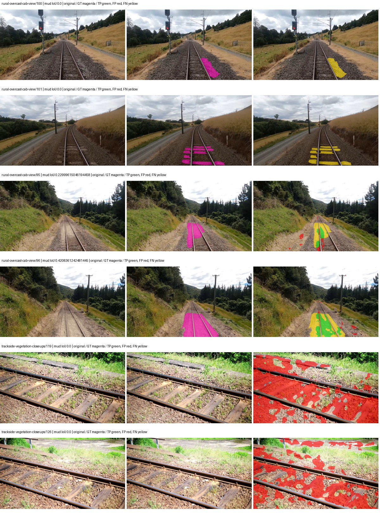

# native_efficientnet_b0_deeplabv3plus — paul-test-rtis

[RTIS comparison](../../README.md) · [Full model records](record.json)

Primary selection and early stopping: **mud-pumping validation IoU**. A job is complete only after full statistics and isolated profiling are verified.

| Model | Initialization path | Seed | Status | Steps | Best step | Mud IoU (%) | Mud precision (%) | Mud recall (%) | Final mud IoU (trainer val, %) | mIoU (%) | Fixed GT-class mIoU (%) |
| --- | --- | --- | --- | --- | --- | --- | --- | --- | --- | --- | --- |
| native_efficientnet_b0_deeplabv3plus | rtis_only | 0 | collecting | 2290 | 1018 | 2.82 | 3.31 | 15.98 | 0.61 | 24.81 | 28.95 |
| native_efficientnet_b0_deeplabv3plus | rtis_only | 1 | completed | 1527 | 254 | 1.50 | 1.86 | 7.15 | 0.79 | 21.96 | 23.18 |
| native_efficientnet_b0_deeplabv3plus | rtis_only | 2 | training | 1799 | — | — | — | — | — | — | — |
| native_efficientnet_b0_deeplabv3plus | cityscapes_to_rtis | 0 | training | 1499 | — | — | — | — | — | — | — |
| native_efficientnet_b0_deeplabv3plus | cityscapes_to_rtis | 1 | training | 949 | — | — | — | — | — | — | — |
| native_efficientnet_b0_deeplabv3plus | cityscapes_to_rtis | 2 | training | 849 | — | — | — | — | — | — | — |
| native_efficientnet_b0_deeplabv3plus | railsem19_to_rtis | 0 | training | 449 | — | — | — | — | — | — | — |
| native_efficientnet_b0_deeplabv3plus | railsem19_to_rtis | 1 | training | 254 | — | — | — | — | — | — | — |
| native_efficientnet_b0_deeplabv3plus | railsem19_to_rtis | 2 | queued | — | — | — | — | — | — | — | — |
| native_efficientnet_b0_deeplabv3plus | cityscapes_to_railsem19_to_rtis | 0 | queued | — | — | — | — | — | — | — | — |
| native_efficientnet_b0_deeplabv3plus | cityscapes_to_railsem19_to_rtis | 1 | queued | — | — | — | — | — | — | — | — |
| native_efficientnet_b0_deeplabv3plus | cityscapes_to_railsem19_to_rtis | 2 | queued | — | — | — | — | — | — | — | — |

Training: 220 images. Validation: 37 images. Test: 50 held out. Seeds: [0, 1, 2]. Seed variation measures optimization variability, not independent-recording uncertainty. Historical source checkpoints stay fixed across adaptation seeds.

Training code: `066afb2626398b7be59d4d19f5a0e4644fd59adc`. Split SHA-256: `71fef8292610c352da0709fe3bd030f3bcc18f97560394835f4b22826463b83d`.

## rtis_only — seed 0

Status: **collecting**. Started: 2026-09-06T18:46:32.322287+00:00. Finished: —.

Recipe pretrained initializer: `{"arch": "native", "backbone_path": null, "batch_norm_momentum": null, "checkpoint": null, "classifier_path": null, "drop_path": null, "encoder_name": null, "encoder_weights": null, "head": "unified_head", "head_paths": [], "inactive_parameter_paths": [], "local_files_only": false, "lora_alpha": 32, "lora_dropout": 0.05, "lora_r": 16, "lora_targets": [], "native": {"auxiliary_heads": [], "backbone": {"in_channels": 3, "kind": "timm", "name": "efficientnet_b0.ra_in1k", "out_indices": [1, 2, 3, 4], "weights": "pretrained"}, "head": {"activation": "relu", "channels": 160, "dilation_rates": [6, 12, 18], "dropout": 0.1, "high_index": 3, "kind": "deeplabv3plus", "low_channels": 32, "low_index": 0, "norm": "group"}, "neck": {"kind": "identity"}, "task": "multiclass"}, "revision": null, "smp_arch": null, "subfolder": null, "trust_remote_code": false, "tuning": "full"}`.

`rtis_only` uses the recipe initializer, which may include pretrained segmentation components. Transfer paths load the exact historical source checkpoint below and reset the classifier; they do not reset all query/decoder features.

Source checkpoint: `Recipe pretrained initialization`.

Config SHA-256: `05c99a5f4ff67242a22180a46bd2297c400c42727e25d65e5cb01621ebf59049`. Weights used for validation: `raw`.

### Mud-pumping and aggregate quality

| Metric | Selected checkpoint | Final training validation |
| --- | --- | --- |
| Mud IoU | 2.82 | 0.61 |
| Mud precision | 3.31 | 1.72 |
| Mud recall | 15.98 | 0.95 |
| Mud Dice/F1 | 5.49 | 1.22 |
| mIoU | 24.81 | 27.32 |
| Mean accuracy | 34.71 | 40.16 |
| Mean precision | 47.99 | 46.17 |
| Mean Dice | 31.80 | 34.89 |
| Mean specificity | 98.64 | 98.82 |
| Pixel accuracy | 79.63 | 82.13 |
| Frequency-weighted IoU | 69.55 | 71.11 |
| Fixed GT-present class mIoU | 28.95 | 31.87 |
| Boundary F1 | 28.69 | 33.04 |

The selected checkpoint has independent evaluation evidence. Final values are the trainer's final validation record, not a new independent evaluation. mIoU averages classes with nonzero union, so false positives on absent classes can change its denominator. The fixed GT-class mean is supplementary and excludes absent classes; their false positives remain in the confusion matrix.

### Resource usage and timing

| Measurement | Value |
| --- | --- |
| Peak training VRAM, retained training invocation (GiB) | 8.31 |
| Peak evaluation VRAM (GiB) | 6.78 |
| Retained training invocation wall time (seconds) | 1407.02 |
| Retained training invocation GPU-hours (one GPU) | 0.39 |
| Evaluation wall time (seconds) | 11.36 |
| Full evaluation pipeline images/second | 3.26 |
| Best full-state checkpoint (MiB) | 88.07 |
| Final full-state checkpoint (MiB) | 88.06 |
| Audited periodic checkpoints removed (GiB) | — |

VRAM uses the recorded allocator high-water mark; it is not total device usage including CUDA context. Resumed jobs' retained training invocation times and peaks are **not whole-campaign totals**. Earlier invocation resource records are not reconstructed here. Evaluation throughput includes loader, sliding-window inference and metrics; it is not model-only latency/FPS. Missing measurements are shown as —, never inferred from another dataset's run.

### Standardized inference performance

Dedicated model-only profiling waits for an idle worker-locked L40S: BF16, batch 1, 1024x1024, 20 warmup and 100 CUDA-event-timed public forwards. It excludes loading, preprocessing, tiling and metrics.

| Status | Parameters | Weight MiB | FPS | p50 ms | p95 ms | Peak reserved GiB |
| --- | --- | --- | --- | --- | --- | --- |
| waiting_for_idle_gpu | — | — | — | — | — | — |

```json
{
  "status": "waiting_for_idle_gpu",
  "contract": "L40S; batch 1; 1024x1024; BF16; 20 warmup; 100 timed forwards"
}
```

### Per-class validation results

| Class | GT pixels | IoU (%) | Precision (%) | Recall (%) | Dice (%) | Boundary F1 (%) |
| --- | --- | --- | --- | --- | --- | --- |
| car | 29664 | 0.00 | 0.00 | 0.00 | 0.00 | 0.00 |
| construction | 311585 | 32.22 | 40.91 | 60.28 | 48.74 | 44.38 |
| fence | 265137 | 3.43 | 44.78 | 3.59 | 6.64 | 13.92 |
| mud-pumping | 1226250 | 2.82 | 3.31 | 15.98 | 5.49 | 5.94 |
| on-rails | 0 | 0.00 | 0.00 | — | 0.00 | 0.00 |
| person | 0 | 0.00 | 0.00 | — | 0.00 | 0.00 |
| pole | 628038 | 51.19 | 74.71 | 61.92 | 67.72 | 81.72 |
| rail-embedded | 16799 | 9.72 | 87.07 | 9.86 | 17.71 | 11.59 |
| rail-raised | 2969797 | 71.26 | 81.70 | 84.80 | 83.22 | 91.51 |
| rail-track | 6323197 | 34.18 | 75.85 | 38.35 | 50.95 | 42.07 |
| road | 1048831 | 0.82 | 8.95 | 0.90 | 1.63 | 7.66 |
| sidewalk | 1297367 | 44.08 | 88.91 | 46.65 | 61.19 | 12.95 |
| sky | 19121606 | 97.90 | 99.17 | 98.71 | 98.94 | 92.05 |
| standing-water | 95802 | 2.66 | 4.74 | 5.69 | 5.17 | 7.41 |
| terrain | 39239306 | 80.85 | 81.55 | 98.95 | 89.41 | 49.80 |
| trackbed | 10643081 | 54.56 | 83.44 | 61.19 | 70.60 | 58.51 |
| traffic-light | 19510 | 23.54 | 72.65 | 25.83 | 38.11 | 30.50 |
| traffic-sign | 13285 | 3.70 | 58.18 | 3.80 | 7.14 | 12.89 |
| tram-track | 56179 | 0.37 | 24.88 | 0.38 | 0.74 | 7.46 |
| truck | 0 | 0.00 | 0.00 | — | 0.00 | 0.00 |
| vegetation-overgrowth | 5901821 | 7.76 | 77.03 | 7.95 | 14.41 | 32.05 |

### Validation tracking

| Logged step | Overall mIoU (%) | Mud IoU (%) |
| --- | --- | --- |
| 254 | 20.78 | 0.00 |
| 508 | 23.30 | 0.00 |
| 763 | 22.19 | 0.24 |
| 1017 | 24.82 | 2.82 |
| 1272 | 24.61 | 0.01 |
| 1527 | 24.20 | 0.72 |
| 1781 | 26.53 | 0.24 |
| 2036 | 25.74 | 0.07 |
| 2290 | 27.32 | 0.61 |

All retained scalar curves, including training loss and per-class IoU, are in record.json. Observed best mud on a curve is not necessarily a retained checkpoint: the pilot saved its selection-metric-best and final checkpoints. Step logging and checkpoint global_step may differ by one.

### Stopping and checkpoint provenance

```json
{
  "stopping": {
    "actual_steps": 2290,
    "maximum_steps": 4000,
    "min_delta": 0.001,
    "monitor": "val_iou/mud-pumping",
    "patience": 5,
    "reason": "validation_plateau"
  },
  "checkpoints": {
    "best": {
      "path": "/data/izadia1/projects/segmentary-runs/paul-test-rtis/mud-fullstats-v1-20260906-r2/future-runs/native_efficientnet_b0_deeplabv3plus--rtis_only--seed-0_seed0/rtis/best.ckpt",
      "sha256": "b2467d6e25c8a5d1fa5a66661df3d276b2a9bd338befd9bbc27e40eaa060d014",
      "global_step": 1018,
      "bytes": 92351256
    },
    "final": {
      "path": "/data/izadia1/projects/segmentary-runs/paul-test-rtis/mud-fullstats-v1-20260906-r2/future-runs/native_efficientnet_b0_deeplabv3plus--rtis_only--seed-0_seed0/rtis/last.ckpt",
      "sha256": "d61484cc6be5bc7ca021f588b7b9aaf67b2a2929e0945b880b1bee3347a861ff",
      "global_step": 2290,
      "bytes": 92337624
    }
  },
  "cleanup_error": null
}
```

### Resolved training, initialization and evaluation settings

The optimizer block is the base configuration. Stage LR scales are applied at runtime, and stage warmup is capped at min(base warmup, floor(stage budget / 10), stage budget - 1): 400 steps for this 4,000-step pilot. Model-internal native input grids may differ from augmentation crops (EoMT uses its 640 grid).

```json
{
  "name": "native_efficientnet_b0_deeplabv3plus--rtis_only--seed-0",
  "model": {
    "arch": "native",
    "checkpoint": null,
    "tuning": "full",
    "head": "unified_head",
    "lora_r": 16,
    "lora_alpha": 32,
    "lora_dropout": 0.05,
    "lora_targets": [],
    "drop_path": null,
    "revision": null,
    "subfolder": null,
    "local_files_only": false,
    "trust_remote_code": false,
    "backbone_path": null,
    "head_paths": [],
    "classifier_path": null,
    "inactive_parameter_paths": [],
    "smp_arch": null,
    "encoder_name": null,
    "encoder_weights": null,
    "native": {
      "task": "multiclass",
      "backbone": {
        "kind": "timm",
        "name": "efficientnet_b0.ra_in1k",
        "weights": "pretrained",
        "out_indices": [
          1,
          2,
          3,
          4
        ],
        "in_channels": 3
      },
      "neck": {
        "kind": "identity"
      },
      "head": {
        "kind": "deeplabv3plus",
        "low_index": 0,
        "high_index": 3,
        "channels": 160,
        "low_channels": 32,
        "dilation_rates": [
          6,
          12,
          18
        ],
        "dropout": 0.1,
        "norm": "group",
        "activation": "relu"
      },
      "auxiliary_heads": []
    },
    "batch_norm_momentum": null
  },
  "space": "paul-test-rtis",
  "taxonomy_root": "/data/izadia1/projects/segmentary-rtis-fullstats-066afb2/taxonomy",
  "output_root": "/data/izadia1/projects/segmentary-runs/paul-test-rtis/mud-fullstats-v1-20260906-r2/future-runs",
  "optim": {
    "backbone_lr": 0.0001,
    "head_lr_mult": 10.0,
    "weight_decay": 0.05,
    "llrd": 1.0,
    "warmup_iters": 1500,
    "warmup_ratio": 1e-06,
    "poly_power": 0.9,
    "min_lr_ratio": 0.0,
    "betas": [
      0.9,
      0.999
    ],
    "grad_clip": 1.0
  },
  "train": {
    "iters": 4000,
    "batch_size": 2,
    "accum": 8,
    "num_workers": 2,
    "precision": "bf16-mixed",
    "ema_decay": 0.9998,
    "val_every": 250,
    "ckpt_every": 500,
    "selection_metric": "val_iou/mud-pumping",
    "early_stopping_patience": 5,
    "early_stopping_min_delta": 0.001,
    "seed": 0,
    "devices": 1
  },
  "eval": {
    "sliding_window": true,
    "window": [
      1024,
      1024
    ],
    "stride": [
      768,
      768
    ],
    "batch_size": 1,
    "num_workers": 2,
    "tta_scales": [],
    "tta_flip": false,
    "threshold": 0.5,
    "boundary_tolerance_frac": 0.0075,
    "save_confusion": true
  },
  "loss": {
    "task": "multiclass",
    "activation": "auto",
    "terms": [],
    "aux": "none",
    "aux_weight": 0.0,
    "ce_weight": 1.0,
    "label_smoothing": 0.0,
    "class_weights": null,
    "query": null
  },
  "aug": {
    "crop": [
      1024,
      1024
    ],
    "scale_min": 0.5,
    "scale_max": 2.0,
    "hflip_p": 0.5,
    "color_jitter_p": 0.5,
    "brightness": 0.25,
    "contrast": 0.25,
    "saturation": 0.25,
    "hue": 0.05
  },
  "stages": [
    {
      "name": "rtis",
      "data": [
        {
          "name": "paul-test-rtis",
          "root": "/data/izadia1/datasets/paul-test-rtis",
          "variant": null,
          "split_file": "splits.json",
          "train_split": "train",
          "val_split": "val",
          "limit": null,
          "loader": "folder",
          "mapping": "paul-test-rtis",
          "loader_options": {
            "require_groups": true
          }
        }
      ],
      "iters": null,
      "lr_scale": 1.0,
      "head_group_lr_scale": 1.0,
      "init_from": "pretrained",
      "reset_head": false,
      "freeze": null,
      "sample_weights": null
    }
  ]
}
```

### Hardware and software provenance

```json
{
  "training": {
    "cuda_available": true,
    "cuda_visible_devices": "2",
    "cudnn": 91900,
    "driver_version": "570.133.20",
    "gpu_count": 1,
    "gpu_names": [
      "NVIDIA L40S"
    ],
    "hostname": "hdrfs-app-001",
    "input_normalization": {
      "channel_order": "rgb",
      "mean": [
        0.485,
        0.456,
        0.406
      ],
      "source": "timm_pretrained_cfg",
      "std": [
        0.229,
        0.224,
        0.225
      ]
    },
    "model_origins": [
      {
        "hf_commit": null,
        "hf_name_or_path": null,
        "module": "backbone",
        "timm_pretrained": {
          "architecture": "efficientnet_b0",
          "hf_hub_id": "timm/efficientnet_b0.ra_in1k",
          "tag": "ra_in1k",
          "url": "https://github.com/rwightman/pytorch-image-models/releases/download/v0.1-weights/efficientnet_b0_ra-3dd342df.pth"
        }
      },
      {
        "hf_commit": null,
        "hf_name_or_path": null,
        "module": "backbone.model",
        "timm_pretrained": {
          "architecture": "efficientnet_b0",
          "hf_hub_id": "timm/efficientnet_b0.ra_in1k",
          "tag": "ra_in1k",
          "url": "https://github.com/rwightman/pytorch-image-models/releases/download/v0.1-weights/efficientnet_b0_ra-3dd342df.pth"
        }
      }
    ],
    "model_parameter_count": 5721681,
    "packages": {
      "albumentations": "2.0.8",
      "lightning": "2.6.5",
      "numpy": "2.4.4",
      "segmentary": "0.1.0",
      "segmentation-models-pytorch": "0.5.0",
      "timm": "1.0.28",
      "torch": "2.11.0+cu128",
      "torchvision": "0.26.0+cu128",
      "transformers": "5.15.0"
    },
    "platform": "Linux-5.15.0-139-generic-x86_64-with-glibc2.35",
    "python": "3.11.15",
    "torch": "2.11.0+cu128",
    "torch_cuda": "12.8",
    "trainable_parameter_count": 5721681,
    "training_stop": {
      "actual_steps": 2290,
      "maximum_steps": 4000,
      "min_delta": 0.001,
      "monitor": "val_iou/mud-pumping",
      "patience": 5,
      "reason": "validation_plateau"
    },
    "validation_weights": "raw"
  },
  "evaluation": {
    "cuda_available": true,
    "cuda_visible_devices": "2",
    "cudnn": 91900,
    "driver_version": "570.133.20",
    "gpu_count": 1,
    "gpu_names": [
      "NVIDIA L40S"
    ],
    "hostname": "hdrfs-app-001",
    "input_normalization": {
      "channel_order": "rgb",
      "mean": [
        0.485,
        0.456,
        0.406
      ],
      "source": "timm_pretrained_cfg",
      "std": [
        0.229,
        0.224,
        0.225
      ]
    },
    "packages": {
      "albumentations": "2.0.8",
      "lightning": "2.6.5",
      "numpy": "2.4.4",
      "segmentary": "0.1.0",
      "segmentation-models-pytorch": "0.5.0",
      "timm": "1.0.28",
      "torch": "2.11.0+cu128",
      "torchvision": "0.26.0+cu128",
      "transformers": "5.15.0"
    },
    "platform": "Linux-5.15.0-139-generic-x86_64-with-glibc2.35",
    "python": "3.11.15",
    "torch": "2.11.0+cu128",
    "torch_cuda": "12.8"
  }
}
```

## rtis_only — seed 1

Status: **completed**. Started: 2026-09-06T18:47:36.787446+00:00. Finished: 2026-09-06T19:05:46.262699+00:00.

Recipe pretrained initializer: `{"arch": "native", "backbone_path": null, "batch_norm_momentum": null, "checkpoint": null, "classifier_path": null, "drop_path": null, "encoder_name": null, "encoder_weights": null, "head": "unified_head", "head_paths": [], "inactive_parameter_paths": [], "local_files_only": false, "lora_alpha": 32, "lora_dropout": 0.05, "lora_r": 16, "lora_targets": [], "native": {"auxiliary_heads": [], "backbone": {"in_channels": 3, "kind": "timm", "name": "efficientnet_b0.ra_in1k", "out_indices": [1, 2, 3, 4], "weights": "pretrained"}, "head": {"activation": "relu", "channels": 160, "dilation_rates": [6, 12, 18], "dropout": 0.1, "high_index": 3, "kind": "deeplabv3plus", "low_channels": 32, "low_index": 0, "norm": "group"}, "neck": {"kind": "identity"}, "task": "multiclass"}, "revision": null, "smp_arch": null, "subfolder": null, "trust_remote_code": false, "tuning": "full"}`.

`rtis_only` uses the recipe initializer, which may include pretrained segmentation components. Transfer paths load the exact historical source checkpoint below and reset the classifier; they do not reset all query/decoder features.

Source checkpoint: `Recipe pretrained initialization`.

Config SHA-256: `b4ce17972a9da100000960bc84be4862c6c8a8b539e07d4f818e08cfc7391272`. Weights used for validation: `raw`.

### Mud-pumping and aggregate quality

| Metric | Selected checkpoint | Final training validation |
| --- | --- | --- |
| Mud IoU | 1.50 | 0.79 |
| Mud precision | 1.86 | 0.98 |
| Mud recall | 7.15 | 3.94 |
| Mud Dice/F1 | 2.96 | 1.57 |
| mIoU | 21.96 | 25.96 |
| Mean accuracy | 30.23 | 36.57 |
| Mean precision | 33.89 | 51.66 |
| Mean Dice | 27.57 | 33.08 |
| Mean specificity | 98.71 | 98.84 |
| Pixel accuracy | 78.92 | 81.14 |
| Frequency-weighted IoU | 69.22 | 72.11 |
| Fixed GT-present class mIoU | 23.18 | 30.29 |
| Boundary F1 | 23.60 | 31.70 |

The selected checkpoint has independent evaluation evidence. Final values are the trainer's final validation record, not a new independent evaluation. mIoU averages classes with nonzero union, so false positives on absent classes can change its denominator. The fixed GT-class mean is supplementary and excludes absent classes; their false positives remain in the confusion matrix.

### Resource usage and timing

| Measurement | Value |
| --- | --- |
| Peak training VRAM, retained training invocation (GiB) | 8.31 |
| Peak evaluation VRAM (GiB) | 6.78 |
| Retained training invocation wall time (seconds) | 968.97 |
| Retained training invocation GPU-hours (one GPU) | 0.27 |
| Evaluation wall time (seconds) | 10.85 |
| Full evaluation pipeline images/second | 3.41 |
| Best full-state checkpoint (MiB) | 88.07 |
| Final full-state checkpoint (MiB) | 88.06 |
| Audited periodic checkpoints removed (GiB) | 0.26 |

VRAM uses the recorded allocator high-water mark; it is not total device usage including CUDA context. Resumed jobs' retained training invocation times and peaks are **not whole-campaign totals**. Earlier invocation resource records are not reconstructed here. Evaluation throughput includes loader, sliding-window inference and metrics; it is not model-only latency/FPS. Missing measurements are shown as —, never inferred from another dataset's run.

### Standardized inference performance

Dedicated model-only profiling waits for an idle worker-locked L40S: BF16, batch 1, 1024x1024, 20 warmup and 100 CUDA-event-timed public forwards. It excludes loading, preprocessing, tiling and metrics.

| Status | Parameters | Weight MiB | FPS | p50 ms | p95 ms | Peak reserved GiB |
| --- | --- | --- | --- | --- | --- | --- |
| complete | 5721681 | 21.83 | 145.42 | 6.71 | 7.85 | 0.43 |

```json
{
  "schema_version": 1,
  "model_id": "native_efficientnet_b0_deeplabv3plus",
  "measured_at": "2026-09-06T19:05:44+00:00",
  "status": "complete",
  "benchmark_scope": "rtis_selected_checkpoint_model_only",
  "applies_to": [
    "native_efficientnet_b0_deeplabv3plus--rtis_only--seed-1"
  ],
  "source": {
    "campaign_git_sha": "066afb2626398b7be59d4d19f5a0e4644fd59adc",
    "git_dirty": false,
    "config_hash": "267be61a5e86",
    "resolved_config": "/data/izadia1/projects/segmentary-runs/paul-test-rtis/mud-fullstats-v1-20260906-r2/configs/native_efficientnet_b0_deeplabv3plus--rtis_only--seed-1.yaml",
    "config_sha256": "b4ce17972a9da100000960bc84be4862c6c8a8b539e07d4f818e08cfc7391272",
    "checkpoint_sha256": "79749ccd822a02e9f042397a231ff2e4b37cc30c3aa3926b271d9cfe468c8342",
    "checkpoint_global_step": 254,
    "checkpoint_bytes": 92351064,
    "checkpoint_kind": "resume checkpoint with optimizer and EMA state",
    "weights": "raw",
    "measured_checkpoint_job_id": "native_efficientnet_b0_deeplabv3plus--rtis_only--seed-1",
    "result_sha256": "8feb17d8134768ec4cc1e1e6b26f57b06c9ff56f262d41e185a08aec107a6a27",
    "result_git_sha": "066afb2626398b7be59d4d19f5a0e4644fd59adc",
    "result_stage": "eval:paul-test-rtis:val",
    "result_seed": 1
  },
  "hardware": {
    "gpu_name": "NVIDIA L40S",
    "gpu_uuid": "GPU-d411d86a-6d1d-1967-55e7-9f9ec85d13f5",
    "logical_device": "cuda:0",
    "physical_visibility_token": "1",
    "compute_capability": [
      8,
      9
    ],
    "total_memory_bytes": 47677177856
  },
  "model": {
    "parameter_count": 5721681,
    "trainable_parameter_count": 5721681,
    "resident_parameter_bytes": 22886724,
    "parameter_dtype_counts": {
      "float32": 5721681
    }
  },
  "contract": {
    "backend": "pytorch",
    "precision": "bf16_autocast",
    "batch_size": 1,
    "input_shape_nchw": [
      1,
      3,
      1024,
      1024
    ],
    "warmup_iterations": 20,
    "measured_iterations": 100,
    "timing": "per-forward CUDA events with end-event synchronization",
    "includes_preprocessing": false,
    "includes_data_loader": false,
    "includes_sliding_window": false,
    "input_resident_on_gpu": true,
    "model_only": true,
    "entrypoint": "public model(image) dense-logits forward"
  },
  "measurements": {
    "latency": {
      "p50_ms": 6.71129584312439,
      "p95_ms": 7.845939326286316,
      "mean_ms": 6.876819205284119,
      "minimum_ms": 6.37337589263916,
      "maximum_ms": 8.211456298828125,
      "fps": 145.4160666651821,
      "raw_ms": [
        6.532095909118652,
        6.421504020690918,
        6.452127933502197,
        6.436863899230957,
        6.453248023986816,
        6.421504020690918,
        6.58022403717041,
        6.585343837738037,
        7.1361918449401855,
        7.02566385269165,
        8.042495727539062,
        7.795711994171143,
        7.132063865661621,
        6.712319850921631,
        7.067647933959961,
        6.710271835327148,
        6.3948798179626465,
        6.461440086364746,
        6.63040018081665,
        7.4792962074279785,
        7.885824203491211,
        7.672832012176514,
        6.779903888702393,
        6.658048152923584,
        6.9191999435424805,
        7.3512959480285645,
        6.793216228485107,
        6.960000038146973,
        6.900735855102539,
        7.8438401222229,
        6.622208118438721,
        6.7348480224609375,
        7.461887836456299,
        6.680575847625732,
        6.549503803253174,
        6.455296039581299,
        6.586368083953857,
        6.719488143920898,
        7.99129581451416,
        6.6129279136657715,
        7.408736228942871,
        6.758399963378906,
        7.500800132751465,
        6.743040084838867,
        6.478720188140869,
        6.443007946014404,
        6.466559886932373,
        6.509568214416504,
        6.519807815551758,
        6.636447906494141,
        7.997439861297607,
        7.53766393661499,
        6.67955207824707,
        6.556672096252441,
        6.922272205352783,
        7.268352031707764,
        6.42252779006958,
        6.4040961265563965,
        6.37337589263916,
        6.383615970611572,
        6.387712001800537,
        6.460415840148926,
        6.5372161865234375,
        7.7414398193359375,
        8.211456298828125,
        7.568352222442627,
        7.779327869415283,
        6.83622407913208,
        6.5913920402526855,
        6.62937593460083,
        6.488063812255859,
        6.9416961669921875,
        6.961152076721191,
        7.1690239906311035,
        7.670783996582031,
        7.129087924957275,
        7.685120105743408,
        7.494656085968018,
        6.648960113525391,
        6.759424209594727,
        6.473728179931641,
        6.447103977203369,
        6.405119895935059,
        6.385695934295654,
        7.352320194244385,
        6.402048110961914,
        6.414336204528809,
        6.432767868041992,
        6.47270393371582,
        6.383615970611572,
        6.461376190185547,
        6.855679988861084,
        6.9600958824157715,
        6.406144142150879,
        6.966271877288818,
        6.497280120849609,
        7.017439842224121,
        7.04201602935791,
        7.106560230255127,
        6.847487926483154
      ],
      "percentile_method": "numpy linear interpolation"
    },
    "peak_reserved_bytes": 457179136,
    "memory_kind": "pytorch_cuda_allocator_peak_reserved_excluding_context",
    "benchmark_wall_clock_s": 16.781184252351522
  },
  "started_at": "2026-09-06T19:05:27+00:00",
  "finished_at": "2026-09-06T19:05:44+00:00",
  "environment": {
    "hostname": "hdrfs-app-001",
    "python": "3.11.15",
    "platform": "Linux-5.15.0-139-generic-x86_64-with-glibc2.35",
    "torch": "2.11.0+cu128",
    "torch_cuda": "12.8",
    "cudnn": 91900,
    "driver_version": "570.133.20",
    "cuda_available": true,
    "gpu_count": 1,
    "gpu_names": [
      "NVIDIA L40S"
    ],
    "cuda_visible_devices": "1",
    "packages": {
      "segmentary": "0.1.0",
      "torch": "2.11.0+cu128",
      "torchvision": "0.26.0+cu128",
      "transformers": "5.15.0",
      "timm": "1.0.28",
      "segmentation-models-pytorch": "0.5.0",
      "albumentations": "2.0.8",
      "lightning": "2.6.5",
      "numpy": "2.4.4"
    }
  }
}
```

### Per-class validation results

| Class | GT pixels | IoU (%) | Precision (%) | Recall (%) | Dice (%) | Boundary F1 (%) |
| --- | --- | --- | --- | --- | --- | --- |
| car | 29664 | 0.00 | 0.00 | 0.00 | 0.00 | 0.00 |
| construction | 311585 | 13.14 | 14.81 | 53.86 | 23.23 | 22.44 |
| fence | 265137 | 6.82 | 13.83 | 11.85 | 12.76 | 25.03 |
| mud-pumping | 1226250 | 1.50 | 1.86 | 7.15 | 2.96 | 2.41 |
| on-rails | 0 | 0.00 | 0.00 | — | 0.00 | 0.00 |
| person | 0 | — | — | — | — | — |
| pole | 628038 | 39.35 | 61.76 | 52.02 | 56.48 | 69.65 |
| rail-embedded | 16799 | 0.00 | 0.00 | 0.00 | 0.00 | 0.00 |
| rail-raised | 2969797 | 62.55 | 71.95 | 82.72 | 76.96 | 84.69 |
| rail-track | 6323197 | 32.65 | 63.58 | 40.15 | 49.22 | 40.90 |
| road | 1048831 | 0.17 | 1.83 | 0.19 | 0.35 | 0.35 |
| sidewalk | 1297367 | 26.32 | 92.38 | 26.90 | 41.67 | 12.74 |
| sky | 19121606 | 95.95 | 98.09 | 97.78 | 97.93 | 81.95 |
| standing-water | 95802 | 0.00 | 0.00 | 0.01 | 0.00 | 0.00 |
| terrain | 39239306 | 84.07 | 86.99 | 96.15 | 91.34 | 54.87 |
| trackbed | 10643081 | 54.66 | 66.60 | 75.30 | 70.68 | 52.30 |
| traffic-light | 19510 | 0.00 | 0.00 | 0.00 | 0.00 | 0.00 |
| traffic-sign | 13285 | 0.00 | 0.00 | 0.00 | 0.00 | 0.00 |
| tram-track | 56179 | 0.00 | 0.00 | 0.00 | 0.00 | 0.00 |
| truck | 0 | — | — | — | — | — |
| vegetation-overgrowth | 5901821 | 0.09 | 70.21 | 0.09 | 0.17 | 1.15 |

### Full-run accounting

| Measurement | Value |
| --- | --- |
| Full GPU-reserved wall seconds, all recorded worker attempts | 1089.48 |
| Full reserved GPU-hours | 0.30 |
| Whole-run timing complete | True |

| Phase | Wall seconds including failed attempts |
| --- | --- |
| training | 975.70 |
| diagnostics | 72.19 |
| performance | 23.18 |

GPU-reserved time includes model loading, training, validation, collection, profiling, checkpoint I/O and orchestration while the worker owns one GPU. It is not GPU kernel-active time. Phase timings and sampled device memory/power/utilization are retained separately; sampled device memory is not the allocator high-water mark.

### Train/validation and raw/EMA diagnostics

| Checkpoint / weights / split | Images | Mud IoU (%) | Mud precision (%) | Mud recall (%) |
| --- | --- | --- | --- | --- |
| best-auto-train / raw | 220 | 83.64 | 89.88 | 92.33 |
| best-auto-val / raw | 37 | 1.50 | 1.86 | 7.15 |
| best-alternate-val / ema | 37 | 0.82 | 1.00 | 4.21 |
| final-auto-val / raw | 37 | 0.79 | 0.98 | 3.94 |

Train uses the evaluation transform without augmentation. Compare mud train/validation metrics for the same selected weights. Alternate EMA on running-stat BatchNorm is explicitly uncalibrated and is diagnostic only. Score-threshold curves use uncalibrated normalized scores and are pixel-level diagnostics, not event detection rates or a selected deployment operating point.

### Downloadable evidence

- best-auto-train: [per-image.csv](rtis_only--seed-1/best-auto-train/per-image.csv) · [per-image-confusion.json.gz](rtis_only--seed-1/best-auto-train/per-image-confusion.json.gz) · [groups.json](rtis_only--seed-1/best-auto-train/groups.json) · [mud-score-curves.json](rtis_only--seed-1/best-auto-train/mud-score-curves.json)
- best-auto-val: [per-image.csv](rtis_only--seed-1/best-auto-val/per-image.csv) · [per-image-confusion.json.gz](rtis_only--seed-1/best-auto-val/per-image-confusion.json.gz) · [groups.json](rtis_only--seed-1/best-auto-val/groups.json) · [mud-score-curves.json](rtis_only--seed-1/best-auto-val/mud-score-curves.json) · [examples.jpg](rtis_only--seed-1/best-auto-val/examples.jpg)
- best-alternate-val: [per-image.csv](rtis_only--seed-1/best-alternate-val/per-image.csv) · [per-image-confusion.json.gz](rtis_only--seed-1/best-alternate-val/per-image-confusion.json.gz) · [groups.json](rtis_only--seed-1/best-alternate-val/groups.json) · [mud-score-curves.json](rtis_only--seed-1/best-alternate-val/mud-score-curves.json)
- final-auto-val: [per-image.csv](rtis_only--seed-1/final-auto-val/per-image.csv) · [per-image-confusion.json.gz](rtis_only--seed-1/final-auto-val/per-image-confusion.json.gz) · [groups.json](rtis_only--seed-1/final-auto-val/groups.json) · [mud-score-curves.json](rtis_only--seed-1/final-auto-val/mud-score-curves.json)
- resources: [telemetry.csv](rtis_only--seed-1/resources/telemetry.csv)



Examples are two lowest and two highest mud-IoU positive images, plus up to two negative images with the most false-positive mud pixels. They are targeted diagnostic examples, not random samples. Green: true positive; red: false positive; yellow: false negative. Full predictions remain on HDRFS.

### Validation tracking

| Logged step | Overall mIoU (%) | Mud IoU (%) |
| --- | --- | --- |
| 254 | 21.96 | 1.50 |
| 508 | 22.12 | 0.23 |
| 763 | 22.37 | 0.01 |
| 1017 | 24.06 | 0.31 |
| 1272 | 24.10 | 0.10 |
| 1527 | 25.96 | 0.79 |

All retained scalar curves, including training loss and per-class IoU, are in record.json. Observed best mud on a curve is not necessarily a retained checkpoint: the pilot saved its selection-metric-best and final checkpoints. Step logging and checkpoint global_step may differ by one.

### Stopping and checkpoint provenance

```json
{
  "stopping": {
    "actual_steps": 1527,
    "maximum_steps": 4000,
    "min_delta": 0.001,
    "monitor": "val_iou/mud-pumping",
    "patience": 5,
    "reason": "validation_plateau"
  },
  "checkpoints": {
    "best": {
      "path": "/data/izadia1/projects/segmentary-runs/paul-test-rtis/mud-fullstats-v1-20260906-r2/future-runs/native_efficientnet_b0_deeplabv3plus--rtis_only--seed-1_seed1/rtis/best.ckpt",
      "sha256": "79749ccd822a02e9f042397a231ff2e4b37cc30c3aa3926b271d9cfe468c8342",
      "global_step": 254,
      "bytes": 92351064
    },
    "final": {
      "path": "/data/izadia1/projects/segmentary-runs/paul-test-rtis/mud-fullstats-v1-20260906-r2/future-runs/native_efficientnet_b0_deeplabv3plus--rtis_only--seed-1_seed1/rtis/last.ckpt",
      "sha256": "365e7b8e71b4b397c6f34d5d3c69b0826410ffccb08bc71a6e08c715e6e94294",
      "global_step": 1527,
      "bytes": 92337624
    }
  },
  "cleanup_error": null
}
```

### Resolved training, initialization and evaluation settings

The optimizer block is the base configuration. Stage LR scales are applied at runtime, and stage warmup is capped at min(base warmup, floor(stage budget / 10), stage budget - 1): 400 steps for this 4,000-step pilot. Model-internal native input grids may differ from augmentation crops (EoMT uses its 640 grid).

```json
{
  "name": "native_efficientnet_b0_deeplabv3plus--rtis_only--seed-1",
  "model": {
    "arch": "native",
    "checkpoint": null,
    "tuning": "full",
    "head": "unified_head",
    "lora_r": 16,
    "lora_alpha": 32,
    "lora_dropout": 0.05,
    "lora_targets": [],
    "drop_path": null,
    "revision": null,
    "subfolder": null,
    "local_files_only": false,
    "trust_remote_code": false,
    "backbone_path": null,
    "head_paths": [],
    "classifier_path": null,
    "inactive_parameter_paths": [],
    "smp_arch": null,
    "encoder_name": null,
    "encoder_weights": null,
    "native": {
      "task": "multiclass",
      "backbone": {
        "kind": "timm",
        "name": "efficientnet_b0.ra_in1k",
        "weights": "pretrained",
        "out_indices": [
          1,
          2,
          3,
          4
        ],
        "in_channels": 3
      },
      "neck": {
        "kind": "identity"
      },
      "head": {
        "kind": "deeplabv3plus",
        "low_index": 0,
        "high_index": 3,
        "channels": 160,
        "low_channels": 32,
        "dilation_rates": [
          6,
          12,
          18
        ],
        "dropout": 0.1,
        "norm": "group",
        "activation": "relu"
      },
      "auxiliary_heads": []
    },
    "batch_norm_momentum": null
  },
  "space": "paul-test-rtis",
  "taxonomy_root": "/data/izadia1/projects/segmentary-rtis-fullstats-066afb2/taxonomy",
  "output_root": "/data/izadia1/projects/segmentary-runs/paul-test-rtis/mud-fullstats-v1-20260906-r2/future-runs",
  "optim": {
    "backbone_lr": 0.0001,
    "head_lr_mult": 10.0,
    "weight_decay": 0.05,
    "llrd": 1.0,
    "warmup_iters": 1500,
    "warmup_ratio": 1e-06,
    "poly_power": 0.9,
    "min_lr_ratio": 0.0,
    "betas": [
      0.9,
      0.999
    ],
    "grad_clip": 1.0
  },
  "train": {
    "iters": 4000,
    "batch_size": 2,
    "accum": 8,
    "num_workers": 2,
    "precision": "bf16-mixed",
    "ema_decay": 0.9998,
    "val_every": 250,
    "ckpt_every": 500,
    "selection_metric": "val_iou/mud-pumping",
    "early_stopping_patience": 5,
    "early_stopping_min_delta": 0.001,
    "seed": 1,
    "devices": 1
  },
  "eval": {
    "sliding_window": true,
    "window": [
      1024,
      1024
    ],
    "stride": [
      768,
      768
    ],
    "batch_size": 1,
    "num_workers": 2,
    "tta_scales": [],
    "tta_flip": false,
    "threshold": 0.5,
    "boundary_tolerance_frac": 0.0075,
    "save_confusion": true
  },
  "loss": {
    "task": "multiclass",
    "activation": "auto",
    "terms": [],
    "aux": "none",
    "aux_weight": 0.0,
    "ce_weight": 1.0,
    "label_smoothing": 0.0,
    "class_weights": null,
    "query": null
  },
  "aug": {
    "crop": [
      1024,
      1024
    ],
    "scale_min": 0.5,
    "scale_max": 2.0,
    "hflip_p": 0.5,
    "color_jitter_p": 0.5,
    "brightness": 0.25,
    "contrast": 0.25,
    "saturation": 0.25,
    "hue": 0.05
  },
  "stages": [
    {
      "name": "rtis",
      "data": [
        {
          "name": "paul-test-rtis",
          "root": "/data/izadia1/datasets/paul-test-rtis",
          "variant": null,
          "split_file": "splits.json",
          "train_split": "train",
          "val_split": "val",
          "limit": null,
          "loader": "folder",
          "mapping": "paul-test-rtis",
          "loader_options": {
            "require_groups": true
          }
        }
      ],
      "iters": null,
      "lr_scale": 1.0,
      "head_group_lr_scale": 1.0,
      "init_from": "pretrained",
      "reset_head": false,
      "freeze": null,
      "sample_weights": null
    }
  ]
}
```

### Hardware and software provenance

```json
{
  "training": {
    "cuda_available": true,
    "cuda_visible_devices": "1",
    "cudnn": 91900,
    "driver_version": "570.133.20",
    "gpu_count": 1,
    "gpu_names": [
      "NVIDIA L40S"
    ],
    "hostname": "hdrfs-app-001",
    "input_normalization": {
      "channel_order": "rgb",
      "mean": [
        0.485,
        0.456,
        0.406
      ],
      "source": "timm_pretrained_cfg",
      "std": [
        0.229,
        0.224,
        0.225
      ]
    },
    "model_origins": [
      {
        "hf_commit": null,
        "hf_name_or_path": null,
        "module": "backbone",
        "timm_pretrained": {
          "architecture": "efficientnet_b0",
          "hf_hub_id": "timm/efficientnet_b0.ra_in1k",
          "tag": "ra_in1k",
          "url": "https://github.com/rwightman/pytorch-image-models/releases/download/v0.1-weights/efficientnet_b0_ra-3dd342df.pth"
        }
      },
      {
        "hf_commit": null,
        "hf_name_or_path": null,
        "module": "backbone.model",
        "timm_pretrained": {
          "architecture": "efficientnet_b0",
          "hf_hub_id": "timm/efficientnet_b0.ra_in1k",
          "tag": "ra_in1k",
          "url": "https://github.com/rwightman/pytorch-image-models/releases/download/v0.1-weights/efficientnet_b0_ra-3dd342df.pth"
        }
      }
    ],
    "model_parameter_count": 5721681,
    "packages": {
      "albumentations": "2.0.8",
      "lightning": "2.6.5",
      "numpy": "2.4.4",
      "segmentary": "0.1.0",
      "segmentation-models-pytorch": "0.5.0",
      "timm": "1.0.28",
      "torch": "2.11.0+cu128",
      "torchvision": "0.26.0+cu128",
      "transformers": "5.15.0"
    },
    "platform": "Linux-5.15.0-139-generic-x86_64-with-glibc2.35",
    "python": "3.11.15",
    "torch": "2.11.0+cu128",
    "torch_cuda": "12.8",
    "trainable_parameter_count": 5721681,
    "training_stop": {
      "actual_steps": 1527,
      "maximum_steps": 4000,
      "min_delta": 0.001,
      "monitor": "val_iou/mud-pumping",
      "patience": 5,
      "reason": "validation_plateau"
    },
    "validation_weights": "raw"
  },
  "evaluation": {
    "cuda_available": true,
    "cuda_visible_devices": "1",
    "cudnn": 91900,
    "driver_version": "570.133.20",
    "gpu_count": 1,
    "gpu_names": [
      "NVIDIA L40S"
    ],
    "hostname": "hdrfs-app-001",
    "input_normalization": {
      "channel_order": "rgb",
      "mean": [
        0.485,
        0.456,
        0.406
      ],
      "source": "timm_pretrained_cfg",
      "std": [
        0.229,
        0.224,
        0.225
      ]
    },
    "packages": {
      "albumentations": "2.0.8",
      "lightning": "2.6.5",
      "numpy": "2.4.4",
      "segmentary": "0.1.0",
      "segmentation-models-pytorch": "0.5.0",
      "timm": "1.0.28",
      "torch": "2.11.0+cu128",
      "torchvision": "0.26.0+cu128",
      "transformers": "5.15.0"
    },
    "platform": "Linux-5.15.0-139-generic-x86_64-with-glibc2.35",
    "python": "3.11.15",
    "torch": "2.11.0+cu128",
    "torch_cuda": "12.8"
  }
}
```

## rtis_only — seed 2

Status: **training**. Started: 2026-09-06T18:52:25.849321+00:00. Finished: —.

Recipe pretrained initializer: `{"arch": "native", "backbone_path": null, "batch_norm_momentum": null, "checkpoint": null, "classifier_path": null, "drop_path": null, "encoder_name": null, "encoder_weights": null, "head": "unified_head", "head_paths": [], "inactive_parameter_paths": [], "local_files_only": false, "lora_alpha": 32, "lora_dropout": 0.05, "lora_r": 16, "lora_targets": [], "native": {"auxiliary_heads": [], "backbone": {"in_channels": 3, "kind": "timm", "name": "efficientnet_b0.ra_in1k", "out_indices": [1, 2, 3, 4], "weights": "pretrained"}, "head": {"activation": "relu", "channels": 160, "dilation_rates": [6, 12, 18], "dropout": 0.1, "high_index": 3, "kind": "deeplabv3plus", "low_channels": 32, "low_index": 0, "norm": "group"}, "neck": {"kind": "identity"}, "task": "multiclass"}, "revision": null, "smp_arch": null, "subfolder": null, "trust_remote_code": false, "tuning": "full"}`.

`rtis_only` uses the recipe initializer, which may include pretrained segmentation components. Transfer paths load the exact historical source checkpoint below and reset the classifier; they do not reset all query/decoder features.

Source checkpoint: `Recipe pretrained initialization`.

Config SHA-256: `82fd41c0e692e1b7b15e5d215053ad35f48ca229bc016924ecb547202afea887`. Weights used for validation: `—`.

### Mud-pumping and aggregate quality

| Metric | Selected checkpoint | Final training validation |
| --- | --- | --- |
| Mud IoU | — | — |
| Mud precision | — | — |
| Mud recall | — | — |
| Mud Dice/F1 | — | — |
| mIoU | — | — |
| Mean accuracy | — | — |
| Mean precision | — | — |
| Mean Dice | — | — |
| Mean specificity | — | — |
| Pixel accuracy | — | — |
| Frequency-weighted IoU | — | — |
| Fixed GT-present class mIoU | — | — |
| Boundary F1 | — | — |

The selected checkpoint has independent evaluation evidence. Final values are the trainer's final validation record, not a new independent evaluation. mIoU averages classes with nonzero union, so false positives on absent classes can change its denominator. The fixed GT-class mean is supplementary and excludes absent classes; their false positives remain in the confusion matrix.

### Resource usage and timing

| Measurement | Value |
| --- | --- |
| Peak training VRAM, retained training invocation (GiB) | — |
| Peak evaluation VRAM (GiB) | — |
| Retained training invocation wall time (seconds) | — |
| Retained training invocation GPU-hours (one GPU) | — |
| Evaluation wall time (seconds) | — |
| Full evaluation pipeline images/second | — |
| Best full-state checkpoint (MiB) | — |
| Final full-state checkpoint (MiB) | — |
| Audited periodic checkpoints removed (GiB) | — |

VRAM uses the recorded allocator high-water mark; it is not total device usage including CUDA context. Resumed jobs' retained training invocation times and peaks are **not whole-campaign totals**. Earlier invocation resource records are not reconstructed here. Evaluation throughput includes loader, sliding-window inference and metrics; it is not model-only latency/FPS. Missing measurements are shown as —, never inferred from another dataset's run.

### Standardized inference performance

Dedicated model-only profiling waits for an idle worker-locked L40S: BF16, batch 1, 1024x1024, 20 warmup and 100 CUDA-event-timed public forwards. It excludes loading, preprocessing, tiling and metrics.

| Status | Parameters | Weight MiB | FPS | p50 ms | p95 ms | Peak reserved GiB |
| --- | --- | --- | --- | --- | --- | --- |
| waiting_for_idle_gpu | — | — | — | — | — | — |

```json
{
  "status": "waiting_for_idle_gpu",
  "contract": "L40S; batch 1; 1024x1024; BF16; 20 warmup; 100 timed forwards"
}
```

### Per-class validation results

| Class | GT pixels | IoU (%) | Precision (%) | Recall (%) | Dice (%) | Boundary F1 (%) |
| --- | --- | --- | --- | --- | --- | --- |

### Validation tracking

| Logged step | Overall mIoU (%) | Mud IoU (%) |
| --- | --- | --- |
| 254 | 22.66 | 0.10 |
| 508 | 21.22 | 0.79 |
| 763 | 22.06 | 0.11 |
| 1017 | 25.73 | 2.26 |
| 1272 | 25.33 | 0.15 |
| 1527 | 28.58 | 1.64 |
| 1781 | 26.84 | 0.01 |

All retained scalar curves, including training loss and per-class IoU, are in record.json. Observed best mud on a curve is not necessarily a retained checkpoint: the pilot saved its selection-metric-best and final checkpoints. Step logging and checkpoint global_step may differ by one.

### Stopping and checkpoint provenance

```json
{
  "stopping": null,
  "checkpoints": null,
  "cleanup_error": null
}
```

### Resolved training, initialization and evaluation settings

The optimizer block is the base configuration. Stage LR scales are applied at runtime, and stage warmup is capped at min(base warmup, floor(stage budget / 10), stage budget - 1): 400 steps for this 4,000-step pilot. Model-internal native input grids may differ from augmentation crops (EoMT uses its 640 grid).

```json
{
  "name": "native_efficientnet_b0_deeplabv3plus--rtis_only--seed-2",
  "model": {
    "arch": "native",
    "checkpoint": null,
    "tuning": "full",
    "head": "unified_head",
    "lora_r": 16,
    "lora_alpha": 32,
    "lora_dropout": 0.05,
    "lora_targets": [],
    "drop_path": null,
    "revision": null,
    "subfolder": null,
    "local_files_only": false,
    "trust_remote_code": false,
    "backbone_path": null,
    "head_paths": [],
    "classifier_path": null,
    "inactive_parameter_paths": [],
    "smp_arch": null,
    "encoder_name": null,
    "encoder_weights": null,
    "native": {
      "task": "multiclass",
      "backbone": {
        "kind": "timm",
        "name": "efficientnet_b0.ra_in1k",
        "weights": "pretrained",
        "out_indices": [
          1,
          2,
          3,
          4
        ],
        "in_channels": 3
      },
      "neck": {
        "kind": "identity"
      },
      "head": {
        "kind": "deeplabv3plus",
        "low_index": 0,
        "high_index": 3,
        "channels": 160,
        "low_channels": 32,
        "dilation_rates": [
          6,
          12,
          18
        ],
        "dropout": 0.1,
        "norm": "group",
        "activation": "relu"
      },
      "auxiliary_heads": []
    },
    "batch_norm_momentum": null
  },
  "space": "paul-test-rtis",
  "taxonomy_root": "/data/izadia1/projects/segmentary-rtis-fullstats-066afb2/taxonomy",
  "output_root": "/data/izadia1/projects/segmentary-runs/paul-test-rtis/mud-fullstats-v1-20260906-r2/future-runs",
  "optim": {
    "backbone_lr": 0.0001,
    "head_lr_mult": 10.0,
    "weight_decay": 0.05,
    "llrd": 1.0,
    "warmup_iters": 1500,
    "warmup_ratio": 1e-06,
    "poly_power": 0.9,
    "min_lr_ratio": 0.0,
    "betas": [
      0.9,
      0.999
    ],
    "grad_clip": 1.0
  },
  "train": {
    "iters": 4000,
    "batch_size": 2,
    "accum": 8,
    "num_workers": 2,
    "precision": "bf16-mixed",
    "ema_decay": 0.9998,
    "val_every": 250,
    "ckpt_every": 500,
    "selection_metric": "val_iou/mud-pumping",
    "early_stopping_patience": 5,
    "early_stopping_min_delta": 0.001,
    "seed": 2,
    "devices": 1
  },
  "eval": {
    "sliding_window": true,
    "window": [
      1024,
      1024
    ],
    "stride": [
      768,
      768
    ],
    "batch_size": 1,
    "num_workers": 2,
    "tta_scales": [],
    "tta_flip": false,
    "threshold": 0.5,
    "boundary_tolerance_frac": 0.0075,
    "save_confusion": true
  },
  "loss": {
    "task": "multiclass",
    "activation": "auto",
    "terms": [],
    "aux": "none",
    "aux_weight": 0.0,
    "ce_weight": 1.0,
    "label_smoothing": 0.0,
    "class_weights": null,
    "query": null
  },
  "aug": {
    "crop": [
      1024,
      1024
    ],
    "scale_min": 0.5,
    "scale_max": 2.0,
    "hflip_p": 0.5,
    "color_jitter_p": 0.5,
    "brightness": 0.25,
    "contrast": 0.25,
    "saturation": 0.25,
    "hue": 0.05
  },
  "stages": [
    {
      "name": "rtis",
      "data": [
        {
          "name": "paul-test-rtis",
          "root": "/data/izadia1/datasets/paul-test-rtis",
          "variant": null,
          "split_file": "splits.json",
          "train_split": "train",
          "val_split": "val",
          "limit": null,
          "loader": "folder",
          "mapping": "paul-test-rtis",
          "loader_options": {
            "require_groups": true
          }
        }
      ],
      "iters": null,
      "lr_scale": 1.0,
      "head_group_lr_scale": 1.0,
      "init_from": "pretrained",
      "reset_head": false,
      "freeze": null,
      "sample_weights": null
    }
  ]
}
```

### Hardware and software provenance

```json
{
  "training": null,
  "evaluation": null
}
```

## cityscapes_to_rtis — seed 0

Status: **training**. Started: 2026-09-06T18:55:45.097374+00:00. Finished: —.

Recipe pretrained initializer: `{"arch": "native", "backbone_path": null, "batch_norm_momentum": null, "checkpoint": null, "classifier_path": null, "drop_path": null, "encoder_name": null, "encoder_weights": null, "head": "unified_head", "head_paths": [], "inactive_parameter_paths": [], "local_files_only": false, "lora_alpha": 32, "lora_dropout": 0.05, "lora_r": 16, "lora_targets": [], "native": {"auxiliary_heads": [], "backbone": {"in_channels": 3, "kind": "timm", "name": "efficientnet_b0.ra_in1k", "out_indices": [1, 2, 3, 4], "weights": "pretrained"}, "head": {"activation": "relu", "channels": 160, "dilation_rates": [6, 12, 18], "dropout": 0.1, "high_index": 3, "kind": "deeplabv3plus", "low_channels": 32, "low_index": 0, "norm": "group"}, "neck": {"kind": "identity"}, "task": "multiclass"}, "revision": null, "smp_arch": null, "subfolder": null, "trust_remote_code": false, "tuning": "full"}`.

`rtis_only` uses the recipe initializer, which may include pretrained segmentation components. Transfer paths load the exact historical source checkpoint below and reset the classifier; they do not reset all query/decoder features.

Source checkpoint: `{'name': 'native_efficientnet_b0_deeplabv3plus--cityscapes--seed-0', 'model': 'native_efficientnet_b0_deeplabv3plus', 'protocol': 'cityscapes', 'config': '/data/izadia1/projects/segmentary-runs/all-model-city-rail-seed0-rail20-b9eb3e1/jobs/native_efficientnet_b0_deeplabv3plus--cityscapes--seed-0/attempt-001/resolved-config.yaml', 'checkpoint': '/data/izadia1/projects/segmentary-runs/all-model-city-rail-seed0-rail20-b9eb3e1/jobs/native_efficientnet_b0_deeplabv3plus--cityscapes--seed-0/attempt-001/train/native_efficientnet_b0_deeplabv3plus--cityscapes_seed0/cityscapes/last.ckpt', 'recorded_sha256': 'f287c443ed0dff9b4ba6966e8cfd4e0e4e74e6694b2a74a49948df30ba979f8f', 'exists': True}`.

Config SHA-256: `5a4a0fa0c404a239627879ec20c79378ca09e2c6a30ad46a584224e8f7b2f787`. Weights used for validation: `—`.

### Mud-pumping and aggregate quality

| Metric | Selected checkpoint | Final training validation |
| --- | --- | --- |
| Mud IoU | — | — |
| Mud precision | — | — |
| Mud recall | — | — |
| Mud Dice/F1 | — | — |
| mIoU | — | — |
| Mean accuracy | — | — |
| Mean precision | — | — |
| Mean Dice | — | — |
| Mean specificity | — | — |
| Pixel accuracy | — | — |
| Frequency-weighted IoU | — | — |
| Fixed GT-present class mIoU | — | — |
| Boundary F1 | — | — |

The selected checkpoint has independent evaluation evidence. Final values are the trainer's final validation record, not a new independent evaluation. mIoU averages classes with nonzero union, so false positives on absent classes can change its denominator. The fixed GT-class mean is supplementary and excludes absent classes; their false positives remain in the confusion matrix.

### Resource usage and timing

| Measurement | Value |
| --- | --- |
| Peak training VRAM, retained training invocation (GiB) | — |
| Peak evaluation VRAM (GiB) | — |
| Retained training invocation wall time (seconds) | — |
| Retained training invocation GPU-hours (one GPU) | — |
| Evaluation wall time (seconds) | — |
| Full evaluation pipeline images/second | — |
| Best full-state checkpoint (MiB) | — |
| Final full-state checkpoint (MiB) | — |
| Audited periodic checkpoints removed (GiB) | — |

VRAM uses the recorded allocator high-water mark; it is not total device usage including CUDA context. Resumed jobs' retained training invocation times and peaks are **not whole-campaign totals**. Earlier invocation resource records are not reconstructed here. Evaluation throughput includes loader, sliding-window inference and metrics; it is not model-only latency/FPS. Missing measurements are shown as —, never inferred from another dataset's run.

### Standardized inference performance

Dedicated model-only profiling waits for an idle worker-locked L40S: BF16, batch 1, 1024x1024, 20 warmup and 100 CUDA-event-timed public forwards. It excludes loading, preprocessing, tiling and metrics.

| Status | Parameters | Weight MiB | FPS | p50 ms | p95 ms | Peak reserved GiB |
| --- | --- | --- | --- | --- | --- | --- |
| waiting_for_idle_gpu | — | — | — | — | — | — |

```json
{
  "status": "waiting_for_idle_gpu",
  "contract": "L40S; batch 1; 1024x1024; BF16; 20 warmup; 100 timed forwards"
}
```

### Per-class validation results

| Class | GT pixels | IoU (%) | Precision (%) | Recall (%) | Dice (%) | Boundary F1 (%) |
| --- | --- | --- | --- | --- | --- | --- |

### Validation tracking

| Logged step | Overall mIoU (%) | Mud IoU (%) |
| --- | --- | --- |
| 254 | 20.02 | 0.58 |
| 508 | 20.23 | 4.40 |
| 763 | 20.11 | 0.69 |
| 1017 | 22.87 | 0.48 |
| 1272 | 24.25 | 1.69 |

All retained scalar curves, including training loss and per-class IoU, are in record.json. Observed best mud on a curve is not necessarily a retained checkpoint: the pilot saved its selection-metric-best and final checkpoints. Step logging and checkpoint global_step may differ by one.

### Stopping and checkpoint provenance

```json
{
  "stopping": null,
  "checkpoints": null,
  "cleanup_error": null
}
```

### Resolved training, initialization and evaluation settings

The optimizer block is the base configuration. Stage LR scales are applied at runtime, and stage warmup is capped at min(base warmup, floor(stage budget / 10), stage budget - 1): 400 steps for this 4,000-step pilot. Model-internal native input grids may differ from augmentation crops (EoMT uses its 640 grid).

```json
{
  "name": "native_efficientnet_b0_deeplabv3plus--cityscapes_to_rtis--seed-0",
  "model": {
    "arch": "native",
    "checkpoint": null,
    "tuning": "full",
    "head": "unified_head",
    "lora_r": 16,
    "lora_alpha": 32,
    "lora_dropout": 0.05,
    "lora_targets": [],
    "drop_path": null,
    "revision": null,
    "subfolder": null,
    "local_files_only": false,
    "trust_remote_code": false,
    "backbone_path": null,
    "head_paths": [],
    "classifier_path": null,
    "inactive_parameter_paths": [],
    "smp_arch": null,
    "encoder_name": null,
    "encoder_weights": null,
    "native": {
      "task": "multiclass",
      "backbone": {
        "kind": "timm",
        "name": "efficientnet_b0.ra_in1k",
        "weights": "pretrained",
        "out_indices": [
          1,
          2,
          3,
          4
        ],
        "in_channels": 3
      },
      "neck": {
        "kind": "identity"
      },
      "head": {
        "kind": "deeplabv3plus",
        "low_index": 0,
        "high_index": 3,
        "channels": 160,
        "low_channels": 32,
        "dilation_rates": [
          6,
          12,
          18
        ],
        "dropout": 0.1,
        "norm": "group",
        "activation": "relu"
      },
      "auxiliary_heads": []
    },
    "batch_norm_momentum": null
  },
  "space": "paul-test-rtis",
  "taxonomy_root": "/data/izadia1/projects/segmentary-rtis-fullstats-066afb2/taxonomy",
  "output_root": "/data/izadia1/projects/segmentary-runs/paul-test-rtis/mud-fullstats-v1-20260906-r2/future-runs",
  "optim": {
    "backbone_lr": 0.0001,
    "head_lr_mult": 10.0,
    "weight_decay": 0.05,
    "llrd": 1.0,
    "warmup_iters": 1500,
    "warmup_ratio": 1e-06,
    "poly_power": 0.9,
    "min_lr_ratio": 0.0,
    "betas": [
      0.9,
      0.999
    ],
    "grad_clip": 1.0
  },
  "train": {
    "iters": 4000,
    "batch_size": 2,
    "accum": 8,
    "num_workers": 2,
    "precision": "bf16-mixed",
    "ema_decay": 0.9998,
    "val_every": 250,
    "ckpt_every": 500,
    "selection_metric": "val_iou/mud-pumping",
    "early_stopping_patience": 5,
    "early_stopping_min_delta": 0.001,
    "seed": 0,
    "devices": 1
  },
  "eval": {
    "sliding_window": true,
    "window": [
      1024,
      1024
    ],
    "stride": [
      768,
      768
    ],
    "batch_size": 1,
    "num_workers": 2,
    "tta_scales": [],
    "tta_flip": false,
    "threshold": 0.5,
    "boundary_tolerance_frac": 0.0075,
    "save_confusion": true
  },
  "loss": {
    "task": "multiclass",
    "activation": "auto",
    "terms": [],
    "aux": "none",
    "aux_weight": 0.0,
    "ce_weight": 1.0,
    "label_smoothing": 0.0,
    "class_weights": null,
    "query": null
  },
  "aug": {
    "crop": [
      1024,
      1024
    ],
    "scale_min": 0.5,
    "scale_max": 2.0,
    "hflip_p": 0.5,
    "color_jitter_p": 0.5,
    "brightness": 0.25,
    "contrast": 0.25,
    "saturation": 0.25,
    "hue": 0.05
  },
  "stages": [
    {
      "name": "rtis",
      "data": [
        {
          "name": "paul-test-rtis",
          "root": "/data/izadia1/datasets/paul-test-rtis",
          "variant": null,
          "split_file": "splits.json",
          "train_split": "train",
          "val_split": "val",
          "limit": null,
          "loader": "folder",
          "mapping": "paul-test-rtis",
          "loader_options": {
            "require_groups": true
          }
        }
      ],
      "iters": null,
      "lr_scale": 0.1,
      "head_group_lr_scale": 1.0,
      "init_from": "/data/izadia1/projects/segmentary-runs/all-model-city-rail-seed0-rail20-b9eb3e1/jobs/native_efficientnet_b0_deeplabv3plus--cityscapes--seed-0/attempt-001/train/native_efficientnet_b0_deeplabv3plus--cityscapes_seed0/cityscapes/last.ckpt",
      "reset_head": true,
      "freeze": null,
      "sample_weights": null
    }
  ]
}
```

### Hardware and software provenance

```json
{
  "training": null,
  "evaluation": null
}
```

## cityscapes_to_rtis — seed 1

Status: **training**. Started: 2026-09-06T19:01:04.093094+00:00. Finished: —.

Recipe pretrained initializer: `{"arch": "native", "backbone_path": null, "batch_norm_momentum": null, "checkpoint": null, "classifier_path": null, "drop_path": null, "encoder_name": null, "encoder_weights": null, "head": "unified_head", "head_paths": [], "inactive_parameter_paths": [], "local_files_only": false, "lora_alpha": 32, "lora_dropout": 0.05, "lora_r": 16, "lora_targets": [], "native": {"auxiliary_heads": [], "backbone": {"in_channels": 3, "kind": "timm", "name": "efficientnet_b0.ra_in1k", "out_indices": [1, 2, 3, 4], "weights": "pretrained"}, "head": {"activation": "relu", "channels": 160, "dilation_rates": [6, 12, 18], "dropout": 0.1, "high_index": 3, "kind": "deeplabv3plus", "low_channels": 32, "low_index": 0, "norm": "group"}, "neck": {"kind": "identity"}, "task": "multiclass"}, "revision": null, "smp_arch": null, "subfolder": null, "trust_remote_code": false, "tuning": "full"}`.

`rtis_only` uses the recipe initializer, which may include pretrained segmentation components. Transfer paths load the exact historical source checkpoint below and reset the classifier; they do not reset all query/decoder features.

Source checkpoint: `{'name': 'native_efficientnet_b0_deeplabv3plus--cityscapes--seed-0', 'model': 'native_efficientnet_b0_deeplabv3plus', 'protocol': 'cityscapes', 'config': '/data/izadia1/projects/segmentary-runs/all-model-city-rail-seed0-rail20-b9eb3e1/jobs/native_efficientnet_b0_deeplabv3plus--cityscapes--seed-0/attempt-001/resolved-config.yaml', 'checkpoint': '/data/izadia1/projects/segmentary-runs/all-model-city-rail-seed0-rail20-b9eb3e1/jobs/native_efficientnet_b0_deeplabv3plus--cityscapes--seed-0/attempt-001/train/native_efficientnet_b0_deeplabv3plus--cityscapes_seed0/cityscapes/last.ckpt', 'recorded_sha256': 'f287c443ed0dff9b4ba6966e8cfd4e0e4e74e6694b2a74a49948df30ba979f8f', 'exists': True}`.

Config SHA-256: `57c478d47b403d20a7f7678c4cf680503580df81670cb53ad73eef26cae3ee35`. Weights used for validation: `—`.

### Mud-pumping and aggregate quality

| Metric | Selected checkpoint | Final training validation |
| --- | --- | --- |
| Mud IoU | — | — |
| Mud precision | — | — |
| Mud recall | — | — |
| Mud Dice/F1 | — | — |
| mIoU | — | — |
| Mean accuracy | — | — |
| Mean precision | — | — |
| Mean Dice | — | — |
| Mean specificity | — | — |
| Pixel accuracy | — | — |
| Frequency-weighted IoU | — | — |
| Fixed GT-present class mIoU | — | — |
| Boundary F1 | — | — |

The selected checkpoint has independent evaluation evidence. Final values are the trainer's final validation record, not a new independent evaluation. mIoU averages classes with nonzero union, so false positives on absent classes can change its denominator. The fixed GT-class mean is supplementary and excludes absent classes; their false positives remain in the confusion matrix.

### Resource usage and timing

| Measurement | Value |
| --- | --- |
| Peak training VRAM, retained training invocation (GiB) | — |
| Peak evaluation VRAM (GiB) | — |
| Retained training invocation wall time (seconds) | — |
| Retained training invocation GPU-hours (one GPU) | — |
| Evaluation wall time (seconds) | — |
| Full evaluation pipeline images/second | — |
| Best full-state checkpoint (MiB) | — |
| Final full-state checkpoint (MiB) | — |
| Audited periodic checkpoints removed (GiB) | — |

VRAM uses the recorded allocator high-water mark; it is not total device usage including CUDA context. Resumed jobs' retained training invocation times and peaks are **not whole-campaign totals**. Earlier invocation resource records are not reconstructed here. Evaluation throughput includes loader, sliding-window inference and metrics; it is not model-only latency/FPS. Missing measurements are shown as —, never inferred from another dataset's run.

### Standardized inference performance

Dedicated model-only profiling waits for an idle worker-locked L40S: BF16, batch 1, 1024x1024, 20 warmup and 100 CUDA-event-timed public forwards. It excludes loading, preprocessing, tiling and metrics.

| Status | Parameters | Weight MiB | FPS | p50 ms | p95 ms | Peak reserved GiB |
| --- | --- | --- | --- | --- | --- | --- |
| waiting_for_idle_gpu | — | — | — | — | — | — |

```json
{
  "status": "waiting_for_idle_gpu",
  "contract": "L40S; batch 1; 1024x1024; BF16; 20 warmup; 100 timed forwards"
}
```

### Per-class validation results

| Class | GT pixels | IoU (%) | Precision (%) | Recall (%) | Dice (%) | Boundary F1 (%) |
| --- | --- | --- | --- | --- | --- | --- |

### Validation tracking

| Logged step | Overall mIoU (%) | Mud IoU (%) |
| --- | --- | --- |
| 254 | 20.30 | 0.05 |
| 508 | 21.70 | 0.10 |
| 763 | 21.99 | 0.70 |

All retained scalar curves, including training loss and per-class IoU, are in record.json. Observed best mud on a curve is not necessarily a retained checkpoint: the pilot saved its selection-metric-best and final checkpoints. Step logging and checkpoint global_step may differ by one.

### Stopping and checkpoint provenance

```json
{
  "stopping": null,
  "checkpoints": null,
  "cleanup_error": null
}
```

### Resolved training, initialization and evaluation settings

The optimizer block is the base configuration. Stage LR scales are applied at runtime, and stage warmup is capped at min(base warmup, floor(stage budget / 10), stage budget - 1): 400 steps for this 4,000-step pilot. Model-internal native input grids may differ from augmentation crops (EoMT uses its 640 grid).

```json
{
  "name": "native_efficientnet_b0_deeplabv3plus--cityscapes_to_rtis--seed-1",
  "model": {
    "arch": "native",
    "checkpoint": null,
    "tuning": "full",
    "head": "unified_head",
    "lora_r": 16,
    "lora_alpha": 32,
    "lora_dropout": 0.05,
    "lora_targets": [],
    "drop_path": null,
    "revision": null,
    "subfolder": null,
    "local_files_only": false,
    "trust_remote_code": false,
    "backbone_path": null,
    "head_paths": [],
    "classifier_path": null,
    "inactive_parameter_paths": [],
    "smp_arch": null,
    "encoder_name": null,
    "encoder_weights": null,
    "native": {
      "task": "multiclass",
      "backbone": {
        "kind": "timm",
        "name": "efficientnet_b0.ra_in1k",
        "weights": "pretrained",
        "out_indices": [
          1,
          2,
          3,
          4
        ],
        "in_channels": 3
      },
      "neck": {
        "kind": "identity"
      },
      "head": {
        "kind": "deeplabv3plus",
        "low_index": 0,
        "high_index": 3,
        "channels": 160,
        "low_channels": 32,
        "dilation_rates": [
          6,
          12,
          18
        ],
        "dropout": 0.1,
        "norm": "group",
        "activation": "relu"
      },
      "auxiliary_heads": []
    },
    "batch_norm_momentum": null
  },
  "space": "paul-test-rtis",
  "taxonomy_root": "/data/izadia1/projects/segmentary-rtis-fullstats-066afb2/taxonomy",
  "output_root": "/data/izadia1/projects/segmentary-runs/paul-test-rtis/mud-fullstats-v1-20260906-r2/future-runs",
  "optim": {
    "backbone_lr": 0.0001,
    "head_lr_mult": 10.0,
    "weight_decay": 0.05,
    "llrd": 1.0,
    "warmup_iters": 1500,
    "warmup_ratio": 1e-06,
    "poly_power": 0.9,
    "min_lr_ratio": 0.0,
    "betas": [
      0.9,
      0.999
    ],
    "grad_clip": 1.0
  },
  "train": {
    "iters": 4000,
    "batch_size": 2,
    "accum": 8,
    "num_workers": 2,
    "precision": "bf16-mixed",
    "ema_decay": 0.9998,
    "val_every": 250,
    "ckpt_every": 500,
    "selection_metric": "val_iou/mud-pumping",
    "early_stopping_patience": 5,
    "early_stopping_min_delta": 0.001,
    "seed": 1,
    "devices": 1
  },
  "eval": {
    "sliding_window": true,
    "window": [
      1024,
      1024
    ],
    "stride": [
      768,
      768
    ],
    "batch_size": 1,
    "num_workers": 2,
    "tta_scales": [],
    "tta_flip": false,
    "threshold": 0.5,
    "boundary_tolerance_frac": 0.0075,
    "save_confusion": true
  },
  "loss": {
    "task": "multiclass",
    "activation": "auto",
    "terms": [],
    "aux": "none",
    "aux_weight": 0.0,
    "ce_weight": 1.0,
    "label_smoothing": 0.0,
    "class_weights": null,
    "query": null
  },
  "aug": {
    "crop": [
      1024,
      1024
    ],
    "scale_min": 0.5,
    "scale_max": 2.0,
    "hflip_p": 0.5,
    "color_jitter_p": 0.5,
    "brightness": 0.25,
    "contrast": 0.25,
    "saturation": 0.25,
    "hue": 0.05
  },
  "stages": [
    {
      "name": "rtis",
      "data": [
        {
          "name": "paul-test-rtis",
          "root": "/data/izadia1/datasets/paul-test-rtis",
          "variant": null,
          "split_file": "splits.json",
          "train_split": "train",
          "val_split": "val",
          "limit": null,
          "loader": "folder",
          "mapping": "paul-test-rtis",
          "loader_options": {
            "require_groups": true
          }
        }
      ],
      "iters": null,
      "lr_scale": 0.1,
      "head_group_lr_scale": 1.0,
      "init_from": "/data/izadia1/projects/segmentary-runs/all-model-city-rail-seed0-rail20-b9eb3e1/jobs/native_efficientnet_b0_deeplabv3plus--cityscapes--seed-0/attempt-001/train/native_efficientnet_b0_deeplabv3plus--cityscapes_seed0/cityscapes/last.ckpt",
      "reset_head": true,
      "freeze": null,
      "sample_weights": null
    }
  ]
}
```

### Hardware and software provenance

```json
{
  "training": null,
  "evaluation": null
}
```

## cityscapes_to_rtis — seed 2

Status: **training**. Started: 2026-09-06T19:01:49.486224+00:00. Finished: —.

Recipe pretrained initializer: `{"arch": "native", "backbone_path": null, "batch_norm_momentum": null, "checkpoint": null, "classifier_path": null, "drop_path": null, "encoder_name": null, "encoder_weights": null, "head": "unified_head", "head_paths": [], "inactive_parameter_paths": [], "local_files_only": false, "lora_alpha": 32, "lora_dropout": 0.05, "lora_r": 16, "lora_targets": [], "native": {"auxiliary_heads": [], "backbone": {"in_channels": 3, "kind": "timm", "name": "efficientnet_b0.ra_in1k", "out_indices": [1, 2, 3, 4], "weights": "pretrained"}, "head": {"activation": "relu", "channels": 160, "dilation_rates": [6, 12, 18], "dropout": 0.1, "high_index": 3, "kind": "deeplabv3plus", "low_channels": 32, "low_index": 0, "norm": "group"}, "neck": {"kind": "identity"}, "task": "multiclass"}, "revision": null, "smp_arch": null, "subfolder": null, "trust_remote_code": false, "tuning": "full"}`.

`rtis_only` uses the recipe initializer, which may include pretrained segmentation components. Transfer paths load the exact historical source checkpoint below and reset the classifier; they do not reset all query/decoder features.

Source checkpoint: `{'name': 'native_efficientnet_b0_deeplabv3plus--cityscapes--seed-0', 'model': 'native_efficientnet_b0_deeplabv3plus', 'protocol': 'cityscapes', 'config': '/data/izadia1/projects/segmentary-runs/all-model-city-rail-seed0-rail20-b9eb3e1/jobs/native_efficientnet_b0_deeplabv3plus--cityscapes--seed-0/attempt-001/resolved-config.yaml', 'checkpoint': '/data/izadia1/projects/segmentary-runs/all-model-city-rail-seed0-rail20-b9eb3e1/jobs/native_efficientnet_b0_deeplabv3plus--cityscapes--seed-0/attempt-001/train/native_efficientnet_b0_deeplabv3plus--cityscapes_seed0/cityscapes/last.ckpt', 'recorded_sha256': 'f287c443ed0dff9b4ba6966e8cfd4e0e4e74e6694b2a74a49948df30ba979f8f', 'exists': True}`.

Config SHA-256: `0a288814ccf35b83bfb05661dbc0f8d10f0aca9185d1706174dadc18f00f7e23`. Weights used for validation: `—`.

### Mud-pumping and aggregate quality

| Metric | Selected checkpoint | Final training validation |
| --- | --- | --- |
| Mud IoU | — | — |
| Mud precision | — | — |
| Mud recall | — | — |
| Mud Dice/F1 | — | — |
| mIoU | — | — |
| Mean accuracy | — | — |
| Mean precision | — | — |
| Mean Dice | — | — |
| Mean specificity | — | — |
| Pixel accuracy | — | — |
| Frequency-weighted IoU | — | — |
| Fixed GT-present class mIoU | — | — |
| Boundary F1 | — | — |

The selected checkpoint has independent evaluation evidence. Final values are the trainer's final validation record, not a new independent evaluation. mIoU averages classes with nonzero union, so false positives on absent classes can change its denominator. The fixed GT-class mean is supplementary and excludes absent classes; their false positives remain in the confusion matrix.

### Resource usage and timing

| Measurement | Value |
| --- | --- |
| Peak training VRAM, retained training invocation (GiB) | — |
| Peak evaluation VRAM (GiB) | — |
| Retained training invocation wall time (seconds) | — |
| Retained training invocation GPU-hours (one GPU) | — |
| Evaluation wall time (seconds) | — |
| Full evaluation pipeline images/second | — |
| Best full-state checkpoint (MiB) | — |
| Final full-state checkpoint (MiB) | — |
| Audited periodic checkpoints removed (GiB) | — |

VRAM uses the recorded allocator high-water mark; it is not total device usage including CUDA context. Resumed jobs' retained training invocation times and peaks are **not whole-campaign totals**. Earlier invocation resource records are not reconstructed here. Evaluation throughput includes loader, sliding-window inference and metrics; it is not model-only latency/FPS. Missing measurements are shown as —, never inferred from another dataset's run.

### Standardized inference performance

Dedicated model-only profiling waits for an idle worker-locked L40S: BF16, batch 1, 1024x1024, 20 warmup and 100 CUDA-event-timed public forwards. It excludes loading, preprocessing, tiling and metrics.

| Status | Parameters | Weight MiB | FPS | p50 ms | p95 ms | Peak reserved GiB |
| --- | --- | --- | --- | --- | --- | --- |
| waiting_for_idle_gpu | — | — | — | — | — | — |

```json
{
  "status": "waiting_for_idle_gpu",
  "contract": "L40S; batch 1; 1024x1024; BF16; 20 warmup; 100 timed forwards"
}
```

### Per-class validation results

| Class | GT pixels | IoU (%) | Precision (%) | Recall (%) | Dice (%) | Boundary F1 (%) |
| --- | --- | --- | --- | --- | --- | --- |

### Validation tracking

| Logged step | Overall mIoU (%) | Mud IoU (%) |
| --- | --- | --- |
| 254 | 18.94 | 0.30 |
| 508 | 19.95 | 2.77 |
| 763 | 20.48 | 0.48 |

All retained scalar curves, including training loss and per-class IoU, are in record.json. Observed best mud on a curve is not necessarily a retained checkpoint: the pilot saved its selection-metric-best and final checkpoints. Step logging and checkpoint global_step may differ by one.

### Stopping and checkpoint provenance

```json
{
  "stopping": null,
  "checkpoints": null,
  "cleanup_error": null
}
```

### Resolved training, initialization and evaluation settings

The optimizer block is the base configuration. Stage LR scales are applied at runtime, and stage warmup is capped at min(base warmup, floor(stage budget / 10), stage budget - 1): 400 steps for this 4,000-step pilot. Model-internal native input grids may differ from augmentation crops (EoMT uses its 640 grid).

```json
{
  "name": "native_efficientnet_b0_deeplabv3plus--cityscapes_to_rtis--seed-2",
  "model": {
    "arch": "native",
    "checkpoint": null,
    "tuning": "full",
    "head": "unified_head",
    "lora_r": 16,
    "lora_alpha": 32,
    "lora_dropout": 0.05,
    "lora_targets": [],
    "drop_path": null,
    "revision": null,
    "subfolder": null,
    "local_files_only": false,
    "trust_remote_code": false,
    "backbone_path": null,
    "head_paths": [],
    "classifier_path": null,
    "inactive_parameter_paths": [],
    "smp_arch": null,
    "encoder_name": null,
    "encoder_weights": null,
    "native": {
      "task": "multiclass",
      "backbone": {
        "kind": "timm",
        "name": "efficientnet_b0.ra_in1k",
        "weights": "pretrained",
        "out_indices": [
          1,
          2,
          3,
          4
        ],
        "in_channels": 3
      },
      "neck": {
        "kind": "identity"
      },
      "head": {
        "kind": "deeplabv3plus",
        "low_index": 0,
        "high_index": 3,
        "channels": 160,
        "low_channels": 32,
        "dilation_rates": [
          6,
          12,
          18
        ],
        "dropout": 0.1,
        "norm": "group",
        "activation": "relu"
      },
      "auxiliary_heads": []
    },
    "batch_norm_momentum": null
  },
  "space": "paul-test-rtis",
  "taxonomy_root": "/data/izadia1/projects/segmentary-rtis-fullstats-066afb2/taxonomy",
  "output_root": "/data/izadia1/projects/segmentary-runs/paul-test-rtis/mud-fullstats-v1-20260906-r2/future-runs",
  "optim": {
    "backbone_lr": 0.0001,
    "head_lr_mult": 10.0,
    "weight_decay": 0.05,
    "llrd": 1.0,
    "warmup_iters": 1500,
    "warmup_ratio": 1e-06,
    "poly_power": 0.9,
    "min_lr_ratio": 0.0,
    "betas": [
      0.9,
      0.999
    ],
    "grad_clip": 1.0
  },
  "train": {
    "iters": 4000,
    "batch_size": 2,
    "accum": 8,
    "num_workers": 2,
    "precision": "bf16-mixed",
    "ema_decay": 0.9998,
    "val_every": 250,
    "ckpt_every": 500,
    "selection_metric": "val_iou/mud-pumping",
    "early_stopping_patience": 5,
    "early_stopping_min_delta": 0.001,
    "seed": 2,
    "devices": 1
  },
  "eval": {
    "sliding_window": true,
    "window": [
      1024,
      1024
    ],
    "stride": [
      768,
      768
    ],
    "batch_size": 1,
    "num_workers": 2,
    "tta_scales": [],
    "tta_flip": false,
    "threshold": 0.5,
    "boundary_tolerance_frac": 0.0075,
    "save_confusion": true
  },
  "loss": {
    "task": "multiclass",
    "activation": "auto",
    "terms": [],
    "aux": "none",
    "aux_weight": 0.0,
    "ce_weight": 1.0,
    "label_smoothing": 0.0,
    "class_weights": null,
    "query": null
  },
  "aug": {
    "crop": [
      1024,
      1024
    ],
    "scale_min": 0.5,
    "scale_max": 2.0,
    "hflip_p": 0.5,
    "color_jitter_p": 0.5,
    "brightness": 0.25,
    "contrast": 0.25,
    "saturation": 0.25,
    "hue": 0.05
  },
  "stages": [
    {
      "name": "rtis",
      "data": [
        {
          "name": "paul-test-rtis",
          "root": "/data/izadia1/datasets/paul-test-rtis",
          "variant": null,
          "split_file": "splits.json",
          "train_split": "train",
          "val_split": "val",
          "limit": null,
          "loader": "folder",
          "mapping": "paul-test-rtis",
          "loader_options": {
            "require_groups": true
          }
        }
      ],
      "iters": null,
      "lr_scale": 0.1,
      "head_group_lr_scale": 1.0,
      "init_from": "/data/izadia1/projects/segmentary-runs/all-model-city-rail-seed0-rail20-b9eb3e1/jobs/native_efficientnet_b0_deeplabv3plus--cityscapes--seed-0/attempt-001/train/native_efficientnet_b0_deeplabv3plus--cityscapes_seed0/cityscapes/last.ckpt",
      "reset_head": true,
      "freeze": null,
      "sample_weights": null
    }
  ]
}
```

### Hardware and software provenance

```json
{
  "training": null,
  "evaluation": null
}
```

## railsem19_to_rtis — seed 0

Status: **training**. Started: 2026-09-06T19:05:46.393503+00:00. Finished: —.

Recipe pretrained initializer: `{"arch": "native", "backbone_path": null, "batch_norm_momentum": null, "checkpoint": null, "classifier_path": null, "drop_path": null, "encoder_name": null, "encoder_weights": null, "head": "unified_head", "head_paths": [], "inactive_parameter_paths": [], "local_files_only": false, "lora_alpha": 32, "lora_dropout": 0.05, "lora_r": 16, "lora_targets": [], "native": {"auxiliary_heads": [], "backbone": {"in_channels": 3, "kind": "timm", "name": "efficientnet_b0.ra_in1k", "out_indices": [1, 2, 3, 4], "weights": "pretrained"}, "head": {"activation": "relu", "channels": 160, "dilation_rates": [6, 12, 18], "dropout": 0.1, "high_index": 3, "kind": "deeplabv3plus", "low_channels": 32, "low_index": 0, "norm": "group"}, "neck": {"kind": "identity"}, "task": "multiclass"}, "revision": null, "smp_arch": null, "subfolder": null, "trust_remote_code": false, "tuning": "full"}`.

`rtis_only` uses the recipe initializer, which may include pretrained segmentation components. Transfer paths load the exact historical source checkpoint below and reset the classifier; they do not reset all query/decoder features.

Source checkpoint: `{'name': 'native_efficientnet_b0_deeplabv3plus--railsem19--seed-0', 'model': 'native_efficientnet_b0_deeplabv3plus', 'protocol': 'railsem19', 'config': '/data/izadia1/projects/segmentary-runs/all-model-city-rail-seed0-rail20-b9eb3e1/jobs/native_efficientnet_b0_deeplabv3plus--railsem19--seed-0/attempt-001/resolved-config.yaml', 'checkpoint': '/data/izadia1/projects/segmentary-runs/all-model-city-rail-seed0-rail20-b9eb3e1/jobs/native_efficientnet_b0_deeplabv3plus--railsem19--seed-0/attempt-001/train/native_efficientnet_b0_deeplabv3plus--railsem19_seed0/railsem19/last.ckpt', 'recorded_sha256': 'f9bd05eae50f95fcfa125c631ddaa796c1b5806c5e2eb0bbe7aec493beaffc87', 'exists': True}`.

Config SHA-256: `ccb20476a76f7eebea0560f210d29b04d9e3857ad63cb0f26c5cc62fdfb70c27`. Weights used for validation: `—`.

### Mud-pumping and aggregate quality

| Metric | Selected checkpoint | Final training validation |
| --- | --- | --- |
| Mud IoU | — | — |
| Mud precision | — | — |
| Mud recall | — | — |
| Mud Dice/F1 | — | — |
| mIoU | — | — |
| Mean accuracy | — | — |
| Mean precision | — | — |
| Mean Dice | — | — |
| Mean specificity | — | — |
| Pixel accuracy | — | — |
| Frequency-weighted IoU | — | — |
| Fixed GT-present class mIoU | — | — |
| Boundary F1 | — | — |

The selected checkpoint has independent evaluation evidence. Final values are the trainer's final validation record, not a new independent evaluation. mIoU averages classes with nonzero union, so false positives on absent classes can change its denominator. The fixed GT-class mean is supplementary and excludes absent classes; their false positives remain in the confusion matrix.

### Resource usage and timing

| Measurement | Value |
| --- | --- |
| Peak training VRAM, retained training invocation (GiB) | — |
| Peak evaluation VRAM (GiB) | — |
| Retained training invocation wall time (seconds) | — |
| Retained training invocation GPU-hours (one GPU) | — |
| Evaluation wall time (seconds) | — |
| Full evaluation pipeline images/second | — |
| Best full-state checkpoint (MiB) | — |
| Final full-state checkpoint (MiB) | — |
| Audited periodic checkpoints removed (GiB) | — |

VRAM uses the recorded allocator high-water mark; it is not total device usage including CUDA context. Resumed jobs' retained training invocation times and peaks are **not whole-campaign totals**. Earlier invocation resource records are not reconstructed here. Evaluation throughput includes loader, sliding-window inference and metrics; it is not model-only latency/FPS. Missing measurements are shown as —, never inferred from another dataset's run.

### Standardized inference performance

Dedicated model-only profiling waits for an idle worker-locked L40S: BF16, batch 1, 1024x1024, 20 warmup and 100 CUDA-event-timed public forwards. It excludes loading, preprocessing, tiling and metrics.

| Status | Parameters | Weight MiB | FPS | p50 ms | p95 ms | Peak reserved GiB |
| --- | --- | --- | --- | --- | --- | --- |
| waiting_for_idle_gpu | — | — | — | — | — | — |

```json
{
  "status": "waiting_for_idle_gpu",
  "contract": "L40S; batch 1; 1024x1024; BF16; 20 warmup; 100 timed forwards"
}
```

### Per-class validation results

| Class | GT pixels | IoU (%) | Precision (%) | Recall (%) | Dice (%) | Boundary F1 (%) |
| --- | --- | --- | --- | --- | --- | --- |

### Validation tracking

| Logged step | Overall mIoU (%) | Mud IoU (%) |
| --- | --- | --- |
| 254 | 27.66 | 0.05 |

All retained scalar curves, including training loss and per-class IoU, are in record.json. Observed best mud on a curve is not necessarily a retained checkpoint: the pilot saved its selection-metric-best and final checkpoints. Step logging and checkpoint global_step may differ by one.

### Stopping and checkpoint provenance

```json
{
  "stopping": null,
  "checkpoints": null,
  "cleanup_error": null
}
```

### Resolved training, initialization and evaluation settings

The optimizer block is the base configuration. Stage LR scales are applied at runtime, and stage warmup is capped at min(base warmup, floor(stage budget / 10), stage budget - 1): 400 steps for this 4,000-step pilot. Model-internal native input grids may differ from augmentation crops (EoMT uses its 640 grid).

```json
{
  "name": "native_efficientnet_b0_deeplabv3plus--railsem19_to_rtis--seed-0",
  "model": {
    "arch": "native",
    "checkpoint": null,
    "tuning": "full",
    "head": "unified_head",
    "lora_r": 16,
    "lora_alpha": 32,
    "lora_dropout": 0.05,
    "lora_targets": [],
    "drop_path": null,
    "revision": null,
    "subfolder": null,
    "local_files_only": false,
    "trust_remote_code": false,
    "backbone_path": null,
    "head_paths": [],
    "classifier_path": null,
    "inactive_parameter_paths": [],
    "smp_arch": null,
    "encoder_name": null,
    "encoder_weights": null,
    "native": {
      "task": "multiclass",
      "backbone": {
        "kind": "timm",
        "name": "efficientnet_b0.ra_in1k",
        "weights": "pretrained",
        "out_indices": [
          1,
          2,
          3,
          4
        ],
        "in_channels": 3
      },
      "neck": {
        "kind": "identity"
      },
      "head": {
        "kind": "deeplabv3plus",
        "low_index": 0,
        "high_index": 3,
        "channels": 160,
        "low_channels": 32,
        "dilation_rates": [
          6,
          12,
          18
        ],
        "dropout": 0.1,
        "norm": "group",
        "activation": "relu"
      },
      "auxiliary_heads": []
    },
    "batch_norm_momentum": null
  },
  "space": "paul-test-rtis",
  "taxonomy_root": "/data/izadia1/projects/segmentary-rtis-fullstats-066afb2/taxonomy",
  "output_root": "/data/izadia1/projects/segmentary-runs/paul-test-rtis/mud-fullstats-v1-20260906-r2/future-runs",
  "optim": {
    "backbone_lr": 0.0001,
    "head_lr_mult": 10.0,
    "weight_decay": 0.05,
    "llrd": 1.0,
    "warmup_iters": 1500,
    "warmup_ratio": 1e-06,
    "poly_power": 0.9,
    "min_lr_ratio": 0.0,
    "betas": [
      0.9,
      0.999
    ],
    "grad_clip": 1.0
  },
  "train": {
    "iters": 4000,
    "batch_size": 2,
    "accum": 8,
    "num_workers": 2,
    "precision": "bf16-mixed",
    "ema_decay": 0.9998,
    "val_every": 250,
    "ckpt_every": 500,
    "selection_metric": "val_iou/mud-pumping",
    "early_stopping_patience": 5,
    "early_stopping_min_delta": 0.001,
    "seed": 0,
    "devices": 1
  },
  "eval": {
    "sliding_window": true,
    "window": [
      1024,
      1024
    ],
    "stride": [
      768,
      768
    ],
    "batch_size": 1,
    "num_workers": 2,
    "tta_scales": [],
    "tta_flip": false,
    "threshold": 0.5,
    "boundary_tolerance_frac": 0.0075,
    "save_confusion": true
  },
  "loss": {
    "task": "multiclass",
    "activation": "auto",
    "terms": [],
    "aux": "none",
    "aux_weight": 0.0,
    "ce_weight": 1.0,
    "label_smoothing": 0.0,
    "class_weights": null,
    "query": null
  },
  "aug": {
    "crop": [
      1024,
      1024
    ],
    "scale_min": 0.5,
    "scale_max": 2.0,
    "hflip_p": 0.5,
    "color_jitter_p": 0.5,
    "brightness": 0.25,
    "contrast": 0.25,
    "saturation": 0.25,
    "hue": 0.05
  },
  "stages": [
    {
      "name": "rtis",
      "data": [
        {
          "name": "paul-test-rtis",
          "root": "/data/izadia1/datasets/paul-test-rtis",
          "variant": null,
          "split_file": "splits.json",
          "train_split": "train",
          "val_split": "val",
          "limit": null,
          "loader": "folder",
          "mapping": "paul-test-rtis",
          "loader_options": {
            "require_groups": true
          }
        }
      ],
      "iters": null,
      "lr_scale": 0.1,
      "head_group_lr_scale": 1.0,
      "init_from": "/data/izadia1/projects/segmentary-runs/all-model-city-rail-seed0-rail20-b9eb3e1/jobs/native_efficientnet_b0_deeplabv3plus--railsem19--seed-0/attempt-001/train/native_efficientnet_b0_deeplabv3plus--railsem19_seed0/railsem19/last.ckpt",
      "reset_head": true,
      "freeze": null,
      "sample_weights": null
    }
  ]
}
```

### Hardware and software provenance

```json
{
  "training": null,
  "evaluation": null
}
```

## railsem19_to_rtis — seed 1

Status: **training**. Started: 2026-09-06T19:07:43.271136+00:00. Finished: —.

Recipe pretrained initializer: `{"arch": "native", "backbone_path": null, "batch_norm_momentum": null, "checkpoint": null, "classifier_path": null, "drop_path": null, "encoder_name": null, "encoder_weights": null, "head": "unified_head", "head_paths": [], "inactive_parameter_paths": [], "local_files_only": false, "lora_alpha": 32, "lora_dropout": 0.05, "lora_r": 16, "lora_targets": [], "native": {"auxiliary_heads": [], "backbone": {"in_channels": 3, "kind": "timm", "name": "efficientnet_b0.ra_in1k", "out_indices": [1, 2, 3, 4], "weights": "pretrained"}, "head": {"activation": "relu", "channels": 160, "dilation_rates": [6, 12, 18], "dropout": 0.1, "high_index": 3, "kind": "deeplabv3plus", "low_channels": 32, "low_index": 0, "norm": "group"}, "neck": {"kind": "identity"}, "task": "multiclass"}, "revision": null, "smp_arch": null, "subfolder": null, "trust_remote_code": false, "tuning": "full"}`.

`rtis_only` uses the recipe initializer, which may include pretrained segmentation components. Transfer paths load the exact historical source checkpoint below and reset the classifier; they do not reset all query/decoder features.

Source checkpoint: `{'name': 'native_efficientnet_b0_deeplabv3plus--railsem19--seed-0', 'model': 'native_efficientnet_b0_deeplabv3plus', 'protocol': 'railsem19', 'config': '/data/izadia1/projects/segmentary-runs/all-model-city-rail-seed0-rail20-b9eb3e1/jobs/native_efficientnet_b0_deeplabv3plus--railsem19--seed-0/attempt-001/resolved-config.yaml', 'checkpoint': '/data/izadia1/projects/segmentary-runs/all-model-city-rail-seed0-rail20-b9eb3e1/jobs/native_efficientnet_b0_deeplabv3plus--railsem19--seed-0/attempt-001/train/native_efficientnet_b0_deeplabv3plus--railsem19_seed0/railsem19/last.ckpt', 'recorded_sha256': 'f9bd05eae50f95fcfa125c631ddaa796c1b5806c5e2eb0bbe7aec493beaffc87', 'exists': True}`.

Config SHA-256: `b639482c1db07dd61b988b97d74da0d9881bb7355a8bfe43471eceb40de998b3`. Weights used for validation: `—`.

### Mud-pumping and aggregate quality

| Metric | Selected checkpoint | Final training validation |
| --- | --- | --- |
| Mud IoU | — | — |
| Mud precision | — | — |
| Mud recall | — | — |
| Mud Dice/F1 | — | — |
| mIoU | — | — |
| Mean accuracy | — | — |
| Mean precision | — | — |
| Mean Dice | — | — |
| Mean specificity | — | — |
| Pixel accuracy | — | — |
| Frequency-weighted IoU | — | — |
| Fixed GT-present class mIoU | — | — |
| Boundary F1 | — | — |

The selected checkpoint has independent evaluation evidence. Final values are the trainer's final validation record, not a new independent evaluation. mIoU averages classes with nonzero union, so false positives on absent classes can change its denominator. The fixed GT-class mean is supplementary and excludes absent classes; their false positives remain in the confusion matrix.

### Resource usage and timing

| Measurement | Value |
| --- | --- |
| Peak training VRAM, retained training invocation (GiB) | — |
| Peak evaluation VRAM (GiB) | — |
| Retained training invocation wall time (seconds) | — |
| Retained training invocation GPU-hours (one GPU) | — |
| Evaluation wall time (seconds) | — |
| Full evaluation pipeline images/second | — |
| Best full-state checkpoint (MiB) | — |
| Final full-state checkpoint (MiB) | — |
| Audited periodic checkpoints removed (GiB) | — |

VRAM uses the recorded allocator high-water mark; it is not total device usage including CUDA context. Resumed jobs' retained training invocation times and peaks are **not whole-campaign totals**. Earlier invocation resource records are not reconstructed here. Evaluation throughput includes loader, sliding-window inference and metrics; it is not model-only latency/FPS. Missing measurements are shown as —, never inferred from another dataset's run.

### Standardized inference performance

Dedicated model-only profiling waits for an idle worker-locked L40S: BF16, batch 1, 1024x1024, 20 warmup and 100 CUDA-event-timed public forwards. It excludes loading, preprocessing, tiling and metrics.

| Status | Parameters | Weight MiB | FPS | p50 ms | p95 ms | Peak reserved GiB |
| --- | --- | --- | --- | --- | --- | --- |
| waiting_for_idle_gpu | — | — | — | — | — | — |

```json
{
  "status": "waiting_for_idle_gpu",
  "contract": "L40S; batch 1; 1024x1024; BF16; 20 warmup; 100 timed forwards"
}
```

### Per-class validation results

| Class | GT pixels | IoU (%) | Precision (%) | Recall (%) | Dice (%) | Boundary F1 (%) |
| --- | --- | --- | --- | --- | --- | --- |

### Validation tracking

| Logged step | Overall mIoU (%) | Mud IoU (%) |
| --- | --- | --- |
| 254 | 30.25 | 0.27 |

All retained scalar curves, including training loss and per-class IoU, are in record.json. Observed best mud on a curve is not necessarily a retained checkpoint: the pilot saved its selection-metric-best and final checkpoints. Step logging and checkpoint global_step may differ by one.

### Stopping and checkpoint provenance

```json
{
  "stopping": null,
  "checkpoints": null,
  "cleanup_error": null
}
```

### Resolved training, initialization and evaluation settings

The optimizer block is the base configuration. Stage LR scales are applied at runtime, and stage warmup is capped at min(base warmup, floor(stage budget / 10), stage budget - 1): 400 steps for this 4,000-step pilot. Model-internal native input grids may differ from augmentation crops (EoMT uses its 640 grid).

```json
{
  "name": "native_efficientnet_b0_deeplabv3plus--railsem19_to_rtis--seed-1",
  "model": {
    "arch": "native",
    "checkpoint": null,
    "tuning": "full",
    "head": "unified_head",
    "lora_r": 16,
    "lora_alpha": 32,
    "lora_dropout": 0.05,
    "lora_targets": [],
    "drop_path": null,
    "revision": null,
    "subfolder": null,
    "local_files_only": false,
    "trust_remote_code": false,
    "backbone_path": null,
    "head_paths": [],
    "classifier_path": null,
    "inactive_parameter_paths": [],
    "smp_arch": null,
    "encoder_name": null,
    "encoder_weights": null,
    "native": {
      "task": "multiclass",
      "backbone": {
        "kind": "timm",
        "name": "efficientnet_b0.ra_in1k",
        "weights": "pretrained",
        "out_indices": [
          1,
          2,
          3,
          4
        ],
        "in_channels": 3
      },
      "neck": {
        "kind": "identity"
      },
      "head": {
        "kind": "deeplabv3plus",
        "low_index": 0,
        "high_index": 3,
        "channels": 160,
        "low_channels": 32,
        "dilation_rates": [
          6,
          12,
          18
        ],
        "dropout": 0.1,
        "norm": "group",
        "activation": "relu"
      },
      "auxiliary_heads": []
    },
    "batch_norm_momentum": null
  },
  "space": "paul-test-rtis",
  "taxonomy_root": "/data/izadia1/projects/segmentary-rtis-fullstats-066afb2/taxonomy",
  "output_root": "/data/izadia1/projects/segmentary-runs/paul-test-rtis/mud-fullstats-v1-20260906-r2/future-runs",
  "optim": {
    "backbone_lr": 0.0001,
    "head_lr_mult": 10.0,
    "weight_decay": 0.05,
    "llrd": 1.0,
    "warmup_iters": 1500,
    "warmup_ratio": 1e-06,
    "poly_power": 0.9,
    "min_lr_ratio": 0.0,
    "betas": [
      0.9,
      0.999
    ],
    "grad_clip": 1.0
  },
  "train": {
    "iters": 4000,
    "batch_size": 2,
    "accum": 8,
    "num_workers": 2,
    "precision": "bf16-mixed",
    "ema_decay": 0.9998,
    "val_every": 250,
    "ckpt_every": 500,
    "selection_metric": "val_iou/mud-pumping",
    "early_stopping_patience": 5,
    "early_stopping_min_delta": 0.001,
    "seed": 1,
    "devices": 1
  },
  "eval": {
    "sliding_window": true,
    "window": [
      1024,
      1024
    ],
    "stride": [
      768,
      768
    ],
    "batch_size": 1,
    "num_workers": 2,
    "tta_scales": [],
    "tta_flip": false,
    "threshold": 0.5,
    "boundary_tolerance_frac": 0.0075,
    "save_confusion": true
  },
  "loss": {
    "task": "multiclass",
    "activation": "auto",
    "terms": [],
    "aux": "none",
    "aux_weight": 0.0,
    "ce_weight": 1.0,
    "label_smoothing": 0.0,
    "class_weights": null,
    "query": null
  },
  "aug": {
    "crop": [
      1024,
      1024
    ],
    "scale_min": 0.5,
    "scale_max": 2.0,
    "hflip_p": 0.5,
    "color_jitter_p": 0.5,
    "brightness": 0.25,
    "contrast": 0.25,
    "saturation": 0.25,
    "hue": 0.05
  },
  "stages": [
    {
      "name": "rtis",
      "data": [
        {
          "name": "paul-test-rtis",
          "root": "/data/izadia1/datasets/paul-test-rtis",
          "variant": null,
          "split_file": "splits.json",
          "train_split": "train",
          "val_split": "val",
          "limit": null,
          "loader": "folder",
          "mapping": "paul-test-rtis",
          "loader_options": {
            "require_groups": true
          }
        }
      ],
      "iters": null,
      "lr_scale": 0.1,
      "head_group_lr_scale": 1.0,
      "init_from": "/data/izadia1/projects/segmentary-runs/all-model-city-rail-seed0-rail20-b9eb3e1/jobs/native_efficientnet_b0_deeplabv3plus--railsem19--seed-0/attempt-001/train/native_efficientnet_b0_deeplabv3plus--railsem19_seed0/railsem19/last.ckpt",
      "reset_head": true,
      "freeze": null,
      "sample_weights": null
    }
  ]
}
```

### Hardware and software provenance

```json
{
  "training": null,
  "evaluation": null
}
```

## railsem19_to_rtis — seed 2

Status: **queued**. Started: —. Finished: —.

Recipe pretrained initializer: `{"arch": "native", "backbone_path": null, "batch_norm_momentum": null, "checkpoint": null, "classifier_path": null, "drop_path": null, "encoder_name": null, "encoder_weights": null, "head": "unified_head", "head_paths": [], "inactive_parameter_paths": [], "local_files_only": false, "lora_alpha": 32, "lora_dropout": 0.05, "lora_r": 16, "lora_targets": [], "native": {"auxiliary_heads": [], "backbone": {"in_channels": 3, "kind": "timm", "name": "efficientnet_b0.ra_in1k", "out_indices": [1, 2, 3, 4], "weights": "pretrained"}, "head": {"activation": "relu", "channels": 160, "dilation_rates": [6, 12, 18], "dropout": 0.1, "high_index": 3, "kind": "deeplabv3plus", "low_channels": 32, "low_index": 0, "norm": "group"}, "neck": {"kind": "identity"}, "task": "multiclass"}, "revision": null, "smp_arch": null, "subfolder": null, "trust_remote_code": false, "tuning": "full"}`.

`rtis_only` uses the recipe initializer, which may include pretrained segmentation components. Transfer paths load the exact historical source checkpoint below and reset the classifier; they do not reset all query/decoder features.

Source checkpoint: `{'name': 'native_efficientnet_b0_deeplabv3plus--railsem19--seed-0', 'model': 'native_efficientnet_b0_deeplabv3plus', 'protocol': 'railsem19', 'config': '/data/izadia1/projects/segmentary-runs/all-model-city-rail-seed0-rail20-b9eb3e1/jobs/native_efficientnet_b0_deeplabv3plus--railsem19--seed-0/attempt-001/resolved-config.yaml', 'checkpoint': '/data/izadia1/projects/segmentary-runs/all-model-city-rail-seed0-rail20-b9eb3e1/jobs/native_efficientnet_b0_deeplabv3plus--railsem19--seed-0/attempt-001/train/native_efficientnet_b0_deeplabv3plus--railsem19_seed0/railsem19/last.ckpt', 'recorded_sha256': 'f9bd05eae50f95fcfa125c631ddaa796c1b5806c5e2eb0bbe7aec493beaffc87', 'exists': True}`.

Config SHA-256: `ec3cb21360a8b1db4a2c9fa0f45ee76ed9cf813f53dd34763a3055a4bd6cc9a7`. Weights used for validation: `—`.

### Mud-pumping and aggregate quality

| Metric | Selected checkpoint | Final training validation |
| --- | --- | --- |
| Mud IoU | — | — |
| Mud precision | — | — |
| Mud recall | — | — |
| Mud Dice/F1 | — | — |
| mIoU | — | — |
| Mean accuracy | — | — |
| Mean precision | — | — |
| Mean Dice | — | — |
| Mean specificity | — | — |
| Pixel accuracy | — | — |
| Frequency-weighted IoU | — | — |
| Fixed GT-present class mIoU | — | — |
| Boundary F1 | — | — |

The selected checkpoint has independent evaluation evidence. Final values are the trainer's final validation record, not a new independent evaluation. mIoU averages classes with nonzero union, so false positives on absent classes can change its denominator. The fixed GT-class mean is supplementary and excludes absent classes; their false positives remain in the confusion matrix.

### Resource usage and timing

| Measurement | Value |
| --- | --- |
| Peak training VRAM, retained training invocation (GiB) | — |
| Peak evaluation VRAM (GiB) | — |
| Retained training invocation wall time (seconds) | — |
| Retained training invocation GPU-hours (one GPU) | — |
| Evaluation wall time (seconds) | — |
| Full evaluation pipeline images/second | — |
| Best full-state checkpoint (MiB) | — |
| Final full-state checkpoint (MiB) | — |
| Audited periodic checkpoints removed (GiB) | — |

VRAM uses the recorded allocator high-water mark; it is not total device usage including CUDA context. Resumed jobs' retained training invocation times and peaks are **not whole-campaign totals**. Earlier invocation resource records are not reconstructed here. Evaluation throughput includes loader, sliding-window inference and metrics; it is not model-only latency/FPS. Missing measurements are shown as —, never inferred from another dataset's run.

### Standardized inference performance

Dedicated model-only profiling waits for an idle worker-locked L40S: BF16, batch 1, 1024x1024, 20 warmup and 100 CUDA-event-timed public forwards. It excludes loading, preprocessing, tiling and metrics.

| Status | Parameters | Weight MiB | FPS | p50 ms | p95 ms | Peak reserved GiB |
| --- | --- | --- | --- | --- | --- | --- |
| waiting_for_idle_gpu | — | — | — | — | — | — |

```json
{
  "status": "waiting_for_idle_gpu",
  "contract": "L40S; batch 1; 1024x1024; BF16; 20 warmup; 100 timed forwards"
}
```

### Per-class validation results

| Class | GT pixels | IoU (%) | Precision (%) | Recall (%) | Dice (%) | Boundary F1 (%) |
| --- | --- | --- | --- | --- | --- | --- |

### Validation tracking

| Logged step | Overall mIoU (%) | Mud IoU (%) |
| --- | --- | --- |

All retained scalar curves, including training loss and per-class IoU, are in record.json. Observed best mud on a curve is not necessarily a retained checkpoint: the pilot saved its selection-metric-best and final checkpoints. Step logging and checkpoint global_step may differ by one.

### Stopping and checkpoint provenance

```json
{
  "stopping": null,
  "checkpoints": null,
  "cleanup_error": null
}
```

### Resolved training, initialization and evaluation settings

The optimizer block is the base configuration. Stage LR scales are applied at runtime, and stage warmup is capped at min(base warmup, floor(stage budget / 10), stage budget - 1): 400 steps for this 4,000-step pilot. Model-internal native input grids may differ from augmentation crops (EoMT uses its 640 grid).

```json
{
  "name": "native_efficientnet_b0_deeplabv3plus--railsem19_to_rtis--seed-2",
  "model": {
    "arch": "native",
    "checkpoint": null,
    "tuning": "full",
    "head": "unified_head",
    "lora_r": 16,
    "lora_alpha": 32,
    "lora_dropout": 0.05,
    "lora_targets": [],
    "drop_path": null,
    "revision": null,
    "subfolder": null,
    "local_files_only": false,
    "trust_remote_code": false,
    "backbone_path": null,
    "head_paths": [],
    "classifier_path": null,
    "inactive_parameter_paths": [],
    "smp_arch": null,
    "encoder_name": null,
    "encoder_weights": null,
    "native": {
      "task": "multiclass",
      "backbone": {
        "kind": "timm",
        "name": "efficientnet_b0.ra_in1k",
        "weights": "pretrained",
        "out_indices": [
          1,
          2,
          3,
          4
        ],
        "in_channels": 3
      },
      "neck": {
        "kind": "identity"
      },
      "head": {
        "kind": "deeplabv3plus",
        "low_index": 0,
        "high_index": 3,
        "channels": 160,
        "low_channels": 32,
        "dilation_rates": [
          6,
          12,
          18
        ],
        "dropout": 0.1,
        "norm": "group",
        "activation": "relu"
      },
      "auxiliary_heads": []
    },
    "batch_norm_momentum": null
  },
  "space": "paul-test-rtis",
  "taxonomy_root": "/data/izadia1/projects/segmentary-rtis-fullstats-066afb2/taxonomy",
  "output_root": "/data/izadia1/projects/segmentary-runs/paul-test-rtis/mud-fullstats-v1-20260906-r2/future-runs",
  "optim": {
    "backbone_lr": 0.0001,
    "head_lr_mult": 10.0,
    "weight_decay": 0.05,
    "llrd": 1.0,
    "warmup_iters": 1500,
    "warmup_ratio": 1e-06,
    "poly_power": 0.9,
    "min_lr_ratio": 0.0,
    "betas": [
      0.9,
      0.999
    ],
    "grad_clip": 1.0
  },
  "train": {
    "iters": 4000,
    "batch_size": 2,
    "accum": 8,
    "num_workers": 2,
    "precision": "bf16-mixed",
    "ema_decay": 0.9998,
    "val_every": 250,
    "ckpt_every": 500,
    "selection_metric": "val_iou/mud-pumping",
    "early_stopping_patience": 5,
    "early_stopping_min_delta": 0.001,
    "seed": 2,
    "devices": 1
  },
  "eval": {
    "sliding_window": true,
    "window": [
      1024,
      1024
    ],
    "stride": [
      768,
      768
    ],
    "batch_size": 1,
    "num_workers": 2,
    "tta_scales": [],
    "tta_flip": false,
    "threshold": 0.5,
    "boundary_tolerance_frac": 0.0075,
    "save_confusion": true
  },
  "loss": {
    "task": "multiclass",
    "activation": "auto",
    "terms": [],
    "aux": "none",
    "aux_weight": 0.0,
    "ce_weight": 1.0,
    "label_smoothing": 0.0,
    "class_weights": null,
    "query": null
  },
  "aug": {
    "crop": [
      1024,
      1024
    ],
    "scale_min": 0.5,
    "scale_max": 2.0,
    "hflip_p": 0.5,
    "color_jitter_p": 0.5,
    "brightness": 0.25,
    "contrast": 0.25,
    "saturation": 0.25,
    "hue": 0.05
  },
  "stages": [
    {
      "name": "rtis",
      "data": [
        {
          "name": "paul-test-rtis",
          "root": "/data/izadia1/datasets/paul-test-rtis",
          "variant": null,
          "split_file": "splits.json",
          "train_split": "train",
          "val_split": "val",
          "limit": null,
          "loader": "folder",
          "mapping": "paul-test-rtis",
          "loader_options": {
            "require_groups": true
          }
        }
      ],
      "iters": null,
      "lr_scale": 0.1,
      "head_group_lr_scale": 1.0,
      "init_from": "/data/izadia1/projects/segmentary-runs/all-model-city-rail-seed0-rail20-b9eb3e1/jobs/native_efficientnet_b0_deeplabv3plus--railsem19--seed-0/attempt-001/train/native_efficientnet_b0_deeplabv3plus--railsem19_seed0/railsem19/last.ckpt",
      "reset_head": true,
      "freeze": null,
      "sample_weights": null
    }
  ]
}
```

### Hardware and software provenance

```json
{
  "training": null,
  "evaluation": null
}
```

## cityscapes_to_railsem19_to_rtis — seed 0

Status: **queued**. Started: —. Finished: —.

Recipe pretrained initializer: `{"arch": "native", "backbone_path": null, "batch_norm_momentum": null, "checkpoint": null, "classifier_path": null, "drop_path": null, "encoder_name": null, "encoder_weights": null, "head": "unified_head", "head_paths": [], "inactive_parameter_paths": [], "local_files_only": false, "lora_alpha": 32, "lora_dropout": 0.05, "lora_r": 16, "lora_targets": [], "native": {"auxiliary_heads": [], "backbone": {"in_channels": 3, "kind": "timm", "name": "efficientnet_b0.ra_in1k", "out_indices": [1, 2, 3, 4], "weights": "pretrained"}, "head": {"activation": "relu", "channels": 160, "dilation_rates": [6, 12, 18], "dropout": 0.1, "high_index": 3, "kind": "deeplabv3plus", "low_channels": 32, "low_index": 0, "norm": "group"}, "neck": {"kind": "identity"}, "task": "multiclass"}, "revision": null, "smp_arch": null, "subfolder": null, "trust_remote_code": false, "tuning": "full"}`.

`rtis_only` uses the recipe initializer, which may include pretrained segmentation components. Transfer paths load the exact historical source checkpoint below and reset the classifier; they do not reset all query/decoder features.

Source checkpoint: `{'name': 'native_efficientnet_b0_deeplabv3plus--cityscapes_to_railsem19--seed-0', 'model': 'native_efficientnet_b0_deeplabv3plus', 'protocol': 'cityscapes_to_railsem19', 'config': '/data/izadia1/projects/segmentary-runs/all-model-city-rail-seed0-rail20-b9eb3e1/jobs/native_efficientnet_b0_deeplabv3plus--cityscapes_to_railsem19--seed-0/attempt-001/resolved-config.yaml', 'checkpoint': '/data/izadia1/projects/segmentary-runs/all-model-city-rail-seed0-rail20-b9eb3e1/jobs/native_efficientnet_b0_deeplabv3plus--cityscapes_to_railsem19--seed-0/attempt-001/train/native_efficientnet_b0_deeplabv3plus--cityscapes_to_railsem19_seed0/railsem19/last.ckpt', 'recorded_sha256': 'def1cb26954a96bb0bdacdee18807e1ff201dcc97cdfc01a03521c401e0c1392', 'exists': True}`.

Config SHA-256: `83fa7b6329e4b1697fd0e6e1fbd296da5005551fb71a734895e3e797ddc75919`. Weights used for validation: `—`.

### Mud-pumping and aggregate quality

| Metric | Selected checkpoint | Final training validation |
| --- | --- | --- |
| Mud IoU | — | — |
| Mud precision | — | — |
| Mud recall | — | — |
| Mud Dice/F1 | — | — |
| mIoU | — | — |
| Mean accuracy | — | — |
| Mean precision | — | — |
| Mean Dice | — | — |
| Mean specificity | — | — |
| Pixel accuracy | — | — |
| Frequency-weighted IoU | — | — |
| Fixed GT-present class mIoU | — | — |
| Boundary F1 | — | — |

The selected checkpoint has independent evaluation evidence. Final values are the trainer's final validation record, not a new independent evaluation. mIoU averages classes with nonzero union, so false positives on absent classes can change its denominator. The fixed GT-class mean is supplementary and excludes absent classes; their false positives remain in the confusion matrix.

### Resource usage and timing

| Measurement | Value |
| --- | --- |
| Peak training VRAM, retained training invocation (GiB) | — |
| Peak evaluation VRAM (GiB) | — |
| Retained training invocation wall time (seconds) | — |
| Retained training invocation GPU-hours (one GPU) | — |
| Evaluation wall time (seconds) | — |
| Full evaluation pipeline images/second | — |
| Best full-state checkpoint (MiB) | — |
| Final full-state checkpoint (MiB) | — |
| Audited periodic checkpoints removed (GiB) | — |

VRAM uses the recorded allocator high-water mark; it is not total device usage including CUDA context. Resumed jobs' retained training invocation times and peaks are **not whole-campaign totals**. Earlier invocation resource records are not reconstructed here. Evaluation throughput includes loader, sliding-window inference and metrics; it is not model-only latency/FPS. Missing measurements are shown as —, never inferred from another dataset's run.

### Standardized inference performance

Dedicated model-only profiling waits for an idle worker-locked L40S: BF16, batch 1, 1024x1024, 20 warmup and 100 CUDA-event-timed public forwards. It excludes loading, preprocessing, tiling and metrics.

| Status | Parameters | Weight MiB | FPS | p50 ms | p95 ms | Peak reserved GiB |
| --- | --- | --- | --- | --- | --- | --- |
| waiting_for_idle_gpu | — | — | — | — | — | — |

```json
{
  "status": "waiting_for_idle_gpu",
  "contract": "L40S; batch 1; 1024x1024; BF16; 20 warmup; 100 timed forwards"
}
```

### Per-class validation results

| Class | GT pixels | IoU (%) | Precision (%) | Recall (%) | Dice (%) | Boundary F1 (%) |
| --- | --- | --- | --- | --- | --- | --- |

### Validation tracking

| Logged step | Overall mIoU (%) | Mud IoU (%) |
| --- | --- | --- |

All retained scalar curves, including training loss and per-class IoU, are in record.json. Observed best mud on a curve is not necessarily a retained checkpoint: the pilot saved its selection-metric-best and final checkpoints. Step logging and checkpoint global_step may differ by one.

### Stopping and checkpoint provenance

```json
{
  "stopping": null,
  "checkpoints": null,
  "cleanup_error": null
}
```

### Resolved training, initialization and evaluation settings

The optimizer block is the base configuration. Stage LR scales are applied at runtime, and stage warmup is capped at min(base warmup, floor(stage budget / 10), stage budget - 1): 400 steps for this 4,000-step pilot. Model-internal native input grids may differ from augmentation crops (EoMT uses its 640 grid).

```json
{
  "name": "native_efficientnet_b0_deeplabv3plus--cityscapes_to_railsem19_to_rtis--seed-0",
  "model": {
    "arch": "native",
    "checkpoint": null,
    "tuning": "full",
    "head": "unified_head",
    "lora_r": 16,
    "lora_alpha": 32,
    "lora_dropout": 0.05,
    "lora_targets": [],
    "drop_path": null,
    "revision": null,
    "subfolder": null,
    "local_files_only": false,
    "trust_remote_code": false,
    "backbone_path": null,
    "head_paths": [],
    "classifier_path": null,
    "inactive_parameter_paths": [],
    "smp_arch": null,
    "encoder_name": null,
    "encoder_weights": null,
    "native": {
      "task": "multiclass",
      "backbone": {
        "kind": "timm",
        "name": "efficientnet_b0.ra_in1k",
        "weights": "pretrained",
        "out_indices": [
          1,
          2,
          3,
          4
        ],
        "in_channels": 3
      },
      "neck": {
        "kind": "identity"
      },
      "head": {
        "kind": "deeplabv3plus",
        "low_index": 0,
        "high_index": 3,
        "channels": 160,
        "low_channels": 32,
        "dilation_rates": [
          6,
          12,
          18
        ],
        "dropout": 0.1,
        "norm": "group",
        "activation": "relu"
      },
      "auxiliary_heads": []
    },
    "batch_norm_momentum": null
  },
  "space": "paul-test-rtis",
  "taxonomy_root": "/data/izadia1/projects/segmentary-rtis-fullstats-066afb2/taxonomy",
  "output_root": "/data/izadia1/projects/segmentary-runs/paul-test-rtis/mud-fullstats-v1-20260906-r2/future-runs",
  "optim": {
    "backbone_lr": 0.0001,
    "head_lr_mult": 10.0,
    "weight_decay": 0.05,
    "llrd": 1.0,
    "warmup_iters": 1500,
    "warmup_ratio": 1e-06,
    "poly_power": 0.9,
    "min_lr_ratio": 0.0,
    "betas": [
      0.9,
      0.999
    ],
    "grad_clip": 1.0
  },
  "train": {
    "iters": 4000,
    "batch_size": 2,
    "accum": 8,
    "num_workers": 2,
    "precision": "bf16-mixed",
    "ema_decay": 0.9998,
    "val_every": 250,
    "ckpt_every": 500,
    "selection_metric": "val_iou/mud-pumping",
    "early_stopping_patience": 5,
    "early_stopping_min_delta": 0.001,
    "seed": 0,
    "devices": 1
  },
  "eval": {
    "sliding_window": true,
    "window": [
      1024,
      1024
    ],
    "stride": [
      768,
      768
    ],
    "batch_size": 1,
    "num_workers": 2,
    "tta_scales": [],
    "tta_flip": false,
    "threshold": 0.5,
    "boundary_tolerance_frac": 0.0075,
    "save_confusion": true
  },
  "loss": {
    "task": "multiclass",
    "activation": "auto",
    "terms": [],
    "aux": "none",
    "aux_weight": 0.0,
    "ce_weight": 1.0,
    "label_smoothing": 0.0,
    "class_weights": null,
    "query": null
  },
  "aug": {
    "crop": [
      1024,
      1024
    ],
    "scale_min": 0.5,
    "scale_max": 2.0,
    "hflip_p": 0.5,
    "color_jitter_p": 0.5,
    "brightness": 0.25,
    "contrast": 0.25,
    "saturation": 0.25,
    "hue": 0.05
  },
  "stages": [
    {
      "name": "rtis",
      "data": [
        {
          "name": "paul-test-rtis",
          "root": "/data/izadia1/datasets/paul-test-rtis",
          "variant": null,
          "split_file": "splits.json",
          "train_split": "train",
          "val_split": "val",
          "limit": null,
          "loader": "folder",
          "mapping": "paul-test-rtis",
          "loader_options": {
            "require_groups": true
          }
        }
      ],
      "iters": null,
      "lr_scale": 0.1,
      "head_group_lr_scale": 1.0,
      "init_from": "/data/izadia1/projects/segmentary-runs/all-model-city-rail-seed0-rail20-b9eb3e1/jobs/native_efficientnet_b0_deeplabv3plus--cityscapes_to_railsem19--seed-0/attempt-001/train/native_efficientnet_b0_deeplabv3plus--cityscapes_to_railsem19_seed0/railsem19/last.ckpt",
      "reset_head": true,
      "freeze": null,
      "sample_weights": null
    }
  ]
}
```

### Hardware and software provenance

```json
{
  "training": null,
  "evaluation": null
}
```

## cityscapes_to_railsem19_to_rtis — seed 1

Status: **queued**. Started: —. Finished: —.

Recipe pretrained initializer: `{"arch": "native", "backbone_path": null, "batch_norm_momentum": null, "checkpoint": null, "classifier_path": null, "drop_path": null, "encoder_name": null, "encoder_weights": null, "head": "unified_head", "head_paths": [], "inactive_parameter_paths": [], "local_files_only": false, "lora_alpha": 32, "lora_dropout": 0.05, "lora_r": 16, "lora_targets": [], "native": {"auxiliary_heads": [], "backbone": {"in_channels": 3, "kind": "timm", "name": "efficientnet_b0.ra_in1k", "out_indices": [1, 2, 3, 4], "weights": "pretrained"}, "head": {"activation": "relu", "channels": 160, "dilation_rates": [6, 12, 18], "dropout": 0.1, "high_index": 3, "kind": "deeplabv3plus", "low_channels": 32, "low_index": 0, "norm": "group"}, "neck": {"kind": "identity"}, "task": "multiclass"}, "revision": null, "smp_arch": null, "subfolder": null, "trust_remote_code": false, "tuning": "full"}`.

`rtis_only` uses the recipe initializer, which may include pretrained segmentation components. Transfer paths load the exact historical source checkpoint below and reset the classifier; they do not reset all query/decoder features.

Source checkpoint: `{'name': 'native_efficientnet_b0_deeplabv3plus--cityscapes_to_railsem19--seed-0', 'model': 'native_efficientnet_b0_deeplabv3plus', 'protocol': 'cityscapes_to_railsem19', 'config': '/data/izadia1/projects/segmentary-runs/all-model-city-rail-seed0-rail20-b9eb3e1/jobs/native_efficientnet_b0_deeplabv3plus--cityscapes_to_railsem19--seed-0/attempt-001/resolved-config.yaml', 'checkpoint': '/data/izadia1/projects/segmentary-runs/all-model-city-rail-seed0-rail20-b9eb3e1/jobs/native_efficientnet_b0_deeplabv3plus--cityscapes_to_railsem19--seed-0/attempt-001/train/native_efficientnet_b0_deeplabv3plus--cityscapes_to_railsem19_seed0/railsem19/last.ckpt', 'recorded_sha256': 'def1cb26954a96bb0bdacdee18807e1ff201dcc97cdfc01a03521c401e0c1392', 'exists': True}`.

Config SHA-256: `e32a5ffa47203825d06ff3f1eeb8592814724b9a4384cca5d88701f1757600c1`. Weights used for validation: `—`.

### Mud-pumping and aggregate quality

| Metric | Selected checkpoint | Final training validation |
| --- | --- | --- |
| Mud IoU | — | — |
| Mud precision | — | — |
| Mud recall | — | — |
| Mud Dice/F1 | — | — |
| mIoU | — | — |
| Mean accuracy | — | — |
| Mean precision | — | — |
| Mean Dice | — | — |
| Mean specificity | — | — |
| Pixel accuracy | — | — |
| Frequency-weighted IoU | — | — |
| Fixed GT-present class mIoU | — | — |
| Boundary F1 | — | — |

The selected checkpoint has independent evaluation evidence. Final values are the trainer's final validation record, not a new independent evaluation. mIoU averages classes with nonzero union, so false positives on absent classes can change its denominator. The fixed GT-class mean is supplementary and excludes absent classes; their false positives remain in the confusion matrix.

### Resource usage and timing

| Measurement | Value |
| --- | --- |
| Peak training VRAM, retained training invocation (GiB) | — |
| Peak evaluation VRAM (GiB) | — |
| Retained training invocation wall time (seconds) | — |
| Retained training invocation GPU-hours (one GPU) | — |
| Evaluation wall time (seconds) | — |
| Full evaluation pipeline images/second | — |
| Best full-state checkpoint (MiB) | — |
| Final full-state checkpoint (MiB) | — |
| Audited periodic checkpoints removed (GiB) | — |

VRAM uses the recorded allocator high-water mark; it is not total device usage including CUDA context. Resumed jobs' retained training invocation times and peaks are **not whole-campaign totals**. Earlier invocation resource records are not reconstructed here. Evaluation throughput includes loader, sliding-window inference and metrics; it is not model-only latency/FPS. Missing measurements are shown as —, never inferred from another dataset's run.

### Standardized inference performance

Dedicated model-only profiling waits for an idle worker-locked L40S: BF16, batch 1, 1024x1024, 20 warmup and 100 CUDA-event-timed public forwards. It excludes loading, preprocessing, tiling and metrics.

| Status | Parameters | Weight MiB | FPS | p50 ms | p95 ms | Peak reserved GiB |
| --- | --- | --- | --- | --- | --- | --- |
| waiting_for_idle_gpu | — | — | — | — | — | — |

```json
{
  "status": "waiting_for_idle_gpu",
  "contract": "L40S; batch 1; 1024x1024; BF16; 20 warmup; 100 timed forwards"
}
```

### Per-class validation results

| Class | GT pixels | IoU (%) | Precision (%) | Recall (%) | Dice (%) | Boundary F1 (%) |
| --- | --- | --- | --- | --- | --- | --- |

### Validation tracking

| Logged step | Overall mIoU (%) | Mud IoU (%) |
| --- | --- | --- |

All retained scalar curves, including training loss and per-class IoU, are in record.json. Observed best mud on a curve is not necessarily a retained checkpoint: the pilot saved its selection-metric-best and final checkpoints. Step logging and checkpoint global_step may differ by one.

### Stopping and checkpoint provenance

```json
{
  "stopping": null,
  "checkpoints": null,
  "cleanup_error": null
}
```

### Resolved training, initialization and evaluation settings

The optimizer block is the base configuration. Stage LR scales are applied at runtime, and stage warmup is capped at min(base warmup, floor(stage budget / 10), stage budget - 1): 400 steps for this 4,000-step pilot. Model-internal native input grids may differ from augmentation crops (EoMT uses its 640 grid).

```json
{
  "name": "native_efficientnet_b0_deeplabv3plus--cityscapes_to_railsem19_to_rtis--seed-1",
  "model": {
    "arch": "native",
    "checkpoint": null,
    "tuning": "full",
    "head": "unified_head",
    "lora_r": 16,
    "lora_alpha": 32,
    "lora_dropout": 0.05,
    "lora_targets": [],
    "drop_path": null,
    "revision": null,
    "subfolder": null,
    "local_files_only": false,
    "trust_remote_code": false,
    "backbone_path": null,
    "head_paths": [],
    "classifier_path": null,
    "inactive_parameter_paths": [],
    "smp_arch": null,
    "encoder_name": null,
    "encoder_weights": null,
    "native": {
      "task": "multiclass",
      "backbone": {
        "kind": "timm",
        "name": "efficientnet_b0.ra_in1k",
        "weights": "pretrained",
        "out_indices": [
          1,
          2,
          3,
          4
        ],
        "in_channels": 3
      },
      "neck": {
        "kind": "identity"
      },
      "head": {
        "kind": "deeplabv3plus",
        "low_index": 0,
        "high_index": 3,
        "channels": 160,
        "low_channels": 32,
        "dilation_rates": [
          6,
          12,
          18
        ],
        "dropout": 0.1,
        "norm": "group",
        "activation": "relu"
      },
      "auxiliary_heads": []
    },
    "batch_norm_momentum": null
  },
  "space": "paul-test-rtis",
  "taxonomy_root": "/data/izadia1/projects/segmentary-rtis-fullstats-066afb2/taxonomy",
  "output_root": "/data/izadia1/projects/segmentary-runs/paul-test-rtis/mud-fullstats-v1-20260906-r2/future-runs",
  "optim": {
    "backbone_lr": 0.0001,
    "head_lr_mult": 10.0,
    "weight_decay": 0.05,
    "llrd": 1.0,
    "warmup_iters": 1500,
    "warmup_ratio": 1e-06,
    "poly_power": 0.9,
    "min_lr_ratio": 0.0,
    "betas": [
      0.9,
      0.999
    ],
    "grad_clip": 1.0
  },
  "train": {
    "iters": 4000,
    "batch_size": 2,
    "accum": 8,
    "num_workers": 2,
    "precision": "bf16-mixed",
    "ema_decay": 0.9998,
    "val_every": 250,
    "ckpt_every": 500,
    "selection_metric": "val_iou/mud-pumping",
    "early_stopping_patience": 5,
    "early_stopping_min_delta": 0.001,
    "seed": 1,
    "devices": 1
  },
  "eval": {
    "sliding_window": true,
    "window": [
      1024,
      1024
    ],
    "stride": [
      768,
      768
    ],
    "batch_size": 1,
    "num_workers": 2,
    "tta_scales": [],
    "tta_flip": false,
    "threshold": 0.5,
    "boundary_tolerance_frac": 0.0075,
    "save_confusion": true
  },
  "loss": {
    "task": "multiclass",
    "activation": "auto",
    "terms": [],
    "aux": "none",
    "aux_weight": 0.0,
    "ce_weight": 1.0,
    "label_smoothing": 0.0,
    "class_weights": null,
    "query": null
  },
  "aug": {
    "crop": [
      1024,
      1024
    ],
    "scale_min": 0.5,
    "scale_max": 2.0,
    "hflip_p": 0.5,
    "color_jitter_p": 0.5,
    "brightness": 0.25,
    "contrast": 0.25,
    "saturation": 0.25,
    "hue": 0.05
  },
  "stages": [
    {
      "name": "rtis",
      "data": [
        {
          "name": "paul-test-rtis",
          "root": "/data/izadia1/datasets/paul-test-rtis",
          "variant": null,
          "split_file": "splits.json",
          "train_split": "train",
          "val_split": "val",
          "limit": null,
          "loader": "folder",
          "mapping": "paul-test-rtis",
          "loader_options": {
            "require_groups": true
          }
        }
      ],
      "iters": null,
      "lr_scale": 0.1,
      "head_group_lr_scale": 1.0,
      "init_from": "/data/izadia1/projects/segmentary-runs/all-model-city-rail-seed0-rail20-b9eb3e1/jobs/native_efficientnet_b0_deeplabv3plus--cityscapes_to_railsem19--seed-0/attempt-001/train/native_efficientnet_b0_deeplabv3plus--cityscapes_to_railsem19_seed0/railsem19/last.ckpt",
      "reset_head": true,
      "freeze": null,
      "sample_weights": null
    }
  ]
}
```

### Hardware and software provenance

```json
{
  "training": null,
  "evaluation": null
}
```

## cityscapes_to_railsem19_to_rtis — seed 2

Status: **queued**. Started: —. Finished: —.

Recipe pretrained initializer: `{"arch": "native", "backbone_path": null, "batch_norm_momentum": null, "checkpoint": null, "classifier_path": null, "drop_path": null, "encoder_name": null, "encoder_weights": null, "head": "unified_head", "head_paths": [], "inactive_parameter_paths": [], "local_files_only": false, "lora_alpha": 32, "lora_dropout": 0.05, "lora_r": 16, "lora_targets": [], "native": {"auxiliary_heads": [], "backbone": {"in_channels": 3, "kind": "timm", "name": "efficientnet_b0.ra_in1k", "out_indices": [1, 2, 3, 4], "weights": "pretrained"}, "head": {"activation": "relu", "channels": 160, "dilation_rates": [6, 12, 18], "dropout": 0.1, "high_index": 3, "kind": "deeplabv3plus", "low_channels": 32, "low_index": 0, "norm": "group"}, "neck": {"kind": "identity"}, "task": "multiclass"}, "revision": null, "smp_arch": null, "subfolder": null, "trust_remote_code": false, "tuning": "full"}`.

`rtis_only` uses the recipe initializer, which may include pretrained segmentation components. Transfer paths load the exact historical source checkpoint below and reset the classifier; they do not reset all query/decoder features.

Source checkpoint: `{'name': 'native_efficientnet_b0_deeplabv3plus--cityscapes_to_railsem19--seed-0', 'model': 'native_efficientnet_b0_deeplabv3plus', 'protocol': 'cityscapes_to_railsem19', 'config': '/data/izadia1/projects/segmentary-runs/all-model-city-rail-seed0-rail20-b9eb3e1/jobs/native_efficientnet_b0_deeplabv3plus--cityscapes_to_railsem19--seed-0/attempt-001/resolved-config.yaml', 'checkpoint': '/data/izadia1/projects/segmentary-runs/all-model-city-rail-seed0-rail20-b9eb3e1/jobs/native_efficientnet_b0_deeplabv3plus--cityscapes_to_railsem19--seed-0/attempt-001/train/native_efficientnet_b0_deeplabv3plus--cityscapes_to_railsem19_seed0/railsem19/last.ckpt', 'recorded_sha256': 'def1cb26954a96bb0bdacdee18807e1ff201dcc97cdfc01a03521c401e0c1392', 'exists': True}`.

Config SHA-256: `7447afb55ac822318e30eece0e84d93f60c371bbdafdc539850619fc1d9535e3`. Weights used for validation: `—`.

### Mud-pumping and aggregate quality

| Metric | Selected checkpoint | Final training validation |
| --- | --- | --- |
| Mud IoU | — | — |
| Mud precision | — | — |
| Mud recall | — | — |
| Mud Dice/F1 | — | — |
| mIoU | — | — |
| Mean accuracy | — | — |
| Mean precision | — | — |
| Mean Dice | — | — |
| Mean specificity | — | — |
| Pixel accuracy | — | — |
| Frequency-weighted IoU | — | — |
| Fixed GT-present class mIoU | — | — |
| Boundary F1 | — | — |

The selected checkpoint has independent evaluation evidence. Final values are the trainer's final validation record, not a new independent evaluation. mIoU averages classes with nonzero union, so false positives on absent classes can change its denominator. The fixed GT-class mean is supplementary and excludes absent classes; their false positives remain in the confusion matrix.

### Resource usage and timing

| Measurement | Value |
| --- | --- |
| Peak training VRAM, retained training invocation (GiB) | — |
| Peak evaluation VRAM (GiB) | — |
| Retained training invocation wall time (seconds) | — |
| Retained training invocation GPU-hours (one GPU) | — |
| Evaluation wall time (seconds) | — |
| Full evaluation pipeline images/second | — |
| Best full-state checkpoint (MiB) | — |
| Final full-state checkpoint (MiB) | — |
| Audited periodic checkpoints removed (GiB) | — |

VRAM uses the recorded allocator high-water mark; it is not total device usage including CUDA context. Resumed jobs' retained training invocation times and peaks are **not whole-campaign totals**. Earlier invocation resource records are not reconstructed here. Evaluation throughput includes loader, sliding-window inference and metrics; it is not model-only latency/FPS. Missing measurements are shown as —, never inferred from another dataset's run.

### Standardized inference performance

Dedicated model-only profiling waits for an idle worker-locked L40S: BF16, batch 1, 1024x1024, 20 warmup and 100 CUDA-event-timed public forwards. It excludes loading, preprocessing, tiling and metrics.

| Status | Parameters | Weight MiB | FPS | p50 ms | p95 ms | Peak reserved GiB |
| --- | --- | --- | --- | --- | --- | --- |
| waiting_for_idle_gpu | — | — | — | — | — | — |

```json
{
  "status": "waiting_for_idle_gpu",
  "contract": "L40S; batch 1; 1024x1024; BF16; 20 warmup; 100 timed forwards"
}
```

### Per-class validation results

| Class | GT pixels | IoU (%) | Precision (%) | Recall (%) | Dice (%) | Boundary F1 (%) |
| --- | --- | --- | --- | --- | --- | --- |

### Validation tracking

| Logged step | Overall mIoU (%) | Mud IoU (%) |
| --- | --- | --- |

All retained scalar curves, including training loss and per-class IoU, are in record.json. Observed best mud on a curve is not necessarily a retained checkpoint: the pilot saved its selection-metric-best and final checkpoints. Step logging and checkpoint global_step may differ by one.

### Stopping and checkpoint provenance

```json
{
  "stopping": null,
  "checkpoints": null,
  "cleanup_error": null
}
```

### Resolved training, initialization and evaluation settings

The optimizer block is the base configuration. Stage LR scales are applied at runtime, and stage warmup is capped at min(base warmup, floor(stage budget / 10), stage budget - 1): 400 steps for this 4,000-step pilot. Model-internal native input grids may differ from augmentation crops (EoMT uses its 640 grid).

```json
{
  "name": "native_efficientnet_b0_deeplabv3plus--cityscapes_to_railsem19_to_rtis--seed-2",
  "model": {
    "arch": "native",
    "checkpoint": null,
    "tuning": "full",
    "head": "unified_head",
    "lora_r": 16,
    "lora_alpha": 32,
    "lora_dropout": 0.05,
    "lora_targets": [],
    "drop_path": null,
    "revision": null,
    "subfolder": null,
    "local_files_only": false,
    "trust_remote_code": false,
    "backbone_path": null,
    "head_paths": [],
    "classifier_path": null,
    "inactive_parameter_paths": [],
    "smp_arch": null,
    "encoder_name": null,
    "encoder_weights": null,
    "native": {
      "task": "multiclass",
      "backbone": {
        "kind": "timm",
        "name": "efficientnet_b0.ra_in1k",
        "weights": "pretrained",
        "out_indices": [
          1,
          2,
          3,
          4
        ],
        "in_channels": 3
      },
      "neck": {
        "kind": "identity"
      },
      "head": {
        "kind": "deeplabv3plus",
        "low_index": 0,
        "high_index": 3,
        "channels": 160,
        "low_channels": 32,
        "dilation_rates": [
          6,
          12,
          18
        ],
        "dropout": 0.1,
        "norm": "group",
        "activation": "relu"
      },
      "auxiliary_heads": []
    },
    "batch_norm_momentum": null
  },
  "space": "paul-test-rtis",
  "taxonomy_root": "/data/izadia1/projects/segmentary-rtis-fullstats-066afb2/taxonomy",
  "output_root": "/data/izadia1/projects/segmentary-runs/paul-test-rtis/mud-fullstats-v1-20260906-r2/future-runs",
  "optim": {
    "backbone_lr": 0.0001,
    "head_lr_mult": 10.0,
    "weight_decay": 0.05,
    "llrd": 1.0,
    "warmup_iters": 1500,
    "warmup_ratio": 1e-06,
    "poly_power": 0.9,
    "min_lr_ratio": 0.0,
    "betas": [
      0.9,
      0.999
    ],
    "grad_clip": 1.0
  },
  "train": {
    "iters": 4000,
    "batch_size": 2,
    "accum": 8,
    "num_workers": 2,
    "precision": "bf16-mixed",
    "ema_decay": 0.9998,
    "val_every": 250,
    "ckpt_every": 500,
    "selection_metric": "val_iou/mud-pumping",
    "early_stopping_patience": 5,
    "early_stopping_min_delta": 0.001,
    "seed": 2,
    "devices": 1
  },
  "eval": {
    "sliding_window": true,
    "window": [
      1024,
      1024
    ],
    "stride": [
      768,
      768
    ],
    "batch_size": 1,
    "num_workers": 2,
    "tta_scales": [],
    "tta_flip": false,
    "threshold": 0.5,
    "boundary_tolerance_frac": 0.0075,
    "save_confusion": true
  },
  "loss": {
    "task": "multiclass",
    "activation": "auto",
    "terms": [],
    "aux": "none",
    "aux_weight": 0.0,
    "ce_weight": 1.0,
    "label_smoothing": 0.0,
    "class_weights": null,
    "query": null
  },
  "aug": {
    "crop": [
      1024,
      1024
    ],
    "scale_min": 0.5,
    "scale_max": 2.0,
    "hflip_p": 0.5,
    "color_jitter_p": 0.5,
    "brightness": 0.25,
    "contrast": 0.25,
    "saturation": 0.25,
    "hue": 0.05
  },
  "stages": [
    {
      "name": "rtis",
      "data": [
        {
          "name": "paul-test-rtis",
          "root": "/data/izadia1/datasets/paul-test-rtis",
          "variant": null,
          "split_file": "splits.json",
          "train_split": "train",
          "val_split": "val",
          "limit": null,
          "loader": "folder",
          "mapping": "paul-test-rtis",
          "loader_options": {
            "require_groups": true
          }
        }
      ],
      "iters": null,
      "lr_scale": 0.1,
      "head_group_lr_scale": 1.0,
      "init_from": "/data/izadia1/projects/segmentary-runs/all-model-city-rail-seed0-rail20-b9eb3e1/jobs/native_efficientnet_b0_deeplabv3plus--cityscapes_to_railsem19--seed-0/attempt-001/train/native_efficientnet_b0_deeplabv3plus--cityscapes_to_railsem19_seed0/railsem19/last.ckpt",
      "reset_head": true,
      "freeze": null,
      "sample_weights": null
    }
  ]
}
```

### Hardware and software provenance

```json
{
  "training": null,
  "evaluation": null
}
```
