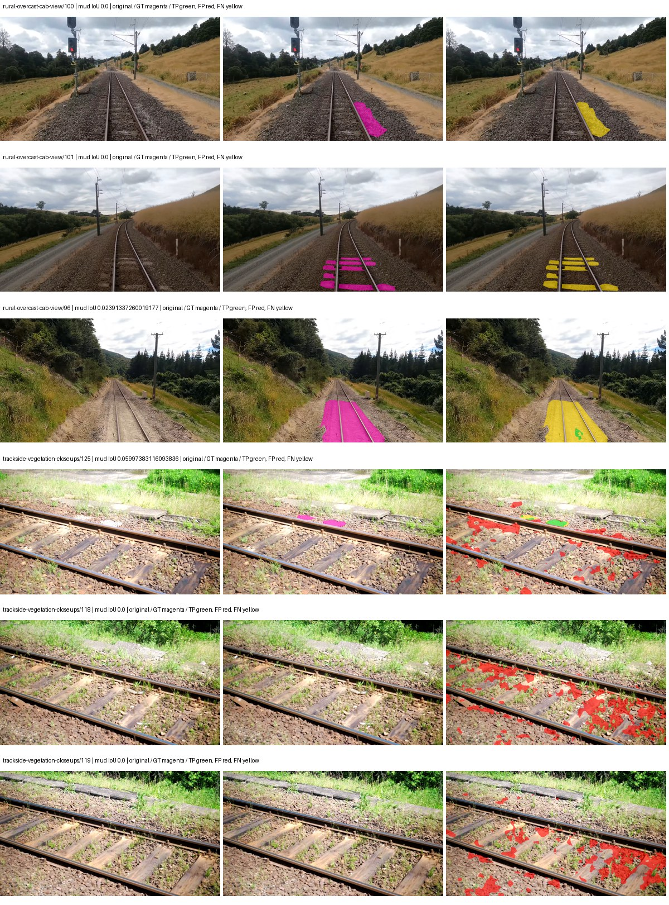
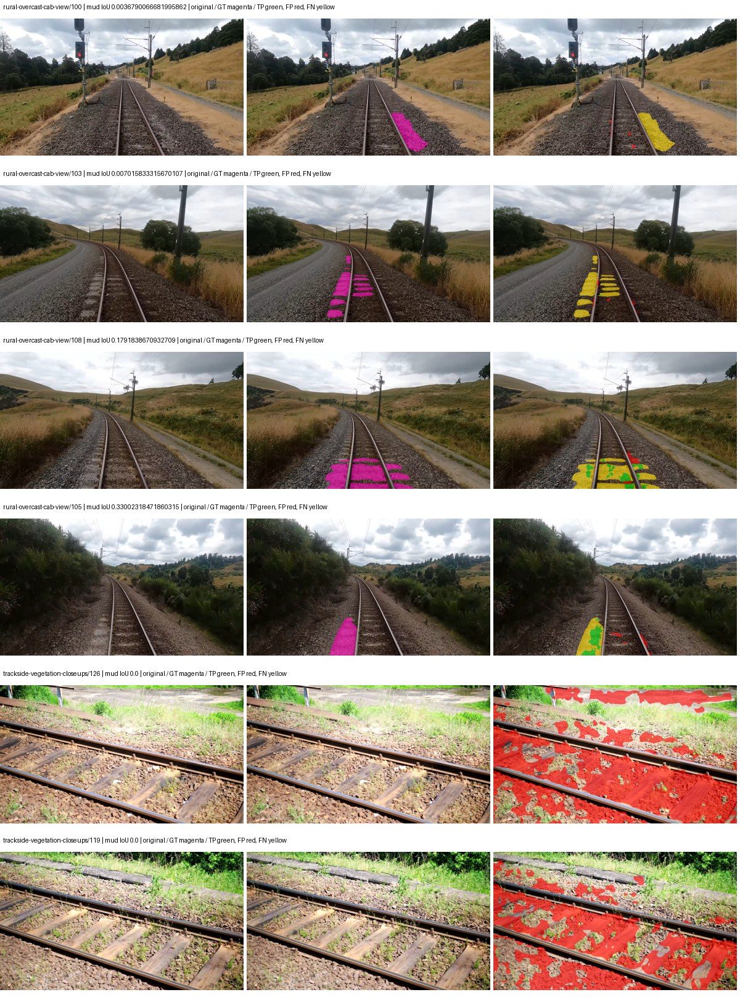
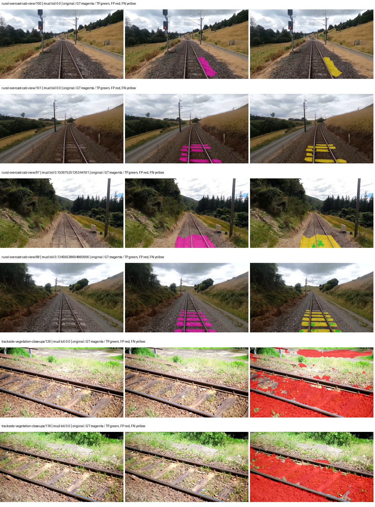
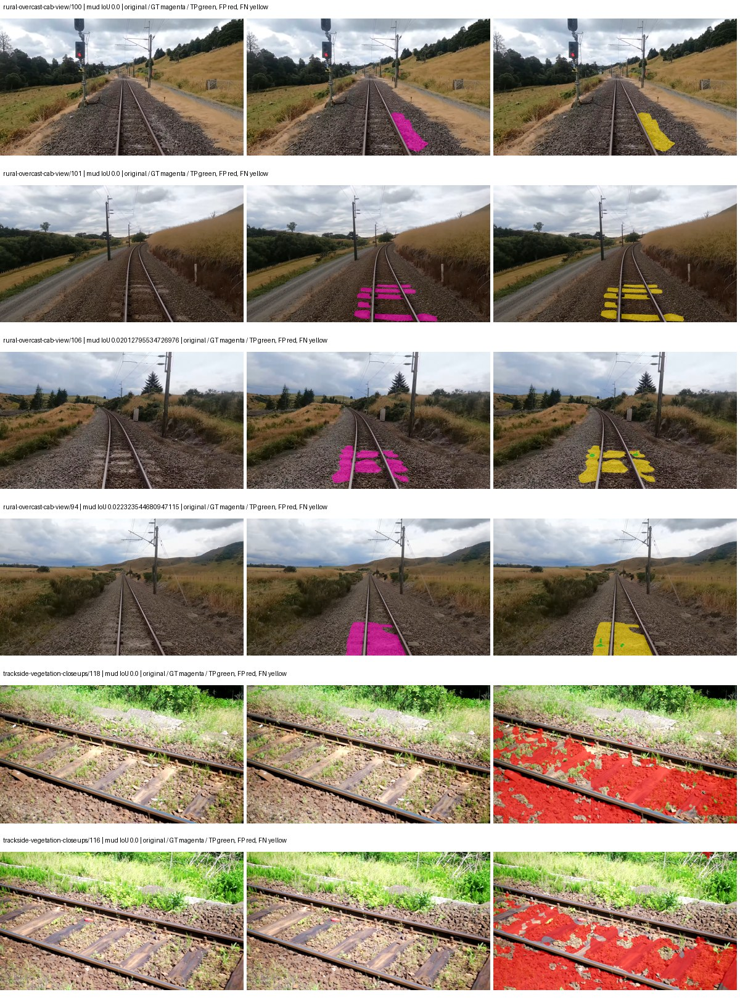
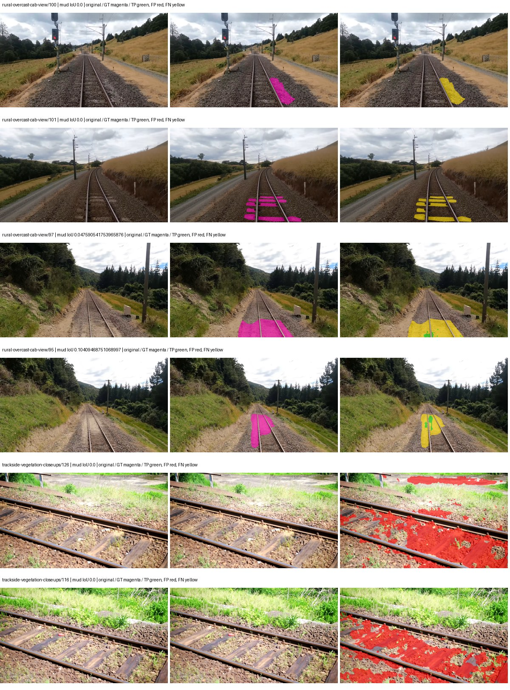
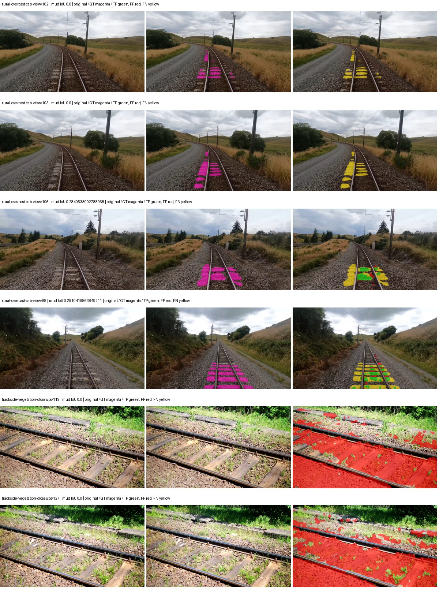
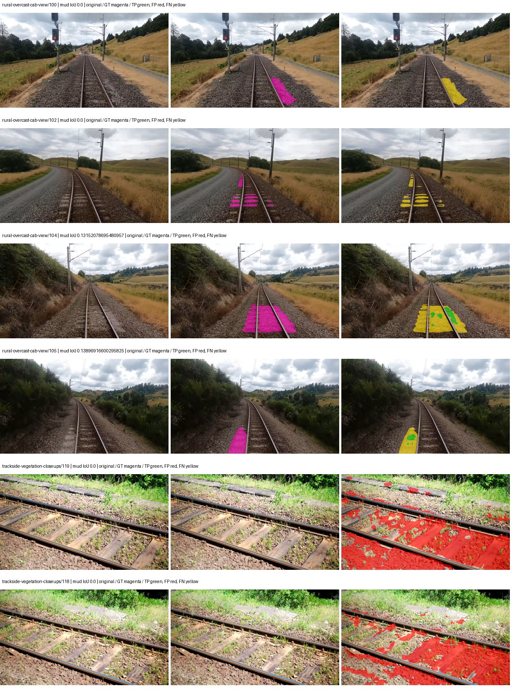
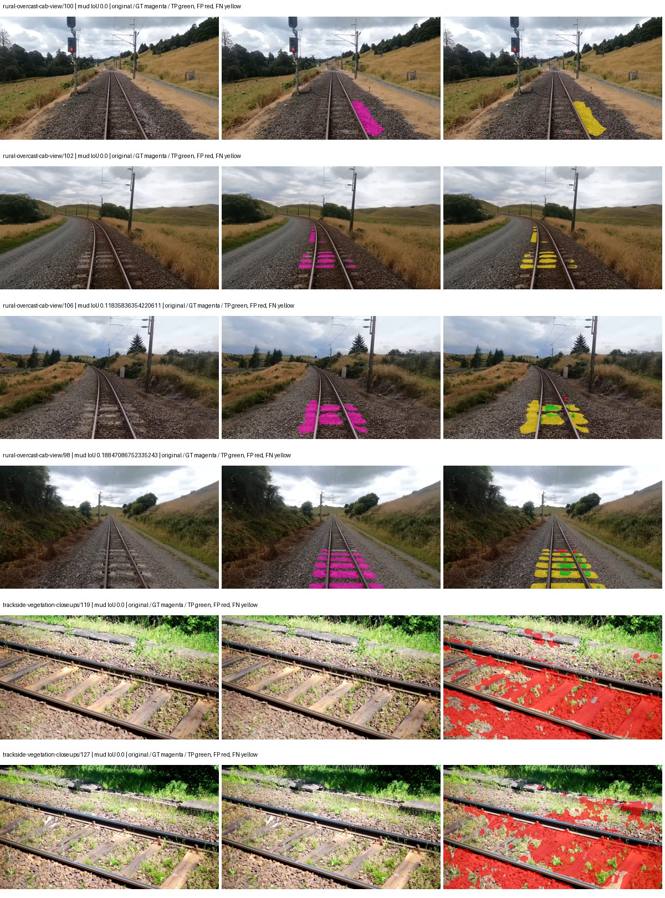
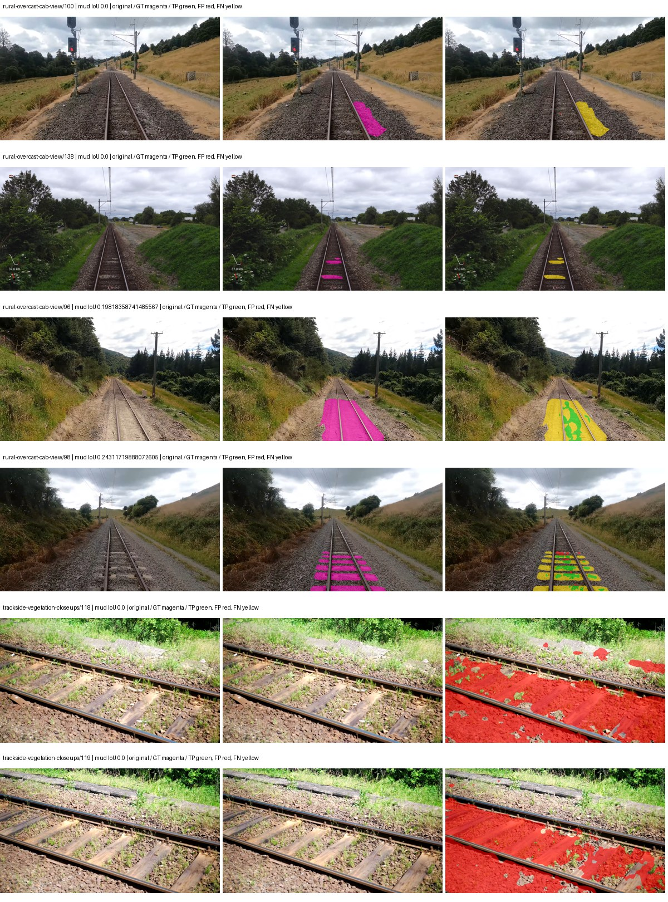
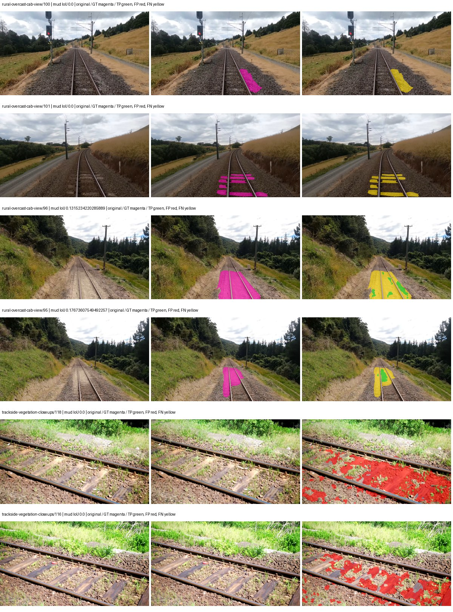

# native_mobilenetv3_large_deeplabv3plus — paul-test-rtis

[RTIS comparison](../../README.md) · [Full model records](record.json)

Primary selection and early stopping: **mud-pumping validation IoU**. A job is complete only after full statistics and isolated profiling are verified.

| Model | Initialization path | Seed | Status | Steps | Best step | Mud IoU (%) | Mud precision (%) | Mud recall (%) | Final mud IoU (trainer val, %) | mIoU (%) | Fixed GT-class mIoU (%) |
| --- | --- | --- | --- | --- | --- | --- | --- | --- | --- | --- | --- |
| native_mobilenetv3_large_deeplabv3plus | rtis_only | 0 | completed | 1527 | 254 | 2.27 | 2.53 | 18.02 | 0.16 | 20.78 | 21.93 |
| native_mobilenetv3_large_deeplabv3plus | rtis_only | 1 | completed | 2036 | 2036 | 0.47 | 0.92 | 0.97 | 0.48 | 28.45 | 33.19 |
| native_mobilenetv3_large_deeplabv3plus | rtis_only | 2 | completed | 1781 | 509 | 1.99 | 2.44 | 9.66 | 0.88 | 22.70 | 25.22 |
| native_mobilenetv3_large_deeplabv3plus | cityscapes_to_rtis | 0 | completed | 2800 | 1527 | 0.67 | 0.78 | 4.59 | 0.66 | 26.64 | 31.08 |
| native_mobilenetv3_large_deeplabv3plus | cityscapes_to_rtis | 1 | completed | 1781 | 1781 | 0.24 | 0.30 | 1.15 | 0.24 | 27.14 | 31.66 |
| native_mobilenetv3_large_deeplabv3plus | cityscapes_to_rtis | 2 | completed | 2290 | 2290 | 0.52 | 0.68 | 2.18 | 0.52 | 27.81 | 32.45 |
| native_mobilenetv3_large_deeplabv3plus | railsem19_to_rtis | 0 | completed | 2800 | 1527 | 1.90 | 2.16 | 13.52 | 0.37 | 36.09 | 42.11 |
| native_mobilenetv3_large_deeplabv3plus | railsem19_to_rtis | 1 | completed | 3309 | 2036 | 1.42 | 1.76 | 6.86 | 0.83 | 34.29 | 40.01 |
| native_mobilenetv3_large_deeplabv3plus | railsem19_to_rtis | 2 | completed | 2036 | 763 | 0.92 | 1.13 | 4.93 | 0.46 | 33.17 | 36.85 |
| native_mobilenetv3_large_deeplabv3plus | cityscapes_to_railsem19_to_rtis | 0 | training | 2649 | — | — | — | — | — | — | — |
| native_mobilenetv3_large_deeplabv3plus | cityscapes_to_railsem19_to_rtis | 1 | completed | 1781 | 509 | 1.43 | 1.74 | 7.65 | 0.42 | 27.08 | 31.60 |
| native_mobilenetv3_large_deeplabv3plus | cityscapes_to_railsem19_to_rtis | 2 | completed | 2290 | 1018 | 1.30 | 1.91 | 3.93 | 0.23 | 35.69 | 41.63 |

Training: 220 images. Validation: 37 images. Test: 50 held out. Seeds: [0, 1, 2]. Seed variation measures optimization variability, not independent-recording uncertainty. Historical source checkpoints stay fixed across adaptation seeds.

Training code: `066afb2626398b7be59d4d19f5a0e4644fd59adc`. Split SHA-256: `71fef8292610c352da0709fe3bd030f3bcc18f97560394835f4b22826463b83d`.

## rtis_only — seed 0

Status: **completed**. Started: 2026-09-06T19:26:21.145583+00:00. Finished: 2026-09-06T19:44:09.317961+00:00.

Recipe pretrained initializer: `{"arch": "native", "backbone_path": null, "batch_norm_momentum": null, "checkpoint": null, "classifier_path": null, "drop_path": null, "encoder_name": null, "encoder_weights": null, "head": "unified_head", "head_paths": [], "inactive_parameter_paths": [], "local_files_only": false, "lora_alpha": 32, "lora_dropout": 0.05, "lora_r": 16, "lora_targets": [], "native": {"auxiliary_heads": [], "backbone": {"in_channels": 3, "kind": "timm", "name": "mobilenetv3_large_100.ra_in1k", "out_indices": [1, 2, 3, 4], "weights": "pretrained"}, "head": {"activation": "relu", "channels": 160, "dilation_rates": [6, 12, 18], "dropout": 0.1, "high_index": 3, "kind": "deeplabv3plus", "low_channels": 32, "low_index": 0, "norm": "group"}, "neck": {"kind": "identity"}, "task": "multiclass"}, "revision": null, "smp_arch": null, "subfolder": null, "trust_remote_code": false, "tuning": "full"}`.

`rtis_only` uses the recipe initializer, which may include pretrained segmentation components. Transfer paths load the exact historical source checkpoint below and reset the classifier; they do not reset all query/decoder features.

Source checkpoint: `Recipe pretrained initialization`.

Config SHA-256: `a619272cd78a84f939eae60da756c99db9a727bc5101a2eec2bfab884755fca6`. Weights used for validation: `raw`.

### Mud-pumping and aggregate quality

| Metric | Selected checkpoint | Final training validation |
| --- | --- | --- |
| Mud IoU | 2.27 | 0.16 |
| Mud precision | 2.53 | 0.25 |
| Mud recall | 18.02 | 0.43 |
| Mud Dice/F1 | 4.43 | 0.32 |
| mIoU | 20.78 | 26.19 |
| Mean accuracy | 26.55 | 37.87 |
| Mean precision | 36.98 | 43.61 |
| Mean Dice | 26.15 | 33.50 |
| Mean specificity | 98.59 | 98.84 |
| Pixel accuracy | 76.23 | 81.88 |
| Frequency-weighted IoU | 67.15 | 71.78 |
| Fixed GT-present class mIoU | 21.93 | 30.56 |
| Boundary F1 | 23.84 | 30.40 |

The selected checkpoint has independent evaluation evidence. Final values are the trainer's final validation record, not a new independent evaluation. mIoU averages classes with nonzero union, so false positives on absent classes can change its denominator. The fixed GT-class mean is supplementary and excludes absent classes; their false positives remain in the confusion matrix.

### Resource usage and timing

| Measurement | Value |
| --- | --- |
| Peak training VRAM, retained training invocation (GiB) | 7.46 |
| Peak evaluation VRAM (GiB) | 6.82 |
| Retained training invocation wall time (seconds) | 947.45 |
| Retained training invocation GPU-hours (one GPU) | 0.26 |
| Evaluation wall time (seconds) | 11.02 |
| Full evaluation pipeline images/second | 3.36 |
| Best full-state checkpoint (MiB) | 123.69 |
| Final full-state checkpoint (MiB) | 123.68 |
| Audited periodic checkpoints removed (GiB) | 0.36 |

VRAM uses the recorded allocator high-water mark; it is not total device usage including CUDA context. Resumed jobs' retained training invocation times and peaks are **not whole-campaign totals**. Earlier invocation resource records are not reconstructed here. Evaluation throughput includes loader, sliding-window inference and metrics; it is not model-only latency/FPS. Missing measurements are shown as —, never inferred from another dataset's run.

### Standardized inference performance

Dedicated model-only profiling waits for an idle worker-locked L40S: BF16, batch 1, 1024x1024, 20 warmup and 100 CUDA-event-timed public forwards. It excludes loading, preprocessing, tiling and metrics.

| Status | Parameters | Weight MiB | FPS | p50 ms | p95 ms | Peak reserved GiB |
| --- | --- | --- | --- | --- | --- | --- |
| complete | 8067845 | 30.78 | 155.33 | 6.30 | 7.37 | 0.44 |

```json
{
  "schema_version": 1,
  "model_id": "native_mobilenetv3_large_deeplabv3plus",
  "measured_at": "2026-09-06T19:44:07+00:00",
  "status": "complete",
  "benchmark_scope": "rtis_selected_checkpoint_model_only",
  "applies_to": [
    "native_mobilenetv3_large_deeplabv3plus--rtis_only--seed-0"
  ],
  "source": {
    "campaign_git_sha": "066afb2626398b7be59d4d19f5a0e4644fd59adc",
    "git_dirty": false,
    "config_hash": "7673e35c74fe",
    "resolved_config": "/data/izadia1/projects/segmentary-runs/paul-test-rtis/mud-fullstats-v1-20260906-r2/configs/native_mobilenetv3_large_deeplabv3plus--rtis_only--seed-0.yaml",
    "config_sha256": "a619272cd78a84f939eae60da756c99db9a727bc5101a2eec2bfab884755fca6",
    "checkpoint_sha256": "89275e2a7c8b795899753206c4af323a101c7fb6e6daf448999d3f5da871139d",
    "checkpoint_global_step": 254,
    "checkpoint_bytes": 129696162,
    "checkpoint_kind": "resume checkpoint with optimizer and EMA state",
    "weights": "raw",
    "measured_checkpoint_job_id": "native_mobilenetv3_large_deeplabv3plus--rtis_only--seed-0",
    "result_sha256": "79619db889503692feff280726cf7fa0d7491653d31020ff00967b88ac8c8647",
    "result_git_sha": "066afb2626398b7be59d4d19f5a0e4644fd59adc",
    "result_stage": "eval:paul-test-rtis:val",
    "result_seed": 0
  },
  "hardware": {
    "gpu_name": "NVIDIA L40S",
    "gpu_uuid": "GPU-804aea8b-5f62-423e-72c6-49e1ed15c4e4",
    "logical_device": "cuda:0",
    "physical_visibility_token": "6",
    "compute_capability": [
      8,
      9
    ],
    "total_memory_bytes": 47677177856
  },
  "model": {
    "parameter_count": 8067845,
    "trainable_parameter_count": 8067845,
    "resident_parameter_bytes": 32271380,
    "parameter_dtype_counts": {
      "float32": 8067845
    }
  },
  "contract": {
    "backend": "pytorch",
    "precision": "bf16_autocast",
    "batch_size": 1,
    "input_shape_nchw": [
      1,
      3,
      1024,
      1024
    ],
    "warmup_iterations": 20,
    "measured_iterations": 100,
    "timing": "per-forward CUDA events with end-event synchronization",
    "includes_preprocessing": false,
    "includes_data_loader": false,
    "includes_sliding_window": false,
    "input_resident_on_gpu": true,
    "model_only": true,
    "entrypoint": "public model(image) dense-logits forward"
  },
  "measurements": {
    "latency": {
      "p50_ms": 6.29862380027771,
      "p95_ms": 7.369830465316772,
      "mean_ms": 6.438101773262024,
      "minimum_ms": 5.678080081939697,
      "maximum_ms": 8.10086441040039,
      "fps": 155.32528611975098,
      "raw_ms": [
        5.8173441886901855,
        6.2740159034729,
        6.385663986206055,
        5.714943885803223,
        6.418432235717773,
        6.334464073181152,
        6.122496128082275,
        6.685696125030518,
        6.129663944244385,
        6.2218241691589355,
        7.0830078125,
        6.4337921142578125,
        6.131711959838867,
        6.491136074066162,
        6.48089599609375,
        6.122496128082275,
        6.037504196166992,
        6.236159801483154,
        6.1511359214782715,
        5.966847896575928,
        5.799935817718506,
        7.265279769897461,
        6.989823818206787,
        6.474751949310303,
        6.042623996734619,
        5.954559803009033,
        5.944320201873779,
        6.494207859039307,
        6.650879859924316,
        5.963776111602783,
        6.2412800788879395,
        7.3164801597595215,
        6.490111827850342,
        6.138879776000977,
        6.3447041511535645,
        7.33900785446167,
        6.299647808074951,
        5.942272186279297,
        5.995520114898682,
        6.427648067474365,
        5.941247940063477,
        6.199295997619629,
        6.4235520362854,
        5.805056095123291,
        5.798912048339844,
        5.933055877685547,
        5.97811222076416,
        6.791168212890625,
        6.551551818847656,
        6.906879901885986,
        6.899712085723877,
        6.21670389175415,
        6.033376216888428,
        6.692863941192627,
        5.958655834197998,
        6.985727787017822,
        6.922239780426025,
        6.096896171569824,
        6.7491841316223145,
        6.0938239097595215,
        5.854207992553711,
        5.914624214172363,
        5.976064205169678,
        6.258687973022461,
        7.4496002197265625,
        7.929855823516846,
        8.10086441040039,
        7.984127998352051,
        6.28223991394043,
        6.289408206939697,
        6.1675519943237305,
        6.379519939422607,
        6.052864074707031,
        6.600704193115234,
        6.936575889587402,
        6.074368000030518,
        7.168000221252441,
        7.052288055419922,
        6.297599792480469,
        5.842944145202637,
        6.228991985321045,
        6.8823041915893555,
        6.269951820373535,
        6.427648067474365,
        6.797311782836914,
        6.895616054534912,
        7.365632057189941,
        7.215104103088379,
        7.08403205871582,
        6.545407772064209,
        6.400000095367432,
        6.231040000915527,
        7.532544136047363,
        6.899712085723877,
        6.371327877044678,
        5.875711917877197,
        5.711872100830078,
        5.726208209991455,
        5.678080081939697,
        6.726624011993408
      ],
      "percentile_method": "numpy linear interpolation"
    },
    "peak_reserved_bytes": 471859200,
    "memory_kind": "pytorch_cuda_allocator_peak_reserved_excluding_context",
    "benchmark_wall_clock_s": 16.427994340658188
  },
  "started_at": "2026-09-06T19:43:50+00:00",
  "finished_at": "2026-09-06T19:44:07+00:00",
  "environment": {
    "hostname": "hdrfs-app-001",
    "python": "3.11.15",
    "platform": "Linux-5.15.0-139-generic-x86_64-with-glibc2.35",
    "torch": "2.11.0+cu128",
    "torch_cuda": "12.8",
    "cudnn": 91900,
    "driver_version": "570.133.20",
    "cuda_available": true,
    "gpu_count": 1,
    "gpu_names": [
      "NVIDIA L40S"
    ],
    "cuda_visible_devices": "6",
    "packages": {
      "segmentary": "0.1.0",
      "torch": "2.11.0+cu128",
      "torchvision": "0.26.0+cu128",
      "transformers": "5.15.0",
      "timm": "1.0.28",
      "segmentation-models-pytorch": "0.5.0",
      "albumentations": "2.0.8",
      "lightning": "2.6.5",
      "numpy": "2.4.4"
    }
  }
}
```

### Per-class validation results

| Class | GT pixels | IoU (%) | Precision (%) | Recall (%) | Dice (%) | Boundary F1 (%) |
| --- | --- | --- | --- | --- | --- | --- |
| car | 29664 | 0.00 | 0.00 | 0.00 | 0.00 | 0.00 |
| construction | 311585 | 17.25 | 60.23 | 19.46 | 29.42 | 36.53 |
| fence | 265137 | 2.57 | 25.08 | 2.79 | 5.02 | 18.80 |
| mud-pumping | 1226250 | 2.27 | 2.53 | 18.02 | 4.43 | 7.80 |
| on-rails | 0 | 0.00 | 0.00 | — | 0.00 | 0.00 |
| person | 0 | — | — | — | — | — |
| pole | 628038 | 44.89 | 69.17 | 56.12 | 61.96 | 73.26 |
| rail-embedded | 16799 | 0.00 | 0.00 | 0.00 | 0.00 | 0.00 |
| rail-raised | 2969797 | 64.81 | 76.85 | 80.54 | 78.65 | 84.01 |
| rail-track | 6323197 | 23.40 | 66.65 | 26.51 | 37.93 | 39.85 |
| road | 1048831 | 0.00 | 0.00 | 0.00 | 0.00 | 0.00 |
| sidewalk | 1297367 | 14.81 | 99.78 | 14.81 | 25.80 | 8.65 |
| sky | 19121606 | 92.77 | 99.26 | 93.42 | 96.25 | 80.04 |
| standing-water | 95802 | 0.00 | 0.00 | 0.00 | 0.00 | 0.00 |
| terrain | 39239306 | 84.65 | 87.27 | 96.58 | 91.69 | 52.27 |
| trackbed | 10643081 | 46.00 | 58.53 | 68.25 | 63.01 | 45.73 |
| traffic-light | 19510 | 0.00 | 0.00 | 0.00 | 0.00 | 0.00 |
| traffic-sign | 13285 | 0.00 | 0.00 | 0.00 | 0.00 | 0.00 |
| tram-track | 56179 | 0.00 | 0.00 | 0.00 | 0.00 | 0.00 |
| truck | 0 | — | — | — | — | — |
| vegetation-overgrowth | 5901821 | 1.35 | 57.35 | 1.36 | 2.66 | 6.00 |

### Full-run accounting

| Measurement | Value |
| --- | --- |
| Full GPU-reserved wall seconds, all recorded worker attempts | 1068.18 |
| Full reserved GPU-hours | 0.30 |
| Whole-run timing complete | True |

| Phase | Wall seconds including failed attempts |
| --- | --- |
| training | 954.47 |
| diagnostics | 71.71 |
| performance | 23.16 |

GPU-reserved time includes model loading, training, validation, collection, profiling, checkpoint I/O and orchestration while the worker owns one GPU. It is not GPU kernel-active time. Phase timings and sampled device memory/power/utilization are retained separately; sampled device memory is not the allocator high-water mark.

### Train/validation and raw/EMA diagnostics

| Checkpoint / weights / split | Images | Mud IoU (%) | Mud precision (%) | Mud recall (%) |
| --- | --- | --- | --- | --- |
| best-auto-train / raw | 220 | 76.72 | 80.35 | 94.44 |
| best-auto-val / raw | 37 | 2.27 | 2.53 | 18.02 |
| best-alternate-val / ema | 37 | 0.20 | 0.24 | 1.41 |
| final-auto-val / raw | 37 | 0.16 | 0.25 | 0.43 |

Train uses the evaluation transform without augmentation. Compare mud train/validation metrics for the same selected weights. Alternate EMA on running-stat BatchNorm is explicitly uncalibrated and is diagnostic only. Score-threshold curves use uncalibrated normalized scores and are pixel-level diagnostics, not event detection rates or a selected deployment operating point.

### Downloadable evidence

- best-auto-train: [per-image.csv](rtis_only--seed-0/best-auto-train/per-image.csv) · [per-image-confusion.json.gz](rtis_only--seed-0/best-auto-train/per-image-confusion.json.gz) · [groups.json](rtis_only--seed-0/best-auto-train/groups.json) · [mud-score-curves.json](rtis_only--seed-0/best-auto-train/mud-score-curves.json)
- best-auto-val: [per-image.csv](rtis_only--seed-0/best-auto-val/per-image.csv) · [per-image-confusion.json.gz](rtis_only--seed-0/best-auto-val/per-image-confusion.json.gz) · [groups.json](rtis_only--seed-0/best-auto-val/groups.json) · [mud-score-curves.json](rtis_only--seed-0/best-auto-val/mud-score-curves.json) · [examples.jpg](rtis_only--seed-0/best-auto-val/examples.jpg)
- best-alternate-val: [per-image.csv](rtis_only--seed-0/best-alternate-val/per-image.csv) · [per-image-confusion.json.gz](rtis_only--seed-0/best-alternate-val/per-image-confusion.json.gz) · [groups.json](rtis_only--seed-0/best-alternate-val/groups.json) · [mud-score-curves.json](rtis_only--seed-0/best-alternate-val/mud-score-curves.json)
- final-auto-val: [per-image.csv](rtis_only--seed-0/final-auto-val/per-image.csv) · [per-image-confusion.json.gz](rtis_only--seed-0/final-auto-val/per-image-confusion.json.gz) · [groups.json](rtis_only--seed-0/final-auto-val/groups.json) · [mud-score-curves.json](rtis_only--seed-0/final-auto-val/mud-score-curves.json)
- resources: [telemetry.csv](rtis_only--seed-0/resources/telemetry.csv)


Examples are two lowest and two highest mud-IoU positive images, plus up to two negative images with the most false-positive mud pixels. They are targeted diagnostic examples, not random samples. Green: true positive; red: false positive; yellow: false negative. Full predictions remain on HDRFS.

### Validation tracking

| Logged step | Overall mIoU (%) | Mud IoU (%) |
| --- | --- | --- |
| 254 | 20.77 | 2.27 |
| 508 | 22.38 | 0.15 |
| 763 | 24.24 | 0.16 |
| 1017 | 25.43 | 0.32 |
| 1272 | 25.15 | 0.21 |
| 1527 | 26.19 | 0.16 |

All retained scalar curves, including training loss and per-class IoU, are in record.json. Observed best mud on a curve is not necessarily a retained checkpoint: the pilot saved its selection-metric-best and final checkpoints. Step logging and checkpoint global_step may differ by one.

### Stopping and checkpoint provenance

```json
{
  "stopping": {
    "actual_steps": 1527,
    "maximum_steps": 4000,
    "min_delta": 0.001,
    "monitor": "val_iou/mud-pumping",
    "patience": 5,
    "reason": "validation_plateau"
  },
  "checkpoints": {
    "best": {
      "path": "/data/izadia1/projects/segmentary-runs/paul-test-rtis/mud-fullstats-v1-20260906-r2/future-runs/native_mobilenetv3_large_deeplabv3plus--rtis_only--seed-0_seed0/rtis/best.ckpt",
      "sha256": "89275e2a7c8b795899753206c4af323a101c7fb6e6daf448999d3f5da871139d",
      "global_step": 254,
      "bytes": 129696162
    },
    "final": {
      "path": "/data/izadia1/projects/segmentary-runs/paul-test-rtis/mud-fullstats-v1-20260906-r2/future-runs/native_mobilenetv3_large_deeplabv3plus--rtis_only--seed-0_seed0/rtis/last.ckpt",
      "sha256": "2f28df8927aed8f29337e2d1206e552bf926331cbe069d1c40a46c2927bd4806",
      "global_step": 1527,
      "bytes": 129684642
    }
  },
  "cleanup_error": null
}
```

### Resolved training, initialization and evaluation settings

The optimizer block is the base configuration. Stage LR scales are applied at runtime, and stage warmup is capped at min(base warmup, floor(stage budget / 10), stage budget - 1): 400 steps for this 4,000-step pilot. Model-internal native input grids may differ from augmentation crops (EoMT uses its 640 grid).

```json
{
  "name": "native_mobilenetv3_large_deeplabv3plus--rtis_only--seed-0",
  "model": {
    "arch": "native",
    "checkpoint": null,
    "tuning": "full",
    "head": "unified_head",
    "lora_r": 16,
    "lora_alpha": 32,
    "lora_dropout": 0.05,
    "lora_targets": [],
    "drop_path": null,
    "revision": null,
    "subfolder": null,
    "local_files_only": false,
    "trust_remote_code": false,
    "backbone_path": null,
    "head_paths": [],
    "classifier_path": null,
    "inactive_parameter_paths": [],
    "smp_arch": null,
    "encoder_name": null,
    "encoder_weights": null,
    "native": {
      "task": "multiclass",
      "backbone": {
        "kind": "timm",
        "name": "mobilenetv3_large_100.ra_in1k",
        "weights": "pretrained",
        "out_indices": [
          1,
          2,
          3,
          4
        ],
        "in_channels": 3
      },
      "neck": {
        "kind": "identity"
      },
      "head": {
        "kind": "deeplabv3plus",
        "low_index": 0,
        "high_index": 3,
        "channels": 160,
        "low_channels": 32,
        "dilation_rates": [
          6,
          12,
          18
        ],
        "dropout": 0.1,
        "norm": "group",
        "activation": "relu"
      },
      "auxiliary_heads": []
    },
    "batch_norm_momentum": null
  },
  "space": "paul-test-rtis",
  "taxonomy_root": "/data/izadia1/projects/segmentary-rtis-fullstats-066afb2/taxonomy",
  "output_root": "/data/izadia1/projects/segmentary-runs/paul-test-rtis/mud-fullstats-v1-20260906-r2/future-runs",
  "optim": {
    "backbone_lr": 0.0001,
    "head_lr_mult": 10.0,
    "weight_decay": 0.05,
    "llrd": 1.0,
    "warmup_iters": 1500,
    "warmup_ratio": 1e-06,
    "poly_power": 0.9,
    "min_lr_ratio": 0.0,
    "betas": [
      0.9,
      0.999
    ],
    "grad_clip": 1.0
  },
  "train": {
    "iters": 4000,
    "batch_size": 2,
    "accum": 8,
    "num_workers": 2,
    "precision": "bf16-mixed",
    "ema_decay": 0.9998,
    "val_every": 250,
    "ckpt_every": 500,
    "selection_metric": "val_iou/mud-pumping",
    "early_stopping_patience": 5,
    "early_stopping_min_delta": 0.001,
    "seed": 0,
    "devices": 1
  },
  "eval": {
    "sliding_window": true,
    "window": [
      1024,
      1024
    ],
    "stride": [
      768,
      768
    ],
    "batch_size": 1,
    "num_workers": 2,
    "tta_scales": [],
    "tta_flip": false,
    "threshold": 0.5,
    "boundary_tolerance_frac": 0.0075,
    "save_confusion": true
  },
  "loss": {
    "task": "multiclass",
    "activation": "auto",
    "terms": [],
    "aux": "none",
    "aux_weight": 0.0,
    "ce_weight": 1.0,
    "label_smoothing": 0.0,
    "class_weights": null,
    "query": null
  },
  "aug": {
    "crop": [
      1024,
      1024
    ],
    "scale_min": 0.5,
    "scale_max": 2.0,
    "hflip_p": 0.5,
    "color_jitter_p": 0.5,
    "brightness": 0.25,
    "contrast": 0.25,
    "saturation": 0.25,
    "hue": 0.05
  },
  "stages": [
    {
      "name": "rtis",
      "data": [
        {
          "name": "paul-test-rtis",
          "root": "/data/izadia1/datasets/paul-test-rtis",
          "variant": null,
          "split_file": "splits.json",
          "train_split": "train",
          "val_split": "val",
          "limit": null,
          "loader": "folder",
          "mapping": "paul-test-rtis",
          "loader_options": {
            "require_groups": true
          }
        }
      ],
      "iters": null,
      "lr_scale": 1.0,
      "head_group_lr_scale": 1.0,
      "init_from": "pretrained",
      "reset_head": false,
      "freeze": null,
      "sample_weights": null
    }
  ]
}
```

### Hardware and software provenance

```json
{
  "training": {
    "cuda_available": true,
    "cuda_visible_devices": "6",
    "cudnn": 91900,
    "driver_version": "570.133.20",
    "gpu_count": 1,
    "gpu_names": [
      "NVIDIA L40S"
    ],
    "hostname": "hdrfs-app-001",
    "input_normalization": {
      "channel_order": "rgb",
      "mean": [
        0.485,
        0.456,
        0.406
      ],
      "source": "timm_pretrained_cfg",
      "std": [
        0.229,
        0.224,
        0.225
      ]
    },
    "model_origins": [
      {
        "hf_commit": null,
        "hf_name_or_path": null,
        "module": "backbone",
        "timm_pretrained": {
          "architecture": "mobilenetv3_large_100",
          "hf_hub_id": "timm/mobilenetv3_large_100.ra_in1k",
          "tag": "ra_in1k",
          "url": "https://github.com/rwightman/pytorch-image-models/releases/download/v0.1-weights/mobilenetv3_large_100_ra-f55367f5.pth"
        }
      },
      {
        "hf_commit": null,
        "hf_name_or_path": null,
        "module": "backbone.model",
        "timm_pretrained": {
          "architecture": "mobilenetv3_large_100",
          "hf_hub_id": "timm/mobilenetv3_large_100.ra_in1k",
          "tag": "ra_in1k",
          "url": "https://github.com/rwightman/pytorch-image-models/releases/download/v0.1-weights/mobilenetv3_large_100_ra-f55367f5.pth"
        }
      }
    ],
    "model_parameter_count": 8067845,
    "packages": {
      "albumentations": "2.0.8",
      "lightning": "2.6.5",
      "numpy": "2.4.4",
      "segmentary": "0.1.0",
      "segmentation-models-pytorch": "0.5.0",
      "timm": "1.0.28",
      "torch": "2.11.0+cu128",
      "torchvision": "0.26.0+cu128",
      "transformers": "5.15.0"
    },
    "platform": "Linux-5.15.0-139-generic-x86_64-with-glibc2.35",
    "python": "3.11.15",
    "torch": "2.11.0+cu128",
    "torch_cuda": "12.8",
    "trainable_parameter_count": 8067845,
    "training_stop": {
      "actual_steps": 1527,
      "maximum_steps": 4000,
      "min_delta": 0.001,
      "monitor": "val_iou/mud-pumping",
      "patience": 5,
      "reason": "validation_plateau"
    },
    "validation_weights": "raw"
  },
  "evaluation": {
    "cuda_available": true,
    "cuda_visible_devices": "6",
    "cudnn": 91900,
    "driver_version": "570.133.20",
    "gpu_count": 1,
    "gpu_names": [
      "NVIDIA L40S"
    ],
    "hostname": "hdrfs-app-001",
    "input_normalization": {
      "channel_order": "rgb",
      "mean": [
        0.485,
        0.456,
        0.406
      ],
      "source": "timm_pretrained_cfg",
      "std": [
        0.229,
        0.224,
        0.225
      ]
    },
    "packages": {
      "albumentations": "2.0.8",
      "lightning": "2.6.5",
      "numpy": "2.4.4",
      "segmentary": "0.1.0",
      "segmentation-models-pytorch": "0.5.0",
      "timm": "1.0.28",
      "torch": "2.11.0+cu128",
      "torchvision": "0.26.0+cu128",
      "transformers": "5.15.0"
    },
    "platform": "Linux-5.15.0-139-generic-x86_64-with-glibc2.35",
    "python": "3.11.15",
    "torch": "2.11.0+cu128",
    "torch_cuda": "12.8"
  }
}
```

## rtis_only — seed 1

Status: **completed**. Started: 2026-09-06T19:26:35.267028+00:00. Finished: 2026-09-06T19:49:30.229086+00:00.

Recipe pretrained initializer: `{"arch": "native", "backbone_path": null, "batch_norm_momentum": null, "checkpoint": null, "classifier_path": null, "drop_path": null, "encoder_name": null, "encoder_weights": null, "head": "unified_head", "head_paths": [], "inactive_parameter_paths": [], "local_files_only": false, "lora_alpha": 32, "lora_dropout": 0.05, "lora_r": 16, "lora_targets": [], "native": {"auxiliary_heads": [], "backbone": {"in_channels": 3, "kind": "timm", "name": "mobilenetv3_large_100.ra_in1k", "out_indices": [1, 2, 3, 4], "weights": "pretrained"}, "head": {"activation": "relu", "channels": 160, "dilation_rates": [6, 12, 18], "dropout": 0.1, "high_index": 3, "kind": "deeplabv3plus", "low_channels": 32, "low_index": 0, "norm": "group"}, "neck": {"kind": "identity"}, "task": "multiclass"}, "revision": null, "smp_arch": null, "subfolder": null, "trust_remote_code": false, "tuning": "full"}`.

`rtis_only` uses the recipe initializer, which may include pretrained segmentation components. Transfer paths load the exact historical source checkpoint below and reset the classifier; they do not reset all query/decoder features.

Source checkpoint: `Recipe pretrained initialization`.

Config SHA-256: `7761a4ee767ee68a1e30af4b0932e860cf10abd5548245eff7196893492c98b1`. Weights used for validation: `raw`.

### Mud-pumping and aggregate quality

| Metric | Selected checkpoint | Final training validation |
| --- | --- | --- |
| Mud IoU | 0.47 | 0.48 |
| Mud precision | 0.92 | 0.92 |
| Mud recall | 0.97 | 0.97 |
| Mud Dice/F1 | 0.94 | 0.95 |
| mIoU | 28.45 | 28.45 |
| Mean accuracy | 42.87 | 42.87 |
| Mean precision | 45.04 | 45.04 |
| Mean Dice | 36.71 | 36.71 |
| Mean specificity | 98.94 | 98.94 |
| Pixel accuracy | 83.11 | 83.11 |
| Frequency-weighted IoU | 73.37 | 73.37 |
| Fixed GT-present class mIoU | 33.19 | 33.19 |
| Boundary F1 | 32.09 | 32.11 |

The selected checkpoint has independent evaluation evidence. Final values are the trainer's final validation record, not a new independent evaluation. mIoU averages classes with nonzero union, so false positives on absent classes can change its denominator. The fixed GT-class mean is supplementary and excludes absent classes; their false positives remain in the confusion matrix.

### Resource usage and timing

| Measurement | Value |
| --- | --- |
| Peak training VRAM, retained training invocation (GiB) | 7.46 |
| Peak evaluation VRAM (GiB) | 6.82 |
| Retained training invocation wall time (seconds) | 1256.50 |
| Retained training invocation GPU-hours (one GPU) | 0.35 |
| Evaluation wall time (seconds) | 10.57 |
| Full evaluation pipeline images/second | 3.50 |
| Best full-state checkpoint (MiB) | 123.69 |
| Final full-state checkpoint (MiB) | 123.68 |
| Audited periodic checkpoints removed (GiB) | 0.48 |

VRAM uses the recorded allocator high-water mark; it is not total device usage including CUDA context. Resumed jobs' retained training invocation times and peaks are **not whole-campaign totals**. Earlier invocation resource records are not reconstructed here. Evaluation throughput includes loader, sliding-window inference and metrics; it is not model-only latency/FPS. Missing measurements are shown as —, never inferred from another dataset's run.

### Standardized inference performance

Dedicated model-only profiling waits for an idle worker-locked L40S: BF16, batch 1, 1024x1024, 20 warmup and 100 CUDA-event-timed public forwards. It excludes loading, preprocessing, tiling and metrics.

| Status | Parameters | Weight MiB | FPS | p50 ms | p95 ms | Peak reserved GiB |
| --- | --- | --- | --- | --- | --- | --- |
| complete | 8067845 | 30.78 | 168.08 | 5.81 | 6.72 | 0.44 |

```json
{
  "schema_version": 1,
  "model_id": "native_mobilenetv3_large_deeplabv3plus",
  "measured_at": "2026-09-06T19:49:27+00:00",
  "status": "complete",
  "benchmark_scope": "rtis_selected_checkpoint_model_only",
  "applies_to": [
    "native_mobilenetv3_large_deeplabv3plus--rtis_only--seed-1"
  ],
  "source": {
    "campaign_git_sha": "066afb2626398b7be59d4d19f5a0e4644fd59adc",
    "git_dirty": false,
    "config_hash": "cb438ff38c2b",
    "resolved_config": "/data/izadia1/projects/segmentary-runs/paul-test-rtis/mud-fullstats-v1-20260906-r2/configs/native_mobilenetv3_large_deeplabv3plus--rtis_only--seed-1.yaml",
    "config_sha256": "7761a4ee767ee68a1e30af4b0932e860cf10abd5548245eff7196893492c98b1",
    "checkpoint_sha256": "0a6ee724cf64786878ffca356a3c386f2d79a2ba12ac980d59b642df0564f854",
    "checkpoint_global_step": 2036,
    "checkpoint_bytes": 129696482,
    "checkpoint_kind": "resume checkpoint with optimizer and EMA state",
    "weights": "raw",
    "measured_checkpoint_job_id": "native_mobilenetv3_large_deeplabv3plus--rtis_only--seed-1",
    "result_sha256": "6f89c21a68d48d925b551b90adacd4abab44fa87bf57377ba78080835dc66ba6",
    "result_git_sha": "066afb2626398b7be59d4d19f5a0e4644fd59adc",
    "result_stage": "eval:paul-test-rtis:val",
    "result_seed": 1
  },
  "hardware": {
    "gpu_name": "NVIDIA L40S",
    "gpu_uuid": "GPU-a5ad49e5-0536-5229-ba8a-f8a902808f53",
    "logical_device": "cuda:0",
    "physical_visibility_token": "7",
    "compute_capability": [
      8,
      9
    ],
    "total_memory_bytes": 47677177856
  },
  "model": {
    "parameter_count": 8067845,
    "trainable_parameter_count": 8067845,
    "resident_parameter_bytes": 32271380,
    "parameter_dtype_counts": {
      "float32": 8067845
    }
  },
  "contract": {
    "backend": "pytorch",
    "precision": "bf16_autocast",
    "batch_size": 1,
    "input_shape_nchw": [
      1,
      3,
      1024,
      1024
    ],
    "warmup_iterations": 20,
    "measured_iterations": 100,
    "timing": "per-forward CUDA events with end-event synchronization",
    "includes_preprocessing": false,
    "includes_data_loader": false,
    "includes_sliding_window": false,
    "input_resident_on_gpu": true,
    "model_only": true,
    "entrypoint": "public model(image) dense-logits forward"
  },
  "measurements": {
    "latency": {
      "p50_ms": 5.808640003204346,
      "p95_ms": 6.723942565917969,
      "mean_ms": 5.949499187469482,
      "minimum_ms": 5.4620161056518555,
      "maximum_ms": 6.860799789428711,
      "fps": 168.08137432914467,
      "raw_ms": [
        5.52345609664917,
        5.489664077758789,
        6.276095867156982,
        6.860799789428711,
        5.718016147613525,
        5.51526403427124,
        5.60537576675415,
        5.578752040863037,
        5.46611213684082,
        5.494783878326416,
        5.472256183624268,
        5.51526403427124,
        5.549056053161621,
        5.957632064819336,
        5.492735862731934,
        6.054912090301514,
        5.543935775756836,
        5.61356782913208,
        5.603328227996826,
        6.563839912414551,
        6.640639781951904,
        5.5121917724609375,
        5.766143798828125,
        5.5121917724609375,
        5.752831935882568,
        6.181888103485107,
        6.205440044403076,
        6.370304107666016,
        6.706143856048584,
        6.478847980499268,
        5.588992118835449,
        5.533696174621582,
        5.478400230407715,
        5.467135906219482,
        5.4620161056518555,
        5.505023956298828,
        5.6145920753479,
        5.5357441902160645,
        6.842336177825928,
        6.262784004211426,
        5.813248157501221,
        6.733823776245117,
        5.63097620010376,
        5.643263816833496,
        5.669888019561768,
        6.02623987197876,
        6.21670389175415,
        6.460415840148926,
        6.052864074707031,
        6.730751991271973,
        5.995520114898682,
        5.793791770935059,
        6.577151775360107,
        6.297599792480469,
        5.687295913696289,
        5.688320159912109,
        6.02726411819458,
        6.652927875518799,
        6.021120071411133,
        5.894144058227539,
        5.777408123016357,
        6.82700777053833,
        5.711808204650879,
        5.611519813537598,
        5.886911869049072,
        6.723584175109863,
        5.786623954772949,
        5.814271926879883,
        5.8122239112854,
        6.509568214416504,
        6.379519939422607,
        5.907455921173096,
        5.798912048339844,
        6.352896213531494,
        5.690368175506592,
        5.5808000564575195,
        5.6893439292907715,
        5.604351997375488,
        6.523903846740723,
        6.007808208465576,
        6.336512088775635,
        6.030335903167725,
        6.311935901641846,
        5.862400054931641,
        6.391808032989502,
        6.300640106201172,
        5.648384094238281,
        5.545983791351318,
        5.5121917724609375,
        5.568511962890625,
        6.451200008392334,
        5.805056095123291,
        6.2126078605651855,
        6.339583873748779,
        6.457344055175781,
        5.77126407623291,
        6.258687973022461,
        5.732351779937744,
        5.550079822540283,
        5.941247940063477
      ],
      "percentile_method": "numpy linear interpolation"
    },
    "peak_reserved_bytes": 471859200,
    "memory_kind": "pytorch_cuda_allocator_peak_reserved_excluding_context",
    "benchmark_wall_clock_s": 16.47205627337098
  },
  "started_at": "2026-09-06T19:49:11+00:00",
  "finished_at": "2026-09-06T19:49:27+00:00",
  "environment": {
    "hostname": "hdrfs-app-001",
    "python": "3.11.15",
    "platform": "Linux-5.15.0-139-generic-x86_64-with-glibc2.35",
    "torch": "2.11.0+cu128",
    "torch_cuda": "12.8",
    "cudnn": 91900,
    "driver_version": "570.133.20",
    "cuda_available": true,
    "gpu_count": 1,
    "gpu_names": [
      "NVIDIA L40S"
    ],
    "cuda_visible_devices": "7",
    "packages": {
      "segmentary": "0.1.0",
      "torch": "2.11.0+cu128",
      "torchvision": "0.26.0+cu128",
      "transformers": "5.15.0",
      "timm": "1.0.28",
      "segmentation-models-pytorch": "0.5.0",
      "albumentations": "2.0.8",
      "lightning": "2.6.5",
      "numpy": "2.4.4"
    }
  }
}
```

### Per-class validation results

| Class | GT pixels | IoU (%) | Precision (%) | Recall (%) | Dice (%) | Boundary F1 (%) |
| --- | --- | --- | --- | --- | --- | --- |
| car | 29664 | 28.24 | 68.89 | 32.37 | 44.04 | 13.08 |
| construction | 311585 | 27.06 | 29.95 | 73.70 | 42.59 | 33.03 |
| fence | 265137 | 12.03 | 27.94 | 17.43 | 21.47 | 29.39 |
| mud-pumping | 1226250 | 0.47 | 0.92 | 0.97 | 0.94 | 1.20 |
| on-rails | 0 | 0.00 | 0.00 | — | 0.00 | 0.00 |
| person | 0 | 0.00 | 0.00 | — | 0.00 | 0.00 |
| pole | 628038 | 60.59 | 71.56 | 79.82 | 75.46 | 86.68 |
| rail-embedded | 16799 | 0.34 | 57.58 | 0.34 | 0.67 | 3.55 |
| rail-raised | 2969797 | 70.40 | 77.76 | 88.15 | 82.63 | 88.32 |
| rail-track | 6323197 | 43.07 | 73.28 | 51.09 | 60.20 | 57.16 |
| road | 1048831 | 5.65 | 39.01 | 6.20 | 10.70 | 17.10 |
| sidewalk | 1297367 | 38.11 | 75.98 | 43.33 | 55.19 | 10.24 |
| sky | 19121606 | 97.40 | 99.42 | 97.95 | 98.68 | 91.90 |
| standing-water | 95802 | 0.00 | 0.00 | 0.00 | 0.00 | 0.58 |
| terrain | 39239306 | 86.38 | 88.42 | 97.40 | 92.69 | 61.88 |
| trackbed | 10643081 | 55.01 | 62.94 | 81.37 | 70.98 | 49.11 |
| traffic-light | 19510 | 38.71 | 50.91 | 61.76 | 55.81 | 49.90 |
| traffic-sign | 13285 | 11.35 | 32.77 | 14.80 | 20.39 | 26.24 |
| tram-track | 56179 | 2.47 | 6.22 | 3.93 | 4.82 | 0.00 |
| truck | 0 | 0.00 | 0.00 | — | 0.00 | 0.00 |
| vegetation-overgrowth | 5901821 | 20.16 | 82.26 | 21.08 | 33.56 | 54.55 |

### Full-run accounting

| Measurement | Value |
| --- | --- |
| Full GPU-reserved wall seconds, all recorded worker attempts | 1374.97 |
| Full reserved GPU-hours | 0.38 |
| Whole-run timing complete | True |

| Phase | Wall seconds including failed attempts |
| --- | --- |
| training | 1262.81 |
| diagnostics | 70.58 |
| performance | 23.39 |

GPU-reserved time includes model loading, training, validation, collection, profiling, checkpoint I/O and orchestration while the worker owns one GPU. It is not GPU kernel-active time. Phase timings and sampled device memory/power/utilization are retained separately; sampled device memory is not the allocator high-water mark.

### Train/validation and raw/EMA diagnostics

| Checkpoint / weights / split | Images | Mud IoU (%) | Mud precision (%) | Mud recall (%) |
| --- | --- | --- | --- | --- |
| best-auto-train / raw | 220 | 92.56 | 97.21 | 95.08 |
| best-auto-val / raw | 37 | 0.47 | 0.92 | 0.97 |
| best-alternate-val / ema | 37 | 0.58 | 1.18 | 1.12 |
| final-auto-val / raw | 37 | 0.47 | 0.92 | 0.97 |

Train uses the evaluation transform without augmentation. Compare mud train/validation metrics for the same selected weights. Alternate EMA on running-stat BatchNorm is explicitly uncalibrated and is diagnostic only. Score-threshold curves use uncalibrated normalized scores and are pixel-level diagnostics, not event detection rates or a selected deployment operating point.

### Downloadable evidence

- best-auto-train: [per-image.csv](rtis_only--seed-1/best-auto-train/per-image.csv) · [per-image-confusion.json.gz](rtis_only--seed-1/best-auto-train/per-image-confusion.json.gz) · [groups.json](rtis_only--seed-1/best-auto-train/groups.json) · [mud-score-curves.json](rtis_only--seed-1/best-auto-train/mud-score-curves.json)
- best-auto-val: [per-image.csv](rtis_only--seed-1/best-auto-val/per-image.csv) · [per-image-confusion.json.gz](rtis_only--seed-1/best-auto-val/per-image-confusion.json.gz) · [groups.json](rtis_only--seed-1/best-auto-val/groups.json) · [mud-score-curves.json](rtis_only--seed-1/best-auto-val/mud-score-curves.json) · [examples.jpg](rtis_only--seed-1/best-auto-val/examples.jpg)
- best-alternate-val: [per-image.csv](rtis_only--seed-1/best-alternate-val/per-image.csv) · [per-image-confusion.json.gz](rtis_only--seed-1/best-alternate-val/per-image-confusion.json.gz) · [groups.json](rtis_only--seed-1/best-alternate-val/groups.json) · [mud-score-curves.json](rtis_only--seed-1/best-alternate-val/mud-score-curves.json)
- final-auto-val: [per-image.csv](rtis_only--seed-1/final-auto-val/per-image.csv) · [per-image-confusion.json.gz](rtis_only--seed-1/final-auto-val/per-image-confusion.json.gz) · [groups.json](rtis_only--seed-1/final-auto-val/groups.json) · [mud-score-curves.json](rtis_only--seed-1/final-auto-val/mud-score-curves.json)
- resources: [telemetry.csv](rtis_only--seed-1/resources/telemetry.csv)



Examples are two lowest and two highest mud-IoU positive images, plus up to two negative images with the most false-positive mud pixels. They are targeted diagnostic examples, not random samples. Green: true positive; red: false positive; yellow: false negative. Full predictions remain on HDRFS.

### Validation tracking

| Logged step | Overall mIoU (%) | Mud IoU (%) |
| --- | --- | --- |
| 254 | 21.53 | 0.30 |
| 508 | 21.67 | 0.27 |
| 763 | 24.43 | 0.47 |
| 1017 | 22.21 | 0.47 |
| 1272 | 25.22 | 0.44 |
| 1527 | 26.27 | 0.45 |
| 1781 | 25.67 | 0.33 |
| 2036 | 28.45 | 0.48 |

All retained scalar curves, including training loss and per-class IoU, are in record.json. Observed best mud on a curve is not necessarily a retained checkpoint: the pilot saved its selection-metric-best and final checkpoints. Step logging and checkpoint global_step may differ by one.

### Stopping and checkpoint provenance

```json
{
  "stopping": {
    "actual_steps": 2036,
    "maximum_steps": 4000,
    "min_delta": 0.001,
    "monitor": "val_iou/mud-pumping",
    "patience": 5,
    "reason": "validation_plateau"
  },
  "checkpoints": {
    "best": {
      "path": "/data/izadia1/projects/segmentary-runs/paul-test-rtis/mud-fullstats-v1-20260906-r2/future-runs/native_mobilenetv3_large_deeplabv3plus--rtis_only--seed-1_seed1/rtis/best.ckpt",
      "sha256": "0a6ee724cf64786878ffca356a3c386f2d79a2ba12ac980d59b642df0564f854",
      "global_step": 2036,
      "bytes": 129696482
    },
    "final": {
      "path": "/data/izadia1/projects/segmentary-runs/paul-test-rtis/mud-fullstats-v1-20260906-r2/future-runs/native_mobilenetv3_large_deeplabv3plus--rtis_only--seed-1_seed1/rtis/last.ckpt",
      "sha256": "f444c2b5ef1dc468d7cb6cd9d92eac03e174863553903c147a476d6b4ff9d51a",
      "global_step": 2036,
      "bytes": 129684642
    }
  },
  "cleanup_error": null
}
```

### Resolved training, initialization and evaluation settings

The optimizer block is the base configuration. Stage LR scales are applied at runtime, and stage warmup is capped at min(base warmup, floor(stage budget / 10), stage budget - 1): 400 steps for this 4,000-step pilot. Model-internal native input grids may differ from augmentation crops (EoMT uses its 640 grid).

```json
{
  "name": "native_mobilenetv3_large_deeplabv3plus--rtis_only--seed-1",
  "model": {
    "arch": "native",
    "checkpoint": null,
    "tuning": "full",
    "head": "unified_head",
    "lora_r": 16,
    "lora_alpha": 32,
    "lora_dropout": 0.05,
    "lora_targets": [],
    "drop_path": null,
    "revision": null,
    "subfolder": null,
    "local_files_only": false,
    "trust_remote_code": false,
    "backbone_path": null,
    "head_paths": [],
    "classifier_path": null,
    "inactive_parameter_paths": [],
    "smp_arch": null,
    "encoder_name": null,
    "encoder_weights": null,
    "native": {
      "task": "multiclass",
      "backbone": {
        "kind": "timm",
        "name": "mobilenetv3_large_100.ra_in1k",
        "weights": "pretrained",
        "out_indices": [
          1,
          2,
          3,
          4
        ],
        "in_channels": 3
      },
      "neck": {
        "kind": "identity"
      },
      "head": {
        "kind": "deeplabv3plus",
        "low_index": 0,
        "high_index": 3,
        "channels": 160,
        "low_channels": 32,
        "dilation_rates": [
          6,
          12,
          18
        ],
        "dropout": 0.1,
        "norm": "group",
        "activation": "relu"
      },
      "auxiliary_heads": []
    },
    "batch_norm_momentum": null
  },
  "space": "paul-test-rtis",
  "taxonomy_root": "/data/izadia1/projects/segmentary-rtis-fullstats-066afb2/taxonomy",
  "output_root": "/data/izadia1/projects/segmentary-runs/paul-test-rtis/mud-fullstats-v1-20260906-r2/future-runs",
  "optim": {
    "backbone_lr": 0.0001,
    "head_lr_mult": 10.0,
    "weight_decay": 0.05,
    "llrd": 1.0,
    "warmup_iters": 1500,
    "warmup_ratio": 1e-06,
    "poly_power": 0.9,
    "min_lr_ratio": 0.0,
    "betas": [
      0.9,
      0.999
    ],
    "grad_clip": 1.0
  },
  "train": {
    "iters": 4000,
    "batch_size": 2,
    "accum": 8,
    "num_workers": 2,
    "precision": "bf16-mixed",
    "ema_decay": 0.9998,
    "val_every": 250,
    "ckpt_every": 500,
    "selection_metric": "val_iou/mud-pumping",
    "early_stopping_patience": 5,
    "early_stopping_min_delta": 0.001,
    "seed": 1,
    "devices": 1
  },
  "eval": {
    "sliding_window": true,
    "window": [
      1024,
      1024
    ],
    "stride": [
      768,
      768
    ],
    "batch_size": 1,
    "num_workers": 2,
    "tta_scales": [],
    "tta_flip": false,
    "threshold": 0.5,
    "boundary_tolerance_frac": 0.0075,
    "save_confusion": true
  },
  "loss": {
    "task": "multiclass",
    "activation": "auto",
    "terms": [],
    "aux": "none",
    "aux_weight": 0.0,
    "ce_weight": 1.0,
    "label_smoothing": 0.0,
    "class_weights": null,
    "query": null
  },
  "aug": {
    "crop": [
      1024,
      1024
    ],
    "scale_min": 0.5,
    "scale_max": 2.0,
    "hflip_p": 0.5,
    "color_jitter_p": 0.5,
    "brightness": 0.25,
    "contrast": 0.25,
    "saturation": 0.25,
    "hue": 0.05
  },
  "stages": [
    {
      "name": "rtis",
      "data": [
        {
          "name": "paul-test-rtis",
          "root": "/data/izadia1/datasets/paul-test-rtis",
          "variant": null,
          "split_file": "splits.json",
          "train_split": "train",
          "val_split": "val",
          "limit": null,
          "loader": "folder",
          "mapping": "paul-test-rtis",
          "loader_options": {
            "require_groups": true
          }
        }
      ],
      "iters": null,
      "lr_scale": 1.0,
      "head_group_lr_scale": 1.0,
      "init_from": "pretrained",
      "reset_head": false,
      "freeze": null,
      "sample_weights": null
    }
  ]
}
```

### Hardware and software provenance

```json
{
  "training": {
    "cuda_available": true,
    "cuda_visible_devices": "7",
    "cudnn": 91900,
    "driver_version": "570.133.20",
    "gpu_count": 1,
    "gpu_names": [
      "NVIDIA L40S"
    ],
    "hostname": "hdrfs-app-001",
    "input_normalization": {
      "channel_order": "rgb",
      "mean": [
        0.485,
        0.456,
        0.406
      ],
      "source": "timm_pretrained_cfg",
      "std": [
        0.229,
        0.224,
        0.225
      ]
    },
    "model_origins": [
      {
        "hf_commit": null,
        "hf_name_or_path": null,
        "module": "backbone",
        "timm_pretrained": {
          "architecture": "mobilenetv3_large_100",
          "hf_hub_id": "timm/mobilenetv3_large_100.ra_in1k",
          "tag": "ra_in1k",
          "url": "https://github.com/rwightman/pytorch-image-models/releases/download/v0.1-weights/mobilenetv3_large_100_ra-f55367f5.pth"
        }
      },
      {
        "hf_commit": null,
        "hf_name_or_path": null,
        "module": "backbone.model",
        "timm_pretrained": {
          "architecture": "mobilenetv3_large_100",
          "hf_hub_id": "timm/mobilenetv3_large_100.ra_in1k",
          "tag": "ra_in1k",
          "url": "https://github.com/rwightman/pytorch-image-models/releases/download/v0.1-weights/mobilenetv3_large_100_ra-f55367f5.pth"
        }
      }
    ],
    "model_parameter_count": 8067845,
    "packages": {
      "albumentations": "2.0.8",
      "lightning": "2.6.5",
      "numpy": "2.4.4",
      "segmentary": "0.1.0",
      "segmentation-models-pytorch": "0.5.0",
      "timm": "1.0.28",
      "torch": "2.11.0+cu128",
      "torchvision": "0.26.0+cu128",
      "transformers": "5.15.0"
    },
    "platform": "Linux-5.15.0-139-generic-x86_64-with-glibc2.35",
    "python": "3.11.15",
    "torch": "2.11.0+cu128",
    "torch_cuda": "12.8",
    "trainable_parameter_count": 8067845,
    "training_stop": {
      "actual_steps": 2036,
      "maximum_steps": 4000,
      "min_delta": 0.001,
      "monitor": "val_iou/mud-pumping",
      "patience": 5,
      "reason": "validation_plateau"
    },
    "validation_weights": "raw"
  },
  "evaluation": {
    "cuda_available": true,
    "cuda_visible_devices": "7",
    "cudnn": 91900,
    "driver_version": "570.133.20",
    "gpu_count": 1,
    "gpu_names": [
      "NVIDIA L40S"
    ],
    "hostname": "hdrfs-app-001",
    "input_normalization": {
      "channel_order": "rgb",
      "mean": [
        0.485,
        0.456,
        0.406
      ],
      "source": "timm_pretrained_cfg",
      "std": [
        0.229,
        0.224,
        0.225
      ]
    },
    "packages": {
      "albumentations": "2.0.8",
      "lightning": "2.6.5",
      "numpy": "2.4.4",
      "segmentary": "0.1.0",
      "segmentation-models-pytorch": "0.5.0",
      "timm": "1.0.28",
      "torch": "2.11.0+cu128",
      "torchvision": "0.26.0+cu128",
      "transformers": "5.15.0"
    },
    "platform": "Linux-5.15.0-139-generic-x86_64-with-glibc2.35",
    "python": "3.11.15",
    "torch": "2.11.0+cu128",
    "torch_cuda": "12.8"
  }
}
```

## rtis_only — seed 2

Status: **completed**. Started: 2026-09-06T19:28:19.974863+00:00. Finished: 2026-09-06T19:48:49.725554+00:00.

Recipe pretrained initializer: `{"arch": "native", "backbone_path": null, "batch_norm_momentum": null, "checkpoint": null, "classifier_path": null, "drop_path": null, "encoder_name": null, "encoder_weights": null, "head": "unified_head", "head_paths": [], "inactive_parameter_paths": [], "local_files_only": false, "lora_alpha": 32, "lora_dropout": 0.05, "lora_r": 16, "lora_targets": [], "native": {"auxiliary_heads": [], "backbone": {"in_channels": 3, "kind": "timm", "name": "mobilenetv3_large_100.ra_in1k", "out_indices": [1, 2, 3, 4], "weights": "pretrained"}, "head": {"activation": "relu", "channels": 160, "dilation_rates": [6, 12, 18], "dropout": 0.1, "high_index": 3, "kind": "deeplabv3plus", "low_channels": 32, "low_index": 0, "norm": "group"}, "neck": {"kind": "identity"}, "task": "multiclass"}, "revision": null, "smp_arch": null, "subfolder": null, "trust_remote_code": false, "tuning": "full"}`.

`rtis_only` uses the recipe initializer, which may include pretrained segmentation components. Transfer paths load the exact historical source checkpoint below and reset the classifier; they do not reset all query/decoder features.

Source checkpoint: `Recipe pretrained initialization`.

Config SHA-256: `d3de1f56ce92e212460a55a53a966010a0b1f70c43b7c354b2976685d40b0cb4`. Weights used for validation: `raw`.

### Mud-pumping and aggregate quality

| Metric | Selected checkpoint | Final training validation |
| --- | --- | --- |
| Mud IoU | 1.99 | 0.88 |
| Mud precision | 2.44 | 2.95 |
| Mud recall | 9.66 | 1.24 |
| Mud Dice/F1 | 3.90 | 1.75 |
| mIoU | 22.70 | 28.19 |
| Mean accuracy | 30.16 | 40.93 |
| Mean precision | 41.50 | 43.64 |
| Mean Dice | 28.83 | 36.17 |
| Mean specificity | 98.69 | 99.04 |
| Pixel accuracy | 78.85 | 84.42 |
| Frequency-weighted IoU | 69.49 | 75.12 |
| Fixed GT-present class mIoU | 25.22 | 32.89 |
| Boundary F1 | 26.99 | 31.62 |

The selected checkpoint has independent evaluation evidence. Final values are the trainer's final validation record, not a new independent evaluation. mIoU averages classes with nonzero union, so false positives on absent classes can change its denominator. The fixed GT-class mean is supplementary and excludes absent classes; their false positives remain in the confusion matrix.

### Resource usage and timing

| Measurement | Value |
| --- | --- |
| Peak training VRAM, retained training invocation (GiB) | 7.46 |
| Peak evaluation VRAM (GiB) | 6.82 |
| Retained training invocation wall time (seconds) | 1110.72 |
| Retained training invocation GPU-hours (one GPU) | 0.31 |
| Evaluation wall time (seconds) | 10.74 |
| Full evaluation pipeline images/second | 3.45 |
| Best full-state checkpoint (MiB) | 123.69 |
| Final full-state checkpoint (MiB) | 123.68 |
| Audited periodic checkpoints removed (GiB) | 0.36 |

VRAM uses the recorded allocator high-water mark; it is not total device usage including CUDA context. Resumed jobs' retained training invocation times and peaks are **not whole-campaign totals**. Earlier invocation resource records are not reconstructed here. Evaluation throughput includes loader, sliding-window inference and metrics; it is not model-only latency/FPS. Missing measurements are shown as —, never inferred from another dataset's run.

### Standardized inference performance

Dedicated model-only profiling waits for an idle worker-locked L40S: BF16, batch 1, 1024x1024, 20 warmup and 100 CUDA-event-timed public forwards. It excludes loading, preprocessing, tiling and metrics.

| Status | Parameters | Weight MiB | FPS | p50 ms | p95 ms | Peak reserved GiB |
| --- | --- | --- | --- | --- | --- | --- |
| complete | 8067845 | 30.78 | 162.59 | 6.09 | 6.81 | 0.44 |

```json
{
  "schema_version": 1,
  "model_id": "native_mobilenetv3_large_deeplabv3plus",
  "measured_at": "2026-09-06T19:48:47+00:00",
  "status": "complete",
  "benchmark_scope": "rtis_selected_checkpoint_model_only",
  "applies_to": [
    "native_mobilenetv3_large_deeplabv3plus--rtis_only--seed-2"
  ],
  "source": {
    "campaign_git_sha": "066afb2626398b7be59d4d19f5a0e4644fd59adc",
    "git_dirty": false,
    "config_hash": "da163ac7c85b",
    "resolved_config": "/data/izadia1/projects/segmentary-runs/paul-test-rtis/mud-fullstats-v1-20260906-r2/configs/native_mobilenetv3_large_deeplabv3plus--rtis_only--seed-2.yaml",
    "config_sha256": "d3de1f56ce92e212460a55a53a966010a0b1f70c43b7c354b2976685d40b0cb4",
    "checkpoint_sha256": "3a6b4aef87043a5913ee39ccb4977e6d926fa397ad3492cc261663c55542d93c",
    "checkpoint_global_step": 509,
    "checkpoint_bytes": 129696354,
    "checkpoint_kind": "resume checkpoint with optimizer and EMA state",
    "weights": "raw",
    "measured_checkpoint_job_id": "native_mobilenetv3_large_deeplabv3plus--rtis_only--seed-2",
    "result_sha256": "6b97dc67946509e26b40411cb509b1b7fc476a613ff07d2072c58a6e3b5b1f48",
    "result_git_sha": "066afb2626398b7be59d4d19f5a0e4644fd59adc",
    "result_stage": "eval:paul-test-rtis:val",
    "result_seed": 2
  },
  "hardware": {
    "gpu_name": "NVIDIA L40S",
    "gpu_uuid": "GPU-e2e96741-aec9-e90b-5c46-d0d58be90a56",
    "logical_device": "cuda:0",
    "physical_visibility_token": "8",
    "compute_capability": [
      8,
      9
    ],
    "total_memory_bytes": 47677177856
  },
  "model": {
    "parameter_count": 8067845,
    "trainable_parameter_count": 8067845,
    "resident_parameter_bytes": 32271380,
    "parameter_dtype_counts": {
      "float32": 8067845
    }
  },
  "contract": {
    "backend": "pytorch",
    "precision": "bf16_autocast",
    "batch_size": 1,
    "input_shape_nchw": [
      1,
      3,
      1024,
      1024
    ],
    "warmup_iterations": 20,
    "measured_iterations": 100,
    "timing": "per-forward CUDA events with end-event synchronization",
    "includes_preprocessing": false,
    "includes_data_loader": false,
    "includes_sliding_window": false,
    "input_resident_on_gpu": true,
    "model_only": true,
    "entrypoint": "public model(image) dense-logits forward"
  },
  "measurements": {
    "latency": {
      "p50_ms": 6.090240001678467,
      "p95_ms": 6.814259099960327,
      "mean_ms": 6.150613746643066,
      "minimum_ms": 5.571584224700928,
      "maximum_ms": 7.453695774078369,
      "fps": 162.5854006107583,
      "raw_ms": [
        6.7348480224609375,
        6.440959930419922,
        6.716415882110596,
        5.913599967956543,
        6.3160319328308105,
        6.154240131378174,
        6.144032001495361,
        6.005760192871094,
        5.912576198577881,
        6.215680122375488,
        6.041600227355957,
        6.391808032989502,
        6.777791976928711,
        6.774784088134766,
        5.8664960861206055,
        5.740543842315674,
        6.619135856628418,
        5.67091178894043,
        5.602303981781006,
        5.854207992553711,
        5.66374397277832,
        5.62175989151001,
        6.157311916351318,
        6.120448112487793,
        7.09119987487793,
        6.0733442306518555,
        6.427648067474365,
        5.773312091827393,
        5.842944145202637,
        6.031360149383545,
        5.998591899871826,
        6.161407947540283,
        6.791168212890625,
        5.928959846496582,
        6.066175937652588,
        6.214655876159668,
        5.666816234588623,
        5.743616104125977,
        5.867519855499268,
        6.434815883636475,
        6.131711959838867,
        5.667840003967285,
        5.578752040863037,
        5.732351779937744,
        6.398943901062012,
        5.635072231292725,
        5.575679779052734,
        5.780479907989502,
        5.735392093658447,
        6.547455787658691,
        6.164480209350586,
        6.469632148742676,
        6.107135772705078,
        6.122496128082275,
        7.2724480628967285,
        6.5136637687683105,
        6.398975849151611,
        6.255616188049316,
        5.987328052520752,
        6.013951778411865,
        5.888000011444092,
        5.807104110717773,
        5.748672008514404,
        6.234047889709473,
        6.1624321937561035,
        6.187007904052734,
        6.326272010803223,
        6.666240215301514,
        6.38259220123291,
        5.835775852203369,
        5.571584224700928,
        5.599232196807861,
        6.146111965179443,
        5.867519855499268,
        5.910528182983398,
        5.810175895690918,
        7.453695774078369,
        6.115359783172607,
        6.151167869567871,
        6.795263767242432,
        6.02623987197876,
        7.315455913543701,
        6.811647891998291,
        6.33139181137085,
        6.151167869567871,
        5.941247940063477,
        6.187007904052734,
        5.986303806304932,
        5.9310078620910645,
        6.039552211761475,
        5.862400054931641,
        5.883903980255127,
        6.039552211761475,
        5.8869757652282715,
        6.863872051239014,
        6.800384044647217,
        6.024191856384277,
        5.941247940063477,
        6.23308801651001,
        6.486015796661377
      ],
      "percentile_method": "numpy linear interpolation"
    },
    "peak_reserved_bytes": 471859200,
    "memory_kind": "pytorch_cuda_allocator_peak_reserved_excluding_context",
    "benchmark_wall_clock_s": 16.27672952413559
  },
  "started_at": "2026-09-06T19:48:31+00:00",
  "finished_at": "2026-09-06T19:48:47+00:00",
  "environment": {
    "hostname": "hdrfs-app-001",
    "python": "3.11.15",
    "platform": "Linux-5.15.0-139-generic-x86_64-with-glibc2.35",
    "torch": "2.11.0+cu128",
    "torch_cuda": "12.8",
    "cudnn": 91900,
    "driver_version": "570.133.20",
    "cuda_available": true,
    "gpu_count": 1,
    "gpu_names": [
      "NVIDIA L40S"
    ],
    "cuda_visible_devices": "8",
    "packages": {
      "segmentary": "0.1.0",
      "torch": "2.11.0+cu128",
      "torchvision": "0.26.0+cu128",
      "transformers": "5.15.0",
      "timm": "1.0.28",
      "segmentation-models-pytorch": "0.5.0",
      "albumentations": "2.0.8",
      "lightning": "2.6.5",
      "numpy": "2.4.4"
    }
  }
}
```

### Per-class validation results

| Class | GT pixels | IoU (%) | Precision (%) | Recall (%) | Dice (%) | Boundary F1 (%) |
| --- | --- | --- | --- | --- | --- | --- |
| car | 29664 | 0.00 | 0.00 | 0.00 | 0.00 | 0.00 |
| construction | 311585 | 31.32 | 82.02 | 33.63 | 47.70 | 50.39 |
| fence | 265137 | 6.24 | 60.96 | 6.50 | 11.75 | 21.32 |
| mud-pumping | 1226250 | 1.99 | 2.44 | 9.66 | 3.90 | 8.42 |
| on-rails | 0 | 0.00 | 0.00 | — | 0.00 | 0.00 |
| person | 0 | — | — | — | — | — |
| pole | 628038 | 53.60 | 67.14 | 72.66 | 69.79 | 82.82 |
| rail-embedded | 16799 | 4.23 | 52.68 | 4.39 | 8.11 | 7.26 |
| rail-raised | 2969797 | 68.92 | 76.51 | 87.41 | 81.60 | 87.58 |
| rail-track | 6323197 | 26.76 | 75.93 | 29.25 | 42.23 | 40.18 |
| road | 1048831 | 2.92 | 19.93 | 3.31 | 5.68 | 7.07 |
| sidewalk | 1297367 | 8.56 | 97.05 | 8.58 | 15.76 | 4.65 |
| sky | 19121606 | 95.25 | 99.67 | 95.56 | 97.57 | 85.37 |
| standing-water | 95802 | 0.00 | 0.00 | 0.00 | 0.00 | 0.00 |
| terrain | 39239306 | 84.14 | 86.12 | 97.34 | 91.39 | 51.50 |
| trackbed | 10643081 | 47.84 | 66.27 | 63.25 | 64.72 | 49.77 |
| traffic-light | 19510 | 0.00 | 0.00 | 0.00 | 0.00 | 0.00 |
| traffic-sign | 13285 | 0.00 | 0.00 | 0.00 | 0.00 | 0.00 |
| tram-track | 56179 | 0.02 | 0.24 | 0.02 | 0.03 | 2.39 |
| truck | 0 | 0.00 | 0.00 | — | 0.00 | 0.00 |
| vegetation-overgrowth | 5901821 | 22.21 | 43.11 | 31.42 | 36.35 | 41.06 |

### Full-run accounting

| Measurement | Value |
| --- | --- |
| Full GPU-reserved wall seconds, all recorded worker attempts | 1229.76 |
| Full reserved GPU-hours | 0.34 |
| Whole-run timing complete | True |

| Phase | Wall seconds including failed attempts |
| --- | --- |
| training | 1117.51 |
| diagnostics | 71.07 |
| performance | 23.12 |

GPU-reserved time includes model loading, training, validation, collection, profiling, checkpoint I/O and orchestration while the worker owns one GPU. It is not GPU kernel-active time. Phase timings and sampled device memory/power/utilization are retained separately; sampled device memory is not the allocator high-water mark.

### Train/validation and raw/EMA diagnostics

| Checkpoint / weights / split | Images | Mud IoU (%) | Mud precision (%) | Mud recall (%) |
| --- | --- | --- | --- | --- |
| best-auto-train / raw | 220 | 87.29 | 93.19 | 93.24 |
| best-auto-val / raw | 37 | 1.99 | 2.44 | 9.66 |
| best-alternate-val / ema | 37 | 0.27 | 0.32 | 1.56 |
| final-auto-val / raw | 37 | 0.88 | 2.96 | 1.24 |

Train uses the evaluation transform without augmentation. Compare mud train/validation metrics for the same selected weights. Alternate EMA on running-stat BatchNorm is explicitly uncalibrated and is diagnostic only. Score-threshold curves use uncalibrated normalized scores and are pixel-level diagnostics, not event detection rates or a selected deployment operating point.

### Downloadable evidence

- best-auto-train: [per-image.csv](rtis_only--seed-2/best-auto-train/per-image.csv) · [per-image-confusion.json.gz](rtis_only--seed-2/best-auto-train/per-image-confusion.json.gz) · [groups.json](rtis_only--seed-2/best-auto-train/groups.json) · [mud-score-curves.json](rtis_only--seed-2/best-auto-train/mud-score-curves.json)
- best-auto-val: [per-image.csv](rtis_only--seed-2/best-auto-val/per-image.csv) · [per-image-confusion.json.gz](rtis_only--seed-2/best-auto-val/per-image-confusion.json.gz) · [groups.json](rtis_only--seed-2/best-auto-val/groups.json) · [mud-score-curves.json](rtis_only--seed-2/best-auto-val/mud-score-curves.json) · [examples.jpg](rtis_only--seed-2/best-auto-val/examples.jpg)
- best-alternate-val: [per-image.csv](rtis_only--seed-2/best-alternate-val/per-image.csv) · [per-image-confusion.json.gz](rtis_only--seed-2/best-alternate-val/per-image-confusion.json.gz) · [groups.json](rtis_only--seed-2/best-alternate-val/groups.json) · [mud-score-curves.json](rtis_only--seed-2/best-alternate-val/mud-score-curves.json)
- final-auto-val: [per-image.csv](rtis_only--seed-2/final-auto-val/per-image.csv) · [per-image-confusion.json.gz](rtis_only--seed-2/final-auto-val/per-image-confusion.json.gz) · [groups.json](rtis_only--seed-2/final-auto-val/groups.json) · [mud-score-curves.json](rtis_only--seed-2/final-auto-val/mud-score-curves.json)
- resources: [telemetry.csv](rtis_only--seed-2/resources/telemetry.csv)



Examples are two lowest and two highest mud-IoU positive images, plus up to two negative images with the most false-positive mud pixels. They are targeted diagnostic examples, not random samples. Green: true positive; red: false positive; yellow: false negative. Full predictions remain on HDRFS.

### Validation tracking

| Logged step | Overall mIoU (%) | Mud IoU (%) |
| --- | --- | --- |
| 254 | 19.82 | 0.21 |
| 508 | 22.69 | 2.00 |
| 763 | 23.72 | 0.43 |
| 1017 | 23.21 | 0.91 |
| 1272 | 23.80 | 0.32 |
| 1527 | 26.56 | 0.38 |
| 1781 | 28.19 | 0.88 |

All retained scalar curves, including training loss and per-class IoU, are in record.json. Observed best mud on a curve is not necessarily a retained checkpoint: the pilot saved its selection-metric-best and final checkpoints. Step logging and checkpoint global_step may differ by one.

### Stopping and checkpoint provenance

```json
{
  "stopping": {
    "actual_steps": 1781,
    "maximum_steps": 4000,
    "min_delta": 0.001,
    "monitor": "val_iou/mud-pumping",
    "patience": 5,
    "reason": "validation_plateau"
  },
  "checkpoints": {
    "best": {
      "path": "/data/izadia1/projects/segmentary-runs/paul-test-rtis/mud-fullstats-v1-20260906-r2/future-runs/native_mobilenetv3_large_deeplabv3plus--rtis_only--seed-2_seed2/rtis/best.ckpt",
      "sha256": "3a6b4aef87043a5913ee39ccb4977e6d926fa397ad3492cc261663c55542d93c",
      "global_step": 509,
      "bytes": 129696354
    },
    "final": {
      "path": "/data/izadia1/projects/segmentary-runs/paul-test-rtis/mud-fullstats-v1-20260906-r2/future-runs/native_mobilenetv3_large_deeplabv3plus--rtis_only--seed-2_seed2/rtis/last.ckpt",
      "sha256": "4b4b0a995b61aa8cc953196ee080c121c4a9e19602969c16f0bbb46591eafe75",
      "global_step": 1781,
      "bytes": 129684642
    }
  },
  "cleanup_error": null
}
```

### Resolved training, initialization and evaluation settings

The optimizer block is the base configuration. Stage LR scales are applied at runtime, and stage warmup is capped at min(base warmup, floor(stage budget / 10), stage budget - 1): 400 steps for this 4,000-step pilot. Model-internal native input grids may differ from augmentation crops (EoMT uses its 640 grid).

```json
{
  "name": "native_mobilenetv3_large_deeplabv3plus--rtis_only--seed-2",
  "model": {
    "arch": "native",
    "checkpoint": null,
    "tuning": "full",
    "head": "unified_head",
    "lora_r": 16,
    "lora_alpha": 32,
    "lora_dropout": 0.05,
    "lora_targets": [],
    "drop_path": null,
    "revision": null,
    "subfolder": null,
    "local_files_only": false,
    "trust_remote_code": false,
    "backbone_path": null,
    "head_paths": [],
    "classifier_path": null,
    "inactive_parameter_paths": [],
    "smp_arch": null,
    "encoder_name": null,
    "encoder_weights": null,
    "native": {
      "task": "multiclass",
      "backbone": {
        "kind": "timm",
        "name": "mobilenetv3_large_100.ra_in1k",
        "weights": "pretrained",
        "out_indices": [
          1,
          2,
          3,
          4
        ],
        "in_channels": 3
      },
      "neck": {
        "kind": "identity"
      },
      "head": {
        "kind": "deeplabv3plus",
        "low_index": 0,
        "high_index": 3,
        "channels": 160,
        "low_channels": 32,
        "dilation_rates": [
          6,
          12,
          18
        ],
        "dropout": 0.1,
        "norm": "group",
        "activation": "relu"
      },
      "auxiliary_heads": []
    },
    "batch_norm_momentum": null
  },
  "space": "paul-test-rtis",
  "taxonomy_root": "/data/izadia1/projects/segmentary-rtis-fullstats-066afb2/taxonomy",
  "output_root": "/data/izadia1/projects/segmentary-runs/paul-test-rtis/mud-fullstats-v1-20260906-r2/future-runs",
  "optim": {
    "backbone_lr": 0.0001,
    "head_lr_mult": 10.0,
    "weight_decay": 0.05,
    "llrd": 1.0,
    "warmup_iters": 1500,
    "warmup_ratio": 1e-06,
    "poly_power": 0.9,
    "min_lr_ratio": 0.0,
    "betas": [
      0.9,
      0.999
    ],
    "grad_clip": 1.0
  },
  "train": {
    "iters": 4000,
    "batch_size": 2,
    "accum": 8,
    "num_workers": 2,
    "precision": "bf16-mixed",
    "ema_decay": 0.9998,
    "val_every": 250,
    "ckpt_every": 500,
    "selection_metric": "val_iou/mud-pumping",
    "early_stopping_patience": 5,
    "early_stopping_min_delta": 0.001,
    "seed": 2,
    "devices": 1
  },
  "eval": {
    "sliding_window": true,
    "window": [
      1024,
      1024
    ],
    "stride": [
      768,
      768
    ],
    "batch_size": 1,
    "num_workers": 2,
    "tta_scales": [],
    "tta_flip": false,
    "threshold": 0.5,
    "boundary_tolerance_frac": 0.0075,
    "save_confusion": true
  },
  "loss": {
    "task": "multiclass",
    "activation": "auto",
    "terms": [],
    "aux": "none",
    "aux_weight": 0.0,
    "ce_weight": 1.0,
    "label_smoothing": 0.0,
    "class_weights": null,
    "query": null
  },
  "aug": {
    "crop": [
      1024,
      1024
    ],
    "scale_min": 0.5,
    "scale_max": 2.0,
    "hflip_p": 0.5,
    "color_jitter_p": 0.5,
    "brightness": 0.25,
    "contrast": 0.25,
    "saturation": 0.25,
    "hue": 0.05
  },
  "stages": [
    {
      "name": "rtis",
      "data": [
        {
          "name": "paul-test-rtis",
          "root": "/data/izadia1/datasets/paul-test-rtis",
          "variant": null,
          "split_file": "splits.json",
          "train_split": "train",
          "val_split": "val",
          "limit": null,
          "loader": "folder",
          "mapping": "paul-test-rtis",
          "loader_options": {
            "require_groups": true
          }
        }
      ],
      "iters": null,
      "lr_scale": 1.0,
      "head_group_lr_scale": 1.0,
      "init_from": "pretrained",
      "reset_head": false,
      "freeze": null,
      "sample_weights": null
    }
  ]
}
```

### Hardware and software provenance

```json
{
  "training": {
    "cuda_available": true,
    "cuda_visible_devices": "8",
    "cudnn": 91900,
    "driver_version": "570.133.20",
    "gpu_count": 1,
    "gpu_names": [
      "NVIDIA L40S"
    ],
    "hostname": "hdrfs-app-001",
    "input_normalization": {
      "channel_order": "rgb",
      "mean": [
        0.485,
        0.456,
        0.406
      ],
      "source": "timm_pretrained_cfg",
      "std": [
        0.229,
        0.224,
        0.225
      ]
    },
    "model_origins": [
      {
        "hf_commit": null,
        "hf_name_or_path": null,
        "module": "backbone",
        "timm_pretrained": {
          "architecture": "mobilenetv3_large_100",
          "hf_hub_id": "timm/mobilenetv3_large_100.ra_in1k",
          "tag": "ra_in1k",
          "url": "https://github.com/rwightman/pytorch-image-models/releases/download/v0.1-weights/mobilenetv3_large_100_ra-f55367f5.pth"
        }
      },
      {
        "hf_commit": null,
        "hf_name_or_path": null,
        "module": "backbone.model",
        "timm_pretrained": {
          "architecture": "mobilenetv3_large_100",
          "hf_hub_id": "timm/mobilenetv3_large_100.ra_in1k",
          "tag": "ra_in1k",
          "url": "https://github.com/rwightman/pytorch-image-models/releases/download/v0.1-weights/mobilenetv3_large_100_ra-f55367f5.pth"
        }
      }
    ],
    "model_parameter_count": 8067845,
    "packages": {
      "albumentations": "2.0.8",
      "lightning": "2.6.5",
      "numpy": "2.4.4",
      "segmentary": "0.1.0",
      "segmentation-models-pytorch": "0.5.0",
      "timm": "1.0.28",
      "torch": "2.11.0+cu128",
      "torchvision": "0.26.0+cu128",
      "transformers": "5.15.0"
    },
    "platform": "Linux-5.15.0-139-generic-x86_64-with-glibc2.35",
    "python": "3.11.15",
    "torch": "2.11.0+cu128",
    "torch_cuda": "12.8",
    "trainable_parameter_count": 8067845,
    "training_stop": {
      "actual_steps": 1781,
      "maximum_steps": 4000,
      "min_delta": 0.001,
      "monitor": "val_iou/mud-pumping",
      "patience": 5,
      "reason": "validation_plateau"
    },
    "validation_weights": "raw"
  },
  "evaluation": {
    "cuda_available": true,
    "cuda_visible_devices": "8",
    "cudnn": 91900,
    "driver_version": "570.133.20",
    "gpu_count": 1,
    "gpu_names": [
      "NVIDIA L40S"
    ],
    "hostname": "hdrfs-app-001",
    "input_normalization": {
      "channel_order": "rgb",
      "mean": [
        0.485,
        0.456,
        0.406
      ],
      "source": "timm_pretrained_cfg",
      "std": [
        0.229,
        0.224,
        0.225
      ]
    },
    "packages": {
      "albumentations": "2.0.8",
      "lightning": "2.6.5",
      "numpy": "2.4.4",
      "segmentary": "0.1.0",
      "segmentation-models-pytorch": "0.5.0",
      "timm": "1.0.28",
      "torch": "2.11.0+cu128",
      "torchvision": "0.26.0+cu128",
      "transformers": "5.15.0"
    },
    "platform": "Linux-5.15.0-139-generic-x86_64-with-glibc2.35",
    "python": "3.11.15",
    "torch": "2.11.0+cu128",
    "torch_cuda": "12.8"
  }
}
```

## cityscapes_to_rtis — seed 0

Status: **completed**. Started: 2026-09-06T19:28:48.891362+00:00. Finished: 2026-09-06T19:59:22.214937+00:00.

Recipe pretrained initializer: `{"arch": "native", "backbone_path": null, "batch_norm_momentum": null, "checkpoint": null, "classifier_path": null, "drop_path": null, "encoder_name": null, "encoder_weights": null, "head": "unified_head", "head_paths": [], "inactive_parameter_paths": [], "local_files_only": false, "lora_alpha": 32, "lora_dropout": 0.05, "lora_r": 16, "lora_targets": [], "native": {"auxiliary_heads": [], "backbone": {"in_channels": 3, "kind": "timm", "name": "mobilenetv3_large_100.ra_in1k", "out_indices": [1, 2, 3, 4], "weights": "pretrained"}, "head": {"activation": "relu", "channels": 160, "dilation_rates": [6, 12, 18], "dropout": 0.1, "high_index": 3, "kind": "deeplabv3plus", "low_channels": 32, "low_index": 0, "norm": "group"}, "neck": {"kind": "identity"}, "task": "multiclass"}, "revision": null, "smp_arch": null, "subfolder": null, "trust_remote_code": false, "tuning": "full"}`.

`rtis_only` uses the recipe initializer, which may include pretrained segmentation components. Transfer paths load the exact historical source checkpoint below and reset the classifier; they do not reset all query/decoder features.

Source checkpoint: `{'name': 'native_mobilenetv3_large_deeplabv3plus--cityscapes--seed-0', 'model': 'native_mobilenetv3_large_deeplabv3plus', 'protocol': 'cityscapes', 'config': '/data/izadia1/projects/segmentary-runs/all-model-city-rail-seed0-rail20-b9eb3e1/jobs/native_mobilenetv3_large_deeplabv3plus--cityscapes--seed-0/attempt-001/resolved-config.yaml', 'checkpoint': '/data/izadia1/projects/segmentary-runs/all-model-city-rail-seed0-rail20-b9eb3e1/jobs/native_mobilenetv3_large_deeplabv3plus--cityscapes--seed-0/attempt-001/train/native_mobilenetv3_large_deeplabv3plus--cityscapes_seed0/cityscapes/last.ckpt', 'recorded_sha256': '3f4ba18645bef15308a37d53615f8c1e284e4869f790f489059857c04872a11f', 'exists': True}`.

Config SHA-256: `0aa63833feef2154fc1238ce6000da343fbfdbcbdb4412389344d63b17e735a7`. Weights used for validation: `raw`.

### Mud-pumping and aggregate quality

| Metric | Selected checkpoint | Final training validation |
| --- | --- | --- |
| Mud IoU | 0.67 | 0.66 |
| Mud precision | 0.78 | 0.84 |
| Mud recall | 4.59 | 2.92 |
| Mud Dice/F1 | 1.33 | 1.31 |
| mIoU | 26.64 | 28.33 |
| Mean accuracy | 36.66 | 38.73 |
| Mean precision | 48.37 | 50.46 |
| Mean Dice | 33.95 | 35.78 |
| Mean specificity | 98.82 | 98.85 |
| Pixel accuracy | 80.00 | 81.40 |
| Frequency-weighted IoU | 72.40 | 72.26 |
| Fixed GT-present class mIoU | 31.08 | 33.05 |
| Boundary F1 | 33.68 | 33.44 |

The selected checkpoint has independent evaluation evidence. Final values are the trainer's final validation record, not a new independent evaluation. mIoU averages classes with nonzero union, so false positives on absent classes can change its denominator. The fixed GT-class mean is supplementary and excludes absent classes; their false positives remain in the confusion matrix.

### Resource usage and timing

| Measurement | Value |
| --- | --- |
| Peak training VRAM, retained training invocation (GiB) | 7.46 |
| Peak evaluation VRAM (GiB) | 6.82 |
| Retained training invocation wall time (seconds) | 1711.80 |
| Retained training invocation GPU-hours (one GPU) | 0.48 |
| Evaluation wall time (seconds) | 11.30 |
| Full evaluation pipeline images/second | 3.27 |
| Best full-state checkpoint (MiB) | 123.69 |
| Final full-state checkpoint (MiB) | 123.68 |
| Audited periodic checkpoints removed (GiB) | 0.60 |

VRAM uses the recorded allocator high-water mark; it is not total device usage including CUDA context. Resumed jobs' retained training invocation times and peaks are **not whole-campaign totals**. Earlier invocation resource records are not reconstructed here. Evaluation throughput includes loader, sliding-window inference and metrics; it is not model-only latency/FPS. Missing measurements are shown as —, never inferred from another dataset's run.

### Standardized inference performance

Dedicated model-only profiling waits for an idle worker-locked L40S: BF16, batch 1, 1024x1024, 20 warmup and 100 CUDA-event-timed public forwards. It excludes loading, preprocessing, tiling and metrics.

| Status | Parameters | Weight MiB | FPS | p50 ms | p95 ms | Peak reserved GiB |
| --- | --- | --- | --- | --- | --- | --- |
| complete | 8067845 | 30.78 | 169.84 | 5.81 | 6.50 | 0.44 |

```json
{
  "schema_version": 1,
  "model_id": "native_mobilenetv3_large_deeplabv3plus",
  "measured_at": "2026-09-06T19:59:19+00:00",
  "status": "complete",
  "benchmark_scope": "rtis_selected_checkpoint_model_only",
  "applies_to": [
    "native_mobilenetv3_large_deeplabv3plus--cityscapes_to_rtis--seed-0"
  ],
  "source": {
    "campaign_git_sha": "066afb2626398b7be59d4d19f5a0e4644fd59adc",
    "git_dirty": false,
    "config_hash": "85d2f6727ef0",
    "resolved_config": "/data/izadia1/projects/segmentary-runs/paul-test-rtis/mud-fullstats-v1-20260906-r2/configs/native_mobilenetv3_large_deeplabv3plus--cityscapes_to_rtis--seed-0.yaml",
    "config_sha256": "0aa63833feef2154fc1238ce6000da343fbfdbcbdb4412389344d63b17e735a7",
    "checkpoint_sha256": "d27644398b45a57750287b8de07d54c58e8108472dfac046c98a1831788f6c96",
    "checkpoint_global_step": 1527,
    "checkpoint_bytes": 129696354,
    "checkpoint_kind": "resume checkpoint with optimizer and EMA state",
    "weights": "raw",
    "measured_checkpoint_job_id": "native_mobilenetv3_large_deeplabv3plus--cityscapes_to_rtis--seed-0",
    "result_sha256": "1756736bfb0dbdac70de761e7420c950c5269766b631c2ee2b1409f3fbfee901",
    "result_git_sha": "066afb2626398b7be59d4d19f5a0e4644fd59adc",
    "result_stage": "eval:paul-test-rtis:val",
    "result_seed": 0
  },
  "hardware": {
    "gpu_name": "NVIDIA L40S",
    "gpu_uuid": "GPU-d411d86a-6d1d-1967-55e7-9f9ec85d13f5",
    "logical_device": "cuda:0",
    "physical_visibility_token": "1",
    "compute_capability": [
      8,
      9
    ],
    "total_memory_bytes": 47677177856
  },
  "model": {
    "parameter_count": 8067845,
    "trainable_parameter_count": 8067845,
    "resident_parameter_bytes": 32271380,
    "parameter_dtype_counts": {
      "float32": 8067845
    }
  },
  "contract": {
    "backend": "pytorch",
    "precision": "bf16_autocast",
    "batch_size": 1,
    "input_shape_nchw": [
      1,
      3,
      1024,
      1024
    ],
    "warmup_iterations": 20,
    "measured_iterations": 100,
    "timing": "per-forward CUDA events with end-event synchronization",
    "includes_preprocessing": false,
    "includes_data_loader": false,
    "includes_sliding_window": false,
    "input_resident_on_gpu": true,
    "model_only": true,
    "entrypoint": "public model(image) dense-logits forward"
  },
  "measurements": {
    "latency": {
      "p50_ms": 5.809664011001587,
      "p95_ms": 6.502195334434509,
      "mean_ms": 5.887808003425598,
      "minimum_ms": 5.494783878326416,
      "maximum_ms": 7.292928218841553,
      "fps": 169.84249476514654,
      "raw_ms": [
        5.865471839904785,
        7.292928218841553,
        6.53107213973999,
        5.944320201873779,
        6.139904022216797,
        5.91871976852417,
        5.8368000984191895,
        6.11737585067749,
        5.694464206695557,
        5.983136177062988,
        5.789792060852051,
        5.791679859161377,
        6.367231845855713,
        6.003712177276611,
        5.7282562255859375,
        6.138879776000977,
        5.782527923583984,
        6.434815883636475,
        6.223775863647461,
        5.929920196533203,
        5.781504154205322,
        6.107135772705078,
        6.1030402183532715,
        5.766143798828125,
        5.67193603515625,
        6.279263973236084,
        5.813248157501221,
        5.863423824310303,
        5.799935817718506,
        5.991424083709717,
        6.213568210601807,
        5.875711917877197,
        5.897183895111084,
        5.780479907989502,
        5.885951995849609,
        6.965248107910156,
        7.129087924957275,
        5.864448070526123,
        5.755871772766113,
        5.616640090942383,
        5.590015888214111,
        5.609471797943115,
        5.568511962890625,
        5.549983978271484,
        5.618656158447266,
        5.77126407623291,
        6.501376152038574,
        6.2566399574279785,
        6.061056137084961,
        5.865471839904785,
        5.806079864501953,
        5.603328227996826,
        6.297599792480469,
        6.3303680419921875,
        5.548031806945801,
        5.593088150024414,
        5.867424011230469,
        5.569439888000488,
        5.494783878326416,
        5.51526403427124,
        5.625855922698975,
        5.8961920738220215,
        5.555200099945068,
        5.967872142791748,
        5.612544059753418,
        6.12556791305542,
        6.060031890869141,
        5.569536209106445,
        5.541888236999512,
        5.679103851318359,
        5.906432151794434,
        5.574656009674072,
        5.557248115539551,
        6.27507209777832,
        6.517759799957275,
        5.690368175506592,
        5.889984130859375,
        5.548031806945801,
        5.513216018676758,
        6.024191856384277,
        5.538815975189209,
        5.506048202514648,
        5.855199813842773,
        6.196224212646484,
        5.6104960441589355,
        5.723135948181152,
        6.356959819793701,
        5.62175989151001,
        5.9555840492248535,
        5.63097620010376,
        5.548031806945801,
        5.542912006378174,
        6.142975807189941,
        5.791744232177734,
        5.528575897216797,
        5.539840221405029,
        5.601280212402344,
        5.632959842681885,
        6.010879993438721,
        5.62175989151001
      ],
      "percentile_method": "numpy linear interpolation"
    },
    "peak_reserved_bytes": 471859200,
    "memory_kind": "pytorch_cuda_allocator_peak_reserved_excluding_context",
    "benchmark_wall_clock_s": 15.51411347463727
  },
  "started_at": "2026-09-06T19:59:04+00:00",
  "finished_at": "2026-09-06T19:59:19+00:00",
  "environment": {
    "hostname": "hdrfs-app-001",
    "python": "3.11.15",
    "platform": "Linux-5.15.0-139-generic-x86_64-with-glibc2.35",
    "torch": "2.11.0+cu128",
    "torch_cuda": "12.8",
    "cudnn": 91900,
    "driver_version": "570.133.20",
    "cuda_available": true,
    "gpu_count": 1,
    "gpu_names": [
      "NVIDIA L40S"
    ],
    "cuda_visible_devices": "1",
    "packages": {
      "segmentary": "0.1.0",
      "torch": "2.11.0+cu128",
      "torchvision": "0.26.0+cu128",
      "transformers": "5.15.0",
      "timm": "1.0.28",
      "segmentation-models-pytorch": "0.5.0",
      "albumentations": "2.0.8",
      "lightning": "2.6.5",
      "numpy": "2.4.4"
    }
  }
}
```

### Per-class validation results

| Class | GT pixels | IoU (%) | Precision (%) | Recall (%) | Dice (%) | Boundary F1 (%) |
| --- | --- | --- | --- | --- | --- | --- |
| car | 29664 | 1.45 | 18.35 | 1.55 | 2.87 | 20.88 |
| construction | 311585 | 40.18 | 52.43 | 63.22 | 57.32 | 46.04 |
| fence | 265137 | 11.55 | 30.61 | 15.64 | 20.70 | 21.29 |
| mud-pumping | 1226250 | 0.67 | 0.78 | 4.59 | 1.33 | 3.34 |
| on-rails | 0 | 0.00 | 0.00 | — | 0.00 | 0.00 |
| person | 0 | 0.00 | 0.00 | — | 0.00 | 0.00 |
| pole | 628038 | 65.81 | 80.88 | 77.94 | 79.38 | 88.97 |
| rail-embedded | 16799 | 4.95 | 61.77 | 5.11 | 9.43 | 20.06 |
| rail-raised | 2969797 | 72.43 | 85.68 | 82.42 | 84.01 | 91.51 |
| rail-track | 6323197 | 32.81 | 71.20 | 37.83 | 49.41 | 42.25 |
| road | 1048831 | 2.12 | 8.71 | 2.73 | 4.15 | 8.30 |
| sidewalk | 1297367 | 17.33 | 80.18 | 18.11 | 29.54 | 5.69 |
| sky | 19121606 | 97.88 | 99.15 | 98.71 | 98.93 | 92.40 |
| standing-water | 95802 | 0.12 | 0.26 | 0.21 | 0.23 | 0.36 |
| terrain | 39239306 | 86.80 | 89.53 | 96.61 | 92.93 | 61.33 |
| trackbed | 10643081 | 54.76 | 69.25 | 72.34 | 70.76 | 52.75 |
| traffic-light | 19510 | 40.06 | 66.50 | 50.18 | 57.20 | 50.69 |
| traffic-sign | 13285 | 7.47 | 91.48 | 7.52 | 13.90 | 37.17 |
| tram-track | 56179 | 7.42 | 36.93 | 8.50 | 13.82 | 18.54 |
| truck | 0 | 0.00 | 0.00 | — | 0.00 | 0.00 |
| vegetation-overgrowth | 5901821 | 15.59 | 72.11 | 16.59 | 26.97 | 45.79 |

### Full-run accounting

| Measurement | Value |
| --- | --- |
| Full GPU-reserved wall seconds, all recorded worker attempts | 1833.48 |
| Full reserved GPU-hours | 0.51 |
| Whole-run timing complete | True |

| Phase | Wall seconds including failed attempts |
| --- | --- |
| training | 1718.83 |
| diagnostics | 72.08 |
| performance | 22.56 |

GPU-reserved time includes model loading, training, validation, collection, profiling, checkpoint I/O and orchestration while the worker owns one GPU. It is not GPU kernel-active time. Phase timings and sampled device memory/power/utilization are retained separately; sampled device memory is not the allocator high-water mark.

### Train/validation and raw/EMA diagnostics

| Checkpoint / weights / split | Images | Mud IoU (%) | Mud precision (%) | Mud recall (%) |
| --- | --- | --- | --- | --- |
| best-auto-train / raw | 220 | 91.84 | 95.20 | 96.29 |
| best-auto-val / raw | 37 | 0.67 | 0.78 | 4.59 |
| best-alternate-val / ema | 37 | 0.15 | 0.18 | 0.81 |
| final-auto-val / raw | 37 | 0.66 | 0.84 | 2.91 |

Train uses the evaluation transform without augmentation. Compare mud train/validation metrics for the same selected weights. Alternate EMA on running-stat BatchNorm is explicitly uncalibrated and is diagnostic only. Score-threshold curves use uncalibrated normalized scores and are pixel-level diagnostics, not event detection rates or a selected deployment operating point.

### Downloadable evidence

- best-auto-train: [per-image.csv](cityscapes_to_rtis--seed-0/best-auto-train/per-image.csv) · [per-image-confusion.json.gz](cityscapes_to_rtis--seed-0/best-auto-train/per-image-confusion.json.gz) · [groups.json](cityscapes_to_rtis--seed-0/best-auto-train/groups.json) · [mud-score-curves.json](cityscapes_to_rtis--seed-0/best-auto-train/mud-score-curves.json)
- best-auto-val: [per-image.csv](cityscapes_to_rtis--seed-0/best-auto-val/per-image.csv) · [per-image-confusion.json.gz](cityscapes_to_rtis--seed-0/best-auto-val/per-image-confusion.json.gz) · [groups.json](cityscapes_to_rtis--seed-0/best-auto-val/groups.json) · [mud-score-curves.json](cityscapes_to_rtis--seed-0/best-auto-val/mud-score-curves.json) · [examples.jpg](cityscapes_to_rtis--seed-0/best-auto-val/examples.jpg)
- best-alternate-val: [per-image.csv](cityscapes_to_rtis--seed-0/best-alternate-val/per-image.csv) · [per-image-confusion.json.gz](cityscapes_to_rtis--seed-0/best-alternate-val/per-image-confusion.json.gz) · [groups.json](cityscapes_to_rtis--seed-0/best-alternate-val/groups.json) · [mud-score-curves.json](cityscapes_to_rtis--seed-0/best-alternate-val/mud-score-curves.json)
- final-auto-val: [per-image.csv](cityscapes_to_rtis--seed-0/final-auto-val/per-image.csv) · [per-image-confusion.json.gz](cityscapes_to_rtis--seed-0/final-auto-val/per-image-confusion.json.gz) · [groups.json](cityscapes_to_rtis--seed-0/final-auto-val/groups.json) · [mud-score-curves.json](cityscapes_to_rtis--seed-0/final-auto-val/mud-score-curves.json)
- resources: [telemetry.csv](cityscapes_to_rtis--seed-0/resources/telemetry.csv)



Examples are two lowest and two highest mud-IoU positive images, plus up to two negative images with the most false-positive mud pixels. They are targeted diagnostic examples, not random samples. Green: true positive; red: false positive; yellow: false negative. Full predictions remain on HDRFS.

### Validation tracking

| Logged step | Overall mIoU (%) | Mud IoU (%) |
| --- | --- | --- |
| 254 | 21.78 | 0.11 |
| 508 | 20.57 | 0.05 |
| 763 | 24.04 | 0.19 |
| 1017 | 26.88 | 0.04 |
| 1272 | 25.49 | 0.05 |
| 1527 | 26.65 | 0.67 |
| 1781 | 27.27 | 0.40 |
| 2036 | 26.94 | 0.24 |
| 2290 | 29.08 | 0.29 |
| 2545 | 28.20 | 0.19 |
| 2799 | 28.33 | 0.66 |

All retained scalar curves, including training loss and per-class IoU, are in record.json. Observed best mud on a curve is not necessarily a retained checkpoint: the pilot saved its selection-metric-best and final checkpoints. Step logging and checkpoint global_step may differ by one.

### Stopping and checkpoint provenance

```json
{
  "stopping": {
    "actual_steps": 2800,
    "maximum_steps": 4000,
    "min_delta": 0.001,
    "monitor": "val_iou/mud-pumping",
    "patience": 5,
    "reason": "validation_plateau"
  },
  "checkpoints": {
    "best": {
      "path": "/data/izadia1/projects/segmentary-runs/paul-test-rtis/mud-fullstats-v1-20260906-r2/future-runs/native_mobilenetv3_large_deeplabv3plus--cityscapes_to_rtis--seed-0_seed0/rtis/best.ckpt",
      "sha256": "d27644398b45a57750287b8de07d54c58e8108472dfac046c98a1831788f6c96",
      "global_step": 1527,
      "bytes": 129696354
    },
    "final": {
      "path": "/data/izadia1/projects/segmentary-runs/paul-test-rtis/mud-fullstats-v1-20260906-r2/future-runs/native_mobilenetv3_large_deeplabv3plus--cityscapes_to_rtis--seed-0_seed0/rtis/last.ckpt",
      "sha256": "58237a99e6f66faecba9df55390e241e3f9792209433bbb2be4256044c711933",
      "global_step": 2800,
      "bytes": 129684642
    }
  },
  "cleanup_error": null
}
```

### Resolved training, initialization and evaluation settings

The optimizer block is the base configuration. Stage LR scales are applied at runtime, and stage warmup is capped at min(base warmup, floor(stage budget / 10), stage budget - 1): 400 steps for this 4,000-step pilot. Model-internal native input grids may differ from augmentation crops (EoMT uses its 640 grid).

```json
{
  "name": "native_mobilenetv3_large_deeplabv3plus--cityscapes_to_rtis--seed-0",
  "model": {
    "arch": "native",
    "checkpoint": null,
    "tuning": "full",
    "head": "unified_head",
    "lora_r": 16,
    "lora_alpha": 32,
    "lora_dropout": 0.05,
    "lora_targets": [],
    "drop_path": null,
    "revision": null,
    "subfolder": null,
    "local_files_only": false,
    "trust_remote_code": false,
    "backbone_path": null,
    "head_paths": [],
    "classifier_path": null,
    "inactive_parameter_paths": [],
    "smp_arch": null,
    "encoder_name": null,
    "encoder_weights": null,
    "native": {
      "task": "multiclass",
      "backbone": {
        "kind": "timm",
        "name": "mobilenetv3_large_100.ra_in1k",
        "weights": "pretrained",
        "out_indices": [
          1,
          2,
          3,
          4
        ],
        "in_channels": 3
      },
      "neck": {
        "kind": "identity"
      },
      "head": {
        "kind": "deeplabv3plus",
        "low_index": 0,
        "high_index": 3,
        "channels": 160,
        "low_channels": 32,
        "dilation_rates": [
          6,
          12,
          18
        ],
        "dropout": 0.1,
        "norm": "group",
        "activation": "relu"
      },
      "auxiliary_heads": []
    },
    "batch_norm_momentum": null
  },
  "space": "paul-test-rtis",
  "taxonomy_root": "/data/izadia1/projects/segmentary-rtis-fullstats-066afb2/taxonomy",
  "output_root": "/data/izadia1/projects/segmentary-runs/paul-test-rtis/mud-fullstats-v1-20260906-r2/future-runs",
  "optim": {
    "backbone_lr": 0.0001,
    "head_lr_mult": 10.0,
    "weight_decay": 0.05,
    "llrd": 1.0,
    "warmup_iters": 1500,
    "warmup_ratio": 1e-06,
    "poly_power": 0.9,
    "min_lr_ratio": 0.0,
    "betas": [
      0.9,
      0.999
    ],
    "grad_clip": 1.0
  },
  "train": {
    "iters": 4000,
    "batch_size": 2,
    "accum": 8,
    "num_workers": 2,
    "precision": "bf16-mixed",
    "ema_decay": 0.9998,
    "val_every": 250,
    "ckpt_every": 500,
    "selection_metric": "val_iou/mud-pumping",
    "early_stopping_patience": 5,
    "early_stopping_min_delta": 0.001,
    "seed": 0,
    "devices": 1
  },
  "eval": {
    "sliding_window": true,
    "window": [
      1024,
      1024
    ],
    "stride": [
      768,
      768
    ],
    "batch_size": 1,
    "num_workers": 2,
    "tta_scales": [],
    "tta_flip": false,
    "threshold": 0.5,
    "boundary_tolerance_frac": 0.0075,
    "save_confusion": true
  },
  "loss": {
    "task": "multiclass",
    "activation": "auto",
    "terms": [],
    "aux": "none",
    "aux_weight": 0.0,
    "ce_weight": 1.0,
    "label_smoothing": 0.0,
    "class_weights": null,
    "query": null
  },
  "aug": {
    "crop": [
      1024,
      1024
    ],
    "scale_min": 0.5,
    "scale_max": 2.0,
    "hflip_p": 0.5,
    "color_jitter_p": 0.5,
    "brightness": 0.25,
    "contrast": 0.25,
    "saturation": 0.25,
    "hue": 0.05
  },
  "stages": [
    {
      "name": "rtis",
      "data": [
        {
          "name": "paul-test-rtis",
          "root": "/data/izadia1/datasets/paul-test-rtis",
          "variant": null,
          "split_file": "splits.json",
          "train_split": "train",
          "val_split": "val",
          "limit": null,
          "loader": "folder",
          "mapping": "paul-test-rtis",
          "loader_options": {
            "require_groups": true
          }
        }
      ],
      "iters": null,
      "lr_scale": 0.1,
      "head_group_lr_scale": 1.0,
      "init_from": "/data/izadia1/projects/segmentary-runs/all-model-city-rail-seed0-rail20-b9eb3e1/jobs/native_mobilenetv3_large_deeplabv3plus--cityscapes--seed-0/attempt-001/train/native_mobilenetv3_large_deeplabv3plus--cityscapes_seed0/cityscapes/last.ckpt",
      "reset_head": true,
      "freeze": null,
      "sample_weights": null
    }
  ]
}
```

### Hardware and software provenance

```json
{
  "training": {
    "cuda_available": true,
    "cuda_visible_devices": "1",
    "cudnn": 91900,
    "driver_version": "570.133.20",
    "gpu_count": 1,
    "gpu_names": [
      "NVIDIA L40S"
    ],
    "hostname": "hdrfs-app-001",
    "input_normalization": {
      "channel_order": "rgb",
      "mean": [
        0.485,
        0.456,
        0.406
      ],
      "source": "timm_pretrained_cfg",
      "std": [
        0.229,
        0.224,
        0.225
      ]
    },
    "model_origins": [
      {
        "hf_commit": null,
        "hf_name_or_path": null,
        "module": "backbone",
        "timm_pretrained": {
          "architecture": "mobilenetv3_large_100",
          "hf_hub_id": "timm/mobilenetv3_large_100.ra_in1k",
          "tag": "ra_in1k",
          "url": "https://github.com/rwightman/pytorch-image-models/releases/download/v0.1-weights/mobilenetv3_large_100_ra-f55367f5.pth"
        }
      },
      {
        "hf_commit": null,
        "hf_name_or_path": null,
        "module": "backbone.model",
        "timm_pretrained": {
          "architecture": "mobilenetv3_large_100",
          "hf_hub_id": "timm/mobilenetv3_large_100.ra_in1k",
          "tag": "ra_in1k",
          "url": "https://github.com/rwightman/pytorch-image-models/releases/download/v0.1-weights/mobilenetv3_large_100_ra-f55367f5.pth"
        }
      }
    ],
    "model_parameter_count": 8067845,
    "packages": {
      "albumentations": "2.0.8",
      "lightning": "2.6.5",
      "numpy": "2.4.4",
      "segmentary": "0.1.0",
      "segmentation-models-pytorch": "0.5.0",
      "timm": "1.0.28",
      "torch": "2.11.0+cu128",
      "torchvision": "0.26.0+cu128",
      "transformers": "5.15.0"
    },
    "platform": "Linux-5.15.0-139-generic-x86_64-with-glibc2.35",
    "python": "3.11.15",
    "torch": "2.11.0+cu128",
    "torch_cuda": "12.8",
    "trainable_parameter_count": 8067845,
    "training_stop": {
      "actual_steps": 2800,
      "maximum_steps": 4000,
      "min_delta": 0.001,
      "monitor": "val_iou/mud-pumping",
      "patience": 5,
      "reason": "validation_plateau"
    },
    "validation_weights": "raw"
  },
  "evaluation": {
    "cuda_available": true,
    "cuda_visible_devices": "1",
    "cudnn": 91900,
    "driver_version": "570.133.20",
    "gpu_count": 1,
    "gpu_names": [
      "NVIDIA L40S"
    ],
    "hostname": "hdrfs-app-001",
    "input_normalization": {
      "channel_order": "rgb",
      "mean": [
        0.485,
        0.456,
        0.406
      ],
      "source": "timm_pretrained_cfg",
      "std": [
        0.229,
        0.224,
        0.225
      ]
    },
    "packages": {
      "albumentations": "2.0.8",
      "lightning": "2.6.5",
      "numpy": "2.4.4",
      "segmentary": "0.1.0",
      "segmentation-models-pytorch": "0.5.0",
      "timm": "1.0.28",
      "torch": "2.11.0+cu128",
      "torchvision": "0.26.0+cu128",
      "transformers": "5.15.0"
    },
    "platform": "Linux-5.15.0-139-generic-x86_64-with-glibc2.35",
    "python": "3.11.15",
    "torch": "2.11.0+cu128",
    "torch_cuda": "12.8"
  }
}
```

## cityscapes_to_rtis — seed 1

Status: **completed**. Started: 2026-09-06T19:34:57.653378+00:00. Finished: 2026-09-06T19:55:24.956537+00:00.

Recipe pretrained initializer: `{"arch": "native", "backbone_path": null, "batch_norm_momentum": null, "checkpoint": null, "classifier_path": null, "drop_path": null, "encoder_name": null, "encoder_weights": null, "head": "unified_head", "head_paths": [], "inactive_parameter_paths": [], "local_files_only": false, "lora_alpha": 32, "lora_dropout": 0.05, "lora_r": 16, "lora_targets": [], "native": {"auxiliary_heads": [], "backbone": {"in_channels": 3, "kind": "timm", "name": "mobilenetv3_large_100.ra_in1k", "out_indices": [1, 2, 3, 4], "weights": "pretrained"}, "head": {"activation": "relu", "channels": 160, "dilation_rates": [6, 12, 18], "dropout": 0.1, "high_index": 3, "kind": "deeplabv3plus", "low_channels": 32, "low_index": 0, "norm": "group"}, "neck": {"kind": "identity"}, "task": "multiclass"}, "revision": null, "smp_arch": null, "subfolder": null, "trust_remote_code": false, "tuning": "full"}`.

`rtis_only` uses the recipe initializer, which may include pretrained segmentation components. Transfer paths load the exact historical source checkpoint below and reset the classifier; they do not reset all query/decoder features.

Source checkpoint: `{'name': 'native_mobilenetv3_large_deeplabv3plus--cityscapes--seed-0', 'model': 'native_mobilenetv3_large_deeplabv3plus', 'protocol': 'cityscapes', 'config': '/data/izadia1/projects/segmentary-runs/all-model-city-rail-seed0-rail20-b9eb3e1/jobs/native_mobilenetv3_large_deeplabv3plus--cityscapes--seed-0/attempt-001/resolved-config.yaml', 'checkpoint': '/data/izadia1/projects/segmentary-runs/all-model-city-rail-seed0-rail20-b9eb3e1/jobs/native_mobilenetv3_large_deeplabv3plus--cityscapes--seed-0/attempt-001/train/native_mobilenetv3_large_deeplabv3plus--cityscapes_seed0/cityscapes/last.ckpt', 'recorded_sha256': '3f4ba18645bef15308a37d53615f8c1e284e4869f790f489059857c04872a11f', 'exists': True}`.

Config SHA-256: `e1a6e9d09f6db40db000ec2f67b051e0bf2daf197ffa4d5f05f6f0ce2dc1ee94`. Weights used for validation: `raw`.

### Mud-pumping and aggregate quality

| Metric | Selected checkpoint | Final training validation |
| --- | --- | --- |
| Mud IoU | 0.24 | 0.24 |
| Mud precision | 0.30 | 0.30 |
| Mud recall | 1.15 | 1.15 |
| Mud Dice/F1 | 0.48 | 0.47 |
| mIoU | 27.14 | 27.13 |
| Mean accuracy | 36.94 | 36.92 |
| Mean precision | 46.87 | 46.87 |
| Mean Dice | 34.58 | 34.56 |
| Mean specificity | 98.87 | 98.87 |
| Pixel accuracy | 81.16 | 81.16 |
| Frequency-weighted IoU | 72.61 | 72.61 |
| Fixed GT-present class mIoU | 31.66 | 31.65 |
| Boundary F1 | 34.66 | 34.65 |

The selected checkpoint has independent evaluation evidence. Final values are the trainer's final validation record, not a new independent evaluation. mIoU averages classes with nonzero union, so false positives on absent classes can change its denominator. The fixed GT-class mean is supplementary and excludes absent classes; their false positives remain in the confusion matrix.

### Resource usage and timing

| Measurement | Value |
| --- | --- |
| Peak training VRAM, retained training invocation (GiB) | 7.46 |
| Peak evaluation VRAM (GiB) | 6.82 |
| Retained training invocation wall time (seconds) | 1106.43 |
| Retained training invocation GPU-hours (one GPU) | 0.31 |
| Evaluation wall time (seconds) | 11.25 |
| Full evaluation pipeline images/second | 3.29 |
| Best full-state checkpoint (MiB) | 123.69 |
| Final full-state checkpoint (MiB) | 123.68 |
| Audited periodic checkpoints removed (GiB) | 0.36 |

VRAM uses the recorded allocator high-water mark; it is not total device usage including CUDA context. Resumed jobs' retained training invocation times and peaks are **not whole-campaign totals**. Earlier invocation resource records are not reconstructed here. Evaluation throughput includes loader, sliding-window inference and metrics; it is not model-only latency/FPS. Missing measurements are shown as —, never inferred from another dataset's run.

### Standardized inference performance

Dedicated model-only profiling waits for an idle worker-locked L40S: BF16, batch 1, 1024x1024, 20 warmup and 100 CUDA-event-timed public forwards. It excludes loading, preprocessing, tiling and metrics.

| Status | Parameters | Weight MiB | FPS | p50 ms | p95 ms | Peak reserved GiB |
| --- | --- | --- | --- | --- | --- | --- |
| complete | 8067845 | 30.78 | 172.20 | 5.62 | 6.51 | 0.44 |

```json
{
  "schema_version": 1,
  "model_id": "native_mobilenetv3_large_deeplabv3plus",
  "measured_at": "2026-09-06T19:55:22+00:00",
  "status": "complete",
  "benchmark_scope": "rtis_selected_checkpoint_model_only",
  "applies_to": [
    "native_mobilenetv3_large_deeplabv3plus--cityscapes_to_rtis--seed-1"
  ],
  "source": {
    "campaign_git_sha": "066afb2626398b7be59d4d19f5a0e4644fd59adc",
    "git_dirty": false,
    "config_hash": "febef3565d58",
    "resolved_config": "/data/izadia1/projects/segmentary-runs/paul-test-rtis/mud-fullstats-v1-20260906-r2/configs/native_mobilenetv3_large_deeplabv3plus--cityscapes_to_rtis--seed-1.yaml",
    "config_sha256": "e1a6e9d09f6db40db000ec2f67b051e0bf2daf197ffa4d5f05f6f0ce2dc1ee94",
    "checkpoint_sha256": "2f935f96b38efd3aa78cac42d55e2d3b17d883f8f379ba6423940ed24c290e29",
    "checkpoint_global_step": 1781,
    "checkpoint_bytes": 129696482,
    "checkpoint_kind": "resume checkpoint with optimizer and EMA state",
    "weights": "raw",
    "measured_checkpoint_job_id": "native_mobilenetv3_large_deeplabv3plus--cityscapes_to_rtis--seed-1",
    "result_sha256": "b14006248f0c75b2240dca8777141e8daaf3086529217a91f27fb404ffcdc209",
    "result_git_sha": "066afb2626398b7be59d4d19f5a0e4644fd59adc",
    "result_stage": "eval:paul-test-rtis:val",
    "result_seed": 1
  },
  "hardware": {
    "gpu_name": "NVIDIA L40S",
    "gpu_uuid": "GPU-931d0911-fc78-1638-e3d7-1ba868cbd286",
    "logical_device": "cuda:0",
    "physical_visibility_token": "2",
    "compute_capability": [
      8,
      9
    ],
    "total_memory_bytes": 47677177856
  },
  "model": {
    "parameter_count": 8067845,
    "trainable_parameter_count": 8067845,
    "resident_parameter_bytes": 32271380,
    "parameter_dtype_counts": {
      "float32": 8067845
    }
  },
  "contract": {
    "backend": "pytorch",
    "precision": "bf16_autocast",
    "batch_size": 1,
    "input_shape_nchw": [
      1,
      3,
      1024,
      1024
    ],
    "warmup_iterations": 20,
    "measured_iterations": 100,
    "timing": "per-forward CUDA events with end-event synchronization",
    "includes_preprocessing": false,
    "includes_data_loader": false,
    "includes_sliding_window": false,
    "input_resident_on_gpu": true,
    "model_only": true,
    "entrypoint": "public model(image) dense-logits forward"
  },
  "measurements": {
    "latency": {
      "p50_ms": 5.617664098739624,
      "p95_ms": 6.509619379043579,
      "mean_ms": 5.807266883850097,
      "minimum_ms": 5.506048202514648,
      "maximum_ms": 7.944191932678223,
      "fps": 172.19804427810638,
      "raw_ms": [
        6.03545618057251,
        5.62175989151001,
        5.573631763458252,
        5.546976089477539,
        6.02726411819458,
        6.149119853973389,
        5.991424083709717,
        5.544000148773193,
        5.53059196472168,
        5.890048027038574,
        5.5562238693237305,
        5.548031806945801,
        5.67091178894043,
        5.6104960441589355,
        5.588992118835449,
        5.882880210876465,
        5.511168003082275,
        5.870463848114014,
        5.550079822540283,
        5.618688106536865,
        5.568511962890625,
        5.553152084350586,
        5.616640090942383,
        5.679103851318359,
        5.56441593170166,
        5.602303981781006,
        5.574656009674072,
        5.558271884918213,
        5.888000011444092,
        5.578752040863037,
        5.538815975189209,
        5.8122239112854,
        6.011903762817383,
        5.598176002502441,
        5.631999969482422,
        5.956607818603516,
        5.568511962890625,
        5.537792205810547,
        5.612544059753418,
        5.586944103240967,
        5.862400054931641,
        6.5075201988220215,
        5.72108793258667,
        5.544960021972656,
        5.548031806945801,
        5.795839786529541,
        5.553152084350586,
        5.571584224700928,
        5.588992118835449,
        7.944191932678223,
        6.1113600730896,
        5.609407901763916,
        5.871615886688232,
        5.5562238693237305,
        5.7579522132873535,
        5.559296131134033,
        5.558271884918213,
        6.127615928649902,
        6.594560146331787,
        5.609439849853516,
        5.548031806945801,
        5.554175853729248,
        5.5654401779174805,
        5.658624172210693,
        5.640192031860352,
        6.253568172454834,
        6.412288188934326,
        5.846015930175781,
        5.5316481590271,
        5.563392162322998,
        5.587967872619629,
        5.766143798828125,
        6.738944053649902,
        5.700607776641846,
        5.567488193511963,
        5.524479866027832,
        6.003712177276611,
        5.66374397277832,
        6.319104194641113,
        6.207488059997559,
        5.8173441886901855,
        6.23308801651001,
        5.653503894805908,
        6.040575981140137,
        5.559296131134033,
        6.549503803253174,
        6.078464031219482,
        5.553152084350586,
        5.555200099945068,
        6.288512229919434,
        6.407072067260742,
        6.642687797546387,
        6.4040961265563965,
        6.199295997619629,
        5.566463947296143,
        5.548031806945801,
        5.506048202514648,
        5.586944103240967,
        5.957632064819336,
        5.575679779052734
      ],
      "percentile_method": "numpy linear interpolation"
    },
    "peak_reserved_bytes": 471859200,
    "memory_kind": "pytorch_cuda_allocator_peak_reserved_excluding_context",
    "benchmark_wall_clock_s": 15.628837395459414
  },
  "started_at": "2026-09-06T19:55:07+00:00",
  "finished_at": "2026-09-06T19:55:22+00:00",
  "environment": {
    "hostname": "hdrfs-app-001",
    "python": "3.11.15",
    "platform": "Linux-5.15.0-139-generic-x86_64-with-glibc2.35",
    "torch": "2.11.0+cu128",
    "torch_cuda": "12.8",
    "cudnn": 91900,
    "driver_version": "570.133.20",
    "cuda_available": true,
    "gpu_count": 1,
    "gpu_names": [
      "NVIDIA L40S"
    ],
    "cuda_visible_devices": "2",
    "packages": {
      "segmentary": "0.1.0",
      "torch": "2.11.0+cu128",
      "torchvision": "0.26.0+cu128",
      "transformers": "5.15.0",
      "timm": "1.0.28",
      "segmentation-models-pytorch": "0.5.0",
      "albumentations": "2.0.8",
      "lightning": "2.6.5",
      "numpy": "2.4.4"
    }
  }
}
```

### Per-class validation results

| Class | GT pixels | IoU (%) | Precision (%) | Recall (%) | Dice (%) | Boundary F1 (%) |
| --- | --- | --- | --- | --- | --- | --- |
| car | 29664 | 4.85 | 30.58 | 5.45 | 9.26 | 30.87 |
| construction | 311585 | 40.14 | 58.31 | 56.29 | 57.28 | 51.74 |
| fence | 265137 | 8.99 | 41.40 | 10.30 | 16.50 | 18.72 |
| mud-pumping | 1226250 | 0.24 | 0.30 | 1.15 | 0.48 | 1.12 |
| on-rails | 0 | 0.00 | 0.00 | — | 0.00 | 0.00 |
| person | 0 | 0.00 | 0.00 | — | 0.00 | 0.00 |
| pole | 628038 | 67.09 | 82.47 | 78.25 | 80.31 | 89.50 |
| rail-embedded | 16799 | 2.79 | 28.75 | 3.00 | 5.43 | 13.37 |
| rail-raised | 2969797 | 71.53 | 83.71 | 83.10 | 83.40 | 90.41 |
| rail-track | 6323197 | 33.73 | 70.73 | 39.20 | 50.45 | 43.54 |
| road | 1048831 | 5.45 | 18.86 | 7.12 | 10.33 | 16.45 |
| sidewalk | 1297367 | 12.64 | 83.14 | 12.97 | 22.45 | 6.42 |
| sky | 19121606 | 98.18 | 99.13 | 99.03 | 99.08 | 94.05 |
| standing-water | 95802 | 1.00 | 4.31 | 1.29 | 1.98 | 6.38 |
| terrain | 39239306 | 87.20 | 89.38 | 97.27 | 93.16 | 63.05 |
| trackbed | 10643081 | 53.48 | 62.88 | 78.16 | 69.69 | 48.39 |
| traffic-light | 19510 | 43.53 | 77.23 | 49.94 | 60.65 | 61.60 |
| traffic-sign | 13285 | 20.84 | 67.67 | 23.15 | 34.49 | 42.41 |
| tram-track | 56179 | 0.76 | 2.09 | 1.18 | 1.51 | 0.00 |
| truck | 0 | 0.00 | 0.00 | — | 0.00 | 0.00 |
| vegetation-overgrowth | 5901821 | 17.42 | 83.40 | 18.04 | 29.67 | 49.91 |

### Full-run accounting

| Measurement | Value |
| --- | --- |
| Full GPU-reserved wall seconds, all recorded worker attempts | 1227.40 |
| Full reserved GPU-hours | 0.34 |
| Whole-run timing complete | True |

| Phase | Wall seconds including failed attempts |
| --- | --- |
| training | 1113.32 |
| diagnostics | 71.63 |
| performance | 22.87 |

GPU-reserved time includes model loading, training, validation, collection, profiling, checkpoint I/O and orchestration while the worker owns one GPU. It is not GPU kernel-active time. Phase timings and sampled device memory/power/utilization are retained separately; sampled device memory is not the allocator high-water mark.

### Train/validation and raw/EMA diagnostics

| Checkpoint / weights / split | Images | Mud IoU (%) | Mud precision (%) | Mud recall (%) |
| --- | --- | --- | --- | --- |
| best-auto-train / raw | 220 | 90.74 | 96.74 | 93.60 |
| best-auto-val / raw | 37 | 0.24 | 0.30 | 1.15 |
| best-alternate-val / ema | 37 | 0.13 | 0.17 | 0.66 |
| final-auto-val / raw | 37 | 0.24 | 0.30 | 1.15 |

Train uses the evaluation transform without augmentation. Compare mud train/validation metrics for the same selected weights. Alternate EMA on running-stat BatchNorm is explicitly uncalibrated and is diagnostic only. Score-threshold curves use uncalibrated normalized scores and are pixel-level diagnostics, not event detection rates or a selected deployment operating point.

### Downloadable evidence

- best-auto-train: [per-image.csv](cityscapes_to_rtis--seed-1/best-auto-train/per-image.csv) · [per-image-confusion.json.gz](cityscapes_to_rtis--seed-1/best-auto-train/per-image-confusion.json.gz) · [groups.json](cityscapes_to_rtis--seed-1/best-auto-train/groups.json) · [mud-score-curves.json](cityscapes_to_rtis--seed-1/best-auto-train/mud-score-curves.json)
- best-auto-val: [per-image.csv](cityscapes_to_rtis--seed-1/best-auto-val/per-image.csv) · [per-image-confusion.json.gz](cityscapes_to_rtis--seed-1/best-auto-val/per-image-confusion.json.gz) · [groups.json](cityscapes_to_rtis--seed-1/best-auto-val/groups.json) · [mud-score-curves.json](cityscapes_to_rtis--seed-1/best-auto-val/mud-score-curves.json) · [examples.jpg](cityscapes_to_rtis--seed-1/best-auto-val/examples.jpg)
- best-alternate-val: [per-image.csv](cityscapes_to_rtis--seed-1/best-alternate-val/per-image.csv) · [per-image-confusion.json.gz](cityscapes_to_rtis--seed-1/best-alternate-val/per-image-confusion.json.gz) · [groups.json](cityscapes_to_rtis--seed-1/best-alternate-val/groups.json) · [mud-score-curves.json](cityscapes_to_rtis--seed-1/best-alternate-val/mud-score-curves.json)
- final-auto-val: [per-image.csv](cityscapes_to_rtis--seed-1/final-auto-val/per-image.csv) · [per-image-confusion.json.gz](cityscapes_to_rtis--seed-1/final-auto-val/per-image-confusion.json.gz) · [groups.json](cityscapes_to_rtis--seed-1/final-auto-val/groups.json) · [mud-score-curves.json](cityscapes_to_rtis--seed-1/final-auto-val/mud-score-curves.json)
- resources: [telemetry.csv](cityscapes_to_rtis--seed-1/resources/telemetry.csv)



Examples are two lowest and two highest mud-IoU positive images, plus up to two negative images with the most false-positive mud pixels. They are targeted diagnostic examples, not random samples. Green: true positive; red: false positive; yellow: false negative. Full predictions remain on HDRFS.

### Validation tracking

| Logged step | Overall mIoU (%) | Mud IoU (%) |
| --- | --- | --- |
| 254 | 21.11 | 0.03 |
| 508 | 20.72 | 0.15 |
| 763 | 25.14 | 0.17 |
| 1017 | 26.23 | 0.10 |
| 1272 | 23.27 | 0.02 |
| 1527 | 26.95 | 0.04 |
| 1781 | 27.13 | 0.24 |

All retained scalar curves, including training loss and per-class IoU, are in record.json. Observed best mud on a curve is not necessarily a retained checkpoint: the pilot saved its selection-metric-best and final checkpoints. Step logging and checkpoint global_step may differ by one.

### Stopping and checkpoint provenance

```json
{
  "stopping": {
    "actual_steps": 1781,
    "maximum_steps": 4000,
    "min_delta": 0.001,
    "monitor": "val_iou/mud-pumping",
    "patience": 5,
    "reason": "validation_plateau"
  },
  "checkpoints": {
    "best": {
      "path": "/data/izadia1/projects/segmentary-runs/paul-test-rtis/mud-fullstats-v1-20260906-r2/future-runs/native_mobilenetv3_large_deeplabv3plus--cityscapes_to_rtis--seed-1_seed1/rtis/best.ckpt",
      "sha256": "2f935f96b38efd3aa78cac42d55e2d3b17d883f8f379ba6423940ed24c290e29",
      "global_step": 1781,
      "bytes": 129696482
    },
    "final": {
      "path": "/data/izadia1/projects/segmentary-runs/paul-test-rtis/mud-fullstats-v1-20260906-r2/future-runs/native_mobilenetv3_large_deeplabv3plus--cityscapes_to_rtis--seed-1_seed1/rtis/last.ckpt",
      "sha256": "c1434e4f30c07581c4708bd0e35849d082225e0dda4c2247b01ad74a12797c4f",
      "global_step": 1781,
      "bytes": 129684642
    }
  },
  "cleanup_error": null
}
```

### Resolved training, initialization and evaluation settings

The optimizer block is the base configuration. Stage LR scales are applied at runtime, and stage warmup is capped at min(base warmup, floor(stage budget / 10), stage budget - 1): 400 steps for this 4,000-step pilot. Model-internal native input grids may differ from augmentation crops (EoMT uses its 640 grid).

```json
{
  "name": "native_mobilenetv3_large_deeplabv3plus--cityscapes_to_rtis--seed-1",
  "model": {
    "arch": "native",
    "checkpoint": null,
    "tuning": "full",
    "head": "unified_head",
    "lora_r": 16,
    "lora_alpha": 32,
    "lora_dropout": 0.05,
    "lora_targets": [],
    "drop_path": null,
    "revision": null,
    "subfolder": null,
    "local_files_only": false,
    "trust_remote_code": false,
    "backbone_path": null,
    "head_paths": [],
    "classifier_path": null,
    "inactive_parameter_paths": [],
    "smp_arch": null,
    "encoder_name": null,
    "encoder_weights": null,
    "native": {
      "task": "multiclass",
      "backbone": {
        "kind": "timm",
        "name": "mobilenetv3_large_100.ra_in1k",
        "weights": "pretrained",
        "out_indices": [
          1,
          2,
          3,
          4
        ],
        "in_channels": 3
      },
      "neck": {
        "kind": "identity"
      },
      "head": {
        "kind": "deeplabv3plus",
        "low_index": 0,
        "high_index": 3,
        "channels": 160,
        "low_channels": 32,
        "dilation_rates": [
          6,
          12,
          18
        ],
        "dropout": 0.1,
        "norm": "group",
        "activation": "relu"
      },
      "auxiliary_heads": []
    },
    "batch_norm_momentum": null
  },
  "space": "paul-test-rtis",
  "taxonomy_root": "/data/izadia1/projects/segmentary-rtis-fullstats-066afb2/taxonomy",
  "output_root": "/data/izadia1/projects/segmentary-runs/paul-test-rtis/mud-fullstats-v1-20260906-r2/future-runs",
  "optim": {
    "backbone_lr": 0.0001,
    "head_lr_mult": 10.0,
    "weight_decay": 0.05,
    "llrd": 1.0,
    "warmup_iters": 1500,
    "warmup_ratio": 1e-06,
    "poly_power": 0.9,
    "min_lr_ratio": 0.0,
    "betas": [
      0.9,
      0.999
    ],
    "grad_clip": 1.0
  },
  "train": {
    "iters": 4000,
    "batch_size": 2,
    "accum": 8,
    "num_workers": 2,
    "precision": "bf16-mixed",
    "ema_decay": 0.9998,
    "val_every": 250,
    "ckpt_every": 500,
    "selection_metric": "val_iou/mud-pumping",
    "early_stopping_patience": 5,
    "early_stopping_min_delta": 0.001,
    "seed": 1,
    "devices": 1
  },
  "eval": {
    "sliding_window": true,
    "window": [
      1024,
      1024
    ],
    "stride": [
      768,
      768
    ],
    "batch_size": 1,
    "num_workers": 2,
    "tta_scales": [],
    "tta_flip": false,
    "threshold": 0.5,
    "boundary_tolerance_frac": 0.0075,
    "save_confusion": true
  },
  "loss": {
    "task": "multiclass",
    "activation": "auto",
    "terms": [],
    "aux": "none",
    "aux_weight": 0.0,
    "ce_weight": 1.0,
    "label_smoothing": 0.0,
    "class_weights": null,
    "query": null
  },
  "aug": {
    "crop": [
      1024,
      1024
    ],
    "scale_min": 0.5,
    "scale_max": 2.0,
    "hflip_p": 0.5,
    "color_jitter_p": 0.5,
    "brightness": 0.25,
    "contrast": 0.25,
    "saturation": 0.25,
    "hue": 0.05
  },
  "stages": [
    {
      "name": "rtis",
      "data": [
        {
          "name": "paul-test-rtis",
          "root": "/data/izadia1/datasets/paul-test-rtis",
          "variant": null,
          "split_file": "splits.json",
          "train_split": "train",
          "val_split": "val",
          "limit": null,
          "loader": "folder",
          "mapping": "paul-test-rtis",
          "loader_options": {
            "require_groups": true
          }
        }
      ],
      "iters": null,
      "lr_scale": 0.1,
      "head_group_lr_scale": 1.0,
      "init_from": "/data/izadia1/projects/segmentary-runs/all-model-city-rail-seed0-rail20-b9eb3e1/jobs/native_mobilenetv3_large_deeplabv3plus--cityscapes--seed-0/attempt-001/train/native_mobilenetv3_large_deeplabv3plus--cityscapes_seed0/cityscapes/last.ckpt",
      "reset_head": true,
      "freeze": null,
      "sample_weights": null
    }
  ]
}
```

### Hardware and software provenance

```json
{
  "training": {
    "cuda_available": true,
    "cuda_visible_devices": "2",
    "cudnn": 91900,
    "driver_version": "570.133.20",
    "gpu_count": 1,
    "gpu_names": [
      "NVIDIA L40S"
    ],
    "hostname": "hdrfs-app-001",
    "input_normalization": {
      "channel_order": "rgb",
      "mean": [
        0.485,
        0.456,
        0.406
      ],
      "source": "timm_pretrained_cfg",
      "std": [
        0.229,
        0.224,
        0.225
      ]
    },
    "model_origins": [
      {
        "hf_commit": null,
        "hf_name_or_path": null,
        "module": "backbone",
        "timm_pretrained": {
          "architecture": "mobilenetv3_large_100",
          "hf_hub_id": "timm/mobilenetv3_large_100.ra_in1k",
          "tag": "ra_in1k",
          "url": "https://github.com/rwightman/pytorch-image-models/releases/download/v0.1-weights/mobilenetv3_large_100_ra-f55367f5.pth"
        }
      },
      {
        "hf_commit": null,
        "hf_name_or_path": null,
        "module": "backbone.model",
        "timm_pretrained": {
          "architecture": "mobilenetv3_large_100",
          "hf_hub_id": "timm/mobilenetv3_large_100.ra_in1k",
          "tag": "ra_in1k",
          "url": "https://github.com/rwightman/pytorch-image-models/releases/download/v0.1-weights/mobilenetv3_large_100_ra-f55367f5.pth"
        }
      }
    ],
    "model_parameter_count": 8067845,
    "packages": {
      "albumentations": "2.0.8",
      "lightning": "2.6.5",
      "numpy": "2.4.4",
      "segmentary": "0.1.0",
      "segmentation-models-pytorch": "0.5.0",
      "timm": "1.0.28",
      "torch": "2.11.0+cu128",
      "torchvision": "0.26.0+cu128",
      "transformers": "5.15.0"
    },
    "platform": "Linux-5.15.0-139-generic-x86_64-with-glibc2.35",
    "python": "3.11.15",
    "torch": "2.11.0+cu128",
    "torch_cuda": "12.8",
    "trainable_parameter_count": 8067845,
    "training_stop": {
      "actual_steps": 1781,
      "maximum_steps": 4000,
      "min_delta": 0.001,
      "monitor": "val_iou/mud-pumping",
      "patience": 5,
      "reason": "validation_plateau"
    },
    "validation_weights": "raw"
  },
  "evaluation": {
    "cuda_available": true,
    "cuda_visible_devices": "2",
    "cudnn": 91900,
    "driver_version": "570.133.20",
    "gpu_count": 1,
    "gpu_names": [
      "NVIDIA L40S"
    ],
    "hostname": "hdrfs-app-001",
    "input_normalization": {
      "channel_order": "rgb",
      "mean": [
        0.485,
        0.456,
        0.406
      ],
      "source": "timm_pretrained_cfg",
      "std": [
        0.229,
        0.224,
        0.225
      ]
    },
    "packages": {
      "albumentations": "2.0.8",
      "lightning": "2.6.5",
      "numpy": "2.4.4",
      "segmentary": "0.1.0",
      "segmentation-models-pytorch": "0.5.0",
      "timm": "1.0.28",
      "torch": "2.11.0+cu128",
      "torchvision": "0.26.0+cu128",
      "transformers": "5.15.0"
    },
    "platform": "Linux-5.15.0-139-generic-x86_64-with-glibc2.35",
    "python": "3.11.15",
    "torch": "2.11.0+cu128",
    "torch_cuda": "12.8"
  }
}
```

## cityscapes_to_rtis — seed 2

Status: **completed**. Started: 2026-09-06T19:35:07.414777+00:00. Finished: 2026-09-06T20:00:47.945243+00:00.

Recipe pretrained initializer: `{"arch": "native", "backbone_path": null, "batch_norm_momentum": null, "checkpoint": null, "classifier_path": null, "drop_path": null, "encoder_name": null, "encoder_weights": null, "head": "unified_head", "head_paths": [], "inactive_parameter_paths": [], "local_files_only": false, "lora_alpha": 32, "lora_dropout": 0.05, "lora_r": 16, "lora_targets": [], "native": {"auxiliary_heads": [], "backbone": {"in_channels": 3, "kind": "timm", "name": "mobilenetv3_large_100.ra_in1k", "out_indices": [1, 2, 3, 4], "weights": "pretrained"}, "head": {"activation": "relu", "channels": 160, "dilation_rates": [6, 12, 18], "dropout": 0.1, "high_index": 3, "kind": "deeplabv3plus", "low_channels": 32, "low_index": 0, "norm": "group"}, "neck": {"kind": "identity"}, "task": "multiclass"}, "revision": null, "smp_arch": null, "subfolder": null, "trust_remote_code": false, "tuning": "full"}`.

`rtis_only` uses the recipe initializer, which may include pretrained segmentation components. Transfer paths load the exact historical source checkpoint below and reset the classifier; they do not reset all query/decoder features.

Source checkpoint: `{'name': 'native_mobilenetv3_large_deeplabv3plus--cityscapes--seed-0', 'model': 'native_mobilenetv3_large_deeplabv3plus', 'protocol': 'cityscapes', 'config': '/data/izadia1/projects/segmentary-runs/all-model-city-rail-seed0-rail20-b9eb3e1/jobs/native_mobilenetv3_large_deeplabv3plus--cityscapes--seed-0/attempt-001/resolved-config.yaml', 'checkpoint': '/data/izadia1/projects/segmentary-runs/all-model-city-rail-seed0-rail20-b9eb3e1/jobs/native_mobilenetv3_large_deeplabv3plus--cityscapes--seed-0/attempt-001/train/native_mobilenetv3_large_deeplabv3plus--cityscapes_seed0/cityscapes/last.ckpt', 'recorded_sha256': '3f4ba18645bef15308a37d53615f8c1e284e4869f790f489059857c04872a11f', 'exists': True}`.

Config SHA-256: `ca2c52bf1706cb77abe5dfeb0301f6b62dd7a712bbffd4b55110c9d057a7473b`. Weights used for validation: `raw`.

### Mud-pumping and aggregate quality

| Metric | Selected checkpoint | Final training validation |
| --- | --- | --- |
| Mud IoU | 0.52 | 0.52 |
| Mud precision | 0.68 | 0.68 |
| Mud recall | 2.18 | 2.18 |
| Mud Dice/F1 | 1.03 | 1.04 |
| mIoU | 27.81 | 27.82 |
| Mean accuracy | 38.78 | 38.79 |
| Mean precision | 44.81 | 44.81 |
| Mean Dice | 35.58 | 35.59 |
| Mean specificity | 98.84 | 98.84 |
| Pixel accuracy | 81.18 | 81.18 |
| Frequency-weighted IoU | 72.00 | 72.00 |
| Fixed GT-present class mIoU | 32.45 | 32.45 |
| Boundary F1 | 33.75 | 33.69 |

The selected checkpoint has independent evaluation evidence. Final values are the trainer's final validation record, not a new independent evaluation. mIoU averages classes with nonzero union, so false positives on absent classes can change its denominator. The fixed GT-class mean is supplementary and excludes absent classes; their false positives remain in the confusion matrix.

### Resource usage and timing

| Measurement | Value |
| --- | --- |
| Peak training VRAM, retained training invocation (GiB) | 7.46 |
| Peak evaluation VRAM (GiB) | 6.82 |
| Retained training invocation wall time (seconds) | 1420.56 |
| Retained training invocation GPU-hours (one GPU) | 0.39 |
| Evaluation wall time (seconds) | 10.97 |
| Full evaluation pipeline images/second | 3.37 |
| Best full-state checkpoint (MiB) | 123.69 |
| Final full-state checkpoint (MiB) | 123.68 |
| Audited periodic checkpoints removed (GiB) | 0.48 |

VRAM uses the recorded allocator high-water mark; it is not total device usage including CUDA context. Resumed jobs' retained training invocation times and peaks are **not whole-campaign totals**. Earlier invocation resource records are not reconstructed here. Evaluation throughput includes loader, sliding-window inference and metrics; it is not model-only latency/FPS. Missing measurements are shown as —, never inferred from another dataset's run.

### Standardized inference performance

Dedicated model-only profiling waits for an idle worker-locked L40S: BF16, batch 1, 1024x1024, 20 warmup and 100 CUDA-event-timed public forwards. It excludes loading, preprocessing, tiling and metrics.

| Status | Parameters | Weight MiB | FPS | p50 ms | p95 ms | Peak reserved GiB |
| --- | --- | --- | --- | --- | --- | --- |
| complete | 8067845 | 30.78 | 170.22 | 5.68 | 6.63 | 0.44 |

```json
{
  "schema_version": 1,
  "model_id": "native_mobilenetv3_large_deeplabv3plus",
  "measured_at": "2026-09-06T20:00:45+00:00",
  "status": "complete",
  "benchmark_scope": "rtis_selected_checkpoint_model_only",
  "applies_to": [
    "native_mobilenetv3_large_deeplabv3plus--cityscapes_to_rtis--seed-2"
  ],
  "source": {
    "campaign_git_sha": "066afb2626398b7be59d4d19f5a0e4644fd59adc",
    "git_dirty": false,
    "config_hash": "acb952f3ef2d",
    "resolved_config": "/data/izadia1/projects/segmentary-runs/paul-test-rtis/mud-fullstats-v1-20260906-r2/configs/native_mobilenetv3_large_deeplabv3plus--cityscapes_to_rtis--seed-2.yaml",
    "config_sha256": "ca2c52bf1706cb77abe5dfeb0301f6b62dd7a712bbffd4b55110c9d057a7473b",
    "checkpoint_sha256": "5f0a9bcfe9f527ac42b99570f23e33addf705bbf11e872bc5f842ee79c51a62b",
    "checkpoint_global_step": 2290,
    "checkpoint_bytes": 129696482,
    "checkpoint_kind": "resume checkpoint with optimizer and EMA state",
    "weights": "raw",
    "measured_checkpoint_job_id": "native_mobilenetv3_large_deeplabv3plus--cityscapes_to_rtis--seed-2",
    "result_sha256": "0480373b89c9d11f75e787a4b5cf8b419909e6db108cc7503b96544158558368",
    "result_git_sha": "066afb2626398b7be59d4d19f5a0e4644fd59adc",
    "result_stage": "eval:paul-test-rtis:val",
    "result_seed": 2
  },
  "hardware": {
    "gpu_name": "NVIDIA L40S",
    "gpu_uuid": "GPU-2f8008a1-9b67-11f6-987b-b393a672322c",
    "logical_device": "cuda:0",
    "physical_visibility_token": "3",
    "compute_capability": [
      8,
      9
    ],
    "total_memory_bytes": 47677177856
  },
  "model": {
    "parameter_count": 8067845,
    "trainable_parameter_count": 8067845,
    "resident_parameter_bytes": 32271380,
    "parameter_dtype_counts": {
      "float32": 8067845
    }
  },
  "contract": {
    "backend": "pytorch",
    "precision": "bf16_autocast",
    "batch_size": 1,
    "input_shape_nchw": [
      1,
      3,
      1024,
      1024
    ],
    "warmup_iterations": 20,
    "measured_iterations": 100,
    "timing": "per-forward CUDA events with end-event synchronization",
    "includes_preprocessing": false,
    "includes_data_loader": false,
    "includes_sliding_window": false,
    "input_resident_on_gpu": true,
    "model_only": true,
    "entrypoint": "public model(image) dense-logits forward"
  },
  "measurements": {
    "latency": {
      "p50_ms": 5.675519943237305,
      "p95_ms": 6.633609676361084,
      "mean_ms": 5.874918413162232,
      "minimum_ms": 5.55728006362915,
      "maximum_ms": 6.928383827209473,
      "fps": 170.2151297556046,
      "raw_ms": [
        5.708799839019775,
        5.957632064819336,
        5.7579522132873535,
        5.891071796417236,
        5.658592224121094,
        5.663839817047119,
        5.660672187805176,
        5.681151866912842,
        5.780479907989502,
        5.6299519538879395,
        5.560319900512695,
        5.58681583404541,
        5.6750078201293945,
        6.532095909118652,
        5.66374397277832,
        5.62886381149292,
        6.000639915466309,
        6.711296081542969,
        5.976064205169678,
        5.652480125427246,
        6.054944038391113,
        5.6453118324279785,
        5.97811222076416,
        6.0200958251953125,
        5.627903938293457,
        5.67091178894043,
        5.60537576675415,
        5.696512222290039,
        6.1921281814575195,
        6.092927932739258,
        6.633408069610596,
        6.24835205078125,
        6.3406081199646,
        5.633024215698242,
        5.655551910400391,
        6.547455787658691,
        6.094848155975342,
        5.578688144683838,
        5.579775810241699,
        5.642240047454834,
        5.55728006362915,
        5.892096042633057,
        5.600255966186523,
        6.030335903167725,
        6.637440204620361,
        6.756319999694824,
        5.730303764343262,
        5.646336078643799,
        5.633024215698242,
        5.798912048339844,
        5.691391944885254,
        5.676032066345215,
        5.661695957183838,
        5.635072231292725,
        5.5859198570251465,
        5.62175989151001,
        6.001664161682129,
        6.564864158630371,
        5.625855922698975,
        5.661695957183838,
        6.0569281578063965,
        6.516736030578613,
        5.6156158447265625,
        5.590015888214111,
        5.62278413772583,
        6.558720111846924,
        5.7139201164245605,
        5.67087984085083,
        5.669888019561768,
        5.588992118835449,
        5.648384094238281,
        5.756927967071533,
        5.813248157501221,
        5.63097620010376,
        5.662720203399658,
        5.696512222290039,
        5.604351997375488,
        5.604351997375488,
        5.600255966186523,
        5.617663860321045,
        6.443007946014404,
        6.071296215057373,
        6.7000322341918945,
        5.732223987579346,
        5.578752040863037,
        5.626880168914795,
        5.859327793121338,
        5.67091178894043,
        5.604351997375488,
        5.796864032745361,
        6.590464115142822,
        6.928383827209473,
        6.556672096252441,
        6.63040018081665,
        6.173696041107178,
        5.596159934997559,
        5.646336078643799,
        5.860352039337158,
        5.661695957183838,
        5.600255966186523
      ],
      "percentile_method": "numpy linear interpolation"
    },
    "peak_reserved_bytes": 471859200,
    "memory_kind": "pytorch_cuda_allocator_peak_reserved_excluding_context",
    "benchmark_wall_clock_s": 16.210367541760206
  },
  "started_at": "2026-09-06T20:00:29+00:00",
  "finished_at": "2026-09-06T20:00:45+00:00",
  "environment": {
    "hostname": "hdrfs-app-001",
    "python": "3.11.15",
    "platform": "Linux-5.15.0-139-generic-x86_64-with-glibc2.35",
    "torch": "2.11.0+cu128",
    "torch_cuda": "12.8",
    "cudnn": 91900,
    "driver_version": "570.133.20",
    "cuda_available": true,
    "gpu_count": 1,
    "gpu_names": [
      "NVIDIA L40S"
    ],
    "cuda_visible_devices": "3",
    "packages": {
      "segmentary": "0.1.0",
      "torch": "2.11.0+cu128",
      "torchvision": "0.26.0+cu128",
      "transformers": "5.15.0",
      "timm": "1.0.28",
      "segmentation-models-pytorch": "0.5.0",
      "albumentations": "2.0.8",
      "lightning": "2.6.5",
      "numpy": "2.4.4"
    }
  }
}
```

### Per-class validation results

| Class | GT pixels | IoU (%) | Precision (%) | Recall (%) | Dice (%) | Boundary F1 (%) |
| --- | --- | --- | --- | --- | --- | --- |
| car | 29664 | 31.99 | 58.27 | 41.49 | 48.47 | 37.52 |
| construction | 311585 | 37.64 | 54.33 | 55.06 | 54.69 | 46.45 |
| fence | 265137 | 9.23 | 35.53 | 11.08 | 16.90 | 23.33 |
| mud-pumping | 1226250 | 0.52 | 0.68 | 2.18 | 1.03 | 2.14 |
| on-rails | 0 | 0.00 | 0.00 | — | 0.00 | 0.00 |
| person | 0 | 0.00 | 0.00 | — | 0.00 | 0.00 |
| pole | 628038 | 66.99 | 82.40 | 78.18 | 80.23 | 90.73 |
| rail-embedded | 16799 | 0.00 | 0.00 | 0.00 | 0.00 | 0.00 |
| rail-raised | 2969797 | 71.55 | 82.29 | 84.57 | 83.42 | 89.54 |
| rail-track | 6323197 | 34.00 | 69.66 | 39.90 | 50.74 | 43.44 |
| road | 1048831 | 9.15 | 24.49 | 12.74 | 16.76 | 19.05 |
| sidewalk | 1297367 | 10.12 | 69.22 | 10.59 | 18.38 | 5.78 |
| sky | 19121606 | 98.08 | 98.95 | 99.11 | 99.03 | 94.35 |
| standing-water | 95802 | 0.36 | 0.48 | 1.36 | 0.71 | 2.63 |
| terrain | 39239306 | 86.03 | 88.25 | 97.17 | 92.49 | 61.13 |
| trackbed | 10643081 | 56.23 | 64.75 | 81.04 | 71.98 | 49.20 |
| traffic-light | 19510 | 38.26 | 78.08 | 42.86 | 55.34 | 62.38 |
| traffic-sign | 13285 | 23.03 | 50.85 | 29.62 | 37.43 | 38.39 |
| tram-track | 56179 | 0.00 | 0.00 | 0.00 | 0.00 | 0.00 |
| truck | 0 | 0.00 | 0.00 | — | 0.00 | 0.00 |
| vegetation-overgrowth | 5901821 | 10.90 | 82.87 | 11.15 | 19.65 | 42.67 |

### Full-run accounting

| Measurement | Value |
| --- | --- |
| Full GPU-reserved wall seconds, all recorded worker attempts | 1540.64 |
| Full reserved GPU-hours | 0.43 |
| Whole-run timing complete | True |

| Phase | Wall seconds including failed attempts |
| --- | --- |
| training | 1427.12 |
| diagnostics | 71.90 |
| performance | 22.88 |

GPU-reserved time includes model loading, training, validation, collection, profiling, checkpoint I/O and orchestration while the worker owns one GPU. It is not GPU kernel-active time. Phase timings and sampled device memory/power/utilization are retained separately; sampled device memory is not the allocator high-water mark.

### Train/validation and raw/EMA diagnostics

| Checkpoint / weights / split | Images | Mud IoU (%) | Mud precision (%) | Mud recall (%) |
| --- | --- | --- | --- | --- |
| best-auto-train / raw | 220 | 93.11 | 96.35 | 96.52 |
| best-auto-val / raw | 37 | 0.52 | 0.68 | 2.18 |
| best-alternate-val / ema | 37 | 0.29 | 0.42 | 0.90 |
| final-auto-val / raw | 37 | 0.52 | 0.68 | 2.18 |

Train uses the evaluation transform without augmentation. Compare mud train/validation metrics for the same selected weights. Alternate EMA on running-stat BatchNorm is explicitly uncalibrated and is diagnostic only. Score-threshold curves use uncalibrated normalized scores and are pixel-level diagnostics, not event detection rates or a selected deployment operating point.

### Downloadable evidence

- best-auto-train: [per-image.csv](cityscapes_to_rtis--seed-2/best-auto-train/per-image.csv) · [per-image-confusion.json.gz](cityscapes_to_rtis--seed-2/best-auto-train/per-image-confusion.json.gz) · [groups.json](cityscapes_to_rtis--seed-2/best-auto-train/groups.json) · [mud-score-curves.json](cityscapes_to_rtis--seed-2/best-auto-train/mud-score-curves.json)
- best-auto-val: [per-image.csv](cityscapes_to_rtis--seed-2/best-auto-val/per-image.csv) · [per-image-confusion.json.gz](cityscapes_to_rtis--seed-2/best-auto-val/per-image-confusion.json.gz) · [groups.json](cityscapes_to_rtis--seed-2/best-auto-val/groups.json) · [mud-score-curves.json](cityscapes_to_rtis--seed-2/best-auto-val/mud-score-curves.json) · [examples.jpg](cityscapes_to_rtis--seed-2/best-auto-val/examples.jpg)
- best-alternate-val: [per-image.csv](cityscapes_to_rtis--seed-2/best-alternate-val/per-image.csv) · [per-image-confusion.json.gz](cityscapes_to_rtis--seed-2/best-alternate-val/per-image-confusion.json.gz) · [groups.json](cityscapes_to_rtis--seed-2/best-alternate-val/groups.json) · [mud-score-curves.json](cityscapes_to_rtis--seed-2/best-alternate-val/mud-score-curves.json)
- final-auto-val: [per-image.csv](cityscapes_to_rtis--seed-2/final-auto-val/per-image.csv) · [per-image-confusion.json.gz](cityscapes_to_rtis--seed-2/final-auto-val/per-image-confusion.json.gz) · [groups.json](cityscapes_to_rtis--seed-2/final-auto-val/groups.json) · [mud-score-curves.json](cityscapes_to_rtis--seed-2/final-auto-val/mud-score-curves.json)
- resources: [telemetry.csv](cityscapes_to_rtis--seed-2/resources/telemetry.csv)



Examples are two lowest and two highest mud-IoU positive images, plus up to two negative images with the most false-positive mud pixels. They are targeted diagnostic examples, not random samples. Green: true positive; red: false positive; yellow: false negative. Full predictions remain on HDRFS.

### Validation tracking

| Logged step | Overall mIoU (%) | Mud IoU (%) |
| --- | --- | --- |
| 254 | 21.90 | 0.00 |
| 508 | 21.21 | 0.17 |
| 763 | 23.81 | 0.13 |
| 1017 | 26.13 | 0.47 |
| 1272 | 24.98 | 0.34 |
| 1527 | 27.04 | 0.17 |
| 1781 | 25.91 | 0.12 |
| 2036 | 27.52 | 0.22 |
| 2290 | 27.82 | 0.52 |

All retained scalar curves, including training loss and per-class IoU, are in record.json. Observed best mud on a curve is not necessarily a retained checkpoint: the pilot saved its selection-metric-best and final checkpoints. Step logging and checkpoint global_step may differ by one.

### Stopping and checkpoint provenance

```json
{
  "stopping": {
    "actual_steps": 2290,
    "maximum_steps": 4000,
    "min_delta": 0.001,
    "monitor": "val_iou/mud-pumping",
    "patience": 5,
    "reason": "validation_plateau"
  },
  "checkpoints": {
    "best": {
      "path": "/data/izadia1/projects/segmentary-runs/paul-test-rtis/mud-fullstats-v1-20260906-r2/future-runs/native_mobilenetv3_large_deeplabv3plus--cityscapes_to_rtis--seed-2_seed2/rtis/best.ckpt",
      "sha256": "5f0a9bcfe9f527ac42b99570f23e33addf705bbf11e872bc5f842ee79c51a62b",
      "global_step": 2290,
      "bytes": 129696482
    },
    "final": {
      "path": "/data/izadia1/projects/segmentary-runs/paul-test-rtis/mud-fullstats-v1-20260906-r2/future-runs/native_mobilenetv3_large_deeplabv3plus--cityscapes_to_rtis--seed-2_seed2/rtis/last.ckpt",
      "sha256": "faf697957b9acc5ad58581b16cb74e8949d853dbda0c39a5ac9b3d3803e73bb0",
      "global_step": 2290,
      "bytes": 129684642
    }
  },
  "cleanup_error": null
}
```

### Resolved training, initialization and evaluation settings

The optimizer block is the base configuration. Stage LR scales are applied at runtime, and stage warmup is capped at min(base warmup, floor(stage budget / 10), stage budget - 1): 400 steps for this 4,000-step pilot. Model-internal native input grids may differ from augmentation crops (EoMT uses its 640 grid).

```json
{
  "name": "native_mobilenetv3_large_deeplabv3plus--cityscapes_to_rtis--seed-2",
  "model": {
    "arch": "native",
    "checkpoint": null,
    "tuning": "full",
    "head": "unified_head",
    "lora_r": 16,
    "lora_alpha": 32,
    "lora_dropout": 0.05,
    "lora_targets": [],
    "drop_path": null,
    "revision": null,
    "subfolder": null,
    "local_files_only": false,
    "trust_remote_code": false,
    "backbone_path": null,
    "head_paths": [],
    "classifier_path": null,
    "inactive_parameter_paths": [],
    "smp_arch": null,
    "encoder_name": null,
    "encoder_weights": null,
    "native": {
      "task": "multiclass",
      "backbone": {
        "kind": "timm",
        "name": "mobilenetv3_large_100.ra_in1k",
        "weights": "pretrained",
        "out_indices": [
          1,
          2,
          3,
          4
        ],
        "in_channels": 3
      },
      "neck": {
        "kind": "identity"
      },
      "head": {
        "kind": "deeplabv3plus",
        "low_index": 0,
        "high_index": 3,
        "channels": 160,
        "low_channels": 32,
        "dilation_rates": [
          6,
          12,
          18
        ],
        "dropout": 0.1,
        "norm": "group",
        "activation": "relu"
      },
      "auxiliary_heads": []
    },
    "batch_norm_momentum": null
  },
  "space": "paul-test-rtis",
  "taxonomy_root": "/data/izadia1/projects/segmentary-rtis-fullstats-066afb2/taxonomy",
  "output_root": "/data/izadia1/projects/segmentary-runs/paul-test-rtis/mud-fullstats-v1-20260906-r2/future-runs",
  "optim": {
    "backbone_lr": 0.0001,
    "head_lr_mult": 10.0,
    "weight_decay": 0.05,
    "llrd": 1.0,
    "warmup_iters": 1500,
    "warmup_ratio": 1e-06,
    "poly_power": 0.9,
    "min_lr_ratio": 0.0,
    "betas": [
      0.9,
      0.999
    ],
    "grad_clip": 1.0
  },
  "train": {
    "iters": 4000,
    "batch_size": 2,
    "accum": 8,
    "num_workers": 2,
    "precision": "bf16-mixed",
    "ema_decay": 0.9998,
    "val_every": 250,
    "ckpt_every": 500,
    "selection_metric": "val_iou/mud-pumping",
    "early_stopping_patience": 5,
    "early_stopping_min_delta": 0.001,
    "seed": 2,
    "devices": 1
  },
  "eval": {
    "sliding_window": true,
    "window": [
      1024,
      1024
    ],
    "stride": [
      768,
      768
    ],
    "batch_size": 1,
    "num_workers": 2,
    "tta_scales": [],
    "tta_flip": false,
    "threshold": 0.5,
    "boundary_tolerance_frac": 0.0075,
    "save_confusion": true
  },
  "loss": {
    "task": "multiclass",
    "activation": "auto",
    "terms": [],
    "aux": "none",
    "aux_weight": 0.0,
    "ce_weight": 1.0,
    "label_smoothing": 0.0,
    "class_weights": null,
    "query": null
  },
  "aug": {
    "crop": [
      1024,
      1024
    ],
    "scale_min": 0.5,
    "scale_max": 2.0,
    "hflip_p": 0.5,
    "color_jitter_p": 0.5,
    "brightness": 0.25,
    "contrast": 0.25,
    "saturation": 0.25,
    "hue": 0.05
  },
  "stages": [
    {
      "name": "rtis",
      "data": [
        {
          "name": "paul-test-rtis",
          "root": "/data/izadia1/datasets/paul-test-rtis",
          "variant": null,
          "split_file": "splits.json",
          "train_split": "train",
          "val_split": "val",
          "limit": null,
          "loader": "folder",
          "mapping": "paul-test-rtis",
          "loader_options": {
            "require_groups": true
          }
        }
      ],
      "iters": null,
      "lr_scale": 0.1,
      "head_group_lr_scale": 1.0,
      "init_from": "/data/izadia1/projects/segmentary-runs/all-model-city-rail-seed0-rail20-b9eb3e1/jobs/native_mobilenetv3_large_deeplabv3plus--cityscapes--seed-0/attempt-001/train/native_mobilenetv3_large_deeplabv3plus--cityscapes_seed0/cityscapes/last.ckpt",
      "reset_head": true,
      "freeze": null,
      "sample_weights": null
    }
  ]
}
```

### Hardware and software provenance

```json
{
  "training": {
    "cuda_available": true,
    "cuda_visible_devices": "3",
    "cudnn": 91900,
    "driver_version": "570.133.20",
    "gpu_count": 1,
    "gpu_names": [
      "NVIDIA L40S"
    ],
    "hostname": "hdrfs-app-001",
    "input_normalization": {
      "channel_order": "rgb",
      "mean": [
        0.485,
        0.456,
        0.406
      ],
      "source": "timm_pretrained_cfg",
      "std": [
        0.229,
        0.224,
        0.225
      ]
    },
    "model_origins": [
      {
        "hf_commit": null,
        "hf_name_or_path": null,
        "module": "backbone",
        "timm_pretrained": {
          "architecture": "mobilenetv3_large_100",
          "hf_hub_id": "timm/mobilenetv3_large_100.ra_in1k",
          "tag": "ra_in1k",
          "url": "https://github.com/rwightman/pytorch-image-models/releases/download/v0.1-weights/mobilenetv3_large_100_ra-f55367f5.pth"
        }
      },
      {
        "hf_commit": null,
        "hf_name_or_path": null,
        "module": "backbone.model",
        "timm_pretrained": {
          "architecture": "mobilenetv3_large_100",
          "hf_hub_id": "timm/mobilenetv3_large_100.ra_in1k",
          "tag": "ra_in1k",
          "url": "https://github.com/rwightman/pytorch-image-models/releases/download/v0.1-weights/mobilenetv3_large_100_ra-f55367f5.pth"
        }
      }
    ],
    "model_parameter_count": 8067845,
    "packages": {
      "albumentations": "2.0.8",
      "lightning": "2.6.5",
      "numpy": "2.4.4",
      "segmentary": "0.1.0",
      "segmentation-models-pytorch": "0.5.0",
      "timm": "1.0.28",
      "torch": "2.11.0+cu128",
      "torchvision": "0.26.0+cu128",
      "transformers": "5.15.0"
    },
    "platform": "Linux-5.15.0-139-generic-x86_64-with-glibc2.35",
    "python": "3.11.15",
    "torch": "2.11.0+cu128",
    "torch_cuda": "12.8",
    "trainable_parameter_count": 8067845,
    "training_stop": {
      "actual_steps": 2290,
      "maximum_steps": 4000,
      "min_delta": 0.001,
      "monitor": "val_iou/mud-pumping",
      "patience": 5,
      "reason": "validation_plateau"
    },
    "validation_weights": "raw"
  },
  "evaluation": {
    "cuda_available": true,
    "cuda_visible_devices": "3",
    "cudnn": 91900,
    "driver_version": "570.133.20",
    "gpu_count": 1,
    "gpu_names": [
      "NVIDIA L40S"
    ],
    "hostname": "hdrfs-app-001",
    "input_normalization": {
      "channel_order": "rgb",
      "mean": [
        0.485,
        0.456,
        0.406
      ],
      "source": "timm_pretrained_cfg",
      "std": [
        0.229,
        0.224,
        0.225
      ]
    },
    "packages": {
      "albumentations": "2.0.8",
      "lightning": "2.6.5",
      "numpy": "2.4.4",
      "segmentary": "0.1.0",
      "segmentation-models-pytorch": "0.5.0",
      "timm": "1.0.28",
      "torch": "2.11.0+cu128",
      "torchvision": "0.26.0+cu128",
      "transformers": "5.15.0"
    },
    "platform": "Linux-5.15.0-139-generic-x86_64-with-glibc2.35",
    "python": "3.11.15",
    "torch": "2.11.0+cu128",
    "torch_cuda": "12.8"
  }
}
```

## railsem19_to_rtis — seed 0

Status: **completed**. Started: 2026-09-06T19:37:09.758983+00:00. Finished: 2026-09-06T20:08:04.728852+00:00.

Recipe pretrained initializer: `{"arch": "native", "backbone_path": null, "batch_norm_momentum": null, "checkpoint": null, "classifier_path": null, "drop_path": null, "encoder_name": null, "encoder_weights": null, "head": "unified_head", "head_paths": [], "inactive_parameter_paths": [], "local_files_only": false, "lora_alpha": 32, "lora_dropout": 0.05, "lora_r": 16, "lora_targets": [], "native": {"auxiliary_heads": [], "backbone": {"in_channels": 3, "kind": "timm", "name": "mobilenetv3_large_100.ra_in1k", "out_indices": [1, 2, 3, 4], "weights": "pretrained"}, "head": {"activation": "relu", "channels": 160, "dilation_rates": [6, 12, 18], "dropout": 0.1, "high_index": 3, "kind": "deeplabv3plus", "low_channels": 32, "low_index": 0, "norm": "group"}, "neck": {"kind": "identity"}, "task": "multiclass"}, "revision": null, "smp_arch": null, "subfolder": null, "trust_remote_code": false, "tuning": "full"}`.

`rtis_only` uses the recipe initializer, which may include pretrained segmentation components. Transfer paths load the exact historical source checkpoint below and reset the classifier; they do not reset all query/decoder features.

Source checkpoint: `{'name': 'native_mobilenetv3_large_deeplabv3plus--railsem19--seed-0', 'model': 'native_mobilenetv3_large_deeplabv3plus', 'protocol': 'railsem19', 'config': '/data/izadia1/projects/segmentary-runs/all-model-city-rail-seed0-rail20-b9eb3e1/jobs/native_mobilenetv3_large_deeplabv3plus--railsem19--seed-0/attempt-001/resolved-config.yaml', 'checkpoint': '/data/izadia1/projects/segmentary-runs/all-model-city-rail-seed0-rail20-b9eb3e1/jobs/native_mobilenetv3_large_deeplabv3plus--railsem19--seed-0/attempt-001/train/native_mobilenetv3_large_deeplabv3plus--railsem19_seed0/railsem19/last.ckpt', 'recorded_sha256': '62dbec28bb0b351894ccd9cc55f7a227ae749df3518702e51876d4ff54490854', 'exists': True}`.

Config SHA-256: `5b4f5353b2c3a305b243bab9ee54bf2af3eac2ab3e8c9e6f4a3fea27207af7f5`. Weights used for validation: `raw`.

### Mud-pumping and aggregate quality

| Metric | Selected checkpoint | Final training validation |
| --- | --- | --- |
| Mud IoU | 1.90 | 0.37 |
| Mud precision | 2.16 | 0.44 |
| Mud recall | 13.52 | 2.26 |
| Mud Dice/F1 | 3.72 | 0.74 |
| mIoU | 36.09 | 35.96 |
| Mean accuracy | 50.65 | 51.31 |
| Mean precision | 53.05 | 52.47 |
| Mean Dice | 45.51 | 45.57 |
| Mean specificity | 98.89 | 98.89 |
| Pixel accuracy | 81.48 | 81.70 |
| Frequency-weighted IoU | 74.28 | 73.98 |
| Fixed GT-present class mIoU | 42.11 | 41.96 |
| Boundary F1 | 42.84 | 42.77 |

The selected checkpoint has independent evaluation evidence. Final values are the trainer's final validation record, not a new independent evaluation. mIoU averages classes with nonzero union, so false positives on absent classes can change its denominator. The fixed GT-class mean is supplementary and excludes absent classes; their false positives remain in the confusion matrix.

### Resource usage and timing

| Measurement | Value |
| --- | --- |
| Peak training VRAM, retained training invocation (GiB) | 7.46 |
| Peak evaluation VRAM (GiB) | 6.82 |
| Retained training invocation wall time (seconds) | 1734.62 |
| Retained training invocation GPU-hours (one GPU) | 0.48 |
| Evaluation wall time (seconds) | 11.35 |
| Full evaluation pipeline images/second | 3.26 |
| Best full-state checkpoint (MiB) | 123.69 |
| Final full-state checkpoint (MiB) | 123.68 |
| Audited periodic checkpoints removed (GiB) | 0.60 |

VRAM uses the recorded allocator high-water mark; it is not total device usage including CUDA context. Resumed jobs' retained training invocation times and peaks are **not whole-campaign totals**. Earlier invocation resource records are not reconstructed here. Evaluation throughput includes loader, sliding-window inference and metrics; it is not model-only latency/FPS. Missing measurements are shown as —, never inferred from another dataset's run.

### Standardized inference performance

Dedicated model-only profiling waits for an idle worker-locked L40S: BF16, batch 1, 1024x1024, 20 warmup and 100 CUDA-event-timed public forwards. It excludes loading, preprocessing, tiling and metrics.

| Status | Parameters | Weight MiB | FPS | p50 ms | p95 ms | Peak reserved GiB |
| --- | --- | --- | --- | --- | --- | --- |
| complete | 8067845 | 30.78 | 168.49 | 5.82 | 6.57 | 0.44 |

```json
{
  "schema_version": 1,
  "model_id": "native_mobilenetv3_large_deeplabv3plus",
  "measured_at": "2026-09-06T20:08:02+00:00",
  "status": "complete",
  "benchmark_scope": "rtis_selected_checkpoint_model_only",
  "applies_to": [
    "native_mobilenetv3_large_deeplabv3plus--railsem19_to_rtis--seed-0"
  ],
  "source": {
    "campaign_git_sha": "066afb2626398b7be59d4d19f5a0e4644fd59adc",
    "git_dirty": false,
    "config_hash": "a79a2da7026c",
    "resolved_config": "/data/izadia1/projects/segmentary-runs/paul-test-rtis/mud-fullstats-v1-20260906-r2/configs/native_mobilenetv3_large_deeplabv3plus--railsem19_to_rtis--seed-0.yaml",
    "config_sha256": "5b4f5353b2c3a305b243bab9ee54bf2af3eac2ab3e8c9e6f4a3fea27207af7f5",
    "checkpoint_sha256": "6f18f5e03b9e633487d272e00ba4b4838da2f32fb9177e9aeaa4eeb5682d4a9f",
    "checkpoint_global_step": 1527,
    "checkpoint_bytes": 129696354,
    "checkpoint_kind": "resume checkpoint with optimizer and EMA state",
    "weights": "raw",
    "measured_checkpoint_job_id": "native_mobilenetv3_large_deeplabv3plus--railsem19_to_rtis--seed-0",
    "result_sha256": "a06960f077073d93b206c23e88f19785672dcb243af778a48f6d5321d88cef2b",
    "result_git_sha": "066afb2626398b7be59d4d19f5a0e4644fd59adc",
    "result_stage": "eval:paul-test-rtis:val",
    "result_seed": 0
  },
  "hardware": {
    "gpu_name": "NVIDIA L40S",
    "gpu_uuid": "GPU-fc5dde96-210d-0afa-ac74-7f88477d622b",
    "logical_device": "cuda:0",
    "physical_visibility_token": "4",
    "compute_capability": [
      8,
      9
    ],
    "total_memory_bytes": 47677177856
  },
  "model": {
    "parameter_count": 8067845,
    "trainable_parameter_count": 8067845,
    "resident_parameter_bytes": 32271380,
    "parameter_dtype_counts": {
      "float32": 8067845
    }
  },
  "contract": {
    "backend": "pytorch",
    "precision": "bf16_autocast",
    "batch_size": 1,
    "input_shape_nchw": [
      1,
      3,
      1024,
      1024
    ],
    "warmup_iterations": 20,
    "measured_iterations": 100,
    "timing": "per-forward CUDA events with end-event synchronization",
    "includes_preprocessing": false,
    "includes_data_loader": false,
    "includes_sliding_window": false,
    "input_resident_on_gpu": true,
    "model_only": true,
    "entrypoint": "public model(image) dense-logits forward"
  },
  "measurements": {
    "latency": {
      "p50_ms": 5.816320180892944,
      "p95_ms": 6.573361587524414,
      "mean_ms": 5.9350720357894895,
      "minimum_ms": 5.623712062835693,
      "maximum_ms": 7.036928176879883,
      "fps": 168.48995159112317,
      "raw_ms": [
        6.094848155975342,
        6.660096168518066,
        5.688255786895752,
        5.667840003967285,
        6.129663944244385,
        5.67091178894043,
        5.63097620010376,
        5.673984050750732,
        5.788671970367432,
        5.754879951477051,
        5.751808166503906,
        5.8275837898254395,
        5.848063945770264,
        5.809152126312256,
        5.724160194396973,
        6.268928050994873,
        6.598624229431152,
        6.201344013214111,
        5.706751823425293,
        5.652480125427246,
        5.631904125213623,
        5.781504154205322,
        5.705728054046631,
        6.171584129333496,
        6.38259220123291,
        6.4389119148254395,
        6.487040042877197,
        5.779391765594482,
        5.677984237670898,
        5.691391944885254,
        5.790719985961914,
        5.767168045043945,
        6.128640174865723,
        5.784575939178467,
        5.768191814422607,
        5.747712135314941,
        5.781472206115723,
        5.804031848907471,
        6.242303848266602,
        5.942272186279297,
        5.872640132904053,
        6.260735988616943,
        6.193151950836182,
        5.726208209991455,
        6.071296215057373,
        5.9238080978393555,
        5.8869757652282715,
        5.919680118560791,
        6.213632106781006,
        6.84441614151001,
        6.849535942077637,
        5.948416233062744,
        6.070271968841553,
        6.469632148742676,
        6.243328094482422,
        6.301695823669434,
        5.9699201583862305,
        6.048768043518066,
        6.044672012329102,
        5.903359889984131,
        5.87059211730957,
        5.860352039337158,
        6.150144100189209,
        6.048768043518066,
        7.036928176879883,
        6.235136032104492,
        5.909503936767578,
        6.124544143676758,
        5.737472057342529,
        5.653408050537109,
        5.623712062835693,
        5.805056095123291,
        5.711872100830078,
        5.697535991668701,
        5.668863773345947,
        5.626880168914795,
        5.649407863616943,
        5.625823974609375,
        6.5720319747924805,
        6.380544185638428,
        5.775360107421875,
        5.778336048126221,
        5.840799808502197,
        5.897215843200684,
        5.938111782073975,
        5.823488235473633,
        5.77126407623291,
        5.912576198577881,
        5.864384174346924,
        5.668799877166748,
        5.636096000671387,
        5.652480125427246,
        5.661695957183838,
        5.6596479415893555,
        5.63097620010376,
        5.6893439292907715,
        5.744639873504639,
        5.694464206695557,
        5.7579522132873535,
        5.7047038078308105
      ],
      "percentile_method": "numpy linear interpolation"
    },
    "peak_reserved_bytes": 471859200,
    "memory_kind": "pytorch_cuda_allocator_peak_reserved_excluding_context",
    "benchmark_wall_clock_s": 15.895240977406502
  },
  "started_at": "2026-09-06T20:07:46+00:00",
  "finished_at": "2026-09-06T20:08:02+00:00",
  "environment": {
    "hostname": "hdrfs-app-001",
    "python": "3.11.15",
    "platform": "Linux-5.15.0-139-generic-x86_64-with-glibc2.35",
    "torch": "2.11.0+cu128",
    "torch_cuda": "12.8",
    "cudnn": 91900,
    "driver_version": "570.133.20",
    "cuda_available": true,
    "gpu_count": 1,
    "gpu_names": [
      "NVIDIA L40S"
    ],
    "cuda_visible_devices": "4",
    "packages": {
      "segmentary": "0.1.0",
      "torch": "2.11.0+cu128",
      "torchvision": "0.26.0+cu128",
      "transformers": "5.15.0",
      "timm": "1.0.28",
      "segmentation-models-pytorch": "0.5.0",
      "albumentations": "2.0.8",
      "lightning": "2.6.5",
      "numpy": "2.4.4"
    }
  }
}
```

### Per-class validation results

| Class | GT pixels | IoU (%) | Precision (%) | Recall (%) | Dice (%) | Boundary F1 (%) |
| --- | --- | --- | --- | --- | --- | --- |
| car | 29664 | 33.34 | 68.77 | 39.28 | 50.00 | 39.34 |
| construction | 311585 | 42.66 | 50.73 | 72.83 | 59.80 | 44.97 |
| fence | 265137 | 10.72 | 20.69 | 18.19 | 19.36 | 23.90 |
| mud-pumping | 1226250 | 1.90 | 2.16 | 13.52 | 3.72 | 7.87 |
| on-rails | 0 | 0.00 | 0.00 | — | 0.00 | 0.00 |
| person | 0 | 0.00 | 0.00 | — | 0.00 | 0.00 |
| pole | 628038 | 73.70 | 89.55 | 80.64 | 84.86 | 91.22 |
| rail-embedded | 16799 | 34.41 | 65.03 | 42.22 | 51.20 | 71.86 |
| rail-raised | 2969797 | 66.87 | 82.38 | 78.03 | 80.15 | 87.71 |
| rail-track | 6323197 | 40.38 | 78.50 | 45.40 | 57.53 | 55.66 |
| road | 1048831 | 2.27 | 11.24 | 2.76 | 4.43 | 11.87 |
| sidewalk | 1297367 | 41.32 | 96.99 | 41.86 | 58.48 | 13.41 |
| sky | 19121606 | 98.70 | 99.37 | 99.32 | 99.35 | 96.57 |
| standing-water | 95802 | 0.00 | 0.00 | 0.00 | 0.00 | 0.00 |
| terrain | 39239306 | 87.81 | 88.86 | 98.66 | 93.51 | 66.52 |
| trackbed | 10643081 | 58.53 | 80.34 | 68.32 | 73.84 | 63.37 |
| traffic-light | 19510 | 79.39 | 83.77 | 93.82 | 88.51 | 85.52 |
| traffic-sign | 13285 | 34.33 | 61.33 | 43.82 | 51.11 | 52.37 |
| tram-track | 56179 | 36.28 | 49.79 | 57.23 | 53.25 | 41.02 |
| truck | 0 | 0.00 | 0.00 | — | 0.00 | 0.00 |
| vegetation-overgrowth | 5901821 | 15.32 | 84.58 | 15.76 | 26.57 | 46.52 |

### Full-run accounting

| Measurement | Value |
| --- | --- |
| Full GPU-reserved wall seconds, all recorded worker attempts | 1855.12 |
| Full reserved GPU-hours | 0.52 |
| Whole-run timing complete | True |

| Phase | Wall seconds including failed attempts |
| --- | --- |
| training | 1741.53 |
| diagnostics | 71.23 |
| performance | 22.57 |

GPU-reserved time includes model loading, training, validation, collection, profiling, checkpoint I/O and orchestration while the worker owns one GPU. It is not GPU kernel-active time. Phase timings and sampled device memory/power/utilization are retained separately; sampled device memory is not the allocator high-water mark.

### Train/validation and raw/EMA diagnostics

| Checkpoint / weights / split | Images | Mud IoU (%) | Mud precision (%) | Mud recall (%) |
| --- | --- | --- | --- | --- |
| best-auto-train / raw | 220 | 93.14 | 96.06 | 96.83 |
| best-auto-val / raw | 37 | 1.90 | 2.16 | 13.52 |
| best-alternate-val / ema | 37 | 0.32 | 0.38 | 2.02 |
| final-auto-val / raw | 37 | 0.37 | 0.44 | 2.26 |

Train uses the evaluation transform without augmentation. Compare mud train/validation metrics for the same selected weights. Alternate EMA on running-stat BatchNorm is explicitly uncalibrated and is diagnostic only. Score-threshold curves use uncalibrated normalized scores and are pixel-level diagnostics, not event detection rates or a selected deployment operating point.

### Downloadable evidence

- best-auto-train: [per-image.csv](railsem19_to_rtis--seed-0/best-auto-train/per-image.csv) · [per-image-confusion.json.gz](railsem19_to_rtis--seed-0/best-auto-train/per-image-confusion.json.gz) · [groups.json](railsem19_to_rtis--seed-0/best-auto-train/groups.json) · [mud-score-curves.json](railsem19_to_rtis--seed-0/best-auto-train/mud-score-curves.json)
- best-auto-val: [per-image.csv](railsem19_to_rtis--seed-0/best-auto-val/per-image.csv) · [per-image-confusion.json.gz](railsem19_to_rtis--seed-0/best-auto-val/per-image-confusion.json.gz) · [groups.json](railsem19_to_rtis--seed-0/best-auto-val/groups.json) · [mud-score-curves.json](railsem19_to_rtis--seed-0/best-auto-val/mud-score-curves.json) · [examples.jpg](railsem19_to_rtis--seed-0/best-auto-val/examples.jpg)
- best-alternate-val: [per-image.csv](railsem19_to_rtis--seed-0/best-alternate-val/per-image.csv) · [per-image-confusion.json.gz](railsem19_to_rtis--seed-0/best-alternate-val/per-image-confusion.json.gz) · [groups.json](railsem19_to_rtis--seed-0/best-alternate-val/groups.json) · [mud-score-curves.json](railsem19_to_rtis--seed-0/best-alternate-val/mud-score-curves.json)
- final-auto-val: [per-image.csv](railsem19_to_rtis--seed-0/final-auto-val/per-image.csv) · [per-image-confusion.json.gz](railsem19_to_rtis--seed-0/final-auto-val/per-image-confusion.json.gz) · [groups.json](railsem19_to_rtis--seed-0/final-auto-val/groups.json) · [mud-score-curves.json](railsem19_to_rtis--seed-0/final-auto-val/mud-score-curves.json)
- resources: [telemetry.csv](railsem19_to_rtis--seed-0/resources/telemetry.csv)



Examples are two lowest and two highest mud-IoU positive images, plus up to two negative images with the most false-positive mud pixels. They are targeted diagnostic examples, not random samples. Green: true positive; red: false positive; yellow: false negative. Full predictions remain on HDRFS.

### Validation tracking

| Logged step | Overall mIoU (%) | Mud IoU (%) |
| --- | --- | --- |
| 254 | 26.87 | 0.09 |
| 508 | 27.53 | 0.33 |
| 763 | 34.75 | 1.57 |
| 1017 | 34.32 | 0.24 |
| 1272 | 36.70 | 0.07 |
| 1527 | 36.08 | 1.90 |
| 1781 | 36.80 | 0.35 |
| 2036 | 37.83 | 0.45 |
| 2290 | 38.56 | 0.05 |
| 2545 | 37.96 | 0.66 |
| 2799 | 35.96 | 0.37 |

All retained scalar curves, including training loss and per-class IoU, are in record.json. Observed best mud on a curve is not necessarily a retained checkpoint: the pilot saved its selection-metric-best and final checkpoints. Step logging and checkpoint global_step may differ by one.

### Stopping and checkpoint provenance

```json
{
  "stopping": {
    "actual_steps": 2800,
    "maximum_steps": 4000,
    "min_delta": 0.001,
    "monitor": "val_iou/mud-pumping",
    "patience": 5,
    "reason": "validation_plateau"
  },
  "checkpoints": {
    "best": {
      "path": "/data/izadia1/projects/segmentary-runs/paul-test-rtis/mud-fullstats-v1-20260906-r2/future-runs/native_mobilenetv3_large_deeplabv3plus--railsem19_to_rtis--seed-0_seed0/rtis/best.ckpt",
      "sha256": "6f18f5e03b9e633487d272e00ba4b4838da2f32fb9177e9aeaa4eeb5682d4a9f",
      "global_step": 1527,
      "bytes": 129696354
    },
    "final": {
      "path": "/data/izadia1/projects/segmentary-runs/paul-test-rtis/mud-fullstats-v1-20260906-r2/future-runs/native_mobilenetv3_large_deeplabv3plus--railsem19_to_rtis--seed-0_seed0/rtis/last.ckpt",
      "sha256": "d45ace478d9327abb3fe4029bb6d09dbadf42ea9ab9812ed4c0758c3ac4d0ef5",
      "global_step": 2800,
      "bytes": 129684642
    }
  },
  "cleanup_error": null
}
```

### Resolved training, initialization and evaluation settings

The optimizer block is the base configuration. Stage LR scales are applied at runtime, and stage warmup is capped at min(base warmup, floor(stage budget / 10), stage budget - 1): 400 steps for this 4,000-step pilot. Model-internal native input grids may differ from augmentation crops (EoMT uses its 640 grid).

```json
{
  "name": "native_mobilenetv3_large_deeplabv3plus--railsem19_to_rtis--seed-0",
  "model": {
    "arch": "native",
    "checkpoint": null,
    "tuning": "full",
    "head": "unified_head",
    "lora_r": 16,
    "lora_alpha": 32,
    "lora_dropout": 0.05,
    "lora_targets": [],
    "drop_path": null,
    "revision": null,
    "subfolder": null,
    "local_files_only": false,
    "trust_remote_code": false,
    "backbone_path": null,
    "head_paths": [],
    "classifier_path": null,
    "inactive_parameter_paths": [],
    "smp_arch": null,
    "encoder_name": null,
    "encoder_weights": null,
    "native": {
      "task": "multiclass",
      "backbone": {
        "kind": "timm",
        "name": "mobilenetv3_large_100.ra_in1k",
        "weights": "pretrained",
        "out_indices": [
          1,
          2,
          3,
          4
        ],
        "in_channels": 3
      },
      "neck": {
        "kind": "identity"
      },
      "head": {
        "kind": "deeplabv3plus",
        "low_index": 0,
        "high_index": 3,
        "channels": 160,
        "low_channels": 32,
        "dilation_rates": [
          6,
          12,
          18
        ],
        "dropout": 0.1,
        "norm": "group",
        "activation": "relu"
      },
      "auxiliary_heads": []
    },
    "batch_norm_momentum": null
  },
  "space": "paul-test-rtis",
  "taxonomy_root": "/data/izadia1/projects/segmentary-rtis-fullstats-066afb2/taxonomy",
  "output_root": "/data/izadia1/projects/segmentary-runs/paul-test-rtis/mud-fullstats-v1-20260906-r2/future-runs",
  "optim": {
    "backbone_lr": 0.0001,
    "head_lr_mult": 10.0,
    "weight_decay": 0.05,
    "llrd": 1.0,
    "warmup_iters": 1500,
    "warmup_ratio": 1e-06,
    "poly_power": 0.9,
    "min_lr_ratio": 0.0,
    "betas": [
      0.9,
      0.999
    ],
    "grad_clip": 1.0
  },
  "train": {
    "iters": 4000,
    "batch_size": 2,
    "accum": 8,
    "num_workers": 2,
    "precision": "bf16-mixed",
    "ema_decay": 0.9998,
    "val_every": 250,
    "ckpt_every": 500,
    "selection_metric": "val_iou/mud-pumping",
    "early_stopping_patience": 5,
    "early_stopping_min_delta": 0.001,
    "seed": 0,
    "devices": 1
  },
  "eval": {
    "sliding_window": true,
    "window": [
      1024,
      1024
    ],
    "stride": [
      768,
      768
    ],
    "batch_size": 1,
    "num_workers": 2,
    "tta_scales": [],
    "tta_flip": false,
    "threshold": 0.5,
    "boundary_tolerance_frac": 0.0075,
    "save_confusion": true
  },
  "loss": {
    "task": "multiclass",
    "activation": "auto",
    "terms": [],
    "aux": "none",
    "aux_weight": 0.0,
    "ce_weight": 1.0,
    "label_smoothing": 0.0,
    "class_weights": null,
    "query": null
  },
  "aug": {
    "crop": [
      1024,
      1024
    ],
    "scale_min": 0.5,
    "scale_max": 2.0,
    "hflip_p": 0.5,
    "color_jitter_p": 0.5,
    "brightness": 0.25,
    "contrast": 0.25,
    "saturation": 0.25,
    "hue": 0.05
  },
  "stages": [
    {
      "name": "rtis",
      "data": [
        {
          "name": "paul-test-rtis",
          "root": "/data/izadia1/datasets/paul-test-rtis",
          "variant": null,
          "split_file": "splits.json",
          "train_split": "train",
          "val_split": "val",
          "limit": null,
          "loader": "folder",
          "mapping": "paul-test-rtis",
          "loader_options": {
            "require_groups": true
          }
        }
      ],
      "iters": null,
      "lr_scale": 0.1,
      "head_group_lr_scale": 1.0,
      "init_from": "/data/izadia1/projects/segmentary-runs/all-model-city-rail-seed0-rail20-b9eb3e1/jobs/native_mobilenetv3_large_deeplabv3plus--railsem19--seed-0/attempt-001/train/native_mobilenetv3_large_deeplabv3plus--railsem19_seed0/railsem19/last.ckpt",
      "reset_head": true,
      "freeze": null,
      "sample_weights": null
    }
  ]
}
```

### Hardware and software provenance

```json
{
  "training": {
    "cuda_available": true,
    "cuda_visible_devices": "4",
    "cudnn": 91900,
    "driver_version": "570.133.20",
    "gpu_count": 1,
    "gpu_names": [
      "NVIDIA L40S"
    ],
    "hostname": "hdrfs-app-001",
    "input_normalization": {
      "channel_order": "rgb",
      "mean": [
        0.485,
        0.456,
        0.406
      ],
      "source": "timm_pretrained_cfg",
      "std": [
        0.229,
        0.224,
        0.225
      ]
    },
    "model_origins": [
      {
        "hf_commit": null,
        "hf_name_or_path": null,
        "module": "backbone",
        "timm_pretrained": {
          "architecture": "mobilenetv3_large_100",
          "hf_hub_id": "timm/mobilenetv3_large_100.ra_in1k",
          "tag": "ra_in1k",
          "url": "https://github.com/rwightman/pytorch-image-models/releases/download/v0.1-weights/mobilenetv3_large_100_ra-f55367f5.pth"
        }
      },
      {
        "hf_commit": null,
        "hf_name_or_path": null,
        "module": "backbone.model",
        "timm_pretrained": {
          "architecture": "mobilenetv3_large_100",
          "hf_hub_id": "timm/mobilenetv3_large_100.ra_in1k",
          "tag": "ra_in1k",
          "url": "https://github.com/rwightman/pytorch-image-models/releases/download/v0.1-weights/mobilenetv3_large_100_ra-f55367f5.pth"
        }
      }
    ],
    "model_parameter_count": 8067845,
    "packages": {
      "albumentations": "2.0.8",
      "lightning": "2.6.5",
      "numpy": "2.4.4",
      "segmentary": "0.1.0",
      "segmentation-models-pytorch": "0.5.0",
      "timm": "1.0.28",
      "torch": "2.11.0+cu128",
      "torchvision": "0.26.0+cu128",
      "transformers": "5.15.0"
    },
    "platform": "Linux-5.15.0-139-generic-x86_64-with-glibc2.35",
    "python": "3.11.15",
    "torch": "2.11.0+cu128",
    "torch_cuda": "12.8",
    "trainable_parameter_count": 8067845,
    "training_stop": {
      "actual_steps": 2800,
      "maximum_steps": 4000,
      "min_delta": 0.001,
      "monitor": "val_iou/mud-pumping",
      "patience": 5,
      "reason": "validation_plateau"
    },
    "validation_weights": "raw"
  },
  "evaluation": {
    "cuda_available": true,
    "cuda_visible_devices": "4",
    "cudnn": 91900,
    "driver_version": "570.133.20",
    "gpu_count": 1,
    "gpu_names": [
      "NVIDIA L40S"
    ],
    "hostname": "hdrfs-app-001",
    "input_normalization": {
      "channel_order": "rgb",
      "mean": [
        0.485,
        0.456,
        0.406
      ],
      "source": "timm_pretrained_cfg",
      "std": [
        0.229,
        0.224,
        0.225
      ]
    },
    "packages": {
      "albumentations": "2.0.8",
      "lightning": "2.6.5",
      "numpy": "2.4.4",
      "segmentary": "0.1.0",
      "segmentation-models-pytorch": "0.5.0",
      "timm": "1.0.28",
      "torch": "2.11.0+cu128",
      "torchvision": "0.26.0+cu128",
      "transformers": "5.15.0"
    },
    "platform": "Linux-5.15.0-139-generic-x86_64-with-glibc2.35",
    "python": "3.11.15",
    "torch": "2.11.0+cu128",
    "torch_cuda": "12.8"
  }
}
```

## railsem19_to_rtis — seed 1

Status: **completed**. Started: 2026-09-06T19:38:25.706845+00:00. Finished: 2026-09-06T20:14:42.539445+00:00.

Recipe pretrained initializer: `{"arch": "native", "backbone_path": null, "batch_norm_momentum": null, "checkpoint": null, "classifier_path": null, "drop_path": null, "encoder_name": null, "encoder_weights": null, "head": "unified_head", "head_paths": [], "inactive_parameter_paths": [], "local_files_only": false, "lora_alpha": 32, "lora_dropout": 0.05, "lora_r": 16, "lora_targets": [], "native": {"auxiliary_heads": [], "backbone": {"in_channels": 3, "kind": "timm", "name": "mobilenetv3_large_100.ra_in1k", "out_indices": [1, 2, 3, 4], "weights": "pretrained"}, "head": {"activation": "relu", "channels": 160, "dilation_rates": [6, 12, 18], "dropout": 0.1, "high_index": 3, "kind": "deeplabv3plus", "low_channels": 32, "low_index": 0, "norm": "group"}, "neck": {"kind": "identity"}, "task": "multiclass"}, "revision": null, "smp_arch": null, "subfolder": null, "trust_remote_code": false, "tuning": "full"}`.

`rtis_only` uses the recipe initializer, which may include pretrained segmentation components. Transfer paths load the exact historical source checkpoint below and reset the classifier; they do not reset all query/decoder features.

Source checkpoint: `{'name': 'native_mobilenetv3_large_deeplabv3plus--railsem19--seed-0', 'model': 'native_mobilenetv3_large_deeplabv3plus', 'protocol': 'railsem19', 'config': '/data/izadia1/projects/segmentary-runs/all-model-city-rail-seed0-rail20-b9eb3e1/jobs/native_mobilenetv3_large_deeplabv3plus--railsem19--seed-0/attempt-001/resolved-config.yaml', 'checkpoint': '/data/izadia1/projects/segmentary-runs/all-model-city-rail-seed0-rail20-b9eb3e1/jobs/native_mobilenetv3_large_deeplabv3plus--railsem19--seed-0/attempt-001/train/native_mobilenetv3_large_deeplabv3plus--railsem19_seed0/railsem19/last.ckpt', 'recorded_sha256': '62dbec28bb0b351894ccd9cc55f7a227ae749df3518702e51876d4ff54490854', 'exists': True}`.

Config SHA-256: `37950973adb401081965520501841ad9023590b0a7be67788238a382a328cdaa`. Weights used for validation: `raw`.

### Mud-pumping and aggregate quality

| Metric | Selected checkpoint | Final training validation |
| --- | --- | --- |
| Mud IoU | 1.42 | 0.83 |
| Mud precision | 1.76 | 1.06 |
| Mud recall | 6.86 | 3.68 |
| Mud Dice/F1 | 2.80 | 1.65 |
| mIoU | 34.29 | 34.96 |
| Mean accuracy | 47.96 | 49.16 |
| Mean precision | 53.17 | 51.30 |
| Mean Dice | 43.58 | 44.32 |
| Mean specificity | 98.93 | 98.93 |
| Pixel accuracy | 82.53 | 82.64 |
| Frequency-weighted IoU | 74.28 | 74.39 |
| Fixed GT-present class mIoU | 40.01 | 40.79 |
| Boundary F1 | 39.83 | 41.78 |

The selected checkpoint has independent evaluation evidence. Final values are the trainer's final validation record, not a new independent evaluation. mIoU averages classes with nonzero union, so false positives on absent classes can change its denominator. The fixed GT-class mean is supplementary and excludes absent classes; their false positives remain in the confusion matrix.

### Resource usage and timing

| Measurement | Value |
| --- | --- |
| Peak training VRAM, retained training invocation (GiB) | 7.47 |
| Peak evaluation VRAM (GiB) | 6.82 |
| Retained training invocation wall time (seconds) | 2057.50 |
| Retained training invocation GPU-hours (one GPU) | 0.57 |
| Evaluation wall time (seconds) | 10.66 |
| Full evaluation pipeline images/second | 3.47 |
| Best full-state checkpoint (MiB) | 123.69 |
| Final full-state checkpoint (MiB) | 123.68 |
| Audited periodic checkpoints removed (GiB) | 0.72 |

VRAM uses the recorded allocator high-water mark; it is not total device usage including CUDA context. Resumed jobs' retained training invocation times and peaks are **not whole-campaign totals**. Earlier invocation resource records are not reconstructed here. Evaluation throughput includes loader, sliding-window inference and metrics; it is not model-only latency/FPS. Missing measurements are shown as —, never inferred from another dataset's run.

### Standardized inference performance

Dedicated model-only profiling waits for an idle worker-locked L40S: BF16, batch 1, 1024x1024, 20 warmup and 100 CUDA-event-timed public forwards. It excludes loading, preprocessing, tiling and metrics.

| Status | Parameters | Weight MiB | FPS | p50 ms | p95 ms | Peak reserved GiB |
| --- | --- | --- | --- | --- | --- | --- |
| complete | 8067845 | 30.78 | 173.27 | 5.66 | 6.37 | 0.44 |

```json
{
  "schema_version": 1,
  "model_id": "native_mobilenetv3_large_deeplabv3plus",
  "measured_at": "2026-09-06T20:14:40+00:00",
  "status": "complete",
  "benchmark_scope": "rtis_selected_checkpoint_model_only",
  "applies_to": [
    "native_mobilenetv3_large_deeplabv3plus--railsem19_to_rtis--seed-1"
  ],
  "source": {
    "campaign_git_sha": "066afb2626398b7be59d4d19f5a0e4644fd59adc",
    "git_dirty": false,
    "config_hash": "bafc46433d6a",
    "resolved_config": "/data/izadia1/projects/segmentary-runs/paul-test-rtis/mud-fullstats-v1-20260906-r2/configs/native_mobilenetv3_large_deeplabv3plus--railsem19_to_rtis--seed-1.yaml",
    "config_sha256": "37950973adb401081965520501841ad9023590b0a7be67788238a382a328cdaa",
    "checkpoint_sha256": "ecd2e702f1940306dd3c2e6f7f30c805b166176de74297eb1da2f62edb0def3a",
    "checkpoint_global_step": 2036,
    "checkpoint_bytes": 129696354,
    "checkpoint_kind": "resume checkpoint with optimizer and EMA state",
    "weights": "raw",
    "measured_checkpoint_job_id": "native_mobilenetv3_large_deeplabv3plus--railsem19_to_rtis--seed-1",
    "result_sha256": "0e232785b8e28fded84301a27579fd60eb4a7130d0aa56b223ea5b382c973939",
    "result_git_sha": "066afb2626398b7be59d4d19f5a0e4644fd59adc",
    "result_stage": "eval:paul-test-rtis:val",
    "result_seed": 1
  },
  "hardware": {
    "gpu_name": "NVIDIA L40S",
    "gpu_uuid": "GPU-1c9b612f-e0b5-fbbc-150f-8c2ef13453c9",
    "logical_device": "cuda:0",
    "physical_visibility_token": "5",
    "compute_capability": [
      8,
      9
    ],
    "total_memory_bytes": 47677177856
  },
  "model": {
    "parameter_count": 8067845,
    "trainable_parameter_count": 8067845,
    "resident_parameter_bytes": 32271380,
    "parameter_dtype_counts": {
      "float32": 8067845
    }
  },
  "contract": {
    "backend": "pytorch",
    "precision": "bf16_autocast",
    "batch_size": 1,
    "input_shape_nchw": [
      1,
      3,
      1024,
      1024
    ],
    "warmup_iterations": 20,
    "measured_iterations": 100,
    "timing": "per-forward CUDA events with end-event synchronization",
    "includes_preprocessing": false,
    "includes_data_loader": false,
    "includes_sliding_window": false,
    "input_resident_on_gpu": true,
    "model_only": true,
    "entrypoint": "public model(image) dense-logits forward"
  },
  "measurements": {
    "latency": {
      "p50_ms": 5.6642560958862305,
      "p95_ms": 6.37183985710144,
      "mean_ms": 5.77134624004364,
      "minimum_ms": 5.553152084350586,
      "maximum_ms": 6.933504104614258,
      "fps": 173.26979848508248,
      "raw_ms": [
        5.647359848022461,
        5.650432109832764,
        6.100992202758789,
        6.017024040222168,
        5.668863773345947,
        5.681151866912842,
        5.612544059753418,
        5.612544059753418,
        5.623807907104492,
        6.369279861450195,
        6.23308801651001,
        5.7139201164245605,
        5.7630720138549805,
        5.963776111602783,
        6.238239765167236,
        5.725183963775635,
        5.708799839019775,
        5.583871841430664,
        5.554175853729248,
        5.590015888214111,
        5.601280212402344,
        5.618688106536865,
        5.560319900512695,
        5.553152084350586,
        6.164480209350586,
        6.420479774475098,
        5.703680038452148,
        5.600255966186523,
        5.62278413772583,
        5.67193603515625,
        5.587967872619629,
        5.586944103240967,
        5.639167785644531,
        6.435808181762695,
        5.7047038078308105,
        5.578752040863037,
        5.782527923583984,
        6.190080165863037,
        5.63097620010376,
        5.617663860321045,
        5.666816234588623,
        5.62175989151001,
        5.6842241287231445,
        6.005792140960693,
        5.667840003967285,
        5.6248321533203125,
        5.616640090942383,
        5.604351997375488,
        5.597184181213379,
        5.7047038078308105,
        6.0149760246276855,
        5.658624172210693,
        5.672959804534912,
        5.583871841430664,
        6.4337921142578125,
        5.714943885803223,
        5.590015888214111,
        5.617663860321045,
        6.060031890869141,
        5.902304172515869,
        5.987328052520752,
        5.627903938293457,
        6.022143840789795,
        5.603328227996826,
        5.668863773345947,
        5.592063903808594,
        5.563392162322998,
        5.590015888214111,
        5.6893439292907715,
        5.593088150024414,
        5.587967872619629,
        6.008831977844238,
        5.744639873504639,
        5.635072231292725,
        5.5951361656188965,
        5.6750078201293945,
        5.609471797943115,
        5.586944103240967,
        5.554175853729248,
        6.227968215942383,
        5.961728096008301,
        5.7139201164245605,
        5.661695957183838,
        5.669919967651367,
        5.623807907104492,
        6.444032192230225,
        6.002687931060791,
        5.726208209991455,
        6.273024082183838,
        5.942272186279297,
        5.677055835723877,
        5.581823825836182,
        5.638144016265869,
        5.604351997375488,
        5.602303981781006,
        5.623807907104492,
        5.6104960441589355,
        6.933504104614258,
        5.7333760261535645,
        5.574656009674072
      ],
      "percentile_method": "numpy linear interpolation"
    },
    "peak_reserved_bytes": 471859200,
    "memory_kind": "pytorch_cuda_allocator_peak_reserved_excluding_context",
    "benchmark_wall_clock_s": 16.169105887413025
  },
  "started_at": "2026-09-06T20:14:23+00:00",
  "finished_at": "2026-09-06T20:14:40+00:00",
  "environment": {
    "hostname": "hdrfs-app-001",
    "python": "3.11.15",
    "platform": "Linux-5.15.0-139-generic-x86_64-with-glibc2.35",
    "torch": "2.11.0+cu128",
    "torch_cuda": "12.8",
    "cudnn": 91900,
    "driver_version": "570.133.20",
    "cuda_available": true,
    "gpu_count": 1,
    "gpu_names": [
      "NVIDIA L40S"
    ],
    "cuda_visible_devices": "5",
    "packages": {
      "segmentary": "0.1.0",
      "torch": "2.11.0+cu128",
      "torchvision": "0.26.0+cu128",
      "transformers": "5.15.0",
      "timm": "1.0.28",
      "segmentation-models-pytorch": "0.5.0",
      "albumentations": "2.0.8",
      "lightning": "2.6.5",
      "numpy": "2.4.4"
    }
  }
}
```

### Per-class validation results

| Class | GT pixels | IoU (%) | Precision (%) | Recall (%) | Dice (%) | Boundary F1 (%) |
| --- | --- | --- | --- | --- | --- | --- |
| car | 29664 | 35.57 | 68.73 | 42.43 | 52.47 | 35.97 |
| construction | 311585 | 50.08 | 61.87 | 72.44 | 66.74 | 56.60 |
| fence | 265137 | 10.96 | 27.46 | 15.42 | 19.75 | 26.95 |
| mud-pumping | 1226250 | 1.42 | 1.76 | 6.86 | 2.80 | 4.62 |
| on-rails | 0 | 0.00 | 0.00 | — | 0.00 | 0.00 |
| person | 0 | 0.00 | 0.00 | — | 0.00 | 0.00 |
| pole | 628038 | 70.90 | 84.45 | 81.55 | 82.97 | 89.00 |
| rail-embedded | 16799 | 14.50 | 85.92 | 14.85 | 25.33 | 31.28 |
| rail-raised | 2969797 | 65.78 | 73.17 | 86.69 | 79.36 | 84.05 |
| rail-track | 6323197 | 39.40 | 75.53 | 45.16 | 56.53 | 53.73 |
| road | 1048831 | 2.24 | 12.56 | 2.66 | 4.38 | 12.32 |
| sidewalk | 1297367 | 46.16 | 90.73 | 48.44 | 63.16 | 13.28 |
| sky | 19121606 | 98.64 | 99.09 | 99.54 | 99.32 | 96.16 |
| standing-water | 95802 | 0.27 | 0.36 | 1.18 | 0.55 | 1.11 |
| terrain | 39239306 | 87.19 | 88.80 | 97.97 | 93.16 | 64.37 |
| trackbed | 10643081 | 59.29 | 73.87 | 75.02 | 74.44 | 57.13 |
| traffic-light | 19510 | 65.17 | 73.64 | 84.99 | 78.91 | 70.48 |
| traffic-sign | 13285 | 34.09 | 57.88 | 45.33 | 50.84 | 55.74 |
| tram-track | 56179 | 19.47 | 55.21 | 23.13 | 32.60 | 25.27 |
| truck | 0 | 0.00 | 0.00 | — | 0.00 | 0.00 |
| vegetation-overgrowth | 5901821 | 19.02 | 85.48 | 19.65 | 31.96 | 58.32 |

### Full-run accounting

| Measurement | Value |
| --- | --- |
| Full GPU-reserved wall seconds, all recorded worker attempts | 2176.94 |
| Full reserved GPU-hours | 0.60 |
| Whole-run timing complete | True |

| Phase | Wall seconds including failed attempts |
| --- | --- |
| training | 2064.40 |
| diagnostics | 70.77 |
| performance | 22.78 |

GPU-reserved time includes model loading, training, validation, collection, profiling, checkpoint I/O and orchestration while the worker owns one GPU. It is not GPU kernel-active time. Phase timings and sampled device memory/power/utilization are retained separately; sampled device memory is not the allocator high-water mark.

### Train/validation and raw/EMA diagnostics

| Checkpoint / weights / split | Images | Mud IoU (%) | Mud precision (%) | Mud recall (%) |
| --- | --- | --- | --- | --- |
| best-auto-train / raw | 220 | 92.67 | 98.33 | 94.15 |
| best-auto-val / raw | 37 | 1.42 | 1.76 | 6.86 |
| best-alternate-val / ema | 37 | 1.10 | 1.35 | 5.78 |
| final-auto-val / raw | 37 | 0.83 | 1.06 | 3.68 |

Train uses the evaluation transform without augmentation. Compare mud train/validation metrics for the same selected weights. Alternate EMA on running-stat BatchNorm is explicitly uncalibrated and is diagnostic only. Score-threshold curves use uncalibrated normalized scores and are pixel-level diagnostics, not event detection rates or a selected deployment operating point.

### Downloadable evidence

- best-auto-train: [per-image.csv](railsem19_to_rtis--seed-1/best-auto-train/per-image.csv) · [per-image-confusion.json.gz](railsem19_to_rtis--seed-1/best-auto-train/per-image-confusion.json.gz) · [groups.json](railsem19_to_rtis--seed-1/best-auto-train/groups.json) · [mud-score-curves.json](railsem19_to_rtis--seed-1/best-auto-train/mud-score-curves.json)
- best-auto-val: [per-image.csv](railsem19_to_rtis--seed-1/best-auto-val/per-image.csv) · [per-image-confusion.json.gz](railsem19_to_rtis--seed-1/best-auto-val/per-image-confusion.json.gz) · [groups.json](railsem19_to_rtis--seed-1/best-auto-val/groups.json) · [mud-score-curves.json](railsem19_to_rtis--seed-1/best-auto-val/mud-score-curves.json) · [examples.jpg](railsem19_to_rtis--seed-1/best-auto-val/examples.jpg)
- best-alternate-val: [per-image.csv](railsem19_to_rtis--seed-1/best-alternate-val/per-image.csv) · [per-image-confusion.json.gz](railsem19_to_rtis--seed-1/best-alternate-val/per-image-confusion.json.gz) · [groups.json](railsem19_to_rtis--seed-1/best-alternate-val/groups.json) · [mud-score-curves.json](railsem19_to_rtis--seed-1/best-alternate-val/mud-score-curves.json)
- final-auto-val: [per-image.csv](railsem19_to_rtis--seed-1/final-auto-val/per-image.csv) · [per-image-confusion.json.gz](railsem19_to_rtis--seed-1/final-auto-val/per-image-confusion.json.gz) · [groups.json](railsem19_to_rtis--seed-1/final-auto-val/groups.json) · [mud-score-curves.json](railsem19_to_rtis--seed-1/final-auto-val/mud-score-curves.json)
- resources: [telemetry.csv](railsem19_to_rtis--seed-1/resources/telemetry.csv)



Examples are two lowest and two highest mud-IoU positive images, plus up to two negative images with the most false-positive mud pixels. They are targeted diagnostic examples, not random samples. Green: true positive; red: false positive; yellow: false negative. Full predictions remain on HDRFS.

### Validation tracking

| Logged step | Overall mIoU (%) | Mud IoU (%) |
| --- | --- | --- |
| 254 | 27.22 | 0.09 |
| 508 | 26.45 | 0.27 |
| 763 | 34.17 | 0.74 |
| 1017 | 34.66 | 1.22 |
| 1272 | 33.30 | 0.45 |
| 1527 | 35.77 | 0.62 |
| 1781 | 35.96 | 1.18 |
| 2036 | 34.29 | 1.42 |
| 2290 | 35.79 | 1.14 |
| 2545 | 36.16 | 0.99 |
| 2799 | 36.89 | 0.65 |
| 3054 | 36.45 | 0.84 |
| 3308 | 34.96 | 0.83 |

All retained scalar curves, including training loss and per-class IoU, are in record.json. Observed best mud on a curve is not necessarily a retained checkpoint: the pilot saved its selection-metric-best and final checkpoints. Step logging and checkpoint global_step may differ by one.

### Stopping and checkpoint provenance

```json
{
  "stopping": {
    "actual_steps": 3309,
    "maximum_steps": 4000,
    "min_delta": 0.001,
    "monitor": "val_iou/mud-pumping",
    "patience": 5,
    "reason": "validation_plateau"
  },
  "checkpoints": {
    "best": {
      "path": "/data/izadia1/projects/segmentary-runs/paul-test-rtis/mud-fullstats-v1-20260906-r2/future-runs/native_mobilenetv3_large_deeplabv3plus--railsem19_to_rtis--seed-1_seed1/rtis/best.ckpt",
      "sha256": "ecd2e702f1940306dd3c2e6f7f30c805b166176de74297eb1da2f62edb0def3a",
      "global_step": 2036,
      "bytes": 129696354
    },
    "final": {
      "path": "/data/izadia1/projects/segmentary-runs/paul-test-rtis/mud-fullstats-v1-20260906-r2/future-runs/native_mobilenetv3_large_deeplabv3plus--railsem19_to_rtis--seed-1_seed1/rtis/last.ckpt",
      "sha256": "233a5c2a7ce91be2ce5726aef7fcd958e116bd443cba67bc61dc703998e41c03",
      "global_step": 3309,
      "bytes": 129684642
    }
  },
  "cleanup_error": null
}
```

### Resolved training, initialization and evaluation settings

The optimizer block is the base configuration. Stage LR scales are applied at runtime, and stage warmup is capped at min(base warmup, floor(stage budget / 10), stage budget - 1): 400 steps for this 4,000-step pilot. Model-internal native input grids may differ from augmentation crops (EoMT uses its 640 grid).

```json
{
  "name": "native_mobilenetv3_large_deeplabv3plus--railsem19_to_rtis--seed-1",
  "model": {
    "arch": "native",
    "checkpoint": null,
    "tuning": "full",
    "head": "unified_head",
    "lora_r": 16,
    "lora_alpha": 32,
    "lora_dropout": 0.05,
    "lora_targets": [],
    "drop_path": null,
    "revision": null,
    "subfolder": null,
    "local_files_only": false,
    "trust_remote_code": false,
    "backbone_path": null,
    "head_paths": [],
    "classifier_path": null,
    "inactive_parameter_paths": [],
    "smp_arch": null,
    "encoder_name": null,
    "encoder_weights": null,
    "native": {
      "task": "multiclass",
      "backbone": {
        "kind": "timm",
        "name": "mobilenetv3_large_100.ra_in1k",
        "weights": "pretrained",
        "out_indices": [
          1,
          2,
          3,
          4
        ],
        "in_channels": 3
      },
      "neck": {
        "kind": "identity"
      },
      "head": {
        "kind": "deeplabv3plus",
        "low_index": 0,
        "high_index": 3,
        "channels": 160,
        "low_channels": 32,
        "dilation_rates": [
          6,
          12,
          18
        ],
        "dropout": 0.1,
        "norm": "group",
        "activation": "relu"
      },
      "auxiliary_heads": []
    },
    "batch_norm_momentum": null
  },
  "space": "paul-test-rtis",
  "taxonomy_root": "/data/izadia1/projects/segmentary-rtis-fullstats-066afb2/taxonomy",
  "output_root": "/data/izadia1/projects/segmentary-runs/paul-test-rtis/mud-fullstats-v1-20260906-r2/future-runs",
  "optim": {
    "backbone_lr": 0.0001,
    "head_lr_mult": 10.0,
    "weight_decay": 0.05,
    "llrd": 1.0,
    "warmup_iters": 1500,
    "warmup_ratio": 1e-06,
    "poly_power": 0.9,
    "min_lr_ratio": 0.0,
    "betas": [
      0.9,
      0.999
    ],
    "grad_clip": 1.0
  },
  "train": {
    "iters": 4000,
    "batch_size": 2,
    "accum": 8,
    "num_workers": 2,
    "precision": "bf16-mixed",
    "ema_decay": 0.9998,
    "val_every": 250,
    "ckpt_every": 500,
    "selection_metric": "val_iou/mud-pumping",
    "early_stopping_patience": 5,
    "early_stopping_min_delta": 0.001,
    "seed": 1,
    "devices": 1
  },
  "eval": {
    "sliding_window": true,
    "window": [
      1024,
      1024
    ],
    "stride": [
      768,
      768
    ],
    "batch_size": 1,
    "num_workers": 2,
    "tta_scales": [],
    "tta_flip": false,
    "threshold": 0.5,
    "boundary_tolerance_frac": 0.0075,
    "save_confusion": true
  },
  "loss": {
    "task": "multiclass",
    "activation": "auto",
    "terms": [],
    "aux": "none",
    "aux_weight": 0.0,
    "ce_weight": 1.0,
    "label_smoothing": 0.0,
    "class_weights": null,
    "query": null
  },
  "aug": {
    "crop": [
      1024,
      1024
    ],
    "scale_min": 0.5,
    "scale_max": 2.0,
    "hflip_p": 0.5,
    "color_jitter_p": 0.5,
    "brightness": 0.25,
    "contrast": 0.25,
    "saturation": 0.25,
    "hue": 0.05
  },
  "stages": [
    {
      "name": "rtis",
      "data": [
        {
          "name": "paul-test-rtis",
          "root": "/data/izadia1/datasets/paul-test-rtis",
          "variant": null,
          "split_file": "splits.json",
          "train_split": "train",
          "val_split": "val",
          "limit": null,
          "loader": "folder",
          "mapping": "paul-test-rtis",
          "loader_options": {
            "require_groups": true
          }
        }
      ],
      "iters": null,
      "lr_scale": 0.1,
      "head_group_lr_scale": 1.0,
      "init_from": "/data/izadia1/projects/segmentary-runs/all-model-city-rail-seed0-rail20-b9eb3e1/jobs/native_mobilenetv3_large_deeplabv3plus--railsem19--seed-0/attempt-001/train/native_mobilenetv3_large_deeplabv3plus--railsem19_seed0/railsem19/last.ckpt",
      "reset_head": true,
      "freeze": null,
      "sample_weights": null
    }
  ]
}
```

### Hardware and software provenance

```json
{
  "training": {
    "cuda_available": true,
    "cuda_visible_devices": "5",
    "cudnn": 91900,
    "driver_version": "570.133.20",
    "gpu_count": 1,
    "gpu_names": [
      "NVIDIA L40S"
    ],
    "hostname": "hdrfs-app-001",
    "input_normalization": {
      "channel_order": "rgb",
      "mean": [
        0.485,
        0.456,
        0.406
      ],
      "source": "timm_pretrained_cfg",
      "std": [
        0.229,
        0.224,
        0.225
      ]
    },
    "model_origins": [
      {
        "hf_commit": null,
        "hf_name_or_path": null,
        "module": "backbone",
        "timm_pretrained": {
          "architecture": "mobilenetv3_large_100",
          "hf_hub_id": "timm/mobilenetv3_large_100.ra_in1k",
          "tag": "ra_in1k",
          "url": "https://github.com/rwightman/pytorch-image-models/releases/download/v0.1-weights/mobilenetv3_large_100_ra-f55367f5.pth"
        }
      },
      {
        "hf_commit": null,
        "hf_name_or_path": null,
        "module": "backbone.model",
        "timm_pretrained": {
          "architecture": "mobilenetv3_large_100",
          "hf_hub_id": "timm/mobilenetv3_large_100.ra_in1k",
          "tag": "ra_in1k",
          "url": "https://github.com/rwightman/pytorch-image-models/releases/download/v0.1-weights/mobilenetv3_large_100_ra-f55367f5.pth"
        }
      }
    ],
    "model_parameter_count": 8067845,
    "packages": {
      "albumentations": "2.0.8",
      "lightning": "2.6.5",
      "numpy": "2.4.4",
      "segmentary": "0.1.0",
      "segmentation-models-pytorch": "0.5.0",
      "timm": "1.0.28",
      "torch": "2.11.0+cu128",
      "torchvision": "0.26.0+cu128",
      "transformers": "5.15.0"
    },
    "platform": "Linux-5.15.0-139-generic-x86_64-with-glibc2.35",
    "python": "3.11.15",
    "torch": "2.11.0+cu128",
    "torch_cuda": "12.8",
    "trainable_parameter_count": 8067845,
    "training_stop": {
      "actual_steps": 3309,
      "maximum_steps": 4000,
      "min_delta": 0.001,
      "monitor": "val_iou/mud-pumping",
      "patience": 5,
      "reason": "validation_plateau"
    },
    "validation_weights": "raw"
  },
  "evaluation": {
    "cuda_available": true,
    "cuda_visible_devices": "5",
    "cudnn": 91900,
    "driver_version": "570.133.20",
    "gpu_count": 1,
    "gpu_names": [
      "NVIDIA L40S"
    ],
    "hostname": "hdrfs-app-001",
    "input_normalization": {
      "channel_order": "rgb",
      "mean": [
        0.485,
        0.456,
        0.406
      ],
      "source": "timm_pretrained_cfg",
      "std": [
        0.229,
        0.224,
        0.225
      ]
    },
    "packages": {
      "albumentations": "2.0.8",
      "lightning": "2.6.5",
      "numpy": "2.4.4",
      "segmentary": "0.1.0",
      "segmentation-models-pytorch": "0.5.0",
      "timm": "1.0.28",
      "torch": "2.11.0+cu128",
      "torchvision": "0.26.0+cu128",
      "transformers": "5.15.0"
    },
    "platform": "Linux-5.15.0-139-generic-x86_64-with-glibc2.35",
    "python": "3.11.15",
    "torch": "2.11.0+cu128",
    "torch_cuda": "12.8"
  }
}
```

## railsem19_to_rtis — seed 2

Status: **completed**. Started: 2026-09-06T19:44:09.444808+00:00. Finished: 2026-09-06T20:07:15.636400+00:00.

Recipe pretrained initializer: `{"arch": "native", "backbone_path": null, "batch_norm_momentum": null, "checkpoint": null, "classifier_path": null, "drop_path": null, "encoder_name": null, "encoder_weights": null, "head": "unified_head", "head_paths": [], "inactive_parameter_paths": [], "local_files_only": false, "lora_alpha": 32, "lora_dropout": 0.05, "lora_r": 16, "lora_targets": [], "native": {"auxiliary_heads": [], "backbone": {"in_channels": 3, "kind": "timm", "name": "mobilenetv3_large_100.ra_in1k", "out_indices": [1, 2, 3, 4], "weights": "pretrained"}, "head": {"activation": "relu", "channels": 160, "dilation_rates": [6, 12, 18], "dropout": 0.1, "high_index": 3, "kind": "deeplabv3plus", "low_channels": 32, "low_index": 0, "norm": "group"}, "neck": {"kind": "identity"}, "task": "multiclass"}, "revision": null, "smp_arch": null, "subfolder": null, "trust_remote_code": false, "tuning": "full"}`.

`rtis_only` uses the recipe initializer, which may include pretrained segmentation components. Transfer paths load the exact historical source checkpoint below and reset the classifier; they do not reset all query/decoder features.

Source checkpoint: `{'name': 'native_mobilenetv3_large_deeplabv3plus--railsem19--seed-0', 'model': 'native_mobilenetv3_large_deeplabv3plus', 'protocol': 'railsem19', 'config': '/data/izadia1/projects/segmentary-runs/all-model-city-rail-seed0-rail20-b9eb3e1/jobs/native_mobilenetv3_large_deeplabv3plus--railsem19--seed-0/attempt-001/resolved-config.yaml', 'checkpoint': '/data/izadia1/projects/segmentary-runs/all-model-city-rail-seed0-rail20-b9eb3e1/jobs/native_mobilenetv3_large_deeplabv3plus--railsem19--seed-0/attempt-001/train/native_mobilenetv3_large_deeplabv3plus--railsem19_seed0/railsem19/last.ckpt', 'recorded_sha256': '62dbec28bb0b351894ccd9cc55f7a227ae749df3518702e51876d4ff54490854', 'exists': True}`.

Config SHA-256: `97be1ec362eb744b1be224e6065e6fa7662242f1d00cffee0c577608b1c79f13`. Weights used for validation: `raw`.

### Mud-pumping and aggregate quality

| Metric | Selected checkpoint | Final training validation |
| --- | --- | --- |
| Mud IoU | 0.92 | 0.46 |
| Mud precision | 1.13 | 0.70 |
| Mud recall | 4.93 | 1.34 |
| Mud Dice/F1 | 1.83 | 0.92 |
| mIoU | 33.17 | 37.44 |
| Mean accuracy | 46.86 | 53.78 |
| Mean precision | 49.03 | 50.84 |
| Mean Dice | 42.15 | 47.02 |
| Mean specificity | 98.95 | 99.02 |
| Pixel accuracy | 82.45 | 84.59 |
| Frequency-weighted IoU | 75.09 | 76.11 |
| Fixed GT-present class mIoU | 36.85 | 43.67 |
| Boundary F1 | 40.93 | 43.65 |

The selected checkpoint has independent evaluation evidence. Final values are the trainer's final validation record, not a new independent evaluation. mIoU averages classes with nonzero union, so false positives on absent classes can change its denominator. The fixed GT-class mean is supplementary and excludes absent classes; their false positives remain in the confusion matrix.

### Resource usage and timing

| Measurement | Value |
| --- | --- |
| Peak training VRAM, retained training invocation (GiB) | 7.46 |
| Peak evaluation VRAM (GiB) | 6.82 |
| Retained training invocation wall time (seconds) | 1264.31 |
| Retained training invocation GPU-hours (one GPU) | 0.35 |
| Evaluation wall time (seconds) | 11.02 |
| Full evaluation pipeline images/second | 3.36 |
| Best full-state checkpoint (MiB) | 123.69 |
| Final full-state checkpoint (MiB) | 123.68 |
| Audited periodic checkpoints removed (GiB) | 0.48 |

VRAM uses the recorded allocator high-water mark; it is not total device usage including CUDA context. Resumed jobs' retained training invocation times and peaks are **not whole-campaign totals**. Earlier invocation resource records are not reconstructed here. Evaluation throughput includes loader, sliding-window inference and metrics; it is not model-only latency/FPS. Missing measurements are shown as —, never inferred from another dataset's run.

### Standardized inference performance

Dedicated model-only profiling waits for an idle worker-locked L40S: BF16, batch 1, 1024x1024, 20 warmup and 100 CUDA-event-timed public forwards. It excludes loading, preprocessing, tiling and metrics.

| Status | Parameters | Weight MiB | FPS | p50 ms | p95 ms | Peak reserved GiB |
| --- | --- | --- | --- | --- | --- | --- |
| complete | 8067845 | 30.78 | 167.39 | 5.78 | 6.87 | 0.44 |

```json
{
  "schema_version": 1,
  "model_id": "native_mobilenetv3_large_deeplabv3plus",
  "measured_at": "2026-09-06T20:07:13+00:00",
  "status": "complete",
  "benchmark_scope": "rtis_selected_checkpoint_model_only",
  "applies_to": [
    "native_mobilenetv3_large_deeplabv3plus--railsem19_to_rtis--seed-2"
  ],
  "source": {
    "campaign_git_sha": "066afb2626398b7be59d4d19f5a0e4644fd59adc",
    "git_dirty": false,
    "config_hash": "e2845c13eba5",
    "resolved_config": "/data/izadia1/projects/segmentary-runs/paul-test-rtis/mud-fullstats-v1-20260906-r2/configs/native_mobilenetv3_large_deeplabv3plus--railsem19_to_rtis--seed-2.yaml",
    "config_sha256": "97be1ec362eb744b1be224e6065e6fa7662242f1d00cffee0c577608b1c79f13",
    "checkpoint_sha256": "84be5aa63decfce2df50b62aecc8fe0774864ded5a1e4a4d0284df1a4c39bb85",
    "checkpoint_global_step": 763,
    "checkpoint_bytes": 129696354,
    "checkpoint_kind": "resume checkpoint with optimizer and EMA state",
    "weights": "raw",
    "measured_checkpoint_job_id": "native_mobilenetv3_large_deeplabv3plus--railsem19_to_rtis--seed-2",
    "result_sha256": "f6e2d3c3c1bc797eca20d36dfa77724b335f96c86c105cacf24971d071031a77",
    "result_git_sha": "066afb2626398b7be59d4d19f5a0e4644fd59adc",
    "result_stage": "eval:paul-test-rtis:val",
    "result_seed": 2
  },
  "hardware": {
    "gpu_name": "NVIDIA L40S",
    "gpu_uuid": "GPU-804aea8b-5f62-423e-72c6-49e1ed15c4e4",
    "logical_device": "cuda:0",
    "physical_visibility_token": "6",
    "compute_capability": [
      8,
      9
    ],
    "total_memory_bytes": 47677177856
  },
  "model": {
    "parameter_count": 8067845,
    "trainable_parameter_count": 8067845,
    "resident_parameter_bytes": 32271380,
    "parameter_dtype_counts": {
      "float32": 8067845
    }
  },
  "contract": {
    "backend": "pytorch",
    "precision": "bf16_autocast",
    "batch_size": 1,
    "input_shape_nchw": [
      1,
      3,
      1024,
      1024
    ],
    "warmup_iterations": 20,
    "measured_iterations": 100,
    "timing": "per-forward CUDA events with end-event synchronization",
    "includes_preprocessing": false,
    "includes_data_loader": false,
    "includes_sliding_window": false,
    "input_resident_on_gpu": true,
    "model_only": true,
    "entrypoint": "public model(image) dense-logits forward"
  },
  "measurements": {
    "latency": {
      "p50_ms": 5.781504154205322,
      "p95_ms": 6.8686333894729605,
      "mean_ms": 5.974087343215943,
      "minimum_ms": 5.558271884918213,
      "maximum_ms": 7.189504146575928,
      "fps": 167.3895848100682,
      "raw_ms": [
        5.643263816833496,
        7.017471790313721,
        7.090176105499268,
        6.624256134033203,
        6.121471881866455,
        6.349823951721191,
        6.129663944244385,
        5.914624214172363,
        5.799935817718506,
        5.616640090942383,
        5.619711875915527,
        5.5859198570251465,
        5.599232196807861,
        5.581791877746582,
        5.574656009674072,
        5.67091178894043,
        5.623807907104492,
        6.628352165222168,
        6.345727920532227,
        5.935103893280029,
        5.768191814422607,
        5.67193603515625,
        5.602303981781006,
        5.638144016265869,
        5.750783920288086,
        6.441984176635742,
        7.189504146575928,
        7.037951946258545,
        6.209536075592041,
        5.882880210876465,
        5.804031848907471,
        5.696512222290039,
        5.626880168914795,
        5.643263816833496,
        5.600255966186523,
        5.598207950592041,
        5.636096000671387,
        5.672959804534912,
        5.660672187805176,
        6.7993597984313965,
        6.333439826965332,
        5.789696216583252,
        6.276095867156982,
        5.943295955657959,
        5.855231761932373,
        5.87059211730957,
        6.154240131378174,
        6.702079772949219,
        6.860799789428711,
        6.195199966430664,
        6.359039783477783,
        6.622208118438721,
        5.7487359046936035,
        6.237184047698975,
        5.905407905578613,
        5.727231979370117,
        5.594111919403076,
        5.647359848022461,
        5.566463947296143,
        5.558271884918213,
        5.604351997375488,
        7.086080074310303,
        6.4839677810668945,
        5.839871883392334,
        5.740543842315674,
        5.760000228881836,
        5.7630720138549805,
        5.769216060638428,
        5.783552169799805,
        6.23308801651001,
        6.752255916595459,
        5.890048027038574,
        5.76204776763916,
        5.710847854614258,
        5.67091178894043,
        5.6248321533203125,
        5.609471797943115,
        6.0293121337890625,
        5.633024215698242,
        5.951488018035889,
        5.618688106536865,
        5.584896087646484,
        5.576704025268555,
        6.3600640296936035,
        5.764095783233643,
        6.1972479820251465,
        5.753856182098389,
        6.148096084594727,
        5.692416191101074,
        5.975039958953857,
        6.308864116668701,
        5.77945613861084,
        5.660672187805176,
        6.63756799697876,
        6.145023822784424,
        5.710847854614258,
        5.577727794647217,
        5.633024215698242,
        6.066175937652588,
        6.169600009918213
      ],
      "percentile_method": "numpy linear interpolation"
    },
    "peak_reserved_bytes": 471859200,
    "memory_kind": "pytorch_cuda_allocator_peak_reserved_excluding_context",
    "benchmark_wall_clock_s": 16.675204169005156
  },
  "started_at": "2026-09-06T20:06:56+00:00",
  "finished_at": "2026-09-06T20:07:13+00:00",
  "environment": {
    "hostname": "hdrfs-app-001",
    "python": "3.11.15",
    "platform": "Linux-5.15.0-139-generic-x86_64-with-glibc2.35",
    "torch": "2.11.0+cu128",
    "torch_cuda": "12.8",
    "cudnn": 91900,
    "driver_version": "570.133.20",
    "cuda_available": true,
    "gpu_count": 1,
    "gpu_names": [
      "NVIDIA L40S"
    ],
    "cuda_visible_devices": "6",
    "packages": {
      "segmentary": "0.1.0",
      "torch": "2.11.0+cu128",
      "torchvision": "0.26.0+cu128",
      "transformers": "5.15.0",
      "timm": "1.0.28",
      "segmentation-models-pytorch": "0.5.0",
      "albumentations": "2.0.8",
      "lightning": "2.6.5",
      "numpy": "2.4.4"
    }
  }
}
```

### Per-class validation results

| Class | GT pixels | IoU (%) | Precision (%) | Recall (%) | Dice (%) | Boundary F1 (%) |
| --- | --- | --- | --- | --- | --- | --- |
| car | 29664 | 2.26 | 21.77 | 2.46 | 4.42 | 16.17 |
| construction | 311585 | 36.20 | 42.63 | 70.57 | 53.15 | 36.33 |
| fence | 265137 | 6.74 | 8.07 | 28.98 | 12.62 | 13.56 |
| mud-pumping | 1226250 | 0.92 | 1.13 | 4.93 | 1.83 | 3.89 |
| on-rails | 0 | — | — | — | — | — |
| person | 0 | 0.00 | 0.00 | — | 0.00 | 0.00 |
| pole | 628038 | 68.69 | 86.99 | 76.56 | 81.44 | 89.90 |
| rail-embedded | 16799 | 20.10 | 62.57 | 22.84 | 33.47 | 80.53 |
| rail-raised | 2969797 | 66.53 | 76.64 | 83.45 | 79.90 | 85.21 |
| rail-track | 6323197 | 40.62 | 77.07 | 46.21 | 57.77 | 53.72 |
| road | 1048831 | 1.23 | 8.21 | 1.42 | 2.42 | 8.51 |
| sidewalk | 1297367 | 41.69 | 89.19 | 43.91 | 58.85 | 13.92 |
| sky | 19121606 | 98.69 | 99.35 | 99.34 | 99.34 | 97.01 |
| standing-water | 95802 | 0.25 | 0.46 | 0.52 | 0.49 | 1.99 |
| terrain | 39239306 | 88.27 | 89.92 | 97.97 | 93.77 | 65.46 |
| trackbed | 10643081 | 61.74 | 77.83 | 74.91 | 76.34 | 61.45 |
| traffic-light | 19510 | 57.02 | 60.00 | 92.00 | 72.63 | 64.50 |
| traffic-sign | 13285 | 16.18 | 50.45 | 19.24 | 27.86 | 30.20 |
| tram-track | 56179 | 35.99 | 49.59 | 56.77 | 52.94 | 40.72 |
| truck | 0 | 0.00 | 0.00 | — | 0.00 | 0.00 |
| vegetation-overgrowth | 5901821 | 20.25 | 78.67 | 21.43 | 33.68 | 55.62 |

### Full-run accounting

| Measurement | Value |
| --- | --- |
| Full GPU-reserved wall seconds, all recorded worker attempts | 1386.30 |
| Full reserved GPU-hours | 0.39 |
| Whole-run timing complete | True |

| Phase | Wall seconds including failed attempts |
| --- | --- |
| training | 1271.36 |
| diagnostics | 71.76 |
| performance | 23.55 |

GPU-reserved time includes model loading, training, validation, collection, profiling, checkpoint I/O and orchestration while the worker owns one GPU. It is not GPU kernel-active time. Phase timings and sampled device memory/power/utilization are retained separately; sampled device memory is not the allocator high-water mark.

### Train/validation and raw/EMA diagnostics

| Checkpoint / weights / split | Images | Mud IoU (%) | Mud precision (%) | Mud recall (%) |
| --- | --- | --- | --- | --- |
| best-auto-train / raw | 220 | 91.79 | 96.65 | 94.80 |
| best-auto-val / raw | 37 | 0.92 | 1.13 | 4.93 |
| best-alternate-val / ema | 37 | 0.92 | 1.27 | 3.17 |
| final-auto-val / raw | 37 | 0.46 | 0.70 | 1.34 |

Train uses the evaluation transform without augmentation. Compare mud train/validation metrics for the same selected weights. Alternate EMA on running-stat BatchNorm is explicitly uncalibrated and is diagnostic only. Score-threshold curves use uncalibrated normalized scores and are pixel-level diagnostics, not event detection rates or a selected deployment operating point.

### Downloadable evidence

- best-auto-train: [per-image.csv](railsem19_to_rtis--seed-2/best-auto-train/per-image.csv) · [per-image-confusion.json.gz](railsem19_to_rtis--seed-2/best-auto-train/per-image-confusion.json.gz) · [groups.json](railsem19_to_rtis--seed-2/best-auto-train/groups.json) · [mud-score-curves.json](railsem19_to_rtis--seed-2/best-auto-train/mud-score-curves.json)
- best-auto-val: [per-image.csv](railsem19_to_rtis--seed-2/best-auto-val/per-image.csv) · [per-image-confusion.json.gz](railsem19_to_rtis--seed-2/best-auto-val/per-image-confusion.json.gz) · [groups.json](railsem19_to_rtis--seed-2/best-auto-val/groups.json) · [mud-score-curves.json](railsem19_to_rtis--seed-2/best-auto-val/mud-score-curves.json) · [examples.jpg](railsem19_to_rtis--seed-2/best-auto-val/examples.jpg)
- best-alternate-val: [per-image.csv](railsem19_to_rtis--seed-2/best-alternate-val/per-image.csv) · [per-image-confusion.json.gz](railsem19_to_rtis--seed-2/best-alternate-val/per-image-confusion.json.gz) · [groups.json](railsem19_to_rtis--seed-2/best-alternate-val/groups.json) · [mud-score-curves.json](railsem19_to_rtis--seed-2/best-alternate-val/mud-score-curves.json)
- final-auto-val: [per-image.csv](railsem19_to_rtis--seed-2/final-auto-val/per-image.csv) · [per-image-confusion.json.gz](railsem19_to_rtis--seed-2/final-auto-val/per-image-confusion.json.gz) · [groups.json](railsem19_to_rtis--seed-2/final-auto-val/groups.json) · [mud-score-curves.json](railsem19_to_rtis--seed-2/final-auto-val/mud-score-curves.json)
- resources: [telemetry.csv](railsem19_to_rtis--seed-2/resources/telemetry.csv)



Examples are two lowest and two highest mud-IoU positive images, plus up to two negative images with the most false-positive mud pixels. They are targeted diagnostic examples, not random samples. Green: true positive; red: false positive; yellow: false negative. Full predictions remain on HDRFS.

### Validation tracking

| Logged step | Overall mIoU (%) | Mud IoU (%) |
| --- | --- | --- |
| 254 | 27.35 | 0.02 |
| 508 | 28.84 | 0.19 |
| 763 | 33.15 | 0.93 |
| 1017 | 39.62 | 0.67 |
| 1272 | 35.57 | 0.18 |
| 1527 | 36.03 | 0.19 |
| 1781 | 36.84 | 0.30 |
| 2036 | 37.44 | 0.46 |

All retained scalar curves, including training loss and per-class IoU, are in record.json. Observed best mud on a curve is not necessarily a retained checkpoint: the pilot saved its selection-metric-best and final checkpoints. Step logging and checkpoint global_step may differ by one.

### Stopping and checkpoint provenance

```json
{
  "stopping": {
    "actual_steps": 2036,
    "maximum_steps": 4000,
    "min_delta": 0.001,
    "monitor": "val_iou/mud-pumping",
    "patience": 5,
    "reason": "validation_plateau"
  },
  "checkpoints": {
    "best": {
      "path": "/data/izadia1/projects/segmentary-runs/paul-test-rtis/mud-fullstats-v1-20260906-r2/future-runs/native_mobilenetv3_large_deeplabv3plus--railsem19_to_rtis--seed-2_seed2/rtis/best.ckpt",
      "sha256": "84be5aa63decfce2df50b62aecc8fe0774864ded5a1e4a4d0284df1a4c39bb85",
      "global_step": 763,
      "bytes": 129696354
    },
    "final": {
      "path": "/data/izadia1/projects/segmentary-runs/paul-test-rtis/mud-fullstats-v1-20260906-r2/future-runs/native_mobilenetv3_large_deeplabv3plus--railsem19_to_rtis--seed-2_seed2/rtis/last.ckpt",
      "sha256": "85f4320e437d33628dd29720af7137bdd8225818fc6c1bc62cab5f6895fe070c",
      "global_step": 2036,
      "bytes": 129684642
    }
  },
  "cleanup_error": null
}
```

### Resolved training, initialization and evaluation settings

The optimizer block is the base configuration. Stage LR scales are applied at runtime, and stage warmup is capped at min(base warmup, floor(stage budget / 10), stage budget - 1): 400 steps for this 4,000-step pilot. Model-internal native input grids may differ from augmentation crops (EoMT uses its 640 grid).

```json
{
  "name": "native_mobilenetv3_large_deeplabv3plus--railsem19_to_rtis--seed-2",
  "model": {
    "arch": "native",
    "checkpoint": null,
    "tuning": "full",
    "head": "unified_head",
    "lora_r": 16,
    "lora_alpha": 32,
    "lora_dropout": 0.05,
    "lora_targets": [],
    "drop_path": null,
    "revision": null,
    "subfolder": null,
    "local_files_only": false,
    "trust_remote_code": false,
    "backbone_path": null,
    "head_paths": [],
    "classifier_path": null,
    "inactive_parameter_paths": [],
    "smp_arch": null,
    "encoder_name": null,
    "encoder_weights": null,
    "native": {
      "task": "multiclass",
      "backbone": {
        "kind": "timm",
        "name": "mobilenetv3_large_100.ra_in1k",
        "weights": "pretrained",
        "out_indices": [
          1,
          2,
          3,
          4
        ],
        "in_channels": 3
      },
      "neck": {
        "kind": "identity"
      },
      "head": {
        "kind": "deeplabv3plus",
        "low_index": 0,
        "high_index": 3,
        "channels": 160,
        "low_channels": 32,
        "dilation_rates": [
          6,
          12,
          18
        ],
        "dropout": 0.1,
        "norm": "group",
        "activation": "relu"
      },
      "auxiliary_heads": []
    },
    "batch_norm_momentum": null
  },
  "space": "paul-test-rtis",
  "taxonomy_root": "/data/izadia1/projects/segmentary-rtis-fullstats-066afb2/taxonomy",
  "output_root": "/data/izadia1/projects/segmentary-runs/paul-test-rtis/mud-fullstats-v1-20260906-r2/future-runs",
  "optim": {
    "backbone_lr": 0.0001,
    "head_lr_mult": 10.0,
    "weight_decay": 0.05,
    "llrd": 1.0,
    "warmup_iters": 1500,
    "warmup_ratio": 1e-06,
    "poly_power": 0.9,
    "min_lr_ratio": 0.0,
    "betas": [
      0.9,
      0.999
    ],
    "grad_clip": 1.0
  },
  "train": {
    "iters": 4000,
    "batch_size": 2,
    "accum": 8,
    "num_workers": 2,
    "precision": "bf16-mixed",
    "ema_decay": 0.9998,
    "val_every": 250,
    "ckpt_every": 500,
    "selection_metric": "val_iou/mud-pumping",
    "early_stopping_patience": 5,
    "early_stopping_min_delta": 0.001,
    "seed": 2,
    "devices": 1
  },
  "eval": {
    "sliding_window": true,
    "window": [
      1024,
      1024
    ],
    "stride": [
      768,
      768
    ],
    "batch_size": 1,
    "num_workers": 2,
    "tta_scales": [],
    "tta_flip": false,
    "threshold": 0.5,
    "boundary_tolerance_frac": 0.0075,
    "save_confusion": true
  },
  "loss": {
    "task": "multiclass",
    "activation": "auto",
    "terms": [],
    "aux": "none",
    "aux_weight": 0.0,
    "ce_weight": 1.0,
    "label_smoothing": 0.0,
    "class_weights": null,
    "query": null
  },
  "aug": {
    "crop": [
      1024,
      1024
    ],
    "scale_min": 0.5,
    "scale_max": 2.0,
    "hflip_p": 0.5,
    "color_jitter_p": 0.5,
    "brightness": 0.25,
    "contrast": 0.25,
    "saturation": 0.25,
    "hue": 0.05
  },
  "stages": [
    {
      "name": "rtis",
      "data": [
        {
          "name": "paul-test-rtis",
          "root": "/data/izadia1/datasets/paul-test-rtis",
          "variant": null,
          "split_file": "splits.json",
          "train_split": "train",
          "val_split": "val",
          "limit": null,
          "loader": "folder",
          "mapping": "paul-test-rtis",
          "loader_options": {
            "require_groups": true
          }
        }
      ],
      "iters": null,
      "lr_scale": 0.1,
      "head_group_lr_scale": 1.0,
      "init_from": "/data/izadia1/projects/segmentary-runs/all-model-city-rail-seed0-rail20-b9eb3e1/jobs/native_mobilenetv3_large_deeplabv3plus--railsem19--seed-0/attempt-001/train/native_mobilenetv3_large_deeplabv3plus--railsem19_seed0/railsem19/last.ckpt",
      "reset_head": true,
      "freeze": null,
      "sample_weights": null
    }
  ]
}
```

### Hardware and software provenance

```json
{
  "training": {
    "cuda_available": true,
    "cuda_visible_devices": "6",
    "cudnn": 91900,
    "driver_version": "570.133.20",
    "gpu_count": 1,
    "gpu_names": [
      "NVIDIA L40S"
    ],
    "hostname": "hdrfs-app-001",
    "input_normalization": {
      "channel_order": "rgb",
      "mean": [
        0.485,
        0.456,
        0.406
      ],
      "source": "timm_pretrained_cfg",
      "std": [
        0.229,
        0.224,
        0.225
      ]
    },
    "model_origins": [
      {
        "hf_commit": null,
        "hf_name_or_path": null,
        "module": "backbone",
        "timm_pretrained": {
          "architecture": "mobilenetv3_large_100",
          "hf_hub_id": "timm/mobilenetv3_large_100.ra_in1k",
          "tag": "ra_in1k",
          "url": "https://github.com/rwightman/pytorch-image-models/releases/download/v0.1-weights/mobilenetv3_large_100_ra-f55367f5.pth"
        }
      },
      {
        "hf_commit": null,
        "hf_name_or_path": null,
        "module": "backbone.model",
        "timm_pretrained": {
          "architecture": "mobilenetv3_large_100",
          "hf_hub_id": "timm/mobilenetv3_large_100.ra_in1k",
          "tag": "ra_in1k",
          "url": "https://github.com/rwightman/pytorch-image-models/releases/download/v0.1-weights/mobilenetv3_large_100_ra-f55367f5.pth"
        }
      }
    ],
    "model_parameter_count": 8067845,
    "packages": {
      "albumentations": "2.0.8",
      "lightning": "2.6.5",
      "numpy": "2.4.4",
      "segmentary": "0.1.0",
      "segmentation-models-pytorch": "0.5.0",
      "timm": "1.0.28",
      "torch": "2.11.0+cu128",
      "torchvision": "0.26.0+cu128",
      "transformers": "5.15.0"
    },
    "platform": "Linux-5.15.0-139-generic-x86_64-with-glibc2.35",
    "python": "3.11.15",
    "torch": "2.11.0+cu128",
    "torch_cuda": "12.8",
    "trainable_parameter_count": 8067845,
    "training_stop": {
      "actual_steps": 2036,
      "maximum_steps": 4000,
      "min_delta": 0.001,
      "monitor": "val_iou/mud-pumping",
      "patience": 5,
      "reason": "validation_plateau"
    },
    "validation_weights": "raw"
  },
  "evaluation": {
    "cuda_available": true,
    "cuda_visible_devices": "6",
    "cudnn": 91900,
    "driver_version": "570.133.20",
    "gpu_count": 1,
    "gpu_names": [
      "NVIDIA L40S"
    ],
    "hostname": "hdrfs-app-001",
    "input_normalization": {
      "channel_order": "rgb",
      "mean": [
        0.485,
        0.456,
        0.406
      ],
      "source": "timm_pretrained_cfg",
      "std": [
        0.229,
        0.224,
        0.225
      ]
    },
    "packages": {
      "albumentations": "2.0.8",
      "lightning": "2.6.5",
      "numpy": "2.4.4",
      "segmentary": "0.1.0",
      "segmentation-models-pytorch": "0.5.0",
      "timm": "1.0.28",
      "torch": "2.11.0+cu128",
      "torchvision": "0.26.0+cu128",
      "transformers": "5.15.0"
    },
    "platform": "Linux-5.15.0-139-generic-x86_64-with-glibc2.35",
    "python": "3.11.15",
    "torch": "2.11.0+cu128",
    "torch_cuda": "12.8"
  }
}
```

## cityscapes_to_railsem19_to_rtis — seed 0

Status: **training**. Started: 2026-09-06T19:48:05.969667+00:00. Finished: —.

Recipe pretrained initializer: `{"arch": "native", "backbone_path": null, "batch_norm_momentum": null, "checkpoint": null, "classifier_path": null, "drop_path": null, "encoder_name": null, "encoder_weights": null, "head": "unified_head", "head_paths": [], "inactive_parameter_paths": [], "local_files_only": false, "lora_alpha": 32, "lora_dropout": 0.05, "lora_r": 16, "lora_targets": [], "native": {"auxiliary_heads": [], "backbone": {"in_channels": 3, "kind": "timm", "name": "mobilenetv3_large_100.ra_in1k", "out_indices": [1, 2, 3, 4], "weights": "pretrained"}, "head": {"activation": "relu", "channels": 160, "dilation_rates": [6, 12, 18], "dropout": 0.1, "high_index": 3, "kind": "deeplabv3plus", "low_channels": 32, "low_index": 0, "norm": "group"}, "neck": {"kind": "identity"}, "task": "multiclass"}, "revision": null, "smp_arch": null, "subfolder": null, "trust_remote_code": false, "tuning": "full"}`.

`rtis_only` uses the recipe initializer, which may include pretrained segmentation components. Transfer paths load the exact historical source checkpoint below and reset the classifier; they do not reset all query/decoder features.

Source checkpoint: `{'name': 'native_mobilenetv3_large_deeplabv3plus--cityscapes_to_railsem19--seed-0', 'model': 'native_mobilenetv3_large_deeplabv3plus', 'protocol': 'cityscapes_to_railsem19', 'config': '/data/izadia1/projects/segmentary-runs/all-model-city-rail-seed0-rail20-b9eb3e1/jobs/native_mobilenetv3_large_deeplabv3plus--cityscapes_to_railsem19--seed-0/attempt-001/resolved-config.yaml', 'checkpoint': '/data/izadia1/projects/segmentary-runs/all-model-city-rail-seed0-rail20-b9eb3e1/jobs/native_mobilenetv3_large_deeplabv3plus--cityscapes_to_railsem19--seed-0/attempt-001/train/native_mobilenetv3_large_deeplabv3plus--cityscapes_to_railsem19_seed0/railsem19/last.ckpt', 'recorded_sha256': '84a6f062b8a824a862de9df2710794905aa04d9824b9011d86a814421ca5258a', 'exists': True}`.

Config SHA-256: `94f876b08c4868e661e51a4a29407e15b08bdb750914185f9e07124f56d9bda1`. Weights used for validation: `—`.

### Mud-pumping and aggregate quality

| Metric | Selected checkpoint | Final training validation |
| --- | --- | --- |
| Mud IoU | — | — |
| Mud precision | — | — |
| Mud recall | — | — |
| Mud Dice/F1 | — | — |
| mIoU | — | — |
| Mean accuracy | — | — |
| Mean precision | — | — |
| Mean Dice | — | — |
| Mean specificity | — | — |
| Pixel accuracy | — | — |
| Frequency-weighted IoU | — | — |
| Fixed GT-present class mIoU | — | — |
| Boundary F1 | — | — |

The selected checkpoint has independent evaluation evidence. Final values are the trainer's final validation record, not a new independent evaluation. mIoU averages classes with nonzero union, so false positives on absent classes can change its denominator. The fixed GT-class mean is supplementary and excludes absent classes; their false positives remain in the confusion matrix.

### Resource usage and timing

| Measurement | Value |
| --- | --- |
| Peak training VRAM, retained training invocation (GiB) | — |
| Peak evaluation VRAM (GiB) | — |
| Retained training invocation wall time (seconds) | — |
| Retained training invocation GPU-hours (one GPU) | — |
| Evaluation wall time (seconds) | — |
| Full evaluation pipeline images/second | — |
| Best full-state checkpoint (MiB) | — |
| Final full-state checkpoint (MiB) | — |
| Audited periodic checkpoints removed (GiB) | — |

VRAM uses the recorded allocator high-water mark; it is not total device usage including CUDA context. Resumed jobs' retained training invocation times and peaks are **not whole-campaign totals**. Earlier invocation resource records are not reconstructed here. Evaluation throughput includes loader, sliding-window inference and metrics; it is not model-only latency/FPS. Missing measurements are shown as —, never inferred from another dataset's run.

### Standardized inference performance

Dedicated model-only profiling waits for an idle worker-locked L40S: BF16, batch 1, 1024x1024, 20 warmup and 100 CUDA-event-timed public forwards. It excludes loading, preprocessing, tiling and metrics.

| Status | Parameters | Weight MiB | FPS | p50 ms | p95 ms | Peak reserved GiB |
| --- | --- | --- | --- | --- | --- | --- |
| waiting_for_idle_gpu | — | — | — | — | — | — |

```json
{
  "status": "waiting_for_idle_gpu",
  "contract": "L40S; batch 1; 1024x1024; BF16; 20 warmup; 100 timed forwards"
}
```

### Per-class validation results

| Class | GT pixels | IoU (%) | Precision (%) | Recall (%) | Dice (%) | Boundary F1 (%) |
| --- | --- | --- | --- | --- | --- | --- |

### Validation tracking

| Logged step | Overall mIoU (%) | Mud IoU (%) |
| --- | --- | --- |
| 254 | 26.02 | 0.02 |
| 508 | 30.48 | 0.46 |
| 763 | 32.00 | 0.49 |
| 1017 | 34.76 | 0.05 |
| 1272 | 34.21 | 0.10 |
| 1527 | 33.74 | 0.99 |
| 1781 | 35.50 | 0.52 |
| 2036 | 34.25 | 0.36 |
| 2290 | 34.79 | 0.04 |
| 2545 | 34.45 | 0.49 |

All retained scalar curves, including training loss and per-class IoU, are in record.json. Observed best mud on a curve is not necessarily a retained checkpoint: the pilot saved its selection-metric-best and final checkpoints. Step logging and checkpoint global_step may differ by one.

### Stopping and checkpoint provenance

```json
{
  "stopping": null,
  "checkpoints": null,
  "cleanup_error": null
}
```

### Resolved training, initialization and evaluation settings

The optimizer block is the base configuration. Stage LR scales are applied at runtime, and stage warmup is capped at min(base warmup, floor(stage budget / 10), stage budget - 1): 400 steps for this 4,000-step pilot. Model-internal native input grids may differ from augmentation crops (EoMT uses its 640 grid).

```json
{
  "name": "native_mobilenetv3_large_deeplabv3plus--cityscapes_to_railsem19_to_rtis--seed-0",
  "model": {
    "arch": "native",
    "checkpoint": null,
    "tuning": "full",
    "head": "unified_head",
    "lora_r": 16,
    "lora_alpha": 32,
    "lora_dropout": 0.05,
    "lora_targets": [],
    "drop_path": null,
    "revision": null,
    "subfolder": null,
    "local_files_only": false,
    "trust_remote_code": false,
    "backbone_path": null,
    "head_paths": [],
    "classifier_path": null,
    "inactive_parameter_paths": [],
    "smp_arch": null,
    "encoder_name": null,
    "encoder_weights": null,
    "native": {
      "task": "multiclass",
      "backbone": {
        "kind": "timm",
        "name": "mobilenetv3_large_100.ra_in1k",
        "weights": "pretrained",
        "out_indices": [
          1,
          2,
          3,
          4
        ],
        "in_channels": 3
      },
      "neck": {
        "kind": "identity"
      },
      "head": {
        "kind": "deeplabv3plus",
        "low_index": 0,
        "high_index": 3,
        "channels": 160,
        "low_channels": 32,
        "dilation_rates": [
          6,
          12,
          18
        ],
        "dropout": 0.1,
        "norm": "group",
        "activation": "relu"
      },
      "auxiliary_heads": []
    },
    "batch_norm_momentum": null
  },
  "space": "paul-test-rtis",
  "taxonomy_root": "/data/izadia1/projects/segmentary-rtis-fullstats-066afb2/taxonomy",
  "output_root": "/data/izadia1/projects/segmentary-runs/paul-test-rtis/mud-fullstats-v1-20260906-r2/future-runs",
  "optim": {
    "backbone_lr": 0.0001,
    "head_lr_mult": 10.0,
    "weight_decay": 0.05,
    "llrd": 1.0,
    "warmup_iters": 1500,
    "warmup_ratio": 1e-06,
    "poly_power": 0.9,
    "min_lr_ratio": 0.0,
    "betas": [
      0.9,
      0.999
    ],
    "grad_clip": 1.0
  },
  "train": {
    "iters": 4000,
    "batch_size": 2,
    "accum": 8,
    "num_workers": 2,
    "precision": "bf16-mixed",
    "ema_decay": 0.9998,
    "val_every": 250,
    "ckpt_every": 500,
    "selection_metric": "val_iou/mud-pumping",
    "early_stopping_patience": 5,
    "early_stopping_min_delta": 0.001,
    "seed": 0,
    "devices": 1
  },
  "eval": {
    "sliding_window": true,
    "window": [
      1024,
      1024
    ],
    "stride": [
      768,
      768
    ],
    "batch_size": 1,
    "num_workers": 2,
    "tta_scales": [],
    "tta_flip": false,
    "threshold": 0.5,
    "boundary_tolerance_frac": 0.0075,
    "save_confusion": true
  },
  "loss": {
    "task": "multiclass",
    "activation": "auto",
    "terms": [],
    "aux": "none",
    "aux_weight": 0.0,
    "ce_weight": 1.0,
    "label_smoothing": 0.0,
    "class_weights": null,
    "query": null
  },
  "aug": {
    "crop": [
      1024,
      1024
    ],
    "scale_min": 0.5,
    "scale_max": 2.0,
    "hflip_p": 0.5,
    "color_jitter_p": 0.5,
    "brightness": 0.25,
    "contrast": 0.25,
    "saturation": 0.25,
    "hue": 0.05
  },
  "stages": [
    {
      "name": "rtis",
      "data": [
        {
          "name": "paul-test-rtis",
          "root": "/data/izadia1/datasets/paul-test-rtis",
          "variant": null,
          "split_file": "splits.json",
          "train_split": "train",
          "val_split": "val",
          "limit": null,
          "loader": "folder",
          "mapping": "paul-test-rtis",
          "loader_options": {
            "require_groups": true
          }
        }
      ],
      "iters": null,
      "lr_scale": 0.1,
      "head_group_lr_scale": 1.0,
      "init_from": "/data/izadia1/projects/segmentary-runs/all-model-city-rail-seed0-rail20-b9eb3e1/jobs/native_mobilenetv3_large_deeplabv3plus--cityscapes_to_railsem19--seed-0/attempt-001/train/native_mobilenetv3_large_deeplabv3plus--cityscapes_to_railsem19_seed0/railsem19/last.ckpt",
      "reset_head": true,
      "freeze": null,
      "sample_weights": null
    }
  ]
}
```

### Hardware and software provenance

```json
{
  "training": null,
  "evaluation": null
}
```

## cityscapes_to_railsem19_to_rtis — seed 1

Status: **completed**. Started: 2026-09-06T19:48:49.852444+00:00. Finished: 2026-09-06T20:09:41.154288+00:00.

Recipe pretrained initializer: `{"arch": "native", "backbone_path": null, "batch_norm_momentum": null, "checkpoint": null, "classifier_path": null, "drop_path": null, "encoder_name": null, "encoder_weights": null, "head": "unified_head", "head_paths": [], "inactive_parameter_paths": [], "local_files_only": false, "lora_alpha": 32, "lora_dropout": 0.05, "lora_r": 16, "lora_targets": [], "native": {"auxiliary_heads": [], "backbone": {"in_channels": 3, "kind": "timm", "name": "mobilenetv3_large_100.ra_in1k", "out_indices": [1, 2, 3, 4], "weights": "pretrained"}, "head": {"activation": "relu", "channels": 160, "dilation_rates": [6, 12, 18], "dropout": 0.1, "high_index": 3, "kind": "deeplabv3plus", "low_channels": 32, "low_index": 0, "norm": "group"}, "neck": {"kind": "identity"}, "task": "multiclass"}, "revision": null, "smp_arch": null, "subfolder": null, "trust_remote_code": false, "tuning": "full"}`.

`rtis_only` uses the recipe initializer, which may include pretrained segmentation components. Transfer paths load the exact historical source checkpoint below and reset the classifier; they do not reset all query/decoder features.

Source checkpoint: `{'name': 'native_mobilenetv3_large_deeplabv3plus--cityscapes_to_railsem19--seed-0', 'model': 'native_mobilenetv3_large_deeplabv3plus', 'protocol': 'cityscapes_to_railsem19', 'config': '/data/izadia1/projects/segmentary-runs/all-model-city-rail-seed0-rail20-b9eb3e1/jobs/native_mobilenetv3_large_deeplabv3plus--cityscapes_to_railsem19--seed-0/attempt-001/resolved-config.yaml', 'checkpoint': '/data/izadia1/projects/segmentary-runs/all-model-city-rail-seed0-rail20-b9eb3e1/jobs/native_mobilenetv3_large_deeplabv3plus--cityscapes_to_railsem19--seed-0/attempt-001/train/native_mobilenetv3_large_deeplabv3plus--cityscapes_to_railsem19_seed0/railsem19/last.ckpt', 'recorded_sha256': '84a6f062b8a824a862de9df2710794905aa04d9824b9011d86a814421ca5258a', 'exists': True}`.

Config SHA-256: `d2aaf8e521cc0fc3f85b2968a3689b14e0dec66a21f744b147792d7c4069c6ee`. Weights used for validation: `raw`.

### Mud-pumping and aggregate quality

| Metric | Selected checkpoint | Final training validation |
| --- | --- | --- |
| Mud IoU | 1.43 | 0.42 |
| Mud precision | 1.74 | 0.63 |
| Mud recall | 7.65 | 1.24 |
| Mud Dice/F1 | 2.83 | 0.83 |
| mIoU | 27.08 | 33.77 |
| Mean accuracy | 37.14 | 44.94 |
| Mean precision | 50.93 | 53.17 |
| Mean Dice | 34.17 | 42.45 |
| Mean specificity | 98.85 | 98.97 |
| Pixel accuracy | 81.10 | 83.49 |
| Frequency-weighted IoU | 72.73 | 74.65 |
| Fixed GT-present class mIoU | 31.60 | 39.40 |
| Boundary F1 | 32.53 | 41.11 |

The selected checkpoint has independent evaluation evidence. Final values are the trainer's final validation record, not a new independent evaluation. mIoU averages classes with nonzero union, so false positives on absent classes can change its denominator. The fixed GT-class mean is supplementary and excludes absent classes; their false positives remain in the confusion matrix.

### Resource usage and timing

| Measurement | Value |
| --- | --- |
| Peak training VRAM, retained training invocation (GiB) | 7.46 |
| Peak evaluation VRAM (GiB) | 6.82 |
| Retained training invocation wall time (seconds) | 1130.46 |
| Retained training invocation GPU-hours (one GPU) | 0.31 |
| Evaluation wall time (seconds) | 10.99 |
| Full evaluation pipeline images/second | 3.37 |
| Best full-state checkpoint (MiB) | 123.69 |
| Final full-state checkpoint (MiB) | 123.68 |
| Audited periodic checkpoints removed (GiB) | 0.36 |

VRAM uses the recorded allocator high-water mark; it is not total device usage including CUDA context. Resumed jobs' retained training invocation times and peaks are **not whole-campaign totals**. Earlier invocation resource records are not reconstructed here. Evaluation throughput includes loader, sliding-window inference and metrics; it is not model-only latency/FPS. Missing measurements are shown as —, never inferred from another dataset's run.

### Standardized inference performance

Dedicated model-only profiling waits for an idle worker-locked L40S: BF16, batch 1, 1024x1024, 20 warmup and 100 CUDA-event-timed public forwards. It excludes loading, preprocessing, tiling and metrics.

| Status | Parameters | Weight MiB | FPS | p50 ms | p95 ms | Peak reserved GiB |
| --- | --- | --- | --- | --- | --- | --- |
| complete | 8067845 | 30.78 | 174.30 | 5.58 | 6.31 | 0.44 |

```json
{
  "schema_version": 1,
  "model_id": "native_mobilenetv3_large_deeplabv3plus",
  "measured_at": "2026-09-06T20:09:39+00:00",
  "status": "complete",
  "benchmark_scope": "rtis_selected_checkpoint_model_only",
  "applies_to": [
    "native_mobilenetv3_large_deeplabv3plus--cityscapes_to_railsem19_to_rtis--seed-1"
  ],
  "source": {
    "campaign_git_sha": "066afb2626398b7be59d4d19f5a0e4644fd59adc",
    "git_dirty": false,
    "config_hash": "b67b540997d3",
    "resolved_config": "/data/izadia1/projects/segmentary-runs/paul-test-rtis/mud-fullstats-v1-20260906-r2/configs/native_mobilenetv3_large_deeplabv3plus--cityscapes_to_railsem19_to_rtis--seed-1.yaml",
    "config_sha256": "d2aaf8e521cc0fc3f85b2968a3689b14e0dec66a21f744b147792d7c4069c6ee",
    "checkpoint_sha256": "64f8773ee13ec6fe6ea6d1810fbc578ccdad94f97a5778bc921f7d25f55e1876",
    "checkpoint_global_step": 509,
    "checkpoint_bytes": 129696418,
    "checkpoint_kind": "resume checkpoint with optimizer and EMA state",
    "weights": "raw",
    "measured_checkpoint_job_id": "native_mobilenetv3_large_deeplabv3plus--cityscapes_to_railsem19_to_rtis--seed-1",
    "result_sha256": "8bfef18885e6054763438bc5a52c35aff2f67aef085b1504c0aa39abb4729361",
    "result_git_sha": "066afb2626398b7be59d4d19f5a0e4644fd59adc",
    "result_stage": "eval:paul-test-rtis:val",
    "result_seed": 1
  },
  "hardware": {
    "gpu_name": "NVIDIA L40S",
    "gpu_uuid": "GPU-e2e96741-aec9-e90b-5c46-d0d58be90a56",
    "logical_device": "cuda:0",
    "physical_visibility_token": "8",
    "compute_capability": [
      8,
      9
    ],
    "total_memory_bytes": 47677177856
  },
  "model": {
    "parameter_count": 8067845,
    "trainable_parameter_count": 8067845,
    "resident_parameter_bytes": 32271380,
    "parameter_dtype_counts": {
      "float32": 8067845
    }
  },
  "contract": {
    "backend": "pytorch",
    "precision": "bf16_autocast",
    "batch_size": 1,
    "input_shape_nchw": [
      1,
      3,
      1024,
      1024
    ],
    "warmup_iterations": 20,
    "measured_iterations": 100,
    "timing": "per-forward CUDA events with end-event synchronization",
    "includes_preprocessing": false,
    "includes_data_loader": false,
    "includes_sliding_window": false,
    "input_resident_on_gpu": true,
    "model_only": true,
    "entrypoint": "public model(image) dense-logits forward"
  },
  "measurements": {
    "latency": {
      "p50_ms": 5.584896087646484,
      "p95_ms": 6.313369512557983,
      "mean_ms": 5.737368025779724,
      "minimum_ms": 5.516287803649902,
      "maximum_ms": 7.318528175354004,
      "fps": 174.29594816067203,
      "raw_ms": [
        6.361087799072266,
        5.553152084350586,
        5.547008037567139,
        5.651455879211426,
        5.5787200927734375,
        5.542912006378174,
        5.5511040687561035,
        5.5357441902160645,
        5.916672229766846,
        5.593088150024414,
        5.994495868682861,
        5.554175853729248,
        5.604351997375488,
        6.122496128082275,
        5.552127838134766,
        5.534719944000244,
        5.539840221405029,
        5.5357441902160645,
        5.995520114898682,
        5.555200099945068,
        5.597184181213379,
        5.939199924468994,
        5.626880168914795,
        5.527552127838135,
        5.559296131134033,
        5.539840221405029,
        5.561344146728516,
        5.519360065460205,
        5.5511040687561035,
        5.638144016265869,
        5.56441593170166,
        5.899263858795166,
        6.627327919006348,
        5.6545281410217285,
        5.525504112243652,
        5.555200099945068,
        5.529600143432617,
        5.542912006378174,
        5.520383834838867,
        5.529600143432617,
        6.072319984436035,
        6.199295997619629,
        5.967872142791748,
        5.666816234588623,
        5.516287803649902,
        5.5214080810546875,
        5.528543949127197,
        5.545983791351318,
        5.570559978485107,
        5.545983791351318,
        5.591040134429932,
        5.571584224700928,
        5.5859198570251465,
        5.566463947296143,
        5.707776069641113,
        6.292479991912842,
        6.8823041915893555,
        7.318528175354004,
        5.558271884918213,
        5.5357441902160645,
        5.538815975189209,
        5.5265278816223145,
        5.573631763458252,
        5.528575897216797,
        6.193151950836182,
        5.609471797943115,
        5.945343971252441,
        6.176767826080322,
        5.574656009674072,
        5.57155179977417,
        5.537792205810547,
        5.5808000564575195,
        5.860320091247559,
        5.562367916107178,
        5.553152084350586,
        5.539840221405029,
        5.57260799407959,
        5.549056053161621,
        6.110208034515381,
        5.587967872619629,
        6.3406081199646,
        5.539872169494629,
        6.038527965545654,
        5.584896087646484,
        5.584896087646484,
        5.603328227996826,
        5.625855922698975,
        5.62278413772583,
        5.740543842315674,
        6.311935901641846,
        5.986303806304932,
        5.628928184509277,
        5.7927680015563965,
        5.699584007263184,
        5.888000011444092,
        5.68012809753418,
        5.664768218994141,
        6.072256088256836,
        6.046720027923584,
        6.01804780960083
      ],
      "percentile_method": "numpy linear interpolation"
    },
    "peak_reserved_bytes": 471859200,
    "memory_kind": "pytorch_cuda_allocator_peak_reserved_excluding_context",
    "benchmark_wall_clock_s": 16.196819104254246
  },
  "started_at": "2026-09-06T20:09:22+00:00",
  "finished_at": "2026-09-06T20:09:39+00:00",
  "environment": {
    "hostname": "hdrfs-app-001",
    "python": "3.11.15",
    "platform": "Linux-5.15.0-139-generic-x86_64-with-glibc2.35",
    "torch": "2.11.0+cu128",
    "torch_cuda": "12.8",
    "cudnn": 91900,
    "driver_version": "570.133.20",
    "cuda_available": true,
    "gpu_count": 1,
    "gpu_names": [
      "NVIDIA L40S"
    ],
    "cuda_visible_devices": "8",
    "packages": {
      "segmentary": "0.1.0",
      "torch": "2.11.0+cu128",
      "torchvision": "0.26.0+cu128",
      "transformers": "5.15.0",
      "timm": "1.0.28",
      "segmentation-models-pytorch": "0.5.0",
      "albumentations": "2.0.8",
      "lightning": "2.6.5",
      "numpy": "2.4.4"
    }
  }
}
```

### Per-class validation results

| Class | GT pixels | IoU (%) | Precision (%) | Recall (%) | Dice (%) | Boundary F1 (%) |
| --- | --- | --- | --- | --- | --- | --- |
| car | 29664 | 0.00 | 0.00 | 0.00 | 0.00 | 0.00 |
| construction | 311585 | 51.19 | 80.18 | 58.61 | 67.72 | 63.82 |
| fence | 265137 | 3.93 | 25.18 | 4.45 | 7.56 | 17.17 |
| mud-pumping | 1226250 | 1.43 | 1.74 | 7.65 | 2.83 | 5.92 |
| on-rails | 0 | 0.00 | 0.00 | — | 0.00 | 0.00 |
| person | 0 | 0.00 | 0.00 | — | 0.00 | 0.00 |
| pole | 628038 | 63.87 | 75.05 | 81.09 | 77.95 | 85.66 |
| rail-embedded | 16799 | 0.83 | 98.58 | 0.83 | 1.64 | 9.96 |
| rail-raised | 2969797 | 71.30 | 83.14 | 83.35 | 83.24 | 90.55 |
| rail-track | 6323197 | 33.72 | 79.00 | 37.04 | 50.43 | 45.15 |
| road | 1048831 | 1.93 | 6.45 | 2.69 | 3.79 | 8.15 |
| sidewalk | 1297367 | 27.08 | 97.32 | 27.28 | 42.61 | 11.09 |
| sky | 19121606 | 98.19 | 99.30 | 98.88 | 99.09 | 94.18 |
| standing-water | 95802 | 0.43 | 0.89 | 0.83 | 0.86 | 2.51 |
| terrain | 39239306 | 87.16 | 88.75 | 97.99 | 93.14 | 62.00 |
| trackbed | 10643081 | 52.16 | 64.57 | 73.07 | 68.56 | 50.57 |
| traffic-light | 19510 | 41.98 | 58.98 | 59.30 | 59.14 | 46.60 |
| traffic-sign | 13285 | 8.75 | 100.00 | 8.75 | 16.10 | 28.11 |
| tram-track | 56179 | 5.63 | 33.02 | 6.35 | 10.65 | 14.19 |
| truck | 0 | 0.00 | 0.00 | — | 0.00 | 0.00 |
| vegetation-overgrowth | 5901821 | 19.18 | 77.42 | 20.32 | 32.19 | 47.48 |

### Full-run accounting

| Measurement | Value |
| --- | --- |
| Full GPU-reserved wall seconds, all recorded worker attempts | 1251.40 |
| Full reserved GPU-hours | 0.35 |
| Whole-run timing complete | True |

| Phase | Wall seconds including failed attempts |
| --- | --- |
| training | 1137.01 |
| diagnostics | 72.64 |
| performance | 23.03 |

GPU-reserved time includes model loading, training, validation, collection, profiling, checkpoint I/O and orchestration while the worker owns one GPU. It is not GPU kernel-active time. Phase timings and sampled device memory/power/utilization are retained separately; sampled device memory is not the allocator high-water mark.

### Train/validation and raw/EMA diagnostics

| Checkpoint / weights / split | Images | Mud IoU (%) | Mud precision (%) | Mud recall (%) |
| --- | --- | --- | --- | --- |
| best-auto-train / raw | 220 | 87.04 | 97.30 | 89.20 |
| best-auto-val / raw | 37 | 1.43 | 1.74 | 7.65 |
| best-alternate-val / ema | 37 | 0.16 | 0.21 | 0.76 |
| final-auto-val / raw | 37 | 0.42 | 0.63 | 1.25 |

Train uses the evaluation transform without augmentation. Compare mud train/validation metrics for the same selected weights. Alternate EMA on running-stat BatchNorm is explicitly uncalibrated and is diagnostic only. Score-threshold curves use uncalibrated normalized scores and are pixel-level diagnostics, not event detection rates or a selected deployment operating point.

### Downloadable evidence

- best-auto-train: [per-image.csv](cityscapes_to_railsem19_to_rtis--seed-1/best-auto-train/per-image.csv) · [per-image-confusion.json.gz](cityscapes_to_railsem19_to_rtis--seed-1/best-auto-train/per-image-confusion.json.gz) · [groups.json](cityscapes_to_railsem19_to_rtis--seed-1/best-auto-train/groups.json) · [mud-score-curves.json](cityscapes_to_railsem19_to_rtis--seed-1/best-auto-train/mud-score-curves.json)
- best-auto-val: [per-image.csv](cityscapes_to_railsem19_to_rtis--seed-1/best-auto-val/per-image.csv) · [per-image-confusion.json.gz](cityscapes_to_railsem19_to_rtis--seed-1/best-auto-val/per-image-confusion.json.gz) · [groups.json](cityscapes_to_railsem19_to_rtis--seed-1/best-auto-val/groups.json) · [mud-score-curves.json](cityscapes_to_railsem19_to_rtis--seed-1/best-auto-val/mud-score-curves.json) · [examples.jpg](cityscapes_to_railsem19_to_rtis--seed-1/best-auto-val/examples.jpg)
- best-alternate-val: [per-image.csv](cityscapes_to_railsem19_to_rtis--seed-1/best-alternate-val/per-image.csv) · [per-image-confusion.json.gz](cityscapes_to_railsem19_to_rtis--seed-1/best-alternate-val/per-image-confusion.json.gz) · [groups.json](cityscapes_to_railsem19_to_rtis--seed-1/best-alternate-val/groups.json) · [mud-score-curves.json](cityscapes_to_railsem19_to_rtis--seed-1/best-alternate-val/mud-score-curves.json)
- final-auto-val: [per-image.csv](cityscapes_to_railsem19_to_rtis--seed-1/final-auto-val/per-image.csv) · [per-image-confusion.json.gz](cityscapes_to_railsem19_to_rtis--seed-1/final-auto-val/per-image-confusion.json.gz) · [groups.json](cityscapes_to_railsem19_to_rtis--seed-1/final-auto-val/groups.json) · [mud-score-curves.json](cityscapes_to_railsem19_to_rtis--seed-1/final-auto-val/mud-score-curves.json)
- resources: [telemetry.csv](cityscapes_to_railsem19_to_rtis--seed-1/resources/telemetry.csv)



Examples are two lowest and two highest mud-IoU positive images, plus up to two negative images with the most false-positive mud pixels. They are targeted diagnostic examples, not random samples. Green: true positive; red: false positive; yellow: false negative. Full predictions remain on HDRFS.

### Validation tracking

| Logged step | Overall mIoU (%) | Mud IoU (%) |
| --- | --- | --- |
| 254 | 27.26 | 0.00 |
| 508 | 27.08 | 1.43 |
| 763 | 32.12 | 0.14 |
| 1017 | 34.68 | 0.23 |
| 1272 | 32.77 | 0.07 |
| 1527 | 33.55 | 0.01 |
| 1781 | 33.77 | 0.42 |

All retained scalar curves, including training loss and per-class IoU, are in record.json. Observed best mud on a curve is not necessarily a retained checkpoint: the pilot saved its selection-metric-best and final checkpoints. Step logging and checkpoint global_step may differ by one.

### Stopping and checkpoint provenance

```json
{
  "stopping": {
    "actual_steps": 1781,
    "maximum_steps": 4000,
    "min_delta": 0.001,
    "monitor": "val_iou/mud-pumping",
    "patience": 5,
    "reason": "validation_plateau"
  },
  "checkpoints": {
    "best": {
      "path": "/data/izadia1/projects/segmentary-runs/paul-test-rtis/mud-fullstats-v1-20260906-r2/future-runs/native_mobilenetv3_large_deeplabv3plus--cityscapes_to_railsem19_to_rtis--seed-1_seed1/rtis/best.ckpt",
      "sha256": "64f8773ee13ec6fe6ea6d1810fbc578ccdad94f97a5778bc921f7d25f55e1876",
      "global_step": 509,
      "bytes": 129696418
    },
    "final": {
      "path": "/data/izadia1/projects/segmentary-runs/paul-test-rtis/mud-fullstats-v1-20260906-r2/future-runs/native_mobilenetv3_large_deeplabv3plus--cityscapes_to_railsem19_to_rtis--seed-1_seed1/rtis/last.ckpt",
      "sha256": "990d43661b07b763a65f476aa48507aed4a4d2185a35aea25e5e9ca542750d14",
      "global_step": 1781,
      "bytes": 129684706
    }
  },
  "cleanup_error": null
}
```

### Resolved training, initialization and evaluation settings

The optimizer block is the base configuration. Stage LR scales are applied at runtime, and stage warmup is capped at min(base warmup, floor(stage budget / 10), stage budget - 1): 400 steps for this 4,000-step pilot. Model-internal native input grids may differ from augmentation crops (EoMT uses its 640 grid).

```json
{
  "name": "native_mobilenetv3_large_deeplabv3plus--cityscapes_to_railsem19_to_rtis--seed-1",
  "model": {
    "arch": "native",
    "checkpoint": null,
    "tuning": "full",
    "head": "unified_head",
    "lora_r": 16,
    "lora_alpha": 32,
    "lora_dropout": 0.05,
    "lora_targets": [],
    "drop_path": null,
    "revision": null,
    "subfolder": null,
    "local_files_only": false,
    "trust_remote_code": false,
    "backbone_path": null,
    "head_paths": [],
    "classifier_path": null,
    "inactive_parameter_paths": [],
    "smp_arch": null,
    "encoder_name": null,
    "encoder_weights": null,
    "native": {
      "task": "multiclass",
      "backbone": {
        "kind": "timm",
        "name": "mobilenetv3_large_100.ra_in1k",
        "weights": "pretrained",
        "out_indices": [
          1,
          2,
          3,
          4
        ],
        "in_channels": 3
      },
      "neck": {
        "kind": "identity"
      },
      "head": {
        "kind": "deeplabv3plus",
        "low_index": 0,
        "high_index": 3,
        "channels": 160,
        "low_channels": 32,
        "dilation_rates": [
          6,
          12,
          18
        ],
        "dropout": 0.1,
        "norm": "group",
        "activation": "relu"
      },
      "auxiliary_heads": []
    },
    "batch_norm_momentum": null
  },
  "space": "paul-test-rtis",
  "taxonomy_root": "/data/izadia1/projects/segmentary-rtis-fullstats-066afb2/taxonomy",
  "output_root": "/data/izadia1/projects/segmentary-runs/paul-test-rtis/mud-fullstats-v1-20260906-r2/future-runs",
  "optim": {
    "backbone_lr": 0.0001,
    "head_lr_mult": 10.0,
    "weight_decay": 0.05,
    "llrd": 1.0,
    "warmup_iters": 1500,
    "warmup_ratio": 1e-06,
    "poly_power": 0.9,
    "min_lr_ratio": 0.0,
    "betas": [
      0.9,
      0.999
    ],
    "grad_clip": 1.0
  },
  "train": {
    "iters": 4000,
    "batch_size": 2,
    "accum": 8,
    "num_workers": 2,
    "precision": "bf16-mixed",
    "ema_decay": 0.9998,
    "val_every": 250,
    "ckpt_every": 500,
    "selection_metric": "val_iou/mud-pumping",
    "early_stopping_patience": 5,
    "early_stopping_min_delta": 0.001,
    "seed": 1,
    "devices": 1
  },
  "eval": {
    "sliding_window": true,
    "window": [
      1024,
      1024
    ],
    "stride": [
      768,
      768
    ],
    "batch_size": 1,
    "num_workers": 2,
    "tta_scales": [],
    "tta_flip": false,
    "threshold": 0.5,
    "boundary_tolerance_frac": 0.0075,
    "save_confusion": true
  },
  "loss": {
    "task": "multiclass",
    "activation": "auto",
    "terms": [],
    "aux": "none",
    "aux_weight": 0.0,
    "ce_weight": 1.0,
    "label_smoothing": 0.0,
    "class_weights": null,
    "query": null
  },
  "aug": {
    "crop": [
      1024,
      1024
    ],
    "scale_min": 0.5,
    "scale_max": 2.0,
    "hflip_p": 0.5,
    "color_jitter_p": 0.5,
    "brightness": 0.25,
    "contrast": 0.25,
    "saturation": 0.25,
    "hue": 0.05
  },
  "stages": [
    {
      "name": "rtis",
      "data": [
        {
          "name": "paul-test-rtis",
          "root": "/data/izadia1/datasets/paul-test-rtis",
          "variant": null,
          "split_file": "splits.json",
          "train_split": "train",
          "val_split": "val",
          "limit": null,
          "loader": "folder",
          "mapping": "paul-test-rtis",
          "loader_options": {
            "require_groups": true
          }
        }
      ],
      "iters": null,
      "lr_scale": 0.1,
      "head_group_lr_scale": 1.0,
      "init_from": "/data/izadia1/projects/segmentary-runs/all-model-city-rail-seed0-rail20-b9eb3e1/jobs/native_mobilenetv3_large_deeplabv3plus--cityscapes_to_railsem19--seed-0/attempt-001/train/native_mobilenetv3_large_deeplabv3plus--cityscapes_to_railsem19_seed0/railsem19/last.ckpt",
      "reset_head": true,
      "freeze": null,
      "sample_weights": null
    }
  ]
}
```

### Hardware and software provenance

```json
{
  "training": {
    "cuda_available": true,
    "cuda_visible_devices": "8",
    "cudnn": 91900,
    "driver_version": "570.133.20",
    "gpu_count": 1,
    "gpu_names": [
      "NVIDIA L40S"
    ],
    "hostname": "hdrfs-app-001",
    "input_normalization": {
      "channel_order": "rgb",
      "mean": [
        0.485,
        0.456,
        0.406
      ],
      "source": "timm_pretrained_cfg",
      "std": [
        0.229,
        0.224,
        0.225
      ]
    },
    "model_origins": [
      {
        "hf_commit": null,
        "hf_name_or_path": null,
        "module": "backbone",
        "timm_pretrained": {
          "architecture": "mobilenetv3_large_100",
          "hf_hub_id": "timm/mobilenetv3_large_100.ra_in1k",
          "tag": "ra_in1k",
          "url": "https://github.com/rwightman/pytorch-image-models/releases/download/v0.1-weights/mobilenetv3_large_100_ra-f55367f5.pth"
        }
      },
      {
        "hf_commit": null,
        "hf_name_or_path": null,
        "module": "backbone.model",
        "timm_pretrained": {
          "architecture": "mobilenetv3_large_100",
          "hf_hub_id": "timm/mobilenetv3_large_100.ra_in1k",
          "tag": "ra_in1k",
          "url": "https://github.com/rwightman/pytorch-image-models/releases/download/v0.1-weights/mobilenetv3_large_100_ra-f55367f5.pth"
        }
      }
    ],
    "model_parameter_count": 8067845,
    "packages": {
      "albumentations": "2.0.8",
      "lightning": "2.6.5",
      "numpy": "2.4.4",
      "segmentary": "0.1.0",
      "segmentation-models-pytorch": "0.5.0",
      "timm": "1.0.28",
      "torch": "2.11.0+cu128",
      "torchvision": "0.26.0+cu128",
      "transformers": "5.15.0"
    },
    "platform": "Linux-5.15.0-139-generic-x86_64-with-glibc2.35",
    "python": "3.11.15",
    "torch": "2.11.0+cu128",
    "torch_cuda": "12.8",
    "trainable_parameter_count": 8067845,
    "training_stop": {
      "actual_steps": 1781,
      "maximum_steps": 4000,
      "min_delta": 0.001,
      "monitor": "val_iou/mud-pumping",
      "patience": 5,
      "reason": "validation_plateau"
    },
    "validation_weights": "raw"
  },
  "evaluation": {
    "cuda_available": true,
    "cuda_visible_devices": "8",
    "cudnn": 91900,
    "driver_version": "570.133.20",
    "gpu_count": 1,
    "gpu_names": [
      "NVIDIA L40S"
    ],
    "hostname": "hdrfs-app-001",
    "input_normalization": {
      "channel_order": "rgb",
      "mean": [
        0.485,
        0.456,
        0.406
      ],
      "source": "timm_pretrained_cfg",
      "std": [
        0.229,
        0.224,
        0.225
      ]
    },
    "packages": {
      "albumentations": "2.0.8",
      "lightning": "2.6.5",
      "numpy": "2.4.4",
      "segmentary": "0.1.0",
      "segmentation-models-pytorch": "0.5.0",
      "timm": "1.0.28",
      "torch": "2.11.0+cu128",
      "torchvision": "0.26.0+cu128",
      "transformers": "5.15.0"
    },
    "platform": "Linux-5.15.0-139-generic-x86_64-with-glibc2.35",
    "python": "3.11.15",
    "torch": "2.11.0+cu128",
    "torch_cuda": "12.8"
  }
}
```

## cityscapes_to_railsem19_to_rtis — seed 2

Status: **completed**. Started: 2026-09-06T19:49:30.350882+00:00. Finished: 2026-09-06T20:15:06.934709+00:00.

Recipe pretrained initializer: `{"arch": "native", "backbone_path": null, "batch_norm_momentum": null, "checkpoint": null, "classifier_path": null, "drop_path": null, "encoder_name": null, "encoder_weights": null, "head": "unified_head", "head_paths": [], "inactive_parameter_paths": [], "local_files_only": false, "lora_alpha": 32, "lora_dropout": 0.05, "lora_r": 16, "lora_targets": [], "native": {"auxiliary_heads": [], "backbone": {"in_channels": 3, "kind": "timm", "name": "mobilenetv3_large_100.ra_in1k", "out_indices": [1, 2, 3, 4], "weights": "pretrained"}, "head": {"activation": "relu", "channels": 160, "dilation_rates": [6, 12, 18], "dropout": 0.1, "high_index": 3, "kind": "deeplabv3plus", "low_channels": 32, "low_index": 0, "norm": "group"}, "neck": {"kind": "identity"}, "task": "multiclass"}, "revision": null, "smp_arch": null, "subfolder": null, "trust_remote_code": false, "tuning": "full"}`.

`rtis_only` uses the recipe initializer, which may include pretrained segmentation components. Transfer paths load the exact historical source checkpoint below and reset the classifier; they do not reset all query/decoder features.

Source checkpoint: `{'name': 'native_mobilenetv3_large_deeplabv3plus--cityscapes_to_railsem19--seed-0', 'model': 'native_mobilenetv3_large_deeplabv3plus', 'protocol': 'cityscapes_to_railsem19', 'config': '/data/izadia1/projects/segmentary-runs/all-model-city-rail-seed0-rail20-b9eb3e1/jobs/native_mobilenetv3_large_deeplabv3plus--cityscapes_to_railsem19--seed-0/attempt-001/resolved-config.yaml', 'checkpoint': '/data/izadia1/projects/segmentary-runs/all-model-city-rail-seed0-rail20-b9eb3e1/jobs/native_mobilenetv3_large_deeplabv3plus--cityscapes_to_railsem19--seed-0/attempt-001/train/native_mobilenetv3_large_deeplabv3plus--cityscapes_to_railsem19_seed0/railsem19/last.ckpt', 'recorded_sha256': '84a6f062b8a824a862de9df2710794905aa04d9824b9011d86a814421ca5258a', 'exists': True}`.

Config SHA-256: `837f5331ca96a8822beb1e0aa5d1f8e6c9803964a25363839e6a901caf68f9ba`. Weights used for validation: `raw`.

### Mud-pumping and aggregate quality

| Metric | Selected checkpoint | Final training validation |
| --- | --- | --- |
| Mud IoU | 1.30 | 0.23 |
| Mud precision | 1.91 | 0.33 |
| Mud recall | 3.93 | 0.82 |
| Mud Dice/F1 | 2.57 | 0.47 |
| mIoU | 35.69 | 35.15 |
| Mean accuracy | 48.63 | 46.91 |
| Mean precision | 51.16 | 54.05 |
| Mean Dice | 44.34 | 43.44 |
| Mean specificity | 99.09 | 99.02 |
| Pixel accuracy | 84.68 | 84.31 |
| Frequency-weighted IoU | 76.72 | 76.07 |
| Fixed GT-present class mIoU | 41.63 | 41.01 |
| Boundary F1 | 42.73 | 41.85 |

The selected checkpoint has independent evaluation evidence. Final values are the trainer's final validation record, not a new independent evaluation. mIoU averages classes with nonzero union, so false positives on absent classes can change its denominator. The fixed GT-class mean is supplementary and excludes absent classes; their false positives remain in the confusion matrix.

### Resource usage and timing

| Measurement | Value |
| --- | --- |
| Peak training VRAM, retained training invocation (GiB) | 7.46 |
| Peak evaluation VRAM (GiB) | 6.82 |
| Retained training invocation wall time (seconds) | 1416.12 |
| Retained training invocation GPU-hours (one GPU) | 0.39 |
| Evaluation wall time (seconds) | 11.58 |
| Full evaluation pipeline images/second | 3.20 |
| Best full-state checkpoint (MiB) | 123.69 |
| Final full-state checkpoint (MiB) | 123.68 |
| Audited periodic checkpoints removed (GiB) | 0.48 |

VRAM uses the recorded allocator high-water mark; it is not total device usage including CUDA context. Resumed jobs' retained training invocation times and peaks are **not whole-campaign totals**. Earlier invocation resource records are not reconstructed here. Evaluation throughput includes loader, sliding-window inference and metrics; it is not model-only latency/FPS. Missing measurements are shown as —, never inferred from another dataset's run.

### Standardized inference performance

Dedicated model-only profiling waits for an idle worker-locked L40S: BF16, batch 1, 1024x1024, 20 warmup and 100 CUDA-event-timed public forwards. It excludes loading, preprocessing, tiling and metrics.

| Status | Parameters | Weight MiB | FPS | p50 ms | p95 ms | Peak reserved GiB |
| --- | --- | --- | --- | --- | --- | --- |
| complete | 8067845 | 30.78 | 159.86 | 5.83 | 8.31 | 0.44 |

```json
{
  "schema_version": 1,
  "model_id": "native_mobilenetv3_large_deeplabv3plus",
  "measured_at": "2026-09-06T20:15:04+00:00",
  "status": "complete",
  "benchmark_scope": "rtis_selected_checkpoint_model_only",
  "applies_to": [
    "native_mobilenetv3_large_deeplabv3plus--cityscapes_to_railsem19_to_rtis--seed-2"
  ],
  "source": {
    "campaign_git_sha": "066afb2626398b7be59d4d19f5a0e4644fd59adc",
    "git_dirty": false,
    "config_hash": "107242326eb9",
    "resolved_config": "/data/izadia1/projects/segmentary-runs/paul-test-rtis/mud-fullstats-v1-20260906-r2/configs/native_mobilenetv3_large_deeplabv3plus--cityscapes_to_railsem19_to_rtis--seed-2.yaml",
    "config_sha256": "837f5331ca96a8822beb1e0aa5d1f8e6c9803964a25363839e6a901caf68f9ba",
    "checkpoint_sha256": "1f7061d6857951ef33151d51fc0df2bf89a4492270791d3b5f78b3f293e87230",
    "checkpoint_global_step": 1018,
    "checkpoint_bytes": 129696418,
    "checkpoint_kind": "resume checkpoint with optimizer and EMA state",
    "weights": "raw",
    "measured_checkpoint_job_id": "native_mobilenetv3_large_deeplabv3plus--cityscapes_to_railsem19_to_rtis--seed-2",
    "result_sha256": "d356bc2c3aca81c1a8a991fff15ae6a2e7d545358e68444edf01c9812b5b8782",
    "result_git_sha": "066afb2626398b7be59d4d19f5a0e4644fd59adc",
    "result_stage": "eval:paul-test-rtis:val",
    "result_seed": 2
  },
  "hardware": {
    "gpu_name": "NVIDIA L40S",
    "gpu_uuid": "GPU-a5ad49e5-0536-5229-ba8a-f8a902808f53",
    "logical_device": "cuda:0",
    "physical_visibility_token": "7",
    "compute_capability": [
      8,
      9
    ],
    "total_memory_bytes": 47677177856
  },
  "model": {
    "parameter_count": 8067845,
    "trainable_parameter_count": 8067845,
    "resident_parameter_bytes": 32271380,
    "parameter_dtype_counts": {
      "float32": 8067845
    }
  },
  "contract": {
    "backend": "pytorch",
    "precision": "bf16_autocast",
    "batch_size": 1,
    "input_shape_nchw": [
      1,
      3,
      1024,
      1024
    ],
    "warmup_iterations": 20,
    "measured_iterations": 100,
    "timing": "per-forward CUDA events with end-event synchronization",
    "includes_preprocessing": false,
    "includes_data_loader": false,
    "includes_sliding_window": false,
    "input_resident_on_gpu": true,
    "model_only": true,
    "entrypoint": "public model(image) dense-logits forward"
  },
  "measurements": {
    "latency": {
      "p50_ms": 5.825536012649536,
      "p95_ms": 8.306944036483765,
      "mean_ms": 6.2554617738723755,
      "minimum_ms": 5.501952171325684,
      "maximum_ms": 9.23852825164795,
      "fps": 159.8603006698514,
      "raw_ms": [
        7.3021440505981445,
        5.96889591217041,
        6.204415798187256,
        6.573056221008301,
        6.446080207824707,
        5.893119812011719,
        5.780479907989502,
        5.672959804534912,
        5.579775810241699,
        5.575679779052734,
        5.576672077178955,
        5.6156158447265625,
        5.669888019561768,
        5.620736122131348,
        5.727231979370117,
        6.1030402183532715,
        8.638463973999023,
        6.336512088775635,
        5.9402241706848145,
        5.967872142791748,
        5.751808166503906,
        5.785600185394287,
        5.970943927764893,
        8.3056640625,
        9.23852825164795,
        6.172671794891357,
        7.158783912658691,
        7.833600044250488,
        6.856704235076904,
        5.77945613861084,
        5.525504112243652,
        5.5357441902160645,
        5.606400012969971,
        5.837823867797852,
        7.119872093200684,
        8.00153636932373,
        5.9258880615234375,
        5.776383876800537,
        5.579775810241699,
        5.501952171325684,
        5.545983791351318,
        5.906432151794434,
        6.951935768127441,
        5.801983833312988,
        5.9699201583862305,
        6.146048069000244,
        6.380544185638428,
        6.377471923828125,
        5.783520221710205,
        5.646336078643799,
        6.400000095367432,
        6.367231845855713,
        6.883391857147217,
        7.8397440910339355,
        7.964608192443848,
        8.051712036132812,
        8.083456039428711,
        7.8397440910339355,
        5.803008079528809,
        5.608448028564453,
        5.607423782348633,
        5.929984092712402,
        5.769216060638428,
        5.596159934997559,
        5.813248157501221,
        7.014400005340576,
        6.273024082183838,
        5.765120029449463,
        5.803008079528809,
        5.772287845611572,
        5.631999969482422,
        5.582848072052002,
        5.552127838134766,
        5.966847896575928,
        5.569568157196045,
        5.5859198570251465,
        5.743616104125977,
        5.875711917877197,
        5.775360107421875,
        5.711872100830078,
        8.331263542175293,
        8.471551895141602,
        8.624128341674805,
        8.170495986938477,
        6.171648025512695,
        5.691391944885254,
        5.547008037567139,
        5.586944103240967,
        5.604351997375488,
        5.631999969482422,
        6.127615928649902,
        5.932032108306885,
        5.789663791656494,
        5.811200141906738,
        5.591040134429932,
        5.575679779052734,
        5.552127838134766,
        5.791744232177734,
        6.12556791305542,
        6.269951820373535
      ],
      "percentile_method": "numpy linear interpolation"
    },
    "peak_reserved_bytes": 471859200,
    "memory_kind": "pytorch_cuda_allocator_peak_reserved_excluding_context",
    "benchmark_wall_clock_s": 16.015335589647293
  },
  "started_at": "2026-09-06T20:14:48+00:00",
  "finished_at": "2026-09-06T20:15:04+00:00",
  "environment": {
    "hostname": "hdrfs-app-001",
    "python": "3.11.15",
    "platform": "Linux-5.15.0-139-generic-x86_64-with-glibc2.35",
    "torch": "2.11.0+cu128",
    "torch_cuda": "12.8",
    "cudnn": 91900,
    "driver_version": "570.133.20",
    "cuda_available": true,
    "gpu_count": 1,
    "gpu_names": [
      "NVIDIA L40S"
    ],
    "cuda_visible_devices": "7",
    "packages": {
      "segmentary": "0.1.0",
      "torch": "2.11.0+cu128",
      "torchvision": "0.26.0+cu128",
      "transformers": "5.15.0",
      "timm": "1.0.28",
      "segmentation-models-pytorch": "0.5.0",
      "albumentations": "2.0.8",
      "lightning": "2.6.5",
      "numpy": "2.4.4"
    }
  }
}
```

### Per-class validation results

| Class | GT pixels | IoU (%) | Precision (%) | Recall (%) | Dice (%) | Boundary F1 (%) |
| --- | --- | --- | --- | --- | --- | --- |
| car | 29664 | 25.57 | 61.20 | 30.52 | 40.73 | 37.79 |
| construction | 311585 | 54.63 | 67.13 | 74.58 | 70.66 | 64.86 |
| fence | 265137 | 19.98 | 63.47 | 22.57 | 33.30 | 46.82 |
| mud-pumping | 1226250 | 1.30 | 1.91 | 3.93 | 2.57 | 2.34 |
| on-rails | 0 | 0.00 | 0.00 | — | 0.00 | 0.00 |
| person | 0 | 0.00 | 0.00 | — | 0.00 | 0.00 |
| pole | 628038 | 68.76 | 85.82 | 77.58 | 81.49 | 90.78 |
| rail-embedded | 16799 | 4.89 | 26.56 | 5.65 | 9.32 | 22.85 |
| rail-raised | 2969797 | 72.57 | 82.88 | 85.37 | 84.11 | 90.90 |
| rail-track | 6323197 | 40.92 | 69.95 | 49.66 | 58.08 | 55.48 |
| road | 1048831 | 10.81 | 27.61 | 15.09 | 19.51 | 20.71 |
| sidewalk | 1297367 | 39.54 | 91.25 | 41.10 | 56.67 | 17.06 |
| sky | 19121606 | 98.51 | 99.24 | 99.26 | 99.25 | 96.15 |
| standing-water | 95802 | 0.24 | 0.84 | 0.34 | 0.49 | 1.97 |
| terrain | 39239306 | 89.43 | 92.05 | 96.91 | 94.42 | 69.14 |
| trackbed | 10643081 | 58.76 | 66.34 | 83.71 | 74.02 | 52.88 |
| traffic-light | 19510 | 80.16 | 94.28 | 84.26 | 88.99 | 89.92 |
| traffic-sign | 13285 | 46.18 | 62.40 | 63.97 | 63.18 | 66.58 |
| tram-track | 56179 | 0.15 | 0.62 | 0.19 | 0.29 | 4.94 |
| truck | 0 | 0.00 | 0.00 | — | 0.00 | 0.00 |
| vegetation-overgrowth | 5901821 | 36.99 | 80.75 | 40.57 | 54.00 | 66.13 |

### Full-run accounting

| Measurement | Value |
| --- | --- |
| Full GPU-reserved wall seconds, all recorded worker attempts | 1536.68 |
| Full reserved GPU-hours | 0.43 |
| Whole-run timing complete | True |

| Phase | Wall seconds including failed attempts |
| --- | --- |
| training | 1422.90 |
| diagnostics | 71.18 |
| performance | 22.77 |

GPU-reserved time includes model loading, training, validation, collection, profiling, checkpoint I/O and orchestration while the worker owns one GPU. It is not GPU kernel-active time. Phase timings and sampled device memory/power/utilization are retained separately; sampled device memory is not the allocator high-water mark.

### Train/validation and raw/EMA diagnostics

| Checkpoint / weights / split | Images | Mud IoU (%) | Mud precision (%) | Mud recall (%) |
| --- | --- | --- | --- | --- |
| best-auto-train / raw | 220 | 90.53 | 95.42 | 94.65 |
| best-auto-val / raw | 37 | 1.30 | 1.91 | 3.93 |
| best-alternate-val / ema | 37 | 0.09 | 0.23 | 0.14 |
| final-auto-val / raw | 37 | 0.23 | 0.33 | 0.82 |

Train uses the evaluation transform without augmentation. Compare mud train/validation metrics for the same selected weights. Alternate EMA on running-stat BatchNorm is explicitly uncalibrated and is diagnostic only. Score-threshold curves use uncalibrated normalized scores and are pixel-level diagnostics, not event detection rates or a selected deployment operating point.

### Downloadable evidence

- best-auto-train: [per-image.csv](cityscapes_to_railsem19_to_rtis--seed-2/best-auto-train/per-image.csv) · [per-image-confusion.json.gz](cityscapes_to_railsem19_to_rtis--seed-2/best-auto-train/per-image-confusion.json.gz) · [groups.json](cityscapes_to_railsem19_to_rtis--seed-2/best-auto-train/groups.json) · [mud-score-curves.json](cityscapes_to_railsem19_to_rtis--seed-2/best-auto-train/mud-score-curves.json)
- best-auto-val: [per-image.csv](cityscapes_to_railsem19_to_rtis--seed-2/best-auto-val/per-image.csv) · [per-image-confusion.json.gz](cityscapes_to_railsem19_to_rtis--seed-2/best-auto-val/per-image-confusion.json.gz) · [groups.json](cityscapes_to_railsem19_to_rtis--seed-2/best-auto-val/groups.json) · [mud-score-curves.json](cityscapes_to_railsem19_to_rtis--seed-2/best-auto-val/mud-score-curves.json) · [examples.jpg](cityscapes_to_railsem19_to_rtis--seed-2/best-auto-val/examples.jpg)
- best-alternate-val: [per-image.csv](cityscapes_to_railsem19_to_rtis--seed-2/best-alternate-val/per-image.csv) · [per-image-confusion.json.gz](cityscapes_to_railsem19_to_rtis--seed-2/best-alternate-val/per-image-confusion.json.gz) · [groups.json](cityscapes_to_railsem19_to_rtis--seed-2/best-alternate-val/groups.json) · [mud-score-curves.json](cityscapes_to_railsem19_to_rtis--seed-2/best-alternate-val/mud-score-curves.json)
- final-auto-val: [per-image.csv](cityscapes_to_railsem19_to_rtis--seed-2/final-auto-val/per-image.csv) · [per-image-confusion.json.gz](cityscapes_to_railsem19_to_rtis--seed-2/final-auto-val/per-image-confusion.json.gz) · [groups.json](cityscapes_to_railsem19_to_rtis--seed-2/final-auto-val/groups.json) · [mud-score-curves.json](cityscapes_to_railsem19_to_rtis--seed-2/final-auto-val/mud-score-curves.json)
- resources: [telemetry.csv](cityscapes_to_railsem19_to_rtis--seed-2/resources/telemetry.csv)



Examples are two lowest and two highest mud-IoU positive images, plus up to two negative images with the most false-positive mud pixels. They are targeted diagnostic examples, not random samples. Green: true positive; red: false positive; yellow: false negative. Full predictions remain on HDRFS.

### Validation tracking

| Logged step | Overall mIoU (%) | Mud IoU (%) |
| --- | --- | --- |
| 254 | 25.60 | 0.01 |
| 508 | 30.71 | 0.02 |
| 763 | 30.41 | 0.29 |
| 1017 | 35.68 | 1.30 |
| 1272 | 32.41 | 0.07 |
| 1527 | 34.55 | 0.00 |
| 1781 | 33.37 | 0.04 |
| 2036 | 34.43 | 0.27 |
| 2290 | 35.15 | 0.23 |

All retained scalar curves, including training loss and per-class IoU, are in record.json. Observed best mud on a curve is not necessarily a retained checkpoint: the pilot saved its selection-metric-best and final checkpoints. Step logging and checkpoint global_step may differ by one.

### Stopping and checkpoint provenance

```json
{
  "stopping": {
    "actual_steps": 2290,
    "maximum_steps": 4000,
    "min_delta": 0.001,
    "monitor": "val_iou/mud-pumping",
    "patience": 5,
    "reason": "validation_plateau"
  },
  "checkpoints": {
    "best": {
      "path": "/data/izadia1/projects/segmentary-runs/paul-test-rtis/mud-fullstats-v1-20260906-r2/future-runs/native_mobilenetv3_large_deeplabv3plus--cityscapes_to_railsem19_to_rtis--seed-2_seed2/rtis/best.ckpt",
      "sha256": "1f7061d6857951ef33151d51fc0df2bf89a4492270791d3b5f78b3f293e87230",
      "global_step": 1018,
      "bytes": 129696418
    },
    "final": {
      "path": "/data/izadia1/projects/segmentary-runs/paul-test-rtis/mud-fullstats-v1-20260906-r2/future-runs/native_mobilenetv3_large_deeplabv3plus--cityscapes_to_railsem19_to_rtis--seed-2_seed2/rtis/last.ckpt",
      "sha256": "b843285d8947fb621ef1613a6006b320e59277123e3ac02bb0c6a62f40ddae1b",
      "global_step": 2290,
      "bytes": 129684706
    }
  },
  "cleanup_error": null
}
```

### Resolved training, initialization and evaluation settings

The optimizer block is the base configuration. Stage LR scales are applied at runtime, and stage warmup is capped at min(base warmup, floor(stage budget / 10), stage budget - 1): 400 steps for this 4,000-step pilot. Model-internal native input grids may differ from augmentation crops (EoMT uses its 640 grid).

```json
{
  "name": "native_mobilenetv3_large_deeplabv3plus--cityscapes_to_railsem19_to_rtis--seed-2",
  "model": {
    "arch": "native",
    "checkpoint": null,
    "tuning": "full",
    "head": "unified_head",
    "lora_r": 16,
    "lora_alpha": 32,
    "lora_dropout": 0.05,
    "lora_targets": [],
    "drop_path": null,
    "revision": null,
    "subfolder": null,
    "local_files_only": false,
    "trust_remote_code": false,
    "backbone_path": null,
    "head_paths": [],
    "classifier_path": null,
    "inactive_parameter_paths": [],
    "smp_arch": null,
    "encoder_name": null,
    "encoder_weights": null,
    "native": {
      "task": "multiclass",
      "backbone": {
        "kind": "timm",
        "name": "mobilenetv3_large_100.ra_in1k",
        "weights": "pretrained",
        "out_indices": [
          1,
          2,
          3,
          4
        ],
        "in_channels": 3
      },
      "neck": {
        "kind": "identity"
      },
      "head": {
        "kind": "deeplabv3plus",
        "low_index": 0,
        "high_index": 3,
        "channels": 160,
        "low_channels": 32,
        "dilation_rates": [
          6,
          12,
          18
        ],
        "dropout": 0.1,
        "norm": "group",
        "activation": "relu"
      },
      "auxiliary_heads": []
    },
    "batch_norm_momentum": null
  },
  "space": "paul-test-rtis",
  "taxonomy_root": "/data/izadia1/projects/segmentary-rtis-fullstats-066afb2/taxonomy",
  "output_root": "/data/izadia1/projects/segmentary-runs/paul-test-rtis/mud-fullstats-v1-20260906-r2/future-runs",
  "optim": {
    "backbone_lr": 0.0001,
    "head_lr_mult": 10.0,
    "weight_decay": 0.05,
    "llrd": 1.0,
    "warmup_iters": 1500,
    "warmup_ratio": 1e-06,
    "poly_power": 0.9,
    "min_lr_ratio": 0.0,
    "betas": [
      0.9,
      0.999
    ],
    "grad_clip": 1.0
  },
  "train": {
    "iters": 4000,
    "batch_size": 2,
    "accum": 8,
    "num_workers": 2,
    "precision": "bf16-mixed",
    "ema_decay": 0.9998,
    "val_every": 250,
    "ckpt_every": 500,
    "selection_metric": "val_iou/mud-pumping",
    "early_stopping_patience": 5,
    "early_stopping_min_delta": 0.001,
    "seed": 2,
    "devices": 1
  },
  "eval": {
    "sliding_window": true,
    "window": [
      1024,
      1024
    ],
    "stride": [
      768,
      768
    ],
    "batch_size": 1,
    "num_workers": 2,
    "tta_scales": [],
    "tta_flip": false,
    "threshold": 0.5,
    "boundary_tolerance_frac": 0.0075,
    "save_confusion": true
  },
  "loss": {
    "task": "multiclass",
    "activation": "auto",
    "terms": [],
    "aux": "none",
    "aux_weight": 0.0,
    "ce_weight": 1.0,
    "label_smoothing": 0.0,
    "class_weights": null,
    "query": null
  },
  "aug": {
    "crop": [
      1024,
      1024
    ],
    "scale_min": 0.5,
    "scale_max": 2.0,
    "hflip_p": 0.5,
    "color_jitter_p": 0.5,
    "brightness": 0.25,
    "contrast": 0.25,
    "saturation": 0.25,
    "hue": 0.05
  },
  "stages": [
    {
      "name": "rtis",
      "data": [
        {
          "name": "paul-test-rtis",
          "root": "/data/izadia1/datasets/paul-test-rtis",
          "variant": null,
          "split_file": "splits.json",
          "train_split": "train",
          "val_split": "val",
          "limit": null,
          "loader": "folder",
          "mapping": "paul-test-rtis",
          "loader_options": {
            "require_groups": true
          }
        }
      ],
      "iters": null,
      "lr_scale": 0.1,
      "head_group_lr_scale": 1.0,
      "init_from": "/data/izadia1/projects/segmentary-runs/all-model-city-rail-seed0-rail20-b9eb3e1/jobs/native_mobilenetv3_large_deeplabv3plus--cityscapes_to_railsem19--seed-0/attempt-001/train/native_mobilenetv3_large_deeplabv3plus--cityscapes_to_railsem19_seed0/railsem19/last.ckpt",
      "reset_head": true,
      "freeze": null,
      "sample_weights": null
    }
  ]
}
```

### Hardware and software provenance

```json
{
  "training": {
    "cuda_available": true,
    "cuda_visible_devices": "7",
    "cudnn": 91900,
    "driver_version": "570.133.20",
    "gpu_count": 1,
    "gpu_names": [
      "NVIDIA L40S"
    ],
    "hostname": "hdrfs-app-001",
    "input_normalization": {
      "channel_order": "rgb",
      "mean": [
        0.485,
        0.456,
        0.406
      ],
      "source": "timm_pretrained_cfg",
      "std": [
        0.229,
        0.224,
        0.225
      ]
    },
    "model_origins": [
      {
        "hf_commit": null,
        "hf_name_or_path": null,
        "module": "backbone",
        "timm_pretrained": {
          "architecture": "mobilenetv3_large_100",
          "hf_hub_id": "timm/mobilenetv3_large_100.ra_in1k",
          "tag": "ra_in1k",
          "url": "https://github.com/rwightman/pytorch-image-models/releases/download/v0.1-weights/mobilenetv3_large_100_ra-f55367f5.pth"
        }
      },
      {
        "hf_commit": null,
        "hf_name_or_path": null,
        "module": "backbone.model",
        "timm_pretrained": {
          "architecture": "mobilenetv3_large_100",
          "hf_hub_id": "timm/mobilenetv3_large_100.ra_in1k",
          "tag": "ra_in1k",
          "url": "https://github.com/rwightman/pytorch-image-models/releases/download/v0.1-weights/mobilenetv3_large_100_ra-f55367f5.pth"
        }
      }
    ],
    "model_parameter_count": 8067845,
    "packages": {
      "albumentations": "2.0.8",
      "lightning": "2.6.5",
      "numpy": "2.4.4",
      "segmentary": "0.1.0",
      "segmentation-models-pytorch": "0.5.0",
      "timm": "1.0.28",
      "torch": "2.11.0+cu128",
      "torchvision": "0.26.0+cu128",
      "transformers": "5.15.0"
    },
    "platform": "Linux-5.15.0-139-generic-x86_64-with-glibc2.35",
    "python": "3.11.15",
    "torch": "2.11.0+cu128",
    "torch_cuda": "12.8",
    "trainable_parameter_count": 8067845,
    "training_stop": {
      "actual_steps": 2290,
      "maximum_steps": 4000,
      "min_delta": 0.001,
      "monitor": "val_iou/mud-pumping",
      "patience": 5,
      "reason": "validation_plateau"
    },
    "validation_weights": "raw"
  },
  "evaluation": {
    "cuda_available": true,
    "cuda_visible_devices": "7",
    "cudnn": 91900,
    "driver_version": "570.133.20",
    "gpu_count": 1,
    "gpu_names": [
      "NVIDIA L40S"
    ],
    "hostname": "hdrfs-app-001",
    "input_normalization": {
      "channel_order": "rgb",
      "mean": [
        0.485,
        0.456,
        0.406
      ],
      "source": "timm_pretrained_cfg",
      "std": [
        0.229,
        0.224,
        0.225
      ]
    },
    "packages": {
      "albumentations": "2.0.8",
      "lightning": "2.6.5",
      "numpy": "2.4.4",
      "segmentary": "0.1.0",
      "segmentation-models-pytorch": "0.5.0",
      "timm": "1.0.28",
      "torch": "2.11.0+cu128",
      "torchvision": "0.26.0+cu128",
      "transformers": "5.15.0"
    },
    "platform": "Linux-5.15.0-139-generic-x86_64-with-glibc2.35",
    "python": "3.11.15",
    "torch": "2.11.0+cu128",
    "torch_cuda": "12.8"
  }
}
```
