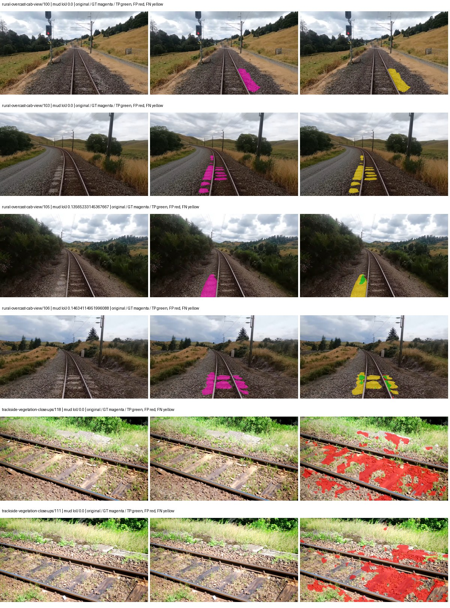
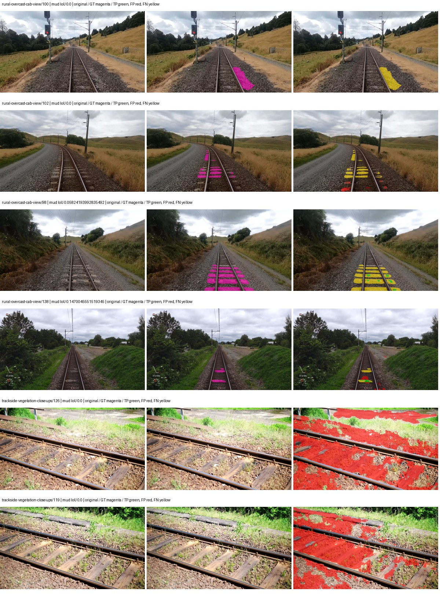
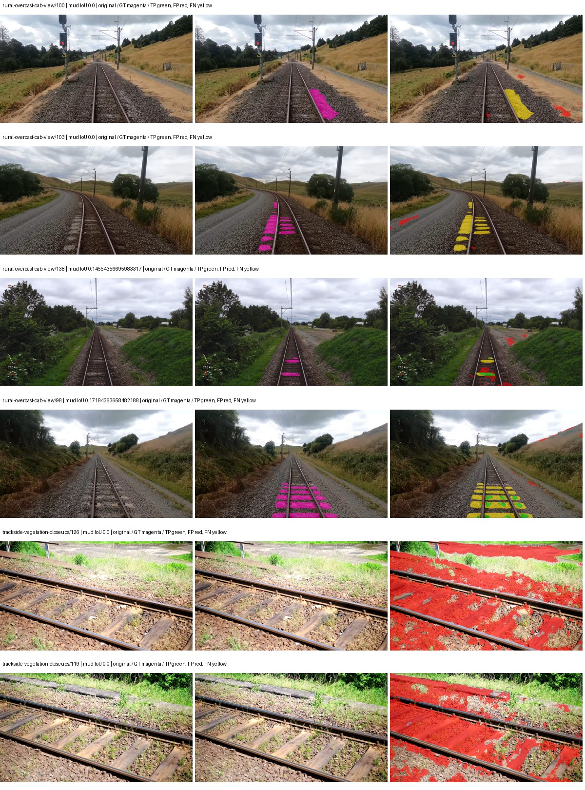
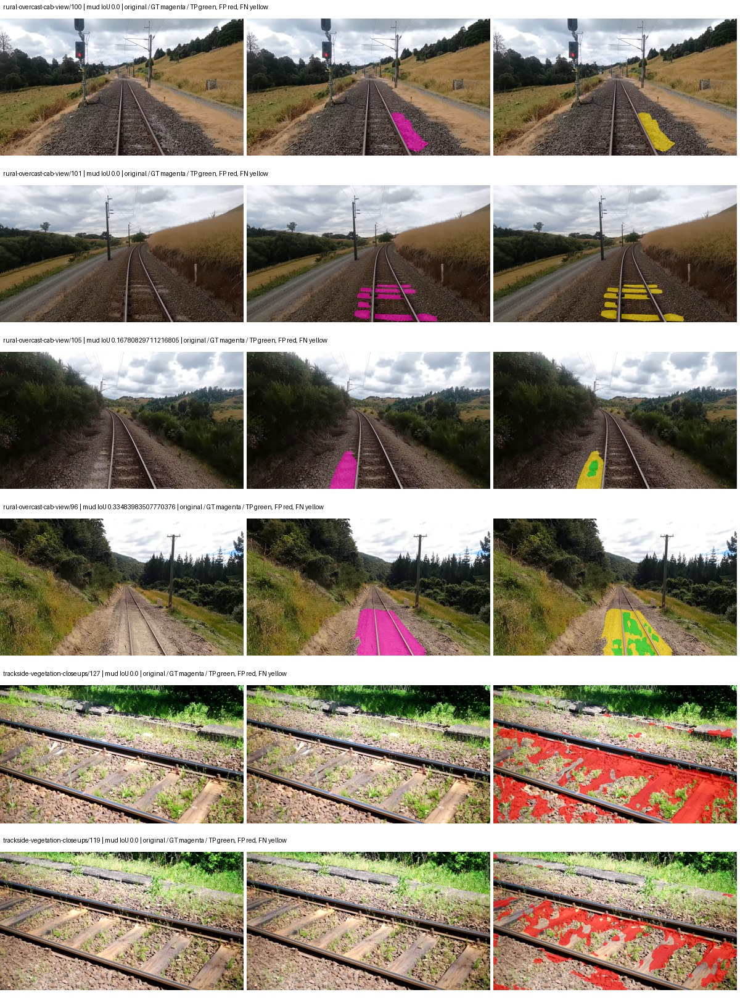
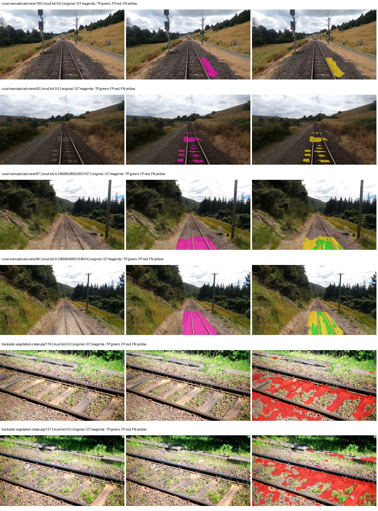
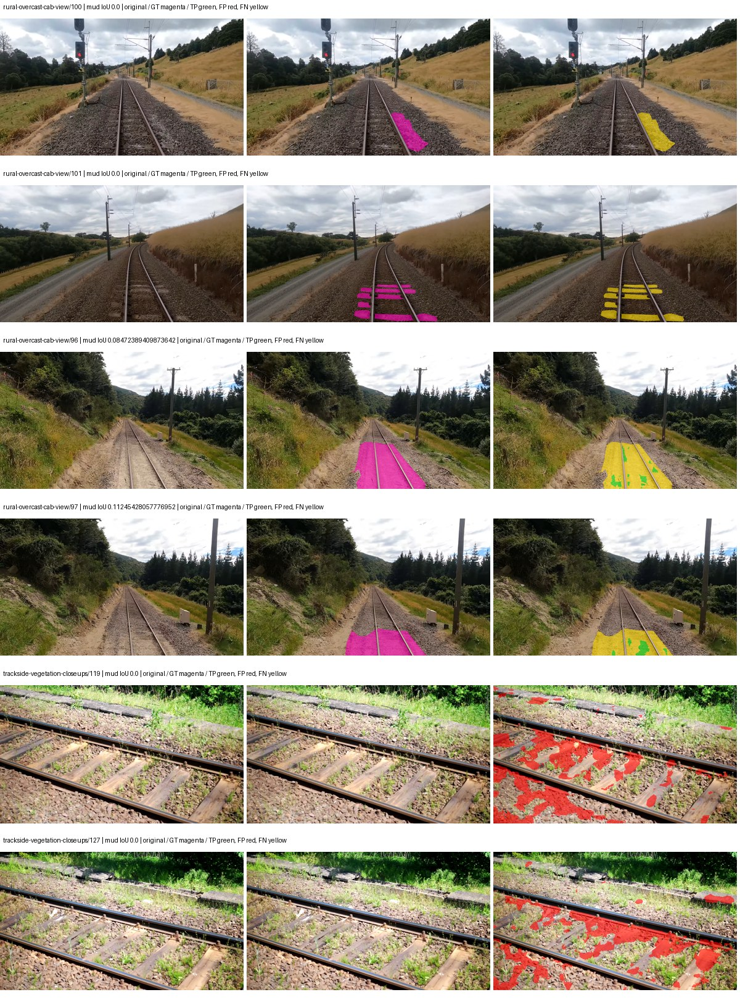
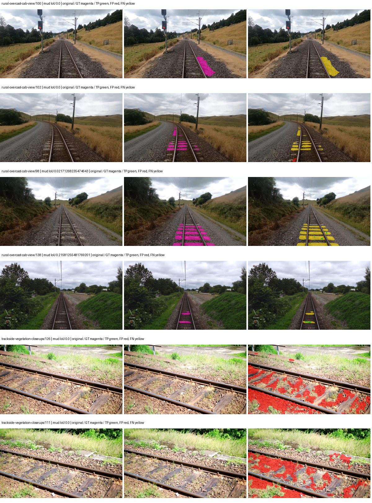
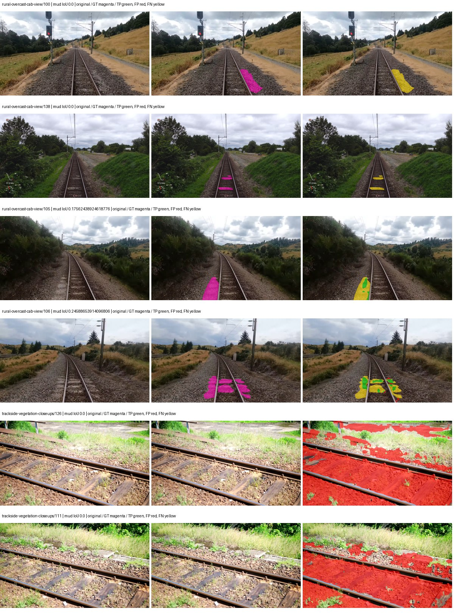
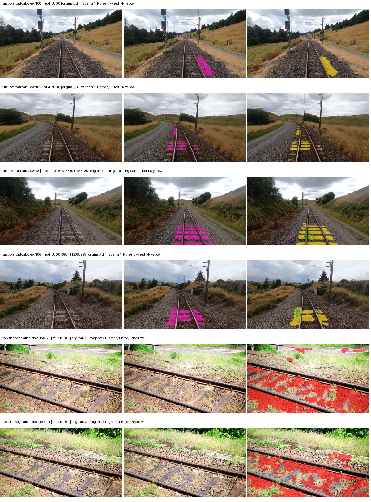

# native_mobilenetv3_large_lraspp — paul-test-rtis

[RTIS comparison](../../README.md) · [Full model records](record.json)

Primary selection and early stopping: **mud-pumping validation IoU**. A job is complete only after full statistics and isolated profiling are verified.

| Model | Initialization path | Seed | Status | Steps | Best step | Mud IoU (%) | Mud precision (%) | Mud recall (%) | Final mud IoU (trainer val, %) | mIoU (%) | Fixed GT-class mIoU (%) |
| --- | --- | --- | --- | --- | --- | --- | --- | --- | --- | --- | --- |
| native_mobilenetv3_large_lraspp | rtis_only | 0 | completed | 1527 | 254 | 2.71 | 2.95 | 25.09 | 0.35 | 15.71 | 18.32 |
| native_mobilenetv3_large_lraspp | rtis_only | 1 | completed | 1527 | 254 | 1.88 | 2.04 | 19.67 | 0.26 | 16.16 | 18.85 |
| native_mobilenetv3_large_lraspp | rtis_only | 2 | completed | 1527 | 254 | 0.80 | 0.87 | 8.52 | 0.21 | 15.46 | 18.03 |
| native_mobilenetv3_large_lraspp | cityscapes_to_rtis | 0 | completed | 3818 | 2545 | 1.06 | 1.54 | 3.31 | 0.52 | 26.64 | 31.08 |
| native_mobilenetv3_large_lraspp | cityscapes_to_rtis | 1 | completed | 1527 | 254 | 0.62 | 0.79 | 2.74 | 0.33 | 18.80 | 20.89 |
| native_mobilenetv3_large_lraspp | cityscapes_to_rtis | 2 | completed | 1527 | 254 | 1.10 | 1.32 | 6.22 | 0.26 | 18.61 | 20.67 |
| native_mobilenetv3_large_lraspp | railsem19_to_rtis | 0 | completed | 4000 | 3309 | 3.20 | 5.27 | 7.52 | 2.68 | 33.76 | 39.39 |
| native_mobilenetv3_large_lraspp | railsem19_to_rtis | 1 | completed | 3563 | 2545 | 4.10 | 5.55 | 13.59 | 2.14 | 35.39 | 39.33 |
| native_mobilenetv3_large_lraspp | railsem19_to_rtis | 2 | completed | 2800 | 1527 | 1.60 | 2.89 | 3.44 | 1.07 | 33.81 | 37.57 |
| native_mobilenetv3_large_lraspp | cityscapes_to_railsem19_to_rtis | 0 | completed | 1781 | 509 | 0.43 | 0.67 | 1.15 | 0.16 | 26.29 | 29.21 |
| native_mobilenetv3_large_lraspp | cityscapes_to_railsem19_to_rtis | 1 | completed | 3054 | 1781 | 0.90 | 1.03 | 6.43 | 0.25 | 30.05 | 35.06 |
| native_mobilenetv3_large_lraspp | cityscapes_to_railsem19_to_rtis | 2 | completed | 3054 | 1781 | 0.67 | 0.92 | 2.48 | 0.19 | 29.94 | 34.93 |

Training: 220 images. Validation: 37 images. Test: 50 held out. Seeds: [0, 1, 2]. Seed variation measures optimization variability, not independent-recording uncertainty. Historical source checkpoints stay fixed across adaptation seeds.

Training code: `066afb2626398b7be59d4d19f5a0e4644fd59adc`. Split SHA-256: `71fef8292610c352da0709fe3bd030f3bcc18f97560394835f4b22826463b83d`.

## rtis_only — seed 0

Status: **completed**. Started: 2026-09-06T19:55:16.673447+00:00. Finished: 2026-09-06T20:13:11.195867+00:00.

Recipe pretrained initializer: `{"arch": "native", "backbone_path": null, "batch_norm_momentum": null, "checkpoint": null, "classifier_path": null, "drop_path": null, "encoder_name": null, "encoder_weights": null, "head": "unified_head", "head_paths": [], "inactive_parameter_paths": [], "local_files_only": false, "lora_alpha": 32, "lora_dropout": 0.05, "lora_r": 16, "lora_targets": [], "native": {"auxiliary_heads": [], "backbone": {"in_channels": 3, "kind": "timm", "name": "mobilenetv3_large_100.ra_in1k", "out_indices": [1, 2, 3, 4], "weights": "pretrained"}, "head": {"activation": "relu", "channels": 128, "dropout": 0.1, "high_index": 3, "kind": "lraspp", "low_index": 0, "norm": "group"}, "neck": {"kind": "identity"}, "task": "multiclass"}, "revision": null, "smp_arch": null, "subfolder": null, "trust_remote_code": false, "tuning": "full"}`.

`rtis_only` uses the recipe initializer, which may include pretrained segmentation components. Transfer paths load the exact historical source checkpoint below and reset the classifier; they do not reset all query/decoder features.

Source checkpoint: `Recipe pretrained initialization`.

Config SHA-256: `6ed2c960a2dc4c53d672154f74f42caf8b3530bf401781bdd05df467f582a02a`. Weights used for validation: `raw`.

### Mud-pumping and aggregate quality

| Metric | Selected checkpoint | Final training validation |
| --- | --- | --- |
| Mud IoU | 2.71 | 0.35 |
| Mud precision | 2.95 | 0.50 |
| Mud recall | 25.09 | 1.09 |
| Mud Dice/F1 | 5.27 | 0.69 |
| mIoU | 15.71 | 23.17 |
| Mean accuracy | 26.29 | 34.63 |
| Mean precision | 23.40 | 39.47 |
| Mean Dice | 20.41 | 29.73 |
| Mean specificity | 98.24 | 98.86 |
| Pixel accuracy | 69.62 | 80.65 |
| Frequency-weighted IoU | 60.92 | 71.74 |
| Fixed GT-present class mIoU | 18.32 | 27.03 |
| Boundary F1 | 17.05 | 28.14 |

The selected checkpoint has independent evaluation evidence. Final values are the trainer's final validation record, not a new independent evaluation. mIoU averages classes with nonzero union, so false positives on absent classes can change its denominator. The fixed GT-class mean is supplementary and excludes absent classes; their false positives remain in the confusion matrix.

### Resource usage and timing

| Measurement | Value |
| --- | --- |
| Peak training VRAM, retained training invocation (GiB) | 6.72 |
| Peak evaluation VRAM (GiB) | 6.51 |
| Retained training invocation wall time (seconds) | 952.89 |
| Retained training invocation GPU-hours (one GPU) | 0.26 |
| Evaluation wall time (seconds) | 10.51 |
| Full evaluation pipeline images/second | 3.52 |
| Best full-state checkpoint (MiB) | 49.71 |
| Final full-state checkpoint (MiB) | 49.70 |
| Audited periodic checkpoints removed (GiB) | 0.15 |

VRAM uses the recorded allocator high-water mark; it is not total device usage including CUDA context. Resumed jobs' retained training invocation times and peaks are **not whole-campaign totals**. Earlier invocation resource records are not reconstructed here. Evaluation throughput includes loader, sliding-window inference and metrics; it is not model-only latency/FPS. Missing measurements are shown as —, never inferred from another dataset's run.

### Standardized inference performance

Dedicated model-only profiling waits for an idle worker-locked L40S: BF16, batch 1, 1024x1024, 20 warmup and 100 CUDA-event-timed public forwards. It excludes loading, preprocessing, tiling and metrics.

| Status | Parameters | Weight MiB | FPS | p50 ms | p95 ms | Peak reserved GiB |
| --- | --- | --- | --- | --- | --- | --- |
| complete | 3221330 | 12.29 | 230.41 | 4.25 | 4.92 | 0.30 |

```json
{
  "schema_version": 1,
  "model_id": "native_mobilenetv3_large_lraspp",
  "measured_at": "2026-09-06T20:13:09+00:00",
  "status": "complete",
  "benchmark_scope": "rtis_selected_checkpoint_model_only",
  "applies_to": [
    "native_mobilenetv3_large_lraspp--rtis_only--seed-0"
  ],
  "source": {
    "campaign_git_sha": "066afb2626398b7be59d4d19f5a0e4644fd59adc",
    "git_dirty": false,
    "config_hash": "051300501bdf",
    "resolved_config": "/data/izadia1/projects/segmentary-runs/paul-test-rtis/mud-fullstats-v1-20260906-r2/configs/native_mobilenetv3_large_lraspp--rtis_only--seed-0.yaml",
    "config_sha256": "6ed2c960a2dc4c53d672154f74f42caf8b3530bf401781bdd05df467f582a02a",
    "checkpoint_sha256": "0f80cb49993a8c0f6e3568795cb5b817ffcbf8f0bdde0215667ad43a8d206b74",
    "checkpoint_global_step": 254,
    "checkpoint_bytes": 52121473,
    "checkpoint_kind": "resume checkpoint with optimizer and EMA state",
    "weights": "raw",
    "measured_checkpoint_job_id": "native_mobilenetv3_large_lraspp--rtis_only--seed-0",
    "result_sha256": "60723911e2c1b06691a124619a2178ab94bc2ee75e326af9011deccb04aa4203",
    "result_git_sha": "066afb2626398b7be59d4d19f5a0e4644fd59adc",
    "result_stage": "eval:paul-test-rtis:val",
    "result_seed": 0
  },
  "hardware": {
    "gpu_name": "NVIDIA L40S",
    "gpu_uuid": "GPU-84f5ca4d-68db-ae98-d056-40654d859dd9",
    "logical_device": "cuda:0",
    "physical_visibility_token": "0",
    "compute_capability": [
      8,
      9
    ],
    "total_memory_bytes": 47677177856
  },
  "model": {
    "parameter_count": 3221330,
    "trainable_parameter_count": 3221330,
    "resident_parameter_bytes": 12885320,
    "parameter_dtype_counts": {
      "float32": 3221330
    }
  },
  "contract": {
    "backend": "pytorch",
    "precision": "bf16_autocast",
    "batch_size": 1,
    "input_shape_nchw": [
      1,
      3,
      1024,
      1024
    ],
    "warmup_iterations": 20,
    "measured_iterations": 100,
    "timing": "per-forward CUDA events with end-event synchronization",
    "includes_preprocessing": false,
    "includes_data_loader": false,
    "includes_sliding_window": false,
    "input_resident_on_gpu": true,
    "model_only": true,
    "entrypoint": "public model(image) dense-logits forward"
  },
  "measurements": {
    "latency": {
      "p50_ms": 4.249600172042847,
      "p95_ms": 4.917094588279724,
      "mean_ms": 4.340112962722778,
      "minimum_ms": 4.032512187957764,
      "maximum_ms": 7.736415863037109,
      "fps": 230.4087494009944,
      "raw_ms": [
        4.114431858062744,
        4.074495792388916,
        4.038656234741211,
        4.075520038604736,
        4.051072120666504,
        4.504576206207275,
        4.600831985473633,
        4.25984001159668,
        4.157440185546875,
        4.284416198730469,
        4.543488025665283,
        4.602880001068115,
        4.3673601150512695,
        4.078591823577881,
        4.083712100982666,
        4.073472023010254,
        4.046847820281982,
        4.133887767791748,
        4.429887771606445,
        4.5496320724487305,
        4.613120079040527,
        4.092927932739258,
        4.242432117462158,
        4.558847904205322,
        4.102176189422607,
        4.20147180557251,
        4.291584014892578,
        4.040703773498535,
        4.037536144256592,
        4.335616111755371,
        4.610144138336182,
        4.911104202270508,
        4.5107197761535645,
        4.380671977996826,
        4.2782721519470215,
        5.046271800994873,
        4.54860782623291,
        5.114880084991455,
        4.818943977355957,
        4.191232204437256,
        4.316160202026367,
        4.199423789978027,
        4.050943851470947,
        4.070464134216309,
        4.065279960632324,
        4.050879955291748,
        4.639743804931641,
        4.543488025665283,
        4.146175861358643,
        4.275199890136719,
        4.3376641273498535,
        4.0960001945495605,
        4.047872066497803,
        4.256768226623535,
        4.593664169311523,
        4.150271892547607,
        4.037631988525391,
        4.032512187957764,
        4.039680004119873,
        4.436992168426514,
        4.119552135467529,
        4.116511821746826,
        4.088831901550293,
        4.1748480796813965,
        4.076543807983398,
        4.611072063446045,
        5.030911922454834,
        5.062655925750732,
        4.553728103637695,
        4.504576206207275,
        4.660223960876465,
        4.419583797454834,
        4.3919358253479,
        4.196256160736084,
        4.036704063415527,
        4.168704032897949,
        4.587520122528076,
        4.287487983703613,
        4.06220817565918,
        4.049920082092285,
        4.05401611328125,
        4.034656047821045,
        4.148223876953125,
        4.121600151062012,
        4.062079906463623,
        4.760575771331787,
        4.5228800773620605,
        4.383743762969971,
        4.177919864654541,
        4.097023963928223,
        4.046783924102783,
        4.455423831939697,
        4.116479873657227,
        4.093952178955078,
        7.736415863037109,
        4.488192081451416,
        4.270112037658691,
        4.279295921325684,
        4.2936320304870605,
        4.283391952514648
      ],
      "percentile_method": "numpy linear interpolation"
    },
    "peak_reserved_bytes": 318767104,
    "memory_kind": "pytorch_cuda_allocator_peak_reserved_excluding_context",
    "benchmark_wall_clock_s": 13.954614087939262
  },
  "started_at": "2026-09-06T20:12:55+00:00",
  "finished_at": "2026-09-06T20:13:09+00:00",
  "environment": {
    "hostname": "hdrfs-app-001",
    "python": "3.11.15",
    "platform": "Linux-5.15.0-139-generic-x86_64-with-glibc2.35",
    "torch": "2.11.0+cu128",
    "torch_cuda": "12.8",
    "cudnn": 91900,
    "driver_version": "570.133.20",
    "cuda_available": true,
    "gpu_count": 1,
    "gpu_names": [
      "NVIDIA L40S"
    ],
    "cuda_visible_devices": "0",
    "packages": {
      "segmentary": "0.1.0",
      "torch": "2.11.0+cu128",
      "torchvision": "0.26.0+cu128",
      "transformers": "5.15.0",
      "timm": "1.0.28",
      "segmentation-models-pytorch": "0.5.0",
      "albumentations": "2.0.8",
      "lightning": "2.6.5",
      "numpy": "2.4.4"
    }
  }
}
```

### Per-class validation results

| Class | GT pixels | IoU (%) | Precision (%) | Recall (%) | Dice (%) | Boundary F1 (%) |
| --- | --- | --- | --- | --- | --- | --- |
| car | 29664 | 0.02 | 0.02 | 0.04 | 0.03 | 0.11 |
| construction | 311585 | 10.00 | 10.68 | 61.03 | 18.18 | 11.47 |
| fence | 265137 | 1.72 | 2.19 | 7.38 | 3.38 | 2.87 |
| mud-pumping | 1226250 | 2.71 | 2.95 | 25.09 | 5.27 | 8.29 |
| on-rails | 0 | 0.00 | 0.00 | — | 0.00 | 0.00 |
| person | 0 | 0.00 | 0.00 | — | 0.00 | 0.00 |
| pole | 628038 | 26.79 | 45.12 | 39.74 | 42.26 | 55.07 |
| rail-embedded | 16799 | 0.03 | 0.07 | 0.05 | 0.06 | 0.92 |
| rail-raised | 2969797 | 55.56 | 67.60 | 75.72 | 71.43 | 80.86 |
| rail-track | 6323197 | 19.25 | 40.04 | 27.04 | 32.28 | 39.48 |
| road | 1048831 | 0.85 | 7.57 | 0.95 | 1.68 | 8.37 |
| sidewalk | 1297367 | 10.13 | 49.13 | 11.31 | 18.39 | 12.05 |
| sky | 19121606 | 90.94 | 95.95 | 94.58 | 95.26 | 49.85 |
| standing-water | 95802 | 0.10 | 0.13 | 0.51 | 0.21 | 0.83 |
| terrain | 39239306 | 76.66 | 84.54 | 89.15 | 86.79 | 28.40 |
| trackbed | 10643081 | 33.48 | 72.66 | 38.30 | 50.16 | 42.73 |
| traffic-light | 19510 | 0.02 | 0.02 | 0.11 | 0.03 | 0.04 |
| traffic-sign | 13285 | 0.01 | 0.01 | 0.02 | 0.02 | 0.03 |
| tram-track | 56179 | 0.37 | 0.69 | 0.77 | 0.73 | 0.69 |
| truck | 0 | 0.00 | 0.00 | — | 0.00 | 0.00 |
| vegetation-overgrowth | 5901821 | 1.22 | 12.10 | 1.33 | 2.40 | 15.93 |

### Full-run accounting

| Measurement | Value |
| --- | --- |
| Full GPU-reserved wall seconds, all recorded worker attempts | 1074.53 |
| Full reserved GPU-hours | 0.30 |
| Whole-run timing complete | True |

| Phase | Wall seconds including failed attempts |
| --- | --- |
| training | 959.57 |
| diagnostics | 76.42 |
| performance | 20.66 |

GPU-reserved time includes model loading, training, validation, collection, profiling, checkpoint I/O and orchestration while the worker owns one GPU. It is not GPU kernel-active time. Phase timings and sampled device memory/power/utilization are retained separately; sampled device memory is not the allocator high-water mark.

### Train/validation and raw/EMA diagnostics

| Checkpoint / weights / split | Images | Mud IoU (%) | Mud precision (%) | Mud recall (%) |
| --- | --- | --- | --- | --- |
| best-auto-train / raw | 220 | 61.27 | 67.60 | 86.73 |
| best-auto-val / raw | 37 | 2.71 | 2.95 | 25.09 |
| best-alternate-val / ema | 37 | 2.18 | 2.41 | 18.21 |
| final-auto-val / raw | 37 | 0.35 | 0.50 | 1.09 |

Train uses the evaluation transform without augmentation. Compare mud train/validation metrics for the same selected weights. Alternate EMA on running-stat BatchNorm is explicitly uncalibrated and is diagnostic only. Score-threshold curves use uncalibrated normalized scores and are pixel-level diagnostics, not event detection rates or a selected deployment operating point.

### Downloadable evidence

- best-auto-train: [per-image.csv](rtis_only--seed-0/best-auto-train/per-image.csv) · [per-image-confusion.json.gz](rtis_only--seed-0/best-auto-train/per-image-confusion.json.gz) · [groups.json](rtis_only--seed-0/best-auto-train/groups.json) · [mud-score-curves.json](rtis_only--seed-0/best-auto-train/mud-score-curves.json)
- best-auto-val: [per-image.csv](rtis_only--seed-0/best-auto-val/per-image.csv) · [per-image-confusion.json.gz](rtis_only--seed-0/best-auto-val/per-image-confusion.json.gz) · [groups.json](rtis_only--seed-0/best-auto-val/groups.json) · [mud-score-curves.json](rtis_only--seed-0/best-auto-val/mud-score-curves.json) · [examples.jpg](rtis_only--seed-0/best-auto-val/examples.jpg)
- best-alternate-val: [per-image.csv](rtis_only--seed-0/best-alternate-val/per-image.csv) · [per-image-confusion.json.gz](rtis_only--seed-0/best-alternate-val/per-image-confusion.json.gz) · [groups.json](rtis_only--seed-0/best-alternate-val/groups.json) · [mud-score-curves.json](rtis_only--seed-0/best-alternate-val/mud-score-curves.json)
- final-auto-val: [per-image.csv](rtis_only--seed-0/final-auto-val/per-image.csv) · [per-image-confusion.json.gz](rtis_only--seed-0/final-auto-val/per-image-confusion.json.gz) · [groups.json](rtis_only--seed-0/final-auto-val/groups.json) · [mud-score-curves.json](rtis_only--seed-0/final-auto-val/mud-score-curves.json)
- resources: [telemetry.csv](rtis_only--seed-0/resources/telemetry.csv)


Examples are two lowest and two highest mud-IoU positive images, plus up to two negative images with the most false-positive mud pixels. They are targeted diagnostic examples, not random samples. Green: true positive; red: false positive; yellow: false negative. Full predictions remain on HDRFS.

### Validation tracking

| Logged step | Overall mIoU (%) | Mud IoU (%) |
| --- | --- | --- |
| 254 | 15.71 | 2.71 |
| 508 | 21.52 | 0.39 |
| 763 | 21.57 | 0.28 |
| 1017 | 22.72 | 0.36 |
| 1272 | 23.81 | 0.67 |
| 1527 | 23.17 | 0.35 |

All retained scalar curves, including training loss and per-class IoU, are in record.json. Observed best mud on a curve is not necessarily a retained checkpoint: the pilot saved its selection-metric-best and final checkpoints. Step logging and checkpoint global_step may differ by one.

### Stopping and checkpoint provenance

```json
{
  "stopping": {
    "actual_steps": 1527,
    "maximum_steps": 4000,
    "min_delta": 0.001,
    "monitor": "val_iou/mud-pumping",
    "patience": 5,
    "reason": "validation_plateau"
  },
  "checkpoints": {
    "best": {
      "path": "/data/izadia1/projects/segmentary-runs/paul-test-rtis/mud-fullstats-v1-20260906-r2/future-runs/native_mobilenetv3_large_lraspp--rtis_only--seed-0_seed0/rtis/best.ckpt",
      "sha256": "0f80cb49993a8c0f6e3568795cb5b817ffcbf8f0bdde0215667ad43a8d206b74",
      "global_step": 254,
      "bytes": 52121473
    },
    "final": {
      "path": "/data/izadia1/projects/segmentary-runs/paul-test-rtis/mud-fullstats-v1-20260906-r2/future-runs/native_mobilenetv3_large_lraspp--rtis_only--seed-0_seed0/rtis/last.ckpt",
      "sha256": "70d44a6172be65188055b99e42d60e0ae2f2c120719dd9bcfa6168113846bb4a",
      "global_step": 1527,
      "bytes": 52110849
    }
  },
  "cleanup_error": null
}
```

### Resolved training, initialization and evaluation settings

The optimizer block is the base configuration. Stage LR scales are applied at runtime, and stage warmup is capped at min(base warmup, floor(stage budget / 10), stage budget - 1): 400 steps for this 4,000-step pilot. Model-internal native input grids may differ from augmentation crops (EoMT uses its 640 grid).

```json
{
  "name": "native_mobilenetv3_large_lraspp--rtis_only--seed-0",
  "model": {
    "arch": "native",
    "checkpoint": null,
    "tuning": "full",
    "head": "unified_head",
    "lora_r": 16,
    "lora_alpha": 32,
    "lora_dropout": 0.05,
    "lora_targets": [],
    "drop_path": null,
    "revision": null,
    "subfolder": null,
    "local_files_only": false,
    "trust_remote_code": false,
    "backbone_path": null,
    "head_paths": [],
    "classifier_path": null,
    "inactive_parameter_paths": [],
    "smp_arch": null,
    "encoder_name": null,
    "encoder_weights": null,
    "native": {
      "task": "multiclass",
      "backbone": {
        "kind": "timm",
        "name": "mobilenetv3_large_100.ra_in1k",
        "weights": "pretrained",
        "out_indices": [
          1,
          2,
          3,
          4
        ],
        "in_channels": 3
      },
      "neck": {
        "kind": "identity"
      },
      "head": {
        "kind": "lraspp",
        "low_index": 0,
        "high_index": 3,
        "channels": 128,
        "dropout": 0.1,
        "norm": "group",
        "activation": "relu"
      },
      "auxiliary_heads": []
    },
    "batch_norm_momentum": null
  },
  "space": "paul-test-rtis",
  "taxonomy_root": "/data/izadia1/projects/segmentary-rtis-fullstats-066afb2/taxonomy",
  "output_root": "/data/izadia1/projects/segmentary-runs/paul-test-rtis/mud-fullstats-v1-20260906-r2/future-runs",
  "optim": {
    "backbone_lr": 0.0001,
    "head_lr_mult": 10.0,
    "weight_decay": 0.05,
    "llrd": 1.0,
    "warmup_iters": 1500,
    "warmup_ratio": 1e-06,
    "poly_power": 0.9,
    "min_lr_ratio": 0.0,
    "betas": [
      0.9,
      0.999
    ],
    "grad_clip": 1.0
  },
  "train": {
    "iters": 4000,
    "batch_size": 2,
    "accum": 8,
    "num_workers": 2,
    "precision": "bf16-mixed",
    "ema_decay": 0.9998,
    "val_every": 250,
    "ckpt_every": 500,
    "selection_metric": "val_iou/mud-pumping",
    "early_stopping_patience": 5,
    "early_stopping_min_delta": 0.001,
    "seed": 0,
    "devices": 1
  },
  "eval": {
    "sliding_window": true,
    "window": [
      1024,
      1024
    ],
    "stride": [
      768,
      768
    ],
    "batch_size": 1,
    "num_workers": 2,
    "tta_scales": [],
    "tta_flip": false,
    "threshold": 0.5,
    "boundary_tolerance_frac": 0.0075,
    "save_confusion": true
  },
  "loss": {
    "task": "multiclass",
    "activation": "auto",
    "terms": [],
    "aux": "none",
    "aux_weight": 0.0,
    "ce_weight": 1.0,
    "label_smoothing": 0.0,
    "class_weights": null,
    "query": null
  },
  "aug": {
    "crop": [
      1024,
      1024
    ],
    "scale_min": 0.5,
    "scale_max": 2.0,
    "hflip_p": 0.5,
    "color_jitter_p": 0.5,
    "brightness": 0.25,
    "contrast": 0.25,
    "saturation": 0.25,
    "hue": 0.05
  },
  "stages": [
    {
      "name": "rtis",
      "data": [
        {
          "name": "paul-test-rtis",
          "root": "/data/izadia1/datasets/paul-test-rtis",
          "variant": null,
          "split_file": "splits.json",
          "train_split": "train",
          "val_split": "val",
          "limit": null,
          "loader": "folder",
          "mapping": "paul-test-rtis",
          "loader_options": {
            "require_groups": true
          }
        }
      ],
      "iters": null,
      "lr_scale": 1.0,
      "head_group_lr_scale": 1.0,
      "init_from": "pretrained",
      "reset_head": false,
      "freeze": null,
      "sample_weights": null
    }
  ]
}
```

### Hardware and software provenance

```json
{
  "training": {
    "cuda_available": true,
    "cuda_visible_devices": "0",
    "cudnn": 91900,
    "driver_version": "570.133.20",
    "gpu_count": 1,
    "gpu_names": [
      "NVIDIA L40S"
    ],
    "hostname": "hdrfs-app-001",
    "input_normalization": {
      "channel_order": "rgb",
      "mean": [
        0.485,
        0.456,
        0.406
      ],
      "source": "timm_pretrained_cfg",
      "std": [
        0.229,
        0.224,
        0.225
      ]
    },
    "model_origins": [
      {
        "hf_commit": null,
        "hf_name_or_path": null,
        "module": "backbone",
        "timm_pretrained": {
          "architecture": "mobilenetv3_large_100",
          "hf_hub_id": "timm/mobilenetv3_large_100.ra_in1k",
          "tag": "ra_in1k",
          "url": "https://github.com/rwightman/pytorch-image-models/releases/download/v0.1-weights/mobilenetv3_large_100_ra-f55367f5.pth"
        }
      },
      {
        "hf_commit": null,
        "hf_name_or_path": null,
        "module": "backbone.model",
        "timm_pretrained": {
          "architecture": "mobilenetv3_large_100",
          "hf_hub_id": "timm/mobilenetv3_large_100.ra_in1k",
          "tag": "ra_in1k",
          "url": "https://github.com/rwightman/pytorch-image-models/releases/download/v0.1-weights/mobilenetv3_large_100_ra-f55367f5.pth"
        }
      }
    ],
    "model_parameter_count": 3221330,
    "packages": {
      "albumentations": "2.0.8",
      "lightning": "2.6.5",
      "numpy": "2.4.4",
      "segmentary": "0.1.0",
      "segmentation-models-pytorch": "0.5.0",
      "timm": "1.0.28",
      "torch": "2.11.0+cu128",
      "torchvision": "0.26.0+cu128",
      "transformers": "5.15.0"
    },
    "platform": "Linux-5.15.0-139-generic-x86_64-with-glibc2.35",
    "python": "3.11.15",
    "torch": "2.11.0+cu128",
    "torch_cuda": "12.8",
    "trainable_parameter_count": 3221330,
    "training_stop": {
      "actual_steps": 1527,
      "maximum_steps": 4000,
      "min_delta": 0.001,
      "monitor": "val_iou/mud-pumping",
      "patience": 5,
      "reason": "validation_plateau"
    },
    "validation_weights": "raw"
  },
  "evaluation": {
    "cuda_available": true,
    "cuda_visible_devices": "0",
    "cudnn": 91900,
    "driver_version": "570.133.20",
    "gpu_count": 1,
    "gpu_names": [
      "NVIDIA L40S"
    ],
    "hostname": "hdrfs-app-001",
    "input_normalization": {
      "channel_order": "rgb",
      "mean": [
        0.485,
        0.456,
        0.406
      ],
      "source": "timm_pretrained_cfg",
      "std": [
        0.229,
        0.224,
        0.225
      ]
    },
    "packages": {
      "albumentations": "2.0.8",
      "lightning": "2.6.5",
      "numpy": "2.4.4",
      "segmentary": "0.1.0",
      "segmentation-models-pytorch": "0.5.0",
      "timm": "1.0.28",
      "torch": "2.11.0+cu128",
      "torchvision": "0.26.0+cu128",
      "transformers": "5.15.0"
    },
    "platform": "Linux-5.15.0-139-generic-x86_64-with-glibc2.35",
    "python": "3.11.15",
    "torch": "2.11.0+cu128",
    "torch_cuda": "12.8"
  }
}
```

## rtis_only — seed 1

Status: **completed**. Started: 2026-09-06T19:55:24.979313+00:00. Finished: 2026-09-06T20:13:42.979228+00:00.

Recipe pretrained initializer: `{"arch": "native", "backbone_path": null, "batch_norm_momentum": null, "checkpoint": null, "classifier_path": null, "drop_path": null, "encoder_name": null, "encoder_weights": null, "head": "unified_head", "head_paths": [], "inactive_parameter_paths": [], "local_files_only": false, "lora_alpha": 32, "lora_dropout": 0.05, "lora_r": 16, "lora_targets": [], "native": {"auxiliary_heads": [], "backbone": {"in_channels": 3, "kind": "timm", "name": "mobilenetv3_large_100.ra_in1k", "out_indices": [1, 2, 3, 4], "weights": "pretrained"}, "head": {"activation": "relu", "channels": 128, "dropout": 0.1, "high_index": 3, "kind": "lraspp", "low_index": 0, "norm": "group"}, "neck": {"kind": "identity"}, "task": "multiclass"}, "revision": null, "smp_arch": null, "subfolder": null, "trust_remote_code": false, "tuning": "full"}`.

`rtis_only` uses the recipe initializer, which may include pretrained segmentation components. Transfer paths load the exact historical source checkpoint below and reset the classifier; they do not reset all query/decoder features.

Source checkpoint: `Recipe pretrained initialization`.

Config SHA-256: `4d747991dd6598922265748fd98d672aec6af940bb872f52fccbe336299cc5b2`. Weights used for validation: `raw`.

### Mud-pumping and aggregate quality

| Metric | Selected checkpoint | Final training validation |
| --- | --- | --- |
| Mud IoU | 1.88 | 0.26 |
| Mud precision | 2.04 | 0.43 |
| Mud recall | 19.67 | 0.67 |
| Mud Dice/F1 | 3.69 | 0.53 |
| mIoU | 16.16 | 23.31 |
| Mean accuracy | 26.22 | 34.15 |
| Mean precision | 23.49 | 39.67 |
| Mean Dice | 20.89 | 30.17 |
| Mean specificity | 98.28 | 98.69 |
| Pixel accuracy | 69.43 | 76.94 |
| Frequency-weighted IoU | 60.57 | 68.39 |
| Fixed GT-present class mIoU | 18.85 | 27.20 |
| Boundary F1 | 18.27 | 28.11 |

The selected checkpoint has independent evaluation evidence. Final values are the trainer's final validation record, not a new independent evaluation. mIoU averages classes with nonzero union, so false positives on absent classes can change its denominator. The fixed GT-class mean is supplementary and excludes absent classes; their false positives remain in the confusion matrix.

### Resource usage and timing

| Measurement | Value |
| --- | --- |
| Peak training VRAM, retained training invocation (GiB) | 6.72 |
| Peak evaluation VRAM (GiB) | 6.51 |
| Retained training invocation wall time (seconds) | 981.75 |
| Retained training invocation GPU-hours (one GPU) | 0.27 |
| Evaluation wall time (seconds) | 10.36 |
| Full evaluation pipeline images/second | 3.57 |
| Best full-state checkpoint (MiB) | 49.71 |
| Final full-state checkpoint (MiB) | 49.70 |
| Audited periodic checkpoints removed (GiB) | 0.15 |

VRAM uses the recorded allocator high-water mark; it is not total device usage including CUDA context. Resumed jobs' retained training invocation times and peaks are **not whole-campaign totals**. Earlier invocation resource records are not reconstructed here. Evaluation throughput includes loader, sliding-window inference and metrics; it is not model-only latency/FPS. Missing measurements are shown as —, never inferred from another dataset's run.

### Standardized inference performance

Dedicated model-only profiling waits for an idle worker-locked L40S: BF16, batch 1, 1024x1024, 20 warmup and 100 CUDA-event-timed public forwards. It excludes loading, preprocessing, tiling and metrics.

| Status | Parameters | Weight MiB | FPS | p50 ms | p95 ms | Peak reserved GiB |
| --- | --- | --- | --- | --- | --- | --- |
| complete | 3221330 | 12.29 | 226.47 | 4.28 | 5.18 | 0.30 |

```json
{
  "schema_version": 1,
  "model_id": "native_mobilenetv3_large_lraspp",
  "measured_at": "2026-09-06T20:13:41+00:00",
  "status": "complete",
  "benchmark_scope": "rtis_selected_checkpoint_model_only",
  "applies_to": [
    "native_mobilenetv3_large_lraspp--rtis_only--seed-1"
  ],
  "source": {
    "campaign_git_sha": "066afb2626398b7be59d4d19f5a0e4644fd59adc",
    "git_dirty": false,
    "config_hash": "099c84bb73ac",
    "resolved_config": "/data/izadia1/projects/segmentary-runs/paul-test-rtis/mud-fullstats-v1-20260906-r2/configs/native_mobilenetv3_large_lraspp--rtis_only--seed-1.yaml",
    "config_sha256": "4d747991dd6598922265748fd98d672aec6af940bb872f52fccbe336299cc5b2",
    "checkpoint_sha256": "6a7bdd8262f0b50793ca901a567b7b9dbbcebee719eeac699cb5c903eb6bda41",
    "checkpoint_global_step": 254,
    "checkpoint_bytes": 52121473,
    "checkpoint_kind": "resume checkpoint with optimizer and EMA state",
    "weights": "raw",
    "measured_checkpoint_job_id": "native_mobilenetv3_large_lraspp--rtis_only--seed-1",
    "result_sha256": "d326672667d32f1084717e4e385157d2157ac85ee4e01e59124bfc24045cc900",
    "result_git_sha": "066afb2626398b7be59d4d19f5a0e4644fd59adc",
    "result_stage": "eval:paul-test-rtis:val",
    "result_seed": 1
  },
  "hardware": {
    "gpu_name": "NVIDIA L40S",
    "gpu_uuid": "GPU-931d0911-fc78-1638-e3d7-1ba868cbd286",
    "logical_device": "cuda:0",
    "physical_visibility_token": "2",
    "compute_capability": [
      8,
      9
    ],
    "total_memory_bytes": 47677177856
  },
  "model": {
    "parameter_count": 3221330,
    "trainable_parameter_count": 3221330,
    "resident_parameter_bytes": 12885320,
    "parameter_dtype_counts": {
      "float32": 3221330
    }
  },
  "contract": {
    "backend": "pytorch",
    "precision": "bf16_autocast",
    "batch_size": 1,
    "input_shape_nchw": [
      1,
      3,
      1024,
      1024
    ],
    "warmup_iterations": 20,
    "measured_iterations": 100,
    "timing": "per-forward CUDA events with end-event synchronization",
    "includes_preprocessing": false,
    "includes_data_loader": false,
    "includes_sliding_window": false,
    "input_resident_on_gpu": true,
    "model_only": true,
    "entrypoint": "public model(image) dense-logits forward"
  },
  "measurements": {
    "latency": {
      "p50_ms": 4.2849280834198,
      "p95_ms": 5.175603246688842,
      "mean_ms": 4.415610234737397,
      "minimum_ms": 3.9884800910949707,
      "maximum_ms": 6.292479991912842,
      "fps": 226.46926400637614,
      "raw_ms": [
        4.167679786682129,
        4.077568054199219,
        4.040703773498535,
        3.9966719150543213,
        4.011007785797119,
        4.021120071411133,
        3.9906558990478516,
        4.909056186676025,
        4.126719951629639,
        4.1062397956848145,
        4.133887767791748,
        4.700160026550293,
        5.093376159667969,
        4.45747184753418,
        4.588543891906738,
        4.193280220031738,
        4.074495792388916,
        4.0960001945495605,
        4.021247863769531,
        4.040703773498535,
        4.092864036560059,
        4.009920120239258,
        4.042751789093018,
        4.54860782623291,
        4.146175861358643,
        4.272128105163574,
        4.97049617767334,
        4.877312183380127,
        4.275199890136719,
        4.576255798339844,
        5.172224044799805,
        4.686848163604736,
        4.288512229919434,
        4.2639360427856445,
        4.189184188842773,
        4.108287811279297,
        5.174272060394287,
        5.235712051391602,
        4.389855861663818,
        4.24345588684082,
        4.151296138763428,
        4.460544109344482,
        5.63097620010376,
        4.452352046966553,
        4.324351787567139,
        4.281343936920166,
        4.2639360427856445,
        4.210752010345459,
        4.316160202026367,
        4.346879959106445,
        4.380671977996826,
        5.104640007019043,
        5.703680038452148,
        5.1025919914245605,
        4.299776077270508,
        4.25267219543457,
        4.373472213745117,
        4.193280220031738,
        4.056064128875732,
        4.00486421585083,
        4.345856189727783,
        4.40831995010376,
        4.389887809753418,
        4.933631896972656,
        4.410367965698242,
        4.063231945037842,
        4.368383884429932,
        4.534272193908691,
        4.632575988769531,
        4.260863780975342,
        4.078591823577881,
        4.141056060791016,
        4.079616069793701,
        4.396031856536865,
        4.373504161834717,
        4.250624179840088,
        4.1062397956848145,
        4.582399845123291,
        4.495359897613525,
        4.029439926147461,
        4.013055801391602,
        3.9884800910949707,
        4.176991939544678,
        4.198400020599365,
        4.2342400550842285,
        4.56601619720459,
        4.766719818115234,
        4.879360198974609,
        4.419583797454834,
        6.292479991912842,
        4.634624004364014,
        4.585472106933594,
        4.453375816345215,
        4.625408172607422,
        4.06220817565918,
        4.116479873657227,
        4.134880065917969,
        4.154367923736572,
        5.2008957862854,
        4.856832027435303
      ],
      "percentile_method": "numpy linear interpolation"
    },
    "peak_reserved_bytes": 318767104,
    "memory_kind": "pytorch_cuda_allocator_peak_reserved_excluding_context",
    "benchmark_wall_clock_s": 13.58066100999713
  },
  "started_at": "2026-09-06T20:13:27+00:00",
  "finished_at": "2026-09-06T20:13:41+00:00",
  "environment": {
    "hostname": "hdrfs-app-001",
    "python": "3.11.15",
    "platform": "Linux-5.15.0-139-generic-x86_64-with-glibc2.35",
    "torch": "2.11.0+cu128",
    "torch_cuda": "12.8",
    "cudnn": 91900,
    "driver_version": "570.133.20",
    "cuda_available": true,
    "gpu_count": 1,
    "gpu_names": [
      "NVIDIA L40S"
    ],
    "cuda_visible_devices": "2",
    "packages": {
      "segmentary": "0.1.0",
      "torch": "2.11.0+cu128",
      "torchvision": "0.26.0+cu128",
      "transformers": "5.15.0",
      "timm": "1.0.28",
      "segmentation-models-pytorch": "0.5.0",
      "albumentations": "2.0.8",
      "lightning": "2.6.5",
      "numpy": "2.4.4"
    }
  }
}
```

### Per-class validation results

| Class | GT pixels | IoU (%) | Precision (%) | Recall (%) | Dice (%) | Boundary F1 (%) |
| --- | --- | --- | --- | --- | --- | --- |
| car | 29664 | 0.00 | 0.00 | 0.00 | 0.00 | 0.00 |
| construction | 311585 | 17.21 | 19.92 | 55.90 | 29.37 | 25.37 |
| fence | 265137 | 1.19 | 1.63 | 4.24 | 2.35 | 2.82 |
| mud-pumping | 1226250 | 1.88 | 2.04 | 19.67 | 3.69 | 5.32 |
| on-rails | 0 | 0.00 | 0.00 | — | 0.00 | 0.00 |
| person | 0 | 0.00 | 0.00 | — | 0.00 | 0.00 |
| pole | 628038 | 32.43 | 50.61 | 47.44 | 48.97 | 63.02 |
| rail-embedded | 16799 | 0.01 | 0.01 | 0.01 | 0.01 | 0.03 |
| rail-raised | 2969797 | 58.24 | 70.32 | 77.21 | 73.61 | 84.05 |
| rail-track | 6323197 | 17.38 | 58.09 | 19.88 | 29.62 | 49.16 |
| road | 1048831 | 0.90 | 5.24 | 1.07 | 1.78 | 6.90 |
| sidewalk | 1297367 | 2.43 | 12.14 | 2.95 | 4.74 | 11.43 |
| sky | 19121606 | 85.40 | 94.52 | 89.85 | 92.13 | 39.32 |
| standing-water | 95802 | 0.77 | 1.54 | 1.51 | 1.52 | 3.48 |
| terrain | 39239306 | 75.92 | 87.50 | 85.16 | 86.32 | 30.20 |
| trackbed | 10643081 | 43.65 | 57.21 | 64.81 | 60.78 | 38.06 |
| traffic-light | 19510 | 0.02 | 0.04 | 0.05 | 0.04 | 0.07 |
| traffic-sign | 13285 | 0.03 | 0.04 | 0.21 | 0.06 | 0.24 |
| tram-track | 56179 | 0.04 | 0.05 | 0.15 | 0.07 | 0.16 |
| truck | 0 | 0.00 | 0.00 | — | 0.00 | 0.00 |
| vegetation-overgrowth | 5901821 | 1.85 | 32.48 | 1.92 | 3.63 | 23.98 |

### Full-run accounting

| Measurement | Value |
| --- | --- |
| Full GPU-reserved wall seconds, all recorded worker attempts | 1098.00 |
| Full reserved GPU-hours | 0.31 |
| Whole-run timing complete | True |

| Phase | Wall seconds including failed attempts |
| --- | --- |
| training | 988.04 |
| diagnostics | 72.60 |
| performance | 20.10 |

GPU-reserved time includes model loading, training, validation, collection, profiling, checkpoint I/O and orchestration while the worker owns one GPU. It is not GPU kernel-active time. Phase timings and sampled device memory/power/utilization are retained separately; sampled device memory is not the allocator high-water mark.

### Train/validation and raw/EMA diagnostics

| Checkpoint / weights / split | Images | Mud IoU (%) | Mud precision (%) | Mud recall (%) |
| --- | --- | --- | --- | --- |
| best-auto-train / raw | 220 | 60.63 | 66.05 | 88.07 |
| best-auto-val / raw | 37 | 1.88 | 2.04 | 19.67 |
| best-alternate-val / ema | 37 | 2.27 | 2.51 | 18.81 |
| final-auto-val / raw | 37 | 0.26 | 0.43 | 0.67 |

Train uses the evaluation transform without augmentation. Compare mud train/validation metrics for the same selected weights. Alternate EMA on running-stat BatchNorm is explicitly uncalibrated and is diagnostic only. Score-threshold curves use uncalibrated normalized scores and are pixel-level diagnostics, not event detection rates or a selected deployment operating point.

### Downloadable evidence

- best-auto-train: [per-image.csv](rtis_only--seed-1/best-auto-train/per-image.csv) · [per-image-confusion.json.gz](rtis_only--seed-1/best-auto-train/per-image-confusion.json.gz) · [groups.json](rtis_only--seed-1/best-auto-train/groups.json) · [mud-score-curves.json](rtis_only--seed-1/best-auto-train/mud-score-curves.json)
- best-auto-val: [per-image.csv](rtis_only--seed-1/best-auto-val/per-image.csv) · [per-image-confusion.json.gz](rtis_only--seed-1/best-auto-val/per-image-confusion.json.gz) · [groups.json](rtis_only--seed-1/best-auto-val/groups.json) · [mud-score-curves.json](rtis_only--seed-1/best-auto-val/mud-score-curves.json) · [examples.jpg](rtis_only--seed-1/best-auto-val/examples.jpg)
- best-alternate-val: [per-image.csv](rtis_only--seed-1/best-alternate-val/per-image.csv) · [per-image-confusion.json.gz](rtis_only--seed-1/best-alternate-val/per-image-confusion.json.gz) · [groups.json](rtis_only--seed-1/best-alternate-val/groups.json) · [mud-score-curves.json](rtis_only--seed-1/best-alternate-val/mud-score-curves.json)
- final-auto-val: [per-image.csv](rtis_only--seed-1/final-auto-val/per-image.csv) · [per-image-confusion.json.gz](rtis_only--seed-1/final-auto-val/per-image-confusion.json.gz) · [groups.json](rtis_only--seed-1/final-auto-val/groups.json) · [mud-score-curves.json](rtis_only--seed-1/final-auto-val/mud-score-curves.json)
- resources: [telemetry.csv](rtis_only--seed-1/resources/telemetry.csv)


Examples are two lowest and two highest mud-IoU positive images, plus up to two negative images with the most false-positive mud pixels. They are targeted diagnostic examples, not random samples. Green: true positive; red: false positive; yellow: false negative. Full predictions remain on HDRFS.

### Validation tracking

| Logged step | Overall mIoU (%) | Mud IoU (%) |
| --- | --- | --- |
| 254 | 16.16 | 1.88 |
| 508 | 21.54 | 0.19 |
| 763 | 23.27 | 0.25 |
| 1017 | 22.83 | 0.32 |
| 1272 | 23.50 | 0.48 |
| 1527 | 23.31 | 0.26 |

All retained scalar curves, including training loss and per-class IoU, are in record.json. Observed best mud on a curve is not necessarily a retained checkpoint: the pilot saved its selection-metric-best and final checkpoints. Step logging and checkpoint global_step may differ by one.

### Stopping and checkpoint provenance

```json
{
  "stopping": {
    "actual_steps": 1527,
    "maximum_steps": 4000,
    "min_delta": 0.001,
    "monitor": "val_iou/mud-pumping",
    "patience": 5,
    "reason": "validation_plateau"
  },
  "checkpoints": {
    "best": {
      "path": "/data/izadia1/projects/segmentary-runs/paul-test-rtis/mud-fullstats-v1-20260906-r2/future-runs/native_mobilenetv3_large_lraspp--rtis_only--seed-1_seed1/rtis/best.ckpt",
      "sha256": "6a7bdd8262f0b50793ca901a567b7b9dbbcebee719eeac699cb5c903eb6bda41",
      "global_step": 254,
      "bytes": 52121473
    },
    "final": {
      "path": "/data/izadia1/projects/segmentary-runs/paul-test-rtis/mud-fullstats-v1-20260906-r2/future-runs/native_mobilenetv3_large_lraspp--rtis_only--seed-1_seed1/rtis/last.ckpt",
      "sha256": "b64ab289dcdb50f00e42d35f3a7e367148e9a16945a17dd70903c190079f1861",
      "global_step": 1527,
      "bytes": 52110849
    }
  },
  "cleanup_error": null
}
```

### Resolved training, initialization and evaluation settings

The optimizer block is the base configuration. Stage LR scales are applied at runtime, and stage warmup is capped at min(base warmup, floor(stage budget / 10), stage budget - 1): 400 steps for this 4,000-step pilot. Model-internal native input grids may differ from augmentation crops (EoMT uses its 640 grid).

```json
{
  "name": "native_mobilenetv3_large_lraspp--rtis_only--seed-1",
  "model": {
    "arch": "native",
    "checkpoint": null,
    "tuning": "full",
    "head": "unified_head",
    "lora_r": 16,
    "lora_alpha": 32,
    "lora_dropout": 0.05,
    "lora_targets": [],
    "drop_path": null,
    "revision": null,
    "subfolder": null,
    "local_files_only": false,
    "trust_remote_code": false,
    "backbone_path": null,
    "head_paths": [],
    "classifier_path": null,
    "inactive_parameter_paths": [],
    "smp_arch": null,
    "encoder_name": null,
    "encoder_weights": null,
    "native": {
      "task": "multiclass",
      "backbone": {
        "kind": "timm",
        "name": "mobilenetv3_large_100.ra_in1k",
        "weights": "pretrained",
        "out_indices": [
          1,
          2,
          3,
          4
        ],
        "in_channels": 3
      },
      "neck": {
        "kind": "identity"
      },
      "head": {
        "kind": "lraspp",
        "low_index": 0,
        "high_index": 3,
        "channels": 128,
        "dropout": 0.1,
        "norm": "group",
        "activation": "relu"
      },
      "auxiliary_heads": []
    },
    "batch_norm_momentum": null
  },
  "space": "paul-test-rtis",
  "taxonomy_root": "/data/izadia1/projects/segmentary-rtis-fullstats-066afb2/taxonomy",
  "output_root": "/data/izadia1/projects/segmentary-runs/paul-test-rtis/mud-fullstats-v1-20260906-r2/future-runs",
  "optim": {
    "backbone_lr": 0.0001,
    "head_lr_mult": 10.0,
    "weight_decay": 0.05,
    "llrd": 1.0,
    "warmup_iters": 1500,
    "warmup_ratio": 1e-06,
    "poly_power": 0.9,
    "min_lr_ratio": 0.0,
    "betas": [
      0.9,
      0.999
    ],
    "grad_clip": 1.0
  },
  "train": {
    "iters": 4000,
    "batch_size": 2,
    "accum": 8,
    "num_workers": 2,
    "precision": "bf16-mixed",
    "ema_decay": 0.9998,
    "val_every": 250,
    "ckpt_every": 500,
    "selection_metric": "val_iou/mud-pumping",
    "early_stopping_patience": 5,
    "early_stopping_min_delta": 0.001,
    "seed": 1,
    "devices": 1
  },
  "eval": {
    "sliding_window": true,
    "window": [
      1024,
      1024
    ],
    "stride": [
      768,
      768
    ],
    "batch_size": 1,
    "num_workers": 2,
    "tta_scales": [],
    "tta_flip": false,
    "threshold": 0.5,
    "boundary_tolerance_frac": 0.0075,
    "save_confusion": true
  },
  "loss": {
    "task": "multiclass",
    "activation": "auto",
    "terms": [],
    "aux": "none",
    "aux_weight": 0.0,
    "ce_weight": 1.0,
    "label_smoothing": 0.0,
    "class_weights": null,
    "query": null
  },
  "aug": {
    "crop": [
      1024,
      1024
    ],
    "scale_min": 0.5,
    "scale_max": 2.0,
    "hflip_p": 0.5,
    "color_jitter_p": 0.5,
    "brightness": 0.25,
    "contrast": 0.25,
    "saturation": 0.25,
    "hue": 0.05
  },
  "stages": [
    {
      "name": "rtis",
      "data": [
        {
          "name": "paul-test-rtis",
          "root": "/data/izadia1/datasets/paul-test-rtis",
          "variant": null,
          "split_file": "splits.json",
          "train_split": "train",
          "val_split": "val",
          "limit": null,
          "loader": "folder",
          "mapping": "paul-test-rtis",
          "loader_options": {
            "require_groups": true
          }
        }
      ],
      "iters": null,
      "lr_scale": 1.0,
      "head_group_lr_scale": 1.0,
      "init_from": "pretrained",
      "reset_head": false,
      "freeze": null,
      "sample_weights": null
    }
  ]
}
```

### Hardware and software provenance

```json
{
  "training": {
    "cuda_available": true,
    "cuda_visible_devices": "2",
    "cudnn": 91900,
    "driver_version": "570.133.20",
    "gpu_count": 1,
    "gpu_names": [
      "NVIDIA L40S"
    ],
    "hostname": "hdrfs-app-001",
    "input_normalization": {
      "channel_order": "rgb",
      "mean": [
        0.485,
        0.456,
        0.406
      ],
      "source": "timm_pretrained_cfg",
      "std": [
        0.229,
        0.224,
        0.225
      ]
    },
    "model_origins": [
      {
        "hf_commit": null,
        "hf_name_or_path": null,
        "module": "backbone",
        "timm_pretrained": {
          "architecture": "mobilenetv3_large_100",
          "hf_hub_id": "timm/mobilenetv3_large_100.ra_in1k",
          "tag": "ra_in1k",
          "url": "https://github.com/rwightman/pytorch-image-models/releases/download/v0.1-weights/mobilenetv3_large_100_ra-f55367f5.pth"
        }
      },
      {
        "hf_commit": null,
        "hf_name_or_path": null,
        "module": "backbone.model",
        "timm_pretrained": {
          "architecture": "mobilenetv3_large_100",
          "hf_hub_id": "timm/mobilenetv3_large_100.ra_in1k",
          "tag": "ra_in1k",
          "url": "https://github.com/rwightman/pytorch-image-models/releases/download/v0.1-weights/mobilenetv3_large_100_ra-f55367f5.pth"
        }
      }
    ],
    "model_parameter_count": 3221330,
    "packages": {
      "albumentations": "2.0.8",
      "lightning": "2.6.5",
      "numpy": "2.4.4",
      "segmentary": "0.1.0",
      "segmentation-models-pytorch": "0.5.0",
      "timm": "1.0.28",
      "torch": "2.11.0+cu128",
      "torchvision": "0.26.0+cu128",
      "transformers": "5.15.0"
    },
    "platform": "Linux-5.15.0-139-generic-x86_64-with-glibc2.35",
    "python": "3.11.15",
    "torch": "2.11.0+cu128",
    "torch_cuda": "12.8",
    "trainable_parameter_count": 3221330,
    "training_stop": {
      "actual_steps": 1527,
      "maximum_steps": 4000,
      "min_delta": 0.001,
      "monitor": "val_iou/mud-pumping",
      "patience": 5,
      "reason": "validation_plateau"
    },
    "validation_weights": "raw"
  },
  "evaluation": {
    "cuda_available": true,
    "cuda_visible_devices": "2",
    "cudnn": 91900,
    "driver_version": "570.133.20",
    "gpu_count": 1,
    "gpu_names": [
      "NVIDIA L40S"
    ],
    "hostname": "hdrfs-app-001",
    "input_normalization": {
      "channel_order": "rgb",
      "mean": [
        0.485,
        0.456,
        0.406
      ],
      "source": "timm_pretrained_cfg",
      "std": [
        0.229,
        0.224,
        0.225
      ]
    },
    "packages": {
      "albumentations": "2.0.8",
      "lightning": "2.6.5",
      "numpy": "2.4.4",
      "segmentary": "0.1.0",
      "segmentation-models-pytorch": "0.5.0",
      "timm": "1.0.28",
      "torch": "2.11.0+cu128",
      "torchvision": "0.26.0+cu128",
      "transformers": "5.15.0"
    },
    "platform": "Linux-5.15.0-139-generic-x86_64-with-glibc2.35",
    "python": "3.11.15",
    "torch": "2.11.0+cu128",
    "torch_cuda": "12.8"
  }
}
```

## rtis_only — seed 2

Status: **completed**. Started: 2026-09-06T19:59:22.239313+00:00. Finished: 2026-09-06T20:17:15.149129+00:00.

Recipe pretrained initializer: `{"arch": "native", "backbone_path": null, "batch_norm_momentum": null, "checkpoint": null, "classifier_path": null, "drop_path": null, "encoder_name": null, "encoder_weights": null, "head": "unified_head", "head_paths": [], "inactive_parameter_paths": [], "local_files_only": false, "lora_alpha": 32, "lora_dropout": 0.05, "lora_r": 16, "lora_targets": [], "native": {"auxiliary_heads": [], "backbone": {"in_channels": 3, "kind": "timm", "name": "mobilenetv3_large_100.ra_in1k", "out_indices": [1, 2, 3, 4], "weights": "pretrained"}, "head": {"activation": "relu", "channels": 128, "dropout": 0.1, "high_index": 3, "kind": "lraspp", "low_index": 0, "norm": "group"}, "neck": {"kind": "identity"}, "task": "multiclass"}, "revision": null, "smp_arch": null, "subfolder": null, "trust_remote_code": false, "tuning": "full"}`.

`rtis_only` uses the recipe initializer, which may include pretrained segmentation components. Transfer paths load the exact historical source checkpoint below and reset the classifier; they do not reset all query/decoder features.

Source checkpoint: `Recipe pretrained initialization`.

Config SHA-256: `73ac69b2bd0d1213497a9368471ce5b2287ee9f2ce650830a6cefb33d2b476d3`. Weights used for validation: `raw`.

### Mud-pumping and aggregate quality

| Metric | Selected checkpoint | Final training validation |
| --- | --- | --- |
| Mud IoU | 0.80 | 0.21 |
| Mud precision | 0.87 | 0.25 |
| Mud recall | 8.52 | 1.21 |
| Mud Dice/F1 | 1.59 | 0.42 |
| mIoU | 15.46 | 23.19 |
| Mean accuracy | 23.43 | 32.71 |
| Mean precision | 23.36 | 47.70 |
| Mean Dice | 19.53 | 29.74 |
| Mean specificity | 98.25 | 98.81 |
| Pixel accuracy | 69.58 | 79.36 |
| Frequency-weighted IoU | 61.16 | 71.16 |
| Fixed GT-present class mIoU | 18.03 | 27.05 |
| Boundary F1 | 18.24 | 27.72 |

The selected checkpoint has independent evaluation evidence. Final values are the trainer's final validation record, not a new independent evaluation. mIoU averages classes with nonzero union, so false positives on absent classes can change its denominator. The fixed GT-class mean is supplementary and excludes absent classes; their false positives remain in the confusion matrix.

### Resource usage and timing

| Measurement | Value |
| --- | --- |
| Peak training VRAM, retained training invocation (GiB) | 6.72 |
| Peak evaluation VRAM (GiB) | 6.51 |
| Retained training invocation wall time (seconds) | 950.54 |
| Retained training invocation GPU-hours (one GPU) | 0.26 |
| Evaluation wall time (seconds) | 10.41 |
| Full evaluation pipeline images/second | 3.55 |
| Best full-state checkpoint (MiB) | 49.71 |
| Final full-state checkpoint (MiB) | 49.70 |
| Audited periodic checkpoints removed (GiB) | 0.15 |

VRAM uses the recorded allocator high-water mark; it is not total device usage including CUDA context. Resumed jobs' retained training invocation times and peaks are **not whole-campaign totals**. Earlier invocation resource records are not reconstructed here. Evaluation throughput includes loader, sliding-window inference and metrics; it is not model-only latency/FPS. Missing measurements are shown as —, never inferred from another dataset's run.

### Standardized inference performance

Dedicated model-only profiling waits for an idle worker-locked L40S: BF16, batch 1, 1024x1024, 20 warmup and 100 CUDA-event-timed public forwards. It excludes loading, preprocessing, tiling and metrics.

| Status | Parameters | Weight MiB | FPS | p50 ms | p95 ms | Peak reserved GiB |
| --- | --- | --- | --- | --- | --- | --- |
| complete | 3221330 | 12.29 | 223.46 | 4.37 | 5.21 | 0.30 |

```json
{
  "schema_version": 1,
  "model_id": "native_mobilenetv3_large_lraspp",
  "measured_at": "2026-09-06T20:17:13+00:00",
  "status": "complete",
  "benchmark_scope": "rtis_selected_checkpoint_model_only",
  "applies_to": [
    "native_mobilenetv3_large_lraspp--rtis_only--seed-2"
  ],
  "source": {
    "campaign_git_sha": "066afb2626398b7be59d4d19f5a0e4644fd59adc",
    "git_dirty": false,
    "config_hash": "98b3886b0fc5",
    "resolved_config": "/data/izadia1/projects/segmentary-runs/paul-test-rtis/mud-fullstats-v1-20260906-r2/configs/native_mobilenetv3_large_lraspp--rtis_only--seed-2.yaml",
    "config_sha256": "73ac69b2bd0d1213497a9368471ce5b2287ee9f2ce650830a6cefb33d2b476d3",
    "checkpoint_sha256": "bd07bc2d6d4a1279f6aee5b18e9f1754501adee3144b7d095e21ee21689979dd",
    "checkpoint_global_step": 254,
    "checkpoint_bytes": 52121473,
    "checkpoint_kind": "resume checkpoint with optimizer and EMA state",
    "weights": "raw",
    "measured_checkpoint_job_id": "native_mobilenetv3_large_lraspp--rtis_only--seed-2",
    "result_sha256": "7cbedfb9a44ddea7c52bab1d39dd444e822e174482ed0b1a4df70eaf46100676",
    "result_git_sha": "066afb2626398b7be59d4d19f5a0e4644fd59adc",
    "result_stage": "eval:paul-test-rtis:val",
    "result_seed": 2
  },
  "hardware": {
    "gpu_name": "NVIDIA L40S",
    "gpu_uuid": "GPU-d411d86a-6d1d-1967-55e7-9f9ec85d13f5",
    "logical_device": "cuda:0",
    "physical_visibility_token": "1",
    "compute_capability": [
      8,
      9
    ],
    "total_memory_bytes": 47677177856
  },
  "model": {
    "parameter_count": 3221330,
    "trainable_parameter_count": 3221330,
    "resident_parameter_bytes": 12885320,
    "parameter_dtype_counts": {
      "float32": 3221330
    }
  },
  "contract": {
    "backend": "pytorch",
    "precision": "bf16_autocast",
    "batch_size": 1,
    "input_shape_nchw": [
      1,
      3,
      1024,
      1024
    ],
    "warmup_iterations": 20,
    "measured_iterations": 100,
    "timing": "per-forward CUDA events with end-event synchronization",
    "includes_preprocessing": false,
    "includes_data_loader": false,
    "includes_sliding_window": false,
    "input_resident_on_gpu": true,
    "model_only": true,
    "entrypoint": "public model(image) dense-logits forward"
  },
  "measurements": {
    "latency": {
      "p50_ms": 4.372992038726807,
      "p95_ms": 5.205145406723022,
      "mean_ms": 4.475083198547363,
      "minimum_ms": 4.019199848175049,
      "maximum_ms": 6.339583873748779,
      "fps": 223.45953262379692,
      "raw_ms": [
        4.848639965057373,
        4.591616153717041,
        5.097472190856934,
        5.0186238288879395,
        4.396031856536865,
        4.633600234985352,
        4.791391849517822,
        4.50867223739624,
        4.176896095275879,
        4.1011199951171875,
        4.149248123168945,
        4.193280220031738,
        4.15231990814209,
        4.077568054199219,
        4.05401611328125,
        4.063231945037842,
        4.3928961753845215,
        4.473855972290039,
        4.275199890136719,
        4.530176162719727,
        4.184063911437988,
        4.108287811279297,
        4.212736129760742,
        5.566463947296143,
        5.442431926727295,
        5.858304023742676,
        4.517888069152832,
        4.374527931213379,
        4.5537919998168945,
        4.240384101867676,
        4.250624179840088,
        4.20147180557251,
        4.220928192138672,
        6.339583873748779,
        4.887551784515381,
        4.2690558433532715,
        4.934656143188477,
        5.084159851074219,
        5.285888195037842,
        4.79641580581665,
        4.998144149780273,
        4.3878397941589355,
        4.410304069519043,
        4.419583797454834,
        4.295648097991943,
        4.205567836761475,
        4.134912014007568,
        4.049920082092285,
        4.05299186706543,
        4.114431858062744,
        4.063231945037842,
        4.126719951629639,
        4.526080131530762,
        4.274176120758057,
        5.2008957862854,
        4.91315221786499,
        4.19536018371582,
        4.205471992492676,
        4.742239952087402,
        4.270080089569092,
        4.694015979766846,
        4.282368183135986,
        4.260863780975342,
        4.371424198150635,
        4.462592124938965,
        4.40012788772583,
        4.333568096160889,
        5.182464122772217,
        4.980735778808594,
        4.2188801765441895,
        4.371456146240234,
        4.326399803161621,
        4.546559810638428,
        4.631552219390869,
        4.153439998626709,
        4.036704063415527,
        4.035583972930908,
        4.424704074859619,
        4.078559875488281,
        4.415487766265869,
        4.048895835876465,
        4.427775859832764,
        4.088831901550293,
        4.043776035308838,
        4.019199848175049,
        4.412352085113525,
        4.87116813659668,
        4.83519983291626,
        4.71347188949585,
        4.852735996246338,
        4.184063911437988,
        4.127744197845459,
        4.148223876953125,
        4.525055885314941,
        4.634624004364014,
        4.2342400550842285,
        4.213759899139404,
        4.253695964813232,
        4.377600193023682,
        4.846591949462891
      ],
      "percentile_method": "numpy linear interpolation"
    },
    "peak_reserved_bytes": 318767104,
    "memory_kind": "pytorch_cuda_allocator_peak_reserved_excluding_context",
    "benchmark_wall_clock_s": 13.995510708540678
  },
  "started_at": "2026-09-06T20:16:59+00:00",
  "finished_at": "2026-09-06T20:17:13+00:00",
  "environment": {
    "hostname": "hdrfs-app-001",
    "python": "3.11.15",
    "platform": "Linux-5.15.0-139-generic-x86_64-with-glibc2.35",
    "torch": "2.11.0+cu128",
    "torch_cuda": "12.8",
    "cudnn": 91900,
    "driver_version": "570.133.20",
    "cuda_available": true,
    "gpu_count": 1,
    "gpu_names": [
      "NVIDIA L40S"
    ],
    "cuda_visible_devices": "1",
    "packages": {
      "segmentary": "0.1.0",
      "torch": "2.11.0+cu128",
      "torchvision": "0.26.0+cu128",
      "transformers": "5.15.0",
      "timm": "1.0.28",
      "segmentation-models-pytorch": "0.5.0",
      "albumentations": "2.0.8",
      "lightning": "2.6.5",
      "numpy": "2.4.4"
    }
  }
}
```

### Per-class validation results

| Class | GT pixels | IoU (%) | Precision (%) | Recall (%) | Dice (%) | Boundary F1 (%) |
| --- | --- | --- | --- | --- | --- | --- |
| car | 29664 | 0.19 | 0.27 | 0.59 | 0.37 | 0.35 |
| construction | 311585 | 9.18 | 10.60 | 40.71 | 16.82 | 12.89 |
| fence | 265137 | 1.31 | 2.08 | 3.44 | 2.59 | 4.45 |
| mud-pumping | 1226250 | 0.80 | 0.87 | 8.52 | 1.59 | 3.27 |
| on-rails | 0 | 0.00 | 0.00 | — | 0.00 | 0.00 |
| person | 0 | 0.00 | 0.00 | — | 0.00 | 0.00 |
| pole | 628038 | 28.85 | 58.24 | 36.37 | 44.77 | 72.01 |
| rail-embedded | 16799 | 0.02 | 0.02 | 0.10 | 0.03 | 0.32 |
| rail-raised | 2969797 | 61.88 | 78.17 | 74.80 | 76.45 | 86.18 |
| rail-track | 6323197 | 13.64 | 58.55 | 15.09 | 24.00 | 48.43 |
| road | 1048831 | 0.04 | 0.77 | 0.04 | 0.08 | 1.19 |
| sidewalk | 1297367 | 1.85 | 13.10 | 2.10 | 3.63 | 8.16 |
| sky | 19121606 | 89.81 | 94.84 | 94.42 | 94.63 | 45.91 |
| standing-water | 95802 | 0.03 | 0.04 | 0.23 | 0.07 | 0.35 |
| terrain | 39239306 | 77.13 | 85.48 | 88.76 | 87.09 | 30.70 |
| trackbed | 10643081 | 38.71 | 61.22 | 51.29 | 55.82 | 43.75 |
| traffic-light | 19510 | 0.11 | 0.12 | 0.90 | 0.21 | 0.57 |
| traffic-sign | 13285 | 0.17 | 0.18 | 3.54 | 0.34 | 0.52 |
| tram-track | 56179 | 0.02 | 0.03 | 0.05 | 0.03 | 0.24 |
| truck | 0 | 0.00 | 0.00 | — | 0.00 | 0.00 |
| vegetation-overgrowth | 5901821 | 0.84 | 25.93 | 0.86 | 1.66 | 23.81 |

### Full-run accounting

| Measurement | Value |
| --- | --- |
| Full GPU-reserved wall seconds, all recorded worker attempts | 1072.91 |
| Full reserved GPU-hours | 0.30 |
| Whole-run timing complete | True |

| Phase | Wall seconds including failed attempts |
| --- | --- |
| training | 957.69 |
| diagnostics | 77.02 |
| performance | 20.63 |

GPU-reserved time includes model loading, training, validation, collection, profiling, checkpoint I/O and orchestration while the worker owns one GPU. It is not GPU kernel-active time. Phase timings and sampled device memory/power/utilization are retained separately; sampled device memory is not the allocator high-water mark.

### Train/validation and raw/EMA diagnostics

| Checkpoint / weights / split | Images | Mud IoU (%) | Mud precision (%) | Mud recall (%) |
| --- | --- | --- | --- | --- |
| best-auto-train / raw | 220 | 59.24 | 69.47 | 80.10 |
| best-auto-val / raw | 37 | 0.80 | 0.87 | 8.52 |
| best-alternate-val / ema | 37 | 1.04 | 1.15 | 9.73 |
| final-auto-val / raw | 37 | 0.21 | 0.25 | 1.22 |

Train uses the evaluation transform without augmentation. Compare mud train/validation metrics for the same selected weights. Alternate EMA on running-stat BatchNorm is explicitly uncalibrated and is diagnostic only. Score-threshold curves use uncalibrated normalized scores and are pixel-level diagnostics, not event detection rates or a selected deployment operating point.

### Downloadable evidence

- best-auto-train: [per-image.csv](rtis_only--seed-2/best-auto-train/per-image.csv) · [per-image-confusion.json.gz](rtis_only--seed-2/best-auto-train/per-image-confusion.json.gz) · [groups.json](rtis_only--seed-2/best-auto-train/groups.json) · [mud-score-curves.json](rtis_only--seed-2/best-auto-train/mud-score-curves.json)
- best-auto-val: [per-image.csv](rtis_only--seed-2/best-auto-val/per-image.csv) · [per-image-confusion.json.gz](rtis_only--seed-2/best-auto-val/per-image-confusion.json.gz) · [groups.json](rtis_only--seed-2/best-auto-val/groups.json) · [mud-score-curves.json](rtis_only--seed-2/best-auto-val/mud-score-curves.json) · [examples.jpg](rtis_only--seed-2/best-auto-val/examples.jpg)
- best-alternate-val: [per-image.csv](rtis_only--seed-2/best-alternate-val/per-image.csv) · [per-image-confusion.json.gz](rtis_only--seed-2/best-alternate-val/per-image-confusion.json.gz) · [groups.json](rtis_only--seed-2/best-alternate-val/groups.json) · [mud-score-curves.json](rtis_only--seed-2/best-alternate-val/mud-score-curves.json)
- final-auto-val: [per-image.csv](rtis_only--seed-2/final-auto-val/per-image.csv) · [per-image-confusion.json.gz](rtis_only--seed-2/final-auto-val/per-image-confusion.json.gz) · [groups.json](rtis_only--seed-2/final-auto-val/groups.json) · [mud-score-curves.json](rtis_only--seed-2/final-auto-val/mud-score-curves.json)
- resources: [telemetry.csv](rtis_only--seed-2/resources/telemetry.csv)


Examples are two lowest and two highest mud-IoU positive images, plus up to two negative images with the most false-positive mud pixels. They are targeted diagnostic examples, not random samples. Green: true positive; red: false positive; yellow: false negative. Full predictions remain on HDRFS.

### Validation tracking

| Logged step | Overall mIoU (%) | Mud IoU (%) |
| --- | --- | --- |
| 254 | 15.45 | 0.80 |
| 508 | 20.32 | 0.54 |
| 763 | 21.22 | 0.32 |
| 1017 | 22.08 | 0.23 |
| 1272 | 22.24 | 0.16 |
| 1527 | 23.19 | 0.21 |

All retained scalar curves, including training loss and per-class IoU, are in record.json. Observed best mud on a curve is not necessarily a retained checkpoint: the pilot saved its selection-metric-best and final checkpoints. Step logging and checkpoint global_step may differ by one.

### Stopping and checkpoint provenance

```json
{
  "stopping": {
    "actual_steps": 1527,
    "maximum_steps": 4000,
    "min_delta": 0.001,
    "monitor": "val_iou/mud-pumping",
    "patience": 5,
    "reason": "validation_plateau"
  },
  "checkpoints": {
    "best": {
      "path": "/data/izadia1/projects/segmentary-runs/paul-test-rtis/mud-fullstats-v1-20260906-r2/future-runs/native_mobilenetv3_large_lraspp--rtis_only--seed-2_seed2/rtis/best.ckpt",
      "sha256": "bd07bc2d6d4a1279f6aee5b18e9f1754501adee3144b7d095e21ee21689979dd",
      "global_step": 254,
      "bytes": 52121473
    },
    "final": {
      "path": "/data/izadia1/projects/segmentary-runs/paul-test-rtis/mud-fullstats-v1-20260906-r2/future-runs/native_mobilenetv3_large_lraspp--rtis_only--seed-2_seed2/rtis/last.ckpt",
      "sha256": "56ef352d5ee65376c8cd7b287cd31623fec74acf0ca49a38fe7790d1432867ae",
      "global_step": 1527,
      "bytes": 52110849
    }
  },
  "cleanup_error": null
}
```

### Resolved training, initialization and evaluation settings

The optimizer block is the base configuration. Stage LR scales are applied at runtime, and stage warmup is capped at min(base warmup, floor(stage budget / 10), stage budget - 1): 400 steps for this 4,000-step pilot. Model-internal native input grids may differ from augmentation crops (EoMT uses its 640 grid).

```json
{
  "name": "native_mobilenetv3_large_lraspp--rtis_only--seed-2",
  "model": {
    "arch": "native",
    "checkpoint": null,
    "tuning": "full",
    "head": "unified_head",
    "lora_r": 16,
    "lora_alpha": 32,
    "lora_dropout": 0.05,
    "lora_targets": [],
    "drop_path": null,
    "revision": null,
    "subfolder": null,
    "local_files_only": false,
    "trust_remote_code": false,
    "backbone_path": null,
    "head_paths": [],
    "classifier_path": null,
    "inactive_parameter_paths": [],
    "smp_arch": null,
    "encoder_name": null,
    "encoder_weights": null,
    "native": {
      "task": "multiclass",
      "backbone": {
        "kind": "timm",
        "name": "mobilenetv3_large_100.ra_in1k",
        "weights": "pretrained",
        "out_indices": [
          1,
          2,
          3,
          4
        ],
        "in_channels": 3
      },
      "neck": {
        "kind": "identity"
      },
      "head": {
        "kind": "lraspp",
        "low_index": 0,
        "high_index": 3,
        "channels": 128,
        "dropout": 0.1,
        "norm": "group",
        "activation": "relu"
      },
      "auxiliary_heads": []
    },
    "batch_norm_momentum": null
  },
  "space": "paul-test-rtis",
  "taxonomy_root": "/data/izadia1/projects/segmentary-rtis-fullstats-066afb2/taxonomy",
  "output_root": "/data/izadia1/projects/segmentary-runs/paul-test-rtis/mud-fullstats-v1-20260906-r2/future-runs",
  "optim": {
    "backbone_lr": 0.0001,
    "head_lr_mult": 10.0,
    "weight_decay": 0.05,
    "llrd": 1.0,
    "warmup_iters": 1500,
    "warmup_ratio": 1e-06,
    "poly_power": 0.9,
    "min_lr_ratio": 0.0,
    "betas": [
      0.9,
      0.999
    ],
    "grad_clip": 1.0
  },
  "train": {
    "iters": 4000,
    "batch_size": 2,
    "accum": 8,
    "num_workers": 2,
    "precision": "bf16-mixed",
    "ema_decay": 0.9998,
    "val_every": 250,
    "ckpt_every": 500,
    "selection_metric": "val_iou/mud-pumping",
    "early_stopping_patience": 5,
    "early_stopping_min_delta": 0.001,
    "seed": 2,
    "devices": 1
  },
  "eval": {
    "sliding_window": true,
    "window": [
      1024,
      1024
    ],
    "stride": [
      768,
      768
    ],
    "batch_size": 1,
    "num_workers": 2,
    "tta_scales": [],
    "tta_flip": false,
    "threshold": 0.5,
    "boundary_tolerance_frac": 0.0075,
    "save_confusion": true
  },
  "loss": {
    "task": "multiclass",
    "activation": "auto",
    "terms": [],
    "aux": "none",
    "aux_weight": 0.0,
    "ce_weight": 1.0,
    "label_smoothing": 0.0,
    "class_weights": null,
    "query": null
  },
  "aug": {
    "crop": [
      1024,
      1024
    ],
    "scale_min": 0.5,
    "scale_max": 2.0,
    "hflip_p": 0.5,
    "color_jitter_p": 0.5,
    "brightness": 0.25,
    "contrast": 0.25,
    "saturation": 0.25,
    "hue": 0.05
  },
  "stages": [
    {
      "name": "rtis",
      "data": [
        {
          "name": "paul-test-rtis",
          "root": "/data/izadia1/datasets/paul-test-rtis",
          "variant": null,
          "split_file": "splits.json",
          "train_split": "train",
          "val_split": "val",
          "limit": null,
          "loader": "folder",
          "mapping": "paul-test-rtis",
          "loader_options": {
            "require_groups": true
          }
        }
      ],
      "iters": null,
      "lr_scale": 1.0,
      "head_group_lr_scale": 1.0,
      "init_from": "pretrained",
      "reset_head": false,
      "freeze": null,
      "sample_weights": null
    }
  ]
}
```

### Hardware and software provenance

```json
{
  "training": {
    "cuda_available": true,
    "cuda_visible_devices": "1",
    "cudnn": 91900,
    "driver_version": "570.133.20",
    "gpu_count": 1,
    "gpu_names": [
      "NVIDIA L40S"
    ],
    "hostname": "hdrfs-app-001",
    "input_normalization": {
      "channel_order": "rgb",
      "mean": [
        0.485,
        0.456,
        0.406
      ],
      "source": "timm_pretrained_cfg",
      "std": [
        0.229,
        0.224,
        0.225
      ]
    },
    "model_origins": [
      {
        "hf_commit": null,
        "hf_name_or_path": null,
        "module": "backbone",
        "timm_pretrained": {
          "architecture": "mobilenetv3_large_100",
          "hf_hub_id": "timm/mobilenetv3_large_100.ra_in1k",
          "tag": "ra_in1k",
          "url": "https://github.com/rwightman/pytorch-image-models/releases/download/v0.1-weights/mobilenetv3_large_100_ra-f55367f5.pth"
        }
      },
      {
        "hf_commit": null,
        "hf_name_or_path": null,
        "module": "backbone.model",
        "timm_pretrained": {
          "architecture": "mobilenetv3_large_100",
          "hf_hub_id": "timm/mobilenetv3_large_100.ra_in1k",
          "tag": "ra_in1k",
          "url": "https://github.com/rwightman/pytorch-image-models/releases/download/v0.1-weights/mobilenetv3_large_100_ra-f55367f5.pth"
        }
      }
    ],
    "model_parameter_count": 3221330,
    "packages": {
      "albumentations": "2.0.8",
      "lightning": "2.6.5",
      "numpy": "2.4.4",
      "segmentary": "0.1.0",
      "segmentation-models-pytorch": "0.5.0",
      "timm": "1.0.28",
      "torch": "2.11.0+cu128",
      "torchvision": "0.26.0+cu128",
      "transformers": "5.15.0"
    },
    "platform": "Linux-5.15.0-139-generic-x86_64-with-glibc2.35",
    "python": "3.11.15",
    "torch": "2.11.0+cu128",
    "torch_cuda": "12.8",
    "trainable_parameter_count": 3221330,
    "training_stop": {
      "actual_steps": 1527,
      "maximum_steps": 4000,
      "min_delta": 0.001,
      "monitor": "val_iou/mud-pumping",
      "patience": 5,
      "reason": "validation_plateau"
    },
    "validation_weights": "raw"
  },
  "evaluation": {
    "cuda_available": true,
    "cuda_visible_devices": "1",
    "cudnn": 91900,
    "driver_version": "570.133.20",
    "gpu_count": 1,
    "gpu_names": [
      "NVIDIA L40S"
    ],
    "hostname": "hdrfs-app-001",
    "input_normalization": {
      "channel_order": "rgb",
      "mean": [
        0.485,
        0.456,
        0.406
      ],
      "source": "timm_pretrained_cfg",
      "std": [
        0.229,
        0.224,
        0.225
      ]
    },
    "packages": {
      "albumentations": "2.0.8",
      "lightning": "2.6.5",
      "numpy": "2.4.4",
      "segmentary": "0.1.0",
      "segmentation-models-pytorch": "0.5.0",
      "timm": "1.0.28",
      "torch": "2.11.0+cu128",
      "torchvision": "0.26.0+cu128",
      "transformers": "5.15.0"
    },
    "platform": "Linux-5.15.0-139-generic-x86_64-with-glibc2.35",
    "python": "3.11.15",
    "torch": "2.11.0+cu128",
    "torch_cuda": "12.8"
  }
}
```

## cityscapes_to_rtis — seed 0

Status: **completed**. Started: 2026-09-06T20:00:48.034979+00:00. Finished: 2026-09-06T20:41:29.457705+00:00.

Recipe pretrained initializer: `{"arch": "native", "backbone_path": null, "batch_norm_momentum": null, "checkpoint": null, "classifier_path": null, "drop_path": null, "encoder_name": null, "encoder_weights": null, "head": "unified_head", "head_paths": [], "inactive_parameter_paths": [], "local_files_only": false, "lora_alpha": 32, "lora_dropout": 0.05, "lora_r": 16, "lora_targets": [], "native": {"auxiliary_heads": [], "backbone": {"in_channels": 3, "kind": "timm", "name": "mobilenetv3_large_100.ra_in1k", "out_indices": [1, 2, 3, 4], "weights": "pretrained"}, "head": {"activation": "relu", "channels": 128, "dropout": 0.1, "high_index": 3, "kind": "lraspp", "low_index": 0, "norm": "group"}, "neck": {"kind": "identity"}, "task": "multiclass"}, "revision": null, "smp_arch": null, "subfolder": null, "trust_remote_code": false, "tuning": "full"}`.

`rtis_only` uses the recipe initializer, which may include pretrained segmentation components. Transfer paths load the exact historical source checkpoint below and reset the classifier; they do not reset all query/decoder features.

Source checkpoint: `{'name': 'native_mobilenetv3_large_lraspp--cityscapes--seed-0', 'model': 'native_mobilenetv3_large_lraspp', 'protocol': 'cityscapes', 'config': '/data/izadia1/projects/segmentary-runs/all-model-city-rail-seed0-rail20-b9eb3e1/jobs/native_mobilenetv3_large_lraspp--cityscapes--seed-0/attempt-001/resolved-config.yaml', 'checkpoint': '/data/izadia1/projects/segmentary-runs/all-model-city-rail-seed0-rail20-b9eb3e1/jobs/native_mobilenetv3_large_lraspp--cityscapes--seed-0/attempt-001/train/native_mobilenetv3_large_lraspp--cityscapes_seed0/cityscapes/last.ckpt', 'recorded_sha256': 'a944c542712e2c055dd03a1f5a27e2b4cc3ed8fa6a407d464a93891a790e7eae', 'exists': True}`.

Config SHA-256: `810b53feb3ce3920d9651208bc885bfa2476e25d83f1b40b086bf7f72c92a0a3`. Weights used for validation: `raw`.

### Mud-pumping and aggregate quality

| Metric | Selected checkpoint | Final training validation |
| --- | --- | --- |
| Mud IoU | 1.06 | 0.52 |
| Mud precision | 1.54 | 0.94 |
| Mud recall | 3.31 | 1.14 |
| Mud Dice/F1 | 2.10 | 1.03 |
| mIoU | 26.64 | 25.81 |
| Mean accuracy | 38.27 | 37.59 |
| Mean precision | 40.77 | 39.72 |
| Mean Dice | 34.06 | 33.22 |
| Mean specificity | 98.86 | 98.87 |
| Pixel accuracy | 80.90 | 81.23 |
| Frequency-weighted IoU | 71.82 | 71.71 |
| Fixed GT-present class mIoU | 31.08 | 30.11 |
| Boundary F1 | 31.43 | 31.22 |

The selected checkpoint has independent evaluation evidence. Final values are the trainer's final validation record, not a new independent evaluation. mIoU averages classes with nonzero union, so false positives on absent classes can change its denominator. The fixed GT-class mean is supplementary and excludes absent classes; their false positives remain in the confusion matrix.

### Resource usage and timing

| Measurement | Value |
| --- | --- |
| Peak training VRAM, retained training invocation (GiB) | 6.72 |
| Peak evaluation VRAM (GiB) | 6.51 |
| Retained training invocation wall time (seconds) | 2331.62 |
| Retained training invocation GPU-hours (one GPU) | 0.65 |
| Evaluation wall time (seconds) | 10.10 |
| Full evaluation pipeline images/second | 3.66 |
| Best full-state checkpoint (MiB) | 49.71 |
| Final full-state checkpoint (MiB) | 49.70 |
| Audited periodic checkpoints removed (GiB) | 0.34 |

VRAM uses the recorded allocator high-water mark; it is not total device usage including CUDA context. Resumed jobs' retained training invocation times and peaks are **not whole-campaign totals**. Earlier invocation resource records are not reconstructed here. Evaluation throughput includes loader, sliding-window inference and metrics; it is not model-only latency/FPS. Missing measurements are shown as —, never inferred from another dataset's run.

### Standardized inference performance

Dedicated model-only profiling waits for an idle worker-locked L40S: BF16, batch 1, 1024x1024, 20 warmup and 100 CUDA-event-timed public forwards. It excludes loading, preprocessing, tiling and metrics.

| Status | Parameters | Weight MiB | FPS | p50 ms | p95 ms | Peak reserved GiB |
| --- | --- | --- | --- | --- | --- | --- |
| complete | 3221330 | 12.29 | 233.30 | 4.15 | 5.04 | 0.30 |

```json
{
  "schema_version": 1,
  "model_id": "native_mobilenetv3_large_lraspp",
  "measured_at": "2026-09-06T20:41:27+00:00",
  "status": "complete",
  "benchmark_scope": "rtis_selected_checkpoint_model_only",
  "applies_to": [
    "native_mobilenetv3_large_lraspp--cityscapes_to_rtis--seed-0"
  ],
  "source": {
    "campaign_git_sha": "066afb2626398b7be59d4d19f5a0e4644fd59adc",
    "git_dirty": false,
    "config_hash": "de4b7e852f92",
    "resolved_config": "/data/izadia1/projects/segmentary-runs/paul-test-rtis/mud-fullstats-v1-20260906-r2/configs/native_mobilenetv3_large_lraspp--cityscapes_to_rtis--seed-0.yaml",
    "config_sha256": "810b53feb3ce3920d9651208bc885bfa2476e25d83f1b40b086bf7f72c92a0a3",
    "checkpoint_sha256": "2f7b6bd445bf9d575f6fb7fe5c2a14980085fd4338739c7b861f3be8f35ec434",
    "checkpoint_global_step": 2545,
    "checkpoint_bytes": 52121729,
    "checkpoint_kind": "resume checkpoint with optimizer and EMA state",
    "weights": "raw",
    "measured_checkpoint_job_id": "native_mobilenetv3_large_lraspp--cityscapes_to_rtis--seed-0",
    "result_sha256": "1772d8e4d580e00a54ff641f610de08faa9d3e108ab949368607633e5814b462",
    "result_git_sha": "066afb2626398b7be59d4d19f5a0e4644fd59adc",
    "result_stage": "eval:paul-test-rtis:val",
    "result_seed": 0
  },
  "hardware": {
    "gpu_name": "NVIDIA L40S",
    "gpu_uuid": "GPU-2f8008a1-9b67-11f6-987b-b393a672322c",
    "logical_device": "cuda:0",
    "physical_visibility_token": "3",
    "compute_capability": [
      8,
      9
    ],
    "total_memory_bytes": 47677177856
  },
  "model": {
    "parameter_count": 3221330,
    "trainable_parameter_count": 3221330,
    "resident_parameter_bytes": 12885320,
    "parameter_dtype_counts": {
      "float32": 3221330
    }
  },
  "contract": {
    "backend": "pytorch",
    "precision": "bf16_autocast",
    "batch_size": 1,
    "input_shape_nchw": [
      1,
      3,
      1024,
      1024
    ],
    "warmup_iterations": 20,
    "measured_iterations": 100,
    "timing": "per-forward CUDA events with end-event synchronization",
    "includes_preprocessing": false,
    "includes_data_loader": false,
    "includes_sliding_window": false,
    "input_resident_on_gpu": true,
    "model_only": true,
    "entrypoint": "public model(image) dense-logits forward"
  },
  "measurements": {
    "latency": {
      "p50_ms": 4.149824142456055,
      "p95_ms": 5.04437780380249,
      "mean_ms": 4.286298565864563,
      "minimum_ms": 4.050848007202148,
      "maximum_ms": 5.982207775115967,
      "fps": 233.30152686139263,
      "raw_ms": [
        4.113408088684082,
        4.770815849304199,
        4.60697603225708,
        4.089856147766113,
        4.055039882659912,
        4.050943851470947,
        4.454400062561035,
        4.155392169952393,
        4.099071979522705,
        4.40115213394165,
        4.14412784576416,
        4.170752048492432,
        4.120543956756592,
        4.166656017303467,
        4.127615928649902,
        4.10316801071167,
        4.084735870361328,
        4.084735870361328,
        4.110335826873779,
        4.1011199951171875,
        4.474880218505859,
        4.889599800109863,
        4.148352146148682,
        4.125696182250977,
        4.098048210144043,
        4.294655799865723,
        4.253695964813232,
        4.154367923736572,
        4.3427839279174805,
        4.232192039489746,
        4.136960029602051,
        4.178944110870361,
        4.709375858306885,
        4.985856056213379,
        4.167679786682129,
        4.126719951629639,
        4.151296138763428,
        4.108287811279297,
        4.093952178955078,
        4.133823871612549,
        4.1656317710876465,
        4.1113600730896,
        4.122496128082275,
        4.127744197845459,
        4.085760116577148,
        4.080639839172363,
        4.151296138763428,
        4.1451520919799805,
        4.133887767791748,
        4.107264041900635,
        4.112383842468262,
        4.4410881996154785,
        4.0867838859558105,
        4.848639965057373,
        4.237311840057373,
        4.087808132171631,
        4.45030403137207,
        4.15334415435791,
        4.058112144470215,
        4.143104076385498,
        4.159488201141357,
        4.122623920440674,
        4.436992168426514,
        4.158463954925537,
        4.4975361824035645,
        4.338848114013672,
        5.458943843841553,
        5.038080215454102,
        4.108287811279297,
        4.10316801071167,
        4.050848007202148,
        4.067455768585205,
        4.078591823577881,
        4.091904163360596,
        4.104095935821533,
        4.132863998413086,
        4.205632209777832,
        4.238336086273193,
        4.156415939331055,
        4.139008045196533,
        4.247551918029785,
        4.185088157653809,
        4.283391952514648,
        5.982207775115967,
        5.164031982421875,
        5.237760066986084,
        4.333568096160889,
        4.154367923736572,
        4.059135913848877,
        4.051968097686768,
        4.136960029602051,
        4.101024150848389,
        4.1011199951171875,
        4.194176197052002,
        4.180992126464844,
        5.528575897216797,
        4.887551784515381,
        4.176896095275879,
        4.088831901550293,
        4.178944110870361
      ],
      "percentile_method": "numpy linear interpolation"
    },
    "peak_reserved_bytes": 318767104,
    "memory_kind": "pytorch_cuda_allocator_peak_reserved_excluding_context",
    "benchmark_wall_clock_s": 14.287294443696737
  },
  "started_at": "2026-09-06T20:41:13+00:00",
  "finished_at": "2026-09-06T20:41:27+00:00",
  "environment": {
    "hostname": "hdrfs-app-001",
    "python": "3.11.15",
    "platform": "Linux-5.15.0-139-generic-x86_64-with-glibc2.35",
    "torch": "2.11.0+cu128",
    "torch_cuda": "12.8",
    "cudnn": 91900,
    "driver_version": "570.133.20",
    "cuda_available": true,
    "gpu_count": 1,
    "gpu_names": [
      "NVIDIA L40S"
    ],
    "cuda_visible_devices": "3",
    "packages": {
      "segmentary": "0.1.0",
      "torch": "2.11.0+cu128",
      "torchvision": "0.26.0+cu128",
      "transformers": "5.15.0",
      "timm": "1.0.28",
      "segmentation-models-pytorch": "0.5.0",
      "albumentations": "2.0.8",
      "lightning": "2.6.5",
      "numpy": "2.4.4"
    }
  }
}
```

### Per-class validation results

| Class | GT pixels | IoU (%) | Precision (%) | Recall (%) | Dice (%) | Boundary F1 (%) |
| --- | --- | --- | --- | --- | --- | --- |
| car | 29664 | 3.20 | 23.07 | 3.59 | 6.21 | 22.83 |
| construction | 311585 | 35.54 | 47.30 | 58.84 | 52.44 | 32.99 |
| fence | 265137 | 5.18 | 12.06 | 8.32 | 9.84 | 11.03 |
| mud-pumping | 1226250 | 1.06 | 1.54 | 3.31 | 2.10 | 3.59 |
| on-rails | 0 | 0.00 | 0.00 | — | 0.00 | 0.00 |
| person | 0 | 0.00 | 0.00 | — | 0.00 | 0.00 |
| pole | 628038 | 60.86 | 80.97 | 71.02 | 75.67 | 87.77 |
| rail-embedded | 16799 | 0.00 | 0.00 | 0.00 | 0.00 | 0.00 |
| rail-raised | 2969797 | 64.63 | 69.58 | 90.07 | 78.51 | 80.44 |
| rail-track | 6323197 | 33.96 | 57.41 | 45.40 | 50.71 | 49.30 |
| road | 1048831 | 2.71 | 11.70 | 3.41 | 5.28 | 10.77 |
| sidewalk | 1297367 | 13.38 | 90.77 | 13.56 | 23.60 | 10.24 |
| sky | 19121606 | 96.68 | 99.03 | 97.60 | 98.31 | 87.16 |
| standing-water | 95802 | 0.37 | 0.43 | 2.96 | 0.75 | 0.86 |
| terrain | 39239306 | 85.74 | 89.41 | 95.43 | 92.32 | 46.56 |
| trackbed | 10643081 | 53.41 | 65.21 | 74.70 | 69.63 | 48.47 |
| traffic-light | 19510 | 53.67 | 80.32 | 61.80 | 69.85 | 73.97 |
| traffic-sign | 13285 | 22.38 | 54.48 | 27.53 | 36.57 | 48.98 |
| tram-track | 56179 | 2.10 | 5.00 | 3.50 | 4.12 | 0.00 |
| truck | 0 | 0.00 | 0.00 | — | 0.00 | 0.00 |
| vegetation-overgrowth | 5901821 | 24.53 | 67.85 | 27.76 | 39.40 | 44.99 |

### Full-run accounting

| Measurement | Value |
| --- | --- |
| Full GPU-reserved wall seconds, all recorded worker attempts | 2441.49 |
| Full reserved GPU-hours | 0.68 |
| Whole-run timing complete | True |

| Phase | Wall seconds including failed attempts |
| --- | --- |
| training | 2338.32 |
| diagnostics | 64.56 |
| performance | 20.78 |

GPU-reserved time includes model loading, training, validation, collection, profiling, checkpoint I/O and orchestration while the worker owns one GPU. It is not GPU kernel-active time. Phase timings and sampled device memory/power/utilization are retained separately; sampled device memory is not the allocator high-water mark.

### Train/validation and raw/EMA diagnostics

| Checkpoint / weights / split | Images | Mud IoU (%) | Mud precision (%) | Mud recall (%) |
| --- | --- | --- | --- | --- |
| best-auto-train / raw | 220 | 85.96 | 93.22 | 91.69 |
| best-auto-val / raw | 37 | 1.06 | 1.54 | 3.31 |
| best-alternate-val / ema | 37 | 0.66 | 0.90 | 2.47 |
| final-auto-val / raw | 37 | 0.52 | 0.94 | 1.15 |

Train uses the evaluation transform without augmentation. Compare mud train/validation metrics for the same selected weights. Alternate EMA on running-stat BatchNorm is explicitly uncalibrated and is diagnostic only. Score-threshold curves use uncalibrated normalized scores and are pixel-level diagnostics, not event detection rates or a selected deployment operating point.

### Downloadable evidence

- best-auto-train: [per-image.csv](cityscapes_to_rtis--seed-0/best-auto-train/per-image.csv) · [per-image-confusion.json.gz](cityscapes_to_rtis--seed-0/best-auto-train/per-image-confusion.json.gz) · [groups.json](cityscapes_to_rtis--seed-0/best-auto-train/groups.json) · [mud-score-curves.json](cityscapes_to_rtis--seed-0/best-auto-train/mud-score-curves.json)
- best-auto-val: [per-image.csv](cityscapes_to_rtis--seed-0/best-auto-val/per-image.csv) · [per-image-confusion.json.gz](cityscapes_to_rtis--seed-0/best-auto-val/per-image-confusion.json.gz) · [groups.json](cityscapes_to_rtis--seed-0/best-auto-val/groups.json) · [mud-score-curves.json](cityscapes_to_rtis--seed-0/best-auto-val/mud-score-curves.json) · [examples.jpg](cityscapes_to_rtis--seed-0/best-auto-val/examples.jpg)
- best-alternate-val: [per-image.csv](cityscapes_to_rtis--seed-0/best-alternate-val/per-image.csv) · [per-image-confusion.json.gz](cityscapes_to_rtis--seed-0/best-alternate-val/per-image-confusion.json.gz) · [groups.json](cityscapes_to_rtis--seed-0/best-alternate-val/groups.json) · [mud-score-curves.json](cityscapes_to_rtis--seed-0/best-alternate-val/mud-score-curves.json)
- final-auto-val: [per-image.csv](cityscapes_to_rtis--seed-0/final-auto-val/per-image.csv) · [per-image-confusion.json.gz](cityscapes_to_rtis--seed-0/final-auto-val/per-image-confusion.json.gz) · [groups.json](cityscapes_to_rtis--seed-0/final-auto-val/groups.json) · [mud-score-curves.json](cityscapes_to_rtis--seed-0/final-auto-val/mud-score-curves.json)
- resources: [telemetry.csv](cityscapes_to_rtis--seed-0/resources/telemetry.csv)



Examples are two lowest and two highest mud-IoU positive images, plus up to two negative images with the most false-positive mud pixels. They are targeted diagnostic examples, not random samples. Green: true positive; red: false positive; yellow: false negative. Full predictions remain on HDRFS.

### Validation tracking

| Logged step | Overall mIoU (%) | Mud IoU (%) |
| --- | --- | --- |
| 254 | 19.13 | 0.54 |
| 508 | 20.38 | 0.14 |
| 763 | 23.14 | 0.37 |
| 1017 | 24.26 | 0.50 |
| 1272 | 23.56 | 0.72 |
| 1527 | 25.12 | 0.85 |
| 1781 | 25.87 | 0.39 |
| 2036 | 26.51 | 0.73 |
| 2290 | 25.86 | 0.59 |
| 2545 | 26.65 | 1.06 |
| 2799 | 26.59 | 0.80 |
| 3054 | 25.94 | 0.81 |
| 3308 | 27.46 | 0.68 |
| 3563 | 25.96 | 0.74 |
| 3817 | 25.81 | 0.52 |

All retained scalar curves, including training loss and per-class IoU, are in record.json. Observed best mud on a curve is not necessarily a retained checkpoint: the pilot saved its selection-metric-best and final checkpoints. Step logging and checkpoint global_step may differ by one.

### Stopping and checkpoint provenance

```json
{
  "stopping": {
    "actual_steps": 3818,
    "maximum_steps": 4000,
    "min_delta": 0.001,
    "monitor": "val_iou/mud-pumping",
    "patience": 5,
    "reason": "validation_plateau"
  },
  "checkpoints": {
    "best": {
      "path": "/data/izadia1/projects/segmentary-runs/paul-test-rtis/mud-fullstats-v1-20260906-r2/future-runs/native_mobilenetv3_large_lraspp--cityscapes_to_rtis--seed-0_seed0/rtis/best.ckpt",
      "sha256": "2f7b6bd445bf9d575f6fb7fe5c2a14980085fd4338739c7b861f3be8f35ec434",
      "global_step": 2545,
      "bytes": 52121729
    },
    "final": {
      "path": "/data/izadia1/projects/segmentary-runs/paul-test-rtis/mud-fullstats-v1-20260906-r2/future-runs/native_mobilenetv3_large_lraspp--cityscapes_to_rtis--seed-0_seed0/rtis/last.ckpt",
      "sha256": "56ec88ec3ff1afa8c4b909342cda2b148fa21f4a834d35d2080728b086875653",
      "global_step": 3818,
      "bytes": 52110913
    }
  },
  "cleanup_error": null
}
```

### Resolved training, initialization and evaluation settings

The optimizer block is the base configuration. Stage LR scales are applied at runtime, and stage warmup is capped at min(base warmup, floor(stage budget / 10), stage budget - 1): 400 steps for this 4,000-step pilot. Model-internal native input grids may differ from augmentation crops (EoMT uses its 640 grid).

```json
{
  "name": "native_mobilenetv3_large_lraspp--cityscapes_to_rtis--seed-0",
  "model": {
    "arch": "native",
    "checkpoint": null,
    "tuning": "full",
    "head": "unified_head",
    "lora_r": 16,
    "lora_alpha": 32,
    "lora_dropout": 0.05,
    "lora_targets": [],
    "drop_path": null,
    "revision": null,
    "subfolder": null,
    "local_files_only": false,
    "trust_remote_code": false,
    "backbone_path": null,
    "head_paths": [],
    "classifier_path": null,
    "inactive_parameter_paths": [],
    "smp_arch": null,
    "encoder_name": null,
    "encoder_weights": null,
    "native": {
      "task": "multiclass",
      "backbone": {
        "kind": "timm",
        "name": "mobilenetv3_large_100.ra_in1k",
        "weights": "pretrained",
        "out_indices": [
          1,
          2,
          3,
          4
        ],
        "in_channels": 3
      },
      "neck": {
        "kind": "identity"
      },
      "head": {
        "kind": "lraspp",
        "low_index": 0,
        "high_index": 3,
        "channels": 128,
        "dropout": 0.1,
        "norm": "group",
        "activation": "relu"
      },
      "auxiliary_heads": []
    },
    "batch_norm_momentum": null
  },
  "space": "paul-test-rtis",
  "taxonomy_root": "/data/izadia1/projects/segmentary-rtis-fullstats-066afb2/taxonomy",
  "output_root": "/data/izadia1/projects/segmentary-runs/paul-test-rtis/mud-fullstats-v1-20260906-r2/future-runs",
  "optim": {
    "backbone_lr": 0.0001,
    "head_lr_mult": 10.0,
    "weight_decay": 0.05,
    "llrd": 1.0,
    "warmup_iters": 1500,
    "warmup_ratio": 1e-06,
    "poly_power": 0.9,
    "min_lr_ratio": 0.0,
    "betas": [
      0.9,
      0.999
    ],
    "grad_clip": 1.0
  },
  "train": {
    "iters": 4000,
    "batch_size": 2,
    "accum": 8,
    "num_workers": 2,
    "precision": "bf16-mixed",
    "ema_decay": 0.9998,
    "val_every": 250,
    "ckpt_every": 500,
    "selection_metric": "val_iou/mud-pumping",
    "early_stopping_patience": 5,
    "early_stopping_min_delta": 0.001,
    "seed": 0,
    "devices": 1
  },
  "eval": {
    "sliding_window": true,
    "window": [
      1024,
      1024
    ],
    "stride": [
      768,
      768
    ],
    "batch_size": 1,
    "num_workers": 2,
    "tta_scales": [],
    "tta_flip": false,
    "threshold": 0.5,
    "boundary_tolerance_frac": 0.0075,
    "save_confusion": true
  },
  "loss": {
    "task": "multiclass",
    "activation": "auto",
    "terms": [],
    "aux": "none",
    "aux_weight": 0.0,
    "ce_weight": 1.0,
    "label_smoothing": 0.0,
    "class_weights": null,
    "query": null
  },
  "aug": {
    "crop": [
      1024,
      1024
    ],
    "scale_min": 0.5,
    "scale_max": 2.0,
    "hflip_p": 0.5,
    "color_jitter_p": 0.5,
    "brightness": 0.25,
    "contrast": 0.25,
    "saturation": 0.25,
    "hue": 0.05
  },
  "stages": [
    {
      "name": "rtis",
      "data": [
        {
          "name": "paul-test-rtis",
          "root": "/data/izadia1/datasets/paul-test-rtis",
          "variant": null,
          "split_file": "splits.json",
          "train_split": "train",
          "val_split": "val",
          "limit": null,
          "loader": "folder",
          "mapping": "paul-test-rtis",
          "loader_options": {
            "require_groups": true
          }
        }
      ],
      "iters": null,
      "lr_scale": 0.1,
      "head_group_lr_scale": 1.0,
      "init_from": "/data/izadia1/projects/segmentary-runs/all-model-city-rail-seed0-rail20-b9eb3e1/jobs/native_mobilenetv3_large_lraspp--cityscapes--seed-0/attempt-001/train/native_mobilenetv3_large_lraspp--cityscapes_seed0/cityscapes/last.ckpt",
      "reset_head": true,
      "freeze": null,
      "sample_weights": null
    }
  ]
}
```

### Hardware and software provenance

```json
{
  "training": {
    "cuda_available": true,
    "cuda_visible_devices": "3",
    "cudnn": 91900,
    "driver_version": "570.133.20",
    "gpu_count": 1,
    "gpu_names": [
      "NVIDIA L40S"
    ],
    "hostname": "hdrfs-app-001",
    "input_normalization": {
      "channel_order": "rgb",
      "mean": [
        0.485,
        0.456,
        0.406
      ],
      "source": "timm_pretrained_cfg",
      "std": [
        0.229,
        0.224,
        0.225
      ]
    },
    "model_origins": [
      {
        "hf_commit": null,
        "hf_name_or_path": null,
        "module": "backbone",
        "timm_pretrained": {
          "architecture": "mobilenetv3_large_100",
          "hf_hub_id": "timm/mobilenetv3_large_100.ra_in1k",
          "tag": "ra_in1k",
          "url": "https://github.com/rwightman/pytorch-image-models/releases/download/v0.1-weights/mobilenetv3_large_100_ra-f55367f5.pth"
        }
      },
      {
        "hf_commit": null,
        "hf_name_or_path": null,
        "module": "backbone.model",
        "timm_pretrained": {
          "architecture": "mobilenetv3_large_100",
          "hf_hub_id": "timm/mobilenetv3_large_100.ra_in1k",
          "tag": "ra_in1k",
          "url": "https://github.com/rwightman/pytorch-image-models/releases/download/v0.1-weights/mobilenetv3_large_100_ra-f55367f5.pth"
        }
      }
    ],
    "model_parameter_count": 3221330,
    "packages": {
      "albumentations": "2.0.8",
      "lightning": "2.6.5",
      "numpy": "2.4.4",
      "segmentary": "0.1.0",
      "segmentation-models-pytorch": "0.5.0",
      "timm": "1.0.28",
      "torch": "2.11.0+cu128",
      "torchvision": "0.26.0+cu128",
      "transformers": "5.15.0"
    },
    "platform": "Linux-5.15.0-139-generic-x86_64-with-glibc2.35",
    "python": "3.11.15",
    "torch": "2.11.0+cu128",
    "torch_cuda": "12.8",
    "trainable_parameter_count": 3221330,
    "training_stop": {
      "actual_steps": 3818,
      "maximum_steps": 4000,
      "min_delta": 0.001,
      "monitor": "val_iou/mud-pumping",
      "patience": 5,
      "reason": "validation_plateau"
    },
    "validation_weights": "raw"
  },
  "evaluation": {
    "cuda_available": true,
    "cuda_visible_devices": "3",
    "cudnn": 91900,
    "driver_version": "570.133.20",
    "gpu_count": 1,
    "gpu_names": [
      "NVIDIA L40S"
    ],
    "hostname": "hdrfs-app-001",
    "input_normalization": {
      "channel_order": "rgb",
      "mean": [
        0.485,
        0.456,
        0.406
      ],
      "source": "timm_pretrained_cfg",
      "std": [
        0.229,
        0.224,
        0.225
      ]
    },
    "packages": {
      "albumentations": "2.0.8",
      "lightning": "2.6.5",
      "numpy": "2.4.4",
      "segmentary": "0.1.0",
      "segmentation-models-pytorch": "0.5.0",
      "timm": "1.0.28",
      "torch": "2.11.0+cu128",
      "torchvision": "0.26.0+cu128",
      "transformers": "5.15.0"
    },
    "platform": "Linux-5.15.0-139-generic-x86_64-with-glibc2.35",
    "python": "3.11.15",
    "torch": "2.11.0+cu128",
    "torch_cuda": "12.8"
  }
}
```

## cityscapes_to_rtis — seed 1

Status: **completed**. Started: 2026-09-06T20:07:15.703079+00:00. Finished: 2026-09-06T20:24:55.587632+00:00.

Recipe pretrained initializer: `{"arch": "native", "backbone_path": null, "batch_norm_momentum": null, "checkpoint": null, "classifier_path": null, "drop_path": null, "encoder_name": null, "encoder_weights": null, "head": "unified_head", "head_paths": [], "inactive_parameter_paths": [], "local_files_only": false, "lora_alpha": 32, "lora_dropout": 0.05, "lora_r": 16, "lora_targets": [], "native": {"auxiliary_heads": [], "backbone": {"in_channels": 3, "kind": "timm", "name": "mobilenetv3_large_100.ra_in1k", "out_indices": [1, 2, 3, 4], "weights": "pretrained"}, "head": {"activation": "relu", "channels": 128, "dropout": 0.1, "high_index": 3, "kind": "lraspp", "low_index": 0, "norm": "group"}, "neck": {"kind": "identity"}, "task": "multiclass"}, "revision": null, "smp_arch": null, "subfolder": null, "trust_remote_code": false, "tuning": "full"}`.

`rtis_only` uses the recipe initializer, which may include pretrained segmentation components. Transfer paths load the exact historical source checkpoint below and reset the classifier; they do not reset all query/decoder features.

Source checkpoint: `{'name': 'native_mobilenetv3_large_lraspp--cityscapes--seed-0', 'model': 'native_mobilenetv3_large_lraspp', 'protocol': 'cityscapes', 'config': '/data/izadia1/projects/segmentary-runs/all-model-city-rail-seed0-rail20-b9eb3e1/jobs/native_mobilenetv3_large_lraspp--cityscapes--seed-0/attempt-001/resolved-config.yaml', 'checkpoint': '/data/izadia1/projects/segmentary-runs/all-model-city-rail-seed0-rail20-b9eb3e1/jobs/native_mobilenetv3_large_lraspp--cityscapes--seed-0/attempt-001/train/native_mobilenetv3_large_lraspp--cityscapes_seed0/cityscapes/last.ckpt', 'recorded_sha256': 'a944c542712e2c055dd03a1f5a27e2b4cc3ed8fa6a407d464a93891a790e7eae', 'exists': True}`.

Config SHA-256: `7707667f514ac0b7670d8754d1ead9246c289966a0ab4b84242c67ac00dca29c`. Weights used for validation: `raw`.

### Mud-pumping and aggregate quality

| Metric | Selected checkpoint | Final training validation |
| --- | --- | --- |
| Mud IoU | 0.62 | 0.33 |
| Mud precision | 0.79 | 0.40 |
| Mud recall | 2.74 | 1.72 |
| Mud Dice/F1 | 1.23 | 0.65 |
| mIoU | 18.80 | 25.17 |
| Mean accuracy | 25.75 | 35.04 |
| Mean precision | 33.67 | 47.61 |
| Mean Dice | 23.33 | 32.16 |
| Mean specificity | 98.47 | 98.83 |
| Pixel accuracy | 76.93 | 80.07 |
| Frequency-weighted IoU | 65.00 | 71.66 |
| Fixed GT-present class mIoU | 20.89 | 29.37 |
| Boundary F1 | 20.60 | 29.85 |

The selected checkpoint has independent evaluation evidence. Final values are the trainer's final validation record, not a new independent evaluation. mIoU averages classes with nonzero union, so false positives on absent classes can change its denominator. The fixed GT-class mean is supplementary and excludes absent classes; their false positives remain in the confusion matrix.

### Resource usage and timing

| Measurement | Value |
| --- | --- |
| Peak training VRAM, retained training invocation (GiB) | 6.72 |
| Peak evaluation VRAM (GiB) | 6.51 |
| Retained training invocation wall time (seconds) | 947.72 |
| Retained training invocation GPU-hours (one GPU) | 0.26 |
| Evaluation wall time (seconds) | 10.18 |
| Full evaluation pipeline images/second | 3.64 |
| Best full-state checkpoint (MiB) | 49.71 |
| Final full-state checkpoint (MiB) | 49.70 |
| Audited periodic checkpoints removed (GiB) | 0.15 |

VRAM uses the recorded allocator high-water mark; it is not total device usage including CUDA context. Resumed jobs' retained training invocation times and peaks are **not whole-campaign totals**. Earlier invocation resource records are not reconstructed here. Evaluation throughput includes loader, sliding-window inference and metrics; it is not model-only latency/FPS. Missing measurements are shown as —, never inferred from another dataset's run.

### Standardized inference performance

Dedicated model-only profiling waits for an idle worker-locked L40S: BF16, batch 1, 1024x1024, 20 warmup and 100 CUDA-event-timed public forwards. It excludes loading, preprocessing, tiling and metrics.

| Status | Parameters | Weight MiB | FPS | p50 ms | p95 ms | Peak reserved GiB |
| --- | --- | --- | --- | --- | --- | --- |
| complete | 3221330 | 12.29 | 237.63 | 4.10 | 4.69 | 0.30 |

```json
{
  "schema_version": 1,
  "model_id": "native_mobilenetv3_large_lraspp",
  "measured_at": "2026-09-06T20:24:53+00:00",
  "status": "complete",
  "benchmark_scope": "rtis_selected_checkpoint_model_only",
  "applies_to": [
    "native_mobilenetv3_large_lraspp--cityscapes_to_rtis--seed-1"
  ],
  "source": {
    "campaign_git_sha": "066afb2626398b7be59d4d19f5a0e4644fd59adc",
    "git_dirty": false,
    "config_hash": "4fcbc6846aae",
    "resolved_config": "/data/izadia1/projects/segmentary-runs/paul-test-rtis/mud-fullstats-v1-20260906-r2/configs/native_mobilenetv3_large_lraspp--cityscapes_to_rtis--seed-1.yaml",
    "config_sha256": "7707667f514ac0b7670d8754d1ead9246c289966a0ab4b84242c67ac00dca29c",
    "checkpoint_sha256": "7b97b2b44705a0139e6178ee43885d4b36b1392546f6c6a402e21662bf79d07f",
    "checkpoint_global_step": 254,
    "checkpoint_bytes": 52121537,
    "checkpoint_kind": "resume checkpoint with optimizer and EMA state",
    "weights": "raw",
    "measured_checkpoint_job_id": "native_mobilenetv3_large_lraspp--cityscapes_to_rtis--seed-1",
    "result_sha256": "d708f574b8c53c997f752087ad6de18d3b0d66f88bc6c0761c0c9e3d07b0a0fb",
    "result_git_sha": "066afb2626398b7be59d4d19f5a0e4644fd59adc",
    "result_stage": "eval:paul-test-rtis:val",
    "result_seed": 1
  },
  "hardware": {
    "gpu_name": "NVIDIA L40S",
    "gpu_uuid": "GPU-804aea8b-5f62-423e-72c6-49e1ed15c4e4",
    "logical_device": "cuda:0",
    "physical_visibility_token": "6",
    "compute_capability": [
      8,
      9
    ],
    "total_memory_bytes": 47677177856
  },
  "model": {
    "parameter_count": 3221330,
    "trainable_parameter_count": 3221330,
    "resident_parameter_bytes": 12885320,
    "parameter_dtype_counts": {
      "float32": 3221330
    }
  },
  "contract": {
    "backend": "pytorch",
    "precision": "bf16_autocast",
    "batch_size": 1,
    "input_shape_nchw": [
      1,
      3,
      1024,
      1024
    ],
    "warmup_iterations": 20,
    "measured_iterations": 100,
    "timing": "per-forward CUDA events with end-event synchronization",
    "includes_preprocessing": false,
    "includes_data_loader": false,
    "includes_sliding_window": false,
    "input_resident_on_gpu": true,
    "model_only": true,
    "entrypoint": "public model(image) dense-logits forward"
  },
  "measurements": {
    "latency": {
      "p50_ms": 4.1006081104278564,
      "p95_ms": 4.685824131965637,
      "mean_ms": 4.2081999945640565,
      "minimum_ms": 3.9966719150543213,
      "maximum_ms": 5.064703941345215,
      "fps": 237.63129159539716,
      "raw_ms": [
        4.093952178955078,
        4.120607852935791,
        4.080639839172363,
        4.0447998046875,
        4.037631988525391,
        4.074495792388916,
        4.070400238037109,
        3.999743938446045,
        5.064703941345215,
        4.587520122528076,
        4.05401611328125,
        4.043776035308838,
        4.0714240074157715,
        4.085760116577148,
        4.244448184967041,
        4.369408130645752,
        4.455423831939697,
        4.151296138763428,
        4.072447776794434,
        4.034560203552246,
        4.019199848175049,
        4.155392169952393,
        4.107264041900635,
        4.123648166656494,
        4.107264041900635,
        4.059135913848877,
        4.172800064086914,
        4.076576232910156,
        4.4615678787231445,
        4.120575904846191,
        4.108287811279297,
        4.063231945037842,
        4.0406718254089355,
        4.948991775512695,
        4.9121599197387695,
        4.250624179840088,
        4.050943851470947,
        4.047872066497803,
        4.026368141174316,
        4.050943851470947,
        4.4462080001831055,
        4.110335826873779,
        4.069375991821289,
        4.059135913848877,
        4.322303771972656,
        4.0570878982543945,
        4.839424133300781,
        4.487167835235596,
        4.684800148010254,
        4.098048210144043,
        4.382719993591309,
        4.018176078796387,
        4.0273919105529785,
        4.031487941741943,
        4.125696182250977,
        4.022272109985352,
        4.433919906616211,
        4.423679828643799,
        4.121600151062012,
        4.068352222442627,
        3.9966719150543213,
        4.007936000823975,
        4.465663909912109,
        4.001791954040527,
        4.04582405090332,
        4.048895835876465,
        4.136960029602051,
        4.0663042068481445,
        4.205567836761475,
        4.2342400550842285,
        4.339712142944336,
        4.495359897613525,
        4.477952003479004,
        4.100096225738525,
        4.055039882659912,
        4.026368141174316,
        4.097023963928223,
        4.112383842468262,
        4.173823833465576,
        4.636672019958496,
        4.080639839172363,
        4.082687854766846,
        4.1011199951171875,
        4.518911838531494,
        4.70527982711792,
        4.661248207092285,
        4.073472023010254,
        4.032512187957764,
        4.030464172363281,
        4.366335868835449,
        4.559872150421143,
        4.097023963928223,
        4.395008087158203,
        4.047872066497803,
        4.0417280197143555,
        4.137983798980713,
        4.104191780090332,
        4.405248165130615,
        4.110335826873779,
        4.05401611328125
      ],
      "percentile_method": "numpy linear interpolation"
    },
    "peak_reserved_bytes": 318767104,
    "memory_kind": "pytorch_cuda_allocator_peak_reserved_excluding_context",
    "benchmark_wall_clock_s": 13.836818106472492
  },
  "started_at": "2026-09-06T20:24:40+00:00",
  "finished_at": "2026-09-06T20:24:53+00:00",
  "environment": {
    "hostname": "hdrfs-app-001",
    "python": "3.11.15",
    "platform": "Linux-5.15.0-139-generic-x86_64-with-glibc2.35",
    "torch": "2.11.0+cu128",
    "torch_cuda": "12.8",
    "cudnn": 91900,
    "driver_version": "570.133.20",
    "cuda_available": true,
    "gpu_count": 1,
    "gpu_names": [
      "NVIDIA L40S"
    ],
    "cuda_visible_devices": "6",
    "packages": {
      "segmentary": "0.1.0",
      "torch": "2.11.0+cu128",
      "torchvision": "0.26.0+cu128",
      "transformers": "5.15.0",
      "timm": "1.0.28",
      "segmentation-models-pytorch": "0.5.0",
      "albumentations": "2.0.8",
      "lightning": "2.6.5",
      "numpy": "2.4.4"
    }
  }
}
```

### Per-class validation results

| Class | GT pixels | IoU (%) | Precision (%) | Recall (%) | Dice (%) | Boundary F1 (%) |
| --- | --- | --- | --- | --- | --- | --- |
| car | 29664 | 0.00 | 0.00 | 0.00 | 0.00 | 0.00 |
| construction | 311585 | 27.43 | 42.63 | 43.48 | 43.05 | 35.86 |
| fence | 265137 | 2.19 | 8.73 | 2.84 | 4.28 | 9.57 |
| mud-pumping | 1226250 | 0.62 | 0.79 | 2.74 | 1.23 | 2.44 |
| on-rails | 0 | 0.00 | 0.00 | — | 0.00 | 0.00 |
| person | 0 | — | — | — | — | — |
| pole | 628038 | 38.72 | 65.05 | 48.89 | 55.82 | 71.32 |
| rail-embedded | 16799 | 0.00 | 0.00 | 0.00 | 0.00 | 0.00 |
| rail-raised | 2969797 | 63.31 | 78.79 | 76.32 | 77.53 | 82.61 |
| rail-track | 6323197 | 18.46 | 60.58 | 20.98 | 31.16 | 38.90 |
| road | 1048831 | 0.39 | 17.02 | 0.40 | 0.78 | 4.53 |
| sidewalk | 1297367 | 0.10 | 92.60 | 0.10 | 0.19 | 1.39 |
| sky | 19121606 | 96.74 | 98.32 | 98.36 | 98.34 | 80.24 |
| standing-water | 95802 | 0.00 | 0.00 | 0.00 | 0.00 | 0.00 |
| terrain | 39239306 | 78.54 | 80.57 | 96.90 | 87.98 | 38.57 |
| trackbed | 10643081 | 49.53 | 61.01 | 72.47 | 66.25 | 46.46 |
| traffic-light | 19510 | 0.00 | 0.00 | 0.00 | 0.00 | 0.00 |
| traffic-sign | 13285 | 0.00 | 0.00 | 0.00 | 0.00 | 0.00 |
| tram-track | 56179 | 0.00 | 0.00 | 0.00 | 0.00 | 0.00 |
| truck | 0 | 0.00 | 0.00 | — | 0.00 | 0.00 |
| vegetation-overgrowth | 5901821 | 0.00 | 67.31 | 0.00 | 0.00 | 0.12 |

### Full-run accounting

| Measurement | Value |
| --- | --- |
| Full GPU-reserved wall seconds, all recorded worker attempts | 1059.93 |
| Full reserved GPU-hours | 0.29 |
| Whole-run timing complete | True |

| Phase | Wall seconds including failed attempts |
| --- | --- |
| training | 954.86 |
| diagnostics | 67.26 |
| performance | 20.11 |

GPU-reserved time includes model loading, training, validation, collection, profiling, checkpoint I/O and orchestration while the worker owns one GPU. It is not GPU kernel-active time. Phase timings and sampled device memory/power/utilization are retained separately; sampled device memory is not the allocator high-water mark.

### Train/validation and raw/EMA diagnostics

| Checkpoint / weights / split | Images | Mud IoU (%) | Mud precision (%) | Mud recall (%) |
| --- | --- | --- | --- | --- |
| best-auto-train / raw | 220 | 65.45 | 69.37 | 92.06 |
| best-auto-val / raw | 37 | 0.62 | 0.79 | 2.74 |
| best-alternate-val / ema | 37 | 0.84 | 1.17 | 2.85 |
| final-auto-val / raw | 37 | 0.33 | 0.40 | 1.72 |

Train uses the evaluation transform without augmentation. Compare mud train/validation metrics for the same selected weights. Alternate EMA on running-stat BatchNorm is explicitly uncalibrated and is diagnostic only. Score-threshold curves use uncalibrated normalized scores and are pixel-level diagnostics, not event detection rates or a selected deployment operating point.

### Downloadable evidence

- best-auto-train: [per-image.csv](cityscapes_to_rtis--seed-1/best-auto-train/per-image.csv) · [per-image-confusion.json.gz](cityscapes_to_rtis--seed-1/best-auto-train/per-image-confusion.json.gz) · [groups.json](cityscapes_to_rtis--seed-1/best-auto-train/groups.json) · [mud-score-curves.json](cityscapes_to_rtis--seed-1/best-auto-train/mud-score-curves.json)
- best-auto-val: [per-image.csv](cityscapes_to_rtis--seed-1/best-auto-val/per-image.csv) · [per-image-confusion.json.gz](cityscapes_to_rtis--seed-1/best-auto-val/per-image-confusion.json.gz) · [groups.json](cityscapes_to_rtis--seed-1/best-auto-val/groups.json) · [mud-score-curves.json](cityscapes_to_rtis--seed-1/best-auto-val/mud-score-curves.json) · [examples.jpg](cityscapes_to_rtis--seed-1/best-auto-val/examples.jpg)
- best-alternate-val: [per-image.csv](cityscapes_to_rtis--seed-1/best-alternate-val/per-image.csv) · [per-image-confusion.json.gz](cityscapes_to_rtis--seed-1/best-alternate-val/per-image-confusion.json.gz) · [groups.json](cityscapes_to_rtis--seed-1/best-alternate-val/groups.json) · [mud-score-curves.json](cityscapes_to_rtis--seed-1/best-alternate-val/mud-score-curves.json)
- final-auto-val: [per-image.csv](cityscapes_to_rtis--seed-1/final-auto-val/per-image.csv) · [per-image-confusion.json.gz](cityscapes_to_rtis--seed-1/final-auto-val/per-image-confusion.json.gz) · [groups.json](cityscapes_to_rtis--seed-1/final-auto-val/groups.json) · [mud-score-curves.json](cityscapes_to_rtis--seed-1/final-auto-val/mud-score-curves.json)
- resources: [telemetry.csv](cityscapes_to_rtis--seed-1/resources/telemetry.csv)



Examples are two lowest and two highest mud-IoU positive images, plus up to two negative images with the most false-positive mud pixels. They are targeted diagnostic examples, not random samples. Green: true positive; red: false positive; yellow: false negative. Full predictions remain on HDRFS.

### Validation tracking

| Logged step | Overall mIoU (%) | Mud IoU (%) |
| --- | --- | --- |
| 254 | 18.80 | 0.62 |
| 508 | 20.55 | 0.06 |
| 763 | 21.73 | 0.21 |
| 1017 | 23.94 | 0.23 |
| 1272 | 24.53 | 0.27 |
| 1527 | 25.17 | 0.33 |

All retained scalar curves, including training loss and per-class IoU, are in record.json. Observed best mud on a curve is not necessarily a retained checkpoint: the pilot saved its selection-metric-best and final checkpoints. Step logging and checkpoint global_step may differ by one.

### Stopping and checkpoint provenance

```json
{
  "stopping": {
    "actual_steps": 1527,
    "maximum_steps": 4000,
    "min_delta": 0.001,
    "monitor": "val_iou/mud-pumping",
    "patience": 5,
    "reason": "validation_plateau"
  },
  "checkpoints": {
    "best": {
      "path": "/data/izadia1/projects/segmentary-runs/paul-test-rtis/mud-fullstats-v1-20260906-r2/future-runs/native_mobilenetv3_large_lraspp--cityscapes_to_rtis--seed-1_seed1/rtis/best.ckpt",
      "sha256": "7b97b2b44705a0139e6178ee43885d4b36b1392546f6c6a402e21662bf79d07f",
      "global_step": 254,
      "bytes": 52121537
    },
    "final": {
      "path": "/data/izadia1/projects/segmentary-runs/paul-test-rtis/mud-fullstats-v1-20260906-r2/future-runs/native_mobilenetv3_large_lraspp--cityscapes_to_rtis--seed-1_seed1/rtis/last.ckpt",
      "sha256": "b897f4d148f9c889abaed3abcc29f4e31e7685ffa98c0b916e729d04aa67eb92",
      "global_step": 1527,
      "bytes": 52110913
    }
  },
  "cleanup_error": null
}
```

### Resolved training, initialization and evaluation settings

The optimizer block is the base configuration. Stage LR scales are applied at runtime, and stage warmup is capped at min(base warmup, floor(stage budget / 10), stage budget - 1): 400 steps for this 4,000-step pilot. Model-internal native input grids may differ from augmentation crops (EoMT uses its 640 grid).

```json
{
  "name": "native_mobilenetv3_large_lraspp--cityscapes_to_rtis--seed-1",
  "model": {
    "arch": "native",
    "checkpoint": null,
    "tuning": "full",
    "head": "unified_head",
    "lora_r": 16,
    "lora_alpha": 32,
    "lora_dropout": 0.05,
    "lora_targets": [],
    "drop_path": null,
    "revision": null,
    "subfolder": null,
    "local_files_only": false,
    "trust_remote_code": false,
    "backbone_path": null,
    "head_paths": [],
    "classifier_path": null,
    "inactive_parameter_paths": [],
    "smp_arch": null,
    "encoder_name": null,
    "encoder_weights": null,
    "native": {
      "task": "multiclass",
      "backbone": {
        "kind": "timm",
        "name": "mobilenetv3_large_100.ra_in1k",
        "weights": "pretrained",
        "out_indices": [
          1,
          2,
          3,
          4
        ],
        "in_channels": 3
      },
      "neck": {
        "kind": "identity"
      },
      "head": {
        "kind": "lraspp",
        "low_index": 0,
        "high_index": 3,
        "channels": 128,
        "dropout": 0.1,
        "norm": "group",
        "activation": "relu"
      },
      "auxiliary_heads": []
    },
    "batch_norm_momentum": null
  },
  "space": "paul-test-rtis",
  "taxonomy_root": "/data/izadia1/projects/segmentary-rtis-fullstats-066afb2/taxonomy",
  "output_root": "/data/izadia1/projects/segmentary-runs/paul-test-rtis/mud-fullstats-v1-20260906-r2/future-runs",
  "optim": {
    "backbone_lr": 0.0001,
    "head_lr_mult": 10.0,
    "weight_decay": 0.05,
    "llrd": 1.0,
    "warmup_iters": 1500,
    "warmup_ratio": 1e-06,
    "poly_power": 0.9,
    "min_lr_ratio": 0.0,
    "betas": [
      0.9,
      0.999
    ],
    "grad_clip": 1.0
  },
  "train": {
    "iters": 4000,
    "batch_size": 2,
    "accum": 8,
    "num_workers": 2,
    "precision": "bf16-mixed",
    "ema_decay": 0.9998,
    "val_every": 250,
    "ckpt_every": 500,
    "selection_metric": "val_iou/mud-pumping",
    "early_stopping_patience": 5,
    "early_stopping_min_delta": 0.001,
    "seed": 1,
    "devices": 1
  },
  "eval": {
    "sliding_window": true,
    "window": [
      1024,
      1024
    ],
    "stride": [
      768,
      768
    ],
    "batch_size": 1,
    "num_workers": 2,
    "tta_scales": [],
    "tta_flip": false,
    "threshold": 0.5,
    "boundary_tolerance_frac": 0.0075,
    "save_confusion": true
  },
  "loss": {
    "task": "multiclass",
    "activation": "auto",
    "terms": [],
    "aux": "none",
    "aux_weight": 0.0,
    "ce_weight": 1.0,
    "label_smoothing": 0.0,
    "class_weights": null,
    "query": null
  },
  "aug": {
    "crop": [
      1024,
      1024
    ],
    "scale_min": 0.5,
    "scale_max": 2.0,
    "hflip_p": 0.5,
    "color_jitter_p": 0.5,
    "brightness": 0.25,
    "contrast": 0.25,
    "saturation": 0.25,
    "hue": 0.05
  },
  "stages": [
    {
      "name": "rtis",
      "data": [
        {
          "name": "paul-test-rtis",
          "root": "/data/izadia1/datasets/paul-test-rtis",
          "variant": null,
          "split_file": "splits.json",
          "train_split": "train",
          "val_split": "val",
          "limit": null,
          "loader": "folder",
          "mapping": "paul-test-rtis",
          "loader_options": {
            "require_groups": true
          }
        }
      ],
      "iters": null,
      "lr_scale": 0.1,
      "head_group_lr_scale": 1.0,
      "init_from": "/data/izadia1/projects/segmentary-runs/all-model-city-rail-seed0-rail20-b9eb3e1/jobs/native_mobilenetv3_large_lraspp--cityscapes--seed-0/attempt-001/train/native_mobilenetv3_large_lraspp--cityscapes_seed0/cityscapes/last.ckpt",
      "reset_head": true,
      "freeze": null,
      "sample_weights": null
    }
  ]
}
```

### Hardware and software provenance

```json
{
  "training": {
    "cuda_available": true,
    "cuda_visible_devices": "6",
    "cudnn": 91900,
    "driver_version": "570.133.20",
    "gpu_count": 1,
    "gpu_names": [
      "NVIDIA L40S"
    ],
    "hostname": "hdrfs-app-001",
    "input_normalization": {
      "channel_order": "rgb",
      "mean": [
        0.485,
        0.456,
        0.406
      ],
      "source": "timm_pretrained_cfg",
      "std": [
        0.229,
        0.224,
        0.225
      ]
    },
    "model_origins": [
      {
        "hf_commit": null,
        "hf_name_or_path": null,
        "module": "backbone",
        "timm_pretrained": {
          "architecture": "mobilenetv3_large_100",
          "hf_hub_id": "timm/mobilenetv3_large_100.ra_in1k",
          "tag": "ra_in1k",
          "url": "https://github.com/rwightman/pytorch-image-models/releases/download/v0.1-weights/mobilenetv3_large_100_ra-f55367f5.pth"
        }
      },
      {
        "hf_commit": null,
        "hf_name_or_path": null,
        "module": "backbone.model",
        "timm_pretrained": {
          "architecture": "mobilenetv3_large_100",
          "hf_hub_id": "timm/mobilenetv3_large_100.ra_in1k",
          "tag": "ra_in1k",
          "url": "https://github.com/rwightman/pytorch-image-models/releases/download/v0.1-weights/mobilenetv3_large_100_ra-f55367f5.pth"
        }
      }
    ],
    "model_parameter_count": 3221330,
    "packages": {
      "albumentations": "2.0.8",
      "lightning": "2.6.5",
      "numpy": "2.4.4",
      "segmentary": "0.1.0",
      "segmentation-models-pytorch": "0.5.0",
      "timm": "1.0.28",
      "torch": "2.11.0+cu128",
      "torchvision": "0.26.0+cu128",
      "transformers": "5.15.0"
    },
    "platform": "Linux-5.15.0-139-generic-x86_64-with-glibc2.35",
    "python": "3.11.15",
    "torch": "2.11.0+cu128",
    "torch_cuda": "12.8",
    "trainable_parameter_count": 3221330,
    "training_stop": {
      "actual_steps": 1527,
      "maximum_steps": 4000,
      "min_delta": 0.001,
      "monitor": "val_iou/mud-pumping",
      "patience": 5,
      "reason": "validation_plateau"
    },
    "validation_weights": "raw"
  },
  "evaluation": {
    "cuda_available": true,
    "cuda_visible_devices": "6",
    "cudnn": 91900,
    "driver_version": "570.133.20",
    "gpu_count": 1,
    "gpu_names": [
      "NVIDIA L40S"
    ],
    "hostname": "hdrfs-app-001",
    "input_normalization": {
      "channel_order": "rgb",
      "mean": [
        0.485,
        0.456,
        0.406
      ],
      "source": "timm_pretrained_cfg",
      "std": [
        0.229,
        0.224,
        0.225
      ]
    },
    "packages": {
      "albumentations": "2.0.8",
      "lightning": "2.6.5",
      "numpy": "2.4.4",
      "segmentary": "0.1.0",
      "segmentation-models-pytorch": "0.5.0",
      "timm": "1.0.28",
      "torch": "2.11.0+cu128",
      "torchvision": "0.26.0+cu128",
      "transformers": "5.15.0"
    },
    "platform": "Linux-5.15.0-139-generic-x86_64-with-glibc2.35",
    "python": "3.11.15",
    "torch": "2.11.0+cu128",
    "torch_cuda": "12.8"
  }
}
```

## cityscapes_to_rtis — seed 2

Status: **completed**. Started: 2026-09-06T20:08:04.792671+00:00. Finished: 2026-09-06T20:26:12.438772+00:00.

Recipe pretrained initializer: `{"arch": "native", "backbone_path": null, "batch_norm_momentum": null, "checkpoint": null, "classifier_path": null, "drop_path": null, "encoder_name": null, "encoder_weights": null, "head": "unified_head", "head_paths": [], "inactive_parameter_paths": [], "local_files_only": false, "lora_alpha": 32, "lora_dropout": 0.05, "lora_r": 16, "lora_targets": [], "native": {"auxiliary_heads": [], "backbone": {"in_channels": 3, "kind": "timm", "name": "mobilenetv3_large_100.ra_in1k", "out_indices": [1, 2, 3, 4], "weights": "pretrained"}, "head": {"activation": "relu", "channels": 128, "dropout": 0.1, "high_index": 3, "kind": "lraspp", "low_index": 0, "norm": "group"}, "neck": {"kind": "identity"}, "task": "multiclass"}, "revision": null, "smp_arch": null, "subfolder": null, "trust_remote_code": false, "tuning": "full"}`.

`rtis_only` uses the recipe initializer, which may include pretrained segmentation components. Transfer paths load the exact historical source checkpoint below and reset the classifier; they do not reset all query/decoder features.

Source checkpoint: `{'name': 'native_mobilenetv3_large_lraspp--cityscapes--seed-0', 'model': 'native_mobilenetv3_large_lraspp', 'protocol': 'cityscapes', 'config': '/data/izadia1/projects/segmentary-runs/all-model-city-rail-seed0-rail20-b9eb3e1/jobs/native_mobilenetv3_large_lraspp--cityscapes--seed-0/attempt-001/resolved-config.yaml', 'checkpoint': '/data/izadia1/projects/segmentary-runs/all-model-city-rail-seed0-rail20-b9eb3e1/jobs/native_mobilenetv3_large_lraspp--cityscapes--seed-0/attempt-001/train/native_mobilenetv3_large_lraspp--cityscapes_seed0/cityscapes/last.ckpt', 'recorded_sha256': 'a944c542712e2c055dd03a1f5a27e2b4cc3ed8fa6a407d464a93891a790e7eae', 'exists': True}`.

Config SHA-256: `a528fbfeba715a4906030869d4aa9a0648127fce0ba13520642f8832a5a5b54f`. Weights used for validation: `raw`.

### Mud-pumping and aggregate quality

| Metric | Selected checkpoint | Final training validation |
| --- | --- | --- |
| Mud IoU | 1.10 | 0.26 |
| Mud precision | 1.32 | 0.33 |
| Mud recall | 6.22 | 1.23 |
| Mud Dice/F1 | 2.18 | 0.53 |
| mIoU | 18.61 | 23.77 |
| Mean accuracy | 26.11 | 34.17 |
| Mean precision | 33.04 | 45.55 |
| Mean Dice | 22.92 | 30.77 |
| Mean specificity | 98.52 | 98.76 |
| Pixel accuracy | 76.50 | 79.74 |
| Frequency-weighted IoU | 65.68 | 70.37 |
| Fixed GT-present class mIoU | 20.67 | 27.74 |
| Boundary F1 | 21.10 | 29.39 |

The selected checkpoint has independent evaluation evidence. Final values are the trainer's final validation record, not a new independent evaluation. mIoU averages classes with nonzero union, so false positives on absent classes can change its denominator. The fixed GT-class mean is supplementary and excludes absent classes; their false positives remain in the confusion matrix.

### Resource usage and timing

| Measurement | Value |
| --- | --- |
| Peak training VRAM, retained training invocation (GiB) | 6.72 |
| Peak evaluation VRAM (GiB) | 6.51 |
| Retained training invocation wall time (seconds) | 974.97 |
| Retained training invocation GPU-hours (one GPU) | 0.27 |
| Evaluation wall time (seconds) | 11.05 |
| Full evaluation pipeline images/second | 3.35 |
| Best full-state checkpoint (MiB) | 49.71 |
| Final full-state checkpoint (MiB) | 49.70 |
| Audited periodic checkpoints removed (GiB) | 0.15 |

VRAM uses the recorded allocator high-water mark; it is not total device usage including CUDA context. Resumed jobs' retained training invocation times and peaks are **not whole-campaign totals**. Earlier invocation resource records are not reconstructed here. Evaluation throughput includes loader, sliding-window inference and metrics; it is not model-only latency/FPS. Missing measurements are shown as —, never inferred from another dataset's run.

### Standardized inference performance

Dedicated model-only profiling waits for an idle worker-locked L40S: BF16, batch 1, 1024x1024, 20 warmup and 100 CUDA-event-timed public forwards. It excludes loading, preprocessing, tiling and metrics.

| Status | Parameters | Weight MiB | FPS | p50 ms | p95 ms | Peak reserved GiB |
| --- | --- | --- | --- | --- | --- | --- |
| complete | 3221330 | 12.29 | 232.13 | 4.16 | 5.01 | 0.30 |

```json
{
  "schema_version": 1,
  "model_id": "native_mobilenetv3_large_lraspp",
  "measured_at": "2026-09-06T20:26:10+00:00",
  "status": "complete",
  "benchmark_scope": "rtis_selected_checkpoint_model_only",
  "applies_to": [
    "native_mobilenetv3_large_lraspp--cityscapes_to_rtis--seed-2"
  ],
  "source": {
    "campaign_git_sha": "066afb2626398b7be59d4d19f5a0e4644fd59adc",
    "git_dirty": false,
    "config_hash": "5bb24bacf356",
    "resolved_config": "/data/izadia1/projects/segmentary-runs/paul-test-rtis/mud-fullstats-v1-20260906-r2/configs/native_mobilenetv3_large_lraspp--cityscapes_to_rtis--seed-2.yaml",
    "config_sha256": "a528fbfeba715a4906030869d4aa9a0648127fce0ba13520642f8832a5a5b54f",
    "checkpoint_sha256": "db79a457e12e18a760a2b0fec73e3a4e9d87d651d7078f0cf379ac6cf9a3848b",
    "checkpoint_global_step": 254,
    "checkpoint_bytes": 52121537,
    "checkpoint_kind": "resume checkpoint with optimizer and EMA state",
    "weights": "raw",
    "measured_checkpoint_job_id": "native_mobilenetv3_large_lraspp--cityscapes_to_rtis--seed-2",
    "result_sha256": "dc802d5527de66b79612758737a9d4ee0323c7d09677714e5d4ab169d88d0ad7",
    "result_git_sha": "066afb2626398b7be59d4d19f5a0e4644fd59adc",
    "result_stage": "eval:paul-test-rtis:val",
    "result_seed": 2
  },
  "hardware": {
    "gpu_name": "NVIDIA L40S",
    "gpu_uuid": "GPU-fc5dde96-210d-0afa-ac74-7f88477d622b",
    "logical_device": "cuda:0",
    "physical_visibility_token": "4",
    "compute_capability": [
      8,
      9
    ],
    "total_memory_bytes": 47677177856
  },
  "model": {
    "parameter_count": 3221330,
    "trainable_parameter_count": 3221330,
    "resident_parameter_bytes": 12885320,
    "parameter_dtype_counts": {
      "float32": 3221330
    }
  },
  "contract": {
    "backend": "pytorch",
    "precision": "bf16_autocast",
    "batch_size": 1,
    "input_shape_nchw": [
      1,
      3,
      1024,
      1024
    ],
    "warmup_iterations": 20,
    "measured_iterations": 100,
    "timing": "per-forward CUDA events with end-event synchronization",
    "includes_preprocessing": false,
    "includes_data_loader": false,
    "includes_sliding_window": false,
    "input_resident_on_gpu": true,
    "model_only": true,
    "entrypoint": "public model(image) dense-logits forward"
  },
  "measurements": {
    "latency": {
      "p50_ms": 4.155904054641724,
      "p95_ms": 5.005772972106933,
      "mean_ms": 4.307962880134583,
      "minimum_ms": 4.098048210144043,
      "maximum_ms": 5.783552169799805,
      "fps": 232.12827682692557,
      "raw_ms": [
        4.149248123168945,
        4.116479873657227,
        4.143072128295898,
        4.203519821166992,
        4.554751873016357,
        4.917247772216797,
        4.585472106933594,
        4.212639808654785,
        4.157440185546875,
        4.105216026306152,
        5.340159893035889,
        5.002240180969238,
        4.140927791595459,
        4.455423831939697,
        4.177951812744141,
        4.137983798980713,
        4.124576091766357,
        4.128767967224121,
        4.098048210144043,
        4.108287811279297,
        4.133887767791748,
        4.108287811279297,
        4.503551959991455,
        5.295104026794434,
        4.195328235626221,
        4.167712211608887,
        4.119552135467529,
        4.517888069152832,
        4.636672019958496,
        4.166656017303467,
        4.148320198059082,
        4.134912014007568,
        4.127615928649902,
        4.124639987945557,
        4.3816962242126465,
        5.783552169799805,
        4.210591793060303,
        4.679679870605469,
        4.922368049621582,
        4.361216068267822,
        4.127744197845459,
        4.104191780090332,
        4.24454402923584,
        4.139008045196533,
        4.15231990814209,
        4.1113600730896,
        4.109312057495117,
        4.469823837280273,
        4.1451520919799805,
        4.123648166656494,
        4.117504119873047,
        4.123648166656494,
        4.124671936035156,
        4.865024089813232,
        5.287807941436768,
        4.2599358558654785,
        4.119552135467529,
        4.127744197845459,
        4.208640098571777,
        4.127744197845459,
        4.137983798980713,
        4.139008045196533,
        4.495296001434326,
        4.6438398361206055,
        4.206592082977295,
        4.125696182250977,
        4.114431858062744,
        4.20147180557251,
        4.116479873657227,
        4.154335975646973,
        4.205567836761475,
        4.184063911437988,
        4.15228796005249,
        4.208640098571777,
        4.154272079467773,
        4.177919864654541,
        4.154367923736572,
        4.148352146148682,
        4.117504119873047,
        4.184063911437988,
        4.128767967224121,
        4.131840229034424,
        4.122623920440674,
        4.498432159423828,
        4.150271892547607,
        4.489215850830078,
        4.1359357833862305,
        4.163584232330322,
        4.135903835296631,
        4.244448184967041,
        4.531199932098389,
        4.3581438064575195,
        4.849664211273193,
        5.0728960037231445,
        4.170752048492432,
        4.162559986114502,
        4.107264041900635,
        4.124671936035156,
        4.193280220031738,
        4.334591865539551
      ],
      "percentile_method": "numpy linear interpolation"
    },
    "peak_reserved_bytes": 318767104,
    "memory_kind": "pytorch_cuda_allocator_peak_reserved_excluding_context",
    "benchmark_wall_clock_s": 13.745111420750618
  },
  "started_at": "2026-09-06T20:25:56+00:00",
  "finished_at": "2026-09-06T20:26:10+00:00",
  "environment": {
    "hostname": "hdrfs-app-001",
    "python": "3.11.15",
    "platform": "Linux-5.15.0-139-generic-x86_64-with-glibc2.35",
    "torch": "2.11.0+cu128",
    "torch_cuda": "12.8",
    "cudnn": 91900,
    "driver_version": "570.133.20",
    "cuda_available": true,
    "gpu_count": 1,
    "gpu_names": [
      "NVIDIA L40S"
    ],
    "cuda_visible_devices": "4",
    "packages": {
      "segmentary": "0.1.0",
      "torch": "2.11.0+cu128",
      "torchvision": "0.26.0+cu128",
      "transformers": "5.15.0",
      "timm": "1.0.28",
      "segmentation-models-pytorch": "0.5.0",
      "albumentations": "2.0.8",
      "lightning": "2.6.5",
      "numpy": "2.4.4"
    }
  }
}
```

### Per-class validation results

| Class | GT pixels | IoU (%) | Precision (%) | Recall (%) | Dice (%) | Boundary F1 (%) |
| --- | --- | --- | --- | --- | --- | --- |
| car | 29664 | 0.00 | 0.00 | 0.00 | 0.00 | 0.00 |
| construction | 311585 | 19.66 | 25.95 | 44.81 | 32.87 | 32.48 |
| fence | 265137 | 1.02 | 11.63 | 1.11 | 2.02 | 7.69 |
| mud-pumping | 1226250 | 1.10 | 1.32 | 6.22 | 2.18 | 4.30 |
| on-rails | 0 | 0.00 | 0.00 | — | 0.00 | 0.00 |
| person | 0 | — | — | — | — | — |
| pole | 628038 | 39.94 | 67.44 | 49.48 | 57.08 | 76.00 |
| rail-embedded | 16799 | 0.00 | 0.00 | 0.00 | 0.00 | 0.00 |
| rail-raised | 2969797 | 65.54 | 79.22 | 79.15 | 79.19 | 84.82 |
| rail-track | 6323197 | 17.93 | 59.96 | 20.37 | 30.41 | 39.82 |
| road | 1048831 | 0.06 | 10.95 | 0.06 | 0.12 | 1.01 |
| sidewalk | 1297367 | 0.49 | 62.89 | 0.49 | 0.98 | 0.33 |
| sky | 19121606 | 96.91 | 99.03 | 97.84 | 98.43 | 86.86 |
| standing-water | 95802 | 0.00 | 0.00 | 0.00 | 0.00 | 0.00 |
| terrain | 39239306 | 79.96 | 83.32 | 95.20 | 88.87 | 41.58 |
| trackbed | 10643081 | 49.49 | 59.15 | 75.20 | 66.21 | 47.16 |
| traffic-light | 19510 | 0.00 | 0.00 | 0.00 | 0.00 | 0.00 |
| traffic-sign | 13285 | 0.00 | 0.00 | 0.00 | 0.00 | 0.00 |
| tram-track | 56179 | 0.00 | 0.00 | 0.00 | 0.00 | 0.00 |
| truck | 0 | 0.00 | 0.00 | — | 0.00 | 0.00 |
| vegetation-overgrowth | 5901821 | 0.00 | 100.00 | 0.00 | 0.00 | 0.00 |

### Full-run accounting

| Measurement | Value |
| --- | --- |
| Full GPU-reserved wall seconds, all recorded worker attempts | 1087.69 |
| Full reserved GPU-hours | 0.30 |
| Whole-run timing complete | True |

| Phase | Wall seconds including failed attempts |
| --- | --- |
| training | 982.15 |
| diagnostics | 66.75 |
| performance | 20.19 |

GPU-reserved time includes model loading, training, validation, collection, profiling, checkpoint I/O and orchestration while the worker owns one GPU. It is not GPU kernel-active time. Phase timings and sampled device memory/power/utilization are retained separately; sampled device memory is not the allocator high-water mark.

### Train/validation and raw/EMA diagnostics

| Checkpoint / weights / split | Images | Mud IoU (%) | Mud precision (%) | Mud recall (%) |
| --- | --- | --- | --- | --- |
| best-auto-train / raw | 220 | 59.45 | 64.03 | 89.26 |
| best-auto-val / raw | 37 | 1.10 | 1.32 | 6.22 |
| best-alternate-val / ema | 37 | 1.09 | 1.28 | 7.04 |
| final-auto-val / raw | 37 | 0.26 | 0.34 | 1.23 |

Train uses the evaluation transform without augmentation. Compare mud train/validation metrics for the same selected weights. Alternate EMA on running-stat BatchNorm is explicitly uncalibrated and is diagnostic only. Score-threshold curves use uncalibrated normalized scores and are pixel-level diagnostics, not event detection rates or a selected deployment operating point.

### Downloadable evidence

- best-auto-train: [per-image.csv](cityscapes_to_rtis--seed-2/best-auto-train/per-image.csv) · [per-image-confusion.json.gz](cityscapes_to_rtis--seed-2/best-auto-train/per-image-confusion.json.gz) · [groups.json](cityscapes_to_rtis--seed-2/best-auto-train/groups.json) · [mud-score-curves.json](cityscapes_to_rtis--seed-2/best-auto-train/mud-score-curves.json)
- best-auto-val: [per-image.csv](cityscapes_to_rtis--seed-2/best-auto-val/per-image.csv) · [per-image-confusion.json.gz](cityscapes_to_rtis--seed-2/best-auto-val/per-image-confusion.json.gz) · [groups.json](cityscapes_to_rtis--seed-2/best-auto-val/groups.json) · [mud-score-curves.json](cityscapes_to_rtis--seed-2/best-auto-val/mud-score-curves.json) · [examples.jpg](cityscapes_to_rtis--seed-2/best-auto-val/examples.jpg)
- best-alternate-val: [per-image.csv](cityscapes_to_rtis--seed-2/best-alternate-val/per-image.csv) · [per-image-confusion.json.gz](cityscapes_to_rtis--seed-2/best-alternate-val/per-image-confusion.json.gz) · [groups.json](cityscapes_to_rtis--seed-2/best-alternate-val/groups.json) · [mud-score-curves.json](cityscapes_to_rtis--seed-2/best-alternate-val/mud-score-curves.json)
- final-auto-val: [per-image.csv](cityscapes_to_rtis--seed-2/final-auto-val/per-image.csv) · [per-image-confusion.json.gz](cityscapes_to_rtis--seed-2/final-auto-val/per-image-confusion.json.gz) · [groups.json](cityscapes_to_rtis--seed-2/final-auto-val/groups.json) · [mud-score-curves.json](cityscapes_to_rtis--seed-2/final-auto-val/mud-score-curves.json)
- resources: [telemetry.csv](cityscapes_to_rtis--seed-2/resources/telemetry.csv)



Examples are two lowest and two highest mud-IoU positive images, plus up to two negative images with the most false-positive mud pixels. They are targeted diagnostic examples, not random samples. Green: true positive; red: false positive; yellow: false negative. Full predictions remain on HDRFS.

### Validation tracking

| Logged step | Overall mIoU (%) | Mud IoU (%) |
| --- | --- | --- |
| 254 | 18.60 | 1.10 |
| 508 | 21.56 | 0.36 |
| 763 | 22.00 | 0.18 |
| 1017 | 23.76 | 0.27 |
| 1272 | 23.68 | 0.57 |
| 1527 | 23.77 | 0.26 |

All retained scalar curves, including training loss and per-class IoU, are in record.json. Observed best mud on a curve is not necessarily a retained checkpoint: the pilot saved its selection-metric-best and final checkpoints. Step logging and checkpoint global_step may differ by one.

### Stopping and checkpoint provenance

```json
{
  "stopping": {
    "actual_steps": 1527,
    "maximum_steps": 4000,
    "min_delta": 0.001,
    "monitor": "val_iou/mud-pumping",
    "patience": 5,
    "reason": "validation_plateau"
  },
  "checkpoints": {
    "best": {
      "path": "/data/izadia1/projects/segmentary-runs/paul-test-rtis/mud-fullstats-v1-20260906-r2/future-runs/native_mobilenetv3_large_lraspp--cityscapes_to_rtis--seed-2_seed2/rtis/best.ckpt",
      "sha256": "db79a457e12e18a760a2b0fec73e3a4e9d87d651d7078f0cf379ac6cf9a3848b",
      "global_step": 254,
      "bytes": 52121537
    },
    "final": {
      "path": "/data/izadia1/projects/segmentary-runs/paul-test-rtis/mud-fullstats-v1-20260906-r2/future-runs/native_mobilenetv3_large_lraspp--cityscapes_to_rtis--seed-2_seed2/rtis/last.ckpt",
      "sha256": "cf4ad416e1ffa1fbdb5ad9f68ac78f336e96cb461c08d1df15972bf82ba4d470",
      "global_step": 1527,
      "bytes": 52110913
    }
  },
  "cleanup_error": null
}
```

### Resolved training, initialization and evaluation settings

The optimizer block is the base configuration. Stage LR scales are applied at runtime, and stage warmup is capped at min(base warmup, floor(stage budget / 10), stage budget - 1): 400 steps for this 4,000-step pilot. Model-internal native input grids may differ from augmentation crops (EoMT uses its 640 grid).

```json
{
  "name": "native_mobilenetv3_large_lraspp--cityscapes_to_rtis--seed-2",
  "model": {
    "arch": "native",
    "checkpoint": null,
    "tuning": "full",
    "head": "unified_head",
    "lora_r": 16,
    "lora_alpha": 32,
    "lora_dropout": 0.05,
    "lora_targets": [],
    "drop_path": null,
    "revision": null,
    "subfolder": null,
    "local_files_only": false,
    "trust_remote_code": false,
    "backbone_path": null,
    "head_paths": [],
    "classifier_path": null,
    "inactive_parameter_paths": [],
    "smp_arch": null,
    "encoder_name": null,
    "encoder_weights": null,
    "native": {
      "task": "multiclass",
      "backbone": {
        "kind": "timm",
        "name": "mobilenetv3_large_100.ra_in1k",
        "weights": "pretrained",
        "out_indices": [
          1,
          2,
          3,
          4
        ],
        "in_channels": 3
      },
      "neck": {
        "kind": "identity"
      },
      "head": {
        "kind": "lraspp",
        "low_index": 0,
        "high_index": 3,
        "channels": 128,
        "dropout": 0.1,
        "norm": "group",
        "activation": "relu"
      },
      "auxiliary_heads": []
    },
    "batch_norm_momentum": null
  },
  "space": "paul-test-rtis",
  "taxonomy_root": "/data/izadia1/projects/segmentary-rtis-fullstats-066afb2/taxonomy",
  "output_root": "/data/izadia1/projects/segmentary-runs/paul-test-rtis/mud-fullstats-v1-20260906-r2/future-runs",
  "optim": {
    "backbone_lr": 0.0001,
    "head_lr_mult": 10.0,
    "weight_decay": 0.05,
    "llrd": 1.0,
    "warmup_iters": 1500,
    "warmup_ratio": 1e-06,
    "poly_power": 0.9,
    "min_lr_ratio": 0.0,
    "betas": [
      0.9,
      0.999
    ],
    "grad_clip": 1.0
  },
  "train": {
    "iters": 4000,
    "batch_size": 2,
    "accum": 8,
    "num_workers": 2,
    "precision": "bf16-mixed",
    "ema_decay": 0.9998,
    "val_every": 250,
    "ckpt_every": 500,
    "selection_metric": "val_iou/mud-pumping",
    "early_stopping_patience": 5,
    "early_stopping_min_delta": 0.001,
    "seed": 2,
    "devices": 1
  },
  "eval": {
    "sliding_window": true,
    "window": [
      1024,
      1024
    ],
    "stride": [
      768,
      768
    ],
    "batch_size": 1,
    "num_workers": 2,
    "tta_scales": [],
    "tta_flip": false,
    "threshold": 0.5,
    "boundary_tolerance_frac": 0.0075,
    "save_confusion": true
  },
  "loss": {
    "task": "multiclass",
    "activation": "auto",
    "terms": [],
    "aux": "none",
    "aux_weight": 0.0,
    "ce_weight": 1.0,
    "label_smoothing": 0.0,
    "class_weights": null,
    "query": null
  },
  "aug": {
    "crop": [
      1024,
      1024
    ],
    "scale_min": 0.5,
    "scale_max": 2.0,
    "hflip_p": 0.5,
    "color_jitter_p": 0.5,
    "brightness": 0.25,
    "contrast": 0.25,
    "saturation": 0.25,
    "hue": 0.05
  },
  "stages": [
    {
      "name": "rtis",
      "data": [
        {
          "name": "paul-test-rtis",
          "root": "/data/izadia1/datasets/paul-test-rtis",
          "variant": null,
          "split_file": "splits.json",
          "train_split": "train",
          "val_split": "val",
          "limit": null,
          "loader": "folder",
          "mapping": "paul-test-rtis",
          "loader_options": {
            "require_groups": true
          }
        }
      ],
      "iters": null,
      "lr_scale": 0.1,
      "head_group_lr_scale": 1.0,
      "init_from": "/data/izadia1/projects/segmentary-runs/all-model-city-rail-seed0-rail20-b9eb3e1/jobs/native_mobilenetv3_large_lraspp--cityscapes--seed-0/attempt-001/train/native_mobilenetv3_large_lraspp--cityscapes_seed0/cityscapes/last.ckpt",
      "reset_head": true,
      "freeze": null,
      "sample_weights": null
    }
  ]
}
```

### Hardware and software provenance

```json
{
  "training": {
    "cuda_available": true,
    "cuda_visible_devices": "4",
    "cudnn": 91900,
    "driver_version": "570.133.20",
    "gpu_count": 1,
    "gpu_names": [
      "NVIDIA L40S"
    ],
    "hostname": "hdrfs-app-001",
    "input_normalization": {
      "channel_order": "rgb",
      "mean": [
        0.485,
        0.456,
        0.406
      ],
      "source": "timm_pretrained_cfg",
      "std": [
        0.229,
        0.224,
        0.225
      ]
    },
    "model_origins": [
      {
        "hf_commit": null,
        "hf_name_or_path": null,
        "module": "backbone",
        "timm_pretrained": {
          "architecture": "mobilenetv3_large_100",
          "hf_hub_id": "timm/mobilenetv3_large_100.ra_in1k",
          "tag": "ra_in1k",
          "url": "https://github.com/rwightman/pytorch-image-models/releases/download/v0.1-weights/mobilenetv3_large_100_ra-f55367f5.pth"
        }
      },
      {
        "hf_commit": null,
        "hf_name_or_path": null,
        "module": "backbone.model",
        "timm_pretrained": {
          "architecture": "mobilenetv3_large_100",
          "hf_hub_id": "timm/mobilenetv3_large_100.ra_in1k",
          "tag": "ra_in1k",
          "url": "https://github.com/rwightman/pytorch-image-models/releases/download/v0.1-weights/mobilenetv3_large_100_ra-f55367f5.pth"
        }
      }
    ],
    "model_parameter_count": 3221330,
    "packages": {
      "albumentations": "2.0.8",
      "lightning": "2.6.5",
      "numpy": "2.4.4",
      "segmentary": "0.1.0",
      "segmentation-models-pytorch": "0.5.0",
      "timm": "1.0.28",
      "torch": "2.11.0+cu128",
      "torchvision": "0.26.0+cu128",
      "transformers": "5.15.0"
    },
    "platform": "Linux-5.15.0-139-generic-x86_64-with-glibc2.35",
    "python": "3.11.15",
    "torch": "2.11.0+cu128",
    "torch_cuda": "12.8",
    "trainable_parameter_count": 3221330,
    "training_stop": {
      "actual_steps": 1527,
      "maximum_steps": 4000,
      "min_delta": 0.001,
      "monitor": "val_iou/mud-pumping",
      "patience": 5,
      "reason": "validation_plateau"
    },
    "validation_weights": "raw"
  },
  "evaluation": {
    "cuda_available": true,
    "cuda_visible_devices": "4",
    "cudnn": 91900,
    "driver_version": "570.133.20",
    "gpu_count": 1,
    "gpu_names": [
      "NVIDIA L40S"
    ],
    "hostname": "hdrfs-app-001",
    "input_normalization": {
      "channel_order": "rgb",
      "mean": [
        0.485,
        0.456,
        0.406
      ],
      "source": "timm_pretrained_cfg",
      "std": [
        0.229,
        0.224,
        0.225
      ]
    },
    "packages": {
      "albumentations": "2.0.8",
      "lightning": "2.6.5",
      "numpy": "2.4.4",
      "segmentary": "0.1.0",
      "segmentation-models-pytorch": "0.5.0",
      "timm": "1.0.28",
      "torch": "2.11.0+cu128",
      "torchvision": "0.26.0+cu128",
      "transformers": "5.15.0"
    },
    "platform": "Linux-5.15.0-139-generic-x86_64-with-glibc2.35",
    "python": "3.11.15",
    "torch": "2.11.0+cu128",
    "torch_cuda": "12.8"
  }
}
```

## railsem19_to_rtis — seed 0

Status: **completed**. Started: 2026-09-06T20:09:41.240895+00:00. Finished: 2026-09-06T20:51:04.910839+00:00.

Recipe pretrained initializer: `{"arch": "native", "backbone_path": null, "batch_norm_momentum": null, "checkpoint": null, "classifier_path": null, "drop_path": null, "encoder_name": null, "encoder_weights": null, "head": "unified_head", "head_paths": [], "inactive_parameter_paths": [], "local_files_only": false, "lora_alpha": 32, "lora_dropout": 0.05, "lora_r": 16, "lora_targets": [], "native": {"auxiliary_heads": [], "backbone": {"in_channels": 3, "kind": "timm", "name": "mobilenetv3_large_100.ra_in1k", "out_indices": [1, 2, 3, 4], "weights": "pretrained"}, "head": {"activation": "relu", "channels": 128, "dropout": 0.1, "high_index": 3, "kind": "lraspp", "low_index": 0, "norm": "group"}, "neck": {"kind": "identity"}, "task": "multiclass"}, "revision": null, "smp_arch": null, "subfolder": null, "trust_remote_code": false, "tuning": "full"}`.

`rtis_only` uses the recipe initializer, which may include pretrained segmentation components. Transfer paths load the exact historical source checkpoint below and reset the classifier; they do not reset all query/decoder features.

Source checkpoint: `{'name': 'native_mobilenetv3_large_lraspp--railsem19--seed-0', 'model': 'native_mobilenetv3_large_lraspp', 'protocol': 'railsem19', 'config': '/data/izadia1/projects/segmentary-runs/all-model-city-rail-seed0-rail20-b9eb3e1/jobs/native_mobilenetv3_large_lraspp--railsem19--seed-0/attempt-001/resolved-config.yaml', 'checkpoint': '/data/izadia1/projects/segmentary-runs/all-model-city-rail-seed0-rail20-b9eb3e1/jobs/native_mobilenetv3_large_lraspp--railsem19--seed-0/attempt-001/train/native_mobilenetv3_large_lraspp--railsem19_seed0/railsem19/last.ckpt', 'recorded_sha256': 'be9b84bff577ee280a91b6f8bd828630210517609183f6721503ff08ca459ff1', 'exists': True}`.

Config SHA-256: `e54bc1885d2d0d8b8eb69e1f2b4e251a55dc6a571c8220ea500ff010bdf75733`. Weights used for validation: `raw`.

### Mud-pumping and aggregate quality

| Metric | Selected checkpoint | Final training validation |
| --- | --- | --- |
| Mud IoU | 3.20 | 2.68 |
| Mud precision | 5.27 | 3.52 |
| Mud recall | 7.52 | 10.08 |
| Mud Dice/F1 | 6.20 | 5.22 |
| mIoU | 33.76 | 35.10 |
| Mean accuracy | 47.60 | 49.21 |
| Mean precision | 55.98 | 56.48 |
| Mean Dice | 43.48 | 45.21 |
| Mean specificity | 99.01 | 99.02 |
| Pixel accuracy | 83.81 | 83.47 |
| Frequency-weighted IoU | 74.83 | 75.40 |
| Fixed GT-present class mIoU | 39.39 | 40.95 |
| Boundary F1 | 38.05 | 40.73 |

The selected checkpoint has independent evaluation evidence. Final values are the trainer's final validation record, not a new independent evaluation. mIoU averages classes with nonzero union, so false positives on absent classes can change its denominator. The fixed GT-class mean is supplementary and excludes absent classes; their false positives remain in the confusion matrix.

### Resource usage and timing

| Measurement | Value |
| --- | --- |
| Peak training VRAM, retained training invocation (GiB) | 6.72 |
| Peak evaluation VRAM (GiB) | 6.51 |
| Retained training invocation wall time (seconds) | 2378.15 |
| Retained training invocation GPU-hours (one GPU) | 0.66 |
| Evaluation wall time (seconds) | 9.96 |
| Full evaluation pipeline images/second | 3.72 |
| Best full-state checkpoint (MiB) | 49.71 |
| Final full-state checkpoint (MiB) | 49.70 |
| Audited periodic checkpoints removed (GiB) | 0.39 |

VRAM uses the recorded allocator high-water mark; it is not total device usage including CUDA context. Resumed jobs' retained training invocation times and peaks are **not whole-campaign totals**. Earlier invocation resource records are not reconstructed here. Evaluation throughput includes loader, sliding-window inference and metrics; it is not model-only latency/FPS. Missing measurements are shown as —, never inferred from another dataset's run.

### Standardized inference performance

Dedicated model-only profiling waits for an idle worker-locked L40S: BF16, batch 1, 1024x1024, 20 warmup and 100 CUDA-event-timed public forwards. It excludes loading, preprocessing, tiling and metrics.

| Status | Parameters | Weight MiB | FPS | p50 ms | p95 ms | Peak reserved GiB |
| --- | --- | --- | --- | --- | --- | --- |
| complete | 3221330 | 12.29 | 242.74 | 4.02 | 4.57 | 0.30 |

```json
{
  "schema_version": 1,
  "model_id": "native_mobilenetv3_large_lraspp",
  "measured_at": "2026-09-06T20:51:03+00:00",
  "status": "complete",
  "benchmark_scope": "rtis_selected_checkpoint_model_only",
  "applies_to": [
    "native_mobilenetv3_large_lraspp--railsem19_to_rtis--seed-0"
  ],
  "source": {
    "campaign_git_sha": "066afb2626398b7be59d4d19f5a0e4644fd59adc",
    "git_dirty": false,
    "config_hash": "7ce906abef1e",
    "resolved_config": "/data/izadia1/projects/segmentary-runs/paul-test-rtis/mud-fullstats-v1-20260906-r2/configs/native_mobilenetv3_large_lraspp--railsem19_to_rtis--seed-0.yaml",
    "config_sha256": "e54bc1885d2d0d8b8eb69e1f2b4e251a55dc6a571c8220ea500ff010bdf75733",
    "checkpoint_sha256": "09598f7d3b34f05870c8ccb36a220b6892567707ba0aabee5e38e2a75695b41d",
    "checkpoint_global_step": 3309,
    "checkpoint_bytes": 52121729,
    "checkpoint_kind": "resume checkpoint with optimizer and EMA state",
    "weights": "raw",
    "measured_checkpoint_job_id": "native_mobilenetv3_large_lraspp--railsem19_to_rtis--seed-0",
    "result_sha256": "6030eccb4cb40a27f1810d542b6a76c310a07673b8af4b49e6e115a3a31be96f",
    "result_git_sha": "066afb2626398b7be59d4d19f5a0e4644fd59adc",
    "result_stage": "eval:paul-test-rtis:val",
    "result_seed": 0
  },
  "hardware": {
    "gpu_name": "NVIDIA L40S",
    "gpu_uuid": "GPU-e2e96741-aec9-e90b-5c46-d0d58be90a56",
    "logical_device": "cuda:0",
    "physical_visibility_token": "8",
    "compute_capability": [
      8,
      9
    ],
    "total_memory_bytes": 47677177856
  },
  "model": {
    "parameter_count": 3221330,
    "trainable_parameter_count": 3221330,
    "resident_parameter_bytes": 12885320,
    "parameter_dtype_counts": {
      "float32": 3221330
    }
  },
  "contract": {
    "backend": "pytorch",
    "precision": "bf16_autocast",
    "batch_size": 1,
    "input_shape_nchw": [
      1,
      3,
      1024,
      1024
    ],
    "warmup_iterations": 20,
    "measured_iterations": 100,
    "timing": "per-forward CUDA events with end-event synchronization",
    "includes_preprocessing": false,
    "includes_data_loader": false,
    "includes_sliding_window": false,
    "input_resident_on_gpu": true,
    "model_only": true,
    "entrypoint": "public model(image) dense-logits forward"
  },
  "measurements": {
    "latency": {
      "p50_ms": 4.021775960922241,
      "p95_ms": 4.57466881275177,
      "mean_ms": 4.119606385231018,
      "minimum_ms": 3.9536640644073486,
      "maximum_ms": 5.305344104766846,
      "fps": 242.74163754698674,
      "raw_ms": [
        3.9966719150543213,
        4.008959770202637,
        3.984384059906006,
        4.31001615524292,
        4.043776035308838,
        3.9864320755004883,
        4.0273919105529785,
        3.9669759273529053,
        4.042751789093018,
        4.020224094390869,
        4.0366082191467285,
        4.056064128875732,
        4.068352222442627,
        4.602880001068115,
        4.149248123168945,
        3.999743938446045,
        4.014080047607422,
        4.043776035308838,
        3.9782400131225586,
        3.9987199306488037,
        4.3816962242126465,
        4.063231945037842,
        4.173823833465576,
        4.119552135467529,
        3.955712080001831,
        4.016128063201904,
        4.287487983703613,
        4.423679828643799,
        4.029439926147461,
        3.965951919555664,
        3.9741439819335938,
        3.976191997528076,
        3.999743938446045,
        3.99564790725708,
        4.573184013366699,
        4.2045440673828125,
        4.013055801391602,
        3.9679999351501465,
        3.97107195854187,
        3.9536640644073486,
        5.2203521728515625,
        4.270080089569092,
        4.082687854766846,
        4.090943813323975,
        4.090879917144775,
        4.023295879364014,
        4.019199848175049,
        4.017151832580566,
        3.9874560832977295,
        3.97107195854187,
        3.990528106689453,
        4.067327976226807,
        3.994623899459839,
        4.332543849945068,
        4.004928112030029,
        3.989504098892212,
        4.0120320320129395,
        3.986464023590088,
        4.01094388961792,
        4.022272109985352,
        4.013055801391602,
        4.008959770202637,
        4.025343894958496,
        3.964992046356201,
        3.9772160053253174,
        3.9731199741363525,
        3.9741439819335938,
        3.987488031387329,
        4.467711925506592,
        4.435967922210693,
        4.256735801696777,
        4.140031814575195,
        4.039680004119873,
        4.029439926147461,
        4.021279811859131,
        3.9864959716796875,
        4.000768184661865,
        3.9823360443115234,
        4.014080047607422,
        4.009984016418457,
        4.379648208618164,
        4.051008224487305,
        4.0447998046875,
        4.008959770202637,
        4.0663042068481445,
        4.511744022369385,
        5.305344104766846,
        4.6530561447143555,
        4.782080173492432,
        4.530176162719727,
        3.9628798961639404,
        4.076543807983398,
        4.2342400550842285,
        4.050943851470947,
        4.150271892547607,
        4.143104076385498,
        3.989504098892212,
        3.9925758838653564,
        4.013055801391602,
        4.140031814575195
      ],
      "percentile_method": "numpy linear interpolation"
    },
    "peak_reserved_bytes": 318767104,
    "memory_kind": "pytorch_cuda_allocator_peak_reserved_excluding_context",
    "benchmark_wall_clock_s": 13.476006887853146
  },
  "started_at": "2026-09-06T20:50:49+00:00",
  "finished_at": "2026-09-06T20:51:03+00:00",
  "environment": {
    "hostname": "hdrfs-app-001",
    "python": "3.11.15",
    "platform": "Linux-5.15.0-139-generic-x86_64-with-glibc2.35",
    "torch": "2.11.0+cu128",
    "torch_cuda": "12.8",
    "cudnn": 91900,
    "driver_version": "570.133.20",
    "cuda_available": true,
    "gpu_count": 1,
    "gpu_names": [
      "NVIDIA L40S"
    ],
    "cuda_visible_devices": "8",
    "packages": {
      "segmentary": "0.1.0",
      "torch": "2.11.0+cu128",
      "torchvision": "0.26.0+cu128",
      "transformers": "5.15.0",
      "timm": "1.0.28",
      "segmentation-models-pytorch": "0.5.0",
      "albumentations": "2.0.8",
      "lightning": "2.6.5",
      "numpy": "2.4.4"
    }
  }
}
```

### Per-class validation results

| Class | GT pixels | IoU (%) | Precision (%) | Recall (%) | Dice (%) | Boundary F1 (%) |
| --- | --- | --- | --- | --- | --- | --- |
| car | 29664 | 37.65 | 71.88 | 44.15 | 54.70 | 43.99 |
| construction | 311585 | 44.66 | 55.30 | 69.90 | 61.75 | 46.10 |
| fence | 265137 | 10.81 | 15.54 | 26.20 | 19.51 | 14.83 |
| mud-pumping | 1226250 | 3.20 | 5.27 | 7.52 | 6.20 | 4.69 |
| on-rails | 0 | 0.00 | 0.00 | — | 0.00 | 0.00 |
| person | 0 | 0.00 | 0.00 | — | 0.00 | 0.00 |
| pole | 628038 | 66.13 | 81.00 | 78.27 | 79.61 | 89.17 |
| rail-embedded | 16799 | 7.16 | 88.24 | 7.23 | 13.37 | 13.99 |
| rail-raised | 2969797 | 69.06 | 82.14 | 81.26 | 81.70 | 88.02 |
| rail-track | 6323197 | 37.87 | 66.05 | 47.03 | 54.94 | 51.32 |
| road | 1048831 | 8.99 | 62.88 | 9.50 | 16.50 | 17.60 |
| sidewalk | 1297367 | 46.25 | 87.68 | 49.47 | 63.25 | 14.44 |
| sky | 19121606 | 98.58 | 99.42 | 99.15 | 99.28 | 97.18 |
| standing-water | 95802 | 0.00 | 0.00 | 0.00 | 0.00 | 0.00 |
| terrain | 39239306 | 89.08 | 90.47 | 98.30 | 94.22 | 61.98 |
| trackbed | 10643081 | 54.96 | 62.07 | 82.76 | 70.94 | 52.83 |
| traffic-light | 19510 | 52.87 | 70.53 | 67.85 | 69.17 | 64.55 |
| traffic-sign | 13285 | 33.02 | 86.88 | 34.75 | 49.65 | 67.54 |
| tram-track | 56179 | 26.69 | 69.40 | 30.25 | 42.13 | 19.99 |
| truck | 0 | 0.00 | 0.00 | — | 0.00 | 0.00 |
| vegetation-overgrowth | 5901821 | 22.02 | 80.81 | 23.24 | 36.10 | 50.92 |

### Full-run accounting

| Measurement | Value |
| --- | --- |
| Full GPU-reserved wall seconds, all recorded worker attempts | 2483.74 |
| Full reserved GPU-hours | 0.69 |
| Whole-run timing complete | True |

| Phase | Wall seconds including failed attempts |
| --- | --- |
| training | 2384.47 |
| diagnostics | 62.68 |
| performance | 19.44 |

GPU-reserved time includes model loading, training, validation, collection, profiling, checkpoint I/O and orchestration while the worker owns one GPU. It is not GPU kernel-active time. Phase timings and sampled device memory/power/utilization are retained separately; sampled device memory is not the allocator high-water mark.

### Train/validation and raw/EMA diagnostics

| Checkpoint / weights / split | Images | Mud IoU (%) | Mud precision (%) | Mud recall (%) |
| --- | --- | --- | --- | --- |
| best-auto-train / raw | 220 | 90.29 | 95.24 | 94.56 |
| best-auto-val / raw | 37 | 3.20 | 5.27 | 7.52 |
| best-alternate-val / ema | 37 | 2.00 | 2.80 | 6.54 |
| final-auto-val / raw | 37 | 2.69 | 3.53 | 10.11 |

Train uses the evaluation transform without augmentation. Compare mud train/validation metrics for the same selected weights. Alternate EMA on running-stat BatchNorm is explicitly uncalibrated and is diagnostic only. Score-threshold curves use uncalibrated normalized scores and are pixel-level diagnostics, not event detection rates or a selected deployment operating point.

### Downloadable evidence

- best-auto-train: [per-image.csv](railsem19_to_rtis--seed-0/best-auto-train/per-image.csv) · [per-image-confusion.json.gz](railsem19_to_rtis--seed-0/best-auto-train/per-image-confusion.json.gz) · [groups.json](railsem19_to_rtis--seed-0/best-auto-train/groups.json) · [mud-score-curves.json](railsem19_to_rtis--seed-0/best-auto-train/mud-score-curves.json)
- best-auto-val: [per-image.csv](railsem19_to_rtis--seed-0/best-auto-val/per-image.csv) · [per-image-confusion.json.gz](railsem19_to_rtis--seed-0/best-auto-val/per-image-confusion.json.gz) · [groups.json](railsem19_to_rtis--seed-0/best-auto-val/groups.json) · [mud-score-curves.json](railsem19_to_rtis--seed-0/best-auto-val/mud-score-curves.json) · [examples.jpg](railsem19_to_rtis--seed-0/best-auto-val/examples.jpg)
- best-alternate-val: [per-image.csv](railsem19_to_rtis--seed-0/best-alternate-val/per-image.csv) · [per-image-confusion.json.gz](railsem19_to_rtis--seed-0/best-alternate-val/per-image-confusion.json.gz) · [groups.json](railsem19_to_rtis--seed-0/best-alternate-val/groups.json) · [mud-score-curves.json](railsem19_to_rtis--seed-0/best-alternate-val/mud-score-curves.json)
- final-auto-val: [per-image.csv](railsem19_to_rtis--seed-0/final-auto-val/per-image.csv) · [per-image-confusion.json.gz](railsem19_to_rtis--seed-0/final-auto-val/per-image-confusion.json.gz) · [groups.json](railsem19_to_rtis--seed-0/final-auto-val/groups.json) · [mud-score-curves.json](railsem19_to_rtis--seed-0/final-auto-val/mud-score-curves.json)
- resources: [telemetry.csv](railsem19_to_rtis--seed-0/resources/telemetry.csv)



Examples are two lowest and two highest mud-IoU positive images, plus up to two negative images with the most false-positive mud pixels. They are targeted diagnostic examples, not random samples. Green: true positive; red: false positive; yellow: false negative. Full predictions remain on HDRFS.

### Validation tracking

| Logged step | Overall mIoU (%) | Mud IoU (%) |
| --- | --- | --- |
| 254 | 24.22 | 0.20 |
| 508 | 31.29 | 0.74 |
| 763 | 33.17 | 0.80 |
| 1017 | 34.60 | 1.29 |
| 1272 | 33.29 | 0.51 |
| 1527 | 33.89 | 1.04 |
| 1781 | 34.78 | 1.47 |
| 2036 | 35.57 | 1.88 |
| 2290 | 34.81 | 1.97 |
| 2545 | 33.52 | 2.36 |
| 2799 | 32.11 | 1.96 |
| 3054 | 33.58 | 2.20 |
| 3308 | 33.83 | 3.20 |
| 3563 | 33.41 | 2.36 |
| 3817 | 34.78 | 2.38 |
| 4000 | 35.10 | 2.68 |

All retained scalar curves, including training loss and per-class IoU, are in record.json. Observed best mud on a curve is not necessarily a retained checkpoint: the pilot saved its selection-metric-best and final checkpoints. Step logging and checkpoint global_step may differ by one.

### Stopping and checkpoint provenance

```json
{
  "stopping": {
    "actual_steps": 4000,
    "maximum_steps": 4000,
    "min_delta": 0.001,
    "monitor": "val_iou/mud-pumping",
    "patience": 5,
    "reason": "budget_complete"
  },
  "checkpoints": {
    "best": {
      "path": "/data/izadia1/projects/segmentary-runs/paul-test-rtis/mud-fullstats-v1-20260906-r2/future-runs/native_mobilenetv3_large_lraspp--railsem19_to_rtis--seed-0_seed0/rtis/best.ckpt",
      "sha256": "09598f7d3b34f05870c8ccb36a220b6892567707ba0aabee5e38e2a75695b41d",
      "global_step": 3309,
      "bytes": 52121729
    },
    "final": {
      "path": "/data/izadia1/projects/segmentary-runs/paul-test-rtis/mud-fullstats-v1-20260906-r2/future-runs/native_mobilenetv3_large_lraspp--railsem19_to_rtis--seed-0_seed0/rtis/last.ckpt",
      "sha256": "f0dfdd5bdc67c0375a109937f46e2de08e60c10936bfd4160fb6f1407adf77ef",
      "global_step": 4000,
      "bytes": 52110785
    }
  },
  "cleanup_error": null
}
```

### Resolved training, initialization and evaluation settings

The optimizer block is the base configuration. Stage LR scales are applied at runtime, and stage warmup is capped at min(base warmup, floor(stage budget / 10), stage budget - 1): 400 steps for this 4,000-step pilot. Model-internal native input grids may differ from augmentation crops (EoMT uses its 640 grid).

```json
{
  "name": "native_mobilenetv3_large_lraspp--railsem19_to_rtis--seed-0",
  "model": {
    "arch": "native",
    "checkpoint": null,
    "tuning": "full",
    "head": "unified_head",
    "lora_r": 16,
    "lora_alpha": 32,
    "lora_dropout": 0.05,
    "lora_targets": [],
    "drop_path": null,
    "revision": null,
    "subfolder": null,
    "local_files_only": false,
    "trust_remote_code": false,
    "backbone_path": null,
    "head_paths": [],
    "classifier_path": null,
    "inactive_parameter_paths": [],
    "smp_arch": null,
    "encoder_name": null,
    "encoder_weights": null,
    "native": {
      "task": "multiclass",
      "backbone": {
        "kind": "timm",
        "name": "mobilenetv3_large_100.ra_in1k",
        "weights": "pretrained",
        "out_indices": [
          1,
          2,
          3,
          4
        ],
        "in_channels": 3
      },
      "neck": {
        "kind": "identity"
      },
      "head": {
        "kind": "lraspp",
        "low_index": 0,
        "high_index": 3,
        "channels": 128,
        "dropout": 0.1,
        "norm": "group",
        "activation": "relu"
      },
      "auxiliary_heads": []
    },
    "batch_norm_momentum": null
  },
  "space": "paul-test-rtis",
  "taxonomy_root": "/data/izadia1/projects/segmentary-rtis-fullstats-066afb2/taxonomy",
  "output_root": "/data/izadia1/projects/segmentary-runs/paul-test-rtis/mud-fullstats-v1-20260906-r2/future-runs",
  "optim": {
    "backbone_lr": 0.0001,
    "head_lr_mult": 10.0,
    "weight_decay": 0.05,
    "llrd": 1.0,
    "warmup_iters": 1500,
    "warmup_ratio": 1e-06,
    "poly_power": 0.9,
    "min_lr_ratio": 0.0,
    "betas": [
      0.9,
      0.999
    ],
    "grad_clip": 1.0
  },
  "train": {
    "iters": 4000,
    "batch_size": 2,
    "accum": 8,
    "num_workers": 2,
    "precision": "bf16-mixed",
    "ema_decay": 0.9998,
    "val_every": 250,
    "ckpt_every": 500,
    "selection_metric": "val_iou/mud-pumping",
    "early_stopping_patience": 5,
    "early_stopping_min_delta": 0.001,
    "seed": 0,
    "devices": 1
  },
  "eval": {
    "sliding_window": true,
    "window": [
      1024,
      1024
    ],
    "stride": [
      768,
      768
    ],
    "batch_size": 1,
    "num_workers": 2,
    "tta_scales": [],
    "tta_flip": false,
    "threshold": 0.5,
    "boundary_tolerance_frac": 0.0075,
    "save_confusion": true
  },
  "loss": {
    "task": "multiclass",
    "activation": "auto",
    "terms": [],
    "aux": "none",
    "aux_weight": 0.0,
    "ce_weight": 1.0,
    "label_smoothing": 0.0,
    "class_weights": null,
    "query": null
  },
  "aug": {
    "crop": [
      1024,
      1024
    ],
    "scale_min": 0.5,
    "scale_max": 2.0,
    "hflip_p": 0.5,
    "color_jitter_p": 0.5,
    "brightness": 0.25,
    "contrast": 0.25,
    "saturation": 0.25,
    "hue": 0.05
  },
  "stages": [
    {
      "name": "rtis",
      "data": [
        {
          "name": "paul-test-rtis",
          "root": "/data/izadia1/datasets/paul-test-rtis",
          "variant": null,
          "split_file": "splits.json",
          "train_split": "train",
          "val_split": "val",
          "limit": null,
          "loader": "folder",
          "mapping": "paul-test-rtis",
          "loader_options": {
            "require_groups": true
          }
        }
      ],
      "iters": null,
      "lr_scale": 0.1,
      "head_group_lr_scale": 1.0,
      "init_from": "/data/izadia1/projects/segmentary-runs/all-model-city-rail-seed0-rail20-b9eb3e1/jobs/native_mobilenetv3_large_lraspp--railsem19--seed-0/attempt-001/train/native_mobilenetv3_large_lraspp--railsem19_seed0/railsem19/last.ckpt",
      "reset_head": true,
      "freeze": null,
      "sample_weights": null
    }
  ]
}
```

### Hardware and software provenance

```json
{
  "training": {
    "cuda_available": true,
    "cuda_visible_devices": "8",
    "cudnn": 91900,
    "driver_version": "570.133.20",
    "gpu_count": 1,
    "gpu_names": [
      "NVIDIA L40S"
    ],
    "hostname": "hdrfs-app-001",
    "input_normalization": {
      "channel_order": "rgb",
      "mean": [
        0.485,
        0.456,
        0.406
      ],
      "source": "timm_pretrained_cfg",
      "std": [
        0.229,
        0.224,
        0.225
      ]
    },
    "model_origins": [
      {
        "hf_commit": null,
        "hf_name_or_path": null,
        "module": "backbone",
        "timm_pretrained": {
          "architecture": "mobilenetv3_large_100",
          "hf_hub_id": "timm/mobilenetv3_large_100.ra_in1k",
          "tag": "ra_in1k",
          "url": "https://github.com/rwightman/pytorch-image-models/releases/download/v0.1-weights/mobilenetv3_large_100_ra-f55367f5.pth"
        }
      },
      {
        "hf_commit": null,
        "hf_name_or_path": null,
        "module": "backbone.model",
        "timm_pretrained": {
          "architecture": "mobilenetv3_large_100",
          "hf_hub_id": "timm/mobilenetv3_large_100.ra_in1k",
          "tag": "ra_in1k",
          "url": "https://github.com/rwightman/pytorch-image-models/releases/download/v0.1-weights/mobilenetv3_large_100_ra-f55367f5.pth"
        }
      }
    ],
    "model_parameter_count": 3221330,
    "packages": {
      "albumentations": "2.0.8",
      "lightning": "2.6.5",
      "numpy": "2.4.4",
      "segmentary": "0.1.0",
      "segmentation-models-pytorch": "0.5.0",
      "timm": "1.0.28",
      "torch": "2.11.0+cu128",
      "torchvision": "0.26.0+cu128",
      "transformers": "5.15.0"
    },
    "platform": "Linux-5.15.0-139-generic-x86_64-with-glibc2.35",
    "python": "3.11.15",
    "torch": "2.11.0+cu128",
    "torch_cuda": "12.8",
    "trainable_parameter_count": 3221330,
    "training_stop": {
      "actual_steps": 4000,
      "maximum_steps": 4000,
      "min_delta": 0.001,
      "monitor": "val_iou/mud-pumping",
      "patience": 5,
      "reason": "budget_complete"
    },
    "validation_weights": "raw"
  },
  "evaluation": {
    "cuda_available": true,
    "cuda_visible_devices": "8",
    "cudnn": 91900,
    "driver_version": "570.133.20",
    "gpu_count": 1,
    "gpu_names": [
      "NVIDIA L40S"
    ],
    "hostname": "hdrfs-app-001",
    "input_normalization": {
      "channel_order": "rgb",
      "mean": [
        0.485,
        0.456,
        0.406
      ],
      "source": "timm_pretrained_cfg",
      "std": [
        0.229,
        0.224,
        0.225
      ]
    },
    "packages": {
      "albumentations": "2.0.8",
      "lightning": "2.6.5",
      "numpy": "2.4.4",
      "segmentary": "0.1.0",
      "segmentation-models-pytorch": "0.5.0",
      "timm": "1.0.28",
      "torch": "2.11.0+cu128",
      "torchvision": "0.26.0+cu128",
      "transformers": "5.15.0"
    },
    "platform": "Linux-5.15.0-139-generic-x86_64-with-glibc2.35",
    "python": "3.11.15",
    "torch": "2.11.0+cu128",
    "torch_cuda": "12.8"
  }
}
```

## railsem19_to_rtis — seed 1

Status: **completed**. Started: 2026-09-06T20:13:11.260821+00:00. Finished: 2026-09-06T20:50:41.956629+00:00.

Recipe pretrained initializer: `{"arch": "native", "backbone_path": null, "batch_norm_momentum": null, "checkpoint": null, "classifier_path": null, "drop_path": null, "encoder_name": null, "encoder_weights": null, "head": "unified_head", "head_paths": [], "inactive_parameter_paths": [], "local_files_only": false, "lora_alpha": 32, "lora_dropout": 0.05, "lora_r": 16, "lora_targets": [], "native": {"auxiliary_heads": [], "backbone": {"in_channels": 3, "kind": "timm", "name": "mobilenetv3_large_100.ra_in1k", "out_indices": [1, 2, 3, 4], "weights": "pretrained"}, "head": {"activation": "relu", "channels": 128, "dropout": 0.1, "high_index": 3, "kind": "lraspp", "low_index": 0, "norm": "group"}, "neck": {"kind": "identity"}, "task": "multiclass"}, "revision": null, "smp_arch": null, "subfolder": null, "trust_remote_code": false, "tuning": "full"}`.

`rtis_only` uses the recipe initializer, which may include pretrained segmentation components. Transfer paths load the exact historical source checkpoint below and reset the classifier; they do not reset all query/decoder features.

Source checkpoint: `{'name': 'native_mobilenetv3_large_lraspp--railsem19--seed-0', 'model': 'native_mobilenetv3_large_lraspp', 'protocol': 'railsem19', 'config': '/data/izadia1/projects/segmentary-runs/all-model-city-rail-seed0-rail20-b9eb3e1/jobs/native_mobilenetv3_large_lraspp--railsem19--seed-0/attempt-001/resolved-config.yaml', 'checkpoint': '/data/izadia1/projects/segmentary-runs/all-model-city-rail-seed0-rail20-b9eb3e1/jobs/native_mobilenetv3_large_lraspp--railsem19--seed-0/attempt-001/train/native_mobilenetv3_large_lraspp--railsem19_seed0/railsem19/last.ckpt', 'recorded_sha256': 'be9b84bff577ee280a91b6f8bd828630210517609183f6721503ff08ca459ff1', 'exists': True}`.

Config SHA-256: `dc576185ec65b74d80c90a5215854a9fb3ff994a6c1210a0f4bcba0ffcfe2d15`. Weights used for validation: `raw`.

### Mud-pumping and aggregate quality

| Metric | Selected checkpoint | Final training validation |
| --- | --- | --- |
| Mud IoU | 4.10 | 2.14 |
| Mud precision | 5.55 | 3.05 |
| Mud recall | 13.59 | 6.65 |
| Mud Dice/F1 | 7.88 | 4.18 |
| mIoU | 35.39 | 33.59 |
| Mean accuracy | 47.27 | 47.92 |
| Mean precision | 57.40 | 53.69 |
| Mean Dice | 45.99 | 43.38 |
| Mean specificity | 99.00 | 99.02 |
| Pixel accuracy | 83.41 | 83.59 |
| Frequency-weighted IoU | 74.92 | 75.19 |
| Fixed GT-present class mIoU | 39.33 | 39.19 |
| Boundary F1 | 39.47 | 37.88 |

The selected checkpoint has independent evaluation evidence. Final values are the trainer's final validation record, not a new independent evaluation. mIoU averages classes with nonzero union, so false positives on absent classes can change its denominator. The fixed GT-class mean is supplementary and excludes absent classes; their false positives remain in the confusion matrix.

### Resource usage and timing

| Measurement | Value |
| --- | --- |
| Peak training VRAM, retained training invocation (GiB) | 6.72 |
| Peak evaluation VRAM (GiB) | 6.51 |
| Retained training invocation wall time (seconds) | 2146.64 |
| Retained training invocation GPU-hours (one GPU) | 0.60 |
| Evaluation wall time (seconds) | 9.75 |
| Full evaluation pipeline images/second | 3.80 |
| Best full-state checkpoint (MiB) | 49.71 |
| Final full-state checkpoint (MiB) | 49.70 |
| Audited periodic checkpoints removed (GiB) | 0.34 |

VRAM uses the recorded allocator high-water mark; it is not total device usage including CUDA context. Resumed jobs' retained training invocation times and peaks are **not whole-campaign totals**. Earlier invocation resource records are not reconstructed here. Evaluation throughput includes loader, sliding-window inference and metrics; it is not model-only latency/FPS. Missing measurements are shown as —, never inferred from another dataset's run.

### Standardized inference performance

Dedicated model-only profiling waits for an idle worker-locked L40S: BF16, batch 1, 1024x1024, 20 warmup and 100 CUDA-event-timed public forwards. It excludes loading, preprocessing, tiling and metrics.

| Status | Parameters | Weight MiB | FPS | p50 ms | p95 ms | Peak reserved GiB |
| --- | --- | --- | --- | --- | --- | --- |
| complete | 3221330 | 12.29 | 244.71 | 4.01 | 4.43 | 0.30 |

```json
{
  "schema_version": 1,
  "model_id": "native_mobilenetv3_large_lraspp",
  "measured_at": "2026-09-06T20:50:40+00:00",
  "status": "complete",
  "benchmark_scope": "rtis_selected_checkpoint_model_only",
  "applies_to": [
    "native_mobilenetv3_large_lraspp--railsem19_to_rtis--seed-1"
  ],
  "source": {
    "campaign_git_sha": "066afb2626398b7be59d4d19f5a0e4644fd59adc",
    "git_dirty": false,
    "config_hash": "7fc2c6235ed4",
    "resolved_config": "/data/izadia1/projects/segmentary-runs/paul-test-rtis/mud-fullstats-v1-20260906-r2/configs/native_mobilenetv3_large_lraspp--railsem19_to_rtis--seed-1.yaml",
    "config_sha256": "dc576185ec65b74d80c90a5215854a9fb3ff994a6c1210a0f4bcba0ffcfe2d15",
    "checkpoint_sha256": "d9f55b9acdcd618dc34e50bddeb9cf35749db4d218d2f15c0a87434c1ff3b3ee",
    "checkpoint_global_step": 2545,
    "checkpoint_bytes": 52121729,
    "checkpoint_kind": "resume checkpoint with optimizer and EMA state",
    "weights": "raw",
    "measured_checkpoint_job_id": "native_mobilenetv3_large_lraspp--railsem19_to_rtis--seed-1",
    "result_sha256": "9a9791548492dc9f67fb111fa4ef8eb201449c7359936f8632d51b68f94ec6ba",
    "result_git_sha": "066afb2626398b7be59d4d19f5a0e4644fd59adc",
    "result_stage": "eval:paul-test-rtis:val",
    "result_seed": 1
  },
  "hardware": {
    "gpu_name": "NVIDIA L40S",
    "gpu_uuid": "GPU-84f5ca4d-68db-ae98-d056-40654d859dd9",
    "logical_device": "cuda:0",
    "physical_visibility_token": "0",
    "compute_capability": [
      8,
      9
    ],
    "total_memory_bytes": 47677177856
  },
  "model": {
    "parameter_count": 3221330,
    "trainable_parameter_count": 3221330,
    "resident_parameter_bytes": 12885320,
    "parameter_dtype_counts": {
      "float32": 3221330
    }
  },
  "contract": {
    "backend": "pytorch",
    "precision": "bf16_autocast",
    "batch_size": 1,
    "input_shape_nchw": [
      1,
      3,
      1024,
      1024
    ],
    "warmup_iterations": 20,
    "measured_iterations": 100,
    "timing": "per-forward CUDA events with end-event synchronization",
    "includes_preprocessing": false,
    "includes_data_loader": false,
    "includes_sliding_window": false,
    "input_resident_on_gpu": true,
    "model_only": true,
    "entrypoint": "public model(image) dense-logits forward"
  },
  "measurements": {
    "latency": {
      "p50_ms": 4.013567924499512,
      "p95_ms": 4.431052923202515,
      "mean_ms": 4.08641854763031,
      "minimum_ms": 3.9434239864349365,
      "maximum_ms": 4.688896179199219,
      "fps": 244.71306312465083,
      "raw_ms": [
        4.075520038604736,
        4.002816200256348,
        3.961855888366699,
        3.9434239864349365,
        3.976191997528076,
        3.9833600521087646,
        3.971008062362671,
        4.443136215209961,
        4.115359783172607,
        4.082687854766846,
        4.588543891906738,
        4.339680194854736,
        4.6141438484191895,
        4.3427839279174805,
        4.1062397956848145,
        3.999743938446045,
        3.9628798961639404,
        4.023295879364014,
        4.024384021759033,
        4.10214376449585,
        4.1062397956848145,
        3.9966719150543213,
        3.9874560832977295,
        3.9701759815216064,
        3.994623899459839,
        4.082687854766846,
        4.216832160949707,
        4.056064128875732,
        4.320256233215332,
        4.0120320320129395,
        4.434944152832031,
        3.984384059906006,
        3.980288028717041,
        3.9813120365142822,
        4.038623809814453,
        3.9700160026550293,
        3.9773120880126953,
        4.018176078796387,
        4.00486421585083,
        4.038656234741211,
        3.970047950744629,
        3.9679999351501465,
        4.324351787567139,
        4.426752090454102,
        4.041600227355957,
        4.037631988525391,
        3.9556798934936523,
        3.9772160053253174,
        3.95468807220459,
        3.9741439819335938,
        4.035583972930908,
        4.008959770202637,
        3.9935998916625977,
        3.970047950744629,
        3.984384059906006,
        3.9669759273529053,
        3.9647998809814453,
        4.688896179199219,
        4.090879917144775,
        4.1154561042785645,
        4.039680004119873,
        3.99564790725708,
        3.9976959228515625,
        3.9833600521087646,
        3.964927911758423,
        4.336639881134033,
        4.075551986694336,
        3.9720959663391113,
        4.35097599029541,
        4.046847820281982,
        4.011007785797119,
        3.964927911758423,
        3.989504098892212,
        3.9883840084075928,
        3.9792640209198,
        4.046847820281982,
        4.0069122314453125,
        3.9853758811950684,
        4.056064128875732,
        4.430848121643066,
        4.334720134735107,
        4.039648056030273,
        4.149248123168945,
        4.229119777679443,
        4.030464172363281,
        4.3089919090271,
        4.066175937652588,
        4.015103816986084,
        3.970047950744629,
        3.9914560317993164,
        3.959712028503418,
        3.9832959175109863,
        3.951616048812866,
        4.271103858947754,
        4.417535781860352,
        4.001791954040527,
        4.005887985229492,
        4.371456146240234,
        4.022208213806152,
        4.019199848175049
      ],
      "percentile_method": "numpy linear interpolation"
    },
    "peak_reserved_bytes": 318767104,
    "memory_kind": "pytorch_cuda_allocator_peak_reserved_excluding_context",
    "benchmark_wall_clock_s": 13.013348251581192
  },
  "started_at": "2026-09-06T20:50:27+00:00",
  "finished_at": "2026-09-06T20:50:40+00:00",
  "environment": {
    "hostname": "hdrfs-app-001",
    "python": "3.11.15",
    "platform": "Linux-5.15.0-139-generic-x86_64-with-glibc2.35",
    "torch": "2.11.0+cu128",
    "torch_cuda": "12.8",
    "cudnn": 91900,
    "driver_version": "570.133.20",
    "cuda_available": true,
    "gpu_count": 1,
    "gpu_names": [
      "NVIDIA L40S"
    ],
    "cuda_visible_devices": "0",
    "packages": {
      "segmentary": "0.1.0",
      "torch": "2.11.0+cu128",
      "torchvision": "0.26.0+cu128",
      "transformers": "5.15.0",
      "timm": "1.0.28",
      "segmentation-models-pytorch": "0.5.0",
      "albumentations": "2.0.8",
      "lightning": "2.6.5",
      "numpy": "2.4.4"
    }
  }
}
```

### Per-class validation results

| Class | GT pixels | IoU (%) | Precision (%) | Recall (%) | Dice (%) | Boundary F1 (%) |
| --- | --- | --- | --- | --- | --- | --- |
| car | 29664 | 22.42 | 56.82 | 27.03 | 36.63 | 30.65 |
| construction | 311585 | 49.49 | 65.07 | 67.40 | 66.21 | 53.70 |
| fence | 265137 | 12.79 | 21.70 | 23.76 | 22.68 | 21.54 |
| mud-pumping | 1226250 | 4.10 | 5.55 | 13.59 | 7.88 | 8.44 |
| on-rails | 0 | — | — | — | — | — |
| person | 0 | 0.00 | 0.00 | — | 0.00 | 0.00 |
| pole | 628038 | 66.01 | 79.17 | 79.89 | 79.53 | 87.64 |
| rail-embedded | 16799 | 17.66 | 82.94 | 18.32 | 30.01 | 17.88 |
| rail-raised | 2969797 | 69.25 | 79.04 | 84.83 | 81.83 | 86.73 |
| rail-track | 6323197 | 36.82 | 66.22 | 45.34 | 53.82 | 50.85 |
| road | 1048831 | 11.10 | 63.13 | 11.86 | 19.98 | 18.93 |
| sidewalk | 1297367 | 44.84 | 91.21 | 46.87 | 61.92 | 16.26 |
| sky | 19121606 | 98.45 | 99.37 | 99.07 | 99.22 | 96.22 |
| standing-water | 95802 | 0.00 | 0.00 | 0.00 | 0.00 | 0.00 |
| terrain | 39239306 | 89.34 | 90.97 | 98.04 | 94.37 | 62.90 |
| trackbed | 10643081 | 53.82 | 63.19 | 78.40 | 69.98 | 49.77 |
| traffic-light | 19510 | 45.59 | 78.59 | 52.06 | 62.63 | 62.35 |
| traffic-sign | 13285 | 35.70 | 81.45 | 38.86 | 52.61 | 58.21 |
| tram-track | 56179 | 25.91 | 42.98 | 39.49 | 41.16 | 18.00 |
| truck | 0 | 0.00 | 0.00 | — | 0.00 | 0.00 |
| vegetation-overgrowth | 5901821 | 24.55 | 80.55 | 26.09 | 39.42 | 49.37 |

### Full-run accounting

| Measurement | Value |
| --- | --- |
| Full GPU-reserved wall seconds, all recorded worker attempts | 2250.74 |
| Full reserved GPU-hours | 0.63 |
| Whole-run timing complete | True |

| Phase | Wall seconds including failed attempts |
| --- | --- |
| training | 2152.88 |
| diagnostics | 62.12 |
| performance | 18.98 |

GPU-reserved time includes model loading, training, validation, collection, profiling, checkpoint I/O and orchestration while the worker owns one GPU. It is not GPU kernel-active time. Phase timings and sampled device memory/power/utilization are retained separately; sampled device memory is not the allocator high-water mark.

### Train/validation and raw/EMA diagnostics

| Checkpoint / weights / split | Images | Mud IoU (%) | Mud precision (%) | Mud recall (%) |
| --- | --- | --- | --- | --- |
| best-auto-train / raw | 220 | 89.43 | 93.00 | 95.89 |
| best-auto-val / raw | 37 | 4.10 | 5.55 | 13.59 |
| best-alternate-val / ema | 37 | 2.17 | 2.95 | 7.61 |
| final-auto-val / raw | 37 | 2.14 | 3.06 | 6.68 |

Train uses the evaluation transform without augmentation. Compare mud train/validation metrics for the same selected weights. Alternate EMA on running-stat BatchNorm is explicitly uncalibrated and is diagnostic only. Score-threshold curves use uncalibrated normalized scores and are pixel-level diagnostics, not event detection rates or a selected deployment operating point.

### Downloadable evidence

- best-auto-train: [per-image.csv](railsem19_to_rtis--seed-1/best-auto-train/per-image.csv) · [per-image-confusion.json.gz](railsem19_to_rtis--seed-1/best-auto-train/per-image-confusion.json.gz) · [groups.json](railsem19_to_rtis--seed-1/best-auto-train/groups.json) · [mud-score-curves.json](railsem19_to_rtis--seed-1/best-auto-train/mud-score-curves.json)
- best-auto-val: [per-image.csv](railsem19_to_rtis--seed-1/best-auto-val/per-image.csv) · [per-image-confusion.json.gz](railsem19_to_rtis--seed-1/best-auto-val/per-image-confusion.json.gz) · [groups.json](railsem19_to_rtis--seed-1/best-auto-val/groups.json) · [mud-score-curves.json](railsem19_to_rtis--seed-1/best-auto-val/mud-score-curves.json) · [examples.jpg](railsem19_to_rtis--seed-1/best-auto-val/examples.jpg)
- best-alternate-val: [per-image.csv](railsem19_to_rtis--seed-1/best-alternate-val/per-image.csv) · [per-image-confusion.json.gz](railsem19_to_rtis--seed-1/best-alternate-val/per-image-confusion.json.gz) · [groups.json](railsem19_to_rtis--seed-1/best-alternate-val/groups.json) · [mud-score-curves.json](railsem19_to_rtis--seed-1/best-alternate-val/mud-score-curves.json)
- final-auto-val: [per-image.csv](railsem19_to_rtis--seed-1/final-auto-val/per-image.csv) · [per-image-confusion.json.gz](railsem19_to_rtis--seed-1/final-auto-val/per-image-confusion.json.gz) · [groups.json](railsem19_to_rtis--seed-1/final-auto-val/groups.json) · [mud-score-curves.json](railsem19_to_rtis--seed-1/final-auto-val/mud-score-curves.json)
- resources: [telemetry.csv](railsem19_to_rtis--seed-1/resources/telemetry.csv)



Examples are two lowest and two highest mud-IoU positive images, plus up to two negative images with the most false-positive mud pixels. They are targeted diagnostic examples, not random samples. Green: true positive; red: false positive; yellow: false negative. Full predictions remain on HDRFS.

### Validation tracking

| Logged step | Overall mIoU (%) | Mud IoU (%) |
| --- | --- | --- |
| 254 | 25.77 | 0.43 |
| 508 | 28.28 | 0.29 |
| 763 | 32.18 | 0.59 |
| 1017 | 35.16 | 1.30 |
| 1272 | 34.04 | 1.89 |
| 1527 | 32.63 | 3.73 |
| 1781 | 33.69 | 3.59 |
| 2036 | 32.43 | 3.03 |
| 2290 | 34.76 | 4.10 |
| 2545 | 35.41 | 4.12 |
| 2799 | 33.67 | 2.67 |
| 3054 | 37.11 | 2.22 |
| 3308 | 33.34 | 3.18 |
| 3563 | 33.59 | 2.14 |

All retained scalar curves, including training loss and per-class IoU, are in record.json. Observed best mud on a curve is not necessarily a retained checkpoint: the pilot saved its selection-metric-best and final checkpoints. Step logging and checkpoint global_step may differ by one.

### Stopping and checkpoint provenance

```json
{
  "stopping": {
    "actual_steps": 3563,
    "maximum_steps": 4000,
    "min_delta": 0.001,
    "monitor": "val_iou/mud-pumping",
    "patience": 5,
    "reason": "validation_plateau"
  },
  "checkpoints": {
    "best": {
      "path": "/data/izadia1/projects/segmentary-runs/paul-test-rtis/mud-fullstats-v1-20260906-r2/future-runs/native_mobilenetv3_large_lraspp--railsem19_to_rtis--seed-1_seed1/rtis/best.ckpt",
      "sha256": "d9f55b9acdcd618dc34e50bddeb9cf35749db4d218d2f15c0a87434c1ff3b3ee",
      "global_step": 2545,
      "bytes": 52121729
    },
    "final": {
      "path": "/data/izadia1/projects/segmentary-runs/paul-test-rtis/mud-fullstats-v1-20260906-r2/future-runs/native_mobilenetv3_large_lraspp--railsem19_to_rtis--seed-1_seed1/rtis/last.ckpt",
      "sha256": "69efccd00df47cd205cbe64359456920c7e09b066fb35333704d30e8d949470f",
      "global_step": 3563,
      "bytes": 52110913
    }
  },
  "cleanup_error": null
}
```

### Resolved training, initialization and evaluation settings

The optimizer block is the base configuration. Stage LR scales are applied at runtime, and stage warmup is capped at min(base warmup, floor(stage budget / 10), stage budget - 1): 400 steps for this 4,000-step pilot. Model-internal native input grids may differ from augmentation crops (EoMT uses its 640 grid).

```json
{
  "name": "native_mobilenetv3_large_lraspp--railsem19_to_rtis--seed-1",
  "model": {
    "arch": "native",
    "checkpoint": null,
    "tuning": "full",
    "head": "unified_head",
    "lora_r": 16,
    "lora_alpha": 32,
    "lora_dropout": 0.05,
    "lora_targets": [],
    "drop_path": null,
    "revision": null,
    "subfolder": null,
    "local_files_only": false,
    "trust_remote_code": false,
    "backbone_path": null,
    "head_paths": [],
    "classifier_path": null,
    "inactive_parameter_paths": [],
    "smp_arch": null,
    "encoder_name": null,
    "encoder_weights": null,
    "native": {
      "task": "multiclass",
      "backbone": {
        "kind": "timm",
        "name": "mobilenetv3_large_100.ra_in1k",
        "weights": "pretrained",
        "out_indices": [
          1,
          2,
          3,
          4
        ],
        "in_channels": 3
      },
      "neck": {
        "kind": "identity"
      },
      "head": {
        "kind": "lraspp",
        "low_index": 0,
        "high_index": 3,
        "channels": 128,
        "dropout": 0.1,
        "norm": "group",
        "activation": "relu"
      },
      "auxiliary_heads": []
    },
    "batch_norm_momentum": null
  },
  "space": "paul-test-rtis",
  "taxonomy_root": "/data/izadia1/projects/segmentary-rtis-fullstats-066afb2/taxonomy",
  "output_root": "/data/izadia1/projects/segmentary-runs/paul-test-rtis/mud-fullstats-v1-20260906-r2/future-runs",
  "optim": {
    "backbone_lr": 0.0001,
    "head_lr_mult": 10.0,
    "weight_decay": 0.05,
    "llrd": 1.0,
    "warmup_iters": 1500,
    "warmup_ratio": 1e-06,
    "poly_power": 0.9,
    "min_lr_ratio": 0.0,
    "betas": [
      0.9,
      0.999
    ],
    "grad_clip": 1.0
  },
  "train": {
    "iters": 4000,
    "batch_size": 2,
    "accum": 8,
    "num_workers": 2,
    "precision": "bf16-mixed",
    "ema_decay": 0.9998,
    "val_every": 250,
    "ckpt_every": 500,
    "selection_metric": "val_iou/mud-pumping",
    "early_stopping_patience": 5,
    "early_stopping_min_delta": 0.001,
    "seed": 1,
    "devices": 1
  },
  "eval": {
    "sliding_window": true,
    "window": [
      1024,
      1024
    ],
    "stride": [
      768,
      768
    ],
    "batch_size": 1,
    "num_workers": 2,
    "tta_scales": [],
    "tta_flip": false,
    "threshold": 0.5,
    "boundary_tolerance_frac": 0.0075,
    "save_confusion": true
  },
  "loss": {
    "task": "multiclass",
    "activation": "auto",
    "terms": [],
    "aux": "none",
    "aux_weight": 0.0,
    "ce_weight": 1.0,
    "label_smoothing": 0.0,
    "class_weights": null,
    "query": null
  },
  "aug": {
    "crop": [
      1024,
      1024
    ],
    "scale_min": 0.5,
    "scale_max": 2.0,
    "hflip_p": 0.5,
    "color_jitter_p": 0.5,
    "brightness": 0.25,
    "contrast": 0.25,
    "saturation": 0.25,
    "hue": 0.05
  },
  "stages": [
    {
      "name": "rtis",
      "data": [
        {
          "name": "paul-test-rtis",
          "root": "/data/izadia1/datasets/paul-test-rtis",
          "variant": null,
          "split_file": "splits.json",
          "train_split": "train",
          "val_split": "val",
          "limit": null,
          "loader": "folder",
          "mapping": "paul-test-rtis",
          "loader_options": {
            "require_groups": true
          }
        }
      ],
      "iters": null,
      "lr_scale": 0.1,
      "head_group_lr_scale": 1.0,
      "init_from": "/data/izadia1/projects/segmentary-runs/all-model-city-rail-seed0-rail20-b9eb3e1/jobs/native_mobilenetv3_large_lraspp--railsem19--seed-0/attempt-001/train/native_mobilenetv3_large_lraspp--railsem19_seed0/railsem19/last.ckpt",
      "reset_head": true,
      "freeze": null,
      "sample_weights": null
    }
  ]
}
```

### Hardware and software provenance

```json
{
  "training": {
    "cuda_available": true,
    "cuda_visible_devices": "0",
    "cudnn": 91900,
    "driver_version": "570.133.20",
    "gpu_count": 1,
    "gpu_names": [
      "NVIDIA L40S"
    ],
    "hostname": "hdrfs-app-001",
    "input_normalization": {
      "channel_order": "rgb",
      "mean": [
        0.485,
        0.456,
        0.406
      ],
      "source": "timm_pretrained_cfg",
      "std": [
        0.229,
        0.224,
        0.225
      ]
    },
    "model_origins": [
      {
        "hf_commit": null,
        "hf_name_or_path": null,
        "module": "backbone",
        "timm_pretrained": {
          "architecture": "mobilenetv3_large_100",
          "hf_hub_id": "timm/mobilenetv3_large_100.ra_in1k",
          "tag": "ra_in1k",
          "url": "https://github.com/rwightman/pytorch-image-models/releases/download/v0.1-weights/mobilenetv3_large_100_ra-f55367f5.pth"
        }
      },
      {
        "hf_commit": null,
        "hf_name_or_path": null,
        "module": "backbone.model",
        "timm_pretrained": {
          "architecture": "mobilenetv3_large_100",
          "hf_hub_id": "timm/mobilenetv3_large_100.ra_in1k",
          "tag": "ra_in1k",
          "url": "https://github.com/rwightman/pytorch-image-models/releases/download/v0.1-weights/mobilenetv3_large_100_ra-f55367f5.pth"
        }
      }
    ],
    "model_parameter_count": 3221330,
    "packages": {
      "albumentations": "2.0.8",
      "lightning": "2.6.5",
      "numpy": "2.4.4",
      "segmentary": "0.1.0",
      "segmentation-models-pytorch": "0.5.0",
      "timm": "1.0.28",
      "torch": "2.11.0+cu128",
      "torchvision": "0.26.0+cu128",
      "transformers": "5.15.0"
    },
    "platform": "Linux-5.15.0-139-generic-x86_64-with-glibc2.35",
    "python": "3.11.15",
    "torch": "2.11.0+cu128",
    "torch_cuda": "12.8",
    "trainable_parameter_count": 3221330,
    "training_stop": {
      "actual_steps": 3563,
      "maximum_steps": 4000,
      "min_delta": 0.001,
      "monitor": "val_iou/mud-pumping",
      "patience": 5,
      "reason": "validation_plateau"
    },
    "validation_weights": "raw"
  },
  "evaluation": {
    "cuda_available": true,
    "cuda_visible_devices": "0",
    "cudnn": 91900,
    "driver_version": "570.133.20",
    "gpu_count": 1,
    "gpu_names": [
      "NVIDIA L40S"
    ],
    "hostname": "hdrfs-app-001",
    "input_normalization": {
      "channel_order": "rgb",
      "mean": [
        0.485,
        0.456,
        0.406
      ],
      "source": "timm_pretrained_cfg",
      "std": [
        0.229,
        0.224,
        0.225
      ]
    },
    "packages": {
      "albumentations": "2.0.8",
      "lightning": "2.6.5",
      "numpy": "2.4.4",
      "segmentary": "0.1.0",
      "segmentation-models-pytorch": "0.5.0",
      "timm": "1.0.28",
      "torch": "2.11.0+cu128",
      "torchvision": "0.26.0+cu128",
      "transformers": "5.15.0"
    },
    "platform": "Linux-5.15.0-139-generic-x86_64-with-glibc2.35",
    "python": "3.11.15",
    "torch": "2.11.0+cu128",
    "torch_cuda": "12.8"
  }
}
```

## railsem19_to_rtis — seed 2

Status: **completed**. Started: 2026-09-06T20:13:43.042276+00:00. Finished: 2026-09-06T20:43:45.480142+00:00.

Recipe pretrained initializer: `{"arch": "native", "backbone_path": null, "batch_norm_momentum": null, "checkpoint": null, "classifier_path": null, "drop_path": null, "encoder_name": null, "encoder_weights": null, "head": "unified_head", "head_paths": [], "inactive_parameter_paths": [], "local_files_only": false, "lora_alpha": 32, "lora_dropout": 0.05, "lora_r": 16, "lora_targets": [], "native": {"auxiliary_heads": [], "backbone": {"in_channels": 3, "kind": "timm", "name": "mobilenetv3_large_100.ra_in1k", "out_indices": [1, 2, 3, 4], "weights": "pretrained"}, "head": {"activation": "relu", "channels": 128, "dropout": 0.1, "high_index": 3, "kind": "lraspp", "low_index": 0, "norm": "group"}, "neck": {"kind": "identity"}, "task": "multiclass"}, "revision": null, "smp_arch": null, "subfolder": null, "trust_remote_code": false, "tuning": "full"}`.

`rtis_only` uses the recipe initializer, which may include pretrained segmentation components. Transfer paths load the exact historical source checkpoint below and reset the classifier; they do not reset all query/decoder features.

Source checkpoint: `{'name': 'native_mobilenetv3_large_lraspp--railsem19--seed-0', 'model': 'native_mobilenetv3_large_lraspp', 'protocol': 'railsem19', 'config': '/data/izadia1/projects/segmentary-runs/all-model-city-rail-seed0-rail20-b9eb3e1/jobs/native_mobilenetv3_large_lraspp--railsem19--seed-0/attempt-001/resolved-config.yaml', 'checkpoint': '/data/izadia1/projects/segmentary-runs/all-model-city-rail-seed0-rail20-b9eb3e1/jobs/native_mobilenetv3_large_lraspp--railsem19--seed-0/attempt-001/train/native_mobilenetv3_large_lraspp--railsem19_seed0/railsem19/last.ckpt', 'recorded_sha256': 'be9b84bff577ee280a91b6f8bd828630210517609183f6721503ff08ca459ff1', 'exists': True}`.

Config SHA-256: `e93c07254317e5cfbbe7e243573342934e3e7f95234550ddb057b33115d6aa39`. Weights used for validation: `raw`.

### Mud-pumping and aggregate quality

| Metric | Selected checkpoint | Final training validation |
| --- | --- | --- |
| Mud IoU | 1.60 | 1.07 |
| Mud precision | 2.89 | 1.76 |
| Mud recall | 3.44 | 2.68 |
| Mud Dice/F1 | 3.14 | 2.12 |
| mIoU | 33.81 | 33.00 |
| Mean accuracy | 45.84 | 45.85 |
| Mean precision | 58.19 | 55.43 |
| Mean Dice | 43.92 | 42.74 |
| Mean specificity | 98.96 | 99.00 |
| Pixel accuracy | 83.57 | 83.66 |
| Frequency-weighted IoU | 73.93 | 74.67 |
| Fixed GT-present class mIoU | 37.57 | 38.50 |
| Boundary F1 | 38.27 | 37.35 |

The selected checkpoint has independent evaluation evidence. Final values are the trainer's final validation record, not a new independent evaluation. mIoU averages classes with nonzero union, so false positives on absent classes can change its denominator. The fixed GT-class mean is supplementary and excludes absent classes; their false positives remain in the confusion matrix.

### Resource usage and timing

| Measurement | Value |
| --- | --- |
| Peak training VRAM, retained training invocation (GiB) | 6.72 |
| Peak evaluation VRAM (GiB) | 6.51 |
| Retained training invocation wall time (seconds) | 1693.42 |
| Retained training invocation GPU-hours (one GPU) | 0.47 |
| Evaluation wall time (seconds) | 10.13 |
| Full evaluation pipeline images/second | 3.65 |
| Best full-state checkpoint (MiB) | 49.71 |
| Final full-state checkpoint (MiB) | 49.70 |
| Audited periodic checkpoints removed (GiB) | 0.24 |

VRAM uses the recorded allocator high-water mark; it is not total device usage including CUDA context. Resumed jobs' retained training invocation times and peaks are **not whole-campaign totals**. Earlier invocation resource records are not reconstructed here. Evaluation throughput includes loader, sliding-window inference and metrics; it is not model-only latency/FPS. Missing measurements are shown as —, never inferred from another dataset's run.

### Standardized inference performance

Dedicated model-only profiling waits for an idle worker-locked L40S: BF16, batch 1, 1024x1024, 20 warmup and 100 CUDA-event-timed public forwards. It excludes loading, preprocessing, tiling and metrics.

| Status | Parameters | Weight MiB | FPS | p50 ms | p95 ms | Peak reserved GiB |
| --- | --- | --- | --- | --- | --- | --- |
| complete | 3221330 | 12.29 | 236.85 | 4.18 | 4.67 | 0.30 |

```json
{
  "schema_version": 1,
  "model_id": "native_mobilenetv3_large_lraspp",
  "measured_at": "2026-09-06T20:43:43+00:00",
  "status": "complete",
  "benchmark_scope": "rtis_selected_checkpoint_model_only",
  "applies_to": [
    "native_mobilenetv3_large_lraspp--railsem19_to_rtis--seed-2"
  ],
  "source": {
    "campaign_git_sha": "066afb2626398b7be59d4d19f5a0e4644fd59adc",
    "git_dirty": false,
    "config_hash": "c2c866d28dd6",
    "resolved_config": "/data/izadia1/projects/segmentary-runs/paul-test-rtis/mud-fullstats-v1-20260906-r2/configs/native_mobilenetv3_large_lraspp--railsem19_to_rtis--seed-2.yaml",
    "config_sha256": "e93c07254317e5cfbbe7e243573342934e3e7f95234550ddb057b33115d6aa39",
    "checkpoint_sha256": "256d11334d9b98281ec9c3c1cefc4592b3d12d253c0bed583d4bb20c5caa39c6",
    "checkpoint_global_step": 1527,
    "checkpoint_bytes": 52121729,
    "checkpoint_kind": "resume checkpoint with optimizer and EMA state",
    "weights": "raw",
    "measured_checkpoint_job_id": "native_mobilenetv3_large_lraspp--railsem19_to_rtis--seed-2",
    "result_sha256": "87ca52140d8dda67b56c37b2fd32629bcbfce6d43228974b658df9aed7a4c796",
    "result_git_sha": "066afb2626398b7be59d4d19f5a0e4644fd59adc",
    "result_stage": "eval:paul-test-rtis:val",
    "result_seed": 2
  },
  "hardware": {
    "gpu_name": "NVIDIA L40S",
    "gpu_uuid": "GPU-931d0911-fc78-1638-e3d7-1ba868cbd286",
    "logical_device": "cuda:0",
    "physical_visibility_token": "2",
    "compute_capability": [
      8,
      9
    ],
    "total_memory_bytes": 47677177856
  },
  "model": {
    "parameter_count": 3221330,
    "trainable_parameter_count": 3221330,
    "resident_parameter_bytes": 12885320,
    "parameter_dtype_counts": {
      "float32": 3221330
    }
  },
  "contract": {
    "backend": "pytorch",
    "precision": "bf16_autocast",
    "batch_size": 1,
    "input_shape_nchw": [
      1,
      3,
      1024,
      1024
    ],
    "warmup_iterations": 20,
    "measured_iterations": 100,
    "timing": "per-forward CUDA events with end-event synchronization",
    "includes_preprocessing": false,
    "includes_data_loader": false,
    "includes_sliding_window": false,
    "input_resident_on_gpu": true,
    "model_only": true,
    "entrypoint": "public model(image) dense-logits forward"
  },
  "measurements": {
    "latency": {
      "p50_ms": 4.180431842803955,
      "p95_ms": 4.665856218338012,
      "mean_ms": 4.22215487241745,
      "minimum_ms": 3.931135892868042,
      "maximum_ms": 5.556191921234131,
      "fps": 236.84588325568382,
      "raw_ms": [
        4.354112148284912,
        4.438015937805176,
        4.242432117462158,
        4.221951961517334,
        4.262911796569824,
        4.403327941894531,
        5.169151782989502,
        4.448256015777588,
        4.146143913269043,
        4.1451520919799805,
        4.008959770202637,
        3.9475200176239014,
        4.267007827758789,
        4.008959770202637,
        4.051968097686768,
        4.4535040855407715,
        4.390912055969238,
        4.758528232574463,
        4.216832160949707,
        4.180895805358887,
        4.332511901855469,
        4.161600112915039,
        4.467711925506592,
        4.356095790863037,
        4.966400146484375,
        4.182015895843506,
        4.1943039894104,
        4.286464214324951,
        4.207615852355957,
        4.217855930328369,
        4.45030403137207,
        4.262911796569824,
        4.163584232330322,
        4.147200107574463,
        4.179967880249023,
        4.452352046966553,
        4.250624179840088,
        3.95468807220459,
        4.465663909912109,
        4.296703815460205,
        3.9987199306488037,
        4.022208213806152,
        4.60595178604126,
        5.556191921234131,
        4.332543849945068,
        3.987391948699951,
        3.990528106689453,
        4.461535930633545,
        4.013088226318359,
        4.125696182250977,
        4.14412784576416,
        3.9731199741363525,
        4.663296222686768,
        4.206463813781738,
        4.00486421585083,
        4.072447776794434,
        4.05299186706543,
        4.613120079040527,
        4.291584014892578,
        3.9690239429473877,
        4.267007827758789,
        4.4410881996154785,
        4.0366082191467285,
        4.285439968109131,
        4.6253437995910645,
        4.392960071563721,
        4.049920082092285,
        3.9628798961639404,
        3.9679999351501465,
        3.9669759273529053,
        4.71449613571167,
        4.267007827758789,
        4.260863780975342,
        4.601856231689453,
        4.146175861358643,
        4.015103816986084,
        3.9833600521087646,
        3.993760108947754,
        4.338687896728516,
        4.288512229919434,
        4.000768184661865,
        3.9485440254211426,
        3.9393279552459717,
        3.9485440254211426,
        3.931135892868042,
        3.9925758838653564,
        3.9372799396514893,
        3.9331839084625244,
        3.97107195854187,
        3.9639039039611816,
        3.9976959228515625,
        4.246528148651123,
        4.124671936035156,
        4.355072021484375,
        4.082687854766846,
        4.022272109985352,
        3.980191946029663,
        3.958656072616577,
        4.070400238037109,
        4.0069122314453125
      ],
      "percentile_method": "numpy linear interpolation"
    },
    "peak_reserved_bytes": 318767104,
    "memory_kind": "pytorch_cuda_allocator_peak_reserved_excluding_context",
    "benchmark_wall_clock_s": 13.658145423978567
  },
  "started_at": "2026-09-06T20:43:30+00:00",
  "finished_at": "2026-09-06T20:43:43+00:00",
  "environment": {
    "hostname": "hdrfs-app-001",
    "python": "3.11.15",
    "platform": "Linux-5.15.0-139-generic-x86_64-with-glibc2.35",
    "torch": "2.11.0+cu128",
    "torch_cuda": "12.8",
    "cudnn": 91900,
    "driver_version": "570.133.20",
    "cuda_available": true,
    "gpu_count": 1,
    "gpu_names": [
      "NVIDIA L40S"
    ],
    "cuda_visible_devices": "2",
    "packages": {
      "segmentary": "0.1.0",
      "torch": "2.11.0+cu128",
      "torchvision": "0.26.0+cu128",
      "transformers": "5.15.0",
      "timm": "1.0.28",
      "segmentation-models-pytorch": "0.5.0",
      "albumentations": "2.0.8",
      "lightning": "2.6.5",
      "numpy": "2.4.4"
    }
  }
}
```

### Per-class validation results

| Class | GT pixels | IoU (%) | Precision (%) | Recall (%) | Dice (%) | Boundary F1 (%) |
| --- | --- | --- | --- | --- | --- | --- |
| car | 29664 | 26.47 | 67.10 | 30.42 | 41.86 | 25.94 |
| construction | 311585 | 39.44 | 47.21 | 70.55 | 56.57 | 38.85 |
| fence | 265137 | 16.93 | 25.30 | 33.86 | 28.96 | 18.37 |
| mud-pumping | 1226250 | 1.60 | 2.89 | 3.44 | 3.14 | 2.93 |
| on-rails | 0 | — | — | — | — | — |
| person | 0 | 0.00 | 0.00 | — | 0.00 | 0.00 |
| pole | 628038 | 66.28 | 81.56 | 77.96 | 79.72 | 89.42 |
| rail-embedded | 16799 | 7.67 | 87.74 | 7.76 | 14.25 | 17.07 |
| rail-raised | 2969797 | 69.48 | 85.43 | 78.83 | 81.99 | 89.50 |
| rail-track | 6323197 | 45.35 | 63.12 | 61.70 | 62.40 | 55.37 |
| road | 1048831 | 10.05 | 65.05 | 10.63 | 18.27 | 15.62 |
| sidewalk | 1297367 | 39.73 | 93.32 | 40.89 | 56.87 | 14.01 |
| sky | 19121606 | 98.47 | 99.45 | 99.01 | 99.23 | 97.25 |
| standing-water | 95802 | 0.00 | 0.00 | 0.00 | 0.00 | 0.00 |
| terrain | 39239306 | 87.13 | 88.24 | 98.58 | 93.12 | 57.29 |
| trackbed | 10643081 | 55.11 | 65.56 | 77.58 | 71.06 | 51.49 |
| traffic-light | 19510 | 45.63 | 83.84 | 50.03 | 62.66 | 61.93 |
| traffic-sign | 13285 | 27.98 | 86.29 | 29.28 | 43.73 | 66.53 |
| tram-track | 56179 | 24.02 | 38.22 | 39.26 | 38.73 | 18.23 |
| truck | 0 | 0.00 | 0.00 | — | 0.00 | 0.00 |
| vegetation-overgrowth | 5901821 | 14.87 | 83.43 | 15.33 | 25.90 | 45.63 |

### Full-run accounting

| Measurement | Value |
| --- | --- |
| Full GPU-reserved wall seconds, all recorded worker attempts | 1802.48 |
| Full reserved GPU-hours | 0.50 |
| Whole-run timing complete | True |

| Phase | Wall seconds including failed attempts |
| --- | --- |
| training | 1699.95 |
| diagnostics | 64.73 |
| performance | 20.17 |

GPU-reserved time includes model loading, training, validation, collection, profiling, checkpoint I/O and orchestration while the worker owns one GPU. It is not GPU kernel-active time. Phase timings and sampled device memory/power/utilization are retained separately; sampled device memory is not the allocator high-water mark.

### Train/validation and raw/EMA diagnostics

| Checkpoint / weights / split | Images | Mud IoU (%) | Mud precision (%) | Mud recall (%) |
| --- | --- | --- | --- | --- |
| best-auto-train / raw | 220 | 88.29 | 92.02 | 95.60 |
| best-auto-val / raw | 37 | 1.60 | 2.89 | 3.44 |
| best-alternate-val / ema | 37 | 1.52 | 2.48 | 3.77 |
| final-auto-val / raw | 37 | 1.07 | 1.75 | 2.67 |

Train uses the evaluation transform without augmentation. Compare mud train/validation metrics for the same selected weights. Alternate EMA on running-stat BatchNorm is explicitly uncalibrated and is diagnostic only. Score-threshold curves use uncalibrated normalized scores and are pixel-level diagnostics, not event detection rates or a selected deployment operating point.

### Downloadable evidence

- best-auto-train: [per-image.csv](railsem19_to_rtis--seed-2/best-auto-train/per-image.csv) · [per-image-confusion.json.gz](railsem19_to_rtis--seed-2/best-auto-train/per-image-confusion.json.gz) · [groups.json](railsem19_to_rtis--seed-2/best-auto-train/groups.json) · [mud-score-curves.json](railsem19_to_rtis--seed-2/best-auto-train/mud-score-curves.json)
- best-auto-val: [per-image.csv](railsem19_to_rtis--seed-2/best-auto-val/per-image.csv) · [per-image-confusion.json.gz](railsem19_to_rtis--seed-2/best-auto-val/per-image-confusion.json.gz) · [groups.json](railsem19_to_rtis--seed-2/best-auto-val/groups.json) · [mud-score-curves.json](railsem19_to_rtis--seed-2/best-auto-val/mud-score-curves.json) · [examples.jpg](railsem19_to_rtis--seed-2/best-auto-val/examples.jpg)
- best-alternate-val: [per-image.csv](railsem19_to_rtis--seed-2/best-alternate-val/per-image.csv) · [per-image-confusion.json.gz](railsem19_to_rtis--seed-2/best-alternate-val/per-image-confusion.json.gz) · [groups.json](railsem19_to_rtis--seed-2/best-alternate-val/groups.json) · [mud-score-curves.json](railsem19_to_rtis--seed-2/best-alternate-val/mud-score-curves.json)
- final-auto-val: [per-image.csv](railsem19_to_rtis--seed-2/final-auto-val/per-image.csv) · [per-image-confusion.json.gz](railsem19_to_rtis--seed-2/final-auto-val/per-image-confusion.json.gz) · [groups.json](railsem19_to_rtis--seed-2/final-auto-val/groups.json) · [mud-score-curves.json](railsem19_to_rtis--seed-2/final-auto-val/mud-score-curves.json)
- resources: [telemetry.csv](railsem19_to_rtis--seed-2/resources/telemetry.csv)



Examples are two lowest and two highest mud-IoU positive images, plus up to two negative images with the most false-positive mud pixels. They are targeted diagnostic examples, not random samples. Green: true positive; red: false positive; yellow: false negative. Full predictions remain on HDRFS.

### Validation tracking

| Logged step | Overall mIoU (%) | Mud IoU (%) |
| --- | --- | --- |
| 254 | 24.65 | 0.11 |
| 508 | 29.94 | 0.03 |
| 763 | 31.96 | 0.32 |
| 1017 | 35.70 | 0.80 |
| 1272 | 32.77 | 0.58 |
| 1527 | 33.81 | 1.59 |
| 1781 | 34.61 | 1.32 |
| 2036 | 32.93 | 1.02 |
| 2290 | 36.05 | 1.48 |
| 2545 | 32.63 | 0.59 |
| 2799 | 33.00 | 1.07 |

All retained scalar curves, including training loss and per-class IoU, are in record.json. Observed best mud on a curve is not necessarily a retained checkpoint: the pilot saved its selection-metric-best and final checkpoints. Step logging and checkpoint global_step may differ by one.

### Stopping and checkpoint provenance

```json
{
  "stopping": {
    "actual_steps": 2800,
    "maximum_steps": 4000,
    "min_delta": 0.001,
    "monitor": "val_iou/mud-pumping",
    "patience": 5,
    "reason": "validation_plateau"
  },
  "checkpoints": {
    "best": {
      "path": "/data/izadia1/projects/segmentary-runs/paul-test-rtis/mud-fullstats-v1-20260906-r2/future-runs/native_mobilenetv3_large_lraspp--railsem19_to_rtis--seed-2_seed2/rtis/best.ckpt",
      "sha256": "256d11334d9b98281ec9c3c1cefc4592b3d12d253c0bed583d4bb20c5caa39c6",
      "global_step": 1527,
      "bytes": 52121729
    },
    "final": {
      "path": "/data/izadia1/projects/segmentary-runs/paul-test-rtis/mud-fullstats-v1-20260906-r2/future-runs/native_mobilenetv3_large_lraspp--railsem19_to_rtis--seed-2_seed2/rtis/last.ckpt",
      "sha256": "1d06ff1fada250af129d3e512100b21e5cb18bb676db78e13763687814eba341",
      "global_step": 2800,
      "bytes": 52110913
    }
  },
  "cleanup_error": null
}
```

### Resolved training, initialization and evaluation settings

The optimizer block is the base configuration. Stage LR scales are applied at runtime, and stage warmup is capped at min(base warmup, floor(stage budget / 10), stage budget - 1): 400 steps for this 4,000-step pilot. Model-internal native input grids may differ from augmentation crops (EoMT uses its 640 grid).

```json
{
  "name": "native_mobilenetv3_large_lraspp--railsem19_to_rtis--seed-2",
  "model": {
    "arch": "native",
    "checkpoint": null,
    "tuning": "full",
    "head": "unified_head",
    "lora_r": 16,
    "lora_alpha": 32,
    "lora_dropout": 0.05,
    "lora_targets": [],
    "drop_path": null,
    "revision": null,
    "subfolder": null,
    "local_files_only": false,
    "trust_remote_code": false,
    "backbone_path": null,
    "head_paths": [],
    "classifier_path": null,
    "inactive_parameter_paths": [],
    "smp_arch": null,
    "encoder_name": null,
    "encoder_weights": null,
    "native": {
      "task": "multiclass",
      "backbone": {
        "kind": "timm",
        "name": "mobilenetv3_large_100.ra_in1k",
        "weights": "pretrained",
        "out_indices": [
          1,
          2,
          3,
          4
        ],
        "in_channels": 3
      },
      "neck": {
        "kind": "identity"
      },
      "head": {
        "kind": "lraspp",
        "low_index": 0,
        "high_index": 3,
        "channels": 128,
        "dropout": 0.1,
        "norm": "group",
        "activation": "relu"
      },
      "auxiliary_heads": []
    },
    "batch_norm_momentum": null
  },
  "space": "paul-test-rtis",
  "taxonomy_root": "/data/izadia1/projects/segmentary-rtis-fullstats-066afb2/taxonomy",
  "output_root": "/data/izadia1/projects/segmentary-runs/paul-test-rtis/mud-fullstats-v1-20260906-r2/future-runs",
  "optim": {
    "backbone_lr": 0.0001,
    "head_lr_mult": 10.0,
    "weight_decay": 0.05,
    "llrd": 1.0,
    "warmup_iters": 1500,
    "warmup_ratio": 1e-06,
    "poly_power": 0.9,
    "min_lr_ratio": 0.0,
    "betas": [
      0.9,
      0.999
    ],
    "grad_clip": 1.0
  },
  "train": {
    "iters": 4000,
    "batch_size": 2,
    "accum": 8,
    "num_workers": 2,
    "precision": "bf16-mixed",
    "ema_decay": 0.9998,
    "val_every": 250,
    "ckpt_every": 500,
    "selection_metric": "val_iou/mud-pumping",
    "early_stopping_patience": 5,
    "early_stopping_min_delta": 0.001,
    "seed": 2,
    "devices": 1
  },
  "eval": {
    "sliding_window": true,
    "window": [
      1024,
      1024
    ],
    "stride": [
      768,
      768
    ],
    "batch_size": 1,
    "num_workers": 2,
    "tta_scales": [],
    "tta_flip": false,
    "threshold": 0.5,
    "boundary_tolerance_frac": 0.0075,
    "save_confusion": true
  },
  "loss": {
    "task": "multiclass",
    "activation": "auto",
    "terms": [],
    "aux": "none",
    "aux_weight": 0.0,
    "ce_weight": 1.0,
    "label_smoothing": 0.0,
    "class_weights": null,
    "query": null
  },
  "aug": {
    "crop": [
      1024,
      1024
    ],
    "scale_min": 0.5,
    "scale_max": 2.0,
    "hflip_p": 0.5,
    "color_jitter_p": 0.5,
    "brightness": 0.25,
    "contrast": 0.25,
    "saturation": 0.25,
    "hue": 0.05
  },
  "stages": [
    {
      "name": "rtis",
      "data": [
        {
          "name": "paul-test-rtis",
          "root": "/data/izadia1/datasets/paul-test-rtis",
          "variant": null,
          "split_file": "splits.json",
          "train_split": "train",
          "val_split": "val",
          "limit": null,
          "loader": "folder",
          "mapping": "paul-test-rtis",
          "loader_options": {
            "require_groups": true
          }
        }
      ],
      "iters": null,
      "lr_scale": 0.1,
      "head_group_lr_scale": 1.0,
      "init_from": "/data/izadia1/projects/segmentary-runs/all-model-city-rail-seed0-rail20-b9eb3e1/jobs/native_mobilenetv3_large_lraspp--railsem19--seed-0/attempt-001/train/native_mobilenetv3_large_lraspp--railsem19_seed0/railsem19/last.ckpt",
      "reset_head": true,
      "freeze": null,
      "sample_weights": null
    }
  ]
}
```

### Hardware and software provenance

```json
{
  "training": {
    "cuda_available": true,
    "cuda_visible_devices": "2",
    "cudnn": 91900,
    "driver_version": "570.133.20",
    "gpu_count": 1,
    "gpu_names": [
      "NVIDIA L40S"
    ],
    "hostname": "hdrfs-app-001",
    "input_normalization": {
      "channel_order": "rgb",
      "mean": [
        0.485,
        0.456,
        0.406
      ],
      "source": "timm_pretrained_cfg",
      "std": [
        0.229,
        0.224,
        0.225
      ]
    },
    "model_origins": [
      {
        "hf_commit": null,
        "hf_name_or_path": null,
        "module": "backbone",
        "timm_pretrained": {
          "architecture": "mobilenetv3_large_100",
          "hf_hub_id": "timm/mobilenetv3_large_100.ra_in1k",
          "tag": "ra_in1k",
          "url": "https://github.com/rwightman/pytorch-image-models/releases/download/v0.1-weights/mobilenetv3_large_100_ra-f55367f5.pth"
        }
      },
      {
        "hf_commit": null,
        "hf_name_or_path": null,
        "module": "backbone.model",
        "timm_pretrained": {
          "architecture": "mobilenetv3_large_100",
          "hf_hub_id": "timm/mobilenetv3_large_100.ra_in1k",
          "tag": "ra_in1k",
          "url": "https://github.com/rwightman/pytorch-image-models/releases/download/v0.1-weights/mobilenetv3_large_100_ra-f55367f5.pth"
        }
      }
    ],
    "model_parameter_count": 3221330,
    "packages": {
      "albumentations": "2.0.8",
      "lightning": "2.6.5",
      "numpy": "2.4.4",
      "segmentary": "0.1.0",
      "segmentation-models-pytorch": "0.5.0",
      "timm": "1.0.28",
      "torch": "2.11.0+cu128",
      "torchvision": "0.26.0+cu128",
      "transformers": "5.15.0"
    },
    "platform": "Linux-5.15.0-139-generic-x86_64-with-glibc2.35",
    "python": "3.11.15",
    "torch": "2.11.0+cu128",
    "torch_cuda": "12.8",
    "trainable_parameter_count": 3221330,
    "training_stop": {
      "actual_steps": 2800,
      "maximum_steps": 4000,
      "min_delta": 0.001,
      "monitor": "val_iou/mud-pumping",
      "patience": 5,
      "reason": "validation_plateau"
    },
    "validation_weights": "raw"
  },
  "evaluation": {
    "cuda_available": true,
    "cuda_visible_devices": "2",
    "cudnn": 91900,
    "driver_version": "570.133.20",
    "gpu_count": 1,
    "gpu_names": [
      "NVIDIA L40S"
    ],
    "hostname": "hdrfs-app-001",
    "input_normalization": {
      "channel_order": "rgb",
      "mean": [
        0.485,
        0.456,
        0.406
      ],
      "source": "timm_pretrained_cfg",
      "std": [
        0.229,
        0.224,
        0.225
      ]
    },
    "packages": {
      "albumentations": "2.0.8",
      "lightning": "2.6.5",
      "numpy": "2.4.4",
      "segmentary": "0.1.0",
      "segmentation-models-pytorch": "0.5.0",
      "timm": "1.0.28",
      "torch": "2.11.0+cu128",
      "torchvision": "0.26.0+cu128",
      "transformers": "5.15.0"
    },
    "platform": "Linux-5.15.0-139-generic-x86_64-with-glibc2.35",
    "python": "3.11.15",
    "torch": "2.11.0+cu128",
    "torch_cuda": "12.8"
  }
}
```

## cityscapes_to_railsem19_to_rtis — seed 0

Status: **completed**. Started: 2026-09-06T20:14:42.628844+00:00. Finished: 2026-09-06T20:34:46.171103+00:00.

Recipe pretrained initializer: `{"arch": "native", "backbone_path": null, "batch_norm_momentum": null, "checkpoint": null, "classifier_path": null, "drop_path": null, "encoder_name": null, "encoder_weights": null, "head": "unified_head", "head_paths": [], "inactive_parameter_paths": [], "local_files_only": false, "lora_alpha": 32, "lora_dropout": 0.05, "lora_r": 16, "lora_targets": [], "native": {"auxiliary_heads": [], "backbone": {"in_channels": 3, "kind": "timm", "name": "mobilenetv3_large_100.ra_in1k", "out_indices": [1, 2, 3, 4], "weights": "pretrained"}, "head": {"activation": "relu", "channels": 128, "dropout": 0.1, "high_index": 3, "kind": "lraspp", "low_index": 0, "norm": "group"}, "neck": {"kind": "identity"}, "task": "multiclass"}, "revision": null, "smp_arch": null, "subfolder": null, "trust_remote_code": false, "tuning": "full"}`.

`rtis_only` uses the recipe initializer, which may include pretrained segmentation components. Transfer paths load the exact historical source checkpoint below and reset the classifier; they do not reset all query/decoder features.

Source checkpoint: `{'name': 'native_mobilenetv3_large_lraspp--cityscapes_to_railsem19--seed-0', 'model': 'native_mobilenetv3_large_lraspp', 'protocol': 'cityscapes_to_railsem19', 'config': '/data/izadia1/projects/segmentary-runs/all-model-city-rail-seed0-rail20-b9eb3e1/jobs/native_mobilenetv3_large_lraspp--cityscapes_to_railsem19--seed-0/attempt-001/resolved-config.yaml', 'checkpoint': '/data/izadia1/projects/segmentary-runs/all-model-city-rail-seed0-rail20-b9eb3e1/jobs/native_mobilenetv3_large_lraspp--cityscapes_to_railsem19--seed-0/attempt-001/train/native_mobilenetv3_large_lraspp--cityscapes_to_railsem19_seed0/railsem19/last.ckpt', 'recorded_sha256': 'ed42edf6c6eb7af834c9a784514d57e6de894c766a20be5c160b6c67734ad822', 'exists': True}`.

Config SHA-256: `38e177560be17bb0810bfae023cfa3d10422fd7be6700e2386c5a24bdea6d41d`. Weights used for validation: `raw`.

### Mud-pumping and aggregate quality

| Metric | Selected checkpoint | Final training validation |
| --- | --- | --- |
| Mud IoU | 0.43 | 0.16 |
| Mud precision | 0.67 | 0.20 |
| Mud recall | 1.15 | 0.82 |
| Mud Dice/F1 | 0.85 | 0.32 |
| mIoU | 26.29 | 29.81 |
| Mean accuracy | 34.53 | 41.69 |
| Mean precision | 47.77 | 45.49 |
| Mean Dice | 33.57 | 37.89 |
| Mean specificity | 98.68 | 98.89 |
| Pixel accuracy | 80.43 | 81.81 |
| Frequency-weighted IoU | 69.63 | 73.57 |
| Fixed GT-present class mIoU | 29.21 | 34.78 |
| Boundary F1 | 31.70 | 34.69 |

The selected checkpoint has independent evaluation evidence. Final values are the trainer's final validation record, not a new independent evaluation. mIoU averages classes with nonzero union, so false positives on absent classes can change its denominator. The fixed GT-class mean is supplementary and excludes absent classes; their false positives remain in the confusion matrix.

### Resource usage and timing

| Measurement | Value |
| --- | --- |
| Peak training VRAM, retained training invocation (GiB) | 6.72 |
| Peak evaluation VRAM (GiB) | 6.51 |
| Retained training invocation wall time (seconds) | 1092.77 |
| Retained training invocation GPU-hours (one GPU) | 0.30 |
| Evaluation wall time (seconds) | 10.82 |
| Full evaluation pipeline images/second | 3.42 |
| Best full-state checkpoint (MiB) | 49.71 |
| Final full-state checkpoint (MiB) | 49.70 |
| Audited periodic checkpoints removed (GiB) | 0.15 |

VRAM uses the recorded allocator high-water mark; it is not total device usage including CUDA context. Resumed jobs' retained training invocation times and peaks are **not whole-campaign totals**. Earlier invocation resource records are not reconstructed here. Evaluation throughput includes loader, sliding-window inference and metrics; it is not model-only latency/FPS. Missing measurements are shown as —, never inferred from another dataset's run.

### Standardized inference performance

Dedicated model-only profiling waits for an idle worker-locked L40S: BF16, batch 1, 1024x1024, 20 warmup and 100 CUDA-event-timed public forwards. It excludes loading, preprocessing, tiling and metrics.

| Status | Parameters | Weight MiB | FPS | p50 ms | p95 ms | Peak reserved GiB |
| --- | --- | --- | --- | --- | --- | --- |
| complete | 3221330 | 12.29 | 219.94 | 4.45 | 5.10 | 0.30 |

```json
{
  "schema_version": 1,
  "model_id": "native_mobilenetv3_large_lraspp",
  "measured_at": "2026-09-06T20:34:44+00:00",
  "status": "complete",
  "benchmark_scope": "rtis_selected_checkpoint_model_only",
  "applies_to": [
    "native_mobilenetv3_large_lraspp--cityscapes_to_railsem19_to_rtis--seed-0"
  ],
  "source": {
    "campaign_git_sha": "066afb2626398b7be59d4d19f5a0e4644fd59adc",
    "git_dirty": false,
    "config_hash": "205a2cce9184",
    "resolved_config": "/data/izadia1/projects/segmentary-runs/paul-test-rtis/mud-fullstats-v1-20260906-r2/configs/native_mobilenetv3_large_lraspp--cityscapes_to_railsem19_to_rtis--seed-0.yaml",
    "config_sha256": "38e177560be17bb0810bfae023cfa3d10422fd7be6700e2386c5a24bdea6d41d",
    "checkpoint_sha256": "00d801849c91689313604b6e44bf1d54094dd482de0e8a83ee6d5a91b6bccb87",
    "checkpoint_global_step": 509,
    "checkpoint_bytes": 52121729,
    "checkpoint_kind": "resume checkpoint with optimizer and EMA state",
    "weights": "raw",
    "measured_checkpoint_job_id": "native_mobilenetv3_large_lraspp--cityscapes_to_railsem19_to_rtis--seed-0",
    "result_sha256": "f8a03b87a0fc4c000ac7593675bcb266a3584d3d180cd81e9dedcdabdee36dde",
    "result_git_sha": "066afb2626398b7be59d4d19f5a0e4644fd59adc",
    "result_stage": "eval:paul-test-rtis:val",
    "result_seed": 0
  },
  "hardware": {
    "gpu_name": "NVIDIA L40S",
    "gpu_uuid": "GPU-1c9b612f-e0b5-fbbc-150f-8c2ef13453c9",
    "logical_device": "cuda:0",
    "physical_visibility_token": "5",
    "compute_capability": [
      8,
      9
    ],
    "total_memory_bytes": 47677177856
  },
  "model": {
    "parameter_count": 3221330,
    "trainable_parameter_count": 3221330,
    "resident_parameter_bytes": 12885320,
    "parameter_dtype_counts": {
      "float32": 3221330
    }
  },
  "contract": {
    "backend": "pytorch",
    "precision": "bf16_autocast",
    "batch_size": 1,
    "input_shape_nchw": [
      1,
      3,
      1024,
      1024
    ],
    "warmup_iterations": 20,
    "measured_iterations": 100,
    "timing": "per-forward CUDA events with end-event synchronization",
    "includes_preprocessing": false,
    "includes_data_loader": false,
    "includes_sliding_window": false,
    "input_resident_on_gpu": true,
    "model_only": true,
    "entrypoint": "public model(image) dense-logits forward"
  },
  "measurements": {
    "latency": {
      "p50_ms": 4.445695877075195,
      "p95_ms": 5.09982738494873,
      "mean_ms": 4.5467846393585205,
      "minimum_ms": 4.169727802276611,
      "maximum_ms": 5.612544059753418,
      "fps": 219.93564228744387,
      "raw_ms": [
        4.442111968994141,
        4.558847904205322,
        4.785151958465576,
        4.411359786987305,
        4.467711925506592,
        4.44927978515625,
        4.545536041259766,
        4.611072063446045,
        4.831232070922852,
        4.423679828643799,
        5.059584140777588,
        4.663296222686768,
        4.377600193023682,
        4.593664169311523,
        4.956160068511963,
        5.097472190856934,
        5.0575361251831055,
        5.173247814178467,
        4.516863822937012,
        4.362239837646484,
        4.365312099456787,
        4.6141438484191895,
        4.884479999542236,
        4.40831995010376,
        4.422656059265137,
        4.4410881996154785,
        4.484096050262451,
        4.369408130645752,
        4.798463821411133,
        4.607999801635742,
        4.380671977996826,
        4.4000959396362305,
        4.24345588684082,
        4.232192039489746,
        4.246528148651123,
        4.327424049377441,
        4.504576206207275,
        4.86297607421875,
        5.144576072692871,
        5.4917120933532715,
        5.086207866668701,
        4.784128189086914,
        4.273151874542236,
        4.66534423828125,
        5.570559978485107,
        4.6684160232543945,
        4.25984001159668,
        4.277247905731201,
        4.335616111755371,
        4.798463821411133,
        4.666368007659912,
        4.931583881378174,
        4.498432159423828,
        4.205567836761475,
        4.198400020599365,
        4.21068811416626,
        4.178944110870361,
        4.694015979766846,
        4.222976207733154,
        5.095424175262451,
        4.338687896728516,
        4.29260778427124,
        4.260863780975342,
        4.255743980407715,
        4.517888069152832,
        4.7267842292785645,
        4.322303771972656,
        4.56601619720459,
        4.524032115936279,
        4.196352005004883,
        4.173823833465576,
        4.200448036193848,
        4.323328018188477,
        4.281343936920166,
        4.7175679206848145,
        5.612544059753418,
        4.889599800109863,
        4.31001615524292,
        4.831232070922852,
        4.787199974060059,
        4.734975814819336,
        4.649983882904053,
        4.331520080566406,
        4.265984058380127,
        4.233215808868408,
        4.3427839279174805,
        4.927487850189209,
        4.6438398361206055,
        4.200448036193848,
        4.721663951873779,
        4.246528148651123,
        4.221951961517334,
        4.189184188842773,
        4.169727802276611,
        4.215807914733887,
        4.229119777679443,
        4.222976207733154,
        4.434944152832031,
        5.047296047210693,
        4.285439968109131
      ],
      "percentile_method": "numpy linear interpolation"
    },
    "peak_reserved_bytes": 318767104,
    "memory_kind": "pytorch_cuda_allocator_peak_reserved_excluding_context",
    "benchmark_wall_clock_s": 13.533089734613895
  },
  "started_at": "2026-09-06T20:34:30+00:00",
  "finished_at": "2026-09-06T20:34:44+00:00",
  "environment": {
    "hostname": "hdrfs-app-001",
    "python": "3.11.15",
    "platform": "Linux-5.15.0-139-generic-x86_64-with-glibc2.35",
    "torch": "2.11.0+cu128",
    "torch_cuda": "12.8",
    "cudnn": 91900,
    "driver_version": "570.133.20",
    "cuda_available": true,
    "gpu_count": 1,
    "gpu_names": [
      "NVIDIA L40S"
    ],
    "cuda_visible_devices": "5",
    "packages": {
      "segmentary": "0.1.0",
      "torch": "2.11.0+cu128",
      "torchvision": "0.26.0+cu128",
      "transformers": "5.15.0",
      "timm": "1.0.28",
      "segmentation-models-pytorch": "0.5.0",
      "albumentations": "2.0.8",
      "lightning": "2.6.5",
      "numpy": "2.4.4"
    }
  }
}
```

### Per-class validation results

| Class | GT pixels | IoU (%) | Precision (%) | Recall (%) | Dice (%) | Boundary F1 (%) |
| --- | --- | --- | --- | --- | --- | --- |
| car | 29664 | 0.00 | 0.00 | 0.00 | 0.00 | 0.00 |
| construction | 311585 | 43.90 | 62.92 | 59.23 | 61.02 | 51.36 |
| fence | 265137 | 2.65 | 4.06 | 7.08 | 5.16 | 5.67 |
| mud-pumping | 1226250 | 0.43 | 0.67 | 1.15 | 0.85 | 1.82 |
| on-rails | 0 | — | — | — | — | — |
| person | 0 | 0.00 | 0.00 | — | 0.00 | 0.00 |
| pole | 628038 | 62.13 | 78.62 | 74.76 | 76.64 | 86.45 |
| rail-embedded | 16799 | 1.52 | 46.75 | 1.54 | 2.99 | 11.87 |
| rail-raised | 2969797 | 69.32 | 81.98 | 81.78 | 81.88 | 86.96 |
| rail-track | 6323197 | 32.34 | 70.64 | 37.36 | 48.87 | 39.27 |
| road | 1048831 | 5.90 | 14.65 | 8.99 | 11.14 | 15.43 |
| sidewalk | 1297367 | 10.40 | 93.62 | 10.47 | 18.84 | 7.17 |
| sky | 19121606 | 96.28 | 99.35 | 96.90 | 98.11 | 89.19 |
| standing-water | 95802 | 0.21 | 0.23 | 2.34 | 0.42 | 0.42 |
| terrain | 39239306 | 81.17 | 81.83 | 99.01 | 89.61 | 45.31 |
| trackbed | 10643081 | 59.55 | 74.39 | 74.91 | 74.65 | 51.81 |
| traffic-light | 19510 | 19.51 | 71.93 | 21.12 | 32.66 | 35.13 |
| traffic-sign | 13285 | 24.83 | 74.57 | 27.13 | 39.78 | 55.82 |
| tram-track | 56179 | 4.47 | 12.94 | 6.39 | 8.56 | 2.38 |
| truck | 0 | 0.00 | 0.00 | — | 0.00 | 0.00 |
| vegetation-overgrowth | 5901821 | 11.26 | 86.33 | 11.47 | 20.25 | 47.90 |

### Full-run accounting

| Measurement | Value |
| --- | --- |
| Full GPU-reserved wall seconds, all recorded worker attempts | 1203.61 |
| Full reserved GPU-hours | 0.33 |
| Whole-run timing complete | True |

| Phase | Wall seconds including failed attempts |
| --- | --- |
| training | 1099.46 |
| diagnostics | 65.58 |
| performance | 20.16 |

GPU-reserved time includes model loading, training, validation, collection, profiling, checkpoint I/O and orchestration while the worker owns one GPU. It is not GPU kernel-active time. Phase timings and sampled device memory/power/utilization are retained separately; sampled device memory is not the allocator high-water mark.

### Train/validation and raw/EMA diagnostics

| Checkpoint / weights / split | Images | Mud IoU (%) | Mud precision (%) | Mud recall (%) |
| --- | --- | --- | --- | --- |
| best-auto-train / raw | 220 | 82.73 | 90.04 | 91.05 |
| best-auto-val / raw | 37 | 0.43 | 0.67 | 1.15 |
| best-alternate-val / ema | 37 | 0.17 | 0.28 | 0.42 |
| final-auto-val / raw | 37 | 0.16 | 0.20 | 0.82 |

Train uses the evaluation transform without augmentation. Compare mud train/validation metrics for the same selected weights. Alternate EMA on running-stat BatchNorm is explicitly uncalibrated and is diagnostic only. Score-threshold curves use uncalibrated normalized scores and are pixel-level diagnostics, not event detection rates or a selected deployment operating point.

### Downloadable evidence

- best-auto-train: [per-image.csv](cityscapes_to_railsem19_to_rtis--seed-0/best-auto-train/per-image.csv) · [per-image-confusion.json.gz](cityscapes_to_railsem19_to_rtis--seed-0/best-auto-train/per-image-confusion.json.gz) · [groups.json](cityscapes_to_railsem19_to_rtis--seed-0/best-auto-train/groups.json) · [mud-score-curves.json](cityscapes_to_railsem19_to_rtis--seed-0/best-auto-train/mud-score-curves.json)
- best-auto-val: [per-image.csv](cityscapes_to_railsem19_to_rtis--seed-0/best-auto-val/per-image.csv) · [per-image-confusion.json.gz](cityscapes_to_railsem19_to_rtis--seed-0/best-auto-val/per-image-confusion.json.gz) · [groups.json](cityscapes_to_railsem19_to_rtis--seed-0/best-auto-val/groups.json) · [mud-score-curves.json](cityscapes_to_railsem19_to_rtis--seed-0/best-auto-val/mud-score-curves.json) · [examples.jpg](cityscapes_to_railsem19_to_rtis--seed-0/best-auto-val/examples.jpg)
- best-alternate-val: [per-image.csv](cityscapes_to_railsem19_to_rtis--seed-0/best-alternate-val/per-image.csv) · [per-image-confusion.json.gz](cityscapes_to_railsem19_to_rtis--seed-0/best-alternate-val/per-image-confusion.json.gz) · [groups.json](cityscapes_to_railsem19_to_rtis--seed-0/best-alternate-val/groups.json) · [mud-score-curves.json](cityscapes_to_railsem19_to_rtis--seed-0/best-alternate-val/mud-score-curves.json)
- final-auto-val: [per-image.csv](cityscapes_to_railsem19_to_rtis--seed-0/final-auto-val/per-image.csv) · [per-image-confusion.json.gz](cityscapes_to_railsem19_to_rtis--seed-0/final-auto-val/per-image-confusion.json.gz) · [groups.json](cityscapes_to_railsem19_to_rtis--seed-0/final-auto-val/groups.json) · [mud-score-curves.json](cityscapes_to_railsem19_to_rtis--seed-0/final-auto-val/mud-score-curves.json)
- resources: [telemetry.csv](cityscapes_to_railsem19_to_rtis--seed-0/resources/telemetry.csv)



Examples are two lowest and two highest mud-IoU positive images, plus up to two negative images with the most false-positive mud pixels. They are targeted diagnostic examples, not random samples. Green: true positive; red: false positive; yellow: false negative. Full predictions remain on HDRFS.

### Validation tracking

| Logged step | Overall mIoU (%) | Mud IoU (%) |
| --- | --- | --- |
| 254 | 21.66 | 0.23 |
| 508 | 25.03 | 0.43 |
| 763 | 27.72 | 0.10 |
| 1017 | 29.37 | 0.41 |
| 1272 | 27.41 | 0.21 |
| 1527 | 27.97 | 0.14 |
| 1781 | 29.81 | 0.16 |

All retained scalar curves, including training loss and per-class IoU, are in record.json. Observed best mud on a curve is not necessarily a retained checkpoint: the pilot saved its selection-metric-best and final checkpoints. Step logging and checkpoint global_step may differ by one.

### Stopping and checkpoint provenance

```json
{
  "stopping": {
    "actual_steps": 1781,
    "maximum_steps": 4000,
    "min_delta": 0.001,
    "monitor": "val_iou/mud-pumping",
    "patience": 5,
    "reason": "validation_plateau"
  },
  "checkpoints": {
    "best": {
      "path": "/data/izadia1/projects/segmentary-runs/paul-test-rtis/mud-fullstats-v1-20260906-r2/future-runs/native_mobilenetv3_large_lraspp--cityscapes_to_railsem19_to_rtis--seed-0_seed0/rtis/best.ckpt",
      "sha256": "00d801849c91689313604b6e44bf1d54094dd482de0e8a83ee6d5a91b6bccb87",
      "global_step": 509,
      "bytes": 52121729
    },
    "final": {
      "path": "/data/izadia1/projects/segmentary-runs/paul-test-rtis/mud-fullstats-v1-20260906-r2/future-runs/native_mobilenetv3_large_lraspp--cityscapes_to_railsem19_to_rtis--seed-0_seed0/rtis/last.ckpt",
      "sha256": "467217aa8b03b46e147268543fe73bd89a07b6114332a2c431d60f258ce583c7",
      "global_step": 1781,
      "bytes": 52110977
    }
  },
  "cleanup_error": null
}
```

### Resolved training, initialization and evaluation settings

The optimizer block is the base configuration. Stage LR scales are applied at runtime, and stage warmup is capped at min(base warmup, floor(stage budget / 10), stage budget - 1): 400 steps for this 4,000-step pilot. Model-internal native input grids may differ from augmentation crops (EoMT uses its 640 grid).

```json
{
  "name": "native_mobilenetv3_large_lraspp--cityscapes_to_railsem19_to_rtis--seed-0",
  "model": {
    "arch": "native",
    "checkpoint": null,
    "tuning": "full",
    "head": "unified_head",
    "lora_r": 16,
    "lora_alpha": 32,
    "lora_dropout": 0.05,
    "lora_targets": [],
    "drop_path": null,
    "revision": null,
    "subfolder": null,
    "local_files_only": false,
    "trust_remote_code": false,
    "backbone_path": null,
    "head_paths": [],
    "classifier_path": null,
    "inactive_parameter_paths": [],
    "smp_arch": null,
    "encoder_name": null,
    "encoder_weights": null,
    "native": {
      "task": "multiclass",
      "backbone": {
        "kind": "timm",
        "name": "mobilenetv3_large_100.ra_in1k",
        "weights": "pretrained",
        "out_indices": [
          1,
          2,
          3,
          4
        ],
        "in_channels": 3
      },
      "neck": {
        "kind": "identity"
      },
      "head": {
        "kind": "lraspp",
        "low_index": 0,
        "high_index": 3,
        "channels": 128,
        "dropout": 0.1,
        "norm": "group",
        "activation": "relu"
      },
      "auxiliary_heads": []
    },
    "batch_norm_momentum": null
  },
  "space": "paul-test-rtis",
  "taxonomy_root": "/data/izadia1/projects/segmentary-rtis-fullstats-066afb2/taxonomy",
  "output_root": "/data/izadia1/projects/segmentary-runs/paul-test-rtis/mud-fullstats-v1-20260906-r2/future-runs",
  "optim": {
    "backbone_lr": 0.0001,
    "head_lr_mult": 10.0,
    "weight_decay": 0.05,
    "llrd": 1.0,
    "warmup_iters": 1500,
    "warmup_ratio": 1e-06,
    "poly_power": 0.9,
    "min_lr_ratio": 0.0,
    "betas": [
      0.9,
      0.999
    ],
    "grad_clip": 1.0
  },
  "train": {
    "iters": 4000,
    "batch_size": 2,
    "accum": 8,
    "num_workers": 2,
    "precision": "bf16-mixed",
    "ema_decay": 0.9998,
    "val_every": 250,
    "ckpt_every": 500,
    "selection_metric": "val_iou/mud-pumping",
    "early_stopping_patience": 5,
    "early_stopping_min_delta": 0.001,
    "seed": 0,
    "devices": 1
  },
  "eval": {
    "sliding_window": true,
    "window": [
      1024,
      1024
    ],
    "stride": [
      768,
      768
    ],
    "batch_size": 1,
    "num_workers": 2,
    "tta_scales": [],
    "tta_flip": false,
    "threshold": 0.5,
    "boundary_tolerance_frac": 0.0075,
    "save_confusion": true
  },
  "loss": {
    "task": "multiclass",
    "activation": "auto",
    "terms": [],
    "aux": "none",
    "aux_weight": 0.0,
    "ce_weight": 1.0,
    "label_smoothing": 0.0,
    "class_weights": null,
    "query": null
  },
  "aug": {
    "crop": [
      1024,
      1024
    ],
    "scale_min": 0.5,
    "scale_max": 2.0,
    "hflip_p": 0.5,
    "color_jitter_p": 0.5,
    "brightness": 0.25,
    "contrast": 0.25,
    "saturation": 0.25,
    "hue": 0.05
  },
  "stages": [
    {
      "name": "rtis",
      "data": [
        {
          "name": "paul-test-rtis",
          "root": "/data/izadia1/datasets/paul-test-rtis",
          "variant": null,
          "split_file": "splits.json",
          "train_split": "train",
          "val_split": "val",
          "limit": null,
          "loader": "folder",
          "mapping": "paul-test-rtis",
          "loader_options": {
            "require_groups": true
          }
        }
      ],
      "iters": null,
      "lr_scale": 0.1,
      "head_group_lr_scale": 1.0,
      "init_from": "/data/izadia1/projects/segmentary-runs/all-model-city-rail-seed0-rail20-b9eb3e1/jobs/native_mobilenetv3_large_lraspp--cityscapes_to_railsem19--seed-0/attempt-001/train/native_mobilenetv3_large_lraspp--cityscapes_to_railsem19_seed0/railsem19/last.ckpt",
      "reset_head": true,
      "freeze": null,
      "sample_weights": null
    }
  ]
}
```

### Hardware and software provenance

```json
{
  "training": {
    "cuda_available": true,
    "cuda_visible_devices": "5",
    "cudnn": 91900,
    "driver_version": "570.133.20",
    "gpu_count": 1,
    "gpu_names": [
      "NVIDIA L40S"
    ],
    "hostname": "hdrfs-app-001",
    "input_normalization": {
      "channel_order": "rgb",
      "mean": [
        0.485,
        0.456,
        0.406
      ],
      "source": "timm_pretrained_cfg",
      "std": [
        0.229,
        0.224,
        0.225
      ]
    },
    "model_origins": [
      {
        "hf_commit": null,
        "hf_name_or_path": null,
        "module": "backbone",
        "timm_pretrained": {
          "architecture": "mobilenetv3_large_100",
          "hf_hub_id": "timm/mobilenetv3_large_100.ra_in1k",
          "tag": "ra_in1k",
          "url": "https://github.com/rwightman/pytorch-image-models/releases/download/v0.1-weights/mobilenetv3_large_100_ra-f55367f5.pth"
        }
      },
      {
        "hf_commit": null,
        "hf_name_or_path": null,
        "module": "backbone.model",
        "timm_pretrained": {
          "architecture": "mobilenetv3_large_100",
          "hf_hub_id": "timm/mobilenetv3_large_100.ra_in1k",
          "tag": "ra_in1k",
          "url": "https://github.com/rwightman/pytorch-image-models/releases/download/v0.1-weights/mobilenetv3_large_100_ra-f55367f5.pth"
        }
      }
    ],
    "model_parameter_count": 3221330,
    "packages": {
      "albumentations": "2.0.8",
      "lightning": "2.6.5",
      "numpy": "2.4.4",
      "segmentary": "0.1.0",
      "segmentation-models-pytorch": "0.5.0",
      "timm": "1.0.28",
      "torch": "2.11.0+cu128",
      "torchvision": "0.26.0+cu128",
      "transformers": "5.15.0"
    },
    "platform": "Linux-5.15.0-139-generic-x86_64-with-glibc2.35",
    "python": "3.11.15",
    "torch": "2.11.0+cu128",
    "torch_cuda": "12.8",
    "trainable_parameter_count": 3221330,
    "training_stop": {
      "actual_steps": 1781,
      "maximum_steps": 4000,
      "min_delta": 0.001,
      "monitor": "val_iou/mud-pumping",
      "patience": 5,
      "reason": "validation_plateau"
    },
    "validation_weights": "raw"
  },
  "evaluation": {
    "cuda_available": true,
    "cuda_visible_devices": "5",
    "cudnn": 91900,
    "driver_version": "570.133.20",
    "gpu_count": 1,
    "gpu_names": [
      "NVIDIA L40S"
    ],
    "hostname": "hdrfs-app-001",
    "input_normalization": {
      "channel_order": "rgb",
      "mean": [
        0.485,
        0.456,
        0.406
      ],
      "source": "timm_pretrained_cfg",
      "std": [
        0.229,
        0.224,
        0.225
      ]
    },
    "packages": {
      "albumentations": "2.0.8",
      "lightning": "2.6.5",
      "numpy": "2.4.4",
      "segmentary": "0.1.0",
      "segmentation-models-pytorch": "0.5.0",
      "timm": "1.0.28",
      "torch": "2.11.0+cu128",
      "torchvision": "0.26.0+cu128",
      "transformers": "5.15.0"
    },
    "platform": "Linux-5.15.0-139-generic-x86_64-with-glibc2.35",
    "python": "3.11.15",
    "torch": "2.11.0+cu128",
    "torch_cuda": "12.8"
  }
}
```

## cityscapes_to_railsem19_to_rtis — seed 1

Status: **completed**. Started: 2026-09-06T20:15:07.006667+00:00. Finished: 2026-09-06T20:47:45.950135+00:00.

Recipe pretrained initializer: `{"arch": "native", "backbone_path": null, "batch_norm_momentum": null, "checkpoint": null, "classifier_path": null, "drop_path": null, "encoder_name": null, "encoder_weights": null, "head": "unified_head", "head_paths": [], "inactive_parameter_paths": [], "local_files_only": false, "lora_alpha": 32, "lora_dropout": 0.05, "lora_r": 16, "lora_targets": [], "native": {"auxiliary_heads": [], "backbone": {"in_channels": 3, "kind": "timm", "name": "mobilenetv3_large_100.ra_in1k", "out_indices": [1, 2, 3, 4], "weights": "pretrained"}, "head": {"activation": "relu", "channels": 128, "dropout": 0.1, "high_index": 3, "kind": "lraspp", "low_index": 0, "norm": "group"}, "neck": {"kind": "identity"}, "task": "multiclass"}, "revision": null, "smp_arch": null, "subfolder": null, "trust_remote_code": false, "tuning": "full"}`.

`rtis_only` uses the recipe initializer, which may include pretrained segmentation components. Transfer paths load the exact historical source checkpoint below and reset the classifier; they do not reset all query/decoder features.

Source checkpoint: `{'name': 'native_mobilenetv3_large_lraspp--cityscapes_to_railsem19--seed-0', 'model': 'native_mobilenetv3_large_lraspp', 'protocol': 'cityscapes_to_railsem19', 'config': '/data/izadia1/projects/segmentary-runs/all-model-city-rail-seed0-rail20-b9eb3e1/jobs/native_mobilenetv3_large_lraspp--cityscapes_to_railsem19--seed-0/attempt-001/resolved-config.yaml', 'checkpoint': '/data/izadia1/projects/segmentary-runs/all-model-city-rail-seed0-rail20-b9eb3e1/jobs/native_mobilenetv3_large_lraspp--cityscapes_to_railsem19--seed-0/attempt-001/train/native_mobilenetv3_large_lraspp--cityscapes_to_railsem19_seed0/railsem19/last.ckpt', 'recorded_sha256': 'ed42edf6c6eb7af834c9a784514d57e6de894c766a20be5c160b6c67734ad822', 'exists': True}`.

Config SHA-256: `8b184cd66f446533354ad615538fe82eb9d75dc33418cb582ec476635d3f9b0a`. Weights used for validation: `raw`.

### Mud-pumping and aggregate quality

| Metric | Selected checkpoint | Final training validation |
| --- | --- | --- |
| Mud IoU | 0.90 | 0.25 |
| Mud precision | 1.03 | 0.34 |
| Mud recall | 6.43 | 1.01 |
| Mud Dice/F1 | 1.78 | 0.51 |
| mIoU | 30.05 | 32.25 |
| Mean accuracy | 40.74 | 42.64 |
| Mean precision | 49.59 | 49.95 |
| Mean Dice | 38.34 | 41.42 |
| Mean specificity | 98.84 | 98.95 |
| Pixel accuracy | 80.71 | 82.61 |
| Frequency-weighted IoU | 73.23 | 74.20 |
| Fixed GT-present class mIoU | 35.06 | 35.83 |
| Boundary F1 | 35.72 | 38.59 |

The selected checkpoint has independent evaluation evidence. Final values are the trainer's final validation record, not a new independent evaluation. mIoU averages classes with nonzero union, so false positives on absent classes can change its denominator. The fixed GT-class mean is supplementary and excludes absent classes; their false positives remain in the confusion matrix.

### Resource usage and timing

| Measurement | Value |
| --- | --- |
| Peak training VRAM, retained training invocation (GiB) | 6.72 |
| Peak evaluation VRAM (GiB) | 6.51 |
| Retained training invocation wall time (seconds) | 1850.44 |
| Retained training invocation GPU-hours (one GPU) | 0.51 |
| Evaluation wall time (seconds) | 9.96 |
| Full evaluation pipeline images/second | 3.72 |
| Best full-state checkpoint (MiB) | 49.71 |
| Final full-state checkpoint (MiB) | 49.70 |
| Audited periodic checkpoints removed (GiB) | 0.29 |

VRAM uses the recorded allocator high-water mark; it is not total device usage including CUDA context. Resumed jobs' retained training invocation times and peaks are **not whole-campaign totals**. Earlier invocation resource records are not reconstructed here. Evaluation throughput includes loader, sliding-window inference and metrics; it is not model-only latency/FPS. Missing measurements are shown as —, never inferred from another dataset's run.

### Standardized inference performance

Dedicated model-only profiling waits for an idle worker-locked L40S: BF16, batch 1, 1024x1024, 20 warmup and 100 CUDA-event-timed public forwards. It excludes loading, preprocessing, tiling and metrics.

| Status | Parameters | Weight MiB | FPS | p50 ms | p95 ms | Peak reserved GiB |
| --- | --- | --- | --- | --- | --- | --- |
| complete | 3221330 | 12.29 | 233.40 | 4.22 | 4.71 | 0.30 |

```json
{
  "schema_version": 1,
  "model_id": "native_mobilenetv3_large_lraspp",
  "measured_at": "2026-09-06T20:47:43+00:00",
  "status": "complete",
  "benchmark_scope": "rtis_selected_checkpoint_model_only",
  "applies_to": [
    "native_mobilenetv3_large_lraspp--cityscapes_to_railsem19_to_rtis--seed-1"
  ],
  "source": {
    "campaign_git_sha": "066afb2626398b7be59d4d19f5a0e4644fd59adc",
    "git_dirty": false,
    "config_hash": "a603b750cf05",
    "resolved_config": "/data/izadia1/projects/segmentary-runs/paul-test-rtis/mud-fullstats-v1-20260906-r2/configs/native_mobilenetv3_large_lraspp--cityscapes_to_railsem19_to_rtis--seed-1.yaml",
    "config_sha256": "8b184cd66f446533354ad615538fe82eb9d75dc33418cb582ec476635d3f9b0a",
    "checkpoint_sha256": "e5b1ef6884d31a4a8e5e42b30f0a298a414e0994a5bad5fe07ee508ce9196e22",
    "checkpoint_global_step": 1781,
    "checkpoint_bytes": 52121729,
    "checkpoint_kind": "resume checkpoint with optimizer and EMA state",
    "weights": "raw",
    "measured_checkpoint_job_id": "native_mobilenetv3_large_lraspp--cityscapes_to_railsem19_to_rtis--seed-1",
    "result_sha256": "885855f99a78d45cbe63d3ad1c2b4d6b1ab11a086807db4d0bb206059bc90e2a",
    "result_git_sha": "066afb2626398b7be59d4d19f5a0e4644fd59adc",
    "result_stage": "eval:paul-test-rtis:val",
    "result_seed": 1
  },
  "hardware": {
    "gpu_name": "NVIDIA L40S",
    "gpu_uuid": "GPU-a5ad49e5-0536-5229-ba8a-f8a902808f53",
    "logical_device": "cuda:0",
    "physical_visibility_token": "7",
    "compute_capability": [
      8,
      9
    ],
    "total_memory_bytes": 47677177856
  },
  "model": {
    "parameter_count": 3221330,
    "trainable_parameter_count": 3221330,
    "resident_parameter_bytes": 12885320,
    "parameter_dtype_counts": {
      "float32": 3221330
    }
  },
  "contract": {
    "backend": "pytorch",
    "precision": "bf16_autocast",
    "batch_size": 1,
    "input_shape_nchw": [
      1,
      3,
      1024,
      1024
    ],
    "warmup_iterations": 20,
    "measured_iterations": 100,
    "timing": "per-forward CUDA events with end-event synchronization",
    "includes_preprocessing": false,
    "includes_data_loader": false,
    "includes_sliding_window": false,
    "input_resident_on_gpu": true,
    "model_only": true,
    "entrypoint": "public model(image) dense-logits forward"
  },
  "measurements": {
    "latency": {
      "p50_ms": 4.220416069030762,
      "p95_ms": 4.708095860481262,
      "mean_ms": 4.284548470973968,
      "minimum_ms": 3.9863998889923096,
      "maximum_ms": 5.741568088531494,
      "fps": 233.39682273980176,
      "raw_ms": [
        4.4707841873168945,
        5.092351913452148,
        4.493311882019043,
        4.428800106048584,
        4.356095790863037,
        4.314112186431885,
        4.481023788452148,
        4.550655841827393,
        4.299776077270508,
        4.256768226623535,
        4.227071762084961,
        4.226047992706299,
        4.229119777679443,
        4.214784145355225,
        4.231167793273926,
        4.211711883544922,
        4.271103858947754,
        4.469759941101074,
        4.357120037078857,
        5.741568088531494,
        4.669439792633057,
        4.9203200340271,
        4.834303855895996,
        4.488192081451416,
        4.2639360427856445,
        4.163584232330322,
        4.104191780090332,
        4.289535999298096,
        4.149248123168945,
        4.1011199951171875,
        4.084735870361328,
        4.528128147125244,
        4.5352959632873535,
        4.5004801750183105,
        4.275199890136719,
        4.7226881980896,
        4.264959812164307,
        4.661215782165527,
        4.245503902435303,
        4.264959812164307,
        4.2485761642456055,
        4.284416198730469,
        4.707327842712402,
        4.375552177429199,
        4.541440010070801,
        4.3520002365112305,
        4.375552177429199,
        4.3520002365112305,
        4.64793586730957,
        4.645887851715088,
        4.174816131591797,
        4.072447776794434,
        4.0417280197143555,
        3.990528106689453,
        4.042751789093018,
        4.16048002243042,
        4.3079681396484375,
        4.069375991821289,
        4.011007785797119,
        4.019199848175049,
        4.028416156768799,
        3.9863998889923096,
        4.088831901550293,
        4.017151832580566,
        4.032512187957764,
        4.109312057495117,
        4.107264041900635,
        4.137983798980713,
        4.117504119873047,
        4.121600151062012,
        4.274176120758057,
        4.368383884429932,
        4.236288070678711,
        4.297728061676025,
        4.20249605178833,
        4.15334415435791,
        4.0714240074157715,
        4.116479873657227,
        4.169727802276611,
        4.199423789978027,
        4.125696182250977,
        4.525055885314941,
        4.191232204437256,
        4.139008045196533,
        4.105216026306152,
        4.116479873657227,
        4.197375774383545,
        4.21068811416626,
        4.1308159828186035,
        4.0570878982543945,
        4.141056060791016,
        4.197375774383545,
        4.289535999298096,
        4.0796799659729,
        4.075520038604736,
        4.109312057495117,
        4.121600151062012,
        4.121600151062012,
        4.137983798980713,
        4.134912014007568
      ],
      "percentile_method": "numpy linear interpolation"
    },
    "peak_reserved_bytes": 318767104,
    "memory_kind": "pytorch_cuda_allocator_peak_reserved_excluding_context",
    "benchmark_wall_clock_s": 13.599069386720657
  },
  "started_at": "2026-09-06T20:47:30+00:00",
  "finished_at": "2026-09-06T20:47:43+00:00",
  "environment": {
    "hostname": "hdrfs-app-001",
    "python": "3.11.15",
    "platform": "Linux-5.15.0-139-generic-x86_64-with-glibc2.35",
    "torch": "2.11.0+cu128",
    "torch_cuda": "12.8",
    "cudnn": 91900,
    "driver_version": "570.133.20",
    "cuda_available": true,
    "gpu_count": 1,
    "gpu_names": [
      "NVIDIA L40S"
    ],
    "cuda_visible_devices": "7",
    "packages": {
      "segmentary": "0.1.0",
      "torch": "2.11.0+cu128",
      "torchvision": "0.26.0+cu128",
      "transformers": "5.15.0",
      "timm": "1.0.28",
      "segmentation-models-pytorch": "0.5.0",
      "albumentations": "2.0.8",
      "lightning": "2.6.5",
      "numpy": "2.4.4"
    }
  }
}
```

### Per-class validation results

| Class | GT pixels | IoU (%) | Precision (%) | Recall (%) | Dice (%) | Boundary F1 (%) |
| --- | --- | --- | --- | --- | --- | --- |
| car | 29664 | 34.33 | 73.65 | 39.14 | 51.12 | 54.23 |
| construction | 311585 | 40.38 | 57.33 | 57.73 | 57.53 | 43.41 |
| fence | 265137 | 2.01 | 3.73 | 4.17 | 3.94 | 7.25 |
| mud-pumping | 1226250 | 0.90 | 1.03 | 6.43 | 1.78 | 4.19 |
| on-rails | 0 | 0.00 | 0.00 | — | 0.00 | 0.00 |
| person | 0 | 0.00 | 0.00 | — | 0.00 | 0.00 |
| pole | 628038 | 65.54 | 84.45 | 74.54 | 79.18 | 87.73 |
| rail-embedded | 16799 | 0.38 | 1.06 | 0.60 | 0.76 | 3.57 |
| rail-raised | 2969797 | 66.16 | 84.10 | 75.62 | 79.63 | 85.79 |
| rail-track | 6323197 | 32.30 | 77.98 | 35.54 | 48.83 | 42.23 |
| road | 1048831 | 5.13 | 17.99 | 6.69 | 9.75 | 12.55 |
| sidewalk | 1297367 | 30.85 | 90.53 | 31.88 | 47.16 | 11.36 |
| sky | 19121606 | 98.05 | 99.10 | 98.93 | 99.02 | 93.61 |
| standing-water | 95802 | 0.34 | 46.92 | 0.34 | 0.68 | 6.15 |
| terrain | 39239306 | 86.92 | 88.20 | 98.36 | 93.00 | 54.77 |
| trackbed | 10643081 | 59.73 | 78.09 | 71.75 | 74.79 | 60.06 |
| traffic-light | 19510 | 50.57 | 77.99 | 59.00 | 67.17 | 60.76 |
| traffic-sign | 13285 | 35.23 | 62.50 | 44.68 | 52.11 | 69.76 |
| tram-track | 56179 | 4.07 | 6.72 | 9.33 | 7.82 | 3.10 |
| truck | 0 | 0.00 | 0.00 | — | 0.00 | 0.00 |
| vegetation-overgrowth | 5901821 | 18.20 | 90.01 | 18.57 | 30.79 | 49.58 |

### Full-run accounting

| Measurement | Value |
| --- | --- |
| Full GPU-reserved wall seconds, all recorded worker attempts | 1958.99 |
| Full reserved GPU-hours | 0.54 |
| Whole-run timing complete | True |

| Phase | Wall seconds including failed attempts |
| --- | --- |
| training | 1857.15 |
| diagnostics | 64.31 |
| performance | 20.27 |

GPU-reserved time includes model loading, training, validation, collection, profiling, checkpoint I/O and orchestration while the worker owns one GPU. It is not GPU kernel-active time. Phase timings and sampled device memory/power/utilization are retained separately; sampled device memory is not the allocator high-water mark.

### Train/validation and raw/EMA diagnostics

| Checkpoint / weights / split | Images | Mud IoU (%) | Mud precision (%) | Mud recall (%) |
| --- | --- | --- | --- | --- |
| best-auto-train / raw | 220 | 87.08 | 90.16 | 96.22 |
| best-auto-val / raw | 37 | 0.90 | 1.03 | 6.43 |
| best-alternate-val / ema | 37 | 0.50 | 0.58 | 3.25 |
| final-auto-val / raw | 37 | 0.25 | 0.34 | 1.01 |

Train uses the evaluation transform without augmentation. Compare mud train/validation metrics for the same selected weights. Alternate EMA on running-stat BatchNorm is explicitly uncalibrated and is diagnostic only. Score-threshold curves use uncalibrated normalized scores and are pixel-level diagnostics, not event detection rates or a selected deployment operating point.

### Downloadable evidence

- best-auto-train: [per-image.csv](cityscapes_to_railsem19_to_rtis--seed-1/best-auto-train/per-image.csv) · [per-image-confusion.json.gz](cityscapes_to_railsem19_to_rtis--seed-1/best-auto-train/per-image-confusion.json.gz) · [groups.json](cityscapes_to_railsem19_to_rtis--seed-1/best-auto-train/groups.json) · [mud-score-curves.json](cityscapes_to_railsem19_to_rtis--seed-1/best-auto-train/mud-score-curves.json)
- best-auto-val: [per-image.csv](cityscapes_to_railsem19_to_rtis--seed-1/best-auto-val/per-image.csv) · [per-image-confusion.json.gz](cityscapes_to_railsem19_to_rtis--seed-1/best-auto-val/per-image-confusion.json.gz) · [groups.json](cityscapes_to_railsem19_to_rtis--seed-1/best-auto-val/groups.json) · [mud-score-curves.json](cityscapes_to_railsem19_to_rtis--seed-1/best-auto-val/mud-score-curves.json) · [examples.jpg](cityscapes_to_railsem19_to_rtis--seed-1/best-auto-val/examples.jpg)
- best-alternate-val: [per-image.csv](cityscapes_to_railsem19_to_rtis--seed-1/best-alternate-val/per-image.csv) · [per-image-confusion.json.gz](cityscapes_to_railsem19_to_rtis--seed-1/best-alternate-val/per-image-confusion.json.gz) · [groups.json](cityscapes_to_railsem19_to_rtis--seed-1/best-alternate-val/groups.json) · [mud-score-curves.json](cityscapes_to_railsem19_to_rtis--seed-1/best-alternate-val/mud-score-curves.json)
- final-auto-val: [per-image.csv](cityscapes_to_railsem19_to_rtis--seed-1/final-auto-val/per-image.csv) · [per-image-confusion.json.gz](cityscapes_to_railsem19_to_rtis--seed-1/final-auto-val/per-image-confusion.json.gz) · [groups.json](cityscapes_to_railsem19_to_rtis--seed-1/final-auto-val/groups.json) · [mud-score-curves.json](cityscapes_to_railsem19_to_rtis--seed-1/final-auto-val/mud-score-curves.json)
- resources: [telemetry.csv](cityscapes_to_railsem19_to_rtis--seed-1/resources/telemetry.csv)



Examples are two lowest and two highest mud-IoU positive images, plus up to two negative images with the most false-positive mud pixels. They are targeted diagnostic examples, not random samples. Green: true positive; red: false positive; yellow: false negative. Full predictions remain on HDRFS.

### Validation tracking

| Logged step | Overall mIoU (%) | Mud IoU (%) |
| --- | --- | --- |
| 254 | 21.70 | 0.27 |
| 508 | 25.09 | 0.03 |
| 763 | 26.28 | 0.16 |
| 1017 | 29.56 | 0.25 |
| 1272 | 29.87 | 0.59 |
| 1527 | 30.09 | 0.75 |
| 1781 | 30.09 | 0.89 |
| 2036 | 28.88 | 0.45 |
| 2290 | 30.63 | 0.82 |
| 2545 | 30.50 | 0.70 |
| 2799 | 28.86 | 0.57 |
| 3054 | 32.25 | 0.25 |

All retained scalar curves, including training loss and per-class IoU, are in record.json. Observed best mud on a curve is not necessarily a retained checkpoint: the pilot saved its selection-metric-best and final checkpoints. Step logging and checkpoint global_step may differ by one.

### Stopping and checkpoint provenance

```json
{
  "stopping": {
    "actual_steps": 3054,
    "maximum_steps": 4000,
    "min_delta": 0.001,
    "monitor": "val_iou/mud-pumping",
    "patience": 5,
    "reason": "validation_plateau"
  },
  "checkpoints": {
    "best": {
      "path": "/data/izadia1/projects/segmentary-runs/paul-test-rtis/mud-fullstats-v1-20260906-r2/future-runs/native_mobilenetv3_large_lraspp--cityscapes_to_railsem19_to_rtis--seed-1_seed1/rtis/best.ckpt",
      "sha256": "e5b1ef6884d31a4a8e5e42b30f0a298a414e0994a5bad5fe07ee508ce9196e22",
      "global_step": 1781,
      "bytes": 52121729
    },
    "final": {
      "path": "/data/izadia1/projects/segmentary-runs/paul-test-rtis/mud-fullstats-v1-20260906-r2/future-runs/native_mobilenetv3_large_lraspp--cityscapes_to_railsem19_to_rtis--seed-1_seed1/rtis/last.ckpt",
      "sha256": "ea58560c41705d2eb092c602e5a9ef8544da352c75b759e82437b0dbb49d01a9",
      "global_step": 3054,
      "bytes": 52110977
    }
  },
  "cleanup_error": null
}
```

### Resolved training, initialization and evaluation settings

The optimizer block is the base configuration. Stage LR scales are applied at runtime, and stage warmup is capped at min(base warmup, floor(stage budget / 10), stage budget - 1): 400 steps for this 4,000-step pilot. Model-internal native input grids may differ from augmentation crops (EoMT uses its 640 grid).

```json
{
  "name": "native_mobilenetv3_large_lraspp--cityscapes_to_railsem19_to_rtis--seed-1",
  "model": {
    "arch": "native",
    "checkpoint": null,
    "tuning": "full",
    "head": "unified_head",
    "lora_r": 16,
    "lora_alpha": 32,
    "lora_dropout": 0.05,
    "lora_targets": [],
    "drop_path": null,
    "revision": null,
    "subfolder": null,
    "local_files_only": false,
    "trust_remote_code": false,
    "backbone_path": null,
    "head_paths": [],
    "classifier_path": null,
    "inactive_parameter_paths": [],
    "smp_arch": null,
    "encoder_name": null,
    "encoder_weights": null,
    "native": {
      "task": "multiclass",
      "backbone": {
        "kind": "timm",
        "name": "mobilenetv3_large_100.ra_in1k",
        "weights": "pretrained",
        "out_indices": [
          1,
          2,
          3,
          4
        ],
        "in_channels": 3
      },
      "neck": {
        "kind": "identity"
      },
      "head": {
        "kind": "lraspp",
        "low_index": 0,
        "high_index": 3,
        "channels": 128,
        "dropout": 0.1,
        "norm": "group",
        "activation": "relu"
      },
      "auxiliary_heads": []
    },
    "batch_norm_momentum": null
  },
  "space": "paul-test-rtis",
  "taxonomy_root": "/data/izadia1/projects/segmentary-rtis-fullstats-066afb2/taxonomy",
  "output_root": "/data/izadia1/projects/segmentary-runs/paul-test-rtis/mud-fullstats-v1-20260906-r2/future-runs",
  "optim": {
    "backbone_lr": 0.0001,
    "head_lr_mult": 10.0,
    "weight_decay": 0.05,
    "llrd": 1.0,
    "warmup_iters": 1500,
    "warmup_ratio": 1e-06,
    "poly_power": 0.9,
    "min_lr_ratio": 0.0,
    "betas": [
      0.9,
      0.999
    ],
    "grad_clip": 1.0
  },
  "train": {
    "iters": 4000,
    "batch_size": 2,
    "accum": 8,
    "num_workers": 2,
    "precision": "bf16-mixed",
    "ema_decay": 0.9998,
    "val_every": 250,
    "ckpt_every": 500,
    "selection_metric": "val_iou/mud-pumping",
    "early_stopping_patience": 5,
    "early_stopping_min_delta": 0.001,
    "seed": 1,
    "devices": 1
  },
  "eval": {
    "sliding_window": true,
    "window": [
      1024,
      1024
    ],
    "stride": [
      768,
      768
    ],
    "batch_size": 1,
    "num_workers": 2,
    "tta_scales": [],
    "tta_flip": false,
    "threshold": 0.5,
    "boundary_tolerance_frac": 0.0075,
    "save_confusion": true
  },
  "loss": {
    "task": "multiclass",
    "activation": "auto",
    "terms": [],
    "aux": "none",
    "aux_weight": 0.0,
    "ce_weight": 1.0,
    "label_smoothing": 0.0,
    "class_weights": null,
    "query": null
  },
  "aug": {
    "crop": [
      1024,
      1024
    ],
    "scale_min": 0.5,
    "scale_max": 2.0,
    "hflip_p": 0.5,
    "color_jitter_p": 0.5,
    "brightness": 0.25,
    "contrast": 0.25,
    "saturation": 0.25,
    "hue": 0.05
  },
  "stages": [
    {
      "name": "rtis",
      "data": [
        {
          "name": "paul-test-rtis",
          "root": "/data/izadia1/datasets/paul-test-rtis",
          "variant": null,
          "split_file": "splits.json",
          "train_split": "train",
          "val_split": "val",
          "limit": null,
          "loader": "folder",
          "mapping": "paul-test-rtis",
          "loader_options": {
            "require_groups": true
          }
        }
      ],
      "iters": null,
      "lr_scale": 0.1,
      "head_group_lr_scale": 1.0,
      "init_from": "/data/izadia1/projects/segmentary-runs/all-model-city-rail-seed0-rail20-b9eb3e1/jobs/native_mobilenetv3_large_lraspp--cityscapes_to_railsem19--seed-0/attempt-001/train/native_mobilenetv3_large_lraspp--cityscapes_to_railsem19_seed0/railsem19/last.ckpt",
      "reset_head": true,
      "freeze": null,
      "sample_weights": null
    }
  ]
}
```

### Hardware and software provenance

```json
{
  "training": {
    "cuda_available": true,
    "cuda_visible_devices": "7",
    "cudnn": 91900,
    "driver_version": "570.133.20",
    "gpu_count": 1,
    "gpu_names": [
      "NVIDIA L40S"
    ],
    "hostname": "hdrfs-app-001",
    "input_normalization": {
      "channel_order": "rgb",
      "mean": [
        0.485,
        0.456,
        0.406
      ],
      "source": "timm_pretrained_cfg",
      "std": [
        0.229,
        0.224,
        0.225
      ]
    },
    "model_origins": [
      {
        "hf_commit": null,
        "hf_name_or_path": null,
        "module": "backbone",
        "timm_pretrained": {
          "architecture": "mobilenetv3_large_100",
          "hf_hub_id": "timm/mobilenetv3_large_100.ra_in1k",
          "tag": "ra_in1k",
          "url": "https://github.com/rwightman/pytorch-image-models/releases/download/v0.1-weights/mobilenetv3_large_100_ra-f55367f5.pth"
        }
      },
      {
        "hf_commit": null,
        "hf_name_or_path": null,
        "module": "backbone.model",
        "timm_pretrained": {
          "architecture": "mobilenetv3_large_100",
          "hf_hub_id": "timm/mobilenetv3_large_100.ra_in1k",
          "tag": "ra_in1k",
          "url": "https://github.com/rwightman/pytorch-image-models/releases/download/v0.1-weights/mobilenetv3_large_100_ra-f55367f5.pth"
        }
      }
    ],
    "model_parameter_count": 3221330,
    "packages": {
      "albumentations": "2.0.8",
      "lightning": "2.6.5",
      "numpy": "2.4.4",
      "segmentary": "0.1.0",
      "segmentation-models-pytorch": "0.5.0",
      "timm": "1.0.28",
      "torch": "2.11.0+cu128",
      "torchvision": "0.26.0+cu128",
      "transformers": "5.15.0"
    },
    "platform": "Linux-5.15.0-139-generic-x86_64-with-glibc2.35",
    "python": "3.11.15",
    "torch": "2.11.0+cu128",
    "torch_cuda": "12.8",
    "trainable_parameter_count": 3221330,
    "training_stop": {
      "actual_steps": 3054,
      "maximum_steps": 4000,
      "min_delta": 0.001,
      "monitor": "val_iou/mud-pumping",
      "patience": 5,
      "reason": "validation_plateau"
    },
    "validation_weights": "raw"
  },
  "evaluation": {
    "cuda_available": true,
    "cuda_visible_devices": "7",
    "cudnn": 91900,
    "driver_version": "570.133.20",
    "gpu_count": 1,
    "gpu_names": [
      "NVIDIA L40S"
    ],
    "hostname": "hdrfs-app-001",
    "input_normalization": {
      "channel_order": "rgb",
      "mean": [
        0.485,
        0.456,
        0.406
      ],
      "source": "timm_pretrained_cfg",
      "std": [
        0.229,
        0.224,
        0.225
      ]
    },
    "packages": {
      "albumentations": "2.0.8",
      "lightning": "2.6.5",
      "numpy": "2.4.4",
      "segmentary": "0.1.0",
      "segmentation-models-pytorch": "0.5.0",
      "timm": "1.0.28",
      "torch": "2.11.0+cu128",
      "torchvision": "0.26.0+cu128",
      "transformers": "5.15.0"
    },
    "platform": "Linux-5.15.0-139-generic-x86_64-with-glibc2.35",
    "python": "3.11.15",
    "torch": "2.11.0+cu128",
    "torch_cuda": "12.8"
  }
}
```

## cityscapes_to_railsem19_to_rtis — seed 2

Status: **completed**. Started: 2026-09-06T20:17:15.210481+00:00. Finished: 2026-09-06T20:50:05.208879+00:00.

Recipe pretrained initializer: `{"arch": "native", "backbone_path": null, "batch_norm_momentum": null, "checkpoint": null, "classifier_path": null, "drop_path": null, "encoder_name": null, "encoder_weights": null, "head": "unified_head", "head_paths": [], "inactive_parameter_paths": [], "local_files_only": false, "lora_alpha": 32, "lora_dropout": 0.05, "lora_r": 16, "lora_targets": [], "native": {"auxiliary_heads": [], "backbone": {"in_channels": 3, "kind": "timm", "name": "mobilenetv3_large_100.ra_in1k", "out_indices": [1, 2, 3, 4], "weights": "pretrained"}, "head": {"activation": "relu", "channels": 128, "dropout": 0.1, "high_index": 3, "kind": "lraspp", "low_index": 0, "norm": "group"}, "neck": {"kind": "identity"}, "task": "multiclass"}, "revision": null, "smp_arch": null, "subfolder": null, "trust_remote_code": false, "tuning": "full"}`.

`rtis_only` uses the recipe initializer, which may include pretrained segmentation components. Transfer paths load the exact historical source checkpoint below and reset the classifier; they do not reset all query/decoder features.

Source checkpoint: `{'name': 'native_mobilenetv3_large_lraspp--cityscapes_to_railsem19--seed-0', 'model': 'native_mobilenetv3_large_lraspp', 'protocol': 'cityscapes_to_railsem19', 'config': '/data/izadia1/projects/segmentary-runs/all-model-city-rail-seed0-rail20-b9eb3e1/jobs/native_mobilenetv3_large_lraspp--cityscapes_to_railsem19--seed-0/attempt-001/resolved-config.yaml', 'checkpoint': '/data/izadia1/projects/segmentary-runs/all-model-city-rail-seed0-rail20-b9eb3e1/jobs/native_mobilenetv3_large_lraspp--cityscapes_to_railsem19--seed-0/attempt-001/train/native_mobilenetv3_large_lraspp--cityscapes_to_railsem19_seed0/railsem19/last.ckpt', 'recorded_sha256': 'ed42edf6c6eb7af834c9a784514d57e6de894c766a20be5c160b6c67734ad822', 'exists': True}`.

Config SHA-256: `c7bacc0e51eca1d1656bcdca9fb33c0c869048c1ec71ad38ec9ea12c0538b7b4`. Weights used for validation: `raw`.

### Mud-pumping and aggregate quality

| Metric | Selected checkpoint | Final training validation |
| --- | --- | --- |
| Mud IoU | 0.67 | 0.19 |
| Mud precision | 0.92 | 0.24 |
| Mud recall | 2.48 | 0.90 |
| Mud Dice/F1 | 1.34 | 0.38 |
| mIoU | 29.94 | 29.96 |
| Mean accuracy | 42.12 | 42.06 |
| Mean precision | 46.18 | 46.01 |
| Mean Dice | 38.09 | 37.86 |
| Mean specificity | 98.86 | 98.89 |
| Pixel accuracy | 82.20 | 81.83 |
| Frequency-weighted IoU | 72.83 | 73.47 |
| Fixed GT-present class mIoU | 34.93 | 34.95 |
| Boundary F1 | 34.64 | 35.02 |

The selected checkpoint has independent evaluation evidence. Final values are the trainer's final validation record, not a new independent evaluation. mIoU averages classes with nonzero union, so false positives on absent classes can change its denominator. The fixed GT-class mean is supplementary and excludes absent classes; their false positives remain in the confusion matrix.

### Resource usage and timing

| Measurement | Value |
| --- | --- |
| Peak training VRAM, retained training invocation (GiB) | 6.72 |
| Peak evaluation VRAM (GiB) | 6.51 |
| Retained training invocation wall time (seconds) | 1864.32 |
| Retained training invocation GPU-hours (one GPU) | 0.52 |
| Evaluation wall time (seconds) | 9.92 |
| Full evaluation pipeline images/second | 3.73 |
| Best full-state checkpoint (MiB) | 49.71 |
| Final full-state checkpoint (MiB) | 49.70 |
| Audited periodic checkpoints removed (GiB) | 0.29 |

VRAM uses the recorded allocator high-water mark; it is not total device usage including CUDA context. Resumed jobs' retained training invocation times and peaks are **not whole-campaign totals**. Earlier invocation resource records are not reconstructed here. Evaluation throughput includes loader, sliding-window inference and metrics; it is not model-only latency/FPS. Missing measurements are shown as —, never inferred from another dataset's run.

### Standardized inference performance

Dedicated model-only profiling waits for an idle worker-locked L40S: BF16, batch 1, 1024x1024, 20 warmup and 100 CUDA-event-timed public forwards. It excludes loading, preprocessing, tiling and metrics.

| Status | Parameters | Weight MiB | FPS | p50 ms | p95 ms | Peak reserved GiB |
| --- | --- | --- | --- | --- | --- | --- |
| complete | 3221330 | 12.29 | 240.93 | 4.07 | 4.66 | 0.30 |

```json
{
  "schema_version": 1,
  "model_id": "native_mobilenetv3_large_lraspp",
  "measured_at": "2026-09-06T20:50:03+00:00",
  "status": "complete",
  "benchmark_scope": "rtis_selected_checkpoint_model_only",
  "applies_to": [
    "native_mobilenetv3_large_lraspp--cityscapes_to_railsem19_to_rtis--seed-2"
  ],
  "source": {
    "campaign_git_sha": "066afb2626398b7be59d4d19f5a0e4644fd59adc",
    "git_dirty": false,
    "config_hash": "c43936c91489",
    "resolved_config": "/data/izadia1/projects/segmentary-runs/paul-test-rtis/mud-fullstats-v1-20260906-r2/configs/native_mobilenetv3_large_lraspp--cityscapes_to_railsem19_to_rtis--seed-2.yaml",
    "config_sha256": "c7bacc0e51eca1d1656bcdca9fb33c0c869048c1ec71ad38ec9ea12c0538b7b4",
    "checkpoint_sha256": "122f856fab762eabc99651e950036bb55dce62f3640cd8aea293bbc0705762e0",
    "checkpoint_global_step": 1781,
    "checkpoint_bytes": 52121729,
    "checkpoint_kind": "resume checkpoint with optimizer and EMA state",
    "weights": "raw",
    "measured_checkpoint_job_id": "native_mobilenetv3_large_lraspp--cityscapes_to_railsem19_to_rtis--seed-2",
    "result_sha256": "37155e785be38c3fb5591b0882f7743b3b86cdc025cb7007af4c0142b26b5846",
    "result_git_sha": "066afb2626398b7be59d4d19f5a0e4644fd59adc",
    "result_stage": "eval:paul-test-rtis:val",
    "result_seed": 2
  },
  "hardware": {
    "gpu_name": "NVIDIA L40S",
    "gpu_uuid": "GPU-d411d86a-6d1d-1967-55e7-9f9ec85d13f5",
    "logical_device": "cuda:0",
    "physical_visibility_token": "1",
    "compute_capability": [
      8,
      9
    ],
    "total_memory_bytes": 47677177856
  },
  "model": {
    "parameter_count": 3221330,
    "trainable_parameter_count": 3221330,
    "resident_parameter_bytes": 12885320,
    "parameter_dtype_counts": {
      "float32": 3221330
    }
  },
  "contract": {
    "backend": "pytorch",
    "precision": "bf16_autocast",
    "batch_size": 1,
    "input_shape_nchw": [
      1,
      3,
      1024,
      1024
    ],
    "warmup_iterations": 20,
    "measured_iterations": 100,
    "timing": "per-forward CUDA events with end-event synchronization",
    "includes_preprocessing": false,
    "includes_data_loader": false,
    "includes_sliding_window": false,
    "input_resident_on_gpu": true,
    "model_only": true,
    "entrypoint": "public model(image) dense-logits forward"
  },
  "measurements": {
    "latency": {
      "p50_ms": 4.069888114929199,
      "p95_ms": 4.657715129852295,
      "mean_ms": 4.150612156391144,
      "minimum_ms": 3.964927911758423,
      "maximum_ms": 5.084159851074219,
      "fps": 240.92831667256416,
      "raw_ms": [
        4.0960001945495605,
        4.081664085388184,
        4.10214376449585,
        4.0867838859558105,
        4.166656017303467,
        4.139008045196533,
        4.191232204437256,
        4.128767967224121,
        4.085760116577148,
        4.0663042068481445,
        4.030464172363281,
        4.355072021484375,
        4.110335826873779,
        4.037631988525391,
        4.069375991821289,
        3.9782400131225586,
        3.9813120365142822,
        3.9976959228515625,
        4.002816200256348,
        4.454400062561035,
        4.398079872131348,
        4.068352222442627,
        4.0037760734558105,
        3.97107195854187,
        3.984384059906006,
        3.9925758838653564,
        3.985408067703247,
        3.9813120365142822,
        4.503551959991455,
        4.59878396987915,
        4.199423789978027,
        4.374527931213379,
        3.9823360443115234,
        4.2987518310546875,
        4.035552024841309,
        3.970047950744629,
        3.964927911758423,
        3.999743938446045,
        3.9833600521087646,
        4.05299186706543,
        5.084159851074219,
        4.6561279296875,
        4.048895835876465,
        4.048895835876465,
        4.026368141174316,
        4.072447776794434,
        4.069375991821289,
        4.4021759033203125,
        4.131840229034424,
        4.1011199951171875,
        4.109312057495117,
        4.419583797454834,
        4.331520080566406,
        4.208640098571777,
        4.110335826873779,
        4.021247863769531,
        4.084735870361328,
        4.001664161682129,
        4.0068159103393555,
        4.851679801940918,
        4.059135913848877,
        4.063231945037842,
        3.9925758838653564,
        3.982208013534546,
        4.687871932983398,
        4.729856014251709,
        4.002719879150391,
        4.193280220031738,
        4.076543807983398,
        3.989504098892212,
        3.984384059906006,
        3.987391948699951,
        3.9874560832977295,
        4.04582405090332,
        4.081759929656982,
        4.347904205322266,
        3.9791998863220215,
        4.434944152832031,
        4.00383996963501,
        4.31820821762085,
        4.1748480796813965,
        4.839424133300781,
        4.043776035308838,
        3.9731199741363525,
        4.021247863769531,
        4.022272109985352,
        4.085663795471191,
        4.5946879386901855,
        4.061183929443359,
        4.0971198081970215,
        4.104095935821533,
        4.070400238037109,
        4.125696182250977,
        4.14412784576416,
        4.077568054199219,
        4.005887985229492,
        3.9813120365142822,
        4.034560203552246,
        3.999648094177246,
        4.35916805267334
      ],
      "percentile_method": "numpy linear interpolation"
    },
    "peak_reserved_bytes": 318767104,
    "memory_kind": "pytorch_cuda_allocator_peak_reserved_excluding_context",
    "benchmark_wall_clock_s": 13.25344593822956
  },
  "started_at": "2026-09-06T20:49:50+00:00",
  "finished_at": "2026-09-06T20:50:03+00:00",
  "environment": {
    "hostname": "hdrfs-app-001",
    "python": "3.11.15",
    "platform": "Linux-5.15.0-139-generic-x86_64-with-glibc2.35",
    "torch": "2.11.0+cu128",
    "torch_cuda": "12.8",
    "cudnn": 91900,
    "driver_version": "570.133.20",
    "cuda_available": true,
    "gpu_count": 1,
    "gpu_names": [
      "NVIDIA L40S"
    ],
    "cuda_visible_devices": "1",
    "packages": {
      "segmentary": "0.1.0",
      "torch": "2.11.0+cu128",
      "torchvision": "0.26.0+cu128",
      "transformers": "5.15.0",
      "timm": "1.0.28",
      "segmentation-models-pytorch": "0.5.0",
      "albumentations": "2.0.8",
      "lightning": "2.6.5",
      "numpy": "2.4.4"
    }
  }
}
```

### Per-class validation results

| Class | GT pixels | IoU (%) | Precision (%) | Recall (%) | Dice (%) | Boundary F1 (%) |
| --- | --- | --- | --- | --- | --- | --- |
| car | 29664 | 35.57 | 66.44 | 43.36 | 52.48 | 41.08 |
| construction | 311585 | 32.53 | 41.78 | 59.49 | 49.09 | 34.87 |
| fence | 265137 | 4.10 | 5.47 | 14.03 | 7.87 | 7.92 |
| mud-pumping | 1226250 | 0.67 | 0.92 | 2.48 | 1.34 | 2.57 |
| on-rails | 0 | 0.00 | 0.00 | — | 0.00 | 0.00 |
| person | 0 | 0.00 | 0.00 | — | 0.00 | 0.00 |
| pole | 628038 | 65.61 | 84.52 | 74.57 | 79.23 | 89.07 |
| rail-embedded | 16799 | 0.12 | 20.83 | 0.12 | 0.24 | 1.56 |
| rail-raised | 2969797 | 65.63 | 76.28 | 82.46 | 79.25 | 84.44 |
| rail-track | 6323197 | 32.57 | 74.73 | 36.61 | 49.14 | 42.65 |
| road | 1048831 | 1.79 | 13.82 | 2.02 | 3.52 | 11.01 |
| sidewalk | 1297367 | 42.50 | 87.81 | 45.17 | 59.65 | 21.76 |
| sky | 19121606 | 98.04 | 99.08 | 98.94 | 99.01 | 94.13 |
| standing-water | 95802 | 0.83 | 12.14 | 0.89 | 1.66 | 8.31 |
| terrain | 39239306 | 85.07 | 86.38 | 98.25 | 91.93 | 51.50 |
| trackbed | 10643081 | 60.04 | 71.78 | 78.60 | 75.03 | 54.42 |
| traffic-light | 19510 | 52.07 | 73.61 | 64.02 | 68.48 | 66.69 |
| traffic-sign | 13285 | 29.34 | 67.79 | 34.09 | 45.37 | 58.26 |
| tram-track | 56179 | 0.00 | 0.01 | 0.01 | 0.01 | 0.29 |
| truck | 0 | 0.00 | 0.00 | — | 0.00 | 0.00 |
| vegetation-overgrowth | 5901821 | 22.33 | 86.30 | 23.15 | 36.51 | 56.93 |

### Full-run accounting

| Measurement | Value |
| --- | --- |
| Full GPU-reserved wall seconds, all recorded worker attempts | 1970.04 |
| Full reserved GPU-hours | 0.55 |
| Whole-run timing complete | True |

| Phase | Wall seconds including failed attempts |
| --- | --- |
| training | 1871.13 |
| diagnostics | 62.33 |
| performance | 19.16 |

GPU-reserved time includes model loading, training, validation, collection, profiling, checkpoint I/O and orchestration while the worker owns one GPU. It is not GPU kernel-active time. Phase timings and sampled device memory/power/utilization are retained separately; sampled device memory is not the allocator high-water mark.

### Train/validation and raw/EMA diagnostics

| Checkpoint / weights / split | Images | Mud IoU (%) | Mud precision (%) | Mud recall (%) |
| --- | --- | --- | --- | --- |
| best-auto-train / raw | 220 | 89.25 | 94.63 | 94.00 |
| best-auto-val / raw | 37 | 0.67 | 0.92 | 2.48 |
| best-alternate-val / ema | 37 | 0.35 | 0.45 | 1.58 |
| final-auto-val / raw | 37 | 0.19 | 0.24 | 0.90 |

Train uses the evaluation transform without augmentation. Compare mud train/validation metrics for the same selected weights. Alternate EMA on running-stat BatchNorm is explicitly uncalibrated and is diagnostic only. Score-threshold curves use uncalibrated normalized scores and are pixel-level diagnostics, not event detection rates or a selected deployment operating point.

### Downloadable evidence

- best-auto-train: [per-image.csv](cityscapes_to_railsem19_to_rtis--seed-2/best-auto-train/per-image.csv) · [per-image-confusion.json.gz](cityscapes_to_railsem19_to_rtis--seed-2/best-auto-train/per-image-confusion.json.gz) · [groups.json](cityscapes_to_railsem19_to_rtis--seed-2/best-auto-train/groups.json) · [mud-score-curves.json](cityscapes_to_railsem19_to_rtis--seed-2/best-auto-train/mud-score-curves.json)
- best-auto-val: [per-image.csv](cityscapes_to_railsem19_to_rtis--seed-2/best-auto-val/per-image.csv) · [per-image-confusion.json.gz](cityscapes_to_railsem19_to_rtis--seed-2/best-auto-val/per-image-confusion.json.gz) · [groups.json](cityscapes_to_railsem19_to_rtis--seed-2/best-auto-val/groups.json) · [mud-score-curves.json](cityscapes_to_railsem19_to_rtis--seed-2/best-auto-val/mud-score-curves.json) · [examples.jpg](cityscapes_to_railsem19_to_rtis--seed-2/best-auto-val/examples.jpg)
- best-alternate-val: [per-image.csv](cityscapes_to_railsem19_to_rtis--seed-2/best-alternate-val/per-image.csv) · [per-image-confusion.json.gz](cityscapes_to_railsem19_to_rtis--seed-2/best-alternate-val/per-image-confusion.json.gz) · [groups.json](cityscapes_to_railsem19_to_rtis--seed-2/best-alternate-val/groups.json) · [mud-score-curves.json](cityscapes_to_railsem19_to_rtis--seed-2/best-alternate-val/mud-score-curves.json)
- final-auto-val: [per-image.csv](cityscapes_to_railsem19_to_rtis--seed-2/final-auto-val/per-image.csv) · [per-image-confusion.json.gz](cityscapes_to_railsem19_to_rtis--seed-2/final-auto-val/per-image-confusion.json.gz) · [groups.json](cityscapes_to_railsem19_to_rtis--seed-2/final-auto-val/groups.json) · [mud-score-curves.json](cityscapes_to_railsem19_to_rtis--seed-2/final-auto-val/mud-score-curves.json)
- resources: [telemetry.csv](cityscapes_to_railsem19_to_rtis--seed-2/resources/telemetry.csv)



Examples are two lowest and two highest mud-IoU positive images, plus up to two negative images with the most false-positive mud pixels. They are targeted diagnostic examples, not random samples. Green: true positive; red: false positive; yellow: false negative. Full predictions remain on HDRFS.

### Validation tracking

| Logged step | Overall mIoU (%) | Mud IoU (%) |
| --- | --- | --- |
| 254 | 23.21 | 0.19 |
| 508 | 25.58 | 0.26 |
| 763 | 26.12 | 0.06 |
| 1017 | 28.25 | 0.24 |
| 1272 | 29.92 | 0.41 |
| 1527 | 28.82 | 0.21 |
| 1781 | 29.98 | 0.67 |
| 2036 | 28.80 | 0.17 |
| 2290 | 30.94 | 0.22 |
| 2545 | 29.75 | 0.21 |
| 2799 | 30.32 | 0.30 |
| 3054 | 29.96 | 0.19 |

All retained scalar curves, including training loss and per-class IoU, are in record.json. Observed best mud on a curve is not necessarily a retained checkpoint: the pilot saved its selection-metric-best and final checkpoints. Step logging and checkpoint global_step may differ by one.

### Stopping and checkpoint provenance

```json
{
  "stopping": {
    "actual_steps": 3054,
    "maximum_steps": 4000,
    "min_delta": 0.001,
    "monitor": "val_iou/mud-pumping",
    "patience": 5,
    "reason": "validation_plateau"
  },
  "checkpoints": {
    "best": {
      "path": "/data/izadia1/projects/segmentary-runs/paul-test-rtis/mud-fullstats-v1-20260906-r2/future-runs/native_mobilenetv3_large_lraspp--cityscapes_to_railsem19_to_rtis--seed-2_seed2/rtis/best.ckpt",
      "sha256": "122f856fab762eabc99651e950036bb55dce62f3640cd8aea293bbc0705762e0",
      "global_step": 1781,
      "bytes": 52121729
    },
    "final": {
      "path": "/data/izadia1/projects/segmentary-runs/paul-test-rtis/mud-fullstats-v1-20260906-r2/future-runs/native_mobilenetv3_large_lraspp--cityscapes_to_railsem19_to_rtis--seed-2_seed2/rtis/last.ckpt",
      "sha256": "6e9c126ebb3df11e5def3518b2b2dafe5b824c0f72bf7499c57e2d0c6b379d23",
      "global_step": 3054,
      "bytes": 52110977
    }
  },
  "cleanup_error": null
}
```

### Resolved training, initialization and evaluation settings

The optimizer block is the base configuration. Stage LR scales are applied at runtime, and stage warmup is capped at min(base warmup, floor(stage budget / 10), stage budget - 1): 400 steps for this 4,000-step pilot. Model-internal native input grids may differ from augmentation crops (EoMT uses its 640 grid).

```json
{
  "name": "native_mobilenetv3_large_lraspp--cityscapes_to_railsem19_to_rtis--seed-2",
  "model": {
    "arch": "native",
    "checkpoint": null,
    "tuning": "full",
    "head": "unified_head",
    "lora_r": 16,
    "lora_alpha": 32,
    "lora_dropout": 0.05,
    "lora_targets": [],
    "drop_path": null,
    "revision": null,
    "subfolder": null,
    "local_files_only": false,
    "trust_remote_code": false,
    "backbone_path": null,
    "head_paths": [],
    "classifier_path": null,
    "inactive_parameter_paths": [],
    "smp_arch": null,
    "encoder_name": null,
    "encoder_weights": null,
    "native": {
      "task": "multiclass",
      "backbone": {
        "kind": "timm",
        "name": "mobilenetv3_large_100.ra_in1k",
        "weights": "pretrained",
        "out_indices": [
          1,
          2,
          3,
          4
        ],
        "in_channels": 3
      },
      "neck": {
        "kind": "identity"
      },
      "head": {
        "kind": "lraspp",
        "low_index": 0,
        "high_index": 3,
        "channels": 128,
        "dropout": 0.1,
        "norm": "group",
        "activation": "relu"
      },
      "auxiliary_heads": []
    },
    "batch_norm_momentum": null
  },
  "space": "paul-test-rtis",
  "taxonomy_root": "/data/izadia1/projects/segmentary-rtis-fullstats-066afb2/taxonomy",
  "output_root": "/data/izadia1/projects/segmentary-runs/paul-test-rtis/mud-fullstats-v1-20260906-r2/future-runs",
  "optim": {
    "backbone_lr": 0.0001,
    "head_lr_mult": 10.0,
    "weight_decay": 0.05,
    "llrd": 1.0,
    "warmup_iters": 1500,
    "warmup_ratio": 1e-06,
    "poly_power": 0.9,
    "min_lr_ratio": 0.0,
    "betas": [
      0.9,
      0.999
    ],
    "grad_clip": 1.0
  },
  "train": {
    "iters": 4000,
    "batch_size": 2,
    "accum": 8,
    "num_workers": 2,
    "precision": "bf16-mixed",
    "ema_decay": 0.9998,
    "val_every": 250,
    "ckpt_every": 500,
    "selection_metric": "val_iou/mud-pumping",
    "early_stopping_patience": 5,
    "early_stopping_min_delta": 0.001,
    "seed": 2,
    "devices": 1
  },
  "eval": {
    "sliding_window": true,
    "window": [
      1024,
      1024
    ],
    "stride": [
      768,
      768
    ],
    "batch_size": 1,
    "num_workers": 2,
    "tta_scales": [],
    "tta_flip": false,
    "threshold": 0.5,
    "boundary_tolerance_frac": 0.0075,
    "save_confusion": true
  },
  "loss": {
    "task": "multiclass",
    "activation": "auto",
    "terms": [],
    "aux": "none",
    "aux_weight": 0.0,
    "ce_weight": 1.0,
    "label_smoothing": 0.0,
    "class_weights": null,
    "query": null
  },
  "aug": {
    "crop": [
      1024,
      1024
    ],
    "scale_min": 0.5,
    "scale_max": 2.0,
    "hflip_p": 0.5,
    "color_jitter_p": 0.5,
    "brightness": 0.25,
    "contrast": 0.25,
    "saturation": 0.25,
    "hue": 0.05
  },
  "stages": [
    {
      "name": "rtis",
      "data": [
        {
          "name": "paul-test-rtis",
          "root": "/data/izadia1/datasets/paul-test-rtis",
          "variant": null,
          "split_file": "splits.json",
          "train_split": "train",
          "val_split": "val",
          "limit": null,
          "loader": "folder",
          "mapping": "paul-test-rtis",
          "loader_options": {
            "require_groups": true
          }
        }
      ],
      "iters": null,
      "lr_scale": 0.1,
      "head_group_lr_scale": 1.0,
      "init_from": "/data/izadia1/projects/segmentary-runs/all-model-city-rail-seed0-rail20-b9eb3e1/jobs/native_mobilenetv3_large_lraspp--cityscapes_to_railsem19--seed-0/attempt-001/train/native_mobilenetv3_large_lraspp--cityscapes_to_railsem19_seed0/railsem19/last.ckpt",
      "reset_head": true,
      "freeze": null,
      "sample_weights": null
    }
  ]
}
```

### Hardware and software provenance

```json
{
  "training": {
    "cuda_available": true,
    "cuda_visible_devices": "1",
    "cudnn": 91900,
    "driver_version": "570.133.20",
    "gpu_count": 1,
    "gpu_names": [
      "NVIDIA L40S"
    ],
    "hostname": "hdrfs-app-001",
    "input_normalization": {
      "channel_order": "rgb",
      "mean": [
        0.485,
        0.456,
        0.406
      ],
      "source": "timm_pretrained_cfg",
      "std": [
        0.229,
        0.224,
        0.225
      ]
    },
    "model_origins": [
      {
        "hf_commit": null,
        "hf_name_or_path": null,
        "module": "backbone",
        "timm_pretrained": {
          "architecture": "mobilenetv3_large_100",
          "hf_hub_id": "timm/mobilenetv3_large_100.ra_in1k",
          "tag": "ra_in1k",
          "url": "https://github.com/rwightman/pytorch-image-models/releases/download/v0.1-weights/mobilenetv3_large_100_ra-f55367f5.pth"
        }
      },
      {
        "hf_commit": null,
        "hf_name_or_path": null,
        "module": "backbone.model",
        "timm_pretrained": {
          "architecture": "mobilenetv3_large_100",
          "hf_hub_id": "timm/mobilenetv3_large_100.ra_in1k",
          "tag": "ra_in1k",
          "url": "https://github.com/rwightman/pytorch-image-models/releases/download/v0.1-weights/mobilenetv3_large_100_ra-f55367f5.pth"
        }
      }
    ],
    "model_parameter_count": 3221330,
    "packages": {
      "albumentations": "2.0.8",
      "lightning": "2.6.5",
      "numpy": "2.4.4",
      "segmentary": "0.1.0",
      "segmentation-models-pytorch": "0.5.0",
      "timm": "1.0.28",
      "torch": "2.11.0+cu128",
      "torchvision": "0.26.0+cu128",
      "transformers": "5.15.0"
    },
    "platform": "Linux-5.15.0-139-generic-x86_64-with-glibc2.35",
    "python": "3.11.15",
    "torch": "2.11.0+cu128",
    "torch_cuda": "12.8",
    "trainable_parameter_count": 3221330,
    "training_stop": {
      "actual_steps": 3054,
      "maximum_steps": 4000,
      "min_delta": 0.001,
      "monitor": "val_iou/mud-pumping",
      "patience": 5,
      "reason": "validation_plateau"
    },
    "validation_weights": "raw"
  },
  "evaluation": {
    "cuda_available": true,
    "cuda_visible_devices": "1",
    "cudnn": 91900,
    "driver_version": "570.133.20",
    "gpu_count": 1,
    "gpu_names": [
      "NVIDIA L40S"
    ],
    "hostname": "hdrfs-app-001",
    "input_normalization": {
      "channel_order": "rgb",
      "mean": [
        0.485,
        0.456,
        0.406
      ],
      "source": "timm_pretrained_cfg",
      "std": [
        0.229,
        0.224,
        0.225
      ]
    },
    "packages": {
      "albumentations": "2.0.8",
      "lightning": "2.6.5",
      "numpy": "2.4.4",
      "segmentary": "0.1.0",
      "segmentation-models-pytorch": "0.5.0",
      "timm": "1.0.28",
      "torch": "2.11.0+cu128",
      "torchvision": "0.26.0+cu128",
      "transformers": "5.15.0"
    },
    "platform": "Linux-5.15.0-139-generic-x86_64-with-glibc2.35",
    "python": "3.11.15",
    "torch": "2.11.0+cu128",
    "torch_cuda": "12.8"
  }
}
```
