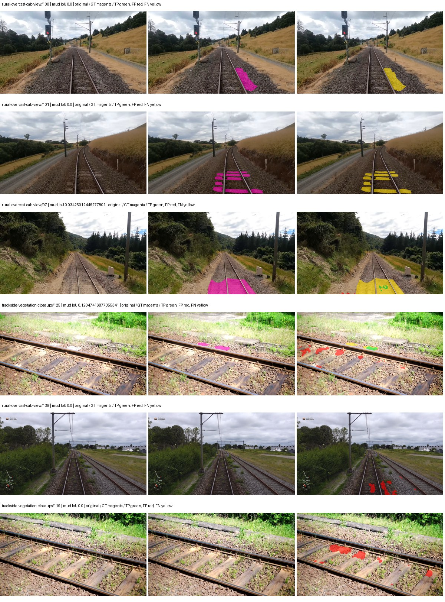
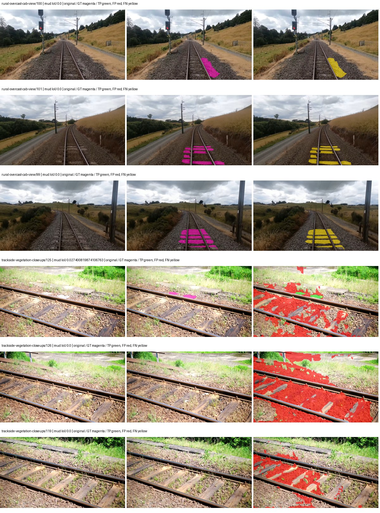
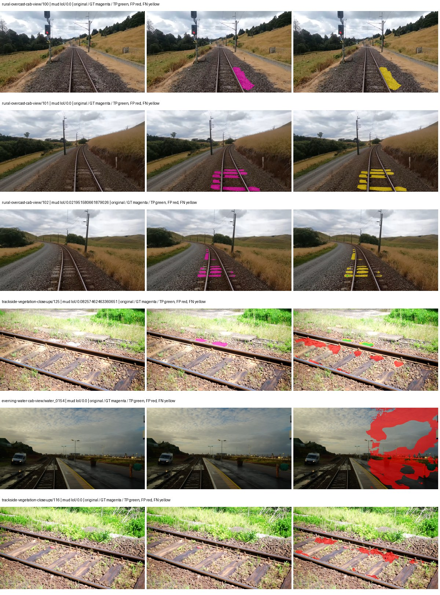
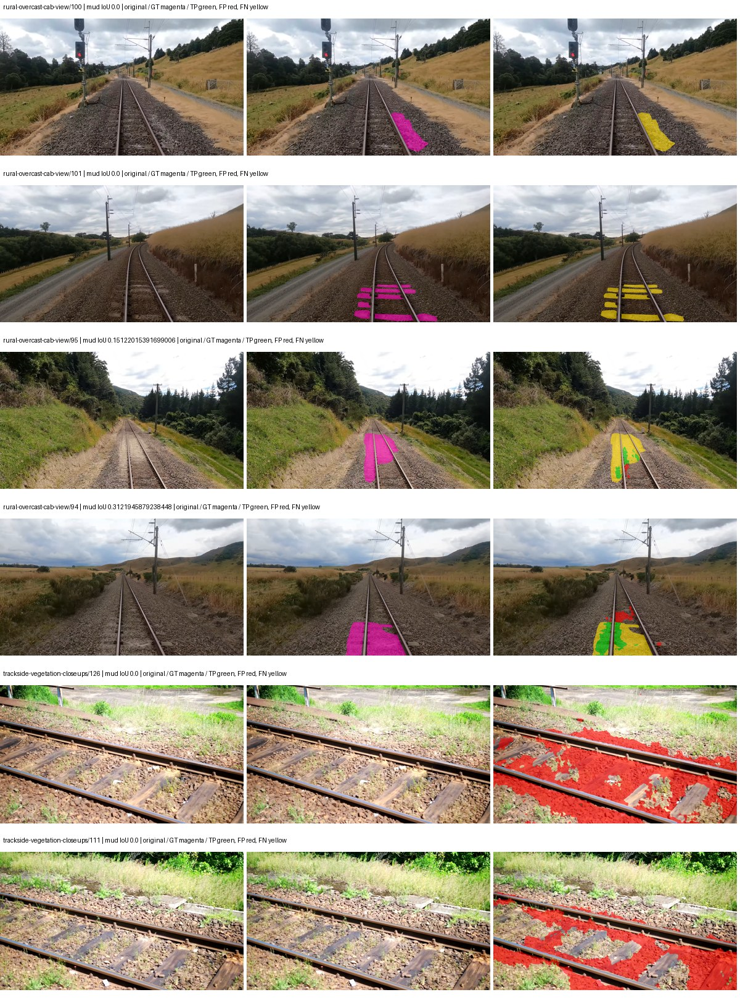
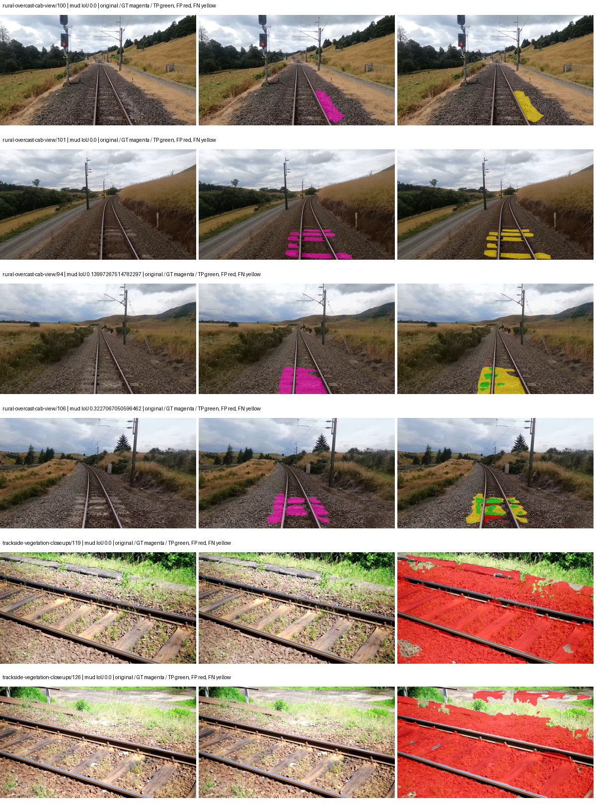
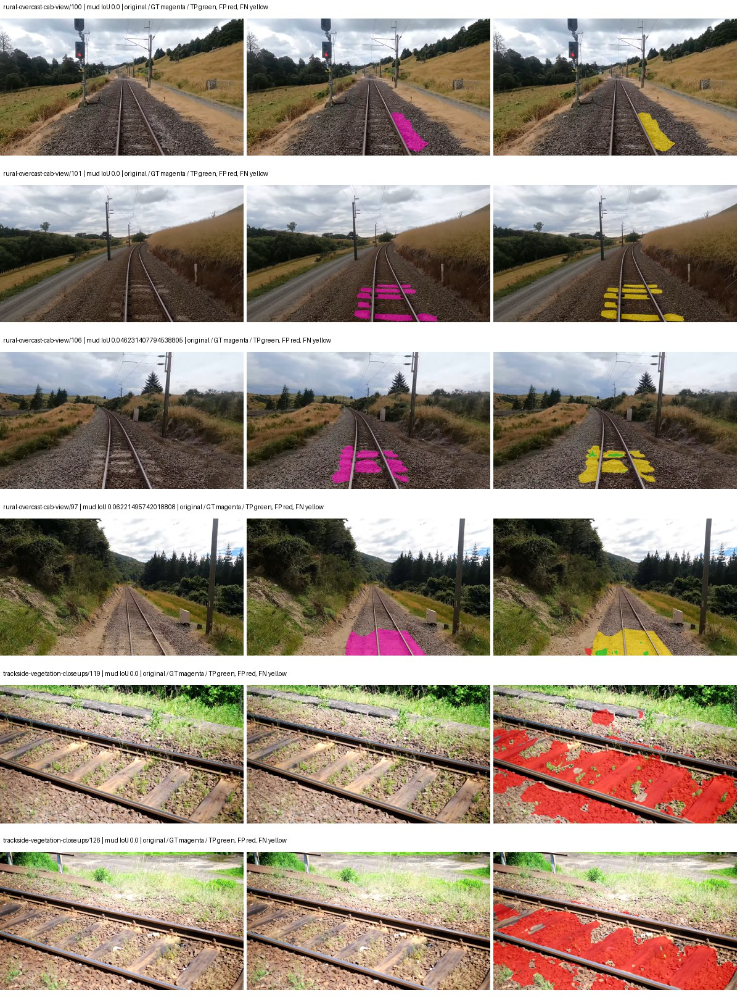
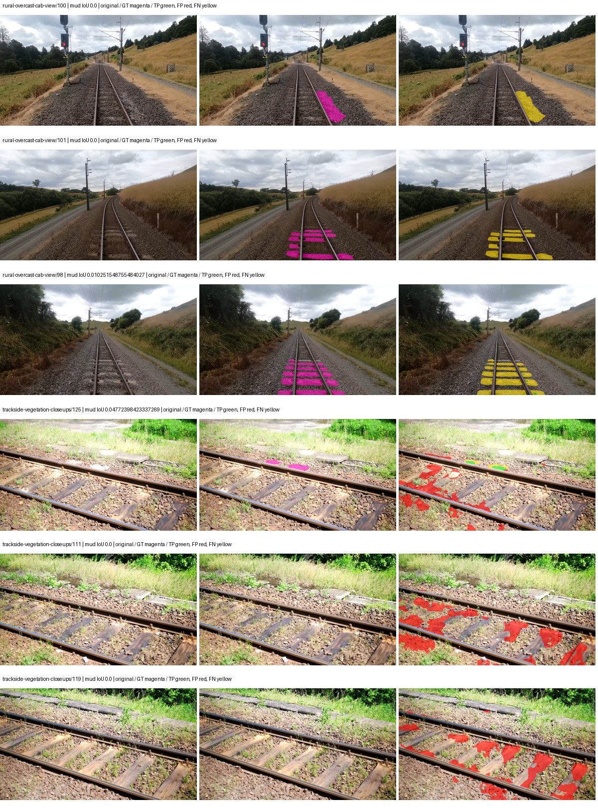
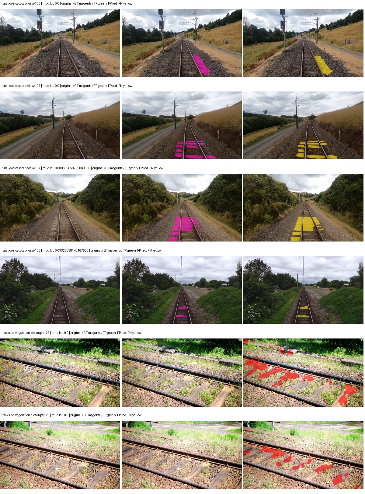
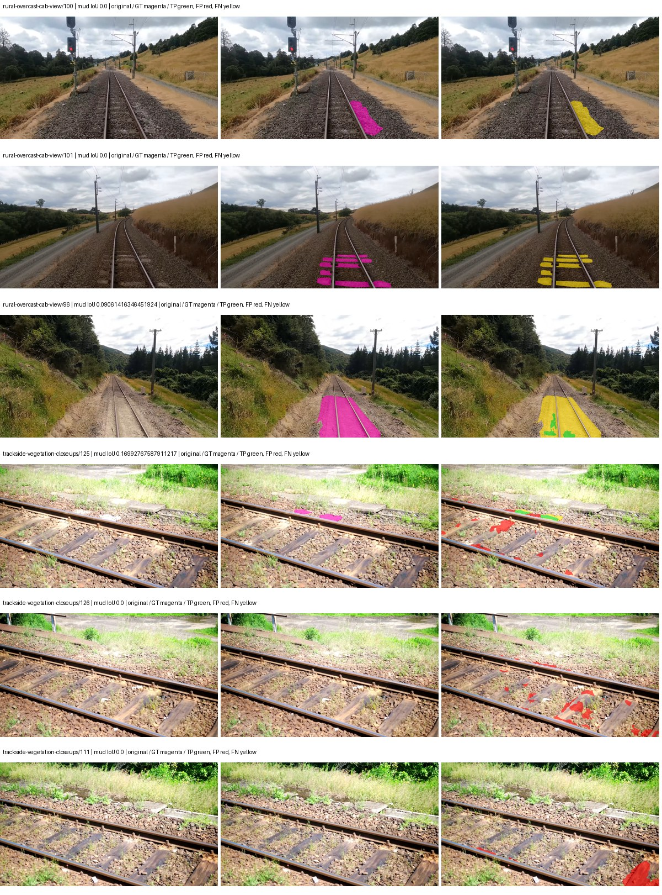
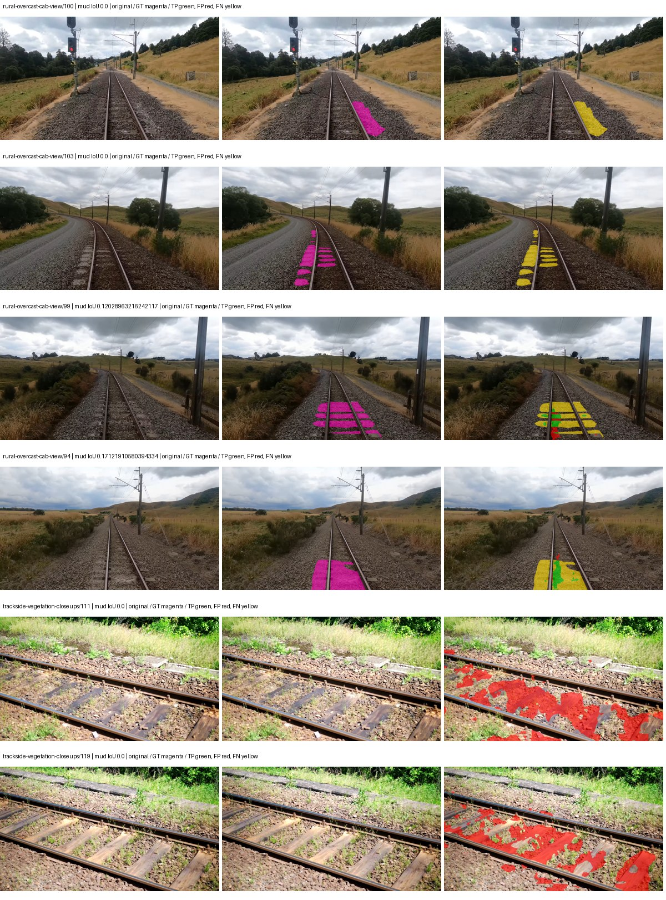

# native_resnet101_uper — paul-test-rtis

[RTIS comparison](../../README.md) · [Full model records](record.json)

Primary selection and early stopping: **mud-pumping validation IoU**. A job is complete only after full statistics and isolated profiling are verified.

| Model | Initialization path | Seed | Status | Steps | Best step | Mud IoU (%) | Mud precision (%) | Mud recall (%) | Final mud IoU (trainer val, %) | mIoU (%) | Fixed GT-class mIoU (%) |
| --- | --- | --- | --- | --- | --- | --- | --- | --- | --- | --- | --- |
| native_resnet101_uper | rtis_only | 0 | completed | 2290 | 1018 | 0.92 | 4.11 | 1.17 | 0.72 | 22.10 | 25.78 |
| native_resnet101_uper | rtis_only | 1 | completed | 1527 | 254 | 0.33 | 0.50 | 1.00 | 0.00 | 16.92 | 17.86 |
| native_resnet101_uper | rtis_only | 2 | completed | 3309 | 2036 | 0.52 | 1.16 | 0.93 | 0.18 | 28.99 | 33.82 |
| native_resnet101_uper | cityscapes_to_rtis | 0 | training | 3399 | — | — | — | — | — | — | — |
| native_resnet101_uper | cityscapes_to_rtis | 1 | completed | 1527 | 254 | 2.10 | 2.82 | 7.58 | 0.34 | 23.12 | 24.40 |
| native_resnet101_uper | cityscapes_to_rtis | 2 | completed | 1527 | 509 | 0.52 | 0.57 | 5.03 | 0.09 | 25.47 | 26.88 |
| native_resnet101_uper | railsem19_to_rtis | 0 | completed | 2036 | 763 | 0.45 | 0.56 | 2.17 | 0.31 | 40.33 | 47.05 |
| native_resnet101_uper | railsem19_to_rtis | 1 | completed | 1781 | 509 | 0.40 | 0.87 | 0.72 | 0.30 | 35.76 | 41.72 |
| native_resnet101_uper | railsem19_to_rtis | 2 | collecting | 2290 | 1018 | 0.97 | 1.83 | 2.03 | 0.76 | 42.05 | 49.06 |
| native_resnet101_uper | cityscapes_to_railsem19_to_rtis | 0 | completed | 1527 | 1018 | 0.17 | 0.40 | 0.30 | 0.07 | 40.53 | 45.03 |
| native_resnet101_uper | cityscapes_to_railsem19_to_rtis | 1 | completed | 1781 | 509 | 1.56 | 10.47 | 1.80 | 1.11 | 34.81 | 38.68 |
| native_resnet101_uper | cityscapes_to_railsem19_to_rtis | 2 | completed | 1527 | 254 | 1.61 | 2.62 | 4.01 | 0.18 | 27.24 | 30.26 |

Training: 220 images. Validation: 37 images. Test: 50 held out. Seeds: [0, 1, 2]. Seed variation measures optimization variability, not independent-recording uncertainty. Historical source checkpoints stay fixed across adaptation seeds.

Training code: `066afb2626398b7be59d4d19f5a0e4644fd59adc`. Split SHA-256: `71fef8292610c352da0709fe3bd030f3bcc18f97560394835f4b22826463b83d`.

## rtis_only — seed 0

Status: **completed**. Started: 2026-09-06T20:18:37.049067+00:00. Finished: 2026-09-06T20:56:57.409870+00:00.

Recipe pretrained initializer: `{"arch": "native", "backbone_path": null, "batch_norm_momentum": null, "checkpoint": null, "classifier_path": null, "drop_path": null, "encoder_name": null, "encoder_weights": null, "head": "unified_head", "head_paths": [], "inactive_parameter_paths": [], "local_files_only": false, "lora_alpha": 32, "lora_dropout": 0.05, "lora_r": 16, "lora_targets": [], "native": {"auxiliary_heads": [], "backbone": {"in_channels": 3, "kind": "timm", "name": "resnet101.a1_in1k", "out_indices": [1, 2, 3, 4], "weights": "pretrained"}, "head": {"activation": "relu", "channels": 256, "dropout": 0.1, "in_indices": [0, 1, 2, 3], "kind": "uper", "norm": "group", "pool_bins": [1, 2, 3, 6]}, "neck": {"kind": "identity"}, "task": "multiclass"}, "revision": null, "smp_arch": null, "subfolder": null, "trust_remote_code": false, "tuning": "full"}`.

`rtis_only` uses the recipe initializer, which may include pretrained segmentation components. Transfer paths load the exact historical source checkpoint below and reset the classifier; they do not reset all query/decoder features.

Source checkpoint: `Recipe pretrained initialization`.

Config SHA-256: `fffbd4aedd16ee3b4c7a52939e600ee4707d7c7049bc03c7da211361aef1d046`. Weights used for validation: `raw`.

### Mud-pumping and aggregate quality

| Metric | Selected checkpoint | Final training validation |
| --- | --- | --- |
| Mud IoU | 0.92 | 0.72 |
| Mud precision | 4.11 | 1.35 |
| Mud recall | 1.17 | 1.54 |
| Mud Dice/F1 | 1.82 | 1.44 |
| mIoU | 22.10 | 30.92 |
| Mean accuracy | 35.19 | 45.12 |
| Mean precision | 35.15 | 52.38 |
| Mean Dice | 28.12 | 39.88 |
| Mean specificity | 98.62 | 98.86 |
| Pixel accuracy | 77.83 | 81.35 |
| Frequency-weighted IoU | 66.53 | 71.53 |
| Fixed GT-present class mIoU | 25.78 | 36.08 |
| Boundary F1 | 26.27 | 38.52 |

The selected checkpoint has independent evaluation evidence. Final values are the trainer's final validation record, not a new independent evaluation. mIoU averages classes with nonzero union, so false positives on absent classes can change its denominator. The fixed GT-class mean is supplementary and excludes absent classes; their false positives remain in the confusion matrix.

### Resource usage and timing

| Measurement | Value |
| --- | --- |
| Peak training VRAM, retained training invocation (GiB) | 10.87 |
| Peak evaluation VRAM (GiB) | 7.54 |
| Retained training invocation wall time (seconds) | 2123.81 |
| Retained training invocation GPU-hours (one GPU) | 0.59 |
| Evaluation wall time (seconds) | 15.33 |
| Full evaluation pipeline images/second | 2.41 |
| Best full-state checkpoint (MiB) | 937.27 |
| Final full-state checkpoint (MiB) | 937.24 |
| Audited periodic checkpoints removed (GiB) | 3.66 |

VRAM uses the recorded allocator high-water mark; it is not total device usage including CUDA context. Resumed jobs' retained training invocation times and peaks are **not whole-campaign totals**. Earlier invocation resource records are not reconstructed here. Evaluation throughput includes loader, sliding-window inference and metrics; it is not model-only latency/FPS. Missing measurements are shown as —, never inferred from another dataset's run.

### Standardized inference performance

Dedicated model-only profiling waits for an idle worker-locked L40S: BF16, batch 1, 1024x1024, 20 warmup and 100 CUDA-event-timed public forwards. It excludes loading, preprocessing, tiling and metrics.

| Status | Parameters | Weight MiB | FPS | p50 ms | p95 ms | Peak reserved GiB |
| --- | --- | --- | --- | --- | --- | --- |
| complete | 61323093 | 233.93 | 64.54 | 15.35 | 16.53 | 1.31 |

```json
{
  "schema_version": 1,
  "model_id": "native_resnet101_uper",
  "measured_at": "2026-09-06T20:56:50+00:00",
  "status": "complete",
  "benchmark_scope": "rtis_selected_checkpoint_model_only",
  "applies_to": [
    "native_resnet101_uper--rtis_only--seed-0"
  ],
  "source": {
    "campaign_git_sha": "066afb2626398b7be59d4d19f5a0e4644fd59adc",
    "git_dirty": false,
    "config_hash": "eaab055e293a",
    "resolved_config": "/data/izadia1/projects/segmentary-runs/paul-test-rtis/mud-fullstats-v1-20260906-r2/configs/native_resnet101_uper--rtis_only--seed-0.yaml",
    "config_sha256": "fffbd4aedd16ee3b4c7a52939e600ee4707d7c7049bc03c7da211361aef1d046",
    "checkpoint_sha256": "14f03e844e4c16948aee3b554d17c4ef69e0b50e593aaf4358c73f835ee290c1",
    "checkpoint_global_step": 1018,
    "checkpoint_bytes": 982793855,
    "checkpoint_kind": "resume checkpoint with optimizer and EMA state",
    "weights": "raw",
    "measured_checkpoint_job_id": "native_resnet101_uper--rtis_only--seed-0",
    "result_sha256": "a7539e9799091e12cfa921880e01ca61d6e419a169a6c74062ea800853c6e471",
    "result_git_sha": "066afb2626398b7be59d4d19f5a0e4644fd59adc",
    "result_stage": "eval:paul-test-rtis:val",
    "result_seed": 0
  },
  "hardware": {
    "gpu_name": "NVIDIA L40S",
    "gpu_uuid": "GPU-c76642eb-64c1-b0ac-b051-d2efd47b32c4",
    "logical_device": "cuda:0",
    "physical_visibility_token": "9",
    "compute_capability": [
      8,
      9
    ],
    "total_memory_bytes": 47677177856
  },
  "model": {
    "parameter_count": 61323093,
    "trainable_parameter_count": 61323093,
    "resident_parameter_bytes": 245292372,
    "parameter_dtype_counts": {
      "float32": 61323093
    }
  },
  "contract": {
    "backend": "pytorch",
    "precision": "bf16_autocast",
    "batch_size": 1,
    "input_shape_nchw": [
      1,
      3,
      1024,
      1024
    ],
    "warmup_iterations": 20,
    "measured_iterations": 100,
    "timing": "per-forward CUDA events with end-event synchronization",
    "includes_preprocessing": false,
    "includes_data_loader": false,
    "includes_sliding_window": false,
    "input_resident_on_gpu": true,
    "model_only": true,
    "entrypoint": "public model(image) dense-logits forward"
  },
  "measurements": {
    "latency": {
      "p50_ms": 15.353856086730957,
      "p95_ms": 16.534784030914306,
      "mean_ms": 15.494809274673463,
      "minimum_ms": 14.656512260437012,
      "maximum_ms": 17.391616821289062,
      "fps": 64.53774178650379,
      "raw_ms": [
        15.684608459472656,
        15.681535720825195,
        15.191007614135742,
        16.039936065673828,
        14.742527961730957,
        14.698495864868164,
        16.236543655395508,
        16.38604736328125,
        15.407103538513184,
        16.521215438842773,
        15.557632446289062,
        16.242687225341797,
        15.313920021057129,
        14.898176193237305,
        15.08351993560791,
        14.90124797821045,
        15.90272045135498,
        15.032320022583008,
        15.023136138916016,
        15.11731243133545,
        16.0317440032959,
        16.531455993652344,
        15.153152465820312,
        14.752767562866211,
        14.853055953979492,
        15.750144004821777,
        16.21504020690918,
        15.040512084960938,
        14.896127700805664,
        15.27295970916748,
        15.214591979980469,
        15.17465591430664,
        16.889856338500977,
        16.226303100585938,
        16.355392456054688,
        16.936960220336914,
        15.201279640197754,
        15.341567993164062,
        15.675392150878906,
        17.04140853881836,
        15.970303535461426,
        15.770624160766602,
        15.623167991638184,
        15.580160140991211,
        15.823871612548828,
        15.626239776611328,
        15.533056259155273,
        17.391616821289062,
        15.705087661743164,
        15.366144180297852,
        15.739904403686523,
        15.321087837219238,
        14.98419189453125,
        14.98521614074707,
        14.954496383666992,
        15.846400260925293,
        15.063039779663086,
        14.980095863342285,
        16.101375579833984,
        16.364543914794922,
        15.19923210144043,
        15.29958438873291,
        16.394271850585938,
        15.906815528869629,
        15.028223991394043,
        15.735808372497559,
        16.5980167388916,
        15.57913589477539,
        14.854144096374512,
        14.666751861572266,
        14.784480094909668,
        14.753791809082031,
        15.09887981414795,
        15.236096382141113,
        15.129599571228027,
        15.649791717529297,
        15.270912170410156,
        14.838784217834473,
        14.8787202835083,
        15.637503623962402,
        15.376383781433105,
        15.733759880065918,
        14.87769603729248,
        14.755840301513672,
        14.656512260437012,
        15.078399658203125,
        14.741472244262695,
        14.840831756591797,
        16.306175231933594,
        15.50540828704834,
        15.430656433105469,
        15.07430362701416,
        15.931391716003418,
        15.99078369140625,
        16.41574478149414,
        15.47980785369873,
        14.728192329406738,
        15.150079727172852,
        14.819328308105469,
        15.10092830657959
      ],
      "percentile_method": "numpy linear interpolation"
    },
    "peak_reserved_bytes": 1405091840,
    "memory_kind": "pytorch_cuda_allocator_peak_reserved_excluding_context",
    "benchmark_wall_clock_s": 14.775194514542818
  },
  "started_at": "2026-09-06T20:56:35+00:00",
  "finished_at": "2026-09-06T20:56:50+00:00",
  "environment": {
    "hostname": "hdrfs-app-001",
    "python": "3.11.15",
    "platform": "Linux-5.15.0-139-generic-x86_64-with-glibc2.35",
    "torch": "2.11.0+cu128",
    "torch_cuda": "12.8",
    "cudnn": 91900,
    "driver_version": "570.133.20",
    "cuda_available": true,
    "gpu_count": 1,
    "gpu_names": [
      "NVIDIA L40S"
    ],
    "cuda_visible_devices": "9",
    "packages": {
      "segmentary": "0.1.0",
      "torch": "2.11.0+cu128",
      "torchvision": "0.26.0+cu128",
      "transformers": "5.15.0",
      "timm": "1.0.28",
      "segmentation-models-pytorch": "0.5.0",
      "albumentations": "2.0.8",
      "lightning": "2.6.5",
      "numpy": "2.4.4"
    }
  }
}
```

### Per-class validation results

| Class | GT pixels | IoU (%) | Precision (%) | Recall (%) | Dice (%) | Boundary F1 (%) |
| --- | --- | --- | --- | --- | --- | --- |
| car | 29664 | 0.00 | 0.00 | 0.00 | 0.00 | 0.00 |
| construction | 311585 | 10.83 | 11.25 | 74.57 | 19.54 | 27.79 |
| fence | 265137 | 3.02 | 17.04 | 3.55 | 5.87 | 12.99 |
| mud-pumping | 1226250 | 0.92 | 4.11 | 1.17 | 1.82 | 2.50 |
| on-rails | 0 | 0.00 | 0.00 | — | 0.00 | 0.00 |
| person | 0 | 0.00 | 0.00 | — | 0.00 | 0.00 |
| pole | 628038 | 59.38 | 75.03 | 74.00 | 74.51 | 82.88 |
| rail-embedded | 16799 | 0.00 | 0.00 | 0.00 | 0.00 | 0.00 |
| rail-raised | 2969797 | 72.94 | 81.35 | 87.58 | 84.35 | 90.00 |
| rail-track | 6323197 | 32.60 | 65.21 | 39.47 | 49.17 | 50.97 |
| road | 1048831 | 3.33 | 16.79 | 3.98 | 6.44 | 10.62 |
| sidewalk | 1297367 | 15.81 | 95.50 | 15.93 | 27.31 | 11.51 |
| sky | 19121606 | 89.42 | 99.27 | 90.01 | 94.42 | 74.20 |
| standing-water | 95802 | 0.25 | 0.30 | 1.43 | 0.49 | 1.71 |
| terrain | 39239306 | 81.29 | 85.74 | 93.99 | 89.68 | 52.93 |
| trackbed | 10643081 | 45.41 | 50.84 | 80.98 | 62.46 | 47.03 |
| traffic-light | 19510 | 38.30 | 54.83 | 55.96 | 55.39 | 55.15 |
| traffic-sign | 13285 | 0.00 | 0.00 | 0.00 | 0.00 | 0.00 |
| tram-track | 56179 | 0.00 | 0.00 | 0.00 | 0.00 | 0.00 |
| truck | 0 | 0.00 | 0.00 | — | 0.00 | 0.00 |
| vegetation-overgrowth | 5901821 | 10.51 | 80.80 | 10.78 | 19.03 | 31.46 |

### Full-run accounting

| Measurement | Value |
| --- | --- |
| Full GPU-reserved wall seconds, all recorded worker attempts | 2300.37 |
| Full reserved GPU-hours | 0.64 |
| Whole-run timing complete | True |

| Phase | Wall seconds including failed attempts |
| --- | --- |
| training | 2130.99 |
| diagnostics | 116.02 |
| performance | 23.30 |

GPU-reserved time includes model loading, training, validation, collection, profiling, checkpoint I/O and orchestration while the worker owns one GPU. It is not GPU kernel-active time. Phase timings and sampled device memory/power/utilization are retained separately; sampled device memory is not the allocator high-water mark.

### Train/validation and raw/EMA diagnostics

| Checkpoint / weights / split | Images | Mud IoU (%) | Mud precision (%) | Mud recall (%) |
| --- | --- | --- | --- | --- |
| best-auto-train / raw | 220 | 89.67 | 94.75 | 94.36 |
| best-auto-val / raw | 37 | 0.92 | 4.11 | 1.17 |
| best-alternate-val / ema | 37 | 0.30 | 2.83 | 0.33 |
| final-auto-val / raw | 37 | 0.72 | 1.33 | 1.54 |

Train uses the evaluation transform without augmentation. Compare mud train/validation metrics for the same selected weights. Alternate EMA on running-stat BatchNorm is explicitly uncalibrated and is diagnostic only. Score-threshold curves use uncalibrated normalized scores and are pixel-level diagnostics, not event detection rates or a selected deployment operating point.

### Downloadable evidence

- best-auto-train: [per-image.csv](rtis_only--seed-0/best-auto-train/per-image.csv) · [per-image-confusion.json.gz](rtis_only--seed-0/best-auto-train/per-image-confusion.json.gz) · [groups.json](rtis_only--seed-0/best-auto-train/groups.json) · [mud-score-curves.json](rtis_only--seed-0/best-auto-train/mud-score-curves.json)
- best-auto-val: [per-image.csv](rtis_only--seed-0/best-auto-val/per-image.csv) · [per-image-confusion.json.gz](rtis_only--seed-0/best-auto-val/per-image-confusion.json.gz) · [groups.json](rtis_only--seed-0/best-auto-val/groups.json) · [mud-score-curves.json](rtis_only--seed-0/best-auto-val/mud-score-curves.json) · [examples.jpg](rtis_only--seed-0/best-auto-val/examples.jpg)
- best-alternate-val: [per-image.csv](rtis_only--seed-0/best-alternate-val/per-image.csv) · [per-image-confusion.json.gz](rtis_only--seed-0/best-alternate-val/per-image-confusion.json.gz) · [groups.json](rtis_only--seed-0/best-alternate-val/groups.json) · [mud-score-curves.json](rtis_only--seed-0/best-alternate-val/mud-score-curves.json)
- final-auto-val: [per-image.csv](rtis_only--seed-0/final-auto-val/per-image.csv) · [per-image-confusion.json.gz](rtis_only--seed-0/final-auto-val/per-image-confusion.json.gz) · [groups.json](rtis_only--seed-0/final-auto-val/groups.json) · [mud-score-curves.json](rtis_only--seed-0/final-auto-val/mud-score-curves.json)
- resources: [telemetry.csv](rtis_only--seed-0/resources/telemetry.csv)



Examples are two lowest and two highest mud-IoU positive images, plus up to two negative images with the most false-positive mud pixels. They are targeted diagnostic examples, not random samples. Green: true positive; red: false positive; yellow: false negative. Full predictions remain on HDRFS.

### Validation tracking

| Logged step | Overall mIoU (%) | Mud IoU (%) |
| --- | --- | --- |
| 254 | 17.83 | 0.37 |
| 508 | 19.33 | 0.00 |
| 763 | 23.48 | 0.00 |
| 1017 | 22.10 | 0.93 |
| 1272 | 26.19 | 0.06 |
| 1527 | 27.59 | 0.78 |
| 1781 | 26.58 | 0.45 |
| 2036 | 29.55 | 0.46 |
| 2290 | 30.92 | 0.72 |

All retained scalar curves, including training loss and per-class IoU, are in record.json. Observed best mud on a curve is not necessarily a retained checkpoint: the pilot saved its selection-metric-best and final checkpoints. Step logging and checkpoint global_step may differ by one.

### Stopping and checkpoint provenance

```json
{
  "stopping": {
    "actual_steps": 2290,
    "maximum_steps": 4000,
    "min_delta": 0.001,
    "monitor": "val_iou/mud-pumping",
    "patience": 5,
    "reason": "validation_plateau"
  },
  "checkpoints": {
    "best": {
      "path": "/data/izadia1/projects/segmentary-runs/paul-test-rtis/mud-fullstats-v1-20260906-r2/future-runs/native_resnet101_uper--rtis_only--seed-0_seed0/rtis/best.ckpt",
      "sha256": "14f03e844e4c16948aee3b554d17c4ef69e0b50e593aaf4358c73f835ee290c1",
      "global_step": 1018,
      "bytes": 982793855
    },
    "final": {
      "path": "/data/izadia1/projects/segmentary-runs/paul-test-rtis/mud-fullstats-v1-20260906-r2/future-runs/native_resnet101_uper--rtis_only--seed-0_seed0/rtis/last.ckpt",
      "sha256": "7e419e16db8e6983b16398fe7845061810ea9fe21e88f30875caf95623a2df24",
      "global_step": 2290,
      "bytes": 982771711
    }
  },
  "cleanup_error": null
}
```

### Resolved training, initialization and evaluation settings

The optimizer block is the base configuration. Stage LR scales are applied at runtime, and stage warmup is capped at min(base warmup, floor(stage budget / 10), stage budget - 1): 400 steps for this 4,000-step pilot. Model-internal native input grids may differ from augmentation crops (EoMT uses its 640 grid).

```json
{
  "name": "native_resnet101_uper--rtis_only--seed-0",
  "model": {
    "arch": "native",
    "checkpoint": null,
    "tuning": "full",
    "head": "unified_head",
    "lora_r": 16,
    "lora_alpha": 32,
    "lora_dropout": 0.05,
    "lora_targets": [],
    "drop_path": null,
    "revision": null,
    "subfolder": null,
    "local_files_only": false,
    "trust_remote_code": false,
    "backbone_path": null,
    "head_paths": [],
    "classifier_path": null,
    "inactive_parameter_paths": [],
    "smp_arch": null,
    "encoder_name": null,
    "encoder_weights": null,
    "native": {
      "task": "multiclass",
      "backbone": {
        "kind": "timm",
        "name": "resnet101.a1_in1k",
        "weights": "pretrained",
        "out_indices": [
          1,
          2,
          3,
          4
        ],
        "in_channels": 3
      },
      "neck": {
        "kind": "identity"
      },
      "head": {
        "kind": "uper",
        "in_indices": [
          0,
          1,
          2,
          3
        ],
        "channels": 256,
        "pool_bins": [
          1,
          2,
          3,
          6
        ],
        "dropout": 0.1,
        "norm": "group",
        "activation": "relu"
      },
      "auxiliary_heads": []
    },
    "batch_norm_momentum": null
  },
  "space": "paul-test-rtis",
  "taxonomy_root": "/data/izadia1/projects/segmentary-rtis-fullstats-066afb2/taxonomy",
  "output_root": "/data/izadia1/projects/segmentary-runs/paul-test-rtis/mud-fullstats-v1-20260906-r2/future-runs",
  "optim": {
    "backbone_lr": 0.0001,
    "head_lr_mult": 10.0,
    "weight_decay": 0.05,
    "llrd": 1.0,
    "warmup_iters": 1500,
    "warmup_ratio": 1e-06,
    "poly_power": 0.9,
    "min_lr_ratio": 0.0,
    "betas": [
      0.9,
      0.999
    ],
    "grad_clip": 1.0
  },
  "train": {
    "iters": 4000,
    "batch_size": 2,
    "accum": 8,
    "num_workers": 2,
    "precision": "bf16-mixed",
    "ema_decay": 0.9998,
    "val_every": 250,
    "ckpt_every": 500,
    "selection_metric": "val_iou/mud-pumping",
    "early_stopping_patience": 5,
    "early_stopping_min_delta": 0.001,
    "seed": 0,
    "devices": 1
  },
  "eval": {
    "sliding_window": true,
    "window": [
      1024,
      1024
    ],
    "stride": [
      768,
      768
    ],
    "batch_size": 1,
    "num_workers": 2,
    "tta_scales": [],
    "tta_flip": false,
    "threshold": 0.5,
    "boundary_tolerance_frac": 0.0075,
    "save_confusion": true
  },
  "loss": {
    "task": "multiclass",
    "activation": "auto",
    "terms": [],
    "aux": "none",
    "aux_weight": 0.0,
    "ce_weight": 1.0,
    "label_smoothing": 0.0,
    "class_weights": null,
    "query": null
  },
  "aug": {
    "crop": [
      1024,
      1024
    ],
    "scale_min": 0.5,
    "scale_max": 2.0,
    "hflip_p": 0.5,
    "color_jitter_p": 0.5,
    "brightness": 0.25,
    "contrast": 0.25,
    "saturation": 0.25,
    "hue": 0.05
  },
  "stages": [
    {
      "name": "rtis",
      "data": [
        {
          "name": "paul-test-rtis",
          "root": "/data/izadia1/datasets/paul-test-rtis",
          "variant": null,
          "split_file": "splits.json",
          "train_split": "train",
          "val_split": "val",
          "limit": null,
          "loader": "folder",
          "mapping": "paul-test-rtis",
          "loader_options": {
            "require_groups": true
          }
        }
      ],
      "iters": null,
      "lr_scale": 1.0,
      "head_group_lr_scale": 1.0,
      "init_from": "pretrained",
      "reset_head": false,
      "freeze": null,
      "sample_weights": null
    }
  ]
}
```

### Hardware and software provenance

```json
{
  "training": {
    "cuda_available": true,
    "cuda_visible_devices": "9",
    "cudnn": 91900,
    "driver_version": "570.133.20",
    "gpu_count": 1,
    "gpu_names": [
      "NVIDIA L40S"
    ],
    "hostname": "hdrfs-app-001",
    "input_normalization": {
      "channel_order": "rgb",
      "mean": [
        0.485,
        0.456,
        0.406
      ],
      "source": "timm_pretrained_cfg",
      "std": [
        0.229,
        0.224,
        0.225
      ]
    },
    "model_origins": [
      {
        "hf_commit": null,
        "hf_name_or_path": null,
        "module": "backbone",
        "timm_pretrained": {
          "architecture": "resnet101",
          "hf_hub_id": "timm/resnet101.a1_in1k",
          "tag": "a1_in1k",
          "url": "https://github.com/huggingface/pytorch-image-models/releases/download/v0.1-rsb-weights/resnet101_a1_0-cdcb52a9.pth"
        }
      },
      {
        "hf_commit": null,
        "hf_name_or_path": null,
        "module": "backbone.model",
        "timm_pretrained": {
          "architecture": "resnet101",
          "hf_hub_id": "timm/resnet101.a1_in1k",
          "tag": "a1_in1k",
          "url": "https://github.com/huggingface/pytorch-image-models/releases/download/v0.1-rsb-weights/resnet101_a1_0-cdcb52a9.pth"
        }
      }
    ],
    "model_parameter_count": 61323093,
    "packages": {
      "albumentations": "2.0.8",
      "lightning": "2.6.5",
      "numpy": "2.4.4",
      "segmentary": "0.1.0",
      "segmentation-models-pytorch": "0.5.0",
      "timm": "1.0.28",
      "torch": "2.11.0+cu128",
      "torchvision": "0.26.0+cu128",
      "transformers": "5.15.0"
    },
    "platform": "Linux-5.15.0-139-generic-x86_64-with-glibc2.35",
    "python": "3.11.15",
    "torch": "2.11.0+cu128",
    "torch_cuda": "12.8",
    "trainable_parameter_count": 61323093,
    "training_stop": {
      "actual_steps": 2290,
      "maximum_steps": 4000,
      "min_delta": 0.001,
      "monitor": "val_iou/mud-pumping",
      "patience": 5,
      "reason": "validation_plateau"
    },
    "validation_weights": "raw"
  },
  "evaluation": {
    "cuda_available": true,
    "cuda_visible_devices": "9",
    "cudnn": 91900,
    "driver_version": "570.133.20",
    "gpu_count": 1,
    "gpu_names": [
      "NVIDIA L40S"
    ],
    "hostname": "hdrfs-app-001",
    "input_normalization": {
      "channel_order": "rgb",
      "mean": [
        0.485,
        0.456,
        0.406
      ],
      "source": "timm_pretrained_cfg",
      "std": [
        0.229,
        0.224,
        0.225
      ]
    },
    "packages": {
      "albumentations": "2.0.8",
      "lightning": "2.6.5",
      "numpy": "2.4.4",
      "segmentary": "0.1.0",
      "segmentation-models-pytorch": "0.5.0",
      "timm": "1.0.28",
      "torch": "2.11.0+cu128",
      "torchvision": "0.26.0+cu128",
      "transformers": "5.15.0"
    },
    "platform": "Linux-5.15.0-139-generic-x86_64-with-glibc2.35",
    "python": "3.11.15",
    "torch": "2.11.0+cu128",
    "torch_cuda": "12.8"
  }
}
```

## rtis_only — seed 1

Status: **completed**. Started: 2026-09-06T20:24:55.615638+00:00. Finished: 2026-09-06T20:51:44.081777+00:00.

Recipe pretrained initializer: `{"arch": "native", "backbone_path": null, "batch_norm_momentum": null, "checkpoint": null, "classifier_path": null, "drop_path": null, "encoder_name": null, "encoder_weights": null, "head": "unified_head", "head_paths": [], "inactive_parameter_paths": [], "local_files_only": false, "lora_alpha": 32, "lora_dropout": 0.05, "lora_r": 16, "lora_targets": [], "native": {"auxiliary_heads": [], "backbone": {"in_channels": 3, "kind": "timm", "name": "resnet101.a1_in1k", "out_indices": [1, 2, 3, 4], "weights": "pretrained"}, "head": {"activation": "relu", "channels": 256, "dropout": 0.1, "in_indices": [0, 1, 2, 3], "kind": "uper", "norm": "group", "pool_bins": [1, 2, 3, 6]}, "neck": {"kind": "identity"}, "task": "multiclass"}, "revision": null, "smp_arch": null, "subfolder": null, "trust_remote_code": false, "tuning": "full"}`.

`rtis_only` uses the recipe initializer, which may include pretrained segmentation components. Transfer paths load the exact historical source checkpoint below and reset the classifier; they do not reset all query/decoder features.

Source checkpoint: `Recipe pretrained initialization`.

Config SHA-256: `f0f52a00caff9e6471cc20ee4c081655a7e396b275ecd7cc9600a2893474e3a2`. Weights used for validation: `raw`.

### Mud-pumping and aggregate quality

| Metric | Selected checkpoint | Final training validation |
| --- | --- | --- |
| Mud IoU | 0.33 | 0.00 |
| Mud precision | 0.50 | 0.00 |
| Mud recall | 1.00 | 0.00 |
| Mud Dice/F1 | 0.67 | 0.00 |
| mIoU | 16.92 | 27.47 |
| Mean accuracy | 26.62 | 41.33 |
| Mean precision | 21.53 | 40.84 |
| Mean Dice | 21.67 | 36.23 |
| Mean specificity | 98.10 | 98.69 |
| Pixel accuracy | 71.91 | 80.01 |
| Frequency-weighted IoU | 58.43 | 68.93 |
| Fixed GT-present class mIoU | 17.86 | 32.05 |
| Boundary F1 | 17.49 | 34.13 |

The selected checkpoint has independent evaluation evidence. Final values are the trainer's final validation record, not a new independent evaluation. mIoU averages classes with nonzero union, so false positives on absent classes can change its denominator. The fixed GT-class mean is supplementary and excludes absent classes; their false positives remain in the confusion matrix.

### Resource usage and timing

| Measurement | Value |
| --- | --- |
| Peak training VRAM, retained training invocation (GiB) | 10.94 |
| Peak evaluation VRAM (GiB) | 7.54 |
| Retained training invocation wall time (seconds) | 1434.09 |
| Retained training invocation GPU-hours (one GPU) | 0.40 |
| Evaluation wall time (seconds) | 14.98 |
| Full evaluation pipeline images/second | 2.47 |
| Best full-state checkpoint (MiB) | 937.27 |
| Final full-state checkpoint (MiB) | 937.24 |
| Audited periodic checkpoints removed (GiB) | 2.75 |

VRAM uses the recorded allocator high-water mark; it is not total device usage including CUDA context. Resumed jobs' retained training invocation times and peaks are **not whole-campaign totals**. Earlier invocation resource records are not reconstructed here. Evaluation throughput includes loader, sliding-window inference and metrics; it is not model-only latency/FPS. Missing measurements are shown as —, never inferred from another dataset's run.

### Standardized inference performance

Dedicated model-only profiling waits for an idle worker-locked L40S: BF16, batch 1, 1024x1024, 20 warmup and 100 CUDA-event-timed public forwards. It excludes loading, preprocessing, tiling and metrics.

| Status | Parameters | Weight MiB | FPS | p50 ms | p95 ms | Peak reserved GiB |
| --- | --- | --- | --- | --- | --- | --- |
| complete | 61323093 | 233.93 | 65.51 | 15.01 | 16.14 | 1.31 |

```json
{
  "schema_version": 1,
  "model_id": "native_resnet101_uper",
  "measured_at": "2026-09-06T20:51:38+00:00",
  "status": "complete",
  "benchmark_scope": "rtis_selected_checkpoint_model_only",
  "applies_to": [
    "native_resnet101_uper--rtis_only--seed-1"
  ],
  "source": {
    "campaign_git_sha": "066afb2626398b7be59d4d19f5a0e4644fd59adc",
    "git_dirty": false,
    "config_hash": "c4100872bb91",
    "resolved_config": "/data/izadia1/projects/segmentary-runs/paul-test-rtis/mud-fullstats-v1-20260906-r2/configs/native_resnet101_uper--rtis_only--seed-1.yaml",
    "config_sha256": "f0f52a00caff9e6471cc20ee4c081655a7e396b275ecd7cc9600a2893474e3a2",
    "checkpoint_sha256": "fb5bdea6b63e652a340dac9530a4345aa45783e62a0498015e7f331131c9e706",
    "checkpoint_global_step": 254,
    "checkpoint_bytes": 982793663,
    "checkpoint_kind": "resume checkpoint with optimizer and EMA state",
    "weights": "raw",
    "measured_checkpoint_job_id": "native_resnet101_uper--rtis_only--seed-1",
    "result_sha256": "77e646ea9c80411d58065331a52381701ceebf5cf458895e5f042e0407d2cbba",
    "result_git_sha": "066afb2626398b7be59d4d19f5a0e4644fd59adc",
    "result_stage": "eval:paul-test-rtis:val",
    "result_seed": 1
  },
  "hardware": {
    "gpu_name": "NVIDIA L40S",
    "gpu_uuid": "GPU-804aea8b-5f62-423e-72c6-49e1ed15c4e4",
    "logical_device": "cuda:0",
    "physical_visibility_token": "6",
    "compute_capability": [
      8,
      9
    ],
    "total_memory_bytes": 47677177856
  },
  "model": {
    "parameter_count": 61323093,
    "trainable_parameter_count": 61323093,
    "resident_parameter_bytes": 245292372,
    "parameter_dtype_counts": {
      "float32": 61323093
    }
  },
  "contract": {
    "backend": "pytorch",
    "precision": "bf16_autocast",
    "batch_size": 1,
    "input_shape_nchw": [
      1,
      3,
      1024,
      1024
    ],
    "warmup_iterations": 20,
    "measured_iterations": 100,
    "timing": "per-forward CUDA events with end-event synchronization",
    "includes_preprocessing": false,
    "includes_data_loader": false,
    "includes_sliding_window": false,
    "input_resident_on_gpu": true,
    "model_only": true,
    "entrypoint": "public model(image) dense-logits forward"
  },
  "measurements": {
    "latency": {
      "p50_ms": 15.005695819854736,
      "p95_ms": 16.13900852203369,
      "mean_ms": 15.265802536010742,
      "minimum_ms": 14.771200180053711,
      "maximum_ms": 17.275903701782227,
      "fps": 65.50589119969842,
      "raw_ms": [
        15.361023902893066,
        15.633407592773438,
        15.646719932556152,
        15.479776382446289,
        16.137216567993164,
        15.59552001953125,
        14.96780776977539,
        15.607808113098145,
        16.079872131347656,
        16.090112686157227,
        14.844927787780762,
        15.045632362365723,
        14.942208290100098,
        16.0993595123291,
        16.060415267944336,
        15.476736068725586,
        15.481856346130371,
        15.981568336486816,
        16.282623291015625,
        14.86847972869873,
        15.176735877990723,
        15.723520278930664,
        14.830592155456543,
        15.20025634765625,
        15.362048149108887,
        15.342592239379883,
        14.846976280212402,
        15.644672393798828,
        15.87609577178955,
        14.840831756591797,
        15.18899154663086,
        15.532032012939453,
        15.679488182067871,
        14.899200439453125,
        14.797823905944824,
        16.021503448486328,
        14.899200439453125,
        14.859264373779297,
        15.859711647033691,
        14.953472137451172,
        14.80396842956543,
        14.849023818969727,
        14.837759971618652,
        14.864383697509766,
        15.004672050476074,
        14.946304321289062,
        15.343615531921387,
        15.172608375549316,
        14.851072311401367,
        14.872575759887695,
        14.796799659729004,
        17.275903701782227,
        14.999551773071289,
        14.9749755859375,
        14.841856002807617,
        15.375359535217285,
        14.824447631835938,
        14.862336158752441,
        14.882816314697266,
        15.956992149353027,
        14.923775672912598,
        16.17305564880371,
        15.540224075317383,
        14.906368255615234,
        14.918656349182129,
        14.865407943725586,
        14.854144096374512,
        14.827520370483398,
        15.330304145812988,
        15.987711906433105,
        14.898176193237305,
        16.19148826599121,
        15.079423904418945,
        14.99135971069336,
        15.040512084960938,
        15.094783782958984,
        15.978495597839355,
        14.900223731994629,
        14.879743576049805,
        14.90329647064209,
        14.86950397491455,
        14.8602876663208,
        14.819328308105469,
        14.771200180053711,
        15.166463851928711,
        14.811136245727539,
        15.713279724121094,
        17.20217514038086,
        15.443967819213867,
        15.080448150634766,
        15.523839950561523,
        14.819328308105469,
        14.920703887939453,
        14.89305591583252,
        14.88383960723877,
        14.87667179107666,
        15.006719589233398,
        14.853119850158691,
        14.833663940429688,
        15.391743659973145
      ],
      "percentile_method": "numpy linear interpolation"
    },
    "peak_reserved_bytes": 1405091840,
    "memory_kind": "pytorch_cuda_allocator_peak_reserved_excluding_context",
    "benchmark_wall_clock_s": 14.391586862504482
  },
  "started_at": "2026-09-06T20:51:23+00:00",
  "finished_at": "2026-09-06T20:51:38+00:00",
  "environment": {
    "hostname": "hdrfs-app-001",
    "python": "3.11.15",
    "platform": "Linux-5.15.0-139-generic-x86_64-with-glibc2.35",
    "torch": "2.11.0+cu128",
    "torch_cuda": "12.8",
    "cudnn": 91900,
    "driver_version": "570.133.20",
    "cuda_available": true,
    "gpu_count": 1,
    "gpu_names": [
      "NVIDIA L40S"
    ],
    "cuda_visible_devices": "6",
    "packages": {
      "segmentary": "0.1.0",
      "torch": "2.11.0+cu128",
      "torchvision": "0.26.0+cu128",
      "transformers": "5.15.0",
      "timm": "1.0.28",
      "segmentation-models-pytorch": "0.5.0",
      "albumentations": "2.0.8",
      "lightning": "2.6.5",
      "numpy": "2.4.4"
    }
  }
}
```

### Per-class validation results

| Class | GT pixels | IoU (%) | Precision (%) | Recall (%) | Dice (%) | Boundary F1 (%) |
| --- | --- | --- | --- | --- | --- | --- |
| car | 29664 | 0.00 | 0.00 | 0.00 | 0.00 | 0.00 |
| construction | 311585 | 6.60 | 6.80 | 68.54 | 12.38 | 10.92 |
| fence | 265137 | 0.00 | 0.00 | 0.00 | 0.00 | 0.00 |
| mud-pumping | 1226250 | 0.33 | 0.50 | 1.00 | 0.67 | 0.87 |
| on-rails | 0 | 0.00 | 0.00 | — | 0.00 | 0.00 |
| person | 0 | — | — | — | — | — |
| pole | 628038 | 35.50 | 47.04 | 59.12 | 52.40 | 71.79 |
| rail-embedded | 16799 | 0.00 | 0.00 | 0.00 | 0.00 | 0.00 |
| rail-raised | 2969797 | 57.74 | 63.44 | 86.54 | 73.21 | 79.39 |
| rail-track | 6323197 | 24.17 | 45.75 | 33.89 | 38.93 | 38.81 |
| road | 1048831 | 0.00 | 0.00 | 0.00 | 0.00 | 0.00 |
| sidewalk | 1297367 | 0.00 | 0.00 | 0.00 | 0.00 | 0.00 |
| sky | 19121606 | 81.38 | 99.73 | 81.55 | 89.73 | 51.98 |
| standing-water | 95802 | 0.00 | 0.00 | 0.00 | 0.00 | 0.00 |
| terrain | 39239306 | 72.56 | 74.84 | 95.97 | 84.10 | 36.15 |
| trackbed | 10643081 | 43.20 | 70.87 | 52.52 | 60.33 | 42.48 |
| traffic-light | 19510 | 0.00 | 0.00 | 0.00 | 0.00 | 0.00 |
| traffic-sign | 13285 | 0.00 | 0.00 | 0.00 | 0.00 | 0.00 |
| tram-track | 56179 | 0.00 | 0.00 | 0.00 | 0.00 | 0.00 |
| truck | 0 | — | — | — | — | — |
| vegetation-overgrowth | 5901821 | 0.00 | 0.00 | 0.00 | 0.00 | 0.00 |

### Full-run accounting

| Measurement | Value |
| --- | --- |
| Full GPU-reserved wall seconds, all recorded worker attempts | 1608.47 |
| Full reserved GPU-hours | 0.45 |
| Whole-run timing complete | True |

| Phase | Wall seconds including failed attempts |
| --- | --- |
| training | 1441.08 |
| diagnostics | 115.50 |
| performance | 22.84 |

GPU-reserved time includes model loading, training, validation, collection, profiling, checkpoint I/O and orchestration while the worker owns one GPU. It is not GPU kernel-active time. Phase timings and sampled device memory/power/utilization are retained separately; sampled device memory is not the allocator high-water mark.

### Train/validation and raw/EMA diagnostics

| Checkpoint / weights / split | Images | Mud IoU (%) | Mud precision (%) | Mud recall (%) |
| --- | --- | --- | --- | --- |
| best-auto-train / raw | 220 | 73.99 | 86.51 | 83.63 |
| best-auto-val / raw | 37 | 0.33 | 0.50 | 1.00 |
| best-alternate-val / ema | 37 | 0.24 | 0.30 | 1.19 |
| final-auto-val / raw | 37 | 0.00 | 0.00 | 0.00 |

Train uses the evaluation transform without augmentation. Compare mud train/validation metrics for the same selected weights. Alternate EMA on running-stat BatchNorm is explicitly uncalibrated and is diagnostic only. Score-threshold curves use uncalibrated normalized scores and are pixel-level diagnostics, not event detection rates or a selected deployment operating point.

### Downloadable evidence

- best-auto-train: [per-image.csv](rtis_only--seed-1/best-auto-train/per-image.csv) · [per-image-confusion.json.gz](rtis_only--seed-1/best-auto-train/per-image-confusion.json.gz) · [groups.json](rtis_only--seed-1/best-auto-train/groups.json) · [mud-score-curves.json](rtis_only--seed-1/best-auto-train/mud-score-curves.json)
- best-auto-val: [per-image.csv](rtis_only--seed-1/best-auto-val/per-image.csv) · [per-image-confusion.json.gz](rtis_only--seed-1/best-auto-val/per-image-confusion.json.gz) · [groups.json](rtis_only--seed-1/best-auto-val/groups.json) · [mud-score-curves.json](rtis_only--seed-1/best-auto-val/mud-score-curves.json) · [examples.jpg](rtis_only--seed-1/best-auto-val/examples.jpg)
- best-alternate-val: [per-image.csv](rtis_only--seed-1/best-alternate-val/per-image.csv) · [per-image-confusion.json.gz](rtis_only--seed-1/best-alternate-val/per-image-confusion.json.gz) · [groups.json](rtis_only--seed-1/best-alternate-val/groups.json) · [mud-score-curves.json](rtis_only--seed-1/best-alternate-val/mud-score-curves.json)
- final-auto-val: [per-image.csv](rtis_only--seed-1/final-auto-val/per-image.csv) · [per-image-confusion.json.gz](rtis_only--seed-1/final-auto-val/per-image-confusion.json.gz) · [groups.json](rtis_only--seed-1/final-auto-val/groups.json) · [mud-score-curves.json](rtis_only--seed-1/final-auto-val/mud-score-curves.json)
- resources: [telemetry.csv](rtis_only--seed-1/resources/telemetry.csv)



Examples are two lowest and two highest mud-IoU positive images, plus up to two negative images with the most false-positive mud pixels. They are targeted diagnostic examples, not random samples. Green: true positive; red: false positive; yellow: false negative. Full predictions remain on HDRFS.

### Validation tracking

| Logged step | Overall mIoU (%) | Mud IoU (%) |
| --- | --- | --- |
| 254 | 16.93 | 0.33 |
| 508 | 20.07 | 0.18 |
| 763 | 21.80 | 0.27 |
| 1017 | 24.67 | 0.15 |
| 1272 | 27.12 | 0.09 |
| 1527 | 27.47 | 0.00 |

All retained scalar curves, including training loss and per-class IoU, are in record.json. Observed best mud on a curve is not necessarily a retained checkpoint: the pilot saved its selection-metric-best and final checkpoints. Step logging and checkpoint global_step may differ by one.

### Stopping and checkpoint provenance

```json
{
  "stopping": {
    "actual_steps": 1527,
    "maximum_steps": 4000,
    "min_delta": 0.001,
    "monitor": "val_iou/mud-pumping",
    "patience": 5,
    "reason": "validation_plateau"
  },
  "checkpoints": {
    "best": {
      "path": "/data/izadia1/projects/segmentary-runs/paul-test-rtis/mud-fullstats-v1-20260906-r2/future-runs/native_resnet101_uper--rtis_only--seed-1_seed1/rtis/best.ckpt",
      "sha256": "fb5bdea6b63e652a340dac9530a4345aa45783e62a0498015e7f331131c9e706",
      "global_step": 254,
      "bytes": 982793663
    },
    "final": {
      "path": "/data/izadia1/projects/segmentary-runs/paul-test-rtis/mud-fullstats-v1-20260906-r2/future-runs/native_resnet101_uper--rtis_only--seed-1_seed1/rtis/last.ckpt",
      "sha256": "2ef9b9a94b298d5d89eb7c20dce8ce680c1e57800cc0ee7d5696680f23b0a800",
      "global_step": 1527,
      "bytes": 982771711
    }
  },
  "cleanup_error": null
}
```

### Resolved training, initialization and evaluation settings

The optimizer block is the base configuration. Stage LR scales are applied at runtime, and stage warmup is capped at min(base warmup, floor(stage budget / 10), stage budget - 1): 400 steps for this 4,000-step pilot. Model-internal native input grids may differ from augmentation crops (EoMT uses its 640 grid).

```json
{
  "name": "native_resnet101_uper--rtis_only--seed-1",
  "model": {
    "arch": "native",
    "checkpoint": null,
    "tuning": "full",
    "head": "unified_head",
    "lora_r": 16,
    "lora_alpha": 32,
    "lora_dropout": 0.05,
    "lora_targets": [],
    "drop_path": null,
    "revision": null,
    "subfolder": null,
    "local_files_only": false,
    "trust_remote_code": false,
    "backbone_path": null,
    "head_paths": [],
    "classifier_path": null,
    "inactive_parameter_paths": [],
    "smp_arch": null,
    "encoder_name": null,
    "encoder_weights": null,
    "native": {
      "task": "multiclass",
      "backbone": {
        "kind": "timm",
        "name": "resnet101.a1_in1k",
        "weights": "pretrained",
        "out_indices": [
          1,
          2,
          3,
          4
        ],
        "in_channels": 3
      },
      "neck": {
        "kind": "identity"
      },
      "head": {
        "kind": "uper",
        "in_indices": [
          0,
          1,
          2,
          3
        ],
        "channels": 256,
        "pool_bins": [
          1,
          2,
          3,
          6
        ],
        "dropout": 0.1,
        "norm": "group",
        "activation": "relu"
      },
      "auxiliary_heads": []
    },
    "batch_norm_momentum": null
  },
  "space": "paul-test-rtis",
  "taxonomy_root": "/data/izadia1/projects/segmentary-rtis-fullstats-066afb2/taxonomy",
  "output_root": "/data/izadia1/projects/segmentary-runs/paul-test-rtis/mud-fullstats-v1-20260906-r2/future-runs",
  "optim": {
    "backbone_lr": 0.0001,
    "head_lr_mult": 10.0,
    "weight_decay": 0.05,
    "llrd": 1.0,
    "warmup_iters": 1500,
    "warmup_ratio": 1e-06,
    "poly_power": 0.9,
    "min_lr_ratio": 0.0,
    "betas": [
      0.9,
      0.999
    ],
    "grad_clip": 1.0
  },
  "train": {
    "iters": 4000,
    "batch_size": 2,
    "accum": 8,
    "num_workers": 2,
    "precision": "bf16-mixed",
    "ema_decay": 0.9998,
    "val_every": 250,
    "ckpt_every": 500,
    "selection_metric": "val_iou/mud-pumping",
    "early_stopping_patience": 5,
    "early_stopping_min_delta": 0.001,
    "seed": 1,
    "devices": 1
  },
  "eval": {
    "sliding_window": true,
    "window": [
      1024,
      1024
    ],
    "stride": [
      768,
      768
    ],
    "batch_size": 1,
    "num_workers": 2,
    "tta_scales": [],
    "tta_flip": false,
    "threshold": 0.5,
    "boundary_tolerance_frac": 0.0075,
    "save_confusion": true
  },
  "loss": {
    "task": "multiclass",
    "activation": "auto",
    "terms": [],
    "aux": "none",
    "aux_weight": 0.0,
    "ce_weight": 1.0,
    "label_smoothing": 0.0,
    "class_weights": null,
    "query": null
  },
  "aug": {
    "crop": [
      1024,
      1024
    ],
    "scale_min": 0.5,
    "scale_max": 2.0,
    "hflip_p": 0.5,
    "color_jitter_p": 0.5,
    "brightness": 0.25,
    "contrast": 0.25,
    "saturation": 0.25,
    "hue": 0.05
  },
  "stages": [
    {
      "name": "rtis",
      "data": [
        {
          "name": "paul-test-rtis",
          "root": "/data/izadia1/datasets/paul-test-rtis",
          "variant": null,
          "split_file": "splits.json",
          "train_split": "train",
          "val_split": "val",
          "limit": null,
          "loader": "folder",
          "mapping": "paul-test-rtis",
          "loader_options": {
            "require_groups": true
          }
        }
      ],
      "iters": null,
      "lr_scale": 1.0,
      "head_group_lr_scale": 1.0,
      "init_from": "pretrained",
      "reset_head": false,
      "freeze": null,
      "sample_weights": null
    }
  ]
}
```

### Hardware and software provenance

```json
{
  "training": {
    "cuda_available": true,
    "cuda_visible_devices": "6",
    "cudnn": 91900,
    "driver_version": "570.133.20",
    "gpu_count": 1,
    "gpu_names": [
      "NVIDIA L40S"
    ],
    "hostname": "hdrfs-app-001",
    "input_normalization": {
      "channel_order": "rgb",
      "mean": [
        0.485,
        0.456,
        0.406
      ],
      "source": "timm_pretrained_cfg",
      "std": [
        0.229,
        0.224,
        0.225
      ]
    },
    "model_origins": [
      {
        "hf_commit": null,
        "hf_name_or_path": null,
        "module": "backbone",
        "timm_pretrained": {
          "architecture": "resnet101",
          "hf_hub_id": "timm/resnet101.a1_in1k",
          "tag": "a1_in1k",
          "url": "https://github.com/huggingface/pytorch-image-models/releases/download/v0.1-rsb-weights/resnet101_a1_0-cdcb52a9.pth"
        }
      },
      {
        "hf_commit": null,
        "hf_name_or_path": null,
        "module": "backbone.model",
        "timm_pretrained": {
          "architecture": "resnet101",
          "hf_hub_id": "timm/resnet101.a1_in1k",
          "tag": "a1_in1k",
          "url": "https://github.com/huggingface/pytorch-image-models/releases/download/v0.1-rsb-weights/resnet101_a1_0-cdcb52a9.pth"
        }
      }
    ],
    "model_parameter_count": 61323093,
    "packages": {
      "albumentations": "2.0.8",
      "lightning": "2.6.5",
      "numpy": "2.4.4",
      "segmentary": "0.1.0",
      "segmentation-models-pytorch": "0.5.0",
      "timm": "1.0.28",
      "torch": "2.11.0+cu128",
      "torchvision": "0.26.0+cu128",
      "transformers": "5.15.0"
    },
    "platform": "Linux-5.15.0-139-generic-x86_64-with-glibc2.35",
    "python": "3.11.15",
    "torch": "2.11.0+cu128",
    "torch_cuda": "12.8",
    "trainable_parameter_count": 61323093,
    "training_stop": {
      "actual_steps": 1527,
      "maximum_steps": 4000,
      "min_delta": 0.001,
      "monitor": "val_iou/mud-pumping",
      "patience": 5,
      "reason": "validation_plateau"
    },
    "validation_weights": "raw"
  },
  "evaluation": {
    "cuda_available": true,
    "cuda_visible_devices": "6",
    "cudnn": 91900,
    "driver_version": "570.133.20",
    "gpu_count": 1,
    "gpu_names": [
      "NVIDIA L40S"
    ],
    "hostname": "hdrfs-app-001",
    "input_normalization": {
      "channel_order": "rgb",
      "mean": [
        0.485,
        0.456,
        0.406
      ],
      "source": "timm_pretrained_cfg",
      "std": [
        0.229,
        0.224,
        0.225
      ]
    },
    "packages": {
      "albumentations": "2.0.8",
      "lightning": "2.6.5",
      "numpy": "2.4.4",
      "segmentary": "0.1.0",
      "segmentation-models-pytorch": "0.5.0",
      "timm": "1.0.28",
      "torch": "2.11.0+cu128",
      "torchvision": "0.26.0+cu128",
      "transformers": "5.15.0"
    },
    "platform": "Linux-5.15.0-139-generic-x86_64-with-glibc2.35",
    "python": "3.11.15",
    "torch": "2.11.0+cu128",
    "torch_cuda": "12.8"
  }
}
```

## rtis_only — seed 2

Status: **completed**. Started: 2026-09-06T20:26:12.463415+00:00. Finished: 2026-09-06T21:20:04.945828+00:00.

Recipe pretrained initializer: `{"arch": "native", "backbone_path": null, "batch_norm_momentum": null, "checkpoint": null, "classifier_path": null, "drop_path": null, "encoder_name": null, "encoder_weights": null, "head": "unified_head", "head_paths": [], "inactive_parameter_paths": [], "local_files_only": false, "lora_alpha": 32, "lora_dropout": 0.05, "lora_r": 16, "lora_targets": [], "native": {"auxiliary_heads": [], "backbone": {"in_channels": 3, "kind": "timm", "name": "resnet101.a1_in1k", "out_indices": [1, 2, 3, 4], "weights": "pretrained"}, "head": {"activation": "relu", "channels": 256, "dropout": 0.1, "in_indices": [0, 1, 2, 3], "kind": "uper", "norm": "group", "pool_bins": [1, 2, 3, 6]}, "neck": {"kind": "identity"}, "task": "multiclass"}, "revision": null, "smp_arch": null, "subfolder": null, "trust_remote_code": false, "tuning": "full"}`.

`rtis_only` uses the recipe initializer, which may include pretrained segmentation components. Transfer paths load the exact historical source checkpoint below and reset the classifier; they do not reset all query/decoder features.

Source checkpoint: `Recipe pretrained initialization`.

Config SHA-256: `65c7419082fea1e200729a07fe64a812a1497c0dbc8e15dedad9e9bc999de926`. Weights used for validation: `raw`.

### Mud-pumping and aggregate quality

| Metric | Selected checkpoint | Final training validation |
| --- | --- | --- |
| Mud IoU | 0.52 | 0.18 |
| Mud precision | 1.16 | 0.77 |
| Mud recall | 0.93 | 0.24 |
| Mud Dice/F1 | 1.03 | 0.36 |
| mIoU | 28.99 | 32.92 |
| Mean accuracy | 43.58 | 48.12 |
| Mean precision | 43.39 | 46.67 |
| Mean Dice | 37.51 | 41.89 |
| Mean specificity | 98.84 | 98.95 |
| Pixel accuracy | 80.30 | 83.08 |
| Frequency-weighted IoU | 71.09 | 73.38 |
| Fixed GT-present class mIoU | 33.82 | 38.41 |
| Boundary F1 | 35.06 | 39.97 |

The selected checkpoint has independent evaluation evidence. Final values are the trainer's final validation record, not a new independent evaluation. mIoU averages classes with nonzero union, so false positives on absent classes can change its denominator. The fixed GT-class mean is supplementary and excludes absent classes; their false positives remain in the confusion matrix.

### Resource usage and timing

| Measurement | Value |
| --- | --- |
| Peak training VRAM, retained training invocation (GiB) | 10.93 |
| Peak evaluation VRAM (GiB) | 7.54 |
| Retained training invocation wall time (seconds) | 3051.66 |
| Retained training invocation GPU-hours (one GPU) | 0.85 |
| Evaluation wall time (seconds) | 15.59 |
| Full evaluation pipeline images/second | 2.37 |
| Best full-state checkpoint (MiB) | 937.27 |
| Final full-state checkpoint (MiB) | 937.24 |
| Audited periodic checkpoints removed (GiB) | 5.49 |

VRAM uses the recorded allocator high-water mark; it is not total device usage including CUDA context. Resumed jobs' retained training invocation times and peaks are **not whole-campaign totals**. Earlier invocation resource records are not reconstructed here. Evaluation throughput includes loader, sliding-window inference and metrics; it is not model-only latency/FPS. Missing measurements are shown as —, never inferred from another dataset's run.

### Standardized inference performance

Dedicated model-only profiling waits for an idle worker-locked L40S: BF16, batch 1, 1024x1024, 20 warmup and 100 CUDA-event-timed public forwards. It excludes loading, preprocessing, tiling and metrics.

| Status | Parameters | Weight MiB | FPS | p50 ms | p95 ms | Peak reserved GiB |
| --- | --- | --- | --- | --- | --- | --- |
| complete | 61323093 | 233.93 | 65.67 | 15.16 | 15.86 | 1.36 |

```json
{
  "schema_version": 1,
  "model_id": "native_resnet101_uper",
  "measured_at": "2026-09-06T21:19:55+00:00",
  "status": "complete",
  "benchmark_scope": "rtis_selected_checkpoint_model_only",
  "applies_to": [
    "native_resnet101_uper--rtis_only--seed-2"
  ],
  "source": {
    "campaign_git_sha": "066afb2626398b7be59d4d19f5a0e4644fd59adc",
    "git_dirty": false,
    "config_hash": "d7e078ab3461",
    "resolved_config": "/data/izadia1/projects/segmentary-runs/paul-test-rtis/mud-fullstats-v1-20260906-r2/configs/native_resnet101_uper--rtis_only--seed-2.yaml",
    "config_sha256": "65c7419082fea1e200729a07fe64a812a1497c0dbc8e15dedad9e9bc999de926",
    "checkpoint_sha256": "614c5cdb6c2dc1c5dcdb0e3cef2abc8a8be8340407f9219b30c1eb8570a65cf6",
    "checkpoint_global_step": 2036,
    "checkpoint_bytes": 982793855,
    "checkpoint_kind": "resume checkpoint with optimizer and EMA state",
    "weights": "raw",
    "measured_checkpoint_job_id": "native_resnet101_uper--rtis_only--seed-2",
    "result_sha256": "470ec7d30b1a43e236acc4bdaee793faf2e749830c36aaffd31b565ab16a73f4",
    "result_git_sha": "066afb2626398b7be59d4d19f5a0e4644fd59adc",
    "result_stage": "eval:paul-test-rtis:val",
    "result_seed": 2
  },
  "hardware": {
    "gpu_name": "NVIDIA L40S",
    "gpu_uuid": "GPU-fc5dde96-210d-0afa-ac74-7f88477d622b",
    "logical_device": "cuda:0",
    "physical_visibility_token": "4",
    "compute_capability": [
      8,
      9
    ],
    "total_memory_bytes": 47677177856
  },
  "model": {
    "parameter_count": 61323093,
    "trainable_parameter_count": 61323093,
    "resident_parameter_bytes": 245292372,
    "parameter_dtype_counts": {
      "float32": 61323093
    }
  },
  "contract": {
    "backend": "pytorch",
    "precision": "bf16_autocast",
    "batch_size": 1,
    "input_shape_nchw": [
      1,
      3,
      1024,
      1024
    ],
    "warmup_iterations": 20,
    "measured_iterations": 100,
    "timing": "per-forward CUDA events with end-event synchronization",
    "includes_preprocessing": false,
    "includes_data_loader": false,
    "includes_sliding_window": false,
    "input_resident_on_gpu": true,
    "model_only": true,
    "entrypoint": "public model(image) dense-logits forward"
  },
  "measurements": {
    "latency": {
      "p50_ms": 15.162864208221436,
      "p95_ms": 15.864115571975708,
      "mean_ms": 15.22731809616089,
      "minimum_ms": 14.753791809082031,
      "maximum_ms": 16.882688522338867,
      "fps": 65.67144612629586,
      "raw_ms": [
        15.482879638671875,
        15.020031929016113,
        15.60268783569336,
        15.529984474182129,
        15.004672050476074,
        15.144960403442383,
        14.846976280212402,
        14.753791809082031,
        14.80294418334961,
        14.921728134155273,
        14.788607597351074,
        14.863360404968262,
        14.813183784484863,
        14.906368255615234,
        15.346688270568848,
        15.08454418182373,
        15.063039779663086,
        14.837759971618652,
        15.29139232635498,
        16.00409507751465,
        14.98425579071045,
        14.799872398376465,
        15.422464370727539,
        14.891008377075195,
        14.89510440826416,
        15.328255653381348,
        15.474687576293945,
        15.204319953918457,
        15.021056175231934,
        15.597503662109375,
        15.580160140991211,
        14.914527893066406,
        14.855168342590332,
        15.142911911010742,
        14.792672157287598,
        15.106047630310059,
        15.161312103271484,
        14.834688186645508,
        14.89408016204834,
        14.776320457458496,
        15.225855827331543,
        15.39686393737793,
        15.179776191711426,
        14.944160461425781,
        16.85094451904297,
        15.903743743896484,
        15.19820785522461,
        14.850144386291504,
        15.765503883361816,
        16.882688522338867,
        15.134719848632812,
        15.033344268798828,
        15.557632446289062,
        15.755328178405762,
        15.241215705871582,
        14.870464324951172,
        14.835712432861328,
        15.38764762878418,
        15.241279602050781,
        15.09273624420166,
        15.28217601776123,
        15.217663764953613,
        15.814656257629395,
        15.320128440856934,
        15.325183868408203,
        15.199135780334473,
        15.555583953857422,
        15.697919845581055,
        15.260671615600586,
        15.376319885253906,
        15.862784385681152,
        15.244288444519043,
        15.152128219604492,
        14.973952293395996,
        15.114239692687988,
        15.814656257629395,
        15.343615531921387,
        14.96678352355957,
        15.253631591796875,
        15.620096206665039,
        15.102975845336914,
        14.810111999511719,
        14.855168342590332,
        14.754816055297852,
        15.257599830627441,
        15.889408111572266,
        15.102975845336914,
        15.345664024353027,
        14.927871704101562,
        15.641471862792969,
        15.574015617370605,
        15.110143661499023,
        14.814144134521484,
        14.960639953613281,
        15.293439865112305,
        15.166463851928711,
        14.912511825561523,
        14.99135971069336,
        15.164416313171387,
        15.526911735534668
      ],
      "percentile_method": "numpy linear interpolation"
    },
    "peak_reserved_bytes": 1461714944,
    "memory_kind": "pytorch_cuda_allocator_peak_reserved_excluding_context",
    "benchmark_wall_clock_s": 14.796436287462711
  },
  "started_at": "2026-09-06T21:19:41+00:00",
  "finished_at": "2026-09-06T21:19:55+00:00",
  "environment": {
    "hostname": "hdrfs-app-001",
    "python": "3.11.15",
    "platform": "Linux-5.15.0-139-generic-x86_64-with-glibc2.35",
    "torch": "2.11.0+cu128",
    "torch_cuda": "12.8",
    "cudnn": 91900,
    "driver_version": "570.133.20",
    "cuda_available": true,
    "gpu_count": 1,
    "gpu_names": [
      "NVIDIA L40S"
    ],
    "cuda_visible_devices": "4",
    "packages": {
      "segmentary": "0.1.0",
      "torch": "2.11.0+cu128",
      "torchvision": "0.26.0+cu128",
      "transformers": "5.15.0",
      "timm": "1.0.28",
      "segmentation-models-pytorch": "0.5.0",
      "albumentations": "2.0.8",
      "lightning": "2.6.5",
      "numpy": "2.4.4"
    }
  }
}
```

### Per-class validation results

| Class | GT pixels | IoU (%) | Precision (%) | Recall (%) | Dice (%) | Boundary F1 (%) |
| --- | --- | --- | --- | --- | --- | --- |
| car | 29664 | 4.40 | 23.67 | 5.13 | 8.43 | 22.62 |
| construction | 311585 | 31.73 | 36.94 | 69.22 | 48.17 | 38.76 |
| fence | 265137 | 12.33 | 40.54 | 15.04 | 21.95 | 25.69 |
| mud-pumping | 1226250 | 0.52 | 1.16 | 0.93 | 1.03 | 2.45 |
| on-rails | 0 | 0.00 | 0.00 | — | 0.00 | 0.00 |
| person | 0 | 0.00 | 0.00 | — | 0.00 | 0.00 |
| pole | 628038 | 68.53 | 81.10 | 81.56 | 81.33 | 88.82 |
| rail-embedded | 16799 | 3.02 | 7.93 | 4.65 | 5.86 | 7.52 |
| rail-raised | 2969797 | 70.19 | 75.02 | 91.60 | 82.49 | 85.25 |
| rail-track | 6323197 | 36.62 | 68.68 | 43.97 | 53.61 | 51.16 |
| road | 1048831 | 17.67 | 31.24 | 28.92 | 30.04 | 24.70 |
| sidewalk | 1297367 | 21.06 | 52.68 | 25.97 | 34.79 | 14.56 |
| sky | 19121606 | 94.81 | 99.05 | 95.68 | 97.34 | 89.90 |
| standing-water | 95802 | 0.00 | 0.00 | 0.08 | 0.01 | 0.21 |
| terrain | 39239306 | 82.58 | 89.80 | 91.13 | 90.46 | 57.37 |
| trackbed | 10643081 | 50.95 | 59.66 | 77.71 | 67.50 | 50.38 |
| traffic-light | 19510 | 55.86 | 62.96 | 83.21 | 71.68 | 63.37 |
| traffic-sign | 13285 | 18.20 | 99.22 | 18.22 | 30.79 | 46.93 |
| tram-track | 56179 | 6.03 | 11.39 | 11.35 | 11.37 | 6.76 |
| truck | 0 | 0.00 | 0.00 | — | 0.00 | 0.00 |
| vegetation-overgrowth | 5901821 | 34.19 | 70.15 | 40.01 | 50.96 | 59.81 |

### Full-run accounting

| Measurement | Value |
| --- | --- |
| Full GPU-reserved wall seconds, all recorded worker attempts | 3232.49 |
| Full reserved GPU-hours | 0.90 |
| Whole-run timing complete | True |

| Phase | Wall seconds including failed attempts |
| --- | --- |
| training | 3059.17 |
| diagnostics | 116.11 |
| performance | 24.29 |

GPU-reserved time includes model loading, training, validation, collection, profiling, checkpoint I/O and orchestration while the worker owns one GPU. It is not GPU kernel-active time. Phase timings and sampled device memory/power/utilization are retained separately; sampled device memory is not the allocator high-water mark.

### Train/validation and raw/EMA diagnostics

| Checkpoint / weights / split | Images | Mud IoU (%) | Mud precision (%) | Mud recall (%) |
| --- | --- | --- | --- | --- |
| best-auto-train / raw | 220 | 91.02 | 92.63 | 98.13 |
| best-auto-val / raw | 37 | 0.52 | 1.16 | 0.93 |
| best-alternate-val / ema | 37 | 0.02 | 0.04 | 0.03 |
| final-auto-val / raw | 37 | 0.18 | 0.77 | 0.24 |

Train uses the evaluation transform without augmentation. Compare mud train/validation metrics for the same selected weights. Alternate EMA on running-stat BatchNorm is explicitly uncalibrated and is diagnostic only. Score-threshold curves use uncalibrated normalized scores and are pixel-level diagnostics, not event detection rates or a selected deployment operating point.

### Downloadable evidence

- best-auto-train: [per-image.csv](rtis_only--seed-2/best-auto-train/per-image.csv) · [per-image-confusion.json.gz](rtis_only--seed-2/best-auto-train/per-image-confusion.json.gz) · [groups.json](rtis_only--seed-2/best-auto-train/groups.json) · [mud-score-curves.json](rtis_only--seed-2/best-auto-train/mud-score-curves.json)
- best-auto-val: [per-image.csv](rtis_only--seed-2/best-auto-val/per-image.csv) · [per-image-confusion.json.gz](rtis_only--seed-2/best-auto-val/per-image-confusion.json.gz) · [groups.json](rtis_only--seed-2/best-auto-val/groups.json) · [mud-score-curves.json](rtis_only--seed-2/best-auto-val/mud-score-curves.json) · [examples.jpg](rtis_only--seed-2/best-auto-val/examples.jpg)
- best-alternate-val: [per-image.csv](rtis_only--seed-2/best-alternate-val/per-image.csv) · [per-image-confusion.json.gz](rtis_only--seed-2/best-alternate-val/per-image-confusion.json.gz) · [groups.json](rtis_only--seed-2/best-alternate-val/groups.json) · [mud-score-curves.json](rtis_only--seed-2/best-alternate-val/mud-score-curves.json)
- final-auto-val: [per-image.csv](rtis_only--seed-2/final-auto-val/per-image.csv) · [per-image-confusion.json.gz](rtis_only--seed-2/final-auto-val/per-image-confusion.json.gz) · [groups.json](rtis_only--seed-2/final-auto-val/groups.json) · [mud-score-curves.json](rtis_only--seed-2/final-auto-val/mud-score-curves.json)
- resources: [telemetry.csv](rtis_only--seed-2/resources/telemetry.csv)



Examples are two lowest and two highest mud-IoU positive images, plus up to two negative images with the most false-positive mud pixels. They are targeted diagnostic examples, not random samples. Green: true positive; red: false positive; yellow: false negative. Full predictions remain on HDRFS.

### Validation tracking

| Logged step | Overall mIoU (%) | Mud IoU (%) |
| --- | --- | --- |
| 254 | 13.83 | 0.00 |
| 508 | 21.97 | 0.08 |
| 763 | 22.04 | 0.14 |
| 1017 | 23.59 | 0.12 |
| 1272 | 24.95 | 0.02 |
| 1527 | 29.56 | 0.00 |
| 1781 | 27.26 | 0.09 |
| 2036 | 28.99 | 0.52 |
| 2290 | 32.39 | 0.15 |
| 2545 | 32.40 | 0.21 |
| 2799 | 31.22 | 0.00 |
| 3054 | 30.86 | 0.48 |
| 3308 | 32.92 | 0.18 |

All retained scalar curves, including training loss and per-class IoU, are in record.json. Observed best mud on a curve is not necessarily a retained checkpoint: the pilot saved its selection-metric-best and final checkpoints. Step logging and checkpoint global_step may differ by one.

### Stopping and checkpoint provenance

```json
{
  "stopping": {
    "actual_steps": 3309,
    "maximum_steps": 4000,
    "min_delta": 0.001,
    "monitor": "val_iou/mud-pumping",
    "patience": 5,
    "reason": "validation_plateau"
  },
  "checkpoints": {
    "best": {
      "path": "/data/izadia1/projects/segmentary-runs/paul-test-rtis/mud-fullstats-v1-20260906-r2/future-runs/native_resnet101_uper--rtis_only--seed-2_seed2/rtis/best.ckpt",
      "sha256": "614c5cdb6c2dc1c5dcdb0e3cef2abc8a8be8340407f9219b30c1eb8570a65cf6",
      "global_step": 2036,
      "bytes": 982793855
    },
    "final": {
      "path": "/data/izadia1/projects/segmentary-runs/paul-test-rtis/mud-fullstats-v1-20260906-r2/future-runs/native_resnet101_uper--rtis_only--seed-2_seed2/rtis/last.ckpt",
      "sha256": "17fe35cc410c1d8711ce2bc7c2cdb5e934692af0f7208d10cd2ebf323104b7a1",
      "global_step": 3309,
      "bytes": 982771711
    }
  },
  "cleanup_error": null
}
```

### Resolved training, initialization and evaluation settings

The optimizer block is the base configuration. Stage LR scales are applied at runtime, and stage warmup is capped at min(base warmup, floor(stage budget / 10), stage budget - 1): 400 steps for this 4,000-step pilot. Model-internal native input grids may differ from augmentation crops (EoMT uses its 640 grid).

```json
{
  "name": "native_resnet101_uper--rtis_only--seed-2",
  "model": {
    "arch": "native",
    "checkpoint": null,
    "tuning": "full",
    "head": "unified_head",
    "lora_r": 16,
    "lora_alpha": 32,
    "lora_dropout": 0.05,
    "lora_targets": [],
    "drop_path": null,
    "revision": null,
    "subfolder": null,
    "local_files_only": false,
    "trust_remote_code": false,
    "backbone_path": null,
    "head_paths": [],
    "classifier_path": null,
    "inactive_parameter_paths": [],
    "smp_arch": null,
    "encoder_name": null,
    "encoder_weights": null,
    "native": {
      "task": "multiclass",
      "backbone": {
        "kind": "timm",
        "name": "resnet101.a1_in1k",
        "weights": "pretrained",
        "out_indices": [
          1,
          2,
          3,
          4
        ],
        "in_channels": 3
      },
      "neck": {
        "kind": "identity"
      },
      "head": {
        "kind": "uper",
        "in_indices": [
          0,
          1,
          2,
          3
        ],
        "channels": 256,
        "pool_bins": [
          1,
          2,
          3,
          6
        ],
        "dropout": 0.1,
        "norm": "group",
        "activation": "relu"
      },
      "auxiliary_heads": []
    },
    "batch_norm_momentum": null
  },
  "space": "paul-test-rtis",
  "taxonomy_root": "/data/izadia1/projects/segmentary-rtis-fullstats-066afb2/taxonomy",
  "output_root": "/data/izadia1/projects/segmentary-runs/paul-test-rtis/mud-fullstats-v1-20260906-r2/future-runs",
  "optim": {
    "backbone_lr": 0.0001,
    "head_lr_mult": 10.0,
    "weight_decay": 0.05,
    "llrd": 1.0,
    "warmup_iters": 1500,
    "warmup_ratio": 1e-06,
    "poly_power": 0.9,
    "min_lr_ratio": 0.0,
    "betas": [
      0.9,
      0.999
    ],
    "grad_clip": 1.0
  },
  "train": {
    "iters": 4000,
    "batch_size": 2,
    "accum": 8,
    "num_workers": 2,
    "precision": "bf16-mixed",
    "ema_decay": 0.9998,
    "val_every": 250,
    "ckpt_every": 500,
    "selection_metric": "val_iou/mud-pumping",
    "early_stopping_patience": 5,
    "early_stopping_min_delta": 0.001,
    "seed": 2,
    "devices": 1
  },
  "eval": {
    "sliding_window": true,
    "window": [
      1024,
      1024
    ],
    "stride": [
      768,
      768
    ],
    "batch_size": 1,
    "num_workers": 2,
    "tta_scales": [],
    "tta_flip": false,
    "threshold": 0.5,
    "boundary_tolerance_frac": 0.0075,
    "save_confusion": true
  },
  "loss": {
    "task": "multiclass",
    "activation": "auto",
    "terms": [],
    "aux": "none",
    "aux_weight": 0.0,
    "ce_weight": 1.0,
    "label_smoothing": 0.0,
    "class_weights": null,
    "query": null
  },
  "aug": {
    "crop": [
      1024,
      1024
    ],
    "scale_min": 0.5,
    "scale_max": 2.0,
    "hflip_p": 0.5,
    "color_jitter_p": 0.5,
    "brightness": 0.25,
    "contrast": 0.25,
    "saturation": 0.25,
    "hue": 0.05
  },
  "stages": [
    {
      "name": "rtis",
      "data": [
        {
          "name": "paul-test-rtis",
          "root": "/data/izadia1/datasets/paul-test-rtis",
          "variant": null,
          "split_file": "splits.json",
          "train_split": "train",
          "val_split": "val",
          "limit": null,
          "loader": "folder",
          "mapping": "paul-test-rtis",
          "loader_options": {
            "require_groups": true
          }
        }
      ],
      "iters": null,
      "lr_scale": 1.0,
      "head_group_lr_scale": 1.0,
      "init_from": "pretrained",
      "reset_head": false,
      "freeze": null,
      "sample_weights": null
    }
  ]
}
```

### Hardware and software provenance

```json
{
  "training": {
    "cuda_available": true,
    "cuda_visible_devices": "4",
    "cudnn": 91900,
    "driver_version": "570.133.20",
    "gpu_count": 1,
    "gpu_names": [
      "NVIDIA L40S"
    ],
    "hostname": "hdrfs-app-001",
    "input_normalization": {
      "channel_order": "rgb",
      "mean": [
        0.485,
        0.456,
        0.406
      ],
      "source": "timm_pretrained_cfg",
      "std": [
        0.229,
        0.224,
        0.225
      ]
    },
    "model_origins": [
      {
        "hf_commit": null,
        "hf_name_or_path": null,
        "module": "backbone",
        "timm_pretrained": {
          "architecture": "resnet101",
          "hf_hub_id": "timm/resnet101.a1_in1k",
          "tag": "a1_in1k",
          "url": "https://github.com/huggingface/pytorch-image-models/releases/download/v0.1-rsb-weights/resnet101_a1_0-cdcb52a9.pth"
        }
      },
      {
        "hf_commit": null,
        "hf_name_or_path": null,
        "module": "backbone.model",
        "timm_pretrained": {
          "architecture": "resnet101",
          "hf_hub_id": "timm/resnet101.a1_in1k",
          "tag": "a1_in1k",
          "url": "https://github.com/huggingface/pytorch-image-models/releases/download/v0.1-rsb-weights/resnet101_a1_0-cdcb52a9.pth"
        }
      }
    ],
    "model_parameter_count": 61323093,
    "packages": {
      "albumentations": "2.0.8",
      "lightning": "2.6.5",
      "numpy": "2.4.4",
      "segmentary": "0.1.0",
      "segmentation-models-pytorch": "0.5.0",
      "timm": "1.0.28",
      "torch": "2.11.0+cu128",
      "torchvision": "0.26.0+cu128",
      "transformers": "5.15.0"
    },
    "platform": "Linux-5.15.0-139-generic-x86_64-with-glibc2.35",
    "python": "3.11.15",
    "torch": "2.11.0+cu128",
    "torch_cuda": "12.8",
    "trainable_parameter_count": 61323093,
    "training_stop": {
      "actual_steps": 3309,
      "maximum_steps": 4000,
      "min_delta": 0.001,
      "monitor": "val_iou/mud-pumping",
      "patience": 5,
      "reason": "validation_plateau"
    },
    "validation_weights": "raw"
  },
  "evaluation": {
    "cuda_available": true,
    "cuda_visible_devices": "4",
    "cudnn": 91900,
    "driver_version": "570.133.20",
    "gpu_count": 1,
    "gpu_names": [
      "NVIDIA L40S"
    ],
    "hostname": "hdrfs-app-001",
    "input_normalization": {
      "channel_order": "rgb",
      "mean": [
        0.485,
        0.456,
        0.406
      ],
      "source": "timm_pretrained_cfg",
      "std": [
        0.229,
        0.224,
        0.225
      ]
    },
    "packages": {
      "albumentations": "2.0.8",
      "lightning": "2.6.5",
      "numpy": "2.4.4",
      "segmentary": "0.1.0",
      "segmentation-models-pytorch": "0.5.0",
      "timm": "1.0.28",
      "torch": "2.11.0+cu128",
      "torchvision": "0.26.0+cu128",
      "transformers": "5.15.0"
    },
    "platform": "Linux-5.15.0-139-generic-x86_64-with-glibc2.35",
    "python": "3.11.15",
    "torch": "2.11.0+cu128",
    "torch_cuda": "12.8"
  }
}
```

## cityscapes_to_rtis — seed 0

Status: **training**. Started: 2026-09-06T20:34:46.981153+00:00. Finished: —.

Recipe pretrained initializer: `{"arch": "native", "backbone_path": null, "batch_norm_momentum": null, "checkpoint": null, "classifier_path": null, "drop_path": null, "encoder_name": null, "encoder_weights": null, "head": "unified_head", "head_paths": [], "inactive_parameter_paths": [], "local_files_only": false, "lora_alpha": 32, "lora_dropout": 0.05, "lora_r": 16, "lora_targets": [], "native": {"auxiliary_heads": [], "backbone": {"in_channels": 3, "kind": "timm", "name": "resnet101.a1_in1k", "out_indices": [1, 2, 3, 4], "weights": "pretrained"}, "head": {"activation": "relu", "channels": 256, "dropout": 0.1, "in_indices": [0, 1, 2, 3], "kind": "uper", "norm": "group", "pool_bins": [1, 2, 3, 6]}, "neck": {"kind": "identity"}, "task": "multiclass"}, "revision": null, "smp_arch": null, "subfolder": null, "trust_remote_code": false, "tuning": "full"}`.

`rtis_only` uses the recipe initializer, which may include pretrained segmentation components. Transfer paths load the exact historical source checkpoint below and reset the classifier; they do not reset all query/decoder features.

Source checkpoint: `{'name': 'native_resnet101_uper--cityscapes--seed-0', 'model': 'native_resnet101_uper', 'protocol': 'cityscapes', 'config': '/data/izadia1/projects/segmentary-runs/all-model-city-rail-seed0-rail20-b9eb3e1/accepted/native_resnet101_uper--cityscapes--seed-0/resolved-config.yaml', 'checkpoint': '/data/izadia1/projects/segmentary-runs/all-model-city-rail-seed0-a7c0b67/jobs/native_resnet101_uper--cityscapes--seed-0/attempt-001/train/native_resnet101_uper--cityscapes_seed0/cityscapes/last.ckpt', 'recorded_sha256': 'afa826b49282e2029b80737cc2f65d93f1cb70275d61bef4c399b264d96a4617', 'exists': True}`.

Config SHA-256: `a551308f71ab720d18ed53c709b7b3bb7169430273d68a61230577c303b5e2ce`. Weights used for validation: `—`.

### Mud-pumping and aggregate quality

| Metric | Selected checkpoint | Final training validation |
| --- | --- | --- |
| Mud IoU | — | — |
| Mud precision | — | — |
| Mud recall | — | — |
| Mud Dice/F1 | — | — |
| mIoU | — | — |
| Mean accuracy | — | — |
| Mean precision | — | — |
| Mean Dice | — | — |
| Mean specificity | — | — |
| Pixel accuracy | — | — |
| Frequency-weighted IoU | — | — |
| Fixed GT-present class mIoU | — | — |
| Boundary F1 | — | — |

The selected checkpoint has independent evaluation evidence. Final values are the trainer's final validation record, not a new independent evaluation. mIoU averages classes with nonzero union, so false positives on absent classes can change its denominator. The fixed GT-class mean is supplementary and excludes absent classes; their false positives remain in the confusion matrix.

### Resource usage and timing

| Measurement | Value |
| --- | --- |
| Peak training VRAM, retained training invocation (GiB) | — |
| Peak evaluation VRAM (GiB) | — |
| Retained training invocation wall time (seconds) | — |
| Retained training invocation GPU-hours (one GPU) | — |
| Evaluation wall time (seconds) | — |
| Full evaluation pipeline images/second | — |
| Best full-state checkpoint (MiB) | — |
| Final full-state checkpoint (MiB) | — |
| Audited periodic checkpoints removed (GiB) | — |

VRAM uses the recorded allocator high-water mark; it is not total device usage including CUDA context. Resumed jobs' retained training invocation times and peaks are **not whole-campaign totals**. Earlier invocation resource records are not reconstructed here. Evaluation throughput includes loader, sliding-window inference and metrics; it is not model-only latency/FPS. Missing measurements are shown as —, never inferred from another dataset's run.

### Standardized inference performance

Dedicated model-only profiling waits for an idle worker-locked L40S: BF16, batch 1, 1024x1024, 20 warmup and 100 CUDA-event-timed public forwards. It excludes loading, preprocessing, tiling and metrics.

| Status | Parameters | Weight MiB | FPS | p50 ms | p95 ms | Peak reserved GiB |
| --- | --- | --- | --- | --- | --- | --- |
| waiting_for_idle_gpu | — | — | — | — | — | — |

```json
{
  "status": "waiting_for_idle_gpu",
  "contract": "L40S; batch 1; 1024x1024; BF16; 20 warmup; 100 timed forwards"
}
```

### Per-class validation results

| Class | GT pixels | IoU (%) | Precision (%) | Recall (%) | Dice (%) | Boundary F1 (%) |
| --- | --- | --- | --- | --- | --- | --- |

### Validation tracking

| Logged step | Overall mIoU (%) | Mud IoU (%) |
| --- | --- | --- |
| 254 | 24.48 | 0.38 |
| 508 | 24.78 | 0.27 |
| 763 | 32.96 | 0.22 |
| 1017 | 31.53 | 0.20 |
| 1272 | 28.42 | 0.07 |
| 1527 | 30.51 | 0.50 |
| 1781 | 29.82 | 0.09 |
| 2036 | 32.60 | 0.18 |
| 2290 | 29.85 | 0.21 |
| 2545 | 29.34 | 0.30 |
| 2799 | 32.57 | 0.79 |
| 3054 | 33.34 | 0.28 |
| 3308 | 31.37 | 0.36 |

All retained scalar curves, including training loss and per-class IoU, are in record.json. Observed best mud on a curve is not necessarily a retained checkpoint: the pilot saved its selection-metric-best and final checkpoints. Step logging and checkpoint global_step may differ by one.

### Stopping and checkpoint provenance

```json
{
  "stopping": null,
  "checkpoints": null,
  "cleanup_error": null
}
```

### Resolved training, initialization and evaluation settings

The optimizer block is the base configuration. Stage LR scales are applied at runtime, and stage warmup is capped at min(base warmup, floor(stage budget / 10), stage budget - 1): 400 steps for this 4,000-step pilot. Model-internal native input grids may differ from augmentation crops (EoMT uses its 640 grid).

```json
{
  "name": "native_resnet101_uper--cityscapes_to_rtis--seed-0",
  "model": {
    "arch": "native",
    "checkpoint": null,
    "tuning": "full",
    "head": "unified_head",
    "lora_r": 16,
    "lora_alpha": 32,
    "lora_dropout": 0.05,
    "lora_targets": [],
    "drop_path": null,
    "revision": null,
    "subfolder": null,
    "local_files_only": false,
    "trust_remote_code": false,
    "backbone_path": null,
    "head_paths": [],
    "classifier_path": null,
    "inactive_parameter_paths": [],
    "smp_arch": null,
    "encoder_name": null,
    "encoder_weights": null,
    "native": {
      "task": "multiclass",
      "backbone": {
        "kind": "timm",
        "name": "resnet101.a1_in1k",
        "weights": "pretrained",
        "out_indices": [
          1,
          2,
          3,
          4
        ],
        "in_channels": 3
      },
      "neck": {
        "kind": "identity"
      },
      "head": {
        "kind": "uper",
        "in_indices": [
          0,
          1,
          2,
          3
        ],
        "channels": 256,
        "pool_bins": [
          1,
          2,
          3,
          6
        ],
        "dropout": 0.1,
        "norm": "group",
        "activation": "relu"
      },
      "auxiliary_heads": []
    },
    "batch_norm_momentum": null
  },
  "space": "paul-test-rtis",
  "taxonomy_root": "/data/izadia1/projects/segmentary-rtis-fullstats-066afb2/taxonomy",
  "output_root": "/data/izadia1/projects/segmentary-runs/paul-test-rtis/mud-fullstats-v1-20260906-r2/future-runs",
  "optim": {
    "backbone_lr": 0.0001,
    "head_lr_mult": 10.0,
    "weight_decay": 0.05,
    "llrd": 1.0,
    "warmup_iters": 1500,
    "warmup_ratio": 1e-06,
    "poly_power": 0.9,
    "min_lr_ratio": 0.0,
    "betas": [
      0.9,
      0.999
    ],
    "grad_clip": 1.0
  },
  "train": {
    "iters": 4000,
    "batch_size": 2,
    "accum": 8,
    "num_workers": 2,
    "precision": "bf16-mixed",
    "ema_decay": 0.9998,
    "val_every": 250,
    "ckpt_every": 500,
    "selection_metric": "val_iou/mud-pumping",
    "early_stopping_patience": 5,
    "early_stopping_min_delta": 0.001,
    "seed": 0,
    "devices": 1
  },
  "eval": {
    "sliding_window": true,
    "window": [
      1024,
      1024
    ],
    "stride": [
      768,
      768
    ],
    "batch_size": 1,
    "num_workers": 2,
    "tta_scales": [],
    "tta_flip": false,
    "threshold": 0.5,
    "boundary_tolerance_frac": 0.0075,
    "save_confusion": true
  },
  "loss": {
    "task": "multiclass",
    "activation": "auto",
    "terms": [],
    "aux": "none",
    "aux_weight": 0.0,
    "ce_weight": 1.0,
    "label_smoothing": 0.0,
    "class_weights": null,
    "query": null
  },
  "aug": {
    "crop": [
      1024,
      1024
    ],
    "scale_min": 0.5,
    "scale_max": 2.0,
    "hflip_p": 0.5,
    "color_jitter_p": 0.5,
    "brightness": 0.25,
    "contrast": 0.25,
    "saturation": 0.25,
    "hue": 0.05
  },
  "stages": [
    {
      "name": "rtis",
      "data": [
        {
          "name": "paul-test-rtis",
          "root": "/data/izadia1/datasets/paul-test-rtis",
          "variant": null,
          "split_file": "splits.json",
          "train_split": "train",
          "val_split": "val",
          "limit": null,
          "loader": "folder",
          "mapping": "paul-test-rtis",
          "loader_options": {
            "require_groups": true
          }
        }
      ],
      "iters": null,
      "lr_scale": 0.1,
      "head_group_lr_scale": 1.0,
      "init_from": "/data/izadia1/projects/segmentary-runs/all-model-city-rail-seed0-a7c0b67/jobs/native_resnet101_uper--cityscapes--seed-0/attempt-001/train/native_resnet101_uper--cityscapes_seed0/cityscapes/last.ckpt",
      "reset_head": true,
      "freeze": null,
      "sample_weights": null
    }
  ]
}
```

### Hardware and software provenance

```json
{
  "training": null,
  "evaluation": null
}
```

## cityscapes_to_rtis — seed 1

Status: **completed**. Started: 2026-09-06T20:41:30.244192+00:00. Finished: 2026-09-06T21:08:14.798666+00:00.

Recipe pretrained initializer: `{"arch": "native", "backbone_path": null, "batch_norm_momentum": null, "checkpoint": null, "classifier_path": null, "drop_path": null, "encoder_name": null, "encoder_weights": null, "head": "unified_head", "head_paths": [], "inactive_parameter_paths": [], "local_files_only": false, "lora_alpha": 32, "lora_dropout": 0.05, "lora_r": 16, "lora_targets": [], "native": {"auxiliary_heads": [], "backbone": {"in_channels": 3, "kind": "timm", "name": "resnet101.a1_in1k", "out_indices": [1, 2, 3, 4], "weights": "pretrained"}, "head": {"activation": "relu", "channels": 256, "dropout": 0.1, "in_indices": [0, 1, 2, 3], "kind": "uper", "norm": "group", "pool_bins": [1, 2, 3, 6]}, "neck": {"kind": "identity"}, "task": "multiclass"}, "revision": null, "smp_arch": null, "subfolder": null, "trust_remote_code": false, "tuning": "full"}`.

`rtis_only` uses the recipe initializer, which may include pretrained segmentation components. Transfer paths load the exact historical source checkpoint below and reset the classifier; they do not reset all query/decoder features.

Source checkpoint: `{'name': 'native_resnet101_uper--cityscapes--seed-0', 'model': 'native_resnet101_uper', 'protocol': 'cityscapes', 'config': '/data/izadia1/projects/segmentary-runs/all-model-city-rail-seed0-rail20-b9eb3e1/accepted/native_resnet101_uper--cityscapes--seed-0/resolved-config.yaml', 'checkpoint': '/data/izadia1/projects/segmentary-runs/all-model-city-rail-seed0-a7c0b67/jobs/native_resnet101_uper--cityscapes--seed-0/attempt-001/train/native_resnet101_uper--cityscapes_seed0/cityscapes/last.ckpt', 'recorded_sha256': 'afa826b49282e2029b80737cc2f65d93f1cb70275d61bef4c399b264d96a4617', 'exists': True}`.

Config SHA-256: `e110a897ba39f9e993adef818e9812a4e20d5eeec564731318cf61e9282c42fd`. Weights used for validation: `raw`.

### Mud-pumping and aggregate quality

| Metric | Selected checkpoint | Final training validation |
| --- | --- | --- |
| Mud IoU | 2.10 | 0.34 |
| Mud precision | 2.82 | 0.52 |
| Mud recall | 7.58 | 0.99 |
| Mud Dice/F1 | 4.11 | 0.68 |
| mIoU | 23.12 | 30.09 |
| Mean accuracy | 30.63 | 45.68 |
| Mean precision | 36.61 | 49.91 |
| Mean Dice | 29.08 | 39.75 |
| Mean specificity | 98.38 | 98.60 |
| Pixel accuracy | 76.81 | 78.55 |
| Frequency-weighted IoU | 64.42 | 67.47 |
| Fixed GT-present class mIoU | 24.40 | 35.11 |
| Boundary F1 | 25.47 | 34.48 |

The selected checkpoint has independent evaluation evidence. Final values are the trainer's final validation record, not a new independent evaluation. mIoU averages classes with nonzero union, so false positives on absent classes can change its denominator. The fixed GT-class mean is supplementary and excludes absent classes; their false positives remain in the confusion matrix.

### Resource usage and timing

| Measurement | Value |
| --- | --- |
| Peak training VRAM, retained training invocation (GiB) | 10.87 |
| Peak evaluation VRAM (GiB) | 7.54 |
| Retained training invocation wall time (seconds) | 1429.74 |
| Retained training invocation GPU-hours (one GPU) | 0.40 |
| Evaluation wall time (seconds) | 14.93 |
| Full evaluation pipeline images/second | 2.48 |
| Best full-state checkpoint (MiB) | 937.27 |
| Final full-state checkpoint (MiB) | 937.24 |
| Audited periodic checkpoints removed (GiB) | 2.75 |

VRAM uses the recorded allocator high-water mark; it is not total device usage including CUDA context. Resumed jobs' retained training invocation times and peaks are **not whole-campaign totals**. Earlier invocation resource records are not reconstructed here. Evaluation throughput includes loader, sliding-window inference and metrics; it is not model-only latency/FPS. Missing measurements are shown as —, never inferred from another dataset's run.

### Standardized inference performance

Dedicated model-only profiling waits for an idle worker-locked L40S: BF16, batch 1, 1024x1024, 20 warmup and 100 CUDA-event-timed public forwards. It excludes loading, preprocessing, tiling and metrics.

| Status | Parameters | Weight MiB | FPS | p50 ms | p95 ms | Peak reserved GiB |
| --- | --- | --- | --- | --- | --- | --- |
| complete | 61323093 | 233.93 | 65.15 | 15.16 | 16.33 | 1.31 |

```json
{
  "schema_version": 1,
  "model_id": "native_resnet101_uper",
  "measured_at": "2026-09-06T21:08:08+00:00",
  "status": "complete",
  "benchmark_scope": "rtis_selected_checkpoint_model_only",
  "applies_to": [
    "native_resnet101_uper--cityscapes_to_rtis--seed-1"
  ],
  "source": {
    "campaign_git_sha": "066afb2626398b7be59d4d19f5a0e4644fd59adc",
    "git_dirty": false,
    "config_hash": "85364df5a1b2",
    "resolved_config": "/data/izadia1/projects/segmentary-runs/paul-test-rtis/mud-fullstats-v1-20260906-r2/configs/native_resnet101_uper--cityscapes_to_rtis--seed-1.yaml",
    "config_sha256": "e110a897ba39f9e993adef818e9812a4e20d5eeec564731318cf61e9282c42fd",
    "checkpoint_sha256": "c10548b44312972f363f6cbf525da1fae43a5cf757659b395b3eacee4c4c2453",
    "checkpoint_global_step": 254,
    "checkpoint_bytes": 982793663,
    "checkpoint_kind": "resume checkpoint with optimizer and EMA state",
    "weights": "raw",
    "measured_checkpoint_job_id": "native_resnet101_uper--cityscapes_to_rtis--seed-1",
    "result_sha256": "2ec340cef4aff2acf5505459ccce19a67fdd8a5aad3e5cc7e1e593f6e1b57f15",
    "result_git_sha": "066afb2626398b7be59d4d19f5a0e4644fd59adc",
    "result_stage": "eval:paul-test-rtis:val",
    "result_seed": 1
  },
  "hardware": {
    "gpu_name": "NVIDIA L40S",
    "gpu_uuid": "GPU-2f8008a1-9b67-11f6-987b-b393a672322c",
    "logical_device": "cuda:0",
    "physical_visibility_token": "3",
    "compute_capability": [
      8,
      9
    ],
    "total_memory_bytes": 47677177856
  },
  "model": {
    "parameter_count": 61323093,
    "trainable_parameter_count": 61323093,
    "resident_parameter_bytes": 245292372,
    "parameter_dtype_counts": {
      "float32": 61323093
    }
  },
  "contract": {
    "backend": "pytorch",
    "precision": "bf16_autocast",
    "batch_size": 1,
    "input_shape_nchw": [
      1,
      3,
      1024,
      1024
    ],
    "warmup_iterations": 20,
    "measured_iterations": 100,
    "timing": "per-forward CUDA events with end-event synchronization",
    "includes_preprocessing": false,
    "includes_data_loader": false,
    "includes_sliding_window": false,
    "input_resident_on_gpu": true,
    "model_only": true,
    "entrypoint": "public model(image) dense-logits forward"
  },
  "measurements": {
    "latency": {
      "p50_ms": 15.156735897064209,
      "p95_ms": 16.33097848892212,
      "mean_ms": 15.348689317703247,
      "minimum_ms": 14.920672416687012,
      "maximum_ms": 17.32598304748535,
      "fps": 65.15214291598147,
      "raw_ms": [
        15.325183868408203,
        16.1843204498291,
        15.433728218078613,
        15.619071960449219,
        15.054719924926758,
        14.968832015991211,
        15.70304012298584,
        15.19206428527832,
        15.128576278686523,
        16.330720901489258,
        15.239295959472656,
        14.938048362731934,
        15.162367820739746,
        15.29856014251709,
        15.014911651611328,
        14.99238395690918,
        16.057344436645508,
        15.038368225097656,
        14.99238395690918,
        14.949376106262207,
        15.445952415466309,
        15.024127960205078,
        15.031295776367188,
        15.39788818359375,
        15.014911651611328,
        14.923775672912598,
        15.052800178527832,
        14.97599983215332,
        15.358976364135742,
        15.187968254089355,
        15.011839866638184,
        15.00057601928711,
        15.029248237609863,
        15.763392448425293,
        15.017087936401367,
        14.98419189453125,
        15.042559623718262,
        14.959615707397461,
        14.989312171936035,
        15.151103973388672,
        14.973952293395996,
        14.956671714782715,
        14.958592414855957,
        14.981120109558105,
        15.767552375793457,
        15.031295776367188,
        14.98316764831543,
        15.564800262451172,
        17.051647186279297,
        16.19148826599121,
        15.524831771850586,
        15.318016052246094,
        15.464447975158691,
        15.259648323059082,
        15.242239952087402,
        14.972928047180176,
        15.394816398620605,
        16.03481674194336,
        15.954879760742188,
        14.990336418151855,
        15.672320365905762,
        15.383551597595215,
        14.965760231018066,
        16.335872650146484,
        15.275008201599121,
        15.059967994689941,
        15.0250883102417,
        16.38604736328125,
        15.010815620422363,
        15.019007682800293,
        15.049728393554688,
        14.972928047180176,
        15.502335548400879,
        15.109087944030762,
        14.920672416687012,
        15.533056259155273,
        15.09273624420166,
        15.060992240905762,
        15.134623527526855,
        16.033920288085938,
        15.735808372497559,
        15.523839950561523,
        16.660480499267578,
        15.253503799438477,
        15.1080961227417,
        15.474687576293945,
        15.029248237609863,
        15.148032188415527,
        15.49824047088623,
        15.123359680175781,
        17.32598304748535,
        15.559679985046387,
        15.313920021057129,
        15.538175582885742,
        15.626239776611328,
        15.971263885498047,
        15.506431579589844,
        15.19711971282959,
        15.136768341064453,
        14.99135971069336
      ],
      "percentile_method": "numpy linear interpolation"
    },
    "peak_reserved_bytes": 1405091840,
    "memory_kind": "pytorch_cuda_allocator_peak_reserved_excluding_context",
    "benchmark_wall_clock_s": 14.501445554196835
  },
  "started_at": "2026-09-06T21:07:54+00:00",
  "finished_at": "2026-09-06T21:08:08+00:00",
  "environment": {
    "hostname": "hdrfs-app-001",
    "python": "3.11.15",
    "platform": "Linux-5.15.0-139-generic-x86_64-with-glibc2.35",
    "torch": "2.11.0+cu128",
    "torch_cuda": "12.8",
    "cudnn": 91900,
    "driver_version": "570.133.20",
    "cuda_available": true,
    "gpu_count": 1,
    "gpu_names": [
      "NVIDIA L40S"
    ],
    "cuda_visible_devices": "3",
    "packages": {
      "segmentary": "0.1.0",
      "torch": "2.11.0+cu128",
      "torchvision": "0.26.0+cu128",
      "transformers": "5.15.0",
      "timm": "1.0.28",
      "segmentation-models-pytorch": "0.5.0",
      "albumentations": "2.0.8",
      "lightning": "2.6.5",
      "numpy": "2.4.4"
    }
  }
}
```

### Per-class validation results

| Class | GT pixels | IoU (%) | Precision (%) | Recall (%) | Dice (%) | Boundary F1 (%) |
| --- | --- | --- | --- | --- | --- | --- |
| car | 29664 | 0.00 | 0.00 | 0.00 | 0.00 | 0.00 |
| construction | 311585 | 26.52 | 31.30 | 63.46 | 41.92 | 34.01 |
| fence | 265137 | 15.21 | 31.81 | 22.56 | 26.40 | 26.03 |
| mud-pumping | 1226250 | 2.10 | 2.82 | 7.58 | 4.11 | 6.44 |
| on-rails | 0 | 0.00 | 0.00 | — | 0.00 | 0.00 |
| person | 0 | — | — | — | — | — |
| pole | 628038 | 58.59 | 77.98 | 70.21 | 73.89 | 82.52 |
| rail-embedded | 16799 | 0.00 | 0.00 | 0.00 | 0.00 | 0.00 |
| rail-raised | 2969797 | 72.57 | 85.86 | 82.43 | 84.11 | 91.30 |
| rail-track | 6323197 | 16.89 | 77.04 | 17.79 | 28.90 | 36.02 |
| road | 1048831 | 1.57 | 7.99 | 1.92 | 3.09 | 6.92 |
| sidewalk | 1297367 | 24.99 | 95.47 | 25.29 | 39.99 | 12.30 |
| sky | 19121606 | 96.00 | 99.31 | 96.64 | 97.96 | 86.99 |
| standing-water | 95802 | 0.23 | 0.25 | 2.77 | 0.46 | 1.12 |
| terrain | 39239306 | 76.17 | 76.94 | 98.70 | 86.47 | 46.10 |
| trackbed | 10643081 | 48.33 | 68.74 | 61.96 | 65.17 | 52.75 |
| traffic-light | 19510 | 0.00 | 0.00 | 0.00 | 0.00 | 0.00 |
| traffic-sign | 13285 | 0.00 | 0.00 | 0.00 | 0.00 | 0.00 |
| tram-track | 56179 | 0.00 | 0.00 | 0.00 | 0.00 | 0.00 |
| truck | 0 | — | — | — | — | — |
| vegetation-overgrowth | 5901821 | 0.04 | 40.00 | 0.04 | 0.08 | 1.49 |

### Full-run accounting

| Measurement | Value |
| --- | --- |
| Full GPU-reserved wall seconds, all recorded worker attempts | 1605.32 |
| Full reserved GPU-hours | 0.45 |
| Whole-run timing complete | True |

| Phase | Wall seconds including failed attempts |
| --- | --- |
| training | 1437.37 |
| diagnostics | 115.76 |
| performance | 23.09 |

GPU-reserved time includes model loading, training, validation, collection, profiling, checkpoint I/O and orchestration while the worker owns one GPU. It is not GPU kernel-active time. Phase timings and sampled device memory/power/utilization are retained separately; sampled device memory is not the allocator high-water mark.

### Train/validation and raw/EMA diagnostics

| Checkpoint / weights / split | Images | Mud IoU (%) | Mud precision (%) | Mud recall (%) |
| --- | --- | --- | --- | --- |
| best-auto-train / raw | 220 | 83.13 | 91.05 | 90.52 |
| best-auto-val / raw | 37 | 2.10 | 2.82 | 7.58 |
| best-alternate-val / ema | 37 | 0.52 | 0.69 | 2.16 |
| final-auto-val / raw | 37 | 0.34 | 0.52 | 0.99 |

Train uses the evaluation transform without augmentation. Compare mud train/validation metrics for the same selected weights. Alternate EMA on running-stat BatchNorm is explicitly uncalibrated and is diagnostic only. Score-threshold curves use uncalibrated normalized scores and are pixel-level diagnostics, not event detection rates or a selected deployment operating point.

### Downloadable evidence

- best-auto-train: [per-image.csv](cityscapes_to_rtis--seed-1/best-auto-train/per-image.csv) · [per-image-confusion.json.gz](cityscapes_to_rtis--seed-1/best-auto-train/per-image-confusion.json.gz) · [groups.json](cityscapes_to_rtis--seed-1/best-auto-train/groups.json) · [mud-score-curves.json](cityscapes_to_rtis--seed-1/best-auto-train/mud-score-curves.json)
- best-auto-val: [per-image.csv](cityscapes_to_rtis--seed-1/best-auto-val/per-image.csv) · [per-image-confusion.json.gz](cityscapes_to_rtis--seed-1/best-auto-val/per-image-confusion.json.gz) · [groups.json](cityscapes_to_rtis--seed-1/best-auto-val/groups.json) · [mud-score-curves.json](cityscapes_to_rtis--seed-1/best-auto-val/mud-score-curves.json) · [examples.jpg](cityscapes_to_rtis--seed-1/best-auto-val/examples.jpg)
- best-alternate-val: [per-image.csv](cityscapes_to_rtis--seed-1/best-alternate-val/per-image.csv) · [per-image-confusion.json.gz](cityscapes_to_rtis--seed-1/best-alternate-val/per-image-confusion.json.gz) · [groups.json](cityscapes_to_rtis--seed-1/best-alternate-val/groups.json) · [mud-score-curves.json](cityscapes_to_rtis--seed-1/best-alternate-val/mud-score-curves.json)
- final-auto-val: [per-image.csv](cityscapes_to_rtis--seed-1/final-auto-val/per-image.csv) · [per-image-confusion.json.gz](cityscapes_to_rtis--seed-1/final-auto-val/per-image-confusion.json.gz) · [groups.json](cityscapes_to_rtis--seed-1/final-auto-val/groups.json) · [mud-score-curves.json](cityscapes_to_rtis--seed-1/final-auto-val/mud-score-curves.json)
- resources: [telemetry.csv](cityscapes_to_rtis--seed-1/resources/telemetry.csv)



Examples are two lowest and two highest mud-IoU positive images, plus up to two negative images with the most false-positive mud pixels. They are targeted diagnostic examples, not random samples. Green: true positive; red: false positive; yellow: false negative. Full predictions remain on HDRFS.

### Validation tracking

| Logged step | Overall mIoU (%) | Mud IoU (%) |
| --- | --- | --- |
| 254 | 23.11 | 2.11 |
| 508 | 24.25 | 1.16 |
| 763 | 25.84 | 0.17 |
| 1017 | 26.54 | 0.68 |
| 1272 | 25.85 | 0.26 |
| 1527 | 30.09 | 0.34 |

All retained scalar curves, including training loss and per-class IoU, are in record.json. Observed best mud on a curve is not necessarily a retained checkpoint: the pilot saved its selection-metric-best and final checkpoints. Step logging and checkpoint global_step may differ by one.

### Stopping and checkpoint provenance

```json
{
  "stopping": {
    "actual_steps": 1527,
    "maximum_steps": 4000,
    "min_delta": 0.001,
    "monitor": "val_iou/mud-pumping",
    "patience": 5,
    "reason": "validation_plateau"
  },
  "checkpoints": {
    "best": {
      "path": "/data/izadia1/projects/segmentary-runs/paul-test-rtis/mud-fullstats-v1-20260906-r2/future-runs/native_resnet101_uper--cityscapes_to_rtis--seed-1_seed1/rtis/best.ckpt",
      "sha256": "c10548b44312972f363f6cbf525da1fae43a5cf757659b395b3eacee4c4c2453",
      "global_step": 254,
      "bytes": 982793663
    },
    "final": {
      "path": "/data/izadia1/projects/segmentary-runs/paul-test-rtis/mud-fullstats-v1-20260906-r2/future-runs/native_resnet101_uper--cityscapes_to_rtis--seed-1_seed1/rtis/last.ckpt",
      "sha256": "471dbbb775bdf1f3f4412c4832024ebe4e25eb27802f173f29083b0787ee00a7",
      "global_step": 1527,
      "bytes": 982771775
    }
  },
  "cleanup_error": null
}
```

### Resolved training, initialization and evaluation settings

The optimizer block is the base configuration. Stage LR scales are applied at runtime, and stage warmup is capped at min(base warmup, floor(stage budget / 10), stage budget - 1): 400 steps for this 4,000-step pilot. Model-internal native input grids may differ from augmentation crops (EoMT uses its 640 grid).

```json
{
  "name": "native_resnet101_uper--cityscapes_to_rtis--seed-1",
  "model": {
    "arch": "native",
    "checkpoint": null,
    "tuning": "full",
    "head": "unified_head",
    "lora_r": 16,
    "lora_alpha": 32,
    "lora_dropout": 0.05,
    "lora_targets": [],
    "drop_path": null,
    "revision": null,
    "subfolder": null,
    "local_files_only": false,
    "trust_remote_code": false,
    "backbone_path": null,
    "head_paths": [],
    "classifier_path": null,
    "inactive_parameter_paths": [],
    "smp_arch": null,
    "encoder_name": null,
    "encoder_weights": null,
    "native": {
      "task": "multiclass",
      "backbone": {
        "kind": "timm",
        "name": "resnet101.a1_in1k",
        "weights": "pretrained",
        "out_indices": [
          1,
          2,
          3,
          4
        ],
        "in_channels": 3
      },
      "neck": {
        "kind": "identity"
      },
      "head": {
        "kind": "uper",
        "in_indices": [
          0,
          1,
          2,
          3
        ],
        "channels": 256,
        "pool_bins": [
          1,
          2,
          3,
          6
        ],
        "dropout": 0.1,
        "norm": "group",
        "activation": "relu"
      },
      "auxiliary_heads": []
    },
    "batch_norm_momentum": null
  },
  "space": "paul-test-rtis",
  "taxonomy_root": "/data/izadia1/projects/segmentary-rtis-fullstats-066afb2/taxonomy",
  "output_root": "/data/izadia1/projects/segmentary-runs/paul-test-rtis/mud-fullstats-v1-20260906-r2/future-runs",
  "optim": {
    "backbone_lr": 0.0001,
    "head_lr_mult": 10.0,
    "weight_decay": 0.05,
    "llrd": 1.0,
    "warmup_iters": 1500,
    "warmup_ratio": 1e-06,
    "poly_power": 0.9,
    "min_lr_ratio": 0.0,
    "betas": [
      0.9,
      0.999
    ],
    "grad_clip": 1.0
  },
  "train": {
    "iters": 4000,
    "batch_size": 2,
    "accum": 8,
    "num_workers": 2,
    "precision": "bf16-mixed",
    "ema_decay": 0.9998,
    "val_every": 250,
    "ckpt_every": 500,
    "selection_metric": "val_iou/mud-pumping",
    "early_stopping_patience": 5,
    "early_stopping_min_delta": 0.001,
    "seed": 1,
    "devices": 1
  },
  "eval": {
    "sliding_window": true,
    "window": [
      1024,
      1024
    ],
    "stride": [
      768,
      768
    ],
    "batch_size": 1,
    "num_workers": 2,
    "tta_scales": [],
    "tta_flip": false,
    "threshold": 0.5,
    "boundary_tolerance_frac": 0.0075,
    "save_confusion": true
  },
  "loss": {
    "task": "multiclass",
    "activation": "auto",
    "terms": [],
    "aux": "none",
    "aux_weight": 0.0,
    "ce_weight": 1.0,
    "label_smoothing": 0.0,
    "class_weights": null,
    "query": null
  },
  "aug": {
    "crop": [
      1024,
      1024
    ],
    "scale_min": 0.5,
    "scale_max": 2.0,
    "hflip_p": 0.5,
    "color_jitter_p": 0.5,
    "brightness": 0.25,
    "contrast": 0.25,
    "saturation": 0.25,
    "hue": 0.05
  },
  "stages": [
    {
      "name": "rtis",
      "data": [
        {
          "name": "paul-test-rtis",
          "root": "/data/izadia1/datasets/paul-test-rtis",
          "variant": null,
          "split_file": "splits.json",
          "train_split": "train",
          "val_split": "val",
          "limit": null,
          "loader": "folder",
          "mapping": "paul-test-rtis",
          "loader_options": {
            "require_groups": true
          }
        }
      ],
      "iters": null,
      "lr_scale": 0.1,
      "head_group_lr_scale": 1.0,
      "init_from": "/data/izadia1/projects/segmentary-runs/all-model-city-rail-seed0-a7c0b67/jobs/native_resnet101_uper--cityscapes--seed-0/attempt-001/train/native_resnet101_uper--cityscapes_seed0/cityscapes/last.ckpt",
      "reset_head": true,
      "freeze": null,
      "sample_weights": null
    }
  ]
}
```

### Hardware and software provenance

```json
{
  "training": {
    "cuda_available": true,
    "cuda_visible_devices": "3",
    "cudnn": 91900,
    "driver_version": "570.133.20",
    "gpu_count": 1,
    "gpu_names": [
      "NVIDIA L40S"
    ],
    "hostname": "hdrfs-app-001",
    "input_normalization": {
      "channel_order": "rgb",
      "mean": [
        0.485,
        0.456,
        0.406
      ],
      "source": "timm_pretrained_cfg",
      "std": [
        0.229,
        0.224,
        0.225
      ]
    },
    "model_origins": [
      {
        "hf_commit": null,
        "hf_name_or_path": null,
        "module": "backbone",
        "timm_pretrained": {
          "architecture": "resnet101",
          "hf_hub_id": "timm/resnet101.a1_in1k",
          "tag": "a1_in1k",
          "url": "https://github.com/huggingface/pytorch-image-models/releases/download/v0.1-rsb-weights/resnet101_a1_0-cdcb52a9.pth"
        }
      },
      {
        "hf_commit": null,
        "hf_name_or_path": null,
        "module": "backbone.model",
        "timm_pretrained": {
          "architecture": "resnet101",
          "hf_hub_id": "timm/resnet101.a1_in1k",
          "tag": "a1_in1k",
          "url": "https://github.com/huggingface/pytorch-image-models/releases/download/v0.1-rsb-weights/resnet101_a1_0-cdcb52a9.pth"
        }
      }
    ],
    "model_parameter_count": 61323093,
    "packages": {
      "albumentations": "2.0.8",
      "lightning": "2.6.5",
      "numpy": "2.4.4",
      "segmentary": "0.1.0",
      "segmentation-models-pytorch": "0.5.0",
      "timm": "1.0.28",
      "torch": "2.11.0+cu128",
      "torchvision": "0.26.0+cu128",
      "transformers": "5.15.0"
    },
    "platform": "Linux-5.15.0-139-generic-x86_64-with-glibc2.35",
    "python": "3.11.15",
    "torch": "2.11.0+cu128",
    "torch_cuda": "12.8",
    "trainable_parameter_count": 61323093,
    "training_stop": {
      "actual_steps": 1527,
      "maximum_steps": 4000,
      "min_delta": 0.001,
      "monitor": "val_iou/mud-pumping",
      "patience": 5,
      "reason": "validation_plateau"
    },
    "validation_weights": "raw"
  },
  "evaluation": {
    "cuda_available": true,
    "cuda_visible_devices": "3",
    "cudnn": 91900,
    "driver_version": "570.133.20",
    "gpu_count": 1,
    "gpu_names": [
      "NVIDIA L40S"
    ],
    "hostname": "hdrfs-app-001",
    "input_normalization": {
      "channel_order": "rgb",
      "mean": [
        0.485,
        0.456,
        0.406
      ],
      "source": "timm_pretrained_cfg",
      "std": [
        0.229,
        0.224,
        0.225
      ]
    },
    "packages": {
      "albumentations": "2.0.8",
      "lightning": "2.6.5",
      "numpy": "2.4.4",
      "segmentary": "0.1.0",
      "segmentation-models-pytorch": "0.5.0",
      "timm": "1.0.28",
      "torch": "2.11.0+cu128",
      "torchvision": "0.26.0+cu128",
      "transformers": "5.15.0"
    },
    "platform": "Linux-5.15.0-139-generic-x86_64-with-glibc2.35",
    "python": "3.11.15",
    "torch": "2.11.0+cu128",
    "torch_cuda": "12.8"
  }
}
```

## cityscapes_to_rtis — seed 2

Status: **completed**. Started: 2026-09-06T20:43:46.190499+00:00. Finished: 2026-09-06T21:10:33.733114+00:00.

Recipe pretrained initializer: `{"arch": "native", "backbone_path": null, "batch_norm_momentum": null, "checkpoint": null, "classifier_path": null, "drop_path": null, "encoder_name": null, "encoder_weights": null, "head": "unified_head", "head_paths": [], "inactive_parameter_paths": [], "local_files_only": false, "lora_alpha": 32, "lora_dropout": 0.05, "lora_r": 16, "lora_targets": [], "native": {"auxiliary_heads": [], "backbone": {"in_channels": 3, "kind": "timm", "name": "resnet101.a1_in1k", "out_indices": [1, 2, 3, 4], "weights": "pretrained"}, "head": {"activation": "relu", "channels": 256, "dropout": 0.1, "in_indices": [0, 1, 2, 3], "kind": "uper", "norm": "group", "pool_bins": [1, 2, 3, 6]}, "neck": {"kind": "identity"}, "task": "multiclass"}, "revision": null, "smp_arch": null, "subfolder": null, "trust_remote_code": false, "tuning": "full"}`.

`rtis_only` uses the recipe initializer, which may include pretrained segmentation components. Transfer paths load the exact historical source checkpoint below and reset the classifier; they do not reset all query/decoder features.

Source checkpoint: `{'name': 'native_resnet101_uper--cityscapes--seed-0', 'model': 'native_resnet101_uper', 'protocol': 'cityscapes', 'config': '/data/izadia1/projects/segmentary-runs/all-model-city-rail-seed0-rail20-b9eb3e1/accepted/native_resnet101_uper--cityscapes--seed-0/resolved-config.yaml', 'checkpoint': '/data/izadia1/projects/segmentary-runs/all-model-city-rail-seed0-a7c0b67/jobs/native_resnet101_uper--cityscapes--seed-0/attempt-001/train/native_resnet101_uper--cityscapes_seed0/cityscapes/last.ckpt', 'recorded_sha256': 'afa826b49282e2029b80737cc2f65d93f1cb70275d61bef4c399b264d96a4617', 'exists': True}`.

Config SHA-256: `359b3bb62ad20e2ac5e63d7fe9aa3ea2568777a0ff5605df9a107ded3d0f8663`. Weights used for validation: `raw`.

### Mud-pumping and aggregate quality

| Metric | Selected checkpoint | Final training validation |
| --- | --- | --- |
| Mud IoU | 0.52 | 0.09 |
| Mud precision | 0.57 | 0.22 |
| Mud recall | 5.03 | 0.16 |
| Mud Dice/F1 | 1.03 | 0.18 |
| mIoU | 25.47 | 27.76 |
| Mean accuracy | 33.73 | 41.63 |
| Mean precision | 42.11 | 49.74 |
| Mean Dice | 32.02 | 36.35 |
| Mean specificity | 98.61 | 98.55 |
| Pixel accuracy | 76.29 | 78.91 |
| Frequency-weighted IoU | 69.08 | 67.11 |
| Fixed GT-present class mIoU | 26.88 | 32.39 |
| Boundary F1 | 29.39 | 33.89 |

The selected checkpoint has independent evaluation evidence. Final values are the trainer's final validation record, not a new independent evaluation. mIoU averages classes with nonzero union, so false positives on absent classes can change its denominator. The fixed GT-class mean is supplementary and excludes absent classes; their false positives remain in the confusion matrix.

### Resource usage and timing

| Measurement | Value |
| --- | --- |
| Peak training VRAM, retained training invocation (GiB) | 10.87 |
| Peak evaluation VRAM (GiB) | 7.54 |
| Retained training invocation wall time (seconds) | 1429.46 |
| Retained training invocation GPU-hours (one GPU) | 0.40 |
| Evaluation wall time (seconds) | 15.18 |
| Full evaluation pipeline images/second | 2.44 |
| Best full-state checkpoint (MiB) | 937.27 |
| Final full-state checkpoint (MiB) | 937.24 |
| Audited periodic checkpoints removed (GiB) | 2.75 |

VRAM uses the recorded allocator high-water mark; it is not total device usage including CUDA context. Resumed jobs' retained training invocation times and peaks are **not whole-campaign totals**. Earlier invocation resource records are not reconstructed here. Evaluation throughput includes loader, sliding-window inference and metrics; it is not model-only latency/FPS. Missing measurements are shown as —, never inferred from another dataset's run.

### Standardized inference performance

Dedicated model-only profiling waits for an idle worker-locked L40S: BF16, batch 1, 1024x1024, 20 warmup and 100 CUDA-event-timed public forwards. It excludes loading, preprocessing, tiling and metrics.

| Status | Parameters | Weight MiB | FPS | p50 ms | p95 ms | Peak reserved GiB |
| --- | --- | --- | --- | --- | --- | --- |
| complete | 61323093 | 233.93 | 65.02 | 15.15 | 16.46 | 1.36 |

```json
{
  "schema_version": 1,
  "model_id": "native_resnet101_uper",
  "measured_at": "2026-09-06T21:10:27+00:00",
  "status": "complete",
  "benchmark_scope": "rtis_selected_checkpoint_model_only",
  "applies_to": [
    "native_resnet101_uper--cityscapes_to_rtis--seed-2"
  ],
  "source": {
    "campaign_git_sha": "066afb2626398b7be59d4d19f5a0e4644fd59adc",
    "git_dirty": false,
    "config_hash": "504bb77e62c4",
    "resolved_config": "/data/izadia1/projects/segmentary-runs/paul-test-rtis/mud-fullstats-v1-20260906-r2/configs/native_resnet101_uper--cityscapes_to_rtis--seed-2.yaml",
    "config_sha256": "359b3bb62ad20e2ac5e63d7fe9aa3ea2568777a0ff5605df9a107ded3d0f8663",
    "checkpoint_sha256": "62ed7dd35c6056175348c0d53f194d64da648a73a9e0b5b290ede85a0e6970df",
    "checkpoint_global_step": 509,
    "checkpoint_bytes": 982793855,
    "checkpoint_kind": "resume checkpoint with optimizer and EMA state",
    "weights": "raw",
    "measured_checkpoint_job_id": "native_resnet101_uper--cityscapes_to_rtis--seed-2",
    "result_sha256": "f35a2af9d74bec1971f9024f29c5e066486f30c4acec017b528c6d34c5f510e0",
    "result_git_sha": "066afb2626398b7be59d4d19f5a0e4644fd59adc",
    "result_stage": "eval:paul-test-rtis:val",
    "result_seed": 2
  },
  "hardware": {
    "gpu_name": "NVIDIA L40S",
    "gpu_uuid": "GPU-931d0911-fc78-1638-e3d7-1ba868cbd286",
    "logical_device": "cuda:0",
    "physical_visibility_token": "2",
    "compute_capability": [
      8,
      9
    ],
    "total_memory_bytes": 47677177856
  },
  "model": {
    "parameter_count": 61323093,
    "trainable_parameter_count": 61323093,
    "resident_parameter_bytes": 245292372,
    "parameter_dtype_counts": {
      "float32": 61323093
    }
  },
  "contract": {
    "backend": "pytorch",
    "precision": "bf16_autocast",
    "batch_size": 1,
    "input_shape_nchw": [
      1,
      3,
      1024,
      1024
    ],
    "warmup_iterations": 20,
    "measured_iterations": 100,
    "timing": "per-forward CUDA events with end-event synchronization",
    "includes_preprocessing": false,
    "includes_data_loader": false,
    "includes_sliding_window": false,
    "input_resident_on_gpu": true,
    "model_only": true,
    "entrypoint": "public model(image) dense-logits forward"
  },
  "measurements": {
    "latency": {
      "p50_ms": 15.148544311523438,
      "p95_ms": 16.463616371154785,
      "mean_ms": 15.379477796554566,
      "minimum_ms": 14.789631843566895,
      "maximum_ms": 18.967552185058594,
      "fps": 65.02171356065341,
      "raw_ms": [
        16.22220802307129,
        14.915583610534668,
        15.525888442993164,
        15.062015533447266,
        15.012864112854004,
        16.17510414123535,
        14.89510440826416,
        15.0763521194458,
        15.315967559814453,
        15.358976364135742,
        15.641599655151367,
        14.92579174041748,
        15.309887886047363,
        15.339520454406738,
        15.533056259155273,
        14.931967735290527,
        15.48083209991455,
        15.164416313171387,
        15.024127960205078,
        14.86950397491455,
        14.954496383666992,
        15.279104232788086,
        15.266816139221191,
        15.59558391571045,
        15.246335983276367,
        14.866432189941406,
        14.837759971618652,
        14.897151947021484,
        15.39686393737793,
        15.482879638671875,
        14.943231582641602,
        14.925824165344238,
        15.197183609008789,
        15.786975860595703,
        15.874048233032227,
        15.640576362609863,
        15.077376365661621,
        14.972928047180176,
        14.901280403137207,
        14.949376106262207,
        14.938240051269531,
        15.334527969360352,
        14.8787202835083,
        14.89408016204834,
        14.971903800964355,
        14.947327613830566,
        14.88588809967041,
        15.484928131103516,
        15.029248237609863,
        15.561727523803711,
        15.339520454406738,
        15.604736328125,
        14.957568168640137,
        15.424511909484863,
        14.929920196533203,
        14.891008377075195,
        14.927871704101562,
        15.276032447814941,
        15.00979232788086,
        15.767552375793457,
        14.919679641723633,
        15.315967559814453,
        14.921728134155273,
        15.368191719055176,
        14.944255828857422,
        15.69279956817627,
        16.65331268310547,
        14.98316764831543,
        14.853119850158691,
        14.925888061523438,
        15.850496292114258,
        16.453632354736328,
        15.132672309875488,
        14.905344009399414,
        16.047103881835938,
        14.896160125732422,
        16.22425651550293,
        15.580160140991211,
        15.561663627624512,
        16.062368392944336,
        16.0,
        14.954496383666992,
        14.915583610534668,
        14.922752380371094,
        15.599616050720215,
        14.879743576049805,
        14.887935638427734,
        15.919103622436523,
        15.113216400146484,
        14.920703887939453,
        16.03481674194336,
        14.932928085327148,
        14.87667179107666,
        16.813983917236328,
        16.109567642211914,
        18.809856414794922,
        18.967552185058594,
        16.678911209106445,
        15.600640296936035,
        14.789631843566895
      ],
      "percentile_method": "numpy linear interpolation"
    },
    "peak_reserved_bytes": 1461714944,
    "memory_kind": "pytorch_cuda_allocator_peak_reserved_excluding_context",
    "benchmark_wall_clock_s": 14.82544219866395
  },
  "started_at": "2026-09-06T21:10:12+00:00",
  "finished_at": "2026-09-06T21:10:27+00:00",
  "environment": {
    "hostname": "hdrfs-app-001",
    "python": "3.11.15",
    "platform": "Linux-5.15.0-139-generic-x86_64-with-glibc2.35",
    "torch": "2.11.0+cu128",
    "torch_cuda": "12.8",
    "cudnn": 91900,
    "driver_version": "570.133.20",
    "cuda_available": true,
    "gpu_count": 1,
    "gpu_names": [
      "NVIDIA L40S"
    ],
    "cuda_visible_devices": "2",
    "packages": {
      "segmentary": "0.1.0",
      "torch": "2.11.0+cu128",
      "torchvision": "0.26.0+cu128",
      "transformers": "5.15.0",
      "timm": "1.0.28",
      "segmentation-models-pytorch": "0.5.0",
      "albumentations": "2.0.8",
      "lightning": "2.6.5",
      "numpy": "2.4.4"
    }
  }
}
```

### Per-class validation results

| Class | GT pixels | IoU (%) | Precision (%) | Recall (%) | Dice (%) | Boundary F1 (%) |
| --- | --- | --- | --- | --- | --- | --- |
| car | 29664 | 0.00 | 0.00 | 0.00 | 0.00 | 0.00 |
| construction | 311585 | 17.80 | 19.25 | 70.26 | 30.22 | 26.75 |
| fence | 265137 | 18.18 | 28.90 | 32.89 | 30.77 | 35.88 |
| mud-pumping | 1226250 | 0.52 | 0.57 | 5.03 | 1.03 | 4.09 |
| on-rails | 0 | — | — | — | — | — |
| person | 0 | — | — | — | — | — |
| pole | 628038 | 65.50 | 75.50 | 83.18 | 79.15 | 88.03 |
| rail-embedded | 16799 | 0.00 | 0.00 | 0.00 | 0.00 | 0.00 |
| rail-raised | 2969797 | 73.82 | 87.16 | 82.83 | 84.94 | 92.20 |
| rail-track | 6323197 | 26.61 | 69.06 | 30.21 | 42.03 | 39.82 |
| road | 1048831 | 1.02 | 9.58 | 1.12 | 2.01 | 6.37 |
| sidewalk | 1297367 | 27.00 | 98.71 | 27.10 | 42.52 | 11.13 |
| sky | 19121606 | 96.46 | 99.48 | 96.95 | 98.20 | 88.82 |
| standing-water | 95802 | 0.04 | 0.05 | 0.17 | 0.08 | 2.10 |
| terrain | 39239306 | 84.53 | 87.30 | 96.38 | 91.62 | 58.85 |
| trackbed | 10643081 | 47.97 | 77.70 | 55.62 | 64.83 | 51.68 |
| traffic-light | 19510 | 0.00 | 0.00 | 0.00 | 0.00 | 0.00 |
| traffic-sign | 13285 | 21.95 | 84.76 | 22.85 | 36.00 | 40.74 |
| tram-track | 56179 | 0.00 | 0.00 | 0.00 | 0.00 | 0.00 |
| truck | 0 | 0.00 | 0.00 | — | 0.00 | 0.00 |
| vegetation-overgrowth | 5901821 | 2.54 | 62.03 | 2.58 | 4.95 | 11.92 |

### Full-run accounting

| Measurement | Value |
| --- | --- |
| Full GPU-reserved wall seconds, all recorded worker attempts | 1608.23 |
| Full reserved GPU-hours | 0.45 |
| Whole-run timing complete | True |

| Phase | Wall seconds including failed attempts |
| --- | --- |
| training | 1437.36 |
| diagnostics | 116.46 |
| performance | 23.74 |

GPU-reserved time includes model loading, training, validation, collection, profiling, checkpoint I/O and orchestration while the worker owns one GPU. It is not GPU kernel-active time. Phase timings and sampled device memory/power/utilization are retained separately; sampled device memory is not the allocator high-water mark.

### Train/validation and raw/EMA diagnostics

| Checkpoint / weights / split | Images | Mud IoU (%) | Mud precision (%) | Mud recall (%) |
| --- | --- | --- | --- | --- |
| best-auto-train / raw | 220 | 88.60 | 92.52 | 95.43 |
| best-auto-val / raw | 37 | 0.52 | 0.57 | 5.03 |
| best-alternate-val / ema | 37 | 0.21 | 0.25 | 1.08 |
| final-auto-val / raw | 37 | 0.09 | 0.22 | 0.16 |

Train uses the evaluation transform without augmentation. Compare mud train/validation metrics for the same selected weights. Alternate EMA on running-stat BatchNorm is explicitly uncalibrated and is diagnostic only. Score-threshold curves use uncalibrated normalized scores and are pixel-level diagnostics, not event detection rates or a selected deployment operating point.

### Downloadable evidence

- best-auto-train: [per-image.csv](cityscapes_to_rtis--seed-2/best-auto-train/per-image.csv) · [per-image-confusion.json.gz](cityscapes_to_rtis--seed-2/best-auto-train/per-image-confusion.json.gz) · [groups.json](cityscapes_to_rtis--seed-2/best-auto-train/groups.json) · [mud-score-curves.json](cityscapes_to_rtis--seed-2/best-auto-train/mud-score-curves.json)
- best-auto-val: [per-image.csv](cityscapes_to_rtis--seed-2/best-auto-val/per-image.csv) · [per-image-confusion.json.gz](cityscapes_to_rtis--seed-2/best-auto-val/per-image-confusion.json.gz) · [groups.json](cityscapes_to_rtis--seed-2/best-auto-val/groups.json) · [mud-score-curves.json](cityscapes_to_rtis--seed-2/best-auto-val/mud-score-curves.json) · [examples.jpg](cityscapes_to_rtis--seed-2/best-auto-val/examples.jpg)
- best-alternate-val: [per-image.csv](cityscapes_to_rtis--seed-2/best-alternate-val/per-image.csv) · [per-image-confusion.json.gz](cityscapes_to_rtis--seed-2/best-alternate-val/per-image-confusion.json.gz) · [groups.json](cityscapes_to_rtis--seed-2/best-alternate-val/groups.json) · [mud-score-curves.json](cityscapes_to_rtis--seed-2/best-alternate-val/mud-score-curves.json)
- final-auto-val: [per-image.csv](cityscapes_to_rtis--seed-2/final-auto-val/per-image.csv) · [per-image-confusion.json.gz](cityscapes_to_rtis--seed-2/final-auto-val/per-image-confusion.json.gz) · [groups.json](cityscapes_to_rtis--seed-2/final-auto-val/groups.json) · [mud-score-curves.json](cityscapes_to_rtis--seed-2/final-auto-val/mud-score-curves.json)
- resources: [telemetry.csv](cityscapes_to_rtis--seed-2/resources/telemetry.csv)



Examples are two lowest and two highest mud-IoU positive images, plus up to two negative images with the most false-positive mud pixels. They are targeted diagnostic examples, not random samples. Green: true positive; red: false positive; yellow: false negative. Full predictions remain on HDRFS.

### Validation tracking

| Logged step | Overall mIoU (%) | Mud IoU (%) |
| --- | --- | --- |
| 254 | 23.71 | 0.45 |
| 508 | 25.47 | 0.52 |
| 763 | 27.36 | 0.27 |
| 1017 | 32.32 | 0.46 |
| 1272 | 29.58 | 0.25 |
| 1527 | 27.76 | 0.09 |

All retained scalar curves, including training loss and per-class IoU, are in record.json. Observed best mud on a curve is not necessarily a retained checkpoint: the pilot saved its selection-metric-best and final checkpoints. Step logging and checkpoint global_step may differ by one.

### Stopping and checkpoint provenance

```json
{
  "stopping": {
    "actual_steps": 1527,
    "maximum_steps": 4000,
    "min_delta": 0.001,
    "monitor": "val_iou/mud-pumping",
    "patience": 5,
    "reason": "validation_plateau"
  },
  "checkpoints": {
    "best": {
      "path": "/data/izadia1/projects/segmentary-runs/paul-test-rtis/mud-fullstats-v1-20260906-r2/future-runs/native_resnet101_uper--cityscapes_to_rtis--seed-2_seed2/rtis/best.ckpt",
      "sha256": "62ed7dd35c6056175348c0d53f194d64da648a73a9e0b5b290ede85a0e6970df",
      "global_step": 509,
      "bytes": 982793855
    },
    "final": {
      "path": "/data/izadia1/projects/segmentary-runs/paul-test-rtis/mud-fullstats-v1-20260906-r2/future-runs/native_resnet101_uper--cityscapes_to_rtis--seed-2_seed2/rtis/last.ckpt",
      "sha256": "214efe3234a419deaa378f4beef86ffbd5bcc3c691c8d3ea78c8d5f00b7eaeb5",
      "global_step": 1527,
      "bytes": 982771775
    }
  },
  "cleanup_error": null
}
```

### Resolved training, initialization and evaluation settings

The optimizer block is the base configuration. Stage LR scales are applied at runtime, and stage warmup is capped at min(base warmup, floor(stage budget / 10), stage budget - 1): 400 steps for this 4,000-step pilot. Model-internal native input grids may differ from augmentation crops (EoMT uses its 640 grid).

```json
{
  "name": "native_resnet101_uper--cityscapes_to_rtis--seed-2",
  "model": {
    "arch": "native",
    "checkpoint": null,
    "tuning": "full",
    "head": "unified_head",
    "lora_r": 16,
    "lora_alpha": 32,
    "lora_dropout": 0.05,
    "lora_targets": [],
    "drop_path": null,
    "revision": null,
    "subfolder": null,
    "local_files_only": false,
    "trust_remote_code": false,
    "backbone_path": null,
    "head_paths": [],
    "classifier_path": null,
    "inactive_parameter_paths": [],
    "smp_arch": null,
    "encoder_name": null,
    "encoder_weights": null,
    "native": {
      "task": "multiclass",
      "backbone": {
        "kind": "timm",
        "name": "resnet101.a1_in1k",
        "weights": "pretrained",
        "out_indices": [
          1,
          2,
          3,
          4
        ],
        "in_channels": 3
      },
      "neck": {
        "kind": "identity"
      },
      "head": {
        "kind": "uper",
        "in_indices": [
          0,
          1,
          2,
          3
        ],
        "channels": 256,
        "pool_bins": [
          1,
          2,
          3,
          6
        ],
        "dropout": 0.1,
        "norm": "group",
        "activation": "relu"
      },
      "auxiliary_heads": []
    },
    "batch_norm_momentum": null
  },
  "space": "paul-test-rtis",
  "taxonomy_root": "/data/izadia1/projects/segmentary-rtis-fullstats-066afb2/taxonomy",
  "output_root": "/data/izadia1/projects/segmentary-runs/paul-test-rtis/mud-fullstats-v1-20260906-r2/future-runs",
  "optim": {
    "backbone_lr": 0.0001,
    "head_lr_mult": 10.0,
    "weight_decay": 0.05,
    "llrd": 1.0,
    "warmup_iters": 1500,
    "warmup_ratio": 1e-06,
    "poly_power": 0.9,
    "min_lr_ratio": 0.0,
    "betas": [
      0.9,
      0.999
    ],
    "grad_clip": 1.0
  },
  "train": {
    "iters": 4000,
    "batch_size": 2,
    "accum": 8,
    "num_workers": 2,
    "precision": "bf16-mixed",
    "ema_decay": 0.9998,
    "val_every": 250,
    "ckpt_every": 500,
    "selection_metric": "val_iou/mud-pumping",
    "early_stopping_patience": 5,
    "early_stopping_min_delta": 0.001,
    "seed": 2,
    "devices": 1
  },
  "eval": {
    "sliding_window": true,
    "window": [
      1024,
      1024
    ],
    "stride": [
      768,
      768
    ],
    "batch_size": 1,
    "num_workers": 2,
    "tta_scales": [],
    "tta_flip": false,
    "threshold": 0.5,
    "boundary_tolerance_frac": 0.0075,
    "save_confusion": true
  },
  "loss": {
    "task": "multiclass",
    "activation": "auto",
    "terms": [],
    "aux": "none",
    "aux_weight": 0.0,
    "ce_weight": 1.0,
    "label_smoothing": 0.0,
    "class_weights": null,
    "query": null
  },
  "aug": {
    "crop": [
      1024,
      1024
    ],
    "scale_min": 0.5,
    "scale_max": 2.0,
    "hflip_p": 0.5,
    "color_jitter_p": 0.5,
    "brightness": 0.25,
    "contrast": 0.25,
    "saturation": 0.25,
    "hue": 0.05
  },
  "stages": [
    {
      "name": "rtis",
      "data": [
        {
          "name": "paul-test-rtis",
          "root": "/data/izadia1/datasets/paul-test-rtis",
          "variant": null,
          "split_file": "splits.json",
          "train_split": "train",
          "val_split": "val",
          "limit": null,
          "loader": "folder",
          "mapping": "paul-test-rtis",
          "loader_options": {
            "require_groups": true
          }
        }
      ],
      "iters": null,
      "lr_scale": 0.1,
      "head_group_lr_scale": 1.0,
      "init_from": "/data/izadia1/projects/segmentary-runs/all-model-city-rail-seed0-a7c0b67/jobs/native_resnet101_uper--cityscapes--seed-0/attempt-001/train/native_resnet101_uper--cityscapes_seed0/cityscapes/last.ckpt",
      "reset_head": true,
      "freeze": null,
      "sample_weights": null
    }
  ]
}
```

### Hardware and software provenance

```json
{
  "training": {
    "cuda_available": true,
    "cuda_visible_devices": "2",
    "cudnn": 91900,
    "driver_version": "570.133.20",
    "gpu_count": 1,
    "gpu_names": [
      "NVIDIA L40S"
    ],
    "hostname": "hdrfs-app-001",
    "input_normalization": {
      "channel_order": "rgb",
      "mean": [
        0.485,
        0.456,
        0.406
      ],
      "source": "timm_pretrained_cfg",
      "std": [
        0.229,
        0.224,
        0.225
      ]
    },
    "model_origins": [
      {
        "hf_commit": null,
        "hf_name_or_path": null,
        "module": "backbone",
        "timm_pretrained": {
          "architecture": "resnet101",
          "hf_hub_id": "timm/resnet101.a1_in1k",
          "tag": "a1_in1k",
          "url": "https://github.com/huggingface/pytorch-image-models/releases/download/v0.1-rsb-weights/resnet101_a1_0-cdcb52a9.pth"
        }
      },
      {
        "hf_commit": null,
        "hf_name_or_path": null,
        "module": "backbone.model",
        "timm_pretrained": {
          "architecture": "resnet101",
          "hf_hub_id": "timm/resnet101.a1_in1k",
          "tag": "a1_in1k",
          "url": "https://github.com/huggingface/pytorch-image-models/releases/download/v0.1-rsb-weights/resnet101_a1_0-cdcb52a9.pth"
        }
      }
    ],
    "model_parameter_count": 61323093,
    "packages": {
      "albumentations": "2.0.8",
      "lightning": "2.6.5",
      "numpy": "2.4.4",
      "segmentary": "0.1.0",
      "segmentation-models-pytorch": "0.5.0",
      "timm": "1.0.28",
      "torch": "2.11.0+cu128",
      "torchvision": "0.26.0+cu128",
      "transformers": "5.15.0"
    },
    "platform": "Linux-5.15.0-139-generic-x86_64-with-glibc2.35",
    "python": "3.11.15",
    "torch": "2.11.0+cu128",
    "torch_cuda": "12.8",
    "trainable_parameter_count": 61323093,
    "training_stop": {
      "actual_steps": 1527,
      "maximum_steps": 4000,
      "min_delta": 0.001,
      "monitor": "val_iou/mud-pumping",
      "patience": 5,
      "reason": "validation_plateau"
    },
    "validation_weights": "raw"
  },
  "evaluation": {
    "cuda_available": true,
    "cuda_visible_devices": "2",
    "cudnn": 91900,
    "driver_version": "570.133.20",
    "gpu_count": 1,
    "gpu_names": [
      "NVIDIA L40S"
    ],
    "hostname": "hdrfs-app-001",
    "input_normalization": {
      "channel_order": "rgb",
      "mean": [
        0.485,
        0.456,
        0.406
      ],
      "source": "timm_pretrained_cfg",
      "std": [
        0.229,
        0.224,
        0.225
      ]
    },
    "packages": {
      "albumentations": "2.0.8",
      "lightning": "2.6.5",
      "numpy": "2.4.4",
      "segmentary": "0.1.0",
      "segmentation-models-pytorch": "0.5.0",
      "timm": "1.0.28",
      "torch": "2.11.0+cu128",
      "torchvision": "0.26.0+cu128",
      "transformers": "5.15.0"
    },
    "platform": "Linux-5.15.0-139-generic-x86_64-with-glibc2.35",
    "python": "3.11.15",
    "torch": "2.11.0+cu128",
    "torch_cuda": "12.8"
  }
}
```

## railsem19_to_rtis — seed 0

Status: **completed**. Started: 2026-09-06T20:47:46.861376+00:00. Finished: 2026-09-06T21:22:14.043457+00:00.

Recipe pretrained initializer: `{"arch": "native", "backbone_path": null, "batch_norm_momentum": null, "checkpoint": null, "classifier_path": null, "drop_path": null, "encoder_name": null, "encoder_weights": null, "head": "unified_head", "head_paths": [], "inactive_parameter_paths": [], "local_files_only": false, "lora_alpha": 32, "lora_dropout": 0.05, "lora_r": 16, "lora_targets": [], "native": {"auxiliary_heads": [], "backbone": {"in_channels": 3, "kind": "timm", "name": "resnet101.a1_in1k", "out_indices": [1, 2, 3, 4], "weights": "pretrained"}, "head": {"activation": "relu", "channels": 256, "dropout": 0.1, "in_indices": [0, 1, 2, 3], "kind": "uper", "norm": "group", "pool_bins": [1, 2, 3, 6]}, "neck": {"kind": "identity"}, "task": "multiclass"}, "revision": null, "smp_arch": null, "subfolder": null, "trust_remote_code": false, "tuning": "full"}`.

`rtis_only` uses the recipe initializer, which may include pretrained segmentation components. Transfer paths load the exact historical source checkpoint below and reset the classifier; they do not reset all query/decoder features.

Source checkpoint: `{'name': 'native_resnet101_uper--railsem19--seed-0', 'model': 'native_resnet101_uper', 'protocol': 'railsem19', 'config': '/data/izadia1/projects/segmentary-runs/all-model-city-rail-seed0-rail20-b9eb3e1/accepted/native_resnet101_uper--railsem19--seed-0/resolved-config.yaml', 'checkpoint': '/data/izadia1/projects/segmentary-runs/all-model-city-rail-seed0-a7c0b67/jobs/native_resnet101_uper--railsem19--seed-0/attempt-001/train/native_resnet101_uper--railsem19_seed0/railsem19/last.ckpt', 'recorded_sha256': 'cc281f26902e994dc44ecc9be89ae89bc49c62fbca7504b77767379156685e4b', 'exists': True}`.

Config SHA-256: `8c76a4d47b84abcfedcd0a52437aea50242a7e186f949d2b1ed2d18d2ba1e8b0`. Weights used for validation: `raw`.

### Mud-pumping and aggregate quality

| Metric | Selected checkpoint | Final training validation |
| --- | --- | --- |
| Mud IoU | 0.45 | 0.31 |
| Mud precision | 0.56 | 0.41 |
| Mud recall | 2.17 | 1.20 |
| Mud Dice/F1 | 0.90 | 0.61 |
| mIoU | 40.33 | 39.31 |
| Mean accuracy | 54.15 | 55.01 |
| Mean precision | 60.58 | 58.39 |
| Mean Dice | 50.34 | 49.27 |
| Mean specificity | 98.94 | 99.10 |
| Pixel accuracy | 82.75 | 84.58 |
| Frequency-weighted IoU | 74.46 | 77.00 |
| Fixed GT-present class mIoU | 47.05 | 45.87 |
| Boundary F1 | 47.71 | 46.63 |

The selected checkpoint has independent evaluation evidence. Final values are the trainer's final validation record, not a new independent evaluation. mIoU averages classes with nonzero union, so false positives on absent classes can change its denominator. The fixed GT-class mean is supplementary and excludes absent classes; their false positives remain in the confusion matrix.

### Resource usage and timing

| Measurement | Value |
| --- | --- |
| Peak training VRAM, retained training invocation (GiB) | 10.87 |
| Peak evaluation VRAM (GiB) | 7.54 |
| Retained training invocation wall time (seconds) | 1887.03 |
| Retained training invocation GPU-hours (one GPU) | 0.52 |
| Evaluation wall time (seconds) | 15.72 |
| Full evaluation pipeline images/second | 2.35 |
| Best full-state checkpoint (MiB) | 937.27 |
| Final full-state checkpoint (MiB) | 937.24 |
| Audited periodic checkpoints removed (GiB) | 3.66 |

VRAM uses the recorded allocator high-water mark; it is not total device usage including CUDA context. Resumed jobs' retained training invocation times and peaks are **not whole-campaign totals**. Earlier invocation resource records are not reconstructed here. Evaluation throughput includes loader, sliding-window inference and metrics; it is not model-only latency/FPS. Missing measurements are shown as —, never inferred from another dataset's run.

### Standardized inference performance

Dedicated model-only profiling waits for an idle worker-locked L40S: BF16, batch 1, 1024x1024, 20 warmup and 100 CUDA-event-timed public forwards. It excludes loading, preprocessing, tiling and metrics.

| Status | Parameters | Weight MiB | FPS | p50 ms | p95 ms | Peak reserved GiB |
| --- | --- | --- | --- | --- | --- | --- |
| complete | 61323093 | 233.93 | 63.66 | 15.53 | 16.91 | 1.31 |

```json
{
  "schema_version": 1,
  "model_id": "native_resnet101_uper",
  "measured_at": "2026-09-06T21:22:06+00:00",
  "status": "complete",
  "benchmark_scope": "rtis_selected_checkpoint_model_only",
  "applies_to": [
    "native_resnet101_uper--railsem19_to_rtis--seed-0"
  ],
  "source": {
    "campaign_git_sha": "066afb2626398b7be59d4d19f5a0e4644fd59adc",
    "git_dirty": false,
    "config_hash": "25d08cdbf593",
    "resolved_config": "/data/izadia1/projects/segmentary-runs/paul-test-rtis/mud-fullstats-v1-20260906-r2/configs/native_resnet101_uper--railsem19_to_rtis--seed-0.yaml",
    "config_sha256": "8c76a4d47b84abcfedcd0a52437aea50242a7e186f949d2b1ed2d18d2ba1e8b0",
    "checkpoint_sha256": "8648c37b1312b11c1b0e77555f79a121c903852ff1b46d68c17965d2a992eef0",
    "checkpoint_global_step": 763,
    "checkpoint_bytes": 982793855,
    "checkpoint_kind": "resume checkpoint with optimizer and EMA state",
    "weights": "raw",
    "measured_checkpoint_job_id": "native_resnet101_uper--railsem19_to_rtis--seed-0",
    "result_sha256": "8fd2cce60100d586c71bef69e4dbe27208fe9be8f5f243b1702927dae2f1f51e",
    "result_git_sha": "066afb2626398b7be59d4d19f5a0e4644fd59adc",
    "result_stage": "eval:paul-test-rtis:val",
    "result_seed": 0
  },
  "hardware": {
    "gpu_name": "NVIDIA L40S",
    "gpu_uuid": "GPU-a5ad49e5-0536-5229-ba8a-f8a902808f53",
    "logical_device": "cuda:0",
    "physical_visibility_token": "7",
    "compute_capability": [
      8,
      9
    ],
    "total_memory_bytes": 47677177856
  },
  "model": {
    "parameter_count": 61323093,
    "trainable_parameter_count": 61323093,
    "resident_parameter_bytes": 245292372,
    "parameter_dtype_counts": {
      "float32": 61323093
    }
  },
  "contract": {
    "backend": "pytorch",
    "precision": "bf16_autocast",
    "batch_size": 1,
    "input_shape_nchw": [
      1,
      3,
      1024,
      1024
    ],
    "warmup_iterations": 20,
    "measured_iterations": 100,
    "timing": "per-forward CUDA events with end-event synchronization",
    "includes_preprocessing": false,
    "includes_data_loader": false,
    "includes_sliding_window": false,
    "input_resident_on_gpu": true,
    "model_only": true,
    "entrypoint": "public model(image) dense-logits forward"
  },
  "measurements": {
    "latency": {
      "p50_ms": 15.531504154205322,
      "p95_ms": 16.913561630249024,
      "mean_ms": 15.70908989906311,
      "minimum_ms": 14.714879989624023,
      "maximum_ms": 17.910783767700195,
      "fps": 63.65741150030849,
      "raw_ms": [
        15.947775840759277,
        15.37228775024414,
        16.912384033203125,
        15.95695972442627,
        16.24883270263672,
        15.625215530395508,
        16.290815353393555,
        16.22934341430664,
        15.407103538513184,
        15.258624076843262,
        14.872575759887695,
        15.327232360839844,
        15.928319931030273,
        15.005663871765137,
        15.343615531921387,
        16.047103881835938,
        15.37945556640625,
        15.007743835449219,
        15.330304145812988,
        14.772224426269531,
        14.714879989624023,
        16.498687744140625,
        15.094752311706543,
        15.28934383392334,
        16.289791107177734,
        15.735808372497559,
        15.132672309875488,
        14.996479988098145,
        15.137791633605957,
        16.299007415771484,
        15.863807678222656,
        16.81510353088379,
        15.358976364135742,
        17.273855209350586,
        17.270784378051758,
        16.137216567993164,
        15.337471961975098,
        16.071680068969727,
        15.262720108032227,
        14.962688446044922,
        15.506431579589844,
        16.03481674194336,
        16.517120361328125,
        15.301631927490234,
        14.801919937133789,
        16.464895248413086,
        15.8853120803833,
        16.0,
        16.4085750579834,
        15.622143745422363,
        15.524864196777344,
        15.454208374023438,
        16.246784210205078,
        15.691776275634766,
        15.247360229492188,
        15.128576278686523,
        15.339520454406738,
        14.982144355773926,
        15.048640251159668,
        16.935935974121094,
        15.446016311645508,
        14.969856262207031,
        15.011839866638184,
        15.143967628479004,
        16.276479721069336,
        17.137664794921875,
        15.671296119689941,
        15.465472221374512,
        15.931391716003418,
        15.232000350952148,
        14.88588809967041,
        15.330304145812988,
        16.063488006591797,
        16.326656341552734,
        15.334431648254395,
        15.549440383911133,
        15.843328475952148,
        15.5381441116333,
        17.910783767700195,
        16.280576705932617,
        16.893951416015625,
        15.765503883361816,
        15.924223899841309,
        15.325183868408203,
        14.78553581237793,
        14.800895690917969,
        15.37228775024414,
        15.541248321533203,
        16.310239791870117,
        15.964159965515137,
        15.234047889709473,
        15.00979232788086,
        15.213567733764648,
        16.674816131591797,
        16.39731216430664,
        15.319040298461914,
        15.060992240905762,
        14.951423645019531,
        16.736255645751953,
        16.329727172851562
      ],
      "percentile_method": "numpy linear interpolation"
    },
    "peak_reserved_bytes": 1405091840,
    "memory_kind": "pytorch_cuda_allocator_peak_reserved_excluding_context",
    "benchmark_wall_clock_s": 14.930363446474075
  },
  "started_at": "2026-09-06T21:21:51+00:00",
  "finished_at": "2026-09-06T21:22:06+00:00",
  "environment": {
    "hostname": "hdrfs-app-001",
    "python": "3.11.15",
    "platform": "Linux-5.15.0-139-generic-x86_64-with-glibc2.35",
    "torch": "2.11.0+cu128",
    "torch_cuda": "12.8",
    "cudnn": 91900,
    "driver_version": "570.133.20",
    "cuda_available": true,
    "gpu_count": 1,
    "gpu_names": [
      "NVIDIA L40S"
    ],
    "cuda_visible_devices": "7",
    "packages": {
      "segmentary": "0.1.0",
      "torch": "2.11.0+cu128",
      "torchvision": "0.26.0+cu128",
      "transformers": "5.15.0",
      "timm": "1.0.28",
      "segmentation-models-pytorch": "0.5.0",
      "albumentations": "2.0.8",
      "lightning": "2.6.5",
      "numpy": "2.4.4"
    }
  }
}
```

### Per-class validation results

| Class | GT pixels | IoU (%) | Precision (%) | Recall (%) | Dice (%) | Boundary F1 (%) |
| --- | --- | --- | --- | --- | --- | --- |
| car | 29664 | 71.20 | 83.09 | 83.26 | 83.18 | 75.11 |
| construction | 311585 | 62.97 | 71.49 | 84.08 | 77.28 | 69.10 |
| fence | 265137 | 20.50 | 58.33 | 24.02 | 34.03 | 39.84 |
| mud-pumping | 1226250 | 0.45 | 0.56 | 2.17 | 0.90 | 1.66 |
| on-rails | 0 | 0.00 | 0.00 | — | 0.00 | 0.00 |
| person | 0 | 0.00 | 0.00 | — | 0.00 | 0.00 |
| pole | 628038 | 74.83 | 83.55 | 87.75 | 85.60 | 91.08 |
| rail-embedded | 16799 | 43.96 | 83.48 | 48.15 | 61.07 | 79.78 |
| rail-raised | 2969797 | 78.03 | 83.47 | 92.29 | 87.66 | 92.94 |
| rail-track | 6323197 | 34.37 | 76.82 | 38.34 | 51.16 | 45.79 |
| road | 1048831 | 21.58 | 50.69 | 27.31 | 35.49 | 30.25 |
| sidewalk | 1297367 | 37.46 | 90.31 | 39.02 | 54.50 | 23.02 |
| sky | 19121606 | 98.68 | 99.05 | 99.62 | 99.33 | 97.02 |
| standing-water | 95802 | 0.00 | 0.00 | 0.00 | 0.00 | 0.00 |
| terrain | 39239306 | 88.05 | 88.97 | 98.84 | 93.65 | 69.09 |
| trackbed | 10643081 | 55.89 | 68.92 | 74.72 | 71.70 | 55.94 |
| traffic-light | 19510 | 49.64 | 97.71 | 50.22 | 66.34 | 65.90 |
| traffic-sign | 13285 | 51.88 | 86.98 | 56.24 | 68.32 | 71.41 |
| tram-track | 56179 | 39.43 | 65.05 | 50.02 | 56.55 | 44.68 |
| truck | 0 | 0.00 | 0.00 | — | 0.00 | 0.00 |
| vegetation-overgrowth | 5901821 | 17.95 | 83.76 | 18.60 | 30.44 | 49.39 |

### Full-run accounting

| Measurement | Value |
| --- | --- |
| Full GPU-reserved wall seconds, all recorded worker attempts | 2068.07 |
| Full reserved GPU-hours | 0.57 |
| Whole-run timing complete | True |

| Phase | Wall seconds including failed attempts |
| --- | --- |
| training | 1895.45 |
| diagnostics | 116.69 |
| performance | 23.76 |

GPU-reserved time includes model loading, training, validation, collection, profiling, checkpoint I/O and orchestration while the worker owns one GPU. It is not GPU kernel-active time. Phase timings and sampled device memory/power/utilization are retained separately; sampled device memory is not the allocator high-water mark.

### Train/validation and raw/EMA diagnostics

| Checkpoint / weights / split | Images | Mud IoU (%) | Mud precision (%) | Mud recall (%) |
| --- | --- | --- | --- | --- |
| best-auto-train / raw | 220 | 93.74 | 96.88 | 96.66 |
| best-auto-val / raw | 37 | 0.45 | 0.56 | 2.17 |
| best-alternate-val / ema | 37 | 0.40 | 0.50 | 2.00 |
| final-auto-val / raw | 37 | 0.31 | 0.41 | 1.19 |

Train uses the evaluation transform without augmentation. Compare mud train/validation metrics for the same selected weights. Alternate EMA on running-stat BatchNorm is explicitly uncalibrated and is diagnostic only. Score-threshold curves use uncalibrated normalized scores and are pixel-level diagnostics, not event detection rates or a selected deployment operating point.

### Downloadable evidence

- best-auto-train: [per-image.csv](railsem19_to_rtis--seed-0/best-auto-train/per-image.csv) · [per-image-confusion.json.gz](railsem19_to_rtis--seed-0/best-auto-train/per-image-confusion.json.gz) · [groups.json](railsem19_to_rtis--seed-0/best-auto-train/groups.json) · [mud-score-curves.json](railsem19_to_rtis--seed-0/best-auto-train/mud-score-curves.json)
- best-auto-val: [per-image.csv](railsem19_to_rtis--seed-0/best-auto-val/per-image.csv) · [per-image-confusion.json.gz](railsem19_to_rtis--seed-0/best-auto-val/per-image-confusion.json.gz) · [groups.json](railsem19_to_rtis--seed-0/best-auto-val/groups.json) · [mud-score-curves.json](railsem19_to_rtis--seed-0/best-auto-val/mud-score-curves.json) · [examples.jpg](railsem19_to_rtis--seed-0/best-auto-val/examples.jpg)
- best-alternate-val: [per-image.csv](railsem19_to_rtis--seed-0/best-alternate-val/per-image.csv) · [per-image-confusion.json.gz](railsem19_to_rtis--seed-0/best-alternate-val/per-image-confusion.json.gz) · [groups.json](railsem19_to_rtis--seed-0/best-alternate-val/groups.json) · [mud-score-curves.json](railsem19_to_rtis--seed-0/best-alternate-val/mud-score-curves.json)
- final-auto-val: [per-image.csv](railsem19_to_rtis--seed-0/final-auto-val/per-image.csv) · [per-image-confusion.json.gz](railsem19_to_rtis--seed-0/final-auto-val/per-image-confusion.json.gz) · [groups.json](railsem19_to_rtis--seed-0/final-auto-val/groups.json) · [mud-score-curves.json](railsem19_to_rtis--seed-0/final-auto-val/mud-score-curves.json)
- resources: [telemetry.csv](railsem19_to_rtis--seed-0/resources/telemetry.csv)



Examples are two lowest and two highest mud-IoU positive images, plus up to two negative images with the most false-positive mud pixels. They are targeted diagnostic examples, not random samples. Green: true positive; red: false positive; yellow: false negative. Full predictions remain on HDRFS.

### Validation tracking

| Logged step | Overall mIoU (%) | Mud IoU (%) |
| --- | --- | --- |
| 254 | 29.12 | 0.21 |
| 508 | 38.40 | 0.00 |
| 763 | 40.31 | 0.45 |
| 1017 | 42.23 | 0.28 |
| 1272 | 39.68 | 0.29 |
| 1527 | 40.46 | 0.25 |
| 1781 | 39.46 | 0.19 |
| 2036 | 39.31 | 0.31 |

All retained scalar curves, including training loss and per-class IoU, are in record.json. Observed best mud on a curve is not necessarily a retained checkpoint: the pilot saved its selection-metric-best and final checkpoints. Step logging and checkpoint global_step may differ by one.

### Stopping and checkpoint provenance

```json
{
  "stopping": {
    "actual_steps": 2036,
    "maximum_steps": 4000,
    "min_delta": 0.001,
    "monitor": "val_iou/mud-pumping",
    "patience": 5,
    "reason": "validation_plateau"
  },
  "checkpoints": {
    "best": {
      "path": "/data/izadia1/projects/segmentary-runs/paul-test-rtis/mud-fullstats-v1-20260906-r2/future-runs/native_resnet101_uper--railsem19_to_rtis--seed-0_seed0/rtis/best.ckpt",
      "sha256": "8648c37b1312b11c1b0e77555f79a121c903852ff1b46d68c17965d2a992eef0",
      "global_step": 763,
      "bytes": 982793855
    },
    "final": {
      "path": "/data/izadia1/projects/segmentary-runs/paul-test-rtis/mud-fullstats-v1-20260906-r2/future-runs/native_resnet101_uper--railsem19_to_rtis--seed-0_seed0/rtis/last.ckpt",
      "sha256": "cfa1ce56228c9a7a316ab1c9f4814c4dd386226e689b894f6efa93e287e5ff25",
      "global_step": 2036,
      "bytes": 982771775
    }
  },
  "cleanup_error": null
}
```

### Resolved training, initialization and evaluation settings

The optimizer block is the base configuration. Stage LR scales are applied at runtime, and stage warmup is capped at min(base warmup, floor(stage budget / 10), stage budget - 1): 400 steps for this 4,000-step pilot. Model-internal native input grids may differ from augmentation crops (EoMT uses its 640 grid).

```json
{
  "name": "native_resnet101_uper--railsem19_to_rtis--seed-0",
  "model": {
    "arch": "native",
    "checkpoint": null,
    "tuning": "full",
    "head": "unified_head",
    "lora_r": 16,
    "lora_alpha": 32,
    "lora_dropout": 0.05,
    "lora_targets": [],
    "drop_path": null,
    "revision": null,
    "subfolder": null,
    "local_files_only": false,
    "trust_remote_code": false,
    "backbone_path": null,
    "head_paths": [],
    "classifier_path": null,
    "inactive_parameter_paths": [],
    "smp_arch": null,
    "encoder_name": null,
    "encoder_weights": null,
    "native": {
      "task": "multiclass",
      "backbone": {
        "kind": "timm",
        "name": "resnet101.a1_in1k",
        "weights": "pretrained",
        "out_indices": [
          1,
          2,
          3,
          4
        ],
        "in_channels": 3
      },
      "neck": {
        "kind": "identity"
      },
      "head": {
        "kind": "uper",
        "in_indices": [
          0,
          1,
          2,
          3
        ],
        "channels": 256,
        "pool_bins": [
          1,
          2,
          3,
          6
        ],
        "dropout": 0.1,
        "norm": "group",
        "activation": "relu"
      },
      "auxiliary_heads": []
    },
    "batch_norm_momentum": null
  },
  "space": "paul-test-rtis",
  "taxonomy_root": "/data/izadia1/projects/segmentary-rtis-fullstats-066afb2/taxonomy",
  "output_root": "/data/izadia1/projects/segmentary-runs/paul-test-rtis/mud-fullstats-v1-20260906-r2/future-runs",
  "optim": {
    "backbone_lr": 0.0001,
    "head_lr_mult": 10.0,
    "weight_decay": 0.05,
    "llrd": 1.0,
    "warmup_iters": 1500,
    "warmup_ratio": 1e-06,
    "poly_power": 0.9,
    "min_lr_ratio": 0.0,
    "betas": [
      0.9,
      0.999
    ],
    "grad_clip": 1.0
  },
  "train": {
    "iters": 4000,
    "batch_size": 2,
    "accum": 8,
    "num_workers": 2,
    "precision": "bf16-mixed",
    "ema_decay": 0.9998,
    "val_every": 250,
    "ckpt_every": 500,
    "selection_metric": "val_iou/mud-pumping",
    "early_stopping_patience": 5,
    "early_stopping_min_delta": 0.001,
    "seed": 0,
    "devices": 1
  },
  "eval": {
    "sliding_window": true,
    "window": [
      1024,
      1024
    ],
    "stride": [
      768,
      768
    ],
    "batch_size": 1,
    "num_workers": 2,
    "tta_scales": [],
    "tta_flip": false,
    "threshold": 0.5,
    "boundary_tolerance_frac": 0.0075,
    "save_confusion": true
  },
  "loss": {
    "task": "multiclass",
    "activation": "auto",
    "terms": [],
    "aux": "none",
    "aux_weight": 0.0,
    "ce_weight": 1.0,
    "label_smoothing": 0.0,
    "class_weights": null,
    "query": null
  },
  "aug": {
    "crop": [
      1024,
      1024
    ],
    "scale_min": 0.5,
    "scale_max": 2.0,
    "hflip_p": 0.5,
    "color_jitter_p": 0.5,
    "brightness": 0.25,
    "contrast": 0.25,
    "saturation": 0.25,
    "hue": 0.05
  },
  "stages": [
    {
      "name": "rtis",
      "data": [
        {
          "name": "paul-test-rtis",
          "root": "/data/izadia1/datasets/paul-test-rtis",
          "variant": null,
          "split_file": "splits.json",
          "train_split": "train",
          "val_split": "val",
          "limit": null,
          "loader": "folder",
          "mapping": "paul-test-rtis",
          "loader_options": {
            "require_groups": true
          }
        }
      ],
      "iters": null,
      "lr_scale": 0.1,
      "head_group_lr_scale": 1.0,
      "init_from": "/data/izadia1/projects/segmentary-runs/all-model-city-rail-seed0-a7c0b67/jobs/native_resnet101_uper--railsem19--seed-0/attempt-001/train/native_resnet101_uper--railsem19_seed0/railsem19/last.ckpt",
      "reset_head": true,
      "freeze": null,
      "sample_weights": null
    }
  ]
}
```

### Hardware and software provenance

```json
{
  "training": {
    "cuda_available": true,
    "cuda_visible_devices": "7",
    "cudnn": 91900,
    "driver_version": "570.133.20",
    "gpu_count": 1,
    "gpu_names": [
      "NVIDIA L40S"
    ],
    "hostname": "hdrfs-app-001",
    "input_normalization": {
      "channel_order": "rgb",
      "mean": [
        0.485,
        0.456,
        0.406
      ],
      "source": "timm_pretrained_cfg",
      "std": [
        0.229,
        0.224,
        0.225
      ]
    },
    "model_origins": [
      {
        "hf_commit": null,
        "hf_name_or_path": null,
        "module": "backbone",
        "timm_pretrained": {
          "architecture": "resnet101",
          "hf_hub_id": "timm/resnet101.a1_in1k",
          "tag": "a1_in1k",
          "url": "https://github.com/huggingface/pytorch-image-models/releases/download/v0.1-rsb-weights/resnet101_a1_0-cdcb52a9.pth"
        }
      },
      {
        "hf_commit": null,
        "hf_name_or_path": null,
        "module": "backbone.model",
        "timm_pretrained": {
          "architecture": "resnet101",
          "hf_hub_id": "timm/resnet101.a1_in1k",
          "tag": "a1_in1k",
          "url": "https://github.com/huggingface/pytorch-image-models/releases/download/v0.1-rsb-weights/resnet101_a1_0-cdcb52a9.pth"
        }
      }
    ],
    "model_parameter_count": 61323093,
    "packages": {
      "albumentations": "2.0.8",
      "lightning": "2.6.5",
      "numpy": "2.4.4",
      "segmentary": "0.1.0",
      "segmentation-models-pytorch": "0.5.0",
      "timm": "1.0.28",
      "torch": "2.11.0+cu128",
      "torchvision": "0.26.0+cu128",
      "transformers": "5.15.0"
    },
    "platform": "Linux-5.15.0-139-generic-x86_64-with-glibc2.35",
    "python": "3.11.15",
    "torch": "2.11.0+cu128",
    "torch_cuda": "12.8",
    "trainable_parameter_count": 61323093,
    "training_stop": {
      "actual_steps": 2036,
      "maximum_steps": 4000,
      "min_delta": 0.001,
      "monitor": "val_iou/mud-pumping",
      "patience": 5,
      "reason": "validation_plateau"
    },
    "validation_weights": "raw"
  },
  "evaluation": {
    "cuda_available": true,
    "cuda_visible_devices": "7",
    "cudnn": 91900,
    "driver_version": "570.133.20",
    "gpu_count": 1,
    "gpu_names": [
      "NVIDIA L40S"
    ],
    "hostname": "hdrfs-app-001",
    "input_normalization": {
      "channel_order": "rgb",
      "mean": [
        0.485,
        0.456,
        0.406
      ],
      "source": "timm_pretrained_cfg",
      "std": [
        0.229,
        0.224,
        0.225
      ]
    },
    "packages": {
      "albumentations": "2.0.8",
      "lightning": "2.6.5",
      "numpy": "2.4.4",
      "segmentary": "0.1.0",
      "segmentation-models-pytorch": "0.5.0",
      "timm": "1.0.28",
      "torch": "2.11.0+cu128",
      "torchvision": "0.26.0+cu128",
      "transformers": "5.15.0"
    },
    "platform": "Linux-5.15.0-139-generic-x86_64-with-glibc2.35",
    "python": "3.11.15",
    "torch": "2.11.0+cu128",
    "torch_cuda": "12.8"
  }
}
```

## railsem19_to_rtis — seed 1

Status: **completed**. Started: 2026-09-06T20:50:05.928862+00:00. Finished: 2026-09-06T21:20:40.521458+00:00.

Recipe pretrained initializer: `{"arch": "native", "backbone_path": null, "batch_norm_momentum": null, "checkpoint": null, "classifier_path": null, "drop_path": null, "encoder_name": null, "encoder_weights": null, "head": "unified_head", "head_paths": [], "inactive_parameter_paths": [], "local_files_only": false, "lora_alpha": 32, "lora_dropout": 0.05, "lora_r": 16, "lora_targets": [], "native": {"auxiliary_heads": [], "backbone": {"in_channels": 3, "kind": "timm", "name": "resnet101.a1_in1k", "out_indices": [1, 2, 3, 4], "weights": "pretrained"}, "head": {"activation": "relu", "channels": 256, "dropout": 0.1, "in_indices": [0, 1, 2, 3], "kind": "uper", "norm": "group", "pool_bins": [1, 2, 3, 6]}, "neck": {"kind": "identity"}, "task": "multiclass"}, "revision": null, "smp_arch": null, "subfolder": null, "trust_remote_code": false, "tuning": "full"}`.

`rtis_only` uses the recipe initializer, which may include pretrained segmentation components. Transfer paths load the exact historical source checkpoint below and reset the classifier; they do not reset all query/decoder features.

Source checkpoint: `{'name': 'native_resnet101_uper--railsem19--seed-0', 'model': 'native_resnet101_uper', 'protocol': 'railsem19', 'config': '/data/izadia1/projects/segmentary-runs/all-model-city-rail-seed0-rail20-b9eb3e1/accepted/native_resnet101_uper--railsem19--seed-0/resolved-config.yaml', 'checkpoint': '/data/izadia1/projects/segmentary-runs/all-model-city-rail-seed0-a7c0b67/jobs/native_resnet101_uper--railsem19--seed-0/attempt-001/train/native_resnet101_uper--railsem19_seed0/railsem19/last.ckpt', 'recorded_sha256': 'cc281f26902e994dc44ecc9be89ae89bc49c62fbca7504b77767379156685e4b', 'exists': True}`.

Config SHA-256: `bde30459c5d12604a8acc796e5f2aa5fd2ea0eb5e2d6cea384e16ed1ec84905d`. Weights used for validation: `raw`.

### Mud-pumping and aggregate quality

| Metric | Selected checkpoint | Final training validation |
| --- | --- | --- |
| Mud IoU | 0.40 | 0.30 |
| Mud precision | 0.87 | 0.44 |
| Mud recall | 0.72 | 0.93 |
| Mud Dice/F1 | 0.79 | 0.60 |
| mIoU | 35.76 | 37.00 |
| Mean accuracy | 47.87 | 51.42 |
| Mean precision | 56.71 | 58.19 |
| Mean Dice | 44.78 | 46.97 |
| Mean specificity | 98.86 | 99.01 |
| Pixel accuracy | 82.96 | 84.37 |
| Frequency-weighted IoU | 72.38 | 75.45 |
| Fixed GT-present class mIoU | 41.72 | 43.17 |
| Boundary F1 | 44.36 | 45.05 |

The selected checkpoint has independent evaluation evidence. Final values are the trainer's final validation record, not a new independent evaluation. mIoU averages classes with nonzero union, so false positives on absent classes can change its denominator. The fixed GT-class mean is supplementary and excludes absent classes; their false positives remain in the confusion matrix.

### Resource usage and timing

| Measurement | Value |
| --- | --- |
| Peak training VRAM, retained training invocation (GiB) | 10.87 |
| Peak evaluation VRAM (GiB) | 7.54 |
| Retained training invocation wall time (seconds) | 1657.35 |
| Retained training invocation GPU-hours (one GPU) | 0.46 |
| Evaluation wall time (seconds) | 15.29 |
| Full evaluation pipeline images/second | 2.42 |
| Best full-state checkpoint (MiB) | 937.27 |
| Final full-state checkpoint (MiB) | 937.24 |
| Audited periodic checkpoints removed (GiB) | 2.75 |

VRAM uses the recorded allocator high-water mark; it is not total device usage including CUDA context. Resumed jobs' retained training invocation times and peaks are **not whole-campaign totals**. Earlier invocation resource records are not reconstructed here. Evaluation throughput includes loader, sliding-window inference and metrics; it is not model-only latency/FPS. Missing measurements are shown as —, never inferred from another dataset's run.

### Standardized inference performance

Dedicated model-only profiling waits for an idle worker-locked L40S: BF16, batch 1, 1024x1024, 20 warmup and 100 CUDA-event-timed public forwards. It excludes loading, preprocessing, tiling and metrics.

| Status | Parameters | Weight MiB | FPS | p50 ms | p95 ms | Peak reserved GiB |
| --- | --- | --- | --- | --- | --- | --- |
| complete | 61323093 | 233.93 | 65.13 | 15.22 | 15.94 | 1.36 |

```json
{
  "schema_version": 1,
  "model_id": "native_resnet101_uper",
  "measured_at": "2026-09-06T21:20:34+00:00",
  "status": "complete",
  "benchmark_scope": "rtis_selected_checkpoint_model_only",
  "applies_to": [
    "native_resnet101_uper--railsem19_to_rtis--seed-1"
  ],
  "source": {
    "campaign_git_sha": "066afb2626398b7be59d4d19f5a0e4644fd59adc",
    "git_dirty": false,
    "config_hash": "fc299ce76dab",
    "resolved_config": "/data/izadia1/projects/segmentary-runs/paul-test-rtis/mud-fullstats-v1-20260906-r2/configs/native_resnet101_uper--railsem19_to_rtis--seed-1.yaml",
    "config_sha256": "bde30459c5d12604a8acc796e5f2aa5fd2ea0eb5e2d6cea384e16ed1ec84905d",
    "checkpoint_sha256": "a46760383d650b7840746b99a73255383aabd3b73c923c3d7eabf583b9ec1a65",
    "checkpoint_global_step": 509,
    "checkpoint_bytes": 982793855,
    "checkpoint_kind": "resume checkpoint with optimizer and EMA state",
    "weights": "raw",
    "measured_checkpoint_job_id": "native_resnet101_uper--railsem19_to_rtis--seed-1",
    "result_sha256": "eff615fc219902c3c3c21fc8def0e8ee4f53a99adafafedd4eecebb642bb9962",
    "result_git_sha": "066afb2626398b7be59d4d19f5a0e4644fd59adc",
    "result_stage": "eval:paul-test-rtis:val",
    "result_seed": 1
  },
  "hardware": {
    "gpu_name": "NVIDIA L40S",
    "gpu_uuid": "GPU-d411d86a-6d1d-1967-55e7-9f9ec85d13f5",
    "logical_device": "cuda:0",
    "physical_visibility_token": "1",
    "compute_capability": [
      8,
      9
    ],
    "total_memory_bytes": 47677177856
  },
  "model": {
    "parameter_count": 61323093,
    "trainable_parameter_count": 61323093,
    "resident_parameter_bytes": 245292372,
    "parameter_dtype_counts": {
      "float32": 61323093
    }
  },
  "contract": {
    "backend": "pytorch",
    "precision": "bf16_autocast",
    "batch_size": 1,
    "input_shape_nchw": [
      1,
      3,
      1024,
      1024
    ],
    "warmup_iterations": 20,
    "measured_iterations": 100,
    "timing": "per-forward CUDA events with end-event synchronization",
    "includes_preprocessing": false,
    "includes_data_loader": false,
    "includes_sliding_window": false,
    "input_resident_on_gpu": true,
    "model_only": true,
    "entrypoint": "public model(image) dense-logits forward"
  },
  "measurements": {
    "latency": {
      "p50_ms": 15.224831581115723,
      "p95_ms": 15.935283184051514,
      "mean_ms": 15.35373348236084,
      "minimum_ms": 14.772224426269531,
      "maximum_ms": 18.577407836914062,
      "fps": 65.13073847145071,
      "raw_ms": [
        15.016960144042969,
        15.32630443572998,
        15.932415962219238,
        15.045632362365723,
        15.357952117919922,
        15.427583694458008,
        15.989760398864746,
        15.80128002166748,
        15.077376365661621,
        15.823871612548828,
        15.212544441223145,
        15.097984313964844,
        14.931936264038086,
        15.681535720825195,
        16.685056686401367,
        15.170559883117676,
        14.87564754486084,
        15.18284797668457,
        15.238143920898438,
        15.148032188415527,
        15.172608375549316,
        14.929920196533203,
        15.87609577178955,
        15.79212760925293,
        15.08454418182373,
        15.136768341064453,
        14.83670425415039,
        14.904319763183594,
        15.219712257385254,
        15.325183868408203,
        15.882240295410156,
        15.507455825805664,
        15.90272045135498,
        15.364095687866211,
        14.959615707397461,
        14.772224426269531,
        15.422464370727539,
        15.5217924118042,
        15.258624076843262,
        14.817279815673828,
        14.972928047180176,
        15.80339241027832,
        15.224831581115723,
        15.053824424743652,
        14.982144355773926,
        14.907391548156738,
        15.049728393554688,
        15.549440383911133,
        14.965760231018066,
        15.214591979980469,
        15.136768341064453,
        15.564800262451172,
        15.325183868408203,
        15.047679901123047,
        14.80396842956543,
        14.919679641723633,
        15.386624336242676,
        15.006719589233398,
        15.391776084899902,
        14.924799919128418,
        15.430560111999512,
        15.580160140991211,
        15.185919761657715,
        14.936063766479492,
        15.196160316467285,
        14.87667179107666,
        15.007743835449219,
        15.4716157913208,
        15.211487770080566,
        17.78175926208496,
        15.417344093322754,
        15.507455825805664,
        15.175680160522461,
        14.86847972869873,
        15.238143920898438,
        15.191967964172363,
        14.965760231018066,
        15.224831581115723,
        15.8023681640625,
        15.217663764953613,
        14.819328308105469,
        14.946304321289062,
        15.557632446289062,
        15.256575584411621,
        15.269887924194336,
        15.764479637145996,
        18.577407836914062,
        15.358976364135742,
        15.18284797668457,
        15.29856014251709,
        15.763456344604492,
        15.89452838897705,
        15.544320106506348,
        15.325183868408203,
        15.217663764953613,
        15.338496208190918,
        16.030719757080078,
        15.430656433105469,
        15.075455665588379,
        15.491071701049805
      ],
      "percentile_method": "numpy linear interpolation"
    },
    "peak_reserved_bytes": 1461714944,
    "memory_kind": "pytorch_cuda_allocator_peak_reserved_excluding_context",
    "benchmark_wall_clock_s": 14.367853485047817
  },
  "started_at": "2026-09-06T21:20:20+00:00",
  "finished_at": "2026-09-06T21:20:34+00:00",
  "environment": {
    "hostname": "hdrfs-app-001",
    "python": "3.11.15",
    "platform": "Linux-5.15.0-139-generic-x86_64-with-glibc2.35",
    "torch": "2.11.0+cu128",
    "torch_cuda": "12.8",
    "cudnn": 91900,
    "driver_version": "570.133.20",
    "cuda_available": true,
    "gpu_count": 1,
    "gpu_names": [
      "NVIDIA L40S"
    ],
    "cuda_visible_devices": "1",
    "packages": {
      "segmentary": "0.1.0",
      "torch": "2.11.0+cu128",
      "torchvision": "0.26.0+cu128",
      "transformers": "5.15.0",
      "timm": "1.0.28",
      "segmentation-models-pytorch": "0.5.0",
      "albumentations": "2.0.8",
      "lightning": "2.6.5",
      "numpy": "2.4.4"
    }
  }
}
```

### Per-class validation results

| Class | GT pixels | IoU (%) | Precision (%) | Recall (%) | Dice (%) | Boundary F1 (%) |
| --- | --- | --- | --- | --- | --- | --- |
| car | 29664 | 8.84 | 48.63 | 9.75 | 16.24 | 29.35 |
| construction | 311585 | 60.53 | 71.05 | 80.35 | 75.41 | 63.87 |
| fence | 265137 | 16.50 | 47.78 | 20.13 | 28.33 | 35.88 |
| mud-pumping | 1226250 | 0.40 | 0.87 | 0.72 | 0.79 | 1.59 |
| on-rails | 0 | 0.00 | 0.00 | — | 0.00 | 0.00 |
| person | 0 | 0.00 | 0.00 | — | 0.00 | 0.00 |
| pole | 628038 | 74.21 | 88.58 | 82.06 | 85.19 | 91.92 |
| rail-embedded | 16799 | 30.35 | 86.96 | 31.80 | 46.57 | 76.22 |
| rail-raised | 2969797 | 77.28 | 86.80 | 87.58 | 87.18 | 92.81 |
| rail-track | 6323197 | 37.91 | 74.08 | 43.71 | 54.98 | 50.17 |
| road | 1048831 | 3.98 | 14.43 | 5.22 | 7.66 | 16.98 |
| sidewalk | 1297367 | 28.44 | 90.11 | 29.36 | 44.29 | 15.68 |
| sky | 19121606 | 98.47 | 98.82 | 99.64 | 99.23 | 95.66 |
| standing-water | 95802 | 0.00 | 0.00 | 0.00 | 0.00 | 3.52 |
| terrain | 39239306 | 84.61 | 85.30 | 99.05 | 91.66 | 59.97 |
| trackbed | 10643081 | 54.09 | 62.87 | 79.46 | 70.20 | 53.83 |
| traffic-light | 19510 | 71.11 | 95.77 | 73.41 | 83.11 | 89.47 |
| traffic-sign | 13285 | 49.30 | 85.06 | 53.98 | 66.04 | 68.87 |
| tram-track | 56179 | 39.25 | 65.42 | 49.53 | 56.38 | 43.50 |
| truck | 0 | 0.00 | 0.00 | — | 0.00 | 0.00 |
| vegetation-overgrowth | 5901821 | 15.66 | 88.31 | 16.00 | 27.08 | 42.20 |

### Full-run accounting

| Measurement | Value |
| --- | --- |
| Full GPU-reserved wall seconds, all recorded worker attempts | 1835.29 |
| Full reserved GPU-hours | 0.51 |
| Whole-run timing complete | True |

| Phase | Wall seconds including failed attempts |
| --- | --- |
| training | 1665.19 |
| diagnostics | 116.68 |
| performance | 22.71 |

GPU-reserved time includes model loading, training, validation, collection, profiling, checkpoint I/O and orchestration while the worker owns one GPU. It is not GPU kernel-active time. Phase timings and sampled device memory/power/utilization are retained separately; sampled device memory is not the allocator high-water mark.

### Train/validation and raw/EMA diagnostics

| Checkpoint / weights / split | Images | Mud IoU (%) | Mud precision (%) | Mud recall (%) |
| --- | --- | --- | --- | --- |
| best-auto-train / raw | 220 | 88.73 | 96.98 | 91.25 |
| best-auto-val / raw | 37 | 0.40 | 0.87 | 0.72 |
| best-alternate-val / ema | 37 | 0.08 | 0.26 | 0.12 |
| final-auto-val / raw | 37 | 0.30 | 0.44 | 0.93 |

Train uses the evaluation transform without augmentation. Compare mud train/validation metrics for the same selected weights. Alternate EMA on running-stat BatchNorm is explicitly uncalibrated and is diagnostic only. Score-threshold curves use uncalibrated normalized scores and are pixel-level diagnostics, not event detection rates or a selected deployment operating point.

### Downloadable evidence

- best-auto-train: [per-image.csv](railsem19_to_rtis--seed-1/best-auto-train/per-image.csv) · [per-image-confusion.json.gz](railsem19_to_rtis--seed-1/best-auto-train/per-image-confusion.json.gz) · [groups.json](railsem19_to_rtis--seed-1/best-auto-train/groups.json) · [mud-score-curves.json](railsem19_to_rtis--seed-1/best-auto-train/mud-score-curves.json)
- best-auto-val: [per-image.csv](railsem19_to_rtis--seed-1/best-auto-val/per-image.csv) · [per-image-confusion.json.gz](railsem19_to_rtis--seed-1/best-auto-val/per-image-confusion.json.gz) · [groups.json](railsem19_to_rtis--seed-1/best-auto-val/groups.json) · [mud-score-curves.json](railsem19_to_rtis--seed-1/best-auto-val/mud-score-curves.json) · [examples.jpg](railsem19_to_rtis--seed-1/best-auto-val/examples.jpg)
- best-alternate-val: [per-image.csv](railsem19_to_rtis--seed-1/best-alternate-val/per-image.csv) · [per-image-confusion.json.gz](railsem19_to_rtis--seed-1/best-alternate-val/per-image-confusion.json.gz) · [groups.json](railsem19_to_rtis--seed-1/best-alternate-val/groups.json) · [mud-score-curves.json](railsem19_to_rtis--seed-1/best-alternate-val/mud-score-curves.json)
- final-auto-val: [per-image.csv](railsem19_to_rtis--seed-1/final-auto-val/per-image.csv) · [per-image-confusion.json.gz](railsem19_to_rtis--seed-1/final-auto-val/per-image-confusion.json.gz) · [groups.json](railsem19_to_rtis--seed-1/final-auto-val/groups.json) · [mud-score-curves.json](railsem19_to_rtis--seed-1/final-auto-val/mud-score-curves.json)
- resources: [telemetry.csv](railsem19_to_rtis--seed-1/resources/telemetry.csv)



Examples are two lowest and two highest mud-IoU positive images, plus up to two negative images with the most false-positive mud pixels. They are targeted diagnostic examples, not random samples. Green: true positive; red: false positive; yellow: false negative. Full predictions remain on HDRFS.

### Validation tracking

| Logged step | Overall mIoU (%) | Mud IoU (%) |
| --- | --- | --- |
| 254 | 27.63 | 0.13 |
| 508 | 35.78 | 0.40 |
| 763 | 35.88 | 0.18 |
| 1017 | 38.26 | 0.28 |
| 1272 | 39.14 | 0.27 |
| 1527 | 36.38 | 0.33 |
| 1781 | 37.00 | 0.30 |

All retained scalar curves, including training loss and per-class IoU, are in record.json. Observed best mud on a curve is not necessarily a retained checkpoint: the pilot saved its selection-metric-best and final checkpoints. Step logging and checkpoint global_step may differ by one.

### Stopping and checkpoint provenance

```json
{
  "stopping": {
    "actual_steps": 1781,
    "maximum_steps": 4000,
    "min_delta": 0.001,
    "monitor": "val_iou/mud-pumping",
    "patience": 5,
    "reason": "validation_plateau"
  },
  "checkpoints": {
    "best": {
      "path": "/data/izadia1/projects/segmentary-runs/paul-test-rtis/mud-fullstats-v1-20260906-r2/future-runs/native_resnet101_uper--railsem19_to_rtis--seed-1_seed1/rtis/best.ckpt",
      "sha256": "a46760383d650b7840746b99a73255383aabd3b73c923c3d7eabf583b9ec1a65",
      "global_step": 509,
      "bytes": 982793855
    },
    "final": {
      "path": "/data/izadia1/projects/segmentary-runs/paul-test-rtis/mud-fullstats-v1-20260906-r2/future-runs/native_resnet101_uper--railsem19_to_rtis--seed-1_seed1/rtis/last.ckpt",
      "sha256": "a3dd93e6e227a2f87472f3c1aa242bf999ee8d66ce51ea1c6eaf710c56cb00b4",
      "global_step": 1781,
      "bytes": 982771775
    }
  },
  "cleanup_error": null
}
```

### Resolved training, initialization and evaluation settings

The optimizer block is the base configuration. Stage LR scales are applied at runtime, and stage warmup is capped at min(base warmup, floor(stage budget / 10), stage budget - 1): 400 steps for this 4,000-step pilot. Model-internal native input grids may differ from augmentation crops (EoMT uses its 640 grid).

```json
{
  "name": "native_resnet101_uper--railsem19_to_rtis--seed-1",
  "model": {
    "arch": "native",
    "checkpoint": null,
    "tuning": "full",
    "head": "unified_head",
    "lora_r": 16,
    "lora_alpha": 32,
    "lora_dropout": 0.05,
    "lora_targets": [],
    "drop_path": null,
    "revision": null,
    "subfolder": null,
    "local_files_only": false,
    "trust_remote_code": false,
    "backbone_path": null,
    "head_paths": [],
    "classifier_path": null,
    "inactive_parameter_paths": [],
    "smp_arch": null,
    "encoder_name": null,
    "encoder_weights": null,
    "native": {
      "task": "multiclass",
      "backbone": {
        "kind": "timm",
        "name": "resnet101.a1_in1k",
        "weights": "pretrained",
        "out_indices": [
          1,
          2,
          3,
          4
        ],
        "in_channels": 3
      },
      "neck": {
        "kind": "identity"
      },
      "head": {
        "kind": "uper",
        "in_indices": [
          0,
          1,
          2,
          3
        ],
        "channels": 256,
        "pool_bins": [
          1,
          2,
          3,
          6
        ],
        "dropout": 0.1,
        "norm": "group",
        "activation": "relu"
      },
      "auxiliary_heads": []
    },
    "batch_norm_momentum": null
  },
  "space": "paul-test-rtis",
  "taxonomy_root": "/data/izadia1/projects/segmentary-rtis-fullstats-066afb2/taxonomy",
  "output_root": "/data/izadia1/projects/segmentary-runs/paul-test-rtis/mud-fullstats-v1-20260906-r2/future-runs",
  "optim": {
    "backbone_lr": 0.0001,
    "head_lr_mult": 10.0,
    "weight_decay": 0.05,
    "llrd": 1.0,
    "warmup_iters": 1500,
    "warmup_ratio": 1e-06,
    "poly_power": 0.9,
    "min_lr_ratio": 0.0,
    "betas": [
      0.9,
      0.999
    ],
    "grad_clip": 1.0
  },
  "train": {
    "iters": 4000,
    "batch_size": 2,
    "accum": 8,
    "num_workers": 2,
    "precision": "bf16-mixed",
    "ema_decay": 0.9998,
    "val_every": 250,
    "ckpt_every": 500,
    "selection_metric": "val_iou/mud-pumping",
    "early_stopping_patience": 5,
    "early_stopping_min_delta": 0.001,
    "seed": 1,
    "devices": 1
  },
  "eval": {
    "sliding_window": true,
    "window": [
      1024,
      1024
    ],
    "stride": [
      768,
      768
    ],
    "batch_size": 1,
    "num_workers": 2,
    "tta_scales": [],
    "tta_flip": false,
    "threshold": 0.5,
    "boundary_tolerance_frac": 0.0075,
    "save_confusion": true
  },
  "loss": {
    "task": "multiclass",
    "activation": "auto",
    "terms": [],
    "aux": "none",
    "aux_weight": 0.0,
    "ce_weight": 1.0,
    "label_smoothing": 0.0,
    "class_weights": null,
    "query": null
  },
  "aug": {
    "crop": [
      1024,
      1024
    ],
    "scale_min": 0.5,
    "scale_max": 2.0,
    "hflip_p": 0.5,
    "color_jitter_p": 0.5,
    "brightness": 0.25,
    "contrast": 0.25,
    "saturation": 0.25,
    "hue": 0.05
  },
  "stages": [
    {
      "name": "rtis",
      "data": [
        {
          "name": "paul-test-rtis",
          "root": "/data/izadia1/datasets/paul-test-rtis",
          "variant": null,
          "split_file": "splits.json",
          "train_split": "train",
          "val_split": "val",
          "limit": null,
          "loader": "folder",
          "mapping": "paul-test-rtis",
          "loader_options": {
            "require_groups": true
          }
        }
      ],
      "iters": null,
      "lr_scale": 0.1,
      "head_group_lr_scale": 1.0,
      "init_from": "/data/izadia1/projects/segmentary-runs/all-model-city-rail-seed0-a7c0b67/jobs/native_resnet101_uper--railsem19--seed-0/attempt-001/train/native_resnet101_uper--railsem19_seed0/railsem19/last.ckpt",
      "reset_head": true,
      "freeze": null,
      "sample_weights": null
    }
  ]
}
```

### Hardware and software provenance

```json
{
  "training": {
    "cuda_available": true,
    "cuda_visible_devices": "1",
    "cudnn": 91900,
    "driver_version": "570.133.20",
    "gpu_count": 1,
    "gpu_names": [
      "NVIDIA L40S"
    ],
    "hostname": "hdrfs-app-001",
    "input_normalization": {
      "channel_order": "rgb",
      "mean": [
        0.485,
        0.456,
        0.406
      ],
      "source": "timm_pretrained_cfg",
      "std": [
        0.229,
        0.224,
        0.225
      ]
    },
    "model_origins": [
      {
        "hf_commit": null,
        "hf_name_or_path": null,
        "module": "backbone",
        "timm_pretrained": {
          "architecture": "resnet101",
          "hf_hub_id": "timm/resnet101.a1_in1k",
          "tag": "a1_in1k",
          "url": "https://github.com/huggingface/pytorch-image-models/releases/download/v0.1-rsb-weights/resnet101_a1_0-cdcb52a9.pth"
        }
      },
      {
        "hf_commit": null,
        "hf_name_or_path": null,
        "module": "backbone.model",
        "timm_pretrained": {
          "architecture": "resnet101",
          "hf_hub_id": "timm/resnet101.a1_in1k",
          "tag": "a1_in1k",
          "url": "https://github.com/huggingface/pytorch-image-models/releases/download/v0.1-rsb-weights/resnet101_a1_0-cdcb52a9.pth"
        }
      }
    ],
    "model_parameter_count": 61323093,
    "packages": {
      "albumentations": "2.0.8",
      "lightning": "2.6.5",
      "numpy": "2.4.4",
      "segmentary": "0.1.0",
      "segmentation-models-pytorch": "0.5.0",
      "timm": "1.0.28",
      "torch": "2.11.0+cu128",
      "torchvision": "0.26.0+cu128",
      "transformers": "5.15.0"
    },
    "platform": "Linux-5.15.0-139-generic-x86_64-with-glibc2.35",
    "python": "3.11.15",
    "torch": "2.11.0+cu128",
    "torch_cuda": "12.8",
    "trainable_parameter_count": 61323093,
    "training_stop": {
      "actual_steps": 1781,
      "maximum_steps": 4000,
      "min_delta": 0.001,
      "monitor": "val_iou/mud-pumping",
      "patience": 5,
      "reason": "validation_plateau"
    },
    "validation_weights": "raw"
  },
  "evaluation": {
    "cuda_available": true,
    "cuda_visible_devices": "1",
    "cudnn": 91900,
    "driver_version": "570.133.20",
    "gpu_count": 1,
    "gpu_names": [
      "NVIDIA L40S"
    ],
    "hostname": "hdrfs-app-001",
    "input_normalization": {
      "channel_order": "rgb",
      "mean": [
        0.485,
        0.456,
        0.406
      ],
      "source": "timm_pretrained_cfg",
      "std": [
        0.229,
        0.224,
        0.225
      ]
    },
    "packages": {
      "albumentations": "2.0.8",
      "lightning": "2.6.5",
      "numpy": "2.4.4",
      "segmentary": "0.1.0",
      "segmentation-models-pytorch": "0.5.0",
      "timm": "1.0.28",
      "torch": "2.11.0+cu128",
      "torchvision": "0.26.0+cu128",
      "transformers": "5.15.0"
    },
    "platform": "Linux-5.15.0-139-generic-x86_64-with-glibc2.35",
    "python": "3.11.15",
    "torch": "2.11.0+cu128",
    "torch_cuda": "12.8"
  }
}
```

## railsem19_to_rtis — seed 2

Status: **collecting**. Started: 2026-09-06T20:50:42.670738+00:00. Finished: —.

Recipe pretrained initializer: `{"arch": "native", "backbone_path": null, "batch_norm_momentum": null, "checkpoint": null, "classifier_path": null, "drop_path": null, "encoder_name": null, "encoder_weights": null, "head": "unified_head", "head_paths": [], "inactive_parameter_paths": [], "local_files_only": false, "lora_alpha": 32, "lora_dropout": 0.05, "lora_r": 16, "lora_targets": [], "native": {"auxiliary_heads": [], "backbone": {"in_channels": 3, "kind": "timm", "name": "resnet101.a1_in1k", "out_indices": [1, 2, 3, 4], "weights": "pretrained"}, "head": {"activation": "relu", "channels": 256, "dropout": 0.1, "in_indices": [0, 1, 2, 3], "kind": "uper", "norm": "group", "pool_bins": [1, 2, 3, 6]}, "neck": {"kind": "identity"}, "task": "multiclass"}, "revision": null, "smp_arch": null, "subfolder": null, "trust_remote_code": false, "tuning": "full"}`.

`rtis_only` uses the recipe initializer, which may include pretrained segmentation components. Transfer paths load the exact historical source checkpoint below and reset the classifier; they do not reset all query/decoder features.

Source checkpoint: `{'name': 'native_resnet101_uper--railsem19--seed-0', 'model': 'native_resnet101_uper', 'protocol': 'railsem19', 'config': '/data/izadia1/projects/segmentary-runs/all-model-city-rail-seed0-rail20-b9eb3e1/accepted/native_resnet101_uper--railsem19--seed-0/resolved-config.yaml', 'checkpoint': '/data/izadia1/projects/segmentary-runs/all-model-city-rail-seed0-a7c0b67/jobs/native_resnet101_uper--railsem19--seed-0/attempt-001/train/native_resnet101_uper--railsem19_seed0/railsem19/last.ckpt', 'recorded_sha256': 'cc281f26902e994dc44ecc9be89ae89bc49c62fbca7504b77767379156685e4b', 'exists': True}`.

Config SHA-256: `6eef767fd8790f55b06d9e30e80308cba6914a69fb773bebfcc98bd5dd447262`. Weights used for validation: `raw`.

### Mud-pumping and aggregate quality

| Metric | Selected checkpoint | Final training validation |
| --- | --- | --- |
| Mud IoU | 0.97 | 0.76 |
| Mud precision | 1.83 | 1.41 |
| Mud recall | 2.03 | 1.60 |
| Mud Dice/F1 | 1.92 | 1.50 |
| mIoU | 42.05 | 39.59 |
| Mean accuracy | 58.33 | 56.85 |
| Mean precision | 56.19 | 55.07 |
| Mean Dice | 51.84 | 49.93 |
| Mean specificity | 99.13 | 99.10 |
| Pixel accuracy | 85.84 | 84.99 |
| Frequency-weighted IoU | 77.58 | 76.37 |
| Fixed GT-present class mIoU | 49.06 | 46.19 |
| Boundary F1 | 48.79 | 45.60 |

The selected checkpoint has independent evaluation evidence. Final values are the trainer's final validation record, not a new independent evaluation. mIoU averages classes with nonzero union, so false positives on absent classes can change its denominator. The fixed GT-class mean is supplementary and excludes absent classes; their false positives remain in the confusion matrix.

### Resource usage and timing

| Measurement | Value |
| --- | --- |
| Peak training VRAM, retained training invocation (GiB) | 10.87 |
| Peak evaluation VRAM (GiB) | 7.54 |
| Retained training invocation wall time (seconds) | 2139.05 |
| Retained training invocation GPU-hours (one GPU) | 0.59 |
| Evaluation wall time (seconds) | 15.89 |
| Full evaluation pipeline images/second | 2.33 |
| Best full-state checkpoint (MiB) | 937.27 |
| Final full-state checkpoint (MiB) | 937.24 |
| Audited periodic checkpoints removed (GiB) | — |

VRAM uses the recorded allocator high-water mark; it is not total device usage including CUDA context. Resumed jobs' retained training invocation times and peaks are **not whole-campaign totals**. Earlier invocation resource records are not reconstructed here. Evaluation throughput includes loader, sliding-window inference and metrics; it is not model-only latency/FPS. Missing measurements are shown as —, never inferred from another dataset's run.

### Standardized inference performance

Dedicated model-only profiling waits for an idle worker-locked L40S: BF16, batch 1, 1024x1024, 20 warmup and 100 CUDA-event-timed public forwards. It excludes loading, preprocessing, tiling and metrics.

| Status | Parameters | Weight MiB | FPS | p50 ms | p95 ms | Peak reserved GiB |
| --- | --- | --- | --- | --- | --- | --- |
| waiting_for_idle_gpu | — | — | — | — | — | — |

```json
{
  "status": "waiting_for_idle_gpu",
  "contract": "L40S; batch 1; 1024x1024; BF16; 20 warmup; 100 timed forwards"
}
```

### Per-class validation results

| Class | GT pixels | IoU (%) | Precision (%) | Recall (%) | Dice (%) | Boundary F1 (%) |
| --- | --- | --- | --- | --- | --- | --- |
| car | 29664 | 69.37 | 78.52 | 85.61 | 81.91 | 71.17 |
| construction | 311585 | 59.77 | 68.76 | 82.05 | 74.82 | 66.70 |
| fence | 265137 | 14.37 | 24.48 | 25.81 | 25.12 | 26.05 |
| mud-pumping | 1226250 | 0.97 | 1.83 | 2.03 | 1.92 | 2.23 |
| on-rails | 0 | 0.00 | 0.00 | — | 0.00 | 0.00 |
| person | 0 | 0.00 | 0.00 | — | 0.00 | 0.00 |
| pole | 628038 | 76.17 | 83.78 | 89.35 | 86.48 | 92.44 |
| rail-embedded | 16799 | 42.00 | 82.21 | 46.20 | 59.15 | 77.81 |
| rail-raised | 2969797 | 72.69 | 76.57 | 93.49 | 84.19 | 88.03 |
| rail-track | 6323197 | 43.50 | 72.13 | 52.28 | 60.63 | 56.95 |
| road | 1048831 | 12.09 | 29.65 | 16.96 | 21.58 | 21.73 |
| sidewalk | 1297367 | 32.64 | 85.68 | 34.52 | 49.21 | 16.05 |
| sky | 19121606 | 98.57 | 99.20 | 99.36 | 99.28 | 96.16 |
| standing-water | 95802 | 1.88 | 3.00 | 4.80 | 3.69 | 7.07 |
| terrain | 39239306 | 88.74 | 90.89 | 97.41 | 94.04 | 69.61 |
| trackbed | 10643081 | 62.26 | 73.69 | 80.06 | 76.74 | 61.08 |
| traffic-light | 19510 | 74.83 | 96.56 | 76.88 | 85.60 | 95.07 |
| traffic-sign | 13285 | 48.13 | 69.45 | 61.05 | 64.98 | 62.10 |
| tram-track | 56179 | 39.93 | 68.06 | 49.14 | 57.07 | 45.64 |
| truck | 0 | 0.00 | 0.00 | — | 0.00 | 0.00 |
| vegetation-overgrowth | 5901821 | 45.20 | 75.51 | 52.96 | 62.26 | 68.74 |

### Validation tracking

| Logged step | Overall mIoU (%) | Mud IoU (%) |
| --- | --- | --- |
| 254 | 27.92 | 0.00 |
| 508 | 37.36 | 0.08 |
| 763 | 38.32 | 0.14 |
| 1017 | 42.05 | 0.97 |
| 1272 | 42.32 | 0.70 |
| 1527 | 37.84 | 0.79 |
| 1781 | 40.05 | 0.40 |
| 2036 | 39.36 | 0.81 |
| 2290 | 39.59 | 0.76 |

All retained scalar curves, including training loss and per-class IoU, are in record.json. Observed best mud on a curve is not necessarily a retained checkpoint: the pilot saved its selection-metric-best and final checkpoints. Step logging and checkpoint global_step may differ by one.

### Stopping and checkpoint provenance

```json
{
  "stopping": {
    "actual_steps": 2290,
    "maximum_steps": 4000,
    "min_delta": 0.001,
    "monitor": "val_iou/mud-pumping",
    "patience": 5,
    "reason": "validation_plateau"
  },
  "checkpoints": {
    "best": {
      "path": "/data/izadia1/projects/segmentary-runs/paul-test-rtis/mud-fullstats-v1-20260906-r2/future-runs/native_resnet101_uper--railsem19_to_rtis--seed-2_seed2/rtis/best.ckpt",
      "sha256": "e3b0a7b7af8187b2e65a4ec73614d5edc6c693a3d382d6ff17e2b5995683801d",
      "global_step": 1018,
      "bytes": 982793855
    },
    "final": {
      "path": "/data/izadia1/projects/segmentary-runs/paul-test-rtis/mud-fullstats-v1-20260906-r2/future-runs/native_resnet101_uper--railsem19_to_rtis--seed-2_seed2/rtis/last.ckpt",
      "sha256": "a3eafbd5aadb4b264dcd0eed13d9c8d3dc19affb05b2b9fb9db262a12e790073",
      "global_step": 2290,
      "bytes": 982771775
    }
  },
  "cleanup_error": null
}
```

### Resolved training, initialization and evaluation settings

The optimizer block is the base configuration. Stage LR scales are applied at runtime, and stage warmup is capped at min(base warmup, floor(stage budget / 10), stage budget - 1): 400 steps for this 4,000-step pilot. Model-internal native input grids may differ from augmentation crops (EoMT uses its 640 grid).

```json
{
  "name": "native_resnet101_uper--railsem19_to_rtis--seed-2",
  "model": {
    "arch": "native",
    "checkpoint": null,
    "tuning": "full",
    "head": "unified_head",
    "lora_r": 16,
    "lora_alpha": 32,
    "lora_dropout": 0.05,
    "lora_targets": [],
    "drop_path": null,
    "revision": null,
    "subfolder": null,
    "local_files_only": false,
    "trust_remote_code": false,
    "backbone_path": null,
    "head_paths": [],
    "classifier_path": null,
    "inactive_parameter_paths": [],
    "smp_arch": null,
    "encoder_name": null,
    "encoder_weights": null,
    "native": {
      "task": "multiclass",
      "backbone": {
        "kind": "timm",
        "name": "resnet101.a1_in1k",
        "weights": "pretrained",
        "out_indices": [
          1,
          2,
          3,
          4
        ],
        "in_channels": 3
      },
      "neck": {
        "kind": "identity"
      },
      "head": {
        "kind": "uper",
        "in_indices": [
          0,
          1,
          2,
          3
        ],
        "channels": 256,
        "pool_bins": [
          1,
          2,
          3,
          6
        ],
        "dropout": 0.1,
        "norm": "group",
        "activation": "relu"
      },
      "auxiliary_heads": []
    },
    "batch_norm_momentum": null
  },
  "space": "paul-test-rtis",
  "taxonomy_root": "/data/izadia1/projects/segmentary-rtis-fullstats-066afb2/taxonomy",
  "output_root": "/data/izadia1/projects/segmentary-runs/paul-test-rtis/mud-fullstats-v1-20260906-r2/future-runs",
  "optim": {
    "backbone_lr": 0.0001,
    "head_lr_mult": 10.0,
    "weight_decay": 0.05,
    "llrd": 1.0,
    "warmup_iters": 1500,
    "warmup_ratio": 1e-06,
    "poly_power": 0.9,
    "min_lr_ratio": 0.0,
    "betas": [
      0.9,
      0.999
    ],
    "grad_clip": 1.0
  },
  "train": {
    "iters": 4000,
    "batch_size": 2,
    "accum": 8,
    "num_workers": 2,
    "precision": "bf16-mixed",
    "ema_decay": 0.9998,
    "val_every": 250,
    "ckpt_every": 500,
    "selection_metric": "val_iou/mud-pumping",
    "early_stopping_patience": 5,
    "early_stopping_min_delta": 0.001,
    "seed": 2,
    "devices": 1
  },
  "eval": {
    "sliding_window": true,
    "window": [
      1024,
      1024
    ],
    "stride": [
      768,
      768
    ],
    "batch_size": 1,
    "num_workers": 2,
    "tta_scales": [],
    "tta_flip": false,
    "threshold": 0.5,
    "boundary_tolerance_frac": 0.0075,
    "save_confusion": true
  },
  "loss": {
    "task": "multiclass",
    "activation": "auto",
    "terms": [],
    "aux": "none",
    "aux_weight": 0.0,
    "ce_weight": 1.0,
    "label_smoothing": 0.0,
    "class_weights": null,
    "query": null
  },
  "aug": {
    "crop": [
      1024,
      1024
    ],
    "scale_min": 0.5,
    "scale_max": 2.0,
    "hflip_p": 0.5,
    "color_jitter_p": 0.5,
    "brightness": 0.25,
    "contrast": 0.25,
    "saturation": 0.25,
    "hue": 0.05
  },
  "stages": [
    {
      "name": "rtis",
      "data": [
        {
          "name": "paul-test-rtis",
          "root": "/data/izadia1/datasets/paul-test-rtis",
          "variant": null,
          "split_file": "splits.json",
          "train_split": "train",
          "val_split": "val",
          "limit": null,
          "loader": "folder",
          "mapping": "paul-test-rtis",
          "loader_options": {
            "require_groups": true
          }
        }
      ],
      "iters": null,
      "lr_scale": 0.1,
      "head_group_lr_scale": 1.0,
      "init_from": "/data/izadia1/projects/segmentary-runs/all-model-city-rail-seed0-a7c0b67/jobs/native_resnet101_uper--railsem19--seed-0/attempt-001/train/native_resnet101_uper--railsem19_seed0/railsem19/last.ckpt",
      "reset_head": true,
      "freeze": null,
      "sample_weights": null
    }
  ]
}
```

### Hardware and software provenance

```json
{
  "training": {
    "cuda_available": true,
    "cuda_visible_devices": "0",
    "cudnn": 91900,
    "driver_version": "570.133.20",
    "gpu_count": 1,
    "gpu_names": [
      "NVIDIA L40S"
    ],
    "hostname": "hdrfs-app-001",
    "input_normalization": {
      "channel_order": "rgb",
      "mean": [
        0.485,
        0.456,
        0.406
      ],
      "source": "timm_pretrained_cfg",
      "std": [
        0.229,
        0.224,
        0.225
      ]
    },
    "model_origins": [
      {
        "hf_commit": null,
        "hf_name_or_path": null,
        "module": "backbone",
        "timm_pretrained": {
          "architecture": "resnet101",
          "hf_hub_id": "timm/resnet101.a1_in1k",
          "tag": "a1_in1k",
          "url": "https://github.com/huggingface/pytorch-image-models/releases/download/v0.1-rsb-weights/resnet101_a1_0-cdcb52a9.pth"
        }
      },
      {
        "hf_commit": null,
        "hf_name_or_path": null,
        "module": "backbone.model",
        "timm_pretrained": {
          "architecture": "resnet101",
          "hf_hub_id": "timm/resnet101.a1_in1k",
          "tag": "a1_in1k",
          "url": "https://github.com/huggingface/pytorch-image-models/releases/download/v0.1-rsb-weights/resnet101_a1_0-cdcb52a9.pth"
        }
      }
    ],
    "model_parameter_count": 61323093,
    "packages": {
      "albumentations": "2.0.8",
      "lightning": "2.6.5",
      "numpy": "2.4.4",
      "segmentary": "0.1.0",
      "segmentation-models-pytorch": "0.5.0",
      "timm": "1.0.28",
      "torch": "2.11.0+cu128",
      "torchvision": "0.26.0+cu128",
      "transformers": "5.15.0"
    },
    "platform": "Linux-5.15.0-139-generic-x86_64-with-glibc2.35",
    "python": "3.11.15",
    "torch": "2.11.0+cu128",
    "torch_cuda": "12.8",
    "trainable_parameter_count": 61323093,
    "training_stop": {
      "actual_steps": 2290,
      "maximum_steps": 4000,
      "min_delta": 0.001,
      "monitor": "val_iou/mud-pumping",
      "patience": 5,
      "reason": "validation_plateau"
    },
    "validation_weights": "raw"
  },
  "evaluation": {
    "cuda_available": true,
    "cuda_visible_devices": "0",
    "cudnn": 91900,
    "driver_version": "570.133.20",
    "gpu_count": 1,
    "gpu_names": [
      "NVIDIA L40S"
    ],
    "hostname": "hdrfs-app-001",
    "input_normalization": {
      "channel_order": "rgb",
      "mean": [
        0.485,
        0.456,
        0.406
      ],
      "source": "timm_pretrained_cfg",
      "std": [
        0.229,
        0.224,
        0.225
      ]
    },
    "packages": {
      "albumentations": "2.0.8",
      "lightning": "2.6.5",
      "numpy": "2.4.4",
      "segmentary": "0.1.0",
      "segmentation-models-pytorch": "0.5.0",
      "timm": "1.0.28",
      "torch": "2.11.0+cu128",
      "torchvision": "0.26.0+cu128",
      "transformers": "5.15.0"
    },
    "platform": "Linux-5.15.0-139-generic-x86_64-with-glibc2.35",
    "python": "3.11.15",
    "torch": "2.11.0+cu128",
    "torch_cuda": "12.8"
  }
}
```

## cityscapes_to_railsem19_to_rtis — seed 0

Status: **completed**. Started: 2026-09-06T20:51:05.777589+00:00. Finished: 2026-09-06T21:18:03.237465+00:00.

Recipe pretrained initializer: `{"arch": "native", "backbone_path": null, "batch_norm_momentum": null, "checkpoint": null, "classifier_path": null, "drop_path": null, "encoder_name": null, "encoder_weights": null, "head": "unified_head", "head_paths": [], "inactive_parameter_paths": [], "local_files_only": false, "lora_alpha": 32, "lora_dropout": 0.05, "lora_r": 16, "lora_targets": [], "native": {"auxiliary_heads": [], "backbone": {"in_channels": 3, "kind": "timm", "name": "resnet101.a1_in1k", "out_indices": [1, 2, 3, 4], "weights": "pretrained"}, "head": {"activation": "relu", "channels": 256, "dropout": 0.1, "in_indices": [0, 1, 2, 3], "kind": "uper", "norm": "group", "pool_bins": [1, 2, 3, 6]}, "neck": {"kind": "identity"}, "task": "multiclass"}, "revision": null, "smp_arch": null, "subfolder": null, "trust_remote_code": false, "tuning": "full"}`.

`rtis_only` uses the recipe initializer, which may include pretrained segmentation components. Transfer paths load the exact historical source checkpoint below and reset the classifier; they do not reset all query/decoder features.

Source checkpoint: `{'name': 'native_resnet101_uper--cityscapes_to_railsem19--seed-0', 'model': 'native_resnet101_uper', 'protocol': 'cityscapes_to_railsem19', 'config': '/data/izadia1/projects/segmentary-runs/all-model-city-rail-seed0-rail20-b9eb3e1/jobs/native_resnet101_uper--cityscapes_to_railsem19--seed-0/attempt-001/resolved-config.yaml', 'checkpoint': '/data/izadia1/projects/segmentary-runs/all-model-city-rail-seed0-rail20-b9eb3e1/jobs/native_resnet101_uper--cityscapes_to_railsem19--seed-0/attempt-001/train/native_resnet101_uper--cityscapes_to_railsem19_seed0/railsem19/last.ckpt', 'recorded_sha256': '2534fb4a2c21e6d162e9a0134a78eab309142db45037ce392476c1bef155d91b', 'exists': True}`.

Config SHA-256: `4e8c95efc2fd84516bed98b3df9875f86c9340ef486fd1e578f143df9baa45d2`. Weights used for validation: `raw`.

### Mud-pumping and aggregate quality

| Metric | Selected checkpoint | Final training validation |
| --- | --- | --- |
| Mud IoU | 0.17 | 0.07 |
| Mud precision | 0.40 | 0.13 |
| Mud recall | 0.30 | 0.15 |
| Mud Dice/F1 | 0.35 | 0.14 |
| mIoU | 40.53 | 36.15 |
| Mean accuracy | 54.50 | 50.84 |
| Mean precision | 59.04 | 55.53 |
| Mean Dice | 50.58 | 45.44 |
| Mean specificity | 98.89 | 98.86 |
| Pixel accuracy | 82.74 | 82.72 |
| Frequency-weighted IoU | 72.42 | 72.25 |
| Fixed GT-present class mIoU | 45.03 | 42.17 |
| Boundary F1 | 47.17 | 41.69 |

The selected checkpoint has independent evaluation evidence. Final values are the trainer's final validation record, not a new independent evaluation. mIoU averages classes with nonzero union, so false positives on absent classes can change its denominator. The fixed GT-class mean is supplementary and excludes absent classes; their false positives remain in the confusion matrix.

### Resource usage and timing

| Measurement | Value |
| --- | --- |
| Peak training VRAM, retained training invocation (GiB) | 10.93 |
| Peak evaluation VRAM (GiB) | 7.54 |
| Retained training invocation wall time (seconds) | 1440.63 |
| Retained training invocation GPU-hours (one GPU) | 0.40 |
| Evaluation wall time (seconds) | 15.12 |
| Full evaluation pipeline images/second | 2.45 |
| Best full-state checkpoint (MiB) | 937.27 |
| Final full-state checkpoint (MiB) | 937.24 |
| Audited periodic checkpoints removed (GiB) | 2.75 |

VRAM uses the recorded allocator high-water mark; it is not total device usage including CUDA context. Resumed jobs' retained training invocation times and peaks are **not whole-campaign totals**. Earlier invocation resource records are not reconstructed here. Evaluation throughput includes loader, sliding-window inference and metrics; it is not model-only latency/FPS. Missing measurements are shown as —, never inferred from another dataset's run.

### Standardized inference performance

Dedicated model-only profiling waits for an idle worker-locked L40S: BF16, batch 1, 1024x1024, 20 warmup and 100 CUDA-event-timed public forwards. It excludes loading, preprocessing, tiling and metrics.

| Status | Parameters | Weight MiB | FPS | p50 ms | p95 ms | Peak reserved GiB |
| --- | --- | --- | --- | --- | --- | --- |
| complete | 61323093 | 233.93 | 66.83 | 14.84 | 15.89 | 1.31 |

```json
{
  "schema_version": 1,
  "model_id": "native_resnet101_uper",
  "measured_at": "2026-09-06T21:17:57+00:00",
  "status": "complete",
  "benchmark_scope": "rtis_selected_checkpoint_model_only",
  "applies_to": [
    "native_resnet101_uper--cityscapes_to_railsem19_to_rtis--seed-0"
  ],
  "source": {
    "campaign_git_sha": "066afb2626398b7be59d4d19f5a0e4644fd59adc",
    "git_dirty": false,
    "config_hash": "2a58af5f345f",
    "resolved_config": "/data/izadia1/projects/segmentary-runs/paul-test-rtis/mud-fullstats-v1-20260906-r2/configs/native_resnet101_uper--cityscapes_to_railsem19_to_rtis--seed-0.yaml",
    "config_sha256": "4e8c95efc2fd84516bed98b3df9875f86c9340ef486fd1e578f143df9baa45d2",
    "checkpoint_sha256": "d15a20002c43a328183e5b5020427987057e194017486134fd9b543f36548a66",
    "checkpoint_global_step": 1018,
    "checkpoint_bytes": 982793919,
    "checkpoint_kind": "resume checkpoint with optimizer and EMA state",
    "weights": "raw",
    "measured_checkpoint_job_id": "native_resnet101_uper--cityscapes_to_railsem19_to_rtis--seed-0",
    "result_sha256": "8284de32b9a0a7a412cde35d4ddc6c0b367bad11bbbb8b1178e413a884e2ae7f",
    "result_git_sha": "066afb2626398b7be59d4d19f5a0e4644fd59adc",
    "result_stage": "eval:paul-test-rtis:val",
    "result_seed": 0
  },
  "hardware": {
    "gpu_name": "NVIDIA L40S",
    "gpu_uuid": "GPU-e2e96741-aec9-e90b-5c46-d0d58be90a56",
    "logical_device": "cuda:0",
    "physical_visibility_token": "8",
    "compute_capability": [
      8,
      9
    ],
    "total_memory_bytes": 47677177856
  },
  "model": {
    "parameter_count": 61323093,
    "trainable_parameter_count": 61323093,
    "resident_parameter_bytes": 245292372,
    "parameter_dtype_counts": {
      "float32": 61323093
    }
  },
  "contract": {
    "backend": "pytorch",
    "precision": "bf16_autocast",
    "batch_size": 1,
    "input_shape_nchw": [
      1,
      3,
      1024,
      1024
    ],
    "warmup_iterations": 20,
    "measured_iterations": 100,
    "timing": "per-forward CUDA events with end-event synchronization",
    "includes_preprocessing": false,
    "includes_data_loader": false,
    "includes_sliding_window": false,
    "input_resident_on_gpu": true,
    "model_only": true,
    "entrypoint": "public model(image) dense-logits forward"
  },
  "measurements": {
    "latency": {
      "p50_ms": 14.841856002807617,
      "p95_ms": 15.894270229339599,
      "mean_ms": 14.962389755249024,
      "minimum_ms": 14.531583786010742,
      "maximum_ms": 16.673791885375977,
      "fps": 66.83424348367782,
      "raw_ms": [
        14.863360404968262,
        14.531583786010742,
        14.550016403198242,
        14.599167823791504,
        16.22323226928711,
        14.608384132385254,
        14.664704322814941,
        15.19001579284668,
        14.840831756591797,
        16.01126480102539,
        15.17574405670166,
        14.755840301513672,
        14.858240127563477,
        15.788031578063965,
        15.037440299987793,
        14.755840301513672,
        14.648320198059082,
        14.908415794372559,
        15.474687576293945,
        14.907391548156738,
        14.864383697509766,
        16.00611114501953,
        15.7194242477417,
        15.046655654907227,
        14.804991722106934,
        14.68006420135498,
        15.662079811096191,
        15.17465591430664,
        14.855168342590332,
        14.801919937133789,
        14.906368255615234,
        16.19455909729004,
        15.331328392028809,
        14.8602876663208,
        16.673791885375977,
        14.842880249023438,
        15.442943572998047,
        14.946304321289062,
        14.609408378601074,
        14.626815795898438,
        15.302656173706055,
        14.59712028503418,
        15.013888359069824,
        14.748671531677246,
        14.534655570983887,
        15.1080961227417,
        15.210495948791504,
        14.58892822265625,
        15.24630355834961,
        14.592000007629395,
        15.465472221374512,
        14.663680076599121,
        14.755840301513672,
        14.998527526855469,
        14.546943664550781,
        14.68620777130127,
        14.919679641723633,
        14.602239608764648,
        14.584832191467285,
        14.721023559570312,
        14.692288398742676,
        14.692319869995117,
        14.599167823791504,
        14.90329647064209,
        14.998527526855469,
        14.764032363891602,
        14.608384132385254,
        14.574591636657715,
        14.611455917358398,
        15.111167907714844,
        14.684160232543945,
        14.623744010925293,
        14.57868766784668,
        15.039487838745117,
        15.036383628845215,
        15.403008460998535,
        14.633983612060547,
        14.67084789276123,
        14.663680076599121,
        15.536128044128418,
        14.676992416381836,
        14.764032363891602,
        14.643199920654297,
        14.88383960723877,
        14.621696472167969,
        15.116288185119629,
        14.766079902648926,
        15.39072036743164,
        14.954496383666992,
        14.697471618652344,
        15.456255912780762,
        15.888383865356445,
        15.20844841003418,
        14.706687927246094,
        14.620672225952148,
        14.561280250549316,
        14.97599983215332,
        15.330304145812988,
        14.623744010925293,
        14.59712028503418
      ],
      "percentile_method": "numpy linear interpolation"
    },
    "peak_reserved_bytes": 1405091840,
    "memory_kind": "pytorch_cuda_allocator_peak_reserved_excluding_context",
    "benchmark_wall_clock_s": 14.53448635712266
  },
  "started_at": "2026-09-06T21:17:42+00:00",
  "finished_at": "2026-09-06T21:17:57+00:00",
  "environment": {
    "hostname": "hdrfs-app-001",
    "python": "3.11.15",
    "platform": "Linux-5.15.0-139-generic-x86_64-with-glibc2.35",
    "torch": "2.11.0+cu128",
    "torch_cuda": "12.8",
    "cudnn": 91900,
    "driver_version": "570.133.20",
    "cuda_available": true,
    "gpu_count": 1,
    "gpu_names": [
      "NVIDIA L40S"
    ],
    "cuda_visible_devices": "8",
    "packages": {
      "segmentary": "0.1.0",
      "torch": "2.11.0+cu128",
      "torchvision": "0.26.0+cu128",
      "transformers": "5.15.0",
      "timm": "1.0.28",
      "segmentation-models-pytorch": "0.5.0",
      "albumentations": "2.0.8",
      "lightning": "2.6.5",
      "numpy": "2.4.4"
    }
  }
}
```

### Per-class validation results

| Class | GT pixels | IoU (%) | Precision (%) | Recall (%) | Dice (%) | Boundary F1 (%) |
| --- | --- | --- | --- | --- | --- | --- |
| car | 29664 | 76.36 | 81.88 | 91.89 | 86.60 | 76.02 |
| construction | 311585 | 42.00 | 46.08 | 82.58 | 59.15 | 47.80 |
| fence | 265137 | 26.85 | 45.57 | 39.52 | 42.33 | 38.13 |
| mud-pumping | 1226250 | 0.17 | 0.40 | 0.30 | 0.35 | 0.68 |
| on-rails | 0 | 0.00 | 0.00 | — | 0.00 | 0.00 |
| person | 0 | — | — | — | — | — |
| pole | 628038 | 74.38 | 85.88 | 84.75 | 85.31 | 92.01 |
| rail-embedded | 16799 | 17.94 | 79.73 | 18.80 | 30.42 | 57.71 |
| rail-raised | 2969797 | 74.72 | 84.73 | 86.35 | 85.53 | 92.05 |
| rail-track | 6323197 | 32.66 | 67.76 | 38.67 | 49.24 | 43.59 |
| road | 1048831 | 13.98 | 38.28 | 18.04 | 24.53 | 23.31 |
| sidewalk | 1297367 | 36.88 | 71.44 | 43.26 | 53.89 | 17.56 |
| sky | 19121606 | 98.10 | 99.64 | 98.44 | 99.04 | 93.71 |
| standing-water | 95802 | 0.00 | 0.00 | 0.00 | 0.00 | 0.00 |
| terrain | 39239306 | 85.99 | 87.30 | 98.28 | 92.47 | 62.82 |
| trackbed | 10643081 | 53.94 | 60.05 | 84.14 | 70.08 | 55.39 |
| traffic-light | 19510 | 67.61 | 94.66 | 70.29 | 80.67 | 76.02 |
| traffic-sign | 13285 | 48.18 | 77.43 | 56.06 | 65.03 | 66.07 |
| tram-track | 56179 | 48.87 | 76.71 | 57.38 | 65.65 | 61.21 |
| truck | 0 | 0.00 | 0.00 | — | 0.00 | 0.00 |
| vegetation-overgrowth | 5901821 | 11.94 | 83.17 | 12.24 | 21.34 | 39.29 |

### Full-run accounting

| Measurement | Value |
| --- | --- |
| Full GPU-reserved wall seconds, all recorded worker attempts | 1618.30 |
| Full reserved GPU-hours | 0.45 |
| Whole-run timing complete | True |

| Phase | Wall seconds including failed attempts |
| --- | --- |
| training | 1448.36 |
| diagnostics | 117.33 |
| performance | 23.07 |

GPU-reserved time includes model loading, training, validation, collection, profiling, checkpoint I/O and orchestration while the worker owns one GPU. It is not GPU kernel-active time. Phase timings and sampled device memory/power/utilization are retained separately; sampled device memory is not the allocator high-water mark.

### Train/validation and raw/EMA diagnostics

| Checkpoint / weights / split | Images | Mud IoU (%) | Mud precision (%) | Mud recall (%) |
| --- | --- | --- | --- | --- |
| best-auto-train / raw | 220 | 93.00 | 97.45 | 95.32 |
| best-auto-val / raw | 37 | 0.17 | 0.40 | 0.30 |
| best-alternate-val / ema | 37 | 0.16 | 0.32 | 0.32 |
| final-auto-val / raw | 37 | 0.07 | 0.13 | 0.15 |

Train uses the evaluation transform without augmentation. Compare mud train/validation metrics for the same selected weights. Alternate EMA on running-stat BatchNorm is explicitly uncalibrated and is diagnostic only. Score-threshold curves use uncalibrated normalized scores and are pixel-level diagnostics, not event detection rates or a selected deployment operating point.

### Downloadable evidence

- best-auto-train: [per-image.csv](cityscapes_to_railsem19_to_rtis--seed-0/best-auto-train/per-image.csv) · [per-image-confusion.json.gz](cityscapes_to_railsem19_to_rtis--seed-0/best-auto-train/per-image-confusion.json.gz) · [groups.json](cityscapes_to_railsem19_to_rtis--seed-0/best-auto-train/groups.json) · [mud-score-curves.json](cityscapes_to_railsem19_to_rtis--seed-0/best-auto-train/mud-score-curves.json)
- best-auto-val: [per-image.csv](cityscapes_to_railsem19_to_rtis--seed-0/best-auto-val/per-image.csv) · [per-image-confusion.json.gz](cityscapes_to_railsem19_to_rtis--seed-0/best-auto-val/per-image-confusion.json.gz) · [groups.json](cityscapes_to_railsem19_to_rtis--seed-0/best-auto-val/groups.json) · [mud-score-curves.json](cityscapes_to_railsem19_to_rtis--seed-0/best-auto-val/mud-score-curves.json) · [examples.jpg](cityscapes_to_railsem19_to_rtis--seed-0/best-auto-val/examples.jpg)
- best-alternate-val: [per-image.csv](cityscapes_to_railsem19_to_rtis--seed-0/best-alternate-val/per-image.csv) · [per-image-confusion.json.gz](cityscapes_to_railsem19_to_rtis--seed-0/best-alternate-val/per-image-confusion.json.gz) · [groups.json](cityscapes_to_railsem19_to_rtis--seed-0/best-alternate-val/groups.json) · [mud-score-curves.json](cityscapes_to_railsem19_to_rtis--seed-0/best-alternate-val/mud-score-curves.json)
- final-auto-val: [per-image.csv](cityscapes_to_railsem19_to_rtis--seed-0/final-auto-val/per-image.csv) · [per-image-confusion.json.gz](cityscapes_to_railsem19_to_rtis--seed-0/final-auto-val/per-image-confusion.json.gz) · [groups.json](cityscapes_to_railsem19_to_rtis--seed-0/final-auto-val/groups.json) · [mud-score-curves.json](cityscapes_to_railsem19_to_rtis--seed-0/final-auto-val/mud-score-curves.json)
- resources: [telemetry.csv](cityscapes_to_railsem19_to_rtis--seed-0/resources/telemetry.csv)



Examples are two lowest and two highest mud-IoU positive images, plus up to two negative images with the most false-positive mud pixels. They are targeted diagnostic examples, not random samples. Green: true positive; red: false positive; yellow: false negative. Full predictions remain on HDRFS.

### Validation tracking

| Logged step | Overall mIoU (%) | Mud IoU (%) |
| --- | --- | --- |
| 254 | 28.86 | 0.14 |
| 508 | 39.87 | 0.00 |
| 763 | 39.64 | 0.00 |
| 1017 | 40.53 | 0.17 |
| 1272 | 36.99 | 0.00 |
| 1527 | 36.15 | 0.07 |

All retained scalar curves, including training loss and per-class IoU, are in record.json. Observed best mud on a curve is not necessarily a retained checkpoint: the pilot saved its selection-metric-best and final checkpoints. Step logging and checkpoint global_step may differ by one.

### Stopping and checkpoint provenance

```json
{
  "stopping": {
    "actual_steps": 1527,
    "maximum_steps": 4000,
    "min_delta": 0.001,
    "monitor": "val_iou/mud-pumping",
    "patience": 5,
    "reason": "validation_plateau"
  },
  "checkpoints": {
    "best": {
      "path": "/data/izadia1/projects/segmentary-runs/paul-test-rtis/mud-fullstats-v1-20260906-r2/future-runs/native_resnet101_uper--cityscapes_to_railsem19_to_rtis--seed-0_seed0/rtis/best.ckpt",
      "sha256": "d15a20002c43a328183e5b5020427987057e194017486134fd9b543f36548a66",
      "global_step": 1018,
      "bytes": 982793919
    },
    "final": {
      "path": "/data/izadia1/projects/segmentary-runs/paul-test-rtis/mud-fullstats-v1-20260906-r2/future-runs/native_resnet101_uper--cityscapes_to_railsem19_to_rtis--seed-0_seed0/rtis/last.ckpt",
      "sha256": "ff689e2828b3acec99415e8ac3bb8a16a859d6f7d2b53db05302ea6c3d061d97",
      "global_step": 1527,
      "bytes": 982771775
    }
  },
  "cleanup_error": null
}
```

### Resolved training, initialization and evaluation settings

The optimizer block is the base configuration. Stage LR scales are applied at runtime, and stage warmup is capped at min(base warmup, floor(stage budget / 10), stage budget - 1): 400 steps for this 4,000-step pilot. Model-internal native input grids may differ from augmentation crops (EoMT uses its 640 grid).

```json
{
  "name": "native_resnet101_uper--cityscapes_to_railsem19_to_rtis--seed-0",
  "model": {
    "arch": "native",
    "checkpoint": null,
    "tuning": "full",
    "head": "unified_head",
    "lora_r": 16,
    "lora_alpha": 32,
    "lora_dropout": 0.05,
    "lora_targets": [],
    "drop_path": null,
    "revision": null,
    "subfolder": null,
    "local_files_only": false,
    "trust_remote_code": false,
    "backbone_path": null,
    "head_paths": [],
    "classifier_path": null,
    "inactive_parameter_paths": [],
    "smp_arch": null,
    "encoder_name": null,
    "encoder_weights": null,
    "native": {
      "task": "multiclass",
      "backbone": {
        "kind": "timm",
        "name": "resnet101.a1_in1k",
        "weights": "pretrained",
        "out_indices": [
          1,
          2,
          3,
          4
        ],
        "in_channels": 3
      },
      "neck": {
        "kind": "identity"
      },
      "head": {
        "kind": "uper",
        "in_indices": [
          0,
          1,
          2,
          3
        ],
        "channels": 256,
        "pool_bins": [
          1,
          2,
          3,
          6
        ],
        "dropout": 0.1,
        "norm": "group",
        "activation": "relu"
      },
      "auxiliary_heads": []
    },
    "batch_norm_momentum": null
  },
  "space": "paul-test-rtis",
  "taxonomy_root": "/data/izadia1/projects/segmentary-rtis-fullstats-066afb2/taxonomy",
  "output_root": "/data/izadia1/projects/segmentary-runs/paul-test-rtis/mud-fullstats-v1-20260906-r2/future-runs",
  "optim": {
    "backbone_lr": 0.0001,
    "head_lr_mult": 10.0,
    "weight_decay": 0.05,
    "llrd": 1.0,
    "warmup_iters": 1500,
    "warmup_ratio": 1e-06,
    "poly_power": 0.9,
    "min_lr_ratio": 0.0,
    "betas": [
      0.9,
      0.999
    ],
    "grad_clip": 1.0
  },
  "train": {
    "iters": 4000,
    "batch_size": 2,
    "accum": 8,
    "num_workers": 2,
    "precision": "bf16-mixed",
    "ema_decay": 0.9998,
    "val_every": 250,
    "ckpt_every": 500,
    "selection_metric": "val_iou/mud-pumping",
    "early_stopping_patience": 5,
    "early_stopping_min_delta": 0.001,
    "seed": 0,
    "devices": 1
  },
  "eval": {
    "sliding_window": true,
    "window": [
      1024,
      1024
    ],
    "stride": [
      768,
      768
    ],
    "batch_size": 1,
    "num_workers": 2,
    "tta_scales": [],
    "tta_flip": false,
    "threshold": 0.5,
    "boundary_tolerance_frac": 0.0075,
    "save_confusion": true
  },
  "loss": {
    "task": "multiclass",
    "activation": "auto",
    "terms": [],
    "aux": "none",
    "aux_weight": 0.0,
    "ce_weight": 1.0,
    "label_smoothing": 0.0,
    "class_weights": null,
    "query": null
  },
  "aug": {
    "crop": [
      1024,
      1024
    ],
    "scale_min": 0.5,
    "scale_max": 2.0,
    "hflip_p": 0.5,
    "color_jitter_p": 0.5,
    "brightness": 0.25,
    "contrast": 0.25,
    "saturation": 0.25,
    "hue": 0.05
  },
  "stages": [
    {
      "name": "rtis",
      "data": [
        {
          "name": "paul-test-rtis",
          "root": "/data/izadia1/datasets/paul-test-rtis",
          "variant": null,
          "split_file": "splits.json",
          "train_split": "train",
          "val_split": "val",
          "limit": null,
          "loader": "folder",
          "mapping": "paul-test-rtis",
          "loader_options": {
            "require_groups": true
          }
        }
      ],
      "iters": null,
      "lr_scale": 0.1,
      "head_group_lr_scale": 1.0,
      "init_from": "/data/izadia1/projects/segmentary-runs/all-model-city-rail-seed0-rail20-b9eb3e1/jobs/native_resnet101_uper--cityscapes_to_railsem19--seed-0/attempt-001/train/native_resnet101_uper--cityscapes_to_railsem19_seed0/railsem19/last.ckpt",
      "reset_head": true,
      "freeze": null,
      "sample_weights": null
    }
  ]
}
```

### Hardware and software provenance

```json
{
  "training": {
    "cuda_available": true,
    "cuda_visible_devices": "8",
    "cudnn": 91900,
    "driver_version": "570.133.20",
    "gpu_count": 1,
    "gpu_names": [
      "NVIDIA L40S"
    ],
    "hostname": "hdrfs-app-001",
    "input_normalization": {
      "channel_order": "rgb",
      "mean": [
        0.485,
        0.456,
        0.406
      ],
      "source": "timm_pretrained_cfg",
      "std": [
        0.229,
        0.224,
        0.225
      ]
    },
    "model_origins": [
      {
        "hf_commit": null,
        "hf_name_or_path": null,
        "module": "backbone",
        "timm_pretrained": {
          "architecture": "resnet101",
          "hf_hub_id": "timm/resnet101.a1_in1k",
          "tag": "a1_in1k",
          "url": "https://github.com/huggingface/pytorch-image-models/releases/download/v0.1-rsb-weights/resnet101_a1_0-cdcb52a9.pth"
        }
      },
      {
        "hf_commit": null,
        "hf_name_or_path": null,
        "module": "backbone.model",
        "timm_pretrained": {
          "architecture": "resnet101",
          "hf_hub_id": "timm/resnet101.a1_in1k",
          "tag": "a1_in1k",
          "url": "https://github.com/huggingface/pytorch-image-models/releases/download/v0.1-rsb-weights/resnet101_a1_0-cdcb52a9.pth"
        }
      }
    ],
    "model_parameter_count": 61323093,
    "packages": {
      "albumentations": "2.0.8",
      "lightning": "2.6.5",
      "numpy": "2.4.4",
      "segmentary": "0.1.0",
      "segmentation-models-pytorch": "0.5.0",
      "timm": "1.0.28",
      "torch": "2.11.0+cu128",
      "torchvision": "0.26.0+cu128",
      "transformers": "5.15.0"
    },
    "platform": "Linux-5.15.0-139-generic-x86_64-with-glibc2.35",
    "python": "3.11.15",
    "torch": "2.11.0+cu128",
    "torch_cuda": "12.8",
    "trainable_parameter_count": 61323093,
    "training_stop": {
      "actual_steps": 1527,
      "maximum_steps": 4000,
      "min_delta": 0.001,
      "monitor": "val_iou/mud-pumping",
      "patience": 5,
      "reason": "validation_plateau"
    },
    "validation_weights": "raw"
  },
  "evaluation": {
    "cuda_available": true,
    "cuda_visible_devices": "8",
    "cudnn": 91900,
    "driver_version": "570.133.20",
    "gpu_count": 1,
    "gpu_names": [
      "NVIDIA L40S"
    ],
    "hostname": "hdrfs-app-001",
    "input_normalization": {
      "channel_order": "rgb",
      "mean": [
        0.485,
        0.456,
        0.406
      ],
      "source": "timm_pretrained_cfg",
      "std": [
        0.229,
        0.224,
        0.225
      ]
    },
    "packages": {
      "albumentations": "2.0.8",
      "lightning": "2.6.5",
      "numpy": "2.4.4",
      "segmentary": "0.1.0",
      "segmentation-models-pytorch": "0.5.0",
      "timm": "1.0.28",
      "torch": "2.11.0+cu128",
      "torchvision": "0.26.0+cu128",
      "transformers": "5.15.0"
    },
    "platform": "Linux-5.15.0-139-generic-x86_64-with-glibc2.35",
    "python": "3.11.15",
    "torch": "2.11.0+cu128",
    "torch_cuda": "12.8"
  }
}
```

## cityscapes_to_railsem19_to_rtis — seed 1

Status: **completed**. Started: 2026-09-06T20:51:44.853113+00:00. Finished: 2026-09-06T21:22:19.909925+00:00.

Recipe pretrained initializer: `{"arch": "native", "backbone_path": null, "batch_norm_momentum": null, "checkpoint": null, "classifier_path": null, "drop_path": null, "encoder_name": null, "encoder_weights": null, "head": "unified_head", "head_paths": [], "inactive_parameter_paths": [], "local_files_only": false, "lora_alpha": 32, "lora_dropout": 0.05, "lora_r": 16, "lora_targets": [], "native": {"auxiliary_heads": [], "backbone": {"in_channels": 3, "kind": "timm", "name": "resnet101.a1_in1k", "out_indices": [1, 2, 3, 4], "weights": "pretrained"}, "head": {"activation": "relu", "channels": 256, "dropout": 0.1, "in_indices": [0, 1, 2, 3], "kind": "uper", "norm": "group", "pool_bins": [1, 2, 3, 6]}, "neck": {"kind": "identity"}, "task": "multiclass"}, "revision": null, "smp_arch": null, "subfolder": null, "trust_remote_code": false, "tuning": "full"}`.

`rtis_only` uses the recipe initializer, which may include pretrained segmentation components. Transfer paths load the exact historical source checkpoint below and reset the classifier; they do not reset all query/decoder features.

Source checkpoint: `{'name': 'native_resnet101_uper--cityscapes_to_railsem19--seed-0', 'model': 'native_resnet101_uper', 'protocol': 'cityscapes_to_railsem19', 'config': '/data/izadia1/projects/segmentary-runs/all-model-city-rail-seed0-rail20-b9eb3e1/jobs/native_resnet101_uper--cityscapes_to_railsem19--seed-0/attempt-001/resolved-config.yaml', 'checkpoint': '/data/izadia1/projects/segmentary-runs/all-model-city-rail-seed0-rail20-b9eb3e1/jobs/native_resnet101_uper--cityscapes_to_railsem19--seed-0/attempt-001/train/native_resnet101_uper--cityscapes_to_railsem19_seed0/railsem19/last.ckpt', 'recorded_sha256': '2534fb4a2c21e6d162e9a0134a78eab309142db45037ce392476c1bef155d91b', 'exists': True}`.

Config SHA-256: `2683c275d9ba2c48160818cd61f0d7a5087212da07c713477061fe4add8149db`. Weights used for validation: `raw`.

### Mud-pumping and aggregate quality

| Metric | Selected checkpoint | Final training validation |
| --- | --- | --- |
| Mud IoU | 1.56 | 1.11 |
| Mud precision | 10.47 | 1.79 |
| Mud recall | 1.80 | 2.81 |
| Mud Dice/F1 | 3.07 | 2.19 |
| mIoU | 34.81 | 35.92 |
| Mean accuracy | 46.50 | 51.25 |
| Mean precision | 54.80 | 56.68 |
| Mean Dice | 44.00 | 45.20 |
| Mean specificity | 98.85 | 98.95 |
| Pixel accuracy | 82.74 | 83.16 |
| Frequency-weighted IoU | 72.09 | 73.99 |
| Fixed GT-present class mIoU | 38.68 | 41.90 |
| Boundary F1 | 42.60 | 43.76 |

The selected checkpoint has independent evaluation evidence. Final values are the trainer's final validation record, not a new independent evaluation. mIoU averages classes with nonzero union, so false positives on absent classes can change its denominator. The fixed GT-class mean is supplementary and excludes absent classes; their false positives remain in the confusion matrix.

### Resource usage and timing

| Measurement | Value |
| --- | --- |
| Peak training VRAM, retained training invocation (GiB) | 10.93 |
| Peak evaluation VRAM (GiB) | 7.54 |
| Retained training invocation wall time (seconds) | 1659.67 |
| Retained training invocation GPU-hours (one GPU) | 0.46 |
| Evaluation wall time (seconds) | 15.20 |
| Full evaluation pipeline images/second | 2.43 |
| Best full-state checkpoint (MiB) | 937.27 |
| Final full-state checkpoint (MiB) | 937.24 |
| Audited periodic checkpoints removed (GiB) | 2.75 |

VRAM uses the recorded allocator high-water mark; it is not total device usage including CUDA context. Resumed jobs' retained training invocation times and peaks are **not whole-campaign totals**. Earlier invocation resource records are not reconstructed here. Evaluation throughput includes loader, sliding-window inference and metrics; it is not model-only latency/FPS. Missing measurements are shown as —, never inferred from another dataset's run.

### Standardized inference performance

Dedicated model-only profiling waits for an idle worker-locked L40S: BF16, batch 1, 1024x1024, 20 warmup and 100 CUDA-event-timed public forwards. It excludes loading, preprocessing, tiling and metrics.

| Status | Parameters | Weight MiB | FPS | p50 ms | p95 ms | Peak reserved GiB |
| --- | --- | --- | --- | --- | --- | --- |
| complete | 61323093 | 233.93 | 64.59 | 15.38 | 16.27 | 1.36 |

```json
{
  "schema_version": 1,
  "model_id": "native_resnet101_uper",
  "measured_at": "2026-09-06T21:22:13+00:00",
  "status": "complete",
  "benchmark_scope": "rtis_selected_checkpoint_model_only",
  "applies_to": [
    "native_resnet101_uper--cityscapes_to_railsem19_to_rtis--seed-1"
  ],
  "source": {
    "campaign_git_sha": "066afb2626398b7be59d4d19f5a0e4644fd59adc",
    "git_dirty": false,
    "config_hash": "61f2bb4cf518",
    "resolved_config": "/data/izadia1/projects/segmentary-runs/paul-test-rtis/mud-fullstats-v1-20260906-r2/configs/native_resnet101_uper--cityscapes_to_railsem19_to_rtis--seed-1.yaml",
    "config_sha256": "2683c275d9ba2c48160818cd61f0d7a5087212da07c713477061fe4add8149db",
    "checkpoint_sha256": "64d8511a9be5ad8fb114e0739388af5669bbe1fcadd76a79443098793949d862",
    "checkpoint_global_step": 509,
    "checkpoint_bytes": 982793919,
    "checkpoint_kind": "resume checkpoint with optimizer and EMA state",
    "weights": "raw",
    "measured_checkpoint_job_id": "native_resnet101_uper--cityscapes_to_railsem19_to_rtis--seed-1",
    "result_sha256": "87bad6f447a87f32a68e9c5fe8078b3ff8b3d1b4b342a19e0586a29e35fda47e",
    "result_git_sha": "066afb2626398b7be59d4d19f5a0e4644fd59adc",
    "result_stage": "eval:paul-test-rtis:val",
    "result_seed": 1
  },
  "hardware": {
    "gpu_name": "NVIDIA L40S",
    "gpu_uuid": "GPU-804aea8b-5f62-423e-72c6-49e1ed15c4e4",
    "logical_device": "cuda:0",
    "physical_visibility_token": "6",
    "compute_capability": [
      8,
      9
    ],
    "total_memory_bytes": 47677177856
  },
  "model": {
    "parameter_count": 61323093,
    "trainable_parameter_count": 61323093,
    "resident_parameter_bytes": 245292372,
    "parameter_dtype_counts": {
      "float32": 61323093
    }
  },
  "contract": {
    "backend": "pytorch",
    "precision": "bf16_autocast",
    "batch_size": 1,
    "input_shape_nchw": [
      1,
      3,
      1024,
      1024
    ],
    "warmup_iterations": 20,
    "measured_iterations": 100,
    "timing": "per-forward CUDA events with end-event synchronization",
    "includes_preprocessing": false,
    "includes_data_loader": false,
    "includes_sliding_window": false,
    "input_resident_on_gpu": true,
    "model_only": true,
    "entrypoint": "public model(image) dense-logits forward"
  },
  "measurements": {
    "latency": {
      "p50_ms": 15.380480289459229,
      "p95_ms": 16.27223081588745,
      "mean_ms": 15.482747259140014,
      "minimum_ms": 15.017984390258789,
      "maximum_ms": 16.83660888671875,
      "fps": 64.58802066988883,
      "raw_ms": [
        15.256575584411621,
        15.172608375549316,
        15.017984390258789,
        15.110143661499023,
        15.384575843811035,
        15.698944091796875,
        15.295488357543945,
        15.203328132629395,
        15.911935806274414,
        16.288768768310547,
        15.49516773223877,
        16.05939292907715,
        16.38502311706543,
        15.460351943969727,
        15.19206428527832,
        15.592448234558105,
        15.574015617370605,
        15.28115177154541,
        15.213567733764648,
        15.41427230834961,
        15.38969612121582,
        15.322112083435059,
        15.81158447265625,
        16.073728561401367,
        15.642623901367188,
        15.5863037109375,
        15.988736152648926,
        15.758336067199707,
        15.99180793762207,
        15.48799991607666,
        15.632384300231934,
        15.940608024597168,
        16.271360397338867,
        15.601663589477539,
        16.57548713684082,
        15.756287574768066,
        15.224831581115723,
        15.647744178771973,
        15.359999656677246,
        15.118335723876953,
        15.225855827331543,
        15.073280334472656,
        15.196160316467285,
        15.663104057312012,
        15.069184303283691,
        15.035391807556152,
        15.549440383911133,
        15.151103973388672,
        15.467519760131836,
        15.799296379089355,
        15.332351684570312,
        16.253952026367188,
        15.331328392028809,
        16.082944869995117,
        15.132672309875488,
        15.080448150634766,
        15.564800262451172,
        15.663135528564453,
        15.230976104736328,
        15.20742416381836,
        15.403008460998535,
        15.27295970916748,
        16.01024055480957,
        15.382528305053711,
        15.178751945495605,
        15.462400436401367,
        15.155200004577637,
        15.126527786254883,
        15.384575843811035,
        15.211520195007324,
        15.304703712463379,
        15.248384475708008,
        15.570943832397461,
        15.147007942199707,
        15.178751945495605,
        15.357952117919922,
        16.83660888671875,
        15.267840385437012,
        15.543295860290527,
        15.295488357543945,
        15.168512344360352,
        15.271936416625977,
        15.088640213012695,
        15.170559883117676,
        15.070207595825195,
        15.19206428527832,
        15.246335983276367,
        16.00102424621582,
        15.378432273864746,
        15.557632446289062,
        16.316415786743164,
        15.474687576293945,
        15.834112167358398,
        15.386624336242676,
        15.185919761657715,
        15.287296295166016,
        15.187968254089355,
        15.16543960571289,
        15.114239692687988,
        15.538175582885742
      ],
      "percentile_method": "numpy linear interpolation"
    },
    "peak_reserved_bytes": 1461714944,
    "memory_kind": "pytorch_cuda_allocator_peak_reserved_excluding_context",
    "benchmark_wall_clock_s": 14.724333345890045
  },
  "started_at": "2026-09-06T21:21:59+00:00",
  "finished_at": "2026-09-06T21:22:13+00:00",
  "environment": {
    "hostname": "hdrfs-app-001",
    "python": "3.11.15",
    "platform": "Linux-5.15.0-139-generic-x86_64-with-glibc2.35",
    "torch": "2.11.0+cu128",
    "torch_cuda": "12.8",
    "cudnn": 91900,
    "driver_version": "570.133.20",
    "cuda_available": true,
    "gpu_count": 1,
    "gpu_names": [
      "NVIDIA L40S"
    ],
    "cuda_visible_devices": "6",
    "packages": {
      "segmentary": "0.1.0",
      "torch": "2.11.0+cu128",
      "torchvision": "0.26.0+cu128",
      "transformers": "5.15.0",
      "timm": "1.0.28",
      "segmentation-models-pytorch": "0.5.0",
      "albumentations": "2.0.8",
      "lightning": "2.6.5",
      "numpy": "2.4.4"
    }
  }
}
```

### Per-class validation results

| Class | GT pixels | IoU (%) | Precision (%) | Recall (%) | Dice (%) | Boundary F1 (%) |
| --- | --- | --- | --- | --- | --- | --- |
| car | 29664 | 0.00 | 0.00 | 0.00 | 0.00 | 0.00 |
| construction | 311585 | 30.93 | 33.92 | 77.84 | 47.25 | 39.49 |
| fence | 265137 | 18.03 | 39.11 | 25.07 | 30.55 | 33.13 |
| mud-pumping | 1226250 | 1.56 | 10.47 | 1.80 | 3.07 | 3.45 |
| on-rails | 0 | 0.00 | 0.00 | — | 0.00 | 0.00 |
| person | 0 | — | — | — | — | — |
| pole | 628038 | 72.22 | 89.59 | 78.83 | 83.87 | 91.80 |
| rail-embedded | 16799 | 4.94 | 70.76 | 5.04 | 9.41 | 40.02 |
| rail-raised | 2969797 | 71.52 | 88.01 | 79.23 | 83.39 | 91.50 |
| rail-track | 6323197 | 34.12 | 70.79 | 39.71 | 50.88 | 43.86 |
| road | 1048831 | 9.24 | 47.98 | 10.27 | 16.92 | 22.79 |
| sidewalk | 1297367 | 39.69 | 65.49 | 50.19 | 56.83 | 15.71 |
| sky | 19121606 | 98.65 | 99.29 | 99.34 | 99.32 | 96.25 |
| standing-water | 95802 | 0.06 | 0.08 | 0.18 | 0.11 | 2.45 |
| terrain | 39239306 | 84.09 | 85.12 | 98.59 | 91.36 | 59.25 |
| trackbed | 10643081 | 50.39 | 60.26 | 75.48 | 67.01 | 54.24 |
| traffic-light | 19510 | 77.23 | 95.09 | 80.44 | 87.15 | 86.63 |
| traffic-sign | 13285 | 43.22 | 76.46 | 49.85 | 60.35 | 62.71 |
| tram-track | 56179 | 34.47 | 78.55 | 38.05 | 51.27 | 46.81 |
| truck | 0 | 0.00 | 0.00 | — | 0.00 | 0.00 |
| vegetation-overgrowth | 5901821 | 25.93 | 85.10 | 27.17 | 41.18 | 61.85 |

### Full-run accounting

| Measurement | Value |
| --- | --- |
| Full GPU-reserved wall seconds, all recorded worker attempts | 1835.81 |
| Full reserved GPU-hours | 0.51 |
| Whole-run timing complete | True |

| Phase | Wall seconds including failed attempts |
| --- | --- |
| training | 1667.44 |
| diagnostics | 115.51 |
| performance | 23.44 |

GPU-reserved time includes model loading, training, validation, collection, profiling, checkpoint I/O and orchestration while the worker owns one GPU. It is not GPU kernel-active time. Phase timings and sampled device memory/power/utilization are retained separately; sampled device memory is not the allocator high-water mark.

### Train/validation and raw/EMA diagnostics

| Checkpoint / weights / split | Images | Mud IoU (%) | Mud precision (%) | Mud recall (%) |
| --- | --- | --- | --- | --- |
| best-auto-train / raw | 220 | 89.39 | 96.55 | 92.34 |
| best-auto-val / raw | 37 | 1.56 | 10.47 | 1.80 |
| best-alternate-val / ema | 37 | 1.35 | 5.74 | 1.74 |
| final-auto-val / raw | 37 | 1.10 | 1.78 | 2.78 |

Train uses the evaluation transform without augmentation. Compare mud train/validation metrics for the same selected weights. Alternate EMA on running-stat BatchNorm is explicitly uncalibrated and is diagnostic only. Score-threshold curves use uncalibrated normalized scores and are pixel-level diagnostics, not event detection rates or a selected deployment operating point.

### Downloadable evidence

- best-auto-train: [per-image.csv](cityscapes_to_railsem19_to_rtis--seed-1/best-auto-train/per-image.csv) · [per-image-confusion.json.gz](cityscapes_to_railsem19_to_rtis--seed-1/best-auto-train/per-image-confusion.json.gz) · [groups.json](cityscapes_to_railsem19_to_rtis--seed-1/best-auto-train/groups.json) · [mud-score-curves.json](cityscapes_to_railsem19_to_rtis--seed-1/best-auto-train/mud-score-curves.json)
- best-auto-val: [per-image.csv](cityscapes_to_railsem19_to_rtis--seed-1/best-auto-val/per-image.csv) · [per-image-confusion.json.gz](cityscapes_to_railsem19_to_rtis--seed-1/best-auto-val/per-image-confusion.json.gz) · [groups.json](cityscapes_to_railsem19_to_rtis--seed-1/best-auto-val/groups.json) · [mud-score-curves.json](cityscapes_to_railsem19_to_rtis--seed-1/best-auto-val/mud-score-curves.json) · [examples.jpg](cityscapes_to_railsem19_to_rtis--seed-1/best-auto-val/examples.jpg)
- best-alternate-val: [per-image.csv](cityscapes_to_railsem19_to_rtis--seed-1/best-alternate-val/per-image.csv) · [per-image-confusion.json.gz](cityscapes_to_railsem19_to_rtis--seed-1/best-alternate-val/per-image-confusion.json.gz) · [groups.json](cityscapes_to_railsem19_to_rtis--seed-1/best-alternate-val/groups.json) · [mud-score-curves.json](cityscapes_to_railsem19_to_rtis--seed-1/best-alternate-val/mud-score-curves.json)
- final-auto-val: [per-image.csv](cityscapes_to_railsem19_to_rtis--seed-1/final-auto-val/per-image.csv) · [per-image-confusion.json.gz](cityscapes_to_railsem19_to_rtis--seed-1/final-auto-val/per-image-confusion.json.gz) · [groups.json](cityscapes_to_railsem19_to_rtis--seed-1/final-auto-val/groups.json) · [mud-score-curves.json](cityscapes_to_railsem19_to_rtis--seed-1/final-auto-val/mud-score-curves.json)
- resources: [telemetry.csv](cityscapes_to_railsem19_to_rtis--seed-1/resources/telemetry.csv)



Examples are two lowest and two highest mud-IoU positive images, plus up to two negative images with the most false-positive mud pixels. They are targeted diagnostic examples, not random samples. Green: true positive; red: false positive; yellow: false negative. Full predictions remain on HDRFS.

### Validation tracking

| Logged step | Overall mIoU (%) | Mud IoU (%) |
| --- | --- | --- |
| 254 | 27.14 | 0.51 |
| 508 | 34.80 | 1.56 |
| 763 | 39.43 | 0.10 |
| 1017 | 36.79 | 0.52 |
| 1272 | 38.15 | 0.69 |
| 1527 | 34.77 | 0.51 |
| 1781 | 35.92 | 1.11 |

All retained scalar curves, including training loss and per-class IoU, are in record.json. Observed best mud on a curve is not necessarily a retained checkpoint: the pilot saved its selection-metric-best and final checkpoints. Step logging and checkpoint global_step may differ by one.

### Stopping and checkpoint provenance

```json
{
  "stopping": {
    "actual_steps": 1781,
    "maximum_steps": 4000,
    "min_delta": 0.001,
    "monitor": "val_iou/mud-pumping",
    "patience": 5,
    "reason": "validation_plateau"
  },
  "checkpoints": {
    "best": {
      "path": "/data/izadia1/projects/segmentary-runs/paul-test-rtis/mud-fullstats-v1-20260906-r2/future-runs/native_resnet101_uper--cityscapes_to_railsem19_to_rtis--seed-1_seed1/rtis/best.ckpt",
      "sha256": "64d8511a9be5ad8fb114e0739388af5669bbe1fcadd76a79443098793949d862",
      "global_step": 509,
      "bytes": 982793919
    },
    "final": {
      "path": "/data/izadia1/projects/segmentary-runs/paul-test-rtis/mud-fullstats-v1-20260906-r2/future-runs/native_resnet101_uper--cityscapes_to_railsem19_to_rtis--seed-1_seed1/rtis/last.ckpt",
      "sha256": "972ad2e3a271dd526968411e13b2b6804736bac34f9444a560a9d01d4cc5ca0d",
      "global_step": 1781,
      "bytes": 982771775
    }
  },
  "cleanup_error": null
}
```

### Resolved training, initialization and evaluation settings

The optimizer block is the base configuration. Stage LR scales are applied at runtime, and stage warmup is capped at min(base warmup, floor(stage budget / 10), stage budget - 1): 400 steps for this 4,000-step pilot. Model-internal native input grids may differ from augmentation crops (EoMT uses its 640 grid).

```json
{
  "name": "native_resnet101_uper--cityscapes_to_railsem19_to_rtis--seed-1",
  "model": {
    "arch": "native",
    "checkpoint": null,
    "tuning": "full",
    "head": "unified_head",
    "lora_r": 16,
    "lora_alpha": 32,
    "lora_dropout": 0.05,
    "lora_targets": [],
    "drop_path": null,
    "revision": null,
    "subfolder": null,
    "local_files_only": false,
    "trust_remote_code": false,
    "backbone_path": null,
    "head_paths": [],
    "classifier_path": null,
    "inactive_parameter_paths": [],
    "smp_arch": null,
    "encoder_name": null,
    "encoder_weights": null,
    "native": {
      "task": "multiclass",
      "backbone": {
        "kind": "timm",
        "name": "resnet101.a1_in1k",
        "weights": "pretrained",
        "out_indices": [
          1,
          2,
          3,
          4
        ],
        "in_channels": 3
      },
      "neck": {
        "kind": "identity"
      },
      "head": {
        "kind": "uper",
        "in_indices": [
          0,
          1,
          2,
          3
        ],
        "channels": 256,
        "pool_bins": [
          1,
          2,
          3,
          6
        ],
        "dropout": 0.1,
        "norm": "group",
        "activation": "relu"
      },
      "auxiliary_heads": []
    },
    "batch_norm_momentum": null
  },
  "space": "paul-test-rtis",
  "taxonomy_root": "/data/izadia1/projects/segmentary-rtis-fullstats-066afb2/taxonomy",
  "output_root": "/data/izadia1/projects/segmentary-runs/paul-test-rtis/mud-fullstats-v1-20260906-r2/future-runs",
  "optim": {
    "backbone_lr": 0.0001,
    "head_lr_mult": 10.0,
    "weight_decay": 0.05,
    "llrd": 1.0,
    "warmup_iters": 1500,
    "warmup_ratio": 1e-06,
    "poly_power": 0.9,
    "min_lr_ratio": 0.0,
    "betas": [
      0.9,
      0.999
    ],
    "grad_clip": 1.0
  },
  "train": {
    "iters": 4000,
    "batch_size": 2,
    "accum": 8,
    "num_workers": 2,
    "precision": "bf16-mixed",
    "ema_decay": 0.9998,
    "val_every": 250,
    "ckpt_every": 500,
    "selection_metric": "val_iou/mud-pumping",
    "early_stopping_patience": 5,
    "early_stopping_min_delta": 0.001,
    "seed": 1,
    "devices": 1
  },
  "eval": {
    "sliding_window": true,
    "window": [
      1024,
      1024
    ],
    "stride": [
      768,
      768
    ],
    "batch_size": 1,
    "num_workers": 2,
    "tta_scales": [],
    "tta_flip": false,
    "threshold": 0.5,
    "boundary_tolerance_frac": 0.0075,
    "save_confusion": true
  },
  "loss": {
    "task": "multiclass",
    "activation": "auto",
    "terms": [],
    "aux": "none",
    "aux_weight": 0.0,
    "ce_weight": 1.0,
    "label_smoothing": 0.0,
    "class_weights": null,
    "query": null
  },
  "aug": {
    "crop": [
      1024,
      1024
    ],
    "scale_min": 0.5,
    "scale_max": 2.0,
    "hflip_p": 0.5,
    "color_jitter_p": 0.5,
    "brightness": 0.25,
    "contrast": 0.25,
    "saturation": 0.25,
    "hue": 0.05
  },
  "stages": [
    {
      "name": "rtis",
      "data": [
        {
          "name": "paul-test-rtis",
          "root": "/data/izadia1/datasets/paul-test-rtis",
          "variant": null,
          "split_file": "splits.json",
          "train_split": "train",
          "val_split": "val",
          "limit": null,
          "loader": "folder",
          "mapping": "paul-test-rtis",
          "loader_options": {
            "require_groups": true
          }
        }
      ],
      "iters": null,
      "lr_scale": 0.1,
      "head_group_lr_scale": 1.0,
      "init_from": "/data/izadia1/projects/segmentary-runs/all-model-city-rail-seed0-rail20-b9eb3e1/jobs/native_resnet101_uper--cityscapes_to_railsem19--seed-0/attempt-001/train/native_resnet101_uper--cityscapes_to_railsem19_seed0/railsem19/last.ckpt",
      "reset_head": true,
      "freeze": null,
      "sample_weights": null
    }
  ]
}
```

### Hardware and software provenance

```json
{
  "training": {
    "cuda_available": true,
    "cuda_visible_devices": "6",
    "cudnn": 91900,
    "driver_version": "570.133.20",
    "gpu_count": 1,
    "gpu_names": [
      "NVIDIA L40S"
    ],
    "hostname": "hdrfs-app-001",
    "input_normalization": {
      "channel_order": "rgb",
      "mean": [
        0.485,
        0.456,
        0.406
      ],
      "source": "timm_pretrained_cfg",
      "std": [
        0.229,
        0.224,
        0.225
      ]
    },
    "model_origins": [
      {
        "hf_commit": null,
        "hf_name_or_path": null,
        "module": "backbone",
        "timm_pretrained": {
          "architecture": "resnet101",
          "hf_hub_id": "timm/resnet101.a1_in1k",
          "tag": "a1_in1k",
          "url": "https://github.com/huggingface/pytorch-image-models/releases/download/v0.1-rsb-weights/resnet101_a1_0-cdcb52a9.pth"
        }
      },
      {
        "hf_commit": null,
        "hf_name_or_path": null,
        "module": "backbone.model",
        "timm_pretrained": {
          "architecture": "resnet101",
          "hf_hub_id": "timm/resnet101.a1_in1k",
          "tag": "a1_in1k",
          "url": "https://github.com/huggingface/pytorch-image-models/releases/download/v0.1-rsb-weights/resnet101_a1_0-cdcb52a9.pth"
        }
      }
    ],
    "model_parameter_count": 61323093,
    "packages": {
      "albumentations": "2.0.8",
      "lightning": "2.6.5",
      "numpy": "2.4.4",
      "segmentary": "0.1.0",
      "segmentation-models-pytorch": "0.5.0",
      "timm": "1.0.28",
      "torch": "2.11.0+cu128",
      "torchvision": "0.26.0+cu128",
      "transformers": "5.15.0"
    },
    "platform": "Linux-5.15.0-139-generic-x86_64-with-glibc2.35",
    "python": "3.11.15",
    "torch": "2.11.0+cu128",
    "torch_cuda": "12.8",
    "trainable_parameter_count": 61323093,
    "training_stop": {
      "actual_steps": 1781,
      "maximum_steps": 4000,
      "min_delta": 0.001,
      "monitor": "val_iou/mud-pumping",
      "patience": 5,
      "reason": "validation_plateau"
    },
    "validation_weights": "raw"
  },
  "evaluation": {
    "cuda_available": true,
    "cuda_visible_devices": "6",
    "cudnn": 91900,
    "driver_version": "570.133.20",
    "gpu_count": 1,
    "gpu_names": [
      "NVIDIA L40S"
    ],
    "hostname": "hdrfs-app-001",
    "input_normalization": {
      "channel_order": "rgb",
      "mean": [
        0.485,
        0.456,
        0.406
      ],
      "source": "timm_pretrained_cfg",
      "std": [
        0.229,
        0.224,
        0.225
      ]
    },
    "packages": {
      "albumentations": "2.0.8",
      "lightning": "2.6.5",
      "numpy": "2.4.4",
      "segmentary": "0.1.0",
      "segmentation-models-pytorch": "0.5.0",
      "timm": "1.0.28",
      "torch": "2.11.0+cu128",
      "torchvision": "0.26.0+cu128",
      "transformers": "5.15.0"
    },
    "platform": "Linux-5.15.0-139-generic-x86_64-with-glibc2.35",
    "python": "3.11.15",
    "torch": "2.11.0+cu128",
    "torch_cuda": "12.8"
  }
}
```

## cityscapes_to_railsem19_to_rtis — seed 2

Status: **completed**. Started: 2026-09-06T20:56:58.124154+00:00. Finished: 2026-09-06T21:23:34.877921+00:00.

Recipe pretrained initializer: `{"arch": "native", "backbone_path": null, "batch_norm_momentum": null, "checkpoint": null, "classifier_path": null, "drop_path": null, "encoder_name": null, "encoder_weights": null, "head": "unified_head", "head_paths": [], "inactive_parameter_paths": [], "local_files_only": false, "lora_alpha": 32, "lora_dropout": 0.05, "lora_r": 16, "lora_targets": [], "native": {"auxiliary_heads": [], "backbone": {"in_channels": 3, "kind": "timm", "name": "resnet101.a1_in1k", "out_indices": [1, 2, 3, 4], "weights": "pretrained"}, "head": {"activation": "relu", "channels": 256, "dropout": 0.1, "in_indices": [0, 1, 2, 3], "kind": "uper", "norm": "group", "pool_bins": [1, 2, 3, 6]}, "neck": {"kind": "identity"}, "task": "multiclass"}, "revision": null, "smp_arch": null, "subfolder": null, "trust_remote_code": false, "tuning": "full"}`.

`rtis_only` uses the recipe initializer, which may include pretrained segmentation components. Transfer paths load the exact historical source checkpoint below and reset the classifier; they do not reset all query/decoder features.

Source checkpoint: `{'name': 'native_resnet101_uper--cityscapes_to_railsem19--seed-0', 'model': 'native_resnet101_uper', 'protocol': 'cityscapes_to_railsem19', 'config': '/data/izadia1/projects/segmentary-runs/all-model-city-rail-seed0-rail20-b9eb3e1/jobs/native_resnet101_uper--cityscapes_to_railsem19--seed-0/attempt-001/resolved-config.yaml', 'checkpoint': '/data/izadia1/projects/segmentary-runs/all-model-city-rail-seed0-rail20-b9eb3e1/jobs/native_resnet101_uper--cityscapes_to_railsem19--seed-0/attempt-001/train/native_resnet101_uper--cityscapes_to_railsem19_seed0/railsem19/last.ckpt', 'recorded_sha256': '2534fb4a2c21e6d162e9a0134a78eab309142db45037ce392476c1bef155d91b', 'exists': True}`.

Config SHA-256: `e91f21ad31626b3d3d20c12eab0c8e4e7cec01a11975e575f0d0746b8d381713`. Weights used for validation: `raw`.

### Mud-pumping and aggregate quality

| Metric | Selected checkpoint | Final training validation |
| --- | --- | --- |
| Mud IoU | 1.61 | 0.18 |
| Mud precision | 2.62 | 0.28 |
| Mud recall | 4.01 | 0.48 |
| Mud Dice/F1 | 3.17 | 0.36 |
| mIoU | 27.24 | 36.47 |
| Mean accuracy | 38.40 | 50.92 |
| Mean precision | 40.77 | 59.42 |
| Mean Dice | 34.13 | 45.97 |
| Mean specificity | 98.79 | 98.90 |
| Pixel accuracy | 81.44 | 82.91 |
| Frequency-weighted IoU | 70.88 | 73.20 |
| Fixed GT-present class mIoU | 30.26 | 42.55 |
| Boundary F1 | 30.17 | 40.52 |

The selected checkpoint has independent evaluation evidence. Final values are the trainer's final validation record, not a new independent evaluation. mIoU averages classes with nonzero union, so false positives on absent classes can change its denominator. The fixed GT-class mean is supplementary and excludes absent classes; their false positives remain in the confusion matrix.

### Resource usage and timing

| Measurement | Value |
| --- | --- |
| Peak training VRAM, retained training invocation (GiB) | 10.93 |
| Peak evaluation VRAM (GiB) | 7.54 |
| Retained training invocation wall time (seconds) | 1419.53 |
| Retained training invocation GPU-hours (one GPU) | 0.39 |
| Evaluation wall time (seconds) | 14.83 |
| Full evaluation pipeline images/second | 2.49 |
| Best full-state checkpoint (MiB) | 937.27 |
| Final full-state checkpoint (MiB) | 937.24 |
| Audited periodic checkpoints removed (GiB) | 2.75 |

VRAM uses the recorded allocator high-water mark; it is not total device usage including CUDA context. Resumed jobs' retained training invocation times and peaks are **not whole-campaign totals**. Earlier invocation resource records are not reconstructed here. Evaluation throughput includes loader, sliding-window inference and metrics; it is not model-only latency/FPS. Missing measurements are shown as —, never inferred from another dataset's run.

### Standardized inference performance

Dedicated model-only profiling waits for an idle worker-locked L40S: BF16, batch 1, 1024x1024, 20 warmup and 100 CUDA-event-timed public forwards. It excludes loading, preprocessing, tiling and metrics.

| Status | Parameters | Weight MiB | FPS | p50 ms | p95 ms | Peak reserved GiB |
| --- | --- | --- | --- | --- | --- | --- |
| complete | 61323093 | 233.93 | 63.55 | 15.48 | 17.67 | 1.31 |

```json
{
  "schema_version": 1,
  "model_id": "native_resnet101_uper",
  "measured_at": "2026-09-06T21:23:28+00:00",
  "status": "complete",
  "benchmark_scope": "rtis_selected_checkpoint_model_only",
  "applies_to": [
    "native_resnet101_uper--cityscapes_to_railsem19_to_rtis--seed-2"
  ],
  "source": {
    "campaign_git_sha": "066afb2626398b7be59d4d19f5a0e4644fd59adc",
    "git_dirty": false,
    "config_hash": "55b74f7ff561",
    "resolved_config": "/data/izadia1/projects/segmentary-runs/paul-test-rtis/mud-fullstats-v1-20260906-r2/configs/native_resnet101_uper--cityscapes_to_railsem19_to_rtis--seed-2.yaml",
    "config_sha256": "e91f21ad31626b3d3d20c12eab0c8e4e7cec01a11975e575f0d0746b8d381713",
    "checkpoint_sha256": "c6094a49d68725df9ed6e1529f3c0f455f2cd68a287c24dc906ecc1cb4a20276",
    "checkpoint_global_step": 254,
    "checkpoint_bytes": 982793727,
    "checkpoint_kind": "resume checkpoint with optimizer and EMA state",
    "weights": "raw",
    "measured_checkpoint_job_id": "native_resnet101_uper--cityscapes_to_railsem19_to_rtis--seed-2",
    "result_sha256": "8f6b2eb89bcd9e20787e3700bb4ee8aee6987dc946ae1a43ef6a27f9344a22cd",
    "result_git_sha": "066afb2626398b7be59d4d19f5a0e4644fd59adc",
    "result_stage": "eval:paul-test-rtis:val",
    "result_seed": 2
  },
  "hardware": {
    "gpu_name": "NVIDIA L40S",
    "gpu_uuid": "GPU-c76642eb-64c1-b0ac-b051-d2efd47b32c4",
    "logical_device": "cuda:0",
    "physical_visibility_token": "9",
    "compute_capability": [
      8,
      9
    ],
    "total_memory_bytes": 47677177856
  },
  "model": {
    "parameter_count": 61323093,
    "trainable_parameter_count": 61323093,
    "resident_parameter_bytes": 245292372,
    "parameter_dtype_counts": {
      "float32": 61323093
    }
  },
  "contract": {
    "backend": "pytorch",
    "precision": "bf16_autocast",
    "batch_size": 1,
    "input_shape_nchw": [
      1,
      3,
      1024,
      1024
    ],
    "warmup_iterations": 20,
    "measured_iterations": 100,
    "timing": "per-forward CUDA events with end-event synchronization",
    "includes_preprocessing": false,
    "includes_data_loader": false,
    "includes_sliding_window": false,
    "input_resident_on_gpu": true,
    "model_only": true,
    "entrypoint": "public model(image) dense-logits forward"
  },
  "measurements": {
    "latency": {
      "p50_ms": 15.479808330535889,
      "p95_ms": 17.672242927551263,
      "mean_ms": 15.735059566497803,
      "minimum_ms": 14.654399871826172,
      "maximum_ms": 20.83839988708496,
      "fps": 63.55234918392958,
      "raw_ms": [
        16.78643226623535,
        16.036863327026367,
        15.922176361083984,
        15.6876802444458,
        17.167360305786133,
        15.493120193481445,
        15.461343765258789,
        15.783935546875,
        17.01683235168457,
        15.758336067199707,
        17.1724796295166,
        15.953920364379883,
        17.58515167236328,
        17.03936004638672,
        15.481856346130371,
        15.966208457946777,
        15.053824424743652,
        16.325632095336914,
        15.49619197845459,
        15.738880157470703,
        15.087615966796875,
        15.6876802444458,
        16.064512252807617,
        15.798272132873535,
        15.251487731933594,
        15.254528045654297,
        16.655359268188477,
        19.588096618652344,
        19.326976776123047,
        20.83839988708496,
        20.323328018188477,
        19.697664260864258,
        15.79417610168457,
        15.789055824279785,
        16.81203269958496,
        15.801376342773438,
        17.159168243408203,
        15.160320281982422,
        15.00767993927002,
        15.600640296936035,
        15.315967559814453,
        15.249407768249512,
        15.48697566986084,
        15.454208374023438,
        15.309823989868164,
        15.540224075317383,
        15.798272132873535,
        15.705087661743164,
        15.681535720825195,
        15.79520034790039,
        15.56991958618164,
        15.219712257385254,
        14.810111999511719,
        14.831616401672363,
        15.148032188415527,
        14.993408203125,
        15.56991958618164,
        15.560704231262207,
        15.295488357543945,
        14.94326400756836,
        14.915583610534668,
        15.386624336242676,
        14.86847972869873,
        14.800895690917969,
        15.19820785522461,
        15.112192153930664,
        15.09887981414795,
        15.639552116394043,
        14.879743576049805,
        14.654399871826172,
        14.960639953613281,
        14.754816055297852,
        14.855168342590332,
        15.70406436920166,
        16.096256256103516,
        16.288768768310547,
        15.344639778137207,
        14.832639694213867,
        14.82646369934082,
        14.775296211242676,
        14.973952293395996,
        15.642623901367188,
        15.232000350952148,
        15.087615966796875,
        15.59449577331543,
        15.508480072021484,
        15.29958438873291,
        14.758912086486816,
        14.86950397491455,
        14.834688186645508,
        15.164416313171387,
        14.830592155456543,
        15.19001579284668,
        15.887359619140625,
        15.477760314941406,
        15.252479553222656,
        15.030271530151367,
        14.843903541564941,
        15.155200004577637,
        14.973952293395996
      ],
      "percentile_method": "numpy linear interpolation"
    },
    "peak_reserved_bytes": 1405091840,
    "memory_kind": "pytorch_cuda_allocator_peak_reserved_excluding_context",
    "benchmark_wall_clock_s": 15.183866012841463
  },
  "started_at": "2026-09-06T21:23:13+00:00",
  "finished_at": "2026-09-06T21:23:28+00:00",
  "environment": {
    "hostname": "hdrfs-app-001",
    "python": "3.11.15",
    "platform": "Linux-5.15.0-139-generic-x86_64-with-glibc2.35",
    "torch": "2.11.0+cu128",
    "torch_cuda": "12.8",
    "cudnn": 91900,
    "driver_version": "570.133.20",
    "cuda_available": true,
    "gpu_count": 1,
    "gpu_names": [
      "NVIDIA L40S"
    ],
    "cuda_visible_devices": "9",
    "packages": {
      "segmentary": "0.1.0",
      "torch": "2.11.0+cu128",
      "torchvision": "0.26.0+cu128",
      "transformers": "5.15.0",
      "timm": "1.0.28",
      "segmentation-models-pytorch": "0.5.0",
      "albumentations": "2.0.8",
      "lightning": "2.6.5",
      "numpy": "2.4.4"
    }
  }
}
```

### Per-class validation results

| Class | GT pixels | IoU (%) | Precision (%) | Recall (%) | Dice (%) | Boundary F1 (%) |
| --- | --- | --- | --- | --- | --- | --- |
| car | 29664 | 0.00 | 0.00 | 0.00 | 0.00 | 0.00 |
| construction | 311585 | 35.08 | 38.32 | 80.59 | 51.94 | 42.47 |
| fence | 265137 | 13.47 | 25.81 | 21.99 | 23.74 | 28.16 |
| mud-pumping | 1226250 | 1.61 | 2.62 | 4.01 | 3.17 | 5.71 |
| on-rails | 0 | 0.00 | 0.00 | — | 0.00 | 0.00 |
| person | 0 | — | — | — | — | — |
| pole | 628038 | 70.74 | 82.61 | 83.12 | 82.86 | 90.10 |
| rail-embedded | 16799 | 0.00 | 0.00 | 0.00 | 0.00 | 0.00 |
| rail-raised | 2969797 | 69.63 | 87.77 | 77.11 | 82.10 | 90.21 |
| rail-track | 6323197 | 33.68 | 72.53 | 38.60 | 50.38 | 46.57 |
| road | 1048831 | 33.42 | 46.30 | 54.57 | 50.09 | 34.61 |
| sidewalk | 1297367 | 41.83 | 81.30 | 46.28 | 58.98 | 17.83 |
| sky | 19121606 | 98.44 | 99.08 | 99.35 | 99.21 | 94.90 |
| standing-water | 95802 | 0.08 | 0.12 | 0.20 | 0.15 | 2.21 |
| terrain | 39239306 | 83.66 | 85.13 | 97.98 | 91.11 | 58.52 |
| trackbed | 10643081 | 52.64 | 62.77 | 76.52 | 68.97 | 52.41 |
| traffic-light | 19510 | 0.00 | 0.00 | 0.00 | 0.00 | 0.00 |
| traffic-sign | 13285 | 0.00 | 0.00 | 0.00 | 0.00 | 0.00 |
| tram-track | 56179 | 5.92 | 56.11 | 6.21 | 11.18 | 15.41 |
| truck | 0 | 0.00 | 0.00 | — | 0.00 | 0.00 |
| vegetation-overgrowth | 5901821 | 4.56 | 75.01 | 4.63 | 8.71 | 24.26 |

### Full-run accounting

| Measurement | Value |
| --- | --- |
| Full GPU-reserved wall seconds, all recorded worker attempts | 1597.44 |
| Full reserved GPU-hours | 0.44 |
| Whole-run timing complete | True |

| Phase | Wall seconds including failed attempts |
| --- | --- |
| training | 1426.85 |
| diagnostics | 117.04 |
| performance | 24.16 |

GPU-reserved time includes model loading, training, validation, collection, profiling, checkpoint I/O and orchestration while the worker owns one GPU. It is not GPU kernel-active time. Phase timings and sampled device memory/power/utilization are retained separately; sampled device memory is not the allocator high-water mark.

### Train/validation and raw/EMA diagnostics

| Checkpoint / weights / split | Images | Mud IoU (%) | Mud precision (%) | Mud recall (%) |
| --- | --- | --- | --- | --- |
| best-auto-train / raw | 220 | 83.15 | 95.75 | 86.34 |
| best-auto-val / raw | 37 | 1.61 | 2.62 | 4.01 |
| best-alternate-val / ema | 37 | 0.28 | 0.36 | 1.39 |
| final-auto-val / raw | 37 | 0.18 | 0.28 | 0.48 |

Train uses the evaluation transform without augmentation. Compare mud train/validation metrics for the same selected weights. Alternate EMA on running-stat BatchNorm is explicitly uncalibrated and is diagnostic only. Score-threshold curves use uncalibrated normalized scores and are pixel-level diagnostics, not event detection rates or a selected deployment operating point.

### Downloadable evidence

- best-auto-train: [per-image.csv](cityscapes_to_railsem19_to_rtis--seed-2/best-auto-train/per-image.csv) · [per-image-confusion.json.gz](cityscapes_to_railsem19_to_rtis--seed-2/best-auto-train/per-image-confusion.json.gz) · [groups.json](cityscapes_to_railsem19_to_rtis--seed-2/best-auto-train/groups.json) · [mud-score-curves.json](cityscapes_to_railsem19_to_rtis--seed-2/best-auto-train/mud-score-curves.json)
- best-auto-val: [per-image.csv](cityscapes_to_railsem19_to_rtis--seed-2/best-auto-val/per-image.csv) · [per-image-confusion.json.gz](cityscapes_to_railsem19_to_rtis--seed-2/best-auto-val/per-image-confusion.json.gz) · [groups.json](cityscapes_to_railsem19_to_rtis--seed-2/best-auto-val/groups.json) · [mud-score-curves.json](cityscapes_to_railsem19_to_rtis--seed-2/best-auto-val/mud-score-curves.json) · [examples.jpg](cityscapes_to_railsem19_to_rtis--seed-2/best-auto-val/examples.jpg)
- best-alternate-val: [per-image.csv](cityscapes_to_railsem19_to_rtis--seed-2/best-alternate-val/per-image.csv) · [per-image-confusion.json.gz](cityscapes_to_railsem19_to_rtis--seed-2/best-alternate-val/per-image-confusion.json.gz) · [groups.json](cityscapes_to_railsem19_to_rtis--seed-2/best-alternate-val/groups.json) · [mud-score-curves.json](cityscapes_to_railsem19_to_rtis--seed-2/best-alternate-val/mud-score-curves.json)
- final-auto-val: [per-image.csv](cityscapes_to_railsem19_to_rtis--seed-2/final-auto-val/per-image.csv) · [per-image-confusion.json.gz](cityscapes_to_railsem19_to_rtis--seed-2/final-auto-val/per-image-confusion.json.gz) · [groups.json](cityscapes_to_railsem19_to_rtis--seed-2/final-auto-val/groups.json) · [mud-score-curves.json](cityscapes_to_railsem19_to_rtis--seed-2/final-auto-val/mud-score-curves.json)
- resources: [telemetry.csv](cityscapes_to_railsem19_to_rtis--seed-2/resources/telemetry.csv)



Examples are two lowest and two highest mud-IoU positive images, plus up to two negative images with the most false-positive mud pixels. They are targeted diagnostic examples, not random samples. Green: true positive; red: false positive; yellow: false negative. Full predictions remain on HDRFS.

### Validation tracking

| Logged step | Overall mIoU (%) | Mud IoU (%) |
| --- | --- | --- |
| 254 | 27.27 | 1.61 |
| 508 | 33.92 | 0.81 |
| 763 | 38.89 | 0.51 |
| 1017 | 40.03 | 0.35 |
| 1272 | 38.64 | 0.42 |
| 1527 | 36.47 | 0.18 |

All retained scalar curves, including training loss and per-class IoU, are in record.json. Observed best mud on a curve is not necessarily a retained checkpoint: the pilot saved its selection-metric-best and final checkpoints. Step logging and checkpoint global_step may differ by one.

### Stopping and checkpoint provenance

```json
{
  "stopping": {
    "actual_steps": 1527,
    "maximum_steps": 4000,
    "min_delta": 0.001,
    "monitor": "val_iou/mud-pumping",
    "patience": 5,
    "reason": "validation_plateau"
  },
  "checkpoints": {
    "best": {
      "path": "/data/izadia1/projects/segmentary-runs/paul-test-rtis/mud-fullstats-v1-20260906-r2/future-runs/native_resnet101_uper--cityscapes_to_railsem19_to_rtis--seed-2_seed2/rtis/best.ckpt",
      "sha256": "c6094a49d68725df9ed6e1529f3c0f455f2cd68a287c24dc906ecc1cb4a20276",
      "global_step": 254,
      "bytes": 982793727
    },
    "final": {
      "path": "/data/izadia1/projects/segmentary-runs/paul-test-rtis/mud-fullstats-v1-20260906-r2/future-runs/native_resnet101_uper--cityscapes_to_railsem19_to_rtis--seed-2_seed2/rtis/last.ckpt",
      "sha256": "661b21da0fba44199f47fa2548c0db7ce853c4f03bbc5890d191e1f92ba1173f",
      "global_step": 1527,
      "bytes": 982771775
    }
  },
  "cleanup_error": null
}
```

### Resolved training, initialization and evaluation settings

The optimizer block is the base configuration. Stage LR scales are applied at runtime, and stage warmup is capped at min(base warmup, floor(stage budget / 10), stage budget - 1): 400 steps for this 4,000-step pilot. Model-internal native input grids may differ from augmentation crops (EoMT uses its 640 grid).

```json
{
  "name": "native_resnet101_uper--cityscapes_to_railsem19_to_rtis--seed-2",
  "model": {
    "arch": "native",
    "checkpoint": null,
    "tuning": "full",
    "head": "unified_head",
    "lora_r": 16,
    "lora_alpha": 32,
    "lora_dropout": 0.05,
    "lora_targets": [],
    "drop_path": null,
    "revision": null,
    "subfolder": null,
    "local_files_only": false,
    "trust_remote_code": false,
    "backbone_path": null,
    "head_paths": [],
    "classifier_path": null,
    "inactive_parameter_paths": [],
    "smp_arch": null,
    "encoder_name": null,
    "encoder_weights": null,
    "native": {
      "task": "multiclass",
      "backbone": {
        "kind": "timm",
        "name": "resnet101.a1_in1k",
        "weights": "pretrained",
        "out_indices": [
          1,
          2,
          3,
          4
        ],
        "in_channels": 3
      },
      "neck": {
        "kind": "identity"
      },
      "head": {
        "kind": "uper",
        "in_indices": [
          0,
          1,
          2,
          3
        ],
        "channels": 256,
        "pool_bins": [
          1,
          2,
          3,
          6
        ],
        "dropout": 0.1,
        "norm": "group",
        "activation": "relu"
      },
      "auxiliary_heads": []
    },
    "batch_norm_momentum": null
  },
  "space": "paul-test-rtis",
  "taxonomy_root": "/data/izadia1/projects/segmentary-rtis-fullstats-066afb2/taxonomy",
  "output_root": "/data/izadia1/projects/segmentary-runs/paul-test-rtis/mud-fullstats-v1-20260906-r2/future-runs",
  "optim": {
    "backbone_lr": 0.0001,
    "head_lr_mult": 10.0,
    "weight_decay": 0.05,
    "llrd": 1.0,
    "warmup_iters": 1500,
    "warmup_ratio": 1e-06,
    "poly_power": 0.9,
    "min_lr_ratio": 0.0,
    "betas": [
      0.9,
      0.999
    ],
    "grad_clip": 1.0
  },
  "train": {
    "iters": 4000,
    "batch_size": 2,
    "accum": 8,
    "num_workers": 2,
    "precision": "bf16-mixed",
    "ema_decay": 0.9998,
    "val_every": 250,
    "ckpt_every": 500,
    "selection_metric": "val_iou/mud-pumping",
    "early_stopping_patience": 5,
    "early_stopping_min_delta": 0.001,
    "seed": 2,
    "devices": 1
  },
  "eval": {
    "sliding_window": true,
    "window": [
      1024,
      1024
    ],
    "stride": [
      768,
      768
    ],
    "batch_size": 1,
    "num_workers": 2,
    "tta_scales": [],
    "tta_flip": false,
    "threshold": 0.5,
    "boundary_tolerance_frac": 0.0075,
    "save_confusion": true
  },
  "loss": {
    "task": "multiclass",
    "activation": "auto",
    "terms": [],
    "aux": "none",
    "aux_weight": 0.0,
    "ce_weight": 1.0,
    "label_smoothing": 0.0,
    "class_weights": null,
    "query": null
  },
  "aug": {
    "crop": [
      1024,
      1024
    ],
    "scale_min": 0.5,
    "scale_max": 2.0,
    "hflip_p": 0.5,
    "color_jitter_p": 0.5,
    "brightness": 0.25,
    "contrast": 0.25,
    "saturation": 0.25,
    "hue": 0.05
  },
  "stages": [
    {
      "name": "rtis",
      "data": [
        {
          "name": "paul-test-rtis",
          "root": "/data/izadia1/datasets/paul-test-rtis",
          "variant": null,
          "split_file": "splits.json",
          "train_split": "train",
          "val_split": "val",
          "limit": null,
          "loader": "folder",
          "mapping": "paul-test-rtis",
          "loader_options": {
            "require_groups": true
          }
        }
      ],
      "iters": null,
      "lr_scale": 0.1,
      "head_group_lr_scale": 1.0,
      "init_from": "/data/izadia1/projects/segmentary-runs/all-model-city-rail-seed0-rail20-b9eb3e1/jobs/native_resnet101_uper--cityscapes_to_railsem19--seed-0/attempt-001/train/native_resnet101_uper--cityscapes_to_railsem19_seed0/railsem19/last.ckpt",
      "reset_head": true,
      "freeze": null,
      "sample_weights": null
    }
  ]
}
```

### Hardware and software provenance

```json
{
  "training": {
    "cuda_available": true,
    "cuda_visible_devices": "9",
    "cudnn": 91900,
    "driver_version": "570.133.20",
    "gpu_count": 1,
    "gpu_names": [
      "NVIDIA L40S"
    ],
    "hostname": "hdrfs-app-001",
    "input_normalization": {
      "channel_order": "rgb",
      "mean": [
        0.485,
        0.456,
        0.406
      ],
      "source": "timm_pretrained_cfg",
      "std": [
        0.229,
        0.224,
        0.225
      ]
    },
    "model_origins": [
      {
        "hf_commit": null,
        "hf_name_or_path": null,
        "module": "backbone",
        "timm_pretrained": {
          "architecture": "resnet101",
          "hf_hub_id": "timm/resnet101.a1_in1k",
          "tag": "a1_in1k",
          "url": "https://github.com/huggingface/pytorch-image-models/releases/download/v0.1-rsb-weights/resnet101_a1_0-cdcb52a9.pth"
        }
      },
      {
        "hf_commit": null,
        "hf_name_or_path": null,
        "module": "backbone.model",
        "timm_pretrained": {
          "architecture": "resnet101",
          "hf_hub_id": "timm/resnet101.a1_in1k",
          "tag": "a1_in1k",
          "url": "https://github.com/huggingface/pytorch-image-models/releases/download/v0.1-rsb-weights/resnet101_a1_0-cdcb52a9.pth"
        }
      }
    ],
    "model_parameter_count": 61323093,
    "packages": {
      "albumentations": "2.0.8",
      "lightning": "2.6.5",
      "numpy": "2.4.4",
      "segmentary": "0.1.0",
      "segmentation-models-pytorch": "0.5.0",
      "timm": "1.0.28",
      "torch": "2.11.0+cu128",
      "torchvision": "0.26.0+cu128",
      "transformers": "5.15.0"
    },
    "platform": "Linux-5.15.0-139-generic-x86_64-with-glibc2.35",
    "python": "3.11.15",
    "torch": "2.11.0+cu128",
    "torch_cuda": "12.8",
    "trainable_parameter_count": 61323093,
    "training_stop": {
      "actual_steps": 1527,
      "maximum_steps": 4000,
      "min_delta": 0.001,
      "monitor": "val_iou/mud-pumping",
      "patience": 5,
      "reason": "validation_plateau"
    },
    "validation_weights": "raw"
  },
  "evaluation": {
    "cuda_available": true,
    "cuda_visible_devices": "9",
    "cudnn": 91900,
    "driver_version": "570.133.20",
    "gpu_count": 1,
    "gpu_names": [
      "NVIDIA L40S"
    ],
    "hostname": "hdrfs-app-001",
    "input_normalization": {
      "channel_order": "rgb",
      "mean": [
        0.485,
        0.456,
        0.406
      ],
      "source": "timm_pretrained_cfg",
      "std": [
        0.229,
        0.224,
        0.225
      ]
    },
    "packages": {
      "albumentations": "2.0.8",
      "lightning": "2.6.5",
      "numpy": "2.4.4",
      "segmentary": "0.1.0",
      "segmentation-models-pytorch": "0.5.0",
      "timm": "1.0.28",
      "torch": "2.11.0+cu128",
      "torchvision": "0.26.0+cu128",
      "transformers": "5.15.0"
    },
    "platform": "Linux-5.15.0-139-generic-x86_64-with-glibc2.35",
    "python": "3.11.15",
    "torch": "2.11.0+cu128",
    "torch_cuda": "12.8"
  }
}
```
