# native_resnet18_fpn_fcn — paul-test-rtis

[RTIS comparison](../../README.md) · [Full model records](record.json)

Primary selection and early stopping: **mud-pumping validation IoU**. A job is complete only after full statistics and isolated profiling are verified.

| Model | Initialization path | Seed | Status | Steps | Best step | Mud IoU (%) | Mud precision (%) | Mud recall (%) | Final mud IoU (trainer val, %) | mIoU (%) | Fixed GT-class mIoU (%) |
| --- | --- | --- | --- | --- | --- | --- | --- | --- | --- | --- | --- |
| native_resnet18_fpn_fcn | rtis_only | 0 | completed | 4000 | 2800 | 0.93 | 1.59 | 2.19 | 0.43 | 26.59 | 31.02 |
| native_resnet18_fpn_fcn | rtis_only | 1 | completed | 2800 | 1527 | 0.37 | 1.01 | 0.59 | 0.08 | 22.54 | 26.30 |
| native_resnet18_fpn_fcn | rtis_only | 2 | completed | 1781 | 509 | 0.45 | 0.50 | 4.03 | 0.17 | 19.51 | 20.60 |
| native_resnet18_fpn_fcn | cityscapes_to_rtis | 0 | completed | 2036 | 763 | 0.88 | 1.03 | 5.91 | 0.63 | 20.36 | 23.76 |
| native_resnet18_fpn_fcn | cityscapes_to_rtis | 1 | completed | 2036 | 763 | 1.41 | 1.57 | 12.12 | 0.31 | 22.83 | 26.64 |
| native_resnet18_fpn_fcn | cityscapes_to_rtis | 2 | completed | 2290 | 1018 | 1.83 | 2.07 | 13.56 | 0.63 | 22.58 | 26.34 |
| native_resnet18_fpn_fcn | railsem19_to_rtis | 0 | completed | 2290 | 1018 | 0.68 | 0.90 | 2.80 | 0.35 | 31.92 | 35.47 |
| native_resnet18_fpn_fcn | railsem19_to_rtis | 1 | completed | 3818 | 2545 | 2.34 | 3.13 | 8.53 | 0.70 | 35.71 | 41.66 |
| native_resnet18_fpn_fcn | railsem19_to_rtis | 2 | completed | 2290 | 1018 | 1.63 | 1.95 | 8.98 | 0.29 | 35.79 | 41.75 |
| native_resnet18_fpn_fcn | cityscapes_to_railsem19_to_rtis | 0 | completed | 2036 | 763 | 7.49 | 9.61 | 25.36 | 4.24 | 25.75 | 30.04 |
| native_resnet18_fpn_fcn | cityscapes_to_railsem19_to_rtis | 1 | completed | 2036 | 763 | 3.13 | 3.71 | 16.74 | 0.52 | 28.59 | 33.35 |
| native_resnet18_fpn_fcn | cityscapes_to_railsem19_to_rtis | 2 | completed | 1781 | 509 | 7.76 | 28.97 | 9.58 | 4.50 | 25.67 | 29.95 |

Training: 220 images. Validation: 37 images. Test: 50 held out. Seeds: [0, 1, 2]. Seed variation measures optimization variability, not independent-recording uncertainty. Historical source checkpoints stay fixed across adaptation seeds.

Training code: `066afb2626398b7be59d4d19f5a0e4644fd59adc`. Split SHA-256: `71fef8292610c352da0709fe3bd030f3bcc18f97560394835f4b22826463b83d`.

## rtis_only — seed 0

Status: **completed**. Started: 2026-09-06T21:08:14.826876+00:00. Finished: 2026-09-06T21:49:44.584579+00:00.

Recipe pretrained initializer: `{"arch": "native", "backbone_path": null, "batch_norm_momentum": null, "checkpoint": null, "classifier_path": null, "drop_path": null, "encoder_name": null, "encoder_weights": null, "head": "unified_head", "head_paths": [], "inactive_parameter_paths": [], "local_files_only": false, "lora_alpha": 32, "lora_dropout": 0.05, "lora_r": 16, "lora_targets": [], "native": {"auxiliary_heads": [], "backbone": {"in_channels": 3, "kind": "timm", "name": "resnet18.a1_in1k", "out_indices": [1, 2, 3, 4], "weights": "pretrained"}, "head": {"activation": "relu", "channels": 128, "dilation": 1, "dropout": 0.1, "in_indices": [0, 1, 2, 3], "kernel_size": 3, "kind": "fcn", "norm": "group", "num_convs": 2}, "neck": {"activation": "relu", "kind": "fpn", "norm": "group", "num_outputs": 4, "out_channels": 128}, "task": "multiclass"}, "revision": null, "smp_arch": null, "subfolder": null, "trust_remote_code": false, "tuning": "full"}`.

`rtis_only` uses the recipe initializer, which may include pretrained segmentation components. Transfer paths load the exact historical source checkpoint below and reset the classifier; they do not reset all query/decoder features.

Source checkpoint: `Recipe pretrained initialization`.

Config SHA-256: `afa3cd85566be863b0b6e95b0a351cd3fe0a0984bf88225d767b4eb296e1aff2`. Weights used for validation: `raw`.

### Mud-pumping and aggregate quality

| Metric | Selected checkpoint | Final training validation |
| --- | --- | --- |
| Mud IoU | 0.93 | 0.43 |
| Mud precision | 1.59 | 0.88 |
| Mud recall | 2.19 | 0.83 |
| Mud Dice/F1 | 1.84 | 0.86 |
| mIoU | 26.59 | 26.84 |
| Mean accuracy | 40.86 | 40.14 |
| Mean precision | 41.28 | 42.36 |
| Mean Dice | 34.96 | 35.09 |
| Mean specificity | 98.89 | 98.91 |
| Pixel accuracy | 80.82 | 81.49 |
| Frequency-weighted IoU | 72.01 | 72.71 |
| Fixed GT-present class mIoU | 31.02 | 31.31 |
| Boundary F1 | 31.94 | 32.91 |

The selected checkpoint has independent evaluation evidence. Final values are the trainer's final validation record, not a new independent evaluation. mIoU averages classes with nonzero union, so false positives on absent classes can change its denominator. The fixed GT-class mean is supplementary and excludes absent classes; their false positives remain in the confusion matrix.

### Resource usage and timing

| Measurement | Value |
| --- | --- |
| Peak training VRAM, retained training invocation (GiB) | 7.34 |
| Peak evaluation VRAM (GiB) | 7.04 |
| Retained training invocation wall time (seconds) | 2373.32 |
| Retained training invocation GPU-hours (one GPU) | 0.66 |
| Evaluation wall time (seconds) | 10.76 |
| Full evaluation pipeline images/second | 3.44 |
| Best full-state checkpoint (MiB) | 192.99 |
| Final full-state checkpoint (MiB) | 192.98 |
| Audited periodic checkpoints removed (GiB) | 1.51 |

VRAM uses the recorded allocator high-water mark; it is not total device usage including CUDA context. Resumed jobs' retained training invocation times and peaks are **not whole-campaign totals**. Earlier invocation resource records are not reconstructed here. Evaluation throughput includes loader, sliding-window inference and metrics; it is not model-only latency/FPS. Missing measurements are shown as —, never inferred from another dataset's run.

### Standardized inference performance

Dedicated model-only profiling waits for an idle worker-locked L40S: BF16, batch 1, 1024x1024, 20 warmup and 100 CUDA-event-timed public forwards. It excludes loading, preprocessing, tiling and metrics.

| Status | Parameters | Weight MiB | FPS | p50 ms | p95 ms | Peak reserved GiB |
| --- | --- | --- | --- | --- | --- | --- |
| complete | 12631253 | 48.18 | 220.41 | 4.46 | 4.83 | 0.64 |

```json
{
  "schema_version": 1,
  "model_id": "native_resnet18_fpn_fcn",
  "measured_at": "2026-09-06T21:49:41+00:00",
  "status": "complete",
  "benchmark_scope": "rtis_selected_checkpoint_model_only",
  "applies_to": [
    "native_resnet18_fpn_fcn--rtis_only--seed-0"
  ],
  "source": {
    "campaign_git_sha": "066afb2626398b7be59d4d19f5a0e4644fd59adc",
    "git_dirty": false,
    "config_hash": "6019e280746b",
    "resolved_config": "/data/izadia1/projects/segmentary-runs/paul-test-rtis/mud-fullstats-v1-20260906-r2/configs/native_resnet18_fpn_fcn--rtis_only--seed-0.yaml",
    "config_sha256": "afa3cd85566be863b0b6e95b0a351cd3fe0a0984bf88225d767b4eb296e1aff2",
    "checkpoint_sha256": "c138c12980f2354687859533ced796caceddbae580032b5dac50cfbdf3013bcc",
    "checkpoint_global_step": 2800,
    "checkpoint_bytes": 202363673,
    "checkpoint_kind": "resume checkpoint with optimizer and EMA state",
    "weights": "raw",
    "measured_checkpoint_job_id": "native_resnet18_fpn_fcn--rtis_only--seed-0",
    "result_sha256": "574a05cb7a3595426211a8c5b186968c366369eebed65cbeee7b9f32c8ffecf7",
    "result_git_sha": "066afb2626398b7be59d4d19f5a0e4644fd59adc",
    "result_stage": "eval:paul-test-rtis:val",
    "result_seed": 0
  },
  "hardware": {
    "gpu_name": "NVIDIA L40S",
    "gpu_uuid": "GPU-2f8008a1-9b67-11f6-987b-b393a672322c",
    "logical_device": "cuda:0",
    "physical_visibility_token": "3",
    "compute_capability": [
      8,
      9
    ],
    "total_memory_bytes": 47677177856
  },
  "model": {
    "parameter_count": 12631253,
    "trainable_parameter_count": 12631253,
    "resident_parameter_bytes": 50525012,
    "parameter_dtype_counts": {
      "float32": 12631253
    }
  },
  "contract": {
    "backend": "pytorch",
    "precision": "bf16_autocast",
    "batch_size": 1,
    "input_shape_nchw": [
      1,
      3,
      1024,
      1024
    ],
    "warmup_iterations": 20,
    "measured_iterations": 100,
    "timing": "per-forward CUDA events with end-event synchronization",
    "includes_preprocessing": false,
    "includes_data_loader": false,
    "includes_sliding_window": false,
    "input_resident_on_gpu": true,
    "model_only": true,
    "entrypoint": "public model(image) dense-logits forward"
  },
  "measurements": {
    "latency": {
      "p50_ms": 4.462591886520386,
      "p95_ms": 4.829337644577026,
      "mean_ms": 4.537029457092285,
      "minimum_ms": 4.404128074645996,
      "maximum_ms": 4.965375900268555,
      "fps": 220.4085314978063,
      "raw_ms": [
        4.965375900268555,
        4.572159767150879,
        4.573184013366699,
        4.4707841873168945,
        4.4707841873168945,
        4.832255840301514,
        4.524960041046143,
        4.674560070037842,
        4.455423831939697,
        4.459519863128662,
        4.422656059265137,
        4.4165120124816895,
        4.5004801750183105,
        4.447231769561768,
        4.434944152832031,
        4.688896179199219,
        4.670464038848877,
        4.423679828643799,
        4.43503999710083,
        4.410367965698242,
        4.730879783630371,
        4.404128074645996,
        4.436992168426514,
        4.453375816345215,
        4.423679828643799,
        4.445184230804443,
        4.425663948059082,
        4.416416168212891,
        4.474880218505859,
        4.424704074859619,
        4.42460823059082,
        4.539391994476318,
        4.8158721923828125,
        4.816800117492676,
        4.817920207977295,
        4.439040184020996,
        4.430816173553467,
        4.425727844238281,
        4.50764799118042,
        4.558847904205322,
        4.456448078155518,
        4.511744022369385,
        4.525119781494141,
        4.5055999755859375,
        4.497407913208008,
        4.667391777038574,
        4.7952961921691895,
        4.45747184753418,
        4.595647811889648,
        4.465663909912109,
        4.4912638664245605,
        4.450272083282471,
        4.476928234100342,
        4.501535892486572,
        4.454400062561035,
        4.434944152832031,
        4.439040184020996,
        4.438015937805176,
        4.420608043670654,
        4.430848121643066,
        4.439040184020996,
        4.426752090454102,
        4.426752090454102,
        4.8056321144104,
        4.436992168426514,
        4.428736209869385,
        4.436992168426514,
        4.49945592880249,
        4.544511795043945,
        4.472799777984619,
        4.420608043670654,
        4.425727844238281,
        4.454400062561035,
        4.451327800750732,
        4.425824165344238,
        4.716544151306152,
        4.782080173492432,
        4.689919948577881,
        4.837247848510742,
        4.459519863128662,
        4.426752090454102,
        4.905983924865723,
        4.451263904571533,
        4.419583797454834,
        4.474880218505859,
        4.471807956695557,
        4.4165120124816895,
        4.430848121643066,
        4.753407955169678,
        4.443136215209961,
        4.733952045440674,
        4.426752090454102,
        4.692992210388184,
        4.849664211273193,
        4.487167835235596,
        4.45030403137207,
        4.634624004364014,
        4.829184055328369,
        4.806687831878662,
        4.739071846008301
      ],
      "percentile_method": "numpy linear interpolation"
    },
    "peak_reserved_bytes": 685768704,
    "memory_kind": "pytorch_cuda_allocator_peak_reserved_excluding_context",
    "benchmark_wall_clock_s": 9.112919103354216
  },
  "started_at": "2026-09-06T21:49:32+00:00",
  "finished_at": "2026-09-06T21:49:41+00:00",
  "environment": {
    "hostname": "hdrfs-app-001",
    "python": "3.11.15",
    "platform": "Linux-5.15.0-139-generic-x86_64-with-glibc2.35",
    "torch": "2.11.0+cu128",
    "torch_cuda": "12.8",
    "cudnn": 91900,
    "driver_version": "570.133.20",
    "cuda_available": true,
    "gpu_count": 1,
    "gpu_names": [
      "NVIDIA L40S"
    ],
    "cuda_visible_devices": "3",
    "packages": {
      "segmentary": "0.1.0",
      "torch": "2.11.0+cu128",
      "torchvision": "0.26.0+cu128",
      "transformers": "5.15.0",
      "timm": "1.0.28",
      "segmentation-models-pytorch": "0.5.0",
      "albumentations": "2.0.8",
      "lightning": "2.6.5",
      "numpy": "2.4.4"
    }
  }
}
```

### Per-class validation results

| Class | GT pixels | IoU (%) | Precision (%) | Recall (%) | Dice (%) | Boundary F1 (%) |
| --- | --- | --- | --- | --- | --- | --- |
| car | 29664 | 0.66 | 43.90 | 0.67 | 1.31 | 29.08 |
| construction | 311585 | 20.74 | 23.37 | 64.82 | 34.36 | 29.69 |
| fence | 265137 | 16.52 | 49.05 | 19.94 | 28.35 | 31.95 |
| mud-pumping | 1226250 | 0.93 | 1.59 | 2.19 | 1.84 | 2.00 |
| on-rails | 0 | 0.00 | 0.00 | — | 0.00 | 0.00 |
| person | 0 | 0.00 | 0.00 | — | 0.00 | 0.00 |
| pole | 628038 | 59.85 | 71.52 | 78.58 | 74.88 | 84.04 |
| rail-embedded | 16799 | 8.74 | 19.34 | 13.76 | 16.08 | 9.93 |
| rail-raised | 2969797 | 69.78 | 75.26 | 90.55 | 82.20 | 85.59 |
| rail-track | 6323197 | 34.42 | 68.52 | 40.88 | 51.21 | 47.66 |
| road | 1048831 | 12.56 | 33.59 | 16.70 | 22.31 | 24.51 |
| sidewalk | 1297367 | 27.26 | 79.61 | 29.31 | 42.84 | 12.55 |
| sky | 19121606 | 96.08 | 99.19 | 96.84 | 98.00 | 85.92 |
| standing-water | 95802 | 0.79 | 0.88 | 7.43 | 1.57 | 2.74 |
| terrain | 39239306 | 85.11 | 91.93 | 91.98 | 91.96 | 55.66 |
| trackbed | 10643081 | 51.08 | 58.40 | 80.31 | 67.62 | 45.72 |
| traffic-light | 19510 | 26.47 | 44.74 | 39.33 | 41.86 | 36.45 |
| traffic-sign | 13285 | 6.69 | 20.35 | 9.07 | 12.55 | 28.49 |
| tram-track | 56179 | 10.33 | 28.41 | 13.97 | 18.73 | 10.05 |
| truck | 0 | 0.00 | 0.00 | — | 0.00 | 0.00 |
| vegetation-overgrowth | 5901821 | 30.31 | 57.29 | 39.15 | 46.52 | 48.69 |

### Full-run accounting

| Measurement | Value |
| --- | --- |
| Full GPU-reserved wall seconds, all recorded worker attempts | 2489.76 |
| Full reserved GPU-hours | 0.69 |
| Whole-run timing complete | True |

| Phase | Wall seconds including failed attempts |
| --- | --- |
| training | 2379.80 |
| diagnostics | 74.03 |
| performance | 16.17 |

GPU-reserved time includes model loading, training, validation, collection, profiling, checkpoint I/O and orchestration while the worker owns one GPU. It is not GPU kernel-active time. Phase timings and sampled device memory/power/utilization are retained separately; sampled device memory is not the allocator high-water mark.

### Train/validation and raw/EMA diagnostics

| Checkpoint / weights / split | Images | Mud IoU (%) | Mud precision (%) | Mud recall (%) |
| --- | --- | --- | --- | --- |
| best-auto-train / raw | 220 | 91.88 | 96.64 | 94.91 |
| best-auto-val / raw | 37 | 0.93 | 1.59 | 2.19 |
| best-alternate-val / ema | 37 | 0.30 | 0.49 | 0.74 |
| final-auto-val / raw | 37 | 0.43 | 0.88 | 0.83 |

Train uses the evaluation transform without augmentation. Compare mud train/validation metrics for the same selected weights. Alternate EMA on running-stat BatchNorm is explicitly uncalibrated and is diagnostic only. Score-threshold curves use uncalibrated normalized scores and are pixel-level diagnostics, not event detection rates or a selected deployment operating point.

### Downloadable evidence

- best-auto-train: [per-image.csv](rtis_only--seed-0/best-auto-train/per-image.csv) · [per-image-confusion.json.gz](rtis_only--seed-0/best-auto-train/per-image-confusion.json.gz) · [groups.json](rtis_only--seed-0/best-auto-train/groups.json) · [mud-score-curves.json](rtis_only--seed-0/best-auto-train/mud-score-curves.json)
- best-auto-val: [per-image.csv](rtis_only--seed-0/best-auto-val/per-image.csv) · [per-image-confusion.json.gz](rtis_only--seed-0/best-auto-val/per-image-confusion.json.gz) · [groups.json](rtis_only--seed-0/best-auto-val/groups.json) · [mud-score-curves.json](rtis_only--seed-0/best-auto-val/mud-score-curves.json) · [examples.jpg](rtis_only--seed-0/best-auto-val/examples.jpg)
- best-alternate-val: [per-image.csv](rtis_only--seed-0/best-alternate-val/per-image.csv) · [per-image-confusion.json.gz](rtis_only--seed-0/best-alternate-val/per-image-confusion.json.gz) · [groups.json](rtis_only--seed-0/best-alternate-val/groups.json) · [mud-score-curves.json](rtis_only--seed-0/best-alternate-val/mud-score-curves.json)
- final-auto-val: [per-image.csv](rtis_only--seed-0/final-auto-val/per-image.csv) · [per-image-confusion.json.gz](rtis_only--seed-0/final-auto-val/per-image-confusion.json.gz) · [groups.json](rtis_only--seed-0/final-auto-val/groups.json) · [mud-score-curves.json](rtis_only--seed-0/final-auto-val/mud-score-curves.json)
- resources: [telemetry.csv](rtis_only--seed-0/resources/telemetry.csv)

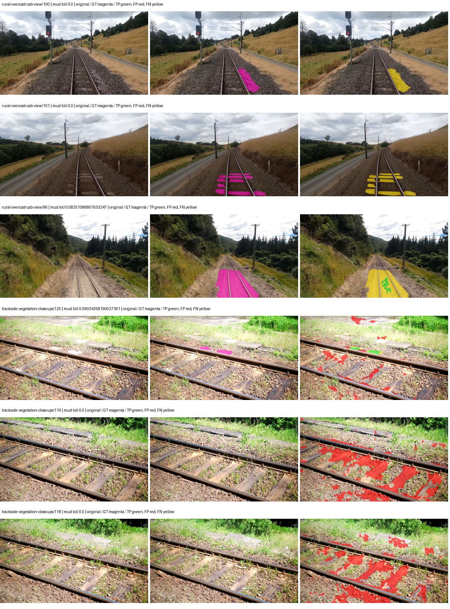

Examples are two lowest and two highest mud-IoU positive images, plus up to two negative images with the most false-positive mud pixels. They are targeted diagnostic examples, not random samples. Green: true positive; red: false positive; yellow: false negative. Full predictions remain on HDRFS.

### Validation tracking

| Logged step | Overall mIoU (%) | Mud IoU (%) |
| --- | --- | --- |
| 254 | 18.19 | 0.29 |
| 508 | 19.27 | 0.17 |
| 763 | 22.48 | 0.50 |
| 1017 | 20.54 | 0.27 |
| 1272 | 21.87 | 0.49 |
| 1527 | 25.33 | 0.68 |
| 1781 | 24.06 | 0.36 |
| 2036 | 25.43 | 0.36 |
| 2290 | 24.82 | 0.34 |
| 2545 | 24.67 | 0.31 |
| 2799 | 26.59 | 0.93 |
| 3054 | 27.59 | 0.34 |
| 3308 | 26.89 | 0.38 |
| 3563 | 26.00 | 0.50 |
| 3817 | 27.05 | 0.39 |
| 4000 | 26.84 | 0.43 |

All retained scalar curves, including training loss and per-class IoU, are in record.json. Observed best mud on a curve is not necessarily a retained checkpoint: the pilot saved its selection-metric-best and final checkpoints. Step logging and checkpoint global_step may differ by one.

### Stopping and checkpoint provenance

```json
{
  "stopping": {
    "actual_steps": 4000,
    "maximum_steps": 4000,
    "min_delta": 0.001,
    "monitor": "val_iou/mud-pumping",
    "patience": 5,
    "reason": "budget_complete"
  },
  "checkpoints": {
    "best": {
      "path": "/data/izadia1/projects/segmentary-runs/paul-test-rtis/mud-fullstats-v1-20260906-r2/future-runs/native_resnet18_fpn_fcn--rtis_only--seed-0_seed0/rtis/best.ckpt",
      "sha256": "c138c12980f2354687859533ced796caceddbae580032b5dac50cfbdf3013bcc",
      "global_step": 2800,
      "bytes": 202363673
    },
    "final": {
      "path": "/data/izadia1/projects/segmentary-runs/paul-test-rtis/mud-fullstats-v1-20260906-r2/future-runs/native_resnet18_fpn_fcn--rtis_only--seed-0_seed0/rtis/last.ckpt",
      "sha256": "adedded2a1ae49be0450e29928a4550bf67a8a17d2828bb582374c3c8636bcf2",
      "global_step": 4000,
      "bytes": 202358489
    }
  },
  "cleanup_error": null
}
```

### Resolved training, initialization and evaluation settings

The optimizer block is the base configuration. Stage LR scales are applied at runtime, and stage warmup is capped at min(base warmup, floor(stage budget / 10), stage budget - 1): 400 steps for this 4,000-step pilot. Model-internal native input grids may differ from augmentation crops (EoMT uses its 640 grid).

```json
{
  "name": "native_resnet18_fpn_fcn--rtis_only--seed-0",
  "model": {
    "arch": "native",
    "checkpoint": null,
    "tuning": "full",
    "head": "unified_head",
    "lora_r": 16,
    "lora_alpha": 32,
    "lora_dropout": 0.05,
    "lora_targets": [],
    "drop_path": null,
    "revision": null,
    "subfolder": null,
    "local_files_only": false,
    "trust_remote_code": false,
    "backbone_path": null,
    "head_paths": [],
    "classifier_path": null,
    "inactive_parameter_paths": [],
    "smp_arch": null,
    "encoder_name": null,
    "encoder_weights": null,
    "native": {
      "task": "multiclass",
      "backbone": {
        "kind": "timm",
        "name": "resnet18.a1_in1k",
        "weights": "pretrained",
        "out_indices": [
          1,
          2,
          3,
          4
        ],
        "in_channels": 3
      },
      "neck": {
        "kind": "fpn",
        "out_channels": 128,
        "num_outputs": 4,
        "norm": "group",
        "activation": "relu"
      },
      "head": {
        "kind": "fcn",
        "in_indices": [
          0,
          1,
          2,
          3
        ],
        "channels": 128,
        "num_convs": 2,
        "kernel_size": 3,
        "dilation": 1,
        "dropout": 0.1,
        "norm": "group",
        "activation": "relu"
      },
      "auxiliary_heads": []
    },
    "batch_norm_momentum": null
  },
  "space": "paul-test-rtis",
  "taxonomy_root": "/data/izadia1/projects/segmentary-rtis-fullstats-066afb2/taxonomy",
  "output_root": "/data/izadia1/projects/segmentary-runs/paul-test-rtis/mud-fullstats-v1-20260906-r2/future-runs",
  "optim": {
    "backbone_lr": 0.0001,
    "head_lr_mult": 10.0,
    "weight_decay": 0.05,
    "llrd": 1.0,
    "warmup_iters": 1500,
    "warmup_ratio": 1e-06,
    "poly_power": 0.9,
    "min_lr_ratio": 0.0,
    "betas": [
      0.9,
      0.999
    ],
    "grad_clip": 1.0
  },
  "train": {
    "iters": 4000,
    "batch_size": 2,
    "accum": 8,
    "num_workers": 2,
    "precision": "bf16-mixed",
    "ema_decay": 0.9998,
    "val_every": 250,
    "ckpt_every": 500,
    "selection_metric": "val_iou/mud-pumping",
    "early_stopping_patience": 5,
    "early_stopping_min_delta": 0.001,
    "seed": 0,
    "devices": 1
  },
  "eval": {
    "sliding_window": true,
    "window": [
      1024,
      1024
    ],
    "stride": [
      768,
      768
    ],
    "batch_size": 1,
    "num_workers": 2,
    "tta_scales": [],
    "tta_flip": false,
    "threshold": 0.5,
    "boundary_tolerance_frac": 0.0075,
    "save_confusion": true
  },
  "loss": {
    "task": "multiclass",
    "activation": "auto",
    "terms": [],
    "aux": "none",
    "aux_weight": 0.0,
    "ce_weight": 1.0,
    "label_smoothing": 0.0,
    "class_weights": null,
    "query": null
  },
  "aug": {
    "crop": [
      1024,
      1024
    ],
    "scale_min": 0.5,
    "scale_max": 2.0,
    "hflip_p": 0.5,
    "color_jitter_p": 0.5,
    "brightness": 0.25,
    "contrast": 0.25,
    "saturation": 0.25,
    "hue": 0.05
  },
  "stages": [
    {
      "name": "rtis",
      "data": [
        {
          "name": "paul-test-rtis",
          "root": "/data/izadia1/datasets/paul-test-rtis",
          "variant": null,
          "split_file": "splits.json",
          "train_split": "train",
          "val_split": "val",
          "limit": null,
          "loader": "folder",
          "mapping": "paul-test-rtis",
          "loader_options": {
            "require_groups": true
          }
        }
      ],
      "iters": null,
      "lr_scale": 1.0,
      "head_group_lr_scale": 1.0,
      "init_from": "pretrained",
      "reset_head": false,
      "freeze": null,
      "sample_weights": null
    }
  ]
}
```

### Hardware and software provenance

```json
{
  "training": {
    "cuda_available": true,
    "cuda_visible_devices": "3",
    "cudnn": 91900,
    "driver_version": "570.133.20",
    "gpu_count": 1,
    "gpu_names": [
      "NVIDIA L40S"
    ],
    "hostname": "hdrfs-app-001",
    "input_normalization": {
      "channel_order": "rgb",
      "mean": [
        0.485,
        0.456,
        0.406
      ],
      "source": "timm_pretrained_cfg",
      "std": [
        0.229,
        0.224,
        0.225
      ]
    },
    "model_origins": [
      {
        "hf_commit": null,
        "hf_name_or_path": null,
        "module": "backbone",
        "timm_pretrained": {
          "architecture": "resnet18",
          "hf_hub_id": "timm/resnet18.a1_in1k",
          "tag": "a1_in1k",
          "url": "https://github.com/huggingface/pytorch-image-models/releases/download/v0.1-rsb-weights/resnet18_a1_0-d63eafa0.pth"
        }
      },
      {
        "hf_commit": null,
        "hf_name_or_path": null,
        "module": "backbone.model",
        "timm_pretrained": {
          "architecture": "resnet18",
          "hf_hub_id": "timm/resnet18.a1_in1k",
          "tag": "a1_in1k",
          "url": "https://github.com/huggingface/pytorch-image-models/releases/download/v0.1-rsb-weights/resnet18_a1_0-d63eafa0.pth"
        }
      }
    ],
    "model_parameter_count": 12631253,
    "packages": {
      "albumentations": "2.0.8",
      "lightning": "2.6.5",
      "numpy": "2.4.4",
      "segmentary": "0.1.0",
      "segmentation-models-pytorch": "0.5.0",
      "timm": "1.0.28",
      "torch": "2.11.0+cu128",
      "torchvision": "0.26.0+cu128",
      "transformers": "5.15.0"
    },
    "platform": "Linux-5.15.0-139-generic-x86_64-with-glibc2.35",
    "python": "3.11.15",
    "torch": "2.11.0+cu128",
    "torch_cuda": "12.8",
    "trainable_parameter_count": 12631253,
    "training_stop": {
      "actual_steps": 4000,
      "maximum_steps": 4000,
      "min_delta": 0.001,
      "monitor": "val_iou/mud-pumping",
      "patience": 5,
      "reason": "budget_complete"
    },
    "validation_weights": "raw"
  },
  "evaluation": {
    "cuda_available": true,
    "cuda_visible_devices": "3",
    "cudnn": 91900,
    "driver_version": "570.133.20",
    "gpu_count": 1,
    "gpu_names": [
      "NVIDIA L40S"
    ],
    "hostname": "hdrfs-app-001",
    "input_normalization": {
      "channel_order": "rgb",
      "mean": [
        0.485,
        0.456,
        0.406
      ],
      "source": "timm_pretrained_cfg",
      "std": [
        0.229,
        0.224,
        0.225
      ]
    },
    "packages": {
      "albumentations": "2.0.8",
      "lightning": "2.6.5",
      "numpy": "2.4.4",
      "segmentary": "0.1.0",
      "segmentation-models-pytorch": "0.5.0",
      "timm": "1.0.28",
      "torch": "2.11.0+cu128",
      "torchvision": "0.26.0+cu128",
      "transformers": "5.15.0"
    },
    "platform": "Linux-5.15.0-139-generic-x86_64-with-glibc2.35",
    "python": "3.11.15",
    "torch": "2.11.0+cu128",
    "torch_cuda": "12.8"
  }
}
```

## rtis_only — seed 1

Status: **completed**. Started: 2026-09-06T21:10:33.757958+00:00. Finished: 2026-09-06T21:40:33.696803+00:00.

Recipe pretrained initializer: `{"arch": "native", "backbone_path": null, "batch_norm_momentum": null, "checkpoint": null, "classifier_path": null, "drop_path": null, "encoder_name": null, "encoder_weights": null, "head": "unified_head", "head_paths": [], "inactive_parameter_paths": [], "local_files_only": false, "lora_alpha": 32, "lora_dropout": 0.05, "lora_r": 16, "lora_targets": [], "native": {"auxiliary_heads": [], "backbone": {"in_channels": 3, "kind": "timm", "name": "resnet18.a1_in1k", "out_indices": [1, 2, 3, 4], "weights": "pretrained"}, "head": {"activation": "relu", "channels": 128, "dilation": 1, "dropout": 0.1, "in_indices": [0, 1, 2, 3], "kernel_size": 3, "kind": "fcn", "norm": "group", "num_convs": 2}, "neck": {"activation": "relu", "kind": "fpn", "norm": "group", "num_outputs": 4, "out_channels": 128}, "task": "multiclass"}, "revision": null, "smp_arch": null, "subfolder": null, "trust_remote_code": false, "tuning": "full"}`.

`rtis_only` uses the recipe initializer, which may include pretrained segmentation components. Transfer paths load the exact historical source checkpoint below and reset the classifier; they do not reset all query/decoder features.

Source checkpoint: `Recipe pretrained initialization`.

Config SHA-256: `466b98d6641d312ffd624338d12a238017362f7b3e710df4d3617411606d0a07`. Weights used for validation: `raw`.

### Mud-pumping and aggregate quality

| Metric | Selected checkpoint | Final training validation |
| --- | --- | --- |
| Mud IoU | 0.37 | 0.08 |
| Mud precision | 1.01 | 0.13 |
| Mud recall | 0.59 | 0.22 |
| Mud Dice/F1 | 0.74 | 0.16 |
| mIoU | 22.54 | 25.99 |
| Mean accuracy | 36.51 | 39.45 |
| Mean precision | 40.09 | 38.87 |
| Mean Dice | 28.95 | 33.60 |
| Mean specificity | 98.88 | 98.80 |
| Pixel accuracy | 80.93 | 80.37 |
| Frequency-weighted IoU | 71.90 | 71.00 |
| Fixed GT-present class mIoU | 26.30 | 30.32 |
| Boundary F1 | 26.51 | 30.96 |

The selected checkpoint has independent evaluation evidence. Final values are the trainer's final validation record, not a new independent evaluation. mIoU averages classes with nonzero union, so false positives on absent classes can change its denominator. The fixed GT-class mean is supplementary and excludes absent classes; their false positives remain in the confusion matrix.

### Resource usage and timing

| Measurement | Value |
| --- | --- |
| Peak training VRAM, retained training invocation (GiB) | 7.34 |
| Peak evaluation VRAM (GiB) | 7.04 |
| Retained training invocation wall time (seconds) | 1678.95 |
| Retained training invocation GPU-hours (one GPU) | 0.47 |
| Evaluation wall time (seconds) | 11.76 |
| Full evaluation pipeline images/second | 3.15 |
| Best full-state checkpoint (MiB) | 192.99 |
| Final full-state checkpoint (MiB) | 192.98 |
| Audited periodic checkpoints removed (GiB) | 0.94 |

VRAM uses the recorded allocator high-water mark; it is not total device usage including CUDA context. Resumed jobs' retained training invocation times and peaks are **not whole-campaign totals**. Earlier invocation resource records are not reconstructed here. Evaluation throughput includes loader, sliding-window inference and metrics; it is not model-only latency/FPS. Missing measurements are shown as —, never inferred from another dataset's run.

### Standardized inference performance

Dedicated model-only profiling waits for an idle worker-locked L40S: BF16, batch 1, 1024x1024, 20 warmup and 100 CUDA-event-timed public forwards. It excludes loading, preprocessing, tiling and metrics.

| Status | Parameters | Weight MiB | FPS | p50 ms | p95 ms | Peak reserved GiB |
| --- | --- | --- | --- | --- | --- | --- |
| complete | 12631253 | 48.18 | 215.69 | 4.50 | 5.44 | 0.64 |

```json
{
  "schema_version": 1,
  "model_id": "native_resnet18_fpn_fcn",
  "measured_at": "2026-09-06T21:40:30+00:00",
  "status": "complete",
  "benchmark_scope": "rtis_selected_checkpoint_model_only",
  "applies_to": [
    "native_resnet18_fpn_fcn--rtis_only--seed-1"
  ],
  "source": {
    "campaign_git_sha": "066afb2626398b7be59d4d19f5a0e4644fd59adc",
    "git_dirty": false,
    "config_hash": "f5f74b3906c4",
    "resolved_config": "/data/izadia1/projects/segmentary-runs/paul-test-rtis/mud-fullstats-v1-20260906-r2/configs/native_resnet18_fpn_fcn--rtis_only--seed-1.yaml",
    "config_sha256": "466b98d6641d312ffd624338d12a238017362f7b3e710df4d3617411606d0a07",
    "checkpoint_sha256": "3737ba0f81fca9a9e1207c51a20d2e17d17f62a2004df0d9e34b54a6b1d16f98",
    "checkpoint_global_step": 1527,
    "checkpoint_bytes": 202363673,
    "checkpoint_kind": "resume checkpoint with optimizer and EMA state",
    "weights": "raw",
    "measured_checkpoint_job_id": "native_resnet18_fpn_fcn--rtis_only--seed-1",
    "result_sha256": "7c4329d8eea6e21d13b5d24e3eb98c39af08aaafb384e4ffa4c5343dc300edc7",
    "result_git_sha": "066afb2626398b7be59d4d19f5a0e4644fd59adc",
    "result_stage": "eval:paul-test-rtis:val",
    "result_seed": 1
  },
  "hardware": {
    "gpu_name": "NVIDIA L40S",
    "gpu_uuid": "GPU-931d0911-fc78-1638-e3d7-1ba868cbd286",
    "logical_device": "cuda:0",
    "physical_visibility_token": "2",
    "compute_capability": [
      8,
      9
    ],
    "total_memory_bytes": 47677177856
  },
  "model": {
    "parameter_count": 12631253,
    "trainable_parameter_count": 12631253,
    "resident_parameter_bytes": 50525012,
    "parameter_dtype_counts": {
      "float32": 12631253
    }
  },
  "contract": {
    "backend": "pytorch",
    "precision": "bf16_autocast",
    "batch_size": 1,
    "input_shape_nchw": [
      1,
      3,
      1024,
      1024
    ],
    "warmup_iterations": 20,
    "measured_iterations": 100,
    "timing": "per-forward CUDA events with end-event synchronization",
    "includes_preprocessing": false,
    "includes_data_loader": false,
    "includes_sliding_window": false,
    "input_resident_on_gpu": true,
    "model_only": true,
    "entrypoint": "public model(image) dense-logits forward"
  },
  "measurements": {
    "latency": {
      "p50_ms": 4.497391939163208,
      "p95_ms": 5.441126537322997,
      "mean_ms": 4.636374406814575,
      "minimum_ms": 4.364287853240967,
      "maximum_ms": 6.406144142150879,
      "fps": 215.6857734634617,
      "raw_ms": [
        5.213183879852295,
        4.60595178604126,
        4.848639965057373,
        4.5557122230529785,
        4.433919906616211,
        4.406271934509277,
        4.3919358253479,
        4.396031856536865,
        4.383743762969971,
        4.388864040374756,
        4.369408130645752,
        4.456319808959961,
        4.404223918914795,
        4.383872032165527,
        4.373504161834717,
        4.471744060516357,
        4.382656097412109,
        5.064703941345215,
        4.887551784515381,
        4.434944152832031,
        4.420608043670654,
        4.40115213394165,
        4.40831995010376,
        4.483071804046631,
        4.503551959991455,
        4.677631855010986,
        4.619264125823975,
        4.578303813934326,
        6.406144142150879,
        6.042623996734619,
        5.625855922698975,
        5.364736080169678,
        5.197824001312256,
        4.5004801750183105,
        4.453375816345215,
        4.438015937805176,
        4.4462080001831055,
        4.4410881996154785,
        4.424704074859619,
        4.3970561027526855,
        4.410367965698242,
        4.428671836853027,
        4.531199932098389,
        4.64793586730957,
        4.436992168426514,
        4.60595178604126,
        4.7329277992248535,
        4.561920166015625,
        4.511744022369385,
        4.495359897613525,
        4.468736171722412,
        4.473951816558838,
        4.531199932098389,
        5.294079780578613,
        4.753407955169678,
        5.932032108306885,
        5.304319858551025,
        4.788224220275879,
        4.942848205566406,
        5.180416107177734,
        4.5793280601501465,
        4.45030403137207,
        4.4318718910217285,
        4.40831995010376,
        4.388735771179199,
        4.374527931213379,
        4.4113922119140625,
        4.659200191497803,
        4.587520122528076,
        4.50867223739624,
        4.7564802169799805,
        4.551680088043213,
        4.485119819641113,
        4.523007869720459,
        4.600831985473633,
        4.587520122528076,
        4.506624221801758,
        4.445184230804443,
        4.425727844238281,
        4.399104118347168,
        4.499423980712891,
        5.569536209106445,
        4.530176162719727,
        4.624383926391602,
        5.434368133544922,
        4.982751846313477,
        4.701183795928955,
        4.5404157638549805,
        4.523007869720459,
        4.460544109344482,
        4.407296180725098,
        4.395008087158203,
        4.395103931427002,
        4.379648208618164,
        4.365312099456787,
        4.364287853240967,
        4.3673601150512695,
        4.39408016204834,
        4.407296180725098,
        4.4996161460876465
      ],
      "percentile_method": "numpy linear interpolation"
    },
    "peak_reserved_bytes": 685768704,
    "memory_kind": "pytorch_cuda_allocator_peak_reserved_excluding_context",
    "benchmark_wall_clock_s": 9.211702696979046
  },
  "started_at": "2026-09-06T21:40:21+00:00",
  "finished_at": "2026-09-06T21:40:30+00:00",
  "environment": {
    "hostname": "hdrfs-app-001",
    "python": "3.11.15",
    "platform": "Linux-5.15.0-139-generic-x86_64-with-glibc2.35",
    "torch": "2.11.0+cu128",
    "torch_cuda": "12.8",
    "cudnn": 91900,
    "driver_version": "570.133.20",
    "cuda_available": true,
    "gpu_count": 1,
    "gpu_names": [
      "NVIDIA L40S"
    ],
    "cuda_visible_devices": "2",
    "packages": {
      "segmentary": "0.1.0",
      "torch": "2.11.0+cu128",
      "torchvision": "0.26.0+cu128",
      "transformers": "5.15.0",
      "timm": "1.0.28",
      "segmentation-models-pytorch": "0.5.0",
      "albumentations": "2.0.8",
      "lightning": "2.6.5",
      "numpy": "2.4.4"
    }
  }
}
```

### Per-class validation results

| Class | GT pixels | IoU (%) | Precision (%) | Recall (%) | Dice (%) | Boundary F1 (%) |
| --- | --- | --- | --- | --- | --- | --- |
| car | 29664 | 0.00 | 0.00 | 0.00 | 0.00 | 0.00 |
| construction | 311585 | 16.99 | 17.82 | 78.58 | 29.05 | 22.32 |
| fence | 265137 | 10.81 | 17.37 | 22.25 | 19.51 | 18.47 |
| mud-pumping | 1226250 | 0.37 | 1.01 | 0.59 | 0.74 | 1.21 |
| on-rails | 0 | 0.00 | 0.00 | — | 0.00 | 0.00 |
| person | 0 | 0.00 | 0.00 | — | 0.00 | 0.00 |
| pole | 628038 | 52.19 | 64.36 | 73.41 | 68.59 | 77.61 |
| rail-embedded | 16799 | 3.68 | 98.56 | 3.68 | 7.09 | 8.59 |
| rail-raised | 2969797 | 63.56 | 70.98 | 85.87 | 77.72 | 81.99 |
| rail-track | 6323197 | 39.10 | 61.93 | 51.47 | 56.22 | 49.18 |
| road | 1048831 | 1.75 | 8.30 | 2.16 | 3.43 | 8.05 |
| sidewalk | 1297367 | 13.50 | 58.91 | 14.91 | 23.80 | 13.67 |
| sky | 19121606 | 97.17 | 98.62 | 98.51 | 98.56 | 88.02 |
| standing-water | 95802 | 0.77 | 0.81 | 14.52 | 1.54 | 3.62 |
| terrain | 39239306 | 86.46 | 90.83 | 94.73 | 92.74 | 55.23 |
| trackbed | 10643081 | 52.69 | 62.09 | 77.68 | 69.01 | 47.16 |
| traffic-light | 19510 | 13.11 | 39.21 | 16.46 | 23.18 | 27.07 |
| traffic-sign | 13285 | 3.44 | 74.68 | 3.49 | 6.66 | 12.95 |
| tram-track | 56179 | 0.00 | 0.00 | 0.00 | 0.00 | 0.00 |
| truck | 0 | 0.00 | 0.00 | — | 0.00 | 0.00 |
| vegetation-overgrowth | 5901821 | 17.77 | 76.41 | 18.80 | 30.18 | 41.60 |

### Full-run accounting

| Measurement | Value |
| --- | --- |
| Full GPU-reserved wall seconds, all recorded worker attempts | 1799.94 |
| Full reserved GPU-hours | 0.50 |
| Whole-run timing complete | True |

| Phase | Wall seconds including failed attempts |
| --- | --- |
| training | 1686.46 |
| diagnostics | 76.02 |
| performance | 16.45 |

GPU-reserved time includes model loading, training, validation, collection, profiling, checkpoint I/O and orchestration while the worker owns one GPU. It is not GPU kernel-active time. Phase timings and sampled device memory/power/utilization are retained separately; sampled device memory is not the allocator high-water mark.

### Train/validation and raw/EMA diagnostics

| Checkpoint / weights / split | Images | Mud IoU (%) | Mud precision (%) | Mud recall (%) |
| --- | --- | --- | --- | --- |
| best-auto-train / raw | 220 | 89.56 | 96.11 | 92.93 |
| best-auto-val / raw | 37 | 0.37 | 1.01 | 0.59 |
| best-alternate-val / ema | 37 | 0.14 | 0.20 | 0.45 |
| final-auto-val / raw | 37 | 0.08 | 0.13 | 0.23 |

Train uses the evaluation transform without augmentation. Compare mud train/validation metrics for the same selected weights. Alternate EMA on running-stat BatchNorm is explicitly uncalibrated and is diagnostic only. Score-threshold curves use uncalibrated normalized scores and are pixel-level diagnostics, not event detection rates or a selected deployment operating point.

### Downloadable evidence

- best-auto-train: [per-image.csv](rtis_only--seed-1/best-auto-train/per-image.csv) · [per-image-confusion.json.gz](rtis_only--seed-1/best-auto-train/per-image-confusion.json.gz) · [groups.json](rtis_only--seed-1/best-auto-train/groups.json) · [mud-score-curves.json](rtis_only--seed-1/best-auto-train/mud-score-curves.json)
- best-auto-val: [per-image.csv](rtis_only--seed-1/best-auto-val/per-image.csv) · [per-image-confusion.json.gz](rtis_only--seed-1/best-auto-val/per-image-confusion.json.gz) · [groups.json](rtis_only--seed-1/best-auto-val/groups.json) · [mud-score-curves.json](rtis_only--seed-1/best-auto-val/mud-score-curves.json) · [examples.jpg](rtis_only--seed-1/best-auto-val/examples.jpg)
- best-alternate-val: [per-image.csv](rtis_only--seed-1/best-alternate-val/per-image.csv) · [per-image-confusion.json.gz](rtis_only--seed-1/best-alternate-val/per-image-confusion.json.gz) · [groups.json](rtis_only--seed-1/best-alternate-val/groups.json) · [mud-score-curves.json](rtis_only--seed-1/best-alternate-val/mud-score-curves.json)
- final-auto-val: [per-image.csv](rtis_only--seed-1/final-auto-val/per-image.csv) · [per-image-confusion.json.gz](rtis_only--seed-1/final-auto-val/per-image-confusion.json.gz) · [groups.json](rtis_only--seed-1/final-auto-val/groups.json) · [mud-score-curves.json](rtis_only--seed-1/final-auto-val/mud-score-curves.json)
- resources: [telemetry.csv](rtis_only--seed-1/resources/telemetry.csv)

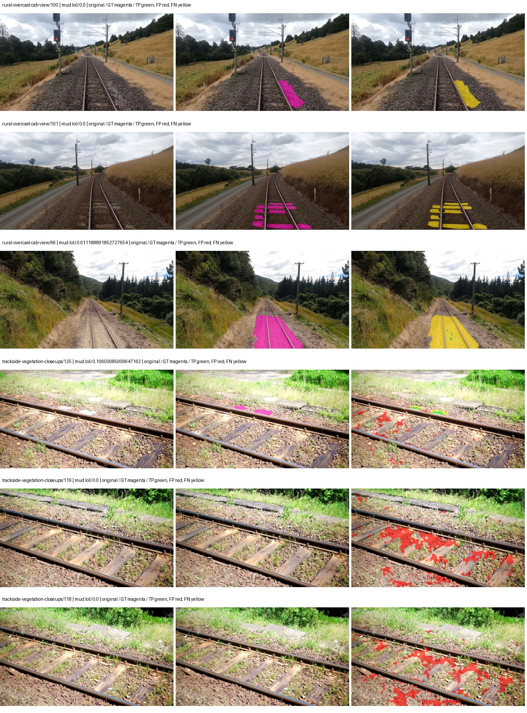

Examples are two lowest and two highest mud-IoU positive images, plus up to two negative images with the most false-positive mud pixels. They are targeted diagnostic examples, not random samples. Green: true positive; red: false positive; yellow: false negative. Full predictions remain on HDRFS.

### Validation tracking

| Logged step | Overall mIoU (%) | Mud IoU (%) |
| --- | --- | --- |
| 254 | 19.26 | 0.26 |
| 508 | 21.17 | 0.20 |
| 763 | 19.72 | 0.15 |
| 1017 | 21.45 | 0.13 |
| 1272 | 21.01 | 0.35 |
| 1527 | 22.54 | 0.37 |
| 1781 | 23.11 | 0.33 |
| 2036 | 23.37 | 0.19 |
| 2290 | 25.53 | 0.33 |
| 2545 | 25.17 | 0.19 |
| 2799 | 25.99 | 0.08 |

All retained scalar curves, including training loss and per-class IoU, are in record.json. Observed best mud on a curve is not necessarily a retained checkpoint: the pilot saved its selection-metric-best and final checkpoints. Step logging and checkpoint global_step may differ by one.

### Stopping and checkpoint provenance

```json
{
  "stopping": {
    "actual_steps": 2800,
    "maximum_steps": 4000,
    "min_delta": 0.001,
    "monitor": "val_iou/mud-pumping",
    "patience": 5,
    "reason": "validation_plateau"
  },
  "checkpoints": {
    "best": {
      "path": "/data/izadia1/projects/segmentary-runs/paul-test-rtis/mud-fullstats-v1-20260906-r2/future-runs/native_resnet18_fpn_fcn--rtis_only--seed-1_seed1/rtis/best.ckpt",
      "sha256": "3737ba0f81fca9a9e1207c51a20d2e17d17f62a2004df0d9e34b54a6b1d16f98",
      "global_step": 1527,
      "bytes": 202363673
    },
    "final": {
      "path": "/data/izadia1/projects/segmentary-runs/paul-test-rtis/mud-fullstats-v1-20260906-r2/future-runs/native_resnet18_fpn_fcn--rtis_only--seed-1_seed1/rtis/last.ckpt",
      "sha256": "9633a482f56505b5c080c618c0bd55f106239b84439e79f8a273f89889ccfd91",
      "global_step": 2800,
      "bytes": 202358617
    }
  },
  "cleanup_error": null
}
```

### Resolved training, initialization and evaluation settings

The optimizer block is the base configuration. Stage LR scales are applied at runtime, and stage warmup is capped at min(base warmup, floor(stage budget / 10), stage budget - 1): 400 steps for this 4,000-step pilot. Model-internal native input grids may differ from augmentation crops (EoMT uses its 640 grid).

```json
{
  "name": "native_resnet18_fpn_fcn--rtis_only--seed-1",
  "model": {
    "arch": "native",
    "checkpoint": null,
    "tuning": "full",
    "head": "unified_head",
    "lora_r": 16,
    "lora_alpha": 32,
    "lora_dropout": 0.05,
    "lora_targets": [],
    "drop_path": null,
    "revision": null,
    "subfolder": null,
    "local_files_only": false,
    "trust_remote_code": false,
    "backbone_path": null,
    "head_paths": [],
    "classifier_path": null,
    "inactive_parameter_paths": [],
    "smp_arch": null,
    "encoder_name": null,
    "encoder_weights": null,
    "native": {
      "task": "multiclass",
      "backbone": {
        "kind": "timm",
        "name": "resnet18.a1_in1k",
        "weights": "pretrained",
        "out_indices": [
          1,
          2,
          3,
          4
        ],
        "in_channels": 3
      },
      "neck": {
        "kind": "fpn",
        "out_channels": 128,
        "num_outputs": 4,
        "norm": "group",
        "activation": "relu"
      },
      "head": {
        "kind": "fcn",
        "in_indices": [
          0,
          1,
          2,
          3
        ],
        "channels": 128,
        "num_convs": 2,
        "kernel_size": 3,
        "dilation": 1,
        "dropout": 0.1,
        "norm": "group",
        "activation": "relu"
      },
      "auxiliary_heads": []
    },
    "batch_norm_momentum": null
  },
  "space": "paul-test-rtis",
  "taxonomy_root": "/data/izadia1/projects/segmentary-rtis-fullstats-066afb2/taxonomy",
  "output_root": "/data/izadia1/projects/segmentary-runs/paul-test-rtis/mud-fullstats-v1-20260906-r2/future-runs",
  "optim": {
    "backbone_lr": 0.0001,
    "head_lr_mult": 10.0,
    "weight_decay": 0.05,
    "llrd": 1.0,
    "warmup_iters": 1500,
    "warmup_ratio": 1e-06,
    "poly_power": 0.9,
    "min_lr_ratio": 0.0,
    "betas": [
      0.9,
      0.999
    ],
    "grad_clip": 1.0
  },
  "train": {
    "iters": 4000,
    "batch_size": 2,
    "accum": 8,
    "num_workers": 2,
    "precision": "bf16-mixed",
    "ema_decay": 0.9998,
    "val_every": 250,
    "ckpt_every": 500,
    "selection_metric": "val_iou/mud-pumping",
    "early_stopping_patience": 5,
    "early_stopping_min_delta": 0.001,
    "seed": 1,
    "devices": 1
  },
  "eval": {
    "sliding_window": true,
    "window": [
      1024,
      1024
    ],
    "stride": [
      768,
      768
    ],
    "batch_size": 1,
    "num_workers": 2,
    "tta_scales": [],
    "tta_flip": false,
    "threshold": 0.5,
    "boundary_tolerance_frac": 0.0075,
    "save_confusion": true
  },
  "loss": {
    "task": "multiclass",
    "activation": "auto",
    "terms": [],
    "aux": "none",
    "aux_weight": 0.0,
    "ce_weight": 1.0,
    "label_smoothing": 0.0,
    "class_weights": null,
    "query": null
  },
  "aug": {
    "crop": [
      1024,
      1024
    ],
    "scale_min": 0.5,
    "scale_max": 2.0,
    "hflip_p": 0.5,
    "color_jitter_p": 0.5,
    "brightness": 0.25,
    "contrast": 0.25,
    "saturation": 0.25,
    "hue": 0.05
  },
  "stages": [
    {
      "name": "rtis",
      "data": [
        {
          "name": "paul-test-rtis",
          "root": "/data/izadia1/datasets/paul-test-rtis",
          "variant": null,
          "split_file": "splits.json",
          "train_split": "train",
          "val_split": "val",
          "limit": null,
          "loader": "folder",
          "mapping": "paul-test-rtis",
          "loader_options": {
            "require_groups": true
          }
        }
      ],
      "iters": null,
      "lr_scale": 1.0,
      "head_group_lr_scale": 1.0,
      "init_from": "pretrained",
      "reset_head": false,
      "freeze": null,
      "sample_weights": null
    }
  ]
}
```

### Hardware and software provenance

```json
{
  "training": {
    "cuda_available": true,
    "cuda_visible_devices": "2",
    "cudnn": 91900,
    "driver_version": "570.133.20",
    "gpu_count": 1,
    "gpu_names": [
      "NVIDIA L40S"
    ],
    "hostname": "hdrfs-app-001",
    "input_normalization": {
      "channel_order": "rgb",
      "mean": [
        0.485,
        0.456,
        0.406
      ],
      "source": "timm_pretrained_cfg",
      "std": [
        0.229,
        0.224,
        0.225
      ]
    },
    "model_origins": [
      {
        "hf_commit": null,
        "hf_name_or_path": null,
        "module": "backbone",
        "timm_pretrained": {
          "architecture": "resnet18",
          "hf_hub_id": "timm/resnet18.a1_in1k",
          "tag": "a1_in1k",
          "url": "https://github.com/huggingface/pytorch-image-models/releases/download/v0.1-rsb-weights/resnet18_a1_0-d63eafa0.pth"
        }
      },
      {
        "hf_commit": null,
        "hf_name_or_path": null,
        "module": "backbone.model",
        "timm_pretrained": {
          "architecture": "resnet18",
          "hf_hub_id": "timm/resnet18.a1_in1k",
          "tag": "a1_in1k",
          "url": "https://github.com/huggingface/pytorch-image-models/releases/download/v0.1-rsb-weights/resnet18_a1_0-d63eafa0.pth"
        }
      }
    ],
    "model_parameter_count": 12631253,
    "packages": {
      "albumentations": "2.0.8",
      "lightning": "2.6.5",
      "numpy": "2.4.4",
      "segmentary": "0.1.0",
      "segmentation-models-pytorch": "0.5.0",
      "timm": "1.0.28",
      "torch": "2.11.0+cu128",
      "torchvision": "0.26.0+cu128",
      "transformers": "5.15.0"
    },
    "platform": "Linux-5.15.0-139-generic-x86_64-with-glibc2.35",
    "python": "3.11.15",
    "torch": "2.11.0+cu128",
    "torch_cuda": "12.8",
    "trainable_parameter_count": 12631253,
    "training_stop": {
      "actual_steps": 2800,
      "maximum_steps": 4000,
      "min_delta": 0.001,
      "monitor": "val_iou/mud-pumping",
      "patience": 5,
      "reason": "validation_plateau"
    },
    "validation_weights": "raw"
  },
  "evaluation": {
    "cuda_available": true,
    "cuda_visible_devices": "2",
    "cudnn": 91900,
    "driver_version": "570.133.20",
    "gpu_count": 1,
    "gpu_names": [
      "NVIDIA L40S"
    ],
    "hostname": "hdrfs-app-001",
    "input_normalization": {
      "channel_order": "rgb",
      "mean": [
        0.485,
        0.456,
        0.406
      ],
      "source": "timm_pretrained_cfg",
      "std": [
        0.229,
        0.224,
        0.225
      ]
    },
    "packages": {
      "albumentations": "2.0.8",
      "lightning": "2.6.5",
      "numpy": "2.4.4",
      "segmentary": "0.1.0",
      "segmentation-models-pytorch": "0.5.0",
      "timm": "1.0.28",
      "torch": "2.11.0+cu128",
      "torchvision": "0.26.0+cu128",
      "transformers": "5.15.0"
    },
    "platform": "Linux-5.15.0-139-generic-x86_64-with-glibc2.35",
    "python": "3.11.15",
    "torch": "2.11.0+cu128",
    "torch_cuda": "12.8"
  }
}
```

## rtis_only — seed 2

Status: **completed**. Started: 2026-09-06T21:18:03.265206+00:00. Finished: 2026-09-06T21:38:19.986086+00:00.

Recipe pretrained initializer: `{"arch": "native", "backbone_path": null, "batch_norm_momentum": null, "checkpoint": null, "classifier_path": null, "drop_path": null, "encoder_name": null, "encoder_weights": null, "head": "unified_head", "head_paths": [], "inactive_parameter_paths": [], "local_files_only": false, "lora_alpha": 32, "lora_dropout": 0.05, "lora_r": 16, "lora_targets": [], "native": {"auxiliary_heads": [], "backbone": {"in_channels": 3, "kind": "timm", "name": "resnet18.a1_in1k", "out_indices": [1, 2, 3, 4], "weights": "pretrained"}, "head": {"activation": "relu", "channels": 128, "dilation": 1, "dropout": 0.1, "in_indices": [0, 1, 2, 3], "kernel_size": 3, "kind": "fcn", "norm": "group", "num_convs": 2}, "neck": {"activation": "relu", "kind": "fpn", "norm": "group", "num_outputs": 4, "out_channels": 128}, "task": "multiclass"}, "revision": null, "smp_arch": null, "subfolder": null, "trust_remote_code": false, "tuning": "full"}`.

`rtis_only` uses the recipe initializer, which may include pretrained segmentation components. Transfer paths load the exact historical source checkpoint below and reset the classifier; they do not reset all query/decoder features.

Source checkpoint: `Recipe pretrained initialization`.

Config SHA-256: `1876696a1b7f2127a0e8e00df5f4e8ab0decd2b006844edd1cb10ad5e9f3090d`. Weights used for validation: `raw`.

### Mud-pumping and aggregate quality

| Metric | Selected checkpoint | Final training validation |
| --- | --- | --- |
| Mud IoU | 0.45 | 0.17 |
| Mud precision | 0.50 | 0.57 |
| Mud recall | 4.03 | 0.25 |
| Mud Dice/F1 | 0.90 | 0.34 |
| mIoU | 19.51 | 23.59 |
| Mean accuracy | 27.02 | 36.53 |
| Mean precision | 33.41 | 34.91 |
| Mean Dice | 24.22 | 30.18 |
| Mean specificity | 98.55 | 98.93 |
| Pixel accuracy | 73.78 | 81.48 |
| Frequency-weighted IoU | 66.14 | 72.71 |
| Fixed GT-present class mIoU | 20.60 | 27.53 |
| Boundary F1 | 21.96 | 28.35 |

The selected checkpoint has independent evaluation evidence. Final values are the trainer's final validation record, not a new independent evaluation. mIoU averages classes with nonzero union, so false positives on absent classes can change its denominator. The fixed GT-class mean is supplementary and excludes absent classes; their false positives remain in the confusion matrix.

### Resource usage and timing

| Measurement | Value |
| --- | --- |
| Peak training VRAM, retained training invocation (GiB) | 7.34 |
| Peak evaluation VRAM (GiB) | 7.04 |
| Retained training invocation wall time (seconds) | 1100.41 |
| Retained training invocation GPU-hours (one GPU) | 0.31 |
| Evaluation wall time (seconds) | 11.08 |
| Full evaluation pipeline images/second | 3.34 |
| Best full-state checkpoint (MiB) | 192.99 |
| Final full-state checkpoint (MiB) | 192.98 |
| Audited periodic checkpoints removed (GiB) | 0.57 |

VRAM uses the recorded allocator high-water mark; it is not total device usage including CUDA context. Resumed jobs' retained training invocation times and peaks are **not whole-campaign totals**. Earlier invocation resource records are not reconstructed here. Evaluation throughput includes loader, sliding-window inference and metrics; it is not model-only latency/FPS. Missing measurements are shown as —, never inferred from another dataset's run.

### Standardized inference performance

Dedicated model-only profiling waits for an idle worker-locked L40S: BF16, batch 1, 1024x1024, 20 warmup and 100 CUDA-event-timed public forwards. It excludes loading, preprocessing, tiling and metrics.

| Status | Parameters | Weight MiB | FPS | p50 ms | p95 ms | Peak reserved GiB |
| --- | --- | --- | --- | --- | --- | --- |
| complete | 12631253 | 48.18 | 225.22 | 4.36 | 4.74 | 0.64 |

```json
{
  "schema_version": 1,
  "model_id": "native_resnet18_fpn_fcn",
  "measured_at": "2026-09-06T21:38:17+00:00",
  "status": "complete",
  "benchmark_scope": "rtis_selected_checkpoint_model_only",
  "applies_to": [
    "native_resnet18_fpn_fcn--rtis_only--seed-2"
  ],
  "source": {
    "campaign_git_sha": "066afb2626398b7be59d4d19f5a0e4644fd59adc",
    "git_dirty": false,
    "config_hash": "379beac374f3",
    "resolved_config": "/data/izadia1/projects/segmentary-runs/paul-test-rtis/mud-fullstats-v1-20260906-r2/configs/native_resnet18_fpn_fcn--rtis_only--seed-2.yaml",
    "config_sha256": "1876696a1b7f2127a0e8e00df5f4e8ab0decd2b006844edd1cb10ad5e9f3090d",
    "checkpoint_sha256": "0912df0a5f8cfbf0d8c72ed7aaf304d282e510f4fef27ce958379874e262112c",
    "checkpoint_global_step": 509,
    "checkpoint_bytes": 202363673,
    "checkpoint_kind": "resume checkpoint with optimizer and EMA state",
    "weights": "raw",
    "measured_checkpoint_job_id": "native_resnet18_fpn_fcn--rtis_only--seed-2",
    "result_sha256": "9d64138c7cf2148a0a4cbb060ba53499425af23e4a6b0996569d3766a6ecb90c",
    "result_git_sha": "066afb2626398b7be59d4d19f5a0e4644fd59adc",
    "result_stage": "eval:paul-test-rtis:val",
    "result_seed": 2
  },
  "hardware": {
    "gpu_name": "NVIDIA L40S",
    "gpu_uuid": "GPU-e2e96741-aec9-e90b-5c46-d0d58be90a56",
    "logical_device": "cuda:0",
    "physical_visibility_token": "8",
    "compute_capability": [
      8,
      9
    ],
    "total_memory_bytes": 47677177856
  },
  "model": {
    "parameter_count": 12631253,
    "trainable_parameter_count": 12631253,
    "resident_parameter_bytes": 50525012,
    "parameter_dtype_counts": {
      "float32": 12631253
    }
  },
  "contract": {
    "backend": "pytorch",
    "precision": "bf16_autocast",
    "batch_size": 1,
    "input_shape_nchw": [
      1,
      3,
      1024,
      1024
    ],
    "warmup_iterations": 20,
    "measured_iterations": 100,
    "timing": "per-forward CUDA events with end-event synchronization",
    "includes_preprocessing": false,
    "includes_data_loader": false,
    "includes_sliding_window": false,
    "input_resident_on_gpu": true,
    "model_only": true,
    "entrypoint": "public model(image) dense-logits forward"
  },
  "measurements": {
    "latency": {
      "p50_ms": 4.355072021484375,
      "p95_ms": 4.744396924972534,
      "mean_ms": 4.440156774520874,
      "minimum_ms": 4.30079984664917,
      "maximum_ms": 4.884479999542236,
      "fps": 225.2172728986371,
      "raw_ms": [
        4.518911838531494,
        4.412447929382324,
        4.344831943511963,
        4.317183971405029,
        4.306943893432617,
        4.4462080001831055,
        4.736000061035156,
        4.396031856536865,
        4.3284478187561035,
        4.723711967468262,
        4.626431941986084,
        4.323328018188477,
        4.336639881134033,
        4.649983882904053,
        4.353024005889893,
        4.336639881134033,
        4.335616111755371,
        4.629504203796387,
        4.331520080566406,
        4.306943893432617,
        4.743167877197266,
        4.513792037963867,
        4.473855972290039,
        4.361216068267822,
        4.317183971405029,
        4.378623962402344,
        4.3089919090271,
        4.331520080566406,
        4.3427839279174805,
        4.523007869720459,
        4.347904205322266,
        4.312064170837402,
        4.314112186431885,
        4.802559852600098,
        4.323328018188477,
        4.474880218505859,
        4.586495876312256,
        4.364287853240967,
        4.744192123413086,
        4.346879959106445,
        4.326399803161621,
        4.3284478187561035,
        4.348927974700928,
        4.357120037078857,
        4.319231986999512,
        4.326399803161621,
        4.366335868835449,
        4.325376033782959,
        4.317183971405029,
        4.325376033782959,
        4.324351787567139,
        4.884479999542236,
        4.44927978515625,
        4.380671977996826,
        4.35916805267334,
        4.319231986999512,
        4.572159767150879,
        4.316160202026367,
        4.334591865539551,
        4.340735912322998,
        4.35097599029541,
        4.35916805267334,
        4.35916805267334,
        4.330495834350586,
        4.720640182495117,
        4.670464038848877,
        4.339712142944336,
        4.486144065856934,
        4.389887809753418,
        4.748288154602051,
        4.336639881134033,
        4.319231986999512,
        4.30079984664917,
        4.324351787567139,
        4.642816066741943,
        4.5772480964660645,
        4.421631813049316,
        4.341760158538818,
        4.335616111755371,
        4.35097599029541,
        4.324351787567139,
        4.723711967468262,
        4.661248207092285,
        4.855807781219482,
        4.383743762969971,
        4.324351787567139,
        4.306943893432617,
        4.770815849304199,
        4.335616111755371,
        4.30182409286499,
        4.335616111755371,
        4.675583839416504,
        4.367424011230469,
        4.344831943511963,
        4.530176162719727,
        4.447231769561768,
        4.599808216094971,
        4.621312141418457,
        4.410367965698242,
        4.696063995361328
      ],
      "percentile_method": "numpy linear interpolation"
    },
    "peak_reserved_bytes": 685768704,
    "memory_kind": "pytorch_cuda_allocator_peak_reserved_excluding_context",
    "benchmark_wall_clock_s": 8.523451372981071
  },
  "started_at": "2026-09-06T21:38:08+00:00",
  "finished_at": "2026-09-06T21:38:17+00:00",
  "environment": {
    "hostname": "hdrfs-app-001",
    "python": "3.11.15",
    "platform": "Linux-5.15.0-139-generic-x86_64-with-glibc2.35",
    "torch": "2.11.0+cu128",
    "torch_cuda": "12.8",
    "cudnn": 91900,
    "driver_version": "570.133.20",
    "cuda_available": true,
    "gpu_count": 1,
    "gpu_names": [
      "NVIDIA L40S"
    ],
    "cuda_visible_devices": "8",
    "packages": {
      "segmentary": "0.1.0",
      "torch": "2.11.0+cu128",
      "torchvision": "0.26.0+cu128",
      "transformers": "5.15.0",
      "timm": "1.0.28",
      "segmentation-models-pytorch": "0.5.0",
      "albumentations": "2.0.8",
      "lightning": "2.6.5",
      "numpy": "2.4.4"
    }
  }
}
```

### Per-class validation results

| Class | GT pixels | IoU (%) | Precision (%) | Recall (%) | Dice (%) | Boundary F1 (%) |
| --- | --- | --- | --- | --- | --- | --- |
| car | 29664 | 0.00 | 0.00 | 0.00 | 0.00 | 0.00 |
| construction | 311585 | 9.88 | 10.92 | 51.04 | 17.99 | 18.62 |
| fence | 265137 | 0.17 | 3.44 | 0.18 | 0.34 | 2.94 |
| mud-pumping | 1226250 | 0.45 | 0.50 | 4.03 | 0.90 | 0.84 |
| on-rails | 0 | 0.00 | 0.00 | — | 0.00 | 0.00 |
| person | 0 | — | — | — | — | — |
| pole | 628038 | 40.58 | 71.75 | 48.30 | 57.73 | 77.27 |
| rail-embedded | 16799 | 0.00 | 0.00 | 0.00 | 0.00 | 0.00 |
| rail-raised | 2969797 | 63.63 | 73.11 | 83.07 | 77.77 | 82.33 |
| rail-track | 6323197 | 25.23 | 47.86 | 34.79 | 40.29 | 34.90 |
| road | 1048831 | 0.00 | 0.00 | 0.00 | 0.00 | 0.00 |
| sidewalk | 1297367 | 0.05 | 100.00 | 0.05 | 0.10 | 0.00 |
| sky | 19121606 | 92.10 | 98.63 | 93.29 | 95.89 | 74.17 |
| standing-water | 95802 | 1.15 | 1.46 | 5.10 | 2.27 | 8.26 |
| terrain | 39239306 | 81.16 | 90.76 | 88.47 | 89.60 | 47.08 |
| trackbed | 10643081 | 51.41 | 63.38 | 73.12 | 67.91 | 46.10 |
| traffic-light | 19510 | 0.00 | 0.00 | 0.00 | 0.00 | 0.00 |
| traffic-sign | 13285 | 0.00 | 0.00 | 0.00 | 0.00 | 0.00 |
| tram-track | 56179 | 0.00 | 0.00 | 0.00 | 0.00 | 0.00 |
| truck | 0 | — | — | — | — | — |
| vegetation-overgrowth | 5901821 | 4.91 | 73.04 | 5.00 | 9.36 | 24.65 |

### Full-run accounting

| Measurement | Value |
| --- | --- |
| Full GPU-reserved wall seconds, all recorded worker attempts | 1216.73 |
| Full reserved GPU-hours | 0.34 |
| Whole-run timing complete | True |

| Phase | Wall seconds including failed attempts |
| --- | --- |
| training | 1106.63 |
| diagnostics | 74.96 |
| performance | 15.52 |

GPU-reserved time includes model loading, training, validation, collection, profiling, checkpoint I/O and orchestration while the worker owns one GPU. It is not GPU kernel-active time. Phase timings and sampled device memory/power/utilization are retained separately; sampled device memory is not the allocator high-water mark.

### Train/validation and raw/EMA diagnostics

| Checkpoint / weights / split | Images | Mud IoU (%) | Mud precision (%) | Mud recall (%) |
| --- | --- | --- | --- | --- |
| best-auto-train / raw | 220 | 73.73 | 77.68 | 93.55 |
| best-auto-val / raw | 37 | 0.45 | 0.50 | 4.03 |
| best-alternate-val / ema | 37 | 0.21 | 0.27 | 1.03 |
| final-auto-val / raw | 37 | 0.17 | 0.57 | 0.25 |

Train uses the evaluation transform without augmentation. Compare mud train/validation metrics for the same selected weights. Alternate EMA on running-stat BatchNorm is explicitly uncalibrated and is diagnostic only. Score-threshold curves use uncalibrated normalized scores and are pixel-level diagnostics, not event detection rates or a selected deployment operating point.

### Downloadable evidence

- best-auto-train: [per-image.csv](rtis_only--seed-2/best-auto-train/per-image.csv) · [per-image-confusion.json.gz](rtis_only--seed-2/best-auto-train/per-image-confusion.json.gz) · [groups.json](rtis_only--seed-2/best-auto-train/groups.json) · [mud-score-curves.json](rtis_only--seed-2/best-auto-train/mud-score-curves.json)
- best-auto-val: [per-image.csv](rtis_only--seed-2/best-auto-val/per-image.csv) · [per-image-confusion.json.gz](rtis_only--seed-2/best-auto-val/per-image-confusion.json.gz) · [groups.json](rtis_only--seed-2/best-auto-val/groups.json) · [mud-score-curves.json](rtis_only--seed-2/best-auto-val/mud-score-curves.json) · [examples.jpg](rtis_only--seed-2/best-auto-val/examples.jpg)
- best-alternate-val: [per-image.csv](rtis_only--seed-2/best-alternate-val/per-image.csv) · [per-image-confusion.json.gz](rtis_only--seed-2/best-alternate-val/per-image-confusion.json.gz) · [groups.json](rtis_only--seed-2/best-alternate-val/groups.json) · [mud-score-curves.json](rtis_only--seed-2/best-alternate-val/mud-score-curves.json)
- final-auto-val: [per-image.csv](rtis_only--seed-2/final-auto-val/per-image.csv) · [per-image-confusion.json.gz](rtis_only--seed-2/final-auto-val/per-image-confusion.json.gz) · [groups.json](rtis_only--seed-2/final-auto-val/groups.json) · [mud-score-curves.json](rtis_only--seed-2/final-auto-val/mud-score-curves.json)
- resources: [telemetry.csv](rtis_only--seed-2/resources/telemetry.csv)

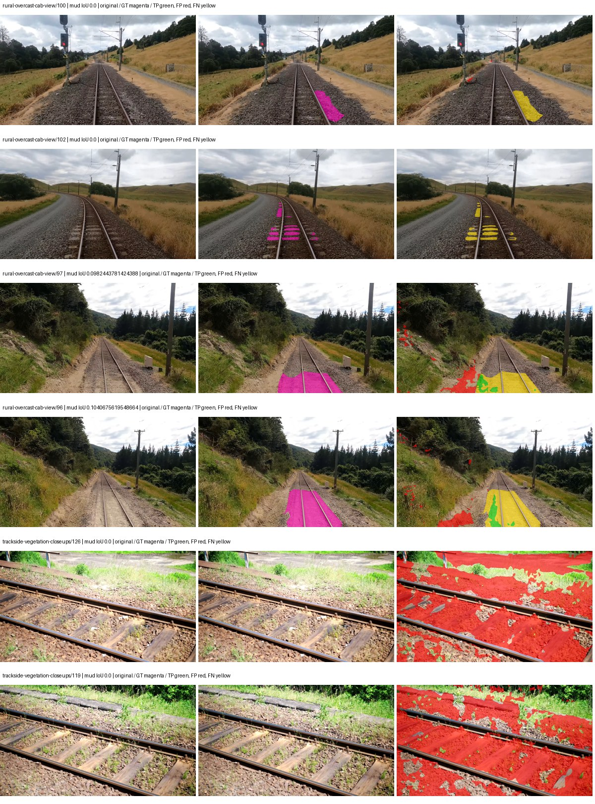

Examples are two lowest and two highest mud-IoU positive images, plus up to two negative images with the most false-positive mud pixels. They are targeted diagnostic examples, not random samples. Green: true positive; red: false positive; yellow: false negative. Full predictions remain on HDRFS.

### Validation tracking

| Logged step | Overall mIoU (%) | Mud IoU (%) |
| --- | --- | --- |
| 254 | 18.06 | 0.15 |
| 508 | 19.51 | 0.45 |
| 763 | 19.81 | 0.08 |
| 1017 | 21.91 | 0.32 |
| 1272 | 23.93 | 0.09 |
| 1527 | 21.91 | 0.13 |
| 1781 | 23.59 | 0.17 |

All retained scalar curves, including training loss and per-class IoU, are in record.json. Observed best mud on a curve is not necessarily a retained checkpoint: the pilot saved its selection-metric-best and final checkpoints. Step logging and checkpoint global_step may differ by one.

### Stopping and checkpoint provenance

```json
{
  "stopping": {
    "actual_steps": 1781,
    "maximum_steps": 4000,
    "min_delta": 0.001,
    "monitor": "val_iou/mud-pumping",
    "patience": 5,
    "reason": "validation_plateau"
  },
  "checkpoints": {
    "best": {
      "path": "/data/izadia1/projects/segmentary-runs/paul-test-rtis/mud-fullstats-v1-20260906-r2/future-runs/native_resnet18_fpn_fcn--rtis_only--seed-2_seed2/rtis/best.ckpt",
      "sha256": "0912df0a5f8cfbf0d8c72ed7aaf304d282e510f4fef27ce958379874e262112c",
      "global_step": 509,
      "bytes": 202363673
    },
    "final": {
      "path": "/data/izadia1/projects/segmentary-runs/paul-test-rtis/mud-fullstats-v1-20260906-r2/future-runs/native_resnet18_fpn_fcn--rtis_only--seed-2_seed2/rtis/last.ckpt",
      "sha256": "c5e523c90962bcb35fe28e3d5129c649b1f4087741e245c7d8d1743fe17bb98d",
      "global_step": 1781,
      "bytes": 202358617
    }
  },
  "cleanup_error": null
}
```

### Resolved training, initialization and evaluation settings

The optimizer block is the base configuration. Stage LR scales are applied at runtime, and stage warmup is capped at min(base warmup, floor(stage budget / 10), stage budget - 1): 400 steps for this 4,000-step pilot. Model-internal native input grids may differ from augmentation crops (EoMT uses its 640 grid).

```json
{
  "name": "native_resnet18_fpn_fcn--rtis_only--seed-2",
  "model": {
    "arch": "native",
    "checkpoint": null,
    "tuning": "full",
    "head": "unified_head",
    "lora_r": 16,
    "lora_alpha": 32,
    "lora_dropout": 0.05,
    "lora_targets": [],
    "drop_path": null,
    "revision": null,
    "subfolder": null,
    "local_files_only": false,
    "trust_remote_code": false,
    "backbone_path": null,
    "head_paths": [],
    "classifier_path": null,
    "inactive_parameter_paths": [],
    "smp_arch": null,
    "encoder_name": null,
    "encoder_weights": null,
    "native": {
      "task": "multiclass",
      "backbone": {
        "kind": "timm",
        "name": "resnet18.a1_in1k",
        "weights": "pretrained",
        "out_indices": [
          1,
          2,
          3,
          4
        ],
        "in_channels": 3
      },
      "neck": {
        "kind": "fpn",
        "out_channels": 128,
        "num_outputs": 4,
        "norm": "group",
        "activation": "relu"
      },
      "head": {
        "kind": "fcn",
        "in_indices": [
          0,
          1,
          2,
          3
        ],
        "channels": 128,
        "num_convs": 2,
        "kernel_size": 3,
        "dilation": 1,
        "dropout": 0.1,
        "norm": "group",
        "activation": "relu"
      },
      "auxiliary_heads": []
    },
    "batch_norm_momentum": null
  },
  "space": "paul-test-rtis",
  "taxonomy_root": "/data/izadia1/projects/segmentary-rtis-fullstats-066afb2/taxonomy",
  "output_root": "/data/izadia1/projects/segmentary-runs/paul-test-rtis/mud-fullstats-v1-20260906-r2/future-runs",
  "optim": {
    "backbone_lr": 0.0001,
    "head_lr_mult": 10.0,
    "weight_decay": 0.05,
    "llrd": 1.0,
    "warmup_iters": 1500,
    "warmup_ratio": 1e-06,
    "poly_power": 0.9,
    "min_lr_ratio": 0.0,
    "betas": [
      0.9,
      0.999
    ],
    "grad_clip": 1.0
  },
  "train": {
    "iters": 4000,
    "batch_size": 2,
    "accum": 8,
    "num_workers": 2,
    "precision": "bf16-mixed",
    "ema_decay": 0.9998,
    "val_every": 250,
    "ckpt_every": 500,
    "selection_metric": "val_iou/mud-pumping",
    "early_stopping_patience": 5,
    "early_stopping_min_delta": 0.001,
    "seed": 2,
    "devices": 1
  },
  "eval": {
    "sliding_window": true,
    "window": [
      1024,
      1024
    ],
    "stride": [
      768,
      768
    ],
    "batch_size": 1,
    "num_workers": 2,
    "tta_scales": [],
    "tta_flip": false,
    "threshold": 0.5,
    "boundary_tolerance_frac": 0.0075,
    "save_confusion": true
  },
  "loss": {
    "task": "multiclass",
    "activation": "auto",
    "terms": [],
    "aux": "none",
    "aux_weight": 0.0,
    "ce_weight": 1.0,
    "label_smoothing": 0.0,
    "class_weights": null,
    "query": null
  },
  "aug": {
    "crop": [
      1024,
      1024
    ],
    "scale_min": 0.5,
    "scale_max": 2.0,
    "hflip_p": 0.5,
    "color_jitter_p": 0.5,
    "brightness": 0.25,
    "contrast": 0.25,
    "saturation": 0.25,
    "hue": 0.05
  },
  "stages": [
    {
      "name": "rtis",
      "data": [
        {
          "name": "paul-test-rtis",
          "root": "/data/izadia1/datasets/paul-test-rtis",
          "variant": null,
          "split_file": "splits.json",
          "train_split": "train",
          "val_split": "val",
          "limit": null,
          "loader": "folder",
          "mapping": "paul-test-rtis",
          "loader_options": {
            "require_groups": true
          }
        }
      ],
      "iters": null,
      "lr_scale": 1.0,
      "head_group_lr_scale": 1.0,
      "init_from": "pretrained",
      "reset_head": false,
      "freeze": null,
      "sample_weights": null
    }
  ]
}
```

### Hardware and software provenance

```json
{
  "training": {
    "cuda_available": true,
    "cuda_visible_devices": "8",
    "cudnn": 91900,
    "driver_version": "570.133.20",
    "gpu_count": 1,
    "gpu_names": [
      "NVIDIA L40S"
    ],
    "hostname": "hdrfs-app-001",
    "input_normalization": {
      "channel_order": "rgb",
      "mean": [
        0.485,
        0.456,
        0.406
      ],
      "source": "timm_pretrained_cfg",
      "std": [
        0.229,
        0.224,
        0.225
      ]
    },
    "model_origins": [
      {
        "hf_commit": null,
        "hf_name_or_path": null,
        "module": "backbone",
        "timm_pretrained": {
          "architecture": "resnet18",
          "hf_hub_id": "timm/resnet18.a1_in1k",
          "tag": "a1_in1k",
          "url": "https://github.com/huggingface/pytorch-image-models/releases/download/v0.1-rsb-weights/resnet18_a1_0-d63eafa0.pth"
        }
      },
      {
        "hf_commit": null,
        "hf_name_or_path": null,
        "module": "backbone.model",
        "timm_pretrained": {
          "architecture": "resnet18",
          "hf_hub_id": "timm/resnet18.a1_in1k",
          "tag": "a1_in1k",
          "url": "https://github.com/huggingface/pytorch-image-models/releases/download/v0.1-rsb-weights/resnet18_a1_0-d63eafa0.pth"
        }
      }
    ],
    "model_parameter_count": 12631253,
    "packages": {
      "albumentations": "2.0.8",
      "lightning": "2.6.5",
      "numpy": "2.4.4",
      "segmentary": "0.1.0",
      "segmentation-models-pytorch": "0.5.0",
      "timm": "1.0.28",
      "torch": "2.11.0+cu128",
      "torchvision": "0.26.0+cu128",
      "transformers": "5.15.0"
    },
    "platform": "Linux-5.15.0-139-generic-x86_64-with-glibc2.35",
    "python": "3.11.15",
    "torch": "2.11.0+cu128",
    "torch_cuda": "12.8",
    "trainable_parameter_count": 12631253,
    "training_stop": {
      "actual_steps": 1781,
      "maximum_steps": 4000,
      "min_delta": 0.001,
      "monitor": "val_iou/mud-pumping",
      "patience": 5,
      "reason": "validation_plateau"
    },
    "validation_weights": "raw"
  },
  "evaluation": {
    "cuda_available": true,
    "cuda_visible_devices": "8",
    "cudnn": 91900,
    "driver_version": "570.133.20",
    "gpu_count": 1,
    "gpu_names": [
      "NVIDIA L40S"
    ],
    "hostname": "hdrfs-app-001",
    "input_normalization": {
      "channel_order": "rgb",
      "mean": [
        0.485,
        0.456,
        0.406
      ],
      "source": "timm_pretrained_cfg",
      "std": [
        0.229,
        0.224,
        0.225
      ]
    },
    "packages": {
      "albumentations": "2.0.8",
      "lightning": "2.6.5",
      "numpy": "2.4.4",
      "segmentary": "0.1.0",
      "segmentation-models-pytorch": "0.5.0",
      "timm": "1.0.28",
      "torch": "2.11.0+cu128",
      "torchvision": "0.26.0+cu128",
      "transformers": "5.15.0"
    },
    "platform": "Linux-5.15.0-139-generic-x86_64-with-glibc2.35",
    "python": "3.11.15",
    "torch": "2.11.0+cu128",
    "torch_cuda": "12.8"
  }
}
```

## cityscapes_to_rtis — seed 0

Status: **completed**. Started: 2026-09-06T21:20:05.207465+00:00. Finished: 2026-09-06T21:42:42.215079+00:00.

Recipe pretrained initializer: `{"arch": "native", "backbone_path": null, "batch_norm_momentum": null, "checkpoint": null, "classifier_path": null, "drop_path": null, "encoder_name": null, "encoder_weights": null, "head": "unified_head", "head_paths": [], "inactive_parameter_paths": [], "local_files_only": false, "lora_alpha": 32, "lora_dropout": 0.05, "lora_r": 16, "lora_targets": [], "native": {"auxiliary_heads": [], "backbone": {"in_channels": 3, "kind": "timm", "name": "resnet18.a1_in1k", "out_indices": [1, 2, 3, 4], "weights": "pretrained"}, "head": {"activation": "relu", "channels": 128, "dilation": 1, "dropout": 0.1, "in_indices": [0, 1, 2, 3], "kernel_size": 3, "kind": "fcn", "norm": "group", "num_convs": 2}, "neck": {"activation": "relu", "kind": "fpn", "norm": "group", "num_outputs": 4, "out_channels": 128}, "task": "multiclass"}, "revision": null, "smp_arch": null, "subfolder": null, "trust_remote_code": false, "tuning": "full"}`.

`rtis_only` uses the recipe initializer, which may include pretrained segmentation components. Transfer paths load the exact historical source checkpoint below and reset the classifier; they do not reset all query/decoder features.

Source checkpoint: `{'name': 'native_resnet18_fpn_fcn--cityscapes--seed-0', 'model': 'native_resnet18_fpn_fcn', 'protocol': 'cityscapes', 'config': '/data/izadia1/projects/segmentary-runs/all-model-city-rail-seed0-rail20-b9eb3e1/jobs/native_resnet18_fpn_fcn--cityscapes--seed-0/attempt-001/resolved-config.yaml', 'checkpoint': '/data/izadia1/projects/segmentary-runs/all-model-city-rail-seed0-rail20-b9eb3e1/jobs/native_resnet18_fpn_fcn--cityscapes--seed-0/attempt-001/train/native_resnet18_fpn_fcn--cityscapes_seed0/cityscapes/last.ckpt', 'recorded_sha256': 'b3474fcb1341e0ce32beb83d56dedf1c206220837067b54bb10aa16999baf1eb', 'exists': True}`.

Config SHA-256: `16adeea6cc93b2e1b490a59ef0f37863325c6064f63e4e301b0d9451bee99a3c`. Weights used for validation: `raw`.

### Mud-pumping and aggregate quality

| Metric | Selected checkpoint | Final training validation |
| --- | --- | --- |
| Mud IoU | 0.88 | 0.63 |
| Mud precision | 1.03 | 0.85 |
| Mud recall | 5.91 | 2.45 |
| Mud Dice/F1 | 1.75 | 1.26 |
| mIoU | 20.36 | 24.35 |
| Mean accuracy | 32.08 | 36.98 |
| Mean precision | 34.09 | 41.01 |
| Mean Dice | 25.25 | 31.19 |
| Mean specificity | 98.65 | 98.82 |
| Pixel accuracy | 76.28 | 80.00 |
| Frequency-weighted IoU | 68.47 | 71.62 |
| Fixed GT-present class mIoU | 23.76 | 28.41 |
| Boundary F1 | 23.30 | 32.04 |

The selected checkpoint has independent evaluation evidence. Final values are the trainer's final validation record, not a new independent evaluation. mIoU averages classes with nonzero union, so false positives on absent classes can change its denominator. The fixed GT-class mean is supplementary and excludes absent classes; their false positives remain in the confusion matrix.

### Resource usage and timing

| Measurement | Value |
| --- | --- |
| Peak training VRAM, retained training invocation (GiB) | 7.34 |
| Peak evaluation VRAM (GiB) | 7.04 |
| Retained training invocation wall time (seconds) | 1239.40 |
| Retained training invocation GPU-hours (one GPU) | 0.34 |
| Evaluation wall time (seconds) | 11.05 |
| Full evaluation pipeline images/second | 3.35 |
| Best full-state checkpoint (MiB) | 192.99 |
| Final full-state checkpoint (MiB) | 192.98 |
| Audited periodic checkpoints removed (GiB) | 0.75 |

VRAM uses the recorded allocator high-water mark; it is not total device usage including CUDA context. Resumed jobs' retained training invocation times and peaks are **not whole-campaign totals**. Earlier invocation resource records are not reconstructed here. Evaluation throughput includes loader, sliding-window inference and metrics; it is not model-only latency/FPS. Missing measurements are shown as —, never inferred from another dataset's run.

### Standardized inference performance

Dedicated model-only profiling waits for an idle worker-locked L40S: BF16, batch 1, 1024x1024, 20 warmup and 100 CUDA-event-timed public forwards. It excludes loading, preprocessing, tiling and metrics.

| Status | Parameters | Weight MiB | FPS | p50 ms | p95 ms | Peak reserved GiB |
| --- | --- | --- | --- | --- | --- | --- |
| complete | 12631253 | 48.18 | 212.93 | 4.55 | 5.33 | 0.64 |

```json
{
  "schema_version": 1,
  "model_id": "native_resnet18_fpn_fcn",
  "measured_at": "2026-09-06T21:42:39+00:00",
  "status": "complete",
  "benchmark_scope": "rtis_selected_checkpoint_model_only",
  "applies_to": [
    "native_resnet18_fpn_fcn--cityscapes_to_rtis--seed-0"
  ],
  "source": {
    "campaign_git_sha": "066afb2626398b7be59d4d19f5a0e4644fd59adc",
    "git_dirty": false,
    "config_hash": "f4a13b787646",
    "resolved_config": "/data/izadia1/projects/segmentary-runs/paul-test-rtis/mud-fullstats-v1-20260906-r2/configs/native_resnet18_fpn_fcn--cityscapes_to_rtis--seed-0.yaml",
    "config_sha256": "16adeea6cc93b2e1b490a59ef0f37863325c6064f63e4e301b0d9451bee99a3c",
    "checkpoint_sha256": "233c12a8172e895ebaf02e53fbcf041ae74606de0c5172ca97eceb4f0d99dc24",
    "checkpoint_global_step": 763,
    "checkpoint_bytes": 202363737,
    "checkpoint_kind": "resume checkpoint with optimizer and EMA state",
    "weights": "raw",
    "measured_checkpoint_job_id": "native_resnet18_fpn_fcn--cityscapes_to_rtis--seed-0",
    "result_sha256": "d9b3954808cd84964fbac53f4b8afe154827ceaa4853dfbb8a943fba895d120a",
    "result_git_sha": "066afb2626398b7be59d4d19f5a0e4644fd59adc",
    "result_stage": "eval:paul-test-rtis:val",
    "result_seed": 0
  },
  "hardware": {
    "gpu_name": "NVIDIA L40S",
    "gpu_uuid": "GPU-fc5dde96-210d-0afa-ac74-7f88477d622b",
    "logical_device": "cuda:0",
    "physical_visibility_token": "4",
    "compute_capability": [
      8,
      9
    ],
    "total_memory_bytes": 47677177856
  },
  "model": {
    "parameter_count": 12631253,
    "trainable_parameter_count": 12631253,
    "resident_parameter_bytes": 50525012,
    "parameter_dtype_counts": {
      "float32": 12631253
    }
  },
  "contract": {
    "backend": "pytorch",
    "precision": "bf16_autocast",
    "batch_size": 1,
    "input_shape_nchw": [
      1,
      3,
      1024,
      1024
    ],
    "warmup_iterations": 20,
    "measured_iterations": 100,
    "timing": "per-forward CUDA events with end-event synchronization",
    "includes_preprocessing": false,
    "includes_data_loader": false,
    "includes_sliding_window": false,
    "input_resident_on_gpu": true,
    "model_only": true,
    "entrypoint": "public model(image) dense-logits forward"
  },
  "measurements": {
    "latency": {
      "p50_ms": 4.550112009048462,
      "p95_ms": 5.329377436637878,
      "mean_ms": 4.696401920318603,
      "minimum_ms": 4.346879959106445,
      "maximum_ms": 6.901760101318359,
      "fps": 212.92896497499092,
      "raw_ms": [
        5.006336212158203,
        4.483071804046631,
        4.428927898406982,
        4.563968181610107,
        4.365312099456787,
        4.346879959106445,
        6.634496212005615,
        4.456448078155518,
        4.430848121643066,
        4.956160068511963,
        4.607999801635742,
        4.432896137237549,
        4.403200149536133,
        4.384768009185791,
        4.389887809753418,
        4.459519863128662,
        4.403200149536133,
        4.7626237869262695,
        4.767744064331055,
        4.878335952758789,
        4.418560028076172,
        6.592512130737305,
        4.459519863128662,
        4.418560028076172,
        4.456448078155518,
        4.611072063446045,
        4.75545597076416,
        4.75545597076416,
        4.922368049621582,
        4.672512054443359,
        4.465792179107666,
        4.420608043670654,
        4.417535781860352,
        4.81385612487793,
        4.837376117706299,
        4.50764799118042,
        4.631552219390869,
        4.495359897613525,
        4.471807956695557,
        4.504640102386475,
        4.462463855743408,
        4.4462080001831055,
        4.513792037963867,
        6.901760101318359,
        5.083136081695557,
        4.704224109649658,
        4.8752641677856445,
        4.611072063446045,
        4.634624004364014,
        5.013440132141113,
        4.739071846008301,
        5.325791835784912,
        6.4686079025268555,
        4.547584056854248,
        4.438015937805176,
        4.55782413482666,
        4.7923197746276855,
        4.536320209503174,
        4.505504131317139,
        4.896768093109131,
        4.6981120109558105,
        4.600831985473633,
        4.552639961242676,
        4.592639923095703,
        4.473855972290039,
        4.832255840301514,
        4.531199932098389,
        4.464640140533447,
        4.471807956695557,
        4.417535781860352,
        4.438015937805176,
        4.582399845123291,
        4.514815807342529,
        4.480000019073486,
        4.7861762046813965,
        4.516863822937012,
        4.4236159324646,
        4.418560028076172,
        4.456511974334717,
        4.425727844238281,
        4.417535781860352,
        4.660223960876465,
        4.5352959632873535,
        4.627456188201904,
        5.0575361251831055,
        4.711423873901367,
        5.397503852844238,
        5.140480041503906,
        5.301248073577881,
        4.697055816650391,
        4.5649919509887695,
        4.527103900909424,
        4.538368225097656,
        4.531199932098389,
        4.601856231689453,
        4.603903770446777,
        4.587520122528076,
        4.544511795043945,
        4.604000091552734,
        4.467711925506592
      ],
      "percentile_method": "numpy linear interpolation"
    },
    "peak_reserved_bytes": 685768704,
    "memory_kind": "pytorch_cuda_allocator_peak_reserved_excluding_context",
    "benchmark_wall_clock_s": 8.964971978217363
  },
  "started_at": "2026-09-06T21:42:30+00:00",
  "finished_at": "2026-09-06T21:42:39+00:00",
  "environment": {
    "hostname": "hdrfs-app-001",
    "python": "3.11.15",
    "platform": "Linux-5.15.0-139-generic-x86_64-with-glibc2.35",
    "torch": "2.11.0+cu128",
    "torch_cuda": "12.8",
    "cudnn": 91900,
    "driver_version": "570.133.20",
    "cuda_available": true,
    "gpu_count": 1,
    "gpu_names": [
      "NVIDIA L40S"
    ],
    "cuda_visible_devices": "4",
    "packages": {
      "segmentary": "0.1.0",
      "torch": "2.11.0+cu128",
      "torchvision": "0.26.0+cu128",
      "transformers": "5.15.0",
      "timm": "1.0.28",
      "segmentation-models-pytorch": "0.5.0",
      "albumentations": "2.0.8",
      "lightning": "2.6.5",
      "numpy": "2.4.4"
    }
  }
}
```

### Per-class validation results

| Class | GT pixels | IoU (%) | Precision (%) | Recall (%) | Dice (%) | Boundary F1 (%) |
| --- | --- | --- | --- | --- | --- | --- |
| car | 29664 | 0.00 | 0.00 | 0.00 | 0.00 | 0.00 |
| construction | 311585 | 7.23 | 7.40 | 76.33 | 13.49 | 13.45 |
| fence | 265137 | 4.38 | 30.13 | 4.88 | 8.40 | 12.90 |
| mud-pumping | 1226250 | 0.88 | 1.03 | 5.91 | 1.75 | 3.30 |
| on-rails | 0 | 0.00 | 0.00 | — | 0.00 | 0.00 |
| person | 0 | 0.00 | 0.00 | — | 0.00 | 0.00 |
| pole | 628038 | 63.46 | 76.43 | 78.91 | 77.65 | 83.87 |
| rail-embedded | 16799 | 0.00 | 0.00 | 0.00 | 0.00 | 0.00 |
| rail-raised | 2969797 | 64.88 | 72.40 | 86.20 | 78.70 | 83.26 |
| rail-track | 6323197 | 26.62 | 66.00 | 30.85 | 42.05 | 39.83 |
| road | 1048831 | 9.83 | 41.04 | 11.45 | 17.90 | 20.78 |
| sidewalk | 1297367 | 9.85 | 92.72 | 9.93 | 17.94 | 9.49 |
| sky | 19121606 | 95.92 | 99.00 | 96.86 | 97.92 | 84.03 |
| standing-water | 95802 | 0.59 | 0.67 | 4.61 | 1.17 | 2.20 |
| terrain | 39239306 | 81.90 | 89.24 | 90.88 | 90.05 | 51.67 |
| trackbed | 10643081 | 56.04 | 69.38 | 74.45 | 71.83 | 54.35 |
| traffic-light | 19510 | 0.00 | 0.00 | 0.00 | 0.00 | 0.00 |
| traffic-sign | 13285 | 0.00 | 0.00 | 0.00 | 0.00 | 0.00 |
| tram-track | 56179 | 0.00 | 0.00 | 0.00 | 0.00 | 0.00 |
| truck | 0 | 0.00 | 0.00 | — | 0.00 | 0.00 |
| vegetation-overgrowth | 5901821 | 6.00 | 70.40 | 6.15 | 11.32 | 30.26 |

### Full-run accounting

| Measurement | Value |
| --- | --- |
| Full GPU-reserved wall seconds, all recorded worker attempts | 1357.25 |
| Full reserved GPU-hours | 0.38 |
| Whole-run timing complete | True |

| Phase | Wall seconds including failed attempts |
| --- | --- |
| training | 1246.14 |
| diagnostics | 75.40 |
| performance | 15.87 |

GPU-reserved time includes model loading, training, validation, collection, profiling, checkpoint I/O and orchestration while the worker owns one GPU. It is not GPU kernel-active time. Phase timings and sampled device memory/power/utilization are retained separately; sampled device memory is not the allocator high-water mark.

### Train/validation and raw/EMA diagnostics

| Checkpoint / weights / split | Images | Mud IoU (%) | Mud precision (%) | Mud recall (%) |
| --- | --- | --- | --- | --- |
| best-auto-train / raw | 220 | 86.59 | 93.48 | 92.15 |
| best-auto-val / raw | 37 | 0.88 | 1.03 | 5.91 |
| best-alternate-val / ema | 37 | 0.33 | 0.41 | 1.51 |
| final-auto-val / raw | 37 | 0.63 | 0.84 | 2.44 |

Train uses the evaluation transform without augmentation. Compare mud train/validation metrics for the same selected weights. Alternate EMA on running-stat BatchNorm is explicitly uncalibrated and is diagnostic only. Score-threshold curves use uncalibrated normalized scores and are pixel-level diagnostics, not event detection rates or a selected deployment operating point.

### Downloadable evidence

- best-auto-train: [per-image.csv](cityscapes_to_rtis--seed-0/best-auto-train/per-image.csv) · [per-image-confusion.json.gz](cityscapes_to_rtis--seed-0/best-auto-train/per-image-confusion.json.gz) · [groups.json](cityscapes_to_rtis--seed-0/best-auto-train/groups.json) · [mud-score-curves.json](cityscapes_to_rtis--seed-0/best-auto-train/mud-score-curves.json)
- best-auto-val: [per-image.csv](cityscapes_to_rtis--seed-0/best-auto-val/per-image.csv) · [per-image-confusion.json.gz](cityscapes_to_rtis--seed-0/best-auto-val/per-image-confusion.json.gz) · [groups.json](cityscapes_to_rtis--seed-0/best-auto-val/groups.json) · [mud-score-curves.json](cityscapes_to_rtis--seed-0/best-auto-val/mud-score-curves.json) · [examples.jpg](cityscapes_to_rtis--seed-0/best-auto-val/examples.jpg)
- best-alternate-val: [per-image.csv](cityscapes_to_rtis--seed-0/best-alternate-val/per-image.csv) · [per-image-confusion.json.gz](cityscapes_to_rtis--seed-0/best-alternate-val/per-image-confusion.json.gz) · [groups.json](cityscapes_to_rtis--seed-0/best-alternate-val/groups.json) · [mud-score-curves.json](cityscapes_to_rtis--seed-0/best-alternate-val/mud-score-curves.json)
- final-auto-val: [per-image.csv](cityscapes_to_rtis--seed-0/final-auto-val/per-image.csv) · [per-image-confusion.json.gz](cityscapes_to_rtis--seed-0/final-auto-val/per-image-confusion.json.gz) · [groups.json](cityscapes_to_rtis--seed-0/final-auto-val/groups.json) · [mud-score-curves.json](cityscapes_to_rtis--seed-0/final-auto-val/mud-score-curves.json)
- resources: [telemetry.csv](cityscapes_to_rtis--seed-0/resources/telemetry.csv)

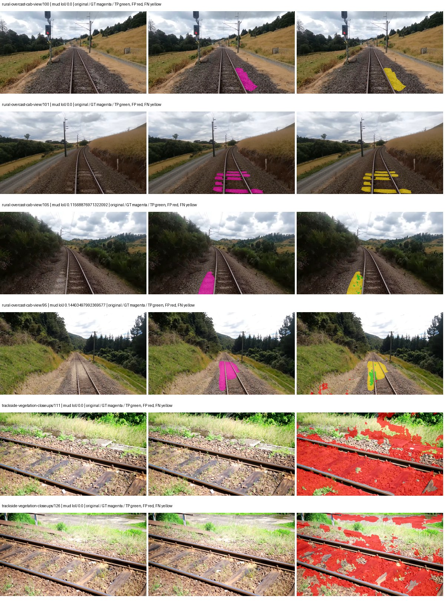

Examples are two lowest and two highest mud-IoU positive images, plus up to two negative images with the most false-positive mud pixels. They are targeted diagnostic examples, not random samples. Green: true positive; red: false positive; yellow: false negative. Full predictions remain on HDRFS.

### Validation tracking

| Logged step | Overall mIoU (%) | Mud IoU (%) |
| --- | --- | --- |
| 254 | 21.13 | 0.48 |
| 508 | 22.54 | 0.21 |
| 763 | 20.36 | 0.88 |
| 1017 | 21.10 | 0.66 |
| 1272 | 23.16 | 0.20 |
| 1527 | 23.29 | 0.22 |
| 1781 | 25.41 | 0.08 |
| 2036 | 24.35 | 0.63 |

All retained scalar curves, including training loss and per-class IoU, are in record.json. Observed best mud on a curve is not necessarily a retained checkpoint: the pilot saved its selection-metric-best and final checkpoints. Step logging and checkpoint global_step may differ by one.

### Stopping and checkpoint provenance

```json
{
  "stopping": {
    "actual_steps": 2036,
    "maximum_steps": 4000,
    "min_delta": 0.001,
    "monitor": "val_iou/mud-pumping",
    "patience": 5,
    "reason": "validation_plateau"
  },
  "checkpoints": {
    "best": {
      "path": "/data/izadia1/projects/segmentary-runs/paul-test-rtis/mud-fullstats-v1-20260906-r2/future-runs/native_resnet18_fpn_fcn--cityscapes_to_rtis--seed-0_seed0/rtis/best.ckpt",
      "sha256": "233c12a8172e895ebaf02e53fbcf041ae74606de0c5172ca97eceb4f0d99dc24",
      "global_step": 763,
      "bytes": 202363737
    },
    "final": {
      "path": "/data/izadia1/projects/segmentary-runs/paul-test-rtis/mud-fullstats-v1-20260906-r2/future-runs/native_resnet18_fpn_fcn--cityscapes_to_rtis--seed-0_seed0/rtis/last.ckpt",
      "sha256": "a6261394260da0688f1e1ab43dc8df9aa1f3c1e24de977e2ae233cda0dd6e16a",
      "global_step": 2036,
      "bytes": 202358617
    }
  },
  "cleanup_error": null
}
```

### Resolved training, initialization and evaluation settings

The optimizer block is the base configuration. Stage LR scales are applied at runtime, and stage warmup is capped at min(base warmup, floor(stage budget / 10), stage budget - 1): 400 steps for this 4,000-step pilot. Model-internal native input grids may differ from augmentation crops (EoMT uses its 640 grid).

```json
{
  "name": "native_resnet18_fpn_fcn--cityscapes_to_rtis--seed-0",
  "model": {
    "arch": "native",
    "checkpoint": null,
    "tuning": "full",
    "head": "unified_head",
    "lora_r": 16,
    "lora_alpha": 32,
    "lora_dropout": 0.05,
    "lora_targets": [],
    "drop_path": null,
    "revision": null,
    "subfolder": null,
    "local_files_only": false,
    "trust_remote_code": false,
    "backbone_path": null,
    "head_paths": [],
    "classifier_path": null,
    "inactive_parameter_paths": [],
    "smp_arch": null,
    "encoder_name": null,
    "encoder_weights": null,
    "native": {
      "task": "multiclass",
      "backbone": {
        "kind": "timm",
        "name": "resnet18.a1_in1k",
        "weights": "pretrained",
        "out_indices": [
          1,
          2,
          3,
          4
        ],
        "in_channels": 3
      },
      "neck": {
        "kind": "fpn",
        "out_channels": 128,
        "num_outputs": 4,
        "norm": "group",
        "activation": "relu"
      },
      "head": {
        "kind": "fcn",
        "in_indices": [
          0,
          1,
          2,
          3
        ],
        "channels": 128,
        "num_convs": 2,
        "kernel_size": 3,
        "dilation": 1,
        "dropout": 0.1,
        "norm": "group",
        "activation": "relu"
      },
      "auxiliary_heads": []
    },
    "batch_norm_momentum": null
  },
  "space": "paul-test-rtis",
  "taxonomy_root": "/data/izadia1/projects/segmentary-rtis-fullstats-066afb2/taxonomy",
  "output_root": "/data/izadia1/projects/segmentary-runs/paul-test-rtis/mud-fullstats-v1-20260906-r2/future-runs",
  "optim": {
    "backbone_lr": 0.0001,
    "head_lr_mult": 10.0,
    "weight_decay": 0.05,
    "llrd": 1.0,
    "warmup_iters": 1500,
    "warmup_ratio": 1e-06,
    "poly_power": 0.9,
    "min_lr_ratio": 0.0,
    "betas": [
      0.9,
      0.999
    ],
    "grad_clip": 1.0
  },
  "train": {
    "iters": 4000,
    "batch_size": 2,
    "accum": 8,
    "num_workers": 2,
    "precision": "bf16-mixed",
    "ema_decay": 0.9998,
    "val_every": 250,
    "ckpt_every": 500,
    "selection_metric": "val_iou/mud-pumping",
    "early_stopping_patience": 5,
    "early_stopping_min_delta": 0.001,
    "seed": 0,
    "devices": 1
  },
  "eval": {
    "sliding_window": true,
    "window": [
      1024,
      1024
    ],
    "stride": [
      768,
      768
    ],
    "batch_size": 1,
    "num_workers": 2,
    "tta_scales": [],
    "tta_flip": false,
    "threshold": 0.5,
    "boundary_tolerance_frac": 0.0075,
    "save_confusion": true
  },
  "loss": {
    "task": "multiclass",
    "activation": "auto",
    "terms": [],
    "aux": "none",
    "aux_weight": 0.0,
    "ce_weight": 1.0,
    "label_smoothing": 0.0,
    "class_weights": null,
    "query": null
  },
  "aug": {
    "crop": [
      1024,
      1024
    ],
    "scale_min": 0.5,
    "scale_max": 2.0,
    "hflip_p": 0.5,
    "color_jitter_p": 0.5,
    "brightness": 0.25,
    "contrast": 0.25,
    "saturation": 0.25,
    "hue": 0.05
  },
  "stages": [
    {
      "name": "rtis",
      "data": [
        {
          "name": "paul-test-rtis",
          "root": "/data/izadia1/datasets/paul-test-rtis",
          "variant": null,
          "split_file": "splits.json",
          "train_split": "train",
          "val_split": "val",
          "limit": null,
          "loader": "folder",
          "mapping": "paul-test-rtis",
          "loader_options": {
            "require_groups": true
          }
        }
      ],
      "iters": null,
      "lr_scale": 0.1,
      "head_group_lr_scale": 1.0,
      "init_from": "/data/izadia1/projects/segmentary-runs/all-model-city-rail-seed0-rail20-b9eb3e1/jobs/native_resnet18_fpn_fcn--cityscapes--seed-0/attempt-001/train/native_resnet18_fpn_fcn--cityscapes_seed0/cityscapes/last.ckpt",
      "reset_head": true,
      "freeze": null,
      "sample_weights": null
    }
  ]
}
```

### Hardware and software provenance

```json
{
  "training": {
    "cuda_available": true,
    "cuda_visible_devices": "4",
    "cudnn": 91900,
    "driver_version": "570.133.20",
    "gpu_count": 1,
    "gpu_names": [
      "NVIDIA L40S"
    ],
    "hostname": "hdrfs-app-001",
    "input_normalization": {
      "channel_order": "rgb",
      "mean": [
        0.485,
        0.456,
        0.406
      ],
      "source": "timm_pretrained_cfg",
      "std": [
        0.229,
        0.224,
        0.225
      ]
    },
    "model_origins": [
      {
        "hf_commit": null,
        "hf_name_or_path": null,
        "module": "backbone",
        "timm_pretrained": {
          "architecture": "resnet18",
          "hf_hub_id": "timm/resnet18.a1_in1k",
          "tag": "a1_in1k",
          "url": "https://github.com/huggingface/pytorch-image-models/releases/download/v0.1-rsb-weights/resnet18_a1_0-d63eafa0.pth"
        }
      },
      {
        "hf_commit": null,
        "hf_name_or_path": null,
        "module": "backbone.model",
        "timm_pretrained": {
          "architecture": "resnet18",
          "hf_hub_id": "timm/resnet18.a1_in1k",
          "tag": "a1_in1k",
          "url": "https://github.com/huggingface/pytorch-image-models/releases/download/v0.1-rsb-weights/resnet18_a1_0-d63eafa0.pth"
        }
      }
    ],
    "model_parameter_count": 12631253,
    "packages": {
      "albumentations": "2.0.8",
      "lightning": "2.6.5",
      "numpy": "2.4.4",
      "segmentary": "0.1.0",
      "segmentation-models-pytorch": "0.5.0",
      "timm": "1.0.28",
      "torch": "2.11.0+cu128",
      "torchvision": "0.26.0+cu128",
      "transformers": "5.15.0"
    },
    "platform": "Linux-5.15.0-139-generic-x86_64-with-glibc2.35",
    "python": "3.11.15",
    "torch": "2.11.0+cu128",
    "torch_cuda": "12.8",
    "trainable_parameter_count": 12631253,
    "training_stop": {
      "actual_steps": 2036,
      "maximum_steps": 4000,
      "min_delta": 0.001,
      "monitor": "val_iou/mud-pumping",
      "patience": 5,
      "reason": "validation_plateau"
    },
    "validation_weights": "raw"
  },
  "evaluation": {
    "cuda_available": true,
    "cuda_visible_devices": "4",
    "cudnn": 91900,
    "driver_version": "570.133.20",
    "gpu_count": 1,
    "gpu_names": [
      "NVIDIA L40S"
    ],
    "hostname": "hdrfs-app-001",
    "input_normalization": {
      "channel_order": "rgb",
      "mean": [
        0.485,
        0.456,
        0.406
      ],
      "source": "timm_pretrained_cfg",
      "std": [
        0.229,
        0.224,
        0.225
      ]
    },
    "packages": {
      "albumentations": "2.0.8",
      "lightning": "2.6.5",
      "numpy": "2.4.4",
      "segmentary": "0.1.0",
      "segmentation-models-pytorch": "0.5.0",
      "timm": "1.0.28",
      "torch": "2.11.0+cu128",
      "torchvision": "0.26.0+cu128",
      "transformers": "5.15.0"
    },
    "platform": "Linux-5.15.0-139-generic-x86_64-with-glibc2.35",
    "python": "3.11.15",
    "torch": "2.11.0+cu128",
    "torch_cuda": "12.8"
  }
}
```

## cityscapes_to_rtis — seed 1

Status: **completed**. Started: 2026-09-06T21:20:40.763968+00:00. Finished: 2026-09-06T21:43:06.505760+00:00.

Recipe pretrained initializer: `{"arch": "native", "backbone_path": null, "batch_norm_momentum": null, "checkpoint": null, "classifier_path": null, "drop_path": null, "encoder_name": null, "encoder_weights": null, "head": "unified_head", "head_paths": [], "inactive_parameter_paths": [], "local_files_only": false, "lora_alpha": 32, "lora_dropout": 0.05, "lora_r": 16, "lora_targets": [], "native": {"auxiliary_heads": [], "backbone": {"in_channels": 3, "kind": "timm", "name": "resnet18.a1_in1k", "out_indices": [1, 2, 3, 4], "weights": "pretrained"}, "head": {"activation": "relu", "channels": 128, "dilation": 1, "dropout": 0.1, "in_indices": [0, 1, 2, 3], "kernel_size": 3, "kind": "fcn", "norm": "group", "num_convs": 2}, "neck": {"activation": "relu", "kind": "fpn", "norm": "group", "num_outputs": 4, "out_channels": 128}, "task": "multiclass"}, "revision": null, "smp_arch": null, "subfolder": null, "trust_remote_code": false, "tuning": "full"}`.

`rtis_only` uses the recipe initializer, which may include pretrained segmentation components. Transfer paths load the exact historical source checkpoint below and reset the classifier; they do not reset all query/decoder features.

Source checkpoint: `{'name': 'native_resnet18_fpn_fcn--cityscapes--seed-0', 'model': 'native_resnet18_fpn_fcn', 'protocol': 'cityscapes', 'config': '/data/izadia1/projects/segmentary-runs/all-model-city-rail-seed0-rail20-b9eb3e1/jobs/native_resnet18_fpn_fcn--cityscapes--seed-0/attempt-001/resolved-config.yaml', 'checkpoint': '/data/izadia1/projects/segmentary-runs/all-model-city-rail-seed0-rail20-b9eb3e1/jobs/native_resnet18_fpn_fcn--cityscapes--seed-0/attempt-001/train/native_resnet18_fpn_fcn--cityscapes_seed0/cityscapes/last.ckpt', 'recorded_sha256': 'b3474fcb1341e0ce32beb83d56dedf1c206220837067b54bb10aa16999baf1eb', 'exists': True}`.

Config SHA-256: `3bc8088ab8b77bd2dbdb8fc1e359e0a8dec87f927ce91366afdb6b5f881de1fa`. Weights used for validation: `raw`.

### Mud-pumping and aggregate quality

| Metric | Selected checkpoint | Final training validation |
| --- | --- | --- |
| Mud IoU | 1.41 | 0.31 |
| Mud precision | 1.57 | 0.50 |
| Mud recall | 12.12 | 0.81 |
| Mud Dice/F1 | 2.78 | 0.62 |
| mIoU | 22.83 | 24.93 |
| Mean accuracy | 34.74 | 39.78 |
| Mean precision | 36.25 | 37.36 |
| Mean Dice | 28.93 | 31.67 |
| Mean specificity | 98.63 | 98.80 |
| Pixel accuracy | 74.80 | 79.08 |
| Frequency-weighted IoU | 68.30 | 70.47 |
| Fixed GT-present class mIoU | 26.64 | 29.08 |
| Boundary F1 | 26.74 | 30.78 |

The selected checkpoint has independent evaluation evidence. Final values are the trainer's final validation record, not a new independent evaluation. mIoU averages classes with nonzero union, so false positives on absent classes can change its denominator. The fixed GT-class mean is supplementary and excludes absent classes; their false positives remain in the confusion matrix.

### Resource usage and timing

| Measurement | Value |
| --- | --- |
| Peak training VRAM, retained training invocation (GiB) | 7.34 |
| Peak evaluation VRAM (GiB) | 7.04 |
| Retained training invocation wall time (seconds) | 1229.53 |
| Retained training invocation GPU-hours (one GPU) | 0.34 |
| Evaluation wall time (seconds) | 11.14 |
| Full evaluation pipeline images/second | 3.32 |
| Best full-state checkpoint (MiB) | 192.99 |
| Final full-state checkpoint (MiB) | 192.98 |
| Audited periodic checkpoints removed (GiB) | 0.75 |

VRAM uses the recorded allocator high-water mark; it is not total device usage including CUDA context. Resumed jobs' retained training invocation times and peaks are **not whole-campaign totals**. Earlier invocation resource records are not reconstructed here. Evaluation throughput includes loader, sliding-window inference and metrics; it is not model-only latency/FPS. Missing measurements are shown as —, never inferred from another dataset's run.

### Standardized inference performance

Dedicated model-only profiling waits for an idle worker-locked L40S: BF16, batch 1, 1024x1024, 20 warmup and 100 CUDA-event-timed public forwards. It excludes loading, preprocessing, tiling and metrics.

| Status | Parameters | Weight MiB | FPS | p50 ms | p95 ms | Peak reserved GiB |
| --- | --- | --- | --- | --- | --- | --- |
| complete | 12631253 | 48.18 | 221.91 | 4.41 | 4.91 | 0.64 |

```json
{
  "schema_version": 1,
  "model_id": "native_resnet18_fpn_fcn",
  "measured_at": "2026-09-06T21:43:03+00:00",
  "status": "complete",
  "benchmark_scope": "rtis_selected_checkpoint_model_only",
  "applies_to": [
    "native_resnet18_fpn_fcn--cityscapes_to_rtis--seed-1"
  ],
  "source": {
    "campaign_git_sha": "066afb2626398b7be59d4d19f5a0e4644fd59adc",
    "git_dirty": false,
    "config_hash": "a4497742192b",
    "resolved_config": "/data/izadia1/projects/segmentary-runs/paul-test-rtis/mud-fullstats-v1-20260906-r2/configs/native_resnet18_fpn_fcn--cityscapes_to_rtis--seed-1.yaml",
    "config_sha256": "3bc8088ab8b77bd2dbdb8fc1e359e0a8dec87f927ce91366afdb6b5f881de1fa",
    "checkpoint_sha256": "a45b2973877cbd12e217c1b89662701e459aa6a244066321f78f79ad8bc7f3d6",
    "checkpoint_global_step": 763,
    "checkpoint_bytes": 202363737,
    "checkpoint_kind": "resume checkpoint with optimizer and EMA state",
    "weights": "raw",
    "measured_checkpoint_job_id": "native_resnet18_fpn_fcn--cityscapes_to_rtis--seed-1",
    "result_sha256": "71d22ec7c3831bc6a338f9c3fd9ef0694e394bb0a35f6f3d52b5596dfb70e9d5",
    "result_git_sha": "066afb2626398b7be59d4d19f5a0e4644fd59adc",
    "result_stage": "eval:paul-test-rtis:val",
    "result_seed": 1
  },
  "hardware": {
    "gpu_name": "NVIDIA L40S",
    "gpu_uuid": "GPU-d411d86a-6d1d-1967-55e7-9f9ec85d13f5",
    "logical_device": "cuda:0",
    "physical_visibility_token": "1",
    "compute_capability": [
      8,
      9
    ],
    "total_memory_bytes": 47677177856
  },
  "model": {
    "parameter_count": 12631253,
    "trainable_parameter_count": 12631253,
    "resident_parameter_bytes": 50525012,
    "parameter_dtype_counts": {
      "float32": 12631253
    }
  },
  "contract": {
    "backend": "pytorch",
    "precision": "bf16_autocast",
    "batch_size": 1,
    "input_shape_nchw": [
      1,
      3,
      1024,
      1024
    ],
    "warmup_iterations": 20,
    "measured_iterations": 100,
    "timing": "per-forward CUDA events with end-event synchronization",
    "includes_preprocessing": false,
    "includes_data_loader": false,
    "includes_sliding_window": false,
    "input_resident_on_gpu": true,
    "model_only": true,
    "entrypoint": "public model(image) dense-logits forward"
  },
  "measurements": {
    "latency": {
      "p50_ms": 4.4072959423065186,
      "p95_ms": 4.907817411422729,
      "mean_ms": 4.506329274177551,
      "minimum_ms": 4.348927974700928,
      "maximum_ms": 5.170144081115723,
      "fps": 221.91010446801178,
      "raw_ms": [
        4.489215850830078,
        4.373504161834717,
        4.348927974700928,
        4.372543811798096,
        4.3816962242126465,
        4.374527931213379,
        4.893695831298828,
        5.154816150665283,
        5.170144081115723,
        4.374527931213379,
        4.495488166809082,
        4.463615894317627,
        4.452352046966553,
        4.353024005889893,
        4.536320209503174,
        4.378623962402344,
        4.385791778564453,
        4.372447967529297,
        4.740096092224121,
        4.730879783630371,
        4.390912055969238,
        4.3581438064575195,
        4.357120037078857,
        4.415487766265869,
        4.5772480964660645,
        4.739071846008301,
        4.446303844451904,
        4.4934401512146,
        4.355072021484375,
        4.355135917663574,
        4.357120037078857,
        4.562943935394287,
        4.8158721923828125,
        4.412415981292725,
        4.905983924865723,
        4.779007911682129,
        4.356095790863037,
        4.754432201385498,
        4.839424133300781,
        4.388864040374756,
        4.3919358253479,
        4.3724799156188965,
        4.371551990509033,
        4.417535781860352,
        4.6233601570129395,
        4.856832027435303,
        4.476928234100342,
        4.963327884674072,
        4.448256015777588,
        4.40115213394165,
        4.432896137237549,
        4.377600193023682,
        4.363264083862305,
        4.3724799156188965,
        4.353024005889893,
        4.362112045288086,
        4.373504161834717,
        4.386816024780273,
        4.360191822052002,
        4.383743762969971,
        4.357120037078857,
        4.354176044464111,
        4.3724799156188965,
        4.40934419631958,
        4.438015937805176,
        4.580351829528809,
        4.415487766265869,
        4.9244160652160645,
        4.772863864898682,
        4.40831995010376,
        4.3746562004089355,
        4.3919358253479,
        4.744095802307129,
        4.354047775268555,
        4.354047775268555,
        4.424704074859619,
        4.364287853240967,
        4.406271934509277,
        4.611072063446045,
        5.101568222045898,
        4.509696006774902,
        4.686848163604736,
        4.9069437980651855,
        4.424704074859619,
        4.403200149536133,
        4.362239837646484,
        4.377600193023682,
        4.390912055969238,
        4.373504161834717,
        4.359104156494141,
        4.368383884429932,
        4.40115213394165,
        4.3724799156188965,
        4.3755202293396,
        4.421631813049316,
        4.6806721687316895,
        4.445087909698486,
        4.670464038848877,
        4.87116813659668,
        4.481023788452148
      ],
      "percentile_method": "numpy linear interpolation"
    },
    "peak_reserved_bytes": 685768704,
    "memory_kind": "pytorch_cuda_allocator_peak_reserved_excluding_context",
    "benchmark_wall_clock_s": 8.40450569614768
  },
  "started_at": "2026-09-06T21:42:55+00:00",
  "finished_at": "2026-09-06T21:43:03+00:00",
  "environment": {
    "hostname": "hdrfs-app-001",
    "python": "3.11.15",
    "platform": "Linux-5.15.0-139-generic-x86_64-with-glibc2.35",
    "torch": "2.11.0+cu128",
    "torch_cuda": "12.8",
    "cudnn": 91900,
    "driver_version": "570.133.20",
    "cuda_available": true,
    "gpu_count": 1,
    "gpu_names": [
      "NVIDIA L40S"
    ],
    "cuda_visible_devices": "1",
    "packages": {
      "segmentary": "0.1.0",
      "torch": "2.11.0+cu128",
      "torchvision": "0.26.0+cu128",
      "transformers": "5.15.0",
      "timm": "1.0.28",
      "segmentation-models-pytorch": "0.5.0",
      "albumentations": "2.0.8",
      "lightning": "2.6.5",
      "numpy": "2.4.4"
    }
  }
}
```

### Per-class validation results

| Class | GT pixels | IoU (%) | Precision (%) | Recall (%) | Dice (%) | Boundary F1 (%) |
| --- | --- | --- | --- | --- | --- | --- |
| car | 29664 | 0.00 | 0.00 | 0.00 | 0.00 | 0.00 |
| construction | 311585 | 12.77 | 13.47 | 70.90 | 22.65 | 21.19 |
| fence | 265137 | 12.43 | 20.06 | 24.62 | 22.11 | 21.35 |
| mud-pumping | 1226250 | 1.41 | 1.57 | 12.12 | 2.78 | 6.61 |
| on-rails | 0 | 0.00 | 0.00 | — | 0.00 | 0.00 |
| person | 0 | 0.00 | 0.00 | — | 0.00 | 0.00 |
| pole | 628038 | 62.40 | 82.95 | 71.58 | 76.85 | 87.16 |
| rail-embedded | 16799 | 0.00 | 0.00 | 0.00 | 0.00 | 0.00 |
| rail-raised | 2969797 | 71.69 | 80.35 | 86.93 | 83.51 | 86.89 |
| rail-track | 6323197 | 26.43 | 56.57 | 33.15 | 41.80 | 37.61 |
| road | 1048831 | 7.96 | 31.22 | 9.65 | 14.74 | 23.49 |
| sidewalk | 1297367 | 5.00 | 93.31 | 5.02 | 9.52 | 5.51 |
| sky | 19121606 | 97.54 | 99.28 | 98.23 | 98.75 | 91.87 |
| standing-water | 95802 | 0.09 | 0.10 | 0.77 | 0.18 | 1.28 |
| terrain | 39239306 | 80.85 | 92.48 | 86.54 | 89.41 | 45.91 |
| trackbed | 10643081 | 49.67 | 64.80 | 68.02 | 66.37 | 47.81 |
| traffic-light | 19510 | 37.15 | 80.87 | 40.73 | 54.18 | 56.56 |
| traffic-sign | 13285 | 0.00 | 0.00 | 0.00 | 0.00 | 0.00 |
| tram-track | 56179 | 0.03 | 0.05 | 0.07 | 0.06 | 0.59 |
| truck | 0 | 0.00 | 0.00 | — | 0.00 | 0.00 |
| vegetation-overgrowth | 5901821 | 14.03 | 44.27 | 17.04 | 24.61 | 27.81 |

### Full-run accounting

| Measurement | Value |
| --- | --- |
| Full GPU-reserved wall seconds, all recorded worker attempts | 1345.96 |
| Full reserved GPU-hours | 0.37 |
| Whole-run timing complete | True |

| Phase | Wall seconds including failed attempts |
| --- | --- |
| training | 1236.09 |
| diagnostics | 74.63 |
| performance | 15.19 |

GPU-reserved time includes model loading, training, validation, collection, profiling, checkpoint I/O and orchestration while the worker owns one GPU. It is not GPU kernel-active time. Phase timings and sampled device memory/power/utilization are retained separately; sampled device memory is not the allocator high-water mark.

### Train/validation and raw/EMA diagnostics

| Checkpoint / weights / split | Images | Mud IoU (%) | Mud precision (%) | Mud recall (%) |
| --- | --- | --- | --- | --- |
| best-auto-train / raw | 220 | 83.66 | 86.13 | 96.68 |
| best-auto-val / raw | 37 | 1.41 | 1.57 | 12.12 |
| best-alternate-val / ema | 37 | 0.22 | 0.27 | 1.12 |
| final-auto-val / raw | 37 | 0.31 | 0.50 | 0.81 |

Train uses the evaluation transform without augmentation. Compare mud train/validation metrics for the same selected weights. Alternate EMA on running-stat BatchNorm is explicitly uncalibrated and is diagnostic only. Score-threshold curves use uncalibrated normalized scores and are pixel-level diagnostics, not event detection rates or a selected deployment operating point.

### Downloadable evidence

- best-auto-train: [per-image.csv](cityscapes_to_rtis--seed-1/best-auto-train/per-image.csv) · [per-image-confusion.json.gz](cityscapes_to_rtis--seed-1/best-auto-train/per-image-confusion.json.gz) · [groups.json](cityscapes_to_rtis--seed-1/best-auto-train/groups.json) · [mud-score-curves.json](cityscapes_to_rtis--seed-1/best-auto-train/mud-score-curves.json)
- best-auto-val: [per-image.csv](cityscapes_to_rtis--seed-1/best-auto-val/per-image.csv) · [per-image-confusion.json.gz](cityscapes_to_rtis--seed-1/best-auto-val/per-image-confusion.json.gz) · [groups.json](cityscapes_to_rtis--seed-1/best-auto-val/groups.json) · [mud-score-curves.json](cityscapes_to_rtis--seed-1/best-auto-val/mud-score-curves.json) · [examples.jpg](cityscapes_to_rtis--seed-1/best-auto-val/examples.jpg)
- best-alternate-val: [per-image.csv](cityscapes_to_rtis--seed-1/best-alternate-val/per-image.csv) · [per-image-confusion.json.gz](cityscapes_to_rtis--seed-1/best-alternate-val/per-image-confusion.json.gz) · [groups.json](cityscapes_to_rtis--seed-1/best-alternate-val/groups.json) · [mud-score-curves.json](cityscapes_to_rtis--seed-1/best-alternate-val/mud-score-curves.json)
- final-auto-val: [per-image.csv](cityscapes_to_rtis--seed-1/final-auto-val/per-image.csv) · [per-image-confusion.json.gz](cityscapes_to_rtis--seed-1/final-auto-val/per-image-confusion.json.gz) · [groups.json](cityscapes_to_rtis--seed-1/final-auto-val/groups.json) · [mud-score-curves.json](cityscapes_to_rtis--seed-1/final-auto-val/mud-score-curves.json)
- resources: [telemetry.csv](cityscapes_to_rtis--seed-1/resources/telemetry.csv)

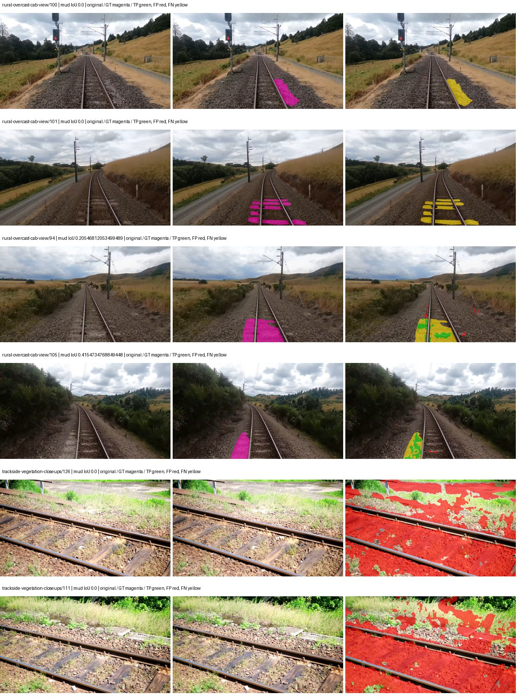

Examples are two lowest and two highest mud-IoU positive images, plus up to two negative images with the most false-positive mud pixels. They are targeted diagnostic examples, not random samples. Green: true positive; red: false positive; yellow: false negative. Full predictions remain on HDRFS.

### Validation tracking

| Logged step | Overall mIoU (%) | Mud IoU (%) |
| --- | --- | --- |
| 254 | 19.54 | 0.27 |
| 508 | 19.88 | 0.18 |
| 763 | 22.83 | 1.41 |
| 1017 | 24.14 | 0.15 |
| 1272 | 23.82 | 0.53 |
| 1527 | 23.85 | 0.32 |
| 1781 | 24.75 | 0.21 |
| 2036 | 24.93 | 0.31 |

All retained scalar curves, including training loss and per-class IoU, are in record.json. Observed best mud on a curve is not necessarily a retained checkpoint: the pilot saved its selection-metric-best and final checkpoints. Step logging and checkpoint global_step may differ by one.

### Stopping and checkpoint provenance

```json
{
  "stopping": {
    "actual_steps": 2036,
    "maximum_steps": 4000,
    "min_delta": 0.001,
    "monitor": "val_iou/mud-pumping",
    "patience": 5,
    "reason": "validation_plateau"
  },
  "checkpoints": {
    "best": {
      "path": "/data/izadia1/projects/segmentary-runs/paul-test-rtis/mud-fullstats-v1-20260906-r2/future-runs/native_resnet18_fpn_fcn--cityscapes_to_rtis--seed-1_seed1/rtis/best.ckpt",
      "sha256": "a45b2973877cbd12e217c1b89662701e459aa6a244066321f78f79ad8bc7f3d6",
      "global_step": 763,
      "bytes": 202363737
    },
    "final": {
      "path": "/data/izadia1/projects/segmentary-runs/paul-test-rtis/mud-fullstats-v1-20260906-r2/future-runs/native_resnet18_fpn_fcn--cityscapes_to_rtis--seed-1_seed1/rtis/last.ckpt",
      "sha256": "c8db161950d204c58d0990499ff8b51738ad60bcdee323e2b368c6e373f9d249",
      "global_step": 2036,
      "bytes": 202358617
    }
  },
  "cleanup_error": null
}
```

### Resolved training, initialization and evaluation settings

The optimizer block is the base configuration. Stage LR scales are applied at runtime, and stage warmup is capped at min(base warmup, floor(stage budget / 10), stage budget - 1): 400 steps for this 4,000-step pilot. Model-internal native input grids may differ from augmentation crops (EoMT uses its 640 grid).

```json
{
  "name": "native_resnet18_fpn_fcn--cityscapes_to_rtis--seed-1",
  "model": {
    "arch": "native",
    "checkpoint": null,
    "tuning": "full",
    "head": "unified_head",
    "lora_r": 16,
    "lora_alpha": 32,
    "lora_dropout": 0.05,
    "lora_targets": [],
    "drop_path": null,
    "revision": null,
    "subfolder": null,
    "local_files_only": false,
    "trust_remote_code": false,
    "backbone_path": null,
    "head_paths": [],
    "classifier_path": null,
    "inactive_parameter_paths": [],
    "smp_arch": null,
    "encoder_name": null,
    "encoder_weights": null,
    "native": {
      "task": "multiclass",
      "backbone": {
        "kind": "timm",
        "name": "resnet18.a1_in1k",
        "weights": "pretrained",
        "out_indices": [
          1,
          2,
          3,
          4
        ],
        "in_channels": 3
      },
      "neck": {
        "kind": "fpn",
        "out_channels": 128,
        "num_outputs": 4,
        "norm": "group",
        "activation": "relu"
      },
      "head": {
        "kind": "fcn",
        "in_indices": [
          0,
          1,
          2,
          3
        ],
        "channels": 128,
        "num_convs": 2,
        "kernel_size": 3,
        "dilation": 1,
        "dropout": 0.1,
        "norm": "group",
        "activation": "relu"
      },
      "auxiliary_heads": []
    },
    "batch_norm_momentum": null
  },
  "space": "paul-test-rtis",
  "taxonomy_root": "/data/izadia1/projects/segmentary-rtis-fullstats-066afb2/taxonomy",
  "output_root": "/data/izadia1/projects/segmentary-runs/paul-test-rtis/mud-fullstats-v1-20260906-r2/future-runs",
  "optim": {
    "backbone_lr": 0.0001,
    "head_lr_mult": 10.0,
    "weight_decay": 0.05,
    "llrd": 1.0,
    "warmup_iters": 1500,
    "warmup_ratio": 1e-06,
    "poly_power": 0.9,
    "min_lr_ratio": 0.0,
    "betas": [
      0.9,
      0.999
    ],
    "grad_clip": 1.0
  },
  "train": {
    "iters": 4000,
    "batch_size": 2,
    "accum": 8,
    "num_workers": 2,
    "precision": "bf16-mixed",
    "ema_decay": 0.9998,
    "val_every": 250,
    "ckpt_every": 500,
    "selection_metric": "val_iou/mud-pumping",
    "early_stopping_patience": 5,
    "early_stopping_min_delta": 0.001,
    "seed": 1,
    "devices": 1
  },
  "eval": {
    "sliding_window": true,
    "window": [
      1024,
      1024
    ],
    "stride": [
      768,
      768
    ],
    "batch_size": 1,
    "num_workers": 2,
    "tta_scales": [],
    "tta_flip": false,
    "threshold": 0.5,
    "boundary_tolerance_frac": 0.0075,
    "save_confusion": true
  },
  "loss": {
    "task": "multiclass",
    "activation": "auto",
    "terms": [],
    "aux": "none",
    "aux_weight": 0.0,
    "ce_weight": 1.0,
    "label_smoothing": 0.0,
    "class_weights": null,
    "query": null
  },
  "aug": {
    "crop": [
      1024,
      1024
    ],
    "scale_min": 0.5,
    "scale_max": 2.0,
    "hflip_p": 0.5,
    "color_jitter_p": 0.5,
    "brightness": 0.25,
    "contrast": 0.25,
    "saturation": 0.25,
    "hue": 0.05
  },
  "stages": [
    {
      "name": "rtis",
      "data": [
        {
          "name": "paul-test-rtis",
          "root": "/data/izadia1/datasets/paul-test-rtis",
          "variant": null,
          "split_file": "splits.json",
          "train_split": "train",
          "val_split": "val",
          "limit": null,
          "loader": "folder",
          "mapping": "paul-test-rtis",
          "loader_options": {
            "require_groups": true
          }
        }
      ],
      "iters": null,
      "lr_scale": 0.1,
      "head_group_lr_scale": 1.0,
      "init_from": "/data/izadia1/projects/segmentary-runs/all-model-city-rail-seed0-rail20-b9eb3e1/jobs/native_resnet18_fpn_fcn--cityscapes--seed-0/attempt-001/train/native_resnet18_fpn_fcn--cityscapes_seed0/cityscapes/last.ckpt",
      "reset_head": true,
      "freeze": null,
      "sample_weights": null
    }
  ]
}
```

### Hardware and software provenance

```json
{
  "training": {
    "cuda_available": true,
    "cuda_visible_devices": "1",
    "cudnn": 91900,
    "driver_version": "570.133.20",
    "gpu_count": 1,
    "gpu_names": [
      "NVIDIA L40S"
    ],
    "hostname": "hdrfs-app-001",
    "input_normalization": {
      "channel_order": "rgb",
      "mean": [
        0.485,
        0.456,
        0.406
      ],
      "source": "timm_pretrained_cfg",
      "std": [
        0.229,
        0.224,
        0.225
      ]
    },
    "model_origins": [
      {
        "hf_commit": null,
        "hf_name_or_path": null,
        "module": "backbone",
        "timm_pretrained": {
          "architecture": "resnet18",
          "hf_hub_id": "timm/resnet18.a1_in1k",
          "tag": "a1_in1k",
          "url": "https://github.com/huggingface/pytorch-image-models/releases/download/v0.1-rsb-weights/resnet18_a1_0-d63eafa0.pth"
        }
      },
      {
        "hf_commit": null,
        "hf_name_or_path": null,
        "module": "backbone.model",
        "timm_pretrained": {
          "architecture": "resnet18",
          "hf_hub_id": "timm/resnet18.a1_in1k",
          "tag": "a1_in1k",
          "url": "https://github.com/huggingface/pytorch-image-models/releases/download/v0.1-rsb-weights/resnet18_a1_0-d63eafa0.pth"
        }
      }
    ],
    "model_parameter_count": 12631253,
    "packages": {
      "albumentations": "2.0.8",
      "lightning": "2.6.5",
      "numpy": "2.4.4",
      "segmentary": "0.1.0",
      "segmentation-models-pytorch": "0.5.0",
      "timm": "1.0.28",
      "torch": "2.11.0+cu128",
      "torchvision": "0.26.0+cu128",
      "transformers": "5.15.0"
    },
    "platform": "Linux-5.15.0-139-generic-x86_64-with-glibc2.35",
    "python": "3.11.15",
    "torch": "2.11.0+cu128",
    "torch_cuda": "12.8",
    "trainable_parameter_count": 12631253,
    "training_stop": {
      "actual_steps": 2036,
      "maximum_steps": 4000,
      "min_delta": 0.001,
      "monitor": "val_iou/mud-pumping",
      "patience": 5,
      "reason": "validation_plateau"
    },
    "validation_weights": "raw"
  },
  "evaluation": {
    "cuda_available": true,
    "cuda_visible_devices": "1",
    "cudnn": 91900,
    "driver_version": "570.133.20",
    "gpu_count": 1,
    "gpu_names": [
      "NVIDIA L40S"
    ],
    "hostname": "hdrfs-app-001",
    "input_normalization": {
      "channel_order": "rgb",
      "mean": [
        0.485,
        0.456,
        0.406
      ],
      "source": "timm_pretrained_cfg",
      "std": [
        0.229,
        0.224,
        0.225
      ]
    },
    "packages": {
      "albumentations": "2.0.8",
      "lightning": "2.6.5",
      "numpy": "2.4.4",
      "segmentary": "0.1.0",
      "segmentation-models-pytorch": "0.5.0",
      "timm": "1.0.28",
      "torch": "2.11.0+cu128",
      "torchvision": "0.26.0+cu128",
      "transformers": "5.15.0"
    },
    "platform": "Linux-5.15.0-139-generic-x86_64-with-glibc2.35",
    "python": "3.11.15",
    "torch": "2.11.0+cu128",
    "torch_cuda": "12.8"
  }
}
```

## cityscapes_to_rtis — seed 2

Status: **completed**. Started: 2026-09-06T21:22:14.211015+00:00. Finished: 2026-09-06T21:47:28.426999+00:00.

Recipe pretrained initializer: `{"arch": "native", "backbone_path": null, "batch_norm_momentum": null, "checkpoint": null, "classifier_path": null, "drop_path": null, "encoder_name": null, "encoder_weights": null, "head": "unified_head", "head_paths": [], "inactive_parameter_paths": [], "local_files_only": false, "lora_alpha": 32, "lora_dropout": 0.05, "lora_r": 16, "lora_targets": [], "native": {"auxiliary_heads": [], "backbone": {"in_channels": 3, "kind": "timm", "name": "resnet18.a1_in1k", "out_indices": [1, 2, 3, 4], "weights": "pretrained"}, "head": {"activation": "relu", "channels": 128, "dilation": 1, "dropout": 0.1, "in_indices": [0, 1, 2, 3], "kernel_size": 3, "kind": "fcn", "norm": "group", "num_convs": 2}, "neck": {"activation": "relu", "kind": "fpn", "norm": "group", "num_outputs": 4, "out_channels": 128}, "task": "multiclass"}, "revision": null, "smp_arch": null, "subfolder": null, "trust_remote_code": false, "tuning": "full"}`.

`rtis_only` uses the recipe initializer, which may include pretrained segmentation components. Transfer paths load the exact historical source checkpoint below and reset the classifier; they do not reset all query/decoder features.

Source checkpoint: `{'name': 'native_resnet18_fpn_fcn--cityscapes--seed-0', 'model': 'native_resnet18_fpn_fcn', 'protocol': 'cityscapes', 'config': '/data/izadia1/projects/segmentary-runs/all-model-city-rail-seed0-rail20-b9eb3e1/jobs/native_resnet18_fpn_fcn--cityscapes--seed-0/attempt-001/resolved-config.yaml', 'checkpoint': '/data/izadia1/projects/segmentary-runs/all-model-city-rail-seed0-rail20-b9eb3e1/jobs/native_resnet18_fpn_fcn--cityscapes--seed-0/attempt-001/train/native_resnet18_fpn_fcn--cityscapes_seed0/cityscapes/last.ckpt', 'recorded_sha256': 'b3474fcb1341e0ce32beb83d56dedf1c206220837067b54bb10aa16999baf1eb', 'exists': True}`.

Config SHA-256: `4c5f92338bdbba7468dc9a0f14f0368ffe2c234ce8b7800a94bf8a6110fa47f4`. Weights used for validation: `raw`.

### Mud-pumping and aggregate quality

| Metric | Selected checkpoint | Final training validation |
| --- | --- | --- |
| Mud IoU | 1.83 | 0.63 |
| Mud precision | 2.07 | 0.92 |
| Mud recall | 13.56 | 1.98 |
| Mud Dice/F1 | 3.59 | 1.25 |
| mIoU | 22.58 | 27.39 |
| Mean accuracy | 35.52 | 41.31 |
| Mean precision | 41.53 | 42.86 |
| Mean Dice | 28.64 | 35.31 |
| Mean specificity | 98.75 | 98.91 |
| Pixel accuracy | 77.47 | 81.49 |
| Frequency-weighted IoU | 70.32 | 73.42 |
| Fixed GT-present class mIoU | 26.34 | 31.96 |
| Boundary F1 | 27.25 | 33.39 |

The selected checkpoint has independent evaluation evidence. Final values are the trainer's final validation record, not a new independent evaluation. mIoU averages classes with nonzero union, so false positives on absent classes can change its denominator. The fixed GT-class mean is supplementary and excludes absent classes; their false positives remain in the confusion matrix.

### Resource usage and timing

| Measurement | Value |
| --- | --- |
| Peak training VRAM, retained training invocation (GiB) | 7.34 |
| Peak evaluation VRAM (GiB) | 7.04 |
| Retained training invocation wall time (seconds) | 1398.13 |
| Retained training invocation GPU-hours (one GPU) | 0.39 |
| Evaluation wall time (seconds) | 10.89 |
| Full evaluation pipeline images/second | 3.40 |
| Best full-state checkpoint (MiB) | 192.99 |
| Final full-state checkpoint (MiB) | 192.98 |
| Audited periodic checkpoints removed (GiB) | 0.75 |

VRAM uses the recorded allocator high-water mark; it is not total device usage including CUDA context. Resumed jobs' retained training invocation times and peaks are **not whole-campaign totals**. Earlier invocation resource records are not reconstructed here. Evaluation throughput includes loader, sliding-window inference and metrics; it is not model-only latency/FPS. Missing measurements are shown as —, never inferred from another dataset's run.

### Standardized inference performance

Dedicated model-only profiling waits for an idle worker-locked L40S: BF16, batch 1, 1024x1024, 20 warmup and 100 CUDA-event-timed public forwards. It excludes loading, preprocessing, tiling and metrics.

| Status | Parameters | Weight MiB | FPS | p50 ms | p95 ms | Peak reserved GiB |
| --- | --- | --- | --- | --- | --- | --- |
| complete | 12631253 | 48.18 | 223.41 | 4.38 | 4.82 | 0.64 |

```json
{
  "schema_version": 1,
  "model_id": "native_resnet18_fpn_fcn",
  "measured_at": "2026-09-06T21:47:25+00:00",
  "status": "complete",
  "benchmark_scope": "rtis_selected_checkpoint_model_only",
  "applies_to": [
    "native_resnet18_fpn_fcn--cityscapes_to_rtis--seed-2"
  ],
  "source": {
    "campaign_git_sha": "066afb2626398b7be59d4d19f5a0e4644fd59adc",
    "git_dirty": false,
    "config_hash": "b424000c06f7",
    "resolved_config": "/data/izadia1/projects/segmentary-runs/paul-test-rtis/mud-fullstats-v1-20260906-r2/configs/native_resnet18_fpn_fcn--cityscapes_to_rtis--seed-2.yaml",
    "config_sha256": "4c5f92338bdbba7468dc9a0f14f0368ffe2c234ce8b7800a94bf8a6110fa47f4",
    "checkpoint_sha256": "3bf34e881b67d321ffb46d7921ac1bcda79e3fab4822c285ee4e7ff51ed4de7e",
    "checkpoint_global_step": 1018,
    "checkpoint_bytes": 202363737,
    "checkpoint_kind": "resume checkpoint with optimizer and EMA state",
    "weights": "raw",
    "measured_checkpoint_job_id": "native_resnet18_fpn_fcn--cityscapes_to_rtis--seed-2",
    "result_sha256": "acbe5bfd47d26602da16ba4200d179dbe1609bbb5bdeeddddcaa001e9499a3d6",
    "result_git_sha": "066afb2626398b7be59d4d19f5a0e4644fd59adc",
    "result_stage": "eval:paul-test-rtis:val",
    "result_seed": 2
  },
  "hardware": {
    "gpu_name": "NVIDIA L40S",
    "gpu_uuid": "GPU-a5ad49e5-0536-5229-ba8a-f8a902808f53",
    "logical_device": "cuda:0",
    "physical_visibility_token": "7",
    "compute_capability": [
      8,
      9
    ],
    "total_memory_bytes": 47677177856
  },
  "model": {
    "parameter_count": 12631253,
    "trainable_parameter_count": 12631253,
    "resident_parameter_bytes": 50525012,
    "parameter_dtype_counts": {
      "float32": 12631253
    }
  },
  "contract": {
    "backend": "pytorch",
    "precision": "bf16_autocast",
    "batch_size": 1,
    "input_shape_nchw": [
      1,
      3,
      1024,
      1024
    ],
    "warmup_iterations": 20,
    "measured_iterations": 100,
    "timing": "per-forward CUDA events with end-event synchronization",
    "includes_preprocessing": false,
    "includes_data_loader": false,
    "includes_sliding_window": false,
    "input_resident_on_gpu": true,
    "model_only": true,
    "entrypoint": "public model(image) dense-logits forward"
  },
  "measurements": {
    "latency": {
      "p50_ms": 4.3822081089019775,
      "p95_ms": 4.818075394630432,
      "mean_ms": 4.47605664730072,
      "minimum_ms": 4.3089919090271,
      "maximum_ms": 5.1374077796936035,
      "fps": 223.41093484664646,
      "raw_ms": [
        4.514815807342529,
        4.360191822052002,
        4.482048034667969,
        4.386816024780273,
        4.3724799156188965,
        4.370431900024414,
        4.729856014251709,
        4.7769598960876465,
        4.339712142944336,
        4.370431900024414,
        4.364287853240967,
        4.655104160308838,
        4.377600193023682,
        4.3816962242126465,
        4.395008087158203,
        4.3970561027526855,
        4.329472064971924,
        4.329472064971924,
        4.35097599029541,
        4.485119819641113,
        4.383743762969971,
        4.639743804931641,
        4.341760158538818,
        4.492288112640381,
        4.438015937805176,
        4.584383964538574,
        4.3673601150512695,
        4.462592124938965,
        4.417535781860352,
        4.770815849304199,
        4.612095832824707,
        4.669439792633057,
        4.361216068267822,
        4.335616111755371,
        4.451295852661133,
        4.333568096160889,
        4.330495834350586,
        4.348927974700928,
        4.398079872131348,
        4.348927974700928,
        4.379648208618164,
        4.330495834350586,
        5.029888153076172,
        5.1374077796936035,
        4.766719818115234,
        4.3427839279174805,
        4.344831943511963,
        4.775936126708984,
        4.373504161834717,
        4.329472064971924,
        4.353024005889893,
        4.462592124938965,
        4.35916805267334,
        4.658175945281982,
        4.40012788772583,
        4.700160026550293,
        4.773888111114502,
        4.5649919509887695,
        4.378623962402344,
        4.675583839416504,
        4.817920207977295,
        4.343808174133301,
        4.341760158538818,
        4.365344047546387,
        4.35811185836792,
        4.373504161834717,
        4.3520002365112305,
        4.365312099456787,
        4.334591865539551,
        5.017600059509277,
        4.748288154602051,
        4.790272235870361,
        4.406271934509277,
        4.3520002365112305,
        4.338687896728516,
        4.50764799118042,
        4.353024005889893,
        4.3089919090271,
        4.340735912322998,
        4.366335868835449,
        4.373504161834717,
        4.375552177429199,
        4.3970561027526855,
        4.420608043670654,
        4.834303855895996,
        4.434944152832031,
        4.325376033782959,
        4.498432159423828,
        4.382719993591309,
        4.45747184753418,
        4.374527931213379,
        4.671487808227539,
        4.413440227508545,
        4.377600193023682,
        4.35811185836792,
        4.338687896728516,
        4.339712142944336,
        4.6387200355529785,
        4.595712184906006,
        4.821023941040039
      ],
      "percentile_method": "numpy linear interpolation"
    },
    "peak_reserved_bytes": 685768704,
    "memory_kind": "pytorch_cuda_allocator_peak_reserved_excluding_context",
    "benchmark_wall_clock_s": 8.720143537968397
  },
  "started_at": "2026-09-06T21:47:17+00:00",
  "finished_at": "2026-09-06T21:47:25+00:00",
  "environment": {
    "hostname": "hdrfs-app-001",
    "python": "3.11.15",
    "platform": "Linux-5.15.0-139-generic-x86_64-with-glibc2.35",
    "torch": "2.11.0+cu128",
    "torch_cuda": "12.8",
    "cudnn": 91900,
    "driver_version": "570.133.20",
    "cuda_available": true,
    "gpu_count": 1,
    "gpu_names": [
      "NVIDIA L40S"
    ],
    "cuda_visible_devices": "7",
    "packages": {
      "segmentary": "0.1.0",
      "torch": "2.11.0+cu128",
      "torchvision": "0.26.0+cu128",
      "transformers": "5.15.0",
      "timm": "1.0.28",
      "segmentation-models-pytorch": "0.5.0",
      "albumentations": "2.0.8",
      "lightning": "2.6.5",
      "numpy": "2.4.4"
    }
  }
}
```

### Per-class validation results

| Class | GT pixels | IoU (%) | Precision (%) | Recall (%) | Dice (%) | Boundary F1 (%) |
| --- | --- | --- | --- | --- | --- | --- |
| car | 29664 | 0.00 | 0.00 | 0.00 | 0.00 | 0.00 |
| construction | 311585 | 12.30 | 12.86 | 73.83 | 21.90 | 20.57 |
| fence | 265137 | 12.09 | 41.53 | 14.57 | 21.57 | 24.84 |
| mud-pumping | 1226250 | 1.83 | 2.07 | 13.56 | 3.59 | 7.12 |
| on-rails | 0 | 0.00 | 0.00 | — | 0.00 | 0.00 |
| person | 0 | 0.00 | 0.00 | — | 0.00 | 0.00 |
| pole | 628038 | 65.82 | 77.98 | 80.84 | 79.38 | 86.85 |
| rail-embedded | 16799 | 0.00 | 0.00 | 0.00 | 0.00 | 0.00 |
| rail-raised | 2969797 | 67.49 | 71.71 | 91.98 | 80.59 | 82.63 |
| rail-track | 6323197 | 28.26 | 69.43 | 32.28 | 44.07 | 44.60 |
| road | 1048831 | 18.93 | 33.36 | 30.43 | 31.83 | 27.79 |
| sidewalk | 1297367 | 5.38 | 68.18 | 5.52 | 10.21 | 5.70 |
| sky | 19121606 | 97.98 | 98.91 | 99.05 | 98.98 | 92.21 |
| standing-water | 95802 | 0.62 | 0.73 | 3.72 | 1.23 | 4.68 |
| terrain | 39239306 | 84.31 | 91.73 | 91.25 | 91.49 | 54.16 |
| trackbed | 10643081 | 53.25 | 68.17 | 70.87 | 69.49 | 50.62 |
| traffic-light | 19510 | 11.12 | 55.83 | 12.19 | 20.02 | 20.47 |
| traffic-sign | 13285 | 0.47 | 100.00 | 0.47 | 0.93 | 13.15 |
| tram-track | 56179 | 2.81 | 4.56 | 6.81 | 5.46 | 4.05 |
| truck | 0 | 0.00 | 0.00 | — | 0.00 | 0.00 |
| vegetation-overgrowth | 5901821 | 11.49 | 75.12 | 11.95 | 20.62 | 32.80 |

### Full-run accounting

| Measurement | Value |
| --- | --- |
| Full GPU-reserved wall seconds, all recorded worker attempts | 1514.36 |
| Full reserved GPU-hours | 0.42 |
| Whole-run timing complete | True |

| Phase | Wall seconds including failed attempts |
| --- | --- |
| training | 1404.72 |
| diagnostics | 74.42 |
| performance | 15.54 |

GPU-reserved time includes model loading, training, validation, collection, profiling, checkpoint I/O and orchestration while the worker owns one GPU. It is not GPU kernel-active time. Phase timings and sampled device memory/power/utilization are retained separately; sampled device memory is not the allocator high-water mark.

### Train/validation and raw/EMA diagnostics

| Checkpoint / weights / split | Images | Mud IoU (%) | Mud precision (%) | Mud recall (%) |
| --- | --- | --- | --- | --- |
| best-auto-train / raw | 220 | 87.31 | 90.56 | 96.06 |
| best-auto-val / raw | 37 | 1.83 | 2.07 | 13.56 |
| best-alternate-val / ema | 37 | 0.79 | 1.07 | 2.93 |
| final-auto-val / raw | 37 | 0.63 | 0.92 | 1.98 |

Train uses the evaluation transform without augmentation. Compare mud train/validation metrics for the same selected weights. Alternate EMA on running-stat BatchNorm is explicitly uncalibrated and is diagnostic only. Score-threshold curves use uncalibrated normalized scores and are pixel-level diagnostics, not event detection rates or a selected deployment operating point.

### Downloadable evidence

- best-auto-train: [per-image.csv](cityscapes_to_rtis--seed-2/best-auto-train/per-image.csv) · [per-image-confusion.json.gz](cityscapes_to_rtis--seed-2/best-auto-train/per-image-confusion.json.gz) · [groups.json](cityscapes_to_rtis--seed-2/best-auto-train/groups.json) · [mud-score-curves.json](cityscapes_to_rtis--seed-2/best-auto-train/mud-score-curves.json)
- best-auto-val: [per-image.csv](cityscapes_to_rtis--seed-2/best-auto-val/per-image.csv) · [per-image-confusion.json.gz](cityscapes_to_rtis--seed-2/best-auto-val/per-image-confusion.json.gz) · [groups.json](cityscapes_to_rtis--seed-2/best-auto-val/groups.json) · [mud-score-curves.json](cityscapes_to_rtis--seed-2/best-auto-val/mud-score-curves.json) · [examples.jpg](cityscapes_to_rtis--seed-2/best-auto-val/examples.jpg)
- best-alternate-val: [per-image.csv](cityscapes_to_rtis--seed-2/best-alternate-val/per-image.csv) · [per-image-confusion.json.gz](cityscapes_to_rtis--seed-2/best-alternate-val/per-image-confusion.json.gz) · [groups.json](cityscapes_to_rtis--seed-2/best-alternate-val/groups.json) · [mud-score-curves.json](cityscapes_to_rtis--seed-2/best-alternate-val/mud-score-curves.json)
- final-auto-val: [per-image.csv](cityscapes_to_rtis--seed-2/final-auto-val/per-image.csv) · [per-image-confusion.json.gz](cityscapes_to_rtis--seed-2/final-auto-val/per-image-confusion.json.gz) · [groups.json](cityscapes_to_rtis--seed-2/final-auto-val/groups.json) · [mud-score-curves.json](cityscapes_to_rtis--seed-2/final-auto-val/mud-score-curves.json)
- resources: [telemetry.csv](cityscapes_to_rtis--seed-2/resources/telemetry.csv)

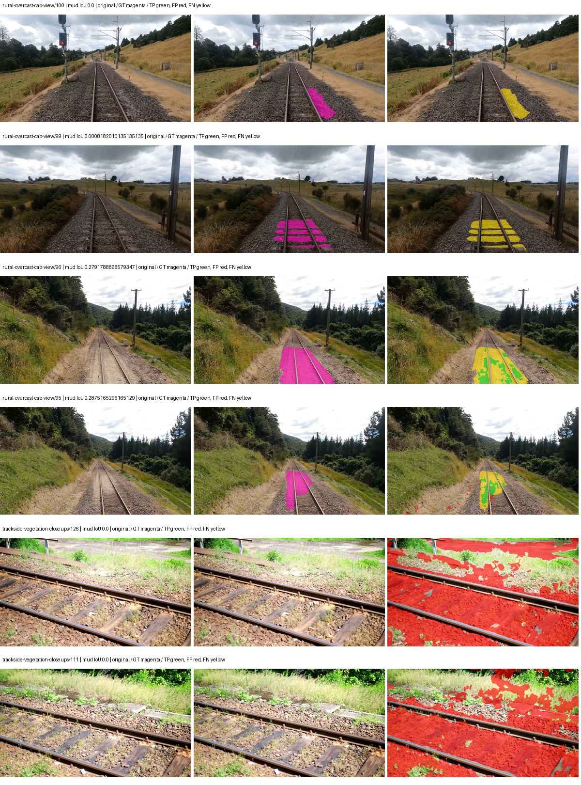

Examples are two lowest and two highest mud-IoU positive images, plus up to two negative images with the most false-positive mud pixels. They are targeted diagnostic examples, not random samples. Green: true positive; red: false positive; yellow: false negative. Full predictions remain on HDRFS.

### Validation tracking

| Logged step | Overall mIoU (%) | Mud IoU (%) |
| --- | --- | --- |
| 254 | 19.61 | 0.05 |
| 508 | 21.97 | 0.74 |
| 763 | 20.75 | 0.32 |
| 1017 | 22.58 | 1.83 |
| 1272 | 25.15 | 0.48 |
| 1527 | 25.00 | 0.71 |
| 1781 | 25.11 | 0.52 |
| 2036 | 26.70 | 1.04 |
| 2290 | 27.39 | 0.63 |

All retained scalar curves, including training loss and per-class IoU, are in record.json. Observed best mud on a curve is not necessarily a retained checkpoint: the pilot saved its selection-metric-best and final checkpoints. Step logging and checkpoint global_step may differ by one.

### Stopping and checkpoint provenance

```json
{
  "stopping": {
    "actual_steps": 2290,
    "maximum_steps": 4000,
    "min_delta": 0.001,
    "monitor": "val_iou/mud-pumping",
    "patience": 5,
    "reason": "validation_plateau"
  },
  "checkpoints": {
    "best": {
      "path": "/data/izadia1/projects/segmentary-runs/paul-test-rtis/mud-fullstats-v1-20260906-r2/future-runs/native_resnet18_fpn_fcn--cityscapes_to_rtis--seed-2_seed2/rtis/best.ckpt",
      "sha256": "3bf34e881b67d321ffb46d7921ac1bcda79e3fab4822c285ee4e7ff51ed4de7e",
      "global_step": 1018,
      "bytes": 202363737
    },
    "final": {
      "path": "/data/izadia1/projects/segmentary-runs/paul-test-rtis/mud-fullstats-v1-20260906-r2/future-runs/native_resnet18_fpn_fcn--cityscapes_to_rtis--seed-2_seed2/rtis/last.ckpt",
      "sha256": "414908127c8ee245a4939f089aa8a74c50968d3751f7ee84f8a962e1a73767bc",
      "global_step": 2290,
      "bytes": 202358617
    }
  },
  "cleanup_error": null
}
```

### Resolved training, initialization and evaluation settings

The optimizer block is the base configuration. Stage LR scales are applied at runtime, and stage warmup is capped at min(base warmup, floor(stage budget / 10), stage budget - 1): 400 steps for this 4,000-step pilot. Model-internal native input grids may differ from augmentation crops (EoMT uses its 640 grid).

```json
{
  "name": "native_resnet18_fpn_fcn--cityscapes_to_rtis--seed-2",
  "model": {
    "arch": "native",
    "checkpoint": null,
    "tuning": "full",
    "head": "unified_head",
    "lora_r": 16,
    "lora_alpha": 32,
    "lora_dropout": 0.05,
    "lora_targets": [],
    "drop_path": null,
    "revision": null,
    "subfolder": null,
    "local_files_only": false,
    "trust_remote_code": false,
    "backbone_path": null,
    "head_paths": [],
    "classifier_path": null,
    "inactive_parameter_paths": [],
    "smp_arch": null,
    "encoder_name": null,
    "encoder_weights": null,
    "native": {
      "task": "multiclass",
      "backbone": {
        "kind": "timm",
        "name": "resnet18.a1_in1k",
        "weights": "pretrained",
        "out_indices": [
          1,
          2,
          3,
          4
        ],
        "in_channels": 3
      },
      "neck": {
        "kind": "fpn",
        "out_channels": 128,
        "num_outputs": 4,
        "norm": "group",
        "activation": "relu"
      },
      "head": {
        "kind": "fcn",
        "in_indices": [
          0,
          1,
          2,
          3
        ],
        "channels": 128,
        "num_convs": 2,
        "kernel_size": 3,
        "dilation": 1,
        "dropout": 0.1,
        "norm": "group",
        "activation": "relu"
      },
      "auxiliary_heads": []
    },
    "batch_norm_momentum": null
  },
  "space": "paul-test-rtis",
  "taxonomy_root": "/data/izadia1/projects/segmentary-rtis-fullstats-066afb2/taxonomy",
  "output_root": "/data/izadia1/projects/segmentary-runs/paul-test-rtis/mud-fullstats-v1-20260906-r2/future-runs",
  "optim": {
    "backbone_lr": 0.0001,
    "head_lr_mult": 10.0,
    "weight_decay": 0.05,
    "llrd": 1.0,
    "warmup_iters": 1500,
    "warmup_ratio": 1e-06,
    "poly_power": 0.9,
    "min_lr_ratio": 0.0,
    "betas": [
      0.9,
      0.999
    ],
    "grad_clip": 1.0
  },
  "train": {
    "iters": 4000,
    "batch_size": 2,
    "accum": 8,
    "num_workers": 2,
    "precision": "bf16-mixed",
    "ema_decay": 0.9998,
    "val_every": 250,
    "ckpt_every": 500,
    "selection_metric": "val_iou/mud-pumping",
    "early_stopping_patience": 5,
    "early_stopping_min_delta": 0.001,
    "seed": 2,
    "devices": 1
  },
  "eval": {
    "sliding_window": true,
    "window": [
      1024,
      1024
    ],
    "stride": [
      768,
      768
    ],
    "batch_size": 1,
    "num_workers": 2,
    "tta_scales": [],
    "tta_flip": false,
    "threshold": 0.5,
    "boundary_tolerance_frac": 0.0075,
    "save_confusion": true
  },
  "loss": {
    "task": "multiclass",
    "activation": "auto",
    "terms": [],
    "aux": "none",
    "aux_weight": 0.0,
    "ce_weight": 1.0,
    "label_smoothing": 0.0,
    "class_weights": null,
    "query": null
  },
  "aug": {
    "crop": [
      1024,
      1024
    ],
    "scale_min": 0.5,
    "scale_max": 2.0,
    "hflip_p": 0.5,
    "color_jitter_p": 0.5,
    "brightness": 0.25,
    "contrast": 0.25,
    "saturation": 0.25,
    "hue": 0.05
  },
  "stages": [
    {
      "name": "rtis",
      "data": [
        {
          "name": "paul-test-rtis",
          "root": "/data/izadia1/datasets/paul-test-rtis",
          "variant": null,
          "split_file": "splits.json",
          "train_split": "train",
          "val_split": "val",
          "limit": null,
          "loader": "folder",
          "mapping": "paul-test-rtis",
          "loader_options": {
            "require_groups": true
          }
        }
      ],
      "iters": null,
      "lr_scale": 0.1,
      "head_group_lr_scale": 1.0,
      "init_from": "/data/izadia1/projects/segmentary-runs/all-model-city-rail-seed0-rail20-b9eb3e1/jobs/native_resnet18_fpn_fcn--cityscapes--seed-0/attempt-001/train/native_resnet18_fpn_fcn--cityscapes_seed0/cityscapes/last.ckpt",
      "reset_head": true,
      "freeze": null,
      "sample_weights": null
    }
  ]
}
```

### Hardware and software provenance

```json
{
  "training": {
    "cuda_available": true,
    "cuda_visible_devices": "7",
    "cudnn": 91900,
    "driver_version": "570.133.20",
    "gpu_count": 1,
    "gpu_names": [
      "NVIDIA L40S"
    ],
    "hostname": "hdrfs-app-001",
    "input_normalization": {
      "channel_order": "rgb",
      "mean": [
        0.485,
        0.456,
        0.406
      ],
      "source": "timm_pretrained_cfg",
      "std": [
        0.229,
        0.224,
        0.225
      ]
    },
    "model_origins": [
      {
        "hf_commit": null,
        "hf_name_or_path": null,
        "module": "backbone",
        "timm_pretrained": {
          "architecture": "resnet18",
          "hf_hub_id": "timm/resnet18.a1_in1k",
          "tag": "a1_in1k",
          "url": "https://github.com/huggingface/pytorch-image-models/releases/download/v0.1-rsb-weights/resnet18_a1_0-d63eafa0.pth"
        }
      },
      {
        "hf_commit": null,
        "hf_name_or_path": null,
        "module": "backbone.model",
        "timm_pretrained": {
          "architecture": "resnet18",
          "hf_hub_id": "timm/resnet18.a1_in1k",
          "tag": "a1_in1k",
          "url": "https://github.com/huggingface/pytorch-image-models/releases/download/v0.1-rsb-weights/resnet18_a1_0-d63eafa0.pth"
        }
      }
    ],
    "model_parameter_count": 12631253,
    "packages": {
      "albumentations": "2.0.8",
      "lightning": "2.6.5",
      "numpy": "2.4.4",
      "segmentary": "0.1.0",
      "segmentation-models-pytorch": "0.5.0",
      "timm": "1.0.28",
      "torch": "2.11.0+cu128",
      "torchvision": "0.26.0+cu128",
      "transformers": "5.15.0"
    },
    "platform": "Linux-5.15.0-139-generic-x86_64-with-glibc2.35",
    "python": "3.11.15",
    "torch": "2.11.0+cu128",
    "torch_cuda": "12.8",
    "trainable_parameter_count": 12631253,
    "training_stop": {
      "actual_steps": 2290,
      "maximum_steps": 4000,
      "min_delta": 0.001,
      "monitor": "val_iou/mud-pumping",
      "patience": 5,
      "reason": "validation_plateau"
    },
    "validation_weights": "raw"
  },
  "evaluation": {
    "cuda_available": true,
    "cuda_visible_devices": "7",
    "cudnn": 91900,
    "driver_version": "570.133.20",
    "gpu_count": 1,
    "gpu_names": [
      "NVIDIA L40S"
    ],
    "hostname": "hdrfs-app-001",
    "input_normalization": {
      "channel_order": "rgb",
      "mean": [
        0.485,
        0.456,
        0.406
      ],
      "source": "timm_pretrained_cfg",
      "std": [
        0.229,
        0.224,
        0.225
      ]
    },
    "packages": {
      "albumentations": "2.0.8",
      "lightning": "2.6.5",
      "numpy": "2.4.4",
      "segmentary": "0.1.0",
      "segmentation-models-pytorch": "0.5.0",
      "timm": "1.0.28",
      "torch": "2.11.0+cu128",
      "torchvision": "0.26.0+cu128",
      "transformers": "5.15.0"
    },
    "platform": "Linux-5.15.0-139-generic-x86_64-with-glibc2.35",
    "python": "3.11.15",
    "torch": "2.11.0+cu128",
    "torch_cuda": "12.8"
  }
}
```

## railsem19_to_rtis — seed 0

Status: **completed**. Started: 2026-09-06T21:22:20.162400+00:00. Finished: 2026-09-06T21:47:32.534001+00:00.

Recipe pretrained initializer: `{"arch": "native", "backbone_path": null, "batch_norm_momentum": null, "checkpoint": null, "classifier_path": null, "drop_path": null, "encoder_name": null, "encoder_weights": null, "head": "unified_head", "head_paths": [], "inactive_parameter_paths": [], "local_files_only": false, "lora_alpha": 32, "lora_dropout": 0.05, "lora_r": 16, "lora_targets": [], "native": {"auxiliary_heads": [], "backbone": {"in_channels": 3, "kind": "timm", "name": "resnet18.a1_in1k", "out_indices": [1, 2, 3, 4], "weights": "pretrained"}, "head": {"activation": "relu", "channels": 128, "dilation": 1, "dropout": 0.1, "in_indices": [0, 1, 2, 3], "kernel_size": 3, "kind": "fcn", "norm": "group", "num_convs": 2}, "neck": {"activation": "relu", "kind": "fpn", "norm": "group", "num_outputs": 4, "out_channels": 128}, "task": "multiclass"}, "revision": null, "smp_arch": null, "subfolder": null, "trust_remote_code": false, "tuning": "full"}`.

`rtis_only` uses the recipe initializer, which may include pretrained segmentation components. Transfer paths load the exact historical source checkpoint below and reset the classifier; they do not reset all query/decoder features.

Source checkpoint: `{'name': 'native_resnet18_fpn_fcn--railsem19--seed-0', 'model': 'native_resnet18_fpn_fcn', 'protocol': 'railsem19', 'config': '/data/izadia1/projects/segmentary-runs/all-model-city-rail-seed0-rail20-b9eb3e1/jobs/native_resnet18_fpn_fcn--railsem19--seed-0/attempt-001/resolved-config.yaml', 'checkpoint': '/data/izadia1/projects/segmentary-runs/all-model-city-rail-seed0-rail20-b9eb3e1/jobs/native_resnet18_fpn_fcn--railsem19--seed-0/attempt-001/train/native_resnet18_fpn_fcn--railsem19_seed0/railsem19/last.ckpt', 'recorded_sha256': 'f5f018e5a96a9facdec15939fb08195f8b528b7507a345c269dfb119d136b343', 'exists': True}`.

Config SHA-256: `39ea8ced2ce01dcd098c577f275e00cbad7d4067f0b532c1cb78e6036461b421`. Weights used for validation: `raw`.

### Mud-pumping and aggregate quality

| Metric | Selected checkpoint | Final training validation |
| --- | --- | --- |
| Mud IoU | 0.68 | 0.35 |
| Mud precision | 0.90 | 0.48 |
| Mud recall | 2.80 | 1.26 |
| Mud Dice/F1 | 1.36 | 0.70 |
| mIoU | 31.92 | 35.77 |
| Mean accuracy | 43.82 | 51.40 |
| Mean precision | 57.70 | 55.96 |
| Mean Dice | 41.42 | 46.32 |
| Mean specificity | 98.98 | 98.98 |
| Pixel accuracy | 82.78 | 83.15 |
| Frequency-weighted IoU | 74.62 | 74.62 |
| Fixed GT-present class mIoU | 35.47 | 41.73 |
| Boundary F1 | 38.89 | 41.40 |

The selected checkpoint has independent evaluation evidence. Final values are the trainer's final validation record, not a new independent evaluation. mIoU averages classes with nonzero union, so false positives on absent classes can change its denominator. The fixed GT-class mean is supplementary and excludes absent classes; their false positives remain in the confusion matrix.

### Resource usage and timing

| Measurement | Value |
| --- | --- |
| Peak training VRAM, retained training invocation (GiB) | 7.34 |
| Peak evaluation VRAM (GiB) | 7.04 |
| Retained training invocation wall time (seconds) | 1393.13 |
| Retained training invocation GPU-hours (one GPU) | 0.39 |
| Evaluation wall time (seconds) | 11.71 |
| Full evaluation pipeline images/second | 3.16 |
| Best full-state checkpoint (MiB) | 192.99 |
| Final full-state checkpoint (MiB) | 192.98 |
| Audited periodic checkpoints removed (GiB) | 0.75 |

VRAM uses the recorded allocator high-water mark; it is not total device usage including CUDA context. Resumed jobs' retained training invocation times and peaks are **not whole-campaign totals**. Earlier invocation resource records are not reconstructed here. Evaluation throughput includes loader, sliding-window inference and metrics; it is not model-only latency/FPS. Missing measurements are shown as —, never inferred from another dataset's run.

### Standardized inference performance

Dedicated model-only profiling waits for an idle worker-locked L40S: BF16, batch 1, 1024x1024, 20 warmup and 100 CUDA-event-timed public forwards. It excludes loading, preprocessing, tiling and metrics.

| Status | Parameters | Weight MiB | FPS | p50 ms | p95 ms | Peak reserved GiB |
| --- | --- | --- | --- | --- | --- | --- |
| complete | 12631253 | 48.18 | 212.61 | 4.63 | 5.24 | 0.64 |

```json
{
  "schema_version": 1,
  "model_id": "native_resnet18_fpn_fcn",
  "measured_at": "2026-09-06T21:47:29+00:00",
  "status": "complete",
  "benchmark_scope": "rtis_selected_checkpoint_model_only",
  "applies_to": [
    "native_resnet18_fpn_fcn--railsem19_to_rtis--seed-0"
  ],
  "source": {
    "campaign_git_sha": "066afb2626398b7be59d4d19f5a0e4644fd59adc",
    "git_dirty": false,
    "config_hash": "af9a574d332e",
    "resolved_config": "/data/izadia1/projects/segmentary-runs/paul-test-rtis/mud-fullstats-v1-20260906-r2/configs/native_resnet18_fpn_fcn--railsem19_to_rtis--seed-0.yaml",
    "config_sha256": "39ea8ced2ce01dcd098c577f275e00cbad7d4067f0b532c1cb78e6036461b421",
    "checkpoint_sha256": "cd84fce5fabf42d3b35d67b209ea3fdd40f4d2056f64f084b9c93c5cbf7e63af",
    "checkpoint_global_step": 1018,
    "checkpoint_bytes": 202363737,
    "checkpoint_kind": "resume checkpoint with optimizer and EMA state",
    "weights": "raw",
    "measured_checkpoint_job_id": "native_resnet18_fpn_fcn--railsem19_to_rtis--seed-0",
    "result_sha256": "51b8bec54312e475c79b63952fdf01079517ea7ed58fb0a6599b09bd427b3a52",
    "result_git_sha": "066afb2626398b7be59d4d19f5a0e4644fd59adc",
    "result_stage": "eval:paul-test-rtis:val",
    "result_seed": 0
  },
  "hardware": {
    "gpu_name": "NVIDIA L40S",
    "gpu_uuid": "GPU-804aea8b-5f62-423e-72c6-49e1ed15c4e4",
    "logical_device": "cuda:0",
    "physical_visibility_token": "6",
    "compute_capability": [
      8,
      9
    ],
    "total_memory_bytes": 47677177856
  },
  "model": {
    "parameter_count": 12631253,
    "trainable_parameter_count": 12631253,
    "resident_parameter_bytes": 50525012,
    "parameter_dtype_counts": {
      "float32": 12631253
    }
  },
  "contract": {
    "backend": "pytorch",
    "precision": "bf16_autocast",
    "batch_size": 1,
    "input_shape_nchw": [
      1,
      3,
      1024,
      1024
    ],
    "warmup_iterations": 20,
    "measured_iterations": 100,
    "timing": "per-forward CUDA events with end-event synchronization",
    "includes_preprocessing": false,
    "includes_data_loader": false,
    "includes_sliding_window": false,
    "input_resident_on_gpu": true,
    "model_only": true,
    "entrypoint": "public model(image) dense-logits forward"
  },
  "measurements": {
    "latency": {
      "p50_ms": 4.629487991333008,
      "p95_ms": 5.24211208820343,
      "mean_ms": 4.7035491037368775,
      "minimum_ms": 4.373504161834717,
      "maximum_ms": 5.745664119720459,
      "fps": 212.60541304980097,
      "raw_ms": [
        5.207039833068848,
        4.671487808227539,
        5.246975898742676,
        4.69708776473999,
        4.40012788772583,
        4.721663951873779,
        4.709375858306885,
        4.567039966583252,
        4.430848121643066,
        4.426752090454102,
        4.417535781860352,
        4.415487766265869,
        4.373504161834717,
        4.781055927276611,
        4.593664169311523,
        4.481023788452148,
        4.857855796813965,
        5.012479782104492,
        5.241856098175049,
        5.745664119720459,
        4.881408214569092,
        4.985856056213379,
        4.5199360847473145,
        4.471807956695557,
        4.448256015777588,
        4.4462080001831055,
        4.459519863128662,
        4.4318718910217285,
        4.453375816345215,
        4.462592124938965,
        4.474880218505859,
        4.496384143829346,
        4.585472106933594,
        4.487167835235596,
        5.237760066986084,
        5.071872234344482,
        4.955135822296143,
        4.767744064331055,
        4.575232028961182,
        4.467711925506592,
        4.415487766265869,
        4.485119819641113,
        4.4707841873168945,
        4.429823875427246,
        4.3970561027526855,
        4.652031898498535,
        4.7032318115234375,
        4.8455681800842285,
        4.570112228393555,
        4.852735996246338,
        4.943871974945068,
        5.6893439292907715,
        4.833248138427734,
        4.576255798339844,
        4.415487766265869,
        4.385791778564453,
        4.414463996887207,
        4.383743762969971,
        4.3919358253479,
        4.625408172607422,
        4.570112228393555,
        4.878335952758789,
        5.312511920928955,
        4.8158721923828125,
        4.716544151306152,
        4.851712226867676,
        4.978687763214111,
        5.067776203155518,
        4.772863864898682,
        5.009407997131348,
        4.917247772216797,
        4.452352046966553,
        4.533247947692871,
        4.696063995361328,
        4.436992168426514,
        4.44927978515625,
        4.54860782623291,
        4.888576030731201,
        4.783135890960693,
        5.025792121887207,
        4.750336170196533,
        5.115903854370117,
        5.031936168670654,
        4.452352046966553,
        4.937727928161621,
        4.633567810058594,
        4.451327800750732,
        4.537343978881836,
        4.758528232574463,
        5.362688064575195,
        4.832255840301514,
        4.807680130004883,
        4.892672061920166,
        4.766719818115234,
        4.601856231689453,
        4.456448078155518,
        4.407296180725098,
        4.882431983947754,
        4.404223918914795,
        4.406271934509277
      ],
      "percentile_method": "numpy linear interpolation"
    },
    "peak_reserved_bytes": 685768704,
    "memory_kind": "pytorch_cuda_allocator_peak_reserved_excluding_context",
    "benchmark_wall_clock_s": 8.827085625380278
  },
  "started_at": "2026-09-06T21:47:20+00:00",
  "finished_at": "2026-09-06T21:47:29+00:00",
  "environment": {
    "hostname": "hdrfs-app-001",
    "python": "3.11.15",
    "platform": "Linux-5.15.0-139-generic-x86_64-with-glibc2.35",
    "torch": "2.11.0+cu128",
    "torch_cuda": "12.8",
    "cudnn": 91900,
    "driver_version": "570.133.20",
    "cuda_available": true,
    "gpu_count": 1,
    "gpu_names": [
      "NVIDIA L40S"
    ],
    "cuda_visible_devices": "6",
    "packages": {
      "segmentary": "0.1.0",
      "torch": "2.11.0+cu128",
      "torchvision": "0.26.0+cu128",
      "transformers": "5.15.0",
      "timm": "1.0.28",
      "segmentation-models-pytorch": "0.5.0",
      "albumentations": "2.0.8",
      "lightning": "2.6.5",
      "numpy": "2.4.4"
    }
  }
}
```

### Per-class validation results

| Class | GT pixels | IoU (%) | Precision (%) | Recall (%) | Dice (%) | Boundary F1 (%) |
| --- | --- | --- | --- | --- | --- | --- |
| car | 29664 | 19.28 | 58.84 | 22.28 | 32.32 | 32.04 |
| construction | 311585 | 34.92 | 38.26 | 80.02 | 51.76 | 34.91 |
| fence | 265137 | 8.55 | 29.40 | 10.76 | 15.75 | 21.98 |
| mud-pumping | 1226250 | 0.68 | 0.90 | 2.80 | 1.36 | 1.74 |
| on-rails | 0 | — | — | — | — | — |
| person | 0 | 0.00 | 0.00 | — | 0.00 | 0.00 |
| pole | 628038 | 70.62 | 84.41 | 81.22 | 82.78 | 88.78 |
| rail-embedded | 16799 | 9.35 | 84.11 | 9.52 | 17.10 | 21.50 |
| rail-raised | 2969797 | 65.12 | 70.56 | 89.42 | 78.88 | 81.09 |
| rail-track | 6323197 | 35.04 | 66.65 | 42.50 | 51.90 | 43.85 |
| road | 1048831 | 12.78 | 48.17 | 14.82 | 22.66 | 27.89 |
| sidewalk | 1297367 | 43.52 | 95.59 | 44.42 | 60.65 | 13.96 |
| sky | 19121606 | 98.41 | 99.08 | 99.32 | 99.20 | 95.06 |
| standing-water | 95802 | 0.83 | 3.15 | 1.12 | 1.65 | 4.97 |
| terrain | 39239306 | 89.43 | 91.36 | 97.69 | 94.42 | 67.39 |
| trackbed | 10643081 | 55.45 | 66.23 | 77.32 | 71.34 | 51.92 |
| traffic-light | 19510 | 43.18 | 58.20 | 62.58 | 60.31 | 50.36 |
| traffic-sign | 13285 | 9.03 | 85.53 | 9.17 | 16.56 | 50.61 |
| tram-track | 56179 | 20.29 | 90.96 | 20.70 | 33.73 | 40.77 |
| truck | 0 | 0.00 | 0.00 | — | 0.00 | 0.00 |
| vegetation-overgrowth | 5901821 | 21.98 | 82.66 | 23.04 | 36.04 | 48.96 |

### Full-run accounting

| Measurement | Value |
| --- | --- |
| Full GPU-reserved wall seconds, all recorded worker attempts | 1512.60 |
| Full reserved GPU-hours | 0.42 |
| Whole-run timing complete | True |

| Phase | Wall seconds including failed attempts |
| --- | --- |
| training | 1400.54 |
| diagnostics | 74.86 |
| performance | 15.83 |

GPU-reserved time includes model loading, training, validation, collection, profiling, checkpoint I/O and orchestration while the worker owns one GPU. It is not GPU kernel-active time. Phase timings and sampled device memory/power/utilization are retained separately; sampled device memory is not the allocator high-water mark.

### Train/validation and raw/EMA diagnostics

| Checkpoint / weights / split | Images | Mud IoU (%) | Mud precision (%) | Mud recall (%) |
| --- | --- | --- | --- | --- |
| best-auto-train / raw | 220 | 86.41 | 97.53 | 88.34 |
| best-auto-val / raw | 37 | 0.68 | 0.90 | 2.80 |
| best-alternate-val / ema | 37 | 0.08 | 0.09 | 0.46 |
| final-auto-val / raw | 37 | 0.35 | 0.48 | 1.26 |

Train uses the evaluation transform without augmentation. Compare mud train/validation metrics for the same selected weights. Alternate EMA on running-stat BatchNorm is explicitly uncalibrated and is diagnostic only. Score-threshold curves use uncalibrated normalized scores and are pixel-level diagnostics, not event detection rates or a selected deployment operating point.

### Downloadable evidence

- best-auto-train: [per-image.csv](railsem19_to_rtis--seed-0/best-auto-train/per-image.csv) · [per-image-confusion.json.gz](railsem19_to_rtis--seed-0/best-auto-train/per-image-confusion.json.gz) · [groups.json](railsem19_to_rtis--seed-0/best-auto-train/groups.json) · [mud-score-curves.json](railsem19_to_rtis--seed-0/best-auto-train/mud-score-curves.json)
- best-auto-val: [per-image.csv](railsem19_to_rtis--seed-0/best-auto-val/per-image.csv) · [per-image-confusion.json.gz](railsem19_to_rtis--seed-0/best-auto-val/per-image-confusion.json.gz) · [groups.json](railsem19_to_rtis--seed-0/best-auto-val/groups.json) · [mud-score-curves.json](railsem19_to_rtis--seed-0/best-auto-val/mud-score-curves.json) · [examples.jpg](railsem19_to_rtis--seed-0/best-auto-val/examples.jpg)
- best-alternate-val: [per-image.csv](railsem19_to_rtis--seed-0/best-alternate-val/per-image.csv) · [per-image-confusion.json.gz](railsem19_to_rtis--seed-0/best-alternate-val/per-image-confusion.json.gz) · [groups.json](railsem19_to_rtis--seed-0/best-alternate-val/groups.json) · [mud-score-curves.json](railsem19_to_rtis--seed-0/best-alternate-val/mud-score-curves.json)
- final-auto-val: [per-image.csv](railsem19_to_rtis--seed-0/final-auto-val/per-image.csv) · [per-image-confusion.json.gz](railsem19_to_rtis--seed-0/final-auto-val/per-image-confusion.json.gz) · [groups.json](railsem19_to_rtis--seed-0/final-auto-val/groups.json) · [mud-score-curves.json](railsem19_to_rtis--seed-0/final-auto-val/mud-score-curves.json)
- resources: [telemetry.csv](railsem19_to_rtis--seed-0/resources/telemetry.csv)

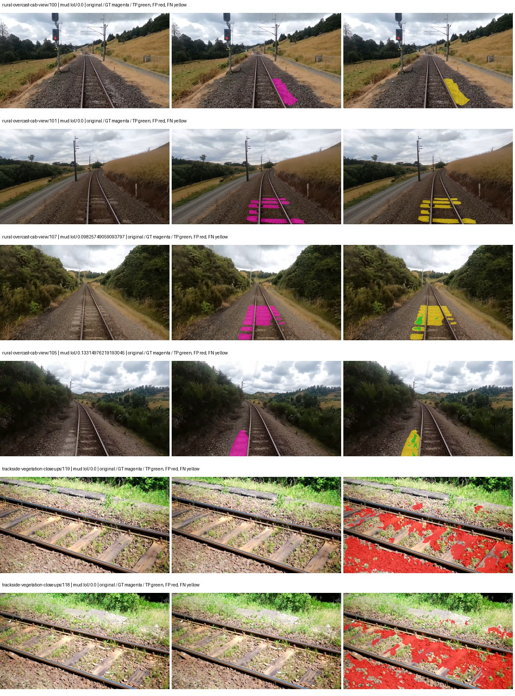

Examples are two lowest and two highest mud-IoU positive images, plus up to two negative images with the most false-positive mud pixels. They are targeted diagnostic examples, not random samples. Green: true positive; red: false positive; yellow: false negative. Full predictions remain on HDRFS.

### Validation tracking

| Logged step | Overall mIoU (%) | Mud IoU (%) |
| --- | --- | --- |
| 254 | 27.46 | 0.10 |
| 508 | 29.35 | 0.08 |
| 763 | 31.82 | 0.53 |
| 1017 | 31.93 | 0.68 |
| 1272 | 31.43 | 0.63 |
| 1527 | 38.11 | 0.32 |
| 1781 | 37.08 | 0.12 |
| 2036 | 35.20 | 0.13 |
| 2290 | 35.77 | 0.35 |

All retained scalar curves, including training loss and per-class IoU, are in record.json. Observed best mud on a curve is not necessarily a retained checkpoint: the pilot saved its selection-metric-best and final checkpoints. Step logging and checkpoint global_step may differ by one.

### Stopping and checkpoint provenance

```json
{
  "stopping": {
    "actual_steps": 2290,
    "maximum_steps": 4000,
    "min_delta": 0.001,
    "monitor": "val_iou/mud-pumping",
    "patience": 5,
    "reason": "validation_plateau"
  },
  "checkpoints": {
    "best": {
      "path": "/data/izadia1/projects/segmentary-runs/paul-test-rtis/mud-fullstats-v1-20260906-r2/future-runs/native_resnet18_fpn_fcn--railsem19_to_rtis--seed-0_seed0/rtis/best.ckpt",
      "sha256": "cd84fce5fabf42d3b35d67b209ea3fdd40f4d2056f64f084b9c93c5cbf7e63af",
      "global_step": 1018,
      "bytes": 202363737
    },
    "final": {
      "path": "/data/izadia1/projects/segmentary-runs/paul-test-rtis/mud-fullstats-v1-20260906-r2/future-runs/native_resnet18_fpn_fcn--railsem19_to_rtis--seed-0_seed0/rtis/last.ckpt",
      "sha256": "ee0a4e39db9a789a2e9600edbe6a22163778c49912dde3a0728adbdc79bbef49",
      "global_step": 2290,
      "bytes": 202358617
    }
  },
  "cleanup_error": null
}
```

### Resolved training, initialization and evaluation settings

The optimizer block is the base configuration. Stage LR scales are applied at runtime, and stage warmup is capped at min(base warmup, floor(stage budget / 10), stage budget - 1): 400 steps for this 4,000-step pilot. Model-internal native input grids may differ from augmentation crops (EoMT uses its 640 grid).

```json
{
  "name": "native_resnet18_fpn_fcn--railsem19_to_rtis--seed-0",
  "model": {
    "arch": "native",
    "checkpoint": null,
    "tuning": "full",
    "head": "unified_head",
    "lora_r": 16,
    "lora_alpha": 32,
    "lora_dropout": 0.05,
    "lora_targets": [],
    "drop_path": null,
    "revision": null,
    "subfolder": null,
    "local_files_only": false,
    "trust_remote_code": false,
    "backbone_path": null,
    "head_paths": [],
    "classifier_path": null,
    "inactive_parameter_paths": [],
    "smp_arch": null,
    "encoder_name": null,
    "encoder_weights": null,
    "native": {
      "task": "multiclass",
      "backbone": {
        "kind": "timm",
        "name": "resnet18.a1_in1k",
        "weights": "pretrained",
        "out_indices": [
          1,
          2,
          3,
          4
        ],
        "in_channels": 3
      },
      "neck": {
        "kind": "fpn",
        "out_channels": 128,
        "num_outputs": 4,
        "norm": "group",
        "activation": "relu"
      },
      "head": {
        "kind": "fcn",
        "in_indices": [
          0,
          1,
          2,
          3
        ],
        "channels": 128,
        "num_convs": 2,
        "kernel_size": 3,
        "dilation": 1,
        "dropout": 0.1,
        "norm": "group",
        "activation": "relu"
      },
      "auxiliary_heads": []
    },
    "batch_norm_momentum": null
  },
  "space": "paul-test-rtis",
  "taxonomy_root": "/data/izadia1/projects/segmentary-rtis-fullstats-066afb2/taxonomy",
  "output_root": "/data/izadia1/projects/segmentary-runs/paul-test-rtis/mud-fullstats-v1-20260906-r2/future-runs",
  "optim": {
    "backbone_lr": 0.0001,
    "head_lr_mult": 10.0,
    "weight_decay": 0.05,
    "llrd": 1.0,
    "warmup_iters": 1500,
    "warmup_ratio": 1e-06,
    "poly_power": 0.9,
    "min_lr_ratio": 0.0,
    "betas": [
      0.9,
      0.999
    ],
    "grad_clip": 1.0
  },
  "train": {
    "iters": 4000,
    "batch_size": 2,
    "accum": 8,
    "num_workers": 2,
    "precision": "bf16-mixed",
    "ema_decay": 0.9998,
    "val_every": 250,
    "ckpt_every": 500,
    "selection_metric": "val_iou/mud-pumping",
    "early_stopping_patience": 5,
    "early_stopping_min_delta": 0.001,
    "seed": 0,
    "devices": 1
  },
  "eval": {
    "sliding_window": true,
    "window": [
      1024,
      1024
    ],
    "stride": [
      768,
      768
    ],
    "batch_size": 1,
    "num_workers": 2,
    "tta_scales": [],
    "tta_flip": false,
    "threshold": 0.5,
    "boundary_tolerance_frac": 0.0075,
    "save_confusion": true
  },
  "loss": {
    "task": "multiclass",
    "activation": "auto",
    "terms": [],
    "aux": "none",
    "aux_weight": 0.0,
    "ce_weight": 1.0,
    "label_smoothing": 0.0,
    "class_weights": null,
    "query": null
  },
  "aug": {
    "crop": [
      1024,
      1024
    ],
    "scale_min": 0.5,
    "scale_max": 2.0,
    "hflip_p": 0.5,
    "color_jitter_p": 0.5,
    "brightness": 0.25,
    "contrast": 0.25,
    "saturation": 0.25,
    "hue": 0.05
  },
  "stages": [
    {
      "name": "rtis",
      "data": [
        {
          "name": "paul-test-rtis",
          "root": "/data/izadia1/datasets/paul-test-rtis",
          "variant": null,
          "split_file": "splits.json",
          "train_split": "train",
          "val_split": "val",
          "limit": null,
          "loader": "folder",
          "mapping": "paul-test-rtis",
          "loader_options": {
            "require_groups": true
          }
        }
      ],
      "iters": null,
      "lr_scale": 0.1,
      "head_group_lr_scale": 1.0,
      "init_from": "/data/izadia1/projects/segmentary-runs/all-model-city-rail-seed0-rail20-b9eb3e1/jobs/native_resnet18_fpn_fcn--railsem19--seed-0/attempt-001/train/native_resnet18_fpn_fcn--railsem19_seed0/railsem19/last.ckpt",
      "reset_head": true,
      "freeze": null,
      "sample_weights": null
    }
  ]
}
```

### Hardware and software provenance

```json
{
  "training": {
    "cuda_available": true,
    "cuda_visible_devices": "6",
    "cudnn": 91900,
    "driver_version": "570.133.20",
    "gpu_count": 1,
    "gpu_names": [
      "NVIDIA L40S"
    ],
    "hostname": "hdrfs-app-001",
    "input_normalization": {
      "channel_order": "rgb",
      "mean": [
        0.485,
        0.456,
        0.406
      ],
      "source": "timm_pretrained_cfg",
      "std": [
        0.229,
        0.224,
        0.225
      ]
    },
    "model_origins": [
      {
        "hf_commit": null,
        "hf_name_or_path": null,
        "module": "backbone",
        "timm_pretrained": {
          "architecture": "resnet18",
          "hf_hub_id": "timm/resnet18.a1_in1k",
          "tag": "a1_in1k",
          "url": "https://github.com/huggingface/pytorch-image-models/releases/download/v0.1-rsb-weights/resnet18_a1_0-d63eafa0.pth"
        }
      },
      {
        "hf_commit": null,
        "hf_name_or_path": null,
        "module": "backbone.model",
        "timm_pretrained": {
          "architecture": "resnet18",
          "hf_hub_id": "timm/resnet18.a1_in1k",
          "tag": "a1_in1k",
          "url": "https://github.com/huggingface/pytorch-image-models/releases/download/v0.1-rsb-weights/resnet18_a1_0-d63eafa0.pth"
        }
      }
    ],
    "model_parameter_count": 12631253,
    "packages": {
      "albumentations": "2.0.8",
      "lightning": "2.6.5",
      "numpy": "2.4.4",
      "segmentary": "0.1.0",
      "segmentation-models-pytorch": "0.5.0",
      "timm": "1.0.28",
      "torch": "2.11.0+cu128",
      "torchvision": "0.26.0+cu128",
      "transformers": "5.15.0"
    },
    "platform": "Linux-5.15.0-139-generic-x86_64-with-glibc2.35",
    "python": "3.11.15",
    "torch": "2.11.0+cu128",
    "torch_cuda": "12.8",
    "trainable_parameter_count": 12631253,
    "training_stop": {
      "actual_steps": 2290,
      "maximum_steps": 4000,
      "min_delta": 0.001,
      "monitor": "val_iou/mud-pumping",
      "patience": 5,
      "reason": "validation_plateau"
    },
    "validation_weights": "raw"
  },
  "evaluation": {
    "cuda_available": true,
    "cuda_visible_devices": "6",
    "cudnn": 91900,
    "driver_version": "570.133.20",
    "gpu_count": 1,
    "gpu_names": [
      "NVIDIA L40S"
    ],
    "hostname": "hdrfs-app-001",
    "input_normalization": {
      "channel_order": "rgb",
      "mean": [
        0.485,
        0.456,
        0.406
      ],
      "source": "timm_pretrained_cfg",
      "std": [
        0.229,
        0.224,
        0.225
      ]
    },
    "packages": {
      "albumentations": "2.0.8",
      "lightning": "2.6.5",
      "numpy": "2.4.4",
      "segmentary": "0.1.0",
      "segmentation-models-pytorch": "0.5.0",
      "timm": "1.0.28",
      "torch": "2.11.0+cu128",
      "torchvision": "0.26.0+cu128",
      "transformers": "5.15.0"
    },
    "platform": "Linux-5.15.0-139-generic-x86_64-with-glibc2.35",
    "python": "3.11.15",
    "torch": "2.11.0+cu128",
    "torch_cuda": "12.8"
  }
}
```

## railsem19_to_rtis — seed 1

Status: **completed**. Started: 2026-09-06T21:23:35.064978+00:00. Finished: 2026-09-06T22:03:56.950569+00:00.

Recipe pretrained initializer: `{"arch": "native", "backbone_path": null, "batch_norm_momentum": null, "checkpoint": null, "classifier_path": null, "drop_path": null, "encoder_name": null, "encoder_weights": null, "head": "unified_head", "head_paths": [], "inactive_parameter_paths": [], "local_files_only": false, "lora_alpha": 32, "lora_dropout": 0.05, "lora_r": 16, "lora_targets": [], "native": {"auxiliary_heads": [], "backbone": {"in_channels": 3, "kind": "timm", "name": "resnet18.a1_in1k", "out_indices": [1, 2, 3, 4], "weights": "pretrained"}, "head": {"activation": "relu", "channels": 128, "dilation": 1, "dropout": 0.1, "in_indices": [0, 1, 2, 3], "kernel_size": 3, "kind": "fcn", "norm": "group", "num_convs": 2}, "neck": {"activation": "relu", "kind": "fpn", "norm": "group", "num_outputs": 4, "out_channels": 128}, "task": "multiclass"}, "revision": null, "smp_arch": null, "subfolder": null, "trust_remote_code": false, "tuning": "full"}`.

`rtis_only` uses the recipe initializer, which may include pretrained segmentation components. Transfer paths load the exact historical source checkpoint below and reset the classifier; they do not reset all query/decoder features.

Source checkpoint: `{'name': 'native_resnet18_fpn_fcn--railsem19--seed-0', 'model': 'native_resnet18_fpn_fcn', 'protocol': 'railsem19', 'config': '/data/izadia1/projects/segmentary-runs/all-model-city-rail-seed0-rail20-b9eb3e1/jobs/native_resnet18_fpn_fcn--railsem19--seed-0/attempt-001/resolved-config.yaml', 'checkpoint': '/data/izadia1/projects/segmentary-runs/all-model-city-rail-seed0-rail20-b9eb3e1/jobs/native_resnet18_fpn_fcn--railsem19--seed-0/attempt-001/train/native_resnet18_fpn_fcn--railsem19_seed0/railsem19/last.ckpt', 'recorded_sha256': 'f5f018e5a96a9facdec15939fb08195f8b528b7507a345c269dfb119d136b343', 'exists': True}`.

Config SHA-256: `aec99056ad0437cf64b53ab45fe601ecf5553258642f4185ae558beefb8ceae9`. Weights used for validation: `raw`.

### Mud-pumping and aggregate quality

| Metric | Selected checkpoint | Final training validation |
| --- | --- | --- |
| Mud IoU | 2.34 | 0.70 |
| Mud precision | 3.13 | 1.06 |
| Mud recall | 8.53 | 2.08 |
| Mud Dice/F1 | 4.58 | 1.40 |
| mIoU | 35.71 | 35.93 |
| Mean accuracy | 51.68 | 49.44 |
| Mean precision | 52.42 | 56.12 |
| Mean Dice | 45.82 | 45.65 |
| Mean specificity | 98.93 | 98.98 |
| Pixel accuracy | 82.85 | 83.35 |
| Frequency-weighted IoU | 73.91 | 74.56 |
| Fixed GT-present class mIoU | 41.66 | 41.92 |
| Boundary F1 | 40.83 | 43.09 |

The selected checkpoint has independent evaluation evidence. Final values are the trainer's final validation record, not a new independent evaluation. mIoU averages classes with nonzero union, so false positives on absent classes can change its denominator. The fixed GT-class mean is supplementary and excludes absent classes; their false positives remain in the confusion matrix.

### Resource usage and timing

| Measurement | Value |
| --- | --- |
| Peak training VRAM, retained training invocation (GiB) | 7.34 |
| Peak evaluation VRAM (GiB) | 7.04 |
| Retained training invocation wall time (seconds) | 2300.26 |
| Retained training invocation GPU-hours (one GPU) | 0.64 |
| Evaluation wall time (seconds) | 11.41 |
| Full evaluation pipeline images/second | 3.24 |
| Best full-state checkpoint (MiB) | 192.99 |
| Final full-state checkpoint (MiB) | 192.98 |
| Audited periodic checkpoints removed (GiB) | 1.32 |

VRAM uses the recorded allocator high-water mark; it is not total device usage including CUDA context. Resumed jobs' retained training invocation times and peaks are **not whole-campaign totals**. Earlier invocation resource records are not reconstructed here. Evaluation throughput includes loader, sliding-window inference and metrics; it is not model-only latency/FPS. Missing measurements are shown as —, never inferred from another dataset's run.

### Standardized inference performance

Dedicated model-only profiling waits for an idle worker-locked L40S: BF16, batch 1, 1024x1024, 20 warmup and 100 CUDA-event-timed public forwards. It excludes loading, preprocessing, tiling and metrics.

| Status | Parameters | Weight MiB | FPS | p50 ms | p95 ms | Peak reserved GiB |
| --- | --- | --- | --- | --- | --- | --- |
| complete | 12631253 | 48.18 | 213.14 | 4.61 | 5.16 | 0.64 |

```json
{
  "schema_version": 1,
  "model_id": "native_resnet18_fpn_fcn",
  "measured_at": "2026-09-06T22:03:53+00:00",
  "status": "complete",
  "benchmark_scope": "rtis_selected_checkpoint_model_only",
  "applies_to": [
    "native_resnet18_fpn_fcn--railsem19_to_rtis--seed-1"
  ],
  "source": {
    "campaign_git_sha": "066afb2626398b7be59d4d19f5a0e4644fd59adc",
    "git_dirty": false,
    "config_hash": "7e47edff5940",
    "resolved_config": "/data/izadia1/projects/segmentary-runs/paul-test-rtis/mud-fullstats-v1-20260906-r2/configs/native_resnet18_fpn_fcn--railsem19_to_rtis--seed-1.yaml",
    "config_sha256": "aec99056ad0437cf64b53ab45fe601ecf5553258642f4185ae558beefb8ceae9",
    "checkpoint_sha256": "7130373338b9d5ab2f088eabf3bcd03e4440f57da37826289562c83ea122af9d",
    "checkpoint_global_step": 2545,
    "checkpoint_bytes": 202363737,
    "checkpoint_kind": "resume checkpoint with optimizer and EMA state",
    "weights": "raw",
    "measured_checkpoint_job_id": "native_resnet18_fpn_fcn--railsem19_to_rtis--seed-1",
    "result_sha256": "9d969a35616408037455dfc905db27487bb336c07006d464cac12db390ec3cb0",
    "result_git_sha": "066afb2626398b7be59d4d19f5a0e4644fd59adc",
    "result_stage": "eval:paul-test-rtis:val",
    "result_seed": 1
  },
  "hardware": {
    "gpu_name": "NVIDIA L40S",
    "gpu_uuid": "GPU-c76642eb-64c1-b0ac-b051-d2efd47b32c4",
    "logical_device": "cuda:0",
    "physical_visibility_token": "9",
    "compute_capability": [
      8,
      9
    ],
    "total_memory_bytes": 47677177856
  },
  "model": {
    "parameter_count": 12631253,
    "trainable_parameter_count": 12631253,
    "resident_parameter_bytes": 50525012,
    "parameter_dtype_counts": {
      "float32": 12631253
    }
  },
  "contract": {
    "backend": "pytorch",
    "precision": "bf16_autocast",
    "batch_size": 1,
    "input_shape_nchw": [
      1,
      3,
      1024,
      1024
    ],
    "warmup_iterations": 20,
    "measured_iterations": 100,
    "timing": "per-forward CUDA events with end-event synchronization",
    "includes_preprocessing": false,
    "includes_data_loader": false,
    "includes_sliding_window": false,
    "input_resident_on_gpu": true,
    "model_only": true,
    "entrypoint": "public model(image) dense-logits forward"
  },
  "measurements": {
    "latency": {
      "p50_ms": 4.60697603225708,
      "p95_ms": 5.163110375404358,
      "mean_ms": 4.691845083236695,
      "minimum_ms": 4.356095790863037,
      "maximum_ms": 6.549503803253174,
      "fps": 213.13576690178027,
      "raw_ms": [
        4.70630407333374,
        4.423679828643799,
        4.410367965698242,
        4.469759941101074,
        4.383743762969971,
        4.463615894317627,
        4.4021759033203125,
        4.383743762969971,
        4.366335868835449,
        4.356095790863037,
        4.392000198364258,
        4.406271934509277,
        4.964352130889893,
        4.910016059875488,
        4.550655841827393,
        4.6090240478515625,
        4.743167877197266,
        4.602848052978516,
        4.7585601806640625,
        4.689919948577881,
        4.978687763214111,
        4.604928016662598,
        4.480000019073486,
        4.827136039733887,
        4.516895771026611,
        4.537343978881836,
        4.50764799118042,
        4.533247947692871,
        4.538368225097656,
        4.45030403137207,
        4.483071804046631,
        4.984831809997559,
        4.642816066741943,
        4.612095832824707,
        4.620319843292236,
        4.550655841827393,
        4.50764799118042,
        4.496384143829346,
        4.599808216094971,
        4.580351829528809,
        4.602880001068115,
        4.894720077514648,
        4.5496320724487305,
        4.628479957580566,
        4.639743804931641,
        4.555776119232178,
        4.518911838531494,
        4.467711925506592,
        4.435967922210693,
        4.44927978515625,
        4.645887851715088,
        4.547584056854248,
        4.525119781494141,
        4.9100799560546875,
        4.718560218811035,
        5.070847988128662,
        4.876287937164307,
        4.66534423828125,
        4.967423915863037,
        4.781055927276611,
        4.592639923095703,
        4.948991775512695,
        4.584447860717773,
        5.135359764099121,
        5.049344062805176,
        5.161983966827393,
        5.1374077796936035,
        5.298175811767578,
        5.253119945526123,
        5.588992118835449,
        6.549503803253174,
        4.8158721923828125,
        4.658143997192383,
        5.064703941345215,
        4.620287895202637,
        4.8537278175354,
        4.494336128234863,
        4.730879783630371,
        4.724736213684082,
        4.4318718910217285,
        4.40831995010376,
        4.468736171722412,
        4.490240097045898,
        4.440063953399658,
        4.405248165130615,
        4.486144065856934,
        4.384768009185791,
        4.8936638832092285,
        4.626431941986084,
        4.59878396987915,
        4.888576030731201,
        4.530176162719727,
        4.996096134185791,
        4.8957438468933105,
        5.184512138366699,
        4.7032318115234375,
        4.5352959632873535,
        4.617216110229492,
        4.709375858306885,
        4.730879783630371
      ],
      "percentile_method": "numpy linear interpolation"
    },
    "peak_reserved_bytes": 685768704,
    "memory_kind": "pytorch_cuda_allocator_peak_reserved_excluding_context",
    "benchmark_wall_clock_s": 9.258820846676826
  },
  "started_at": "2026-09-06T22:03:44+00:00",
  "finished_at": "2026-09-06T22:03:53+00:00",
  "environment": {
    "hostname": "hdrfs-app-001",
    "python": "3.11.15",
    "platform": "Linux-5.15.0-139-generic-x86_64-with-glibc2.35",
    "torch": "2.11.0+cu128",
    "torch_cuda": "12.8",
    "cudnn": 91900,
    "driver_version": "570.133.20",
    "cuda_available": true,
    "gpu_count": 1,
    "gpu_names": [
      "NVIDIA L40S"
    ],
    "cuda_visible_devices": "9",
    "packages": {
      "segmentary": "0.1.0",
      "torch": "2.11.0+cu128",
      "torchvision": "0.26.0+cu128",
      "transformers": "5.15.0",
      "timm": "1.0.28",
      "segmentation-models-pytorch": "0.5.0",
      "albumentations": "2.0.8",
      "lightning": "2.6.5",
      "numpy": "2.4.4"
    }
  }
}
```

### Per-class validation results

| Class | GT pixels | IoU (%) | Precision (%) | Recall (%) | Dice (%) | Boundary F1 (%) |
| --- | --- | --- | --- | --- | --- | --- |
| car | 29664 | 61.29 | 65.66 | 90.19 | 76.00 | 51.85 |
| construction | 311585 | 51.68 | 67.38 | 68.93 | 68.15 | 52.27 |
| fence | 265137 | 13.79 | 27.52 | 21.67 | 24.24 | 30.52 |
| mud-pumping | 1226250 | 2.34 | 3.13 | 8.53 | 4.58 | 5.48 |
| on-rails | 0 | 0.00 | 0.00 | — | 0.00 | 0.00 |
| person | 0 | 0.00 | 0.00 | — | 0.00 | 0.00 |
| pole | 628038 | 69.76 | 82.31 | 82.07 | 82.19 | 88.46 |
| rail-embedded | 16799 | 22.82 | 39.35 | 35.20 | 37.16 | 42.34 |
| rail-raised | 2969797 | 73.00 | 83.59 | 85.21 | 84.39 | 89.56 |
| rail-track | 6323197 | 33.73 | 63.76 | 41.73 | 50.44 | 45.34 |
| road | 1048831 | 15.54 | 36.19 | 21.41 | 26.91 | 29.57 |
| sidewalk | 1297367 | 32.70 | 84.57 | 34.77 | 49.28 | 13.65 |
| sky | 19121606 | 98.44 | 99.29 | 99.13 | 99.21 | 94.60 |
| standing-water | 95802 | 0.65 | 7.88 | 0.70 | 1.29 | 3.65 |
| terrain | 39239306 | 87.33 | 88.55 | 98.46 | 93.24 | 61.25 |
| trackbed | 10643081 | 58.04 | 68.51 | 79.15 | 73.45 | 53.17 |
| traffic-light | 19510 | 32.38 | 73.12 | 36.76 | 48.92 | 51.18 |
| traffic-sign | 13285 | 43.79 | 72.74 | 52.38 | 60.90 | 62.24 |
| tram-track | 56179 | 34.72 | 48.03 | 55.62 | 51.55 | 28.71 |
| truck | 0 | 0.00 | 0.00 | — | 0.00 | 0.00 |
| vegetation-overgrowth | 5901821 | 17.93 | 89.29 | 18.33 | 30.41 | 53.67 |

### Full-run accounting

| Measurement | Value |
| --- | --- |
| Full GPU-reserved wall seconds, all recorded worker attempts | 2422.05 |
| Full reserved GPU-hours | 0.67 |
| Whole-run timing complete | True |

| Phase | Wall seconds including failed attempts |
| --- | --- |
| training | 2307.53 |
| diagnostics | 76.01 |
| performance | 16.91 |

GPU-reserved time includes model loading, training, validation, collection, profiling, checkpoint I/O and orchestration while the worker owns one GPU. It is not GPU kernel-active time. Phase timings and sampled device memory/power/utilization are retained separately; sampled device memory is not the allocator high-water mark.

### Train/validation and raw/EMA diagnostics

| Checkpoint / weights / split | Images | Mud IoU (%) | Mud precision (%) | Mud recall (%) |
| --- | --- | --- | --- | --- |
| best-auto-train / raw | 220 | 93.39 | 97.14 | 96.03 |
| best-auto-val / raw | 37 | 2.34 | 3.13 | 8.53 |
| best-alternate-val / ema | 37 | 0.86 | 1.21 | 2.90 |
| final-auto-val / raw | 37 | 0.71 | 1.06 | 2.08 |

Train uses the evaluation transform without augmentation. Compare mud train/validation metrics for the same selected weights. Alternate EMA on running-stat BatchNorm is explicitly uncalibrated and is diagnostic only. Score-threshold curves use uncalibrated normalized scores and are pixel-level diagnostics, not event detection rates or a selected deployment operating point.

### Downloadable evidence

- best-auto-train: [per-image.csv](railsem19_to_rtis--seed-1/best-auto-train/per-image.csv) · [per-image-confusion.json.gz](railsem19_to_rtis--seed-1/best-auto-train/per-image-confusion.json.gz) · [groups.json](railsem19_to_rtis--seed-1/best-auto-train/groups.json) · [mud-score-curves.json](railsem19_to_rtis--seed-1/best-auto-train/mud-score-curves.json)
- best-auto-val: [per-image.csv](railsem19_to_rtis--seed-1/best-auto-val/per-image.csv) · [per-image-confusion.json.gz](railsem19_to_rtis--seed-1/best-auto-val/per-image-confusion.json.gz) · [groups.json](railsem19_to_rtis--seed-1/best-auto-val/groups.json) · [mud-score-curves.json](railsem19_to_rtis--seed-1/best-auto-val/mud-score-curves.json) · [examples.jpg](railsem19_to_rtis--seed-1/best-auto-val/examples.jpg)
- best-alternate-val: [per-image.csv](railsem19_to_rtis--seed-1/best-alternate-val/per-image.csv) · [per-image-confusion.json.gz](railsem19_to_rtis--seed-1/best-alternate-val/per-image-confusion.json.gz) · [groups.json](railsem19_to_rtis--seed-1/best-alternate-val/groups.json) · [mud-score-curves.json](railsem19_to_rtis--seed-1/best-alternate-val/mud-score-curves.json)
- final-auto-val: [per-image.csv](railsem19_to_rtis--seed-1/final-auto-val/per-image.csv) · [per-image-confusion.json.gz](railsem19_to_rtis--seed-1/final-auto-val/per-image-confusion.json.gz) · [groups.json](railsem19_to_rtis--seed-1/final-auto-val/groups.json) · [mud-score-curves.json](railsem19_to_rtis--seed-1/final-auto-val/mud-score-curves.json)
- resources: [telemetry.csv](railsem19_to_rtis--seed-1/resources/telemetry.csv)

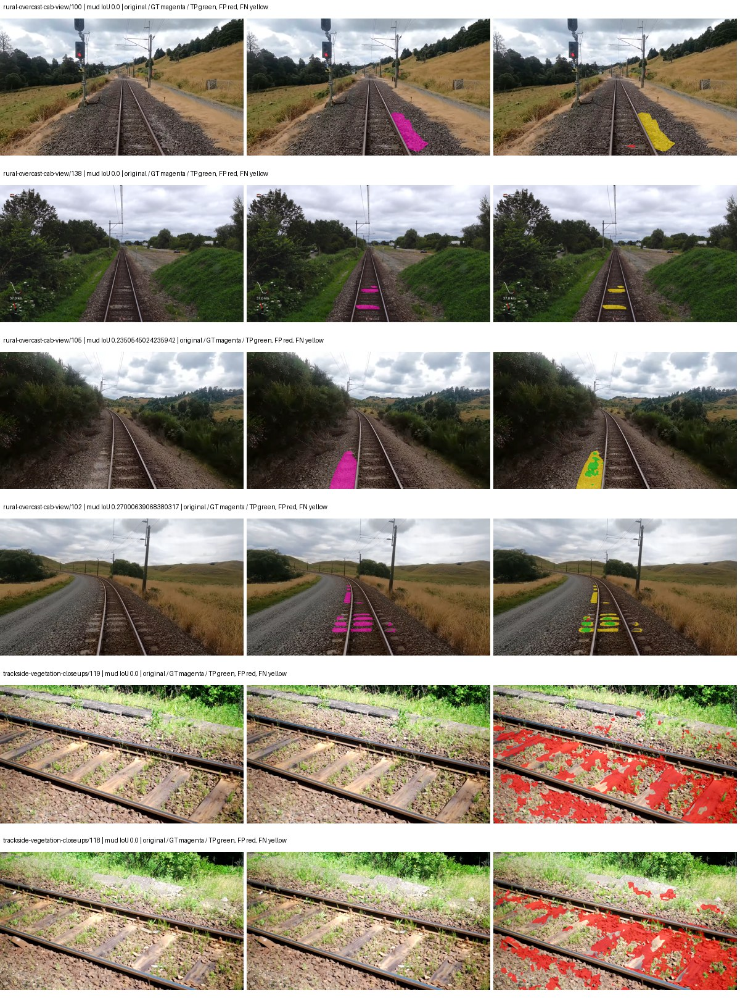

Examples are two lowest and two highest mud-IoU positive images, plus up to two negative images with the most false-positive mud pixels. They are targeted diagnostic examples, not random samples. Green: true positive; red: false positive; yellow: false negative. Full predictions remain on HDRFS.

### Validation tracking

| Logged step | Overall mIoU (%) | Mud IoU (%) |
| --- | --- | --- |
| 254 | 27.92 | 0.08 |
| 508 | 29.16 | 0.80 |
| 763 | 33.77 | 1.46 |
| 1017 | 34.38 | 0.46 |
| 1272 | 33.95 | 0.65 |
| 1527 | 36.69 | 2.20 |
| 1781 | 35.78 | 0.43 |
| 2036 | 33.65 | 0.50 |
| 2290 | 36.52 | 0.57 |
| 2545 | 35.71 | 2.34 |
| 2799 | 37.95 | 1.71 |
| 3054 | 36.92 | 0.41 |
| 3308 | 37.51 | 0.74 |
| 3563 | 35.95 | 0.66 |
| 3817 | 35.93 | 0.70 |

All retained scalar curves, including training loss and per-class IoU, are in record.json. Observed best mud on a curve is not necessarily a retained checkpoint: the pilot saved its selection-metric-best and final checkpoints. Step logging and checkpoint global_step may differ by one.

### Stopping and checkpoint provenance

```json
{
  "stopping": {
    "actual_steps": 3818,
    "maximum_steps": 4000,
    "min_delta": 0.001,
    "monitor": "val_iou/mud-pumping",
    "patience": 5,
    "reason": "validation_plateau"
  },
  "checkpoints": {
    "best": {
      "path": "/data/izadia1/projects/segmentary-runs/paul-test-rtis/mud-fullstats-v1-20260906-r2/future-runs/native_resnet18_fpn_fcn--railsem19_to_rtis--seed-1_seed1/rtis/best.ckpt",
      "sha256": "7130373338b9d5ab2f088eabf3bcd03e4440f57da37826289562c83ea122af9d",
      "global_step": 2545,
      "bytes": 202363737
    },
    "final": {
      "path": "/data/izadia1/projects/segmentary-runs/paul-test-rtis/mud-fullstats-v1-20260906-r2/future-runs/native_resnet18_fpn_fcn--railsem19_to_rtis--seed-1_seed1/rtis/last.ckpt",
      "sha256": "3582f4611fe05ebed076ccdb4e785540f0fb10b5f65abb10c150d8f08df37bb6",
      "global_step": 3818,
      "bytes": 202358617
    }
  },
  "cleanup_error": null
}
```

### Resolved training, initialization and evaluation settings

The optimizer block is the base configuration. Stage LR scales are applied at runtime, and stage warmup is capped at min(base warmup, floor(stage budget / 10), stage budget - 1): 400 steps for this 4,000-step pilot. Model-internal native input grids may differ from augmentation crops (EoMT uses its 640 grid).

```json
{
  "name": "native_resnet18_fpn_fcn--railsem19_to_rtis--seed-1",
  "model": {
    "arch": "native",
    "checkpoint": null,
    "tuning": "full",
    "head": "unified_head",
    "lora_r": 16,
    "lora_alpha": 32,
    "lora_dropout": 0.05,
    "lora_targets": [],
    "drop_path": null,
    "revision": null,
    "subfolder": null,
    "local_files_only": false,
    "trust_remote_code": false,
    "backbone_path": null,
    "head_paths": [],
    "classifier_path": null,
    "inactive_parameter_paths": [],
    "smp_arch": null,
    "encoder_name": null,
    "encoder_weights": null,
    "native": {
      "task": "multiclass",
      "backbone": {
        "kind": "timm",
        "name": "resnet18.a1_in1k",
        "weights": "pretrained",
        "out_indices": [
          1,
          2,
          3,
          4
        ],
        "in_channels": 3
      },
      "neck": {
        "kind": "fpn",
        "out_channels": 128,
        "num_outputs": 4,
        "norm": "group",
        "activation": "relu"
      },
      "head": {
        "kind": "fcn",
        "in_indices": [
          0,
          1,
          2,
          3
        ],
        "channels": 128,
        "num_convs": 2,
        "kernel_size": 3,
        "dilation": 1,
        "dropout": 0.1,
        "norm": "group",
        "activation": "relu"
      },
      "auxiliary_heads": []
    },
    "batch_norm_momentum": null
  },
  "space": "paul-test-rtis",
  "taxonomy_root": "/data/izadia1/projects/segmentary-rtis-fullstats-066afb2/taxonomy",
  "output_root": "/data/izadia1/projects/segmentary-runs/paul-test-rtis/mud-fullstats-v1-20260906-r2/future-runs",
  "optim": {
    "backbone_lr": 0.0001,
    "head_lr_mult": 10.0,
    "weight_decay": 0.05,
    "llrd": 1.0,
    "warmup_iters": 1500,
    "warmup_ratio": 1e-06,
    "poly_power": 0.9,
    "min_lr_ratio": 0.0,
    "betas": [
      0.9,
      0.999
    ],
    "grad_clip": 1.0
  },
  "train": {
    "iters": 4000,
    "batch_size": 2,
    "accum": 8,
    "num_workers": 2,
    "precision": "bf16-mixed",
    "ema_decay": 0.9998,
    "val_every": 250,
    "ckpt_every": 500,
    "selection_metric": "val_iou/mud-pumping",
    "early_stopping_patience": 5,
    "early_stopping_min_delta": 0.001,
    "seed": 1,
    "devices": 1
  },
  "eval": {
    "sliding_window": true,
    "window": [
      1024,
      1024
    ],
    "stride": [
      768,
      768
    ],
    "batch_size": 1,
    "num_workers": 2,
    "tta_scales": [],
    "tta_flip": false,
    "threshold": 0.5,
    "boundary_tolerance_frac": 0.0075,
    "save_confusion": true
  },
  "loss": {
    "task": "multiclass",
    "activation": "auto",
    "terms": [],
    "aux": "none",
    "aux_weight": 0.0,
    "ce_weight": 1.0,
    "label_smoothing": 0.0,
    "class_weights": null,
    "query": null
  },
  "aug": {
    "crop": [
      1024,
      1024
    ],
    "scale_min": 0.5,
    "scale_max": 2.0,
    "hflip_p": 0.5,
    "color_jitter_p": 0.5,
    "brightness": 0.25,
    "contrast": 0.25,
    "saturation": 0.25,
    "hue": 0.05
  },
  "stages": [
    {
      "name": "rtis",
      "data": [
        {
          "name": "paul-test-rtis",
          "root": "/data/izadia1/datasets/paul-test-rtis",
          "variant": null,
          "split_file": "splits.json",
          "train_split": "train",
          "val_split": "val",
          "limit": null,
          "loader": "folder",
          "mapping": "paul-test-rtis",
          "loader_options": {
            "require_groups": true
          }
        }
      ],
      "iters": null,
      "lr_scale": 0.1,
      "head_group_lr_scale": 1.0,
      "init_from": "/data/izadia1/projects/segmentary-runs/all-model-city-rail-seed0-rail20-b9eb3e1/jobs/native_resnet18_fpn_fcn--railsem19--seed-0/attempt-001/train/native_resnet18_fpn_fcn--railsem19_seed0/railsem19/last.ckpt",
      "reset_head": true,
      "freeze": null,
      "sample_weights": null
    }
  ]
}
```

### Hardware and software provenance

```json
{
  "training": {
    "cuda_available": true,
    "cuda_visible_devices": "9",
    "cudnn": 91900,
    "driver_version": "570.133.20",
    "gpu_count": 1,
    "gpu_names": [
      "NVIDIA L40S"
    ],
    "hostname": "hdrfs-app-001",
    "input_normalization": {
      "channel_order": "rgb",
      "mean": [
        0.485,
        0.456,
        0.406
      ],
      "source": "timm_pretrained_cfg",
      "std": [
        0.229,
        0.224,
        0.225
      ]
    },
    "model_origins": [
      {
        "hf_commit": null,
        "hf_name_or_path": null,
        "module": "backbone",
        "timm_pretrained": {
          "architecture": "resnet18",
          "hf_hub_id": "timm/resnet18.a1_in1k",
          "tag": "a1_in1k",
          "url": "https://github.com/huggingface/pytorch-image-models/releases/download/v0.1-rsb-weights/resnet18_a1_0-d63eafa0.pth"
        }
      },
      {
        "hf_commit": null,
        "hf_name_or_path": null,
        "module": "backbone.model",
        "timm_pretrained": {
          "architecture": "resnet18",
          "hf_hub_id": "timm/resnet18.a1_in1k",
          "tag": "a1_in1k",
          "url": "https://github.com/huggingface/pytorch-image-models/releases/download/v0.1-rsb-weights/resnet18_a1_0-d63eafa0.pth"
        }
      }
    ],
    "model_parameter_count": 12631253,
    "packages": {
      "albumentations": "2.0.8",
      "lightning": "2.6.5",
      "numpy": "2.4.4",
      "segmentary": "0.1.0",
      "segmentation-models-pytorch": "0.5.0",
      "timm": "1.0.28",
      "torch": "2.11.0+cu128",
      "torchvision": "0.26.0+cu128",
      "transformers": "5.15.0"
    },
    "platform": "Linux-5.15.0-139-generic-x86_64-with-glibc2.35",
    "python": "3.11.15",
    "torch": "2.11.0+cu128",
    "torch_cuda": "12.8",
    "trainable_parameter_count": 12631253,
    "training_stop": {
      "actual_steps": 3818,
      "maximum_steps": 4000,
      "min_delta": 0.001,
      "monitor": "val_iou/mud-pumping",
      "patience": 5,
      "reason": "validation_plateau"
    },
    "validation_weights": "raw"
  },
  "evaluation": {
    "cuda_available": true,
    "cuda_visible_devices": "9",
    "cudnn": 91900,
    "driver_version": "570.133.20",
    "gpu_count": 1,
    "gpu_names": [
      "NVIDIA L40S"
    ],
    "hostname": "hdrfs-app-001",
    "input_normalization": {
      "channel_order": "rgb",
      "mean": [
        0.485,
        0.456,
        0.406
      ],
      "source": "timm_pretrained_cfg",
      "std": [
        0.229,
        0.224,
        0.225
      ]
    },
    "packages": {
      "albumentations": "2.0.8",
      "lightning": "2.6.5",
      "numpy": "2.4.4",
      "segmentary": "0.1.0",
      "segmentation-models-pytorch": "0.5.0",
      "timm": "1.0.28",
      "torch": "2.11.0+cu128",
      "torchvision": "0.26.0+cu128",
      "transformers": "5.15.0"
    },
    "platform": "Linux-5.15.0-139-generic-x86_64-with-glibc2.35",
    "python": "3.11.15",
    "torch": "2.11.0+cu128",
    "torch_cuda": "12.8"
  }
}
```

## railsem19_to_rtis — seed 2

Status: **completed**. Started: 2026-09-06T21:29:24.749378+00:00. Finished: 2026-09-06T21:54:40.908608+00:00.

Recipe pretrained initializer: `{"arch": "native", "backbone_path": null, "batch_norm_momentum": null, "checkpoint": null, "classifier_path": null, "drop_path": null, "encoder_name": null, "encoder_weights": null, "head": "unified_head", "head_paths": [], "inactive_parameter_paths": [], "local_files_only": false, "lora_alpha": 32, "lora_dropout": 0.05, "lora_r": 16, "lora_targets": [], "native": {"auxiliary_heads": [], "backbone": {"in_channels": 3, "kind": "timm", "name": "resnet18.a1_in1k", "out_indices": [1, 2, 3, 4], "weights": "pretrained"}, "head": {"activation": "relu", "channels": 128, "dilation": 1, "dropout": 0.1, "in_indices": [0, 1, 2, 3], "kernel_size": 3, "kind": "fcn", "norm": "group", "num_convs": 2}, "neck": {"activation": "relu", "kind": "fpn", "norm": "group", "num_outputs": 4, "out_channels": 128}, "task": "multiclass"}, "revision": null, "smp_arch": null, "subfolder": null, "trust_remote_code": false, "tuning": "full"}`.

`rtis_only` uses the recipe initializer, which may include pretrained segmentation components. Transfer paths load the exact historical source checkpoint below and reset the classifier; they do not reset all query/decoder features.

Source checkpoint: `{'name': 'native_resnet18_fpn_fcn--railsem19--seed-0', 'model': 'native_resnet18_fpn_fcn', 'protocol': 'railsem19', 'config': '/data/izadia1/projects/segmentary-runs/all-model-city-rail-seed0-rail20-b9eb3e1/jobs/native_resnet18_fpn_fcn--railsem19--seed-0/attempt-001/resolved-config.yaml', 'checkpoint': '/data/izadia1/projects/segmentary-runs/all-model-city-rail-seed0-rail20-b9eb3e1/jobs/native_resnet18_fpn_fcn--railsem19--seed-0/attempt-001/train/native_resnet18_fpn_fcn--railsem19_seed0/railsem19/last.ckpt', 'recorded_sha256': 'f5f018e5a96a9facdec15939fb08195f8b528b7507a345c269dfb119d136b343', 'exists': True}`.

Config SHA-256: `a665478f4227c1a0fc6652c1277c9e1ec9d766743afad329ebca24ce6d5d0cb8`. Weights used for validation: `raw`.

### Mud-pumping and aggregate quality

| Metric | Selected checkpoint | Final training validation |
| --- | --- | --- |
| Mud IoU | 1.63 | 0.29 |
| Mud precision | 1.95 | 0.40 |
| Mud recall | 8.98 | 1.04 |
| Mud Dice/F1 | 3.21 | 0.58 |
| mIoU | 35.79 | 35.69 |
| Mean accuracy | 49.71 | 50.89 |
| Mean precision | 56.15 | 55.90 |
| Mean Dice | 45.89 | 45.31 |
| Mean specificity | 99.00 | 99.01 |
| Pixel accuracy | 82.82 | 83.63 |
| Frequency-weighted IoU | 75.80 | 75.46 |
| Fixed GT-present class mIoU | 41.75 | 41.64 |
| Boundary F1 | 41.01 | 40.11 |

The selected checkpoint has independent evaluation evidence. Final values are the trainer's final validation record, not a new independent evaluation. mIoU averages classes with nonzero union, so false positives on absent classes can change its denominator. The fixed GT-class mean is supplementary and excludes absent classes; their false positives remain in the confusion matrix.

### Resource usage and timing

| Measurement | Value |
| --- | --- |
| Peak training VRAM, retained training invocation (GiB) | 7.34 |
| Peak evaluation VRAM (GiB) | 7.04 |
| Retained training invocation wall time (seconds) | 1398.02 |
| Retained training invocation GPU-hours (one GPU) | 0.39 |
| Evaluation wall time (seconds) | 11.15 |
| Full evaluation pipeline images/second | 3.32 |
| Best full-state checkpoint (MiB) | 192.99 |
| Final full-state checkpoint (MiB) | 192.98 |
| Audited periodic checkpoints removed (GiB) | 0.75 |

VRAM uses the recorded allocator high-water mark; it is not total device usage including CUDA context. Resumed jobs' retained training invocation times and peaks are **not whole-campaign totals**. Earlier invocation resource records are not reconstructed here. Evaluation throughput includes loader, sliding-window inference and metrics; it is not model-only latency/FPS. Missing measurements are shown as —, never inferred from another dataset's run.

### Standardized inference performance

Dedicated model-only profiling waits for an idle worker-locked L40S: BF16, batch 1, 1024x1024, 20 warmup and 100 CUDA-event-timed public forwards. It excludes loading, preprocessing, tiling and metrics.

| Status | Parameters | Weight MiB | FPS | p50 ms | p95 ms | Peak reserved GiB |
| --- | --- | --- | --- | --- | --- | --- |
| complete | 12631253 | 48.18 | 218.90 | 4.46 | 4.93 | 0.64 |

```json
{
  "schema_version": 1,
  "model_id": "native_resnet18_fpn_fcn",
  "measured_at": "2026-09-06T21:54:38+00:00",
  "status": "complete",
  "benchmark_scope": "rtis_selected_checkpoint_model_only",
  "applies_to": [
    "native_resnet18_fpn_fcn--railsem19_to_rtis--seed-2"
  ],
  "source": {
    "campaign_git_sha": "066afb2626398b7be59d4d19f5a0e4644fd59adc",
    "git_dirty": false,
    "config_hash": "cba5d929c428",
    "resolved_config": "/data/izadia1/projects/segmentary-runs/paul-test-rtis/mud-fullstats-v1-20260906-r2/configs/native_resnet18_fpn_fcn--railsem19_to_rtis--seed-2.yaml",
    "config_sha256": "a665478f4227c1a0fc6652c1277c9e1ec9d766743afad329ebca24ce6d5d0cb8",
    "checkpoint_sha256": "60f8d0cf606577b8057d29622e2fabb2864e98a478c34cdfbb40b3a02fcad32f",
    "checkpoint_global_step": 1018,
    "checkpoint_bytes": 202363737,
    "checkpoint_kind": "resume checkpoint with optimizer and EMA state",
    "weights": "raw",
    "measured_checkpoint_job_id": "native_resnet18_fpn_fcn--railsem19_to_rtis--seed-2",
    "result_sha256": "db60dce78812f4507f7caa2644b431bbe1b41b6b4b14cbc3186a476b571fc979",
    "result_git_sha": "066afb2626398b7be59d4d19f5a0e4644fd59adc",
    "result_stage": "eval:paul-test-rtis:val",
    "result_seed": 2
  },
  "hardware": {
    "gpu_name": "NVIDIA L40S",
    "gpu_uuid": "GPU-84f5ca4d-68db-ae98-d056-40654d859dd9",
    "logical_device": "cuda:0",
    "physical_visibility_token": "0",
    "compute_capability": [
      8,
      9
    ],
    "total_memory_bytes": 47677177856
  },
  "model": {
    "parameter_count": 12631253,
    "trainable_parameter_count": 12631253,
    "resident_parameter_bytes": 50525012,
    "parameter_dtype_counts": {
      "float32": 12631253
    }
  },
  "contract": {
    "backend": "pytorch",
    "precision": "bf16_autocast",
    "batch_size": 1,
    "input_shape_nchw": [
      1,
      3,
      1024,
      1024
    ],
    "warmup_iterations": 20,
    "measured_iterations": 100,
    "timing": "per-forward CUDA events with end-event synchronization",
    "includes_preprocessing": false,
    "includes_data_loader": false,
    "includes_sliding_window": false,
    "input_resident_on_gpu": true,
    "model_only": true,
    "entrypoint": "public model(image) dense-logits forward"
  },
  "measurements": {
    "latency": {
      "p50_ms": 4.463104009628296,
      "p95_ms": 4.92503023147583,
      "mean_ms": 4.5683900833129885,
      "minimum_ms": 4.370431900024414,
      "maximum_ms": 6.585343837738037,
      "fps": 218.89549310876748,
      "raw_ms": [
        5.20908784866333,
        4.633600234985352,
        4.496384143829346,
        4.471807956695557,
        4.45747184753418,
        4.478975772857666,
        4.417600154876709,
        4.396031856536865,
        4.655104160308838,
        4.460544109344482,
        4.589568138122559,
        4.923391819000244,
        4.473855972290039,
        4.387743949890137,
        4.666368007659912,
        4.407296180725098,
        4.3919358253479,
        4.393983840942383,
        4.400256156921387,
        4.384768009185791,
        4.720640182495117,
        4.465663909912109,
        4.453375816345215,
        4.7564802169799805,
        4.917247772216797,
        4.493311882019043,
        4.574207782745361,
        4.767744064331055,
        4.551680088043213,
        4.525055885314941,
        4.506624221801758,
        4.87116813659668,
        4.512767791748047,
        4.480000019073486,
        4.44927978515625,
        4.45139217376709,
        4.5946879386901855,
        4.421631813049316,
        4.567039966583252,
        4.3878397941589355,
        4.444159984588623,
        4.412415981292725,
        4.395008087158203,
        4.373504161834717,
        4.810751914978027,
        4.956160068511963,
        4.80460786819458,
        4.733952045440674,
        4.716447830200195,
        4.376575946807861,
        4.3878397941589355,
        4.380671977996826,
        4.4021759033203125,
        4.431839942932129,
        4.3816962242126465,
        4.541440010070801,
        4.399104118347168,
        4.380671977996826,
        4.379648208618164,
        4.4410881996154785,
        4.383743762969971,
        4.386816024780273,
        4.391903877258301,
        4.380671977996826,
        5.0135040283203125,
        4.695040225982666,
        4.881472110748291,
        4.89356803894043,
        4.430848121643066,
        4.637695789337158,
        4.568064212799072,
        4.50867223739624,
        4.8199357986450195,
        4.438015937805176,
        4.390912055969238,
        4.494336128234863,
        4.7564802169799805,
        4.873216152191162,
        4.404191970825195,
        4.379648208618164,
        4.395008087158203,
        4.390912055969238,
        4.622335910797119,
        4.3878397941589355,
        4.378623962402344,
        4.3816962242126465,
        4.370431900024414,
        4.4021759033203125,
        4.421631813049316,
        4.371327877044678,
        4.4021759033203125,
        4.472832202911377,
        4.392960071563721,
        4.659200191497803,
        4.424704074859619,
        4.736000061035156,
        6.585343837738037,
        5.8122239112854,
        4.661344051361084,
        4.528128147125244
      ],
      "percentile_method": "numpy linear interpolation"
    },
    "peak_reserved_bytes": 685768704,
    "memory_kind": "pytorch_cuda_allocator_peak_reserved_excluding_context",
    "benchmark_wall_clock_s": 8.969910882413387
  },
  "started_at": "2026-09-06T21:54:29+00:00",
  "finished_at": "2026-09-06T21:54:38+00:00",
  "environment": {
    "hostname": "hdrfs-app-001",
    "python": "3.11.15",
    "platform": "Linux-5.15.0-139-generic-x86_64-with-glibc2.35",
    "torch": "2.11.0+cu128",
    "torch_cuda": "12.8",
    "cudnn": 91900,
    "driver_version": "570.133.20",
    "cuda_available": true,
    "gpu_count": 1,
    "gpu_names": [
      "NVIDIA L40S"
    ],
    "cuda_visible_devices": "0",
    "packages": {
      "segmentary": "0.1.0",
      "torch": "2.11.0+cu128",
      "torchvision": "0.26.0+cu128",
      "transformers": "5.15.0",
      "timm": "1.0.28",
      "segmentation-models-pytorch": "0.5.0",
      "albumentations": "2.0.8",
      "lightning": "2.6.5",
      "numpy": "2.4.4"
    }
  }
}
```

### Per-class validation results

| Class | GT pixels | IoU (%) | Precision (%) | Recall (%) | Dice (%) | Boundary F1 (%) |
| --- | --- | --- | --- | --- | --- | --- |
| car | 29664 | 19.83 | 48.39 | 25.14 | 33.09 | 36.15 |
| construction | 311585 | 54.58 | 65.35 | 76.80 | 70.62 | 62.84 |
| fence | 265137 | 11.90 | 17.26 | 27.68 | 21.26 | 20.85 |
| mud-pumping | 1226250 | 1.63 | 1.95 | 8.98 | 3.21 | 4.02 |
| on-rails | 0 | 0.00 | 0.00 | — | 0.00 | 0.00 |
| person | 0 | 0.00 | 0.00 | — | 0.00 | 0.00 |
| pole | 628038 | 70.19 | 80.83 | 84.21 | 82.48 | 88.43 |
| rail-embedded | 16799 | 11.58 | 89.36 | 11.74 | 20.76 | 32.60 |
| rail-raised | 2969797 | 72.68 | 79.13 | 89.92 | 84.18 | 88.97 |
| rail-track | 6323197 | 34.44 | 64.77 | 42.38 | 51.24 | 47.61 |
| road | 1048831 | 28.69 | 53.59 | 38.18 | 44.59 | 34.26 |
| sidewalk | 1297367 | 40.85 | 95.48 | 41.65 | 58.00 | 12.87 |
| sky | 19121606 | 98.46 | 99.38 | 99.07 | 99.22 | 95.07 |
| standing-water | 95802 | 0.22 | 1.55 | 0.26 | 0.45 | 1.78 |
| terrain | 39239306 | 88.50 | 91.37 | 96.58 | 93.90 | 61.82 |
| trackbed | 10643081 | 59.57 | 77.00 | 72.47 | 74.67 | 59.50 |
| traffic-light | 19510 | 39.25 | 76.48 | 44.64 | 56.37 | 48.07 |
| traffic-sign | 13285 | 41.97 | 88.25 | 44.46 | 59.13 | 67.66 |
| tram-track | 56179 | 45.91 | 71.53 | 56.18 | 62.93 | 44.28 |
| truck | 0 | 0.00 | 0.00 | — | 0.00 | 0.00 |
| vegetation-overgrowth | 5901821 | 31.28 | 77.41 | 34.42 | 47.65 | 54.38 |

### Full-run accounting

| Measurement | Value |
| --- | --- |
| Full GPU-reserved wall seconds, all recorded worker attempts | 1516.30 |
| Full reserved GPU-hours | 0.42 |
| Whole-run timing complete | True |

| Phase | Wall seconds including failed attempts |
| --- | --- |
| training | 1405.59 |
| diagnostics | 74.70 |
| performance | 16.07 |

GPU-reserved time includes model loading, training, validation, collection, profiling, checkpoint I/O and orchestration while the worker owns one GPU. It is not GPU kernel-active time. Phase timings and sampled device memory/power/utilization are retained separately; sampled device memory is not the allocator high-water mark.

### Train/validation and raw/EMA diagnostics

| Checkpoint / weights / split | Images | Mud IoU (%) | Mud precision (%) | Mud recall (%) |
| --- | --- | --- | --- | --- |
| best-auto-train / raw | 220 | 89.11 | 93.01 | 95.51 |
| best-auto-val / raw | 37 | 1.63 | 1.95 | 8.98 |
| best-alternate-val / ema | 37 | 0.57 | 0.82 | 1.89 |
| final-auto-val / raw | 37 | 0.29 | 0.40 | 1.04 |

Train uses the evaluation transform without augmentation. Compare mud train/validation metrics for the same selected weights. Alternate EMA on running-stat BatchNorm is explicitly uncalibrated and is diagnostic only. Score-threshold curves use uncalibrated normalized scores and are pixel-level diagnostics, not event detection rates or a selected deployment operating point.

### Downloadable evidence

- best-auto-train: [per-image.csv](railsem19_to_rtis--seed-2/best-auto-train/per-image.csv) · [per-image-confusion.json.gz](railsem19_to_rtis--seed-2/best-auto-train/per-image-confusion.json.gz) · [groups.json](railsem19_to_rtis--seed-2/best-auto-train/groups.json) · [mud-score-curves.json](railsem19_to_rtis--seed-2/best-auto-train/mud-score-curves.json)
- best-auto-val: [per-image.csv](railsem19_to_rtis--seed-2/best-auto-val/per-image.csv) · [per-image-confusion.json.gz](railsem19_to_rtis--seed-2/best-auto-val/per-image-confusion.json.gz) · [groups.json](railsem19_to_rtis--seed-2/best-auto-val/groups.json) · [mud-score-curves.json](railsem19_to_rtis--seed-2/best-auto-val/mud-score-curves.json) · [examples.jpg](railsem19_to_rtis--seed-2/best-auto-val/examples.jpg)
- best-alternate-val: [per-image.csv](railsem19_to_rtis--seed-2/best-alternate-val/per-image.csv) · [per-image-confusion.json.gz](railsem19_to_rtis--seed-2/best-alternate-val/per-image-confusion.json.gz) · [groups.json](railsem19_to_rtis--seed-2/best-alternate-val/groups.json) · [mud-score-curves.json](railsem19_to_rtis--seed-2/best-alternate-val/mud-score-curves.json)
- final-auto-val: [per-image.csv](railsem19_to_rtis--seed-2/final-auto-val/per-image.csv) · [per-image-confusion.json.gz](railsem19_to_rtis--seed-2/final-auto-val/per-image-confusion.json.gz) · [groups.json](railsem19_to_rtis--seed-2/final-auto-val/groups.json) · [mud-score-curves.json](railsem19_to_rtis--seed-2/final-auto-val/mud-score-curves.json)
- resources: [telemetry.csv](railsem19_to_rtis--seed-2/resources/telemetry.csv)

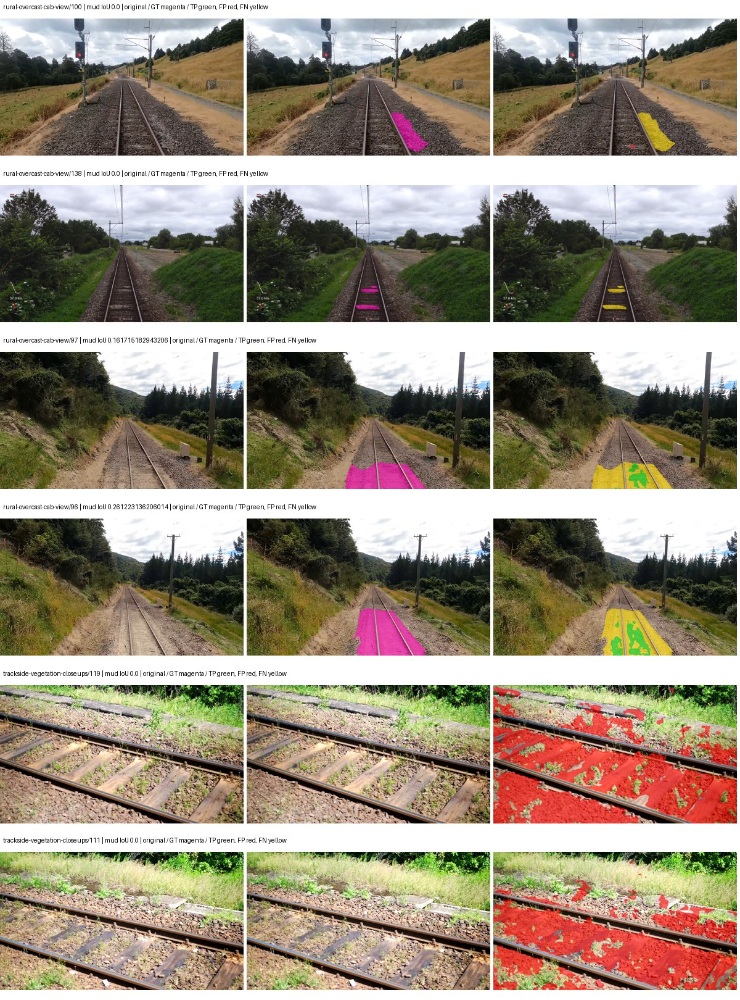

Examples are two lowest and two highest mud-IoU positive images, plus up to two negative images with the most false-positive mud pixels. They are targeted diagnostic examples, not random samples. Green: true positive; red: false positive; yellow: false negative. Full predictions remain on HDRFS.

### Validation tracking

| Logged step | Overall mIoU (%) | Mud IoU (%) |
| --- | --- | --- |
| 254 | 24.93 | 0.00 |
| 508 | 27.55 | 0.99 |
| 763 | 33.76 | 0.29 |
| 1017 | 35.81 | 1.63 |
| 1272 | 35.45 | 0.23 |
| 1527 | 34.52 | 0.80 |
| 1781 | 36.27 | 0.06 |
| 2036 | 35.80 | 0.03 |
| 2290 | 35.69 | 0.29 |

All retained scalar curves, including training loss and per-class IoU, are in record.json. Observed best mud on a curve is not necessarily a retained checkpoint: the pilot saved its selection-metric-best and final checkpoints. Step logging and checkpoint global_step may differ by one.

### Stopping and checkpoint provenance

```json
{
  "stopping": {
    "actual_steps": 2290,
    "maximum_steps": 4000,
    "min_delta": 0.001,
    "monitor": "val_iou/mud-pumping",
    "patience": 5,
    "reason": "validation_plateau"
  },
  "checkpoints": {
    "best": {
      "path": "/data/izadia1/projects/segmentary-runs/paul-test-rtis/mud-fullstats-v1-20260906-r2/future-runs/native_resnet18_fpn_fcn--railsem19_to_rtis--seed-2_seed2/rtis/best.ckpt",
      "sha256": "60f8d0cf606577b8057d29622e2fabb2864e98a478c34cdfbb40b3a02fcad32f",
      "global_step": 1018,
      "bytes": 202363737
    },
    "final": {
      "path": "/data/izadia1/projects/segmentary-runs/paul-test-rtis/mud-fullstats-v1-20260906-r2/future-runs/native_resnet18_fpn_fcn--railsem19_to_rtis--seed-2_seed2/rtis/last.ckpt",
      "sha256": "4f787a11bb4e3572c7a072cb7f20a419c625c38810cfbac48c4a24b655b550cf",
      "global_step": 2290,
      "bytes": 202358617
    }
  },
  "cleanup_error": null
}
```

### Resolved training, initialization and evaluation settings

The optimizer block is the base configuration. Stage LR scales are applied at runtime, and stage warmup is capped at min(base warmup, floor(stage budget / 10), stage budget - 1): 400 steps for this 4,000-step pilot. Model-internal native input grids may differ from augmentation crops (EoMT uses its 640 grid).

```json
{
  "name": "native_resnet18_fpn_fcn--railsem19_to_rtis--seed-2",
  "model": {
    "arch": "native",
    "checkpoint": null,
    "tuning": "full",
    "head": "unified_head",
    "lora_r": 16,
    "lora_alpha": 32,
    "lora_dropout": 0.05,
    "lora_targets": [],
    "drop_path": null,
    "revision": null,
    "subfolder": null,
    "local_files_only": false,
    "trust_remote_code": false,
    "backbone_path": null,
    "head_paths": [],
    "classifier_path": null,
    "inactive_parameter_paths": [],
    "smp_arch": null,
    "encoder_name": null,
    "encoder_weights": null,
    "native": {
      "task": "multiclass",
      "backbone": {
        "kind": "timm",
        "name": "resnet18.a1_in1k",
        "weights": "pretrained",
        "out_indices": [
          1,
          2,
          3,
          4
        ],
        "in_channels": 3
      },
      "neck": {
        "kind": "fpn",
        "out_channels": 128,
        "num_outputs": 4,
        "norm": "group",
        "activation": "relu"
      },
      "head": {
        "kind": "fcn",
        "in_indices": [
          0,
          1,
          2,
          3
        ],
        "channels": 128,
        "num_convs": 2,
        "kernel_size": 3,
        "dilation": 1,
        "dropout": 0.1,
        "norm": "group",
        "activation": "relu"
      },
      "auxiliary_heads": []
    },
    "batch_norm_momentum": null
  },
  "space": "paul-test-rtis",
  "taxonomy_root": "/data/izadia1/projects/segmentary-rtis-fullstats-066afb2/taxonomy",
  "output_root": "/data/izadia1/projects/segmentary-runs/paul-test-rtis/mud-fullstats-v1-20260906-r2/future-runs",
  "optim": {
    "backbone_lr": 0.0001,
    "head_lr_mult": 10.0,
    "weight_decay": 0.05,
    "llrd": 1.0,
    "warmup_iters": 1500,
    "warmup_ratio": 1e-06,
    "poly_power": 0.9,
    "min_lr_ratio": 0.0,
    "betas": [
      0.9,
      0.999
    ],
    "grad_clip": 1.0
  },
  "train": {
    "iters": 4000,
    "batch_size": 2,
    "accum": 8,
    "num_workers": 2,
    "precision": "bf16-mixed",
    "ema_decay": 0.9998,
    "val_every": 250,
    "ckpt_every": 500,
    "selection_metric": "val_iou/mud-pumping",
    "early_stopping_patience": 5,
    "early_stopping_min_delta": 0.001,
    "seed": 2,
    "devices": 1
  },
  "eval": {
    "sliding_window": true,
    "window": [
      1024,
      1024
    ],
    "stride": [
      768,
      768
    ],
    "batch_size": 1,
    "num_workers": 2,
    "tta_scales": [],
    "tta_flip": false,
    "threshold": 0.5,
    "boundary_tolerance_frac": 0.0075,
    "save_confusion": true
  },
  "loss": {
    "task": "multiclass",
    "activation": "auto",
    "terms": [],
    "aux": "none",
    "aux_weight": 0.0,
    "ce_weight": 1.0,
    "label_smoothing": 0.0,
    "class_weights": null,
    "query": null
  },
  "aug": {
    "crop": [
      1024,
      1024
    ],
    "scale_min": 0.5,
    "scale_max": 2.0,
    "hflip_p": 0.5,
    "color_jitter_p": 0.5,
    "brightness": 0.25,
    "contrast": 0.25,
    "saturation": 0.25,
    "hue": 0.05
  },
  "stages": [
    {
      "name": "rtis",
      "data": [
        {
          "name": "paul-test-rtis",
          "root": "/data/izadia1/datasets/paul-test-rtis",
          "variant": null,
          "split_file": "splits.json",
          "train_split": "train",
          "val_split": "val",
          "limit": null,
          "loader": "folder",
          "mapping": "paul-test-rtis",
          "loader_options": {
            "require_groups": true
          }
        }
      ],
      "iters": null,
      "lr_scale": 0.1,
      "head_group_lr_scale": 1.0,
      "init_from": "/data/izadia1/projects/segmentary-runs/all-model-city-rail-seed0-rail20-b9eb3e1/jobs/native_resnet18_fpn_fcn--railsem19--seed-0/attempt-001/train/native_resnet18_fpn_fcn--railsem19_seed0/railsem19/last.ckpt",
      "reset_head": true,
      "freeze": null,
      "sample_weights": null
    }
  ]
}
```

### Hardware and software provenance

```json
{
  "training": {
    "cuda_available": true,
    "cuda_visible_devices": "0",
    "cudnn": 91900,
    "driver_version": "570.133.20",
    "gpu_count": 1,
    "gpu_names": [
      "NVIDIA L40S"
    ],
    "hostname": "hdrfs-app-001",
    "input_normalization": {
      "channel_order": "rgb",
      "mean": [
        0.485,
        0.456,
        0.406
      ],
      "source": "timm_pretrained_cfg",
      "std": [
        0.229,
        0.224,
        0.225
      ]
    },
    "model_origins": [
      {
        "hf_commit": null,
        "hf_name_or_path": null,
        "module": "backbone",
        "timm_pretrained": {
          "architecture": "resnet18",
          "hf_hub_id": "timm/resnet18.a1_in1k",
          "tag": "a1_in1k",
          "url": "https://github.com/huggingface/pytorch-image-models/releases/download/v0.1-rsb-weights/resnet18_a1_0-d63eafa0.pth"
        }
      },
      {
        "hf_commit": null,
        "hf_name_or_path": null,
        "module": "backbone.model",
        "timm_pretrained": {
          "architecture": "resnet18",
          "hf_hub_id": "timm/resnet18.a1_in1k",
          "tag": "a1_in1k",
          "url": "https://github.com/huggingface/pytorch-image-models/releases/download/v0.1-rsb-weights/resnet18_a1_0-d63eafa0.pth"
        }
      }
    ],
    "model_parameter_count": 12631253,
    "packages": {
      "albumentations": "2.0.8",
      "lightning": "2.6.5",
      "numpy": "2.4.4",
      "segmentary": "0.1.0",
      "segmentation-models-pytorch": "0.5.0",
      "timm": "1.0.28",
      "torch": "2.11.0+cu128",
      "torchvision": "0.26.0+cu128",
      "transformers": "5.15.0"
    },
    "platform": "Linux-5.15.0-139-generic-x86_64-with-glibc2.35",
    "python": "3.11.15",
    "torch": "2.11.0+cu128",
    "torch_cuda": "12.8",
    "trainable_parameter_count": 12631253,
    "training_stop": {
      "actual_steps": 2290,
      "maximum_steps": 4000,
      "min_delta": 0.001,
      "monitor": "val_iou/mud-pumping",
      "patience": 5,
      "reason": "validation_plateau"
    },
    "validation_weights": "raw"
  },
  "evaluation": {
    "cuda_available": true,
    "cuda_visible_devices": "0",
    "cudnn": 91900,
    "driver_version": "570.133.20",
    "gpu_count": 1,
    "gpu_names": [
      "NVIDIA L40S"
    ],
    "hostname": "hdrfs-app-001",
    "input_normalization": {
      "channel_order": "rgb",
      "mean": [
        0.485,
        0.456,
        0.406
      ],
      "source": "timm_pretrained_cfg",
      "std": [
        0.229,
        0.224,
        0.225
      ]
    },
    "packages": {
      "albumentations": "2.0.8",
      "lightning": "2.6.5",
      "numpy": "2.4.4",
      "segmentary": "0.1.0",
      "segmentation-models-pytorch": "0.5.0",
      "timm": "1.0.28",
      "torch": "2.11.0+cu128",
      "torchvision": "0.26.0+cu128",
      "transformers": "5.15.0"
    },
    "platform": "Linux-5.15.0-139-generic-x86_64-with-glibc2.35",
    "python": "3.11.15",
    "torch": "2.11.0+cu128",
    "torch_cuda": "12.8"
  }
}
```

## cityscapes_to_railsem19_to_rtis — seed 0

Status: **completed**. Started: 2026-09-06T21:38:20.239843+00:00. Finished: 2026-09-06T22:01:03.209476+00:00.

Recipe pretrained initializer: `{"arch": "native", "backbone_path": null, "batch_norm_momentum": null, "checkpoint": null, "classifier_path": null, "drop_path": null, "encoder_name": null, "encoder_weights": null, "head": "unified_head", "head_paths": [], "inactive_parameter_paths": [], "local_files_only": false, "lora_alpha": 32, "lora_dropout": 0.05, "lora_r": 16, "lora_targets": [], "native": {"auxiliary_heads": [], "backbone": {"in_channels": 3, "kind": "timm", "name": "resnet18.a1_in1k", "out_indices": [1, 2, 3, 4], "weights": "pretrained"}, "head": {"activation": "relu", "channels": 128, "dilation": 1, "dropout": 0.1, "in_indices": [0, 1, 2, 3], "kernel_size": 3, "kind": "fcn", "norm": "group", "num_convs": 2}, "neck": {"activation": "relu", "kind": "fpn", "norm": "group", "num_outputs": 4, "out_channels": 128}, "task": "multiclass"}, "revision": null, "smp_arch": null, "subfolder": null, "trust_remote_code": false, "tuning": "full"}`.

`rtis_only` uses the recipe initializer, which may include pretrained segmentation components. Transfer paths load the exact historical source checkpoint below and reset the classifier; they do not reset all query/decoder features.

Source checkpoint: `{'name': 'native_resnet18_fpn_fcn--cityscapes_to_railsem19--seed-0', 'model': 'native_resnet18_fpn_fcn', 'protocol': 'cityscapes_to_railsem19', 'config': '/data/izadia1/projects/segmentary-runs/all-model-city-rail-seed0-rail20-b9eb3e1/jobs/native_resnet18_fpn_fcn--cityscapes_to_railsem19--seed-0/attempt-001/resolved-config.yaml', 'checkpoint': '/data/izadia1/projects/segmentary-runs/all-model-city-rail-seed0-rail20-b9eb3e1/jobs/native_resnet18_fpn_fcn--cityscapes_to_railsem19--seed-0/attempt-001/train/native_resnet18_fpn_fcn--cityscapes_to_railsem19_seed0/railsem19/last.ckpt', 'recorded_sha256': '5c2f1f6c550820e3baaaa681cfa6819571231f326c8dd9e50abed95b0380e548', 'exists': True}`.

Config SHA-256: `9fcfc5435209de9ff6aa311982c0210f7e696feba78571ac5e22c142f45e59be`. Weights used for validation: `raw`.

### Mud-pumping and aggregate quality

| Metric | Selected checkpoint | Final training validation |
| --- | --- | --- |
| Mud IoU | 7.49 | 4.24 |
| Mud precision | 9.61 | 72.35 |
| Mud recall | 25.36 | 4.31 |
| Mud Dice/F1 | 13.94 | 8.14 |
| mIoU | 25.75 | 31.58 |
| Mean accuracy | 39.60 | 47.59 |
| Mean precision | 47.69 | 51.47 |
| Mean Dice | 33.48 | 41.41 |
| Mean specificity | 98.87 | 99.08 |
| Pixel accuracy | 81.44 | 84.54 |
| Frequency-weighted IoU | 72.02 | 75.76 |
| Fixed GT-present class mIoU | 30.04 | 36.85 |
| Boundary F1 | 34.53 | 39.95 |

The selected checkpoint has independent evaluation evidence. Final values are the trainer's final validation record, not a new independent evaluation. mIoU averages classes with nonzero union, so false positives on absent classes can change its denominator. The fixed GT-class mean is supplementary and excludes absent classes; their false positives remain in the confusion matrix.

### Resource usage and timing

| Measurement | Value |
| --- | --- |
| Peak training VRAM, retained training invocation (GiB) | 7.34 |
| Peak evaluation VRAM (GiB) | 7.04 |
| Retained training invocation wall time (seconds) | 1246.89 |
| Retained training invocation GPU-hours (one GPU) | 0.35 |
| Evaluation wall time (seconds) | 10.77 |
| Full evaluation pipeline images/second | 3.43 |
| Best full-state checkpoint (MiB) | 192.99 |
| Final full-state checkpoint (MiB) | 192.98 |
| Audited periodic checkpoints removed (GiB) | 0.75 |

VRAM uses the recorded allocator high-water mark; it is not total device usage including CUDA context. Resumed jobs' retained training invocation times and peaks are **not whole-campaign totals**. Earlier invocation resource records are not reconstructed here. Evaluation throughput includes loader, sliding-window inference and metrics; it is not model-only latency/FPS. Missing measurements are shown as —, never inferred from another dataset's run.

### Standardized inference performance

Dedicated model-only profiling waits for an idle worker-locked L40S: BF16, batch 1, 1024x1024, 20 warmup and 100 CUDA-event-timed public forwards. It excludes loading, preprocessing, tiling and metrics.

| Status | Parameters | Weight MiB | FPS | p50 ms | p95 ms | Peak reserved GiB |
| --- | --- | --- | --- | --- | --- | --- |
| complete | 12631253 | 48.18 | 219.85 | 4.50 | 4.87 | 0.64 |

```json
{
  "schema_version": 1,
  "model_id": "native_resnet18_fpn_fcn",
  "measured_at": "2026-09-06T22:01:00+00:00",
  "status": "complete",
  "benchmark_scope": "rtis_selected_checkpoint_model_only",
  "applies_to": [
    "native_resnet18_fpn_fcn--cityscapes_to_railsem19_to_rtis--seed-0"
  ],
  "source": {
    "campaign_git_sha": "066afb2626398b7be59d4d19f5a0e4644fd59adc",
    "git_dirty": false,
    "config_hash": "e42aedb014ca",
    "resolved_config": "/data/izadia1/projects/segmentary-runs/paul-test-rtis/mud-fullstats-v1-20260906-r2/configs/native_resnet18_fpn_fcn--cityscapes_to_railsem19_to_rtis--seed-0.yaml",
    "config_sha256": "9fcfc5435209de9ff6aa311982c0210f7e696feba78571ac5e22c142f45e59be",
    "checkpoint_sha256": "09b58b683a849de14ce4b605efdcf70ff0ec2342815753ce572401cbb1ddd054",
    "checkpoint_global_step": 763,
    "checkpoint_bytes": 202363801,
    "checkpoint_kind": "resume checkpoint with optimizer and EMA state",
    "weights": "raw",
    "measured_checkpoint_job_id": "native_resnet18_fpn_fcn--cityscapes_to_railsem19_to_rtis--seed-0",
    "result_sha256": "0dc77ba5cc254da46b8b3b4a9d26bcae1ddbf049555a40cb5c8b4a326de09802",
    "result_git_sha": "066afb2626398b7be59d4d19f5a0e4644fd59adc",
    "result_stage": "eval:paul-test-rtis:val",
    "result_seed": 0
  },
  "hardware": {
    "gpu_name": "NVIDIA L40S",
    "gpu_uuid": "GPU-e2e96741-aec9-e90b-5c46-d0d58be90a56",
    "logical_device": "cuda:0",
    "physical_visibility_token": "8",
    "compute_capability": [
      8,
      9
    ],
    "total_memory_bytes": 47677177856
  },
  "model": {
    "parameter_count": 12631253,
    "trainable_parameter_count": 12631253,
    "resident_parameter_bytes": 50525012,
    "parameter_dtype_counts": {
      "float32": 12631253
    }
  },
  "contract": {
    "backend": "pytorch",
    "precision": "bf16_autocast",
    "batch_size": 1,
    "input_shape_nchw": [
      1,
      3,
      1024,
      1024
    ],
    "warmup_iterations": 20,
    "measured_iterations": 100,
    "timing": "per-forward CUDA events with end-event synchronization",
    "includes_preprocessing": false,
    "includes_data_loader": false,
    "includes_sliding_window": false,
    "input_resident_on_gpu": true,
    "model_only": true,
    "entrypoint": "public model(image) dense-logits forward"
  },
  "measurements": {
    "latency": {
      "p50_ms": 4.4999680519104,
      "p95_ms": 4.869734525680542,
      "mean_ms": 4.548525457382202,
      "minimum_ms": 4.382719993591309,
      "maximum_ms": 5.045248031616211,
      "fps": 219.85146821087085,
      "raw_ms": [
        4.624383926391602,
        4.628479957580566,
        4.493311882019043,
        4.635647773742676,
        4.525055885314941,
        4.512767791748047,
        4.561920166015625,
        4.560895919799805,
        4.524032115936279,
        4.70630407333374,
        4.45747184753418,
        4.426752090454102,
        4.693056106567383,
        4.440063953399658,
        4.490240097045898,
        4.426688194274902,
        4.488192081451416,
        4.485119819641113,
        4.652031898498535,
        4.97046422958374,
        4.644864082336426,
        4.554751873016357,
        4.472832202911377,
        4.492288112640381,
        4.7769598960876465,
        4.471807956695557,
        4.5352959632873535,
        4.470751762390137,
        4.4410881996154785,
        5.029888153076172,
        4.869120121002197,
        4.681727886199951,
        4.581376075744629,
        4.581376075744629,
        4.49945592880249,
        4.9694719314575195,
        4.624383926391602,
        4.530176162719727,
        4.50867223739624,
        4.452352046966553,
        4.425727844238281,
        4.418560028076172,
        4.426752090454102,
        4.595712184906006,
        4.601856231689453,
        4.537343978881836,
        4.881408214569092,
        5.045248031616211,
        4.777919769287109,
        4.558847904205322,
        4.541408061981201,
        4.551680088043213,
        4.511744022369385,
        4.496384143829346,
        4.502528190612793,
        4.497407913208008,
        4.462592124938965,
        4.40934419631958,
        4.4759039878845215,
        4.419583797454834,
        4.525055885314941,
        4.445184230804443,
        4.587520122528076,
        4.604928016662598,
        4.66431999206543,
        4.504576206207275,
        4.420608043670654,
        4.468736171722412,
        4.413440227508545,
        4.427775859832764,
        4.424704074859619,
        4.473855972290039,
        4.467711925506592,
        4.473855972290039,
        4.489247798919678,
        4.5004801750183105,
        4.482048034667969,
        4.810751914978027,
        4.672512054443359,
        4.482048034667969,
        4.474880218505859,
        4.433919906616211,
        4.60697603225708,
        4.4912638664245605,
        4.444159984588623,
        4.439040184020996,
        4.403200149536133,
        4.3878397941589355,
        4.382719993591309,
        4.404287815093994,
        4.607999801635742,
        4.7329277992248535,
        4.7032318115234375,
        4.514815807342529,
        4.646912097930908,
        4.443136215209961,
        4.412415981292725,
        4.456448078155518,
        4.413440227508545,
        4.484096050262451
      ],
      "percentile_method": "numpy linear interpolation"
    },
    "peak_reserved_bytes": 685768704,
    "memory_kind": "pytorch_cuda_allocator_peak_reserved_excluding_context",
    "benchmark_wall_clock_s": 8.493093222379684
  },
  "started_at": "2026-09-06T22:00:52+00:00",
  "finished_at": "2026-09-06T22:01:00+00:00",
  "environment": {
    "hostname": "hdrfs-app-001",
    "python": "3.11.15",
    "platform": "Linux-5.15.0-139-generic-x86_64-with-glibc2.35",
    "torch": "2.11.0+cu128",
    "torch_cuda": "12.8",
    "cudnn": 91900,
    "driver_version": "570.133.20",
    "cuda_available": true,
    "gpu_count": 1,
    "gpu_names": [
      "NVIDIA L40S"
    ],
    "cuda_visible_devices": "8",
    "packages": {
      "segmentary": "0.1.0",
      "torch": "2.11.0+cu128",
      "torchvision": "0.26.0+cu128",
      "transformers": "5.15.0",
      "timm": "1.0.28",
      "segmentation-models-pytorch": "0.5.0",
      "albumentations": "2.0.8",
      "lightning": "2.6.5",
      "numpy": "2.4.4"
    }
  }
}
```

### Per-class validation results

| Class | GT pixels | IoU (%) | Precision (%) | Recall (%) | Dice (%) | Boundary F1 (%) |
| --- | --- | --- | --- | --- | --- | --- |
| car | 29664 | 0.49 | 66.06 | 0.49 | 0.98 | 27.51 |
| construction | 311585 | 20.54 | 22.01 | 75.48 | 34.08 | 25.02 |
| fence | 265137 | 6.24 | 14.29 | 9.98 | 11.75 | 17.93 |
| mud-pumping | 1226250 | 7.49 | 9.61 | 25.36 | 13.94 | 11.80 |
| on-rails | 0 | 0.00 | 0.00 | — | 0.00 | 0.00 |
| person | 0 | 0.00 | 0.00 | — | 0.00 | 0.00 |
| pole | 628038 | 67.69 | 83.02 | 78.57 | 80.73 | 88.88 |
| rail-embedded | 16799 | 9.44 | 69.89 | 9.84 | 17.25 | 32.51 |
| rail-raised | 2969797 | 66.79 | 73.51 | 87.97 | 80.09 | 84.66 |
| rail-track | 6323197 | 37.93 | 66.92 | 46.68 | 55.00 | 51.25 |
| road | 1048831 | 7.21 | 20.42 | 10.02 | 13.44 | 21.81 |
| sidewalk | 1297367 | 23.67 | 80.60 | 25.10 | 38.27 | 10.45 |
| sky | 19121606 | 98.15 | 99.14 | 98.99 | 99.07 | 93.32 |
| standing-water | 95802 | 3.37 | 4.97 | 9.48 | 6.52 | 10.55 |
| terrain | 39239306 | 85.18 | 88.47 | 95.82 | 92.00 | 56.20 |
| trackbed | 10643081 | 57.12 | 67.24 | 79.16 | 72.71 | 51.46 |
| traffic-light | 19510 | 18.50 | 60.08 | 21.10 | 31.23 | 38.51 |
| traffic-sign | 13285 | 11.49 | 84.41 | 11.74 | 20.61 | 46.52 |
| tram-track | 56179 | 9.32 | 17.45 | 16.67 | 17.05 | 24.31 |
| truck | 0 | 0.00 | 0.00 | — | 0.00 | 0.00 |
| vegetation-overgrowth | 5901821 | 10.06 | 73.37 | 10.44 | 18.28 | 32.37 |

### Full-run accounting

| Measurement | Value |
| --- | --- |
| Full GPU-reserved wall seconds, all recorded worker attempts | 1363.20 |
| Full reserved GPU-hours | 0.38 |
| Whole-run timing complete | True |

| Phase | Wall seconds including failed attempts |
| --- | --- |
| training | 1254.16 |
| diagnostics | 74.31 |
| performance | 15.31 |

GPU-reserved time includes model loading, training, validation, collection, profiling, checkpoint I/O and orchestration while the worker owns one GPU. It is not GPU kernel-active time. Phase timings and sampled device memory/power/utilization are retained separately; sampled device memory is not the allocator high-water mark.

### Train/validation and raw/EMA diagnostics

| Checkpoint / weights / split | Images | Mud IoU (%) | Mud precision (%) | Mud recall (%) |
| --- | --- | --- | --- | --- |
| best-auto-train / raw | 220 | 88.67 | 92.54 | 95.49 |
| best-auto-val / raw | 37 | 7.49 | 9.61 | 25.36 |
| best-alternate-val / ema | 37 | 4.33 | 32.66 | 4.75 |
| final-auto-val / raw | 37 | 4.25 | 72.48 | 4.32 |

Train uses the evaluation transform without augmentation. Compare mud train/validation metrics for the same selected weights. Alternate EMA on running-stat BatchNorm is explicitly uncalibrated and is diagnostic only. Score-threshold curves use uncalibrated normalized scores and are pixel-level diagnostics, not event detection rates or a selected deployment operating point.

### Downloadable evidence

- best-auto-train: [per-image.csv](cityscapes_to_railsem19_to_rtis--seed-0/best-auto-train/per-image.csv) · [per-image-confusion.json.gz](cityscapes_to_railsem19_to_rtis--seed-0/best-auto-train/per-image-confusion.json.gz) · [groups.json](cityscapes_to_railsem19_to_rtis--seed-0/best-auto-train/groups.json) · [mud-score-curves.json](cityscapes_to_railsem19_to_rtis--seed-0/best-auto-train/mud-score-curves.json)
- best-auto-val: [per-image.csv](cityscapes_to_railsem19_to_rtis--seed-0/best-auto-val/per-image.csv) · [per-image-confusion.json.gz](cityscapes_to_railsem19_to_rtis--seed-0/best-auto-val/per-image-confusion.json.gz) · [groups.json](cityscapes_to_railsem19_to_rtis--seed-0/best-auto-val/groups.json) · [mud-score-curves.json](cityscapes_to_railsem19_to_rtis--seed-0/best-auto-val/mud-score-curves.json) · [examples.jpg](cityscapes_to_railsem19_to_rtis--seed-0/best-auto-val/examples.jpg)
- best-alternate-val: [per-image.csv](cityscapes_to_railsem19_to_rtis--seed-0/best-alternate-val/per-image.csv) · [per-image-confusion.json.gz](cityscapes_to_railsem19_to_rtis--seed-0/best-alternate-val/per-image-confusion.json.gz) · [groups.json](cityscapes_to_railsem19_to_rtis--seed-0/best-alternate-val/groups.json) · [mud-score-curves.json](cityscapes_to_railsem19_to_rtis--seed-0/best-alternate-val/mud-score-curves.json)
- final-auto-val: [per-image.csv](cityscapes_to_railsem19_to_rtis--seed-0/final-auto-val/per-image.csv) · [per-image-confusion.json.gz](cityscapes_to_railsem19_to_rtis--seed-0/final-auto-val/per-image-confusion.json.gz) · [groups.json](cityscapes_to_railsem19_to_rtis--seed-0/final-auto-val/groups.json) · [mud-score-curves.json](cityscapes_to_railsem19_to_rtis--seed-0/final-auto-val/mud-score-curves.json)
- resources: [telemetry.csv](cityscapes_to_railsem19_to_rtis--seed-0/resources/telemetry.csv)

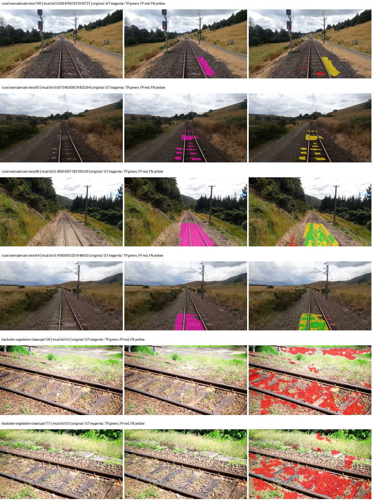

Examples are two lowest and two highest mud-IoU positive images, plus up to two negative images with the most false-positive mud pixels. They are targeted diagnostic examples, not random samples. Green: true positive; red: false positive; yellow: false negative. Full predictions remain on HDRFS.

### Validation tracking

| Logged step | Overall mIoU (%) | Mud IoU (%) |
| --- | --- | --- |
| 254 | 24.65 | 0.33 |
| 508 | 24.40 | 3.72 |
| 763 | 25.75 | 7.50 |
| 1017 | 29.59 | 6.36 |
| 1272 | 30.41 | 5.39 |
| 1527 | 30.67 | 3.09 |
| 1781 | 30.31 | 2.73 |
| 2036 | 31.58 | 4.24 |

All retained scalar curves, including training loss and per-class IoU, are in record.json. Observed best mud on a curve is not necessarily a retained checkpoint: the pilot saved its selection-metric-best and final checkpoints. Step logging and checkpoint global_step may differ by one.

### Stopping and checkpoint provenance

```json
{
  "stopping": {
    "actual_steps": 2036,
    "maximum_steps": 4000,
    "min_delta": 0.001,
    "monitor": "val_iou/mud-pumping",
    "patience": 5,
    "reason": "validation_plateau"
  },
  "checkpoints": {
    "best": {
      "path": "/data/izadia1/projects/segmentary-runs/paul-test-rtis/mud-fullstats-v1-20260906-r2/future-runs/native_resnet18_fpn_fcn--cityscapes_to_railsem19_to_rtis--seed-0_seed0/rtis/best.ckpt",
      "sha256": "09b58b683a849de14ce4b605efdcf70ff0ec2342815753ce572401cbb1ddd054",
      "global_step": 763,
      "bytes": 202363801
    },
    "final": {
      "path": "/data/izadia1/projects/segmentary-runs/paul-test-rtis/mud-fullstats-v1-20260906-r2/future-runs/native_resnet18_fpn_fcn--cityscapes_to_railsem19_to_rtis--seed-0_seed0/rtis/last.ckpt",
      "sha256": "ca4d69f34db197d9922c9b7165a5f387c05ed3b9fed02dc725875b18fd18dde1",
      "global_step": 2036,
      "bytes": 202358681
    }
  },
  "cleanup_error": null
}
```

### Resolved training, initialization and evaluation settings

The optimizer block is the base configuration. Stage LR scales are applied at runtime, and stage warmup is capped at min(base warmup, floor(stage budget / 10), stage budget - 1): 400 steps for this 4,000-step pilot. Model-internal native input grids may differ from augmentation crops (EoMT uses its 640 grid).

```json
{
  "name": "native_resnet18_fpn_fcn--cityscapes_to_railsem19_to_rtis--seed-0",
  "model": {
    "arch": "native",
    "checkpoint": null,
    "tuning": "full",
    "head": "unified_head",
    "lora_r": 16,
    "lora_alpha": 32,
    "lora_dropout": 0.05,
    "lora_targets": [],
    "drop_path": null,
    "revision": null,
    "subfolder": null,
    "local_files_only": false,
    "trust_remote_code": false,
    "backbone_path": null,
    "head_paths": [],
    "classifier_path": null,
    "inactive_parameter_paths": [],
    "smp_arch": null,
    "encoder_name": null,
    "encoder_weights": null,
    "native": {
      "task": "multiclass",
      "backbone": {
        "kind": "timm",
        "name": "resnet18.a1_in1k",
        "weights": "pretrained",
        "out_indices": [
          1,
          2,
          3,
          4
        ],
        "in_channels": 3
      },
      "neck": {
        "kind": "fpn",
        "out_channels": 128,
        "num_outputs": 4,
        "norm": "group",
        "activation": "relu"
      },
      "head": {
        "kind": "fcn",
        "in_indices": [
          0,
          1,
          2,
          3
        ],
        "channels": 128,
        "num_convs": 2,
        "kernel_size": 3,
        "dilation": 1,
        "dropout": 0.1,
        "norm": "group",
        "activation": "relu"
      },
      "auxiliary_heads": []
    },
    "batch_norm_momentum": null
  },
  "space": "paul-test-rtis",
  "taxonomy_root": "/data/izadia1/projects/segmentary-rtis-fullstats-066afb2/taxonomy",
  "output_root": "/data/izadia1/projects/segmentary-runs/paul-test-rtis/mud-fullstats-v1-20260906-r2/future-runs",
  "optim": {
    "backbone_lr": 0.0001,
    "head_lr_mult": 10.0,
    "weight_decay": 0.05,
    "llrd": 1.0,
    "warmup_iters": 1500,
    "warmup_ratio": 1e-06,
    "poly_power": 0.9,
    "min_lr_ratio": 0.0,
    "betas": [
      0.9,
      0.999
    ],
    "grad_clip": 1.0
  },
  "train": {
    "iters": 4000,
    "batch_size": 2,
    "accum": 8,
    "num_workers": 2,
    "precision": "bf16-mixed",
    "ema_decay": 0.9998,
    "val_every": 250,
    "ckpt_every": 500,
    "selection_metric": "val_iou/mud-pumping",
    "early_stopping_patience": 5,
    "early_stopping_min_delta": 0.001,
    "seed": 0,
    "devices": 1
  },
  "eval": {
    "sliding_window": true,
    "window": [
      1024,
      1024
    ],
    "stride": [
      768,
      768
    ],
    "batch_size": 1,
    "num_workers": 2,
    "tta_scales": [],
    "tta_flip": false,
    "threshold": 0.5,
    "boundary_tolerance_frac": 0.0075,
    "save_confusion": true
  },
  "loss": {
    "task": "multiclass",
    "activation": "auto",
    "terms": [],
    "aux": "none",
    "aux_weight": 0.0,
    "ce_weight": 1.0,
    "label_smoothing": 0.0,
    "class_weights": null,
    "query": null
  },
  "aug": {
    "crop": [
      1024,
      1024
    ],
    "scale_min": 0.5,
    "scale_max": 2.0,
    "hflip_p": 0.5,
    "color_jitter_p": 0.5,
    "brightness": 0.25,
    "contrast": 0.25,
    "saturation": 0.25,
    "hue": 0.05
  },
  "stages": [
    {
      "name": "rtis",
      "data": [
        {
          "name": "paul-test-rtis",
          "root": "/data/izadia1/datasets/paul-test-rtis",
          "variant": null,
          "split_file": "splits.json",
          "train_split": "train",
          "val_split": "val",
          "limit": null,
          "loader": "folder",
          "mapping": "paul-test-rtis",
          "loader_options": {
            "require_groups": true
          }
        }
      ],
      "iters": null,
      "lr_scale": 0.1,
      "head_group_lr_scale": 1.0,
      "init_from": "/data/izadia1/projects/segmentary-runs/all-model-city-rail-seed0-rail20-b9eb3e1/jobs/native_resnet18_fpn_fcn--cityscapes_to_railsem19--seed-0/attempt-001/train/native_resnet18_fpn_fcn--cityscapes_to_railsem19_seed0/railsem19/last.ckpt",
      "reset_head": true,
      "freeze": null,
      "sample_weights": null
    }
  ]
}
```

### Hardware and software provenance

```json
{
  "training": {
    "cuda_available": true,
    "cuda_visible_devices": "8",
    "cudnn": 91900,
    "driver_version": "570.133.20",
    "gpu_count": 1,
    "gpu_names": [
      "NVIDIA L40S"
    ],
    "hostname": "hdrfs-app-001",
    "input_normalization": {
      "channel_order": "rgb",
      "mean": [
        0.485,
        0.456,
        0.406
      ],
      "source": "timm_pretrained_cfg",
      "std": [
        0.229,
        0.224,
        0.225
      ]
    },
    "model_origins": [
      {
        "hf_commit": null,
        "hf_name_or_path": null,
        "module": "backbone",
        "timm_pretrained": {
          "architecture": "resnet18",
          "hf_hub_id": "timm/resnet18.a1_in1k",
          "tag": "a1_in1k",
          "url": "https://github.com/huggingface/pytorch-image-models/releases/download/v0.1-rsb-weights/resnet18_a1_0-d63eafa0.pth"
        }
      },
      {
        "hf_commit": null,
        "hf_name_or_path": null,
        "module": "backbone.model",
        "timm_pretrained": {
          "architecture": "resnet18",
          "hf_hub_id": "timm/resnet18.a1_in1k",
          "tag": "a1_in1k",
          "url": "https://github.com/huggingface/pytorch-image-models/releases/download/v0.1-rsb-weights/resnet18_a1_0-d63eafa0.pth"
        }
      }
    ],
    "model_parameter_count": 12631253,
    "packages": {
      "albumentations": "2.0.8",
      "lightning": "2.6.5",
      "numpy": "2.4.4",
      "segmentary": "0.1.0",
      "segmentation-models-pytorch": "0.5.0",
      "timm": "1.0.28",
      "torch": "2.11.0+cu128",
      "torchvision": "0.26.0+cu128",
      "transformers": "5.15.0"
    },
    "platform": "Linux-5.15.0-139-generic-x86_64-with-glibc2.35",
    "python": "3.11.15",
    "torch": "2.11.0+cu128",
    "torch_cuda": "12.8",
    "trainable_parameter_count": 12631253,
    "training_stop": {
      "actual_steps": 2036,
      "maximum_steps": 4000,
      "min_delta": 0.001,
      "monitor": "val_iou/mud-pumping",
      "patience": 5,
      "reason": "validation_plateau"
    },
    "validation_weights": "raw"
  },
  "evaluation": {
    "cuda_available": true,
    "cuda_visible_devices": "8",
    "cudnn": 91900,
    "driver_version": "570.133.20",
    "gpu_count": 1,
    "gpu_names": [
      "NVIDIA L40S"
    ],
    "hostname": "hdrfs-app-001",
    "input_normalization": {
      "channel_order": "rgb",
      "mean": [
        0.485,
        0.456,
        0.406
      ],
      "source": "timm_pretrained_cfg",
      "std": [
        0.229,
        0.224,
        0.225
      ]
    },
    "packages": {
      "albumentations": "2.0.8",
      "lightning": "2.6.5",
      "numpy": "2.4.4",
      "segmentary": "0.1.0",
      "segmentation-models-pytorch": "0.5.0",
      "timm": "1.0.28",
      "torch": "2.11.0+cu128",
      "torchvision": "0.26.0+cu128",
      "transformers": "5.15.0"
    },
    "platform": "Linux-5.15.0-139-generic-x86_64-with-glibc2.35",
    "python": "3.11.15",
    "torch": "2.11.0+cu128",
    "torch_cuda": "12.8"
  }
}
```

## cityscapes_to_railsem19_to_rtis — seed 1

Status: **completed**. Started: 2026-09-06T21:38:44.108780+00:00. Finished: 2026-09-06T22:01:26.842632+00:00.

Recipe pretrained initializer: `{"arch": "native", "backbone_path": null, "batch_norm_momentum": null, "checkpoint": null, "classifier_path": null, "drop_path": null, "encoder_name": null, "encoder_weights": null, "head": "unified_head", "head_paths": [], "inactive_parameter_paths": [], "local_files_only": false, "lora_alpha": 32, "lora_dropout": 0.05, "lora_r": 16, "lora_targets": [], "native": {"auxiliary_heads": [], "backbone": {"in_channels": 3, "kind": "timm", "name": "resnet18.a1_in1k", "out_indices": [1, 2, 3, 4], "weights": "pretrained"}, "head": {"activation": "relu", "channels": 128, "dilation": 1, "dropout": 0.1, "in_indices": [0, 1, 2, 3], "kernel_size": 3, "kind": "fcn", "norm": "group", "num_convs": 2}, "neck": {"activation": "relu", "kind": "fpn", "norm": "group", "num_outputs": 4, "out_channels": 128}, "task": "multiclass"}, "revision": null, "smp_arch": null, "subfolder": null, "trust_remote_code": false, "tuning": "full"}`.

`rtis_only` uses the recipe initializer, which may include pretrained segmentation components. Transfer paths load the exact historical source checkpoint below and reset the classifier; they do not reset all query/decoder features.

Source checkpoint: `{'name': 'native_resnet18_fpn_fcn--cityscapes_to_railsem19--seed-0', 'model': 'native_resnet18_fpn_fcn', 'protocol': 'cityscapes_to_railsem19', 'config': '/data/izadia1/projects/segmentary-runs/all-model-city-rail-seed0-rail20-b9eb3e1/jobs/native_resnet18_fpn_fcn--cityscapes_to_railsem19--seed-0/attempt-001/resolved-config.yaml', 'checkpoint': '/data/izadia1/projects/segmentary-runs/all-model-city-rail-seed0-rail20-b9eb3e1/jobs/native_resnet18_fpn_fcn--cityscapes_to_railsem19--seed-0/attempt-001/train/native_resnet18_fpn_fcn--cityscapes_to_railsem19_seed0/railsem19/last.ckpt', 'recorded_sha256': '5c2f1f6c550820e3baaaa681cfa6819571231f326c8dd9e50abed95b0380e548', 'exists': True}`.

Config SHA-256: `78ea61634bcfa3dbf668655d3522780b81e22aeb2ca44416aa5b8a309ac97c84`. Weights used for validation: `raw`.

### Mud-pumping and aggregate quality

| Metric | Selected checkpoint | Final training validation |
| --- | --- | --- |
| Mud IoU | 3.13 | 0.52 |
| Mud precision | 3.71 | 0.74 |
| Mud recall | 16.74 | 1.68 |
| Mud Dice/F1 | 6.07 | 1.03 |
| mIoU | 28.59 | 27.18 |
| Mean accuracy | 40.66 | 41.23 |
| Mean precision | 53.90 | 44.30 |
| Mean Dice | 36.56 | 35.38 |
| Mean specificity | 98.88 | 98.90 |
| Pixel accuracy | 81.34 | 81.69 |
| Frequency-weighted IoU | 73.07 | 72.75 |
| Fixed GT-present class mIoU | 33.35 | 31.71 |
| Boundary F1 | 34.18 | 33.90 |

The selected checkpoint has independent evaluation evidence. Final values are the trainer's final validation record, not a new independent evaluation. mIoU averages classes with nonzero union, so false positives on absent classes can change its denominator. The fixed GT-class mean is supplementary and excludes absent classes; their false positives remain in the confusion matrix.

### Resource usage and timing

| Measurement | Value |
| --- | --- |
| Peak training VRAM, retained training invocation (GiB) | 7.34 |
| Peak evaluation VRAM (GiB) | 7.04 |
| Retained training invocation wall time (seconds) | 1246.83 |
| Retained training invocation GPU-hours (one GPU) | 0.35 |
| Evaluation wall time (seconds) | 10.92 |
| Full evaluation pipeline images/second | 3.39 |
| Best full-state checkpoint (MiB) | 192.99 |
| Final full-state checkpoint (MiB) | 192.98 |
| Audited periodic checkpoints removed (GiB) | 0.75 |

VRAM uses the recorded allocator high-water mark; it is not total device usage including CUDA context. Resumed jobs' retained training invocation times and peaks are **not whole-campaign totals**. Earlier invocation resource records are not reconstructed here. Evaluation throughput includes loader, sliding-window inference and metrics; it is not model-only latency/FPS. Missing measurements are shown as —, never inferred from another dataset's run.

### Standardized inference performance

Dedicated model-only profiling waits for an idle worker-locked L40S: BF16, batch 1, 1024x1024, 20 warmup and 100 CUDA-event-timed public forwards. It excludes loading, preprocessing, tiling and metrics.

| Status | Parameters | Weight MiB | FPS | p50 ms | p95 ms | Peak reserved GiB |
| --- | --- | --- | --- | --- | --- | --- |
| complete | 12631253 | 48.18 | 217.96 | 4.45 | 5.16 | 0.64 |

```json
{
  "schema_version": 1,
  "model_id": "native_resnet18_fpn_fcn",
  "measured_at": "2026-09-06T22:01:24+00:00",
  "status": "complete",
  "benchmark_scope": "rtis_selected_checkpoint_model_only",
  "applies_to": [
    "native_resnet18_fpn_fcn--cityscapes_to_railsem19_to_rtis--seed-1"
  ],
  "source": {
    "campaign_git_sha": "066afb2626398b7be59d4d19f5a0e4644fd59adc",
    "git_dirty": false,
    "config_hash": "35181fb0b169",
    "resolved_config": "/data/izadia1/projects/segmentary-runs/paul-test-rtis/mud-fullstats-v1-20260906-r2/configs/native_resnet18_fpn_fcn--cityscapes_to_railsem19_to_rtis--seed-1.yaml",
    "config_sha256": "78ea61634bcfa3dbf668655d3522780b81e22aeb2ca44416aa5b8a309ac97c84",
    "checkpoint_sha256": "033b661c154c0168d67b262ee71b5cb3f76a76ad5cdfffc740a214e7da5b07b3",
    "checkpoint_global_step": 763,
    "checkpoint_bytes": 202363801,
    "checkpoint_kind": "resume checkpoint with optimizer and EMA state",
    "weights": "raw",
    "measured_checkpoint_job_id": "native_resnet18_fpn_fcn--cityscapes_to_railsem19_to_rtis--seed-1",
    "result_sha256": "f8b923266747d32f7c707dc7cb6cd148cfedea3fb614a7a0c232103d4638eea6",
    "result_git_sha": "066afb2626398b7be59d4d19f5a0e4644fd59adc",
    "result_stage": "eval:paul-test-rtis:val",
    "result_seed": 1
  },
  "hardware": {
    "gpu_name": "NVIDIA L40S",
    "gpu_uuid": "GPU-1c9b612f-e0b5-fbbc-150f-8c2ef13453c9",
    "logical_device": "cuda:0",
    "physical_visibility_token": "5",
    "compute_capability": [
      8,
      9
    ],
    "total_memory_bytes": 47677177856
  },
  "model": {
    "parameter_count": 12631253,
    "trainable_parameter_count": 12631253,
    "resident_parameter_bytes": 50525012,
    "parameter_dtype_counts": {
      "float32": 12631253
    }
  },
  "contract": {
    "backend": "pytorch",
    "precision": "bf16_autocast",
    "batch_size": 1,
    "input_shape_nchw": [
      1,
      3,
      1024,
      1024
    ],
    "warmup_iterations": 20,
    "measured_iterations": 100,
    "timing": "per-forward CUDA events with end-event synchronization",
    "includes_preprocessing": false,
    "includes_data_loader": false,
    "includes_sliding_window": false,
    "input_resident_on_gpu": true,
    "model_only": true,
    "entrypoint": "public model(image) dense-logits forward"
  },
  "measurements": {
    "latency": {
      "p50_ms": 4.448256015777588,
      "p95_ms": 5.155737733840942,
      "mean_ms": 4.588093123435974,
      "minimum_ms": 4.365312099456787,
      "maximum_ms": 5.510144233703613,
      "fps": 217.955471499042,
      "raw_ms": [
        4.641791820526123,
        4.809728145599365,
        4.399104118347168,
        4.393983840942383,
        4.389887809753418,
        4.4021759033203125,
        4.385791778564453,
        4.389887809753418,
        4.398079872131348,
        4.384768009185791,
        4.4759039878845215,
        4.451327800750732,
        5.006336212158203,
        4.5946879386901855,
        4.445184230804443,
        4.60595178604126,
        4.484096050262451,
        4.40115213394165,
        4.388864040374756,
        4.392960071563721,
        4.645887851715088,
        4.415487766265869,
        4.388864040374756,
        4.802559852600098,
        4.445184230804443,
        4.427775859832764,
        4.7226881980896,
        4.414463996887207,
        4.418560028076172,
        4.641791820526123,
        4.547584056854248,
        4.390912055969238,
        4.502528190612793,
        4.758528232574463,
        4.76364803314209,
        4.672512054443359,
        4.3970561027526855,
        4.365312099456787,
        4.393983840942383,
        4.40012788772583,
        4.770815849304199,
        4.404223918914795,
        4.744192123413086,
        4.51584005355835,
        4.915200233459473,
        4.710400104522705,
        4.823040008544922,
        4.405248165130615,
        4.418560028076172,
        4.422624111175537,
        4.3816962242126465,
        4.383743762969971,
        4.3919358253479,
        4.388864040374756,
        4.5496320724487305,
        4.421631813049316,
        4.417535781860352,
        4.453375816345215,
        4.570112228393555,
        4.420608043670654,
        4.442080020904541,
        4.848639965057373,
        4.443136215209961,
        4.410367965698242,
        4.388864040374756,
        4.654079914093018,
        4.436992168426514,
        4.422656059265137,
        4.396031856536865,
        4.415487766265869,
        4.6090240478515625,
        4.680704116821289,
        4.40831995010376,
        4.420608043670654,
        4.730879783630371,
        4.631552219390869,
        4.426752090454102,
        4.420608043670654,
        4.410367965698242,
        4.395008087158203,
        4.752384185791016,
        4.425727844238281,
        4.4759039878845215,
        4.8015360832214355,
        4.814847946166992,
        4.6530561447143555,
        4.6233601570129395,
        4.468736171722412,
        4.3970561027526855,
        4.503583908081055,
        5.3094401359558105,
        5.510144233703613,
        5.173247814178467,
        5.260287761688232,
        5.154816150665283,
        5.143551826477051,
        5.175295829772949,
        5.140480041503906,
        5.06163215637207,
        5.105663776397705
      ],
      "percentile_method": "numpy linear interpolation"
    },
    "peak_reserved_bytes": 685768704,
    "memory_kind": "pytorch_cuda_allocator_peak_reserved_excluding_context",
    "benchmark_wall_clock_s": 8.398558791726828
  },
  "started_at": "2026-09-06T22:01:15+00:00",
  "finished_at": "2026-09-06T22:01:24+00:00",
  "environment": {
    "hostname": "hdrfs-app-001",
    "python": "3.11.15",
    "platform": "Linux-5.15.0-139-generic-x86_64-with-glibc2.35",
    "torch": "2.11.0+cu128",
    "torch_cuda": "12.8",
    "cudnn": 91900,
    "driver_version": "570.133.20",
    "cuda_available": true,
    "gpu_count": 1,
    "gpu_names": [
      "NVIDIA L40S"
    ],
    "cuda_visible_devices": "5",
    "packages": {
      "segmentary": "0.1.0",
      "torch": "2.11.0+cu128",
      "torchvision": "0.26.0+cu128",
      "transformers": "5.15.0",
      "timm": "1.0.28",
      "segmentation-models-pytorch": "0.5.0",
      "albumentations": "2.0.8",
      "lightning": "2.6.5",
      "numpy": "2.4.4"
    }
  }
}
```

### Per-class validation results

| Class | GT pixels | IoU (%) | Precision (%) | Recall (%) | Dice (%) | Boundary F1 (%) |
| --- | --- | --- | --- | --- | --- | --- |
| car | 29664 | 3.44 | 100.00 | 3.44 | 6.65 | 0.00 |
| construction | 311585 | 36.96 | 40.54 | 80.74 | 53.97 | 39.34 |
| fence | 265137 | 7.57 | 15.34 | 12.99 | 14.07 | 20.78 |
| mud-pumping | 1226250 | 3.13 | 3.71 | 16.74 | 6.07 | 7.98 |
| on-rails | 0 | 0.00 | 0.00 | — | 0.00 | 0.00 |
| person | 0 | 0.00 | 0.00 | — | 0.00 | 0.00 |
| pole | 628038 | 64.49 | 88.30 | 70.52 | 78.41 | 87.71 |
| rail-embedded | 16799 | 2.33 | 98.25 | 2.33 | 4.56 | 14.54 |
| rail-raised | 2969797 | 71.59 | 80.94 | 86.10 | 83.44 | 87.67 |
| rail-track | 6323197 | 31.75 | 74.73 | 35.57 | 48.20 | 41.60 |
| road | 1048831 | 7.53 | 35.72 | 8.72 | 14.01 | 13.32 |
| sidewalk | 1297367 | 27.30 | 94.33 | 27.76 | 42.89 | 10.15 |
| sky | 19121606 | 98.16 | 99.23 | 98.92 | 99.07 | 93.70 |
| standing-water | 95802 | 0.20 | 0.46 | 0.35 | 0.40 | 2.16 |
| terrain | 39239306 | 87.04 | 89.57 | 96.86 | 93.07 | 58.66 |
| trackbed | 10643081 | 55.60 | 66.90 | 76.71 | 71.47 | 51.03 |
| traffic-light | 19510 | 47.24 | 78.68 | 54.18 | 64.17 | 63.08 |
| traffic-sign | 13285 | 34.88 | 85.20 | 37.13 | 51.72 | 70.39 |
| tram-track | 56179 | 1.09 | 4.78 | 1.38 | 2.15 | 8.02 |
| truck | 0 | 0.00 | 0.00 | — | 0.00 | 0.00 |
| vegetation-overgrowth | 5901821 | 20.01 | 75.21 | 21.42 | 33.35 | 47.57 |

### Full-run accounting

| Measurement | Value |
| --- | --- |
| Full GPU-reserved wall seconds, all recorded worker attempts | 1362.90 |
| Full reserved GPU-hours | 0.38 |
| Whole-run timing complete | True |

| Phase | Wall seconds including failed attempts |
| --- | --- |
| training | 1253.87 |
| diagnostics | 74.12 |
| performance | 15.37 |

GPU-reserved time includes model loading, training, validation, collection, profiling, checkpoint I/O and orchestration while the worker owns one GPU. It is not GPU kernel-active time. Phase timings and sampled device memory/power/utilization are retained separately; sampled device memory is not the allocator high-water mark.

### Train/validation and raw/EMA diagnostics

| Checkpoint / weights / split | Images | Mud IoU (%) | Mud precision (%) | Mud recall (%) |
| --- | --- | --- | --- | --- |
| best-auto-train / raw | 220 | 86.56 | 88.96 | 96.99 |
| best-auto-val / raw | 37 | 3.13 | 3.71 | 16.74 |
| best-alternate-val / ema | 37 | 1.34 | 2.08 | 3.65 |
| final-auto-val / raw | 37 | 0.52 | 0.74 | 1.68 |

Train uses the evaluation transform without augmentation. Compare mud train/validation metrics for the same selected weights. Alternate EMA on running-stat BatchNorm is explicitly uncalibrated and is diagnostic only. Score-threshold curves use uncalibrated normalized scores and are pixel-level diagnostics, not event detection rates or a selected deployment operating point.

### Downloadable evidence

- best-auto-train: [per-image.csv](cityscapes_to_railsem19_to_rtis--seed-1/best-auto-train/per-image.csv) · [per-image-confusion.json.gz](cityscapes_to_railsem19_to_rtis--seed-1/best-auto-train/per-image-confusion.json.gz) · [groups.json](cityscapes_to_railsem19_to_rtis--seed-1/best-auto-train/groups.json) · [mud-score-curves.json](cityscapes_to_railsem19_to_rtis--seed-1/best-auto-train/mud-score-curves.json)
- best-auto-val: [per-image.csv](cityscapes_to_railsem19_to_rtis--seed-1/best-auto-val/per-image.csv) · [per-image-confusion.json.gz](cityscapes_to_railsem19_to_rtis--seed-1/best-auto-val/per-image-confusion.json.gz) · [groups.json](cityscapes_to_railsem19_to_rtis--seed-1/best-auto-val/groups.json) · [mud-score-curves.json](cityscapes_to_railsem19_to_rtis--seed-1/best-auto-val/mud-score-curves.json) · [examples.jpg](cityscapes_to_railsem19_to_rtis--seed-1/best-auto-val/examples.jpg)
- best-alternate-val: [per-image.csv](cityscapes_to_railsem19_to_rtis--seed-1/best-alternate-val/per-image.csv) · [per-image-confusion.json.gz](cityscapes_to_railsem19_to_rtis--seed-1/best-alternate-val/per-image-confusion.json.gz) · [groups.json](cityscapes_to_railsem19_to_rtis--seed-1/best-alternate-val/groups.json) · [mud-score-curves.json](cityscapes_to_railsem19_to_rtis--seed-1/best-alternate-val/mud-score-curves.json)
- final-auto-val: [per-image.csv](cityscapes_to_railsem19_to_rtis--seed-1/final-auto-val/per-image.csv) · [per-image-confusion.json.gz](cityscapes_to_railsem19_to_rtis--seed-1/final-auto-val/per-image-confusion.json.gz) · [groups.json](cityscapes_to_railsem19_to_rtis--seed-1/final-auto-val/groups.json) · [mud-score-curves.json](cityscapes_to_railsem19_to_rtis--seed-1/final-auto-val/mud-score-curves.json)
- resources: [telemetry.csv](cityscapes_to_railsem19_to_rtis--seed-1/resources/telemetry.csv)

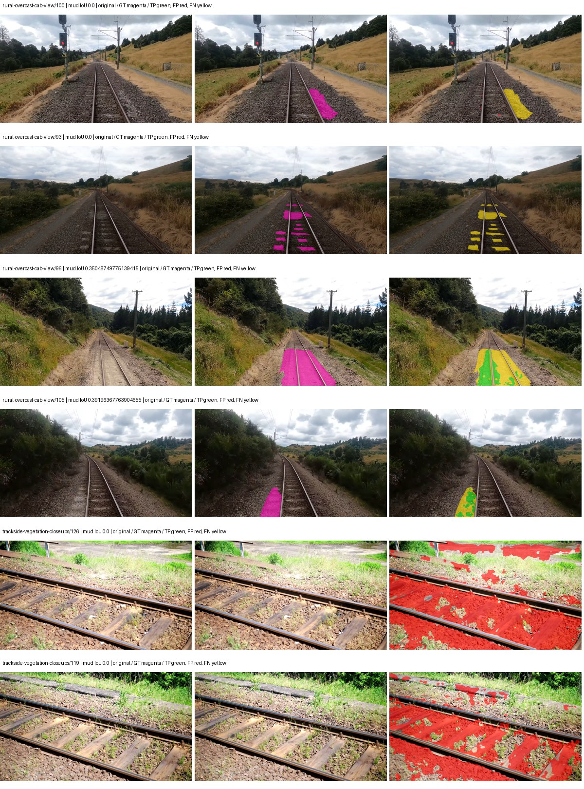

Examples are two lowest and two highest mud-IoU positive images, plus up to two negative images with the most false-positive mud pixels. They are targeted diagnostic examples, not random samples. Green: true positive; red: false positive; yellow: false negative. Full predictions remain on HDRFS.

### Validation tracking

| Logged step | Overall mIoU (%) | Mud IoU (%) |
| --- | --- | --- |
| 254 | 26.43 | 0.08 |
| 508 | 26.20 | 1.98 |
| 763 | 28.58 | 3.13 |
| 1017 | 29.20 | 0.49 |
| 1272 | 30.10 | 1.44 |
| 1527 | 27.14 | 0.58 |
| 1781 | 29.70 | 0.54 |
| 2036 | 27.18 | 0.52 |

All retained scalar curves, including training loss and per-class IoU, are in record.json. Observed best mud on a curve is not necessarily a retained checkpoint: the pilot saved its selection-metric-best and final checkpoints. Step logging and checkpoint global_step may differ by one.

### Stopping and checkpoint provenance

```json
{
  "stopping": {
    "actual_steps": 2036,
    "maximum_steps": 4000,
    "min_delta": 0.001,
    "monitor": "val_iou/mud-pumping",
    "patience": 5,
    "reason": "validation_plateau"
  },
  "checkpoints": {
    "best": {
      "path": "/data/izadia1/projects/segmentary-runs/paul-test-rtis/mud-fullstats-v1-20260906-r2/future-runs/native_resnet18_fpn_fcn--cityscapes_to_railsem19_to_rtis--seed-1_seed1/rtis/best.ckpt",
      "sha256": "033b661c154c0168d67b262ee71b5cb3f76a76ad5cdfffc740a214e7da5b07b3",
      "global_step": 763,
      "bytes": 202363801
    },
    "final": {
      "path": "/data/izadia1/projects/segmentary-runs/paul-test-rtis/mud-fullstats-v1-20260906-r2/future-runs/native_resnet18_fpn_fcn--cityscapes_to_railsem19_to_rtis--seed-1_seed1/rtis/last.ckpt",
      "sha256": "fa9a18110f8bd1da17248157d9080427161af08eae0f3e9a52204f343e1f8747",
      "global_step": 2036,
      "bytes": 202358681
    }
  },
  "cleanup_error": null
}
```

### Resolved training, initialization and evaluation settings

The optimizer block is the base configuration. Stage LR scales are applied at runtime, and stage warmup is capped at min(base warmup, floor(stage budget / 10), stage budget - 1): 400 steps for this 4,000-step pilot. Model-internal native input grids may differ from augmentation crops (EoMT uses its 640 grid).

```json
{
  "name": "native_resnet18_fpn_fcn--cityscapes_to_railsem19_to_rtis--seed-1",
  "model": {
    "arch": "native",
    "checkpoint": null,
    "tuning": "full",
    "head": "unified_head",
    "lora_r": 16,
    "lora_alpha": 32,
    "lora_dropout": 0.05,
    "lora_targets": [],
    "drop_path": null,
    "revision": null,
    "subfolder": null,
    "local_files_only": false,
    "trust_remote_code": false,
    "backbone_path": null,
    "head_paths": [],
    "classifier_path": null,
    "inactive_parameter_paths": [],
    "smp_arch": null,
    "encoder_name": null,
    "encoder_weights": null,
    "native": {
      "task": "multiclass",
      "backbone": {
        "kind": "timm",
        "name": "resnet18.a1_in1k",
        "weights": "pretrained",
        "out_indices": [
          1,
          2,
          3,
          4
        ],
        "in_channels": 3
      },
      "neck": {
        "kind": "fpn",
        "out_channels": 128,
        "num_outputs": 4,
        "norm": "group",
        "activation": "relu"
      },
      "head": {
        "kind": "fcn",
        "in_indices": [
          0,
          1,
          2,
          3
        ],
        "channels": 128,
        "num_convs": 2,
        "kernel_size": 3,
        "dilation": 1,
        "dropout": 0.1,
        "norm": "group",
        "activation": "relu"
      },
      "auxiliary_heads": []
    },
    "batch_norm_momentum": null
  },
  "space": "paul-test-rtis",
  "taxonomy_root": "/data/izadia1/projects/segmentary-rtis-fullstats-066afb2/taxonomy",
  "output_root": "/data/izadia1/projects/segmentary-runs/paul-test-rtis/mud-fullstats-v1-20260906-r2/future-runs",
  "optim": {
    "backbone_lr": 0.0001,
    "head_lr_mult": 10.0,
    "weight_decay": 0.05,
    "llrd": 1.0,
    "warmup_iters": 1500,
    "warmup_ratio": 1e-06,
    "poly_power": 0.9,
    "min_lr_ratio": 0.0,
    "betas": [
      0.9,
      0.999
    ],
    "grad_clip": 1.0
  },
  "train": {
    "iters": 4000,
    "batch_size": 2,
    "accum": 8,
    "num_workers": 2,
    "precision": "bf16-mixed",
    "ema_decay": 0.9998,
    "val_every": 250,
    "ckpt_every": 500,
    "selection_metric": "val_iou/mud-pumping",
    "early_stopping_patience": 5,
    "early_stopping_min_delta": 0.001,
    "seed": 1,
    "devices": 1
  },
  "eval": {
    "sliding_window": true,
    "window": [
      1024,
      1024
    ],
    "stride": [
      768,
      768
    ],
    "batch_size": 1,
    "num_workers": 2,
    "tta_scales": [],
    "tta_flip": false,
    "threshold": 0.5,
    "boundary_tolerance_frac": 0.0075,
    "save_confusion": true
  },
  "loss": {
    "task": "multiclass",
    "activation": "auto",
    "terms": [],
    "aux": "none",
    "aux_weight": 0.0,
    "ce_weight": 1.0,
    "label_smoothing": 0.0,
    "class_weights": null,
    "query": null
  },
  "aug": {
    "crop": [
      1024,
      1024
    ],
    "scale_min": 0.5,
    "scale_max": 2.0,
    "hflip_p": 0.5,
    "color_jitter_p": 0.5,
    "brightness": 0.25,
    "contrast": 0.25,
    "saturation": 0.25,
    "hue": 0.05
  },
  "stages": [
    {
      "name": "rtis",
      "data": [
        {
          "name": "paul-test-rtis",
          "root": "/data/izadia1/datasets/paul-test-rtis",
          "variant": null,
          "split_file": "splits.json",
          "train_split": "train",
          "val_split": "val",
          "limit": null,
          "loader": "folder",
          "mapping": "paul-test-rtis",
          "loader_options": {
            "require_groups": true
          }
        }
      ],
      "iters": null,
      "lr_scale": 0.1,
      "head_group_lr_scale": 1.0,
      "init_from": "/data/izadia1/projects/segmentary-runs/all-model-city-rail-seed0-rail20-b9eb3e1/jobs/native_resnet18_fpn_fcn--cityscapes_to_railsem19--seed-0/attempt-001/train/native_resnet18_fpn_fcn--cityscapes_to_railsem19_seed0/railsem19/last.ckpt",
      "reset_head": true,
      "freeze": null,
      "sample_weights": null
    }
  ]
}
```

### Hardware and software provenance

```json
{
  "training": {
    "cuda_available": true,
    "cuda_visible_devices": "5",
    "cudnn": 91900,
    "driver_version": "570.133.20",
    "gpu_count": 1,
    "gpu_names": [
      "NVIDIA L40S"
    ],
    "hostname": "hdrfs-app-001",
    "input_normalization": {
      "channel_order": "rgb",
      "mean": [
        0.485,
        0.456,
        0.406
      ],
      "source": "timm_pretrained_cfg",
      "std": [
        0.229,
        0.224,
        0.225
      ]
    },
    "model_origins": [
      {
        "hf_commit": null,
        "hf_name_or_path": null,
        "module": "backbone",
        "timm_pretrained": {
          "architecture": "resnet18",
          "hf_hub_id": "timm/resnet18.a1_in1k",
          "tag": "a1_in1k",
          "url": "https://github.com/huggingface/pytorch-image-models/releases/download/v0.1-rsb-weights/resnet18_a1_0-d63eafa0.pth"
        }
      },
      {
        "hf_commit": null,
        "hf_name_or_path": null,
        "module": "backbone.model",
        "timm_pretrained": {
          "architecture": "resnet18",
          "hf_hub_id": "timm/resnet18.a1_in1k",
          "tag": "a1_in1k",
          "url": "https://github.com/huggingface/pytorch-image-models/releases/download/v0.1-rsb-weights/resnet18_a1_0-d63eafa0.pth"
        }
      }
    ],
    "model_parameter_count": 12631253,
    "packages": {
      "albumentations": "2.0.8",
      "lightning": "2.6.5",
      "numpy": "2.4.4",
      "segmentary": "0.1.0",
      "segmentation-models-pytorch": "0.5.0",
      "timm": "1.0.28",
      "torch": "2.11.0+cu128",
      "torchvision": "0.26.0+cu128",
      "transformers": "5.15.0"
    },
    "platform": "Linux-5.15.0-139-generic-x86_64-with-glibc2.35",
    "python": "3.11.15",
    "torch": "2.11.0+cu128",
    "torch_cuda": "12.8",
    "trainable_parameter_count": 12631253,
    "training_stop": {
      "actual_steps": 2036,
      "maximum_steps": 4000,
      "min_delta": 0.001,
      "monitor": "val_iou/mud-pumping",
      "patience": 5,
      "reason": "validation_plateau"
    },
    "validation_weights": "raw"
  },
  "evaluation": {
    "cuda_available": true,
    "cuda_visible_devices": "5",
    "cudnn": 91900,
    "driver_version": "570.133.20",
    "gpu_count": 1,
    "gpu_names": [
      "NVIDIA L40S"
    ],
    "hostname": "hdrfs-app-001",
    "input_normalization": {
      "channel_order": "rgb",
      "mean": [
        0.485,
        0.456,
        0.406
      ],
      "source": "timm_pretrained_cfg",
      "std": [
        0.229,
        0.224,
        0.225
      ]
    },
    "packages": {
      "albumentations": "2.0.8",
      "lightning": "2.6.5",
      "numpy": "2.4.4",
      "segmentary": "0.1.0",
      "segmentation-models-pytorch": "0.5.0",
      "timm": "1.0.28",
      "torch": "2.11.0+cu128",
      "torchvision": "0.26.0+cu128",
      "transformers": "5.15.0"
    },
    "platform": "Linux-5.15.0-139-generic-x86_64-with-glibc2.35",
    "python": "3.11.15",
    "torch": "2.11.0+cu128",
    "torch_cuda": "12.8"
  }
}
```

## cityscapes_to_railsem19_to_rtis — seed 2

Status: **completed**. Started: 2026-09-06T21:40:33.878122+00:00. Finished: 2026-09-06T22:00:42.285086+00:00.

Recipe pretrained initializer: `{"arch": "native", "backbone_path": null, "batch_norm_momentum": null, "checkpoint": null, "classifier_path": null, "drop_path": null, "encoder_name": null, "encoder_weights": null, "head": "unified_head", "head_paths": [], "inactive_parameter_paths": [], "local_files_only": false, "lora_alpha": 32, "lora_dropout": 0.05, "lora_r": 16, "lora_targets": [], "native": {"auxiliary_heads": [], "backbone": {"in_channels": 3, "kind": "timm", "name": "resnet18.a1_in1k", "out_indices": [1, 2, 3, 4], "weights": "pretrained"}, "head": {"activation": "relu", "channels": 128, "dilation": 1, "dropout": 0.1, "in_indices": [0, 1, 2, 3], "kernel_size": 3, "kind": "fcn", "norm": "group", "num_convs": 2}, "neck": {"activation": "relu", "kind": "fpn", "norm": "group", "num_outputs": 4, "out_channels": 128}, "task": "multiclass"}, "revision": null, "smp_arch": null, "subfolder": null, "trust_remote_code": false, "tuning": "full"}`.

`rtis_only` uses the recipe initializer, which may include pretrained segmentation components. Transfer paths load the exact historical source checkpoint below and reset the classifier; they do not reset all query/decoder features.

Source checkpoint: `{'name': 'native_resnet18_fpn_fcn--cityscapes_to_railsem19--seed-0', 'model': 'native_resnet18_fpn_fcn', 'protocol': 'cityscapes_to_railsem19', 'config': '/data/izadia1/projects/segmentary-runs/all-model-city-rail-seed0-rail20-b9eb3e1/jobs/native_resnet18_fpn_fcn--cityscapes_to_railsem19--seed-0/attempt-001/resolved-config.yaml', 'checkpoint': '/data/izadia1/projects/segmentary-runs/all-model-city-rail-seed0-rail20-b9eb3e1/jobs/native_resnet18_fpn_fcn--cityscapes_to_railsem19--seed-0/attempt-001/train/native_resnet18_fpn_fcn--cityscapes_to_railsem19_seed0/railsem19/last.ckpt', 'recorded_sha256': '5c2f1f6c550820e3baaaa681cfa6819571231f326c8dd9e50abed95b0380e548', 'exists': True}`.

Config SHA-256: `650b5a192f3574ca328454ce778aaddbeebf948fb97360ee124a7b5e1871ead9`. Weights used for validation: `raw`.

### Mud-pumping and aggregate quality

| Metric | Selected checkpoint | Final training validation |
| --- | --- | --- |
| Mud IoU | 7.76 | 4.50 |
| Mud precision | 28.97 | 24.66 |
| Mud recall | 9.58 | 5.21 |
| Mud Dice/F1 | 14.40 | 8.61 |
| mIoU | 25.67 | 31.61 |
| Mean accuracy | 37.09 | 46.52 |
| Mean precision | 47.52 | 47.20 |
| Mean Dice | 32.49 | 41.06 |
| Mean specificity | 98.92 | 99.07 |
| Pixel accuracy | 83.27 | 84.32 |
| Frequency-weighted IoU | 72.97 | 75.54 |
| Fixed GT-present class mIoU | 29.95 | 36.88 |
| Boundary F1 | 29.76 | 36.79 |

The selected checkpoint has independent evaluation evidence. Final values are the trainer's final validation record, not a new independent evaluation. mIoU averages classes with nonzero union, so false positives on absent classes can change its denominator. The fixed GT-class mean is supplementary and excludes absent classes; their false positives remain in the confusion matrix.

### Resource usage and timing

| Measurement | Value |
| --- | --- |
| Peak training VRAM, retained training invocation (GiB) | 7.34 |
| Peak evaluation VRAM (GiB) | 7.04 |
| Retained training invocation wall time (seconds) | 1092.71 |
| Retained training invocation GPU-hours (one GPU) | 0.30 |
| Evaluation wall time (seconds) | 11.17 |
| Full evaluation pipeline images/second | 3.31 |
| Best full-state checkpoint (MiB) | 192.99 |
| Final full-state checkpoint (MiB) | 192.98 |
| Audited periodic checkpoints removed (GiB) | 0.57 |

VRAM uses the recorded allocator high-water mark; it is not total device usage including CUDA context. Resumed jobs' retained training invocation times and peaks are **not whole-campaign totals**. Earlier invocation resource records are not reconstructed here. Evaluation throughput includes loader, sliding-window inference and metrics; it is not model-only latency/FPS. Missing measurements are shown as —, never inferred from another dataset's run.

### Standardized inference performance

Dedicated model-only profiling waits for an idle worker-locked L40S: BF16, batch 1, 1024x1024, 20 warmup and 100 CUDA-event-timed public forwards. It excludes loading, preprocessing, tiling and metrics.

| Status | Parameters | Weight MiB | FPS | p50 ms | p95 ms | Peak reserved GiB |
| --- | --- | --- | --- | --- | --- | --- |
| complete | 12631253 | 48.18 | 227.26 | 4.34 | 4.74 | 0.64 |

```json
{
  "schema_version": 1,
  "model_id": "native_resnet18_fpn_fcn",
  "measured_at": "2026-09-06T22:00:39+00:00",
  "status": "complete",
  "benchmark_scope": "rtis_selected_checkpoint_model_only",
  "applies_to": [
    "native_resnet18_fpn_fcn--cityscapes_to_railsem19_to_rtis--seed-2"
  ],
  "source": {
    "campaign_git_sha": "066afb2626398b7be59d4d19f5a0e4644fd59adc",
    "git_dirty": false,
    "config_hash": "325f6a332a62",
    "resolved_config": "/data/izadia1/projects/segmentary-runs/paul-test-rtis/mud-fullstats-v1-20260906-r2/configs/native_resnet18_fpn_fcn--cityscapes_to_railsem19_to_rtis--seed-2.yaml",
    "config_sha256": "650b5a192f3574ca328454ce778aaddbeebf948fb97360ee124a7b5e1871ead9",
    "checkpoint_sha256": "11435673a8f2f9ccfc34412f07e8c579f3579a2b7c10c6d94893d6cca5174e70",
    "checkpoint_global_step": 509,
    "checkpoint_bytes": 202363801,
    "checkpoint_kind": "resume checkpoint with optimizer and EMA state",
    "weights": "raw",
    "measured_checkpoint_job_id": "native_resnet18_fpn_fcn--cityscapes_to_railsem19_to_rtis--seed-2",
    "result_sha256": "cfca41b29f23323647b8dc64ed5c30697ce3a03fd8348f62522ab1ca530a13a2",
    "result_git_sha": "066afb2626398b7be59d4d19f5a0e4644fd59adc",
    "result_stage": "eval:paul-test-rtis:val",
    "result_seed": 2
  },
  "hardware": {
    "gpu_name": "NVIDIA L40S",
    "gpu_uuid": "GPU-931d0911-fc78-1638-e3d7-1ba868cbd286",
    "logical_device": "cuda:0",
    "physical_visibility_token": "2",
    "compute_capability": [
      8,
      9
    ],
    "total_memory_bytes": 47677177856
  },
  "model": {
    "parameter_count": 12631253,
    "trainable_parameter_count": 12631253,
    "resident_parameter_bytes": 50525012,
    "parameter_dtype_counts": {
      "float32": 12631253
    }
  },
  "contract": {
    "backend": "pytorch",
    "precision": "bf16_autocast",
    "batch_size": 1,
    "input_shape_nchw": [
      1,
      3,
      1024,
      1024
    ],
    "warmup_iterations": 20,
    "measured_iterations": 100,
    "timing": "per-forward CUDA events with end-event synchronization",
    "includes_preprocessing": false,
    "includes_data_loader": false,
    "includes_sliding_window": false,
    "input_resident_on_gpu": true,
    "model_only": true,
    "entrypoint": "public model(image) dense-logits forward"
  },
  "measurements": {
    "latency": {
      "p50_ms": 4.335103988647461,
      "p95_ms": 4.738403272628784,
      "mean_ms": 4.400303697586059,
      "minimum_ms": 4.303872108459473,
      "maximum_ms": 5.194752216339111,
      "fps": 227.25704149660967,
      "raw_ms": [
        4.687871932983398,
        4.33676815032959,
        4.331520080566406,
        4.329472064971924,
        4.343808174133301,
        4.335616111755371,
        4.327424049377441,
        4.33139181137085,
        4.347904205322266,
        4.341760158538818,
        4.321280002593994,
        4.333568096160889,
        4.659200191497803,
        4.341760158538818,
        4.335616111755371,
        4.375552177429199,
        4.3581438064575195,
        4.331520080566406,
        4.315135955810547,
        4.332543849945068,
        4.323328018188477,
        4.325376033782959,
        4.3130879402160645,
        4.324351787567139,
        4.318175792694092,
        4.40012788772583,
        4.343808174133301,
        4.336671829223633,
        4.671487808227539,
        4.345888137817383,
        4.331520080566406,
        4.321280002593994,
        4.315135955810547,
        4.336639881134033,
        4.324480056762695,
        4.332543849945068,
        4.343808174133301,
        4.320256233215332,
        4.329440116882324,
        4.745151996612549,
        4.465663909912109,
        4.420608043670654,
        5.194752216339111,
        4.612095832824707,
        4.532224178314209,
        4.686848163604736,
        4.769792079925537,
        4.611072063446045,
        4.4165120124816895,
        4.738048076629639,
        4.334591865539551,
        4.320256233215332,
        4.338624000549316,
        4.315135955810547,
        4.320256233215332,
        4.31820821762085,
        4.322368144989014,
        4.389887809753418,
        4.35097599029541,
        4.357120037078857,
        4.3284478187561035,
        4.326399803161621,
        4.312064170837402,
        4.31001615524292,
        4.322303771972656,
        4.323328018188477,
        4.303872108459473,
        4.5004801750183105,
        4.321280002593994,
        4.412479877471924,
        4.366335868835449,
        4.4462080001831055,
        4.326528072357178,
        4.325376033782959,
        4.71347188949585,
        4.338687896728516,
        4.327360153198242,
        4.326399803161621,
        4.421631813049316,
        4.355072021484375,
        4.4410881996154785,
        4.750304222106934,
        4.4113922119140625,
        4.360191822052002,
        4.4021759033203125,
        4.403200149536133,
        4.331520080566406,
        4.334591865539551,
        4.326399803161621,
        4.825088024139404,
        4.331520080566406,
        4.320223808288574,
        4.327424049377441,
        4.321407794952393,
        4.321280002593994,
        4.323328018188477,
        4.315135955810547,
        4.410272121429443,
        4.329472064971924,
        4.40115213394165
      ],
      "percentile_method": "numpy linear interpolation"
    },
    "peak_reserved_bytes": 685768704,
    "memory_kind": "pytorch_cuda_allocator_peak_reserved_excluding_context",
    "benchmark_wall_clock_s": 8.283742051571608
  },
  "started_at": "2026-09-06T22:00:31+00:00",
  "finished_at": "2026-09-06T22:00:39+00:00",
  "environment": {
    "hostname": "hdrfs-app-001",
    "python": "3.11.15",
    "platform": "Linux-5.15.0-139-generic-x86_64-with-glibc2.35",
    "torch": "2.11.0+cu128",
    "torch_cuda": "12.8",
    "cudnn": 91900,
    "driver_version": "570.133.20",
    "cuda_available": true,
    "gpu_count": 1,
    "gpu_names": [
      "NVIDIA L40S"
    ],
    "cuda_visible_devices": "2",
    "packages": {
      "segmentary": "0.1.0",
      "torch": "2.11.0+cu128",
      "torchvision": "0.26.0+cu128",
      "transformers": "5.15.0",
      "timm": "1.0.28",
      "segmentation-models-pytorch": "0.5.0",
      "albumentations": "2.0.8",
      "lightning": "2.6.5",
      "numpy": "2.4.4"
    }
  }
}
```

### Per-class validation results

| Class | GT pixels | IoU (%) | Precision (%) | Recall (%) | Dice (%) | Boundary F1 (%) |
| --- | --- | --- | --- | --- | --- | --- |
| car | 29664 | 0.00 | 0.00 | 0.00 | 0.00 | 0.00 |
| construction | 311585 | 36.12 | 41.09 | 74.92 | 53.07 | 39.57 |
| fence | 265137 | 6.26 | 15.93 | 9.36 | 11.79 | 17.06 |
| mud-pumping | 1226250 | 7.76 | 28.97 | 9.58 | 14.40 | 11.75 |
| on-rails | 0 | 0.00 | 0.00 | — | 0.00 | 0.00 |
| person | 0 | 0.00 | 0.00 | — | 0.00 | 0.00 |
| pole | 628038 | 65.37 | 75.54 | 82.93 | 79.06 | 86.78 |
| rail-embedded | 16799 | 0.00 | 0.00 | 0.00 | 0.00 | 4.78 |
| rail-raised | 2969797 | 68.82 | 80.61 | 82.47 | 81.53 | 86.40 |
| rail-track | 6323197 | 33.99 | 75.36 | 38.24 | 50.74 | 46.20 |
| road | 1048831 | 8.66 | 39.92 | 9.95 | 15.93 | 21.32 |
| sidewalk | 1297367 | 40.64 | 92.59 | 42.01 | 57.79 | 13.40 |
| sky | 19121606 | 97.91 | 99.31 | 98.58 | 98.94 | 93.33 |
| standing-water | 95802 | 0.14 | 0.31 | 0.25 | 0.27 | 1.06 |
| terrain | 39239306 | 85.87 | 87.74 | 97.57 | 92.40 | 55.19 |
| trackbed | 10643081 | 53.44 | 58.98 | 85.05 | 69.66 | 51.08 |
| traffic-light | 19510 | 1.74 | 64.60 | 1.76 | 3.42 | 0.00 |
| traffic-sign | 13285 | 0.38 | 100.00 | 0.38 | 0.75 | 18.03 |
| tram-track | 56179 | 5.88 | 60.98 | 6.11 | 11.10 | 24.75 |
| truck | 0 | 0.00 | 0.00 | — | 0.00 | 0.00 |
| vegetation-overgrowth | 5901821 | 26.08 | 76.09 | 28.40 | 41.37 | 54.16 |

### Full-run accounting

| Measurement | Value |
| --- | --- |
| Full GPU-reserved wall seconds, all recorded worker attempts | 1208.57 |
| Full reserved GPU-hours | 0.34 |
| Whole-run timing complete | True |

| Phase | Wall seconds including failed attempts |
| --- | --- |
| training | 1099.92 |
| diagnostics | 73.61 |
| performance | 15.08 |

GPU-reserved time includes model loading, training, validation, collection, profiling, checkpoint I/O and orchestration while the worker owns one GPU. It is not GPU kernel-active time. Phase timings and sampled device memory/power/utilization are retained separately; sampled device memory is not the allocator high-water mark.

### Train/validation and raw/EMA diagnostics

| Checkpoint / weights / split | Images | Mud IoU (%) | Mud precision (%) | Mud recall (%) |
| --- | --- | --- | --- | --- |
| best-auto-train / raw | 220 | 85.11 | 94.70 | 89.37 |
| best-auto-val / raw | 37 | 7.76 | 28.97 | 9.58 |
| best-alternate-val / ema | 37 | 6.51 | 9.90 | 15.98 |
| final-auto-val / raw | 37 | 4.50 | 24.65 | 5.22 |

Train uses the evaluation transform without augmentation. Compare mud train/validation metrics for the same selected weights. Alternate EMA on running-stat BatchNorm is explicitly uncalibrated and is diagnostic only. Score-threshold curves use uncalibrated normalized scores and are pixel-level diagnostics, not event detection rates or a selected deployment operating point.

### Downloadable evidence

- best-auto-train: [per-image.csv](cityscapes_to_railsem19_to_rtis--seed-2/best-auto-train/per-image.csv) · [per-image-confusion.json.gz](cityscapes_to_railsem19_to_rtis--seed-2/best-auto-train/per-image-confusion.json.gz) · [groups.json](cityscapes_to_railsem19_to_rtis--seed-2/best-auto-train/groups.json) · [mud-score-curves.json](cityscapes_to_railsem19_to_rtis--seed-2/best-auto-train/mud-score-curves.json)
- best-auto-val: [per-image.csv](cityscapes_to_railsem19_to_rtis--seed-2/best-auto-val/per-image.csv) · [per-image-confusion.json.gz](cityscapes_to_railsem19_to_rtis--seed-2/best-auto-val/per-image-confusion.json.gz) · [groups.json](cityscapes_to_railsem19_to_rtis--seed-2/best-auto-val/groups.json) · [mud-score-curves.json](cityscapes_to_railsem19_to_rtis--seed-2/best-auto-val/mud-score-curves.json) · [examples.jpg](cityscapes_to_railsem19_to_rtis--seed-2/best-auto-val/examples.jpg)
- best-alternate-val: [per-image.csv](cityscapes_to_railsem19_to_rtis--seed-2/best-alternate-val/per-image.csv) · [per-image-confusion.json.gz](cityscapes_to_railsem19_to_rtis--seed-2/best-alternate-val/per-image-confusion.json.gz) · [groups.json](cityscapes_to_railsem19_to_rtis--seed-2/best-alternate-val/groups.json) · [mud-score-curves.json](cityscapes_to_railsem19_to_rtis--seed-2/best-alternate-val/mud-score-curves.json)
- final-auto-val: [per-image.csv](cityscapes_to_railsem19_to_rtis--seed-2/final-auto-val/per-image.csv) · [per-image-confusion.json.gz](cityscapes_to_railsem19_to_rtis--seed-2/final-auto-val/per-image-confusion.json.gz) · [groups.json](cityscapes_to_railsem19_to_rtis--seed-2/final-auto-val/groups.json) · [mud-score-curves.json](cityscapes_to_railsem19_to_rtis--seed-2/final-auto-val/mud-score-curves.json)
- resources: [telemetry.csv](cityscapes_to_railsem19_to_rtis--seed-2/resources/telemetry.csv)

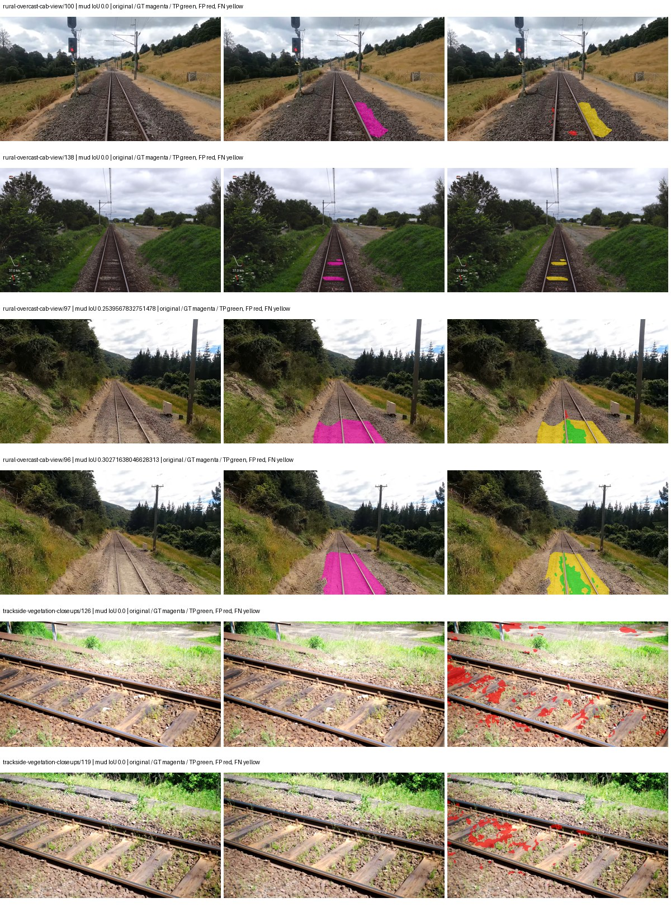

Examples are two lowest and two highest mud-IoU positive images, plus up to two negative images with the most false-positive mud pixels. They are targeted diagnostic examples, not random samples. Green: true positive; red: false positive; yellow: false negative. Full predictions remain on HDRFS.

### Validation tracking

| Logged step | Overall mIoU (%) | Mud IoU (%) |
| --- | --- | --- |
| 254 | 25.40 | 0.00 |
| 508 | 25.67 | 7.77 |
| 763 | 30.93 | 6.17 |
| 1017 | 30.50 | 4.94 |
| 1272 | 31.35 | 5.29 |
| 1527 | 31.97 | 3.89 |
| 1781 | 31.61 | 4.50 |

All retained scalar curves, including training loss and per-class IoU, are in record.json. Observed best mud on a curve is not necessarily a retained checkpoint: the pilot saved its selection-metric-best and final checkpoints. Step logging and checkpoint global_step may differ by one.

### Stopping and checkpoint provenance

```json
{
  "stopping": {
    "actual_steps": 1781,
    "maximum_steps": 4000,
    "min_delta": 0.001,
    "monitor": "val_iou/mud-pumping",
    "patience": 5,
    "reason": "validation_plateau"
  },
  "checkpoints": {
    "best": {
      "path": "/data/izadia1/projects/segmentary-runs/paul-test-rtis/mud-fullstats-v1-20260906-r2/future-runs/native_resnet18_fpn_fcn--cityscapes_to_railsem19_to_rtis--seed-2_seed2/rtis/best.ckpt",
      "sha256": "11435673a8f2f9ccfc34412f07e8c579f3579a2b7c10c6d94893d6cca5174e70",
      "global_step": 509,
      "bytes": 202363801
    },
    "final": {
      "path": "/data/izadia1/projects/segmentary-runs/paul-test-rtis/mud-fullstats-v1-20260906-r2/future-runs/native_resnet18_fpn_fcn--cityscapes_to_railsem19_to_rtis--seed-2_seed2/rtis/last.ckpt",
      "sha256": "aa48abe5450c1dbb9e5d4e67fe8b8b6f472f4df9d9d25f631517ef8db9c95891",
      "global_step": 1781,
      "bytes": 202358681
    }
  },
  "cleanup_error": null
}
```

### Resolved training, initialization and evaluation settings

The optimizer block is the base configuration. Stage LR scales are applied at runtime, and stage warmup is capped at min(base warmup, floor(stage budget / 10), stage budget - 1): 400 steps for this 4,000-step pilot. Model-internal native input grids may differ from augmentation crops (EoMT uses its 640 grid).

```json
{
  "name": "native_resnet18_fpn_fcn--cityscapes_to_railsem19_to_rtis--seed-2",
  "model": {
    "arch": "native",
    "checkpoint": null,
    "tuning": "full",
    "head": "unified_head",
    "lora_r": 16,
    "lora_alpha": 32,
    "lora_dropout": 0.05,
    "lora_targets": [],
    "drop_path": null,
    "revision": null,
    "subfolder": null,
    "local_files_only": false,
    "trust_remote_code": false,
    "backbone_path": null,
    "head_paths": [],
    "classifier_path": null,
    "inactive_parameter_paths": [],
    "smp_arch": null,
    "encoder_name": null,
    "encoder_weights": null,
    "native": {
      "task": "multiclass",
      "backbone": {
        "kind": "timm",
        "name": "resnet18.a1_in1k",
        "weights": "pretrained",
        "out_indices": [
          1,
          2,
          3,
          4
        ],
        "in_channels": 3
      },
      "neck": {
        "kind": "fpn",
        "out_channels": 128,
        "num_outputs": 4,
        "norm": "group",
        "activation": "relu"
      },
      "head": {
        "kind": "fcn",
        "in_indices": [
          0,
          1,
          2,
          3
        ],
        "channels": 128,
        "num_convs": 2,
        "kernel_size": 3,
        "dilation": 1,
        "dropout": 0.1,
        "norm": "group",
        "activation": "relu"
      },
      "auxiliary_heads": []
    },
    "batch_norm_momentum": null
  },
  "space": "paul-test-rtis",
  "taxonomy_root": "/data/izadia1/projects/segmentary-rtis-fullstats-066afb2/taxonomy",
  "output_root": "/data/izadia1/projects/segmentary-runs/paul-test-rtis/mud-fullstats-v1-20260906-r2/future-runs",
  "optim": {
    "backbone_lr": 0.0001,
    "head_lr_mult": 10.0,
    "weight_decay": 0.05,
    "llrd": 1.0,
    "warmup_iters": 1500,
    "warmup_ratio": 1e-06,
    "poly_power": 0.9,
    "min_lr_ratio": 0.0,
    "betas": [
      0.9,
      0.999
    ],
    "grad_clip": 1.0
  },
  "train": {
    "iters": 4000,
    "batch_size": 2,
    "accum": 8,
    "num_workers": 2,
    "precision": "bf16-mixed",
    "ema_decay": 0.9998,
    "val_every": 250,
    "ckpt_every": 500,
    "selection_metric": "val_iou/mud-pumping",
    "early_stopping_patience": 5,
    "early_stopping_min_delta": 0.001,
    "seed": 2,
    "devices": 1
  },
  "eval": {
    "sliding_window": true,
    "window": [
      1024,
      1024
    ],
    "stride": [
      768,
      768
    ],
    "batch_size": 1,
    "num_workers": 2,
    "tta_scales": [],
    "tta_flip": false,
    "threshold": 0.5,
    "boundary_tolerance_frac": 0.0075,
    "save_confusion": true
  },
  "loss": {
    "task": "multiclass",
    "activation": "auto",
    "terms": [],
    "aux": "none",
    "aux_weight": 0.0,
    "ce_weight": 1.0,
    "label_smoothing": 0.0,
    "class_weights": null,
    "query": null
  },
  "aug": {
    "crop": [
      1024,
      1024
    ],
    "scale_min": 0.5,
    "scale_max": 2.0,
    "hflip_p": 0.5,
    "color_jitter_p": 0.5,
    "brightness": 0.25,
    "contrast": 0.25,
    "saturation": 0.25,
    "hue": 0.05
  },
  "stages": [
    {
      "name": "rtis",
      "data": [
        {
          "name": "paul-test-rtis",
          "root": "/data/izadia1/datasets/paul-test-rtis",
          "variant": null,
          "split_file": "splits.json",
          "train_split": "train",
          "val_split": "val",
          "limit": null,
          "loader": "folder",
          "mapping": "paul-test-rtis",
          "loader_options": {
            "require_groups": true
          }
        }
      ],
      "iters": null,
      "lr_scale": 0.1,
      "head_group_lr_scale": 1.0,
      "init_from": "/data/izadia1/projects/segmentary-runs/all-model-city-rail-seed0-rail20-b9eb3e1/jobs/native_resnet18_fpn_fcn--cityscapes_to_railsem19--seed-0/attempt-001/train/native_resnet18_fpn_fcn--cityscapes_to_railsem19_seed0/railsem19/last.ckpt",
      "reset_head": true,
      "freeze": null,
      "sample_weights": null
    }
  ]
}
```

### Hardware and software provenance

```json
{
  "training": {
    "cuda_available": true,
    "cuda_visible_devices": "2",
    "cudnn": 91900,
    "driver_version": "570.133.20",
    "gpu_count": 1,
    "gpu_names": [
      "NVIDIA L40S"
    ],
    "hostname": "hdrfs-app-001",
    "input_normalization": {
      "channel_order": "rgb",
      "mean": [
        0.485,
        0.456,
        0.406
      ],
      "source": "timm_pretrained_cfg",
      "std": [
        0.229,
        0.224,
        0.225
      ]
    },
    "model_origins": [
      {
        "hf_commit": null,
        "hf_name_or_path": null,
        "module": "backbone",
        "timm_pretrained": {
          "architecture": "resnet18",
          "hf_hub_id": "timm/resnet18.a1_in1k",
          "tag": "a1_in1k",
          "url": "https://github.com/huggingface/pytorch-image-models/releases/download/v0.1-rsb-weights/resnet18_a1_0-d63eafa0.pth"
        }
      },
      {
        "hf_commit": null,
        "hf_name_or_path": null,
        "module": "backbone.model",
        "timm_pretrained": {
          "architecture": "resnet18",
          "hf_hub_id": "timm/resnet18.a1_in1k",
          "tag": "a1_in1k",
          "url": "https://github.com/huggingface/pytorch-image-models/releases/download/v0.1-rsb-weights/resnet18_a1_0-d63eafa0.pth"
        }
      }
    ],
    "model_parameter_count": 12631253,
    "packages": {
      "albumentations": "2.0.8",
      "lightning": "2.6.5",
      "numpy": "2.4.4",
      "segmentary": "0.1.0",
      "segmentation-models-pytorch": "0.5.0",
      "timm": "1.0.28",
      "torch": "2.11.0+cu128",
      "torchvision": "0.26.0+cu128",
      "transformers": "5.15.0"
    },
    "platform": "Linux-5.15.0-139-generic-x86_64-with-glibc2.35",
    "python": "3.11.15",
    "torch": "2.11.0+cu128",
    "torch_cuda": "12.8",
    "trainable_parameter_count": 12631253,
    "training_stop": {
      "actual_steps": 1781,
      "maximum_steps": 4000,
      "min_delta": 0.001,
      "monitor": "val_iou/mud-pumping",
      "patience": 5,
      "reason": "validation_plateau"
    },
    "validation_weights": "raw"
  },
  "evaluation": {
    "cuda_available": true,
    "cuda_visible_devices": "2",
    "cudnn": 91900,
    "driver_version": "570.133.20",
    "gpu_count": 1,
    "gpu_names": [
      "NVIDIA L40S"
    ],
    "hostname": "hdrfs-app-001",
    "input_normalization": {
      "channel_order": "rgb",
      "mean": [
        0.485,
        0.456,
        0.406
      ],
      "source": "timm_pretrained_cfg",
      "std": [
        0.229,
        0.224,
        0.225
      ]
    },
    "packages": {
      "albumentations": "2.0.8",
      "lightning": "2.6.5",
      "numpy": "2.4.4",
      "segmentary": "0.1.0",
      "segmentation-models-pytorch": "0.5.0",
      "timm": "1.0.28",
      "torch": "2.11.0+cu128",
      "torchvision": "0.26.0+cu128",
      "transformers": "5.15.0"
    },
    "platform": "Linux-5.15.0-139-generic-x86_64-with-glibc2.35",
    "python": "3.11.15",
    "torch": "2.11.0+cu128",
    "torch_cuda": "12.8"
  }
}
```
