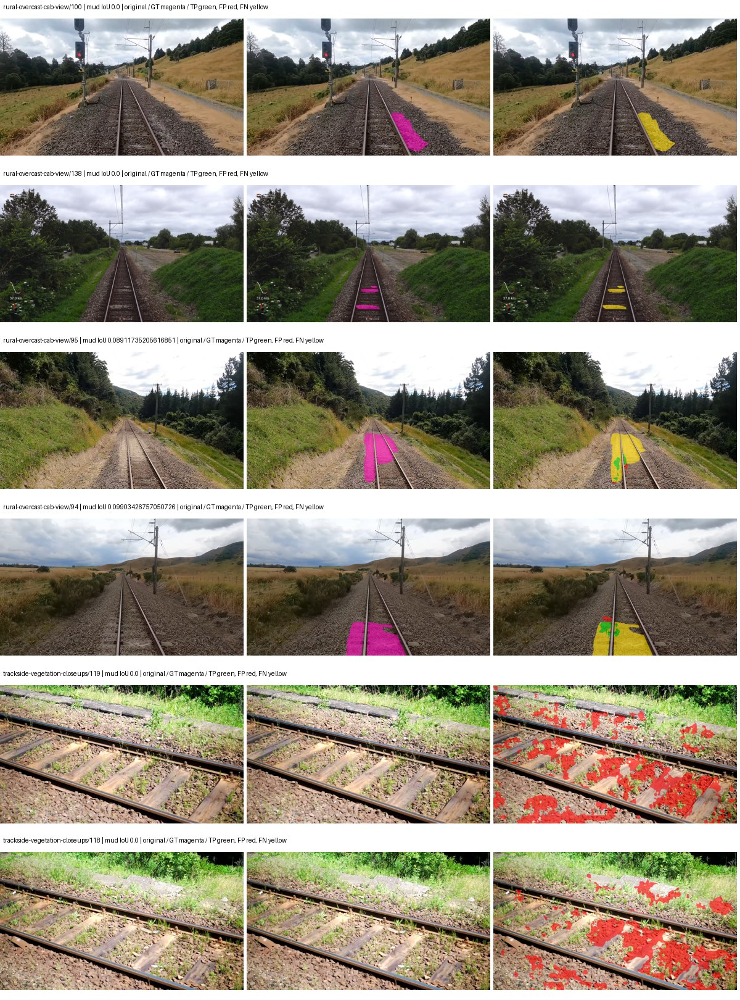
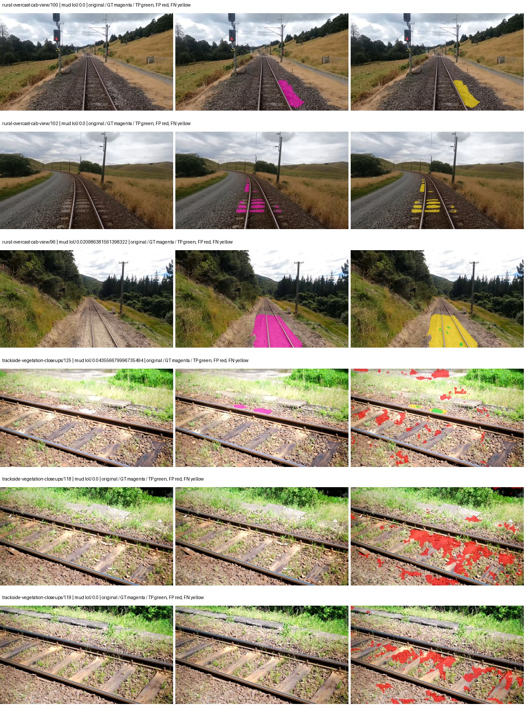
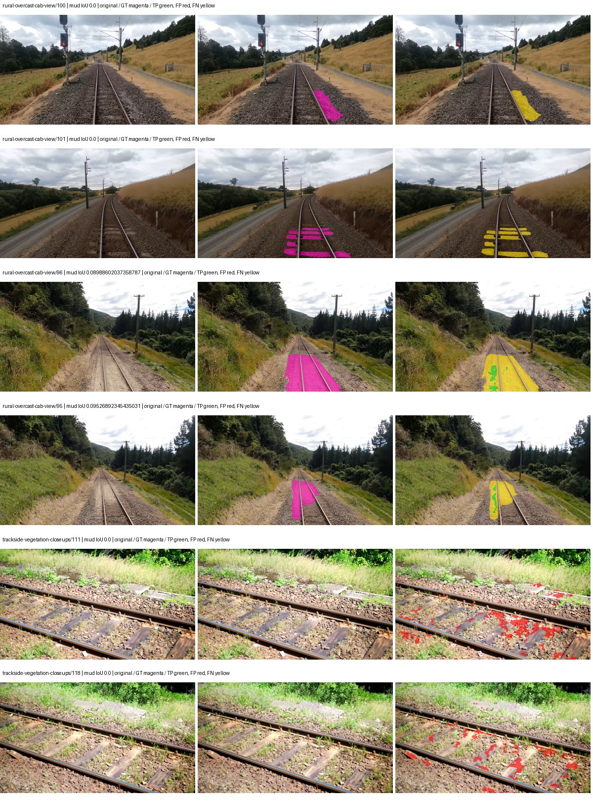
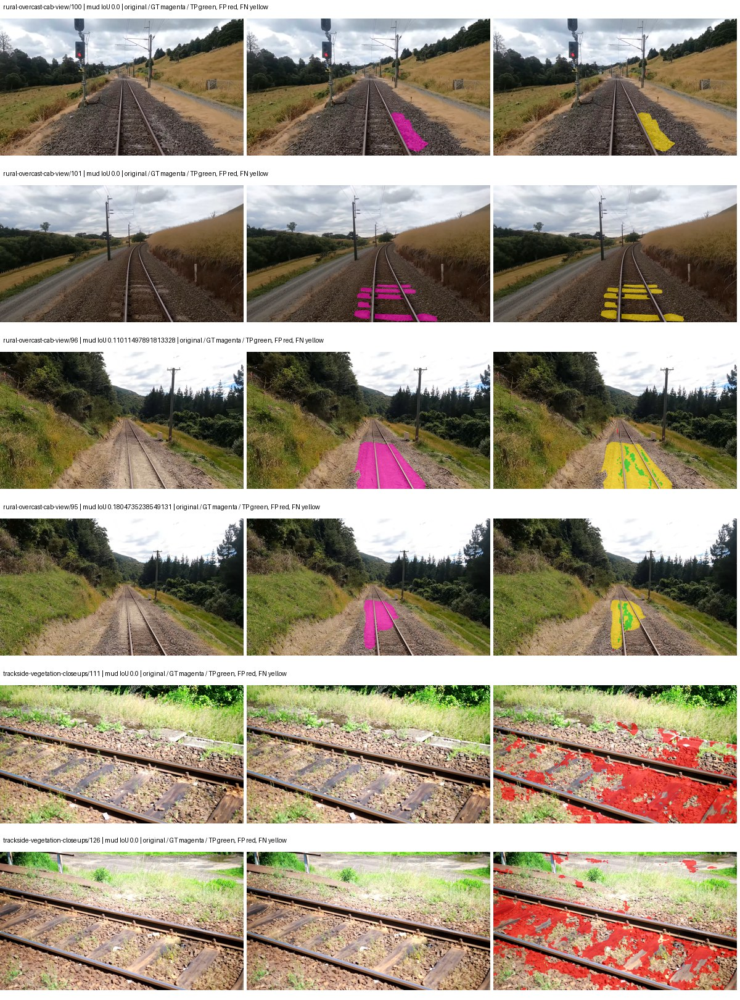
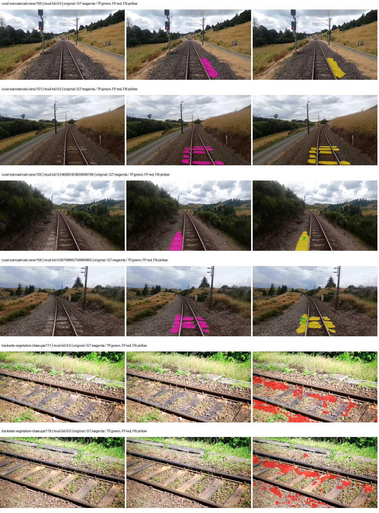
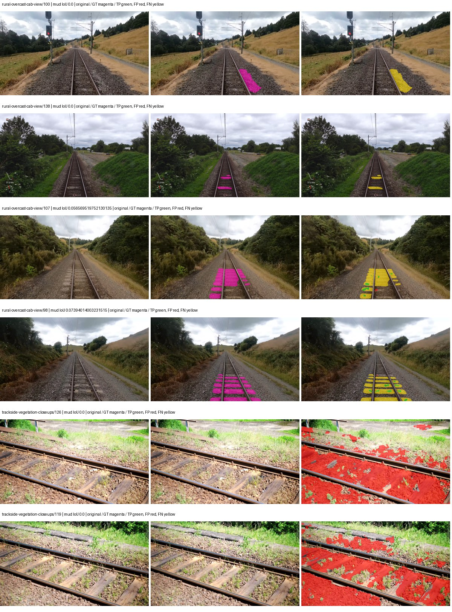
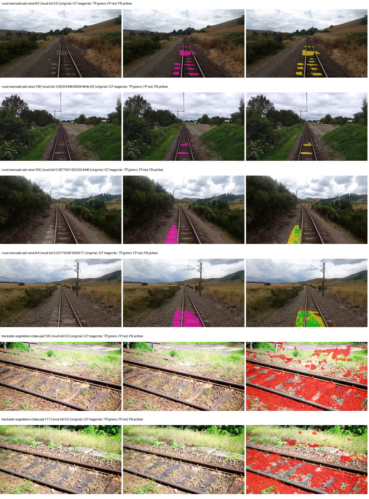

# native_resnet18_fpn_segformer_aux — paul-test-rtis

[RTIS comparison](../../README.md) · [Full model records](record.json)

Primary selection and early stopping: **mud-pumping validation IoU**. A job is complete only after full statistics and isolated profiling are verified.

| Model | Initialization path | Seed | Status | Steps | Best step | Mud IoU (%) | Mud precision (%) | Mud recall (%) | Final mud IoU (trainer val, %) | mIoU (%) | Fixed GT-class mIoU (%) |
| --- | --- | --- | --- | --- | --- | --- | --- | --- | --- | --- | --- |
| native_resnet18_fpn_segformer_aux | rtis_only | 0 | completed | 1527 | 1527 | 0.62 | 1.27 | 1.20 | 0.62 | 24.12 | 28.14 |
| native_resnet18_fpn_segformer_aux | rtis_only | 1 | completed | 2545 | 1272 | 1.30 | 2.05 | 3.45 | 0.24 | 22.92 | 26.75 |
| native_resnet18_fpn_segformer_aux | rtis_only | 2 | completed | 2290 | 1018 | 0.50 | 1.21 | 0.86 | 0.49 | 22.08 | 25.76 |
| native_resnet18_fpn_segformer_aux | cityscapes_to_rtis | 0 | completed | 3818 | 2545 | 1.58 | 5.59 | 2.16 | 0.67 | 29.13 | 33.99 |
| native_resnet18_fpn_segformer_aux | cityscapes_to_rtis | 1 | completed | 3054 | 1781 | 1.86 | 2.79 | 5.26 | 0.57 | 24.33 | 28.38 |
| native_resnet18_fpn_segformer_aux | cityscapes_to_rtis | 2 | training | 3849 | — | — | — | — | — | — | — |
| native_resnet18_fpn_segformer_aux | railsem19_to_rtis | 0 | completed | 2800 | 1527 | 1.12 | 2.25 | 2.17 | 0.04 | 36.37 | 42.43 |
| native_resnet18_fpn_segformer_aux | railsem19_to_rtis | 1 | evaluating | 3309 | — | — | — | — | — | — | — |
| native_resnet18_fpn_segformer_aux | railsem19_to_rtis | 2 | completed | 1781 | 509 | 0.70 | 0.84 | 3.85 | 0.39 | 26.67 | 31.12 |
| native_resnet18_fpn_segformer_aux | cityscapes_to_railsem19_to_rtis | 0 | completed | 2036 | 763 | 2.61 | 3.15 | 13.22 | 1.44 | 28.61 | 33.38 |
| native_resnet18_fpn_segformer_aux | cityscapes_to_railsem19_to_rtis | 1 | training | 2999 | — | — | — | — | — | — | — |
| native_resnet18_fpn_segformer_aux | cityscapes_to_railsem19_to_rtis | 2 | training | 2199 | — | — | — | — | — | — | — |

Training: 220 images. Validation: 37 images. Test: 50 held out. Seeds: [0, 1, 2]. Seed variation measures optimization variability, not independent-recording uncertainty. Historical source checkpoints stay fixed across adaptation seeds.

Training code: `066afb2626398b7be59d4d19f5a0e4644fd59adc`. Split SHA-256: `71fef8292610c352da0709fe3bd030f3bcc18f97560394835f4b22826463b83d`.

## rtis_only — seed 0

Status: **completed**. Started: 2026-09-06T21:42:42.240170+00:00. Finished: 2026-09-06T22:00:51.490832+00:00.

Recipe pretrained initializer: `{"arch": "native", "backbone_path": null, "batch_norm_momentum": null, "checkpoint": null, "classifier_path": null, "drop_path": null, "encoder_name": null, "encoder_weights": null, "head": "unified_head", "head_paths": [], "inactive_parameter_paths": [], "local_files_only": false, "lora_alpha": 32, "lora_dropout": 0.05, "lora_r": 16, "lora_targets": [], "native": {"auxiliary_heads": [{"head": {"activation": "relu", "channels": 64, "dilation": 1, "dropout": 0.1, "in_indices": [2], "kernel_size": 3, "kind": "fcn", "norm": "group", "num_convs": 1}, "loss_weight": 0.4, "name": "aux_s16"}], "backbone": {"in_channels": 3, "kind": "timm", "name": "resnet18.a1_in1k", "out_indices": [1, 2, 3, 4], "weights": "pretrained"}, "head": {"activation": "relu", "channels": 128, "dropout": 0.1, "in_indices": [0, 1, 2, 3], "kind": "segformer", "norm": "group"}, "neck": {"activation": "relu", "kind": "fpn", "norm": "group", "num_outputs": 4, "out_channels": 128}, "task": "multiclass"}, "revision": null, "smp_arch": null, "subfolder": null, "trust_remote_code": false, "tuning": "full"}`.

`rtis_only` uses the recipe initializer, which may include pretrained segmentation components. Transfer paths load the exact historical source checkpoint below and reset the classifier; they do not reset all query/decoder features.

Source checkpoint: `Recipe pretrained initialization`.

Config SHA-256: `6afa39b730639ca63e62455e3b34e589c8cfc0ede1ba59f42878d437bea3bed6`. Weights used for validation: `raw`.

### Mud-pumping and aggregate quality

| Metric | Selected checkpoint | Final training validation |
| --- | --- | --- |
| Mud IoU | 0.62 | 0.62 |
| Mud precision | 1.27 | 1.27 |
| Mud recall | 1.20 | 1.19 |
| Mud Dice/F1 | 1.23 | 1.23 |
| mIoU | 24.12 | 24.12 |
| Mean accuracy | 34.94 | 34.94 |
| Mean precision | 40.82 | 40.83 |
| Mean Dice | 31.17 | 31.17 |
| Mean specificity | 98.85 | 98.85 |
| Pixel accuracy | 80.90 | 80.90 |
| Frequency-weighted IoU | 71.23 | 71.23 |
| Fixed GT-present class mIoU | 28.14 | 28.14 |
| Boundary F1 | 30.65 | 30.64 |

The selected checkpoint has independent evaluation evidence. Final values are the trainer's final validation record, not a new independent evaluation. mIoU averages classes with nonzero union, so false positives on absent classes can change its denominator. The fixed GT-class mean is supplementary and excludes absent classes; their false positives remain in the confusion matrix.

### Resource usage and timing

| Measurement | Value |
| --- | --- |
| Peak training VRAM, retained training invocation (GiB) | 7.76 |
| Peak evaluation VRAM (GiB) | 6.87 |
| Retained training invocation wall time (seconds) | 965.01 |
| Retained training invocation GPU-hours (one GPU) | 0.27 |
| Evaluation wall time (seconds) | 11.88 |
| Full evaluation pipeline images/second | 3.11 |
| Best full-state checkpoint (MiB) | 184.91 |
| Final full-state checkpoint (MiB) | 184.90 |
| Audited periodic checkpoints removed (GiB) | 0.54 |

VRAM uses the recorded allocator high-water mark; it is not total device usage including CUDA context. Resumed jobs' retained training invocation times and peaks are **not whole-campaign totals**. Earlier invocation resource records are not reconstructed here. Evaluation throughput includes loader, sliding-window inference and metrics; it is not model-only latency/FPS. Missing measurements are shown as —, never inferred from another dataset's run.

### Standardized inference performance

Dedicated model-only profiling waits for an idle worker-locked L40S: BF16, batch 1, 1024x1024, 20 warmup and 100 CUDA-event-timed public forwards. It excludes loading, preprocessing, tiling and metrics.

| Status | Parameters | Weight MiB | FPS | p50 ms | p95 ms | Peak reserved GiB |
| --- | --- | --- | --- | --- | --- | --- |
| complete | 12100522 | 46.16 | 255.77 | 3.86 | 4.24 | 0.61 |

```json
{
  "schema_version": 1,
  "model_id": "native_resnet18_fpn_segformer_aux",
  "measured_at": "2026-09-06T22:00:49+00:00",
  "status": "complete",
  "benchmark_scope": "rtis_selected_checkpoint_model_only",
  "applies_to": [
    "native_resnet18_fpn_segformer_aux--rtis_only--seed-0"
  ],
  "source": {
    "campaign_git_sha": "066afb2626398b7be59d4d19f5a0e4644fd59adc",
    "git_dirty": false,
    "config_hash": "af82d456a76c",
    "resolved_config": "/data/izadia1/projects/segmentary-runs/paul-test-rtis/mud-fullstats-v1-20260906-r2/configs/native_resnet18_fpn_segformer_aux--rtis_only--seed-0.yaml",
    "config_sha256": "6afa39b730639ca63e62455e3b34e589c8cfc0ede1ba59f42878d437bea3bed6",
    "checkpoint_sha256": "6f9ac48e2bd40ae7158366d59deb889301e30246e8faaa1599f1b17b2a43b27b",
    "checkpoint_global_step": 1527,
    "checkpoint_bytes": 193887925,
    "checkpoint_kind": "resume checkpoint with optimizer and EMA state",
    "weights": "raw",
    "measured_checkpoint_job_id": "native_resnet18_fpn_segformer_aux--rtis_only--seed-0",
    "result_sha256": "63f04453312d8562a936ba10c33a0273ace0ac061e8a64d280cbea3e151265c0",
    "result_git_sha": "066afb2626398b7be59d4d19f5a0e4644fd59adc",
    "result_stage": "eval:paul-test-rtis:val",
    "result_seed": 0
  },
  "hardware": {
    "gpu_name": "NVIDIA L40S",
    "gpu_uuid": "GPU-fc5dde96-210d-0afa-ac74-7f88477d622b",
    "logical_device": "cuda:0",
    "physical_visibility_token": "4",
    "compute_capability": [
      8,
      9
    ],
    "total_memory_bytes": 47677177856
  },
  "model": {
    "parameter_count": 12100522,
    "trainable_parameter_count": 12100522,
    "resident_parameter_bytes": 48402088,
    "parameter_dtype_counts": {
      "float32": 12100522
    }
  },
  "contract": {
    "backend": "pytorch",
    "precision": "bf16_autocast",
    "batch_size": 1,
    "input_shape_nchw": [
      1,
      3,
      1024,
      1024
    ],
    "warmup_iterations": 20,
    "measured_iterations": 100,
    "timing": "per-forward CUDA events with end-event synchronization",
    "includes_preprocessing": false,
    "includes_data_loader": false,
    "includes_sliding_window": false,
    "input_resident_on_gpu": true,
    "model_only": true,
    "entrypoint": "public model(image) dense-logits forward"
  },
  "measurements": {
    "latency": {
      "p50_ms": 3.862048029899597,
      "p95_ms": 4.2391441583633425,
      "mean_ms": 3.9098377656936645,
      "minimum_ms": 3.8307840824127197,
      "maximum_ms": 4.329472064971924,
      "fps": 255.7650879467079,
      "raw_ms": [
        3.9874560832977295,
        3.8604800701141357,
        3.8533120155334473,
        3.854304075241089,
        3.8851521015167236,
        3.87174391746521,
        4.23740816116333,
        3.9290881156921387,
        3.875839948654175,
        3.862528085708618,
        3.843071937561035,
        4.329472064971924,
        4.297728061676025,
        3.8492159843444824,
        3.838047981262207,
        3.848191976547241,
        3.842047929763794,
        3.8359038829803467,
        3.875839948654175,
        3.8830080032348633,
        3.8789119720458984,
        3.862528085708618,
        3.8553600311279297,
        3.8460159301757812,
        3.8533120155334473,
        3.8533120155334473,
        3.895296096801758,
        3.867647886276245,
        4.305920124053955,
        4.139008045196533,
        4.237311840057373,
        3.8932480812072754,
        3.915776014328003,
        3.872767925262451,
        3.848191976547241,
        3.8492159843444824,
        3.842047929763794,
        3.8677120208740234,
        3.84716796875,
        3.8492159843444824,
        3.837951898574829,
        3.8440959453582764,
        3.865600109100342,
        4.068352222442627,
        3.92192006111145,
        3.9506239891052246,
        3.8759679794311523,
        3.8480958938598633,
        3.836927890777588,
        3.8307840824127197,
        3.831808090209961,
        3.836927890777588,
        3.8501760959625244,
        3.941375970840454,
        3.842047929763794,
        3.836927890777588,
        3.846143960952759,
        4.186111927032471,
        3.8748159408569336,
        3.8553600311279297,
        3.8399999141693115,
        3.837951898574829,
        3.84716796875,
        3.8686718940734863,
        4.1062397956848145,
        4.31820821762085,
        3.8492159843444824,
        3.8492159843444824,
        3.891200065612793,
        3.8389759063720703,
        3.882944107055664,
        3.8635520935058594,
        3.8492159843444824,
        3.8502399921417236,
        3.8440959453582764,
        3.8584320545196533,
        3.931135892868042,
        3.8604800701141357,
        3.8696959018707275,
        3.857408046722412,
        3.892224073410034,
        4.000768184661865,
        4.272128105163574,
        4.2188801765441895,
        3.862528085708618,
        3.8594560623168945,
        3.861567974090576,
        3.8533120155334473,
        3.8543360233306885,
        3.926016092300415,
        3.9157121181488037,
        3.8737919330596924,
        3.8635520935058594,
        3.867647886276245,
        3.8584320545196533,
        3.8440959453582764,
        3.8645761013031006,
        3.8748159408569336,
        3.8471360206604004,
        3.836927890777588
      ],
      "percentile_method": "numpy linear interpolation"
    },
    "peak_reserved_bytes": 656408576,
    "memory_kind": "pytorch_cuda_allocator_peak_reserved_excluding_context",
    "benchmark_wall_clock_s": 10.455071285367012
  },
  "started_at": "2026-09-06T22:00:38+00:00",
  "finished_at": "2026-09-06T22:00:49+00:00",
  "environment": {
    "hostname": "hdrfs-app-001",
    "python": "3.11.15",
    "platform": "Linux-5.15.0-139-generic-x86_64-with-glibc2.35",
    "torch": "2.11.0+cu128",
    "torch_cuda": "12.8",
    "cudnn": 91900,
    "driver_version": "570.133.20",
    "cuda_available": true,
    "gpu_count": 1,
    "gpu_names": [
      "NVIDIA L40S"
    ],
    "cuda_visible_devices": "4",
    "packages": {
      "segmentary": "0.1.0",
      "torch": "2.11.0+cu128",
      "torchvision": "0.26.0+cu128",
      "transformers": "5.15.0",
      "timm": "1.0.28",
      "segmentation-models-pytorch": "0.5.0",
      "albumentations": "2.0.8",
      "lightning": "2.6.5",
      "numpy": "2.4.4"
    }
  }
}
```

### Per-class validation results

| Class | GT pixels | IoU (%) | Precision (%) | Recall (%) | Dice (%) | Boundary F1 (%) |
| --- | --- | --- | --- | --- | --- | --- |
| car | 29664 | 4.92 | 42.00 | 5.28 | 9.38 | 31.42 |
| construction | 311585 | 34.63 | 50.88 | 52.02 | 51.45 | 46.58 |
| fence | 265137 | 9.31 | 26.65 | 12.51 | 17.03 | 25.35 |
| mud-pumping | 1226250 | 0.62 | 1.27 | 1.20 | 1.23 | 2.23 |
| on-rails | 0 | 0.00 | 0.00 | — | 0.00 | 0.00 |
| person | 0 | 0.00 | 0.00 | — | 0.00 | 0.00 |
| pole | 628038 | 57.29 | 71.84 | 73.87 | 72.84 | 83.24 |
| rail-embedded | 16799 | 5.65 | 15.85 | 8.08 | 10.70 | 10.40 |
| rail-raised | 2969797 | 67.93 | 74.83 | 88.05 | 80.91 | 84.42 |
| rail-track | 6323197 | 33.26 | 65.59 | 40.30 | 49.92 | 48.83 |
| road | 1048831 | 1.51 | 8.18 | 1.82 | 2.98 | 6.20 |
| sidewalk | 1297367 | 8.44 | 86.50 | 8.55 | 15.56 | 11.14 |
| sky | 19121606 | 96.67 | 99.40 | 97.24 | 98.31 | 86.64 |
| standing-water | 95802 | 0.03 | 0.07 | 0.04 | 0.05 | 0.49 |
| terrain | 39239306 | 85.69 | 90.11 | 94.58 | 92.29 | 53.47 |
| trackbed | 10643081 | 45.98 | 52.81 | 78.04 | 63.00 | 41.62 |
| traffic-light | 19510 | 18.38 | 44.11 | 23.96 | 31.05 | 33.30 |
| traffic-sign | 13285 | 4.79 | 30.97 | 5.37 | 9.15 | 15.17 |
| tram-track | 56179 | 1.15 | 33.33 | 1.18 | 2.28 | 14.15 |
| truck | 0 | 0.00 | 0.00 | — | 0.00 | 0.00 |
| vegetation-overgrowth | 5901821 | 30.24 | 62.76 | 36.86 | 46.44 | 49.10 |

### Full-run accounting

| Measurement | Value |
| --- | --- |
| Full GPU-reserved wall seconds, all recorded worker attempts | 1089.26 |
| Full reserved GPU-hours | 0.30 |
| Whole-run timing complete | True |

| Phase | Wall seconds including failed attempts |
| --- | --- |
| training | 971.99 |
| diagnostics | 79.88 |
| performance | 16.97 |

GPU-reserved time includes model loading, training, validation, collection, profiling, checkpoint I/O and orchestration while the worker owns one GPU. It is not GPU kernel-active time. Phase timings and sampled device memory/power/utilization are retained separately; sampled device memory is not the allocator high-water mark.

### Train/validation and raw/EMA diagnostics

| Checkpoint / weights / split | Images | Mud IoU (%) | Mud precision (%) | Mud recall (%) |
| --- | --- | --- | --- | --- |
| best-auto-train / raw | 220 | 86.91 | 96.03 | 90.16 |
| best-auto-val / raw | 37 | 0.62 | 1.27 | 1.20 |
| best-alternate-val / ema | 37 | 0.20 | 0.25 | 1.02 |
| final-auto-val / raw | 37 | 0.62 | 1.27 | 1.20 |

Train uses the evaluation transform without augmentation. Compare mud train/validation metrics for the same selected weights. Alternate EMA on running-stat BatchNorm is explicitly uncalibrated and is diagnostic only. Score-threshold curves use uncalibrated normalized scores and are pixel-level diagnostics, not event detection rates or a selected deployment operating point.

### Downloadable evidence

- best-auto-train: [per-image.csv](rtis_only--seed-0/best-auto-train/per-image.csv) · [per-image-confusion.json.gz](rtis_only--seed-0/best-auto-train/per-image-confusion.json.gz) · [groups.json](rtis_only--seed-0/best-auto-train/groups.json) · [mud-score-curves.json](rtis_only--seed-0/best-auto-train/mud-score-curves.json)
- best-auto-val: [per-image.csv](rtis_only--seed-0/best-auto-val/per-image.csv) · [per-image-confusion.json.gz](rtis_only--seed-0/best-auto-val/per-image-confusion.json.gz) · [groups.json](rtis_only--seed-0/best-auto-val/groups.json) · [mud-score-curves.json](rtis_only--seed-0/best-auto-val/mud-score-curves.json) · [examples.jpg](rtis_only--seed-0/best-auto-val/examples.jpg)
- best-alternate-val: [per-image.csv](rtis_only--seed-0/best-alternate-val/per-image.csv) · [per-image-confusion.json.gz](rtis_only--seed-0/best-alternate-val/per-image-confusion.json.gz) · [groups.json](rtis_only--seed-0/best-alternate-val/groups.json) · [mud-score-curves.json](rtis_only--seed-0/best-alternate-val/mud-score-curves.json)
- final-auto-val: [per-image.csv](rtis_only--seed-0/final-auto-val/per-image.csv) · [per-image-confusion.json.gz](rtis_only--seed-0/final-auto-val/per-image-confusion.json.gz) · [groups.json](rtis_only--seed-0/final-auto-val/groups.json) · [mud-score-curves.json](rtis_only--seed-0/final-auto-val/mud-score-curves.json)
- resources: [telemetry.csv](rtis_only--seed-0/resources/telemetry.csv)


Examples are two lowest and two highest mud-IoU positive images, plus up to two negative images with the most false-positive mud pixels. They are targeted diagnostic examples, not random samples. Green: true positive; red: false positive; yellow: false negative. Full predictions remain on HDRFS.

### Validation tracking

| Logged step | Overall mIoU (%) | Mud IoU (%) |
| --- | --- | --- |
| 254 | 19.42 | 0.61 |
| 508 | 20.22 | 0.14 |
| 763 | 20.56 | 0.46 |
| 1017 | 21.76 | 0.13 |
| 1272 | 22.95 | 0.40 |
| 1527 | 24.12 | 0.62 |

All retained scalar curves, including training loss and per-class IoU, are in record.json. Observed best mud on a curve is not necessarily a retained checkpoint: the pilot saved its selection-metric-best and final checkpoints. Step logging and checkpoint global_step may differ by one.

### Stopping and checkpoint provenance

```json
{
  "stopping": {
    "actual_steps": 1527,
    "maximum_steps": 4000,
    "min_delta": 0.001,
    "monitor": "val_iou/mud-pumping",
    "patience": 5,
    "reason": "validation_plateau"
  },
  "checkpoints": {
    "best": {
      "path": "/data/izadia1/projects/segmentary-runs/paul-test-rtis/mud-fullstats-v1-20260906-r2/future-runs/native_resnet18_fpn_segformer_aux--rtis_only--seed-0_seed0/rtis/best.ckpt",
      "sha256": "6f9ac48e2bd40ae7158366d59deb889301e30246e8faaa1599f1b17b2a43b27b",
      "global_step": 1527,
      "bytes": 193887925
    },
    "final": {
      "path": "/data/izadia1/projects/segmentary-runs/paul-test-rtis/mud-fullstats-v1-20260906-r2/future-runs/native_resnet18_fpn_segformer_aux--rtis_only--seed-0_seed0/rtis/last.ckpt",
      "sha256": "e0412b3f119fcd1609c3bd7a52b8b9e662669be2aec5e307c20b84e1fb534929",
      "global_step": 1527,
      "bytes": 193882229
    }
  },
  "cleanup_error": null
}
```

### Resolved training, initialization and evaluation settings

The optimizer block is the base configuration. Stage LR scales are applied at runtime, and stage warmup is capped at min(base warmup, floor(stage budget / 10), stage budget - 1): 400 steps for this 4,000-step pilot. Model-internal native input grids may differ from augmentation crops (EoMT uses its 640 grid).

```json
{
  "name": "native_resnet18_fpn_segformer_aux--rtis_only--seed-0",
  "model": {
    "arch": "native",
    "checkpoint": null,
    "tuning": "full",
    "head": "unified_head",
    "lora_r": 16,
    "lora_alpha": 32,
    "lora_dropout": 0.05,
    "lora_targets": [],
    "drop_path": null,
    "revision": null,
    "subfolder": null,
    "local_files_only": false,
    "trust_remote_code": false,
    "backbone_path": null,
    "head_paths": [],
    "classifier_path": null,
    "inactive_parameter_paths": [],
    "smp_arch": null,
    "encoder_name": null,
    "encoder_weights": null,
    "native": {
      "task": "multiclass",
      "backbone": {
        "kind": "timm",
        "name": "resnet18.a1_in1k",
        "weights": "pretrained",
        "out_indices": [
          1,
          2,
          3,
          4
        ],
        "in_channels": 3
      },
      "neck": {
        "kind": "fpn",
        "out_channels": 128,
        "num_outputs": 4,
        "norm": "group",
        "activation": "relu"
      },
      "head": {
        "kind": "segformer",
        "in_indices": [
          0,
          1,
          2,
          3
        ],
        "channels": 128,
        "dropout": 0.1,
        "norm": "group",
        "activation": "relu"
      },
      "auxiliary_heads": [
        {
          "name": "aux_s16",
          "loss_weight": 0.4,
          "head": {
            "kind": "fcn",
            "in_indices": [
              2
            ],
            "channels": 64,
            "num_convs": 1,
            "kernel_size": 3,
            "dilation": 1,
            "dropout": 0.1,
            "norm": "group",
            "activation": "relu"
          }
        }
      ]
    },
    "batch_norm_momentum": null
  },
  "space": "paul-test-rtis",
  "taxonomy_root": "/data/izadia1/projects/segmentary-rtis-fullstats-066afb2/taxonomy",
  "output_root": "/data/izadia1/projects/segmentary-runs/paul-test-rtis/mud-fullstats-v1-20260906-r2/future-runs",
  "optim": {
    "backbone_lr": 0.0001,
    "head_lr_mult": 10.0,
    "weight_decay": 0.05,
    "llrd": 1.0,
    "warmup_iters": 1500,
    "warmup_ratio": 1e-06,
    "poly_power": 0.9,
    "min_lr_ratio": 0.0,
    "betas": [
      0.9,
      0.999
    ],
    "grad_clip": 1.0
  },
  "train": {
    "iters": 4000,
    "batch_size": 2,
    "accum": 8,
    "num_workers": 2,
    "precision": "bf16-mixed",
    "ema_decay": 0.9998,
    "val_every": 250,
    "ckpt_every": 500,
    "selection_metric": "val_iou/mud-pumping",
    "early_stopping_patience": 5,
    "early_stopping_min_delta": 0.001,
    "seed": 0,
    "devices": 1
  },
  "eval": {
    "sliding_window": true,
    "window": [
      1024,
      1024
    ],
    "stride": [
      768,
      768
    ],
    "batch_size": 1,
    "num_workers": 2,
    "tta_scales": [],
    "tta_flip": false,
    "threshold": 0.5,
    "boundary_tolerance_frac": 0.0075,
    "save_confusion": true
  },
  "loss": {
    "task": "multiclass",
    "activation": "auto",
    "terms": [],
    "aux": "none",
    "aux_weight": 0.0,
    "ce_weight": 1.0,
    "label_smoothing": 0.0,
    "class_weights": null,
    "query": null
  },
  "aug": {
    "crop": [
      1024,
      1024
    ],
    "scale_min": 0.5,
    "scale_max": 2.0,
    "hflip_p": 0.5,
    "color_jitter_p": 0.5,
    "brightness": 0.25,
    "contrast": 0.25,
    "saturation": 0.25,
    "hue": 0.05
  },
  "stages": [
    {
      "name": "rtis",
      "data": [
        {
          "name": "paul-test-rtis",
          "root": "/data/izadia1/datasets/paul-test-rtis",
          "variant": null,
          "split_file": "splits.json",
          "train_split": "train",
          "val_split": "val",
          "limit": null,
          "loader": "folder",
          "mapping": "paul-test-rtis",
          "loader_options": {
            "require_groups": true
          }
        }
      ],
      "iters": null,
      "lr_scale": 1.0,
      "head_group_lr_scale": 1.0,
      "init_from": "pretrained",
      "reset_head": false,
      "freeze": null,
      "sample_weights": null
    }
  ]
}
```

### Hardware and software provenance

```json
{
  "training": {
    "cuda_available": true,
    "cuda_visible_devices": "4",
    "cudnn": 91900,
    "driver_version": "570.133.20",
    "gpu_count": 1,
    "gpu_names": [
      "NVIDIA L40S"
    ],
    "hostname": "hdrfs-app-001",
    "input_normalization": {
      "channel_order": "rgb",
      "mean": [
        0.485,
        0.456,
        0.406
      ],
      "source": "timm_pretrained_cfg",
      "std": [
        0.229,
        0.224,
        0.225
      ]
    },
    "model_origins": [
      {
        "hf_commit": null,
        "hf_name_or_path": null,
        "module": "backbone",
        "timm_pretrained": {
          "architecture": "resnet18",
          "hf_hub_id": "timm/resnet18.a1_in1k",
          "tag": "a1_in1k",
          "url": "https://github.com/huggingface/pytorch-image-models/releases/download/v0.1-rsb-weights/resnet18_a1_0-d63eafa0.pth"
        }
      },
      {
        "hf_commit": null,
        "hf_name_or_path": null,
        "module": "backbone.model",
        "timm_pretrained": {
          "architecture": "resnet18",
          "hf_hub_id": "timm/resnet18.a1_in1k",
          "tag": "a1_in1k",
          "url": "https://github.com/huggingface/pytorch-image-models/releases/download/v0.1-rsb-weights/resnet18_a1_0-d63eafa0.pth"
        }
      }
    ],
    "model_parameter_count": 12100522,
    "packages": {
      "albumentations": "2.0.8",
      "lightning": "2.6.5",
      "numpy": "2.4.4",
      "segmentary": "0.1.0",
      "segmentation-models-pytorch": "0.5.0",
      "timm": "1.0.28",
      "torch": "2.11.0+cu128",
      "torchvision": "0.26.0+cu128",
      "transformers": "5.15.0"
    },
    "platform": "Linux-5.15.0-139-generic-x86_64-with-glibc2.35",
    "python": "3.11.15",
    "torch": "2.11.0+cu128",
    "torch_cuda": "12.8",
    "trainable_parameter_count": 12100522,
    "training_stop": {
      "actual_steps": 1527,
      "maximum_steps": 4000,
      "min_delta": 0.001,
      "monitor": "val_iou/mud-pumping",
      "patience": 5,
      "reason": "validation_plateau"
    },
    "validation_weights": "raw"
  },
  "evaluation": {
    "cuda_available": true,
    "cuda_visible_devices": "4",
    "cudnn": 91900,
    "driver_version": "570.133.20",
    "gpu_count": 1,
    "gpu_names": [
      "NVIDIA L40S"
    ],
    "hostname": "hdrfs-app-001",
    "input_normalization": {
      "channel_order": "rgb",
      "mean": [
        0.485,
        0.456,
        0.406
      ],
      "source": "timm_pretrained_cfg",
      "std": [
        0.229,
        0.224,
        0.225
      ]
    },
    "packages": {
      "albumentations": "2.0.8",
      "lightning": "2.6.5",
      "numpy": "2.4.4",
      "segmentary": "0.1.0",
      "segmentation-models-pytorch": "0.5.0",
      "timm": "1.0.28",
      "torch": "2.11.0+cu128",
      "torchvision": "0.26.0+cu128",
      "transformers": "5.15.0"
    },
    "platform": "Linux-5.15.0-139-generic-x86_64-with-glibc2.35",
    "python": "3.11.15",
    "torch": "2.11.0+cu128",
    "torch_cuda": "12.8"
  }
}
```

## rtis_only — seed 1

Status: **completed**. Started: 2026-09-06T21:43:06.531986+00:00. Finished: 2026-09-06T22:11:04.595463+00:00.

Recipe pretrained initializer: `{"arch": "native", "backbone_path": null, "batch_norm_momentum": null, "checkpoint": null, "classifier_path": null, "drop_path": null, "encoder_name": null, "encoder_weights": null, "head": "unified_head", "head_paths": [], "inactive_parameter_paths": [], "local_files_only": false, "lora_alpha": 32, "lora_dropout": 0.05, "lora_r": 16, "lora_targets": [], "native": {"auxiliary_heads": [{"head": {"activation": "relu", "channels": 64, "dilation": 1, "dropout": 0.1, "in_indices": [2], "kernel_size": 3, "kind": "fcn", "norm": "group", "num_convs": 1}, "loss_weight": 0.4, "name": "aux_s16"}], "backbone": {"in_channels": 3, "kind": "timm", "name": "resnet18.a1_in1k", "out_indices": [1, 2, 3, 4], "weights": "pretrained"}, "head": {"activation": "relu", "channels": 128, "dropout": 0.1, "in_indices": [0, 1, 2, 3], "kind": "segformer", "norm": "group"}, "neck": {"activation": "relu", "kind": "fpn", "norm": "group", "num_outputs": 4, "out_channels": 128}, "task": "multiclass"}, "revision": null, "smp_arch": null, "subfolder": null, "trust_remote_code": false, "tuning": "full"}`.

`rtis_only` uses the recipe initializer, which may include pretrained segmentation components. Transfer paths load the exact historical source checkpoint below and reset the classifier; they do not reset all query/decoder features.

Source checkpoint: `Recipe pretrained initialization`.

Config SHA-256: `8cc8deb9b4b94c2897b6cf94ca70e1cdf8e06eb2d0a8a5abcc3526b9af0410f4`. Weights used for validation: `raw`.

### Mud-pumping and aggregate quality

| Metric | Selected checkpoint | Final training validation |
| --- | --- | --- |
| Mud IoU | 1.30 | 0.24 |
| Mud precision | 2.05 | 0.33 |
| Mud recall | 3.45 | 0.91 |
| Mud Dice/F1 | 2.57 | 0.48 |
| mIoU | 22.92 | 26.66 |
| Mean accuracy | 33.89 | 40.08 |
| Mean precision | 34.55 | 40.48 |
| Mean Dice | 29.53 | 34.37 |
| Mean specificity | 98.75 | 98.83 |
| Pixel accuracy | 80.33 | 79.55 |
| Frequency-weighted IoU | 70.24 | 71.43 |
| Fixed GT-present class mIoU | 26.75 | 31.11 |
| Boundary F1 | 27.98 | 31.88 |

The selected checkpoint has independent evaluation evidence. Final values are the trainer's final validation record, not a new independent evaluation. mIoU averages classes with nonzero union, so false positives on absent classes can change its denominator. The fixed GT-class mean is supplementary and excludes absent classes; their false positives remain in the confusion matrix.

### Resource usage and timing

| Measurement | Value |
| --- | --- |
| Peak training VRAM, retained training invocation (GiB) | 7.75 |
| Peak evaluation VRAM (GiB) | 6.87 |
| Retained training invocation wall time (seconds) | 1552.11 |
| Retained training invocation GPU-hours (one GPU) | 0.43 |
| Evaluation wall time (seconds) | 11.87 |
| Full evaluation pipeline images/second | 3.12 |
| Best full-state checkpoint (MiB) | 184.91 |
| Final full-state checkpoint (MiB) | 184.90 |
| Audited periodic checkpoints removed (GiB) | 0.90 |

VRAM uses the recorded allocator high-water mark; it is not total device usage including CUDA context. Resumed jobs' retained training invocation times and peaks are **not whole-campaign totals**. Earlier invocation resource records are not reconstructed here. Evaluation throughput includes loader, sliding-window inference and metrics; it is not model-only latency/FPS. Missing measurements are shown as —, never inferred from another dataset's run.

### Standardized inference performance

Dedicated model-only profiling waits for an idle worker-locked L40S: BF16, batch 1, 1024x1024, 20 warmup and 100 CUDA-event-timed public forwards. It excludes loading, preprocessing, tiling and metrics.

| Status | Parameters | Weight MiB | FPS | p50 ms | p95 ms | Peak reserved GiB |
| --- | --- | --- | --- | --- | --- | --- |
| complete | 12100522 | 46.16 | 248.01 | 3.95 | 4.51 | 0.61 |

```json
{
  "schema_version": 1,
  "model_id": "native_resnet18_fpn_segformer_aux",
  "measured_at": "2026-09-06T22:11:01+00:00",
  "status": "complete",
  "benchmark_scope": "rtis_selected_checkpoint_model_only",
  "applies_to": [
    "native_resnet18_fpn_segformer_aux--rtis_only--seed-1"
  ],
  "source": {
    "campaign_git_sha": "066afb2626398b7be59d4d19f5a0e4644fd59adc",
    "git_dirty": false,
    "config_hash": "b1f2f0dcd96f",
    "resolved_config": "/data/izadia1/projects/segmentary-runs/paul-test-rtis/mud-fullstats-v1-20260906-r2/configs/native_resnet18_fpn_segformer_aux--rtis_only--seed-1.yaml",
    "config_sha256": "8cc8deb9b4b94c2897b6cf94ca70e1cdf8e06eb2d0a8a5abcc3526b9af0410f4",
    "checkpoint_sha256": "ea8256ea56d3d51dbc1351e19ba60d372bf4a443afba15a107fa782a3fe28527",
    "checkpoint_global_step": 1272,
    "checkpoint_bytes": 193887797,
    "checkpoint_kind": "resume checkpoint with optimizer and EMA state",
    "weights": "raw",
    "measured_checkpoint_job_id": "native_resnet18_fpn_segformer_aux--rtis_only--seed-1",
    "result_sha256": "20ce865a49274dcaa2b5d02ae0fdb860df32e42428a047683cf24e8ef04c3c0c",
    "result_git_sha": "066afb2626398b7be59d4d19f5a0e4644fd59adc",
    "result_stage": "eval:paul-test-rtis:val",
    "result_seed": 1
  },
  "hardware": {
    "gpu_name": "NVIDIA L40S",
    "gpu_uuid": "GPU-d411d86a-6d1d-1967-55e7-9f9ec85d13f5",
    "logical_device": "cuda:0",
    "physical_visibility_token": "1",
    "compute_capability": [
      8,
      9
    ],
    "total_memory_bytes": 47677177856
  },
  "model": {
    "parameter_count": 12100522,
    "trainable_parameter_count": 12100522,
    "resident_parameter_bytes": 48402088,
    "parameter_dtype_counts": {
      "float32": 12100522
    }
  },
  "contract": {
    "backend": "pytorch",
    "precision": "bf16_autocast",
    "batch_size": 1,
    "input_shape_nchw": [
      1,
      3,
      1024,
      1024
    ],
    "warmup_iterations": 20,
    "measured_iterations": 100,
    "timing": "per-forward CUDA events with end-event synchronization",
    "includes_preprocessing": false,
    "includes_data_loader": false,
    "includes_sliding_window": false,
    "input_resident_on_gpu": true,
    "model_only": true,
    "entrypoint": "public model(image) dense-logits forward"
  },
  "measurements": {
    "latency": {
      "p50_ms": 3.94649600982666,
      "p95_ms": 4.506880211830139,
      "mean_ms": 4.032110104560852,
      "minimum_ms": 3.8338561058044434,
      "maximum_ms": 4.807680130004883,
      "fps": 248.00910046302238,
      "raw_ms": [
        4.122623920440674,
        4.007936000823975,
        4.459551811218262,
        4.376512050628662,
        3.983232021331787,
        4.159488201141357,
        4.635647773742676,
        4.495359897613525,
        3.9679999351501465,
        3.924992084503174,
        4.268032073974609,
        3.95468807220459,
        3.945472002029419,
        4.245503902435303,
        3.887104034423828,
        4.211711883544922,
        4.160607814788818,
        4.506624221801758,
        3.9976320266723633,
        3.984384059906006,
        4.2639360427856445,
        3.8942720890045166,
        3.8635520935058594,
        3.910655975341797,
        4.348927974700928,
        3.8778879642486572,
        4.619264125823975,
        3.997567892074585,
        4.034560203552246,
        3.9086720943450928,
        3.9915521144866943,
        4.028416156768799,
        4.244448184967041,
        4.511744022369385,
        4.3673601150512695,
        4.807680130004883,
        4.212736129760742,
        4.448256015777588,
        3.99564790725708,
        3.861504077911377,
        3.8451199531555176,
        3.8635520935058594,
        3.852288007736206,
        3.8440959453582764,
        3.87174391746521,
        3.876863956451416,
        3.84716796875,
        4.529151916503906,
        4.091904163360596,
        3.9475200176239014,
        4.249599933624268,
        3.955712080001831,
        4.321280002593994,
        4.064256191253662,
        3.9444479942321777,
        4.078591823577881,
        3.9014079570770264,
        3.8696959018707275,
        3.8451199531555176,
        3.8778879642486572,
        3.8543999195098877,
        3.8338561058044434,
        3.8645761013031006,
        3.848191976547241,
        3.8584320545196533,
        3.856384038925171,
        3.866624116897583,
        3.8522560596466064,
        3.857408046722412,
        3.8635520935058594,
        4.111423969268799,
        4.255743980407715,
        3.9188480377197266,
        4.002816200256348,
        4.024320125579834,
        3.8778879642486572,
        4.0366082191467285,
        3.907615900039673,
        3.8533120155334473,
        3.8543360233306885,
        3.859424114227295,
        3.851263999938965,
        4.2782721519470215,
        4.087808132171631,
        3.8533120155334473,
        3.8676159381866455,
        3.964927911758423,
        4.154367923736572,
        3.862528085708618,
        4.182112216949463,
        3.9577600955963135,
        3.8492159843444824,
        3.8624000549316406,
        3.852288007736206,
        3.859424114227295,
        3.862528085708618,
        3.87174391746521,
        3.8748159408569336,
        3.851263999938965,
        3.848191976547241
      ],
      "percentile_method": "numpy linear interpolation"
    },
    "peak_reserved_bytes": 656408576,
    "memory_kind": "pytorch_cuda_allocator_peak_reserved_excluding_context",
    "benchmark_wall_clock_s": 10.69931922852993
  },
  "started_at": "2026-09-06T22:10:51+00:00",
  "finished_at": "2026-09-06T22:11:01+00:00",
  "environment": {
    "hostname": "hdrfs-app-001",
    "python": "3.11.15",
    "platform": "Linux-5.15.0-139-generic-x86_64-with-glibc2.35",
    "torch": "2.11.0+cu128",
    "torch_cuda": "12.8",
    "cudnn": 91900,
    "driver_version": "570.133.20",
    "cuda_available": true,
    "gpu_count": 1,
    "gpu_names": [
      "NVIDIA L40S"
    ],
    "cuda_visible_devices": "1",
    "packages": {
      "segmentary": "0.1.0",
      "torch": "2.11.0+cu128",
      "torchvision": "0.26.0+cu128",
      "transformers": "5.15.0",
      "timm": "1.0.28",
      "segmentation-models-pytorch": "0.5.0",
      "albumentations": "2.0.8",
      "lightning": "2.6.5",
      "numpy": "2.4.4"
    }
  }
}
```

### Per-class validation results

| Class | GT pixels | IoU (%) | Precision (%) | Recall (%) | Dice (%) | Boundary F1 (%) |
| --- | --- | --- | --- | --- | --- | --- |
| car | 29664 | 0.00 | 0.00 | 0.00 | 0.00 | 0.00 |
| construction | 311585 | 25.16 | 29.38 | 63.66 | 40.20 | 30.60 |
| fence | 265137 | 6.58 | 18.43 | 9.29 | 12.35 | 16.41 |
| mud-pumping | 1226250 | 1.30 | 2.05 | 3.45 | 2.57 | 3.79 |
| on-rails | 0 | 0.00 | 0.00 | — | 0.00 | 0.00 |
| person | 0 | 0.00 | 0.00 | — | 0.00 | 0.00 |
| pole | 628038 | 52.29 | 80.35 | 59.96 | 68.67 | 83.10 |
| rail-embedded | 16799 | 0.00 | 0.00 | 0.00 | 0.00 | 0.00 |
| rail-raised | 2969797 | 68.45 | 79.29 | 83.35 | 81.27 | 86.22 |
| rail-track | 6323197 | 36.74 | 54.42 | 53.07 | 53.74 | 49.93 |
| road | 1048831 | 1.55 | 5.66 | 2.08 | 3.05 | 5.04 |
| sidewalk | 1297367 | 14.36 | 61.14 | 15.80 | 25.11 | 15.52 |
| sky | 19121606 | 95.46 | 99.32 | 96.09 | 97.68 | 85.95 |
| standing-water | 95802 | 0.72 | 0.87 | 4.02 | 1.43 | 4.33 |
| terrain | 39239306 | 83.74 | 85.40 | 97.72 | 91.15 | 47.85 |
| trackbed | 10643081 | 48.77 | 67.57 | 63.67 | 65.56 | 47.11 |
| traffic-light | 19510 | 19.44 | 37.19 | 28.94 | 32.55 | 31.86 |
| traffic-sign | 13285 | 3.87 | 27.50 | 4.31 | 7.45 | 27.54 |
| tram-track | 56179 | 0.00 | 0.00 | 0.00 | 0.00 | 0.00 |
| truck | 0 | 0.00 | 0.00 | — | 0.00 | 0.00 |
| vegetation-overgrowth | 5901821 | 22.99 | 77.08 | 24.67 | 37.38 | 52.32 |

### Full-run accounting

| Measurement | Value |
| --- | --- |
| Full GPU-reserved wall seconds, all recorded worker attempts | 1678.07 |
| Full reserved GPU-hours | 0.47 |
| Whole-run timing complete | True |

| Phase | Wall seconds including failed attempts |
| --- | --- |
| training | 1558.92 |
| diagnostics | 80.84 |
| performance | 17.71 |

GPU-reserved time includes model loading, training, validation, collection, profiling, checkpoint I/O and orchestration while the worker owns one GPU. It is not GPU kernel-active time. Phase timings and sampled device memory/power/utilization are retained separately; sampled device memory is not the allocator high-water mark.

### Train/validation and raw/EMA diagnostics

| Checkpoint / weights / split | Images | Mud IoU (%) | Mud precision (%) | Mud recall (%) |
| --- | --- | --- | --- | --- |
| best-auto-train / raw | 220 | 88.05 | 92.16 | 95.17 |
| best-auto-val / raw | 37 | 1.30 | 2.05 | 3.45 |
| best-alternate-val / ema | 37 | 0.18 | 0.28 | 0.47 |
| final-auto-val / raw | 37 | 0.24 | 0.33 | 0.91 |

Train uses the evaluation transform without augmentation. Compare mud train/validation metrics for the same selected weights. Alternate EMA on running-stat BatchNorm is explicitly uncalibrated and is diagnostic only. Score-threshold curves use uncalibrated normalized scores and are pixel-level diagnostics, not event detection rates or a selected deployment operating point.

### Downloadable evidence

- best-auto-train: [per-image.csv](rtis_only--seed-1/best-auto-train/per-image.csv) · [per-image-confusion.json.gz](rtis_only--seed-1/best-auto-train/per-image-confusion.json.gz) · [groups.json](rtis_only--seed-1/best-auto-train/groups.json) · [mud-score-curves.json](rtis_only--seed-1/best-auto-train/mud-score-curves.json)
- best-auto-val: [per-image.csv](rtis_only--seed-1/best-auto-val/per-image.csv) · [per-image-confusion.json.gz](rtis_only--seed-1/best-auto-val/per-image-confusion.json.gz) · [groups.json](rtis_only--seed-1/best-auto-val/groups.json) · [mud-score-curves.json](rtis_only--seed-1/best-auto-val/mud-score-curves.json) · [examples.jpg](rtis_only--seed-1/best-auto-val/examples.jpg)
- best-alternate-val: [per-image.csv](rtis_only--seed-1/best-alternate-val/per-image.csv) · [per-image-confusion.json.gz](rtis_only--seed-1/best-alternate-val/per-image-confusion.json.gz) · [groups.json](rtis_only--seed-1/best-alternate-val/groups.json) · [mud-score-curves.json](rtis_only--seed-1/best-alternate-val/mud-score-curves.json)
- final-auto-val: [per-image.csv](rtis_only--seed-1/final-auto-val/per-image.csv) · [per-image-confusion.json.gz](rtis_only--seed-1/final-auto-val/per-image-confusion.json.gz) · [groups.json](rtis_only--seed-1/final-auto-val/groups.json) · [mud-score-curves.json](rtis_only--seed-1/final-auto-val/mud-score-curves.json)
- resources: [telemetry.csv](rtis_only--seed-1/resources/telemetry.csv)



Examples are two lowest and two highest mud-IoU positive images, plus up to two negative images with the most false-positive mud pixels. They are targeted diagnostic examples, not random samples. Green: true positive; red: false positive; yellow: false negative. Full predictions remain on HDRFS.

### Validation tracking

| Logged step | Overall mIoU (%) | Mud IoU (%) |
| --- | --- | --- |
| 254 | 18.57 | 0.16 |
| 508 | 21.22 | 0.13 |
| 763 | 19.36 | 0.00 |
| 1017 | 21.97 | 0.17 |
| 1272 | 22.92 | 1.30 |
| 1527 | 24.11 | 0.14 |
| 1781 | 23.82 | 1.12 |
| 2036 | 27.18 | 0.23 |
| 2290 | 25.65 | 0.43 |
| 2545 | 26.66 | 0.24 |

All retained scalar curves, including training loss and per-class IoU, are in record.json. Observed best mud on a curve is not necessarily a retained checkpoint: the pilot saved its selection-metric-best and final checkpoints. Step logging and checkpoint global_step may differ by one.

### Stopping and checkpoint provenance

```json
{
  "stopping": {
    "actual_steps": 2545,
    "maximum_steps": 4000,
    "min_delta": 0.001,
    "monitor": "val_iou/mud-pumping",
    "patience": 5,
    "reason": "validation_plateau"
  },
  "checkpoints": {
    "best": {
      "path": "/data/izadia1/projects/segmentary-runs/paul-test-rtis/mud-fullstats-v1-20260906-r2/future-runs/native_resnet18_fpn_segformer_aux--rtis_only--seed-1_seed1/rtis/best.ckpt",
      "sha256": "ea8256ea56d3d51dbc1351e19ba60d372bf4a443afba15a107fa782a3fe28527",
      "global_step": 1272,
      "bytes": 193887797
    },
    "final": {
      "path": "/data/izadia1/projects/segmentary-runs/paul-test-rtis/mud-fullstats-v1-20260906-r2/future-runs/native_resnet18_fpn_segformer_aux--rtis_only--seed-1_seed1/rtis/last.ckpt",
      "sha256": "a4d1579d13b8991cb66646bd9bb1e9fb68638bdee3200775c5aa2a0e565ef91c",
      "global_step": 2545,
      "bytes": 193882229
    }
  },
  "cleanup_error": null
}
```

### Resolved training, initialization and evaluation settings

The optimizer block is the base configuration. Stage LR scales are applied at runtime, and stage warmup is capped at min(base warmup, floor(stage budget / 10), stage budget - 1): 400 steps for this 4,000-step pilot. Model-internal native input grids may differ from augmentation crops (EoMT uses its 640 grid).

```json
{
  "name": "native_resnet18_fpn_segformer_aux--rtis_only--seed-1",
  "model": {
    "arch": "native",
    "checkpoint": null,
    "tuning": "full",
    "head": "unified_head",
    "lora_r": 16,
    "lora_alpha": 32,
    "lora_dropout": 0.05,
    "lora_targets": [],
    "drop_path": null,
    "revision": null,
    "subfolder": null,
    "local_files_only": false,
    "trust_remote_code": false,
    "backbone_path": null,
    "head_paths": [],
    "classifier_path": null,
    "inactive_parameter_paths": [],
    "smp_arch": null,
    "encoder_name": null,
    "encoder_weights": null,
    "native": {
      "task": "multiclass",
      "backbone": {
        "kind": "timm",
        "name": "resnet18.a1_in1k",
        "weights": "pretrained",
        "out_indices": [
          1,
          2,
          3,
          4
        ],
        "in_channels": 3
      },
      "neck": {
        "kind": "fpn",
        "out_channels": 128,
        "num_outputs": 4,
        "norm": "group",
        "activation": "relu"
      },
      "head": {
        "kind": "segformer",
        "in_indices": [
          0,
          1,
          2,
          3
        ],
        "channels": 128,
        "dropout": 0.1,
        "norm": "group",
        "activation": "relu"
      },
      "auxiliary_heads": [
        {
          "name": "aux_s16",
          "loss_weight": 0.4,
          "head": {
            "kind": "fcn",
            "in_indices": [
              2
            ],
            "channels": 64,
            "num_convs": 1,
            "kernel_size": 3,
            "dilation": 1,
            "dropout": 0.1,
            "norm": "group",
            "activation": "relu"
          }
        }
      ]
    },
    "batch_norm_momentum": null
  },
  "space": "paul-test-rtis",
  "taxonomy_root": "/data/izadia1/projects/segmentary-rtis-fullstats-066afb2/taxonomy",
  "output_root": "/data/izadia1/projects/segmentary-runs/paul-test-rtis/mud-fullstats-v1-20260906-r2/future-runs",
  "optim": {
    "backbone_lr": 0.0001,
    "head_lr_mult": 10.0,
    "weight_decay": 0.05,
    "llrd": 1.0,
    "warmup_iters": 1500,
    "warmup_ratio": 1e-06,
    "poly_power": 0.9,
    "min_lr_ratio": 0.0,
    "betas": [
      0.9,
      0.999
    ],
    "grad_clip": 1.0
  },
  "train": {
    "iters": 4000,
    "batch_size": 2,
    "accum": 8,
    "num_workers": 2,
    "precision": "bf16-mixed",
    "ema_decay": 0.9998,
    "val_every": 250,
    "ckpt_every": 500,
    "selection_metric": "val_iou/mud-pumping",
    "early_stopping_patience": 5,
    "early_stopping_min_delta": 0.001,
    "seed": 1,
    "devices": 1
  },
  "eval": {
    "sliding_window": true,
    "window": [
      1024,
      1024
    ],
    "stride": [
      768,
      768
    ],
    "batch_size": 1,
    "num_workers": 2,
    "tta_scales": [],
    "tta_flip": false,
    "threshold": 0.5,
    "boundary_tolerance_frac": 0.0075,
    "save_confusion": true
  },
  "loss": {
    "task": "multiclass",
    "activation": "auto",
    "terms": [],
    "aux": "none",
    "aux_weight": 0.0,
    "ce_weight": 1.0,
    "label_smoothing": 0.0,
    "class_weights": null,
    "query": null
  },
  "aug": {
    "crop": [
      1024,
      1024
    ],
    "scale_min": 0.5,
    "scale_max": 2.0,
    "hflip_p": 0.5,
    "color_jitter_p": 0.5,
    "brightness": 0.25,
    "contrast": 0.25,
    "saturation": 0.25,
    "hue": 0.05
  },
  "stages": [
    {
      "name": "rtis",
      "data": [
        {
          "name": "paul-test-rtis",
          "root": "/data/izadia1/datasets/paul-test-rtis",
          "variant": null,
          "split_file": "splits.json",
          "train_split": "train",
          "val_split": "val",
          "limit": null,
          "loader": "folder",
          "mapping": "paul-test-rtis",
          "loader_options": {
            "require_groups": true
          }
        }
      ],
      "iters": null,
      "lr_scale": 1.0,
      "head_group_lr_scale": 1.0,
      "init_from": "pretrained",
      "reset_head": false,
      "freeze": null,
      "sample_weights": null
    }
  ]
}
```

### Hardware and software provenance

```json
{
  "training": {
    "cuda_available": true,
    "cuda_visible_devices": "1",
    "cudnn": 91900,
    "driver_version": "570.133.20",
    "gpu_count": 1,
    "gpu_names": [
      "NVIDIA L40S"
    ],
    "hostname": "hdrfs-app-001",
    "input_normalization": {
      "channel_order": "rgb",
      "mean": [
        0.485,
        0.456,
        0.406
      ],
      "source": "timm_pretrained_cfg",
      "std": [
        0.229,
        0.224,
        0.225
      ]
    },
    "model_origins": [
      {
        "hf_commit": null,
        "hf_name_or_path": null,
        "module": "backbone",
        "timm_pretrained": {
          "architecture": "resnet18",
          "hf_hub_id": "timm/resnet18.a1_in1k",
          "tag": "a1_in1k",
          "url": "https://github.com/huggingface/pytorch-image-models/releases/download/v0.1-rsb-weights/resnet18_a1_0-d63eafa0.pth"
        }
      },
      {
        "hf_commit": null,
        "hf_name_or_path": null,
        "module": "backbone.model",
        "timm_pretrained": {
          "architecture": "resnet18",
          "hf_hub_id": "timm/resnet18.a1_in1k",
          "tag": "a1_in1k",
          "url": "https://github.com/huggingface/pytorch-image-models/releases/download/v0.1-rsb-weights/resnet18_a1_0-d63eafa0.pth"
        }
      }
    ],
    "model_parameter_count": 12100522,
    "packages": {
      "albumentations": "2.0.8",
      "lightning": "2.6.5",
      "numpy": "2.4.4",
      "segmentary": "0.1.0",
      "segmentation-models-pytorch": "0.5.0",
      "timm": "1.0.28",
      "torch": "2.11.0+cu128",
      "torchvision": "0.26.0+cu128",
      "transformers": "5.15.0"
    },
    "platform": "Linux-5.15.0-139-generic-x86_64-with-glibc2.35",
    "python": "3.11.15",
    "torch": "2.11.0+cu128",
    "torch_cuda": "12.8",
    "trainable_parameter_count": 12100522,
    "training_stop": {
      "actual_steps": 2545,
      "maximum_steps": 4000,
      "min_delta": 0.001,
      "monitor": "val_iou/mud-pumping",
      "patience": 5,
      "reason": "validation_plateau"
    },
    "validation_weights": "raw"
  },
  "evaluation": {
    "cuda_available": true,
    "cuda_visible_devices": "1",
    "cudnn": 91900,
    "driver_version": "570.133.20",
    "gpu_count": 1,
    "gpu_names": [
      "NVIDIA L40S"
    ],
    "hostname": "hdrfs-app-001",
    "input_normalization": {
      "channel_order": "rgb",
      "mean": [
        0.485,
        0.456,
        0.406
      ],
      "source": "timm_pretrained_cfg",
      "std": [
        0.229,
        0.224,
        0.225
      ]
    },
    "packages": {
      "albumentations": "2.0.8",
      "lightning": "2.6.5",
      "numpy": "2.4.4",
      "segmentary": "0.1.0",
      "segmentation-models-pytorch": "0.5.0",
      "timm": "1.0.28",
      "torch": "2.11.0+cu128",
      "torchvision": "0.26.0+cu128",
      "transformers": "5.15.0"
    },
    "platform": "Linux-5.15.0-139-generic-x86_64-with-glibc2.35",
    "python": "3.11.15",
    "torch": "2.11.0+cu128",
    "torch_cuda": "12.8"
  }
}
```

## rtis_only — seed 2

Status: **completed**. Started: 2026-09-06T21:47:28.456914+00:00. Finished: 2026-09-06T22:13:02.022368+00:00.

Recipe pretrained initializer: `{"arch": "native", "backbone_path": null, "batch_norm_momentum": null, "checkpoint": null, "classifier_path": null, "drop_path": null, "encoder_name": null, "encoder_weights": null, "head": "unified_head", "head_paths": [], "inactive_parameter_paths": [], "local_files_only": false, "lora_alpha": 32, "lora_dropout": 0.05, "lora_r": 16, "lora_targets": [], "native": {"auxiliary_heads": [{"head": {"activation": "relu", "channels": 64, "dilation": 1, "dropout": 0.1, "in_indices": [2], "kernel_size": 3, "kind": "fcn", "norm": "group", "num_convs": 1}, "loss_weight": 0.4, "name": "aux_s16"}], "backbone": {"in_channels": 3, "kind": "timm", "name": "resnet18.a1_in1k", "out_indices": [1, 2, 3, 4], "weights": "pretrained"}, "head": {"activation": "relu", "channels": 128, "dropout": 0.1, "in_indices": [0, 1, 2, 3], "kind": "segformer", "norm": "group"}, "neck": {"activation": "relu", "kind": "fpn", "norm": "group", "num_outputs": 4, "out_channels": 128}, "task": "multiclass"}, "revision": null, "smp_arch": null, "subfolder": null, "trust_remote_code": false, "tuning": "full"}`.

`rtis_only` uses the recipe initializer, which may include pretrained segmentation components. Transfer paths load the exact historical source checkpoint below and reset the classifier; they do not reset all query/decoder features.

Source checkpoint: `Recipe pretrained initialization`.

Config SHA-256: `1fd9bdd8733173783b9c9611bc30b83af6864ec00076bbbaac426e2009d6c0a6`. Weights used for validation: `raw`.

### Mud-pumping and aggregate quality

| Metric | Selected checkpoint | Final training validation |
| --- | --- | --- |
| Mud IoU | 0.50 | 0.49 |
| Mud precision | 1.21 | 2.85 |
| Mud recall | 0.86 | 0.58 |
| Mud Dice/F1 | 1.00 | 0.97 |
| mIoU | 22.08 | 25.69 |
| Mean accuracy | 32.01 | 39.88 |
| Mean precision | 40.96 | 39.58 |
| Mean Dice | 28.53 | 33.79 |
| Mean specificity | 98.78 | 98.89 |
| Pixel accuracy | 80.33 | 81.49 |
| Frequency-weighted IoU | 69.93 | 72.22 |
| Fixed GT-present class mIoU | 25.76 | 29.97 |
| Boundary F1 | 27.82 | 31.92 |

The selected checkpoint has independent evaluation evidence. Final values are the trainer's final validation record, not a new independent evaluation. mIoU averages classes with nonzero union, so false positives on absent classes can change its denominator. The fixed GT-class mean is supplementary and excludes absent classes; their false positives remain in the confusion matrix.

### Resource usage and timing

| Measurement | Value |
| --- | --- |
| Peak training VRAM, retained training invocation (GiB) | 7.76 |
| Peak evaluation VRAM (GiB) | 6.87 |
| Retained training invocation wall time (seconds) | 1407.46 |
| Retained training invocation GPU-hours (one GPU) | 0.39 |
| Evaluation wall time (seconds) | 11.89 |
| Full evaluation pipeline images/second | 3.11 |
| Best full-state checkpoint (MiB) | 184.91 |
| Final full-state checkpoint (MiB) | 184.90 |
| Audited periodic checkpoints removed (GiB) | 0.72 |

VRAM uses the recorded allocator high-water mark; it is not total device usage including CUDA context. Resumed jobs' retained training invocation times and peaks are **not whole-campaign totals**. Earlier invocation resource records are not reconstructed here. Evaluation throughput includes loader, sliding-window inference and metrics; it is not model-only latency/FPS. Missing measurements are shown as —, never inferred from another dataset's run.

### Standardized inference performance

Dedicated model-only profiling waits for an idle worker-locked L40S: BF16, batch 1, 1024x1024, 20 warmup and 100 CUDA-event-timed public forwards. It excludes loading, preprocessing, tiling and metrics.

| Status | Parameters | Weight MiB | FPS | p50 ms | p95 ms | Peak reserved GiB |
| --- | --- | --- | --- | --- | --- | --- |
| complete | 12100522 | 46.16 | 238.80 | 4.09 | 4.62 | 0.61 |

```json
{
  "schema_version": 1,
  "model_id": "native_resnet18_fpn_segformer_aux",
  "measured_at": "2026-09-06T22:12:59+00:00",
  "status": "complete",
  "benchmark_scope": "rtis_selected_checkpoint_model_only",
  "applies_to": [
    "native_resnet18_fpn_segformer_aux--rtis_only--seed-2"
  ],
  "source": {
    "campaign_git_sha": "066afb2626398b7be59d4d19f5a0e4644fd59adc",
    "git_dirty": false,
    "config_hash": "e7abb632b1c4",
    "resolved_config": "/data/izadia1/projects/segmentary-runs/paul-test-rtis/mud-fullstats-v1-20260906-r2/configs/native_resnet18_fpn_segformer_aux--rtis_only--seed-2.yaml",
    "config_sha256": "1fd9bdd8733173783b9c9611bc30b83af6864ec00076bbbaac426e2009d6c0a6",
    "checkpoint_sha256": "78f0cd61c842ebab7e9d45c4850ab8395db321ae69a85c3d59d0bf67e8f705e1",
    "checkpoint_global_step": 1018,
    "checkpoint_bytes": 193887797,
    "checkpoint_kind": "resume checkpoint with optimizer and EMA state",
    "weights": "raw",
    "measured_checkpoint_job_id": "native_resnet18_fpn_segformer_aux--rtis_only--seed-2",
    "result_sha256": "eaa72b881d5d898ee8d5fc8b7abe3e0be742ae25408c8bff88967d397d3f772e",
    "result_git_sha": "066afb2626398b7be59d4d19f5a0e4644fd59adc",
    "result_stage": "eval:paul-test-rtis:val",
    "result_seed": 2
  },
  "hardware": {
    "gpu_name": "NVIDIA L40S",
    "gpu_uuid": "GPU-a5ad49e5-0536-5229-ba8a-f8a902808f53",
    "logical_device": "cuda:0",
    "physical_visibility_token": "7",
    "compute_capability": [
      8,
      9
    ],
    "total_memory_bytes": 47677177856
  },
  "model": {
    "parameter_count": 12100522,
    "trainable_parameter_count": 12100522,
    "resident_parameter_bytes": 48402088,
    "parameter_dtype_counts": {
      "float32": 12100522
    }
  },
  "contract": {
    "backend": "pytorch",
    "precision": "bf16_autocast",
    "batch_size": 1,
    "input_shape_nchw": [
      1,
      3,
      1024,
      1024
    ],
    "warmup_iterations": 20,
    "measured_iterations": 100,
    "timing": "per-forward CUDA events with end-event synchronization",
    "includes_preprocessing": false,
    "includes_data_loader": false,
    "includes_sliding_window": false,
    "input_resident_on_gpu": true,
    "model_only": true,
    "entrypoint": "public model(image) dense-logits forward"
  },
  "measurements": {
    "latency": {
      "p50_ms": 4.0908801555633545,
      "p95_ms": 4.624272012710571,
      "mean_ms": 4.187626571655273,
      "minimum_ms": 3.8246400356292725,
      "maximum_ms": 5.271552085876465,
      "fps": 238.79875220218665,
      "raw_ms": [
        4.662271976470947,
        4.076543807983398,
        4.050943851470947,
        4.099071979522705,
        4.008959770202637,
        4.206592082977295,
        4.025343894958496,
        4.890624046325684,
        5.271552085876465,
        4.108287811279297,
        4.026368141174316,
        4.059135913848877,
        3.9823360443115234,
        4.184063911437988,
        4.480000019073486,
        4.0417280197143555,
        4.558847904205322,
        4.4912638664245605,
        4.076543807983398,
        4.058112144470215,
        4.5865278244018555,
        4.442111968994141,
        4.357120037078857,
        4.542463779449463,
        4.0960001945495605,
        4.046847820281982,
        4.155392169952393,
        4.083712100982666,
        4.119552135467529,
        4.444159984588623,
        4.317183971405029,
        4.00383996963501,
        4.0417280197143555,
        4.35916805267334,
        4.067327976226807,
        4.000768184661865,
        4.0366082191467285,
        3.9526400566101074,
        3.990528106689453,
        3.9127039909362793,
        4.331520080566406,
        4.386816024780273,
        3.919840097427368,
        3.8584320545196533,
        3.843071937561035,
        3.8830080032348633,
        3.8543360233306885,
        4.060160160064697,
        4.338687896728516,
        4.245503902435303,
        4.597760200500488,
        4.311039924621582,
        4.029439926147461,
        4.05299186706543,
        4.472832202911377,
        4.4759039878845215,
        4.810751914978027,
        4.356095790863037,
        4.196352005004883,
        4.112383842468262,
        4.074463844299316,
        4.306943893432617,
        4.073440074920654,
        4.05401611328125,
        3.961855888366699,
        4.315135955810547,
        4.690944194793701,
        4.322336196899414,
        4.0417280197143555,
        3.857408046722412,
        4.134912014007568,
        3.980288028717041,
        3.8246400356292725,
        4.120575904846191,
        3.886080026626587,
        3.8850560188293457,
        3.8594560623168945,
        4.231167793273926,
        4.3284478187561035,
        4.62227201461792,
        4.528128147125244,
        4.009984016418457,
        4.016128063201904,
        4.056064128875732,
        4.407296180725098,
        4.085760116577148,
        4.256768226623535,
        4.085760116577148,
        4.1154561042785645,
        4.113408088684082,
        3.9874560832977295,
        4.007936000823975,
        4.019199848175049,
        4.002816200256348,
        4.288512229919434,
        4.148223876953125,
        4.517888069152832,
        4.4113922119140625,
        4.060160160064697,
        4.021247863769531
      ],
      "percentile_method": "numpy linear interpolation"
    },
    "peak_reserved_bytes": 656408576,
    "memory_kind": "pytorch_cuda_allocator_peak_reserved_excluding_context",
    "benchmark_wall_clock_s": 11.051541730761528
  },
  "started_at": "2026-09-06T22:12:48+00:00",
  "finished_at": "2026-09-06T22:12:59+00:00",
  "environment": {
    "hostname": "hdrfs-app-001",
    "python": "3.11.15",
    "platform": "Linux-5.15.0-139-generic-x86_64-with-glibc2.35",
    "torch": "2.11.0+cu128",
    "torch_cuda": "12.8",
    "cudnn": 91900,
    "driver_version": "570.133.20",
    "cuda_available": true,
    "gpu_count": 1,
    "gpu_names": [
      "NVIDIA L40S"
    ],
    "cuda_visible_devices": "7",
    "packages": {
      "segmentary": "0.1.0",
      "torch": "2.11.0+cu128",
      "torchvision": "0.26.0+cu128",
      "transformers": "5.15.0",
      "timm": "1.0.28",
      "segmentation-models-pytorch": "0.5.0",
      "albumentations": "2.0.8",
      "lightning": "2.6.5",
      "numpy": "2.4.4"
    }
  }
}
```

### Per-class validation results

| Class | GT pixels | IoU (%) | Precision (%) | Recall (%) | Dice (%) | Boundary F1 (%) |
| --- | --- | --- | --- | --- | --- | --- |
| car | 29664 | 0.00 | 0.00 | 0.00 | 0.00 | 0.00 |
| construction | 311585 | 27.78 | 38.33 | 50.23 | 43.48 | 38.08 |
| fence | 265137 | 6.84 | 19.51 | 9.53 | 12.81 | 21.76 |
| mud-pumping | 1226250 | 0.50 | 1.21 | 0.86 | 1.00 | 1.21 |
| on-rails | 0 | 0.00 | 0.00 | — | 0.00 | 0.00 |
| person | 0 | 0.00 | 0.00 | — | 0.00 | 0.00 |
| pole | 628038 | 51.07 | 68.83 | 66.43 | 67.61 | 82.02 |
| rail-embedded | 16799 | 3.52 | 24.28 | 3.95 | 6.80 | 6.30 |
| rail-raised | 2969797 | 65.54 | 79.43 | 78.94 | 79.18 | 86.01 |
| rail-track | 6323197 | 34.09 | 58.23 | 45.12 | 50.84 | 46.54 |
| road | 1048831 | 1.79 | 10.04 | 2.14 | 3.52 | 7.77 |
| sidewalk | 1297367 | 7.78 | 79.01 | 7.95 | 14.44 | 4.40 |
| sky | 19121606 | 95.72 | 99.18 | 96.48 | 97.82 | 82.35 |
| standing-water | 95802 | 1.83 | 8.38 | 2.29 | 3.60 | 8.68 |
| terrain | 39239306 | 84.72 | 87.72 | 96.12 | 91.73 | 49.29 |
| trackbed | 10643081 | 45.65 | 53.38 | 75.90 | 62.68 | 44.29 |
| traffic-light | 19510 | 8.50 | 53.16 | 9.19 | 15.66 | 23.73 |
| traffic-sign | 13285 | 5.08 | 91.50 | 5.10 | 9.67 | 32.60 |
| tram-track | 56179 | 0.90 | 19.96 | 0.93 | 1.78 | 0.00 |
| truck | 0 | 0.00 | 0.00 | — | 0.00 | 0.00 |
| vegetation-overgrowth | 5901821 | 22.40 | 67.93 | 25.05 | 36.61 | 49.27 |

### Full-run accounting

| Measurement | Value |
| --- | --- |
| Full GPU-reserved wall seconds, all recorded worker attempts | 1533.57 |
| Full reserved GPU-hours | 0.43 |
| Whole-run timing complete | True |

| Phase | Wall seconds including failed attempts |
| --- | --- |
| training | 1414.25 |
| diagnostics | 81.16 |
| performance | 18.06 |

GPU-reserved time includes model loading, training, validation, collection, profiling, checkpoint I/O and orchestration while the worker owns one GPU. It is not GPU kernel-active time. Phase timings and sampled device memory/power/utilization are retained separately; sampled device memory is not the allocator high-water mark.

### Train/validation and raw/EMA diagnostics

| Checkpoint / weights / split | Images | Mud IoU (%) | Mud precision (%) | Mud recall (%) |
| --- | --- | --- | --- | --- |
| best-auto-train / raw | 220 | 85.49 | 95.05 | 89.47 |
| best-auto-val / raw | 37 | 0.50 | 1.21 | 0.86 |
| best-alternate-val / ema | 37 | 0.19 | 0.25 | 0.82 |
| final-auto-val / raw | 37 | 0.49 | 2.84 | 0.58 |

Train uses the evaluation transform without augmentation. Compare mud train/validation metrics for the same selected weights. Alternate EMA on running-stat BatchNorm is explicitly uncalibrated and is diagnostic only. Score-threshold curves use uncalibrated normalized scores and are pixel-level diagnostics, not event detection rates or a selected deployment operating point.

### Downloadable evidence

- best-auto-train: [per-image.csv](rtis_only--seed-2/best-auto-train/per-image.csv) · [per-image-confusion.json.gz](rtis_only--seed-2/best-auto-train/per-image-confusion.json.gz) · [groups.json](rtis_only--seed-2/best-auto-train/groups.json) · [mud-score-curves.json](rtis_only--seed-2/best-auto-train/mud-score-curves.json)
- best-auto-val: [per-image.csv](rtis_only--seed-2/best-auto-val/per-image.csv) · [per-image-confusion.json.gz](rtis_only--seed-2/best-auto-val/per-image-confusion.json.gz) · [groups.json](rtis_only--seed-2/best-auto-val/groups.json) · [mud-score-curves.json](rtis_only--seed-2/best-auto-val/mud-score-curves.json) · [examples.jpg](rtis_only--seed-2/best-auto-val/examples.jpg)
- best-alternate-val: [per-image.csv](rtis_only--seed-2/best-alternate-val/per-image.csv) · [per-image-confusion.json.gz](rtis_only--seed-2/best-alternate-val/per-image-confusion.json.gz) · [groups.json](rtis_only--seed-2/best-alternate-val/groups.json) · [mud-score-curves.json](rtis_only--seed-2/best-alternate-val/mud-score-curves.json)
- final-auto-val: [per-image.csv](rtis_only--seed-2/final-auto-val/per-image.csv) · [per-image-confusion.json.gz](rtis_only--seed-2/final-auto-val/per-image-confusion.json.gz) · [groups.json](rtis_only--seed-2/final-auto-val/groups.json) · [mud-score-curves.json](rtis_only--seed-2/final-auto-val/mud-score-curves.json)
- resources: [telemetry.csv](rtis_only--seed-2/resources/telemetry.csv)



Examples are two lowest and two highest mud-IoU positive images, plus up to two negative images with the most false-positive mud pixels. They are targeted diagnostic examples, not random samples. Green: true positive; red: false positive; yellow: false negative. Full predictions remain on HDRFS.

### Validation tracking

| Logged step | Overall mIoU (%) | Mud IoU (%) |
| --- | --- | --- |
| 254 | 19.08 | 0.01 |
| 508 | 20.10 | 0.18 |
| 763 | 21.98 | 0.19 |
| 1017 | 22.08 | 0.50 |
| 1272 | 23.30 | 0.35 |
| 1527 | 22.24 | 0.04 |
| 1781 | 24.90 | 0.11 |
| 2036 | 24.11 | 0.23 |
| 2290 | 25.69 | 0.49 |

All retained scalar curves, including training loss and per-class IoU, are in record.json. Observed best mud on a curve is not necessarily a retained checkpoint: the pilot saved its selection-metric-best and final checkpoints. Step logging and checkpoint global_step may differ by one.

### Stopping and checkpoint provenance

```json
{
  "stopping": {
    "actual_steps": 2290,
    "maximum_steps": 4000,
    "min_delta": 0.001,
    "monitor": "val_iou/mud-pumping",
    "patience": 5,
    "reason": "validation_plateau"
  },
  "checkpoints": {
    "best": {
      "path": "/data/izadia1/projects/segmentary-runs/paul-test-rtis/mud-fullstats-v1-20260906-r2/future-runs/native_resnet18_fpn_segformer_aux--rtis_only--seed-2_seed2/rtis/best.ckpt",
      "sha256": "78f0cd61c842ebab7e9d45c4850ab8395db321ae69a85c3d59d0bf67e8f705e1",
      "global_step": 1018,
      "bytes": 193887797
    },
    "final": {
      "path": "/data/izadia1/projects/segmentary-runs/paul-test-rtis/mud-fullstats-v1-20260906-r2/future-runs/native_resnet18_fpn_segformer_aux--rtis_only--seed-2_seed2/rtis/last.ckpt",
      "sha256": "bc186172d4db663193e2f87eff58628c3c4840c88daba68725ff48f52c666e8b",
      "global_step": 2290,
      "bytes": 193882229
    }
  },
  "cleanup_error": null
}
```

### Resolved training, initialization and evaluation settings

The optimizer block is the base configuration. Stage LR scales are applied at runtime, and stage warmup is capped at min(base warmup, floor(stage budget / 10), stage budget - 1): 400 steps for this 4,000-step pilot. Model-internal native input grids may differ from augmentation crops (EoMT uses its 640 grid).

```json
{
  "name": "native_resnet18_fpn_segformer_aux--rtis_only--seed-2",
  "model": {
    "arch": "native",
    "checkpoint": null,
    "tuning": "full",
    "head": "unified_head",
    "lora_r": 16,
    "lora_alpha": 32,
    "lora_dropout": 0.05,
    "lora_targets": [],
    "drop_path": null,
    "revision": null,
    "subfolder": null,
    "local_files_only": false,
    "trust_remote_code": false,
    "backbone_path": null,
    "head_paths": [],
    "classifier_path": null,
    "inactive_parameter_paths": [],
    "smp_arch": null,
    "encoder_name": null,
    "encoder_weights": null,
    "native": {
      "task": "multiclass",
      "backbone": {
        "kind": "timm",
        "name": "resnet18.a1_in1k",
        "weights": "pretrained",
        "out_indices": [
          1,
          2,
          3,
          4
        ],
        "in_channels": 3
      },
      "neck": {
        "kind": "fpn",
        "out_channels": 128,
        "num_outputs": 4,
        "norm": "group",
        "activation": "relu"
      },
      "head": {
        "kind": "segformer",
        "in_indices": [
          0,
          1,
          2,
          3
        ],
        "channels": 128,
        "dropout": 0.1,
        "norm": "group",
        "activation": "relu"
      },
      "auxiliary_heads": [
        {
          "name": "aux_s16",
          "loss_weight": 0.4,
          "head": {
            "kind": "fcn",
            "in_indices": [
              2
            ],
            "channels": 64,
            "num_convs": 1,
            "kernel_size": 3,
            "dilation": 1,
            "dropout": 0.1,
            "norm": "group",
            "activation": "relu"
          }
        }
      ]
    },
    "batch_norm_momentum": null
  },
  "space": "paul-test-rtis",
  "taxonomy_root": "/data/izadia1/projects/segmentary-rtis-fullstats-066afb2/taxonomy",
  "output_root": "/data/izadia1/projects/segmentary-runs/paul-test-rtis/mud-fullstats-v1-20260906-r2/future-runs",
  "optim": {
    "backbone_lr": 0.0001,
    "head_lr_mult": 10.0,
    "weight_decay": 0.05,
    "llrd": 1.0,
    "warmup_iters": 1500,
    "warmup_ratio": 1e-06,
    "poly_power": 0.9,
    "min_lr_ratio": 0.0,
    "betas": [
      0.9,
      0.999
    ],
    "grad_clip": 1.0
  },
  "train": {
    "iters": 4000,
    "batch_size": 2,
    "accum": 8,
    "num_workers": 2,
    "precision": "bf16-mixed",
    "ema_decay": 0.9998,
    "val_every": 250,
    "ckpt_every": 500,
    "selection_metric": "val_iou/mud-pumping",
    "early_stopping_patience": 5,
    "early_stopping_min_delta": 0.001,
    "seed": 2,
    "devices": 1
  },
  "eval": {
    "sliding_window": true,
    "window": [
      1024,
      1024
    ],
    "stride": [
      768,
      768
    ],
    "batch_size": 1,
    "num_workers": 2,
    "tta_scales": [],
    "tta_flip": false,
    "threshold": 0.5,
    "boundary_tolerance_frac": 0.0075,
    "save_confusion": true
  },
  "loss": {
    "task": "multiclass",
    "activation": "auto",
    "terms": [],
    "aux": "none",
    "aux_weight": 0.0,
    "ce_weight": 1.0,
    "label_smoothing": 0.0,
    "class_weights": null,
    "query": null
  },
  "aug": {
    "crop": [
      1024,
      1024
    ],
    "scale_min": 0.5,
    "scale_max": 2.0,
    "hflip_p": 0.5,
    "color_jitter_p": 0.5,
    "brightness": 0.25,
    "contrast": 0.25,
    "saturation": 0.25,
    "hue": 0.05
  },
  "stages": [
    {
      "name": "rtis",
      "data": [
        {
          "name": "paul-test-rtis",
          "root": "/data/izadia1/datasets/paul-test-rtis",
          "variant": null,
          "split_file": "splits.json",
          "train_split": "train",
          "val_split": "val",
          "limit": null,
          "loader": "folder",
          "mapping": "paul-test-rtis",
          "loader_options": {
            "require_groups": true
          }
        }
      ],
      "iters": null,
      "lr_scale": 1.0,
      "head_group_lr_scale": 1.0,
      "init_from": "pretrained",
      "reset_head": false,
      "freeze": null,
      "sample_weights": null
    }
  ]
}
```

### Hardware and software provenance

```json
{
  "training": {
    "cuda_available": true,
    "cuda_visible_devices": "7",
    "cudnn": 91900,
    "driver_version": "570.133.20",
    "gpu_count": 1,
    "gpu_names": [
      "NVIDIA L40S"
    ],
    "hostname": "hdrfs-app-001",
    "input_normalization": {
      "channel_order": "rgb",
      "mean": [
        0.485,
        0.456,
        0.406
      ],
      "source": "timm_pretrained_cfg",
      "std": [
        0.229,
        0.224,
        0.225
      ]
    },
    "model_origins": [
      {
        "hf_commit": null,
        "hf_name_or_path": null,
        "module": "backbone",
        "timm_pretrained": {
          "architecture": "resnet18",
          "hf_hub_id": "timm/resnet18.a1_in1k",
          "tag": "a1_in1k",
          "url": "https://github.com/huggingface/pytorch-image-models/releases/download/v0.1-rsb-weights/resnet18_a1_0-d63eafa0.pth"
        }
      },
      {
        "hf_commit": null,
        "hf_name_or_path": null,
        "module": "backbone.model",
        "timm_pretrained": {
          "architecture": "resnet18",
          "hf_hub_id": "timm/resnet18.a1_in1k",
          "tag": "a1_in1k",
          "url": "https://github.com/huggingface/pytorch-image-models/releases/download/v0.1-rsb-weights/resnet18_a1_0-d63eafa0.pth"
        }
      }
    ],
    "model_parameter_count": 12100522,
    "packages": {
      "albumentations": "2.0.8",
      "lightning": "2.6.5",
      "numpy": "2.4.4",
      "segmentary": "0.1.0",
      "segmentation-models-pytorch": "0.5.0",
      "timm": "1.0.28",
      "torch": "2.11.0+cu128",
      "torchvision": "0.26.0+cu128",
      "transformers": "5.15.0"
    },
    "platform": "Linux-5.15.0-139-generic-x86_64-with-glibc2.35",
    "python": "3.11.15",
    "torch": "2.11.0+cu128",
    "torch_cuda": "12.8",
    "trainable_parameter_count": 12100522,
    "training_stop": {
      "actual_steps": 2290,
      "maximum_steps": 4000,
      "min_delta": 0.001,
      "monitor": "val_iou/mud-pumping",
      "patience": 5,
      "reason": "validation_plateau"
    },
    "validation_weights": "raw"
  },
  "evaluation": {
    "cuda_available": true,
    "cuda_visible_devices": "7",
    "cudnn": 91900,
    "driver_version": "570.133.20",
    "gpu_count": 1,
    "gpu_names": [
      "NVIDIA L40S"
    ],
    "hostname": "hdrfs-app-001",
    "input_normalization": {
      "channel_order": "rgb",
      "mean": [
        0.485,
        0.456,
        0.406
      ],
      "source": "timm_pretrained_cfg",
      "std": [
        0.229,
        0.224,
        0.225
      ]
    },
    "packages": {
      "albumentations": "2.0.8",
      "lightning": "2.6.5",
      "numpy": "2.4.4",
      "segmentary": "0.1.0",
      "segmentation-models-pytorch": "0.5.0",
      "timm": "1.0.28",
      "torch": "2.11.0+cu128",
      "torchvision": "0.26.0+cu128",
      "transformers": "5.15.0"
    },
    "platform": "Linux-5.15.0-139-generic-x86_64-with-glibc2.35",
    "python": "3.11.15",
    "torch": "2.11.0+cu128",
    "torch_cuda": "12.8"
  }
}
```

## cityscapes_to_rtis — seed 0

Status: **completed**. Started: 2026-09-06T21:47:32.785910+00:00. Finished: 2026-09-06T22:29:03.196615+00:00.

Recipe pretrained initializer: `{"arch": "native", "backbone_path": null, "batch_norm_momentum": null, "checkpoint": null, "classifier_path": null, "drop_path": null, "encoder_name": null, "encoder_weights": null, "head": "unified_head", "head_paths": [], "inactive_parameter_paths": [], "local_files_only": false, "lora_alpha": 32, "lora_dropout": 0.05, "lora_r": 16, "lora_targets": [], "native": {"auxiliary_heads": [{"head": {"activation": "relu", "channels": 64, "dilation": 1, "dropout": 0.1, "in_indices": [2], "kernel_size": 3, "kind": "fcn", "norm": "group", "num_convs": 1}, "loss_weight": 0.4, "name": "aux_s16"}], "backbone": {"in_channels": 3, "kind": "timm", "name": "resnet18.a1_in1k", "out_indices": [1, 2, 3, 4], "weights": "pretrained"}, "head": {"activation": "relu", "channels": 128, "dropout": 0.1, "in_indices": [0, 1, 2, 3], "kind": "segformer", "norm": "group"}, "neck": {"activation": "relu", "kind": "fpn", "norm": "group", "num_outputs": 4, "out_channels": 128}, "task": "multiclass"}, "revision": null, "smp_arch": null, "subfolder": null, "trust_remote_code": false, "tuning": "full"}`.

`rtis_only` uses the recipe initializer, which may include pretrained segmentation components. Transfer paths load the exact historical source checkpoint below and reset the classifier; they do not reset all query/decoder features.

Source checkpoint: `{'name': 'native_resnet18_fpn_segformer_aux--cityscapes--seed-0', 'model': 'native_resnet18_fpn_segformer_aux', 'protocol': 'cityscapes', 'config': '/data/izadia1/projects/segmentary-runs/all-model-city-rail-seed0-rail20-b9eb3e1/jobs/native_resnet18_fpn_segformer_aux--cityscapes--seed-0/attempt-001/resolved-config.yaml', 'checkpoint': '/data/izadia1/projects/segmentary-runs/all-model-city-rail-seed0-rail20-b9eb3e1/jobs/native_resnet18_fpn_segformer_aux--cityscapes--seed-0/attempt-001/train/native_resnet18_fpn_segformer_aux--cityscapes_seed0/cityscapes/last.ckpt', 'recorded_sha256': '805a02915710313f53e77271b3b98d37b7ff1e6edab8d2f12a4c5410b2bb953c', 'exists': True}`.

Config SHA-256: `deec8ef5888c7baeb9c1007a80f9a7480c74601cb903b6efbd42e926ef95ac8a`. Weights used for validation: `raw`.

### Mud-pumping and aggregate quality

| Metric | Selected checkpoint | Final training validation |
| --- | --- | --- |
| Mud IoU | 1.58 | 0.67 |
| Mud precision | 5.59 | 1.80 |
| Mud recall | 2.16 | 1.06 |
| Mud Dice/F1 | 3.11 | 1.34 |
| mIoU | 29.13 | 28.68 |
| Mean accuracy | 43.46 | 42.15 |
| Mean precision | 45.10 | 46.34 |
| Mean Dice | 37.48 | 37.14 |
| Mean specificity | 98.98 | 98.85 |
| Pixel accuracy | 83.13 | 82.24 |
| Frequency-weighted IoU | 73.69 | 71.64 |
| Fixed GT-present class mIoU | 33.99 | 33.46 |
| Boundary F1 | 32.61 | 33.40 |

The selected checkpoint has independent evaluation evidence. Final values are the trainer's final validation record, not a new independent evaluation. mIoU averages classes with nonzero union, so false positives on absent classes can change its denominator. The fixed GT-class mean is supplementary and excludes absent classes; their false positives remain in the confusion matrix.

### Resource usage and timing

| Measurement | Value |
| --- | --- |
| Peak training VRAM, retained training invocation (GiB) | 7.75 |
| Peak evaluation VRAM (GiB) | 6.87 |
| Retained training invocation wall time (seconds) | 2363.96 |
| Retained training invocation GPU-hours (one GPU) | 0.66 |
| Evaluation wall time (seconds) | 11.76 |
| Full evaluation pipeline images/second | 3.15 |
| Best full-state checkpoint (MiB) | 184.91 |
| Final full-state checkpoint (MiB) | 184.90 |
| Audited periodic checkpoints removed (GiB) | 1.26 |

VRAM uses the recorded allocator high-water mark; it is not total device usage including CUDA context. Resumed jobs' retained training invocation times and peaks are **not whole-campaign totals**. Earlier invocation resource records are not reconstructed here. Evaluation throughput includes loader, sliding-window inference and metrics; it is not model-only latency/FPS. Missing measurements are shown as —, never inferred from another dataset's run.

### Standardized inference performance

Dedicated model-only profiling waits for an idle worker-locked L40S: BF16, batch 1, 1024x1024, 20 warmup and 100 CUDA-event-timed public forwards. It excludes loading, preprocessing, tiling and metrics.

| Status | Parameters | Weight MiB | FPS | p50 ms | p95 ms | Peak reserved GiB |
| --- | --- | --- | --- | --- | --- | --- |
| complete | 12100522 | 46.16 | 249.93 | 3.87 | 4.65 | 0.61 |

```json
{
  "schema_version": 1,
  "model_id": "native_resnet18_fpn_segformer_aux",
  "measured_at": "2026-09-06T22:29:00+00:00",
  "status": "complete",
  "benchmark_scope": "rtis_selected_checkpoint_model_only",
  "applies_to": [
    "native_resnet18_fpn_segformer_aux--cityscapes_to_rtis--seed-0"
  ],
  "source": {
    "campaign_git_sha": "066afb2626398b7be59d4d19f5a0e4644fd59adc",
    "git_dirty": false,
    "config_hash": "b73c3f7b685d",
    "resolved_config": "/data/izadia1/projects/segmentary-runs/paul-test-rtis/mud-fullstats-v1-20260906-r2/configs/native_resnet18_fpn_segformer_aux--cityscapes_to_rtis--seed-0.yaml",
    "config_sha256": "deec8ef5888c7baeb9c1007a80f9a7480c74601cb903b6efbd42e926ef95ac8a",
    "checkpoint_sha256": "860eab5d35a122f1af580e11aa23b2fb629454bd86cdeaffc85d5ac10ae86611",
    "checkpoint_global_step": 2545,
    "checkpoint_bytes": 193887861,
    "checkpoint_kind": "resume checkpoint with optimizer and EMA state",
    "weights": "raw",
    "measured_checkpoint_job_id": "native_resnet18_fpn_segformer_aux--cityscapes_to_rtis--seed-0",
    "result_sha256": "07717861056e677c0478f5f359501736f32b9257a1c490b3c60630f70f666429",
    "result_git_sha": "066afb2626398b7be59d4d19f5a0e4644fd59adc",
    "result_stage": "eval:paul-test-rtis:val",
    "result_seed": 0
  },
  "hardware": {
    "gpu_name": "NVIDIA L40S",
    "gpu_uuid": "GPU-804aea8b-5f62-423e-72c6-49e1ed15c4e4",
    "logical_device": "cuda:0",
    "physical_visibility_token": "6",
    "compute_capability": [
      8,
      9
    ],
    "total_memory_bytes": 47677177856
  },
  "model": {
    "parameter_count": 12100522,
    "trainable_parameter_count": 12100522,
    "resident_parameter_bytes": 48402088,
    "parameter_dtype_counts": {
      "float32": 12100522
    }
  },
  "contract": {
    "backend": "pytorch",
    "precision": "bf16_autocast",
    "batch_size": 1,
    "input_shape_nchw": [
      1,
      3,
      1024,
      1024
    ],
    "warmup_iterations": 20,
    "measured_iterations": 100,
    "timing": "per-forward CUDA events with end-event synchronization",
    "includes_preprocessing": false,
    "includes_data_loader": false,
    "includes_sliding_window": false,
    "input_resident_on_gpu": true,
    "model_only": true,
    "entrypoint": "public model(image) dense-logits forward"
  },
  "measurements": {
    "latency": {
      "p50_ms": 3.8686718940734863,
      "p95_ms": 4.651775884628296,
      "mean_ms": 4.001194567680359,
      "minimum_ms": 3.8246400356292725,
      "maximum_ms": 5.040128231048584,
      "fps": 249.92536181006994,
      "raw_ms": [
        3.9874560832977295,
        4.240384101867676,
        4.21068811416626,
        3.8696959018707275,
        3.8993918895721436,
        3.9813120365142822,
        4.023295879364014,
        3.9485440254211426,
        3.866624116897583,
        4.231167793273926,
        3.857408046722412,
        3.8399999141693115,
        3.8359038829803467,
        3.8359038829803467,
        3.8246400356292725,
        3.8297600746154785,
        3.8287360668182373,
        3.8348801136016846,
        3.8307840824127197,
        3.940351963043213,
        4.447231769561768,
        4.196352005004883,
        4.1656317710876465,
        4.388864040374756,
        3.940351963043213,
        3.852288007736206,
        3.8840320110321045,
        4.250624179840088,
        3.916800022125244,
        3.837951898574829,
        3.852288007736206,
        3.8840320110321045,
        3.826688051223755,
        3.8297600746154785,
        3.8348801136016846,
        3.8410239219665527,
        3.827712059020996,
        4.167679786682129,
        3.9823360443115234,
        4.2485761642456055,
        4.083712100982666,
        4.082687854766846,
        4.3079681396484375,
        3.848191976547241,
        3.8492159843444824,
        3.8737919330596924,
        3.867647886276245,
        3.872767925262451,
        3.8789119720458984,
        3.9127039909362793,
        3.867647886276245,
        4.64793586730957,
        3.892256021499634,
        3.84716796875,
        3.8399999141693115,
        3.827712059020996,
        3.8256640434265137,
        4.098656177520752,
        4.059135913848877,
        4.023295879364014,
        3.866624116897583,
        3.8359038829803467,
        3.8256640434265137,
        3.8533120155334473,
        3.8543360233306885,
        4.087808132171631,
        3.896320104598999,
        3.896320104598999,
        4.362207889556885,
        3.8635520935058594,
        3.8348801136016846,
        3.843071937561035,
        4.035583972930908,
        3.8942720890045166,
        4.790272235870361,
        4.265984058380127,
        4.295680046081543,
        3.837951898574829,
        3.8297600746154785,
        3.852288007736206,
        3.8307840824127197,
        3.831808090209961,
        3.8297600746154785,
        3.8287360668182373,
        3.8338561058044434,
        3.8256959915161133,
        3.837951898574829,
        3.8440959453582764,
        3.8543360233306885,
        3.848191976547241,
        3.931135892868042,
        3.8635520935058594,
        3.8492159843444824,
        3.8440959453582764,
        4.253695964813232,
        4.175871849060059,
        4.825088024139404,
        5.040128231048584,
        5.025824069976807,
        4.724736213684082
      ],
      "percentile_method": "numpy linear interpolation"
    },
    "peak_reserved_bytes": 656408576,
    "memory_kind": "pytorch_cuda_allocator_peak_reserved_excluding_context",
    "benchmark_wall_clock_s": 10.829244621098042
  },
  "started_at": "2026-09-06T22:28:49+00:00",
  "finished_at": "2026-09-06T22:29:00+00:00",
  "environment": {
    "hostname": "hdrfs-app-001",
    "python": "3.11.15",
    "platform": "Linux-5.15.0-139-generic-x86_64-with-glibc2.35",
    "torch": "2.11.0+cu128",
    "torch_cuda": "12.8",
    "cudnn": 91900,
    "driver_version": "570.133.20",
    "cuda_available": true,
    "gpu_count": 1,
    "gpu_names": [
      "NVIDIA L40S"
    ],
    "cuda_visible_devices": "6",
    "packages": {
      "segmentary": "0.1.0",
      "torch": "2.11.0+cu128",
      "torchvision": "0.26.0+cu128",
      "transformers": "5.15.0",
      "timm": "1.0.28",
      "segmentation-models-pytorch": "0.5.0",
      "albumentations": "2.0.8",
      "lightning": "2.6.5",
      "numpy": "2.4.4"
    }
  }
}
```

### Per-class validation results

| Class | GT pixels | IoU (%) | Precision (%) | Recall (%) | Dice (%) | Boundary F1 (%) |
| --- | --- | --- | --- | --- | --- | --- |
| car | 29664 | 24.73 | 66.90 | 28.18 | 39.65 | 17.06 |
| construction | 311585 | 28.69 | 31.49 | 76.31 | 44.58 | 27.92 |
| fence | 265137 | 10.21 | 19.86 | 17.37 | 18.53 | 16.48 |
| mud-pumping | 1226250 | 1.58 | 5.59 | 2.16 | 3.11 | 2.71 |
| on-rails | 0 | 0.00 | 0.00 | — | 0.00 | 0.00 |
| person | 0 | 0.00 | 0.00 | — | 0.00 | 0.00 |
| pole | 628038 | 67.40 | 76.90 | 84.51 | 80.53 | 86.17 |
| rail-embedded | 16799 | 1.81 | 6.44 | 2.46 | 3.57 | 6.13 |
| rail-raised | 2969797 | 67.88 | 75.98 | 86.42 | 80.87 | 84.59 |
| rail-track | 6323197 | 37.38 | 67.91 | 45.40 | 54.42 | 49.91 |
| road | 1048831 | 17.73 | 38.31 | 24.81 | 30.12 | 23.58 |
| sidewalk | 1297367 | 11.06 | 67.63 | 11.67 | 19.91 | 6.17 |
| sky | 19121606 | 96.93 | 99.41 | 97.50 | 98.44 | 87.51 |
| standing-water | 95802 | 0.61 | 1.41 | 1.06 | 1.21 | 2.98 |
| terrain | 39239306 | 87.42 | 90.98 | 95.71 | 93.29 | 55.60 |
| trackbed | 10643081 | 54.08 | 59.37 | 85.87 | 70.20 | 49.23 |
| traffic-light | 19510 | 56.31 | 75.04 | 69.29 | 72.05 | 58.18 |
| traffic-sign | 13285 | 15.79 | 90.16 | 16.06 | 27.27 | 51.04 |
| tram-track | 56179 | 0.85 | 1.59 | 1.80 | 1.69 | 2.39 |
| truck | 0 | 0.00 | 0.00 | — | 0.00 | 0.00 |
| vegetation-overgrowth | 5901821 | 31.34 | 72.12 | 35.66 | 47.72 | 57.10 |

### Full-run accounting

| Measurement | Value |
| --- | --- |
| Full GPU-reserved wall seconds, all recorded worker attempts | 2490.64 |
| Full reserved GPU-hours | 0.69 |
| Whole-run timing complete | True |

| Phase | Wall seconds including failed attempts |
| --- | --- |
| training | 2371.13 |
| diagnostics | 80.66 |
| performance | 17.86 |

GPU-reserved time includes model loading, training, validation, collection, profiling, checkpoint I/O and orchestration while the worker owns one GPU. It is not GPU kernel-active time. Phase timings and sampled device memory/power/utilization are retained separately; sampled device memory is not the allocator high-water mark.

### Train/validation and raw/EMA diagnostics

| Checkpoint / weights / split | Images | Mud IoU (%) | Mud precision (%) | Mud recall (%) |
| --- | --- | --- | --- | --- |
| best-auto-train / raw | 220 | 87.95 | 97.73 | 89.79 |
| best-auto-val / raw | 37 | 1.58 | 5.59 | 2.16 |
| best-alternate-val / ema | 37 | 0.44 | 0.74 | 1.07 |
| final-auto-val / raw | 37 | 0.67 | 1.80 | 1.06 |

Train uses the evaluation transform without augmentation. Compare mud train/validation metrics for the same selected weights. Alternate EMA on running-stat BatchNorm is explicitly uncalibrated and is diagnostic only. Score-threshold curves use uncalibrated normalized scores and are pixel-level diagnostics, not event detection rates or a selected deployment operating point.

### Downloadable evidence

- best-auto-train: [per-image.csv](cityscapes_to_rtis--seed-0/best-auto-train/per-image.csv) · [per-image-confusion.json.gz](cityscapes_to_rtis--seed-0/best-auto-train/per-image-confusion.json.gz) · [groups.json](cityscapes_to_rtis--seed-0/best-auto-train/groups.json) · [mud-score-curves.json](cityscapes_to_rtis--seed-0/best-auto-train/mud-score-curves.json)
- best-auto-val: [per-image.csv](cityscapes_to_rtis--seed-0/best-auto-val/per-image.csv) · [per-image-confusion.json.gz](cityscapes_to_rtis--seed-0/best-auto-val/per-image-confusion.json.gz) · [groups.json](cityscapes_to_rtis--seed-0/best-auto-val/groups.json) · [mud-score-curves.json](cityscapes_to_rtis--seed-0/best-auto-val/mud-score-curves.json) · [examples.jpg](cityscapes_to_rtis--seed-0/best-auto-val/examples.jpg)
- best-alternate-val: [per-image.csv](cityscapes_to_rtis--seed-0/best-alternate-val/per-image.csv) · [per-image-confusion.json.gz](cityscapes_to_rtis--seed-0/best-alternate-val/per-image-confusion.json.gz) · [groups.json](cityscapes_to_rtis--seed-0/best-alternate-val/groups.json) · [mud-score-curves.json](cityscapes_to_rtis--seed-0/best-alternate-val/mud-score-curves.json)
- final-auto-val: [per-image.csv](cityscapes_to_rtis--seed-0/final-auto-val/per-image.csv) · [per-image-confusion.json.gz](cityscapes_to_rtis--seed-0/final-auto-val/per-image-confusion.json.gz) · [groups.json](cityscapes_to_rtis--seed-0/final-auto-val/groups.json) · [mud-score-curves.json](cityscapes_to_rtis--seed-0/final-auto-val/mud-score-curves.json)
- resources: [telemetry.csv](cityscapes_to_rtis--seed-0/resources/telemetry.csv)



Examples are two lowest and two highest mud-IoU positive images, plus up to two negative images with the most false-positive mud pixels. They are targeted diagnostic examples, not random samples. Green: true positive; red: false positive; yellow: false negative. Full predictions remain on HDRFS.

### Validation tracking

| Logged step | Overall mIoU (%) | Mud IoU (%) |
| --- | --- | --- |
| 254 | 19.09 | 0.43 |
| 508 | 22.82 | 0.19 |
| 763 | 20.51 | 0.73 |
| 1017 | 24.59 | 0.26 |
| 1272 | 23.93 | 0.52 |
| 1527 | 26.74 | 1.41 |
| 1781 | 26.63 | 0.29 |
| 2036 | 28.11 | 0.73 |
| 2290 | 27.11 | 1.22 |
| 2545 | 29.13 | 1.58 |
| 2799 | 29.46 | 0.88 |
| 3054 | 29.21 | 1.26 |
| 3308 | 28.74 | 0.77 |
| 3563 | 29.29 | 0.51 |
| 3817 | 28.68 | 0.67 |

All retained scalar curves, including training loss and per-class IoU, are in record.json. Observed best mud on a curve is not necessarily a retained checkpoint: the pilot saved its selection-metric-best and final checkpoints. Step logging and checkpoint global_step may differ by one.

### Stopping and checkpoint provenance

```json
{
  "stopping": {
    "actual_steps": 3818,
    "maximum_steps": 4000,
    "min_delta": 0.001,
    "monitor": "val_iou/mud-pumping",
    "patience": 5,
    "reason": "validation_plateau"
  },
  "checkpoints": {
    "best": {
      "path": "/data/izadia1/projects/segmentary-runs/paul-test-rtis/mud-fullstats-v1-20260906-r2/future-runs/native_resnet18_fpn_segformer_aux--cityscapes_to_rtis--seed-0_seed0/rtis/best.ckpt",
      "sha256": "860eab5d35a122f1af580e11aa23b2fb629454bd86cdeaffc85d5ac10ae86611",
      "global_step": 2545,
      "bytes": 193887861
    },
    "final": {
      "path": "/data/izadia1/projects/segmentary-runs/paul-test-rtis/mud-fullstats-v1-20260906-r2/future-runs/native_resnet18_fpn_segformer_aux--cityscapes_to_rtis--seed-0_seed0/rtis/last.ckpt",
      "sha256": "feea186894bb63de6cbd89032eac4e6355e9ce87840b65d2a1caf77c304039ed",
      "global_step": 3818,
      "bytes": 193882229
    }
  },
  "cleanup_error": null
}
```

### Resolved training, initialization and evaluation settings

The optimizer block is the base configuration. Stage LR scales are applied at runtime, and stage warmup is capped at min(base warmup, floor(stage budget / 10), stage budget - 1): 400 steps for this 4,000-step pilot. Model-internal native input grids may differ from augmentation crops (EoMT uses its 640 grid).

```json
{
  "name": "native_resnet18_fpn_segformer_aux--cityscapes_to_rtis--seed-0",
  "model": {
    "arch": "native",
    "checkpoint": null,
    "tuning": "full",
    "head": "unified_head",
    "lora_r": 16,
    "lora_alpha": 32,
    "lora_dropout": 0.05,
    "lora_targets": [],
    "drop_path": null,
    "revision": null,
    "subfolder": null,
    "local_files_only": false,
    "trust_remote_code": false,
    "backbone_path": null,
    "head_paths": [],
    "classifier_path": null,
    "inactive_parameter_paths": [],
    "smp_arch": null,
    "encoder_name": null,
    "encoder_weights": null,
    "native": {
      "task": "multiclass",
      "backbone": {
        "kind": "timm",
        "name": "resnet18.a1_in1k",
        "weights": "pretrained",
        "out_indices": [
          1,
          2,
          3,
          4
        ],
        "in_channels": 3
      },
      "neck": {
        "kind": "fpn",
        "out_channels": 128,
        "num_outputs": 4,
        "norm": "group",
        "activation": "relu"
      },
      "head": {
        "kind": "segformer",
        "in_indices": [
          0,
          1,
          2,
          3
        ],
        "channels": 128,
        "dropout": 0.1,
        "norm": "group",
        "activation": "relu"
      },
      "auxiliary_heads": [
        {
          "name": "aux_s16",
          "loss_weight": 0.4,
          "head": {
            "kind": "fcn",
            "in_indices": [
              2
            ],
            "channels": 64,
            "num_convs": 1,
            "kernel_size": 3,
            "dilation": 1,
            "dropout": 0.1,
            "norm": "group",
            "activation": "relu"
          }
        }
      ]
    },
    "batch_norm_momentum": null
  },
  "space": "paul-test-rtis",
  "taxonomy_root": "/data/izadia1/projects/segmentary-rtis-fullstats-066afb2/taxonomy",
  "output_root": "/data/izadia1/projects/segmentary-runs/paul-test-rtis/mud-fullstats-v1-20260906-r2/future-runs",
  "optim": {
    "backbone_lr": 0.0001,
    "head_lr_mult": 10.0,
    "weight_decay": 0.05,
    "llrd": 1.0,
    "warmup_iters": 1500,
    "warmup_ratio": 1e-06,
    "poly_power": 0.9,
    "min_lr_ratio": 0.0,
    "betas": [
      0.9,
      0.999
    ],
    "grad_clip": 1.0
  },
  "train": {
    "iters": 4000,
    "batch_size": 2,
    "accum": 8,
    "num_workers": 2,
    "precision": "bf16-mixed",
    "ema_decay": 0.9998,
    "val_every": 250,
    "ckpt_every": 500,
    "selection_metric": "val_iou/mud-pumping",
    "early_stopping_patience": 5,
    "early_stopping_min_delta": 0.001,
    "seed": 0,
    "devices": 1
  },
  "eval": {
    "sliding_window": true,
    "window": [
      1024,
      1024
    ],
    "stride": [
      768,
      768
    ],
    "batch_size": 1,
    "num_workers": 2,
    "tta_scales": [],
    "tta_flip": false,
    "threshold": 0.5,
    "boundary_tolerance_frac": 0.0075,
    "save_confusion": true
  },
  "loss": {
    "task": "multiclass",
    "activation": "auto",
    "terms": [],
    "aux": "none",
    "aux_weight": 0.0,
    "ce_weight": 1.0,
    "label_smoothing": 0.0,
    "class_weights": null,
    "query": null
  },
  "aug": {
    "crop": [
      1024,
      1024
    ],
    "scale_min": 0.5,
    "scale_max": 2.0,
    "hflip_p": 0.5,
    "color_jitter_p": 0.5,
    "brightness": 0.25,
    "contrast": 0.25,
    "saturation": 0.25,
    "hue": 0.05
  },
  "stages": [
    {
      "name": "rtis",
      "data": [
        {
          "name": "paul-test-rtis",
          "root": "/data/izadia1/datasets/paul-test-rtis",
          "variant": null,
          "split_file": "splits.json",
          "train_split": "train",
          "val_split": "val",
          "limit": null,
          "loader": "folder",
          "mapping": "paul-test-rtis",
          "loader_options": {
            "require_groups": true
          }
        }
      ],
      "iters": null,
      "lr_scale": 0.1,
      "head_group_lr_scale": 1.0,
      "init_from": "/data/izadia1/projects/segmentary-runs/all-model-city-rail-seed0-rail20-b9eb3e1/jobs/native_resnet18_fpn_segformer_aux--cityscapes--seed-0/attempt-001/train/native_resnet18_fpn_segformer_aux--cityscapes_seed0/cityscapes/last.ckpt",
      "reset_head": true,
      "freeze": null,
      "sample_weights": null
    }
  ]
}
```

### Hardware and software provenance

```json
{
  "training": {
    "cuda_available": true,
    "cuda_visible_devices": "6",
    "cudnn": 91900,
    "driver_version": "570.133.20",
    "gpu_count": 1,
    "gpu_names": [
      "NVIDIA L40S"
    ],
    "hostname": "hdrfs-app-001",
    "input_normalization": {
      "channel_order": "rgb",
      "mean": [
        0.485,
        0.456,
        0.406
      ],
      "source": "timm_pretrained_cfg",
      "std": [
        0.229,
        0.224,
        0.225
      ]
    },
    "model_origins": [
      {
        "hf_commit": null,
        "hf_name_or_path": null,
        "module": "backbone",
        "timm_pretrained": {
          "architecture": "resnet18",
          "hf_hub_id": "timm/resnet18.a1_in1k",
          "tag": "a1_in1k",
          "url": "https://github.com/huggingface/pytorch-image-models/releases/download/v0.1-rsb-weights/resnet18_a1_0-d63eafa0.pth"
        }
      },
      {
        "hf_commit": null,
        "hf_name_or_path": null,
        "module": "backbone.model",
        "timm_pretrained": {
          "architecture": "resnet18",
          "hf_hub_id": "timm/resnet18.a1_in1k",
          "tag": "a1_in1k",
          "url": "https://github.com/huggingface/pytorch-image-models/releases/download/v0.1-rsb-weights/resnet18_a1_0-d63eafa0.pth"
        }
      }
    ],
    "model_parameter_count": 12100522,
    "packages": {
      "albumentations": "2.0.8",
      "lightning": "2.6.5",
      "numpy": "2.4.4",
      "segmentary": "0.1.0",
      "segmentation-models-pytorch": "0.5.0",
      "timm": "1.0.28",
      "torch": "2.11.0+cu128",
      "torchvision": "0.26.0+cu128",
      "transformers": "5.15.0"
    },
    "platform": "Linux-5.15.0-139-generic-x86_64-with-glibc2.35",
    "python": "3.11.15",
    "torch": "2.11.0+cu128",
    "torch_cuda": "12.8",
    "trainable_parameter_count": 12100522,
    "training_stop": {
      "actual_steps": 3818,
      "maximum_steps": 4000,
      "min_delta": 0.001,
      "monitor": "val_iou/mud-pumping",
      "patience": 5,
      "reason": "validation_plateau"
    },
    "validation_weights": "raw"
  },
  "evaluation": {
    "cuda_available": true,
    "cuda_visible_devices": "6",
    "cudnn": 91900,
    "driver_version": "570.133.20",
    "gpu_count": 1,
    "gpu_names": [
      "NVIDIA L40S"
    ],
    "hostname": "hdrfs-app-001",
    "input_normalization": {
      "channel_order": "rgb",
      "mean": [
        0.485,
        0.456,
        0.406
      ],
      "source": "timm_pretrained_cfg",
      "std": [
        0.229,
        0.224,
        0.225
      ]
    },
    "packages": {
      "albumentations": "2.0.8",
      "lightning": "2.6.5",
      "numpy": "2.4.4",
      "segmentary": "0.1.0",
      "segmentation-models-pytorch": "0.5.0",
      "timm": "1.0.28",
      "torch": "2.11.0+cu128",
      "torchvision": "0.26.0+cu128",
      "transformers": "5.15.0"
    },
    "platform": "Linux-5.15.0-139-generic-x86_64-with-glibc2.35",
    "python": "3.11.15",
    "torch": "2.11.0+cu128",
    "torch_cuda": "12.8"
  }
}
```

## cityscapes_to_rtis — seed 1

Status: **completed**. Started: 2026-09-06T21:49:44.765870+00:00. Finished: 2026-09-06T22:23:16.900072+00:00.

Recipe pretrained initializer: `{"arch": "native", "backbone_path": null, "batch_norm_momentum": null, "checkpoint": null, "classifier_path": null, "drop_path": null, "encoder_name": null, "encoder_weights": null, "head": "unified_head", "head_paths": [], "inactive_parameter_paths": [], "local_files_only": false, "lora_alpha": 32, "lora_dropout": 0.05, "lora_r": 16, "lora_targets": [], "native": {"auxiliary_heads": [{"head": {"activation": "relu", "channels": 64, "dilation": 1, "dropout": 0.1, "in_indices": [2], "kernel_size": 3, "kind": "fcn", "norm": "group", "num_convs": 1}, "loss_weight": 0.4, "name": "aux_s16"}], "backbone": {"in_channels": 3, "kind": "timm", "name": "resnet18.a1_in1k", "out_indices": [1, 2, 3, 4], "weights": "pretrained"}, "head": {"activation": "relu", "channels": 128, "dropout": 0.1, "in_indices": [0, 1, 2, 3], "kind": "segformer", "norm": "group"}, "neck": {"activation": "relu", "kind": "fpn", "norm": "group", "num_outputs": 4, "out_channels": 128}, "task": "multiclass"}, "revision": null, "smp_arch": null, "subfolder": null, "trust_remote_code": false, "tuning": "full"}`.

`rtis_only` uses the recipe initializer, which may include pretrained segmentation components. Transfer paths load the exact historical source checkpoint below and reset the classifier; they do not reset all query/decoder features.

Source checkpoint: `{'name': 'native_resnet18_fpn_segformer_aux--cityscapes--seed-0', 'model': 'native_resnet18_fpn_segformer_aux', 'protocol': 'cityscapes', 'config': '/data/izadia1/projects/segmentary-runs/all-model-city-rail-seed0-rail20-b9eb3e1/jobs/native_resnet18_fpn_segformer_aux--cityscapes--seed-0/attempt-001/resolved-config.yaml', 'checkpoint': '/data/izadia1/projects/segmentary-runs/all-model-city-rail-seed0-rail20-b9eb3e1/jobs/native_resnet18_fpn_segformer_aux--cityscapes--seed-0/attempt-001/train/native_resnet18_fpn_segformer_aux--cityscapes_seed0/cityscapes/last.ckpt', 'recorded_sha256': '805a02915710313f53e77271b3b98d37b7ff1e6edab8d2f12a4c5410b2bb953c', 'exists': True}`.

Config SHA-256: `efed55f77dfc7c56b13597aa2689edb113266606d9f92297f2023d59af419314`. Weights used for validation: `raw`.

### Mud-pumping and aggregate quality

| Metric | Selected checkpoint | Final training validation |
| --- | --- | --- |
| Mud IoU | 1.86 | 0.57 |
| Mud precision | 2.79 | 0.90 |
| Mud recall | 5.26 | 1.57 |
| Mud Dice/F1 | 3.64 | 1.14 |
| mIoU | 24.33 | 27.65 |
| Mean accuracy | 35.59 | 42.11 |
| Mean precision | 45.01 | 44.73 |
| Mean Dice | 31.75 | 36.00 |
| Mean specificity | 98.58 | 98.85 |
| Pixel accuracy | 79.17 | 80.37 |
| Frequency-weighted IoU | 67.46 | 71.59 |
| Fixed GT-present class mIoU | 28.38 | 32.26 |
| Boundary F1 | 28.85 | 32.01 |

The selected checkpoint has independent evaluation evidence. Final values are the trainer's final validation record, not a new independent evaluation. mIoU averages classes with nonzero union, so false positives on absent classes can change its denominator. The fixed GT-class mean is supplementary and excludes absent classes; their false positives remain in the confusion matrix.

### Resource usage and timing

| Measurement | Value |
| --- | --- |
| Peak training VRAM, retained training invocation (GiB) | 7.76 |
| Peak evaluation VRAM (GiB) | 6.87 |
| Retained training invocation wall time (seconds) | 1886.30 |
| Retained training invocation GPU-hours (one GPU) | 0.52 |
| Evaluation wall time (seconds) | 12.21 |
| Full evaluation pipeline images/second | 3.03 |
| Best full-state checkpoint (MiB) | 184.91 |
| Final full-state checkpoint (MiB) | 184.90 |
| Audited periodic checkpoints removed (GiB) | 1.08 |

VRAM uses the recorded allocator high-water mark; it is not total device usage including CUDA context. Resumed jobs' retained training invocation times and peaks are **not whole-campaign totals**. Earlier invocation resource records are not reconstructed here. Evaluation throughput includes loader, sliding-window inference and metrics; it is not model-only latency/FPS. Missing measurements are shown as —, never inferred from another dataset's run.

### Standardized inference performance

Dedicated model-only profiling waits for an idle worker-locked L40S: BF16, batch 1, 1024x1024, 20 warmup and 100 CUDA-event-timed public forwards. It excludes loading, preprocessing, tiling and metrics.

| Status | Parameters | Weight MiB | FPS | p50 ms | p95 ms | Peak reserved GiB |
| --- | --- | --- | --- | --- | --- | --- |
| complete | 12100522 | 46.16 | 246.66 | 3.87 | 4.81 | 0.61 |

```json
{
  "schema_version": 1,
  "model_id": "native_resnet18_fpn_segformer_aux",
  "measured_at": "2026-09-06T22:23:13+00:00",
  "status": "complete",
  "benchmark_scope": "rtis_selected_checkpoint_model_only",
  "applies_to": [
    "native_resnet18_fpn_segformer_aux--cityscapes_to_rtis--seed-1"
  ],
  "source": {
    "campaign_git_sha": "066afb2626398b7be59d4d19f5a0e4644fd59adc",
    "git_dirty": false,
    "config_hash": "442322028914",
    "resolved_config": "/data/izadia1/projects/segmentary-runs/paul-test-rtis/mud-fullstats-v1-20260906-r2/configs/native_resnet18_fpn_segformer_aux--cityscapes_to_rtis--seed-1.yaml",
    "config_sha256": "efed55f77dfc7c56b13597aa2689edb113266606d9f92297f2023d59af419314",
    "checkpoint_sha256": "709dc63e8ea6915e60bc1fc7390c44348a4d2b2171ae1dab61c47765f6916f2c",
    "checkpoint_global_step": 1781,
    "checkpoint_bytes": 193887861,
    "checkpoint_kind": "resume checkpoint with optimizer and EMA state",
    "weights": "raw",
    "measured_checkpoint_job_id": "native_resnet18_fpn_segformer_aux--cityscapes_to_rtis--seed-1",
    "result_sha256": "edefcfefb46bfcb5e65e5ea08933ed4df872d78cbd753b71f9141501725fa270",
    "result_git_sha": "066afb2626398b7be59d4d19f5a0e4644fd59adc",
    "result_stage": "eval:paul-test-rtis:val",
    "result_seed": 1
  },
  "hardware": {
    "gpu_name": "NVIDIA L40S",
    "gpu_uuid": "GPU-2f8008a1-9b67-11f6-987b-b393a672322c",
    "logical_device": "cuda:0",
    "physical_visibility_token": "3",
    "compute_capability": [
      8,
      9
    ],
    "total_memory_bytes": 47677177856
  },
  "model": {
    "parameter_count": 12100522,
    "trainable_parameter_count": 12100522,
    "resident_parameter_bytes": 48402088,
    "parameter_dtype_counts": {
      "float32": 12100522
    }
  },
  "contract": {
    "backend": "pytorch",
    "precision": "bf16_autocast",
    "batch_size": 1,
    "input_shape_nchw": [
      1,
      3,
      1024,
      1024
    ],
    "warmup_iterations": 20,
    "measured_iterations": 100,
    "timing": "per-forward CUDA events with end-event synchronization",
    "includes_preprocessing": false,
    "includes_data_loader": false,
    "includes_sliding_window": false,
    "input_resident_on_gpu": true,
    "model_only": true,
    "entrypoint": "public model(image) dense-logits forward"
  },
  "measurements": {
    "latency": {
      "p50_ms": 3.869183897972107,
      "p95_ms": 4.811315107345581,
      "mean_ms": 4.054118416309357,
      "minimum_ms": 3.7908480167388916,
      "maximum_ms": 6.003712177276611,
      "fps": 246.66275064317045,
      "raw_ms": [
        3.906559944152832,
        4.0069122314453125,
        4.026368141174316,
        4.1143999099731445,
        4.334591865539551,
        3.8983678817749023,
        3.8000640869140625,
        3.802112102508545,
        3.7908480167388916,
        3.796992063522339,
        3.803136110305786,
        4.395008087158203,
        4.1748480796813965,
        4.430784225463867,
        3.848191976547241,
        3.803136110305786,
        3.7990400791168213,
        3.802112102508545,
        3.8000640869140625,
        3.8000640869140625,
        4.019199848175049,
        4.198400020599365,
        3.8686718940734863,
        3.8041601181030273,
        4.281311988830566,
        3.875839948654175,
        4.043839931488037,
        3.9976959228515625,
        3.8686718940734863,
        3.8278400897979736,
        3.8307840824127197,
        3.855232000350952,
        3.8113279342651367,
        4.114431858062744,
        3.8492159843444824,
        3.808255910873413,
        3.8092799186706543,
        3.8103039264678955,
        3.8041601181030273,
        3.804255962371826,
        3.8051838874816895,
        3.818495988845825,
        3.84716796875,
        3.8041601181030273,
        3.803136110305786,
        3.857408046722412,
        3.9864320755004883,
        4.002687931060791,
        3.964927911758423,
        3.985408067703247,
        4.196352005004883,
        4.498432159423828,
        4.221951961517334,
        4.323328018188477,
        4.808703899383545,
        4.193280220031738,
        4.751359939575195,
        4.727807998657227,
        4.783103942871094,
        4.860928058624268,
        4.7769598960876465,
        5.0872321128845215,
        6.003712177276611,
        5.169151782989502,
        5.007359981536865,
        4.324351787567139,
        4.0417280197143555,
        3.960832118988037,
        3.901439905166626,
        3.8696959018707275,
        3.8604800701141357,
        3.84716796875,
        3.862528085708618,
        3.8645761013031006,
        3.8799359798431396,
        3.852288007736206,
        3.914655923843384,
        3.8850560188293457,
        3.845088005065918,
        4.45849609375,
        4.305920124053955,
        3.9587841033935547,
        3.867647886276245,
        3.835808038711548,
        3.8000640869140625,
        3.8062078952789307,
        3.792896032333374,
        3.802112102508545,
        3.8032960891723633,
        3.802112102508545,
        3.8000640869140625,
        3.836927890777588,
        3.8041601181030273,
        3.803136110305786,
        3.8062078952789307,
        3.8942720890045166,
        3.8594560623168945,
        4.138144016265869,
        4.1113600730896,
        4.513792037963867
      ],
      "percentile_method": "numpy linear interpolation"
    },
    "peak_reserved_bytes": 656408576,
    "memory_kind": "pytorch_cuda_allocator_peak_reserved_excluding_context",
    "benchmark_wall_clock_s": 10.41183277964592
  },
  "started_at": "2026-09-06T22:23:03+00:00",
  "finished_at": "2026-09-06T22:23:13+00:00",
  "environment": {
    "hostname": "hdrfs-app-001",
    "python": "3.11.15",
    "platform": "Linux-5.15.0-139-generic-x86_64-with-glibc2.35",
    "torch": "2.11.0+cu128",
    "torch_cuda": "12.8",
    "cudnn": 91900,
    "driver_version": "570.133.20",
    "cuda_available": true,
    "gpu_count": 1,
    "gpu_names": [
      "NVIDIA L40S"
    ],
    "cuda_visible_devices": "3",
    "packages": {
      "segmentary": "0.1.0",
      "torch": "2.11.0+cu128",
      "torchvision": "0.26.0+cu128",
      "transformers": "5.15.0",
      "timm": "1.0.28",
      "segmentation-models-pytorch": "0.5.0",
      "albumentations": "2.0.8",
      "lightning": "2.6.5",
      "numpy": "2.4.4"
    }
  }
}
```

### Per-class validation results

| Class | GT pixels | IoU (%) | Precision (%) | Recall (%) | Dice (%) | Boundary F1 (%) |
| --- | --- | --- | --- | --- | --- | --- |
| car | 29664 | 2.54 | 40.41 | 2.64 | 4.96 | 14.30 |
| construction | 311585 | 27.94 | 39.14 | 49.39 | 43.67 | 34.87 |
| fence | 265137 | 9.22 | 16.85 | 16.91 | 16.88 | 17.45 |
| mud-pumping | 1226250 | 1.86 | 2.79 | 5.26 | 3.64 | 5.47 |
| on-rails | 0 | 0.00 | 0.00 | — | 0.00 | 0.00 |
| person | 0 | 0.00 | 0.00 | — | 0.00 | 0.00 |
| pole | 628038 | 62.47 | 73.23 | 80.95 | 76.90 | 84.11 |
| rail-embedded | 16799 | 3.12 | 14.81 | 3.80 | 6.05 | 11.72 |
| rail-raised | 2969797 | 67.21 | 76.45 | 84.76 | 80.39 | 83.93 |
| rail-track | 6323197 | 26.07 | 74.52 | 28.63 | 41.36 | 43.52 |
| road | 1048831 | 19.49 | 33.03 | 32.22 | 32.62 | 24.12 |
| sidewalk | 1297367 | 8.05 | 77.06 | 8.24 | 14.89 | 3.64 |
| sky | 19121606 | 96.88 | 99.48 | 97.38 | 98.42 | 89.10 |
| standing-water | 95802 | 0.01 | 0.02 | 0.08 | 0.03 | 0.13 |
| terrain | 39239306 | 79.31 | 80.38 | 98.35 | 88.46 | 42.68 |
| trackbed | 10643081 | 54.42 | 69.54 | 71.46 | 70.49 | 49.55 |
| traffic-light | 19510 | 27.97 | 78.94 | 30.23 | 43.71 | 33.57 |
| traffic-sign | 13285 | 6.64 | 62.43 | 6.92 | 12.46 | 34.07 |
| tram-track | 56179 | 13.53 | 31.54 | 19.15 | 23.83 | 4.88 |
| truck | 0 | 0.00 | 0.00 | — | 0.00 | 0.00 |
| vegetation-overgrowth | 5901821 | 4.17 | 74.54 | 4.23 | 8.01 | 28.77 |

### Full-run accounting

| Measurement | Value |
| --- | --- |
| Full GPU-reserved wall seconds, all recorded worker attempts | 2012.29 |
| Full reserved GPU-hours | 0.56 |
| Whole-run timing complete | True |

| Phase | Wall seconds including failed attempts |
| --- | --- |
| training | 1892.88 |
| diagnostics | 79.97 |
| performance | 18.11 |

GPU-reserved time includes model loading, training, validation, collection, profiling, checkpoint I/O and orchestration while the worker owns one GPU. It is not GPU kernel-active time. Phase timings and sampled device memory/power/utilization are retained separately; sampled device memory is not the allocator high-water mark.

### Train/validation and raw/EMA diagnostics

| Checkpoint / weights / split | Images | Mud IoU (%) | Mud precision (%) | Mud recall (%) |
| --- | --- | --- | --- | --- |
| best-auto-train / raw | 220 | 88.44 | 92.42 | 95.36 |
| best-auto-val / raw | 37 | 1.86 | 2.79 | 5.26 |
| best-alternate-val / ema | 37 | 0.77 | 1.42 | 1.66 |
| final-auto-val / raw | 37 | 0.57 | 0.90 | 1.57 |

Train uses the evaluation transform without augmentation. Compare mud train/validation metrics for the same selected weights. Alternate EMA on running-stat BatchNorm is explicitly uncalibrated and is diagnostic only. Score-threshold curves use uncalibrated normalized scores and are pixel-level diagnostics, not event detection rates or a selected deployment operating point.

### Downloadable evidence

- best-auto-train: [per-image.csv](cityscapes_to_rtis--seed-1/best-auto-train/per-image.csv) · [per-image-confusion.json.gz](cityscapes_to_rtis--seed-1/best-auto-train/per-image-confusion.json.gz) · [groups.json](cityscapes_to_rtis--seed-1/best-auto-train/groups.json) · [mud-score-curves.json](cityscapes_to_rtis--seed-1/best-auto-train/mud-score-curves.json)
- best-auto-val: [per-image.csv](cityscapes_to_rtis--seed-1/best-auto-val/per-image.csv) · [per-image-confusion.json.gz](cityscapes_to_rtis--seed-1/best-auto-val/per-image-confusion.json.gz) · [groups.json](cityscapes_to_rtis--seed-1/best-auto-val/groups.json) · [mud-score-curves.json](cityscapes_to_rtis--seed-1/best-auto-val/mud-score-curves.json) · [examples.jpg](cityscapes_to_rtis--seed-1/best-auto-val/examples.jpg)
- best-alternate-val: [per-image.csv](cityscapes_to_rtis--seed-1/best-alternate-val/per-image.csv) · [per-image-confusion.json.gz](cityscapes_to_rtis--seed-1/best-alternate-val/per-image-confusion.json.gz) · [groups.json](cityscapes_to_rtis--seed-1/best-alternate-val/groups.json) · [mud-score-curves.json](cityscapes_to_rtis--seed-1/best-alternate-val/mud-score-curves.json)
- final-auto-val: [per-image.csv](cityscapes_to_rtis--seed-1/final-auto-val/per-image.csv) · [per-image-confusion.json.gz](cityscapes_to_rtis--seed-1/final-auto-val/per-image-confusion.json.gz) · [groups.json](cityscapes_to_rtis--seed-1/final-auto-val/groups.json) · [mud-score-curves.json](cityscapes_to_rtis--seed-1/final-auto-val/mud-score-curves.json)
- resources: [telemetry.csv](cityscapes_to_rtis--seed-1/resources/telemetry.csv)



Examples are two lowest and two highest mud-IoU positive images, plus up to two negative images with the most false-positive mud pixels. They are targeted diagnostic examples, not random samples. Green: true positive; red: false positive; yellow: false negative. Full predictions remain on HDRFS.

### Validation tracking

| Logged step | Overall mIoU (%) | Mud IoU (%) |
| --- | --- | --- |
| 254 | 19.31 | 0.20 |
| 508 | 19.92 | 0.23 |
| 763 | 19.83 | 0.10 |
| 1017 | 21.30 | 0.56 |
| 1272 | 24.82 | 0.28 |
| 1527 | 25.05 | 0.90 |
| 1781 | 24.34 | 1.86 |
| 2036 | 25.53 | 0.75 |
| 2290 | 25.93 | 0.86 |
| 2545 | 25.28 | 0.78 |
| 2799 | 27.00 | 0.81 |
| 3054 | 27.65 | 0.57 |

All retained scalar curves, including training loss and per-class IoU, are in record.json. Observed best mud on a curve is not necessarily a retained checkpoint: the pilot saved its selection-metric-best and final checkpoints. Step logging and checkpoint global_step may differ by one.

### Stopping and checkpoint provenance

```json
{
  "stopping": {
    "actual_steps": 3054,
    "maximum_steps": 4000,
    "min_delta": 0.001,
    "monitor": "val_iou/mud-pumping",
    "patience": 5,
    "reason": "validation_plateau"
  },
  "checkpoints": {
    "best": {
      "path": "/data/izadia1/projects/segmentary-runs/paul-test-rtis/mud-fullstats-v1-20260906-r2/future-runs/native_resnet18_fpn_segformer_aux--cityscapes_to_rtis--seed-1_seed1/rtis/best.ckpt",
      "sha256": "709dc63e8ea6915e60bc1fc7390c44348a4d2b2171ae1dab61c47765f6916f2c",
      "global_step": 1781,
      "bytes": 193887861
    },
    "final": {
      "path": "/data/izadia1/projects/segmentary-runs/paul-test-rtis/mud-fullstats-v1-20260906-r2/future-runs/native_resnet18_fpn_segformer_aux--cityscapes_to_rtis--seed-1_seed1/rtis/last.ckpt",
      "sha256": "56e2a8e99489a28e547755f715cf297aaf3ef5d057f973acc575c1ccd2a1bb28",
      "global_step": 3054,
      "bytes": 193882229
    }
  },
  "cleanup_error": null
}
```

### Resolved training, initialization and evaluation settings

The optimizer block is the base configuration. Stage LR scales are applied at runtime, and stage warmup is capped at min(base warmup, floor(stage budget / 10), stage budget - 1): 400 steps for this 4,000-step pilot. Model-internal native input grids may differ from augmentation crops (EoMT uses its 640 grid).

```json
{
  "name": "native_resnet18_fpn_segformer_aux--cityscapes_to_rtis--seed-1",
  "model": {
    "arch": "native",
    "checkpoint": null,
    "tuning": "full",
    "head": "unified_head",
    "lora_r": 16,
    "lora_alpha": 32,
    "lora_dropout": 0.05,
    "lora_targets": [],
    "drop_path": null,
    "revision": null,
    "subfolder": null,
    "local_files_only": false,
    "trust_remote_code": false,
    "backbone_path": null,
    "head_paths": [],
    "classifier_path": null,
    "inactive_parameter_paths": [],
    "smp_arch": null,
    "encoder_name": null,
    "encoder_weights": null,
    "native": {
      "task": "multiclass",
      "backbone": {
        "kind": "timm",
        "name": "resnet18.a1_in1k",
        "weights": "pretrained",
        "out_indices": [
          1,
          2,
          3,
          4
        ],
        "in_channels": 3
      },
      "neck": {
        "kind": "fpn",
        "out_channels": 128,
        "num_outputs": 4,
        "norm": "group",
        "activation": "relu"
      },
      "head": {
        "kind": "segformer",
        "in_indices": [
          0,
          1,
          2,
          3
        ],
        "channels": 128,
        "dropout": 0.1,
        "norm": "group",
        "activation": "relu"
      },
      "auxiliary_heads": [
        {
          "name": "aux_s16",
          "loss_weight": 0.4,
          "head": {
            "kind": "fcn",
            "in_indices": [
              2
            ],
            "channels": 64,
            "num_convs": 1,
            "kernel_size": 3,
            "dilation": 1,
            "dropout": 0.1,
            "norm": "group",
            "activation": "relu"
          }
        }
      ]
    },
    "batch_norm_momentum": null
  },
  "space": "paul-test-rtis",
  "taxonomy_root": "/data/izadia1/projects/segmentary-rtis-fullstats-066afb2/taxonomy",
  "output_root": "/data/izadia1/projects/segmentary-runs/paul-test-rtis/mud-fullstats-v1-20260906-r2/future-runs",
  "optim": {
    "backbone_lr": 0.0001,
    "head_lr_mult": 10.0,
    "weight_decay": 0.05,
    "llrd": 1.0,
    "warmup_iters": 1500,
    "warmup_ratio": 1e-06,
    "poly_power": 0.9,
    "min_lr_ratio": 0.0,
    "betas": [
      0.9,
      0.999
    ],
    "grad_clip": 1.0
  },
  "train": {
    "iters": 4000,
    "batch_size": 2,
    "accum": 8,
    "num_workers": 2,
    "precision": "bf16-mixed",
    "ema_decay": 0.9998,
    "val_every": 250,
    "ckpt_every": 500,
    "selection_metric": "val_iou/mud-pumping",
    "early_stopping_patience": 5,
    "early_stopping_min_delta": 0.001,
    "seed": 1,
    "devices": 1
  },
  "eval": {
    "sliding_window": true,
    "window": [
      1024,
      1024
    ],
    "stride": [
      768,
      768
    ],
    "batch_size": 1,
    "num_workers": 2,
    "tta_scales": [],
    "tta_flip": false,
    "threshold": 0.5,
    "boundary_tolerance_frac": 0.0075,
    "save_confusion": true
  },
  "loss": {
    "task": "multiclass",
    "activation": "auto",
    "terms": [],
    "aux": "none",
    "aux_weight": 0.0,
    "ce_weight": 1.0,
    "label_smoothing": 0.0,
    "class_weights": null,
    "query": null
  },
  "aug": {
    "crop": [
      1024,
      1024
    ],
    "scale_min": 0.5,
    "scale_max": 2.0,
    "hflip_p": 0.5,
    "color_jitter_p": 0.5,
    "brightness": 0.25,
    "contrast": 0.25,
    "saturation": 0.25,
    "hue": 0.05
  },
  "stages": [
    {
      "name": "rtis",
      "data": [
        {
          "name": "paul-test-rtis",
          "root": "/data/izadia1/datasets/paul-test-rtis",
          "variant": null,
          "split_file": "splits.json",
          "train_split": "train",
          "val_split": "val",
          "limit": null,
          "loader": "folder",
          "mapping": "paul-test-rtis",
          "loader_options": {
            "require_groups": true
          }
        }
      ],
      "iters": null,
      "lr_scale": 0.1,
      "head_group_lr_scale": 1.0,
      "init_from": "/data/izadia1/projects/segmentary-runs/all-model-city-rail-seed0-rail20-b9eb3e1/jobs/native_resnet18_fpn_segformer_aux--cityscapes--seed-0/attempt-001/train/native_resnet18_fpn_segformer_aux--cityscapes_seed0/cityscapes/last.ckpt",
      "reset_head": true,
      "freeze": null,
      "sample_weights": null
    }
  ]
}
```

### Hardware and software provenance

```json
{
  "training": {
    "cuda_available": true,
    "cuda_visible_devices": "3",
    "cudnn": 91900,
    "driver_version": "570.133.20",
    "gpu_count": 1,
    "gpu_names": [
      "NVIDIA L40S"
    ],
    "hostname": "hdrfs-app-001",
    "input_normalization": {
      "channel_order": "rgb",
      "mean": [
        0.485,
        0.456,
        0.406
      ],
      "source": "timm_pretrained_cfg",
      "std": [
        0.229,
        0.224,
        0.225
      ]
    },
    "model_origins": [
      {
        "hf_commit": null,
        "hf_name_or_path": null,
        "module": "backbone",
        "timm_pretrained": {
          "architecture": "resnet18",
          "hf_hub_id": "timm/resnet18.a1_in1k",
          "tag": "a1_in1k",
          "url": "https://github.com/huggingface/pytorch-image-models/releases/download/v0.1-rsb-weights/resnet18_a1_0-d63eafa0.pth"
        }
      },
      {
        "hf_commit": null,
        "hf_name_or_path": null,
        "module": "backbone.model",
        "timm_pretrained": {
          "architecture": "resnet18",
          "hf_hub_id": "timm/resnet18.a1_in1k",
          "tag": "a1_in1k",
          "url": "https://github.com/huggingface/pytorch-image-models/releases/download/v0.1-rsb-weights/resnet18_a1_0-d63eafa0.pth"
        }
      }
    ],
    "model_parameter_count": 12100522,
    "packages": {
      "albumentations": "2.0.8",
      "lightning": "2.6.5",
      "numpy": "2.4.4",
      "segmentary": "0.1.0",
      "segmentation-models-pytorch": "0.5.0",
      "timm": "1.0.28",
      "torch": "2.11.0+cu128",
      "torchvision": "0.26.0+cu128",
      "transformers": "5.15.0"
    },
    "platform": "Linux-5.15.0-139-generic-x86_64-with-glibc2.35",
    "python": "3.11.15",
    "torch": "2.11.0+cu128",
    "torch_cuda": "12.8",
    "trainable_parameter_count": 12100522,
    "training_stop": {
      "actual_steps": 3054,
      "maximum_steps": 4000,
      "min_delta": 0.001,
      "monitor": "val_iou/mud-pumping",
      "patience": 5,
      "reason": "validation_plateau"
    },
    "validation_weights": "raw"
  },
  "evaluation": {
    "cuda_available": true,
    "cuda_visible_devices": "3",
    "cudnn": 91900,
    "driver_version": "570.133.20",
    "gpu_count": 1,
    "gpu_names": [
      "NVIDIA L40S"
    ],
    "hostname": "hdrfs-app-001",
    "input_normalization": {
      "channel_order": "rgb",
      "mean": [
        0.485,
        0.456,
        0.406
      ],
      "source": "timm_pretrained_cfg",
      "std": [
        0.229,
        0.224,
        0.225
      ]
    },
    "packages": {
      "albumentations": "2.0.8",
      "lightning": "2.6.5",
      "numpy": "2.4.4",
      "segmentary": "0.1.0",
      "segmentation-models-pytorch": "0.5.0",
      "timm": "1.0.28",
      "torch": "2.11.0+cu128",
      "torchvision": "0.26.0+cu128",
      "transformers": "5.15.0"
    },
    "platform": "Linux-5.15.0-139-generic-x86_64-with-glibc2.35",
    "python": "3.11.15",
    "torch": "2.11.0+cu128",
    "torch_cuda": "12.8"
  }
}
```

## cityscapes_to_rtis — seed 2

Status: **training**. Started: 2026-09-06T21:54:41.071768+00:00. Finished: —.

Recipe pretrained initializer: `{"arch": "native", "backbone_path": null, "batch_norm_momentum": null, "checkpoint": null, "classifier_path": null, "drop_path": null, "encoder_name": null, "encoder_weights": null, "head": "unified_head", "head_paths": [], "inactive_parameter_paths": [], "local_files_only": false, "lora_alpha": 32, "lora_dropout": 0.05, "lora_r": 16, "lora_targets": [], "native": {"auxiliary_heads": [{"head": {"activation": "relu", "channels": 64, "dilation": 1, "dropout": 0.1, "in_indices": [2], "kernel_size": 3, "kind": "fcn", "norm": "group", "num_convs": 1}, "loss_weight": 0.4, "name": "aux_s16"}], "backbone": {"in_channels": 3, "kind": "timm", "name": "resnet18.a1_in1k", "out_indices": [1, 2, 3, 4], "weights": "pretrained"}, "head": {"activation": "relu", "channels": 128, "dropout": 0.1, "in_indices": [0, 1, 2, 3], "kind": "segformer", "norm": "group"}, "neck": {"activation": "relu", "kind": "fpn", "norm": "group", "num_outputs": 4, "out_channels": 128}, "task": "multiclass"}, "revision": null, "smp_arch": null, "subfolder": null, "trust_remote_code": false, "tuning": "full"}`.

`rtis_only` uses the recipe initializer, which may include pretrained segmentation components. Transfer paths load the exact historical source checkpoint below and reset the classifier; they do not reset all query/decoder features.

Source checkpoint: `{'name': 'native_resnet18_fpn_segformer_aux--cityscapes--seed-0', 'model': 'native_resnet18_fpn_segformer_aux', 'protocol': 'cityscapes', 'config': '/data/izadia1/projects/segmentary-runs/all-model-city-rail-seed0-rail20-b9eb3e1/jobs/native_resnet18_fpn_segformer_aux--cityscapes--seed-0/attempt-001/resolved-config.yaml', 'checkpoint': '/data/izadia1/projects/segmentary-runs/all-model-city-rail-seed0-rail20-b9eb3e1/jobs/native_resnet18_fpn_segformer_aux--cityscapes--seed-0/attempt-001/train/native_resnet18_fpn_segformer_aux--cityscapes_seed0/cityscapes/last.ckpt', 'recorded_sha256': '805a02915710313f53e77271b3b98d37b7ff1e6edab8d2f12a4c5410b2bb953c', 'exists': True}`.

Config SHA-256: `ce733bb8acd96e682540de2bb55812dbd907505f2ed52c2294a4d0d6bad510be`. Weights used for validation: `—`.

### Mud-pumping and aggregate quality

| Metric | Selected checkpoint | Final training validation |
| --- | --- | --- |
| Mud IoU | — | — |
| Mud precision | — | — |
| Mud recall | — | — |
| Mud Dice/F1 | — | — |
| mIoU | — | — |
| Mean accuracy | — | — |
| Mean precision | — | — |
| Mean Dice | — | — |
| Mean specificity | — | — |
| Pixel accuracy | — | — |
| Frequency-weighted IoU | — | — |
| Fixed GT-present class mIoU | — | — |
| Boundary F1 | — | — |

The selected checkpoint has independent evaluation evidence. Final values are the trainer's final validation record, not a new independent evaluation. mIoU averages classes with nonzero union, so false positives on absent classes can change its denominator. The fixed GT-class mean is supplementary and excludes absent classes; their false positives remain in the confusion matrix.

### Resource usage and timing

| Measurement | Value |
| --- | --- |
| Peak training VRAM, retained training invocation (GiB) | — |
| Peak evaluation VRAM (GiB) | — |
| Retained training invocation wall time (seconds) | — |
| Retained training invocation GPU-hours (one GPU) | — |
| Evaluation wall time (seconds) | — |
| Full evaluation pipeline images/second | — |
| Best full-state checkpoint (MiB) | — |
| Final full-state checkpoint (MiB) | — |
| Audited periodic checkpoints removed (GiB) | — |

VRAM uses the recorded allocator high-water mark; it is not total device usage including CUDA context. Resumed jobs' retained training invocation times and peaks are **not whole-campaign totals**. Earlier invocation resource records are not reconstructed here. Evaluation throughput includes loader, sliding-window inference and metrics; it is not model-only latency/FPS. Missing measurements are shown as —, never inferred from another dataset's run.

### Standardized inference performance

Dedicated model-only profiling waits for an idle worker-locked L40S: BF16, batch 1, 1024x1024, 20 warmup and 100 CUDA-event-timed public forwards. It excludes loading, preprocessing, tiling and metrics.

| Status | Parameters | Weight MiB | FPS | p50 ms | p95 ms | Peak reserved GiB |
| --- | --- | --- | --- | --- | --- | --- |
| waiting_for_idle_gpu | — | — | — | — | — | — |

```json
{
  "status": "waiting_for_idle_gpu",
  "contract": "L40S; batch 1; 1024x1024; BF16; 20 warmup; 100 timed forwards"
}
```

### Per-class validation results

| Class | GT pixels | IoU (%) | Precision (%) | Recall (%) | Dice (%) | Boundary F1 (%) |
| --- | --- | --- | --- | --- | --- | --- |

### Validation tracking

| Logged step | Overall mIoU (%) | Mud IoU (%) |
| --- | --- | --- |
| 254 | 18.49 | 0.20 |
| 508 | 20.89 | 0.29 |
| 763 | 21.14 | 0.34 |
| 1017 | 21.80 | 0.23 |
| 1272 | 23.78 | 0.29 |
| 1527 | 25.48 | 0.28 |
| 1781 | 27.58 | 0.56 |
| 2036 | 27.79 | 0.15 |
| 2290 | 29.09 | 0.32 |
| 2545 | 27.67 | 0.27 |
| 2799 | 29.65 | 0.69 |
| 3054 | 28.27 | 0.62 |
| 3308 | 29.07 | 0.54 |
| 3563 | 29.07 | 0.34 |
| 3817 | 29.88 | 0.47 |

All retained scalar curves, including training loss and per-class IoU, are in record.json. Observed best mud on a curve is not necessarily a retained checkpoint: the pilot saved its selection-metric-best and final checkpoints. Step logging and checkpoint global_step may differ by one.

### Stopping and checkpoint provenance

```json
{
  "stopping": null,
  "checkpoints": null,
  "cleanup_error": null
}
```

### Resolved training, initialization and evaluation settings

The optimizer block is the base configuration. Stage LR scales are applied at runtime, and stage warmup is capped at min(base warmup, floor(stage budget / 10), stage budget - 1): 400 steps for this 4,000-step pilot. Model-internal native input grids may differ from augmentation crops (EoMT uses its 640 grid).

```json
{
  "name": "native_resnet18_fpn_segformer_aux--cityscapes_to_rtis--seed-2",
  "model": {
    "arch": "native",
    "checkpoint": null,
    "tuning": "full",
    "head": "unified_head",
    "lora_r": 16,
    "lora_alpha": 32,
    "lora_dropout": 0.05,
    "lora_targets": [],
    "drop_path": null,
    "revision": null,
    "subfolder": null,
    "local_files_only": false,
    "trust_remote_code": false,
    "backbone_path": null,
    "head_paths": [],
    "classifier_path": null,
    "inactive_parameter_paths": [],
    "smp_arch": null,
    "encoder_name": null,
    "encoder_weights": null,
    "native": {
      "task": "multiclass",
      "backbone": {
        "kind": "timm",
        "name": "resnet18.a1_in1k",
        "weights": "pretrained",
        "out_indices": [
          1,
          2,
          3,
          4
        ],
        "in_channels": 3
      },
      "neck": {
        "kind": "fpn",
        "out_channels": 128,
        "num_outputs": 4,
        "norm": "group",
        "activation": "relu"
      },
      "head": {
        "kind": "segformer",
        "in_indices": [
          0,
          1,
          2,
          3
        ],
        "channels": 128,
        "dropout": 0.1,
        "norm": "group",
        "activation": "relu"
      },
      "auxiliary_heads": [
        {
          "name": "aux_s16",
          "loss_weight": 0.4,
          "head": {
            "kind": "fcn",
            "in_indices": [
              2
            ],
            "channels": 64,
            "num_convs": 1,
            "kernel_size": 3,
            "dilation": 1,
            "dropout": 0.1,
            "norm": "group",
            "activation": "relu"
          }
        }
      ]
    },
    "batch_norm_momentum": null
  },
  "space": "paul-test-rtis",
  "taxonomy_root": "/data/izadia1/projects/segmentary-rtis-fullstats-066afb2/taxonomy",
  "output_root": "/data/izadia1/projects/segmentary-runs/paul-test-rtis/mud-fullstats-v1-20260906-r2/future-runs",
  "optim": {
    "backbone_lr": 0.0001,
    "head_lr_mult": 10.0,
    "weight_decay": 0.05,
    "llrd": 1.0,
    "warmup_iters": 1500,
    "warmup_ratio": 1e-06,
    "poly_power": 0.9,
    "min_lr_ratio": 0.0,
    "betas": [
      0.9,
      0.999
    ],
    "grad_clip": 1.0
  },
  "train": {
    "iters": 4000,
    "batch_size": 2,
    "accum": 8,
    "num_workers": 2,
    "precision": "bf16-mixed",
    "ema_decay": 0.9998,
    "val_every": 250,
    "ckpt_every": 500,
    "selection_metric": "val_iou/mud-pumping",
    "early_stopping_patience": 5,
    "early_stopping_min_delta": 0.001,
    "seed": 2,
    "devices": 1
  },
  "eval": {
    "sliding_window": true,
    "window": [
      1024,
      1024
    ],
    "stride": [
      768,
      768
    ],
    "batch_size": 1,
    "num_workers": 2,
    "tta_scales": [],
    "tta_flip": false,
    "threshold": 0.5,
    "boundary_tolerance_frac": 0.0075,
    "save_confusion": true
  },
  "loss": {
    "task": "multiclass",
    "activation": "auto",
    "terms": [],
    "aux": "none",
    "aux_weight": 0.0,
    "ce_weight": 1.0,
    "label_smoothing": 0.0,
    "class_weights": null,
    "query": null
  },
  "aug": {
    "crop": [
      1024,
      1024
    ],
    "scale_min": 0.5,
    "scale_max": 2.0,
    "hflip_p": 0.5,
    "color_jitter_p": 0.5,
    "brightness": 0.25,
    "contrast": 0.25,
    "saturation": 0.25,
    "hue": 0.05
  },
  "stages": [
    {
      "name": "rtis",
      "data": [
        {
          "name": "paul-test-rtis",
          "root": "/data/izadia1/datasets/paul-test-rtis",
          "variant": null,
          "split_file": "splits.json",
          "train_split": "train",
          "val_split": "val",
          "limit": null,
          "loader": "folder",
          "mapping": "paul-test-rtis",
          "loader_options": {
            "require_groups": true
          }
        }
      ],
      "iters": null,
      "lr_scale": 0.1,
      "head_group_lr_scale": 1.0,
      "init_from": "/data/izadia1/projects/segmentary-runs/all-model-city-rail-seed0-rail20-b9eb3e1/jobs/native_resnet18_fpn_segformer_aux--cityscapes--seed-0/attempt-001/train/native_resnet18_fpn_segformer_aux--cityscapes_seed0/cityscapes/last.ckpt",
      "reset_head": true,
      "freeze": null,
      "sample_weights": null
    }
  ]
}
```

### Hardware and software provenance

```json
{
  "training": null,
  "evaluation": null
}
```

## railsem19_to_rtis — seed 0

Status: **completed**. Started: 2026-09-06T22:00:42.521666+00:00. Finished: 2026-09-06T22:31:23.703528+00:00.

Recipe pretrained initializer: `{"arch": "native", "backbone_path": null, "batch_norm_momentum": null, "checkpoint": null, "classifier_path": null, "drop_path": null, "encoder_name": null, "encoder_weights": null, "head": "unified_head", "head_paths": [], "inactive_parameter_paths": [], "local_files_only": false, "lora_alpha": 32, "lora_dropout": 0.05, "lora_r": 16, "lora_targets": [], "native": {"auxiliary_heads": [{"head": {"activation": "relu", "channels": 64, "dilation": 1, "dropout": 0.1, "in_indices": [2], "kernel_size": 3, "kind": "fcn", "norm": "group", "num_convs": 1}, "loss_weight": 0.4, "name": "aux_s16"}], "backbone": {"in_channels": 3, "kind": "timm", "name": "resnet18.a1_in1k", "out_indices": [1, 2, 3, 4], "weights": "pretrained"}, "head": {"activation": "relu", "channels": 128, "dropout": 0.1, "in_indices": [0, 1, 2, 3], "kind": "segformer", "norm": "group"}, "neck": {"activation": "relu", "kind": "fpn", "norm": "group", "num_outputs": 4, "out_channels": 128}, "task": "multiclass"}, "revision": null, "smp_arch": null, "subfolder": null, "trust_remote_code": false, "tuning": "full"}`.

`rtis_only` uses the recipe initializer, which may include pretrained segmentation components. Transfer paths load the exact historical source checkpoint below and reset the classifier; they do not reset all query/decoder features.

Source checkpoint: `{'name': 'native_resnet18_fpn_segformer_aux--railsem19--seed-0', 'model': 'native_resnet18_fpn_segformer_aux', 'protocol': 'railsem19', 'config': '/data/izadia1/projects/segmentary-runs/all-model-city-rail-seed0-rail20-b9eb3e1/jobs/native_resnet18_fpn_segformer_aux--railsem19--seed-0/attempt-001/resolved-config.yaml', 'checkpoint': '/data/izadia1/projects/segmentary-runs/all-model-city-rail-seed0-rail20-b9eb3e1/jobs/native_resnet18_fpn_segformer_aux--railsem19--seed-0/attempt-001/train/native_resnet18_fpn_segformer_aux--railsem19_seed0/railsem19/last.ckpt', 'recorded_sha256': '84d0c9c26e004608afa024992b6f89b2ba97d24ea78d57a2c7a5f74719805c41', 'exists': True}`.

Config SHA-256: `b261042b7c88bf8b027b95a031f832e3957f9058940147ea1e9e887b1c8161fb`. Weights used for validation: `raw`.

### Mud-pumping and aggregate quality

| Metric | Selected checkpoint | Final training validation |
| --- | --- | --- |
| Mud IoU | 1.12 | 0.04 |
| Mud precision | 2.25 | 0.75 |
| Mud recall | 2.17 | 0.04 |
| Mud Dice/F1 | 2.21 | 0.08 |
| mIoU | 36.37 | 38.39 |
| Mean accuracy | 50.68 | 50.98 |
| Mean precision | 54.82 | 52.68 |
| Mean Dice | 45.66 | 47.26 |
| Mean specificity | 98.98 | 99.10 |
| Pixel accuracy | 83.63 | 85.25 |
| Frequency-weighted IoU | 74.34 | 76.35 |
| Fixed GT-present class mIoU | 42.43 | 42.65 |
| Boundary F1 | 40.81 | 41.35 |

The selected checkpoint has independent evaluation evidence. Final values are the trainer's final validation record, not a new independent evaluation. mIoU averages classes with nonzero union, so false positives on absent classes can change its denominator. The fixed GT-class mean is supplementary and excludes absent classes; their false positives remain in the confusion matrix.

### Resource usage and timing

| Measurement | Value |
| --- | --- |
| Peak training VRAM, retained training invocation (GiB) | 7.76 |
| Peak evaluation VRAM (GiB) | 6.87 |
| Retained training invocation wall time (seconds) | 1715.88 |
| Retained training invocation GPU-hours (one GPU) | 0.48 |
| Evaluation wall time (seconds) | 11.92 |
| Full evaluation pipeline images/second | 3.11 |
| Best full-state checkpoint (MiB) | 184.91 |
| Final full-state checkpoint (MiB) | 184.90 |
| Audited periodic checkpoints removed (GiB) | 0.90 |

VRAM uses the recorded allocator high-water mark; it is not total device usage including CUDA context. Resumed jobs' retained training invocation times and peaks are **not whole-campaign totals**. Earlier invocation resource records are not reconstructed here. Evaluation throughput includes loader, sliding-window inference and metrics; it is not model-only latency/FPS. Missing measurements are shown as —, never inferred from another dataset's run.

### Standardized inference performance

Dedicated model-only profiling waits for an idle worker-locked L40S: BF16, batch 1, 1024x1024, 20 warmup and 100 CUDA-event-timed public forwards. It excludes loading, preprocessing, tiling and metrics.

| Status | Parameters | Weight MiB | FPS | p50 ms | p95 ms | Peak reserved GiB |
| --- | --- | --- | --- | --- | --- | --- |
| complete | 12100522 | 46.16 | 239.28 | 4.03 | 4.70 | 0.61 |

```json
{
  "schema_version": 1,
  "model_id": "native_resnet18_fpn_segformer_aux",
  "measured_at": "2026-09-06T22:31:20+00:00",
  "status": "complete",
  "benchmark_scope": "rtis_selected_checkpoint_model_only",
  "applies_to": [
    "native_resnet18_fpn_segformer_aux--railsem19_to_rtis--seed-0"
  ],
  "source": {
    "campaign_git_sha": "066afb2626398b7be59d4d19f5a0e4644fd59adc",
    "git_dirty": false,
    "config_hash": "c1143ce05e04",
    "resolved_config": "/data/izadia1/projects/segmentary-runs/paul-test-rtis/mud-fullstats-v1-20260906-r2/configs/native_resnet18_fpn_segformer_aux--railsem19_to_rtis--seed-0.yaml",
    "config_sha256": "b261042b7c88bf8b027b95a031f832e3957f9058940147ea1e9e887b1c8161fb",
    "checkpoint_sha256": "5d7166f67da03adf853b62626adf639adce5df0abffaf1f1b630507c7e1a8591",
    "checkpoint_global_step": 1527,
    "checkpoint_bytes": 193887797,
    "checkpoint_kind": "resume checkpoint with optimizer and EMA state",
    "weights": "raw",
    "measured_checkpoint_job_id": "native_resnet18_fpn_segformer_aux--railsem19_to_rtis--seed-0",
    "result_sha256": "b22ac0d46c5bf61b69ce49b0018b24c3b1da1bbd12f1957fddc4b9b07928911a",
    "result_git_sha": "066afb2626398b7be59d4d19f5a0e4644fd59adc",
    "result_stage": "eval:paul-test-rtis:val",
    "result_seed": 0
  },
  "hardware": {
    "gpu_name": "NVIDIA L40S",
    "gpu_uuid": "GPU-931d0911-fc78-1638-e3d7-1ba868cbd286",
    "logical_device": "cuda:0",
    "physical_visibility_token": "2",
    "compute_capability": [
      8,
      9
    ],
    "total_memory_bytes": 47677177856
  },
  "model": {
    "parameter_count": 12100522,
    "trainable_parameter_count": 12100522,
    "resident_parameter_bytes": 48402088,
    "parameter_dtype_counts": {
      "float32": 12100522
    }
  },
  "contract": {
    "backend": "pytorch",
    "precision": "bf16_autocast",
    "batch_size": 1,
    "input_shape_nchw": [
      1,
      3,
      1024,
      1024
    ],
    "warmup_iterations": 20,
    "measured_iterations": 100,
    "timing": "per-forward CUDA events with end-event synchronization",
    "includes_preprocessing": false,
    "includes_data_loader": false,
    "includes_sliding_window": false,
    "input_resident_on_gpu": true,
    "model_only": true,
    "entrypoint": "public model(image) dense-logits forward"
  },
  "measurements": {
    "latency": {
      "p50_ms": 4.025856018066406,
      "p95_ms": 4.702668762207031,
      "mean_ms": 4.179194877147674,
      "minimum_ms": 3.808192014694214,
      "maximum_ms": 6.099936008453369,
      "fps": 239.28053833242302,
      "raw_ms": [
        4.393983840942383,
        6.080512046813965,
        4.0643839836120605,
        4.265920162200928,
        4.30079984664917,
        4.267007827758789,
        3.94649600982666,
        4.253695964813232,
        4.199359893798828,
        4.27836799621582,
        4.254720211029053,
        4.438015937805176,
        4.118527889251709,
        4.1902079582214355,
        3.9669759273529053,
        3.902463912963867,
        3.887104034423828,
        3.8993918895721436,
        3.8789119720458984,
        3.832832098007202,
        3.856384038925171,
        3.831808090209961,
        4.028416156768799,
        4.297728061676025,
        4.180863857269287,
        4.45849609375,
        4.599808216094971,
        3.931135892868042,
        4.4615678787231445,
        4.098048210144043,
        3.9669759273529053,
        3.9331839084625244,
        3.9577600955963135,
        3.9444479942321777,
        3.955712080001831,
        3.9372799396514893,
        4.257791996002197,
        4.072447776794434,
        3.9731199741363525,
        3.945472002029419,
        3.9874560832977295,
        3.9178240299224854,
        3.892224073410034,
        3.9004158973693848,
        3.8696320056915283,
        3.8881280422210693,
        3.8594560623168945,
        4.162559986114502,
        4.223999977111816,
        4.023295879364014,
        4.069375991821289,
        4.05401611328125,
        4.091904163360596,
        4.591616153717041,
        4.380671977996826,
        4.243552207946777,
        4.3919358253479,
        4.05299186706543,
        4.641791820526123,
        3.9454081058502197,
        3.861504077911377,
        3.82259202003479,
        3.8359038829803467,
        4.327424049377441,
        3.842047929763794,
        3.8205440044403076,
        3.832832098007202,
        3.8195199966430664,
        4.06220817565918,
        3.8348801136016846,
        3.808192014694214,
        3.8143999576568604,
        4.16153621673584,
        3.862528085708618,
        3.9627840518951416,
        3.8686718940734863,
        3.8840320110321045,
        4.405151844024658,
        3.985408067703247,
        3.977247953414917,
        3.9741439819335938,
        3.990528106689453,
        3.9741439819335938,
        3.994623899459839,
        4.213759899139404,
        4.008927822113037,
        3.95468807220459,
        3.9372799396514893,
        4.503551959991455,
        4.689919948577881,
        4.683775901794434,
        4.944896221160889,
        4.648831844329834,
        4.533247947692871,
        4.4759039878845215,
        4.435999870300293,
        4.452352046966553,
        5.408768177032471,
        5.908415794372559,
        6.099936008453369
      ],
      "percentile_method": "numpy linear interpolation"
    },
    "peak_reserved_bytes": 656408576,
    "memory_kind": "pytorch_cuda_allocator_peak_reserved_excluding_context",
    "benchmark_wall_clock_s": 10.540349423885345
  },
  "started_at": "2026-09-06T22:31:10+00:00",
  "finished_at": "2026-09-06T22:31:20+00:00",
  "environment": {
    "hostname": "hdrfs-app-001",
    "python": "3.11.15",
    "platform": "Linux-5.15.0-139-generic-x86_64-with-glibc2.35",
    "torch": "2.11.0+cu128",
    "torch_cuda": "12.8",
    "cudnn": 91900,
    "driver_version": "570.133.20",
    "cuda_available": true,
    "gpu_count": 1,
    "gpu_names": [
      "NVIDIA L40S"
    ],
    "cuda_visible_devices": "2",
    "packages": {
      "segmentary": "0.1.0",
      "torch": "2.11.0+cu128",
      "torchvision": "0.26.0+cu128",
      "transformers": "5.15.0",
      "timm": "1.0.28",
      "segmentation-models-pytorch": "0.5.0",
      "albumentations": "2.0.8",
      "lightning": "2.6.5",
      "numpy": "2.4.4"
    }
  }
}
```

### Per-class validation results

| Class | GT pixels | IoU (%) | Precision (%) | Recall (%) | Dice (%) | Boundary F1 (%) |
| --- | --- | --- | --- | --- | --- | --- |
| car | 29664 | 51.36 | 77.40 | 60.42 | 67.87 | 50.92 |
| construction | 311585 | 52.30 | 59.76 | 80.74 | 68.68 | 56.54 |
| fence | 265137 | 12.14 | 18.89 | 25.37 | 21.65 | 26.50 |
| mud-pumping | 1226250 | 1.12 | 2.25 | 2.17 | 2.21 | 2.85 |
| on-rails | 0 | 0.00 | 0.00 | — | 0.00 | 0.00 |
| person | 0 | 0.00 | 0.00 | — | 0.00 | 0.00 |
| pole | 628038 | 71.54 | 87.04 | 80.07 | 83.41 | 90.24 |
| rail-embedded | 16799 | 3.49 | 73.24 | 3.54 | 6.75 | 14.99 |
| rail-raised | 2969797 | 71.06 | 81.10 | 85.17 | 83.08 | 87.59 |
| rail-track | 6323197 | 34.59 | 73.95 | 39.38 | 51.40 | 48.18 |
| road | 1048831 | 26.53 | 57.49 | 33.01 | 41.94 | 34.18 |
| sidewalk | 1297367 | 44.09 | 86.46 | 47.36 | 61.20 | 15.34 |
| sky | 19121606 | 98.53 | 99.17 | 99.35 | 99.26 | 95.79 |
| standing-water | 95802 | 5.28 | 12.09 | 8.56 | 10.02 | 12.31 |
| terrain | 39239306 | 88.39 | 89.90 | 98.14 | 93.84 | 61.28 |
| trackbed | 10643081 | 51.24 | 58.02 | 81.42 | 67.76 | 47.29 |
| traffic-light | 19510 | 79.22 | 93.06 | 84.20 | 88.41 | 83.66 |
| traffic-sign | 13285 | 40.47 | 74.23 | 47.09 | 57.62 | 59.99 |
| tram-track | 56179 | 7.19 | 20.37 | 10.00 | 13.41 | 13.43 |
| truck | 0 | 0.00 | 0.00 | — | 0.00 | 0.00 |
| vegetation-overgrowth | 5901821 | 25.25 | 86.86 | 26.25 | 40.32 | 55.96 |

### Full-run accounting

| Measurement | Value |
| --- | --- |
| Full GPU-reserved wall seconds, all recorded worker attempts | 1841.40 |
| Full reserved GPU-hours | 0.51 |
| Whole-run timing complete | True |

| Phase | Wall seconds including failed attempts |
| --- | --- |
| training | 1722.88 |
| diagnostics | 80.25 |
| performance | 17.38 |

GPU-reserved time includes model loading, training, validation, collection, profiling, checkpoint I/O and orchestration while the worker owns one GPU. It is not GPU kernel-active time. Phase timings and sampled device memory/power/utilization are retained separately; sampled device memory is not the allocator high-water mark.

### Train/validation and raw/EMA diagnostics

| Checkpoint / weights / split | Images | Mud IoU (%) | Mud precision (%) | Mud recall (%) |
| --- | --- | --- | --- | --- |
| best-auto-train / raw | 220 | 90.79 | 95.50 | 94.85 |
| best-auto-val / raw | 37 | 1.12 | 2.25 | 2.17 |
| best-alternate-val / ema | 37 | 0.50 | 1.15 | 0.86 |
| final-auto-val / raw | 37 | 0.04 | 0.75 | 0.04 |

Train uses the evaluation transform without augmentation. Compare mud train/validation metrics for the same selected weights. Alternate EMA on running-stat BatchNorm is explicitly uncalibrated and is diagnostic only. Score-threshold curves use uncalibrated normalized scores and are pixel-level diagnostics, not event detection rates or a selected deployment operating point.

### Downloadable evidence

- best-auto-train: [per-image.csv](railsem19_to_rtis--seed-0/best-auto-train/per-image.csv) · [per-image-confusion.json.gz](railsem19_to_rtis--seed-0/best-auto-train/per-image-confusion.json.gz) · [groups.json](railsem19_to_rtis--seed-0/best-auto-train/groups.json) · [mud-score-curves.json](railsem19_to_rtis--seed-0/best-auto-train/mud-score-curves.json)
- best-auto-val: [per-image.csv](railsem19_to_rtis--seed-0/best-auto-val/per-image.csv) · [per-image-confusion.json.gz](railsem19_to_rtis--seed-0/best-auto-val/per-image-confusion.json.gz) · [groups.json](railsem19_to_rtis--seed-0/best-auto-val/groups.json) · [mud-score-curves.json](railsem19_to_rtis--seed-0/best-auto-val/mud-score-curves.json) · [examples.jpg](railsem19_to_rtis--seed-0/best-auto-val/examples.jpg)
- best-alternate-val: [per-image.csv](railsem19_to_rtis--seed-0/best-alternate-val/per-image.csv) · [per-image-confusion.json.gz](railsem19_to_rtis--seed-0/best-alternate-val/per-image-confusion.json.gz) · [groups.json](railsem19_to_rtis--seed-0/best-alternate-val/groups.json) · [mud-score-curves.json](railsem19_to_rtis--seed-0/best-alternate-val/mud-score-curves.json)
- final-auto-val: [per-image.csv](railsem19_to_rtis--seed-0/final-auto-val/per-image.csv) · [per-image-confusion.json.gz](railsem19_to_rtis--seed-0/final-auto-val/per-image-confusion.json.gz) · [groups.json](railsem19_to_rtis--seed-0/final-auto-val/groups.json) · [mud-score-curves.json](railsem19_to_rtis--seed-0/final-auto-val/mud-score-curves.json)
- resources: [telemetry.csv](railsem19_to_rtis--seed-0/resources/telemetry.csv)



Examples are two lowest and two highest mud-IoU positive images, plus up to two negative images with the most false-positive mud pixels. They are targeted diagnostic examples, not random samples. Green: true positive; red: false positive; yellow: false negative. Full predictions remain on HDRFS.

### Validation tracking

| Logged step | Overall mIoU (%) | Mud IoU (%) |
| --- | --- | --- |
| 254 | 26.18 | 0.07 |
| 508 | 26.05 | 0.15 |
| 763 | 30.73 | 0.15 |
| 1017 | 35.61 | 0.26 |
| 1272 | 35.59 | 0.28 |
| 1527 | 36.38 | 1.12 |
| 1781 | 35.83 | 0.13 |
| 2036 | 36.43 | 0.53 |
| 2290 | 36.14 | 0.88 |
| 2545 | 36.97 | 0.73 |
| 2799 | 38.39 | 0.04 |

All retained scalar curves, including training loss and per-class IoU, are in record.json. Observed best mud on a curve is not necessarily a retained checkpoint: the pilot saved its selection-metric-best and final checkpoints. Step logging and checkpoint global_step may differ by one.

### Stopping and checkpoint provenance

```json
{
  "stopping": {
    "actual_steps": 2800,
    "maximum_steps": 4000,
    "min_delta": 0.001,
    "monitor": "val_iou/mud-pumping",
    "patience": 5,
    "reason": "validation_plateau"
  },
  "checkpoints": {
    "best": {
      "path": "/data/izadia1/projects/segmentary-runs/paul-test-rtis/mud-fullstats-v1-20260906-r2/future-runs/native_resnet18_fpn_segformer_aux--railsem19_to_rtis--seed-0_seed0/rtis/best.ckpt",
      "sha256": "5d7166f67da03adf853b62626adf639adce5df0abffaf1f1b630507c7e1a8591",
      "global_step": 1527,
      "bytes": 193887797
    },
    "final": {
      "path": "/data/izadia1/projects/segmentary-runs/paul-test-rtis/mud-fullstats-v1-20260906-r2/future-runs/native_resnet18_fpn_segformer_aux--railsem19_to_rtis--seed-0_seed0/rtis/last.ckpt",
      "sha256": "19795c23c5cf696e52164b3b60bfbe3d3e44ef15f65c3cad366c33fcddf31ad9",
      "global_step": 2800,
      "bytes": 193882229
    }
  },
  "cleanup_error": null
}
```

### Resolved training, initialization and evaluation settings

The optimizer block is the base configuration. Stage LR scales are applied at runtime, and stage warmup is capped at min(base warmup, floor(stage budget / 10), stage budget - 1): 400 steps for this 4,000-step pilot. Model-internal native input grids may differ from augmentation crops (EoMT uses its 640 grid).

```json
{
  "name": "native_resnet18_fpn_segformer_aux--railsem19_to_rtis--seed-0",
  "model": {
    "arch": "native",
    "checkpoint": null,
    "tuning": "full",
    "head": "unified_head",
    "lora_r": 16,
    "lora_alpha": 32,
    "lora_dropout": 0.05,
    "lora_targets": [],
    "drop_path": null,
    "revision": null,
    "subfolder": null,
    "local_files_only": false,
    "trust_remote_code": false,
    "backbone_path": null,
    "head_paths": [],
    "classifier_path": null,
    "inactive_parameter_paths": [],
    "smp_arch": null,
    "encoder_name": null,
    "encoder_weights": null,
    "native": {
      "task": "multiclass",
      "backbone": {
        "kind": "timm",
        "name": "resnet18.a1_in1k",
        "weights": "pretrained",
        "out_indices": [
          1,
          2,
          3,
          4
        ],
        "in_channels": 3
      },
      "neck": {
        "kind": "fpn",
        "out_channels": 128,
        "num_outputs": 4,
        "norm": "group",
        "activation": "relu"
      },
      "head": {
        "kind": "segformer",
        "in_indices": [
          0,
          1,
          2,
          3
        ],
        "channels": 128,
        "dropout": 0.1,
        "norm": "group",
        "activation": "relu"
      },
      "auxiliary_heads": [
        {
          "name": "aux_s16",
          "loss_weight": 0.4,
          "head": {
            "kind": "fcn",
            "in_indices": [
              2
            ],
            "channels": 64,
            "num_convs": 1,
            "kernel_size": 3,
            "dilation": 1,
            "dropout": 0.1,
            "norm": "group",
            "activation": "relu"
          }
        }
      ]
    },
    "batch_norm_momentum": null
  },
  "space": "paul-test-rtis",
  "taxonomy_root": "/data/izadia1/projects/segmentary-rtis-fullstats-066afb2/taxonomy",
  "output_root": "/data/izadia1/projects/segmentary-runs/paul-test-rtis/mud-fullstats-v1-20260906-r2/future-runs",
  "optim": {
    "backbone_lr": 0.0001,
    "head_lr_mult": 10.0,
    "weight_decay": 0.05,
    "llrd": 1.0,
    "warmup_iters": 1500,
    "warmup_ratio": 1e-06,
    "poly_power": 0.9,
    "min_lr_ratio": 0.0,
    "betas": [
      0.9,
      0.999
    ],
    "grad_clip": 1.0
  },
  "train": {
    "iters": 4000,
    "batch_size": 2,
    "accum": 8,
    "num_workers": 2,
    "precision": "bf16-mixed",
    "ema_decay": 0.9998,
    "val_every": 250,
    "ckpt_every": 500,
    "selection_metric": "val_iou/mud-pumping",
    "early_stopping_patience": 5,
    "early_stopping_min_delta": 0.001,
    "seed": 0,
    "devices": 1
  },
  "eval": {
    "sliding_window": true,
    "window": [
      1024,
      1024
    ],
    "stride": [
      768,
      768
    ],
    "batch_size": 1,
    "num_workers": 2,
    "tta_scales": [],
    "tta_flip": false,
    "threshold": 0.5,
    "boundary_tolerance_frac": 0.0075,
    "save_confusion": true
  },
  "loss": {
    "task": "multiclass",
    "activation": "auto",
    "terms": [],
    "aux": "none",
    "aux_weight": 0.0,
    "ce_weight": 1.0,
    "label_smoothing": 0.0,
    "class_weights": null,
    "query": null
  },
  "aug": {
    "crop": [
      1024,
      1024
    ],
    "scale_min": 0.5,
    "scale_max": 2.0,
    "hflip_p": 0.5,
    "color_jitter_p": 0.5,
    "brightness": 0.25,
    "contrast": 0.25,
    "saturation": 0.25,
    "hue": 0.05
  },
  "stages": [
    {
      "name": "rtis",
      "data": [
        {
          "name": "paul-test-rtis",
          "root": "/data/izadia1/datasets/paul-test-rtis",
          "variant": null,
          "split_file": "splits.json",
          "train_split": "train",
          "val_split": "val",
          "limit": null,
          "loader": "folder",
          "mapping": "paul-test-rtis",
          "loader_options": {
            "require_groups": true
          }
        }
      ],
      "iters": null,
      "lr_scale": 0.1,
      "head_group_lr_scale": 1.0,
      "init_from": "/data/izadia1/projects/segmentary-runs/all-model-city-rail-seed0-rail20-b9eb3e1/jobs/native_resnet18_fpn_segformer_aux--railsem19--seed-0/attempt-001/train/native_resnet18_fpn_segformer_aux--railsem19_seed0/railsem19/last.ckpt",
      "reset_head": true,
      "freeze": null,
      "sample_weights": null
    }
  ]
}
```

### Hardware and software provenance

```json
{
  "training": {
    "cuda_available": true,
    "cuda_visible_devices": "2",
    "cudnn": 91900,
    "driver_version": "570.133.20",
    "gpu_count": 1,
    "gpu_names": [
      "NVIDIA L40S"
    ],
    "hostname": "hdrfs-app-001",
    "input_normalization": {
      "channel_order": "rgb",
      "mean": [
        0.485,
        0.456,
        0.406
      ],
      "source": "timm_pretrained_cfg",
      "std": [
        0.229,
        0.224,
        0.225
      ]
    },
    "model_origins": [
      {
        "hf_commit": null,
        "hf_name_or_path": null,
        "module": "backbone",
        "timm_pretrained": {
          "architecture": "resnet18",
          "hf_hub_id": "timm/resnet18.a1_in1k",
          "tag": "a1_in1k",
          "url": "https://github.com/huggingface/pytorch-image-models/releases/download/v0.1-rsb-weights/resnet18_a1_0-d63eafa0.pth"
        }
      },
      {
        "hf_commit": null,
        "hf_name_or_path": null,
        "module": "backbone.model",
        "timm_pretrained": {
          "architecture": "resnet18",
          "hf_hub_id": "timm/resnet18.a1_in1k",
          "tag": "a1_in1k",
          "url": "https://github.com/huggingface/pytorch-image-models/releases/download/v0.1-rsb-weights/resnet18_a1_0-d63eafa0.pth"
        }
      }
    ],
    "model_parameter_count": 12100522,
    "packages": {
      "albumentations": "2.0.8",
      "lightning": "2.6.5",
      "numpy": "2.4.4",
      "segmentary": "0.1.0",
      "segmentation-models-pytorch": "0.5.0",
      "timm": "1.0.28",
      "torch": "2.11.0+cu128",
      "torchvision": "0.26.0+cu128",
      "transformers": "5.15.0"
    },
    "platform": "Linux-5.15.0-139-generic-x86_64-with-glibc2.35",
    "python": "3.11.15",
    "torch": "2.11.0+cu128",
    "torch_cuda": "12.8",
    "trainable_parameter_count": 12100522,
    "training_stop": {
      "actual_steps": 2800,
      "maximum_steps": 4000,
      "min_delta": 0.001,
      "monitor": "val_iou/mud-pumping",
      "patience": 5,
      "reason": "validation_plateau"
    },
    "validation_weights": "raw"
  },
  "evaluation": {
    "cuda_available": true,
    "cuda_visible_devices": "2",
    "cudnn": 91900,
    "driver_version": "570.133.20",
    "gpu_count": 1,
    "gpu_names": [
      "NVIDIA L40S"
    ],
    "hostname": "hdrfs-app-001",
    "input_normalization": {
      "channel_order": "rgb",
      "mean": [
        0.485,
        0.456,
        0.406
      ],
      "source": "timm_pretrained_cfg",
      "std": [
        0.229,
        0.224,
        0.225
      ]
    },
    "packages": {
      "albumentations": "2.0.8",
      "lightning": "2.6.5",
      "numpy": "2.4.4",
      "segmentary": "0.1.0",
      "segmentation-models-pytorch": "0.5.0",
      "timm": "1.0.28",
      "torch": "2.11.0+cu128",
      "torchvision": "0.26.0+cu128",
      "transformers": "5.15.0"
    },
    "platform": "Linux-5.15.0-139-generic-x86_64-with-glibc2.35",
    "python": "3.11.15",
    "torch": "2.11.0+cu128",
    "torch_cuda": "12.8"
  }
}
```

## railsem19_to_rtis — seed 1

Status: **evaluating**. Started: 2026-09-06T22:00:51.669233+00:00. Finished: —.

Recipe pretrained initializer: `{"arch": "native", "backbone_path": null, "batch_norm_momentum": null, "checkpoint": null, "classifier_path": null, "drop_path": null, "encoder_name": null, "encoder_weights": null, "head": "unified_head", "head_paths": [], "inactive_parameter_paths": [], "local_files_only": false, "lora_alpha": 32, "lora_dropout": 0.05, "lora_r": 16, "lora_targets": [], "native": {"auxiliary_heads": [{"head": {"activation": "relu", "channels": 64, "dilation": 1, "dropout": 0.1, "in_indices": [2], "kernel_size": 3, "kind": "fcn", "norm": "group", "num_convs": 1}, "loss_weight": 0.4, "name": "aux_s16"}], "backbone": {"in_channels": 3, "kind": "timm", "name": "resnet18.a1_in1k", "out_indices": [1, 2, 3, 4], "weights": "pretrained"}, "head": {"activation": "relu", "channels": 128, "dropout": 0.1, "in_indices": [0, 1, 2, 3], "kind": "segformer", "norm": "group"}, "neck": {"activation": "relu", "kind": "fpn", "norm": "group", "num_outputs": 4, "out_channels": 128}, "task": "multiclass"}, "revision": null, "smp_arch": null, "subfolder": null, "trust_remote_code": false, "tuning": "full"}`.

`rtis_only` uses the recipe initializer, which may include pretrained segmentation components. Transfer paths load the exact historical source checkpoint below and reset the classifier; they do not reset all query/decoder features.

Source checkpoint: `{'name': 'native_resnet18_fpn_segformer_aux--railsem19--seed-0', 'model': 'native_resnet18_fpn_segformer_aux', 'protocol': 'railsem19', 'config': '/data/izadia1/projects/segmentary-runs/all-model-city-rail-seed0-rail20-b9eb3e1/jobs/native_resnet18_fpn_segformer_aux--railsem19--seed-0/attempt-001/resolved-config.yaml', 'checkpoint': '/data/izadia1/projects/segmentary-runs/all-model-city-rail-seed0-rail20-b9eb3e1/jobs/native_resnet18_fpn_segformer_aux--railsem19--seed-0/attempt-001/train/native_resnet18_fpn_segformer_aux--railsem19_seed0/railsem19/last.ckpt', 'recorded_sha256': '84d0c9c26e004608afa024992b6f89b2ba97d24ea78d57a2c7a5f74719805c41', 'exists': True}`.

Config SHA-256: `44b9edfc572f590473a29cf32fef47310e51c5068c5bfcd2aaa94fdbb6fc6cd4`. Weights used for validation: `—`.

### Mud-pumping and aggregate quality

| Metric | Selected checkpoint | Final training validation |
| --- | --- | --- |
| Mud IoU | — | — |
| Mud precision | — | — |
| Mud recall | — | — |
| Mud Dice/F1 | — | — |
| mIoU | — | — |
| Mean accuracy | — | — |
| Mean precision | — | — |
| Mean Dice | — | — |
| Mean specificity | — | — |
| Pixel accuracy | — | — |
| Frequency-weighted IoU | — | — |
| Fixed GT-present class mIoU | — | — |
| Boundary F1 | — | — |

The selected checkpoint has independent evaluation evidence. Final values are the trainer's final validation record, not a new independent evaluation. mIoU averages classes with nonzero union, so false positives on absent classes can change its denominator. The fixed GT-class mean is supplementary and excludes absent classes; their false positives remain in the confusion matrix.

### Resource usage and timing

| Measurement | Value |
| --- | --- |
| Peak training VRAM, retained training invocation (GiB) | — |
| Peak evaluation VRAM (GiB) | — |
| Retained training invocation wall time (seconds) | — |
| Retained training invocation GPU-hours (one GPU) | — |
| Evaluation wall time (seconds) | — |
| Full evaluation pipeline images/second | — |
| Best full-state checkpoint (MiB) | — |
| Final full-state checkpoint (MiB) | — |
| Audited periodic checkpoints removed (GiB) | — |

VRAM uses the recorded allocator high-water mark; it is not total device usage including CUDA context. Resumed jobs' retained training invocation times and peaks are **not whole-campaign totals**. Earlier invocation resource records are not reconstructed here. Evaluation throughput includes loader, sliding-window inference and metrics; it is not model-only latency/FPS. Missing measurements are shown as —, never inferred from another dataset's run.

### Standardized inference performance

Dedicated model-only profiling waits for an idle worker-locked L40S: BF16, batch 1, 1024x1024, 20 warmup and 100 CUDA-event-timed public forwards. It excludes loading, preprocessing, tiling and metrics.

| Status | Parameters | Weight MiB | FPS | p50 ms | p95 ms | Peak reserved GiB |
| --- | --- | --- | --- | --- | --- | --- |
| waiting_for_idle_gpu | — | — | — | — | — | — |

```json
{
  "status": "waiting_for_idle_gpu",
  "contract": "L40S; batch 1; 1024x1024; BF16; 20 warmup; 100 timed forwards"
}
```

### Per-class validation results

| Class | GT pixels | IoU (%) | Precision (%) | Recall (%) | Dice (%) | Boundary F1 (%) |
| --- | --- | --- | --- | --- | --- | --- |

### Validation tracking

| Logged step | Overall mIoU (%) | Mud IoU (%) |
| --- | --- | --- |
| 254 | 26.46 | 0.10 |
| 508 | 26.64 | 0.23 |
| 763 | 30.88 | 0.09 |
| 1017 | 30.42 | 1.44 |
| 1272 | 34.02 | 0.80 |
| 1527 | 36.02 | 1.20 |
| 1781 | 34.01 | 1.60 |
| 2036 | 32.10 | 1.72 |
| 2290 | 35.09 | 1.55 |
| 2545 | 33.54 | 0.90 |
| 2799 | 33.28 | 0.77 |
| 3054 | 35.54 | 0.76 |
| 3308 | 34.20 | 0.30 |

All retained scalar curves, including training loss and per-class IoU, are in record.json. Observed best mud on a curve is not necessarily a retained checkpoint: the pilot saved its selection-metric-best and final checkpoints. Step logging and checkpoint global_step may differ by one.

### Stopping and checkpoint provenance

```json
{
  "stopping": null,
  "checkpoints": null,
  "cleanup_error": null
}
```

### Resolved training, initialization and evaluation settings

The optimizer block is the base configuration. Stage LR scales are applied at runtime, and stage warmup is capped at min(base warmup, floor(stage budget / 10), stage budget - 1): 400 steps for this 4,000-step pilot. Model-internal native input grids may differ from augmentation crops (EoMT uses its 640 grid).

```json
{
  "name": "native_resnet18_fpn_segformer_aux--railsem19_to_rtis--seed-1",
  "model": {
    "arch": "native",
    "checkpoint": null,
    "tuning": "full",
    "head": "unified_head",
    "lora_r": 16,
    "lora_alpha": 32,
    "lora_dropout": 0.05,
    "lora_targets": [],
    "drop_path": null,
    "revision": null,
    "subfolder": null,
    "local_files_only": false,
    "trust_remote_code": false,
    "backbone_path": null,
    "head_paths": [],
    "classifier_path": null,
    "inactive_parameter_paths": [],
    "smp_arch": null,
    "encoder_name": null,
    "encoder_weights": null,
    "native": {
      "task": "multiclass",
      "backbone": {
        "kind": "timm",
        "name": "resnet18.a1_in1k",
        "weights": "pretrained",
        "out_indices": [
          1,
          2,
          3,
          4
        ],
        "in_channels": 3
      },
      "neck": {
        "kind": "fpn",
        "out_channels": 128,
        "num_outputs": 4,
        "norm": "group",
        "activation": "relu"
      },
      "head": {
        "kind": "segformer",
        "in_indices": [
          0,
          1,
          2,
          3
        ],
        "channels": 128,
        "dropout": 0.1,
        "norm": "group",
        "activation": "relu"
      },
      "auxiliary_heads": [
        {
          "name": "aux_s16",
          "loss_weight": 0.4,
          "head": {
            "kind": "fcn",
            "in_indices": [
              2
            ],
            "channels": 64,
            "num_convs": 1,
            "kernel_size": 3,
            "dilation": 1,
            "dropout": 0.1,
            "norm": "group",
            "activation": "relu"
          }
        }
      ]
    },
    "batch_norm_momentum": null
  },
  "space": "paul-test-rtis",
  "taxonomy_root": "/data/izadia1/projects/segmentary-rtis-fullstats-066afb2/taxonomy",
  "output_root": "/data/izadia1/projects/segmentary-runs/paul-test-rtis/mud-fullstats-v1-20260906-r2/future-runs",
  "optim": {
    "backbone_lr": 0.0001,
    "head_lr_mult": 10.0,
    "weight_decay": 0.05,
    "llrd": 1.0,
    "warmup_iters": 1500,
    "warmup_ratio": 1e-06,
    "poly_power": 0.9,
    "min_lr_ratio": 0.0,
    "betas": [
      0.9,
      0.999
    ],
    "grad_clip": 1.0
  },
  "train": {
    "iters": 4000,
    "batch_size": 2,
    "accum": 8,
    "num_workers": 2,
    "precision": "bf16-mixed",
    "ema_decay": 0.9998,
    "val_every": 250,
    "ckpt_every": 500,
    "selection_metric": "val_iou/mud-pumping",
    "early_stopping_patience": 5,
    "early_stopping_min_delta": 0.001,
    "seed": 1,
    "devices": 1
  },
  "eval": {
    "sliding_window": true,
    "window": [
      1024,
      1024
    ],
    "stride": [
      768,
      768
    ],
    "batch_size": 1,
    "num_workers": 2,
    "tta_scales": [],
    "tta_flip": false,
    "threshold": 0.5,
    "boundary_tolerance_frac": 0.0075,
    "save_confusion": true
  },
  "loss": {
    "task": "multiclass",
    "activation": "auto",
    "terms": [],
    "aux": "none",
    "aux_weight": 0.0,
    "ce_weight": 1.0,
    "label_smoothing": 0.0,
    "class_weights": null,
    "query": null
  },
  "aug": {
    "crop": [
      1024,
      1024
    ],
    "scale_min": 0.5,
    "scale_max": 2.0,
    "hflip_p": 0.5,
    "color_jitter_p": 0.5,
    "brightness": 0.25,
    "contrast": 0.25,
    "saturation": 0.25,
    "hue": 0.05
  },
  "stages": [
    {
      "name": "rtis",
      "data": [
        {
          "name": "paul-test-rtis",
          "root": "/data/izadia1/datasets/paul-test-rtis",
          "variant": null,
          "split_file": "splits.json",
          "train_split": "train",
          "val_split": "val",
          "limit": null,
          "loader": "folder",
          "mapping": "paul-test-rtis",
          "loader_options": {
            "require_groups": true
          }
        }
      ],
      "iters": null,
      "lr_scale": 0.1,
      "head_group_lr_scale": 1.0,
      "init_from": "/data/izadia1/projects/segmentary-runs/all-model-city-rail-seed0-rail20-b9eb3e1/jobs/native_resnet18_fpn_segformer_aux--railsem19--seed-0/attempt-001/train/native_resnet18_fpn_segformer_aux--railsem19_seed0/railsem19/last.ckpt",
      "reset_head": true,
      "freeze": null,
      "sample_weights": null
    }
  ]
}
```

### Hardware and software provenance

```json
{
  "training": null,
  "evaluation": null
}
```

## railsem19_to_rtis — seed 2

Status: **completed**. Started: 2026-09-06T22:01:03.386001+00:00. Finished: 2026-09-06T22:21:33.975064+00:00.

Recipe pretrained initializer: `{"arch": "native", "backbone_path": null, "batch_norm_momentum": null, "checkpoint": null, "classifier_path": null, "drop_path": null, "encoder_name": null, "encoder_weights": null, "head": "unified_head", "head_paths": [], "inactive_parameter_paths": [], "local_files_only": false, "lora_alpha": 32, "lora_dropout": 0.05, "lora_r": 16, "lora_targets": [], "native": {"auxiliary_heads": [{"head": {"activation": "relu", "channels": 64, "dilation": 1, "dropout": 0.1, "in_indices": [2], "kernel_size": 3, "kind": "fcn", "norm": "group", "num_convs": 1}, "loss_weight": 0.4, "name": "aux_s16"}], "backbone": {"in_channels": 3, "kind": "timm", "name": "resnet18.a1_in1k", "out_indices": [1, 2, 3, 4], "weights": "pretrained"}, "head": {"activation": "relu", "channels": 128, "dropout": 0.1, "in_indices": [0, 1, 2, 3], "kind": "segformer", "norm": "group"}, "neck": {"activation": "relu", "kind": "fpn", "norm": "group", "num_outputs": 4, "out_channels": 128}, "task": "multiclass"}, "revision": null, "smp_arch": null, "subfolder": null, "trust_remote_code": false, "tuning": "full"}`.

`rtis_only` uses the recipe initializer, which may include pretrained segmentation components. Transfer paths load the exact historical source checkpoint below and reset the classifier; they do not reset all query/decoder features.

Source checkpoint: `{'name': 'native_resnet18_fpn_segformer_aux--railsem19--seed-0', 'model': 'native_resnet18_fpn_segformer_aux', 'protocol': 'railsem19', 'config': '/data/izadia1/projects/segmentary-runs/all-model-city-rail-seed0-rail20-b9eb3e1/jobs/native_resnet18_fpn_segformer_aux--railsem19--seed-0/attempt-001/resolved-config.yaml', 'checkpoint': '/data/izadia1/projects/segmentary-runs/all-model-city-rail-seed0-rail20-b9eb3e1/jobs/native_resnet18_fpn_segformer_aux--railsem19--seed-0/attempt-001/train/native_resnet18_fpn_segformer_aux--railsem19_seed0/railsem19/last.ckpt', 'recorded_sha256': '84d0c9c26e004608afa024992b6f89b2ba97d24ea78d57a2c7a5f74719805c41', 'exists': True}`.

Config SHA-256: `d5f6642d35a2474bf6b54c1d53d4341e06cf213b0452953067a93c08b2aa84f3`. Weights used for validation: `raw`.

### Mud-pumping and aggregate quality

| Metric | Selected checkpoint | Final training validation |
| --- | --- | --- |
| Mud IoU | 0.70 | 0.39 |
| Mud precision | 0.84 | 0.49 |
| Mud recall | 3.85 | 1.98 |
| Mud Dice/F1 | 1.38 | 0.78 |
| mIoU | 26.67 | 34.85 |
| Mean accuracy | 36.10 | 47.54 |
| Mean precision | 44.96 | 57.18 |
| Mean Dice | 33.37 | 44.43 |
| Mean specificity | 98.82 | 98.89 |
| Pixel accuracy | 81.23 | 82.16 |
| Frequency-weighted IoU | 72.71 | 73.75 |
| Fixed GT-present class mIoU | 31.12 | 40.66 |
| Boundary F1 | 30.76 | 40.07 |

The selected checkpoint has independent evaluation evidence. Final values are the trainer's final validation record, not a new independent evaluation. mIoU averages classes with nonzero union, so false positives on absent classes can change its denominator. The fixed GT-class mean is supplementary and excludes absent classes; their false positives remain in the confusion matrix.

### Resource usage and timing

| Measurement | Value |
| --- | --- |
| Peak training VRAM, retained training invocation (GiB) | 7.76 |
| Peak evaluation VRAM (GiB) | 6.87 |
| Retained training invocation wall time (seconds) | 1105.87 |
| Retained training invocation GPU-hours (one GPU) | 0.31 |
| Evaluation wall time (seconds) | 12.04 |
| Full evaluation pipeline images/second | 3.07 |
| Best full-state checkpoint (MiB) | 184.91 |
| Final full-state checkpoint (MiB) | 184.90 |
| Audited periodic checkpoints removed (GiB) | 0.54 |

VRAM uses the recorded allocator high-water mark; it is not total device usage including CUDA context. Resumed jobs' retained training invocation times and peaks are **not whole-campaign totals**. Earlier invocation resource records are not reconstructed here. Evaluation throughput includes loader, sliding-window inference and metrics; it is not model-only latency/FPS. Missing measurements are shown as —, never inferred from another dataset's run.

### Standardized inference performance

Dedicated model-only profiling waits for an idle worker-locked L40S: BF16, batch 1, 1024x1024, 20 warmup and 100 CUDA-event-timed public forwards. It excludes loading, preprocessing, tiling and metrics.

| Status | Parameters | Weight MiB | FPS | p50 ms | p95 ms | Peak reserved GiB |
| --- | --- | --- | --- | --- | --- | --- |
| complete | 12100522 | 46.16 | 246.66 | 3.95 | 4.55 | 0.61 |

```json
{
  "schema_version": 1,
  "model_id": "native_resnet18_fpn_segformer_aux",
  "measured_at": "2026-09-06T22:21:31+00:00",
  "status": "complete",
  "benchmark_scope": "rtis_selected_checkpoint_model_only",
  "applies_to": [
    "native_resnet18_fpn_segformer_aux--railsem19_to_rtis--seed-2"
  ],
  "source": {
    "campaign_git_sha": "066afb2626398b7be59d4d19f5a0e4644fd59adc",
    "git_dirty": false,
    "config_hash": "b52e653bfc0e",
    "resolved_config": "/data/izadia1/projects/segmentary-runs/paul-test-rtis/mud-fullstats-v1-20260906-r2/configs/native_resnet18_fpn_segformer_aux--railsem19_to_rtis--seed-2.yaml",
    "config_sha256": "d5f6642d35a2474bf6b54c1d53d4341e06cf213b0452953067a93c08b2aa84f3",
    "checkpoint_sha256": "9120786abd0b38869dc194c381e0f51a6150dfb4fce3ff8c052c056457d4ab52",
    "checkpoint_global_step": 509,
    "checkpoint_bytes": 193887797,
    "checkpoint_kind": "resume checkpoint with optimizer and EMA state",
    "weights": "raw",
    "measured_checkpoint_job_id": "native_resnet18_fpn_segformer_aux--railsem19_to_rtis--seed-2",
    "result_sha256": "52a82b0ccc07d71d8742b023850ff2ed23be436fa13f1c90bf60eff583f011ea",
    "result_git_sha": "066afb2626398b7be59d4d19f5a0e4644fd59adc",
    "result_stage": "eval:paul-test-rtis:val",
    "result_seed": 2
  },
  "hardware": {
    "gpu_name": "NVIDIA L40S",
    "gpu_uuid": "GPU-e2e96741-aec9-e90b-5c46-d0d58be90a56",
    "logical_device": "cuda:0",
    "physical_visibility_token": "8",
    "compute_capability": [
      8,
      9
    ],
    "total_memory_bytes": 47677177856
  },
  "model": {
    "parameter_count": 12100522,
    "trainable_parameter_count": 12100522,
    "resident_parameter_bytes": 48402088,
    "parameter_dtype_counts": {
      "float32": 12100522
    }
  },
  "contract": {
    "backend": "pytorch",
    "precision": "bf16_autocast",
    "batch_size": 1,
    "input_shape_nchw": [
      1,
      3,
      1024,
      1024
    ],
    "warmup_iterations": 20,
    "measured_iterations": 100,
    "timing": "per-forward CUDA events with end-event synchronization",
    "includes_preprocessing": false,
    "includes_data_loader": false,
    "includes_sliding_window": false,
    "input_resident_on_gpu": true,
    "model_only": true,
    "entrypoint": "public model(image) dense-logits forward"
  },
  "measurements": {
    "latency": {
      "p50_ms": 3.9475040435791016,
      "p95_ms": 4.545689415931702,
      "mean_ms": 4.0541468787193295,
      "minimum_ms": 3.817471981048584,
      "maximum_ms": 5.097472190856934,
      "fps": 246.66101893079204,
      "raw_ms": [
        4.489215850830078,
        3.842047929763794,
        3.8359038829803467,
        3.851263999938965,
        4.120575904846191,
        4.270080089569092,
        4.148223876953125,
        4.264959812164307,
        3.895296096801758,
        3.9720959663391113,
        3.989504098892212,
        4.132863998413086,
        4.229119777679443,
        3.901439905166626,
        3.8584320545196533,
        4.219903945922852,
        3.8993918895721436,
        3.94649600982666,
        3.8830080032348633,
        3.8502399921417236,
        3.9075839519500732,
        3.9731199741363525,
        3.890144109725952,
        4.568064212799072,
        4.543488025665283,
        4.745215892791748,
        4.070400238037109,
        3.8778879642486572,
        3.8440959453582764,
        4.219903945922852,
        3.9034879207611084,
        3.950592041015625,
        4.048895835876465,
        4.385791778564453,
        4.25267219543457,
        4.111328125,
        3.9270401000976562,
        4.00383996963501,
        4.41644811630249,
        3.951616048812866,
        4.154367923736572,
        4.374527931213379,
        4.084735870361328,
        3.846143960952759,
        3.852288007736206,
        3.8471999168395996,
        3.87174391746521,
        3.846143960952759,
        3.8748159408569336,
        4.276224136352539,
        3.910655975341797,
        3.9239680767059326,
        3.8840320110321045,
        3.9280319213867188,
        4.089856147766113,
        4.544511795043945,
        4.655104160308838,
        4.295680046081543,
        4.406271934509277,
        4.661248207092285,
        3.9741439819335938,
        4.1154561042785645,
        4.017151832580566,
        3.9393279552459717,
        3.8287360668182373,
        3.8799359798431396,
        3.848223924636841,
        3.8287360668182373,
        3.8358399868011475,
        3.9127039909362793,
        3.865600109100342,
        3.8410239219665527,
        4.3816962242126465,
        5.097472190856934,
        4.240352153778076,
        3.857408046722412,
        3.8737919330596924,
        3.832832098007202,
        3.817471981048584,
        4.163584232330322,
        3.8635520935058594,
        3.895296096801758,
        3.87174391746521,
        3.8256640434265137,
        3.8256640434265137,
        3.876863956451416,
        3.8789119720458984,
        4.084735870361328,
        3.9444479942321777,
        4.2414398193359375,
        4.087808132171631,
        4.344831943511963,
        4.368383884429932,
        4.098048210144043,
        3.9945919513702393,
        3.948512077331543,
        3.9976959228515625,
        3.9034879207611084,
        3.848191976547241,
        3.8440959453582764
      ],
      "percentile_method": "numpy linear interpolation"
    },
    "peak_reserved_bytes": 656408576,
    "memory_kind": "pytorch_cuda_allocator_peak_reserved_excluding_context",
    "benchmark_wall_clock_s": 10.565383296459913
  },
  "started_at": "2026-09-06T22:21:20+00:00",
  "finished_at": "2026-09-06T22:21:31+00:00",
  "environment": {
    "hostname": "hdrfs-app-001",
    "python": "3.11.15",
    "platform": "Linux-5.15.0-139-generic-x86_64-with-glibc2.35",
    "torch": "2.11.0+cu128",
    "torch_cuda": "12.8",
    "cudnn": 91900,
    "driver_version": "570.133.20",
    "cuda_available": true,
    "gpu_count": 1,
    "gpu_names": [
      "NVIDIA L40S"
    ],
    "cuda_visible_devices": "8",
    "packages": {
      "segmentary": "0.1.0",
      "torch": "2.11.0+cu128",
      "torchvision": "0.26.0+cu128",
      "transformers": "5.15.0",
      "timm": "1.0.28",
      "segmentation-models-pytorch": "0.5.0",
      "albumentations": "2.0.8",
      "lightning": "2.6.5",
      "numpy": "2.4.4"
    }
  }
}
```

### Per-class validation results

| Class | GT pixels | IoU (%) | Precision (%) | Recall (%) | Dice (%) | Boundary F1 (%) |
| --- | --- | --- | --- | --- | --- | --- |
| car | 29664 | 0.00 | 0.00 | 0.00 | 0.00 | 0.00 |
| construction | 311585 | 57.24 | 73.13 | 72.48 | 72.80 | 59.10 |
| fence | 265137 | 8.37 | 18.97 | 13.04 | 15.45 | 18.80 |
| mud-pumping | 1226250 | 0.70 | 0.84 | 3.85 | 1.38 | 3.33 |
| on-rails | 0 | 0.00 | 0.00 | — | 0.00 | 0.00 |
| person | 0 | 0.00 | 0.00 | — | 0.00 | 0.00 |
| pole | 628038 | 67.60 | 80.48 | 80.86 | 80.67 | 87.26 |
| rail-embedded | 16799 | 0.25 | 75.00 | 0.25 | 0.50 | 5.50 |
| rail-raised | 2969797 | 73.07 | 84.55 | 84.33 | 84.44 | 89.79 |
| rail-track | 6323197 | 33.44 | 65.50 | 40.59 | 50.12 | 44.99 |
| road | 1048831 | 15.07 | 35.18 | 20.86 | 26.19 | 25.95 |
| sidewalk | 1297367 | 28.87 | 91.86 | 29.63 | 44.81 | 12.61 |
| sky | 19121606 | 98.51 | 99.38 | 99.12 | 99.25 | 95.99 |
| standing-water | 95802 | 3.06 | 10.99 | 4.07 | 5.94 | 10.13 |
| terrain | 39239306 | 85.46 | 86.41 | 98.73 | 92.16 | 56.21 |
| trackbed | 10643081 | 56.80 | 77.29 | 68.18 | 72.45 | 55.18 |
| traffic-light | 19510 | 0.00 | 0.00 | 0.00 | 0.00 | 0.00 |
| traffic-sign | 13285 | 0.00 | 0.00 | 0.00 | 0.00 | 0.00 |
| tram-track | 56179 | 15.04 | 58.56 | 16.83 | 26.15 | 29.66 |
| truck | 0 | 0.00 | 0.00 | — | 0.00 | 0.00 |
| vegetation-overgrowth | 5901821 | 16.60 | 86.05 | 17.06 | 28.47 | 51.48 |

### Full-run accounting

| Measurement | Value |
| --- | --- |
| Full GPU-reserved wall seconds, all recorded worker attempts | 1230.74 |
| Full reserved GPU-hours | 0.34 |
| Whole-run timing complete | True |

| Phase | Wall seconds including failed attempts |
| --- | --- |
| training | 1112.42 |
| diagnostics | 80.43 |
| performance | 17.62 |

GPU-reserved time includes model loading, training, validation, collection, profiling, checkpoint I/O and orchestration while the worker owns one GPU. It is not GPU kernel-active time. Phase timings and sampled device memory/power/utilization are retained separately; sampled device memory is not the allocator high-water mark.

### Train/validation and raw/EMA diagnostics

| Checkpoint / weights / split | Images | Mud IoU (%) | Mud precision (%) | Mud recall (%) |
| --- | --- | --- | --- | --- |
| best-auto-train / raw | 220 | 83.99 | 90.77 | 91.83 |
| best-auto-val / raw | 37 | 0.70 | 0.84 | 3.85 |
| best-alternate-val / ema | 37 | 0.03 | 0.05 | 0.12 |
| final-auto-val / raw | 37 | 0.39 | 0.49 | 1.99 |

Train uses the evaluation transform without augmentation. Compare mud train/validation metrics for the same selected weights. Alternate EMA on running-stat BatchNorm is explicitly uncalibrated and is diagnostic only. Score-threshold curves use uncalibrated normalized scores and are pixel-level diagnostics, not event detection rates or a selected deployment operating point.

### Downloadable evidence

- best-auto-train: [per-image.csv](railsem19_to_rtis--seed-2/best-auto-train/per-image.csv) · [per-image-confusion.json.gz](railsem19_to_rtis--seed-2/best-auto-train/per-image-confusion.json.gz) · [groups.json](railsem19_to_rtis--seed-2/best-auto-train/groups.json) · [mud-score-curves.json](railsem19_to_rtis--seed-2/best-auto-train/mud-score-curves.json)
- best-auto-val: [per-image.csv](railsem19_to_rtis--seed-2/best-auto-val/per-image.csv) · [per-image-confusion.json.gz](railsem19_to_rtis--seed-2/best-auto-val/per-image-confusion.json.gz) · [groups.json](railsem19_to_rtis--seed-2/best-auto-val/groups.json) · [mud-score-curves.json](railsem19_to_rtis--seed-2/best-auto-val/mud-score-curves.json) · [examples.jpg](railsem19_to_rtis--seed-2/best-auto-val/examples.jpg)
- best-alternate-val: [per-image.csv](railsem19_to_rtis--seed-2/best-alternate-val/per-image.csv) · [per-image-confusion.json.gz](railsem19_to_rtis--seed-2/best-alternate-val/per-image-confusion.json.gz) · [groups.json](railsem19_to_rtis--seed-2/best-alternate-val/groups.json) · [mud-score-curves.json](railsem19_to_rtis--seed-2/best-alternate-val/mud-score-curves.json)
- final-auto-val: [per-image.csv](railsem19_to_rtis--seed-2/final-auto-val/per-image.csv) · [per-image-confusion.json.gz](railsem19_to_rtis--seed-2/final-auto-val/per-image-confusion.json.gz) · [groups.json](railsem19_to_rtis--seed-2/final-auto-val/groups.json) · [mud-score-curves.json](railsem19_to_rtis--seed-2/final-auto-val/mud-score-curves.json)
- resources: [telemetry.csv](railsem19_to_rtis--seed-2/resources/telemetry.csv)



Examples are two lowest and two highest mud-IoU positive images, plus up to two negative images with the most false-positive mud pixels. They are targeted diagnostic examples, not random samples. Green: true positive; red: false positive; yellow: false negative. Full predictions remain on HDRFS.

### Validation tracking

| Logged step | Overall mIoU (%) | Mud IoU (%) |
| --- | --- | --- |
| 254 | 26.34 | 0.00 |
| 508 | 26.67 | 0.70 |
| 763 | 31.16 | 0.13 |
| 1017 | 33.70 | 0.12 |
| 1272 | 33.10 | 0.15 |
| 1527 | 32.36 | 0.21 |
| 1781 | 34.85 | 0.39 |

All retained scalar curves, including training loss and per-class IoU, are in record.json. Observed best mud on a curve is not necessarily a retained checkpoint: the pilot saved its selection-metric-best and final checkpoints. Step logging and checkpoint global_step may differ by one.

### Stopping and checkpoint provenance

```json
{
  "stopping": {
    "actual_steps": 1781,
    "maximum_steps": 4000,
    "min_delta": 0.001,
    "monitor": "val_iou/mud-pumping",
    "patience": 5,
    "reason": "validation_plateau"
  },
  "checkpoints": {
    "best": {
      "path": "/data/izadia1/projects/segmentary-runs/paul-test-rtis/mud-fullstats-v1-20260906-r2/future-runs/native_resnet18_fpn_segformer_aux--railsem19_to_rtis--seed-2_seed2/rtis/best.ckpt",
      "sha256": "9120786abd0b38869dc194c381e0f51a6150dfb4fce3ff8c052c056457d4ab52",
      "global_step": 509,
      "bytes": 193887797
    },
    "final": {
      "path": "/data/izadia1/projects/segmentary-runs/paul-test-rtis/mud-fullstats-v1-20260906-r2/future-runs/native_resnet18_fpn_segformer_aux--railsem19_to_rtis--seed-2_seed2/rtis/last.ckpt",
      "sha256": "5d23ad958e5cd27980a26e3c9f5da6ecd35a086258a4e1b6f8da1f82c5e313ab",
      "global_step": 1781,
      "bytes": 193882229
    }
  },
  "cleanup_error": null
}
```

### Resolved training, initialization and evaluation settings

The optimizer block is the base configuration. Stage LR scales are applied at runtime, and stage warmup is capped at min(base warmup, floor(stage budget / 10), stage budget - 1): 400 steps for this 4,000-step pilot. Model-internal native input grids may differ from augmentation crops (EoMT uses its 640 grid).

```json
{
  "name": "native_resnet18_fpn_segformer_aux--railsem19_to_rtis--seed-2",
  "model": {
    "arch": "native",
    "checkpoint": null,
    "tuning": "full",
    "head": "unified_head",
    "lora_r": 16,
    "lora_alpha": 32,
    "lora_dropout": 0.05,
    "lora_targets": [],
    "drop_path": null,
    "revision": null,
    "subfolder": null,
    "local_files_only": false,
    "trust_remote_code": false,
    "backbone_path": null,
    "head_paths": [],
    "classifier_path": null,
    "inactive_parameter_paths": [],
    "smp_arch": null,
    "encoder_name": null,
    "encoder_weights": null,
    "native": {
      "task": "multiclass",
      "backbone": {
        "kind": "timm",
        "name": "resnet18.a1_in1k",
        "weights": "pretrained",
        "out_indices": [
          1,
          2,
          3,
          4
        ],
        "in_channels": 3
      },
      "neck": {
        "kind": "fpn",
        "out_channels": 128,
        "num_outputs": 4,
        "norm": "group",
        "activation": "relu"
      },
      "head": {
        "kind": "segformer",
        "in_indices": [
          0,
          1,
          2,
          3
        ],
        "channels": 128,
        "dropout": 0.1,
        "norm": "group",
        "activation": "relu"
      },
      "auxiliary_heads": [
        {
          "name": "aux_s16",
          "loss_weight": 0.4,
          "head": {
            "kind": "fcn",
            "in_indices": [
              2
            ],
            "channels": 64,
            "num_convs": 1,
            "kernel_size": 3,
            "dilation": 1,
            "dropout": 0.1,
            "norm": "group",
            "activation": "relu"
          }
        }
      ]
    },
    "batch_norm_momentum": null
  },
  "space": "paul-test-rtis",
  "taxonomy_root": "/data/izadia1/projects/segmentary-rtis-fullstats-066afb2/taxonomy",
  "output_root": "/data/izadia1/projects/segmentary-runs/paul-test-rtis/mud-fullstats-v1-20260906-r2/future-runs",
  "optim": {
    "backbone_lr": 0.0001,
    "head_lr_mult": 10.0,
    "weight_decay": 0.05,
    "llrd": 1.0,
    "warmup_iters": 1500,
    "warmup_ratio": 1e-06,
    "poly_power": 0.9,
    "min_lr_ratio": 0.0,
    "betas": [
      0.9,
      0.999
    ],
    "grad_clip": 1.0
  },
  "train": {
    "iters": 4000,
    "batch_size": 2,
    "accum": 8,
    "num_workers": 2,
    "precision": "bf16-mixed",
    "ema_decay": 0.9998,
    "val_every": 250,
    "ckpt_every": 500,
    "selection_metric": "val_iou/mud-pumping",
    "early_stopping_patience": 5,
    "early_stopping_min_delta": 0.001,
    "seed": 2,
    "devices": 1
  },
  "eval": {
    "sliding_window": true,
    "window": [
      1024,
      1024
    ],
    "stride": [
      768,
      768
    ],
    "batch_size": 1,
    "num_workers": 2,
    "tta_scales": [],
    "tta_flip": false,
    "threshold": 0.5,
    "boundary_tolerance_frac": 0.0075,
    "save_confusion": true
  },
  "loss": {
    "task": "multiclass",
    "activation": "auto",
    "terms": [],
    "aux": "none",
    "aux_weight": 0.0,
    "ce_weight": 1.0,
    "label_smoothing": 0.0,
    "class_weights": null,
    "query": null
  },
  "aug": {
    "crop": [
      1024,
      1024
    ],
    "scale_min": 0.5,
    "scale_max": 2.0,
    "hflip_p": 0.5,
    "color_jitter_p": 0.5,
    "brightness": 0.25,
    "contrast": 0.25,
    "saturation": 0.25,
    "hue": 0.05
  },
  "stages": [
    {
      "name": "rtis",
      "data": [
        {
          "name": "paul-test-rtis",
          "root": "/data/izadia1/datasets/paul-test-rtis",
          "variant": null,
          "split_file": "splits.json",
          "train_split": "train",
          "val_split": "val",
          "limit": null,
          "loader": "folder",
          "mapping": "paul-test-rtis",
          "loader_options": {
            "require_groups": true
          }
        }
      ],
      "iters": null,
      "lr_scale": 0.1,
      "head_group_lr_scale": 1.0,
      "init_from": "/data/izadia1/projects/segmentary-runs/all-model-city-rail-seed0-rail20-b9eb3e1/jobs/native_resnet18_fpn_segformer_aux--railsem19--seed-0/attempt-001/train/native_resnet18_fpn_segformer_aux--railsem19_seed0/railsem19/last.ckpt",
      "reset_head": true,
      "freeze": null,
      "sample_weights": null
    }
  ]
}
```

### Hardware and software provenance

```json
{
  "training": {
    "cuda_available": true,
    "cuda_visible_devices": "8",
    "cudnn": 91900,
    "driver_version": "570.133.20",
    "gpu_count": 1,
    "gpu_names": [
      "NVIDIA L40S"
    ],
    "hostname": "hdrfs-app-001",
    "input_normalization": {
      "channel_order": "rgb",
      "mean": [
        0.485,
        0.456,
        0.406
      ],
      "source": "timm_pretrained_cfg",
      "std": [
        0.229,
        0.224,
        0.225
      ]
    },
    "model_origins": [
      {
        "hf_commit": null,
        "hf_name_or_path": null,
        "module": "backbone",
        "timm_pretrained": {
          "architecture": "resnet18",
          "hf_hub_id": "timm/resnet18.a1_in1k",
          "tag": "a1_in1k",
          "url": "https://github.com/huggingface/pytorch-image-models/releases/download/v0.1-rsb-weights/resnet18_a1_0-d63eafa0.pth"
        }
      },
      {
        "hf_commit": null,
        "hf_name_or_path": null,
        "module": "backbone.model",
        "timm_pretrained": {
          "architecture": "resnet18",
          "hf_hub_id": "timm/resnet18.a1_in1k",
          "tag": "a1_in1k",
          "url": "https://github.com/huggingface/pytorch-image-models/releases/download/v0.1-rsb-weights/resnet18_a1_0-d63eafa0.pth"
        }
      }
    ],
    "model_parameter_count": 12100522,
    "packages": {
      "albumentations": "2.0.8",
      "lightning": "2.6.5",
      "numpy": "2.4.4",
      "segmentary": "0.1.0",
      "segmentation-models-pytorch": "0.5.0",
      "timm": "1.0.28",
      "torch": "2.11.0+cu128",
      "torchvision": "0.26.0+cu128",
      "transformers": "5.15.0"
    },
    "platform": "Linux-5.15.0-139-generic-x86_64-with-glibc2.35",
    "python": "3.11.15",
    "torch": "2.11.0+cu128",
    "torch_cuda": "12.8",
    "trainable_parameter_count": 12100522,
    "training_stop": {
      "actual_steps": 1781,
      "maximum_steps": 4000,
      "min_delta": 0.001,
      "monitor": "val_iou/mud-pumping",
      "patience": 5,
      "reason": "validation_plateau"
    },
    "validation_weights": "raw"
  },
  "evaluation": {
    "cuda_available": true,
    "cuda_visible_devices": "8",
    "cudnn": 91900,
    "driver_version": "570.133.20",
    "gpu_count": 1,
    "gpu_names": [
      "NVIDIA L40S"
    ],
    "hostname": "hdrfs-app-001",
    "input_normalization": {
      "channel_order": "rgb",
      "mean": [
        0.485,
        0.456,
        0.406
      ],
      "source": "timm_pretrained_cfg",
      "std": [
        0.229,
        0.224,
        0.225
      ]
    },
    "packages": {
      "albumentations": "2.0.8",
      "lightning": "2.6.5",
      "numpy": "2.4.4",
      "segmentary": "0.1.0",
      "segmentation-models-pytorch": "0.5.0",
      "timm": "1.0.28",
      "torch": "2.11.0+cu128",
      "torchvision": "0.26.0+cu128",
      "transformers": "5.15.0"
    },
    "platform": "Linux-5.15.0-139-generic-x86_64-with-glibc2.35",
    "python": "3.11.15",
    "torch": "2.11.0+cu128",
    "torch_cuda": "12.8"
  }
}
```

## cityscapes_to_railsem19_to_rtis — seed 0

Status: **completed**. Started: 2026-09-06T22:01:27.088280+00:00. Finished: 2026-09-06T22:24:29.127779+00:00.

Recipe pretrained initializer: `{"arch": "native", "backbone_path": null, "batch_norm_momentum": null, "checkpoint": null, "classifier_path": null, "drop_path": null, "encoder_name": null, "encoder_weights": null, "head": "unified_head", "head_paths": [], "inactive_parameter_paths": [], "local_files_only": false, "lora_alpha": 32, "lora_dropout": 0.05, "lora_r": 16, "lora_targets": [], "native": {"auxiliary_heads": [{"head": {"activation": "relu", "channels": 64, "dilation": 1, "dropout": 0.1, "in_indices": [2], "kernel_size": 3, "kind": "fcn", "norm": "group", "num_convs": 1}, "loss_weight": 0.4, "name": "aux_s16"}], "backbone": {"in_channels": 3, "kind": "timm", "name": "resnet18.a1_in1k", "out_indices": [1, 2, 3, 4], "weights": "pretrained"}, "head": {"activation": "relu", "channels": 128, "dropout": 0.1, "in_indices": [0, 1, 2, 3], "kind": "segformer", "norm": "group"}, "neck": {"activation": "relu", "kind": "fpn", "norm": "group", "num_outputs": 4, "out_channels": 128}, "task": "multiclass"}, "revision": null, "smp_arch": null, "subfolder": null, "trust_remote_code": false, "tuning": "full"}`.

`rtis_only` uses the recipe initializer, which may include pretrained segmentation components. Transfer paths load the exact historical source checkpoint below and reset the classifier; they do not reset all query/decoder features.

Source checkpoint: `{'name': 'native_resnet18_fpn_segformer_aux--cityscapes_to_railsem19--seed-0', 'model': 'native_resnet18_fpn_segformer_aux', 'protocol': 'cityscapes_to_railsem19', 'config': '/data/izadia1/projects/segmentary-runs/all-model-city-rail-seed0-rail20-b9eb3e1/jobs/native_resnet18_fpn_segformer_aux--cityscapes_to_railsem19--seed-0/attempt-001/resolved-config.yaml', 'checkpoint': '/data/izadia1/projects/segmentary-runs/all-model-city-rail-seed0-rail20-b9eb3e1/jobs/native_resnet18_fpn_segformer_aux--cityscapes_to_railsem19--seed-0/attempt-001/train/native_resnet18_fpn_segformer_aux--cityscapes_to_railsem19_seed0/railsem19/last.ckpt', 'recorded_sha256': '651ffe6eee1346f78b375a2c79674c38a2e21120b7eb2f12796cc7bc73d0487a', 'exists': True}`.

Config SHA-256: `481b78aaf8cc1f94579123156fdd736de825a812ae376634f7ab5fe9086d97f1`. Weights used for validation: `raw`.

### Mud-pumping and aggregate quality

| Metric | Selected checkpoint | Final training validation |
| --- | --- | --- |
| Mud IoU | 2.61 | 1.44 |
| Mud precision | 3.15 | 1.98 |
| Mud recall | 13.22 | 5.06 |
| Mud Dice/F1 | 5.08 | 2.84 |
| mIoU | 28.61 | 33.84 |
| Mean accuracy | 40.48 | 50.32 |
| Mean precision | 49.66 | 47.45 |
| Mean Dice | 35.62 | 42.99 |
| Mean specificity | 98.80 | 98.91 |
| Pixel accuracy | 79.96 | 81.08 |
| Frequency-weighted IoU | 70.99 | 72.64 |
| Fixed GT-present class mIoU | 33.38 | 39.48 |
| Boundary F1 | 32.98 | 36.34 |

The selected checkpoint has independent evaluation evidence. Final values are the trainer's final validation record, not a new independent evaluation. mIoU averages classes with nonzero union, so false positives on absent classes can change its denominator. The fixed GT-class mean is supplementary and excludes absent classes; their false positives remain in the confusion matrix.

### Resource usage and timing

| Measurement | Value |
| --- | --- |
| Peak training VRAM, retained training invocation (GiB) | 7.76 |
| Peak evaluation VRAM (GiB) | 6.87 |
| Retained training invocation wall time (seconds) | 1257.29 |
| Retained training invocation GPU-hours (one GPU) | 0.35 |
| Evaluation wall time (seconds) | 11.37 |
| Full evaluation pipeline images/second | 3.25 |
| Best full-state checkpoint (MiB) | 184.91 |
| Final full-state checkpoint (MiB) | 184.90 |
| Audited periodic checkpoints removed (GiB) | 0.72 |

VRAM uses the recorded allocator high-water mark; it is not total device usage including CUDA context. Resumed jobs' retained training invocation times and peaks are **not whole-campaign totals**. Earlier invocation resource records are not reconstructed here. Evaluation throughput includes loader, sliding-window inference and metrics; it is not model-only latency/FPS. Missing measurements are shown as —, never inferred from another dataset's run.

### Standardized inference performance

Dedicated model-only profiling waits for an idle worker-locked L40S: BF16, batch 1, 1024x1024, 20 warmup and 100 CUDA-event-timed public forwards. It excludes loading, preprocessing, tiling and metrics.

| Status | Parameters | Weight MiB | FPS | p50 ms | p95 ms | Peak reserved GiB |
| --- | --- | --- | --- | --- | --- | --- |
| complete | 12100522 | 46.16 | 242.53 | 3.92 | 5.32 | 0.61 |

```json
{
  "schema_version": 1,
  "model_id": "native_resnet18_fpn_segformer_aux",
  "measured_at": "2026-09-06T22:24:26+00:00",
  "status": "complete",
  "benchmark_scope": "rtis_selected_checkpoint_model_only",
  "applies_to": [
    "native_resnet18_fpn_segformer_aux--cityscapes_to_railsem19_to_rtis--seed-0"
  ],
  "source": {
    "campaign_git_sha": "066afb2626398b7be59d4d19f5a0e4644fd59adc",
    "git_dirty": false,
    "config_hash": "3daa504e6bb1",
    "resolved_config": "/data/izadia1/projects/segmentary-runs/paul-test-rtis/mud-fullstats-v1-20260906-r2/configs/native_resnet18_fpn_segformer_aux--cityscapes_to_railsem19_to_rtis--seed-0.yaml",
    "config_sha256": "481b78aaf8cc1f94579123156fdd736de825a812ae376634f7ab5fe9086d97f1",
    "checkpoint_sha256": "621d04cf5f8c2dbd3e512df4d757653297e8c69d573531b12be027c2bcd68747",
    "checkpoint_global_step": 763,
    "checkpoint_bytes": 193887861,
    "checkpoint_kind": "resume checkpoint with optimizer and EMA state",
    "weights": "raw",
    "measured_checkpoint_job_id": "native_resnet18_fpn_segformer_aux--cityscapes_to_railsem19_to_rtis--seed-0",
    "result_sha256": "70176daedd68d9e49efbe0202cb906d6ac55162098c6e053fd1a7e4fc7b4f085",
    "result_git_sha": "066afb2626398b7be59d4d19f5a0e4644fd59adc",
    "result_stage": "eval:paul-test-rtis:val",
    "result_seed": 0
  },
  "hardware": {
    "gpu_name": "NVIDIA L40S",
    "gpu_uuid": "GPU-1c9b612f-e0b5-fbbc-150f-8c2ef13453c9",
    "logical_device": "cuda:0",
    "physical_visibility_token": "5",
    "compute_capability": [
      8,
      9
    ],
    "total_memory_bytes": 47677177856
  },
  "model": {
    "parameter_count": 12100522,
    "trainable_parameter_count": 12100522,
    "resident_parameter_bytes": 48402088,
    "parameter_dtype_counts": {
      "float32": 12100522
    }
  },
  "contract": {
    "backend": "pytorch",
    "precision": "bf16_autocast",
    "batch_size": 1,
    "input_shape_nchw": [
      1,
      3,
      1024,
      1024
    ],
    "warmup_iterations": 20,
    "measured_iterations": 100,
    "timing": "per-forward CUDA events with end-event synchronization",
    "includes_preprocessing": false,
    "includes_data_loader": false,
    "includes_sliding_window": false,
    "input_resident_on_gpu": true,
    "model_only": true,
    "entrypoint": "public model(image) dense-logits forward"
  },
  "measurements": {
    "latency": {
      "p50_ms": 3.9188480377197266,
      "p95_ms": 5.320499396324157,
      "mean_ms": 4.123195524215698,
      "minimum_ms": 3.8246400356292725,
      "maximum_ms": 6.654975891113281,
      "fps": 242.53033699880555,
      "raw_ms": [
        3.9567360877990723,
        3.8891520500183105,
        3.875839948654175,
        3.8440959453582764,
        3.9239680767059326,
        3.846143960952759,
        3.8645761013031006,
        3.84716796875,
        4.082687854766846,
        4.228096008300781,
        4.225024223327637,
        3.8901760578155518,
        3.8850560188293457,
        3.865600109100342,
        3.8830080032348633,
        4.10313606262207,
        4.225024223327637,
        3.9475200176239014,
        3.8850560188293457,
        3.9823360443115234,
        3.869663953781128,
        3.8389759063720703,
        3.856384038925171,
        4.284416198730469,
        4.422656059265137,
        3.8799359798431396,
        4.072447776794434,
        4.1748480796813965,
        4.230144023895264,
        3.9034879207611084,
        3.8533120155334473,
        3.8379199504852295,
        3.8543360233306885,
        3.846143960952759,
        3.848191976547241,
        3.899359941482544,
        3.8799359798431396,
        3.84716796875,
        3.875839948654175,
        4.114431858062744,
        4.443136215209961,
        4.213759899139404,
        3.968991994857788,
        3.9137279987335205,
        3.857408046722412,
        3.892224073410034,
        4.1308159828186035,
        3.916800022125244,
        3.862528085708618,
        3.832832098007202,
        3.836927890777588,
        3.8246400356292725,
        3.857408046722412,
        3.9864320755004883,
        3.926016092300415,
        3.905535936355591,
        3.866624116897583,
        3.8881280422210693,
        4.223008155822754,
        4.222976207733154,
        3.8799359798431396,
        4.49945592880249,
        4.163584232330322,
        4.104191780090332,
        3.8696959018707275,
        3.945472002029419,
        3.9045119285583496,
        4.192255973815918,
        3.920896053314209,
        5.319680213928223,
        5.480447769165039,
        4.3089919090271,
        4.026368141174316,
        3.875839948654175,
        3.8696959018707275,
        3.852288007736206,
        3.951616048812866,
        4.299776077270508,
        4.132863998413086,
        3.8492159843444824,
        3.8399999141693115,
        3.910655975341797,
        6.038527965545654,
        5.991424083709717,
        3.9915521144866943,
        3.940351963043213,
        4.084671974182129,
        4.327424049377441,
        3.9393279552459717,
        3.8830080032348633,
        3.8410239219665527,
        3.8359038829803467,
        3.852288007736206,
        4.172800064086914,
        4.853759765625,
        5.032959938049316,
        5.336063861846924,
        6.654975891113281,
        4.914175987243652,
        4.221951961517334
      ],
      "percentile_method": "numpy linear interpolation"
    },
    "peak_reserved_bytes": 656408576,
    "memory_kind": "pytorch_cuda_allocator_peak_reserved_excluding_context",
    "benchmark_wall_clock_s": 11.166146013885736
  },
  "started_at": "2026-09-06T22:24:15+00:00",
  "finished_at": "2026-09-06T22:24:26+00:00",
  "environment": {
    "hostname": "hdrfs-app-001",
    "python": "3.11.15",
    "platform": "Linux-5.15.0-139-generic-x86_64-with-glibc2.35",
    "torch": "2.11.0+cu128",
    "torch_cuda": "12.8",
    "cudnn": 91900,
    "driver_version": "570.133.20",
    "cuda_available": true,
    "gpu_count": 1,
    "gpu_names": [
      "NVIDIA L40S"
    ],
    "cuda_visible_devices": "5",
    "packages": {
      "segmentary": "0.1.0",
      "torch": "2.11.0+cu128",
      "torchvision": "0.26.0+cu128",
      "transformers": "5.15.0",
      "timm": "1.0.28",
      "segmentation-models-pytorch": "0.5.0",
      "albumentations": "2.0.8",
      "lightning": "2.6.5",
      "numpy": "2.4.4"
    }
  }
}
```

### Per-class validation results

| Class | GT pixels | IoU (%) | Precision (%) | Recall (%) | Dice (%) | Boundary F1 (%) |
| --- | --- | --- | --- | --- | --- | --- |
| car | 29664 | 0.00 | 0.00 | 0.00 | 0.00 | 0.00 |
| construction | 311585 | 51.93 | 66.79 | 70.02 | 68.36 | 55.01 |
| fence | 265137 | 8.07 | 15.48 | 14.41 | 14.93 | 18.99 |
| mud-pumping | 1226250 | 2.61 | 3.15 | 13.22 | 5.08 | 6.46 |
| on-rails | 0 | 0.00 | 0.00 | — | 0.00 | 0.00 |
| person | 0 | 0.00 | 0.00 | — | 0.00 | 0.00 |
| pole | 628038 | 67.26 | 86.69 | 75.01 | 80.43 | 86.95 |
| rail-embedded | 16799 | 0.04 | 100.00 | 0.04 | 0.08 | 3.04 |
| rail-raised | 2969797 | 68.16 | 79.33 | 82.88 | 81.07 | 85.13 |
| rail-track | 6323197 | 34.18 | 72.88 | 39.16 | 50.95 | 48.75 |
| road | 1048831 | 9.99 | 19.34 | 17.12 | 18.16 | 19.35 |
| sidewalk | 1297367 | 6.56 | 84.37 | 6.64 | 12.31 | 8.52 |
| sky | 19121606 | 97.28 | 99.24 | 98.02 | 98.62 | 89.60 |
| standing-water | 95802 | 0.97 | 1.40 | 3.02 | 1.92 | 3.10 |
| terrain | 39239306 | 86.10 | 88.78 | 96.62 | 92.53 | 56.90 |
| trackbed | 10643081 | 53.70 | 62.93 | 78.56 | 69.88 | 47.09 |
| traffic-light | 19510 | 69.60 | 86.34 | 78.22 | 82.08 | 62.04 |
| traffic-sign | 13285 | 31.98 | 70.29 | 36.97 | 48.46 | 67.19 |
| tram-track | 56179 | 9.28 | 18.67 | 15.56 | 16.98 | 13.37 |
| truck | 0 | 0.00 | 0.00 | — | 0.00 | 0.00 |
| vegetation-overgrowth | 5901821 | 3.17 | 87.26 | 3.19 | 6.15 | 21.05 |

### Full-run accounting

| Measurement | Value |
| --- | --- |
| Full GPU-reserved wall seconds, all recorded worker attempts | 1382.26 |
| Full reserved GPU-hours | 0.38 |
| Whole-run timing complete | True |

| Phase | Wall seconds including failed attempts |
| --- | --- |
| training | 1264.40 |
| diagnostics | 80.26 |
| performance | 17.92 |

GPU-reserved time includes model loading, training, validation, collection, profiling, checkpoint I/O and orchestration while the worker owns one GPU. It is not GPU kernel-active time. Phase timings and sampled device memory/power/utilization are retained separately; sampled device memory is not the allocator high-water mark.

### Train/validation and raw/EMA diagnostics

| Checkpoint / weights / split | Images | Mud IoU (%) | Mud precision (%) | Mud recall (%) |
| --- | --- | --- | --- | --- |
| best-auto-train / raw | 220 | 87.78 | 92.04 | 95.00 |
| best-auto-val / raw | 37 | 2.61 | 3.15 | 13.22 |
| best-alternate-val / ema | 37 | 0.97 | 1.27 | 4.02 |
| final-auto-val / raw | 37 | 1.44 | 1.97 | 5.06 |

Train uses the evaluation transform without augmentation. Compare mud train/validation metrics for the same selected weights. Alternate EMA on running-stat BatchNorm is explicitly uncalibrated and is diagnostic only. Score-threshold curves use uncalibrated normalized scores and are pixel-level diagnostics, not event detection rates or a selected deployment operating point.

### Downloadable evidence

- best-auto-train: [per-image.csv](cityscapes_to_railsem19_to_rtis--seed-0/best-auto-train/per-image.csv) · [per-image-confusion.json.gz](cityscapes_to_railsem19_to_rtis--seed-0/best-auto-train/per-image-confusion.json.gz) · [groups.json](cityscapes_to_railsem19_to_rtis--seed-0/best-auto-train/groups.json) · [mud-score-curves.json](cityscapes_to_railsem19_to_rtis--seed-0/best-auto-train/mud-score-curves.json)
- best-auto-val: [per-image.csv](cityscapes_to_railsem19_to_rtis--seed-0/best-auto-val/per-image.csv) · [per-image-confusion.json.gz](cityscapes_to_railsem19_to_rtis--seed-0/best-auto-val/per-image-confusion.json.gz) · [groups.json](cityscapes_to_railsem19_to_rtis--seed-0/best-auto-val/groups.json) · [mud-score-curves.json](cityscapes_to_railsem19_to_rtis--seed-0/best-auto-val/mud-score-curves.json) · [examples.jpg](cityscapes_to_railsem19_to_rtis--seed-0/best-auto-val/examples.jpg)
- best-alternate-val: [per-image.csv](cityscapes_to_railsem19_to_rtis--seed-0/best-alternate-val/per-image.csv) · [per-image-confusion.json.gz](cityscapes_to_railsem19_to_rtis--seed-0/best-alternate-val/per-image-confusion.json.gz) · [groups.json](cityscapes_to_railsem19_to_rtis--seed-0/best-alternate-val/groups.json) · [mud-score-curves.json](cityscapes_to_railsem19_to_rtis--seed-0/best-alternate-val/mud-score-curves.json)
- final-auto-val: [per-image.csv](cityscapes_to_railsem19_to_rtis--seed-0/final-auto-val/per-image.csv) · [per-image-confusion.json.gz](cityscapes_to_railsem19_to_rtis--seed-0/final-auto-val/per-image-confusion.json.gz) · [groups.json](cityscapes_to_railsem19_to_rtis--seed-0/final-auto-val/groups.json) · [mud-score-curves.json](cityscapes_to_railsem19_to_rtis--seed-0/final-auto-val/mud-score-curves.json)
- resources: [telemetry.csv](cityscapes_to_railsem19_to_rtis--seed-0/resources/telemetry.csv)



Examples are two lowest and two highest mud-IoU positive images, plus up to two negative images with the most false-positive mud pixels. They are targeted diagnostic examples, not random samples. Green: true positive; red: false positive; yellow: false negative. Full predictions remain on HDRFS.

### Validation tracking

| Logged step | Overall mIoU (%) | Mud IoU (%) |
| --- | --- | --- |
| 254 | 25.66 | 0.13 |
| 508 | 23.92 | 1.29 |
| 763 | 28.62 | 2.61 |
| 1017 | 30.41 | 0.40 |
| 1272 | 32.66 | 1.49 |
| 1527 | 33.25 | 1.28 |
| 1781 | 32.22 | 0.13 |
| 2036 | 33.84 | 1.44 |

All retained scalar curves, including training loss and per-class IoU, are in record.json. Observed best mud on a curve is not necessarily a retained checkpoint: the pilot saved its selection-metric-best and final checkpoints. Step logging and checkpoint global_step may differ by one.

### Stopping and checkpoint provenance

```json
{
  "stopping": {
    "actual_steps": 2036,
    "maximum_steps": 4000,
    "min_delta": 0.001,
    "monitor": "val_iou/mud-pumping",
    "patience": 5,
    "reason": "validation_plateau"
  },
  "checkpoints": {
    "best": {
      "path": "/data/izadia1/projects/segmentary-runs/paul-test-rtis/mud-fullstats-v1-20260906-r2/future-runs/native_resnet18_fpn_segformer_aux--cityscapes_to_railsem19_to_rtis--seed-0_seed0/rtis/best.ckpt",
      "sha256": "621d04cf5f8c2dbd3e512df4d757653297e8c69d573531b12be027c2bcd68747",
      "global_step": 763,
      "bytes": 193887861
    },
    "final": {
      "path": "/data/izadia1/projects/segmentary-runs/paul-test-rtis/mud-fullstats-v1-20260906-r2/future-runs/native_resnet18_fpn_segformer_aux--cityscapes_to_railsem19_to_rtis--seed-0_seed0/rtis/last.ckpt",
      "sha256": "4bdd177eea4ce38bbbaf7f601bbca0a9db2683f56fb26ad4d453310caca558ed",
      "global_step": 2036,
      "bytes": 193882293
    }
  },
  "cleanup_error": null
}
```

### Resolved training, initialization and evaluation settings

The optimizer block is the base configuration. Stage LR scales are applied at runtime, and stage warmup is capped at min(base warmup, floor(stage budget / 10), stage budget - 1): 400 steps for this 4,000-step pilot. Model-internal native input grids may differ from augmentation crops (EoMT uses its 640 grid).

```json
{
  "name": "native_resnet18_fpn_segformer_aux--cityscapes_to_railsem19_to_rtis--seed-0",
  "model": {
    "arch": "native",
    "checkpoint": null,
    "tuning": "full",
    "head": "unified_head",
    "lora_r": 16,
    "lora_alpha": 32,
    "lora_dropout": 0.05,
    "lora_targets": [],
    "drop_path": null,
    "revision": null,
    "subfolder": null,
    "local_files_only": false,
    "trust_remote_code": false,
    "backbone_path": null,
    "head_paths": [],
    "classifier_path": null,
    "inactive_parameter_paths": [],
    "smp_arch": null,
    "encoder_name": null,
    "encoder_weights": null,
    "native": {
      "task": "multiclass",
      "backbone": {
        "kind": "timm",
        "name": "resnet18.a1_in1k",
        "weights": "pretrained",
        "out_indices": [
          1,
          2,
          3,
          4
        ],
        "in_channels": 3
      },
      "neck": {
        "kind": "fpn",
        "out_channels": 128,
        "num_outputs": 4,
        "norm": "group",
        "activation": "relu"
      },
      "head": {
        "kind": "segformer",
        "in_indices": [
          0,
          1,
          2,
          3
        ],
        "channels": 128,
        "dropout": 0.1,
        "norm": "group",
        "activation": "relu"
      },
      "auxiliary_heads": [
        {
          "name": "aux_s16",
          "loss_weight": 0.4,
          "head": {
            "kind": "fcn",
            "in_indices": [
              2
            ],
            "channels": 64,
            "num_convs": 1,
            "kernel_size": 3,
            "dilation": 1,
            "dropout": 0.1,
            "norm": "group",
            "activation": "relu"
          }
        }
      ]
    },
    "batch_norm_momentum": null
  },
  "space": "paul-test-rtis",
  "taxonomy_root": "/data/izadia1/projects/segmentary-rtis-fullstats-066afb2/taxonomy",
  "output_root": "/data/izadia1/projects/segmentary-runs/paul-test-rtis/mud-fullstats-v1-20260906-r2/future-runs",
  "optim": {
    "backbone_lr": 0.0001,
    "head_lr_mult": 10.0,
    "weight_decay": 0.05,
    "llrd": 1.0,
    "warmup_iters": 1500,
    "warmup_ratio": 1e-06,
    "poly_power": 0.9,
    "min_lr_ratio": 0.0,
    "betas": [
      0.9,
      0.999
    ],
    "grad_clip": 1.0
  },
  "train": {
    "iters": 4000,
    "batch_size": 2,
    "accum": 8,
    "num_workers": 2,
    "precision": "bf16-mixed",
    "ema_decay": 0.9998,
    "val_every": 250,
    "ckpt_every": 500,
    "selection_metric": "val_iou/mud-pumping",
    "early_stopping_patience": 5,
    "early_stopping_min_delta": 0.001,
    "seed": 0,
    "devices": 1
  },
  "eval": {
    "sliding_window": true,
    "window": [
      1024,
      1024
    ],
    "stride": [
      768,
      768
    ],
    "batch_size": 1,
    "num_workers": 2,
    "tta_scales": [],
    "tta_flip": false,
    "threshold": 0.5,
    "boundary_tolerance_frac": 0.0075,
    "save_confusion": true
  },
  "loss": {
    "task": "multiclass",
    "activation": "auto",
    "terms": [],
    "aux": "none",
    "aux_weight": 0.0,
    "ce_weight": 1.0,
    "label_smoothing": 0.0,
    "class_weights": null,
    "query": null
  },
  "aug": {
    "crop": [
      1024,
      1024
    ],
    "scale_min": 0.5,
    "scale_max": 2.0,
    "hflip_p": 0.5,
    "color_jitter_p": 0.5,
    "brightness": 0.25,
    "contrast": 0.25,
    "saturation": 0.25,
    "hue": 0.05
  },
  "stages": [
    {
      "name": "rtis",
      "data": [
        {
          "name": "paul-test-rtis",
          "root": "/data/izadia1/datasets/paul-test-rtis",
          "variant": null,
          "split_file": "splits.json",
          "train_split": "train",
          "val_split": "val",
          "limit": null,
          "loader": "folder",
          "mapping": "paul-test-rtis",
          "loader_options": {
            "require_groups": true
          }
        }
      ],
      "iters": null,
      "lr_scale": 0.1,
      "head_group_lr_scale": 1.0,
      "init_from": "/data/izadia1/projects/segmentary-runs/all-model-city-rail-seed0-rail20-b9eb3e1/jobs/native_resnet18_fpn_segformer_aux--cityscapes_to_railsem19--seed-0/attempt-001/train/native_resnet18_fpn_segformer_aux--cityscapes_to_railsem19_seed0/railsem19/last.ckpt",
      "reset_head": true,
      "freeze": null,
      "sample_weights": null
    }
  ]
}
```

### Hardware and software provenance

```json
{
  "training": {
    "cuda_available": true,
    "cuda_visible_devices": "5",
    "cudnn": 91900,
    "driver_version": "570.133.20",
    "gpu_count": 1,
    "gpu_names": [
      "NVIDIA L40S"
    ],
    "hostname": "hdrfs-app-001",
    "input_normalization": {
      "channel_order": "rgb",
      "mean": [
        0.485,
        0.456,
        0.406
      ],
      "source": "timm_pretrained_cfg",
      "std": [
        0.229,
        0.224,
        0.225
      ]
    },
    "model_origins": [
      {
        "hf_commit": null,
        "hf_name_or_path": null,
        "module": "backbone",
        "timm_pretrained": {
          "architecture": "resnet18",
          "hf_hub_id": "timm/resnet18.a1_in1k",
          "tag": "a1_in1k",
          "url": "https://github.com/huggingface/pytorch-image-models/releases/download/v0.1-rsb-weights/resnet18_a1_0-d63eafa0.pth"
        }
      },
      {
        "hf_commit": null,
        "hf_name_or_path": null,
        "module": "backbone.model",
        "timm_pretrained": {
          "architecture": "resnet18",
          "hf_hub_id": "timm/resnet18.a1_in1k",
          "tag": "a1_in1k",
          "url": "https://github.com/huggingface/pytorch-image-models/releases/download/v0.1-rsb-weights/resnet18_a1_0-d63eafa0.pth"
        }
      }
    ],
    "model_parameter_count": 12100522,
    "packages": {
      "albumentations": "2.0.8",
      "lightning": "2.6.5",
      "numpy": "2.4.4",
      "segmentary": "0.1.0",
      "segmentation-models-pytorch": "0.5.0",
      "timm": "1.0.28",
      "torch": "2.11.0+cu128",
      "torchvision": "0.26.0+cu128",
      "transformers": "5.15.0"
    },
    "platform": "Linux-5.15.0-139-generic-x86_64-with-glibc2.35",
    "python": "3.11.15",
    "torch": "2.11.0+cu128",
    "torch_cuda": "12.8",
    "trainable_parameter_count": 12100522,
    "training_stop": {
      "actual_steps": 2036,
      "maximum_steps": 4000,
      "min_delta": 0.001,
      "monitor": "val_iou/mud-pumping",
      "patience": 5,
      "reason": "validation_plateau"
    },
    "validation_weights": "raw"
  },
  "evaluation": {
    "cuda_available": true,
    "cuda_visible_devices": "5",
    "cudnn": 91900,
    "driver_version": "570.133.20",
    "gpu_count": 1,
    "gpu_names": [
      "NVIDIA L40S"
    ],
    "hostname": "hdrfs-app-001",
    "input_normalization": {
      "channel_order": "rgb",
      "mean": [
        0.485,
        0.456,
        0.406
      ],
      "source": "timm_pretrained_cfg",
      "std": [
        0.229,
        0.224,
        0.225
      ]
    },
    "packages": {
      "albumentations": "2.0.8",
      "lightning": "2.6.5",
      "numpy": "2.4.4",
      "segmentary": "0.1.0",
      "segmentation-models-pytorch": "0.5.0",
      "timm": "1.0.28",
      "torch": "2.11.0+cu128",
      "torchvision": "0.26.0+cu128",
      "transformers": "5.15.0"
    },
    "platform": "Linux-5.15.0-139-generic-x86_64-with-glibc2.35",
    "python": "3.11.15",
    "torch": "2.11.0+cu128",
    "torch_cuda": "12.8"
  }
}
```

## cityscapes_to_railsem19_to_rtis — seed 1

Status: **training**. Started: 2026-09-06T22:03:57.146451+00:00. Finished: —.

Recipe pretrained initializer: `{"arch": "native", "backbone_path": null, "batch_norm_momentum": null, "checkpoint": null, "classifier_path": null, "drop_path": null, "encoder_name": null, "encoder_weights": null, "head": "unified_head", "head_paths": [], "inactive_parameter_paths": [], "local_files_only": false, "lora_alpha": 32, "lora_dropout": 0.05, "lora_r": 16, "lora_targets": [], "native": {"auxiliary_heads": [{"head": {"activation": "relu", "channels": 64, "dilation": 1, "dropout": 0.1, "in_indices": [2], "kernel_size": 3, "kind": "fcn", "norm": "group", "num_convs": 1}, "loss_weight": 0.4, "name": "aux_s16"}], "backbone": {"in_channels": 3, "kind": "timm", "name": "resnet18.a1_in1k", "out_indices": [1, 2, 3, 4], "weights": "pretrained"}, "head": {"activation": "relu", "channels": 128, "dropout": 0.1, "in_indices": [0, 1, 2, 3], "kind": "segformer", "norm": "group"}, "neck": {"activation": "relu", "kind": "fpn", "norm": "group", "num_outputs": 4, "out_channels": 128}, "task": "multiclass"}, "revision": null, "smp_arch": null, "subfolder": null, "trust_remote_code": false, "tuning": "full"}`.

`rtis_only` uses the recipe initializer, which may include pretrained segmentation components. Transfer paths load the exact historical source checkpoint below and reset the classifier; they do not reset all query/decoder features.

Source checkpoint: `{'name': 'native_resnet18_fpn_segformer_aux--cityscapes_to_railsem19--seed-0', 'model': 'native_resnet18_fpn_segformer_aux', 'protocol': 'cityscapes_to_railsem19', 'config': '/data/izadia1/projects/segmentary-runs/all-model-city-rail-seed0-rail20-b9eb3e1/jobs/native_resnet18_fpn_segformer_aux--cityscapes_to_railsem19--seed-0/attempt-001/resolved-config.yaml', 'checkpoint': '/data/izadia1/projects/segmentary-runs/all-model-city-rail-seed0-rail20-b9eb3e1/jobs/native_resnet18_fpn_segformer_aux--cityscapes_to_railsem19--seed-0/attempt-001/train/native_resnet18_fpn_segformer_aux--cityscapes_to_railsem19_seed0/railsem19/last.ckpt', 'recorded_sha256': '651ffe6eee1346f78b375a2c79674c38a2e21120b7eb2f12796cc7bc73d0487a', 'exists': True}`.

Config SHA-256: `ddc6f6198e1c3cfabaf841316e0c5314021b2ff97269ab7d0aee208b612f006b`. Weights used for validation: `—`.

### Mud-pumping and aggregate quality

| Metric | Selected checkpoint | Final training validation |
| --- | --- | --- |
| Mud IoU | — | — |
| Mud precision | — | — |
| Mud recall | — | — |
| Mud Dice/F1 | — | — |
| mIoU | — | — |
| Mean accuracy | — | — |
| Mean precision | — | — |
| Mean Dice | — | — |
| Mean specificity | — | — |
| Pixel accuracy | — | — |
| Frequency-weighted IoU | — | — |
| Fixed GT-present class mIoU | — | — |
| Boundary F1 | — | — |

The selected checkpoint has independent evaluation evidence. Final values are the trainer's final validation record, not a new independent evaluation. mIoU averages classes with nonzero union, so false positives on absent classes can change its denominator. The fixed GT-class mean is supplementary and excludes absent classes; their false positives remain in the confusion matrix.

### Resource usage and timing

| Measurement | Value |
| --- | --- |
| Peak training VRAM, retained training invocation (GiB) | — |
| Peak evaluation VRAM (GiB) | — |
| Retained training invocation wall time (seconds) | — |
| Retained training invocation GPU-hours (one GPU) | — |
| Evaluation wall time (seconds) | — |
| Full evaluation pipeline images/second | — |
| Best full-state checkpoint (MiB) | — |
| Final full-state checkpoint (MiB) | — |
| Audited periodic checkpoints removed (GiB) | — |

VRAM uses the recorded allocator high-water mark; it is not total device usage including CUDA context. Resumed jobs' retained training invocation times and peaks are **not whole-campaign totals**. Earlier invocation resource records are not reconstructed here. Evaluation throughput includes loader, sliding-window inference and metrics; it is not model-only latency/FPS. Missing measurements are shown as —, never inferred from another dataset's run.

### Standardized inference performance

Dedicated model-only profiling waits for an idle worker-locked L40S: BF16, batch 1, 1024x1024, 20 warmup and 100 CUDA-event-timed public forwards. It excludes loading, preprocessing, tiling and metrics.

| Status | Parameters | Weight MiB | FPS | p50 ms | p95 ms | Peak reserved GiB |
| --- | --- | --- | --- | --- | --- | --- |
| waiting_for_idle_gpu | — | — | — | — | — | — |

```json
{
  "status": "waiting_for_idle_gpu",
  "contract": "L40S; batch 1; 1024x1024; BF16; 20 warmup; 100 timed forwards"
}
```

### Per-class validation results

| Class | GT pixels | IoU (%) | Precision (%) | Recall (%) | Dice (%) | Boundary F1 (%) |
| --- | --- | --- | --- | --- | --- | --- |

### Validation tracking

| Logged step | Overall mIoU (%) | Mud IoU (%) |
| --- | --- | --- |
| 254 | 25.53 | 0.62 |
| 508 | 23.68 | 1.26 |
| 763 | 29.42 | 0.61 |
| 1017 | 30.65 | 3.11 |
| 1272 | 32.65 | 0.89 |
| 1527 | 31.56 | 2.57 |
| 1781 | 31.10 | 3.27 |
| 2036 | 31.69 | 4.21 |
| 2290 | 32.75 | 3.53 |
| 2545 | 31.60 | 2.20 |
| 2799 | 33.11 | 3.28 |

All retained scalar curves, including training loss and per-class IoU, are in record.json. Observed best mud on a curve is not necessarily a retained checkpoint: the pilot saved its selection-metric-best and final checkpoints. Step logging and checkpoint global_step may differ by one.

### Stopping and checkpoint provenance

```json
{
  "stopping": null,
  "checkpoints": null,
  "cleanup_error": null
}
```

### Resolved training, initialization and evaluation settings

The optimizer block is the base configuration. Stage LR scales are applied at runtime, and stage warmup is capped at min(base warmup, floor(stage budget / 10), stage budget - 1): 400 steps for this 4,000-step pilot. Model-internal native input grids may differ from augmentation crops (EoMT uses its 640 grid).

```json
{
  "name": "native_resnet18_fpn_segformer_aux--cityscapes_to_railsem19_to_rtis--seed-1",
  "model": {
    "arch": "native",
    "checkpoint": null,
    "tuning": "full",
    "head": "unified_head",
    "lora_r": 16,
    "lora_alpha": 32,
    "lora_dropout": 0.05,
    "lora_targets": [],
    "drop_path": null,
    "revision": null,
    "subfolder": null,
    "local_files_only": false,
    "trust_remote_code": false,
    "backbone_path": null,
    "head_paths": [],
    "classifier_path": null,
    "inactive_parameter_paths": [],
    "smp_arch": null,
    "encoder_name": null,
    "encoder_weights": null,
    "native": {
      "task": "multiclass",
      "backbone": {
        "kind": "timm",
        "name": "resnet18.a1_in1k",
        "weights": "pretrained",
        "out_indices": [
          1,
          2,
          3,
          4
        ],
        "in_channels": 3
      },
      "neck": {
        "kind": "fpn",
        "out_channels": 128,
        "num_outputs": 4,
        "norm": "group",
        "activation": "relu"
      },
      "head": {
        "kind": "segformer",
        "in_indices": [
          0,
          1,
          2,
          3
        ],
        "channels": 128,
        "dropout": 0.1,
        "norm": "group",
        "activation": "relu"
      },
      "auxiliary_heads": [
        {
          "name": "aux_s16",
          "loss_weight": 0.4,
          "head": {
            "kind": "fcn",
            "in_indices": [
              2
            ],
            "channels": 64,
            "num_convs": 1,
            "kernel_size": 3,
            "dilation": 1,
            "dropout": 0.1,
            "norm": "group",
            "activation": "relu"
          }
        }
      ]
    },
    "batch_norm_momentum": null
  },
  "space": "paul-test-rtis",
  "taxonomy_root": "/data/izadia1/projects/segmentary-rtis-fullstats-066afb2/taxonomy",
  "output_root": "/data/izadia1/projects/segmentary-runs/paul-test-rtis/mud-fullstats-v1-20260906-r2/future-runs",
  "optim": {
    "backbone_lr": 0.0001,
    "head_lr_mult": 10.0,
    "weight_decay": 0.05,
    "llrd": 1.0,
    "warmup_iters": 1500,
    "warmup_ratio": 1e-06,
    "poly_power": 0.9,
    "min_lr_ratio": 0.0,
    "betas": [
      0.9,
      0.999
    ],
    "grad_clip": 1.0
  },
  "train": {
    "iters": 4000,
    "batch_size": 2,
    "accum": 8,
    "num_workers": 2,
    "precision": "bf16-mixed",
    "ema_decay": 0.9998,
    "val_every": 250,
    "ckpt_every": 500,
    "selection_metric": "val_iou/mud-pumping",
    "early_stopping_patience": 5,
    "early_stopping_min_delta": 0.001,
    "seed": 1,
    "devices": 1
  },
  "eval": {
    "sliding_window": true,
    "window": [
      1024,
      1024
    ],
    "stride": [
      768,
      768
    ],
    "batch_size": 1,
    "num_workers": 2,
    "tta_scales": [],
    "tta_flip": false,
    "threshold": 0.5,
    "boundary_tolerance_frac": 0.0075,
    "save_confusion": true
  },
  "loss": {
    "task": "multiclass",
    "activation": "auto",
    "terms": [],
    "aux": "none",
    "aux_weight": 0.0,
    "ce_weight": 1.0,
    "label_smoothing": 0.0,
    "class_weights": null,
    "query": null
  },
  "aug": {
    "crop": [
      1024,
      1024
    ],
    "scale_min": 0.5,
    "scale_max": 2.0,
    "hflip_p": 0.5,
    "color_jitter_p": 0.5,
    "brightness": 0.25,
    "contrast": 0.25,
    "saturation": 0.25,
    "hue": 0.05
  },
  "stages": [
    {
      "name": "rtis",
      "data": [
        {
          "name": "paul-test-rtis",
          "root": "/data/izadia1/datasets/paul-test-rtis",
          "variant": null,
          "split_file": "splits.json",
          "train_split": "train",
          "val_split": "val",
          "limit": null,
          "loader": "folder",
          "mapping": "paul-test-rtis",
          "loader_options": {
            "require_groups": true
          }
        }
      ],
      "iters": null,
      "lr_scale": 0.1,
      "head_group_lr_scale": 1.0,
      "init_from": "/data/izadia1/projects/segmentary-runs/all-model-city-rail-seed0-rail20-b9eb3e1/jobs/native_resnet18_fpn_segformer_aux--cityscapes_to_railsem19--seed-0/attempt-001/train/native_resnet18_fpn_segformer_aux--cityscapes_to_railsem19_seed0/railsem19/last.ckpt",
      "reset_head": true,
      "freeze": null,
      "sample_weights": null
    }
  ]
}
```

### Hardware and software provenance

```json
{
  "training": null,
  "evaluation": null
}
```

## cityscapes_to_railsem19_to_rtis — seed 2

Status: **training**. Started: 2026-09-06T22:11:04.759467+00:00. Finished: —.

Recipe pretrained initializer: `{"arch": "native", "backbone_path": null, "batch_norm_momentum": null, "checkpoint": null, "classifier_path": null, "drop_path": null, "encoder_name": null, "encoder_weights": null, "head": "unified_head", "head_paths": [], "inactive_parameter_paths": [], "local_files_only": false, "lora_alpha": 32, "lora_dropout": 0.05, "lora_r": 16, "lora_targets": [], "native": {"auxiliary_heads": [{"head": {"activation": "relu", "channels": 64, "dilation": 1, "dropout": 0.1, "in_indices": [2], "kernel_size": 3, "kind": "fcn", "norm": "group", "num_convs": 1}, "loss_weight": 0.4, "name": "aux_s16"}], "backbone": {"in_channels": 3, "kind": "timm", "name": "resnet18.a1_in1k", "out_indices": [1, 2, 3, 4], "weights": "pretrained"}, "head": {"activation": "relu", "channels": 128, "dropout": 0.1, "in_indices": [0, 1, 2, 3], "kind": "segformer", "norm": "group"}, "neck": {"activation": "relu", "kind": "fpn", "norm": "group", "num_outputs": 4, "out_channels": 128}, "task": "multiclass"}, "revision": null, "smp_arch": null, "subfolder": null, "trust_remote_code": false, "tuning": "full"}`.

`rtis_only` uses the recipe initializer, which may include pretrained segmentation components. Transfer paths load the exact historical source checkpoint below and reset the classifier; they do not reset all query/decoder features.

Source checkpoint: `{'name': 'native_resnet18_fpn_segformer_aux--cityscapes_to_railsem19--seed-0', 'model': 'native_resnet18_fpn_segformer_aux', 'protocol': 'cityscapes_to_railsem19', 'config': '/data/izadia1/projects/segmentary-runs/all-model-city-rail-seed0-rail20-b9eb3e1/jobs/native_resnet18_fpn_segformer_aux--cityscapes_to_railsem19--seed-0/attempt-001/resolved-config.yaml', 'checkpoint': '/data/izadia1/projects/segmentary-runs/all-model-city-rail-seed0-rail20-b9eb3e1/jobs/native_resnet18_fpn_segformer_aux--cityscapes_to_railsem19--seed-0/attempt-001/train/native_resnet18_fpn_segformer_aux--cityscapes_to_railsem19_seed0/railsem19/last.ckpt', 'recorded_sha256': '651ffe6eee1346f78b375a2c79674c38a2e21120b7eb2f12796cc7bc73d0487a', 'exists': True}`.

Config SHA-256: `91052bd3f40328ebcb14ddcb64bccc50fcb0a3d2247f739c409b4d57255f604f`. Weights used for validation: `—`.

### Mud-pumping and aggregate quality

| Metric | Selected checkpoint | Final training validation |
| --- | --- | --- |
| Mud IoU | — | — |
| Mud precision | — | — |
| Mud recall | — | — |
| Mud Dice/F1 | — | — |
| mIoU | — | — |
| Mean accuracy | — | — |
| Mean precision | — | — |
| Mean Dice | — | — |
| Mean specificity | — | — |
| Pixel accuracy | — | — |
| Frequency-weighted IoU | — | — |
| Fixed GT-present class mIoU | — | — |
| Boundary F1 | — | — |

The selected checkpoint has independent evaluation evidence. Final values are the trainer's final validation record, not a new independent evaluation. mIoU averages classes with nonzero union, so false positives on absent classes can change its denominator. The fixed GT-class mean is supplementary and excludes absent classes; their false positives remain in the confusion matrix.

### Resource usage and timing

| Measurement | Value |
| --- | --- |
| Peak training VRAM, retained training invocation (GiB) | — |
| Peak evaluation VRAM (GiB) | — |
| Retained training invocation wall time (seconds) | — |
| Retained training invocation GPU-hours (one GPU) | — |
| Evaluation wall time (seconds) | — |
| Full evaluation pipeline images/second | — |
| Best full-state checkpoint (MiB) | — |
| Final full-state checkpoint (MiB) | — |
| Audited periodic checkpoints removed (GiB) | — |

VRAM uses the recorded allocator high-water mark; it is not total device usage including CUDA context. Resumed jobs' retained training invocation times and peaks are **not whole-campaign totals**. Earlier invocation resource records are not reconstructed here. Evaluation throughput includes loader, sliding-window inference and metrics; it is not model-only latency/FPS. Missing measurements are shown as —, never inferred from another dataset's run.

### Standardized inference performance

Dedicated model-only profiling waits for an idle worker-locked L40S: BF16, batch 1, 1024x1024, 20 warmup and 100 CUDA-event-timed public forwards. It excludes loading, preprocessing, tiling and metrics.

| Status | Parameters | Weight MiB | FPS | p50 ms | p95 ms | Peak reserved GiB |
| --- | --- | --- | --- | --- | --- | --- |
| waiting_for_idle_gpu | — | — | — | — | — | — |

```json
{
  "status": "waiting_for_idle_gpu",
  "contract": "L40S; batch 1; 1024x1024; BF16; 20 warmup; 100 timed forwards"
}
```

### Per-class validation results

| Class | GT pixels | IoU (%) | Precision (%) | Recall (%) | Dice (%) | Boundary F1 (%) |
| --- | --- | --- | --- | --- | --- | --- |

### Validation tracking

| Logged step | Overall mIoU (%) | Mud IoU (%) |
| --- | --- | --- |
| 254 | 24.91 | 0.01 |
| 508 | 23.29 | 2.19 |
| 763 | 30.03 | 2.14 |
| 1017 | 30.94 | 4.81 |
| 1272 | 30.63 | 1.15 |
| 1527 | 31.14 | 1.88 |
| 1781 | 34.09 | 2.77 |
| 2036 | 32.46 | 0.80 |

All retained scalar curves, including training loss and per-class IoU, are in record.json. Observed best mud on a curve is not necessarily a retained checkpoint: the pilot saved its selection-metric-best and final checkpoints. Step logging and checkpoint global_step may differ by one.

### Stopping and checkpoint provenance

```json
{
  "stopping": null,
  "checkpoints": null,
  "cleanup_error": null
}
```

### Resolved training, initialization and evaluation settings

The optimizer block is the base configuration. Stage LR scales are applied at runtime, and stage warmup is capped at min(base warmup, floor(stage budget / 10), stage budget - 1): 400 steps for this 4,000-step pilot. Model-internal native input grids may differ from augmentation crops (EoMT uses its 640 grid).

```json
{
  "name": "native_resnet18_fpn_segformer_aux--cityscapes_to_railsem19_to_rtis--seed-2",
  "model": {
    "arch": "native",
    "checkpoint": null,
    "tuning": "full",
    "head": "unified_head",
    "lora_r": 16,
    "lora_alpha": 32,
    "lora_dropout": 0.05,
    "lora_targets": [],
    "drop_path": null,
    "revision": null,
    "subfolder": null,
    "local_files_only": false,
    "trust_remote_code": false,
    "backbone_path": null,
    "head_paths": [],
    "classifier_path": null,
    "inactive_parameter_paths": [],
    "smp_arch": null,
    "encoder_name": null,
    "encoder_weights": null,
    "native": {
      "task": "multiclass",
      "backbone": {
        "kind": "timm",
        "name": "resnet18.a1_in1k",
        "weights": "pretrained",
        "out_indices": [
          1,
          2,
          3,
          4
        ],
        "in_channels": 3
      },
      "neck": {
        "kind": "fpn",
        "out_channels": 128,
        "num_outputs": 4,
        "norm": "group",
        "activation": "relu"
      },
      "head": {
        "kind": "segformer",
        "in_indices": [
          0,
          1,
          2,
          3
        ],
        "channels": 128,
        "dropout": 0.1,
        "norm": "group",
        "activation": "relu"
      },
      "auxiliary_heads": [
        {
          "name": "aux_s16",
          "loss_weight": 0.4,
          "head": {
            "kind": "fcn",
            "in_indices": [
              2
            ],
            "channels": 64,
            "num_convs": 1,
            "kernel_size": 3,
            "dilation": 1,
            "dropout": 0.1,
            "norm": "group",
            "activation": "relu"
          }
        }
      ]
    },
    "batch_norm_momentum": null
  },
  "space": "paul-test-rtis",
  "taxonomy_root": "/data/izadia1/projects/segmentary-rtis-fullstats-066afb2/taxonomy",
  "output_root": "/data/izadia1/projects/segmentary-runs/paul-test-rtis/mud-fullstats-v1-20260906-r2/future-runs",
  "optim": {
    "backbone_lr": 0.0001,
    "head_lr_mult": 10.0,
    "weight_decay": 0.05,
    "llrd": 1.0,
    "warmup_iters": 1500,
    "warmup_ratio": 1e-06,
    "poly_power": 0.9,
    "min_lr_ratio": 0.0,
    "betas": [
      0.9,
      0.999
    ],
    "grad_clip": 1.0
  },
  "train": {
    "iters": 4000,
    "batch_size": 2,
    "accum": 8,
    "num_workers": 2,
    "precision": "bf16-mixed",
    "ema_decay": 0.9998,
    "val_every": 250,
    "ckpt_every": 500,
    "selection_metric": "val_iou/mud-pumping",
    "early_stopping_patience": 5,
    "early_stopping_min_delta": 0.001,
    "seed": 2,
    "devices": 1
  },
  "eval": {
    "sliding_window": true,
    "window": [
      1024,
      1024
    ],
    "stride": [
      768,
      768
    ],
    "batch_size": 1,
    "num_workers": 2,
    "tta_scales": [],
    "tta_flip": false,
    "threshold": 0.5,
    "boundary_tolerance_frac": 0.0075,
    "save_confusion": true
  },
  "loss": {
    "task": "multiclass",
    "activation": "auto",
    "terms": [],
    "aux": "none",
    "aux_weight": 0.0,
    "ce_weight": 1.0,
    "label_smoothing": 0.0,
    "class_weights": null,
    "query": null
  },
  "aug": {
    "crop": [
      1024,
      1024
    ],
    "scale_min": 0.5,
    "scale_max": 2.0,
    "hflip_p": 0.5,
    "color_jitter_p": 0.5,
    "brightness": 0.25,
    "contrast": 0.25,
    "saturation": 0.25,
    "hue": 0.05
  },
  "stages": [
    {
      "name": "rtis",
      "data": [
        {
          "name": "paul-test-rtis",
          "root": "/data/izadia1/datasets/paul-test-rtis",
          "variant": null,
          "split_file": "splits.json",
          "train_split": "train",
          "val_split": "val",
          "limit": null,
          "loader": "folder",
          "mapping": "paul-test-rtis",
          "loader_options": {
            "require_groups": true
          }
        }
      ],
      "iters": null,
      "lr_scale": 0.1,
      "head_group_lr_scale": 1.0,
      "init_from": "/data/izadia1/projects/segmentary-runs/all-model-city-rail-seed0-rail20-b9eb3e1/jobs/native_resnet18_fpn_segformer_aux--cityscapes_to_railsem19--seed-0/attempt-001/train/native_resnet18_fpn_segformer_aux--cityscapes_to_railsem19_seed0/railsem19/last.ckpt",
      "reset_head": true,
      "freeze": null,
      "sample_weights": null
    }
  ]
}
```

### Hardware and software provenance

```json
{
  "training": null,
  "evaluation": null
}
```
