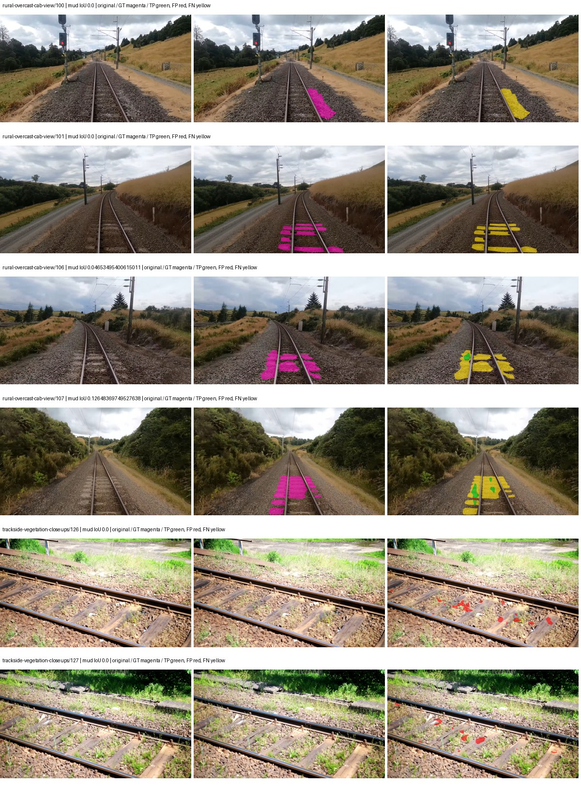
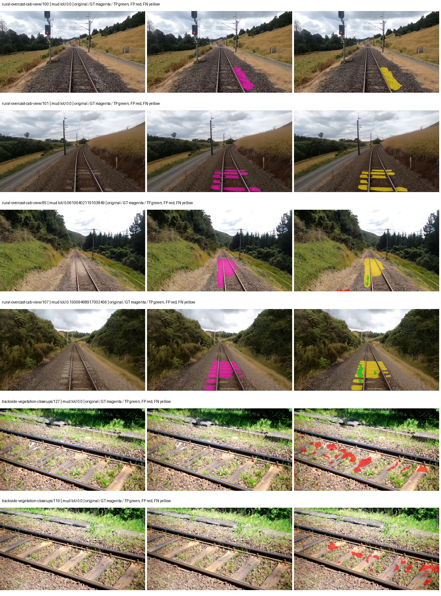
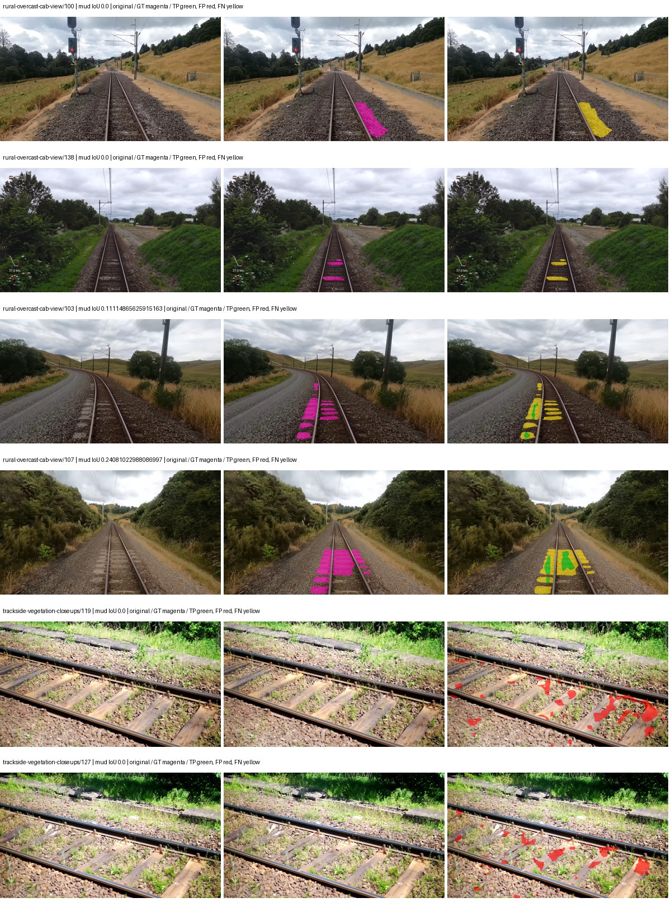
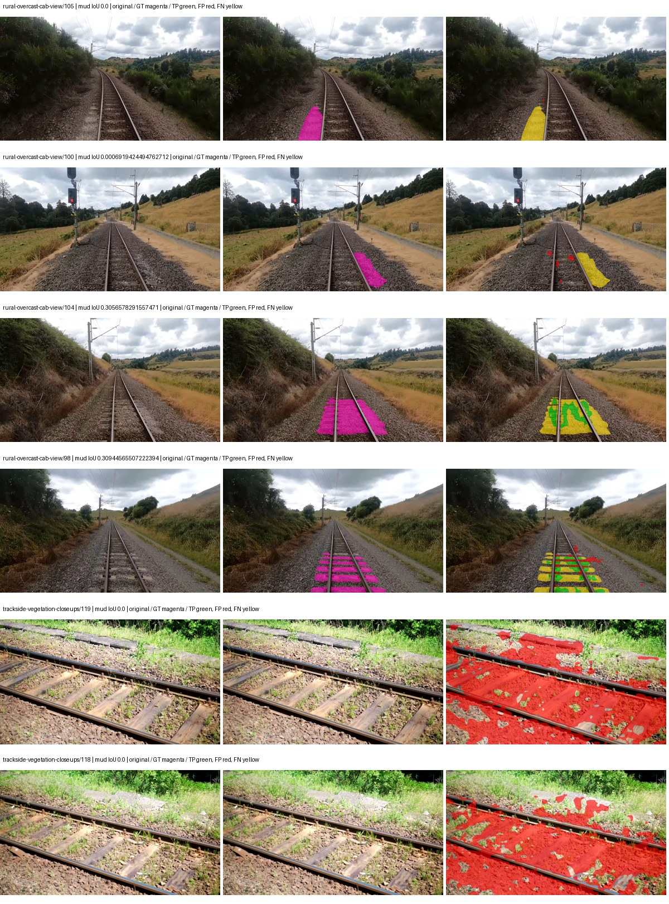
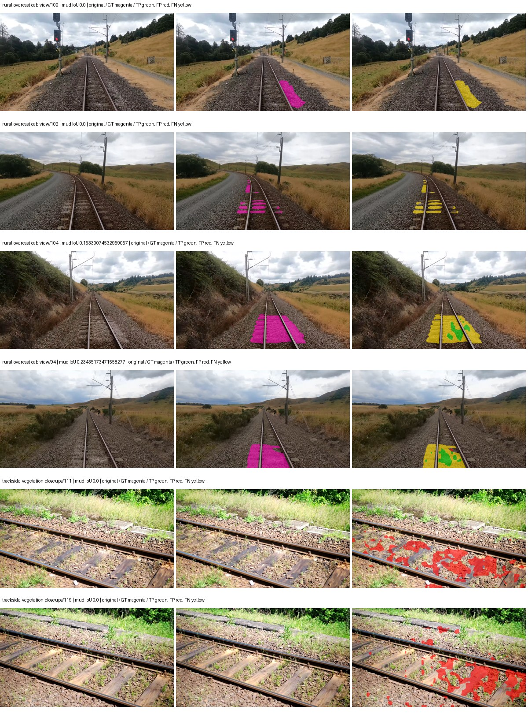
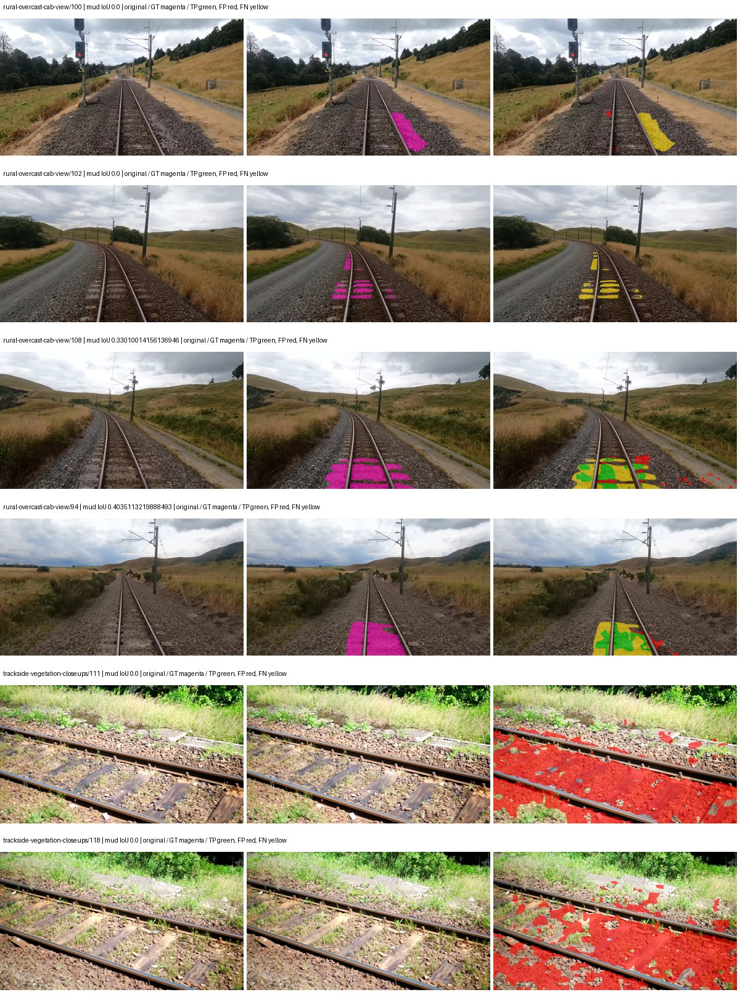
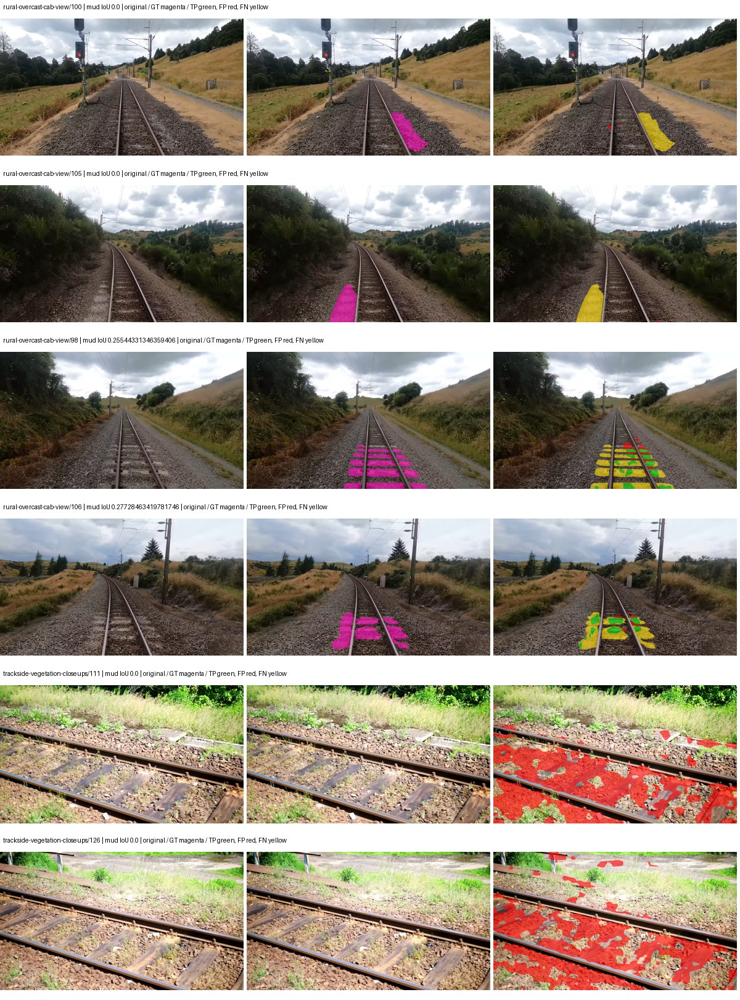
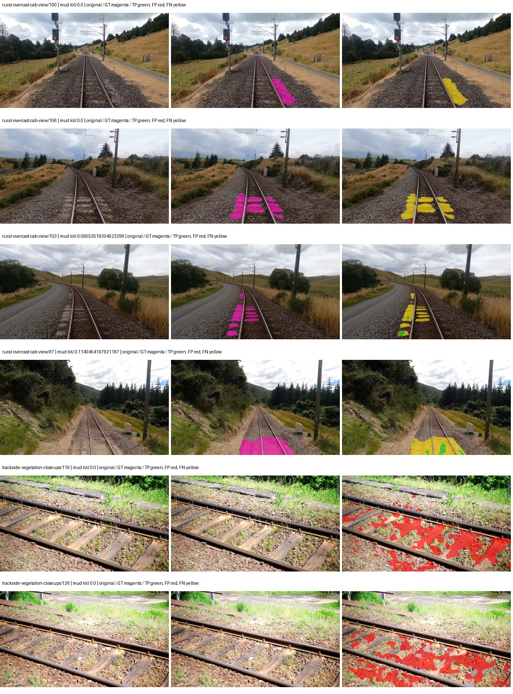
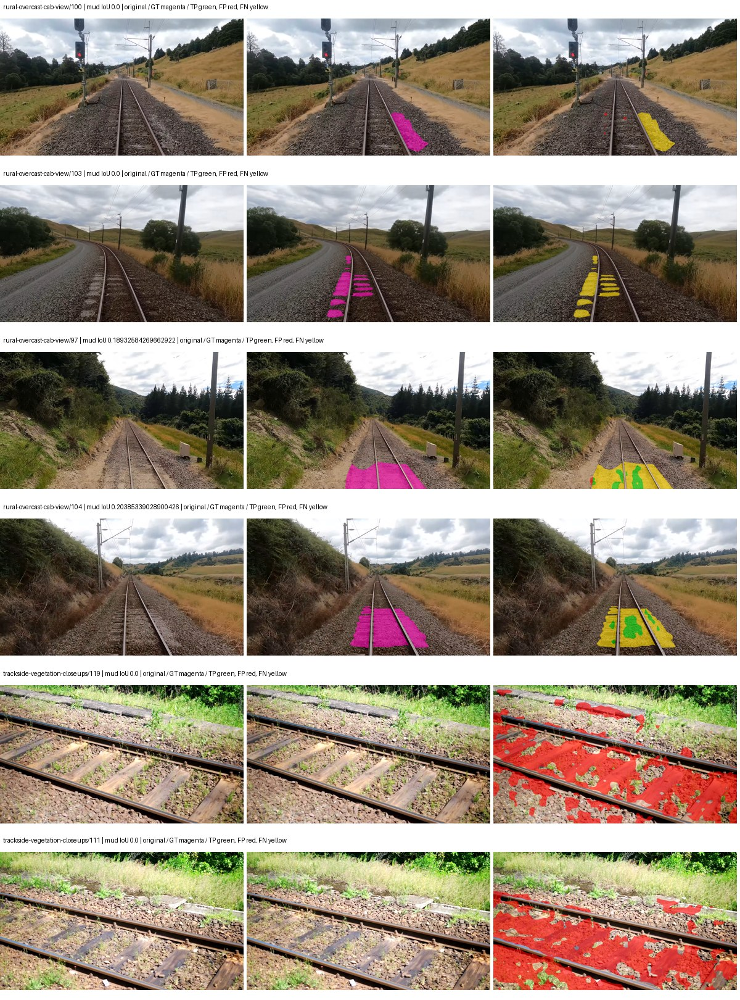
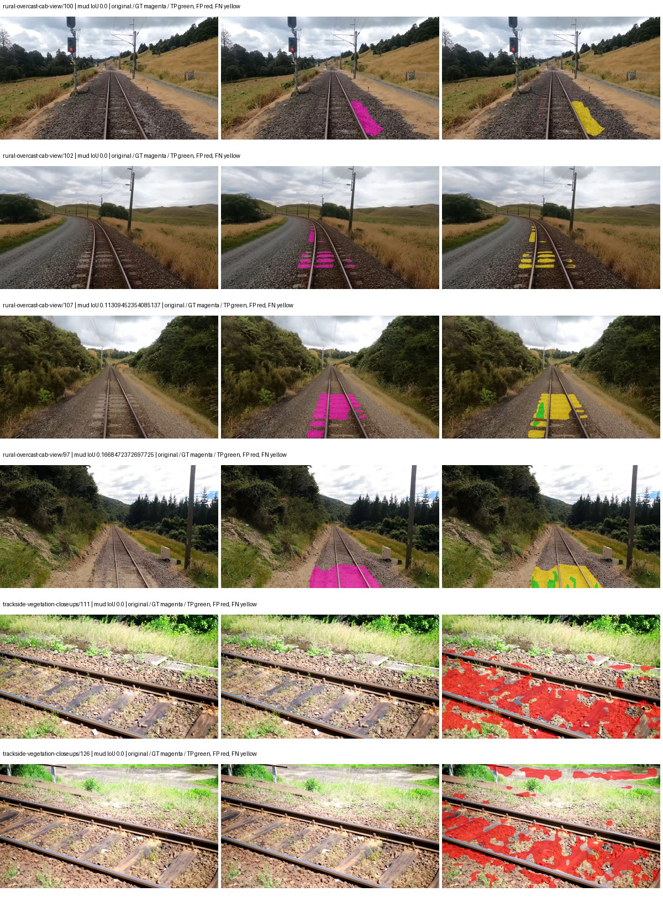

# native_resnet50_aspp — paul-test-rtis

[RTIS comparison](../../README.md) · [Full model records](record.json)

Primary selection and early stopping: **mud-pumping validation IoU**. A job is complete only after full statistics and isolated profiling are verified.

| Model | Initialization path | Seed | Status | Steps | Best step | Mud IoU (%) | Mud precision (%) | Mud recall (%) | Final mud IoU (trainer val, %) | mIoU (%) | Fixed GT-class mIoU (%) |
| --- | --- | --- | --- | --- | --- | --- | --- | --- | --- | --- | --- |
| native_resnet50_aspp | rtis_only | 0 | completed | 2800 | 1527 | 1.70 | 18.29 | 1.84 | 0.25 | 27.15 | 30.16 |
| native_resnet50_aspp | rtis_only | 1 | completed | 2545 | 1272 | 2.14 | 9.66 | 2.68 | 1.00 | 24.97 | 27.74 |
| native_resnet50_aspp | rtis_only | 2 | completed | 3563 | 2290 | 2.63 | 10.23 | 3.42 | 0.45 | 26.39 | 30.79 |
| native_resnet50_aspp | cityscapes_to_rtis | 0 | completed | 1781 | 509 | 2.15 | 2.44 | 15.30 | 0.32 | 21.17 | 24.70 |
| native_resnet50_aspp | cityscapes_to_rtis | 1 | completed | 2290 | 1018 | 4.17 | 7.10 | 9.18 | 1.50 | 25.71 | 30.00 |
| native_resnet50_aspp | cityscapes_to_rtis | 2 | completed | 1781 | 509 | 3.60 | 4.18 | 20.60 | 1.04 | 22.93 | 26.75 |
| native_resnet50_aspp | railsem19_to_rtis | 0 | completed | 1781 | 509 | 2.90 | 3.64 | 12.55 | 0.13 | 32.05 | 37.39 |
| native_resnet50_aspp | railsem19_to_rtis | 1 | training | 3449 | — | — | — | — | — | — | — |
| native_resnet50_aspp | railsem19_to_rtis | 2 | completed | 1781 | 509 | 1.17 | 1.76 | 3.34 | 0.66 | 32.41 | 37.82 |
| native_resnet50_aspp | cityscapes_to_railsem19_to_rtis | 0 | completed | 1781 | 509 | 2.02 | 2.50 | 9.49 | 0.14 | 30.12 | 35.14 |
| native_resnet50_aspp | cityscapes_to_railsem19_to_rtis | 1 | training | 2449 | — | — | — | — | — | — | — |
| native_resnet50_aspp | cityscapes_to_railsem19_to_rtis | 2 | completed | 1781 | 509 | 1.53 | 2.00 | 6.09 | 0.44 | 32.32 | 37.71 |

Training: 220 images. Validation: 37 images. Test: 50 held out. Seeds: [0, 1, 2]. Seed variation measures optimization variability, not independent-recording uncertainty. Historical source checkpoints stay fixed across adaptation seeds.

Training code: `066afb2626398b7be59d4d19f5a0e4644fd59adc`. Split SHA-256: `71fef8292610c352da0709fe3bd030f3bcc18f97560394835f4b22826463b83d`.

## rtis_only — seed 0

Status: **completed**. Started: 2026-09-06T22:13:02.053666+00:00. Finished: 2026-09-06T22:51:42.510311+00:00.

Recipe pretrained initializer: `{"arch": "native", "backbone_path": null, "batch_norm_momentum": null, "checkpoint": null, "classifier_path": null, "drop_path": null, "encoder_name": null, "encoder_weights": null, "head": "unified_head", "head_paths": [], "inactive_parameter_paths": [], "local_files_only": false, "lora_alpha": 32, "lora_dropout": 0.05, "lora_r": 16, "lora_targets": [], "native": {"auxiliary_heads": [], "backbone": {"in_channels": 3, "kind": "timm", "name": "resnet50.a1_in1k", "out_indices": [1, 2, 3, 4], "weights": "pretrained"}, "head": {"activation": "relu", "channels": 256, "dilation_rates": [6, 12, 18], "dropout": 0.1, "in_index": 3, "kind": "aspp", "norm": "group"}, "neck": {"kind": "identity"}, "task": "multiclass"}, "revision": null, "smp_arch": null, "subfolder": null, "trust_remote_code": false, "tuning": "full"}`.

`rtis_only` uses the recipe initializer, which may include pretrained segmentation components. Transfer paths load the exact historical source checkpoint below and reset the classifier; they do not reset all query/decoder features.

Source checkpoint: `Recipe pretrained initialization`.

Config SHA-256: `27290a6caa7a8573e1b387e215ef75f106a743f845fab7752969b6e72071d8aa`. Weights used for validation: `raw`.

### Mud-pumping and aggregate quality

| Metric | Selected checkpoint | Final training validation |
| --- | --- | --- |
| Mud IoU | 1.70 | 0.25 |
| Mud precision | 18.29 | 2.21 |
| Mud recall | 1.84 | 0.28 |
| Mud Dice/F1 | 3.34 | 0.49 |
| mIoU | 27.15 | 27.11 |
| Mean accuracy | 39.12 | 38.70 |
| Mean precision | 48.56 | 46.30 |
| Mean Dice | 35.68 | 35.81 |
| Mean specificity | 98.70 | 98.81 |
| Pixel accuracy | 79.59 | 81.52 |
| Frequency-weighted IoU | 68.38 | 70.80 |
| Fixed GT-present class mIoU | 30.16 | 31.63 |
| Boundary F1 | 34.08 | 32.42 |

The selected checkpoint has independent evaluation evidence. Final values are the trainer's final validation record, not a new independent evaluation. mIoU averages classes with nonzero union, so false positives on absent classes can change its denominator. The fixed GT-class mean is supplementary and excludes absent classes; their false positives remain in the confusion matrix.

### Resource usage and timing

| Measurement | Value |
| --- | --- |
| Peak training VRAM, retained training invocation (GiB) | 8.27 |
| Peak evaluation VRAM (GiB) | 6.75 |
| Retained training invocation wall time (seconds) | 2197.23 |
| Retained training invocation GPU-hours (one GPU) | 0.61 |
| Evaluation wall time (seconds) | 10.70 |
| Full evaluation pipeline images/second | 3.46 |
| Best full-state checkpoint (MiB) | 596.61 |
| Final full-state checkpoint (MiB) | 596.60 |
| Audited periodic checkpoints removed (GiB) | 2.91 |

VRAM uses the recorded allocator high-water mark; it is not total device usage including CUDA context. Resumed jobs' retained training invocation times and peaks are **not whole-campaign totals**. Earlier invocation resource records are not reconstructed here. Evaluation throughput includes loader, sliding-window inference and metrics; it is not model-only latency/FPS. Missing measurements are shown as —, never inferred from another dataset's run.

### Standardized inference performance

Dedicated model-only profiling waits for an idle worker-locked L40S: BF16, batch 1, 1024x1024, 20 warmup and 100 CUDA-event-timed public forwards. It excludes loading, preprocessing, tiling and metrics.

| Status | Parameters | Weight MiB | FPS | p50 ms | p95 ms | Peak reserved GiB |
| --- | --- | --- | --- | --- | --- | --- |
| complete | 39048277 | 148.96 | 208.07 | 4.42 | 7.93 | 0.53 |

```json
{
  "schema_version": 1,
  "model_id": "native_resnet50_aspp",
  "measured_at": "2026-09-06T22:51:36+00:00",
  "status": "complete",
  "benchmark_scope": "rtis_selected_checkpoint_model_only",
  "applies_to": [
    "native_resnet50_aspp--rtis_only--seed-0"
  ],
  "source": {
    "campaign_git_sha": "066afb2626398b7be59d4d19f5a0e4644fd59adc",
    "git_dirty": false,
    "config_hash": "ca7928aaadd4",
    "resolved_config": "/data/izadia1/projects/segmentary-runs/paul-test-rtis/mud-fullstats-v1-20260906-r2/configs/native_resnet50_aspp--rtis_only--seed-0.yaml",
    "config_sha256": "27290a6caa7a8573e1b387e215ef75f106a743f845fab7752969b6e72071d8aa",
    "checkpoint_sha256": "0d7a6d53e415b182385ea8861fde2dc9d545c8130f7a87a1c9f77d329cf9ce50",
    "checkpoint_global_step": 1527,
    "checkpoint_bytes": 625594908,
    "checkpoint_kind": "resume checkpoint with optimizer and EMA state",
    "weights": "raw",
    "measured_checkpoint_job_id": "native_resnet50_aspp--rtis_only--seed-0",
    "result_sha256": "e701c42487e265aad53e236b0bc72bf0d992844d5890cc8f5408bb28b6289c32",
    "result_git_sha": "066afb2626398b7be59d4d19f5a0e4644fd59adc",
    "result_stage": "eval:paul-test-rtis:val",
    "result_seed": 0
  },
  "hardware": {
    "gpu_name": "NVIDIA L40S",
    "gpu_uuid": "GPU-a5ad49e5-0536-5229-ba8a-f8a902808f53",
    "logical_device": "cuda:0",
    "physical_visibility_token": "7",
    "compute_capability": [
      8,
      9
    ],
    "total_memory_bytes": 47677177856
  },
  "model": {
    "parameter_count": 39048277,
    "trainable_parameter_count": 39048277,
    "resident_parameter_bytes": 156193108,
    "parameter_dtype_counts": {
      "float32": 39048277
    }
  },
  "contract": {
    "backend": "pytorch",
    "precision": "bf16_autocast",
    "batch_size": 1,
    "input_shape_nchw": [
      1,
      3,
      1024,
      1024
    ],
    "warmup_iterations": 20,
    "measured_iterations": 100,
    "timing": "per-forward CUDA events with end-event synchronization",
    "includes_preprocessing": false,
    "includes_data_loader": false,
    "includes_sliding_window": false,
    "input_resident_on_gpu": true,
    "model_only": true,
    "entrypoint": "public model(image) dense-logits forward"
  },
  "measurements": {
    "latency": {
      "p50_ms": 4.418559789657593,
      "p95_ms": 7.926783871650692,
      "mean_ms": 4.806152276992798,
      "minimum_ms": 4.285439968109131,
      "maximum_ms": 9.981951713562012,
      "fps": 208.066649237693,
      "raw_ms": [
        4.3427839279174805,
        5.260287761688232,
        6.519807815551758,
        9.981951713562012,
        5.635072231292725,
        4.736000061035156,
        4.9203200340271,
        4.482048034667969,
        5.334015846252441,
        4.751359939575195,
        4.610079765319824,
        4.489215850830078,
        4.454400062561035,
        4.419583797454834,
        4.4165120124816895,
        4.442111968994141,
        4.426752090454102,
        4.403200149536133,
        4.573184013366699,
        4.8506879806518555,
        4.6684160232543945,
        7.8745598793029785,
        9.372672080993652,
        4.369408130645752,
        4.380671977996826,
        4.6141438484191895,
        4.442111968994141,
        4.464640140533447,
        4.417535781860352,
        4.438015937805176,
        5.170176029205322,
        5.303296089172363,
        4.453343868255615,
        4.443136215209961,
        4.8363518714904785,
        4.513728141784668,
        4.433919906616211,
        4.456448078155518,
        4.430848121643066,
        7.150591850280762,
        9.435104370117188,
        4.610047817230225,
        4.3089919090271,
        4.29260778427124,
        4.354047775268555,
        4.3079681396484375,
        4.296703815460205,
        4.607999801635742,
        4.477952003479004,
        4.4759039878845215,
        4.363264083862305,
        4.290559768676758,
        4.60595178604126,
        4.331520080566406,
        4.341760158538818,
        4.285439968109131,
        4.727807998657227,
        9.389023780822754,
        8.919039726257324,
        4.654079914093018,
        4.297728061676025,
        4.296703815460205,
        4.303872108459473,
        4.291584014892578,
        4.324351787567139,
        4.315135955810547,
        4.290559768676758,
        4.319231986999512,
        4.290559768676758,
        4.314112186431885,
        4.477952003479004,
        4.982783794403076,
        4.304895877838135,
        4.287487983703613,
        4.289535999298096,
        4.294655799865723,
        4.288512229919434,
        4.346879959106445,
        4.294655799865723,
        4.349952220916748,
        4.319231986999512,
        4.325376033782959,
        4.588543891906738,
        4.469759941101074,
        4.289535999298096,
        4.294591903686523,
        4.317183971405029,
        4.291584014892578,
        4.2936320304870605,
        4.289535999298096,
        4.30182409286499,
        4.299776077270508,
        4.2987518310546875,
        4.289535999298096,
        4.290559768676758,
        4.296703815460205,
        4.315135955810547,
        4.560895919799805,
        4.872191905975342,
        4.290559768676758
      ],
      "percentile_method": "numpy linear interpolation"
    },
    "peak_reserved_bytes": 570425344,
    "memory_kind": "pytorch_cuda_allocator_peak_reserved_excluding_context",
    "benchmark_wall_clock_s": 12.41789611428976
  },
  "started_at": "2026-09-06T22:51:24+00:00",
  "finished_at": "2026-09-06T22:51:36+00:00",
  "environment": {
    "hostname": "hdrfs-app-001",
    "python": "3.11.15",
    "platform": "Linux-5.15.0-139-generic-x86_64-with-glibc2.35",
    "torch": "2.11.0+cu128",
    "torch_cuda": "12.8",
    "cudnn": 91900,
    "driver_version": "570.133.20",
    "cuda_available": true,
    "gpu_count": 1,
    "gpu_names": [
      "NVIDIA L40S"
    ],
    "cuda_visible_devices": "7",
    "packages": {
      "segmentary": "0.1.0",
      "torch": "2.11.0+cu128",
      "torchvision": "0.26.0+cu128",
      "transformers": "5.15.0",
      "timm": "1.0.28",
      "segmentation-models-pytorch": "0.5.0",
      "albumentations": "2.0.8",
      "lightning": "2.6.5",
      "numpy": "2.4.4"
    }
  }
}
```

### Per-class validation results

| Class | GT pixels | IoU (%) | Precision (%) | Recall (%) | Dice (%) | Boundary F1 (%) |
| --- | --- | --- | --- | --- | --- | --- |
| car | 29664 | 11.75 | 39.80 | 14.30 | 21.04 | 28.41 |
| construction | 311585 | 28.77 | 31.80 | 75.09 | 44.68 | 33.42 |
| fence | 265137 | 7.13 | 42.89 | 7.87 | 13.30 | 20.23 |
| mud-pumping | 1226250 | 1.70 | 18.29 | 1.84 | 3.34 | 4.13 |
| on-rails | 0 | 0.00 | 0.00 | — | 0.00 | 0.00 |
| person | 0 | — | — | — | — | — |
| pole | 628038 | 51.52 | 76.45 | 61.23 | 68.00 | 70.88 |
| rail-embedded | 16799 | 4.33 | 29.83 | 4.82 | 8.30 | 14.84 |
| rail-raised | 2969797 | 62.67 | 68.81 | 87.53 | 77.05 | 81.02 |
| rail-track | 6323197 | 36.90 | 68.80 | 44.31 | 53.90 | 45.32 |
| road | 1048831 | 12.56 | 22.55 | 22.10 | 22.32 | 15.28 |
| sidewalk | 1297367 | 12.87 | 69.99 | 13.62 | 22.80 | 7.06 |
| sky | 19121606 | 91.99 | 98.67 | 93.14 | 95.83 | 76.22 |
| standing-water | 95802 | 0.71 | 0.77 | 8.49 | 1.41 | 4.30 |
| terrain | 39239306 | 82.46 | 85.27 | 96.16 | 90.39 | 55.08 |
| trackbed | 10643081 | 47.35 | 57.00 | 73.67 | 64.27 | 48.39 |
| traffic-light | 19510 | 60.67 | 83.59 | 68.88 | 75.52 | 79.52 |
| traffic-sign | 13285 | 10.90 | 97.78 | 10.92 | 19.65 | 45.19 |
| tram-track | 56179 | 0.80 | 1.94 | 1.33 | 1.58 | 7.70 |
| truck | 0 | 0.00 | 0.00 | — | 0.00 | 0.00 |
| vegetation-overgrowth | 5901821 | 17.87 | 77.04 | 18.87 | 30.32 | 44.58 |

### Full-run accounting

| Measurement | Value |
| --- | --- |
| Full GPU-reserved wall seconds, all recorded worker attempts | 2320.46 |
| Full reserved GPU-hours | 0.64 |
| Whole-run timing complete | True |

| Phase | Wall seconds including failed attempts |
| --- | --- |
| training | 2204.44 |
| diagnostics | 71.75 |
| performance | 20.50 |

GPU-reserved time includes model loading, training, validation, collection, profiling, checkpoint I/O and orchestration while the worker owns one GPU. It is not GPU kernel-active time. Phase timings and sampled device memory/power/utilization are retained separately; sampled device memory is not the allocator high-water mark.

### Train/validation and raw/EMA diagnostics

| Checkpoint / weights / split | Images | Mud IoU (%) | Mud precision (%) | Mud recall (%) |
| --- | --- | --- | --- | --- |
| best-auto-train / raw | 220 | 91.31 | 94.65 | 96.28 |
| best-auto-val / raw | 37 | 1.70 | 18.29 | 1.84 |
| best-alternate-val / ema | 37 | 2.80 | 17.20 | 3.24 |
| final-auto-val / raw | 37 | 0.25 | 2.21 | 0.28 |

Train uses the evaluation transform without augmentation. Compare mud train/validation metrics for the same selected weights. Alternate EMA on running-stat BatchNorm is explicitly uncalibrated and is diagnostic only. Score-threshold curves use uncalibrated normalized scores and are pixel-level diagnostics, not event detection rates or a selected deployment operating point.

### Downloadable evidence

- best-auto-train: [per-image.csv](rtis_only--seed-0/best-auto-train/per-image.csv) · [per-image-confusion.json.gz](rtis_only--seed-0/best-auto-train/per-image-confusion.json.gz) · [groups.json](rtis_only--seed-0/best-auto-train/groups.json) · [mud-score-curves.json](rtis_only--seed-0/best-auto-train/mud-score-curves.json)
- best-auto-val: [per-image.csv](rtis_only--seed-0/best-auto-val/per-image.csv) · [per-image-confusion.json.gz](rtis_only--seed-0/best-auto-val/per-image-confusion.json.gz) · [groups.json](rtis_only--seed-0/best-auto-val/groups.json) · [mud-score-curves.json](rtis_only--seed-0/best-auto-val/mud-score-curves.json) · [examples.jpg](rtis_only--seed-0/best-auto-val/examples.jpg)
- best-alternate-val: [per-image.csv](rtis_only--seed-0/best-alternate-val/per-image.csv) · [per-image-confusion.json.gz](rtis_only--seed-0/best-alternate-val/per-image-confusion.json.gz) · [groups.json](rtis_only--seed-0/best-alternate-val/groups.json) · [mud-score-curves.json](rtis_only--seed-0/best-alternate-val/mud-score-curves.json)
- final-auto-val: [per-image.csv](rtis_only--seed-0/final-auto-val/per-image.csv) · [per-image-confusion.json.gz](rtis_only--seed-0/final-auto-val/per-image-confusion.json.gz) · [groups.json](rtis_only--seed-0/final-auto-val/groups.json) · [mud-score-curves.json](rtis_only--seed-0/final-auto-val/mud-score-curves.json)
- resources: [telemetry.csv](rtis_only--seed-0/resources/telemetry.csv)



Examples are two lowest and two highest mud-IoU positive images, plus up to two negative images with the most false-positive mud pixels. They are targeted diagnostic examples, not random samples. Green: true positive; red: false positive; yellow: false negative. Full predictions remain on HDRFS.

### Validation tracking

| Logged step | Overall mIoU (%) | Mud IoU (%) |
| --- | --- | --- |
| 254 | 18.33 | 0.18 |
| 508 | 20.96 | 0.37 |
| 763 | 22.71 | 0.80 |
| 1017 | 24.44 | 1.08 |
| 1272 | 25.34 | 1.43 |
| 1527 | 27.14 | 1.70 |
| 1781 | 26.47 | 0.86 |
| 2036 | 26.33 | 0.68 |
| 2290 | 25.85 | 0.63 |
| 2545 | 26.54 | 1.18 |
| 2799 | 27.11 | 0.25 |

All retained scalar curves, including training loss and per-class IoU, are in record.json. Observed best mud on a curve is not necessarily a retained checkpoint: the pilot saved its selection-metric-best and final checkpoints. Step logging and checkpoint global_step may differ by one.

### Stopping and checkpoint provenance

```json
{
  "stopping": {
    "actual_steps": 2800,
    "maximum_steps": 4000,
    "min_delta": 0.001,
    "monitor": "val_iou/mud-pumping",
    "patience": 5,
    "reason": "validation_plateau"
  },
  "checkpoints": {
    "best": {
      "path": "/data/izadia1/projects/segmentary-runs/paul-test-rtis/mud-fullstats-v1-20260906-r2/future-runs/native_resnet50_aspp--rtis_only--seed-0_seed0/rtis/best.ckpt",
      "sha256": "0d7a6d53e415b182385ea8861fde2dc9d545c8130f7a87a1c9f77d329cf9ce50",
      "global_step": 1527,
      "bytes": 625594908
    },
    "final": {
      "path": "/data/izadia1/projects/segmentary-runs/paul-test-rtis/mud-fullstats-v1-20260906-r2/future-runs/native_resnet50_aspp--rtis_only--seed-0_seed0/rtis/last.ckpt",
      "sha256": "88f822220a7444d5a84a7fcbd9eecbc443139a811968f79fae75436ee0c47c47",
      "global_step": 2800,
      "bytes": 625583772
    }
  },
  "cleanup_error": null
}
```

### Resolved training, initialization and evaluation settings

The optimizer block is the base configuration. Stage LR scales are applied at runtime, and stage warmup is capped at min(base warmup, floor(stage budget / 10), stage budget - 1): 400 steps for this 4,000-step pilot. Model-internal native input grids may differ from augmentation crops (EoMT uses its 640 grid).

```json
{
  "name": "native_resnet50_aspp--rtis_only--seed-0",
  "model": {
    "arch": "native",
    "checkpoint": null,
    "tuning": "full",
    "head": "unified_head",
    "lora_r": 16,
    "lora_alpha": 32,
    "lora_dropout": 0.05,
    "lora_targets": [],
    "drop_path": null,
    "revision": null,
    "subfolder": null,
    "local_files_only": false,
    "trust_remote_code": false,
    "backbone_path": null,
    "head_paths": [],
    "classifier_path": null,
    "inactive_parameter_paths": [],
    "smp_arch": null,
    "encoder_name": null,
    "encoder_weights": null,
    "native": {
      "task": "multiclass",
      "backbone": {
        "kind": "timm",
        "name": "resnet50.a1_in1k",
        "weights": "pretrained",
        "out_indices": [
          1,
          2,
          3,
          4
        ],
        "in_channels": 3
      },
      "neck": {
        "kind": "identity"
      },
      "head": {
        "kind": "aspp",
        "in_index": 3,
        "channels": 256,
        "dilation_rates": [
          6,
          12,
          18
        ],
        "dropout": 0.1,
        "norm": "group",
        "activation": "relu"
      },
      "auxiliary_heads": []
    },
    "batch_norm_momentum": null
  },
  "space": "paul-test-rtis",
  "taxonomy_root": "/data/izadia1/projects/segmentary-rtis-fullstats-066afb2/taxonomy",
  "output_root": "/data/izadia1/projects/segmentary-runs/paul-test-rtis/mud-fullstats-v1-20260906-r2/future-runs",
  "optim": {
    "backbone_lr": 0.0001,
    "head_lr_mult": 10.0,
    "weight_decay": 0.05,
    "llrd": 1.0,
    "warmup_iters": 1500,
    "warmup_ratio": 1e-06,
    "poly_power": 0.9,
    "min_lr_ratio": 0.0,
    "betas": [
      0.9,
      0.999
    ],
    "grad_clip": 1.0
  },
  "train": {
    "iters": 4000,
    "batch_size": 2,
    "accum": 8,
    "num_workers": 2,
    "precision": "bf16-mixed",
    "ema_decay": 0.9998,
    "val_every": 250,
    "ckpt_every": 500,
    "selection_metric": "val_iou/mud-pumping",
    "early_stopping_patience": 5,
    "early_stopping_min_delta": 0.001,
    "seed": 0,
    "devices": 1
  },
  "eval": {
    "sliding_window": true,
    "window": [
      1024,
      1024
    ],
    "stride": [
      768,
      768
    ],
    "batch_size": 1,
    "num_workers": 2,
    "tta_scales": [],
    "tta_flip": false,
    "threshold": 0.5,
    "boundary_tolerance_frac": 0.0075,
    "save_confusion": true
  },
  "loss": {
    "task": "multiclass",
    "activation": "auto",
    "terms": [],
    "aux": "none",
    "aux_weight": 0.0,
    "ce_weight": 1.0,
    "label_smoothing": 0.0,
    "class_weights": null,
    "query": null
  },
  "aug": {
    "crop": [
      1024,
      1024
    ],
    "scale_min": 0.5,
    "scale_max": 2.0,
    "hflip_p": 0.5,
    "color_jitter_p": 0.5,
    "brightness": 0.25,
    "contrast": 0.25,
    "saturation": 0.25,
    "hue": 0.05
  },
  "stages": [
    {
      "name": "rtis",
      "data": [
        {
          "name": "paul-test-rtis",
          "root": "/data/izadia1/datasets/paul-test-rtis",
          "variant": null,
          "split_file": "splits.json",
          "train_split": "train",
          "val_split": "val",
          "limit": null,
          "loader": "folder",
          "mapping": "paul-test-rtis",
          "loader_options": {
            "require_groups": true
          }
        }
      ],
      "iters": null,
      "lr_scale": 1.0,
      "head_group_lr_scale": 1.0,
      "init_from": "pretrained",
      "reset_head": false,
      "freeze": null,
      "sample_weights": null
    }
  ]
}
```

### Hardware and software provenance

```json
{
  "training": {
    "cuda_available": true,
    "cuda_visible_devices": "7",
    "cudnn": 91900,
    "driver_version": "570.133.20",
    "gpu_count": 1,
    "gpu_names": [
      "NVIDIA L40S"
    ],
    "hostname": "hdrfs-app-001",
    "input_normalization": {
      "channel_order": "rgb",
      "mean": [
        0.485,
        0.456,
        0.406
      ],
      "source": "timm_pretrained_cfg",
      "std": [
        0.229,
        0.224,
        0.225
      ]
    },
    "model_origins": [
      {
        "hf_commit": null,
        "hf_name_or_path": null,
        "module": "backbone",
        "timm_pretrained": {
          "architecture": "resnet50",
          "hf_hub_id": "timm/resnet50.a1_in1k",
          "tag": "a1_in1k",
          "url": "https://github.com/rwightman/pytorch-image-models/releases/download/v0.1-rsb-weights/resnet50_a1_0-14fe96d1.pth"
        }
      },
      {
        "hf_commit": null,
        "hf_name_or_path": null,
        "module": "backbone.model",
        "timm_pretrained": {
          "architecture": "resnet50",
          "hf_hub_id": "timm/resnet50.a1_in1k",
          "tag": "a1_in1k",
          "url": "https://github.com/rwightman/pytorch-image-models/releases/download/v0.1-rsb-weights/resnet50_a1_0-14fe96d1.pth"
        }
      }
    ],
    "model_parameter_count": 39048277,
    "packages": {
      "albumentations": "2.0.8",
      "lightning": "2.6.5",
      "numpy": "2.4.4",
      "segmentary": "0.1.0",
      "segmentation-models-pytorch": "0.5.0",
      "timm": "1.0.28",
      "torch": "2.11.0+cu128",
      "torchvision": "0.26.0+cu128",
      "transformers": "5.15.0"
    },
    "platform": "Linux-5.15.0-139-generic-x86_64-with-glibc2.35",
    "python": "3.11.15",
    "torch": "2.11.0+cu128",
    "torch_cuda": "12.8",
    "trainable_parameter_count": 39048277,
    "training_stop": {
      "actual_steps": 2800,
      "maximum_steps": 4000,
      "min_delta": 0.001,
      "monitor": "val_iou/mud-pumping",
      "patience": 5,
      "reason": "validation_plateau"
    },
    "validation_weights": "raw"
  },
  "evaluation": {
    "cuda_available": true,
    "cuda_visible_devices": "7",
    "cudnn": 91900,
    "driver_version": "570.133.20",
    "gpu_count": 1,
    "gpu_names": [
      "NVIDIA L40S"
    ],
    "hostname": "hdrfs-app-001",
    "input_normalization": {
      "channel_order": "rgb",
      "mean": [
        0.485,
        0.456,
        0.406
      ],
      "source": "timm_pretrained_cfg",
      "std": [
        0.229,
        0.224,
        0.225
      ]
    },
    "packages": {
      "albumentations": "2.0.8",
      "lightning": "2.6.5",
      "numpy": "2.4.4",
      "segmentary": "0.1.0",
      "segmentation-models-pytorch": "0.5.0",
      "timm": "1.0.28",
      "torch": "2.11.0+cu128",
      "torchvision": "0.26.0+cu128",
      "transformers": "5.15.0"
    },
    "platform": "Linux-5.15.0-139-generic-x86_64-with-glibc2.35",
    "python": "3.11.15",
    "torch": "2.11.0+cu128",
    "torch_cuda": "12.8"
  }
}
```

## rtis_only — seed 1

Status: **completed**. Started: 2026-09-06T22:21:34.004073+00:00. Finished: 2026-09-06T22:56:35.793282+00:00.

Recipe pretrained initializer: `{"arch": "native", "backbone_path": null, "batch_norm_momentum": null, "checkpoint": null, "classifier_path": null, "drop_path": null, "encoder_name": null, "encoder_weights": null, "head": "unified_head", "head_paths": [], "inactive_parameter_paths": [], "local_files_only": false, "lora_alpha": 32, "lora_dropout": 0.05, "lora_r": 16, "lora_targets": [], "native": {"auxiliary_heads": [], "backbone": {"in_channels": 3, "kind": "timm", "name": "resnet50.a1_in1k", "out_indices": [1, 2, 3, 4], "weights": "pretrained"}, "head": {"activation": "relu", "channels": 256, "dilation_rates": [6, 12, 18], "dropout": 0.1, "in_index": 3, "kind": "aspp", "norm": "group"}, "neck": {"kind": "identity"}, "task": "multiclass"}, "revision": null, "smp_arch": null, "subfolder": null, "trust_remote_code": false, "tuning": "full"}`.

`rtis_only` uses the recipe initializer, which may include pretrained segmentation components. Transfer paths load the exact historical source checkpoint below and reset the classifier; they do not reset all query/decoder features.

Source checkpoint: `Recipe pretrained initialization`.

Config SHA-256: `369365af33c5fcd1643bc3ee573b2f617b4d0fc20908c05d2faa508cec6cc4e7`. Weights used for validation: `raw`.

### Mud-pumping and aggregate quality

| Metric | Selected checkpoint | Final training validation |
| --- | --- | --- |
| Mud IoU | 2.14 | 1.00 |
| Mud precision | 9.66 | 2.36 |
| Mud recall | 2.68 | 1.70 |
| Mud Dice/F1 | 4.19 | 1.98 |
| mIoU | 24.97 | 27.72 |
| Mean accuracy | 36.88 | 41.72 |
| Mean precision | 43.73 | 46.05 |
| Mean Dice | 32.86 | 36.81 |
| Mean specificity | 98.72 | 98.87 |
| Pixel accuracy | 80.21 | 82.25 |
| Frequency-weighted IoU | 69.06 | 71.78 |
| Fixed GT-present class mIoU | 27.74 | 32.34 |
| Boundary F1 | 30.54 | 32.89 |

The selected checkpoint has independent evaluation evidence. Final values are the trainer's final validation record, not a new independent evaluation. mIoU averages classes with nonzero union, so false positives on absent classes can change its denominator. The fixed GT-class mean is supplementary and excludes absent classes; their false positives remain in the confusion matrix.

### Resource usage and timing

| Measurement | Value |
| --- | --- |
| Peak training VRAM, retained training invocation (GiB) | 8.27 |
| Peak evaluation VRAM (GiB) | 6.75 |
| Retained training invocation wall time (seconds) | 1982.04 |
| Retained training invocation GPU-hours (one GPU) | 0.55 |
| Evaluation wall time (seconds) | 10.39 |
| Full evaluation pipeline images/second | 3.56 |
| Best full-state checkpoint (MiB) | 596.61 |
| Final full-state checkpoint (MiB) | 596.60 |
| Audited periodic checkpoints removed (GiB) | 2.91 |

VRAM uses the recorded allocator high-water mark; it is not total device usage including CUDA context. Resumed jobs' retained training invocation times and peaks are **not whole-campaign totals**. Earlier invocation resource records are not reconstructed here. Evaluation throughput includes loader, sliding-window inference and metrics; it is not model-only latency/FPS. Missing measurements are shown as —, never inferred from another dataset's run.

### Standardized inference performance

Dedicated model-only profiling waits for an idle worker-locked L40S: BF16, batch 1, 1024x1024, 20 warmup and 100 CUDA-event-timed public forwards. It excludes loading, preprocessing, tiling and metrics.

| Status | Parameters | Weight MiB | FPS | p50 ms | p95 ms | Peak reserved GiB |
| --- | --- | --- | --- | --- | --- | --- |
| complete | 39048277 | 148.96 | 224.38 | 4.33 | 4.77 | 0.53 |

```json
{
  "schema_version": 1,
  "model_id": "native_resnet50_aspp",
  "measured_at": "2026-09-06T22:56:30+00:00",
  "status": "complete",
  "benchmark_scope": "rtis_selected_checkpoint_model_only",
  "applies_to": [
    "native_resnet50_aspp--rtis_only--seed-1"
  ],
  "source": {
    "campaign_git_sha": "066afb2626398b7be59d4d19f5a0e4644fd59adc",
    "git_dirty": false,
    "config_hash": "c2a13a86833a",
    "resolved_config": "/data/izadia1/projects/segmentary-runs/paul-test-rtis/mud-fullstats-v1-20260906-r2/configs/native_resnet50_aspp--rtis_only--seed-1.yaml",
    "config_sha256": "369365af33c5fcd1643bc3ee573b2f617b4d0fc20908c05d2faa508cec6cc4e7",
    "checkpoint_sha256": "f6b8290c0a2cbd171a05cb8c537169412d0a4ad8388c01256ad2a5a874db846f",
    "checkpoint_global_step": 1272,
    "checkpoint_bytes": 625594908,
    "checkpoint_kind": "resume checkpoint with optimizer and EMA state",
    "weights": "raw",
    "measured_checkpoint_job_id": "native_resnet50_aspp--rtis_only--seed-1",
    "result_sha256": "758bf5d75badc61a3111bd80d4dfa34f46fa69f91f65dc7ab83b967569a0512a",
    "result_git_sha": "066afb2626398b7be59d4d19f5a0e4644fd59adc",
    "result_stage": "eval:paul-test-rtis:val",
    "result_seed": 1
  },
  "hardware": {
    "gpu_name": "NVIDIA L40S",
    "gpu_uuid": "GPU-e2e96741-aec9-e90b-5c46-d0d58be90a56",
    "logical_device": "cuda:0",
    "physical_visibility_token": "8",
    "compute_capability": [
      8,
      9
    ],
    "total_memory_bytes": 47677177856
  },
  "model": {
    "parameter_count": 39048277,
    "trainable_parameter_count": 39048277,
    "resident_parameter_bytes": 156193108,
    "parameter_dtype_counts": {
      "float32": 39048277
    }
  },
  "contract": {
    "backend": "pytorch",
    "precision": "bf16_autocast",
    "batch_size": 1,
    "input_shape_nchw": [
      1,
      3,
      1024,
      1024
    ],
    "warmup_iterations": 20,
    "measured_iterations": 100,
    "timing": "per-forward CUDA events with end-event synchronization",
    "includes_preprocessing": false,
    "includes_data_loader": false,
    "includes_sliding_window": false,
    "input_resident_on_gpu": true,
    "model_only": true,
    "entrypoint": "public model(image) dense-logits forward"
  },
  "measurements": {
    "latency": {
      "p50_ms": 4.32588791847229,
      "p95_ms": 4.768942499160767,
      "mean_ms": 4.456681919097901,
      "minimum_ms": 4.295680046081543,
      "maximum_ms": 8.938431739807129,
      "fps": 224.3821789737274,
      "raw_ms": [
        4.325376033782959,
        4.3089919090271,
        4.718592166900635,
        4.3130879402160645,
        4.30182409286499,
        4.297728061676025,
        4.296703815460205,
        4.323328018188477,
        4.31001615524292,
        4.31001615524292,
        4.295680046081543,
        4.767712116241455,
        4.382719993591309,
        4.362239837646484,
        4.31001615524292,
        4.378623962402344,
        4.3079681396484375,
        4.302847862243652,
        4.314112186431885,
        4.3427839279174805,
        4.323328018188477,
        4.989952087402344,
        4.368383884429932,
        4.345856189727783,
        4.399104118347168,
        4.302815914154053,
        4.299776077270508,
        4.731904029846191,
        4.344831943511963,
        4.315135955810547,
        4.349952220916748,
        4.709375858306885,
        4.386816024780273,
        4.670464038848877,
        4.312064170837402,
        4.302847862243652,
        4.333568096160889,
        4.302847862243652,
        4.324351787567139,
        4.299776077270508,
        4.66326379776001,
        4.320256233215332,
        4.7923197746276855,
        4.332543849945068,
        4.30079984664917,
        4.603936195373535,
        4.374527931213379,
        4.3581438064575195,
        4.326399803161621,
        4.302847862243652,
        4.2987518310546875,
        4.317183971405029,
        4.314112186431885,
        4.314112186431885,
        4.303872108459473,
        4.325376033782959,
        4.305920124053955,
        4.740096092224121,
        4.360191822052002,
        4.296703815460205,
        4.3427839279174805,
        4.303872108459473,
        4.316160202026367,
        4.312032222747803,
        5.420032024383545,
        4.3673601150512695,
        4.3427839279174805,
        4.305920124053955,
        4.296703815460205,
        4.7032318115234375,
        4.316160202026367,
        4.617216110229492,
        4.418528079986572,
        4.334591865539551,
        4.326399803161621,
        4.378623962402344,
        4.5496320724487305,
        4.696095943450928,
        4.317183971405029,
        4.7421441078186035,
        4.325376033782959,
        5.384191989898682,
        4.435967922210693,
        4.369408130645752,
        4.344831943511963,
        4.329472064971924,
        4.317183971405029,
        4.314112186431885,
        4.334591865539551,
        4.563968181610107,
        4.323328018188477,
        4.324351787567139,
        4.31820821762085,
        4.368383884429932,
        4.332543849945068,
        4.322303771972656,
        4.299776077270508,
        4.306943893432617,
        4.3724799156188965,
        8.938431739807129
      ],
      "percentile_method": "numpy linear interpolation"
    },
    "peak_reserved_bytes": 570425344,
    "memory_kind": "pytorch_cuda_allocator_peak_reserved_excluding_context",
    "benchmark_wall_clock_s": 11.94414771348238
  },
  "started_at": "2026-09-06T22:56:18+00:00",
  "finished_at": "2026-09-06T22:56:30+00:00",
  "environment": {
    "hostname": "hdrfs-app-001",
    "python": "3.11.15",
    "platform": "Linux-5.15.0-139-generic-x86_64-with-glibc2.35",
    "torch": "2.11.0+cu128",
    "torch_cuda": "12.8",
    "cudnn": 91900,
    "driver_version": "570.133.20",
    "cuda_available": true,
    "gpu_count": 1,
    "gpu_names": [
      "NVIDIA L40S"
    ],
    "cuda_visible_devices": "8",
    "packages": {
      "segmentary": "0.1.0",
      "torch": "2.11.0+cu128",
      "torchvision": "0.26.0+cu128",
      "transformers": "5.15.0",
      "timm": "1.0.28",
      "segmentation-models-pytorch": "0.5.0",
      "albumentations": "2.0.8",
      "lightning": "2.6.5",
      "numpy": "2.4.4"
    }
  }
}
```

### Per-class validation results

| Class | GT pixels | IoU (%) | Precision (%) | Recall (%) | Dice (%) | Boundary F1 (%) |
| --- | --- | --- | --- | --- | --- | --- |
| car | 29664 | 9.47 | 36.92 | 11.29 | 17.30 | 22.44 |
| construction | 311585 | 32.04 | 38.06 | 66.94 | 48.53 | 36.79 |
| fence | 265137 | 2.21 | 14.81 | 2.53 | 4.32 | 7.66 |
| mud-pumping | 1226250 | 2.14 | 9.66 | 2.68 | 4.19 | 3.20 |
| on-rails | 0 | 0.00 | 0.00 | — | 0.00 | 0.00 |
| person | 0 | — | — | — | — | — |
| pole | 628038 | 49.52 | 72.44 | 61.02 | 66.24 | 68.66 |
| rail-embedded | 16799 | 9.96 | 63.82 | 10.55 | 18.11 | 13.33 |
| rail-raised | 2969797 | 68.51 | 78.20 | 84.68 | 81.31 | 84.64 |
| rail-track | 6323197 | 37.52 | 65.13 | 46.95 | 54.56 | 46.90 |
| road | 1048831 | 3.52 | 12.91 | 4.61 | 6.79 | 7.42 |
| sidewalk | 1297367 | 14.67 | 82.56 | 15.14 | 25.59 | 10.77 |
| sky | 19121606 | 94.70 | 98.19 | 96.38 | 97.28 | 82.05 |
| standing-water | 95802 | 0.00 | 0.00 | 0.00 | 0.00 | 0.13 |
| terrain | 39239306 | 83.50 | 85.17 | 97.71 | 91.01 | 56.28 |
| trackbed | 10643081 | 46.28 | 56.47 | 71.95 | 63.27 | 46.46 |
| traffic-light | 19510 | 18.06 | 20.33 | 61.73 | 30.59 | 27.82 |
| traffic-sign | 13285 | 14.66 | 56.15 | 16.56 | 25.58 | 45.52 |
| tram-track | 56179 | 0.42 | 2.71 | 0.49 | 0.83 | 13.93 |
| truck | 0 | 0.00 | 0.00 | — | 0.00 | 0.00 |
| vegetation-overgrowth | 5901821 | 12.19 | 81.15 | 12.54 | 21.73 | 36.72 |

### Full-run accounting

| Measurement | Value |
| --- | --- |
| Full GPU-reserved wall seconds, all recorded worker attempts | 2101.79 |
| Full reserved GPU-hours | 0.58 |
| Whole-run timing complete | True |

| Phase | Wall seconds including failed attempts |
| --- | --- |
| training | 1988.73 |
| diagnostics | 69.83 |
| performance | 20.23 |

GPU-reserved time includes model loading, training, validation, collection, profiling, checkpoint I/O and orchestration while the worker owns one GPU. It is not GPU kernel-active time. Phase timings and sampled device memory/power/utilization are retained separately; sampled device memory is not the allocator high-water mark.

### Train/validation and raw/EMA diagnostics

| Checkpoint / weights / split | Images | Mud IoU (%) | Mud precision (%) | Mud recall (%) |
| --- | --- | --- | --- | --- |
| best-auto-train / raw | 220 | 89.93 | 95.09 | 94.32 |
| best-auto-val / raw | 37 | 2.14 | 9.66 | 2.68 |
| best-alternate-val / ema | 37 | 0.59 | 2.40 | 0.78 |
| final-auto-val / raw | 37 | 1.00 | 2.35 | 1.70 |

Train uses the evaluation transform without augmentation. Compare mud train/validation metrics for the same selected weights. Alternate EMA on running-stat BatchNorm is explicitly uncalibrated and is diagnostic only. Score-threshold curves use uncalibrated normalized scores and are pixel-level diagnostics, not event detection rates or a selected deployment operating point.

### Downloadable evidence

- best-auto-train: [per-image.csv](rtis_only--seed-1/best-auto-train/per-image.csv) · [per-image-confusion.json.gz](rtis_only--seed-1/best-auto-train/per-image-confusion.json.gz) · [groups.json](rtis_only--seed-1/best-auto-train/groups.json) · [mud-score-curves.json](rtis_only--seed-1/best-auto-train/mud-score-curves.json)
- best-auto-val: [per-image.csv](rtis_only--seed-1/best-auto-val/per-image.csv) · [per-image-confusion.json.gz](rtis_only--seed-1/best-auto-val/per-image-confusion.json.gz) · [groups.json](rtis_only--seed-1/best-auto-val/groups.json) · [mud-score-curves.json](rtis_only--seed-1/best-auto-val/mud-score-curves.json) · [examples.jpg](rtis_only--seed-1/best-auto-val/examples.jpg)
- best-alternate-val: [per-image.csv](rtis_only--seed-1/best-alternate-val/per-image.csv) · [per-image-confusion.json.gz](rtis_only--seed-1/best-alternate-val/per-image-confusion.json.gz) · [groups.json](rtis_only--seed-1/best-alternate-val/groups.json) · [mud-score-curves.json](rtis_only--seed-1/best-alternate-val/mud-score-curves.json)
- final-auto-val: [per-image.csv](rtis_only--seed-1/final-auto-val/per-image.csv) · [per-image-confusion.json.gz](rtis_only--seed-1/final-auto-val/per-image-confusion.json.gz) · [groups.json](rtis_only--seed-1/final-auto-val/groups.json) · [mud-score-curves.json](rtis_only--seed-1/final-auto-val/mud-score-curves.json)
- resources: [telemetry.csv](rtis_only--seed-1/resources/telemetry.csv)



Examples are two lowest and two highest mud-IoU positive images, plus up to two negative images with the most false-positive mud pixels. They are targeted diagnostic examples, not random samples. Green: true positive; red: false positive; yellow: false negative. Full predictions remain on HDRFS.

### Validation tracking

| Logged step | Overall mIoU (%) | Mud IoU (%) |
| --- | --- | --- |
| 254 | 16.80 | 0.18 |
| 508 | 20.43 | 0.04 |
| 763 | 23.25 | 0.07 |
| 1017 | 23.43 | 1.19 |
| 1272 | 24.97 | 2.14 |
| 1527 | 24.38 | 0.02 |
| 1781 | 27.68 | 1.04 |
| 2036 | 23.44 | 1.42 |
| 2290 | 25.08 | 0.34 |
| 2545 | 27.72 | 1.00 |

All retained scalar curves, including training loss and per-class IoU, are in record.json. Observed best mud on a curve is not necessarily a retained checkpoint: the pilot saved its selection-metric-best and final checkpoints. Step logging and checkpoint global_step may differ by one.

### Stopping and checkpoint provenance

```json
{
  "stopping": {
    "actual_steps": 2545,
    "maximum_steps": 4000,
    "min_delta": 0.001,
    "monitor": "val_iou/mud-pumping",
    "patience": 5,
    "reason": "validation_plateau"
  },
  "checkpoints": {
    "best": {
      "path": "/data/izadia1/projects/segmentary-runs/paul-test-rtis/mud-fullstats-v1-20260906-r2/future-runs/native_resnet50_aspp--rtis_only--seed-1_seed1/rtis/best.ckpt",
      "sha256": "f6b8290c0a2cbd171a05cb8c537169412d0a4ad8388c01256ad2a5a874db846f",
      "global_step": 1272,
      "bytes": 625594908
    },
    "final": {
      "path": "/data/izadia1/projects/segmentary-runs/paul-test-rtis/mud-fullstats-v1-20260906-r2/future-runs/native_resnet50_aspp--rtis_only--seed-1_seed1/rtis/last.ckpt",
      "sha256": "68701149ab369b7e2bdbb95bbb2ef0444b0ec40c02555dfdbfd3db8925c4390a",
      "global_step": 2545,
      "bytes": 625583772
    }
  },
  "cleanup_error": null
}
```

### Resolved training, initialization and evaluation settings

The optimizer block is the base configuration. Stage LR scales are applied at runtime, and stage warmup is capped at min(base warmup, floor(stage budget / 10), stage budget - 1): 400 steps for this 4,000-step pilot. Model-internal native input grids may differ from augmentation crops (EoMT uses its 640 grid).

```json
{
  "name": "native_resnet50_aspp--rtis_only--seed-1",
  "model": {
    "arch": "native",
    "checkpoint": null,
    "tuning": "full",
    "head": "unified_head",
    "lora_r": 16,
    "lora_alpha": 32,
    "lora_dropout": 0.05,
    "lora_targets": [],
    "drop_path": null,
    "revision": null,
    "subfolder": null,
    "local_files_only": false,
    "trust_remote_code": false,
    "backbone_path": null,
    "head_paths": [],
    "classifier_path": null,
    "inactive_parameter_paths": [],
    "smp_arch": null,
    "encoder_name": null,
    "encoder_weights": null,
    "native": {
      "task": "multiclass",
      "backbone": {
        "kind": "timm",
        "name": "resnet50.a1_in1k",
        "weights": "pretrained",
        "out_indices": [
          1,
          2,
          3,
          4
        ],
        "in_channels": 3
      },
      "neck": {
        "kind": "identity"
      },
      "head": {
        "kind": "aspp",
        "in_index": 3,
        "channels": 256,
        "dilation_rates": [
          6,
          12,
          18
        ],
        "dropout": 0.1,
        "norm": "group",
        "activation": "relu"
      },
      "auxiliary_heads": []
    },
    "batch_norm_momentum": null
  },
  "space": "paul-test-rtis",
  "taxonomy_root": "/data/izadia1/projects/segmentary-rtis-fullstats-066afb2/taxonomy",
  "output_root": "/data/izadia1/projects/segmentary-runs/paul-test-rtis/mud-fullstats-v1-20260906-r2/future-runs",
  "optim": {
    "backbone_lr": 0.0001,
    "head_lr_mult": 10.0,
    "weight_decay": 0.05,
    "llrd": 1.0,
    "warmup_iters": 1500,
    "warmup_ratio": 1e-06,
    "poly_power": 0.9,
    "min_lr_ratio": 0.0,
    "betas": [
      0.9,
      0.999
    ],
    "grad_clip": 1.0
  },
  "train": {
    "iters": 4000,
    "batch_size": 2,
    "accum": 8,
    "num_workers": 2,
    "precision": "bf16-mixed",
    "ema_decay": 0.9998,
    "val_every": 250,
    "ckpt_every": 500,
    "selection_metric": "val_iou/mud-pumping",
    "early_stopping_patience": 5,
    "early_stopping_min_delta": 0.001,
    "seed": 1,
    "devices": 1
  },
  "eval": {
    "sliding_window": true,
    "window": [
      1024,
      1024
    ],
    "stride": [
      768,
      768
    ],
    "batch_size": 1,
    "num_workers": 2,
    "tta_scales": [],
    "tta_flip": false,
    "threshold": 0.5,
    "boundary_tolerance_frac": 0.0075,
    "save_confusion": true
  },
  "loss": {
    "task": "multiclass",
    "activation": "auto",
    "terms": [],
    "aux": "none",
    "aux_weight": 0.0,
    "ce_weight": 1.0,
    "label_smoothing": 0.0,
    "class_weights": null,
    "query": null
  },
  "aug": {
    "crop": [
      1024,
      1024
    ],
    "scale_min": 0.5,
    "scale_max": 2.0,
    "hflip_p": 0.5,
    "color_jitter_p": 0.5,
    "brightness": 0.25,
    "contrast": 0.25,
    "saturation": 0.25,
    "hue": 0.05
  },
  "stages": [
    {
      "name": "rtis",
      "data": [
        {
          "name": "paul-test-rtis",
          "root": "/data/izadia1/datasets/paul-test-rtis",
          "variant": null,
          "split_file": "splits.json",
          "train_split": "train",
          "val_split": "val",
          "limit": null,
          "loader": "folder",
          "mapping": "paul-test-rtis",
          "loader_options": {
            "require_groups": true
          }
        }
      ],
      "iters": null,
      "lr_scale": 1.0,
      "head_group_lr_scale": 1.0,
      "init_from": "pretrained",
      "reset_head": false,
      "freeze": null,
      "sample_weights": null
    }
  ]
}
```

### Hardware and software provenance

```json
{
  "training": {
    "cuda_available": true,
    "cuda_visible_devices": "8",
    "cudnn": 91900,
    "driver_version": "570.133.20",
    "gpu_count": 1,
    "gpu_names": [
      "NVIDIA L40S"
    ],
    "hostname": "hdrfs-app-001",
    "input_normalization": {
      "channel_order": "rgb",
      "mean": [
        0.485,
        0.456,
        0.406
      ],
      "source": "timm_pretrained_cfg",
      "std": [
        0.229,
        0.224,
        0.225
      ]
    },
    "model_origins": [
      {
        "hf_commit": null,
        "hf_name_or_path": null,
        "module": "backbone",
        "timm_pretrained": {
          "architecture": "resnet50",
          "hf_hub_id": "timm/resnet50.a1_in1k",
          "tag": "a1_in1k",
          "url": "https://github.com/rwightman/pytorch-image-models/releases/download/v0.1-rsb-weights/resnet50_a1_0-14fe96d1.pth"
        }
      },
      {
        "hf_commit": null,
        "hf_name_or_path": null,
        "module": "backbone.model",
        "timm_pretrained": {
          "architecture": "resnet50",
          "hf_hub_id": "timm/resnet50.a1_in1k",
          "tag": "a1_in1k",
          "url": "https://github.com/rwightman/pytorch-image-models/releases/download/v0.1-rsb-weights/resnet50_a1_0-14fe96d1.pth"
        }
      }
    ],
    "model_parameter_count": 39048277,
    "packages": {
      "albumentations": "2.0.8",
      "lightning": "2.6.5",
      "numpy": "2.4.4",
      "segmentary": "0.1.0",
      "segmentation-models-pytorch": "0.5.0",
      "timm": "1.0.28",
      "torch": "2.11.0+cu128",
      "torchvision": "0.26.0+cu128",
      "transformers": "5.15.0"
    },
    "platform": "Linux-5.15.0-139-generic-x86_64-with-glibc2.35",
    "python": "3.11.15",
    "torch": "2.11.0+cu128",
    "torch_cuda": "12.8",
    "trainable_parameter_count": 39048277,
    "training_stop": {
      "actual_steps": 2545,
      "maximum_steps": 4000,
      "min_delta": 0.001,
      "monitor": "val_iou/mud-pumping",
      "patience": 5,
      "reason": "validation_plateau"
    },
    "validation_weights": "raw"
  },
  "evaluation": {
    "cuda_available": true,
    "cuda_visible_devices": "8",
    "cudnn": 91900,
    "driver_version": "570.133.20",
    "gpu_count": 1,
    "gpu_names": [
      "NVIDIA L40S"
    ],
    "hostname": "hdrfs-app-001",
    "input_normalization": {
      "channel_order": "rgb",
      "mean": [
        0.485,
        0.456,
        0.406
      ],
      "source": "timm_pretrained_cfg",
      "std": [
        0.229,
        0.224,
        0.225
      ]
    },
    "packages": {
      "albumentations": "2.0.8",
      "lightning": "2.6.5",
      "numpy": "2.4.4",
      "segmentary": "0.1.0",
      "segmentation-models-pytorch": "0.5.0",
      "timm": "1.0.28",
      "torch": "2.11.0+cu128",
      "torchvision": "0.26.0+cu128",
      "transformers": "5.15.0"
    },
    "platform": "Linux-5.15.0-139-generic-x86_64-with-glibc2.35",
    "python": "3.11.15",
    "torch": "2.11.0+cu128",
    "torch_cuda": "12.8"
  }
}
```

## rtis_only — seed 2

Status: **completed**. Started: 2026-09-06T22:23:16.924903+00:00. Finished: 2026-09-06T23:11:27.249192+00:00.

Recipe pretrained initializer: `{"arch": "native", "backbone_path": null, "batch_norm_momentum": null, "checkpoint": null, "classifier_path": null, "drop_path": null, "encoder_name": null, "encoder_weights": null, "head": "unified_head", "head_paths": [], "inactive_parameter_paths": [], "local_files_only": false, "lora_alpha": 32, "lora_dropout": 0.05, "lora_r": 16, "lora_targets": [], "native": {"auxiliary_heads": [], "backbone": {"in_channels": 3, "kind": "timm", "name": "resnet50.a1_in1k", "out_indices": [1, 2, 3, 4], "weights": "pretrained"}, "head": {"activation": "relu", "channels": 256, "dilation_rates": [6, 12, 18], "dropout": 0.1, "in_index": 3, "kind": "aspp", "norm": "group"}, "neck": {"kind": "identity"}, "task": "multiclass"}, "revision": null, "smp_arch": null, "subfolder": null, "trust_remote_code": false, "tuning": "full"}`.

`rtis_only` uses the recipe initializer, which may include pretrained segmentation components. Transfer paths load the exact historical source checkpoint below and reset the classifier; they do not reset all query/decoder features.

Source checkpoint: `Recipe pretrained initialization`.

Config SHA-256: `cf9baf67bb6f507c84072bc0cd8244e5ea0f9131d9122bbcf86cd71683e75c2c`. Weights used for validation: `raw`.

### Mud-pumping and aggregate quality

| Metric | Selected checkpoint | Final training validation |
| --- | --- | --- |
| Mud IoU | 2.63 | 0.45 |
| Mud precision | 10.23 | 2.06 |
| Mud recall | 3.42 | 0.57 |
| Mud Dice/F1 | 5.12 | 0.89 |
| mIoU | 26.39 | 28.15 |
| Mean accuracy | 38.02 | 39.25 |
| Mean precision | 46.58 | 48.37 |
| Mean Dice | 34.06 | 36.29 |
| Mean specificity | 98.84 | 98.88 |
| Pixel accuracy | 81.73 | 82.58 |
| Frequency-weighted IoU | 71.09 | 72.21 |
| Fixed GT-present class mIoU | 30.79 | 32.84 |
| Boundary F1 | 30.92 | 33.46 |

The selected checkpoint has independent evaluation evidence. Final values are the trainer's final validation record, not a new independent evaluation. mIoU averages classes with nonzero union, so false positives on absent classes can change its denominator. The fixed GT-class mean is supplementary and excludes absent classes; their false positives remain in the confusion matrix.

### Resource usage and timing

| Measurement | Value |
| --- | --- |
| Peak training VRAM, retained training invocation (GiB) | 8.27 |
| Peak evaluation VRAM (GiB) | 6.75 |
| Retained training invocation wall time (seconds) | 2767.10 |
| Retained training invocation GPU-hours (one GPU) | 0.77 |
| Evaluation wall time (seconds) | 10.45 |
| Full evaluation pipeline images/second | 3.54 |
| Best full-state checkpoint (MiB) | 596.61 |
| Final full-state checkpoint (MiB) | 596.60 |
| Audited periodic checkpoints removed (GiB) | 4.08 |

VRAM uses the recorded allocator high-water mark; it is not total device usage including CUDA context. Resumed jobs' retained training invocation times and peaks are **not whole-campaign totals**. Earlier invocation resource records are not reconstructed here. Evaluation throughput includes loader, sliding-window inference and metrics; it is not model-only latency/FPS. Missing measurements are shown as —, never inferred from another dataset's run.

### Standardized inference performance

Dedicated model-only profiling waits for an idle worker-locked L40S: BF16, batch 1, 1024x1024, 20 warmup and 100 CUDA-event-timed public forwards. It excludes loading, preprocessing, tiling and metrics.

| Status | Parameters | Weight MiB | FPS | p50 ms | p95 ms | Peak reserved GiB |
| --- | --- | --- | --- | --- | --- | --- |
| complete | 39048277 | 148.96 | 222.38 | 4.39 | 5.05 | 0.53 |

```json
{
  "schema_version": 1,
  "model_id": "native_resnet50_aspp",
  "measured_at": "2026-09-06T23:11:20+00:00",
  "status": "complete",
  "benchmark_scope": "rtis_selected_checkpoint_model_only",
  "applies_to": [
    "native_resnet50_aspp--rtis_only--seed-2"
  ],
  "source": {
    "campaign_git_sha": "066afb2626398b7be59d4d19f5a0e4644fd59adc",
    "git_dirty": false,
    "config_hash": "9ff259dfc142",
    "resolved_config": "/data/izadia1/projects/segmentary-runs/paul-test-rtis/mud-fullstats-v1-20260906-r2/configs/native_resnet50_aspp--rtis_only--seed-2.yaml",
    "config_sha256": "cf9baf67bb6f507c84072bc0cd8244e5ea0f9131d9122bbcf86cd71683e75c2c",
    "checkpoint_sha256": "47e8fa7b74028b00a8f47746767f032c0666a086a8add7693dce6c4e7fdaff03",
    "checkpoint_global_step": 2290,
    "checkpoint_bytes": 625594908,
    "checkpoint_kind": "resume checkpoint with optimizer and EMA state",
    "weights": "raw",
    "measured_checkpoint_job_id": "native_resnet50_aspp--rtis_only--seed-2",
    "result_sha256": "bbbaf471ed479b4956bce83b310279f017d98ca1070f829429780b3d0f43b7a6",
    "result_git_sha": "066afb2626398b7be59d4d19f5a0e4644fd59adc",
    "result_stage": "eval:paul-test-rtis:val",
    "result_seed": 2
  },
  "hardware": {
    "gpu_name": "NVIDIA L40S",
    "gpu_uuid": "GPU-2f8008a1-9b67-11f6-987b-b393a672322c",
    "logical_device": "cuda:0",
    "physical_visibility_token": "3",
    "compute_capability": [
      8,
      9
    ],
    "total_memory_bytes": 47677177856
  },
  "model": {
    "parameter_count": 39048277,
    "trainable_parameter_count": 39048277,
    "resident_parameter_bytes": 156193108,
    "parameter_dtype_counts": {
      "float32": 39048277
    }
  },
  "contract": {
    "backend": "pytorch",
    "precision": "bf16_autocast",
    "batch_size": 1,
    "input_shape_nchw": [
      1,
      3,
      1024,
      1024
    ],
    "warmup_iterations": 20,
    "measured_iterations": 100,
    "timing": "per-forward CUDA events with end-event synchronization",
    "includes_preprocessing": false,
    "includes_data_loader": false,
    "includes_sliding_window": false,
    "input_resident_on_gpu": true,
    "model_only": true,
    "entrypoint": "public model(image) dense-logits forward"
  },
  "measurements": {
    "latency": {
      "p50_ms": 4.388832092285156,
      "p95_ms": 5.045554971694946,
      "mean_ms": 4.496755509376526,
      "minimum_ms": 4.373504161834717,
      "maximum_ms": 5.40883207321167,
      "fps": 222.3825595843101,
      "raw_ms": [
        4.752384185791016,
        4.399104118347168,
        4.893695831298828,
        4.378623962402344,
        4.380671977996826,
        4.382719993591309,
        4.379648208618164,
        4.389887809753418,
        4.383743762969971,
        4.384768009185791,
        4.677631855010986,
        4.3878397941589355,
        4.59062385559082,
        4.3816962242126465,
        4.3816962242126465,
        4.578303813934326,
        4.691967964172363,
        4.704256057739258,
        4.373504161834717,
        4.388864040374756,
        4.376575946807861,
        5.042175769805908,
        4.377600193023682,
        4.652031898498535,
        4.383743762969971,
        4.385791778564453,
        4.3816962242126465,
        4.383743762969971,
        4.3816962242126465,
        4.684800148010254,
        4.383743762969971,
        4.386816024780273,
        4.570112228393555,
        4.428800106048584,
        5.179391860961914,
        4.45747184753418,
        4.380671977996826,
        4.388864040374756,
        4.4707841873168945,
        4.388800144195557,
        4.388864040374756,
        4.3878397941589355,
        4.61516809463501,
        4.620287895202637,
        4.624383926391602,
        4.384768009185791,
        4.385791778564453,
        4.3816962242126465,
        4.389887809753418,
        5.10975980758667,
        4.499584197998047,
        4.390912055969238,
        4.3816962242126465,
        4.380671977996826,
        4.384768009185791,
        4.389887809753418,
        4.388864040374756,
        4.384768009185791,
        4.389887809753418,
        4.572159767150879,
        4.379648208618164,
        4.403200149536133,
        4.379648208618164,
        4.3919358253479,
        4.382847785949707,
        4.375552177429199,
        4.388864040374756,
        4.734975814819336,
        5.292031764984131,
        4.4707841873168945,
        4.389887809753418,
        4.382719993591309,
        4.377600193023682,
        4.3878397941589355,
        4.379648208618164,
        4.563968181610107,
        4.390912055969238,
        4.383743762969971,
        4.612095832824707,
        5.40883207321167,
        5.1671037673950195,
        4.383743762969971,
        4.383743762969971,
        4.378623962402344,
        4.388864040374756,
        4.384768009185791,
        4.377600193023682,
        4.378623962402344,
        4.670464038848877,
        4.388864040374756,
        4.380671977996826,
        4.3878397941589355,
        4.752384185791016,
        4.388864040374756,
        4.376575946807861,
        4.856832027435303,
        4.585472106933594,
        4.382719993591309,
        4.379648208618164,
        4.386816024780273
      ],
      "percentile_method": "numpy linear interpolation"
    },
    "peak_reserved_bytes": 570425344,
    "memory_kind": "pytorch_cuda_allocator_peak_reserved_excluding_context",
    "benchmark_wall_clock_s": 12.32956425845623
  },
  "started_at": "2026-09-06T23:11:08+00:00",
  "finished_at": "2026-09-06T23:11:20+00:00",
  "environment": {
    "hostname": "hdrfs-app-001",
    "python": "3.11.15",
    "platform": "Linux-5.15.0-139-generic-x86_64-with-glibc2.35",
    "torch": "2.11.0+cu128",
    "torch_cuda": "12.8",
    "cudnn": 91900,
    "driver_version": "570.133.20",
    "cuda_available": true,
    "gpu_count": 1,
    "gpu_names": [
      "NVIDIA L40S"
    ],
    "cuda_visible_devices": "3",
    "packages": {
      "segmentary": "0.1.0",
      "torch": "2.11.0+cu128",
      "torchvision": "0.26.0+cu128",
      "transformers": "5.15.0",
      "timm": "1.0.28",
      "segmentation-models-pytorch": "0.5.0",
      "albumentations": "2.0.8",
      "lightning": "2.6.5",
      "numpy": "2.4.4"
    }
  }
}
```

### Per-class validation results

| Class | GT pixels | IoU (%) | Precision (%) | Recall (%) | Dice (%) | Boundary F1 (%) |
| --- | --- | --- | --- | --- | --- | --- |
| car | 29664 | 0.67 | 5.57 | 0.76 | 1.34 | 0.00 |
| construction | 311585 | 28.01 | 32.90 | 65.35 | 43.76 | 33.72 |
| fence | 265137 | 10.68 | 41.30 | 12.59 | 19.29 | 27.02 |
| mud-pumping | 1226250 | 2.63 | 10.23 | 3.42 | 5.12 | 4.61 |
| on-rails | 0 | 0.00 | 0.00 | — | 0.00 | 0.00 |
| person | 0 | 0.00 | 0.00 | — | 0.00 | 0.00 |
| pole | 628038 | 50.26 | 81.24 | 56.86 | 66.90 | 69.69 |
| rail-embedded | 16799 | 2.40 | 91.82 | 2.40 | 4.69 | 7.56 |
| rail-raised | 2969797 | 65.24 | 74.77 | 83.67 | 78.97 | 83.22 |
| rail-track | 6323197 | 38.27 | 72.41 | 44.80 | 55.35 | 51.92 |
| road | 1048831 | 10.01 | 29.02 | 13.25 | 18.19 | 13.19 |
| sidewalk | 1297367 | 25.55 | 90.56 | 26.25 | 40.70 | 10.24 |
| sky | 19121606 | 95.66 | 98.68 | 96.89 | 97.78 | 83.94 |
| standing-water | 95802 | 0.00 | 0.00 | 0.00 | 0.00 | 0.40 |
| terrain | 39239306 | 85.58 | 87.25 | 97.81 | 92.23 | 58.31 |
| trackbed | 10643081 | 48.88 | 56.05 | 79.26 | 65.67 | 45.69 |
| traffic-light | 19510 | 62.51 | 84.21 | 70.81 | 76.93 | 70.58 |
| traffic-sign | 13285 | 9.69 | 38.75 | 11.45 | 17.68 | 46.02 |
| tram-track | 56179 | 0.00 | 0.00 | 0.00 | 0.00 | 0.00 |
| truck | 0 | 0.00 | 0.00 | — | 0.00 | 0.00 |
| vegetation-overgrowth | 5901821 | 18.18 | 83.40 | 18.87 | 30.77 | 43.26 |

### Full-run accounting

| Measurement | Value |
| --- | --- |
| Full GPU-reserved wall seconds, all recorded worker attempts | 2890.33 |
| Full reserved GPU-hours | 0.80 |
| Whole-run timing complete | True |

| Phase | Wall seconds including failed attempts |
| --- | --- |
| training | 2774.42 |
| diagnostics | 71.58 |
| performance | 20.10 |

GPU-reserved time includes model loading, training, validation, collection, profiling, checkpoint I/O and orchestration while the worker owns one GPU. It is not GPU kernel-active time. Phase timings and sampled device memory/power/utilization are retained separately; sampled device memory is not the allocator high-water mark.

### Train/validation and raw/EMA diagnostics

| Checkpoint / weights / split | Images | Mud IoU (%) | Mud precision (%) | Mud recall (%) |
| --- | --- | --- | --- | --- |
| best-auto-train / raw | 220 | 92.52 | 95.06 | 97.19 |
| best-auto-val / raw | 37 | 2.63 | 10.23 | 3.42 |
| best-alternate-val / ema | 37 | 0.84 | 1.56 | 1.78 |
| final-auto-val / raw | 37 | 0.45 | 2.06 | 0.57 |

Train uses the evaluation transform without augmentation. Compare mud train/validation metrics for the same selected weights. Alternate EMA on running-stat BatchNorm is explicitly uncalibrated and is diagnostic only. Score-threshold curves use uncalibrated normalized scores and are pixel-level diagnostics, not event detection rates or a selected deployment operating point.

### Downloadable evidence

- best-auto-train: [per-image.csv](rtis_only--seed-2/best-auto-train/per-image.csv) · [per-image-confusion.json.gz](rtis_only--seed-2/best-auto-train/per-image-confusion.json.gz) · [groups.json](rtis_only--seed-2/best-auto-train/groups.json) · [mud-score-curves.json](rtis_only--seed-2/best-auto-train/mud-score-curves.json)
- best-auto-val: [per-image.csv](rtis_only--seed-2/best-auto-val/per-image.csv) · [per-image-confusion.json.gz](rtis_only--seed-2/best-auto-val/per-image-confusion.json.gz) · [groups.json](rtis_only--seed-2/best-auto-val/groups.json) · [mud-score-curves.json](rtis_only--seed-2/best-auto-val/mud-score-curves.json) · [examples.jpg](rtis_only--seed-2/best-auto-val/examples.jpg)
- best-alternate-val: [per-image.csv](rtis_only--seed-2/best-alternate-val/per-image.csv) · [per-image-confusion.json.gz](rtis_only--seed-2/best-alternate-val/per-image-confusion.json.gz) · [groups.json](rtis_only--seed-2/best-alternate-val/groups.json) · [mud-score-curves.json](rtis_only--seed-2/best-alternate-val/mud-score-curves.json)
- final-auto-val: [per-image.csv](rtis_only--seed-2/final-auto-val/per-image.csv) · [per-image-confusion.json.gz](rtis_only--seed-2/final-auto-val/per-image-confusion.json.gz) · [groups.json](rtis_only--seed-2/final-auto-val/groups.json) · [mud-score-curves.json](rtis_only--seed-2/final-auto-val/mud-score-curves.json)
- resources: [telemetry.csv](rtis_only--seed-2/resources/telemetry.csv)



Examples are two lowest and two highest mud-IoU positive images, plus up to two negative images with the most false-positive mud pixels. They are targeted diagnostic examples, not random samples. Green: true positive; red: false positive; yellow: false negative. Full predictions remain on HDRFS.

### Validation tracking

| Logged step | Overall mIoU (%) | Mud IoU (%) |
| --- | --- | --- |
| 254 | 17.75 | 0.71 |
| 508 | 20.69 | 0.78 |
| 763 | 23.90 | 1.94 |
| 1017 | 25.31 | 2.00 |
| 1272 | 28.27 | 0.42 |
| 1527 | 28.28 | 2.31 |
| 1781 | 26.80 | 0.74 |
| 2036 | 26.65 | 0.93 |
| 2290 | 26.40 | 2.63 |
| 2545 | 28.36 | 0.64 |
| 2799 | 26.92 | 0.48 |
| 3054 | 28.00 | 0.75 |
| 3308 | 28.04 | 0.28 |
| 3563 | 28.15 | 0.45 |

All retained scalar curves, including training loss and per-class IoU, are in record.json. Observed best mud on a curve is not necessarily a retained checkpoint: the pilot saved its selection-metric-best and final checkpoints. Step logging and checkpoint global_step may differ by one.

### Stopping and checkpoint provenance

```json
{
  "stopping": {
    "actual_steps": 3563,
    "maximum_steps": 4000,
    "min_delta": 0.001,
    "monitor": "val_iou/mud-pumping",
    "patience": 5,
    "reason": "validation_plateau"
  },
  "checkpoints": {
    "best": {
      "path": "/data/izadia1/projects/segmentary-runs/paul-test-rtis/mud-fullstats-v1-20260906-r2/future-runs/native_resnet50_aspp--rtis_only--seed-2_seed2/rtis/best.ckpt",
      "sha256": "47e8fa7b74028b00a8f47746767f032c0666a086a8add7693dce6c4e7fdaff03",
      "global_step": 2290,
      "bytes": 625594908
    },
    "final": {
      "path": "/data/izadia1/projects/segmentary-runs/paul-test-rtis/mud-fullstats-v1-20260906-r2/future-runs/native_resnet50_aspp--rtis_only--seed-2_seed2/rtis/last.ckpt",
      "sha256": "e70c75a9e159d2b7e7e1492d655db547e5e72170df4d283791c91bd0feafc3cb",
      "global_step": 3563,
      "bytes": 625583772
    }
  },
  "cleanup_error": null
}
```

### Resolved training, initialization and evaluation settings

The optimizer block is the base configuration. Stage LR scales are applied at runtime, and stage warmup is capped at min(base warmup, floor(stage budget / 10), stage budget - 1): 400 steps for this 4,000-step pilot. Model-internal native input grids may differ from augmentation crops (EoMT uses its 640 grid).

```json
{
  "name": "native_resnet50_aspp--rtis_only--seed-2",
  "model": {
    "arch": "native",
    "checkpoint": null,
    "tuning": "full",
    "head": "unified_head",
    "lora_r": 16,
    "lora_alpha": 32,
    "lora_dropout": 0.05,
    "lora_targets": [],
    "drop_path": null,
    "revision": null,
    "subfolder": null,
    "local_files_only": false,
    "trust_remote_code": false,
    "backbone_path": null,
    "head_paths": [],
    "classifier_path": null,
    "inactive_parameter_paths": [],
    "smp_arch": null,
    "encoder_name": null,
    "encoder_weights": null,
    "native": {
      "task": "multiclass",
      "backbone": {
        "kind": "timm",
        "name": "resnet50.a1_in1k",
        "weights": "pretrained",
        "out_indices": [
          1,
          2,
          3,
          4
        ],
        "in_channels": 3
      },
      "neck": {
        "kind": "identity"
      },
      "head": {
        "kind": "aspp",
        "in_index": 3,
        "channels": 256,
        "dilation_rates": [
          6,
          12,
          18
        ],
        "dropout": 0.1,
        "norm": "group",
        "activation": "relu"
      },
      "auxiliary_heads": []
    },
    "batch_norm_momentum": null
  },
  "space": "paul-test-rtis",
  "taxonomy_root": "/data/izadia1/projects/segmentary-rtis-fullstats-066afb2/taxonomy",
  "output_root": "/data/izadia1/projects/segmentary-runs/paul-test-rtis/mud-fullstats-v1-20260906-r2/future-runs",
  "optim": {
    "backbone_lr": 0.0001,
    "head_lr_mult": 10.0,
    "weight_decay": 0.05,
    "llrd": 1.0,
    "warmup_iters": 1500,
    "warmup_ratio": 1e-06,
    "poly_power": 0.9,
    "min_lr_ratio": 0.0,
    "betas": [
      0.9,
      0.999
    ],
    "grad_clip": 1.0
  },
  "train": {
    "iters": 4000,
    "batch_size": 2,
    "accum": 8,
    "num_workers": 2,
    "precision": "bf16-mixed",
    "ema_decay": 0.9998,
    "val_every": 250,
    "ckpt_every": 500,
    "selection_metric": "val_iou/mud-pumping",
    "early_stopping_patience": 5,
    "early_stopping_min_delta": 0.001,
    "seed": 2,
    "devices": 1
  },
  "eval": {
    "sliding_window": true,
    "window": [
      1024,
      1024
    ],
    "stride": [
      768,
      768
    ],
    "batch_size": 1,
    "num_workers": 2,
    "tta_scales": [],
    "tta_flip": false,
    "threshold": 0.5,
    "boundary_tolerance_frac": 0.0075,
    "save_confusion": true
  },
  "loss": {
    "task": "multiclass",
    "activation": "auto",
    "terms": [],
    "aux": "none",
    "aux_weight": 0.0,
    "ce_weight": 1.0,
    "label_smoothing": 0.0,
    "class_weights": null,
    "query": null
  },
  "aug": {
    "crop": [
      1024,
      1024
    ],
    "scale_min": 0.5,
    "scale_max": 2.0,
    "hflip_p": 0.5,
    "color_jitter_p": 0.5,
    "brightness": 0.25,
    "contrast": 0.25,
    "saturation": 0.25,
    "hue": 0.05
  },
  "stages": [
    {
      "name": "rtis",
      "data": [
        {
          "name": "paul-test-rtis",
          "root": "/data/izadia1/datasets/paul-test-rtis",
          "variant": null,
          "split_file": "splits.json",
          "train_split": "train",
          "val_split": "val",
          "limit": null,
          "loader": "folder",
          "mapping": "paul-test-rtis",
          "loader_options": {
            "require_groups": true
          }
        }
      ],
      "iters": null,
      "lr_scale": 1.0,
      "head_group_lr_scale": 1.0,
      "init_from": "pretrained",
      "reset_head": false,
      "freeze": null,
      "sample_weights": null
    }
  ]
}
```

### Hardware and software provenance

```json
{
  "training": {
    "cuda_available": true,
    "cuda_visible_devices": "3",
    "cudnn": 91900,
    "driver_version": "570.133.20",
    "gpu_count": 1,
    "gpu_names": [
      "NVIDIA L40S"
    ],
    "hostname": "hdrfs-app-001",
    "input_normalization": {
      "channel_order": "rgb",
      "mean": [
        0.485,
        0.456,
        0.406
      ],
      "source": "timm_pretrained_cfg",
      "std": [
        0.229,
        0.224,
        0.225
      ]
    },
    "model_origins": [
      {
        "hf_commit": null,
        "hf_name_or_path": null,
        "module": "backbone",
        "timm_pretrained": {
          "architecture": "resnet50",
          "hf_hub_id": "timm/resnet50.a1_in1k",
          "tag": "a1_in1k",
          "url": "https://github.com/rwightman/pytorch-image-models/releases/download/v0.1-rsb-weights/resnet50_a1_0-14fe96d1.pth"
        }
      },
      {
        "hf_commit": null,
        "hf_name_or_path": null,
        "module": "backbone.model",
        "timm_pretrained": {
          "architecture": "resnet50",
          "hf_hub_id": "timm/resnet50.a1_in1k",
          "tag": "a1_in1k",
          "url": "https://github.com/rwightman/pytorch-image-models/releases/download/v0.1-rsb-weights/resnet50_a1_0-14fe96d1.pth"
        }
      }
    ],
    "model_parameter_count": 39048277,
    "packages": {
      "albumentations": "2.0.8",
      "lightning": "2.6.5",
      "numpy": "2.4.4",
      "segmentary": "0.1.0",
      "segmentation-models-pytorch": "0.5.0",
      "timm": "1.0.28",
      "torch": "2.11.0+cu128",
      "torchvision": "0.26.0+cu128",
      "transformers": "5.15.0"
    },
    "platform": "Linux-5.15.0-139-generic-x86_64-with-glibc2.35",
    "python": "3.11.15",
    "torch": "2.11.0+cu128",
    "torch_cuda": "12.8",
    "trainable_parameter_count": 39048277,
    "training_stop": {
      "actual_steps": 3563,
      "maximum_steps": 4000,
      "min_delta": 0.001,
      "monitor": "val_iou/mud-pumping",
      "patience": 5,
      "reason": "validation_plateau"
    },
    "validation_weights": "raw"
  },
  "evaluation": {
    "cuda_available": true,
    "cuda_visible_devices": "3",
    "cudnn": 91900,
    "driver_version": "570.133.20",
    "gpu_count": 1,
    "gpu_names": [
      "NVIDIA L40S"
    ],
    "hostname": "hdrfs-app-001",
    "input_normalization": {
      "channel_order": "rgb",
      "mean": [
        0.485,
        0.456,
        0.406
      ],
      "source": "timm_pretrained_cfg",
      "std": [
        0.229,
        0.224,
        0.225
      ]
    },
    "packages": {
      "albumentations": "2.0.8",
      "lightning": "2.6.5",
      "numpy": "2.4.4",
      "segmentary": "0.1.0",
      "segmentation-models-pytorch": "0.5.0",
      "timm": "1.0.28",
      "torch": "2.11.0+cu128",
      "torchvision": "0.26.0+cu128",
      "transformers": "5.15.0"
    },
    "platform": "Linux-5.15.0-139-generic-x86_64-with-glibc2.35",
    "python": "3.11.15",
    "torch": "2.11.0+cu128",
    "torch_cuda": "12.8"
  }
}
```

## cityscapes_to_rtis — seed 0

Status: **completed**. Started: 2026-09-06T22:24:29.706621+00:00. Finished: 2026-09-06T22:49:39.737266+00:00.

Recipe pretrained initializer: `{"arch": "native", "backbone_path": null, "batch_norm_momentum": null, "checkpoint": null, "classifier_path": null, "drop_path": null, "encoder_name": null, "encoder_weights": null, "head": "unified_head", "head_paths": [], "inactive_parameter_paths": [], "local_files_only": false, "lora_alpha": 32, "lora_dropout": 0.05, "lora_r": 16, "lora_targets": [], "native": {"auxiliary_heads": [], "backbone": {"in_channels": 3, "kind": "timm", "name": "resnet50.a1_in1k", "out_indices": [1, 2, 3, 4], "weights": "pretrained"}, "head": {"activation": "relu", "channels": 256, "dilation_rates": [6, 12, 18], "dropout": 0.1, "in_index": 3, "kind": "aspp", "norm": "group"}, "neck": {"kind": "identity"}, "task": "multiclass"}, "revision": null, "smp_arch": null, "subfolder": null, "trust_remote_code": false, "tuning": "full"}`.

`rtis_only` uses the recipe initializer, which may include pretrained segmentation components. Transfer paths load the exact historical source checkpoint below and reset the classifier; they do not reset all query/decoder features.

Source checkpoint: `{'name': 'native_resnet50_aspp--cityscapes--seed-0', 'model': 'native_resnet50_aspp', 'protocol': 'cityscapes', 'config': '/data/izadia1/projects/segmentary-runs/all-model-city-rail-seed0-rail20-b9eb3e1/accepted/native_resnet50_aspp--cityscapes--seed-0/resolved-config.yaml', 'checkpoint': '/data/izadia1/projects/segmentary-runs/all-model-city-rail-seed0-a7c0b67/jobs/native_resnet50_aspp--cityscapes--seed-0/attempt-001/train/native_resnet50_aspp--cityscapes_seed0/cityscapes/last.ckpt', 'recorded_sha256': '2bb9db7fa588bb8889c2ba8894d5320005d9e94afe00406d7d133de08e0a16ac', 'exists': True}`.

Config SHA-256: `901170c667590878f40b6e192ae66eef0c69f713b7da9294b136270eb8012d5f`. Weights used for validation: `raw`.

### Mud-pumping and aggregate quality

| Metric | Selected checkpoint | Final training validation |
| --- | --- | --- |
| Mud IoU | 2.15 | 0.32 |
| Mud precision | 2.44 | 0.57 |
| Mud recall | 15.30 | 0.72 |
| Mud Dice/F1 | 4.21 | 0.64 |
| mIoU | 21.17 | 27.55 |
| Mean accuracy | 32.16 | 39.87 |
| Mean precision | 45.35 | 52.53 |
| Mean Dice | 27.67 | 36.45 |
| Mean specificity | 98.57 | 98.54 |
| Pixel accuracy | 76.17 | 77.47 |
| Frequency-weighted IoU | 67.76 | 66.32 |
| Fixed GT-present class mIoU | 24.70 | 30.61 |
| Boundary F1 | 27.05 | 32.54 |

The selected checkpoint has independent evaluation evidence. Final values are the trainer's final validation record, not a new independent evaluation. mIoU averages classes with nonzero union, so false positives on absent classes can change its denominator. The fixed GT-class mean is supplementary and excludes absent classes; their false positives remain in the confusion matrix.

### Resource usage and timing

| Measurement | Value |
| --- | --- |
| Peak training VRAM, retained training invocation (GiB) | 8.27 |
| Peak evaluation VRAM (GiB) | 6.75 |
| Retained training invocation wall time (seconds) | 1390.00 |
| Retained training invocation GPU-hours (one GPU) | 0.39 |
| Evaluation wall time (seconds) | 10.55 |
| Full evaluation pipeline images/second | 3.51 |
| Best full-state checkpoint (MiB) | 596.61 |
| Final full-state checkpoint (MiB) | 596.60 |
| Audited periodic checkpoints removed (GiB) | 1.75 |

VRAM uses the recorded allocator high-water mark; it is not total device usage including CUDA context. Resumed jobs' retained training invocation times and peaks are **not whole-campaign totals**. Earlier invocation resource records are not reconstructed here. Evaluation throughput includes loader, sliding-window inference and metrics; it is not model-only latency/FPS. Missing measurements are shown as —, never inferred from another dataset's run.

### Standardized inference performance

Dedicated model-only profiling waits for an idle worker-locked L40S: BF16, batch 1, 1024x1024, 20 warmup and 100 CUDA-event-timed public forwards. It excludes loading, preprocessing, tiling and metrics.

| Status | Parameters | Weight MiB | FPS | p50 ms | p95 ms | Peak reserved GiB |
| --- | --- | --- | --- | --- | --- | --- |
| complete | 39048277 | 148.96 | 217.07 | 4.47 | 5.14 | 0.53 |

```json
{
  "schema_version": 1,
  "model_id": "native_resnet50_aspp",
  "measured_at": "2026-09-06T22:49:35+00:00",
  "status": "complete",
  "benchmark_scope": "rtis_selected_checkpoint_model_only",
  "applies_to": [
    "native_resnet50_aspp--cityscapes_to_rtis--seed-0"
  ],
  "source": {
    "campaign_git_sha": "066afb2626398b7be59d4d19f5a0e4644fd59adc",
    "git_dirty": false,
    "config_hash": "39d01b5e31a6",
    "resolved_config": "/data/izadia1/projects/segmentary-runs/paul-test-rtis/mud-fullstats-v1-20260906-r2/configs/native_resnet50_aspp--cityscapes_to_rtis--seed-0.yaml",
    "config_sha256": "901170c667590878f40b6e192ae66eef0c69f713b7da9294b136270eb8012d5f",
    "checkpoint_sha256": "003569f84864753e0d2e04ad1ef969e72c50bf491430f469a1a64ff4f6d817a8",
    "checkpoint_global_step": 509,
    "checkpoint_bytes": 625594972,
    "checkpoint_kind": "resume checkpoint with optimizer and EMA state",
    "weights": "raw",
    "measured_checkpoint_job_id": "native_resnet50_aspp--cityscapes_to_rtis--seed-0",
    "result_sha256": "745494922d8e68a5e09bf29f39ad80bc1e84dc8af737142ccb84416f4ca749fb",
    "result_git_sha": "066afb2626398b7be59d4d19f5a0e4644fd59adc",
    "result_stage": "eval:paul-test-rtis:val",
    "result_seed": 0
  },
  "hardware": {
    "gpu_name": "NVIDIA L40S",
    "gpu_uuid": "GPU-1c9b612f-e0b5-fbbc-150f-8c2ef13453c9",
    "logical_device": "cuda:0",
    "physical_visibility_token": "5",
    "compute_capability": [
      8,
      9
    ],
    "total_memory_bytes": 47677177856
  },
  "model": {
    "parameter_count": 39048277,
    "trainable_parameter_count": 39048277,
    "resident_parameter_bytes": 156193108,
    "parameter_dtype_counts": {
      "float32": 39048277
    }
  },
  "contract": {
    "backend": "pytorch",
    "precision": "bf16_autocast",
    "batch_size": 1,
    "input_shape_nchw": [
      1,
      3,
      1024,
      1024
    ],
    "warmup_iterations": 20,
    "measured_iterations": 100,
    "timing": "per-forward CUDA events with end-event synchronization",
    "includes_preprocessing": false,
    "includes_data_loader": false,
    "includes_sliding_window": false,
    "input_resident_on_gpu": true,
    "model_only": true,
    "entrypoint": "public model(image) dense-logits forward"
  },
  "measurements": {
    "latency": {
      "p50_ms": 4.473855972290039,
      "p95_ms": 5.136025595664978,
      "mean_ms": 4.60680064201355,
      "minimum_ms": 4.407296180725098,
      "maximum_ms": 8.226816177368164,
      "fps": 217.0703873920878,
      "raw_ms": [
        4.631552219390869,
        5.282815933227539,
        5.134335994720459,
        4.467679977416992,
        4.4912638664245605,
        4.498432159423828,
        4.467711925506592,
        4.531199932098389,
        4.782080173492432,
        5.16812801361084,
        4.858880043029785,
        4.764671802520752,
        4.655104160308838,
        4.61516809463501,
        4.498432159423828,
        4.601856231689453,
        4.480000019073486,
        4.4759039878845215,
        4.587520122528076,
        4.552703857421875,
        4.587520122528076,
        4.76364803314209,
        4.5352959632873535,
        4.533247947692871,
        4.7421441078186035,
        4.739071846008301,
        8.226816177368164,
        5.26643180847168,
        4.809728145599365,
        4.830207824707031,
        4.70630407333374,
        4.8015360832214355,
        4.681727886199951,
        4.91315221786499,
        4.64793586730957,
        4.916224002838135,
        5.634047985076904,
        4.825088024139404,
        4.420608043670654,
        4.419583797454834,
        4.40934419631958,
        4.407296180725098,
        4.415487766265869,
        4.4165120124816895,
        4.418528079986572,
        4.425727844238281,
        4.477952003479004,
        4.44927978515625,
        4.4165120124816895,
        4.526080131530762,
        4.6141438484191895,
        4.407296180725098,
        4.415487766265869,
        4.4165120124816895,
        4.418560028076172,
        4.418560028076172,
        4.410367965698242,
        4.412415981292725,
        4.417535781860352,
        4.418560028076172,
        4.413440227508545,
        4.420608043670654,
        4.582399845123291,
        4.436992168426514,
        4.578303813934326,
        4.81382417678833,
        4.877312183380127,
        4.471807956695557,
        4.420608043670654,
        4.4165120124816895,
        4.417535781860352,
        4.418560028076172,
        4.533247947692871,
        4.425727844238281,
        4.435967922210693,
        4.410367965698242,
        4.422656059265137,
        4.422656059265137,
        4.423679828643799,
        4.417535781860352,
        4.426752090454102,
        4.427775859832764,
        4.525055885314941,
        4.496384143829346,
        4.689919948577881,
        4.421631813049316,
        4.432896137237549,
        4.419583797454834,
        4.418560028076172,
        4.419583797454834,
        4.426752090454102,
        4.879360198974609,
        4.486144065856934,
        4.45849609375,
        4.453375816345215,
        4.426752090454102,
        4.434912204742432,
        4.50764799118042,
        4.4390082359313965,
        4.471807956695557
      ],
      "percentile_method": "numpy linear interpolation"
    },
    "peak_reserved_bytes": 570425344,
    "memory_kind": "pytorch_cuda_allocator_peak_reserved_excluding_context",
    "benchmark_wall_clock_s": 12.178620889782906
  },
  "started_at": "2026-09-06T22:49:23+00:00",
  "finished_at": "2026-09-06T22:49:35+00:00",
  "environment": {
    "hostname": "hdrfs-app-001",
    "python": "3.11.15",
    "platform": "Linux-5.15.0-139-generic-x86_64-with-glibc2.35",
    "torch": "2.11.0+cu128",
    "torch_cuda": "12.8",
    "cudnn": 91900,
    "driver_version": "570.133.20",
    "cuda_available": true,
    "gpu_count": 1,
    "gpu_names": [
      "NVIDIA L40S"
    ],
    "cuda_visible_devices": "5",
    "packages": {
      "segmentary": "0.1.0",
      "torch": "2.11.0+cu128",
      "torchvision": "0.26.0+cu128",
      "transformers": "5.15.0",
      "timm": "1.0.28",
      "segmentation-models-pytorch": "0.5.0",
      "albumentations": "2.0.8",
      "lightning": "2.6.5",
      "numpy": "2.4.4"
    }
  }
}
```

### Per-class validation results

| Class | GT pixels | IoU (%) | Precision (%) | Recall (%) | Dice (%) | Boundary F1 (%) |
| --- | --- | --- | --- | --- | --- | --- |
| car | 29664 | 0.00 | 0.00 | 0.00 | 0.00 | 0.00 |
| construction | 311585 | 10.75 | 11.39 | 65.66 | 19.41 | 19.48 |
| fence | 265137 | 22.85 | 58.37 | 27.30 | 37.20 | 40.52 |
| mud-pumping | 1226250 | 2.15 | 2.44 | 15.30 | 4.21 | 7.75 |
| on-rails | 0 | 0.00 | 0.00 | — | 0.00 | 0.00 |
| person | 0 | 0.00 | 0.00 | — | 0.00 | 0.00 |
| pole | 628038 | 44.47 | 85.01 | 48.26 | 61.57 | 64.76 |
| rail-embedded | 16799 | 0.00 | 0.00 | 0.00 | 0.00 | 0.00 |
| rail-raised | 2969797 | 59.41 | 75.21 | 73.88 | 74.54 | 84.70 |
| rail-track | 6323197 | 29.18 | 73.24 | 32.66 | 45.18 | 38.56 |
| road | 1048831 | 9.64 | 18.31 | 16.93 | 17.59 | 20.06 |
| sidewalk | 1297367 | 9.68 | 79.44 | 9.93 | 17.65 | 9.40 |
| sky | 19121606 | 96.73 | 98.52 | 98.16 | 98.34 | 85.67 |
| standing-water | 95802 | 0.68 | 0.73 | 8.26 | 1.34 | 2.00 |
| terrain | 39239306 | 81.09 | 85.41 | 94.12 | 89.56 | 52.86 |
| trackbed | 10643081 | 54.05 | 78.35 | 63.54 | 70.17 | 55.09 |
| traffic-light | 19510 | 9.19 | 99.78 | 9.20 | 16.84 | 17.44 |
| traffic-sign | 13285 | 9.18 | 100.00 | 9.18 | 16.82 | 47.06 |
| tram-track | 56179 | 3.25 | 12.79 | 4.17 | 6.29 | 9.83 |
| truck | 0 | 0.00 | 0.00 | — | 0.00 | 0.00 |
| vegetation-overgrowth | 5901821 | 2.28 | 73.31 | 2.30 | 4.45 | 12.88 |

### Full-run accounting

| Measurement | Value |
| --- | --- |
| Full GPU-reserved wall seconds, all recorded worker attempts | 1510.59 |
| Full reserved GPU-hours | 0.42 |
| Whole-run timing complete | True |

| Phase | Wall seconds including failed attempts |
| --- | --- |
| training | 1397.05 |
| diagnostics | 70.59 |
| performance | 20.39 |

GPU-reserved time includes model loading, training, validation, collection, profiling, checkpoint I/O and orchestration while the worker owns one GPU. It is not GPU kernel-active time. Phase timings and sampled device memory/power/utilization are retained separately; sampled device memory is not the allocator high-water mark.

### Train/validation and raw/EMA diagnostics

| Checkpoint / weights / split | Images | Mud IoU (%) | Mud precision (%) | Mud recall (%) |
| --- | --- | --- | --- | --- |
| best-auto-train / raw | 220 | 85.09 | 88.86 | 95.25 |
| best-auto-val / raw | 37 | 2.15 | 2.44 | 15.30 |
| best-alternate-val / ema | 37 | 0.72 | 0.88 | 3.80 |
| final-auto-val / raw | 37 | 0.32 | 0.58 | 0.73 |

Train uses the evaluation transform without augmentation. Compare mud train/validation metrics for the same selected weights. Alternate EMA on running-stat BatchNorm is explicitly uncalibrated and is diagnostic only. Score-threshold curves use uncalibrated normalized scores and are pixel-level diagnostics, not event detection rates or a selected deployment operating point.

### Downloadable evidence

- best-auto-train: [per-image.csv](cityscapes_to_rtis--seed-0/best-auto-train/per-image.csv) · [per-image-confusion.json.gz](cityscapes_to_rtis--seed-0/best-auto-train/per-image-confusion.json.gz) · [groups.json](cityscapes_to_rtis--seed-0/best-auto-train/groups.json) · [mud-score-curves.json](cityscapes_to_rtis--seed-0/best-auto-train/mud-score-curves.json)
- best-auto-val: [per-image.csv](cityscapes_to_rtis--seed-0/best-auto-val/per-image.csv) · [per-image-confusion.json.gz](cityscapes_to_rtis--seed-0/best-auto-val/per-image-confusion.json.gz) · [groups.json](cityscapes_to_rtis--seed-0/best-auto-val/groups.json) · [mud-score-curves.json](cityscapes_to_rtis--seed-0/best-auto-val/mud-score-curves.json) · [examples.jpg](cityscapes_to_rtis--seed-0/best-auto-val/examples.jpg)
- best-alternate-val: [per-image.csv](cityscapes_to_rtis--seed-0/best-alternate-val/per-image.csv) · [per-image-confusion.json.gz](cityscapes_to_rtis--seed-0/best-alternate-val/per-image-confusion.json.gz) · [groups.json](cityscapes_to_rtis--seed-0/best-alternate-val/groups.json) · [mud-score-curves.json](cityscapes_to_rtis--seed-0/best-alternate-val/mud-score-curves.json)
- final-auto-val: [per-image.csv](cityscapes_to_rtis--seed-0/final-auto-val/per-image.csv) · [per-image-confusion.json.gz](cityscapes_to_rtis--seed-0/final-auto-val/per-image-confusion.json.gz) · [groups.json](cityscapes_to_rtis--seed-0/final-auto-val/groups.json) · [mud-score-curves.json](cityscapes_to_rtis--seed-0/final-auto-val/mud-score-curves.json)
- resources: [telemetry.csv](cityscapes_to_rtis--seed-0/resources/telemetry.csv)



Examples are two lowest and two highest mud-IoU positive images, plus up to two negative images with the most false-positive mud pixels. They are targeted diagnostic examples, not random samples. Green: true positive; red: false positive; yellow: false negative. Full predictions remain on HDRFS.

### Validation tracking

| Logged step | Overall mIoU (%) | Mud IoU (%) |
| --- | --- | --- |
| 254 | 19.92 | 0.19 |
| 508 | 21.17 | 2.15 |
| 763 | 24.88 | 0.95 |
| 1017 | 29.47 | 0.49 |
| 1272 | 28.36 | 1.23 |
| 1527 | 28.59 | 0.79 |
| 1781 | 27.55 | 0.32 |

All retained scalar curves, including training loss and per-class IoU, are in record.json. Observed best mud on a curve is not necessarily a retained checkpoint: the pilot saved its selection-metric-best and final checkpoints. Step logging and checkpoint global_step may differ by one.

### Stopping and checkpoint provenance

```json
{
  "stopping": {
    "actual_steps": 1781,
    "maximum_steps": 4000,
    "min_delta": 0.001,
    "monitor": "val_iou/mud-pumping",
    "patience": 5,
    "reason": "validation_plateau"
  },
  "checkpoints": {
    "best": {
      "path": "/data/izadia1/projects/segmentary-runs/paul-test-rtis/mud-fullstats-v1-20260906-r2/future-runs/native_resnet50_aspp--cityscapes_to_rtis--seed-0_seed0/rtis/best.ckpt",
      "sha256": "003569f84864753e0d2e04ad1ef969e72c50bf491430f469a1a64ff4f6d817a8",
      "global_step": 509,
      "bytes": 625594972
    },
    "final": {
      "path": "/data/izadia1/projects/segmentary-runs/paul-test-rtis/mud-fullstats-v1-20260906-r2/future-runs/native_resnet50_aspp--cityscapes_to_rtis--seed-0_seed0/rtis/last.ckpt",
      "sha256": "327541e804e727db0d205797008dae50be387f7cb67fe3ce0adb332498f531f4",
      "global_step": 1781,
      "bytes": 625583836
    }
  },
  "cleanup_error": null
}
```

### Resolved training, initialization and evaluation settings

The optimizer block is the base configuration. Stage LR scales are applied at runtime, and stage warmup is capped at min(base warmup, floor(stage budget / 10), stage budget - 1): 400 steps for this 4,000-step pilot. Model-internal native input grids may differ from augmentation crops (EoMT uses its 640 grid).

```json
{
  "name": "native_resnet50_aspp--cityscapes_to_rtis--seed-0",
  "model": {
    "arch": "native",
    "checkpoint": null,
    "tuning": "full",
    "head": "unified_head",
    "lora_r": 16,
    "lora_alpha": 32,
    "lora_dropout": 0.05,
    "lora_targets": [],
    "drop_path": null,
    "revision": null,
    "subfolder": null,
    "local_files_only": false,
    "trust_remote_code": false,
    "backbone_path": null,
    "head_paths": [],
    "classifier_path": null,
    "inactive_parameter_paths": [],
    "smp_arch": null,
    "encoder_name": null,
    "encoder_weights": null,
    "native": {
      "task": "multiclass",
      "backbone": {
        "kind": "timm",
        "name": "resnet50.a1_in1k",
        "weights": "pretrained",
        "out_indices": [
          1,
          2,
          3,
          4
        ],
        "in_channels": 3
      },
      "neck": {
        "kind": "identity"
      },
      "head": {
        "kind": "aspp",
        "in_index": 3,
        "channels": 256,
        "dilation_rates": [
          6,
          12,
          18
        ],
        "dropout": 0.1,
        "norm": "group",
        "activation": "relu"
      },
      "auxiliary_heads": []
    },
    "batch_norm_momentum": null
  },
  "space": "paul-test-rtis",
  "taxonomy_root": "/data/izadia1/projects/segmentary-rtis-fullstats-066afb2/taxonomy",
  "output_root": "/data/izadia1/projects/segmentary-runs/paul-test-rtis/mud-fullstats-v1-20260906-r2/future-runs",
  "optim": {
    "backbone_lr": 0.0001,
    "head_lr_mult": 10.0,
    "weight_decay": 0.05,
    "llrd": 1.0,
    "warmup_iters": 1500,
    "warmup_ratio": 1e-06,
    "poly_power": 0.9,
    "min_lr_ratio": 0.0,
    "betas": [
      0.9,
      0.999
    ],
    "grad_clip": 1.0
  },
  "train": {
    "iters": 4000,
    "batch_size": 2,
    "accum": 8,
    "num_workers": 2,
    "precision": "bf16-mixed",
    "ema_decay": 0.9998,
    "val_every": 250,
    "ckpt_every": 500,
    "selection_metric": "val_iou/mud-pumping",
    "early_stopping_patience": 5,
    "early_stopping_min_delta": 0.001,
    "seed": 0,
    "devices": 1
  },
  "eval": {
    "sliding_window": true,
    "window": [
      1024,
      1024
    ],
    "stride": [
      768,
      768
    ],
    "batch_size": 1,
    "num_workers": 2,
    "tta_scales": [],
    "tta_flip": false,
    "threshold": 0.5,
    "boundary_tolerance_frac": 0.0075,
    "save_confusion": true
  },
  "loss": {
    "task": "multiclass",
    "activation": "auto",
    "terms": [],
    "aux": "none",
    "aux_weight": 0.0,
    "ce_weight": 1.0,
    "label_smoothing": 0.0,
    "class_weights": null,
    "query": null
  },
  "aug": {
    "crop": [
      1024,
      1024
    ],
    "scale_min": 0.5,
    "scale_max": 2.0,
    "hflip_p": 0.5,
    "color_jitter_p": 0.5,
    "brightness": 0.25,
    "contrast": 0.25,
    "saturation": 0.25,
    "hue": 0.05
  },
  "stages": [
    {
      "name": "rtis",
      "data": [
        {
          "name": "paul-test-rtis",
          "root": "/data/izadia1/datasets/paul-test-rtis",
          "variant": null,
          "split_file": "splits.json",
          "train_split": "train",
          "val_split": "val",
          "limit": null,
          "loader": "folder",
          "mapping": "paul-test-rtis",
          "loader_options": {
            "require_groups": true
          }
        }
      ],
      "iters": null,
      "lr_scale": 0.1,
      "head_group_lr_scale": 1.0,
      "init_from": "/data/izadia1/projects/segmentary-runs/all-model-city-rail-seed0-a7c0b67/jobs/native_resnet50_aspp--cityscapes--seed-0/attempt-001/train/native_resnet50_aspp--cityscapes_seed0/cityscapes/last.ckpt",
      "reset_head": true,
      "freeze": null,
      "sample_weights": null
    }
  ]
}
```

### Hardware and software provenance

```json
{
  "training": {
    "cuda_available": true,
    "cuda_visible_devices": "5",
    "cudnn": 91900,
    "driver_version": "570.133.20",
    "gpu_count": 1,
    "gpu_names": [
      "NVIDIA L40S"
    ],
    "hostname": "hdrfs-app-001",
    "input_normalization": {
      "channel_order": "rgb",
      "mean": [
        0.485,
        0.456,
        0.406
      ],
      "source": "timm_pretrained_cfg",
      "std": [
        0.229,
        0.224,
        0.225
      ]
    },
    "model_origins": [
      {
        "hf_commit": null,
        "hf_name_or_path": null,
        "module": "backbone",
        "timm_pretrained": {
          "architecture": "resnet50",
          "hf_hub_id": "timm/resnet50.a1_in1k",
          "tag": "a1_in1k",
          "url": "https://github.com/rwightman/pytorch-image-models/releases/download/v0.1-rsb-weights/resnet50_a1_0-14fe96d1.pth"
        }
      },
      {
        "hf_commit": null,
        "hf_name_or_path": null,
        "module": "backbone.model",
        "timm_pretrained": {
          "architecture": "resnet50",
          "hf_hub_id": "timm/resnet50.a1_in1k",
          "tag": "a1_in1k",
          "url": "https://github.com/rwightman/pytorch-image-models/releases/download/v0.1-rsb-weights/resnet50_a1_0-14fe96d1.pth"
        }
      }
    ],
    "model_parameter_count": 39048277,
    "packages": {
      "albumentations": "2.0.8",
      "lightning": "2.6.5",
      "numpy": "2.4.4",
      "segmentary": "0.1.0",
      "segmentation-models-pytorch": "0.5.0",
      "timm": "1.0.28",
      "torch": "2.11.0+cu128",
      "torchvision": "0.26.0+cu128",
      "transformers": "5.15.0"
    },
    "platform": "Linux-5.15.0-139-generic-x86_64-with-glibc2.35",
    "python": "3.11.15",
    "torch": "2.11.0+cu128",
    "torch_cuda": "12.8",
    "trainable_parameter_count": 39048277,
    "training_stop": {
      "actual_steps": 1781,
      "maximum_steps": 4000,
      "min_delta": 0.001,
      "monitor": "val_iou/mud-pumping",
      "patience": 5,
      "reason": "validation_plateau"
    },
    "validation_weights": "raw"
  },
  "evaluation": {
    "cuda_available": true,
    "cuda_visible_devices": "5",
    "cudnn": 91900,
    "driver_version": "570.133.20",
    "gpu_count": 1,
    "gpu_names": [
      "NVIDIA L40S"
    ],
    "hostname": "hdrfs-app-001",
    "input_normalization": {
      "channel_order": "rgb",
      "mean": [
        0.485,
        0.456,
        0.406
      ],
      "source": "timm_pretrained_cfg",
      "std": [
        0.229,
        0.224,
        0.225
      ]
    },
    "packages": {
      "albumentations": "2.0.8",
      "lightning": "2.6.5",
      "numpy": "2.4.4",
      "segmentary": "0.1.0",
      "segmentation-models-pytorch": "0.5.0",
      "timm": "1.0.28",
      "torch": "2.11.0+cu128",
      "torchvision": "0.26.0+cu128",
      "transformers": "5.15.0"
    },
    "platform": "Linux-5.15.0-139-generic-x86_64-with-glibc2.35",
    "python": "3.11.15",
    "torch": "2.11.0+cu128",
    "torch_cuda": "12.8"
  }
}
```

## cityscapes_to_rtis — seed 1

Status: **completed**. Started: 2026-09-06T22:29:03.726820+00:00. Finished: 2026-09-06T23:00:50.023009+00:00.

Recipe pretrained initializer: `{"arch": "native", "backbone_path": null, "batch_norm_momentum": null, "checkpoint": null, "classifier_path": null, "drop_path": null, "encoder_name": null, "encoder_weights": null, "head": "unified_head", "head_paths": [], "inactive_parameter_paths": [], "local_files_only": false, "lora_alpha": 32, "lora_dropout": 0.05, "lora_r": 16, "lora_targets": [], "native": {"auxiliary_heads": [], "backbone": {"in_channels": 3, "kind": "timm", "name": "resnet50.a1_in1k", "out_indices": [1, 2, 3, 4], "weights": "pretrained"}, "head": {"activation": "relu", "channels": 256, "dilation_rates": [6, 12, 18], "dropout": 0.1, "in_index": 3, "kind": "aspp", "norm": "group"}, "neck": {"kind": "identity"}, "task": "multiclass"}, "revision": null, "smp_arch": null, "subfolder": null, "trust_remote_code": false, "tuning": "full"}`.

`rtis_only` uses the recipe initializer, which may include pretrained segmentation components. Transfer paths load the exact historical source checkpoint below and reset the classifier; they do not reset all query/decoder features.

Source checkpoint: `{'name': 'native_resnet50_aspp--cityscapes--seed-0', 'model': 'native_resnet50_aspp', 'protocol': 'cityscapes', 'config': '/data/izadia1/projects/segmentary-runs/all-model-city-rail-seed0-rail20-b9eb3e1/accepted/native_resnet50_aspp--cityscapes--seed-0/resolved-config.yaml', 'checkpoint': '/data/izadia1/projects/segmentary-runs/all-model-city-rail-seed0-a7c0b67/jobs/native_resnet50_aspp--cityscapes--seed-0/attempt-001/train/native_resnet50_aspp--cityscapes_seed0/cityscapes/last.ckpt', 'recorded_sha256': '2bb9db7fa588bb8889c2ba8894d5320005d9e94afe00406d7d133de08e0a16ac', 'exists': True}`.

Config SHA-256: `988181f4fe405b7b4e9f87856dba725ee78b94f32b7ee85c78c69af229b9e457`. Weights used for validation: `raw`.

### Mud-pumping and aggregate quality

| Metric | Selected checkpoint | Final training validation |
| --- | --- | --- |
| Mud IoU | 4.17 | 1.50 |
| Mud precision | 7.10 | 4.60 |
| Mud recall | 9.18 | 2.18 |
| Mud Dice/F1 | 8.01 | 2.96 |
| mIoU | 25.71 | 26.28 |
| Mean accuracy | 38.88 | 40.61 |
| Mean precision | 51.18 | 51.07 |
| Mean Dice | 34.36 | 35.12 |
| Mean specificity | 98.51 | 98.56 |
| Pixel accuracy | 77.21 | 78.34 |
| Frequency-weighted IoU | 65.85 | 66.77 |
| Fixed GT-present class mIoU | 30.00 | 30.66 |
| Boundary F1 | 30.60 | 32.68 |

The selected checkpoint has independent evaluation evidence. Final values are the trainer's final validation record, not a new independent evaluation. mIoU averages classes with nonzero union, so false positives on absent classes can change its denominator. The fixed GT-class mean is supplementary and excludes absent classes; their false positives remain in the confusion matrix.

### Resource usage and timing

| Measurement | Value |
| --- | --- |
| Peak training VRAM, retained training invocation (GiB) | 8.27 |
| Peak evaluation VRAM (GiB) | 6.75 |
| Retained training invocation wall time (seconds) | 1786.99 |
| Retained training invocation GPU-hours (one GPU) | 0.50 |
| Evaluation wall time (seconds) | 10.61 |
| Full evaluation pipeline images/second | 3.49 |
| Best full-state checkpoint (MiB) | 596.61 |
| Final full-state checkpoint (MiB) | 596.60 |
| Audited periodic checkpoints removed (GiB) | 2.33 |

VRAM uses the recorded allocator high-water mark; it is not total device usage including CUDA context. Resumed jobs' retained training invocation times and peaks are **not whole-campaign totals**. Earlier invocation resource records are not reconstructed here. Evaluation throughput includes loader, sliding-window inference and metrics; it is not model-only latency/FPS. Missing measurements are shown as —, never inferred from another dataset's run.

### Standardized inference performance

Dedicated model-only profiling waits for an idle worker-locked L40S: BF16, batch 1, 1024x1024, 20 warmup and 100 CUDA-event-timed public forwards. It excludes loading, preprocessing, tiling and metrics.

| Status | Parameters | Weight MiB | FPS | p50 ms | p95 ms | Peak reserved GiB |
| --- | --- | --- | --- | --- | --- | --- |
| complete | 39048277 | 148.96 | 216.85 | 4.47 | 5.23 | 0.53 |

```json
{
  "schema_version": 1,
  "model_id": "native_resnet50_aspp",
  "measured_at": "2026-09-06T23:00:44+00:00",
  "status": "complete",
  "benchmark_scope": "rtis_selected_checkpoint_model_only",
  "applies_to": [
    "native_resnet50_aspp--cityscapes_to_rtis--seed-1"
  ],
  "source": {
    "campaign_git_sha": "066afb2626398b7be59d4d19f5a0e4644fd59adc",
    "git_dirty": false,
    "config_hash": "6ed495db8ffe",
    "resolved_config": "/data/izadia1/projects/segmentary-runs/paul-test-rtis/mud-fullstats-v1-20260906-r2/configs/native_resnet50_aspp--cityscapes_to_rtis--seed-1.yaml",
    "config_sha256": "988181f4fe405b7b4e9f87856dba725ee78b94f32b7ee85c78c69af229b9e457",
    "checkpoint_sha256": "4c6cc6cdc7b616f3c8014f9f2323a38c1e7f4f0e06608594d537963da9d6e2c4",
    "checkpoint_global_step": 1018,
    "checkpoint_bytes": 625594972,
    "checkpoint_kind": "resume checkpoint with optimizer and EMA state",
    "weights": "raw",
    "measured_checkpoint_job_id": "native_resnet50_aspp--cityscapes_to_rtis--seed-1",
    "result_sha256": "29baec60eca001a1ddf314241dd48b6ef322e51362f0e2d47b48c8240212a86f",
    "result_git_sha": "066afb2626398b7be59d4d19f5a0e4644fd59adc",
    "result_stage": "eval:paul-test-rtis:val",
    "result_seed": 1
  },
  "hardware": {
    "gpu_name": "NVIDIA L40S",
    "gpu_uuid": "GPU-804aea8b-5f62-423e-72c6-49e1ed15c4e4",
    "logical_device": "cuda:0",
    "physical_visibility_token": "6",
    "compute_capability": [
      8,
      9
    ],
    "total_memory_bytes": 47677177856
  },
  "model": {
    "parameter_count": 39048277,
    "trainable_parameter_count": 39048277,
    "resident_parameter_bytes": 156193108,
    "parameter_dtype_counts": {
      "float32": 39048277
    }
  },
  "contract": {
    "backend": "pytorch",
    "precision": "bf16_autocast",
    "batch_size": 1,
    "input_shape_nchw": [
      1,
      3,
      1024,
      1024
    ],
    "warmup_iterations": 20,
    "measured_iterations": 100,
    "timing": "per-forward CUDA events with end-event synchronization",
    "includes_preprocessing": false,
    "includes_data_loader": false,
    "includes_sliding_window": false,
    "input_resident_on_gpu": true,
    "model_only": true,
    "entrypoint": "public model(image) dense-logits forward"
  },
  "measurements": {
    "latency": {
      "p50_ms": 4.4707841873168945,
      "p95_ms": 5.228779363632202,
      "mean_ms": 4.611379518508911,
      "minimum_ms": 4.454400062561035,
      "maximum_ms": 5.72108793258667,
      "fps": 216.85484701188722,
      "raw_ms": [
        4.729856014251709,
        4.5793280601501465,
        4.980735778808594,
        5.232639789581299,
        4.471807956695557,
        4.462592124938965,
        4.460544109344482,
        4.454400062561035,
        4.464640140533447,
        4.477952003479004,
        5.261312007904053,
        5.72108793258667,
        4.473855972290039,
        4.471807956695557,
        4.4615678787231445,
        5.425151824951172,
        4.887551784515381,
        4.471807956695557,
        4.463615894317627,
        4.469759941101074,
        4.60697603225708,
        4.685823917388916,
        4.46668815612793,
        4.465663909912109,
        4.456448078155518,
        4.45849609375,
        4.459519863128662,
        4.462592124938965,
        4.689919948577881,
        4.462592124938965,
        4.467711925506592,
        5.089280128479004,
        4.8957438468933105,
        4.534272193908691,
        4.464640140533447,
        4.459519863128662,
        4.467711925506592,
        4.463615894317627,
        4.765696048736572,
        4.476895809173584,
        4.46668815612793,
        4.469759941101074,
        4.848639965057373,
        5.023744106292725,
        4.465663909912109,
        4.620287895202637,
        4.464640140533447,
        4.4707841873168945,
        4.4759039878845215,
        5.228576183319092,
        4.4615678787231445,
        4.4707841873168945,
        4.469759941101074,
        4.464640140533447,
        4.467711925506592,
        4.462592124938965,
        4.463615894317627,
        4.462592124938965,
        5.288959980010986,
        4.5055999755859375,
        4.4615678787231445,
        4.462592124938965,
        4.691967964172363,
        4.459519863128662,
        4.879360198974609,
        4.551680088043213,
        4.463615894317627,
        4.460544109344482,
        4.459519863128662,
        4.467711925506592,
        4.4585280418396,
        4.463615894317627,
        4.459519863128662,
        4.464640140533447,
        4.95308780670166,
        4.587520122528076,
        4.716544151306152,
        4.487167835235596,
        4.464640140533447,
        4.472832202911377,
        4.471807956695557,
        4.465663909912109,
        4.476928234100342,
        4.975615978240967,
        5.059584140777588,
        4.481023788452148,
        4.700160026550293,
        4.4707841873168945,
        4.4615678787231445,
        4.465663909912109,
        4.46668815612793,
        5.01043176651001,
        4.675583839416504,
        4.8660478591918945,
        4.842495918273926,
        4.474880218505859,
        4.707327842712402,
        4.474880218505859,
        4.463615894317627,
        4.46668815612793
      ],
      "percentile_method": "numpy linear interpolation"
    },
    "peak_reserved_bytes": 570425344,
    "memory_kind": "pytorch_cuda_allocator_peak_reserved_excluding_context",
    "benchmark_wall_clock_s": 11.94442579522729
  },
  "started_at": "2026-09-06T23:00:33+00:00",
  "finished_at": "2026-09-06T23:00:44+00:00",
  "environment": {
    "hostname": "hdrfs-app-001",
    "python": "3.11.15",
    "platform": "Linux-5.15.0-139-generic-x86_64-with-glibc2.35",
    "torch": "2.11.0+cu128",
    "torch_cuda": "12.8",
    "cudnn": 91900,
    "driver_version": "570.133.20",
    "cuda_available": true,
    "gpu_count": 1,
    "gpu_names": [
      "NVIDIA L40S"
    ],
    "cuda_visible_devices": "6",
    "packages": {
      "segmentary": "0.1.0",
      "torch": "2.11.0+cu128",
      "torchvision": "0.26.0+cu128",
      "transformers": "5.15.0",
      "timm": "1.0.28",
      "segmentation-models-pytorch": "0.5.0",
      "albumentations": "2.0.8",
      "lightning": "2.6.5",
      "numpy": "2.4.4"
    }
  }
}
```

### Per-class validation results

| Class | GT pixels | IoU (%) | Precision (%) | Recall (%) | Dice (%) | Boundary F1 (%) |
| --- | --- | --- | --- | --- | --- | --- |
| car | 29664 | 31.38 | 61.01 | 39.26 | 47.78 | 36.15 |
| construction | 311585 | 7.78 | 8.09 | 66.97 | 14.43 | 15.09 |
| fence | 265137 | 18.72 | 86.72 | 19.28 | 31.54 | 44.07 |
| mud-pumping | 1226250 | 4.17 | 7.10 | 9.18 | 8.01 | 6.43 |
| on-rails | 0 | 0.00 | 0.00 | — | 0.00 | 0.00 |
| person | 0 | 0.00 | 0.00 | — | 0.00 | 0.00 |
| pole | 628038 | 51.14 | 83.36 | 56.95 | 67.67 | 68.51 |
| rail-embedded | 16799 | 4.84 | 87.50 | 4.88 | 9.24 | 6.54 |
| rail-raised | 2969797 | 64.56 | 71.70 | 86.64 | 78.46 | 83.82 |
| rail-track | 6323197 | 32.54 | 73.38 | 36.90 | 49.10 | 41.37 |
| road | 1048831 | 5.14 | 14.38 | 7.41 | 9.78 | 9.60 |
| sidewalk | 1297367 | 20.49 | 78.72 | 21.70 | 34.02 | 9.99 |
| sky | 19121606 | 95.88 | 98.95 | 96.86 | 97.90 | 83.97 |
| standing-water | 95802 | 1.13 | 1.40 | 5.56 | 2.24 | 6.54 |
| terrain | 39239306 | 75.99 | 80.73 | 92.82 | 86.36 | 43.96 |
| trackbed | 10643081 | 48.73 | 63.20 | 68.03 | 65.53 | 48.22 |
| traffic-light | 19510 | 38.63 | 87.53 | 40.88 | 55.73 | 47.48 |
| traffic-sign | 13285 | 27.24 | 56.15 | 34.60 | 42.82 | 52.75 |
| tram-track | 56179 | 0.69 | 35.91 | 0.70 | 1.38 | 1.09 |
| truck | 0 | 0.00 | 0.00 | — | 0.00 | 0.00 |
| vegetation-overgrowth | 5901821 | 10.91 | 78.88 | 11.24 | 19.68 | 37.02 |

### Full-run accounting

| Measurement | Value |
| --- | --- |
| Full GPU-reserved wall seconds, all recorded worker attempts | 1906.80 |
| Full reserved GPU-hours | 0.53 |
| Whole-run timing complete | True |

| Phase | Wall seconds including failed attempts |
| --- | --- |
| training | 1794.01 |
| diagnostics | 70.05 |
| performance | 19.77 |

GPU-reserved time includes model loading, training, validation, collection, profiling, checkpoint I/O and orchestration while the worker owns one GPU. It is not GPU kernel-active time. Phase timings and sampled device memory/power/utilization are retained separately; sampled device memory is not the allocator high-water mark.

### Train/validation and raw/EMA diagnostics

| Checkpoint / weights / split | Images | Mud IoU (%) | Mud precision (%) | Mud recall (%) |
| --- | --- | --- | --- | --- |
| best-auto-train / raw | 220 | 88.46 | 91.88 | 95.96 |
| best-auto-val / raw | 37 | 4.17 | 7.10 | 9.18 |
| best-alternate-val / ema | 37 | 1.69 | 2.76 | 4.19 |
| final-auto-val / raw | 37 | 1.51 | 4.61 | 2.19 |

Train uses the evaluation transform without augmentation. Compare mud train/validation metrics for the same selected weights. Alternate EMA on running-stat BatchNorm is explicitly uncalibrated and is diagnostic only. Score-threshold curves use uncalibrated normalized scores and are pixel-level diagnostics, not event detection rates or a selected deployment operating point.

### Downloadable evidence

- best-auto-train: [per-image.csv](cityscapes_to_rtis--seed-1/best-auto-train/per-image.csv) · [per-image-confusion.json.gz](cityscapes_to_rtis--seed-1/best-auto-train/per-image-confusion.json.gz) · [groups.json](cityscapes_to_rtis--seed-1/best-auto-train/groups.json) · [mud-score-curves.json](cityscapes_to_rtis--seed-1/best-auto-train/mud-score-curves.json)
- best-auto-val: [per-image.csv](cityscapes_to_rtis--seed-1/best-auto-val/per-image.csv) · [per-image-confusion.json.gz](cityscapes_to_rtis--seed-1/best-auto-val/per-image-confusion.json.gz) · [groups.json](cityscapes_to_rtis--seed-1/best-auto-val/groups.json) · [mud-score-curves.json](cityscapes_to_rtis--seed-1/best-auto-val/mud-score-curves.json) · [examples.jpg](cityscapes_to_rtis--seed-1/best-auto-val/examples.jpg)
- best-alternate-val: [per-image.csv](cityscapes_to_rtis--seed-1/best-alternate-val/per-image.csv) · [per-image-confusion.json.gz](cityscapes_to_rtis--seed-1/best-alternate-val/per-image-confusion.json.gz) · [groups.json](cityscapes_to_rtis--seed-1/best-alternate-val/groups.json) · [mud-score-curves.json](cityscapes_to_rtis--seed-1/best-alternate-val/mud-score-curves.json)
- final-auto-val: [per-image.csv](cityscapes_to_rtis--seed-1/final-auto-val/per-image.csv) · [per-image-confusion.json.gz](cityscapes_to_rtis--seed-1/final-auto-val/per-image-confusion.json.gz) · [groups.json](cityscapes_to_rtis--seed-1/final-auto-val/groups.json) · [mud-score-curves.json](cityscapes_to_rtis--seed-1/final-auto-val/mud-score-curves.json)
- resources: [telemetry.csv](cityscapes_to_rtis--seed-1/resources/telemetry.csv)



Examples are two lowest and two highest mud-IoU positive images, plus up to two negative images with the most false-positive mud pixels. They are targeted diagnostic examples, not random samples. Green: true positive; red: false positive; yellow: false negative. Full predictions remain on HDRFS.

### Validation tracking

| Logged step | Overall mIoU (%) | Mud IoU (%) |
| --- | --- | --- |
| 254 | 21.46 | 0.13 |
| 508 | 21.92 | 0.36 |
| 763 | 24.53 | 0.30 |
| 1017 | 25.74 | 4.16 |
| 1272 | 29.22 | 0.38 |
| 1527 | 26.63 | 3.53 |
| 1781 | 27.79 | 1.09 |
| 2036 | 25.73 | 0.68 |
| 2290 | 26.28 | 1.50 |

All retained scalar curves, including training loss and per-class IoU, are in record.json. Observed best mud on a curve is not necessarily a retained checkpoint: the pilot saved its selection-metric-best and final checkpoints. Step logging and checkpoint global_step may differ by one.

### Stopping and checkpoint provenance

```json
{
  "stopping": {
    "actual_steps": 2290,
    "maximum_steps": 4000,
    "min_delta": 0.001,
    "monitor": "val_iou/mud-pumping",
    "patience": 5,
    "reason": "validation_plateau"
  },
  "checkpoints": {
    "best": {
      "path": "/data/izadia1/projects/segmentary-runs/paul-test-rtis/mud-fullstats-v1-20260906-r2/future-runs/native_resnet50_aspp--cityscapes_to_rtis--seed-1_seed1/rtis/best.ckpt",
      "sha256": "4c6cc6cdc7b616f3c8014f9f2323a38c1e7f4f0e06608594d537963da9d6e2c4",
      "global_step": 1018,
      "bytes": 625594972
    },
    "final": {
      "path": "/data/izadia1/projects/segmentary-runs/paul-test-rtis/mud-fullstats-v1-20260906-r2/future-runs/native_resnet50_aspp--cityscapes_to_rtis--seed-1_seed1/rtis/last.ckpt",
      "sha256": "62c207f5c8cc766383392210387cc432a095166e1445994bfd9e95353d7bad6f",
      "global_step": 2290,
      "bytes": 625583836
    }
  },
  "cleanup_error": null
}
```

### Resolved training, initialization and evaluation settings

The optimizer block is the base configuration. Stage LR scales are applied at runtime, and stage warmup is capped at min(base warmup, floor(stage budget / 10), stage budget - 1): 400 steps for this 4,000-step pilot. Model-internal native input grids may differ from augmentation crops (EoMT uses its 640 grid).

```json
{
  "name": "native_resnet50_aspp--cityscapes_to_rtis--seed-1",
  "model": {
    "arch": "native",
    "checkpoint": null,
    "tuning": "full",
    "head": "unified_head",
    "lora_r": 16,
    "lora_alpha": 32,
    "lora_dropout": 0.05,
    "lora_targets": [],
    "drop_path": null,
    "revision": null,
    "subfolder": null,
    "local_files_only": false,
    "trust_remote_code": false,
    "backbone_path": null,
    "head_paths": [],
    "classifier_path": null,
    "inactive_parameter_paths": [],
    "smp_arch": null,
    "encoder_name": null,
    "encoder_weights": null,
    "native": {
      "task": "multiclass",
      "backbone": {
        "kind": "timm",
        "name": "resnet50.a1_in1k",
        "weights": "pretrained",
        "out_indices": [
          1,
          2,
          3,
          4
        ],
        "in_channels": 3
      },
      "neck": {
        "kind": "identity"
      },
      "head": {
        "kind": "aspp",
        "in_index": 3,
        "channels": 256,
        "dilation_rates": [
          6,
          12,
          18
        ],
        "dropout": 0.1,
        "norm": "group",
        "activation": "relu"
      },
      "auxiliary_heads": []
    },
    "batch_norm_momentum": null
  },
  "space": "paul-test-rtis",
  "taxonomy_root": "/data/izadia1/projects/segmentary-rtis-fullstats-066afb2/taxonomy",
  "output_root": "/data/izadia1/projects/segmentary-runs/paul-test-rtis/mud-fullstats-v1-20260906-r2/future-runs",
  "optim": {
    "backbone_lr": 0.0001,
    "head_lr_mult": 10.0,
    "weight_decay": 0.05,
    "llrd": 1.0,
    "warmup_iters": 1500,
    "warmup_ratio": 1e-06,
    "poly_power": 0.9,
    "min_lr_ratio": 0.0,
    "betas": [
      0.9,
      0.999
    ],
    "grad_clip": 1.0
  },
  "train": {
    "iters": 4000,
    "batch_size": 2,
    "accum": 8,
    "num_workers": 2,
    "precision": "bf16-mixed",
    "ema_decay": 0.9998,
    "val_every": 250,
    "ckpt_every": 500,
    "selection_metric": "val_iou/mud-pumping",
    "early_stopping_patience": 5,
    "early_stopping_min_delta": 0.001,
    "seed": 1,
    "devices": 1
  },
  "eval": {
    "sliding_window": true,
    "window": [
      1024,
      1024
    ],
    "stride": [
      768,
      768
    ],
    "batch_size": 1,
    "num_workers": 2,
    "tta_scales": [],
    "tta_flip": false,
    "threshold": 0.5,
    "boundary_tolerance_frac": 0.0075,
    "save_confusion": true
  },
  "loss": {
    "task": "multiclass",
    "activation": "auto",
    "terms": [],
    "aux": "none",
    "aux_weight": 0.0,
    "ce_weight": 1.0,
    "label_smoothing": 0.0,
    "class_weights": null,
    "query": null
  },
  "aug": {
    "crop": [
      1024,
      1024
    ],
    "scale_min": 0.5,
    "scale_max": 2.0,
    "hflip_p": 0.5,
    "color_jitter_p": 0.5,
    "brightness": 0.25,
    "contrast": 0.25,
    "saturation": 0.25,
    "hue": 0.05
  },
  "stages": [
    {
      "name": "rtis",
      "data": [
        {
          "name": "paul-test-rtis",
          "root": "/data/izadia1/datasets/paul-test-rtis",
          "variant": null,
          "split_file": "splits.json",
          "train_split": "train",
          "val_split": "val",
          "limit": null,
          "loader": "folder",
          "mapping": "paul-test-rtis",
          "loader_options": {
            "require_groups": true
          }
        }
      ],
      "iters": null,
      "lr_scale": 0.1,
      "head_group_lr_scale": 1.0,
      "init_from": "/data/izadia1/projects/segmentary-runs/all-model-city-rail-seed0-a7c0b67/jobs/native_resnet50_aspp--cityscapes--seed-0/attempt-001/train/native_resnet50_aspp--cityscapes_seed0/cityscapes/last.ckpt",
      "reset_head": true,
      "freeze": null,
      "sample_weights": null
    }
  ]
}
```

### Hardware and software provenance

```json
{
  "training": {
    "cuda_available": true,
    "cuda_visible_devices": "6",
    "cudnn": 91900,
    "driver_version": "570.133.20",
    "gpu_count": 1,
    "gpu_names": [
      "NVIDIA L40S"
    ],
    "hostname": "hdrfs-app-001",
    "input_normalization": {
      "channel_order": "rgb",
      "mean": [
        0.485,
        0.456,
        0.406
      ],
      "source": "timm_pretrained_cfg",
      "std": [
        0.229,
        0.224,
        0.225
      ]
    },
    "model_origins": [
      {
        "hf_commit": null,
        "hf_name_or_path": null,
        "module": "backbone",
        "timm_pretrained": {
          "architecture": "resnet50",
          "hf_hub_id": "timm/resnet50.a1_in1k",
          "tag": "a1_in1k",
          "url": "https://github.com/rwightman/pytorch-image-models/releases/download/v0.1-rsb-weights/resnet50_a1_0-14fe96d1.pth"
        }
      },
      {
        "hf_commit": null,
        "hf_name_or_path": null,
        "module": "backbone.model",
        "timm_pretrained": {
          "architecture": "resnet50",
          "hf_hub_id": "timm/resnet50.a1_in1k",
          "tag": "a1_in1k",
          "url": "https://github.com/rwightman/pytorch-image-models/releases/download/v0.1-rsb-weights/resnet50_a1_0-14fe96d1.pth"
        }
      }
    ],
    "model_parameter_count": 39048277,
    "packages": {
      "albumentations": "2.0.8",
      "lightning": "2.6.5",
      "numpy": "2.4.4",
      "segmentary": "0.1.0",
      "segmentation-models-pytorch": "0.5.0",
      "timm": "1.0.28",
      "torch": "2.11.0+cu128",
      "torchvision": "0.26.0+cu128",
      "transformers": "5.15.0"
    },
    "platform": "Linux-5.15.0-139-generic-x86_64-with-glibc2.35",
    "python": "3.11.15",
    "torch": "2.11.0+cu128",
    "torch_cuda": "12.8",
    "trainable_parameter_count": 39048277,
    "training_stop": {
      "actual_steps": 2290,
      "maximum_steps": 4000,
      "min_delta": 0.001,
      "monitor": "val_iou/mud-pumping",
      "patience": 5,
      "reason": "validation_plateau"
    },
    "validation_weights": "raw"
  },
  "evaluation": {
    "cuda_available": true,
    "cuda_visible_devices": "6",
    "cudnn": 91900,
    "driver_version": "570.133.20",
    "gpu_count": 1,
    "gpu_names": [
      "NVIDIA L40S"
    ],
    "hostname": "hdrfs-app-001",
    "input_normalization": {
      "channel_order": "rgb",
      "mean": [
        0.485,
        0.456,
        0.406
      ],
      "source": "timm_pretrained_cfg",
      "std": [
        0.229,
        0.224,
        0.225
      ]
    },
    "packages": {
      "albumentations": "2.0.8",
      "lightning": "2.6.5",
      "numpy": "2.4.4",
      "segmentary": "0.1.0",
      "segmentation-models-pytorch": "0.5.0",
      "timm": "1.0.28",
      "torch": "2.11.0+cu128",
      "torchvision": "0.26.0+cu128",
      "transformers": "5.15.0"
    },
    "platform": "Linux-5.15.0-139-generic-x86_64-with-glibc2.35",
    "python": "3.11.15",
    "torch": "2.11.0+cu128",
    "torch_cuda": "12.8"
  }
}
```

## cityscapes_to_rtis — seed 2

Status: **completed**. Started: 2026-09-06T22:31:24.204554+00:00. Finished: 2026-09-06T22:56:35.033356+00:00.

Recipe pretrained initializer: `{"arch": "native", "backbone_path": null, "batch_norm_momentum": null, "checkpoint": null, "classifier_path": null, "drop_path": null, "encoder_name": null, "encoder_weights": null, "head": "unified_head", "head_paths": [], "inactive_parameter_paths": [], "local_files_only": false, "lora_alpha": 32, "lora_dropout": 0.05, "lora_r": 16, "lora_targets": [], "native": {"auxiliary_heads": [], "backbone": {"in_channels": 3, "kind": "timm", "name": "resnet50.a1_in1k", "out_indices": [1, 2, 3, 4], "weights": "pretrained"}, "head": {"activation": "relu", "channels": 256, "dilation_rates": [6, 12, 18], "dropout": 0.1, "in_index": 3, "kind": "aspp", "norm": "group"}, "neck": {"kind": "identity"}, "task": "multiclass"}, "revision": null, "smp_arch": null, "subfolder": null, "trust_remote_code": false, "tuning": "full"}`.

`rtis_only` uses the recipe initializer, which may include pretrained segmentation components. Transfer paths load the exact historical source checkpoint below and reset the classifier; they do not reset all query/decoder features.

Source checkpoint: `{'name': 'native_resnet50_aspp--cityscapes--seed-0', 'model': 'native_resnet50_aspp', 'protocol': 'cityscapes', 'config': '/data/izadia1/projects/segmentary-runs/all-model-city-rail-seed0-rail20-b9eb3e1/accepted/native_resnet50_aspp--cityscapes--seed-0/resolved-config.yaml', 'checkpoint': '/data/izadia1/projects/segmentary-runs/all-model-city-rail-seed0-a7c0b67/jobs/native_resnet50_aspp--cityscapes--seed-0/attempt-001/train/native_resnet50_aspp--cityscapes_seed0/cityscapes/last.ckpt', 'recorded_sha256': '2bb9db7fa588bb8889c2ba8894d5320005d9e94afe00406d7d133de08e0a16ac', 'exists': True}`.

Config SHA-256: `5f1348619f515387dd294723d4dd5bc9f6b7803a91af1bbf3b644ef8eca50fca`. Weights used for validation: `raw`.

### Mud-pumping and aggregate quality

| Metric | Selected checkpoint | Final training validation |
| --- | --- | --- |
| Mud IoU | 3.60 | 1.04 |
| Mud precision | 4.18 | 1.89 |
| Mud recall | 20.60 | 2.27 |
| Mud Dice/F1 | 6.95 | 2.07 |
| mIoU | 22.93 | 26.80 |
| Mean accuracy | 35.79 | 41.33 |
| Mean precision | 41.17 | 49.10 |
| Mean Dice | 30.41 | 36.00 |
| Mean specificity | 98.54 | 98.61 |
| Pixel accuracy | 75.47 | 78.28 |
| Frequency-weighted IoU | 66.30 | 67.57 |
| Fixed GT-present class mIoU | 26.75 | 31.27 |
| Boundary F1 | 28.54 | 32.61 |

The selected checkpoint has independent evaluation evidence. Final values are the trainer's final validation record, not a new independent evaluation. mIoU averages classes with nonzero union, so false positives on absent classes can change its denominator. The fixed GT-class mean is supplementary and excludes absent classes; their false positives remain in the confusion matrix.

### Resource usage and timing

| Measurement | Value |
| --- | --- |
| Peak training VRAM, retained training invocation (GiB) | 8.27 |
| Peak evaluation VRAM (GiB) | 6.75 |
| Retained training invocation wall time (seconds) | 1391.01 |
| Retained training invocation GPU-hours (one GPU) | 0.39 |
| Evaluation wall time (seconds) | 10.19 |
| Full evaluation pipeline images/second | 3.63 |
| Best full-state checkpoint (MiB) | 596.61 |
| Final full-state checkpoint (MiB) | 596.60 |
| Audited periodic checkpoints removed (GiB) | 1.75 |

VRAM uses the recorded allocator high-water mark; it is not total device usage including CUDA context. Resumed jobs' retained training invocation times and peaks are **not whole-campaign totals**. Earlier invocation resource records are not reconstructed here. Evaluation throughput includes loader, sliding-window inference and metrics; it is not model-only latency/FPS. Missing measurements are shown as —, never inferred from another dataset's run.

### Standardized inference performance

Dedicated model-only profiling waits for an idle worker-locked L40S: BF16, batch 1, 1024x1024, 20 warmup and 100 CUDA-event-timed public forwards. It excludes loading, preprocessing, tiling and metrics.

| Status | Parameters | Weight MiB | FPS | p50 ms | p95 ms | Peak reserved GiB |
| --- | --- | --- | --- | --- | --- | --- |
| complete | 39048277 | 148.96 | 218.38 | 4.46 | 5.19 | 0.53 |

```json
{
  "schema_version": 1,
  "model_id": "native_resnet50_aspp",
  "measured_at": "2026-09-06T22:56:30+00:00",
  "status": "complete",
  "benchmark_scope": "rtis_selected_checkpoint_model_only",
  "applies_to": [
    "native_resnet50_aspp--cityscapes_to_rtis--seed-2"
  ],
  "source": {
    "campaign_git_sha": "066afb2626398b7be59d4d19f5a0e4644fd59adc",
    "git_dirty": false,
    "config_hash": "ea16fcf84a82",
    "resolved_config": "/data/izadia1/projects/segmentary-runs/paul-test-rtis/mud-fullstats-v1-20260906-r2/configs/native_resnet50_aspp--cityscapes_to_rtis--seed-2.yaml",
    "config_sha256": "5f1348619f515387dd294723d4dd5bc9f6b7803a91af1bbf3b644ef8eca50fca",
    "checkpoint_sha256": "ab71055bda72736e9fadde6e7427f7094dacc3ea490c4da673303b836fafc887",
    "checkpoint_global_step": 509,
    "checkpoint_bytes": 625594972,
    "checkpoint_kind": "resume checkpoint with optimizer and EMA state",
    "weights": "raw",
    "measured_checkpoint_job_id": "native_resnet50_aspp--cityscapes_to_rtis--seed-2",
    "result_sha256": "aca4f2e8e52bc916e2c4311fba89f7fdee86729e080ab38ff382597d849c4858",
    "result_git_sha": "066afb2626398b7be59d4d19f5a0e4644fd59adc",
    "result_stage": "eval:paul-test-rtis:val",
    "result_seed": 2
  },
  "hardware": {
    "gpu_name": "NVIDIA L40S",
    "gpu_uuid": "GPU-931d0911-fc78-1638-e3d7-1ba868cbd286",
    "logical_device": "cuda:0",
    "physical_visibility_token": "2",
    "compute_capability": [
      8,
      9
    ],
    "total_memory_bytes": 47677177856
  },
  "model": {
    "parameter_count": 39048277,
    "trainable_parameter_count": 39048277,
    "resident_parameter_bytes": 156193108,
    "parameter_dtype_counts": {
      "float32": 39048277
    }
  },
  "contract": {
    "backend": "pytorch",
    "precision": "bf16_autocast",
    "batch_size": 1,
    "input_shape_nchw": [
      1,
      3,
      1024,
      1024
    ],
    "warmup_iterations": 20,
    "measured_iterations": 100,
    "timing": "per-forward CUDA events with end-event synchronization",
    "includes_preprocessing": false,
    "includes_data_loader": false,
    "includes_sliding_window": false,
    "input_resident_on_gpu": true,
    "model_only": true,
    "entrypoint": "public model(image) dense-logits forward"
  },
  "measurements": {
    "latency": {
      "p50_ms": 4.460031986236572,
      "p95_ms": 5.192294573783874,
      "mean_ms": 4.579185919761658,
      "minimum_ms": 4.392960071563721,
      "maximum_ms": 5.464992046356201,
      "fps": 218.37942759311443,
      "raw_ms": [
        4.415552139282227,
        4.40831995010376,
        4.404223918914795,
        5.394303798675537,
        4.660223960876465,
        4.4113922119140625,
        4.4113922119140625,
        4.410367965698242,
        4.392960071563721,
        4.40831995010376,
        4.406271934509277,
        4.513887882232666,
        4.670368194580078,
        4.951039791107178,
        4.794367790222168,
        5.024767875671387,
        4.61516809463501,
        4.610047817230225,
        4.588543891906738,
        4.478975772857666,
        4.474880218505859,
        4.414463996887207,
        5.1906561851501465,
        4.482048034667969,
        4.5793280601501465,
        4.5199360847473145,
        4.417535781860352,
        4.4615678787231445,
        4.764671802520752,
        5.464992046356201,
        4.532159805297852,
        4.4113922119140625,
        4.410367965698242,
        4.407296180725098,
        4.411359786987305,
        4.407296180725098,
        4.419583797454834,
        4.613120079040527,
        4.45849609375,
        4.401279926300049,
        5.028863906860352,
        5.104640007019043,
        5.223423957824707,
        4.555776119232178,
        4.889599800109863,
        4.602848052978516,
        4.420608043670654,
        4.406271934509277,
        4.415487766265869,
        4.419583797454834,
        4.424704074859619,
        4.952064037322998,
        4.704256057739258,
        4.4021759033203125,
        4.40934419631958,
        4.413440227508545,
        4.40831995010376,
        4.413440227508545,
        4.414463996887207,
        4.817791938781738,
        5.378047943115234,
        4.413440227508545,
        4.4113922119140625,
        4.406271934509277,
        4.4133758544921875,
        4.411488056182861,
        4.40831995010376,
        4.403200149536133,
        4.5814080238342285,
        5.35536003112793,
        4.93452787399292,
        4.60697603225708,
        4.504576206207275,
        4.454304218292236,
        4.434944152832031,
        4.5004801750183105,
        4.478943824768066,
        4.4615678787231445,
        4.422656059265137,
        4.4245758056640625,
        4.490240097045898,
        4.948991775512695,
        4.482016086578369,
        4.7769598960876465,
        4.730879783630371,
        4.4165120124816895,
        4.413440227508545,
        4.406271934509277,
        4.4113922119140625,
        4.40012788772583,
        4.410367965698242,
        4.412320137023926,
        4.403200149536133,
        4.631552219390869,
        4.719615936279297,
        4.772863864898682,
        4.544511795043945,
        4.531199932098389,
        4.521984100341797,
        4.448256015777588
      ],
      "percentile_method": "numpy linear interpolation"
    },
    "peak_reserved_bytes": 570425344,
    "memory_kind": "pytorch_cuda_allocator_peak_reserved_excluding_context",
    "benchmark_wall_clock_s": 12.339739676564932
  },
  "started_at": "2026-09-06T22:56:18+00:00",
  "finished_at": "2026-09-06T22:56:30+00:00",
  "environment": {
    "hostname": "hdrfs-app-001",
    "python": "3.11.15",
    "platform": "Linux-5.15.0-139-generic-x86_64-with-glibc2.35",
    "torch": "2.11.0+cu128",
    "torch_cuda": "12.8",
    "cudnn": 91900,
    "driver_version": "570.133.20",
    "cuda_available": true,
    "gpu_count": 1,
    "gpu_names": [
      "NVIDIA L40S"
    ],
    "cuda_visible_devices": "2",
    "packages": {
      "segmentary": "0.1.0",
      "torch": "2.11.0+cu128",
      "torchvision": "0.26.0+cu128",
      "transformers": "5.15.0",
      "timm": "1.0.28",
      "segmentation-models-pytorch": "0.5.0",
      "albumentations": "2.0.8",
      "lightning": "2.6.5",
      "numpy": "2.4.4"
    }
  }
}
```

### Per-class validation results

| Class | GT pixels | IoU (%) | Precision (%) | Recall (%) | Dice (%) | Boundary F1 (%) |
| --- | --- | --- | --- | --- | --- | --- |
| car | 29664 | 0.00 | 0.00 | 0.00 | 0.00 | 0.00 |
| construction | 311585 | 6.64 | 6.82 | 70.99 | 12.45 | 13.84 |
| fence | 265137 | 20.90 | 62.67 | 23.88 | 34.58 | 42.51 |
| mud-pumping | 1226250 | 3.60 | 4.18 | 20.60 | 6.95 | 9.33 |
| on-rails | 0 | 0.00 | 0.00 | — | 0.00 | 0.00 |
| person | 0 | 0.00 | 0.00 | — | 0.00 | 0.00 |
| pole | 628038 | 47.60 | 83.07 | 52.71 | 64.50 | 67.91 |
| rail-embedded | 16799 | 0.00 | 0.00 | 0.00 | 0.00 | 0.00 |
| rail-raised | 2969797 | 58.58 | 64.97 | 85.63 | 73.88 | 81.77 |
| rail-track | 6323197 | 29.12 | 64.20 | 34.76 | 45.10 | 34.58 |
| road | 1048831 | 4.65 | 15.19 | 6.29 | 8.89 | 11.45 |
| sidewalk | 1297367 | 20.19 | 83.47 | 21.03 | 33.59 | 9.62 |
| sky | 19121606 | 93.55 | 98.44 | 94.95 | 96.67 | 76.60 |
| standing-water | 95802 | 1.09 | 1.28 | 6.55 | 2.15 | 3.61 |
| terrain | 39239306 | 78.98 | 85.42 | 91.29 | 88.25 | 48.11 |
| trackbed | 10643081 | 51.74 | 71.66 | 65.05 | 68.19 | 49.80 |
| traffic-light | 19510 | 30.67 | 78.14 | 33.55 | 46.95 | 57.31 |
| traffic-sign | 13285 | 26.27 | 76.14 | 28.63 | 41.61 | 55.08 |
| tram-track | 56179 | 0.56 | 7.21 | 0.60 | 1.11 | 11.62 |
| truck | 0 | 0.00 | 0.00 | — | 0.00 | 0.00 |
| vegetation-overgrowth | 5901821 | 7.37 | 61.75 | 7.72 | 13.73 | 26.11 |

### Full-run accounting

| Measurement | Value |
| --- | --- |
| Full GPU-reserved wall seconds, all recorded worker attempts | 1511.31 |
| Full reserved GPU-hours | 0.42 |
| Whole-run timing complete | True |

| Phase | Wall seconds including failed attempts |
| --- | --- |
| training | 1398.16 |
| diagnostics | 70.46 |
| performance | 20.60 |

GPU-reserved time includes model loading, training, validation, collection, profiling, checkpoint I/O and orchestration while the worker owns one GPU. It is not GPU kernel-active time. Phase timings and sampled device memory/power/utilization are retained separately; sampled device memory is not the allocator high-water mark.

### Train/validation and raw/EMA diagnostics

| Checkpoint / weights / split | Images | Mud IoU (%) | Mud precision (%) | Mud recall (%) |
| --- | --- | --- | --- | --- |
| best-auto-train / raw | 220 | 82.49 | 84.69 | 96.95 |
| best-auto-val / raw | 37 | 3.60 | 4.18 | 20.60 |
| best-alternate-val / ema | 37 | 1.10 | 1.62 | 3.35 |
| final-auto-val / raw | 37 | 1.05 | 1.90 | 2.28 |

Train uses the evaluation transform without augmentation. Compare mud train/validation metrics for the same selected weights. Alternate EMA on running-stat BatchNorm is explicitly uncalibrated and is diagnostic only. Score-threshold curves use uncalibrated normalized scores and are pixel-level diagnostics, not event detection rates or a selected deployment operating point.

### Downloadable evidence

- best-auto-train: [per-image.csv](cityscapes_to_rtis--seed-2/best-auto-train/per-image.csv) · [per-image-confusion.json.gz](cityscapes_to_rtis--seed-2/best-auto-train/per-image-confusion.json.gz) · [groups.json](cityscapes_to_rtis--seed-2/best-auto-train/groups.json) · [mud-score-curves.json](cityscapes_to_rtis--seed-2/best-auto-train/mud-score-curves.json)
- best-auto-val: [per-image.csv](cityscapes_to_rtis--seed-2/best-auto-val/per-image.csv) · [per-image-confusion.json.gz](cityscapes_to_rtis--seed-2/best-auto-val/per-image-confusion.json.gz) · [groups.json](cityscapes_to_rtis--seed-2/best-auto-val/groups.json) · [mud-score-curves.json](cityscapes_to_rtis--seed-2/best-auto-val/mud-score-curves.json) · [examples.jpg](cityscapes_to_rtis--seed-2/best-auto-val/examples.jpg)
- best-alternate-val: [per-image.csv](cityscapes_to_rtis--seed-2/best-alternate-val/per-image.csv) · [per-image-confusion.json.gz](cityscapes_to_rtis--seed-2/best-alternate-val/per-image-confusion.json.gz) · [groups.json](cityscapes_to_rtis--seed-2/best-alternate-val/groups.json) · [mud-score-curves.json](cityscapes_to_rtis--seed-2/best-alternate-val/mud-score-curves.json)
- final-auto-val: [per-image.csv](cityscapes_to_rtis--seed-2/final-auto-val/per-image.csv) · [per-image-confusion.json.gz](cityscapes_to_rtis--seed-2/final-auto-val/per-image-confusion.json.gz) · [groups.json](cityscapes_to_rtis--seed-2/final-auto-val/groups.json) · [mud-score-curves.json](cityscapes_to_rtis--seed-2/final-auto-val/mud-score-curves.json)
- resources: [telemetry.csv](cityscapes_to_rtis--seed-2/resources/telemetry.csv)



Examples are two lowest and two highest mud-IoU positive images, plus up to two negative images with the most false-positive mud pixels. They are targeted diagnostic examples, not random samples. Green: true positive; red: false positive; yellow: false negative. Full predictions remain on HDRFS.

### Validation tracking

| Logged step | Overall mIoU (%) | Mud IoU (%) |
| --- | --- | --- |
| 254 | 20.57 | 0.75 |
| 508 | 22.94 | 3.60 |
| 763 | 25.52 | 1.96 |
| 1017 | 26.01 | 0.88 |
| 1272 | 25.80 | 1.51 |
| 1527 | 25.93 | 1.44 |
| 1781 | 26.80 | 1.04 |

All retained scalar curves, including training loss and per-class IoU, are in record.json. Observed best mud on a curve is not necessarily a retained checkpoint: the pilot saved its selection-metric-best and final checkpoints. Step logging and checkpoint global_step may differ by one.

### Stopping and checkpoint provenance

```json
{
  "stopping": {
    "actual_steps": 1781,
    "maximum_steps": 4000,
    "min_delta": 0.001,
    "monitor": "val_iou/mud-pumping",
    "patience": 5,
    "reason": "validation_plateau"
  },
  "checkpoints": {
    "best": {
      "path": "/data/izadia1/projects/segmentary-runs/paul-test-rtis/mud-fullstats-v1-20260906-r2/future-runs/native_resnet50_aspp--cityscapes_to_rtis--seed-2_seed2/rtis/best.ckpt",
      "sha256": "ab71055bda72736e9fadde6e7427f7094dacc3ea490c4da673303b836fafc887",
      "global_step": 509,
      "bytes": 625594972
    },
    "final": {
      "path": "/data/izadia1/projects/segmentary-runs/paul-test-rtis/mud-fullstats-v1-20260906-r2/future-runs/native_resnet50_aspp--cityscapes_to_rtis--seed-2_seed2/rtis/last.ckpt",
      "sha256": "f47dcdeb910ad112ec40e53dab1a31853a63df1250dfb0cdd5d8fd5f6eac571f",
      "global_step": 1781,
      "bytes": 625583836
    }
  },
  "cleanup_error": null
}
```

### Resolved training, initialization and evaluation settings

The optimizer block is the base configuration. Stage LR scales are applied at runtime, and stage warmup is capped at min(base warmup, floor(stage budget / 10), stage budget - 1): 400 steps for this 4,000-step pilot. Model-internal native input grids may differ from augmentation crops (EoMT uses its 640 grid).

```json
{
  "name": "native_resnet50_aspp--cityscapes_to_rtis--seed-2",
  "model": {
    "arch": "native",
    "checkpoint": null,
    "tuning": "full",
    "head": "unified_head",
    "lora_r": 16,
    "lora_alpha": 32,
    "lora_dropout": 0.05,
    "lora_targets": [],
    "drop_path": null,
    "revision": null,
    "subfolder": null,
    "local_files_only": false,
    "trust_remote_code": false,
    "backbone_path": null,
    "head_paths": [],
    "classifier_path": null,
    "inactive_parameter_paths": [],
    "smp_arch": null,
    "encoder_name": null,
    "encoder_weights": null,
    "native": {
      "task": "multiclass",
      "backbone": {
        "kind": "timm",
        "name": "resnet50.a1_in1k",
        "weights": "pretrained",
        "out_indices": [
          1,
          2,
          3,
          4
        ],
        "in_channels": 3
      },
      "neck": {
        "kind": "identity"
      },
      "head": {
        "kind": "aspp",
        "in_index": 3,
        "channels": 256,
        "dilation_rates": [
          6,
          12,
          18
        ],
        "dropout": 0.1,
        "norm": "group",
        "activation": "relu"
      },
      "auxiliary_heads": []
    },
    "batch_norm_momentum": null
  },
  "space": "paul-test-rtis",
  "taxonomy_root": "/data/izadia1/projects/segmentary-rtis-fullstats-066afb2/taxonomy",
  "output_root": "/data/izadia1/projects/segmentary-runs/paul-test-rtis/mud-fullstats-v1-20260906-r2/future-runs",
  "optim": {
    "backbone_lr": 0.0001,
    "head_lr_mult": 10.0,
    "weight_decay": 0.05,
    "llrd": 1.0,
    "warmup_iters": 1500,
    "warmup_ratio": 1e-06,
    "poly_power": 0.9,
    "min_lr_ratio": 0.0,
    "betas": [
      0.9,
      0.999
    ],
    "grad_clip": 1.0
  },
  "train": {
    "iters": 4000,
    "batch_size": 2,
    "accum": 8,
    "num_workers": 2,
    "precision": "bf16-mixed",
    "ema_decay": 0.9998,
    "val_every": 250,
    "ckpt_every": 500,
    "selection_metric": "val_iou/mud-pumping",
    "early_stopping_patience": 5,
    "early_stopping_min_delta": 0.001,
    "seed": 2,
    "devices": 1
  },
  "eval": {
    "sliding_window": true,
    "window": [
      1024,
      1024
    ],
    "stride": [
      768,
      768
    ],
    "batch_size": 1,
    "num_workers": 2,
    "tta_scales": [],
    "tta_flip": false,
    "threshold": 0.5,
    "boundary_tolerance_frac": 0.0075,
    "save_confusion": true
  },
  "loss": {
    "task": "multiclass",
    "activation": "auto",
    "terms": [],
    "aux": "none",
    "aux_weight": 0.0,
    "ce_weight": 1.0,
    "label_smoothing": 0.0,
    "class_weights": null,
    "query": null
  },
  "aug": {
    "crop": [
      1024,
      1024
    ],
    "scale_min": 0.5,
    "scale_max": 2.0,
    "hflip_p": 0.5,
    "color_jitter_p": 0.5,
    "brightness": 0.25,
    "contrast": 0.25,
    "saturation": 0.25,
    "hue": 0.05
  },
  "stages": [
    {
      "name": "rtis",
      "data": [
        {
          "name": "paul-test-rtis",
          "root": "/data/izadia1/datasets/paul-test-rtis",
          "variant": null,
          "split_file": "splits.json",
          "train_split": "train",
          "val_split": "val",
          "limit": null,
          "loader": "folder",
          "mapping": "paul-test-rtis",
          "loader_options": {
            "require_groups": true
          }
        }
      ],
      "iters": null,
      "lr_scale": 0.1,
      "head_group_lr_scale": 1.0,
      "init_from": "/data/izadia1/projects/segmentary-runs/all-model-city-rail-seed0-a7c0b67/jobs/native_resnet50_aspp--cityscapes--seed-0/attempt-001/train/native_resnet50_aspp--cityscapes_seed0/cityscapes/last.ckpt",
      "reset_head": true,
      "freeze": null,
      "sample_weights": null
    }
  ]
}
```

### Hardware and software provenance

```json
{
  "training": {
    "cuda_available": true,
    "cuda_visible_devices": "2",
    "cudnn": 91900,
    "driver_version": "570.133.20",
    "gpu_count": 1,
    "gpu_names": [
      "NVIDIA L40S"
    ],
    "hostname": "hdrfs-app-001",
    "input_normalization": {
      "channel_order": "rgb",
      "mean": [
        0.485,
        0.456,
        0.406
      ],
      "source": "timm_pretrained_cfg",
      "std": [
        0.229,
        0.224,
        0.225
      ]
    },
    "model_origins": [
      {
        "hf_commit": null,
        "hf_name_or_path": null,
        "module": "backbone",
        "timm_pretrained": {
          "architecture": "resnet50",
          "hf_hub_id": "timm/resnet50.a1_in1k",
          "tag": "a1_in1k",
          "url": "https://github.com/rwightman/pytorch-image-models/releases/download/v0.1-rsb-weights/resnet50_a1_0-14fe96d1.pth"
        }
      },
      {
        "hf_commit": null,
        "hf_name_or_path": null,
        "module": "backbone.model",
        "timm_pretrained": {
          "architecture": "resnet50",
          "hf_hub_id": "timm/resnet50.a1_in1k",
          "tag": "a1_in1k",
          "url": "https://github.com/rwightman/pytorch-image-models/releases/download/v0.1-rsb-weights/resnet50_a1_0-14fe96d1.pth"
        }
      }
    ],
    "model_parameter_count": 39048277,
    "packages": {
      "albumentations": "2.0.8",
      "lightning": "2.6.5",
      "numpy": "2.4.4",
      "segmentary": "0.1.0",
      "segmentation-models-pytorch": "0.5.0",
      "timm": "1.0.28",
      "torch": "2.11.0+cu128",
      "torchvision": "0.26.0+cu128",
      "transformers": "5.15.0"
    },
    "platform": "Linux-5.15.0-139-generic-x86_64-with-glibc2.35",
    "python": "3.11.15",
    "torch": "2.11.0+cu128",
    "torch_cuda": "12.8",
    "trainable_parameter_count": 39048277,
    "training_stop": {
      "actual_steps": 1781,
      "maximum_steps": 4000,
      "min_delta": 0.001,
      "monitor": "val_iou/mud-pumping",
      "patience": 5,
      "reason": "validation_plateau"
    },
    "validation_weights": "raw"
  },
  "evaluation": {
    "cuda_available": true,
    "cuda_visible_devices": "2",
    "cudnn": 91900,
    "driver_version": "570.133.20",
    "gpu_count": 1,
    "gpu_names": [
      "NVIDIA L40S"
    ],
    "hostname": "hdrfs-app-001",
    "input_normalization": {
      "channel_order": "rgb",
      "mean": [
        0.485,
        0.456,
        0.406
      ],
      "source": "timm_pretrained_cfg",
      "std": [
        0.229,
        0.224,
        0.225
      ]
    },
    "packages": {
      "albumentations": "2.0.8",
      "lightning": "2.6.5",
      "numpy": "2.4.4",
      "segmentary": "0.1.0",
      "segmentation-models-pytorch": "0.5.0",
      "timm": "1.0.28",
      "torch": "2.11.0+cu128",
      "torchvision": "0.26.0+cu128",
      "transformers": "5.15.0"
    },
    "platform": "Linux-5.15.0-139-generic-x86_64-with-glibc2.35",
    "python": "3.11.15",
    "torch": "2.11.0+cu128",
    "torch_cuda": "12.8"
  }
}
```

## railsem19_to_rtis — seed 0

Status: **completed**. Started: 2026-09-06T22:36:16.431232+00:00. Finished: 2026-09-06T23:01:28.608434+00:00.

Recipe pretrained initializer: `{"arch": "native", "backbone_path": null, "batch_norm_momentum": null, "checkpoint": null, "classifier_path": null, "drop_path": null, "encoder_name": null, "encoder_weights": null, "head": "unified_head", "head_paths": [], "inactive_parameter_paths": [], "local_files_only": false, "lora_alpha": 32, "lora_dropout": 0.05, "lora_r": 16, "lora_targets": [], "native": {"auxiliary_heads": [], "backbone": {"in_channels": 3, "kind": "timm", "name": "resnet50.a1_in1k", "out_indices": [1, 2, 3, 4], "weights": "pretrained"}, "head": {"activation": "relu", "channels": 256, "dilation_rates": [6, 12, 18], "dropout": 0.1, "in_index": 3, "kind": "aspp", "norm": "group"}, "neck": {"kind": "identity"}, "task": "multiclass"}, "revision": null, "smp_arch": null, "subfolder": null, "trust_remote_code": false, "tuning": "full"}`.

`rtis_only` uses the recipe initializer, which may include pretrained segmentation components. Transfer paths load the exact historical source checkpoint below and reset the classifier; they do not reset all query/decoder features.

Source checkpoint: `{'name': 'native_resnet50_aspp--railsem19--seed-0', 'model': 'native_resnet50_aspp', 'protocol': 'railsem19', 'config': '/data/izadia1/projects/segmentary-runs/all-model-city-rail-seed0-rail20-b9eb3e1/jobs/native_resnet50_aspp--railsem19--seed-0/attempt-001/resolved-config.yaml', 'checkpoint': '/data/izadia1/projects/segmentary-runs/all-model-city-rail-seed0-rail20-b9eb3e1/jobs/native_resnet50_aspp--railsem19--seed-0/attempt-001/train/native_resnet50_aspp--railsem19_seed0/railsem19/last.ckpt', 'recorded_sha256': 'f58bec4c4d854bf973143d5f23a040180b39ab511ac2e716e6c8d35527dfe485', 'exists': True}`.

Config SHA-256: `f04622fa5f439cc373b4022e239574d84201f266eda9dcd1bab444c04bf32196`. Weights used for validation: `raw`.

### Mud-pumping and aggregate quality

| Metric | Selected checkpoint | Final training validation |
| --- | --- | --- |
| Mud IoU | 2.90 | 0.13 |
| Mud precision | 3.64 | 0.24 |
| Mud recall | 12.55 | 0.31 |
| Mud Dice/F1 | 5.65 | 0.27 |
| mIoU | 32.05 | 32.76 |
| Mean accuracy | 45.72 | 46.24 |
| Mean precision | 51.70 | 53.44 |
| Mean Dice | 40.92 | 42.20 |
| Mean specificity | 98.83 | 98.93 |
| Pixel accuracy | 80.91 | 82.75 |
| Frequency-weighted IoU | 71.82 | 73.09 |
| Fixed GT-present class mIoU | 37.39 | 38.22 |
| Boundary F1 | 38.56 | 41.52 |

The selected checkpoint has independent evaluation evidence. Final values are the trainer's final validation record, not a new independent evaluation. mIoU averages classes with nonzero union, so false positives on absent classes can change its denominator. The fixed GT-class mean is supplementary and excludes absent classes; their false positives remain in the confusion matrix.

### Resource usage and timing

| Measurement | Value |
| --- | --- |
| Peak training VRAM, retained training invocation (GiB) | 8.27 |
| Peak evaluation VRAM (GiB) | 6.75 |
| Retained training invocation wall time (seconds) | 1392.43 |
| Retained training invocation GPU-hours (one GPU) | 0.39 |
| Evaluation wall time (seconds) | 10.56 |
| Full evaluation pipeline images/second | 3.50 |
| Best full-state checkpoint (MiB) | 596.61 |
| Final full-state checkpoint (MiB) | 596.60 |
| Audited periodic checkpoints removed (GiB) | 1.75 |

VRAM uses the recorded allocator high-water mark; it is not total device usage including CUDA context. Resumed jobs' retained training invocation times and peaks are **not whole-campaign totals**. Earlier invocation resource records are not reconstructed here. Evaluation throughput includes loader, sliding-window inference and metrics; it is not model-only latency/FPS. Missing measurements are shown as —, never inferred from another dataset's run.

### Standardized inference performance

Dedicated model-only profiling waits for an idle worker-locked L40S: BF16, batch 1, 1024x1024, 20 warmup and 100 CUDA-event-timed public forwards. It excludes loading, preprocessing, tiling and metrics.

| Status | Parameters | Weight MiB | FPS | p50 ms | p95 ms | Peak reserved GiB |
| --- | --- | --- | --- | --- | --- | --- |
| complete | 39048277 | 148.96 | 222.84 | 4.43 | 5.02 | 0.53 |

```json
{
  "schema_version": 1,
  "model_id": "native_resnet50_aspp",
  "measured_at": "2026-09-06T23:01:24+00:00",
  "status": "complete",
  "benchmark_scope": "rtis_selected_checkpoint_model_only",
  "applies_to": [
    "native_resnet50_aspp--railsem19_to_rtis--seed-0"
  ],
  "source": {
    "campaign_git_sha": "066afb2626398b7be59d4d19f5a0e4644fd59adc",
    "git_dirty": false,
    "config_hash": "ecc60e1ed95c",
    "resolved_config": "/data/izadia1/projects/segmentary-runs/paul-test-rtis/mud-fullstats-v1-20260906-r2/configs/native_resnet50_aspp--railsem19_to_rtis--seed-0.yaml",
    "config_sha256": "f04622fa5f439cc373b4022e239574d84201f266eda9dcd1bab444c04bf32196",
    "checkpoint_sha256": "df884dc1a75d4df36274d9ca04b7e247159559c7dffebacaa263b060e77abb72",
    "checkpoint_global_step": 509,
    "checkpoint_bytes": 625594972,
    "checkpoint_kind": "resume checkpoint with optimizer and EMA state",
    "weights": "raw",
    "measured_checkpoint_job_id": "native_resnet50_aspp--railsem19_to_rtis--seed-0",
    "result_sha256": "300c672f5401377e9d2b9c313467931f4e01720278a099c7642012d92fb07717",
    "result_git_sha": "066afb2626398b7be59d4d19f5a0e4644fd59adc",
    "result_stage": "eval:paul-test-rtis:val",
    "result_seed": 0
  },
  "hardware": {
    "gpu_name": "NVIDIA L40S",
    "gpu_uuid": "GPU-fc5dde96-210d-0afa-ac74-7f88477d622b",
    "logical_device": "cuda:0",
    "physical_visibility_token": "4",
    "compute_capability": [
      8,
      9
    ],
    "total_memory_bytes": 47677177856
  },
  "model": {
    "parameter_count": 39048277,
    "trainable_parameter_count": 39048277,
    "resident_parameter_bytes": 156193108,
    "parameter_dtype_counts": {
      "float32": 39048277
    }
  },
  "contract": {
    "backend": "pytorch",
    "precision": "bf16_autocast",
    "batch_size": 1,
    "input_shape_nchw": [
      1,
      3,
      1024,
      1024
    ],
    "warmup_iterations": 20,
    "measured_iterations": 100,
    "timing": "per-forward CUDA events with end-event synchronization",
    "includes_preprocessing": false,
    "includes_data_loader": false,
    "includes_sliding_window": false,
    "input_resident_on_gpu": true,
    "model_only": true,
    "entrypoint": "public model(image) dense-logits forward"
  },
  "measurements": {
    "latency": {
      "p50_ms": 4.432896137237549,
      "p95_ms": 5.019289445877075,
      "mean_ms": 4.4874668884277344,
      "minimum_ms": 4.4165120124816895,
      "maximum_ms": 5.148672103881836,
      "fps": 222.8428699003433,
      "raw_ms": [
        4.439040184020996,
        4.433919906616211,
        4.420608043670654,
        4.427775859832764,
        4.421631813049316,
        4.422656059265137,
        4.425727844238281,
        4.418560028076172,
        4.434944152832031,
        4.435967922210693,
        4.435967922210693,
        4.430848121643066,
        4.4165120124816895,
        4.426752090454102,
        4.427775859832764,
        4.428800106048584,
        4.424704074859619,
        4.4358720779418945,
        4.434944152832031,
        4.433023929595947,
        4.428800106048584,
        4.435967922210693,
        4.423679828643799,
        4.426752090454102,
        4.4318718910217285,
        4.435967922210693,
        4.434944152832031,
        4.432896137237549,
        4.430848121643066,
        5.049407958984375,
        4.439104080200195,
        4.432896137237549,
        4.435967922210693,
        4.427775859832764,
        4.423679828643799,
        4.436992168426514,
        4.426752090454102,
        4.428800106048584,
        4.429823875427246,
        4.433919906616211,
        4.428800106048584,
        4.444128036499023,
        4.432864189147949,
        4.431807994842529,
        4.4318718910217285,
        4.429823875427246,
        4.433919906616211,
        4.424704074859619,
        4.422656059265137,
        4.596735954284668,
        4.934656143188477,
        4.429759979248047,
        4.445280075073242,
        4.429823875427246,
        4.429920196533203,
        4.433919906616211,
        4.421631813049316,
        4.428800106048584,
        4.421631813049316,
        4.426752090454102,
        4.432896137237549,
        4.434944152832031,
        4.423679828643799,
        4.432896137237549,
        4.430848121643066,
        4.432896137237549,
        4.426752090454102,
        4.434944152832031,
        4.440063953399658,
        4.434976100921631,
        4.425727844238281,
        4.433919906616211,
        4.425727844238281,
        4.4318718910217285,
        4.433919906616211,
        4.432896137237549,
        4.435967922210693,
        4.427775859832764,
        5.031936168670654,
        4.8363518714904785,
        4.4318718910217285,
        4.432896137237549,
        4.432896137237549,
        4.4318718910217285,
        4.434944152832031,
        5.1242241859436035,
        4.881408214569092,
        4.523007869720459,
        4.423647880554199,
        4.435967922210693,
        4.433824062347412,
        4.424704074859619,
        4.424704074859619,
        5.0186238288879395,
        5.148672103881836,
        4.524032115936279,
        4.426752090454102,
        5.124095916748047,
        4.45747184753418,
        4.467711925506592
      ],
      "percentile_method": "numpy linear interpolation"
    },
    "peak_reserved_bytes": 570425344,
    "memory_kind": "pytorch_cuda_allocator_peak_reserved_excluding_context",
    "benchmark_wall_clock_s": 11.763690013438463
  },
  "started_at": "2026-09-06T23:01:12+00:00",
  "finished_at": "2026-09-06T23:01:24+00:00",
  "environment": {
    "hostname": "hdrfs-app-001",
    "python": "3.11.15",
    "platform": "Linux-5.15.0-139-generic-x86_64-with-glibc2.35",
    "torch": "2.11.0+cu128",
    "torch_cuda": "12.8",
    "cudnn": 91900,
    "driver_version": "570.133.20",
    "cuda_available": true,
    "gpu_count": 1,
    "gpu_names": [
      "NVIDIA L40S"
    ],
    "cuda_visible_devices": "4",
    "packages": {
      "segmentary": "0.1.0",
      "torch": "2.11.0+cu128",
      "torchvision": "0.26.0+cu128",
      "transformers": "5.15.0",
      "timm": "1.0.28",
      "segmentation-models-pytorch": "0.5.0",
      "albumentations": "2.0.8",
      "lightning": "2.6.5",
      "numpy": "2.4.4"
    }
  }
}
```

### Per-class validation results

| Class | GT pixels | IoU (%) | Precision (%) | Recall (%) | Dice (%) | Boundary F1 (%) |
| --- | --- | --- | --- | --- | --- | --- |
| car | 29664 | 20.11 | 51.91 | 24.71 | 33.48 | 38.86 |
| construction | 311585 | 46.65 | 51.49 | 83.23 | 63.62 | 57.34 |
| fence | 265137 | 22.94 | 54.44 | 28.39 | 37.32 | 39.61 |
| mud-pumping | 1226250 | 2.90 | 3.64 | 12.55 | 5.65 | 7.64 |
| on-rails | 0 | 0.00 | 0.00 | — | 0.00 | 0.00 |
| person | 0 | 0.00 | 0.00 | — | 0.00 | 0.00 |
| pole | 628038 | 52.06 | 88.23 | 55.94 | 68.47 | 70.35 |
| rail-embedded | 16799 | 5.61 | 62.06 | 5.80 | 10.62 | 20.34 |
| rail-raised | 2969797 | 73.52 | 83.28 | 86.26 | 84.74 | 92.03 |
| rail-track | 6323197 | 33.39 | 78.33 | 36.79 | 50.07 | 42.77 |
| road | 1048831 | 14.15 | 43.75 | 17.30 | 24.80 | 25.01 |
| sidewalk | 1297367 | 41.75 | 77.99 | 47.33 | 58.91 | 12.00 |
| sky | 19121606 | 97.85 | 98.68 | 99.15 | 98.91 | 92.30 |
| standing-water | 95802 | 0.00 | 0.00 | 0.00 | 0.00 | 0.13 |
| terrain | 39239306 | 86.39 | 88.02 | 97.90 | 92.70 | 64.09 |
| trackbed | 10643081 | 52.86 | 64.12 | 75.05 | 69.16 | 51.25 |
| traffic-light | 19510 | 75.29 | 86.95 | 84.88 | 85.90 | 85.70 |
| traffic-sign | 13285 | 35.52 | 50.86 | 54.08 | 52.42 | 62.98 |
| tram-track | 56179 | 7.85 | 32.27 | 9.39 | 14.55 | 32.25 |
| truck | 0 | 0.00 | 0.00 | — | 0.00 | 0.00 |
| vegetation-overgrowth | 5901821 | 4.20 | 69.65 | 4.28 | 8.06 | 15.16 |

### Full-run accounting

| Measurement | Value |
| --- | --- |
| Full GPU-reserved wall seconds, all recorded worker attempts | 1512.86 |
| Full reserved GPU-hours | 0.42 |
| Whole-run timing complete | True |

| Phase | Wall seconds including failed attempts |
| --- | --- |
| training | 1399.44 |
| diagnostics | 71.12 |
| performance | 19.53 |

GPU-reserved time includes model loading, training, validation, collection, profiling, checkpoint I/O and orchestration while the worker owns one GPU. It is not GPU kernel-active time. Phase timings and sampled device memory/power/utilization are retained separately; sampled device memory is not the allocator high-water mark.

### Train/validation and raw/EMA diagnostics

| Checkpoint / weights / split | Images | Mud IoU (%) | Mud precision (%) | Mud recall (%) |
| --- | --- | --- | --- | --- |
| best-auto-train / raw | 220 | 85.97 | 92.39 | 92.51 |
| best-auto-val / raw | 37 | 2.90 | 3.64 | 12.55 |
| best-alternate-val / ema | 37 | 0.34 | 0.47 | 1.20 |
| final-auto-val / raw | 37 | 0.13 | 0.23 | 0.31 |

Train uses the evaluation transform without augmentation. Compare mud train/validation metrics for the same selected weights. Alternate EMA on running-stat BatchNorm is explicitly uncalibrated and is diagnostic only. Score-threshold curves use uncalibrated normalized scores and are pixel-level diagnostics, not event detection rates or a selected deployment operating point.

### Downloadable evidence

- best-auto-train: [per-image.csv](railsem19_to_rtis--seed-0/best-auto-train/per-image.csv) · [per-image-confusion.json.gz](railsem19_to_rtis--seed-0/best-auto-train/per-image-confusion.json.gz) · [groups.json](railsem19_to_rtis--seed-0/best-auto-train/groups.json) · [mud-score-curves.json](railsem19_to_rtis--seed-0/best-auto-train/mud-score-curves.json)
- best-auto-val: [per-image.csv](railsem19_to_rtis--seed-0/best-auto-val/per-image.csv) · [per-image-confusion.json.gz](railsem19_to_rtis--seed-0/best-auto-val/per-image-confusion.json.gz) · [groups.json](railsem19_to_rtis--seed-0/best-auto-val/groups.json) · [mud-score-curves.json](railsem19_to_rtis--seed-0/best-auto-val/mud-score-curves.json) · [examples.jpg](railsem19_to_rtis--seed-0/best-auto-val/examples.jpg)
- best-alternate-val: [per-image.csv](railsem19_to_rtis--seed-0/best-alternate-val/per-image.csv) · [per-image-confusion.json.gz](railsem19_to_rtis--seed-0/best-alternate-val/per-image-confusion.json.gz) · [groups.json](railsem19_to_rtis--seed-0/best-alternate-val/groups.json) · [mud-score-curves.json](railsem19_to_rtis--seed-0/best-alternate-val/mud-score-curves.json)
- final-auto-val: [per-image.csv](railsem19_to_rtis--seed-0/final-auto-val/per-image.csv) · [per-image-confusion.json.gz](railsem19_to_rtis--seed-0/final-auto-val/per-image-confusion.json.gz) · [groups.json](railsem19_to_rtis--seed-0/final-auto-val/groups.json) · [mud-score-curves.json](railsem19_to_rtis--seed-0/final-auto-val/mud-score-curves.json)
- resources: [telemetry.csv](railsem19_to_rtis--seed-0/resources/telemetry.csv)



Examples are two lowest and two highest mud-IoU positive images, plus up to two negative images with the most false-positive mud pixels. They are targeted diagnostic examples, not random samples. Green: true positive; red: false positive; yellow: false negative. Full predictions remain on HDRFS.

### Validation tracking

| Logged step | Overall mIoU (%) | Mud IoU (%) |
| --- | --- | --- |
| 254 | 26.46 | 0.00 |
| 508 | 32.04 | 2.92 |
| 763 | 33.52 | 0.00 |
| 1017 | 32.65 | 0.47 |
| 1272 | 33.88 | 0.05 |
| 1527 | 33.77 | 0.40 |
| 1781 | 32.76 | 0.13 |

All retained scalar curves, including training loss and per-class IoU, are in record.json. Observed best mud on a curve is not necessarily a retained checkpoint: the pilot saved its selection-metric-best and final checkpoints. Step logging and checkpoint global_step may differ by one.

### Stopping and checkpoint provenance

```json
{
  "stopping": {
    "actual_steps": 1781,
    "maximum_steps": 4000,
    "min_delta": 0.001,
    "monitor": "val_iou/mud-pumping",
    "patience": 5,
    "reason": "validation_plateau"
  },
  "checkpoints": {
    "best": {
      "path": "/data/izadia1/projects/segmentary-runs/paul-test-rtis/mud-fullstats-v1-20260906-r2/future-runs/native_resnet50_aspp--railsem19_to_rtis--seed-0_seed0/rtis/best.ckpt",
      "sha256": "df884dc1a75d4df36274d9ca04b7e247159559c7dffebacaa263b060e77abb72",
      "global_step": 509,
      "bytes": 625594972
    },
    "final": {
      "path": "/data/izadia1/projects/segmentary-runs/paul-test-rtis/mud-fullstats-v1-20260906-r2/future-runs/native_resnet50_aspp--railsem19_to_rtis--seed-0_seed0/rtis/last.ckpt",
      "sha256": "3e6d9943af1e0a84b58c7a9bb7ef63793318d9a402224e108da4bff48f263017",
      "global_step": 1781,
      "bytes": 625583836
    }
  },
  "cleanup_error": null
}
```

### Resolved training, initialization and evaluation settings

The optimizer block is the base configuration. Stage LR scales are applied at runtime, and stage warmup is capped at min(base warmup, floor(stage budget / 10), stage budget - 1): 400 steps for this 4,000-step pilot. Model-internal native input grids may differ from augmentation crops (EoMT uses its 640 grid).

```json
{
  "name": "native_resnet50_aspp--railsem19_to_rtis--seed-0",
  "model": {
    "arch": "native",
    "checkpoint": null,
    "tuning": "full",
    "head": "unified_head",
    "lora_r": 16,
    "lora_alpha": 32,
    "lora_dropout": 0.05,
    "lora_targets": [],
    "drop_path": null,
    "revision": null,
    "subfolder": null,
    "local_files_only": false,
    "trust_remote_code": false,
    "backbone_path": null,
    "head_paths": [],
    "classifier_path": null,
    "inactive_parameter_paths": [],
    "smp_arch": null,
    "encoder_name": null,
    "encoder_weights": null,
    "native": {
      "task": "multiclass",
      "backbone": {
        "kind": "timm",
        "name": "resnet50.a1_in1k",
        "weights": "pretrained",
        "out_indices": [
          1,
          2,
          3,
          4
        ],
        "in_channels": 3
      },
      "neck": {
        "kind": "identity"
      },
      "head": {
        "kind": "aspp",
        "in_index": 3,
        "channels": 256,
        "dilation_rates": [
          6,
          12,
          18
        ],
        "dropout": 0.1,
        "norm": "group",
        "activation": "relu"
      },
      "auxiliary_heads": []
    },
    "batch_norm_momentum": null
  },
  "space": "paul-test-rtis",
  "taxonomy_root": "/data/izadia1/projects/segmentary-rtis-fullstats-066afb2/taxonomy",
  "output_root": "/data/izadia1/projects/segmentary-runs/paul-test-rtis/mud-fullstats-v1-20260906-r2/future-runs",
  "optim": {
    "backbone_lr": 0.0001,
    "head_lr_mult": 10.0,
    "weight_decay": 0.05,
    "llrd": 1.0,
    "warmup_iters": 1500,
    "warmup_ratio": 1e-06,
    "poly_power": 0.9,
    "min_lr_ratio": 0.0,
    "betas": [
      0.9,
      0.999
    ],
    "grad_clip": 1.0
  },
  "train": {
    "iters": 4000,
    "batch_size": 2,
    "accum": 8,
    "num_workers": 2,
    "precision": "bf16-mixed",
    "ema_decay": 0.9998,
    "val_every": 250,
    "ckpt_every": 500,
    "selection_metric": "val_iou/mud-pumping",
    "early_stopping_patience": 5,
    "early_stopping_min_delta": 0.001,
    "seed": 0,
    "devices": 1
  },
  "eval": {
    "sliding_window": true,
    "window": [
      1024,
      1024
    ],
    "stride": [
      768,
      768
    ],
    "batch_size": 1,
    "num_workers": 2,
    "tta_scales": [],
    "tta_flip": false,
    "threshold": 0.5,
    "boundary_tolerance_frac": 0.0075,
    "save_confusion": true
  },
  "loss": {
    "task": "multiclass",
    "activation": "auto",
    "terms": [],
    "aux": "none",
    "aux_weight": 0.0,
    "ce_weight": 1.0,
    "label_smoothing": 0.0,
    "class_weights": null,
    "query": null
  },
  "aug": {
    "crop": [
      1024,
      1024
    ],
    "scale_min": 0.5,
    "scale_max": 2.0,
    "hflip_p": 0.5,
    "color_jitter_p": 0.5,
    "brightness": 0.25,
    "contrast": 0.25,
    "saturation": 0.25,
    "hue": 0.05
  },
  "stages": [
    {
      "name": "rtis",
      "data": [
        {
          "name": "paul-test-rtis",
          "root": "/data/izadia1/datasets/paul-test-rtis",
          "variant": null,
          "split_file": "splits.json",
          "train_split": "train",
          "val_split": "val",
          "limit": null,
          "loader": "folder",
          "mapping": "paul-test-rtis",
          "loader_options": {
            "require_groups": true
          }
        }
      ],
      "iters": null,
      "lr_scale": 0.1,
      "head_group_lr_scale": 1.0,
      "init_from": "/data/izadia1/projects/segmentary-runs/all-model-city-rail-seed0-rail20-b9eb3e1/jobs/native_resnet50_aspp--railsem19--seed-0/attempt-001/train/native_resnet50_aspp--railsem19_seed0/railsem19/last.ckpt",
      "reset_head": true,
      "freeze": null,
      "sample_weights": null
    }
  ]
}
```

### Hardware and software provenance

```json
{
  "training": {
    "cuda_available": true,
    "cuda_visible_devices": "4",
    "cudnn": 91900,
    "driver_version": "570.133.20",
    "gpu_count": 1,
    "gpu_names": [
      "NVIDIA L40S"
    ],
    "hostname": "hdrfs-app-001",
    "input_normalization": {
      "channel_order": "rgb",
      "mean": [
        0.485,
        0.456,
        0.406
      ],
      "source": "timm_pretrained_cfg",
      "std": [
        0.229,
        0.224,
        0.225
      ]
    },
    "model_origins": [
      {
        "hf_commit": null,
        "hf_name_or_path": null,
        "module": "backbone",
        "timm_pretrained": {
          "architecture": "resnet50",
          "hf_hub_id": "timm/resnet50.a1_in1k",
          "tag": "a1_in1k",
          "url": "https://github.com/rwightman/pytorch-image-models/releases/download/v0.1-rsb-weights/resnet50_a1_0-14fe96d1.pth"
        }
      },
      {
        "hf_commit": null,
        "hf_name_or_path": null,
        "module": "backbone.model",
        "timm_pretrained": {
          "architecture": "resnet50",
          "hf_hub_id": "timm/resnet50.a1_in1k",
          "tag": "a1_in1k",
          "url": "https://github.com/rwightman/pytorch-image-models/releases/download/v0.1-rsb-weights/resnet50_a1_0-14fe96d1.pth"
        }
      }
    ],
    "model_parameter_count": 39048277,
    "packages": {
      "albumentations": "2.0.8",
      "lightning": "2.6.5",
      "numpy": "2.4.4",
      "segmentary": "0.1.0",
      "segmentation-models-pytorch": "0.5.0",
      "timm": "1.0.28",
      "torch": "2.11.0+cu128",
      "torchvision": "0.26.0+cu128",
      "transformers": "5.15.0"
    },
    "platform": "Linux-5.15.0-139-generic-x86_64-with-glibc2.35",
    "python": "3.11.15",
    "torch": "2.11.0+cu128",
    "torch_cuda": "12.8",
    "trainable_parameter_count": 39048277,
    "training_stop": {
      "actual_steps": 1781,
      "maximum_steps": 4000,
      "min_delta": 0.001,
      "monitor": "val_iou/mud-pumping",
      "patience": 5,
      "reason": "validation_plateau"
    },
    "validation_weights": "raw"
  },
  "evaluation": {
    "cuda_available": true,
    "cuda_visible_devices": "4",
    "cudnn": 91900,
    "driver_version": "570.133.20",
    "gpu_count": 1,
    "gpu_names": [
      "NVIDIA L40S"
    ],
    "hostname": "hdrfs-app-001",
    "input_normalization": {
      "channel_order": "rgb",
      "mean": [
        0.485,
        0.456,
        0.406
      ],
      "source": "timm_pretrained_cfg",
      "std": [
        0.229,
        0.224,
        0.225
      ]
    },
    "packages": {
      "albumentations": "2.0.8",
      "lightning": "2.6.5",
      "numpy": "2.4.4",
      "segmentary": "0.1.0",
      "segmentation-models-pytorch": "0.5.0",
      "timm": "1.0.28",
      "torch": "2.11.0+cu128",
      "torchvision": "0.26.0+cu128",
      "transformers": "5.15.0"
    },
    "platform": "Linux-5.15.0-139-generic-x86_64-with-glibc2.35",
    "python": "3.11.15",
    "torch": "2.11.0+cu128",
    "torch_cuda": "12.8"
  }
}
```

## railsem19_to_rtis — seed 1

Status: **training**. Started: 2026-09-06T22:37:06.324956+00:00. Finished: —.

Recipe pretrained initializer: `{"arch": "native", "backbone_path": null, "batch_norm_momentum": null, "checkpoint": null, "classifier_path": null, "drop_path": null, "encoder_name": null, "encoder_weights": null, "head": "unified_head", "head_paths": [], "inactive_parameter_paths": [], "local_files_only": false, "lora_alpha": 32, "lora_dropout": 0.05, "lora_r": 16, "lora_targets": [], "native": {"auxiliary_heads": [], "backbone": {"in_channels": 3, "kind": "timm", "name": "resnet50.a1_in1k", "out_indices": [1, 2, 3, 4], "weights": "pretrained"}, "head": {"activation": "relu", "channels": 256, "dilation_rates": [6, 12, 18], "dropout": 0.1, "in_index": 3, "kind": "aspp", "norm": "group"}, "neck": {"kind": "identity"}, "task": "multiclass"}, "revision": null, "smp_arch": null, "subfolder": null, "trust_remote_code": false, "tuning": "full"}`.

`rtis_only` uses the recipe initializer, which may include pretrained segmentation components. Transfer paths load the exact historical source checkpoint below and reset the classifier; they do not reset all query/decoder features.

Source checkpoint: `{'name': 'native_resnet50_aspp--railsem19--seed-0', 'model': 'native_resnet50_aspp', 'protocol': 'railsem19', 'config': '/data/izadia1/projects/segmentary-runs/all-model-city-rail-seed0-rail20-b9eb3e1/jobs/native_resnet50_aspp--railsem19--seed-0/attempt-001/resolved-config.yaml', 'checkpoint': '/data/izadia1/projects/segmentary-runs/all-model-city-rail-seed0-rail20-b9eb3e1/jobs/native_resnet50_aspp--railsem19--seed-0/attempt-001/train/native_resnet50_aspp--railsem19_seed0/railsem19/last.ckpt', 'recorded_sha256': 'f58bec4c4d854bf973143d5f23a040180b39ab511ac2e716e6c8d35527dfe485', 'exists': True}`.

Config SHA-256: `4836554ecf6cf69885e67de192b64247ff38e473d6cdad34ba90a9b44f45ab11`. Weights used for validation: `—`.

### Mud-pumping and aggregate quality

| Metric | Selected checkpoint | Final training validation |
| --- | --- | --- |
| Mud IoU | — | — |
| Mud precision | — | — |
| Mud recall | — | — |
| Mud Dice/F1 | — | — |
| mIoU | — | — |
| Mean accuracy | — | — |
| Mean precision | — | — |
| Mean Dice | — | — |
| Mean specificity | — | — |
| Pixel accuracy | — | — |
| Frequency-weighted IoU | — | — |
| Fixed GT-present class mIoU | — | — |
| Boundary F1 | — | — |

The selected checkpoint has independent evaluation evidence. Final values are the trainer's final validation record, not a new independent evaluation. mIoU averages classes with nonzero union, so false positives on absent classes can change its denominator. The fixed GT-class mean is supplementary and excludes absent classes; their false positives remain in the confusion matrix.

### Resource usage and timing

| Measurement | Value |
| --- | --- |
| Peak training VRAM, retained training invocation (GiB) | — |
| Peak evaluation VRAM (GiB) | — |
| Retained training invocation wall time (seconds) | — |
| Retained training invocation GPU-hours (one GPU) | — |
| Evaluation wall time (seconds) | — |
| Full evaluation pipeline images/second | — |
| Best full-state checkpoint (MiB) | — |
| Final full-state checkpoint (MiB) | — |
| Audited periodic checkpoints removed (GiB) | — |

VRAM uses the recorded allocator high-water mark; it is not total device usage including CUDA context. Resumed jobs' retained training invocation times and peaks are **not whole-campaign totals**. Earlier invocation resource records are not reconstructed here. Evaluation throughput includes loader, sliding-window inference and metrics; it is not model-only latency/FPS. Missing measurements are shown as —, never inferred from another dataset's run.

### Standardized inference performance

Dedicated model-only profiling waits for an idle worker-locked L40S: BF16, batch 1, 1024x1024, 20 warmup and 100 CUDA-event-timed public forwards. It excludes loading, preprocessing, tiling and metrics.

| Status | Parameters | Weight MiB | FPS | p50 ms | p95 ms | Peak reserved GiB |
| --- | --- | --- | --- | --- | --- | --- |
| waiting_for_idle_gpu | — | — | — | — | — | — |

```json
{
  "status": "waiting_for_idle_gpu",
  "contract": "L40S; batch 1; 1024x1024; BF16; 20 warmup; 100 timed forwards"
}
```

### Per-class validation results

| Class | GT pixels | IoU (%) | Precision (%) | Recall (%) | Dice (%) | Boundary F1 (%) |
| --- | --- | --- | --- | --- | --- | --- |

### Validation tracking

| Logged step | Overall mIoU (%) | Mud IoU (%) |
| --- | --- | --- |
| 254 | 27.34 | 0.01 |
| 508 | 32.30 | 0.08 |
| 763 | 34.23 | 0.67 |
| 1017 | 32.37 | 0.40 |
| 1272 | 31.91 | 0.02 |
| 1527 | 33.50 | 1.39 |
| 1781 | 34.21 | 0.13 |
| 2036 | 32.60 | 0.50 |
| 2290 | 32.39 | 0.75 |
| 2545 | 32.29 | 1.60 |
| 2799 | 32.20 | 0.71 |
| 3054 | 31.97 | 1.45 |
| 3308 | 32.07 | 0.81 |

All retained scalar curves, including training loss and per-class IoU, are in record.json. Observed best mud on a curve is not necessarily a retained checkpoint: the pilot saved its selection-metric-best and final checkpoints. Step logging and checkpoint global_step may differ by one.

### Stopping and checkpoint provenance

```json
{
  "stopping": null,
  "checkpoints": null,
  "cleanup_error": null
}
```

### Resolved training, initialization and evaluation settings

The optimizer block is the base configuration. Stage LR scales are applied at runtime, and stage warmup is capped at min(base warmup, floor(stage budget / 10), stage budget - 1): 400 steps for this 4,000-step pilot. Model-internal native input grids may differ from augmentation crops (EoMT uses its 640 grid).

```json
{
  "name": "native_resnet50_aspp--railsem19_to_rtis--seed-1",
  "model": {
    "arch": "native",
    "checkpoint": null,
    "tuning": "full",
    "head": "unified_head",
    "lora_r": 16,
    "lora_alpha": 32,
    "lora_dropout": 0.05,
    "lora_targets": [],
    "drop_path": null,
    "revision": null,
    "subfolder": null,
    "local_files_only": false,
    "trust_remote_code": false,
    "backbone_path": null,
    "head_paths": [],
    "classifier_path": null,
    "inactive_parameter_paths": [],
    "smp_arch": null,
    "encoder_name": null,
    "encoder_weights": null,
    "native": {
      "task": "multiclass",
      "backbone": {
        "kind": "timm",
        "name": "resnet50.a1_in1k",
        "weights": "pretrained",
        "out_indices": [
          1,
          2,
          3,
          4
        ],
        "in_channels": 3
      },
      "neck": {
        "kind": "identity"
      },
      "head": {
        "kind": "aspp",
        "in_index": 3,
        "channels": 256,
        "dilation_rates": [
          6,
          12,
          18
        ],
        "dropout": 0.1,
        "norm": "group",
        "activation": "relu"
      },
      "auxiliary_heads": []
    },
    "batch_norm_momentum": null
  },
  "space": "paul-test-rtis",
  "taxonomy_root": "/data/izadia1/projects/segmentary-rtis-fullstats-066afb2/taxonomy",
  "output_root": "/data/izadia1/projects/segmentary-runs/paul-test-rtis/mud-fullstats-v1-20260906-r2/future-runs",
  "optim": {
    "backbone_lr": 0.0001,
    "head_lr_mult": 10.0,
    "weight_decay": 0.05,
    "llrd": 1.0,
    "warmup_iters": 1500,
    "warmup_ratio": 1e-06,
    "poly_power": 0.9,
    "min_lr_ratio": 0.0,
    "betas": [
      0.9,
      0.999
    ],
    "grad_clip": 1.0
  },
  "train": {
    "iters": 4000,
    "batch_size": 2,
    "accum": 8,
    "num_workers": 2,
    "precision": "bf16-mixed",
    "ema_decay": 0.9998,
    "val_every": 250,
    "ckpt_every": 500,
    "selection_metric": "val_iou/mud-pumping",
    "early_stopping_patience": 5,
    "early_stopping_min_delta": 0.001,
    "seed": 1,
    "devices": 1
  },
  "eval": {
    "sliding_window": true,
    "window": [
      1024,
      1024
    ],
    "stride": [
      768,
      768
    ],
    "batch_size": 1,
    "num_workers": 2,
    "tta_scales": [],
    "tta_flip": false,
    "threshold": 0.5,
    "boundary_tolerance_frac": 0.0075,
    "save_confusion": true
  },
  "loss": {
    "task": "multiclass",
    "activation": "auto",
    "terms": [],
    "aux": "none",
    "aux_weight": 0.0,
    "ce_weight": 1.0,
    "label_smoothing": 0.0,
    "class_weights": null,
    "query": null
  },
  "aug": {
    "crop": [
      1024,
      1024
    ],
    "scale_min": 0.5,
    "scale_max": 2.0,
    "hflip_p": 0.5,
    "color_jitter_p": 0.5,
    "brightness": 0.25,
    "contrast": 0.25,
    "saturation": 0.25,
    "hue": 0.05
  },
  "stages": [
    {
      "name": "rtis",
      "data": [
        {
          "name": "paul-test-rtis",
          "root": "/data/izadia1/datasets/paul-test-rtis",
          "variant": null,
          "split_file": "splits.json",
          "train_split": "train",
          "val_split": "val",
          "limit": null,
          "loader": "folder",
          "mapping": "paul-test-rtis",
          "loader_options": {
            "require_groups": true
          }
        }
      ],
      "iters": null,
      "lr_scale": 0.1,
      "head_group_lr_scale": 1.0,
      "init_from": "/data/izadia1/projects/segmentary-runs/all-model-city-rail-seed0-rail20-b9eb3e1/jobs/native_resnet50_aspp--railsem19--seed-0/attempt-001/train/native_resnet50_aspp--railsem19_seed0/railsem19/last.ckpt",
      "reset_head": true,
      "freeze": null,
      "sample_weights": null
    }
  ]
}
```

### Hardware and software provenance

```json
{
  "training": null,
  "evaluation": null
}
```

## railsem19_to_rtis — seed 2

Status: **completed**. Started: 2026-09-06T22:38:05.809843+00:00. Finished: 2026-09-06T23:03:12.932693+00:00.

Recipe pretrained initializer: `{"arch": "native", "backbone_path": null, "batch_norm_momentum": null, "checkpoint": null, "classifier_path": null, "drop_path": null, "encoder_name": null, "encoder_weights": null, "head": "unified_head", "head_paths": [], "inactive_parameter_paths": [], "local_files_only": false, "lora_alpha": 32, "lora_dropout": 0.05, "lora_r": 16, "lora_targets": [], "native": {"auxiliary_heads": [], "backbone": {"in_channels": 3, "kind": "timm", "name": "resnet50.a1_in1k", "out_indices": [1, 2, 3, 4], "weights": "pretrained"}, "head": {"activation": "relu", "channels": 256, "dilation_rates": [6, 12, 18], "dropout": 0.1, "in_index": 3, "kind": "aspp", "norm": "group"}, "neck": {"kind": "identity"}, "task": "multiclass"}, "revision": null, "smp_arch": null, "subfolder": null, "trust_remote_code": false, "tuning": "full"}`.

`rtis_only` uses the recipe initializer, which may include pretrained segmentation components. Transfer paths load the exact historical source checkpoint below and reset the classifier; they do not reset all query/decoder features.

Source checkpoint: `{'name': 'native_resnet50_aspp--railsem19--seed-0', 'model': 'native_resnet50_aspp', 'protocol': 'railsem19', 'config': '/data/izadia1/projects/segmentary-runs/all-model-city-rail-seed0-rail20-b9eb3e1/jobs/native_resnet50_aspp--railsem19--seed-0/attempt-001/resolved-config.yaml', 'checkpoint': '/data/izadia1/projects/segmentary-runs/all-model-city-rail-seed0-rail20-b9eb3e1/jobs/native_resnet50_aspp--railsem19--seed-0/attempt-001/train/native_resnet50_aspp--railsem19_seed0/railsem19/last.ckpt', 'recorded_sha256': 'f58bec4c4d854bf973143d5f23a040180b39ab511ac2e716e6c8d35527dfe485', 'exists': True}`.

Config SHA-256: `b6479ce6dc6cdba70e8b4c3cd9909ecb4cb04101974c44773db4b5758459a009`. Weights used for validation: `raw`.

### Mud-pumping and aggregate quality

| Metric | Selected checkpoint | Final training validation |
| --- | --- | --- |
| Mud IoU | 1.17 | 0.66 |
| Mud precision | 1.76 | 1.85 |
| Mud recall | 3.34 | 1.01 |
| Mud Dice/F1 | 2.30 | 1.31 |
| mIoU | 32.41 | 31.46 |
| Mean accuracy | 44.79 | 43.70 |
| Mean precision | 55.97 | 55.31 |
| Mean Dice | 41.36 | 40.30 |
| Mean specificity | 98.81 | 98.81 |
| Pixel accuracy | 81.47 | 81.02 |
| Frequency-weighted IoU | 71.59 | 71.95 |
| Fixed GT-present class mIoU | 37.82 | 36.70 |
| Boundary F1 | 39.08 | 38.34 |

The selected checkpoint has independent evaluation evidence. Final values are the trainer's final validation record, not a new independent evaluation. mIoU averages classes with nonzero union, so false positives on absent classes can change its denominator. The fixed GT-class mean is supplementary and excludes absent classes; their false positives remain in the confusion matrix.

### Resource usage and timing

| Measurement | Value |
| --- | --- |
| Peak training VRAM, retained training invocation (GiB) | 8.27 |
| Peak evaluation VRAM (GiB) | 6.75 |
| Retained training invocation wall time (seconds) | 1387.47 |
| Retained training invocation GPU-hours (one GPU) | 0.39 |
| Evaluation wall time (seconds) | 10.47 |
| Full evaluation pipeline images/second | 3.53 |
| Best full-state checkpoint (MiB) | 596.61 |
| Final full-state checkpoint (MiB) | 596.60 |
| Audited periodic checkpoints removed (GiB) | 1.75 |

VRAM uses the recorded allocator high-water mark; it is not total device usage including CUDA context. Resumed jobs' retained training invocation times and peaks are **not whole-campaign totals**. Earlier invocation resource records are not reconstructed here. Evaluation throughput includes loader, sliding-window inference and metrics; it is not model-only latency/FPS. Missing measurements are shown as —, never inferred from another dataset's run.

### Standardized inference performance

Dedicated model-only profiling waits for an idle worker-locked L40S: BF16, batch 1, 1024x1024, 20 warmup and 100 CUDA-event-timed public forwards. It excludes loading, preprocessing, tiling and metrics.

| Status | Parameters | Weight MiB | FPS | p50 ms | p95 ms | Peak reserved GiB |
| --- | --- | --- | --- | --- | --- | --- |
| complete | 39048277 | 148.96 | 221.30 | 4.44 | 4.90 | 0.53 |

```json
{
  "schema_version": 1,
  "model_id": "native_resnet50_aspp",
  "measured_at": "2026-09-06T23:03:08+00:00",
  "status": "complete",
  "benchmark_scope": "rtis_selected_checkpoint_model_only",
  "applies_to": [
    "native_resnet50_aspp--railsem19_to_rtis--seed-2"
  ],
  "source": {
    "campaign_git_sha": "066afb2626398b7be59d4d19f5a0e4644fd59adc",
    "git_dirty": false,
    "config_hash": "3636be079dfe",
    "resolved_config": "/data/izadia1/projects/segmentary-runs/paul-test-rtis/mud-fullstats-v1-20260906-r2/configs/native_resnet50_aspp--railsem19_to_rtis--seed-2.yaml",
    "config_sha256": "b6479ce6dc6cdba70e8b4c3cd9909ecb4cb04101974c44773db4b5758459a009",
    "checkpoint_sha256": "10e927f3b906fadfc118c77a8f60d8054c671a3cb9269c538b511bd8a8edeb2f",
    "checkpoint_global_step": 509,
    "checkpoint_bytes": 625594972,
    "checkpoint_kind": "resume checkpoint with optimizer and EMA state",
    "weights": "raw",
    "measured_checkpoint_job_id": "native_resnet50_aspp--railsem19_to_rtis--seed-2",
    "result_sha256": "5a12979f522ec6fbbf93a5164313bfe33b19f5d0a21d198fbb7907f06874b4d2",
    "result_git_sha": "066afb2626398b7be59d4d19f5a0e4644fd59adc",
    "result_stage": "eval:paul-test-rtis:val",
    "result_seed": 2
  },
  "hardware": {
    "gpu_name": "NVIDIA L40S",
    "gpu_uuid": "GPU-84f5ca4d-68db-ae98-d056-40654d859dd9",
    "logical_device": "cuda:0",
    "physical_visibility_token": "0",
    "compute_capability": [
      8,
      9
    ],
    "total_memory_bytes": 47677177856
  },
  "model": {
    "parameter_count": 39048277,
    "trainable_parameter_count": 39048277,
    "resident_parameter_bytes": 156193108,
    "parameter_dtype_counts": {
      "float32": 39048277
    }
  },
  "contract": {
    "backend": "pytorch",
    "precision": "bf16_autocast",
    "batch_size": 1,
    "input_shape_nchw": [
      1,
      3,
      1024,
      1024
    ],
    "warmup_iterations": 20,
    "measured_iterations": 100,
    "timing": "per-forward CUDA events with end-event synchronization",
    "includes_preprocessing": false,
    "includes_data_loader": false,
    "includes_sliding_window": false,
    "input_resident_on_gpu": true,
    "model_only": true,
    "entrypoint": "public model(image) dense-logits forward"
  },
  "measurements": {
    "latency": {
      "p50_ms": 4.4410881996154785,
      "p95_ms": 4.8966062545776365,
      "mean_ms": 4.518667211532593,
      "minimum_ms": 4.423679828643799,
      "maximum_ms": 5.797887802124023,
      "fps": 221.30419284867645,
      "raw_ms": [
        4.455423831939697,
        4.433919906616211,
        4.436895847320557,
        4.4462080001831055,
        4.537343978881836,
        4.438111782073975,
        4.434944152832031,
        4.573311805725098,
        4.434944152832031,
        4.455423831939697,
        4.628479957580566,
        4.8660478591918945,
        4.8957438468933105,
        4.443136215209961,
        4.438015937805176,
        4.439040184020996,
        4.439040184020996,
        4.43612813949585,
        4.444159984588623,
        4.439040184020996,
        4.442111968994141,
        4.445184230804443,
        4.443136215209961,
        4.438015937805176,
        4.759552001953125,
        4.439040184020996,
        4.429823875427246,
        4.436992168426514,
        4.434944152832031,
        4.4410881996154785,
        4.629504203796387,
        4.4402241706848145,
        4.435967922210693,
        4.439040184020996,
        4.445184230804443,
        4.4410881996154785,
        4.430848121643066,
        4.439040184020996,
        4.601856231689453,
        4.447231769561768,
        4.912992000579834,
        4.745120048522949,
        4.574207782745361,
        4.444159984588623,
        4.433919906616211,
        4.425727844238281,
        4.438015937805176,
        4.601984024047852,
        4.699071884155273,
        4.446176052093506,
        4.439040184020996,
        4.444159984588623,
        5.084159851074219,
        5.797887802124023,
        5.135359764099121,
        4.553728103637695,
        5.119999885559082,
        4.442111968994141,
        4.433919906616211,
        4.429823875427246,
        4.433919906616211,
        4.436992168426514,
        4.4318718910217285,
        4.455423831939697,
        4.435967922210693,
        4.635647773742676,
        4.435967922210693,
        4.628352165222168,
        4.435967922210693,
        4.443136215209961,
        4.435967922210693,
        4.439072132110596,
        4.440063953399658,
        4.4318718910217285,
        4.436992168426514,
        4.588543891906738,
        4.440063953399658,
        4.754432201385498,
        4.434944152832031,
        4.444159984588623,
        4.444159984588623,
        4.4462080001831055,
        4.440063953399658,
        4.4442877769470215,
        4.428800106048584,
        4.720640182495117,
        4.423679828643799,
        4.4410881996154785,
        4.440063953399658,
        4.4318718910217285,
        4.4462080001831055,
        4.443136215209961,
        4.436960220336914,
        4.438079833984375,
        4.444032192230225,
        4.441023826599121,
        4.430848121643066,
        4.440063953399658,
        4.445184230804443,
        4.444159984588623
      ],
      "percentile_method": "numpy linear interpolation"
    },
    "peak_reserved_bytes": 570425344,
    "memory_kind": "pytorch_cuda_allocator_peak_reserved_excluding_context",
    "benchmark_wall_clock_s": 11.872439984232187
  },
  "started_at": "2026-09-06T23:02:56+00:00",
  "finished_at": "2026-09-06T23:03:08+00:00",
  "environment": {
    "hostname": "hdrfs-app-001",
    "python": "3.11.15",
    "platform": "Linux-5.15.0-139-generic-x86_64-with-glibc2.35",
    "torch": "2.11.0+cu128",
    "torch_cuda": "12.8",
    "cudnn": 91900,
    "driver_version": "570.133.20",
    "cuda_available": true,
    "gpu_count": 1,
    "gpu_names": [
      "NVIDIA L40S"
    ],
    "cuda_visible_devices": "0",
    "packages": {
      "segmentary": "0.1.0",
      "torch": "2.11.0+cu128",
      "torchvision": "0.26.0+cu128",
      "transformers": "5.15.0",
      "timm": "1.0.28",
      "segmentation-models-pytorch": "0.5.0",
      "albumentations": "2.0.8",
      "lightning": "2.6.5",
      "numpy": "2.4.4"
    }
  }
}
```

### Per-class validation results

| Class | GT pixels | IoU (%) | Precision (%) | Recall (%) | Dice (%) | Boundary F1 (%) |
| --- | --- | --- | --- | --- | --- | --- |
| car | 29664 | 26.73 | 66.38 | 30.92 | 42.19 | 45.68 |
| construction | 311585 | 46.78 | 51.91 | 82.55 | 63.74 | 55.86 |
| fence | 265137 | 18.84 | 58.01 | 21.81 | 31.70 | 41.50 |
| mud-pumping | 1226250 | 1.17 | 1.76 | 3.34 | 2.30 | 2.49 |
| on-rails | 0 | 0.00 | 0.00 | — | 0.00 | 0.00 |
| person | 0 | 0.00 | 0.00 | — | 0.00 | 0.00 |
| pole | 628038 | 56.02 | 83.94 | 62.74 | 71.81 | 73.63 |
| rail-embedded | 16799 | 2.46 | 87.37 | 2.47 | 4.80 | 23.15 |
| rail-raised | 2969797 | 72.98 | 79.34 | 90.10 | 84.38 | 90.53 |
| rail-track | 6323197 | 34.49 | 75.43 | 38.86 | 51.29 | 43.90 |
| road | 1048831 | 18.11 | 42.68 | 23.93 | 30.67 | 22.09 |
| sidewalk | 1297367 | 45.30 | 90.31 | 47.61 | 62.35 | 13.74 |
| sky | 19121606 | 97.75 | 98.86 | 98.86 | 98.86 | 91.75 |
| standing-water | 95802 | 0.00 | 0.00 | 0.00 | 0.00 | 0.00 |
| terrain | 39239306 | 84.40 | 85.80 | 98.10 | 91.54 | 61.38 |
| trackbed | 10643081 | 54.25 | 66.72 | 74.38 | 70.34 | 53.13 |
| traffic-light | 19510 | 72.02 | 91.15 | 77.43 | 83.73 | 86.63 |
| traffic-sign | 13285 | 34.69 | 81.79 | 37.59 | 51.51 | 61.59 |
| tram-track | 56179 | 5.17 | 38.47 | 5.63 | 9.82 | 26.82 |
| truck | 0 | 0.00 | 0.00 | — | 0.00 | 0.00 |
| vegetation-overgrowth | 5901821 | 9.55 | 75.38 | 9.86 | 17.44 | 26.74 |

### Full-run accounting

| Measurement | Value |
| --- | --- |
| Full GPU-reserved wall seconds, all recorded worker attempts | 1507.62 |
| Full reserved GPU-hours | 0.42 |
| Whole-run timing complete | True |

| Phase | Wall seconds including failed attempts |
| --- | --- |
| training | 1394.52 |
| diagnostics | 71.26 |
| performance | 20.10 |

GPU-reserved time includes model loading, training, validation, collection, profiling, checkpoint I/O and orchestration while the worker owns one GPU. It is not GPU kernel-active time. Phase timings and sampled device memory/power/utilization are retained separately; sampled device memory is not the allocator high-water mark.

### Train/validation and raw/EMA diagnostics

| Checkpoint / weights / split | Images | Mud IoU (%) | Mud precision (%) | Mud recall (%) |
| --- | --- | --- | --- | --- |
| best-auto-train / raw | 220 | 87.59 | 95.54 | 91.32 |
| best-auto-val / raw | 37 | 1.17 | 1.76 | 3.34 |
| best-alternate-val / ema | 37 | 0.48 | 1.04 | 0.89 |
| final-auto-val / raw | 37 | 0.66 | 1.86 | 1.01 |

Train uses the evaluation transform without augmentation. Compare mud train/validation metrics for the same selected weights. Alternate EMA on running-stat BatchNorm is explicitly uncalibrated and is diagnostic only. Score-threshold curves use uncalibrated normalized scores and are pixel-level diagnostics, not event detection rates or a selected deployment operating point.

### Downloadable evidence

- best-auto-train: [per-image.csv](railsem19_to_rtis--seed-2/best-auto-train/per-image.csv) · [per-image-confusion.json.gz](railsem19_to_rtis--seed-2/best-auto-train/per-image-confusion.json.gz) · [groups.json](railsem19_to_rtis--seed-2/best-auto-train/groups.json) · [mud-score-curves.json](railsem19_to_rtis--seed-2/best-auto-train/mud-score-curves.json)
- best-auto-val: [per-image.csv](railsem19_to_rtis--seed-2/best-auto-val/per-image.csv) · [per-image-confusion.json.gz](railsem19_to_rtis--seed-2/best-auto-val/per-image-confusion.json.gz) · [groups.json](railsem19_to_rtis--seed-2/best-auto-val/groups.json) · [mud-score-curves.json](railsem19_to_rtis--seed-2/best-auto-val/mud-score-curves.json) · [examples.jpg](railsem19_to_rtis--seed-2/best-auto-val/examples.jpg)
- best-alternate-val: [per-image.csv](railsem19_to_rtis--seed-2/best-alternate-val/per-image.csv) · [per-image-confusion.json.gz](railsem19_to_rtis--seed-2/best-alternate-val/per-image-confusion.json.gz) · [groups.json](railsem19_to_rtis--seed-2/best-alternate-val/groups.json) · [mud-score-curves.json](railsem19_to_rtis--seed-2/best-alternate-val/mud-score-curves.json)
- final-auto-val: [per-image.csv](railsem19_to_rtis--seed-2/final-auto-val/per-image.csv) · [per-image-confusion.json.gz](railsem19_to_rtis--seed-2/final-auto-val/per-image-confusion.json.gz) · [groups.json](railsem19_to_rtis--seed-2/final-auto-val/groups.json) · [mud-score-curves.json](railsem19_to_rtis--seed-2/final-auto-val/mud-score-curves.json)
- resources: [telemetry.csv](railsem19_to_rtis--seed-2/resources/telemetry.csv)



Examples are two lowest and two highest mud-IoU positive images, plus up to two negative images with the most false-positive mud pixels. They are targeted diagnostic examples, not random samples. Green: true positive; red: false positive; yellow: false negative. Full predictions remain on HDRFS.

### Validation tracking

| Logged step | Overall mIoU (%) | Mud IoU (%) |
| --- | --- | --- |
| 254 | 27.37 | 0.20 |
| 508 | 32.41 | 1.16 |
| 763 | 34.12 | 0.57 |
| 1017 | 33.12 | 0.68 |
| 1272 | 31.78 | 0.45 |
| 1527 | 32.04 | 0.75 |
| 1781 | 31.46 | 0.66 |

All retained scalar curves, including training loss and per-class IoU, are in record.json. Observed best mud on a curve is not necessarily a retained checkpoint: the pilot saved its selection-metric-best and final checkpoints. Step logging and checkpoint global_step may differ by one.

### Stopping and checkpoint provenance

```json
{
  "stopping": {
    "actual_steps": 1781,
    "maximum_steps": 4000,
    "min_delta": 0.001,
    "monitor": "val_iou/mud-pumping",
    "patience": 5,
    "reason": "validation_plateau"
  },
  "checkpoints": {
    "best": {
      "path": "/data/izadia1/projects/segmentary-runs/paul-test-rtis/mud-fullstats-v1-20260906-r2/future-runs/native_resnet50_aspp--railsem19_to_rtis--seed-2_seed2/rtis/best.ckpt",
      "sha256": "10e927f3b906fadfc118c77a8f60d8054c671a3cb9269c538b511bd8a8edeb2f",
      "global_step": 509,
      "bytes": 625594972
    },
    "final": {
      "path": "/data/izadia1/projects/segmentary-runs/paul-test-rtis/mud-fullstats-v1-20260906-r2/future-runs/native_resnet50_aspp--railsem19_to_rtis--seed-2_seed2/rtis/last.ckpt",
      "sha256": "cc7216d6587286193cb86e7bb6bd1582dd3a6dcc5dbdaabfbdbe5db1498f1d8e",
      "global_step": 1781,
      "bytes": 625583836
    }
  },
  "cleanup_error": null
}
```

### Resolved training, initialization and evaluation settings

The optimizer block is the base configuration. Stage LR scales are applied at runtime, and stage warmup is capped at min(base warmup, floor(stage budget / 10), stage budget - 1): 400 steps for this 4,000-step pilot. Model-internal native input grids may differ from augmentation crops (EoMT uses its 640 grid).

```json
{
  "name": "native_resnet50_aspp--railsem19_to_rtis--seed-2",
  "model": {
    "arch": "native",
    "checkpoint": null,
    "tuning": "full",
    "head": "unified_head",
    "lora_r": 16,
    "lora_alpha": 32,
    "lora_dropout": 0.05,
    "lora_targets": [],
    "drop_path": null,
    "revision": null,
    "subfolder": null,
    "local_files_only": false,
    "trust_remote_code": false,
    "backbone_path": null,
    "head_paths": [],
    "classifier_path": null,
    "inactive_parameter_paths": [],
    "smp_arch": null,
    "encoder_name": null,
    "encoder_weights": null,
    "native": {
      "task": "multiclass",
      "backbone": {
        "kind": "timm",
        "name": "resnet50.a1_in1k",
        "weights": "pretrained",
        "out_indices": [
          1,
          2,
          3,
          4
        ],
        "in_channels": 3
      },
      "neck": {
        "kind": "identity"
      },
      "head": {
        "kind": "aspp",
        "in_index": 3,
        "channels": 256,
        "dilation_rates": [
          6,
          12,
          18
        ],
        "dropout": 0.1,
        "norm": "group",
        "activation": "relu"
      },
      "auxiliary_heads": []
    },
    "batch_norm_momentum": null
  },
  "space": "paul-test-rtis",
  "taxonomy_root": "/data/izadia1/projects/segmentary-rtis-fullstats-066afb2/taxonomy",
  "output_root": "/data/izadia1/projects/segmentary-runs/paul-test-rtis/mud-fullstats-v1-20260906-r2/future-runs",
  "optim": {
    "backbone_lr": 0.0001,
    "head_lr_mult": 10.0,
    "weight_decay": 0.05,
    "llrd": 1.0,
    "warmup_iters": 1500,
    "warmup_ratio": 1e-06,
    "poly_power": 0.9,
    "min_lr_ratio": 0.0,
    "betas": [
      0.9,
      0.999
    ],
    "grad_clip": 1.0
  },
  "train": {
    "iters": 4000,
    "batch_size": 2,
    "accum": 8,
    "num_workers": 2,
    "precision": "bf16-mixed",
    "ema_decay": 0.9998,
    "val_every": 250,
    "ckpt_every": 500,
    "selection_metric": "val_iou/mud-pumping",
    "early_stopping_patience": 5,
    "early_stopping_min_delta": 0.001,
    "seed": 2,
    "devices": 1
  },
  "eval": {
    "sliding_window": true,
    "window": [
      1024,
      1024
    ],
    "stride": [
      768,
      768
    ],
    "batch_size": 1,
    "num_workers": 2,
    "tta_scales": [],
    "tta_flip": false,
    "threshold": 0.5,
    "boundary_tolerance_frac": 0.0075,
    "save_confusion": true
  },
  "loss": {
    "task": "multiclass",
    "activation": "auto",
    "terms": [],
    "aux": "none",
    "aux_weight": 0.0,
    "ce_weight": 1.0,
    "label_smoothing": 0.0,
    "class_weights": null,
    "query": null
  },
  "aug": {
    "crop": [
      1024,
      1024
    ],
    "scale_min": 0.5,
    "scale_max": 2.0,
    "hflip_p": 0.5,
    "color_jitter_p": 0.5,
    "brightness": 0.25,
    "contrast": 0.25,
    "saturation": 0.25,
    "hue": 0.05
  },
  "stages": [
    {
      "name": "rtis",
      "data": [
        {
          "name": "paul-test-rtis",
          "root": "/data/izadia1/datasets/paul-test-rtis",
          "variant": null,
          "split_file": "splits.json",
          "train_split": "train",
          "val_split": "val",
          "limit": null,
          "loader": "folder",
          "mapping": "paul-test-rtis",
          "loader_options": {
            "require_groups": true
          }
        }
      ],
      "iters": null,
      "lr_scale": 0.1,
      "head_group_lr_scale": 1.0,
      "init_from": "/data/izadia1/projects/segmentary-runs/all-model-city-rail-seed0-rail20-b9eb3e1/jobs/native_resnet50_aspp--railsem19--seed-0/attempt-001/train/native_resnet50_aspp--railsem19_seed0/railsem19/last.ckpt",
      "reset_head": true,
      "freeze": null,
      "sample_weights": null
    }
  ]
}
```

### Hardware and software provenance

```json
{
  "training": {
    "cuda_available": true,
    "cuda_visible_devices": "0",
    "cudnn": 91900,
    "driver_version": "570.133.20",
    "gpu_count": 1,
    "gpu_names": [
      "NVIDIA L40S"
    ],
    "hostname": "hdrfs-app-001",
    "input_normalization": {
      "channel_order": "rgb",
      "mean": [
        0.485,
        0.456,
        0.406
      ],
      "source": "timm_pretrained_cfg",
      "std": [
        0.229,
        0.224,
        0.225
      ]
    },
    "model_origins": [
      {
        "hf_commit": null,
        "hf_name_or_path": null,
        "module": "backbone",
        "timm_pretrained": {
          "architecture": "resnet50",
          "hf_hub_id": "timm/resnet50.a1_in1k",
          "tag": "a1_in1k",
          "url": "https://github.com/rwightman/pytorch-image-models/releases/download/v0.1-rsb-weights/resnet50_a1_0-14fe96d1.pth"
        }
      },
      {
        "hf_commit": null,
        "hf_name_or_path": null,
        "module": "backbone.model",
        "timm_pretrained": {
          "architecture": "resnet50",
          "hf_hub_id": "timm/resnet50.a1_in1k",
          "tag": "a1_in1k",
          "url": "https://github.com/rwightman/pytorch-image-models/releases/download/v0.1-rsb-weights/resnet50_a1_0-14fe96d1.pth"
        }
      }
    ],
    "model_parameter_count": 39048277,
    "packages": {
      "albumentations": "2.0.8",
      "lightning": "2.6.5",
      "numpy": "2.4.4",
      "segmentary": "0.1.0",
      "segmentation-models-pytorch": "0.5.0",
      "timm": "1.0.28",
      "torch": "2.11.0+cu128",
      "torchvision": "0.26.0+cu128",
      "transformers": "5.15.0"
    },
    "platform": "Linux-5.15.0-139-generic-x86_64-with-glibc2.35",
    "python": "3.11.15",
    "torch": "2.11.0+cu128",
    "torch_cuda": "12.8",
    "trainable_parameter_count": 39048277,
    "training_stop": {
      "actual_steps": 1781,
      "maximum_steps": 4000,
      "min_delta": 0.001,
      "monitor": "val_iou/mud-pumping",
      "patience": 5,
      "reason": "validation_plateau"
    },
    "validation_weights": "raw"
  },
  "evaluation": {
    "cuda_available": true,
    "cuda_visible_devices": "0",
    "cudnn": 91900,
    "driver_version": "570.133.20",
    "gpu_count": 1,
    "gpu_names": [
      "NVIDIA L40S"
    ],
    "hostname": "hdrfs-app-001",
    "input_normalization": {
      "channel_order": "rgb",
      "mean": [
        0.485,
        0.456,
        0.406
      ],
      "source": "timm_pretrained_cfg",
      "std": [
        0.229,
        0.224,
        0.225
      ]
    },
    "packages": {
      "albumentations": "2.0.8",
      "lightning": "2.6.5",
      "numpy": "2.4.4",
      "segmentary": "0.1.0",
      "segmentation-models-pytorch": "0.5.0",
      "timm": "1.0.28",
      "torch": "2.11.0+cu128",
      "torchvision": "0.26.0+cu128",
      "transformers": "5.15.0"
    },
    "platform": "Linux-5.15.0-139-generic-x86_64-with-glibc2.35",
    "python": "3.11.15",
    "torch": "2.11.0+cu128",
    "torch_cuda": "12.8"
  }
}
```

## cityscapes_to_railsem19_to_rtis — seed 0

Status: **completed**. Started: 2026-09-06T22:39:32.957587+00:00. Finished: 2026-09-06T23:04:51.384161+00:00.

Recipe pretrained initializer: `{"arch": "native", "backbone_path": null, "batch_norm_momentum": null, "checkpoint": null, "classifier_path": null, "drop_path": null, "encoder_name": null, "encoder_weights": null, "head": "unified_head", "head_paths": [], "inactive_parameter_paths": [], "local_files_only": false, "lora_alpha": 32, "lora_dropout": 0.05, "lora_r": 16, "lora_targets": [], "native": {"auxiliary_heads": [], "backbone": {"in_channels": 3, "kind": "timm", "name": "resnet50.a1_in1k", "out_indices": [1, 2, 3, 4], "weights": "pretrained"}, "head": {"activation": "relu", "channels": 256, "dilation_rates": [6, 12, 18], "dropout": 0.1, "in_index": 3, "kind": "aspp", "norm": "group"}, "neck": {"kind": "identity"}, "task": "multiclass"}, "revision": null, "smp_arch": null, "subfolder": null, "trust_remote_code": false, "tuning": "full"}`.

`rtis_only` uses the recipe initializer, which may include pretrained segmentation components. Transfer paths load the exact historical source checkpoint below and reset the classifier; they do not reset all query/decoder features.

Source checkpoint: `{'name': 'native_resnet50_aspp--cityscapes_to_railsem19--seed-0', 'model': 'native_resnet50_aspp', 'protocol': 'cityscapes_to_railsem19', 'config': '/data/izadia1/projects/segmentary-runs/all-model-city-rail-seed0-rail20-b9eb3e1/jobs/native_resnet50_aspp--cityscapes_to_railsem19--seed-0/attempt-001/resolved-config.yaml', 'checkpoint': '/data/izadia1/projects/segmentary-runs/all-model-city-rail-seed0-rail20-b9eb3e1/jobs/native_resnet50_aspp--cityscapes_to_railsem19--seed-0/attempt-001/train/native_resnet50_aspp--cityscapes_to_railsem19_seed0/railsem19/last.ckpt', 'recorded_sha256': 'f4bd749d8d31300a4ef73df6dfab392bcda23cf4b677facd54965c950f078c7a', 'exists': True}`.

Config SHA-256: `580ded5097547074654363cd6f59e1a9c76cd7c37998c5148ba7d21a82346c5d`. Weights used for validation: `raw`.

### Mud-pumping and aggregate quality

| Metric | Selected checkpoint | Final training validation |
| --- | --- | --- |
| Mud IoU | 2.02 | 0.14 |
| Mud precision | 2.50 | 0.23 |
| Mud recall | 9.49 | 0.37 |
| Mud Dice/F1 | 3.96 | 0.29 |
| mIoU | 30.12 | 29.54 |
| Mean accuracy | 42.18 | 41.92 |
| Mean precision | 51.47 | 56.56 |
| Mean Dice | 39.37 | 38.83 |
| Mean specificity | 98.79 | 98.81 |
| Pixel accuracy | 80.83 | 81.48 |
| Frequency-weighted IoU | 71.35 | 71.09 |
| Fixed GT-present class mIoU | 35.14 | 34.46 |
| Boundary F1 | 37.77 | 37.45 |

The selected checkpoint has independent evaluation evidence. Final values are the trainer's final validation record, not a new independent evaluation. mIoU averages classes with nonzero union, so false positives on absent classes can change its denominator. The fixed GT-class mean is supplementary and excludes absent classes; their false positives remain in the confusion matrix.

### Resource usage and timing

| Measurement | Value |
| --- | --- |
| Peak training VRAM, retained training invocation (GiB) | 8.27 |
| Peak evaluation VRAM (GiB) | 6.75 |
| Retained training invocation wall time (seconds) | 1397.19 |
| Retained training invocation GPU-hours (one GPU) | 0.39 |
| Evaluation wall time (seconds) | 10.51 |
| Full evaluation pipeline images/second | 3.52 |
| Best full-state checkpoint (MiB) | 596.61 |
| Final full-state checkpoint (MiB) | 596.60 |
| Audited periodic checkpoints removed (GiB) | 1.75 |

VRAM uses the recorded allocator high-water mark; it is not total device usage including CUDA context. Resumed jobs' retained training invocation times and peaks are **not whole-campaign totals**. Earlier invocation resource records are not reconstructed here. Evaluation throughput includes loader, sliding-window inference and metrics; it is not model-only latency/FPS. Missing measurements are shown as —, never inferred from another dataset's run.

### Standardized inference performance

Dedicated model-only profiling waits for an idle worker-locked L40S: BF16, batch 1, 1024x1024, 20 warmup and 100 CUDA-event-timed public forwards. It excludes loading, preprocessing, tiling and metrics.

| Status | Parameters | Weight MiB | FPS | p50 ms | p95 ms | Peak reserved GiB |
| --- | --- | --- | --- | --- | --- | --- |
| complete | 39048277 | 148.96 | 224.03 | 4.34 | 5.11 | 0.53 |

```json
{
  "schema_version": 1,
  "model_id": "native_resnet50_aspp",
  "measured_at": "2026-09-06T23:04:47+00:00",
  "status": "complete",
  "benchmark_scope": "rtis_selected_checkpoint_model_only",
  "applies_to": [
    "native_resnet50_aspp--cityscapes_to_railsem19_to_rtis--seed-0"
  ],
  "source": {
    "campaign_git_sha": "066afb2626398b7be59d4d19f5a0e4644fd59adc",
    "git_dirty": false,
    "config_hash": "c33a1a02443b",
    "resolved_config": "/data/izadia1/projects/segmentary-runs/paul-test-rtis/mud-fullstats-v1-20260906-r2/configs/native_resnet50_aspp--cityscapes_to_railsem19_to_rtis--seed-0.yaml",
    "config_sha256": "580ded5097547074654363cd6f59e1a9c76cd7c37998c5148ba7d21a82346c5d",
    "checkpoint_sha256": "695236b3a12c4945e455fa0eff051bd4b358a1af96e3ca6ebd66dea23eaf28b5",
    "checkpoint_global_step": 509,
    "checkpoint_bytes": 625595036,
    "checkpoint_kind": "resume checkpoint with optimizer and EMA state",
    "weights": "raw",
    "measured_checkpoint_job_id": "native_resnet50_aspp--cityscapes_to_railsem19_to_rtis--seed-0",
    "result_sha256": "56e053a2b1d815270418417f8d1d928d9de9b277b4d2fe34e8ef061d0c5eedb1",
    "result_git_sha": "066afb2626398b7be59d4d19f5a0e4644fd59adc",
    "result_stage": "eval:paul-test-rtis:val",
    "result_seed": 0
  },
  "hardware": {
    "gpu_name": "NVIDIA L40S",
    "gpu_uuid": "GPU-c76642eb-64c1-b0ac-b051-d2efd47b32c4",
    "logical_device": "cuda:0",
    "physical_visibility_token": "9",
    "compute_capability": [
      8,
      9
    ],
    "total_memory_bytes": 47677177856
  },
  "model": {
    "parameter_count": 39048277,
    "trainable_parameter_count": 39048277,
    "resident_parameter_bytes": 156193108,
    "parameter_dtype_counts": {
      "float32": 39048277
    }
  },
  "contract": {
    "backend": "pytorch",
    "precision": "bf16_autocast",
    "batch_size": 1,
    "input_shape_nchw": [
      1,
      3,
      1024,
      1024
    ],
    "warmup_iterations": 20,
    "measured_iterations": 100,
    "timing": "per-forward CUDA events with end-event synchronization",
    "includes_preprocessing": false,
    "includes_data_loader": false,
    "includes_sliding_window": false,
    "input_resident_on_gpu": true,
    "model_only": true,
    "entrypoint": "public model(image) dense-logits forward"
  },
  "measurements": {
    "latency": {
      "p50_ms": 4.340224027633667,
      "p95_ms": 5.113753414154052,
      "mean_ms": 4.463617949485779,
      "minimum_ms": 4.321280002593994,
      "maximum_ms": 5.356544017791748,
      "fps": 224.03351077912095,
      "raw_ms": [
        4.345856189727783,
        5.356544017791748,
        4.640768051147461,
        4.340735912322998,
        4.876287937164307,
        4.846591949462891,
        4.694015979766846,
        4.340735912322998,
        4.331520080566406,
        4.334591865539551,
        4.345856189727783,
        4.3427839279174805,
        4.333568096160889,
        4.972544193267822,
        4.460544109344482,
        4.333568096160889,
        4.331520080566406,
        4.330495834350586,
        4.347904205322266,
        4.334591865539551,
        4.333568096160889,
        4.340735912322998,
        4.338687896728516,
        4.626431941986084,
        5.10975980758667,
        4.335616111755371,
        4.339712142944336,
        4.344831943511963,
        4.779007911682129,
        4.838399887084961,
        4.3673601150512695,
        4.341760158538818,
        4.3376641273498535,
        4.333568096160889,
        4.332543849945068,
        4.659200191497803,
        4.908095836639404,
        4.345856189727783,
        4.617216110229492,
        4.340735912322998,
        4.498432159423828,
        4.340735912322998,
        4.3376641273498535,
        4.333568096160889,
        4.336639881134033,
        4.338687896728516,
        4.346879959106445,
        4.343808174133301,
        4.340767860412598,
        4.591616153717041,
        4.3376641273498535,
        4.339680194854736,
        4.331520080566406,
        5.030911922454834,
        5.189631938934326,
        4.452352046966553,
        4.334591865539551,
        4.327424049377441,
        4.341760158538818,
        4.339712142944336,
        4.330495834350586,
        4.338687896728516,
        4.339712142944336,
        4.3427839279174805,
        4.339712142944336,
        4.345856189727783,
        5.197824001312256,
        4.918272018432617,
        4.333568096160889,
        4.333568096160889,
        4.321280002593994,
        4.337728023529053,
        4.339712142944336,
        4.339712142944336,
        4.3376641273498535,
        4.336639881134033,
        4.341760158538818,
        4.343808174133301,
        4.332543849945068,
        4.3427839279174805,
        4.339712142944336,
        4.333568096160889,
        5.31660795211792,
        5.272575855255127,
        4.3376641273498535,
        4.336671829223633,
        4.334591865539551,
        4.347936153411865,
        4.341760158538818,
        4.334591865539551,
        4.371456146240234,
        4.335616111755371,
        4.3376641273498535,
        4.338687896728516,
        4.754432201385498,
        4.3427839279174805,
        4.335616111755371,
        4.335616111755371,
        4.336639881134033,
        4.3376641273498535
      ],
      "percentile_method": "numpy linear interpolation"
    },
    "peak_reserved_bytes": 570425344,
    "memory_kind": "pytorch_cuda_allocator_peak_reserved_excluding_context",
    "benchmark_wall_clock_s": 11.949184760451317
  },
  "started_at": "2026-09-06T23:04:35+00:00",
  "finished_at": "2026-09-06T23:04:47+00:00",
  "environment": {
    "hostname": "hdrfs-app-001",
    "python": "3.11.15",
    "platform": "Linux-5.15.0-139-generic-x86_64-with-glibc2.35",
    "torch": "2.11.0+cu128",
    "torch_cuda": "12.8",
    "cudnn": 91900,
    "driver_version": "570.133.20",
    "cuda_available": true,
    "gpu_count": 1,
    "gpu_names": [
      "NVIDIA L40S"
    ],
    "cuda_visible_devices": "9",
    "packages": {
      "segmentary": "0.1.0",
      "torch": "2.11.0+cu128",
      "torchvision": "0.26.0+cu128",
      "transformers": "5.15.0",
      "timm": "1.0.28",
      "segmentation-models-pytorch": "0.5.0",
      "albumentations": "2.0.8",
      "lightning": "2.6.5",
      "numpy": "2.4.4"
    }
  }
}
```

### Per-class validation results

| Class | GT pixels | IoU (%) | Precision (%) | Recall (%) | Dice (%) | Boundary F1 (%) |
| --- | --- | --- | --- | --- | --- | --- |
| car | 29664 | 15.25 | 52.56 | 17.68 | 26.46 | 38.38 |
| construction | 311585 | 46.53 | 52.87 | 79.51 | 63.51 | 54.16 |
| fence | 265137 | 27.52 | 66.78 | 31.89 | 43.16 | 48.55 |
| mud-pumping | 1226250 | 2.02 | 2.50 | 9.49 | 3.96 | 5.27 |
| on-rails | 0 | 0.00 | 0.00 | — | 0.00 | 0.00 |
| person | 0 | 0.00 | 0.00 | — | 0.00 | 0.00 |
| pole | 628038 | 53.67 | 86.01 | 58.81 | 69.86 | 70.70 |
| rail-embedded | 16799 | 0.00 | 0.00 | 0.00 | 0.00 | 0.00 |
| rail-raised | 2969797 | 68.87 | 81.55 | 81.59 | 81.57 | 88.53 |
| rail-track | 6323197 | 33.49 | 77.76 | 37.04 | 50.18 | 42.64 |
| road | 1048831 | 12.74 | 36.60 | 16.34 | 22.59 | 24.60 |
| sidewalk | 1297367 | 37.87 | 86.69 | 40.21 | 54.93 | 11.55 |
| sky | 19121606 | 97.71 | 98.81 | 98.88 | 98.84 | 91.70 |
| standing-water | 95802 | 0.00 | 0.00 | 0.00 | 0.00 | 0.00 |
| terrain | 39239306 | 84.88 | 86.35 | 98.04 | 91.82 | 59.41 |
| trackbed | 10643081 | 53.72 | 66.35 | 73.84 | 69.90 | 51.45 |
| traffic-light | 19510 | 40.45 | 89.58 | 42.44 | 57.60 | 64.92 |
| traffic-sign | 13285 | 35.90 | 55.81 | 50.15 | 52.83 | 57.20 |
| tram-track | 56179 | 12.70 | 61.79 | 13.78 | 22.53 | 53.07 |
| truck | 0 | 0.00 | 0.00 | — | 0.00 | 0.00 |
| vegetation-overgrowth | 5901821 | 9.28 | 78.77 | 9.52 | 16.98 | 30.98 |

### Full-run accounting

| Measurement | Value |
| --- | --- |
| Full GPU-reserved wall seconds, all recorded worker attempts | 1519.08 |
| Full reserved GPU-hours | 0.42 |
| Whole-run timing complete | True |

| Phase | Wall seconds including failed attempts |
| --- | --- |
| training | 1404.66 |
| diagnostics | 71.81 |
| performance | 20.06 |

GPU-reserved time includes model loading, training, validation, collection, profiling, checkpoint I/O and orchestration while the worker owns one GPU. It is not GPU kernel-active time. Phase timings and sampled device memory/power/utilization are retained separately; sampled device memory is not the allocator high-water mark.

### Train/validation and raw/EMA diagnostics

| Checkpoint / weights / split | Images | Mud IoU (%) | Mud precision (%) | Mud recall (%) |
| --- | --- | --- | --- | --- |
| best-auto-train / raw | 220 | 87.19 | 93.67 | 92.65 |
| best-auto-val / raw | 37 | 2.02 | 2.50 | 9.49 |
| best-alternate-val / ema | 37 | 0.13 | 0.18 | 0.56 |
| final-auto-val / raw | 37 | 0.14 | 0.24 | 0.37 |

Train uses the evaluation transform without augmentation. Compare mud train/validation metrics for the same selected weights. Alternate EMA on running-stat BatchNorm is explicitly uncalibrated and is diagnostic only. Score-threshold curves use uncalibrated normalized scores and are pixel-level diagnostics, not event detection rates or a selected deployment operating point.

### Downloadable evidence

- best-auto-train: [per-image.csv](cityscapes_to_railsem19_to_rtis--seed-0/best-auto-train/per-image.csv) · [per-image-confusion.json.gz](cityscapes_to_railsem19_to_rtis--seed-0/best-auto-train/per-image-confusion.json.gz) · [groups.json](cityscapes_to_railsem19_to_rtis--seed-0/best-auto-train/groups.json) · [mud-score-curves.json](cityscapes_to_railsem19_to_rtis--seed-0/best-auto-train/mud-score-curves.json)
- best-auto-val: [per-image.csv](cityscapes_to_railsem19_to_rtis--seed-0/best-auto-val/per-image.csv) · [per-image-confusion.json.gz](cityscapes_to_railsem19_to_rtis--seed-0/best-auto-val/per-image-confusion.json.gz) · [groups.json](cityscapes_to_railsem19_to_rtis--seed-0/best-auto-val/groups.json) · [mud-score-curves.json](cityscapes_to_railsem19_to_rtis--seed-0/best-auto-val/mud-score-curves.json) · [examples.jpg](cityscapes_to_railsem19_to_rtis--seed-0/best-auto-val/examples.jpg)
- best-alternate-val: [per-image.csv](cityscapes_to_railsem19_to_rtis--seed-0/best-alternate-val/per-image.csv) · [per-image-confusion.json.gz](cityscapes_to_railsem19_to_rtis--seed-0/best-alternate-val/per-image-confusion.json.gz) · [groups.json](cityscapes_to_railsem19_to_rtis--seed-0/best-alternate-val/groups.json) · [mud-score-curves.json](cityscapes_to_railsem19_to_rtis--seed-0/best-alternate-val/mud-score-curves.json)
- final-auto-val: [per-image.csv](cityscapes_to_railsem19_to_rtis--seed-0/final-auto-val/per-image.csv) · [per-image-confusion.json.gz](cityscapes_to_railsem19_to_rtis--seed-0/final-auto-val/per-image-confusion.json.gz) · [groups.json](cityscapes_to_railsem19_to_rtis--seed-0/final-auto-val/groups.json) · [mud-score-curves.json](cityscapes_to_railsem19_to_rtis--seed-0/final-auto-val/mud-score-curves.json)
- resources: [telemetry.csv](cityscapes_to_railsem19_to_rtis--seed-0/resources/telemetry.csv)



Examples are two lowest and two highest mud-IoU positive images, plus up to two negative images with the most false-positive mud pixels. They are targeted diagnostic examples, not random samples. Green: true positive; red: false positive; yellow: false negative. Full predictions remain on HDRFS.

### Validation tracking

| Logged step | Overall mIoU (%) | Mud IoU (%) |
| --- | --- | --- |
| 254 | 24.98 | 0.05 |
| 508 | 30.13 | 2.02 |
| 763 | 33.22 | 0.17 |
| 1017 | 33.00 | 0.10 |
| 1272 | 32.26 | 0.72 |
| 1527 | 34.09 | 0.44 |
| 1781 | 29.54 | 0.14 |

All retained scalar curves, including training loss and per-class IoU, are in record.json. Observed best mud on a curve is not necessarily a retained checkpoint: the pilot saved its selection-metric-best and final checkpoints. Step logging and checkpoint global_step may differ by one.

### Stopping and checkpoint provenance

```json
{
  "stopping": {
    "actual_steps": 1781,
    "maximum_steps": 4000,
    "min_delta": 0.001,
    "monitor": "val_iou/mud-pumping",
    "patience": 5,
    "reason": "validation_plateau"
  },
  "checkpoints": {
    "best": {
      "path": "/data/izadia1/projects/segmentary-runs/paul-test-rtis/mud-fullstats-v1-20260906-r2/future-runs/native_resnet50_aspp--cityscapes_to_railsem19_to_rtis--seed-0_seed0/rtis/best.ckpt",
      "sha256": "695236b3a12c4945e455fa0eff051bd4b358a1af96e3ca6ebd66dea23eaf28b5",
      "global_step": 509,
      "bytes": 625595036
    },
    "final": {
      "path": "/data/izadia1/projects/segmentary-runs/paul-test-rtis/mud-fullstats-v1-20260906-r2/future-runs/native_resnet50_aspp--cityscapes_to_railsem19_to_rtis--seed-0_seed0/rtis/last.ckpt",
      "sha256": "71d31b0f59ea9b736a778fbc3ce7ac443cafa119875126db159602bd17b3092d",
      "global_step": 1781,
      "bytes": 625583900
    }
  },
  "cleanup_error": null
}
```

### Resolved training, initialization and evaluation settings

The optimizer block is the base configuration. Stage LR scales are applied at runtime, and stage warmup is capped at min(base warmup, floor(stage budget / 10), stage budget - 1): 400 steps for this 4,000-step pilot. Model-internal native input grids may differ from augmentation crops (EoMT uses its 640 grid).

```json
{
  "name": "native_resnet50_aspp--cityscapes_to_railsem19_to_rtis--seed-0",
  "model": {
    "arch": "native",
    "checkpoint": null,
    "tuning": "full",
    "head": "unified_head",
    "lora_r": 16,
    "lora_alpha": 32,
    "lora_dropout": 0.05,
    "lora_targets": [],
    "drop_path": null,
    "revision": null,
    "subfolder": null,
    "local_files_only": false,
    "trust_remote_code": false,
    "backbone_path": null,
    "head_paths": [],
    "classifier_path": null,
    "inactive_parameter_paths": [],
    "smp_arch": null,
    "encoder_name": null,
    "encoder_weights": null,
    "native": {
      "task": "multiclass",
      "backbone": {
        "kind": "timm",
        "name": "resnet50.a1_in1k",
        "weights": "pretrained",
        "out_indices": [
          1,
          2,
          3,
          4
        ],
        "in_channels": 3
      },
      "neck": {
        "kind": "identity"
      },
      "head": {
        "kind": "aspp",
        "in_index": 3,
        "channels": 256,
        "dilation_rates": [
          6,
          12,
          18
        ],
        "dropout": 0.1,
        "norm": "group",
        "activation": "relu"
      },
      "auxiliary_heads": []
    },
    "batch_norm_momentum": null
  },
  "space": "paul-test-rtis",
  "taxonomy_root": "/data/izadia1/projects/segmentary-rtis-fullstats-066afb2/taxonomy",
  "output_root": "/data/izadia1/projects/segmentary-runs/paul-test-rtis/mud-fullstats-v1-20260906-r2/future-runs",
  "optim": {
    "backbone_lr": 0.0001,
    "head_lr_mult": 10.0,
    "weight_decay": 0.05,
    "llrd": 1.0,
    "warmup_iters": 1500,
    "warmup_ratio": 1e-06,
    "poly_power": 0.9,
    "min_lr_ratio": 0.0,
    "betas": [
      0.9,
      0.999
    ],
    "grad_clip": 1.0
  },
  "train": {
    "iters": 4000,
    "batch_size": 2,
    "accum": 8,
    "num_workers": 2,
    "precision": "bf16-mixed",
    "ema_decay": 0.9998,
    "val_every": 250,
    "ckpt_every": 500,
    "selection_metric": "val_iou/mud-pumping",
    "early_stopping_patience": 5,
    "early_stopping_min_delta": 0.001,
    "seed": 0,
    "devices": 1
  },
  "eval": {
    "sliding_window": true,
    "window": [
      1024,
      1024
    ],
    "stride": [
      768,
      768
    ],
    "batch_size": 1,
    "num_workers": 2,
    "tta_scales": [],
    "tta_flip": false,
    "threshold": 0.5,
    "boundary_tolerance_frac": 0.0075,
    "save_confusion": true
  },
  "loss": {
    "task": "multiclass",
    "activation": "auto",
    "terms": [],
    "aux": "none",
    "aux_weight": 0.0,
    "ce_weight": 1.0,
    "label_smoothing": 0.0,
    "class_weights": null,
    "query": null
  },
  "aug": {
    "crop": [
      1024,
      1024
    ],
    "scale_min": 0.5,
    "scale_max": 2.0,
    "hflip_p": 0.5,
    "color_jitter_p": 0.5,
    "brightness": 0.25,
    "contrast": 0.25,
    "saturation": 0.25,
    "hue": 0.05
  },
  "stages": [
    {
      "name": "rtis",
      "data": [
        {
          "name": "paul-test-rtis",
          "root": "/data/izadia1/datasets/paul-test-rtis",
          "variant": null,
          "split_file": "splits.json",
          "train_split": "train",
          "val_split": "val",
          "limit": null,
          "loader": "folder",
          "mapping": "paul-test-rtis",
          "loader_options": {
            "require_groups": true
          }
        }
      ],
      "iters": null,
      "lr_scale": 0.1,
      "head_group_lr_scale": 1.0,
      "init_from": "/data/izadia1/projects/segmentary-runs/all-model-city-rail-seed0-rail20-b9eb3e1/jobs/native_resnet50_aspp--cityscapes_to_railsem19--seed-0/attempt-001/train/native_resnet50_aspp--cityscapes_to_railsem19_seed0/railsem19/last.ckpt",
      "reset_head": true,
      "freeze": null,
      "sample_weights": null
    }
  ]
}
```

### Hardware and software provenance

```json
{
  "training": {
    "cuda_available": true,
    "cuda_visible_devices": "9",
    "cudnn": 91900,
    "driver_version": "570.133.20",
    "gpu_count": 1,
    "gpu_names": [
      "NVIDIA L40S"
    ],
    "hostname": "hdrfs-app-001",
    "input_normalization": {
      "channel_order": "rgb",
      "mean": [
        0.485,
        0.456,
        0.406
      ],
      "source": "timm_pretrained_cfg",
      "std": [
        0.229,
        0.224,
        0.225
      ]
    },
    "model_origins": [
      {
        "hf_commit": null,
        "hf_name_or_path": null,
        "module": "backbone",
        "timm_pretrained": {
          "architecture": "resnet50",
          "hf_hub_id": "timm/resnet50.a1_in1k",
          "tag": "a1_in1k",
          "url": "https://github.com/rwightman/pytorch-image-models/releases/download/v0.1-rsb-weights/resnet50_a1_0-14fe96d1.pth"
        }
      },
      {
        "hf_commit": null,
        "hf_name_or_path": null,
        "module": "backbone.model",
        "timm_pretrained": {
          "architecture": "resnet50",
          "hf_hub_id": "timm/resnet50.a1_in1k",
          "tag": "a1_in1k",
          "url": "https://github.com/rwightman/pytorch-image-models/releases/download/v0.1-rsb-weights/resnet50_a1_0-14fe96d1.pth"
        }
      }
    ],
    "model_parameter_count": 39048277,
    "packages": {
      "albumentations": "2.0.8",
      "lightning": "2.6.5",
      "numpy": "2.4.4",
      "segmentary": "0.1.0",
      "segmentation-models-pytorch": "0.5.0",
      "timm": "1.0.28",
      "torch": "2.11.0+cu128",
      "torchvision": "0.26.0+cu128",
      "transformers": "5.15.0"
    },
    "platform": "Linux-5.15.0-139-generic-x86_64-with-glibc2.35",
    "python": "3.11.15",
    "torch": "2.11.0+cu128",
    "torch_cuda": "12.8",
    "trainable_parameter_count": 39048277,
    "training_stop": {
      "actual_steps": 1781,
      "maximum_steps": 4000,
      "min_delta": 0.001,
      "monitor": "val_iou/mud-pumping",
      "patience": 5,
      "reason": "validation_plateau"
    },
    "validation_weights": "raw"
  },
  "evaluation": {
    "cuda_available": true,
    "cuda_visible_devices": "9",
    "cudnn": 91900,
    "driver_version": "570.133.20",
    "gpu_count": 1,
    "gpu_names": [
      "NVIDIA L40S"
    ],
    "hostname": "hdrfs-app-001",
    "input_normalization": {
      "channel_order": "rgb",
      "mean": [
        0.485,
        0.456,
        0.406
      ],
      "source": "timm_pretrained_cfg",
      "std": [
        0.229,
        0.224,
        0.225
      ]
    },
    "packages": {
      "albumentations": "2.0.8",
      "lightning": "2.6.5",
      "numpy": "2.4.4",
      "segmentary": "0.1.0",
      "segmentation-models-pytorch": "0.5.0",
      "timm": "1.0.28",
      "torch": "2.11.0+cu128",
      "torchvision": "0.26.0+cu128",
      "transformers": "5.15.0"
    },
    "platform": "Linux-5.15.0-139-generic-x86_64-with-glibc2.35",
    "python": "3.11.15",
    "torch": "2.11.0+cu128",
    "torch_cuda": "12.8"
  }
}
```

## cityscapes_to_railsem19_to_rtis — seed 1

Status: **training**. Started: 2026-09-06T22:49:40.238577+00:00. Finished: —.

Recipe pretrained initializer: `{"arch": "native", "backbone_path": null, "batch_norm_momentum": null, "checkpoint": null, "classifier_path": null, "drop_path": null, "encoder_name": null, "encoder_weights": null, "head": "unified_head", "head_paths": [], "inactive_parameter_paths": [], "local_files_only": false, "lora_alpha": 32, "lora_dropout": 0.05, "lora_r": 16, "lora_targets": [], "native": {"auxiliary_heads": [], "backbone": {"in_channels": 3, "kind": "timm", "name": "resnet50.a1_in1k", "out_indices": [1, 2, 3, 4], "weights": "pretrained"}, "head": {"activation": "relu", "channels": 256, "dilation_rates": [6, 12, 18], "dropout": 0.1, "in_index": 3, "kind": "aspp", "norm": "group"}, "neck": {"kind": "identity"}, "task": "multiclass"}, "revision": null, "smp_arch": null, "subfolder": null, "trust_remote_code": false, "tuning": "full"}`.

`rtis_only` uses the recipe initializer, which may include pretrained segmentation components. Transfer paths load the exact historical source checkpoint below and reset the classifier; they do not reset all query/decoder features.

Source checkpoint: `{'name': 'native_resnet50_aspp--cityscapes_to_railsem19--seed-0', 'model': 'native_resnet50_aspp', 'protocol': 'cityscapes_to_railsem19', 'config': '/data/izadia1/projects/segmentary-runs/all-model-city-rail-seed0-rail20-b9eb3e1/jobs/native_resnet50_aspp--cityscapes_to_railsem19--seed-0/attempt-001/resolved-config.yaml', 'checkpoint': '/data/izadia1/projects/segmentary-runs/all-model-city-rail-seed0-rail20-b9eb3e1/jobs/native_resnet50_aspp--cityscapes_to_railsem19--seed-0/attempt-001/train/native_resnet50_aspp--cityscapes_to_railsem19_seed0/railsem19/last.ckpt', 'recorded_sha256': 'f4bd749d8d31300a4ef73df6dfab392bcda23cf4b677facd54965c950f078c7a', 'exists': True}`.

Config SHA-256: `1f6fb567e20993940c3afb3094687e541f9686de0a4796977ad673d53c09a683`. Weights used for validation: `—`.

### Mud-pumping and aggregate quality

| Metric | Selected checkpoint | Final training validation |
| --- | --- | --- |
| Mud IoU | — | — |
| Mud precision | — | — |
| Mud recall | — | — |
| Mud Dice/F1 | — | — |
| mIoU | — | — |
| Mean accuracy | — | — |
| Mean precision | — | — |
| Mean Dice | — | — |
| Mean specificity | — | — |
| Pixel accuracy | — | — |
| Frequency-weighted IoU | — | — |
| Fixed GT-present class mIoU | — | — |
| Boundary F1 | — | — |

The selected checkpoint has independent evaluation evidence. Final values are the trainer's final validation record, not a new independent evaluation. mIoU averages classes with nonzero union, so false positives on absent classes can change its denominator. The fixed GT-class mean is supplementary and excludes absent classes; their false positives remain in the confusion matrix.

### Resource usage and timing

| Measurement | Value |
| --- | --- |
| Peak training VRAM, retained training invocation (GiB) | — |
| Peak evaluation VRAM (GiB) | — |
| Retained training invocation wall time (seconds) | — |
| Retained training invocation GPU-hours (one GPU) | — |
| Evaluation wall time (seconds) | — |
| Full evaluation pipeline images/second | — |
| Best full-state checkpoint (MiB) | — |
| Final full-state checkpoint (MiB) | — |
| Audited periodic checkpoints removed (GiB) | — |

VRAM uses the recorded allocator high-water mark; it is not total device usage including CUDA context. Resumed jobs' retained training invocation times and peaks are **not whole-campaign totals**. Earlier invocation resource records are not reconstructed here. Evaluation throughput includes loader, sliding-window inference and metrics; it is not model-only latency/FPS. Missing measurements are shown as —, never inferred from another dataset's run.

### Standardized inference performance

Dedicated model-only profiling waits for an idle worker-locked L40S: BF16, batch 1, 1024x1024, 20 warmup and 100 CUDA-event-timed public forwards. It excludes loading, preprocessing, tiling and metrics.

| Status | Parameters | Weight MiB | FPS | p50 ms | p95 ms | Peak reserved GiB |
| --- | --- | --- | --- | --- | --- | --- |
| waiting_for_idle_gpu | — | — | — | — | — | — |

```json
{
  "status": "waiting_for_idle_gpu",
  "contract": "L40S; batch 1; 1024x1024; BF16; 20 warmup; 100 timed forwards"
}
```

### Per-class validation results

| Class | GT pixels | IoU (%) | Precision (%) | Recall (%) | Dice (%) | Boundary F1 (%) |
| --- | --- | --- | --- | --- | --- | --- |

### Validation tracking

| Logged step | Overall mIoU (%) | Mud IoU (%) |
| --- | --- | --- |
| 254 | 24.73 | 0.06 |
| 508 | 31.15 | 0.05 |
| 763 | 30.52 | 0.01 |
| 1017 | 29.57 | 0.44 |
| 1272 | 29.81 | 0.10 |
| 1527 | 31.39 | 0.95 |
| 1781 | 33.05 | 0.69 |
| 2036 | 30.90 | 0.30 |
| 2290 | 32.04 | 0.79 |

All retained scalar curves, including training loss and per-class IoU, are in record.json. Observed best mud on a curve is not necessarily a retained checkpoint: the pilot saved its selection-metric-best and final checkpoints. Step logging and checkpoint global_step may differ by one.

### Stopping and checkpoint provenance

```json
{
  "stopping": null,
  "checkpoints": null,
  "cleanup_error": null
}
```

### Resolved training, initialization and evaluation settings

The optimizer block is the base configuration. Stage LR scales are applied at runtime, and stage warmup is capped at min(base warmup, floor(stage budget / 10), stage budget - 1): 400 steps for this 4,000-step pilot. Model-internal native input grids may differ from augmentation crops (EoMT uses its 640 grid).

```json
{
  "name": "native_resnet50_aspp--cityscapes_to_railsem19_to_rtis--seed-1",
  "model": {
    "arch": "native",
    "checkpoint": null,
    "tuning": "full",
    "head": "unified_head",
    "lora_r": 16,
    "lora_alpha": 32,
    "lora_dropout": 0.05,
    "lora_targets": [],
    "drop_path": null,
    "revision": null,
    "subfolder": null,
    "local_files_only": false,
    "trust_remote_code": false,
    "backbone_path": null,
    "head_paths": [],
    "classifier_path": null,
    "inactive_parameter_paths": [],
    "smp_arch": null,
    "encoder_name": null,
    "encoder_weights": null,
    "native": {
      "task": "multiclass",
      "backbone": {
        "kind": "timm",
        "name": "resnet50.a1_in1k",
        "weights": "pretrained",
        "out_indices": [
          1,
          2,
          3,
          4
        ],
        "in_channels": 3
      },
      "neck": {
        "kind": "identity"
      },
      "head": {
        "kind": "aspp",
        "in_index": 3,
        "channels": 256,
        "dilation_rates": [
          6,
          12,
          18
        ],
        "dropout": 0.1,
        "norm": "group",
        "activation": "relu"
      },
      "auxiliary_heads": []
    },
    "batch_norm_momentum": null
  },
  "space": "paul-test-rtis",
  "taxonomy_root": "/data/izadia1/projects/segmentary-rtis-fullstats-066afb2/taxonomy",
  "output_root": "/data/izadia1/projects/segmentary-runs/paul-test-rtis/mud-fullstats-v1-20260906-r2/future-runs",
  "optim": {
    "backbone_lr": 0.0001,
    "head_lr_mult": 10.0,
    "weight_decay": 0.05,
    "llrd": 1.0,
    "warmup_iters": 1500,
    "warmup_ratio": 1e-06,
    "poly_power": 0.9,
    "min_lr_ratio": 0.0,
    "betas": [
      0.9,
      0.999
    ],
    "grad_clip": 1.0
  },
  "train": {
    "iters": 4000,
    "batch_size": 2,
    "accum": 8,
    "num_workers": 2,
    "precision": "bf16-mixed",
    "ema_decay": 0.9998,
    "val_every": 250,
    "ckpt_every": 500,
    "selection_metric": "val_iou/mud-pumping",
    "early_stopping_patience": 5,
    "early_stopping_min_delta": 0.001,
    "seed": 1,
    "devices": 1
  },
  "eval": {
    "sliding_window": true,
    "window": [
      1024,
      1024
    ],
    "stride": [
      768,
      768
    ],
    "batch_size": 1,
    "num_workers": 2,
    "tta_scales": [],
    "tta_flip": false,
    "threshold": 0.5,
    "boundary_tolerance_frac": 0.0075,
    "save_confusion": true
  },
  "loss": {
    "task": "multiclass",
    "activation": "auto",
    "terms": [],
    "aux": "none",
    "aux_weight": 0.0,
    "ce_weight": 1.0,
    "label_smoothing": 0.0,
    "class_weights": null,
    "query": null
  },
  "aug": {
    "crop": [
      1024,
      1024
    ],
    "scale_min": 0.5,
    "scale_max": 2.0,
    "hflip_p": 0.5,
    "color_jitter_p": 0.5,
    "brightness": 0.25,
    "contrast": 0.25,
    "saturation": 0.25,
    "hue": 0.05
  },
  "stages": [
    {
      "name": "rtis",
      "data": [
        {
          "name": "paul-test-rtis",
          "root": "/data/izadia1/datasets/paul-test-rtis",
          "variant": null,
          "split_file": "splits.json",
          "train_split": "train",
          "val_split": "val",
          "limit": null,
          "loader": "folder",
          "mapping": "paul-test-rtis",
          "loader_options": {
            "require_groups": true
          }
        }
      ],
      "iters": null,
      "lr_scale": 0.1,
      "head_group_lr_scale": 1.0,
      "init_from": "/data/izadia1/projects/segmentary-runs/all-model-city-rail-seed0-rail20-b9eb3e1/jobs/native_resnet50_aspp--cityscapes_to_railsem19--seed-0/attempt-001/train/native_resnet50_aspp--cityscapes_to_railsem19_seed0/railsem19/last.ckpt",
      "reset_head": true,
      "freeze": null,
      "sample_weights": null
    }
  ]
}
```

### Hardware and software provenance

```json
{
  "training": null,
  "evaluation": null
}
```

## cityscapes_to_railsem19_to_rtis — seed 2

Status: **completed**. Started: 2026-09-06T22:51:43.001788+00:00. Finished: 2026-09-06T23:16:59.965776+00:00.

Recipe pretrained initializer: `{"arch": "native", "backbone_path": null, "batch_norm_momentum": null, "checkpoint": null, "classifier_path": null, "drop_path": null, "encoder_name": null, "encoder_weights": null, "head": "unified_head", "head_paths": [], "inactive_parameter_paths": [], "local_files_only": false, "lora_alpha": 32, "lora_dropout": 0.05, "lora_r": 16, "lora_targets": [], "native": {"auxiliary_heads": [], "backbone": {"in_channels": 3, "kind": "timm", "name": "resnet50.a1_in1k", "out_indices": [1, 2, 3, 4], "weights": "pretrained"}, "head": {"activation": "relu", "channels": 256, "dilation_rates": [6, 12, 18], "dropout": 0.1, "in_index": 3, "kind": "aspp", "norm": "group"}, "neck": {"kind": "identity"}, "task": "multiclass"}, "revision": null, "smp_arch": null, "subfolder": null, "trust_remote_code": false, "tuning": "full"}`.

`rtis_only` uses the recipe initializer, which may include pretrained segmentation components. Transfer paths load the exact historical source checkpoint below and reset the classifier; they do not reset all query/decoder features.

Source checkpoint: `{'name': 'native_resnet50_aspp--cityscapes_to_railsem19--seed-0', 'model': 'native_resnet50_aspp', 'protocol': 'cityscapes_to_railsem19', 'config': '/data/izadia1/projects/segmentary-runs/all-model-city-rail-seed0-rail20-b9eb3e1/jobs/native_resnet50_aspp--cityscapes_to_railsem19--seed-0/attempt-001/resolved-config.yaml', 'checkpoint': '/data/izadia1/projects/segmentary-runs/all-model-city-rail-seed0-rail20-b9eb3e1/jobs/native_resnet50_aspp--cityscapes_to_railsem19--seed-0/attempt-001/train/native_resnet50_aspp--cityscapes_to_railsem19_seed0/railsem19/last.ckpt', 'recorded_sha256': 'f4bd749d8d31300a4ef73df6dfab392bcda23cf4b677facd54965c950f078c7a', 'exists': True}`.

Config SHA-256: `c30abfc49e81b928f001ae6011e6663f388ef4e1457f3f35ce01ca59b96bca52`. Weights used for validation: `raw`.

### Mud-pumping and aggregate quality

| Metric | Selected checkpoint | Final training validation |
| --- | --- | --- |
| Mud IoU | 1.53 | 0.44 |
| Mud precision | 2.00 | 0.92 |
| Mud recall | 6.09 | 0.82 |
| Mud Dice/F1 | 3.01 | 0.87 |
| mIoU | 32.32 | 30.29 |
| Mean accuracy | 44.24 | 42.24 |
| Mean precision | 58.98 | 55.97 |
| Mean Dice | 41.61 | 39.58 |
| Mean specificity | 98.83 | 98.83 |
| Pixel accuracy | 80.98 | 82.09 |
| Frequency-weighted IoU | 71.50 | 71.56 |
| Fixed GT-present class mIoU | 37.71 | 35.34 |
| Boundary F1 | 38.59 | 37.13 |

The selected checkpoint has independent evaluation evidence. Final values are the trainer's final validation record, not a new independent evaluation. mIoU averages classes with nonzero union, so false positives on absent classes can change its denominator. The fixed GT-class mean is supplementary and excludes absent classes; their false positives remain in the confusion matrix.

### Resource usage and timing

| Measurement | Value |
| --- | --- |
| Peak training VRAM, retained training invocation (GiB) | 8.27 |
| Peak evaluation VRAM (GiB) | 6.75 |
| Retained training invocation wall time (seconds) | 1394.77 |
| Retained training invocation GPU-hours (one GPU) | 0.39 |
| Evaluation wall time (seconds) | 10.81 |
| Full evaluation pipeline images/second | 3.42 |
| Best full-state checkpoint (MiB) | 596.61 |
| Final full-state checkpoint (MiB) | 596.60 |
| Audited periodic checkpoints removed (GiB) | 1.75 |

VRAM uses the recorded allocator high-water mark; it is not total device usage including CUDA context. Resumed jobs' retained training invocation times and peaks are **not whole-campaign totals**. Earlier invocation resource records are not reconstructed here. Evaluation throughput includes loader, sliding-window inference and metrics; it is not model-only latency/FPS. Missing measurements are shown as —, never inferred from another dataset's run.

### Standardized inference performance

Dedicated model-only profiling waits for an idle worker-locked L40S: BF16, batch 1, 1024x1024, 20 warmup and 100 CUDA-event-timed public forwards. It excludes loading, preprocessing, tiling and metrics.

| Status | Parameters | Weight MiB | FPS | p50 ms | p95 ms | Peak reserved GiB |
| --- | --- | --- | --- | --- | --- | --- |
| complete | 39048277 | 148.96 | 228.71 | 4.30 | 4.92 | 0.53 |

```json
{
  "schema_version": 1,
  "model_id": "native_resnet50_aspp",
  "measured_at": "2026-09-06T23:16:55+00:00",
  "status": "complete",
  "benchmark_scope": "rtis_selected_checkpoint_model_only",
  "applies_to": [
    "native_resnet50_aspp--cityscapes_to_railsem19_to_rtis--seed-2"
  ],
  "source": {
    "campaign_git_sha": "066afb2626398b7be59d4d19f5a0e4644fd59adc",
    "git_dirty": false,
    "config_hash": "b7d4724ac5d5",
    "resolved_config": "/data/izadia1/projects/segmentary-runs/paul-test-rtis/mud-fullstats-v1-20260906-r2/configs/native_resnet50_aspp--cityscapes_to_railsem19_to_rtis--seed-2.yaml",
    "config_sha256": "c30abfc49e81b928f001ae6011e6663f388ef4e1457f3f35ce01ca59b96bca52",
    "checkpoint_sha256": "0af9cc4a1e56d86ed8ed63c22a9da0bb7e6b16cf59033be2a0e8ab0ac3465597",
    "checkpoint_global_step": 509,
    "checkpoint_bytes": 625595036,
    "checkpoint_kind": "resume checkpoint with optimizer and EMA state",
    "weights": "raw",
    "measured_checkpoint_job_id": "native_resnet50_aspp--cityscapes_to_railsem19_to_rtis--seed-2",
    "result_sha256": "d6ff1c3f81df6914ee773d311dfed31a7c9480e2ebef3ca5ef40918a3d6347ee",
    "result_git_sha": "066afb2626398b7be59d4d19f5a0e4644fd59adc",
    "result_stage": "eval:paul-test-rtis:val",
    "result_seed": 2
  },
  "hardware": {
    "gpu_name": "NVIDIA L40S",
    "gpu_uuid": "GPU-a5ad49e5-0536-5229-ba8a-f8a902808f53",
    "logical_device": "cuda:0",
    "physical_visibility_token": "7",
    "compute_capability": [
      8,
      9
    ],
    "total_memory_bytes": 47677177856
  },
  "model": {
    "parameter_count": 39048277,
    "trainable_parameter_count": 39048277,
    "resident_parameter_bytes": 156193108,
    "parameter_dtype_counts": {
      "float32": 39048277
    }
  },
  "contract": {
    "backend": "pytorch",
    "precision": "bf16_autocast",
    "batch_size": 1,
    "input_shape_nchw": [
      1,
      3,
      1024,
      1024
    ],
    "warmup_iterations": 20,
    "measured_iterations": 100,
    "timing": "per-forward CUDA events with end-event synchronization",
    "includes_preprocessing": false,
    "includes_data_loader": false,
    "includes_sliding_window": false,
    "input_resident_on_gpu": true,
    "model_only": true,
    "entrypoint": "public model(image) dense-logits forward"
  },
  "measurements": {
    "latency": {
      "p50_ms": 4.297728061676025,
      "p95_ms": 4.919603228569031,
      "mean_ms": 4.372254700660705,
      "minimum_ms": 4.280320167541504,
      "maximum_ms": 5.173247814178467,
      "fps": 228.71494651235363,
      "raw_ms": [
        4.302847862243652,
        4.295680046081543,
        4.672512054443359,
        4.4707841873168945,
        5.173247814178467,
        4.440063953399658,
        4.346879959106445,
        4.290559768676758,
        4.287487983703613,
        4.326399803161621,
        4.288512229919434,
        4.295680046081543,
        4.2936320304870605,
        4.287487983703613,
        4.299776077270508,
        4.280320167541504,
        4.488192081451416,
        4.302847862243652,
        4.291584014892578,
        4.955135822296143,
        4.289535999298096,
        4.294655799865723,
        4.2936320304870605,
        4.29260778427124,
        4.299776077270508,
        4.321280002593994,
        4.285439968109131,
        4.291584014892578,
        4.290559768676758,
        4.286464214324951,
        4.294655799865723,
        4.944896221160889,
        4.828159809112549,
        4.295680046081543,
        4.294655799865723,
        4.2936320304870605,
        4.40115213394165,
        4.296703815460205,
        4.291584014892578,
        4.30182409286499,
        4.290559768676758,
        4.302847862243652,
        4.289535999298096,
        4.285439968109131,
        4.291584014892578,
        4.289535999298096,
        4.296703815460205,
        4.2987518310546875,
        4.9541120529174805,
        4.3089919090271,
        4.543488025665283,
        4.312064170837402,
        4.290559768676758,
        4.287424087524414,
        4.3079681396484375,
        4.294655799865723,
        4.286464214324951,
        4.291584014892578,
        4.280320167541504,
        4.297728061676025,
        4.312064170837402,
        4.295680046081543,
        4.295680046081543,
        4.281343936920166,
        4.31001615524292,
        4.299776077270508,
        5.1466240882873535,
        4.426752090454102,
        4.294655799865723,
        4.296703815460205,
        4.297728061676025,
        4.299776077270508,
        4.295680046081543,
        4.292672157287598,
        4.4318718910217285,
        4.289535999298096,
        4.297728061676025,
        4.296703815460205,
        4.629504203796387,
        4.306943893432617,
        4.51584005355835,
        4.30079984664917,
        4.652031898498535,
        4.295680046081543,
        4.297728061676025,
        4.568064212799072,
        4.299776077270508,
        4.297728061676025,
        4.302847862243652,
        4.918272018432617,
        4.322303771972656,
        4.290559768676758,
        4.2987518310546875,
        4.29260778427124,
        4.2987518310546875,
        4.304895877838135,
        4.297728061676025,
        4.296703815460205,
        4.299776077270508,
        4.2987518310546875
      ],
      "percentile_method": "numpy linear interpolation"
    },
    "peak_reserved_bytes": 570425344,
    "memory_kind": "pytorch_cuda_allocator_peak_reserved_excluding_context",
    "benchmark_wall_clock_s": 12.818807609379292
  },
  "started_at": "2026-09-06T23:16:42+00:00",
  "finished_at": "2026-09-06T23:16:55+00:00",
  "environment": {
    "hostname": "hdrfs-app-001",
    "python": "3.11.15",
    "platform": "Linux-5.15.0-139-generic-x86_64-with-glibc2.35",
    "torch": "2.11.0+cu128",
    "torch_cuda": "12.8",
    "cudnn": 91900,
    "driver_version": "570.133.20",
    "cuda_available": true,
    "gpu_count": 1,
    "gpu_names": [
      "NVIDIA L40S"
    ],
    "cuda_visible_devices": "7",
    "packages": {
      "segmentary": "0.1.0",
      "torch": "2.11.0+cu128",
      "torchvision": "0.26.0+cu128",
      "transformers": "5.15.0",
      "timm": "1.0.28",
      "segmentation-models-pytorch": "0.5.0",
      "albumentations": "2.0.8",
      "lightning": "2.6.5",
      "numpy": "2.4.4"
    }
  }
}
```

### Per-class validation results

| Class | GT pixels | IoU (%) | Precision (%) | Recall (%) | Dice (%) | Boundary F1 (%) |
| --- | --- | --- | --- | --- | --- | --- |
| car | 29664 | 42.30 | 85.09 | 45.68 | 59.45 | 51.91 |
| construction | 311585 | 56.79 | 66.84 | 79.06 | 72.44 | 66.75 |
| fence | 265137 | 13.96 | 70.87 | 14.82 | 24.51 | 35.88 |
| mud-pumping | 1226250 | 1.53 | 2.00 | 6.09 | 3.01 | 3.64 |
| on-rails | 0 | 0.00 | 0.00 | — | 0.00 | 0.00 |
| person | 0 | 0.00 | 0.00 | — | 0.00 | 0.00 |
| pole | 628038 | 54.02 | 84.89 | 59.76 | 70.14 | 69.36 |
| rail-embedded | 16799 | 1.24 | 100.00 | 1.24 | 2.45 | 7.63 |
| rail-raised | 2969797 | 67.21 | 72.72 | 89.87 | 80.39 | 86.43 |
| rail-track | 6323197 | 33.16 | 76.24 | 36.98 | 49.80 | 41.63 |
| road | 1048831 | 13.75 | 38.47 | 17.63 | 24.18 | 22.80 |
| sidewalk | 1297367 | 35.14 | 90.16 | 36.54 | 52.01 | 12.62 |
| sky | 19121606 | 97.52 | 98.81 | 98.67 | 98.74 | 90.94 |
| standing-water | 95802 | 0.00 | 0.00 | 0.00 | 0.00 | 0.58 |
| terrain | 39239306 | 86.17 | 88.19 | 97.41 | 92.57 | 61.69 |
| trackbed | 10643081 | 50.83 | 60.70 | 75.76 | 67.40 | 48.51 |
| traffic-light | 19510 | 61.67 | 90.25 | 66.07 | 76.29 | 73.68 |
| traffic-sign | 13285 | 37.25 | 74.09 | 42.83 | 54.28 | 64.49 |
| tram-track | 56179 | 15.83 | 71.06 | 16.92 | 27.34 | 41.82 |
| truck | 0 | 0.00 | 0.00 | — | 0.00 | 0.00 |
| vegetation-overgrowth | 5901821 | 10.38 | 68.28 | 10.90 | 18.80 | 30.12 |

### Full-run accounting

| Measurement | Value |
| --- | --- |
| Full GPU-reserved wall seconds, all recorded worker attempts | 1517.43 |
| Full reserved GPU-hours | 0.42 |
| Whole-run timing complete | True |

| Phase | Wall seconds including failed attempts |
| --- | --- |
| training | 1402.37 |
| diagnostics | 71.30 |
| performance | 21.02 |

GPU-reserved time includes model loading, training, validation, collection, profiling, checkpoint I/O and orchestration while the worker owns one GPU. It is not GPU kernel-active time. Phase timings and sampled device memory/power/utilization are retained separately; sampled device memory is not the allocator high-water mark.

### Train/validation and raw/EMA diagnostics

| Checkpoint / weights / split | Images | Mud IoU (%) | Mud precision (%) | Mud recall (%) |
| --- | --- | --- | --- | --- |
| best-auto-train / raw | 220 | 87.77 | 93.74 | 93.23 |
| best-auto-val / raw | 37 | 1.53 | 2.00 | 6.09 |
| best-alternate-val / ema | 37 | 0.48 | 0.65 | 1.76 |
| final-auto-val / raw | 37 | 0.44 | 0.93 | 0.83 |

Train uses the evaluation transform without augmentation. Compare mud train/validation metrics for the same selected weights. Alternate EMA on running-stat BatchNorm is explicitly uncalibrated and is diagnostic only. Score-threshold curves use uncalibrated normalized scores and are pixel-level diagnostics, not event detection rates or a selected deployment operating point.

### Downloadable evidence

- best-auto-train: [per-image.csv](cityscapes_to_railsem19_to_rtis--seed-2/best-auto-train/per-image.csv) · [per-image-confusion.json.gz](cityscapes_to_railsem19_to_rtis--seed-2/best-auto-train/per-image-confusion.json.gz) · [groups.json](cityscapes_to_railsem19_to_rtis--seed-2/best-auto-train/groups.json) · [mud-score-curves.json](cityscapes_to_railsem19_to_rtis--seed-2/best-auto-train/mud-score-curves.json)
- best-auto-val: [per-image.csv](cityscapes_to_railsem19_to_rtis--seed-2/best-auto-val/per-image.csv) · [per-image-confusion.json.gz](cityscapes_to_railsem19_to_rtis--seed-2/best-auto-val/per-image-confusion.json.gz) · [groups.json](cityscapes_to_railsem19_to_rtis--seed-2/best-auto-val/groups.json) · [mud-score-curves.json](cityscapes_to_railsem19_to_rtis--seed-2/best-auto-val/mud-score-curves.json) · [examples.jpg](cityscapes_to_railsem19_to_rtis--seed-2/best-auto-val/examples.jpg)
- best-alternate-val: [per-image.csv](cityscapes_to_railsem19_to_rtis--seed-2/best-alternate-val/per-image.csv) · [per-image-confusion.json.gz](cityscapes_to_railsem19_to_rtis--seed-2/best-alternate-val/per-image-confusion.json.gz) · [groups.json](cityscapes_to_railsem19_to_rtis--seed-2/best-alternate-val/groups.json) · [mud-score-curves.json](cityscapes_to_railsem19_to_rtis--seed-2/best-alternate-val/mud-score-curves.json)
- final-auto-val: [per-image.csv](cityscapes_to_railsem19_to_rtis--seed-2/final-auto-val/per-image.csv) · [per-image-confusion.json.gz](cityscapes_to_railsem19_to_rtis--seed-2/final-auto-val/per-image-confusion.json.gz) · [groups.json](cityscapes_to_railsem19_to_rtis--seed-2/final-auto-val/groups.json) · [mud-score-curves.json](cityscapes_to_railsem19_to_rtis--seed-2/final-auto-val/mud-score-curves.json)
- resources: [telemetry.csv](cityscapes_to_railsem19_to_rtis--seed-2/resources/telemetry.csv)



Examples are two lowest and two highest mud-IoU positive images, plus up to two negative images with the most false-positive mud pixels. They are targeted diagnostic examples, not random samples. Green: true positive; red: false positive; yellow: false negative. Full predictions remain on HDRFS.

### Validation tracking

| Logged step | Overall mIoU (%) | Mud IoU (%) |
| --- | --- | --- |
| 254 | 24.44 | 0.50 |
| 508 | 32.31 | 1.53 |
| 763 | 31.37 | 0.54 |
| 1017 | 32.19 | 1.22 |
| 1272 | 30.93 | 0.63 |
| 1527 | 30.74 | 0.72 |
| 1781 | 30.29 | 0.44 |

All retained scalar curves, including training loss and per-class IoU, are in record.json. Observed best mud on a curve is not necessarily a retained checkpoint: the pilot saved its selection-metric-best and final checkpoints. Step logging and checkpoint global_step may differ by one.

### Stopping and checkpoint provenance

```json
{
  "stopping": {
    "actual_steps": 1781,
    "maximum_steps": 4000,
    "min_delta": 0.001,
    "monitor": "val_iou/mud-pumping",
    "patience": 5,
    "reason": "validation_plateau"
  },
  "checkpoints": {
    "best": {
      "path": "/data/izadia1/projects/segmentary-runs/paul-test-rtis/mud-fullstats-v1-20260906-r2/future-runs/native_resnet50_aspp--cityscapes_to_railsem19_to_rtis--seed-2_seed2/rtis/best.ckpt",
      "sha256": "0af9cc4a1e56d86ed8ed63c22a9da0bb7e6b16cf59033be2a0e8ab0ac3465597",
      "global_step": 509,
      "bytes": 625595036
    },
    "final": {
      "path": "/data/izadia1/projects/segmentary-runs/paul-test-rtis/mud-fullstats-v1-20260906-r2/future-runs/native_resnet50_aspp--cityscapes_to_railsem19_to_rtis--seed-2_seed2/rtis/last.ckpt",
      "sha256": "4795bfbaa7e457bd3c4aae5133660789863fe9f9af43f6ff0e541446b59ee9d1",
      "global_step": 1781,
      "bytes": 625583900
    }
  },
  "cleanup_error": null
}
```

### Resolved training, initialization and evaluation settings

The optimizer block is the base configuration. Stage LR scales are applied at runtime, and stage warmup is capped at min(base warmup, floor(stage budget / 10), stage budget - 1): 400 steps for this 4,000-step pilot. Model-internal native input grids may differ from augmentation crops (EoMT uses its 640 grid).

```json
{
  "name": "native_resnet50_aspp--cityscapes_to_railsem19_to_rtis--seed-2",
  "model": {
    "arch": "native",
    "checkpoint": null,
    "tuning": "full",
    "head": "unified_head",
    "lora_r": 16,
    "lora_alpha": 32,
    "lora_dropout": 0.05,
    "lora_targets": [],
    "drop_path": null,
    "revision": null,
    "subfolder": null,
    "local_files_only": false,
    "trust_remote_code": false,
    "backbone_path": null,
    "head_paths": [],
    "classifier_path": null,
    "inactive_parameter_paths": [],
    "smp_arch": null,
    "encoder_name": null,
    "encoder_weights": null,
    "native": {
      "task": "multiclass",
      "backbone": {
        "kind": "timm",
        "name": "resnet50.a1_in1k",
        "weights": "pretrained",
        "out_indices": [
          1,
          2,
          3,
          4
        ],
        "in_channels": 3
      },
      "neck": {
        "kind": "identity"
      },
      "head": {
        "kind": "aspp",
        "in_index": 3,
        "channels": 256,
        "dilation_rates": [
          6,
          12,
          18
        ],
        "dropout": 0.1,
        "norm": "group",
        "activation": "relu"
      },
      "auxiliary_heads": []
    },
    "batch_norm_momentum": null
  },
  "space": "paul-test-rtis",
  "taxonomy_root": "/data/izadia1/projects/segmentary-rtis-fullstats-066afb2/taxonomy",
  "output_root": "/data/izadia1/projects/segmentary-runs/paul-test-rtis/mud-fullstats-v1-20260906-r2/future-runs",
  "optim": {
    "backbone_lr": 0.0001,
    "head_lr_mult": 10.0,
    "weight_decay": 0.05,
    "llrd": 1.0,
    "warmup_iters": 1500,
    "warmup_ratio": 1e-06,
    "poly_power": 0.9,
    "min_lr_ratio": 0.0,
    "betas": [
      0.9,
      0.999
    ],
    "grad_clip": 1.0
  },
  "train": {
    "iters": 4000,
    "batch_size": 2,
    "accum": 8,
    "num_workers": 2,
    "precision": "bf16-mixed",
    "ema_decay": 0.9998,
    "val_every": 250,
    "ckpt_every": 500,
    "selection_metric": "val_iou/mud-pumping",
    "early_stopping_patience": 5,
    "early_stopping_min_delta": 0.001,
    "seed": 2,
    "devices": 1
  },
  "eval": {
    "sliding_window": true,
    "window": [
      1024,
      1024
    ],
    "stride": [
      768,
      768
    ],
    "batch_size": 1,
    "num_workers": 2,
    "tta_scales": [],
    "tta_flip": false,
    "threshold": 0.5,
    "boundary_tolerance_frac": 0.0075,
    "save_confusion": true
  },
  "loss": {
    "task": "multiclass",
    "activation": "auto",
    "terms": [],
    "aux": "none",
    "aux_weight": 0.0,
    "ce_weight": 1.0,
    "label_smoothing": 0.0,
    "class_weights": null,
    "query": null
  },
  "aug": {
    "crop": [
      1024,
      1024
    ],
    "scale_min": 0.5,
    "scale_max": 2.0,
    "hflip_p": 0.5,
    "color_jitter_p": 0.5,
    "brightness": 0.25,
    "contrast": 0.25,
    "saturation": 0.25,
    "hue": 0.05
  },
  "stages": [
    {
      "name": "rtis",
      "data": [
        {
          "name": "paul-test-rtis",
          "root": "/data/izadia1/datasets/paul-test-rtis",
          "variant": null,
          "split_file": "splits.json",
          "train_split": "train",
          "val_split": "val",
          "limit": null,
          "loader": "folder",
          "mapping": "paul-test-rtis",
          "loader_options": {
            "require_groups": true
          }
        }
      ],
      "iters": null,
      "lr_scale": 0.1,
      "head_group_lr_scale": 1.0,
      "init_from": "/data/izadia1/projects/segmentary-runs/all-model-city-rail-seed0-rail20-b9eb3e1/jobs/native_resnet50_aspp--cityscapes_to_railsem19--seed-0/attempt-001/train/native_resnet50_aspp--cityscapes_to_railsem19_seed0/railsem19/last.ckpt",
      "reset_head": true,
      "freeze": null,
      "sample_weights": null
    }
  ]
}
```

### Hardware and software provenance

```json
{
  "training": {
    "cuda_available": true,
    "cuda_visible_devices": "7",
    "cudnn": 91900,
    "driver_version": "570.133.20",
    "gpu_count": 1,
    "gpu_names": [
      "NVIDIA L40S"
    ],
    "hostname": "hdrfs-app-001",
    "input_normalization": {
      "channel_order": "rgb",
      "mean": [
        0.485,
        0.456,
        0.406
      ],
      "source": "timm_pretrained_cfg",
      "std": [
        0.229,
        0.224,
        0.225
      ]
    },
    "model_origins": [
      {
        "hf_commit": null,
        "hf_name_or_path": null,
        "module": "backbone",
        "timm_pretrained": {
          "architecture": "resnet50",
          "hf_hub_id": "timm/resnet50.a1_in1k",
          "tag": "a1_in1k",
          "url": "https://github.com/rwightman/pytorch-image-models/releases/download/v0.1-rsb-weights/resnet50_a1_0-14fe96d1.pth"
        }
      },
      {
        "hf_commit": null,
        "hf_name_or_path": null,
        "module": "backbone.model",
        "timm_pretrained": {
          "architecture": "resnet50",
          "hf_hub_id": "timm/resnet50.a1_in1k",
          "tag": "a1_in1k",
          "url": "https://github.com/rwightman/pytorch-image-models/releases/download/v0.1-rsb-weights/resnet50_a1_0-14fe96d1.pth"
        }
      }
    ],
    "model_parameter_count": 39048277,
    "packages": {
      "albumentations": "2.0.8",
      "lightning": "2.6.5",
      "numpy": "2.4.4",
      "segmentary": "0.1.0",
      "segmentation-models-pytorch": "0.5.0",
      "timm": "1.0.28",
      "torch": "2.11.0+cu128",
      "torchvision": "0.26.0+cu128",
      "transformers": "5.15.0"
    },
    "platform": "Linux-5.15.0-139-generic-x86_64-with-glibc2.35",
    "python": "3.11.15",
    "torch": "2.11.0+cu128",
    "torch_cuda": "12.8",
    "trainable_parameter_count": 39048277,
    "training_stop": {
      "actual_steps": 1781,
      "maximum_steps": 4000,
      "min_delta": 0.001,
      "monitor": "val_iou/mud-pumping",
      "patience": 5,
      "reason": "validation_plateau"
    },
    "validation_weights": "raw"
  },
  "evaluation": {
    "cuda_available": true,
    "cuda_visible_devices": "7",
    "cudnn": 91900,
    "driver_version": "570.133.20",
    "gpu_count": 1,
    "gpu_names": [
      "NVIDIA L40S"
    ],
    "hostname": "hdrfs-app-001",
    "input_normalization": {
      "channel_order": "rgb",
      "mean": [
        0.485,
        0.456,
        0.406
      ],
      "source": "timm_pretrained_cfg",
      "std": [
        0.229,
        0.224,
        0.225
      ]
    },
    "packages": {
      "albumentations": "2.0.8",
      "lightning": "2.6.5",
      "numpy": "2.4.4",
      "segmentary": "0.1.0",
      "segmentation-models-pytorch": "0.5.0",
      "timm": "1.0.28",
      "torch": "2.11.0+cu128",
      "torchvision": "0.26.0+cu128",
      "transformers": "5.15.0"
    },
    "platform": "Linux-5.15.0-139-generic-x86_64-with-glibc2.35",
    "python": "3.11.15",
    "torch": "2.11.0+cu128",
    "torch_cuda": "12.8"
  }
}
```
