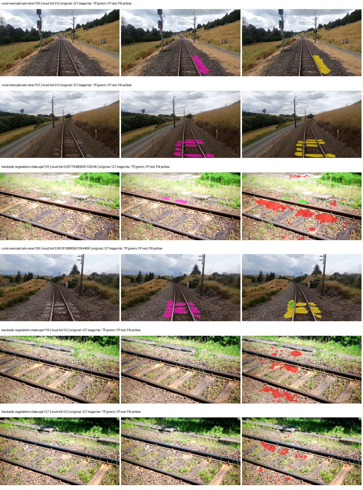
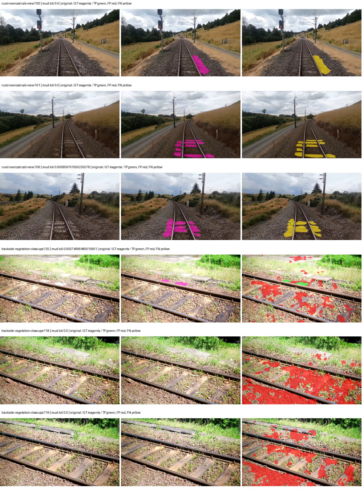
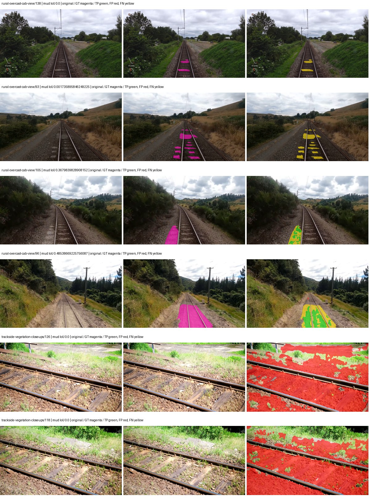
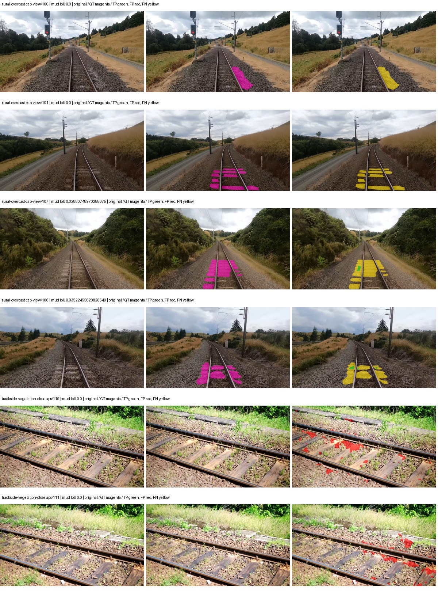
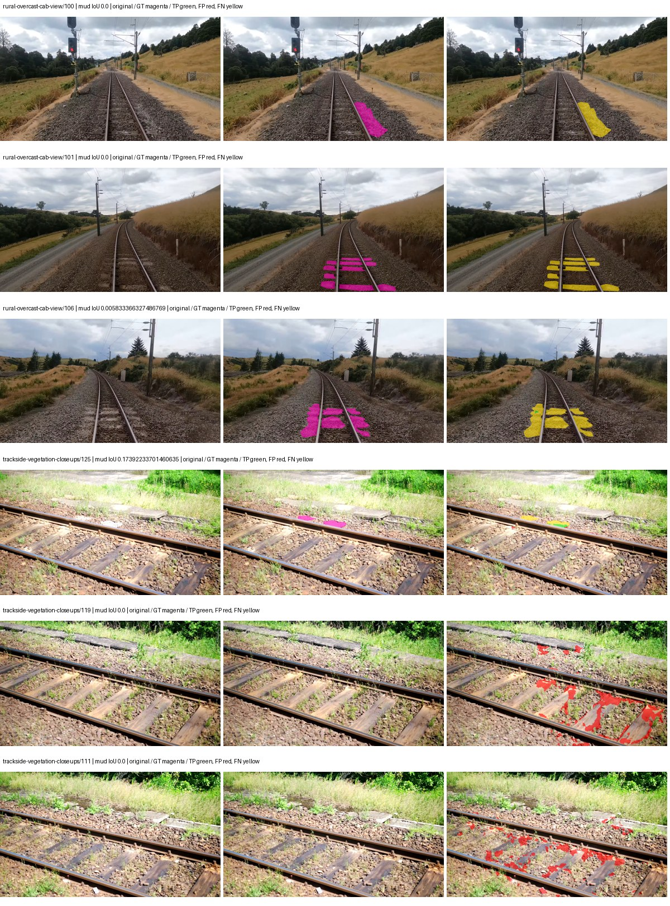
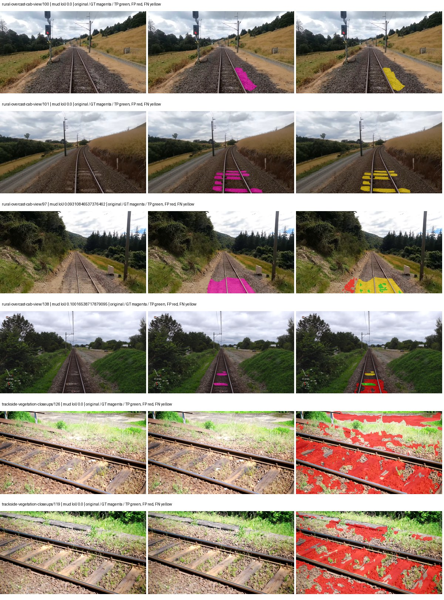
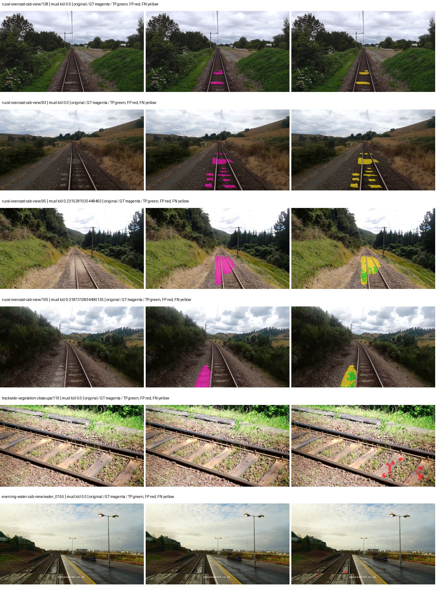
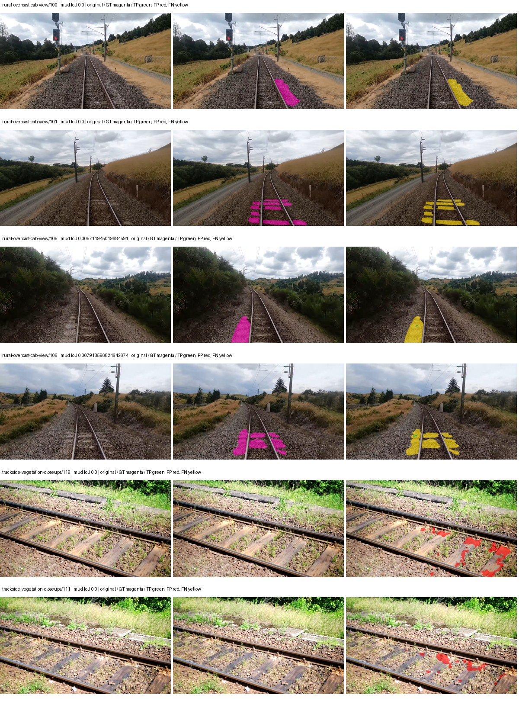
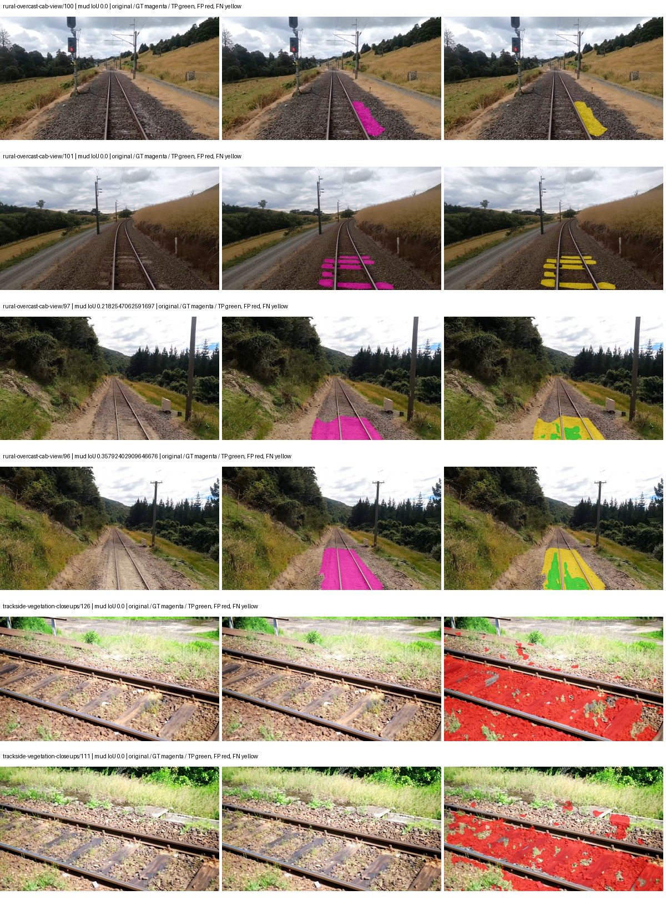

# native_resnet50_fpn_ocr — paul-test-rtis

[RTIS comparison](../../README.md) · [Full model records](record.json)

Primary selection and early stopping: **mud-pumping validation IoU**. A job is complete only after full statistics and isolated profiling are verified.

| Model | Initialization path | Seed | Status | Steps | Best step | Mud IoU (%) | Mud precision (%) | Mud recall (%) | Final mud IoU (trainer val, %) | mIoU (%) | Fixed GT-class mIoU (%) |
| --- | --- | --- | --- | --- | --- | --- | --- | --- | --- | --- | --- |
| native_resnet50_fpn_ocr | rtis_only | 0 | completed | 3563 | 2290 | 1.78 | 7.52 | 2.27 | 0.86 | 26.74 | 31.19 |
| native_resnet50_fpn_ocr | rtis_only | 1 | completed | 2036 | 2036 | 0.36 | 0.54 | 1.07 | 0.36 | 28.82 | 33.62 |
| native_resnet50_fpn_ocr | rtis_only | 2 | completed | 2290 | 1018 | 2.09 | 2.33 | 17.02 | 1.44 | 23.06 | 26.90 |
| native_resnet50_fpn_ocr | cityscapes_to_rtis | 0 | completed | 1781 | 509 | 0.62 | 5.21 | 0.69 | 0.14 | 21.98 | 25.65 |
| native_resnet50_fpn_ocr | cityscapes_to_rtis | 1 | completed | 1527 | 1272 | 0.19 | 0.87 | 0.24 | 0.15 | 31.80 | 37.10 |
| native_resnet50_fpn_ocr | cityscapes_to_rtis | 2 | completed | 1527 | 254 | 0.76 | 0.93 | 4.07 | 0.34 | 22.07 | 23.29 |
| native_resnet50_fpn_ocr | railsem19_to_rtis | 0 | completed | 1781 | 509 | 11.10 | 82.48 | 11.37 | 0.12 | 39.49 | 46.07 |
| native_resnet50_fpn_ocr | railsem19_to_rtis | 1 | completed | 1527 | 1018 | 0.09 | 0.90 | 0.10 | 0.05 | 38.31 | 44.70 |
| native_resnet50_fpn_ocr | railsem19_to_rtis | 2 | training | 2649 | — | — | — | — | — | — | — |
| native_resnet50_fpn_ocr | cityscapes_to_railsem19_to_rtis | 0 | completed | 1781 | 509 | 2.29 | 2.94 | 9.47 | 1.21 | 36.84 | 42.97 |
| native_resnet50_fpn_ocr | cityscapes_to_railsem19_to_rtis | 1 | training | 1849 | — | — | — | — | — | — | — |
| native_resnet50_fpn_ocr | cityscapes_to_railsem19_to_rtis | 2 | training | 1799 | — | — | — | — | — | — | — |

Training: 220 images. Validation: 37 images. Test: 50 held out. Seeds: [0, 1, 2]. Seed variation measures optimization variability, not independent-recording uncertainty. Historical source checkpoints stay fixed across adaptation seeds.

Training code: `066afb2626398b7be59d4d19f5a0e4644fd59adc`. Split SHA-256: `71fef8292610c352da0709fe3bd030f3bcc18f97560394835f4b22826463b83d`.

## rtis_only — seed 0

Status: **completed**. Started: 2026-09-06T23:27:40.223980+00:00. Finished: 2026-09-07T00:46:30.168816+00:00.

Recipe pretrained initializer: `{"arch": "native", "backbone_path": null, "batch_norm_momentum": null, "checkpoint": null, "classifier_path": null, "drop_path": null, "encoder_name": null, "encoder_weights": null, "head": "unified_head", "head_paths": [], "inactive_parameter_paths": [], "local_files_only": false, "lora_alpha": 32, "lora_dropout": 0.05, "lora_r": 16, "lora_targets": [], "native": {"auxiliary_heads": [], "backbone": {"in_channels": 3, "kind": "timm", "name": "resnet50.a1_in1k", "out_indices": [1, 2, 3, 4], "weights": "pretrained"}, "head": {"activation": "relu", "attention_scale": 1, "channels": 512, "coarse_loss_weight": 0.4, "dropout": 0.05, "in_indices": [0, 1, 2, 3], "key_channels": 256, "kind": "ocr", "norm": "group"}, "neck": {"activation": "relu", "kind": "fpn", "norm": "group", "num_outputs": 4, "out_channels": 256}, "task": "multiclass"}, "revision": null, "smp_arch": null, "subfolder": null, "trust_remote_code": false, "tuning": "full"}`.

`rtis_only` uses the recipe initializer, which may include pretrained segmentation components. Transfer paths load the exact historical source checkpoint below and reset the classifier; they do not reset all query/decoder features.

Source checkpoint: `Recipe pretrained initialization`.

Config SHA-256: `190512bcf7b26d249605f1d8a2fd731fba462ee3f54f2b2643c31e58c03b08aa`. Weights used for validation: `raw`.

### Mud-pumping and aggregate quality

| Metric | Selected checkpoint | Final training validation |
| --- | --- | --- |
| Mud IoU | 1.78 | 0.86 |
| Mud precision | 7.52 | 30.72 |
| Mud recall | 2.27 | 0.88 |
| Mud Dice/F1 | 3.49 | 1.72 |
| mIoU | 26.74 | 28.86 |
| Mean accuracy | 41.50 | 41.14 |
| Mean precision | 40.13 | 47.82 |
| Mean Dice | 34.45 | 36.92 |
| Mean specificity | 98.90 | 98.87 |
| Pixel accuracy | 81.90 | 81.66 |
| Frequency-weighted IoU | 72.15 | 71.56 |
| Fixed GT-present class mIoU | 31.19 | 33.67 |
| Boundary F1 | 33.48 | 36.49 |

The selected checkpoint has independent evaluation evidence. Final values are the trainer's final validation record, not a new independent evaluation. mIoU averages classes with nonzero union, so false positives on absent classes can change its denominator. The fixed GT-class mean is supplementary and excludes absent classes; their false positives remain in the confusion matrix.

### Resource usage and timing

| Measurement | Value |
| --- | --- |
| Peak training VRAM, retained training invocation (GiB) | 11.64 |
| Peak evaluation VRAM (GiB) | 7.02 |
| Retained training invocation wall time (seconds) | 4540.04 |
| Retained training invocation GPU-hours (one GPU) | 1.26 |
| Evaluation wall time (seconds) | 17.29 |
| Full evaluation pipeline images/second | 2.14 |
| Best full-state checkpoint (MiB) | 498.97 |
| Final full-state checkpoint (MiB) | 498.96 |
| Audited periodic checkpoints removed (GiB) | 3.41 |

VRAM uses the recorded allocator high-water mark; it is not total device usage including CUDA context. Resumed jobs' retained training invocation times and peaks are **not whole-campaign totals**. Earlier invocation resource records are not reconstructed here. Evaluation throughput includes loader, sliding-window inference and metrics; it is not model-only latency/FPS. Missing measurements are shown as —, never inferred from another dataset's run.

### Standardized inference performance

Dedicated model-only profiling waits for an idle worker-locked L40S: BF16, batch 1, 1024x1024, 20 warmup and 100 CUDA-event-timed public forwards. It excludes loading, preprocessing, tiling and metrics.

| Status | Parameters | Weight MiB | FPS | p50 ms | p95 ms | Peak reserved GiB |
| --- | --- | --- | --- | --- | --- | --- |
| complete | 32646762 | 124.54 | 47.88 | 20.74 | 21.36 | 1.46 |

```json
{
  "schema_version": 1,
  "model_id": "native_resnet50_fpn_ocr",
  "measured_at": "2026-09-07T00:46:24+00:00",
  "status": "complete",
  "benchmark_scope": "rtis_selected_checkpoint_model_only",
  "applies_to": [
    "native_resnet50_fpn_ocr--rtis_only--seed-0"
  ],
  "source": {
    "campaign_git_sha": "066afb2626398b7be59d4d19f5a0e4644fd59adc",
    "git_dirty": false,
    "config_hash": "5e2e7155a7b4",
    "resolved_config": "/data/izadia1/projects/segmentary-runs/paul-test-rtis/mud-fullstats-v1-20260906-r2/configs/native_resnet50_fpn_ocr--rtis_only--seed-0.yaml",
    "config_sha256": "190512bcf7b26d249605f1d8a2fd731fba462ee3f54f2b2643c31e58c03b08aa",
    "checkpoint_sha256": "410d9997f47dd27a0f1003721b614c5b64fb5bcb5ae79f775986ae2d1c104326",
    "checkpoint_global_step": 2290,
    "checkpoint_bytes": 523207337,
    "checkpoint_kind": "resume checkpoint with optimizer and EMA state",
    "weights": "raw",
    "measured_checkpoint_job_id": "native_resnet50_fpn_ocr--rtis_only--seed-0",
    "result_sha256": "7e82a59364b251445bb484ebc67ca4724763badfb007ecbe3b81a465d404e693",
    "result_git_sha": "066afb2626398b7be59d4d19f5a0e4644fd59adc",
    "result_stage": "eval:paul-test-rtis:val",
    "result_seed": 0
  },
  "hardware": {
    "gpu_name": "NVIDIA L40S",
    "gpu_uuid": "GPU-1c9b612f-e0b5-fbbc-150f-8c2ef13453c9",
    "logical_device": "cuda:0",
    "physical_visibility_token": "5",
    "compute_capability": [
      8,
      9
    ],
    "total_memory_bytes": 47677177856
  },
  "model": {
    "parameter_count": 32646762,
    "trainable_parameter_count": 32646762,
    "resident_parameter_bytes": 130587048,
    "parameter_dtype_counts": {
      "float32": 32646762
    }
  },
  "contract": {
    "backend": "pytorch",
    "precision": "bf16_autocast",
    "batch_size": 1,
    "input_shape_nchw": [
      1,
      3,
      1024,
      1024
    ],
    "warmup_iterations": 20,
    "measured_iterations": 100,
    "timing": "per-forward CUDA events with end-event synchronization",
    "includes_preprocessing": false,
    "includes_data_loader": false,
    "includes_sliding_window": false,
    "input_resident_on_gpu": true,
    "model_only": true,
    "entrypoint": "public model(image) dense-logits forward"
  },
  "measurements": {
    "latency": {
      "p50_ms": 20.738048553466797,
      "p95_ms": 21.36407012939453,
      "mean_ms": 20.884560890197754,
      "minimum_ms": 20.61516761779785,
      "maximum_ms": 23.384063720703125,
      "fps": 47.88226121954777,
      "raw_ms": [
        20.985855102539062,
        20.799488067626953,
        20.66329574584961,
        20.781055450439453,
        20.684799194335938,
        20.742143630981445,
        20.684799194335938,
        20.983808517456055,
        20.702207565307617,
        20.755456924438477,
        20.61516761779785,
        20.67558479309082,
        20.81996726989746,
        20.775936126708984,
        20.68070411682129,
        20.777984619140625,
        20.716543197631836,
        20.791296005249023,
        20.770816802978516,
        20.984832763671875,
        20.750335693359375,
        20.676607131958008,
        20.716543197631836,
        20.686847686767578,
        20.67251205444336,
        21.07801628112793,
        23.384063720703125,
        20.786176681518555,
        20.893695831298828,
        20.702207565307617,
        20.709375381469727,
        20.738048553466797,
        20.84351921081543,
        21.219327926635742,
        20.86195182800293,
        22.404096603393555,
        20.83635139465332,
        20.816896438598633,
        20.784128189086914,
        20.654048919677734,
        20.709375381469727,
        20.703231811523438,
        20.711423873901367,
        20.71139144897461,
        21.142528533935547,
        22.87411117553711,
        20.70732879638672,
        20.63974380493164,
        20.805631637573242,
        20.754432678222656,
        21.24799919128418,
        21.01043128967285,
        21.721088409423828,
        20.68067169189453,
        21.09542465209961,
        21.081087112426758,
        20.68070411682129,
        20.677631378173828,
        20.694015502929688,
        20.83839988708496,
        20.977664947509766,
        23.361536026000977,
        20.718591690063477,
        20.711423873901367,
        20.738048553466797,
        20.777984619140625,
        20.677631378173828,
        20.65920066833496,
        20.69811248779297,
        20.754432678222656,
        20.718591690063477,
        20.68889617919922,
        20.66329574584961,
        20.713472366333008,
        20.68172836303711,
        20.66124725341797,
        20.743167877197266,
        20.702207565307617,
        20.753408432006836,
        20.65407943725586,
        21.090303421020508,
        21.04627227783203,
        20.701183319091797,
        20.814847946166992,
        20.741119384765625,
        20.66431999206543,
        20.753408432006836,
        20.6694393157959,
        20.709375381469727,
        20.842496871948242,
        20.708351135253906,
        20.69811248779297,
        20.733951568603516,
        21.0565128326416,
        20.732927322387695,
        20.66739273071289,
        20.63052749633789,
        21.345279693603516,
        20.733951568603516,
        20.968448638916016
      ],
      "percentile_method": "numpy linear interpolation"
    },
    "peak_reserved_bytes": 1562378240,
    "memory_kind": "pytorch_cuda_allocator_peak_reserved_excluding_context",
    "benchmark_wall_clock_s": 15.341855399310589
  },
  "started_at": "2026-09-07T00:46:09+00:00",
  "finished_at": "2026-09-07T00:46:24+00:00",
  "environment": {
    "hostname": "hdrfs-app-001",
    "python": "3.11.15",
    "platform": "Linux-5.15.0-139-generic-x86_64-with-glibc2.35",
    "torch": "2.11.0+cu128",
    "torch_cuda": "12.8",
    "cudnn": 91900,
    "driver_version": "570.133.20",
    "cuda_available": true,
    "gpu_count": 1,
    "gpu_names": [
      "NVIDIA L40S"
    ],
    "cuda_visible_devices": "5",
    "packages": {
      "segmentary": "0.1.0",
      "torch": "2.11.0+cu128",
      "torchvision": "0.26.0+cu128",
      "transformers": "5.15.0",
      "timm": "1.0.28",
      "segmentation-models-pytorch": "0.5.0",
      "albumentations": "2.0.8",
      "lightning": "2.6.5",
      "numpy": "2.4.4"
    }
  }
}
```

### Per-class validation results

| Class | GT pixels | IoU (%) | Precision (%) | Recall (%) | Dice (%) | Boundary F1 (%) |
| --- | --- | --- | --- | --- | --- | --- |
| car | 29664 | 5.20 | 32.31 | 5.84 | 9.89 | 30.37 |
| construction | 311585 | 47.61 | 53.31 | 81.68 | 64.51 | 54.58 |
| fence | 265137 | 10.49 | 37.07 | 12.77 | 18.99 | 22.01 |
| mud-pumping | 1226250 | 1.78 | 7.52 | 2.27 | 3.49 | 5.60 |
| on-rails | 0 | 0.00 | 0.00 | — | 0.00 | 0.00 |
| person | 0 | 0.00 | 0.00 | — | 0.00 | 0.00 |
| pole | 628038 | 63.13 | 74.26 | 80.81 | 77.40 | 85.29 |
| rail-embedded | 16799 | 0.38 | 0.83 | 0.71 | 0.76 | 3.42 |
| rail-raised | 2969797 | 70.84 | 77.46 | 89.23 | 82.93 | 84.22 |
| rail-track | 6323197 | 31.47 | 65.16 | 37.84 | 47.88 | 42.99 |
| road | 1048831 | 12.72 | 24.14 | 21.19 | 22.57 | 24.49 |
| sidewalk | 1297367 | 11.11 | 65.10 | 11.81 | 19.99 | 14.95 |
| sky | 19121606 | 96.56 | 98.56 | 97.94 | 98.25 | 87.26 |
| standing-water | 95802 | 0.04 | 0.05 | 0.25 | 0.08 | 0.36 |
| terrain | 39239306 | 87.33 | 89.86 | 96.87 | 93.24 | 60.88 |
| trackbed | 10643081 | 47.62 | 54.69 | 78.67 | 64.52 | 47.28 |
| traffic-light | 19510 | 16.16 | 18.06 | 60.52 | 27.82 | 38.15 |
| traffic-sign | 13285 | 32.15 | 62.00 | 40.04 | 48.66 | 49.03 |
| tram-track | 56179 | 0.00 | 0.00 | 0.00 | 0.00 | 0.00 |
| truck | 0 | 0.00 | 0.00 | — | 0.00 | 0.00 |
| vegetation-overgrowth | 5901821 | 26.91 | 82.39 | 28.55 | 42.40 | 52.24 |

### Full-run accounting

| Measurement | Value |
| --- | --- |
| Full GPU-reserved wall seconds, all recorded worker attempts | 4729.95 |
| Full reserved GPU-hours | 1.31 |
| Whole-run timing complete | True |

| Phase | Wall seconds including failed attempts |
| --- | --- |
| training | 4546.96 |
| diagnostics | 130.72 |
| performance | 22.68 |

GPU-reserved time includes model loading, training, validation, collection, profiling, checkpoint I/O and orchestration while the worker owns one GPU. It is not GPU kernel-active time. Phase timings and sampled device memory/power/utilization are retained separately; sampled device memory is not the allocator high-water mark.

### Train/validation and raw/EMA diagnostics

| Checkpoint / weights / split | Images | Mud IoU (%) | Mud precision (%) | Mud recall (%) |
| --- | --- | --- | --- | --- |
| best-auto-train / raw | 220 | 93.18 | 95.76 | 97.19 |
| best-auto-val / raw | 37 | 1.78 | 7.52 | 2.27 |
| best-alternate-val / ema | 37 | 0.88 | 16.11 | 0.92 |
| final-auto-val / raw | 37 | 0.87 | 30.74 | 0.88 |

Train uses the evaluation transform without augmentation. Compare mud train/validation metrics for the same selected weights. Alternate EMA on running-stat BatchNorm is explicitly uncalibrated and is diagnostic only. Score-threshold curves use uncalibrated normalized scores and are pixel-level diagnostics, not event detection rates or a selected deployment operating point.

### Downloadable evidence

- best-auto-train: [per-image.csv](rtis_only--seed-0/best-auto-train/per-image.csv) · [per-image-confusion.json.gz](rtis_only--seed-0/best-auto-train/per-image-confusion.json.gz) · [groups.json](rtis_only--seed-0/best-auto-train/groups.json) · [mud-score-curves.json](rtis_only--seed-0/best-auto-train/mud-score-curves.json)
- best-auto-val: [per-image.csv](rtis_only--seed-0/best-auto-val/per-image.csv) · [per-image-confusion.json.gz](rtis_only--seed-0/best-auto-val/per-image-confusion.json.gz) · [groups.json](rtis_only--seed-0/best-auto-val/groups.json) · [mud-score-curves.json](rtis_only--seed-0/best-auto-val/mud-score-curves.json) · [examples.jpg](rtis_only--seed-0/best-auto-val/examples.jpg)
- best-alternate-val: [per-image.csv](rtis_only--seed-0/best-alternate-val/per-image.csv) · [per-image-confusion.json.gz](rtis_only--seed-0/best-alternate-val/per-image-confusion.json.gz) · [groups.json](rtis_only--seed-0/best-alternate-val/groups.json) · [mud-score-curves.json](rtis_only--seed-0/best-alternate-val/mud-score-curves.json)
- final-auto-val: [per-image.csv](rtis_only--seed-0/final-auto-val/per-image.csv) · [per-image-confusion.json.gz](rtis_only--seed-0/final-auto-val/per-image-confusion.json.gz) · [groups.json](rtis_only--seed-0/final-auto-val/groups.json) · [mud-score-curves.json](rtis_only--seed-0/final-auto-val/mud-score-curves.json)
- resources: [telemetry.csv](rtis_only--seed-0/resources/telemetry.csv)



Examples are two lowest and two highest mud-IoU positive images, plus up to two negative images with the most false-positive mud pixels. They are targeted diagnostic examples, not random samples. Green: true positive; red: false positive; yellow: false negative. Full predictions remain on HDRFS.

### Validation tracking

| Logged step | Overall mIoU (%) | Mud IoU (%) |
| --- | --- | --- |
| 254 | 21.09 | 0.17 |
| 508 | 20.21 | 0.17 |
| 763 | 21.89 | 0.31 |
| 1017 | 23.20 | 0.56 |
| 1272 | 24.87 | 0.71 |
| 1527 | 27.95 | 1.09 |
| 1781 | 25.80 | 1.18 |
| 2036 | 29.22 | 0.69 |
| 2290 | 26.74 | 1.78 |
| 2545 | 27.38 | 1.03 |
| 2799 | 27.41 | 1.56 |
| 3054 | 32.07 | 0.58 |
| 3308 | 30.22 | 0.63 |
| 3563 | 28.86 | 0.86 |

All retained scalar curves, including training loss and per-class IoU, are in record.json. Observed best mud on a curve is not necessarily a retained checkpoint: the pilot saved its selection-metric-best and final checkpoints. Step logging and checkpoint global_step may differ by one.

### Stopping and checkpoint provenance

```json
{
  "stopping": {
    "actual_steps": 3563,
    "maximum_steps": 4000,
    "min_delta": 0.001,
    "monitor": "val_iou/mud-pumping",
    "patience": 5,
    "reason": "validation_plateau"
  },
  "checkpoints": {
    "best": {
      "path": "/data/izadia1/projects/segmentary-runs/paul-test-rtis/mud-fullstats-v1-20260906-r2/future-runs/native_resnet50_fpn_ocr--rtis_only--seed-0_seed0/rtis/best.ckpt",
      "sha256": "410d9997f47dd27a0f1003721b614c5b64fb5bcb5ae79f775986ae2d1c104326",
      "global_step": 2290,
      "bytes": 523207337
    },
    "final": {
      "path": "/data/izadia1/projects/segmentary-runs/paul-test-rtis/mud-fullstats-v1-20260906-r2/future-runs/native_resnet50_fpn_ocr--rtis_only--seed-0_seed0/rtis/last.ckpt",
      "sha256": "3c38d9fe56cfad0174697eca40e9699a908eb76b1ea261300f12a3136c9eb1ac",
      "global_step": 3563,
      "bytes": 523195113
    }
  },
  "cleanup_error": null
}
```

### Resolved training, initialization and evaluation settings

The optimizer block is the base configuration. Stage LR scales are applied at runtime, and stage warmup is capped at min(base warmup, floor(stage budget / 10), stage budget - 1): 400 steps for this 4,000-step pilot. Model-internal native input grids may differ from augmentation crops (EoMT uses its 640 grid).

```json
{
  "name": "native_resnet50_fpn_ocr--rtis_only--seed-0",
  "model": {
    "arch": "native",
    "checkpoint": null,
    "tuning": "full",
    "head": "unified_head",
    "lora_r": 16,
    "lora_alpha": 32,
    "lora_dropout": 0.05,
    "lora_targets": [],
    "drop_path": null,
    "revision": null,
    "subfolder": null,
    "local_files_only": false,
    "trust_remote_code": false,
    "backbone_path": null,
    "head_paths": [],
    "classifier_path": null,
    "inactive_parameter_paths": [],
    "smp_arch": null,
    "encoder_name": null,
    "encoder_weights": null,
    "native": {
      "task": "multiclass",
      "backbone": {
        "kind": "timm",
        "name": "resnet50.a1_in1k",
        "weights": "pretrained",
        "out_indices": [
          1,
          2,
          3,
          4
        ],
        "in_channels": 3
      },
      "neck": {
        "kind": "fpn",
        "out_channels": 256,
        "num_outputs": 4,
        "norm": "group",
        "activation": "relu"
      },
      "head": {
        "kind": "ocr",
        "in_indices": [
          0,
          1,
          2,
          3
        ],
        "channels": 512,
        "key_channels": 256,
        "attention_scale": 1,
        "dropout": 0.05,
        "coarse_loss_weight": 0.4,
        "norm": "group",
        "activation": "relu"
      },
      "auxiliary_heads": []
    },
    "batch_norm_momentum": null
  },
  "space": "paul-test-rtis",
  "taxonomy_root": "/data/izadia1/projects/segmentary-rtis-fullstats-066afb2/taxonomy",
  "output_root": "/data/izadia1/projects/segmentary-runs/paul-test-rtis/mud-fullstats-v1-20260906-r2/future-runs",
  "optim": {
    "backbone_lr": 0.0001,
    "head_lr_mult": 10.0,
    "weight_decay": 0.05,
    "llrd": 1.0,
    "warmup_iters": 1500,
    "warmup_ratio": 1e-06,
    "poly_power": 0.9,
    "min_lr_ratio": 0.0,
    "betas": [
      0.9,
      0.999
    ],
    "grad_clip": 1.0
  },
  "train": {
    "iters": 4000,
    "batch_size": 2,
    "accum": 8,
    "num_workers": 2,
    "precision": "bf16-mixed",
    "ema_decay": 0.9998,
    "val_every": 250,
    "ckpt_every": 500,
    "selection_metric": "val_iou/mud-pumping",
    "early_stopping_patience": 5,
    "early_stopping_min_delta": 0.001,
    "seed": 0,
    "devices": 1
  },
  "eval": {
    "sliding_window": true,
    "window": [
      1024,
      1024
    ],
    "stride": [
      768,
      768
    ],
    "batch_size": 1,
    "num_workers": 2,
    "tta_scales": [],
    "tta_flip": false,
    "threshold": 0.5,
    "boundary_tolerance_frac": 0.0075,
    "save_confusion": true
  },
  "loss": {
    "task": "multiclass",
    "activation": "auto",
    "terms": [],
    "aux": "none",
    "aux_weight": 0.0,
    "ce_weight": 1.0,
    "label_smoothing": 0.0,
    "class_weights": null,
    "query": null
  },
  "aug": {
    "crop": [
      1024,
      1024
    ],
    "scale_min": 0.5,
    "scale_max": 2.0,
    "hflip_p": 0.5,
    "color_jitter_p": 0.5,
    "brightness": 0.25,
    "contrast": 0.25,
    "saturation": 0.25,
    "hue": 0.05
  },
  "stages": [
    {
      "name": "rtis",
      "data": [
        {
          "name": "paul-test-rtis",
          "root": "/data/izadia1/datasets/paul-test-rtis",
          "variant": null,
          "split_file": "splits.json",
          "train_split": "train",
          "val_split": "val",
          "limit": null,
          "loader": "folder",
          "mapping": "paul-test-rtis",
          "loader_options": {
            "require_groups": true
          }
        }
      ],
      "iters": null,
      "lr_scale": 1.0,
      "head_group_lr_scale": 1.0,
      "init_from": "pretrained",
      "reset_head": false,
      "freeze": null,
      "sample_weights": null
    }
  ]
}
```

### Hardware and software provenance

```json
{
  "training": {
    "cuda_available": true,
    "cuda_visible_devices": "5",
    "cudnn": 91900,
    "driver_version": "570.133.20",
    "gpu_count": 1,
    "gpu_names": [
      "NVIDIA L40S"
    ],
    "hostname": "hdrfs-app-001",
    "input_normalization": {
      "channel_order": "rgb",
      "mean": [
        0.485,
        0.456,
        0.406
      ],
      "source": "timm_pretrained_cfg",
      "std": [
        0.229,
        0.224,
        0.225
      ]
    },
    "model_origins": [
      {
        "hf_commit": null,
        "hf_name_or_path": null,
        "module": "backbone",
        "timm_pretrained": {
          "architecture": "resnet50",
          "hf_hub_id": "timm/resnet50.a1_in1k",
          "tag": "a1_in1k",
          "url": "https://github.com/rwightman/pytorch-image-models/releases/download/v0.1-rsb-weights/resnet50_a1_0-14fe96d1.pth"
        }
      },
      {
        "hf_commit": null,
        "hf_name_or_path": null,
        "module": "backbone.model",
        "timm_pretrained": {
          "architecture": "resnet50",
          "hf_hub_id": "timm/resnet50.a1_in1k",
          "tag": "a1_in1k",
          "url": "https://github.com/rwightman/pytorch-image-models/releases/download/v0.1-rsb-weights/resnet50_a1_0-14fe96d1.pth"
        }
      }
    ],
    "model_parameter_count": 32646762,
    "packages": {
      "albumentations": "2.0.8",
      "lightning": "2.6.5",
      "numpy": "2.4.4",
      "segmentary": "0.1.0",
      "segmentation-models-pytorch": "0.5.0",
      "timm": "1.0.28",
      "torch": "2.11.0+cu128",
      "torchvision": "0.26.0+cu128",
      "transformers": "5.15.0"
    },
    "platform": "Linux-5.15.0-139-generic-x86_64-with-glibc2.35",
    "python": "3.11.15",
    "torch": "2.11.0+cu128",
    "torch_cuda": "12.8",
    "trainable_parameter_count": 32646762,
    "training_stop": {
      "actual_steps": 3563,
      "maximum_steps": 4000,
      "min_delta": 0.001,
      "monitor": "val_iou/mud-pumping",
      "patience": 5,
      "reason": "validation_plateau"
    },
    "validation_weights": "raw"
  },
  "evaluation": {
    "cuda_available": true,
    "cuda_visible_devices": "5",
    "cudnn": 91900,
    "driver_version": "570.133.20",
    "gpu_count": 1,
    "gpu_names": [
      "NVIDIA L40S"
    ],
    "hostname": "hdrfs-app-001",
    "input_normalization": {
      "channel_order": "rgb",
      "mean": [
        0.485,
        0.456,
        0.406
      ],
      "source": "timm_pretrained_cfg",
      "std": [
        0.229,
        0.224,
        0.225
      ]
    },
    "packages": {
      "albumentations": "2.0.8",
      "lightning": "2.6.5",
      "numpy": "2.4.4",
      "segmentary": "0.1.0",
      "segmentation-models-pytorch": "0.5.0",
      "timm": "1.0.28",
      "torch": "2.11.0+cu128",
      "torchvision": "0.26.0+cu128",
      "transformers": "5.15.0"
    },
    "platform": "Linux-5.15.0-139-generic-x86_64-with-glibc2.35",
    "python": "3.11.15",
    "torch": "2.11.0+cu128",
    "torch_cuda": "12.8"
  }
}
```

## rtis_only — seed 1

Status: **completed**. Started: 2026-09-06T23:28:20.164616+00:00. Finished: 2026-09-07T00:14:57.890547+00:00.

Recipe pretrained initializer: `{"arch": "native", "backbone_path": null, "batch_norm_momentum": null, "checkpoint": null, "classifier_path": null, "drop_path": null, "encoder_name": null, "encoder_weights": null, "head": "unified_head", "head_paths": [], "inactive_parameter_paths": [], "local_files_only": false, "lora_alpha": 32, "lora_dropout": 0.05, "lora_r": 16, "lora_targets": [], "native": {"auxiliary_heads": [], "backbone": {"in_channels": 3, "kind": "timm", "name": "resnet50.a1_in1k", "out_indices": [1, 2, 3, 4], "weights": "pretrained"}, "head": {"activation": "relu", "attention_scale": 1, "channels": 512, "coarse_loss_weight": 0.4, "dropout": 0.05, "in_indices": [0, 1, 2, 3], "key_channels": 256, "kind": "ocr", "norm": "group"}, "neck": {"activation": "relu", "kind": "fpn", "norm": "group", "num_outputs": 4, "out_channels": 256}, "task": "multiclass"}, "revision": null, "smp_arch": null, "subfolder": null, "trust_remote_code": false, "tuning": "full"}`.

`rtis_only` uses the recipe initializer, which may include pretrained segmentation components. Transfer paths load the exact historical source checkpoint below and reset the classifier; they do not reset all query/decoder features.

Source checkpoint: `Recipe pretrained initialization`.

Config SHA-256: `a099e0d3993520f28e9694e25e14e9adc0f15ce6efad1faf9432c75f986a74f3`. Weights used for validation: `raw`.

### Mud-pumping and aggregate quality

| Metric | Selected checkpoint | Final training validation |
| --- | --- | --- |
| Mud IoU | 0.36 | 0.36 |
| Mud precision | 0.54 | 0.54 |
| Mud recall | 1.07 | 1.07 |
| Mud Dice/F1 | 0.72 | 0.72 |
| mIoU | 28.82 | 28.82 |
| Mean accuracy | 41.51 | 41.51 |
| Mean precision | 45.79 | 45.78 |
| Mean Dice | 36.56 | 36.56 |
| Mean specificity | 98.85 | 98.85 |
| Pixel accuracy | 81.45 | 81.45 |
| Frequency-weighted IoU | 72.37 | 72.37 |
| Fixed GT-present class mIoU | 33.62 | 33.63 |
| Boundary F1 | 35.20 | 35.22 |

The selected checkpoint has independent evaluation evidence. Final values are the trainer's final validation record, not a new independent evaluation. mIoU averages classes with nonzero union, so false positives on absent classes can change its denominator. The fixed GT-class mean is supplementary and excludes absent classes; their false positives remain in the confusion matrix.

### Resource usage and timing

| Measurement | Value |
| --- | --- |
| Peak training VRAM, retained training invocation (GiB) | 11.64 |
| Peak evaluation VRAM (GiB) | 7.02 |
| Retained training invocation wall time (seconds) | 2611.72 |
| Retained training invocation GPU-hours (one GPU) | 0.73 |
| Evaluation wall time (seconds) | 16.75 |
| Full evaluation pipeline images/second | 2.21 |
| Best full-state checkpoint (MiB) | 498.97 |
| Final full-state checkpoint (MiB) | 498.96 |
| Audited periodic checkpoints removed (GiB) | 1.95 |

VRAM uses the recorded allocator high-water mark; it is not total device usage including CUDA context. Resumed jobs' retained training invocation times and peaks are **not whole-campaign totals**. Earlier invocation resource records are not reconstructed here. Evaluation throughput includes loader, sliding-window inference and metrics; it is not model-only latency/FPS. Missing measurements are shown as —, never inferred from another dataset's run.

### Standardized inference performance

Dedicated model-only profiling waits for an idle worker-locked L40S: BF16, batch 1, 1024x1024, 20 warmup and 100 CUDA-event-timed public forwards. It excludes loading, preprocessing, tiling and metrics.

| Status | Parameters | Weight MiB | FPS | p50 ms | p95 ms | Peak reserved GiB |
| --- | --- | --- | --- | --- | --- | --- |
| complete | 32646762 | 124.54 | 48.63 | 20.49 | 20.91 | 1.46 |

```json
{
  "schema_version": 1,
  "model_id": "native_resnet50_fpn_ocr",
  "measured_at": "2026-09-07T00:14:53+00:00",
  "status": "complete",
  "benchmark_scope": "rtis_selected_checkpoint_model_only",
  "applies_to": [
    "native_resnet50_fpn_ocr--rtis_only--seed-1"
  ],
  "source": {
    "campaign_git_sha": "066afb2626398b7be59d4d19f5a0e4644fd59adc",
    "git_dirty": false,
    "config_hash": "554264b672d6",
    "resolved_config": "/data/izadia1/projects/segmentary-runs/paul-test-rtis/mud-fullstats-v1-20260906-r2/configs/native_resnet50_fpn_ocr--rtis_only--seed-1.yaml",
    "config_sha256": "a099e0d3993520f28e9694e25e14e9adc0f15ce6efad1faf9432c75f986a74f3",
    "checkpoint_sha256": "a7a9287990d5c4c2d2560c93fccdd7503c1957d3a9b50d4cfd9cd27f59f9b50c",
    "checkpoint_global_step": 2036,
    "checkpoint_bytes": 523207465,
    "checkpoint_kind": "resume checkpoint with optimizer and EMA state",
    "weights": "raw",
    "measured_checkpoint_job_id": "native_resnet50_fpn_ocr--rtis_only--seed-1",
    "result_sha256": "94ee4d2cf085b519629300e5551bce9a98e879e461f52834b9533b65bebdd0ed",
    "result_git_sha": "066afb2626398b7be59d4d19f5a0e4644fd59adc",
    "result_stage": "eval:paul-test-rtis:val",
    "result_seed": 1
  },
  "hardware": {
    "gpu_name": "NVIDIA L40S",
    "gpu_uuid": "GPU-d411d86a-6d1d-1967-55e7-9f9ec85d13f5",
    "logical_device": "cuda:0",
    "physical_visibility_token": "1",
    "compute_capability": [
      8,
      9
    ],
    "total_memory_bytes": 47677177856
  },
  "model": {
    "parameter_count": 32646762,
    "trainable_parameter_count": 32646762,
    "resident_parameter_bytes": 130587048,
    "parameter_dtype_counts": {
      "float32": 32646762
    }
  },
  "contract": {
    "backend": "pytorch",
    "precision": "bf16_autocast",
    "batch_size": 1,
    "input_shape_nchw": [
      1,
      3,
      1024,
      1024
    ],
    "warmup_iterations": 20,
    "measured_iterations": 100,
    "timing": "per-forward CUDA events with end-event synchronization",
    "includes_preprocessing": false,
    "includes_data_loader": false,
    "includes_sliding_window": false,
    "input_resident_on_gpu": true,
    "model_only": true,
    "entrypoint": "public model(image) dense-logits forward"
  },
  "measurements": {
    "latency": {
      "p50_ms": 20.494847297668457,
      "p95_ms": 20.9142786026001,
      "mean_ms": 20.564006690979003,
      "minimum_ms": 20.43187141418457,
      "maximum_ms": 21.374975204467773,
      "fps": 48.6286556422236,
      "raw_ms": [
        20.68992042541504,
        20.478975296020508,
        20.502527236938477,
        20.45747184753418,
        20.4902400970459,
        20.48102378845215,
        20.44620704650879,
        20.495359420776367,
        20.490144729614258,
        20.819904327392578,
        20.536319732666016,
        20.50048065185547,
        20.49228858947754,
        20.47590446472168,
        20.511743545532227,
        20.47590446472168,
        20.48409652709961,
        20.48409652709961,
        20.44915199279785,
        20.486143112182617,
        20.49331283569336,
        20.545536041259766,
        20.47590446472168,
        20.47488021850586,
        20.493215560913086,
        20.4718074798584,
        20.510719299316406,
        20.498432159423828,
        20.46771240234375,
        20.479999542236328,
        20.43187141418457,
        20.47385597229004,
        20.513792037963867,
        20.47488021850586,
        21.374975204467773,
        20.8404483795166,
        20.579328536987305,
        20.496383666992188,
        20.46668815612793,
        20.48102378845215,
        20.489215850830078,
        20.46054458618164,
        20.435903549194336,
        20.49945640563965,
        20.520959854125977,
        20.78508758544922,
        20.994047164916992,
        20.46259117126465,
        20.494335174560547,
        20.68172836303711,
        20.600831985473633,
        20.67865562438965,
        20.524032592773438,
        21.024703979492188,
        20.436992645263672,
        20.771839141845703,
        20.525056838989258,
        20.488191604614258,
        20.43494415283203,
        20.63667106628418,
        20.46054458618164,
        20.46873664855957,
        20.4902400970459,
        21.149568557739258,
        20.83123207092285,
        20.974592208862305,
        20.544511795043945,
        20.559871673583984,
        20.46873664855957,
        20.48512077331543,
        20.46771240234375,
        20.502431869506836,
        20.534271240234375,
        20.510719299316406,
        20.477951049804688,
        20.47385597229004,
        20.489215850830078,
        20.765695571899414,
        20.48102378845215,
        20.440000534057617,
        20.490175247192383,
        20.592575073242188,
        20.911104202270508,
        20.515840530395508,
        20.50147247314453,
        20.66227149963379,
        20.60095977783203,
        20.48204803466797,
        20.43996810913086,
        20.509695053100586,
        20.50649642944336,
        20.46873664855957,
        20.70732879638672,
        20.516864776611328,
        20.48307228088379,
        20.503551483154297,
        20.89366340637207,
        20.593631744384766,
        20.718656539916992,
        20.48806381225586
      ],
      "percentile_method": "numpy linear interpolation"
    },
    "peak_reserved_bytes": 1562378240,
    "memory_kind": "pytorch_cuda_allocator_peak_reserved_excluding_context",
    "benchmark_wall_clock_s": 15.152679476886988
  },
  "started_at": "2026-09-07T00:14:38+00:00",
  "finished_at": "2026-09-07T00:14:53+00:00",
  "environment": {
    "hostname": "hdrfs-app-001",
    "python": "3.11.15",
    "platform": "Linux-5.15.0-139-generic-x86_64-with-glibc2.35",
    "torch": "2.11.0+cu128",
    "torch_cuda": "12.8",
    "cudnn": 91900,
    "driver_version": "570.133.20",
    "cuda_available": true,
    "gpu_count": 1,
    "gpu_names": [
      "NVIDIA L40S"
    ],
    "cuda_visible_devices": "1",
    "packages": {
      "segmentary": "0.1.0",
      "torch": "2.11.0+cu128",
      "torchvision": "0.26.0+cu128",
      "transformers": "5.15.0",
      "timm": "1.0.28",
      "segmentation-models-pytorch": "0.5.0",
      "albumentations": "2.0.8",
      "lightning": "2.6.5",
      "numpy": "2.4.4"
    }
  }
}
```

### Per-class validation results

| Class | GT pixels | IoU (%) | Precision (%) | Recall (%) | Dice (%) | Boundary F1 (%) |
| --- | --- | --- | --- | --- | --- | --- |
| car | 29664 | 3.77 | 27.24 | 4.20 | 7.27 | 29.49 |
| construction | 311585 | 41.82 | 58.39 | 59.57 | 58.98 | 47.09 |
| fence | 265137 | 7.28 | 46.27 | 7.95 | 13.57 | 20.91 |
| mud-pumping | 1226250 | 0.36 | 0.54 | 1.07 | 0.72 | 0.92 |
| on-rails | 0 | 0.00 | 0.00 | — | 0.00 | 0.00 |
| person | 0 | 0.00 | 0.00 | — | 0.00 | 0.00 |
| pole | 628038 | 65.39 | 76.67 | 81.62 | 79.07 | 86.53 |
| rail-embedded | 16799 | 5.82 | 26.68 | 6.93 | 11.01 | 6.78 |
| rail-raised | 2969797 | 69.63 | 77.09 | 87.79 | 82.10 | 85.58 |
| rail-track | 6323197 | 39.79 | 61.95 | 52.67 | 56.93 | 54.86 |
| road | 1048831 | 7.27 | 16.88 | 11.31 | 13.55 | 13.90 |
| sidewalk | 1297367 | 14.77 | 45.01 | 18.02 | 25.74 | 19.27 |
| sky | 19121606 | 96.49 | 99.35 | 97.10 | 98.21 | 86.64 |
| standing-water | 95802 | 2.62 | 2.80 | 28.71 | 5.10 | 7.24 |
| terrain | 39239306 | 85.15 | 87.64 | 96.78 | 91.98 | 54.86 |
| trackbed | 10643081 | 51.04 | 68.06 | 67.13 | 67.59 | 50.25 |
| traffic-light | 19510 | 66.07 | 82.58 | 76.77 | 79.57 | 75.21 |
| traffic-sign | 13285 | 16.78 | 95.58 | 16.91 | 28.74 | 39.22 |
| tram-track | 56179 | 0.19 | 0.36 | 0.41 | 0.38 | 1.65 |
| truck | 0 | 0.00 | 0.00 | — | 0.00 | 0.00 |
| vegetation-overgrowth | 5901821 | 30.93 | 88.45 | 32.23 | 47.25 | 58.84 |

### Full-run accounting

| Measurement | Value |
| --- | --- |
| Full GPU-reserved wall seconds, all recorded worker attempts | 2797.73 |
| Full reserved GPU-hours | 0.78 |
| Whole-run timing complete | True |

| Phase | Wall seconds including failed attempts |
| --- | --- |
| training | 2618.31 |
| diagnostics | 129.55 |
| performance | 22.40 |

GPU-reserved time includes model loading, training, validation, collection, profiling, checkpoint I/O and orchestration while the worker owns one GPU. It is not GPU kernel-active time. Phase timings and sampled device memory/power/utilization are retained separately; sampled device memory is not the allocator high-water mark.

### Train/validation and raw/EMA diagnostics

| Checkpoint / weights / split | Images | Mud IoU (%) | Mud precision (%) | Mud recall (%) |
| --- | --- | --- | --- | --- |
| best-auto-train / raw | 220 | 91.95 | 95.71 | 95.91 |
| best-auto-val / raw | 37 | 0.36 | 0.54 | 1.07 |
| best-alternate-val / ema | 37 | 0.79 | 2.89 | 1.07 |
| final-auto-val / raw | 37 | 0.36 | 0.54 | 1.07 |

Train uses the evaluation transform without augmentation. Compare mud train/validation metrics for the same selected weights. Alternate EMA on running-stat BatchNorm is explicitly uncalibrated and is diagnostic only. Score-threshold curves use uncalibrated normalized scores and are pixel-level diagnostics, not event detection rates or a selected deployment operating point.

### Downloadable evidence

- best-auto-train: [per-image.csv](rtis_only--seed-1/best-auto-train/per-image.csv) · [per-image-confusion.json.gz](rtis_only--seed-1/best-auto-train/per-image-confusion.json.gz) · [groups.json](rtis_only--seed-1/best-auto-train/groups.json) · [mud-score-curves.json](rtis_only--seed-1/best-auto-train/mud-score-curves.json)
- best-auto-val: [per-image.csv](rtis_only--seed-1/best-auto-val/per-image.csv) · [per-image-confusion.json.gz](rtis_only--seed-1/best-auto-val/per-image-confusion.json.gz) · [groups.json](rtis_only--seed-1/best-auto-val/groups.json) · [mud-score-curves.json](rtis_only--seed-1/best-auto-val/mud-score-curves.json) · [examples.jpg](rtis_only--seed-1/best-auto-val/examples.jpg)
- best-alternate-val: [per-image.csv](rtis_only--seed-1/best-alternate-val/per-image.csv) · [per-image-confusion.json.gz](rtis_only--seed-1/best-alternate-val/per-image-confusion.json.gz) · [groups.json](rtis_only--seed-1/best-alternate-val/groups.json) · [mud-score-curves.json](rtis_only--seed-1/best-alternate-val/mud-score-curves.json)
- final-auto-val: [per-image.csv](rtis_only--seed-1/final-auto-val/per-image.csv) · [per-image-confusion.json.gz](rtis_only--seed-1/final-auto-val/per-image-confusion.json.gz) · [groups.json](rtis_only--seed-1/final-auto-val/groups.json) · [mud-score-curves.json](rtis_only--seed-1/final-auto-val/mud-score-curves.json)
- resources: [telemetry.csv](rtis_only--seed-1/resources/telemetry.csv)



Examples are two lowest and two highest mud-IoU positive images, plus up to two negative images with the most false-positive mud pixels. They are targeted diagnostic examples, not random samples. Green: true positive; red: false positive; yellow: false negative. Full predictions remain on HDRFS.

### Validation tracking

| Logged step | Overall mIoU (%) | Mud IoU (%) |
| --- | --- | --- |
| 254 | 18.76 | 0.19 |
| 508 | 20.69 | 0.16 |
| 763 | 20.30 | 0.32 |
| 1017 | 24.90 | 0.21 |
| 1272 | 23.72 | 0.05 |
| 1527 | 29.53 | 0.33 |
| 1781 | 28.82 | 0.36 |
| 2036 | 28.82 | 0.36 |

All retained scalar curves, including training loss and per-class IoU, are in record.json. Observed best mud on a curve is not necessarily a retained checkpoint: the pilot saved its selection-metric-best and final checkpoints. Step logging and checkpoint global_step may differ by one.

### Stopping and checkpoint provenance

```json
{
  "stopping": {
    "actual_steps": 2036,
    "maximum_steps": 4000,
    "min_delta": 0.001,
    "monitor": "val_iou/mud-pumping",
    "patience": 5,
    "reason": "validation_plateau"
  },
  "checkpoints": {
    "best": {
      "path": "/data/izadia1/projects/segmentary-runs/paul-test-rtis/mud-fullstats-v1-20260906-r2/future-runs/native_resnet50_fpn_ocr--rtis_only--seed-1_seed1/rtis/best.ckpt",
      "sha256": "a7a9287990d5c4c2d2560c93fccdd7503c1957d3a9b50d4cfd9cd27f59f9b50c",
      "global_step": 2036,
      "bytes": 523207465
    },
    "final": {
      "path": "/data/izadia1/projects/segmentary-runs/paul-test-rtis/mud-fullstats-v1-20260906-r2/future-runs/native_resnet50_fpn_ocr--rtis_only--seed-1_seed1/rtis/last.ckpt",
      "sha256": "c6d03b69410101ecc8db1f18311f42c60c6f9fdd6fe1706976d58c56ad9e901c",
      "global_step": 2036,
      "bytes": 523195113
    }
  },
  "cleanup_error": null
}
```

### Resolved training, initialization and evaluation settings

The optimizer block is the base configuration. Stage LR scales are applied at runtime, and stage warmup is capped at min(base warmup, floor(stage budget / 10), stage budget - 1): 400 steps for this 4,000-step pilot. Model-internal native input grids may differ from augmentation crops (EoMT uses its 640 grid).

```json
{
  "name": "native_resnet50_fpn_ocr--rtis_only--seed-1",
  "model": {
    "arch": "native",
    "checkpoint": null,
    "tuning": "full",
    "head": "unified_head",
    "lora_r": 16,
    "lora_alpha": 32,
    "lora_dropout": 0.05,
    "lora_targets": [],
    "drop_path": null,
    "revision": null,
    "subfolder": null,
    "local_files_only": false,
    "trust_remote_code": false,
    "backbone_path": null,
    "head_paths": [],
    "classifier_path": null,
    "inactive_parameter_paths": [],
    "smp_arch": null,
    "encoder_name": null,
    "encoder_weights": null,
    "native": {
      "task": "multiclass",
      "backbone": {
        "kind": "timm",
        "name": "resnet50.a1_in1k",
        "weights": "pretrained",
        "out_indices": [
          1,
          2,
          3,
          4
        ],
        "in_channels": 3
      },
      "neck": {
        "kind": "fpn",
        "out_channels": 256,
        "num_outputs": 4,
        "norm": "group",
        "activation": "relu"
      },
      "head": {
        "kind": "ocr",
        "in_indices": [
          0,
          1,
          2,
          3
        ],
        "channels": 512,
        "key_channels": 256,
        "attention_scale": 1,
        "dropout": 0.05,
        "coarse_loss_weight": 0.4,
        "norm": "group",
        "activation": "relu"
      },
      "auxiliary_heads": []
    },
    "batch_norm_momentum": null
  },
  "space": "paul-test-rtis",
  "taxonomy_root": "/data/izadia1/projects/segmentary-rtis-fullstats-066afb2/taxonomy",
  "output_root": "/data/izadia1/projects/segmentary-runs/paul-test-rtis/mud-fullstats-v1-20260906-r2/future-runs",
  "optim": {
    "backbone_lr": 0.0001,
    "head_lr_mult": 10.0,
    "weight_decay": 0.05,
    "llrd": 1.0,
    "warmup_iters": 1500,
    "warmup_ratio": 1e-06,
    "poly_power": 0.9,
    "min_lr_ratio": 0.0,
    "betas": [
      0.9,
      0.999
    ],
    "grad_clip": 1.0
  },
  "train": {
    "iters": 4000,
    "batch_size": 2,
    "accum": 8,
    "num_workers": 2,
    "precision": "bf16-mixed",
    "ema_decay": 0.9998,
    "val_every": 250,
    "ckpt_every": 500,
    "selection_metric": "val_iou/mud-pumping",
    "early_stopping_patience": 5,
    "early_stopping_min_delta": 0.001,
    "seed": 1,
    "devices": 1
  },
  "eval": {
    "sliding_window": true,
    "window": [
      1024,
      1024
    ],
    "stride": [
      768,
      768
    ],
    "batch_size": 1,
    "num_workers": 2,
    "tta_scales": [],
    "tta_flip": false,
    "threshold": 0.5,
    "boundary_tolerance_frac": 0.0075,
    "save_confusion": true
  },
  "loss": {
    "task": "multiclass",
    "activation": "auto",
    "terms": [],
    "aux": "none",
    "aux_weight": 0.0,
    "ce_weight": 1.0,
    "label_smoothing": 0.0,
    "class_weights": null,
    "query": null
  },
  "aug": {
    "crop": [
      1024,
      1024
    ],
    "scale_min": 0.5,
    "scale_max": 2.0,
    "hflip_p": 0.5,
    "color_jitter_p": 0.5,
    "brightness": 0.25,
    "contrast": 0.25,
    "saturation": 0.25,
    "hue": 0.05
  },
  "stages": [
    {
      "name": "rtis",
      "data": [
        {
          "name": "paul-test-rtis",
          "root": "/data/izadia1/datasets/paul-test-rtis",
          "variant": null,
          "split_file": "splits.json",
          "train_split": "train",
          "val_split": "val",
          "limit": null,
          "loader": "folder",
          "mapping": "paul-test-rtis",
          "loader_options": {
            "require_groups": true
          }
        }
      ],
      "iters": null,
      "lr_scale": 1.0,
      "head_group_lr_scale": 1.0,
      "init_from": "pretrained",
      "reset_head": false,
      "freeze": null,
      "sample_weights": null
    }
  ]
}
```

### Hardware and software provenance

```json
{
  "training": {
    "cuda_available": true,
    "cuda_visible_devices": "1",
    "cudnn": 91900,
    "driver_version": "570.133.20",
    "gpu_count": 1,
    "gpu_names": [
      "NVIDIA L40S"
    ],
    "hostname": "hdrfs-app-001",
    "input_normalization": {
      "channel_order": "rgb",
      "mean": [
        0.485,
        0.456,
        0.406
      ],
      "source": "timm_pretrained_cfg",
      "std": [
        0.229,
        0.224,
        0.225
      ]
    },
    "model_origins": [
      {
        "hf_commit": null,
        "hf_name_or_path": null,
        "module": "backbone",
        "timm_pretrained": {
          "architecture": "resnet50",
          "hf_hub_id": "timm/resnet50.a1_in1k",
          "tag": "a1_in1k",
          "url": "https://github.com/rwightman/pytorch-image-models/releases/download/v0.1-rsb-weights/resnet50_a1_0-14fe96d1.pth"
        }
      },
      {
        "hf_commit": null,
        "hf_name_or_path": null,
        "module": "backbone.model",
        "timm_pretrained": {
          "architecture": "resnet50",
          "hf_hub_id": "timm/resnet50.a1_in1k",
          "tag": "a1_in1k",
          "url": "https://github.com/rwightman/pytorch-image-models/releases/download/v0.1-rsb-weights/resnet50_a1_0-14fe96d1.pth"
        }
      }
    ],
    "model_parameter_count": 32646762,
    "packages": {
      "albumentations": "2.0.8",
      "lightning": "2.6.5",
      "numpy": "2.4.4",
      "segmentary": "0.1.0",
      "segmentation-models-pytorch": "0.5.0",
      "timm": "1.0.28",
      "torch": "2.11.0+cu128",
      "torchvision": "0.26.0+cu128",
      "transformers": "5.15.0"
    },
    "platform": "Linux-5.15.0-139-generic-x86_64-with-glibc2.35",
    "python": "3.11.15",
    "torch": "2.11.0+cu128",
    "torch_cuda": "12.8",
    "trainable_parameter_count": 32646762,
    "training_stop": {
      "actual_steps": 2036,
      "maximum_steps": 4000,
      "min_delta": 0.001,
      "monitor": "val_iou/mud-pumping",
      "patience": 5,
      "reason": "validation_plateau"
    },
    "validation_weights": "raw"
  },
  "evaluation": {
    "cuda_available": true,
    "cuda_visible_devices": "1",
    "cudnn": 91900,
    "driver_version": "570.133.20",
    "gpu_count": 1,
    "gpu_names": [
      "NVIDIA L40S"
    ],
    "hostname": "hdrfs-app-001",
    "input_normalization": {
      "channel_order": "rgb",
      "mean": [
        0.485,
        0.456,
        0.406
      ],
      "source": "timm_pretrained_cfg",
      "std": [
        0.229,
        0.224,
        0.225
      ]
    },
    "packages": {
      "albumentations": "2.0.8",
      "lightning": "2.6.5",
      "numpy": "2.4.4",
      "segmentary": "0.1.0",
      "segmentation-models-pytorch": "0.5.0",
      "timm": "1.0.28",
      "torch": "2.11.0+cu128",
      "torchvision": "0.26.0+cu128",
      "transformers": "5.15.0"
    },
    "platform": "Linux-5.15.0-139-generic-x86_64-with-glibc2.35",
    "python": "3.11.15",
    "torch": "2.11.0+cu128",
    "torch_cuda": "12.8"
  }
}
```

## rtis_only — seed 2

Status: **completed**. Started: 2026-09-06T23:33:15.412438+00:00. Finished: 2026-09-07T00:25:08.390198+00:00.

Recipe pretrained initializer: `{"arch": "native", "backbone_path": null, "batch_norm_momentum": null, "checkpoint": null, "classifier_path": null, "drop_path": null, "encoder_name": null, "encoder_weights": null, "head": "unified_head", "head_paths": [], "inactive_parameter_paths": [], "local_files_only": false, "lora_alpha": 32, "lora_dropout": 0.05, "lora_r": 16, "lora_targets": [], "native": {"auxiliary_heads": [], "backbone": {"in_channels": 3, "kind": "timm", "name": "resnet50.a1_in1k", "out_indices": [1, 2, 3, 4], "weights": "pretrained"}, "head": {"activation": "relu", "attention_scale": 1, "channels": 512, "coarse_loss_weight": 0.4, "dropout": 0.05, "in_indices": [0, 1, 2, 3], "key_channels": 256, "kind": "ocr", "norm": "group"}, "neck": {"activation": "relu", "kind": "fpn", "norm": "group", "num_outputs": 4, "out_channels": 256}, "task": "multiclass"}, "revision": null, "smp_arch": null, "subfolder": null, "trust_remote_code": false, "tuning": "full"}`.

`rtis_only` uses the recipe initializer, which may include pretrained segmentation components. Transfer paths load the exact historical source checkpoint below and reset the classifier; they do not reset all query/decoder features.

Source checkpoint: `Recipe pretrained initialization`.

Config SHA-256: `47536ae23edeb9559ef4ee5de0db7f6217b8178843452932424e39a41cf21628`. Weights used for validation: `raw`.

### Mud-pumping and aggregate quality

| Metric | Selected checkpoint | Final training validation |
| --- | --- | --- |
| Mud IoU | 2.09 | 1.44 |
| Mud precision | 2.33 | 13.15 |
| Mud recall | 17.02 | 1.60 |
| Mud Dice/F1 | 4.09 | 2.85 |
| mIoU | 23.06 | 29.15 |
| Mean accuracy | 35.92 | 42.65 |
| Mean precision | 40.18 | 44.01 |
| Mean Dice | 30.04 | 37.28 |
| Mean specificity | 98.54 | 98.95 |
| Pixel accuracy | 75.20 | 82.04 |
| Frequency-weighted IoU | 67.05 | 72.56 |
| Fixed GT-present class mIoU | 26.90 | 34.01 |
| Boundary F1 | 28.02 | 35.68 |

The selected checkpoint has independent evaluation evidence. Final values are the trainer's final validation record, not a new independent evaluation. mIoU averages classes with nonzero union, so false positives on absent classes can change its denominator. The fixed GT-class mean is supplementary and excludes absent classes; their false positives remain in the confusion matrix.

### Resource usage and timing

| Measurement | Value |
| --- | --- |
| Peak training VRAM, retained training invocation (GiB) | 11.64 |
| Peak evaluation VRAM (GiB) | 7.02 |
| Retained training invocation wall time (seconds) | 2924.25 |
| Retained training invocation GPU-hours (one GPU) | 0.81 |
| Evaluation wall time (seconds) | 17.07 |
| Full evaluation pipeline images/second | 2.17 |
| Best full-state checkpoint (MiB) | 498.97 |
| Final full-state checkpoint (MiB) | 498.96 |
| Audited periodic checkpoints removed (GiB) | 1.95 |

VRAM uses the recorded allocator high-water mark; it is not total device usage including CUDA context. Resumed jobs' retained training invocation times and peaks are **not whole-campaign totals**. Earlier invocation resource records are not reconstructed here. Evaluation throughput includes loader, sliding-window inference and metrics; it is not model-only latency/FPS. Missing measurements are shown as —, never inferred from another dataset's run.

### Standardized inference performance

Dedicated model-only profiling waits for an idle worker-locked L40S: BF16, batch 1, 1024x1024, 20 warmup and 100 CUDA-event-timed public forwards. It excludes loading, preprocessing, tiling and metrics.

| Status | Parameters | Weight MiB | FPS | p50 ms | p95 ms | Peak reserved GiB |
| --- | --- | --- | --- | --- | --- | --- |
| complete | 32646762 | 124.54 | 48.44 | 20.54 | 21.11 | 1.46 |

```json
{
  "schema_version": 1,
  "model_id": "native_resnet50_fpn_ocr",
  "measured_at": "2026-09-07T00:25:03+00:00",
  "status": "complete",
  "benchmark_scope": "rtis_selected_checkpoint_model_only",
  "applies_to": [
    "native_resnet50_fpn_ocr--rtis_only--seed-2"
  ],
  "source": {
    "campaign_git_sha": "066afb2626398b7be59d4d19f5a0e4644fd59adc",
    "git_dirty": false,
    "config_hash": "e37e47f7b933",
    "resolved_config": "/data/izadia1/projects/segmentary-runs/paul-test-rtis/mud-fullstats-v1-20260906-r2/configs/native_resnet50_fpn_ocr--rtis_only--seed-2.yaml",
    "config_sha256": "47536ae23edeb9559ef4ee5de0db7f6217b8178843452932424e39a41cf21628",
    "checkpoint_sha256": "f57b992d7cb48d72db83b710381f1e237b042720e3e93344abf829b9257e016f",
    "checkpoint_global_step": 1018,
    "checkpoint_bytes": 523207337,
    "checkpoint_kind": "resume checkpoint with optimizer and EMA state",
    "weights": "raw",
    "measured_checkpoint_job_id": "native_resnet50_fpn_ocr--rtis_only--seed-2",
    "result_sha256": "1e3a08ac3abce846f8f5c72af8f5bd1edd7964f6efa2cd08d967ba48aa5fa022",
    "result_git_sha": "066afb2626398b7be59d4d19f5a0e4644fd59adc",
    "result_stage": "eval:paul-test-rtis:val",
    "result_seed": 2
  },
  "hardware": {
    "gpu_name": "NVIDIA L40S",
    "gpu_uuid": "GPU-2f8008a1-9b67-11f6-987b-b393a672322c",
    "logical_device": "cuda:0",
    "physical_visibility_token": "3",
    "compute_capability": [
      8,
      9
    ],
    "total_memory_bytes": 47677177856
  },
  "model": {
    "parameter_count": 32646762,
    "trainable_parameter_count": 32646762,
    "resident_parameter_bytes": 130587048,
    "parameter_dtype_counts": {
      "float32": 32646762
    }
  },
  "contract": {
    "backend": "pytorch",
    "precision": "bf16_autocast",
    "batch_size": 1,
    "input_shape_nchw": [
      1,
      3,
      1024,
      1024
    ],
    "warmup_iterations": 20,
    "measured_iterations": 100,
    "timing": "per-forward CUDA events with end-event synchronization",
    "includes_preprocessing": false,
    "includes_data_loader": false,
    "includes_sliding_window": false,
    "input_resident_on_gpu": true,
    "model_only": true,
    "entrypoint": "public model(image) dense-logits forward"
  },
  "measurements": {
    "latency": {
      "p50_ms": 20.542975425720215,
      "p95_ms": 21.11497564315796,
      "mean_ms": 20.644725170135498,
      "minimum_ms": 20.47283172607422,
      "maximum_ms": 22.25049591064453,
      "fps": 48.4385232430506,
      "raw_ms": [
        21.292991638183594,
        20.65920066833496,
        20.794368743896484,
        21.330944061279297,
        20.766719818115234,
        20.535295486450195,
        20.488191604614258,
        20.54761505126953,
        20.67353630065918,
        20.494335174560547,
        20.537343978881836,
        20.569087982177734,
        20.561920166015625,
        20.53014373779297,
        21.072895050048828,
        20.722688674926758,
        20.566944122314453,
        20.922367095947266,
        21.04422378540039,
        20.6059513092041,
        20.50048065185547,
        20.542463302612305,
        20.514720916748047,
        20.495264053344727,
        21.11680030822754,
        20.600831985473633,
        20.532224655151367,
        20.527103424072266,
        20.4902400970459,
        20.50150489807129,
        20.49331283569336,
        20.546560287475586,
        20.52707290649414,
        21.166080474853516,
        20.533248901367188,
        20.506624221801758,
        20.63667106628418,
        20.533248901367188,
        20.527103424072266,
        20.538368225097656,
        20.85990333557129,
        20.67353630065918,
        20.502527236938477,
        20.596736907958984,
        21.114879608154297,
        20.6059513092041,
        20.48512077331543,
        20.571136474609375,
        20.544511795043945,
        20.567039489746094,
        20.578304290771484,
        20.47283172607422,
        20.540416717529297,
        20.514816284179688,
        20.518911361694336,
        20.544511795043945,
        20.47385597229004,
        20.635520935058594,
        20.542463302612305,
        20.48409652709961,
        20.507648468017578,
        20.682687759399414,
        20.521984100341797,
        20.528127670288086,
        20.541439056396484,
        20.612096786499023,
        20.524032592773438,
        20.510719299316406,
        20.51372718811035,
        20.533248901367188,
        20.543487548828125,
        20.595712661743164,
        20.841472625732422,
        20.602880477905273,
        20.503616333007812,
        20.552831649780273,
        20.495359420776367,
        20.523008346557617,
        20.49228858947754,
        20.549631118774414,
        20.85785675048828,
        21.023744583129883,
        20.64998435974121,
        21.11180877685547,
        22.25049591064453,
        20.81996726989746,
        20.535295486450195,
        20.781055450439453,
        20.48409652709961,
        20.560895919799805,
        20.536319732666016,
        20.530176162719727,
        20.533248901367188,
        20.526079177856445,
        21.009408950805664,
        20.534271240234375,
        20.538368225097656,
        20.504575729370117,
        20.563968658447266,
        20.571136474609375
      ],
      "percentile_method": "numpy linear interpolation"
    },
    "peak_reserved_bytes": 1562378240,
    "memory_kind": "pytorch_cuda_allocator_peak_reserved_excluding_context",
    "benchmark_wall_clock_s": 15.404327347874641
  },
  "started_at": "2026-09-07T00:24:48+00:00",
  "finished_at": "2026-09-07T00:25:03+00:00",
  "environment": {
    "hostname": "hdrfs-app-001",
    "python": "3.11.15",
    "platform": "Linux-5.15.0-139-generic-x86_64-with-glibc2.35",
    "torch": "2.11.0+cu128",
    "torch_cuda": "12.8",
    "cudnn": 91900,
    "driver_version": "570.133.20",
    "cuda_available": true,
    "gpu_count": 1,
    "gpu_names": [
      "NVIDIA L40S"
    ],
    "cuda_visible_devices": "3",
    "packages": {
      "segmentary": "0.1.0",
      "torch": "2.11.0+cu128",
      "torchvision": "0.26.0+cu128",
      "transformers": "5.15.0",
      "timm": "1.0.28",
      "segmentation-models-pytorch": "0.5.0",
      "albumentations": "2.0.8",
      "lightning": "2.6.5",
      "numpy": "2.4.4"
    }
  }
}
```

### Per-class validation results

| Class | GT pixels | IoU (%) | Precision (%) | Recall (%) | Dice (%) | Boundary F1 (%) |
| --- | --- | --- | --- | --- | --- | --- |
| car | 29664 | 0.00 | 0.00 | 0.00 | 0.00 | 0.00 |
| construction | 311585 | 10.56 | 10.75 | 85.90 | 19.11 | 19.51 |
| fence | 265137 | 5.63 | 25.64 | 6.73 | 10.66 | 15.55 |
| mud-pumping | 1226250 | 2.09 | 2.33 | 17.02 | 4.09 | 6.68 |
| on-rails | 0 | 0.00 | 0.00 | — | 0.00 | 0.00 |
| person | 0 | 0.00 | 0.00 | — | 0.00 | 0.00 |
| pole | 628038 | 56.78 | 73.48 | 71.42 | 72.43 | 83.24 |
| rail-embedded | 16799 | 0.00 | 0.00 | 0.00 | 0.00 | 0.00 |
| rail-raised | 2969797 | 73.13 | 79.48 | 90.15 | 84.48 | 88.13 |
| rail-track | 6323197 | 31.36 | 61.96 | 38.83 | 47.74 | 43.01 |
| road | 1048831 | 1.20 | 15.30 | 1.29 | 2.38 | 5.46 |
| sidewalk | 1297367 | 20.01 | 64.40 | 22.50 | 33.35 | 14.12 |
| sky | 19121606 | 91.16 | 99.21 | 91.82 | 95.37 | 77.32 |
| standing-water | 95802 | 0.14 | 0.17 | 0.80 | 0.28 | 1.81 |
| terrain | 39239306 | 82.44 | 86.37 | 94.77 | 90.38 | 49.23 |
| trackbed | 10643081 | 41.63 | 73.81 | 48.85 | 58.79 | 46.74 |
| traffic-light | 19510 | 26.41 | 77.67 | 28.58 | 41.79 | 42.02 |
| traffic-sign | 13285 | 25.18 | 57.89 | 30.82 | 40.23 | 45.44 |
| tram-track | 56179 | 4.06 | 28.71 | 4.51 | 7.80 | 14.83 |
| truck | 0 | 0.00 | 0.00 | — | 0.00 | 0.00 |
| vegetation-overgrowth | 5901821 | 12.38 | 86.51 | 12.62 | 22.03 | 35.28 |

### Full-run accounting

| Measurement | Value |
| --- | --- |
| Full GPU-reserved wall seconds, all recorded worker attempts | 3112.98 |
| Full reserved GPU-hours | 0.86 |
| Whole-run timing complete | True |

| Phase | Wall seconds including failed attempts |
| --- | --- |
| training | 2930.85 |
| diagnostics | 131.52 |
| performance | 23.14 |

GPU-reserved time includes model loading, training, validation, collection, profiling, checkpoint I/O and orchestration while the worker owns one GPU. It is not GPU kernel-active time. Phase timings and sampled device memory/power/utilization are retained separately; sampled device memory is not the allocator high-water mark.

### Train/validation and raw/EMA diagnostics

| Checkpoint / weights / split | Images | Mud IoU (%) | Mud precision (%) | Mud recall (%) |
| --- | --- | --- | --- | --- |
| best-auto-train / raw | 220 | 86.59 | 89.30 | 96.61 |
| best-auto-val / raw | 37 | 2.09 | 2.33 | 17.02 |
| best-alternate-val / ema | 37 | 2.08 | 4.34 | 3.86 |
| final-auto-val / raw | 37 | 1.45 | 13.19 | 1.60 |

Train uses the evaluation transform without augmentation. Compare mud train/validation metrics for the same selected weights. Alternate EMA on running-stat BatchNorm is explicitly uncalibrated and is diagnostic only. Score-threshold curves use uncalibrated normalized scores and are pixel-level diagnostics, not event detection rates or a selected deployment operating point.

### Downloadable evidence

- best-auto-train: [per-image.csv](rtis_only--seed-2/best-auto-train/per-image.csv) · [per-image-confusion.json.gz](rtis_only--seed-2/best-auto-train/per-image-confusion.json.gz) · [groups.json](rtis_only--seed-2/best-auto-train/groups.json) · [mud-score-curves.json](rtis_only--seed-2/best-auto-train/mud-score-curves.json)
- best-auto-val: [per-image.csv](rtis_only--seed-2/best-auto-val/per-image.csv) · [per-image-confusion.json.gz](rtis_only--seed-2/best-auto-val/per-image-confusion.json.gz) · [groups.json](rtis_only--seed-2/best-auto-val/groups.json) · [mud-score-curves.json](rtis_only--seed-2/best-auto-val/mud-score-curves.json) · [examples.jpg](rtis_only--seed-2/best-auto-val/examples.jpg)
- best-alternate-val: [per-image.csv](rtis_only--seed-2/best-alternate-val/per-image.csv) · [per-image-confusion.json.gz](rtis_only--seed-2/best-alternate-val/per-image-confusion.json.gz) · [groups.json](rtis_only--seed-2/best-alternate-val/groups.json) · [mud-score-curves.json](rtis_only--seed-2/best-alternate-val/mud-score-curves.json)
- final-auto-val: [per-image.csv](rtis_only--seed-2/final-auto-val/per-image.csv) · [per-image-confusion.json.gz](rtis_only--seed-2/final-auto-val/per-image-confusion.json.gz) · [groups.json](rtis_only--seed-2/final-auto-val/groups.json) · [mud-score-curves.json](rtis_only--seed-2/final-auto-val/mud-score-curves.json)
- resources: [telemetry.csv](rtis_only--seed-2/resources/telemetry.csv)



Examples are two lowest and two highest mud-IoU positive images, plus up to two negative images with the most false-positive mud pixels. They are targeted diagnostic examples, not random samples. Green: true positive; red: false positive; yellow: false negative. Full predictions remain on HDRFS.

### Validation tracking

| Logged step | Overall mIoU (%) | Mud IoU (%) |
| --- | --- | --- |
| 254 | 17.09 | 0.64 |
| 508 | 19.40 | 0.40 |
| 763 | 20.80 | 0.48 |
| 1017 | 23.07 | 2.09 |
| 1272 | 24.75 | 1.31 |
| 1527 | 26.91 | 1.14 |
| 1781 | 28.78 | 1.92 |
| 2036 | 30.36 | 0.84 |
| 2290 | 29.15 | 1.44 |

All retained scalar curves, including training loss and per-class IoU, are in record.json. Observed best mud on a curve is not necessarily a retained checkpoint: the pilot saved its selection-metric-best and final checkpoints. Step logging and checkpoint global_step may differ by one.

### Stopping and checkpoint provenance

```json
{
  "stopping": {
    "actual_steps": 2290,
    "maximum_steps": 4000,
    "min_delta": 0.001,
    "monitor": "val_iou/mud-pumping",
    "patience": 5,
    "reason": "validation_plateau"
  },
  "checkpoints": {
    "best": {
      "path": "/data/izadia1/projects/segmentary-runs/paul-test-rtis/mud-fullstats-v1-20260906-r2/future-runs/native_resnet50_fpn_ocr--rtis_only--seed-2_seed2/rtis/best.ckpt",
      "sha256": "f57b992d7cb48d72db83b710381f1e237b042720e3e93344abf829b9257e016f",
      "global_step": 1018,
      "bytes": 523207337
    },
    "final": {
      "path": "/data/izadia1/projects/segmentary-runs/paul-test-rtis/mud-fullstats-v1-20260906-r2/future-runs/native_resnet50_fpn_ocr--rtis_only--seed-2_seed2/rtis/last.ckpt",
      "sha256": "3173cdd928e34139f61f76a8ff60492ff626a47de372c61aa451a521e0103c35",
      "global_step": 2290,
      "bytes": 523195113
    }
  },
  "cleanup_error": null
}
```

### Resolved training, initialization and evaluation settings

The optimizer block is the base configuration. Stage LR scales are applied at runtime, and stage warmup is capped at min(base warmup, floor(stage budget / 10), stage budget - 1): 400 steps for this 4,000-step pilot. Model-internal native input grids may differ from augmentation crops (EoMT uses its 640 grid).

```json
{
  "name": "native_resnet50_fpn_ocr--rtis_only--seed-2",
  "model": {
    "arch": "native",
    "checkpoint": null,
    "tuning": "full",
    "head": "unified_head",
    "lora_r": 16,
    "lora_alpha": 32,
    "lora_dropout": 0.05,
    "lora_targets": [],
    "drop_path": null,
    "revision": null,
    "subfolder": null,
    "local_files_only": false,
    "trust_remote_code": false,
    "backbone_path": null,
    "head_paths": [],
    "classifier_path": null,
    "inactive_parameter_paths": [],
    "smp_arch": null,
    "encoder_name": null,
    "encoder_weights": null,
    "native": {
      "task": "multiclass",
      "backbone": {
        "kind": "timm",
        "name": "resnet50.a1_in1k",
        "weights": "pretrained",
        "out_indices": [
          1,
          2,
          3,
          4
        ],
        "in_channels": 3
      },
      "neck": {
        "kind": "fpn",
        "out_channels": 256,
        "num_outputs": 4,
        "norm": "group",
        "activation": "relu"
      },
      "head": {
        "kind": "ocr",
        "in_indices": [
          0,
          1,
          2,
          3
        ],
        "channels": 512,
        "key_channels": 256,
        "attention_scale": 1,
        "dropout": 0.05,
        "coarse_loss_weight": 0.4,
        "norm": "group",
        "activation": "relu"
      },
      "auxiliary_heads": []
    },
    "batch_norm_momentum": null
  },
  "space": "paul-test-rtis",
  "taxonomy_root": "/data/izadia1/projects/segmentary-rtis-fullstats-066afb2/taxonomy",
  "output_root": "/data/izadia1/projects/segmentary-runs/paul-test-rtis/mud-fullstats-v1-20260906-r2/future-runs",
  "optim": {
    "backbone_lr": 0.0001,
    "head_lr_mult": 10.0,
    "weight_decay": 0.05,
    "llrd": 1.0,
    "warmup_iters": 1500,
    "warmup_ratio": 1e-06,
    "poly_power": 0.9,
    "min_lr_ratio": 0.0,
    "betas": [
      0.9,
      0.999
    ],
    "grad_clip": 1.0
  },
  "train": {
    "iters": 4000,
    "batch_size": 2,
    "accum": 8,
    "num_workers": 2,
    "precision": "bf16-mixed",
    "ema_decay": 0.9998,
    "val_every": 250,
    "ckpt_every": 500,
    "selection_metric": "val_iou/mud-pumping",
    "early_stopping_patience": 5,
    "early_stopping_min_delta": 0.001,
    "seed": 2,
    "devices": 1
  },
  "eval": {
    "sliding_window": true,
    "window": [
      1024,
      1024
    ],
    "stride": [
      768,
      768
    ],
    "batch_size": 1,
    "num_workers": 2,
    "tta_scales": [],
    "tta_flip": false,
    "threshold": 0.5,
    "boundary_tolerance_frac": 0.0075,
    "save_confusion": true
  },
  "loss": {
    "task": "multiclass",
    "activation": "auto",
    "terms": [],
    "aux": "none",
    "aux_weight": 0.0,
    "ce_weight": 1.0,
    "label_smoothing": 0.0,
    "class_weights": null,
    "query": null
  },
  "aug": {
    "crop": [
      1024,
      1024
    ],
    "scale_min": 0.5,
    "scale_max": 2.0,
    "hflip_p": 0.5,
    "color_jitter_p": 0.5,
    "brightness": 0.25,
    "contrast": 0.25,
    "saturation": 0.25,
    "hue": 0.05
  },
  "stages": [
    {
      "name": "rtis",
      "data": [
        {
          "name": "paul-test-rtis",
          "root": "/data/izadia1/datasets/paul-test-rtis",
          "variant": null,
          "split_file": "splits.json",
          "train_split": "train",
          "val_split": "val",
          "limit": null,
          "loader": "folder",
          "mapping": "paul-test-rtis",
          "loader_options": {
            "require_groups": true
          }
        }
      ],
      "iters": null,
      "lr_scale": 1.0,
      "head_group_lr_scale": 1.0,
      "init_from": "pretrained",
      "reset_head": false,
      "freeze": null,
      "sample_weights": null
    }
  ]
}
```

### Hardware and software provenance

```json
{
  "training": {
    "cuda_available": true,
    "cuda_visible_devices": "3",
    "cudnn": 91900,
    "driver_version": "570.133.20",
    "gpu_count": 1,
    "gpu_names": [
      "NVIDIA L40S"
    ],
    "hostname": "hdrfs-app-001",
    "input_normalization": {
      "channel_order": "rgb",
      "mean": [
        0.485,
        0.456,
        0.406
      ],
      "source": "timm_pretrained_cfg",
      "std": [
        0.229,
        0.224,
        0.225
      ]
    },
    "model_origins": [
      {
        "hf_commit": null,
        "hf_name_or_path": null,
        "module": "backbone",
        "timm_pretrained": {
          "architecture": "resnet50",
          "hf_hub_id": "timm/resnet50.a1_in1k",
          "tag": "a1_in1k",
          "url": "https://github.com/rwightman/pytorch-image-models/releases/download/v0.1-rsb-weights/resnet50_a1_0-14fe96d1.pth"
        }
      },
      {
        "hf_commit": null,
        "hf_name_or_path": null,
        "module": "backbone.model",
        "timm_pretrained": {
          "architecture": "resnet50",
          "hf_hub_id": "timm/resnet50.a1_in1k",
          "tag": "a1_in1k",
          "url": "https://github.com/rwightman/pytorch-image-models/releases/download/v0.1-rsb-weights/resnet50_a1_0-14fe96d1.pth"
        }
      }
    ],
    "model_parameter_count": 32646762,
    "packages": {
      "albumentations": "2.0.8",
      "lightning": "2.6.5",
      "numpy": "2.4.4",
      "segmentary": "0.1.0",
      "segmentation-models-pytorch": "0.5.0",
      "timm": "1.0.28",
      "torch": "2.11.0+cu128",
      "torchvision": "0.26.0+cu128",
      "transformers": "5.15.0"
    },
    "platform": "Linux-5.15.0-139-generic-x86_64-with-glibc2.35",
    "python": "3.11.15",
    "torch": "2.11.0+cu128",
    "torch_cuda": "12.8",
    "trainable_parameter_count": 32646762,
    "training_stop": {
      "actual_steps": 2290,
      "maximum_steps": 4000,
      "min_delta": 0.001,
      "monitor": "val_iou/mud-pumping",
      "patience": 5,
      "reason": "validation_plateau"
    },
    "validation_weights": "raw"
  },
  "evaluation": {
    "cuda_available": true,
    "cuda_visible_devices": "3",
    "cudnn": 91900,
    "driver_version": "570.133.20",
    "gpu_count": 1,
    "gpu_names": [
      "NVIDIA L40S"
    ],
    "hostname": "hdrfs-app-001",
    "input_normalization": {
      "channel_order": "rgb",
      "mean": [
        0.485,
        0.456,
        0.406
      ],
      "source": "timm_pretrained_cfg",
      "std": [
        0.229,
        0.224,
        0.225
      ]
    },
    "packages": {
      "albumentations": "2.0.8",
      "lightning": "2.6.5",
      "numpy": "2.4.4",
      "segmentary": "0.1.0",
      "segmentation-models-pytorch": "0.5.0",
      "timm": "1.0.28",
      "torch": "2.11.0+cu128",
      "torchvision": "0.26.0+cu128",
      "transformers": "5.15.0"
    },
    "platform": "Linux-5.15.0-139-generic-x86_64-with-glibc2.35",
    "python": "3.11.15",
    "torch": "2.11.0+cu128",
    "torch_cuda": "12.8"
  }
}
```

## cityscapes_to_rtis — seed 0

Status: **completed**. Started: 2026-09-06T23:35:30.174171+00:00. Finished: 2026-09-07T00:17:04.850359+00:00.

Recipe pretrained initializer: `{"arch": "native", "backbone_path": null, "batch_norm_momentum": null, "checkpoint": null, "classifier_path": null, "drop_path": null, "encoder_name": null, "encoder_weights": null, "head": "unified_head", "head_paths": [], "inactive_parameter_paths": [], "local_files_only": false, "lora_alpha": 32, "lora_dropout": 0.05, "lora_r": 16, "lora_targets": [], "native": {"auxiliary_heads": [], "backbone": {"in_channels": 3, "kind": "timm", "name": "resnet50.a1_in1k", "out_indices": [1, 2, 3, 4], "weights": "pretrained"}, "head": {"activation": "relu", "attention_scale": 1, "channels": 512, "coarse_loss_weight": 0.4, "dropout": 0.05, "in_indices": [0, 1, 2, 3], "key_channels": 256, "kind": "ocr", "norm": "group"}, "neck": {"activation": "relu", "kind": "fpn", "norm": "group", "num_outputs": 4, "out_channels": 256}, "task": "multiclass"}, "revision": null, "smp_arch": null, "subfolder": null, "trust_remote_code": false, "tuning": "full"}`.

`rtis_only` uses the recipe initializer, which may include pretrained segmentation components. Transfer paths load the exact historical source checkpoint below and reset the classifier; they do not reset all query/decoder features.

Source checkpoint: `{'name': 'native_resnet50_fpn_ocr--cityscapes--seed-0', 'model': 'native_resnet50_fpn_ocr', 'protocol': 'cityscapes', 'config': '/data/izadia1/projects/segmentary-runs/all-model-city-rail-seed0-rail20-b9eb3e1/accepted/native_resnet50_fpn_ocr--cityscapes--seed-0/resolved-config.yaml', 'checkpoint': '/data/izadia1/projects/segmentary-runs/all-model-city-rail-seed0-a7c0b67/jobs/native_resnet50_fpn_ocr--cityscapes--seed-0/attempt-001/train/native_resnet50_fpn_ocr--cityscapes_seed0/cityscapes/last.ckpt', 'recorded_sha256': 'b83bf800493df55699f2f3c17f3d1c8c0acfeab2e1929da870d845b8805a0244', 'exists': True}`.

Config SHA-256: `549d56934f757265feff14d41d4ae8e496f30da352049f94bf64c13218219fe0`. Weights used for validation: `raw`.

### Mud-pumping and aggregate quality

| Metric | Selected checkpoint | Final training validation |
| --- | --- | --- |
| Mud IoU | 0.62 | 0.14 |
| Mud precision | 5.21 | 5.21 |
| Mud recall | 0.69 | 0.14 |
| Mud Dice/F1 | 1.23 | 0.28 |
| mIoU | 21.98 | 28.21 |
| Mean accuracy | 33.86 | 40.21 |
| Mean precision | 43.84 | 52.47 |
| Mean Dice | 28.10 | 35.95 |
| Mean specificity | 98.53 | 98.83 |
| Pixel accuracy | 74.36 | 81.58 |
| Frequency-weighted IoU | 67.02 | 71.51 |
| Fixed GT-present class mIoU | 25.65 | 32.91 |
| Boundary F1 | 27.77 | 35.95 |

The selected checkpoint has independent evaluation evidence. Final values are the trainer's final validation record, not a new independent evaluation. mIoU averages classes with nonzero union, so false positives on absent classes can change its denominator. The fixed GT-class mean is supplementary and excludes absent classes; their false positives remain in the confusion matrix.

### Resource usage and timing

| Measurement | Value |
| --- | --- |
| Peak training VRAM, retained training invocation (GiB) | 11.64 |
| Peak evaluation VRAM (GiB) | 7.02 |
| Retained training invocation wall time (seconds) | 2302.70 |
| Retained training invocation GPU-hours (one GPU) | 0.64 |
| Evaluation wall time (seconds) | 16.93 |
| Full evaluation pipeline images/second | 2.19 |
| Best full-state checkpoint (MiB) | 498.97 |
| Final full-state checkpoint (MiB) | 498.96 |
| Audited periodic checkpoints removed (GiB) | 1.46 |

VRAM uses the recorded allocator high-water mark; it is not total device usage including CUDA context. Resumed jobs' retained training invocation times and peaks are **not whole-campaign totals**. Earlier invocation resource records are not reconstructed here. Evaluation throughput includes loader, sliding-window inference and metrics; it is not model-only latency/FPS. Missing measurements are shown as —, never inferred from another dataset's run.

### Standardized inference performance

Dedicated model-only profiling waits for an idle worker-locked L40S: BF16, batch 1, 1024x1024, 20 warmup and 100 CUDA-event-timed public forwards. It excludes loading, preprocessing, tiling and metrics.

| Status | Parameters | Weight MiB | FPS | p50 ms | p95 ms | Peak reserved GiB |
| --- | --- | --- | --- | --- | --- | --- |
| complete | 32646762 | 124.54 | 47.89 | 20.75 | 21.47 | 1.46 |

```json
{
  "schema_version": 1,
  "model_id": "native_resnet50_fpn_ocr",
  "measured_at": "2026-09-07T00:17:00+00:00",
  "status": "complete",
  "benchmark_scope": "rtis_selected_checkpoint_model_only",
  "applies_to": [
    "native_resnet50_fpn_ocr--cityscapes_to_rtis--seed-0"
  ],
  "source": {
    "campaign_git_sha": "066afb2626398b7be59d4d19f5a0e4644fd59adc",
    "git_dirty": false,
    "config_hash": "5c82b26c5c56",
    "resolved_config": "/data/izadia1/projects/segmentary-runs/paul-test-rtis/mud-fullstats-v1-20260906-r2/configs/native_resnet50_fpn_ocr--cityscapes_to_rtis--seed-0.yaml",
    "config_sha256": "549d56934f757265feff14d41d4ae8e496f30da352049f94bf64c13218219fe0",
    "checkpoint_sha256": "e833e6ccac11c503c32c51b0f5cdac5fca94dfe415be55838a4f769aa9deddb3",
    "checkpoint_global_step": 509,
    "checkpoint_bytes": 523207337,
    "checkpoint_kind": "resume checkpoint with optimizer and EMA state",
    "weights": "raw",
    "measured_checkpoint_job_id": "native_resnet50_fpn_ocr--cityscapes_to_rtis--seed-0",
    "result_sha256": "d114bf7ba758faf8c62277bb703d4ab53dfc2c2c9acc99e90672c674c6718ef5",
    "result_git_sha": "066afb2626398b7be59d4d19f5a0e4644fd59adc",
    "result_stage": "eval:paul-test-rtis:val",
    "result_seed": 0
  },
  "hardware": {
    "gpu_name": "NVIDIA L40S",
    "gpu_uuid": "GPU-84f5ca4d-68db-ae98-d056-40654d859dd9",
    "logical_device": "cuda:0",
    "physical_visibility_token": "0",
    "compute_capability": [
      8,
      9
    ],
    "total_memory_bytes": 47677177856
  },
  "model": {
    "parameter_count": 32646762,
    "trainable_parameter_count": 32646762,
    "resident_parameter_bytes": 130587048,
    "parameter_dtype_counts": {
      "float32": 32646762
    }
  },
  "contract": {
    "backend": "pytorch",
    "precision": "bf16_autocast",
    "batch_size": 1,
    "input_shape_nchw": [
      1,
      3,
      1024,
      1024
    ],
    "warmup_iterations": 20,
    "measured_iterations": 100,
    "timing": "per-forward CUDA events with end-event synchronization",
    "includes_preprocessing": false,
    "includes_data_loader": false,
    "includes_sliding_window": false,
    "input_resident_on_gpu": true,
    "model_only": true,
    "entrypoint": "public model(image) dense-logits forward"
  },
  "measurements": {
    "latency": {
      "p50_ms": 20.750847816467285,
      "p95_ms": 21.467489528656007,
      "mean_ms": 20.879397201538087,
      "minimum_ms": 20.660192489624023,
      "maximum_ms": 21.65657615661621,
      "fps": 47.89410299289362,
      "raw_ms": [
        21.014528274536133,
        20.817920684814453,
        20.81996726989746,
        20.712448120117188,
        20.754432678222656,
        20.712448120117188,
        20.685823440551758,
        21.07187271118164,
        20.684799194335938,
        21.617664337158203,
        21.140480041503906,
        21.517311096191406,
        20.931583404541016,
        21.445632934570312,
        20.863040924072266,
        20.993024826049805,
        20.737184524536133,
        20.765695571899414,
        20.66223907470703,
        21.104543685913086,
        20.750335693359375,
        20.695039749145508,
        20.67558479309082,
        21.513120651245117,
        20.931583404541016,
        20.818944931030273,
        20.789247512817383,
        20.705280303955078,
        20.67967987060547,
        20.71552085876465,
        20.720640182495117,
        20.730976104736328,
        20.716543197631836,
        21.13542366027832,
        20.708351135253906,
        20.955135345458984,
        20.756479263305664,
        20.660192489624023,
        20.726783752441406,
        20.71552085876465,
        20.717695236206055,
        20.969472885131836,
        21.098495483398438,
        20.929536819458008,
        20.68275260925293,
        20.68070411682129,
        20.726848602294922,
        20.68070411682129,
        20.67353630065918,
        20.69913673400879,
        21.06879997253418,
        20.684799194335938,
        20.717567443847656,
        20.749311447143555,
        20.68172836303711,
        21.65657615661621,
        20.947967529296875,
        21.016576766967773,
        21.344255447387695,
        20.945920944213867,
        20.832256317138672,
        21.04422378540039,
        21.314559936523438,
        20.751359939575195,
        20.748287200927734,
        21.187583923339844,
        21.465087890625,
        20.703231811523438,
        20.713632583618164,
        20.88857650756836,
        21.172224044799805,
        21.556224822998047,
        20.780031204223633,
        20.67251205444336,
        20.68172836303711,
        20.68992042541504,
        20.988927841186523,
        20.69196891784668,
        20.734975814819336,
        20.66851234436035,
        20.66739273071289,
        20.714496612548828,
        20.714496612548828,
        20.85887908935547,
        21.003263473510742,
        21.06060791015625,
        21.01759910583496,
        21.30227279663086,
        20.85785675048828,
        20.67865562438965,
        20.72275161743164,
        20.68172836303711,
        20.713472366333008,
        20.705280303955078,
        20.967424392700195,
        20.7063045501709,
        21.016576766967773,
        20.69196891784668,
        20.729856491088867,
        21.01759910583496
      ],
      "percentile_method": "numpy linear interpolation"
    },
    "peak_reserved_bytes": 1562378240,
    "memory_kind": "pytorch_cuda_allocator_peak_reserved_excluding_context",
    "benchmark_wall_clock_s": 15.399897947907448
  },
  "started_at": "2026-09-07T00:16:45+00:00",
  "finished_at": "2026-09-07T00:17:00+00:00",
  "environment": {
    "hostname": "hdrfs-app-001",
    "python": "3.11.15",
    "platform": "Linux-5.15.0-139-generic-x86_64-with-glibc2.35",
    "torch": "2.11.0+cu128",
    "torch_cuda": "12.8",
    "cudnn": 91900,
    "driver_version": "570.133.20",
    "cuda_available": true,
    "gpu_count": 1,
    "gpu_names": [
      "NVIDIA L40S"
    ],
    "cuda_visible_devices": "0",
    "packages": {
      "segmentary": "0.1.0",
      "torch": "2.11.0+cu128",
      "torchvision": "0.26.0+cu128",
      "transformers": "5.15.0",
      "timm": "1.0.28",
      "segmentation-models-pytorch": "0.5.0",
      "albumentations": "2.0.8",
      "lightning": "2.6.5",
      "numpy": "2.4.4"
    }
  }
}
```

### Per-class validation results

| Class | GT pixels | IoU (%) | Precision (%) | Recall (%) | Dice (%) | Boundary F1 (%) |
| --- | --- | --- | --- | --- | --- | --- |
| car | 29664 | 2.80 | 20.16 | 3.15 | 5.45 | 25.53 |
| construction | 311585 | 8.80 | 9.06 | 75.85 | 16.18 | 25.00 |
| fence | 265137 | 8.42 | 27.54 | 10.82 | 15.54 | 25.59 |
| mud-pumping | 1226250 | 0.62 | 5.21 | 0.69 | 1.23 | 3.07 |
| on-rails | 0 | 0.00 | 0.00 | — | 0.00 | 0.00 |
| person | 0 | 0.00 | 0.00 | — | 0.00 | 0.00 |
| pole | 628038 | 65.35 | 75.17 | 83.34 | 79.04 | 84.99 |
| rail-embedded | 16799 | 0.00 | 0.00 | 0.00 | 0.00 | 0.00 |
| rail-raised | 2969797 | 70.77 | 73.52 | 94.98 | 82.89 | 84.33 |
| rail-track | 6323197 | 28.36 | 66.74 | 33.03 | 44.19 | 42.23 |
| road | 1048831 | 7.77 | 12.15 | 17.71 | 14.41 | 10.77 |
| sidewalk | 1297367 | 7.97 | 82.09 | 8.11 | 14.76 | 6.52 |
| sky | 19121606 | 97.55 | 99.29 | 98.24 | 98.76 | 90.19 |
| standing-water | 95802 | 0.01 | 0.01 | 1.46 | 0.03 | 0.61 |
| terrain | 39239306 | 79.73 | 86.96 | 90.55 | 88.72 | 49.09 |
| trackbed | 10643081 | 47.26 | 79.08 | 54.01 | 64.18 | 53.28 |
| traffic-light | 19510 | 14.17 | 99.46 | 14.18 | 24.82 | 18.42 |
| traffic-sign | 13285 | 14.46 | 97.13 | 14.52 | 25.26 | 30.42 |
| tram-track | 56179 | 3.20 | 11.28 | 4.28 | 6.20 | 1.66 |
| truck | 0 | 0.00 | 0.00 | — | 0.00 | 0.00 |
| vegetation-overgrowth | 5901821 | 4.42 | 75.87 | 4.49 | 8.47 | 31.44 |

### Full-run accounting

| Measurement | Value |
| --- | --- |
| Full GPU-reserved wall seconds, all recorded worker attempts | 2495.13 |
| Full reserved GPU-hours | 0.69 |
| Whole-run timing complete | True |

| Phase | Wall seconds including failed attempts |
| --- | --- |
| training | 2309.81 |
| diagnostics | 133.67 |
| performance | 23.23 |

GPU-reserved time includes model loading, training, validation, collection, profiling, checkpoint I/O and orchestration while the worker owns one GPU. It is not GPU kernel-active time. Phase timings and sampled device memory/power/utilization are retained separately; sampled device memory is not the allocator high-water mark.

### Train/validation and raw/EMA diagnostics

| Checkpoint / weights / split | Images | Mud IoU (%) | Mud precision (%) | Mud recall (%) |
| --- | --- | --- | --- | --- |
| best-auto-train / raw | 220 | 85.76 | 92.98 | 91.70 |
| best-auto-val / raw | 37 | 0.62 | 5.21 | 0.69 |
| best-alternate-val / ema | 37 | 0.12 | 0.31 | 0.20 |
| final-auto-val / raw | 37 | 0.14 | 5.40 | 0.14 |

Train uses the evaluation transform without augmentation. Compare mud train/validation metrics for the same selected weights. Alternate EMA on running-stat BatchNorm is explicitly uncalibrated and is diagnostic only. Score-threshold curves use uncalibrated normalized scores and are pixel-level diagnostics, not event detection rates or a selected deployment operating point.

### Downloadable evidence

- best-auto-train: [per-image.csv](cityscapes_to_rtis--seed-0/best-auto-train/per-image.csv) · [per-image-confusion.json.gz](cityscapes_to_rtis--seed-0/best-auto-train/per-image-confusion.json.gz) · [groups.json](cityscapes_to_rtis--seed-0/best-auto-train/groups.json) · [mud-score-curves.json](cityscapes_to_rtis--seed-0/best-auto-train/mud-score-curves.json)
- best-auto-val: [per-image.csv](cityscapes_to_rtis--seed-0/best-auto-val/per-image.csv) · [per-image-confusion.json.gz](cityscapes_to_rtis--seed-0/best-auto-val/per-image-confusion.json.gz) · [groups.json](cityscapes_to_rtis--seed-0/best-auto-val/groups.json) · [mud-score-curves.json](cityscapes_to_rtis--seed-0/best-auto-val/mud-score-curves.json) · [examples.jpg](cityscapes_to_rtis--seed-0/best-auto-val/examples.jpg)
- best-alternate-val: [per-image.csv](cityscapes_to_rtis--seed-0/best-alternate-val/per-image.csv) · [per-image-confusion.json.gz](cityscapes_to_rtis--seed-0/best-alternate-val/per-image-confusion.json.gz) · [groups.json](cityscapes_to_rtis--seed-0/best-alternate-val/groups.json) · [mud-score-curves.json](cityscapes_to_rtis--seed-0/best-alternate-val/mud-score-curves.json)
- final-auto-val: [per-image.csv](cityscapes_to_rtis--seed-0/final-auto-val/per-image.csv) · [per-image-confusion.json.gz](cityscapes_to_rtis--seed-0/final-auto-val/per-image-confusion.json.gz) · [groups.json](cityscapes_to_rtis--seed-0/final-auto-val/groups.json) · [mud-score-curves.json](cityscapes_to_rtis--seed-0/final-auto-val/mud-score-curves.json)
- resources: [telemetry.csv](cityscapes_to_rtis--seed-0/resources/telemetry.csv)



Examples are two lowest and two highest mud-IoU positive images, plus up to two negative images with the most false-positive mud pixels. They are targeted diagnostic examples, not random samples. Green: true positive; red: false positive; yellow: false negative. Full predictions remain on HDRFS.

### Validation tracking

| Logged step | Overall mIoU (%) | Mud IoU (%) |
| --- | --- | --- |
| 254 | 22.33 | 0.27 |
| 508 | 22.00 | 0.61 |
| 763 | 27.25 | 0.05 |
| 1017 | 29.25 | 0.00 |
| 1272 | 28.65 | 0.52 |
| 1527 | 31.60 | 0.14 |
| 1781 | 28.21 | 0.14 |

All retained scalar curves, including training loss and per-class IoU, are in record.json. Observed best mud on a curve is not necessarily a retained checkpoint: the pilot saved its selection-metric-best and final checkpoints. Step logging and checkpoint global_step may differ by one.

### Stopping and checkpoint provenance

```json
{
  "stopping": {
    "actual_steps": 1781,
    "maximum_steps": 4000,
    "min_delta": 0.001,
    "monitor": "val_iou/mud-pumping",
    "patience": 5,
    "reason": "validation_plateau"
  },
  "checkpoints": {
    "best": {
      "path": "/data/izadia1/projects/segmentary-runs/paul-test-rtis/mud-fullstats-v1-20260906-r2/future-runs/native_resnet50_fpn_ocr--cityscapes_to_rtis--seed-0_seed0/rtis/best.ckpt",
      "sha256": "e833e6ccac11c503c32c51b0f5cdac5fca94dfe415be55838a4f769aa9deddb3",
      "global_step": 509,
      "bytes": 523207337
    },
    "final": {
      "path": "/data/izadia1/projects/segmentary-runs/paul-test-rtis/mud-fullstats-v1-20260906-r2/future-runs/native_resnet50_fpn_ocr--cityscapes_to_rtis--seed-0_seed0/rtis/last.ckpt",
      "sha256": "926f5e59b72c527e8191bd6f96d8c246f5e41f541a0dda12edf6d94c1ecdc830",
      "global_step": 1781,
      "bytes": 523195177
    }
  },
  "cleanup_error": null
}
```

### Resolved training, initialization and evaluation settings

The optimizer block is the base configuration. Stage LR scales are applied at runtime, and stage warmup is capped at min(base warmup, floor(stage budget / 10), stage budget - 1): 400 steps for this 4,000-step pilot. Model-internal native input grids may differ from augmentation crops (EoMT uses its 640 grid).

```json
{
  "name": "native_resnet50_fpn_ocr--cityscapes_to_rtis--seed-0",
  "model": {
    "arch": "native",
    "checkpoint": null,
    "tuning": "full",
    "head": "unified_head",
    "lora_r": 16,
    "lora_alpha": 32,
    "lora_dropout": 0.05,
    "lora_targets": [],
    "drop_path": null,
    "revision": null,
    "subfolder": null,
    "local_files_only": false,
    "trust_remote_code": false,
    "backbone_path": null,
    "head_paths": [],
    "classifier_path": null,
    "inactive_parameter_paths": [],
    "smp_arch": null,
    "encoder_name": null,
    "encoder_weights": null,
    "native": {
      "task": "multiclass",
      "backbone": {
        "kind": "timm",
        "name": "resnet50.a1_in1k",
        "weights": "pretrained",
        "out_indices": [
          1,
          2,
          3,
          4
        ],
        "in_channels": 3
      },
      "neck": {
        "kind": "fpn",
        "out_channels": 256,
        "num_outputs": 4,
        "norm": "group",
        "activation": "relu"
      },
      "head": {
        "kind": "ocr",
        "in_indices": [
          0,
          1,
          2,
          3
        ],
        "channels": 512,
        "key_channels": 256,
        "attention_scale": 1,
        "dropout": 0.05,
        "coarse_loss_weight": 0.4,
        "norm": "group",
        "activation": "relu"
      },
      "auxiliary_heads": []
    },
    "batch_norm_momentum": null
  },
  "space": "paul-test-rtis",
  "taxonomy_root": "/data/izadia1/projects/segmentary-rtis-fullstats-066afb2/taxonomy",
  "output_root": "/data/izadia1/projects/segmentary-runs/paul-test-rtis/mud-fullstats-v1-20260906-r2/future-runs",
  "optim": {
    "backbone_lr": 0.0001,
    "head_lr_mult": 10.0,
    "weight_decay": 0.05,
    "llrd": 1.0,
    "warmup_iters": 1500,
    "warmup_ratio": 1e-06,
    "poly_power": 0.9,
    "min_lr_ratio": 0.0,
    "betas": [
      0.9,
      0.999
    ],
    "grad_clip": 1.0
  },
  "train": {
    "iters": 4000,
    "batch_size": 2,
    "accum": 8,
    "num_workers": 2,
    "precision": "bf16-mixed",
    "ema_decay": 0.9998,
    "val_every": 250,
    "ckpt_every": 500,
    "selection_metric": "val_iou/mud-pumping",
    "early_stopping_patience": 5,
    "early_stopping_min_delta": 0.001,
    "seed": 0,
    "devices": 1
  },
  "eval": {
    "sliding_window": true,
    "window": [
      1024,
      1024
    ],
    "stride": [
      768,
      768
    ],
    "batch_size": 1,
    "num_workers": 2,
    "tta_scales": [],
    "tta_flip": false,
    "threshold": 0.5,
    "boundary_tolerance_frac": 0.0075,
    "save_confusion": true
  },
  "loss": {
    "task": "multiclass",
    "activation": "auto",
    "terms": [],
    "aux": "none",
    "aux_weight": 0.0,
    "ce_weight": 1.0,
    "label_smoothing": 0.0,
    "class_weights": null,
    "query": null
  },
  "aug": {
    "crop": [
      1024,
      1024
    ],
    "scale_min": 0.5,
    "scale_max": 2.0,
    "hflip_p": 0.5,
    "color_jitter_p": 0.5,
    "brightness": 0.25,
    "contrast": 0.25,
    "saturation": 0.25,
    "hue": 0.05
  },
  "stages": [
    {
      "name": "rtis",
      "data": [
        {
          "name": "paul-test-rtis",
          "root": "/data/izadia1/datasets/paul-test-rtis",
          "variant": null,
          "split_file": "splits.json",
          "train_split": "train",
          "val_split": "val",
          "limit": null,
          "loader": "folder",
          "mapping": "paul-test-rtis",
          "loader_options": {
            "require_groups": true
          }
        }
      ],
      "iters": null,
      "lr_scale": 0.1,
      "head_group_lr_scale": 1.0,
      "init_from": "/data/izadia1/projects/segmentary-runs/all-model-city-rail-seed0-a7c0b67/jobs/native_resnet50_fpn_ocr--cityscapes--seed-0/attempt-001/train/native_resnet50_fpn_ocr--cityscapes_seed0/cityscapes/last.ckpt",
      "reset_head": true,
      "freeze": null,
      "sample_weights": null
    }
  ]
}
```

### Hardware and software provenance

```json
{
  "training": {
    "cuda_available": true,
    "cuda_visible_devices": "0",
    "cudnn": 91900,
    "driver_version": "570.133.20",
    "gpu_count": 1,
    "gpu_names": [
      "NVIDIA L40S"
    ],
    "hostname": "hdrfs-app-001",
    "input_normalization": {
      "channel_order": "rgb",
      "mean": [
        0.485,
        0.456,
        0.406
      ],
      "source": "timm_pretrained_cfg",
      "std": [
        0.229,
        0.224,
        0.225
      ]
    },
    "model_origins": [
      {
        "hf_commit": null,
        "hf_name_or_path": null,
        "module": "backbone",
        "timm_pretrained": {
          "architecture": "resnet50",
          "hf_hub_id": "timm/resnet50.a1_in1k",
          "tag": "a1_in1k",
          "url": "https://github.com/rwightman/pytorch-image-models/releases/download/v0.1-rsb-weights/resnet50_a1_0-14fe96d1.pth"
        }
      },
      {
        "hf_commit": null,
        "hf_name_or_path": null,
        "module": "backbone.model",
        "timm_pretrained": {
          "architecture": "resnet50",
          "hf_hub_id": "timm/resnet50.a1_in1k",
          "tag": "a1_in1k",
          "url": "https://github.com/rwightman/pytorch-image-models/releases/download/v0.1-rsb-weights/resnet50_a1_0-14fe96d1.pth"
        }
      }
    ],
    "model_parameter_count": 32646762,
    "packages": {
      "albumentations": "2.0.8",
      "lightning": "2.6.5",
      "numpy": "2.4.4",
      "segmentary": "0.1.0",
      "segmentation-models-pytorch": "0.5.0",
      "timm": "1.0.28",
      "torch": "2.11.0+cu128",
      "torchvision": "0.26.0+cu128",
      "transformers": "5.15.0"
    },
    "platform": "Linux-5.15.0-139-generic-x86_64-with-glibc2.35",
    "python": "3.11.15",
    "torch": "2.11.0+cu128",
    "torch_cuda": "12.8",
    "trainable_parameter_count": 32646762,
    "training_stop": {
      "actual_steps": 1781,
      "maximum_steps": 4000,
      "min_delta": 0.001,
      "monitor": "val_iou/mud-pumping",
      "patience": 5,
      "reason": "validation_plateau"
    },
    "validation_weights": "raw"
  },
  "evaluation": {
    "cuda_available": true,
    "cuda_visible_devices": "0",
    "cudnn": 91900,
    "driver_version": "570.133.20",
    "gpu_count": 1,
    "gpu_names": [
      "NVIDIA L40S"
    ],
    "hostname": "hdrfs-app-001",
    "input_normalization": {
      "channel_order": "rgb",
      "mean": [
        0.485,
        0.456,
        0.406
      ],
      "source": "timm_pretrained_cfg",
      "std": [
        0.229,
        0.224,
        0.225
      ]
    },
    "packages": {
      "albumentations": "2.0.8",
      "lightning": "2.6.5",
      "numpy": "2.4.4",
      "segmentary": "0.1.0",
      "segmentation-models-pytorch": "0.5.0",
      "timm": "1.0.28",
      "torch": "2.11.0+cu128",
      "torchvision": "0.26.0+cu128",
      "transformers": "5.15.0"
    },
    "platform": "Linux-5.15.0-139-generic-x86_64-with-glibc2.35",
    "python": "3.11.15",
    "torch": "2.11.0+cu128",
    "torch_cuda": "12.8"
  }
}
```

## cityscapes_to_rtis — seed 1

Status: **completed**. Started: 2026-09-06T23:36:36.610197+00:00. Finished: 2026-09-07T00:12:37.401452+00:00.

Recipe pretrained initializer: `{"arch": "native", "backbone_path": null, "batch_norm_momentum": null, "checkpoint": null, "classifier_path": null, "drop_path": null, "encoder_name": null, "encoder_weights": null, "head": "unified_head", "head_paths": [], "inactive_parameter_paths": [], "local_files_only": false, "lora_alpha": 32, "lora_dropout": 0.05, "lora_r": 16, "lora_targets": [], "native": {"auxiliary_heads": [], "backbone": {"in_channels": 3, "kind": "timm", "name": "resnet50.a1_in1k", "out_indices": [1, 2, 3, 4], "weights": "pretrained"}, "head": {"activation": "relu", "attention_scale": 1, "channels": 512, "coarse_loss_weight": 0.4, "dropout": 0.05, "in_indices": [0, 1, 2, 3], "key_channels": 256, "kind": "ocr", "norm": "group"}, "neck": {"activation": "relu", "kind": "fpn", "norm": "group", "num_outputs": 4, "out_channels": 256}, "task": "multiclass"}, "revision": null, "smp_arch": null, "subfolder": null, "trust_remote_code": false, "tuning": "full"}`.

`rtis_only` uses the recipe initializer, which may include pretrained segmentation components. Transfer paths load the exact historical source checkpoint below and reset the classifier; they do not reset all query/decoder features.

Source checkpoint: `{'name': 'native_resnet50_fpn_ocr--cityscapes--seed-0', 'model': 'native_resnet50_fpn_ocr', 'protocol': 'cityscapes', 'config': '/data/izadia1/projects/segmentary-runs/all-model-city-rail-seed0-rail20-b9eb3e1/accepted/native_resnet50_fpn_ocr--cityscapes--seed-0/resolved-config.yaml', 'checkpoint': '/data/izadia1/projects/segmentary-runs/all-model-city-rail-seed0-a7c0b67/jobs/native_resnet50_fpn_ocr--cityscapes--seed-0/attempt-001/train/native_resnet50_fpn_ocr--cityscapes_seed0/cityscapes/last.ckpt', 'recorded_sha256': 'b83bf800493df55699f2f3c17f3d1c8c0acfeab2e1929da870d845b8805a0244', 'exists': True}`.

Config SHA-256: `f5cd2131ad0c9920dbf26e7df2a65e0417e997ab74a04f62a3b07802b393cdd5`. Weights used for validation: `raw`.

### Mud-pumping and aggregate quality

| Metric | Selected checkpoint | Final training validation |
| --- | --- | --- |
| Mud IoU | 0.19 | 0.15 |
| Mud precision | 0.87 | 0.26 |
| Mud recall | 0.24 | 0.36 |
| Mud Dice/F1 | 0.37 | 0.30 |
| mIoU | 31.80 | 29.48 |
| Mean accuracy | 47.27 | 45.04 |
| Mean precision | 46.33 | 46.29 |
| Mean Dice | 39.99 | 37.98 |
| Mean specificity | 98.88 | 98.81 |
| Pixel accuracy | 81.55 | 80.29 |
| Frequency-weighted IoU | 72.55 | 70.99 |
| Fixed GT-present class mIoU | 37.10 | 34.39 |
| Boundary F1 | 39.52 | 37.40 |

The selected checkpoint has independent evaluation evidence. Final values are the trainer's final validation record, not a new independent evaluation. mIoU averages classes with nonzero union, so false positives on absent classes can change its denominator. The fixed GT-class mean is supplementary and excludes absent classes; their false positives remain in the confusion matrix.

### Resource usage and timing

| Measurement | Value |
| --- | --- |
| Peak training VRAM, retained training invocation (GiB) | 11.64 |
| Peak evaluation VRAM (GiB) | 7.02 |
| Retained training invocation wall time (seconds) | 1970.94 |
| Retained training invocation GPU-hours (one GPU) | 0.55 |
| Evaluation wall time (seconds) | 16.96 |
| Full evaluation pipeline images/second | 2.18 |
| Best full-state checkpoint (MiB) | 498.97 |
| Final full-state checkpoint (MiB) | 498.96 |
| Audited periodic checkpoints removed (GiB) | 1.46 |

VRAM uses the recorded allocator high-water mark; it is not total device usage including CUDA context. Resumed jobs' retained training invocation times and peaks are **not whole-campaign totals**. Earlier invocation resource records are not reconstructed here. Evaluation throughput includes loader, sliding-window inference and metrics; it is not model-only latency/FPS. Missing measurements are shown as —, never inferred from another dataset's run.

### Standardized inference performance

Dedicated model-only profiling waits for an idle worker-locked L40S: BF16, batch 1, 1024x1024, 20 warmup and 100 CUDA-event-timed public forwards. It excludes loading, preprocessing, tiling and metrics.

| Status | Parameters | Weight MiB | FPS | p50 ms | p95 ms | Peak reserved GiB |
| --- | --- | --- | --- | --- | --- | --- |
| complete | 32646762 | 124.54 | 48.20 | 20.69 | 21.02 | 1.46 |

```json
{
  "schema_version": 1,
  "model_id": "native_resnet50_fpn_ocr",
  "measured_at": "2026-09-07T00:12:33+00:00",
  "status": "complete",
  "benchmark_scope": "rtis_selected_checkpoint_model_only",
  "applies_to": [
    "native_resnet50_fpn_ocr--cityscapes_to_rtis--seed-1"
  ],
  "source": {
    "campaign_git_sha": "066afb2626398b7be59d4d19f5a0e4644fd59adc",
    "git_dirty": false,
    "config_hash": "b89e36e296cc",
    "resolved_config": "/data/izadia1/projects/segmentary-runs/paul-test-rtis/mud-fullstats-v1-20260906-r2/configs/native_resnet50_fpn_ocr--cityscapes_to_rtis--seed-1.yaml",
    "config_sha256": "f5cd2131ad0c9920dbf26e7df2a65e0417e997ab74a04f62a3b07802b393cdd5",
    "checkpoint_sha256": "9946beb979e8523a2f98588484dd35ef43622f8513be2db50ccea37318d613b6",
    "checkpoint_global_step": 1272,
    "checkpoint_bytes": 523207337,
    "checkpoint_kind": "resume checkpoint with optimizer and EMA state",
    "weights": "raw",
    "measured_checkpoint_job_id": "native_resnet50_fpn_ocr--cityscapes_to_rtis--seed-1",
    "result_sha256": "3c2bdf6f60e6cf655bd76fc50b4d4c7384f2ce50584c9ba2d1bf096842fac73e",
    "result_git_sha": "066afb2626398b7be59d4d19f5a0e4644fd59adc",
    "result_stage": "eval:paul-test-rtis:val",
    "result_seed": 1
  },
  "hardware": {
    "gpu_name": "NVIDIA L40S",
    "gpu_uuid": "GPU-fc5dde96-210d-0afa-ac74-7f88477d622b",
    "logical_device": "cuda:0",
    "physical_visibility_token": "4",
    "compute_capability": [
      8,
      9
    ],
    "total_memory_bytes": 47677177856
  },
  "model": {
    "parameter_count": 32646762,
    "trainable_parameter_count": 32646762,
    "resident_parameter_bytes": 130587048,
    "parameter_dtype_counts": {
      "float32": 32646762
    }
  },
  "contract": {
    "backend": "pytorch",
    "precision": "bf16_autocast",
    "batch_size": 1,
    "input_shape_nchw": [
      1,
      3,
      1024,
      1024
    ],
    "warmup_iterations": 20,
    "measured_iterations": 100,
    "timing": "per-forward CUDA events with end-event synchronization",
    "includes_preprocessing": false,
    "includes_data_loader": false,
    "includes_sliding_window": false,
    "input_resident_on_gpu": true,
    "model_only": true,
    "entrypoint": "public model(image) dense-logits forward"
  },
  "measurements": {
    "latency": {
      "p50_ms": 20.692991256713867,
      "p95_ms": 21.02133674621582,
      "mean_ms": 20.747969608306885,
      "minimum_ms": 20.616191864013672,
      "maximum_ms": 21.741567611694336,
      "fps": 48.197487218201296,
      "raw_ms": [
        20.990976333618164,
        20.721664428710938,
        20.70732879638672,
        20.66739273071289,
        20.6694393157959,
        20.64588737487793,
        20.674560546875,
        20.66124725341797,
        20.674528121948242,
        20.66739273071289,
        20.69708824157715,
        20.64179229736328,
        20.81177520751953,
        20.65100860595703,
        20.721664428710938,
        20.68377685546875,
        20.953088760375977,
        20.703231811523438,
        20.67967987060547,
        20.67865562438965,
        20.626432418823242,
        20.66534423828125,
        20.686847686767578,
        20.694015502929688,
        20.63052749633789,
        20.719648361206055,
        20.735872268676758,
        21.135360717773438,
        20.921344757080078,
        20.66124725341797,
        20.68489646911621,
        21.46303939819336,
        20.68070411682129,
        20.69708824157715,
        20.69094467163086,
        20.752384185791016,
        20.708351135253906,
        20.69811248779297,
        20.643840789794922,
        20.722688674926758,
        20.67865562438965,
        20.716543197631836,
        20.68070411682129,
        20.65817642211914,
        20.64588737487793,
        20.616191864013672,
        20.6561279296875,
        21.09235191345215,
        20.64588737487793,
        20.717567443847656,
        20.702207565307617,
        20.73401641845703,
        20.714496612548828,
        20.683679580688477,
        20.710399627685547,
        21.009408950805664,
        20.68992042541504,
        20.69913673400879,
        20.976640701293945,
        20.702207565307617,
        20.714496612548828,
        20.741119384765625,
        20.68992042541504,
        20.65100860595703,
        20.6878719329834,
        21.567487716674805,
        20.81177520751953,
        20.69811248779297,
        20.738048553466797,
        20.700159072875977,
        20.923391342163086,
        20.655040740966797,
        20.692895889282227,
        20.66431999206543,
        20.66022491455078,
        20.714496612548828,
        20.65510368347168,
        20.67353630065918,
        20.71552085876465,
        20.743167877197266,
        20.692991256713867,
        20.892671585083008,
        21.741567611694336,
        20.674560546875,
        20.700159072875977,
        20.813823699951172,
        21.01759910583496,
        20.655071258544922,
        20.66534423828125,
        20.677631378173828,
        20.700159072875977,
        20.69094467163086,
        20.676607131958008,
        20.668415069580078,
        20.679840087890625,
        20.684799194335938,
        20.692991256713867,
        20.66636848449707,
        20.754432678222656,
        20.702207565307617
      ],
      "percentile_method": "numpy linear interpolation"
    },
    "peak_reserved_bytes": 1562378240,
    "memory_kind": "pytorch_cuda_allocator_peak_reserved_excluding_context",
    "benchmark_wall_clock_s": 15.187981016933918
  },
  "started_at": "2026-09-07T00:12:18+00:00",
  "finished_at": "2026-09-07T00:12:33+00:00",
  "environment": {
    "hostname": "hdrfs-app-001",
    "python": "3.11.15",
    "platform": "Linux-5.15.0-139-generic-x86_64-with-glibc2.35",
    "torch": "2.11.0+cu128",
    "torch_cuda": "12.8",
    "cudnn": 91900,
    "driver_version": "570.133.20",
    "cuda_available": true,
    "gpu_count": 1,
    "gpu_names": [
      "NVIDIA L40S"
    ],
    "cuda_visible_devices": "4",
    "packages": {
      "segmentary": "0.1.0",
      "torch": "2.11.0+cu128",
      "torchvision": "0.26.0+cu128",
      "transformers": "5.15.0",
      "timm": "1.0.28",
      "segmentation-models-pytorch": "0.5.0",
      "albumentations": "2.0.8",
      "lightning": "2.6.5",
      "numpy": "2.4.4"
    }
  }
}
```

### Per-class validation results

| Class | GT pixels | IoU (%) | Precision (%) | Recall (%) | Dice (%) | Boundary F1 (%) |
| --- | --- | --- | --- | --- | --- | --- |
| car | 29664 | 5.74 | 32.21 | 6.53 | 10.86 | 35.48 |
| construction | 311585 | 26.23 | 28.64 | 75.69 | 41.55 | 35.43 |
| fence | 265137 | 6.08 | 45.77 | 6.55 | 11.46 | 19.73 |
| mud-pumping | 1226250 | 0.19 | 0.87 | 0.24 | 0.37 | 0.75 |
| on-rails | 0 | 0.00 | 0.00 | — | 0.00 | 0.00 |
| person | 0 | 0.00 | 0.00 | — | 0.00 | 0.00 |
| pole | 628038 | 67.88 | 86.08 | 76.25 | 80.87 | 88.43 |
| rail-embedded | 16799 | 25.43 | 47.85 | 35.19 | 40.55 | 45.15 |
| rail-raised | 2969797 | 71.19 | 78.72 | 88.14 | 83.17 | 86.30 |
| rail-track | 6323197 | 38.45 | 61.15 | 50.88 | 55.54 | 54.25 |
| road | 1048831 | 16.82 | 26.00 | 32.27 | 28.80 | 19.39 |
| sidewalk | 1297367 | 8.75 | 25.14 | 11.83 | 16.09 | 12.30 |
| sky | 19121606 | 97.89 | 99.06 | 98.81 | 98.93 | 92.12 |
| standing-water | 95802 | 0.12 | 0.12 | 3.51 | 0.24 | 1.22 |
| terrain | 39239306 | 85.51 | 88.73 | 95.93 | 92.19 | 56.11 |
| trackbed | 10643081 | 60.23 | 71.37 | 79.42 | 75.18 | 55.51 |
| traffic-light | 19510 | 81.51 | 90.56 | 89.07 | 89.81 | 81.93 |
| traffic-sign | 13285 | 46.20 | 77.01 | 53.59 | 63.20 | 62.78 |
| tram-track | 56179 | 18.77 | 28.21 | 35.95 | 31.61 | 28.59 |
| truck | 0 | 0.00 | 0.00 | — | 0.00 | 0.00 |
| vegetation-overgrowth | 5901821 | 10.74 | 85.39 | 10.94 | 19.40 | 54.43 |

### Full-run accounting

| Measurement | Value |
| --- | --- |
| Full GPU-reserved wall seconds, all recorded worker attempts | 2161.20 |
| Full reserved GPU-hours | 0.60 |
| Whole-run timing complete | True |

| Phase | Wall seconds including failed attempts |
| --- | --- |
| training | 1978.07 |
| diagnostics | 132.82 |
| performance | 22.49 |

GPU-reserved time includes model loading, training, validation, collection, profiling, checkpoint I/O and orchestration while the worker owns one GPU. It is not GPU kernel-active time. Phase timings and sampled device memory/power/utilization are retained separately; sampled device memory is not the allocator high-water mark.

### Train/validation and raw/EMA diagnostics

| Checkpoint / weights / split | Images | Mud IoU (%) | Mud precision (%) | Mud recall (%) |
| --- | --- | --- | --- | --- |
| best-auto-train / raw | 220 | 91.13 | 97.39 | 93.41 |
| best-auto-val / raw | 37 | 0.19 | 0.87 | 0.24 |
| best-alternate-val / ema | 37 | 0.13 | 0.73 | 0.15 |
| final-auto-val / raw | 37 | 0.15 | 0.26 | 0.36 |

Train uses the evaluation transform without augmentation. Compare mud train/validation metrics for the same selected weights. Alternate EMA on running-stat BatchNorm is explicitly uncalibrated and is diagnostic only. Score-threshold curves use uncalibrated normalized scores and are pixel-level diagnostics, not event detection rates or a selected deployment operating point.

### Downloadable evidence

- best-auto-train: [per-image.csv](cityscapes_to_rtis--seed-1/best-auto-train/per-image.csv) · [per-image-confusion.json.gz](cityscapes_to_rtis--seed-1/best-auto-train/per-image-confusion.json.gz) · [groups.json](cityscapes_to_rtis--seed-1/best-auto-train/groups.json) · [mud-score-curves.json](cityscapes_to_rtis--seed-1/best-auto-train/mud-score-curves.json)
- best-auto-val: [per-image.csv](cityscapes_to_rtis--seed-1/best-auto-val/per-image.csv) · [per-image-confusion.json.gz](cityscapes_to_rtis--seed-1/best-auto-val/per-image-confusion.json.gz) · [groups.json](cityscapes_to_rtis--seed-1/best-auto-val/groups.json) · [mud-score-curves.json](cityscapes_to_rtis--seed-1/best-auto-val/mud-score-curves.json) · [examples.jpg](cityscapes_to_rtis--seed-1/best-auto-val/examples.jpg)
- best-alternate-val: [per-image.csv](cityscapes_to_rtis--seed-1/best-alternate-val/per-image.csv) · [per-image-confusion.json.gz](cityscapes_to_rtis--seed-1/best-alternate-val/per-image-confusion.json.gz) · [groups.json](cityscapes_to_rtis--seed-1/best-alternate-val/groups.json) · [mud-score-curves.json](cityscapes_to_rtis--seed-1/best-alternate-val/mud-score-curves.json)
- final-auto-val: [per-image.csv](cityscapes_to_rtis--seed-1/final-auto-val/per-image.csv) · [per-image-confusion.json.gz](cityscapes_to_rtis--seed-1/final-auto-val/per-image-confusion.json.gz) · [groups.json](cityscapes_to_rtis--seed-1/final-auto-val/groups.json) · [mud-score-curves.json](cityscapes_to_rtis--seed-1/final-auto-val/mud-score-curves.json)
- resources: [telemetry.csv](cityscapes_to_rtis--seed-1/resources/telemetry.csv)



Examples are two lowest and two highest mud-IoU positive images, plus up to two negative images with the most false-positive mud pixels. They are targeted diagnostic examples, not random samples. Green: true positive; red: false positive; yellow: false negative. Full predictions remain on HDRFS.

### Validation tracking

| Logged step | Overall mIoU (%) | Mud IoU (%) |
| --- | --- | --- |
| 254 | 22.68 | 0.15 |
| 508 | 21.40 | 0.02 |
| 763 | 28.61 | 0.01 |
| 1017 | 29.23 | 0.14 |
| 1272 | 31.80 | 0.18 |
| 1527 | 29.48 | 0.15 |

All retained scalar curves, including training loss and per-class IoU, are in record.json. Observed best mud on a curve is not necessarily a retained checkpoint: the pilot saved its selection-metric-best and final checkpoints. Step logging and checkpoint global_step may differ by one.

### Stopping and checkpoint provenance

```json
{
  "stopping": {
    "actual_steps": 1527,
    "maximum_steps": 4000,
    "min_delta": 0.001,
    "monitor": "val_iou/mud-pumping",
    "patience": 5,
    "reason": "validation_plateau"
  },
  "checkpoints": {
    "best": {
      "path": "/data/izadia1/projects/segmentary-runs/paul-test-rtis/mud-fullstats-v1-20260906-r2/future-runs/native_resnet50_fpn_ocr--cityscapes_to_rtis--seed-1_seed1/rtis/best.ckpt",
      "sha256": "9946beb979e8523a2f98588484dd35ef43622f8513be2db50ccea37318d613b6",
      "global_step": 1272,
      "bytes": 523207337
    },
    "final": {
      "path": "/data/izadia1/projects/segmentary-runs/paul-test-rtis/mud-fullstats-v1-20260906-r2/future-runs/native_resnet50_fpn_ocr--cityscapes_to_rtis--seed-1_seed1/rtis/last.ckpt",
      "sha256": "7ea2ad7b745eae1d2129ff7fa42892b205caf1b95af1838bf3a0c37bab1279e3",
      "global_step": 1527,
      "bytes": 523195177
    }
  },
  "cleanup_error": null
}
```

### Resolved training, initialization and evaluation settings

The optimizer block is the base configuration. Stage LR scales are applied at runtime, and stage warmup is capped at min(base warmup, floor(stage budget / 10), stage budget - 1): 400 steps for this 4,000-step pilot. Model-internal native input grids may differ from augmentation crops (EoMT uses its 640 grid).

```json
{
  "name": "native_resnet50_fpn_ocr--cityscapes_to_rtis--seed-1",
  "model": {
    "arch": "native",
    "checkpoint": null,
    "tuning": "full",
    "head": "unified_head",
    "lora_r": 16,
    "lora_alpha": 32,
    "lora_dropout": 0.05,
    "lora_targets": [],
    "drop_path": null,
    "revision": null,
    "subfolder": null,
    "local_files_only": false,
    "trust_remote_code": false,
    "backbone_path": null,
    "head_paths": [],
    "classifier_path": null,
    "inactive_parameter_paths": [],
    "smp_arch": null,
    "encoder_name": null,
    "encoder_weights": null,
    "native": {
      "task": "multiclass",
      "backbone": {
        "kind": "timm",
        "name": "resnet50.a1_in1k",
        "weights": "pretrained",
        "out_indices": [
          1,
          2,
          3,
          4
        ],
        "in_channels": 3
      },
      "neck": {
        "kind": "fpn",
        "out_channels": 256,
        "num_outputs": 4,
        "norm": "group",
        "activation": "relu"
      },
      "head": {
        "kind": "ocr",
        "in_indices": [
          0,
          1,
          2,
          3
        ],
        "channels": 512,
        "key_channels": 256,
        "attention_scale": 1,
        "dropout": 0.05,
        "coarse_loss_weight": 0.4,
        "norm": "group",
        "activation": "relu"
      },
      "auxiliary_heads": []
    },
    "batch_norm_momentum": null
  },
  "space": "paul-test-rtis",
  "taxonomy_root": "/data/izadia1/projects/segmentary-rtis-fullstats-066afb2/taxonomy",
  "output_root": "/data/izadia1/projects/segmentary-runs/paul-test-rtis/mud-fullstats-v1-20260906-r2/future-runs",
  "optim": {
    "backbone_lr": 0.0001,
    "head_lr_mult": 10.0,
    "weight_decay": 0.05,
    "llrd": 1.0,
    "warmup_iters": 1500,
    "warmup_ratio": 1e-06,
    "poly_power": 0.9,
    "min_lr_ratio": 0.0,
    "betas": [
      0.9,
      0.999
    ],
    "grad_clip": 1.0
  },
  "train": {
    "iters": 4000,
    "batch_size": 2,
    "accum": 8,
    "num_workers": 2,
    "precision": "bf16-mixed",
    "ema_decay": 0.9998,
    "val_every": 250,
    "ckpt_every": 500,
    "selection_metric": "val_iou/mud-pumping",
    "early_stopping_patience": 5,
    "early_stopping_min_delta": 0.001,
    "seed": 1,
    "devices": 1
  },
  "eval": {
    "sliding_window": true,
    "window": [
      1024,
      1024
    ],
    "stride": [
      768,
      768
    ],
    "batch_size": 1,
    "num_workers": 2,
    "tta_scales": [],
    "tta_flip": false,
    "threshold": 0.5,
    "boundary_tolerance_frac": 0.0075,
    "save_confusion": true
  },
  "loss": {
    "task": "multiclass",
    "activation": "auto",
    "terms": [],
    "aux": "none",
    "aux_weight": 0.0,
    "ce_weight": 1.0,
    "label_smoothing": 0.0,
    "class_weights": null,
    "query": null
  },
  "aug": {
    "crop": [
      1024,
      1024
    ],
    "scale_min": 0.5,
    "scale_max": 2.0,
    "hflip_p": 0.5,
    "color_jitter_p": 0.5,
    "brightness": 0.25,
    "contrast": 0.25,
    "saturation": 0.25,
    "hue": 0.05
  },
  "stages": [
    {
      "name": "rtis",
      "data": [
        {
          "name": "paul-test-rtis",
          "root": "/data/izadia1/datasets/paul-test-rtis",
          "variant": null,
          "split_file": "splits.json",
          "train_split": "train",
          "val_split": "val",
          "limit": null,
          "loader": "folder",
          "mapping": "paul-test-rtis",
          "loader_options": {
            "require_groups": true
          }
        }
      ],
      "iters": null,
      "lr_scale": 0.1,
      "head_group_lr_scale": 1.0,
      "init_from": "/data/izadia1/projects/segmentary-runs/all-model-city-rail-seed0-a7c0b67/jobs/native_resnet50_fpn_ocr--cityscapes--seed-0/attempt-001/train/native_resnet50_fpn_ocr--cityscapes_seed0/cityscapes/last.ckpt",
      "reset_head": true,
      "freeze": null,
      "sample_weights": null
    }
  ]
}
```

### Hardware and software provenance

```json
{
  "training": {
    "cuda_available": true,
    "cuda_visible_devices": "4",
    "cudnn": 91900,
    "driver_version": "570.133.20",
    "gpu_count": 1,
    "gpu_names": [
      "NVIDIA L40S"
    ],
    "hostname": "hdrfs-app-001",
    "input_normalization": {
      "channel_order": "rgb",
      "mean": [
        0.485,
        0.456,
        0.406
      ],
      "source": "timm_pretrained_cfg",
      "std": [
        0.229,
        0.224,
        0.225
      ]
    },
    "model_origins": [
      {
        "hf_commit": null,
        "hf_name_or_path": null,
        "module": "backbone",
        "timm_pretrained": {
          "architecture": "resnet50",
          "hf_hub_id": "timm/resnet50.a1_in1k",
          "tag": "a1_in1k",
          "url": "https://github.com/rwightman/pytorch-image-models/releases/download/v0.1-rsb-weights/resnet50_a1_0-14fe96d1.pth"
        }
      },
      {
        "hf_commit": null,
        "hf_name_or_path": null,
        "module": "backbone.model",
        "timm_pretrained": {
          "architecture": "resnet50",
          "hf_hub_id": "timm/resnet50.a1_in1k",
          "tag": "a1_in1k",
          "url": "https://github.com/rwightman/pytorch-image-models/releases/download/v0.1-rsb-weights/resnet50_a1_0-14fe96d1.pth"
        }
      }
    ],
    "model_parameter_count": 32646762,
    "packages": {
      "albumentations": "2.0.8",
      "lightning": "2.6.5",
      "numpy": "2.4.4",
      "segmentary": "0.1.0",
      "segmentation-models-pytorch": "0.5.0",
      "timm": "1.0.28",
      "torch": "2.11.0+cu128",
      "torchvision": "0.26.0+cu128",
      "transformers": "5.15.0"
    },
    "platform": "Linux-5.15.0-139-generic-x86_64-with-glibc2.35",
    "python": "3.11.15",
    "torch": "2.11.0+cu128",
    "torch_cuda": "12.8",
    "trainable_parameter_count": 32646762,
    "training_stop": {
      "actual_steps": 1527,
      "maximum_steps": 4000,
      "min_delta": 0.001,
      "monitor": "val_iou/mud-pumping",
      "patience": 5,
      "reason": "validation_plateau"
    },
    "validation_weights": "raw"
  },
  "evaluation": {
    "cuda_available": true,
    "cuda_visible_devices": "4",
    "cudnn": 91900,
    "driver_version": "570.133.20",
    "gpu_count": 1,
    "gpu_names": [
      "NVIDIA L40S"
    ],
    "hostname": "hdrfs-app-001",
    "input_normalization": {
      "channel_order": "rgb",
      "mean": [
        0.485,
        0.456,
        0.406
      ],
      "source": "timm_pretrained_cfg",
      "std": [
        0.229,
        0.224,
        0.225
      ]
    },
    "packages": {
      "albumentations": "2.0.8",
      "lightning": "2.6.5",
      "numpy": "2.4.4",
      "segmentary": "0.1.0",
      "segmentation-models-pytorch": "0.5.0",
      "timm": "1.0.28",
      "torch": "2.11.0+cu128",
      "torchvision": "0.26.0+cu128",
      "transformers": "5.15.0"
    },
    "platform": "Linux-5.15.0-139-generic-x86_64-with-glibc2.35",
    "python": "3.11.15",
    "torch": "2.11.0+cu128",
    "torch_cuda": "12.8"
  }
}
```

## cityscapes_to_rtis — seed 2

Status: **completed**. Started: 2026-09-06T23:38:32.247705+00:00. Finished: 2026-09-07T00:14:15.245264+00:00.

Recipe pretrained initializer: `{"arch": "native", "backbone_path": null, "batch_norm_momentum": null, "checkpoint": null, "classifier_path": null, "drop_path": null, "encoder_name": null, "encoder_weights": null, "head": "unified_head", "head_paths": [], "inactive_parameter_paths": [], "local_files_only": false, "lora_alpha": 32, "lora_dropout": 0.05, "lora_r": 16, "lora_targets": [], "native": {"auxiliary_heads": [], "backbone": {"in_channels": 3, "kind": "timm", "name": "resnet50.a1_in1k", "out_indices": [1, 2, 3, 4], "weights": "pretrained"}, "head": {"activation": "relu", "attention_scale": 1, "channels": 512, "coarse_loss_weight": 0.4, "dropout": 0.05, "in_indices": [0, 1, 2, 3], "key_channels": 256, "kind": "ocr", "norm": "group"}, "neck": {"activation": "relu", "kind": "fpn", "norm": "group", "num_outputs": 4, "out_channels": 256}, "task": "multiclass"}, "revision": null, "smp_arch": null, "subfolder": null, "trust_remote_code": false, "tuning": "full"}`.

`rtis_only` uses the recipe initializer, which may include pretrained segmentation components. Transfer paths load the exact historical source checkpoint below and reset the classifier; they do not reset all query/decoder features.

Source checkpoint: `{'name': 'native_resnet50_fpn_ocr--cityscapes--seed-0', 'model': 'native_resnet50_fpn_ocr', 'protocol': 'cityscapes', 'config': '/data/izadia1/projects/segmentary-runs/all-model-city-rail-seed0-rail20-b9eb3e1/accepted/native_resnet50_fpn_ocr--cityscapes--seed-0/resolved-config.yaml', 'checkpoint': '/data/izadia1/projects/segmentary-runs/all-model-city-rail-seed0-a7c0b67/jobs/native_resnet50_fpn_ocr--cityscapes--seed-0/attempt-001/train/native_resnet50_fpn_ocr--cityscapes_seed0/cityscapes/last.ckpt', 'recorded_sha256': 'b83bf800493df55699f2f3c17f3d1c8c0acfeab2e1929da870d845b8805a0244', 'exists': True}`.

Config SHA-256: `1897d86417a0a94415b4cf2e7d0beec233561c5703f68afbc891d694d39cfaf9`. Weights used for validation: `raw`.

### Mud-pumping and aggregate quality

| Metric | Selected checkpoint | Final training validation |
| --- | --- | --- |
| Mud IoU | 0.76 | 0.34 |
| Mud precision | 0.93 | 4.52 |
| Mud recall | 4.07 | 0.36 |
| Mud Dice/F1 | 1.52 | 0.67 |
| mIoU | 22.07 | 32.43 |
| Mean accuracy | 30.80 | 44.89 |
| Mean precision | 32.71 | 52.22 |
| Mean Dice | 27.03 | 40.96 |
| Mean specificity | 98.61 | 98.85 |
| Pixel accuracy | 77.60 | 82.63 |
| Frequency-weighted IoU | 67.53 | 71.62 |
| Fixed GT-present class mIoU | 23.29 | 37.83 |
| Boundary F1 | 24.87 | 36.98 |

The selected checkpoint has independent evaluation evidence. Final values are the trainer's final validation record, not a new independent evaluation. mIoU averages classes with nonzero union, so false positives on absent classes can change its denominator. The fixed GT-class mean is supplementary and excludes absent classes; their false positives remain in the confusion matrix.

### Resource usage and timing

| Measurement | Value |
| --- | --- |
| Peak training VRAM, retained training invocation (GiB) | 11.64 |
| Peak evaluation VRAM (GiB) | 7.02 |
| Retained training invocation wall time (seconds) | 1955.07 |
| Retained training invocation GPU-hours (one GPU) | 0.54 |
| Evaluation wall time (seconds) | 16.74 |
| Full evaluation pipeline images/second | 2.21 |
| Best full-state checkpoint (MiB) | 498.97 |
| Final full-state checkpoint (MiB) | 498.96 |
| Audited periodic checkpoints removed (GiB) | 1.46 |

VRAM uses the recorded allocator high-water mark; it is not total device usage including CUDA context. Resumed jobs' retained training invocation times and peaks are **not whole-campaign totals**. Earlier invocation resource records are not reconstructed here. Evaluation throughput includes loader, sliding-window inference and metrics; it is not model-only latency/FPS. Missing measurements are shown as —, never inferred from another dataset's run.

### Standardized inference performance

Dedicated model-only profiling waits for an idle worker-locked L40S: BF16, batch 1, 1024x1024, 20 warmup and 100 CUDA-event-timed public forwards. It excludes loading, preprocessing, tiling and metrics.

| Status | Parameters | Weight MiB | FPS | p50 ms | p95 ms | Peak reserved GiB |
| --- | --- | --- | --- | --- | --- | --- |
| complete | 32646762 | 124.54 | 48.00 | 20.72 | 21.41 | 1.46 |

```json
{
  "schema_version": 1,
  "model_id": "native_resnet50_fpn_ocr",
  "measured_at": "2026-09-07T00:14:11+00:00",
  "status": "complete",
  "benchmark_scope": "rtis_selected_checkpoint_model_only",
  "applies_to": [
    "native_resnet50_fpn_ocr--cityscapes_to_rtis--seed-2"
  ],
  "source": {
    "campaign_git_sha": "066afb2626398b7be59d4d19f5a0e4644fd59adc",
    "git_dirty": false,
    "config_hash": "a97dcea53e77",
    "resolved_config": "/data/izadia1/projects/segmentary-runs/paul-test-rtis/mud-fullstats-v1-20260906-r2/configs/native_resnet50_fpn_ocr--cityscapes_to_rtis--seed-2.yaml",
    "config_sha256": "1897d86417a0a94415b4cf2e7d0beec233561c5703f68afbc891d694d39cfaf9",
    "checkpoint_sha256": "111512a83f8301c97261c9723245335fb37d49e6d2e955cca1a912abfb8e0af8",
    "checkpoint_global_step": 254,
    "checkpoint_bytes": 523207145,
    "checkpoint_kind": "resume checkpoint with optimizer and EMA state",
    "weights": "raw",
    "measured_checkpoint_job_id": "native_resnet50_fpn_ocr--cityscapes_to_rtis--seed-2",
    "result_sha256": "12f98b015b7b208438bc66d4e634454fa077c8327175215b6557b515ee2ab5b6",
    "result_git_sha": "066afb2626398b7be59d4d19f5a0e4644fd59adc",
    "result_stage": "eval:paul-test-rtis:val",
    "result_seed": 2
  },
  "hardware": {
    "gpu_name": "NVIDIA L40S",
    "gpu_uuid": "GPU-a5ad49e5-0536-5229-ba8a-f8a902808f53",
    "logical_device": "cuda:0",
    "physical_visibility_token": "7",
    "compute_capability": [
      8,
      9
    ],
    "total_memory_bytes": 47677177856
  },
  "model": {
    "parameter_count": 32646762,
    "trainable_parameter_count": 32646762,
    "resident_parameter_bytes": 130587048,
    "parameter_dtype_counts": {
      "float32": 32646762
    }
  },
  "contract": {
    "backend": "pytorch",
    "precision": "bf16_autocast",
    "batch_size": 1,
    "input_shape_nchw": [
      1,
      3,
      1024,
      1024
    ],
    "warmup_iterations": 20,
    "measured_iterations": 100,
    "timing": "per-forward CUDA events with end-event synchronization",
    "includes_preprocessing": false,
    "includes_data_loader": false,
    "includes_sliding_window": false,
    "input_resident_on_gpu": true,
    "model_only": true,
    "entrypoint": "public model(image) dense-logits forward"
  },
  "measurements": {
    "latency": {
      "p50_ms": 20.724224090576172,
      "p95_ms": 21.41460475921631,
      "mean_ms": 20.833985614776612,
      "minimum_ms": 20.521984100341797,
      "maximum_ms": 23.48236846923828,
      "fps": 47.99849719060691,
      "raw_ms": [
        20.949951171875,
        23.48236846923828,
        20.722688674926758,
        20.919296264648438,
        21.154815673828125,
        21.124095916748047,
        20.815872192382812,
        21.06675148010254,
        20.6376953125,
        20.69094467163086,
        20.813823699951172,
        21.160959243774414,
        21.409791946411133,
        20.531200408935547,
        20.576223373413086,
        20.550655364990234,
        20.63974380493164,
        20.733951568603516,
        20.910079956054688,
        20.874208450317383,
        21.761024475097656,
        21.145599365234375,
        20.728832244873047,
        20.68275260925293,
        20.533248901367188,
        20.594688415527344,
        20.997119903564453,
        20.88652801513672,
        21.082111358642578,
        20.850688934326172,
        21.532672882080078,
        20.792320251464844,
        20.777984619140625,
        20.55779266357422,
        20.889631271362305,
        20.753408432006836,
        20.752384185791016,
        21.50604820251465,
        21.106687545776367,
        20.786176681518555,
        21.22444725036621,
        20.981792449951172,
        21.785600662231445,
        20.89779281616211,
        20.66739273071289,
        21.366783142089844,
        21.213184356689453,
        20.725759506225586,
        20.88038444519043,
        21.27257537841797,
        20.66739273071289,
        20.588544845581055,
        21.06470489501953,
        20.733951568603516,
        20.69811248779297,
        21.161983489990234,
        20.82815933227539,
        20.768768310546875,
        20.704256057739258,
        20.588544845581055,
        20.62950325012207,
        20.560895919799805,
        20.597759246826172,
        20.561920166015625,
        20.556800842285156,
        20.67865562438965,
        20.556800842285156,
        20.60492706298828,
        20.563968658447266,
        20.64896011352539,
        20.806655883789062,
        20.82918357849121,
        20.84864044189453,
        20.63871955871582,
        20.84659194946289,
        20.592639923095703,
        20.6561279296875,
        20.579328536987305,
        21.375999450683594,
        20.573183059692383,
        20.62335968017578,
        20.579328536987305,
        20.557823181152344,
        20.574207305908203,
        20.591615676879883,
        20.521984100341797,
        20.617216110229492,
        20.627456665039062,
        20.62233543395996,
        20.587520599365234,
        20.562944412231445,
        20.783103942871094,
        20.66534423828125,
        20.578304290771484,
        20.568063735961914,
        20.599807739257812,
        20.6243839263916,
        20.62335968017578,
        20.8670711517334,
        20.61311912536621
      ],
      "percentile_method": "numpy linear interpolation"
    },
    "peak_reserved_bytes": 1562378240,
    "memory_kind": "pytorch_cuda_allocator_peak_reserved_excluding_context",
    "benchmark_wall_clock_s": 15.48227297887206
  },
  "started_at": "2026-09-07T00:13:55+00:00",
  "finished_at": "2026-09-07T00:14:11+00:00",
  "environment": {
    "hostname": "hdrfs-app-001",
    "python": "3.11.15",
    "platform": "Linux-5.15.0-139-generic-x86_64-with-glibc2.35",
    "torch": "2.11.0+cu128",
    "torch_cuda": "12.8",
    "cudnn": 91900,
    "driver_version": "570.133.20",
    "cuda_available": true,
    "gpu_count": 1,
    "gpu_names": [
      "NVIDIA L40S"
    ],
    "cuda_visible_devices": "7",
    "packages": {
      "segmentary": "0.1.0",
      "torch": "2.11.0+cu128",
      "torchvision": "0.26.0+cu128",
      "transformers": "5.15.0",
      "timm": "1.0.28",
      "segmentation-models-pytorch": "0.5.0",
      "albumentations": "2.0.8",
      "lightning": "2.6.5",
      "numpy": "2.4.4"
    }
  }
}
```

### Per-class validation results

| Class | GT pixels | IoU (%) | Precision (%) | Recall (%) | Dice (%) | Boundary F1 (%) |
| --- | --- | --- | --- | --- | --- | --- |
| car | 29664 | 0.00 | 0.00 | 0.00 | 0.00 | 0.00 |
| construction | 311585 | 13.52 | 14.60 | 64.63 | 23.82 | 29.02 |
| fence | 265137 | 5.40 | 18.25 | 7.13 | 10.25 | 23.53 |
| mud-pumping | 1226250 | 0.76 | 0.93 | 4.07 | 1.52 | 1.69 |
| on-rails | 0 | 0.00 | 0.00 | — | 0.00 | 0.00 |
| person | 0 | — | — | — | — | — |
| pole | 628038 | 61.67 | 72.31 | 80.73 | 76.29 | 82.80 |
| rail-embedded | 16799 | 0.00 | 0.00 | 0.00 | 0.00 | 0.00 |
| rail-raised | 2969797 | 70.85 | 76.22 | 90.95 | 82.94 | 87.14 |
| rail-track | 6323197 | 19.79 | 58.56 | 23.02 | 33.04 | 39.81 |
| road | 1048831 | 3.27 | 40.67 | 3.43 | 6.33 | 8.76 |
| sidewalk | 1297367 | 12.06 | 91.14 | 12.20 | 21.53 | 6.52 |
| sky | 19121606 | 97.31 | 98.98 | 98.30 | 98.64 | 89.14 |
| standing-water | 95802 | 0.09 | 0.13 | 0.24 | 0.17 | 0.70 |
| terrain | 39239306 | 81.55 | 85.01 | 95.25 | 89.84 | 52.04 |
| trackbed | 10643081 | 52.97 | 64.77 | 74.40 | 69.26 | 51.36 |
| traffic-light | 19510 | 0.00 | 0.00 | 0.00 | 0.00 | 0.00 |
| traffic-sign | 13285 | 0.00 | 0.00 | 0.00 | 0.00 | 0.00 |
| tram-track | 56179 | 0.00 | 0.00 | 0.00 | 0.00 | 0.00 |
| truck | 0 | — | — | — | — | — |
| vegetation-overgrowth | 5901821 | 0.00 | 0.00 | 0.00 | 0.00 | 0.00 |

### Full-run accounting

| Measurement | Value |
| --- | --- |
| Full GPU-reserved wall seconds, all recorded worker attempts | 2143.39 |
| Full reserved GPU-hours | 0.60 |
| Whole-run timing complete | True |

| Phase | Wall seconds including failed attempts |
| --- | --- |
| training | 1962.15 |
| diagnostics | 130.88 |
| performance | 22.91 |

GPU-reserved time includes model loading, training, validation, collection, profiling, checkpoint I/O and orchestration while the worker owns one GPU. It is not GPU kernel-active time. Phase timings and sampled device memory/power/utilization are retained separately; sampled device memory is not the allocator high-water mark.

### Train/validation and raw/EMA diagnostics

| Checkpoint / weights / split | Images | Mud IoU (%) | Mud precision (%) | Mud recall (%) |
| --- | --- | --- | --- | --- |
| best-auto-train / raw | 220 | 77.57 | 81.88 | 93.65 |
| best-auto-val / raw | 37 | 0.76 | 0.93 | 4.07 |
| best-alternate-val / ema | 37 | 0.91 | 1.50 | 2.29 |
| final-auto-val / raw | 37 | 0.34 | 4.59 | 0.36 |

Train uses the evaluation transform without augmentation. Compare mud train/validation metrics for the same selected weights. Alternate EMA on running-stat BatchNorm is explicitly uncalibrated and is diagnostic only. Score-threshold curves use uncalibrated normalized scores and are pixel-level diagnostics, not event detection rates or a selected deployment operating point.

### Downloadable evidence

- best-auto-train: [per-image.csv](cityscapes_to_rtis--seed-2/best-auto-train/per-image.csv) · [per-image-confusion.json.gz](cityscapes_to_rtis--seed-2/best-auto-train/per-image-confusion.json.gz) · [groups.json](cityscapes_to_rtis--seed-2/best-auto-train/groups.json) · [mud-score-curves.json](cityscapes_to_rtis--seed-2/best-auto-train/mud-score-curves.json)
- best-auto-val: [per-image.csv](cityscapes_to_rtis--seed-2/best-auto-val/per-image.csv) · [per-image-confusion.json.gz](cityscapes_to_rtis--seed-2/best-auto-val/per-image-confusion.json.gz) · [groups.json](cityscapes_to_rtis--seed-2/best-auto-val/groups.json) · [mud-score-curves.json](cityscapes_to_rtis--seed-2/best-auto-val/mud-score-curves.json) · [examples.jpg](cityscapes_to_rtis--seed-2/best-auto-val/examples.jpg)
- best-alternate-val: [per-image.csv](cityscapes_to_rtis--seed-2/best-alternate-val/per-image.csv) · [per-image-confusion.json.gz](cityscapes_to_rtis--seed-2/best-alternate-val/per-image-confusion.json.gz) · [groups.json](cityscapes_to_rtis--seed-2/best-alternate-val/groups.json) · [mud-score-curves.json](cityscapes_to_rtis--seed-2/best-alternate-val/mud-score-curves.json)
- final-auto-val: [per-image.csv](cityscapes_to_rtis--seed-2/final-auto-val/per-image.csv) · [per-image-confusion.json.gz](cityscapes_to_rtis--seed-2/final-auto-val/per-image-confusion.json.gz) · [groups.json](cityscapes_to_rtis--seed-2/final-auto-val/groups.json) · [mud-score-curves.json](cityscapes_to_rtis--seed-2/final-auto-val/mud-score-curves.json)
- resources: [telemetry.csv](cityscapes_to_rtis--seed-2/resources/telemetry.csv)



Examples are two lowest and two highest mud-IoU positive images, plus up to two negative images with the most false-positive mud pixels. They are targeted diagnostic examples, not random samples. Green: true positive; red: false positive; yellow: false negative. Full predictions remain on HDRFS.

### Validation tracking

| Logged step | Overall mIoU (%) | Mud IoU (%) |
| --- | --- | --- |
| 254 | 22.07 | 0.76 |
| 508 | 25.40 | 0.00 |
| 763 | 28.56 | 0.11 |
| 1017 | 30.83 | 0.55 |
| 1272 | 30.73 | 0.13 |
| 1527 | 32.43 | 0.34 |

All retained scalar curves, including training loss and per-class IoU, are in record.json. Observed best mud on a curve is not necessarily a retained checkpoint: the pilot saved its selection-metric-best and final checkpoints. Step logging and checkpoint global_step may differ by one.

### Stopping and checkpoint provenance

```json
{
  "stopping": {
    "actual_steps": 1527,
    "maximum_steps": 4000,
    "min_delta": 0.001,
    "monitor": "val_iou/mud-pumping",
    "patience": 5,
    "reason": "validation_plateau"
  },
  "checkpoints": {
    "best": {
      "path": "/data/izadia1/projects/segmentary-runs/paul-test-rtis/mud-fullstats-v1-20260906-r2/future-runs/native_resnet50_fpn_ocr--cityscapes_to_rtis--seed-2_seed2/rtis/best.ckpt",
      "sha256": "111512a83f8301c97261c9723245335fb37d49e6d2e955cca1a912abfb8e0af8",
      "global_step": 254,
      "bytes": 523207145
    },
    "final": {
      "path": "/data/izadia1/projects/segmentary-runs/paul-test-rtis/mud-fullstats-v1-20260906-r2/future-runs/native_resnet50_fpn_ocr--cityscapes_to_rtis--seed-2_seed2/rtis/last.ckpt",
      "sha256": "8a021c2ccdedc151e86a3f56bf4fdcb785af6599a7c7350b1ca0d93c45251da0",
      "global_step": 1527,
      "bytes": 523195177
    }
  },
  "cleanup_error": null
}
```

### Resolved training, initialization and evaluation settings

The optimizer block is the base configuration. Stage LR scales are applied at runtime, and stage warmup is capped at min(base warmup, floor(stage budget / 10), stage budget - 1): 400 steps for this 4,000-step pilot. Model-internal native input grids may differ from augmentation crops (EoMT uses its 640 grid).

```json
{
  "name": "native_resnet50_fpn_ocr--cityscapes_to_rtis--seed-2",
  "model": {
    "arch": "native",
    "checkpoint": null,
    "tuning": "full",
    "head": "unified_head",
    "lora_r": 16,
    "lora_alpha": 32,
    "lora_dropout": 0.05,
    "lora_targets": [],
    "drop_path": null,
    "revision": null,
    "subfolder": null,
    "local_files_only": false,
    "trust_remote_code": false,
    "backbone_path": null,
    "head_paths": [],
    "classifier_path": null,
    "inactive_parameter_paths": [],
    "smp_arch": null,
    "encoder_name": null,
    "encoder_weights": null,
    "native": {
      "task": "multiclass",
      "backbone": {
        "kind": "timm",
        "name": "resnet50.a1_in1k",
        "weights": "pretrained",
        "out_indices": [
          1,
          2,
          3,
          4
        ],
        "in_channels": 3
      },
      "neck": {
        "kind": "fpn",
        "out_channels": 256,
        "num_outputs": 4,
        "norm": "group",
        "activation": "relu"
      },
      "head": {
        "kind": "ocr",
        "in_indices": [
          0,
          1,
          2,
          3
        ],
        "channels": 512,
        "key_channels": 256,
        "attention_scale": 1,
        "dropout": 0.05,
        "coarse_loss_weight": 0.4,
        "norm": "group",
        "activation": "relu"
      },
      "auxiliary_heads": []
    },
    "batch_norm_momentum": null
  },
  "space": "paul-test-rtis",
  "taxonomy_root": "/data/izadia1/projects/segmentary-rtis-fullstats-066afb2/taxonomy",
  "output_root": "/data/izadia1/projects/segmentary-runs/paul-test-rtis/mud-fullstats-v1-20260906-r2/future-runs",
  "optim": {
    "backbone_lr": 0.0001,
    "head_lr_mult": 10.0,
    "weight_decay": 0.05,
    "llrd": 1.0,
    "warmup_iters": 1500,
    "warmup_ratio": 1e-06,
    "poly_power": 0.9,
    "min_lr_ratio": 0.0,
    "betas": [
      0.9,
      0.999
    ],
    "grad_clip": 1.0
  },
  "train": {
    "iters": 4000,
    "batch_size": 2,
    "accum": 8,
    "num_workers": 2,
    "precision": "bf16-mixed",
    "ema_decay": 0.9998,
    "val_every": 250,
    "ckpt_every": 500,
    "selection_metric": "val_iou/mud-pumping",
    "early_stopping_patience": 5,
    "early_stopping_min_delta": 0.001,
    "seed": 2,
    "devices": 1
  },
  "eval": {
    "sliding_window": true,
    "window": [
      1024,
      1024
    ],
    "stride": [
      768,
      768
    ],
    "batch_size": 1,
    "num_workers": 2,
    "tta_scales": [],
    "tta_flip": false,
    "threshold": 0.5,
    "boundary_tolerance_frac": 0.0075,
    "save_confusion": true
  },
  "loss": {
    "task": "multiclass",
    "activation": "auto",
    "terms": [],
    "aux": "none",
    "aux_weight": 0.0,
    "ce_weight": 1.0,
    "label_smoothing": 0.0,
    "class_weights": null,
    "query": null
  },
  "aug": {
    "crop": [
      1024,
      1024
    ],
    "scale_min": 0.5,
    "scale_max": 2.0,
    "hflip_p": 0.5,
    "color_jitter_p": 0.5,
    "brightness": 0.25,
    "contrast": 0.25,
    "saturation": 0.25,
    "hue": 0.05
  },
  "stages": [
    {
      "name": "rtis",
      "data": [
        {
          "name": "paul-test-rtis",
          "root": "/data/izadia1/datasets/paul-test-rtis",
          "variant": null,
          "split_file": "splits.json",
          "train_split": "train",
          "val_split": "val",
          "limit": null,
          "loader": "folder",
          "mapping": "paul-test-rtis",
          "loader_options": {
            "require_groups": true
          }
        }
      ],
      "iters": null,
      "lr_scale": 0.1,
      "head_group_lr_scale": 1.0,
      "init_from": "/data/izadia1/projects/segmentary-runs/all-model-city-rail-seed0-a7c0b67/jobs/native_resnet50_fpn_ocr--cityscapes--seed-0/attempt-001/train/native_resnet50_fpn_ocr--cityscapes_seed0/cityscapes/last.ckpt",
      "reset_head": true,
      "freeze": null,
      "sample_weights": null
    }
  ]
}
```

### Hardware and software provenance

```json
{
  "training": {
    "cuda_available": true,
    "cuda_visible_devices": "7",
    "cudnn": 91900,
    "driver_version": "570.133.20",
    "gpu_count": 1,
    "gpu_names": [
      "NVIDIA L40S"
    ],
    "hostname": "hdrfs-app-001",
    "input_normalization": {
      "channel_order": "rgb",
      "mean": [
        0.485,
        0.456,
        0.406
      ],
      "source": "timm_pretrained_cfg",
      "std": [
        0.229,
        0.224,
        0.225
      ]
    },
    "model_origins": [
      {
        "hf_commit": null,
        "hf_name_or_path": null,
        "module": "backbone",
        "timm_pretrained": {
          "architecture": "resnet50",
          "hf_hub_id": "timm/resnet50.a1_in1k",
          "tag": "a1_in1k",
          "url": "https://github.com/rwightman/pytorch-image-models/releases/download/v0.1-rsb-weights/resnet50_a1_0-14fe96d1.pth"
        }
      },
      {
        "hf_commit": null,
        "hf_name_or_path": null,
        "module": "backbone.model",
        "timm_pretrained": {
          "architecture": "resnet50",
          "hf_hub_id": "timm/resnet50.a1_in1k",
          "tag": "a1_in1k",
          "url": "https://github.com/rwightman/pytorch-image-models/releases/download/v0.1-rsb-weights/resnet50_a1_0-14fe96d1.pth"
        }
      }
    ],
    "model_parameter_count": 32646762,
    "packages": {
      "albumentations": "2.0.8",
      "lightning": "2.6.5",
      "numpy": "2.4.4",
      "segmentary": "0.1.0",
      "segmentation-models-pytorch": "0.5.0",
      "timm": "1.0.28",
      "torch": "2.11.0+cu128",
      "torchvision": "0.26.0+cu128",
      "transformers": "5.15.0"
    },
    "platform": "Linux-5.15.0-139-generic-x86_64-with-glibc2.35",
    "python": "3.11.15",
    "torch": "2.11.0+cu128",
    "torch_cuda": "12.8",
    "trainable_parameter_count": 32646762,
    "training_stop": {
      "actual_steps": 1527,
      "maximum_steps": 4000,
      "min_delta": 0.001,
      "monitor": "val_iou/mud-pumping",
      "patience": 5,
      "reason": "validation_plateau"
    },
    "validation_weights": "raw"
  },
  "evaluation": {
    "cuda_available": true,
    "cuda_visible_devices": "7",
    "cudnn": 91900,
    "driver_version": "570.133.20",
    "gpu_count": 1,
    "gpu_names": [
      "NVIDIA L40S"
    ],
    "hostname": "hdrfs-app-001",
    "input_normalization": {
      "channel_order": "rgb",
      "mean": [
        0.485,
        0.456,
        0.406
      ],
      "source": "timm_pretrained_cfg",
      "std": [
        0.229,
        0.224,
        0.225
      ]
    },
    "packages": {
      "albumentations": "2.0.8",
      "lightning": "2.6.5",
      "numpy": "2.4.4",
      "segmentary": "0.1.0",
      "segmentation-models-pytorch": "0.5.0",
      "timm": "1.0.28",
      "torch": "2.11.0+cu128",
      "torchvision": "0.26.0+cu128",
      "transformers": "5.15.0"
    },
    "platform": "Linux-5.15.0-139-generic-x86_64-with-glibc2.35",
    "python": "3.11.15",
    "torch": "2.11.0+cu128",
    "torch_cuda": "12.8"
  }
}
```

## railsem19_to_rtis — seed 0

Status: **completed**. Started: 2026-09-06T23:45:27.989567+00:00. Finished: 2026-09-07T00:26:51.136725+00:00.

Recipe pretrained initializer: `{"arch": "native", "backbone_path": null, "batch_norm_momentum": null, "checkpoint": null, "classifier_path": null, "drop_path": null, "encoder_name": null, "encoder_weights": null, "head": "unified_head", "head_paths": [], "inactive_parameter_paths": [], "local_files_only": false, "lora_alpha": 32, "lora_dropout": 0.05, "lora_r": 16, "lora_targets": [], "native": {"auxiliary_heads": [], "backbone": {"in_channels": 3, "kind": "timm", "name": "resnet50.a1_in1k", "out_indices": [1, 2, 3, 4], "weights": "pretrained"}, "head": {"activation": "relu", "attention_scale": 1, "channels": 512, "coarse_loss_weight": 0.4, "dropout": 0.05, "in_indices": [0, 1, 2, 3], "key_channels": 256, "kind": "ocr", "norm": "group"}, "neck": {"activation": "relu", "kind": "fpn", "norm": "group", "num_outputs": 4, "out_channels": 256}, "task": "multiclass"}, "revision": null, "smp_arch": null, "subfolder": null, "trust_remote_code": false, "tuning": "full"}`.

`rtis_only` uses the recipe initializer, which may include pretrained segmentation components. Transfer paths load the exact historical source checkpoint below and reset the classifier; they do not reset all query/decoder features.

Source checkpoint: `{'name': 'native_resnet50_fpn_ocr--railsem19--seed-0', 'model': 'native_resnet50_fpn_ocr', 'protocol': 'railsem19', 'config': '/data/izadia1/projects/segmentary-runs/all-model-city-rail-seed0-rail20-b9eb3e1/jobs/native_resnet50_fpn_ocr--railsem19--seed-0/attempt-001/resolved-config.yaml', 'checkpoint': '/data/izadia1/projects/segmentary-runs/all-model-city-rail-seed0-rail20-b9eb3e1/jobs/native_resnet50_fpn_ocr--railsem19--seed-0/attempt-001/train/native_resnet50_fpn_ocr--railsem19_seed0/railsem19/last.ckpt', 'recorded_sha256': '6f3149650f92b0be1c47a6088e97523b3f420290f33aa5abaebce39e1f153ffd', 'exists': True}`.

Config SHA-256: `6b4a470c7d8e56bbfc6493223483535a848b4df10e5f4e1fdb6f6a1e0f7ff0a3`. Weights used for validation: `raw`.

### Mud-pumping and aggregate quality

| Metric | Selected checkpoint | Final training validation |
| --- | --- | --- |
| Mud IoU | 11.10 | 0.12 |
| Mud precision | 82.48 | 0.95 |
| Mud recall | 11.37 | 0.13 |
| Mud Dice/F1 | 19.98 | 0.23 |
| mIoU | 39.49 | 36.38 |
| Mean accuracy | 53.62 | 50.01 |
| Mean precision | 63.02 | 56.51 |
| Mean Dice | 49.16 | 46.25 |
| Mean specificity | 98.95 | 99.10 |
| Pixel accuracy | 84.57 | 85.21 |
| Frequency-weighted IoU | 74.09 | 76.38 |
| Fixed GT-present class mIoU | 46.07 | 42.45 |
| Boundary F1 | 45.64 | 43.34 |

The selected checkpoint has independent evaluation evidence. Final values are the trainer's final validation record, not a new independent evaluation. mIoU averages classes with nonzero union, so false positives on absent classes can change its denominator. The fixed GT-class mean is supplementary and excludes absent classes; their false positives remain in the confusion matrix.

### Resource usage and timing

| Measurement | Value |
| --- | --- |
| Peak training VRAM, retained training invocation (GiB) | 11.64 |
| Peak evaluation VRAM (GiB) | 7.02 |
| Retained training invocation wall time (seconds) | 2295.24 |
| Retained training invocation GPU-hours (one GPU) | 0.64 |
| Evaluation wall time (seconds) | 16.91 |
| Full evaluation pipeline images/second | 2.19 |
| Best full-state checkpoint (MiB) | 498.97 |
| Final full-state checkpoint (MiB) | 498.96 |
| Audited periodic checkpoints removed (GiB) | 1.46 |

VRAM uses the recorded allocator high-water mark; it is not total device usage including CUDA context. Resumed jobs' retained training invocation times and peaks are **not whole-campaign totals**. Earlier invocation resource records are not reconstructed here. Evaluation throughput includes loader, sliding-window inference and metrics; it is not model-only latency/FPS. Missing measurements are shown as —, never inferred from another dataset's run.

### Standardized inference performance

Dedicated model-only profiling waits for an idle worker-locked L40S: BF16, batch 1, 1024x1024, 20 warmup and 100 CUDA-event-timed public forwards. It excludes loading, preprocessing, tiling and metrics.

| Status | Parameters | Weight MiB | FPS | p50 ms | p95 ms | Peak reserved GiB |
| --- | --- | --- | --- | --- | --- | --- |
| complete | 32646762 | 124.54 | 48.45 | 20.53 | 21.28 | 1.46 |

```json
{
  "schema_version": 1,
  "model_id": "native_resnet50_fpn_ocr",
  "measured_at": "2026-09-07T00:26:47+00:00",
  "status": "complete",
  "benchmark_scope": "rtis_selected_checkpoint_model_only",
  "applies_to": [
    "native_resnet50_fpn_ocr--railsem19_to_rtis--seed-0"
  ],
  "source": {
    "campaign_git_sha": "066afb2626398b7be59d4d19f5a0e4644fd59adc",
    "git_dirty": false,
    "config_hash": "f34ac6f9c468",
    "resolved_config": "/data/izadia1/projects/segmentary-runs/paul-test-rtis/mud-fullstats-v1-20260906-r2/configs/native_resnet50_fpn_ocr--railsem19_to_rtis--seed-0.yaml",
    "config_sha256": "6b4a470c7d8e56bbfc6493223483535a848b4df10e5f4e1fdb6f6a1e0f7ff0a3",
    "checkpoint_sha256": "cb679c1bab58101d67acd35aaeb23cce69f284b4be710ccf815cb089f9a458c8",
    "checkpoint_global_step": 509,
    "checkpoint_bytes": 523207337,
    "checkpoint_kind": "resume checkpoint with optimizer and EMA state",
    "weights": "raw",
    "measured_checkpoint_job_id": "native_resnet50_fpn_ocr--railsem19_to_rtis--seed-0",
    "result_sha256": "c9b71fdddf5a386e9b30c39714d164ef4162480b8c2b676021c9fc92f201aaaa",
    "result_git_sha": "066afb2626398b7be59d4d19f5a0e4644fd59adc",
    "result_stage": "eval:paul-test-rtis:val",
    "result_seed": 0
  },
  "hardware": {
    "gpu_name": "NVIDIA L40S",
    "gpu_uuid": "GPU-e2e96741-aec9-e90b-5c46-d0d58be90a56",
    "logical_device": "cuda:0",
    "physical_visibility_token": "8",
    "compute_capability": [
      8,
      9
    ],
    "total_memory_bytes": 47677177856
  },
  "model": {
    "parameter_count": 32646762,
    "trainable_parameter_count": 32646762,
    "resident_parameter_bytes": 130587048,
    "parameter_dtype_counts": {
      "float32": 32646762
    }
  },
  "contract": {
    "backend": "pytorch",
    "precision": "bf16_autocast",
    "batch_size": 1,
    "input_shape_nchw": [
      1,
      3,
      1024,
      1024
    ],
    "warmup_iterations": 20,
    "measured_iterations": 100,
    "timing": "per-forward CUDA events with end-event synchronization",
    "includes_preprocessing": false,
    "includes_data_loader": false,
    "includes_sliding_window": false,
    "input_resident_on_gpu": true,
    "model_only": true,
    "entrypoint": "public model(image) dense-logits forward"
  },
  "measurements": {
    "latency": {
      "p50_ms": 20.52608013153076,
      "p95_ms": 21.276261806488037,
      "mean_ms": 20.638976249694824,
      "minimum_ms": 20.44825553894043,
      "maximum_ms": 21.567487716674805,
      "fps": 48.45201563787769,
      "raw_ms": [
        20.764671325683594,
        20.45439910888672,
        20.48307228088379,
        20.46976089477539,
        20.44825553894043,
        20.87731170654297,
        20.524032592773438,
        20.48102378845215,
        20.546560287475586,
        20.451391220092773,
        20.523008346557617,
        20.496383666992188,
        20.547584533691406,
        20.550655364990234,
        20.548608779907227,
        21.003263473510742,
        20.46259117126465,
        20.5230712890625,
        20.550655364990234,
        21.45792007446289,
        20.45337677001953,
        20.502527236938477,
        20.489215850830078,
        20.50048065185547,
        20.49126434326172,
        20.49945640563965,
        20.525056838989258,
        20.507648468017578,
        20.81279945373535,
        20.4902400970459,
        20.567039489746094,
        20.69196891784668,
        20.922367095947266,
        20.561920166015625,
        20.470783233642578,
        20.925439834594727,
        20.88652801513672,
        20.521984100341797,
        20.81996726989746,
        20.527103424072266,
        20.536319732666016,
        20.643840789794922,
        20.527103424072266,
        20.489215850830078,
        20.89366340637207,
        20.600831985473633,
        20.772863388061523,
        20.779008865356445,
        20.507648468017578,
        21.567487716674805,
        20.916223526000977,
        20.5086727142334,
        20.51171112060547,
        20.50048065185547,
        20.563968658447266,
        20.519935607910156,
        20.574207305908203,
        20.486143112182617,
        20.564992904663086,
        20.532224655151367,
        20.502527236938477,
        20.505599975585938,
        20.62950325012207,
        20.49228858947754,
        20.46976089477539,
        20.69913673400879,
        20.49126434326172,
        20.503551483154297,
        20.479007720947266,
        20.47488021850586,
        20.477951049804688,
        21.27257537841797,
        20.505599975585938,
        20.503551483154297,
        20.853727340698242,
        20.745216369628906,
        20.509695053100586,
        21.48966407775879,
        20.489215850830078,
        20.505599975585938,
        20.538368225097656,
        20.802528381347656,
        21.46918487548828,
        20.528127670288086,
        20.47488021850586,
        20.527103424072266,
        20.573183059692383,
        20.4769287109375,
        20.610048294067383,
        20.4902400970459,
        20.47385597229004,
        20.892671585083008,
        20.470783233642578,
        21.346303939819336,
        20.65510368347168,
        21.07904052734375,
        21.021696090698242,
        20.528127670288086,
        20.486143112182617,
        20.525056838989258
      ],
      "percentile_method": "numpy linear interpolation"
    },
    "peak_reserved_bytes": 1562378240,
    "memory_kind": "pytorch_cuda_allocator_peak_reserved_excluding_context",
    "benchmark_wall_clock_s": 15.153862584382296
  },
  "started_at": "2026-09-07T00:26:32+00:00",
  "finished_at": "2026-09-07T00:26:47+00:00",
  "environment": {
    "hostname": "hdrfs-app-001",
    "python": "3.11.15",
    "platform": "Linux-5.15.0-139-generic-x86_64-with-glibc2.35",
    "torch": "2.11.0+cu128",
    "torch_cuda": "12.8",
    "cudnn": 91900,
    "driver_version": "570.133.20",
    "cuda_available": true,
    "gpu_count": 1,
    "gpu_names": [
      "NVIDIA L40S"
    ],
    "cuda_visible_devices": "8",
    "packages": {
      "segmentary": "0.1.0",
      "torch": "2.11.0+cu128",
      "torchvision": "0.26.0+cu128",
      "transformers": "5.15.0",
      "timm": "1.0.28",
      "segmentation-models-pytorch": "0.5.0",
      "albumentations": "2.0.8",
      "lightning": "2.6.5",
      "numpy": "2.4.4"
    }
  }
}
```

### Per-class validation results

| Class | GT pixels | IoU (%) | Precision (%) | Recall (%) | Dice (%) | Boundary F1 (%) |
| --- | --- | --- | --- | --- | --- | --- |
| car | 29664 | 62.61 | 81.43 | 73.04 | 77.01 | 65.97 |
| construction | 311585 | 57.42 | 68.86 | 77.56 | 72.95 | 63.58 |
| fence | 265137 | 15.01 | 80.58 | 15.58 | 26.11 | 35.13 |
| mud-pumping | 1226250 | 11.10 | 82.48 | 11.37 | 19.98 | 28.61 |
| on-rails | 0 | 0.00 | 0.00 | — | 0.00 | 0.00 |
| person | 0 | 0.00 | 0.00 | — | 0.00 | 0.00 |
| pole | 628038 | 73.41 | 87.46 | 82.05 | 84.67 | 91.20 |
| rail-embedded | 16799 | 16.11 | 90.32 | 16.39 | 27.74 | 40.61 |
| rail-raised | 2969797 | 72.94 | 80.51 | 88.58 | 84.35 | 87.90 |
| rail-track | 6323197 | 42.34 | 68.35 | 52.66 | 59.49 | 54.19 |
| road | 1048831 | 2.57 | 23.26 | 2.81 | 5.02 | 10.86 |
| sidewalk | 1297367 | 45.47 | 94.20 | 46.78 | 62.52 | 15.30 |
| sky | 19121606 | 98.09 | 99.36 | 98.72 | 99.04 | 93.45 |
| standing-water | 95802 | 0.41 | 0.81 | 0.82 | 0.82 | 2.77 |
| terrain | 39239306 | 84.70 | 85.40 | 99.04 | 91.72 | 58.29 |
| trackbed | 10643081 | 56.65 | 67.93 | 77.32 | 72.32 | 54.12 |
| traffic-light | 19510 | 81.55 | 90.71 | 88.99 | 89.84 | 85.63 |
| traffic-sign | 13285 | 44.47 | 91.49 | 46.39 | 61.57 | 67.50 |
| tram-track | 56179 | 34.98 | 48.65 | 55.45 | 51.83 | 39.04 |
| truck | 0 | 0.00 | 0.00 | — | 0.00 | 0.00 |
| vegetation-overgrowth | 5901821 | 29.43 | 81.51 | 31.54 | 45.48 | 64.39 |

### Full-run accounting

| Measurement | Value |
| --- | --- |
| Full GPU-reserved wall seconds, all recorded worker attempts | 2483.75 |
| Full reserved GPU-hours | 0.69 |
| Whole-run timing complete | True |

| Phase | Wall seconds including failed attempts |
| --- | --- |
| training | 2302.81 |
| diagnostics | 130.54 |
| performance | 22.55 |

GPU-reserved time includes model loading, training, validation, collection, profiling, checkpoint I/O and orchestration while the worker owns one GPU. It is not GPU kernel-active time. Phase timings and sampled device memory/power/utilization are retained separately; sampled device memory is not the allocator high-water mark.

### Train/validation and raw/EMA diagnostics

| Checkpoint / weights / split | Images | Mud IoU (%) | Mud precision (%) | Mud recall (%) |
| --- | --- | --- | --- | --- |
| best-auto-train / raw | 220 | 89.97 | 95.98 | 93.49 |
| best-auto-val / raw | 37 | 11.10 | 82.48 | 11.37 |
| best-alternate-val / ema | 37 | 2.70 | 28.57 | 2.89 |
| final-auto-val / raw | 37 | 0.12 | 0.96 | 0.13 |

Train uses the evaluation transform without augmentation. Compare mud train/validation metrics for the same selected weights. Alternate EMA on running-stat BatchNorm is explicitly uncalibrated and is diagnostic only. Score-threshold curves use uncalibrated normalized scores and are pixel-level diagnostics, not event detection rates or a selected deployment operating point.

### Downloadable evidence

- best-auto-train: [per-image.csv](railsem19_to_rtis--seed-0/best-auto-train/per-image.csv) · [per-image-confusion.json.gz](railsem19_to_rtis--seed-0/best-auto-train/per-image-confusion.json.gz) · [groups.json](railsem19_to_rtis--seed-0/best-auto-train/groups.json) · [mud-score-curves.json](railsem19_to_rtis--seed-0/best-auto-train/mud-score-curves.json)
- best-auto-val: [per-image.csv](railsem19_to_rtis--seed-0/best-auto-val/per-image.csv) · [per-image-confusion.json.gz](railsem19_to_rtis--seed-0/best-auto-val/per-image-confusion.json.gz) · [groups.json](railsem19_to_rtis--seed-0/best-auto-val/groups.json) · [mud-score-curves.json](railsem19_to_rtis--seed-0/best-auto-val/mud-score-curves.json) · [examples.jpg](railsem19_to_rtis--seed-0/best-auto-val/examples.jpg)
- best-alternate-val: [per-image.csv](railsem19_to_rtis--seed-0/best-alternate-val/per-image.csv) · [per-image-confusion.json.gz](railsem19_to_rtis--seed-0/best-alternate-val/per-image-confusion.json.gz) · [groups.json](railsem19_to_rtis--seed-0/best-alternate-val/groups.json) · [mud-score-curves.json](railsem19_to_rtis--seed-0/best-alternate-val/mud-score-curves.json)
- final-auto-val: [per-image.csv](railsem19_to_rtis--seed-0/final-auto-val/per-image.csv) · [per-image-confusion.json.gz](railsem19_to_rtis--seed-0/final-auto-val/per-image-confusion.json.gz) · [groups.json](railsem19_to_rtis--seed-0/final-auto-val/groups.json) · [mud-score-curves.json](railsem19_to_rtis--seed-0/final-auto-val/mud-score-curves.json)
- resources: [telemetry.csv](railsem19_to_rtis--seed-0/resources/telemetry.csv)



Examples are two lowest and two highest mud-IoU positive images, plus up to two negative images with the most false-positive mud pixels. They are targeted diagnostic examples, not random samples. Green: true positive; red: false positive; yellow: false negative. Full predictions remain on HDRFS.

### Validation tracking

| Logged step | Overall mIoU (%) | Mud IoU (%) |
| --- | --- | --- |
| 254 | 30.03 | 0.21 |
| 508 | 39.49 | 11.10 |
| 763 | 37.39 | 0.26 |
| 1017 | 39.22 | 0.00 |
| 1272 | 33.57 | 0.22 |
| 1527 | 38.97 | 0.96 |
| 1781 | 36.38 | 0.12 |

All retained scalar curves, including training loss and per-class IoU, are in record.json. Observed best mud on a curve is not necessarily a retained checkpoint: the pilot saved its selection-metric-best and final checkpoints. Step logging and checkpoint global_step may differ by one.

### Stopping and checkpoint provenance

```json
{
  "stopping": {
    "actual_steps": 1781,
    "maximum_steps": 4000,
    "min_delta": 0.001,
    "monitor": "val_iou/mud-pumping",
    "patience": 5,
    "reason": "validation_plateau"
  },
  "checkpoints": {
    "best": {
      "path": "/data/izadia1/projects/segmentary-runs/paul-test-rtis/mud-fullstats-v1-20260906-r2/future-runs/native_resnet50_fpn_ocr--railsem19_to_rtis--seed-0_seed0/rtis/best.ckpt",
      "sha256": "cb679c1bab58101d67acd35aaeb23cce69f284b4be710ccf815cb089f9a458c8",
      "global_step": 509,
      "bytes": 523207337
    },
    "final": {
      "path": "/data/izadia1/projects/segmentary-runs/paul-test-rtis/mud-fullstats-v1-20260906-r2/future-runs/native_resnet50_fpn_ocr--railsem19_to_rtis--seed-0_seed0/rtis/last.ckpt",
      "sha256": "6061597139bee567bfb0015c89af0ceb76da879f1c4b04b4140c5e8fa8fde0a1",
      "global_step": 1781,
      "bytes": 523195113
    }
  },
  "cleanup_error": null
}
```

### Resolved training, initialization and evaluation settings

The optimizer block is the base configuration. Stage LR scales are applied at runtime, and stage warmup is capped at min(base warmup, floor(stage budget / 10), stage budget - 1): 400 steps for this 4,000-step pilot. Model-internal native input grids may differ from augmentation crops (EoMT uses its 640 grid).

```json
{
  "name": "native_resnet50_fpn_ocr--railsem19_to_rtis--seed-0",
  "model": {
    "arch": "native",
    "checkpoint": null,
    "tuning": "full",
    "head": "unified_head",
    "lora_r": 16,
    "lora_alpha": 32,
    "lora_dropout": 0.05,
    "lora_targets": [],
    "drop_path": null,
    "revision": null,
    "subfolder": null,
    "local_files_only": false,
    "trust_remote_code": false,
    "backbone_path": null,
    "head_paths": [],
    "classifier_path": null,
    "inactive_parameter_paths": [],
    "smp_arch": null,
    "encoder_name": null,
    "encoder_weights": null,
    "native": {
      "task": "multiclass",
      "backbone": {
        "kind": "timm",
        "name": "resnet50.a1_in1k",
        "weights": "pretrained",
        "out_indices": [
          1,
          2,
          3,
          4
        ],
        "in_channels": 3
      },
      "neck": {
        "kind": "fpn",
        "out_channels": 256,
        "num_outputs": 4,
        "norm": "group",
        "activation": "relu"
      },
      "head": {
        "kind": "ocr",
        "in_indices": [
          0,
          1,
          2,
          3
        ],
        "channels": 512,
        "key_channels": 256,
        "attention_scale": 1,
        "dropout": 0.05,
        "coarse_loss_weight": 0.4,
        "norm": "group",
        "activation": "relu"
      },
      "auxiliary_heads": []
    },
    "batch_norm_momentum": null
  },
  "space": "paul-test-rtis",
  "taxonomy_root": "/data/izadia1/projects/segmentary-rtis-fullstats-066afb2/taxonomy",
  "output_root": "/data/izadia1/projects/segmentary-runs/paul-test-rtis/mud-fullstats-v1-20260906-r2/future-runs",
  "optim": {
    "backbone_lr": 0.0001,
    "head_lr_mult": 10.0,
    "weight_decay": 0.05,
    "llrd": 1.0,
    "warmup_iters": 1500,
    "warmup_ratio": 1e-06,
    "poly_power": 0.9,
    "min_lr_ratio": 0.0,
    "betas": [
      0.9,
      0.999
    ],
    "grad_clip": 1.0
  },
  "train": {
    "iters": 4000,
    "batch_size": 2,
    "accum": 8,
    "num_workers": 2,
    "precision": "bf16-mixed",
    "ema_decay": 0.9998,
    "val_every": 250,
    "ckpt_every": 500,
    "selection_metric": "val_iou/mud-pumping",
    "early_stopping_patience": 5,
    "early_stopping_min_delta": 0.001,
    "seed": 0,
    "devices": 1
  },
  "eval": {
    "sliding_window": true,
    "window": [
      1024,
      1024
    ],
    "stride": [
      768,
      768
    ],
    "batch_size": 1,
    "num_workers": 2,
    "tta_scales": [],
    "tta_flip": false,
    "threshold": 0.5,
    "boundary_tolerance_frac": 0.0075,
    "save_confusion": true
  },
  "loss": {
    "task": "multiclass",
    "activation": "auto",
    "terms": [],
    "aux": "none",
    "aux_weight": 0.0,
    "ce_weight": 1.0,
    "label_smoothing": 0.0,
    "class_weights": null,
    "query": null
  },
  "aug": {
    "crop": [
      1024,
      1024
    ],
    "scale_min": 0.5,
    "scale_max": 2.0,
    "hflip_p": 0.5,
    "color_jitter_p": 0.5,
    "brightness": 0.25,
    "contrast": 0.25,
    "saturation": 0.25,
    "hue": 0.05
  },
  "stages": [
    {
      "name": "rtis",
      "data": [
        {
          "name": "paul-test-rtis",
          "root": "/data/izadia1/datasets/paul-test-rtis",
          "variant": null,
          "split_file": "splits.json",
          "train_split": "train",
          "val_split": "val",
          "limit": null,
          "loader": "folder",
          "mapping": "paul-test-rtis",
          "loader_options": {
            "require_groups": true
          }
        }
      ],
      "iters": null,
      "lr_scale": 0.1,
      "head_group_lr_scale": 1.0,
      "init_from": "/data/izadia1/projects/segmentary-runs/all-model-city-rail-seed0-rail20-b9eb3e1/jobs/native_resnet50_fpn_ocr--railsem19--seed-0/attempt-001/train/native_resnet50_fpn_ocr--railsem19_seed0/railsem19/last.ckpt",
      "reset_head": true,
      "freeze": null,
      "sample_weights": null
    }
  ]
}
```

### Hardware and software provenance

```json
{
  "training": {
    "cuda_available": true,
    "cuda_visible_devices": "8",
    "cudnn": 91900,
    "driver_version": "570.133.20",
    "gpu_count": 1,
    "gpu_names": [
      "NVIDIA L40S"
    ],
    "hostname": "hdrfs-app-001",
    "input_normalization": {
      "channel_order": "rgb",
      "mean": [
        0.485,
        0.456,
        0.406
      ],
      "source": "timm_pretrained_cfg",
      "std": [
        0.229,
        0.224,
        0.225
      ]
    },
    "model_origins": [
      {
        "hf_commit": null,
        "hf_name_or_path": null,
        "module": "backbone",
        "timm_pretrained": {
          "architecture": "resnet50",
          "hf_hub_id": "timm/resnet50.a1_in1k",
          "tag": "a1_in1k",
          "url": "https://github.com/rwightman/pytorch-image-models/releases/download/v0.1-rsb-weights/resnet50_a1_0-14fe96d1.pth"
        }
      },
      {
        "hf_commit": null,
        "hf_name_or_path": null,
        "module": "backbone.model",
        "timm_pretrained": {
          "architecture": "resnet50",
          "hf_hub_id": "timm/resnet50.a1_in1k",
          "tag": "a1_in1k",
          "url": "https://github.com/rwightman/pytorch-image-models/releases/download/v0.1-rsb-weights/resnet50_a1_0-14fe96d1.pth"
        }
      }
    ],
    "model_parameter_count": 32646762,
    "packages": {
      "albumentations": "2.0.8",
      "lightning": "2.6.5",
      "numpy": "2.4.4",
      "segmentary": "0.1.0",
      "segmentation-models-pytorch": "0.5.0",
      "timm": "1.0.28",
      "torch": "2.11.0+cu128",
      "torchvision": "0.26.0+cu128",
      "transformers": "5.15.0"
    },
    "platform": "Linux-5.15.0-139-generic-x86_64-with-glibc2.35",
    "python": "3.11.15",
    "torch": "2.11.0+cu128",
    "torch_cuda": "12.8",
    "trainable_parameter_count": 32646762,
    "training_stop": {
      "actual_steps": 1781,
      "maximum_steps": 4000,
      "min_delta": 0.001,
      "monitor": "val_iou/mud-pumping",
      "patience": 5,
      "reason": "validation_plateau"
    },
    "validation_weights": "raw"
  },
  "evaluation": {
    "cuda_available": true,
    "cuda_visible_devices": "8",
    "cudnn": 91900,
    "driver_version": "570.133.20",
    "gpu_count": 1,
    "gpu_names": [
      "NVIDIA L40S"
    ],
    "hostname": "hdrfs-app-001",
    "input_normalization": {
      "channel_order": "rgb",
      "mean": [
        0.485,
        0.456,
        0.406
      ],
      "source": "timm_pretrained_cfg",
      "std": [
        0.229,
        0.224,
        0.225
      ]
    },
    "packages": {
      "albumentations": "2.0.8",
      "lightning": "2.6.5",
      "numpy": "2.4.4",
      "segmentary": "0.1.0",
      "segmentation-models-pytorch": "0.5.0",
      "timm": "1.0.28",
      "torch": "2.11.0+cu128",
      "torchvision": "0.26.0+cu128",
      "transformers": "5.15.0"
    },
    "platform": "Linux-5.15.0-139-generic-x86_64-with-glibc2.35",
    "python": "3.11.15",
    "torch": "2.11.0+cu128",
    "torch_cuda": "12.8"
  }
}
```

## railsem19_to_rtis — seed 1

Status: **completed**. Started: 2026-09-06T23:54:43.071553+00:00. Finished: 2026-09-07T00:30:38.268227+00:00.

Recipe pretrained initializer: `{"arch": "native", "backbone_path": null, "batch_norm_momentum": null, "checkpoint": null, "classifier_path": null, "drop_path": null, "encoder_name": null, "encoder_weights": null, "head": "unified_head", "head_paths": [], "inactive_parameter_paths": [], "local_files_only": false, "lora_alpha": 32, "lora_dropout": 0.05, "lora_r": 16, "lora_targets": [], "native": {"auxiliary_heads": [], "backbone": {"in_channels": 3, "kind": "timm", "name": "resnet50.a1_in1k", "out_indices": [1, 2, 3, 4], "weights": "pretrained"}, "head": {"activation": "relu", "attention_scale": 1, "channels": 512, "coarse_loss_weight": 0.4, "dropout": 0.05, "in_indices": [0, 1, 2, 3], "key_channels": 256, "kind": "ocr", "norm": "group"}, "neck": {"activation": "relu", "kind": "fpn", "norm": "group", "num_outputs": 4, "out_channels": 256}, "task": "multiclass"}, "revision": null, "smp_arch": null, "subfolder": null, "trust_remote_code": false, "tuning": "full"}`.

`rtis_only` uses the recipe initializer, which may include pretrained segmentation components. Transfer paths load the exact historical source checkpoint below and reset the classifier; they do not reset all query/decoder features.

Source checkpoint: `{'name': 'native_resnet50_fpn_ocr--railsem19--seed-0', 'model': 'native_resnet50_fpn_ocr', 'protocol': 'railsem19', 'config': '/data/izadia1/projects/segmentary-runs/all-model-city-rail-seed0-rail20-b9eb3e1/jobs/native_resnet50_fpn_ocr--railsem19--seed-0/attempt-001/resolved-config.yaml', 'checkpoint': '/data/izadia1/projects/segmentary-runs/all-model-city-rail-seed0-rail20-b9eb3e1/jobs/native_resnet50_fpn_ocr--railsem19--seed-0/attempt-001/train/native_resnet50_fpn_ocr--railsem19_seed0/railsem19/last.ckpt', 'recorded_sha256': '6f3149650f92b0be1c47a6088e97523b3f420290f33aa5abaebce39e1f153ffd', 'exists': True}`.

Config SHA-256: `79d064402bf7a59d5d6397043a2d332fa7e353c16ba5309aaf989d4b6e0ed67f`. Weights used for validation: `raw`.

### Mud-pumping and aggregate quality

| Metric | Selected checkpoint | Final training validation |
| --- | --- | --- |
| Mud IoU | 0.09 | 0.05 |
| Mud precision | 0.90 | 0.68 |
| Mud recall | 0.10 | 0.05 |
| Mud Dice/F1 | 0.19 | 0.10 |
| mIoU | 38.31 | 37.28 |
| Mean accuracy | 54.27 | 51.32 |
| Mean precision | 59.28 | 57.18 |
| Mean Dice | 48.48 | 47.42 |
| Mean specificity | 99.02 | 99.03 |
| Pixel accuracy | 85.11 | 84.66 |
| Frequency-weighted IoU | 75.56 | 75.04 |
| Fixed GT-present class mIoU | 44.70 | 43.49 |
| Boundary F1 | 42.32 | 44.53 |

The selected checkpoint has independent evaluation evidence. Final values are the trainer's final validation record, not a new independent evaluation. mIoU averages classes with nonzero union, so false positives on absent classes can change its denominator. The fixed GT-class mean is supplementary and excludes absent classes; their false positives remain in the confusion matrix.

### Resource usage and timing

| Measurement | Value |
| --- | --- |
| Peak training VRAM, retained training invocation (GiB) | 11.64 |
| Peak evaluation VRAM (GiB) | 7.02 |
| Retained training invocation wall time (seconds) | 1966.99 |
| Retained training invocation GPU-hours (one GPU) | 0.55 |
| Evaluation wall time (seconds) | 17.13 |
| Full evaluation pipeline images/second | 2.16 |
| Best full-state checkpoint (MiB) | 498.97 |
| Final full-state checkpoint (MiB) | 498.96 |
| Audited periodic checkpoints removed (GiB) | 1.46 |

VRAM uses the recorded allocator high-water mark; it is not total device usage including CUDA context. Resumed jobs' retained training invocation times and peaks are **not whole-campaign totals**. Earlier invocation resource records are not reconstructed here. Evaluation throughput includes loader, sliding-window inference and metrics; it is not model-only latency/FPS. Missing measurements are shown as —, never inferred from another dataset's run.

### Standardized inference performance

Dedicated model-only profiling waits for an idle worker-locked L40S: BF16, batch 1, 1024x1024, 20 warmup and 100 CUDA-event-timed public forwards. It excludes loading, preprocessing, tiling and metrics.

| Status | Parameters | Weight MiB | FPS | p50 ms | p95 ms | Peak reserved GiB |
| --- | --- | --- | --- | --- | --- | --- |
| complete | 32646762 | 124.54 | 47.02 | 20.94 | 23.14 | 1.46 |

```json
{
  "schema_version": 1,
  "model_id": "native_resnet50_fpn_ocr",
  "measured_at": "2026-09-07T00:30:34+00:00",
  "status": "complete",
  "benchmark_scope": "rtis_selected_checkpoint_model_only",
  "applies_to": [
    "native_resnet50_fpn_ocr--railsem19_to_rtis--seed-1"
  ],
  "source": {
    "campaign_git_sha": "066afb2626398b7be59d4d19f5a0e4644fd59adc",
    "git_dirty": false,
    "config_hash": "9adbf1188fab",
    "resolved_config": "/data/izadia1/projects/segmentary-runs/paul-test-rtis/mud-fullstats-v1-20260906-r2/configs/native_resnet50_fpn_ocr--railsem19_to_rtis--seed-1.yaml",
    "config_sha256": "79d064402bf7a59d5d6397043a2d332fa7e353c16ba5309aaf989d4b6e0ed67f",
    "checkpoint_sha256": "c58de861a0f044db85e8d5e3c95fc62f5cb329299219a763a81ccc501c1f4b7f",
    "checkpoint_global_step": 1018,
    "checkpoint_bytes": 523207337,
    "checkpoint_kind": "resume checkpoint with optimizer and EMA state",
    "weights": "raw",
    "measured_checkpoint_job_id": "native_resnet50_fpn_ocr--railsem19_to_rtis--seed-1",
    "result_sha256": "51e6edd1c5b4f5925edc309015b0ba7fb386bc6472dc088001d2ab7906ed979c",
    "result_git_sha": "066afb2626398b7be59d4d19f5a0e4644fd59adc",
    "result_stage": "eval:paul-test-rtis:val",
    "result_seed": 1
  },
  "hardware": {
    "gpu_name": "NVIDIA L40S",
    "gpu_uuid": "GPU-804aea8b-5f62-423e-72c6-49e1ed15c4e4",
    "logical_device": "cuda:0",
    "physical_visibility_token": "6",
    "compute_capability": [
      8,
      9
    ],
    "total_memory_bytes": 47677177856
  },
  "model": {
    "parameter_count": 32646762,
    "trainable_parameter_count": 32646762,
    "resident_parameter_bytes": 130587048,
    "parameter_dtype_counts": {
      "float32": 32646762
    }
  },
  "contract": {
    "backend": "pytorch",
    "precision": "bf16_autocast",
    "batch_size": 1,
    "input_shape_nchw": [
      1,
      3,
      1024,
      1024
    ],
    "warmup_iterations": 20,
    "measured_iterations": 100,
    "timing": "per-forward CUDA events with end-event synchronization",
    "includes_preprocessing": false,
    "includes_data_loader": false,
    "includes_sliding_window": false,
    "input_resident_on_gpu": true,
    "model_only": true,
    "entrypoint": "public model(image) dense-logits forward"
  },
  "measurements": {
    "latency": {
      "p50_ms": 20.940272331237793,
      "p95_ms": 23.137895011901854,
      "mean_ms": 21.26765125274658,
      "minimum_ms": 20.612096786499023,
      "maximum_ms": 26.701824188232422,
      "fps": 47.01976669242479,
      "raw_ms": [
        20.966400146484375,
        20.712448120117188,
        20.83123207092285,
        20.83020782470703,
        20.67967987060547,
        20.67353630065918,
        20.742143630981445,
        21.090303421020508,
        20.65920066833496,
        20.64998435974121,
        20.612096786499023,
        20.804607391357422,
        26.701824188232422,
        21.228544235229492,
        20.83020782470703,
        20.78825569152832,
        20.64896011352539,
        20.67558479309082,
        20.65510368347168,
        20.6428165435791,
        22.49728012084961,
        22.205440521240234,
        21.147647857666016,
        20.86195182800293,
        20.976640701293945,
        20.65920066833496,
        22.601728439331055,
        22.782976150512695,
        20.85171127319336,
        21.24083137512207,
        20.85887908935547,
        20.86297607421875,
        21.23468780517578,
        20.88652801513672,
        21.05753517150879,
        23.245824813842773,
        22.253568649291992,
        21.029888153076172,
        20.86195182800293,
        21.366783142089844,
        21.02681541442871,
        20.66739273071289,
        20.980735778808594,
        20.64896011352539,
        20.922367095947266,
        20.718591690063477,
        20.754432678222656,
        23.207935333251953,
        23.545856475830078,
        21.552127838134766,
        21.50809669494629,
        20.760576248168945,
        20.717567443847656,
        20.674560546875,
        20.64896011352539,
        20.635648727416992,
        20.6878719329834,
        21.347328186035156,
        21.24083137512207,
        20.759552001953125,
        20.66636848449707,
        20.704256057739258,
        22.67340850830078,
        22.634496688842773,
        21.130239486694336,
        20.805631637573242,
        21.503999710083008,
        21.279743194580078,
        20.747295379638672,
        21.83577537536621,
        21.611520767211914,
        21.69548797607422,
        20.68172836303711,
        20.722688674926758,
        20.834304809570312,
        21.149696350097656,
        21.072895050048828,
        21.47327995300293,
        23.13420867919922,
        21.379104614257812,
        21.211135864257812,
        20.655136108398438,
        20.643840789794922,
        21.555200576782227,
        21.536767959594727,
        20.925439834594727,
        22.0579833984375,
        21.314559936523438,
        21.045215606689453,
        20.920320510864258,
        21.44256019592285,
        21.09542465209961,
        22.26380729675293,
        23.30624008178711,
        20.95510482788086,
        20.919296264648438,
        20.69708824157715,
        21.24390411376953,
        20.685823440551758,
        20.64076805114746
      ],
      "percentile_method": "numpy linear interpolation"
    },
    "peak_reserved_bytes": 1562378240,
    "memory_kind": "pytorch_cuda_allocator_peak_reserved_excluding_context",
    "benchmark_wall_clock_s": 15.61320073530078
  },
  "started_at": "2026-09-07T00:30:18+00:00",
  "finished_at": "2026-09-07T00:30:34+00:00",
  "environment": {
    "hostname": "hdrfs-app-001",
    "python": "3.11.15",
    "platform": "Linux-5.15.0-139-generic-x86_64-with-glibc2.35",
    "torch": "2.11.0+cu128",
    "torch_cuda": "12.8",
    "cudnn": 91900,
    "driver_version": "570.133.20",
    "cuda_available": true,
    "gpu_count": 1,
    "gpu_names": [
      "NVIDIA L40S"
    ],
    "cuda_visible_devices": "6",
    "packages": {
      "segmentary": "0.1.0",
      "torch": "2.11.0+cu128",
      "torchvision": "0.26.0+cu128",
      "transformers": "5.15.0",
      "timm": "1.0.28",
      "segmentation-models-pytorch": "0.5.0",
      "albumentations": "2.0.8",
      "lightning": "2.6.5",
      "numpy": "2.4.4"
    }
  }
}
```

### Per-class validation results

| Class | GT pixels | IoU (%) | Precision (%) | Recall (%) | Dice (%) | Boundary F1 (%) |
| --- | --- | --- | --- | --- | --- | --- |
| car | 29664 | 46.43 | 74.90 | 54.99 | 63.42 | 47.66 |
| construction | 311585 | 57.76 | 64.48 | 84.70 | 73.22 | 63.62 |
| fence | 265137 | 14.14 | 85.07 | 14.50 | 24.78 | 40.97 |
| mud-pumping | 1226250 | 0.09 | 0.90 | 0.10 | 0.19 | 0.49 |
| on-rails | 0 | 0.00 | 0.00 | — | 0.00 | 0.00 |
| person | 0 | 0.00 | 0.00 | — | 0.00 | 0.00 |
| pole | 628038 | 71.95 | 89.33 | 78.72 | 83.69 | 91.85 |
| rail-embedded | 16799 | 17.78 | 90.33 | 18.13 | 30.19 | 36.55 |
| rail-raised | 2969797 | 75.23 | 82.11 | 89.98 | 85.86 | 89.93 |
| rail-track | 6323197 | 39.66 | 65.03 | 50.41 | 56.79 | 51.65 |
| road | 1048831 | 26.56 | 73.96 | 29.30 | 41.97 | 35.22 |
| sidewalk | 1297367 | 48.07 | 85.79 | 52.23 | 64.93 | 14.47 |
| sky | 19121606 | 98.33 | 99.56 | 98.76 | 99.16 | 94.85 |
| standing-water | 95802 | 0.00 | 0.00 | 0.00 | 0.00 | 0.00 |
| terrain | 39239306 | 86.74 | 87.66 | 98.81 | 92.90 | 63.55 |
| trackbed | 10643081 | 62.42 | 71.04 | 83.72 | 76.86 | 58.19 |
| traffic-light | 19510 | 57.68 | 58.61 | 97.31 | 73.16 | 47.46 |
| traffic-sign | 13285 | 41.19 | 57.80 | 58.89 | 58.34 | 60.52 |
| tram-track | 56179 | 34.19 | 75.37 | 38.49 | 50.95 | 29.26 |
| truck | 0 | 0.00 | 0.00 | — | 0.00 | 0.00 |
| vegetation-overgrowth | 5901821 | 26.33 | 82.86 | 27.84 | 41.68 | 62.57 |

### Full-run accounting

| Measurement | Value |
| --- | --- |
| Full GPU-reserved wall seconds, all recorded worker attempts | 2155.61 |
| Full reserved GPU-hours | 0.60 |
| Whole-run timing complete | True |

| Phase | Wall seconds including failed attempts |
| --- | --- |
| training | 1973.74 |
| diagnostics | 130.86 |
| performance | 23.38 |

GPU-reserved time includes model loading, training, validation, collection, profiling, checkpoint I/O and orchestration while the worker owns one GPU. It is not GPU kernel-active time. Phase timings and sampled device memory/power/utilization are retained separately; sampled device memory is not the allocator high-water mark.

### Train/validation and raw/EMA diagnostics

| Checkpoint / weights / split | Images | Mud IoU (%) | Mud precision (%) | Mud recall (%) |
| --- | --- | --- | --- | --- |
| best-auto-train / raw | 220 | 93.30 | 96.94 | 96.13 |
| best-auto-val / raw | 37 | 0.09 | 0.90 | 0.10 |
| best-alternate-val / ema | 37 | 0.20 | 2.69 | 0.22 |
| final-auto-val / raw | 37 | 0.05 | 0.68 | 0.05 |

Train uses the evaluation transform without augmentation. Compare mud train/validation metrics for the same selected weights. Alternate EMA on running-stat BatchNorm is explicitly uncalibrated and is diagnostic only. Score-threshold curves use uncalibrated normalized scores and are pixel-level diagnostics, not event detection rates or a selected deployment operating point.

### Downloadable evidence

- best-auto-train: [per-image.csv](railsem19_to_rtis--seed-1/best-auto-train/per-image.csv) · [per-image-confusion.json.gz](railsem19_to_rtis--seed-1/best-auto-train/per-image-confusion.json.gz) · [groups.json](railsem19_to_rtis--seed-1/best-auto-train/groups.json) · [mud-score-curves.json](railsem19_to_rtis--seed-1/best-auto-train/mud-score-curves.json)
- best-auto-val: [per-image.csv](railsem19_to_rtis--seed-1/best-auto-val/per-image.csv) · [per-image-confusion.json.gz](railsem19_to_rtis--seed-1/best-auto-val/per-image-confusion.json.gz) · [groups.json](railsem19_to_rtis--seed-1/best-auto-val/groups.json) · [mud-score-curves.json](railsem19_to_rtis--seed-1/best-auto-val/mud-score-curves.json) · [examples.jpg](railsem19_to_rtis--seed-1/best-auto-val/examples.jpg)
- best-alternate-val: [per-image.csv](railsem19_to_rtis--seed-1/best-alternate-val/per-image.csv) · [per-image-confusion.json.gz](railsem19_to_rtis--seed-1/best-alternate-val/per-image-confusion.json.gz) · [groups.json](railsem19_to_rtis--seed-1/best-alternate-val/groups.json) · [mud-score-curves.json](railsem19_to_rtis--seed-1/best-alternate-val/mud-score-curves.json)
- final-auto-val: [per-image.csv](railsem19_to_rtis--seed-1/final-auto-val/per-image.csv) · [per-image-confusion.json.gz](railsem19_to_rtis--seed-1/final-auto-val/per-image-confusion.json.gz) · [groups.json](railsem19_to_rtis--seed-1/final-auto-val/groups.json) · [mud-score-curves.json](railsem19_to_rtis--seed-1/final-auto-val/mud-score-curves.json)
- resources: [telemetry.csv](railsem19_to_rtis--seed-1/resources/telemetry.csv)



Examples are two lowest and two highest mud-IoU positive images, plus up to two negative images with the most false-positive mud pixels. They are targeted diagnostic examples, not random samples. Green: true positive; red: false positive; yellow: false negative. Full predictions remain on HDRFS.

### Validation tracking

| Logged step | Overall mIoU (%) | Mud IoU (%) |
| --- | --- | --- |
| 254 | 27.60 | 0.03 |
| 508 | 35.01 | 0.00 |
| 763 | 42.31 | 0.07 |
| 1017 | 38.35 | 0.09 |
| 1272 | 39.91 | 0.00 |
| 1527 | 37.28 | 0.05 |

All retained scalar curves, including training loss and per-class IoU, are in record.json. Observed best mud on a curve is not necessarily a retained checkpoint: the pilot saved its selection-metric-best and final checkpoints. Step logging and checkpoint global_step may differ by one.

### Stopping and checkpoint provenance

```json
{
  "stopping": {
    "actual_steps": 1527,
    "maximum_steps": 4000,
    "min_delta": 0.001,
    "monitor": "val_iou/mud-pumping",
    "patience": 5,
    "reason": "validation_plateau"
  },
  "checkpoints": {
    "best": {
      "path": "/data/izadia1/projects/segmentary-runs/paul-test-rtis/mud-fullstats-v1-20260906-r2/future-runs/native_resnet50_fpn_ocr--railsem19_to_rtis--seed-1_seed1/rtis/best.ckpt",
      "sha256": "c58de861a0f044db85e8d5e3c95fc62f5cb329299219a763a81ccc501c1f4b7f",
      "global_step": 1018,
      "bytes": 523207337
    },
    "final": {
      "path": "/data/izadia1/projects/segmentary-runs/paul-test-rtis/mud-fullstats-v1-20260906-r2/future-runs/native_resnet50_fpn_ocr--railsem19_to_rtis--seed-1_seed1/rtis/last.ckpt",
      "sha256": "39ded449baf971697c4da8b55d2cd55f56d8c9f4402034fa5c5a28eb9f11c3be",
      "global_step": 1527,
      "bytes": 523195113
    }
  },
  "cleanup_error": null
}
```

### Resolved training, initialization and evaluation settings

The optimizer block is the base configuration. Stage LR scales are applied at runtime, and stage warmup is capped at min(base warmup, floor(stage budget / 10), stage budget - 1): 400 steps for this 4,000-step pilot. Model-internal native input grids may differ from augmentation crops (EoMT uses its 640 grid).

```json
{
  "name": "native_resnet50_fpn_ocr--railsem19_to_rtis--seed-1",
  "model": {
    "arch": "native",
    "checkpoint": null,
    "tuning": "full",
    "head": "unified_head",
    "lora_r": 16,
    "lora_alpha": 32,
    "lora_dropout": 0.05,
    "lora_targets": [],
    "drop_path": null,
    "revision": null,
    "subfolder": null,
    "local_files_only": false,
    "trust_remote_code": false,
    "backbone_path": null,
    "head_paths": [],
    "classifier_path": null,
    "inactive_parameter_paths": [],
    "smp_arch": null,
    "encoder_name": null,
    "encoder_weights": null,
    "native": {
      "task": "multiclass",
      "backbone": {
        "kind": "timm",
        "name": "resnet50.a1_in1k",
        "weights": "pretrained",
        "out_indices": [
          1,
          2,
          3,
          4
        ],
        "in_channels": 3
      },
      "neck": {
        "kind": "fpn",
        "out_channels": 256,
        "num_outputs": 4,
        "norm": "group",
        "activation": "relu"
      },
      "head": {
        "kind": "ocr",
        "in_indices": [
          0,
          1,
          2,
          3
        ],
        "channels": 512,
        "key_channels": 256,
        "attention_scale": 1,
        "dropout": 0.05,
        "coarse_loss_weight": 0.4,
        "norm": "group",
        "activation": "relu"
      },
      "auxiliary_heads": []
    },
    "batch_norm_momentum": null
  },
  "space": "paul-test-rtis",
  "taxonomy_root": "/data/izadia1/projects/segmentary-rtis-fullstats-066afb2/taxonomy",
  "output_root": "/data/izadia1/projects/segmentary-runs/paul-test-rtis/mud-fullstats-v1-20260906-r2/future-runs",
  "optim": {
    "backbone_lr": 0.0001,
    "head_lr_mult": 10.0,
    "weight_decay": 0.05,
    "llrd": 1.0,
    "warmup_iters": 1500,
    "warmup_ratio": 1e-06,
    "poly_power": 0.9,
    "min_lr_ratio": 0.0,
    "betas": [
      0.9,
      0.999
    ],
    "grad_clip": 1.0
  },
  "train": {
    "iters": 4000,
    "batch_size": 2,
    "accum": 8,
    "num_workers": 2,
    "precision": "bf16-mixed",
    "ema_decay": 0.9998,
    "val_every": 250,
    "ckpt_every": 500,
    "selection_metric": "val_iou/mud-pumping",
    "early_stopping_patience": 5,
    "early_stopping_min_delta": 0.001,
    "seed": 1,
    "devices": 1
  },
  "eval": {
    "sliding_window": true,
    "window": [
      1024,
      1024
    ],
    "stride": [
      768,
      768
    ],
    "batch_size": 1,
    "num_workers": 2,
    "tta_scales": [],
    "tta_flip": false,
    "threshold": 0.5,
    "boundary_tolerance_frac": 0.0075,
    "save_confusion": true
  },
  "loss": {
    "task": "multiclass",
    "activation": "auto",
    "terms": [],
    "aux": "none",
    "aux_weight": 0.0,
    "ce_weight": 1.0,
    "label_smoothing": 0.0,
    "class_weights": null,
    "query": null
  },
  "aug": {
    "crop": [
      1024,
      1024
    ],
    "scale_min": 0.5,
    "scale_max": 2.0,
    "hflip_p": 0.5,
    "color_jitter_p": 0.5,
    "brightness": 0.25,
    "contrast": 0.25,
    "saturation": 0.25,
    "hue": 0.05
  },
  "stages": [
    {
      "name": "rtis",
      "data": [
        {
          "name": "paul-test-rtis",
          "root": "/data/izadia1/datasets/paul-test-rtis",
          "variant": null,
          "split_file": "splits.json",
          "train_split": "train",
          "val_split": "val",
          "limit": null,
          "loader": "folder",
          "mapping": "paul-test-rtis",
          "loader_options": {
            "require_groups": true
          }
        }
      ],
      "iters": null,
      "lr_scale": 0.1,
      "head_group_lr_scale": 1.0,
      "init_from": "/data/izadia1/projects/segmentary-runs/all-model-city-rail-seed0-rail20-b9eb3e1/jobs/native_resnet50_fpn_ocr--railsem19--seed-0/attempt-001/train/native_resnet50_fpn_ocr--railsem19_seed0/railsem19/last.ckpt",
      "reset_head": true,
      "freeze": null,
      "sample_weights": null
    }
  ]
}
```

### Hardware and software provenance

```json
{
  "training": {
    "cuda_available": true,
    "cuda_visible_devices": "6",
    "cudnn": 91900,
    "driver_version": "570.133.20",
    "gpu_count": 1,
    "gpu_names": [
      "NVIDIA L40S"
    ],
    "hostname": "hdrfs-app-001",
    "input_normalization": {
      "channel_order": "rgb",
      "mean": [
        0.485,
        0.456,
        0.406
      ],
      "source": "timm_pretrained_cfg",
      "std": [
        0.229,
        0.224,
        0.225
      ]
    },
    "model_origins": [
      {
        "hf_commit": null,
        "hf_name_or_path": null,
        "module": "backbone",
        "timm_pretrained": {
          "architecture": "resnet50",
          "hf_hub_id": "timm/resnet50.a1_in1k",
          "tag": "a1_in1k",
          "url": "https://github.com/rwightman/pytorch-image-models/releases/download/v0.1-rsb-weights/resnet50_a1_0-14fe96d1.pth"
        }
      },
      {
        "hf_commit": null,
        "hf_name_or_path": null,
        "module": "backbone.model",
        "timm_pretrained": {
          "architecture": "resnet50",
          "hf_hub_id": "timm/resnet50.a1_in1k",
          "tag": "a1_in1k",
          "url": "https://github.com/rwightman/pytorch-image-models/releases/download/v0.1-rsb-weights/resnet50_a1_0-14fe96d1.pth"
        }
      }
    ],
    "model_parameter_count": 32646762,
    "packages": {
      "albumentations": "2.0.8",
      "lightning": "2.6.5",
      "numpy": "2.4.4",
      "segmentary": "0.1.0",
      "segmentation-models-pytorch": "0.5.0",
      "timm": "1.0.28",
      "torch": "2.11.0+cu128",
      "torchvision": "0.26.0+cu128",
      "transformers": "5.15.0"
    },
    "platform": "Linux-5.15.0-139-generic-x86_64-with-glibc2.35",
    "python": "3.11.15",
    "torch": "2.11.0+cu128",
    "torch_cuda": "12.8",
    "trainable_parameter_count": 32646762,
    "training_stop": {
      "actual_steps": 1527,
      "maximum_steps": 4000,
      "min_delta": 0.001,
      "monitor": "val_iou/mud-pumping",
      "patience": 5,
      "reason": "validation_plateau"
    },
    "validation_weights": "raw"
  },
  "evaluation": {
    "cuda_available": true,
    "cuda_visible_devices": "6",
    "cudnn": 91900,
    "driver_version": "570.133.20",
    "gpu_count": 1,
    "gpu_names": [
      "NVIDIA L40S"
    ],
    "hostname": "hdrfs-app-001",
    "input_normalization": {
      "channel_order": "rgb",
      "mean": [
        0.485,
        0.456,
        0.406
      ],
      "source": "timm_pretrained_cfg",
      "std": [
        0.229,
        0.224,
        0.225
      ]
    },
    "packages": {
      "albumentations": "2.0.8",
      "lightning": "2.6.5",
      "numpy": "2.4.4",
      "segmentary": "0.1.0",
      "segmentation-models-pytorch": "0.5.0",
      "timm": "1.0.28",
      "torch": "2.11.0+cu128",
      "torchvision": "0.26.0+cu128",
      "transformers": "5.15.0"
    },
    "platform": "Linux-5.15.0-139-generic-x86_64-with-glibc2.35",
    "python": "3.11.15",
    "torch": "2.11.0+cu128",
    "torch_cuda": "12.8"
  }
}
```

## railsem19_to_rtis — seed 2

Status: **training**. Started: 2026-09-06T23:56:22.270352+00:00. Finished: —.

Recipe pretrained initializer: `{"arch": "native", "backbone_path": null, "batch_norm_momentum": null, "checkpoint": null, "classifier_path": null, "drop_path": null, "encoder_name": null, "encoder_weights": null, "head": "unified_head", "head_paths": [], "inactive_parameter_paths": [], "local_files_only": false, "lora_alpha": 32, "lora_dropout": 0.05, "lora_r": 16, "lora_targets": [], "native": {"auxiliary_heads": [], "backbone": {"in_channels": 3, "kind": "timm", "name": "resnet50.a1_in1k", "out_indices": [1, 2, 3, 4], "weights": "pretrained"}, "head": {"activation": "relu", "attention_scale": 1, "channels": 512, "coarse_loss_weight": 0.4, "dropout": 0.05, "in_indices": [0, 1, 2, 3], "key_channels": 256, "kind": "ocr", "norm": "group"}, "neck": {"activation": "relu", "kind": "fpn", "norm": "group", "num_outputs": 4, "out_channels": 256}, "task": "multiclass"}, "revision": null, "smp_arch": null, "subfolder": null, "trust_remote_code": false, "tuning": "full"}`.

`rtis_only` uses the recipe initializer, which may include pretrained segmentation components. Transfer paths load the exact historical source checkpoint below and reset the classifier; they do not reset all query/decoder features.

Source checkpoint: `{'name': 'native_resnet50_fpn_ocr--railsem19--seed-0', 'model': 'native_resnet50_fpn_ocr', 'protocol': 'railsem19', 'config': '/data/izadia1/projects/segmentary-runs/all-model-city-rail-seed0-rail20-b9eb3e1/jobs/native_resnet50_fpn_ocr--railsem19--seed-0/attempt-001/resolved-config.yaml', 'checkpoint': '/data/izadia1/projects/segmentary-runs/all-model-city-rail-seed0-rail20-b9eb3e1/jobs/native_resnet50_fpn_ocr--railsem19--seed-0/attempt-001/train/native_resnet50_fpn_ocr--railsem19_seed0/railsem19/last.ckpt', 'recorded_sha256': '6f3149650f92b0be1c47a6088e97523b3f420290f33aa5abaebce39e1f153ffd', 'exists': True}`.

Config SHA-256: `b6923f44342a4da15b17e23fd1637e2d42da514ff2983621380e3bb867d0aae9`. Weights used for validation: `—`.

### Mud-pumping and aggregate quality

| Metric | Selected checkpoint | Final training validation |
| --- | --- | --- |
| Mud IoU | — | — |
| Mud precision | — | — |
| Mud recall | — | — |
| Mud Dice/F1 | — | — |
| mIoU | — | — |
| Mean accuracy | — | — |
| Mean precision | — | — |
| Mean Dice | — | — |
| Mean specificity | — | — |
| Pixel accuracy | — | — |
| Frequency-weighted IoU | — | — |
| Fixed GT-present class mIoU | — | — |
| Boundary F1 | — | — |

The selected checkpoint has independent evaluation evidence. Final values are the trainer's final validation record, not a new independent evaluation. mIoU averages classes with nonzero union, so false positives on absent classes can change its denominator. The fixed GT-class mean is supplementary and excludes absent classes; their false positives remain in the confusion matrix.

### Resource usage and timing

| Measurement | Value |
| --- | --- |
| Peak training VRAM, retained training invocation (GiB) | — |
| Peak evaluation VRAM (GiB) | — |
| Retained training invocation wall time (seconds) | — |
| Retained training invocation GPU-hours (one GPU) | — |
| Evaluation wall time (seconds) | — |
| Full evaluation pipeline images/second | — |
| Best full-state checkpoint (MiB) | — |
| Final full-state checkpoint (MiB) | — |
| Audited periodic checkpoints removed (GiB) | — |

VRAM uses the recorded allocator high-water mark; it is not total device usage including CUDA context. Resumed jobs' retained training invocation times and peaks are **not whole-campaign totals**. Earlier invocation resource records are not reconstructed here. Evaluation throughput includes loader, sliding-window inference and metrics; it is not model-only latency/FPS. Missing measurements are shown as —, never inferred from another dataset's run.

### Standardized inference performance

Dedicated model-only profiling waits for an idle worker-locked L40S: BF16, batch 1, 1024x1024, 20 warmup and 100 CUDA-event-timed public forwards. It excludes loading, preprocessing, tiling and metrics.

| Status | Parameters | Weight MiB | FPS | p50 ms | p95 ms | Peak reserved GiB |
| --- | --- | --- | --- | --- | --- | --- |
| waiting_for_idle_gpu | — | — | — | — | — | — |

```json
{
  "status": "waiting_for_idle_gpu",
  "contract": "L40S; batch 1; 1024x1024; BF16; 20 warmup; 100 timed forwards"
}
```

### Per-class validation results

| Class | GT pixels | IoU (%) | Precision (%) | Recall (%) | Dice (%) | Boundary F1 (%) |
| --- | --- | --- | --- | --- | --- | --- |

### Validation tracking

| Logged step | Overall mIoU (%) | Mud IoU (%) |
| --- | --- | --- |
| 254 | 28.40 | 0.07 |
| 508 | 38.45 | 0.29 |
| 763 | 38.90 | 0.87 |
| 1017 | 39.47 | 2.81 |
| 1272 | 40.41 | 0.84 |
| 1527 | 42.16 | 6.74 |
| 1781 | 37.76 | 1.25 |
| 2036 | 42.92 | 0.31 |
| 2290 | 39.82 | 0.40 |
| 2545 | 38.87 | 0.38 |

All retained scalar curves, including training loss and per-class IoU, are in record.json. Observed best mud on a curve is not necessarily a retained checkpoint: the pilot saved its selection-metric-best and final checkpoints. Step logging and checkpoint global_step may differ by one.

### Stopping and checkpoint provenance

```json
{
  "stopping": null,
  "checkpoints": null,
  "cleanup_error": null
}
```

### Resolved training, initialization and evaluation settings

The optimizer block is the base configuration. Stage LR scales are applied at runtime, and stage warmup is capped at min(base warmup, floor(stage budget / 10), stage budget - 1): 400 steps for this 4,000-step pilot. Model-internal native input grids may differ from augmentation crops (EoMT uses its 640 grid).

```json
{
  "name": "native_resnet50_fpn_ocr--railsem19_to_rtis--seed-2",
  "model": {
    "arch": "native",
    "checkpoint": null,
    "tuning": "full",
    "head": "unified_head",
    "lora_r": 16,
    "lora_alpha": 32,
    "lora_dropout": 0.05,
    "lora_targets": [],
    "drop_path": null,
    "revision": null,
    "subfolder": null,
    "local_files_only": false,
    "trust_remote_code": false,
    "backbone_path": null,
    "head_paths": [],
    "classifier_path": null,
    "inactive_parameter_paths": [],
    "smp_arch": null,
    "encoder_name": null,
    "encoder_weights": null,
    "native": {
      "task": "multiclass",
      "backbone": {
        "kind": "timm",
        "name": "resnet50.a1_in1k",
        "weights": "pretrained",
        "out_indices": [
          1,
          2,
          3,
          4
        ],
        "in_channels": 3
      },
      "neck": {
        "kind": "fpn",
        "out_channels": 256,
        "num_outputs": 4,
        "norm": "group",
        "activation": "relu"
      },
      "head": {
        "kind": "ocr",
        "in_indices": [
          0,
          1,
          2,
          3
        ],
        "channels": 512,
        "key_channels": 256,
        "attention_scale": 1,
        "dropout": 0.05,
        "coarse_loss_weight": 0.4,
        "norm": "group",
        "activation": "relu"
      },
      "auxiliary_heads": []
    },
    "batch_norm_momentum": null
  },
  "space": "paul-test-rtis",
  "taxonomy_root": "/data/izadia1/projects/segmentary-rtis-fullstats-066afb2/taxonomy",
  "output_root": "/data/izadia1/projects/segmentary-runs/paul-test-rtis/mud-fullstats-v1-20260906-r2/future-runs",
  "optim": {
    "backbone_lr": 0.0001,
    "head_lr_mult": 10.0,
    "weight_decay": 0.05,
    "llrd": 1.0,
    "warmup_iters": 1500,
    "warmup_ratio": 1e-06,
    "poly_power": 0.9,
    "min_lr_ratio": 0.0,
    "betas": [
      0.9,
      0.999
    ],
    "grad_clip": 1.0
  },
  "train": {
    "iters": 4000,
    "batch_size": 2,
    "accum": 8,
    "num_workers": 2,
    "precision": "bf16-mixed",
    "ema_decay": 0.9998,
    "val_every": 250,
    "ckpt_every": 500,
    "selection_metric": "val_iou/mud-pumping",
    "early_stopping_patience": 5,
    "early_stopping_min_delta": 0.001,
    "seed": 2,
    "devices": 1
  },
  "eval": {
    "sliding_window": true,
    "window": [
      1024,
      1024
    ],
    "stride": [
      768,
      768
    ],
    "batch_size": 1,
    "num_workers": 2,
    "tta_scales": [],
    "tta_flip": false,
    "threshold": 0.5,
    "boundary_tolerance_frac": 0.0075,
    "save_confusion": true
  },
  "loss": {
    "task": "multiclass",
    "activation": "auto",
    "terms": [],
    "aux": "none",
    "aux_weight": 0.0,
    "ce_weight": 1.0,
    "label_smoothing": 0.0,
    "class_weights": null,
    "query": null
  },
  "aug": {
    "crop": [
      1024,
      1024
    ],
    "scale_min": 0.5,
    "scale_max": 2.0,
    "hflip_p": 0.5,
    "color_jitter_p": 0.5,
    "brightness": 0.25,
    "contrast": 0.25,
    "saturation": 0.25,
    "hue": 0.05
  },
  "stages": [
    {
      "name": "rtis",
      "data": [
        {
          "name": "paul-test-rtis",
          "root": "/data/izadia1/datasets/paul-test-rtis",
          "variant": null,
          "split_file": "splits.json",
          "train_split": "train",
          "val_split": "val",
          "limit": null,
          "loader": "folder",
          "mapping": "paul-test-rtis",
          "loader_options": {
            "require_groups": true
          }
        }
      ],
      "iters": null,
      "lr_scale": 0.1,
      "head_group_lr_scale": 1.0,
      "init_from": "/data/izadia1/projects/segmentary-runs/all-model-city-rail-seed0-rail20-b9eb3e1/jobs/native_resnet50_fpn_ocr--railsem19--seed-0/attempt-001/train/native_resnet50_fpn_ocr--railsem19_seed0/railsem19/last.ckpt",
      "reset_head": true,
      "freeze": null,
      "sample_weights": null
    }
  ]
}
```

### Hardware and software provenance

```json
{
  "training": null,
  "evaluation": null
}
```

## cityscapes_to_railsem19_to_rtis — seed 0

Status: **completed**. Started: 2026-09-07T00:01:38.017848+00:00. Finished: 2026-09-07T00:42:56.417568+00:00.

Recipe pretrained initializer: `{"arch": "native", "backbone_path": null, "batch_norm_momentum": null, "checkpoint": null, "classifier_path": null, "drop_path": null, "encoder_name": null, "encoder_weights": null, "head": "unified_head", "head_paths": [], "inactive_parameter_paths": [], "local_files_only": false, "lora_alpha": 32, "lora_dropout": 0.05, "lora_r": 16, "lora_targets": [], "native": {"auxiliary_heads": [], "backbone": {"in_channels": 3, "kind": "timm", "name": "resnet50.a1_in1k", "out_indices": [1, 2, 3, 4], "weights": "pretrained"}, "head": {"activation": "relu", "attention_scale": 1, "channels": 512, "coarse_loss_weight": 0.4, "dropout": 0.05, "in_indices": [0, 1, 2, 3], "key_channels": 256, "kind": "ocr", "norm": "group"}, "neck": {"activation": "relu", "kind": "fpn", "norm": "group", "num_outputs": 4, "out_channels": 256}, "task": "multiclass"}, "revision": null, "smp_arch": null, "subfolder": null, "trust_remote_code": false, "tuning": "full"}`.

`rtis_only` uses the recipe initializer, which may include pretrained segmentation components. Transfer paths load the exact historical source checkpoint below and reset the classifier; they do not reset all query/decoder features.

Source checkpoint: `{'name': 'native_resnet50_fpn_ocr--cityscapes_to_railsem19--seed-0', 'model': 'native_resnet50_fpn_ocr', 'protocol': 'cityscapes_to_railsem19', 'config': '/data/izadia1/projects/segmentary-runs/all-model-city-rail-seed0-rail20-b9eb3e1/jobs/native_resnet50_fpn_ocr--cityscapes_to_railsem19--seed-0/attempt-001/resolved-config.yaml', 'checkpoint': '/data/izadia1/projects/segmentary-runs/all-model-city-rail-seed0-rail20-b9eb3e1/jobs/native_resnet50_fpn_ocr--cityscapes_to_railsem19--seed-0/attempt-001/train/native_resnet50_fpn_ocr--cityscapes_to_railsem19_seed0/railsem19/last.ckpt', 'recorded_sha256': '8a22d35bfda749fb510151c03beab601d87777946583408ad718a5212cfcbaa2', 'exists': True}`.

Config SHA-256: `b0c1c4be3b170a2bb28b0f1a04311af774e35e73e43010a4fb08c0170da0772b`. Weights used for validation: `raw`.

### Mud-pumping and aggregate quality

| Metric | Selected checkpoint | Final training validation |
| --- | --- | --- |
| Mud IoU | 2.29 | 1.21 |
| Mud precision | 2.94 | 4.27 |
| Mud recall | 9.47 | 1.66 |
| Mud Dice/F1 | 4.48 | 2.39 |
| mIoU | 36.84 | 36.42 |
| Mean accuracy | 48.33 | 48.66 |
| Mean precision | 58.87 | 58.20 |
| Mean Dice | 45.38 | 46.08 |
| Mean specificity | 98.86 | 99.07 |
| Pixel accuracy | 82.10 | 84.76 |
| Frequency-weighted IoU | 73.10 | 75.86 |
| Fixed GT-present class mIoU | 42.97 | 42.48 |
| Boundary F1 | 43.84 | 43.42 |

The selected checkpoint has independent evaluation evidence. Final values are the trainer's final validation record, not a new independent evaluation. mIoU averages classes with nonzero union, so false positives on absent classes can change its denominator. The fixed GT-class mean is supplementary and excludes absent classes; their false positives remain in the confusion matrix.

### Resource usage and timing

| Measurement | Value |
| --- | --- |
| Peak training VRAM, retained training invocation (GiB) | 11.64 |
| Peak evaluation VRAM (GiB) | 7.02 |
| Retained training invocation wall time (seconds) | 2289.87 |
| Retained training invocation GPU-hours (one GPU) | 0.64 |
| Evaluation wall time (seconds) | 17.34 |
| Full evaluation pipeline images/second | 2.13 |
| Best full-state checkpoint (MiB) | 498.97 |
| Final full-state checkpoint (MiB) | 498.96 |
| Audited periodic checkpoints removed (GiB) | 1.46 |

VRAM uses the recorded allocator high-water mark; it is not total device usage including CUDA context. Resumed jobs' retained training invocation times and peaks are **not whole-campaign totals**. Earlier invocation resource records are not reconstructed here. Evaluation throughput includes loader, sliding-window inference and metrics; it is not model-only latency/FPS. Missing measurements are shown as —, never inferred from another dataset's run.

### Standardized inference performance

Dedicated model-only profiling waits for an idle worker-locked L40S: BF16, batch 1, 1024x1024, 20 warmup and 100 CUDA-event-timed public forwards. It excludes loading, preprocessing, tiling and metrics.

| Status | Parameters | Weight MiB | FPS | p50 ms | p95 ms | Peak reserved GiB |
| --- | --- | --- | --- | --- | --- | --- |
| complete | 32646762 | 124.54 | 47.72 | 20.90 | 21.63 | 1.46 |

```json
{
  "schema_version": 1,
  "model_id": "native_resnet50_fpn_ocr",
  "measured_at": "2026-09-07T00:42:52+00:00",
  "status": "complete",
  "benchmark_scope": "rtis_selected_checkpoint_model_only",
  "applies_to": [
    "native_resnet50_fpn_ocr--cityscapes_to_railsem19_to_rtis--seed-0"
  ],
  "source": {
    "campaign_git_sha": "066afb2626398b7be59d4d19f5a0e4644fd59adc",
    "git_dirty": false,
    "config_hash": "abe0e8f6c2b3",
    "resolved_config": "/data/izadia1/projects/segmentary-runs/paul-test-rtis/mud-fullstats-v1-20260906-r2/configs/native_resnet50_fpn_ocr--cityscapes_to_railsem19_to_rtis--seed-0.yaml",
    "config_sha256": "b0c1c4be3b170a2bb28b0f1a04311af774e35e73e43010a4fb08c0170da0772b",
    "checkpoint_sha256": "b398bc2f932ce004693df50f6ef5c58727fa1d8b86d35c26a0968f2bada7c4e8",
    "checkpoint_global_step": 509,
    "checkpoint_bytes": 523207401,
    "checkpoint_kind": "resume checkpoint with optimizer and EMA state",
    "weights": "raw",
    "measured_checkpoint_job_id": "native_resnet50_fpn_ocr--cityscapes_to_railsem19_to_rtis--seed-0",
    "result_sha256": "7b4bc09d85fdf7852bb0ecba8098ea32287af7205bc37bca662668694ab758d0",
    "result_git_sha": "066afb2626398b7be59d4d19f5a0e4644fd59adc",
    "result_stage": "eval:paul-test-rtis:val",
    "result_seed": 0
  },
  "hardware": {
    "gpu_name": "NVIDIA L40S",
    "gpu_uuid": "GPU-c76642eb-64c1-b0ac-b051-d2efd47b32c4",
    "logical_device": "cuda:0",
    "physical_visibility_token": "9",
    "compute_capability": [
      8,
      9
    ],
    "total_memory_bytes": 47677177856
  },
  "model": {
    "parameter_count": 32646762,
    "trainable_parameter_count": 32646762,
    "resident_parameter_bytes": 130587048,
    "parameter_dtype_counts": {
      "float32": 32646762
    }
  },
  "contract": {
    "backend": "pytorch",
    "precision": "bf16_autocast",
    "batch_size": 1,
    "input_shape_nchw": [
      1,
      3,
      1024,
      1024
    ],
    "warmup_iterations": 20,
    "measured_iterations": 100,
    "timing": "per-forward CUDA events with end-event synchronization",
    "includes_preprocessing": false,
    "includes_data_loader": false,
    "includes_sliding_window": false,
    "input_resident_on_gpu": true,
    "model_only": true,
    "entrypoint": "public model(image) dense-logits forward"
  },
  "measurements": {
    "latency": {
      "p50_ms": 20.900352478027344,
      "p95_ms": 21.629082012176514,
      "mean_ms": 20.956220207214354,
      "minimum_ms": 20.542463302612305,
      "maximum_ms": 21.965824127197266,
      "fps": 47.718528919434696,
      "raw_ms": [
        21.190656661987305,
        20.88038444519043,
        21.625856399536133,
        21.163007736206055,
        21.26643180847168,
        20.792320251464844,
        20.577280044555664,
        21.385215759277344,
        20.64588737487793,
        21.116928100585938,
        21.375999450683594,
        20.66227149963379,
        20.575231552124023,
        20.586496353149414,
        20.853759765625,
        21.1200008392334,
        21.091327667236328,
        21.6125431060791,
        20.601856231689453,
        20.619232177734375,
        21.731327056884766,
        20.619264602661133,
        20.759552001953125,
        21.147647857666016,
        20.618240356445312,
        20.542463302612305,
        20.920320510864258,
        21.147647857666016,
        20.684799194335938,
        21.485567092895508,
        20.937728881835938,
        20.65203285217285,
        21.104639053344727,
        20.561920166015625,
        20.600831985473633,
        20.677568435668945,
        20.739072799682617,
        20.592639923095703,
        21.05855941772461,
        20.554752349853516,
        20.584447860717773,
        20.969472885131836,
        21.186559677124023,
        21.147647857666016,
        21.04729652404785,
        20.976640701293945,
        20.587520599365234,
        21.69036865234375,
        21.2357120513916,
        21.595136642456055,
        20.65510368347168,
        20.592639923095703,
        21.419008255004883,
        21.4333438873291,
        20.71552085876465,
        21.173248291015625,
        21.138431549072266,
        21.199871063232422,
        20.64486312866211,
        20.935680389404297,
        21.10259246826172,
        20.70732879638672,
        20.855775833129883,
        20.65203285217285,
        21.614591598510742,
        20.65203285217285,
        20.606975555419922,
        20.86195182800293,
        20.992000579833984,
        21.47020721435547,
        21.207040786743164,
        21.015552520751953,
        21.0196475982666,
        20.6561279296875,
        21.105663299560547,
        20.574207305908203,
        21.965824127197266,
        20.628480911254883,
        21.594112396240234,
        20.609024047851562,
        20.595712661743164,
        20.592639923095703,
        21.727231979370117,
        20.577280044555664,
        20.589567184448242,
        21.382144927978516,
        21.151744842529297,
        20.61311912536621,
        21.708799362182617,
        20.734975814819336,
        20.69811248779297,
        20.581375122070312,
        20.552703857421875,
        20.584447860717773,
        20.596736907958984,
        21.032960891723633,
        20.710399627685547,
        21.157888412475586,
        21.09440040588379,
        21.24083137512207
      ],
      "percentile_method": "numpy linear interpolation"
    },
    "peak_reserved_bytes": 1562378240,
    "memory_kind": "pytorch_cuda_allocator_peak_reserved_excluding_context",
    "benchmark_wall_clock_s": 15.779156483709812
  },
  "started_at": "2026-09-07T00:42:36+00:00",
  "finished_at": "2026-09-07T00:42:52+00:00",
  "environment": {
    "hostname": "hdrfs-app-001",
    "python": "3.11.15",
    "platform": "Linux-5.15.0-139-generic-x86_64-with-glibc2.35",
    "torch": "2.11.0+cu128",
    "torch_cuda": "12.8",
    "cudnn": 91900,
    "driver_version": "570.133.20",
    "cuda_available": true,
    "gpu_count": 1,
    "gpu_names": [
      "NVIDIA L40S"
    ],
    "cuda_visible_devices": "9",
    "packages": {
      "segmentary": "0.1.0",
      "torch": "2.11.0+cu128",
      "torchvision": "0.26.0+cu128",
      "transformers": "5.15.0",
      "timm": "1.0.28",
      "segmentation-models-pytorch": "0.5.0",
      "albumentations": "2.0.8",
      "lightning": "2.6.5",
      "numpy": "2.4.4"
    }
  }
}
```

### Per-class validation results

| Class | GT pixels | IoU (%) | Precision (%) | Recall (%) | Dice (%) | Boundary F1 (%) |
| --- | --- | --- | --- | --- | --- | --- |
| car | 29664 | 4.01 | 21.83 | 4.68 | 7.71 | 24.15 |
| construction | 311585 | 63.63 | 78.47 | 77.09 | 77.78 | 70.94 |
| fence | 265137 | 20.51 | 75.69 | 21.96 | 34.04 | 44.91 |
| mud-pumping | 1226250 | 2.29 | 2.94 | 9.47 | 4.48 | 3.93 |
| on-rails | 0 | 0.00 | 0.00 | — | 0.00 | 0.00 |
| person | 0 | 0.00 | 0.00 | — | 0.00 | 0.00 |
| pole | 628038 | 72.76 | 87.08 | 81.57 | 84.23 | 90.40 |
| rail-embedded | 16799 | 2.72 | 86.77 | 2.73 | 5.30 | 27.46 |
| rail-raised | 2969797 | 75.76 | 80.48 | 92.82 | 86.21 | 89.76 |
| rail-track | 6323197 | 33.33 | 74.90 | 37.51 | 49.99 | 45.89 |
| road | 1048831 | 5.01 | 19.97 | 6.27 | 9.54 | 10.19 |
| sidewalk | 1297367 | 47.02 | 83.72 | 51.76 | 63.97 | 22.23 |
| sky | 19121606 | 97.59 | 99.38 | 98.19 | 98.78 | 92.54 |
| standing-water | 95802 | 0.41 | 0.52 | 1.90 | 0.81 | 1.46 |
| terrain | 39239306 | 84.75 | 86.14 | 98.13 | 91.74 | 53.86 |
| trackbed | 10643081 | 49.71 | 70.33 | 62.90 | 66.41 | 51.82 |
| traffic-light | 19510 | 84.45 | 95.63 | 87.84 | 91.57 | 92.06 |
| traffic-sign | 13285 | 49.77 | 95.74 | 50.90 | 66.46 | 71.09 |
| tram-track | 56179 | 42.58 | 96.03 | 43.34 | 59.73 | 65.23 |
| truck | 0 | 0.00 | 0.00 | — | 0.00 | 0.00 |
| vegetation-overgrowth | 5901821 | 37.24 | 80.58 | 40.91 | 54.27 | 62.66 |

### Full-run accounting

| Measurement | Value |
| --- | --- |
| Full GPU-reserved wall seconds, all recorded worker attempts | 2478.83 |
| Full reserved GPU-hours | 0.69 |
| Whole-run timing complete | True |

| Phase | Wall seconds including failed attempts |
| --- | --- |
| training | 2296.96 |
| diagnostics | 130.81 |
| performance | 23.04 |

GPU-reserved time includes model loading, training, validation, collection, profiling, checkpoint I/O and orchestration while the worker owns one GPU. It is not GPU kernel-active time. Phase timings and sampled device memory/power/utilization are retained separately; sampled device memory is not the allocator high-water mark.

### Train/validation and raw/EMA diagnostics

| Checkpoint / weights / split | Images | Mud IoU (%) | Mud precision (%) | Mud recall (%) |
| --- | --- | --- | --- | --- |
| best-auto-train / raw | 220 | 90.52 | 93.94 | 96.14 |
| best-auto-val / raw | 37 | 2.29 | 2.94 | 9.47 |
| best-alternate-val / ema | 37 | 2.19 | 8.87 | 2.83 |
| final-auto-val / raw | 37 | 1.20 | 4.24 | 1.65 |

Train uses the evaluation transform without augmentation. Compare mud train/validation metrics for the same selected weights. Alternate EMA on running-stat BatchNorm is explicitly uncalibrated and is diagnostic only. Score-threshold curves use uncalibrated normalized scores and are pixel-level diagnostics, not event detection rates or a selected deployment operating point.

### Downloadable evidence

- best-auto-train: [per-image.csv](cityscapes_to_railsem19_to_rtis--seed-0/best-auto-train/per-image.csv) · [per-image-confusion.json.gz](cityscapes_to_railsem19_to_rtis--seed-0/best-auto-train/per-image-confusion.json.gz) · [groups.json](cityscapes_to_railsem19_to_rtis--seed-0/best-auto-train/groups.json) · [mud-score-curves.json](cityscapes_to_railsem19_to_rtis--seed-0/best-auto-train/mud-score-curves.json)
- best-auto-val: [per-image.csv](cityscapes_to_railsem19_to_rtis--seed-0/best-auto-val/per-image.csv) · [per-image-confusion.json.gz](cityscapes_to_railsem19_to_rtis--seed-0/best-auto-val/per-image-confusion.json.gz) · [groups.json](cityscapes_to_railsem19_to_rtis--seed-0/best-auto-val/groups.json) · [mud-score-curves.json](cityscapes_to_railsem19_to_rtis--seed-0/best-auto-val/mud-score-curves.json) · [examples.jpg](cityscapes_to_railsem19_to_rtis--seed-0/best-auto-val/examples.jpg)
- best-alternate-val: [per-image.csv](cityscapes_to_railsem19_to_rtis--seed-0/best-alternate-val/per-image.csv) · [per-image-confusion.json.gz](cityscapes_to_railsem19_to_rtis--seed-0/best-alternate-val/per-image-confusion.json.gz) · [groups.json](cityscapes_to_railsem19_to_rtis--seed-0/best-alternate-val/groups.json) · [mud-score-curves.json](cityscapes_to_railsem19_to_rtis--seed-0/best-alternate-val/mud-score-curves.json)
- final-auto-val: [per-image.csv](cityscapes_to_railsem19_to_rtis--seed-0/final-auto-val/per-image.csv) · [per-image-confusion.json.gz](cityscapes_to_railsem19_to_rtis--seed-0/final-auto-val/per-image-confusion.json.gz) · [groups.json](cityscapes_to_railsem19_to_rtis--seed-0/final-auto-val/groups.json) · [mud-score-curves.json](cityscapes_to_railsem19_to_rtis--seed-0/final-auto-val/mud-score-curves.json)
- resources: [telemetry.csv](cityscapes_to_railsem19_to_rtis--seed-0/resources/telemetry.csv)



Examples are two lowest and two highest mud-IoU positive images, plus up to two negative images with the most false-positive mud pixels. They are targeted diagnostic examples, not random samples. Green: true positive; red: false positive; yellow: false negative. Full predictions remain on HDRFS.

### Validation tracking

| Logged step | Overall mIoU (%) | Mud IoU (%) |
| --- | --- | --- |
| 254 | 29.31 | 0.25 |
| 508 | 36.84 | 2.29 |
| 763 | 39.91 | 2.29 |
| 1017 | 42.74 | 0.06 |
| 1272 | 35.56 | 0.46 |
| 1527 | 39.47 | 1.49 |
| 1781 | 36.42 | 1.21 |

All retained scalar curves, including training loss and per-class IoU, are in record.json. Observed best mud on a curve is not necessarily a retained checkpoint: the pilot saved its selection-metric-best and final checkpoints. Step logging and checkpoint global_step may differ by one.

### Stopping and checkpoint provenance

```json
{
  "stopping": {
    "actual_steps": 1781,
    "maximum_steps": 4000,
    "min_delta": 0.001,
    "monitor": "val_iou/mud-pumping",
    "patience": 5,
    "reason": "validation_plateau"
  },
  "checkpoints": {
    "best": {
      "path": "/data/izadia1/projects/segmentary-runs/paul-test-rtis/mud-fullstats-v1-20260906-r2/future-runs/native_resnet50_fpn_ocr--cityscapes_to_railsem19_to_rtis--seed-0_seed0/rtis/best.ckpt",
      "sha256": "b398bc2f932ce004693df50f6ef5c58727fa1d8b86d35c26a0968f2bada7c4e8",
      "global_step": 509,
      "bytes": 523207401
    },
    "final": {
      "path": "/data/izadia1/projects/segmentary-runs/paul-test-rtis/mud-fullstats-v1-20260906-r2/future-runs/native_resnet50_fpn_ocr--cityscapes_to_railsem19_to_rtis--seed-0_seed0/rtis/last.ckpt",
      "sha256": "a11802473e3fc5f80100d30f3ae78338ce97a2b689620e708746c0dc4c4d9c44",
      "global_step": 1781,
      "bytes": 523195177
    }
  },
  "cleanup_error": null
}
```

### Resolved training, initialization and evaluation settings

The optimizer block is the base configuration. Stage LR scales are applied at runtime, and stage warmup is capped at min(base warmup, floor(stage budget / 10), stage budget - 1): 400 steps for this 4,000-step pilot. Model-internal native input grids may differ from augmentation crops (EoMT uses its 640 grid).

```json
{
  "name": "native_resnet50_fpn_ocr--cityscapes_to_railsem19_to_rtis--seed-0",
  "model": {
    "arch": "native",
    "checkpoint": null,
    "tuning": "full",
    "head": "unified_head",
    "lora_r": 16,
    "lora_alpha": 32,
    "lora_dropout": 0.05,
    "lora_targets": [],
    "drop_path": null,
    "revision": null,
    "subfolder": null,
    "local_files_only": false,
    "trust_remote_code": false,
    "backbone_path": null,
    "head_paths": [],
    "classifier_path": null,
    "inactive_parameter_paths": [],
    "smp_arch": null,
    "encoder_name": null,
    "encoder_weights": null,
    "native": {
      "task": "multiclass",
      "backbone": {
        "kind": "timm",
        "name": "resnet50.a1_in1k",
        "weights": "pretrained",
        "out_indices": [
          1,
          2,
          3,
          4
        ],
        "in_channels": 3
      },
      "neck": {
        "kind": "fpn",
        "out_channels": 256,
        "num_outputs": 4,
        "norm": "group",
        "activation": "relu"
      },
      "head": {
        "kind": "ocr",
        "in_indices": [
          0,
          1,
          2,
          3
        ],
        "channels": 512,
        "key_channels": 256,
        "attention_scale": 1,
        "dropout": 0.05,
        "coarse_loss_weight": 0.4,
        "norm": "group",
        "activation": "relu"
      },
      "auxiliary_heads": []
    },
    "batch_norm_momentum": null
  },
  "space": "paul-test-rtis",
  "taxonomy_root": "/data/izadia1/projects/segmentary-rtis-fullstats-066afb2/taxonomy",
  "output_root": "/data/izadia1/projects/segmentary-runs/paul-test-rtis/mud-fullstats-v1-20260906-r2/future-runs",
  "optim": {
    "backbone_lr": 0.0001,
    "head_lr_mult": 10.0,
    "weight_decay": 0.05,
    "llrd": 1.0,
    "warmup_iters": 1500,
    "warmup_ratio": 1e-06,
    "poly_power": 0.9,
    "min_lr_ratio": 0.0,
    "betas": [
      0.9,
      0.999
    ],
    "grad_clip": 1.0
  },
  "train": {
    "iters": 4000,
    "batch_size": 2,
    "accum": 8,
    "num_workers": 2,
    "precision": "bf16-mixed",
    "ema_decay": 0.9998,
    "val_every": 250,
    "ckpt_every": 500,
    "selection_metric": "val_iou/mud-pumping",
    "early_stopping_patience": 5,
    "early_stopping_min_delta": 0.001,
    "seed": 0,
    "devices": 1
  },
  "eval": {
    "sliding_window": true,
    "window": [
      1024,
      1024
    ],
    "stride": [
      768,
      768
    ],
    "batch_size": 1,
    "num_workers": 2,
    "tta_scales": [],
    "tta_flip": false,
    "threshold": 0.5,
    "boundary_tolerance_frac": 0.0075,
    "save_confusion": true
  },
  "loss": {
    "task": "multiclass",
    "activation": "auto",
    "terms": [],
    "aux": "none",
    "aux_weight": 0.0,
    "ce_weight": 1.0,
    "label_smoothing": 0.0,
    "class_weights": null,
    "query": null
  },
  "aug": {
    "crop": [
      1024,
      1024
    ],
    "scale_min": 0.5,
    "scale_max": 2.0,
    "hflip_p": 0.5,
    "color_jitter_p": 0.5,
    "brightness": 0.25,
    "contrast": 0.25,
    "saturation": 0.25,
    "hue": 0.05
  },
  "stages": [
    {
      "name": "rtis",
      "data": [
        {
          "name": "paul-test-rtis",
          "root": "/data/izadia1/datasets/paul-test-rtis",
          "variant": null,
          "split_file": "splits.json",
          "train_split": "train",
          "val_split": "val",
          "limit": null,
          "loader": "folder",
          "mapping": "paul-test-rtis",
          "loader_options": {
            "require_groups": true
          }
        }
      ],
      "iters": null,
      "lr_scale": 0.1,
      "head_group_lr_scale": 1.0,
      "init_from": "/data/izadia1/projects/segmentary-runs/all-model-city-rail-seed0-rail20-b9eb3e1/jobs/native_resnet50_fpn_ocr--cityscapes_to_railsem19--seed-0/attempt-001/train/native_resnet50_fpn_ocr--cityscapes_to_railsem19_seed0/railsem19/last.ckpt",
      "reset_head": true,
      "freeze": null,
      "sample_weights": null
    }
  ]
}
```

### Hardware and software provenance

```json
{
  "training": {
    "cuda_available": true,
    "cuda_visible_devices": "9",
    "cudnn": 91900,
    "driver_version": "570.133.20",
    "gpu_count": 1,
    "gpu_names": [
      "NVIDIA L40S"
    ],
    "hostname": "hdrfs-app-001",
    "input_normalization": {
      "channel_order": "rgb",
      "mean": [
        0.485,
        0.456,
        0.406
      ],
      "source": "timm_pretrained_cfg",
      "std": [
        0.229,
        0.224,
        0.225
      ]
    },
    "model_origins": [
      {
        "hf_commit": null,
        "hf_name_or_path": null,
        "module": "backbone",
        "timm_pretrained": {
          "architecture": "resnet50",
          "hf_hub_id": "timm/resnet50.a1_in1k",
          "tag": "a1_in1k",
          "url": "https://github.com/rwightman/pytorch-image-models/releases/download/v0.1-rsb-weights/resnet50_a1_0-14fe96d1.pth"
        }
      },
      {
        "hf_commit": null,
        "hf_name_or_path": null,
        "module": "backbone.model",
        "timm_pretrained": {
          "architecture": "resnet50",
          "hf_hub_id": "timm/resnet50.a1_in1k",
          "tag": "a1_in1k",
          "url": "https://github.com/rwightman/pytorch-image-models/releases/download/v0.1-rsb-weights/resnet50_a1_0-14fe96d1.pth"
        }
      }
    ],
    "model_parameter_count": 32646762,
    "packages": {
      "albumentations": "2.0.8",
      "lightning": "2.6.5",
      "numpy": "2.4.4",
      "segmentary": "0.1.0",
      "segmentation-models-pytorch": "0.5.0",
      "timm": "1.0.28",
      "torch": "2.11.0+cu128",
      "torchvision": "0.26.0+cu128",
      "transformers": "5.15.0"
    },
    "platform": "Linux-5.15.0-139-generic-x86_64-with-glibc2.35",
    "python": "3.11.15",
    "torch": "2.11.0+cu128",
    "torch_cuda": "12.8",
    "trainable_parameter_count": 32646762,
    "training_stop": {
      "actual_steps": 1781,
      "maximum_steps": 4000,
      "min_delta": 0.001,
      "monitor": "val_iou/mud-pumping",
      "patience": 5,
      "reason": "validation_plateau"
    },
    "validation_weights": "raw"
  },
  "evaluation": {
    "cuda_available": true,
    "cuda_visible_devices": "9",
    "cudnn": 91900,
    "driver_version": "570.133.20",
    "gpu_count": 1,
    "gpu_names": [
      "NVIDIA L40S"
    ],
    "hostname": "hdrfs-app-001",
    "input_normalization": {
      "channel_order": "rgb",
      "mean": [
        0.485,
        0.456,
        0.406
      ],
      "source": "timm_pretrained_cfg",
      "std": [
        0.229,
        0.224,
        0.225
      ]
    },
    "packages": {
      "albumentations": "2.0.8",
      "lightning": "2.6.5",
      "numpy": "2.4.4",
      "segmentary": "0.1.0",
      "segmentation-models-pytorch": "0.5.0",
      "timm": "1.0.28",
      "torch": "2.11.0+cu128",
      "torchvision": "0.26.0+cu128",
      "transformers": "5.15.0"
    },
    "platform": "Linux-5.15.0-139-generic-x86_64-with-glibc2.35",
    "python": "3.11.15",
    "torch": "2.11.0+cu128",
    "torch_cuda": "12.8"
  }
}
```

## cityscapes_to_railsem19_to_rtis — seed 1

Status: **training**. Started: 2026-09-07T00:12:37.802225+00:00. Finished: —.

Recipe pretrained initializer: `{"arch": "native", "backbone_path": null, "batch_norm_momentum": null, "checkpoint": null, "classifier_path": null, "drop_path": null, "encoder_name": null, "encoder_weights": null, "head": "unified_head", "head_paths": [], "inactive_parameter_paths": [], "local_files_only": false, "lora_alpha": 32, "lora_dropout": 0.05, "lora_r": 16, "lora_targets": [], "native": {"auxiliary_heads": [], "backbone": {"in_channels": 3, "kind": "timm", "name": "resnet50.a1_in1k", "out_indices": [1, 2, 3, 4], "weights": "pretrained"}, "head": {"activation": "relu", "attention_scale": 1, "channels": 512, "coarse_loss_weight": 0.4, "dropout": 0.05, "in_indices": [0, 1, 2, 3], "key_channels": 256, "kind": "ocr", "norm": "group"}, "neck": {"activation": "relu", "kind": "fpn", "norm": "group", "num_outputs": 4, "out_channels": 256}, "task": "multiclass"}, "revision": null, "smp_arch": null, "subfolder": null, "trust_remote_code": false, "tuning": "full"}`.

`rtis_only` uses the recipe initializer, which may include pretrained segmentation components. Transfer paths load the exact historical source checkpoint below and reset the classifier; they do not reset all query/decoder features.

Source checkpoint: `{'name': 'native_resnet50_fpn_ocr--cityscapes_to_railsem19--seed-0', 'model': 'native_resnet50_fpn_ocr', 'protocol': 'cityscapes_to_railsem19', 'config': '/data/izadia1/projects/segmentary-runs/all-model-city-rail-seed0-rail20-b9eb3e1/jobs/native_resnet50_fpn_ocr--cityscapes_to_railsem19--seed-0/attempt-001/resolved-config.yaml', 'checkpoint': '/data/izadia1/projects/segmentary-runs/all-model-city-rail-seed0-rail20-b9eb3e1/jobs/native_resnet50_fpn_ocr--cityscapes_to_railsem19--seed-0/attempt-001/train/native_resnet50_fpn_ocr--cityscapes_to_railsem19_seed0/railsem19/last.ckpt', 'recorded_sha256': '8a22d35bfda749fb510151c03beab601d87777946583408ad718a5212cfcbaa2', 'exists': True}`.

Config SHA-256: `c93629634dc5b487a6f19d0da242ce5e7a2b469cd710a25b66784721bae42be2`. Weights used for validation: `—`.

### Mud-pumping and aggregate quality

| Metric | Selected checkpoint | Final training validation |
| --- | --- | --- |
| Mud IoU | — | — |
| Mud precision | — | — |
| Mud recall | — | — |
| Mud Dice/F1 | — | — |
| mIoU | — | — |
| Mean accuracy | — | — |
| Mean precision | — | — |
| Mean Dice | — | — |
| Mean specificity | — | — |
| Pixel accuracy | — | — |
| Frequency-weighted IoU | — | — |
| Fixed GT-present class mIoU | — | — |
| Boundary F1 | — | — |

The selected checkpoint has independent evaluation evidence. Final values are the trainer's final validation record, not a new independent evaluation. mIoU averages classes with nonzero union, so false positives on absent classes can change its denominator. The fixed GT-class mean is supplementary and excludes absent classes; their false positives remain in the confusion matrix.

### Resource usage and timing

| Measurement | Value |
| --- | --- |
| Peak training VRAM, retained training invocation (GiB) | — |
| Peak evaluation VRAM (GiB) | — |
| Retained training invocation wall time (seconds) | — |
| Retained training invocation GPU-hours (one GPU) | — |
| Evaluation wall time (seconds) | — |
| Full evaluation pipeline images/second | — |
| Best full-state checkpoint (MiB) | — |
| Final full-state checkpoint (MiB) | — |
| Audited periodic checkpoints removed (GiB) | — |

VRAM uses the recorded allocator high-water mark; it is not total device usage including CUDA context. Resumed jobs' retained training invocation times and peaks are **not whole-campaign totals**. Earlier invocation resource records are not reconstructed here. Evaluation throughput includes loader, sliding-window inference and metrics; it is not model-only latency/FPS. Missing measurements are shown as —, never inferred from another dataset's run.

### Standardized inference performance

Dedicated model-only profiling waits for an idle worker-locked L40S: BF16, batch 1, 1024x1024, 20 warmup and 100 CUDA-event-timed public forwards. It excludes loading, preprocessing, tiling and metrics.

| Status | Parameters | Weight MiB | FPS | p50 ms | p95 ms | Peak reserved GiB |
| --- | --- | --- | --- | --- | --- | --- |
| waiting_for_idle_gpu | — | — | — | — | — | — |

```json
{
  "status": "waiting_for_idle_gpu",
  "contract": "L40S; batch 1; 1024x1024; BF16; 20 warmup; 100 timed forwards"
}
```

### Per-class validation results

| Class | GT pixels | IoU (%) | Precision (%) | Recall (%) | Dice (%) | Boundary F1 (%) |
| --- | --- | --- | --- | --- | --- | --- |

### Validation tracking

| Logged step | Overall mIoU (%) | Mud IoU (%) |
| --- | --- | --- |
| 254 | 28.53 | 0.07 |
| 508 | 36.75 | 0.07 |
| 763 | 38.91 | 1.41 |
| 1017 | 34.92 | 1.07 |
| 1272 | 37.36 | 0.36 |
| 1527 | 34.36 | 0.52 |
| 1781 | 39.23 | 0.54 |

All retained scalar curves, including training loss and per-class IoU, are in record.json. Observed best mud on a curve is not necessarily a retained checkpoint: the pilot saved its selection-metric-best and final checkpoints. Step logging and checkpoint global_step may differ by one.

### Stopping and checkpoint provenance

```json
{
  "stopping": null,
  "checkpoints": null,
  "cleanup_error": null
}
```

### Resolved training, initialization and evaluation settings

The optimizer block is the base configuration. Stage LR scales are applied at runtime, and stage warmup is capped at min(base warmup, floor(stage budget / 10), stage budget - 1): 400 steps for this 4,000-step pilot. Model-internal native input grids may differ from augmentation crops (EoMT uses its 640 grid).

```json
{
  "name": "native_resnet50_fpn_ocr--cityscapes_to_railsem19_to_rtis--seed-1",
  "model": {
    "arch": "native",
    "checkpoint": null,
    "tuning": "full",
    "head": "unified_head",
    "lora_r": 16,
    "lora_alpha": 32,
    "lora_dropout": 0.05,
    "lora_targets": [],
    "drop_path": null,
    "revision": null,
    "subfolder": null,
    "local_files_only": false,
    "trust_remote_code": false,
    "backbone_path": null,
    "head_paths": [],
    "classifier_path": null,
    "inactive_parameter_paths": [],
    "smp_arch": null,
    "encoder_name": null,
    "encoder_weights": null,
    "native": {
      "task": "multiclass",
      "backbone": {
        "kind": "timm",
        "name": "resnet50.a1_in1k",
        "weights": "pretrained",
        "out_indices": [
          1,
          2,
          3,
          4
        ],
        "in_channels": 3
      },
      "neck": {
        "kind": "fpn",
        "out_channels": 256,
        "num_outputs": 4,
        "norm": "group",
        "activation": "relu"
      },
      "head": {
        "kind": "ocr",
        "in_indices": [
          0,
          1,
          2,
          3
        ],
        "channels": 512,
        "key_channels": 256,
        "attention_scale": 1,
        "dropout": 0.05,
        "coarse_loss_weight": 0.4,
        "norm": "group",
        "activation": "relu"
      },
      "auxiliary_heads": []
    },
    "batch_norm_momentum": null
  },
  "space": "paul-test-rtis",
  "taxonomy_root": "/data/izadia1/projects/segmentary-rtis-fullstats-066afb2/taxonomy",
  "output_root": "/data/izadia1/projects/segmentary-runs/paul-test-rtis/mud-fullstats-v1-20260906-r2/future-runs",
  "optim": {
    "backbone_lr": 0.0001,
    "head_lr_mult": 10.0,
    "weight_decay": 0.05,
    "llrd": 1.0,
    "warmup_iters": 1500,
    "warmup_ratio": 1e-06,
    "poly_power": 0.9,
    "min_lr_ratio": 0.0,
    "betas": [
      0.9,
      0.999
    ],
    "grad_clip": 1.0
  },
  "train": {
    "iters": 4000,
    "batch_size": 2,
    "accum": 8,
    "num_workers": 2,
    "precision": "bf16-mixed",
    "ema_decay": 0.9998,
    "val_every": 250,
    "ckpt_every": 500,
    "selection_metric": "val_iou/mud-pumping",
    "early_stopping_patience": 5,
    "early_stopping_min_delta": 0.001,
    "seed": 1,
    "devices": 1
  },
  "eval": {
    "sliding_window": true,
    "window": [
      1024,
      1024
    ],
    "stride": [
      768,
      768
    ],
    "batch_size": 1,
    "num_workers": 2,
    "tta_scales": [],
    "tta_flip": false,
    "threshold": 0.5,
    "boundary_tolerance_frac": 0.0075,
    "save_confusion": true
  },
  "loss": {
    "task": "multiclass",
    "activation": "auto",
    "terms": [],
    "aux": "none",
    "aux_weight": 0.0,
    "ce_weight": 1.0,
    "label_smoothing": 0.0,
    "class_weights": null,
    "query": null
  },
  "aug": {
    "crop": [
      1024,
      1024
    ],
    "scale_min": 0.5,
    "scale_max": 2.0,
    "hflip_p": 0.5,
    "color_jitter_p": 0.5,
    "brightness": 0.25,
    "contrast": 0.25,
    "saturation": 0.25,
    "hue": 0.05
  },
  "stages": [
    {
      "name": "rtis",
      "data": [
        {
          "name": "paul-test-rtis",
          "root": "/data/izadia1/datasets/paul-test-rtis",
          "variant": null,
          "split_file": "splits.json",
          "train_split": "train",
          "val_split": "val",
          "limit": null,
          "loader": "folder",
          "mapping": "paul-test-rtis",
          "loader_options": {
            "require_groups": true
          }
        }
      ],
      "iters": null,
      "lr_scale": 0.1,
      "head_group_lr_scale": 1.0,
      "init_from": "/data/izadia1/projects/segmentary-runs/all-model-city-rail-seed0-rail20-b9eb3e1/jobs/native_resnet50_fpn_ocr--cityscapes_to_railsem19--seed-0/attempt-001/train/native_resnet50_fpn_ocr--cityscapes_to_railsem19_seed0/railsem19/last.ckpt",
      "reset_head": true,
      "freeze": null,
      "sample_weights": null
    }
  ]
}
```

### Hardware and software provenance

```json
{
  "training": null,
  "evaluation": null
}
```

## cityscapes_to_railsem19_to_rtis — seed 2

Status: **training**. Started: 2026-09-07T00:14:15.637160+00:00. Finished: —.

Recipe pretrained initializer: `{"arch": "native", "backbone_path": null, "batch_norm_momentum": null, "checkpoint": null, "classifier_path": null, "drop_path": null, "encoder_name": null, "encoder_weights": null, "head": "unified_head", "head_paths": [], "inactive_parameter_paths": [], "local_files_only": false, "lora_alpha": 32, "lora_dropout": 0.05, "lora_r": 16, "lora_targets": [], "native": {"auxiliary_heads": [], "backbone": {"in_channels": 3, "kind": "timm", "name": "resnet50.a1_in1k", "out_indices": [1, 2, 3, 4], "weights": "pretrained"}, "head": {"activation": "relu", "attention_scale": 1, "channels": 512, "coarse_loss_weight": 0.4, "dropout": 0.05, "in_indices": [0, 1, 2, 3], "key_channels": 256, "kind": "ocr", "norm": "group"}, "neck": {"activation": "relu", "kind": "fpn", "norm": "group", "num_outputs": 4, "out_channels": 256}, "task": "multiclass"}, "revision": null, "smp_arch": null, "subfolder": null, "trust_remote_code": false, "tuning": "full"}`.

`rtis_only` uses the recipe initializer, which may include pretrained segmentation components. Transfer paths load the exact historical source checkpoint below and reset the classifier; they do not reset all query/decoder features.

Source checkpoint: `{'name': 'native_resnet50_fpn_ocr--cityscapes_to_railsem19--seed-0', 'model': 'native_resnet50_fpn_ocr', 'protocol': 'cityscapes_to_railsem19', 'config': '/data/izadia1/projects/segmentary-runs/all-model-city-rail-seed0-rail20-b9eb3e1/jobs/native_resnet50_fpn_ocr--cityscapes_to_railsem19--seed-0/attempt-001/resolved-config.yaml', 'checkpoint': '/data/izadia1/projects/segmentary-runs/all-model-city-rail-seed0-rail20-b9eb3e1/jobs/native_resnet50_fpn_ocr--cityscapes_to_railsem19--seed-0/attempt-001/train/native_resnet50_fpn_ocr--cityscapes_to_railsem19_seed0/railsem19/last.ckpt', 'recorded_sha256': '8a22d35bfda749fb510151c03beab601d87777946583408ad718a5212cfcbaa2', 'exists': True}`.

Config SHA-256: `e5190b1cd1c6a3f4f7affd4baf6cc4e5b445b96074440bb0146db7064f38e13e`. Weights used for validation: `—`.

### Mud-pumping and aggregate quality

| Metric | Selected checkpoint | Final training validation |
| --- | --- | --- |
| Mud IoU | — | — |
| Mud precision | — | — |
| Mud recall | — | — |
| Mud Dice/F1 | — | — |
| mIoU | — | — |
| Mean accuracy | — | — |
| Mean precision | — | — |
| Mean Dice | — | — |
| Mean specificity | — | — |
| Pixel accuracy | — | — |
| Frequency-weighted IoU | — | — |
| Fixed GT-present class mIoU | — | — |
| Boundary F1 | — | — |

The selected checkpoint has independent evaluation evidence. Final values are the trainer's final validation record, not a new independent evaluation. mIoU averages classes with nonzero union, so false positives on absent classes can change its denominator. The fixed GT-class mean is supplementary and excludes absent classes; their false positives remain in the confusion matrix.

### Resource usage and timing

| Measurement | Value |
| --- | --- |
| Peak training VRAM, retained training invocation (GiB) | — |
| Peak evaluation VRAM (GiB) | — |
| Retained training invocation wall time (seconds) | — |
| Retained training invocation GPU-hours (one GPU) | — |
| Evaluation wall time (seconds) | — |
| Full evaluation pipeline images/second | — |
| Best full-state checkpoint (MiB) | — |
| Final full-state checkpoint (MiB) | — |
| Audited periodic checkpoints removed (GiB) | — |

VRAM uses the recorded allocator high-water mark; it is not total device usage including CUDA context. Resumed jobs' retained training invocation times and peaks are **not whole-campaign totals**. Earlier invocation resource records are not reconstructed here. Evaluation throughput includes loader, sliding-window inference and metrics; it is not model-only latency/FPS. Missing measurements are shown as —, never inferred from another dataset's run.

### Standardized inference performance

Dedicated model-only profiling waits for an idle worker-locked L40S: BF16, batch 1, 1024x1024, 20 warmup and 100 CUDA-event-timed public forwards. It excludes loading, preprocessing, tiling and metrics.

| Status | Parameters | Weight MiB | FPS | p50 ms | p95 ms | Peak reserved GiB |
| --- | --- | --- | --- | --- | --- | --- |
| waiting_for_idle_gpu | — | — | — | — | — | — |

```json
{
  "status": "waiting_for_idle_gpu",
  "contract": "L40S; batch 1; 1024x1024; BF16; 20 warmup; 100 timed forwards"
}
```

### Per-class validation results

| Class | GT pixels | IoU (%) | Precision (%) | Recall (%) | Dice (%) | Boundary F1 (%) |
| --- | --- | --- | --- | --- | --- | --- |

### Validation tracking

| Logged step | Overall mIoU (%) | Mud IoU (%) |
| --- | --- | --- |
| 254 | 27.09 | 0.11 |
| 508 | 37.39 | 1.08 |
| 763 | 35.02 | 0.65 |
| 1017 | 36.42 | 3.42 |
| 1272 | 38.29 | 0.69 |
| 1527 | 39.76 | 2.35 |
| 1781 | 33.70 | 0.44 |

All retained scalar curves, including training loss and per-class IoU, are in record.json. Observed best mud on a curve is not necessarily a retained checkpoint: the pilot saved its selection-metric-best and final checkpoints. Step logging and checkpoint global_step may differ by one.

### Stopping and checkpoint provenance

```json
{
  "stopping": null,
  "checkpoints": null,
  "cleanup_error": null
}
```

### Resolved training, initialization and evaluation settings

The optimizer block is the base configuration. Stage LR scales are applied at runtime, and stage warmup is capped at min(base warmup, floor(stage budget / 10), stage budget - 1): 400 steps for this 4,000-step pilot. Model-internal native input grids may differ from augmentation crops (EoMT uses its 640 grid).

```json
{
  "name": "native_resnet50_fpn_ocr--cityscapes_to_railsem19_to_rtis--seed-2",
  "model": {
    "arch": "native",
    "checkpoint": null,
    "tuning": "full",
    "head": "unified_head",
    "lora_r": 16,
    "lora_alpha": 32,
    "lora_dropout": 0.05,
    "lora_targets": [],
    "drop_path": null,
    "revision": null,
    "subfolder": null,
    "local_files_only": false,
    "trust_remote_code": false,
    "backbone_path": null,
    "head_paths": [],
    "classifier_path": null,
    "inactive_parameter_paths": [],
    "smp_arch": null,
    "encoder_name": null,
    "encoder_weights": null,
    "native": {
      "task": "multiclass",
      "backbone": {
        "kind": "timm",
        "name": "resnet50.a1_in1k",
        "weights": "pretrained",
        "out_indices": [
          1,
          2,
          3,
          4
        ],
        "in_channels": 3
      },
      "neck": {
        "kind": "fpn",
        "out_channels": 256,
        "num_outputs": 4,
        "norm": "group",
        "activation": "relu"
      },
      "head": {
        "kind": "ocr",
        "in_indices": [
          0,
          1,
          2,
          3
        ],
        "channels": 512,
        "key_channels": 256,
        "attention_scale": 1,
        "dropout": 0.05,
        "coarse_loss_weight": 0.4,
        "norm": "group",
        "activation": "relu"
      },
      "auxiliary_heads": []
    },
    "batch_norm_momentum": null
  },
  "space": "paul-test-rtis",
  "taxonomy_root": "/data/izadia1/projects/segmentary-rtis-fullstats-066afb2/taxonomy",
  "output_root": "/data/izadia1/projects/segmentary-runs/paul-test-rtis/mud-fullstats-v1-20260906-r2/future-runs",
  "optim": {
    "backbone_lr": 0.0001,
    "head_lr_mult": 10.0,
    "weight_decay": 0.05,
    "llrd": 1.0,
    "warmup_iters": 1500,
    "warmup_ratio": 1e-06,
    "poly_power": 0.9,
    "min_lr_ratio": 0.0,
    "betas": [
      0.9,
      0.999
    ],
    "grad_clip": 1.0
  },
  "train": {
    "iters": 4000,
    "batch_size": 2,
    "accum": 8,
    "num_workers": 2,
    "precision": "bf16-mixed",
    "ema_decay": 0.9998,
    "val_every": 250,
    "ckpt_every": 500,
    "selection_metric": "val_iou/mud-pumping",
    "early_stopping_patience": 5,
    "early_stopping_min_delta": 0.001,
    "seed": 2,
    "devices": 1
  },
  "eval": {
    "sliding_window": true,
    "window": [
      1024,
      1024
    ],
    "stride": [
      768,
      768
    ],
    "batch_size": 1,
    "num_workers": 2,
    "tta_scales": [],
    "tta_flip": false,
    "threshold": 0.5,
    "boundary_tolerance_frac": 0.0075,
    "save_confusion": true
  },
  "loss": {
    "task": "multiclass",
    "activation": "auto",
    "terms": [],
    "aux": "none",
    "aux_weight": 0.0,
    "ce_weight": 1.0,
    "label_smoothing": 0.0,
    "class_weights": null,
    "query": null
  },
  "aug": {
    "crop": [
      1024,
      1024
    ],
    "scale_min": 0.5,
    "scale_max": 2.0,
    "hflip_p": 0.5,
    "color_jitter_p": 0.5,
    "brightness": 0.25,
    "contrast": 0.25,
    "saturation": 0.25,
    "hue": 0.05
  },
  "stages": [
    {
      "name": "rtis",
      "data": [
        {
          "name": "paul-test-rtis",
          "root": "/data/izadia1/datasets/paul-test-rtis",
          "variant": null,
          "split_file": "splits.json",
          "train_split": "train",
          "val_split": "val",
          "limit": null,
          "loader": "folder",
          "mapping": "paul-test-rtis",
          "loader_options": {
            "require_groups": true
          }
        }
      ],
      "iters": null,
      "lr_scale": 0.1,
      "head_group_lr_scale": 1.0,
      "init_from": "/data/izadia1/projects/segmentary-runs/all-model-city-rail-seed0-rail20-b9eb3e1/jobs/native_resnet50_fpn_ocr--cityscapes_to_railsem19--seed-0/attempt-001/train/native_resnet50_fpn_ocr--cityscapes_to_railsem19_seed0/railsem19/last.ckpt",
      "reset_head": true,
      "freeze": null,
      "sample_weights": null
    }
  ]
}
```

### Hardware and software provenance

```json
{
  "training": null,
  "evaluation": null
}
```
