# native_resnet50_psp — paul-test-rtis

[RTIS comparison](../../README.md) · [Full model records](record.json)

Primary selection and early stopping: **mud-pumping validation IoU**. A job is complete only after full statistics and isolated profiling are verified.

| Model | Initialization path | Seed | Status | Steps | Best step | Mud IoU (%) | Mud precision (%) | Mud recall (%) | Final mud IoU (trainer val, %) | mIoU (%) | Fixed GT-class mIoU (%) |
| --- | --- | --- | --- | --- | --- | --- | --- | --- | --- | --- | --- |
| native_resnet50_psp | rtis_only | 0 | completed | 2545 | 1272 | 3.95 | 52.87 | 4.09 | 1.22 | 29.66 | 32.95 |
| native_resnet50_psp | rtis_only | 1 | completed | 2290 | 1018 | 3.11 | 5.13 | 7.29 | 0.40 | 26.74 | 31.20 |
| native_resnet50_psp | rtis_only | 2 | completed | 3818 | 2545 | 4.90 | 70.06 | 5.00 | 3.00 | 27.40 | 31.97 |
| native_resnet50_psp | cityscapes_to_rtis | 0 | completed | 1781 | 509 | 6.67 | 9.52 | 18.21 | 0.09 | 27.32 | 30.35 |
| native_resnet50_psp | cityscapes_to_rtis | 1 | completed | 3054 | 1781 | 0.81 | 2.64 | 1.15 | 0.40 | 26.54 | 30.96 |
| native_resnet50_psp | cityscapes_to_rtis | 2 | completed | 1527 | 254 | 1.73 | 4.08 | 2.93 | 0.01 | 21.59 | 22.79 |
| native_resnet50_psp | railsem19_to_rtis | 0 | completed | 2036 | 763 | 1.98 | 34.54 | 2.06 | 0.15 | 33.56 | 39.15 |
| native_resnet50_psp | railsem19_to_rtis | 1 | completed | 1527 | 254 | 3.15 | 11.11 | 4.21 | 0.00 | 24.90 | 27.67 |
| native_resnet50_psp | railsem19_to_rtis | 2 | completed | 2800 | 1527 | 0.86 | 95.21 | 0.86 | 0.01 | 35.56 | 41.49 |
| native_resnet50_psp | cityscapes_to_railsem19_to_rtis | 0 | completed | 2036 | 763 | 7.19 | 41.31 | 8.01 | 2.41 | 30.37 | 35.43 |
| native_resnet50_psp | cityscapes_to_railsem19_to_rtis | 1 | completed | 1527 | 254 | 2.33 | 6.57 | 3.49 | 0.01 | 22.54 | 25.04 |
| native_resnet50_psp | cityscapes_to_railsem19_to_rtis | 2 | completed | 2036 | 763 | 4.17 | 13.15 | 5.75 | 0.73 | 32.10 | 37.45 |

Training: 220 images. Validation: 37 images. Test: 50 held out. Seeds: [0, 1, 2]. Seed variation measures optimization variability, not independent-recording uncertainty. Historical source checkpoints stay fixed across adaptation seeds.

Training code: `066afb2626398b7be59d4d19f5a0e4644fd59adc`. Split SHA-256: `71fef8292610c352da0709fe3bd030f3bcc18f97560394835f4b22826463b83d`.

## rtis_only — seed 0

Status: **completed**. Started: 2026-09-07T00:14:57.917338+00:00. Finished: 2026-09-07T00:50:42.183970+00:00.

Recipe pretrained initializer: `{"arch": "native", "backbone_path": null, "batch_norm_momentum": null, "checkpoint": null, "classifier_path": null, "drop_path": null, "encoder_name": null, "encoder_weights": null, "head": "unified_head", "head_paths": [], "inactive_parameter_paths": [], "local_files_only": false, "lora_alpha": 32, "lora_dropout": 0.05, "lora_r": 16, "lora_targets": [], "native": {"auxiliary_heads": [], "backbone": {"in_channels": 3, "kind": "timm", "name": "resnet50.a1_in1k", "out_indices": [1, 2, 3, 4], "weights": "pretrained"}, "head": {"activation": "relu", "channels": 256, "dropout": 0.1, "in_index": 3, "kind": "psp", "norm": "group", "pool_bins": [1, 2, 3, 6]}, "neck": {"kind": "identity"}, "task": "multiclass"}, "revision": null, "smp_arch": null, "subfolder": null, "trust_remote_code": false, "tuning": "full"}`.

`rtis_only` uses the recipe initializer, which may include pretrained segmentation components. Transfer paths load the exact historical source checkpoint below and reset the classifier; they do not reset all query/decoder features.

Source checkpoint: `Recipe pretrained initialization`.

Config SHA-256: `622937c8e0114f365fe443f837648b7848464c8f62e6a745cbba99d6ac599c6a`. Weights used for validation: `raw`.

### Mud-pumping and aggregate quality

| Metric | Selected checkpoint | Final training validation |
| --- | --- | --- |
| Mud IoU | 3.95 | 1.22 |
| Mud precision | 52.87 | 13.32 |
| Mud recall | 4.09 | 1.33 |
| Mud Dice/F1 | 7.60 | 2.41 |
| mIoU | 29.66 | 30.14 |
| Mean accuracy | 39.99 | 43.42 |
| Mean precision | 52.55 | 49.31 |
| Mean Dice | 38.89 | 39.56 |
| Mean specificity | 98.72 | 98.84 |
| Pixel accuracy | 80.21 | 82.24 |
| Frequency-weighted IoU | 69.33 | 71.56 |
| Fixed GT-present class mIoU | 32.95 | 35.16 |
| Boundary F1 | 35.28 | 37.77 |

The selected checkpoint has independent evaluation evidence. Final values are the trainer's final validation record, not a new independent evaluation. mIoU averages classes with nonzero union, so false positives on absent classes can change its denominator. The fixed GT-class mean is supplementary and excludes absent classes; their false positives remain in the confusion matrix.

### Resource usage and timing

| Measurement | Value |
| --- | --- |
| Peak training VRAM, retained training invocation (GiB) | 8.29 |
| Peak evaluation VRAM (GiB) | 6.75 |
| Retained training invocation wall time (seconds) | 2025.59 |
| Retained training invocation GPU-hours (one GPU) | 0.56 |
| Evaluation wall time (seconds) | 10.36 |
| Full evaluation pipeline images/second | 3.57 |
| Best full-state checkpoint (MiB) | 567.64 |
| Final full-state checkpoint (MiB) | 567.63 |
| Audited periodic checkpoints removed (GiB) | 2.77 |

VRAM uses the recorded allocator high-water mark; it is not total device usage including CUDA context. Resumed jobs' retained training invocation times and peaks are **not whole-campaign totals**. Earlier invocation resource records are not reconstructed here. Evaluation throughput includes loader, sliding-window inference and metrics; it is not model-only latency/FPS. Missing measurements are shown as —, never inferred from another dataset's run.

### Standardized inference performance

Dedicated model-only profiling waits for an idle worker-locked L40S: BF16, batch 1, 1024x1024, 20 warmup and 100 CUDA-event-timed public forwards. It excludes loading, preprocessing, tiling and metrics.

| Status | Parameters | Weight MiB | FPS | p50 ms | p95 ms | Peak reserved GiB |
| --- | --- | --- | --- | --- | --- | --- |
| complete | 37149525 | 141.71 | 218.35 | 4.51 | 4.97 | 0.52 |

```json
{
  "schema_version": 1,
  "model_id": "native_resnet50_psp",
  "measured_at": "2026-09-07T00:50:36+00:00",
  "status": "complete",
  "benchmark_scope": "rtis_selected_checkpoint_model_only",
  "applies_to": [
    "native_resnet50_psp--rtis_only--seed-0"
  ],
  "source": {
    "campaign_git_sha": "066afb2626398b7be59d4d19f5a0e4644fd59adc",
    "git_dirty": false,
    "config_hash": "89b2d9d869da",
    "resolved_config": "/data/izadia1/projects/segmentary-runs/paul-test-rtis/mud-fullstats-v1-20260906-r2/configs/native_resnet50_psp--rtis_only--seed-0.yaml",
    "config_sha256": "622937c8e0114f365fe443f837648b7848464c8f62e6a745cbba99d6ac599c6a",
    "checkpoint_sha256": "50cf6977cb62392f4020f62e52aded93dfcd403396fbb7ce04c4aa8701c56dbc",
    "checkpoint_global_step": 1272,
    "checkpoint_bytes": 595211686,
    "checkpoint_kind": "resume checkpoint with optimizer and EMA state",
    "weights": "raw",
    "measured_checkpoint_job_id": "native_resnet50_psp--rtis_only--seed-0",
    "result_sha256": "08cf456da6469e36e10459d45818e46bb343fb0217f0751f0f046ba024d15503",
    "result_git_sha": "066afb2626398b7be59d4d19f5a0e4644fd59adc",
    "result_stage": "eval:paul-test-rtis:val",
    "result_seed": 0
  },
  "hardware": {
    "gpu_name": "NVIDIA L40S",
    "gpu_uuid": "GPU-d411d86a-6d1d-1967-55e7-9f9ec85d13f5",
    "logical_device": "cuda:0",
    "physical_visibility_token": "1",
    "compute_capability": [
      8,
      9
    ],
    "total_memory_bytes": 47677177856
  },
  "model": {
    "parameter_count": 37149525,
    "trainable_parameter_count": 37149525,
    "resident_parameter_bytes": 148598100,
    "parameter_dtype_counts": {
      "float32": 37149525
    }
  },
  "contract": {
    "backend": "pytorch",
    "precision": "bf16_autocast",
    "batch_size": 1,
    "input_shape_nchw": [
      1,
      3,
      1024,
      1024
    ],
    "warmup_iterations": 20,
    "measured_iterations": 100,
    "timing": "per-forward CUDA events with end-event synchronization",
    "includes_preprocessing": false,
    "includes_data_loader": false,
    "includes_sliding_window": false,
    "input_resident_on_gpu": true,
    "model_only": true,
    "entrypoint": "public model(image) dense-logits forward"
  },
  "measurements": {
    "latency": {
      "p50_ms": 4.50872015953064,
      "p95_ms": 4.972552132606506,
      "mean_ms": 4.579860486984253,
      "minimum_ms": 4.489215850830078,
      "maximum_ms": 5.37497615814209,
      "fps": 218.34726250765777,
      "raw_ms": [
        4.558847904205322,
        4.511744022369385,
        4.5004801750183105,
        4.503551959991455,
        4.500576019287109,
        4.501503944396973,
        4.489215850830078,
        4.50764799118042,
        4.503551959991455,
        4.497280120849609,
        4.512767791748047,
        5.2408318519592285,
        4.528128147125244,
        4.516863822937012,
        4.498432159423828,
        4.497344017028809,
        4.503551959991455,
        4.506752014160156,
        4.511744022369385,
        4.5004801750183105,
        4.503551959991455,
        4.502528190612793,
        4.502528190612793,
        4.5107197761535645,
        4.509696006774902,
        4.5107197761535645,
        4.507743835449219,
        4.50867223739624,
        4.521984100341797,
        4.504576206207275,
        4.593664169311523,
        4.9244160652160645,
        4.619264125823975,
        4.527103900909424,
        4.509696006774902,
        4.50764799118042,
        4.49945592880249,
        4.508768081665039,
        4.509632110595703,
        4.509696006774902,
        4.966400146484375,
        4.649983882904053,
        4.593664169311523,
        5.100543975830078,
        4.550655841827393,
        4.518911838531494,
        4.512767791748047,
        4.501503944396973,
        4.49945592880249,
        4.508543968200684,
        4.501503944396973,
        4.537343978881836,
        4.596735954284668,
        4.91315221786499,
        4.506624221801758,
        4.503488063812256,
        4.5004801750183105,
        4.5055999755859375,
        4.509696006774902,
        4.503551959991455,
        4.498432159423828,
        4.502528190612793,
        4.5055999755859375,
        4.511744022369385,
        5.37497615814209,
        4.497407913208008,
        4.508607864379883,
        4.502399921417236,
        4.512767791748047,
        4.503551959991455,
        4.511744022369385,
        4.504576206207275,
        4.504576206207275,
        4.50764799118042,
        4.899839878082275,
        4.527103900909424,
        4.50764799118042,
        4.504576206207275,
        4.511744022369385,
        4.509696006774902,
        4.512767791748047,
        4.516863822937012,
        5.089439868927002,
        5.340159893035889,
        4.5015997886657715,
        4.793344020843506,
        4.502528190612793,
        4.847616195678711,
        4.506624221801758,
        4.511744022369385,
        4.501503944396973,
        4.5055999755859375,
        4.519904136657715,
        4.872191905975342,
        4.8506879806518555,
        4.503551959991455,
        4.504576206207275,
        4.503551959991455,
        4.518911838531494,
        4.511744022369385
      ],
      "percentile_method": "numpy linear interpolation"
    },
    "peak_reserved_bytes": 557842432,
    "memory_kind": "pytorch_cuda_allocator_peak_reserved_excluding_context",
    "benchmark_wall_clock_s": 11.585175078362226
  },
  "started_at": "2026-09-07T00:50:25+00:00",
  "finished_at": "2026-09-07T00:50:36+00:00",
  "environment": {
    "hostname": "hdrfs-app-001",
    "python": "3.11.15",
    "platform": "Linux-5.15.0-139-generic-x86_64-with-glibc2.35",
    "torch": "2.11.0+cu128",
    "torch_cuda": "12.8",
    "cudnn": 91900,
    "driver_version": "570.133.20",
    "cuda_available": true,
    "gpu_count": 1,
    "gpu_names": [
      "NVIDIA L40S"
    ],
    "cuda_visible_devices": "1",
    "packages": {
      "segmentary": "0.1.0",
      "torch": "2.11.0+cu128",
      "torchvision": "0.26.0+cu128",
      "transformers": "5.15.0",
      "timm": "1.0.28",
      "segmentation-models-pytorch": "0.5.0",
      "albumentations": "2.0.8",
      "lightning": "2.6.5",
      "numpy": "2.4.4"
    }
  }
}
```

### Per-class validation results

| Class | GT pixels | IoU (%) | Precision (%) | Recall (%) | Dice (%) | Boundary F1 (%) |
| --- | --- | --- | --- | --- | --- | --- |
| car | 29664 | 23.66 | 70.88 | 26.20 | 38.26 | 38.55 |
| construction | 311585 | 43.62 | 53.11 | 70.95 | 60.75 | 55.86 |
| fence | 265137 | 7.49 | 45.78 | 8.22 | 13.94 | 25.20 |
| mud-pumping | 1226250 | 3.95 | 52.87 | 4.09 | 7.60 | 5.75 |
| on-rails | 0 | — | — | — | — | — |
| person | 0 | 0.00 | 0.00 | — | 0.00 | 0.00 |
| pole | 628038 | 44.59 | 78.77 | 50.69 | 61.68 | 67.09 |
| rail-embedded | 16799 | 6.50 | 64.01 | 6.74 | 12.20 | 8.39 |
| rail-raised | 2969797 | 63.66 | 86.41 | 70.75 | 77.80 | 85.50 |
| rail-track | 6323197 | 31.60 | 67.94 | 37.13 | 48.02 | 47.21 |
| road | 1048831 | 1.75 | 6.29 | 2.37 | 3.44 | 5.48 |
| sidewalk | 1297367 | 25.11 | 93.25 | 25.57 | 40.14 | 11.44 |
| sky | 19121606 | 92.94 | 98.94 | 93.88 | 96.34 | 84.59 |
| standing-water | 95802 | 0.31 | 0.33 | 4.69 | 0.62 | 1.69 |
| terrain | 39239306 | 81.19 | 84.88 | 94.92 | 89.62 | 57.18 |
| trackbed | 10643081 | 49.93 | 58.28 | 77.70 | 66.61 | 54.17 |
| traffic-light | 19510 | 62.41 | 74.70 | 79.14 | 76.86 | 69.59 |
| traffic-sign | 13285 | 17.85 | 47.65 | 22.21 | 30.29 | 28.98 |
| tram-track | 56179 | 0.00 | 0.00 | 0.00 | 0.00 | 6.42 |
| truck | 0 | 0.00 | 0.00 | — | 0.00 | 0.00 |
| vegetation-overgrowth | 5901821 | 36.58 | 66.93 | 44.65 | 53.56 | 52.47 |

### Full-run accounting

| Measurement | Value |
| --- | --- |
| Full GPU-reserved wall seconds, all recorded worker attempts | 2144.27 |
| Full reserved GPU-hours | 0.60 |
| Whole-run timing complete | True |

| Phase | Wall seconds including failed attempts |
| --- | --- |
| training | 2032.62 |
| diagnostics | 70.39 |
| performance | 19.24 |

GPU-reserved time includes model loading, training, validation, collection, profiling, checkpoint I/O and orchestration while the worker owns one GPU. It is not GPU kernel-active time. Phase timings and sampled device memory/power/utilization are retained separately; sampled device memory is not the allocator high-water mark.

### Train/validation and raw/EMA diagnostics

| Checkpoint / weights / split | Images | Mud IoU (%) | Mud precision (%) | Mud recall (%) |
| --- | --- | --- | --- | --- |
| best-auto-train / raw | 220 | 88.96 | 93.44 | 94.88 |
| best-auto-val / raw | 37 | 3.95 | 52.87 | 4.09 |
| best-alternate-val / ema | 37 | 2.28 | 36.59 | 2.37 |
| final-auto-val / raw | 37 | 1.22 | 13.29 | 1.32 |

Train uses the evaluation transform without augmentation. Compare mud train/validation metrics for the same selected weights. Alternate EMA on running-stat BatchNorm is explicitly uncalibrated and is diagnostic only. Score-threshold curves use uncalibrated normalized scores and are pixel-level diagnostics, not event detection rates or a selected deployment operating point.

### Downloadable evidence

- best-auto-train: [per-image.csv](rtis_only--seed-0/best-auto-train/per-image.csv) · [per-image-confusion.json.gz](rtis_only--seed-0/best-auto-train/per-image-confusion.json.gz) · [groups.json](rtis_only--seed-0/best-auto-train/groups.json) · [mud-score-curves.json](rtis_only--seed-0/best-auto-train/mud-score-curves.json)
- best-auto-val: [per-image.csv](rtis_only--seed-0/best-auto-val/per-image.csv) · [per-image-confusion.json.gz](rtis_only--seed-0/best-auto-val/per-image-confusion.json.gz) · [groups.json](rtis_only--seed-0/best-auto-val/groups.json) · [mud-score-curves.json](rtis_only--seed-0/best-auto-val/mud-score-curves.json) · [examples.jpg](rtis_only--seed-0/best-auto-val/examples.jpg)
- best-alternate-val: [per-image.csv](rtis_only--seed-0/best-alternate-val/per-image.csv) · [per-image-confusion.json.gz](rtis_only--seed-0/best-alternate-val/per-image-confusion.json.gz) · [groups.json](rtis_only--seed-0/best-alternate-val/groups.json) · [mud-score-curves.json](rtis_only--seed-0/best-alternate-val/mud-score-curves.json)
- final-auto-val: [per-image.csv](rtis_only--seed-0/final-auto-val/per-image.csv) · [per-image-confusion.json.gz](rtis_only--seed-0/final-auto-val/per-image-confusion.json.gz) · [groups.json](rtis_only--seed-0/final-auto-val/groups.json) · [mud-score-curves.json](rtis_only--seed-0/final-auto-val/mud-score-curves.json)
- resources: [telemetry.csv](rtis_only--seed-0/resources/telemetry.csv)

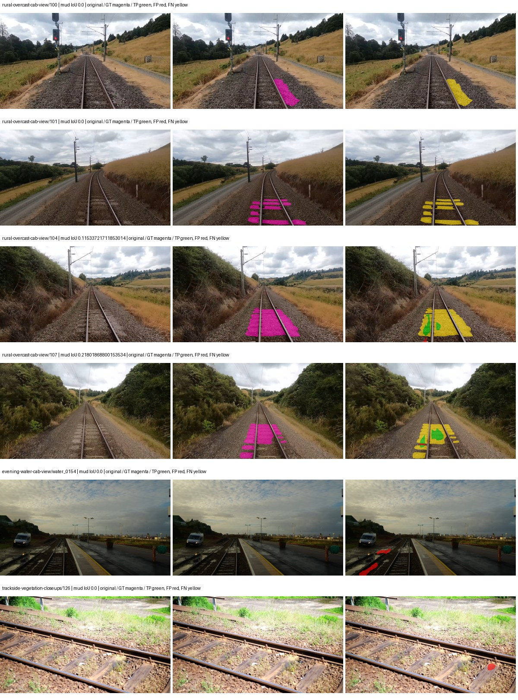

Examples are two lowest and two highest mud-IoU positive images, plus up to two negative images with the most false-positive mud pixels. They are targeted diagnostic examples, not random samples. Green: true positive; red: false positive; yellow: false negative. Full predictions remain on HDRFS.

### Validation tracking

| Logged step | Overall mIoU (%) | Mud IoU (%) |
| --- | --- | --- |
| 254 | 16.83 | 0.11 |
| 508 | 19.34 | 0.00 |
| 763 | 26.34 | 0.19 |
| 1017 | 28.03 | 1.06 |
| 1272 | 29.65 | 3.96 |
| 1527 | 31.19 | 1.27 |
| 1781 | 29.98 | 0.83 |
| 2036 | 32.45 | 1.12 |
| 2290 | 27.63 | 2.07 |
| 2545 | 30.14 | 1.22 |

All retained scalar curves, including training loss and per-class IoU, are in record.json. Observed best mud on a curve is not necessarily a retained checkpoint: the pilot saved its selection-metric-best and final checkpoints. Step logging and checkpoint global_step may differ by one.

### Stopping and checkpoint provenance

```json
{
  "stopping": {
    "actual_steps": 2545,
    "maximum_steps": 4000,
    "min_delta": 0.001,
    "monitor": "val_iou/mud-pumping",
    "patience": 5,
    "reason": "validation_plateau"
  },
  "checkpoints": {
    "best": {
      "path": "/data/izadia1/projects/segmentary-runs/paul-test-rtis/mud-fullstats-v1-20260906-r2/future-runs/native_resnet50_psp--rtis_only--seed-0_seed0/rtis/best.ckpt",
      "sha256": "50cf6977cb62392f4020f62e52aded93dfcd403396fbb7ce04c4aa8701c56dbc",
      "global_step": 1272,
      "bytes": 595211686
    },
    "final": {
      "path": "/data/izadia1/projects/segmentary-runs/paul-test-rtis/mud-fullstats-v1-20260906-r2/future-runs/native_resnet50_psp--rtis_only--seed-0_seed0/rtis/last.ckpt",
      "sha256": "03b03495468fb83f2d82a044d8568338bc698b4c9e978cf315873bc83bb2a76d",
      "global_step": 2545,
      "bytes": 595200614
    }
  },
  "cleanup_error": null
}
```

### Resolved training, initialization and evaluation settings

The optimizer block is the base configuration. Stage LR scales are applied at runtime, and stage warmup is capped at min(base warmup, floor(stage budget / 10), stage budget - 1): 400 steps for this 4,000-step pilot. Model-internal native input grids may differ from augmentation crops (EoMT uses its 640 grid).

```json
{
  "name": "native_resnet50_psp--rtis_only--seed-0",
  "model": {
    "arch": "native",
    "checkpoint": null,
    "tuning": "full",
    "head": "unified_head",
    "lora_r": 16,
    "lora_alpha": 32,
    "lora_dropout": 0.05,
    "lora_targets": [],
    "drop_path": null,
    "revision": null,
    "subfolder": null,
    "local_files_only": false,
    "trust_remote_code": false,
    "backbone_path": null,
    "head_paths": [],
    "classifier_path": null,
    "inactive_parameter_paths": [],
    "smp_arch": null,
    "encoder_name": null,
    "encoder_weights": null,
    "native": {
      "task": "multiclass",
      "backbone": {
        "kind": "timm",
        "name": "resnet50.a1_in1k",
        "weights": "pretrained",
        "out_indices": [
          1,
          2,
          3,
          4
        ],
        "in_channels": 3
      },
      "neck": {
        "kind": "identity"
      },
      "head": {
        "kind": "psp",
        "in_index": 3,
        "channels": 256,
        "pool_bins": [
          1,
          2,
          3,
          6
        ],
        "dropout": 0.1,
        "norm": "group",
        "activation": "relu"
      },
      "auxiliary_heads": []
    },
    "batch_norm_momentum": null
  },
  "space": "paul-test-rtis",
  "taxonomy_root": "/data/izadia1/projects/segmentary-rtis-fullstats-066afb2/taxonomy",
  "output_root": "/data/izadia1/projects/segmentary-runs/paul-test-rtis/mud-fullstats-v1-20260906-r2/future-runs",
  "optim": {
    "backbone_lr": 0.0001,
    "head_lr_mult": 10.0,
    "weight_decay": 0.05,
    "llrd": 1.0,
    "warmup_iters": 1500,
    "warmup_ratio": 1e-06,
    "poly_power": 0.9,
    "min_lr_ratio": 0.0,
    "betas": [
      0.9,
      0.999
    ],
    "grad_clip": 1.0
  },
  "train": {
    "iters": 4000,
    "batch_size": 2,
    "accum": 8,
    "num_workers": 2,
    "precision": "bf16-mixed",
    "ema_decay": 0.9998,
    "val_every": 250,
    "ckpt_every": 500,
    "selection_metric": "val_iou/mud-pumping",
    "early_stopping_patience": 5,
    "early_stopping_min_delta": 0.001,
    "seed": 0,
    "devices": 1
  },
  "eval": {
    "sliding_window": true,
    "window": [
      1024,
      1024
    ],
    "stride": [
      768,
      768
    ],
    "batch_size": 1,
    "num_workers": 2,
    "tta_scales": [],
    "tta_flip": false,
    "threshold": 0.5,
    "boundary_tolerance_frac": 0.0075,
    "save_confusion": true
  },
  "loss": {
    "task": "multiclass",
    "activation": "auto",
    "terms": [],
    "aux": "none",
    "aux_weight": 0.0,
    "ce_weight": 1.0,
    "label_smoothing": 0.0,
    "class_weights": null,
    "query": null
  },
  "aug": {
    "crop": [
      1024,
      1024
    ],
    "scale_min": 0.5,
    "scale_max": 2.0,
    "hflip_p": 0.5,
    "color_jitter_p": 0.5,
    "brightness": 0.25,
    "contrast": 0.25,
    "saturation": 0.25,
    "hue": 0.05
  },
  "stages": [
    {
      "name": "rtis",
      "data": [
        {
          "name": "paul-test-rtis",
          "root": "/data/izadia1/datasets/paul-test-rtis",
          "variant": null,
          "split_file": "splits.json",
          "train_split": "train",
          "val_split": "val",
          "limit": null,
          "loader": "folder",
          "mapping": "paul-test-rtis",
          "loader_options": {
            "require_groups": true
          }
        }
      ],
      "iters": null,
      "lr_scale": 1.0,
      "head_group_lr_scale": 1.0,
      "init_from": "pretrained",
      "reset_head": false,
      "freeze": null,
      "sample_weights": null
    }
  ]
}
```

### Hardware and software provenance

```json
{
  "training": {
    "cuda_available": true,
    "cuda_visible_devices": "1",
    "cudnn": 91900,
    "driver_version": "570.133.20",
    "gpu_count": 1,
    "gpu_names": [
      "NVIDIA L40S"
    ],
    "hostname": "hdrfs-app-001",
    "input_normalization": {
      "channel_order": "rgb",
      "mean": [
        0.485,
        0.456,
        0.406
      ],
      "source": "timm_pretrained_cfg",
      "std": [
        0.229,
        0.224,
        0.225
      ]
    },
    "model_origins": [
      {
        "hf_commit": null,
        "hf_name_or_path": null,
        "module": "backbone",
        "timm_pretrained": {
          "architecture": "resnet50",
          "hf_hub_id": "timm/resnet50.a1_in1k",
          "tag": "a1_in1k",
          "url": "https://github.com/rwightman/pytorch-image-models/releases/download/v0.1-rsb-weights/resnet50_a1_0-14fe96d1.pth"
        }
      },
      {
        "hf_commit": null,
        "hf_name_or_path": null,
        "module": "backbone.model",
        "timm_pretrained": {
          "architecture": "resnet50",
          "hf_hub_id": "timm/resnet50.a1_in1k",
          "tag": "a1_in1k",
          "url": "https://github.com/rwightman/pytorch-image-models/releases/download/v0.1-rsb-weights/resnet50_a1_0-14fe96d1.pth"
        }
      }
    ],
    "model_parameter_count": 37149525,
    "packages": {
      "albumentations": "2.0.8",
      "lightning": "2.6.5",
      "numpy": "2.4.4",
      "segmentary": "0.1.0",
      "segmentation-models-pytorch": "0.5.0",
      "timm": "1.0.28",
      "torch": "2.11.0+cu128",
      "torchvision": "0.26.0+cu128",
      "transformers": "5.15.0"
    },
    "platform": "Linux-5.15.0-139-generic-x86_64-with-glibc2.35",
    "python": "3.11.15",
    "torch": "2.11.0+cu128",
    "torch_cuda": "12.8",
    "trainable_parameter_count": 37149525,
    "training_stop": {
      "actual_steps": 2545,
      "maximum_steps": 4000,
      "min_delta": 0.001,
      "monitor": "val_iou/mud-pumping",
      "patience": 5,
      "reason": "validation_plateau"
    },
    "validation_weights": "raw"
  },
  "evaluation": {
    "cuda_available": true,
    "cuda_visible_devices": "1",
    "cudnn": 91900,
    "driver_version": "570.133.20",
    "gpu_count": 1,
    "gpu_names": [
      "NVIDIA L40S"
    ],
    "hostname": "hdrfs-app-001",
    "input_normalization": {
      "channel_order": "rgb",
      "mean": [
        0.485,
        0.456,
        0.406
      ],
      "source": "timm_pretrained_cfg",
      "std": [
        0.229,
        0.224,
        0.225
      ]
    },
    "packages": {
      "albumentations": "2.0.8",
      "lightning": "2.6.5",
      "numpy": "2.4.4",
      "segmentary": "0.1.0",
      "segmentation-models-pytorch": "0.5.0",
      "timm": "1.0.28",
      "torch": "2.11.0+cu128",
      "torchvision": "0.26.0+cu128",
      "transformers": "5.15.0"
    },
    "platform": "Linux-5.15.0-139-generic-x86_64-with-glibc2.35",
    "python": "3.11.15",
    "torch": "2.11.0+cu128",
    "torch_cuda": "12.8"
  }
}
```

## rtis_only — seed 1

Status: **completed**. Started: 2026-09-07T00:17:04.879811+00:00. Finished: 2026-09-07T00:49:22.939886+00:00.

Recipe pretrained initializer: `{"arch": "native", "backbone_path": null, "batch_norm_momentum": null, "checkpoint": null, "classifier_path": null, "drop_path": null, "encoder_name": null, "encoder_weights": null, "head": "unified_head", "head_paths": [], "inactive_parameter_paths": [], "local_files_only": false, "lora_alpha": 32, "lora_dropout": 0.05, "lora_r": 16, "lora_targets": [], "native": {"auxiliary_heads": [], "backbone": {"in_channels": 3, "kind": "timm", "name": "resnet50.a1_in1k", "out_indices": [1, 2, 3, 4], "weights": "pretrained"}, "head": {"activation": "relu", "channels": 256, "dropout": 0.1, "in_index": 3, "kind": "psp", "norm": "group", "pool_bins": [1, 2, 3, 6]}, "neck": {"kind": "identity"}, "task": "multiclass"}, "revision": null, "smp_arch": null, "subfolder": null, "trust_remote_code": false, "tuning": "full"}`.

`rtis_only` uses the recipe initializer, which may include pretrained segmentation components. Transfer paths load the exact historical source checkpoint below and reset the classifier; they do not reset all query/decoder features.

Source checkpoint: `Recipe pretrained initialization`.

Config SHA-256: `1936fff27c25d720261dd76f72c52d470e604ee323ce3ccbb945392336604d65`. Weights used for validation: `raw`.

### Mud-pumping and aggregate quality

| Metric | Selected checkpoint | Final training validation |
| --- | --- | --- |
| Mud IoU | 3.11 | 0.40 |
| Mud precision | 5.13 | 0.85 |
| Mud recall | 7.29 | 0.75 |
| Mud Dice/F1 | 6.02 | 0.80 |
| mIoU | 26.74 | 27.07 |
| Mean accuracy | 41.07 | 43.76 |
| Mean precision | 44.21 | 47.54 |
| Mean Dice | 35.92 | 36.11 |
| Mean specificity | 98.80 | 98.84 |
| Pixel accuracy | 80.77 | 81.45 |
| Frequency-weighted IoU | 70.64 | 71.47 |
| Fixed GT-present class mIoU | 31.20 | 31.58 |
| Boundary F1 | 32.51 | 35.07 |

The selected checkpoint has independent evaluation evidence. Final values are the trainer's final validation record, not a new independent evaluation. mIoU averages classes with nonzero union, so false positives on absent classes can change its denominator. The fixed GT-class mean is supplementary and excludes absent classes; their false positives remain in the confusion matrix.

### Resource usage and timing

| Measurement | Value |
| --- | --- |
| Peak training VRAM, retained training invocation (GiB) | 8.29 |
| Peak evaluation VRAM (GiB) | 6.75 |
| Retained training invocation wall time (seconds) | 1813.85 |
| Retained training invocation GPU-hours (one GPU) | 0.50 |
| Evaluation wall time (seconds) | 11.00 |
| Full evaluation pipeline images/second | 3.36 |
| Best full-state checkpoint (MiB) | 567.64 |
| Final full-state checkpoint (MiB) | 567.63 |
| Audited periodic checkpoints removed (GiB) | 2.22 |

VRAM uses the recorded allocator high-water mark; it is not total device usage including CUDA context. Resumed jobs' retained training invocation times and peaks are **not whole-campaign totals**. Earlier invocation resource records are not reconstructed here. Evaluation throughput includes loader, sliding-window inference and metrics; it is not model-only latency/FPS. Missing measurements are shown as —, never inferred from another dataset's run.

### Standardized inference performance

Dedicated model-only profiling waits for an idle worker-locked L40S: BF16, batch 1, 1024x1024, 20 warmup and 100 CUDA-event-timed public forwards. It excludes loading, preprocessing, tiling and metrics.

| Status | Parameters | Weight MiB | FPS | p50 ms | p95 ms | Peak reserved GiB |
| --- | --- | --- | --- | --- | --- | --- |
| complete | 37149525 | 141.71 | 206.81 | 4.66 | 5.55 | 0.52 |

```json
{
  "schema_version": 1,
  "model_id": "native_resnet50_psp",
  "measured_at": "2026-09-07T00:49:18+00:00",
  "status": "complete",
  "benchmark_scope": "rtis_selected_checkpoint_model_only",
  "applies_to": [
    "native_resnet50_psp--rtis_only--seed-1"
  ],
  "source": {
    "campaign_git_sha": "066afb2626398b7be59d4d19f5a0e4644fd59adc",
    "git_dirty": false,
    "config_hash": "48ae95dabddb",
    "resolved_config": "/data/izadia1/projects/segmentary-runs/paul-test-rtis/mud-fullstats-v1-20260906-r2/configs/native_resnet50_psp--rtis_only--seed-1.yaml",
    "config_sha256": "1936fff27c25d720261dd76f72c52d470e604ee323ce3ccbb945392336604d65",
    "checkpoint_sha256": "7483716305a79e4ddcdb1486b69d953c6d11f947f19e8c5e6c5cf8711ed038fb",
    "checkpoint_global_step": 1018,
    "checkpoint_bytes": 595211686,
    "checkpoint_kind": "resume checkpoint with optimizer and EMA state",
    "weights": "raw",
    "measured_checkpoint_job_id": "native_resnet50_psp--rtis_only--seed-1",
    "result_sha256": "3400ad7b14a2e74996cd21f33d6ad3037f58461f8af8dfd31e97ba139362e3c9",
    "result_git_sha": "066afb2626398b7be59d4d19f5a0e4644fd59adc",
    "result_stage": "eval:paul-test-rtis:val",
    "result_seed": 1
  },
  "hardware": {
    "gpu_name": "NVIDIA L40S",
    "gpu_uuid": "GPU-84f5ca4d-68db-ae98-d056-40654d859dd9",
    "logical_device": "cuda:0",
    "physical_visibility_token": "0",
    "compute_capability": [
      8,
      9
    ],
    "total_memory_bytes": 47677177856
  },
  "model": {
    "parameter_count": 37149525,
    "trainable_parameter_count": 37149525,
    "resident_parameter_bytes": 148598100,
    "parameter_dtype_counts": {
      "float32": 37149525
    }
  },
  "contract": {
    "backend": "pytorch",
    "precision": "bf16_autocast",
    "batch_size": 1,
    "input_shape_nchw": [
      1,
      3,
      1024,
      1024
    ],
    "warmup_iterations": 20,
    "measured_iterations": 100,
    "timing": "per-forward CUDA events with end-event synchronization",
    "includes_preprocessing": false,
    "includes_data_loader": false,
    "includes_sliding_window": false,
    "input_resident_on_gpu": true,
    "model_only": true,
    "entrypoint": "public model(image) dense-logits forward"
  },
  "measurements": {
    "latency": {
      "p50_ms": 4.659200191497803,
      "p95_ms": 5.547161626815796,
      "mean_ms": 4.8353721714019775,
      "minimum_ms": 4.636672019958496,
      "maximum_ms": 5.97708797454834,
      "fps": 206.8093136479416,
      "raw_ms": [
        5.10975980758667,
        4.652128219604492,
        4.65715217590332,
        4.643968105316162,
        4.659200191497803,
        4.639904022216797,
        4.863999843597412,
        5.558271884918213,
        4.669439792633057,
        4.636672019958496,
        4.644864082336426,
        4.641791820526123,
        4.872191905975342,
        4.637695789337158,
        4.9244160652160645,
        4.6387200355529785,
        4.6459197998046875,
        4.6387200355529785,
        4.661248207092285,
        5.550079822540283,
        4.648960113525391,
        4.648960113525391,
        5.31763219833374,
        4.646880149841309,
        4.65715217590332,
        4.640768051147461,
        4.637695789337158,
        4.649983882904053,
        4.652031898498535,
        4.641791820526123,
        4.645887851715088,
        4.641791820526123,
        5.446656227111816,
        5.067776203155518,
        4.646912097930908,
        5.528575897216797,
        4.841472148895264,
        4.8660478591918945,
        4.916224002838135,
        4.66431999206543,
        4.640768051147461,
        4.649983882904053,
        4.648960113525391,
        4.646912097930908,
        4.644864082336426,
        5.429247856140137,
        5.385216236114502,
        4.649983882904053,
        4.655104160308838,
        4.6438398361206055,
        4.645887851715088,
        4.847616195678711,
        4.811776161193848,
        4.835328102111816,
        4.719615936279297,
        4.655104160308838,
        4.655104160308838,
        4.8957438468933105,
        5.696512222290039,
        4.675551891326904,
        4.64793586730957,
        4.657023906707764,
        4.843520164489746,
        4.739071846008301,
        4.966400146484375,
        5.322751998901367,
        5.533664226531982,
        5.97708797454834,
        5.80406379699707,
        4.945919990539551,
        4.878335952758789,
        4.796351909637451,
        4.7175679206848145,
        4.646912097930908,
        4.652031898498535,
        4.679679870605469,
        4.6530561447143555,
        4.950016021728516,
        4.942848205566406,
        5.21830415725708,
        4.6735358238220215,
        4.640768051147461,
        4.646912097930908,
        4.64796781539917,
        4.8158721923828125,
        4.644991874694824,
        4.644864082336426,
        4.645887851715088,
        4.914175987243652,
        4.644864082336426,
        4.644864082336426,
        4.659200191497803,
        4.648960113525391,
        4.648960113525391,
        5.547008037567139,
        5.265408039093018,
        4.679679870605469,
        4.680704116821289,
        4.700160026550293,
        4.783103942871094
      ],
      "percentile_method": "numpy linear interpolation"
    },
    "peak_reserved_bytes": 557842432,
    "memory_kind": "pytorch_cuda_allocator_peak_reserved_excluding_context",
    "benchmark_wall_clock_s": 12.038670532405376
  },
  "started_at": "2026-09-07T00:49:05+00:00",
  "finished_at": "2026-09-07T00:49:18+00:00",
  "environment": {
    "hostname": "hdrfs-app-001",
    "python": "3.11.15",
    "platform": "Linux-5.15.0-139-generic-x86_64-with-glibc2.35",
    "torch": "2.11.0+cu128",
    "torch_cuda": "12.8",
    "cudnn": 91900,
    "driver_version": "570.133.20",
    "cuda_available": true,
    "gpu_count": 1,
    "gpu_names": [
      "NVIDIA L40S"
    ],
    "cuda_visible_devices": "0",
    "packages": {
      "segmentary": "0.1.0",
      "torch": "2.11.0+cu128",
      "torchvision": "0.26.0+cu128",
      "transformers": "5.15.0",
      "timm": "1.0.28",
      "segmentation-models-pytorch": "0.5.0",
      "albumentations": "2.0.8",
      "lightning": "2.6.5",
      "numpy": "2.4.4"
    }
  }
}
```

### Per-class validation results

| Class | GT pixels | IoU (%) | Precision (%) | Recall (%) | Dice (%) | Boundary F1 (%) |
| --- | --- | --- | --- | --- | --- | --- |
| car | 29664 | 13.02 | 49.27 | 15.04 | 23.04 | 24.55 |
| construction | 311585 | 41.08 | 48.03 | 73.95 | 58.24 | 53.05 |
| fence | 265137 | 19.88 | 43.41 | 26.84 | 33.17 | 35.25 |
| mud-pumping | 1226250 | 3.11 | 5.13 | 7.29 | 6.02 | 8.85 |
| on-rails | 0 | 0.00 | 0.00 | — | 0.00 | 0.00 |
| person | 0 | 0.00 | 0.00 | — | 0.00 | 0.00 |
| pole | 628038 | 38.56 | 72.66 | 45.10 | 55.65 | 49.03 |
| rail-embedded | 16799 | 6.00 | 18.96 | 8.08 | 11.33 | 14.18 |
| rail-raised | 2969797 | 66.74 | 76.97 | 83.39 | 80.05 | 85.00 |
| rail-track | 6323197 | 30.63 | 71.18 | 34.97 | 46.90 | 46.41 |
| road | 1048831 | 13.18 | 24.57 | 22.13 | 23.29 | 13.62 |
| sidewalk | 1297367 | 34.20 | 89.13 | 35.69 | 50.97 | 14.64 |
| sky | 19121606 | 93.14 | 98.12 | 94.83 | 96.45 | 79.21 |
| standing-water | 95802 | 0.00 | 0.00 | 0.00 | 0.00 | 0.00 |
| terrain | 39239306 | 84.02 | 87.16 | 95.89 | 91.32 | 60.71 |
| trackbed | 10643081 | 49.11 | 59.58 | 73.65 | 65.87 | 50.73 |
| traffic-light | 19510 | 10.69 | 11.66 | 56.16 | 19.32 | 31.46 |
| traffic-sign | 13285 | 18.18 | 74.05 | 19.42 | 30.77 | 41.69 |
| tram-track | 56179 | 5.62 | 28.05 | 6.57 | 10.64 | 21.60 |
| truck | 0 | 0.00 | 0.00 | — | 0.00 | 0.00 |
| vegetation-overgrowth | 5901821 | 34.45 | 70.53 | 40.24 | 51.25 | 52.73 |

### Full-run accounting

| Measurement | Value |
| --- | --- |
| Full GPU-reserved wall seconds, all recorded worker attempts | 1938.07 |
| Full reserved GPU-hours | 0.54 |
| Whole-run timing complete | True |

| Phase | Wall seconds including failed attempts |
| --- | --- |
| training | 1820.64 |
| diagnostics | 74.85 |
| performance | 19.64 |

GPU-reserved time includes model loading, training, validation, collection, profiling, checkpoint I/O and orchestration while the worker owns one GPU. It is not GPU kernel-active time. Phase timings and sampled device memory/power/utilization are retained separately; sampled device memory is not the allocator high-water mark.

### Train/validation and raw/EMA diagnostics

| Checkpoint / weights / split | Images | Mud IoU (%) | Mud precision (%) | Mud recall (%) |
| --- | --- | --- | --- | --- |
| best-auto-train / raw | 220 | 89.12 | 92.76 | 95.78 |
| best-auto-val / raw | 37 | 3.11 | 5.13 | 7.29 |
| best-alternate-val / ema | 37 | 1.42 | 5.25 | 1.91 |
| final-auto-val / raw | 37 | 0.39 | 0.84 | 0.74 |

Train uses the evaluation transform without augmentation. Compare mud train/validation metrics for the same selected weights. Alternate EMA on running-stat BatchNorm is explicitly uncalibrated and is diagnostic only. Score-threshold curves use uncalibrated normalized scores and are pixel-level diagnostics, not event detection rates or a selected deployment operating point.

### Downloadable evidence

- best-auto-train: [per-image.csv](rtis_only--seed-1/best-auto-train/per-image.csv) · [per-image-confusion.json.gz](rtis_only--seed-1/best-auto-train/per-image-confusion.json.gz) · [groups.json](rtis_only--seed-1/best-auto-train/groups.json) · [mud-score-curves.json](rtis_only--seed-1/best-auto-train/mud-score-curves.json)
- best-auto-val: [per-image.csv](rtis_only--seed-1/best-auto-val/per-image.csv) · [per-image-confusion.json.gz](rtis_only--seed-1/best-auto-val/per-image-confusion.json.gz) · [groups.json](rtis_only--seed-1/best-auto-val/groups.json) · [mud-score-curves.json](rtis_only--seed-1/best-auto-val/mud-score-curves.json) · [examples.jpg](rtis_only--seed-1/best-auto-val/examples.jpg)
- best-alternate-val: [per-image.csv](rtis_only--seed-1/best-alternate-val/per-image.csv) · [per-image-confusion.json.gz](rtis_only--seed-1/best-alternate-val/per-image-confusion.json.gz) · [groups.json](rtis_only--seed-1/best-alternate-val/groups.json) · [mud-score-curves.json](rtis_only--seed-1/best-alternate-val/mud-score-curves.json)
- final-auto-val: [per-image.csv](rtis_only--seed-1/final-auto-val/per-image.csv) · [per-image-confusion.json.gz](rtis_only--seed-1/final-auto-val/per-image-confusion.json.gz) · [groups.json](rtis_only--seed-1/final-auto-val/groups.json) · [mud-score-curves.json](rtis_only--seed-1/final-auto-val/mud-score-curves.json)
- resources: [telemetry.csv](rtis_only--seed-1/resources/telemetry.csv)

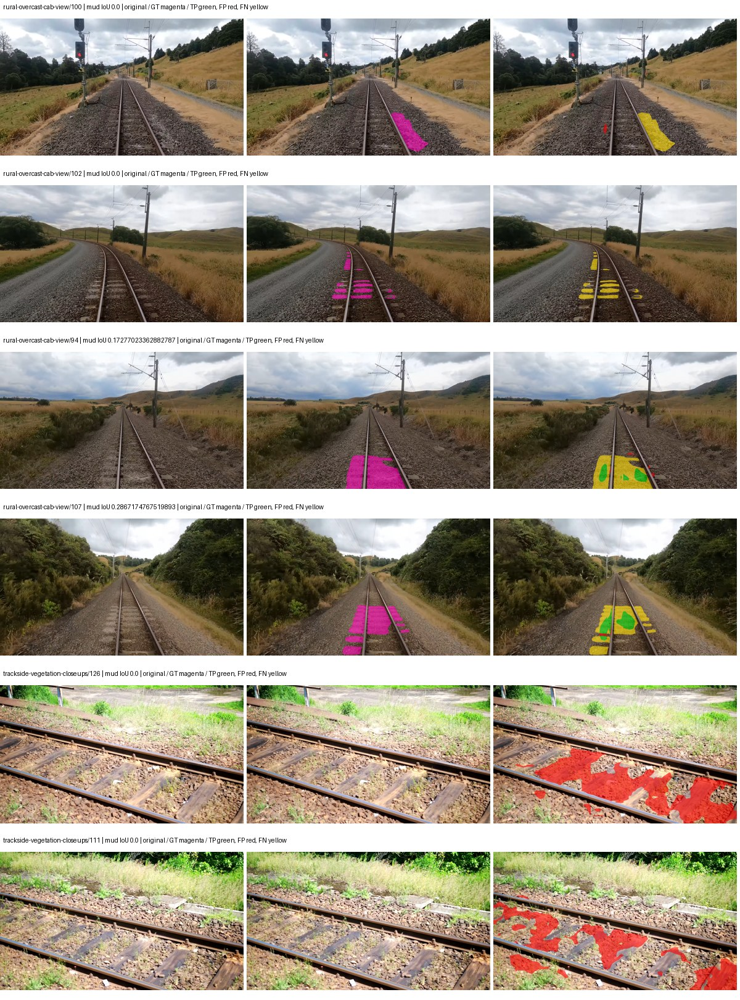

Examples are two lowest and two highest mud-IoU positive images, plus up to two negative images with the most false-positive mud pixels. They are targeted diagnostic examples, not random samples. Green: true positive; red: false positive; yellow: false negative. Full predictions remain on HDRFS.

### Validation tracking

| Logged step | Overall mIoU (%) | Mud IoU (%) |
| --- | --- | --- |
| 254 | 15.26 | 0.15 |
| 508 | 23.44 | 0.08 |
| 763 | 25.21 | 1.24 |
| 1017 | 26.75 | 3.11 |
| 1272 | 24.76 | 1.39 |
| 1527 | 28.97 | 0.36 |
| 1781 | 26.70 | 0.64 |
| 2036 | 27.58 | 0.98 |
| 2290 | 27.07 | 0.40 |

All retained scalar curves, including training loss and per-class IoU, are in record.json. Observed best mud on a curve is not necessarily a retained checkpoint: the pilot saved its selection-metric-best and final checkpoints. Step logging and checkpoint global_step may differ by one.

### Stopping and checkpoint provenance

```json
{
  "stopping": {
    "actual_steps": 2290,
    "maximum_steps": 4000,
    "min_delta": 0.001,
    "monitor": "val_iou/mud-pumping",
    "patience": 5,
    "reason": "validation_plateau"
  },
  "checkpoints": {
    "best": {
      "path": "/data/izadia1/projects/segmentary-runs/paul-test-rtis/mud-fullstats-v1-20260906-r2/future-runs/native_resnet50_psp--rtis_only--seed-1_seed1/rtis/best.ckpt",
      "sha256": "7483716305a79e4ddcdb1486b69d953c6d11f947f19e8c5e6c5cf8711ed038fb",
      "global_step": 1018,
      "bytes": 595211686
    },
    "final": {
      "path": "/data/izadia1/projects/segmentary-runs/paul-test-rtis/mud-fullstats-v1-20260906-r2/future-runs/native_resnet50_psp--rtis_only--seed-1_seed1/rtis/last.ckpt",
      "sha256": "a625349949fd09f1ac5517dd43d343207d3a848cb0037623f0f071bf57dd9139",
      "global_step": 2290,
      "bytes": 595200614
    }
  },
  "cleanup_error": null
}
```

### Resolved training, initialization and evaluation settings

The optimizer block is the base configuration. Stage LR scales are applied at runtime, and stage warmup is capped at min(base warmup, floor(stage budget / 10), stage budget - 1): 400 steps for this 4,000-step pilot. Model-internal native input grids may differ from augmentation crops (EoMT uses its 640 grid).

```json
{
  "name": "native_resnet50_psp--rtis_only--seed-1",
  "model": {
    "arch": "native",
    "checkpoint": null,
    "tuning": "full",
    "head": "unified_head",
    "lora_r": 16,
    "lora_alpha": 32,
    "lora_dropout": 0.05,
    "lora_targets": [],
    "drop_path": null,
    "revision": null,
    "subfolder": null,
    "local_files_only": false,
    "trust_remote_code": false,
    "backbone_path": null,
    "head_paths": [],
    "classifier_path": null,
    "inactive_parameter_paths": [],
    "smp_arch": null,
    "encoder_name": null,
    "encoder_weights": null,
    "native": {
      "task": "multiclass",
      "backbone": {
        "kind": "timm",
        "name": "resnet50.a1_in1k",
        "weights": "pretrained",
        "out_indices": [
          1,
          2,
          3,
          4
        ],
        "in_channels": 3
      },
      "neck": {
        "kind": "identity"
      },
      "head": {
        "kind": "psp",
        "in_index": 3,
        "channels": 256,
        "pool_bins": [
          1,
          2,
          3,
          6
        ],
        "dropout": 0.1,
        "norm": "group",
        "activation": "relu"
      },
      "auxiliary_heads": []
    },
    "batch_norm_momentum": null
  },
  "space": "paul-test-rtis",
  "taxonomy_root": "/data/izadia1/projects/segmentary-rtis-fullstats-066afb2/taxonomy",
  "output_root": "/data/izadia1/projects/segmentary-runs/paul-test-rtis/mud-fullstats-v1-20260906-r2/future-runs",
  "optim": {
    "backbone_lr": 0.0001,
    "head_lr_mult": 10.0,
    "weight_decay": 0.05,
    "llrd": 1.0,
    "warmup_iters": 1500,
    "warmup_ratio": 1e-06,
    "poly_power": 0.9,
    "min_lr_ratio": 0.0,
    "betas": [
      0.9,
      0.999
    ],
    "grad_clip": 1.0
  },
  "train": {
    "iters": 4000,
    "batch_size": 2,
    "accum": 8,
    "num_workers": 2,
    "precision": "bf16-mixed",
    "ema_decay": 0.9998,
    "val_every": 250,
    "ckpt_every": 500,
    "selection_metric": "val_iou/mud-pumping",
    "early_stopping_patience": 5,
    "early_stopping_min_delta": 0.001,
    "seed": 1,
    "devices": 1
  },
  "eval": {
    "sliding_window": true,
    "window": [
      1024,
      1024
    ],
    "stride": [
      768,
      768
    ],
    "batch_size": 1,
    "num_workers": 2,
    "tta_scales": [],
    "tta_flip": false,
    "threshold": 0.5,
    "boundary_tolerance_frac": 0.0075,
    "save_confusion": true
  },
  "loss": {
    "task": "multiclass",
    "activation": "auto",
    "terms": [],
    "aux": "none",
    "aux_weight": 0.0,
    "ce_weight": 1.0,
    "label_smoothing": 0.0,
    "class_weights": null,
    "query": null
  },
  "aug": {
    "crop": [
      1024,
      1024
    ],
    "scale_min": 0.5,
    "scale_max": 2.0,
    "hflip_p": 0.5,
    "color_jitter_p": 0.5,
    "brightness": 0.25,
    "contrast": 0.25,
    "saturation": 0.25,
    "hue": 0.05
  },
  "stages": [
    {
      "name": "rtis",
      "data": [
        {
          "name": "paul-test-rtis",
          "root": "/data/izadia1/datasets/paul-test-rtis",
          "variant": null,
          "split_file": "splits.json",
          "train_split": "train",
          "val_split": "val",
          "limit": null,
          "loader": "folder",
          "mapping": "paul-test-rtis",
          "loader_options": {
            "require_groups": true
          }
        }
      ],
      "iters": null,
      "lr_scale": 1.0,
      "head_group_lr_scale": 1.0,
      "init_from": "pretrained",
      "reset_head": false,
      "freeze": null,
      "sample_weights": null
    }
  ]
}
```

### Hardware and software provenance

```json
{
  "training": {
    "cuda_available": true,
    "cuda_visible_devices": "0",
    "cudnn": 91900,
    "driver_version": "570.133.20",
    "gpu_count": 1,
    "gpu_names": [
      "NVIDIA L40S"
    ],
    "hostname": "hdrfs-app-001",
    "input_normalization": {
      "channel_order": "rgb",
      "mean": [
        0.485,
        0.456,
        0.406
      ],
      "source": "timm_pretrained_cfg",
      "std": [
        0.229,
        0.224,
        0.225
      ]
    },
    "model_origins": [
      {
        "hf_commit": null,
        "hf_name_or_path": null,
        "module": "backbone",
        "timm_pretrained": {
          "architecture": "resnet50",
          "hf_hub_id": "timm/resnet50.a1_in1k",
          "tag": "a1_in1k",
          "url": "https://github.com/rwightman/pytorch-image-models/releases/download/v0.1-rsb-weights/resnet50_a1_0-14fe96d1.pth"
        }
      },
      {
        "hf_commit": null,
        "hf_name_or_path": null,
        "module": "backbone.model",
        "timm_pretrained": {
          "architecture": "resnet50",
          "hf_hub_id": "timm/resnet50.a1_in1k",
          "tag": "a1_in1k",
          "url": "https://github.com/rwightman/pytorch-image-models/releases/download/v0.1-rsb-weights/resnet50_a1_0-14fe96d1.pth"
        }
      }
    ],
    "model_parameter_count": 37149525,
    "packages": {
      "albumentations": "2.0.8",
      "lightning": "2.6.5",
      "numpy": "2.4.4",
      "segmentary": "0.1.0",
      "segmentation-models-pytorch": "0.5.0",
      "timm": "1.0.28",
      "torch": "2.11.0+cu128",
      "torchvision": "0.26.0+cu128",
      "transformers": "5.15.0"
    },
    "platform": "Linux-5.15.0-139-generic-x86_64-with-glibc2.35",
    "python": "3.11.15",
    "torch": "2.11.0+cu128",
    "torch_cuda": "12.8",
    "trainable_parameter_count": 37149525,
    "training_stop": {
      "actual_steps": 2290,
      "maximum_steps": 4000,
      "min_delta": 0.001,
      "monitor": "val_iou/mud-pumping",
      "patience": 5,
      "reason": "validation_plateau"
    },
    "validation_weights": "raw"
  },
  "evaluation": {
    "cuda_available": true,
    "cuda_visible_devices": "0",
    "cudnn": 91900,
    "driver_version": "570.133.20",
    "gpu_count": 1,
    "gpu_names": [
      "NVIDIA L40S"
    ],
    "hostname": "hdrfs-app-001",
    "input_normalization": {
      "channel_order": "rgb",
      "mean": [
        0.485,
        0.456,
        0.406
      ],
      "source": "timm_pretrained_cfg",
      "std": [
        0.229,
        0.224,
        0.225
      ]
    },
    "packages": {
      "albumentations": "2.0.8",
      "lightning": "2.6.5",
      "numpy": "2.4.4",
      "segmentary": "0.1.0",
      "segmentation-models-pytorch": "0.5.0",
      "timm": "1.0.28",
      "torch": "2.11.0+cu128",
      "torchvision": "0.26.0+cu128",
      "transformers": "5.15.0"
    },
    "platform": "Linux-5.15.0-139-generic-x86_64-with-glibc2.35",
    "python": "3.11.15",
    "torch": "2.11.0+cu128",
    "torch_cuda": "12.8"
  }
}
```

## rtis_only — seed 2

Status: **completed**. Started: 2026-09-07T00:25:08.421116+00:00. Finished: 2026-09-07T01:16:55.491777+00:00.

Recipe pretrained initializer: `{"arch": "native", "backbone_path": null, "batch_norm_momentum": null, "checkpoint": null, "classifier_path": null, "drop_path": null, "encoder_name": null, "encoder_weights": null, "head": "unified_head", "head_paths": [], "inactive_parameter_paths": [], "local_files_only": false, "lora_alpha": 32, "lora_dropout": 0.05, "lora_r": 16, "lora_targets": [], "native": {"auxiliary_heads": [], "backbone": {"in_channels": 3, "kind": "timm", "name": "resnet50.a1_in1k", "out_indices": [1, 2, 3, 4], "weights": "pretrained"}, "head": {"activation": "relu", "channels": 256, "dropout": 0.1, "in_index": 3, "kind": "psp", "norm": "group", "pool_bins": [1, 2, 3, 6]}, "neck": {"kind": "identity"}, "task": "multiclass"}, "revision": null, "smp_arch": null, "subfolder": null, "trust_remote_code": false, "tuning": "full"}`.

`rtis_only` uses the recipe initializer, which may include pretrained segmentation components. Transfer paths load the exact historical source checkpoint below and reset the classifier; they do not reset all query/decoder features.

Source checkpoint: `Recipe pretrained initialization`.

Config SHA-256: `a74b90f066385e2a4875ed537646b4c42d52d89707ed68b5d98430cdccc578f5`. Weights used for validation: `raw`.

### Mud-pumping and aggregate quality

| Metric | Selected checkpoint | Final training validation |
| --- | --- | --- |
| Mud IoU | 4.90 | 3.00 |
| Mud precision | 70.06 | 23.47 |
| Mud recall | 5.00 | 3.32 |
| Mud Dice/F1 | 9.34 | 5.82 |
| mIoU | 27.40 | 27.60 |
| Mean accuracy | 41.42 | 42.42 |
| Mean precision | 50.58 | 46.84 |
| Mean Dice | 36.25 | 36.55 |
| Mean specificity | 98.91 | 98.92 |
| Pixel accuracy | 83.10 | 83.02 |
| Frequency-weighted IoU | 72.70 | 72.83 |
| Fixed GT-present class mIoU | 31.97 | 32.20 |
| Boundary F1 | 34.53 | 35.26 |

The selected checkpoint has independent evaluation evidence. Final values are the trainer's final validation record, not a new independent evaluation. mIoU averages classes with nonzero union, so false positives on absent classes can change its denominator. The fixed GT-class mean is supplementary and excludes absent classes; their false positives remain in the confusion matrix.

### Resource usage and timing

| Measurement | Value |
| --- | --- |
| Peak training VRAM, retained training invocation (GiB) | 8.29 |
| Peak evaluation VRAM (GiB) | 6.75 |
| Retained training invocation wall time (seconds) | 2983.11 |
| Retained training invocation GPU-hours (one GPU) | 0.83 |
| Evaluation wall time (seconds) | 10.71 |
| Full evaluation pipeline images/second | 3.45 |
| Best full-state checkpoint (MiB) | 567.64 |
| Final full-state checkpoint (MiB) | 567.63 |
| Audited periodic checkpoints removed (GiB) | 3.88 |

VRAM uses the recorded allocator high-water mark; it is not total device usage including CUDA context. Resumed jobs' retained training invocation times and peaks are **not whole-campaign totals**. Earlier invocation resource records are not reconstructed here. Evaluation throughput includes loader, sliding-window inference and metrics; it is not model-only latency/FPS. Missing measurements are shown as —, never inferred from another dataset's run.

### Standardized inference performance

Dedicated model-only profiling waits for an idle worker-locked L40S: BF16, batch 1, 1024x1024, 20 warmup and 100 CUDA-event-timed public forwards. It excludes loading, preprocessing, tiling and metrics.

| Status | Parameters | Weight MiB | FPS | p50 ms | p95 ms | Peak reserved GiB |
| --- | --- | --- | --- | --- | --- | --- |
| complete | 37149525 | 141.71 | 203.65 | 4.72 | 5.62 | 0.52 |

```json
{
  "schema_version": 1,
  "model_id": "native_resnet50_psp",
  "measured_at": "2026-09-07T01:16:48+00:00",
  "status": "complete",
  "benchmark_scope": "rtis_selected_checkpoint_model_only",
  "applies_to": [
    "native_resnet50_psp--rtis_only--seed-2"
  ],
  "source": {
    "campaign_git_sha": "066afb2626398b7be59d4d19f5a0e4644fd59adc",
    "git_dirty": false,
    "config_hash": "28e836ff3d71",
    "resolved_config": "/data/izadia1/projects/segmentary-runs/paul-test-rtis/mud-fullstats-v1-20260906-r2/configs/native_resnet50_psp--rtis_only--seed-2.yaml",
    "config_sha256": "a74b90f066385e2a4875ed537646b4c42d52d89707ed68b5d98430cdccc578f5",
    "checkpoint_sha256": "0a545c90174d121094ba3dacfef1572c245a44cfa4c391b2dc223d03f8c88cd5",
    "checkpoint_global_step": 2545,
    "checkpoint_bytes": 595211686,
    "checkpoint_kind": "resume checkpoint with optimizer and EMA state",
    "weights": "raw",
    "measured_checkpoint_job_id": "native_resnet50_psp--rtis_only--seed-2",
    "result_sha256": "780f1c95afdc62aaa6fb2a7520013867166fe5e737cdfcae76ff7fc1d4b806ae",
    "result_git_sha": "066afb2626398b7be59d4d19f5a0e4644fd59adc",
    "result_stage": "eval:paul-test-rtis:val",
    "result_seed": 2
  },
  "hardware": {
    "gpu_name": "NVIDIA L40S",
    "gpu_uuid": "GPU-2f8008a1-9b67-11f6-987b-b393a672322c",
    "logical_device": "cuda:0",
    "physical_visibility_token": "3",
    "compute_capability": [
      8,
      9
    ],
    "total_memory_bytes": 47677177856
  },
  "model": {
    "parameter_count": 37149525,
    "trainable_parameter_count": 37149525,
    "resident_parameter_bytes": 148598100,
    "parameter_dtype_counts": {
      "float32": 37149525
    }
  },
  "contract": {
    "backend": "pytorch",
    "precision": "bf16_autocast",
    "batch_size": 1,
    "input_shape_nchw": [
      1,
      3,
      1024,
      1024
    ],
    "warmup_iterations": 20,
    "measured_iterations": 100,
    "timing": "per-forward CUDA events with end-event synchronization",
    "includes_preprocessing": false,
    "includes_data_loader": false,
    "includes_sliding_window": false,
    "input_resident_on_gpu": true,
    "model_only": true,
    "entrypoint": "public model(image) dense-logits forward"
  },
  "measurements": {
    "latency": {
      "p50_ms": 4.724735975265503,
      "p95_ms": 5.617203044891357,
      "mean_ms": 4.910446705818177,
      "minimum_ms": 4.597760200500488,
      "maximum_ms": 7.211008071899414,
      "fps": 203.64746018221584,
      "raw_ms": [
        4.628479957580566,
        4.603903770446777,
        4.602880001068115,
        4.60595178604126,
        4.687871932983398,
        5.443583965301514,
        4.612095832824707,
        4.597760200500488,
        4.6090240478515625,
        4.601856231689453,
        4.60697603225708,
        4.607999801635742,
        4.844543933868408,
        4.745215892791748,
        5.831679821014404,
        4.967423915863037,
        5.014527797698975,
        4.709375858306885,
        4.613984107971191,
        4.607999801635742,
        5.020544052124023,
        5.379072189331055,
        4.600831985473633,
        5.108736038208008,
        5.01145601272583,
        4.893599987030029,
        5.142528057098389,
        4.627456188201904,
        4.617216110229492,
        4.797440052032471,
        5.471231937408447,
        5.52342414855957,
        5.164031982421875,
        4.70527982711792,
        4.616191864013672,
        5.152768135070801,
        4.876287937164307,
        4.610047817230225,
        5.110752105712891,
        7.211008071899414,
        5.325823783874512,
        4.798463821411133,
        4.606912136077881,
        4.60595178604126,
        4.600831985473633,
        4.601856231689453,
        5.287807941436768,
        5.006271839141846,
        4.990975856781006,
        5.61356782913208,
        5.035007953643799,
        4.838399887084961,
        4.613120079040527,
        4.604928016662598,
        4.755328178405762,
        5.094272136688232,
        5.230591773986816,
        5.228544235229492,
        5.12716817855835,
        4.691967964172363,
        4.610047817230225,
        5.277696132659912,
        4.968448162078857,
        4.6141438484191895,
        4.602880001068115,
        4.607999801635742,
        4.610047817230225,
        4.603903770446777,
        5.2551679611206055,
        5.096447944641113,
        4.608960151672363,
        4.603968143463135,
        5.2500481605529785,
        5.7579522132873535,
        4.731904029846191,
        4.610047817230225,
        4.60697603225708,
        4.601856231689453,
        4.616191864013672,
        4.604928016662598,
        5.130239963531494,
        4.617216110229492,
        4.977663993835449,
        5.706719875335693,
        5.5735039710998535,
        5.090303897857666,
        4.879360198974609,
        4.7175679206848145,
        4.616191864013672,
        4.611072063446045,
        4.606815814971924,
        4.612095832824707,
        4.603903770446777,
        4.648960113525391,
        4.685952186584473,
        4.785151958465576,
        5.686272144317627,
        5.556159973144531,
        4.611072063446045,
        5.248000144958496
      ],
      "percentile_method": "numpy linear interpolation"
    },
    "peak_reserved_bytes": 557842432,
    "memory_kind": "pytorch_cuda_allocator_peak_reserved_excluding_context",
    "benchmark_wall_clock_s": 12.218380112200975
  },
  "started_at": "2026-09-07T01:16:36+00:00",
  "finished_at": "2026-09-07T01:16:48+00:00",
  "environment": {
    "hostname": "hdrfs-app-001",
    "python": "3.11.15",
    "platform": "Linux-5.15.0-139-generic-x86_64-with-glibc2.35",
    "torch": "2.11.0+cu128",
    "torch_cuda": "12.8",
    "cudnn": 91900,
    "driver_version": "570.133.20",
    "cuda_available": true,
    "gpu_count": 1,
    "gpu_names": [
      "NVIDIA L40S"
    ],
    "cuda_visible_devices": "3",
    "packages": {
      "segmentary": "0.1.0",
      "torch": "2.11.0+cu128",
      "torchvision": "0.26.0+cu128",
      "transformers": "5.15.0",
      "timm": "1.0.28",
      "segmentation-models-pytorch": "0.5.0",
      "albumentations": "2.0.8",
      "lightning": "2.6.5",
      "numpy": "2.4.4"
    }
  }
}
```

### Per-class validation results

| Class | GT pixels | IoU (%) | Precision (%) | Recall (%) | Dice (%) | Boundary F1 (%) |
| --- | --- | --- | --- | --- | --- | --- |
| car | 29664 | 8.47 | 25.99 | 11.17 | 15.62 | 24.08 |
| construction | 311585 | 39.78 | 47.14 | 71.82 | 56.92 | 49.92 |
| fence | 265137 | 6.74 | 51.42 | 7.20 | 12.63 | 20.26 |
| mud-pumping | 1226250 | 4.90 | 70.06 | 5.00 | 9.34 | 13.30 |
| on-rails | 0 | 0.00 | 0.00 | — | 0.00 | 0.00 |
| person | 0 | 0.00 | 0.00 | — | 0.00 | 0.00 |
| pole | 628038 | 48.20 | 80.02 | 54.79 | 65.05 | 71.81 |
| rail-embedded | 16799 | 7.83 | 75.29 | 8.04 | 14.52 | 17.50 |
| rail-raised | 2969797 | 66.27 | 83.07 | 76.62 | 79.71 | 86.22 |
| rail-track | 6323197 | 42.28 | 62.17 | 56.93 | 59.44 | 55.86 |
| road | 1048831 | 4.16 | 9.66 | 6.81 | 7.99 | 10.65 |
| sidewalk | 1297367 | 26.67 | 79.79 | 28.60 | 42.11 | 8.09 |
| sky | 19121606 | 95.75 | 98.22 | 97.43 | 97.83 | 87.58 |
| standing-water | 95802 | 0.04 | 0.07 | 0.10 | 0.08 | 1.12 |
| terrain | 39239306 | 85.41 | 87.12 | 97.75 | 92.13 | 62.24 |
| trackbed | 10643081 | 55.49 | 64.72 | 79.56 | 71.38 | 56.05 |
| traffic-light | 19510 | 24.00 | 25.84 | 77.13 | 38.71 | 48.01 |
| traffic-sign | 13285 | 21.12 | 54.43 | 25.65 | 34.87 | 49.80 |
| tram-track | 56179 | 11.65 | 67.13 | 12.36 | 20.87 | 10.15 |
| truck | 0 | 0.00 | 0.00 | — | 0.00 | 0.00 |
| vegetation-overgrowth | 5901821 | 26.62 | 80.11 | 28.50 | 42.05 | 52.42 |

### Full-run accounting

| Measurement | Value |
| --- | --- |
| Full GPU-reserved wall seconds, all recorded worker attempts | 3107.08 |
| Full reserved GPU-hours | 0.86 |
| Whole-run timing complete | True |

| Phase | Wall seconds including failed attempts |
| --- | --- |
| training | 2989.79 |
| diagnostics | 72.32 |
| performance | 20.52 |

GPU-reserved time includes model loading, training, validation, collection, profiling, checkpoint I/O and orchestration while the worker owns one GPU. It is not GPU kernel-active time. Phase timings and sampled device memory/power/utilization are retained separately; sampled device memory is not the allocator high-water mark.

### Train/validation and raw/EMA diagnostics

| Checkpoint / weights / split | Images | Mud IoU (%) | Mud precision (%) | Mud recall (%) |
| --- | --- | --- | --- | --- |
| best-auto-train / raw | 220 | 92.46 | 94.47 | 97.75 |
| best-auto-val / raw | 37 | 4.90 | 70.06 | 5.00 |
| best-alternate-val / ema | 37 | 2.02 | 42.72 | 2.08 |
| final-auto-val / raw | 37 | 3.01 | 23.51 | 3.34 |

Train uses the evaluation transform without augmentation. Compare mud train/validation metrics for the same selected weights. Alternate EMA on running-stat BatchNorm is explicitly uncalibrated and is diagnostic only. Score-threshold curves use uncalibrated normalized scores and are pixel-level diagnostics, not event detection rates or a selected deployment operating point.

### Downloadable evidence

- best-auto-train: [per-image.csv](rtis_only--seed-2/best-auto-train/per-image.csv) · [per-image-confusion.json.gz](rtis_only--seed-2/best-auto-train/per-image-confusion.json.gz) · [groups.json](rtis_only--seed-2/best-auto-train/groups.json) · [mud-score-curves.json](rtis_only--seed-2/best-auto-train/mud-score-curves.json)
- best-auto-val: [per-image.csv](rtis_only--seed-2/best-auto-val/per-image.csv) · [per-image-confusion.json.gz](rtis_only--seed-2/best-auto-val/per-image-confusion.json.gz) · [groups.json](rtis_only--seed-2/best-auto-val/groups.json) · [mud-score-curves.json](rtis_only--seed-2/best-auto-val/mud-score-curves.json) · [examples.jpg](rtis_only--seed-2/best-auto-val/examples.jpg)
- best-alternate-val: [per-image.csv](rtis_only--seed-2/best-alternate-val/per-image.csv) · [per-image-confusion.json.gz](rtis_only--seed-2/best-alternate-val/per-image-confusion.json.gz) · [groups.json](rtis_only--seed-2/best-alternate-val/groups.json) · [mud-score-curves.json](rtis_only--seed-2/best-alternate-val/mud-score-curves.json)
- final-auto-val: [per-image.csv](rtis_only--seed-2/final-auto-val/per-image.csv) · [per-image-confusion.json.gz](rtis_only--seed-2/final-auto-val/per-image-confusion.json.gz) · [groups.json](rtis_only--seed-2/final-auto-val/groups.json) · [mud-score-curves.json](rtis_only--seed-2/final-auto-val/mud-score-curves.json)
- resources: [telemetry.csv](rtis_only--seed-2/resources/telemetry.csv)

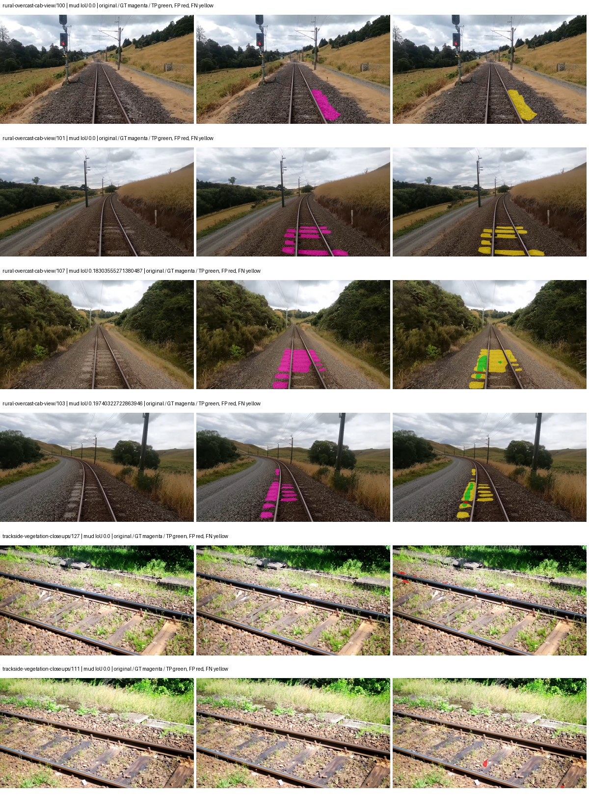

Examples are two lowest and two highest mud-IoU positive images, plus up to two negative images with the most false-positive mud pixels. They are targeted diagnostic examples, not random samples. Green: true positive; red: false positive; yellow: false negative. Full predictions remain on HDRFS.

### Validation tracking

| Logged step | Overall mIoU (%) | Mud IoU (%) |
| --- | --- | --- |
| 254 | 15.59 | 0.33 |
| 508 | 22.01 | 0.32 |
| 763 | 24.08 | 2.28 |
| 1017 | 25.59 | 2.24 |
| 1272 | 29.65 | 3.61 |
| 1527 | 26.59 | 0.37 |
| 1781 | 27.08 | 2.98 |
| 2036 | 27.91 | 1.68 |
| 2290 | 27.08 | 1.11 |
| 2545 | 27.39 | 4.89 |
| 2799 | 26.08 | 1.63 |
| 3054 | 27.21 | 3.07 |
| 3308 | 27.72 | 3.48 |
| 3563 | 26.86 | 1.85 |
| 3817 | 27.60 | 3.00 |

All retained scalar curves, including training loss and per-class IoU, are in record.json. Observed best mud on a curve is not necessarily a retained checkpoint: the pilot saved its selection-metric-best and final checkpoints. Step logging and checkpoint global_step may differ by one.

### Stopping and checkpoint provenance

```json
{
  "stopping": {
    "actual_steps": 3818,
    "maximum_steps": 4000,
    "min_delta": 0.001,
    "monitor": "val_iou/mud-pumping",
    "patience": 5,
    "reason": "validation_plateau"
  },
  "checkpoints": {
    "best": {
      "path": "/data/izadia1/projects/segmentary-runs/paul-test-rtis/mud-fullstats-v1-20260906-r2/future-runs/native_resnet50_psp--rtis_only--seed-2_seed2/rtis/best.ckpt",
      "sha256": "0a545c90174d121094ba3dacfef1572c245a44cfa4c391b2dc223d03f8c88cd5",
      "global_step": 2545,
      "bytes": 595211686
    },
    "final": {
      "path": "/data/izadia1/projects/segmentary-runs/paul-test-rtis/mud-fullstats-v1-20260906-r2/future-runs/native_resnet50_psp--rtis_only--seed-2_seed2/rtis/last.ckpt",
      "sha256": "d9b780e9543d1b7345712a8bf1c3dbafabc21fc4fea1e97fcac9b3a8a210cc64",
      "global_step": 3818,
      "bytes": 595200678
    }
  },
  "cleanup_error": null
}
```

### Resolved training, initialization and evaluation settings

The optimizer block is the base configuration. Stage LR scales are applied at runtime, and stage warmup is capped at min(base warmup, floor(stage budget / 10), stage budget - 1): 400 steps for this 4,000-step pilot. Model-internal native input grids may differ from augmentation crops (EoMT uses its 640 grid).

```json
{
  "name": "native_resnet50_psp--rtis_only--seed-2",
  "model": {
    "arch": "native",
    "checkpoint": null,
    "tuning": "full",
    "head": "unified_head",
    "lora_r": 16,
    "lora_alpha": 32,
    "lora_dropout": 0.05,
    "lora_targets": [],
    "drop_path": null,
    "revision": null,
    "subfolder": null,
    "local_files_only": false,
    "trust_remote_code": false,
    "backbone_path": null,
    "head_paths": [],
    "classifier_path": null,
    "inactive_parameter_paths": [],
    "smp_arch": null,
    "encoder_name": null,
    "encoder_weights": null,
    "native": {
      "task": "multiclass",
      "backbone": {
        "kind": "timm",
        "name": "resnet50.a1_in1k",
        "weights": "pretrained",
        "out_indices": [
          1,
          2,
          3,
          4
        ],
        "in_channels": 3
      },
      "neck": {
        "kind": "identity"
      },
      "head": {
        "kind": "psp",
        "in_index": 3,
        "channels": 256,
        "pool_bins": [
          1,
          2,
          3,
          6
        ],
        "dropout": 0.1,
        "norm": "group",
        "activation": "relu"
      },
      "auxiliary_heads": []
    },
    "batch_norm_momentum": null
  },
  "space": "paul-test-rtis",
  "taxonomy_root": "/data/izadia1/projects/segmentary-rtis-fullstats-066afb2/taxonomy",
  "output_root": "/data/izadia1/projects/segmentary-runs/paul-test-rtis/mud-fullstats-v1-20260906-r2/future-runs",
  "optim": {
    "backbone_lr": 0.0001,
    "head_lr_mult": 10.0,
    "weight_decay": 0.05,
    "llrd": 1.0,
    "warmup_iters": 1500,
    "warmup_ratio": 1e-06,
    "poly_power": 0.9,
    "min_lr_ratio": 0.0,
    "betas": [
      0.9,
      0.999
    ],
    "grad_clip": 1.0
  },
  "train": {
    "iters": 4000,
    "batch_size": 2,
    "accum": 8,
    "num_workers": 2,
    "precision": "bf16-mixed",
    "ema_decay": 0.9998,
    "val_every": 250,
    "ckpt_every": 500,
    "selection_metric": "val_iou/mud-pumping",
    "early_stopping_patience": 5,
    "early_stopping_min_delta": 0.001,
    "seed": 2,
    "devices": 1
  },
  "eval": {
    "sliding_window": true,
    "window": [
      1024,
      1024
    ],
    "stride": [
      768,
      768
    ],
    "batch_size": 1,
    "num_workers": 2,
    "tta_scales": [],
    "tta_flip": false,
    "threshold": 0.5,
    "boundary_tolerance_frac": 0.0075,
    "save_confusion": true
  },
  "loss": {
    "task": "multiclass",
    "activation": "auto",
    "terms": [],
    "aux": "none",
    "aux_weight": 0.0,
    "ce_weight": 1.0,
    "label_smoothing": 0.0,
    "class_weights": null,
    "query": null
  },
  "aug": {
    "crop": [
      1024,
      1024
    ],
    "scale_min": 0.5,
    "scale_max": 2.0,
    "hflip_p": 0.5,
    "color_jitter_p": 0.5,
    "brightness": 0.25,
    "contrast": 0.25,
    "saturation": 0.25,
    "hue": 0.05
  },
  "stages": [
    {
      "name": "rtis",
      "data": [
        {
          "name": "paul-test-rtis",
          "root": "/data/izadia1/datasets/paul-test-rtis",
          "variant": null,
          "split_file": "splits.json",
          "train_split": "train",
          "val_split": "val",
          "limit": null,
          "loader": "folder",
          "mapping": "paul-test-rtis",
          "loader_options": {
            "require_groups": true
          }
        }
      ],
      "iters": null,
      "lr_scale": 1.0,
      "head_group_lr_scale": 1.0,
      "init_from": "pretrained",
      "reset_head": false,
      "freeze": null,
      "sample_weights": null
    }
  ]
}
```

### Hardware and software provenance

```json
{
  "training": {
    "cuda_available": true,
    "cuda_visible_devices": "3",
    "cudnn": 91900,
    "driver_version": "570.133.20",
    "gpu_count": 1,
    "gpu_names": [
      "NVIDIA L40S"
    ],
    "hostname": "hdrfs-app-001",
    "input_normalization": {
      "channel_order": "rgb",
      "mean": [
        0.485,
        0.456,
        0.406
      ],
      "source": "timm_pretrained_cfg",
      "std": [
        0.229,
        0.224,
        0.225
      ]
    },
    "model_origins": [
      {
        "hf_commit": null,
        "hf_name_or_path": null,
        "module": "backbone",
        "timm_pretrained": {
          "architecture": "resnet50",
          "hf_hub_id": "timm/resnet50.a1_in1k",
          "tag": "a1_in1k",
          "url": "https://github.com/rwightman/pytorch-image-models/releases/download/v0.1-rsb-weights/resnet50_a1_0-14fe96d1.pth"
        }
      },
      {
        "hf_commit": null,
        "hf_name_or_path": null,
        "module": "backbone.model",
        "timm_pretrained": {
          "architecture": "resnet50",
          "hf_hub_id": "timm/resnet50.a1_in1k",
          "tag": "a1_in1k",
          "url": "https://github.com/rwightman/pytorch-image-models/releases/download/v0.1-rsb-weights/resnet50_a1_0-14fe96d1.pth"
        }
      }
    ],
    "model_parameter_count": 37149525,
    "packages": {
      "albumentations": "2.0.8",
      "lightning": "2.6.5",
      "numpy": "2.4.4",
      "segmentary": "0.1.0",
      "segmentation-models-pytorch": "0.5.0",
      "timm": "1.0.28",
      "torch": "2.11.0+cu128",
      "torchvision": "0.26.0+cu128",
      "transformers": "5.15.0"
    },
    "platform": "Linux-5.15.0-139-generic-x86_64-with-glibc2.35",
    "python": "3.11.15",
    "torch": "2.11.0+cu128",
    "torch_cuda": "12.8",
    "trainable_parameter_count": 37149525,
    "training_stop": {
      "actual_steps": 3818,
      "maximum_steps": 4000,
      "min_delta": 0.001,
      "monitor": "val_iou/mud-pumping",
      "patience": 5,
      "reason": "validation_plateau"
    },
    "validation_weights": "raw"
  },
  "evaluation": {
    "cuda_available": true,
    "cuda_visible_devices": "3",
    "cudnn": 91900,
    "driver_version": "570.133.20",
    "gpu_count": 1,
    "gpu_names": [
      "NVIDIA L40S"
    ],
    "hostname": "hdrfs-app-001",
    "input_normalization": {
      "channel_order": "rgb",
      "mean": [
        0.485,
        0.456,
        0.406
      ],
      "source": "timm_pretrained_cfg",
      "std": [
        0.229,
        0.224,
        0.225
      ]
    },
    "packages": {
      "albumentations": "2.0.8",
      "lightning": "2.6.5",
      "numpy": "2.4.4",
      "segmentary": "0.1.0",
      "segmentation-models-pytorch": "0.5.0",
      "timm": "1.0.28",
      "torch": "2.11.0+cu128",
      "torchvision": "0.26.0+cu128",
      "transformers": "5.15.0"
    },
    "platform": "Linux-5.15.0-139-generic-x86_64-with-glibc2.35",
    "python": "3.11.15",
    "torch": "2.11.0+cu128",
    "torch_cuda": "12.8"
  }
}
```

## cityscapes_to_rtis — seed 0

Status: **completed**. Started: 2026-09-07T00:26:51.626601+00:00. Finished: 2026-09-07T00:52:32.483286+00:00.

Recipe pretrained initializer: `{"arch": "native", "backbone_path": null, "batch_norm_momentum": null, "checkpoint": null, "classifier_path": null, "drop_path": null, "encoder_name": null, "encoder_weights": null, "head": "unified_head", "head_paths": [], "inactive_parameter_paths": [], "local_files_only": false, "lora_alpha": 32, "lora_dropout": 0.05, "lora_r": 16, "lora_targets": [], "native": {"auxiliary_heads": [], "backbone": {"in_channels": 3, "kind": "timm", "name": "resnet50.a1_in1k", "out_indices": [1, 2, 3, 4], "weights": "pretrained"}, "head": {"activation": "relu", "channels": 256, "dropout": 0.1, "in_index": 3, "kind": "psp", "norm": "group", "pool_bins": [1, 2, 3, 6]}, "neck": {"kind": "identity"}, "task": "multiclass"}, "revision": null, "smp_arch": null, "subfolder": null, "trust_remote_code": false, "tuning": "full"}`.

`rtis_only` uses the recipe initializer, which may include pretrained segmentation components. Transfer paths load the exact historical source checkpoint below and reset the classifier; they do not reset all query/decoder features.

Source checkpoint: `{'name': 'native_resnet50_psp--cityscapes--seed-0', 'model': 'native_resnet50_psp', 'protocol': 'cityscapes', 'config': '/data/izadia1/projects/segmentary-runs/all-model-city-rail-seed0-rail20-b9eb3e1/accepted/native_resnet50_psp--cityscapes--seed-0/resolved-config.yaml', 'checkpoint': '/data/izadia1/projects/segmentary-runs/current-main-fill-v2/jobs/native_resnet50_psp--cityscapes--seed-0/train/native_resnet50_psp--cityscapes_seed0/cityscapes/last.ckpt', 'recorded_sha256': '6665b49eff29d8d237a96290622adf375a75c2b114302bead67307bfd988fef5', 'exists': True}`.

Config SHA-256: `4f3cea5ed0e69e2a513eac40c5835ab3892fb303032d3b1f4627930211f55d1e`. Weights used for validation: `raw`.

### Mud-pumping and aggregate quality

| Metric | Selected checkpoint | Final training validation |
| --- | --- | --- |
| Mud IoU | 6.67 | 0.09 |
| Mud precision | 9.52 | 0.67 |
| Mud recall | 18.21 | 0.11 |
| Mud Dice/F1 | 12.50 | 0.18 |
| mIoU | 27.32 | 30.23 |
| Mean accuracy | 39.51 | 42.10 |
| Mean precision | 53.39 | 54.58 |
| Mean Dice | 36.97 | 40.01 |
| Mean specificity | 98.50 | 98.60 |
| Pixel accuracy | 75.80 | 79.81 |
| Frequency-weighted IoU | 65.80 | 67.57 |
| Fixed GT-present class mIoU | 30.35 | 33.59 |
| Boundary F1 | 33.06 | 36.06 |

The selected checkpoint has independent evaluation evidence. Final values are the trainer's final validation record, not a new independent evaluation. mIoU averages classes with nonzero union, so false positives on absent classes can change its denominator. The fixed GT-class mean is supplementary and excludes absent classes; their false positives remain in the confusion matrix.

### Resource usage and timing

| Measurement | Value |
| --- | --- |
| Peak training VRAM, retained training invocation (GiB) | 8.29 |
| Peak evaluation VRAM (GiB) | 6.75 |
| Retained training invocation wall time (seconds) | 1418.13 |
| Retained training invocation GPU-hours (one GPU) | 0.39 |
| Evaluation wall time (seconds) | 10.39 |
| Full evaluation pipeline images/second | 3.56 |
| Best full-state checkpoint (MiB) | 567.64 |
| Final full-state checkpoint (MiB) | 567.63 |
| Audited periodic checkpoints removed (GiB) | 1.66 |

VRAM uses the recorded allocator high-water mark; it is not total device usage including CUDA context. Resumed jobs' retained training invocation times and peaks are **not whole-campaign totals**. Earlier invocation resource records are not reconstructed here. Evaluation throughput includes loader, sliding-window inference and metrics; it is not model-only latency/FPS. Missing measurements are shown as —, never inferred from another dataset's run.

### Standardized inference performance

Dedicated model-only profiling waits for an idle worker-locked L40S: BF16, batch 1, 1024x1024, 20 warmup and 100 CUDA-event-timed public forwards. It excludes loading, preprocessing, tiling and metrics.

| Status | Parameters | Weight MiB | FPS | p50 ms | p95 ms | Peak reserved GiB |
| --- | --- | --- | --- | --- | --- | --- |
| complete | 37149525 | 141.71 | 214.35 | 4.60 | 5.02 | 0.52 |

```json
{
  "schema_version": 1,
  "model_id": "native_resnet50_psp",
  "measured_at": "2026-09-07T00:52:28+00:00",
  "status": "complete",
  "benchmark_scope": "rtis_selected_checkpoint_model_only",
  "applies_to": [
    "native_resnet50_psp--cityscapes_to_rtis--seed-0"
  ],
  "source": {
    "campaign_git_sha": "066afb2626398b7be59d4d19f5a0e4644fd59adc",
    "git_dirty": false,
    "config_hash": "21661c3b6e48",
    "resolved_config": "/data/izadia1/projects/segmentary-runs/paul-test-rtis/mud-fullstats-v1-20260906-r2/configs/native_resnet50_psp--cityscapes_to_rtis--seed-0.yaml",
    "config_sha256": "4f3cea5ed0e69e2a513eac40c5835ab3892fb303032d3b1f4627930211f55d1e",
    "checkpoint_sha256": "f0b47e52d188ef8d0685b5aa191dbc7be0d45bd084950de62d1632a79ac1884e",
    "checkpoint_global_step": 509,
    "checkpoint_bytes": 595211686,
    "checkpoint_kind": "resume checkpoint with optimizer and EMA state",
    "weights": "raw",
    "measured_checkpoint_job_id": "native_resnet50_psp--cityscapes_to_rtis--seed-0",
    "result_sha256": "5954d8025bdb9a617ac6396f0a14b7042d36b9caf7b01c208142e5190fdd939b",
    "result_git_sha": "066afb2626398b7be59d4d19f5a0e4644fd59adc",
    "result_stage": "eval:paul-test-rtis:val",
    "result_seed": 0
  },
  "hardware": {
    "gpu_name": "NVIDIA L40S",
    "gpu_uuid": "GPU-e2e96741-aec9-e90b-5c46-d0d58be90a56",
    "logical_device": "cuda:0",
    "physical_visibility_token": "8",
    "compute_capability": [
      8,
      9
    ],
    "total_memory_bytes": 47677177856
  },
  "model": {
    "parameter_count": 37149525,
    "trainable_parameter_count": 37149525,
    "resident_parameter_bytes": 148598100,
    "parameter_dtype_counts": {
      "float32": 37149525
    }
  },
  "contract": {
    "backend": "pytorch",
    "precision": "bf16_autocast",
    "batch_size": 1,
    "input_shape_nchw": [
      1,
      3,
      1024,
      1024
    ],
    "warmup_iterations": 20,
    "measured_iterations": 100,
    "timing": "per-forward CUDA events with end-event synchronization",
    "includes_preprocessing": false,
    "includes_data_loader": false,
    "includes_sliding_window": false,
    "input_resident_on_gpu": true,
    "model_only": true,
    "entrypoint": "public model(image) dense-logits forward"
  },
  "measurements": {
    "latency": {
      "p50_ms": 4.601856231689453,
      "p95_ms": 5.022761535644531,
      "mean_ms": 4.665362567901611,
      "minimum_ms": 4.590591907501221,
      "maximum_ms": 5.285888195037842,
      "fps": 214.34561311057556,
      "raw_ms": [
        4.6981120109558105,
        4.8803839683532715,
        5.285888195037842,
        4.593664169311523,
        4.5946879386901855,
        4.590591907501221,
        4.600831985473633,
        4.7626237869262695,
        4.590591907501221,
        4.619264125823975,
        4.59878396987915,
        4.5946879386901855,
        4.5946879386901855,
        4.602848052978516,
        4.596735954284668,
        4.5978240966796875,
        4.59878396987915,
        4.596735954284668,
        4.597760200500488,
        4.595712184906006,
        4.593664169311523,
        4.603903770446777,
        4.599808216094971,
        4.599808216094971,
        4.612063884735107,
        4.70630407333374,
        4.595712184906006,
        4.760575771331787,
        5.1025919914245605,
        4.973567962646484,
        4.596735954284668,
        4.602880001068115,
        4.595712184906006,
        4.600831985473633,
        4.596735954284668,
        4.604928016662598,
        4.60595178604126,
        4.595712184906006,
        4.601856231689453,
        4.601856231689453,
        5.181407928466797,
        5.2674560546875,
        4.612095832824707,
        4.90393590927124,
        4.6141438484191895,
        4.592639923095703,
        4.699135780334473,
        4.612095832824707,
        4.600831985473633,
        4.603903770446777,
        4.842495918273926,
        5.126143932342529,
        4.596735954284668,
        4.592639923095703,
        4.600831985473633,
        4.592639923095703,
        4.59878396987915,
        4.591616153717041,
        4.610047817230225,
        4.592639923095703,
        4.612095832824707,
        4.597760200500488,
        4.597760200500488,
        4.60595178604126,
        4.600831985473633,
        4.60697603225708,
        4.629504203796387,
        4.710400104522705,
        4.620287895202637,
        4.6090240478515625,
        4.593664169311523,
        4.60697603225708,
        4.592639923095703,
        4.596735954284668,
        4.597760200500488,
        4.601856231689453,
        4.919295787811279,
        4.607999801635742,
        4.601856231689453,
        4.593664169311523,
        4.600831985473633,
        4.5946879386901855,
        4.601856231689453,
        4.601856231689453,
        4.601856231689453,
        4.59878396987915,
        4.600831985473633,
        4.599808216094971,
        4.838399887084961,
        4.6387200355529785,
        4.6387200355529785,
        4.60595178604126,
        4.603871822357178,
        4.597760200500488,
        5.01855993270874,
        4.61516809463501,
        4.599808216094971,
        4.599743843078613,
        4.985856056213379,
        4.715519905090332
      ],
      "percentile_method": "numpy linear interpolation"
    },
    "peak_reserved_bytes": 557842432,
    "memory_kind": "pytorch_cuda_allocator_peak_reserved_excluding_context",
    "benchmark_wall_clock_s": 12.184157729148865
  },
  "started_at": "2026-09-07T00:52:15+00:00",
  "finished_at": "2026-09-07T00:52:28+00:00",
  "environment": {
    "hostname": "hdrfs-app-001",
    "python": "3.11.15",
    "platform": "Linux-5.15.0-139-generic-x86_64-with-glibc2.35",
    "torch": "2.11.0+cu128",
    "torch_cuda": "12.8",
    "cudnn": 91900,
    "driver_version": "570.133.20",
    "cuda_available": true,
    "gpu_count": 1,
    "gpu_names": [
      "NVIDIA L40S"
    ],
    "cuda_visible_devices": "8",
    "packages": {
      "segmentary": "0.1.0",
      "torch": "2.11.0+cu128",
      "torchvision": "0.26.0+cu128",
      "transformers": "5.15.0",
      "timm": "1.0.28",
      "segmentation-models-pytorch": "0.5.0",
      "albumentations": "2.0.8",
      "lightning": "2.6.5",
      "numpy": "2.4.4"
    }
  }
}
```

### Per-class validation results

| Class | GT pixels | IoU (%) | Precision (%) | Recall (%) | Dice (%) | Boundary F1 (%) |
| --- | --- | --- | --- | --- | --- | --- |
| car | 29664 | 10.11 | 54.97 | 11.03 | 18.37 | 0.00 |
| construction | 311585 | 27.11 | 31.67 | 65.31 | 42.65 | 34.97 |
| fence | 265137 | 15.03 | 66.66 | 16.25 | 26.13 | 35.19 |
| mud-pumping | 1226250 | 6.67 | 9.52 | 18.21 | 12.50 | 14.15 |
| on-rails | 0 | 0.00 | 0.00 | — | 0.00 | 0.00 |
| person | 0 | — | — | — | — | — |
| pole | 628038 | 43.32 | 79.20 | 48.88 | 60.45 | 66.89 |
| rail-embedded | 16799 | 0.00 | 0.00 | 0.00 | 0.00 | 0.00 |
| rail-raised | 2969797 | 64.55 | 70.49 | 88.45 | 78.46 | 82.63 |
| rail-track | 6323197 | 28.27 | 64.14 | 33.58 | 44.08 | 37.67 |
| road | 1048831 | 24.35 | 42.60 | 36.24 | 39.17 | 26.81 |
| sidewalk | 1297367 | 30.35 | 61.97 | 37.29 | 46.56 | 21.62 |
| sky | 19121606 | 94.60 | 98.38 | 96.10 | 97.22 | 84.17 |
| standing-water | 95802 | 0.52 | 0.53 | 27.72 | 1.04 | 3.77 |
| terrain | 39239306 | 74.43 | 82.19 | 88.74 | 85.34 | 52.69 |
| trackbed | 10643081 | 52.32 | 72.63 | 65.17 | 68.70 | 53.37 |
| traffic-light | 19510 | 32.03 | 95.58 | 32.51 | 48.51 | 45.61 |
| traffic-sign | 13285 | 25.63 | 78.86 | 27.52 | 40.80 | 47.38 |
| tram-track | 56179 | 0.31 | 84.47 | 0.31 | 0.62 | 12.61 |
| truck | 0 | 0.00 | 0.00 | — | 0.00 | 0.00 |
| vegetation-overgrowth | 5901821 | 16.79 | 73.84 | 17.85 | 28.75 | 41.67 |

### Full-run accounting

| Measurement | Value |
| --- | --- |
| Full GPU-reserved wall seconds, all recorded worker attempts | 1541.32 |
| Full reserved GPU-hours | 0.43 |
| Whole-run timing complete | True |

| Phase | Wall seconds including failed attempts |
| --- | --- |
| training | 1425.50 |
| diagnostics | 73.60 |
| performance | 20.09 |

GPU-reserved time includes model loading, training, validation, collection, profiling, checkpoint I/O and orchestration while the worker owns one GPU. It is not GPU kernel-active time. Phase timings and sampled device memory/power/utilization are retained separately; sampled device memory is not the allocator high-water mark.

### Train/validation and raw/EMA diagnostics

| Checkpoint / weights / split | Images | Mud IoU (%) | Mud precision (%) | Mud recall (%) |
| --- | --- | --- | --- | --- |
| best-auto-train / raw | 220 | 87.09 | 93.24 | 92.97 |
| best-auto-val / raw | 37 | 6.67 | 9.52 | 18.21 |
| best-alternate-val / ema | 37 | 9.11 | 28.88 | 11.74 |
| final-auto-val / raw | 37 | 0.09 | 0.68 | 0.11 |

Train uses the evaluation transform without augmentation. Compare mud train/validation metrics for the same selected weights. Alternate EMA on running-stat BatchNorm is explicitly uncalibrated and is diagnostic only. Score-threshold curves use uncalibrated normalized scores and are pixel-level diagnostics, not event detection rates or a selected deployment operating point.

### Downloadable evidence

- best-auto-train: [per-image.csv](cityscapes_to_rtis--seed-0/best-auto-train/per-image.csv) · [per-image-confusion.json.gz](cityscapes_to_rtis--seed-0/best-auto-train/per-image-confusion.json.gz) · [groups.json](cityscapes_to_rtis--seed-0/best-auto-train/groups.json) · [mud-score-curves.json](cityscapes_to_rtis--seed-0/best-auto-train/mud-score-curves.json)
- best-auto-val: [per-image.csv](cityscapes_to_rtis--seed-0/best-auto-val/per-image.csv) · [per-image-confusion.json.gz](cityscapes_to_rtis--seed-0/best-auto-val/per-image-confusion.json.gz) · [groups.json](cityscapes_to_rtis--seed-0/best-auto-val/groups.json) · [mud-score-curves.json](cityscapes_to_rtis--seed-0/best-auto-val/mud-score-curves.json) · [examples.jpg](cityscapes_to_rtis--seed-0/best-auto-val/examples.jpg)
- best-alternate-val: [per-image.csv](cityscapes_to_rtis--seed-0/best-alternate-val/per-image.csv) · [per-image-confusion.json.gz](cityscapes_to_rtis--seed-0/best-alternate-val/per-image-confusion.json.gz) · [groups.json](cityscapes_to_rtis--seed-0/best-alternate-val/groups.json) · [mud-score-curves.json](cityscapes_to_rtis--seed-0/best-alternate-val/mud-score-curves.json)
- final-auto-val: [per-image.csv](cityscapes_to_rtis--seed-0/final-auto-val/per-image.csv) · [per-image-confusion.json.gz](cityscapes_to_rtis--seed-0/final-auto-val/per-image-confusion.json.gz) · [groups.json](cityscapes_to_rtis--seed-0/final-auto-val/groups.json) · [mud-score-curves.json](cityscapes_to_rtis--seed-0/final-auto-val/mud-score-curves.json)
- resources: [telemetry.csv](cityscapes_to_rtis--seed-0/resources/telemetry.csv)

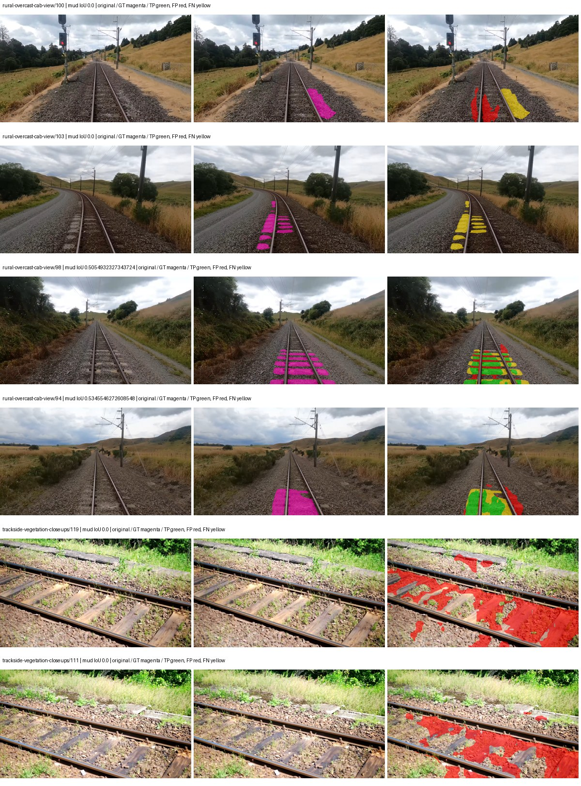

Examples are two lowest and two highest mud-IoU positive images, plus up to two negative images with the most false-positive mud pixels. They are targeted diagnostic examples, not random samples. Green: true positive; red: false positive; yellow: false negative. Full predictions remain on HDRFS.

### Validation tracking

| Logged step | Overall mIoU (%) | Mud IoU (%) |
| --- | --- | --- |
| 254 | 19.49 | 0.91 |
| 508 | 27.32 | 6.69 |
| 763 | 27.31 | 5.40 |
| 1017 | 29.29 | 0.37 |
| 1272 | 29.85 | 0.10 |
| 1527 | 29.78 | 1.37 |
| 1781 | 30.23 | 0.09 |

All retained scalar curves, including training loss and per-class IoU, are in record.json. Observed best mud on a curve is not necessarily a retained checkpoint: the pilot saved its selection-metric-best and final checkpoints. Step logging and checkpoint global_step may differ by one.

### Stopping and checkpoint provenance

```json
{
  "stopping": {
    "actual_steps": 1781,
    "maximum_steps": 4000,
    "min_delta": 0.001,
    "monitor": "val_iou/mud-pumping",
    "patience": 5,
    "reason": "validation_plateau"
  },
  "checkpoints": {
    "best": {
      "path": "/data/izadia1/projects/segmentary-runs/paul-test-rtis/mud-fullstats-v1-20260906-r2/future-runs/native_resnet50_psp--cityscapes_to_rtis--seed-0_seed0/rtis/best.ckpt",
      "sha256": "f0b47e52d188ef8d0685b5aa191dbc7be0d45bd084950de62d1632a79ac1884e",
      "global_step": 509,
      "bytes": 595211686
    },
    "final": {
      "path": "/data/izadia1/projects/segmentary-runs/paul-test-rtis/mud-fullstats-v1-20260906-r2/future-runs/native_resnet50_psp--cityscapes_to_rtis--seed-0_seed0/rtis/last.ckpt",
      "sha256": "c34d7e26e7695b71b8d72c82c6f2270f19affe5450f28d7e66ae859b79625154",
      "global_step": 1781,
      "bytes": 595200678
    }
  },
  "cleanup_error": null
}
```

### Resolved training, initialization and evaluation settings

The optimizer block is the base configuration. Stage LR scales are applied at runtime, and stage warmup is capped at min(base warmup, floor(stage budget / 10), stage budget - 1): 400 steps for this 4,000-step pilot. Model-internal native input grids may differ from augmentation crops (EoMT uses its 640 grid).

```json
{
  "name": "native_resnet50_psp--cityscapes_to_rtis--seed-0",
  "model": {
    "arch": "native",
    "checkpoint": null,
    "tuning": "full",
    "head": "unified_head",
    "lora_r": 16,
    "lora_alpha": 32,
    "lora_dropout": 0.05,
    "lora_targets": [],
    "drop_path": null,
    "revision": null,
    "subfolder": null,
    "local_files_only": false,
    "trust_remote_code": false,
    "backbone_path": null,
    "head_paths": [],
    "classifier_path": null,
    "inactive_parameter_paths": [],
    "smp_arch": null,
    "encoder_name": null,
    "encoder_weights": null,
    "native": {
      "task": "multiclass",
      "backbone": {
        "kind": "timm",
        "name": "resnet50.a1_in1k",
        "weights": "pretrained",
        "out_indices": [
          1,
          2,
          3,
          4
        ],
        "in_channels": 3
      },
      "neck": {
        "kind": "identity"
      },
      "head": {
        "kind": "psp",
        "in_index": 3,
        "channels": 256,
        "pool_bins": [
          1,
          2,
          3,
          6
        ],
        "dropout": 0.1,
        "norm": "group",
        "activation": "relu"
      },
      "auxiliary_heads": []
    },
    "batch_norm_momentum": null
  },
  "space": "paul-test-rtis",
  "taxonomy_root": "/data/izadia1/projects/segmentary-rtis-fullstats-066afb2/taxonomy",
  "output_root": "/data/izadia1/projects/segmentary-runs/paul-test-rtis/mud-fullstats-v1-20260906-r2/future-runs",
  "optim": {
    "backbone_lr": 0.0001,
    "head_lr_mult": 10.0,
    "weight_decay": 0.05,
    "llrd": 1.0,
    "warmup_iters": 1500,
    "warmup_ratio": 1e-06,
    "poly_power": 0.9,
    "min_lr_ratio": 0.0,
    "betas": [
      0.9,
      0.999
    ],
    "grad_clip": 1.0
  },
  "train": {
    "iters": 4000,
    "batch_size": 2,
    "accum": 8,
    "num_workers": 2,
    "precision": "bf16-mixed",
    "ema_decay": 0.9998,
    "val_every": 250,
    "ckpt_every": 500,
    "selection_metric": "val_iou/mud-pumping",
    "early_stopping_patience": 5,
    "early_stopping_min_delta": 0.001,
    "seed": 0,
    "devices": 1
  },
  "eval": {
    "sliding_window": true,
    "window": [
      1024,
      1024
    ],
    "stride": [
      768,
      768
    ],
    "batch_size": 1,
    "num_workers": 2,
    "tta_scales": [],
    "tta_flip": false,
    "threshold": 0.5,
    "boundary_tolerance_frac": 0.0075,
    "save_confusion": true
  },
  "loss": {
    "task": "multiclass",
    "activation": "auto",
    "terms": [],
    "aux": "none",
    "aux_weight": 0.0,
    "ce_weight": 1.0,
    "label_smoothing": 0.0,
    "class_weights": null,
    "query": null
  },
  "aug": {
    "crop": [
      1024,
      1024
    ],
    "scale_min": 0.5,
    "scale_max": 2.0,
    "hflip_p": 0.5,
    "color_jitter_p": 0.5,
    "brightness": 0.25,
    "contrast": 0.25,
    "saturation": 0.25,
    "hue": 0.05
  },
  "stages": [
    {
      "name": "rtis",
      "data": [
        {
          "name": "paul-test-rtis",
          "root": "/data/izadia1/datasets/paul-test-rtis",
          "variant": null,
          "split_file": "splits.json",
          "train_split": "train",
          "val_split": "val",
          "limit": null,
          "loader": "folder",
          "mapping": "paul-test-rtis",
          "loader_options": {
            "require_groups": true
          }
        }
      ],
      "iters": null,
      "lr_scale": 0.1,
      "head_group_lr_scale": 1.0,
      "init_from": "/data/izadia1/projects/segmentary-runs/current-main-fill-v2/jobs/native_resnet50_psp--cityscapes--seed-0/train/native_resnet50_psp--cityscapes_seed0/cityscapes/last.ckpt",
      "reset_head": true,
      "freeze": null,
      "sample_weights": null
    }
  ]
}
```

### Hardware and software provenance

```json
{
  "training": {
    "cuda_available": true,
    "cuda_visible_devices": "8",
    "cudnn": 91900,
    "driver_version": "570.133.20",
    "gpu_count": 1,
    "gpu_names": [
      "NVIDIA L40S"
    ],
    "hostname": "hdrfs-app-001",
    "input_normalization": {
      "channel_order": "rgb",
      "mean": [
        0.485,
        0.456,
        0.406
      ],
      "source": "timm_pretrained_cfg",
      "std": [
        0.229,
        0.224,
        0.225
      ]
    },
    "model_origins": [
      {
        "hf_commit": null,
        "hf_name_or_path": null,
        "module": "backbone",
        "timm_pretrained": {
          "architecture": "resnet50",
          "hf_hub_id": "timm/resnet50.a1_in1k",
          "tag": "a1_in1k",
          "url": "https://github.com/rwightman/pytorch-image-models/releases/download/v0.1-rsb-weights/resnet50_a1_0-14fe96d1.pth"
        }
      },
      {
        "hf_commit": null,
        "hf_name_or_path": null,
        "module": "backbone.model",
        "timm_pretrained": {
          "architecture": "resnet50",
          "hf_hub_id": "timm/resnet50.a1_in1k",
          "tag": "a1_in1k",
          "url": "https://github.com/rwightman/pytorch-image-models/releases/download/v0.1-rsb-weights/resnet50_a1_0-14fe96d1.pth"
        }
      }
    ],
    "model_parameter_count": 37149525,
    "packages": {
      "albumentations": "2.0.8",
      "lightning": "2.6.5",
      "numpy": "2.4.4",
      "segmentary": "0.1.0",
      "segmentation-models-pytorch": "0.5.0",
      "timm": "1.0.28",
      "torch": "2.11.0+cu128",
      "torchvision": "0.26.0+cu128",
      "transformers": "5.15.0"
    },
    "platform": "Linux-5.15.0-139-generic-x86_64-with-glibc2.35",
    "python": "3.11.15",
    "torch": "2.11.0+cu128",
    "torch_cuda": "12.8",
    "trainable_parameter_count": 37149525,
    "training_stop": {
      "actual_steps": 1781,
      "maximum_steps": 4000,
      "min_delta": 0.001,
      "monitor": "val_iou/mud-pumping",
      "patience": 5,
      "reason": "validation_plateau"
    },
    "validation_weights": "raw"
  },
  "evaluation": {
    "cuda_available": true,
    "cuda_visible_devices": "8",
    "cudnn": 91900,
    "driver_version": "570.133.20",
    "gpu_count": 1,
    "gpu_names": [
      "NVIDIA L40S"
    ],
    "hostname": "hdrfs-app-001",
    "input_normalization": {
      "channel_order": "rgb",
      "mean": [
        0.485,
        0.456,
        0.406
      ],
      "source": "timm_pretrained_cfg",
      "std": [
        0.229,
        0.224,
        0.225
      ]
    },
    "packages": {
      "albumentations": "2.0.8",
      "lightning": "2.6.5",
      "numpy": "2.4.4",
      "segmentary": "0.1.0",
      "segmentation-models-pytorch": "0.5.0",
      "timm": "1.0.28",
      "torch": "2.11.0+cu128",
      "torchvision": "0.26.0+cu128",
      "transformers": "5.15.0"
    },
    "platform": "Linux-5.15.0-139-generic-x86_64-with-glibc2.35",
    "python": "3.11.15",
    "torch": "2.11.0+cu128",
    "torch_cuda": "12.8"
  }
}
```

## cityscapes_to_rtis — seed 1

Status: **completed**. Started: 2026-09-07T00:30:38.761634+00:00. Finished: 2026-09-07T01:13:06.233742+00:00.

Recipe pretrained initializer: `{"arch": "native", "backbone_path": null, "batch_norm_momentum": null, "checkpoint": null, "classifier_path": null, "drop_path": null, "encoder_name": null, "encoder_weights": null, "head": "unified_head", "head_paths": [], "inactive_parameter_paths": [], "local_files_only": false, "lora_alpha": 32, "lora_dropout": 0.05, "lora_r": 16, "lora_targets": [], "native": {"auxiliary_heads": [], "backbone": {"in_channels": 3, "kind": "timm", "name": "resnet50.a1_in1k", "out_indices": [1, 2, 3, 4], "weights": "pretrained"}, "head": {"activation": "relu", "channels": 256, "dropout": 0.1, "in_index": 3, "kind": "psp", "norm": "group", "pool_bins": [1, 2, 3, 6]}, "neck": {"kind": "identity"}, "task": "multiclass"}, "revision": null, "smp_arch": null, "subfolder": null, "trust_remote_code": false, "tuning": "full"}`.

`rtis_only` uses the recipe initializer, which may include pretrained segmentation components. Transfer paths load the exact historical source checkpoint below and reset the classifier; they do not reset all query/decoder features.

Source checkpoint: `{'name': 'native_resnet50_psp--cityscapes--seed-0', 'model': 'native_resnet50_psp', 'protocol': 'cityscapes', 'config': '/data/izadia1/projects/segmentary-runs/all-model-city-rail-seed0-rail20-b9eb3e1/accepted/native_resnet50_psp--cityscapes--seed-0/resolved-config.yaml', 'checkpoint': '/data/izadia1/projects/segmentary-runs/current-main-fill-v2/jobs/native_resnet50_psp--cityscapes--seed-0/train/native_resnet50_psp--cityscapes_seed0/cityscapes/last.ckpt', 'recorded_sha256': '6665b49eff29d8d237a96290622adf375a75c2b114302bead67307bfd988fef5', 'exists': True}`.

Config SHA-256: `aaeb43a75b8a80f9c013edd49729f1fae3d4aa375a330b3957dd212b0c7c2431`. Weights used for validation: `raw`.

### Mud-pumping and aggregate quality

| Metric | Selected checkpoint | Final training validation |
| --- | --- | --- |
| Mud IoU | 0.81 | 0.40 |
| Mud precision | 2.64 | 1.39 |
| Mud recall | 1.15 | 0.56 |
| Mud Dice/F1 | 1.60 | 0.80 |
| mIoU | 26.54 | 29.82 |
| Mean accuracy | 39.69 | 41.66 |
| Mean precision | 51.07 | 55.31 |
| Mean Dice | 35.36 | 39.58 |
| Mean specificity | 98.71 | 98.72 |
| Pixel accuracy | 80.40 | 80.57 |
| Frequency-weighted IoU | 68.97 | 69.18 |
| Fixed GT-present class mIoU | 30.96 | 33.14 |
| Boundary F1 | 33.35 | 35.97 |

The selected checkpoint has independent evaluation evidence. Final values are the trainer's final validation record, not a new independent evaluation. mIoU averages classes with nonzero union, so false positives on absent classes can change its denominator. The fixed GT-class mean is supplementary and excludes absent classes; their false positives remain in the confusion matrix.

### Resource usage and timing

| Measurement | Value |
| --- | --- |
| Peak training VRAM, retained training invocation (GiB) | 8.29 |
| Peak evaluation VRAM (GiB) | 6.75 |
| Retained training invocation wall time (seconds) | 2423.51 |
| Retained training invocation GPU-hours (one GPU) | 0.67 |
| Evaluation wall time (seconds) | 11.10 |
| Full evaluation pipeline images/second | 3.33 |
| Best full-state checkpoint (MiB) | 567.64 |
| Final full-state checkpoint (MiB) | 567.63 |
| Audited periodic checkpoints removed (GiB) | 3.33 |

VRAM uses the recorded allocator high-water mark; it is not total device usage including CUDA context. Resumed jobs' retained training invocation times and peaks are **not whole-campaign totals**. Earlier invocation resource records are not reconstructed here. Evaluation throughput includes loader, sliding-window inference and metrics; it is not model-only latency/FPS. Missing measurements are shown as —, never inferred from another dataset's run.

### Standardized inference performance

Dedicated model-only profiling waits for an idle worker-locked L40S: BF16, batch 1, 1024x1024, 20 warmup and 100 CUDA-event-timed public forwards. It excludes loading, preprocessing, tiling and metrics.

| Status | Parameters | Weight MiB | FPS | p50 ms | p95 ms | Peak reserved GiB |
| --- | --- | --- | --- | --- | --- | --- |
| complete | 37149525 | 141.71 | 183.19 | 4.97 | 9.37 | 0.52 |

```json
{
  "schema_version": 1,
  "model_id": "native_resnet50_psp",
  "measured_at": "2026-09-07T01:12:59+00:00",
  "status": "complete",
  "benchmark_scope": "rtis_selected_checkpoint_model_only",
  "applies_to": [
    "native_resnet50_psp--cityscapes_to_rtis--seed-1"
  ],
  "source": {
    "campaign_git_sha": "066afb2626398b7be59d4d19f5a0e4644fd59adc",
    "git_dirty": false,
    "config_hash": "c54f0d037955",
    "resolved_config": "/data/izadia1/projects/segmentary-runs/paul-test-rtis/mud-fullstats-v1-20260906-r2/configs/native_resnet50_psp--cityscapes_to_rtis--seed-1.yaml",
    "config_sha256": "aaeb43a75b8a80f9c013edd49729f1fae3d4aa375a330b3957dd212b0c7c2431",
    "checkpoint_sha256": "df4cc3ac94904511b482a9761da3439e7cd6097e46f97beb10141bd55647c53d",
    "checkpoint_global_step": 1781,
    "checkpoint_bytes": 595211686,
    "checkpoint_kind": "resume checkpoint with optimizer and EMA state",
    "weights": "raw",
    "measured_checkpoint_job_id": "native_resnet50_psp--cityscapes_to_rtis--seed-1",
    "result_sha256": "89cf8ead5ee3886357126ebcce30362f67539526814db0db2389a72bfec63797",
    "result_git_sha": "066afb2626398b7be59d4d19f5a0e4644fd59adc",
    "result_stage": "eval:paul-test-rtis:val",
    "result_seed": 1
  },
  "hardware": {
    "gpu_name": "NVIDIA L40S",
    "gpu_uuid": "GPU-804aea8b-5f62-423e-72c6-49e1ed15c4e4",
    "logical_device": "cuda:0",
    "physical_visibility_token": "6",
    "compute_capability": [
      8,
      9
    ],
    "total_memory_bytes": 47677177856
  },
  "model": {
    "parameter_count": 37149525,
    "trainable_parameter_count": 37149525,
    "resident_parameter_bytes": 148598100,
    "parameter_dtype_counts": {
      "float32": 37149525
    }
  },
  "contract": {
    "backend": "pytorch",
    "precision": "bf16_autocast",
    "batch_size": 1,
    "input_shape_nchw": [
      1,
      3,
      1024,
      1024
    ],
    "warmup_iterations": 20,
    "measured_iterations": 100,
    "timing": "per-forward CUDA events with end-event synchronization",
    "includes_preprocessing": false,
    "includes_data_loader": false,
    "includes_sliding_window": false,
    "input_resident_on_gpu": true,
    "model_only": true,
    "entrypoint": "public model(image) dense-logits forward"
  },
  "measurements": {
    "latency": {
      "p50_ms": 4.973567962646484,
      "p95_ms": 9.36627197265625,
      "mean_ms": 5.4587807989120485,
      "minimum_ms": 4.602880001068115,
      "maximum_ms": 10.93939208984375,
      "fps": 183.19108915296673,
      "raw_ms": [
        6.482944011688232,
        5.223423957824707,
        4.79641580581665,
        5.0186238288879395,
        4.7032318115234375,
        4.708352088928223,
        4.6530561447143555,
        4.723711967468262,
        4.662271976470947,
        4.869120121002197,
        4.988927841186523,
        5.4620161056518555,
        5.382143974304199,
        5.059584140777588,
        10.056703567504883,
        7.6912641525268555,
        5.173247814178467,
        5.124095916748047,
        5.293056011199951,
        5.419007778167725,
        4.826111793518066,
        4.7769598960876465,
        4.666399955749512,
        4.660223960876465,
        4.619264125823975,
        4.604991912841797,
        4.6233601570129395,
        5.601247787475586,
        5.660672187805176,
        8.653823852539062,
        9.360383987426758,
        6.209536075592041,
        5.325823783874512,
        5.409791946411133,
        5.287936210632324,
        4.973567962646484,
        5.097472190856934,
        4.869120121002197,
        4.761600017547607,
        5.66374397277832,
        5.368832111358643,
        4.8660478591918945,
        4.746240139007568,
        5.2060160636901855,
        7.643136024475098,
        10.83084774017334,
        5.130239963531494,
        5.026815891265869,
        4.955135822296143,
        4.883456230163574,
        4.736000061035156,
        4.7472639083862305,
        4.872191905975342,
        4.794367790222168,
        4.793344020843506,
        5.140480041503906,
        5.114880084991455,
        4.898816108703613,
        4.731904029846191,
        5.0083842277526855,
        7.946239948272705,
        9.478143692016602,
        4.7226881980896,
        4.688896179199219,
        4.66428804397583,
        4.633600234985352,
        5.238783836364746,
        4.782080173492432,
        5.171199798583984,
        5.330944061279297,
        4.8056321144104,
        4.7564802169799805,
        5.295104026794434,
        4.803584098815918,
        4.7032318115234375,
        4.996096134185791,
        7.386144161224365,
        10.93939208984375,
        5.260287761688232,
        5.350399971008301,
        5.347328186035156,
        4.839424133300781,
        4.731904029846191,
        4.6735358238220215,
        4.6735358238220215,
        4.696063995361328,
        4.867072105407715,
        4.788224220275879,
        5.0135040283203125,
        4.825088024139404,
        4.974592208862305,
        5.16812801361084,
        4.973567962646484,
        4.896768093109131,
        4.952064037322998,
        7.008255958557129,
        9.81503963470459,
        4.795392036437988,
        4.644864082336426,
        4.602880001068115
      ],
      "percentile_method": "numpy linear interpolation"
    },
    "peak_reserved_bytes": 557842432,
    "memory_kind": "pytorch_cuda_allocator_peak_reserved_excluding_context",
    "benchmark_wall_clock_s": 12.252900142222643
  },
  "started_at": "2026-09-07T01:12:47+00:00",
  "finished_at": "2026-09-07T01:12:59+00:00",
  "environment": {
    "hostname": "hdrfs-app-001",
    "python": "3.11.15",
    "platform": "Linux-5.15.0-139-generic-x86_64-with-glibc2.35",
    "torch": "2.11.0+cu128",
    "torch_cuda": "12.8",
    "cudnn": 91900,
    "driver_version": "570.133.20",
    "cuda_available": true,
    "gpu_count": 1,
    "gpu_names": [
      "NVIDIA L40S"
    ],
    "cuda_visible_devices": "6",
    "packages": {
      "segmentary": "0.1.0",
      "torch": "2.11.0+cu128",
      "torchvision": "0.26.0+cu128",
      "transformers": "5.15.0",
      "timm": "1.0.28",
      "segmentation-models-pytorch": "0.5.0",
      "albumentations": "2.0.8",
      "lightning": "2.6.5",
      "numpy": "2.4.4"
    }
  }
}
```

### Per-class validation results

| Class | GT pixels | IoU (%) | Precision (%) | Recall (%) | Dice (%) | Boundary F1 (%) |
| --- | --- | --- | --- | --- | --- | --- |
| car | 29664 | 43.72 | 67.47 | 55.40 | 60.84 | 43.47 |
| construction | 311585 | 17.53 | 19.23 | 66.46 | 29.83 | 31.61 |
| fence | 265137 | 7.04 | 36.83 | 8.01 | 13.16 | 24.83 |
| mud-pumping | 1226250 | 0.81 | 2.64 | 1.15 | 1.60 | 2.60 |
| on-rails | 0 | 0.00 | 0.00 | — | 0.00 | 0.00 |
| person | 0 | 0.00 | 0.00 | — | 0.00 | 0.00 |
| pole | 628038 | 50.64 | 76.74 | 59.83 | 67.24 | 77.03 |
| rail-embedded | 16799 | 4.96 | 92.38 | 4.98 | 9.44 | 15.19 |
| rail-raised | 2969797 | 65.65 | 73.13 | 86.52 | 79.26 | 83.80 |
| rail-track | 6323197 | 34.29 | 65.32 | 41.91 | 51.06 | 45.36 |
| road | 1048831 | 4.28 | 14.29 | 5.75 | 8.20 | 11.79 |
| sidewalk | 1297367 | 26.25 | 79.01 | 28.22 | 41.59 | 12.19 |
| sky | 19121606 | 94.59 | 99.18 | 95.34 | 97.22 | 86.11 |
| standing-water | 95802 | 1.20 | 1.64 | 4.22 | 2.36 | 4.50 |
| terrain | 39239306 | 81.59 | 83.68 | 97.02 | 89.86 | 54.08 |
| trackbed | 10643081 | 51.09 | 61.34 | 75.36 | 67.63 | 52.68 |
| traffic-light | 19510 | 14.65 | 86.94 | 14.98 | 25.55 | 32.01 |
| traffic-sign | 13285 | 26.94 | 51.82 | 35.94 | 42.44 | 54.75 |
| tram-track | 56179 | 14.28 | 78.81 | 14.85 | 24.98 | 20.99 |
| truck | 0 | 0.00 | 0.00 | — | 0.00 | 0.00 |
| vegetation-overgrowth | 5901821 | 17.85 | 82.10 | 18.57 | 30.29 | 47.29 |

### Full-run accounting

| Measurement | Value |
| --- | --- |
| Full GPU-reserved wall seconds, all recorded worker attempts | 2547.94 |
| Full reserved GPU-hours | 0.71 |
| Whole-run timing complete | True |

| Phase | Wall seconds including failed attempts |
| --- | --- |
| training | 2430.91 |
| diagnostics | 72.16 |
| performance | 19.91 |

GPU-reserved time includes model loading, training, validation, collection, profiling, checkpoint I/O and orchestration while the worker owns one GPU. It is not GPU kernel-active time. Phase timings and sampled device memory/power/utilization are retained separately; sampled device memory is not the allocator high-water mark.

### Train/validation and raw/EMA diagnostics

| Checkpoint / weights / split | Images | Mud IoU (%) | Mud precision (%) | Mud recall (%) |
| --- | --- | --- | --- | --- |
| best-auto-train / raw | 220 | 92.21 | 96.31 | 95.58 |
| best-auto-val / raw | 37 | 0.81 | 2.64 | 1.15 |
| best-alternate-val / ema | 37 | 0.30 | 1.39 | 0.39 |
| final-auto-val / raw | 37 | 0.40 | 1.38 | 0.56 |

Train uses the evaluation transform without augmentation. Compare mud train/validation metrics for the same selected weights. Alternate EMA on running-stat BatchNorm is explicitly uncalibrated and is diagnostic only. Score-threshold curves use uncalibrated normalized scores and are pixel-level diagnostics, not event detection rates or a selected deployment operating point.

### Downloadable evidence

- best-auto-train: [per-image.csv](cityscapes_to_rtis--seed-1/best-auto-train/per-image.csv) · [per-image-confusion.json.gz](cityscapes_to_rtis--seed-1/best-auto-train/per-image-confusion.json.gz) · [groups.json](cityscapes_to_rtis--seed-1/best-auto-train/groups.json) · [mud-score-curves.json](cityscapes_to_rtis--seed-1/best-auto-train/mud-score-curves.json)
- best-auto-val: [per-image.csv](cityscapes_to_rtis--seed-1/best-auto-val/per-image.csv) · [per-image-confusion.json.gz](cityscapes_to_rtis--seed-1/best-auto-val/per-image-confusion.json.gz) · [groups.json](cityscapes_to_rtis--seed-1/best-auto-val/groups.json) · [mud-score-curves.json](cityscapes_to_rtis--seed-1/best-auto-val/mud-score-curves.json) · [examples.jpg](cityscapes_to_rtis--seed-1/best-auto-val/examples.jpg)
- best-alternate-val: [per-image.csv](cityscapes_to_rtis--seed-1/best-alternate-val/per-image.csv) · [per-image-confusion.json.gz](cityscapes_to_rtis--seed-1/best-alternate-val/per-image-confusion.json.gz) · [groups.json](cityscapes_to_rtis--seed-1/best-alternate-val/groups.json) · [mud-score-curves.json](cityscapes_to_rtis--seed-1/best-alternate-val/mud-score-curves.json)
- final-auto-val: [per-image.csv](cityscapes_to_rtis--seed-1/final-auto-val/per-image.csv) · [per-image-confusion.json.gz](cityscapes_to_rtis--seed-1/final-auto-val/per-image-confusion.json.gz) · [groups.json](cityscapes_to_rtis--seed-1/final-auto-val/groups.json) · [mud-score-curves.json](cityscapes_to_rtis--seed-1/final-auto-val/mud-score-curves.json)
- resources: [telemetry.csv](cityscapes_to_rtis--seed-1/resources/telemetry.csv)

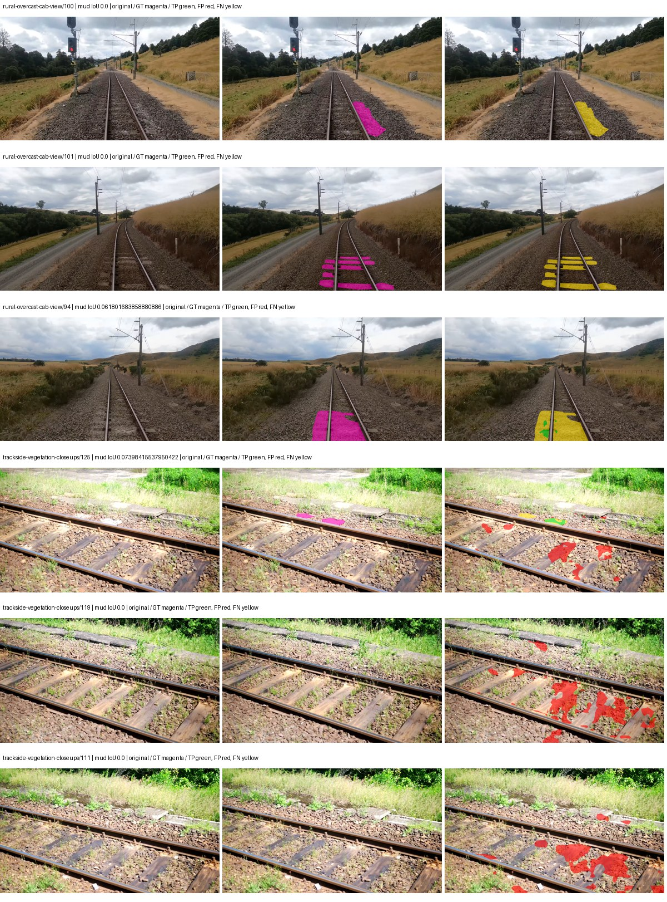

Examples are two lowest and two highest mud-IoU positive images, plus up to two negative images with the most false-positive mud pixels. They are targeted diagnostic examples, not random samples. Green: true positive; red: false positive; yellow: false negative. Full predictions remain on HDRFS.

### Validation tracking

| Logged step | Overall mIoU (%) | Mud IoU (%) |
| --- | --- | --- |
| 254 | 19.45 | 0.00 |
| 508 | 22.95 | 0.00 |
| 763 | 26.05 | 0.55 |
| 1017 | 30.63 | 0.22 |
| 1272 | 29.72 | 0.61 |
| 1527 | 28.23 | 0.00 |
| 1781 | 26.54 | 0.79 |
| 2036 | 28.66 | 0.07 |
| 2290 | 29.09 | 0.19 |
| 2545 | 28.53 | 0.46 |
| 2799 | 29.14 | 0.42 |
| 3054 | 29.82 | 0.40 |

All retained scalar curves, including training loss and per-class IoU, are in record.json. Observed best mud on a curve is not necessarily a retained checkpoint: the pilot saved its selection-metric-best and final checkpoints. Step logging and checkpoint global_step may differ by one.

### Stopping and checkpoint provenance

```json
{
  "stopping": {
    "actual_steps": 3054,
    "maximum_steps": 4000,
    "min_delta": 0.001,
    "monitor": "val_iou/mud-pumping",
    "patience": 5,
    "reason": "validation_plateau"
  },
  "checkpoints": {
    "best": {
      "path": "/data/izadia1/projects/segmentary-runs/paul-test-rtis/mud-fullstats-v1-20260906-r2/future-runs/native_resnet50_psp--cityscapes_to_rtis--seed-1_seed1/rtis/best.ckpt",
      "sha256": "df4cc3ac94904511b482a9761da3439e7cd6097e46f97beb10141bd55647c53d",
      "global_step": 1781,
      "bytes": 595211686
    },
    "final": {
      "path": "/data/izadia1/projects/segmentary-runs/paul-test-rtis/mud-fullstats-v1-20260906-r2/future-runs/native_resnet50_psp--cityscapes_to_rtis--seed-1_seed1/rtis/last.ckpt",
      "sha256": "5dcec184438ac5dc91fa2c92a451bb6f5f238b4f71cea41ed22bf49c111bcdb3",
      "global_step": 3054,
      "bytes": 595200678
    }
  },
  "cleanup_error": null
}
```

### Resolved training, initialization and evaluation settings

The optimizer block is the base configuration. Stage LR scales are applied at runtime, and stage warmup is capped at min(base warmup, floor(stage budget / 10), stage budget - 1): 400 steps for this 4,000-step pilot. Model-internal native input grids may differ from augmentation crops (EoMT uses its 640 grid).

```json
{
  "name": "native_resnet50_psp--cityscapes_to_rtis--seed-1",
  "model": {
    "arch": "native",
    "checkpoint": null,
    "tuning": "full",
    "head": "unified_head",
    "lora_r": 16,
    "lora_alpha": 32,
    "lora_dropout": 0.05,
    "lora_targets": [],
    "drop_path": null,
    "revision": null,
    "subfolder": null,
    "local_files_only": false,
    "trust_remote_code": false,
    "backbone_path": null,
    "head_paths": [],
    "classifier_path": null,
    "inactive_parameter_paths": [],
    "smp_arch": null,
    "encoder_name": null,
    "encoder_weights": null,
    "native": {
      "task": "multiclass",
      "backbone": {
        "kind": "timm",
        "name": "resnet50.a1_in1k",
        "weights": "pretrained",
        "out_indices": [
          1,
          2,
          3,
          4
        ],
        "in_channels": 3
      },
      "neck": {
        "kind": "identity"
      },
      "head": {
        "kind": "psp",
        "in_index": 3,
        "channels": 256,
        "pool_bins": [
          1,
          2,
          3,
          6
        ],
        "dropout": 0.1,
        "norm": "group",
        "activation": "relu"
      },
      "auxiliary_heads": []
    },
    "batch_norm_momentum": null
  },
  "space": "paul-test-rtis",
  "taxonomy_root": "/data/izadia1/projects/segmentary-rtis-fullstats-066afb2/taxonomy",
  "output_root": "/data/izadia1/projects/segmentary-runs/paul-test-rtis/mud-fullstats-v1-20260906-r2/future-runs",
  "optim": {
    "backbone_lr": 0.0001,
    "head_lr_mult": 10.0,
    "weight_decay": 0.05,
    "llrd": 1.0,
    "warmup_iters": 1500,
    "warmup_ratio": 1e-06,
    "poly_power": 0.9,
    "min_lr_ratio": 0.0,
    "betas": [
      0.9,
      0.999
    ],
    "grad_clip": 1.0
  },
  "train": {
    "iters": 4000,
    "batch_size": 2,
    "accum": 8,
    "num_workers": 2,
    "precision": "bf16-mixed",
    "ema_decay": 0.9998,
    "val_every": 250,
    "ckpt_every": 500,
    "selection_metric": "val_iou/mud-pumping",
    "early_stopping_patience": 5,
    "early_stopping_min_delta": 0.001,
    "seed": 1,
    "devices": 1
  },
  "eval": {
    "sliding_window": true,
    "window": [
      1024,
      1024
    ],
    "stride": [
      768,
      768
    ],
    "batch_size": 1,
    "num_workers": 2,
    "tta_scales": [],
    "tta_flip": false,
    "threshold": 0.5,
    "boundary_tolerance_frac": 0.0075,
    "save_confusion": true
  },
  "loss": {
    "task": "multiclass",
    "activation": "auto",
    "terms": [],
    "aux": "none",
    "aux_weight": 0.0,
    "ce_weight": 1.0,
    "label_smoothing": 0.0,
    "class_weights": null,
    "query": null
  },
  "aug": {
    "crop": [
      1024,
      1024
    ],
    "scale_min": 0.5,
    "scale_max": 2.0,
    "hflip_p": 0.5,
    "color_jitter_p": 0.5,
    "brightness": 0.25,
    "contrast": 0.25,
    "saturation": 0.25,
    "hue": 0.05
  },
  "stages": [
    {
      "name": "rtis",
      "data": [
        {
          "name": "paul-test-rtis",
          "root": "/data/izadia1/datasets/paul-test-rtis",
          "variant": null,
          "split_file": "splits.json",
          "train_split": "train",
          "val_split": "val",
          "limit": null,
          "loader": "folder",
          "mapping": "paul-test-rtis",
          "loader_options": {
            "require_groups": true
          }
        }
      ],
      "iters": null,
      "lr_scale": 0.1,
      "head_group_lr_scale": 1.0,
      "init_from": "/data/izadia1/projects/segmentary-runs/current-main-fill-v2/jobs/native_resnet50_psp--cityscapes--seed-0/train/native_resnet50_psp--cityscapes_seed0/cityscapes/last.ckpt",
      "reset_head": true,
      "freeze": null,
      "sample_weights": null
    }
  ]
}
```

### Hardware and software provenance

```json
{
  "training": {
    "cuda_available": true,
    "cuda_visible_devices": "6",
    "cudnn": 91900,
    "driver_version": "570.133.20",
    "gpu_count": 1,
    "gpu_names": [
      "NVIDIA L40S"
    ],
    "hostname": "hdrfs-app-001",
    "input_normalization": {
      "channel_order": "rgb",
      "mean": [
        0.485,
        0.456,
        0.406
      ],
      "source": "timm_pretrained_cfg",
      "std": [
        0.229,
        0.224,
        0.225
      ]
    },
    "model_origins": [
      {
        "hf_commit": null,
        "hf_name_or_path": null,
        "module": "backbone",
        "timm_pretrained": {
          "architecture": "resnet50",
          "hf_hub_id": "timm/resnet50.a1_in1k",
          "tag": "a1_in1k",
          "url": "https://github.com/rwightman/pytorch-image-models/releases/download/v0.1-rsb-weights/resnet50_a1_0-14fe96d1.pth"
        }
      },
      {
        "hf_commit": null,
        "hf_name_or_path": null,
        "module": "backbone.model",
        "timm_pretrained": {
          "architecture": "resnet50",
          "hf_hub_id": "timm/resnet50.a1_in1k",
          "tag": "a1_in1k",
          "url": "https://github.com/rwightman/pytorch-image-models/releases/download/v0.1-rsb-weights/resnet50_a1_0-14fe96d1.pth"
        }
      }
    ],
    "model_parameter_count": 37149525,
    "packages": {
      "albumentations": "2.0.8",
      "lightning": "2.6.5",
      "numpy": "2.4.4",
      "segmentary": "0.1.0",
      "segmentation-models-pytorch": "0.5.0",
      "timm": "1.0.28",
      "torch": "2.11.0+cu128",
      "torchvision": "0.26.0+cu128",
      "transformers": "5.15.0"
    },
    "platform": "Linux-5.15.0-139-generic-x86_64-with-glibc2.35",
    "python": "3.11.15",
    "torch": "2.11.0+cu128",
    "torch_cuda": "12.8",
    "trainable_parameter_count": 37149525,
    "training_stop": {
      "actual_steps": 3054,
      "maximum_steps": 4000,
      "min_delta": 0.001,
      "monitor": "val_iou/mud-pumping",
      "patience": 5,
      "reason": "validation_plateau"
    },
    "validation_weights": "raw"
  },
  "evaluation": {
    "cuda_available": true,
    "cuda_visible_devices": "6",
    "cudnn": 91900,
    "driver_version": "570.133.20",
    "gpu_count": 1,
    "gpu_names": [
      "NVIDIA L40S"
    ],
    "hostname": "hdrfs-app-001",
    "input_normalization": {
      "channel_order": "rgb",
      "mean": [
        0.485,
        0.456,
        0.406
      ],
      "source": "timm_pretrained_cfg",
      "std": [
        0.229,
        0.224,
        0.225
      ]
    },
    "packages": {
      "albumentations": "2.0.8",
      "lightning": "2.6.5",
      "numpy": "2.4.4",
      "segmentary": "0.1.0",
      "segmentation-models-pytorch": "0.5.0",
      "timm": "1.0.28",
      "torch": "2.11.0+cu128",
      "torchvision": "0.26.0+cu128",
      "transformers": "5.15.0"
    },
    "platform": "Linux-5.15.0-139-generic-x86_64-with-glibc2.35",
    "python": "3.11.15",
    "torch": "2.11.0+cu128",
    "torch_cuda": "12.8"
  }
}
```

## cityscapes_to_rtis — seed 2

Status: **completed**. Started: 2026-09-07T00:42:56.871632+00:00. Finished: 2026-09-07T01:05:11.105300+00:00.

Recipe pretrained initializer: `{"arch": "native", "backbone_path": null, "batch_norm_momentum": null, "checkpoint": null, "classifier_path": null, "drop_path": null, "encoder_name": null, "encoder_weights": null, "head": "unified_head", "head_paths": [], "inactive_parameter_paths": [], "local_files_only": false, "lora_alpha": 32, "lora_dropout": 0.05, "lora_r": 16, "lora_targets": [], "native": {"auxiliary_heads": [], "backbone": {"in_channels": 3, "kind": "timm", "name": "resnet50.a1_in1k", "out_indices": [1, 2, 3, 4], "weights": "pretrained"}, "head": {"activation": "relu", "channels": 256, "dropout": 0.1, "in_index": 3, "kind": "psp", "norm": "group", "pool_bins": [1, 2, 3, 6]}, "neck": {"kind": "identity"}, "task": "multiclass"}, "revision": null, "smp_arch": null, "subfolder": null, "trust_remote_code": false, "tuning": "full"}`.

`rtis_only` uses the recipe initializer, which may include pretrained segmentation components. Transfer paths load the exact historical source checkpoint below and reset the classifier; they do not reset all query/decoder features.

Source checkpoint: `{'name': 'native_resnet50_psp--cityscapes--seed-0', 'model': 'native_resnet50_psp', 'protocol': 'cityscapes', 'config': '/data/izadia1/projects/segmentary-runs/all-model-city-rail-seed0-rail20-b9eb3e1/accepted/native_resnet50_psp--cityscapes--seed-0/resolved-config.yaml', 'checkpoint': '/data/izadia1/projects/segmentary-runs/current-main-fill-v2/jobs/native_resnet50_psp--cityscapes--seed-0/train/native_resnet50_psp--cityscapes_seed0/cityscapes/last.ckpt', 'recorded_sha256': '6665b49eff29d8d237a96290622adf375a75c2b114302bead67307bfd988fef5', 'exists': True}`.

Config SHA-256: `2b1d45affede01e26851c1a563db71b5b69f9bddebeff8fa8313eace963968ce`. Weights used for validation: `raw`.

### Mud-pumping and aggregate quality

| Metric | Selected checkpoint | Final training validation |
| --- | --- | --- |
| Mud IoU | 1.73 | 0.01 |
| Mud precision | 4.08 | 0.33 |
| Mud recall | 2.93 | 0.01 |
| Mud Dice/F1 | 3.41 | 0.01 |
| mIoU | 21.59 | 31.28 |
| Mean accuracy | 30.03 | 42.04 |
| Mean precision | 36.73 | 55.36 |
| Mean Dice | 27.95 | 40.98 |
| Mean specificity | 98.40 | 98.78 |
| Pixel accuracy | 76.84 | 81.41 |
| Frequency-weighted IoU | 64.22 | 70.54 |
| Fixed GT-present class mIoU | 22.79 | 33.02 |
| Boundary F1 | 23.36 | 38.76 |

The selected checkpoint has independent evaluation evidence. Final values are the trainer's final validation record, not a new independent evaluation. mIoU averages classes with nonzero union, so false positives on absent classes can change its denominator. The fixed GT-class mean is supplementary and excludes absent classes; their false positives remain in the confusion matrix.

### Resource usage and timing

| Measurement | Value |
| --- | --- |
| Peak training VRAM, retained training invocation (GiB) | 8.29 |
| Peak evaluation VRAM (GiB) | 6.75 |
| Retained training invocation wall time (seconds) | 1215.15 |
| Retained training invocation GPU-hours (one GPU) | 0.34 |
| Evaluation wall time (seconds) | 10.24 |
| Full evaluation pipeline images/second | 3.61 |
| Best full-state checkpoint (MiB) | 567.64 |
| Final full-state checkpoint (MiB) | 567.63 |
| Audited periodic checkpoints removed (GiB) | 1.66 |

VRAM uses the recorded allocator high-water mark; it is not total device usage including CUDA context. Resumed jobs' retained training invocation times and peaks are **not whole-campaign totals**. Earlier invocation resource records are not reconstructed here. Evaluation throughput includes loader, sliding-window inference and metrics; it is not model-only latency/FPS. Missing measurements are shown as —, never inferred from another dataset's run.

### Standardized inference performance

Dedicated model-only profiling waits for an idle worker-locked L40S: BF16, batch 1, 1024x1024, 20 warmup and 100 CUDA-event-timed public forwards. It excludes loading, preprocessing, tiling and metrics.

| Status | Parameters | Weight MiB | FPS | p50 ms | p95 ms | Peak reserved GiB |
| --- | --- | --- | --- | --- | --- | --- |
| complete | 37149525 | 141.71 | 199.24 | 4.53 | 8.42 | 0.52 |

```json
{
  "schema_version": 1,
  "model_id": "native_resnet50_psp",
  "measured_at": "2026-09-07T01:05:06+00:00",
  "status": "complete",
  "benchmark_scope": "rtis_selected_checkpoint_model_only",
  "applies_to": [
    "native_resnet50_psp--cityscapes_to_rtis--seed-2"
  ],
  "source": {
    "campaign_git_sha": "066afb2626398b7be59d4d19f5a0e4644fd59adc",
    "git_dirty": false,
    "config_hash": "25663e07b49a",
    "resolved_config": "/data/izadia1/projects/segmentary-runs/paul-test-rtis/mud-fullstats-v1-20260906-r2/configs/native_resnet50_psp--cityscapes_to_rtis--seed-2.yaml",
    "config_sha256": "2b1d45affede01e26851c1a563db71b5b69f9bddebeff8fa8313eace963968ce",
    "checkpoint_sha256": "6bb1420bd66af839ffd438d18834bbc086d3fb76459ad6555e8453b05fff7e47",
    "checkpoint_global_step": 254,
    "checkpoint_bytes": 595211494,
    "checkpoint_kind": "resume checkpoint with optimizer and EMA state",
    "weights": "raw",
    "measured_checkpoint_job_id": "native_resnet50_psp--cityscapes_to_rtis--seed-2",
    "result_sha256": "d6f7f3a63a69dd6281ecefc5f9d5e6fa455ddbcecc9a0b0880b23d7f24663077",
    "result_git_sha": "066afb2626398b7be59d4d19f5a0e4644fd59adc",
    "result_stage": "eval:paul-test-rtis:val",
    "result_seed": 2
  },
  "hardware": {
    "gpu_name": "NVIDIA L40S",
    "gpu_uuid": "GPU-c76642eb-64c1-b0ac-b051-d2efd47b32c4",
    "logical_device": "cuda:0",
    "physical_visibility_token": "9",
    "compute_capability": [
      8,
      9
    ],
    "total_memory_bytes": 47677177856
  },
  "model": {
    "parameter_count": 37149525,
    "trainable_parameter_count": 37149525,
    "resident_parameter_bytes": 148598100,
    "parameter_dtype_counts": {
      "float32": 37149525
    }
  },
  "contract": {
    "backend": "pytorch",
    "precision": "bf16_autocast",
    "batch_size": 1,
    "input_shape_nchw": [
      1,
      3,
      1024,
      1024
    ],
    "warmup_iterations": 20,
    "measured_iterations": 100,
    "timing": "per-forward CUDA events with end-event synchronization",
    "includes_preprocessing": false,
    "includes_data_loader": false,
    "includes_sliding_window": false,
    "input_resident_on_gpu": true,
    "model_only": true,
    "entrypoint": "public model(image) dense-logits forward"
  },
  "measurements": {
    "latency": {
      "p50_ms": 4.526592016220093,
      "p95_ms": 8.423937797546387,
      "mean_ms": 5.019136624336243,
      "minimum_ms": 4.5055999755859375,
      "maximum_ms": 9.525312423706055,
      "fps": 199.23745353958068,
      "raw_ms": [
        5.163008213043213,
        5.009407997131348,
        5.01043176651001,
        4.744192123413086,
        5.1169281005859375,
        5.002240180969238,
        4.6735358238220215,
        5.0483198165893555,
        4.825088024139404,
        4.59878396987915,
        4.517888069152832,
        4.7697601318359375,
        4.526080131530762,
        4.517888069152832,
        4.5199360847473145,
        4.5107197761535645,
        4.60697603225708,
        4.527103900909424,
        4.520959854125977,
        8.42137622833252,
        9.271295547485352,
        4.858880043029785,
        5.065728187561035,
        5.101535797119141,
        4.91212797164917,
        4.965375900268555,
        4.9203200340271,
        4.685791969299316,
        4.520959854125977,
        4.518911838531494,
        5.25216007232666,
        4.51584005355835,
        4.5107197761535645,
        4.5199360847473145,
        4.528128147125244,
        4.517824172973633,
        4.56601619720459,
        4.547584056854248,
        6.931456089019775,
        9.525312423706055,
        4.781023979187012,
        4.601856231689453,
        4.524032115936279,
        4.521984100341797,
        4.513855934143066,
        4.520927906036377,
        4.523039817810059,
        4.511744022369385,
        4.516863822937012,
        4.511712074279785,
        4.514848232269287,
        4.7769598960876465,
        4.518911838531494,
        4.520959854125977,
        4.5055999755859375,
        6.390848159790039,
        9.156607627868652,
        4.916224002838135,
        4.513792037963867,
        4.764671802520752,
        4.956160068511963,
        4.525023937225342,
        4.541440010070801,
        5.088191986083984,
        5.004288196563721,
        4.674623966217041,
        4.525055885314941,
        4.525055885314941,
        4.517888069152832,
        4.5199360847473145,
        4.5199360847473145,
        4.5107197761535645,
        4.5199360847473145,
        4.520959854125977,
        4.5107197761535645,
        4.87116813659668,
        4.523007869720459,
        4.513792037963867,
        4.753407955169678,
        4.577280044555664,
        4.520959854125977,
        9.41055965423584,
        7.307295799255371,
        4.527103900909424,
        4.517888069152832,
        4.518911838531494,
        4.523007869720459,
        4.5199360847473145,
        4.853759765625,
        4.5199360847473145,
        4.524032115936279,
        4.523007869720459,
        4.530176162719727,
        4.523007869720459,
        4.512767791748047,
        4.517888069152832,
        4.511744022369385,
        4.526048183441162,
        8.381440162658691,
        8.472607612609863
      ],
      "percentile_method": "numpy linear interpolation"
    },
    "peak_reserved_bytes": 557842432,
    "memory_kind": "pytorch_cuda_allocator_peak_reserved_excluding_context",
    "benchmark_wall_clock_s": 12.025973174721003
  },
  "started_at": "2026-09-07T01:04:54+00:00",
  "finished_at": "2026-09-07T01:05:06+00:00",
  "environment": {
    "hostname": "hdrfs-app-001",
    "python": "3.11.15",
    "platform": "Linux-5.15.0-139-generic-x86_64-with-glibc2.35",
    "torch": "2.11.0+cu128",
    "torch_cuda": "12.8",
    "cudnn": 91900,
    "driver_version": "570.133.20",
    "cuda_available": true,
    "gpu_count": 1,
    "gpu_names": [
      "NVIDIA L40S"
    ],
    "cuda_visible_devices": "9",
    "packages": {
      "segmentary": "0.1.0",
      "torch": "2.11.0+cu128",
      "torchvision": "0.26.0+cu128",
      "transformers": "5.15.0",
      "timm": "1.0.28",
      "segmentation-models-pytorch": "0.5.0",
      "albumentations": "2.0.8",
      "lightning": "2.6.5",
      "numpy": "2.4.4"
    }
  }
}
```

### Per-class validation results

| Class | GT pixels | IoU (%) | Precision (%) | Recall (%) | Dice (%) | Boundary F1 (%) |
| --- | --- | --- | --- | --- | --- | --- |
| car | 29664 | 0.00 | 0.00 | 0.00 | 0.00 | 0.00 |
| construction | 311585 | 11.93 | 12.87 | 62.10 | 21.32 | 28.20 |
| fence | 265137 | 9.08 | 54.79 | 9.82 | 16.65 | 24.82 |
| mud-pumping | 1226250 | 1.73 | 4.08 | 2.93 | 3.41 | 6.21 |
| on-rails | 0 | 0.00 | 0.00 | — | 0.00 | 0.00 |
| person | 0 | — | — | — | — | — |
| pole | 628038 | 40.60 | 75.91 | 46.60 | 57.75 | 59.50 |
| rail-embedded | 16799 | 0.00 | 0.00 | 0.00 | 0.00 | 0.00 |
| rail-raised | 2969797 | 61.69 | 73.89 | 78.89 | 76.31 | 74.82 |
| rail-track | 6323197 | 28.83 | 50.40 | 40.24 | 44.75 | 34.59 |
| road | 1048831 | 13.90 | 27.11 | 22.18 | 24.40 | 13.80 |
| sidewalk | 1297367 | 22.10 | 97.43 | 22.23 | 36.20 | 9.34 |
| sky | 19121606 | 96.43 | 97.66 | 98.71 | 98.18 | 86.21 |
| standing-water | 95802 | 0.21 | 0.24 | 1.67 | 0.42 | 1.97 |
| terrain | 39239306 | 74.37 | 77.30 | 95.16 | 85.30 | 55.34 |
| trackbed | 10643081 | 49.12 | 73.40 | 59.75 | 65.88 | 45.79 |
| traffic-light | 19510 | 0.00 | 0.00 | 0.00 | 0.00 | 0.00 |
| traffic-sign | 13285 | 0.00 | 0.00 | 0.00 | 0.00 | 0.00 |
| tram-track | 56179 | 0.00 | 0.00 | 0.00 | 0.00 | 0.00 |
| truck | 0 | — | — | — | — | — |
| vegetation-overgrowth | 5901821 | 0.29 | 52.83 | 0.29 | 0.57 | 3.17 |

### Full-run accounting

| Measurement | Value |
| --- | --- |
| Full GPU-reserved wall seconds, all recorded worker attempts | 1334.66 |
| Full reserved GPU-hours | 0.37 |
| Whole-run timing complete | True |

| Phase | Wall seconds including failed attempts |
| --- | --- |
| training | 1222.02 |
| diagnostics | 71.11 |
| performance | 19.81 |

GPU-reserved time includes model loading, training, validation, collection, profiling, checkpoint I/O and orchestration while the worker owns one GPU. It is not GPU kernel-active time. Phase timings and sampled device memory/power/utilization are retained separately; sampled device memory is not the allocator high-water mark.

### Train/validation and raw/EMA diagnostics

| Checkpoint / weights / split | Images | Mud IoU (%) | Mud precision (%) | Mud recall (%) |
| --- | --- | --- | --- | --- |
| best-auto-train / raw | 220 | 79.15 | 91.09 | 85.79 |
| best-auto-val / raw | 37 | 1.73 | 4.08 | 2.93 |
| best-alternate-val / ema | 37 | 0.33 | 0.53 | 0.87 |
| final-auto-val / raw | 37 | 0.01 | 0.33 | 0.01 |

Train uses the evaluation transform without augmentation. Compare mud train/validation metrics for the same selected weights. Alternate EMA on running-stat BatchNorm is explicitly uncalibrated and is diagnostic only. Score-threshold curves use uncalibrated normalized scores and are pixel-level diagnostics, not event detection rates or a selected deployment operating point.

### Downloadable evidence

- best-auto-train: [per-image.csv](cityscapes_to_rtis--seed-2/best-auto-train/per-image.csv) · [per-image-confusion.json.gz](cityscapes_to_rtis--seed-2/best-auto-train/per-image-confusion.json.gz) · [groups.json](cityscapes_to_rtis--seed-2/best-auto-train/groups.json) · [mud-score-curves.json](cityscapes_to_rtis--seed-2/best-auto-train/mud-score-curves.json)
- best-auto-val: [per-image.csv](cityscapes_to_rtis--seed-2/best-auto-val/per-image.csv) · [per-image-confusion.json.gz](cityscapes_to_rtis--seed-2/best-auto-val/per-image-confusion.json.gz) · [groups.json](cityscapes_to_rtis--seed-2/best-auto-val/groups.json) · [mud-score-curves.json](cityscapes_to_rtis--seed-2/best-auto-val/mud-score-curves.json) · [examples.jpg](cityscapes_to_rtis--seed-2/best-auto-val/examples.jpg)
- best-alternate-val: [per-image.csv](cityscapes_to_rtis--seed-2/best-alternate-val/per-image.csv) · [per-image-confusion.json.gz](cityscapes_to_rtis--seed-2/best-alternate-val/per-image-confusion.json.gz) · [groups.json](cityscapes_to_rtis--seed-2/best-alternate-val/groups.json) · [mud-score-curves.json](cityscapes_to_rtis--seed-2/best-alternate-val/mud-score-curves.json)
- final-auto-val: [per-image.csv](cityscapes_to_rtis--seed-2/final-auto-val/per-image.csv) · [per-image-confusion.json.gz](cityscapes_to_rtis--seed-2/final-auto-val/per-image-confusion.json.gz) · [groups.json](cityscapes_to_rtis--seed-2/final-auto-val/groups.json) · [mud-score-curves.json](cityscapes_to_rtis--seed-2/final-auto-val/mud-score-curves.json)
- resources: [telemetry.csv](cityscapes_to_rtis--seed-2/resources/telemetry.csv)

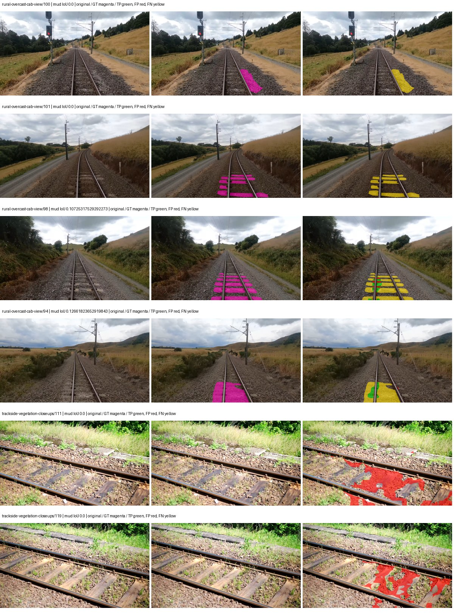

Examples are two lowest and two highest mud-IoU positive images, plus up to two negative images with the most false-positive mud pixels. They are targeted diagnostic examples, not random samples. Green: true positive; red: false positive; yellow: false negative. Full predictions remain on HDRFS.

### Validation tracking

| Logged step | Overall mIoU (%) | Mud IoU (%) |
| --- | --- | --- |
| 254 | 21.59 | 1.73 |
| 508 | 25.04 | 0.58 |
| 763 | 26.68 | 0.74 |
| 1017 | 29.73 | 0.12 |
| 1272 | 27.65 | 0.36 |
| 1527 | 31.28 | 0.01 |

All retained scalar curves, including training loss and per-class IoU, are in record.json. Observed best mud on a curve is not necessarily a retained checkpoint: the pilot saved its selection-metric-best and final checkpoints. Step logging and checkpoint global_step may differ by one.

### Stopping and checkpoint provenance

```json
{
  "stopping": {
    "actual_steps": 1527,
    "maximum_steps": 4000,
    "min_delta": 0.001,
    "monitor": "val_iou/mud-pumping",
    "patience": 5,
    "reason": "validation_plateau"
  },
  "checkpoints": {
    "best": {
      "path": "/data/izadia1/projects/segmentary-runs/paul-test-rtis/mud-fullstats-v1-20260906-r2/future-runs/native_resnet50_psp--cityscapes_to_rtis--seed-2_seed2/rtis/best.ckpt",
      "sha256": "6bb1420bd66af839ffd438d18834bbc086d3fb76459ad6555e8453b05fff7e47",
      "global_step": 254,
      "bytes": 595211494
    },
    "final": {
      "path": "/data/izadia1/projects/segmentary-runs/paul-test-rtis/mud-fullstats-v1-20260906-r2/future-runs/native_resnet50_psp--cityscapes_to_rtis--seed-2_seed2/rtis/last.ckpt",
      "sha256": "8d9abf51b7efb26e2425b6d43a0ae1eace7b1299d7082200ca96a8b28ee65591",
      "global_step": 1527,
      "bytes": 595200678
    }
  },
  "cleanup_error": null
}
```

### Resolved training, initialization and evaluation settings

The optimizer block is the base configuration. Stage LR scales are applied at runtime, and stage warmup is capped at min(base warmup, floor(stage budget / 10), stage budget - 1): 400 steps for this 4,000-step pilot. Model-internal native input grids may differ from augmentation crops (EoMT uses its 640 grid).

```json
{
  "name": "native_resnet50_psp--cityscapes_to_rtis--seed-2",
  "model": {
    "arch": "native",
    "checkpoint": null,
    "tuning": "full",
    "head": "unified_head",
    "lora_r": 16,
    "lora_alpha": 32,
    "lora_dropout": 0.05,
    "lora_targets": [],
    "drop_path": null,
    "revision": null,
    "subfolder": null,
    "local_files_only": false,
    "trust_remote_code": false,
    "backbone_path": null,
    "head_paths": [],
    "classifier_path": null,
    "inactive_parameter_paths": [],
    "smp_arch": null,
    "encoder_name": null,
    "encoder_weights": null,
    "native": {
      "task": "multiclass",
      "backbone": {
        "kind": "timm",
        "name": "resnet50.a1_in1k",
        "weights": "pretrained",
        "out_indices": [
          1,
          2,
          3,
          4
        ],
        "in_channels": 3
      },
      "neck": {
        "kind": "identity"
      },
      "head": {
        "kind": "psp",
        "in_index": 3,
        "channels": 256,
        "pool_bins": [
          1,
          2,
          3,
          6
        ],
        "dropout": 0.1,
        "norm": "group",
        "activation": "relu"
      },
      "auxiliary_heads": []
    },
    "batch_norm_momentum": null
  },
  "space": "paul-test-rtis",
  "taxonomy_root": "/data/izadia1/projects/segmentary-rtis-fullstats-066afb2/taxonomy",
  "output_root": "/data/izadia1/projects/segmentary-runs/paul-test-rtis/mud-fullstats-v1-20260906-r2/future-runs",
  "optim": {
    "backbone_lr": 0.0001,
    "head_lr_mult": 10.0,
    "weight_decay": 0.05,
    "llrd": 1.0,
    "warmup_iters": 1500,
    "warmup_ratio": 1e-06,
    "poly_power": 0.9,
    "min_lr_ratio": 0.0,
    "betas": [
      0.9,
      0.999
    ],
    "grad_clip": 1.0
  },
  "train": {
    "iters": 4000,
    "batch_size": 2,
    "accum": 8,
    "num_workers": 2,
    "precision": "bf16-mixed",
    "ema_decay": 0.9998,
    "val_every": 250,
    "ckpt_every": 500,
    "selection_metric": "val_iou/mud-pumping",
    "early_stopping_patience": 5,
    "early_stopping_min_delta": 0.001,
    "seed": 2,
    "devices": 1
  },
  "eval": {
    "sliding_window": true,
    "window": [
      1024,
      1024
    ],
    "stride": [
      768,
      768
    ],
    "batch_size": 1,
    "num_workers": 2,
    "tta_scales": [],
    "tta_flip": false,
    "threshold": 0.5,
    "boundary_tolerance_frac": 0.0075,
    "save_confusion": true
  },
  "loss": {
    "task": "multiclass",
    "activation": "auto",
    "terms": [],
    "aux": "none",
    "aux_weight": 0.0,
    "ce_weight": 1.0,
    "label_smoothing": 0.0,
    "class_weights": null,
    "query": null
  },
  "aug": {
    "crop": [
      1024,
      1024
    ],
    "scale_min": 0.5,
    "scale_max": 2.0,
    "hflip_p": 0.5,
    "color_jitter_p": 0.5,
    "brightness": 0.25,
    "contrast": 0.25,
    "saturation": 0.25,
    "hue": 0.05
  },
  "stages": [
    {
      "name": "rtis",
      "data": [
        {
          "name": "paul-test-rtis",
          "root": "/data/izadia1/datasets/paul-test-rtis",
          "variant": null,
          "split_file": "splits.json",
          "train_split": "train",
          "val_split": "val",
          "limit": null,
          "loader": "folder",
          "mapping": "paul-test-rtis",
          "loader_options": {
            "require_groups": true
          }
        }
      ],
      "iters": null,
      "lr_scale": 0.1,
      "head_group_lr_scale": 1.0,
      "init_from": "/data/izadia1/projects/segmentary-runs/current-main-fill-v2/jobs/native_resnet50_psp--cityscapes--seed-0/train/native_resnet50_psp--cityscapes_seed0/cityscapes/last.ckpt",
      "reset_head": true,
      "freeze": null,
      "sample_weights": null
    }
  ]
}
```

### Hardware and software provenance

```json
{
  "training": {
    "cuda_available": true,
    "cuda_visible_devices": "9",
    "cudnn": 91900,
    "driver_version": "570.133.20",
    "gpu_count": 1,
    "gpu_names": [
      "NVIDIA L40S"
    ],
    "hostname": "hdrfs-app-001",
    "input_normalization": {
      "channel_order": "rgb",
      "mean": [
        0.485,
        0.456,
        0.406
      ],
      "source": "timm_pretrained_cfg",
      "std": [
        0.229,
        0.224,
        0.225
      ]
    },
    "model_origins": [
      {
        "hf_commit": null,
        "hf_name_or_path": null,
        "module": "backbone",
        "timm_pretrained": {
          "architecture": "resnet50",
          "hf_hub_id": "timm/resnet50.a1_in1k",
          "tag": "a1_in1k",
          "url": "https://github.com/rwightman/pytorch-image-models/releases/download/v0.1-rsb-weights/resnet50_a1_0-14fe96d1.pth"
        }
      },
      {
        "hf_commit": null,
        "hf_name_or_path": null,
        "module": "backbone.model",
        "timm_pretrained": {
          "architecture": "resnet50",
          "hf_hub_id": "timm/resnet50.a1_in1k",
          "tag": "a1_in1k",
          "url": "https://github.com/rwightman/pytorch-image-models/releases/download/v0.1-rsb-weights/resnet50_a1_0-14fe96d1.pth"
        }
      }
    ],
    "model_parameter_count": 37149525,
    "packages": {
      "albumentations": "2.0.8",
      "lightning": "2.6.5",
      "numpy": "2.4.4",
      "segmentary": "0.1.0",
      "segmentation-models-pytorch": "0.5.0",
      "timm": "1.0.28",
      "torch": "2.11.0+cu128",
      "torchvision": "0.26.0+cu128",
      "transformers": "5.15.0"
    },
    "platform": "Linux-5.15.0-139-generic-x86_64-with-glibc2.35",
    "python": "3.11.15",
    "torch": "2.11.0+cu128",
    "torch_cuda": "12.8",
    "trainable_parameter_count": 37149525,
    "training_stop": {
      "actual_steps": 1527,
      "maximum_steps": 4000,
      "min_delta": 0.001,
      "monitor": "val_iou/mud-pumping",
      "patience": 5,
      "reason": "validation_plateau"
    },
    "validation_weights": "raw"
  },
  "evaluation": {
    "cuda_available": true,
    "cuda_visible_devices": "9",
    "cudnn": 91900,
    "driver_version": "570.133.20",
    "gpu_count": 1,
    "gpu_names": [
      "NVIDIA L40S"
    ],
    "hostname": "hdrfs-app-001",
    "input_normalization": {
      "channel_order": "rgb",
      "mean": [
        0.485,
        0.456,
        0.406
      ],
      "source": "timm_pretrained_cfg",
      "std": [
        0.229,
        0.224,
        0.225
      ]
    },
    "packages": {
      "albumentations": "2.0.8",
      "lightning": "2.6.5",
      "numpy": "2.4.4",
      "segmentary": "0.1.0",
      "segmentation-models-pytorch": "0.5.0",
      "timm": "1.0.28",
      "torch": "2.11.0+cu128",
      "torchvision": "0.26.0+cu128",
      "transformers": "5.15.0"
    },
    "platform": "Linux-5.15.0-139-generic-x86_64-with-glibc2.35",
    "python": "3.11.15",
    "torch": "2.11.0+cu128",
    "torch_cuda": "12.8"
  }
}
```

## railsem19_to_rtis — seed 0

Status: **completed**. Started: 2026-09-07T00:46:30.857204+00:00. Finished: 2026-09-07T01:15:23.944796+00:00.

Recipe pretrained initializer: `{"arch": "native", "backbone_path": null, "batch_norm_momentum": null, "checkpoint": null, "classifier_path": null, "drop_path": null, "encoder_name": null, "encoder_weights": null, "head": "unified_head", "head_paths": [], "inactive_parameter_paths": [], "local_files_only": false, "lora_alpha": 32, "lora_dropout": 0.05, "lora_r": 16, "lora_targets": [], "native": {"auxiliary_heads": [], "backbone": {"in_channels": 3, "kind": "timm", "name": "resnet50.a1_in1k", "out_indices": [1, 2, 3, 4], "weights": "pretrained"}, "head": {"activation": "relu", "channels": 256, "dropout": 0.1, "in_index": 3, "kind": "psp", "norm": "group", "pool_bins": [1, 2, 3, 6]}, "neck": {"kind": "identity"}, "task": "multiclass"}, "revision": null, "smp_arch": null, "subfolder": null, "trust_remote_code": false, "tuning": "full"}`.

`rtis_only` uses the recipe initializer, which may include pretrained segmentation components. Transfer paths load the exact historical source checkpoint below and reset the classifier; they do not reset all query/decoder features.

Source checkpoint: `{'name': 'native_resnet50_psp--railsem19--seed-0', 'model': 'native_resnet50_psp', 'protocol': 'railsem19', 'config': '/data/izadia1/projects/segmentary-runs/all-model-city-rail-seed0-rail20-b9eb3e1/jobs/native_resnet50_psp--railsem19--seed-0/attempt-001/resolved-config.yaml', 'checkpoint': '/data/izadia1/projects/segmentary-runs/all-model-city-rail-seed0-rail20-b9eb3e1/jobs/native_resnet50_psp--railsem19--seed-0/attempt-001/train/native_resnet50_psp--railsem19_seed0/railsem19/last.ckpt', 'recorded_sha256': '8d3082cdb12ed9ba54481157deeab5c01981b2cb82b78435cf3b46a8099cf01e', 'exists': True}`.

Config SHA-256: `7aca6f4b3b6d4dd6a49efd84b9a06efbbcded3b14416b1acf3cbde3e20f9d1d6`. Weights used for validation: `raw`.

### Mud-pumping and aggregate quality

| Metric | Selected checkpoint | Final training validation |
| --- | --- | --- |
| Mud IoU | 1.98 | 0.15 |
| Mud precision | 34.54 | 0.56 |
| Mud recall | 2.06 | 0.21 |
| Mud Dice/F1 | 3.88 | 0.30 |
| mIoU | 33.56 | 35.49 |
| Mean accuracy | 47.30 | 50.11 |
| Mean precision | 56.64 | 55.09 |
| Mean Dice | 43.49 | 46.33 |
| Mean specificity | 98.71 | 98.93 |
| Pixel accuracy | 81.53 | 83.53 |
| Frequency-weighted IoU | 69.38 | 73.31 |
| Fixed GT-present class mIoU | 39.15 | 41.41 |
| Boundary F1 | 38.38 | 42.74 |

The selected checkpoint has independent evaluation evidence. Final values are the trainer's final validation record, not a new independent evaluation. mIoU averages classes with nonzero union, so false positives on absent classes can change its denominator. The fixed GT-class mean is supplementary and excludes absent classes; their false positives remain in the confusion matrix.

### Resource usage and timing

| Measurement | Value |
| --- | --- |
| Peak training VRAM, retained training invocation (GiB) | 8.29 |
| Peak evaluation VRAM (GiB) | 6.75 |
| Retained training invocation wall time (seconds) | 1610.56 |
| Retained training invocation GPU-hours (one GPU) | 0.45 |
| Evaluation wall time (seconds) | 11.28 |
| Full evaluation pipeline images/second | 3.28 |
| Best full-state checkpoint (MiB) | 567.64 |
| Final full-state checkpoint (MiB) | 567.63 |
| Audited periodic checkpoints removed (GiB) | 2.22 |

VRAM uses the recorded allocator high-water mark; it is not total device usage including CUDA context. Resumed jobs' retained training invocation times and peaks are **not whole-campaign totals**. Earlier invocation resource records are not reconstructed here. Evaluation throughput includes loader, sliding-window inference and metrics; it is not model-only latency/FPS. Missing measurements are shown as —, never inferred from another dataset's run.

### Standardized inference performance

Dedicated model-only profiling waits for an idle worker-locked L40S: BF16, batch 1, 1024x1024, 20 warmup and 100 CUDA-event-timed public forwards. It excludes loading, preprocessing, tiling and metrics.

| Status | Parameters | Weight MiB | FPS | p50 ms | p95 ms | Peak reserved GiB |
| --- | --- | --- | --- | --- | --- | --- |
| complete | 37149525 | 141.71 | 213.00 | 4.63 | 5.07 | 0.52 |

```json
{
  "schema_version": 1,
  "model_id": "native_resnet50_psp",
  "measured_at": "2026-09-07T01:15:18+00:00",
  "status": "complete",
  "benchmark_scope": "rtis_selected_checkpoint_model_only",
  "applies_to": [
    "native_resnet50_psp--railsem19_to_rtis--seed-0"
  ],
  "source": {
    "campaign_git_sha": "066afb2626398b7be59d4d19f5a0e4644fd59adc",
    "git_dirty": false,
    "config_hash": "0cdb5badf9db",
    "resolved_config": "/data/izadia1/projects/segmentary-runs/paul-test-rtis/mud-fullstats-v1-20260906-r2/configs/native_resnet50_psp--railsem19_to_rtis--seed-0.yaml",
    "config_sha256": "7aca6f4b3b6d4dd6a49efd84b9a06efbbcded3b14416b1acf3cbde3e20f9d1d6",
    "checkpoint_sha256": "9f76d3a8618081f5be56c62037e02ce9253c9b4c8aec50e4ad6d9d62e28033d0",
    "checkpoint_global_step": 763,
    "checkpoint_bytes": 595211686,
    "checkpoint_kind": "resume checkpoint with optimizer and EMA state",
    "weights": "raw",
    "measured_checkpoint_job_id": "native_resnet50_psp--railsem19_to_rtis--seed-0",
    "result_sha256": "a95da8bb76085134d927be88b13c5d9e9023ba7e15fafa249c7c0cc32d28c4f0",
    "result_git_sha": "066afb2626398b7be59d4d19f5a0e4644fd59adc",
    "result_stage": "eval:paul-test-rtis:val",
    "result_seed": 0
  },
  "hardware": {
    "gpu_name": "NVIDIA L40S",
    "gpu_uuid": "GPU-1c9b612f-e0b5-fbbc-150f-8c2ef13453c9",
    "logical_device": "cuda:0",
    "physical_visibility_token": "5",
    "compute_capability": [
      8,
      9
    ],
    "total_memory_bytes": 47677177856
  },
  "model": {
    "parameter_count": 37149525,
    "trainable_parameter_count": 37149525,
    "resident_parameter_bytes": 148598100,
    "parameter_dtype_counts": {
      "float32": 37149525
    }
  },
  "contract": {
    "backend": "pytorch",
    "precision": "bf16_autocast",
    "batch_size": 1,
    "input_shape_nchw": [
      1,
      3,
      1024,
      1024
    ],
    "warmup_iterations": 20,
    "measured_iterations": 100,
    "timing": "per-forward CUDA events with end-event synchronization",
    "includes_preprocessing": false,
    "includes_data_loader": false,
    "includes_sliding_window": false,
    "input_resident_on_gpu": true,
    "model_only": true,
    "entrypoint": "public model(image) dense-logits forward"
  },
  "measurements": {
    "latency": {
      "p50_ms": 4.629504203796387,
      "p95_ms": 5.066086339950561,
      "mean_ms": 4.694813795089722,
      "minimum_ms": 4.6141438484191895,
      "maximum_ms": 5.3882880210876465,
      "fps": 213.00099293520313,
      "raw_ms": [
        4.6438398361206055,
        4.626431941986084,
        5.228544235229492,
        4.876287937164307,
        4.628479957580566,
        4.6141438484191895,
        4.632575988769531,
        4.624383926391602,
        4.626431941986084,
        4.62332820892334,
        4.629504203796387,
        4.6233601570129395,
        4.624383926391602,
        5.1517438888549805,
        4.625408172607422,
        4.626431941986084,
        4.637695789337158,
        4.629504203796387,
        4.651008129119873,
        4.827136039733887,
        4.7175679206848145,
        5.204991817474365,
        5.062655925750732,
        4.856832027435303,
        4.933631896972656,
        4.630527973175049,
        4.629504203796387,
        4.624383926391602,
        4.632575988769531,
        4.628448009490967,
        4.628479957580566,
        4.958176136016846,
        5.3882880210876465,
        4.634624004364014,
        4.632575988769531,
        4.908031940460205,
        4.621312141418457,
        4.85478401184082,
        4.626431941986084,
        4.622335910797119,
        4.628479957580566,
        4.6183037757873535,
        4.628479957580566,
        4.633600234985352,
        4.624383926391602,
        4.625408172607422,
        4.625408172607422,
        5.1312642097473145,
        4.627456188201904,
        4.625408172607422,
        4.621312141418457,
        4.628479957580566,
        4.630527973175049,
        4.632575988769531,
        4.6233601570129395,
        4.635647773742676,
        4.633600234985352,
        4.633600234985352,
        4.627456188201904,
        4.628479957580566,
        4.625408172607422,
        4.807680130004883,
        4.8015360832214355,
        4.696063995361328,
        4.6827521324157715,
        4.888576030731201,
        4.731904029846191,
        4.6223039627075195,
        4.625408172607422,
        4.630527973175049,
        4.625408172607422,
        4.621312141418457,
        4.976640224456787,
        4.629504203796387,
        4.625408172607422,
        4.628479957580566,
        4.621312141418457,
        4.646880149841309,
        4.626431941986084,
        4.6233601570129395,
        4.641791820526123,
        4.625408172607422,
        4.632575988769531,
        4.624383926391602,
        4.630527973175049,
        4.621312141418457,
        4.629504203796387,
        4.630527973175049,
        4.626431941986084,
        4.631552219390869,
        4.624383926391602,
        4.625408172607422,
        4.626431941986084,
        4.66431999206543,
        4.630527973175049,
        4.766719818115234,
        4.624383926391602,
        4.634624004364014,
        4.621312141418457,
        4.622335910797119
      ],
      "percentile_method": "numpy linear interpolation"
    },
    "peak_reserved_bytes": 557842432,
    "memory_kind": "pytorch_cuda_allocator_peak_reserved_excluding_context",
    "benchmark_wall_clock_s": 11.910352014005184
  },
  "started_at": "2026-09-07T01:15:07+00:00",
  "finished_at": "2026-09-07T01:15:18+00:00",
  "environment": {
    "hostname": "hdrfs-app-001",
    "python": "3.11.15",
    "platform": "Linux-5.15.0-139-generic-x86_64-with-glibc2.35",
    "torch": "2.11.0+cu128",
    "torch_cuda": "12.8",
    "cudnn": 91900,
    "driver_version": "570.133.20",
    "cuda_available": true,
    "gpu_count": 1,
    "gpu_names": [
      "NVIDIA L40S"
    ],
    "cuda_visible_devices": "5",
    "packages": {
      "segmentary": "0.1.0",
      "torch": "2.11.0+cu128",
      "torchvision": "0.26.0+cu128",
      "transformers": "5.15.0",
      "timm": "1.0.28",
      "segmentation-models-pytorch": "0.5.0",
      "albumentations": "2.0.8",
      "lightning": "2.6.5",
      "numpy": "2.4.4"
    }
  }
}
```

### Per-class validation results

| Class | GT pixels | IoU (%) | Precision (%) | Recall (%) | Dice (%) | Boundary F1 (%) |
| --- | --- | --- | --- | --- | --- | --- |
| car | 29664 | 26.02 | 74.61 | 28.54 | 41.29 | 33.37 |
| construction | 311585 | 49.36 | 54.05 | 85.04 | 66.09 | 51.34 |
| fence | 265137 | 14.70 | 43.28 | 18.20 | 25.63 | 32.81 |
| mud-pumping | 1226250 | 1.98 | 34.54 | 2.06 | 3.88 | 5.79 |
| on-rails | 0 | 0.00 | 0.00 | — | 0.00 | 0.00 |
| person | 0 | 0.00 | 0.00 | — | 0.00 | 0.00 |
| pole | 628038 | 55.39 | 79.13 | 64.87 | 71.29 | 77.03 |
| rail-embedded | 16799 | 10.24 | 63.34 | 10.88 | 18.57 | 26.72 |
| rail-raised | 2969797 | 71.11 | 76.54 | 90.93 | 83.12 | 89.26 |
| rail-track | 6323197 | 33.18 | 60.29 | 42.45 | 49.82 | 46.60 |
| road | 1048831 | 31.55 | 60.01 | 39.95 | 47.97 | 26.54 |
| sidewalk | 1297367 | 41.91 | 82.85 | 45.90 | 59.07 | 13.28 |
| sky | 19121606 | 97.35 | 98.66 | 98.65 | 98.66 | 90.02 |
| standing-water | 95802 | 0.02 | 0.10 | 0.02 | 0.03 | 0.82 |
| terrain | 39239306 | 80.69 | 81.55 | 98.70 | 89.31 | 58.91 |
| trackbed | 10643081 | 52.36 | 66.30 | 71.36 | 68.74 | 56.48 |
| traffic-light | 19510 | 68.53 | 94.24 | 71.53 | 81.33 | 83.45 |
| traffic-sign | 13285 | 35.62 | 63.64 | 44.73 | 52.53 | 66.81 |
| tram-track | 56179 | 28.90 | 77.40 | 31.57 | 44.85 | 24.95 |
| truck | 0 | 0.00 | 0.00 | — | 0.00 | 0.00 |
| vegetation-overgrowth | 5901821 | 5.88 | 78.83 | 5.97 | 11.11 | 21.83 |

### Full-run accounting

| Measurement | Value |
| --- | --- |
| Full GPU-reserved wall seconds, all recorded worker attempts | 1733.75 |
| Full reserved GPU-hours | 0.48 |
| Whole-run timing complete | True |

| Phase | Wall seconds including failed attempts |
| --- | --- |
| training | 1617.49 |
| diagnostics | 72.81 |
| performance | 19.58 |

GPU-reserved time includes model loading, training, validation, collection, profiling, checkpoint I/O and orchestration while the worker owns one GPU. It is not GPU kernel-active time. Phase timings and sampled device memory/power/utilization are retained separately; sampled device memory is not the allocator high-water mark.

### Train/validation and raw/EMA diagnostics

| Checkpoint / weights / split | Images | Mud IoU (%) | Mud precision (%) | Mud recall (%) |
| --- | --- | --- | --- | --- |
| best-auto-train / raw | 220 | 89.09 | 96.74 | 91.84 |
| best-auto-val / raw | 37 | 1.98 | 34.54 | 2.06 |
| best-alternate-val / ema | 37 | 0.04 | 1.29 | 0.04 |
| final-auto-val / raw | 37 | 0.15 | 0.57 | 0.21 |

Train uses the evaluation transform without augmentation. Compare mud train/validation metrics for the same selected weights. Alternate EMA on running-stat BatchNorm is explicitly uncalibrated and is diagnostic only. Score-threshold curves use uncalibrated normalized scores and are pixel-level diagnostics, not event detection rates or a selected deployment operating point.

### Downloadable evidence

- best-auto-train: [per-image.csv](railsem19_to_rtis--seed-0/best-auto-train/per-image.csv) · [per-image-confusion.json.gz](railsem19_to_rtis--seed-0/best-auto-train/per-image-confusion.json.gz) · [groups.json](railsem19_to_rtis--seed-0/best-auto-train/groups.json) · [mud-score-curves.json](railsem19_to_rtis--seed-0/best-auto-train/mud-score-curves.json)
- best-auto-val: [per-image.csv](railsem19_to_rtis--seed-0/best-auto-val/per-image.csv) · [per-image-confusion.json.gz](railsem19_to_rtis--seed-0/best-auto-val/per-image-confusion.json.gz) · [groups.json](railsem19_to_rtis--seed-0/best-auto-val/groups.json) · [mud-score-curves.json](railsem19_to_rtis--seed-0/best-auto-val/mud-score-curves.json) · [examples.jpg](railsem19_to_rtis--seed-0/best-auto-val/examples.jpg)
- best-alternate-val: [per-image.csv](railsem19_to_rtis--seed-0/best-alternate-val/per-image.csv) · [per-image-confusion.json.gz](railsem19_to_rtis--seed-0/best-alternate-val/per-image-confusion.json.gz) · [groups.json](railsem19_to_rtis--seed-0/best-alternate-val/groups.json) · [mud-score-curves.json](railsem19_to_rtis--seed-0/best-alternate-val/mud-score-curves.json)
- final-auto-val: [per-image.csv](railsem19_to_rtis--seed-0/final-auto-val/per-image.csv) · [per-image-confusion.json.gz](railsem19_to_rtis--seed-0/final-auto-val/per-image-confusion.json.gz) · [groups.json](railsem19_to_rtis--seed-0/final-auto-val/groups.json) · [mud-score-curves.json](railsem19_to_rtis--seed-0/final-auto-val/mud-score-curves.json)
- resources: [telemetry.csv](railsem19_to_rtis--seed-0/resources/telemetry.csv)

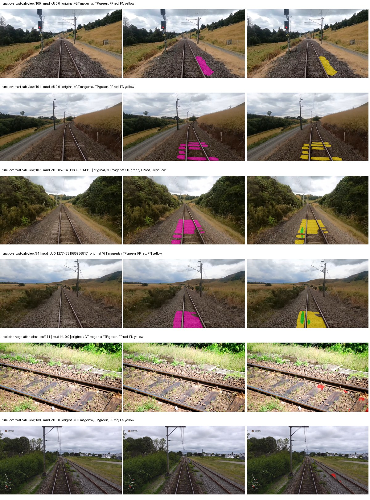

Examples are two lowest and two highest mud-IoU positive images, plus up to two negative images with the most false-positive mud pixels. They are targeted diagnostic examples, not random samples. Green: true positive; red: false positive; yellow: false negative. Full predictions remain on HDRFS.

### Validation tracking

| Logged step | Overall mIoU (%) | Mud IoU (%) |
| --- | --- | --- |
| 254 | 26.45 | 0.00 |
| 508 | 35.94 | 0.37 |
| 763 | 33.57 | 1.97 |
| 1017 | 35.15 | 0.10 |
| 1272 | 35.87 | 0.38 |
| 1527 | 35.25 | 0.14 |
| 1781 | 35.15 | 0.09 |
| 2036 | 35.49 | 0.15 |

All retained scalar curves, including training loss and per-class IoU, are in record.json. Observed best mud on a curve is not necessarily a retained checkpoint: the pilot saved its selection-metric-best and final checkpoints. Step logging and checkpoint global_step may differ by one.

### Stopping and checkpoint provenance

```json
{
  "stopping": {
    "actual_steps": 2036,
    "maximum_steps": 4000,
    "min_delta": 0.001,
    "monitor": "val_iou/mud-pumping",
    "patience": 5,
    "reason": "validation_plateau"
  },
  "checkpoints": {
    "best": {
      "path": "/data/izadia1/projects/segmentary-runs/paul-test-rtis/mud-fullstats-v1-20260906-r2/future-runs/native_resnet50_psp--railsem19_to_rtis--seed-0_seed0/rtis/best.ckpt",
      "sha256": "9f76d3a8618081f5be56c62037e02ce9253c9b4c8aec50e4ad6d9d62e28033d0",
      "global_step": 763,
      "bytes": 595211686
    },
    "final": {
      "path": "/data/izadia1/projects/segmentary-runs/paul-test-rtis/mud-fullstats-v1-20260906-r2/future-runs/native_resnet50_psp--railsem19_to_rtis--seed-0_seed0/rtis/last.ckpt",
      "sha256": "27e5cd3444660242c9498ba5b4cb935e50f05156ef9199916f8d85b2626fc510",
      "global_step": 2036,
      "bytes": 595200678
    }
  },
  "cleanup_error": null
}
```

### Resolved training, initialization and evaluation settings

The optimizer block is the base configuration. Stage LR scales are applied at runtime, and stage warmup is capped at min(base warmup, floor(stage budget / 10), stage budget - 1): 400 steps for this 4,000-step pilot. Model-internal native input grids may differ from augmentation crops (EoMT uses its 640 grid).

```json
{
  "name": "native_resnet50_psp--railsem19_to_rtis--seed-0",
  "model": {
    "arch": "native",
    "checkpoint": null,
    "tuning": "full",
    "head": "unified_head",
    "lora_r": 16,
    "lora_alpha": 32,
    "lora_dropout": 0.05,
    "lora_targets": [],
    "drop_path": null,
    "revision": null,
    "subfolder": null,
    "local_files_only": false,
    "trust_remote_code": false,
    "backbone_path": null,
    "head_paths": [],
    "classifier_path": null,
    "inactive_parameter_paths": [],
    "smp_arch": null,
    "encoder_name": null,
    "encoder_weights": null,
    "native": {
      "task": "multiclass",
      "backbone": {
        "kind": "timm",
        "name": "resnet50.a1_in1k",
        "weights": "pretrained",
        "out_indices": [
          1,
          2,
          3,
          4
        ],
        "in_channels": 3
      },
      "neck": {
        "kind": "identity"
      },
      "head": {
        "kind": "psp",
        "in_index": 3,
        "channels": 256,
        "pool_bins": [
          1,
          2,
          3,
          6
        ],
        "dropout": 0.1,
        "norm": "group",
        "activation": "relu"
      },
      "auxiliary_heads": []
    },
    "batch_norm_momentum": null
  },
  "space": "paul-test-rtis",
  "taxonomy_root": "/data/izadia1/projects/segmentary-rtis-fullstats-066afb2/taxonomy",
  "output_root": "/data/izadia1/projects/segmentary-runs/paul-test-rtis/mud-fullstats-v1-20260906-r2/future-runs",
  "optim": {
    "backbone_lr": 0.0001,
    "head_lr_mult": 10.0,
    "weight_decay": 0.05,
    "llrd": 1.0,
    "warmup_iters": 1500,
    "warmup_ratio": 1e-06,
    "poly_power": 0.9,
    "min_lr_ratio": 0.0,
    "betas": [
      0.9,
      0.999
    ],
    "grad_clip": 1.0
  },
  "train": {
    "iters": 4000,
    "batch_size": 2,
    "accum": 8,
    "num_workers": 2,
    "precision": "bf16-mixed",
    "ema_decay": 0.9998,
    "val_every": 250,
    "ckpt_every": 500,
    "selection_metric": "val_iou/mud-pumping",
    "early_stopping_patience": 5,
    "early_stopping_min_delta": 0.001,
    "seed": 0,
    "devices": 1
  },
  "eval": {
    "sliding_window": true,
    "window": [
      1024,
      1024
    ],
    "stride": [
      768,
      768
    ],
    "batch_size": 1,
    "num_workers": 2,
    "tta_scales": [],
    "tta_flip": false,
    "threshold": 0.5,
    "boundary_tolerance_frac": 0.0075,
    "save_confusion": true
  },
  "loss": {
    "task": "multiclass",
    "activation": "auto",
    "terms": [],
    "aux": "none",
    "aux_weight": 0.0,
    "ce_weight": 1.0,
    "label_smoothing": 0.0,
    "class_weights": null,
    "query": null
  },
  "aug": {
    "crop": [
      1024,
      1024
    ],
    "scale_min": 0.5,
    "scale_max": 2.0,
    "hflip_p": 0.5,
    "color_jitter_p": 0.5,
    "brightness": 0.25,
    "contrast": 0.25,
    "saturation": 0.25,
    "hue": 0.05
  },
  "stages": [
    {
      "name": "rtis",
      "data": [
        {
          "name": "paul-test-rtis",
          "root": "/data/izadia1/datasets/paul-test-rtis",
          "variant": null,
          "split_file": "splits.json",
          "train_split": "train",
          "val_split": "val",
          "limit": null,
          "loader": "folder",
          "mapping": "paul-test-rtis",
          "loader_options": {
            "require_groups": true
          }
        }
      ],
      "iters": null,
      "lr_scale": 0.1,
      "head_group_lr_scale": 1.0,
      "init_from": "/data/izadia1/projects/segmentary-runs/all-model-city-rail-seed0-rail20-b9eb3e1/jobs/native_resnet50_psp--railsem19--seed-0/attempt-001/train/native_resnet50_psp--railsem19_seed0/railsem19/last.ckpt",
      "reset_head": true,
      "freeze": null,
      "sample_weights": null
    }
  ]
}
```

### Hardware and software provenance

```json
{
  "training": {
    "cuda_available": true,
    "cuda_visible_devices": "5",
    "cudnn": 91900,
    "driver_version": "570.133.20",
    "gpu_count": 1,
    "gpu_names": [
      "NVIDIA L40S"
    ],
    "hostname": "hdrfs-app-001",
    "input_normalization": {
      "channel_order": "rgb",
      "mean": [
        0.485,
        0.456,
        0.406
      ],
      "source": "timm_pretrained_cfg",
      "std": [
        0.229,
        0.224,
        0.225
      ]
    },
    "model_origins": [
      {
        "hf_commit": null,
        "hf_name_or_path": null,
        "module": "backbone",
        "timm_pretrained": {
          "architecture": "resnet50",
          "hf_hub_id": "timm/resnet50.a1_in1k",
          "tag": "a1_in1k",
          "url": "https://github.com/rwightman/pytorch-image-models/releases/download/v0.1-rsb-weights/resnet50_a1_0-14fe96d1.pth"
        }
      },
      {
        "hf_commit": null,
        "hf_name_or_path": null,
        "module": "backbone.model",
        "timm_pretrained": {
          "architecture": "resnet50",
          "hf_hub_id": "timm/resnet50.a1_in1k",
          "tag": "a1_in1k",
          "url": "https://github.com/rwightman/pytorch-image-models/releases/download/v0.1-rsb-weights/resnet50_a1_0-14fe96d1.pth"
        }
      }
    ],
    "model_parameter_count": 37149525,
    "packages": {
      "albumentations": "2.0.8",
      "lightning": "2.6.5",
      "numpy": "2.4.4",
      "segmentary": "0.1.0",
      "segmentation-models-pytorch": "0.5.0",
      "timm": "1.0.28",
      "torch": "2.11.0+cu128",
      "torchvision": "0.26.0+cu128",
      "transformers": "5.15.0"
    },
    "platform": "Linux-5.15.0-139-generic-x86_64-with-glibc2.35",
    "python": "3.11.15",
    "torch": "2.11.0+cu128",
    "torch_cuda": "12.8",
    "trainable_parameter_count": 37149525,
    "training_stop": {
      "actual_steps": 2036,
      "maximum_steps": 4000,
      "min_delta": 0.001,
      "monitor": "val_iou/mud-pumping",
      "patience": 5,
      "reason": "validation_plateau"
    },
    "validation_weights": "raw"
  },
  "evaluation": {
    "cuda_available": true,
    "cuda_visible_devices": "5",
    "cudnn": 91900,
    "driver_version": "570.133.20",
    "gpu_count": 1,
    "gpu_names": [
      "NVIDIA L40S"
    ],
    "hostname": "hdrfs-app-001",
    "input_normalization": {
      "channel_order": "rgb",
      "mean": [
        0.485,
        0.456,
        0.406
      ],
      "source": "timm_pretrained_cfg",
      "std": [
        0.229,
        0.224,
        0.225
      ]
    },
    "packages": {
      "albumentations": "2.0.8",
      "lightning": "2.6.5",
      "numpy": "2.4.4",
      "segmentary": "0.1.0",
      "segmentation-models-pytorch": "0.5.0",
      "timm": "1.0.28",
      "torch": "2.11.0+cu128",
      "torchvision": "0.26.0+cu128",
      "transformers": "5.15.0"
    },
    "platform": "Linux-5.15.0-139-generic-x86_64-with-glibc2.35",
    "python": "3.11.15",
    "torch": "2.11.0+cu128",
    "torch_cuda": "12.8"
  }
}
```

## railsem19_to_rtis — seed 1

Status: **completed**. Started: 2026-09-07T00:49:23.428493+00:00. Finished: 2026-09-07T01:11:50.773326+00:00.

Recipe pretrained initializer: `{"arch": "native", "backbone_path": null, "batch_norm_momentum": null, "checkpoint": null, "classifier_path": null, "drop_path": null, "encoder_name": null, "encoder_weights": null, "head": "unified_head", "head_paths": [], "inactive_parameter_paths": [], "local_files_only": false, "lora_alpha": 32, "lora_dropout": 0.05, "lora_r": 16, "lora_targets": [], "native": {"auxiliary_heads": [], "backbone": {"in_channels": 3, "kind": "timm", "name": "resnet50.a1_in1k", "out_indices": [1, 2, 3, 4], "weights": "pretrained"}, "head": {"activation": "relu", "channels": 256, "dropout": 0.1, "in_index": 3, "kind": "psp", "norm": "group", "pool_bins": [1, 2, 3, 6]}, "neck": {"kind": "identity"}, "task": "multiclass"}, "revision": null, "smp_arch": null, "subfolder": null, "trust_remote_code": false, "tuning": "full"}`.

`rtis_only` uses the recipe initializer, which may include pretrained segmentation components. Transfer paths load the exact historical source checkpoint below and reset the classifier; they do not reset all query/decoder features.

Source checkpoint: `{'name': 'native_resnet50_psp--railsem19--seed-0', 'model': 'native_resnet50_psp', 'protocol': 'railsem19', 'config': '/data/izadia1/projects/segmentary-runs/all-model-city-rail-seed0-rail20-b9eb3e1/jobs/native_resnet50_psp--railsem19--seed-0/attempt-001/resolved-config.yaml', 'checkpoint': '/data/izadia1/projects/segmentary-runs/all-model-city-rail-seed0-rail20-b9eb3e1/jobs/native_resnet50_psp--railsem19--seed-0/attempt-001/train/native_resnet50_psp--railsem19_seed0/railsem19/last.ckpt', 'recorded_sha256': '8d3082cdb12ed9ba54481157deeab5c01981b2cb82b78435cf3b46a8099cf01e', 'exists': True}`.

Config SHA-256: `98db672b552bd53c1097cb1b486467d3bb1e137ea40af2c69262f55999bba672`. Weights used for validation: `raw`.

### Mud-pumping and aggregate quality

| Metric | Selected checkpoint | Final training validation |
| --- | --- | --- |
| Mud IoU | 3.15 | 0.00 |
| Mud precision | 11.11 | 0.00 |
| Mud recall | 4.21 | 0.00 |
| Mud Dice/F1 | 6.11 | 0.00 |
| mIoU | 24.90 | 33.93 |
| Mean accuracy | 34.41 | 47.42 |
| Mean precision | 41.81 | 55.09 |
| Mean Dice | 31.85 | 44.12 |
| Mean specificity | 98.69 | 98.77 |
| Pixel accuracy | 80.97 | 81.89 |
| Frequency-weighted IoU | 68.76 | 70.50 |
| Fixed GT-present class mIoU | 27.67 | 39.58 |
| Boundary F1 | 27.71 | 40.29 |

The selected checkpoint has independent evaluation evidence. Final values are the trainer's final validation record, not a new independent evaluation. mIoU averages classes with nonzero union, so false positives on absent classes can change its denominator. The fixed GT-class mean is supplementary and excludes absent classes; their false positives remain in the confusion matrix.

### Resource usage and timing

| Measurement | Value |
| --- | --- |
| Peak training VRAM, retained training invocation (GiB) | 8.29 |
| Peak evaluation VRAM (GiB) | 6.75 |
| Retained training invocation wall time (seconds) | 1221.19 |
| Retained training invocation GPU-hours (one GPU) | 0.34 |
| Evaluation wall time (seconds) | 11.10 |
| Full evaluation pipeline images/second | 3.33 |
| Best full-state checkpoint (MiB) | 567.64 |
| Final full-state checkpoint (MiB) | 567.63 |
| Audited periodic checkpoints removed (GiB) | 1.66 |

VRAM uses the recorded allocator high-water mark; it is not total device usage including CUDA context. Resumed jobs' retained training invocation times and peaks are **not whole-campaign totals**. Earlier invocation resource records are not reconstructed here. Evaluation throughput includes loader, sliding-window inference and metrics; it is not model-only latency/FPS. Missing measurements are shown as —, never inferred from another dataset's run.

### Standardized inference performance

Dedicated model-only profiling waits for an idle worker-locked L40S: BF16, batch 1, 1024x1024, 20 warmup and 100 CUDA-event-timed public forwards. It excludes loading, preprocessing, tiling and metrics.

| Status | Parameters | Weight MiB | FPS | p50 ms | p95 ms | Peak reserved GiB |
| --- | --- | --- | --- | --- | --- | --- |
| complete | 37149525 | 141.71 | 207.55 | 4.66 | 5.42 | 0.52 |

```json
{
  "schema_version": 1,
  "model_id": "native_resnet50_psp",
  "measured_at": "2026-09-07T01:11:46+00:00",
  "status": "complete",
  "benchmark_scope": "rtis_selected_checkpoint_model_only",
  "applies_to": [
    "native_resnet50_psp--railsem19_to_rtis--seed-1"
  ],
  "source": {
    "campaign_git_sha": "066afb2626398b7be59d4d19f5a0e4644fd59adc",
    "git_dirty": false,
    "config_hash": "d55ab76c845c",
    "resolved_config": "/data/izadia1/projects/segmentary-runs/paul-test-rtis/mud-fullstats-v1-20260906-r2/configs/native_resnet50_psp--railsem19_to_rtis--seed-1.yaml",
    "config_sha256": "98db672b552bd53c1097cb1b486467d3bb1e137ea40af2c69262f55999bba672",
    "checkpoint_sha256": "694ad1d7c81b2897db851c7e3e5129669b097b063ce25e19a1e64206990f8d09",
    "checkpoint_global_step": 254,
    "checkpoint_bytes": 595211494,
    "checkpoint_kind": "resume checkpoint with optimizer and EMA state",
    "weights": "raw",
    "measured_checkpoint_job_id": "native_resnet50_psp--railsem19_to_rtis--seed-1",
    "result_sha256": "db99a46511aa7491f82a1d47381ae3eb09bafbc30dda0b74d47d7766a2c04c16",
    "result_git_sha": "066afb2626398b7be59d4d19f5a0e4644fd59adc",
    "result_stage": "eval:paul-test-rtis:val",
    "result_seed": 1
  },
  "hardware": {
    "gpu_name": "NVIDIA L40S",
    "gpu_uuid": "GPU-84f5ca4d-68db-ae98-d056-40654d859dd9",
    "logical_device": "cuda:0",
    "physical_visibility_token": "0",
    "compute_capability": [
      8,
      9
    ],
    "total_memory_bytes": 47677177856
  },
  "model": {
    "parameter_count": 37149525,
    "trainable_parameter_count": 37149525,
    "resident_parameter_bytes": 148598100,
    "parameter_dtype_counts": {
      "float32": 37149525
    }
  },
  "contract": {
    "backend": "pytorch",
    "precision": "bf16_autocast",
    "batch_size": 1,
    "input_shape_nchw": [
      1,
      3,
      1024,
      1024
    ],
    "warmup_iterations": 20,
    "measured_iterations": 100,
    "timing": "per-forward CUDA events with end-event synchronization",
    "includes_preprocessing": false,
    "includes_data_loader": false,
    "includes_sliding_window": false,
    "input_resident_on_gpu": true,
    "model_only": true,
    "entrypoint": "public model(image) dense-logits forward"
  },
  "measurements": {
    "latency": {
      "p50_ms": 4.6571362018585205,
      "p95_ms": 5.422316575050354,
      "mean_ms": 4.8181407928466795,
      "minimum_ms": 4.634624004364014,
      "maximum_ms": 5.6524481773376465,
      "fps": 207.54893702663568,
      "raw_ms": [
        4.753407955169678,
        4.6684160232543945,
        4.663296222686768,
        4.773888111114502,
        4.9100799560546875,
        4.757503986358643,
        5.368832111358643,
        4.87116813659668,
        4.655104160308838,
        4.640639781951904,
        4.6438398361206055,
        4.637695789337158,
        4.839424133300781,
        4.645792007446289,
        4.6561279296875,
        4.635647773742676,
        5.451776027679443,
        5.429247856140137,
        4.6387200355529785,
        4.644832134246826,
        4.649983882904053,
        4.658175945281982,
        4.641791820526123,
        4.634624004364014,
        4.646912097930908,
        4.639647960662842,
        4.64793586730957,
        5.351424217224121,
        5.195807933807373,
        4.689919948577881,
        4.64793586730957,
        4.649983882904053,
        4.947999954223633,
        4.649983882904053,
        4.649983882904053,
        4.642816066741943,
        4.65715217590332,
        4.64793586730957,
        4.950016021728516,
        4.718592166900635,
        5.465151786804199,
        4.785151958465576,
        4.648960113525391,
        4.648960113525391,
        4.644864082336426,
        4.642816066741943,
        5.15993595123291,
        5.142528057098389,
        4.951039791107178,
        4.752384185791016,
        4.8455681800842285,
        5.030911922454834,
        4.658207893371582,
        4.644864082336426,
        5.280767917633057,
        5.185535907745361,
        5.6524481773376465,
        4.645887851715088,
        4.6530561447143555,
        4.6438398361206055,
        4.6530561447143555,
        4.641791820526123,
        4.643807888031006,
        4.655104160308838,
        4.655104160308838,
        4.975615978240967,
        4.866015911102295,
        4.645887851715088,
        4.641791820526123,
        5.368832111358643,
        4.654079914093018,
        4.640768051147461,
        4.649983882904053,
        4.648831844329834,
        4.663296222686768,
        4.781184196472168,
        5.378047943115234,
        4.751359939575195,
        4.972544193267822,
        4.848639965057373,
        4.657120227813721,
        4.646912097930908,
        4.6438398361206055,
        4.6438398361206055,
        4.651008129119873,
        4.981760025024414,
        5.552127838134766,
        4.901887893676758,
        4.64793586730957,
        5.068831920623779,
        5.1312642097473145,
        4.808671951293945,
        4.9541120529174805,
        4.775936126708984,
        4.6561279296875,
        4.700160026550293,
        5.421951770782471,
        4.64793586730957,
        4.646912097930908,
        4.6530561447143555
      ],
      "percentile_method": "numpy linear interpolation"
    },
    "peak_reserved_bytes": 557842432,
    "memory_kind": "pytorch_cuda_allocator_peak_reserved_excluding_context",
    "benchmark_wall_clock_s": 11.79699881002307
  },
  "started_at": "2026-09-07T01:11:34+00:00",
  "finished_at": "2026-09-07T01:11:46+00:00",
  "environment": {
    "hostname": "hdrfs-app-001",
    "python": "3.11.15",
    "platform": "Linux-5.15.0-139-generic-x86_64-with-glibc2.35",
    "torch": "2.11.0+cu128",
    "torch_cuda": "12.8",
    "cudnn": 91900,
    "driver_version": "570.133.20",
    "cuda_available": true,
    "gpu_count": 1,
    "gpu_names": [
      "NVIDIA L40S"
    ],
    "cuda_visible_devices": "0",
    "packages": {
      "segmentary": "0.1.0",
      "torch": "2.11.0+cu128",
      "torchvision": "0.26.0+cu128",
      "transformers": "5.15.0",
      "timm": "1.0.28",
      "segmentation-models-pytorch": "0.5.0",
      "albumentations": "2.0.8",
      "lightning": "2.6.5",
      "numpy": "2.4.4"
    }
  }
}
```

### Per-class validation results

| Class | GT pixels | IoU (%) | Precision (%) | Recall (%) | Dice (%) | Boundary F1 (%) |
| --- | --- | --- | --- | --- | --- | --- |
| car | 29664 | 0.00 | 0.00 | 0.00 | 0.00 | 0.00 |
| construction | 311585 | 37.85 | 43.35 | 74.89 | 54.92 | 56.22 |
| fence | 265137 | 4.26 | 30.04 | 4.72 | 8.17 | 16.29 |
| mud-pumping | 1226250 | 3.15 | 11.11 | 4.21 | 6.11 | 8.93 |
| on-rails | 0 | 0.00 | 0.00 | — | 0.00 | 0.00 |
| person | 0 | — | — | — | — | — |
| pole | 628038 | 51.14 | 78.18 | 59.66 | 67.68 | 66.19 |
| rail-embedded | 16799 | 0.00 | 0.00 | 0.00 | 0.00 | 0.00 |
| rail-raised | 2969797 | 63.96 | 73.35 | 83.33 | 78.02 | 83.21 |
| rail-track | 6323197 | 32.51 | 62.51 | 40.39 | 49.07 | 41.66 |
| road | 1048831 | 14.42 | 41.34 | 18.12 | 25.20 | 22.35 |
| sidewalk | 1297367 | 40.79 | 90.29 | 42.66 | 57.94 | 12.22 |
| sky | 19121606 | 97.58 | 98.46 | 99.10 | 98.78 | 90.98 |
| standing-water | 95802 | 0.00 | 0.00 | 0.00 | 0.00 | 0.00 |
| terrain | 39239306 | 80.72 | 81.74 | 98.48 | 89.33 | 60.00 |
| trackbed | 10643081 | 53.62 | 65.07 | 75.29 | 69.81 | 54.01 |
| traffic-light | 19510 | 0.00 | 0.00 | 0.00 | 0.00 | 0.00 |
| traffic-sign | 13285 | 0.00 | 0.00 | 0.00 | 0.00 | 0.00 |
| tram-track | 56179 | 15.22 | 84.86 | 15.64 | 26.41 | 29.83 |
| truck | 0 | 0.00 | 0.00 | — | 0.00 | 0.00 |
| vegetation-overgrowth | 5901821 | 2.85 | 76.00 | 2.88 | 5.54 | 12.26 |

### Full-run accounting

| Measurement | Value |
| --- | --- |
| Full GPU-reserved wall seconds, all recorded worker attempts | 1347.81 |
| Full reserved GPU-hours | 0.37 |
| Whole-run timing complete | True |

| Phase | Wall seconds including failed attempts |
| --- | --- |
| training | 1228.06 |
| diagnostics | 76.82 |
| performance | 19.83 |

GPU-reserved time includes model loading, training, validation, collection, profiling, checkpoint I/O and orchestration while the worker owns one GPU. It is not GPU kernel-active time. Phase timings and sampled device memory/power/utilization are retained separately; sampled device memory is not the allocator high-water mark.

### Train/validation and raw/EMA diagnostics

| Checkpoint / weights / split | Images | Mud IoU (%) | Mud precision (%) | Mud recall (%) |
| --- | --- | --- | --- | --- |
| best-auto-train / raw | 220 | 81.59 | 92.96 | 86.96 |
| best-auto-val / raw | 37 | 3.15 | 11.11 | 4.21 |
| best-alternate-val / ema | 37 | 0.13 | 0.40 | 0.20 |
| final-auto-val / raw | 37 | 0.00 | 0.00 | 0.00 |

Train uses the evaluation transform without augmentation. Compare mud train/validation metrics for the same selected weights. Alternate EMA on running-stat BatchNorm is explicitly uncalibrated and is diagnostic only. Score-threshold curves use uncalibrated normalized scores and are pixel-level diagnostics, not event detection rates or a selected deployment operating point.

### Downloadable evidence

- best-auto-train: [per-image.csv](railsem19_to_rtis--seed-1/best-auto-train/per-image.csv) · [per-image-confusion.json.gz](railsem19_to_rtis--seed-1/best-auto-train/per-image-confusion.json.gz) · [groups.json](railsem19_to_rtis--seed-1/best-auto-train/groups.json) · [mud-score-curves.json](railsem19_to_rtis--seed-1/best-auto-train/mud-score-curves.json)
- best-auto-val: [per-image.csv](railsem19_to_rtis--seed-1/best-auto-val/per-image.csv) · [per-image-confusion.json.gz](railsem19_to_rtis--seed-1/best-auto-val/per-image-confusion.json.gz) · [groups.json](railsem19_to_rtis--seed-1/best-auto-val/groups.json) · [mud-score-curves.json](railsem19_to_rtis--seed-1/best-auto-val/mud-score-curves.json) · [examples.jpg](railsem19_to_rtis--seed-1/best-auto-val/examples.jpg)
- best-alternate-val: [per-image.csv](railsem19_to_rtis--seed-1/best-alternate-val/per-image.csv) · [per-image-confusion.json.gz](railsem19_to_rtis--seed-1/best-alternate-val/per-image-confusion.json.gz) · [groups.json](railsem19_to_rtis--seed-1/best-alternate-val/groups.json) · [mud-score-curves.json](railsem19_to_rtis--seed-1/best-alternate-val/mud-score-curves.json)
- final-auto-val: [per-image.csv](railsem19_to_rtis--seed-1/final-auto-val/per-image.csv) · [per-image-confusion.json.gz](railsem19_to_rtis--seed-1/final-auto-val/per-image-confusion.json.gz) · [groups.json](railsem19_to_rtis--seed-1/final-auto-val/groups.json) · [mud-score-curves.json](railsem19_to_rtis--seed-1/final-auto-val/mud-score-curves.json)
- resources: [telemetry.csv](railsem19_to_rtis--seed-1/resources/telemetry.csv)

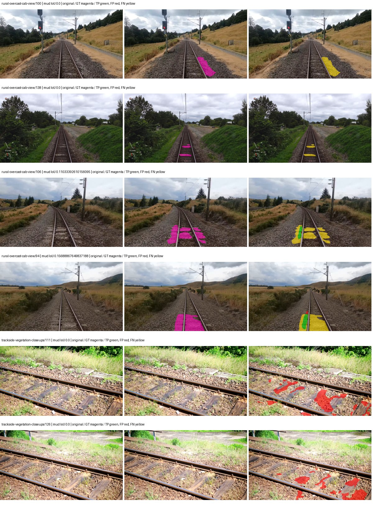

Examples are two lowest and two highest mud-IoU positive images, plus up to two negative images with the most false-positive mud pixels. They are targeted diagnostic examples, not random samples. Green: true positive; red: false positive; yellow: false negative. Full predictions remain on HDRFS.

### Validation tracking

| Logged step | Overall mIoU (%) | Mud IoU (%) |
| --- | --- | --- |
| 254 | 24.90 | 3.14 |
| 508 | 31.39 | 0.19 |
| 763 | 34.29 | 0.07 |
| 1017 | 34.11 | 0.21 |
| 1272 | 34.22 | 0.23 |
| 1527 | 33.93 | 0.00 |

All retained scalar curves, including training loss and per-class IoU, are in record.json. Observed best mud on a curve is not necessarily a retained checkpoint: the pilot saved its selection-metric-best and final checkpoints. Step logging and checkpoint global_step may differ by one.

### Stopping and checkpoint provenance

```json
{
  "stopping": {
    "actual_steps": 1527,
    "maximum_steps": 4000,
    "min_delta": 0.001,
    "monitor": "val_iou/mud-pumping",
    "patience": 5,
    "reason": "validation_plateau"
  },
  "checkpoints": {
    "best": {
      "path": "/data/izadia1/projects/segmentary-runs/paul-test-rtis/mud-fullstats-v1-20260906-r2/future-runs/native_resnet50_psp--railsem19_to_rtis--seed-1_seed1/rtis/best.ckpt",
      "sha256": "694ad1d7c81b2897db851c7e3e5129669b097b063ce25e19a1e64206990f8d09",
      "global_step": 254,
      "bytes": 595211494
    },
    "final": {
      "path": "/data/izadia1/projects/segmentary-runs/paul-test-rtis/mud-fullstats-v1-20260906-r2/future-runs/native_resnet50_psp--railsem19_to_rtis--seed-1_seed1/rtis/last.ckpt",
      "sha256": "8d91111ead4048f7a16a9c7a9e7554b97fa2fe55d32fbab042d286679327046e",
      "global_step": 1527,
      "bytes": 595200678
    }
  },
  "cleanup_error": null
}
```

### Resolved training, initialization and evaluation settings

The optimizer block is the base configuration. Stage LR scales are applied at runtime, and stage warmup is capped at min(base warmup, floor(stage budget / 10), stage budget - 1): 400 steps for this 4,000-step pilot. Model-internal native input grids may differ from augmentation crops (EoMT uses its 640 grid).

```json
{
  "name": "native_resnet50_psp--railsem19_to_rtis--seed-1",
  "model": {
    "arch": "native",
    "checkpoint": null,
    "tuning": "full",
    "head": "unified_head",
    "lora_r": 16,
    "lora_alpha": 32,
    "lora_dropout": 0.05,
    "lora_targets": [],
    "drop_path": null,
    "revision": null,
    "subfolder": null,
    "local_files_only": false,
    "trust_remote_code": false,
    "backbone_path": null,
    "head_paths": [],
    "classifier_path": null,
    "inactive_parameter_paths": [],
    "smp_arch": null,
    "encoder_name": null,
    "encoder_weights": null,
    "native": {
      "task": "multiclass",
      "backbone": {
        "kind": "timm",
        "name": "resnet50.a1_in1k",
        "weights": "pretrained",
        "out_indices": [
          1,
          2,
          3,
          4
        ],
        "in_channels": 3
      },
      "neck": {
        "kind": "identity"
      },
      "head": {
        "kind": "psp",
        "in_index": 3,
        "channels": 256,
        "pool_bins": [
          1,
          2,
          3,
          6
        ],
        "dropout": 0.1,
        "norm": "group",
        "activation": "relu"
      },
      "auxiliary_heads": []
    },
    "batch_norm_momentum": null
  },
  "space": "paul-test-rtis",
  "taxonomy_root": "/data/izadia1/projects/segmentary-rtis-fullstats-066afb2/taxonomy",
  "output_root": "/data/izadia1/projects/segmentary-runs/paul-test-rtis/mud-fullstats-v1-20260906-r2/future-runs",
  "optim": {
    "backbone_lr": 0.0001,
    "head_lr_mult": 10.0,
    "weight_decay": 0.05,
    "llrd": 1.0,
    "warmup_iters": 1500,
    "warmup_ratio": 1e-06,
    "poly_power": 0.9,
    "min_lr_ratio": 0.0,
    "betas": [
      0.9,
      0.999
    ],
    "grad_clip": 1.0
  },
  "train": {
    "iters": 4000,
    "batch_size": 2,
    "accum": 8,
    "num_workers": 2,
    "precision": "bf16-mixed",
    "ema_decay": 0.9998,
    "val_every": 250,
    "ckpt_every": 500,
    "selection_metric": "val_iou/mud-pumping",
    "early_stopping_patience": 5,
    "early_stopping_min_delta": 0.001,
    "seed": 1,
    "devices": 1
  },
  "eval": {
    "sliding_window": true,
    "window": [
      1024,
      1024
    ],
    "stride": [
      768,
      768
    ],
    "batch_size": 1,
    "num_workers": 2,
    "tta_scales": [],
    "tta_flip": false,
    "threshold": 0.5,
    "boundary_tolerance_frac": 0.0075,
    "save_confusion": true
  },
  "loss": {
    "task": "multiclass",
    "activation": "auto",
    "terms": [],
    "aux": "none",
    "aux_weight": 0.0,
    "ce_weight": 1.0,
    "label_smoothing": 0.0,
    "class_weights": null,
    "query": null
  },
  "aug": {
    "crop": [
      1024,
      1024
    ],
    "scale_min": 0.5,
    "scale_max": 2.0,
    "hflip_p": 0.5,
    "color_jitter_p": 0.5,
    "brightness": 0.25,
    "contrast": 0.25,
    "saturation": 0.25,
    "hue": 0.05
  },
  "stages": [
    {
      "name": "rtis",
      "data": [
        {
          "name": "paul-test-rtis",
          "root": "/data/izadia1/datasets/paul-test-rtis",
          "variant": null,
          "split_file": "splits.json",
          "train_split": "train",
          "val_split": "val",
          "limit": null,
          "loader": "folder",
          "mapping": "paul-test-rtis",
          "loader_options": {
            "require_groups": true
          }
        }
      ],
      "iters": null,
      "lr_scale": 0.1,
      "head_group_lr_scale": 1.0,
      "init_from": "/data/izadia1/projects/segmentary-runs/all-model-city-rail-seed0-rail20-b9eb3e1/jobs/native_resnet50_psp--railsem19--seed-0/attempt-001/train/native_resnet50_psp--railsem19_seed0/railsem19/last.ckpt",
      "reset_head": true,
      "freeze": null,
      "sample_weights": null
    }
  ]
}
```

### Hardware and software provenance

```json
{
  "training": {
    "cuda_available": true,
    "cuda_visible_devices": "0",
    "cudnn": 91900,
    "driver_version": "570.133.20",
    "gpu_count": 1,
    "gpu_names": [
      "NVIDIA L40S"
    ],
    "hostname": "hdrfs-app-001",
    "input_normalization": {
      "channel_order": "rgb",
      "mean": [
        0.485,
        0.456,
        0.406
      ],
      "source": "timm_pretrained_cfg",
      "std": [
        0.229,
        0.224,
        0.225
      ]
    },
    "model_origins": [
      {
        "hf_commit": null,
        "hf_name_or_path": null,
        "module": "backbone",
        "timm_pretrained": {
          "architecture": "resnet50",
          "hf_hub_id": "timm/resnet50.a1_in1k",
          "tag": "a1_in1k",
          "url": "https://github.com/rwightman/pytorch-image-models/releases/download/v0.1-rsb-weights/resnet50_a1_0-14fe96d1.pth"
        }
      },
      {
        "hf_commit": null,
        "hf_name_or_path": null,
        "module": "backbone.model",
        "timm_pretrained": {
          "architecture": "resnet50",
          "hf_hub_id": "timm/resnet50.a1_in1k",
          "tag": "a1_in1k",
          "url": "https://github.com/rwightman/pytorch-image-models/releases/download/v0.1-rsb-weights/resnet50_a1_0-14fe96d1.pth"
        }
      }
    ],
    "model_parameter_count": 37149525,
    "packages": {
      "albumentations": "2.0.8",
      "lightning": "2.6.5",
      "numpy": "2.4.4",
      "segmentary": "0.1.0",
      "segmentation-models-pytorch": "0.5.0",
      "timm": "1.0.28",
      "torch": "2.11.0+cu128",
      "torchvision": "0.26.0+cu128",
      "transformers": "5.15.0"
    },
    "platform": "Linux-5.15.0-139-generic-x86_64-with-glibc2.35",
    "python": "3.11.15",
    "torch": "2.11.0+cu128",
    "torch_cuda": "12.8",
    "trainable_parameter_count": 37149525,
    "training_stop": {
      "actual_steps": 1527,
      "maximum_steps": 4000,
      "min_delta": 0.001,
      "monitor": "val_iou/mud-pumping",
      "patience": 5,
      "reason": "validation_plateau"
    },
    "validation_weights": "raw"
  },
  "evaluation": {
    "cuda_available": true,
    "cuda_visible_devices": "0",
    "cudnn": 91900,
    "driver_version": "570.133.20",
    "gpu_count": 1,
    "gpu_names": [
      "NVIDIA L40S"
    ],
    "hostname": "hdrfs-app-001",
    "input_normalization": {
      "channel_order": "rgb",
      "mean": [
        0.485,
        0.456,
        0.406
      ],
      "source": "timm_pretrained_cfg",
      "std": [
        0.229,
        0.224,
        0.225
      ]
    },
    "packages": {
      "albumentations": "2.0.8",
      "lightning": "2.6.5",
      "numpy": "2.4.4",
      "segmentary": "0.1.0",
      "segmentation-models-pytorch": "0.5.0",
      "timm": "1.0.28",
      "torch": "2.11.0+cu128",
      "torchvision": "0.26.0+cu128",
      "transformers": "5.15.0"
    },
    "platform": "Linux-5.15.0-139-generic-x86_64-with-glibc2.35",
    "python": "3.11.15",
    "torch": "2.11.0+cu128",
    "torch_cuda": "12.8"
  }
}
```

## railsem19_to_rtis — seed 2

Status: **completed**. Started: 2026-09-07T00:50:42.617685+00:00. Finished: 2026-09-07T01:29:16.704095+00:00.

Recipe pretrained initializer: `{"arch": "native", "backbone_path": null, "batch_norm_momentum": null, "checkpoint": null, "classifier_path": null, "drop_path": null, "encoder_name": null, "encoder_weights": null, "head": "unified_head", "head_paths": [], "inactive_parameter_paths": [], "local_files_only": false, "lora_alpha": 32, "lora_dropout": 0.05, "lora_r": 16, "lora_targets": [], "native": {"auxiliary_heads": [], "backbone": {"in_channels": 3, "kind": "timm", "name": "resnet50.a1_in1k", "out_indices": [1, 2, 3, 4], "weights": "pretrained"}, "head": {"activation": "relu", "channels": 256, "dropout": 0.1, "in_index": 3, "kind": "psp", "norm": "group", "pool_bins": [1, 2, 3, 6]}, "neck": {"kind": "identity"}, "task": "multiclass"}, "revision": null, "smp_arch": null, "subfolder": null, "trust_remote_code": false, "tuning": "full"}`.

`rtis_only` uses the recipe initializer, which may include pretrained segmentation components. Transfer paths load the exact historical source checkpoint below and reset the classifier; they do not reset all query/decoder features.

Source checkpoint: `{'name': 'native_resnet50_psp--railsem19--seed-0', 'model': 'native_resnet50_psp', 'protocol': 'railsem19', 'config': '/data/izadia1/projects/segmentary-runs/all-model-city-rail-seed0-rail20-b9eb3e1/jobs/native_resnet50_psp--railsem19--seed-0/attempt-001/resolved-config.yaml', 'checkpoint': '/data/izadia1/projects/segmentary-runs/all-model-city-rail-seed0-rail20-b9eb3e1/jobs/native_resnet50_psp--railsem19--seed-0/attempt-001/train/native_resnet50_psp--railsem19_seed0/railsem19/last.ckpt', 'recorded_sha256': '8d3082cdb12ed9ba54481157deeab5c01981b2cb82b78435cf3b46a8099cf01e', 'exists': True}`.

Config SHA-256: `03cf2557e7356c569738ba4e55df6cd15cd5fa5bde4403669bf13479f3bb61f1`. Weights used for validation: `raw`.

### Mud-pumping and aggregate quality

| Metric | Selected checkpoint | Final training validation |
| --- | --- | --- |
| Mud IoU | 0.86 | 0.01 |
| Mud precision | 95.21 | 0.85 |
| Mud recall | 0.86 | 0.01 |
| Mud Dice/F1 | 1.70 | 0.03 |
| mIoU | 35.56 | 34.42 |
| Mean accuracy | 50.50 | 47.73 |
| Mean precision | 60.45 | 57.06 |
| Mean Dice | 45.88 | 44.67 |
| Mean specificity | 98.98 | 98.96 |
| Pixel accuracy | 84.59 | 84.33 |
| Frequency-weighted IoU | 74.59 | 74.15 |
| Fixed GT-present class mIoU | 41.49 | 40.16 |
| Boundary F1 | 41.55 | 41.09 |

The selected checkpoint has independent evaluation evidence. Final values are the trainer's final validation record, not a new independent evaluation. mIoU averages classes with nonzero union, so false positives on absent classes can change its denominator. The fixed GT-class mean is supplementary and excludes absent classes; their false positives remain in the confusion matrix.

### Resource usage and timing

| Measurement | Value |
| --- | --- |
| Peak training VRAM, retained training invocation (GiB) | 8.29 |
| Peak evaluation VRAM (GiB) | 6.75 |
| Retained training invocation wall time (seconds) | 2192.81 |
| Retained training invocation GPU-hours (one GPU) | 0.61 |
| Evaluation wall time (seconds) | 10.74 |
| Full evaluation pipeline images/second | 3.44 |
| Best full-state checkpoint (MiB) | 567.64 |
| Final full-state checkpoint (MiB) | 567.63 |
| Audited periodic checkpoints removed (GiB) | 2.77 |

VRAM uses the recorded allocator high-water mark; it is not total device usage including CUDA context. Resumed jobs' retained training invocation times and peaks are **not whole-campaign totals**. Earlier invocation resource records are not reconstructed here. Evaluation throughput includes loader, sliding-window inference and metrics; it is not model-only latency/FPS. Missing measurements are shown as —, never inferred from another dataset's run.

### Standardized inference performance

Dedicated model-only profiling waits for an idle worker-locked L40S: BF16, batch 1, 1024x1024, 20 warmup and 100 CUDA-event-timed public forwards. It excludes loading, preprocessing, tiling and metrics.

| Status | Parameters | Weight MiB | FPS | p50 ms | p95 ms | Peak reserved GiB |
| --- | --- | --- | --- | --- | --- | --- |
| complete | 37149525 | 141.71 | 215.38 | 4.53 | 4.98 | 0.52 |

```json
{
  "schema_version": 1,
  "model_id": "native_resnet50_psp",
  "measured_at": "2026-09-07T01:29:11+00:00",
  "status": "complete",
  "benchmark_scope": "rtis_selected_checkpoint_model_only",
  "applies_to": [
    "native_resnet50_psp--railsem19_to_rtis--seed-2"
  ],
  "source": {
    "campaign_git_sha": "066afb2626398b7be59d4d19f5a0e4644fd59adc",
    "git_dirty": false,
    "config_hash": "7708a88d60c1",
    "resolved_config": "/data/izadia1/projects/segmentary-runs/paul-test-rtis/mud-fullstats-v1-20260906-r2/configs/native_resnet50_psp--railsem19_to_rtis--seed-2.yaml",
    "config_sha256": "03cf2557e7356c569738ba4e55df6cd15cd5fa5bde4403669bf13479f3bb61f1",
    "checkpoint_sha256": "637e5d86c01b665d704a7c79a2bb5134afc61179be8056384dadfd9e5d9abdd7",
    "checkpoint_global_step": 1527,
    "checkpoint_bytes": 595211686,
    "checkpoint_kind": "resume checkpoint with optimizer and EMA state",
    "weights": "raw",
    "measured_checkpoint_job_id": "native_resnet50_psp--railsem19_to_rtis--seed-2",
    "result_sha256": "344a7d39521dff4e04bccbf47a9442932629b8e455a1ce9fdb0f8fac2c13418d",
    "result_git_sha": "066afb2626398b7be59d4d19f5a0e4644fd59adc",
    "result_stage": "eval:paul-test-rtis:val",
    "result_seed": 2
  },
  "hardware": {
    "gpu_name": "NVIDIA L40S",
    "gpu_uuid": "GPU-d411d86a-6d1d-1967-55e7-9f9ec85d13f5",
    "logical_device": "cuda:0",
    "physical_visibility_token": "1",
    "compute_capability": [
      8,
      9
    ],
    "total_memory_bytes": 47677177856
  },
  "model": {
    "parameter_count": 37149525,
    "trainable_parameter_count": 37149525,
    "resident_parameter_bytes": 148598100,
    "parameter_dtype_counts": {
      "float32": 37149525
    }
  },
  "contract": {
    "backend": "pytorch",
    "precision": "bf16_autocast",
    "batch_size": 1,
    "input_shape_nchw": [
      1,
      3,
      1024,
      1024
    ],
    "warmup_iterations": 20,
    "measured_iterations": 100,
    "timing": "per-forward CUDA events with end-event synchronization",
    "includes_preprocessing": false,
    "includes_data_loader": false,
    "includes_sliding_window": false,
    "input_resident_on_gpu": true,
    "model_only": true,
    "entrypoint": "public model(image) dense-logits forward"
  },
  "measurements": {
    "latency": {
      "p50_ms": 4.529152154922485,
      "p95_ms": 4.980172801017761,
      "mean_ms": 4.6428745126724245,
      "minimum_ms": 4.5107197761535645,
      "maximum_ms": 5.93612813949585,
      "fps": 215.3838095926489,
      "raw_ms": [
        5.776383876800537,
        4.754432201385498,
        4.531199932098389,
        4.514815807342529,
        4.511744022369385,
        4.511744022369385,
        4.515744209289551,
        4.516863822937012,
        4.511744022369385,
        4.5107197761535645,
        4.5107197761535645,
        4.518911838531494,
        4.5199360847473145,
        4.561920166015625,
        4.927487850189209,
        4.977663993835449,
        4.731840133666992,
        4.630527973175049,
        4.527103900909424,
        4.770815849304199,
        4.516863822937012,
        4.69708776473999,
        5.164991855621338,
        4.576255798339844,
        4.572159767150879,
        4.527040004730225,
        4.620287895202637,
        5.0278401374816895,
        4.7769598960876465,
        4.8506879806518555,
        4.524032115936279,
        4.788224220275879,
        4.528128147125244,
        4.520959854125977,
        4.518911838531494,
        4.51584005355835,
        4.525055885314941,
        4.5107197761535645,
        4.516863822937012,
        4.760575771331787,
        4.520959854125977,
        4.675583839416504,
        4.739071846008301,
        4.604928016662598,
        4.559872150421143,
        4.525055885314941,
        4.534175872802734,
        4.525055885314941,
        4.521024227142334,
        4.582399845123291,
        4.527103900909424,
        4.536320209503174,
        4.584447860717773,
        4.8660478591918945,
        5.93612813949585,
        4.802559852600098,
        4.603903770446777,
        4.525055885314941,
        4.524032115936279,
        4.523007869720459,
        4.518911838531494,
        4.620287895202637,
        4.516863822937012,
        4.637695789337158,
        4.619264125823975,
        4.524032115936279,
        4.513792037963867,
        4.5199360847473145,
        4.662271976470947,
        4.76364803314209,
        4.523007869720459,
        4.526080131530762,
        4.521984100341797,
        4.538271903991699,
        4.959231853485107,
        5.074944019317627,
        4.761600017547607,
        4.670464038848877,
        4.537343978881836,
        4.530176162719727,
        4.51584005355835,
        4.934656143188477,
        4.527103900909424,
        4.518911838531494,
        4.520959854125977,
        4.7175679206848145,
        4.520959854125977,
        4.517759799957275,
        4.515967845916748,
        4.527103900909424,
        4.516863822937012,
        4.527103900909424,
        4.520959854125977,
        4.932608127593994,
        4.884479999542236,
        4.602880001068115,
        4.520959854125977,
        4.571135997772217,
        4.526080131530762,
        4.739200115203857
      ],
      "percentile_method": "numpy linear interpolation"
    },
    "peak_reserved_bytes": 557842432,
    "memory_kind": "pytorch_cuda_allocator_peak_reserved_excluding_context",
    "benchmark_wall_clock_s": 11.727938655763865
  },
  "started_at": "2026-09-07T01:28:59+00:00",
  "finished_at": "2026-09-07T01:29:11+00:00",
  "environment": {
    "hostname": "hdrfs-app-001",
    "python": "3.11.15",
    "platform": "Linux-5.15.0-139-generic-x86_64-with-glibc2.35",
    "torch": "2.11.0+cu128",
    "torch_cuda": "12.8",
    "cudnn": 91900,
    "driver_version": "570.133.20",
    "cuda_available": true,
    "gpu_count": 1,
    "gpu_names": [
      "NVIDIA L40S"
    ],
    "cuda_visible_devices": "1",
    "packages": {
      "segmentary": "0.1.0",
      "torch": "2.11.0+cu128",
      "torchvision": "0.26.0+cu128",
      "transformers": "5.15.0",
      "timm": "1.0.28",
      "segmentation-models-pytorch": "0.5.0",
      "albumentations": "2.0.8",
      "lightning": "2.6.5",
      "numpy": "2.4.4"
    }
  }
}
```

### Per-class validation results

| Class | GT pixels | IoU (%) | Precision (%) | Recall (%) | Dice (%) | Boundary F1 (%) |
| --- | --- | --- | --- | --- | --- | --- |
| car | 29664 | 35.22 | 69.57 | 41.64 | 52.09 | 59.73 |
| construction | 311585 | 39.49 | 42.82 | 83.57 | 56.62 | 46.70 |
| fence | 265137 | 10.41 | 43.83 | 12.01 | 18.85 | 32.07 |
| mud-pumping | 1226250 | 0.86 | 95.21 | 0.86 | 1.70 | 3.09 |
| on-rails | 0 | 0.00 | 0.00 | — | 0.00 | 0.00 |
| person | 0 | 0.00 | 0.00 | — | 0.00 | 0.00 |
| pole | 628038 | 58.31 | 78.15 | 69.67 | 73.67 | 76.94 |
| rail-embedded | 16799 | 8.04 | 88.30 | 8.13 | 14.89 | 23.38 |
| rail-raised | 2969797 | 68.92 | 76.17 | 87.87 | 81.60 | 87.77 |
| rail-track | 6323197 | 46.92 | 60.45 | 67.71 | 63.87 | 60.02 |
| road | 1048831 | 26.14 | 60.69 | 31.46 | 41.44 | 28.21 |
| sidewalk | 1297367 | 47.27 | 87.58 | 50.66 | 64.19 | 13.36 |
| sky | 19121606 | 97.47 | 98.67 | 98.77 | 98.72 | 91.23 |
| standing-water | 95802 | 0.00 | 0.00 | 0.00 | 0.00 | 0.00 |
| terrain | 39239306 | 85.18 | 86.48 | 98.26 | 92.00 | 62.65 |
| trackbed | 10643081 | 58.63 | 79.55 | 69.04 | 73.92 | 59.91 |
| traffic-light | 19510 | 56.28 | 86.07 | 61.92 | 72.03 | 66.82 |
| traffic-sign | 13285 | 41.55 | 64.94 | 53.57 | 58.71 | 67.67 |
| tram-track | 56179 | 36.19 | 78.84 | 40.09 | 53.15 | 36.97 |
| truck | 0 | 0.00 | 0.00 | — | 0.00 | 0.00 |
| vegetation-overgrowth | 5901821 | 29.89 | 72.14 | 33.79 | 46.02 | 56.00 |

### Full-run accounting

| Measurement | Value |
| --- | --- |
| Full GPU-reserved wall seconds, all recorded worker attempts | 2314.50 |
| Full reserved GPU-hours | 0.64 |
| Whole-run timing complete | True |

| Phase | Wall seconds including failed attempts |
| --- | --- |
| training | 2199.76 |
| diagnostics | 71.63 |
| performance | 19.78 |

GPU-reserved time includes model loading, training, validation, collection, profiling, checkpoint I/O and orchestration while the worker owns one GPU. It is not GPU kernel-active time. Phase timings and sampled device memory/power/utilization are retained separately; sampled device memory is not the allocator high-water mark.

### Train/validation and raw/EMA diagnostics

| Checkpoint / weights / split | Images | Mud IoU (%) | Mud precision (%) | Mud recall (%) |
| --- | --- | --- | --- | --- |
| best-auto-train / raw | 220 | 93.50 | 96.94 | 96.34 |
| best-auto-val / raw | 37 | 0.86 | 95.21 | 0.86 |
| best-alternate-val / ema | 37 | 0.29 | 4.30 | 0.31 |
| final-auto-val / raw | 37 | 0.02 | 1.02 | 0.02 |

Train uses the evaluation transform without augmentation. Compare mud train/validation metrics for the same selected weights. Alternate EMA on running-stat BatchNorm is explicitly uncalibrated and is diagnostic only. Score-threshold curves use uncalibrated normalized scores and are pixel-level diagnostics, not event detection rates or a selected deployment operating point.

### Downloadable evidence

- best-auto-train: [per-image.csv](railsem19_to_rtis--seed-2/best-auto-train/per-image.csv) · [per-image-confusion.json.gz](railsem19_to_rtis--seed-2/best-auto-train/per-image-confusion.json.gz) · [groups.json](railsem19_to_rtis--seed-2/best-auto-train/groups.json) · [mud-score-curves.json](railsem19_to_rtis--seed-2/best-auto-train/mud-score-curves.json)
- best-auto-val: [per-image.csv](railsem19_to_rtis--seed-2/best-auto-val/per-image.csv) · [per-image-confusion.json.gz](railsem19_to_rtis--seed-2/best-auto-val/per-image-confusion.json.gz) · [groups.json](railsem19_to_rtis--seed-2/best-auto-val/groups.json) · [mud-score-curves.json](railsem19_to_rtis--seed-2/best-auto-val/mud-score-curves.json) · [examples.jpg](railsem19_to_rtis--seed-2/best-auto-val/examples.jpg)
- best-alternate-val: [per-image.csv](railsem19_to_rtis--seed-2/best-alternate-val/per-image.csv) · [per-image-confusion.json.gz](railsem19_to_rtis--seed-2/best-alternate-val/per-image-confusion.json.gz) · [groups.json](railsem19_to_rtis--seed-2/best-alternate-val/groups.json) · [mud-score-curves.json](railsem19_to_rtis--seed-2/best-alternate-val/mud-score-curves.json)
- final-auto-val: [per-image.csv](railsem19_to_rtis--seed-2/final-auto-val/per-image.csv) · [per-image-confusion.json.gz](railsem19_to_rtis--seed-2/final-auto-val/per-image-confusion.json.gz) · [groups.json](railsem19_to_rtis--seed-2/final-auto-val/groups.json) · [mud-score-curves.json](railsem19_to_rtis--seed-2/final-auto-val/mud-score-curves.json)
- resources: [telemetry.csv](railsem19_to_rtis--seed-2/resources/telemetry.csv)

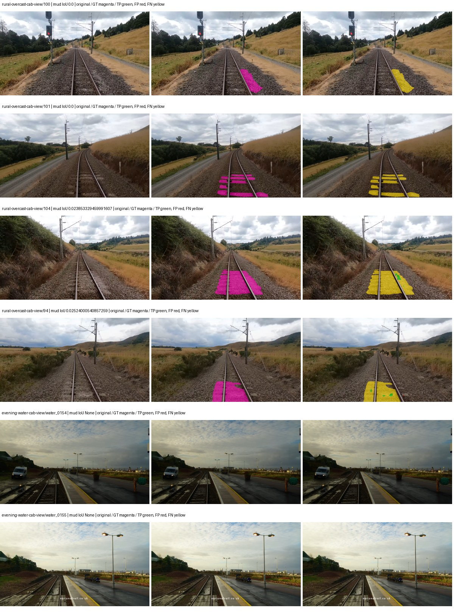

Examples are two lowest and two highest mud-IoU positive images, plus up to two negative images with the most false-positive mud pixels. They are targeted diagnostic examples, not random samples. Green: true positive; red: false positive; yellow: false negative. Full predictions remain on HDRFS.

### Validation tracking

| Logged step | Overall mIoU (%) | Mud IoU (%) |
| --- | --- | --- |
| 254 | 25.03 | 0.36 |
| 508 | 35.21 | 0.32 |
| 763 | 35.67 | 0.00 |
| 1017 | 34.67 | 0.05 |
| 1272 | 34.13 | 0.23 |
| 1527 | 35.62 | 0.85 |
| 1781 | 35.02 | 0.05 |
| 2036 | 32.67 | 0.03 |
| 2290 | 34.13 | 0.45 |
| 2545 | 34.29 | 0.77 |
| 2799 | 34.42 | 0.01 |

All retained scalar curves, including training loss and per-class IoU, are in record.json. Observed best mud on a curve is not necessarily a retained checkpoint: the pilot saved its selection-metric-best and final checkpoints. Step logging and checkpoint global_step may differ by one.

### Stopping and checkpoint provenance

```json
{
  "stopping": {
    "actual_steps": 2800,
    "maximum_steps": 4000,
    "min_delta": 0.001,
    "monitor": "val_iou/mud-pumping",
    "patience": 5,
    "reason": "validation_plateau"
  },
  "checkpoints": {
    "best": {
      "path": "/data/izadia1/projects/segmentary-runs/paul-test-rtis/mud-fullstats-v1-20260906-r2/future-runs/native_resnet50_psp--railsem19_to_rtis--seed-2_seed2/rtis/best.ckpt",
      "sha256": "637e5d86c01b665d704a7c79a2bb5134afc61179be8056384dadfd9e5d9abdd7",
      "global_step": 1527,
      "bytes": 595211686
    },
    "final": {
      "path": "/data/izadia1/projects/segmentary-runs/paul-test-rtis/mud-fullstats-v1-20260906-r2/future-runs/native_resnet50_psp--railsem19_to_rtis--seed-2_seed2/rtis/last.ckpt",
      "sha256": "3391918e43a60ca2c5f6056f837b67d9dab1101a91abfa7cbd8d95fc130c9aa5",
      "global_step": 2800,
      "bytes": 595200678
    }
  },
  "cleanup_error": null
}
```

### Resolved training, initialization and evaluation settings

The optimizer block is the base configuration. Stage LR scales are applied at runtime, and stage warmup is capped at min(base warmup, floor(stage budget / 10), stage budget - 1): 400 steps for this 4,000-step pilot. Model-internal native input grids may differ from augmentation crops (EoMT uses its 640 grid).

```json
{
  "name": "native_resnet50_psp--railsem19_to_rtis--seed-2",
  "model": {
    "arch": "native",
    "checkpoint": null,
    "tuning": "full",
    "head": "unified_head",
    "lora_r": 16,
    "lora_alpha": 32,
    "lora_dropout": 0.05,
    "lora_targets": [],
    "drop_path": null,
    "revision": null,
    "subfolder": null,
    "local_files_only": false,
    "trust_remote_code": false,
    "backbone_path": null,
    "head_paths": [],
    "classifier_path": null,
    "inactive_parameter_paths": [],
    "smp_arch": null,
    "encoder_name": null,
    "encoder_weights": null,
    "native": {
      "task": "multiclass",
      "backbone": {
        "kind": "timm",
        "name": "resnet50.a1_in1k",
        "weights": "pretrained",
        "out_indices": [
          1,
          2,
          3,
          4
        ],
        "in_channels": 3
      },
      "neck": {
        "kind": "identity"
      },
      "head": {
        "kind": "psp",
        "in_index": 3,
        "channels": 256,
        "pool_bins": [
          1,
          2,
          3,
          6
        ],
        "dropout": 0.1,
        "norm": "group",
        "activation": "relu"
      },
      "auxiliary_heads": []
    },
    "batch_norm_momentum": null
  },
  "space": "paul-test-rtis",
  "taxonomy_root": "/data/izadia1/projects/segmentary-rtis-fullstats-066afb2/taxonomy",
  "output_root": "/data/izadia1/projects/segmentary-runs/paul-test-rtis/mud-fullstats-v1-20260906-r2/future-runs",
  "optim": {
    "backbone_lr": 0.0001,
    "head_lr_mult": 10.0,
    "weight_decay": 0.05,
    "llrd": 1.0,
    "warmup_iters": 1500,
    "warmup_ratio": 1e-06,
    "poly_power": 0.9,
    "min_lr_ratio": 0.0,
    "betas": [
      0.9,
      0.999
    ],
    "grad_clip": 1.0
  },
  "train": {
    "iters": 4000,
    "batch_size": 2,
    "accum": 8,
    "num_workers": 2,
    "precision": "bf16-mixed",
    "ema_decay": 0.9998,
    "val_every": 250,
    "ckpt_every": 500,
    "selection_metric": "val_iou/mud-pumping",
    "early_stopping_patience": 5,
    "early_stopping_min_delta": 0.001,
    "seed": 2,
    "devices": 1
  },
  "eval": {
    "sliding_window": true,
    "window": [
      1024,
      1024
    ],
    "stride": [
      768,
      768
    ],
    "batch_size": 1,
    "num_workers": 2,
    "tta_scales": [],
    "tta_flip": false,
    "threshold": 0.5,
    "boundary_tolerance_frac": 0.0075,
    "save_confusion": true
  },
  "loss": {
    "task": "multiclass",
    "activation": "auto",
    "terms": [],
    "aux": "none",
    "aux_weight": 0.0,
    "ce_weight": 1.0,
    "label_smoothing": 0.0,
    "class_weights": null,
    "query": null
  },
  "aug": {
    "crop": [
      1024,
      1024
    ],
    "scale_min": 0.5,
    "scale_max": 2.0,
    "hflip_p": 0.5,
    "color_jitter_p": 0.5,
    "brightness": 0.25,
    "contrast": 0.25,
    "saturation": 0.25,
    "hue": 0.05
  },
  "stages": [
    {
      "name": "rtis",
      "data": [
        {
          "name": "paul-test-rtis",
          "root": "/data/izadia1/datasets/paul-test-rtis",
          "variant": null,
          "split_file": "splits.json",
          "train_split": "train",
          "val_split": "val",
          "limit": null,
          "loader": "folder",
          "mapping": "paul-test-rtis",
          "loader_options": {
            "require_groups": true
          }
        }
      ],
      "iters": null,
      "lr_scale": 0.1,
      "head_group_lr_scale": 1.0,
      "init_from": "/data/izadia1/projects/segmentary-runs/all-model-city-rail-seed0-rail20-b9eb3e1/jobs/native_resnet50_psp--railsem19--seed-0/attempt-001/train/native_resnet50_psp--railsem19_seed0/railsem19/last.ckpt",
      "reset_head": true,
      "freeze": null,
      "sample_weights": null
    }
  ]
}
```

### Hardware and software provenance

```json
{
  "training": {
    "cuda_available": true,
    "cuda_visible_devices": "1",
    "cudnn": 91900,
    "driver_version": "570.133.20",
    "gpu_count": 1,
    "gpu_names": [
      "NVIDIA L40S"
    ],
    "hostname": "hdrfs-app-001",
    "input_normalization": {
      "channel_order": "rgb",
      "mean": [
        0.485,
        0.456,
        0.406
      ],
      "source": "timm_pretrained_cfg",
      "std": [
        0.229,
        0.224,
        0.225
      ]
    },
    "model_origins": [
      {
        "hf_commit": null,
        "hf_name_or_path": null,
        "module": "backbone",
        "timm_pretrained": {
          "architecture": "resnet50",
          "hf_hub_id": "timm/resnet50.a1_in1k",
          "tag": "a1_in1k",
          "url": "https://github.com/rwightman/pytorch-image-models/releases/download/v0.1-rsb-weights/resnet50_a1_0-14fe96d1.pth"
        }
      },
      {
        "hf_commit": null,
        "hf_name_or_path": null,
        "module": "backbone.model",
        "timm_pretrained": {
          "architecture": "resnet50",
          "hf_hub_id": "timm/resnet50.a1_in1k",
          "tag": "a1_in1k",
          "url": "https://github.com/rwightman/pytorch-image-models/releases/download/v0.1-rsb-weights/resnet50_a1_0-14fe96d1.pth"
        }
      }
    ],
    "model_parameter_count": 37149525,
    "packages": {
      "albumentations": "2.0.8",
      "lightning": "2.6.5",
      "numpy": "2.4.4",
      "segmentary": "0.1.0",
      "segmentation-models-pytorch": "0.5.0",
      "timm": "1.0.28",
      "torch": "2.11.0+cu128",
      "torchvision": "0.26.0+cu128",
      "transformers": "5.15.0"
    },
    "platform": "Linux-5.15.0-139-generic-x86_64-with-glibc2.35",
    "python": "3.11.15",
    "torch": "2.11.0+cu128",
    "torch_cuda": "12.8",
    "trainable_parameter_count": 37149525,
    "training_stop": {
      "actual_steps": 2800,
      "maximum_steps": 4000,
      "min_delta": 0.001,
      "monitor": "val_iou/mud-pumping",
      "patience": 5,
      "reason": "validation_plateau"
    },
    "validation_weights": "raw"
  },
  "evaluation": {
    "cuda_available": true,
    "cuda_visible_devices": "1",
    "cudnn": 91900,
    "driver_version": "570.133.20",
    "gpu_count": 1,
    "gpu_names": [
      "NVIDIA L40S"
    ],
    "hostname": "hdrfs-app-001",
    "input_normalization": {
      "channel_order": "rgb",
      "mean": [
        0.485,
        0.456,
        0.406
      ],
      "source": "timm_pretrained_cfg",
      "std": [
        0.229,
        0.224,
        0.225
      ]
    },
    "packages": {
      "albumentations": "2.0.8",
      "lightning": "2.6.5",
      "numpy": "2.4.4",
      "segmentary": "0.1.0",
      "segmentation-models-pytorch": "0.5.0",
      "timm": "1.0.28",
      "torch": "2.11.0+cu128",
      "torchvision": "0.26.0+cu128",
      "transformers": "5.15.0"
    },
    "platform": "Linux-5.15.0-139-generic-x86_64-with-glibc2.35",
    "python": "3.11.15",
    "torch": "2.11.0+cu128",
    "torch_cuda": "12.8"
  }
}
```

## cityscapes_to_railsem19_to_rtis — seed 0

Status: **completed**. Started: 2026-09-07T00:52:33.173545+00:00. Finished: 2026-09-07T01:21:48.159396+00:00.

Recipe pretrained initializer: `{"arch": "native", "backbone_path": null, "batch_norm_momentum": null, "checkpoint": null, "classifier_path": null, "drop_path": null, "encoder_name": null, "encoder_weights": null, "head": "unified_head", "head_paths": [], "inactive_parameter_paths": [], "local_files_only": false, "lora_alpha": 32, "lora_dropout": 0.05, "lora_r": 16, "lora_targets": [], "native": {"auxiliary_heads": [], "backbone": {"in_channels": 3, "kind": "timm", "name": "resnet50.a1_in1k", "out_indices": [1, 2, 3, 4], "weights": "pretrained"}, "head": {"activation": "relu", "channels": 256, "dropout": 0.1, "in_index": 3, "kind": "psp", "norm": "group", "pool_bins": [1, 2, 3, 6]}, "neck": {"kind": "identity"}, "task": "multiclass"}, "revision": null, "smp_arch": null, "subfolder": null, "trust_remote_code": false, "tuning": "full"}`.

`rtis_only` uses the recipe initializer, which may include pretrained segmentation components. Transfer paths load the exact historical source checkpoint below and reset the classifier; they do not reset all query/decoder features.

Source checkpoint: `{'name': 'native_resnet50_psp--cityscapes_to_railsem19--seed-0', 'model': 'native_resnet50_psp', 'protocol': 'cityscapes_to_railsem19', 'config': '/data/izadia1/projects/segmentary-runs/all-model-city-rail-seed0-rail20-b9eb3e1/jobs/native_resnet50_psp--cityscapes_to_railsem19--seed-0/attempt-001/resolved-config.yaml', 'checkpoint': '/data/izadia1/projects/segmentary-runs/all-model-city-rail-seed0-rail20-b9eb3e1/jobs/native_resnet50_psp--cityscapes_to_railsem19--seed-0/attempt-001/train/native_resnet50_psp--cityscapes_to_railsem19_seed0/railsem19/last.ckpt', 'recorded_sha256': '6e4773eeec522b2508c0a276d113f2e5886dd2d0ebff8ff039859a6aa0e0760c', 'exists': True}`.

Config SHA-256: `d34558ba68e6e368f821e5902a71de6555a28cc1fb1fee3e5a0af68cfb47a558`. Weights used for validation: `raw`.

### Mud-pumping and aggregate quality

| Metric | Selected checkpoint | Final training validation |
| --- | --- | --- |
| Mud IoU | 7.19 | 2.41 |
| Mud precision | 41.31 | 6.18 |
| Mud recall | 8.01 | 3.80 |
| Mud Dice/F1 | 13.42 | 4.71 |
| mIoU | 30.37 | 33.12 |
| Mean accuracy | 43.55 | 47.19 |
| Mean precision | 58.58 | 55.81 |
| Mean Dice | 39.47 | 43.41 |
| Mean specificity | 98.76 | 98.90 |
| Pixel accuracy | 82.00 | 83.16 |
| Frequency-weighted IoU | 70.44 | 72.81 |
| Fixed GT-present class mIoU | 35.43 | 38.64 |
| Boundary F1 | 35.77 | 39.77 |

The selected checkpoint has independent evaluation evidence. Final values are the trainer's final validation record, not a new independent evaluation. mIoU averages classes with nonzero union, so false positives on absent classes can change its denominator. The fixed GT-class mean is supplementary and excludes absent classes; their false positives remain in the confusion matrix.

### Resource usage and timing

| Measurement | Value |
| --- | --- |
| Peak training VRAM, retained training invocation (GiB) | 8.29 |
| Peak evaluation VRAM (GiB) | 6.75 |
| Retained training invocation wall time (seconds) | 1630.09 |
| Retained training invocation GPU-hours (one GPU) | 0.45 |
| Evaluation wall time (seconds) | 11.42 |
| Full evaluation pipeline images/second | 3.24 |
| Best full-state checkpoint (MiB) | 567.64 |
| Final full-state checkpoint (MiB) | 567.63 |
| Audited periodic checkpoints removed (GiB) | 2.22 |

VRAM uses the recorded allocator high-water mark; it is not total device usage including CUDA context. Resumed jobs' retained training invocation times and peaks are **not whole-campaign totals**. Earlier invocation resource records are not reconstructed here. Evaluation throughput includes loader, sliding-window inference and metrics; it is not model-only latency/FPS. Missing measurements are shown as —, never inferred from another dataset's run.

### Standardized inference performance

Dedicated model-only profiling waits for an idle worker-locked L40S: BF16, batch 1, 1024x1024, 20 warmup and 100 CUDA-event-timed public forwards. It excludes loading, preprocessing, tiling and metrics.

| Status | Parameters | Weight MiB | FPS | p50 ms | p95 ms | Peak reserved GiB |
| --- | --- | --- | --- | --- | --- | --- |
| complete | 37149525 | 141.71 | 205.97 | 4.66 | 5.96 | 0.52 |

```json
{
  "schema_version": 1,
  "model_id": "native_resnet50_psp",
  "measured_at": "2026-09-07T01:21:43+00:00",
  "status": "complete",
  "benchmark_scope": "rtis_selected_checkpoint_model_only",
  "applies_to": [
    "native_resnet50_psp--cityscapes_to_railsem19_to_rtis--seed-0"
  ],
  "source": {
    "campaign_git_sha": "066afb2626398b7be59d4d19f5a0e4644fd59adc",
    "git_dirty": false,
    "config_hash": "bfa8198380ae",
    "resolved_config": "/data/izadia1/projects/segmentary-runs/paul-test-rtis/mud-fullstats-v1-20260906-r2/configs/native_resnet50_psp--cityscapes_to_railsem19_to_rtis--seed-0.yaml",
    "config_sha256": "d34558ba68e6e368f821e5902a71de6555a28cc1fb1fee3e5a0af68cfb47a558",
    "checkpoint_sha256": "18119dd6f18cced0ff3101382f69bd8f7955556ea1f4d72a1ff67180746b41c1",
    "checkpoint_global_step": 763,
    "checkpoint_bytes": 595211750,
    "checkpoint_kind": "resume checkpoint with optimizer and EMA state",
    "weights": "raw",
    "measured_checkpoint_job_id": "native_resnet50_psp--cityscapes_to_railsem19_to_rtis--seed-0",
    "result_sha256": "d0b7a4cd3d19072c0290381653bda3f06b784290ebcd205decad6ba581528fe5",
    "result_git_sha": "066afb2626398b7be59d4d19f5a0e4644fd59adc",
    "result_stage": "eval:paul-test-rtis:val",
    "result_seed": 0
  },
  "hardware": {
    "gpu_name": "NVIDIA L40S",
    "gpu_uuid": "GPU-e2e96741-aec9-e90b-5c46-d0d58be90a56",
    "logical_device": "cuda:0",
    "physical_visibility_token": "8",
    "compute_capability": [
      8,
      9
    ],
    "total_memory_bytes": 47677177856
  },
  "model": {
    "parameter_count": 37149525,
    "trainable_parameter_count": 37149525,
    "resident_parameter_bytes": 148598100,
    "parameter_dtype_counts": {
      "float32": 37149525
    }
  },
  "contract": {
    "backend": "pytorch",
    "precision": "bf16_autocast",
    "batch_size": 1,
    "input_shape_nchw": [
      1,
      3,
      1024,
      1024
    ],
    "warmup_iterations": 20,
    "measured_iterations": 100,
    "timing": "per-forward CUDA events with end-event synchronization",
    "includes_preprocessing": false,
    "includes_data_loader": false,
    "includes_sliding_window": false,
    "input_resident_on_gpu": true,
    "model_only": true,
    "entrypoint": "public model(image) dense-logits forward"
  },
  "measurements": {
    "latency": {
      "p50_ms": 4.6581761837005615,
      "p95_ms": 5.958911824226379,
      "mean_ms": 4.85513279914856,
      "minimum_ms": 4.509696006774902,
      "maximum_ms": 6.977536201477051,
      "fps": 205.9675896353173,
      "raw_ms": [
        5.303296089172363,
        5.509119987487793,
        4.7175679206848145,
        5.047296047210693,
        4.646912097930908,
        4.730879783630371,
        4.659200191497803,
        4.893695831298828,
        4.702208042144775,
        5.075967788696289,
        5.421055793762207,
        4.9244160652160645,
        5.215231895446777,
        4.934656143188477,
        4.529151916503906,
        4.525055885314941,
        4.834303855895996,
        4.509696006774902,
        4.5199360847473145,
        4.5199360847473145,
        4.514815807342529,
        4.675583839416504,
        4.54860782623291,
        4.5199360847473145,
        4.718592166900635,
        5.524479866027832,
        4.7564802169799805,
        4.625408172607422,
        4.663296222686768,
        5.179391860961914,
        4.572159767150879,
        4.5199360847473145,
        4.51584005355835,
        4.512767791748047,
        4.51584005355835,
        4.902912139892578,
        4.612095832824707,
        4.526080131530762,
        5.587967872619629,
        6.002687931060791,
        5.2797441482543945,
        4.539391994476318,
        4.528128147125244,
        4.521984100341797,
        4.51584005355835,
        4.514815807342529,
        4.514815807342529,
        4.616191864013672,
        4.5199360847473145,
        4.524032115936279,
        4.848639965057373,
        5.148672103881836,
        5.1466240882873535,
        4.752384185791016,
        5.086207866668701,
        4.617216110229492,
        4.625408172607422,
        4.54860782623291,
        4.525055885314941,
        4.667391777038574,
        4.65715217590332,
        5.956607818603516,
        6.773759841918945,
        6.296576023101807,
        5.182464122772217,
        4.532224178314209,
        4.512767791748047,
        4.878335952758789,
        4.526080131530762,
        4.523007869720459,
        4.517888069152832,
        4.513792037963867,
        4.5107197761535645,
        4.51584005355835,
        4.524032115936279,
        4.748288154602051,
        4.7124481201171875,
        4.590591907501221,
        5.441535949707031,
        4.795392036437988,
        4.516863822937012,
        4.7226881980896,
        4.54860782623291,
        4.642816066741943,
        4.561920166015625,
        5.339136123657227,
        5.421055793762207,
        6.096896171569824,
        6.977536201477051,
        4.719615936279297,
        4.666368007659912,
        4.595712184906006,
        4.599808216094971,
        4.578303813934326,
        5.660672187805176,
        4.8752641677856445,
        4.980735778808594,
        4.993023872375488,
        4.531199932098389,
        4.519999980926514
      ],
      "percentile_method": "numpy linear interpolation"
    },
    "peak_reserved_bytes": 557842432,
    "memory_kind": "pytorch_cuda_allocator_peak_reserved_excluding_context",
    "benchmark_wall_clock_s": 12.553162820637226
  },
  "started_at": "2026-09-07T01:21:30+00:00",
  "finished_at": "2026-09-07T01:21:43+00:00",
  "environment": {
    "hostname": "hdrfs-app-001",
    "python": "3.11.15",
    "platform": "Linux-5.15.0-139-generic-x86_64-with-glibc2.35",
    "torch": "2.11.0+cu128",
    "torch_cuda": "12.8",
    "cudnn": 91900,
    "driver_version": "570.133.20",
    "cuda_available": true,
    "gpu_count": 1,
    "gpu_names": [
      "NVIDIA L40S"
    ],
    "cuda_visible_devices": "8",
    "packages": {
      "segmentary": "0.1.0",
      "torch": "2.11.0+cu128",
      "torchvision": "0.26.0+cu128",
      "transformers": "5.15.0",
      "timm": "1.0.28",
      "segmentation-models-pytorch": "0.5.0",
      "albumentations": "2.0.8",
      "lightning": "2.6.5",
      "numpy": "2.4.4"
    }
  }
}
```

### Per-class validation results

| Class | GT pixels | IoU (%) | Precision (%) | Recall (%) | Dice (%) | Boundary F1 (%) |
| --- | --- | --- | --- | --- | --- | --- |
| car | 29664 | 34.70 | 79.12 | 38.20 | 51.52 | 46.41 |
| construction | 311585 | 28.33 | 30.69 | 78.67 | 44.15 | 34.52 |
| fence | 265137 | 11.55 | 66.41 | 12.26 | 20.70 | 35.44 |
| mud-pumping | 1226250 | 7.19 | 41.31 | 8.01 | 13.42 | 10.63 |
| on-rails | 0 | 0.00 | 0.00 | — | 0.00 | 0.00 |
| person | 0 | 0.00 | 0.00 | — | 0.00 | 0.00 |
| pole | 628038 | 52.54 | 81.49 | 59.66 | 68.89 | 73.39 |
| rail-embedded | 16799 | 0.04 | 100.00 | 0.04 | 0.08 | 4.95 |
| rail-raised | 2969797 | 63.25 | 69.10 | 88.19 | 77.49 | 84.62 |
| rail-track | 6323197 | 38.51 | 72.59 | 45.06 | 55.61 | 49.88 |
| road | 1048831 | 19.64 | 52.74 | 23.83 | 32.83 | 24.48 |
| sidewalk | 1297367 | 43.26 | 89.43 | 45.59 | 60.40 | 11.93 |
| sky | 19121606 | 97.30 | 98.77 | 98.50 | 98.63 | 91.03 |
| standing-water | 95802 | 0.06 | 0.07 | 0.56 | 0.12 | 0.72 |
| terrain | 39239306 | 81.10 | 82.08 | 98.55 | 89.56 | 60.01 |
| trackbed | 10643081 | 57.56 | 71.98 | 74.18 | 73.06 | 55.06 |
| traffic-light | 19510 | 61.33 | 94.71 | 63.50 | 76.03 | 76.77 |
| traffic-sign | 13285 | 30.48 | 60.91 | 37.88 | 46.71 | 54.95 |
| tram-track | 56179 | 0.01 | 58.33 | 0.01 | 0.02 | 5.64 |
| truck | 0 | 0.00 | 0.00 | — | 0.00 | 0.00 |
| vegetation-overgrowth | 5901821 | 10.91 | 80.44 | 11.20 | 19.67 | 30.74 |

### Full-run accounting

| Measurement | Value |
| --- | --- |
| Full GPU-reserved wall seconds, all recorded worker attempts | 1755.65 |
| Full reserved GPU-hours | 0.49 |
| Whole-run timing complete | True |

| Phase | Wall seconds including failed attempts |
| --- | --- |
| training | 1638.27 |
| diagnostics | 72.39 |
| performance | 20.74 |

GPU-reserved time includes model loading, training, validation, collection, profiling, checkpoint I/O and orchestration while the worker owns one GPU. It is not GPU kernel-active time. Phase timings and sampled device memory/power/utilization are retained separately; sampled device memory is not the allocator high-water mark.

### Train/validation and raw/EMA diagnostics

| Checkpoint / weights / split | Images | Mud IoU (%) | Mud precision (%) | Mud recall (%) |
| --- | --- | --- | --- | --- |
| best-auto-train / raw | 220 | 89.44 | 96.88 | 92.09 |
| best-auto-val / raw | 37 | 7.19 | 41.31 | 8.01 |
| best-alternate-val / ema | 37 | 1.77 | 9.17 | 2.14 |
| final-auto-val / raw | 37 | 2.42 | 6.21 | 3.82 |

Train uses the evaluation transform without augmentation. Compare mud train/validation metrics for the same selected weights. Alternate EMA on running-stat BatchNorm is explicitly uncalibrated and is diagnostic only. Score-threshold curves use uncalibrated normalized scores and are pixel-level diagnostics, not event detection rates or a selected deployment operating point.

### Downloadable evidence

- best-auto-train: [per-image.csv](cityscapes_to_railsem19_to_rtis--seed-0/best-auto-train/per-image.csv) · [per-image-confusion.json.gz](cityscapes_to_railsem19_to_rtis--seed-0/best-auto-train/per-image-confusion.json.gz) · [groups.json](cityscapes_to_railsem19_to_rtis--seed-0/best-auto-train/groups.json) · [mud-score-curves.json](cityscapes_to_railsem19_to_rtis--seed-0/best-auto-train/mud-score-curves.json)
- best-auto-val: [per-image.csv](cityscapes_to_railsem19_to_rtis--seed-0/best-auto-val/per-image.csv) · [per-image-confusion.json.gz](cityscapes_to_railsem19_to_rtis--seed-0/best-auto-val/per-image-confusion.json.gz) · [groups.json](cityscapes_to_railsem19_to_rtis--seed-0/best-auto-val/groups.json) · [mud-score-curves.json](cityscapes_to_railsem19_to_rtis--seed-0/best-auto-val/mud-score-curves.json) · [examples.jpg](cityscapes_to_railsem19_to_rtis--seed-0/best-auto-val/examples.jpg)
- best-alternate-val: [per-image.csv](cityscapes_to_railsem19_to_rtis--seed-0/best-alternate-val/per-image.csv) · [per-image-confusion.json.gz](cityscapes_to_railsem19_to_rtis--seed-0/best-alternate-val/per-image-confusion.json.gz) · [groups.json](cityscapes_to_railsem19_to_rtis--seed-0/best-alternate-val/groups.json) · [mud-score-curves.json](cityscapes_to_railsem19_to_rtis--seed-0/best-alternate-val/mud-score-curves.json)
- final-auto-val: [per-image.csv](cityscapes_to_railsem19_to_rtis--seed-0/final-auto-val/per-image.csv) · [per-image-confusion.json.gz](cityscapes_to_railsem19_to_rtis--seed-0/final-auto-val/per-image-confusion.json.gz) · [groups.json](cityscapes_to_railsem19_to_rtis--seed-0/final-auto-val/groups.json) · [mud-score-curves.json](cityscapes_to_railsem19_to_rtis--seed-0/final-auto-val/mud-score-curves.json)
- resources: [telemetry.csv](cityscapes_to_railsem19_to_rtis--seed-0/resources/telemetry.csv)

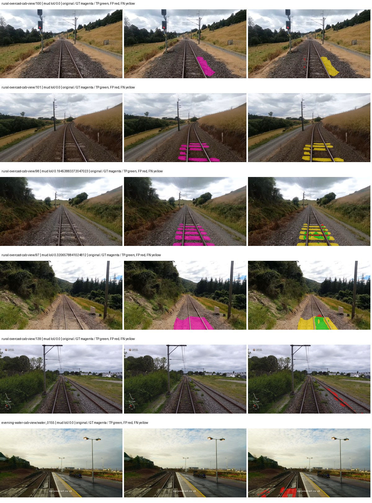

Examples are two lowest and two highest mud-IoU positive images, plus up to two negative images with the most false-positive mud pixels. They are targeted diagnostic examples, not random samples. Green: true positive; red: false positive; yellow: false negative. Full predictions remain on HDRFS.

### Validation tracking

| Logged step | Overall mIoU (%) | Mud IoU (%) |
| --- | --- | --- |
| 254 | 25.08 | 1.72 |
| 508 | 35.83 | 2.30 |
| 763 | 30.36 | 7.23 |
| 1017 | 32.17 | 0.78 |
| 1272 | 32.28 | 2.35 |
| 1527 | 32.86 | 2.20 |
| 1781 | 32.66 | 0.63 |
| 2036 | 33.12 | 2.41 |

All retained scalar curves, including training loss and per-class IoU, are in record.json. Observed best mud on a curve is not necessarily a retained checkpoint: the pilot saved its selection-metric-best and final checkpoints. Step logging and checkpoint global_step may differ by one.

### Stopping and checkpoint provenance

```json
{
  "stopping": {
    "actual_steps": 2036,
    "maximum_steps": 4000,
    "min_delta": 0.001,
    "monitor": "val_iou/mud-pumping",
    "patience": 5,
    "reason": "validation_plateau"
  },
  "checkpoints": {
    "best": {
      "path": "/data/izadia1/projects/segmentary-runs/paul-test-rtis/mud-fullstats-v1-20260906-r2/future-runs/native_resnet50_psp--cityscapes_to_railsem19_to_rtis--seed-0_seed0/rtis/best.ckpt",
      "sha256": "18119dd6f18cced0ff3101382f69bd8f7955556ea1f4d72a1ff67180746b41c1",
      "global_step": 763,
      "bytes": 595211750
    },
    "final": {
      "path": "/data/izadia1/projects/segmentary-runs/paul-test-rtis/mud-fullstats-v1-20260906-r2/future-runs/native_resnet50_psp--cityscapes_to_railsem19_to_rtis--seed-0_seed0/rtis/last.ckpt",
      "sha256": "d82855a87a738438a830480158acddf20e26105b21133765a3a12134dcf534ad",
      "global_step": 2036,
      "bytes": 595200742
    }
  },
  "cleanup_error": null
}
```

### Resolved training, initialization and evaluation settings

The optimizer block is the base configuration. Stage LR scales are applied at runtime, and stage warmup is capped at min(base warmup, floor(stage budget / 10), stage budget - 1): 400 steps for this 4,000-step pilot. Model-internal native input grids may differ from augmentation crops (EoMT uses its 640 grid).

```json
{
  "name": "native_resnet50_psp--cityscapes_to_railsem19_to_rtis--seed-0",
  "model": {
    "arch": "native",
    "checkpoint": null,
    "tuning": "full",
    "head": "unified_head",
    "lora_r": 16,
    "lora_alpha": 32,
    "lora_dropout": 0.05,
    "lora_targets": [],
    "drop_path": null,
    "revision": null,
    "subfolder": null,
    "local_files_only": false,
    "trust_remote_code": false,
    "backbone_path": null,
    "head_paths": [],
    "classifier_path": null,
    "inactive_parameter_paths": [],
    "smp_arch": null,
    "encoder_name": null,
    "encoder_weights": null,
    "native": {
      "task": "multiclass",
      "backbone": {
        "kind": "timm",
        "name": "resnet50.a1_in1k",
        "weights": "pretrained",
        "out_indices": [
          1,
          2,
          3,
          4
        ],
        "in_channels": 3
      },
      "neck": {
        "kind": "identity"
      },
      "head": {
        "kind": "psp",
        "in_index": 3,
        "channels": 256,
        "pool_bins": [
          1,
          2,
          3,
          6
        ],
        "dropout": 0.1,
        "norm": "group",
        "activation": "relu"
      },
      "auxiliary_heads": []
    },
    "batch_norm_momentum": null
  },
  "space": "paul-test-rtis",
  "taxonomy_root": "/data/izadia1/projects/segmentary-rtis-fullstats-066afb2/taxonomy",
  "output_root": "/data/izadia1/projects/segmentary-runs/paul-test-rtis/mud-fullstats-v1-20260906-r2/future-runs",
  "optim": {
    "backbone_lr": 0.0001,
    "head_lr_mult": 10.0,
    "weight_decay": 0.05,
    "llrd": 1.0,
    "warmup_iters": 1500,
    "warmup_ratio": 1e-06,
    "poly_power": 0.9,
    "min_lr_ratio": 0.0,
    "betas": [
      0.9,
      0.999
    ],
    "grad_clip": 1.0
  },
  "train": {
    "iters": 4000,
    "batch_size": 2,
    "accum": 8,
    "num_workers": 2,
    "precision": "bf16-mixed",
    "ema_decay": 0.9998,
    "val_every": 250,
    "ckpt_every": 500,
    "selection_metric": "val_iou/mud-pumping",
    "early_stopping_patience": 5,
    "early_stopping_min_delta": 0.001,
    "seed": 0,
    "devices": 1
  },
  "eval": {
    "sliding_window": true,
    "window": [
      1024,
      1024
    ],
    "stride": [
      768,
      768
    ],
    "batch_size": 1,
    "num_workers": 2,
    "tta_scales": [],
    "tta_flip": false,
    "threshold": 0.5,
    "boundary_tolerance_frac": 0.0075,
    "save_confusion": true
  },
  "loss": {
    "task": "multiclass",
    "activation": "auto",
    "terms": [],
    "aux": "none",
    "aux_weight": 0.0,
    "ce_weight": 1.0,
    "label_smoothing": 0.0,
    "class_weights": null,
    "query": null
  },
  "aug": {
    "crop": [
      1024,
      1024
    ],
    "scale_min": 0.5,
    "scale_max": 2.0,
    "hflip_p": 0.5,
    "color_jitter_p": 0.5,
    "brightness": 0.25,
    "contrast": 0.25,
    "saturation": 0.25,
    "hue": 0.05
  },
  "stages": [
    {
      "name": "rtis",
      "data": [
        {
          "name": "paul-test-rtis",
          "root": "/data/izadia1/datasets/paul-test-rtis",
          "variant": null,
          "split_file": "splits.json",
          "train_split": "train",
          "val_split": "val",
          "limit": null,
          "loader": "folder",
          "mapping": "paul-test-rtis",
          "loader_options": {
            "require_groups": true
          }
        }
      ],
      "iters": null,
      "lr_scale": 0.1,
      "head_group_lr_scale": 1.0,
      "init_from": "/data/izadia1/projects/segmentary-runs/all-model-city-rail-seed0-rail20-b9eb3e1/jobs/native_resnet50_psp--cityscapes_to_railsem19--seed-0/attempt-001/train/native_resnet50_psp--cityscapes_to_railsem19_seed0/railsem19/last.ckpt",
      "reset_head": true,
      "freeze": null,
      "sample_weights": null
    }
  ]
}
```

### Hardware and software provenance

```json
{
  "training": {
    "cuda_available": true,
    "cuda_visible_devices": "8",
    "cudnn": 91900,
    "driver_version": "570.133.20",
    "gpu_count": 1,
    "gpu_names": [
      "NVIDIA L40S"
    ],
    "hostname": "hdrfs-app-001",
    "input_normalization": {
      "channel_order": "rgb",
      "mean": [
        0.485,
        0.456,
        0.406
      ],
      "source": "timm_pretrained_cfg",
      "std": [
        0.229,
        0.224,
        0.225
      ]
    },
    "model_origins": [
      {
        "hf_commit": null,
        "hf_name_or_path": null,
        "module": "backbone",
        "timm_pretrained": {
          "architecture": "resnet50",
          "hf_hub_id": "timm/resnet50.a1_in1k",
          "tag": "a1_in1k",
          "url": "https://github.com/rwightman/pytorch-image-models/releases/download/v0.1-rsb-weights/resnet50_a1_0-14fe96d1.pth"
        }
      },
      {
        "hf_commit": null,
        "hf_name_or_path": null,
        "module": "backbone.model",
        "timm_pretrained": {
          "architecture": "resnet50",
          "hf_hub_id": "timm/resnet50.a1_in1k",
          "tag": "a1_in1k",
          "url": "https://github.com/rwightman/pytorch-image-models/releases/download/v0.1-rsb-weights/resnet50_a1_0-14fe96d1.pth"
        }
      }
    ],
    "model_parameter_count": 37149525,
    "packages": {
      "albumentations": "2.0.8",
      "lightning": "2.6.5",
      "numpy": "2.4.4",
      "segmentary": "0.1.0",
      "segmentation-models-pytorch": "0.5.0",
      "timm": "1.0.28",
      "torch": "2.11.0+cu128",
      "torchvision": "0.26.0+cu128",
      "transformers": "5.15.0"
    },
    "platform": "Linux-5.15.0-139-generic-x86_64-with-glibc2.35",
    "python": "3.11.15",
    "torch": "2.11.0+cu128",
    "torch_cuda": "12.8",
    "trainable_parameter_count": 37149525,
    "training_stop": {
      "actual_steps": 2036,
      "maximum_steps": 4000,
      "min_delta": 0.001,
      "monitor": "val_iou/mud-pumping",
      "patience": 5,
      "reason": "validation_plateau"
    },
    "validation_weights": "raw"
  },
  "evaluation": {
    "cuda_available": true,
    "cuda_visible_devices": "8",
    "cudnn": 91900,
    "driver_version": "570.133.20",
    "gpu_count": 1,
    "gpu_names": [
      "NVIDIA L40S"
    ],
    "hostname": "hdrfs-app-001",
    "input_normalization": {
      "channel_order": "rgb",
      "mean": [
        0.485,
        0.456,
        0.406
      ],
      "source": "timm_pretrained_cfg",
      "std": [
        0.229,
        0.224,
        0.225
      ]
    },
    "packages": {
      "albumentations": "2.0.8",
      "lightning": "2.6.5",
      "numpy": "2.4.4",
      "segmentary": "0.1.0",
      "segmentation-models-pytorch": "0.5.0",
      "timm": "1.0.28",
      "torch": "2.11.0+cu128",
      "torchvision": "0.26.0+cu128",
      "transformers": "5.15.0"
    },
    "platform": "Linux-5.15.0-139-generic-x86_64-with-glibc2.35",
    "python": "3.11.15",
    "torch": "2.11.0+cu128",
    "torch_cuda": "12.8"
  }
}
```

## cityscapes_to_railsem19_to_rtis — seed 1

Status: **completed**. Started: 2026-09-07T00:58:49.817944+00:00. Finished: 2026-09-07T01:21:04.392051+00:00.

Recipe pretrained initializer: `{"arch": "native", "backbone_path": null, "batch_norm_momentum": null, "checkpoint": null, "classifier_path": null, "drop_path": null, "encoder_name": null, "encoder_weights": null, "head": "unified_head", "head_paths": [], "inactive_parameter_paths": [], "local_files_only": false, "lora_alpha": 32, "lora_dropout": 0.05, "lora_r": 16, "lora_targets": [], "native": {"auxiliary_heads": [], "backbone": {"in_channels": 3, "kind": "timm", "name": "resnet50.a1_in1k", "out_indices": [1, 2, 3, 4], "weights": "pretrained"}, "head": {"activation": "relu", "channels": 256, "dropout": 0.1, "in_index": 3, "kind": "psp", "norm": "group", "pool_bins": [1, 2, 3, 6]}, "neck": {"kind": "identity"}, "task": "multiclass"}, "revision": null, "smp_arch": null, "subfolder": null, "trust_remote_code": false, "tuning": "full"}`.

`rtis_only` uses the recipe initializer, which may include pretrained segmentation components. Transfer paths load the exact historical source checkpoint below and reset the classifier; they do not reset all query/decoder features.

Source checkpoint: `{'name': 'native_resnet50_psp--cityscapes_to_railsem19--seed-0', 'model': 'native_resnet50_psp', 'protocol': 'cityscapes_to_railsem19', 'config': '/data/izadia1/projects/segmentary-runs/all-model-city-rail-seed0-rail20-b9eb3e1/jobs/native_resnet50_psp--cityscapes_to_railsem19--seed-0/attempt-001/resolved-config.yaml', 'checkpoint': '/data/izadia1/projects/segmentary-runs/all-model-city-rail-seed0-rail20-b9eb3e1/jobs/native_resnet50_psp--cityscapes_to_railsem19--seed-0/attempt-001/train/native_resnet50_psp--cityscapes_to_railsem19_seed0/railsem19/last.ckpt', 'recorded_sha256': '6e4773eeec522b2508c0a276d113f2e5886dd2d0ebff8ff039859a6aa0e0760c', 'exists': True}`.

Config SHA-256: `7b06c10e345872543bbd614b88150c590536db1d299bcd0a3c17baef7a889f86`. Weights used for validation: `raw`.

### Mud-pumping and aggregate quality

| Metric | Selected checkpoint | Final training validation |
| --- | --- | --- |
| Mud IoU | 2.33 | 0.01 |
| Mud precision | 6.57 | 0.45 |
| Mud recall | 3.49 | 0.01 |
| Mud Dice/F1 | 4.56 | 0.01 |
| mIoU | 22.54 | 32.58 |
| Mean accuracy | 30.89 | 45.71 |
| Mean precision | 38.14 | 51.99 |
| Mean Dice | 28.67 | 41.98 |
| Mean specificity | 98.64 | 98.70 |
| Pixel accuracy | 80.09 | 81.79 |
| Frequency-weighted IoU | 67.85 | 69.49 |
| Fixed GT-present class mIoU | 25.04 | 38.01 |
| Boundary F1 | 26.16 | 36.80 |

The selected checkpoint has independent evaluation evidence. Final values are the trainer's final validation record, not a new independent evaluation. mIoU averages classes with nonzero union, so false positives on absent classes can change its denominator. The fixed GT-class mean is supplementary and excludes absent classes; their false positives remain in the confusion matrix.

### Resource usage and timing

| Measurement | Value |
| --- | --- |
| Peak training VRAM, retained training invocation (GiB) | 8.29 |
| Peak evaluation VRAM (GiB) | 6.75 |
| Retained training invocation wall time (seconds) | 1214.65 |
| Retained training invocation GPU-hours (one GPU) | 0.34 |
| Evaluation wall time (seconds) | 10.80 |
| Full evaluation pipeline images/second | 3.43 |
| Best full-state checkpoint (MiB) | 567.64 |
| Final full-state checkpoint (MiB) | 567.63 |
| Audited periodic checkpoints removed (GiB) | 1.66 |

VRAM uses the recorded allocator high-water mark; it is not total device usage including CUDA context. Resumed jobs' retained training invocation times and peaks are **not whole-campaign totals**. Earlier invocation resource records are not reconstructed here. Evaluation throughput includes loader, sliding-window inference and metrics; it is not model-only latency/FPS. Missing measurements are shown as —, never inferred from another dataset's run.

### Standardized inference performance

Dedicated model-only profiling waits for an idle worker-locked L40S: BF16, batch 1, 1024x1024, 20 warmup and 100 CUDA-event-timed public forwards. It excludes loading, preprocessing, tiling and metrics.

| Status | Parameters | Weight MiB | FPS | p50 ms | p95 ms | Peak reserved GiB |
| --- | --- | --- | --- | --- | --- | --- |
| complete | 37149525 | 141.71 | 210.75 | 4.61 | 5.43 | 0.52 |

```json
{
  "schema_version": 1,
  "model_id": "native_resnet50_psp",
  "measured_at": "2026-09-07T01:21:00+00:00",
  "status": "complete",
  "benchmark_scope": "rtis_selected_checkpoint_model_only",
  "applies_to": [
    "native_resnet50_psp--cityscapes_to_railsem19_to_rtis--seed-1"
  ],
  "source": {
    "campaign_git_sha": "066afb2626398b7be59d4d19f5a0e4644fd59adc",
    "git_dirty": false,
    "config_hash": "87699eef58fd",
    "resolved_config": "/data/izadia1/projects/segmentary-runs/paul-test-rtis/mud-fullstats-v1-20260906-r2/configs/native_resnet50_psp--cityscapes_to_railsem19_to_rtis--seed-1.yaml",
    "config_sha256": "7b06c10e345872543bbd614b88150c590536db1d299bcd0a3c17baef7a889f86",
    "checkpoint_sha256": "977a37d0f8a5a349b44e635f43b26d1d12ba2f51c4124760668f55d1aa7ea89c",
    "checkpoint_global_step": 254,
    "checkpoint_bytes": 595211558,
    "checkpoint_kind": "resume checkpoint with optimizer and EMA state",
    "weights": "raw",
    "measured_checkpoint_job_id": "native_resnet50_psp--cityscapes_to_railsem19_to_rtis--seed-1",
    "result_sha256": "ea332d3b5f4671e86b5f9c4cd8d5f60da009affe30390ad2b1aff100e9fac8d4",
    "result_git_sha": "066afb2626398b7be59d4d19f5a0e4644fd59adc",
    "result_stage": "eval:paul-test-rtis:val",
    "result_seed": 1
  },
  "hardware": {
    "gpu_name": "NVIDIA L40S",
    "gpu_uuid": "GPU-931d0911-fc78-1638-e3d7-1ba868cbd286",
    "logical_device": "cuda:0",
    "physical_visibility_token": "2",
    "compute_capability": [
      8,
      9
    ],
    "total_memory_bytes": 47677177856
  },
  "model": {
    "parameter_count": 37149525,
    "trainable_parameter_count": 37149525,
    "resident_parameter_bytes": 148598100,
    "parameter_dtype_counts": {
      "float32": 37149525
    }
  },
  "contract": {
    "backend": "pytorch",
    "precision": "bf16_autocast",
    "batch_size": 1,
    "input_shape_nchw": [
      1,
      3,
      1024,
      1024
    ],
    "warmup_iterations": 20,
    "measured_iterations": 100,
    "timing": "per-forward CUDA events with end-event synchronization",
    "includes_preprocessing": false,
    "includes_data_loader": false,
    "includes_sliding_window": false,
    "input_resident_on_gpu": true,
    "model_only": true,
    "entrypoint": "public model(image) dense-logits forward"
  },
  "measurements": {
    "latency": {
      "p50_ms": 4.6095359325408936,
      "p95_ms": 5.433425450325013,
      "mean_ms": 4.744979491233826,
      "minimum_ms": 4.512767791748047,
      "maximum_ms": 5.700607776641846,
      "fps": 210.74906685001758,
      "raw_ms": [
        5.311488151550293,
        4.807680130004883,
        5.0872321128845215,
        4.678656101226807,
        4.610047817230225,
        4.572159767150879,
        4.573184013366699,
        4.545536041259766,
        4.725759983062744,
        4.625408172607422,
        4.527103900909424,
        4.759552001953125,
        4.596735954284668,
        4.518911838531494,
        4.76364803314209,
        5.700607776641846,
        4.709375858306885,
        4.532224178314209,
        4.528128147125244,
        4.516895771026611,
        4.525055885314941,
        4.512767791748047,
        4.51584005355835,
        4.527103900909424,
        4.709375858306885,
        4.520959854125977,
        4.518847942352295,
        4.528128147125244,
        4.51584005355835,
        4.878335952758789,
        4.7329277992248535,
        5.457920074462891,
        4.977663993835449,
        4.745215892791748,
        4.675487995147705,
        4.6090240478515625,
        4.576255798339844,
        4.551680088043213,
        4.567039966583252,
        5.396448135375977,
        4.805727958679199,
        4.577280044555664,
        4.55785608291626,
        4.548511981964111,
        4.9541120529174805,
        4.769792079925537,
        5.304319858551025,
        5.234687805175781,
        4.589568138122559,
        4.518911838531494,
        4.5199360847473145,
        4.520959854125977,
        4.528128147125244,
        5.028863906860352,
        5.026815891265869,
        4.8506879806518555,
        5.434368133544922,
        4.837376117706299,
        4.70633602142334,
        4.675583839416504,
        4.627456188201904,
        4.5649919509887695,
        4.590591907501221,
        4.7718400955200195,
        5.433375835418701,
        5.566463947296143,
        4.663392066955566,
        4.659200191497803,
        4.520959854125977,
        4.518911838531494,
        4.523007869720459,
        4.523007869720459,
        4.527103900909424,
        4.738048076629639,
        4.630527973175049,
        4.711423873901367,
        4.552703857421875,
        4.943871974945068,
        4.569087982177734,
        5.268415927886963,
        4.570112228393555,
        4.546559810638428,
        4.525055885314941,
        4.567039966583252,
        4.521984100341797,
        4.574207782745361,
        4.532224178314209,
        4.546559810638428,
        4.9100799560546875,
        4.600831985473633,
        5.032959938049316,
        5.144576072692871,
        4.671487808227539,
        4.534304141998291,
        4.941823959350586,
        5.204991817474365,
        5.5121917724609375,
        4.853759765625,
        4.559872150421143,
        4.520864009857178
      ],
      "percentile_method": "numpy linear interpolation"
    },
    "peak_reserved_bytes": 557842432,
    "memory_kind": "pytorch_cuda_allocator_peak_reserved_excluding_context",
    "benchmark_wall_clock_s": 11.869386862963438
  },
  "started_at": "2026-09-07T01:20:48+00:00",
  "finished_at": "2026-09-07T01:21:00+00:00",
  "environment": {
    "hostname": "hdrfs-app-001",
    "python": "3.11.15",
    "platform": "Linux-5.15.0-139-generic-x86_64-with-glibc2.35",
    "torch": "2.11.0+cu128",
    "torch_cuda": "12.8",
    "cudnn": 91900,
    "driver_version": "570.133.20",
    "cuda_available": true,
    "gpu_count": 1,
    "gpu_names": [
      "NVIDIA L40S"
    ],
    "cuda_visible_devices": "2",
    "packages": {
      "segmentary": "0.1.0",
      "torch": "2.11.0+cu128",
      "torchvision": "0.26.0+cu128",
      "transformers": "5.15.0",
      "timm": "1.0.28",
      "segmentation-models-pytorch": "0.5.0",
      "albumentations": "2.0.8",
      "lightning": "2.6.5",
      "numpy": "2.4.4"
    }
  }
}
```

### Per-class validation results

| Class | GT pixels | IoU (%) | Precision (%) | Recall (%) | Dice (%) | Boundary F1 (%) |
| --- | --- | --- | --- | --- | --- | --- |
| car | 29664 | 0.00 | 0.00 | 0.00 | 0.00 | 0.00 |
| construction | 311585 | 34.37 | 42.14 | 65.08 | 51.16 | 55.77 |
| fence | 265137 | 4.96 | 37.26 | 5.41 | 9.45 | 10.97 |
| mud-pumping | 1226250 | 2.33 | 6.57 | 3.49 | 4.56 | 8.52 |
| on-rails | 0 | 0.00 | 0.00 | — | 0.00 | 0.00 |
| person | 0 | — | — | — | — | — |
| pole | 628038 | 47.12 | 79.16 | 53.79 | 64.06 | 66.86 |
| rail-embedded | 16799 | 0.00 | 0.00 | 0.00 | 0.00 | 0.00 |
| rail-raised | 2969797 | 63.97 | 77.59 | 78.46 | 78.02 | 85.58 |
| rail-track | 6323197 | 32.48 | 69.80 | 37.79 | 49.04 | 42.40 |
| road | 1048831 | 3.68 | 11.99 | 5.04 | 7.10 | 7.76 |
| sidewalk | 1297367 | 30.03 | 92.88 | 30.73 | 46.18 | 12.98 |
| sky | 19121606 | 97.15 | 98.53 | 98.58 | 98.56 | 90.00 |
| standing-water | 95802 | 0.00 | 0.00 | 0.00 | 0.00 | 0.00 |
| terrain | 39239306 | 80.76 | 81.63 | 98.69 | 89.35 | 58.47 |
| trackbed | 10643081 | 48.21 | 58.55 | 73.17 | 65.05 | 52.87 |
| traffic-light | 19510 | 0.00 | 0.00 | 0.00 | 0.00 | 0.00 |
| traffic-sign | 13285 | 0.00 | 0.00 | 0.00 | 0.00 | 0.00 |
| tram-track | 56179 | 0.51 | 29.72 | 0.52 | 1.02 | 13.95 |
| truck | 0 | 0.00 | 0.00 | — | 0.00 | 0.00 |
| vegetation-overgrowth | 5901821 | 5.21 | 77.02 | 5.30 | 9.91 | 17.13 |

### Full-run accounting

| Measurement | Value |
| --- | --- |
| Full GPU-reserved wall seconds, all recorded worker attempts | 1335.05 |
| Full reserved GPU-hours | 0.37 |
| Whole-run timing complete | True |

| Phase | Wall seconds including failed attempts |
| --- | --- |
| training | 1221.75 |
| diagnostics | 71.49 |
| performance | 19.54 |

GPU-reserved time includes model loading, training, validation, collection, profiling, checkpoint I/O and orchestration while the worker owns one GPU. It is not GPU kernel-active time. Phase timings and sampled device memory/power/utilization are retained separately; sampled device memory is not the allocator high-water mark.

### Train/validation and raw/EMA diagnostics

| Checkpoint / weights / split | Images | Mud IoU (%) | Mud precision (%) | Mud recall (%) |
| --- | --- | --- | --- | --- |
| best-auto-train / raw | 220 | 81.89 | 93.71 | 86.65 |
| best-auto-val / raw | 37 | 2.33 | 6.57 | 3.49 |
| best-alternate-val / ema | 37 | 0.15 | 0.22 | 0.42 |
| final-auto-val / raw | 37 | 0.01 | 0.48 | 0.01 |

Train uses the evaluation transform without augmentation. Compare mud train/validation metrics for the same selected weights. Alternate EMA on running-stat BatchNorm is explicitly uncalibrated and is diagnostic only. Score-threshold curves use uncalibrated normalized scores and are pixel-level diagnostics, not event detection rates or a selected deployment operating point.

### Downloadable evidence

- best-auto-train: [per-image.csv](cityscapes_to_railsem19_to_rtis--seed-1/best-auto-train/per-image.csv) · [per-image-confusion.json.gz](cityscapes_to_railsem19_to_rtis--seed-1/best-auto-train/per-image-confusion.json.gz) · [groups.json](cityscapes_to_railsem19_to_rtis--seed-1/best-auto-train/groups.json) · [mud-score-curves.json](cityscapes_to_railsem19_to_rtis--seed-1/best-auto-train/mud-score-curves.json)
- best-auto-val: [per-image.csv](cityscapes_to_railsem19_to_rtis--seed-1/best-auto-val/per-image.csv) · [per-image-confusion.json.gz](cityscapes_to_railsem19_to_rtis--seed-1/best-auto-val/per-image-confusion.json.gz) · [groups.json](cityscapes_to_railsem19_to_rtis--seed-1/best-auto-val/groups.json) · [mud-score-curves.json](cityscapes_to_railsem19_to_rtis--seed-1/best-auto-val/mud-score-curves.json) · [examples.jpg](cityscapes_to_railsem19_to_rtis--seed-1/best-auto-val/examples.jpg)
- best-alternate-val: [per-image.csv](cityscapes_to_railsem19_to_rtis--seed-1/best-alternate-val/per-image.csv) · [per-image-confusion.json.gz](cityscapes_to_railsem19_to_rtis--seed-1/best-alternate-val/per-image-confusion.json.gz) · [groups.json](cityscapes_to_railsem19_to_rtis--seed-1/best-alternate-val/groups.json) · [mud-score-curves.json](cityscapes_to_railsem19_to_rtis--seed-1/best-alternate-val/mud-score-curves.json)
- final-auto-val: [per-image.csv](cityscapes_to_railsem19_to_rtis--seed-1/final-auto-val/per-image.csv) · [per-image-confusion.json.gz](cityscapes_to_railsem19_to_rtis--seed-1/final-auto-val/per-image-confusion.json.gz) · [groups.json](cityscapes_to_railsem19_to_rtis--seed-1/final-auto-val/groups.json) · [mud-score-curves.json](cityscapes_to_railsem19_to_rtis--seed-1/final-auto-val/mud-score-curves.json)
- resources: [telemetry.csv](cityscapes_to_railsem19_to_rtis--seed-1/resources/telemetry.csv)

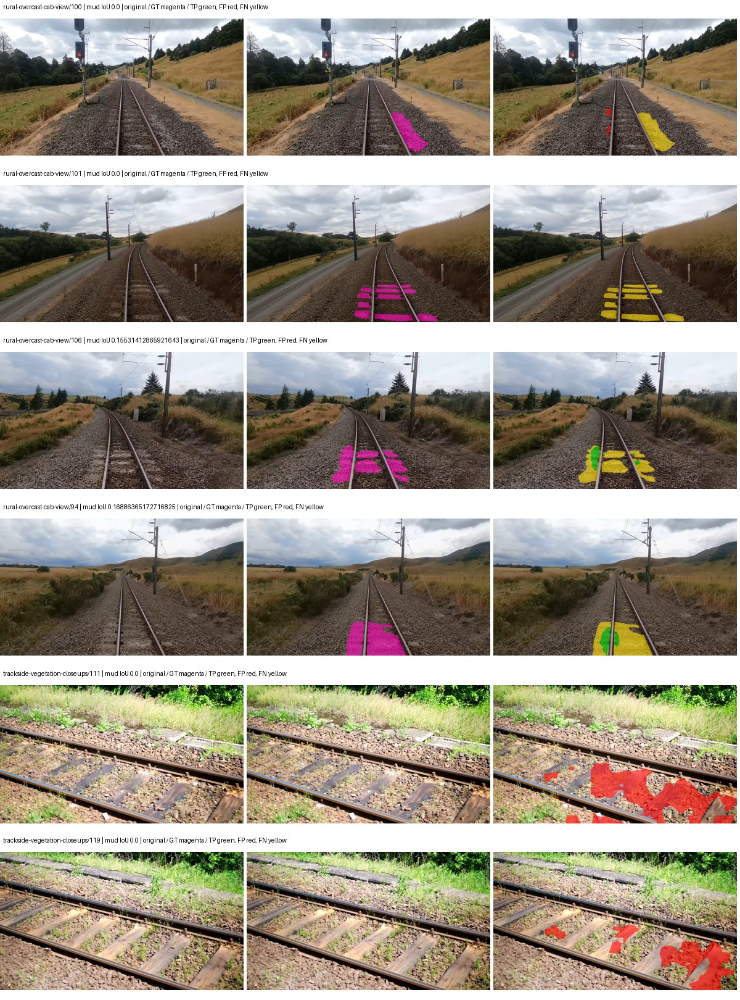

Examples are two lowest and two highest mud-IoU positive images, plus up to two negative images with the most false-positive mud pixels. They are targeted diagnostic examples, not random samples. Green: true positive; red: false positive; yellow: false negative. Full predictions remain on HDRFS.

### Validation tracking

| Logged step | Overall mIoU (%) | Mud IoU (%) |
| --- | --- | --- |
| 254 | 22.54 | 2.33 |
| 508 | 30.12 | 0.16 |
| 763 | 31.70 | 0.72 |
| 1017 | 35.73 | 0.26 |
| 1272 | 34.34 | 0.39 |
| 1527 | 32.58 | 0.01 |

All retained scalar curves, including training loss and per-class IoU, are in record.json. Observed best mud on a curve is not necessarily a retained checkpoint: the pilot saved its selection-metric-best and final checkpoints. Step logging and checkpoint global_step may differ by one.

### Stopping and checkpoint provenance

```json
{
  "stopping": {
    "actual_steps": 1527,
    "maximum_steps": 4000,
    "min_delta": 0.001,
    "monitor": "val_iou/mud-pumping",
    "patience": 5,
    "reason": "validation_plateau"
  },
  "checkpoints": {
    "best": {
      "path": "/data/izadia1/projects/segmentary-runs/paul-test-rtis/mud-fullstats-v1-20260906-r2/future-runs/native_resnet50_psp--cityscapes_to_railsem19_to_rtis--seed-1_seed1/rtis/best.ckpt",
      "sha256": "977a37d0f8a5a349b44e635f43b26d1d12ba2f51c4124760668f55d1aa7ea89c",
      "global_step": 254,
      "bytes": 595211558
    },
    "final": {
      "path": "/data/izadia1/projects/segmentary-runs/paul-test-rtis/mud-fullstats-v1-20260906-r2/future-runs/native_resnet50_psp--cityscapes_to_railsem19_to_rtis--seed-1_seed1/rtis/last.ckpt",
      "sha256": "285e15caf623560b231e10b94225e115a8a7828313acece440e146d647f6a0fc",
      "global_step": 1527,
      "bytes": 595200742
    }
  },
  "cleanup_error": null
}
```

### Resolved training, initialization and evaluation settings

The optimizer block is the base configuration. Stage LR scales are applied at runtime, and stage warmup is capped at min(base warmup, floor(stage budget / 10), stage budget - 1): 400 steps for this 4,000-step pilot. Model-internal native input grids may differ from augmentation crops (EoMT uses its 640 grid).

```json
{
  "name": "native_resnet50_psp--cityscapes_to_railsem19_to_rtis--seed-1",
  "model": {
    "arch": "native",
    "checkpoint": null,
    "tuning": "full",
    "head": "unified_head",
    "lora_r": 16,
    "lora_alpha": 32,
    "lora_dropout": 0.05,
    "lora_targets": [],
    "drop_path": null,
    "revision": null,
    "subfolder": null,
    "local_files_only": false,
    "trust_remote_code": false,
    "backbone_path": null,
    "head_paths": [],
    "classifier_path": null,
    "inactive_parameter_paths": [],
    "smp_arch": null,
    "encoder_name": null,
    "encoder_weights": null,
    "native": {
      "task": "multiclass",
      "backbone": {
        "kind": "timm",
        "name": "resnet50.a1_in1k",
        "weights": "pretrained",
        "out_indices": [
          1,
          2,
          3,
          4
        ],
        "in_channels": 3
      },
      "neck": {
        "kind": "identity"
      },
      "head": {
        "kind": "psp",
        "in_index": 3,
        "channels": 256,
        "pool_bins": [
          1,
          2,
          3,
          6
        ],
        "dropout": 0.1,
        "norm": "group",
        "activation": "relu"
      },
      "auxiliary_heads": []
    },
    "batch_norm_momentum": null
  },
  "space": "paul-test-rtis",
  "taxonomy_root": "/data/izadia1/projects/segmentary-rtis-fullstats-066afb2/taxonomy",
  "output_root": "/data/izadia1/projects/segmentary-runs/paul-test-rtis/mud-fullstats-v1-20260906-r2/future-runs",
  "optim": {
    "backbone_lr": 0.0001,
    "head_lr_mult": 10.0,
    "weight_decay": 0.05,
    "llrd": 1.0,
    "warmup_iters": 1500,
    "warmup_ratio": 1e-06,
    "poly_power": 0.9,
    "min_lr_ratio": 0.0,
    "betas": [
      0.9,
      0.999
    ],
    "grad_clip": 1.0
  },
  "train": {
    "iters": 4000,
    "batch_size": 2,
    "accum": 8,
    "num_workers": 2,
    "precision": "bf16-mixed",
    "ema_decay": 0.9998,
    "val_every": 250,
    "ckpt_every": 500,
    "selection_metric": "val_iou/mud-pumping",
    "early_stopping_patience": 5,
    "early_stopping_min_delta": 0.001,
    "seed": 1,
    "devices": 1
  },
  "eval": {
    "sliding_window": true,
    "window": [
      1024,
      1024
    ],
    "stride": [
      768,
      768
    ],
    "batch_size": 1,
    "num_workers": 2,
    "tta_scales": [],
    "tta_flip": false,
    "threshold": 0.5,
    "boundary_tolerance_frac": 0.0075,
    "save_confusion": true
  },
  "loss": {
    "task": "multiclass",
    "activation": "auto",
    "terms": [],
    "aux": "none",
    "aux_weight": 0.0,
    "ce_weight": 1.0,
    "label_smoothing": 0.0,
    "class_weights": null,
    "query": null
  },
  "aug": {
    "crop": [
      1024,
      1024
    ],
    "scale_min": 0.5,
    "scale_max": 2.0,
    "hflip_p": 0.5,
    "color_jitter_p": 0.5,
    "brightness": 0.25,
    "contrast": 0.25,
    "saturation": 0.25,
    "hue": 0.05
  },
  "stages": [
    {
      "name": "rtis",
      "data": [
        {
          "name": "paul-test-rtis",
          "root": "/data/izadia1/datasets/paul-test-rtis",
          "variant": null,
          "split_file": "splits.json",
          "train_split": "train",
          "val_split": "val",
          "limit": null,
          "loader": "folder",
          "mapping": "paul-test-rtis",
          "loader_options": {
            "require_groups": true
          }
        }
      ],
      "iters": null,
      "lr_scale": 0.1,
      "head_group_lr_scale": 1.0,
      "init_from": "/data/izadia1/projects/segmentary-runs/all-model-city-rail-seed0-rail20-b9eb3e1/jobs/native_resnet50_psp--cityscapes_to_railsem19--seed-0/attempt-001/train/native_resnet50_psp--cityscapes_to_railsem19_seed0/railsem19/last.ckpt",
      "reset_head": true,
      "freeze": null,
      "sample_weights": null
    }
  ]
}
```

### Hardware and software provenance

```json
{
  "training": {
    "cuda_available": true,
    "cuda_visible_devices": "2",
    "cudnn": 91900,
    "driver_version": "570.133.20",
    "gpu_count": 1,
    "gpu_names": [
      "NVIDIA L40S"
    ],
    "hostname": "hdrfs-app-001",
    "input_normalization": {
      "channel_order": "rgb",
      "mean": [
        0.485,
        0.456,
        0.406
      ],
      "source": "timm_pretrained_cfg",
      "std": [
        0.229,
        0.224,
        0.225
      ]
    },
    "model_origins": [
      {
        "hf_commit": null,
        "hf_name_or_path": null,
        "module": "backbone",
        "timm_pretrained": {
          "architecture": "resnet50",
          "hf_hub_id": "timm/resnet50.a1_in1k",
          "tag": "a1_in1k",
          "url": "https://github.com/rwightman/pytorch-image-models/releases/download/v0.1-rsb-weights/resnet50_a1_0-14fe96d1.pth"
        }
      },
      {
        "hf_commit": null,
        "hf_name_or_path": null,
        "module": "backbone.model",
        "timm_pretrained": {
          "architecture": "resnet50",
          "hf_hub_id": "timm/resnet50.a1_in1k",
          "tag": "a1_in1k",
          "url": "https://github.com/rwightman/pytorch-image-models/releases/download/v0.1-rsb-weights/resnet50_a1_0-14fe96d1.pth"
        }
      }
    ],
    "model_parameter_count": 37149525,
    "packages": {
      "albumentations": "2.0.8",
      "lightning": "2.6.5",
      "numpy": "2.4.4",
      "segmentary": "0.1.0",
      "segmentation-models-pytorch": "0.5.0",
      "timm": "1.0.28",
      "torch": "2.11.0+cu128",
      "torchvision": "0.26.0+cu128",
      "transformers": "5.15.0"
    },
    "platform": "Linux-5.15.0-139-generic-x86_64-with-glibc2.35",
    "python": "3.11.15",
    "torch": "2.11.0+cu128",
    "torch_cuda": "12.8",
    "trainable_parameter_count": 37149525,
    "training_stop": {
      "actual_steps": 1527,
      "maximum_steps": 4000,
      "min_delta": 0.001,
      "monitor": "val_iou/mud-pumping",
      "patience": 5,
      "reason": "validation_plateau"
    },
    "validation_weights": "raw"
  },
  "evaluation": {
    "cuda_available": true,
    "cuda_visible_devices": "2",
    "cudnn": 91900,
    "driver_version": "570.133.20",
    "gpu_count": 1,
    "gpu_names": [
      "NVIDIA L40S"
    ],
    "hostname": "hdrfs-app-001",
    "input_normalization": {
      "channel_order": "rgb",
      "mean": [
        0.485,
        0.456,
        0.406
      ],
      "source": "timm_pretrained_cfg",
      "std": [
        0.229,
        0.224,
        0.225
      ]
    },
    "packages": {
      "albumentations": "2.0.8",
      "lightning": "2.6.5",
      "numpy": "2.4.4",
      "segmentary": "0.1.0",
      "segmentation-models-pytorch": "0.5.0",
      "timm": "1.0.28",
      "torch": "2.11.0+cu128",
      "torchvision": "0.26.0+cu128",
      "transformers": "5.15.0"
    },
    "platform": "Linux-5.15.0-139-generic-x86_64-with-glibc2.35",
    "python": "3.11.15",
    "torch": "2.11.0+cu128",
    "torch_cuda": "12.8"
  }
}
```

## cityscapes_to_railsem19_to_rtis — seed 2

Status: **completed**. Started: 2026-09-07T00:59:10.823364+00:00. Finished: 2026-09-07T01:28:22.029639+00:00.

Recipe pretrained initializer: `{"arch": "native", "backbone_path": null, "batch_norm_momentum": null, "checkpoint": null, "classifier_path": null, "drop_path": null, "encoder_name": null, "encoder_weights": null, "head": "unified_head", "head_paths": [], "inactive_parameter_paths": [], "local_files_only": false, "lora_alpha": 32, "lora_dropout": 0.05, "lora_r": 16, "lora_targets": [], "native": {"auxiliary_heads": [], "backbone": {"in_channels": 3, "kind": "timm", "name": "resnet50.a1_in1k", "out_indices": [1, 2, 3, 4], "weights": "pretrained"}, "head": {"activation": "relu", "channels": 256, "dropout": 0.1, "in_index": 3, "kind": "psp", "norm": "group", "pool_bins": [1, 2, 3, 6]}, "neck": {"kind": "identity"}, "task": "multiclass"}, "revision": null, "smp_arch": null, "subfolder": null, "trust_remote_code": false, "tuning": "full"}`.

`rtis_only` uses the recipe initializer, which may include pretrained segmentation components. Transfer paths load the exact historical source checkpoint below and reset the classifier; they do not reset all query/decoder features.

Source checkpoint: `{'name': 'native_resnet50_psp--cityscapes_to_railsem19--seed-0', 'model': 'native_resnet50_psp', 'protocol': 'cityscapes_to_railsem19', 'config': '/data/izadia1/projects/segmentary-runs/all-model-city-rail-seed0-rail20-b9eb3e1/jobs/native_resnet50_psp--cityscapes_to_railsem19--seed-0/attempt-001/resolved-config.yaml', 'checkpoint': '/data/izadia1/projects/segmentary-runs/all-model-city-rail-seed0-rail20-b9eb3e1/jobs/native_resnet50_psp--cityscapes_to_railsem19--seed-0/attempt-001/train/native_resnet50_psp--cityscapes_to_railsem19_seed0/railsem19/last.ckpt', 'recorded_sha256': '6e4773eeec522b2508c0a276d113f2e5886dd2d0ebff8ff039859a6aa0e0760c', 'exists': True}`.

Config SHA-256: `758f26231c442197307bc765df5e3013e3edb6de7007ce532b193168d7d46cf1`. Weights used for validation: `raw`.

### Mud-pumping and aggregate quality

| Metric | Selected checkpoint | Final training validation |
| --- | --- | --- |
| Mud IoU | 4.17 | 0.73 |
| Mud precision | 13.15 | 11.31 |
| Mud recall | 5.75 | 0.77 |
| Mud Dice/F1 | 8.00 | 1.45 |
| mIoU | 32.10 | 30.62 |
| Mean accuracy | 44.32 | 42.71 |
| Mean precision | 57.59 | 54.89 |
| Mean Dice | 41.57 | 39.88 |
| Mean specificity | 98.87 | 98.81 |
| Pixel accuracy | 82.82 | 82.76 |
| Frequency-weighted IoU | 72.22 | 71.30 |
| Fixed GT-present class mIoU | 37.45 | 35.72 |
| Boundary F1 | 38.46 | 36.10 |

The selected checkpoint has independent evaluation evidence. Final values are the trainer's final validation record, not a new independent evaluation. mIoU averages classes with nonzero union, so false positives on absent classes can change its denominator. The fixed GT-class mean is supplementary and excludes absent classes; their false positives remain in the confusion matrix.

### Resource usage and timing

| Measurement | Value |
| --- | --- |
| Peak training VRAM, retained training invocation (GiB) | 8.29 |
| Peak evaluation VRAM (GiB) | 6.75 |
| Retained training invocation wall time (seconds) | 1624.91 |
| Retained training invocation GPU-hours (one GPU) | 0.45 |
| Evaluation wall time (seconds) | 11.24 |
| Full evaluation pipeline images/second | 3.29 |
| Best full-state checkpoint (MiB) | 567.64 |
| Final full-state checkpoint (MiB) | 567.63 |
| Audited periodic checkpoints removed (GiB) | 2.22 |

VRAM uses the recorded allocator high-water mark; it is not total device usage including CUDA context. Resumed jobs' retained training invocation times and peaks are **not whole-campaign totals**. Earlier invocation resource records are not reconstructed here. Evaluation throughput includes loader, sliding-window inference and metrics; it is not model-only latency/FPS. Missing measurements are shown as —, never inferred from another dataset's run.

### Standardized inference performance

Dedicated model-only profiling waits for an idle worker-locked L40S: BF16, batch 1, 1024x1024, 20 warmup and 100 CUDA-event-timed public forwards. It excludes loading, preprocessing, tiling and metrics.

| Status | Parameters | Weight MiB | FPS | p50 ms | p95 ms | Peak reserved GiB |
| --- | --- | --- | --- | --- | --- | --- |
| complete | 37149525 | 141.71 | 200.13 | 4.92 | 5.51 | 0.52 |

```json
{
  "schema_version": 1,
  "model_id": "native_resnet50_psp",
  "measured_at": "2026-09-07T01:28:17+00:00",
  "status": "complete",
  "benchmark_scope": "rtis_selected_checkpoint_model_only",
  "applies_to": [
    "native_resnet50_psp--cityscapes_to_railsem19_to_rtis--seed-2"
  ],
  "source": {
    "campaign_git_sha": "066afb2626398b7be59d4d19f5a0e4644fd59adc",
    "git_dirty": false,
    "config_hash": "7a68c7064cc2",
    "resolved_config": "/data/izadia1/projects/segmentary-runs/paul-test-rtis/mud-fullstats-v1-20260906-r2/configs/native_resnet50_psp--cityscapes_to_railsem19_to_rtis--seed-2.yaml",
    "config_sha256": "758f26231c442197307bc765df5e3013e3edb6de7007ce532b193168d7d46cf1",
    "checkpoint_sha256": "620c55f8f7d356c2d8b6cf6ecdf89f15042e36ae3bf7c6d017d636484b1ba5ed",
    "checkpoint_global_step": 763,
    "checkpoint_bytes": 595211750,
    "checkpoint_kind": "resume checkpoint with optimizer and EMA state",
    "weights": "raw",
    "measured_checkpoint_job_id": "native_resnet50_psp--cityscapes_to_railsem19_to_rtis--seed-2",
    "result_sha256": "e425d09bc7a8f4a86f373c66f93a6d07d45c839a09237abd5e29aaa9a622ef83",
    "result_git_sha": "066afb2626398b7be59d4d19f5a0e4644fd59adc",
    "result_stage": "eval:paul-test-rtis:val",
    "result_seed": 2
  },
  "hardware": {
    "gpu_name": "NVIDIA L40S",
    "gpu_uuid": "GPU-fc5dde96-210d-0afa-ac74-7f88477d622b",
    "logical_device": "cuda:0",
    "physical_visibility_token": "4",
    "compute_capability": [
      8,
      9
    ],
    "total_memory_bytes": 47677177856
  },
  "model": {
    "parameter_count": 37149525,
    "trainable_parameter_count": 37149525,
    "resident_parameter_bytes": 148598100,
    "parameter_dtype_counts": {
      "float32": 37149525
    }
  },
  "contract": {
    "backend": "pytorch",
    "precision": "bf16_autocast",
    "batch_size": 1,
    "input_shape_nchw": [
      1,
      3,
      1024,
      1024
    ],
    "warmup_iterations": 20,
    "measured_iterations": 100,
    "timing": "per-forward CUDA events with end-event synchronization",
    "includes_preprocessing": false,
    "includes_data_loader": false,
    "includes_sliding_window": false,
    "input_resident_on_gpu": true,
    "model_only": true,
    "entrypoint": "public model(image) dense-logits forward"
  },
  "measurements": {
    "latency": {
      "p50_ms": 4.921855926513672,
      "p95_ms": 5.5077889919281,
      "mean_ms": 4.996810870170593,
      "minimum_ms": 4.636672019958496,
      "maximum_ms": 5.824512004852295,
      "fps": 200.12764660949827,
      "raw_ms": [
        5.216256141662598,
        5.427199840545654,
        4.753407955169678,
        4.779007911682129,
        4.772863864898682,
        4.754432201385498,
        4.826111793518066,
        4.779935836791992,
        4.753407955169678,
        5.0872321128845215,
        4.91212797164917,
        5.179391860961914,
        5.01145601272583,
        5.257215976715088,
        5.777408123016357,
        5.065760135650635,
        5.230591773986816,
        4.90393590927124,
        4.765696048736572,
        5.1179518699646,
        5.268479824066162,
        5.237760066986084,
        4.78934383392334,
        4.724736213684082,
        4.738048076629639,
        4.878335952758789,
        4.814847946166992,
        5.21727991104126,
        4.860928058624268,
        4.7421441078186035,
        4.648032188415527,
        4.784128189086914,
        5.4527997970581055,
        5.295104026794434,
        4.7645440101623535,
        4.740096092224121,
        5.202879905700684,
        5.555200099945068,
        5.338111877441406,
        5.222400188446045,
        5.035007953643799,
        5.540863990783691,
        5.363711833953857,
        5.215231895446777,
        4.6561279296875,
        4.884479999542236,
        4.761536121368408,
        4.863840103149414,
        4.926464080810547,
        5.005311965942383,
        5.1609601974487305,
        4.770815849304199,
        4.797440052032471,
        5.398528099060059,
        4.943871974945068,
        5.1077117919921875,
        5.132287979125977,
        5.506048202514648,
        5.2705278396606445,
        5.710847854614258,
        5.208064079284668,
        5.152768135070801,
        5.427199840545654,
        4.960256099700928,
        4.683775901794434,
        4.6561279296875,
        4.637824058532715,
        4.899839878082275,
        5.313536167144775,
        5.099423885345459,
        5.115903854370117,
        4.9991679191589355,
        4.769792079925537,
        4.636672019958496,
        4.642816066741943,
        4.917247772216797,
        4.654079914093018,
        4.636672019958496,
        4.640768051147461,
        4.64793586730957,
        4.645887851715088,
        4.7564802169799805,
        4.826111793518066,
        5.486720085144043,
        5.436416149139404,
        4.830207824707031,
        4.731872081756592,
        4.639743804931641,
        4.926464080810547,
        4.649983882904053,
        4.64793586730957,
        4.808703899383545,
        4.990880012512207,
        5.208064079284668,
        5.824512004852295,
        5.205056190490723,
        4.865024089813232,
        4.807680130004883,
        5.064703941345215,
        4.930560111999512
      ],
      "percentile_method": "numpy linear interpolation"
    },
    "peak_reserved_bytes": 557842432,
    "memory_kind": "pytorch_cuda_allocator_peak_reserved_excluding_context",
    "benchmark_wall_clock_s": 12.574634116142988
  },
  "started_at": "2026-09-07T01:28:04+00:00",
  "finished_at": "2026-09-07T01:28:17+00:00",
  "environment": {
    "hostname": "hdrfs-app-001",
    "python": "3.11.15",
    "platform": "Linux-5.15.0-139-generic-x86_64-with-glibc2.35",
    "torch": "2.11.0+cu128",
    "torch_cuda": "12.8",
    "cudnn": 91900,
    "driver_version": "570.133.20",
    "cuda_available": true,
    "gpu_count": 1,
    "gpu_names": [
      "NVIDIA L40S"
    ],
    "cuda_visible_devices": "4",
    "packages": {
      "segmentary": "0.1.0",
      "torch": "2.11.0+cu128",
      "torchvision": "0.26.0+cu128",
      "transformers": "5.15.0",
      "timm": "1.0.28",
      "segmentation-models-pytorch": "0.5.0",
      "albumentations": "2.0.8",
      "lightning": "2.6.5",
      "numpy": "2.4.4"
    }
  }
}
```

### Per-class validation results

| Class | GT pixels | IoU (%) | Precision (%) | Recall (%) | Dice (%) | Boundary F1 (%) |
| --- | --- | --- | --- | --- | --- | --- |
| car | 29664 | 63.35 | 86.14 | 70.54 | 77.56 | 68.91 |
| construction | 311585 | 50.00 | 62.67 | 71.22 | 66.67 | 58.02 |
| fence | 265137 | 13.13 | 60.13 | 14.38 | 23.21 | 28.27 |
| mud-pumping | 1226250 | 4.17 | 13.15 | 5.75 | 8.00 | 8.71 |
| on-rails | 0 | 0.00 | 0.00 | — | 0.00 | 0.00 |
| person | 0 | 0.00 | 0.00 | — | 0.00 | 0.00 |
| pole | 628038 | 51.01 | 79.43 | 58.77 | 67.56 | 73.70 |
| rail-embedded | 16799 | 0.65 | 100.00 | 0.65 | 1.29 | 5.56 |
| rail-raised | 2969797 | 63.22 | 67.09 | 91.63 | 77.46 | 84.38 |
| rail-track | 6323197 | 35.15 | 72.19 | 40.65 | 52.01 | 47.00 |
| road | 1048831 | 6.82 | 20.64 | 9.25 | 12.78 | 17.59 |
| sidewalk | 1297367 | 35.68 | 88.76 | 37.37 | 52.60 | 12.06 |
| sky | 19121606 | 97.02 | 98.82 | 98.16 | 98.49 | 90.75 |
| standing-water | 95802 | 0.00 | 0.00 | 0.00 | 0.00 | 0.00 |
| terrain | 39239306 | 84.81 | 85.73 | 98.75 | 91.78 | 63.70 |
| trackbed | 10643081 | 52.19 | 64.78 | 72.87 | 68.59 | 53.45 |
| traffic-light | 19510 | 45.85 | 94.47 | 47.12 | 62.88 | 70.96 |
| traffic-sign | 13285 | 30.14 | 64.69 | 36.08 | 46.32 | 52.89 |
| tram-track | 56179 | 10.42 | 74.15 | 10.81 | 18.87 | 17.12 |
| truck | 0 | 0.00 | 0.00 | — | 0.00 | 0.00 |
| vegetation-overgrowth | 5901821 | 30.55 | 76.64 | 33.68 | 46.80 | 54.69 |

### Full-run accounting

| Measurement | Value |
| --- | --- |
| Full GPU-reserved wall seconds, all recorded worker attempts | 1751.62 |
| Full reserved GPU-hours | 0.49 |
| Whole-run timing complete | True |

| Phase | Wall seconds including failed attempts |
| --- | --- |
| training | 1632.59 |
| diagnostics | 73.86 |
| performance | 20.92 |

GPU-reserved time includes model loading, training, validation, collection, profiling, checkpoint I/O and orchestration while the worker owns one GPU. It is not GPU kernel-active time. Phase timings and sampled device memory/power/utilization are retained separately; sampled device memory is not the allocator high-water mark.

### Train/validation and raw/EMA diagnostics

| Checkpoint / weights / split | Images | Mud IoU (%) | Mud precision (%) | Mud recall (%) |
| --- | --- | --- | --- | --- |
| best-auto-train / raw | 220 | 91.19 | 95.58 | 95.21 |
| best-auto-val / raw | 37 | 4.17 | 13.15 | 5.75 |
| best-alternate-val / ema | 37 | 0.37 | 4.27 | 0.41 |
| final-auto-val / raw | 37 | 0.72 | 11.18 | 0.76 |

Train uses the evaluation transform without augmentation. Compare mud train/validation metrics for the same selected weights. Alternate EMA on running-stat BatchNorm is explicitly uncalibrated and is diagnostic only. Score-threshold curves use uncalibrated normalized scores and are pixel-level diagnostics, not event detection rates or a selected deployment operating point.

### Downloadable evidence

- best-auto-train: [per-image.csv](cityscapes_to_railsem19_to_rtis--seed-2/best-auto-train/per-image.csv) · [per-image-confusion.json.gz](cityscapes_to_railsem19_to_rtis--seed-2/best-auto-train/per-image-confusion.json.gz) · [groups.json](cityscapes_to_railsem19_to_rtis--seed-2/best-auto-train/groups.json) · [mud-score-curves.json](cityscapes_to_railsem19_to_rtis--seed-2/best-auto-train/mud-score-curves.json)
- best-auto-val: [per-image.csv](cityscapes_to_railsem19_to_rtis--seed-2/best-auto-val/per-image.csv) · [per-image-confusion.json.gz](cityscapes_to_railsem19_to_rtis--seed-2/best-auto-val/per-image-confusion.json.gz) · [groups.json](cityscapes_to_railsem19_to_rtis--seed-2/best-auto-val/groups.json) · [mud-score-curves.json](cityscapes_to_railsem19_to_rtis--seed-2/best-auto-val/mud-score-curves.json) · [examples.jpg](cityscapes_to_railsem19_to_rtis--seed-2/best-auto-val/examples.jpg)
- best-alternate-val: [per-image.csv](cityscapes_to_railsem19_to_rtis--seed-2/best-alternate-val/per-image.csv) · [per-image-confusion.json.gz](cityscapes_to_railsem19_to_rtis--seed-2/best-alternate-val/per-image-confusion.json.gz) · [groups.json](cityscapes_to_railsem19_to_rtis--seed-2/best-alternate-val/groups.json) · [mud-score-curves.json](cityscapes_to_railsem19_to_rtis--seed-2/best-alternate-val/mud-score-curves.json)
- final-auto-val: [per-image.csv](cityscapes_to_railsem19_to_rtis--seed-2/final-auto-val/per-image.csv) · [per-image-confusion.json.gz](cityscapes_to_railsem19_to_rtis--seed-2/final-auto-val/per-image-confusion.json.gz) · [groups.json](cityscapes_to_railsem19_to_rtis--seed-2/final-auto-val/groups.json) · [mud-score-curves.json](cityscapes_to_railsem19_to_rtis--seed-2/final-auto-val/mud-score-curves.json)
- resources: [telemetry.csv](cityscapes_to_railsem19_to_rtis--seed-2/resources/telemetry.csv)

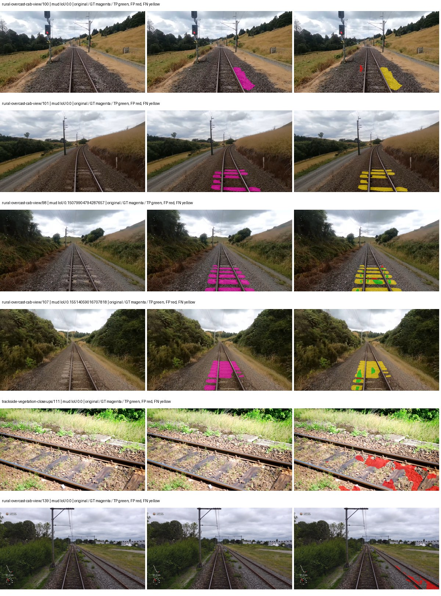

Examples are two lowest and two highest mud-IoU positive images, plus up to two negative images with the most false-positive mud pixels. They are targeted diagnostic examples, not random samples. Green: true positive; red: false positive; yellow: false negative. Full predictions remain on HDRFS.

### Validation tracking

| Logged step | Overall mIoU (%) | Mud IoU (%) |
| --- | --- | --- |
| 254 | 24.66 | 0.47 |
| 508 | 35.13 | 4.03 |
| 763 | 32.11 | 4.15 |
| 1017 | 29.06 | 0.01 |
| 1272 | 28.82 | 0.02 |
| 1527 | 33.55 | 0.43 |
| 1781 | 31.65 | 0.01 |
| 2036 | 30.62 | 0.73 |

All retained scalar curves, including training loss and per-class IoU, are in record.json. Observed best mud on a curve is not necessarily a retained checkpoint: the pilot saved its selection-metric-best and final checkpoints. Step logging and checkpoint global_step may differ by one.

### Stopping and checkpoint provenance

```json
{
  "stopping": {
    "actual_steps": 2036,
    "maximum_steps": 4000,
    "min_delta": 0.001,
    "monitor": "val_iou/mud-pumping",
    "patience": 5,
    "reason": "validation_plateau"
  },
  "checkpoints": {
    "best": {
      "path": "/data/izadia1/projects/segmentary-runs/paul-test-rtis/mud-fullstats-v1-20260906-r2/future-runs/native_resnet50_psp--cityscapes_to_railsem19_to_rtis--seed-2_seed2/rtis/best.ckpt",
      "sha256": "620c55f8f7d356c2d8b6cf6ecdf89f15042e36ae3bf7c6d017d636484b1ba5ed",
      "global_step": 763,
      "bytes": 595211750
    },
    "final": {
      "path": "/data/izadia1/projects/segmentary-runs/paul-test-rtis/mud-fullstats-v1-20260906-r2/future-runs/native_resnet50_psp--cityscapes_to_railsem19_to_rtis--seed-2_seed2/rtis/last.ckpt",
      "sha256": "3fe043a519ee4ace6c6049bd189e6a916830cd5225767205d71c5936a3d312a8",
      "global_step": 2036,
      "bytes": 595200742
    }
  },
  "cleanup_error": null
}
```

### Resolved training, initialization and evaluation settings

The optimizer block is the base configuration. Stage LR scales are applied at runtime, and stage warmup is capped at min(base warmup, floor(stage budget / 10), stage budget - 1): 400 steps for this 4,000-step pilot. Model-internal native input grids may differ from augmentation crops (EoMT uses its 640 grid).

```json
{
  "name": "native_resnet50_psp--cityscapes_to_railsem19_to_rtis--seed-2",
  "model": {
    "arch": "native",
    "checkpoint": null,
    "tuning": "full",
    "head": "unified_head",
    "lora_r": 16,
    "lora_alpha": 32,
    "lora_dropout": 0.05,
    "lora_targets": [],
    "drop_path": null,
    "revision": null,
    "subfolder": null,
    "local_files_only": false,
    "trust_remote_code": false,
    "backbone_path": null,
    "head_paths": [],
    "classifier_path": null,
    "inactive_parameter_paths": [],
    "smp_arch": null,
    "encoder_name": null,
    "encoder_weights": null,
    "native": {
      "task": "multiclass",
      "backbone": {
        "kind": "timm",
        "name": "resnet50.a1_in1k",
        "weights": "pretrained",
        "out_indices": [
          1,
          2,
          3,
          4
        ],
        "in_channels": 3
      },
      "neck": {
        "kind": "identity"
      },
      "head": {
        "kind": "psp",
        "in_index": 3,
        "channels": 256,
        "pool_bins": [
          1,
          2,
          3,
          6
        ],
        "dropout": 0.1,
        "norm": "group",
        "activation": "relu"
      },
      "auxiliary_heads": []
    },
    "batch_norm_momentum": null
  },
  "space": "paul-test-rtis",
  "taxonomy_root": "/data/izadia1/projects/segmentary-rtis-fullstats-066afb2/taxonomy",
  "output_root": "/data/izadia1/projects/segmentary-runs/paul-test-rtis/mud-fullstats-v1-20260906-r2/future-runs",
  "optim": {
    "backbone_lr": 0.0001,
    "head_lr_mult": 10.0,
    "weight_decay": 0.05,
    "llrd": 1.0,
    "warmup_iters": 1500,
    "warmup_ratio": 1e-06,
    "poly_power": 0.9,
    "min_lr_ratio": 0.0,
    "betas": [
      0.9,
      0.999
    ],
    "grad_clip": 1.0
  },
  "train": {
    "iters": 4000,
    "batch_size": 2,
    "accum": 8,
    "num_workers": 2,
    "precision": "bf16-mixed",
    "ema_decay": 0.9998,
    "val_every": 250,
    "ckpt_every": 500,
    "selection_metric": "val_iou/mud-pumping",
    "early_stopping_patience": 5,
    "early_stopping_min_delta": 0.001,
    "seed": 2,
    "devices": 1
  },
  "eval": {
    "sliding_window": true,
    "window": [
      1024,
      1024
    ],
    "stride": [
      768,
      768
    ],
    "batch_size": 1,
    "num_workers": 2,
    "tta_scales": [],
    "tta_flip": false,
    "threshold": 0.5,
    "boundary_tolerance_frac": 0.0075,
    "save_confusion": true
  },
  "loss": {
    "task": "multiclass",
    "activation": "auto",
    "terms": [],
    "aux": "none",
    "aux_weight": 0.0,
    "ce_weight": 1.0,
    "label_smoothing": 0.0,
    "class_weights": null,
    "query": null
  },
  "aug": {
    "crop": [
      1024,
      1024
    ],
    "scale_min": 0.5,
    "scale_max": 2.0,
    "hflip_p": 0.5,
    "color_jitter_p": 0.5,
    "brightness": 0.25,
    "contrast": 0.25,
    "saturation": 0.25,
    "hue": 0.05
  },
  "stages": [
    {
      "name": "rtis",
      "data": [
        {
          "name": "paul-test-rtis",
          "root": "/data/izadia1/datasets/paul-test-rtis",
          "variant": null,
          "split_file": "splits.json",
          "train_split": "train",
          "val_split": "val",
          "limit": null,
          "loader": "folder",
          "mapping": "paul-test-rtis",
          "loader_options": {
            "require_groups": true
          }
        }
      ],
      "iters": null,
      "lr_scale": 0.1,
      "head_group_lr_scale": 1.0,
      "init_from": "/data/izadia1/projects/segmentary-runs/all-model-city-rail-seed0-rail20-b9eb3e1/jobs/native_resnet50_psp--cityscapes_to_railsem19--seed-0/attempt-001/train/native_resnet50_psp--cityscapes_to_railsem19_seed0/railsem19/last.ckpt",
      "reset_head": true,
      "freeze": null,
      "sample_weights": null
    }
  ]
}
```

### Hardware and software provenance

```json
{
  "training": {
    "cuda_available": true,
    "cuda_visible_devices": "4",
    "cudnn": 91900,
    "driver_version": "570.133.20",
    "gpu_count": 1,
    "gpu_names": [
      "NVIDIA L40S"
    ],
    "hostname": "hdrfs-app-001",
    "input_normalization": {
      "channel_order": "rgb",
      "mean": [
        0.485,
        0.456,
        0.406
      ],
      "source": "timm_pretrained_cfg",
      "std": [
        0.229,
        0.224,
        0.225
      ]
    },
    "model_origins": [
      {
        "hf_commit": null,
        "hf_name_or_path": null,
        "module": "backbone",
        "timm_pretrained": {
          "architecture": "resnet50",
          "hf_hub_id": "timm/resnet50.a1_in1k",
          "tag": "a1_in1k",
          "url": "https://github.com/rwightman/pytorch-image-models/releases/download/v0.1-rsb-weights/resnet50_a1_0-14fe96d1.pth"
        }
      },
      {
        "hf_commit": null,
        "hf_name_or_path": null,
        "module": "backbone.model",
        "timm_pretrained": {
          "architecture": "resnet50",
          "hf_hub_id": "timm/resnet50.a1_in1k",
          "tag": "a1_in1k",
          "url": "https://github.com/rwightman/pytorch-image-models/releases/download/v0.1-rsb-weights/resnet50_a1_0-14fe96d1.pth"
        }
      }
    ],
    "model_parameter_count": 37149525,
    "packages": {
      "albumentations": "2.0.8",
      "lightning": "2.6.5",
      "numpy": "2.4.4",
      "segmentary": "0.1.0",
      "segmentation-models-pytorch": "0.5.0",
      "timm": "1.0.28",
      "torch": "2.11.0+cu128",
      "torchvision": "0.26.0+cu128",
      "transformers": "5.15.0"
    },
    "platform": "Linux-5.15.0-139-generic-x86_64-with-glibc2.35",
    "python": "3.11.15",
    "torch": "2.11.0+cu128",
    "torch_cuda": "12.8",
    "trainable_parameter_count": 37149525,
    "training_stop": {
      "actual_steps": 2036,
      "maximum_steps": 4000,
      "min_delta": 0.001,
      "monitor": "val_iou/mud-pumping",
      "patience": 5,
      "reason": "validation_plateau"
    },
    "validation_weights": "raw"
  },
  "evaluation": {
    "cuda_available": true,
    "cuda_visible_devices": "4",
    "cudnn": 91900,
    "driver_version": "570.133.20",
    "gpu_count": 1,
    "gpu_names": [
      "NVIDIA L40S"
    ],
    "hostname": "hdrfs-app-001",
    "input_normalization": {
      "channel_order": "rgb",
      "mean": [
        0.485,
        0.456,
        0.406
      ],
      "source": "timm_pretrained_cfg",
      "std": [
        0.229,
        0.224,
        0.225
      ]
    },
    "packages": {
      "albumentations": "2.0.8",
      "lightning": "2.6.5",
      "numpy": "2.4.4",
      "segmentary": "0.1.0",
      "segmentation-models-pytorch": "0.5.0",
      "timm": "1.0.28",
      "torch": "2.11.0+cu128",
      "torchvision": "0.26.0+cu128",
      "transformers": "5.15.0"
    },
    "platform": "Linux-5.15.0-139-generic-x86_64-with-glibc2.35",
    "python": "3.11.15",
    "torch": "2.11.0+cu128",
    "torch_cuda": "12.8"
  }
}
```
