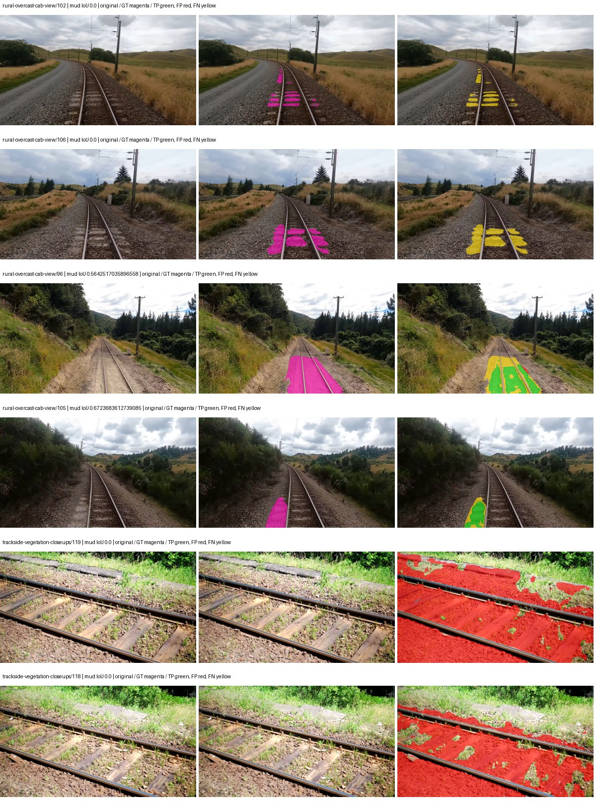
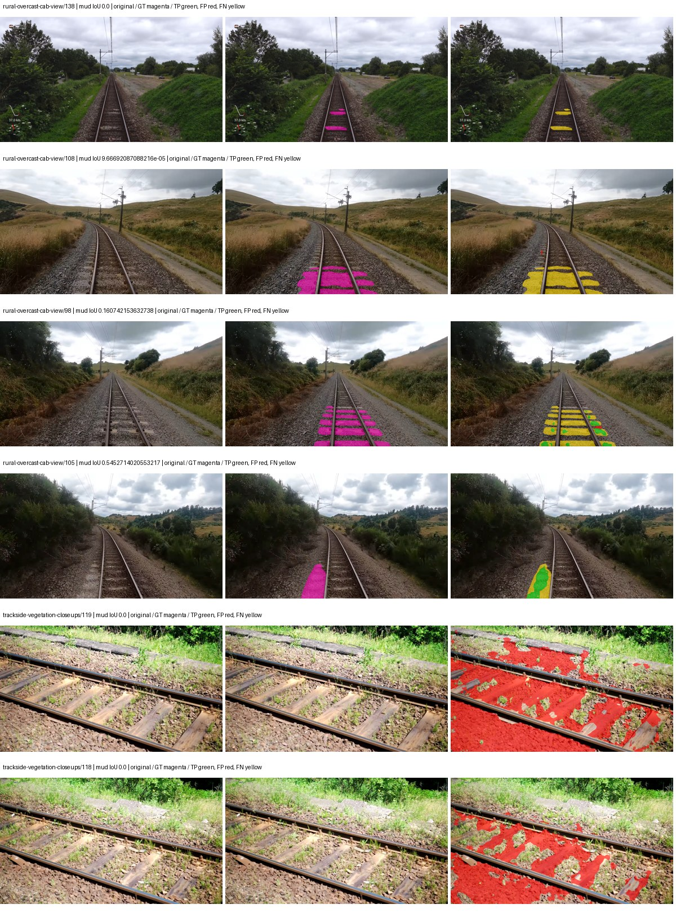
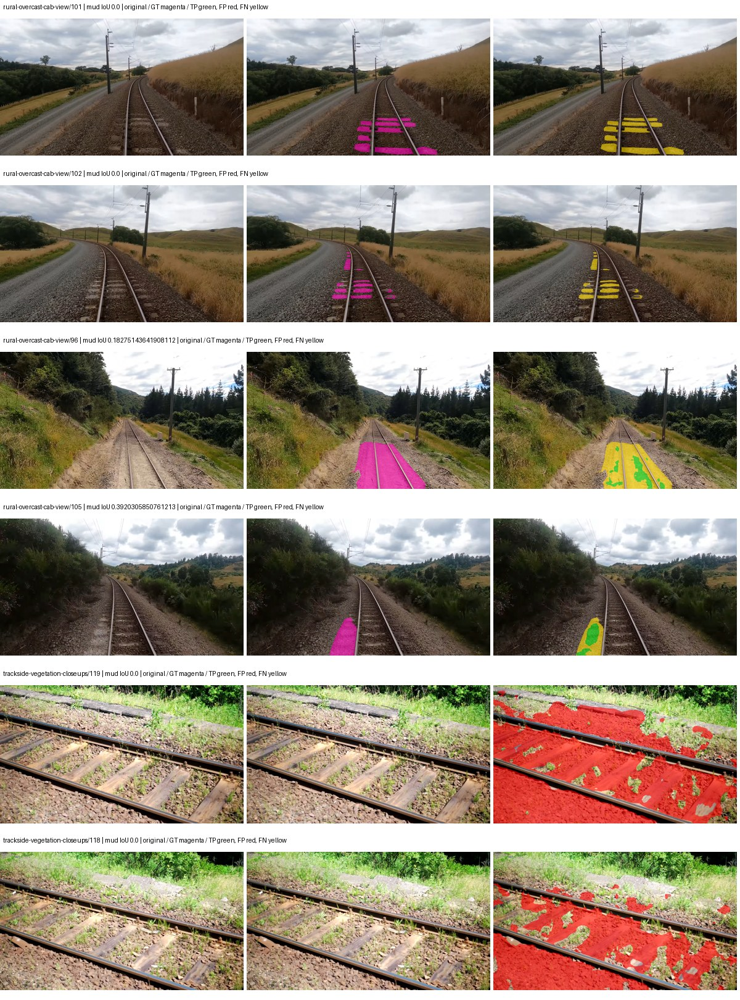
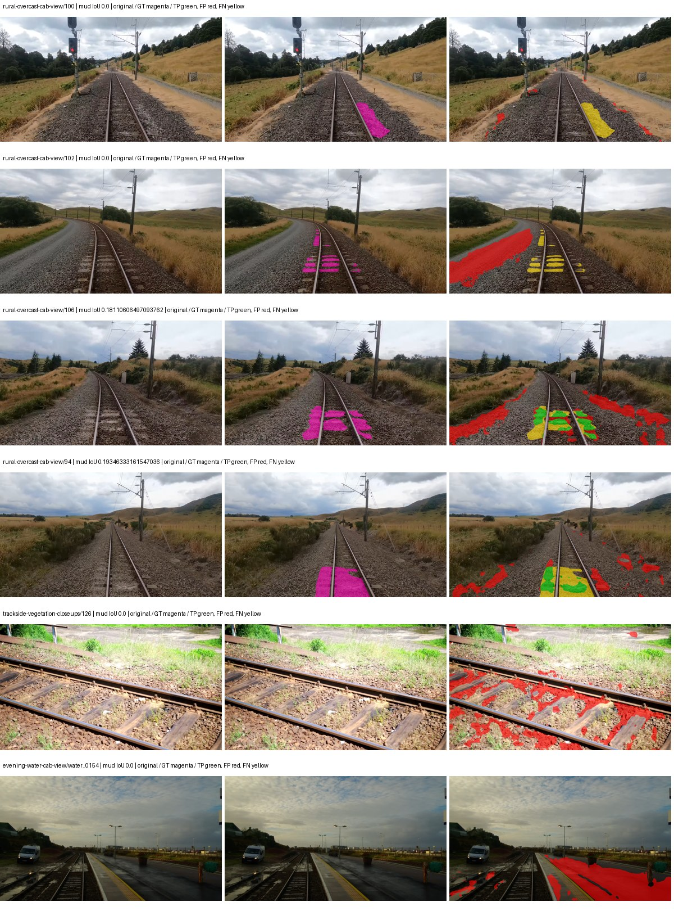
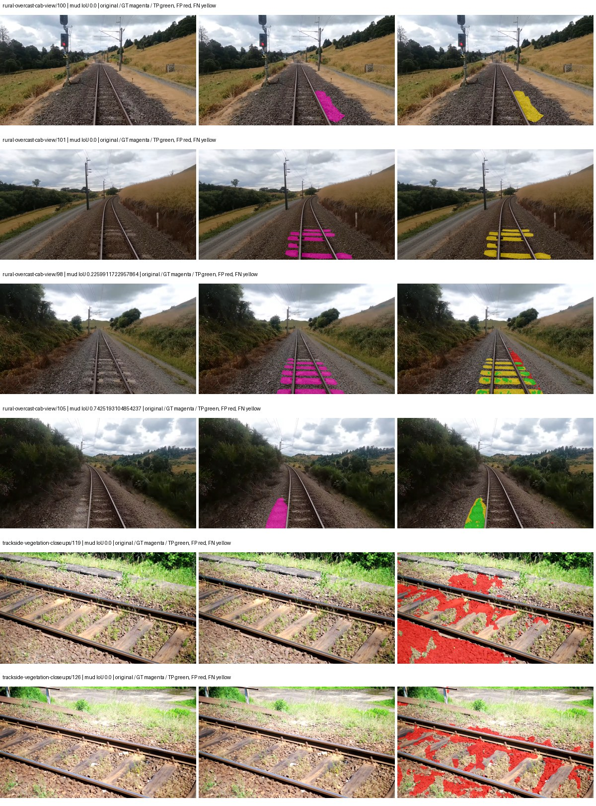
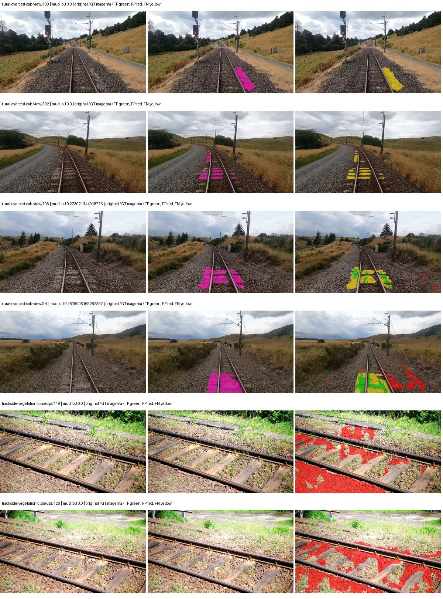
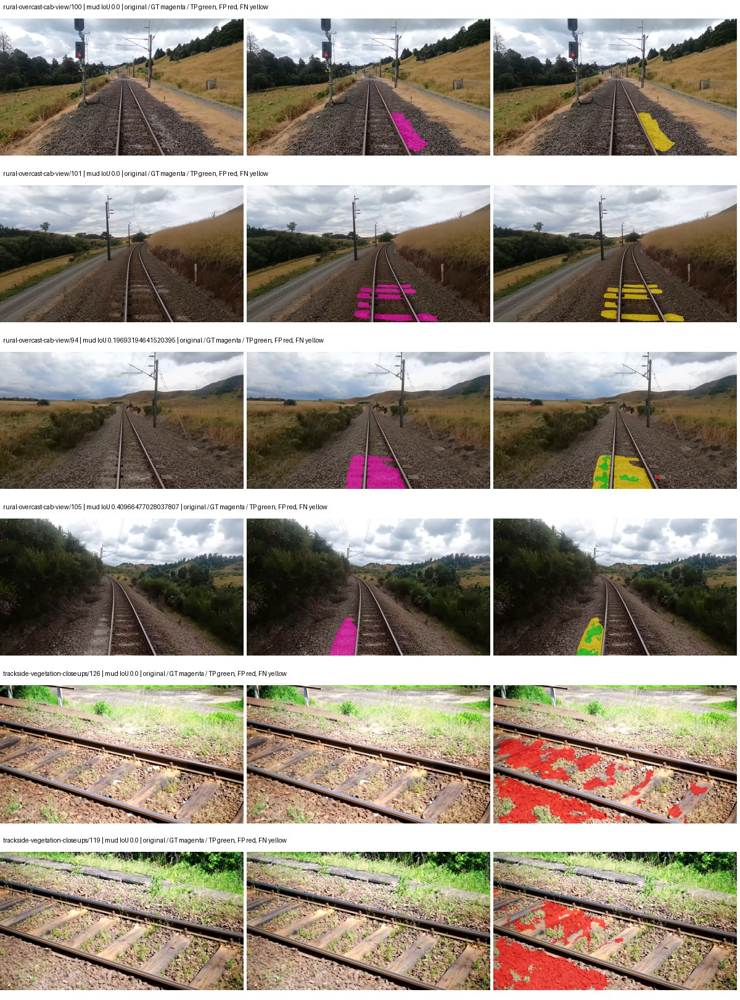

# segformer_b0 — paul-test-rtis

[RTIS comparison](../../README.md) · [Full model records](record.json)

Primary selection and early stopping: **mud-pumping validation IoU**. A job is complete only after full statistics and isolated profiling are verified.

| Model | Initialization path | Seed | Status | Steps | Best step | Mud IoU (%) | Mud precision (%) | Mud recall (%) | Final mud IoU (trainer val, %) | mIoU (%) | Fixed GT-class mIoU (%) |
| --- | --- | --- | --- | --- | --- | --- | --- | --- | --- | --- | --- |
| segformer_b0 | rtis_only | 0 | completed | 3309 | 2036 | 2.25 | 2.59 | 14.48 | 2.06 | 29.76 | 34.73 |
| segformer_b0 | rtis_only | 1 | completed | 2545 | 1272 | 3.46 | 4.96 | 10.25 | 1.60 | 26.10 | 30.45 |
| segformer_b0 | rtis_only | 2 | completed | 2545 | 1272 | 1.88 | 2.34 | 8.64 | 1.15 | 25.71 | 30.00 |
| segformer_b0 | cityscapes_to_rtis | 0 | completed | 1527 | 254 | 2.91 | 3.98 | 9.75 | 1.25 | 18.50 | 18.50 |
| segformer_b0 | cityscapes_to_rtis | 1 | completed | 3309 | 2036 | 3.34 | 5.12 | 8.74 | 2.26 | 23.81 | 27.78 |
| segformer_b0 | cityscapes_to_rtis | 2 | completed | 2290 | 1018 | 3.67 | 5.08 | 11.68 | 1.42 | 22.65 | 25.17 |
| segformer_b0 | railsem19_to_rtis | 0 | completed | 3054 | 1781 | 3.76 | 7.84 | 6.74 | 3.07 | 37.22 | 43.43 |
| segformer_b0 | railsem19_to_rtis | 1 | training | 3149 | — | — | — | — | — | — | — |
| segformer_b0 | railsem19_to_rtis | 2 | training | 2499 | — | — | — | — | — | — | — |
| segformer_b0 | cityscapes_to_railsem19_to_rtis | 0 | training | 2399 | — | — | — | — | — | — | — |
| segformer_b0 | cityscapes_to_railsem19_to_rtis | 1 | training | 2299 | — | — | — | — | — | — | — |
| segformer_b0 | cityscapes_to_railsem19_to_rtis | 2 | training | 1949 | — | — | — | — | — | — | — |

Training: 220 images. Validation: 37 images. Test: 50 held out. Seeds: [0, 1, 2]. Seed variation measures optimization variability, not independent-recording uncertainty. Historical source checkpoints stay fixed across adaptation seeds.

Training code: `066afb2626398b7be59d4d19f5a0e4644fd59adc`. Split SHA-256: `71fef8292610c352da0709fe3bd030f3bcc18f97560394835f4b22826463b83d`.

## rtis_only — seed 0

Status: **completed**. Started: 2026-09-07T01:05:11.133823+00:00. Finished: 2026-09-07T01:40:24.267296+00:00.

Recipe pretrained initializer: `nvidia/mit-b0`.

`rtis_only` uses the recipe initializer, which may include pretrained segmentation components. Transfer paths load the exact historical source checkpoint below and reset the classifier; they do not reset all query/decoder features.

Source checkpoint: `Recipe pretrained initialization`.

Config SHA-256: `b95873413d1050fe440baef6b6627cf06d55b59ba185927de8d297d83dd7e7ae`. Weights used for validation: `raw`.

### Mud-pumping and aggregate quality

| Metric | Selected checkpoint | Final training validation |
| --- | --- | --- |
| Mud IoU | 2.25 | 2.06 |
| Mud precision | 2.59 | 2.60 |
| Mud recall | 14.48 | 9.14 |
| Mud Dice/F1 | 4.39 | 4.04 |
| mIoU | 29.76 | 32.18 |
| Mean accuracy | 40.25 | 44.07 |
| Mean precision | 53.57 | 59.08 |
| Mean Dice | 38.48 | 41.14 |
| Mean specificity | 98.80 | 98.98 |
| Pixel accuracy | 80.46 | 82.53 |
| Frequency-weighted IoU | 72.31 | 74.80 |
| Fixed GT-present class mIoU | 34.73 | 37.55 |
| Boundary F1 | 35.58 | 39.25 |

The selected checkpoint has independent evaluation evidence. Final values are the trainer's final validation record, not a new independent evaluation. mIoU averages classes with nonzero union, so false positives on absent classes can change its denominator. The fixed GT-class mean is supplementary and excludes absent classes; their false positives remain in the confusion matrix.

### Resource usage and timing

| Measurement | Value |
| --- | --- |
| Peak training VRAM, retained training invocation (GiB) | 7.79 |
| Peak evaluation VRAM (GiB) | 7.03 |
| Retained training invocation wall time (seconds) | 1978.41 |
| Retained training invocation GPU-hours (one GPU) | 0.55 |
| Evaluation wall time (seconds) | 13.35 |
| Full evaluation pipeline images/second | 2.77 |
| Best full-state checkpoint (MiB) | 57.10 |
| Final full-state checkpoint (MiB) | 57.09 |
| Audited periodic checkpoints removed (GiB) | 0.33 |

VRAM uses the recorded allocator high-water mark; it is not total device usage including CUDA context. Resumed jobs' retained training invocation times and peaks are **not whole-campaign totals**. Earlier invocation resource records are not reconstructed here. Evaluation throughput includes loader, sliding-window inference and metrics; it is not model-only latency/FPS. Missing measurements are shown as —, never inferred from another dataset's run.

### Standardized inference performance

Dedicated model-only profiling waits for an idle worker-locked L40S: BF16, batch 1, 1024x1024, 20 warmup and 100 CUDA-event-timed public forwards. It excludes loading, preprocessing, tiling and metrics.

| Status | Parameters | Weight MiB | FPS | p50 ms | p95 ms | Peak reserved GiB |
| --- | --- | --- | --- | --- | --- | --- |
| complete | 3719541 | 14.19 | 127.83 | 7.72 | 8.60 | 0.89 |

```json
{
  "schema_version": 1,
  "model_id": "segformer_b0",
  "measured_at": "2026-09-07T01:40:22+00:00",
  "status": "complete",
  "benchmark_scope": "rtis_selected_checkpoint_model_only",
  "applies_to": [
    "segformer_b0--rtis_only--seed-0"
  ],
  "source": {
    "campaign_git_sha": "066afb2626398b7be59d4d19f5a0e4644fd59adc",
    "git_dirty": false,
    "config_hash": "cf1959100dcd",
    "resolved_config": "/data/izadia1/projects/segmentary-runs/paul-test-rtis/mud-fullstats-v1-20260906-r2/configs/segformer_b0--rtis_only--seed-0.yaml",
    "config_sha256": "b95873413d1050fe440baef6b6627cf06d55b59ba185927de8d297d83dd7e7ae",
    "checkpoint_sha256": "a4e137f1b8df77a3268eb4928a3469a9d5a8038ac45dfc6eb92bc2522cf0ff57",
    "checkpoint_global_step": 2036,
    "checkpoint_bytes": 59870093,
    "checkpoint_kind": "resume checkpoint with optimizer and EMA state",
    "weights": "raw",
    "measured_checkpoint_job_id": "segformer_b0--rtis_only--seed-0",
    "result_sha256": "b3ba0d78dc79d4752caf50aef6429d634fd3a4d6c799466f2e9d9642a16c5c0e",
    "result_git_sha": "066afb2626398b7be59d4d19f5a0e4644fd59adc",
    "result_stage": "eval:paul-test-rtis:val",
    "result_seed": 0
  },
  "hardware": {
    "gpu_name": "NVIDIA L40S",
    "gpu_uuid": "GPU-c76642eb-64c1-b0ac-b051-d2efd47b32c4",
    "logical_device": "cuda:0",
    "physical_visibility_token": "9",
    "compute_capability": [
      8,
      9
    ],
    "total_memory_bytes": 47677177856
  },
  "model": {
    "parameter_count": 3719541,
    "trainable_parameter_count": 3719541,
    "resident_parameter_bytes": 14878164,
    "parameter_dtype_counts": {
      "float32": 3719541
    }
  },
  "contract": {
    "backend": "pytorch",
    "precision": "bf16_autocast",
    "batch_size": 1,
    "input_shape_nchw": [
      1,
      3,
      1024,
      1024
    ],
    "warmup_iterations": 20,
    "measured_iterations": 100,
    "timing": "per-forward CUDA events with end-event synchronization",
    "includes_preprocessing": false,
    "includes_data_loader": false,
    "includes_sliding_window": false,
    "input_resident_on_gpu": true,
    "model_only": true,
    "entrypoint": "public model(image) dense-logits forward"
  },
  "measurements": {
    "latency": {
      "p50_ms": 7.7214720249176025,
      "p95_ms": 8.596941137313843,
      "mean_ms": 7.823062405586243,
      "minimum_ms": 7.192575931549072,
      "maximum_ms": 11.744256019592285,
      "fps": 127.82717919851008,
      "raw_ms": [
        11.744256019592285,
        9.018367767333984,
        7.631872177124023,
        7.7803521156311035,
        7.34003210067749,
        8.070143699645996,
        7.209983825683594,
        8.487936019897461,
        7.618559837341309,
        7.3809919357299805,
        7.4792962074279785,
        7.192575931549072,
        8.596480369567871,
        7.313375949859619,
        8.435711860656738,
        7.503871917724609,
        7.8448638916015625,
        8.013824462890625,
        7.413760185241699,
        7.826432228088379,
        7.816192150115967,
        8.062975883483887,
        7.65337610244751,
        7.350272178649902,
        7.432191848754883,
        7.255040168762207,
        7.335936069488525,
        7.3318400382995605,
        7.265247821807861,
        7.245823860168457,
        7.29088020324707,
        7.29088020324707,
        7.238656044006348,
        7.2724480628967285,
        7.954432010650635,
        8.444928169250488,
        7.8438401222229,
        7.582719802856445,
        8.126463890075684,
        7.687168121337891,
        7.605247974395752,
        7.944191932678223,
        7.656447887420654,
        7.571455955505371,
        7.451648235321045,
        7.444479942321777,
        7.641119956970215,
        8.605695724487305,
        8.127488136291504,
        7.827455997467041,
        8.764415740966797,
        8.167424201965332,
        7.919616222381592,
        7.533567905426025,
        7.367680072784424,
        7.357408046722412,
        8.428544044494629,
        7.567359924316406,
        8.126463890075684,
        7.723008155822754,
        7.84281587600708,
        7.980031967163086,
        8.423423767089844,
        7.53766393661499,
        7.589888095855713,
        7.846911907196045,
        7.688159942626953,
        8.018943786621094,
        8.771583557128906,
        7.850048065185547,
        8.30463981628418,
        7.583744049072266,
        8.036352157592773,
        7.360511779785156,
        7.798783779144287,
        7.367680072784424,
        7.971839904785156,
        7.333888053894043,
        7.323647975921631,
        8.433631896972656,
        7.877632141113281,
        7.723008155822754,
        8.526847839355469,
        7.790592193603516,
        7.7649922370910645,
        8.41318416595459,
        8.274944305419922,
        7.581696033477783,
        7.982079982757568,
        7.490560054779053,
        7.451648235321045,
        8.558591842651367,
        7.535615921020508,
        7.43936014175415,
        7.970816135406494,
        7.4055681228637695,
        7.283711910247803,
        7.719935894012451,
        8.01587200164795,
        8.220671653747559
      ],
      "percentile_method": "numpy linear interpolation"
    },
    "peak_reserved_bytes": 960495616,
    "memory_kind": "pytorch_cuda_allocator_peak_reserved_excluding_context",
    "benchmark_wall_clock_s": 4.577905476093292
  },
  "started_at": "2026-09-07T01:40:17+00:00",
  "finished_at": "2026-09-07T01:40:22+00:00",
  "environment": {
    "hostname": "hdrfs-app-001",
    "python": "3.11.15",
    "platform": "Linux-5.15.0-139-generic-x86_64-with-glibc2.35",
    "torch": "2.11.0+cu128",
    "torch_cuda": "12.8",
    "cudnn": 91900,
    "driver_version": "570.133.20",
    "cuda_available": true,
    "gpu_count": 1,
    "gpu_names": [
      "NVIDIA L40S"
    ],
    "cuda_visible_devices": "9",
    "packages": {
      "segmentary": "0.1.0",
      "torch": "2.11.0+cu128",
      "torchvision": "0.26.0+cu128",
      "transformers": "5.15.0",
      "timm": "1.0.28",
      "segmentation-models-pytorch": "0.5.0",
      "albumentations": "2.0.8",
      "lightning": "2.6.5",
      "numpy": "2.4.4"
    }
  }
}
```

### Per-class validation results

| Class | GT pixels | IoU (%) | Precision (%) | Recall (%) | Dice (%) | Boundary F1 (%) |
| --- | --- | --- | --- | --- | --- | --- |
| car | 29664 | 0.00 | 0.00 | 0.00 | 0.00 | 0.00 |
| construction | 311585 | 38.54 | 60.39 | 51.58 | 55.64 | 60.18 |
| fence | 265137 | 5.82 | 51.39 | 6.16 | 11.00 | 14.82 |
| mud-pumping | 1226250 | 2.25 | 2.59 | 14.48 | 4.39 | 5.16 |
| on-rails | 0 | 0.00 | 0.00 | — | 0.00 | 0.00 |
| person | 0 | 0.00 | 0.00 | — | 0.00 | 0.00 |
| pole | 628038 | 62.29 | 83.24 | 71.22 | 76.76 | 87.19 |
| rail-embedded | 16799 | 13.58 | 98.11 | 13.62 | 23.92 | 13.49 |
| rail-raised | 2969797 | 72.33 | 81.87 | 86.13 | 83.94 | 90.62 |
| rail-track | 6323197 | 30.90 | 69.29 | 35.80 | 47.21 | 42.64 |
| road | 1048831 | 18.41 | 37.45 | 26.59 | 31.10 | 25.33 |
| sidewalk | 1297367 | 21.49 | 79.42 | 22.76 | 35.38 | 13.48 |
| sky | 19121606 | 98.04 | 99.33 | 98.69 | 99.01 | 94.46 |
| standing-water | 95802 | 1.61 | 2.97 | 3.39 | 3.17 | 6.73 |
| terrain | 39239306 | 85.26 | 86.69 | 98.10 | 92.04 | 56.27 |
| trackbed | 10643081 | 52.87 | 79.26 | 61.36 | 69.17 | 54.13 |
| traffic-light | 19510 | 58.86 | 84.89 | 65.75 | 74.10 | 72.41 |
| traffic-sign | 13285 | 8.91 | 59.12 | 9.49 | 16.36 | 34.03 |
| tram-track | 56179 | 28.26 | 73.32 | 31.50 | 44.07 | 25.80 |
| truck | 0 | 0.00 | 0.00 | — | 0.00 | 0.00 |
| vegetation-overgrowth | 5901821 | 25.64 | 75.66 | 27.95 | 40.82 | 50.52 |

### Full-run accounting

| Measurement | Value |
| --- | --- |
| Full GPU-reserved wall seconds, all recorded worker attempts | 2113.14 |
| Full reserved GPU-hours | 0.59 |
| Whole-run timing complete | True |

| Phase | Wall seconds including failed attempts |
| --- | --- |
| training | 1985.23 |
| diagnostics | 94.91 |
| performance | 11.43 |

GPU-reserved time includes model loading, training, validation, collection, profiling, checkpoint I/O and orchestration while the worker owns one GPU. It is not GPU kernel-active time. Phase timings and sampled device memory/power/utilization are retained separately; sampled device memory is not the allocator high-water mark.

### Train/validation and raw/EMA diagnostics

| Checkpoint / weights / split | Images | Mud IoU (%) | Mud precision (%) | Mud recall (%) |
| --- | --- | --- | --- | --- |
| best-auto-train / raw | 220 | 93.65 | 96.44 | 97.00 |
| best-auto-val / raw | 37 | 2.25 | 2.59 | 14.48 |
| best-alternate-val / ema | 37 | 1.98 | 2.32 | 12.02 |
| final-auto-val / raw | 37 | 2.07 | 2.60 | 9.17 |

Train uses the evaluation transform without augmentation. Compare mud train/validation metrics for the same selected weights. Alternate EMA on running-stat BatchNorm is explicitly uncalibrated and is diagnostic only. Score-threshold curves use uncalibrated normalized scores and are pixel-level diagnostics, not event detection rates or a selected deployment operating point.

### Downloadable evidence

- best-auto-train: [per-image.csv](rtis_only--seed-0/best-auto-train/per-image.csv) · [per-image-confusion.json.gz](rtis_only--seed-0/best-auto-train/per-image-confusion.json.gz) · [groups.json](rtis_only--seed-0/best-auto-train/groups.json) · [mud-score-curves.json](rtis_only--seed-0/best-auto-train/mud-score-curves.json)
- best-auto-val: [per-image.csv](rtis_only--seed-0/best-auto-val/per-image.csv) · [per-image-confusion.json.gz](rtis_only--seed-0/best-auto-val/per-image-confusion.json.gz) · [groups.json](rtis_only--seed-0/best-auto-val/groups.json) · [mud-score-curves.json](rtis_only--seed-0/best-auto-val/mud-score-curves.json) · [examples.jpg](rtis_only--seed-0/best-auto-val/examples.jpg)
- best-alternate-val: [per-image.csv](rtis_only--seed-0/best-alternate-val/per-image.csv) · [per-image-confusion.json.gz](rtis_only--seed-0/best-alternate-val/per-image-confusion.json.gz) · [groups.json](rtis_only--seed-0/best-alternate-val/groups.json) · [mud-score-curves.json](rtis_only--seed-0/best-alternate-val/mud-score-curves.json)
- final-auto-val: [per-image.csv](rtis_only--seed-0/final-auto-val/per-image.csv) · [per-image-confusion.json.gz](rtis_only--seed-0/final-auto-val/per-image-confusion.json.gz) · [groups.json](rtis_only--seed-0/final-auto-val/groups.json) · [mud-score-curves.json](rtis_only--seed-0/final-auto-val/mud-score-curves.json)
- resources: [telemetry.csv](rtis_only--seed-0/resources/telemetry.csv)



Examples are two lowest and two highest mud-IoU positive images, plus up to two negative images with the most false-positive mud pixels. They are targeted diagnostic examples, not random samples. Green: true positive; red: false positive; yellow: false negative. Full predictions remain on HDRFS.

### Validation tracking

| Logged step | Overall mIoU (%) | Mud IoU (%) |
| --- | --- | --- |
| 254 | 20.47 | 0.12 |
| 508 | 23.36 | 0.16 |
| 763 | 25.04 | 0.55 |
| 1017 | 27.43 | 0.84 |
| 1272 | 27.05 | 0.25 |
| 1527 | 26.24 | 2.14 |
| 1781 | 28.81 | 0.72 |
| 2036 | 29.76 | 2.25 |
| 2290 | 30.54 | 1.83 |
| 2545 | 32.17 | 2.12 |
| 2799 | 31.57 | 1.49 |
| 3054 | 31.00 | 1.62 |
| 3308 | 32.18 | 2.06 |

All retained scalar curves, including training loss and per-class IoU, are in record.json. Observed best mud on a curve is not necessarily a retained checkpoint: the pilot saved its selection-metric-best and final checkpoints. Step logging and checkpoint global_step may differ by one.

### Stopping and checkpoint provenance

```json
{
  "stopping": {
    "actual_steps": 3309,
    "maximum_steps": 4000,
    "min_delta": 0.001,
    "monitor": "val_iou/mud-pumping",
    "patience": 5,
    "reason": "validation_plateau"
  },
  "checkpoints": {
    "best": {
      "path": "/data/izadia1/projects/segmentary-runs/paul-test-rtis/mud-fullstats-v1-20260906-r2/future-runs/segformer_b0--rtis_only--seed-0_seed0/rtis/best.ckpt",
      "sha256": "a4e137f1b8df77a3268eb4928a3469a9d5a8038ac45dfc6eb92bc2522cf0ff57",
      "global_step": 2036,
      "bytes": 59870093
    },
    "final": {
      "path": "/data/izadia1/projects/segmentary-runs/paul-test-rtis/mud-fullstats-v1-20260906-r2/future-runs/segformer_b0--rtis_only--seed-0_seed0/rtis/last.ckpt",
      "sha256": "4175d56d80f2f6c8cd763549ffb4810b19f7a19551e319bf69b137ab7a7888cf",
      "global_step": 3309,
      "bytes": 59860301
    }
  },
  "cleanup_error": null
}
```

### Resolved training, initialization and evaluation settings

The optimizer block is the base configuration. Stage LR scales are applied at runtime, and stage warmup is capped at min(base warmup, floor(stage budget / 10), stage budget - 1): 400 steps for this 4,000-step pilot. Model-internal native input grids may differ from augmentation crops (EoMT uses its 640 grid).

```json
{
  "name": "segformer_b0--rtis_only--seed-0",
  "model": {
    "arch": "segformer_b0",
    "checkpoint": "nvidia/mit-b0",
    "tuning": "full",
    "head": "unified_head",
    "lora_r": 16,
    "lora_alpha": 32,
    "lora_dropout": 0.05,
    "lora_targets": [],
    "drop_path": null,
    "revision": null,
    "subfolder": null,
    "local_files_only": false,
    "trust_remote_code": false,
    "backbone_path": null,
    "head_paths": [],
    "classifier_path": null,
    "inactive_parameter_paths": [],
    "smp_arch": null,
    "encoder_name": null,
    "encoder_weights": null,
    "native": null,
    "batch_norm_momentum": null
  },
  "space": "paul-test-rtis",
  "taxonomy_root": "/data/izadia1/projects/segmentary-rtis-fullstats-066afb2/taxonomy",
  "output_root": "/data/izadia1/projects/segmentary-runs/paul-test-rtis/mud-fullstats-v1-20260906-r2/future-runs",
  "optim": {
    "backbone_lr": 6e-05,
    "head_lr_mult": 10.0,
    "weight_decay": 0.05,
    "llrd": 1.0,
    "warmup_iters": 1500,
    "warmup_ratio": 1e-06,
    "poly_power": 0.9,
    "min_lr_ratio": 0.0,
    "betas": [
      0.9,
      0.999
    ],
    "grad_clip": 1.0
  },
  "train": {
    "iters": 4000,
    "batch_size": 2,
    "accum": 8,
    "num_workers": 2,
    "precision": "bf16-mixed",
    "ema_decay": 0.9998,
    "val_every": 250,
    "ckpt_every": 500,
    "selection_metric": "val_iou/mud-pumping",
    "early_stopping_patience": 5,
    "early_stopping_min_delta": 0.001,
    "seed": 0,
    "devices": 1
  },
  "eval": {
    "sliding_window": true,
    "window": [
      1024,
      1024
    ],
    "stride": [
      768,
      768
    ],
    "batch_size": 1,
    "num_workers": 2,
    "tta_scales": [],
    "tta_flip": false,
    "threshold": 0.5,
    "boundary_tolerance_frac": 0.0075,
    "save_confusion": true
  },
  "loss": {
    "task": "multiclass",
    "activation": "auto",
    "terms": [],
    "aux": "none",
    "aux_weight": 0.0,
    "ce_weight": 1.0,
    "label_smoothing": 0.0,
    "class_weights": null,
    "query": null
  },
  "aug": {
    "crop": [
      1024,
      1024
    ],
    "scale_min": 0.5,
    "scale_max": 2.0,
    "hflip_p": 0.5,
    "color_jitter_p": 0.5,
    "brightness": 0.25,
    "contrast": 0.25,
    "saturation": 0.25,
    "hue": 0.05
  },
  "stages": [
    {
      "name": "rtis",
      "data": [
        {
          "name": "paul-test-rtis",
          "root": "/data/izadia1/datasets/paul-test-rtis",
          "variant": null,
          "split_file": "splits.json",
          "train_split": "train",
          "val_split": "val",
          "limit": null,
          "loader": "folder",
          "mapping": "paul-test-rtis",
          "loader_options": {
            "require_groups": true
          }
        }
      ],
      "iters": null,
      "lr_scale": 1.0,
      "head_group_lr_scale": 1.0,
      "init_from": "pretrained",
      "reset_head": false,
      "freeze": null,
      "sample_weights": null
    }
  ]
}
```

### Hardware and software provenance

```json
{
  "training": {
    "cuda_available": true,
    "cuda_visible_devices": "9",
    "cudnn": 91900,
    "driver_version": "570.133.20",
    "gpu_count": 1,
    "gpu_names": [
      "NVIDIA L40S"
    ],
    "hostname": "hdrfs-app-001",
    "input_normalization": {
      "channel_order": "rgb",
      "mean": [
        0.485,
        0.456,
        0.406
      ],
      "source": "imagenet",
      "std": [
        0.229,
        0.224,
        0.225
      ]
    },
    "model_origins": [
      {
        "hf_commit": "80983a413c30d36a39c20203974ae7807835e2b4",
        "hf_name_or_path": "nvidia/mit-b0",
        "module": "model",
        "timm_pretrained": {}
      },
      {
        "hf_commit": "80983a413c30d36a39c20203974ae7807835e2b4",
        "hf_name_or_path": "nvidia/mit-b0",
        "module": "model.segformer",
        "timm_pretrained": {}
      },
      {
        "hf_commit": "80983a413c30d36a39c20203974ae7807835e2b4",
        "hf_name_or_path": "nvidia/mit-b0",
        "module": "model.segformer.stages.0.blocks.0.attention",
        "timm_pretrained": {}
      },
      {
        "hf_commit": "80983a413c30d36a39c20203974ae7807835e2b4",
        "hf_name_or_path": "nvidia/mit-b0",
        "module": "model.segformer.stages.0.blocks.1.attention",
        "timm_pretrained": {}
      },
      {
        "hf_commit": "80983a413c30d36a39c20203974ae7807835e2b4",
        "hf_name_or_path": "nvidia/mit-b0",
        "module": "model.segformer.stages.1.blocks.0.attention",
        "timm_pretrained": {}
      },
      {
        "hf_commit": "80983a413c30d36a39c20203974ae7807835e2b4",
        "hf_name_or_path": "nvidia/mit-b0",
        "module": "model.segformer.stages.1.blocks.1.attention",
        "timm_pretrained": {}
      },
      {
        "hf_commit": "80983a413c30d36a39c20203974ae7807835e2b4",
        "hf_name_or_path": "nvidia/mit-b0",
        "module": "model.segformer.stages.2.blocks.0.attention",
        "timm_pretrained": {}
      },
      {
        "hf_commit": "80983a413c30d36a39c20203974ae7807835e2b4",
        "hf_name_or_path": "nvidia/mit-b0",
        "module": "model.segformer.stages.2.blocks.1.attention",
        "timm_pretrained": {}
      },
      {
        "hf_commit": "80983a413c30d36a39c20203974ae7807835e2b4",
        "hf_name_or_path": "nvidia/mit-b0",
        "module": "model.segformer.stages.3.blocks.0.attention",
        "timm_pretrained": {}
      },
      {
        "hf_commit": "80983a413c30d36a39c20203974ae7807835e2b4",
        "hf_name_or_path": "nvidia/mit-b0",
        "module": "model.segformer.stages.3.blocks.1.attention",
        "timm_pretrained": {}
      },
      {
        "hf_commit": "80983a413c30d36a39c20203974ae7807835e2b4",
        "hf_name_or_path": "nvidia/mit-b0",
        "module": "model.decode_head",
        "timm_pretrained": {}
      }
    ],
    "model_parameter_count": 3719541,
    "packages": {
      "albumentations": "2.0.8",
      "lightning": "2.6.5",
      "numpy": "2.4.4",
      "segmentary": "0.1.0",
      "segmentation-models-pytorch": "0.5.0",
      "timm": "1.0.28",
      "torch": "2.11.0+cu128",
      "torchvision": "0.26.0+cu128",
      "transformers": "5.15.0"
    },
    "platform": "Linux-5.15.0-139-generic-x86_64-with-glibc2.35",
    "python": "3.11.15",
    "torch": "2.11.0+cu128",
    "torch_cuda": "12.8",
    "trainable_parameter_count": 3719541,
    "training_stop": {
      "actual_steps": 3309,
      "maximum_steps": 4000,
      "min_delta": 0.001,
      "monitor": "val_iou/mud-pumping",
      "patience": 5,
      "reason": "validation_plateau"
    },
    "validation_weights": "raw"
  },
  "evaluation": {
    "cuda_available": true,
    "cuda_visible_devices": "9",
    "cudnn": 91900,
    "driver_version": "570.133.20",
    "gpu_count": 1,
    "gpu_names": [
      "NVIDIA L40S"
    ],
    "hostname": "hdrfs-app-001",
    "input_normalization": {
      "channel_order": "rgb",
      "mean": [
        0.485,
        0.456,
        0.406
      ],
      "source": "imagenet",
      "std": [
        0.229,
        0.224,
        0.225
      ]
    },
    "packages": {
      "albumentations": "2.0.8",
      "lightning": "2.6.5",
      "numpy": "2.4.4",
      "segmentary": "0.1.0",
      "segmentation-models-pytorch": "0.5.0",
      "timm": "1.0.28",
      "torch": "2.11.0+cu128",
      "torchvision": "0.26.0+cu128",
      "transformers": "5.15.0"
    },
    "platform": "Linux-5.15.0-139-generic-x86_64-with-glibc2.35",
    "python": "3.11.15",
    "torch": "2.11.0+cu128",
    "torch_cuda": "12.8"
  }
}
```

## rtis_only — seed 1

Status: **completed**. Started: 2026-09-07T01:06:02.912968+00:00. Finished: 2026-09-07T01:34:13.837709+00:00.

Recipe pretrained initializer: `nvidia/mit-b0`.

`rtis_only` uses the recipe initializer, which may include pretrained segmentation components. Transfer paths load the exact historical source checkpoint below and reset the classifier; they do not reset all query/decoder features.

Source checkpoint: `Recipe pretrained initialization`.

Config SHA-256: `e31115d10f1c3a3fa1ad94c6d52a9f83f6580664df9dc63246df5df239960df1`. Weights used for validation: `raw`.

### Mud-pumping and aggregate quality

| Metric | Selected checkpoint | Final training validation |
| --- | --- | --- |
| Mud IoU | 3.46 | 1.60 |
| Mud precision | 4.96 | 1.84 |
| Mud recall | 10.25 | 10.68 |
| Mud Dice/F1 | 6.69 | 3.14 |
| mIoU | 26.10 | 31.29 |
| Mean accuracy | 38.18 | 44.72 |
| Mean precision | 38.58 | 51.24 |
| Mean Dice | 33.38 | 40.25 |
| Mean specificity | 98.95 | 98.91 |
| Pixel accuracy | 83.01 | 81.10 |
| Frequency-weighted IoU | 73.83 | 74.33 |
| Fixed GT-present class mIoU | 30.45 | 36.51 |
| Boundary F1 | 29.04 | 38.64 |

The selected checkpoint has independent evaluation evidence. Final values are the trainer's final validation record, not a new independent evaluation. mIoU averages classes with nonzero union, so false positives on absent classes can change its denominator. The fixed GT-class mean is supplementary and excludes absent classes; their false positives remain in the confusion matrix.

### Resource usage and timing

| Measurement | Value |
| --- | --- |
| Peak training VRAM, retained training invocation (GiB) | 7.79 |
| Peak evaluation VRAM (GiB) | 7.03 |
| Retained training invocation wall time (seconds) | 1554.18 |
| Retained training invocation GPU-hours (one GPU) | 0.43 |
| Evaluation wall time (seconds) | 13.06 |
| Full evaluation pipeline images/second | 2.83 |
| Best full-state checkpoint (MiB) | 57.10 |
| Final full-state checkpoint (MiB) | 57.09 |
| Audited periodic checkpoints removed (GiB) | 0.28 |

VRAM uses the recorded allocator high-water mark; it is not total device usage including CUDA context. Resumed jobs' retained training invocation times and peaks are **not whole-campaign totals**. Earlier invocation resource records are not reconstructed here. Evaluation throughput includes loader, sliding-window inference and metrics; it is not model-only latency/FPS. Missing measurements are shown as —, never inferred from another dataset's run.

### Standardized inference performance

Dedicated model-only profiling waits for an idle worker-locked L40S: BF16, batch 1, 1024x1024, 20 warmup and 100 CUDA-event-timed public forwards. It excludes loading, preprocessing, tiling and metrics.

| Status | Parameters | Weight MiB | FPS | p50 ms | p95 ms | Peak reserved GiB |
| --- | --- | --- | --- | --- | --- | --- |
| complete | 3719541 | 14.19 | 126.03 | 7.85 | 8.87 | 0.89 |

```json
{
  "schema_version": 1,
  "model_id": "segformer_b0",
  "measured_at": "2026-09-07T01:34:11+00:00",
  "status": "complete",
  "benchmark_scope": "rtis_selected_checkpoint_model_only",
  "applies_to": [
    "segformer_b0--rtis_only--seed-1"
  ],
  "source": {
    "campaign_git_sha": "066afb2626398b7be59d4d19f5a0e4644fd59adc",
    "git_dirty": false,
    "config_hash": "c2dd2dc9e742",
    "resolved_config": "/data/izadia1/projects/segmentary-runs/paul-test-rtis/mud-fullstats-v1-20260906-r2/configs/segformer_b0--rtis_only--seed-1.yaml",
    "config_sha256": "e31115d10f1c3a3fa1ad94c6d52a9f83f6580664df9dc63246df5df239960df1",
    "checkpoint_sha256": "bfd09b5dcf959c59dfc0d8a2e5c7c99a7906838e716834ab6b62cd7033fc89db",
    "checkpoint_global_step": 1272,
    "checkpoint_bytes": 59870093,
    "checkpoint_kind": "resume checkpoint with optimizer and EMA state",
    "weights": "raw",
    "measured_checkpoint_job_id": "segformer_b0--rtis_only--seed-1",
    "result_sha256": "6b7f4be745a4de241c058e41225469aa5aadaaa93762d54929af20202c551bbc",
    "result_git_sha": "066afb2626398b7be59d4d19f5a0e4644fd59adc",
    "result_stage": "eval:paul-test-rtis:val",
    "result_seed": 1
  },
  "hardware": {
    "gpu_name": "NVIDIA L40S",
    "gpu_uuid": "GPU-a5ad49e5-0536-5229-ba8a-f8a902808f53",
    "logical_device": "cuda:0",
    "physical_visibility_token": "7",
    "compute_capability": [
      8,
      9
    ],
    "total_memory_bytes": 47677177856
  },
  "model": {
    "parameter_count": 3719541,
    "trainable_parameter_count": 3719541,
    "resident_parameter_bytes": 14878164,
    "parameter_dtype_counts": {
      "float32": 3719541
    }
  },
  "contract": {
    "backend": "pytorch",
    "precision": "bf16_autocast",
    "batch_size": 1,
    "input_shape_nchw": [
      1,
      3,
      1024,
      1024
    ],
    "warmup_iterations": 20,
    "measured_iterations": 100,
    "timing": "per-forward CUDA events with end-event synchronization",
    "includes_preprocessing": false,
    "includes_data_loader": false,
    "includes_sliding_window": false,
    "input_resident_on_gpu": true,
    "model_only": true,
    "entrypoint": "public model(image) dense-logits forward"
  },
  "measurements": {
    "latency": {
      "p50_ms": 7.8545920848846436,
      "p95_ms": 8.871475267410279,
      "mean_ms": 7.934791703224182,
      "minimum_ms": 7.25705623626709,
      "maximum_ms": 10.135552406311035,
      "fps": 126.02725281290815,
      "raw_ms": [
        9.179136276245117,
        9.282560348510742,
        7.847936153411865,
        8.542207717895508,
        10.135552406311035,
        9.012224197387695,
        7.55404806137085,
        8.00767993927002,
        8.352767944335938,
        7.926784038543701,
        8.276991844177246,
        8.09062385559082,
        8.423423767089844,
        8.698880195617676,
        8.861696243286133,
        8.29644775390625,
        8.555520057678223,
        7.855103969573975,
        7.572480201721191,
        7.920608043670654,
        8.921088218688965,
        7.877632141113281,
        7.791615962982178,
        8.056863784790039,
        7.791615962982178,
        7.7066240310668945,
        7.515135765075684,
        7.520256042480469,
        8.868864059448242,
        8.292351722717285,
        7.707647800445557,
        8.449024200439453,
        8.120320320129395,
        7.880703926086426,
        8.560640335083008,
        8.185855865478516,
        8.856575965881348,
        7.625728130340576,
        7.605247974395752,
        7.4055681228637695,
        7.297023773193359,
        7.8540802001953125,
        7.490560054779053,
        8.276991844177246,
        7.526400089263916,
        7.660543918609619,
        7.921664237976074,
        8.344575881958008,
        7.856128215789795,
        7.726079940795898,
        7.486464023590088,
        7.947264194488525,
        7.6523518562316895,
        7.493631839752197,
        7.926784038543701,
        8.036352157592773,
        8.18175983428955,
        7.464960098266602,
        7.795711994171143,
        7.459839820861816,
        7.294976234436035,
        7.319551944732666,
        7.500800132751465,
        8.242176055908203,
        8.063008308410645,
        7.932928085327148,
        7.556128025054932,
        7.398399829864502,
        8.61900806427002,
        8.278016090393066,
        7.512063980102539,
        8.423423767089844,
        8.083456039428711,
        7.489535808563232,
        7.402495861053467,
        7.362559795379639,
        7.674880027770996,
        7.342080116271973,
        8.010751724243164,
        8.399871826171875,
        8.083423614501953,
        7.532544136047363,
        7.428095817565918,
        7.376895904541016,
        7.415808200836182,
        7.480319976806641,
        8.351743698120117,
        7.885824203491211,
        8.410112380981445,
        7.556096076965332,
        7.400447845458984,
        7.731200218200684,
        7.497727870941162,
        7.352320194244385,
        8.096768379211426,
        7.805952072143555,
        7.619584083557129,
        7.445504188537598,
        7.314432144165039,
        7.25705623626709
      ],
      "percentile_method": "numpy linear interpolation"
    },
    "peak_reserved_bytes": 960495616,
    "memory_kind": "pytorch_cuda_allocator_peak_reserved_excluding_context",
    "benchmark_wall_clock_s": 4.773653287440538
  },
  "started_at": "2026-09-07T01:34:06+00:00",
  "finished_at": "2026-09-07T01:34:11+00:00",
  "environment": {
    "hostname": "hdrfs-app-001",
    "python": "3.11.15",
    "platform": "Linux-5.15.0-139-generic-x86_64-with-glibc2.35",
    "torch": "2.11.0+cu128",
    "torch_cuda": "12.8",
    "cudnn": 91900,
    "driver_version": "570.133.20",
    "cuda_available": true,
    "gpu_count": 1,
    "gpu_names": [
      "NVIDIA L40S"
    ],
    "cuda_visible_devices": "7",
    "packages": {
      "segmentary": "0.1.0",
      "torch": "2.11.0+cu128",
      "torchvision": "0.26.0+cu128",
      "transformers": "5.15.0",
      "timm": "1.0.28",
      "segmentation-models-pytorch": "0.5.0",
      "albumentations": "2.0.8",
      "lightning": "2.6.5",
      "numpy": "2.4.4"
    }
  }
}
```

### Per-class validation results

| Class | GT pixels | IoU (%) | Precision (%) | Recall (%) | Dice (%) | Boundary F1 (%) |
| --- | --- | --- | --- | --- | --- | --- |
| car | 29664 | 0.00 | 0.00 | 0.00 | 0.00 | 0.00 |
| construction | 311585 | 36.97 | 52.22 | 55.86 | 53.98 | 51.49 |
| fence | 265137 | 5.18 | 38.63 | 5.65 | 9.85 | 9.55 |
| mud-pumping | 1226250 | 3.46 | 4.96 | 10.25 | 6.69 | 6.69 |
| on-rails | 0 | 0.00 | 0.00 | — | 0.00 | 0.00 |
| person | 0 | 0.00 | 0.00 | — | 0.00 | 0.00 |
| pole | 628038 | 62.15 | 78.62 | 74.79 | 76.66 | 85.36 |
| rail-embedded | 16799 | 0.00 | 0.00 | 0.00 | 0.00 | 0.00 |
| rail-raised | 2969797 | 63.53 | 68.45 | 89.83 | 77.70 | 84.11 |
| rail-track | 6323197 | 31.50 | 68.76 | 36.76 | 47.91 | 41.76 |
| road | 1048831 | 27.80 | 65.74 | 32.51 | 43.51 | 34.48 |
| sidewalk | 1297367 | 29.18 | 79.36 | 31.58 | 45.18 | 15.36 |
| sky | 19121606 | 97.44 | 99.05 | 98.36 | 98.70 | 93.10 |
| standing-water | 95802 | 0.02 | 0.04 | 0.07 | 0.05 | 0.32 |
| terrain | 39239306 | 87.53 | 88.91 | 98.26 | 93.35 | 63.38 |
| trackbed | 10643081 | 54.21 | 66.45 | 74.64 | 70.31 | 54.69 |
| traffic-light | 19510 | 0.00 | 0.00 | 0.00 | 0.00 | 0.00 |
| traffic-sign | 13285 | 0.00 | 0.00 | 0.00 | 0.00 | 0.00 |
| tram-track | 56179 | 15.36 | 19.58 | 41.60 | 26.63 | 8.37 |
| truck | 0 | 0.00 | 0.00 | — | 0.00 | 0.00 |
| vegetation-overgrowth | 5901821 | 33.83 | 79.33 | 37.11 | 50.56 | 61.22 |

### Full-run accounting

| Measurement | Value |
| --- | --- |
| Full GPU-reserved wall seconds, all recorded worker attempts | 1690.93 |
| Full reserved GPU-hours | 0.47 |
| Whole-run timing complete | True |

| Phase | Wall seconds including failed attempts |
| --- | --- |
| training | 1562.09 |
| diagnostics | 95.70 |
| performance | 12.16 |

GPU-reserved time includes model loading, training, validation, collection, profiling, checkpoint I/O and orchestration while the worker owns one GPU. It is not GPU kernel-active time. Phase timings and sampled device memory/power/utilization are retained separately; sampled device memory is not the allocator high-water mark.

### Train/validation and raw/EMA diagnostics

| Checkpoint / weights / split | Images | Mud IoU (%) | Mud precision (%) | Mud recall (%) |
| --- | --- | --- | --- | --- |
| best-auto-train / raw | 220 | 92.60 | 96.56 | 95.76 |
| best-auto-val / raw | 37 | 3.46 | 4.96 | 10.25 |
| best-alternate-val / ema | 37 | 1.26 | 1.50 | 7.40 |
| final-auto-val / raw | 37 | 1.60 | 1.84 | 10.70 |

Train uses the evaluation transform without augmentation. Compare mud train/validation metrics for the same selected weights. Alternate EMA on running-stat BatchNorm is explicitly uncalibrated and is diagnostic only. Score-threshold curves use uncalibrated normalized scores and are pixel-level diagnostics, not event detection rates or a selected deployment operating point.

### Downloadable evidence

- best-auto-train: [per-image.csv](rtis_only--seed-1/best-auto-train/per-image.csv) · [per-image-confusion.json.gz](rtis_only--seed-1/best-auto-train/per-image-confusion.json.gz) · [groups.json](rtis_only--seed-1/best-auto-train/groups.json) · [mud-score-curves.json](rtis_only--seed-1/best-auto-train/mud-score-curves.json)
- best-auto-val: [per-image.csv](rtis_only--seed-1/best-auto-val/per-image.csv) · [per-image-confusion.json.gz](rtis_only--seed-1/best-auto-val/per-image-confusion.json.gz) · [groups.json](rtis_only--seed-1/best-auto-val/groups.json) · [mud-score-curves.json](rtis_only--seed-1/best-auto-val/mud-score-curves.json) · [examples.jpg](rtis_only--seed-1/best-auto-val/examples.jpg)
- best-alternate-val: [per-image.csv](rtis_only--seed-1/best-alternate-val/per-image.csv) · [per-image-confusion.json.gz](rtis_only--seed-1/best-alternate-val/per-image-confusion.json.gz) · [groups.json](rtis_only--seed-1/best-alternate-val/groups.json) · [mud-score-curves.json](rtis_only--seed-1/best-alternate-val/mud-score-curves.json)
- final-auto-val: [per-image.csv](rtis_only--seed-1/final-auto-val/per-image.csv) · [per-image-confusion.json.gz](rtis_only--seed-1/final-auto-val/per-image-confusion.json.gz) · [groups.json](rtis_only--seed-1/final-auto-val/groups.json) · [mud-score-curves.json](rtis_only--seed-1/final-auto-val/mud-score-curves.json)
- resources: [telemetry.csv](rtis_only--seed-1/resources/telemetry.csv)



Examples are two lowest and two highest mud-IoU positive images, plus up to two negative images with the most false-positive mud pixels. They are targeted diagnostic examples, not random samples. Green: true positive; red: false positive; yellow: false negative. Full predictions remain on HDRFS.

### Validation tracking

| Logged step | Overall mIoU (%) | Mud IoU (%) |
| --- | --- | --- |
| 254 | 19.92 | 0.19 |
| 508 | 23.93 | 0.30 |
| 763 | 25.42 | 0.70 |
| 1017 | 25.23 | 1.01 |
| 1272 | 26.10 | 3.46 |
| 1527 | 26.73 | 1.21 |
| 1781 | 27.76 | 1.31 |
| 2036 | 28.80 | 1.37 |
| 2290 | 32.02 | 1.60 |
| 2545 | 31.29 | 1.60 |

All retained scalar curves, including training loss and per-class IoU, are in record.json. Observed best mud on a curve is not necessarily a retained checkpoint: the pilot saved its selection-metric-best and final checkpoints. Step logging and checkpoint global_step may differ by one.

### Stopping and checkpoint provenance

```json
{
  "stopping": {
    "actual_steps": 2545,
    "maximum_steps": 4000,
    "min_delta": 0.001,
    "monitor": "val_iou/mud-pumping",
    "patience": 5,
    "reason": "validation_plateau"
  },
  "checkpoints": {
    "best": {
      "path": "/data/izadia1/projects/segmentary-runs/paul-test-rtis/mud-fullstats-v1-20260906-r2/future-runs/segformer_b0--rtis_only--seed-1_seed1/rtis/best.ckpt",
      "sha256": "bfd09b5dcf959c59dfc0d8a2e5c7c99a7906838e716834ab6b62cd7033fc89db",
      "global_step": 1272,
      "bytes": 59870093
    },
    "final": {
      "path": "/data/izadia1/projects/segmentary-runs/paul-test-rtis/mud-fullstats-v1-20260906-r2/future-runs/segformer_b0--rtis_only--seed-1_seed1/rtis/last.ckpt",
      "sha256": "3be46ad9e68d716d698b4c434945963eff16367c3b5410fed9c359387e7870f8",
      "global_step": 2545,
      "bytes": 59860301
    }
  },
  "cleanup_error": null
}
```

### Resolved training, initialization and evaluation settings

The optimizer block is the base configuration. Stage LR scales are applied at runtime, and stage warmup is capped at min(base warmup, floor(stage budget / 10), stage budget - 1): 400 steps for this 4,000-step pilot. Model-internal native input grids may differ from augmentation crops (EoMT uses its 640 grid).

```json
{
  "name": "segformer_b0--rtis_only--seed-1",
  "model": {
    "arch": "segformer_b0",
    "checkpoint": "nvidia/mit-b0",
    "tuning": "full",
    "head": "unified_head",
    "lora_r": 16,
    "lora_alpha": 32,
    "lora_dropout": 0.05,
    "lora_targets": [],
    "drop_path": null,
    "revision": null,
    "subfolder": null,
    "local_files_only": false,
    "trust_remote_code": false,
    "backbone_path": null,
    "head_paths": [],
    "classifier_path": null,
    "inactive_parameter_paths": [],
    "smp_arch": null,
    "encoder_name": null,
    "encoder_weights": null,
    "native": null,
    "batch_norm_momentum": null
  },
  "space": "paul-test-rtis",
  "taxonomy_root": "/data/izadia1/projects/segmentary-rtis-fullstats-066afb2/taxonomy",
  "output_root": "/data/izadia1/projects/segmentary-runs/paul-test-rtis/mud-fullstats-v1-20260906-r2/future-runs",
  "optim": {
    "backbone_lr": 6e-05,
    "head_lr_mult": 10.0,
    "weight_decay": 0.05,
    "llrd": 1.0,
    "warmup_iters": 1500,
    "warmup_ratio": 1e-06,
    "poly_power": 0.9,
    "min_lr_ratio": 0.0,
    "betas": [
      0.9,
      0.999
    ],
    "grad_clip": 1.0
  },
  "train": {
    "iters": 4000,
    "batch_size": 2,
    "accum": 8,
    "num_workers": 2,
    "precision": "bf16-mixed",
    "ema_decay": 0.9998,
    "val_every": 250,
    "ckpt_every": 500,
    "selection_metric": "val_iou/mud-pumping",
    "early_stopping_patience": 5,
    "early_stopping_min_delta": 0.001,
    "seed": 1,
    "devices": 1
  },
  "eval": {
    "sliding_window": true,
    "window": [
      1024,
      1024
    ],
    "stride": [
      768,
      768
    ],
    "batch_size": 1,
    "num_workers": 2,
    "tta_scales": [],
    "tta_flip": false,
    "threshold": 0.5,
    "boundary_tolerance_frac": 0.0075,
    "save_confusion": true
  },
  "loss": {
    "task": "multiclass",
    "activation": "auto",
    "terms": [],
    "aux": "none",
    "aux_weight": 0.0,
    "ce_weight": 1.0,
    "label_smoothing": 0.0,
    "class_weights": null,
    "query": null
  },
  "aug": {
    "crop": [
      1024,
      1024
    ],
    "scale_min": 0.5,
    "scale_max": 2.0,
    "hflip_p": 0.5,
    "color_jitter_p": 0.5,
    "brightness": 0.25,
    "contrast": 0.25,
    "saturation": 0.25,
    "hue": 0.05
  },
  "stages": [
    {
      "name": "rtis",
      "data": [
        {
          "name": "paul-test-rtis",
          "root": "/data/izadia1/datasets/paul-test-rtis",
          "variant": null,
          "split_file": "splits.json",
          "train_split": "train",
          "val_split": "val",
          "limit": null,
          "loader": "folder",
          "mapping": "paul-test-rtis",
          "loader_options": {
            "require_groups": true
          }
        }
      ],
      "iters": null,
      "lr_scale": 1.0,
      "head_group_lr_scale": 1.0,
      "init_from": "pretrained",
      "reset_head": false,
      "freeze": null,
      "sample_weights": null
    }
  ]
}
```

### Hardware and software provenance

```json
{
  "training": {
    "cuda_available": true,
    "cuda_visible_devices": "7",
    "cudnn": 91900,
    "driver_version": "570.133.20",
    "gpu_count": 1,
    "gpu_names": [
      "NVIDIA L40S"
    ],
    "hostname": "hdrfs-app-001",
    "input_normalization": {
      "channel_order": "rgb",
      "mean": [
        0.485,
        0.456,
        0.406
      ],
      "source": "imagenet",
      "std": [
        0.229,
        0.224,
        0.225
      ]
    },
    "model_origins": [
      {
        "hf_commit": "80983a413c30d36a39c20203974ae7807835e2b4",
        "hf_name_or_path": "nvidia/mit-b0",
        "module": "model",
        "timm_pretrained": {}
      },
      {
        "hf_commit": "80983a413c30d36a39c20203974ae7807835e2b4",
        "hf_name_or_path": "nvidia/mit-b0",
        "module": "model.segformer",
        "timm_pretrained": {}
      },
      {
        "hf_commit": "80983a413c30d36a39c20203974ae7807835e2b4",
        "hf_name_or_path": "nvidia/mit-b0",
        "module": "model.segformer.stages.0.blocks.0.attention",
        "timm_pretrained": {}
      },
      {
        "hf_commit": "80983a413c30d36a39c20203974ae7807835e2b4",
        "hf_name_or_path": "nvidia/mit-b0",
        "module": "model.segformer.stages.0.blocks.1.attention",
        "timm_pretrained": {}
      },
      {
        "hf_commit": "80983a413c30d36a39c20203974ae7807835e2b4",
        "hf_name_or_path": "nvidia/mit-b0",
        "module": "model.segformer.stages.1.blocks.0.attention",
        "timm_pretrained": {}
      },
      {
        "hf_commit": "80983a413c30d36a39c20203974ae7807835e2b4",
        "hf_name_or_path": "nvidia/mit-b0",
        "module": "model.segformer.stages.1.blocks.1.attention",
        "timm_pretrained": {}
      },
      {
        "hf_commit": "80983a413c30d36a39c20203974ae7807835e2b4",
        "hf_name_or_path": "nvidia/mit-b0",
        "module": "model.segformer.stages.2.blocks.0.attention",
        "timm_pretrained": {}
      },
      {
        "hf_commit": "80983a413c30d36a39c20203974ae7807835e2b4",
        "hf_name_or_path": "nvidia/mit-b0",
        "module": "model.segformer.stages.2.blocks.1.attention",
        "timm_pretrained": {}
      },
      {
        "hf_commit": "80983a413c30d36a39c20203974ae7807835e2b4",
        "hf_name_or_path": "nvidia/mit-b0",
        "module": "model.segformer.stages.3.blocks.0.attention",
        "timm_pretrained": {}
      },
      {
        "hf_commit": "80983a413c30d36a39c20203974ae7807835e2b4",
        "hf_name_or_path": "nvidia/mit-b0",
        "module": "model.segformer.stages.3.blocks.1.attention",
        "timm_pretrained": {}
      },
      {
        "hf_commit": "80983a413c30d36a39c20203974ae7807835e2b4",
        "hf_name_or_path": "nvidia/mit-b0",
        "module": "model.decode_head",
        "timm_pretrained": {}
      }
    ],
    "model_parameter_count": 3719541,
    "packages": {
      "albumentations": "2.0.8",
      "lightning": "2.6.5",
      "numpy": "2.4.4",
      "segmentary": "0.1.0",
      "segmentation-models-pytorch": "0.5.0",
      "timm": "1.0.28",
      "torch": "2.11.0+cu128",
      "torchvision": "0.26.0+cu128",
      "transformers": "5.15.0"
    },
    "platform": "Linux-5.15.0-139-generic-x86_64-with-glibc2.35",
    "python": "3.11.15",
    "torch": "2.11.0+cu128",
    "torch_cuda": "12.8",
    "trainable_parameter_count": 3719541,
    "training_stop": {
      "actual_steps": 2545,
      "maximum_steps": 4000,
      "min_delta": 0.001,
      "monitor": "val_iou/mud-pumping",
      "patience": 5,
      "reason": "validation_plateau"
    },
    "validation_weights": "raw"
  },
  "evaluation": {
    "cuda_available": true,
    "cuda_visible_devices": "7",
    "cudnn": 91900,
    "driver_version": "570.133.20",
    "gpu_count": 1,
    "gpu_names": [
      "NVIDIA L40S"
    ],
    "hostname": "hdrfs-app-001",
    "input_normalization": {
      "channel_order": "rgb",
      "mean": [
        0.485,
        0.456,
        0.406
      ],
      "source": "imagenet",
      "std": [
        0.229,
        0.224,
        0.225
      ]
    },
    "packages": {
      "albumentations": "2.0.8",
      "lightning": "2.6.5",
      "numpy": "2.4.4",
      "segmentary": "0.1.0",
      "segmentation-models-pytorch": "0.5.0",
      "timm": "1.0.28",
      "torch": "2.11.0+cu128",
      "torchvision": "0.26.0+cu128",
      "transformers": "5.15.0"
    },
    "platform": "Linux-5.15.0-139-generic-x86_64-with-glibc2.35",
    "python": "3.11.15",
    "torch": "2.11.0+cu128",
    "torch_cuda": "12.8"
  }
}
```

## rtis_only — seed 2

Status: **completed**. Started: 2026-09-07T01:11:50.800618+00:00. Finished: 2026-09-07T01:39:46.845182+00:00.

Recipe pretrained initializer: `nvidia/mit-b0`.

`rtis_only` uses the recipe initializer, which may include pretrained segmentation components. Transfer paths load the exact historical source checkpoint below and reset the classifier; they do not reset all query/decoder features.

Source checkpoint: `Recipe pretrained initialization`.

Config SHA-256: `22a7cb066aae3964a0ecf72caee6421caa01f139d19e684f5ff61dcd4eaf093b`. Weights used for validation: `raw`.

### Mud-pumping and aggregate quality

| Metric | Selected checkpoint | Final training validation |
| --- | --- | --- |
| Mud IoU | 1.88 | 1.15 |
| Mud precision | 2.34 | 1.44 |
| Mud recall | 8.64 | 5.43 |
| Mud Dice/F1 | 3.68 | 2.28 |
| mIoU | 25.71 | 31.95 |
| Mean accuracy | 34.92 | 43.91 |
| Mean precision | 48.39 | 51.27 |
| Mean Dice | 33.01 | 41.20 |
| Mean specificity | 98.86 | 98.93 |
| Pixel accuracy | 80.89 | 82.32 |
| Frequency-weighted IoU | 72.39 | 74.23 |
| Fixed GT-present class mIoU | 30.00 | 37.28 |
| Boundary F1 | 29.19 | 36.83 |

The selected checkpoint has independent evaluation evidence. Final values are the trainer's final validation record, not a new independent evaluation. mIoU averages classes with nonzero union, so false positives on absent classes can change its denominator. The fixed GT-class mean is supplementary and excludes absent classes; their false positives remain in the confusion matrix.

### Resource usage and timing

| Measurement | Value |
| --- | --- |
| Peak training VRAM, retained training invocation (GiB) | 7.79 |
| Peak evaluation VRAM (GiB) | 7.03 |
| Retained training invocation wall time (seconds) | 1540.85 |
| Retained training invocation GPU-hours (one GPU) | 0.43 |
| Evaluation wall time (seconds) | 13.66 |
| Full evaluation pipeline images/second | 2.71 |
| Best full-state checkpoint (MiB) | 57.10 |
| Final full-state checkpoint (MiB) | 57.09 |
| Audited periodic checkpoints removed (GiB) | 0.28 |

VRAM uses the recorded allocator high-water mark; it is not total device usage including CUDA context. Resumed jobs' retained training invocation times and peaks are **not whole-campaign totals**. Earlier invocation resource records are not reconstructed here. Evaluation throughput includes loader, sliding-window inference and metrics; it is not model-only latency/FPS. Missing measurements are shown as —, never inferred from another dataset's run.

### Standardized inference performance

Dedicated model-only profiling waits for an idle worker-locked L40S: BF16, batch 1, 1024x1024, 20 warmup and 100 CUDA-event-timed public forwards. It excludes loading, preprocessing, tiling and metrics.

| Status | Parameters | Weight MiB | FPS | p50 ms | p95 ms | Peak reserved GiB |
| --- | --- | --- | --- | --- | --- | --- |
| complete | 3719541 | 14.19 | 130.99 | 7.41 | 8.42 | 0.89 |

```json
{
  "schema_version": 1,
  "model_id": "segformer_b0",
  "measured_at": "2026-09-07T01:39:44+00:00",
  "status": "complete",
  "benchmark_scope": "rtis_selected_checkpoint_model_only",
  "applies_to": [
    "segformer_b0--rtis_only--seed-2"
  ],
  "source": {
    "campaign_git_sha": "066afb2626398b7be59d4d19f5a0e4644fd59adc",
    "git_dirty": false,
    "config_hash": "cc0af6c97f54",
    "resolved_config": "/data/izadia1/projects/segmentary-runs/paul-test-rtis/mud-fullstats-v1-20260906-r2/configs/segformer_b0--rtis_only--seed-2.yaml",
    "config_sha256": "22a7cb066aae3964a0ecf72caee6421caa01f139d19e684f5ff61dcd4eaf093b",
    "checkpoint_sha256": "608e378498619144c61898ef5e300075dea41adfb2ba238621a5c5e168cf0819",
    "checkpoint_global_step": 1272,
    "checkpoint_bytes": 59870093,
    "checkpoint_kind": "resume checkpoint with optimizer and EMA state",
    "weights": "raw",
    "measured_checkpoint_job_id": "segformer_b0--rtis_only--seed-2",
    "result_sha256": "5eb5a38cfe262d81bfda1d6fcdd8eb9d2db497bdcd9c7fac8f95cdc7b7af35a0",
    "result_git_sha": "066afb2626398b7be59d4d19f5a0e4644fd59adc",
    "result_stage": "eval:paul-test-rtis:val",
    "result_seed": 2
  },
  "hardware": {
    "gpu_name": "NVIDIA L40S",
    "gpu_uuid": "GPU-84f5ca4d-68db-ae98-d056-40654d859dd9",
    "logical_device": "cuda:0",
    "physical_visibility_token": "0",
    "compute_capability": [
      8,
      9
    ],
    "total_memory_bytes": 47677177856
  },
  "model": {
    "parameter_count": 3719541,
    "trainable_parameter_count": 3719541,
    "resident_parameter_bytes": 14878164,
    "parameter_dtype_counts": {
      "float32": 3719541
    }
  },
  "contract": {
    "backend": "pytorch",
    "precision": "bf16_autocast",
    "batch_size": 1,
    "input_shape_nchw": [
      1,
      3,
      1024,
      1024
    ],
    "warmup_iterations": 20,
    "measured_iterations": 100,
    "timing": "per-forward CUDA events with end-event synchronization",
    "includes_preprocessing": false,
    "includes_data_loader": false,
    "includes_sliding_window": false,
    "input_resident_on_gpu": true,
    "model_only": true,
    "entrypoint": "public model(image) dense-logits forward"
  },
  "measurements": {
    "latency": {
      "p50_ms": 7.410176038742065,
      "p95_ms": 8.424929523468016,
      "mean_ms": 7.634009280204773,
      "minimum_ms": 7.28166389465332,
      "maximum_ms": 11.284480094909668,
      "fps": 130.99276714177327,
      "raw_ms": [
        8.246272087097168,
        7.5141119956970215,
        7.600128173828125,
        7.757728099822998,
        7.745535850524902,
        7.689216136932373,
        8.794112205505371,
        7.726079940795898,
        8.024064064025879,
        7.379968166351318,
        7.422912120819092,
        7.313407897949219,
        7.490560054779053,
        8.131584167480469,
        7.386112213134766,
        7.313407897949219,
        7.308288097381592,
        7.784448146820068,
        7.6552958488464355,
        7.448575973510742,
        7.622623920440674,
        7.6769280433654785,
        7.3512959480285645,
        7.690239906311035,
        7.343103885650635,
        7.63699197769165,
        7.391232013702393,
        7.323647975921631,
        8.405983924865723,
        7.343232154846191,
        7.359488010406494,
        7.395232200622559,
        7.306240081787109,
        7.334911823272705,
        7.300096035003662,
        7.74348783493042,
        7.308288097381592,
        7.8305277824401855,
        7.8654398918151855,
        7.802879810333252,
        7.335936069488525,
        7.308288097381592,
        7.3471999168396,
        7.294976234436035,
        7.8008317947387695,
        7.84281587600708,
        8.011775970458984,
        7.383039951324463,
        7.408639907836914,
        7.28166389465332,
        7.319551944732666,
        7.314432144165039,
        7.33900785446167,
        7.28985595703125,
        7.79366397857666,
        7.577600002288818,
        8.104960441589355,
        7.357439994812012,
        7.388160228729248,
        7.344128131866455,
        7.299071788787842,
        7.432096004486084,
        7.359488010406494,
        8.784895896911621,
        7.7557759284973145,
        7.409664154052734,
        7.344128131866455,
        7.369728088378906,
        7.368703842163086,
        7.507967948913574,
        7.299071788787842,
        7.761919975280762,
        7.511040210723877,
        7.8397440910339355,
        7.585792064666748,
        7.33897590637207,
        7.309311866760254,
        7.3021440505981445,
        7.314432144165039,
        7.34822416305542,
        7.313407897949219,
        7.884799957275391,
        7.4352641105651855,
        7.550975799560547,
        7.3164801597595215,
        8.091775894165039,
        7.4106879234313965,
        11.284480094909668,
        10.484736442565918,
        9.461759567260742,
        7.372799873352051,
        7.691199779510498,
        7.497727870941162,
        7.341055870056152,
        7.717887878417969,
        7.328767776489258,
        7.299071788787842,
        7.288832187652588,
        7.464960098266602,
        7.314432144165039
      ],
      "percentile_method": "numpy linear interpolation"
    },
    "peak_reserved_bytes": 960495616,
    "memory_kind": "pytorch_cuda_allocator_peak_reserved_excluding_context",
    "benchmark_wall_clock_s": 4.484188139438629
  },
  "started_at": "2026-09-07T01:39:40+00:00",
  "finished_at": "2026-09-07T01:39:44+00:00",
  "environment": {
    "hostname": "hdrfs-app-001",
    "python": "3.11.15",
    "platform": "Linux-5.15.0-139-generic-x86_64-with-glibc2.35",
    "torch": "2.11.0+cu128",
    "torch_cuda": "12.8",
    "cudnn": 91900,
    "driver_version": "570.133.20",
    "cuda_available": true,
    "gpu_count": 1,
    "gpu_names": [
      "NVIDIA L40S"
    ],
    "cuda_visible_devices": "0",
    "packages": {
      "segmentary": "0.1.0",
      "torch": "2.11.0+cu128",
      "torchvision": "0.26.0+cu128",
      "transformers": "5.15.0",
      "timm": "1.0.28",
      "segmentation-models-pytorch": "0.5.0",
      "albumentations": "2.0.8",
      "lightning": "2.6.5",
      "numpy": "2.4.4"
    }
  }
}
```

### Per-class validation results

| Class | GT pixels | IoU (%) | Precision (%) | Recall (%) | Dice (%) | Boundary F1 (%) |
| --- | --- | --- | --- | --- | --- | --- |
| car | 29664 | 0.00 | 0.00 | 0.00 | 0.00 | 0.00 |
| construction | 311585 | 40.84 | 71.94 | 48.58 | 57.99 | 55.65 |
| fence | 265137 | 5.94 | 52.29 | 6.28 | 11.22 | 21.35 |
| mud-pumping | 1226250 | 1.88 | 2.34 | 8.64 | 3.68 | 3.59 |
| on-rails | 0 | 0.00 | 0.00 | — | 0.00 | 0.00 |
| person | 0 | 0.00 | 0.00 | — | 0.00 | 0.00 |
| pole | 628038 | 59.04 | 80.14 | 69.16 | 74.25 | 85.07 |
| rail-embedded | 16799 | 0.00 | 0.00 | 0.00 | 0.00 | 0.00 |
| rail-raised | 2969797 | 69.32 | 82.72 | 81.07 | 81.88 | 88.95 |
| rail-track | 6323197 | 28.37 | 71.28 | 32.03 | 44.20 | 39.36 |
| road | 1048831 | 14.31 | 73.24 | 15.10 | 25.03 | 26.92 |
| sidewalk | 1297367 | 30.17 | 94.99 | 30.65 | 46.35 | 14.88 |
| sky | 19121606 | 95.24 | 99.43 | 95.76 | 97.56 | 88.79 |
| standing-water | 95802 | 2.16 | 3.71 | 4.92 | 4.23 | 5.11 |
| terrain | 39239306 | 86.30 | 89.79 | 95.69 | 92.65 | 58.87 |
| trackbed | 10643081 | 48.43 | 60.60 | 70.68 | 65.25 | 52.01 |
| traffic-light | 19510 | 4.07 | 99.87 | 4.07 | 7.82 | 7.80 |
| traffic-sign | 13285 | 0.00 | 0.00 | 0.00 | 0.00 | 0.00 |
| tram-track | 56179 | 13.10 | 68.32 | 13.94 | 23.16 | 6.28 |
| truck | 0 | 0.00 | 0.00 | — | 0.00 | 0.00 |
| vegetation-overgrowth | 5901821 | 40.81 | 65.57 | 51.94 | 57.97 | 58.25 |

### Full-run accounting

| Measurement | Value |
| --- | --- |
| Full GPU-reserved wall seconds, all recorded worker attempts | 1676.05 |
| Full reserved GPU-hours | 0.47 |
| Whole-run timing complete | True |

| Phase | Wall seconds including failed attempts |
| --- | --- |
| training | 1548.00 |
| diagnostics | 95.33 |
| performance | 11.32 |

GPU-reserved time includes model loading, training, validation, collection, profiling, checkpoint I/O and orchestration while the worker owns one GPU. It is not GPU kernel-active time. Phase timings and sampled device memory/power/utilization are retained separately; sampled device memory is not the allocator high-water mark.

### Train/validation and raw/EMA diagnostics

| Checkpoint / weights / split | Images | Mud IoU (%) | Mud precision (%) | Mud recall (%) |
| --- | --- | --- | --- | --- |
| best-auto-train / raw | 220 | 92.41 | 94.79 | 97.36 |
| best-auto-val / raw | 37 | 1.88 | 2.34 | 8.64 |
| best-alternate-val / ema | 37 | 0.35 | 0.43 | 1.93 |
| final-auto-val / raw | 37 | 1.16 | 1.44 | 5.45 |

Train uses the evaluation transform without augmentation. Compare mud train/validation metrics for the same selected weights. Alternate EMA on running-stat BatchNorm is explicitly uncalibrated and is diagnostic only. Score-threshold curves use uncalibrated normalized scores and are pixel-level diagnostics, not event detection rates or a selected deployment operating point.

### Downloadable evidence

- best-auto-train: [per-image.csv](rtis_only--seed-2/best-auto-train/per-image.csv) · [per-image-confusion.json.gz](rtis_only--seed-2/best-auto-train/per-image-confusion.json.gz) · [groups.json](rtis_only--seed-2/best-auto-train/groups.json) · [mud-score-curves.json](rtis_only--seed-2/best-auto-train/mud-score-curves.json)
- best-auto-val: [per-image.csv](rtis_only--seed-2/best-auto-val/per-image.csv) · [per-image-confusion.json.gz](rtis_only--seed-2/best-auto-val/per-image-confusion.json.gz) · [groups.json](rtis_only--seed-2/best-auto-val/groups.json) · [mud-score-curves.json](rtis_only--seed-2/best-auto-val/mud-score-curves.json) · [examples.jpg](rtis_only--seed-2/best-auto-val/examples.jpg)
- best-alternate-val: [per-image.csv](rtis_only--seed-2/best-alternate-val/per-image.csv) · [per-image-confusion.json.gz](rtis_only--seed-2/best-alternate-val/per-image-confusion.json.gz) · [groups.json](rtis_only--seed-2/best-alternate-val/groups.json) · [mud-score-curves.json](rtis_only--seed-2/best-alternate-val/mud-score-curves.json)
- final-auto-val: [per-image.csv](rtis_only--seed-2/final-auto-val/per-image.csv) · [per-image-confusion.json.gz](rtis_only--seed-2/final-auto-val/per-image-confusion.json.gz) · [groups.json](rtis_only--seed-2/final-auto-val/groups.json) · [mud-score-curves.json](rtis_only--seed-2/final-auto-val/mud-score-curves.json)
- resources: [telemetry.csv](rtis_only--seed-2/resources/telemetry.csv)



Examples are two lowest and two highest mud-IoU positive images, plus up to two negative images with the most false-positive mud pixels. They are targeted diagnostic examples, not random samples. Green: true positive; red: false positive; yellow: false negative. Full predictions remain on HDRFS.

### Validation tracking

| Logged step | Overall mIoU (%) | Mud IoU (%) |
| --- | --- | --- |
| 254 | 18.54 | 0.12 |
| 508 | 23.65 | 0.15 |
| 763 | 27.78 | 0.29 |
| 1017 | 26.19 | 0.23 |
| 1272 | 25.70 | 1.88 |
| 1527 | 29.45 | 0.45 |
| 1781 | 29.21 | 0.95 |
| 2036 | 28.98 | 0.92 |
| 2290 | 32.22 | 0.78 |
| 2545 | 31.95 | 1.15 |

All retained scalar curves, including training loss and per-class IoU, are in record.json. Observed best mud on a curve is not necessarily a retained checkpoint: the pilot saved its selection-metric-best and final checkpoints. Step logging and checkpoint global_step may differ by one.

### Stopping and checkpoint provenance

```json
{
  "stopping": {
    "actual_steps": 2545,
    "maximum_steps": 4000,
    "min_delta": 0.001,
    "monitor": "val_iou/mud-pumping",
    "patience": 5,
    "reason": "validation_plateau"
  },
  "checkpoints": {
    "best": {
      "path": "/data/izadia1/projects/segmentary-runs/paul-test-rtis/mud-fullstats-v1-20260906-r2/future-runs/segformer_b0--rtis_only--seed-2_seed2/rtis/best.ckpt",
      "sha256": "608e378498619144c61898ef5e300075dea41adfb2ba238621a5c5e168cf0819",
      "global_step": 1272,
      "bytes": 59870093
    },
    "final": {
      "path": "/data/izadia1/projects/segmentary-runs/paul-test-rtis/mud-fullstats-v1-20260906-r2/future-runs/segformer_b0--rtis_only--seed-2_seed2/rtis/last.ckpt",
      "sha256": "ee229dd8ab1252dd8be9761509369e39a34fa4a83215c39ab8a1ead85b4d9113",
      "global_step": 2545,
      "bytes": 59860301
    }
  },
  "cleanup_error": null
}
```

### Resolved training, initialization and evaluation settings

The optimizer block is the base configuration. Stage LR scales are applied at runtime, and stage warmup is capped at min(base warmup, floor(stage budget / 10), stage budget - 1): 400 steps for this 4,000-step pilot. Model-internal native input grids may differ from augmentation crops (EoMT uses its 640 grid).

```json
{
  "name": "segformer_b0--rtis_only--seed-2",
  "model": {
    "arch": "segformer_b0",
    "checkpoint": "nvidia/mit-b0",
    "tuning": "full",
    "head": "unified_head",
    "lora_r": 16,
    "lora_alpha": 32,
    "lora_dropout": 0.05,
    "lora_targets": [],
    "drop_path": null,
    "revision": null,
    "subfolder": null,
    "local_files_only": false,
    "trust_remote_code": false,
    "backbone_path": null,
    "head_paths": [],
    "classifier_path": null,
    "inactive_parameter_paths": [],
    "smp_arch": null,
    "encoder_name": null,
    "encoder_weights": null,
    "native": null,
    "batch_norm_momentum": null
  },
  "space": "paul-test-rtis",
  "taxonomy_root": "/data/izadia1/projects/segmentary-rtis-fullstats-066afb2/taxonomy",
  "output_root": "/data/izadia1/projects/segmentary-runs/paul-test-rtis/mud-fullstats-v1-20260906-r2/future-runs",
  "optim": {
    "backbone_lr": 6e-05,
    "head_lr_mult": 10.0,
    "weight_decay": 0.05,
    "llrd": 1.0,
    "warmup_iters": 1500,
    "warmup_ratio": 1e-06,
    "poly_power": 0.9,
    "min_lr_ratio": 0.0,
    "betas": [
      0.9,
      0.999
    ],
    "grad_clip": 1.0
  },
  "train": {
    "iters": 4000,
    "batch_size": 2,
    "accum": 8,
    "num_workers": 2,
    "precision": "bf16-mixed",
    "ema_decay": 0.9998,
    "val_every": 250,
    "ckpt_every": 500,
    "selection_metric": "val_iou/mud-pumping",
    "early_stopping_patience": 5,
    "early_stopping_min_delta": 0.001,
    "seed": 2,
    "devices": 1
  },
  "eval": {
    "sliding_window": true,
    "window": [
      1024,
      1024
    ],
    "stride": [
      768,
      768
    ],
    "batch_size": 1,
    "num_workers": 2,
    "tta_scales": [],
    "tta_flip": false,
    "threshold": 0.5,
    "boundary_tolerance_frac": 0.0075,
    "save_confusion": true
  },
  "loss": {
    "task": "multiclass",
    "activation": "auto",
    "terms": [],
    "aux": "none",
    "aux_weight": 0.0,
    "ce_weight": 1.0,
    "label_smoothing": 0.0,
    "class_weights": null,
    "query": null
  },
  "aug": {
    "crop": [
      1024,
      1024
    ],
    "scale_min": 0.5,
    "scale_max": 2.0,
    "hflip_p": 0.5,
    "color_jitter_p": 0.5,
    "brightness": 0.25,
    "contrast": 0.25,
    "saturation": 0.25,
    "hue": 0.05
  },
  "stages": [
    {
      "name": "rtis",
      "data": [
        {
          "name": "paul-test-rtis",
          "root": "/data/izadia1/datasets/paul-test-rtis",
          "variant": null,
          "split_file": "splits.json",
          "train_split": "train",
          "val_split": "val",
          "limit": null,
          "loader": "folder",
          "mapping": "paul-test-rtis",
          "loader_options": {
            "require_groups": true
          }
        }
      ],
      "iters": null,
      "lr_scale": 1.0,
      "head_group_lr_scale": 1.0,
      "init_from": "pretrained",
      "reset_head": false,
      "freeze": null,
      "sample_weights": null
    }
  ]
}
```

### Hardware and software provenance

```json
{
  "training": {
    "cuda_available": true,
    "cuda_visible_devices": "0",
    "cudnn": 91900,
    "driver_version": "570.133.20",
    "gpu_count": 1,
    "gpu_names": [
      "NVIDIA L40S"
    ],
    "hostname": "hdrfs-app-001",
    "input_normalization": {
      "channel_order": "rgb",
      "mean": [
        0.485,
        0.456,
        0.406
      ],
      "source": "imagenet",
      "std": [
        0.229,
        0.224,
        0.225
      ]
    },
    "model_origins": [
      {
        "hf_commit": "80983a413c30d36a39c20203974ae7807835e2b4",
        "hf_name_or_path": "nvidia/mit-b0",
        "module": "model",
        "timm_pretrained": {}
      },
      {
        "hf_commit": "80983a413c30d36a39c20203974ae7807835e2b4",
        "hf_name_or_path": "nvidia/mit-b0",
        "module": "model.segformer",
        "timm_pretrained": {}
      },
      {
        "hf_commit": "80983a413c30d36a39c20203974ae7807835e2b4",
        "hf_name_or_path": "nvidia/mit-b0",
        "module": "model.segformer.stages.0.blocks.0.attention",
        "timm_pretrained": {}
      },
      {
        "hf_commit": "80983a413c30d36a39c20203974ae7807835e2b4",
        "hf_name_or_path": "nvidia/mit-b0",
        "module": "model.segformer.stages.0.blocks.1.attention",
        "timm_pretrained": {}
      },
      {
        "hf_commit": "80983a413c30d36a39c20203974ae7807835e2b4",
        "hf_name_or_path": "nvidia/mit-b0",
        "module": "model.segformer.stages.1.blocks.0.attention",
        "timm_pretrained": {}
      },
      {
        "hf_commit": "80983a413c30d36a39c20203974ae7807835e2b4",
        "hf_name_or_path": "nvidia/mit-b0",
        "module": "model.segformer.stages.1.blocks.1.attention",
        "timm_pretrained": {}
      },
      {
        "hf_commit": "80983a413c30d36a39c20203974ae7807835e2b4",
        "hf_name_or_path": "nvidia/mit-b0",
        "module": "model.segformer.stages.2.blocks.0.attention",
        "timm_pretrained": {}
      },
      {
        "hf_commit": "80983a413c30d36a39c20203974ae7807835e2b4",
        "hf_name_or_path": "nvidia/mit-b0",
        "module": "model.segformer.stages.2.blocks.1.attention",
        "timm_pretrained": {}
      },
      {
        "hf_commit": "80983a413c30d36a39c20203974ae7807835e2b4",
        "hf_name_or_path": "nvidia/mit-b0",
        "module": "model.segformer.stages.3.blocks.0.attention",
        "timm_pretrained": {}
      },
      {
        "hf_commit": "80983a413c30d36a39c20203974ae7807835e2b4",
        "hf_name_or_path": "nvidia/mit-b0",
        "module": "model.segformer.stages.3.blocks.1.attention",
        "timm_pretrained": {}
      },
      {
        "hf_commit": "80983a413c30d36a39c20203974ae7807835e2b4",
        "hf_name_or_path": "nvidia/mit-b0",
        "module": "model.decode_head",
        "timm_pretrained": {}
      }
    ],
    "model_parameter_count": 3719541,
    "packages": {
      "albumentations": "2.0.8",
      "lightning": "2.6.5",
      "numpy": "2.4.4",
      "segmentary": "0.1.0",
      "segmentation-models-pytorch": "0.5.0",
      "timm": "1.0.28",
      "torch": "2.11.0+cu128",
      "torchvision": "0.26.0+cu128",
      "transformers": "5.15.0"
    },
    "platform": "Linux-5.15.0-139-generic-x86_64-with-glibc2.35",
    "python": "3.11.15",
    "torch": "2.11.0+cu128",
    "torch_cuda": "12.8",
    "trainable_parameter_count": 3719541,
    "training_stop": {
      "actual_steps": 2545,
      "maximum_steps": 4000,
      "min_delta": 0.001,
      "monitor": "val_iou/mud-pumping",
      "patience": 5,
      "reason": "validation_plateau"
    },
    "validation_weights": "raw"
  },
  "evaluation": {
    "cuda_available": true,
    "cuda_visible_devices": "0",
    "cudnn": 91900,
    "driver_version": "570.133.20",
    "gpu_count": 1,
    "gpu_names": [
      "NVIDIA L40S"
    ],
    "hostname": "hdrfs-app-001",
    "input_normalization": {
      "channel_order": "rgb",
      "mean": [
        0.485,
        0.456,
        0.406
      ],
      "source": "imagenet",
      "std": [
        0.229,
        0.224,
        0.225
      ]
    },
    "packages": {
      "albumentations": "2.0.8",
      "lightning": "2.6.5",
      "numpy": "2.4.4",
      "segmentary": "0.1.0",
      "segmentation-models-pytorch": "0.5.0",
      "timm": "1.0.28",
      "torch": "2.11.0+cu128",
      "torchvision": "0.26.0+cu128",
      "transformers": "5.15.0"
    },
    "platform": "Linux-5.15.0-139-generic-x86_64-with-glibc2.35",
    "python": "3.11.15",
    "torch": "2.11.0+cu128",
    "torch_cuda": "12.8"
  }
}
```

## cityscapes_to_rtis — seed 0

Status: **completed**. Started: 2026-09-07T01:13:06.312112+00:00. Finished: 2026-09-07T01:30:44.016999+00:00.

Recipe pretrained initializer: `nvidia/mit-b0`.

`rtis_only` uses the recipe initializer, which may include pretrained segmentation components. Transfer paths load the exact historical source checkpoint below and reset the classifier; they do not reset all query/decoder features.

Source checkpoint: `{'name': 'segformer_b0--cityscapes--seed-0', 'model': 'segformer_b0', 'protocol': 'cityscapes', 'config': '/data/izadia1/projects/segmentary-runs/all-model-city-rail-seed0-rail20-b9eb3e1/accepted/segformer_b0--cityscapes--seed-0/resolved-config.yaml', 'checkpoint': '/data/izadia1/projects/segmentary-runs/current-main-fill-v2/jobs/segformer_b0--cityscapes--seed-0/train/segformer_b0--cityscapes_seed0/cityscapes/last.ckpt', 'recorded_sha256': '47048ef71b774dfe61882fdac1cf32d638d8d41a094b3f91a14900021015ac59', 'exists': True}`.

Config SHA-256: `927924b1068e605264f4bb91821e51811abae3ee79840f5ee598fef4ed35428b`. Weights used for validation: `raw`.

### Mud-pumping and aggregate quality

| Metric | Selected checkpoint | Final training validation |
| --- | --- | --- |
| Mud IoU | 2.91 | 1.25 |
| Mud precision | 3.98 | 1.77 |
| Mud recall | 9.75 | 4.07 |
| Mud Dice/F1 | 5.65 | 2.47 |
| mIoU | 18.50 | 23.22 |
| Mean accuracy | 24.20 | 32.72 |
| Mean precision | 26.38 | 32.14 |
| Mean Dice | 23.13 | 28.65 |
| Mean specificity | 98.28 | 98.75 |
| Pixel accuracy | 75.62 | 80.59 |
| Frequency-weighted IoU | 61.78 | 71.01 |
| Fixed GT-present class mIoU | 18.50 | 27.09 |
| Boundary F1 | 21.50 | 27.23 |

The selected checkpoint has independent evaluation evidence. Final values are the trainer's final validation record, not a new independent evaluation. mIoU averages classes with nonzero union, so false positives on absent classes can change its denominator. The fixed GT-class mean is supplementary and excludes absent classes; their false positives remain in the confusion matrix.

### Resource usage and timing

| Measurement | Value |
| --- | --- |
| Peak training VRAM, retained training invocation (GiB) | 7.79 |
| Peak evaluation VRAM (GiB) | 7.03 |
| Retained training invocation wall time (seconds) | 923.21 |
| Retained training invocation GPU-hours (one GPU) | 0.26 |
| Evaluation wall time (seconds) | 13.01 |
| Full evaluation pipeline images/second | 2.84 |
| Best full-state checkpoint (MiB) | 57.10 |
| Final full-state checkpoint (MiB) | 57.09 |
| Audited periodic checkpoints removed (GiB) | 0.17 |

VRAM uses the recorded allocator high-water mark; it is not total device usage including CUDA context. Resumed jobs' retained training invocation times and peaks are **not whole-campaign totals**. Earlier invocation resource records are not reconstructed here. Evaluation throughput includes loader, sliding-window inference and metrics; it is not model-only latency/FPS. Missing measurements are shown as —, never inferred from another dataset's run.

### Standardized inference performance

Dedicated model-only profiling waits for an idle worker-locked L40S: BF16, batch 1, 1024x1024, 20 warmup and 100 CUDA-event-timed public forwards. It excludes loading, preprocessing, tiling and metrics.

| Status | Parameters | Weight MiB | FPS | p50 ms | p95 ms | Peak reserved GiB |
| --- | --- | --- | --- | --- | --- | --- |
| complete | 3719541 | 14.19 | 132.74 | 7.40 | 8.08 | 0.89 |

```json
{
  "schema_version": 1,
  "model_id": "segformer_b0",
  "measured_at": "2026-09-07T01:30:42+00:00",
  "status": "complete",
  "benchmark_scope": "rtis_selected_checkpoint_model_only",
  "applies_to": [
    "segformer_b0--cityscapes_to_rtis--seed-0"
  ],
  "source": {
    "campaign_git_sha": "066afb2626398b7be59d4d19f5a0e4644fd59adc",
    "git_dirty": false,
    "config_hash": "4788ef7643c2",
    "resolved_config": "/data/izadia1/projects/segmentary-runs/paul-test-rtis/mud-fullstats-v1-20260906-r2/configs/segformer_b0--cityscapes_to_rtis--seed-0.yaml",
    "config_sha256": "927924b1068e605264f4bb91821e51811abae3ee79840f5ee598fef4ed35428b",
    "checkpoint_sha256": "8c422b7b33c801a41d95653393f55dcba11068259e88a13474637e3112bab457",
    "checkpoint_global_step": 254,
    "checkpoint_bytes": 59869901,
    "checkpoint_kind": "resume checkpoint with optimizer and EMA state",
    "weights": "raw",
    "measured_checkpoint_job_id": "segformer_b0--cityscapes_to_rtis--seed-0",
    "result_sha256": "d35bdb29146b332d0ad872d82e74a1d7a629d7501cff433d74c7ea9e0d48d40c",
    "result_git_sha": "066afb2626398b7be59d4d19f5a0e4644fd59adc",
    "result_stage": "eval:paul-test-rtis:val",
    "result_seed": 0
  },
  "hardware": {
    "gpu_name": "NVIDIA L40S",
    "gpu_uuid": "GPU-804aea8b-5f62-423e-72c6-49e1ed15c4e4",
    "logical_device": "cuda:0",
    "physical_visibility_token": "6",
    "compute_capability": [
      8,
      9
    ],
    "total_memory_bytes": 47677177856
  },
  "model": {
    "parameter_count": 3719541,
    "trainable_parameter_count": 3719541,
    "resident_parameter_bytes": 14878164,
    "parameter_dtype_counts": {
      "float32": 3719541
    }
  },
  "contract": {
    "backend": "pytorch",
    "precision": "bf16_autocast",
    "batch_size": 1,
    "input_shape_nchw": [
      1,
      3,
      1024,
      1024
    ],
    "warmup_iterations": 20,
    "measured_iterations": 100,
    "timing": "per-forward CUDA events with end-event synchronization",
    "includes_preprocessing": false,
    "includes_data_loader": false,
    "includes_sliding_window": false,
    "input_resident_on_gpu": true,
    "model_only": true,
    "entrypoint": "public model(image) dense-logits forward"
  },
  "measurements": {
    "latency": {
      "p50_ms": 7.3963518142700195,
      "p95_ms": 8.079206180572509,
      "mean_ms": 7.5333731079101565,
      "minimum_ms": 7.28985595703125,
      "maximum_ms": 9.465855598449707,
      "fps": 132.74266197568056,
      "raw_ms": [
        7.709695816040039,
        7.40451192855835,
        7.33081579208374,
        7.312384128570557,
        7.365632057189941,
        7.325695991516113,
        7.983104228973389,
        7.474175930023193,
        7.696383953094482,
        7.668735980987549,
        7.4496002197265625,
        7.349247932434082,
        7.690239906311035,
        7.49567985534668,
        7.781375885009766,
        7.3512959480285645,
        7.522304058074951,
        7.592959880828857,
        8.028160095214844,
        7.729152202606201,
        7.54585599899292,
        7.566336154937744,
        7.600128173828125,
        7.756800174713135,
        7.403520107269287,
        7.3369598388671875,
        7.310336112976074,
        7.394303798675537,
        7.345151901245117,
        7.308288097381592,
        7.369728088378906,
        7.3164801597595215,
        7.341055870056152,
        7.898111820220947,
        7.306240081787109,
        7.311359882354736,
        7.311359882354736,
        7.345151901245117,
        7.377920150756836,
        7.651328086853027,
        7.919616222381592,
        7.320576190948486,
        8.656895637512207,
        7.799808025360107,
        7.400447845458984,
        7.3666558265686035,
        7.486464023590088,
        7.385087966918945,
        7.400447845458984,
        7.306240081787109,
        7.304192066192627,
        7.917568206787109,
        8.078335762023926,
        7.385087966918945,
        7.296000003814697,
        7.649280071258545,
        7.301119804382324,
        7.362559795379639,
        7.657472133636475,
        7.475232124328613,
        7.328767776489258,
        7.28985595703125,
        7.311359882354736,
        7.321599960327148,
        7.310336112976074,
        7.294976234436035,
        8.663040161132812,
        7.461887836456299,
        7.361536026000977,
        7.294943809509277,
        7.365632057189941,
        7.796735763549805,
        7.325695991516113,
        7.412735939025879,
        7.357439994812012,
        7.386112213134766,
        7.620607852935791,
        7.531519889831543,
        7.342080116271973,
        7.313407897949219,
        7.994368076324463,
        7.323647975921631,
        7.697408199310303,
        7.464960098266602,
        7.354368209838867,
        7.315455913543701,
        7.371776103973389,
        7.365632057189941,
        9.465855598449707,
        7.698431968688965,
        8.095744132995605,
        7.3369598388671875,
        7.437312126159668,
        7.398399829864502,
        7.334911823272705,
        7.692287921905518,
        7.4106879234313965,
        8.194047927856445,
        7.4260478019714355,
        7.342080116271973
      ],
      "percentile_method": "numpy linear interpolation"
    },
    "peak_reserved_bytes": 960495616,
    "memory_kind": "pytorch_cuda_allocator_peak_reserved_excluding_context",
    "benchmark_wall_clock_s": 4.493912234902382
  },
  "started_at": "2026-09-07T01:30:37+00:00",
  "finished_at": "2026-09-07T01:30:42+00:00",
  "environment": {
    "hostname": "hdrfs-app-001",
    "python": "3.11.15",
    "platform": "Linux-5.15.0-139-generic-x86_64-with-glibc2.35",
    "torch": "2.11.0+cu128",
    "torch_cuda": "12.8",
    "cudnn": 91900,
    "driver_version": "570.133.20",
    "cuda_available": true,
    "gpu_count": 1,
    "gpu_names": [
      "NVIDIA L40S"
    ],
    "cuda_visible_devices": "6",
    "packages": {
      "segmentary": "0.1.0",
      "torch": "2.11.0+cu128",
      "torchvision": "0.26.0+cu128",
      "transformers": "5.15.0",
      "timm": "1.0.28",
      "segmentation-models-pytorch": "0.5.0",
      "albumentations": "2.0.8",
      "lightning": "2.6.5",
      "numpy": "2.4.4"
    }
  }
}
```

### Per-class validation results

| Class | GT pixels | IoU (%) | Precision (%) | Recall (%) | Dice (%) | Boundary F1 (%) |
| --- | --- | --- | --- | --- | --- | --- |
| car | 29664 | 0.00 | 0.00 | 0.00 | 0.00 | 0.00 |
| construction | 311585 | 23.27 | 28.44 | 56.17 | 37.76 | 34.13 |
| fence | 265137 | 0.00 | 0.00 | 0.00 | 0.00 | 0.00 |
| mud-pumping | 1226250 | 2.91 | 3.98 | 9.75 | 5.65 | 6.15 |
| on-rails | 0 | — | — | — | — | — |
| person | 0 | — | — | — | — | — |
| pole | 628038 | 21.25 | 84.83 | 22.09 | 35.06 | 52.86 |
| rail-embedded | 16799 | 0.00 | 0.00 | 0.00 | 0.00 | 0.00 |
| rail-raised | 2969797 | 58.06 | 72.11 | 74.89 | 73.47 | 81.88 |
| rail-track | 6323197 | 8.30 | 48.06 | 9.12 | 15.33 | 36.08 |
| road | 1048831 | 0.00 | 0.00 | 0.00 | 0.00 | 0.00 |
| sidewalk | 1297367 | 0.00 | 0.00 | 0.00 | 0.00 | 0.00 |
| sky | 19121606 | 95.50 | 98.03 | 97.37 | 97.70 | 79.74 |
| standing-water | 95802 | 0.00 | 0.00 | 0.00 | 0.00 | 0.00 |
| terrain | 39239306 | 74.12 | 75.51 | 97.58 | 85.14 | 44.46 |
| trackbed | 10643081 | 49.53 | 63.95 | 68.71 | 66.24 | 51.73 |
| traffic-light | 19510 | 0.00 | 0.00 | 0.00 | 0.00 | 0.00 |
| traffic-sign | 13285 | 0.00 | 0.00 | 0.00 | 0.00 | 0.00 |
| tram-track | 56179 | 0.00 | 0.00 | 0.00 | 0.00 | 0.00 |
| truck | 0 | — | — | — | — | — |
| vegetation-overgrowth | 5901821 | 0.00 | 0.00 | 0.00 | 0.00 | 0.00 |

### Full-run accounting

| Measurement | Value |
| --- | --- |
| Full GPU-reserved wall seconds, all recorded worker attempts | 1057.76 |
| Full reserved GPU-hours | 0.29 |
| Whole-run timing complete | True |

| Phase | Wall seconds including failed attempts |
| --- | --- |
| training | 929.99 |
| diagnostics | 95.64 |
| performance | 11.55 |

GPU-reserved time includes model loading, training, validation, collection, profiling, checkpoint I/O and orchestration while the worker owns one GPU. It is not GPU kernel-active time. Phase timings and sampled device memory/power/utilization are retained separately; sampled device memory is not the allocator high-water mark.

### Train/validation and raw/EMA diagnostics

| Checkpoint / weights / split | Images | Mud IoU (%) | Mud precision (%) | Mud recall (%) |
| --- | --- | --- | --- | --- |
| best-auto-train / raw | 220 | 67.60 | 71.37 | 92.76 |
| best-auto-val / raw | 37 | 2.91 | 3.98 | 9.75 |
| best-alternate-val / ema | 37 | 2.49 | 3.58 | 7.51 |
| final-auto-val / raw | 37 | 1.25 | 1.77 | 4.08 |

Train uses the evaluation transform without augmentation. Compare mud train/validation metrics for the same selected weights. Alternate EMA on running-stat BatchNorm is explicitly uncalibrated and is diagnostic only. Score-threshold curves use uncalibrated normalized scores and are pixel-level diagnostics, not event detection rates or a selected deployment operating point.

### Downloadable evidence

- best-auto-train: [per-image.csv](cityscapes_to_rtis--seed-0/best-auto-train/per-image.csv) · [per-image-confusion.json.gz](cityscapes_to_rtis--seed-0/best-auto-train/per-image-confusion.json.gz) · [groups.json](cityscapes_to_rtis--seed-0/best-auto-train/groups.json) · [mud-score-curves.json](cityscapes_to_rtis--seed-0/best-auto-train/mud-score-curves.json)
- best-auto-val: [per-image.csv](cityscapes_to_rtis--seed-0/best-auto-val/per-image.csv) · [per-image-confusion.json.gz](cityscapes_to_rtis--seed-0/best-auto-val/per-image-confusion.json.gz) · [groups.json](cityscapes_to_rtis--seed-0/best-auto-val/groups.json) · [mud-score-curves.json](cityscapes_to_rtis--seed-0/best-auto-val/mud-score-curves.json) · [examples.jpg](cityscapes_to_rtis--seed-0/best-auto-val/examples.jpg)
- best-alternate-val: [per-image.csv](cityscapes_to_rtis--seed-0/best-alternate-val/per-image.csv) · [per-image-confusion.json.gz](cityscapes_to_rtis--seed-0/best-alternate-val/per-image-confusion.json.gz) · [groups.json](cityscapes_to_rtis--seed-0/best-alternate-val/groups.json) · [mud-score-curves.json](cityscapes_to_rtis--seed-0/best-alternate-val/mud-score-curves.json)
- final-auto-val: [per-image.csv](cityscapes_to_rtis--seed-0/final-auto-val/per-image.csv) · [per-image-confusion.json.gz](cityscapes_to_rtis--seed-0/final-auto-val/per-image-confusion.json.gz) · [groups.json](cityscapes_to_rtis--seed-0/final-auto-val/groups.json) · [mud-score-curves.json](cityscapes_to_rtis--seed-0/final-auto-val/mud-score-curves.json)
- resources: [telemetry.csv](cityscapes_to_rtis--seed-0/resources/telemetry.csv)



Examples are two lowest and two highest mud-IoU positive images, plus up to two negative images with the most false-positive mud pixels. They are targeted diagnostic examples, not random samples. Green: true positive; red: false positive; yellow: false negative. Full predictions remain on HDRFS.

### Validation tracking

| Logged step | Overall mIoU (%) | Mud IoU (%) |
| --- | --- | --- |
| 254 | 18.49 | 2.91 |
| 508 | 22.03 | 0.97 |
| 763 | 23.40 | 1.24 |
| 1017 | 23.37 | 1.34 |
| 1272 | 22.89 | 0.79 |
| 1527 | 23.22 | 1.25 |

All retained scalar curves, including training loss and per-class IoU, are in record.json. Observed best mud on a curve is not necessarily a retained checkpoint: the pilot saved its selection-metric-best and final checkpoints. Step logging and checkpoint global_step may differ by one.

### Stopping and checkpoint provenance

```json
{
  "stopping": {
    "actual_steps": 1527,
    "maximum_steps": 4000,
    "min_delta": 0.001,
    "monitor": "val_iou/mud-pumping",
    "patience": 5,
    "reason": "validation_plateau"
  },
  "checkpoints": {
    "best": {
      "path": "/data/izadia1/projects/segmentary-runs/paul-test-rtis/mud-fullstats-v1-20260906-r2/future-runs/segformer_b0--cityscapes_to_rtis--seed-0_seed0/rtis/best.ckpt",
      "sha256": "8c422b7b33c801a41d95653393f55dcba11068259e88a13474637e3112bab457",
      "global_step": 254,
      "bytes": 59869901
    },
    "final": {
      "path": "/data/izadia1/projects/segmentary-runs/paul-test-rtis/mud-fullstats-v1-20260906-r2/future-runs/segformer_b0--cityscapes_to_rtis--seed-0_seed0/rtis/last.ckpt",
      "sha256": "dfc536a2298843d474facf83ce01fa25c3282668a8e4e2dcf014c6c506dca742",
      "global_step": 1527,
      "bytes": 59860365
    }
  },
  "cleanup_error": null
}
```

### Resolved training, initialization and evaluation settings

The optimizer block is the base configuration. Stage LR scales are applied at runtime, and stage warmup is capped at min(base warmup, floor(stage budget / 10), stage budget - 1): 400 steps for this 4,000-step pilot. Model-internal native input grids may differ from augmentation crops (EoMT uses its 640 grid).

```json
{
  "name": "segformer_b0--cityscapes_to_rtis--seed-0",
  "model": {
    "arch": "segformer_b0",
    "checkpoint": "nvidia/mit-b0",
    "tuning": "full",
    "head": "unified_head",
    "lora_r": 16,
    "lora_alpha": 32,
    "lora_dropout": 0.05,
    "lora_targets": [],
    "drop_path": null,
    "revision": null,
    "subfolder": null,
    "local_files_only": false,
    "trust_remote_code": false,
    "backbone_path": null,
    "head_paths": [],
    "classifier_path": null,
    "inactive_parameter_paths": [],
    "smp_arch": null,
    "encoder_name": null,
    "encoder_weights": null,
    "native": null,
    "batch_norm_momentum": null
  },
  "space": "paul-test-rtis",
  "taxonomy_root": "/data/izadia1/projects/segmentary-rtis-fullstats-066afb2/taxonomy",
  "output_root": "/data/izadia1/projects/segmentary-runs/paul-test-rtis/mud-fullstats-v1-20260906-r2/future-runs",
  "optim": {
    "backbone_lr": 6e-05,
    "head_lr_mult": 10.0,
    "weight_decay": 0.05,
    "llrd": 1.0,
    "warmup_iters": 1500,
    "warmup_ratio": 1e-06,
    "poly_power": 0.9,
    "min_lr_ratio": 0.0,
    "betas": [
      0.9,
      0.999
    ],
    "grad_clip": 1.0
  },
  "train": {
    "iters": 4000,
    "batch_size": 2,
    "accum": 8,
    "num_workers": 2,
    "precision": "bf16-mixed",
    "ema_decay": 0.9998,
    "val_every": 250,
    "ckpt_every": 500,
    "selection_metric": "val_iou/mud-pumping",
    "early_stopping_patience": 5,
    "early_stopping_min_delta": 0.001,
    "seed": 0,
    "devices": 1
  },
  "eval": {
    "sliding_window": true,
    "window": [
      1024,
      1024
    ],
    "stride": [
      768,
      768
    ],
    "batch_size": 1,
    "num_workers": 2,
    "tta_scales": [],
    "tta_flip": false,
    "threshold": 0.5,
    "boundary_tolerance_frac": 0.0075,
    "save_confusion": true
  },
  "loss": {
    "task": "multiclass",
    "activation": "auto",
    "terms": [],
    "aux": "none",
    "aux_weight": 0.0,
    "ce_weight": 1.0,
    "label_smoothing": 0.0,
    "class_weights": null,
    "query": null
  },
  "aug": {
    "crop": [
      1024,
      1024
    ],
    "scale_min": 0.5,
    "scale_max": 2.0,
    "hflip_p": 0.5,
    "color_jitter_p": 0.5,
    "brightness": 0.25,
    "contrast": 0.25,
    "saturation": 0.25,
    "hue": 0.05
  },
  "stages": [
    {
      "name": "rtis",
      "data": [
        {
          "name": "paul-test-rtis",
          "root": "/data/izadia1/datasets/paul-test-rtis",
          "variant": null,
          "split_file": "splits.json",
          "train_split": "train",
          "val_split": "val",
          "limit": null,
          "loader": "folder",
          "mapping": "paul-test-rtis",
          "loader_options": {
            "require_groups": true
          }
        }
      ],
      "iters": null,
      "lr_scale": 0.1,
      "head_group_lr_scale": 1.0,
      "init_from": "/data/izadia1/projects/segmentary-runs/current-main-fill-v2/jobs/segformer_b0--cityscapes--seed-0/train/segformer_b0--cityscapes_seed0/cityscapes/last.ckpt",
      "reset_head": true,
      "freeze": null,
      "sample_weights": null
    }
  ]
}
```

### Hardware and software provenance

```json
{
  "training": {
    "cuda_available": true,
    "cuda_visible_devices": "6",
    "cudnn": 91900,
    "driver_version": "570.133.20",
    "gpu_count": 1,
    "gpu_names": [
      "NVIDIA L40S"
    ],
    "hostname": "hdrfs-app-001",
    "input_normalization": {
      "channel_order": "rgb",
      "mean": [
        0.485,
        0.456,
        0.406
      ],
      "source": "imagenet",
      "std": [
        0.229,
        0.224,
        0.225
      ]
    },
    "model_origins": [
      {
        "hf_commit": "80983a413c30d36a39c20203974ae7807835e2b4",
        "hf_name_or_path": "nvidia/mit-b0",
        "module": "model",
        "timm_pretrained": {}
      },
      {
        "hf_commit": "80983a413c30d36a39c20203974ae7807835e2b4",
        "hf_name_or_path": "nvidia/mit-b0",
        "module": "model.segformer",
        "timm_pretrained": {}
      },
      {
        "hf_commit": "80983a413c30d36a39c20203974ae7807835e2b4",
        "hf_name_or_path": "nvidia/mit-b0",
        "module": "model.segformer.stages.0.blocks.0.attention",
        "timm_pretrained": {}
      },
      {
        "hf_commit": "80983a413c30d36a39c20203974ae7807835e2b4",
        "hf_name_or_path": "nvidia/mit-b0",
        "module": "model.segformer.stages.0.blocks.1.attention",
        "timm_pretrained": {}
      },
      {
        "hf_commit": "80983a413c30d36a39c20203974ae7807835e2b4",
        "hf_name_or_path": "nvidia/mit-b0",
        "module": "model.segformer.stages.1.blocks.0.attention",
        "timm_pretrained": {}
      },
      {
        "hf_commit": "80983a413c30d36a39c20203974ae7807835e2b4",
        "hf_name_or_path": "nvidia/mit-b0",
        "module": "model.segformer.stages.1.blocks.1.attention",
        "timm_pretrained": {}
      },
      {
        "hf_commit": "80983a413c30d36a39c20203974ae7807835e2b4",
        "hf_name_or_path": "nvidia/mit-b0",
        "module": "model.segformer.stages.2.blocks.0.attention",
        "timm_pretrained": {}
      },
      {
        "hf_commit": "80983a413c30d36a39c20203974ae7807835e2b4",
        "hf_name_or_path": "nvidia/mit-b0",
        "module": "model.segformer.stages.2.blocks.1.attention",
        "timm_pretrained": {}
      },
      {
        "hf_commit": "80983a413c30d36a39c20203974ae7807835e2b4",
        "hf_name_or_path": "nvidia/mit-b0",
        "module": "model.segformer.stages.3.blocks.0.attention",
        "timm_pretrained": {}
      },
      {
        "hf_commit": "80983a413c30d36a39c20203974ae7807835e2b4",
        "hf_name_or_path": "nvidia/mit-b0",
        "module": "model.segformer.stages.3.blocks.1.attention",
        "timm_pretrained": {}
      },
      {
        "hf_commit": "80983a413c30d36a39c20203974ae7807835e2b4",
        "hf_name_or_path": "nvidia/mit-b0",
        "module": "model.decode_head",
        "timm_pretrained": {}
      }
    ],
    "model_parameter_count": 3719541,
    "packages": {
      "albumentations": "2.0.8",
      "lightning": "2.6.5",
      "numpy": "2.4.4",
      "segmentary": "0.1.0",
      "segmentation-models-pytorch": "0.5.0",
      "timm": "1.0.28",
      "torch": "2.11.0+cu128",
      "torchvision": "0.26.0+cu128",
      "transformers": "5.15.0"
    },
    "platform": "Linux-5.15.0-139-generic-x86_64-with-glibc2.35",
    "python": "3.11.15",
    "torch": "2.11.0+cu128",
    "torch_cuda": "12.8",
    "trainable_parameter_count": 3719541,
    "training_stop": {
      "actual_steps": 1527,
      "maximum_steps": 4000,
      "min_delta": 0.001,
      "monitor": "val_iou/mud-pumping",
      "patience": 5,
      "reason": "validation_plateau"
    },
    "validation_weights": "raw"
  },
  "evaluation": {
    "cuda_available": true,
    "cuda_visible_devices": "6",
    "cudnn": 91900,
    "driver_version": "570.133.20",
    "gpu_count": 1,
    "gpu_names": [
      "NVIDIA L40S"
    ],
    "hostname": "hdrfs-app-001",
    "input_normalization": {
      "channel_order": "rgb",
      "mean": [
        0.485,
        0.456,
        0.406
      ],
      "source": "imagenet",
      "std": [
        0.229,
        0.224,
        0.225
      ]
    },
    "packages": {
      "albumentations": "2.0.8",
      "lightning": "2.6.5",
      "numpy": "2.4.4",
      "segmentary": "0.1.0",
      "segmentation-models-pytorch": "0.5.0",
      "timm": "1.0.28",
      "torch": "2.11.0+cu128",
      "torchvision": "0.26.0+cu128",
      "transformers": "5.15.0"
    },
    "platform": "Linux-5.15.0-139-generic-x86_64-with-glibc2.35",
    "python": "3.11.15",
    "torch": "2.11.0+cu128",
    "torch_cuda": "12.8"
  }
}
```

## cityscapes_to_rtis — seed 1

Status: **completed**. Started: 2026-09-07T01:15:24.015059+00:00. Finished: 2026-09-07T01:50:21.370249+00:00.

Recipe pretrained initializer: `nvidia/mit-b0`.

`rtis_only` uses the recipe initializer, which may include pretrained segmentation components. Transfer paths load the exact historical source checkpoint below and reset the classifier; they do not reset all query/decoder features.

Source checkpoint: `{'name': 'segformer_b0--cityscapes--seed-0', 'model': 'segformer_b0', 'protocol': 'cityscapes', 'config': '/data/izadia1/projects/segmentary-runs/all-model-city-rail-seed0-rail20-b9eb3e1/accepted/segformer_b0--cityscapes--seed-0/resolved-config.yaml', 'checkpoint': '/data/izadia1/projects/segmentary-runs/current-main-fill-v2/jobs/segformer_b0--cityscapes--seed-0/train/segformer_b0--cityscapes_seed0/cityscapes/last.ckpt', 'recorded_sha256': '47048ef71b774dfe61882fdac1cf32d638d8d41a094b3f91a14900021015ac59', 'exists': True}`.

Config SHA-256: `53a8136bf9bfbcea57164a09bfe1b9d44b0b355dfe923613ba146e8c81107aa6`. Weights used for validation: `raw`.

### Mud-pumping and aggregate quality

| Metric | Selected checkpoint | Final training validation |
| --- | --- | --- |
| Mud IoU | 3.34 | 2.26 |
| Mud precision | 5.12 | 3.48 |
| Mud recall | 8.74 | 6.07 |
| Mud Dice/F1 | 6.46 | 4.42 |
| mIoU | 23.81 | 26.21 |
| Mean accuracy | 34.29 | 37.55 |
| Mean precision | 42.49 | 40.89 |
| Mean Dice | 30.26 | 33.85 |
| Mean specificity | 98.73 | 98.75 |
| Pixel accuracy | 80.36 | 80.72 |
| Frequency-weighted IoU | 70.72 | 70.82 |
| Fixed GT-present class mIoU | 27.78 | 30.57 |
| Boundary F1 | 28.95 | 32.90 |

The selected checkpoint has independent evaluation evidence. Final values are the trainer's final validation record, not a new independent evaluation. mIoU averages classes with nonzero union, so false positives on absent classes can change its denominator. The fixed GT-class mean is supplementary and excludes absent classes; their false positives remain in the confusion matrix.

### Resource usage and timing

| Measurement | Value |
| --- | --- |
| Peak training VRAM, retained training invocation (GiB) | 7.79 |
| Peak evaluation VRAM (GiB) | 7.03 |
| Retained training invocation wall time (seconds) | 1961.81 |
| Retained training invocation GPU-hours (one GPU) | 0.54 |
| Evaluation wall time (seconds) | 13.43 |
| Full evaluation pipeline images/second | 2.76 |
| Best full-state checkpoint (MiB) | 57.10 |
| Final full-state checkpoint (MiB) | 57.09 |
| Audited periodic checkpoints removed (GiB) | 0.33 |

VRAM uses the recorded allocator high-water mark; it is not total device usage including CUDA context. Resumed jobs' retained training invocation times and peaks are **not whole-campaign totals**. Earlier invocation resource records are not reconstructed here. Evaluation throughput includes loader, sliding-window inference and metrics; it is not model-only latency/FPS. Missing measurements are shown as —, never inferred from another dataset's run.

### Standardized inference performance

Dedicated model-only profiling waits for an idle worker-locked L40S: BF16, batch 1, 1024x1024, 20 warmup and 100 CUDA-event-timed public forwards. It excludes loading, preprocessing, tiling and metrics.

| Status | Parameters | Weight MiB | FPS | p50 ms | p95 ms | Peak reserved GiB |
| --- | --- | --- | --- | --- | --- | --- |
| complete | 3719541 | 14.19 | 132.54 | 7.53 | 7.95 | 0.89 |

```json
{
  "schema_version": 1,
  "model_id": "segformer_b0",
  "measured_at": "2026-09-07T01:50:19+00:00",
  "status": "complete",
  "benchmark_scope": "rtis_selected_checkpoint_model_only",
  "applies_to": [
    "segformer_b0--cityscapes_to_rtis--seed-1"
  ],
  "source": {
    "campaign_git_sha": "066afb2626398b7be59d4d19f5a0e4644fd59adc",
    "git_dirty": false,
    "config_hash": "f288e9f1a608",
    "resolved_config": "/data/izadia1/projects/segmentary-runs/paul-test-rtis/mud-fullstats-v1-20260906-r2/configs/segformer_b0--cityscapes_to_rtis--seed-1.yaml",
    "config_sha256": "53a8136bf9bfbcea57164a09bfe1b9d44b0b355dfe923613ba146e8c81107aa6",
    "checkpoint_sha256": "2c5084869fdbe29df3cb05deea8f864faf8a88273a25057c552f655346a073f0",
    "checkpoint_global_step": 2036,
    "checkpoint_bytes": 59870093,
    "checkpoint_kind": "resume checkpoint with optimizer and EMA state",
    "weights": "raw",
    "measured_checkpoint_job_id": "segformer_b0--cityscapes_to_rtis--seed-1",
    "result_sha256": "6108f7503110fccd668f0512b90f16eb31ff7c2b081b304c4c8a9f553706fb5f",
    "result_git_sha": "066afb2626398b7be59d4d19f5a0e4644fd59adc",
    "result_stage": "eval:paul-test-rtis:val",
    "result_seed": 1
  },
  "hardware": {
    "gpu_name": "NVIDIA L40S",
    "gpu_uuid": "GPU-1c9b612f-e0b5-fbbc-150f-8c2ef13453c9",
    "logical_device": "cuda:0",
    "physical_visibility_token": "5",
    "compute_capability": [
      8,
      9
    ],
    "total_memory_bytes": 47677177856
  },
  "model": {
    "parameter_count": 3719541,
    "trainable_parameter_count": 3719541,
    "resident_parameter_bytes": 14878164,
    "parameter_dtype_counts": {
      "float32": 3719541
    }
  },
  "contract": {
    "backend": "pytorch",
    "precision": "bf16_autocast",
    "batch_size": 1,
    "input_shape_nchw": [
      1,
      3,
      1024,
      1024
    ],
    "warmup_iterations": 20,
    "measured_iterations": 100,
    "timing": "per-forward CUDA events with end-event synchronization",
    "includes_preprocessing": false,
    "includes_data_loader": false,
    "includes_sliding_window": false,
    "input_resident_on_gpu": true,
    "model_only": true,
    "entrypoint": "public model(image) dense-logits forward"
  },
  "measurements": {
    "latency": {
      "p50_ms": 7.531519889831543,
      "p95_ms": 7.952793598175049,
      "mean_ms": 7.545077772140503,
      "minimum_ms": 7.234560012817383,
      "maximum_ms": 8.244223594665527,
      "fps": 132.53673854660676,
      "raw_ms": [
        7.563263893127441,
        7.312384128570557,
        7.344128131866455,
        7.29804801940918,
        7.64518404006958,
        8.244223594665527,
        7.759871959686279,
        7.471104145050049,
        7.480319976806641,
        7.608352184295654,
        7.782400131225586,
        7.611392021179199,
        7.599103927612305,
        7.890944004058838,
        7.840767860412598,
        7.841792106628418,
        7.530496120452881,
        7.757823944091797,
        7.493631839752197,
        7.769087791442871,
        7.910399913787842,
        7.531519889831543,
        7.314432144165039,
        7.717887878417969,
        7.437312126159668,
        7.400447845458984,
        7.292928218841553,
        7.275519847869873,
        7.234560012817383,
        7.3512959480285645,
        8.195072174072266,
        7.984127998352051,
        7.535615921020508,
        7.964672088623047,
        7.960576057434082,
        7.563263893127441,
        7.498752117156982,
        7.534592151641846,
        7.5735039710998535,
        7.531519889831543,
        7.494656085968018,
        7.733248233795166,
        7.534592151641846,
        7.730175971984863,
        7.826432228088379,
        7.614463806152344,
        7.2867841720581055,
        7.264256000518799,
        7.301119804382324,
        7.313407897949219,
        7.591936111450195,
        7.327744007110596,
        7.3471999168396,
        7.313407897949219,
        7.33900785446167,
        7.300096035003662,
        7.2427520751953125,
        7.2867841720581055,
        7.321599960327148,
        7.570432186126709,
        7.599103927612305,
        7.952383995056152,
        7.451648235321045,
        7.565311908721924,
        7.494656085968018,
        7.505919933319092,
        7.416831970214844,
        7.485439777374268,
        7.579648017883301,
        7.341055870056152,
        7.296000003814697,
        7.273471832275391,
        7.273471832275391,
        7.3318400382995605,
        7.60316801071167,
        7.461887836456299,
        7.308288097381592,
        7.259136199951172,
        7.372799873352051,
        7.555071830749512,
        7.627776145935059,
        7.507967948913574,
        7.547904014587402,
        7.473152160644531,
        7.7209601402282715,
        7.8100481033325195,
        7.576576232910156,
        7.716864109039307,
        7.550975799560547,
        7.5089921951293945,
        7.477248191833496,
        7.456768035888672,
        7.472127914428711,
        7.526400089263916,
        7.562240123748779,
        7.667712211608887,
        7.921664237976074,
        7.552000045776367,
        7.698431968688965,
        7.612415790557861
      ],
      "percentile_method": "numpy linear interpolation"
    },
    "peak_reserved_bytes": 960495616,
    "memory_kind": "pytorch_cuda_allocator_peak_reserved_excluding_context",
    "benchmark_wall_clock_s": 4.458067893981934
  },
  "started_at": "2026-09-07T01:50:15+00:00",
  "finished_at": "2026-09-07T01:50:19+00:00",
  "environment": {
    "hostname": "hdrfs-app-001",
    "python": "3.11.15",
    "platform": "Linux-5.15.0-139-generic-x86_64-with-glibc2.35",
    "torch": "2.11.0+cu128",
    "torch_cuda": "12.8",
    "cudnn": 91900,
    "driver_version": "570.133.20",
    "cuda_available": true,
    "gpu_count": 1,
    "gpu_names": [
      "NVIDIA L40S"
    ],
    "cuda_visible_devices": "5",
    "packages": {
      "segmentary": "0.1.0",
      "torch": "2.11.0+cu128",
      "torchvision": "0.26.0+cu128",
      "transformers": "5.15.0",
      "timm": "1.0.28",
      "segmentation-models-pytorch": "0.5.0",
      "albumentations": "2.0.8",
      "lightning": "2.6.5",
      "numpy": "2.4.4"
    }
  }
}
```

### Per-class validation results

| Class | GT pixels | IoU (%) | Precision (%) | Recall (%) | Dice (%) | Boundary F1 (%) |
| --- | --- | --- | --- | --- | --- | --- |
| car | 29664 | 0.00 | 0.00 | 0.00 | 0.00 | 0.00 |
| construction | 311585 | 31.71 | 40.09 | 60.24 | 48.15 | 30.73 |
| fence | 265137 | 0.92 | 1.37 | 2.72 | 1.82 | 3.06 |
| mud-pumping | 1226250 | 3.34 | 5.12 | 8.74 | 6.46 | 7.97 |
| on-rails | 0 | 0.00 | 0.00 | — | 0.00 | 0.00 |
| person | 0 | 0.00 | 0.00 | — | 0.00 | 0.00 |
| pole | 628038 | 63.85 | 80.54 | 75.50 | 77.94 | 86.98 |
| rail-embedded | 16799 | 1.99 | 98.53 | 1.99 | 3.90 | 14.69 |
| rail-raised | 2969797 | 64.49 | 81.18 | 75.82 | 78.41 | 86.30 |
| rail-track | 6323197 | 28.56 | 57.86 | 36.06 | 44.43 | 40.89 |
| road | 1048831 | 5.49 | 13.20 | 8.60 | 10.41 | 15.87 |
| sidewalk | 1297367 | 4.99 | 17.83 | 6.48 | 9.50 | 9.01 |
| sky | 19121606 | 97.86 | 99.41 | 98.43 | 98.92 | 93.31 |
| standing-water | 95802 | 1.22 | 1.32 | 13.46 | 2.41 | 2.98 |
| terrain | 39239306 | 81.27 | 83.90 | 96.29 | 89.67 | 43.04 |
| trackbed | 10643081 | 52.42 | 77.29 | 61.97 | 68.79 | 52.80 |
| traffic-light | 19510 | 4.57 | 69.82 | 4.66 | 8.74 | 13.02 |
| traffic-sign | 13285 | 13.60 | 89.35 | 13.83 | 23.95 | 43.35 |
| tram-track | 56179 | 1.11 | 2.74 | 1.84 | 2.20 | 2.49 |
| truck | 0 | 0.00 | 0.00 | — | 0.00 | 0.00 |
| vegetation-overgrowth | 5901821 | 42.57 | 72.77 | 50.63 | 59.71 | 61.38 |

### Full-run accounting

| Measurement | Value |
| --- | --- |
| Full GPU-reserved wall seconds, all recorded worker attempts | 2097.40 |
| Full reserved GPU-hours | 0.58 |
| Whole-run timing complete | True |

| Phase | Wall seconds including failed attempts |
| --- | --- |
| training | 1968.78 |
| diagnostics | 96.10 |
| performance | 11.12 |

GPU-reserved time includes model loading, training, validation, collection, profiling, checkpoint I/O and orchestration while the worker owns one GPU. It is not GPU kernel-active time. Phase timings and sampled device memory/power/utilization are retained separately; sampled device memory is not the allocator high-water mark.

### Train/validation and raw/EMA diagnostics

| Checkpoint / weights / split | Images | Mud IoU (%) | Mud precision (%) | Mud recall (%) |
| --- | --- | --- | --- | --- |
| best-auto-train / raw | 220 | 89.30 | 92.80 | 95.95 |
| best-auto-val / raw | 37 | 3.34 | 5.12 | 8.74 |
| best-alternate-val / ema | 37 | 2.72 | 4.42 | 6.58 |
| final-auto-val / raw | 37 | 2.27 | 3.48 | 6.08 |

Train uses the evaluation transform without augmentation. Compare mud train/validation metrics for the same selected weights. Alternate EMA on running-stat BatchNorm is explicitly uncalibrated and is diagnostic only. Score-threshold curves use uncalibrated normalized scores and are pixel-level diagnostics, not event detection rates or a selected deployment operating point.

### Downloadable evidence

- best-auto-train: [per-image.csv](cityscapes_to_rtis--seed-1/best-auto-train/per-image.csv) · [per-image-confusion.json.gz](cityscapes_to_rtis--seed-1/best-auto-train/per-image-confusion.json.gz) · [groups.json](cityscapes_to_rtis--seed-1/best-auto-train/groups.json) · [mud-score-curves.json](cityscapes_to_rtis--seed-1/best-auto-train/mud-score-curves.json)
- best-auto-val: [per-image.csv](cityscapes_to_rtis--seed-1/best-auto-val/per-image.csv) · [per-image-confusion.json.gz](cityscapes_to_rtis--seed-1/best-auto-val/per-image-confusion.json.gz) · [groups.json](cityscapes_to_rtis--seed-1/best-auto-val/groups.json) · [mud-score-curves.json](cityscapes_to_rtis--seed-1/best-auto-val/mud-score-curves.json) · [examples.jpg](cityscapes_to_rtis--seed-1/best-auto-val/examples.jpg)
- best-alternate-val: [per-image.csv](cityscapes_to_rtis--seed-1/best-alternate-val/per-image.csv) · [per-image-confusion.json.gz](cityscapes_to_rtis--seed-1/best-alternate-val/per-image-confusion.json.gz) · [groups.json](cityscapes_to_rtis--seed-1/best-alternate-val/groups.json) · [mud-score-curves.json](cityscapes_to_rtis--seed-1/best-alternate-val/mud-score-curves.json)
- final-auto-val: [per-image.csv](cityscapes_to_rtis--seed-1/final-auto-val/per-image.csv) · [per-image-confusion.json.gz](cityscapes_to_rtis--seed-1/final-auto-val/per-image-confusion.json.gz) · [groups.json](cityscapes_to_rtis--seed-1/final-auto-val/groups.json) · [mud-score-curves.json](cityscapes_to_rtis--seed-1/final-auto-val/mud-score-curves.json)
- resources: [telemetry.csv](cityscapes_to_rtis--seed-1/resources/telemetry.csv)



Examples are two lowest and two highest mud-IoU positive images, plus up to two negative images with the most false-positive mud pixels. They are targeted diagnostic examples, not random samples. Green: true positive; red: false positive; yellow: false negative. Full predictions remain on HDRFS.

### Validation tracking

| Logged step | Overall mIoU (%) | Mud IoU (%) |
| --- | --- | --- |
| 254 | 18.77 | 2.20 |
| 508 | 21.72 | 2.11 |
| 763 | 22.36 | 2.87 |
| 1017 | 22.06 | 3.19 |
| 1272 | 22.19 | 2.26 |
| 1527 | 23.63 | 1.71 |
| 1781 | 23.03 | 2.54 |
| 2036 | 23.80 | 3.34 |
| 2290 | 24.02 | 2.22 |
| 2545 | 24.73 | 3.24 |
| 2799 | 24.98 | 2.48 |
| 3054 | 25.65 | 2.15 |
| 3308 | 26.21 | 2.26 |

All retained scalar curves, including training loss and per-class IoU, are in record.json. Observed best mud on a curve is not necessarily a retained checkpoint: the pilot saved its selection-metric-best and final checkpoints. Step logging and checkpoint global_step may differ by one.

### Stopping and checkpoint provenance

```json
{
  "stopping": {
    "actual_steps": 3309,
    "maximum_steps": 4000,
    "min_delta": 0.001,
    "monitor": "val_iou/mud-pumping",
    "patience": 5,
    "reason": "validation_plateau"
  },
  "checkpoints": {
    "best": {
      "path": "/data/izadia1/projects/segmentary-runs/paul-test-rtis/mud-fullstats-v1-20260906-r2/future-runs/segformer_b0--cityscapes_to_rtis--seed-1_seed1/rtis/best.ckpt",
      "sha256": "2c5084869fdbe29df3cb05deea8f864faf8a88273a25057c552f655346a073f0",
      "global_step": 2036,
      "bytes": 59870093
    },
    "final": {
      "path": "/data/izadia1/projects/segmentary-runs/paul-test-rtis/mud-fullstats-v1-20260906-r2/future-runs/segformer_b0--cityscapes_to_rtis--seed-1_seed1/rtis/last.ckpt",
      "sha256": "5612d716cc542953dda9712600f7dd23bf8cc85dd76584944817c78083269239",
      "global_step": 3309,
      "bytes": 59860365
    }
  },
  "cleanup_error": null
}
```

### Resolved training, initialization and evaluation settings

The optimizer block is the base configuration. Stage LR scales are applied at runtime, and stage warmup is capped at min(base warmup, floor(stage budget / 10), stage budget - 1): 400 steps for this 4,000-step pilot. Model-internal native input grids may differ from augmentation crops (EoMT uses its 640 grid).

```json
{
  "name": "segformer_b0--cityscapes_to_rtis--seed-1",
  "model": {
    "arch": "segformer_b0",
    "checkpoint": "nvidia/mit-b0",
    "tuning": "full",
    "head": "unified_head",
    "lora_r": 16,
    "lora_alpha": 32,
    "lora_dropout": 0.05,
    "lora_targets": [],
    "drop_path": null,
    "revision": null,
    "subfolder": null,
    "local_files_only": false,
    "trust_remote_code": false,
    "backbone_path": null,
    "head_paths": [],
    "classifier_path": null,
    "inactive_parameter_paths": [],
    "smp_arch": null,
    "encoder_name": null,
    "encoder_weights": null,
    "native": null,
    "batch_norm_momentum": null
  },
  "space": "paul-test-rtis",
  "taxonomy_root": "/data/izadia1/projects/segmentary-rtis-fullstats-066afb2/taxonomy",
  "output_root": "/data/izadia1/projects/segmentary-runs/paul-test-rtis/mud-fullstats-v1-20260906-r2/future-runs",
  "optim": {
    "backbone_lr": 6e-05,
    "head_lr_mult": 10.0,
    "weight_decay": 0.05,
    "llrd": 1.0,
    "warmup_iters": 1500,
    "warmup_ratio": 1e-06,
    "poly_power": 0.9,
    "min_lr_ratio": 0.0,
    "betas": [
      0.9,
      0.999
    ],
    "grad_clip": 1.0
  },
  "train": {
    "iters": 4000,
    "batch_size": 2,
    "accum": 8,
    "num_workers": 2,
    "precision": "bf16-mixed",
    "ema_decay": 0.9998,
    "val_every": 250,
    "ckpt_every": 500,
    "selection_metric": "val_iou/mud-pumping",
    "early_stopping_patience": 5,
    "early_stopping_min_delta": 0.001,
    "seed": 1,
    "devices": 1
  },
  "eval": {
    "sliding_window": true,
    "window": [
      1024,
      1024
    ],
    "stride": [
      768,
      768
    ],
    "batch_size": 1,
    "num_workers": 2,
    "tta_scales": [],
    "tta_flip": false,
    "threshold": 0.5,
    "boundary_tolerance_frac": 0.0075,
    "save_confusion": true
  },
  "loss": {
    "task": "multiclass",
    "activation": "auto",
    "terms": [],
    "aux": "none",
    "aux_weight": 0.0,
    "ce_weight": 1.0,
    "label_smoothing": 0.0,
    "class_weights": null,
    "query": null
  },
  "aug": {
    "crop": [
      1024,
      1024
    ],
    "scale_min": 0.5,
    "scale_max": 2.0,
    "hflip_p": 0.5,
    "color_jitter_p": 0.5,
    "brightness": 0.25,
    "contrast": 0.25,
    "saturation": 0.25,
    "hue": 0.05
  },
  "stages": [
    {
      "name": "rtis",
      "data": [
        {
          "name": "paul-test-rtis",
          "root": "/data/izadia1/datasets/paul-test-rtis",
          "variant": null,
          "split_file": "splits.json",
          "train_split": "train",
          "val_split": "val",
          "limit": null,
          "loader": "folder",
          "mapping": "paul-test-rtis",
          "loader_options": {
            "require_groups": true
          }
        }
      ],
      "iters": null,
      "lr_scale": 0.1,
      "head_group_lr_scale": 1.0,
      "init_from": "/data/izadia1/projects/segmentary-runs/current-main-fill-v2/jobs/segformer_b0--cityscapes--seed-0/train/segformer_b0--cityscapes_seed0/cityscapes/last.ckpt",
      "reset_head": true,
      "freeze": null,
      "sample_weights": null
    }
  ]
}
```

### Hardware and software provenance

```json
{
  "training": {
    "cuda_available": true,
    "cuda_visible_devices": "5",
    "cudnn": 91900,
    "driver_version": "570.133.20",
    "gpu_count": 1,
    "gpu_names": [
      "NVIDIA L40S"
    ],
    "hostname": "hdrfs-app-001",
    "input_normalization": {
      "channel_order": "rgb",
      "mean": [
        0.485,
        0.456,
        0.406
      ],
      "source": "imagenet",
      "std": [
        0.229,
        0.224,
        0.225
      ]
    },
    "model_origins": [
      {
        "hf_commit": "80983a413c30d36a39c20203974ae7807835e2b4",
        "hf_name_or_path": "nvidia/mit-b0",
        "module": "model",
        "timm_pretrained": {}
      },
      {
        "hf_commit": "80983a413c30d36a39c20203974ae7807835e2b4",
        "hf_name_or_path": "nvidia/mit-b0",
        "module": "model.segformer",
        "timm_pretrained": {}
      },
      {
        "hf_commit": "80983a413c30d36a39c20203974ae7807835e2b4",
        "hf_name_or_path": "nvidia/mit-b0",
        "module": "model.segformer.stages.0.blocks.0.attention",
        "timm_pretrained": {}
      },
      {
        "hf_commit": "80983a413c30d36a39c20203974ae7807835e2b4",
        "hf_name_or_path": "nvidia/mit-b0",
        "module": "model.segformer.stages.0.blocks.1.attention",
        "timm_pretrained": {}
      },
      {
        "hf_commit": "80983a413c30d36a39c20203974ae7807835e2b4",
        "hf_name_or_path": "nvidia/mit-b0",
        "module": "model.segformer.stages.1.blocks.0.attention",
        "timm_pretrained": {}
      },
      {
        "hf_commit": "80983a413c30d36a39c20203974ae7807835e2b4",
        "hf_name_or_path": "nvidia/mit-b0",
        "module": "model.segformer.stages.1.blocks.1.attention",
        "timm_pretrained": {}
      },
      {
        "hf_commit": "80983a413c30d36a39c20203974ae7807835e2b4",
        "hf_name_or_path": "nvidia/mit-b0",
        "module": "model.segformer.stages.2.blocks.0.attention",
        "timm_pretrained": {}
      },
      {
        "hf_commit": "80983a413c30d36a39c20203974ae7807835e2b4",
        "hf_name_or_path": "nvidia/mit-b0",
        "module": "model.segformer.stages.2.blocks.1.attention",
        "timm_pretrained": {}
      },
      {
        "hf_commit": "80983a413c30d36a39c20203974ae7807835e2b4",
        "hf_name_or_path": "nvidia/mit-b0",
        "module": "model.segformer.stages.3.blocks.0.attention",
        "timm_pretrained": {}
      },
      {
        "hf_commit": "80983a413c30d36a39c20203974ae7807835e2b4",
        "hf_name_or_path": "nvidia/mit-b0",
        "module": "model.segformer.stages.3.blocks.1.attention",
        "timm_pretrained": {}
      },
      {
        "hf_commit": "80983a413c30d36a39c20203974ae7807835e2b4",
        "hf_name_or_path": "nvidia/mit-b0",
        "module": "model.decode_head",
        "timm_pretrained": {}
      }
    ],
    "model_parameter_count": 3719541,
    "packages": {
      "albumentations": "2.0.8",
      "lightning": "2.6.5",
      "numpy": "2.4.4",
      "segmentary": "0.1.0",
      "segmentation-models-pytorch": "0.5.0",
      "timm": "1.0.28",
      "torch": "2.11.0+cu128",
      "torchvision": "0.26.0+cu128",
      "transformers": "5.15.0"
    },
    "platform": "Linux-5.15.0-139-generic-x86_64-with-glibc2.35",
    "python": "3.11.15",
    "torch": "2.11.0+cu128",
    "torch_cuda": "12.8",
    "trainable_parameter_count": 3719541,
    "training_stop": {
      "actual_steps": 3309,
      "maximum_steps": 4000,
      "min_delta": 0.001,
      "monitor": "val_iou/mud-pumping",
      "patience": 5,
      "reason": "validation_plateau"
    },
    "validation_weights": "raw"
  },
  "evaluation": {
    "cuda_available": true,
    "cuda_visible_devices": "5",
    "cudnn": 91900,
    "driver_version": "570.133.20",
    "gpu_count": 1,
    "gpu_names": [
      "NVIDIA L40S"
    ],
    "hostname": "hdrfs-app-001",
    "input_normalization": {
      "channel_order": "rgb",
      "mean": [
        0.485,
        0.456,
        0.406
      ],
      "source": "imagenet",
      "std": [
        0.229,
        0.224,
        0.225
      ]
    },
    "packages": {
      "albumentations": "2.0.8",
      "lightning": "2.6.5",
      "numpy": "2.4.4",
      "segmentary": "0.1.0",
      "segmentation-models-pytorch": "0.5.0",
      "timm": "1.0.28",
      "torch": "2.11.0+cu128",
      "torchvision": "0.26.0+cu128",
      "transformers": "5.15.0"
    },
    "platform": "Linux-5.15.0-139-generic-x86_64-with-glibc2.35",
    "python": "3.11.15",
    "torch": "2.11.0+cu128",
    "torch_cuda": "12.8"
  }
}
```

## cityscapes_to_rtis — seed 2

Status: **completed**. Started: 2026-09-07T01:16:55.566334+00:00. Finished: 2026-09-07T01:42:31.975961+00:00.

Recipe pretrained initializer: `nvidia/mit-b0`.

`rtis_only` uses the recipe initializer, which may include pretrained segmentation components. Transfer paths load the exact historical source checkpoint below and reset the classifier; they do not reset all query/decoder features.

Source checkpoint: `{'name': 'segformer_b0--cityscapes--seed-0', 'model': 'segformer_b0', 'protocol': 'cityscapes', 'config': '/data/izadia1/projects/segmentary-runs/all-model-city-rail-seed0-rail20-b9eb3e1/accepted/segformer_b0--cityscapes--seed-0/resolved-config.yaml', 'checkpoint': '/data/izadia1/projects/segmentary-runs/current-main-fill-v2/jobs/segformer_b0--cityscapes--seed-0/train/segformer_b0--cityscapes_seed0/cityscapes/last.ckpt', 'recorded_sha256': '47048ef71b774dfe61882fdac1cf32d638d8d41a094b3f91a14900021015ac59', 'exists': True}`.

Config SHA-256: `3ccb823db2cb5479ba2beb2c4ae274fb6b77b70b3bb54eacfab27a4511d90f74`. Weights used for validation: `raw`.

### Mud-pumping and aggregate quality

| Metric | Selected checkpoint | Final training validation |
| --- | --- | --- |
| Mud IoU | 3.67 | 1.42 |
| Mud precision | 5.08 | 2.19 |
| Mud recall | 11.68 | 3.86 |
| Mud Dice/F1 | 7.08 | 2.79 |
| mIoU | 22.65 | 24.10 |
| Mean accuracy | 31.42 | 34.55 |
| Mean precision | 33.54 | 39.01 |
| Mean Dice | 28.16 | 31.00 |
| Mean specificity | 98.49 | 98.55 |
| Pixel accuracy | 77.98 | 78.78 |
| Frequency-weighted IoU | 66.29 | 67.62 |
| Fixed GT-present class mIoU | 25.17 | 28.12 |
| Boundary F1 | 27.03 | 30.63 |

The selected checkpoint has independent evaluation evidence. Final values are the trainer's final validation record, not a new independent evaluation. mIoU averages classes with nonzero union, so false positives on absent classes can change its denominator. The fixed GT-class mean is supplementary and excludes absent classes; their false positives remain in the confusion matrix.

### Resource usage and timing

| Measurement | Value |
| --- | --- |
| Peak training VRAM, retained training invocation (GiB) | 7.79 |
| Peak evaluation VRAM (GiB) | 7.03 |
| Retained training invocation wall time (seconds) | 1402.25 |
| Retained training invocation GPU-hours (one GPU) | 0.39 |
| Evaluation wall time (seconds) | 13.19 |
| Full evaluation pipeline images/second | 2.81 |
| Best full-state checkpoint (MiB) | 57.10 |
| Final full-state checkpoint (MiB) | 57.09 |
| Audited periodic checkpoints removed (GiB) | 0.22 |

VRAM uses the recorded allocator high-water mark; it is not total device usage including CUDA context. Resumed jobs' retained training invocation times and peaks are **not whole-campaign totals**. Earlier invocation resource records are not reconstructed here. Evaluation throughput includes loader, sliding-window inference and metrics; it is not model-only latency/FPS. Missing measurements are shown as —, never inferred from another dataset's run.

### Standardized inference performance

Dedicated model-only profiling waits for an idle worker-locked L40S: BF16, batch 1, 1024x1024, 20 warmup and 100 CUDA-event-timed public forwards. It excludes loading, preprocessing, tiling and metrics.

| Status | Parameters | Weight MiB | FPS | p50 ms | p95 ms | Peak reserved GiB |
| --- | --- | --- | --- | --- | --- | --- |
| complete | 3719541 | 14.19 | 128.39 | 7.62 | 8.44 | 0.89 |

```json
{
  "schema_version": 1,
  "model_id": "segformer_b0",
  "measured_at": "2026-09-07T01:42:29+00:00",
  "status": "complete",
  "benchmark_scope": "rtis_selected_checkpoint_model_only",
  "applies_to": [
    "segformer_b0--cityscapes_to_rtis--seed-2"
  ],
  "source": {
    "campaign_git_sha": "066afb2626398b7be59d4d19f5a0e4644fd59adc",
    "git_dirty": false,
    "config_hash": "5a5eebdfa412",
    "resolved_config": "/data/izadia1/projects/segmentary-runs/paul-test-rtis/mud-fullstats-v1-20260906-r2/configs/segformer_b0--cityscapes_to_rtis--seed-2.yaml",
    "config_sha256": "3ccb823db2cb5479ba2beb2c4ae274fb6b77b70b3bb54eacfab27a4511d90f74",
    "checkpoint_sha256": "f4e7262929b1e671828abfd05e27900f602f83276acc099c255301820d566cbd",
    "checkpoint_global_step": 1018,
    "checkpoint_bytes": 59870093,
    "checkpoint_kind": "resume checkpoint with optimizer and EMA state",
    "weights": "raw",
    "measured_checkpoint_job_id": "segformer_b0--cityscapes_to_rtis--seed-2",
    "result_sha256": "f0405425a5cc7656064fe6e9f43604705b68b3525659a56ec3895fdb86bbaefd",
    "result_git_sha": "066afb2626398b7be59d4d19f5a0e4644fd59adc",
    "result_stage": "eval:paul-test-rtis:val",
    "result_seed": 2
  },
  "hardware": {
    "gpu_name": "NVIDIA L40S",
    "gpu_uuid": "GPU-2f8008a1-9b67-11f6-987b-b393a672322c",
    "logical_device": "cuda:0",
    "physical_visibility_token": "3",
    "compute_capability": [
      8,
      9
    ],
    "total_memory_bytes": 47677177856
  },
  "model": {
    "parameter_count": 3719541,
    "trainable_parameter_count": 3719541,
    "resident_parameter_bytes": 14878164,
    "parameter_dtype_counts": {
      "float32": 3719541
    }
  },
  "contract": {
    "backend": "pytorch",
    "precision": "bf16_autocast",
    "batch_size": 1,
    "input_shape_nchw": [
      1,
      3,
      1024,
      1024
    ],
    "warmup_iterations": 20,
    "measured_iterations": 100,
    "timing": "per-forward CUDA events with end-event synchronization",
    "includes_preprocessing": false,
    "includes_data_loader": false,
    "includes_sliding_window": false,
    "input_resident_on_gpu": true,
    "model_only": true,
    "entrypoint": "public model(image) dense-logits forward"
  },
  "measurements": {
    "latency": {
      "p50_ms": 7.623680114746094,
      "p95_ms": 8.436628866195678,
      "mean_ms": 7.789045457839966,
      "minimum_ms": 7.341055870056152,
      "maximum_ms": 12.77235221862793,
      "fps": 128.3854363686455,
      "raw_ms": [
        8.432640075683594,
        7.650303840637207,
        7.938047885894775,
        7.411712169647217,
        7.774208068847656,
        7.486464023590088,
        7.5786237716674805,
        8.634367942810059,
        8.132608413696289,
        7.459839820861816,
        7.922688007354736,
        7.415808200836182,
        7.347263813018799,
        7.361536026000977,
        7.505919933319092,
        8.258655548095703,
        8.512415885925293,
        8.003583908081055,
        7.513088226318359,
        7.404384136199951,
        8.133631706237793,
        7.730175971984863,
        7.4055681228637695,
        7.6175360679626465,
        7.54585599899292,
        7.681024074554443,
        7.8397440910339355,
        8.911871910095215,
        7.629824161529541,
        7.4301438331604,
        7.820288181304932,
        7.667647838592529,
        7.3461761474609375,
        7.343103885650635,
        7.633920192718506,
        7.5141119956970215,
        8.285183906555176,
        7.864319801330566,
        7.563263893127441,
        7.832608222961426,
        7.530496120452881,
        8.186880111694336,
        7.914495944976807,
        8.18892765045166,
        7.59603214263916,
        7.522304058074951,
        8.18073558807373,
        7.542784214019775,
        7.433216094970703,
        7.363455772399902,
        7.363584041595459,
        7.885824203491211,
        7.64518404006958,
        7.606207847595215,
        7.418784141540527,
        7.44652795791626,
        7.6031999588012695,
        7.471104145050049,
        7.829504013061523,
        8.041376113891602,
        7.773183822631836,
        7.502848148345947,
        7.371776103973389,
        7.345151901245117,
        7.343103885650635,
        7.347072124481201,
        7.391232013702393,
        7.818240165710449,
        8.384511947631836,
        7.575551986694336,
        7.44755220413208,
        7.341055870056152,
        7.780288219451904,
        7.394303798675537,
        8.00153636932373,
        7.491551876068115,
        7.442431926727295,
        7.578527927398682,
        7.86630392074585,
        8.155008316040039,
        7.840767860412598,
        8.078207969665527,
        8.068096160888672,
        8.341504096984863,
        7.685120105743408,
        7.413760185241699,
        7.456639766693115,
        7.772160053253174,
        7.74348783493042,
        8.39680004119873,
        8.382464408874512,
        7.459839820861816,
        7.357439994812012,
        7.512159824371338,
        7.352320194244385,
        7.463039875030518,
        8.71116828918457,
        8.366080284118652,
        12.77235221862793,
        8.069120407104492
      ],
      "percentile_method": "numpy linear interpolation"
    },
    "peak_reserved_bytes": 960495616,
    "memory_kind": "pytorch_cuda_allocator_peak_reserved_excluding_context",
    "benchmark_wall_clock_s": 4.65016570314765
  },
  "started_at": "2026-09-07T01:42:25+00:00",
  "finished_at": "2026-09-07T01:42:29+00:00",
  "environment": {
    "hostname": "hdrfs-app-001",
    "python": "3.11.15",
    "platform": "Linux-5.15.0-139-generic-x86_64-with-glibc2.35",
    "torch": "2.11.0+cu128",
    "torch_cuda": "12.8",
    "cudnn": 91900,
    "driver_version": "570.133.20",
    "cuda_available": true,
    "gpu_count": 1,
    "gpu_names": [
      "NVIDIA L40S"
    ],
    "cuda_visible_devices": "3",
    "packages": {
      "segmentary": "0.1.0",
      "torch": "2.11.0+cu128",
      "torchvision": "0.26.0+cu128",
      "transformers": "5.15.0",
      "timm": "1.0.28",
      "segmentation-models-pytorch": "0.5.0",
      "albumentations": "2.0.8",
      "lightning": "2.6.5",
      "numpy": "2.4.4"
    }
  }
}
```

### Per-class validation results

| Class | GT pixels | IoU (%) | Precision (%) | Recall (%) | Dice (%) | Boundary F1 (%) |
| --- | --- | --- | --- | --- | --- | --- |
| car | 29664 | 0.00 | 0.00 | 0.00 | 0.00 | 0.00 |
| construction | 311585 | 48.59 | 70.53 | 60.96 | 65.40 | 57.60 |
| fence | 265137 | 0.45 | 0.95 | 0.85 | 0.90 | 0.81 |
| mud-pumping | 1226250 | 3.67 | 5.08 | 11.68 | 7.08 | 10.24 |
| on-rails | 0 | 0.00 | 0.00 | — | 0.00 | 0.00 |
| person | 0 | — | — | — | — | — |
| pole | 628038 | 63.58 | 77.76 | 77.71 | 77.74 | 85.73 |
| rail-embedded | 16799 | 0.00 | 0.00 | 0.00 | 0.00 | 0.00 |
| rail-raised | 2969797 | 65.57 | 77.59 | 80.89 | 79.21 | 86.36 |
| rail-track | 6323197 | 22.01 | 64.42 | 25.06 | 36.08 | 41.21 |
| road | 1048831 | 3.13 | 8.70 | 4.66 | 6.07 | 7.31 |
| sidewalk | 1297367 | 2.23 | 22.87 | 2.41 | 4.37 | 6.92 |
| sky | 19121606 | 95.04 | 99.15 | 95.82 | 97.46 | 88.35 |
| standing-water | 95802 | 1.94 | 2.05 | 25.86 | 3.80 | 6.62 |
| terrain | 39239306 | 77.45 | 78.68 | 98.04 | 87.29 | 42.93 |
| trackbed | 10643081 | 52.27 | 73.86 | 64.14 | 68.66 | 54.46 |
| traffic-light | 19510 | 0.00 | 0.00 | 0.00 | 0.00 | 0.00 |
| traffic-sign | 13285 | 0.00 | 0.00 | 0.00 | 0.00 | 0.00 |
| tram-track | 56179 | 0.00 | 0.00 | 0.00 | 0.00 | 0.00 |
| truck | 0 | 0.00 | 0.00 | — | 0.00 | 0.00 |
| vegetation-overgrowth | 5901821 | 17.07 | 89.15 | 17.43 | 29.16 | 52.03 |

### Full-run accounting

| Measurement | Value |
| --- | --- |
| Full GPU-reserved wall seconds, all recorded worker attempts | 1536.46 |
| Full reserved GPU-hours | 0.43 |
| Whole-run timing complete | True |

| Phase | Wall seconds including failed attempts |
| --- | --- |
| training | 1409.32 |
| diagnostics | 94.89 |
| performance | 11.64 |

GPU-reserved time includes model loading, training, validation, collection, profiling, checkpoint I/O and orchestration while the worker owns one GPU. It is not GPU kernel-active time. Phase timings and sampled device memory/power/utilization are retained separately; sampled device memory is not the allocator high-water mark.

### Train/validation and raw/EMA diagnostics

| Checkpoint / weights / split | Images | Mud IoU (%) | Mud precision (%) | Mud recall (%) |
| --- | --- | --- | --- | --- |
| best-auto-train / raw | 220 | 86.87 | 92.16 | 93.80 |
| best-auto-val / raw | 37 | 3.67 | 5.08 | 11.68 |
| best-alternate-val / ema | 37 | 3.85 | 5.16 | 13.15 |
| final-auto-val / raw | 37 | 1.42 | 2.19 | 3.87 |

Train uses the evaluation transform without augmentation. Compare mud train/validation metrics for the same selected weights. Alternate EMA on running-stat BatchNorm is explicitly uncalibrated and is diagnostic only. Score-threshold curves use uncalibrated normalized scores and are pixel-level diagnostics, not event detection rates or a selected deployment operating point.

### Downloadable evidence

- best-auto-train: [per-image.csv](cityscapes_to_rtis--seed-2/best-auto-train/per-image.csv) · [per-image-confusion.json.gz](cityscapes_to_rtis--seed-2/best-auto-train/per-image-confusion.json.gz) · [groups.json](cityscapes_to_rtis--seed-2/best-auto-train/groups.json) · [mud-score-curves.json](cityscapes_to_rtis--seed-2/best-auto-train/mud-score-curves.json)
- best-auto-val: [per-image.csv](cityscapes_to_rtis--seed-2/best-auto-val/per-image.csv) · [per-image-confusion.json.gz](cityscapes_to_rtis--seed-2/best-auto-val/per-image-confusion.json.gz) · [groups.json](cityscapes_to_rtis--seed-2/best-auto-val/groups.json) · [mud-score-curves.json](cityscapes_to_rtis--seed-2/best-auto-val/mud-score-curves.json) · [examples.jpg](cityscapes_to_rtis--seed-2/best-auto-val/examples.jpg)
- best-alternate-val: [per-image.csv](cityscapes_to_rtis--seed-2/best-alternate-val/per-image.csv) · [per-image-confusion.json.gz](cityscapes_to_rtis--seed-2/best-alternate-val/per-image-confusion.json.gz) · [groups.json](cityscapes_to_rtis--seed-2/best-alternate-val/groups.json) · [mud-score-curves.json](cityscapes_to_rtis--seed-2/best-alternate-val/mud-score-curves.json)
- final-auto-val: [per-image.csv](cityscapes_to_rtis--seed-2/final-auto-val/per-image.csv) · [per-image-confusion.json.gz](cityscapes_to_rtis--seed-2/final-auto-val/per-image-confusion.json.gz) · [groups.json](cityscapes_to_rtis--seed-2/final-auto-val/groups.json) · [mud-score-curves.json](cityscapes_to_rtis--seed-2/final-auto-val/mud-score-curves.json)
- resources: [telemetry.csv](cityscapes_to_rtis--seed-2/resources/telemetry.csv)



Examples are two lowest and two highest mud-IoU positive images, plus up to two negative images with the most false-positive mud pixels. They are targeted diagnostic examples, not random samples. Green: true positive; red: false positive; yellow: false negative. Full predictions remain on HDRFS.

### Validation tracking

| Logged step | Overall mIoU (%) | Mud IoU (%) |
| --- | --- | --- |
| 254 | 19.65 | 2.41 |
| 508 | 22.79 | 2.14 |
| 763 | 24.19 | 1.85 |
| 1017 | 22.64 | 3.67 |
| 1272 | 22.52 | 2.45 |
| 1527 | 22.61 | 2.78 |
| 1781 | 22.84 | 1.61 |
| 2036 | 22.81 | 0.70 |
| 2290 | 24.10 | 1.42 |

All retained scalar curves, including training loss and per-class IoU, are in record.json. Observed best mud on a curve is not necessarily a retained checkpoint: the pilot saved its selection-metric-best and final checkpoints. Step logging and checkpoint global_step may differ by one.

### Stopping and checkpoint provenance

```json
{
  "stopping": {
    "actual_steps": 2290,
    "maximum_steps": 4000,
    "min_delta": 0.001,
    "monitor": "val_iou/mud-pumping",
    "patience": 5,
    "reason": "validation_plateau"
  },
  "checkpoints": {
    "best": {
      "path": "/data/izadia1/projects/segmentary-runs/paul-test-rtis/mud-fullstats-v1-20260906-r2/future-runs/segformer_b0--cityscapes_to_rtis--seed-2_seed2/rtis/best.ckpt",
      "sha256": "f4e7262929b1e671828abfd05e27900f602f83276acc099c255301820d566cbd",
      "global_step": 1018,
      "bytes": 59870093
    },
    "final": {
      "path": "/data/izadia1/projects/segmentary-runs/paul-test-rtis/mud-fullstats-v1-20260906-r2/future-runs/segformer_b0--cityscapes_to_rtis--seed-2_seed2/rtis/last.ckpt",
      "sha256": "e426e609112ab92559a123684bb3dfe0d8b66ce2d45b6b4c2d05b2e45e1197d8",
      "global_step": 2290,
      "bytes": 59860365
    }
  },
  "cleanup_error": null
}
```

### Resolved training, initialization and evaluation settings

The optimizer block is the base configuration. Stage LR scales are applied at runtime, and stage warmup is capped at min(base warmup, floor(stage budget / 10), stage budget - 1): 400 steps for this 4,000-step pilot. Model-internal native input grids may differ from augmentation crops (EoMT uses its 640 grid).

```json
{
  "name": "segformer_b0--cityscapes_to_rtis--seed-2",
  "model": {
    "arch": "segformer_b0",
    "checkpoint": "nvidia/mit-b0",
    "tuning": "full",
    "head": "unified_head",
    "lora_r": 16,
    "lora_alpha": 32,
    "lora_dropout": 0.05,
    "lora_targets": [],
    "drop_path": null,
    "revision": null,
    "subfolder": null,
    "local_files_only": false,
    "trust_remote_code": false,
    "backbone_path": null,
    "head_paths": [],
    "classifier_path": null,
    "inactive_parameter_paths": [],
    "smp_arch": null,
    "encoder_name": null,
    "encoder_weights": null,
    "native": null,
    "batch_norm_momentum": null
  },
  "space": "paul-test-rtis",
  "taxonomy_root": "/data/izadia1/projects/segmentary-rtis-fullstats-066afb2/taxonomy",
  "output_root": "/data/izadia1/projects/segmentary-runs/paul-test-rtis/mud-fullstats-v1-20260906-r2/future-runs",
  "optim": {
    "backbone_lr": 6e-05,
    "head_lr_mult": 10.0,
    "weight_decay": 0.05,
    "llrd": 1.0,
    "warmup_iters": 1500,
    "warmup_ratio": 1e-06,
    "poly_power": 0.9,
    "min_lr_ratio": 0.0,
    "betas": [
      0.9,
      0.999
    ],
    "grad_clip": 1.0
  },
  "train": {
    "iters": 4000,
    "batch_size": 2,
    "accum": 8,
    "num_workers": 2,
    "precision": "bf16-mixed",
    "ema_decay": 0.9998,
    "val_every": 250,
    "ckpt_every": 500,
    "selection_metric": "val_iou/mud-pumping",
    "early_stopping_patience": 5,
    "early_stopping_min_delta": 0.001,
    "seed": 2,
    "devices": 1
  },
  "eval": {
    "sliding_window": true,
    "window": [
      1024,
      1024
    ],
    "stride": [
      768,
      768
    ],
    "batch_size": 1,
    "num_workers": 2,
    "tta_scales": [],
    "tta_flip": false,
    "threshold": 0.5,
    "boundary_tolerance_frac": 0.0075,
    "save_confusion": true
  },
  "loss": {
    "task": "multiclass",
    "activation": "auto",
    "terms": [],
    "aux": "none",
    "aux_weight": 0.0,
    "ce_weight": 1.0,
    "label_smoothing": 0.0,
    "class_weights": null,
    "query": null
  },
  "aug": {
    "crop": [
      1024,
      1024
    ],
    "scale_min": 0.5,
    "scale_max": 2.0,
    "hflip_p": 0.5,
    "color_jitter_p": 0.5,
    "brightness": 0.25,
    "contrast": 0.25,
    "saturation": 0.25,
    "hue": 0.05
  },
  "stages": [
    {
      "name": "rtis",
      "data": [
        {
          "name": "paul-test-rtis",
          "root": "/data/izadia1/datasets/paul-test-rtis",
          "variant": null,
          "split_file": "splits.json",
          "train_split": "train",
          "val_split": "val",
          "limit": null,
          "loader": "folder",
          "mapping": "paul-test-rtis",
          "loader_options": {
            "require_groups": true
          }
        }
      ],
      "iters": null,
      "lr_scale": 0.1,
      "head_group_lr_scale": 1.0,
      "init_from": "/data/izadia1/projects/segmentary-runs/current-main-fill-v2/jobs/segformer_b0--cityscapes--seed-0/train/segformer_b0--cityscapes_seed0/cityscapes/last.ckpt",
      "reset_head": true,
      "freeze": null,
      "sample_weights": null
    }
  ]
}
```

### Hardware and software provenance

```json
{
  "training": {
    "cuda_available": true,
    "cuda_visible_devices": "3",
    "cudnn": 91900,
    "driver_version": "570.133.20",
    "gpu_count": 1,
    "gpu_names": [
      "NVIDIA L40S"
    ],
    "hostname": "hdrfs-app-001",
    "input_normalization": {
      "channel_order": "rgb",
      "mean": [
        0.485,
        0.456,
        0.406
      ],
      "source": "imagenet",
      "std": [
        0.229,
        0.224,
        0.225
      ]
    },
    "model_origins": [
      {
        "hf_commit": "80983a413c30d36a39c20203974ae7807835e2b4",
        "hf_name_or_path": "nvidia/mit-b0",
        "module": "model",
        "timm_pretrained": {}
      },
      {
        "hf_commit": "80983a413c30d36a39c20203974ae7807835e2b4",
        "hf_name_or_path": "nvidia/mit-b0",
        "module": "model.segformer",
        "timm_pretrained": {}
      },
      {
        "hf_commit": "80983a413c30d36a39c20203974ae7807835e2b4",
        "hf_name_or_path": "nvidia/mit-b0",
        "module": "model.segformer.stages.0.blocks.0.attention",
        "timm_pretrained": {}
      },
      {
        "hf_commit": "80983a413c30d36a39c20203974ae7807835e2b4",
        "hf_name_or_path": "nvidia/mit-b0",
        "module": "model.segformer.stages.0.blocks.1.attention",
        "timm_pretrained": {}
      },
      {
        "hf_commit": "80983a413c30d36a39c20203974ae7807835e2b4",
        "hf_name_or_path": "nvidia/mit-b0",
        "module": "model.segformer.stages.1.blocks.0.attention",
        "timm_pretrained": {}
      },
      {
        "hf_commit": "80983a413c30d36a39c20203974ae7807835e2b4",
        "hf_name_or_path": "nvidia/mit-b0",
        "module": "model.segformer.stages.1.blocks.1.attention",
        "timm_pretrained": {}
      },
      {
        "hf_commit": "80983a413c30d36a39c20203974ae7807835e2b4",
        "hf_name_or_path": "nvidia/mit-b0",
        "module": "model.segformer.stages.2.blocks.0.attention",
        "timm_pretrained": {}
      },
      {
        "hf_commit": "80983a413c30d36a39c20203974ae7807835e2b4",
        "hf_name_or_path": "nvidia/mit-b0",
        "module": "model.segformer.stages.2.blocks.1.attention",
        "timm_pretrained": {}
      },
      {
        "hf_commit": "80983a413c30d36a39c20203974ae7807835e2b4",
        "hf_name_or_path": "nvidia/mit-b0",
        "module": "model.segformer.stages.3.blocks.0.attention",
        "timm_pretrained": {}
      },
      {
        "hf_commit": "80983a413c30d36a39c20203974ae7807835e2b4",
        "hf_name_or_path": "nvidia/mit-b0",
        "module": "model.segformer.stages.3.blocks.1.attention",
        "timm_pretrained": {}
      },
      {
        "hf_commit": "80983a413c30d36a39c20203974ae7807835e2b4",
        "hf_name_or_path": "nvidia/mit-b0",
        "module": "model.decode_head",
        "timm_pretrained": {}
      }
    ],
    "model_parameter_count": 3719541,
    "packages": {
      "albumentations": "2.0.8",
      "lightning": "2.6.5",
      "numpy": "2.4.4",
      "segmentary": "0.1.0",
      "segmentation-models-pytorch": "0.5.0",
      "timm": "1.0.28",
      "torch": "2.11.0+cu128",
      "torchvision": "0.26.0+cu128",
      "transformers": "5.15.0"
    },
    "platform": "Linux-5.15.0-139-generic-x86_64-with-glibc2.35",
    "python": "3.11.15",
    "torch": "2.11.0+cu128",
    "torch_cuda": "12.8",
    "trainable_parameter_count": 3719541,
    "training_stop": {
      "actual_steps": 2290,
      "maximum_steps": 4000,
      "min_delta": 0.001,
      "monitor": "val_iou/mud-pumping",
      "patience": 5,
      "reason": "validation_plateau"
    },
    "validation_weights": "raw"
  },
  "evaluation": {
    "cuda_available": true,
    "cuda_visible_devices": "3",
    "cudnn": 91900,
    "driver_version": "570.133.20",
    "gpu_count": 1,
    "gpu_names": [
      "NVIDIA L40S"
    ],
    "hostname": "hdrfs-app-001",
    "input_normalization": {
      "channel_order": "rgb",
      "mean": [
        0.485,
        0.456,
        0.406
      ],
      "source": "imagenet",
      "std": [
        0.229,
        0.224,
        0.225
      ]
    },
    "packages": {
      "albumentations": "2.0.8",
      "lightning": "2.6.5",
      "numpy": "2.4.4",
      "segmentary": "0.1.0",
      "segmentation-models-pytorch": "0.5.0",
      "timm": "1.0.28",
      "torch": "2.11.0+cu128",
      "torchvision": "0.26.0+cu128",
      "transformers": "5.15.0"
    },
    "platform": "Linux-5.15.0-139-generic-x86_64-with-glibc2.35",
    "python": "3.11.15",
    "torch": "2.11.0+cu128",
    "torch_cuda": "12.8"
  }
}
```

## railsem19_to_rtis — seed 0

Status: **completed**. Started: 2026-09-07T01:21:04.476775+00:00. Finished: 2026-09-07T01:53:37.817527+00:00.

Recipe pretrained initializer: `nvidia/mit-b0`.

`rtis_only` uses the recipe initializer, which may include pretrained segmentation components. Transfer paths load the exact historical source checkpoint below and reset the classifier; they do not reset all query/decoder features.

Source checkpoint: `{'name': 'segformer_b0--railsem19--seed-0', 'model': 'segformer_b0', 'protocol': 'railsem19', 'config': '/data/izadia1/projects/segmentary-runs/all-model-city-rail-seed0-rail20-b9eb3e1/jobs/segformer_b0--railsem19--seed-0/attempt-001/resolved-config.yaml', 'checkpoint': '/data/izadia1/projects/segmentary-runs/all-model-city-rail-seed0-rail20-b9eb3e1/jobs/segformer_b0--railsem19--seed-0/attempt-001/train/segformer_b0--railsem19_seed0/railsem19/last.ckpt', 'recorded_sha256': '99a63225aae891655a2f0545ee95481dfd1a1a62cca8bc01d3edaf6f13bf4dbe', 'exists': True}`.

Config SHA-256: `91089ec2a44f905c12f1d61dc9d051076b2592fe1fc6cca01287f40bb91f8b84`. Weights used for validation: `raw`.

### Mud-pumping and aggregate quality

| Metric | Selected checkpoint | Final training validation |
| --- | --- | --- |
| Mud IoU | 3.76 | 3.07 |
| Mud precision | 7.84 | 6.26 |
| Mud recall | 6.74 | 5.69 |
| Mud Dice/F1 | 7.25 | 5.96 |
| mIoU | 37.22 | 40.04 |
| Mean accuracy | 52.30 | 55.16 |
| Mean precision | 53.75 | 56.93 |
| Mean Dice | 46.79 | 50.06 |
| Mean specificity | 99.09 | 99.07 |
| Pixel accuracy | 85.52 | 85.02 |
| Frequency-weighted IoU | 77.15 | 76.53 |
| Fixed GT-present class mIoU | 43.43 | 46.71 |
| Boundary F1 | 44.06 | 46.99 |

The selected checkpoint has independent evaluation evidence. Final values are the trainer's final validation record, not a new independent evaluation. mIoU averages classes with nonzero union, so false positives on absent classes can change its denominator. The fixed GT-class mean is supplementary and excludes absent classes; their false positives remain in the confusion matrix.

### Resource usage and timing

| Measurement | Value |
| --- | --- |
| Peak training VRAM, retained training invocation (GiB) | 7.79 |
| Peak evaluation VRAM (GiB) | 7.03 |
| Retained training invocation wall time (seconds) | 1818.24 |
| Retained training invocation GPU-hours (one GPU) | 0.51 |
| Evaluation wall time (seconds) | 13.32 |
| Full evaluation pipeline images/second | 2.78 |
| Best full-state checkpoint (MiB) | 57.10 |
| Final full-state checkpoint (MiB) | 57.09 |
| Audited periodic checkpoints removed (GiB) | 0.33 |

VRAM uses the recorded allocator high-water mark; it is not total device usage including CUDA context. Resumed jobs' retained training invocation times and peaks are **not whole-campaign totals**. Earlier invocation resource records are not reconstructed here. Evaluation throughput includes loader, sliding-window inference and metrics; it is not model-only latency/FPS. Missing measurements are shown as —, never inferred from another dataset's run.

### Standardized inference performance

Dedicated model-only profiling waits for an idle worker-locked L40S: BF16, batch 1, 1024x1024, 20 warmup and 100 CUDA-event-timed public forwards. It excludes loading, preprocessing, tiling and metrics.

| Status | Parameters | Weight MiB | FPS | p50 ms | p95 ms | Peak reserved GiB |
| --- | --- | --- | --- | --- | --- | --- |
| complete | 3719541 | 14.19 | 129.18 | 7.58 | 8.94 | 0.89 |

```json
{
  "schema_version": 1,
  "model_id": "segformer_b0",
  "measured_at": "2026-09-07T01:53:35+00:00",
  "status": "complete",
  "benchmark_scope": "rtis_selected_checkpoint_model_only",
  "applies_to": [
    "segformer_b0--railsem19_to_rtis--seed-0"
  ],
  "source": {
    "campaign_git_sha": "066afb2626398b7be59d4d19f5a0e4644fd59adc",
    "git_dirty": false,
    "config_hash": "60280e6ac8b7",
    "resolved_config": "/data/izadia1/projects/segmentary-runs/paul-test-rtis/mud-fullstats-v1-20260906-r2/configs/segformer_b0--railsem19_to_rtis--seed-0.yaml",
    "config_sha256": "91089ec2a44f905c12f1d61dc9d051076b2592fe1fc6cca01287f40bb91f8b84",
    "checkpoint_sha256": "8331cb056729dbb7dd749d327d3c51b4f070a97fa2f236df7b438566b59e02a0",
    "checkpoint_global_step": 1781,
    "checkpoint_bytes": 59870093,
    "checkpoint_kind": "resume checkpoint with optimizer and EMA state",
    "weights": "raw",
    "measured_checkpoint_job_id": "segformer_b0--railsem19_to_rtis--seed-0",
    "result_sha256": "13655d3c841b2e70baf72b1055c8f45546557c7d843befaefd01e71fc0323485",
    "result_git_sha": "066afb2626398b7be59d4d19f5a0e4644fd59adc",
    "result_stage": "eval:paul-test-rtis:val",
    "result_seed": 0
  },
  "hardware": {
    "gpu_name": "NVIDIA L40S",
    "gpu_uuid": "GPU-931d0911-fc78-1638-e3d7-1ba868cbd286",
    "logical_device": "cuda:0",
    "physical_visibility_token": "2",
    "compute_capability": [
      8,
      9
    ],
    "total_memory_bytes": 47677177856
  },
  "model": {
    "parameter_count": 3719541,
    "trainable_parameter_count": 3719541,
    "resident_parameter_bytes": 14878164,
    "parameter_dtype_counts": {
      "float32": 3719541
    }
  },
  "contract": {
    "backend": "pytorch",
    "precision": "bf16_autocast",
    "batch_size": 1,
    "input_shape_nchw": [
      1,
      3,
      1024,
      1024
    ],
    "warmup_iterations": 20,
    "measured_iterations": 100,
    "timing": "per-forward CUDA events with end-event synchronization",
    "includes_preprocessing": false,
    "includes_data_loader": false,
    "includes_sliding_window": false,
    "input_resident_on_gpu": true,
    "model_only": true,
    "entrypoint": "public model(image) dense-logits forward"
  },
  "measurements": {
    "latency": {
      "p50_ms": 7.577087879180908,
      "p95_ms": 8.942489480972288,
      "mean_ms": 7.74115807056427,
      "minimum_ms": 7.202816009521484,
      "maximum_ms": 10.332127571105957,
      "fps": 129.17963835443393,
      "raw_ms": [
        8.90777587890625,
        8.238080024719238,
        7.453695774078369,
        7.273471832275391,
        7.2038397789001465,
        7.220223903656006,
        7.6790080070495605,
        8.386560440063477,
        7.623680114746094,
        8.377344131469727,
        7.941120147705078,
        7.702432155609131,
        7.65337610244751,
        7.567359924316406,
        7.721920013427734,
        7.745535850524902,
        8.00767993927002,
        8.134655952453613,
        7.995391845703125,
        7.288832187652588,
        7.223296165466309,
        7.3666558265686035,
        7.826528072357178,
        7.461887836456299,
        8.384511947631836,
        7.679999828338623,
        7.685120105743408,
        7.467008113861084,
        7.361472129821777,
        7.35641622543335,
        7.623680114746094,
        8.070143699645996,
        7.732223987579346,
        7.758848190307617,
        8.174592018127441,
        7.478176116943359,
        7.58681583404541,
        7.429120063781738,
        7.916543960571289,
        7.415808200836182,
        7.613440036773682,
        7.553023815155029,
        7.465983867645264,
        7.367680072784424,
        7.39737606048584,
        7.503871917724609,
        7.641183853149414,
        7.730175971984863,
        7.85913610458374,
        8.047616004943848,
        7.531519889831543,
        7.65337610244751,
        7.406591892242432,
        7.3072638511657715,
        7.28166389465332,
        7.315455913543701,
        7.385087966918945,
        8.30361557006836,
        7.622655868530273,
        7.772160053253174,
        7.469056129455566,
        7.480319976806641,
        7.322624206542969,
        7.301119804382324,
        7.3164801597595215,
        7.271455764770508,
        7.442431926727295,
        7.448575973510742,
        8.635392189025879,
        8.015775680541992,
        7.626751899719238,
        8.148991584777832,
        7.476223945617676,
        7.64415979385376,
        7.369728088378906,
        7.953343868255615,
        8.452095985412598,
        7.6287360191345215,
        7.64415979385376,
        7.4547200202941895,
        7.402495861053467,
        7.326720237731934,
        7.318528175354004,
        7.202816009521484,
        7.322624206542969,
        7.605247974395752,
        7.44755220413208,
        9.60204792022705,
        9.699328422546387,
        10.332127571105957,
        9.698304176330566,
        9.889792442321777,
        7.698431968688965,
        7.458816051483154,
        7.478271961212158,
        7.437215805053711,
        7.379968166351318,
        7.301055908203125,
        7.263232231140137,
        7.269375801086426
      ],
      "percentile_method": "numpy linear interpolation"
    },
    "peak_reserved_bytes": 960495616,
    "memory_kind": "pytorch_cuda_allocator_peak_reserved_excluding_context",
    "benchmark_wall_clock_s": 4.580623555928469
  },
  "started_at": "2026-09-07T01:53:31+00:00",
  "finished_at": "2026-09-07T01:53:35+00:00",
  "environment": {
    "hostname": "hdrfs-app-001",
    "python": "3.11.15",
    "platform": "Linux-5.15.0-139-generic-x86_64-with-glibc2.35",
    "torch": "2.11.0+cu128",
    "torch_cuda": "12.8",
    "cudnn": 91900,
    "driver_version": "570.133.20",
    "cuda_available": true,
    "gpu_count": 1,
    "gpu_names": [
      "NVIDIA L40S"
    ],
    "cuda_visible_devices": "2",
    "packages": {
      "segmentary": "0.1.0",
      "torch": "2.11.0+cu128",
      "torchvision": "0.26.0+cu128",
      "transformers": "5.15.0",
      "timm": "1.0.28",
      "segmentation-models-pytorch": "0.5.0",
      "albumentations": "2.0.8",
      "lightning": "2.6.5",
      "numpy": "2.4.4"
    }
  }
}
```

### Per-class validation results

| Class | GT pixels | IoU (%) | Precision (%) | Recall (%) | Dice (%) | Boundary F1 (%) |
| --- | --- | --- | --- | --- | --- | --- |
| car | 29664 | 1.09 | 14.76 | 1.16 | 2.15 | 21.99 |
| construction | 311585 | 59.95 | 79.03 | 71.30 | 74.96 | 71.17 |
| fence | 265137 | 11.12 | 37.41 | 13.67 | 20.02 | 29.37 |
| mud-pumping | 1226250 | 3.76 | 7.84 | 6.74 | 7.25 | 9.72 |
| on-rails | 0 | 0.00 | 0.00 | — | 0.00 | 0.00 |
| person | 0 | 0.00 | 0.00 | — | 0.00 | 0.00 |
| pole | 628038 | 70.24 | 84.61 | 80.53 | 82.52 | 90.44 |
| rail-embedded | 16799 | 46.55 | 65.46 | 61.71 | 63.53 | 77.52 |
| rail-raised | 2969797 | 72.96 | 87.17 | 81.74 | 84.37 | 91.79 |
| rail-track | 6323197 | 39.40 | 76.41 | 44.86 | 56.53 | 51.85 |
| road | 1048831 | 17.84 | 57.96 | 20.49 | 30.28 | 26.38 |
| sidewalk | 1297367 | 49.24 | 87.59 | 52.93 | 65.99 | 16.20 |
| sky | 19121606 | 98.58 | 99.20 | 99.37 | 99.28 | 96.80 |
| standing-water | 95802 | 0.34 | 0.37 | 4.03 | 0.68 | 1.39 |
| terrain | 39239306 | 88.34 | 89.91 | 98.06 | 93.81 | 64.62 |
| trackbed | 10643081 | 59.71 | 69.64 | 80.72 | 74.78 | 56.39 |
| traffic-light | 19510 | 52.44 | 98.29 | 52.93 | 68.80 | 59.62 |
| traffic-sign | 13285 | 20.23 | 49.93 | 25.38 | 33.65 | 48.04 |
| tram-track | 56179 | 43.82 | 45.38 | 92.76 | 60.94 | 42.10 |
| truck | 0 | 0.00 | 0.00 | — | 0.00 | 0.00 |
| vegetation-overgrowth | 5901821 | 46.09 | 77.88 | 53.03 | 63.10 | 69.82 |

### Full-run accounting

| Measurement | Value |
| --- | --- |
| Full GPU-reserved wall seconds, all recorded worker attempts | 1953.41 |
| Full reserved GPU-hours | 0.54 |
| Whole-run timing complete | True |

| Phase | Wall seconds including failed attempts |
| --- | --- |
| training | 1825.31 |
| diagnostics | 95.54 |
| performance | 11.40 |

GPU-reserved time includes model loading, training, validation, collection, profiling, checkpoint I/O and orchestration while the worker owns one GPU. It is not GPU kernel-active time. Phase timings and sampled device memory/power/utilization are retained separately; sampled device memory is not the allocator high-water mark.

### Train/validation and raw/EMA diagnostics

| Checkpoint / weights / split | Images | Mud IoU (%) | Mud precision (%) | Mud recall (%) |
| --- | --- | --- | --- | --- |
| best-auto-train / raw | 220 | 90.98 | 94.86 | 95.69 |
| best-auto-val / raw | 37 | 3.76 | 7.84 | 6.74 |
| best-alternate-val / ema | 37 | 2.13 | 4.70 | 3.77 |
| final-auto-val / raw | 37 | 3.08 | 6.27 | 5.71 |

Train uses the evaluation transform without augmentation. Compare mud train/validation metrics for the same selected weights. Alternate EMA on running-stat BatchNorm is explicitly uncalibrated and is diagnostic only. Score-threshold curves use uncalibrated normalized scores and are pixel-level diagnostics, not event detection rates or a selected deployment operating point.

### Downloadable evidence

- best-auto-train: [per-image.csv](railsem19_to_rtis--seed-0/best-auto-train/per-image.csv) · [per-image-confusion.json.gz](railsem19_to_rtis--seed-0/best-auto-train/per-image-confusion.json.gz) · [groups.json](railsem19_to_rtis--seed-0/best-auto-train/groups.json) · [mud-score-curves.json](railsem19_to_rtis--seed-0/best-auto-train/mud-score-curves.json)
- best-auto-val: [per-image.csv](railsem19_to_rtis--seed-0/best-auto-val/per-image.csv) · [per-image-confusion.json.gz](railsem19_to_rtis--seed-0/best-auto-val/per-image-confusion.json.gz) · [groups.json](railsem19_to_rtis--seed-0/best-auto-val/groups.json) · [mud-score-curves.json](railsem19_to_rtis--seed-0/best-auto-val/mud-score-curves.json) · [examples.jpg](railsem19_to_rtis--seed-0/best-auto-val/examples.jpg)
- best-alternate-val: [per-image.csv](railsem19_to_rtis--seed-0/best-alternate-val/per-image.csv) · [per-image-confusion.json.gz](railsem19_to_rtis--seed-0/best-alternate-val/per-image-confusion.json.gz) · [groups.json](railsem19_to_rtis--seed-0/best-alternate-val/groups.json) · [mud-score-curves.json](railsem19_to_rtis--seed-0/best-alternate-val/mud-score-curves.json)
- final-auto-val: [per-image.csv](railsem19_to_rtis--seed-0/final-auto-val/per-image.csv) · [per-image-confusion.json.gz](railsem19_to_rtis--seed-0/final-auto-val/per-image-confusion.json.gz) · [groups.json](railsem19_to_rtis--seed-0/final-auto-val/groups.json) · [mud-score-curves.json](railsem19_to_rtis--seed-0/final-auto-val/mud-score-curves.json)
- resources: [telemetry.csv](railsem19_to_rtis--seed-0/resources/telemetry.csv)



Examples are two lowest and two highest mud-IoU positive images, plus up to two negative images with the most false-positive mud pixels. They are targeted diagnostic examples, not random samples. Green: true positive; red: false positive; yellow: false negative. Full predictions remain on HDRFS.

### Validation tracking

| Logged step | Overall mIoU (%) | Mud IoU (%) |
| --- | --- | --- |
| 254 | 26.67 | 0.08 |
| 508 | 33.75 | 0.01 |
| 763 | 30.83 | 0.05 |
| 1017 | 31.40 | 0.32 |
| 1272 | 35.08 | 0.81 |
| 1527 | 38.06 | 1.34 |
| 1781 | 37.23 | 3.76 |
| 2036 | 37.02 | 1.84 |
| 2290 | 39.91 | 2.64 |
| 2545 | 41.20 | 3.03 |
| 2799 | 38.80 | 2.03 |
| 3054 | 40.04 | 3.07 |

All retained scalar curves, including training loss and per-class IoU, are in record.json. Observed best mud on a curve is not necessarily a retained checkpoint: the pilot saved its selection-metric-best and final checkpoints. Step logging and checkpoint global_step may differ by one.

### Stopping and checkpoint provenance

```json
{
  "stopping": {
    "actual_steps": 3054,
    "maximum_steps": 4000,
    "min_delta": 0.001,
    "monitor": "val_iou/mud-pumping",
    "patience": 5,
    "reason": "validation_plateau"
  },
  "checkpoints": {
    "best": {
      "path": "/data/izadia1/projects/segmentary-runs/paul-test-rtis/mud-fullstats-v1-20260906-r2/future-runs/segformer_b0--railsem19_to_rtis--seed-0_seed0/rtis/best.ckpt",
      "sha256": "8331cb056729dbb7dd749d327d3c51b4f070a97fa2f236df7b438566b59e02a0",
      "global_step": 1781,
      "bytes": 59870093
    },
    "final": {
      "path": "/data/izadia1/projects/segmentary-runs/paul-test-rtis/mud-fullstats-v1-20260906-r2/future-runs/segformer_b0--railsem19_to_rtis--seed-0_seed0/rtis/last.ckpt",
      "sha256": "e5d612859f8cef1a21d030a841fa72a7d9a2f23829e034cbd76beef53342383d",
      "global_step": 3054,
      "bytes": 59860365
    }
  },
  "cleanup_error": null
}
```

### Resolved training, initialization and evaluation settings

The optimizer block is the base configuration. Stage LR scales are applied at runtime, and stage warmup is capped at min(base warmup, floor(stage budget / 10), stage budget - 1): 400 steps for this 4,000-step pilot. Model-internal native input grids may differ from augmentation crops (EoMT uses its 640 grid).

```json
{
  "name": "segformer_b0--railsem19_to_rtis--seed-0",
  "model": {
    "arch": "segformer_b0",
    "checkpoint": "nvidia/mit-b0",
    "tuning": "full",
    "head": "unified_head",
    "lora_r": 16,
    "lora_alpha": 32,
    "lora_dropout": 0.05,
    "lora_targets": [],
    "drop_path": null,
    "revision": null,
    "subfolder": null,
    "local_files_only": false,
    "trust_remote_code": false,
    "backbone_path": null,
    "head_paths": [],
    "classifier_path": null,
    "inactive_parameter_paths": [],
    "smp_arch": null,
    "encoder_name": null,
    "encoder_weights": null,
    "native": null,
    "batch_norm_momentum": null
  },
  "space": "paul-test-rtis",
  "taxonomy_root": "/data/izadia1/projects/segmentary-rtis-fullstats-066afb2/taxonomy",
  "output_root": "/data/izadia1/projects/segmentary-runs/paul-test-rtis/mud-fullstats-v1-20260906-r2/future-runs",
  "optim": {
    "backbone_lr": 6e-05,
    "head_lr_mult": 10.0,
    "weight_decay": 0.05,
    "llrd": 1.0,
    "warmup_iters": 1500,
    "warmup_ratio": 1e-06,
    "poly_power": 0.9,
    "min_lr_ratio": 0.0,
    "betas": [
      0.9,
      0.999
    ],
    "grad_clip": 1.0
  },
  "train": {
    "iters": 4000,
    "batch_size": 2,
    "accum": 8,
    "num_workers": 2,
    "precision": "bf16-mixed",
    "ema_decay": 0.9998,
    "val_every": 250,
    "ckpt_every": 500,
    "selection_metric": "val_iou/mud-pumping",
    "early_stopping_patience": 5,
    "early_stopping_min_delta": 0.001,
    "seed": 0,
    "devices": 1
  },
  "eval": {
    "sliding_window": true,
    "window": [
      1024,
      1024
    ],
    "stride": [
      768,
      768
    ],
    "batch_size": 1,
    "num_workers": 2,
    "tta_scales": [],
    "tta_flip": false,
    "threshold": 0.5,
    "boundary_tolerance_frac": 0.0075,
    "save_confusion": true
  },
  "loss": {
    "task": "multiclass",
    "activation": "auto",
    "terms": [],
    "aux": "none",
    "aux_weight": 0.0,
    "ce_weight": 1.0,
    "label_smoothing": 0.0,
    "class_weights": null,
    "query": null
  },
  "aug": {
    "crop": [
      1024,
      1024
    ],
    "scale_min": 0.5,
    "scale_max": 2.0,
    "hflip_p": 0.5,
    "color_jitter_p": 0.5,
    "brightness": 0.25,
    "contrast": 0.25,
    "saturation": 0.25,
    "hue": 0.05
  },
  "stages": [
    {
      "name": "rtis",
      "data": [
        {
          "name": "paul-test-rtis",
          "root": "/data/izadia1/datasets/paul-test-rtis",
          "variant": null,
          "split_file": "splits.json",
          "train_split": "train",
          "val_split": "val",
          "limit": null,
          "loader": "folder",
          "mapping": "paul-test-rtis",
          "loader_options": {
            "require_groups": true
          }
        }
      ],
      "iters": null,
      "lr_scale": 0.1,
      "head_group_lr_scale": 1.0,
      "init_from": "/data/izadia1/projects/segmentary-runs/all-model-city-rail-seed0-rail20-b9eb3e1/jobs/segformer_b0--railsem19--seed-0/attempt-001/train/segformer_b0--railsem19_seed0/railsem19/last.ckpt",
      "reset_head": true,
      "freeze": null,
      "sample_weights": null
    }
  ]
}
```

### Hardware and software provenance

```json
{
  "training": {
    "cuda_available": true,
    "cuda_visible_devices": "2",
    "cudnn": 91900,
    "driver_version": "570.133.20",
    "gpu_count": 1,
    "gpu_names": [
      "NVIDIA L40S"
    ],
    "hostname": "hdrfs-app-001",
    "input_normalization": {
      "channel_order": "rgb",
      "mean": [
        0.485,
        0.456,
        0.406
      ],
      "source": "imagenet",
      "std": [
        0.229,
        0.224,
        0.225
      ]
    },
    "model_origins": [
      {
        "hf_commit": "80983a413c30d36a39c20203974ae7807835e2b4",
        "hf_name_or_path": "nvidia/mit-b0",
        "module": "model",
        "timm_pretrained": {}
      },
      {
        "hf_commit": "80983a413c30d36a39c20203974ae7807835e2b4",
        "hf_name_or_path": "nvidia/mit-b0",
        "module": "model.segformer",
        "timm_pretrained": {}
      },
      {
        "hf_commit": "80983a413c30d36a39c20203974ae7807835e2b4",
        "hf_name_or_path": "nvidia/mit-b0",
        "module": "model.segformer.stages.0.blocks.0.attention",
        "timm_pretrained": {}
      },
      {
        "hf_commit": "80983a413c30d36a39c20203974ae7807835e2b4",
        "hf_name_or_path": "nvidia/mit-b0",
        "module": "model.segformer.stages.0.blocks.1.attention",
        "timm_pretrained": {}
      },
      {
        "hf_commit": "80983a413c30d36a39c20203974ae7807835e2b4",
        "hf_name_or_path": "nvidia/mit-b0",
        "module": "model.segformer.stages.1.blocks.0.attention",
        "timm_pretrained": {}
      },
      {
        "hf_commit": "80983a413c30d36a39c20203974ae7807835e2b4",
        "hf_name_or_path": "nvidia/mit-b0",
        "module": "model.segformer.stages.1.blocks.1.attention",
        "timm_pretrained": {}
      },
      {
        "hf_commit": "80983a413c30d36a39c20203974ae7807835e2b4",
        "hf_name_or_path": "nvidia/mit-b0",
        "module": "model.segformer.stages.2.blocks.0.attention",
        "timm_pretrained": {}
      },
      {
        "hf_commit": "80983a413c30d36a39c20203974ae7807835e2b4",
        "hf_name_or_path": "nvidia/mit-b0",
        "module": "model.segformer.stages.2.blocks.1.attention",
        "timm_pretrained": {}
      },
      {
        "hf_commit": "80983a413c30d36a39c20203974ae7807835e2b4",
        "hf_name_or_path": "nvidia/mit-b0",
        "module": "model.segformer.stages.3.blocks.0.attention",
        "timm_pretrained": {}
      },
      {
        "hf_commit": "80983a413c30d36a39c20203974ae7807835e2b4",
        "hf_name_or_path": "nvidia/mit-b0",
        "module": "model.segformer.stages.3.blocks.1.attention",
        "timm_pretrained": {}
      },
      {
        "hf_commit": "80983a413c30d36a39c20203974ae7807835e2b4",
        "hf_name_or_path": "nvidia/mit-b0",
        "module": "model.decode_head",
        "timm_pretrained": {}
      }
    ],
    "model_parameter_count": 3719541,
    "packages": {
      "albumentations": "2.0.8",
      "lightning": "2.6.5",
      "numpy": "2.4.4",
      "segmentary": "0.1.0",
      "segmentation-models-pytorch": "0.5.0",
      "timm": "1.0.28",
      "torch": "2.11.0+cu128",
      "torchvision": "0.26.0+cu128",
      "transformers": "5.15.0"
    },
    "platform": "Linux-5.15.0-139-generic-x86_64-with-glibc2.35",
    "python": "3.11.15",
    "torch": "2.11.0+cu128",
    "torch_cuda": "12.8",
    "trainable_parameter_count": 3719541,
    "training_stop": {
      "actual_steps": 3054,
      "maximum_steps": 4000,
      "min_delta": 0.001,
      "monitor": "val_iou/mud-pumping",
      "patience": 5,
      "reason": "validation_plateau"
    },
    "validation_weights": "raw"
  },
  "evaluation": {
    "cuda_available": true,
    "cuda_visible_devices": "2",
    "cudnn": 91900,
    "driver_version": "570.133.20",
    "gpu_count": 1,
    "gpu_names": [
      "NVIDIA L40S"
    ],
    "hostname": "hdrfs-app-001",
    "input_normalization": {
      "channel_order": "rgb",
      "mean": [
        0.485,
        0.456,
        0.406
      ],
      "source": "imagenet",
      "std": [
        0.229,
        0.224,
        0.225
      ]
    },
    "packages": {
      "albumentations": "2.0.8",
      "lightning": "2.6.5",
      "numpy": "2.4.4",
      "segmentary": "0.1.0",
      "segmentation-models-pytorch": "0.5.0",
      "timm": "1.0.28",
      "torch": "2.11.0+cu128",
      "torchvision": "0.26.0+cu128",
      "transformers": "5.15.0"
    },
    "platform": "Linux-5.15.0-139-generic-x86_64-with-glibc2.35",
    "python": "3.11.15",
    "torch": "2.11.0+cu128",
    "torch_cuda": "12.8"
  }
}
```

## railsem19_to_rtis — seed 1

Status: **training**. Started: 2026-09-07T01:21:48.236196+00:00. Finished: —.

Recipe pretrained initializer: `nvidia/mit-b0`.

`rtis_only` uses the recipe initializer, which may include pretrained segmentation components. Transfer paths load the exact historical source checkpoint below and reset the classifier; they do not reset all query/decoder features.

Source checkpoint: `{'name': 'segformer_b0--railsem19--seed-0', 'model': 'segformer_b0', 'protocol': 'railsem19', 'config': '/data/izadia1/projects/segmentary-runs/all-model-city-rail-seed0-rail20-b9eb3e1/jobs/segformer_b0--railsem19--seed-0/attempt-001/resolved-config.yaml', 'checkpoint': '/data/izadia1/projects/segmentary-runs/all-model-city-rail-seed0-rail20-b9eb3e1/jobs/segformer_b0--railsem19--seed-0/attempt-001/train/segformer_b0--railsem19_seed0/railsem19/last.ckpt', 'recorded_sha256': '99a63225aae891655a2f0545ee95481dfd1a1a62cca8bc01d3edaf6f13bf4dbe', 'exists': True}`.

Config SHA-256: `ed9a5e1b4f73baedd380451c191b35397acaa0cac006adf7c9438b1685abc0d9`. Weights used for validation: `—`.

### Mud-pumping and aggregate quality

| Metric | Selected checkpoint | Final training validation |
| --- | --- | --- |
| Mud IoU | — | — |
| Mud precision | — | — |
| Mud recall | — | — |
| Mud Dice/F1 | — | — |
| mIoU | — | — |
| Mean accuracy | — | — |
| Mean precision | — | — |
| Mean Dice | — | — |
| Mean specificity | — | — |
| Pixel accuracy | — | — |
| Frequency-weighted IoU | — | — |
| Fixed GT-present class mIoU | — | — |
| Boundary F1 | — | — |

The selected checkpoint has independent evaluation evidence. Final values are the trainer's final validation record, not a new independent evaluation. mIoU averages classes with nonzero union, so false positives on absent classes can change its denominator. The fixed GT-class mean is supplementary and excludes absent classes; their false positives remain in the confusion matrix.

### Resource usage and timing

| Measurement | Value |
| --- | --- |
| Peak training VRAM, retained training invocation (GiB) | — |
| Peak evaluation VRAM (GiB) | — |
| Retained training invocation wall time (seconds) | — |
| Retained training invocation GPU-hours (one GPU) | — |
| Evaluation wall time (seconds) | — |
| Full evaluation pipeline images/second | — |
| Best full-state checkpoint (MiB) | — |
| Final full-state checkpoint (MiB) | — |
| Audited periodic checkpoints removed (GiB) | — |

VRAM uses the recorded allocator high-water mark; it is not total device usage including CUDA context. Resumed jobs' retained training invocation times and peaks are **not whole-campaign totals**. Earlier invocation resource records are not reconstructed here. Evaluation throughput includes loader, sliding-window inference and metrics; it is not model-only latency/FPS. Missing measurements are shown as —, never inferred from another dataset's run.

### Standardized inference performance

Dedicated model-only profiling waits for an idle worker-locked L40S: BF16, batch 1, 1024x1024, 20 warmup and 100 CUDA-event-timed public forwards. It excludes loading, preprocessing, tiling and metrics.

| Status | Parameters | Weight MiB | FPS | p50 ms | p95 ms | Peak reserved GiB |
| --- | --- | --- | --- | --- | --- | --- |
| waiting_for_idle_gpu | — | — | — | — | — | — |

```json
{
  "status": "waiting_for_idle_gpu",
  "contract": "L40S; batch 1; 1024x1024; BF16; 20 warmup; 100 timed forwards"
}
```

### Per-class validation results

| Class | GT pixels | IoU (%) | Precision (%) | Recall (%) | Dice (%) | Boundary F1 (%) |
| --- | --- | --- | --- | --- | --- | --- |

### Validation tracking

| Logged step | Overall mIoU (%) | Mud IoU (%) |
| --- | --- | --- |
| 254 | 25.66 | 0.04 |
| 508 | 34.97 | 0.02 |
| 763 | 35.53 | 0.14 |
| 1017 | 32.90 | 1.17 |
| 1272 | 34.14 | 1.12 |
| 1527 | 35.25 | 0.93 |
| 1781 | 38.31 | 1.28 |
| 2036 | 38.69 | 2.46 |
| 2290 | 37.99 | 1.27 |
| 2545 | 38.93 | 4.57 |
| 2799 | 38.77 | 1.45 |
| 3054 | 39.60 | 2.04 |

All retained scalar curves, including training loss and per-class IoU, are in record.json. Observed best mud on a curve is not necessarily a retained checkpoint: the pilot saved its selection-metric-best and final checkpoints. Step logging and checkpoint global_step may differ by one.

### Stopping and checkpoint provenance

```json
{
  "stopping": null,
  "checkpoints": null,
  "cleanup_error": null
}
```

### Resolved training, initialization and evaluation settings

The optimizer block is the base configuration. Stage LR scales are applied at runtime, and stage warmup is capped at min(base warmup, floor(stage budget / 10), stage budget - 1): 400 steps for this 4,000-step pilot. Model-internal native input grids may differ from augmentation crops (EoMT uses its 640 grid).

```json
{
  "name": "segformer_b0--railsem19_to_rtis--seed-1",
  "model": {
    "arch": "segformer_b0",
    "checkpoint": "nvidia/mit-b0",
    "tuning": "full",
    "head": "unified_head",
    "lora_r": 16,
    "lora_alpha": 32,
    "lora_dropout": 0.05,
    "lora_targets": [],
    "drop_path": null,
    "revision": null,
    "subfolder": null,
    "local_files_only": false,
    "trust_remote_code": false,
    "backbone_path": null,
    "head_paths": [],
    "classifier_path": null,
    "inactive_parameter_paths": [],
    "smp_arch": null,
    "encoder_name": null,
    "encoder_weights": null,
    "native": null,
    "batch_norm_momentum": null
  },
  "space": "paul-test-rtis",
  "taxonomy_root": "/data/izadia1/projects/segmentary-rtis-fullstats-066afb2/taxonomy",
  "output_root": "/data/izadia1/projects/segmentary-runs/paul-test-rtis/mud-fullstats-v1-20260906-r2/future-runs",
  "optim": {
    "backbone_lr": 6e-05,
    "head_lr_mult": 10.0,
    "weight_decay": 0.05,
    "llrd": 1.0,
    "warmup_iters": 1500,
    "warmup_ratio": 1e-06,
    "poly_power": 0.9,
    "min_lr_ratio": 0.0,
    "betas": [
      0.9,
      0.999
    ],
    "grad_clip": 1.0
  },
  "train": {
    "iters": 4000,
    "batch_size": 2,
    "accum": 8,
    "num_workers": 2,
    "precision": "bf16-mixed",
    "ema_decay": 0.9998,
    "val_every": 250,
    "ckpt_every": 500,
    "selection_metric": "val_iou/mud-pumping",
    "early_stopping_patience": 5,
    "early_stopping_min_delta": 0.001,
    "seed": 1,
    "devices": 1
  },
  "eval": {
    "sliding_window": true,
    "window": [
      1024,
      1024
    ],
    "stride": [
      768,
      768
    ],
    "batch_size": 1,
    "num_workers": 2,
    "tta_scales": [],
    "tta_flip": false,
    "threshold": 0.5,
    "boundary_tolerance_frac": 0.0075,
    "save_confusion": true
  },
  "loss": {
    "task": "multiclass",
    "activation": "auto",
    "terms": [],
    "aux": "none",
    "aux_weight": 0.0,
    "ce_weight": 1.0,
    "label_smoothing": 0.0,
    "class_weights": null,
    "query": null
  },
  "aug": {
    "crop": [
      1024,
      1024
    ],
    "scale_min": 0.5,
    "scale_max": 2.0,
    "hflip_p": 0.5,
    "color_jitter_p": 0.5,
    "brightness": 0.25,
    "contrast": 0.25,
    "saturation": 0.25,
    "hue": 0.05
  },
  "stages": [
    {
      "name": "rtis",
      "data": [
        {
          "name": "paul-test-rtis",
          "root": "/data/izadia1/datasets/paul-test-rtis",
          "variant": null,
          "split_file": "splits.json",
          "train_split": "train",
          "val_split": "val",
          "limit": null,
          "loader": "folder",
          "mapping": "paul-test-rtis",
          "loader_options": {
            "require_groups": true
          }
        }
      ],
      "iters": null,
      "lr_scale": 0.1,
      "head_group_lr_scale": 1.0,
      "init_from": "/data/izadia1/projects/segmentary-runs/all-model-city-rail-seed0-rail20-b9eb3e1/jobs/segformer_b0--railsem19--seed-0/attempt-001/train/segformer_b0--railsem19_seed0/railsem19/last.ckpt",
      "reset_head": true,
      "freeze": null,
      "sample_weights": null
    }
  ]
}
```

### Hardware and software provenance

```json
{
  "training": null,
  "evaluation": null
}
```

## railsem19_to_rtis — seed 2

Status: **training**. Started: 2026-09-07T01:28:22.103021+00:00. Finished: —.

Recipe pretrained initializer: `nvidia/mit-b0`.

`rtis_only` uses the recipe initializer, which may include pretrained segmentation components. Transfer paths load the exact historical source checkpoint below and reset the classifier; they do not reset all query/decoder features.

Source checkpoint: `{'name': 'segformer_b0--railsem19--seed-0', 'model': 'segformer_b0', 'protocol': 'railsem19', 'config': '/data/izadia1/projects/segmentary-runs/all-model-city-rail-seed0-rail20-b9eb3e1/jobs/segformer_b0--railsem19--seed-0/attempt-001/resolved-config.yaml', 'checkpoint': '/data/izadia1/projects/segmentary-runs/all-model-city-rail-seed0-rail20-b9eb3e1/jobs/segformer_b0--railsem19--seed-0/attempt-001/train/segformer_b0--railsem19_seed0/railsem19/last.ckpt', 'recorded_sha256': '99a63225aae891655a2f0545ee95481dfd1a1a62cca8bc01d3edaf6f13bf4dbe', 'exists': True}`.

Config SHA-256: `e3d4709b9435d86c3c96a77fb43ee79dfd7470a624cd6903bfe0d92638675696`. Weights used for validation: `—`.

### Mud-pumping and aggregate quality

| Metric | Selected checkpoint | Final training validation |
| --- | --- | --- |
| Mud IoU | — | — |
| Mud precision | — | — |
| Mud recall | — | — |
| Mud Dice/F1 | — | — |
| mIoU | — | — |
| Mean accuracy | — | — |
| Mean precision | — | — |
| Mean Dice | — | — |
| Mean specificity | — | — |
| Pixel accuracy | — | — |
| Frequency-weighted IoU | — | — |
| Fixed GT-present class mIoU | — | — |
| Boundary F1 | — | — |

The selected checkpoint has independent evaluation evidence. Final values are the trainer's final validation record, not a new independent evaluation. mIoU averages classes with nonzero union, so false positives on absent classes can change its denominator. The fixed GT-class mean is supplementary and excludes absent classes; their false positives remain in the confusion matrix.

### Resource usage and timing

| Measurement | Value |
| --- | --- |
| Peak training VRAM, retained training invocation (GiB) | — |
| Peak evaluation VRAM (GiB) | — |
| Retained training invocation wall time (seconds) | — |
| Retained training invocation GPU-hours (one GPU) | — |
| Evaluation wall time (seconds) | — |
| Full evaluation pipeline images/second | — |
| Best full-state checkpoint (MiB) | — |
| Final full-state checkpoint (MiB) | — |
| Audited periodic checkpoints removed (GiB) | — |

VRAM uses the recorded allocator high-water mark; it is not total device usage including CUDA context. Resumed jobs' retained training invocation times and peaks are **not whole-campaign totals**. Earlier invocation resource records are not reconstructed here. Evaluation throughput includes loader, sliding-window inference and metrics; it is not model-only latency/FPS. Missing measurements are shown as —, never inferred from another dataset's run.

### Standardized inference performance

Dedicated model-only profiling waits for an idle worker-locked L40S: BF16, batch 1, 1024x1024, 20 warmup and 100 CUDA-event-timed public forwards. It excludes loading, preprocessing, tiling and metrics.

| Status | Parameters | Weight MiB | FPS | p50 ms | p95 ms | Peak reserved GiB |
| --- | --- | --- | --- | --- | --- | --- |
| waiting_for_idle_gpu | — | — | — | — | — | — |

```json
{
  "status": "waiting_for_idle_gpu",
  "contract": "L40S; batch 1; 1024x1024; BF16; 20 warmup; 100 timed forwards"
}
```

### Per-class validation results

| Class | GT pixels | IoU (%) | Precision (%) | Recall (%) | Dice (%) | Boundary F1 (%) |
| --- | --- | --- | --- | --- | --- | --- |

### Validation tracking

| Logged step | Overall mIoU (%) | Mud IoU (%) |
| --- | --- | --- |
| 254 | 26.91 | 0.07 |
| 508 | 35.56 | 0.06 |
| 763 | 34.00 | 0.17 |
| 1017 | 32.53 | 0.54 |
| 1272 | 35.53 | 0.95 |
| 1527 | 38.13 | 1.56 |
| 1781 | 39.06 | 0.87 |
| 2036 | 38.06 | 0.82 |
| 2290 | 37.21 | 1.94 |

All retained scalar curves, including training loss and per-class IoU, are in record.json. Observed best mud on a curve is not necessarily a retained checkpoint: the pilot saved its selection-metric-best and final checkpoints. Step logging and checkpoint global_step may differ by one.

### Stopping and checkpoint provenance

```json
{
  "stopping": null,
  "checkpoints": null,
  "cleanup_error": null
}
```

### Resolved training, initialization and evaluation settings

The optimizer block is the base configuration. Stage LR scales are applied at runtime, and stage warmup is capped at min(base warmup, floor(stage budget / 10), stage budget - 1): 400 steps for this 4,000-step pilot. Model-internal native input grids may differ from augmentation crops (EoMT uses its 640 grid).

```json
{
  "name": "segformer_b0--railsem19_to_rtis--seed-2",
  "model": {
    "arch": "segformer_b0",
    "checkpoint": "nvidia/mit-b0",
    "tuning": "full",
    "head": "unified_head",
    "lora_r": 16,
    "lora_alpha": 32,
    "lora_dropout": 0.05,
    "lora_targets": [],
    "drop_path": null,
    "revision": null,
    "subfolder": null,
    "local_files_only": false,
    "trust_remote_code": false,
    "backbone_path": null,
    "head_paths": [],
    "classifier_path": null,
    "inactive_parameter_paths": [],
    "smp_arch": null,
    "encoder_name": null,
    "encoder_weights": null,
    "native": null,
    "batch_norm_momentum": null
  },
  "space": "paul-test-rtis",
  "taxonomy_root": "/data/izadia1/projects/segmentary-rtis-fullstats-066afb2/taxonomy",
  "output_root": "/data/izadia1/projects/segmentary-runs/paul-test-rtis/mud-fullstats-v1-20260906-r2/future-runs",
  "optim": {
    "backbone_lr": 6e-05,
    "head_lr_mult": 10.0,
    "weight_decay": 0.05,
    "llrd": 1.0,
    "warmup_iters": 1500,
    "warmup_ratio": 1e-06,
    "poly_power": 0.9,
    "min_lr_ratio": 0.0,
    "betas": [
      0.9,
      0.999
    ],
    "grad_clip": 1.0
  },
  "train": {
    "iters": 4000,
    "batch_size": 2,
    "accum": 8,
    "num_workers": 2,
    "precision": "bf16-mixed",
    "ema_decay": 0.9998,
    "val_every": 250,
    "ckpt_every": 500,
    "selection_metric": "val_iou/mud-pumping",
    "early_stopping_patience": 5,
    "early_stopping_min_delta": 0.001,
    "seed": 2,
    "devices": 1
  },
  "eval": {
    "sliding_window": true,
    "window": [
      1024,
      1024
    ],
    "stride": [
      768,
      768
    ],
    "batch_size": 1,
    "num_workers": 2,
    "tta_scales": [],
    "tta_flip": false,
    "threshold": 0.5,
    "boundary_tolerance_frac": 0.0075,
    "save_confusion": true
  },
  "loss": {
    "task": "multiclass",
    "activation": "auto",
    "terms": [],
    "aux": "none",
    "aux_weight": 0.0,
    "ce_weight": 1.0,
    "label_smoothing": 0.0,
    "class_weights": null,
    "query": null
  },
  "aug": {
    "crop": [
      1024,
      1024
    ],
    "scale_min": 0.5,
    "scale_max": 2.0,
    "hflip_p": 0.5,
    "color_jitter_p": 0.5,
    "brightness": 0.25,
    "contrast": 0.25,
    "saturation": 0.25,
    "hue": 0.05
  },
  "stages": [
    {
      "name": "rtis",
      "data": [
        {
          "name": "paul-test-rtis",
          "root": "/data/izadia1/datasets/paul-test-rtis",
          "variant": null,
          "split_file": "splits.json",
          "train_split": "train",
          "val_split": "val",
          "limit": null,
          "loader": "folder",
          "mapping": "paul-test-rtis",
          "loader_options": {
            "require_groups": true
          }
        }
      ],
      "iters": null,
      "lr_scale": 0.1,
      "head_group_lr_scale": 1.0,
      "init_from": "/data/izadia1/projects/segmentary-runs/all-model-city-rail-seed0-rail20-b9eb3e1/jobs/segformer_b0--railsem19--seed-0/attempt-001/train/segformer_b0--railsem19_seed0/railsem19/last.ckpt",
      "reset_head": true,
      "freeze": null,
      "sample_weights": null
    }
  ]
}
```

### Hardware and software provenance

```json
{
  "training": null,
  "evaluation": null
}
```

## cityscapes_to_railsem19_to_rtis — seed 0

Status: **training**. Started: 2026-09-07T01:29:16.786105+00:00. Finished: —.

Recipe pretrained initializer: `nvidia/mit-b0`.

`rtis_only` uses the recipe initializer, which may include pretrained segmentation components. Transfer paths load the exact historical source checkpoint below and reset the classifier; they do not reset all query/decoder features.

Source checkpoint: `{'name': 'segformer_b0--cityscapes_to_railsem19--seed-0', 'model': 'segformer_b0', 'protocol': 'cityscapes_to_railsem19', 'config': '/data/izadia1/projects/segmentary-runs/all-model-city-rail-seed0-rail20-b9eb3e1/jobs/segformer_b0--cityscapes_to_railsem19--seed-0/attempt-001/resolved-config.yaml', 'checkpoint': '/data/izadia1/projects/segmentary-runs/all-model-city-rail-seed0-rail20-b9eb3e1/jobs/segformer_b0--cityscapes_to_railsem19--seed-0/attempt-001/train/segformer_b0--cityscapes_to_railsem19_seed0/railsem19/last.ckpt', 'recorded_sha256': '340e4b0d1d2955eb059be0c3e48ad99cf0fb9ae3729a014bf16a0f1d2f3c110f', 'exists': True}`.

Config SHA-256: `0cba6c64af6b12736b8110619064cd21f4ca02678c9aa49d80900979645eadde`. Weights used for validation: `—`.

### Mud-pumping and aggregate quality

| Metric | Selected checkpoint | Final training validation |
| --- | --- | --- |
| Mud IoU | — | — |
| Mud precision | — | — |
| Mud recall | — | — |
| Mud Dice/F1 | — | — |
| mIoU | — | — |
| Mean accuracy | — | — |
| Mean precision | — | — |
| Mean Dice | — | — |
| Mean specificity | — | — |
| Pixel accuracy | — | — |
| Frequency-weighted IoU | — | — |
| Fixed GT-present class mIoU | — | — |
| Boundary F1 | — | — |

The selected checkpoint has independent evaluation evidence. Final values are the trainer's final validation record, not a new independent evaluation. mIoU averages classes with nonzero union, so false positives on absent classes can change its denominator. The fixed GT-class mean is supplementary and excludes absent classes; their false positives remain in the confusion matrix.

### Resource usage and timing

| Measurement | Value |
| --- | --- |
| Peak training VRAM, retained training invocation (GiB) | — |
| Peak evaluation VRAM (GiB) | — |
| Retained training invocation wall time (seconds) | — |
| Retained training invocation GPU-hours (one GPU) | — |
| Evaluation wall time (seconds) | — |
| Full evaluation pipeline images/second | — |
| Best full-state checkpoint (MiB) | — |
| Final full-state checkpoint (MiB) | — |
| Audited periodic checkpoints removed (GiB) | — |

VRAM uses the recorded allocator high-water mark; it is not total device usage including CUDA context. Resumed jobs' retained training invocation times and peaks are **not whole-campaign totals**. Earlier invocation resource records are not reconstructed here. Evaluation throughput includes loader, sliding-window inference and metrics; it is not model-only latency/FPS. Missing measurements are shown as —, never inferred from another dataset's run.

### Standardized inference performance

Dedicated model-only profiling waits for an idle worker-locked L40S: BF16, batch 1, 1024x1024, 20 warmup and 100 CUDA-event-timed public forwards. It excludes loading, preprocessing, tiling and metrics.

| Status | Parameters | Weight MiB | FPS | p50 ms | p95 ms | Peak reserved GiB |
| --- | --- | --- | --- | --- | --- | --- |
| waiting_for_idle_gpu | — | — | — | — | — | — |

```json
{
  "status": "waiting_for_idle_gpu",
  "contract": "L40S; batch 1; 1024x1024; BF16; 20 warmup; 100 timed forwards"
}
```

### Per-class validation results

| Class | GT pixels | IoU (%) | Precision (%) | Recall (%) | Dice (%) | Boundary F1 (%) |
| --- | --- | --- | --- | --- | --- | --- |

### Validation tracking

| Logged step | Overall mIoU (%) | Mud IoU (%) |
| --- | --- | --- |
| 254 | 26.18 | 0.03 |
| 508 | 25.64 | 0.00 |
| 763 | 26.57 | 0.28 |
| 1017 | 26.94 | 1.46 |
| 1272 | 29.46 | 0.63 |
| 1527 | 29.73 | 1.48 |
| 1781 | 30.76 | 2.39 |
| 2036 | 32.87 | 3.16 |
| 2290 | 33.67 | 3.11 |

All retained scalar curves, including training loss and per-class IoU, are in record.json. Observed best mud on a curve is not necessarily a retained checkpoint: the pilot saved its selection-metric-best and final checkpoints. Step logging and checkpoint global_step may differ by one.

### Stopping and checkpoint provenance

```json
{
  "stopping": null,
  "checkpoints": null,
  "cleanup_error": null
}
```

### Resolved training, initialization and evaluation settings

The optimizer block is the base configuration. Stage LR scales are applied at runtime, and stage warmup is capped at min(base warmup, floor(stage budget / 10), stage budget - 1): 400 steps for this 4,000-step pilot. Model-internal native input grids may differ from augmentation crops (EoMT uses its 640 grid).

```json
{
  "name": "segformer_b0--cityscapes_to_railsem19_to_rtis--seed-0",
  "model": {
    "arch": "segformer_b0",
    "checkpoint": "nvidia/mit-b0",
    "tuning": "full",
    "head": "unified_head",
    "lora_r": 16,
    "lora_alpha": 32,
    "lora_dropout": 0.05,
    "lora_targets": [],
    "drop_path": null,
    "revision": null,
    "subfolder": null,
    "local_files_only": false,
    "trust_remote_code": false,
    "backbone_path": null,
    "head_paths": [],
    "classifier_path": null,
    "inactive_parameter_paths": [],
    "smp_arch": null,
    "encoder_name": null,
    "encoder_weights": null,
    "native": null,
    "batch_norm_momentum": null
  },
  "space": "paul-test-rtis",
  "taxonomy_root": "/data/izadia1/projects/segmentary-rtis-fullstats-066afb2/taxonomy",
  "output_root": "/data/izadia1/projects/segmentary-runs/paul-test-rtis/mud-fullstats-v1-20260906-r2/future-runs",
  "optim": {
    "backbone_lr": 6e-05,
    "head_lr_mult": 10.0,
    "weight_decay": 0.05,
    "llrd": 1.0,
    "warmup_iters": 1500,
    "warmup_ratio": 1e-06,
    "poly_power": 0.9,
    "min_lr_ratio": 0.0,
    "betas": [
      0.9,
      0.999
    ],
    "grad_clip": 1.0
  },
  "train": {
    "iters": 4000,
    "batch_size": 2,
    "accum": 8,
    "num_workers": 2,
    "precision": "bf16-mixed",
    "ema_decay": 0.9998,
    "val_every": 250,
    "ckpt_every": 500,
    "selection_metric": "val_iou/mud-pumping",
    "early_stopping_patience": 5,
    "early_stopping_min_delta": 0.001,
    "seed": 0,
    "devices": 1
  },
  "eval": {
    "sliding_window": true,
    "window": [
      1024,
      1024
    ],
    "stride": [
      768,
      768
    ],
    "batch_size": 1,
    "num_workers": 2,
    "tta_scales": [],
    "tta_flip": false,
    "threshold": 0.5,
    "boundary_tolerance_frac": 0.0075,
    "save_confusion": true
  },
  "loss": {
    "task": "multiclass",
    "activation": "auto",
    "terms": [],
    "aux": "none",
    "aux_weight": 0.0,
    "ce_weight": 1.0,
    "label_smoothing": 0.0,
    "class_weights": null,
    "query": null
  },
  "aug": {
    "crop": [
      1024,
      1024
    ],
    "scale_min": 0.5,
    "scale_max": 2.0,
    "hflip_p": 0.5,
    "color_jitter_p": 0.5,
    "brightness": 0.25,
    "contrast": 0.25,
    "saturation": 0.25,
    "hue": 0.05
  },
  "stages": [
    {
      "name": "rtis",
      "data": [
        {
          "name": "paul-test-rtis",
          "root": "/data/izadia1/datasets/paul-test-rtis",
          "variant": null,
          "split_file": "splits.json",
          "train_split": "train",
          "val_split": "val",
          "limit": null,
          "loader": "folder",
          "mapping": "paul-test-rtis",
          "loader_options": {
            "require_groups": true
          }
        }
      ],
      "iters": null,
      "lr_scale": 0.1,
      "head_group_lr_scale": 1.0,
      "init_from": "/data/izadia1/projects/segmentary-runs/all-model-city-rail-seed0-rail20-b9eb3e1/jobs/segformer_b0--cityscapes_to_railsem19--seed-0/attempt-001/train/segformer_b0--cityscapes_to_railsem19_seed0/railsem19/last.ckpt",
      "reset_head": true,
      "freeze": null,
      "sample_weights": null
    }
  ]
}
```

### Hardware and software provenance

```json
{
  "training": null,
  "evaluation": null
}
```

## cityscapes_to_railsem19_to_rtis — seed 1

Status: **training**. Started: 2026-09-07T01:30:44.087833+00:00. Finished: —.

Recipe pretrained initializer: `nvidia/mit-b0`.

`rtis_only` uses the recipe initializer, which may include pretrained segmentation components. Transfer paths load the exact historical source checkpoint below and reset the classifier; they do not reset all query/decoder features.

Source checkpoint: `{'name': 'segformer_b0--cityscapes_to_railsem19--seed-0', 'model': 'segformer_b0', 'protocol': 'cityscapes_to_railsem19', 'config': '/data/izadia1/projects/segmentary-runs/all-model-city-rail-seed0-rail20-b9eb3e1/jobs/segformer_b0--cityscapes_to_railsem19--seed-0/attempt-001/resolved-config.yaml', 'checkpoint': '/data/izadia1/projects/segmentary-runs/all-model-city-rail-seed0-rail20-b9eb3e1/jobs/segformer_b0--cityscapes_to_railsem19--seed-0/attempt-001/train/segformer_b0--cityscapes_to_railsem19_seed0/railsem19/last.ckpt', 'recorded_sha256': '340e4b0d1d2955eb059be0c3e48ad99cf0fb9ae3729a014bf16a0f1d2f3c110f', 'exists': True}`.

Config SHA-256: `016cc95a14bd6d355b2ca398232f6d0bd2331abfb392204d9f4452c68c4103b8`. Weights used for validation: `—`.

### Mud-pumping and aggregate quality

| Metric | Selected checkpoint | Final training validation |
| --- | --- | --- |
| Mud IoU | — | — |
| Mud precision | — | — |
| Mud recall | — | — |
| Mud Dice/F1 | — | — |
| mIoU | — | — |
| Mean accuracy | — | — |
| Mean precision | — | — |
| Mean Dice | — | — |
| Mean specificity | — | — |
| Pixel accuracy | — | — |
| Frequency-weighted IoU | — | — |
| Fixed GT-present class mIoU | — | — |
| Boundary F1 | — | — |

The selected checkpoint has independent evaluation evidence. Final values are the trainer's final validation record, not a new independent evaluation. mIoU averages classes with nonzero union, so false positives on absent classes can change its denominator. The fixed GT-class mean is supplementary and excludes absent classes; their false positives remain in the confusion matrix.

### Resource usage and timing

| Measurement | Value |
| --- | --- |
| Peak training VRAM, retained training invocation (GiB) | — |
| Peak evaluation VRAM (GiB) | — |
| Retained training invocation wall time (seconds) | — |
| Retained training invocation GPU-hours (one GPU) | — |
| Evaluation wall time (seconds) | — |
| Full evaluation pipeline images/second | — |
| Best full-state checkpoint (MiB) | — |
| Final full-state checkpoint (MiB) | — |
| Audited periodic checkpoints removed (GiB) | — |

VRAM uses the recorded allocator high-water mark; it is not total device usage including CUDA context. Resumed jobs' retained training invocation times and peaks are **not whole-campaign totals**. Earlier invocation resource records are not reconstructed here. Evaluation throughput includes loader, sliding-window inference and metrics; it is not model-only latency/FPS. Missing measurements are shown as —, never inferred from another dataset's run.

### Standardized inference performance

Dedicated model-only profiling waits for an idle worker-locked L40S: BF16, batch 1, 1024x1024, 20 warmup and 100 CUDA-event-timed public forwards. It excludes loading, preprocessing, tiling and metrics.

| Status | Parameters | Weight MiB | FPS | p50 ms | p95 ms | Peak reserved GiB |
| --- | --- | --- | --- | --- | --- | --- |
| waiting_for_idle_gpu | — | — | — | — | — | — |

```json
{
  "status": "waiting_for_idle_gpu",
  "contract": "L40S; batch 1; 1024x1024; BF16; 20 warmup; 100 timed forwards"
}
```

### Per-class validation results

| Class | GT pixels | IoU (%) | Precision (%) | Recall (%) | Dice (%) | Boundary F1 (%) |
| --- | --- | --- | --- | --- | --- | --- |

### Validation tracking

| Logged step | Overall mIoU (%) | Mud IoU (%) |
| --- | --- | --- |
| 254 | 25.40 | 0.17 |
| 508 | 26.50 | 0.00 |
| 763 | 26.11 | 2.41 |
| 1017 | 26.86 | 4.10 |
| 1272 | 29.31 | 4.82 |
| 1527 | 29.41 | 3.85 |
| 1781 | 30.66 | 6.86 |
| 2036 | 30.74 | 4.79 |
| 2290 | 31.78 | 6.40 |

All retained scalar curves, including training loss and per-class IoU, are in record.json. Observed best mud on a curve is not necessarily a retained checkpoint: the pilot saved its selection-metric-best and final checkpoints. Step logging and checkpoint global_step may differ by one.

### Stopping and checkpoint provenance

```json
{
  "stopping": null,
  "checkpoints": null,
  "cleanup_error": null
}
```

### Resolved training, initialization and evaluation settings

The optimizer block is the base configuration. Stage LR scales are applied at runtime, and stage warmup is capped at min(base warmup, floor(stage budget / 10), stage budget - 1): 400 steps for this 4,000-step pilot. Model-internal native input grids may differ from augmentation crops (EoMT uses its 640 grid).

```json
{
  "name": "segformer_b0--cityscapes_to_railsem19_to_rtis--seed-1",
  "model": {
    "arch": "segformer_b0",
    "checkpoint": "nvidia/mit-b0",
    "tuning": "full",
    "head": "unified_head",
    "lora_r": 16,
    "lora_alpha": 32,
    "lora_dropout": 0.05,
    "lora_targets": [],
    "drop_path": null,
    "revision": null,
    "subfolder": null,
    "local_files_only": false,
    "trust_remote_code": false,
    "backbone_path": null,
    "head_paths": [],
    "classifier_path": null,
    "inactive_parameter_paths": [],
    "smp_arch": null,
    "encoder_name": null,
    "encoder_weights": null,
    "native": null,
    "batch_norm_momentum": null
  },
  "space": "paul-test-rtis",
  "taxonomy_root": "/data/izadia1/projects/segmentary-rtis-fullstats-066afb2/taxonomy",
  "output_root": "/data/izadia1/projects/segmentary-runs/paul-test-rtis/mud-fullstats-v1-20260906-r2/future-runs",
  "optim": {
    "backbone_lr": 6e-05,
    "head_lr_mult": 10.0,
    "weight_decay": 0.05,
    "llrd": 1.0,
    "warmup_iters": 1500,
    "warmup_ratio": 1e-06,
    "poly_power": 0.9,
    "min_lr_ratio": 0.0,
    "betas": [
      0.9,
      0.999
    ],
    "grad_clip": 1.0
  },
  "train": {
    "iters": 4000,
    "batch_size": 2,
    "accum": 8,
    "num_workers": 2,
    "precision": "bf16-mixed",
    "ema_decay": 0.9998,
    "val_every": 250,
    "ckpt_every": 500,
    "selection_metric": "val_iou/mud-pumping",
    "early_stopping_patience": 5,
    "early_stopping_min_delta": 0.001,
    "seed": 1,
    "devices": 1
  },
  "eval": {
    "sliding_window": true,
    "window": [
      1024,
      1024
    ],
    "stride": [
      768,
      768
    ],
    "batch_size": 1,
    "num_workers": 2,
    "tta_scales": [],
    "tta_flip": false,
    "threshold": 0.5,
    "boundary_tolerance_frac": 0.0075,
    "save_confusion": true
  },
  "loss": {
    "task": "multiclass",
    "activation": "auto",
    "terms": [],
    "aux": "none",
    "aux_weight": 0.0,
    "ce_weight": 1.0,
    "label_smoothing": 0.0,
    "class_weights": null,
    "query": null
  },
  "aug": {
    "crop": [
      1024,
      1024
    ],
    "scale_min": 0.5,
    "scale_max": 2.0,
    "hflip_p": 0.5,
    "color_jitter_p": 0.5,
    "brightness": 0.25,
    "contrast": 0.25,
    "saturation": 0.25,
    "hue": 0.05
  },
  "stages": [
    {
      "name": "rtis",
      "data": [
        {
          "name": "paul-test-rtis",
          "root": "/data/izadia1/datasets/paul-test-rtis",
          "variant": null,
          "split_file": "splits.json",
          "train_split": "train",
          "val_split": "val",
          "limit": null,
          "loader": "folder",
          "mapping": "paul-test-rtis",
          "loader_options": {
            "require_groups": true
          }
        }
      ],
      "iters": null,
      "lr_scale": 0.1,
      "head_group_lr_scale": 1.0,
      "init_from": "/data/izadia1/projects/segmentary-runs/all-model-city-rail-seed0-rail20-b9eb3e1/jobs/segformer_b0--cityscapes_to_railsem19--seed-0/attempt-001/train/segformer_b0--cityscapes_to_railsem19_seed0/railsem19/last.ckpt",
      "reset_head": true,
      "freeze": null,
      "sample_weights": null
    }
  ]
}
```

### Hardware and software provenance

```json
{
  "training": null,
  "evaluation": null
}
```

## cityscapes_to_railsem19_to_rtis — seed 2

Status: **training**. Started: 2026-09-07T01:34:13.910642+00:00. Finished: —.

Recipe pretrained initializer: `nvidia/mit-b0`.

`rtis_only` uses the recipe initializer, which may include pretrained segmentation components. Transfer paths load the exact historical source checkpoint below and reset the classifier; they do not reset all query/decoder features.

Source checkpoint: `{'name': 'segformer_b0--cityscapes_to_railsem19--seed-0', 'model': 'segformer_b0', 'protocol': 'cityscapes_to_railsem19', 'config': '/data/izadia1/projects/segmentary-runs/all-model-city-rail-seed0-rail20-b9eb3e1/jobs/segformer_b0--cityscapes_to_railsem19--seed-0/attempt-001/resolved-config.yaml', 'checkpoint': '/data/izadia1/projects/segmentary-runs/all-model-city-rail-seed0-rail20-b9eb3e1/jobs/segformer_b0--cityscapes_to_railsem19--seed-0/attempt-001/train/segformer_b0--cityscapes_to_railsem19_seed0/railsem19/last.ckpt', 'recorded_sha256': '340e4b0d1d2955eb059be0c3e48ad99cf0fb9ae3729a014bf16a0f1d2f3c110f', 'exists': True}`.

Config SHA-256: `9525fe9ed22bc4470f0723232ad43c62d98050f3acc10f51a6cd996167c26b6c`. Weights used for validation: `—`.

### Mud-pumping and aggregate quality

| Metric | Selected checkpoint | Final training validation |
| --- | --- | --- |
| Mud IoU | — | — |
| Mud precision | — | — |
| Mud recall | — | — |
| Mud Dice/F1 | — | — |
| mIoU | — | — |
| Mean accuracy | — | — |
| Mean precision | — | — |
| Mean Dice | — | — |
| Mean specificity | — | — |
| Pixel accuracy | — | — |
| Frequency-weighted IoU | — | — |
| Fixed GT-present class mIoU | — | — |
| Boundary F1 | — | — |

The selected checkpoint has independent evaluation evidence. Final values are the trainer's final validation record, not a new independent evaluation. mIoU averages classes with nonzero union, so false positives on absent classes can change its denominator. The fixed GT-class mean is supplementary and excludes absent classes; their false positives remain in the confusion matrix.

### Resource usage and timing

| Measurement | Value |
| --- | --- |
| Peak training VRAM, retained training invocation (GiB) | — |
| Peak evaluation VRAM (GiB) | — |
| Retained training invocation wall time (seconds) | — |
| Retained training invocation GPU-hours (one GPU) | — |
| Evaluation wall time (seconds) | — |
| Full evaluation pipeline images/second | — |
| Best full-state checkpoint (MiB) | — |
| Final full-state checkpoint (MiB) | — |
| Audited periodic checkpoints removed (GiB) | — |

VRAM uses the recorded allocator high-water mark; it is not total device usage including CUDA context. Resumed jobs' retained training invocation times and peaks are **not whole-campaign totals**. Earlier invocation resource records are not reconstructed here. Evaluation throughput includes loader, sliding-window inference and metrics; it is not model-only latency/FPS. Missing measurements are shown as —, never inferred from another dataset's run.

### Standardized inference performance

Dedicated model-only profiling waits for an idle worker-locked L40S: BF16, batch 1, 1024x1024, 20 warmup and 100 CUDA-event-timed public forwards. It excludes loading, preprocessing, tiling and metrics.

| Status | Parameters | Weight MiB | FPS | p50 ms | p95 ms | Peak reserved GiB |
| --- | --- | --- | --- | --- | --- | --- |
| waiting_for_idle_gpu | — | — | — | — | — | — |

```json
{
  "status": "waiting_for_idle_gpu",
  "contract": "L40S; batch 1; 1024x1024; BF16; 20 warmup; 100 timed forwards"
}
```

### Per-class validation results

| Class | GT pixels | IoU (%) | Precision (%) | Recall (%) | Dice (%) | Boundary F1 (%) |
| --- | --- | --- | --- | --- | --- | --- |

### Validation tracking

| Logged step | Overall mIoU (%) | Mud IoU (%) |
| --- | --- | --- |
| 254 | 24.94 | 0.29 |
| 508 | 25.54 | 0.02 |
| 763 | 24.38 | 0.59 |
| 1017 | 24.63 | 2.28 |
| 1272 | 27.83 | 2.39 |
| 1527 | 29.95 | 2.92 |
| 1781 | 32.98 | 1.86 |

All retained scalar curves, including training loss and per-class IoU, are in record.json. Observed best mud on a curve is not necessarily a retained checkpoint: the pilot saved its selection-metric-best and final checkpoints. Step logging and checkpoint global_step may differ by one.

### Stopping and checkpoint provenance

```json
{
  "stopping": null,
  "checkpoints": null,
  "cleanup_error": null
}
```

### Resolved training, initialization and evaluation settings

The optimizer block is the base configuration. Stage LR scales are applied at runtime, and stage warmup is capped at min(base warmup, floor(stage budget / 10), stage budget - 1): 400 steps for this 4,000-step pilot. Model-internal native input grids may differ from augmentation crops (EoMT uses its 640 grid).

```json
{
  "name": "segformer_b0--cityscapes_to_railsem19_to_rtis--seed-2",
  "model": {
    "arch": "segformer_b0",
    "checkpoint": "nvidia/mit-b0",
    "tuning": "full",
    "head": "unified_head",
    "lora_r": 16,
    "lora_alpha": 32,
    "lora_dropout": 0.05,
    "lora_targets": [],
    "drop_path": null,
    "revision": null,
    "subfolder": null,
    "local_files_only": false,
    "trust_remote_code": false,
    "backbone_path": null,
    "head_paths": [],
    "classifier_path": null,
    "inactive_parameter_paths": [],
    "smp_arch": null,
    "encoder_name": null,
    "encoder_weights": null,
    "native": null,
    "batch_norm_momentum": null
  },
  "space": "paul-test-rtis",
  "taxonomy_root": "/data/izadia1/projects/segmentary-rtis-fullstats-066afb2/taxonomy",
  "output_root": "/data/izadia1/projects/segmentary-runs/paul-test-rtis/mud-fullstats-v1-20260906-r2/future-runs",
  "optim": {
    "backbone_lr": 6e-05,
    "head_lr_mult": 10.0,
    "weight_decay": 0.05,
    "llrd": 1.0,
    "warmup_iters": 1500,
    "warmup_ratio": 1e-06,
    "poly_power": 0.9,
    "min_lr_ratio": 0.0,
    "betas": [
      0.9,
      0.999
    ],
    "grad_clip": 1.0
  },
  "train": {
    "iters": 4000,
    "batch_size": 2,
    "accum": 8,
    "num_workers": 2,
    "precision": "bf16-mixed",
    "ema_decay": 0.9998,
    "val_every": 250,
    "ckpt_every": 500,
    "selection_metric": "val_iou/mud-pumping",
    "early_stopping_patience": 5,
    "early_stopping_min_delta": 0.001,
    "seed": 2,
    "devices": 1
  },
  "eval": {
    "sliding_window": true,
    "window": [
      1024,
      1024
    ],
    "stride": [
      768,
      768
    ],
    "batch_size": 1,
    "num_workers": 2,
    "tta_scales": [],
    "tta_flip": false,
    "threshold": 0.5,
    "boundary_tolerance_frac": 0.0075,
    "save_confusion": true
  },
  "loss": {
    "task": "multiclass",
    "activation": "auto",
    "terms": [],
    "aux": "none",
    "aux_weight": 0.0,
    "ce_weight": 1.0,
    "label_smoothing": 0.0,
    "class_weights": null,
    "query": null
  },
  "aug": {
    "crop": [
      1024,
      1024
    ],
    "scale_min": 0.5,
    "scale_max": 2.0,
    "hflip_p": 0.5,
    "color_jitter_p": 0.5,
    "brightness": 0.25,
    "contrast": 0.25,
    "saturation": 0.25,
    "hue": 0.05
  },
  "stages": [
    {
      "name": "rtis",
      "data": [
        {
          "name": "paul-test-rtis",
          "root": "/data/izadia1/datasets/paul-test-rtis",
          "variant": null,
          "split_file": "splits.json",
          "train_split": "train",
          "val_split": "val",
          "limit": null,
          "loader": "folder",
          "mapping": "paul-test-rtis",
          "loader_options": {
            "require_groups": true
          }
        }
      ],
      "iters": null,
      "lr_scale": 0.1,
      "head_group_lr_scale": 1.0,
      "init_from": "/data/izadia1/projects/segmentary-runs/all-model-city-rail-seed0-rail20-b9eb3e1/jobs/segformer_b0--cityscapes_to_railsem19--seed-0/attempt-001/train/segformer_b0--cityscapes_to_railsem19_seed0/railsem19/last.ckpt",
      "reset_head": true,
      "freeze": null,
      "sample_weights": null
    }
  ]
}
```

### Hardware and software provenance

```json
{
  "training": null,
  "evaluation": null
}
```
