# segformer_b2 — paul-test-rtis

[RTIS comparison](../../README.md) · [Full model records](record.json)

Primary selection and early stopping: **mud-pumping validation IoU**. A job is complete only after full statistics and isolated profiling are verified.

| Model | Initialization path | Seed | Status | Steps | Best step | Mud IoU (%) | Mud precision (%) | Mud recall (%) | Final mud IoU (trainer val, %) | mIoU (%) | Fixed GT-class mIoU (%) |
| --- | --- | --- | --- | --- | --- | --- | --- | --- | --- | --- | --- |
| segformer_b2 | rtis_only | 0 | completed | 4000 | 3054 | 9.77 | 12.20 | 32.89 | 7.09 | 36.50 | 42.58 |
| segformer_b2 | rtis_only | 1 | completed | 4000 | 3818 | 13.12 | 18.75 | 30.41 | 11.68 | 36.44 | 42.52 |
| segformer_b2 | rtis_only | 2 | completed | 2545 | 1272 | 6.81 | 8.61 | 24.55 | 4.89 | 34.76 | 40.55 |
| segformer_b2 | cityscapes_to_rtis | 0 | completed | 4000 | 3054 | 15.11 | 38.93 | 19.81 | 11.53 | 37.92 | 44.24 |
| segformer_b2 | cityscapes_to_rtis | 1 | completed | 3054 | 1781 | 20.70 | 40.36 | 29.82 | 16.72 | 37.70 | 43.99 |
| segformer_b2 | cityscapes_to_rtis | 2 | completed | 3818 | 2545 | 22.45 | 61.01 | 26.20 | 15.41 | 37.50 | 43.76 |
| segformer_b2 | railsem19_to_rtis | 0 | completed | 4000 | 3563 | 6.53 | 7.61 | 31.48 | 5.49 | 46.29 | 51.43 |
| segformer_b2 | railsem19_to_rtis | 1 | completed | 3818 | 2545 | 7.58 | 10.22 | 22.73 | 4.96 | 46.50 | 51.67 |
| segformer_b2 | railsem19_to_rtis | 2 | completed | 2800 | 1527 | 8.80 | 11.64 | 26.54 | 4.76 | 47.82 | 53.13 |
| segformer_b2 | cityscapes_to_railsem19_to_rtis | 0 | completed | 3054 | 2036 | 17.93 | 77.10 | 18.94 | 11.06 | 42.56 | 47.29 |
| segformer_b2 | cityscapes_to_railsem19_to_rtis | 1 | completed | 3054 | 1781 | 22.53 | 46.38 | 30.46 | 15.76 | 41.06 | 47.90 |
| segformer_b2 | cityscapes_to_railsem19_to_rtis | 2 | training | 2199 | — | — | — | — | — | — | — |

Training: 220 images. Validation: 37 images. Test: 50 held out. Seeds: [0, 1, 2]. Seed variation measures optimization variability, not independent-recording uncertainty. Historical source checkpoints stay fixed across adaptation seeds.

Training code: `066afb2626398b7be59d4d19f5a0e4644fd59adc`. Split SHA-256: `71fef8292610c352da0709fe3bd030f3bcc18f97560394835f4b22826463b83d`.

## rtis_only — seed 0

Status: **completed**. Started: 2026-09-07T01:39:46.875165+00:00. Finished: 2026-09-07T02:48:29.486784+00:00.

Recipe pretrained initializer: `nvidia/mit-b2`.

`rtis_only` uses the recipe initializer, which may include pretrained segmentation components. Transfer paths load the exact historical source checkpoint below and reset the classifier; they do not reset all query/decoder features.

Source checkpoint: `Recipe pretrained initialization`.

Config SHA-256: `9d363d08fd4ac2612653133a8b9696160b7a364aad1f0e16432e872776dadf6f`. Weights used for validation: `raw`.

### Mud-pumping and aggregate quality

| Metric | Selected checkpoint | Final training validation |
| --- | --- | --- |
| Mud IoU | 9.77 | 7.09 |
| Mud precision | 12.20 | 11.02 |
| Mud recall | 32.89 | 16.58 |
| Mud Dice/F1 | 17.80 | 13.24 |
| mIoU | 36.50 | 36.11 |
| Mean accuracy | 52.37 | 50.72 |
| Mean precision | 56.91 | 56.57 |
| Mean Dice | 47.18 | 46.50 |
| Mean specificity | 99.03 | 99.12 |
| Pixel accuracy | 84.59 | 85.63 |
| Frequency-weighted IoU | 76.07 | 77.31 |
| Fixed GT-present class mIoU | 42.58 | 42.13 |
| Boundary F1 | 43.89 | 43.29 |

The selected checkpoint has independent evaluation evidence. Final values are the trainer's final validation record, not a new independent evaluation. mIoU averages classes with nonzero union, so false positives on absent classes can change its denominator. The fixed GT-class mean is supplementary and excludes absent classes; their false positives remain in the confusion matrix.

### Resource usage and timing

| Measurement | Value |
| --- | --- |
| Peak training VRAM, retained training invocation (GiB) | 11.73 |
| Peak evaluation VRAM (GiB) | 7.46 |
| Retained training invocation wall time (seconds) | 3888.61 |
| Retained training invocation GPU-hours (one GPU) | 1.08 |
| Evaluation wall time (seconds) | 22.65 |
| Full evaluation pipeline images/second | 1.63 |
| Best full-state checkpoint (MiB) | 418.15 |
| Final full-state checkpoint (MiB) | 418.13 |
| Audited periodic checkpoints removed (GiB) | 3.27 |

VRAM uses the recorded allocator high-water mark; it is not total device usage including CUDA context. Resumed jobs' retained training invocation times and peaks are **not whole-campaign totals**. Earlier invocation resource records are not reconstructed here. Evaluation throughput includes loader, sliding-window inference and metrics; it is not model-only latency/FPS. Missing measurements are shown as —, never inferred from another dataset's run.

### Standardized inference performance

Dedicated model-only profiling waits for an idle worker-locked L40S: BF16, batch 1, 1024x1024, 20 warmup and 100 CUDA-event-timed public forwards. It excludes loading, preprocessing, tiling and metrics.

| Status | Parameters | Weight MiB | FPS | p50 ms | p95 ms | Peak reserved GiB |
| --- | --- | --- | --- | --- | --- | --- |
| complete | 27362773 | 104.38 | 52.71 | 18.77 | 19.87 | 2.25 |

```json
{
  "schema_version": 1,
  "model_id": "segformer_b2",
  "measured_at": "2026-09-07T02:48:24+00:00",
  "status": "complete",
  "benchmark_scope": "rtis_selected_checkpoint_model_only",
  "applies_to": [
    "segformer_b2--rtis_only--seed-0"
  ],
  "source": {
    "campaign_git_sha": "066afb2626398b7be59d4d19f5a0e4644fd59adc",
    "git_dirty": false,
    "config_hash": "36fec573c316",
    "resolved_config": "/data/izadia1/projects/segmentary-runs/paul-test-rtis/mud-fullstats-v1-20260906-r2/configs/segformer_b2--rtis_only--seed-0.yaml",
    "config_sha256": "9d363d08fd4ac2612653133a8b9696160b7a364aad1f0e16432e872776dadf6f",
    "checkpoint_sha256": "da16c93d4a91b0727c0075bf2c1ec5b6acbd636da50057e18f648afac17d27c8",
    "checkpoint_global_step": 3054,
    "checkpoint_bytes": 438463729,
    "checkpoint_kind": "resume checkpoint with optimizer and EMA state",
    "weights": "raw",
    "measured_checkpoint_job_id": "segformer_b2--rtis_only--seed-0",
    "result_sha256": "e59f7e62ce12a756346904d7e1e4d5cb787966776475c6e2012ba52ebccbbf5b",
    "result_git_sha": "066afb2626398b7be59d4d19f5a0e4644fd59adc",
    "result_stage": "eval:paul-test-rtis:val",
    "result_seed": 0
  },
  "hardware": {
    "gpu_name": "NVIDIA L40S",
    "gpu_uuid": "GPU-84f5ca4d-68db-ae98-d056-40654d859dd9",
    "logical_device": "cuda:0",
    "physical_visibility_token": "0",
    "compute_capability": [
      8,
      9
    ],
    "total_memory_bytes": 47677177856
  },
  "model": {
    "parameter_count": 27362773,
    "trainable_parameter_count": 27362773,
    "resident_parameter_bytes": 109451092,
    "parameter_dtype_counts": {
      "float32": 27362773
    }
  },
  "contract": {
    "backend": "pytorch",
    "precision": "bf16_autocast",
    "batch_size": 1,
    "input_shape_nchw": [
      1,
      3,
      1024,
      1024
    ],
    "warmup_iterations": 20,
    "measured_iterations": 100,
    "timing": "per-forward CUDA events with end-event synchronization",
    "includes_preprocessing": false,
    "includes_data_loader": false,
    "includes_sliding_window": false,
    "input_resident_on_gpu": true,
    "model_only": true,
    "entrypoint": "public model(image) dense-logits forward"
  },
  "measurements": {
    "latency": {
      "p50_ms": 18.766847610473633,
      "p95_ms": 19.86790180206299,
      "mean_ms": 18.972957134246826,
      "minimum_ms": 18.578432083129883,
      "maximum_ms": 20.362239837646484,
      "fps": 52.70659670626496,
      "raw_ms": [
        20.362239837646484,
        19.719200134277344,
        19.694591522216797,
        18.694143295288086,
        19.8604793548584,
        19.05548858642578,
        18.84979248046875,
        18.68492889404297,
        18.671615600585938,
        18.701311111450195,
        18.79961585998535,
        18.82828712463379,
        20.008928298950195,
        19.307519912719727,
        18.759679794311523,
        19.04537582397461,
        20.02022361755371,
        19.46623992919922,
        18.578432083129883,
        19.139583587646484,
        18.696191787719727,
        18.710527420043945,
        18.884607315063477,
        19.343360900878906,
        18.793472290039062,
        19.535871505737305,
        19.20204734802246,
        18.636768341064453,
        18.700288772583008,
        18.84467124938965,
        18.64089584350586,
        18.80780792236328,
        18.715648651123047,
        18.793472290039062,
        18.819072723388672,
        19.121152877807617,
        20.185087203979492,
        19.105791091918945,
        18.86412811279297,
        18.66854476928711,
        18.764799118041992,
        18.638879776000977,
        18.725887298583984,
        18.63577651977539,
        18.690048217773438,
        18.6296329498291,
        18.757631301879883,
        19.56243133544922,
        19.64339256286621,
        18.691072463989258,
        18.709503173828125,
        18.736127853393555,
        19.05344009399414,
        18.748416900634766,
        18.735103607177734,
        18.809856414794922,
        18.734079360961914,
        18.705408096313477,
        19.83897590637207,
        19.058656692504883,
        18.65727996826172,
        18.6429443359375,
        18.63590431213379,
        18.708480834960938,
        18.738176345825195,
        19.544063568115234,
        18.65932846069336,
        19.8604793548584,
        18.787328720092773,
        18.702335357666016,
        20.296703338623047,
        18.80575942993164,
        18.66035270690918,
        18.720767974853516,
        18.589696884155273,
        18.662464141845703,
        18.744319915771484,
        18.698144912719727,
        18.78118324279785,
        18.720767974853516,
        18.687999725341797,
        19.182655334472656,
        18.989055633544922,
        18.698240280151367,
        18.83135986328125,
        18.65727996826172,
        18.970624923706055,
        19.503103256225586,
        19.070016860961914,
        18.691072463989258,
        18.785280227661133,
        18.832351684570312,
        18.658336639404297,
        18.768896102905273,
        18.72585678100586,
        19.546112060546875,
        19.803136825561523,
        18.66649627685547,
        18.691072463989258,
        18.734079360961914
      ],
      "percentile_method": "numpy linear interpolation"
    },
    "peak_reserved_bytes": 2420113408,
    "memory_kind": "pytorch_cuda_allocator_peak_reserved_excluding_context",
    "benchmark_wall_clock_s": 5.747549414634705
  },
  "started_at": "2026-09-07T02:48:18+00:00",
  "finished_at": "2026-09-07T02:48:24+00:00",
  "environment": {
    "hostname": "hdrfs-app-001",
    "python": "3.11.15",
    "platform": "Linux-5.15.0-139-generic-x86_64-with-glibc2.35",
    "torch": "2.11.0+cu128",
    "torch_cuda": "12.8",
    "cudnn": 91900,
    "driver_version": "570.133.20",
    "cuda_available": true,
    "gpu_count": 1,
    "gpu_names": [
      "NVIDIA L40S"
    ],
    "cuda_visible_devices": "0",
    "packages": {
      "segmentary": "0.1.0",
      "torch": "2.11.0+cu128",
      "torchvision": "0.26.0+cu128",
      "transformers": "5.15.0",
      "timm": "1.0.28",
      "segmentation-models-pytorch": "0.5.0",
      "albumentations": "2.0.8",
      "lightning": "2.6.5",
      "numpy": "2.4.4"
    }
  }
}
```

### Per-class validation results

| Class | GT pixels | IoU (%) | Precision (%) | Recall (%) | Dice (%) | Boundary F1 (%) |
| --- | --- | --- | --- | --- | --- | --- |
| car | 29664 | 44.30 | 68.65 | 55.54 | 61.40 | 46.91 |
| construction | 311585 | 35.28 | 38.63 | 80.26 | 52.16 | 40.57 |
| fence | 265137 | 9.63 | 44.65 | 10.93 | 17.56 | 25.18 |
| mud-pumping | 1226250 | 9.77 | 12.20 | 32.89 | 17.80 | 12.92 |
| on-rails | 0 | 0.00 | 0.00 | — | 0.00 | 0.00 |
| person | 0 | 0.00 | 0.00 | — | 0.00 | 0.00 |
| pole | 628038 | 71.40 | 82.71 | 83.92 | 83.31 | 89.62 |
| rail-embedded | 16799 | 36.06 | 89.32 | 37.69 | 53.01 | 65.22 |
| rail-raised | 2969797 | 72.42 | 84.82 | 83.20 | 84.00 | 90.90 |
| rail-track | 6323197 | 36.03 | 76.12 | 40.62 | 52.97 | 48.93 |
| road | 1048831 | 10.53 | 65.24 | 11.15 | 19.05 | 18.96 |
| sidewalk | 1297367 | 43.32 | 68.83 | 53.90 | 60.45 | 23.63 |
| sky | 19121606 | 98.63 | 99.24 | 99.38 | 99.31 | 95.59 |
| standing-water | 95802 | 4.46 | 7.23 | 10.45 | 8.55 | 17.99 |
| terrain | 39239306 | 86.77 | 88.89 | 97.33 | 92.92 | 59.69 |
| trackbed | 10643081 | 59.45 | 74.00 | 75.16 | 74.57 | 57.21 |
| traffic-light | 19510 | 30.75 | 78.93 | 33.50 | 47.04 | 56.93 |
| traffic-sign | 13285 | 45.79 | 76.01 | 53.53 | 62.82 | 64.32 |
| tram-track | 56179 | 24.95 | 59.54 | 30.04 | 39.93 | 39.46 |
| truck | 0 | 0.00 | 0.00 | — | 0.00 | 0.00 |
| vegetation-overgrowth | 5901821 | 46.93 | 80.01 | 53.16 | 63.88 | 67.62 |

### Full-run accounting

| Measurement | Value |
| --- | --- |
| Full GPU-reserved wall seconds, all recorded worker attempts | 4122.62 |
| Full reserved GPU-hours | 1.15 |
| Whole-run timing complete | True |

| Phase | Wall seconds including failed attempts |
| --- | --- |
| training | 3895.73 |
| diagnostics | 179.17 |
| performance | 13.08 |

GPU-reserved time includes model loading, training, validation, collection, profiling, checkpoint I/O and orchestration while the worker owns one GPU. It is not GPU kernel-active time. Phase timings and sampled device memory/power/utilization are retained separately; sampled device memory is not the allocator high-water mark.

### Train/validation and raw/EMA diagnostics

| Checkpoint / weights / split | Images | Mud IoU (%) | Mud precision (%) | Mud recall (%) |
| --- | --- | --- | --- | --- |
| best-auto-train / raw | 220 | 96.79 | 97.90 | 98.84 |
| best-auto-val / raw | 37 | 9.77 | 12.20 | 32.89 |
| best-alternate-val / ema | 37 | 6.21 | 7.53 | 26.15 |
| final-auto-val / raw | 37 | 7.10 | 11.03 | 16.61 |

Train uses the evaluation transform without augmentation. Compare mud train/validation metrics for the same selected weights. Alternate EMA on running-stat BatchNorm is explicitly uncalibrated and is diagnostic only. Score-threshold curves use uncalibrated normalized scores and are pixel-level diagnostics, not event detection rates or a selected deployment operating point.

### Downloadable evidence

- best-auto-train: [per-image.csv](rtis_only--seed-0/best-auto-train/per-image.csv) · [per-image-confusion.json.gz](rtis_only--seed-0/best-auto-train/per-image-confusion.json.gz) · [groups.json](rtis_only--seed-0/best-auto-train/groups.json) · [mud-score-curves.json](rtis_only--seed-0/best-auto-train/mud-score-curves.json)
- best-auto-val: [per-image.csv](rtis_only--seed-0/best-auto-val/per-image.csv) · [per-image-confusion.json.gz](rtis_only--seed-0/best-auto-val/per-image-confusion.json.gz) · [groups.json](rtis_only--seed-0/best-auto-val/groups.json) · [mud-score-curves.json](rtis_only--seed-0/best-auto-val/mud-score-curves.json) · [examples.jpg](rtis_only--seed-0/best-auto-val/examples.jpg)
- best-alternate-val: [per-image.csv](rtis_only--seed-0/best-alternate-val/per-image.csv) · [per-image-confusion.json.gz](rtis_only--seed-0/best-alternate-val/per-image-confusion.json.gz) · [groups.json](rtis_only--seed-0/best-alternate-val/groups.json) · [mud-score-curves.json](rtis_only--seed-0/best-alternate-val/mud-score-curves.json)
- final-auto-val: [per-image.csv](rtis_only--seed-0/final-auto-val/per-image.csv) · [per-image-confusion.json.gz](rtis_only--seed-0/final-auto-val/per-image-confusion.json.gz) · [groups.json](rtis_only--seed-0/final-auto-val/groups.json) · [mud-score-curves.json](rtis_only--seed-0/final-auto-val/mud-score-curves.json)
- resources: [telemetry.csv](rtis_only--seed-0/resources/telemetry.csv)

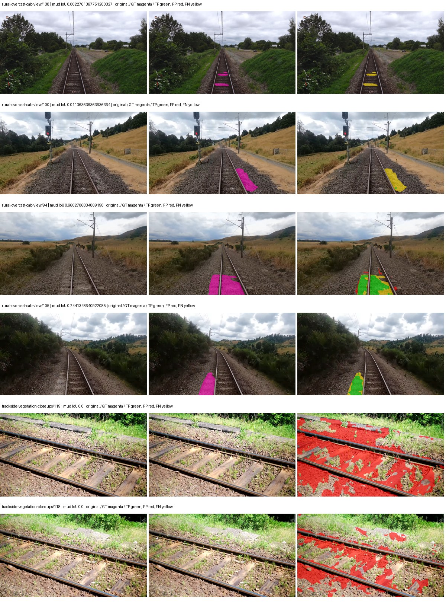

Examples are two lowest and two highest mud-IoU positive images, plus up to two negative images with the most false-positive mud pixels. They are targeted diagnostic examples, not random samples. Green: true positive; red: false positive; yellow: false negative. Full predictions remain on HDRFS.

### Validation tracking

| Logged step | Overall mIoU (%) | Mud IoU (%) |
| --- | --- | --- |
| 254 | 24.41 | 0.18 |
| 508 | 32.25 | 3.68 |
| 763 | 35.60 | 4.69 |
| 1017 | 34.86 | 3.55 |
| 1272 | 36.55 | 3.63 |
| 1527 | 35.84 | 0.68 |
| 1781 | 35.13 | 4.87 |
| 2036 | 34.93 | 7.17 |
| 2290 | 35.04 | 5.56 |
| 2545 | 36.36 | 8.32 |
| 2799 | 37.36 | 8.04 |
| 3054 | 36.49 | 9.77 |
| 3308 | 36.43 | 7.64 |
| 3563 | 36.06 | 7.31 |
| 3817 | 36.01 | 6.92 |
| 4000 | 36.11 | 7.09 |

All retained scalar curves, including training loss and per-class IoU, are in record.json. Observed best mud on a curve is not necessarily a retained checkpoint: the pilot saved its selection-metric-best and final checkpoints. Step logging and checkpoint global_step may differ by one.

### Stopping and checkpoint provenance

```json
{
  "stopping": {
    "actual_steps": 4000,
    "maximum_steps": 4000,
    "min_delta": 0.001,
    "monitor": "val_iou/mud-pumping",
    "patience": 5,
    "reason": "budget_complete"
  },
  "checkpoints": {
    "best": {
      "path": "/data/izadia1/projects/segmentary-runs/paul-test-rtis/mud-fullstats-v1-20260906-r2/future-runs/segformer_b2--rtis_only--seed-0_seed0/rtis/best.ckpt",
      "sha256": "da16c93d4a91b0727c0075bf2c1ec5b6acbd636da50057e18f648afac17d27c8",
      "global_step": 3054,
      "bytes": 438463729
    },
    "final": {
      "path": "/data/izadia1/projects/segmentary-runs/paul-test-rtis/mud-fullstats-v1-20260906-r2/future-runs/segformer_b2--rtis_only--seed-0_seed0/rtis/last.ckpt",
      "sha256": "580295d208f99836c3bd7c3976f55ab80f565a13f8c117372fea67865c614616",
      "global_step": 4000,
      "bytes": 438445617
    }
  },
  "cleanup_error": null
}
```

### Resolved training, initialization and evaluation settings

The optimizer block is the base configuration. Stage LR scales are applied at runtime, and stage warmup is capped at min(base warmup, floor(stage budget / 10), stage budget - 1): 400 steps for this 4,000-step pilot. Model-internal native input grids may differ from augmentation crops (EoMT uses its 640 grid).

```json
{
  "name": "segformer_b2--rtis_only--seed-0",
  "model": {
    "arch": "segformer_b2",
    "checkpoint": "nvidia/mit-b2",
    "tuning": "full",
    "head": "unified_head",
    "lora_r": 16,
    "lora_alpha": 32,
    "lora_dropout": 0.05,
    "lora_targets": [],
    "drop_path": null,
    "revision": null,
    "subfolder": null,
    "local_files_only": false,
    "trust_remote_code": false,
    "backbone_path": null,
    "head_paths": [],
    "classifier_path": null,
    "inactive_parameter_paths": [],
    "smp_arch": null,
    "encoder_name": null,
    "encoder_weights": null,
    "native": null,
    "batch_norm_momentum": null
  },
  "space": "paul-test-rtis",
  "taxonomy_root": "/data/izadia1/projects/segmentary-rtis-fullstats-066afb2/taxonomy",
  "output_root": "/data/izadia1/projects/segmentary-runs/paul-test-rtis/mud-fullstats-v1-20260906-r2/future-runs",
  "optim": {
    "backbone_lr": 6e-05,
    "head_lr_mult": 10.0,
    "weight_decay": 0.05,
    "llrd": 1.0,
    "warmup_iters": 1500,
    "warmup_ratio": 1e-06,
    "poly_power": 0.9,
    "min_lr_ratio": 0.0,
    "betas": [
      0.9,
      0.999
    ],
    "grad_clip": 1.0
  },
  "train": {
    "iters": 4000,
    "batch_size": 2,
    "accum": 8,
    "num_workers": 2,
    "precision": "bf16-mixed",
    "ema_decay": 0.9998,
    "val_every": 250,
    "ckpt_every": 500,
    "selection_metric": "val_iou/mud-pumping",
    "early_stopping_patience": 5,
    "early_stopping_min_delta": 0.001,
    "seed": 0,
    "devices": 1
  },
  "eval": {
    "sliding_window": true,
    "window": [
      1024,
      1024
    ],
    "stride": [
      768,
      768
    ],
    "batch_size": 1,
    "num_workers": 2,
    "tta_scales": [],
    "tta_flip": false,
    "threshold": 0.5,
    "boundary_tolerance_frac": 0.0075,
    "save_confusion": true
  },
  "loss": {
    "task": "multiclass",
    "activation": "auto",
    "terms": [],
    "aux": "none",
    "aux_weight": 0.0,
    "ce_weight": 1.0,
    "label_smoothing": 0.0,
    "class_weights": null,
    "query": null
  },
  "aug": {
    "crop": [
      1024,
      1024
    ],
    "scale_min": 0.5,
    "scale_max": 2.0,
    "hflip_p": 0.5,
    "color_jitter_p": 0.5,
    "brightness": 0.25,
    "contrast": 0.25,
    "saturation": 0.25,
    "hue": 0.05
  },
  "stages": [
    {
      "name": "rtis",
      "data": [
        {
          "name": "paul-test-rtis",
          "root": "/data/izadia1/datasets/paul-test-rtis",
          "variant": null,
          "split_file": "splits.json",
          "train_split": "train",
          "val_split": "val",
          "limit": null,
          "loader": "folder",
          "mapping": "paul-test-rtis",
          "loader_options": {
            "require_groups": true
          }
        }
      ],
      "iters": null,
      "lr_scale": 1.0,
      "head_group_lr_scale": 1.0,
      "init_from": "pretrained",
      "reset_head": false,
      "freeze": null,
      "sample_weights": null
    }
  ]
}
```

### Hardware and software provenance

```json
{
  "training": {
    "cuda_available": true,
    "cuda_visible_devices": "0",
    "cudnn": 91900,
    "driver_version": "570.133.20",
    "gpu_count": 1,
    "gpu_names": [
      "NVIDIA L40S"
    ],
    "hostname": "hdrfs-app-001",
    "input_normalization": {
      "channel_order": "rgb",
      "mean": [
        0.485,
        0.456,
        0.406
      ],
      "source": "imagenet",
      "std": [
        0.229,
        0.224,
        0.225
      ]
    },
    "model_origins": [
      {
        "hf_commit": "3bb39e8739149c3777d0325349b2a6c32c6413db",
        "hf_name_or_path": "nvidia/mit-b2",
        "module": "model",
        "timm_pretrained": {}
      },
      {
        "hf_commit": "3bb39e8739149c3777d0325349b2a6c32c6413db",
        "hf_name_or_path": "nvidia/mit-b2",
        "module": "model.segformer",
        "timm_pretrained": {}
      },
      {
        "hf_commit": "3bb39e8739149c3777d0325349b2a6c32c6413db",
        "hf_name_or_path": "nvidia/mit-b2",
        "module": "model.segformer.stages.0.blocks.0.attention",
        "timm_pretrained": {}
      },
      {
        "hf_commit": "3bb39e8739149c3777d0325349b2a6c32c6413db",
        "hf_name_or_path": "nvidia/mit-b2",
        "module": "model.segformer.stages.0.blocks.1.attention",
        "timm_pretrained": {}
      },
      {
        "hf_commit": "3bb39e8739149c3777d0325349b2a6c32c6413db",
        "hf_name_or_path": "nvidia/mit-b2",
        "module": "model.segformer.stages.0.blocks.2.attention",
        "timm_pretrained": {}
      },
      {
        "hf_commit": "3bb39e8739149c3777d0325349b2a6c32c6413db",
        "hf_name_or_path": "nvidia/mit-b2",
        "module": "model.segformer.stages.1.blocks.0.attention",
        "timm_pretrained": {}
      },
      {
        "hf_commit": "3bb39e8739149c3777d0325349b2a6c32c6413db",
        "hf_name_or_path": "nvidia/mit-b2",
        "module": "model.segformer.stages.1.blocks.1.attention",
        "timm_pretrained": {}
      },
      {
        "hf_commit": "3bb39e8739149c3777d0325349b2a6c32c6413db",
        "hf_name_or_path": "nvidia/mit-b2",
        "module": "model.segformer.stages.1.blocks.2.attention",
        "timm_pretrained": {}
      },
      {
        "hf_commit": "3bb39e8739149c3777d0325349b2a6c32c6413db",
        "hf_name_or_path": "nvidia/mit-b2",
        "module": "model.segformer.stages.1.blocks.3.attention",
        "timm_pretrained": {}
      },
      {
        "hf_commit": "3bb39e8739149c3777d0325349b2a6c32c6413db",
        "hf_name_or_path": "nvidia/mit-b2",
        "module": "model.segformer.stages.2.blocks.0.attention",
        "timm_pretrained": {}
      },
      {
        "hf_commit": "3bb39e8739149c3777d0325349b2a6c32c6413db",
        "hf_name_or_path": "nvidia/mit-b2",
        "module": "model.segformer.stages.2.blocks.1.attention",
        "timm_pretrained": {}
      },
      {
        "hf_commit": "3bb39e8739149c3777d0325349b2a6c32c6413db",
        "hf_name_or_path": "nvidia/mit-b2",
        "module": "model.segformer.stages.2.blocks.2.attention",
        "timm_pretrained": {}
      },
      {
        "hf_commit": "3bb39e8739149c3777d0325349b2a6c32c6413db",
        "hf_name_or_path": "nvidia/mit-b2",
        "module": "model.segformer.stages.2.blocks.3.attention",
        "timm_pretrained": {}
      },
      {
        "hf_commit": "3bb39e8739149c3777d0325349b2a6c32c6413db",
        "hf_name_or_path": "nvidia/mit-b2",
        "module": "model.segformer.stages.2.blocks.4.attention",
        "timm_pretrained": {}
      },
      {
        "hf_commit": "3bb39e8739149c3777d0325349b2a6c32c6413db",
        "hf_name_or_path": "nvidia/mit-b2",
        "module": "model.segformer.stages.2.blocks.5.attention",
        "timm_pretrained": {}
      },
      {
        "hf_commit": "3bb39e8739149c3777d0325349b2a6c32c6413db",
        "hf_name_or_path": "nvidia/mit-b2",
        "module": "model.segformer.stages.3.blocks.0.attention",
        "timm_pretrained": {}
      },
      {
        "hf_commit": "3bb39e8739149c3777d0325349b2a6c32c6413db",
        "hf_name_or_path": "nvidia/mit-b2",
        "module": "model.segformer.stages.3.blocks.1.attention",
        "timm_pretrained": {}
      },
      {
        "hf_commit": "3bb39e8739149c3777d0325349b2a6c32c6413db",
        "hf_name_or_path": "nvidia/mit-b2",
        "module": "model.segformer.stages.3.blocks.2.attention",
        "timm_pretrained": {}
      },
      {
        "hf_commit": "3bb39e8739149c3777d0325349b2a6c32c6413db",
        "hf_name_or_path": "nvidia/mit-b2",
        "module": "model.decode_head",
        "timm_pretrained": {}
      }
    ],
    "model_parameter_count": 27362773,
    "packages": {
      "albumentations": "2.0.8",
      "lightning": "2.6.5",
      "numpy": "2.4.4",
      "segmentary": "0.1.0",
      "segmentation-models-pytorch": "0.5.0",
      "timm": "1.0.28",
      "torch": "2.11.0+cu128",
      "torchvision": "0.26.0+cu128",
      "transformers": "5.15.0"
    },
    "platform": "Linux-5.15.0-139-generic-x86_64-with-glibc2.35",
    "python": "3.11.15",
    "torch": "2.11.0+cu128",
    "torch_cuda": "12.8",
    "trainable_parameter_count": 27362773,
    "training_stop": {
      "actual_steps": 4000,
      "maximum_steps": 4000,
      "min_delta": 0.001,
      "monitor": "val_iou/mud-pumping",
      "patience": 5,
      "reason": "budget_complete"
    },
    "validation_weights": "raw"
  },
  "evaluation": {
    "cuda_available": true,
    "cuda_visible_devices": "0",
    "cudnn": 91900,
    "driver_version": "570.133.20",
    "gpu_count": 1,
    "gpu_names": [
      "NVIDIA L40S"
    ],
    "hostname": "hdrfs-app-001",
    "input_normalization": {
      "channel_order": "rgb",
      "mean": [
        0.485,
        0.456,
        0.406
      ],
      "source": "imagenet",
      "std": [
        0.229,
        0.224,
        0.225
      ]
    },
    "packages": {
      "albumentations": "2.0.8",
      "lightning": "2.6.5",
      "numpy": "2.4.4",
      "segmentary": "0.1.0",
      "segmentation-models-pytorch": "0.5.0",
      "timm": "1.0.28",
      "torch": "2.11.0+cu128",
      "torchvision": "0.26.0+cu128",
      "transformers": "5.15.0"
    },
    "platform": "Linux-5.15.0-139-generic-x86_64-with-glibc2.35",
    "python": "3.11.15",
    "torch": "2.11.0+cu128",
    "torch_cuda": "12.8"
  }
}
```

## rtis_only — seed 1

Status: **completed**. Started: 2026-09-07T01:40:24.292905+00:00. Finished: 2026-09-07T02:48:37.128507+00:00.

Recipe pretrained initializer: `nvidia/mit-b2`.

`rtis_only` uses the recipe initializer, which may include pretrained segmentation components. Transfer paths load the exact historical source checkpoint below and reset the classifier; they do not reset all query/decoder features.

Source checkpoint: `Recipe pretrained initialization`.

Config SHA-256: `d4263e088a32cff89b25cb84a036885e2a44847f803dc9ddb2492b2b695072e5`. Weights used for validation: `raw`.

### Mud-pumping and aggregate quality

| Metric | Selected checkpoint | Final training validation |
| --- | --- | --- |
| Mud IoU | 13.12 | 11.68 |
| Mud precision | 18.75 | 16.71 |
| Mud recall | 30.41 | 27.96 |
| Mud Dice/F1 | 23.20 | 20.92 |
| mIoU | 36.44 | 36.31 |
| Mean accuracy | 50.89 | 50.70 |
| Mean precision | 57.57 | 57.79 |
| Mean Dice | 46.85 | 46.72 |
| Mean specificity | 99.16 | 99.14 |
| Pixel accuracy | 86.19 | 85.91 |
| Frequency-weighted IoU | 78.22 | 77.83 |
| Fixed GT-present class mIoU | 42.52 | 42.36 |
| Boundary F1 | 43.40 | 43.36 |

The selected checkpoint has independent evaluation evidence. Final values are the trainer's final validation record, not a new independent evaluation. mIoU averages classes with nonzero union, so false positives on absent classes can change its denominator. The fixed GT-class mean is supplementary and excludes absent classes; their false positives remain in the confusion matrix.

### Resource usage and timing

| Measurement | Value |
| --- | --- |
| Peak training VRAM, retained training invocation (GiB) | 11.73 |
| Peak evaluation VRAM (GiB) | 7.46 |
| Retained training invocation wall time (seconds) | 3863.35 |
| Retained training invocation GPU-hours (one GPU) | 1.07 |
| Evaluation wall time (seconds) | 22.22 |
| Full evaluation pipeline images/second | 1.67 |
| Best full-state checkpoint (MiB) | 418.15 |
| Final full-state checkpoint (MiB) | 418.13 |
| Audited periodic checkpoints removed (GiB) | 3.27 |

VRAM uses the recorded allocator high-water mark; it is not total device usage including CUDA context. Resumed jobs' retained training invocation times and peaks are **not whole-campaign totals**. Earlier invocation resource records are not reconstructed here. Evaluation throughput includes loader, sliding-window inference and metrics; it is not model-only latency/FPS. Missing measurements are shown as —, never inferred from another dataset's run.

### Standardized inference performance

Dedicated model-only profiling waits for an idle worker-locked L40S: BF16, batch 1, 1024x1024, 20 warmup and 100 CUDA-event-timed public forwards. It excludes loading, preprocessing, tiling and metrics.

| Status | Parameters | Weight MiB | FPS | p50 ms | p95 ms | Peak reserved GiB |
| --- | --- | --- | --- | --- | --- | --- |
| complete | 27362773 | 104.38 | 52.92 | 18.65 | 19.67 | 2.25 |

```json
{
  "schema_version": 1,
  "model_id": "segformer_b2",
  "measured_at": "2026-09-07T02:48:31+00:00",
  "status": "complete",
  "benchmark_scope": "rtis_selected_checkpoint_model_only",
  "applies_to": [
    "segformer_b2--rtis_only--seed-1"
  ],
  "source": {
    "campaign_git_sha": "066afb2626398b7be59d4d19f5a0e4644fd59adc",
    "git_dirty": false,
    "config_hash": "41e1572b00c4",
    "resolved_config": "/data/izadia1/projects/segmentary-runs/paul-test-rtis/mud-fullstats-v1-20260906-r2/configs/segformer_b2--rtis_only--seed-1.yaml",
    "config_sha256": "d4263e088a32cff89b25cb84a036885e2a44847f803dc9ddb2492b2b695072e5",
    "checkpoint_sha256": "e0f34aa55a9acfc8c55c43964b0121cf2aad238ba690935821b4d886cc80ee10",
    "checkpoint_global_step": 3818,
    "checkpoint_bytes": 438463729,
    "checkpoint_kind": "resume checkpoint with optimizer and EMA state",
    "weights": "raw",
    "measured_checkpoint_job_id": "segformer_b2--rtis_only--seed-1",
    "result_sha256": "f8cb7743ad12fc5089c1da4c79d18b3644c3868c57ab048766754cc9e6d5e18e",
    "result_git_sha": "066afb2626398b7be59d4d19f5a0e4644fd59adc",
    "result_stage": "eval:paul-test-rtis:val",
    "result_seed": 1
  },
  "hardware": {
    "gpu_name": "NVIDIA L40S",
    "gpu_uuid": "GPU-c76642eb-64c1-b0ac-b051-d2efd47b32c4",
    "logical_device": "cuda:0",
    "physical_visibility_token": "9",
    "compute_capability": [
      8,
      9
    ],
    "total_memory_bytes": 47677177856
  },
  "model": {
    "parameter_count": 27362773,
    "trainable_parameter_count": 27362773,
    "resident_parameter_bytes": 109451092,
    "parameter_dtype_counts": {
      "float32": 27362773
    }
  },
  "contract": {
    "backend": "pytorch",
    "precision": "bf16_autocast",
    "batch_size": 1,
    "input_shape_nchw": [
      1,
      3,
      1024,
      1024
    ],
    "warmup_iterations": 20,
    "measured_iterations": 100,
    "timing": "per-forward CUDA events with end-event synchronization",
    "includes_preprocessing": false,
    "includes_data_loader": false,
    "includes_sliding_window": false,
    "input_resident_on_gpu": true,
    "model_only": true,
    "entrypoint": "public model(image) dense-logits forward"
  },
  "measurements": {
    "latency": {
      "p50_ms": 18.65113639831543,
      "p95_ms": 19.671450042724608,
      "mean_ms": 18.897972564697266,
      "minimum_ms": 18.489343643188477,
      "maximum_ms": 22.151168823242188,
      "fps": 52.91572927077214,
      "raw_ms": [
        18.889728546142578,
        18.525184631347656,
        18.605056762695312,
        18.553855895996094,
        18.524160385131836,
        18.62041664123535,
        18.714624404907227,
        18.64499282836914,
        18.575359344482422,
        18.732032775878906,
        18.685951232910156,
        18.60710334777832,
        18.559999465942383,
        18.739200592041016,
        18.519039154052734,
        18.66649627685547,
        18.708480834960938,
        18.58355140686035,
        18.545663833618164,
        18.65216064453125,
        18.589696884155273,
        18.581504821777344,
        18.652191162109375,
        18.584575653076172,
        18.597888946533203,
        18.65011215209961,
        18.522111892700195,
        18.531328201293945,
        18.584575653076172,
        18.533376693725586,
        20.48409652709961,
        18.62553596496582,
        18.584575653076172,
        19.095552444458008,
        18.962432861328125,
        18.60095977783203,
        18.489343643188477,
        19.454975128173828,
        18.571264266967773,
        19.582975387573242,
        18.952192306518555,
        18.63577651977539,
        18.544639587402344,
        18.62348747253418,
        18.58252716064453,
        18.557952880859375,
        18.554880142211914,
        18.532352447509766,
        19.386367797851562,
        18.494464874267578,
        18.491392135620117,
        19.000320434570312,
        18.62656021118164,
        18.663423538208008,
        18.563072204589844,
        18.670591354370117,
        19.567615509033203,
        19.912704467773438,
        18.741247177124023,
        18.709503173828125,
        18.68492889404297,
        18.521087646484375,
        18.64806365966797,
        18.589696884155273,
        18.520063400268555,
        18.522144317626953,
        19.366912841796875,
        18.552831649780273,
        18.543615341186523,
        18.581504821777344,
        19.65875244140625,
        18.938880920410156,
        18.941951751708984,
        19.44268798828125,
        19.20102310180664,
        19.586048126220703,
        18.780160903930664,
        18.63270378112793,
        22.151168823242188,
        22.12563133239746,
        21.06572723388672,
        18.654207229614258,
        19.23174476623535,
        19.066879272460938,
        19.380224227905273,
        19.04025650024414,
        19.23174476623535,
        18.63577651977539,
        18.562047958374023,
        18.66035270690918,
        18.575359344482422,
        18.589696884155273,
        18.6746883392334,
        19.561471939086914,
        19.100671768188477,
        19.40070343017578,
        18.903039932250977,
        18.718719482421875,
        18.82624053955078,
        19.184640884399414
      ],
      "percentile_method": "numpy linear interpolation"
    },
    "peak_reserved_bytes": 2420113408,
    "memory_kind": "pytorch_cuda_allocator_peak_reserved_excluding_context",
    "benchmark_wall_clock_s": 5.69573936611414
  },
  "started_at": "2026-09-07T02:48:25+00:00",
  "finished_at": "2026-09-07T02:48:31+00:00",
  "environment": {
    "hostname": "hdrfs-app-001",
    "python": "3.11.15",
    "platform": "Linux-5.15.0-139-generic-x86_64-with-glibc2.35",
    "torch": "2.11.0+cu128",
    "torch_cuda": "12.8",
    "cudnn": 91900,
    "driver_version": "570.133.20",
    "cuda_available": true,
    "gpu_count": 1,
    "gpu_names": [
      "NVIDIA L40S"
    ],
    "cuda_visible_devices": "9",
    "packages": {
      "segmentary": "0.1.0",
      "torch": "2.11.0+cu128",
      "torchvision": "0.26.0+cu128",
      "transformers": "5.15.0",
      "timm": "1.0.28",
      "segmentation-models-pytorch": "0.5.0",
      "albumentations": "2.0.8",
      "lightning": "2.6.5",
      "numpy": "2.4.4"
    }
  }
}
```

### Per-class validation results

| Class | GT pixels | IoU (%) | Precision (%) | Recall (%) | Dice (%) | Boundary F1 (%) |
| --- | --- | --- | --- | --- | --- | --- |
| car | 29664 | 29.39 | 59.46 | 36.76 | 45.43 | 34.47 |
| construction | 311585 | 48.24 | 56.27 | 77.17 | 65.09 | 49.06 |
| fence | 265137 | 12.57 | 63.59 | 13.55 | 22.33 | 39.76 |
| mud-pumping | 1226250 | 13.12 | 18.75 | 30.41 | 23.20 | 15.48 |
| on-rails | 0 | 0.00 | 0.00 | — | 0.00 | 0.00 |
| person | 0 | 0.00 | 0.00 | — | 0.00 | 0.00 |
| pole | 628038 | 71.05 | 82.39 | 83.77 | 83.07 | 89.27 |
| rail-embedded | 16799 | 29.39 | 91.75 | 30.19 | 45.43 | 42.65 |
| rail-raised | 2969797 | 72.16 | 84.50 | 83.17 | 83.83 | 90.24 |
| rail-track | 6323197 | 44.25 | 66.25 | 57.13 | 61.35 | 54.47 |
| road | 1048831 | 15.17 | 61.91 | 16.73 | 26.34 | 22.75 |
| sidewalk | 1297367 | 46.78 | 78.08 | 53.86 | 63.74 | 21.50 |
| sky | 19121606 | 98.54 | 99.20 | 99.32 | 99.26 | 94.45 |
| standing-water | 95802 | 1.30 | 1.76 | 4.76 | 2.57 | 4.38 |
| terrain | 39239306 | 89.41 | 91.73 | 97.25 | 94.41 | 68.67 |
| trackbed | 10643081 | 60.35 | 73.70 | 76.92 | 75.27 | 59.88 |
| traffic-light | 19510 | 25.16 | 77.96 | 27.08 | 40.20 | 63.62 |
| traffic-sign | 13285 | 46.10 | 73.06 | 55.54 | 63.11 | 70.65 |
| tram-track | 56179 | 13.28 | 51.02 | 15.22 | 23.45 | 17.98 |
| truck | 0 | 0.00 | 0.00 | — | 0.00 | 0.00 |
| vegetation-overgrowth | 5901821 | 49.06 | 77.51 | 57.20 | 65.83 | 72.18 |

### Full-run accounting

| Measurement | Value |
| --- | --- |
| Full GPU-reserved wall seconds, all recorded worker attempts | 4092.84 |
| Full reserved GPU-hours | 1.14 |
| Whole-run timing complete | True |

| Phase | Wall seconds including failed attempts |
| --- | --- |
| training | 3869.82 |
| diagnostics | 176.06 |
| performance | 13.04 |

GPU-reserved time includes model loading, training, validation, collection, profiling, checkpoint I/O and orchestration while the worker owns one GPU. It is not GPU kernel-active time. Phase timings and sampled device memory/power/utilization are retained separately; sampled device memory is not the allocator high-water mark.

### Train/validation and raw/EMA diagnostics

| Checkpoint / weights / split | Images | Mud IoU (%) | Mud precision (%) | Mud recall (%) |
| --- | --- | --- | --- | --- |
| best-auto-train / raw | 220 | 97.44 | 98.57 | 98.83 |
| best-auto-val / raw | 37 | 13.12 | 18.75 | 30.41 |
| best-alternate-val / ema | 37 | 9.74 | 13.50 | 25.88 |
| final-auto-val / raw | 37 | 11.68 | 16.70 | 27.96 |

Train uses the evaluation transform without augmentation. Compare mud train/validation metrics for the same selected weights. Alternate EMA on running-stat BatchNorm is explicitly uncalibrated and is diagnostic only. Score-threshold curves use uncalibrated normalized scores and are pixel-level diagnostics, not event detection rates or a selected deployment operating point.

### Downloadable evidence

- best-auto-train: [per-image.csv](rtis_only--seed-1/best-auto-train/per-image.csv) · [per-image-confusion.json.gz](rtis_only--seed-1/best-auto-train/per-image-confusion.json.gz) · [groups.json](rtis_only--seed-1/best-auto-train/groups.json) · [mud-score-curves.json](rtis_only--seed-1/best-auto-train/mud-score-curves.json)
- best-auto-val: [per-image.csv](rtis_only--seed-1/best-auto-val/per-image.csv) · [per-image-confusion.json.gz](rtis_only--seed-1/best-auto-val/per-image-confusion.json.gz) · [groups.json](rtis_only--seed-1/best-auto-val/groups.json) · [mud-score-curves.json](rtis_only--seed-1/best-auto-val/mud-score-curves.json) · [examples.jpg](rtis_only--seed-1/best-auto-val/examples.jpg)
- best-alternate-val: [per-image.csv](rtis_only--seed-1/best-alternate-val/per-image.csv) · [per-image-confusion.json.gz](rtis_only--seed-1/best-alternate-val/per-image-confusion.json.gz) · [groups.json](rtis_only--seed-1/best-alternate-val/groups.json) · [mud-score-curves.json](rtis_only--seed-1/best-alternate-val/mud-score-curves.json)
- final-auto-val: [per-image.csv](rtis_only--seed-1/final-auto-val/per-image.csv) · [per-image-confusion.json.gz](rtis_only--seed-1/final-auto-val/per-image-confusion.json.gz) · [groups.json](rtis_only--seed-1/final-auto-val/groups.json) · [mud-score-curves.json](rtis_only--seed-1/final-auto-val/mud-score-curves.json)
- resources: [telemetry.csv](rtis_only--seed-1/resources/telemetry.csv)

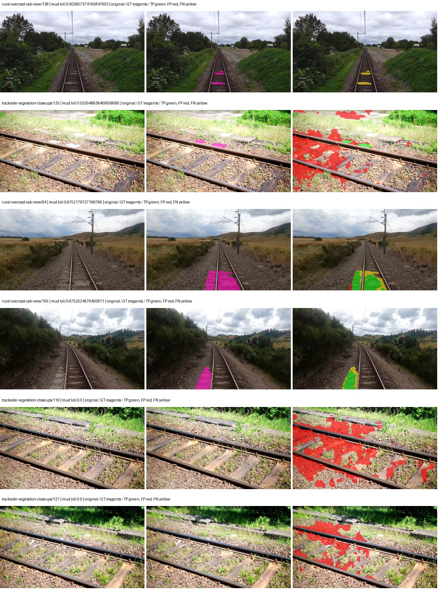

Examples are two lowest and two highest mud-IoU positive images, plus up to two negative images with the most false-positive mud pixels. They are targeted diagnostic examples, not random samples. Green: true positive; red: false positive; yellow: false negative. Full predictions remain on HDRFS.

### Validation tracking

| Logged step | Overall mIoU (%) | Mud IoU (%) |
| --- | --- | --- |
| 254 | 25.35 | 0.38 |
| 508 | 30.98 | 1.73 |
| 763 | 33.12 | 2.95 |
| 1017 | 35.76 | 8.08 |
| 1272 | 34.42 | 8.34 |
| 1527 | 35.02 | 9.21 |
| 1781 | 33.69 | 4.51 |
| 2036 | 34.78 | 11.51 |
| 2290 | 35.81 | 3.45 |
| 2545 | 35.25 | 8.81 |
| 2799 | 35.13 | 13.05 |
| 3054 | 36.16 | 9.01 |
| 3308 | 36.27 | 10.83 |
| 3563 | 35.41 | 11.77 |
| 3817 | 36.46 | 13.13 |
| 4000 | 36.31 | 11.68 |

All retained scalar curves, including training loss and per-class IoU, are in record.json. Observed best mud on a curve is not necessarily a retained checkpoint: the pilot saved its selection-metric-best and final checkpoints. Step logging and checkpoint global_step may differ by one.

### Stopping and checkpoint provenance

```json
{
  "stopping": {
    "actual_steps": 4000,
    "maximum_steps": 4000,
    "min_delta": 0.001,
    "monitor": "val_iou/mud-pumping",
    "patience": 5,
    "reason": "budget_complete"
  },
  "checkpoints": {
    "best": {
      "path": "/data/izadia1/projects/segmentary-runs/paul-test-rtis/mud-fullstats-v1-20260906-r2/future-runs/segformer_b2--rtis_only--seed-1_seed1/rtis/best.ckpt",
      "sha256": "e0f34aa55a9acfc8c55c43964b0121cf2aad238ba690935821b4d886cc80ee10",
      "global_step": 3818,
      "bytes": 438463729
    },
    "final": {
      "path": "/data/izadia1/projects/segmentary-runs/paul-test-rtis/mud-fullstats-v1-20260906-r2/future-runs/segformer_b2--rtis_only--seed-1_seed1/rtis/last.ckpt",
      "sha256": "6d5ba19c213a473cbac74ec086c52621905daaf52f7185cb9e60f0f237fce6f8",
      "global_step": 4000,
      "bytes": 438445617
    }
  },
  "cleanup_error": null
}
```

### Resolved training, initialization and evaluation settings

The optimizer block is the base configuration. Stage LR scales are applied at runtime, and stage warmup is capped at min(base warmup, floor(stage budget / 10), stage budget - 1): 400 steps for this 4,000-step pilot. Model-internal native input grids may differ from augmentation crops (EoMT uses its 640 grid).

```json
{
  "name": "segformer_b2--rtis_only--seed-1",
  "model": {
    "arch": "segformer_b2",
    "checkpoint": "nvidia/mit-b2",
    "tuning": "full",
    "head": "unified_head",
    "lora_r": 16,
    "lora_alpha": 32,
    "lora_dropout": 0.05,
    "lora_targets": [],
    "drop_path": null,
    "revision": null,
    "subfolder": null,
    "local_files_only": false,
    "trust_remote_code": false,
    "backbone_path": null,
    "head_paths": [],
    "classifier_path": null,
    "inactive_parameter_paths": [],
    "smp_arch": null,
    "encoder_name": null,
    "encoder_weights": null,
    "native": null,
    "batch_norm_momentum": null
  },
  "space": "paul-test-rtis",
  "taxonomy_root": "/data/izadia1/projects/segmentary-rtis-fullstats-066afb2/taxonomy",
  "output_root": "/data/izadia1/projects/segmentary-runs/paul-test-rtis/mud-fullstats-v1-20260906-r2/future-runs",
  "optim": {
    "backbone_lr": 6e-05,
    "head_lr_mult": 10.0,
    "weight_decay": 0.05,
    "llrd": 1.0,
    "warmup_iters": 1500,
    "warmup_ratio": 1e-06,
    "poly_power": 0.9,
    "min_lr_ratio": 0.0,
    "betas": [
      0.9,
      0.999
    ],
    "grad_clip": 1.0
  },
  "train": {
    "iters": 4000,
    "batch_size": 2,
    "accum": 8,
    "num_workers": 2,
    "precision": "bf16-mixed",
    "ema_decay": 0.9998,
    "val_every": 250,
    "ckpt_every": 500,
    "selection_metric": "val_iou/mud-pumping",
    "early_stopping_patience": 5,
    "early_stopping_min_delta": 0.001,
    "seed": 1,
    "devices": 1
  },
  "eval": {
    "sliding_window": true,
    "window": [
      1024,
      1024
    ],
    "stride": [
      768,
      768
    ],
    "batch_size": 1,
    "num_workers": 2,
    "tta_scales": [],
    "tta_flip": false,
    "threshold": 0.5,
    "boundary_tolerance_frac": 0.0075,
    "save_confusion": true
  },
  "loss": {
    "task": "multiclass",
    "activation": "auto",
    "terms": [],
    "aux": "none",
    "aux_weight": 0.0,
    "ce_weight": 1.0,
    "label_smoothing": 0.0,
    "class_weights": null,
    "query": null
  },
  "aug": {
    "crop": [
      1024,
      1024
    ],
    "scale_min": 0.5,
    "scale_max": 2.0,
    "hflip_p": 0.5,
    "color_jitter_p": 0.5,
    "brightness": 0.25,
    "contrast": 0.25,
    "saturation": 0.25,
    "hue": 0.05
  },
  "stages": [
    {
      "name": "rtis",
      "data": [
        {
          "name": "paul-test-rtis",
          "root": "/data/izadia1/datasets/paul-test-rtis",
          "variant": null,
          "split_file": "splits.json",
          "train_split": "train",
          "val_split": "val",
          "limit": null,
          "loader": "folder",
          "mapping": "paul-test-rtis",
          "loader_options": {
            "require_groups": true
          }
        }
      ],
      "iters": null,
      "lr_scale": 1.0,
      "head_group_lr_scale": 1.0,
      "init_from": "pretrained",
      "reset_head": false,
      "freeze": null,
      "sample_weights": null
    }
  ]
}
```

### Hardware and software provenance

```json
{
  "training": {
    "cuda_available": true,
    "cuda_visible_devices": "9",
    "cudnn": 91900,
    "driver_version": "570.133.20",
    "gpu_count": 1,
    "gpu_names": [
      "NVIDIA L40S"
    ],
    "hostname": "hdrfs-app-001",
    "input_normalization": {
      "channel_order": "rgb",
      "mean": [
        0.485,
        0.456,
        0.406
      ],
      "source": "imagenet",
      "std": [
        0.229,
        0.224,
        0.225
      ]
    },
    "model_origins": [
      {
        "hf_commit": "3bb39e8739149c3777d0325349b2a6c32c6413db",
        "hf_name_or_path": "nvidia/mit-b2",
        "module": "model",
        "timm_pretrained": {}
      },
      {
        "hf_commit": "3bb39e8739149c3777d0325349b2a6c32c6413db",
        "hf_name_or_path": "nvidia/mit-b2",
        "module": "model.segformer",
        "timm_pretrained": {}
      },
      {
        "hf_commit": "3bb39e8739149c3777d0325349b2a6c32c6413db",
        "hf_name_or_path": "nvidia/mit-b2",
        "module": "model.segformer.stages.0.blocks.0.attention",
        "timm_pretrained": {}
      },
      {
        "hf_commit": "3bb39e8739149c3777d0325349b2a6c32c6413db",
        "hf_name_or_path": "nvidia/mit-b2",
        "module": "model.segformer.stages.0.blocks.1.attention",
        "timm_pretrained": {}
      },
      {
        "hf_commit": "3bb39e8739149c3777d0325349b2a6c32c6413db",
        "hf_name_or_path": "nvidia/mit-b2",
        "module": "model.segformer.stages.0.blocks.2.attention",
        "timm_pretrained": {}
      },
      {
        "hf_commit": "3bb39e8739149c3777d0325349b2a6c32c6413db",
        "hf_name_or_path": "nvidia/mit-b2",
        "module": "model.segformer.stages.1.blocks.0.attention",
        "timm_pretrained": {}
      },
      {
        "hf_commit": "3bb39e8739149c3777d0325349b2a6c32c6413db",
        "hf_name_or_path": "nvidia/mit-b2",
        "module": "model.segformer.stages.1.blocks.1.attention",
        "timm_pretrained": {}
      },
      {
        "hf_commit": "3bb39e8739149c3777d0325349b2a6c32c6413db",
        "hf_name_or_path": "nvidia/mit-b2",
        "module": "model.segformer.stages.1.blocks.2.attention",
        "timm_pretrained": {}
      },
      {
        "hf_commit": "3bb39e8739149c3777d0325349b2a6c32c6413db",
        "hf_name_or_path": "nvidia/mit-b2",
        "module": "model.segformer.stages.1.blocks.3.attention",
        "timm_pretrained": {}
      },
      {
        "hf_commit": "3bb39e8739149c3777d0325349b2a6c32c6413db",
        "hf_name_or_path": "nvidia/mit-b2",
        "module": "model.segformer.stages.2.blocks.0.attention",
        "timm_pretrained": {}
      },
      {
        "hf_commit": "3bb39e8739149c3777d0325349b2a6c32c6413db",
        "hf_name_or_path": "nvidia/mit-b2",
        "module": "model.segformer.stages.2.blocks.1.attention",
        "timm_pretrained": {}
      },
      {
        "hf_commit": "3bb39e8739149c3777d0325349b2a6c32c6413db",
        "hf_name_or_path": "nvidia/mit-b2",
        "module": "model.segformer.stages.2.blocks.2.attention",
        "timm_pretrained": {}
      },
      {
        "hf_commit": "3bb39e8739149c3777d0325349b2a6c32c6413db",
        "hf_name_or_path": "nvidia/mit-b2",
        "module": "model.segformer.stages.2.blocks.3.attention",
        "timm_pretrained": {}
      },
      {
        "hf_commit": "3bb39e8739149c3777d0325349b2a6c32c6413db",
        "hf_name_or_path": "nvidia/mit-b2",
        "module": "model.segformer.stages.2.blocks.4.attention",
        "timm_pretrained": {}
      },
      {
        "hf_commit": "3bb39e8739149c3777d0325349b2a6c32c6413db",
        "hf_name_or_path": "nvidia/mit-b2",
        "module": "model.segformer.stages.2.blocks.5.attention",
        "timm_pretrained": {}
      },
      {
        "hf_commit": "3bb39e8739149c3777d0325349b2a6c32c6413db",
        "hf_name_or_path": "nvidia/mit-b2",
        "module": "model.segformer.stages.3.blocks.0.attention",
        "timm_pretrained": {}
      },
      {
        "hf_commit": "3bb39e8739149c3777d0325349b2a6c32c6413db",
        "hf_name_or_path": "nvidia/mit-b2",
        "module": "model.segformer.stages.3.blocks.1.attention",
        "timm_pretrained": {}
      },
      {
        "hf_commit": "3bb39e8739149c3777d0325349b2a6c32c6413db",
        "hf_name_or_path": "nvidia/mit-b2",
        "module": "model.segformer.stages.3.blocks.2.attention",
        "timm_pretrained": {}
      },
      {
        "hf_commit": "3bb39e8739149c3777d0325349b2a6c32c6413db",
        "hf_name_or_path": "nvidia/mit-b2",
        "module": "model.decode_head",
        "timm_pretrained": {}
      }
    ],
    "model_parameter_count": 27362773,
    "packages": {
      "albumentations": "2.0.8",
      "lightning": "2.6.5",
      "numpy": "2.4.4",
      "segmentary": "0.1.0",
      "segmentation-models-pytorch": "0.5.0",
      "timm": "1.0.28",
      "torch": "2.11.0+cu128",
      "torchvision": "0.26.0+cu128",
      "transformers": "5.15.0"
    },
    "platform": "Linux-5.15.0-139-generic-x86_64-with-glibc2.35",
    "python": "3.11.15",
    "torch": "2.11.0+cu128",
    "torch_cuda": "12.8",
    "trainable_parameter_count": 27362773,
    "training_stop": {
      "actual_steps": 4000,
      "maximum_steps": 4000,
      "min_delta": 0.001,
      "monitor": "val_iou/mud-pumping",
      "patience": 5,
      "reason": "budget_complete"
    },
    "validation_weights": "raw"
  },
  "evaluation": {
    "cuda_available": true,
    "cuda_visible_devices": "9",
    "cudnn": 91900,
    "driver_version": "570.133.20",
    "gpu_count": 1,
    "gpu_names": [
      "NVIDIA L40S"
    ],
    "hostname": "hdrfs-app-001",
    "input_normalization": {
      "channel_order": "rgb",
      "mean": [
        0.485,
        0.456,
        0.406
      ],
      "source": "imagenet",
      "std": [
        0.229,
        0.224,
        0.225
      ]
    },
    "packages": {
      "albumentations": "2.0.8",
      "lightning": "2.6.5",
      "numpy": "2.4.4",
      "segmentary": "0.1.0",
      "segmentation-models-pytorch": "0.5.0",
      "timm": "1.0.28",
      "torch": "2.11.0+cu128",
      "torchvision": "0.26.0+cu128",
      "transformers": "5.15.0"
    },
    "platform": "Linux-5.15.0-139-generic-x86_64-with-glibc2.35",
    "python": "3.11.15",
    "torch": "2.11.0+cu128",
    "torch_cuda": "12.8"
  }
}
```

## rtis_only — seed 2

Status: **completed**. Started: 2026-09-07T01:42:31.999764+00:00. Finished: 2026-09-07T02:27:40.414477+00:00.

Recipe pretrained initializer: `nvidia/mit-b2`.

`rtis_only` uses the recipe initializer, which may include pretrained segmentation components. Transfer paths load the exact historical source checkpoint below and reset the classifier; they do not reset all query/decoder features.

Source checkpoint: `Recipe pretrained initialization`.

Config SHA-256: `f45e82906e3806f321a07448615cce5060440c6b345f18f612210d62297c852c`. Weights used for validation: `raw`.

### Mud-pumping and aggregate quality

| Metric | Selected checkpoint | Final training validation |
| --- | --- | --- |
| Mud IoU | 6.81 | 4.89 |
| Mud precision | 8.61 | 5.57 |
| Mud recall | 24.55 | 28.61 |
| Mud Dice/F1 | 12.74 | 9.33 |
| mIoU | 34.76 | 33.61 |
| Mean accuracy | 48.97 | 46.43 |
| Mean precision | 54.77 | 53.88 |
| Mean Dice | 44.71 | 43.05 |
| Mean specificity | 99.10 | 99.01 |
| Pixel accuracy | 84.78 | 83.06 |
| Frequency-weighted IoU | 77.00 | 76.15 |
| Fixed GT-present class mIoU | 40.55 | 39.22 |
| Boundary F1 | 43.03 | 41.25 |

The selected checkpoint has independent evaluation evidence. Final values are the trainer's final validation record, not a new independent evaluation. mIoU averages classes with nonzero union, so false positives on absent classes can change its denominator. The fixed GT-class mean is supplementary and excludes absent classes; their false positives remain in the confusion matrix.

### Resource usage and timing

| Measurement | Value |
| --- | --- |
| Peak training VRAM, retained training invocation (GiB) | 11.73 |
| Peak evaluation VRAM (GiB) | 7.46 |
| Retained training invocation wall time (seconds) | 2475.63 |
| Retained training invocation GPU-hours (one GPU) | 0.69 |
| Evaluation wall time (seconds) | 22.82 |
| Full evaluation pipeline images/second | 1.62 |
| Best full-state checkpoint (MiB) | 418.15 |
| Final full-state checkpoint (MiB) | 418.13 |
| Audited periodic checkpoints removed (GiB) | 2.04 |

VRAM uses the recorded allocator high-water mark; it is not total device usage including CUDA context. Resumed jobs' retained training invocation times and peaks are **not whole-campaign totals**. Earlier invocation resource records are not reconstructed here. Evaluation throughput includes loader, sliding-window inference and metrics; it is not model-only latency/FPS. Missing measurements are shown as —, never inferred from another dataset's run.

### Standardized inference performance

Dedicated model-only profiling waits for an idle worker-locked L40S: BF16, batch 1, 1024x1024, 20 warmup and 100 CUDA-event-timed public forwards. It excludes loading, preprocessing, tiling and metrics.

| Status | Parameters | Weight MiB | FPS | p50 ms | p95 ms | Peak reserved GiB |
| --- | --- | --- | --- | --- | --- | --- |
| complete | 27362773 | 104.38 | 52.42 | 18.97 | 19.85 | 2.25 |

```json
{
  "schema_version": 1,
  "model_id": "segformer_b2",
  "measured_at": "2026-09-07T02:27:36+00:00",
  "status": "complete",
  "benchmark_scope": "rtis_selected_checkpoint_model_only",
  "applies_to": [
    "segformer_b2--rtis_only--seed-2"
  ],
  "source": {
    "campaign_git_sha": "066afb2626398b7be59d4d19f5a0e4644fd59adc",
    "git_dirty": false,
    "config_hash": "3b683a46240c",
    "resolved_config": "/data/izadia1/projects/segmentary-runs/paul-test-rtis/mud-fullstats-v1-20260906-r2/configs/segformer_b2--rtis_only--seed-2.yaml",
    "config_sha256": "f45e82906e3806f321a07448615cce5060440c6b345f18f612210d62297c852c",
    "checkpoint_sha256": "7e7c2bfdd0b910960664f56a6a9aa43e7feba52f3789f95671f9d8cfad6d6e9f",
    "checkpoint_global_step": 1272,
    "checkpoint_bytes": 438463729,
    "checkpoint_kind": "resume checkpoint with optimizer and EMA state",
    "weights": "raw",
    "measured_checkpoint_job_id": "segformer_b2--rtis_only--seed-2",
    "result_sha256": "3ab6ac0726517e16c90f2f8909994cb944345d8bb941195a7d04626b4641b6c4",
    "result_git_sha": "066afb2626398b7be59d4d19f5a0e4644fd59adc",
    "result_stage": "eval:paul-test-rtis:val",
    "result_seed": 2
  },
  "hardware": {
    "gpu_name": "NVIDIA L40S",
    "gpu_uuid": "GPU-2f8008a1-9b67-11f6-987b-b393a672322c",
    "logical_device": "cuda:0",
    "physical_visibility_token": "3",
    "compute_capability": [
      8,
      9
    ],
    "total_memory_bytes": 47677177856
  },
  "model": {
    "parameter_count": 27362773,
    "trainable_parameter_count": 27362773,
    "resident_parameter_bytes": 109451092,
    "parameter_dtype_counts": {
      "float32": 27362773
    }
  },
  "contract": {
    "backend": "pytorch",
    "precision": "bf16_autocast",
    "batch_size": 1,
    "input_shape_nchw": [
      1,
      3,
      1024,
      1024
    ],
    "warmup_iterations": 20,
    "measured_iterations": 100,
    "timing": "per-forward CUDA events with end-event synchronization",
    "includes_preprocessing": false,
    "includes_data_loader": false,
    "includes_sliding_window": false,
    "input_resident_on_gpu": true,
    "model_only": true,
    "entrypoint": "public model(image) dense-logits forward"
  },
  "measurements": {
    "latency": {
      "p50_ms": 18.97420883178711,
      "p95_ms": 19.854541397094724,
      "mean_ms": 19.074974060058594,
      "minimum_ms": 18.391040802001953,
      "maximum_ms": 20.6059513092041,
      "fps": 52.42471087255194,
      "raw_ms": [
        19.355648040771484,
        19.2860164642334,
        18.6112003326416,
        18.554880142211914,
        18.391040802001953,
        18.712543487548828,
        18.761728286743164,
        18.733055114746094,
        18.554880142211914,
        18.61737632751465,
        18.871295928955078,
        19.093503952026367,
        19.01260757446289,
        18.989055633544922,
        19.22559928894043,
        18.670591354370117,
        18.485248565673828,
        18.3951358795166,
        18.62553596496582,
        19.04025650024414,
        19.371007919311523,
        19.701631546020508,
        18.879487991333008,
        18.970624923706055,
        18.677631378173828,
        19.094528198242188,
        19.479551315307617,
        19.514368057250977,
        18.685951232910156,
        18.928640365600586,
        19.718143463134766,
        20.24959945678711,
        19.2040958404541,
        18.852863311767578,
        19.266559600830078,
        19.42937660217285,
        20.403200149536133,
        18.936832427978516,
        18.719743728637695,
        18.951168060302734,
        19.22867202758789,
        18.936832427978516,
        19.25939178466797,
        19.516416549682617,
        19.66796875,
        19.009536743164062,
        19.08019256591797,
        19.84204864501953,
        20.091903686523438,
        18.724863052368164,
        18.66035270690918,
        18.79961585998535,
        18.66649627685547,
        19.12828826904297,
        19.158016204833984,
        19.759103775024414,
        18.968576431274414,
        20.163583755493164,
        19.02079963684082,
        18.887680053710938,
        19.491840362548828,
        18.849727630615234,
        18.662399291992188,
        18.4770565032959,
        19.359743118286133,
        19.02284812927246,
        18.800640106201172,
        19.64031982421875,
        19.62495994567871,
        19.39148712158203,
        18.755584716796875,
        18.717695236206055,
        18.709503173828125,
        18.66854476928711,
        18.732032775878906,
        18.759679794311523,
        18.739200592041016,
        19.27782440185547,
        19.289087295532227,
        19.110815048217773,
        18.953216552734375,
        18.977792739868164,
        18.678783416748047,
        18.914304733276367,
        18.68592071533203,
        19.4150390625,
        18.852863311767578,
        19.133440017700195,
        18.870271682739258,
        19.306495666503906,
        18.82316780090332,
        19.520511627197266,
        20.6059513092041,
        19.513248443603516,
        19.141632080078125,
        18.65216064453125,
        19.066879272460938,
        19.552255630493164,
        18.491392135620117,
        18.66854476928711
      ],
      "percentile_method": "numpy linear interpolation"
    },
    "peak_reserved_bytes": 2420113408,
    "memory_kind": "pytorch_cuda_allocator_peak_reserved_excluding_context",
    "benchmark_wall_clock_s": 5.89288330450654
  },
  "started_at": "2026-09-07T02:27:30+00:00",
  "finished_at": "2026-09-07T02:27:36+00:00",
  "environment": {
    "hostname": "hdrfs-app-001",
    "python": "3.11.15",
    "platform": "Linux-5.15.0-139-generic-x86_64-with-glibc2.35",
    "torch": "2.11.0+cu128",
    "torch_cuda": "12.8",
    "cudnn": 91900,
    "driver_version": "570.133.20",
    "cuda_available": true,
    "gpu_count": 1,
    "gpu_names": [
      "NVIDIA L40S"
    ],
    "cuda_visible_devices": "3",
    "packages": {
      "segmentary": "0.1.0",
      "torch": "2.11.0+cu128",
      "torchvision": "0.26.0+cu128",
      "transformers": "5.15.0",
      "timm": "1.0.28",
      "segmentation-models-pytorch": "0.5.0",
      "albumentations": "2.0.8",
      "lightning": "2.6.5",
      "numpy": "2.4.4"
    }
  }
}
```

### Per-class validation results

| Class | GT pixels | IoU (%) | Precision (%) | Recall (%) | Dice (%) | Boundary F1 (%) |
| --- | --- | --- | --- | --- | --- | --- |
| car | 29664 | 24.62 | 61.78 | 29.05 | 39.52 | 42.04 |
| construction | 311585 | 47.99 | 58.04 | 73.49 | 64.86 | 56.86 |
| fence | 265137 | 4.96 | 39.32 | 5.37 | 9.45 | 20.62 |
| mud-pumping | 1226250 | 6.81 | 8.61 | 24.55 | 12.74 | 9.84 |
| on-rails | 0 | 0.00 | 0.00 | — | 0.00 | 0.00 |
| person | 0 | 0.00 | 0.00 | — | 0.00 | 0.00 |
| pole | 628038 | 67.11 | 76.83 | 84.15 | 80.32 | 88.37 |
| rail-embedded | 16799 | 39.07 | 83.93 | 42.23 | 56.19 | 58.79 |
| rail-raised | 2969797 | 76.40 | 84.76 | 88.57 | 86.62 | 91.82 |
| rail-track | 6323197 | 31.88 | 84.63 | 33.84 | 48.35 | 45.21 |
| road | 1048831 | 16.15 | 48.49 | 19.50 | 27.82 | 21.56 |
| sidewalk | 1297367 | 46.86 | 78.58 | 53.73 | 63.82 | 32.69 |
| sky | 19121606 | 98.33 | 99.58 | 98.74 | 99.16 | 95.05 |
| standing-water | 95802 | 1.17 | 2.08 | 2.60 | 2.31 | 11.01 |
| terrain | 39239306 | 89.55 | 92.14 | 96.95 | 94.49 | 70.15 |
| trackbed | 10643081 | 58.21 | 67.68 | 80.62 | 73.59 | 55.43 |
| traffic-light | 19510 | 17.84 | 86.49 | 18.35 | 30.28 | 51.77 |
| traffic-sign | 13285 | 37.41 | 69.18 | 44.89 | 54.45 | 59.17 |
| tram-track | 56179 | 18.20 | 33.90 | 28.22 | 30.80 | 25.54 |
| truck | 0 | 0.00 | 0.00 | — | 0.00 | 0.00 |
| vegetation-overgrowth | 5901821 | 47.29 | 74.18 | 56.61 | 64.21 | 67.76 |

### Full-run accounting

| Measurement | Value |
| --- | --- |
| Full GPU-reserved wall seconds, all recorded worker attempts | 2708.42 |
| Full reserved GPU-hours | 0.75 |
| Whole-run timing complete | True |

| Phase | Wall seconds including failed attempts |
| --- | --- |
| training | 2482.97 |
| diagnostics | 177.83 |
| performance | 13.71 |

GPU-reserved time includes model loading, training, validation, collection, profiling, checkpoint I/O and orchestration while the worker owns one GPU. It is not GPU kernel-active time. Phase timings and sampled device memory/power/utilization are retained separately; sampled device memory is not the allocator high-water mark.

### Train/validation and raw/EMA diagnostics

| Checkpoint / weights / split | Images | Mud IoU (%) | Mud precision (%) | Mud recall (%) |
| --- | --- | --- | --- | --- |
| best-auto-train / raw | 220 | 94.63 | 96.91 | 97.57 |
| best-auto-val / raw | 37 | 6.81 | 8.61 | 24.55 |
| best-alternate-val / ema | 37 | 3.31 | 4.08 | 14.97 |
| final-auto-val / raw | 37 | 4.89 | 5.57 | 28.61 |

Train uses the evaluation transform without augmentation. Compare mud train/validation metrics for the same selected weights. Alternate EMA on running-stat BatchNorm is explicitly uncalibrated and is diagnostic only. Score-threshold curves use uncalibrated normalized scores and are pixel-level diagnostics, not event detection rates or a selected deployment operating point.

### Downloadable evidence

- best-auto-train: [per-image.csv](rtis_only--seed-2/best-auto-train/per-image.csv) · [per-image-confusion.json.gz](rtis_only--seed-2/best-auto-train/per-image-confusion.json.gz) · [groups.json](rtis_only--seed-2/best-auto-train/groups.json) · [mud-score-curves.json](rtis_only--seed-2/best-auto-train/mud-score-curves.json)
- best-auto-val: [per-image.csv](rtis_only--seed-2/best-auto-val/per-image.csv) · [per-image-confusion.json.gz](rtis_only--seed-2/best-auto-val/per-image-confusion.json.gz) · [groups.json](rtis_only--seed-2/best-auto-val/groups.json) · [mud-score-curves.json](rtis_only--seed-2/best-auto-val/mud-score-curves.json) · [examples.jpg](rtis_only--seed-2/best-auto-val/examples.jpg)
- best-alternate-val: [per-image.csv](rtis_only--seed-2/best-alternate-val/per-image.csv) · [per-image-confusion.json.gz](rtis_only--seed-2/best-alternate-val/per-image-confusion.json.gz) · [groups.json](rtis_only--seed-2/best-alternate-val/groups.json) · [mud-score-curves.json](rtis_only--seed-2/best-alternate-val/mud-score-curves.json)
- final-auto-val: [per-image.csv](rtis_only--seed-2/final-auto-val/per-image.csv) · [per-image-confusion.json.gz](rtis_only--seed-2/final-auto-val/per-image-confusion.json.gz) · [groups.json](rtis_only--seed-2/final-auto-val/groups.json) · [mud-score-curves.json](rtis_only--seed-2/final-auto-val/mud-score-curves.json)
- resources: [telemetry.csv](rtis_only--seed-2/resources/telemetry.csv)

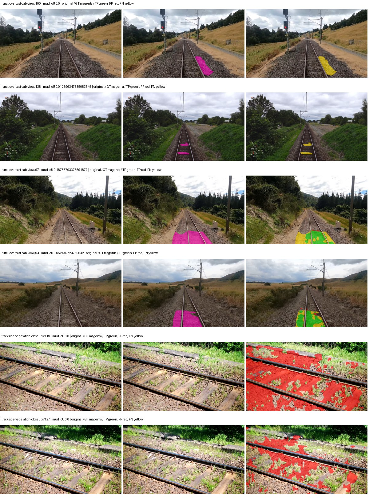

Examples are two lowest and two highest mud-IoU positive images, plus up to two negative images with the most false-positive mud pixels. They are targeted diagnostic examples, not random samples. Green: true positive; red: false positive; yellow: false negative. Full predictions remain on HDRFS.

### Validation tracking

| Logged step | Overall mIoU (%) | Mud IoU (%) |
| --- | --- | --- |
| 254 | 25.58 | 0.22 |
| 508 | 32.98 | 0.90 |
| 763 | 33.71 | 3.75 |
| 1017 | 33.38 | 3.33 |
| 1272 | 34.77 | 6.81 |
| 1527 | 35.52 | 3.81 |
| 1781 | 35.63 | 3.13 |
| 2036 | 33.62 | 2.70 |
| 2290 | 34.00 | 3.81 |
| 2545 | 33.61 | 4.89 |

All retained scalar curves, including training loss and per-class IoU, are in record.json. Observed best mud on a curve is not necessarily a retained checkpoint: the pilot saved its selection-metric-best and final checkpoints. Step logging and checkpoint global_step may differ by one.

### Stopping and checkpoint provenance

```json
{
  "stopping": {
    "actual_steps": 2545,
    "maximum_steps": 4000,
    "min_delta": 0.001,
    "monitor": "val_iou/mud-pumping",
    "patience": 5,
    "reason": "validation_plateau"
  },
  "checkpoints": {
    "best": {
      "path": "/data/izadia1/projects/segmentary-runs/paul-test-rtis/mud-fullstats-v1-20260906-r2/future-runs/segformer_b2--rtis_only--seed-2_seed2/rtis/best.ckpt",
      "sha256": "7e7c2bfdd0b910960664f56a6a9aa43e7feba52f3789f95671f9d8cfad6d6e9f",
      "global_step": 1272,
      "bytes": 438463729
    },
    "final": {
      "path": "/data/izadia1/projects/segmentary-runs/paul-test-rtis/mud-fullstats-v1-20260906-r2/future-runs/segformer_b2--rtis_only--seed-2_seed2/rtis/last.ckpt",
      "sha256": "5a7a768490491236fbbc9dc67f0054dac53249b36ec814c0fcf7ed20acdf1209",
      "global_step": 2545,
      "bytes": 438445745
    }
  },
  "cleanup_error": null
}
```

### Resolved training, initialization and evaluation settings

The optimizer block is the base configuration. Stage LR scales are applied at runtime, and stage warmup is capped at min(base warmup, floor(stage budget / 10), stage budget - 1): 400 steps for this 4,000-step pilot. Model-internal native input grids may differ from augmentation crops (EoMT uses its 640 grid).

```json
{
  "name": "segformer_b2--rtis_only--seed-2",
  "model": {
    "arch": "segformer_b2",
    "checkpoint": "nvidia/mit-b2",
    "tuning": "full",
    "head": "unified_head",
    "lora_r": 16,
    "lora_alpha": 32,
    "lora_dropout": 0.05,
    "lora_targets": [],
    "drop_path": null,
    "revision": null,
    "subfolder": null,
    "local_files_only": false,
    "trust_remote_code": false,
    "backbone_path": null,
    "head_paths": [],
    "classifier_path": null,
    "inactive_parameter_paths": [],
    "smp_arch": null,
    "encoder_name": null,
    "encoder_weights": null,
    "native": null,
    "batch_norm_momentum": null
  },
  "space": "paul-test-rtis",
  "taxonomy_root": "/data/izadia1/projects/segmentary-rtis-fullstats-066afb2/taxonomy",
  "output_root": "/data/izadia1/projects/segmentary-runs/paul-test-rtis/mud-fullstats-v1-20260906-r2/future-runs",
  "optim": {
    "backbone_lr": 6e-05,
    "head_lr_mult": 10.0,
    "weight_decay": 0.05,
    "llrd": 1.0,
    "warmup_iters": 1500,
    "warmup_ratio": 1e-06,
    "poly_power": 0.9,
    "min_lr_ratio": 0.0,
    "betas": [
      0.9,
      0.999
    ],
    "grad_clip": 1.0
  },
  "train": {
    "iters": 4000,
    "batch_size": 2,
    "accum": 8,
    "num_workers": 2,
    "precision": "bf16-mixed",
    "ema_decay": 0.9998,
    "val_every": 250,
    "ckpt_every": 500,
    "selection_metric": "val_iou/mud-pumping",
    "early_stopping_patience": 5,
    "early_stopping_min_delta": 0.001,
    "seed": 2,
    "devices": 1
  },
  "eval": {
    "sliding_window": true,
    "window": [
      1024,
      1024
    ],
    "stride": [
      768,
      768
    ],
    "batch_size": 1,
    "num_workers": 2,
    "tta_scales": [],
    "tta_flip": false,
    "threshold": 0.5,
    "boundary_tolerance_frac": 0.0075,
    "save_confusion": true
  },
  "loss": {
    "task": "multiclass",
    "activation": "auto",
    "terms": [],
    "aux": "none",
    "aux_weight": 0.0,
    "ce_weight": 1.0,
    "label_smoothing": 0.0,
    "class_weights": null,
    "query": null
  },
  "aug": {
    "crop": [
      1024,
      1024
    ],
    "scale_min": 0.5,
    "scale_max": 2.0,
    "hflip_p": 0.5,
    "color_jitter_p": 0.5,
    "brightness": 0.25,
    "contrast": 0.25,
    "saturation": 0.25,
    "hue": 0.05
  },
  "stages": [
    {
      "name": "rtis",
      "data": [
        {
          "name": "paul-test-rtis",
          "root": "/data/izadia1/datasets/paul-test-rtis",
          "variant": null,
          "split_file": "splits.json",
          "train_split": "train",
          "val_split": "val",
          "limit": null,
          "loader": "folder",
          "mapping": "paul-test-rtis",
          "loader_options": {
            "require_groups": true
          }
        }
      ],
      "iters": null,
      "lr_scale": 1.0,
      "head_group_lr_scale": 1.0,
      "init_from": "pretrained",
      "reset_head": false,
      "freeze": null,
      "sample_weights": null
    }
  ]
}
```

### Hardware and software provenance

```json
{
  "training": {
    "cuda_available": true,
    "cuda_visible_devices": "3",
    "cudnn": 91900,
    "driver_version": "570.133.20",
    "gpu_count": 1,
    "gpu_names": [
      "NVIDIA L40S"
    ],
    "hostname": "hdrfs-app-001",
    "input_normalization": {
      "channel_order": "rgb",
      "mean": [
        0.485,
        0.456,
        0.406
      ],
      "source": "imagenet",
      "std": [
        0.229,
        0.224,
        0.225
      ]
    },
    "model_origins": [
      {
        "hf_commit": "3bb39e8739149c3777d0325349b2a6c32c6413db",
        "hf_name_or_path": "nvidia/mit-b2",
        "module": "model",
        "timm_pretrained": {}
      },
      {
        "hf_commit": "3bb39e8739149c3777d0325349b2a6c32c6413db",
        "hf_name_or_path": "nvidia/mit-b2",
        "module": "model.segformer",
        "timm_pretrained": {}
      },
      {
        "hf_commit": "3bb39e8739149c3777d0325349b2a6c32c6413db",
        "hf_name_or_path": "nvidia/mit-b2",
        "module": "model.segformer.stages.0.blocks.0.attention",
        "timm_pretrained": {}
      },
      {
        "hf_commit": "3bb39e8739149c3777d0325349b2a6c32c6413db",
        "hf_name_or_path": "nvidia/mit-b2",
        "module": "model.segformer.stages.0.blocks.1.attention",
        "timm_pretrained": {}
      },
      {
        "hf_commit": "3bb39e8739149c3777d0325349b2a6c32c6413db",
        "hf_name_or_path": "nvidia/mit-b2",
        "module": "model.segformer.stages.0.blocks.2.attention",
        "timm_pretrained": {}
      },
      {
        "hf_commit": "3bb39e8739149c3777d0325349b2a6c32c6413db",
        "hf_name_or_path": "nvidia/mit-b2",
        "module": "model.segformer.stages.1.blocks.0.attention",
        "timm_pretrained": {}
      },
      {
        "hf_commit": "3bb39e8739149c3777d0325349b2a6c32c6413db",
        "hf_name_or_path": "nvidia/mit-b2",
        "module": "model.segformer.stages.1.blocks.1.attention",
        "timm_pretrained": {}
      },
      {
        "hf_commit": "3bb39e8739149c3777d0325349b2a6c32c6413db",
        "hf_name_or_path": "nvidia/mit-b2",
        "module": "model.segformer.stages.1.blocks.2.attention",
        "timm_pretrained": {}
      },
      {
        "hf_commit": "3bb39e8739149c3777d0325349b2a6c32c6413db",
        "hf_name_or_path": "nvidia/mit-b2",
        "module": "model.segformer.stages.1.blocks.3.attention",
        "timm_pretrained": {}
      },
      {
        "hf_commit": "3bb39e8739149c3777d0325349b2a6c32c6413db",
        "hf_name_or_path": "nvidia/mit-b2",
        "module": "model.segformer.stages.2.blocks.0.attention",
        "timm_pretrained": {}
      },
      {
        "hf_commit": "3bb39e8739149c3777d0325349b2a6c32c6413db",
        "hf_name_or_path": "nvidia/mit-b2",
        "module": "model.segformer.stages.2.blocks.1.attention",
        "timm_pretrained": {}
      },
      {
        "hf_commit": "3bb39e8739149c3777d0325349b2a6c32c6413db",
        "hf_name_or_path": "nvidia/mit-b2",
        "module": "model.segformer.stages.2.blocks.2.attention",
        "timm_pretrained": {}
      },
      {
        "hf_commit": "3bb39e8739149c3777d0325349b2a6c32c6413db",
        "hf_name_or_path": "nvidia/mit-b2",
        "module": "model.segformer.stages.2.blocks.3.attention",
        "timm_pretrained": {}
      },
      {
        "hf_commit": "3bb39e8739149c3777d0325349b2a6c32c6413db",
        "hf_name_or_path": "nvidia/mit-b2",
        "module": "model.segformer.stages.2.blocks.4.attention",
        "timm_pretrained": {}
      },
      {
        "hf_commit": "3bb39e8739149c3777d0325349b2a6c32c6413db",
        "hf_name_or_path": "nvidia/mit-b2",
        "module": "model.segformer.stages.2.blocks.5.attention",
        "timm_pretrained": {}
      },
      {
        "hf_commit": "3bb39e8739149c3777d0325349b2a6c32c6413db",
        "hf_name_or_path": "nvidia/mit-b2",
        "module": "model.segformer.stages.3.blocks.0.attention",
        "timm_pretrained": {}
      },
      {
        "hf_commit": "3bb39e8739149c3777d0325349b2a6c32c6413db",
        "hf_name_or_path": "nvidia/mit-b2",
        "module": "model.segformer.stages.3.blocks.1.attention",
        "timm_pretrained": {}
      },
      {
        "hf_commit": "3bb39e8739149c3777d0325349b2a6c32c6413db",
        "hf_name_or_path": "nvidia/mit-b2",
        "module": "model.segformer.stages.3.blocks.2.attention",
        "timm_pretrained": {}
      },
      {
        "hf_commit": "3bb39e8739149c3777d0325349b2a6c32c6413db",
        "hf_name_or_path": "nvidia/mit-b2",
        "module": "model.decode_head",
        "timm_pretrained": {}
      }
    ],
    "model_parameter_count": 27362773,
    "packages": {
      "albumentations": "2.0.8",
      "lightning": "2.6.5",
      "numpy": "2.4.4",
      "segmentary": "0.1.0",
      "segmentation-models-pytorch": "0.5.0",
      "timm": "1.0.28",
      "torch": "2.11.0+cu128",
      "torchvision": "0.26.0+cu128",
      "transformers": "5.15.0"
    },
    "platform": "Linux-5.15.0-139-generic-x86_64-with-glibc2.35",
    "python": "3.11.15",
    "torch": "2.11.0+cu128",
    "torch_cuda": "12.8",
    "trainable_parameter_count": 27362773,
    "training_stop": {
      "actual_steps": 2545,
      "maximum_steps": 4000,
      "min_delta": 0.001,
      "monitor": "val_iou/mud-pumping",
      "patience": 5,
      "reason": "validation_plateau"
    },
    "validation_weights": "raw"
  },
  "evaluation": {
    "cuda_available": true,
    "cuda_visible_devices": "3",
    "cudnn": 91900,
    "driver_version": "570.133.20",
    "gpu_count": 1,
    "gpu_names": [
      "NVIDIA L40S"
    ],
    "hostname": "hdrfs-app-001",
    "input_normalization": {
      "channel_order": "rgb",
      "mean": [
        0.485,
        0.456,
        0.406
      ],
      "source": "imagenet",
      "std": [
        0.229,
        0.224,
        0.225
      ]
    },
    "packages": {
      "albumentations": "2.0.8",
      "lightning": "2.6.5",
      "numpy": "2.4.4",
      "segmentary": "0.1.0",
      "segmentation-models-pytorch": "0.5.0",
      "timm": "1.0.28",
      "torch": "2.11.0+cu128",
      "torchvision": "0.26.0+cu128",
      "transformers": "5.15.0"
    },
    "platform": "Linux-5.15.0-139-generic-x86_64-with-glibc2.35",
    "python": "3.11.15",
    "torch": "2.11.0+cu128",
    "torch_cuda": "12.8"
  }
}
```

## cityscapes_to_rtis — seed 0

Status: **completed**. Started: 2026-09-07T01:50:21.772584+00:00. Finished: 2026-09-07T02:58:17.794855+00:00.

Recipe pretrained initializer: `nvidia/mit-b2`.

`rtis_only` uses the recipe initializer, which may include pretrained segmentation components. Transfer paths load the exact historical source checkpoint below and reset the classifier; they do not reset all query/decoder features.

Source checkpoint: `{'name': 'segformer_b2--cityscapes--seed-0', 'model': 'segformer_b2', 'protocol': 'cityscapes', 'config': '/data/izadia1/projects/segmentary-runs/all-model-city-rail-seed0-rail20-b9eb3e1/accepted/segformer_b2--cityscapes--seed-0/resolved-config.yaml', 'checkpoint': '/data/izadia1/projects/segmentary-runs/all-model-city-rail-seed0-a7c0b67/jobs/segformer_b2--cityscapes--seed-0/attempt-001/train/segformer_b2--cityscapes_seed0/cityscapes/last.ckpt', 'recorded_sha256': 'd0f4f619c4d1200c143ff218ddb7e8693decd082345af09049cc50b8f8c42977', 'exists': True}`.

Config SHA-256: `d898c1801a65c91cd1fd941b81f9cb9f4642637eed195df1c46fcdfa654b1685`. Weights used for validation: `raw`.

### Mud-pumping and aggregate quality

| Metric | Selected checkpoint | Final training validation |
| --- | --- | --- |
| Mud IoU | 15.11 | 11.53 |
| Mud precision | 38.93 | 27.17 |
| Mud recall | 19.81 | 16.69 |
| Mud Dice/F1 | 26.26 | 20.67 |
| mIoU | 37.92 | 39.46 |
| Mean accuracy | 52.87 | 51.84 |
| Mean precision | 55.56 | 58.33 |
| Mean Dice | 46.98 | 48.85 |
| Mean specificity | 99.15 | 99.15 |
| Pixel accuracy | 85.64 | 85.64 |
| Frequency-weighted IoU | 77.56 | 77.63 |
| Fixed GT-present class mIoU | 44.24 | 43.84 |
| Boundary F1 | 44.48 | 46.52 |

The selected checkpoint has independent evaluation evidence. Final values are the trainer's final validation record, not a new independent evaluation. mIoU averages classes with nonzero union, so false positives on absent classes can change its denominator. The fixed GT-class mean is supplementary and excludes absent classes; their false positives remain in the confusion matrix.

### Resource usage and timing

| Measurement | Value |
| --- | --- |
| Peak training VRAM, retained training invocation (GiB) | 11.73 |
| Peak evaluation VRAM (GiB) | 7.46 |
| Retained training invocation wall time (seconds) | 3845.90 |
| Retained training invocation GPU-hours (one GPU) | 1.07 |
| Evaluation wall time (seconds) | 22.12 |
| Full evaluation pipeline images/second | 1.67 |
| Best full-state checkpoint (MiB) | 418.15 |
| Final full-state checkpoint (MiB) | 418.13 |
| Audited periodic checkpoints removed (GiB) | 3.27 |

VRAM uses the recorded allocator high-water mark; it is not total device usage including CUDA context. Resumed jobs' retained training invocation times and peaks are **not whole-campaign totals**. Earlier invocation resource records are not reconstructed here. Evaluation throughput includes loader, sliding-window inference and metrics; it is not model-only latency/FPS. Missing measurements are shown as —, never inferred from another dataset's run.

### Standardized inference performance

Dedicated model-only profiling waits for an idle worker-locked L40S: BF16, batch 1, 1024x1024, 20 warmup and 100 CUDA-event-timed public forwards. It excludes loading, preprocessing, tiling and metrics.

| Status | Parameters | Weight MiB | FPS | p50 ms | p95 ms | Peak reserved GiB |
| --- | --- | --- | --- | --- | --- | --- |
| complete | 27362773 | 104.38 | 53.25 | 18.66 | 19.29 | 2.25 |

```json
{
  "schema_version": 1,
  "model_id": "segformer_b2",
  "measured_at": "2026-09-07T02:58:12+00:00",
  "status": "complete",
  "benchmark_scope": "rtis_selected_checkpoint_model_only",
  "applies_to": [
    "segformer_b2--cityscapes_to_rtis--seed-0"
  ],
  "source": {
    "campaign_git_sha": "066afb2626398b7be59d4d19f5a0e4644fd59adc",
    "git_dirty": false,
    "config_hash": "1292a6b63a3d",
    "resolved_config": "/data/izadia1/projects/segmentary-runs/paul-test-rtis/mud-fullstats-v1-20260906-r2/configs/segformer_b2--cityscapes_to_rtis--seed-0.yaml",
    "config_sha256": "d898c1801a65c91cd1fd941b81f9cb9f4642637eed195df1c46fcdfa654b1685",
    "checkpoint_sha256": "bb01ef9892bfe628ae73c280fa64def938ef3c8d47a9499438f7786e5148c220",
    "checkpoint_global_step": 3054,
    "checkpoint_bytes": 438463793,
    "checkpoint_kind": "resume checkpoint with optimizer and EMA state",
    "weights": "raw",
    "measured_checkpoint_job_id": "segformer_b2--cityscapes_to_rtis--seed-0",
    "result_sha256": "ee35bfdc80d9cfcaee9509a1a0c8cfd6db6fb8968f8337fccc86f78ecd703e12",
    "result_git_sha": "066afb2626398b7be59d4d19f5a0e4644fd59adc",
    "result_stage": "eval:paul-test-rtis:val",
    "result_seed": 0
  },
  "hardware": {
    "gpu_name": "NVIDIA L40S",
    "gpu_uuid": "GPU-1c9b612f-e0b5-fbbc-150f-8c2ef13453c9",
    "logical_device": "cuda:0",
    "physical_visibility_token": "5",
    "compute_capability": [
      8,
      9
    ],
    "total_memory_bytes": 47677177856
  },
  "model": {
    "parameter_count": 27362773,
    "trainable_parameter_count": 27362773,
    "resident_parameter_bytes": 109451092,
    "parameter_dtype_counts": {
      "float32": 27362773
    }
  },
  "contract": {
    "backend": "pytorch",
    "precision": "bf16_autocast",
    "batch_size": 1,
    "input_shape_nchw": [
      1,
      3,
      1024,
      1024
    ],
    "warmup_iterations": 20,
    "measured_iterations": 100,
    "timing": "per-forward CUDA events with end-event synchronization",
    "includes_preprocessing": false,
    "includes_data_loader": false,
    "includes_sliding_window": false,
    "input_resident_on_gpu": true,
    "model_only": true,
    "entrypoint": "public model(image) dense-logits forward"
  },
  "measurements": {
    "latency": {
      "p50_ms": 18.66495990753174,
      "p95_ms": 19.292210960388182,
      "mean_ms": 18.780169258117677,
      "minimum_ms": 18.524160385131836,
      "maximum_ms": 21.773311614990234,
      "fps": 53.247656411177054,
      "raw_ms": [
        19.01055908203125,
        18.65727996826172,
        19.380224227905273,
        18.83852767944336,
        18.584575653076172,
        18.580480575561523,
        18.585599899291992,
        18.538496017456055,
        18.748416900634766,
        18.905088424682617,
        18.66649627685547,
        18.811904907226562,
        19.312639236450195,
        18.584575653076172,
        19.144704818725586,
        18.663423538208008,
        18.542591094970703,
        18.68492889404297,
        18.584575653076172,
        18.66752052307129,
        18.809856414794922,
        18.741247177124023,
        18.531328201293945,
        18.678783416748047,
        18.956287384033203,
        18.543615341186523,
        18.572288513183594,
        21.773311614990234,
        19.160064697265625,
        18.579456329345703,
        18.579456329345703,
        18.65830421447754,
        18.61939239501953,
        18.586624145507812,
        18.941951751708984,
        18.672639846801758,
        18.65011215209961,
        18.677759170532227,
        19.04230308532715,
        18.546688079833984,
        18.604032516479492,
        18.763776779174805,
        18.61734390258789,
        18.787328720092773,
        18.61529541015625,
        18.524160385131836,
        19.1856632232666,
        18.588672637939453,
        18.575359344482422,
        18.980863571166992,
        18.559999465942383,
        18.686975479125977,
        18.98700714111328,
        18.527231216430664,
        18.60095977783203,
        18.61734390258789,
        18.951168060302734,
        18.542591094970703,
        18.894847869873047,
        18.934783935546875,
        18.66035270690918,
        18.63167953491211,
        18.63270378112793,
        18.569215774536133,
        18.571264266967773,
        18.62041664123535,
        18.932735443115234,
        18.956287384033203,
        18.62758445739746,
        18.551807403564453,
        18.767871856689453,
        18.727935791015625,
        18.577407836914062,
        18.883520126342773,
        18.547712326049805,
        18.555904388427734,
        18.6746883392334,
        18.87433624267578,
        18.559999465942383,
        18.990079879760742,
        18.992128372192383,
        18.61836814880371,
        18.99724769592285,
        18.740224838256836,
        18.558975219726562,
        18.720767974853516,
        18.6112003326416,
        18.595840454101562,
        18.779136657714844,
        19.291135787963867,
        19.323904037475586,
        18.83135986328125,
        18.6112003326416,
        18.621440887451172,
        18.747392654418945,
        19.04332733154297,
        18.554880142211914,
        18.63577651977539,
        19.546112060546875,
        18.923519134521484
      ],
      "percentile_method": "numpy linear interpolation"
    },
    "peak_reserved_bytes": 2420113408,
    "memory_kind": "pytorch_cuda_allocator_peak_reserved_excluding_context",
    "benchmark_wall_clock_s": 5.623271755874157
  },
  "started_at": "2026-09-07T02:58:06+00:00",
  "finished_at": "2026-09-07T02:58:12+00:00",
  "environment": {
    "hostname": "hdrfs-app-001",
    "python": "3.11.15",
    "platform": "Linux-5.15.0-139-generic-x86_64-with-glibc2.35",
    "torch": "2.11.0+cu128",
    "torch_cuda": "12.8",
    "cudnn": 91900,
    "driver_version": "570.133.20",
    "cuda_available": true,
    "gpu_count": 1,
    "gpu_names": [
      "NVIDIA L40S"
    ],
    "cuda_visible_devices": "5",
    "packages": {
      "segmentary": "0.1.0",
      "torch": "2.11.0+cu128",
      "torchvision": "0.26.0+cu128",
      "transformers": "5.15.0",
      "timm": "1.0.28",
      "segmentation-models-pytorch": "0.5.0",
      "albumentations": "2.0.8",
      "lightning": "2.6.5",
      "numpy": "2.4.4"
    }
  }
}
```

### Per-class validation results

| Class | GT pixels | IoU (%) | Precision (%) | Recall (%) | Dice (%) | Boundary F1 (%) |
| --- | --- | --- | --- | --- | --- | --- |
| car | 29664 | 66.03 | 71.94 | 88.93 | 79.54 | 51.51 |
| construction | 311585 | 61.47 | 80.62 | 72.12 | 76.14 | 73.02 |
| fence | 265137 | 13.58 | 64.17 | 14.69 | 23.91 | 35.66 |
| mud-pumping | 1226250 | 15.11 | 38.93 | 19.81 | 26.26 | 22.34 |
| on-rails | 0 | 0.00 | 0.00 | — | 0.00 | 0.00 |
| person | 0 | 0.00 | 0.00 | — | 0.00 | 0.00 |
| pole | 628038 | 71.84 | 82.28 | 84.99 | 83.61 | 89.50 |
| rail-embedded | 16799 | 4.93 | 100.00 | 4.93 | 9.41 | 27.20 |
| rail-raised | 2969797 | 72.51 | 84.56 | 83.57 | 84.06 | 90.25 |
| rail-track | 6323197 | 47.80 | 59.21 | 71.25 | 64.68 | 58.37 |
| road | 1048831 | 5.59 | 13.58 | 8.66 | 10.58 | 11.79 |
| sidewalk | 1297367 | 19.46 | 44.38 | 25.73 | 32.57 | 25.57 |
| sky | 19121606 | 98.54 | 99.25 | 99.28 | 99.26 | 95.66 |
| standing-water | 95802 | 0.31 | 0.41 | 1.20 | 0.61 | 2.04 |
| terrain | 39239306 | 88.78 | 92.45 | 95.72 | 94.06 | 64.58 |
| trackbed | 10643081 | 58.71 | 78.17 | 70.22 | 73.98 | 58.88 |
| traffic-light | 19510 | 66.04 | 86.53 | 73.60 | 79.54 | 86.38 |
| traffic-sign | 13285 | 45.85 | 69.81 | 57.20 | 62.88 | 60.83 |
| tram-track | 56179 | 11.23 | 35.31 | 14.13 | 20.19 | 14.84 |
| truck | 0 | 0.00 | 0.00 | — | 0.00 | 0.00 |
| vegetation-overgrowth | 5901821 | 48.50 | 65.10 | 65.54 | 65.32 | 65.72 |

### Full-run accounting

| Measurement | Value |
| --- | --- |
| Full GPU-reserved wall seconds, all recorded worker attempts | 4076.40 |
| Full reserved GPU-hours | 1.13 |
| Whole-run timing complete | True |

| Phase | Wall seconds including failed attempts |
| --- | --- |
| training | 3853.39 |
| diagnostics | 175.88 |
| performance | 13.12 |

GPU-reserved time includes model loading, training, validation, collection, profiling, checkpoint I/O and orchestration while the worker owns one GPU. It is not GPU kernel-active time. Phase timings and sampled device memory/power/utilization are retained separately; sampled device memory is not the allocator high-water mark.

### Train/validation and raw/EMA diagnostics

| Checkpoint / weights / split | Images | Mud IoU (%) | Mud precision (%) | Mud recall (%) |
| --- | --- | --- | --- | --- |
| best-auto-train / raw | 220 | 93.59 | 98.00 | 95.42 |
| best-auto-val / raw | 37 | 15.11 | 38.93 | 19.81 |
| best-alternate-val / ema | 37 | 12.48 | 26.07 | 19.31 |
| final-auto-val / raw | 37 | 11.54 | 27.20 | 16.69 |

Train uses the evaluation transform without augmentation. Compare mud train/validation metrics for the same selected weights. Alternate EMA on running-stat BatchNorm is explicitly uncalibrated and is diagnostic only. Score-threshold curves use uncalibrated normalized scores and are pixel-level diagnostics, not event detection rates or a selected deployment operating point.

### Downloadable evidence

- best-auto-train: [per-image.csv](cityscapes_to_rtis--seed-0/best-auto-train/per-image.csv) · [per-image-confusion.json.gz](cityscapes_to_rtis--seed-0/best-auto-train/per-image-confusion.json.gz) · [groups.json](cityscapes_to_rtis--seed-0/best-auto-train/groups.json) · [mud-score-curves.json](cityscapes_to_rtis--seed-0/best-auto-train/mud-score-curves.json)
- best-auto-val: [per-image.csv](cityscapes_to_rtis--seed-0/best-auto-val/per-image.csv) · [per-image-confusion.json.gz](cityscapes_to_rtis--seed-0/best-auto-val/per-image-confusion.json.gz) · [groups.json](cityscapes_to_rtis--seed-0/best-auto-val/groups.json) · [mud-score-curves.json](cityscapes_to_rtis--seed-0/best-auto-val/mud-score-curves.json) · [examples.jpg](cityscapes_to_rtis--seed-0/best-auto-val/examples.jpg)
- best-alternate-val: [per-image.csv](cityscapes_to_rtis--seed-0/best-alternate-val/per-image.csv) · [per-image-confusion.json.gz](cityscapes_to_rtis--seed-0/best-alternate-val/per-image-confusion.json.gz) · [groups.json](cityscapes_to_rtis--seed-0/best-alternate-val/groups.json) · [mud-score-curves.json](cityscapes_to_rtis--seed-0/best-alternate-val/mud-score-curves.json)
- final-auto-val: [per-image.csv](cityscapes_to_rtis--seed-0/final-auto-val/per-image.csv) · [per-image-confusion.json.gz](cityscapes_to_rtis--seed-0/final-auto-val/per-image-confusion.json.gz) · [groups.json](cityscapes_to_rtis--seed-0/final-auto-val/groups.json) · [mud-score-curves.json](cityscapes_to_rtis--seed-0/final-auto-val/mud-score-curves.json)
- resources: [telemetry.csv](cityscapes_to_rtis--seed-0/resources/telemetry.csv)

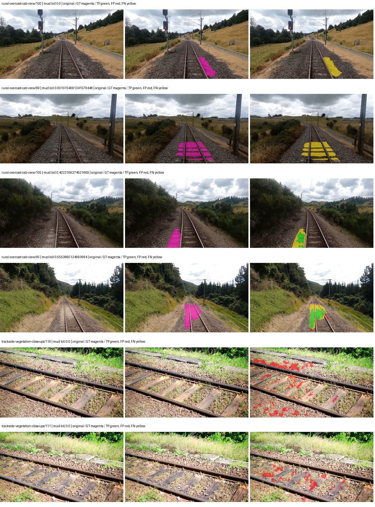

Examples are two lowest and two highest mud-IoU positive images, plus up to two negative images with the most false-positive mud pixels. They are targeted diagnostic examples, not random samples. Green: true positive; red: false positive; yellow: false negative. Full predictions remain on HDRFS.

### Validation tracking

| Logged step | Overall mIoU (%) | Mud IoU (%) |
| --- | --- | --- |
| 254 | 23.87 | 1.30 |
| 508 | 27.80 | 2.86 |
| 763 | 32.48 | 5.24 |
| 1017 | 37.12 | 6.18 |
| 1272 | 38.34 | 11.70 |
| 1527 | 37.81 | 7.37 |
| 1781 | 38.63 | 12.46 |
| 2036 | 37.92 | 7.07 |
| 2290 | 41.66 | 9.20 |
| 2545 | 38.79 | 8.33 |
| 2799 | 39.21 | 6.96 |
| 3054 | 37.93 | 15.10 |
| 3308 | 37.07 | 11.31 |
| 3563 | 38.91 | 9.68 |
| 3817 | 39.63 | 11.82 |
| 4000 | 39.46 | 11.53 |

All retained scalar curves, including training loss and per-class IoU, are in record.json. Observed best mud on a curve is not necessarily a retained checkpoint: the pilot saved its selection-metric-best and final checkpoints. Step logging and checkpoint global_step may differ by one.

### Stopping and checkpoint provenance

```json
{
  "stopping": {
    "actual_steps": 4000,
    "maximum_steps": 4000,
    "min_delta": 0.001,
    "monitor": "val_iou/mud-pumping",
    "patience": 5,
    "reason": "budget_complete"
  },
  "checkpoints": {
    "best": {
      "path": "/data/izadia1/projects/segmentary-runs/paul-test-rtis/mud-fullstats-v1-20260906-r2/future-runs/segformer_b2--cityscapes_to_rtis--seed-0_seed0/rtis/best.ckpt",
      "sha256": "bb01ef9892bfe628ae73c280fa64def938ef3c8d47a9499438f7786e5148c220",
      "global_step": 3054,
      "bytes": 438463793
    },
    "final": {
      "path": "/data/izadia1/projects/segmentary-runs/paul-test-rtis/mud-fullstats-v1-20260906-r2/future-runs/segformer_b2--cityscapes_to_rtis--seed-0_seed0/rtis/last.ckpt",
      "sha256": "7548d2a497c396a4e71225371f08dec1737d40cbd7760b397db129aa296b4eae",
      "global_step": 4000,
      "bytes": 438445617
    }
  },
  "cleanup_error": null
}
```

### Resolved training, initialization and evaluation settings

The optimizer block is the base configuration. Stage LR scales are applied at runtime, and stage warmup is capped at min(base warmup, floor(stage budget / 10), stage budget - 1): 400 steps for this 4,000-step pilot. Model-internal native input grids may differ from augmentation crops (EoMT uses its 640 grid).

```json
{
  "name": "segformer_b2--cityscapes_to_rtis--seed-0",
  "model": {
    "arch": "segformer_b2",
    "checkpoint": "nvidia/mit-b2",
    "tuning": "full",
    "head": "unified_head",
    "lora_r": 16,
    "lora_alpha": 32,
    "lora_dropout": 0.05,
    "lora_targets": [],
    "drop_path": null,
    "revision": null,
    "subfolder": null,
    "local_files_only": false,
    "trust_remote_code": false,
    "backbone_path": null,
    "head_paths": [],
    "classifier_path": null,
    "inactive_parameter_paths": [],
    "smp_arch": null,
    "encoder_name": null,
    "encoder_weights": null,
    "native": null,
    "batch_norm_momentum": null
  },
  "space": "paul-test-rtis",
  "taxonomy_root": "/data/izadia1/projects/segmentary-rtis-fullstats-066afb2/taxonomy",
  "output_root": "/data/izadia1/projects/segmentary-runs/paul-test-rtis/mud-fullstats-v1-20260906-r2/future-runs",
  "optim": {
    "backbone_lr": 6e-05,
    "head_lr_mult": 10.0,
    "weight_decay": 0.05,
    "llrd": 1.0,
    "warmup_iters": 1500,
    "warmup_ratio": 1e-06,
    "poly_power": 0.9,
    "min_lr_ratio": 0.0,
    "betas": [
      0.9,
      0.999
    ],
    "grad_clip": 1.0
  },
  "train": {
    "iters": 4000,
    "batch_size": 2,
    "accum": 8,
    "num_workers": 2,
    "precision": "bf16-mixed",
    "ema_decay": 0.9998,
    "val_every": 250,
    "ckpt_every": 500,
    "selection_metric": "val_iou/mud-pumping",
    "early_stopping_patience": 5,
    "early_stopping_min_delta": 0.001,
    "seed": 0,
    "devices": 1
  },
  "eval": {
    "sliding_window": true,
    "window": [
      1024,
      1024
    ],
    "stride": [
      768,
      768
    ],
    "batch_size": 1,
    "num_workers": 2,
    "tta_scales": [],
    "tta_flip": false,
    "threshold": 0.5,
    "boundary_tolerance_frac": 0.0075,
    "save_confusion": true
  },
  "loss": {
    "task": "multiclass",
    "activation": "auto",
    "terms": [],
    "aux": "none",
    "aux_weight": 0.0,
    "ce_weight": 1.0,
    "label_smoothing": 0.0,
    "class_weights": null,
    "query": null
  },
  "aug": {
    "crop": [
      1024,
      1024
    ],
    "scale_min": 0.5,
    "scale_max": 2.0,
    "hflip_p": 0.5,
    "color_jitter_p": 0.5,
    "brightness": 0.25,
    "contrast": 0.25,
    "saturation": 0.25,
    "hue": 0.05
  },
  "stages": [
    {
      "name": "rtis",
      "data": [
        {
          "name": "paul-test-rtis",
          "root": "/data/izadia1/datasets/paul-test-rtis",
          "variant": null,
          "split_file": "splits.json",
          "train_split": "train",
          "val_split": "val",
          "limit": null,
          "loader": "folder",
          "mapping": "paul-test-rtis",
          "loader_options": {
            "require_groups": true
          }
        }
      ],
      "iters": null,
      "lr_scale": 0.1,
      "head_group_lr_scale": 1.0,
      "init_from": "/data/izadia1/projects/segmentary-runs/all-model-city-rail-seed0-a7c0b67/jobs/segformer_b2--cityscapes--seed-0/attempt-001/train/segformer_b2--cityscapes_seed0/cityscapes/last.ckpt",
      "reset_head": true,
      "freeze": null,
      "sample_weights": null
    }
  ]
}
```

### Hardware and software provenance

```json
{
  "training": {
    "cuda_available": true,
    "cuda_visible_devices": "5",
    "cudnn": 91900,
    "driver_version": "570.133.20",
    "gpu_count": 1,
    "gpu_names": [
      "NVIDIA L40S"
    ],
    "hostname": "hdrfs-app-001",
    "input_normalization": {
      "channel_order": "rgb",
      "mean": [
        0.485,
        0.456,
        0.406
      ],
      "source": "imagenet",
      "std": [
        0.229,
        0.224,
        0.225
      ]
    },
    "model_origins": [
      {
        "hf_commit": "3bb39e8739149c3777d0325349b2a6c32c6413db",
        "hf_name_or_path": "nvidia/mit-b2",
        "module": "model",
        "timm_pretrained": {}
      },
      {
        "hf_commit": "3bb39e8739149c3777d0325349b2a6c32c6413db",
        "hf_name_or_path": "nvidia/mit-b2",
        "module": "model.segformer",
        "timm_pretrained": {}
      },
      {
        "hf_commit": "3bb39e8739149c3777d0325349b2a6c32c6413db",
        "hf_name_or_path": "nvidia/mit-b2",
        "module": "model.segformer.stages.0.blocks.0.attention",
        "timm_pretrained": {}
      },
      {
        "hf_commit": "3bb39e8739149c3777d0325349b2a6c32c6413db",
        "hf_name_or_path": "nvidia/mit-b2",
        "module": "model.segformer.stages.0.blocks.1.attention",
        "timm_pretrained": {}
      },
      {
        "hf_commit": "3bb39e8739149c3777d0325349b2a6c32c6413db",
        "hf_name_or_path": "nvidia/mit-b2",
        "module": "model.segformer.stages.0.blocks.2.attention",
        "timm_pretrained": {}
      },
      {
        "hf_commit": "3bb39e8739149c3777d0325349b2a6c32c6413db",
        "hf_name_or_path": "nvidia/mit-b2",
        "module": "model.segformer.stages.1.blocks.0.attention",
        "timm_pretrained": {}
      },
      {
        "hf_commit": "3bb39e8739149c3777d0325349b2a6c32c6413db",
        "hf_name_or_path": "nvidia/mit-b2",
        "module": "model.segformer.stages.1.blocks.1.attention",
        "timm_pretrained": {}
      },
      {
        "hf_commit": "3bb39e8739149c3777d0325349b2a6c32c6413db",
        "hf_name_or_path": "nvidia/mit-b2",
        "module": "model.segformer.stages.1.blocks.2.attention",
        "timm_pretrained": {}
      },
      {
        "hf_commit": "3bb39e8739149c3777d0325349b2a6c32c6413db",
        "hf_name_or_path": "nvidia/mit-b2",
        "module": "model.segformer.stages.1.blocks.3.attention",
        "timm_pretrained": {}
      },
      {
        "hf_commit": "3bb39e8739149c3777d0325349b2a6c32c6413db",
        "hf_name_or_path": "nvidia/mit-b2",
        "module": "model.segformer.stages.2.blocks.0.attention",
        "timm_pretrained": {}
      },
      {
        "hf_commit": "3bb39e8739149c3777d0325349b2a6c32c6413db",
        "hf_name_or_path": "nvidia/mit-b2",
        "module": "model.segformer.stages.2.blocks.1.attention",
        "timm_pretrained": {}
      },
      {
        "hf_commit": "3bb39e8739149c3777d0325349b2a6c32c6413db",
        "hf_name_or_path": "nvidia/mit-b2",
        "module": "model.segformer.stages.2.blocks.2.attention",
        "timm_pretrained": {}
      },
      {
        "hf_commit": "3bb39e8739149c3777d0325349b2a6c32c6413db",
        "hf_name_or_path": "nvidia/mit-b2",
        "module": "model.segformer.stages.2.blocks.3.attention",
        "timm_pretrained": {}
      },
      {
        "hf_commit": "3bb39e8739149c3777d0325349b2a6c32c6413db",
        "hf_name_or_path": "nvidia/mit-b2",
        "module": "model.segformer.stages.2.blocks.4.attention",
        "timm_pretrained": {}
      },
      {
        "hf_commit": "3bb39e8739149c3777d0325349b2a6c32c6413db",
        "hf_name_or_path": "nvidia/mit-b2",
        "module": "model.segformer.stages.2.blocks.5.attention",
        "timm_pretrained": {}
      },
      {
        "hf_commit": "3bb39e8739149c3777d0325349b2a6c32c6413db",
        "hf_name_or_path": "nvidia/mit-b2",
        "module": "model.segformer.stages.3.blocks.0.attention",
        "timm_pretrained": {}
      },
      {
        "hf_commit": "3bb39e8739149c3777d0325349b2a6c32c6413db",
        "hf_name_or_path": "nvidia/mit-b2",
        "module": "model.segformer.stages.3.blocks.1.attention",
        "timm_pretrained": {}
      },
      {
        "hf_commit": "3bb39e8739149c3777d0325349b2a6c32c6413db",
        "hf_name_or_path": "nvidia/mit-b2",
        "module": "model.segformer.stages.3.blocks.2.attention",
        "timm_pretrained": {}
      },
      {
        "hf_commit": "3bb39e8739149c3777d0325349b2a6c32c6413db",
        "hf_name_or_path": "nvidia/mit-b2",
        "module": "model.decode_head",
        "timm_pretrained": {}
      }
    ],
    "model_parameter_count": 27362773,
    "packages": {
      "albumentations": "2.0.8",
      "lightning": "2.6.5",
      "numpy": "2.4.4",
      "segmentary": "0.1.0",
      "segmentation-models-pytorch": "0.5.0",
      "timm": "1.0.28",
      "torch": "2.11.0+cu128",
      "torchvision": "0.26.0+cu128",
      "transformers": "5.15.0"
    },
    "platform": "Linux-5.15.0-139-generic-x86_64-with-glibc2.35",
    "python": "3.11.15",
    "torch": "2.11.0+cu128",
    "torch_cuda": "12.8",
    "trainable_parameter_count": 27362773,
    "training_stop": {
      "actual_steps": 4000,
      "maximum_steps": 4000,
      "min_delta": 0.001,
      "monitor": "val_iou/mud-pumping",
      "patience": 5,
      "reason": "budget_complete"
    },
    "validation_weights": "raw"
  },
  "evaluation": {
    "cuda_available": true,
    "cuda_visible_devices": "5",
    "cudnn": 91900,
    "driver_version": "570.133.20",
    "gpu_count": 1,
    "gpu_names": [
      "NVIDIA L40S"
    ],
    "hostname": "hdrfs-app-001",
    "input_normalization": {
      "channel_order": "rgb",
      "mean": [
        0.485,
        0.456,
        0.406
      ],
      "source": "imagenet",
      "std": [
        0.229,
        0.224,
        0.225
      ]
    },
    "packages": {
      "albumentations": "2.0.8",
      "lightning": "2.6.5",
      "numpy": "2.4.4",
      "segmentary": "0.1.0",
      "segmentation-models-pytorch": "0.5.0",
      "timm": "1.0.28",
      "torch": "2.11.0+cu128",
      "torchvision": "0.26.0+cu128",
      "transformers": "5.15.0"
    },
    "platform": "Linux-5.15.0-139-generic-x86_64-with-glibc2.35",
    "python": "3.11.15",
    "torch": "2.11.0+cu128",
    "torch_cuda": "12.8"
  }
}
```

## cityscapes_to_rtis — seed 1

Status: **completed**. Started: 2026-09-07T01:53:38.150143+00:00. Finished: 2026-09-07T02:46:12.316208+00:00.

Recipe pretrained initializer: `nvidia/mit-b2`.

`rtis_only` uses the recipe initializer, which may include pretrained segmentation components. Transfer paths load the exact historical source checkpoint below and reset the classifier; they do not reset all query/decoder features.

Source checkpoint: `{'name': 'segformer_b2--cityscapes--seed-0', 'model': 'segformer_b2', 'protocol': 'cityscapes', 'config': '/data/izadia1/projects/segmentary-runs/all-model-city-rail-seed0-rail20-b9eb3e1/accepted/segformer_b2--cityscapes--seed-0/resolved-config.yaml', 'checkpoint': '/data/izadia1/projects/segmentary-runs/all-model-city-rail-seed0-a7c0b67/jobs/segformer_b2--cityscapes--seed-0/attempt-001/train/segformer_b2--cityscapes_seed0/cityscapes/last.ckpt', 'recorded_sha256': 'd0f4f619c4d1200c143ff218ddb7e8693decd082345af09049cc50b8f8c42977', 'exists': True}`.

Config SHA-256: `297bcd04af3690e9b0a993abbc8ac982456ab27e009d8f48d61825e8e7006449`. Weights used for validation: `raw`.

### Mud-pumping and aggregate quality

| Metric | Selected checkpoint | Final training validation |
| --- | --- | --- |
| Mud IoU | 20.70 | 16.72 |
| Mud precision | 40.36 | 58.01 |
| Mud recall | 29.82 | 19.02 |
| Mud Dice/F1 | 34.30 | 28.65 |
| mIoU | 37.70 | 37.32 |
| Mean accuracy | 52.12 | 51.19 |
| Mean precision | 54.80 | 54.38 |
| Mean Dice | 47.00 | 46.37 |
| Mean specificity | 99.07 | 99.11 |
| Pixel accuracy | 84.27 | 85.06 |
| Frequency-weighted IoU | 76.06 | 76.75 |
| Fixed GT-present class mIoU | 43.99 | 43.54 |
| Boundary F1 | 44.51 | 43.67 |

The selected checkpoint has independent evaluation evidence. Final values are the trainer's final validation record, not a new independent evaluation. mIoU averages classes with nonzero union, so false positives on absent classes can change its denominator. The fixed GT-class mean is supplementary and excludes absent classes; their false positives remain in the confusion matrix.

### Resource usage and timing

| Measurement | Value |
| --- | --- |
| Peak training VRAM, retained training invocation (GiB) | 11.73 |
| Peak evaluation VRAM (GiB) | 7.46 |
| Retained training invocation wall time (seconds) | 2923.51 |
| Retained training invocation GPU-hours (one GPU) | 0.81 |
| Evaluation wall time (seconds) | 22.22 |
| Full evaluation pipeline images/second | 1.67 |
| Best full-state checkpoint (MiB) | 418.15 |
| Final full-state checkpoint (MiB) | 418.13 |
| Audited periodic checkpoints removed (GiB) | 2.45 |

VRAM uses the recorded allocator high-water mark; it is not total device usage including CUDA context. Resumed jobs' retained training invocation times and peaks are **not whole-campaign totals**. Earlier invocation resource records are not reconstructed here. Evaluation throughput includes loader, sliding-window inference and metrics; it is not model-only latency/FPS. Missing measurements are shown as —, never inferred from another dataset's run.

### Standardized inference performance

Dedicated model-only profiling waits for an idle worker-locked L40S: BF16, batch 1, 1024x1024, 20 warmup and 100 CUDA-event-timed public forwards. It excludes loading, preprocessing, tiling and metrics.

| Status | Parameters | Weight MiB | FPS | p50 ms | p95 ms | Peak reserved GiB |
| --- | --- | --- | --- | --- | --- | --- |
| complete | 27362773 | 104.38 | 52.81 | 18.75 | 19.74 | 2.25 |

```json
{
  "schema_version": 1,
  "model_id": "segformer_b2",
  "measured_at": "2026-09-07T02:46:07+00:00",
  "status": "complete",
  "benchmark_scope": "rtis_selected_checkpoint_model_only",
  "applies_to": [
    "segformer_b2--cityscapes_to_rtis--seed-1"
  ],
  "source": {
    "campaign_git_sha": "066afb2626398b7be59d4d19f5a0e4644fd59adc",
    "git_dirty": false,
    "config_hash": "305237ae3964",
    "resolved_config": "/data/izadia1/projects/segmentary-runs/paul-test-rtis/mud-fullstats-v1-20260906-r2/configs/segformer_b2--cityscapes_to_rtis--seed-1.yaml",
    "config_sha256": "297bcd04af3690e9b0a993abbc8ac982456ab27e009d8f48d61825e8e7006449",
    "checkpoint_sha256": "c4a9ae78573c64f0496046f36f0279e4d848a7dd9596f6e2cbdad6b9b14ca909",
    "checkpoint_global_step": 1781,
    "checkpoint_bytes": 438463793,
    "checkpoint_kind": "resume checkpoint with optimizer and EMA state",
    "weights": "raw",
    "measured_checkpoint_job_id": "segformer_b2--cityscapes_to_rtis--seed-1",
    "result_sha256": "4462611b7955ace24d3a93b116bdcbb9cf60d9649667dd7f1ff34a9f169b45b0",
    "result_git_sha": "066afb2626398b7be59d4d19f5a0e4644fd59adc",
    "result_stage": "eval:paul-test-rtis:val",
    "result_seed": 1
  },
  "hardware": {
    "gpu_name": "NVIDIA L40S",
    "gpu_uuid": "GPU-931d0911-fc78-1638-e3d7-1ba868cbd286",
    "logical_device": "cuda:0",
    "physical_visibility_token": "2",
    "compute_capability": [
      8,
      9
    ],
    "total_memory_bytes": 47677177856
  },
  "model": {
    "parameter_count": 27362773,
    "trainable_parameter_count": 27362773,
    "resident_parameter_bytes": 109451092,
    "parameter_dtype_counts": {
      "float32": 27362773
    }
  },
  "contract": {
    "backend": "pytorch",
    "precision": "bf16_autocast",
    "batch_size": 1,
    "input_shape_nchw": [
      1,
      3,
      1024,
      1024
    ],
    "warmup_iterations": 20,
    "measured_iterations": 100,
    "timing": "per-forward CUDA events with end-event synchronization",
    "includes_preprocessing": false,
    "includes_data_loader": false,
    "includes_sliding_window": false,
    "input_resident_on_gpu": true,
    "model_only": true,
    "entrypoint": "public model(image) dense-logits forward"
  },
  "measurements": {
    "latency": {
      "p50_ms": 18.74835205078125,
      "p95_ms": 19.74087600708008,
      "mean_ms": 18.93495367050171,
      "minimum_ms": 18.400096893310547,
      "maximum_ms": 20.713472366333008,
      "fps": 52.8123816620621,
      "raw_ms": [
        18.925600051879883,
        18.491392135620117,
        18.60406494140625,
        18.466815948486328,
        18.400096893310547,
        18.63987159729004,
        19.26348876953125,
        19.382272720336914,
        19.537919998168945,
        19.740671157836914,
        19.23072052001953,
        18.726911544799805,
        18.6378231048584,
        18.521087646484375,
        18.62656021118164,
        19.276704788208008,
        18.769792556762695,
        20.713472366333008,
        19.385343551635742,
        18.77292823791504,
        19.009536743164062,
        19.171327590942383,
        19.396608352661133,
        18.677759170532227,
        19.337215423583984,
        19.26860809326172,
        18.61017608642578,
        18.61836814880371,
        18.492319107055664,
        18.53126335144043,
        18.571264266967773,
        18.513919830322266,
        18.909183502197266,
        19.62495994567871,
        18.944000244140625,
        18.64499282836914,
        20.115360260009766,
        18.945024490356445,
        18.545663833618164,
        18.510847091674805,
        18.45350456237793,
        18.664608001708984,
        19.04947280883789,
        19.775487899780273,
        19.03615951538086,
        18.632768630981445,
        19.387392044067383,
        19.273727416992188,
        18.686975479125977,
        18.532352447509766,
        18.557952880859375,
        18.500608444213867,
        18.504703521728516,
        18.526208877563477,
        19.159040451049805,
        19.119104385375977,
        19.725311279296875,
        18.691072463989258,
        18.65635108947754,
        19.49286460876465,
        18.983936309814453,
        18.548736572265625,
        18.577407836914062,
        18.497535705566406,
        18.494464874267578,
        19.581951141357422,
        19.195903778076172,
        19.369983673095703,
        18.769920349121094,
        18.84569549560547,
        19.818496704101562,
        18.702335357666016,
        18.533504486083984,
        18.875423431396484,
        18.483200073242188,
        18.564096450805664,
        18.463743209838867,
        19.27168083190918,
        19.07097625732422,
        19.03411293029785,
        19.47750473022461,
        18.65318489074707,
        18.510719299316406,
        19.602432250976562,
        19.33216094970703,
        18.65830421447754,
        18.64192008972168,
        18.489343643188477,
        18.528255462646484,
        19.17532730102539,
        19.602432250976562,
        19.744768142700195,
        19.24403190612793,
        19.503103256225586,
        19.016704559326172,
        18.65216064453125,
        18.543487548828125,
        18.4770565032959,
        18.492416381835938,
        18.489343643188477
      ],
      "percentile_method": "numpy linear interpolation"
    },
    "peak_reserved_bytes": 2420113408,
    "memory_kind": "pytorch_cuda_allocator_peak_reserved_excluding_context",
    "benchmark_wall_clock_s": 5.801464602351189
  },
  "started_at": "2026-09-07T02:46:01+00:00",
  "finished_at": "2026-09-07T02:46:07+00:00",
  "environment": {
    "hostname": "hdrfs-app-001",
    "python": "3.11.15",
    "platform": "Linux-5.15.0-139-generic-x86_64-with-glibc2.35",
    "torch": "2.11.0+cu128",
    "torch_cuda": "12.8",
    "cudnn": 91900,
    "driver_version": "570.133.20",
    "cuda_available": true,
    "gpu_count": 1,
    "gpu_names": [
      "NVIDIA L40S"
    ],
    "cuda_visible_devices": "2",
    "packages": {
      "segmentary": "0.1.0",
      "torch": "2.11.0+cu128",
      "torchvision": "0.26.0+cu128",
      "transformers": "5.15.0",
      "timm": "1.0.28",
      "segmentation-models-pytorch": "0.5.0",
      "albumentations": "2.0.8",
      "lightning": "2.6.5",
      "numpy": "2.4.4"
    }
  }
}
```

### Per-class validation results

| Class | GT pixels | IoU (%) | Precision (%) | Recall (%) | Dice (%) | Boundary F1 (%) |
| --- | --- | --- | --- | --- | --- | --- |
| car | 29664 | 71.29 | 82.28 | 84.22 | 83.24 | 74.64 |
| construction | 311585 | 59.52 | 78.55 | 71.07 | 74.62 | 72.98 |
| fence | 265137 | 11.04 | 57.36 | 12.02 | 19.88 | 29.51 |
| mud-pumping | 1226250 | 20.70 | 40.36 | 29.82 | 34.30 | 30.27 |
| on-rails | 0 | 0.00 | 0.00 | — | 0.00 | 0.00 |
| person | 0 | 0.00 | 0.00 | — | 0.00 | 0.00 |
| pole | 628038 | 72.02 | 85.88 | 81.69 | 83.73 | 90.31 |
| rail-embedded | 16799 | 11.54 | 96.05 | 11.59 | 20.68 | 33.56 |
| rail-raised | 2969797 | 73.39 | 86.76 | 82.65 | 84.65 | 90.98 |
| rail-track | 6323197 | 42.46 | 58.28 | 61.01 | 59.61 | 56.36 |
| road | 1048831 | 4.07 | 11.26 | 6.00 | 7.83 | 5.61 |
| sidewalk | 1297367 | 17.08 | 27.89 | 30.59 | 29.18 | 17.64 |
| sky | 19121606 | 98.47 | 99.26 | 99.20 | 99.23 | 95.60 |
| standing-water | 95802 | 0.07 | 0.10 | 0.33 | 0.15 | 1.41 |
| terrain | 39239306 | 88.03 | 91.95 | 95.39 | 93.64 | 64.78 |
| trackbed | 10643081 | 53.95 | 72.62 | 67.72 | 70.09 | 52.24 |
| traffic-light | 19510 | 67.83 | 86.38 | 75.96 | 80.83 | 84.65 |
| traffic-sign | 13285 | 41.36 | 70.12 | 50.21 | 58.52 | 55.04 |
| tram-track | 56179 | 14.29 | 43.27 | 17.58 | 25.00 | 14.02 |
| truck | 0 | 0.00 | 0.00 | — | 0.00 | 0.00 |
| vegetation-overgrowth | 5901821 | 44.65 | 62.36 | 61.12 | 61.73 | 65.08 |

### Full-run accounting

| Measurement | Value |
| --- | --- |
| Full GPU-reserved wall seconds, all recorded worker attempts | 3154.48 |
| Full reserved GPU-hours | 0.88 |
| Whole-run timing complete | True |

| Phase | Wall seconds including failed attempts |
| --- | --- |
| training | 2930.96 |
| diagnostics | 176.24 |
| performance | 13.29 |

GPU-reserved time includes model loading, training, validation, collection, profiling, checkpoint I/O and orchestration while the worker owns one GPU. It is not GPU kernel-active time. Phase timings and sampled device memory/power/utilization are retained separately; sampled device memory is not the allocator high-water mark.

### Train/validation and raw/EMA diagnostics

| Checkpoint / weights / split | Images | Mud IoU (%) | Mud precision (%) | Mud recall (%) |
| --- | --- | --- | --- | --- |
| best-auto-train / raw | 220 | 92.98 | 96.70 | 96.02 |
| best-auto-val / raw | 37 | 20.70 | 40.36 | 29.82 |
| best-alternate-val / ema | 37 | 10.32 | 40.46 | 12.16 |
| final-auto-val / raw | 37 | 16.73 | 58.03 | 19.03 |

Train uses the evaluation transform without augmentation. Compare mud train/validation metrics for the same selected weights. Alternate EMA on running-stat BatchNorm is explicitly uncalibrated and is diagnostic only. Score-threshold curves use uncalibrated normalized scores and are pixel-level diagnostics, not event detection rates or a selected deployment operating point.

### Downloadable evidence

- best-auto-train: [per-image.csv](cityscapes_to_rtis--seed-1/best-auto-train/per-image.csv) · [per-image-confusion.json.gz](cityscapes_to_rtis--seed-1/best-auto-train/per-image-confusion.json.gz) · [groups.json](cityscapes_to_rtis--seed-1/best-auto-train/groups.json) · [mud-score-curves.json](cityscapes_to_rtis--seed-1/best-auto-train/mud-score-curves.json)
- best-auto-val: [per-image.csv](cityscapes_to_rtis--seed-1/best-auto-val/per-image.csv) · [per-image-confusion.json.gz](cityscapes_to_rtis--seed-1/best-auto-val/per-image-confusion.json.gz) · [groups.json](cityscapes_to_rtis--seed-1/best-auto-val/groups.json) · [mud-score-curves.json](cityscapes_to_rtis--seed-1/best-auto-val/mud-score-curves.json) · [examples.jpg](cityscapes_to_rtis--seed-1/best-auto-val/examples.jpg)
- best-alternate-val: [per-image.csv](cityscapes_to_rtis--seed-1/best-alternate-val/per-image.csv) · [per-image-confusion.json.gz](cityscapes_to_rtis--seed-1/best-alternate-val/per-image-confusion.json.gz) · [groups.json](cityscapes_to_rtis--seed-1/best-alternate-val/groups.json) · [mud-score-curves.json](cityscapes_to_rtis--seed-1/best-alternate-val/mud-score-curves.json)
- final-auto-val: [per-image.csv](cityscapes_to_rtis--seed-1/final-auto-val/per-image.csv) · [per-image-confusion.json.gz](cityscapes_to_rtis--seed-1/final-auto-val/per-image-confusion.json.gz) · [groups.json](cityscapes_to_rtis--seed-1/final-auto-val/groups.json) · [mud-score-curves.json](cityscapes_to_rtis--seed-1/final-auto-val/mud-score-curves.json)
- resources: [telemetry.csv](cityscapes_to_rtis--seed-1/resources/telemetry.csv)

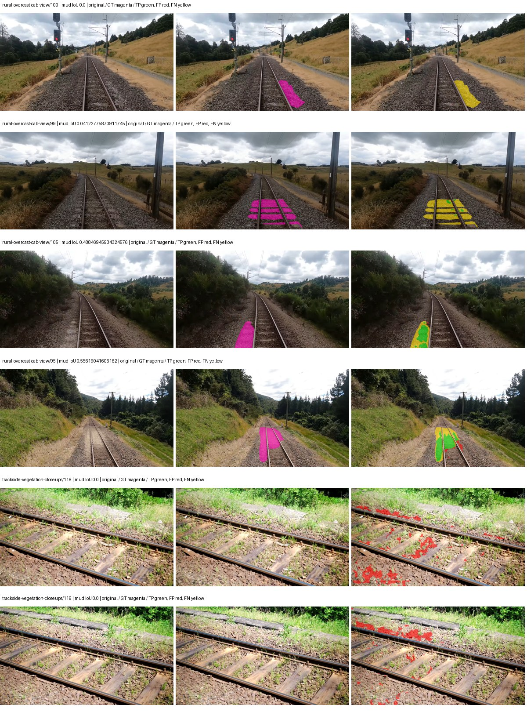

Examples are two lowest and two highest mud-IoU positive images, plus up to two negative images with the most false-positive mud pixels. They are targeted diagnostic examples, not random samples. Green: true positive; red: false positive; yellow: false negative. Full predictions remain on HDRFS.

### Validation tracking

| Logged step | Overall mIoU (%) | Mud IoU (%) |
| --- | --- | --- |
| 254 | 24.21 | 0.72 |
| 508 | 27.71 | 1.32 |
| 763 | 33.55 | 2.78 |
| 1017 | 35.51 | 5.13 |
| 1272 | 38.33 | 13.19 |
| 1527 | 38.54 | 7.19 |
| 1781 | 37.71 | 20.68 |
| 2036 | 36.31 | 9.49 |
| 2290 | 36.88 | 13.50 |
| 2545 | 38.40 | 13.91 |
| 2799 | 36.02 | 16.57 |
| 3054 | 37.32 | 16.72 |

All retained scalar curves, including training loss and per-class IoU, are in record.json. Observed best mud on a curve is not necessarily a retained checkpoint: the pilot saved its selection-metric-best and final checkpoints. Step logging and checkpoint global_step may differ by one.

### Stopping and checkpoint provenance

```json
{
  "stopping": {
    "actual_steps": 3054,
    "maximum_steps": 4000,
    "min_delta": 0.001,
    "monitor": "val_iou/mud-pumping",
    "patience": 5,
    "reason": "validation_plateau"
  },
  "checkpoints": {
    "best": {
      "path": "/data/izadia1/projects/segmentary-runs/paul-test-rtis/mud-fullstats-v1-20260906-r2/future-runs/segformer_b2--cityscapes_to_rtis--seed-1_seed1/rtis/best.ckpt",
      "sha256": "c4a9ae78573c64f0496046f36f0279e4d848a7dd9596f6e2cbdad6b9b14ca909",
      "global_step": 1781,
      "bytes": 438463793
    },
    "final": {
      "path": "/data/izadia1/projects/segmentary-runs/paul-test-rtis/mud-fullstats-v1-20260906-r2/future-runs/segformer_b2--cityscapes_to_rtis--seed-1_seed1/rtis/last.ckpt",
      "sha256": "078f3d182b5c8dbd50736e1843b7b8aab40f7a6469370de2f1bef0d3c4fb4ded",
      "global_step": 3054,
      "bytes": 438445745
    }
  },
  "cleanup_error": null
}
```

### Resolved training, initialization and evaluation settings

The optimizer block is the base configuration. Stage LR scales are applied at runtime, and stage warmup is capped at min(base warmup, floor(stage budget / 10), stage budget - 1): 400 steps for this 4,000-step pilot. Model-internal native input grids may differ from augmentation crops (EoMT uses its 640 grid).

```json
{
  "name": "segformer_b2--cityscapes_to_rtis--seed-1",
  "model": {
    "arch": "segformer_b2",
    "checkpoint": "nvidia/mit-b2",
    "tuning": "full",
    "head": "unified_head",
    "lora_r": 16,
    "lora_alpha": 32,
    "lora_dropout": 0.05,
    "lora_targets": [],
    "drop_path": null,
    "revision": null,
    "subfolder": null,
    "local_files_only": false,
    "trust_remote_code": false,
    "backbone_path": null,
    "head_paths": [],
    "classifier_path": null,
    "inactive_parameter_paths": [],
    "smp_arch": null,
    "encoder_name": null,
    "encoder_weights": null,
    "native": null,
    "batch_norm_momentum": null
  },
  "space": "paul-test-rtis",
  "taxonomy_root": "/data/izadia1/projects/segmentary-rtis-fullstats-066afb2/taxonomy",
  "output_root": "/data/izadia1/projects/segmentary-runs/paul-test-rtis/mud-fullstats-v1-20260906-r2/future-runs",
  "optim": {
    "backbone_lr": 6e-05,
    "head_lr_mult": 10.0,
    "weight_decay": 0.05,
    "llrd": 1.0,
    "warmup_iters": 1500,
    "warmup_ratio": 1e-06,
    "poly_power": 0.9,
    "min_lr_ratio": 0.0,
    "betas": [
      0.9,
      0.999
    ],
    "grad_clip": 1.0
  },
  "train": {
    "iters": 4000,
    "batch_size": 2,
    "accum": 8,
    "num_workers": 2,
    "precision": "bf16-mixed",
    "ema_decay": 0.9998,
    "val_every": 250,
    "ckpt_every": 500,
    "selection_metric": "val_iou/mud-pumping",
    "early_stopping_patience": 5,
    "early_stopping_min_delta": 0.001,
    "seed": 1,
    "devices": 1
  },
  "eval": {
    "sliding_window": true,
    "window": [
      1024,
      1024
    ],
    "stride": [
      768,
      768
    ],
    "batch_size": 1,
    "num_workers": 2,
    "tta_scales": [],
    "tta_flip": false,
    "threshold": 0.5,
    "boundary_tolerance_frac": 0.0075,
    "save_confusion": true
  },
  "loss": {
    "task": "multiclass",
    "activation": "auto",
    "terms": [],
    "aux": "none",
    "aux_weight": 0.0,
    "ce_weight": 1.0,
    "label_smoothing": 0.0,
    "class_weights": null,
    "query": null
  },
  "aug": {
    "crop": [
      1024,
      1024
    ],
    "scale_min": 0.5,
    "scale_max": 2.0,
    "hflip_p": 0.5,
    "color_jitter_p": 0.5,
    "brightness": 0.25,
    "contrast": 0.25,
    "saturation": 0.25,
    "hue": 0.05
  },
  "stages": [
    {
      "name": "rtis",
      "data": [
        {
          "name": "paul-test-rtis",
          "root": "/data/izadia1/datasets/paul-test-rtis",
          "variant": null,
          "split_file": "splits.json",
          "train_split": "train",
          "val_split": "val",
          "limit": null,
          "loader": "folder",
          "mapping": "paul-test-rtis",
          "loader_options": {
            "require_groups": true
          }
        }
      ],
      "iters": null,
      "lr_scale": 0.1,
      "head_group_lr_scale": 1.0,
      "init_from": "/data/izadia1/projects/segmentary-runs/all-model-city-rail-seed0-a7c0b67/jobs/segformer_b2--cityscapes--seed-0/attempt-001/train/segformer_b2--cityscapes_seed0/cityscapes/last.ckpt",
      "reset_head": true,
      "freeze": null,
      "sample_weights": null
    }
  ]
}
```

### Hardware and software provenance

```json
{
  "training": {
    "cuda_available": true,
    "cuda_visible_devices": "2",
    "cudnn": 91900,
    "driver_version": "570.133.20",
    "gpu_count": 1,
    "gpu_names": [
      "NVIDIA L40S"
    ],
    "hostname": "hdrfs-app-001",
    "input_normalization": {
      "channel_order": "rgb",
      "mean": [
        0.485,
        0.456,
        0.406
      ],
      "source": "imagenet",
      "std": [
        0.229,
        0.224,
        0.225
      ]
    },
    "model_origins": [
      {
        "hf_commit": "3bb39e8739149c3777d0325349b2a6c32c6413db",
        "hf_name_or_path": "nvidia/mit-b2",
        "module": "model",
        "timm_pretrained": {}
      },
      {
        "hf_commit": "3bb39e8739149c3777d0325349b2a6c32c6413db",
        "hf_name_or_path": "nvidia/mit-b2",
        "module": "model.segformer",
        "timm_pretrained": {}
      },
      {
        "hf_commit": "3bb39e8739149c3777d0325349b2a6c32c6413db",
        "hf_name_or_path": "nvidia/mit-b2",
        "module": "model.segformer.stages.0.blocks.0.attention",
        "timm_pretrained": {}
      },
      {
        "hf_commit": "3bb39e8739149c3777d0325349b2a6c32c6413db",
        "hf_name_or_path": "nvidia/mit-b2",
        "module": "model.segformer.stages.0.blocks.1.attention",
        "timm_pretrained": {}
      },
      {
        "hf_commit": "3bb39e8739149c3777d0325349b2a6c32c6413db",
        "hf_name_or_path": "nvidia/mit-b2",
        "module": "model.segformer.stages.0.blocks.2.attention",
        "timm_pretrained": {}
      },
      {
        "hf_commit": "3bb39e8739149c3777d0325349b2a6c32c6413db",
        "hf_name_or_path": "nvidia/mit-b2",
        "module": "model.segformer.stages.1.blocks.0.attention",
        "timm_pretrained": {}
      },
      {
        "hf_commit": "3bb39e8739149c3777d0325349b2a6c32c6413db",
        "hf_name_or_path": "nvidia/mit-b2",
        "module": "model.segformer.stages.1.blocks.1.attention",
        "timm_pretrained": {}
      },
      {
        "hf_commit": "3bb39e8739149c3777d0325349b2a6c32c6413db",
        "hf_name_or_path": "nvidia/mit-b2",
        "module": "model.segformer.stages.1.blocks.2.attention",
        "timm_pretrained": {}
      },
      {
        "hf_commit": "3bb39e8739149c3777d0325349b2a6c32c6413db",
        "hf_name_or_path": "nvidia/mit-b2",
        "module": "model.segformer.stages.1.blocks.3.attention",
        "timm_pretrained": {}
      },
      {
        "hf_commit": "3bb39e8739149c3777d0325349b2a6c32c6413db",
        "hf_name_or_path": "nvidia/mit-b2",
        "module": "model.segformer.stages.2.blocks.0.attention",
        "timm_pretrained": {}
      },
      {
        "hf_commit": "3bb39e8739149c3777d0325349b2a6c32c6413db",
        "hf_name_or_path": "nvidia/mit-b2",
        "module": "model.segformer.stages.2.blocks.1.attention",
        "timm_pretrained": {}
      },
      {
        "hf_commit": "3bb39e8739149c3777d0325349b2a6c32c6413db",
        "hf_name_or_path": "nvidia/mit-b2",
        "module": "model.segformer.stages.2.blocks.2.attention",
        "timm_pretrained": {}
      },
      {
        "hf_commit": "3bb39e8739149c3777d0325349b2a6c32c6413db",
        "hf_name_or_path": "nvidia/mit-b2",
        "module": "model.segformer.stages.2.blocks.3.attention",
        "timm_pretrained": {}
      },
      {
        "hf_commit": "3bb39e8739149c3777d0325349b2a6c32c6413db",
        "hf_name_or_path": "nvidia/mit-b2",
        "module": "model.segformer.stages.2.blocks.4.attention",
        "timm_pretrained": {}
      },
      {
        "hf_commit": "3bb39e8739149c3777d0325349b2a6c32c6413db",
        "hf_name_or_path": "nvidia/mit-b2",
        "module": "model.segformer.stages.2.blocks.5.attention",
        "timm_pretrained": {}
      },
      {
        "hf_commit": "3bb39e8739149c3777d0325349b2a6c32c6413db",
        "hf_name_or_path": "nvidia/mit-b2",
        "module": "model.segformer.stages.3.blocks.0.attention",
        "timm_pretrained": {}
      },
      {
        "hf_commit": "3bb39e8739149c3777d0325349b2a6c32c6413db",
        "hf_name_or_path": "nvidia/mit-b2",
        "module": "model.segformer.stages.3.blocks.1.attention",
        "timm_pretrained": {}
      },
      {
        "hf_commit": "3bb39e8739149c3777d0325349b2a6c32c6413db",
        "hf_name_or_path": "nvidia/mit-b2",
        "module": "model.segformer.stages.3.blocks.2.attention",
        "timm_pretrained": {}
      },
      {
        "hf_commit": "3bb39e8739149c3777d0325349b2a6c32c6413db",
        "hf_name_or_path": "nvidia/mit-b2",
        "module": "model.decode_head",
        "timm_pretrained": {}
      }
    ],
    "model_parameter_count": 27362773,
    "packages": {
      "albumentations": "2.0.8",
      "lightning": "2.6.5",
      "numpy": "2.4.4",
      "segmentary": "0.1.0",
      "segmentation-models-pytorch": "0.5.0",
      "timm": "1.0.28",
      "torch": "2.11.0+cu128",
      "torchvision": "0.26.0+cu128",
      "transformers": "5.15.0"
    },
    "platform": "Linux-5.15.0-139-generic-x86_64-with-glibc2.35",
    "python": "3.11.15",
    "torch": "2.11.0+cu128",
    "torch_cuda": "12.8",
    "trainable_parameter_count": 27362773,
    "training_stop": {
      "actual_steps": 3054,
      "maximum_steps": 4000,
      "min_delta": 0.001,
      "monitor": "val_iou/mud-pumping",
      "patience": 5,
      "reason": "validation_plateau"
    },
    "validation_weights": "raw"
  },
  "evaluation": {
    "cuda_available": true,
    "cuda_visible_devices": "2",
    "cudnn": 91900,
    "driver_version": "570.133.20",
    "gpu_count": 1,
    "gpu_names": [
      "NVIDIA L40S"
    ],
    "hostname": "hdrfs-app-001",
    "input_normalization": {
      "channel_order": "rgb",
      "mean": [
        0.485,
        0.456,
        0.406
      ],
      "source": "imagenet",
      "std": [
        0.229,
        0.224,
        0.225
      ]
    },
    "packages": {
      "albumentations": "2.0.8",
      "lightning": "2.6.5",
      "numpy": "2.4.4",
      "segmentary": "0.1.0",
      "segmentation-models-pytorch": "0.5.0",
      "timm": "1.0.28",
      "torch": "2.11.0+cu128",
      "torchvision": "0.26.0+cu128",
      "transformers": "5.15.0"
    },
    "platform": "Linux-5.15.0-139-generic-x86_64-with-glibc2.35",
    "python": "3.11.15",
    "torch": "2.11.0+cu128",
    "torch_cuda": "12.8"
  }
}
```

## cityscapes_to_rtis — seed 2

Status: **completed**. Started: 2026-09-07T02:02:19.552035+00:00. Finished: 2026-09-07T03:07:38.588274+00:00.

Recipe pretrained initializer: `nvidia/mit-b2`.

`rtis_only` uses the recipe initializer, which may include pretrained segmentation components. Transfer paths load the exact historical source checkpoint below and reset the classifier; they do not reset all query/decoder features.

Source checkpoint: `{'name': 'segformer_b2--cityscapes--seed-0', 'model': 'segformer_b2', 'protocol': 'cityscapes', 'config': '/data/izadia1/projects/segmentary-runs/all-model-city-rail-seed0-rail20-b9eb3e1/accepted/segformer_b2--cityscapes--seed-0/resolved-config.yaml', 'checkpoint': '/data/izadia1/projects/segmentary-runs/all-model-city-rail-seed0-a7c0b67/jobs/segformer_b2--cityscapes--seed-0/attempt-001/train/segformer_b2--cityscapes_seed0/cityscapes/last.ckpt', 'recorded_sha256': 'd0f4f619c4d1200c143ff218ddb7e8693decd082345af09049cc50b8f8c42977', 'exists': True}`.

Config SHA-256: `673fac67ae36e1a8917649ee29c607d1a2da3b1304dc141c9081f281978eeeac`. Weights used for validation: `raw`.

### Mud-pumping and aggregate quality

| Metric | Selected checkpoint | Final training validation |
| --- | --- | --- |
| Mud IoU | 22.45 | 15.41 |
| Mud precision | 61.01 | 50.05 |
| Mud recall | 26.20 | 18.21 |
| Mud Dice/F1 | 36.66 | 26.70 |
| mIoU | 37.50 | 37.65 |
| Mean accuracy | 51.28 | 51.92 |
| Mean precision | 57.64 | 56.05 |
| Mean Dice | 47.25 | 47.27 |
| Mean specificity | 99.09 | 99.09 |
| Pixel accuracy | 84.96 | 84.77 |
| Frequency-weighted IoU | 76.31 | 76.27 |
| Fixed GT-present class mIoU | 43.76 | 43.93 |
| Boundary F1 | 44.85 | 44.46 |

The selected checkpoint has independent evaluation evidence. Final values are the trainer's final validation record, not a new independent evaluation. mIoU averages classes with nonzero union, so false positives on absent classes can change its denominator. The fixed GT-class mean is supplementary and excludes absent classes; their false positives remain in the confusion matrix.

### Resource usage and timing

| Measurement | Value |
| --- | --- |
| Peak training VRAM, retained training invocation (GiB) | 11.73 |
| Peak evaluation VRAM (GiB) | 7.46 |
| Retained training invocation wall time (seconds) | 3685.61 |
| Retained training invocation GPU-hours (one GPU) | 1.02 |
| Evaluation wall time (seconds) | 22.26 |
| Full evaluation pipeline images/second | 1.66 |
| Best full-state checkpoint (MiB) | 418.15 |
| Final full-state checkpoint (MiB) | 418.13 |
| Audited periodic checkpoints removed (GiB) | 2.86 |

VRAM uses the recorded allocator high-water mark; it is not total device usage including CUDA context. Resumed jobs' retained training invocation times and peaks are **not whole-campaign totals**. Earlier invocation resource records are not reconstructed here. Evaluation throughput includes loader, sliding-window inference and metrics; it is not model-only latency/FPS. Missing measurements are shown as —, never inferred from another dataset's run.

### Standardized inference performance

Dedicated model-only profiling waits for an idle worker-locked L40S: BF16, batch 1, 1024x1024, 20 warmup and 100 CUDA-event-timed public forwards. It excludes loading, preprocessing, tiling and metrics.

| Status | Parameters | Weight MiB | FPS | p50 ms | p95 ms | Peak reserved GiB |
| --- | --- | --- | --- | --- | --- | --- |
| complete | 27362773 | 104.38 | 52.02 | 18.78 | 22.25 | 2.25 |

```json
{
  "schema_version": 1,
  "model_id": "segformer_b2",
  "measured_at": "2026-09-07T03:07:33+00:00",
  "status": "complete",
  "benchmark_scope": "rtis_selected_checkpoint_model_only",
  "applies_to": [
    "segformer_b2--cityscapes_to_rtis--seed-2"
  ],
  "source": {
    "campaign_git_sha": "066afb2626398b7be59d4d19f5a0e4644fd59adc",
    "git_dirty": false,
    "config_hash": "edbda09e4375",
    "resolved_config": "/data/izadia1/projects/segmentary-runs/paul-test-rtis/mud-fullstats-v1-20260906-r2/configs/segformer_b2--cityscapes_to_rtis--seed-2.yaml",
    "config_sha256": "673fac67ae36e1a8917649ee29c607d1a2da3b1304dc141c9081f281978eeeac",
    "checkpoint_sha256": "cd8e3d1bccefe7d5ee16c40efac537bf3bb2282cde7815d4cb087814ab36ba74",
    "checkpoint_global_step": 2545,
    "checkpoint_bytes": 438463793,
    "checkpoint_kind": "resume checkpoint with optimizer and EMA state",
    "weights": "raw",
    "measured_checkpoint_job_id": "segformer_b2--cityscapes_to_rtis--seed-2",
    "result_sha256": "3cb3b82e3c1ec291ebae30227a00041f243983d11cdea0a1ea63a1c5079a7145",
    "result_git_sha": "066afb2626398b7be59d4d19f5a0e4644fd59adc",
    "result_stage": "eval:paul-test-rtis:val",
    "result_seed": 2
  },
  "hardware": {
    "gpu_name": "NVIDIA L40S",
    "gpu_uuid": "GPU-e2e96741-aec9-e90b-5c46-d0d58be90a56",
    "logical_device": "cuda:0",
    "physical_visibility_token": "8",
    "compute_capability": [
      8,
      9
    ],
    "total_memory_bytes": 47677177856
  },
  "model": {
    "parameter_count": 27362773,
    "trainable_parameter_count": 27362773,
    "resident_parameter_bytes": 109451092,
    "parameter_dtype_counts": {
      "float32": 27362773
    }
  },
  "contract": {
    "backend": "pytorch",
    "precision": "bf16_autocast",
    "batch_size": 1,
    "input_shape_nchw": [
      1,
      3,
      1024,
      1024
    ],
    "warmup_iterations": 20,
    "measured_iterations": 100,
    "timing": "per-forward CUDA events with end-event synchronization",
    "includes_preprocessing": false,
    "includes_data_loader": false,
    "includes_sliding_window": false,
    "input_resident_on_gpu": true,
    "model_only": true,
    "entrypoint": "public model(image) dense-logits forward"
  },
  "measurements": {
    "latency": {
      "p50_ms": 18.780672073364258,
      "p95_ms": 22.24931917190552,
      "mean_ms": 19.222178554534914,
      "minimum_ms": 18.536447525024414,
      "maximum_ms": 27.297792434692383,
      "fps": 52.02323957000593,
      "raw_ms": [
        18.852863311767578,
        18.589696884155273,
        18.84671974182129,
        18.919424057006836,
        18.747392654418945,
        19.323904037475586,
        18.916351318359375,
        19.098623275756836,
        18.597888946533203,
        18.62656021118164,
        18.86515235900879,
        18.593791961669922,
        18.59071922302246,
        19.000320434570312,
        18.63884735107422,
        18.664447784423828,
        20.610048294067383,
        19.112960815429688,
        19.26041603088379,
        18.695167541503906,
        19.422208786010742,
        19.515392303466797,
        18.66547203063965,
        18.67673683166504,
        18.58355140686035,
        18.597888946533203,
        18.59071922302246,
        18.748416900634766,
        19.150848388671875,
        18.64396858215332,
        19.18262481689453,
        19.333120346069336,
        18.62451171875,
        18.61427116394043,
        18.61520004272461,
        18.536447525024414,
        18.66649627685547,
        18.975744247436523,
        18.655231475830078,
        18.541568756103516,
        18.586624145507812,
        18.955263137817383,
        19.360767364501953,
        18.729984283447266,
        18.594816207885742,
        18.687999725341797,
        18.59071922302246,
        18.6746883392334,
        19.163135528564453,
        18.800640106201172,
        19.302400588989258,
        18.65727996826172,
        18.736127853393555,
        18.743295669555664,
        19.476415634155273,
        18.878463745117188,
        19.336191177368164,
        19.721216201782227,
        18.718719482421875,
        18.97881507873535,
        18.86515235900879,
        18.61427116394043,
        19.02387237548828,
        18.736127853393555,
        18.78118324279785,
        18.782207489013672,
        20.081663131713867,
        18.786304473876953,
        18.605056762695312,
        19.575807571411133,
        19.733503341674805,
        18.69206428527832,
        19.47648048400879,
        20.791296005249023,
        27.297792434692383,
        18.64806365966797,
        18.671615600585938,
        18.65113639831543,
        22.304767608642578,
        23.752704620361328,
        22.679616928100586,
        19.393535614013672,
        18.61631965637207,
        18.686975479125977,
        22.246400833129883,
        22.775808334350586,
        18.760704040527344,
        18.851839065551758,
        18.959360122680664,
        18.728960037231445,
        19.20921516418457,
        18.572288513183594,
        18.62451171875,
        20.25164794921875,
        18.780160903930664,
        18.690048217773438,
        20.0980167388916,
        18.621440887451172,
        18.542591094970703,
        19.67206382751465
      ],
      "percentile_method": "numpy linear interpolation"
    },
    "peak_reserved_bytes": 2420113408,
    "memory_kind": "pytorch_cuda_allocator_peak_reserved_excluding_context",
    "benchmark_wall_clock_s": 5.762501195073128
  },
  "started_at": "2026-09-07T03:07:27+00:00",
  "finished_at": "2026-09-07T03:07:33+00:00",
  "environment": {
    "hostname": "hdrfs-app-001",
    "python": "3.11.15",
    "platform": "Linux-5.15.0-139-generic-x86_64-with-glibc2.35",
    "torch": "2.11.0+cu128",
    "torch_cuda": "12.8",
    "cudnn": 91900,
    "driver_version": "570.133.20",
    "cuda_available": true,
    "gpu_count": 1,
    "gpu_names": [
      "NVIDIA L40S"
    ],
    "cuda_visible_devices": "8",
    "packages": {
      "segmentary": "0.1.0",
      "torch": "2.11.0+cu128",
      "torchvision": "0.26.0+cu128",
      "transformers": "5.15.0",
      "timm": "1.0.28",
      "segmentation-models-pytorch": "0.5.0",
      "albumentations": "2.0.8",
      "lightning": "2.6.5",
      "numpy": "2.4.4"
    }
  }
}
```

### Per-class validation results

| Class | GT pixels | IoU (%) | Precision (%) | Recall (%) | Dice (%) | Boundary F1 (%) |
| --- | --- | --- | --- | --- | --- | --- |
| car | 29664 | 72.41 | 81.84 | 86.27 | 84.00 | 72.16 |
| construction | 311585 | 61.25 | 79.55 | 72.70 | 75.97 | 74.57 |
| fence | 265137 | 10.42 | 71.47 | 10.87 | 18.87 | 36.92 |
| mud-pumping | 1226250 | 22.45 | 61.01 | 26.20 | 36.66 | 36.29 |
| on-rails | 0 | 0.00 | 0.00 | — | 0.00 | 0.00 |
| person | 0 | 0.00 | 0.00 | — | 0.00 | 0.00 |
| pole | 628038 | 71.39 | 83.99 | 82.63 | 83.30 | 89.90 |
| rail-embedded | 16799 | 16.19 | 92.36 | 16.41 | 27.86 | 41.13 |
| rail-raised | 2969797 | 71.13 | 86.78 | 79.78 | 83.13 | 89.34 |
| rail-track | 6323197 | 46.30 | 61.98 | 64.67 | 63.29 | 56.97 |
| road | 1048831 | 5.07 | 11.66 | 8.24 | 9.66 | 9.56 |
| sidewalk | 1297367 | 16.86 | 49.92 | 20.29 | 28.85 | 17.01 |
| sky | 19121606 | 98.44 | 99.40 | 99.02 | 99.21 | 95.23 |
| standing-water | 95802 | 0.04 | 0.13 | 0.06 | 0.08 | 0.14 |
| terrain | 39239306 | 87.84 | 91.42 | 95.72 | 93.52 | 62.24 |
| trackbed | 10643081 | 54.36 | 68.08 | 72.95 | 70.43 | 51.38 |
| traffic-light | 19510 | 44.10 | 78.11 | 50.32 | 61.21 | 63.47 |
| traffic-sign | 13285 | 45.12 | 72.15 | 54.63 | 62.18 | 63.30 |
| tram-track | 56179 | 18.61 | 55.51 | 21.87 | 31.37 | 15.63 |
| truck | 0 | 0.00 | 0.00 | — | 0.00 | 0.00 |
| vegetation-overgrowth | 5901821 | 45.64 | 65.08 | 60.43 | 62.67 | 66.62 |

### Full-run accounting

| Measurement | Value |
| --- | --- |
| Full GPU-reserved wall seconds, all recorded worker attempts | 3919.38 |
| Full reserved GPU-hours | 1.09 |
| Whole-run timing complete | True |

| Phase | Wall seconds including failed attempts |
| --- | --- |
| training | 3693.29 |
| diagnostics | 177.84 |
| performance | 13.63 |

GPU-reserved time includes model loading, training, validation, collection, profiling, checkpoint I/O and orchestration while the worker owns one GPU. It is not GPU kernel-active time. Phase timings and sampled device memory/power/utilization are retained separately; sampled device memory is not the allocator high-water mark.

### Train/validation and raw/EMA diagnostics

| Checkpoint / weights / split | Images | Mud IoU (%) | Mud precision (%) | Mud recall (%) |
| --- | --- | --- | --- | --- |
| best-auto-train / raw | 220 | 93.93 | 96.26 | 97.48 |
| best-auto-val / raw | 37 | 22.45 | 61.01 | 26.20 |
| best-alternate-val / ema | 37 | 14.30 | 49.17 | 16.78 |
| final-auto-val / raw | 37 | 15.42 | 50.17 | 18.20 |

Train uses the evaluation transform without augmentation. Compare mud train/validation metrics for the same selected weights. Alternate EMA on running-stat BatchNorm is explicitly uncalibrated and is diagnostic only. Score-threshold curves use uncalibrated normalized scores and are pixel-level diagnostics, not event detection rates or a selected deployment operating point.

### Downloadable evidence

- best-auto-train: [per-image.csv](cityscapes_to_rtis--seed-2/best-auto-train/per-image.csv) · [per-image-confusion.json.gz](cityscapes_to_rtis--seed-2/best-auto-train/per-image-confusion.json.gz) · [groups.json](cityscapes_to_rtis--seed-2/best-auto-train/groups.json) · [mud-score-curves.json](cityscapes_to_rtis--seed-2/best-auto-train/mud-score-curves.json)
- best-auto-val: [per-image.csv](cityscapes_to_rtis--seed-2/best-auto-val/per-image.csv) · [per-image-confusion.json.gz](cityscapes_to_rtis--seed-2/best-auto-val/per-image-confusion.json.gz) · [groups.json](cityscapes_to_rtis--seed-2/best-auto-val/groups.json) · [mud-score-curves.json](cityscapes_to_rtis--seed-2/best-auto-val/mud-score-curves.json) · [examples.jpg](cityscapes_to_rtis--seed-2/best-auto-val/examples.jpg)
- best-alternate-val: [per-image.csv](cityscapes_to_rtis--seed-2/best-alternate-val/per-image.csv) · [per-image-confusion.json.gz](cityscapes_to_rtis--seed-2/best-alternate-val/per-image-confusion.json.gz) · [groups.json](cityscapes_to_rtis--seed-2/best-alternate-val/groups.json) · [mud-score-curves.json](cityscapes_to_rtis--seed-2/best-alternate-val/mud-score-curves.json)
- final-auto-val: [per-image.csv](cityscapes_to_rtis--seed-2/final-auto-val/per-image.csv) · [per-image-confusion.json.gz](cityscapes_to_rtis--seed-2/final-auto-val/per-image-confusion.json.gz) · [groups.json](cityscapes_to_rtis--seed-2/final-auto-val/groups.json) · [mud-score-curves.json](cityscapes_to_rtis--seed-2/final-auto-val/mud-score-curves.json)
- resources: [telemetry.csv](cityscapes_to_rtis--seed-2/resources/telemetry.csv)

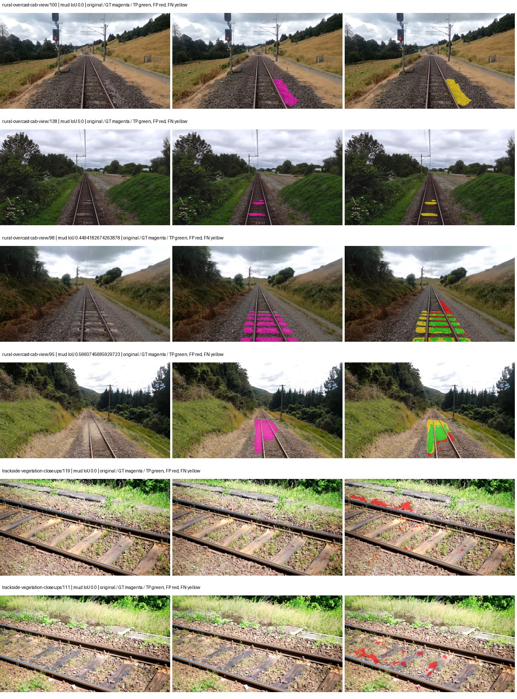

Examples are two lowest and two highest mud-IoU positive images, plus up to two negative images with the most false-positive mud pixels. They are targeted diagnostic examples, not random samples. Green: true positive; red: false positive; yellow: false negative. Full predictions remain on HDRFS.

### Validation tracking

| Logged step | Overall mIoU (%) | Mud IoU (%) |
| --- | --- | --- |
| 254 | 23.61 | 3.59 |
| 508 | 25.96 | 1.72 |
| 763 | 30.68 | 2.90 |
| 1017 | 35.62 | 6.98 |
| 1272 | 39.23 | 10.51 |
| 1527 | 41.65 | 14.43 |
| 1781 | 37.83 | 13.11 |
| 2036 | 39.44 | 6.61 |
| 2290 | 38.89 | 12.99 |
| 2545 | 37.53 | 22.43 |
| 2799 | 37.61 | 15.54 |
| 3054 | 37.38 | 12.58 |
| 3308 | 37.90 | 19.62 |
| 3563 | 37.98 | 17.10 |
| 3817 | 37.65 | 15.41 |

All retained scalar curves, including training loss and per-class IoU, are in record.json. Observed best mud on a curve is not necessarily a retained checkpoint: the pilot saved its selection-metric-best and final checkpoints. Step logging and checkpoint global_step may differ by one.

### Stopping and checkpoint provenance

```json
{
  "stopping": {
    "actual_steps": 3818,
    "maximum_steps": 4000,
    "min_delta": 0.001,
    "monitor": "val_iou/mud-pumping",
    "patience": 5,
    "reason": "validation_plateau"
  },
  "checkpoints": {
    "best": {
      "path": "/data/izadia1/projects/segmentary-runs/paul-test-rtis/mud-fullstats-v1-20260906-r2/future-runs/segformer_b2--cityscapes_to_rtis--seed-2_seed2/rtis/best.ckpt",
      "sha256": "cd8e3d1bccefe7d5ee16c40efac537bf3bb2282cde7815d4cb087814ab36ba74",
      "global_step": 2545,
      "bytes": 438463793
    },
    "final": {
      "path": "/data/izadia1/projects/segmentary-runs/paul-test-rtis/mud-fullstats-v1-20260906-r2/future-runs/segformer_b2--cityscapes_to_rtis--seed-2_seed2/rtis/last.ckpt",
      "sha256": "ca2ad97129f6fd78b1307c62fdd583c18bd02869501cc177b0213cf6252ece34",
      "global_step": 3818,
      "bytes": 438445745
    }
  },
  "cleanup_error": null
}
```

### Resolved training, initialization and evaluation settings

The optimizer block is the base configuration. Stage LR scales are applied at runtime, and stage warmup is capped at min(base warmup, floor(stage budget / 10), stage budget - 1): 400 steps for this 4,000-step pilot. Model-internal native input grids may differ from augmentation crops (EoMT uses its 640 grid).

```json
{
  "name": "segformer_b2--cityscapes_to_rtis--seed-2",
  "model": {
    "arch": "segformer_b2",
    "checkpoint": "nvidia/mit-b2",
    "tuning": "full",
    "head": "unified_head",
    "lora_r": 16,
    "lora_alpha": 32,
    "lora_dropout": 0.05,
    "lora_targets": [],
    "drop_path": null,
    "revision": null,
    "subfolder": null,
    "local_files_only": false,
    "trust_remote_code": false,
    "backbone_path": null,
    "head_paths": [],
    "classifier_path": null,
    "inactive_parameter_paths": [],
    "smp_arch": null,
    "encoder_name": null,
    "encoder_weights": null,
    "native": null,
    "batch_norm_momentum": null
  },
  "space": "paul-test-rtis",
  "taxonomy_root": "/data/izadia1/projects/segmentary-rtis-fullstats-066afb2/taxonomy",
  "output_root": "/data/izadia1/projects/segmentary-runs/paul-test-rtis/mud-fullstats-v1-20260906-r2/future-runs",
  "optim": {
    "backbone_lr": 6e-05,
    "head_lr_mult": 10.0,
    "weight_decay": 0.05,
    "llrd": 1.0,
    "warmup_iters": 1500,
    "warmup_ratio": 1e-06,
    "poly_power": 0.9,
    "min_lr_ratio": 0.0,
    "betas": [
      0.9,
      0.999
    ],
    "grad_clip": 1.0
  },
  "train": {
    "iters": 4000,
    "batch_size": 2,
    "accum": 8,
    "num_workers": 2,
    "precision": "bf16-mixed",
    "ema_decay": 0.9998,
    "val_every": 250,
    "ckpt_every": 500,
    "selection_metric": "val_iou/mud-pumping",
    "early_stopping_patience": 5,
    "early_stopping_min_delta": 0.001,
    "seed": 2,
    "devices": 1
  },
  "eval": {
    "sliding_window": true,
    "window": [
      1024,
      1024
    ],
    "stride": [
      768,
      768
    ],
    "batch_size": 1,
    "num_workers": 2,
    "tta_scales": [],
    "tta_flip": false,
    "threshold": 0.5,
    "boundary_tolerance_frac": 0.0075,
    "save_confusion": true
  },
  "loss": {
    "task": "multiclass",
    "activation": "auto",
    "terms": [],
    "aux": "none",
    "aux_weight": 0.0,
    "ce_weight": 1.0,
    "label_smoothing": 0.0,
    "class_weights": null,
    "query": null
  },
  "aug": {
    "crop": [
      1024,
      1024
    ],
    "scale_min": 0.5,
    "scale_max": 2.0,
    "hflip_p": 0.5,
    "color_jitter_p": 0.5,
    "brightness": 0.25,
    "contrast": 0.25,
    "saturation": 0.25,
    "hue": 0.05
  },
  "stages": [
    {
      "name": "rtis",
      "data": [
        {
          "name": "paul-test-rtis",
          "root": "/data/izadia1/datasets/paul-test-rtis",
          "variant": null,
          "split_file": "splits.json",
          "train_split": "train",
          "val_split": "val",
          "limit": null,
          "loader": "folder",
          "mapping": "paul-test-rtis",
          "loader_options": {
            "require_groups": true
          }
        }
      ],
      "iters": null,
      "lr_scale": 0.1,
      "head_group_lr_scale": 1.0,
      "init_from": "/data/izadia1/projects/segmentary-runs/all-model-city-rail-seed0-a7c0b67/jobs/segformer_b2--cityscapes--seed-0/attempt-001/train/segformer_b2--cityscapes_seed0/cityscapes/last.ckpt",
      "reset_head": true,
      "freeze": null,
      "sample_weights": null
    }
  ]
}
```

### Hardware and software provenance

```json
{
  "training": {
    "cuda_available": true,
    "cuda_visible_devices": "8",
    "cudnn": 91900,
    "driver_version": "570.133.20",
    "gpu_count": 1,
    "gpu_names": [
      "NVIDIA L40S"
    ],
    "hostname": "hdrfs-app-001",
    "input_normalization": {
      "channel_order": "rgb",
      "mean": [
        0.485,
        0.456,
        0.406
      ],
      "source": "imagenet",
      "std": [
        0.229,
        0.224,
        0.225
      ]
    },
    "model_origins": [
      {
        "hf_commit": "3bb39e8739149c3777d0325349b2a6c32c6413db",
        "hf_name_or_path": "nvidia/mit-b2",
        "module": "model",
        "timm_pretrained": {}
      },
      {
        "hf_commit": "3bb39e8739149c3777d0325349b2a6c32c6413db",
        "hf_name_or_path": "nvidia/mit-b2",
        "module": "model.segformer",
        "timm_pretrained": {}
      },
      {
        "hf_commit": "3bb39e8739149c3777d0325349b2a6c32c6413db",
        "hf_name_or_path": "nvidia/mit-b2",
        "module": "model.segformer.stages.0.blocks.0.attention",
        "timm_pretrained": {}
      },
      {
        "hf_commit": "3bb39e8739149c3777d0325349b2a6c32c6413db",
        "hf_name_or_path": "nvidia/mit-b2",
        "module": "model.segformer.stages.0.blocks.1.attention",
        "timm_pretrained": {}
      },
      {
        "hf_commit": "3bb39e8739149c3777d0325349b2a6c32c6413db",
        "hf_name_or_path": "nvidia/mit-b2",
        "module": "model.segformer.stages.0.blocks.2.attention",
        "timm_pretrained": {}
      },
      {
        "hf_commit": "3bb39e8739149c3777d0325349b2a6c32c6413db",
        "hf_name_or_path": "nvidia/mit-b2",
        "module": "model.segformer.stages.1.blocks.0.attention",
        "timm_pretrained": {}
      },
      {
        "hf_commit": "3bb39e8739149c3777d0325349b2a6c32c6413db",
        "hf_name_or_path": "nvidia/mit-b2",
        "module": "model.segformer.stages.1.blocks.1.attention",
        "timm_pretrained": {}
      },
      {
        "hf_commit": "3bb39e8739149c3777d0325349b2a6c32c6413db",
        "hf_name_or_path": "nvidia/mit-b2",
        "module": "model.segformer.stages.1.blocks.2.attention",
        "timm_pretrained": {}
      },
      {
        "hf_commit": "3bb39e8739149c3777d0325349b2a6c32c6413db",
        "hf_name_or_path": "nvidia/mit-b2",
        "module": "model.segformer.stages.1.blocks.3.attention",
        "timm_pretrained": {}
      },
      {
        "hf_commit": "3bb39e8739149c3777d0325349b2a6c32c6413db",
        "hf_name_or_path": "nvidia/mit-b2",
        "module": "model.segformer.stages.2.blocks.0.attention",
        "timm_pretrained": {}
      },
      {
        "hf_commit": "3bb39e8739149c3777d0325349b2a6c32c6413db",
        "hf_name_or_path": "nvidia/mit-b2",
        "module": "model.segformer.stages.2.blocks.1.attention",
        "timm_pretrained": {}
      },
      {
        "hf_commit": "3bb39e8739149c3777d0325349b2a6c32c6413db",
        "hf_name_or_path": "nvidia/mit-b2",
        "module": "model.segformer.stages.2.blocks.2.attention",
        "timm_pretrained": {}
      },
      {
        "hf_commit": "3bb39e8739149c3777d0325349b2a6c32c6413db",
        "hf_name_or_path": "nvidia/mit-b2",
        "module": "model.segformer.stages.2.blocks.3.attention",
        "timm_pretrained": {}
      },
      {
        "hf_commit": "3bb39e8739149c3777d0325349b2a6c32c6413db",
        "hf_name_or_path": "nvidia/mit-b2",
        "module": "model.segformer.stages.2.blocks.4.attention",
        "timm_pretrained": {}
      },
      {
        "hf_commit": "3bb39e8739149c3777d0325349b2a6c32c6413db",
        "hf_name_or_path": "nvidia/mit-b2",
        "module": "model.segformer.stages.2.blocks.5.attention",
        "timm_pretrained": {}
      },
      {
        "hf_commit": "3bb39e8739149c3777d0325349b2a6c32c6413db",
        "hf_name_or_path": "nvidia/mit-b2",
        "module": "model.segformer.stages.3.blocks.0.attention",
        "timm_pretrained": {}
      },
      {
        "hf_commit": "3bb39e8739149c3777d0325349b2a6c32c6413db",
        "hf_name_or_path": "nvidia/mit-b2",
        "module": "model.segformer.stages.3.blocks.1.attention",
        "timm_pretrained": {}
      },
      {
        "hf_commit": "3bb39e8739149c3777d0325349b2a6c32c6413db",
        "hf_name_or_path": "nvidia/mit-b2",
        "module": "model.segformer.stages.3.blocks.2.attention",
        "timm_pretrained": {}
      },
      {
        "hf_commit": "3bb39e8739149c3777d0325349b2a6c32c6413db",
        "hf_name_or_path": "nvidia/mit-b2",
        "module": "model.decode_head",
        "timm_pretrained": {}
      }
    ],
    "model_parameter_count": 27362773,
    "packages": {
      "albumentations": "2.0.8",
      "lightning": "2.6.5",
      "numpy": "2.4.4",
      "segmentary": "0.1.0",
      "segmentation-models-pytorch": "0.5.0",
      "timm": "1.0.28",
      "torch": "2.11.0+cu128",
      "torchvision": "0.26.0+cu128",
      "transformers": "5.15.0"
    },
    "platform": "Linux-5.15.0-139-generic-x86_64-with-glibc2.35",
    "python": "3.11.15",
    "torch": "2.11.0+cu128",
    "torch_cuda": "12.8",
    "trainable_parameter_count": 27362773,
    "training_stop": {
      "actual_steps": 3818,
      "maximum_steps": 4000,
      "min_delta": 0.001,
      "monitor": "val_iou/mud-pumping",
      "patience": 5,
      "reason": "validation_plateau"
    },
    "validation_weights": "raw"
  },
  "evaluation": {
    "cuda_available": true,
    "cuda_visible_devices": "8",
    "cudnn": 91900,
    "driver_version": "570.133.20",
    "gpu_count": 1,
    "gpu_names": [
      "NVIDIA L40S"
    ],
    "hostname": "hdrfs-app-001",
    "input_normalization": {
      "channel_order": "rgb",
      "mean": [
        0.485,
        0.456,
        0.406
      ],
      "source": "imagenet",
      "std": [
        0.229,
        0.224,
        0.225
      ]
    },
    "packages": {
      "albumentations": "2.0.8",
      "lightning": "2.6.5",
      "numpy": "2.4.4",
      "segmentary": "0.1.0",
      "segmentation-models-pytorch": "0.5.0",
      "timm": "1.0.28",
      "torch": "2.11.0+cu128",
      "torchvision": "0.26.0+cu128",
      "transformers": "5.15.0"
    },
    "platform": "Linux-5.15.0-139-generic-x86_64-with-glibc2.35",
    "python": "3.11.15",
    "torch": "2.11.0+cu128",
    "torch_cuda": "12.8"
  }
}
```

## railsem19_to_rtis — seed 0

Status: **completed**. Started: 2026-09-07T02:10:45.307334+00:00. Finished: 2026-09-07T03:19:11.586552+00:00.

Recipe pretrained initializer: `nvidia/mit-b2`.

`rtis_only` uses the recipe initializer, which may include pretrained segmentation components. Transfer paths load the exact historical source checkpoint below and reset the classifier; they do not reset all query/decoder features.

Source checkpoint: `{'name': 'segformer_b2--railsem19--seed-0', 'model': 'segformer_b2', 'protocol': 'railsem19', 'config': '/data/izadia1/projects/segmentary-runs/all-model-city-rail-seed0-rail20-b9eb3e1/accepted/segformer_b2--railsem19--seed-0/resolved-config.yaml', 'checkpoint': '/data/izadia1/projects/segmentary-runs/all-model-city-rail-seed0-a7c0b67/jobs/segformer_b2--railsem19--seed-0/attempt-001/train/segformer_b2--railsem19_seed0/railsem19/last.ckpt', 'recorded_sha256': 'a017480f6fc66e45651f83f3103f582591fa2f5f82b7dc048429508393ccfc20', 'exists': True}`.

Config SHA-256: `4c7aefadaf09d6a1493590299f4f5532079d4b5647f7d5d7634630e2bf6a5ac7`. Weights used for validation: `raw`.

### Mud-pumping and aggregate quality

| Metric | Selected checkpoint | Final training validation |
| --- | --- | --- |
| Mud IoU | 6.53 | 5.49 |
| Mud precision | 7.61 | 6.56 |
| Mud recall | 31.48 | 25.31 |
| Mud Dice/F1 | 12.26 | 10.41 |
| mIoU | 46.29 | 46.42 |
| Mean accuracy | 61.92 | 61.87 |
| Mean precision | 62.68 | 62.51 |
| Mean Dice | 56.83 | 56.81 |
| Mean specificity | 98.97 | 98.98 |
| Pixel accuracy | 83.58 | 83.55 |
| Frequency-weighted IoU | 75.33 | 75.34 |
| Fixed GT-present class mIoU | 51.43 | 51.58 |
| Boundary F1 | 52.56 | 52.02 |

The selected checkpoint has independent evaluation evidence. Final values are the trainer's final validation record, not a new independent evaluation. mIoU averages classes with nonzero union, so false positives on absent classes can change its denominator. The fixed GT-class mean is supplementary and excludes absent classes; their false positives remain in the confusion matrix.

### Resource usage and timing

| Measurement | Value |
| --- | --- |
| Peak training VRAM, retained training invocation (GiB) | 11.73 |
| Peak evaluation VRAM (GiB) | 7.46 |
| Retained training invocation wall time (seconds) | 3876.30 |
| Retained training invocation GPU-hours (one GPU) | 1.08 |
| Evaluation wall time (seconds) | 22.19 |
| Full evaluation pipeline images/second | 1.67 |
| Best full-state checkpoint (MiB) | 418.15 |
| Final full-state checkpoint (MiB) | 418.13 |
| Audited periodic checkpoints removed (GiB) | 3.27 |

VRAM uses the recorded allocator high-water mark; it is not total device usage including CUDA context. Resumed jobs' retained training invocation times and peaks are **not whole-campaign totals**. Earlier invocation resource records are not reconstructed here. Evaluation throughput includes loader, sliding-window inference and metrics; it is not model-only latency/FPS. Missing measurements are shown as —, never inferred from another dataset's run.

### Standardized inference performance

Dedicated model-only profiling waits for an idle worker-locked L40S: BF16, batch 1, 1024x1024, 20 warmup and 100 CUDA-event-timed public forwards. It excludes loading, preprocessing, tiling and metrics.

| Status | Parameters | Weight MiB | FPS | p50 ms | p95 ms | Peak reserved GiB |
| --- | --- | --- | --- | --- | --- | --- |
| complete | 27362773 | 104.38 | 53.21 | 18.63 | 19.72 | 2.25 |

```json
{
  "schema_version": 1,
  "model_id": "segformer_b2",
  "measured_at": "2026-09-07T03:19:06+00:00",
  "status": "complete",
  "benchmark_scope": "rtis_selected_checkpoint_model_only",
  "applies_to": [
    "segformer_b2--railsem19_to_rtis--seed-0"
  ],
  "source": {
    "campaign_git_sha": "066afb2626398b7be59d4d19f5a0e4644fd59adc",
    "git_dirty": false,
    "config_hash": "602eb7de43b6",
    "resolved_config": "/data/izadia1/projects/segmentary-runs/paul-test-rtis/mud-fullstats-v1-20260906-r2/configs/segformer_b2--railsem19_to_rtis--seed-0.yaml",
    "config_sha256": "4c7aefadaf09d6a1493590299f4f5532079d4b5647f7d5d7634630e2bf6a5ac7",
    "checkpoint_sha256": "cda5f8c6377a29e8884edb5222b1d6a7f5666d6a85f9115d4cf0e0fbd5965047",
    "checkpoint_global_step": 3563,
    "checkpoint_bytes": 438463793,
    "checkpoint_kind": "resume checkpoint with optimizer and EMA state",
    "weights": "raw",
    "measured_checkpoint_job_id": "segformer_b2--railsem19_to_rtis--seed-0",
    "result_sha256": "175a0e83da67f28c7f9769547996ce61289999fd72ff64c032dbc38b21493bd6",
    "result_git_sha": "066afb2626398b7be59d4d19f5a0e4644fd59adc",
    "result_stage": "eval:paul-test-rtis:val",
    "result_seed": 0
  },
  "hardware": {
    "gpu_name": "NVIDIA L40S",
    "gpu_uuid": "GPU-804aea8b-5f62-423e-72c6-49e1ed15c4e4",
    "logical_device": "cuda:0",
    "physical_visibility_token": "6",
    "compute_capability": [
      8,
      9
    ],
    "total_memory_bytes": 47677177856
  },
  "model": {
    "parameter_count": 27362773,
    "trainable_parameter_count": 27362773,
    "resident_parameter_bytes": 109451092,
    "parameter_dtype_counts": {
      "float32": 27362773
    }
  },
  "contract": {
    "backend": "pytorch",
    "precision": "bf16_autocast",
    "batch_size": 1,
    "input_shape_nchw": [
      1,
      3,
      1024,
      1024
    ],
    "warmup_iterations": 20,
    "measured_iterations": 100,
    "timing": "per-forward CUDA events with end-event synchronization",
    "includes_preprocessing": false,
    "includes_data_loader": false,
    "includes_sliding_window": false,
    "input_resident_on_gpu": true,
    "model_only": true,
    "entrypoint": "public model(image) dense-logits forward"
  },
  "measurements": {
    "latency": {
      "p50_ms": 18.63219165802002,
      "p95_ms": 19.721215534210206,
      "mean_ms": 18.79482172012329,
      "minimum_ms": 18.44633674621582,
      "maximum_ms": 20.559871673583984,
      "fps": 53.2061444844309,
      "raw_ms": [
        19.803136825561523,
        18.65727996826172,
        18.621440887451172,
        18.5927677154541,
        18.574304580688477,
        18.573280334472656,
        18.604032516479492,
        18.6060791015625,
        18.587648391723633,
        18.578432083129883,
        18.529279708862305,
        18.60198402404785,
        18.8221435546875,
        18.5927677154541,
        18.61631965637207,
        18.719743728637695,
        18.561023712158203,
        19.83283233642578,
        18.63577651977539,
        18.64806365966797,
        18.98700714111328,
        19.122175216674805,
        18.662399291992188,
        18.735103607177734,
        18.63167953491211,
        19.009471893310547,
        18.62860870361328,
        18.685951232910156,
        18.6060791015625,
        18.542591094970703,
        18.6746883392334,
        18.581504821777344,
        18.59071922302246,
        18.61734390258789,
        18.538496017456055,
        18.68390464782715,
        18.63270378112793,
        19.779584884643555,
        18.499584197998047,
        18.587648391723633,
        18.733055114746094,
        18.586624145507812,
        18.492416381835938,
        18.680831909179688,
        18.520063400268555,
        18.87539291381836,
        18.57027244567871,
        18.58252716064453,
        18.514944076538086,
        19.62495994567871,
        19.718143463134766,
        19.560447692871094,
        18.605024337768555,
        18.578432083129883,
        18.535423278808594,
        19.154943466186523,
        18.67673683166504,
        18.61939239501953,
        19.60857582092285,
        19.016704559326172,
        18.83750343322754,
        18.9880313873291,
        20.559871673583984,
        18.998271942138672,
        18.6060791015625,
        18.551807403564453,
        18.569215774536133,
        18.497535705566406,
        18.548736572265625,
        18.752511978149414,
        18.960351943969727,
        20.146175384521484,
        18.539520263671875,
        18.46886444091797,
        18.506752014160156,
        18.935775756835938,
        18.98700714111328,
        18.579456329345703,
        18.504703521728516,
        19.570688247680664,
        18.913280487060547,
        18.496511459350586,
        18.44633674621582,
        18.65727996826172,
        18.803712844848633,
        18.552831649780273,
        18.681856155395508,
        18.6562557220459,
        18.555904388427734,
        19.0699520111084,
        19.4385929107666,
        18.930688858032227,
        18.553855895996094,
        18.672639846801758,
        18.662399291992188,
        18.63065528869629,
        18.720767974853516,
        18.605056762695312,
        18.66547203063965,
        18.84876823425293
      ],
      "percentile_method": "numpy linear interpolation"
    },
    "peak_reserved_bytes": 2420113408,
    "memory_kind": "pytorch_cuda_allocator_peak_reserved_excluding_context",
    "benchmark_wall_clock_s": 5.6284461207687855
  },
  "started_at": "2026-09-07T03:19:00+00:00",
  "finished_at": "2026-09-07T03:19:06+00:00",
  "environment": {
    "hostname": "hdrfs-app-001",
    "python": "3.11.15",
    "platform": "Linux-5.15.0-139-generic-x86_64-with-glibc2.35",
    "torch": "2.11.0+cu128",
    "torch_cuda": "12.8",
    "cudnn": 91900,
    "driver_version": "570.133.20",
    "cuda_available": true,
    "gpu_count": 1,
    "gpu_names": [
      "NVIDIA L40S"
    ],
    "cuda_visible_devices": "6",
    "packages": {
      "segmentary": "0.1.0",
      "torch": "2.11.0+cu128",
      "torchvision": "0.26.0+cu128",
      "transformers": "5.15.0",
      "timm": "1.0.28",
      "segmentation-models-pytorch": "0.5.0",
      "albumentations": "2.0.8",
      "lightning": "2.6.5",
      "numpy": "2.4.4"
    }
  }
}
```

### Per-class validation results

| Class | GT pixels | IoU (%) | Precision (%) | Recall (%) | Dice (%) | Boundary F1 (%) |
| --- | --- | --- | --- | --- | --- | --- |
| car | 29664 | 67.40 | 72.79 | 90.10 | 80.53 | 59.37 |
| construction | 311585 | 57.96 | 69.60 | 77.61 | 73.38 | 63.36 |
| fence | 265137 | 33.05 | 61.52 | 41.67 | 49.69 | 46.22 |
| mud-pumping | 1226250 | 6.53 | 7.61 | 31.48 | 12.26 | 11.89 |
| on-rails | 0 | — | — | — | — | — |
| person | 0 | 0.00 | 0.00 | — | 0.00 | 0.00 |
| pole | 628038 | 76.69 | 88.57 | 85.11 | 86.80 | 93.31 |
| rail-embedded | 16799 | 55.10 | 77.93 | 65.29 | 71.05 | 87.17 |
| rail-raised | 2969797 | 73.35 | 79.71 | 90.19 | 84.63 | 89.60 |
| rail-track | 6323197 | 37.77 | 79.05 | 41.97 | 54.83 | 52.21 |
| road | 1048831 | 11.11 | 31.66 | 14.61 | 19.99 | 29.84 |
| sidewalk | 1297367 | 48.03 | 88.39 | 51.27 | 64.89 | 14.45 |
| sky | 19121606 | 98.85 | 99.32 | 99.52 | 99.42 | 97.65 |
| standing-water | 95802 | 1.03 | 1.88 | 2.21 | 2.03 | 9.73 |
| terrain | 39239306 | 86.94 | 88.14 | 98.47 | 93.02 | 66.64 |
| trackbed | 10643081 | 60.73 | 77.96 | 73.32 | 75.57 | 57.74 |
| traffic-light | 19510 | 76.15 | 96.60 | 78.24 | 86.46 | 91.42 |
| traffic-sign | 13285 | 53.34 | 84.20 | 59.28 | 69.57 | 75.97 |
| tram-track | 56179 | 56.41 | 61.17 | 87.87 | 72.13 | 48.28 |
| truck | 0 | 0.00 | 0.00 | — | 0.00 | 0.00 |
| vegetation-overgrowth | 5901821 | 25.33 | 87.58 | 26.27 | 40.42 | 56.42 |

### Full-run accounting

| Measurement | Value |
| --- | --- |
| Full GPU-reserved wall seconds, all recorded worker attempts | 4106.64 |
| Full reserved GPU-hours | 1.14 |
| Whole-run timing complete | True |

| Phase | Wall seconds including failed attempts |
| --- | --- |
| training | 3883.53 |
| diagnostics | 175.67 |
| performance | 12.77 |

GPU-reserved time includes model loading, training, validation, collection, profiling, checkpoint I/O and orchestration while the worker owns one GPU. It is not GPU kernel-active time. Phase timings and sampled device memory/power/utilization are retained separately; sampled device memory is not the allocator high-water mark.

### Train/validation and raw/EMA diagnostics

| Checkpoint / weights / split | Images | Mud IoU (%) | Mud precision (%) | Mud recall (%) |
| --- | --- | --- | --- | --- |
| best-auto-train / raw | 220 | 95.64 | 97.53 | 98.02 |
| best-auto-val / raw | 37 | 6.53 | 7.61 | 31.48 |
| best-alternate-val / ema | 37 | 4.73 | 5.61 | 23.18 |
| final-auto-val / raw | 37 | 5.49 | 6.56 | 25.33 |

Train uses the evaluation transform without augmentation. Compare mud train/validation metrics for the same selected weights. Alternate EMA on running-stat BatchNorm is explicitly uncalibrated and is diagnostic only. Score-threshold curves use uncalibrated normalized scores and are pixel-level diagnostics, not event detection rates or a selected deployment operating point.

### Downloadable evidence

- best-auto-train: [per-image.csv](railsem19_to_rtis--seed-0/best-auto-train/per-image.csv) · [per-image-confusion.json.gz](railsem19_to_rtis--seed-0/best-auto-train/per-image-confusion.json.gz) · [groups.json](railsem19_to_rtis--seed-0/best-auto-train/groups.json) · [mud-score-curves.json](railsem19_to_rtis--seed-0/best-auto-train/mud-score-curves.json)
- best-auto-val: [per-image.csv](railsem19_to_rtis--seed-0/best-auto-val/per-image.csv) · [per-image-confusion.json.gz](railsem19_to_rtis--seed-0/best-auto-val/per-image-confusion.json.gz) · [groups.json](railsem19_to_rtis--seed-0/best-auto-val/groups.json) · [mud-score-curves.json](railsem19_to_rtis--seed-0/best-auto-val/mud-score-curves.json) · [examples.jpg](railsem19_to_rtis--seed-0/best-auto-val/examples.jpg)
- best-alternate-val: [per-image.csv](railsem19_to_rtis--seed-0/best-alternate-val/per-image.csv) · [per-image-confusion.json.gz](railsem19_to_rtis--seed-0/best-alternate-val/per-image-confusion.json.gz) · [groups.json](railsem19_to_rtis--seed-0/best-alternate-val/groups.json) · [mud-score-curves.json](railsem19_to_rtis--seed-0/best-alternate-val/mud-score-curves.json)
- final-auto-val: [per-image.csv](railsem19_to_rtis--seed-0/final-auto-val/per-image.csv) · [per-image-confusion.json.gz](railsem19_to_rtis--seed-0/final-auto-val/per-image-confusion.json.gz) · [groups.json](railsem19_to_rtis--seed-0/final-auto-val/groups.json) · [mud-score-curves.json](railsem19_to_rtis--seed-0/final-auto-val/mud-score-curves.json)
- resources: [telemetry.csv](railsem19_to_rtis--seed-0/resources/telemetry.csv)

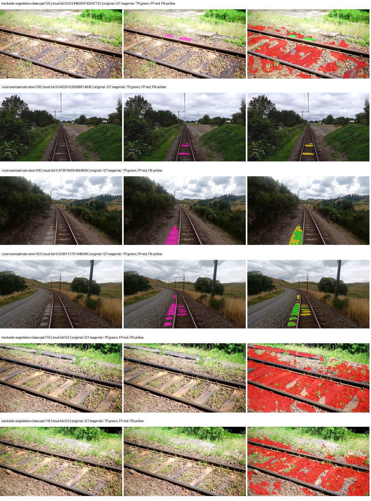

Examples are two lowest and two highest mud-IoU positive images, plus up to two negative images with the most false-positive mud pixels. They are targeted diagnostic examples, not random samples. Green: true positive; red: false positive; yellow: false negative. Full predictions remain on HDRFS.

### Validation tracking

| Logged step | Overall mIoU (%) | Mud IoU (%) |
| --- | --- | --- |
| 254 | 34.28 | 0.16 |
| 508 | 39.59 | 1.45 |
| 763 | 46.16 | 1.91 |
| 1017 | 47.57 | 1.23 |
| 1272 | 46.62 | 4.93 |
| 1527 | 46.86 | 2.74 |
| 1781 | 46.31 | 4.03 |
| 2036 | 46.93 | 5.00 |
| 2290 | 46.42 | 5.18 |
| 2545 | 47.07 | 4.43 |
| 2799 | 46.24 | 5.65 |
| 3054 | 47.22 | 6.31 |
| 3308 | 47.52 | 4.79 |
| 3563 | 46.30 | 6.53 |
| 3817 | 46.64 | 5.57 |
| 4000 | 46.42 | 5.49 |

All retained scalar curves, including training loss and per-class IoU, are in record.json. Observed best mud on a curve is not necessarily a retained checkpoint: the pilot saved its selection-metric-best and final checkpoints. Step logging and checkpoint global_step may differ by one.

### Stopping and checkpoint provenance

```json
{
  "stopping": {
    "actual_steps": 4000,
    "maximum_steps": 4000,
    "min_delta": 0.001,
    "monitor": "val_iou/mud-pumping",
    "patience": 5,
    "reason": "budget_complete"
  },
  "checkpoints": {
    "best": {
      "path": "/data/izadia1/projects/segmentary-runs/paul-test-rtis/mud-fullstats-v1-20260906-r2/future-runs/segformer_b2--railsem19_to_rtis--seed-0_seed0/rtis/best.ckpt",
      "sha256": "cda5f8c6377a29e8884edb5222b1d6a7f5666d6a85f9115d4cf0e0fbd5965047",
      "global_step": 3563,
      "bytes": 438463793
    },
    "final": {
      "path": "/data/izadia1/projects/segmentary-runs/paul-test-rtis/mud-fullstats-v1-20260906-r2/future-runs/segformer_b2--railsem19_to_rtis--seed-0_seed0/rtis/last.ckpt",
      "sha256": "b27043d95d14c7406b49048f8dfb27bbc4a1cabd9f6f43eb5331ff271ca3027d",
      "global_step": 4000,
      "bytes": 438445617
    }
  },
  "cleanup_error": null
}
```

### Resolved training, initialization and evaluation settings

The optimizer block is the base configuration. Stage LR scales are applied at runtime, and stage warmup is capped at min(base warmup, floor(stage budget / 10), stage budget - 1): 400 steps for this 4,000-step pilot. Model-internal native input grids may differ from augmentation crops (EoMT uses its 640 grid).

```json
{
  "name": "segformer_b2--railsem19_to_rtis--seed-0",
  "model": {
    "arch": "segformer_b2",
    "checkpoint": "nvidia/mit-b2",
    "tuning": "full",
    "head": "unified_head",
    "lora_r": 16,
    "lora_alpha": 32,
    "lora_dropout": 0.05,
    "lora_targets": [],
    "drop_path": null,
    "revision": null,
    "subfolder": null,
    "local_files_only": false,
    "trust_remote_code": false,
    "backbone_path": null,
    "head_paths": [],
    "classifier_path": null,
    "inactive_parameter_paths": [],
    "smp_arch": null,
    "encoder_name": null,
    "encoder_weights": null,
    "native": null,
    "batch_norm_momentum": null
  },
  "space": "paul-test-rtis",
  "taxonomy_root": "/data/izadia1/projects/segmentary-rtis-fullstats-066afb2/taxonomy",
  "output_root": "/data/izadia1/projects/segmentary-runs/paul-test-rtis/mud-fullstats-v1-20260906-r2/future-runs",
  "optim": {
    "backbone_lr": 6e-05,
    "head_lr_mult": 10.0,
    "weight_decay": 0.05,
    "llrd": 1.0,
    "warmup_iters": 1500,
    "warmup_ratio": 1e-06,
    "poly_power": 0.9,
    "min_lr_ratio": 0.0,
    "betas": [
      0.9,
      0.999
    ],
    "grad_clip": 1.0
  },
  "train": {
    "iters": 4000,
    "batch_size": 2,
    "accum": 8,
    "num_workers": 2,
    "precision": "bf16-mixed",
    "ema_decay": 0.9998,
    "val_every": 250,
    "ckpt_every": 500,
    "selection_metric": "val_iou/mud-pumping",
    "early_stopping_patience": 5,
    "early_stopping_min_delta": 0.001,
    "seed": 0,
    "devices": 1
  },
  "eval": {
    "sliding_window": true,
    "window": [
      1024,
      1024
    ],
    "stride": [
      768,
      768
    ],
    "batch_size": 1,
    "num_workers": 2,
    "tta_scales": [],
    "tta_flip": false,
    "threshold": 0.5,
    "boundary_tolerance_frac": 0.0075,
    "save_confusion": true
  },
  "loss": {
    "task": "multiclass",
    "activation": "auto",
    "terms": [],
    "aux": "none",
    "aux_weight": 0.0,
    "ce_weight": 1.0,
    "label_smoothing": 0.0,
    "class_weights": null,
    "query": null
  },
  "aug": {
    "crop": [
      1024,
      1024
    ],
    "scale_min": 0.5,
    "scale_max": 2.0,
    "hflip_p": 0.5,
    "color_jitter_p": 0.5,
    "brightness": 0.25,
    "contrast": 0.25,
    "saturation": 0.25,
    "hue": 0.05
  },
  "stages": [
    {
      "name": "rtis",
      "data": [
        {
          "name": "paul-test-rtis",
          "root": "/data/izadia1/datasets/paul-test-rtis",
          "variant": null,
          "split_file": "splits.json",
          "train_split": "train",
          "val_split": "val",
          "limit": null,
          "loader": "folder",
          "mapping": "paul-test-rtis",
          "loader_options": {
            "require_groups": true
          }
        }
      ],
      "iters": null,
      "lr_scale": 0.1,
      "head_group_lr_scale": 1.0,
      "init_from": "/data/izadia1/projects/segmentary-runs/all-model-city-rail-seed0-a7c0b67/jobs/segformer_b2--railsem19--seed-0/attempt-001/train/segformer_b2--railsem19_seed0/railsem19/last.ckpt",
      "reset_head": true,
      "freeze": null,
      "sample_weights": null
    }
  ]
}
```

### Hardware and software provenance

```json
{
  "training": {
    "cuda_available": true,
    "cuda_visible_devices": "6",
    "cudnn": 91900,
    "driver_version": "570.133.20",
    "gpu_count": 1,
    "gpu_names": [
      "NVIDIA L40S"
    ],
    "hostname": "hdrfs-app-001",
    "input_normalization": {
      "channel_order": "rgb",
      "mean": [
        0.485,
        0.456,
        0.406
      ],
      "source": "imagenet",
      "std": [
        0.229,
        0.224,
        0.225
      ]
    },
    "model_origins": [
      {
        "hf_commit": "3bb39e8739149c3777d0325349b2a6c32c6413db",
        "hf_name_or_path": "nvidia/mit-b2",
        "module": "model",
        "timm_pretrained": {}
      },
      {
        "hf_commit": "3bb39e8739149c3777d0325349b2a6c32c6413db",
        "hf_name_or_path": "nvidia/mit-b2",
        "module": "model.segformer",
        "timm_pretrained": {}
      },
      {
        "hf_commit": "3bb39e8739149c3777d0325349b2a6c32c6413db",
        "hf_name_or_path": "nvidia/mit-b2",
        "module": "model.segformer.stages.0.blocks.0.attention",
        "timm_pretrained": {}
      },
      {
        "hf_commit": "3bb39e8739149c3777d0325349b2a6c32c6413db",
        "hf_name_or_path": "nvidia/mit-b2",
        "module": "model.segformer.stages.0.blocks.1.attention",
        "timm_pretrained": {}
      },
      {
        "hf_commit": "3bb39e8739149c3777d0325349b2a6c32c6413db",
        "hf_name_or_path": "nvidia/mit-b2",
        "module": "model.segformer.stages.0.blocks.2.attention",
        "timm_pretrained": {}
      },
      {
        "hf_commit": "3bb39e8739149c3777d0325349b2a6c32c6413db",
        "hf_name_or_path": "nvidia/mit-b2",
        "module": "model.segformer.stages.1.blocks.0.attention",
        "timm_pretrained": {}
      },
      {
        "hf_commit": "3bb39e8739149c3777d0325349b2a6c32c6413db",
        "hf_name_or_path": "nvidia/mit-b2",
        "module": "model.segformer.stages.1.blocks.1.attention",
        "timm_pretrained": {}
      },
      {
        "hf_commit": "3bb39e8739149c3777d0325349b2a6c32c6413db",
        "hf_name_or_path": "nvidia/mit-b2",
        "module": "model.segformer.stages.1.blocks.2.attention",
        "timm_pretrained": {}
      },
      {
        "hf_commit": "3bb39e8739149c3777d0325349b2a6c32c6413db",
        "hf_name_or_path": "nvidia/mit-b2",
        "module": "model.segformer.stages.1.blocks.3.attention",
        "timm_pretrained": {}
      },
      {
        "hf_commit": "3bb39e8739149c3777d0325349b2a6c32c6413db",
        "hf_name_or_path": "nvidia/mit-b2",
        "module": "model.segformer.stages.2.blocks.0.attention",
        "timm_pretrained": {}
      },
      {
        "hf_commit": "3bb39e8739149c3777d0325349b2a6c32c6413db",
        "hf_name_or_path": "nvidia/mit-b2",
        "module": "model.segformer.stages.2.blocks.1.attention",
        "timm_pretrained": {}
      },
      {
        "hf_commit": "3bb39e8739149c3777d0325349b2a6c32c6413db",
        "hf_name_or_path": "nvidia/mit-b2",
        "module": "model.segformer.stages.2.blocks.2.attention",
        "timm_pretrained": {}
      },
      {
        "hf_commit": "3bb39e8739149c3777d0325349b2a6c32c6413db",
        "hf_name_or_path": "nvidia/mit-b2",
        "module": "model.segformer.stages.2.blocks.3.attention",
        "timm_pretrained": {}
      },
      {
        "hf_commit": "3bb39e8739149c3777d0325349b2a6c32c6413db",
        "hf_name_or_path": "nvidia/mit-b2",
        "module": "model.segformer.stages.2.blocks.4.attention",
        "timm_pretrained": {}
      },
      {
        "hf_commit": "3bb39e8739149c3777d0325349b2a6c32c6413db",
        "hf_name_or_path": "nvidia/mit-b2",
        "module": "model.segformer.stages.2.blocks.5.attention",
        "timm_pretrained": {}
      },
      {
        "hf_commit": "3bb39e8739149c3777d0325349b2a6c32c6413db",
        "hf_name_or_path": "nvidia/mit-b2",
        "module": "model.segformer.stages.3.blocks.0.attention",
        "timm_pretrained": {}
      },
      {
        "hf_commit": "3bb39e8739149c3777d0325349b2a6c32c6413db",
        "hf_name_or_path": "nvidia/mit-b2",
        "module": "model.segformer.stages.3.blocks.1.attention",
        "timm_pretrained": {}
      },
      {
        "hf_commit": "3bb39e8739149c3777d0325349b2a6c32c6413db",
        "hf_name_or_path": "nvidia/mit-b2",
        "module": "model.segformer.stages.3.blocks.2.attention",
        "timm_pretrained": {}
      },
      {
        "hf_commit": "3bb39e8739149c3777d0325349b2a6c32c6413db",
        "hf_name_or_path": "nvidia/mit-b2",
        "module": "model.decode_head",
        "timm_pretrained": {}
      }
    ],
    "model_parameter_count": 27362773,
    "packages": {
      "albumentations": "2.0.8",
      "lightning": "2.6.5",
      "numpy": "2.4.4",
      "segmentary": "0.1.0",
      "segmentation-models-pytorch": "0.5.0",
      "timm": "1.0.28",
      "torch": "2.11.0+cu128",
      "torchvision": "0.26.0+cu128",
      "transformers": "5.15.0"
    },
    "platform": "Linux-5.15.0-139-generic-x86_64-with-glibc2.35",
    "python": "3.11.15",
    "torch": "2.11.0+cu128",
    "torch_cuda": "12.8",
    "trainable_parameter_count": 27362773,
    "training_stop": {
      "actual_steps": 4000,
      "maximum_steps": 4000,
      "min_delta": 0.001,
      "monitor": "val_iou/mud-pumping",
      "patience": 5,
      "reason": "budget_complete"
    },
    "validation_weights": "raw"
  },
  "evaluation": {
    "cuda_available": true,
    "cuda_visible_devices": "6",
    "cudnn": 91900,
    "driver_version": "570.133.20",
    "gpu_count": 1,
    "gpu_names": [
      "NVIDIA L40S"
    ],
    "hostname": "hdrfs-app-001",
    "input_normalization": {
      "channel_order": "rgb",
      "mean": [
        0.485,
        0.456,
        0.406
      ],
      "source": "imagenet",
      "std": [
        0.229,
        0.224,
        0.225
      ]
    },
    "packages": {
      "albumentations": "2.0.8",
      "lightning": "2.6.5",
      "numpy": "2.4.4",
      "segmentary": "0.1.0",
      "segmentation-models-pytorch": "0.5.0",
      "timm": "1.0.28",
      "torch": "2.11.0+cu128",
      "torchvision": "0.26.0+cu128",
      "transformers": "5.15.0"
    },
    "platform": "Linux-5.15.0-139-generic-x86_64-with-glibc2.35",
    "python": "3.11.15",
    "torch": "2.11.0+cu128",
    "torch_cuda": "12.8"
  }
}
```

## railsem19_to_rtis — seed 1

Status: **completed**. Started: 2026-09-07T02:10:46.575699+00:00. Finished: 2026-09-07T03:16:27.369333+00:00.

Recipe pretrained initializer: `nvidia/mit-b2`.

`rtis_only` uses the recipe initializer, which may include pretrained segmentation components. Transfer paths load the exact historical source checkpoint below and reset the classifier; they do not reset all query/decoder features.

Source checkpoint: `{'name': 'segformer_b2--railsem19--seed-0', 'model': 'segformer_b2', 'protocol': 'railsem19', 'config': '/data/izadia1/projects/segmentary-runs/all-model-city-rail-seed0-rail20-b9eb3e1/accepted/segformer_b2--railsem19--seed-0/resolved-config.yaml', 'checkpoint': '/data/izadia1/projects/segmentary-runs/all-model-city-rail-seed0-a7c0b67/jobs/segformer_b2--railsem19--seed-0/attempt-001/train/segformer_b2--railsem19_seed0/railsem19/last.ckpt', 'recorded_sha256': 'a017480f6fc66e45651f83f3103f582591fa2f5f82b7dc048429508393ccfc20', 'exists': True}`.

Config SHA-256: `4276c1a9aad0da74612e132c4a5b5a14138c24379f3c40edb987823f0f4dded9`. Weights used for validation: `raw`.

### Mud-pumping and aggregate quality

| Metric | Selected checkpoint | Final training validation |
| --- | --- | --- |
| Mud IoU | 7.58 | 4.96 |
| Mud precision | 10.22 | 5.79 |
| Mud recall | 22.73 | 25.66 |
| Mud Dice/F1 | 14.10 | 9.45 |
| mIoU | 46.50 | 43.50 |
| Mean accuracy | 62.79 | 60.99 |
| Mean precision | 62.05 | 59.40 |
| Mean Dice | 57.34 | 53.64 |
| Mean specificity | 99.07 | 98.97 |
| Pixel accuracy | 85.04 | 83.13 |
| Frequency-weighted IoU | 76.62 | 75.30 |
| Fixed GT-present class mIoU | 51.67 | 50.75 |
| Boundary F1 | 52.06 | 49.07 |

The selected checkpoint has independent evaluation evidence. Final values are the trainer's final validation record, not a new independent evaluation. mIoU averages classes with nonzero union, so false positives on absent classes can change its denominator. The fixed GT-class mean is supplementary and excludes absent classes; their false positives remain in the confusion matrix.

### Resource usage and timing

| Measurement | Value |
| --- | --- |
| Peak training VRAM, retained training invocation (GiB) | 11.73 |
| Peak evaluation VRAM (GiB) | 7.46 |
| Retained training invocation wall time (seconds) | 3703.65 |
| Retained training invocation GPU-hours (one GPU) | 1.03 |
| Evaluation wall time (seconds) | 22.71 |
| Full evaluation pipeline images/second | 1.63 |
| Best full-state checkpoint (MiB) | 418.15 |
| Final full-state checkpoint (MiB) | 418.13 |
| Audited periodic checkpoints removed (GiB) | 2.86 |

VRAM uses the recorded allocator high-water mark; it is not total device usage including CUDA context. Resumed jobs' retained training invocation times and peaks are **not whole-campaign totals**. Earlier invocation resource records are not reconstructed here. Evaluation throughput includes loader, sliding-window inference and metrics; it is not model-only latency/FPS. Missing measurements are shown as —, never inferred from another dataset's run.

### Standardized inference performance

Dedicated model-only profiling waits for an idle worker-locked L40S: BF16, batch 1, 1024x1024, 20 warmup and 100 CUDA-event-timed public forwards. It excludes loading, preprocessing, tiling and metrics.

| Status | Parameters | Weight MiB | FPS | p50 ms | p95 ms | Peak reserved GiB |
| --- | --- | --- | --- | --- | --- | --- |
| complete | 27362773 | 104.38 | 52.35 | 18.96 | 19.87 | 2.25 |

```json
{
  "schema_version": 1,
  "model_id": "segformer_b2",
  "measured_at": "2026-09-07T03:16:22+00:00",
  "status": "complete",
  "benchmark_scope": "rtis_selected_checkpoint_model_only",
  "applies_to": [
    "segformer_b2--railsem19_to_rtis--seed-1"
  ],
  "source": {
    "campaign_git_sha": "066afb2626398b7be59d4d19f5a0e4644fd59adc",
    "git_dirty": false,
    "config_hash": "61cc98e37641",
    "resolved_config": "/data/izadia1/projects/segmentary-runs/paul-test-rtis/mud-fullstats-v1-20260906-r2/configs/segformer_b2--railsem19_to_rtis--seed-1.yaml",
    "config_sha256": "4276c1a9aad0da74612e132c4a5b5a14138c24379f3c40edb987823f0f4dded9",
    "checkpoint_sha256": "fa51bdc78e6fbf05a332c0c9669ec6ef1d7cfdbcd71cc03761e121c5839975ea",
    "checkpoint_global_step": 2545,
    "checkpoint_bytes": 438463793,
    "checkpoint_kind": "resume checkpoint with optimizer and EMA state",
    "weights": "raw",
    "measured_checkpoint_job_id": "segformer_b2--railsem19_to_rtis--seed-1",
    "result_sha256": "78d6b7b0fc21f950e933266be266f7d729a063dd7f8f2360c2123e29ab597abd",
    "result_git_sha": "066afb2626398b7be59d4d19f5a0e4644fd59adc",
    "result_stage": "eval:paul-test-rtis:val",
    "result_seed": 1
  },
  "hardware": {
    "gpu_name": "NVIDIA L40S",
    "gpu_uuid": "GPU-fc5dde96-210d-0afa-ac74-7f88477d622b",
    "logical_device": "cuda:0",
    "physical_visibility_token": "4",
    "compute_capability": [
      8,
      9
    ],
    "total_memory_bytes": 47677177856
  },
  "model": {
    "parameter_count": 27362773,
    "trainable_parameter_count": 27362773,
    "resident_parameter_bytes": 109451092,
    "parameter_dtype_counts": {
      "float32": 27362773
    }
  },
  "contract": {
    "backend": "pytorch",
    "precision": "bf16_autocast",
    "batch_size": 1,
    "input_shape_nchw": [
      1,
      3,
      1024,
      1024
    ],
    "warmup_iterations": 20,
    "measured_iterations": 100,
    "timing": "per-forward CUDA events with end-event synchronization",
    "includes_preprocessing": false,
    "includes_data_loader": false,
    "includes_sliding_window": false,
    "input_resident_on_gpu": true,
    "model_only": true,
    "entrypoint": "public model(image) dense-logits forward"
  },
  "measurements": {
    "latency": {
      "p50_ms": 18.959391593933105,
      "p95_ms": 19.873737430572508,
      "mean_ms": 19.101700134277344,
      "minimum_ms": 18.6562557220459,
      "maximum_ms": 20.343807220458984,
      "fps": 52.351361029143916,
      "raw_ms": [
        19.0382080078125,
        18.73923110961914,
        19.147775650024414,
        18.722816467285156,
        18.685951232910156,
        18.737152099609375,
        19.104736328125,
        19.519487380981445,
        19.512319564819336,
        19.208192825317383,
        19.001344680786133,
        19.094528198242188,
        19.514272689819336,
        19.7969913482666,
        19.170303344726562,
        19.555328369140625,
        19.762176513671875,
        20.107263565063477,
        20.113536834716797,
        19.688447952270508,
        18.99519920349121,
        18.783231735229492,
        18.972543716430664,
        18.968576431274414,
        19.519487380981445,
        18.974720001220703,
        19.25222396850586,
        20.27827262878418,
        20.343807220458984,
        19.677183151245117,
        18.766815185546875,
        18.68390464782715,
        18.791423797607422,
        18.8590087890625,
        18.6562557220459,
        18.79859161376953,
        19.050495147705078,
        19.141632080078125,
        18.777088165283203,
        18.8221435546875,
        18.79654312133789,
        18.782207489013672,
        18.908159255981445,
        18.802688598632812,
        18.79961585998535,
        18.811904907226562,
        18.65727996826172,
        19.181568145751953,
        18.701311111450195,
        18.750463485717773,
        18.900991439819336,
        18.85081672668457,
        18.693119049072266,
        18.84364891052246,
        18.910207748413086,
        18.702272415161133,
        18.706432342529297,
        18.957311630249023,
        18.938880920410156,
        18.689023971557617,
        18.942943572998047,
        18.951072692871094,
        19.555328369140625,
        19.04947280883789,
        19.611648559570312,
        19.740703582763672,
        18.951168060302734,
        18.906112670898438,
        18.876415252685547,
        18.749439239501953,
        18.759679794311523,
        18.863040924072266,
        18.920448303222656,
        19.61574363708496,
        19.282943725585938,
        18.96233558654785,
        19.2225284576416,
        19.369983673095703,
        18.968576431274414,
        19.86252784729004,
        19.618751525878906,
        19.163135528564453,
        18.83135986328125,
        18.961471557617188,
        19.115999221801758,
        19.548160552978516,
        19.522560119628906,
        18.919424057006836,
        20.086719512939453,
        19.181568145751953,
        18.985984802246094,
        18.751487731933594,
        18.87436866760254,
        18.876415252685547,
        19.35366439819336,
        18.907136917114258,
        18.86720085144043,
        18.985855102539062,
        18.86412811279297,
        18.87539291381836
      ],
      "percentile_method": "numpy linear interpolation"
    },
    "peak_reserved_bytes": 2420113408,
    "memory_kind": "pytorch_cuda_allocator_peak_reserved_excluding_context",
    "benchmark_wall_clock_s": 5.997188571840525
  },
  "started_at": "2026-09-07T03:16:16+00:00",
  "finished_at": "2026-09-07T03:16:22+00:00",
  "environment": {
    "hostname": "hdrfs-app-001",
    "python": "3.11.15",
    "platform": "Linux-5.15.0-139-generic-x86_64-with-glibc2.35",
    "torch": "2.11.0+cu128",
    "torch_cuda": "12.8",
    "cudnn": 91900,
    "driver_version": "570.133.20",
    "cuda_available": true,
    "gpu_count": 1,
    "gpu_names": [
      "NVIDIA L40S"
    ],
    "cuda_visible_devices": "4",
    "packages": {
      "segmentary": "0.1.0",
      "torch": "2.11.0+cu128",
      "torchvision": "0.26.0+cu128",
      "transformers": "5.15.0",
      "timm": "1.0.28",
      "segmentation-models-pytorch": "0.5.0",
      "albumentations": "2.0.8",
      "lightning": "2.6.5",
      "numpy": "2.4.4"
    }
  }
}
```

### Per-class validation results

| Class | GT pixels | IoU (%) | Precision (%) | Recall (%) | Dice (%) | Boundary F1 (%) |
| --- | --- | --- | --- | --- | --- | --- |
| car | 29664 | 72.86 | 78.44 | 91.11 | 84.30 | 67.02 |
| construction | 311585 | 46.57 | 52.50 | 80.49 | 63.55 | 53.27 |
| fence | 265137 | 34.35 | 56.23 | 46.88 | 51.14 | 43.76 |
| mud-pumping | 1226250 | 7.58 | 10.22 | 22.73 | 14.10 | 11.48 |
| on-rails | 0 | — | — | — | — | — |
| person | 0 | 0.00 | 0.00 | — | 0.00 | 0.00 |
| pole | 628038 | 76.62 | 85.94 | 87.60 | 86.76 | 92.32 |
| rail-embedded | 16799 | 52.79 | 83.24 | 59.07 | 69.10 | 86.56 |
| rail-raised | 2969797 | 72.08 | 80.39 | 87.45 | 83.77 | 89.22 |
| rail-track | 6323197 | 42.61 | 72.80 | 50.68 | 59.76 | 56.07 |
| road | 1048831 | 13.99 | 39.72 | 17.76 | 24.54 | 32.28 |
| sidewalk | 1297367 | 47.81 | 89.52 | 50.65 | 64.69 | 14.80 |
| sky | 19121606 | 98.84 | 99.29 | 99.54 | 99.42 | 97.55 |
| standing-water | 95802 | 0.97 | 1.80 | 2.05 | 1.92 | 5.86 |
| terrain | 39239306 | 88.39 | 89.97 | 98.04 | 93.83 | 70.15 |
| trackbed | 10643081 | 59.75 | 71.30 | 78.67 | 74.80 | 56.65 |
| traffic-light | 19510 | 69.52 | 96.30 | 71.43 | 82.02 | 80.55 |
| traffic-sign | 13285 | 53.36 | 85.63 | 58.61 | 69.59 | 73.79 |
| tram-track | 56179 | 59.48 | 62.22 | 93.10 | 74.59 | 49.04 |
| truck | 0 | 0.00 | 0.00 | — | 0.00 | 0.00 |
| vegetation-overgrowth | 5901821 | 32.43 | 85.55 | 34.31 | 48.98 | 60.76 |

### Full-run accounting

| Measurement | Value |
| --- | --- |
| Full GPU-reserved wall seconds, all recorded worker attempts | 3941.13 |
| Full reserved GPU-hours | 1.09 |
| Whole-run timing complete | True |

| Phase | Wall seconds including failed attempts |
| --- | --- |
| training | 3710.64 |
| diagnostics | 182.11 |
| performance | 13.26 |

GPU-reserved time includes model loading, training, validation, collection, profiling, checkpoint I/O and orchestration while the worker owns one GPU. It is not GPU kernel-active time. Phase timings and sampled device memory/power/utilization are retained separately; sampled device memory is not the allocator high-water mark.

### Train/validation and raw/EMA diagnostics

| Checkpoint / weights / split | Images | Mud IoU (%) | Mud precision (%) | Mud recall (%) |
| --- | --- | --- | --- | --- |
| best-auto-train / raw | 220 | 94.91 | 97.95 | 96.83 |
| best-auto-val / raw | 37 | 7.58 | 10.22 | 22.73 |
| best-alternate-val / ema | 37 | 6.02 | 7.16 | 27.37 |
| final-auto-val / raw | 37 | 4.96 | 5.79 | 25.65 |

Train uses the evaluation transform without augmentation. Compare mud train/validation metrics for the same selected weights. Alternate EMA on running-stat BatchNorm is explicitly uncalibrated and is diagnostic only. Score-threshold curves use uncalibrated normalized scores and are pixel-level diagnostics, not event detection rates or a selected deployment operating point.

### Downloadable evidence

- best-auto-train: [per-image.csv](railsem19_to_rtis--seed-1/best-auto-train/per-image.csv) · [per-image-confusion.json.gz](railsem19_to_rtis--seed-1/best-auto-train/per-image-confusion.json.gz) · [groups.json](railsem19_to_rtis--seed-1/best-auto-train/groups.json) · [mud-score-curves.json](railsem19_to_rtis--seed-1/best-auto-train/mud-score-curves.json)
- best-auto-val: [per-image.csv](railsem19_to_rtis--seed-1/best-auto-val/per-image.csv) · [per-image-confusion.json.gz](railsem19_to_rtis--seed-1/best-auto-val/per-image-confusion.json.gz) · [groups.json](railsem19_to_rtis--seed-1/best-auto-val/groups.json) · [mud-score-curves.json](railsem19_to_rtis--seed-1/best-auto-val/mud-score-curves.json) · [examples.jpg](railsem19_to_rtis--seed-1/best-auto-val/examples.jpg)
- best-alternate-val: [per-image.csv](railsem19_to_rtis--seed-1/best-alternate-val/per-image.csv) · [per-image-confusion.json.gz](railsem19_to_rtis--seed-1/best-alternate-val/per-image-confusion.json.gz) · [groups.json](railsem19_to_rtis--seed-1/best-alternate-val/groups.json) · [mud-score-curves.json](railsem19_to_rtis--seed-1/best-alternate-val/mud-score-curves.json)
- final-auto-val: [per-image.csv](railsem19_to_rtis--seed-1/final-auto-val/per-image.csv) · [per-image-confusion.json.gz](railsem19_to_rtis--seed-1/final-auto-val/per-image-confusion.json.gz) · [groups.json](railsem19_to_rtis--seed-1/final-auto-val/groups.json) · [mud-score-curves.json](railsem19_to_rtis--seed-1/final-auto-val/mud-score-curves.json)
- resources: [telemetry.csv](railsem19_to_rtis--seed-1/resources/telemetry.csv)

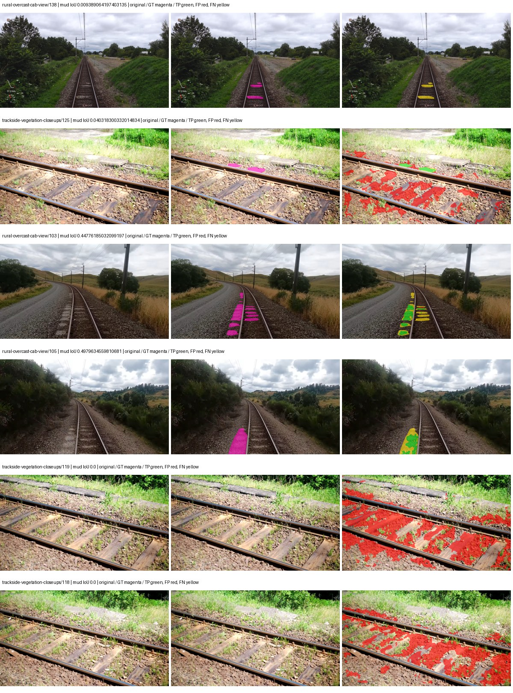

Examples are two lowest and two highest mud-IoU positive images, plus up to two negative images with the most false-positive mud pixels. They are targeted diagnostic examples, not random samples. Green: true positive; red: false positive; yellow: false negative. Full predictions remain on HDRFS.

### Validation tracking

| Logged step | Overall mIoU (%) | Mud IoU (%) |
| --- | --- | --- |
| 254 | 34.02 | 0.13 |
| 508 | 38.04 | 0.41 |
| 763 | 46.78 | 0.83 |
| 1017 | 47.23 | 2.46 |
| 1272 | 46.66 | 3.73 |
| 1527 | 47.64 | 4.45 |
| 1781 | 47.29 | 6.48 |
| 2036 | 45.94 | 2.69 |
| 2290 | 44.90 | 4.73 |
| 2545 | 46.51 | 7.59 |
| 2799 | 46.57 | 5.15 |
| 3054 | 44.13 | 7.40 |
| 3308 | 44.32 | 6.16 |
| 3563 | 44.53 | 4.58 |
| 3817 | 43.50 | 4.96 |

All retained scalar curves, including training loss and per-class IoU, are in record.json. Observed best mud on a curve is not necessarily a retained checkpoint: the pilot saved its selection-metric-best and final checkpoints. Step logging and checkpoint global_step may differ by one.

### Stopping and checkpoint provenance

```json
{
  "stopping": {
    "actual_steps": 3818,
    "maximum_steps": 4000,
    "min_delta": 0.001,
    "monitor": "val_iou/mud-pumping",
    "patience": 5,
    "reason": "validation_plateau"
  },
  "checkpoints": {
    "best": {
      "path": "/data/izadia1/projects/segmentary-runs/paul-test-rtis/mud-fullstats-v1-20260906-r2/future-runs/segformer_b2--railsem19_to_rtis--seed-1_seed1/rtis/best.ckpt",
      "sha256": "fa51bdc78e6fbf05a332c0c9669ec6ef1d7cfdbcd71cc03761e121c5839975ea",
      "global_step": 2545,
      "bytes": 438463793
    },
    "final": {
      "path": "/data/izadia1/projects/segmentary-runs/paul-test-rtis/mud-fullstats-v1-20260906-r2/future-runs/segformer_b2--railsem19_to_rtis--seed-1_seed1/rtis/last.ckpt",
      "sha256": "589859ea9e1a41fe6ac2e79b684433d13c77829be631d69ea35b97c13d1038cb",
      "global_step": 3818,
      "bytes": 438445745
    }
  },
  "cleanup_error": null
}
```

### Resolved training, initialization and evaluation settings

The optimizer block is the base configuration. Stage LR scales are applied at runtime, and stage warmup is capped at min(base warmup, floor(stage budget / 10), stage budget - 1): 400 steps for this 4,000-step pilot. Model-internal native input grids may differ from augmentation crops (EoMT uses its 640 grid).

```json
{
  "name": "segformer_b2--railsem19_to_rtis--seed-1",
  "model": {
    "arch": "segformer_b2",
    "checkpoint": "nvidia/mit-b2",
    "tuning": "full",
    "head": "unified_head",
    "lora_r": 16,
    "lora_alpha": 32,
    "lora_dropout": 0.05,
    "lora_targets": [],
    "drop_path": null,
    "revision": null,
    "subfolder": null,
    "local_files_only": false,
    "trust_remote_code": false,
    "backbone_path": null,
    "head_paths": [],
    "classifier_path": null,
    "inactive_parameter_paths": [],
    "smp_arch": null,
    "encoder_name": null,
    "encoder_weights": null,
    "native": null,
    "batch_norm_momentum": null
  },
  "space": "paul-test-rtis",
  "taxonomy_root": "/data/izadia1/projects/segmentary-rtis-fullstats-066afb2/taxonomy",
  "output_root": "/data/izadia1/projects/segmentary-runs/paul-test-rtis/mud-fullstats-v1-20260906-r2/future-runs",
  "optim": {
    "backbone_lr": 6e-05,
    "head_lr_mult": 10.0,
    "weight_decay": 0.05,
    "llrd": 1.0,
    "warmup_iters": 1500,
    "warmup_ratio": 1e-06,
    "poly_power": 0.9,
    "min_lr_ratio": 0.0,
    "betas": [
      0.9,
      0.999
    ],
    "grad_clip": 1.0
  },
  "train": {
    "iters": 4000,
    "batch_size": 2,
    "accum": 8,
    "num_workers": 2,
    "precision": "bf16-mixed",
    "ema_decay": 0.9998,
    "val_every": 250,
    "ckpt_every": 500,
    "selection_metric": "val_iou/mud-pumping",
    "early_stopping_patience": 5,
    "early_stopping_min_delta": 0.001,
    "seed": 1,
    "devices": 1
  },
  "eval": {
    "sliding_window": true,
    "window": [
      1024,
      1024
    ],
    "stride": [
      768,
      768
    ],
    "batch_size": 1,
    "num_workers": 2,
    "tta_scales": [],
    "tta_flip": false,
    "threshold": 0.5,
    "boundary_tolerance_frac": 0.0075,
    "save_confusion": true
  },
  "loss": {
    "task": "multiclass",
    "activation": "auto",
    "terms": [],
    "aux": "none",
    "aux_weight": 0.0,
    "ce_weight": 1.0,
    "label_smoothing": 0.0,
    "class_weights": null,
    "query": null
  },
  "aug": {
    "crop": [
      1024,
      1024
    ],
    "scale_min": 0.5,
    "scale_max": 2.0,
    "hflip_p": 0.5,
    "color_jitter_p": 0.5,
    "brightness": 0.25,
    "contrast": 0.25,
    "saturation": 0.25,
    "hue": 0.05
  },
  "stages": [
    {
      "name": "rtis",
      "data": [
        {
          "name": "paul-test-rtis",
          "root": "/data/izadia1/datasets/paul-test-rtis",
          "variant": null,
          "split_file": "splits.json",
          "train_split": "train",
          "val_split": "val",
          "limit": null,
          "loader": "folder",
          "mapping": "paul-test-rtis",
          "loader_options": {
            "require_groups": true
          }
        }
      ],
      "iters": null,
      "lr_scale": 0.1,
      "head_group_lr_scale": 1.0,
      "init_from": "/data/izadia1/projects/segmentary-runs/all-model-city-rail-seed0-a7c0b67/jobs/segformer_b2--railsem19--seed-0/attempt-001/train/segformer_b2--railsem19_seed0/railsem19/last.ckpt",
      "reset_head": true,
      "freeze": null,
      "sample_weights": null
    }
  ]
}
```

### Hardware and software provenance

```json
{
  "training": {
    "cuda_available": true,
    "cuda_visible_devices": "4",
    "cudnn": 91900,
    "driver_version": "570.133.20",
    "gpu_count": 1,
    "gpu_names": [
      "NVIDIA L40S"
    ],
    "hostname": "hdrfs-app-001",
    "input_normalization": {
      "channel_order": "rgb",
      "mean": [
        0.485,
        0.456,
        0.406
      ],
      "source": "imagenet",
      "std": [
        0.229,
        0.224,
        0.225
      ]
    },
    "model_origins": [
      {
        "hf_commit": "3bb39e8739149c3777d0325349b2a6c32c6413db",
        "hf_name_or_path": "nvidia/mit-b2",
        "module": "model",
        "timm_pretrained": {}
      },
      {
        "hf_commit": "3bb39e8739149c3777d0325349b2a6c32c6413db",
        "hf_name_or_path": "nvidia/mit-b2",
        "module": "model.segformer",
        "timm_pretrained": {}
      },
      {
        "hf_commit": "3bb39e8739149c3777d0325349b2a6c32c6413db",
        "hf_name_or_path": "nvidia/mit-b2",
        "module": "model.segformer.stages.0.blocks.0.attention",
        "timm_pretrained": {}
      },
      {
        "hf_commit": "3bb39e8739149c3777d0325349b2a6c32c6413db",
        "hf_name_or_path": "nvidia/mit-b2",
        "module": "model.segformer.stages.0.blocks.1.attention",
        "timm_pretrained": {}
      },
      {
        "hf_commit": "3bb39e8739149c3777d0325349b2a6c32c6413db",
        "hf_name_or_path": "nvidia/mit-b2",
        "module": "model.segformer.stages.0.blocks.2.attention",
        "timm_pretrained": {}
      },
      {
        "hf_commit": "3bb39e8739149c3777d0325349b2a6c32c6413db",
        "hf_name_or_path": "nvidia/mit-b2",
        "module": "model.segformer.stages.1.blocks.0.attention",
        "timm_pretrained": {}
      },
      {
        "hf_commit": "3bb39e8739149c3777d0325349b2a6c32c6413db",
        "hf_name_or_path": "nvidia/mit-b2",
        "module": "model.segformer.stages.1.blocks.1.attention",
        "timm_pretrained": {}
      },
      {
        "hf_commit": "3bb39e8739149c3777d0325349b2a6c32c6413db",
        "hf_name_or_path": "nvidia/mit-b2",
        "module": "model.segformer.stages.1.blocks.2.attention",
        "timm_pretrained": {}
      },
      {
        "hf_commit": "3bb39e8739149c3777d0325349b2a6c32c6413db",
        "hf_name_or_path": "nvidia/mit-b2",
        "module": "model.segformer.stages.1.blocks.3.attention",
        "timm_pretrained": {}
      },
      {
        "hf_commit": "3bb39e8739149c3777d0325349b2a6c32c6413db",
        "hf_name_or_path": "nvidia/mit-b2",
        "module": "model.segformer.stages.2.blocks.0.attention",
        "timm_pretrained": {}
      },
      {
        "hf_commit": "3bb39e8739149c3777d0325349b2a6c32c6413db",
        "hf_name_or_path": "nvidia/mit-b2",
        "module": "model.segformer.stages.2.blocks.1.attention",
        "timm_pretrained": {}
      },
      {
        "hf_commit": "3bb39e8739149c3777d0325349b2a6c32c6413db",
        "hf_name_or_path": "nvidia/mit-b2",
        "module": "model.segformer.stages.2.blocks.2.attention",
        "timm_pretrained": {}
      },
      {
        "hf_commit": "3bb39e8739149c3777d0325349b2a6c32c6413db",
        "hf_name_or_path": "nvidia/mit-b2",
        "module": "model.segformer.stages.2.blocks.3.attention",
        "timm_pretrained": {}
      },
      {
        "hf_commit": "3bb39e8739149c3777d0325349b2a6c32c6413db",
        "hf_name_or_path": "nvidia/mit-b2",
        "module": "model.segformer.stages.2.blocks.4.attention",
        "timm_pretrained": {}
      },
      {
        "hf_commit": "3bb39e8739149c3777d0325349b2a6c32c6413db",
        "hf_name_or_path": "nvidia/mit-b2",
        "module": "model.segformer.stages.2.blocks.5.attention",
        "timm_pretrained": {}
      },
      {
        "hf_commit": "3bb39e8739149c3777d0325349b2a6c32c6413db",
        "hf_name_or_path": "nvidia/mit-b2",
        "module": "model.segformer.stages.3.blocks.0.attention",
        "timm_pretrained": {}
      },
      {
        "hf_commit": "3bb39e8739149c3777d0325349b2a6c32c6413db",
        "hf_name_or_path": "nvidia/mit-b2",
        "module": "model.segformer.stages.3.blocks.1.attention",
        "timm_pretrained": {}
      },
      {
        "hf_commit": "3bb39e8739149c3777d0325349b2a6c32c6413db",
        "hf_name_or_path": "nvidia/mit-b2",
        "module": "model.segformer.stages.3.blocks.2.attention",
        "timm_pretrained": {}
      },
      {
        "hf_commit": "3bb39e8739149c3777d0325349b2a6c32c6413db",
        "hf_name_or_path": "nvidia/mit-b2",
        "module": "model.decode_head",
        "timm_pretrained": {}
      }
    ],
    "model_parameter_count": 27362773,
    "packages": {
      "albumentations": "2.0.8",
      "lightning": "2.6.5",
      "numpy": "2.4.4",
      "segmentary": "0.1.0",
      "segmentation-models-pytorch": "0.5.0",
      "timm": "1.0.28",
      "torch": "2.11.0+cu128",
      "torchvision": "0.26.0+cu128",
      "transformers": "5.15.0"
    },
    "platform": "Linux-5.15.0-139-generic-x86_64-with-glibc2.35",
    "python": "3.11.15",
    "torch": "2.11.0+cu128",
    "torch_cuda": "12.8",
    "trainable_parameter_count": 27362773,
    "training_stop": {
      "actual_steps": 3818,
      "maximum_steps": 4000,
      "min_delta": 0.001,
      "monitor": "val_iou/mud-pumping",
      "patience": 5,
      "reason": "validation_plateau"
    },
    "validation_weights": "raw"
  },
  "evaluation": {
    "cuda_available": true,
    "cuda_visible_devices": "4",
    "cudnn": 91900,
    "driver_version": "570.133.20",
    "gpu_count": 1,
    "gpu_names": [
      "NVIDIA L40S"
    ],
    "hostname": "hdrfs-app-001",
    "input_normalization": {
      "channel_order": "rgb",
      "mean": [
        0.485,
        0.456,
        0.406
      ],
      "source": "imagenet",
      "std": [
        0.229,
        0.224,
        0.225
      ]
    },
    "packages": {
      "albumentations": "2.0.8",
      "lightning": "2.6.5",
      "numpy": "2.4.4",
      "segmentary": "0.1.0",
      "segmentation-models-pytorch": "0.5.0",
      "timm": "1.0.28",
      "torch": "2.11.0+cu128",
      "torchvision": "0.26.0+cu128",
      "transformers": "5.15.0"
    },
    "platform": "Linux-5.15.0-139-generic-x86_64-with-glibc2.35",
    "python": "3.11.15",
    "torch": "2.11.0+cu128",
    "torch_cuda": "12.8"
  }
}
```

## railsem19_to_rtis — seed 2

Status: **completed**. Started: 2026-09-07T02:11:32.094254+00:00. Finished: 2026-09-07T03:00:10.871651+00:00.

Recipe pretrained initializer: `nvidia/mit-b2`.

`rtis_only` uses the recipe initializer, which may include pretrained segmentation components. Transfer paths load the exact historical source checkpoint below and reset the classifier; they do not reset all query/decoder features.

Source checkpoint: `{'name': 'segformer_b2--railsem19--seed-0', 'model': 'segformer_b2', 'protocol': 'railsem19', 'config': '/data/izadia1/projects/segmentary-runs/all-model-city-rail-seed0-rail20-b9eb3e1/accepted/segformer_b2--railsem19--seed-0/resolved-config.yaml', 'checkpoint': '/data/izadia1/projects/segmentary-runs/all-model-city-rail-seed0-a7c0b67/jobs/segformer_b2--railsem19--seed-0/attempt-001/train/segformer_b2--railsem19_seed0/railsem19/last.ckpt', 'recorded_sha256': 'a017480f6fc66e45651f83f3103f582591fa2f5f82b7dc048429508393ccfc20', 'exists': True}`.

Config SHA-256: `7fc25a303243f1f139484d47e5b522dbe33d29a44fd2cd495d8c10b4a0d13299`. Weights used for validation: `raw`.

### Mud-pumping and aggregate quality

| Metric | Selected checkpoint | Final training validation |
| --- | --- | --- |
| Mud IoU | 8.80 | 4.76 |
| Mud precision | 11.64 | 5.92 |
| Mud recall | 26.54 | 19.64 |
| Mud Dice/F1 | 16.18 | 9.09 |
| mIoU | 47.82 | 46.32 |
| Mean accuracy | 64.00 | 61.48 |
| Mean precision | 62.54 | 62.01 |
| Mean Dice | 58.59 | 56.78 |
| Mean specificity | 99.05 | 99.03 |
| Pixel accuracy | 84.67 | 84.23 |
| Frequency-weighted IoU | 76.32 | 76.28 |
| Fixed GT-present class mIoU | 53.13 | 51.46 |
| Boundary F1 | 53.87 | 52.46 |

The selected checkpoint has independent evaluation evidence. Final values are the trainer's final validation record, not a new independent evaluation. mIoU averages classes with nonzero union, so false positives on absent classes can change its denominator. The fixed GT-class mean is supplementary and excludes absent classes; their false positives remain in the confusion matrix.

### Resource usage and timing

| Measurement | Value |
| --- | --- |
| Peak training VRAM, retained training invocation (GiB) | 11.73 |
| Peak evaluation VRAM (GiB) | 7.46 |
| Retained training invocation wall time (seconds) | 2690.23 |
| Retained training invocation GPU-hours (one GPU) | 0.75 |
| Evaluation wall time (seconds) | 22.25 |
| Full evaluation pipeline images/second | 1.66 |
| Best full-state checkpoint (MiB) | 418.15 |
| Final full-state checkpoint (MiB) | 418.13 |
| Audited periodic checkpoints removed (GiB) | 2.04 |

VRAM uses the recorded allocator high-water mark; it is not total device usage including CUDA context. Resumed jobs' retained training invocation times and peaks are **not whole-campaign totals**. Earlier invocation resource records are not reconstructed here. Evaluation throughput includes loader, sliding-window inference and metrics; it is not model-only latency/FPS. Missing measurements are shown as —, never inferred from another dataset's run.

### Standardized inference performance

Dedicated model-only profiling waits for an idle worker-locked L40S: BF16, batch 1, 1024x1024, 20 warmup and 100 CUDA-event-timed public forwards. It excludes loading, preprocessing, tiling and metrics.

| Status | Parameters | Weight MiB | FPS | p50 ms | p95 ms | Peak reserved GiB |
| --- | --- | --- | --- | --- | --- | --- |
| complete | 27362773 | 104.38 | 51.73 | 18.78 | 22.22 | 2.25 |

```json
{
  "schema_version": 1,
  "model_id": "segformer_b2",
  "measured_at": "2026-09-07T03:00:06+00:00",
  "status": "complete",
  "benchmark_scope": "rtis_selected_checkpoint_model_only",
  "applies_to": [
    "segformer_b2--railsem19_to_rtis--seed-2"
  ],
  "source": {
    "campaign_git_sha": "066afb2626398b7be59d4d19f5a0e4644fd59adc",
    "git_dirty": false,
    "config_hash": "5bc4286d20db",
    "resolved_config": "/data/izadia1/projects/segmentary-runs/paul-test-rtis/mud-fullstats-v1-20260906-r2/configs/segformer_b2--railsem19_to_rtis--seed-2.yaml",
    "config_sha256": "7fc25a303243f1f139484d47e5b522dbe33d29a44fd2cd495d8c10b4a0d13299",
    "checkpoint_sha256": "0fc88f4fccee2f6f147c6012bd4f14b1dedadd39dc17efb9e12fa17ce8a0d13e",
    "checkpoint_global_step": 1527,
    "checkpoint_bytes": 438463793,
    "checkpoint_kind": "resume checkpoint with optimizer and EMA state",
    "weights": "raw",
    "measured_checkpoint_job_id": "segformer_b2--railsem19_to_rtis--seed-2",
    "result_sha256": "a8f822132e79c5a5c5f3d36c9ca6b035002228556d8d1acb6befc074330c0c45",
    "result_git_sha": "066afb2626398b7be59d4d19f5a0e4644fd59adc",
    "result_stage": "eval:paul-test-rtis:val",
    "result_seed": 2
  },
  "hardware": {
    "gpu_name": "NVIDIA L40S",
    "gpu_uuid": "GPU-d411d86a-6d1d-1967-55e7-9f9ec85d13f5",
    "logical_device": "cuda:0",
    "physical_visibility_token": "1",
    "compute_capability": [
      8,
      9
    ],
    "total_memory_bytes": 47677177856
  },
  "model": {
    "parameter_count": 27362773,
    "trainable_parameter_count": 27362773,
    "resident_parameter_bytes": 109451092,
    "parameter_dtype_counts": {
      "float32": 27362773
    }
  },
  "contract": {
    "backend": "pytorch",
    "precision": "bf16_autocast",
    "batch_size": 1,
    "input_shape_nchw": [
      1,
      3,
      1024,
      1024
    ],
    "warmup_iterations": 20,
    "measured_iterations": 100,
    "timing": "per-forward CUDA events with end-event synchronization",
    "includes_preprocessing": false,
    "includes_data_loader": false,
    "includes_sliding_window": false,
    "input_resident_on_gpu": true,
    "model_only": true,
    "entrypoint": "public model(image) dense-logits forward"
  },
  "measurements": {
    "latency": {
      "p50_ms": 18.777088165283203,
      "p95_ms": 22.220687294006346,
      "mean_ms": 19.332881259918214,
      "minimum_ms": 18.41961669921875,
      "maximum_ms": 22.50649642944336,
      "fps": 51.72534743040316,
      "raw_ms": [
        20.406272888183594,
        19.782655715942383,
        18.694143295288086,
        19.00339126586914,
        19.556415557861328,
        18.628704071044922,
        18.523136138916016,
        18.767871856689453,
        22.354944229125977,
        20.44723129272461,
        19.197952270507812,
        18.613248825073242,
        19.755008697509766,
        18.764799118041992,
        18.664447784423828,
        19.5993595123291,
        18.579456329345703,
        18.508800506591797,
        18.561023712158203,
        18.564096450805664,
        18.87539291381836,
        21.9105281829834,
        22.253568649291992,
        19.264511108398438,
        19.283967971801758,
        18.63987159729004,
        18.82316780090332,
        18.576383590698242,
        18.965503692626953,
        18.465791702270508,
        19.03923225402832,
        19.307519912719727,
        19.102720260620117,
        19.085311889648438,
        19.567615509033203,
        22.150175094604492,
        20.963327407836914,
        18.912256240844727,
        19.705856323242188,
        19.545087814331055,
        18.561119079589844,
        18.522111892700195,
        18.47091293334961,
        18.60095977783203,
        18.508800506591797,
        18.504703521728516,
        22.219711303710938,
        22.46553611755371,
        19.44166374206543,
        18.786304473876953,
        18.61631965637207,
        18.547712326049805,
        18.41961669921875,
        19.176448822021484,
        18.929664611816406,
        18.4401912689209,
        18.83750343322754,
        18.583423614501953,
        18.559999465942383,
        22.17375946044922,
        21.358591079711914,
        19.81235122680664,
        18.720767974853516,
        18.480127334594727,
        19.02796745300293,
        18.525184631347656,
        18.526208877563477,
        18.490367889404297,
        18.497535705566406,
        19.02284812927246,
        19.171327590942383,
        18.455551147460938,
        18.472959518432617,
        21.627904891967773,
        22.08255958557129,
        19.540864944458008,
        19.060672760009766,
        18.722816467285156,
        18.491296768188477,
        18.524160385131836,
        18.566144943237305,
        18.537471771240234,
        18.605056762695312,
        18.58355140686035,
        18.530303955078125,
        19.20921516418457,
        22.50649642944336,
        20.291584014892578,
        20.004831314086914,
        19.107744216918945,
        18.719743728637695,
        18.728960037231445,
        18.572288513183594,
        18.763776779174805,
        18.58665657043457,
        18.738176345825195,
        18.701311111450195,
        18.64396858215332,
        21.26233673095703,
        22.23923110961914
      ],
      "percentile_method": "numpy linear interpolation"
    },
    "peak_reserved_bytes": 2420113408,
    "memory_kind": "pytorch_cuda_allocator_peak_reserved_excluding_context",
    "benchmark_wall_clock_s": 5.770325515419245
  },
  "started_at": "2026-09-07T03:00:01+00:00",
  "finished_at": "2026-09-07T03:00:06+00:00",
  "environment": {
    "hostname": "hdrfs-app-001",
    "python": "3.11.15",
    "platform": "Linux-5.15.0-139-generic-x86_64-with-glibc2.35",
    "torch": "2.11.0+cu128",
    "torch_cuda": "12.8",
    "cudnn": 91900,
    "driver_version": "570.133.20",
    "cuda_available": true,
    "gpu_count": 1,
    "gpu_names": [
      "NVIDIA L40S"
    ],
    "cuda_visible_devices": "1",
    "packages": {
      "segmentary": "0.1.0",
      "torch": "2.11.0+cu128",
      "torchvision": "0.26.0+cu128",
      "transformers": "5.15.0",
      "timm": "1.0.28",
      "segmentation-models-pytorch": "0.5.0",
      "albumentations": "2.0.8",
      "lightning": "2.6.5",
      "numpy": "2.4.4"
    }
  }
}
```

### Per-class validation results

| Class | GT pixels | IoU (%) | Precision (%) | Recall (%) | Dice (%) | Boundary F1 (%) |
| --- | --- | --- | --- | --- | --- | --- |
| car | 29664 | 72.05 | 78.36 | 89.94 | 83.75 | 71.37 |
| construction | 311585 | 61.40 | 69.45 | 84.11 | 76.08 | 68.23 |
| fence | 265137 | 36.25 | 69.17 | 43.24 | 53.22 | 46.34 |
| mud-pumping | 1226250 | 8.80 | 11.64 | 26.54 | 16.18 | 12.05 |
| on-rails | 0 | — | — | — | — | — |
| person | 0 | 0.00 | 0.00 | — | 0.00 | 0.00 |
| pole | 628038 | 76.81 | 87.81 | 85.98 | 86.89 | 92.75 |
| rail-embedded | 16799 | 52.23 | 74.24 | 63.78 | 68.62 | 90.49 |
| rail-raised | 2969797 | 72.03 | 83.30 | 84.18 | 83.74 | 90.90 |
| rail-track | 6323197 | 40.02 | 74.47 | 46.38 | 57.16 | 54.96 |
| road | 1048831 | 19.25 | 37.73 | 28.21 | 32.28 | 29.34 |
| sidewalk | 1297367 | 43.48 | 71.26 | 52.73 | 60.61 | 15.90 |
| sky | 19121606 | 98.78 | 99.11 | 99.67 | 99.39 | 97.44 |
| standing-water | 95802 | 0.07 | 0.08 | 0.36 | 0.14 | 1.07 |
| terrain | 39239306 | 87.86 | 89.68 | 97.74 | 93.54 | 67.82 |
| trackbed | 10643081 | 58.18 | 71.28 | 76.00 | 73.57 | 56.40 |
| traffic-light | 19510 | 77.04 | 96.78 | 79.07 | 87.03 | 93.91 |
| traffic-sign | 13285 | 54.05 | 88.08 | 58.31 | 70.17 | 75.97 |
| tram-track | 56179 | 62.06 | 63.10 | 97.41 | 76.59 | 47.97 |
| truck | 0 | 0.00 | 0.00 | — | 0.00 | 0.00 |
| vegetation-overgrowth | 5901821 | 35.97 | 85.31 | 38.35 | 52.91 | 64.58 |

### Full-run accounting

| Measurement | Value |
| --- | --- |
| Full GPU-reserved wall seconds, all recorded worker attempts | 2919.09 |
| Full reserved GPU-hours | 0.81 |
| Whole-run timing complete | True |

| Phase | Wall seconds including failed attempts |
| --- | --- |
| training | 2697.67 |
| diagnostics | 175.18 |
| performance | 12.97 |

GPU-reserved time includes model loading, training, validation, collection, profiling, checkpoint I/O and orchestration while the worker owns one GPU. It is not GPU kernel-active time. Phase timings and sampled device memory/power/utilization are retained separately; sampled device memory is not the allocator high-water mark.

### Train/validation and raw/EMA diagnostics

| Checkpoint / weights / split | Images | Mud IoU (%) | Mud precision (%) | Mud recall (%) |
| --- | --- | --- | --- | --- |
| best-auto-train / raw | 220 | 94.20 | 97.03 | 96.99 |
| best-auto-val / raw | 37 | 8.80 | 11.64 | 26.54 |
| best-alternate-val / ema | 37 | 4.44 | 5.90 | 15.25 |
| final-auto-val / raw | 37 | 4.76 | 5.91 | 19.65 |

Train uses the evaluation transform without augmentation. Compare mud train/validation metrics for the same selected weights. Alternate EMA on running-stat BatchNorm is explicitly uncalibrated and is diagnostic only. Score-threshold curves use uncalibrated normalized scores and are pixel-level diagnostics, not event detection rates or a selected deployment operating point.

### Downloadable evidence

- best-auto-train: [per-image.csv](railsem19_to_rtis--seed-2/best-auto-train/per-image.csv) · [per-image-confusion.json.gz](railsem19_to_rtis--seed-2/best-auto-train/per-image-confusion.json.gz) · [groups.json](railsem19_to_rtis--seed-2/best-auto-train/groups.json) · [mud-score-curves.json](railsem19_to_rtis--seed-2/best-auto-train/mud-score-curves.json)
- best-auto-val: [per-image.csv](railsem19_to_rtis--seed-2/best-auto-val/per-image.csv) · [per-image-confusion.json.gz](railsem19_to_rtis--seed-2/best-auto-val/per-image-confusion.json.gz) · [groups.json](railsem19_to_rtis--seed-2/best-auto-val/groups.json) · [mud-score-curves.json](railsem19_to_rtis--seed-2/best-auto-val/mud-score-curves.json) · [examples.jpg](railsem19_to_rtis--seed-2/best-auto-val/examples.jpg)
- best-alternate-val: [per-image.csv](railsem19_to_rtis--seed-2/best-alternate-val/per-image.csv) · [per-image-confusion.json.gz](railsem19_to_rtis--seed-2/best-alternate-val/per-image-confusion.json.gz) · [groups.json](railsem19_to_rtis--seed-2/best-alternate-val/groups.json) · [mud-score-curves.json](railsem19_to_rtis--seed-2/best-alternate-val/mud-score-curves.json)
- final-auto-val: [per-image.csv](railsem19_to_rtis--seed-2/final-auto-val/per-image.csv) · [per-image-confusion.json.gz](railsem19_to_rtis--seed-2/final-auto-val/per-image-confusion.json.gz) · [groups.json](railsem19_to_rtis--seed-2/final-auto-val/groups.json) · [mud-score-curves.json](railsem19_to_rtis--seed-2/final-auto-val/mud-score-curves.json)
- resources: [telemetry.csv](railsem19_to_rtis--seed-2/resources/telemetry.csv)

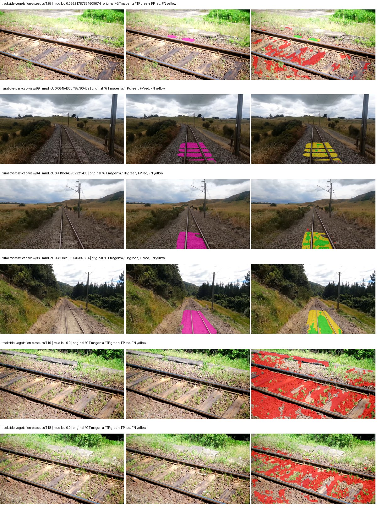

Examples are two lowest and two highest mud-IoU positive images, plus up to two negative images with the most false-positive mud pixels. They are targeted diagnostic examples, not random samples. Green: true positive; red: false positive; yellow: false negative. Full predictions remain on HDRFS.

### Validation tracking

| Logged step | Overall mIoU (%) | Mud IoU (%) |
| --- | --- | --- |
| 254 | 33.71 | 0.25 |
| 508 | 37.93 | 1.06 |
| 763 | 46.64 | 1.98 |
| 1017 | 46.75 | 2.47 |
| 1272 | 46.92 | 5.23 |
| 1527 | 47.83 | 8.81 |
| 1781 | 48.14 | 4.33 |
| 2036 | 46.50 | 3.44 |
| 2290 | 47.56 | 5.92 |
| 2545 | 46.12 | 6.13 |
| 2799 | 46.32 | 4.76 |

All retained scalar curves, including training loss and per-class IoU, are in record.json. Observed best mud on a curve is not necessarily a retained checkpoint: the pilot saved its selection-metric-best and final checkpoints. Step logging and checkpoint global_step may differ by one.

### Stopping and checkpoint provenance

```json
{
  "stopping": {
    "actual_steps": 2800,
    "maximum_steps": 4000,
    "min_delta": 0.001,
    "monitor": "val_iou/mud-pumping",
    "patience": 5,
    "reason": "validation_plateau"
  },
  "checkpoints": {
    "best": {
      "path": "/data/izadia1/projects/segmentary-runs/paul-test-rtis/mud-fullstats-v1-20260906-r2/future-runs/segformer_b2--railsem19_to_rtis--seed-2_seed2/rtis/best.ckpt",
      "sha256": "0fc88f4fccee2f6f147c6012bd4f14b1dedadd39dc17efb9e12fa17ce8a0d13e",
      "global_step": 1527,
      "bytes": 438463793
    },
    "final": {
      "path": "/data/izadia1/projects/segmentary-runs/paul-test-rtis/mud-fullstats-v1-20260906-r2/future-runs/segformer_b2--railsem19_to_rtis--seed-2_seed2/rtis/last.ckpt",
      "sha256": "818f3a6700279819ddee4982f7eb5fa1be73621c7f0321d04e9eea34c8f5c23a",
      "global_step": 2800,
      "bytes": 438445745
    }
  },
  "cleanup_error": null
}
```

### Resolved training, initialization and evaluation settings

The optimizer block is the base configuration. Stage LR scales are applied at runtime, and stage warmup is capped at min(base warmup, floor(stage budget / 10), stage budget - 1): 400 steps for this 4,000-step pilot. Model-internal native input grids may differ from augmentation crops (EoMT uses its 640 grid).

```json
{
  "name": "segformer_b2--railsem19_to_rtis--seed-2",
  "model": {
    "arch": "segformer_b2",
    "checkpoint": "nvidia/mit-b2",
    "tuning": "full",
    "head": "unified_head",
    "lora_r": 16,
    "lora_alpha": 32,
    "lora_dropout": 0.05,
    "lora_targets": [],
    "drop_path": null,
    "revision": null,
    "subfolder": null,
    "local_files_only": false,
    "trust_remote_code": false,
    "backbone_path": null,
    "head_paths": [],
    "classifier_path": null,
    "inactive_parameter_paths": [],
    "smp_arch": null,
    "encoder_name": null,
    "encoder_weights": null,
    "native": null,
    "batch_norm_momentum": null
  },
  "space": "paul-test-rtis",
  "taxonomy_root": "/data/izadia1/projects/segmentary-rtis-fullstats-066afb2/taxonomy",
  "output_root": "/data/izadia1/projects/segmentary-runs/paul-test-rtis/mud-fullstats-v1-20260906-r2/future-runs",
  "optim": {
    "backbone_lr": 6e-05,
    "head_lr_mult": 10.0,
    "weight_decay": 0.05,
    "llrd": 1.0,
    "warmup_iters": 1500,
    "warmup_ratio": 1e-06,
    "poly_power": 0.9,
    "min_lr_ratio": 0.0,
    "betas": [
      0.9,
      0.999
    ],
    "grad_clip": 1.0
  },
  "train": {
    "iters": 4000,
    "batch_size": 2,
    "accum": 8,
    "num_workers": 2,
    "precision": "bf16-mixed",
    "ema_decay": 0.9998,
    "val_every": 250,
    "ckpt_every": 500,
    "selection_metric": "val_iou/mud-pumping",
    "early_stopping_patience": 5,
    "early_stopping_min_delta": 0.001,
    "seed": 2,
    "devices": 1
  },
  "eval": {
    "sliding_window": true,
    "window": [
      1024,
      1024
    ],
    "stride": [
      768,
      768
    ],
    "batch_size": 1,
    "num_workers": 2,
    "tta_scales": [],
    "tta_flip": false,
    "threshold": 0.5,
    "boundary_tolerance_frac": 0.0075,
    "save_confusion": true
  },
  "loss": {
    "task": "multiclass",
    "activation": "auto",
    "terms": [],
    "aux": "none",
    "aux_weight": 0.0,
    "ce_weight": 1.0,
    "label_smoothing": 0.0,
    "class_weights": null,
    "query": null
  },
  "aug": {
    "crop": [
      1024,
      1024
    ],
    "scale_min": 0.5,
    "scale_max": 2.0,
    "hflip_p": 0.5,
    "color_jitter_p": 0.5,
    "brightness": 0.25,
    "contrast": 0.25,
    "saturation": 0.25,
    "hue": 0.05
  },
  "stages": [
    {
      "name": "rtis",
      "data": [
        {
          "name": "paul-test-rtis",
          "root": "/data/izadia1/datasets/paul-test-rtis",
          "variant": null,
          "split_file": "splits.json",
          "train_split": "train",
          "val_split": "val",
          "limit": null,
          "loader": "folder",
          "mapping": "paul-test-rtis",
          "loader_options": {
            "require_groups": true
          }
        }
      ],
      "iters": null,
      "lr_scale": 0.1,
      "head_group_lr_scale": 1.0,
      "init_from": "/data/izadia1/projects/segmentary-runs/all-model-city-rail-seed0-a7c0b67/jobs/segformer_b2--railsem19--seed-0/attempt-001/train/segformer_b2--railsem19_seed0/railsem19/last.ckpt",
      "reset_head": true,
      "freeze": null,
      "sample_weights": null
    }
  ]
}
```

### Hardware and software provenance

```json
{
  "training": {
    "cuda_available": true,
    "cuda_visible_devices": "1",
    "cudnn": 91900,
    "driver_version": "570.133.20",
    "gpu_count": 1,
    "gpu_names": [
      "NVIDIA L40S"
    ],
    "hostname": "hdrfs-app-001",
    "input_normalization": {
      "channel_order": "rgb",
      "mean": [
        0.485,
        0.456,
        0.406
      ],
      "source": "imagenet",
      "std": [
        0.229,
        0.224,
        0.225
      ]
    },
    "model_origins": [
      {
        "hf_commit": "3bb39e8739149c3777d0325349b2a6c32c6413db",
        "hf_name_or_path": "nvidia/mit-b2",
        "module": "model",
        "timm_pretrained": {}
      },
      {
        "hf_commit": "3bb39e8739149c3777d0325349b2a6c32c6413db",
        "hf_name_or_path": "nvidia/mit-b2",
        "module": "model.segformer",
        "timm_pretrained": {}
      },
      {
        "hf_commit": "3bb39e8739149c3777d0325349b2a6c32c6413db",
        "hf_name_or_path": "nvidia/mit-b2",
        "module": "model.segformer.stages.0.blocks.0.attention",
        "timm_pretrained": {}
      },
      {
        "hf_commit": "3bb39e8739149c3777d0325349b2a6c32c6413db",
        "hf_name_or_path": "nvidia/mit-b2",
        "module": "model.segformer.stages.0.blocks.1.attention",
        "timm_pretrained": {}
      },
      {
        "hf_commit": "3bb39e8739149c3777d0325349b2a6c32c6413db",
        "hf_name_or_path": "nvidia/mit-b2",
        "module": "model.segformer.stages.0.blocks.2.attention",
        "timm_pretrained": {}
      },
      {
        "hf_commit": "3bb39e8739149c3777d0325349b2a6c32c6413db",
        "hf_name_or_path": "nvidia/mit-b2",
        "module": "model.segformer.stages.1.blocks.0.attention",
        "timm_pretrained": {}
      },
      {
        "hf_commit": "3bb39e8739149c3777d0325349b2a6c32c6413db",
        "hf_name_or_path": "nvidia/mit-b2",
        "module": "model.segformer.stages.1.blocks.1.attention",
        "timm_pretrained": {}
      },
      {
        "hf_commit": "3bb39e8739149c3777d0325349b2a6c32c6413db",
        "hf_name_or_path": "nvidia/mit-b2",
        "module": "model.segformer.stages.1.blocks.2.attention",
        "timm_pretrained": {}
      },
      {
        "hf_commit": "3bb39e8739149c3777d0325349b2a6c32c6413db",
        "hf_name_or_path": "nvidia/mit-b2",
        "module": "model.segformer.stages.1.blocks.3.attention",
        "timm_pretrained": {}
      },
      {
        "hf_commit": "3bb39e8739149c3777d0325349b2a6c32c6413db",
        "hf_name_or_path": "nvidia/mit-b2",
        "module": "model.segformer.stages.2.blocks.0.attention",
        "timm_pretrained": {}
      },
      {
        "hf_commit": "3bb39e8739149c3777d0325349b2a6c32c6413db",
        "hf_name_or_path": "nvidia/mit-b2",
        "module": "model.segformer.stages.2.blocks.1.attention",
        "timm_pretrained": {}
      },
      {
        "hf_commit": "3bb39e8739149c3777d0325349b2a6c32c6413db",
        "hf_name_or_path": "nvidia/mit-b2",
        "module": "model.segformer.stages.2.blocks.2.attention",
        "timm_pretrained": {}
      },
      {
        "hf_commit": "3bb39e8739149c3777d0325349b2a6c32c6413db",
        "hf_name_or_path": "nvidia/mit-b2",
        "module": "model.segformer.stages.2.blocks.3.attention",
        "timm_pretrained": {}
      },
      {
        "hf_commit": "3bb39e8739149c3777d0325349b2a6c32c6413db",
        "hf_name_or_path": "nvidia/mit-b2",
        "module": "model.segformer.stages.2.blocks.4.attention",
        "timm_pretrained": {}
      },
      {
        "hf_commit": "3bb39e8739149c3777d0325349b2a6c32c6413db",
        "hf_name_or_path": "nvidia/mit-b2",
        "module": "model.segformer.stages.2.blocks.5.attention",
        "timm_pretrained": {}
      },
      {
        "hf_commit": "3bb39e8739149c3777d0325349b2a6c32c6413db",
        "hf_name_or_path": "nvidia/mit-b2",
        "module": "model.segformer.stages.3.blocks.0.attention",
        "timm_pretrained": {}
      },
      {
        "hf_commit": "3bb39e8739149c3777d0325349b2a6c32c6413db",
        "hf_name_or_path": "nvidia/mit-b2",
        "module": "model.segformer.stages.3.blocks.1.attention",
        "timm_pretrained": {}
      },
      {
        "hf_commit": "3bb39e8739149c3777d0325349b2a6c32c6413db",
        "hf_name_or_path": "nvidia/mit-b2",
        "module": "model.segformer.stages.3.blocks.2.attention",
        "timm_pretrained": {}
      },
      {
        "hf_commit": "3bb39e8739149c3777d0325349b2a6c32c6413db",
        "hf_name_or_path": "nvidia/mit-b2",
        "module": "model.decode_head",
        "timm_pretrained": {}
      }
    ],
    "model_parameter_count": 27362773,
    "packages": {
      "albumentations": "2.0.8",
      "lightning": "2.6.5",
      "numpy": "2.4.4",
      "segmentary": "0.1.0",
      "segmentation-models-pytorch": "0.5.0",
      "timm": "1.0.28",
      "torch": "2.11.0+cu128",
      "torchvision": "0.26.0+cu128",
      "transformers": "5.15.0"
    },
    "platform": "Linux-5.15.0-139-generic-x86_64-with-glibc2.35",
    "python": "3.11.15",
    "torch": "2.11.0+cu128",
    "torch_cuda": "12.8",
    "trainable_parameter_count": 27362773,
    "training_stop": {
      "actual_steps": 2800,
      "maximum_steps": 4000,
      "min_delta": 0.001,
      "monitor": "val_iou/mud-pumping",
      "patience": 5,
      "reason": "validation_plateau"
    },
    "validation_weights": "raw"
  },
  "evaluation": {
    "cuda_available": true,
    "cuda_visible_devices": "1",
    "cudnn": 91900,
    "driver_version": "570.133.20",
    "gpu_count": 1,
    "gpu_names": [
      "NVIDIA L40S"
    ],
    "hostname": "hdrfs-app-001",
    "input_normalization": {
      "channel_order": "rgb",
      "mean": [
        0.485,
        0.456,
        0.406
      ],
      "source": "imagenet",
      "std": [
        0.229,
        0.224,
        0.225
      ]
    },
    "packages": {
      "albumentations": "2.0.8",
      "lightning": "2.6.5",
      "numpy": "2.4.4",
      "segmentary": "0.1.0",
      "segmentation-models-pytorch": "0.5.0",
      "timm": "1.0.28",
      "torch": "2.11.0+cu128",
      "torchvision": "0.26.0+cu128",
      "transformers": "5.15.0"
    },
    "platform": "Linux-5.15.0-139-generic-x86_64-with-glibc2.35",
    "python": "3.11.15",
    "torch": "2.11.0+cu128",
    "torch_cuda": "12.8"
  }
}
```

## cityscapes_to_railsem19_to_rtis — seed 0

Status: **completed**. Started: 2026-09-07T02:16:25.114599+00:00. Finished: 2026-09-07T03:09:28.706368+00:00.

Recipe pretrained initializer: `nvidia/mit-b2`.

`rtis_only` uses the recipe initializer, which may include pretrained segmentation components. Transfer paths load the exact historical source checkpoint below and reset the classifier; they do not reset all query/decoder features.

Source checkpoint: `{'name': 'segformer_b2--cityscapes_to_railsem19--seed-0', 'model': 'segformer_b2', 'protocol': 'cityscapes_to_railsem19', 'config': '/data/izadia1/projects/segmentary-runs/all-model-city-rail-seed0-rail20-b9eb3e1/jobs/segformer_b2--cityscapes_to_railsem19--seed-0/attempt-001/resolved-config.yaml', 'checkpoint': '/data/izadia1/projects/segmentary-runs/all-model-city-rail-seed0-rail20-b9eb3e1/jobs/segformer_b2--cityscapes_to_railsem19--seed-0/attempt-001/train/segformer_b2--cityscapes_to_railsem19_seed0/railsem19/last.ckpt', 'recorded_sha256': '2917e287b856d7b272db0d1edd93bd31e4d79e045ff37648653c6cdcf0929bd7', 'exists': True}`.

Config SHA-256: `72b139ee3484a300143ef9f1331f7fae191fcce14b2bef115220edc6eac75dff`. Weights used for validation: `raw`.

### Mud-pumping and aggregate quality

| Metric | Selected checkpoint | Final training validation |
| --- | --- | --- |
| Mud IoU | 17.93 | 11.06 |
| Mud precision | 77.10 | 45.33 |
| Mud recall | 18.94 | 12.76 |
| Mud Dice/F1 | 30.41 | 19.92 |
| mIoU | 42.56 | 42.76 |
| Mean accuracy | 55.76 | 56.32 |
| Mean precision | 59.76 | 58.71 |
| Mean Dice | 52.66 | 52.75 |
| Mean specificity | 99.16 | 99.14 |
| Pixel accuracy | 86.07 | 85.89 |
| Frequency-weighted IoU | 78.08 | 77.69 |
| Fixed GT-present class mIoU | 47.29 | 47.51 |
| Boundary F1 | 49.83 | 49.42 |

The selected checkpoint has independent evaluation evidence. Final values are the trainer's final validation record, not a new independent evaluation. mIoU averages classes with nonzero union, so false positives on absent classes can change its denominator. The fixed GT-class mean is supplementary and excludes absent classes; their false positives remain in the confusion matrix.

### Resource usage and timing

| Measurement | Value |
| --- | --- |
| Peak training VRAM, retained training invocation (GiB) | 11.73 |
| Peak evaluation VRAM (GiB) | 7.46 |
| Retained training invocation wall time (seconds) | 2949.09 |
| Retained training invocation GPU-hours (one GPU) | 0.82 |
| Evaluation wall time (seconds) | 23.13 |
| Full evaluation pipeline images/second | 1.60 |
| Best full-state checkpoint (MiB) | 418.15 |
| Final full-state checkpoint (MiB) | 418.13 |
| Audited periodic checkpoints removed (GiB) | 2.45 |

VRAM uses the recorded allocator high-water mark; it is not total device usage including CUDA context. Resumed jobs' retained training invocation times and peaks are **not whole-campaign totals**. Earlier invocation resource records are not reconstructed here. Evaluation throughput includes loader, sliding-window inference and metrics; it is not model-only latency/FPS. Missing measurements are shown as —, never inferred from another dataset's run.

### Standardized inference performance

Dedicated model-only profiling waits for an idle worker-locked L40S: BF16, batch 1, 1024x1024, 20 warmup and 100 CUDA-event-timed public forwards. It excludes loading, preprocessing, tiling and metrics.

| Status | Parameters | Weight MiB | FPS | p50 ms | p95 ms | Peak reserved GiB |
| --- | --- | --- | --- | --- | --- | --- |
| complete | 27362773 | 104.38 | 51.67 | 19.29 | 20.37 | 2.25 |

```json
{
  "schema_version": 1,
  "model_id": "segformer_b2",
  "measured_at": "2026-09-07T03:09:23+00:00",
  "status": "complete",
  "benchmark_scope": "rtis_selected_checkpoint_model_only",
  "applies_to": [
    "segformer_b2--cityscapes_to_railsem19_to_rtis--seed-0"
  ],
  "source": {
    "campaign_git_sha": "066afb2626398b7be59d4d19f5a0e4644fd59adc",
    "git_dirty": false,
    "config_hash": "e557662bda83",
    "resolved_config": "/data/izadia1/projects/segmentary-runs/paul-test-rtis/mud-fullstats-v1-20260906-r2/configs/segformer_b2--cityscapes_to_railsem19_to_rtis--seed-0.yaml",
    "config_sha256": "72b139ee3484a300143ef9f1331f7fae191fcce14b2bef115220edc6eac75dff",
    "checkpoint_sha256": "5174bf0b36530efaf8a1b2f9953c2ecb68865fc40897672a43e606849228470c",
    "checkpoint_global_step": 2036,
    "checkpoint_bytes": 438463857,
    "checkpoint_kind": "resume checkpoint with optimizer and EMA state",
    "weights": "raw",
    "measured_checkpoint_job_id": "segformer_b2--cityscapes_to_railsem19_to_rtis--seed-0",
    "result_sha256": "983aa2c9bd45fd9162fab8fc415c0427c9f316ee797f99f95f6fea67a6b4f25b",
    "result_git_sha": "066afb2626398b7be59d4d19f5a0e4644fd59adc",
    "result_stage": "eval:paul-test-rtis:val",
    "result_seed": 0
  },
  "hardware": {
    "gpu_name": "NVIDIA L40S",
    "gpu_uuid": "GPU-a5ad49e5-0536-5229-ba8a-f8a902808f53",
    "logical_device": "cuda:0",
    "physical_visibility_token": "7",
    "compute_capability": [
      8,
      9
    ],
    "total_memory_bytes": 47677177856
  },
  "model": {
    "parameter_count": 27362773,
    "trainable_parameter_count": 27362773,
    "resident_parameter_bytes": 109451092,
    "parameter_dtype_counts": {
      "float32": 27362773
    }
  },
  "contract": {
    "backend": "pytorch",
    "precision": "bf16_autocast",
    "batch_size": 1,
    "input_shape_nchw": [
      1,
      3,
      1024,
      1024
    ],
    "warmup_iterations": 20,
    "measured_iterations": 100,
    "timing": "per-forward CUDA events with end-event synchronization",
    "includes_preprocessing": false,
    "includes_data_loader": false,
    "includes_sliding_window": false,
    "input_resident_on_gpu": true,
    "model_only": true,
    "entrypoint": "public model(image) dense-logits forward"
  },
  "measurements": {
    "latency": {
      "p50_ms": 19.289599418640137,
      "p95_ms": 20.367104244232177,
      "mean_ms": 19.353446674346923,
      "minimum_ms": 18.46988868713379,
      "maximum_ms": 21.651456832885742,
      "fps": 51.67038289492405,
      "raw_ms": [
        19.768320083618164,
        18.61017608642578,
        19.06073570251465,
        19.41606330871582,
        21.098495483398438,
        20.07859230041504,
        19.695615768432617,
        20.356096267700195,
        19.42835235595703,
        18.734079360961914,
        18.695167541503906,
        18.553855895996094,
        18.949119567871094,
        18.655231475830078,
        19.896320343017578,
        20.25574493408203,
        19.479551315307617,
        20.03660774230957,
        19.80518341064453,
        19.120128631591797,
        19.140607833862305,
        18.980863571166992,
        19.46214485168457,
        18.84262466430664,
        20.598783493041992,
        19.83283233642578,
        19.909631729125977,
        20.26291275024414,
        19.319807052612305,
        21.651456832885742,
        19.60550308227539,
        19.142656326293945,
        18.98700714111328,
        19.23174476623535,
        19.899391174316406,
        19.319807052612305,
        18.7903995513916,
        19.175424575805664,
        18.735103607177734,
        18.887680053710938,
        19.912704467773438,
        19.111936569213867,
        19.357696533203125,
        21.25107192993164,
        19.543039321899414,
        19.44063949584961,
        20.08064079284668,
        19.66796875,
        19.561471939086914,
        19.282943725585938,
        19.86252784729004,
        19.092479705810547,
        18.926591873168945,
        18.569215774536133,
        18.528255462646484,
        18.686975479125977,
        19.694591522216797,
        18.759679794311523,
        19.01055908203125,
        18.937856674194336,
        19.45395278930664,
        18.596864700317383,
        18.840576171875,
        18.682880401611328,
        18.851839065551758,
        18.88256072998047,
        19.926015853881836,
        19.64851188659668,
        19.60857582092285,
        19.529727935791016,
        19.2174072265625,
        18.686016082763672,
        18.795520782470703,
        19.04025650024414,
        18.883583068847656,
        18.558975219726562,
        20.07859230041504,
        19.84307289123535,
        19.330047607421875,
        20.016128540039062,
        18.708480834960938,
        18.476032257080078,
        18.952192306518555,
        19.509248733520508,
        20.02841567993164,
        18.742271423339844,
        20.08572769165039,
        20.576255798339844,
        19.296255111694336,
        19.486719131469727,
        19.82975959777832,
        19.04435157775879,
        19.394559860229492,
        18.723840713500977,
        18.63987159729004,
        19.792896270751953,
        18.63987159729004,
        18.46988868713379,
        18.568191528320312,
        19.160064697265625
      ],
      "percentile_method": "numpy linear interpolation"
    },
    "peak_reserved_bytes": 2420113408,
    "memory_kind": "pytorch_cuda_allocator_peak_reserved_excluding_context",
    "benchmark_wall_clock_s": 5.862839359790087
  },
  "started_at": "2026-09-07T03:09:18+00:00",
  "finished_at": "2026-09-07T03:09:23+00:00",
  "environment": {
    "hostname": "hdrfs-app-001",
    "python": "3.11.15",
    "platform": "Linux-5.15.0-139-generic-x86_64-with-glibc2.35",
    "torch": "2.11.0+cu128",
    "torch_cuda": "12.8",
    "cudnn": 91900,
    "driver_version": "570.133.20",
    "cuda_available": true,
    "gpu_count": 1,
    "gpu_names": [
      "NVIDIA L40S"
    ],
    "cuda_visible_devices": "7",
    "packages": {
      "segmentary": "0.1.0",
      "torch": "2.11.0+cu128",
      "torchvision": "0.26.0+cu128",
      "transformers": "5.15.0",
      "timm": "1.0.28",
      "segmentation-models-pytorch": "0.5.0",
      "albumentations": "2.0.8",
      "lightning": "2.6.5",
      "numpy": "2.4.4"
    }
  }
}
```

### Per-class validation results

| Class | GT pixels | IoU (%) | Precision (%) | Recall (%) | Dice (%) | Boundary F1 (%) |
| --- | --- | --- | --- | --- | --- | --- |
| car | 29664 | 74.17 | 83.93 | 86.45 | 85.17 | 76.38 |
| construction | 311585 | 54.31 | 63.61 | 78.80 | 70.39 | 56.11 |
| fence | 265137 | 9.13 | 15.95 | 17.60 | 16.74 | 20.28 |
| mud-pumping | 1226250 | 17.93 | 77.10 | 18.94 | 30.41 | 32.84 |
| on-rails | 0 | — | — | — | — | — |
| person | 0 | 0.00 | 0.00 | — | 0.00 | 0.00 |
| pole | 628038 | 75.76 | 86.96 | 85.47 | 86.21 | 91.91 |
| rail-embedded | 16799 | 26.85 | 92.26 | 27.47 | 42.33 | 61.50 |
| rail-raised | 2969797 | 73.37 | 87.14 | 82.29 | 84.64 | 90.97 |
| rail-track | 6323197 | 38.01 | 73.28 | 44.12 | 55.08 | 47.34 |
| road | 1048831 | 15.14 | 28.25 | 24.61 | 26.30 | 24.09 |
| sidewalk | 1297367 | 10.73 | 19.95 | 18.83 | 19.37 | 9.29 |
| sky | 19121606 | 98.77 | 99.41 | 99.35 | 99.38 | 97.36 |
| standing-water | 95802 | 0.49 | 0.64 | 2.07 | 0.98 | 2.49 |
| terrain | 39239306 | 89.96 | 92.11 | 97.48 | 94.72 | 69.34 |
| trackbed | 10643081 | 62.18 | 71.63 | 82.50 | 76.68 | 55.32 |
| traffic-light | 19510 | 72.83 | 95.85 | 75.20 | 84.28 | 92.92 |
| traffic-sign | 13285 | 51.68 | 88.96 | 55.22 | 68.14 | 75.16 |
| tram-track | 56179 | 28.78 | 48.36 | 41.54 | 44.69 | 23.22 |
| truck | 0 | 0.00 | 0.00 | — | 0.00 | 0.00 |
| vegetation-overgrowth | 5901821 | 51.16 | 69.84 | 65.66 | 67.69 | 70.12 |

### Full-run accounting

| Measurement | Value |
| --- | --- |
| Full GPU-reserved wall seconds, all recorded worker attempts | 3183.96 |
| Full reserved GPU-hours | 0.88 |
| Whole-run timing complete | True |

| Phase | Wall seconds including failed attempts |
| --- | --- |
| training | 2956.96 |
| diagnostics | 178.33 |
| performance | 13.42 |

GPU-reserved time includes model loading, training, validation, collection, profiling, checkpoint I/O and orchestration while the worker owns one GPU. It is not GPU kernel-active time. Phase timings and sampled device memory/power/utilization are retained separately; sampled device memory is not the allocator high-water mark.

### Train/validation and raw/EMA diagnostics

| Checkpoint / weights / split | Images | Mud IoU (%) | Mud precision (%) | Mud recall (%) |
| --- | --- | --- | --- | --- |
| best-auto-train / raw | 220 | 94.51 | 96.93 | 97.43 |
| best-auto-val / raw | 37 | 17.93 | 77.10 | 18.94 |
| best-alternate-val / ema | 37 | 12.84 | 76.26 | 13.37 |
| final-auto-val / raw | 37 | 11.07 | 45.36 | 12.77 |

Train uses the evaluation transform without augmentation. Compare mud train/validation metrics for the same selected weights. Alternate EMA on running-stat BatchNorm is explicitly uncalibrated and is diagnostic only. Score-threshold curves use uncalibrated normalized scores and are pixel-level diagnostics, not event detection rates or a selected deployment operating point.

### Downloadable evidence

- best-auto-train: [per-image.csv](cityscapes_to_railsem19_to_rtis--seed-0/best-auto-train/per-image.csv) · [per-image-confusion.json.gz](cityscapes_to_railsem19_to_rtis--seed-0/best-auto-train/per-image-confusion.json.gz) · [groups.json](cityscapes_to_railsem19_to_rtis--seed-0/best-auto-train/groups.json) · [mud-score-curves.json](cityscapes_to_railsem19_to_rtis--seed-0/best-auto-train/mud-score-curves.json)
- best-auto-val: [per-image.csv](cityscapes_to_railsem19_to_rtis--seed-0/best-auto-val/per-image.csv) · [per-image-confusion.json.gz](cityscapes_to_railsem19_to_rtis--seed-0/best-auto-val/per-image-confusion.json.gz) · [groups.json](cityscapes_to_railsem19_to_rtis--seed-0/best-auto-val/groups.json) · [mud-score-curves.json](cityscapes_to_railsem19_to_rtis--seed-0/best-auto-val/mud-score-curves.json) · [examples.jpg](cityscapes_to_railsem19_to_rtis--seed-0/best-auto-val/examples.jpg)
- best-alternate-val: [per-image.csv](cityscapes_to_railsem19_to_rtis--seed-0/best-alternate-val/per-image.csv) · [per-image-confusion.json.gz](cityscapes_to_railsem19_to_rtis--seed-0/best-alternate-val/per-image-confusion.json.gz) · [groups.json](cityscapes_to_railsem19_to_rtis--seed-0/best-alternate-val/groups.json) · [mud-score-curves.json](cityscapes_to_railsem19_to_rtis--seed-0/best-alternate-val/mud-score-curves.json)
- final-auto-val: [per-image.csv](cityscapes_to_railsem19_to_rtis--seed-0/final-auto-val/per-image.csv) · [per-image-confusion.json.gz](cityscapes_to_railsem19_to_rtis--seed-0/final-auto-val/per-image-confusion.json.gz) · [groups.json](cityscapes_to_railsem19_to_rtis--seed-0/final-auto-val/groups.json) · [mud-score-curves.json](cityscapes_to_railsem19_to_rtis--seed-0/final-auto-val/mud-score-curves.json)
- resources: [telemetry.csv](cityscapes_to_railsem19_to_rtis--seed-0/resources/telemetry.csv)

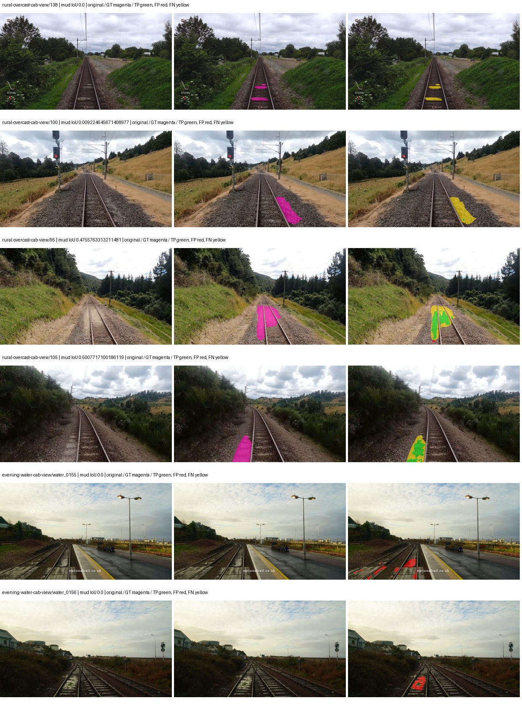

Examples are two lowest and two highest mud-IoU positive images, plus up to two negative images with the most false-positive mud pixels. They are targeted diagnostic examples, not random samples. Green: true positive; red: false positive; yellow: false negative. Full predictions remain on HDRFS.

### Validation tracking

| Logged step | Overall mIoU (%) | Mud IoU (%) |
| --- | --- | --- |
| 254 | 27.85 | 0.28 |
| 508 | 36.31 | 2.68 |
| 763 | 39.68 | 1.33 |
| 1017 | 39.94 | 7.78 |
| 1272 | 39.55 | 7.07 |
| 1527 | 40.91 | 6.75 |
| 1781 | 38.66 | 17.85 |
| 2036 | 42.56 | 17.93 |
| 2290 | 44.18 | 13.03 |
| 2545 | 43.13 | 10.14 |
| 2799 | 39.56 | 7.04 |
| 3054 | 42.76 | 11.06 |

All retained scalar curves, including training loss and per-class IoU, are in record.json. Observed best mud on a curve is not necessarily a retained checkpoint: the pilot saved its selection-metric-best and final checkpoints. Step logging and checkpoint global_step may differ by one.

### Stopping and checkpoint provenance

```json
{
  "stopping": {
    "actual_steps": 3054,
    "maximum_steps": 4000,
    "min_delta": 0.001,
    "monitor": "val_iou/mud-pumping",
    "patience": 5,
    "reason": "validation_plateau"
  },
  "checkpoints": {
    "best": {
      "path": "/data/izadia1/projects/segmentary-runs/paul-test-rtis/mud-fullstats-v1-20260906-r2/future-runs/segformer_b2--cityscapes_to_railsem19_to_rtis--seed-0_seed0/rtis/best.ckpt",
      "sha256": "5174bf0b36530efaf8a1b2f9953c2ecb68865fc40897672a43e606849228470c",
      "global_step": 2036,
      "bytes": 438463857
    },
    "final": {
      "path": "/data/izadia1/projects/segmentary-runs/paul-test-rtis/mud-fullstats-v1-20260906-r2/future-runs/segformer_b2--cityscapes_to_railsem19_to_rtis--seed-0_seed0/rtis/last.ckpt",
      "sha256": "5bc982c060a92b2a8252586b49361a119c3715d90458c5e36044897f30589f0a",
      "global_step": 3054,
      "bytes": 438445809
    }
  },
  "cleanup_error": null
}
```

### Resolved training, initialization and evaluation settings

The optimizer block is the base configuration. Stage LR scales are applied at runtime, and stage warmup is capped at min(base warmup, floor(stage budget / 10), stage budget - 1): 400 steps for this 4,000-step pilot. Model-internal native input grids may differ from augmentation crops (EoMT uses its 640 grid).

```json
{
  "name": "segformer_b2--cityscapes_to_railsem19_to_rtis--seed-0",
  "model": {
    "arch": "segformer_b2",
    "checkpoint": "nvidia/mit-b2",
    "tuning": "full",
    "head": "unified_head",
    "lora_r": 16,
    "lora_alpha": 32,
    "lora_dropout": 0.05,
    "lora_targets": [],
    "drop_path": null,
    "revision": null,
    "subfolder": null,
    "local_files_only": false,
    "trust_remote_code": false,
    "backbone_path": null,
    "head_paths": [],
    "classifier_path": null,
    "inactive_parameter_paths": [],
    "smp_arch": null,
    "encoder_name": null,
    "encoder_weights": null,
    "native": null,
    "batch_norm_momentum": null
  },
  "space": "paul-test-rtis",
  "taxonomy_root": "/data/izadia1/projects/segmentary-rtis-fullstats-066afb2/taxonomy",
  "output_root": "/data/izadia1/projects/segmentary-runs/paul-test-rtis/mud-fullstats-v1-20260906-r2/future-runs",
  "optim": {
    "backbone_lr": 6e-05,
    "head_lr_mult": 10.0,
    "weight_decay": 0.05,
    "llrd": 1.0,
    "warmup_iters": 1500,
    "warmup_ratio": 1e-06,
    "poly_power": 0.9,
    "min_lr_ratio": 0.0,
    "betas": [
      0.9,
      0.999
    ],
    "grad_clip": 1.0
  },
  "train": {
    "iters": 4000,
    "batch_size": 2,
    "accum": 8,
    "num_workers": 2,
    "precision": "bf16-mixed",
    "ema_decay": 0.9998,
    "val_every": 250,
    "ckpt_every": 500,
    "selection_metric": "val_iou/mud-pumping",
    "early_stopping_patience": 5,
    "early_stopping_min_delta": 0.001,
    "seed": 0,
    "devices": 1
  },
  "eval": {
    "sliding_window": true,
    "window": [
      1024,
      1024
    ],
    "stride": [
      768,
      768
    ],
    "batch_size": 1,
    "num_workers": 2,
    "tta_scales": [],
    "tta_flip": false,
    "threshold": 0.5,
    "boundary_tolerance_frac": 0.0075,
    "save_confusion": true
  },
  "loss": {
    "task": "multiclass",
    "activation": "auto",
    "terms": [],
    "aux": "none",
    "aux_weight": 0.0,
    "ce_weight": 1.0,
    "label_smoothing": 0.0,
    "class_weights": null,
    "query": null
  },
  "aug": {
    "crop": [
      1024,
      1024
    ],
    "scale_min": 0.5,
    "scale_max": 2.0,
    "hflip_p": 0.5,
    "color_jitter_p": 0.5,
    "brightness": 0.25,
    "contrast": 0.25,
    "saturation": 0.25,
    "hue": 0.05
  },
  "stages": [
    {
      "name": "rtis",
      "data": [
        {
          "name": "paul-test-rtis",
          "root": "/data/izadia1/datasets/paul-test-rtis",
          "variant": null,
          "split_file": "splits.json",
          "train_split": "train",
          "val_split": "val",
          "limit": null,
          "loader": "folder",
          "mapping": "paul-test-rtis",
          "loader_options": {
            "require_groups": true
          }
        }
      ],
      "iters": null,
      "lr_scale": 0.1,
      "head_group_lr_scale": 1.0,
      "init_from": "/data/izadia1/projects/segmentary-runs/all-model-city-rail-seed0-rail20-b9eb3e1/jobs/segformer_b2--cityscapes_to_railsem19--seed-0/attempt-001/train/segformer_b2--cityscapes_to_railsem19_seed0/railsem19/last.ckpt",
      "reset_head": true,
      "freeze": null,
      "sample_weights": null
    }
  ]
}
```

### Hardware and software provenance

```json
{
  "training": {
    "cuda_available": true,
    "cuda_visible_devices": "7",
    "cudnn": 91900,
    "driver_version": "570.133.20",
    "gpu_count": 1,
    "gpu_names": [
      "NVIDIA L40S"
    ],
    "hostname": "hdrfs-app-001",
    "input_normalization": {
      "channel_order": "rgb",
      "mean": [
        0.485,
        0.456,
        0.406
      ],
      "source": "imagenet",
      "std": [
        0.229,
        0.224,
        0.225
      ]
    },
    "model_origins": [
      {
        "hf_commit": "3bb39e8739149c3777d0325349b2a6c32c6413db",
        "hf_name_or_path": "nvidia/mit-b2",
        "module": "model",
        "timm_pretrained": {}
      },
      {
        "hf_commit": "3bb39e8739149c3777d0325349b2a6c32c6413db",
        "hf_name_or_path": "nvidia/mit-b2",
        "module": "model.segformer",
        "timm_pretrained": {}
      },
      {
        "hf_commit": "3bb39e8739149c3777d0325349b2a6c32c6413db",
        "hf_name_or_path": "nvidia/mit-b2",
        "module": "model.segformer.stages.0.blocks.0.attention",
        "timm_pretrained": {}
      },
      {
        "hf_commit": "3bb39e8739149c3777d0325349b2a6c32c6413db",
        "hf_name_or_path": "nvidia/mit-b2",
        "module": "model.segformer.stages.0.blocks.1.attention",
        "timm_pretrained": {}
      },
      {
        "hf_commit": "3bb39e8739149c3777d0325349b2a6c32c6413db",
        "hf_name_or_path": "nvidia/mit-b2",
        "module": "model.segformer.stages.0.blocks.2.attention",
        "timm_pretrained": {}
      },
      {
        "hf_commit": "3bb39e8739149c3777d0325349b2a6c32c6413db",
        "hf_name_or_path": "nvidia/mit-b2",
        "module": "model.segformer.stages.1.blocks.0.attention",
        "timm_pretrained": {}
      },
      {
        "hf_commit": "3bb39e8739149c3777d0325349b2a6c32c6413db",
        "hf_name_or_path": "nvidia/mit-b2",
        "module": "model.segformer.stages.1.blocks.1.attention",
        "timm_pretrained": {}
      },
      {
        "hf_commit": "3bb39e8739149c3777d0325349b2a6c32c6413db",
        "hf_name_or_path": "nvidia/mit-b2",
        "module": "model.segformer.stages.1.blocks.2.attention",
        "timm_pretrained": {}
      },
      {
        "hf_commit": "3bb39e8739149c3777d0325349b2a6c32c6413db",
        "hf_name_or_path": "nvidia/mit-b2",
        "module": "model.segformer.stages.1.blocks.3.attention",
        "timm_pretrained": {}
      },
      {
        "hf_commit": "3bb39e8739149c3777d0325349b2a6c32c6413db",
        "hf_name_or_path": "nvidia/mit-b2",
        "module": "model.segformer.stages.2.blocks.0.attention",
        "timm_pretrained": {}
      },
      {
        "hf_commit": "3bb39e8739149c3777d0325349b2a6c32c6413db",
        "hf_name_or_path": "nvidia/mit-b2",
        "module": "model.segformer.stages.2.blocks.1.attention",
        "timm_pretrained": {}
      },
      {
        "hf_commit": "3bb39e8739149c3777d0325349b2a6c32c6413db",
        "hf_name_or_path": "nvidia/mit-b2",
        "module": "model.segformer.stages.2.blocks.2.attention",
        "timm_pretrained": {}
      },
      {
        "hf_commit": "3bb39e8739149c3777d0325349b2a6c32c6413db",
        "hf_name_or_path": "nvidia/mit-b2",
        "module": "model.segformer.stages.2.blocks.3.attention",
        "timm_pretrained": {}
      },
      {
        "hf_commit": "3bb39e8739149c3777d0325349b2a6c32c6413db",
        "hf_name_or_path": "nvidia/mit-b2",
        "module": "model.segformer.stages.2.blocks.4.attention",
        "timm_pretrained": {}
      },
      {
        "hf_commit": "3bb39e8739149c3777d0325349b2a6c32c6413db",
        "hf_name_or_path": "nvidia/mit-b2",
        "module": "model.segformer.stages.2.blocks.5.attention",
        "timm_pretrained": {}
      },
      {
        "hf_commit": "3bb39e8739149c3777d0325349b2a6c32c6413db",
        "hf_name_or_path": "nvidia/mit-b2",
        "module": "model.segformer.stages.3.blocks.0.attention",
        "timm_pretrained": {}
      },
      {
        "hf_commit": "3bb39e8739149c3777d0325349b2a6c32c6413db",
        "hf_name_or_path": "nvidia/mit-b2",
        "module": "model.segformer.stages.3.blocks.1.attention",
        "timm_pretrained": {}
      },
      {
        "hf_commit": "3bb39e8739149c3777d0325349b2a6c32c6413db",
        "hf_name_or_path": "nvidia/mit-b2",
        "module": "model.segformer.stages.3.blocks.2.attention",
        "timm_pretrained": {}
      },
      {
        "hf_commit": "3bb39e8739149c3777d0325349b2a6c32c6413db",
        "hf_name_or_path": "nvidia/mit-b2",
        "module": "model.decode_head",
        "timm_pretrained": {}
      }
    ],
    "model_parameter_count": 27362773,
    "packages": {
      "albumentations": "2.0.8",
      "lightning": "2.6.5",
      "numpy": "2.4.4",
      "segmentary": "0.1.0",
      "segmentation-models-pytorch": "0.5.0",
      "timm": "1.0.28",
      "torch": "2.11.0+cu128",
      "torchvision": "0.26.0+cu128",
      "transformers": "5.15.0"
    },
    "platform": "Linux-5.15.0-139-generic-x86_64-with-glibc2.35",
    "python": "3.11.15",
    "torch": "2.11.0+cu128",
    "torch_cuda": "12.8",
    "trainable_parameter_count": 27362773,
    "training_stop": {
      "actual_steps": 3054,
      "maximum_steps": 4000,
      "min_delta": 0.001,
      "monitor": "val_iou/mud-pumping",
      "patience": 5,
      "reason": "validation_plateau"
    },
    "validation_weights": "raw"
  },
  "evaluation": {
    "cuda_available": true,
    "cuda_visible_devices": "7",
    "cudnn": 91900,
    "driver_version": "570.133.20",
    "gpu_count": 1,
    "gpu_names": [
      "NVIDIA L40S"
    ],
    "hostname": "hdrfs-app-001",
    "input_normalization": {
      "channel_order": "rgb",
      "mean": [
        0.485,
        0.456,
        0.406
      ],
      "source": "imagenet",
      "std": [
        0.229,
        0.224,
        0.225
      ]
    },
    "packages": {
      "albumentations": "2.0.8",
      "lightning": "2.6.5",
      "numpy": "2.4.4",
      "segmentary": "0.1.0",
      "segmentation-models-pytorch": "0.5.0",
      "timm": "1.0.28",
      "torch": "2.11.0+cu128",
      "torchvision": "0.26.0+cu128",
      "transformers": "5.15.0"
    },
    "platform": "Linux-5.15.0-139-generic-x86_64-with-glibc2.35",
    "python": "3.11.15",
    "torch": "2.11.0+cu128",
    "torch_cuda": "12.8"
  }
}
```

## cityscapes_to_railsem19_to_rtis — seed 1

Status: **completed**. Started: 2026-09-07T02:27:40.747165+00:00. Finished: 2026-09-07T03:20:47.684273+00:00.

Recipe pretrained initializer: `nvidia/mit-b2`.

`rtis_only` uses the recipe initializer, which may include pretrained segmentation components. Transfer paths load the exact historical source checkpoint below and reset the classifier; they do not reset all query/decoder features.

Source checkpoint: `{'name': 'segformer_b2--cityscapes_to_railsem19--seed-0', 'model': 'segformer_b2', 'protocol': 'cityscapes_to_railsem19', 'config': '/data/izadia1/projects/segmentary-runs/all-model-city-rail-seed0-rail20-b9eb3e1/jobs/segformer_b2--cityscapes_to_railsem19--seed-0/attempt-001/resolved-config.yaml', 'checkpoint': '/data/izadia1/projects/segmentary-runs/all-model-city-rail-seed0-rail20-b9eb3e1/jobs/segformer_b2--cityscapes_to_railsem19--seed-0/attempt-001/train/segformer_b2--cityscapes_to_railsem19_seed0/railsem19/last.ckpt', 'recorded_sha256': '2917e287b856d7b272db0d1edd93bd31e4d79e045ff37648653c6cdcf0929bd7', 'exists': True}`.

Config SHA-256: `dc1ec35c990fa95527245fe2072a46b25fcac41619a5b3fba92d3a300a63d555`. Weights used for validation: `raw`.

### Mud-pumping and aggregate quality

| Metric | Selected checkpoint | Final training validation |
| --- | --- | --- |
| Mud IoU | 22.53 | 15.76 |
| Mud precision | 46.38 | 47.98 |
| Mud recall | 30.46 | 19.01 |
| Mud Dice/F1 | 36.77 | 27.23 |
| mIoU | 41.06 | 41.16 |
| Mean accuracy | 56.83 | 54.35 |
| Mean precision | 54.68 | 57.08 |
| Mean Dice | 50.52 | 51.07 |
| Mean specificity | 99.15 | 99.09 |
| Pixel accuracy | 86.28 | 85.69 |
| Frequency-weighted IoU | 78.19 | 76.87 |
| Fixed GT-present class mIoU | 47.90 | 45.73 |
| Boundary F1 | 47.14 | 47.98 |

The selected checkpoint has independent evaluation evidence. Final values are the trainer's final validation record, not a new independent evaluation. mIoU averages classes with nonzero union, so false positives on absent classes can change its denominator. The fixed GT-class mean is supplementary and excludes absent classes; their false positives remain in the confusion matrix.

### Resource usage and timing

| Measurement | Value |
| --- | --- |
| Peak training VRAM, retained training invocation (GiB) | 11.73 |
| Peak evaluation VRAM (GiB) | 7.46 |
| Retained training invocation wall time (seconds) | 2957.35 |
| Retained training invocation GPU-hours (one GPU) | 0.82 |
| Evaluation wall time (seconds) | 22.33 |
| Full evaluation pipeline images/second | 1.66 |
| Best full-state checkpoint (MiB) | 418.15 |
| Final full-state checkpoint (MiB) | 418.13 |
| Audited periodic checkpoints removed (GiB) | 2.45 |

VRAM uses the recorded allocator high-water mark; it is not total device usage including CUDA context. Resumed jobs' retained training invocation times and peaks are **not whole-campaign totals**. Earlier invocation resource records are not reconstructed here. Evaluation throughput includes loader, sliding-window inference and metrics; it is not model-only latency/FPS. Missing measurements are shown as —, never inferred from another dataset's run.

### Standardized inference performance

Dedicated model-only profiling waits for an idle worker-locked L40S: BF16, batch 1, 1024x1024, 20 warmup and 100 CUDA-event-timed public forwards. It excludes loading, preprocessing, tiling and metrics.

| Status | Parameters | Weight MiB | FPS | p50 ms | p95 ms | Peak reserved GiB |
| --- | --- | --- | --- | --- | --- | --- |
| complete | 27362773 | 104.38 | 53.00 | 18.70 | 19.59 | 2.25 |

```json
{
  "schema_version": 1,
  "model_id": "segformer_b2",
  "measured_at": "2026-09-07T03:20:43+00:00",
  "status": "complete",
  "benchmark_scope": "rtis_selected_checkpoint_model_only",
  "applies_to": [
    "segformer_b2--cityscapes_to_railsem19_to_rtis--seed-1"
  ],
  "source": {
    "campaign_git_sha": "066afb2626398b7be59d4d19f5a0e4644fd59adc",
    "git_dirty": false,
    "config_hash": "4d66273a9bcd",
    "resolved_config": "/data/izadia1/projects/segmentary-runs/paul-test-rtis/mud-fullstats-v1-20260906-r2/configs/segformer_b2--cityscapes_to_railsem19_to_rtis--seed-1.yaml",
    "config_sha256": "dc1ec35c990fa95527245fe2072a46b25fcac41619a5b3fba92d3a300a63d555",
    "checkpoint_sha256": "01c026841ebe0bb3cdc47a379525506a2b759f310634838a74d348ba0ae4c364",
    "checkpoint_global_step": 1781,
    "checkpoint_bytes": 438463857,
    "checkpoint_kind": "resume checkpoint with optimizer and EMA state",
    "weights": "raw",
    "measured_checkpoint_job_id": "segformer_b2--cityscapes_to_railsem19_to_rtis--seed-1",
    "result_sha256": "eee2697fdd3c98237d4b0a38f834bc07fcb0d2925107c5aa7482a82ccbb214d3",
    "result_git_sha": "066afb2626398b7be59d4d19f5a0e4644fd59adc",
    "result_stage": "eval:paul-test-rtis:val",
    "result_seed": 1
  },
  "hardware": {
    "gpu_name": "NVIDIA L40S",
    "gpu_uuid": "GPU-2f8008a1-9b67-11f6-987b-b393a672322c",
    "logical_device": "cuda:0",
    "physical_visibility_token": "3",
    "compute_capability": [
      8,
      9
    ],
    "total_memory_bytes": 47677177856
  },
  "model": {
    "parameter_count": 27362773,
    "trainable_parameter_count": 27362773,
    "resident_parameter_bytes": 109451092,
    "parameter_dtype_counts": {
      "float32": 27362773
    }
  },
  "contract": {
    "backend": "pytorch",
    "precision": "bf16_autocast",
    "batch_size": 1,
    "input_shape_nchw": [
      1,
      3,
      1024,
      1024
    ],
    "warmup_iterations": 20,
    "measured_iterations": 100,
    "timing": "per-forward CUDA events with end-event synchronization",
    "includes_preprocessing": false,
    "includes_data_loader": false,
    "includes_sliding_window": false,
    "input_resident_on_gpu": true,
    "model_only": true,
    "entrypoint": "public model(image) dense-logits forward"
  },
  "measurements": {
    "latency": {
      "p50_ms": 18.702847480773926,
      "p95_ms": 19.592448806762697,
      "mean_ms": 18.869101257324218,
      "minimum_ms": 18.557952880859375,
      "maximum_ms": 20.05299186706543,
      "fps": 52.99669477431209,
      "raw_ms": [
        19.07200050354004,
        18.792448043823242,
        19.406848907470703,
        19.589120864868164,
        19.01363182067871,
        18.690048217773438,
        18.578432083129883,
        18.570240020751953,
        18.60915184020996,
        18.62771224975586,
        19.095552444458008,
        18.6429443359375,
        18.979839324951172,
        18.5927677154541,
        18.593791961669922,
        18.66752052307129,
        18.62041664123535,
        18.97881507873535,
        18.585599899291992,
        18.65113639831543,
        18.672639846801758,
        18.64192008972168,
        19.165184020996094,
        19.482624053955078,
        18.701311111450195,
        18.992128372192383,
        19.942399978637695,
        18.765823364257812,
        18.621440887451172,
        20.0263671875,
        18.673664093017578,
        18.64192008972168,
        18.64089584350586,
        18.62860870361328,
        18.697216033935547,
        18.661376953125,
        18.65011215209961,
        18.557952880859375,
        19.076095581054688,
        18.661376953125,
        18.61836814880371,
        18.898944854736328,
        19.147775650024414,
        18.749439239501953,
        19.282943725585938,
        19.43552017211914,
        18.704383850097656,
        18.65830421447754,
        18.719743728637695,
        18.704383850097656,
        18.66739273071289,
        18.909055709838867,
        18.584575653076172,
        18.697216033935547,
        18.697216033935547,
        20.05299186706543,
        18.795520782470703,
        18.60915184020996,
        18.699264526367188,
        18.722816467285156,
        18.687999725341797,
        18.763776779174805,
        19.04230308532715,
        19.189760208129883,
        18.698240280151367,
        18.84671974182129,
        19.548160552978516,
        19.095487594604492,
        18.689023971557617,
        18.61529541015625,
        18.811904907226562,
        18.66035270690918,
        18.65216064453125,
        18.63577651977539,
        18.70947265625,
        18.66035270690918,
        18.651264190673828,
        18.898944854736328,
        18.67673683166504,
        19.0382080078125,
        18.961408615112305,
        18.665407180786133,
        19.056640625,
        19.393535614013672,
        18.929664611816406,
        19.787776947021484,
        19.218303680419922,
        18.63884735107422,
        19.174400329589844,
        18.758655548095703,
        18.743295669555664,
        18.64499282836914,
        18.699264526367188,
        18.661376953125,
        18.93984031677246,
        18.717695236206055,
        18.65932846069336,
        19.65567970275879,
        18.735103607177734,
        18.682880401611328
      ],
      "percentile_method": "numpy linear interpolation"
    },
    "peak_reserved_bytes": 2420113408,
    "memory_kind": "pytorch_cuda_allocator_peak_reserved_excluding_context",
    "benchmark_wall_clock_s": 5.692530956119299
  },
  "started_at": "2026-09-07T03:20:37+00:00",
  "finished_at": "2026-09-07T03:20:43+00:00",
  "environment": {
    "hostname": "hdrfs-app-001",
    "python": "3.11.15",
    "platform": "Linux-5.15.0-139-generic-x86_64-with-glibc2.35",
    "torch": "2.11.0+cu128",
    "torch_cuda": "12.8",
    "cudnn": 91900,
    "driver_version": "570.133.20",
    "cuda_available": true,
    "gpu_count": 1,
    "gpu_names": [
      "NVIDIA L40S"
    ],
    "cuda_visible_devices": "3",
    "packages": {
      "segmentary": "0.1.0",
      "torch": "2.11.0+cu128",
      "torchvision": "0.26.0+cu128",
      "transformers": "5.15.0",
      "timm": "1.0.28",
      "segmentation-models-pytorch": "0.5.0",
      "albumentations": "2.0.8",
      "lightning": "2.6.5",
      "numpy": "2.4.4"
    }
  }
}
```

### Per-class validation results

| Class | GT pixels | IoU (%) | Precision (%) | Recall (%) | Dice (%) | Boundary F1 (%) |
| --- | --- | --- | --- | --- | --- | --- |
| car | 29664 | 75.24 | 80.96 | 91.42 | 85.87 | 73.46 |
| construction | 311585 | 57.52 | 71.01 | 75.17 | 73.03 | 61.48 |
| fence | 265137 | 9.98 | 15.88 | 21.16 | 18.14 | 18.97 |
| mud-pumping | 1226250 | 22.53 | 46.38 | 30.46 | 36.77 | 26.09 |
| on-rails | 0 | 0.00 | 0.00 | — | 0.00 | 0.00 |
| person | 0 | 0.00 | 0.00 | — | 0.00 | 0.00 |
| pole | 628038 | 75.88 | 87.68 | 84.94 | 86.28 | 92.33 |
| rail-embedded | 16799 | 27.57 | 91.84 | 28.26 | 43.22 | 56.81 |
| rail-raised | 2969797 | 72.59 | 87.79 | 80.74 | 84.12 | 90.46 |
| rail-track | 6323197 | 42.53 | 75.41 | 49.38 | 59.68 | 54.76 |
| road | 1048831 | 14.41 | 29.62 | 21.91 | 25.19 | 24.43 |
| sidewalk | 1297367 | 15.92 | 26.86 | 28.11 | 27.47 | 10.01 |
| sky | 19121606 | 98.70 | 99.08 | 99.61 | 99.34 | 97.05 |
| standing-water | 95802 | 0.06 | 0.08 | 0.25 | 0.12 | 0.64 |
| terrain | 39239306 | 89.12 | 90.77 | 98.00 | 94.25 | 66.27 |
| trackbed | 10643081 | 65.41 | 75.88 | 82.58 | 79.09 | 57.20 |
| traffic-light | 19510 | 80.70 | 95.55 | 83.85 | 89.32 | 89.58 |
| traffic-sign | 13285 | 52.23 | 73.08 | 64.68 | 68.62 | 78.38 |
| tram-track | 56179 | 15.71 | 27.66 | 26.66 | 27.15 | 20.67 |
| truck | 0 | 0.00 | 0.00 | — | 0.00 | 0.00 |
| vegetation-overgrowth | 5901821 | 46.18 | 72.80 | 55.81 | 63.18 | 71.24 |

### Full-run accounting

| Measurement | Value |
| --- | --- |
| Full GPU-reserved wall seconds, all recorded worker attempts | 3187.24 |
| Full reserved GPU-hours | 0.89 |
| Whole-run timing complete | True |

| Phase | Wall seconds including failed attempts |
| --- | --- |
| training | 2964.55 |
| diagnostics | 176.21 |
| performance | 12.80 |

GPU-reserved time includes model loading, training, validation, collection, profiling, checkpoint I/O and orchestration while the worker owns one GPU. It is not GPU kernel-active time. Phase timings and sampled device memory/power/utilization are retained separately; sampled device memory is not the allocator high-water mark.

### Train/validation and raw/EMA diagnostics

| Checkpoint / weights / split | Images | Mud IoU (%) | Mud precision (%) | Mud recall (%) |
| --- | --- | --- | --- | --- |
| best-auto-train / raw | 220 | 93.65 | 96.89 | 96.56 |
| best-auto-val / raw | 37 | 22.53 | 46.38 | 30.46 |
| best-alternate-val / ema | 37 | 13.87 | 30.08 | 20.48 |
| final-auto-val / raw | 37 | 15.77 | 48.00 | 19.02 |

Train uses the evaluation transform without augmentation. Compare mud train/validation metrics for the same selected weights. Alternate EMA on running-stat BatchNorm is explicitly uncalibrated and is diagnostic only. Score-threshold curves use uncalibrated normalized scores and are pixel-level diagnostics, not event detection rates or a selected deployment operating point.

### Downloadable evidence

- best-auto-train: [per-image.csv](cityscapes_to_railsem19_to_rtis--seed-1/best-auto-train/per-image.csv) · [per-image-confusion.json.gz](cityscapes_to_railsem19_to_rtis--seed-1/best-auto-train/per-image-confusion.json.gz) · [groups.json](cityscapes_to_railsem19_to_rtis--seed-1/best-auto-train/groups.json) · [mud-score-curves.json](cityscapes_to_railsem19_to_rtis--seed-1/best-auto-train/mud-score-curves.json)
- best-auto-val: [per-image.csv](cityscapes_to_railsem19_to_rtis--seed-1/best-auto-val/per-image.csv) · [per-image-confusion.json.gz](cityscapes_to_railsem19_to_rtis--seed-1/best-auto-val/per-image-confusion.json.gz) · [groups.json](cityscapes_to_railsem19_to_rtis--seed-1/best-auto-val/groups.json) · [mud-score-curves.json](cityscapes_to_railsem19_to_rtis--seed-1/best-auto-val/mud-score-curves.json) · [examples.jpg](cityscapes_to_railsem19_to_rtis--seed-1/best-auto-val/examples.jpg)
- best-alternate-val: [per-image.csv](cityscapes_to_railsem19_to_rtis--seed-1/best-alternate-val/per-image.csv) · [per-image-confusion.json.gz](cityscapes_to_railsem19_to_rtis--seed-1/best-alternate-val/per-image-confusion.json.gz) · [groups.json](cityscapes_to_railsem19_to_rtis--seed-1/best-alternate-val/groups.json) · [mud-score-curves.json](cityscapes_to_railsem19_to_rtis--seed-1/best-alternate-val/mud-score-curves.json)
- final-auto-val: [per-image.csv](cityscapes_to_railsem19_to_rtis--seed-1/final-auto-val/per-image.csv) · [per-image-confusion.json.gz](cityscapes_to_railsem19_to_rtis--seed-1/final-auto-val/per-image-confusion.json.gz) · [groups.json](cityscapes_to_railsem19_to_rtis--seed-1/final-auto-val/groups.json) · [mud-score-curves.json](cityscapes_to_railsem19_to_rtis--seed-1/final-auto-val/mud-score-curves.json)
- resources: [telemetry.csv](cityscapes_to_railsem19_to_rtis--seed-1/resources/telemetry.csv)

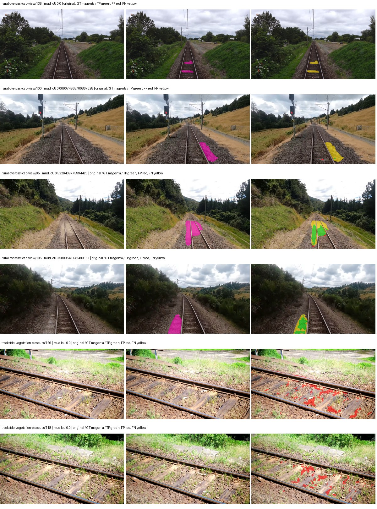

Examples are two lowest and two highest mud-IoU positive images, plus up to two negative images with the most false-positive mud pixels. They are targeted diagnostic examples, not random samples. Green: true positive; red: false positive; yellow: false negative. Full predictions remain on HDRFS.

### Validation tracking

| Logged step | Overall mIoU (%) | Mud IoU (%) |
| --- | --- | --- |
| 254 | 29.74 | 0.12 |
| 508 | 31.92 | 0.98 |
| 763 | 40.16 | 2.83 |
| 1017 | 40.42 | 12.78 |
| 1272 | 40.98 | 16.98 |
| 1527 | 43.46 | 8.71 |
| 1781 | 41.06 | 22.53 |
| 2036 | 40.39 | 9.21 |
| 2290 | 41.10 | 10.22 |
| 2545 | 41.13 | 20.61 |
| 2799 | 38.50 | 14.07 |
| 3054 | 41.16 | 15.76 |

All retained scalar curves, including training loss and per-class IoU, are in record.json. Observed best mud on a curve is not necessarily a retained checkpoint: the pilot saved its selection-metric-best and final checkpoints. Step logging and checkpoint global_step may differ by one.

### Stopping and checkpoint provenance

```json
{
  "stopping": {
    "actual_steps": 3054,
    "maximum_steps": 4000,
    "min_delta": 0.001,
    "monitor": "val_iou/mud-pumping",
    "patience": 5,
    "reason": "validation_plateau"
  },
  "checkpoints": {
    "best": {
      "path": "/data/izadia1/projects/segmentary-runs/paul-test-rtis/mud-fullstats-v1-20260906-r2/future-runs/segformer_b2--cityscapes_to_railsem19_to_rtis--seed-1_seed1/rtis/best.ckpt",
      "sha256": "01c026841ebe0bb3cdc47a379525506a2b759f310634838a74d348ba0ae4c364",
      "global_step": 1781,
      "bytes": 438463857
    },
    "final": {
      "path": "/data/izadia1/projects/segmentary-runs/paul-test-rtis/mud-fullstats-v1-20260906-r2/future-runs/segformer_b2--cityscapes_to_railsem19_to_rtis--seed-1_seed1/rtis/last.ckpt",
      "sha256": "50b84e4e91ff9c8bfa61fb383a42e7ecb40399c483cf9bd02ccbe7ea7a0438e0",
      "global_step": 3054,
      "bytes": 438445809
    }
  },
  "cleanup_error": null
}
```

### Resolved training, initialization and evaluation settings

The optimizer block is the base configuration. Stage LR scales are applied at runtime, and stage warmup is capped at min(base warmup, floor(stage budget / 10), stage budget - 1): 400 steps for this 4,000-step pilot. Model-internal native input grids may differ from augmentation crops (EoMT uses its 640 grid).

```json
{
  "name": "segformer_b2--cityscapes_to_railsem19_to_rtis--seed-1",
  "model": {
    "arch": "segformer_b2",
    "checkpoint": "nvidia/mit-b2",
    "tuning": "full",
    "head": "unified_head",
    "lora_r": 16,
    "lora_alpha": 32,
    "lora_dropout": 0.05,
    "lora_targets": [],
    "drop_path": null,
    "revision": null,
    "subfolder": null,
    "local_files_only": false,
    "trust_remote_code": false,
    "backbone_path": null,
    "head_paths": [],
    "classifier_path": null,
    "inactive_parameter_paths": [],
    "smp_arch": null,
    "encoder_name": null,
    "encoder_weights": null,
    "native": null,
    "batch_norm_momentum": null
  },
  "space": "paul-test-rtis",
  "taxonomy_root": "/data/izadia1/projects/segmentary-rtis-fullstats-066afb2/taxonomy",
  "output_root": "/data/izadia1/projects/segmentary-runs/paul-test-rtis/mud-fullstats-v1-20260906-r2/future-runs",
  "optim": {
    "backbone_lr": 6e-05,
    "head_lr_mult": 10.0,
    "weight_decay": 0.05,
    "llrd": 1.0,
    "warmup_iters": 1500,
    "warmup_ratio": 1e-06,
    "poly_power": 0.9,
    "min_lr_ratio": 0.0,
    "betas": [
      0.9,
      0.999
    ],
    "grad_clip": 1.0
  },
  "train": {
    "iters": 4000,
    "batch_size": 2,
    "accum": 8,
    "num_workers": 2,
    "precision": "bf16-mixed",
    "ema_decay": 0.9998,
    "val_every": 250,
    "ckpt_every": 500,
    "selection_metric": "val_iou/mud-pumping",
    "early_stopping_patience": 5,
    "early_stopping_min_delta": 0.001,
    "seed": 1,
    "devices": 1
  },
  "eval": {
    "sliding_window": true,
    "window": [
      1024,
      1024
    ],
    "stride": [
      768,
      768
    ],
    "batch_size": 1,
    "num_workers": 2,
    "tta_scales": [],
    "tta_flip": false,
    "threshold": 0.5,
    "boundary_tolerance_frac": 0.0075,
    "save_confusion": true
  },
  "loss": {
    "task": "multiclass",
    "activation": "auto",
    "terms": [],
    "aux": "none",
    "aux_weight": 0.0,
    "ce_weight": 1.0,
    "label_smoothing": 0.0,
    "class_weights": null,
    "query": null
  },
  "aug": {
    "crop": [
      1024,
      1024
    ],
    "scale_min": 0.5,
    "scale_max": 2.0,
    "hflip_p": 0.5,
    "color_jitter_p": 0.5,
    "brightness": 0.25,
    "contrast": 0.25,
    "saturation": 0.25,
    "hue": 0.05
  },
  "stages": [
    {
      "name": "rtis",
      "data": [
        {
          "name": "paul-test-rtis",
          "root": "/data/izadia1/datasets/paul-test-rtis",
          "variant": null,
          "split_file": "splits.json",
          "train_split": "train",
          "val_split": "val",
          "limit": null,
          "loader": "folder",
          "mapping": "paul-test-rtis",
          "loader_options": {
            "require_groups": true
          }
        }
      ],
      "iters": null,
      "lr_scale": 0.1,
      "head_group_lr_scale": 1.0,
      "init_from": "/data/izadia1/projects/segmentary-runs/all-model-city-rail-seed0-rail20-b9eb3e1/jobs/segformer_b2--cityscapes_to_railsem19--seed-0/attempt-001/train/segformer_b2--cityscapes_to_railsem19_seed0/railsem19/last.ckpt",
      "reset_head": true,
      "freeze": null,
      "sample_weights": null
    }
  ]
}
```

### Hardware and software provenance

```json
{
  "training": {
    "cuda_available": true,
    "cuda_visible_devices": "3",
    "cudnn": 91900,
    "driver_version": "570.133.20",
    "gpu_count": 1,
    "gpu_names": [
      "NVIDIA L40S"
    ],
    "hostname": "hdrfs-app-001",
    "input_normalization": {
      "channel_order": "rgb",
      "mean": [
        0.485,
        0.456,
        0.406
      ],
      "source": "imagenet",
      "std": [
        0.229,
        0.224,
        0.225
      ]
    },
    "model_origins": [
      {
        "hf_commit": "3bb39e8739149c3777d0325349b2a6c32c6413db",
        "hf_name_or_path": "nvidia/mit-b2",
        "module": "model",
        "timm_pretrained": {}
      },
      {
        "hf_commit": "3bb39e8739149c3777d0325349b2a6c32c6413db",
        "hf_name_or_path": "nvidia/mit-b2",
        "module": "model.segformer",
        "timm_pretrained": {}
      },
      {
        "hf_commit": "3bb39e8739149c3777d0325349b2a6c32c6413db",
        "hf_name_or_path": "nvidia/mit-b2",
        "module": "model.segformer.stages.0.blocks.0.attention",
        "timm_pretrained": {}
      },
      {
        "hf_commit": "3bb39e8739149c3777d0325349b2a6c32c6413db",
        "hf_name_or_path": "nvidia/mit-b2",
        "module": "model.segformer.stages.0.blocks.1.attention",
        "timm_pretrained": {}
      },
      {
        "hf_commit": "3bb39e8739149c3777d0325349b2a6c32c6413db",
        "hf_name_or_path": "nvidia/mit-b2",
        "module": "model.segformer.stages.0.blocks.2.attention",
        "timm_pretrained": {}
      },
      {
        "hf_commit": "3bb39e8739149c3777d0325349b2a6c32c6413db",
        "hf_name_or_path": "nvidia/mit-b2",
        "module": "model.segformer.stages.1.blocks.0.attention",
        "timm_pretrained": {}
      },
      {
        "hf_commit": "3bb39e8739149c3777d0325349b2a6c32c6413db",
        "hf_name_or_path": "nvidia/mit-b2",
        "module": "model.segformer.stages.1.blocks.1.attention",
        "timm_pretrained": {}
      },
      {
        "hf_commit": "3bb39e8739149c3777d0325349b2a6c32c6413db",
        "hf_name_or_path": "nvidia/mit-b2",
        "module": "model.segformer.stages.1.blocks.2.attention",
        "timm_pretrained": {}
      },
      {
        "hf_commit": "3bb39e8739149c3777d0325349b2a6c32c6413db",
        "hf_name_or_path": "nvidia/mit-b2",
        "module": "model.segformer.stages.1.blocks.3.attention",
        "timm_pretrained": {}
      },
      {
        "hf_commit": "3bb39e8739149c3777d0325349b2a6c32c6413db",
        "hf_name_or_path": "nvidia/mit-b2",
        "module": "model.segformer.stages.2.blocks.0.attention",
        "timm_pretrained": {}
      },
      {
        "hf_commit": "3bb39e8739149c3777d0325349b2a6c32c6413db",
        "hf_name_or_path": "nvidia/mit-b2",
        "module": "model.segformer.stages.2.blocks.1.attention",
        "timm_pretrained": {}
      },
      {
        "hf_commit": "3bb39e8739149c3777d0325349b2a6c32c6413db",
        "hf_name_or_path": "nvidia/mit-b2",
        "module": "model.segformer.stages.2.blocks.2.attention",
        "timm_pretrained": {}
      },
      {
        "hf_commit": "3bb39e8739149c3777d0325349b2a6c32c6413db",
        "hf_name_or_path": "nvidia/mit-b2",
        "module": "model.segformer.stages.2.blocks.3.attention",
        "timm_pretrained": {}
      },
      {
        "hf_commit": "3bb39e8739149c3777d0325349b2a6c32c6413db",
        "hf_name_or_path": "nvidia/mit-b2",
        "module": "model.segformer.stages.2.blocks.4.attention",
        "timm_pretrained": {}
      },
      {
        "hf_commit": "3bb39e8739149c3777d0325349b2a6c32c6413db",
        "hf_name_or_path": "nvidia/mit-b2",
        "module": "model.segformer.stages.2.blocks.5.attention",
        "timm_pretrained": {}
      },
      {
        "hf_commit": "3bb39e8739149c3777d0325349b2a6c32c6413db",
        "hf_name_or_path": "nvidia/mit-b2",
        "module": "model.segformer.stages.3.blocks.0.attention",
        "timm_pretrained": {}
      },
      {
        "hf_commit": "3bb39e8739149c3777d0325349b2a6c32c6413db",
        "hf_name_or_path": "nvidia/mit-b2",
        "module": "model.segformer.stages.3.blocks.1.attention",
        "timm_pretrained": {}
      },
      {
        "hf_commit": "3bb39e8739149c3777d0325349b2a6c32c6413db",
        "hf_name_or_path": "nvidia/mit-b2",
        "module": "model.segformer.stages.3.blocks.2.attention",
        "timm_pretrained": {}
      },
      {
        "hf_commit": "3bb39e8739149c3777d0325349b2a6c32c6413db",
        "hf_name_or_path": "nvidia/mit-b2",
        "module": "model.decode_head",
        "timm_pretrained": {}
      }
    ],
    "model_parameter_count": 27362773,
    "packages": {
      "albumentations": "2.0.8",
      "lightning": "2.6.5",
      "numpy": "2.4.4",
      "segmentary": "0.1.0",
      "segmentation-models-pytorch": "0.5.0",
      "timm": "1.0.28",
      "torch": "2.11.0+cu128",
      "torchvision": "0.26.0+cu128",
      "transformers": "5.15.0"
    },
    "platform": "Linux-5.15.0-139-generic-x86_64-with-glibc2.35",
    "python": "3.11.15",
    "torch": "2.11.0+cu128",
    "torch_cuda": "12.8",
    "trainable_parameter_count": 27362773,
    "training_stop": {
      "actual_steps": 3054,
      "maximum_steps": 4000,
      "min_delta": 0.001,
      "monitor": "val_iou/mud-pumping",
      "patience": 5,
      "reason": "validation_plateau"
    },
    "validation_weights": "raw"
  },
  "evaluation": {
    "cuda_available": true,
    "cuda_visible_devices": "3",
    "cudnn": 91900,
    "driver_version": "570.133.20",
    "gpu_count": 1,
    "gpu_names": [
      "NVIDIA L40S"
    ],
    "hostname": "hdrfs-app-001",
    "input_normalization": {
      "channel_order": "rgb",
      "mean": [
        0.485,
        0.456,
        0.406
      ],
      "source": "imagenet",
      "std": [
        0.229,
        0.224,
        0.225
      ]
    },
    "packages": {
      "albumentations": "2.0.8",
      "lightning": "2.6.5",
      "numpy": "2.4.4",
      "segmentary": "0.1.0",
      "segmentation-models-pytorch": "0.5.0",
      "timm": "1.0.28",
      "torch": "2.11.0+cu128",
      "torchvision": "0.26.0+cu128",
      "transformers": "5.15.0"
    },
    "platform": "Linux-5.15.0-139-generic-x86_64-with-glibc2.35",
    "python": "3.11.15",
    "torch": "2.11.0+cu128",
    "torch_cuda": "12.8"
  }
}
```

## cityscapes_to_railsem19_to_rtis — seed 2

Status: **training**. Started: 2026-09-07T02:46:12.677189+00:00. Finished: —.

Recipe pretrained initializer: `nvidia/mit-b2`.

`rtis_only` uses the recipe initializer, which may include pretrained segmentation components. Transfer paths load the exact historical source checkpoint below and reset the classifier; they do not reset all query/decoder features.

Source checkpoint: `{'name': 'segformer_b2--cityscapes_to_railsem19--seed-0', 'model': 'segformer_b2', 'protocol': 'cityscapes_to_railsem19', 'config': '/data/izadia1/projects/segmentary-runs/all-model-city-rail-seed0-rail20-b9eb3e1/jobs/segformer_b2--cityscapes_to_railsem19--seed-0/attempt-001/resolved-config.yaml', 'checkpoint': '/data/izadia1/projects/segmentary-runs/all-model-city-rail-seed0-rail20-b9eb3e1/jobs/segformer_b2--cityscapes_to_railsem19--seed-0/attempt-001/train/segformer_b2--cityscapes_to_railsem19_seed0/railsem19/last.ckpt', 'recorded_sha256': '2917e287b856d7b272db0d1edd93bd31e4d79e045ff37648653c6cdcf0929bd7', 'exists': True}`.

Config SHA-256: `71e56b3a08a08af4e7f1f117f5a8179e899eff3fb7fe5019b012704ea11cd536`. Weights used for validation: `—`.

### Mud-pumping and aggregate quality

| Metric | Selected checkpoint | Final training validation |
| --- | --- | --- |
| Mud IoU | — | — |
| Mud precision | — | — |
| Mud recall | — | — |
| Mud Dice/F1 | — | — |
| mIoU | — | — |
| Mean accuracy | — | — |
| Mean precision | — | — |
| Mean Dice | — | — |
| Mean specificity | — | — |
| Pixel accuracy | — | — |
| Frequency-weighted IoU | — | — |
| Fixed GT-present class mIoU | — | — |
| Boundary F1 | — | — |

The selected checkpoint has independent evaluation evidence. Final values are the trainer's final validation record, not a new independent evaluation. mIoU averages classes with nonzero union, so false positives on absent classes can change its denominator. The fixed GT-class mean is supplementary and excludes absent classes; their false positives remain in the confusion matrix.

### Resource usage and timing

| Measurement | Value |
| --- | --- |
| Peak training VRAM, retained training invocation (GiB) | — |
| Peak evaluation VRAM (GiB) | — |
| Retained training invocation wall time (seconds) | — |
| Retained training invocation GPU-hours (one GPU) | — |
| Evaluation wall time (seconds) | — |
| Full evaluation pipeline images/second | — |
| Best full-state checkpoint (MiB) | — |
| Final full-state checkpoint (MiB) | — |
| Audited periodic checkpoints removed (GiB) | — |

VRAM uses the recorded allocator high-water mark; it is not total device usage including CUDA context. Resumed jobs' retained training invocation times and peaks are **not whole-campaign totals**. Earlier invocation resource records are not reconstructed here. Evaluation throughput includes loader, sliding-window inference and metrics; it is not model-only latency/FPS. Missing measurements are shown as —, never inferred from another dataset's run.

### Standardized inference performance

Dedicated model-only profiling waits for an idle worker-locked L40S: BF16, batch 1, 1024x1024, 20 warmup and 100 CUDA-event-timed public forwards. It excludes loading, preprocessing, tiling and metrics.

| Status | Parameters | Weight MiB | FPS | p50 ms | p95 ms | Peak reserved GiB |
| --- | --- | --- | --- | --- | --- | --- |
| waiting_for_idle_gpu | — | — | — | — | — | — |

```json
{
  "status": "waiting_for_idle_gpu",
  "contract": "L40S; batch 1; 1024x1024; BF16; 20 warmup; 100 timed forwards"
}
```

### Per-class validation results

| Class | GT pixels | IoU (%) | Precision (%) | Recall (%) | Dice (%) | Boundary F1 (%) |
| --- | --- | --- | --- | --- | --- | --- |

### Validation tracking

| Logged step | Overall mIoU (%) | Mud IoU (%) |
| --- | --- | --- |
| 254 | 27.99 | 4.13 |
| 508 | 33.32 | 1.97 |
| 763 | 41.49 | 5.61 |
| 1017 | 41.47 | 7.73 |
| 1272 | 42.63 | 10.23 |
| 1527 | 40.52 | 14.66 |
| 1781 | 43.74 | 13.73 |
| 2036 | 42.24 | 11.20 |

All retained scalar curves, including training loss and per-class IoU, are in record.json. Observed best mud on a curve is not necessarily a retained checkpoint: the pilot saved its selection-metric-best and final checkpoints. Step logging and checkpoint global_step may differ by one.

### Stopping and checkpoint provenance

```json
{
  "stopping": null,
  "checkpoints": null,
  "cleanup_error": null
}
```

### Resolved training, initialization and evaluation settings

The optimizer block is the base configuration. Stage LR scales are applied at runtime, and stage warmup is capped at min(base warmup, floor(stage budget / 10), stage budget - 1): 400 steps for this 4,000-step pilot. Model-internal native input grids may differ from augmentation crops (EoMT uses its 640 grid).

```json
{
  "name": "segformer_b2--cityscapes_to_railsem19_to_rtis--seed-2",
  "model": {
    "arch": "segformer_b2",
    "checkpoint": "nvidia/mit-b2",
    "tuning": "full",
    "head": "unified_head",
    "lora_r": 16,
    "lora_alpha": 32,
    "lora_dropout": 0.05,
    "lora_targets": [],
    "drop_path": null,
    "revision": null,
    "subfolder": null,
    "local_files_only": false,
    "trust_remote_code": false,
    "backbone_path": null,
    "head_paths": [],
    "classifier_path": null,
    "inactive_parameter_paths": [],
    "smp_arch": null,
    "encoder_name": null,
    "encoder_weights": null,
    "native": null,
    "batch_norm_momentum": null
  },
  "space": "paul-test-rtis",
  "taxonomy_root": "/data/izadia1/projects/segmentary-rtis-fullstats-066afb2/taxonomy",
  "output_root": "/data/izadia1/projects/segmentary-runs/paul-test-rtis/mud-fullstats-v1-20260906-r2/future-runs",
  "optim": {
    "backbone_lr": 6e-05,
    "head_lr_mult": 10.0,
    "weight_decay": 0.05,
    "llrd": 1.0,
    "warmup_iters": 1500,
    "warmup_ratio": 1e-06,
    "poly_power": 0.9,
    "min_lr_ratio": 0.0,
    "betas": [
      0.9,
      0.999
    ],
    "grad_clip": 1.0
  },
  "train": {
    "iters": 4000,
    "batch_size": 2,
    "accum": 8,
    "num_workers": 2,
    "precision": "bf16-mixed",
    "ema_decay": 0.9998,
    "val_every": 250,
    "ckpt_every": 500,
    "selection_metric": "val_iou/mud-pumping",
    "early_stopping_patience": 5,
    "early_stopping_min_delta": 0.001,
    "seed": 2,
    "devices": 1
  },
  "eval": {
    "sliding_window": true,
    "window": [
      1024,
      1024
    ],
    "stride": [
      768,
      768
    ],
    "batch_size": 1,
    "num_workers": 2,
    "tta_scales": [],
    "tta_flip": false,
    "threshold": 0.5,
    "boundary_tolerance_frac": 0.0075,
    "save_confusion": true
  },
  "loss": {
    "task": "multiclass",
    "activation": "auto",
    "terms": [],
    "aux": "none",
    "aux_weight": 0.0,
    "ce_weight": 1.0,
    "label_smoothing": 0.0,
    "class_weights": null,
    "query": null
  },
  "aug": {
    "crop": [
      1024,
      1024
    ],
    "scale_min": 0.5,
    "scale_max": 2.0,
    "hflip_p": 0.5,
    "color_jitter_p": 0.5,
    "brightness": 0.25,
    "contrast": 0.25,
    "saturation": 0.25,
    "hue": 0.05
  },
  "stages": [
    {
      "name": "rtis",
      "data": [
        {
          "name": "paul-test-rtis",
          "root": "/data/izadia1/datasets/paul-test-rtis",
          "variant": null,
          "split_file": "splits.json",
          "train_split": "train",
          "val_split": "val",
          "limit": null,
          "loader": "folder",
          "mapping": "paul-test-rtis",
          "loader_options": {
            "require_groups": true
          }
        }
      ],
      "iters": null,
      "lr_scale": 0.1,
      "head_group_lr_scale": 1.0,
      "init_from": "/data/izadia1/projects/segmentary-runs/all-model-city-rail-seed0-rail20-b9eb3e1/jobs/segformer_b2--cityscapes_to_railsem19--seed-0/attempt-001/train/segformer_b2--cityscapes_to_railsem19_seed0/railsem19/last.ckpt",
      "reset_head": true,
      "freeze": null,
      "sample_weights": null
    }
  ]
}
```

### Hardware and software provenance

```json
{
  "training": null,
  "evaluation": null
}
```
