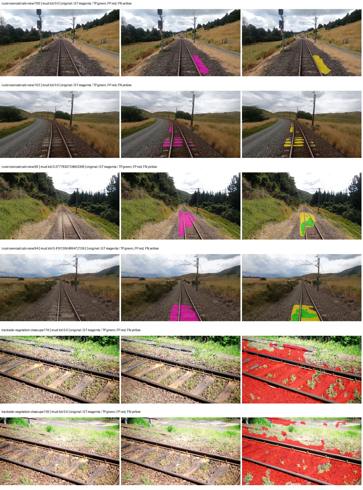
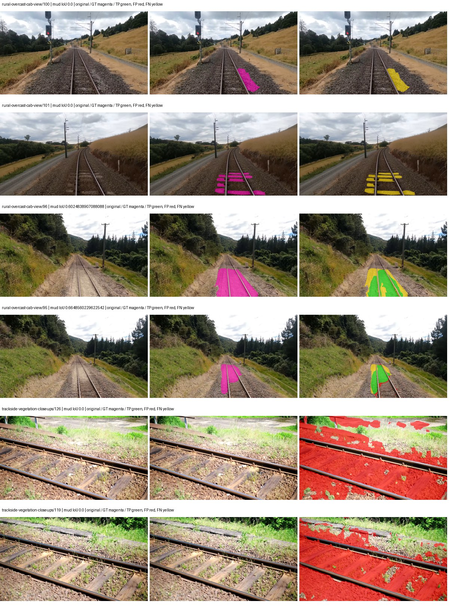

# segformer_b5 — paul-test-rtis

[RTIS comparison](../../README.md) · [Full model records](record.json)

Primary selection and early stopping: **mud-pumping validation IoU**. A job is complete only after full statistics and isolated profiling are verified.

| Model | Initialization path | Seed | Status | Steps | Best step | Mud IoU (%) | Mud precision (%) | Mud recall (%) | Final mud IoU (trainer val, %) | mIoU (%) | Fixed GT-class mIoU (%) |
| --- | --- | --- | --- | --- | --- | --- | --- | --- | --- | --- | --- |
| segformer_b5 | rtis_only | 0 | completed | 2036 | 763 | 2.23 | 2.60 | 13.76 | 1.20 | 34.12 | 39.81 |
| segformer_b5 | rtis_only | 1 | completed | 1781 | 509 | 2.55 | 2.87 | 18.54 | 1.51 | 33.34 | 37.05 |
| segformer_b5 | rtis_only | 2 | collecting | 1781 | 509 | 3.58 | 4.18 | 19.79 | 1.41 | 31.39 | 36.62 |
| segformer_b5 | cityscapes_to_rtis | 0 | training | 1849 | — | — | — | — | — | — | — |
| segformer_b5 | cityscapes_to_rtis | 1 | training | 1549 | — | — | — | — | — | — | — |
| segformer_b5 | cityscapes_to_rtis | 2 | training | 1527 | — | — | — | — | — | — | — |
| segformer_b5 | railsem19_to_rtis | 0 | training | 1249 | — | — | — | — | — | — | — |
| segformer_b5 | railsem19_to_rtis | 1 | training | 1099 | — | — | — | — | — | — | — |
| segformer_b5 | railsem19_to_rtis | 2 | training | 1049 | — | — | — | — | — | — | — |
| segformer_b5 | cityscapes_to_railsem19_to_rtis | 0 | training | 299 | — | — | — | — | — | — | — |
| segformer_b5 | cityscapes_to_railsem19_to_rtis | 1 | training | — | — | — | — | — | — | — | — |
| segformer_b5 | cityscapes_to_railsem19_to_rtis | 2 | queued | — | — | — | — | — | — | — | — |

Training: 220 images. Validation: 37 images. Test: 50 held out. Seeds: [0, 1, 2]. Seed variation measures optimization variability, not independent-recording uncertainty. Historical source checkpoints stay fixed across adaptation seeds.

Training code: `066afb2626398b7be59d4d19f5a0e4644fd59adc`. Split SHA-256: `71fef8292610c352da0709fe3bd030f3bcc18f97560394835f4b22826463b83d`.

## rtis_only — seed 0

Status: **completed**. Started: 2026-09-07T02:48:29.514193+00:00. Finished: 2026-09-07T03:49:11.267849+00:00.

Recipe pretrained initializer: `nvidia/mit-b5`.

`rtis_only` uses the recipe initializer, which may include pretrained segmentation components. Transfer paths load the exact historical source checkpoint below and reset the classifier; they do not reset all query/decoder features.

Source checkpoint: `Recipe pretrained initialization`.

Config SHA-256: `8f10f93b40397ad35e22bcc1ac6f8d591f3873b333c543c76f08898b6c45e424`. Weights used for validation: `raw`.

### Mud-pumping and aggregate quality

| Metric | Selected checkpoint | Final training validation |
| --- | --- | --- |
| Mud IoU | 2.23 | 1.20 |
| Mud precision | 2.60 | 1.48 |
| Mud recall | 13.76 | 5.99 |
| Mud Dice/F1 | 4.37 | 2.37 |
| mIoU | 34.12 | 36.83 |
| Mean accuracy | 45.47 | 48.89 |
| Mean precision | 54.98 | 55.30 |
| Mean Dice | 42.85 | 46.41 |
| Mean specificity | 98.96 | 99.13 |
| Pixel accuracy | 83.03 | 84.98 |
| Frequency-weighted IoU | 75.85 | 78.76 |
| Fixed GT-present class mIoU | 39.81 | 40.92 |
| Boundary F1 | 42.58 | 44.59 |

The selected checkpoint has independent evaluation evidence. Final values are the trainer's final validation record, not a new independent evaluation. mIoU averages classes with nonzero union, so false positives on absent classes can change its denominator. The fixed GT-class mean is supplementary and excludes absent classes; their false positives remain in the confusion matrix.

### Resource usage and timing

| Measurement | Value |
| --- | --- |
| Peak training VRAM, retained training invocation (GiB) | 16.31 |
| Peak evaluation VRAM (GiB) | 7.78 |
| Retained training invocation wall time (seconds) | 3335.58 |
| Retained training invocation GPU-hours (one GPU) | 0.93 |
| Evaluation wall time (seconds) | 29.50 |
| Full evaluation pipeline images/second | 1.25 |
| Best full-state checkpoint (MiB) | 1292.96 |
| Final full-state checkpoint (MiB) | 1292.91 |
| Audited periodic checkpoints removed (GiB) | 5.05 |

VRAM uses the recorded allocator high-water mark; it is not total device usage including CUDA context. Resumed jobs' retained training invocation times and peaks are **not whole-campaign totals**. Earlier invocation resource records are not reconstructed here. Evaluation throughput includes loader, sliding-window inference and metrics; it is not model-only latency/FPS. Missing measurements are shown as —, never inferred from another dataset's run.

### Standardized inference performance

Dedicated model-only profiling waits for an idle worker-locked L40S: BF16, batch 1, 1024x1024, 20 warmup and 100 CUDA-event-timed public forwards. It excludes loading, preprocessing, tiling and metrics.

| Status | Parameters | Weight MiB | FPS | p50 ms | p95 ms | Peak reserved GiB |
| --- | --- | --- | --- | --- | --- | --- |
| complete | 84609493 | 322.76 | 26.35 | 37.66 | 39.70 | 2.57 |

```json
{
  "schema_version": 1,
  "model_id": "segformer_b5",
  "measured_at": "2026-09-07T03:49:02+00:00",
  "status": "complete",
  "benchmark_scope": "rtis_selected_checkpoint_model_only",
  "applies_to": [
    "segformer_b5--rtis_only--seed-0"
  ],
  "source": {
    "campaign_git_sha": "066afb2626398b7be59d4d19f5a0e4644fd59adc",
    "git_dirty": false,
    "config_hash": "44f692bcf85b",
    "resolved_config": "/data/izadia1/projects/segmentary-runs/paul-test-rtis/mud-fullstats-v1-20260906-r2/configs/segformer_b5--rtis_only--seed-0.yaml",
    "config_sha256": "8f10f93b40397ad35e22bcc1ac6f8d591f3873b333c543c76f08898b6c45e424",
    "checkpoint_sha256": "91304f2fd69b323af62f90b692e6e9a2b6dd936f32d3303f58bcf0147ce81648",
    "checkpoint_global_step": 763,
    "checkpoint_bytes": 1355767993,
    "checkpoint_kind": "resume checkpoint with optimizer and EMA state",
    "weights": "raw",
    "measured_checkpoint_job_id": "segformer_b5--rtis_only--seed-0",
    "result_sha256": "f21fc6259755ff476c556aef145dbfaf35d68b7acb1ee1f83e9933f9bbba8cd9",
    "result_git_sha": "066afb2626398b7be59d4d19f5a0e4644fd59adc",
    "result_stage": "eval:paul-test-rtis:val",
    "result_seed": 0
  },
  "hardware": {
    "gpu_name": "NVIDIA L40S",
    "gpu_uuid": "GPU-84f5ca4d-68db-ae98-d056-40654d859dd9",
    "logical_device": "cuda:0",
    "physical_visibility_token": "0",
    "compute_capability": [
      8,
      9
    ],
    "total_memory_bytes": 47677177856
  },
  "model": {
    "parameter_count": 84609493,
    "trainable_parameter_count": 84609493,
    "resident_parameter_bytes": 338437972,
    "parameter_dtype_counts": {
      "float32": 84609493
    }
  },
  "contract": {
    "backend": "pytorch",
    "precision": "bf16_autocast",
    "batch_size": 1,
    "input_shape_nchw": [
      1,
      3,
      1024,
      1024
    ],
    "warmup_iterations": 20,
    "measured_iterations": 100,
    "timing": "per-forward CUDA events with end-event synchronization",
    "includes_preprocessing": false,
    "includes_data_loader": false,
    "includes_sliding_window": false,
    "input_resident_on_gpu": true,
    "model_only": true,
    "entrypoint": "public model(image) dense-logits forward"
  },
  "measurements": {
    "latency": {
      "p50_ms": 37.66476821899414,
      "p95_ms": 39.70196418762207,
      "mean_ms": 37.95691337585449,
      "minimum_ms": 36.922367095947266,
      "maximum_ms": 41.15046310424805,
      "fps": 26.345661726965645,
      "raw_ms": [
        37.35142517089844,
        37.219329833984375,
        36.99711990356445,
        37.22956848144531,
        36.99097442626953,
        37.00940704345703,
        38.41331100463867,
        38.430721282958984,
        37.62688064575195,
        36.922367095947266,
        37.30739212036133,
        38.993919372558594,
        38.3875846862793,
        37.9607048034668,
        37.7815055847168,
        38.531070709228516,
        37.32070541381836,
        38.46857452392578,
        38.29350280761719,
        39.69945526123047,
        37.27974319458008,
        37.83475112915039,
        37.09849548339844,
        37.215232849121094,
        37.749759674072266,
        38.30886459350586,
        38.184959411621094,
        37.403648376464844,
        37.26847839355469,
        38.2658576965332,
        39.779327392578125,
        37.405696868896484,
        37.3678092956543,
        39.77830505371094,
        38.405120849609375,
        37.970943450927734,
        37.65862274169922,
        37.140480041503906,
        38.27094268798828,
        38.00166320800781,
        38.569984436035156,
        38.59958267211914,
        37.44460678100586,
        37.365760803222656,
        38.02214431762695,
        37.23878479003906,
        37.208065032958984,
        37.186561584472656,
        37.52755355834961,
        38.953983306884766,
        38.85260772705078,
        38.42252731323242,
        37.834686279296875,
        37.58796691894531,
        37.45897674560547,
        37.564414978027344,
        38.22489547729492,
        37.35347366333008,
        38.140926361083984,
        37.4466552734375,
        37.1333122253418,
        38.33241653442383,
        40.776702880859375,
        37.501953125,
        37.57465744018555,
        37.09952163696289,
        37.50707244873047,
        37.465087890625,
        37.6064338684082,
        38.24028778076172,
        38.78092956542969,
        38.1767692565918,
        37.29510498046875,
        37.1682243347168,
        37.129215240478516,
        37.348350524902344,
        39.52537536621094,
        37.76921463012695,
        37.19782257080078,
        37.67091369628906,
        39.64931106567383,
        37.11692810058594,
        38.08563232421875,
        37.64633560180664,
        37.36467361450195,
        37.202945709228516,
        37.206016540527344,
        38.87513732910156,
        37.292991638183594,
        38.09689712524414,
        38.48601531982422,
        37.49068832397461,
        39.197696685791016,
        37.705726623535156,
        38.07846450805664,
        41.15046310424805,
        38.54956817626953,
        37.612545013427734,
        39.7496337890625,
        39.50592041015625
      ],
      "percentile_method": "numpy linear interpolation"
    },
    "peak_reserved_bytes": 2755657728,
    "memory_kind": "pytorch_cuda_allocator_peak_reserved_excluding_context",
    "benchmark_wall_clock_s": 7.829796526581049
  },
  "started_at": "2026-09-07T03:48:54+00:00",
  "finished_at": "2026-09-07T03:49:02+00:00",
  "environment": {
    "hostname": "hdrfs-app-001",
    "python": "3.11.15",
    "platform": "Linux-5.15.0-139-generic-x86_64-with-glibc2.35",
    "torch": "2.11.0+cu128",
    "torch_cuda": "12.8",
    "cudnn": 91900,
    "driver_version": "570.133.20",
    "cuda_available": true,
    "gpu_count": 1,
    "gpu_names": [
      "NVIDIA L40S"
    ],
    "cuda_visible_devices": "0",
    "packages": {
      "segmentary": "0.1.0",
      "torch": "2.11.0+cu128",
      "torchvision": "0.26.0+cu128",
      "transformers": "5.15.0",
      "timm": "1.0.28",
      "segmentation-models-pytorch": "0.5.0",
      "albumentations": "2.0.8",
      "lightning": "2.6.5",
      "numpy": "2.4.4"
    }
  }
}
```

### Per-class validation results

| Class | GT pixels | IoU (%) | Precision (%) | Recall (%) | Dice (%) | Boundary F1 (%) |
| --- | --- | --- | --- | --- | --- | --- |
| car | 29664 | 12.57 | 48.54 | 14.50 | 22.33 | 42.70 |
| construction | 311585 | 51.59 | 72.81 | 63.89 | 68.06 | 61.27 |
| fence | 265137 | 6.39 | 62.86 | 6.64 | 12.01 | 24.84 |
| mud-pumping | 1226250 | 2.23 | 2.60 | 13.76 | 4.37 | 3.78 |
| on-rails | 0 | 0.00 | 0.00 | — | 0.00 | 0.00 |
| person | 0 | 0.00 | 0.00 | — | 0.00 | 0.00 |
| pole | 628038 | 70.48 | 83.02 | 82.36 | 82.69 | 90.04 |
| rail-embedded | 16799 | 23.65 | 85.65 | 24.62 | 38.25 | 32.88 |
| rail-raised | 2969797 | 76.22 | 89.85 | 83.39 | 86.50 | 94.10 |
| rail-track | 6323197 | 33.77 | 76.98 | 37.57 | 50.49 | 43.61 |
| road | 1048831 | 4.68 | 29.54 | 5.26 | 8.94 | 15.49 |
| sidewalk | 1297367 | 45.02 | 94.32 | 46.28 | 62.09 | 22.35 |
| sky | 19121606 | 98.65 | 99.30 | 99.34 | 99.32 | 96.08 |
| standing-water | 95802 | 4.55 | 7.87 | 9.74 | 8.70 | 23.84 |
| terrain | 39239306 | 87.79 | 88.94 | 98.55 | 93.50 | 60.79 |
| trackbed | 10643081 | 59.79 | 79.78 | 70.47 | 74.84 | 61.72 |
| traffic-light | 19510 | 66.59 | 85.30 | 75.22 | 79.94 | 87.25 |
| traffic-sign | 13285 | 32.35 | 56.27 | 43.21 | 48.88 | 54.71 |
| tram-track | 56179 | 1.63 | 6.55 | 2.12 | 3.21 | 11.39 |
| truck | 0 | 0.00 | 0.00 | — | 0.00 | 0.00 |
| vegetation-overgrowth | 5901821 | 38.58 | 84.37 | 41.55 | 55.68 | 67.28 |

### Full-run accounting

| Measurement | Value |
| --- | --- |
| Full GPU-reserved wall seconds, all recorded worker attempts | 3641.76 |
| Full reserved GPU-hours | 1.01 |
| Whole-run timing complete | True |

| Phase | Wall seconds including failed attempts |
| --- | --- |
| training | 3342.59 |
| diagnostics | 233.71 |
| performance | 17.72 |

GPU-reserved time includes model loading, training, validation, collection, profiling, checkpoint I/O and orchestration while the worker owns one GPU. It is not GPU kernel-active time. Phase timings and sampled device memory/power/utilization are retained separately; sampled device memory is not the allocator high-water mark.

### Train/validation and raw/EMA diagnostics

| Checkpoint / weights / split | Images | Mud IoU (%) | Mud precision (%) | Mud recall (%) |
| --- | --- | --- | --- | --- |
| best-auto-train / raw | 220 | 95.24 | 97.27 | 97.85 |
| best-auto-val / raw | 37 | 2.23 | 2.60 | 13.76 |
| best-alternate-val / ema | 37 | 2.31 | 2.75 | 12.71 |
| final-auto-val / raw | 37 | 1.20 | 1.48 | 6.00 |

Train uses the evaluation transform without augmentation. Compare mud train/validation metrics for the same selected weights. Alternate EMA on running-stat BatchNorm is explicitly uncalibrated and is diagnostic only. Score-threshold curves use uncalibrated normalized scores and are pixel-level diagnostics, not event detection rates or a selected deployment operating point.

### Downloadable evidence

- best-auto-train: [per-image.csv](rtis_only--seed-0/best-auto-train/per-image.csv) · [per-image-confusion.json.gz](rtis_only--seed-0/best-auto-train/per-image-confusion.json.gz) · [groups.json](rtis_only--seed-0/best-auto-train/groups.json) · [mud-score-curves.json](rtis_only--seed-0/best-auto-train/mud-score-curves.json)
- best-auto-val: [per-image.csv](rtis_only--seed-0/best-auto-val/per-image.csv) · [per-image-confusion.json.gz](rtis_only--seed-0/best-auto-val/per-image-confusion.json.gz) · [groups.json](rtis_only--seed-0/best-auto-val/groups.json) · [mud-score-curves.json](rtis_only--seed-0/best-auto-val/mud-score-curves.json) · [examples.jpg](rtis_only--seed-0/best-auto-val/examples.jpg)
- best-alternate-val: [per-image.csv](rtis_only--seed-0/best-alternate-val/per-image.csv) · [per-image-confusion.json.gz](rtis_only--seed-0/best-alternate-val/per-image-confusion.json.gz) · [groups.json](rtis_only--seed-0/best-alternate-val/groups.json) · [mud-score-curves.json](rtis_only--seed-0/best-alternate-val/mud-score-curves.json)
- final-auto-val: [per-image.csv](rtis_only--seed-0/final-auto-val/per-image.csv) · [per-image-confusion.json.gz](rtis_only--seed-0/final-auto-val/per-image-confusion.json.gz) · [groups.json](rtis_only--seed-0/final-auto-val/groups.json) · [mud-score-curves.json](rtis_only--seed-0/final-auto-val/mud-score-curves.json)
- resources: [telemetry.csv](rtis_only--seed-0/resources/telemetry.csv)



Examples are two lowest and two highest mud-IoU positive images, plus up to two negative images with the most false-positive mud pixels. They are targeted diagnostic examples, not random samples. Green: true positive; red: false positive; yellow: false negative. Full predictions remain on HDRFS.

### Validation tracking

| Logged step | Overall mIoU (%) | Mud IoU (%) |
| --- | --- | --- |
| 254 | 28.78 | 0.90 |
| 508 | 32.70 | 1.81 |
| 763 | 34.12 | 2.23 |
| 1017 | 36.66 | 0.66 |
| 1272 | 36.29 | 1.31 |
| 1527 | 32.87 | 0.77 |
| 1781 | 34.96 | 1.50 |
| 2036 | 36.83 | 1.20 |

All retained scalar curves, including training loss and per-class IoU, are in record.json. Observed best mud on a curve is not necessarily a retained checkpoint: the pilot saved its selection-metric-best and final checkpoints. Step logging and checkpoint global_step may differ by one.

### Stopping and checkpoint provenance

```json
{
  "stopping": {
    "actual_steps": 2036,
    "maximum_steps": 4000,
    "min_delta": 0.001,
    "monitor": "val_iou/mud-pumping",
    "patience": 5,
    "reason": "validation_plateau"
  },
  "checkpoints": {
    "best": {
      "path": "/data/izadia1/projects/segmentary-runs/paul-test-rtis/mud-fullstats-v1-20260906-r2/future-runs/segformer_b5--rtis_only--seed-0_seed0/rtis/best.ckpt",
      "sha256": "91304f2fd69b323af62f90b692e6e9a2b6dd936f32d3303f58bcf0147ce81648",
      "global_step": 763,
      "bytes": 1355767993
    },
    "final": {
      "path": "/data/izadia1/projects/segmentary-runs/paul-test-rtis/mud-fullstats-v1-20260906-r2/future-runs/segformer_b5--rtis_only--seed-0_seed0/rtis/last.ckpt",
      "sha256": "fdf8a2d93583c9cbef8451d256a02adeb7f67e0f64da5f2f1cce13ffda7b6ca8",
      "global_step": 2036,
      "bytes": 1355711929
    }
  },
  "cleanup_error": null
}
```

### Resolved training, initialization and evaluation settings

The optimizer block is the base configuration. Stage LR scales are applied at runtime, and stage warmup is capped at min(base warmup, floor(stage budget / 10), stage budget - 1): 400 steps for this 4,000-step pilot. Model-internal native input grids may differ from augmentation crops (EoMT uses its 640 grid).

```json
{
  "name": "segformer_b5--rtis_only--seed-0",
  "model": {
    "arch": "segformer_b5",
    "checkpoint": "nvidia/mit-b5",
    "tuning": "full",
    "head": "unified_head",
    "lora_r": 16,
    "lora_alpha": 32,
    "lora_dropout": 0.05,
    "lora_targets": [],
    "drop_path": null,
    "revision": null,
    "subfolder": null,
    "local_files_only": false,
    "trust_remote_code": false,
    "backbone_path": null,
    "head_paths": [],
    "classifier_path": null,
    "inactive_parameter_paths": [],
    "smp_arch": null,
    "encoder_name": null,
    "encoder_weights": null,
    "native": null,
    "batch_norm_momentum": null
  },
  "space": "paul-test-rtis",
  "taxonomy_root": "/data/izadia1/projects/segmentary-rtis-fullstats-066afb2/taxonomy",
  "output_root": "/data/izadia1/projects/segmentary-runs/paul-test-rtis/mud-fullstats-v1-20260906-r2/future-runs",
  "optim": {
    "backbone_lr": 6e-05,
    "head_lr_mult": 10.0,
    "weight_decay": 0.05,
    "llrd": 1.0,
    "warmup_iters": 1500,
    "warmup_ratio": 1e-06,
    "poly_power": 0.9,
    "min_lr_ratio": 0.0,
    "betas": [
      0.9,
      0.999
    ],
    "grad_clip": 1.0
  },
  "train": {
    "iters": 4000,
    "batch_size": 2,
    "accum": 8,
    "num_workers": 2,
    "precision": "bf16-mixed",
    "ema_decay": 0.9998,
    "val_every": 250,
    "ckpt_every": 500,
    "selection_metric": "val_iou/mud-pumping",
    "early_stopping_patience": 5,
    "early_stopping_min_delta": 0.001,
    "seed": 0,
    "devices": 1
  },
  "eval": {
    "sliding_window": true,
    "window": [
      1024,
      1024
    ],
    "stride": [
      768,
      768
    ],
    "batch_size": 1,
    "num_workers": 2,
    "tta_scales": [],
    "tta_flip": false,
    "threshold": 0.5,
    "boundary_tolerance_frac": 0.0075,
    "save_confusion": true
  },
  "loss": {
    "task": "multiclass",
    "activation": "auto",
    "terms": [],
    "aux": "none",
    "aux_weight": 0.0,
    "ce_weight": 1.0,
    "label_smoothing": 0.0,
    "class_weights": null,
    "query": null
  },
  "aug": {
    "crop": [
      1024,
      1024
    ],
    "scale_min": 0.5,
    "scale_max": 2.0,
    "hflip_p": 0.5,
    "color_jitter_p": 0.5,
    "brightness": 0.25,
    "contrast": 0.25,
    "saturation": 0.25,
    "hue": 0.05
  },
  "stages": [
    {
      "name": "rtis",
      "data": [
        {
          "name": "paul-test-rtis",
          "root": "/data/izadia1/datasets/paul-test-rtis",
          "variant": null,
          "split_file": "splits.json",
          "train_split": "train",
          "val_split": "val",
          "limit": null,
          "loader": "folder",
          "mapping": "paul-test-rtis",
          "loader_options": {
            "require_groups": true
          }
        }
      ],
      "iters": null,
      "lr_scale": 1.0,
      "head_group_lr_scale": 1.0,
      "init_from": "pretrained",
      "reset_head": false,
      "freeze": null,
      "sample_weights": null
    }
  ]
}
```

### Hardware and software provenance

```json
{
  "training": {
    "cuda_available": true,
    "cuda_visible_devices": "0",
    "cudnn": 91900,
    "driver_version": "570.133.20",
    "gpu_count": 1,
    "gpu_names": [
      "NVIDIA L40S"
    ],
    "hostname": "hdrfs-app-001",
    "input_normalization": {
      "channel_order": "rgb",
      "mean": [
        0.485,
        0.456,
        0.406
      ],
      "source": "imagenet",
      "std": [
        0.229,
        0.224,
        0.225
      ]
    },
    "model_origins": [
      {
        "hf_commit": "40357155205b036cf11b61f132d53d2f8861f170",
        "hf_name_or_path": "nvidia/mit-b5",
        "module": "model",
        "timm_pretrained": {}
      },
      {
        "hf_commit": "40357155205b036cf11b61f132d53d2f8861f170",
        "hf_name_or_path": "nvidia/mit-b5",
        "module": "model.segformer",
        "timm_pretrained": {}
      },
      {
        "hf_commit": "40357155205b036cf11b61f132d53d2f8861f170",
        "hf_name_or_path": "nvidia/mit-b5",
        "module": "model.segformer.stages.0.blocks.0.attention",
        "timm_pretrained": {}
      },
      {
        "hf_commit": "40357155205b036cf11b61f132d53d2f8861f170",
        "hf_name_or_path": "nvidia/mit-b5",
        "module": "model.segformer.stages.0.blocks.1.attention",
        "timm_pretrained": {}
      },
      {
        "hf_commit": "40357155205b036cf11b61f132d53d2f8861f170",
        "hf_name_or_path": "nvidia/mit-b5",
        "module": "model.segformer.stages.0.blocks.2.attention",
        "timm_pretrained": {}
      },
      {
        "hf_commit": "40357155205b036cf11b61f132d53d2f8861f170",
        "hf_name_or_path": "nvidia/mit-b5",
        "module": "model.segformer.stages.1.blocks.0.attention",
        "timm_pretrained": {}
      },
      {
        "hf_commit": "40357155205b036cf11b61f132d53d2f8861f170",
        "hf_name_or_path": "nvidia/mit-b5",
        "module": "model.segformer.stages.1.blocks.1.attention",
        "timm_pretrained": {}
      },
      {
        "hf_commit": "40357155205b036cf11b61f132d53d2f8861f170",
        "hf_name_or_path": "nvidia/mit-b5",
        "module": "model.segformer.stages.1.blocks.2.attention",
        "timm_pretrained": {}
      },
      {
        "hf_commit": "40357155205b036cf11b61f132d53d2f8861f170",
        "hf_name_or_path": "nvidia/mit-b5",
        "module": "model.segformer.stages.1.blocks.3.attention",
        "timm_pretrained": {}
      },
      {
        "hf_commit": "40357155205b036cf11b61f132d53d2f8861f170",
        "hf_name_or_path": "nvidia/mit-b5",
        "module": "model.segformer.stages.1.blocks.4.attention",
        "timm_pretrained": {}
      },
      {
        "hf_commit": "40357155205b036cf11b61f132d53d2f8861f170",
        "hf_name_or_path": "nvidia/mit-b5",
        "module": "model.segformer.stages.1.blocks.5.attention",
        "timm_pretrained": {}
      },
      {
        "hf_commit": "40357155205b036cf11b61f132d53d2f8861f170",
        "hf_name_or_path": "nvidia/mit-b5",
        "module": "model.segformer.stages.2.blocks.0.attention",
        "timm_pretrained": {}
      },
      {
        "hf_commit": "40357155205b036cf11b61f132d53d2f8861f170",
        "hf_name_or_path": "nvidia/mit-b5",
        "module": "model.segformer.stages.2.blocks.1.attention",
        "timm_pretrained": {}
      },
      {
        "hf_commit": "40357155205b036cf11b61f132d53d2f8861f170",
        "hf_name_or_path": "nvidia/mit-b5",
        "module": "model.segformer.stages.2.blocks.2.attention",
        "timm_pretrained": {}
      },
      {
        "hf_commit": "40357155205b036cf11b61f132d53d2f8861f170",
        "hf_name_or_path": "nvidia/mit-b5",
        "module": "model.segformer.stages.2.blocks.3.attention",
        "timm_pretrained": {}
      },
      {
        "hf_commit": "40357155205b036cf11b61f132d53d2f8861f170",
        "hf_name_or_path": "nvidia/mit-b5",
        "module": "model.segformer.stages.2.blocks.4.attention",
        "timm_pretrained": {}
      },
      {
        "hf_commit": "40357155205b036cf11b61f132d53d2f8861f170",
        "hf_name_or_path": "nvidia/mit-b5",
        "module": "model.segformer.stages.2.blocks.5.attention",
        "timm_pretrained": {}
      },
      {
        "hf_commit": "40357155205b036cf11b61f132d53d2f8861f170",
        "hf_name_or_path": "nvidia/mit-b5",
        "module": "model.segformer.stages.2.blocks.6.attention",
        "timm_pretrained": {}
      },
      {
        "hf_commit": "40357155205b036cf11b61f132d53d2f8861f170",
        "hf_name_or_path": "nvidia/mit-b5",
        "module": "model.segformer.stages.2.blocks.7.attention",
        "timm_pretrained": {}
      },
      {
        "hf_commit": "40357155205b036cf11b61f132d53d2f8861f170",
        "hf_name_or_path": "nvidia/mit-b5",
        "module": "model.segformer.stages.2.blocks.8.attention",
        "timm_pretrained": {}
      },
      {
        "hf_commit": "40357155205b036cf11b61f132d53d2f8861f170",
        "hf_name_or_path": "nvidia/mit-b5",
        "module": "model.segformer.stages.2.blocks.9.attention",
        "timm_pretrained": {}
      },
      {
        "hf_commit": "40357155205b036cf11b61f132d53d2f8861f170",
        "hf_name_or_path": "nvidia/mit-b5",
        "module": "model.segformer.stages.2.blocks.10.attention",
        "timm_pretrained": {}
      },
      {
        "hf_commit": "40357155205b036cf11b61f132d53d2f8861f170",
        "hf_name_or_path": "nvidia/mit-b5",
        "module": "model.segformer.stages.2.blocks.11.attention",
        "timm_pretrained": {}
      },
      {
        "hf_commit": "40357155205b036cf11b61f132d53d2f8861f170",
        "hf_name_or_path": "nvidia/mit-b5",
        "module": "model.segformer.stages.2.blocks.12.attention",
        "timm_pretrained": {}
      },
      {
        "hf_commit": "40357155205b036cf11b61f132d53d2f8861f170",
        "hf_name_or_path": "nvidia/mit-b5",
        "module": "model.segformer.stages.2.blocks.13.attention",
        "timm_pretrained": {}
      },
      {
        "hf_commit": "40357155205b036cf11b61f132d53d2f8861f170",
        "hf_name_or_path": "nvidia/mit-b5",
        "module": "model.segformer.stages.2.blocks.14.attention",
        "timm_pretrained": {}
      },
      {
        "hf_commit": "40357155205b036cf11b61f132d53d2f8861f170",
        "hf_name_or_path": "nvidia/mit-b5",
        "module": "model.segformer.stages.2.blocks.15.attention",
        "timm_pretrained": {}
      },
      {
        "hf_commit": "40357155205b036cf11b61f132d53d2f8861f170",
        "hf_name_or_path": "nvidia/mit-b5",
        "module": "model.segformer.stages.2.blocks.16.attention",
        "timm_pretrained": {}
      },
      {
        "hf_commit": "40357155205b036cf11b61f132d53d2f8861f170",
        "hf_name_or_path": "nvidia/mit-b5",
        "module": "model.segformer.stages.2.blocks.17.attention",
        "timm_pretrained": {}
      },
      {
        "hf_commit": "40357155205b036cf11b61f132d53d2f8861f170",
        "hf_name_or_path": "nvidia/mit-b5",
        "module": "model.segformer.stages.2.blocks.18.attention",
        "timm_pretrained": {}
      },
      {
        "hf_commit": "40357155205b036cf11b61f132d53d2f8861f170",
        "hf_name_or_path": "nvidia/mit-b5",
        "module": "model.segformer.stages.2.blocks.19.attention",
        "timm_pretrained": {}
      },
      {
        "hf_commit": "40357155205b036cf11b61f132d53d2f8861f170",
        "hf_name_or_path": "nvidia/mit-b5",
        "module": "model.segformer.stages.2.blocks.20.attention",
        "timm_pretrained": {}
      },
      {
        "hf_commit": "40357155205b036cf11b61f132d53d2f8861f170",
        "hf_name_or_path": "nvidia/mit-b5",
        "module": "model.segformer.stages.2.blocks.21.attention",
        "timm_pretrained": {}
      },
      {
        "hf_commit": "40357155205b036cf11b61f132d53d2f8861f170",
        "hf_name_or_path": "nvidia/mit-b5",
        "module": "model.segformer.stages.2.blocks.22.attention",
        "timm_pretrained": {}
      },
      {
        "hf_commit": "40357155205b036cf11b61f132d53d2f8861f170",
        "hf_name_or_path": "nvidia/mit-b5",
        "module": "model.segformer.stages.2.blocks.23.attention",
        "timm_pretrained": {}
      },
      {
        "hf_commit": "40357155205b036cf11b61f132d53d2f8861f170",
        "hf_name_or_path": "nvidia/mit-b5",
        "module": "model.segformer.stages.2.blocks.24.attention",
        "timm_pretrained": {}
      },
      {
        "hf_commit": "40357155205b036cf11b61f132d53d2f8861f170",
        "hf_name_or_path": "nvidia/mit-b5",
        "module": "model.segformer.stages.2.blocks.25.attention",
        "timm_pretrained": {}
      },
      {
        "hf_commit": "40357155205b036cf11b61f132d53d2f8861f170",
        "hf_name_or_path": "nvidia/mit-b5",
        "module": "model.segformer.stages.2.blocks.26.attention",
        "timm_pretrained": {}
      },
      {
        "hf_commit": "40357155205b036cf11b61f132d53d2f8861f170",
        "hf_name_or_path": "nvidia/mit-b5",
        "module": "model.segformer.stages.2.blocks.27.attention",
        "timm_pretrained": {}
      },
      {
        "hf_commit": "40357155205b036cf11b61f132d53d2f8861f170",
        "hf_name_or_path": "nvidia/mit-b5",
        "module": "model.segformer.stages.2.blocks.28.attention",
        "timm_pretrained": {}
      },
      {
        "hf_commit": "40357155205b036cf11b61f132d53d2f8861f170",
        "hf_name_or_path": "nvidia/mit-b5",
        "module": "model.segformer.stages.2.blocks.29.attention",
        "timm_pretrained": {}
      },
      {
        "hf_commit": "40357155205b036cf11b61f132d53d2f8861f170",
        "hf_name_or_path": "nvidia/mit-b5",
        "module": "model.segformer.stages.2.blocks.30.attention",
        "timm_pretrained": {}
      },
      {
        "hf_commit": "40357155205b036cf11b61f132d53d2f8861f170",
        "hf_name_or_path": "nvidia/mit-b5",
        "module": "model.segformer.stages.2.blocks.31.attention",
        "timm_pretrained": {}
      },
      {
        "hf_commit": "40357155205b036cf11b61f132d53d2f8861f170",
        "hf_name_or_path": "nvidia/mit-b5",
        "module": "model.segformer.stages.2.blocks.32.attention",
        "timm_pretrained": {}
      },
      {
        "hf_commit": "40357155205b036cf11b61f132d53d2f8861f170",
        "hf_name_or_path": "nvidia/mit-b5",
        "module": "model.segformer.stages.2.blocks.33.attention",
        "timm_pretrained": {}
      },
      {
        "hf_commit": "40357155205b036cf11b61f132d53d2f8861f170",
        "hf_name_or_path": "nvidia/mit-b5",
        "module": "model.segformer.stages.2.blocks.34.attention",
        "timm_pretrained": {}
      },
      {
        "hf_commit": "40357155205b036cf11b61f132d53d2f8861f170",
        "hf_name_or_path": "nvidia/mit-b5",
        "module": "model.segformer.stages.2.blocks.35.attention",
        "timm_pretrained": {}
      },
      {
        "hf_commit": "40357155205b036cf11b61f132d53d2f8861f170",
        "hf_name_or_path": "nvidia/mit-b5",
        "module": "model.segformer.stages.2.blocks.36.attention",
        "timm_pretrained": {}
      },
      {
        "hf_commit": "40357155205b036cf11b61f132d53d2f8861f170",
        "hf_name_or_path": "nvidia/mit-b5",
        "module": "model.segformer.stages.2.blocks.37.attention",
        "timm_pretrained": {}
      },
      {
        "hf_commit": "40357155205b036cf11b61f132d53d2f8861f170",
        "hf_name_or_path": "nvidia/mit-b5",
        "module": "model.segformer.stages.2.blocks.38.attention",
        "timm_pretrained": {}
      },
      {
        "hf_commit": "40357155205b036cf11b61f132d53d2f8861f170",
        "hf_name_or_path": "nvidia/mit-b5",
        "module": "model.segformer.stages.2.blocks.39.attention",
        "timm_pretrained": {}
      },
      {
        "hf_commit": "40357155205b036cf11b61f132d53d2f8861f170",
        "hf_name_or_path": "nvidia/mit-b5",
        "module": "model.segformer.stages.3.blocks.0.attention",
        "timm_pretrained": {}
      },
      {
        "hf_commit": "40357155205b036cf11b61f132d53d2f8861f170",
        "hf_name_or_path": "nvidia/mit-b5",
        "module": "model.segformer.stages.3.blocks.1.attention",
        "timm_pretrained": {}
      },
      {
        "hf_commit": "40357155205b036cf11b61f132d53d2f8861f170",
        "hf_name_or_path": "nvidia/mit-b5",
        "module": "model.segformer.stages.3.blocks.2.attention",
        "timm_pretrained": {}
      },
      {
        "hf_commit": "40357155205b036cf11b61f132d53d2f8861f170",
        "hf_name_or_path": "nvidia/mit-b5",
        "module": "model.decode_head",
        "timm_pretrained": {}
      }
    ],
    "model_parameter_count": 84609493,
    "packages": {
      "albumentations": "2.0.8",
      "lightning": "2.6.5",
      "numpy": "2.4.4",
      "segmentary": "0.1.0",
      "segmentation-models-pytorch": "0.5.0",
      "timm": "1.0.28",
      "torch": "2.11.0+cu128",
      "torchvision": "0.26.0+cu128",
      "transformers": "5.15.0"
    },
    "platform": "Linux-5.15.0-139-generic-x86_64-with-glibc2.35",
    "python": "3.11.15",
    "torch": "2.11.0+cu128",
    "torch_cuda": "12.8",
    "trainable_parameter_count": 84609493,
    "training_stop": {
      "actual_steps": 2036,
      "maximum_steps": 4000,
      "min_delta": 0.001,
      "monitor": "val_iou/mud-pumping",
      "patience": 5,
      "reason": "validation_plateau"
    },
    "validation_weights": "raw"
  },
  "evaluation": {
    "cuda_available": true,
    "cuda_visible_devices": "0",
    "cudnn": 91900,
    "driver_version": "570.133.20",
    "gpu_count": 1,
    "gpu_names": [
      "NVIDIA L40S"
    ],
    "hostname": "hdrfs-app-001",
    "input_normalization": {
      "channel_order": "rgb",
      "mean": [
        0.485,
        0.456,
        0.406
      ],
      "source": "imagenet",
      "std": [
        0.229,
        0.224,
        0.225
      ]
    },
    "packages": {
      "albumentations": "2.0.8",
      "lightning": "2.6.5",
      "numpy": "2.4.4",
      "segmentary": "0.1.0",
      "segmentation-models-pytorch": "0.5.0",
      "timm": "1.0.28",
      "torch": "2.11.0+cu128",
      "torchvision": "0.26.0+cu128",
      "transformers": "5.15.0"
    },
    "platform": "Linux-5.15.0-139-generic-x86_64-with-glibc2.35",
    "python": "3.11.15",
    "torch": "2.11.0+cu128",
    "torch_cuda": "12.8"
  }
}
```

## rtis_only — seed 1

Status: **completed**. Started: 2026-09-07T02:48:37.159726+00:00. Finished: 2026-09-07T03:41:31.881792+00:00.

Recipe pretrained initializer: `nvidia/mit-b5`.

`rtis_only` uses the recipe initializer, which may include pretrained segmentation components. Transfer paths load the exact historical source checkpoint below and reset the classifier; they do not reset all query/decoder features.

Source checkpoint: `Recipe pretrained initialization`.

Config SHA-256: `734dbc8821fd102d19fb7da0642d60236b2001b13610e1354b0a3e2a972c2acd`. Weights used for validation: `raw`.

### Mud-pumping and aggregate quality

| Metric | Selected checkpoint | Final training validation |
| --- | --- | --- |
| Mud IoU | 2.55 | 1.51 |
| Mud precision | 2.87 | 1.75 |
| Mud recall | 18.54 | 10.21 |
| Mud Dice/F1 | 4.97 | 2.98 |
| mIoU | 33.34 | 35.96 |
| Mean accuracy | 42.90 | 51.25 |
| Mean precision | 56.35 | 52.71 |
| Mean Dice | 42.54 | 45.38 |
| Mean specificity | 98.96 | 99.04 |
| Pixel accuracy | 81.92 | 82.95 |
| Frequency-weighted IoU | 75.35 | 76.99 |
| Fixed GT-present class mIoU | 37.05 | 41.96 |
| Boundary F1 | 43.44 | 42.53 |

The selected checkpoint has independent evaluation evidence. Final values are the trainer's final validation record, not a new independent evaluation. mIoU averages classes with nonzero union, so false positives on absent classes can change its denominator. The fixed GT-class mean is supplementary and excludes absent classes; their false positives remain in the confusion matrix.

### Resource usage and timing

| Measurement | Value |
| --- | --- |
| Peak training VRAM, retained training invocation (GiB) | 16.31 |
| Peak evaluation VRAM (GiB) | 7.78 |
| Retained training invocation wall time (seconds) | 2870.46 |
| Retained training invocation GPU-hours (one GPU) | 0.80 |
| Evaluation wall time (seconds) | 29.16 |
| Full evaluation pipeline images/second | 1.27 |
| Best full-state checkpoint (MiB) | 1292.96 |
| Final full-state checkpoint (MiB) | 1292.91 |
| Audited periodic checkpoints removed (GiB) | 3.79 |

VRAM uses the recorded allocator high-water mark; it is not total device usage including CUDA context. Resumed jobs' retained training invocation times and peaks are **not whole-campaign totals**. Earlier invocation resource records are not reconstructed here. Evaluation throughput includes loader, sliding-window inference and metrics; it is not model-only latency/FPS. Missing measurements are shown as —, never inferred from another dataset's run.

### Standardized inference performance

Dedicated model-only profiling waits for an idle worker-locked L40S: BF16, batch 1, 1024x1024, 20 warmup and 100 CUDA-event-timed public forwards. It excludes loading, preprocessing, tiling and metrics.

| Status | Parameters | Weight MiB | FPS | p50 ms | p95 ms | Peak reserved GiB |
| --- | --- | --- | --- | --- | --- | --- |
| complete | 84609493 | 322.76 | 27.12 | 36.65 | 38.25 | 2.57 |

```json
{
  "schema_version": 1,
  "model_id": "segformer_b5",
  "measured_at": "2026-09-07T03:41:24+00:00",
  "status": "complete",
  "benchmark_scope": "rtis_selected_checkpoint_model_only",
  "applies_to": [
    "segformer_b5--rtis_only--seed-1"
  ],
  "source": {
    "campaign_git_sha": "066afb2626398b7be59d4d19f5a0e4644fd59adc",
    "git_dirty": false,
    "config_hash": "74ecafa372e0",
    "resolved_config": "/data/izadia1/projects/segmentary-runs/paul-test-rtis/mud-fullstats-v1-20260906-r2/configs/segformer_b5--rtis_only--seed-1.yaml",
    "config_sha256": "734dbc8821fd102d19fb7da0642d60236b2001b13610e1354b0a3e2a972c2acd",
    "checkpoint_sha256": "9c01c30e9a3ee11bb16374dbd7a8d9713e47bd1efdd3103dfe8d9a03a4cc5810",
    "checkpoint_global_step": 509,
    "checkpoint_bytes": 1355767993,
    "checkpoint_kind": "resume checkpoint with optimizer and EMA state",
    "weights": "raw",
    "measured_checkpoint_job_id": "segformer_b5--rtis_only--seed-1",
    "result_sha256": "7c664298d83837ce2a70567e0d9c8ba73f3ebac9e6887ad970a463ba438b8ca6",
    "result_git_sha": "066afb2626398b7be59d4d19f5a0e4644fd59adc",
    "result_stage": "eval:paul-test-rtis:val",
    "result_seed": 1
  },
  "hardware": {
    "gpu_name": "NVIDIA L40S",
    "gpu_uuid": "GPU-c76642eb-64c1-b0ac-b051-d2efd47b32c4",
    "logical_device": "cuda:0",
    "physical_visibility_token": "9",
    "compute_capability": [
      8,
      9
    ],
    "total_memory_bytes": 47677177856
  },
  "model": {
    "parameter_count": 84609493,
    "trainable_parameter_count": 84609493,
    "resident_parameter_bytes": 338437972,
    "parameter_dtype_counts": {
      "float32": 84609493
    }
  },
  "contract": {
    "backend": "pytorch",
    "precision": "bf16_autocast",
    "batch_size": 1,
    "input_shape_nchw": [
      1,
      3,
      1024,
      1024
    ],
    "warmup_iterations": 20,
    "measured_iterations": 100,
    "timing": "per-forward CUDA events with end-event synchronization",
    "includes_preprocessing": false,
    "includes_data_loader": false,
    "includes_sliding_window": false,
    "input_resident_on_gpu": true,
    "model_only": true,
    "entrypoint": "public model(image) dense-logits forward"
  },
  "measurements": {
    "latency": {
      "p50_ms": 36.64793586730957,
      "p95_ms": 38.25484828948974,
      "mean_ms": 36.879850425720214,
      "minimum_ms": 36.106239318847656,
      "maximum_ms": 40.32102584838867,
      "fps": 27.115077432705487,
      "raw_ms": [
        36.80767822265625,
        37.46815872192383,
        37.210113525390625,
        37.65964889526367,
        36.534305572509766,
        36.80460739135742,
        36.153343200683594,
        36.39603042602539,
        36.8271369934082,
        36.318206787109375,
        36.598785400390625,
        36.23628616333008,
        36.94182586669922,
        36.84249496459961,
        38.34368133544922,
        37.212158203125,
        37.10054397583008,
        36.45030212402344,
        36.75136184692383,
        36.21171188354492,
        36.87731170654297,
        36.49331283569336,
        36.21683120727539,
        37.10259246826172,
        38.21977615356445,
        36.340736389160156,
        37.019649505615234,
        36.64384078979492,
        36.89267349243164,
        36.421630859375,
        36.16563034057617,
        36.106239318847656,
        36.3397102355957,
        36.75027084350586,
        38.205440521240234,
        37.67193603515625,
        37.30329513549805,
        36.39807891845703,
        36.31411361694336,
        36.308990478515625,
        36.720638275146484,
        36.768768310546875,
        36.364288330078125,
        38.949886322021484,
        38.60377502441406,
        37.52345657348633,
        36.4400634765625,
        36.24959945678711,
        36.42982482910156,
        36.63359832763672,
        36.65203094482422,
        36.534271240234375,
        36.279296875,
        36.7011833190918,
        37.68524932861328,
        38.25254440307617,
        36.95616149902344,
        36.46054458618164,
        36.530174255371094,
        36.22092819213867,
        36.31411361694336,
        36.887550354003906,
        36.327423095703125,
        37.26131057739258,
        38.0682258605957,
        38.06105422973633,
        36.41958236694336,
        36.303871154785156,
        36.887550354003906,
        36.47078323364258,
        36.80972671508789,
        36.20556640625,
        36.301822662353516,
        36.30080032348633,
        37.56953430175781,
        38.298622131347656,
        37.50400161743164,
        36.571136474609375,
        36.56806564331055,
        36.26496124267578,
        36.90291213989258,
        40.32102584838867,
        36.49843215942383,
        37.90745544433594,
        37.57875061035156,
        36.93260955810547,
        36.33561706542969,
        36.69094467163086,
        36.79635238647461,
        36.29875183105469,
        36.576255798339844,
        36.30796813964844,
        36.87833786010742,
        36.99097442626953,
        38.024192810058594,
        36.580352783203125,
        36.28646469116211,
        36.24448013305664,
        36.41856002807617,
        36.40217590332031
      ],
      "percentile_method": "numpy linear interpolation"
    },
    "peak_reserved_bytes": 2755657728,
    "memory_kind": "pytorch_cuda_allocator_peak_reserved_excluding_context",
    "benchmark_wall_clock_s": 7.630262102931738
  },
  "started_at": "2026-09-07T03:41:16+00:00",
  "finished_at": "2026-09-07T03:41:24+00:00",
  "environment": {
    "hostname": "hdrfs-app-001",
    "python": "3.11.15",
    "platform": "Linux-5.15.0-139-generic-x86_64-with-glibc2.35",
    "torch": "2.11.0+cu128",
    "torch_cuda": "12.8",
    "cudnn": 91900,
    "driver_version": "570.133.20",
    "cuda_available": true,
    "gpu_count": 1,
    "gpu_names": [
      "NVIDIA L40S"
    ],
    "cuda_visible_devices": "9",
    "packages": {
      "segmentary": "0.1.0",
      "torch": "2.11.0+cu128",
      "torchvision": "0.26.0+cu128",
      "transformers": "5.15.0",
      "timm": "1.0.28",
      "segmentation-models-pytorch": "0.5.0",
      "albumentations": "2.0.8",
      "lightning": "2.6.5",
      "numpy": "2.4.4"
    }
  }
}
```

### Per-class validation results

| Class | GT pixels | IoU (%) | Precision (%) | Recall (%) | Dice (%) | Boundary F1 (%) |
| --- | --- | --- | --- | --- | --- | --- |
| car | 29664 | 3.43 | 22.96 | 3.87 | 6.63 | 22.03 |
| construction | 311585 | 54.71 | 70.13 | 71.32 | 70.72 | 65.66 |
| fence | 265137 | 5.87 | 68.78 | 6.03 | 11.09 | 28.74 |
| mud-pumping | 1226250 | 2.55 | 2.87 | 18.54 | 4.97 | 5.84 |
| on-rails | 0 | 0.00 | 0.00 | — | 0.00 | 0.00 |
| person | 0 | 0.00 | 0.00 | — | 0.00 | 0.00 |
| pole | 628038 | 64.71 | 80.62 | 76.63 | 78.58 | 86.79 |
| rail-embedded | 16799 | 27.33 | 82.50 | 29.01 | 42.92 | 55.09 |
| rail-raised | 2969797 | 75.86 | 88.22 | 84.42 | 86.28 | 92.20 |
| rail-track | 6323197 | 31.30 | 72.41 | 35.54 | 47.68 | 42.68 |
| road | 1048831 | 12.94 | 30.23 | 18.45 | 22.92 | 22.90 |
| sidewalk | 1297367 | 29.61 | 83.17 | 31.50 | 45.69 | 14.87 |
| sky | 19121606 | 98.45 | 98.77 | 99.67 | 99.22 | 95.93 |
| standing-water | 95802 | 0.07 | 0.25 | 0.10 | 0.14 | 0.94 |
| terrain | 39239306 | 89.80 | 91.39 | 98.10 | 94.63 | 71.20 |
| trackbed | 10643081 | 59.46 | 76.53 | 72.72 | 74.58 | 59.81 |
| traffic-light | 19510 | 51.39 | 85.30 | 56.38 | 67.89 | 71.12 |
| traffic-sign | 13285 | 26.31 | 55.59 | 33.32 | 41.66 | 53.75 |
| tram-track | 56179 | 8.94 | 26.73 | 11.84 | 16.41 | 34.38 |
| truck | 0 | — | — | — | — | — |
| vegetation-overgrowth | 5901821 | 24.10 | 90.48 | 24.73 | 38.84 | 44.93 |

### Full-run accounting

| Measurement | Value |
| --- | --- |
| Full GPU-reserved wall seconds, all recorded worker attempts | 3174.73 |
| Full reserved GPU-hours | 0.88 |
| Whole-run timing complete | True |

| Phase | Wall seconds including failed attempts |
| --- | --- |
| training | 2877.47 |
| diagnostics | 233.63 |
| performance | 17.21 |

GPU-reserved time includes model loading, training, validation, collection, profiling, checkpoint I/O and orchestration while the worker owns one GPU. It is not GPU kernel-active time. Phase timings and sampled device memory/power/utilization are retained separately; sampled device memory is not the allocator high-water mark.

### Train/validation and raw/EMA diagnostics

| Checkpoint / weights / split | Images | Mud IoU (%) | Mud precision (%) | Mud recall (%) |
| --- | --- | --- | --- | --- |
| best-auto-train / raw | 220 | 92.71 | 96.84 | 95.60 |
| best-auto-val / raw | 37 | 2.55 | 2.87 | 18.54 |
| best-alternate-val / ema | 37 | 2.77 | 3.14 | 18.96 |
| final-auto-val / raw | 37 | 1.51 | 1.75 | 10.20 |

Train uses the evaluation transform without augmentation. Compare mud train/validation metrics for the same selected weights. Alternate EMA on running-stat BatchNorm is explicitly uncalibrated and is diagnostic only. Score-threshold curves use uncalibrated normalized scores and are pixel-level diagnostics, not event detection rates or a selected deployment operating point.

### Downloadable evidence

- best-auto-train: [per-image.csv](rtis_only--seed-1/best-auto-train/per-image.csv) · [per-image-confusion.json.gz](rtis_only--seed-1/best-auto-train/per-image-confusion.json.gz) · [groups.json](rtis_only--seed-1/best-auto-train/groups.json) · [mud-score-curves.json](rtis_only--seed-1/best-auto-train/mud-score-curves.json)
- best-auto-val: [per-image.csv](rtis_only--seed-1/best-auto-val/per-image.csv) · [per-image-confusion.json.gz](rtis_only--seed-1/best-auto-val/per-image-confusion.json.gz) · [groups.json](rtis_only--seed-1/best-auto-val/groups.json) · [mud-score-curves.json](rtis_only--seed-1/best-auto-val/mud-score-curves.json) · [examples.jpg](rtis_only--seed-1/best-auto-val/examples.jpg)
- best-alternate-val: [per-image.csv](rtis_only--seed-1/best-alternate-val/per-image.csv) · [per-image-confusion.json.gz](rtis_only--seed-1/best-alternate-val/per-image-confusion.json.gz) · [groups.json](rtis_only--seed-1/best-alternate-val/groups.json) · [mud-score-curves.json](rtis_only--seed-1/best-alternate-val/mud-score-curves.json)
- final-auto-val: [per-image.csv](rtis_only--seed-1/final-auto-val/per-image.csv) · [per-image-confusion.json.gz](rtis_only--seed-1/final-auto-val/per-image-confusion.json.gz) · [groups.json](rtis_only--seed-1/final-auto-val/groups.json) · [mud-score-curves.json](rtis_only--seed-1/final-auto-val/mud-score-curves.json)
- resources: [telemetry.csv](rtis_only--seed-1/resources/telemetry.csv)



Examples are two lowest and two highest mud-IoU positive images, plus up to two negative images with the most false-positive mud pixels. They are targeted diagnostic examples, not random samples. Green: true positive; red: false positive; yellow: false negative. Full predictions remain on HDRFS.

### Validation tracking

| Logged step | Overall mIoU (%) | Mud IoU (%) |
| --- | --- | --- |
| 254 | 26.92 | 2.32 |
| 508 | 33.34 | 2.55 |
| 763 | 34.04 | 1.60 |
| 1017 | 35.90 | 1.99 |
| 1272 | 34.67 | 1.56 |
| 1527 | 36.47 | 2.44 |
| 1781 | 35.96 | 1.51 |

All retained scalar curves, including training loss and per-class IoU, are in record.json. Observed best mud on a curve is not necessarily a retained checkpoint: the pilot saved its selection-metric-best and final checkpoints. Step logging and checkpoint global_step may differ by one.

### Stopping and checkpoint provenance

```json
{
  "stopping": {
    "actual_steps": 1781,
    "maximum_steps": 4000,
    "min_delta": 0.001,
    "monitor": "val_iou/mud-pumping",
    "patience": 5,
    "reason": "validation_plateau"
  },
  "checkpoints": {
    "best": {
      "path": "/data/izadia1/projects/segmentary-runs/paul-test-rtis/mud-fullstats-v1-20260906-r2/future-runs/segformer_b5--rtis_only--seed-1_seed1/rtis/best.ckpt",
      "sha256": "9c01c30e9a3ee11bb16374dbd7a8d9713e47bd1efdd3103dfe8d9a03a4cc5810",
      "global_step": 509,
      "bytes": 1355767993
    },
    "final": {
      "path": "/data/izadia1/projects/segmentary-runs/paul-test-rtis/mud-fullstats-v1-20260906-r2/future-runs/segformer_b5--rtis_only--seed-1_seed1/rtis/last.ckpt",
      "sha256": "614fbd2438efeedf2a6ab5581d90a8868b60f9c52e2363ae6b92a25c40d77f76",
      "global_step": 1781,
      "bytes": 1355711929
    }
  },
  "cleanup_error": null
}
```

### Resolved training, initialization and evaluation settings

The optimizer block is the base configuration. Stage LR scales are applied at runtime, and stage warmup is capped at min(base warmup, floor(stage budget / 10), stage budget - 1): 400 steps for this 4,000-step pilot. Model-internal native input grids may differ from augmentation crops (EoMT uses its 640 grid).

```json
{
  "name": "segformer_b5--rtis_only--seed-1",
  "model": {
    "arch": "segformer_b5",
    "checkpoint": "nvidia/mit-b5",
    "tuning": "full",
    "head": "unified_head",
    "lora_r": 16,
    "lora_alpha": 32,
    "lora_dropout": 0.05,
    "lora_targets": [],
    "drop_path": null,
    "revision": null,
    "subfolder": null,
    "local_files_only": false,
    "trust_remote_code": false,
    "backbone_path": null,
    "head_paths": [],
    "classifier_path": null,
    "inactive_parameter_paths": [],
    "smp_arch": null,
    "encoder_name": null,
    "encoder_weights": null,
    "native": null,
    "batch_norm_momentum": null
  },
  "space": "paul-test-rtis",
  "taxonomy_root": "/data/izadia1/projects/segmentary-rtis-fullstats-066afb2/taxonomy",
  "output_root": "/data/izadia1/projects/segmentary-runs/paul-test-rtis/mud-fullstats-v1-20260906-r2/future-runs",
  "optim": {
    "backbone_lr": 6e-05,
    "head_lr_mult": 10.0,
    "weight_decay": 0.05,
    "llrd": 1.0,
    "warmup_iters": 1500,
    "warmup_ratio": 1e-06,
    "poly_power": 0.9,
    "min_lr_ratio": 0.0,
    "betas": [
      0.9,
      0.999
    ],
    "grad_clip": 1.0
  },
  "train": {
    "iters": 4000,
    "batch_size": 2,
    "accum": 8,
    "num_workers": 2,
    "precision": "bf16-mixed",
    "ema_decay": 0.9998,
    "val_every": 250,
    "ckpt_every": 500,
    "selection_metric": "val_iou/mud-pumping",
    "early_stopping_patience": 5,
    "early_stopping_min_delta": 0.001,
    "seed": 1,
    "devices": 1
  },
  "eval": {
    "sliding_window": true,
    "window": [
      1024,
      1024
    ],
    "stride": [
      768,
      768
    ],
    "batch_size": 1,
    "num_workers": 2,
    "tta_scales": [],
    "tta_flip": false,
    "threshold": 0.5,
    "boundary_tolerance_frac": 0.0075,
    "save_confusion": true
  },
  "loss": {
    "task": "multiclass",
    "activation": "auto",
    "terms": [],
    "aux": "none",
    "aux_weight": 0.0,
    "ce_weight": 1.0,
    "label_smoothing": 0.0,
    "class_weights": null,
    "query": null
  },
  "aug": {
    "crop": [
      1024,
      1024
    ],
    "scale_min": 0.5,
    "scale_max": 2.0,
    "hflip_p": 0.5,
    "color_jitter_p": 0.5,
    "brightness": 0.25,
    "contrast": 0.25,
    "saturation": 0.25,
    "hue": 0.05
  },
  "stages": [
    {
      "name": "rtis",
      "data": [
        {
          "name": "paul-test-rtis",
          "root": "/data/izadia1/datasets/paul-test-rtis",
          "variant": null,
          "split_file": "splits.json",
          "train_split": "train",
          "val_split": "val",
          "limit": null,
          "loader": "folder",
          "mapping": "paul-test-rtis",
          "loader_options": {
            "require_groups": true
          }
        }
      ],
      "iters": null,
      "lr_scale": 1.0,
      "head_group_lr_scale": 1.0,
      "init_from": "pretrained",
      "reset_head": false,
      "freeze": null,
      "sample_weights": null
    }
  ]
}
```

### Hardware and software provenance

```json
{
  "training": {
    "cuda_available": true,
    "cuda_visible_devices": "9",
    "cudnn": 91900,
    "driver_version": "570.133.20",
    "gpu_count": 1,
    "gpu_names": [
      "NVIDIA L40S"
    ],
    "hostname": "hdrfs-app-001",
    "input_normalization": {
      "channel_order": "rgb",
      "mean": [
        0.485,
        0.456,
        0.406
      ],
      "source": "imagenet",
      "std": [
        0.229,
        0.224,
        0.225
      ]
    },
    "model_origins": [
      {
        "hf_commit": "40357155205b036cf11b61f132d53d2f8861f170",
        "hf_name_or_path": "nvidia/mit-b5",
        "module": "model",
        "timm_pretrained": {}
      },
      {
        "hf_commit": "40357155205b036cf11b61f132d53d2f8861f170",
        "hf_name_or_path": "nvidia/mit-b5",
        "module": "model.segformer",
        "timm_pretrained": {}
      },
      {
        "hf_commit": "40357155205b036cf11b61f132d53d2f8861f170",
        "hf_name_or_path": "nvidia/mit-b5",
        "module": "model.segformer.stages.0.blocks.0.attention",
        "timm_pretrained": {}
      },
      {
        "hf_commit": "40357155205b036cf11b61f132d53d2f8861f170",
        "hf_name_or_path": "nvidia/mit-b5",
        "module": "model.segformer.stages.0.blocks.1.attention",
        "timm_pretrained": {}
      },
      {
        "hf_commit": "40357155205b036cf11b61f132d53d2f8861f170",
        "hf_name_or_path": "nvidia/mit-b5",
        "module": "model.segformer.stages.0.blocks.2.attention",
        "timm_pretrained": {}
      },
      {
        "hf_commit": "40357155205b036cf11b61f132d53d2f8861f170",
        "hf_name_or_path": "nvidia/mit-b5",
        "module": "model.segformer.stages.1.blocks.0.attention",
        "timm_pretrained": {}
      },
      {
        "hf_commit": "40357155205b036cf11b61f132d53d2f8861f170",
        "hf_name_or_path": "nvidia/mit-b5",
        "module": "model.segformer.stages.1.blocks.1.attention",
        "timm_pretrained": {}
      },
      {
        "hf_commit": "40357155205b036cf11b61f132d53d2f8861f170",
        "hf_name_or_path": "nvidia/mit-b5",
        "module": "model.segformer.stages.1.blocks.2.attention",
        "timm_pretrained": {}
      },
      {
        "hf_commit": "40357155205b036cf11b61f132d53d2f8861f170",
        "hf_name_or_path": "nvidia/mit-b5",
        "module": "model.segformer.stages.1.blocks.3.attention",
        "timm_pretrained": {}
      },
      {
        "hf_commit": "40357155205b036cf11b61f132d53d2f8861f170",
        "hf_name_or_path": "nvidia/mit-b5",
        "module": "model.segformer.stages.1.blocks.4.attention",
        "timm_pretrained": {}
      },
      {
        "hf_commit": "40357155205b036cf11b61f132d53d2f8861f170",
        "hf_name_or_path": "nvidia/mit-b5",
        "module": "model.segformer.stages.1.blocks.5.attention",
        "timm_pretrained": {}
      },
      {
        "hf_commit": "40357155205b036cf11b61f132d53d2f8861f170",
        "hf_name_or_path": "nvidia/mit-b5",
        "module": "model.segformer.stages.2.blocks.0.attention",
        "timm_pretrained": {}
      },
      {
        "hf_commit": "40357155205b036cf11b61f132d53d2f8861f170",
        "hf_name_or_path": "nvidia/mit-b5",
        "module": "model.segformer.stages.2.blocks.1.attention",
        "timm_pretrained": {}
      },
      {
        "hf_commit": "40357155205b036cf11b61f132d53d2f8861f170",
        "hf_name_or_path": "nvidia/mit-b5",
        "module": "model.segformer.stages.2.blocks.2.attention",
        "timm_pretrained": {}
      },
      {
        "hf_commit": "40357155205b036cf11b61f132d53d2f8861f170",
        "hf_name_or_path": "nvidia/mit-b5",
        "module": "model.segformer.stages.2.blocks.3.attention",
        "timm_pretrained": {}
      },
      {
        "hf_commit": "40357155205b036cf11b61f132d53d2f8861f170",
        "hf_name_or_path": "nvidia/mit-b5",
        "module": "model.segformer.stages.2.blocks.4.attention",
        "timm_pretrained": {}
      },
      {
        "hf_commit": "40357155205b036cf11b61f132d53d2f8861f170",
        "hf_name_or_path": "nvidia/mit-b5",
        "module": "model.segformer.stages.2.blocks.5.attention",
        "timm_pretrained": {}
      },
      {
        "hf_commit": "40357155205b036cf11b61f132d53d2f8861f170",
        "hf_name_or_path": "nvidia/mit-b5",
        "module": "model.segformer.stages.2.blocks.6.attention",
        "timm_pretrained": {}
      },
      {
        "hf_commit": "40357155205b036cf11b61f132d53d2f8861f170",
        "hf_name_or_path": "nvidia/mit-b5",
        "module": "model.segformer.stages.2.blocks.7.attention",
        "timm_pretrained": {}
      },
      {
        "hf_commit": "40357155205b036cf11b61f132d53d2f8861f170",
        "hf_name_or_path": "nvidia/mit-b5",
        "module": "model.segformer.stages.2.blocks.8.attention",
        "timm_pretrained": {}
      },
      {
        "hf_commit": "40357155205b036cf11b61f132d53d2f8861f170",
        "hf_name_or_path": "nvidia/mit-b5",
        "module": "model.segformer.stages.2.blocks.9.attention",
        "timm_pretrained": {}
      },
      {
        "hf_commit": "40357155205b036cf11b61f132d53d2f8861f170",
        "hf_name_or_path": "nvidia/mit-b5",
        "module": "model.segformer.stages.2.blocks.10.attention",
        "timm_pretrained": {}
      },
      {
        "hf_commit": "40357155205b036cf11b61f132d53d2f8861f170",
        "hf_name_or_path": "nvidia/mit-b5",
        "module": "model.segformer.stages.2.blocks.11.attention",
        "timm_pretrained": {}
      },
      {
        "hf_commit": "40357155205b036cf11b61f132d53d2f8861f170",
        "hf_name_or_path": "nvidia/mit-b5",
        "module": "model.segformer.stages.2.blocks.12.attention",
        "timm_pretrained": {}
      },
      {
        "hf_commit": "40357155205b036cf11b61f132d53d2f8861f170",
        "hf_name_or_path": "nvidia/mit-b5",
        "module": "model.segformer.stages.2.blocks.13.attention",
        "timm_pretrained": {}
      },
      {
        "hf_commit": "40357155205b036cf11b61f132d53d2f8861f170",
        "hf_name_or_path": "nvidia/mit-b5",
        "module": "model.segformer.stages.2.blocks.14.attention",
        "timm_pretrained": {}
      },
      {
        "hf_commit": "40357155205b036cf11b61f132d53d2f8861f170",
        "hf_name_or_path": "nvidia/mit-b5",
        "module": "model.segformer.stages.2.blocks.15.attention",
        "timm_pretrained": {}
      },
      {
        "hf_commit": "40357155205b036cf11b61f132d53d2f8861f170",
        "hf_name_or_path": "nvidia/mit-b5",
        "module": "model.segformer.stages.2.blocks.16.attention",
        "timm_pretrained": {}
      },
      {
        "hf_commit": "40357155205b036cf11b61f132d53d2f8861f170",
        "hf_name_or_path": "nvidia/mit-b5",
        "module": "model.segformer.stages.2.blocks.17.attention",
        "timm_pretrained": {}
      },
      {
        "hf_commit": "40357155205b036cf11b61f132d53d2f8861f170",
        "hf_name_or_path": "nvidia/mit-b5",
        "module": "model.segformer.stages.2.blocks.18.attention",
        "timm_pretrained": {}
      },
      {
        "hf_commit": "40357155205b036cf11b61f132d53d2f8861f170",
        "hf_name_or_path": "nvidia/mit-b5",
        "module": "model.segformer.stages.2.blocks.19.attention",
        "timm_pretrained": {}
      },
      {
        "hf_commit": "40357155205b036cf11b61f132d53d2f8861f170",
        "hf_name_or_path": "nvidia/mit-b5",
        "module": "model.segformer.stages.2.blocks.20.attention",
        "timm_pretrained": {}
      },
      {
        "hf_commit": "40357155205b036cf11b61f132d53d2f8861f170",
        "hf_name_or_path": "nvidia/mit-b5",
        "module": "model.segformer.stages.2.blocks.21.attention",
        "timm_pretrained": {}
      },
      {
        "hf_commit": "40357155205b036cf11b61f132d53d2f8861f170",
        "hf_name_or_path": "nvidia/mit-b5",
        "module": "model.segformer.stages.2.blocks.22.attention",
        "timm_pretrained": {}
      },
      {
        "hf_commit": "40357155205b036cf11b61f132d53d2f8861f170",
        "hf_name_or_path": "nvidia/mit-b5",
        "module": "model.segformer.stages.2.blocks.23.attention",
        "timm_pretrained": {}
      },
      {
        "hf_commit": "40357155205b036cf11b61f132d53d2f8861f170",
        "hf_name_or_path": "nvidia/mit-b5",
        "module": "model.segformer.stages.2.blocks.24.attention",
        "timm_pretrained": {}
      },
      {
        "hf_commit": "40357155205b036cf11b61f132d53d2f8861f170",
        "hf_name_or_path": "nvidia/mit-b5",
        "module": "model.segformer.stages.2.blocks.25.attention",
        "timm_pretrained": {}
      },
      {
        "hf_commit": "40357155205b036cf11b61f132d53d2f8861f170",
        "hf_name_or_path": "nvidia/mit-b5",
        "module": "model.segformer.stages.2.blocks.26.attention",
        "timm_pretrained": {}
      },
      {
        "hf_commit": "40357155205b036cf11b61f132d53d2f8861f170",
        "hf_name_or_path": "nvidia/mit-b5",
        "module": "model.segformer.stages.2.blocks.27.attention",
        "timm_pretrained": {}
      },
      {
        "hf_commit": "40357155205b036cf11b61f132d53d2f8861f170",
        "hf_name_or_path": "nvidia/mit-b5",
        "module": "model.segformer.stages.2.blocks.28.attention",
        "timm_pretrained": {}
      },
      {
        "hf_commit": "40357155205b036cf11b61f132d53d2f8861f170",
        "hf_name_or_path": "nvidia/mit-b5",
        "module": "model.segformer.stages.2.blocks.29.attention",
        "timm_pretrained": {}
      },
      {
        "hf_commit": "40357155205b036cf11b61f132d53d2f8861f170",
        "hf_name_or_path": "nvidia/mit-b5",
        "module": "model.segformer.stages.2.blocks.30.attention",
        "timm_pretrained": {}
      },
      {
        "hf_commit": "40357155205b036cf11b61f132d53d2f8861f170",
        "hf_name_or_path": "nvidia/mit-b5",
        "module": "model.segformer.stages.2.blocks.31.attention",
        "timm_pretrained": {}
      },
      {
        "hf_commit": "40357155205b036cf11b61f132d53d2f8861f170",
        "hf_name_or_path": "nvidia/mit-b5",
        "module": "model.segformer.stages.2.blocks.32.attention",
        "timm_pretrained": {}
      },
      {
        "hf_commit": "40357155205b036cf11b61f132d53d2f8861f170",
        "hf_name_or_path": "nvidia/mit-b5",
        "module": "model.segformer.stages.2.blocks.33.attention",
        "timm_pretrained": {}
      },
      {
        "hf_commit": "40357155205b036cf11b61f132d53d2f8861f170",
        "hf_name_or_path": "nvidia/mit-b5",
        "module": "model.segformer.stages.2.blocks.34.attention",
        "timm_pretrained": {}
      },
      {
        "hf_commit": "40357155205b036cf11b61f132d53d2f8861f170",
        "hf_name_or_path": "nvidia/mit-b5",
        "module": "model.segformer.stages.2.blocks.35.attention",
        "timm_pretrained": {}
      },
      {
        "hf_commit": "40357155205b036cf11b61f132d53d2f8861f170",
        "hf_name_or_path": "nvidia/mit-b5",
        "module": "model.segformer.stages.2.blocks.36.attention",
        "timm_pretrained": {}
      },
      {
        "hf_commit": "40357155205b036cf11b61f132d53d2f8861f170",
        "hf_name_or_path": "nvidia/mit-b5",
        "module": "model.segformer.stages.2.blocks.37.attention",
        "timm_pretrained": {}
      },
      {
        "hf_commit": "40357155205b036cf11b61f132d53d2f8861f170",
        "hf_name_or_path": "nvidia/mit-b5",
        "module": "model.segformer.stages.2.blocks.38.attention",
        "timm_pretrained": {}
      },
      {
        "hf_commit": "40357155205b036cf11b61f132d53d2f8861f170",
        "hf_name_or_path": "nvidia/mit-b5",
        "module": "model.segformer.stages.2.blocks.39.attention",
        "timm_pretrained": {}
      },
      {
        "hf_commit": "40357155205b036cf11b61f132d53d2f8861f170",
        "hf_name_or_path": "nvidia/mit-b5",
        "module": "model.segformer.stages.3.blocks.0.attention",
        "timm_pretrained": {}
      },
      {
        "hf_commit": "40357155205b036cf11b61f132d53d2f8861f170",
        "hf_name_or_path": "nvidia/mit-b5",
        "module": "model.segformer.stages.3.blocks.1.attention",
        "timm_pretrained": {}
      },
      {
        "hf_commit": "40357155205b036cf11b61f132d53d2f8861f170",
        "hf_name_or_path": "nvidia/mit-b5",
        "module": "model.segformer.stages.3.blocks.2.attention",
        "timm_pretrained": {}
      },
      {
        "hf_commit": "40357155205b036cf11b61f132d53d2f8861f170",
        "hf_name_or_path": "nvidia/mit-b5",
        "module": "model.decode_head",
        "timm_pretrained": {}
      }
    ],
    "model_parameter_count": 84609493,
    "packages": {
      "albumentations": "2.0.8",
      "lightning": "2.6.5",
      "numpy": "2.4.4",
      "segmentary": "0.1.0",
      "segmentation-models-pytorch": "0.5.0",
      "timm": "1.0.28",
      "torch": "2.11.0+cu128",
      "torchvision": "0.26.0+cu128",
      "transformers": "5.15.0"
    },
    "platform": "Linux-5.15.0-139-generic-x86_64-with-glibc2.35",
    "python": "3.11.15",
    "torch": "2.11.0+cu128",
    "torch_cuda": "12.8",
    "trainable_parameter_count": 84609493,
    "training_stop": {
      "actual_steps": 1781,
      "maximum_steps": 4000,
      "min_delta": 0.001,
      "monitor": "val_iou/mud-pumping",
      "patience": 5,
      "reason": "validation_plateau"
    },
    "validation_weights": "raw"
  },
  "evaluation": {
    "cuda_available": true,
    "cuda_visible_devices": "9",
    "cudnn": 91900,
    "driver_version": "570.133.20",
    "gpu_count": 1,
    "gpu_names": [
      "NVIDIA L40S"
    ],
    "hostname": "hdrfs-app-001",
    "input_normalization": {
      "channel_order": "rgb",
      "mean": [
        0.485,
        0.456,
        0.406
      ],
      "source": "imagenet",
      "std": [
        0.229,
        0.224,
        0.225
      ]
    },
    "packages": {
      "albumentations": "2.0.8",
      "lightning": "2.6.5",
      "numpy": "2.4.4",
      "segmentary": "0.1.0",
      "segmentation-models-pytorch": "0.5.0",
      "timm": "1.0.28",
      "torch": "2.11.0+cu128",
      "torchvision": "0.26.0+cu128",
      "transformers": "5.15.0"
    },
    "platform": "Linux-5.15.0-139-generic-x86_64-with-glibc2.35",
    "python": "3.11.15",
    "torch": "2.11.0+cu128",
    "torch_cuda": "12.8"
  }
}
```

## rtis_only — seed 2

Status: **collecting**. Started: 2026-09-07T02:58:17.820220+00:00. Finished: —.

Recipe pretrained initializer: `nvidia/mit-b5`.

`rtis_only` uses the recipe initializer, which may include pretrained segmentation components. Transfer paths load the exact historical source checkpoint below and reset the classifier; they do not reset all query/decoder features.

Source checkpoint: `Recipe pretrained initialization`.

Config SHA-256: `e93dba2af46fc23b92d734f377700183a9db146915ef203995d52bde1a949c0a`. Weights used for validation: `raw`.

### Mud-pumping and aggregate quality

| Metric | Selected checkpoint | Final training validation |
| --- | --- | --- |
| Mud IoU | 3.58 | 1.41 |
| Mud precision | 4.18 | 1.66 |
| Mud recall | 19.79 | 8.62 |
| Mud Dice/F1 | 6.91 | 2.79 |
| mIoU | 31.39 | 35.64 |
| Mean accuracy | 45.68 | 49.50 |
| Mean precision | 48.06 | 52.52 |
| Mean Dice | 40.31 | 45.02 |
| Mean specificity | 98.96 | 99.05 |
| Pixel accuracy | 81.49 | 83.76 |
| Frequency-weighted IoU | 74.55 | 77.43 |
| Fixed GT-present class mIoU | 36.62 | 41.58 |
| Boundary F1 | 40.01 | 44.40 |

The selected checkpoint has independent evaluation evidence. Final values are the trainer's final validation record, not a new independent evaluation. mIoU averages classes with nonzero union, so false positives on absent classes can change its denominator. The fixed GT-class mean is supplementary and excludes absent classes; their false positives remain in the confusion matrix.

### Resource usage and timing

| Measurement | Value |
| --- | --- |
| Peak training VRAM, retained training invocation (GiB) | 16.31 |
| Peak evaluation VRAM (GiB) | 7.78 |
| Retained training invocation wall time (seconds) | 2854.54 |
| Retained training invocation GPU-hours (one GPU) | 0.79 |
| Evaluation wall time (seconds) | 29.18 |
| Full evaluation pipeline images/second | 1.27 |
| Best full-state checkpoint (MiB) | 1292.96 |
| Final full-state checkpoint (MiB) | 1292.91 |
| Audited periodic checkpoints removed (GiB) | — |

VRAM uses the recorded allocator high-water mark; it is not total device usage including CUDA context. Resumed jobs' retained training invocation times and peaks are **not whole-campaign totals**. Earlier invocation resource records are not reconstructed here. Evaluation throughput includes loader, sliding-window inference and metrics; it is not model-only latency/FPS. Missing measurements are shown as —, never inferred from another dataset's run.

### Standardized inference performance

Dedicated model-only profiling waits for an idle worker-locked L40S: BF16, batch 1, 1024x1024, 20 warmup and 100 CUDA-event-timed public forwards. It excludes loading, preprocessing, tiling and metrics.

| Status | Parameters | Weight MiB | FPS | p50 ms | p95 ms | Peak reserved GiB |
| --- | --- | --- | --- | --- | --- | --- |
| waiting_for_idle_gpu | — | — | — | — | — | — |

```json
{
  "status": "waiting_for_idle_gpu",
  "contract": "L40S; batch 1; 1024x1024; BF16; 20 warmup; 100 timed forwards"
}
```

### Per-class validation results

| Class | GT pixels | IoU (%) | Precision (%) | Recall (%) | Dice (%) | Boundary F1 (%) |
| --- | --- | --- | --- | --- | --- | --- |
| car | 29664 | 14.50 | 47.41 | 17.28 | 25.33 | 47.38 |
| construction | 311585 | 18.80 | 19.92 | 76.94 | 31.64 | 39.94 |
| fence | 265137 | 21.87 | 54.31 | 26.80 | 35.89 | 39.85 |
| mud-pumping | 1226250 | 3.58 | 4.18 | 19.79 | 6.91 | 7.64 |
| on-rails | 0 | 0.00 | 0.00 | — | 0.00 | 0.00 |
| person | 0 | 0.00 | 0.00 | — | 0.00 | 0.00 |
| pole | 628038 | 65.44 | 85.44 | 73.66 | 79.11 | 88.50 |
| rail-embedded | 16799 | 20.35 | 65.59 | 22.79 | 33.82 | 45.10 |
| rail-raised | 2969797 | 77.73 | 89.07 | 85.92 | 87.47 | 93.20 |
| rail-track | 6323197 | 31.17 | 78.17 | 34.14 | 47.53 | 42.70 |
| road | 1048831 | 0.54 | 5.06 | 0.61 | 1.08 | 4.32 |
| sidewalk | 1297367 | 45.10 | 76.03 | 52.58 | 62.16 | 22.25 |
| sky | 19121606 | 98.23 | 99.22 | 99.00 | 99.11 | 95.52 |
| standing-water | 95802 | 2.73 | 3.88 | 8.48 | 5.32 | 6.90 |
| terrain | 39239306 | 86.86 | 93.13 | 92.80 | 92.97 | 66.74 |
| trackbed | 10643081 | 52.91 | 67.22 | 71.31 | 69.20 | 54.20 |
| traffic-light | 19510 | 49.88 | 88.93 | 53.18 | 66.56 | 70.73 |
| traffic-sign | 13285 | 25.81 | 65.31 | 29.91 | 41.03 | 51.06 |
| tram-track | 56179 | 0.56 | 1.49 | 0.89 | 1.11 | 4.94 |
| truck | 0 | 0.00 | 0.00 | — | 0.00 | 0.00 |
| vegetation-overgrowth | 5901821 | 43.04 | 64.87 | 56.12 | 60.18 | 59.35 |

### Validation tracking

| Logged step | Overall mIoU (%) | Mud IoU (%) |
| --- | --- | --- |
| 254 | 27.14 | 1.25 |
| 508 | 31.39 | 3.58 |
| 763 | 30.89 | 2.20 |
| 1017 | 37.88 | 2.82 |
| 1272 | 34.65 | 2.79 |
| 1527 | 36.02 | 3.08 |
| 1781 | 35.64 | 1.41 |

All retained scalar curves, including training loss and per-class IoU, are in record.json. Observed best mud on a curve is not necessarily a retained checkpoint: the pilot saved its selection-metric-best and final checkpoints. Step logging and checkpoint global_step may differ by one.

### Stopping and checkpoint provenance

```json
{
  "stopping": {
    "actual_steps": 1781,
    "maximum_steps": 4000,
    "min_delta": 0.001,
    "monitor": "val_iou/mud-pumping",
    "patience": 5,
    "reason": "validation_plateau"
  },
  "checkpoints": {
    "best": {
      "path": "/data/izadia1/projects/segmentary-runs/paul-test-rtis/mud-fullstats-v1-20260906-r2/future-runs/segformer_b5--rtis_only--seed-2_seed2/rtis/best.ckpt",
      "sha256": "fbc01b47d3ec9710f53a598dd7907376ee2a53e28d17a12cd2c8460a24cc99dd",
      "global_step": 509,
      "bytes": 1355767993
    },
    "final": {
      "path": "/data/izadia1/projects/segmentary-runs/paul-test-rtis/mud-fullstats-v1-20260906-r2/future-runs/segformer_b5--rtis_only--seed-2_seed2/rtis/last.ckpt",
      "sha256": "8c30d7e505356088211c2d55b56a52d331f4bad4a71f4fda939924bc55e15154",
      "global_step": 1781,
      "bytes": 1355711929
    }
  },
  "cleanup_error": null
}
```

### Resolved training, initialization and evaluation settings

The optimizer block is the base configuration. Stage LR scales are applied at runtime, and stage warmup is capped at min(base warmup, floor(stage budget / 10), stage budget - 1): 400 steps for this 4,000-step pilot. Model-internal native input grids may differ from augmentation crops (EoMT uses its 640 grid).

```json
{
  "name": "segformer_b5--rtis_only--seed-2",
  "model": {
    "arch": "segformer_b5",
    "checkpoint": "nvidia/mit-b5",
    "tuning": "full",
    "head": "unified_head",
    "lora_r": 16,
    "lora_alpha": 32,
    "lora_dropout": 0.05,
    "lora_targets": [],
    "drop_path": null,
    "revision": null,
    "subfolder": null,
    "local_files_only": false,
    "trust_remote_code": false,
    "backbone_path": null,
    "head_paths": [],
    "classifier_path": null,
    "inactive_parameter_paths": [],
    "smp_arch": null,
    "encoder_name": null,
    "encoder_weights": null,
    "native": null,
    "batch_norm_momentum": null
  },
  "space": "paul-test-rtis",
  "taxonomy_root": "/data/izadia1/projects/segmentary-rtis-fullstats-066afb2/taxonomy",
  "output_root": "/data/izadia1/projects/segmentary-runs/paul-test-rtis/mud-fullstats-v1-20260906-r2/future-runs",
  "optim": {
    "backbone_lr": 6e-05,
    "head_lr_mult": 10.0,
    "weight_decay": 0.05,
    "llrd": 1.0,
    "warmup_iters": 1500,
    "warmup_ratio": 1e-06,
    "poly_power": 0.9,
    "min_lr_ratio": 0.0,
    "betas": [
      0.9,
      0.999
    ],
    "grad_clip": 1.0
  },
  "train": {
    "iters": 4000,
    "batch_size": 2,
    "accum": 8,
    "num_workers": 2,
    "precision": "bf16-mixed",
    "ema_decay": 0.9998,
    "val_every": 250,
    "ckpt_every": 500,
    "selection_metric": "val_iou/mud-pumping",
    "early_stopping_patience": 5,
    "early_stopping_min_delta": 0.001,
    "seed": 2,
    "devices": 1
  },
  "eval": {
    "sliding_window": true,
    "window": [
      1024,
      1024
    ],
    "stride": [
      768,
      768
    ],
    "batch_size": 1,
    "num_workers": 2,
    "tta_scales": [],
    "tta_flip": false,
    "threshold": 0.5,
    "boundary_tolerance_frac": 0.0075,
    "save_confusion": true
  },
  "loss": {
    "task": "multiclass",
    "activation": "auto",
    "terms": [],
    "aux": "none",
    "aux_weight": 0.0,
    "ce_weight": 1.0,
    "label_smoothing": 0.0,
    "class_weights": null,
    "query": null
  },
  "aug": {
    "crop": [
      1024,
      1024
    ],
    "scale_min": 0.5,
    "scale_max": 2.0,
    "hflip_p": 0.5,
    "color_jitter_p": 0.5,
    "brightness": 0.25,
    "contrast": 0.25,
    "saturation": 0.25,
    "hue": 0.05
  },
  "stages": [
    {
      "name": "rtis",
      "data": [
        {
          "name": "paul-test-rtis",
          "root": "/data/izadia1/datasets/paul-test-rtis",
          "variant": null,
          "split_file": "splits.json",
          "train_split": "train",
          "val_split": "val",
          "limit": null,
          "loader": "folder",
          "mapping": "paul-test-rtis",
          "loader_options": {
            "require_groups": true
          }
        }
      ],
      "iters": null,
      "lr_scale": 1.0,
      "head_group_lr_scale": 1.0,
      "init_from": "pretrained",
      "reset_head": false,
      "freeze": null,
      "sample_weights": null
    }
  ]
}
```

### Hardware and software provenance

```json
{
  "training": {
    "cuda_available": true,
    "cuda_visible_devices": "5",
    "cudnn": 91900,
    "driver_version": "570.133.20",
    "gpu_count": 1,
    "gpu_names": [
      "NVIDIA L40S"
    ],
    "hostname": "hdrfs-app-001",
    "input_normalization": {
      "channel_order": "rgb",
      "mean": [
        0.485,
        0.456,
        0.406
      ],
      "source": "imagenet",
      "std": [
        0.229,
        0.224,
        0.225
      ]
    },
    "model_origins": [
      {
        "hf_commit": "40357155205b036cf11b61f132d53d2f8861f170",
        "hf_name_or_path": "nvidia/mit-b5",
        "module": "model",
        "timm_pretrained": {}
      },
      {
        "hf_commit": "40357155205b036cf11b61f132d53d2f8861f170",
        "hf_name_or_path": "nvidia/mit-b5",
        "module": "model.segformer",
        "timm_pretrained": {}
      },
      {
        "hf_commit": "40357155205b036cf11b61f132d53d2f8861f170",
        "hf_name_or_path": "nvidia/mit-b5",
        "module": "model.segformer.stages.0.blocks.0.attention",
        "timm_pretrained": {}
      },
      {
        "hf_commit": "40357155205b036cf11b61f132d53d2f8861f170",
        "hf_name_or_path": "nvidia/mit-b5",
        "module": "model.segformer.stages.0.blocks.1.attention",
        "timm_pretrained": {}
      },
      {
        "hf_commit": "40357155205b036cf11b61f132d53d2f8861f170",
        "hf_name_or_path": "nvidia/mit-b5",
        "module": "model.segformer.stages.0.blocks.2.attention",
        "timm_pretrained": {}
      },
      {
        "hf_commit": "40357155205b036cf11b61f132d53d2f8861f170",
        "hf_name_or_path": "nvidia/mit-b5",
        "module": "model.segformer.stages.1.blocks.0.attention",
        "timm_pretrained": {}
      },
      {
        "hf_commit": "40357155205b036cf11b61f132d53d2f8861f170",
        "hf_name_or_path": "nvidia/mit-b5",
        "module": "model.segformer.stages.1.blocks.1.attention",
        "timm_pretrained": {}
      },
      {
        "hf_commit": "40357155205b036cf11b61f132d53d2f8861f170",
        "hf_name_or_path": "nvidia/mit-b5",
        "module": "model.segformer.stages.1.blocks.2.attention",
        "timm_pretrained": {}
      },
      {
        "hf_commit": "40357155205b036cf11b61f132d53d2f8861f170",
        "hf_name_or_path": "nvidia/mit-b5",
        "module": "model.segformer.stages.1.blocks.3.attention",
        "timm_pretrained": {}
      },
      {
        "hf_commit": "40357155205b036cf11b61f132d53d2f8861f170",
        "hf_name_or_path": "nvidia/mit-b5",
        "module": "model.segformer.stages.1.blocks.4.attention",
        "timm_pretrained": {}
      },
      {
        "hf_commit": "40357155205b036cf11b61f132d53d2f8861f170",
        "hf_name_or_path": "nvidia/mit-b5",
        "module": "model.segformer.stages.1.blocks.5.attention",
        "timm_pretrained": {}
      },
      {
        "hf_commit": "40357155205b036cf11b61f132d53d2f8861f170",
        "hf_name_or_path": "nvidia/mit-b5",
        "module": "model.segformer.stages.2.blocks.0.attention",
        "timm_pretrained": {}
      },
      {
        "hf_commit": "40357155205b036cf11b61f132d53d2f8861f170",
        "hf_name_or_path": "nvidia/mit-b5",
        "module": "model.segformer.stages.2.blocks.1.attention",
        "timm_pretrained": {}
      },
      {
        "hf_commit": "40357155205b036cf11b61f132d53d2f8861f170",
        "hf_name_or_path": "nvidia/mit-b5",
        "module": "model.segformer.stages.2.blocks.2.attention",
        "timm_pretrained": {}
      },
      {
        "hf_commit": "40357155205b036cf11b61f132d53d2f8861f170",
        "hf_name_or_path": "nvidia/mit-b5",
        "module": "model.segformer.stages.2.blocks.3.attention",
        "timm_pretrained": {}
      },
      {
        "hf_commit": "40357155205b036cf11b61f132d53d2f8861f170",
        "hf_name_or_path": "nvidia/mit-b5",
        "module": "model.segformer.stages.2.blocks.4.attention",
        "timm_pretrained": {}
      },
      {
        "hf_commit": "40357155205b036cf11b61f132d53d2f8861f170",
        "hf_name_or_path": "nvidia/mit-b5",
        "module": "model.segformer.stages.2.blocks.5.attention",
        "timm_pretrained": {}
      },
      {
        "hf_commit": "40357155205b036cf11b61f132d53d2f8861f170",
        "hf_name_or_path": "nvidia/mit-b5",
        "module": "model.segformer.stages.2.blocks.6.attention",
        "timm_pretrained": {}
      },
      {
        "hf_commit": "40357155205b036cf11b61f132d53d2f8861f170",
        "hf_name_or_path": "nvidia/mit-b5",
        "module": "model.segformer.stages.2.blocks.7.attention",
        "timm_pretrained": {}
      },
      {
        "hf_commit": "40357155205b036cf11b61f132d53d2f8861f170",
        "hf_name_or_path": "nvidia/mit-b5",
        "module": "model.segformer.stages.2.blocks.8.attention",
        "timm_pretrained": {}
      },
      {
        "hf_commit": "40357155205b036cf11b61f132d53d2f8861f170",
        "hf_name_or_path": "nvidia/mit-b5",
        "module": "model.segformer.stages.2.blocks.9.attention",
        "timm_pretrained": {}
      },
      {
        "hf_commit": "40357155205b036cf11b61f132d53d2f8861f170",
        "hf_name_or_path": "nvidia/mit-b5",
        "module": "model.segformer.stages.2.blocks.10.attention",
        "timm_pretrained": {}
      },
      {
        "hf_commit": "40357155205b036cf11b61f132d53d2f8861f170",
        "hf_name_or_path": "nvidia/mit-b5",
        "module": "model.segformer.stages.2.blocks.11.attention",
        "timm_pretrained": {}
      },
      {
        "hf_commit": "40357155205b036cf11b61f132d53d2f8861f170",
        "hf_name_or_path": "nvidia/mit-b5",
        "module": "model.segformer.stages.2.blocks.12.attention",
        "timm_pretrained": {}
      },
      {
        "hf_commit": "40357155205b036cf11b61f132d53d2f8861f170",
        "hf_name_or_path": "nvidia/mit-b5",
        "module": "model.segformer.stages.2.blocks.13.attention",
        "timm_pretrained": {}
      },
      {
        "hf_commit": "40357155205b036cf11b61f132d53d2f8861f170",
        "hf_name_or_path": "nvidia/mit-b5",
        "module": "model.segformer.stages.2.blocks.14.attention",
        "timm_pretrained": {}
      },
      {
        "hf_commit": "40357155205b036cf11b61f132d53d2f8861f170",
        "hf_name_or_path": "nvidia/mit-b5",
        "module": "model.segformer.stages.2.blocks.15.attention",
        "timm_pretrained": {}
      },
      {
        "hf_commit": "40357155205b036cf11b61f132d53d2f8861f170",
        "hf_name_or_path": "nvidia/mit-b5",
        "module": "model.segformer.stages.2.blocks.16.attention",
        "timm_pretrained": {}
      },
      {
        "hf_commit": "40357155205b036cf11b61f132d53d2f8861f170",
        "hf_name_or_path": "nvidia/mit-b5",
        "module": "model.segformer.stages.2.blocks.17.attention",
        "timm_pretrained": {}
      },
      {
        "hf_commit": "40357155205b036cf11b61f132d53d2f8861f170",
        "hf_name_or_path": "nvidia/mit-b5",
        "module": "model.segformer.stages.2.blocks.18.attention",
        "timm_pretrained": {}
      },
      {
        "hf_commit": "40357155205b036cf11b61f132d53d2f8861f170",
        "hf_name_or_path": "nvidia/mit-b5",
        "module": "model.segformer.stages.2.blocks.19.attention",
        "timm_pretrained": {}
      },
      {
        "hf_commit": "40357155205b036cf11b61f132d53d2f8861f170",
        "hf_name_or_path": "nvidia/mit-b5",
        "module": "model.segformer.stages.2.blocks.20.attention",
        "timm_pretrained": {}
      },
      {
        "hf_commit": "40357155205b036cf11b61f132d53d2f8861f170",
        "hf_name_or_path": "nvidia/mit-b5",
        "module": "model.segformer.stages.2.blocks.21.attention",
        "timm_pretrained": {}
      },
      {
        "hf_commit": "40357155205b036cf11b61f132d53d2f8861f170",
        "hf_name_or_path": "nvidia/mit-b5",
        "module": "model.segformer.stages.2.blocks.22.attention",
        "timm_pretrained": {}
      },
      {
        "hf_commit": "40357155205b036cf11b61f132d53d2f8861f170",
        "hf_name_or_path": "nvidia/mit-b5",
        "module": "model.segformer.stages.2.blocks.23.attention",
        "timm_pretrained": {}
      },
      {
        "hf_commit": "40357155205b036cf11b61f132d53d2f8861f170",
        "hf_name_or_path": "nvidia/mit-b5",
        "module": "model.segformer.stages.2.blocks.24.attention",
        "timm_pretrained": {}
      },
      {
        "hf_commit": "40357155205b036cf11b61f132d53d2f8861f170",
        "hf_name_or_path": "nvidia/mit-b5",
        "module": "model.segformer.stages.2.blocks.25.attention",
        "timm_pretrained": {}
      },
      {
        "hf_commit": "40357155205b036cf11b61f132d53d2f8861f170",
        "hf_name_or_path": "nvidia/mit-b5",
        "module": "model.segformer.stages.2.blocks.26.attention",
        "timm_pretrained": {}
      },
      {
        "hf_commit": "40357155205b036cf11b61f132d53d2f8861f170",
        "hf_name_or_path": "nvidia/mit-b5",
        "module": "model.segformer.stages.2.blocks.27.attention",
        "timm_pretrained": {}
      },
      {
        "hf_commit": "40357155205b036cf11b61f132d53d2f8861f170",
        "hf_name_or_path": "nvidia/mit-b5",
        "module": "model.segformer.stages.2.blocks.28.attention",
        "timm_pretrained": {}
      },
      {
        "hf_commit": "40357155205b036cf11b61f132d53d2f8861f170",
        "hf_name_or_path": "nvidia/mit-b5",
        "module": "model.segformer.stages.2.blocks.29.attention",
        "timm_pretrained": {}
      },
      {
        "hf_commit": "40357155205b036cf11b61f132d53d2f8861f170",
        "hf_name_or_path": "nvidia/mit-b5",
        "module": "model.segformer.stages.2.blocks.30.attention",
        "timm_pretrained": {}
      },
      {
        "hf_commit": "40357155205b036cf11b61f132d53d2f8861f170",
        "hf_name_or_path": "nvidia/mit-b5",
        "module": "model.segformer.stages.2.blocks.31.attention",
        "timm_pretrained": {}
      },
      {
        "hf_commit": "40357155205b036cf11b61f132d53d2f8861f170",
        "hf_name_or_path": "nvidia/mit-b5",
        "module": "model.segformer.stages.2.blocks.32.attention",
        "timm_pretrained": {}
      },
      {
        "hf_commit": "40357155205b036cf11b61f132d53d2f8861f170",
        "hf_name_or_path": "nvidia/mit-b5",
        "module": "model.segformer.stages.2.blocks.33.attention",
        "timm_pretrained": {}
      },
      {
        "hf_commit": "40357155205b036cf11b61f132d53d2f8861f170",
        "hf_name_or_path": "nvidia/mit-b5",
        "module": "model.segformer.stages.2.blocks.34.attention",
        "timm_pretrained": {}
      },
      {
        "hf_commit": "40357155205b036cf11b61f132d53d2f8861f170",
        "hf_name_or_path": "nvidia/mit-b5",
        "module": "model.segformer.stages.2.blocks.35.attention",
        "timm_pretrained": {}
      },
      {
        "hf_commit": "40357155205b036cf11b61f132d53d2f8861f170",
        "hf_name_or_path": "nvidia/mit-b5",
        "module": "model.segformer.stages.2.blocks.36.attention",
        "timm_pretrained": {}
      },
      {
        "hf_commit": "40357155205b036cf11b61f132d53d2f8861f170",
        "hf_name_or_path": "nvidia/mit-b5",
        "module": "model.segformer.stages.2.blocks.37.attention",
        "timm_pretrained": {}
      },
      {
        "hf_commit": "40357155205b036cf11b61f132d53d2f8861f170",
        "hf_name_or_path": "nvidia/mit-b5",
        "module": "model.segformer.stages.2.blocks.38.attention",
        "timm_pretrained": {}
      },
      {
        "hf_commit": "40357155205b036cf11b61f132d53d2f8861f170",
        "hf_name_or_path": "nvidia/mit-b5",
        "module": "model.segformer.stages.2.blocks.39.attention",
        "timm_pretrained": {}
      },
      {
        "hf_commit": "40357155205b036cf11b61f132d53d2f8861f170",
        "hf_name_or_path": "nvidia/mit-b5",
        "module": "model.segformer.stages.3.blocks.0.attention",
        "timm_pretrained": {}
      },
      {
        "hf_commit": "40357155205b036cf11b61f132d53d2f8861f170",
        "hf_name_or_path": "nvidia/mit-b5",
        "module": "model.segformer.stages.3.blocks.1.attention",
        "timm_pretrained": {}
      },
      {
        "hf_commit": "40357155205b036cf11b61f132d53d2f8861f170",
        "hf_name_or_path": "nvidia/mit-b5",
        "module": "model.segformer.stages.3.blocks.2.attention",
        "timm_pretrained": {}
      },
      {
        "hf_commit": "40357155205b036cf11b61f132d53d2f8861f170",
        "hf_name_or_path": "nvidia/mit-b5",
        "module": "model.decode_head",
        "timm_pretrained": {}
      }
    ],
    "model_parameter_count": 84609493,
    "packages": {
      "albumentations": "2.0.8",
      "lightning": "2.6.5",
      "numpy": "2.4.4",
      "segmentary": "0.1.0",
      "segmentation-models-pytorch": "0.5.0",
      "timm": "1.0.28",
      "torch": "2.11.0+cu128",
      "torchvision": "0.26.0+cu128",
      "transformers": "5.15.0"
    },
    "platform": "Linux-5.15.0-139-generic-x86_64-with-glibc2.35",
    "python": "3.11.15",
    "torch": "2.11.0+cu128",
    "torch_cuda": "12.8",
    "trainable_parameter_count": 84609493,
    "training_stop": {
      "actual_steps": 1781,
      "maximum_steps": 4000,
      "min_delta": 0.001,
      "monitor": "val_iou/mud-pumping",
      "patience": 5,
      "reason": "validation_plateau"
    },
    "validation_weights": "raw"
  },
  "evaluation": {
    "cuda_available": true,
    "cuda_visible_devices": "5",
    "cudnn": 91900,
    "driver_version": "570.133.20",
    "gpu_count": 1,
    "gpu_names": [
      "NVIDIA L40S"
    ],
    "hostname": "hdrfs-app-001",
    "input_normalization": {
      "channel_order": "rgb",
      "mean": [
        0.485,
        0.456,
        0.406
      ],
      "source": "imagenet",
      "std": [
        0.229,
        0.224,
        0.225
      ]
    },
    "packages": {
      "albumentations": "2.0.8",
      "lightning": "2.6.5",
      "numpy": "2.4.4",
      "segmentary": "0.1.0",
      "segmentation-models-pytorch": "0.5.0",
      "timm": "1.0.28",
      "torch": "2.11.0+cu128",
      "torchvision": "0.26.0+cu128",
      "transformers": "5.15.0"
    },
    "platform": "Linux-5.15.0-139-generic-x86_64-with-glibc2.35",
    "python": "3.11.15",
    "torch": "2.11.0+cu128",
    "torch_cuda": "12.8"
  }
}
```

## cityscapes_to_rtis — seed 0

Status: **training**. Started: 2026-09-07T03:00:12.017088+00:00. Finished: —.

Recipe pretrained initializer: `nvidia/mit-b5`.

`rtis_only` uses the recipe initializer, which may include pretrained segmentation components. Transfer paths load the exact historical source checkpoint below and reset the classifier; they do not reset all query/decoder features.

Source checkpoint: `{'name': 'segformer_b5--cityscapes--seed-0', 'model': 'segformer_b5', 'protocol': 'cityscapes', 'config': '/data/izadia1/projects/segmentary-runs/all-model-city-rail-seed0-rail20-b9eb3e1/accepted/segformer_b5--cityscapes--seed-0/resolved-config.yaml', 'checkpoint': '/data/izadia1/projects/segmentary-runs/all-model-city-rail-seed0-a7c0b67/jobs/segformer_b5--cityscapes--seed-0/attempt-001/train/segformer_b5--cityscapes_seed0/cityscapes/last.ckpt', 'recorded_sha256': '303e1dd639de11fd66defadcba0eea5a2179ca0b1a8d768c1dde8f8e1f135b85', 'exists': True}`.

Config SHA-256: `734d2b6b135d14116fc9ffebac6b1575b727b7d1c7ff5a4cd0f312f72e271180`. Weights used for validation: `—`.

### Mud-pumping and aggregate quality

| Metric | Selected checkpoint | Final training validation |
| --- | --- | --- |
| Mud IoU | — | — |
| Mud precision | — | — |
| Mud recall | — | — |
| Mud Dice/F1 | — | — |
| mIoU | — | — |
| Mean accuracy | — | — |
| Mean precision | — | — |
| Mean Dice | — | — |
| Mean specificity | — | — |
| Pixel accuracy | — | — |
| Frequency-weighted IoU | — | — |
| Fixed GT-present class mIoU | — | — |
| Boundary F1 | — | — |

The selected checkpoint has independent evaluation evidence. Final values are the trainer's final validation record, not a new independent evaluation. mIoU averages classes with nonzero union, so false positives on absent classes can change its denominator. The fixed GT-class mean is supplementary and excludes absent classes; their false positives remain in the confusion matrix.

### Resource usage and timing

| Measurement | Value |
| --- | --- |
| Peak training VRAM, retained training invocation (GiB) | — |
| Peak evaluation VRAM (GiB) | — |
| Retained training invocation wall time (seconds) | — |
| Retained training invocation GPU-hours (one GPU) | — |
| Evaluation wall time (seconds) | — |
| Full evaluation pipeline images/second | — |
| Best full-state checkpoint (MiB) | — |
| Final full-state checkpoint (MiB) | — |
| Audited periodic checkpoints removed (GiB) | — |

VRAM uses the recorded allocator high-water mark; it is not total device usage including CUDA context. Resumed jobs' retained training invocation times and peaks are **not whole-campaign totals**. Earlier invocation resource records are not reconstructed here. Evaluation throughput includes loader, sliding-window inference and metrics; it is not model-only latency/FPS. Missing measurements are shown as —, never inferred from another dataset's run.

### Standardized inference performance

Dedicated model-only profiling waits for an idle worker-locked L40S: BF16, batch 1, 1024x1024, 20 warmup and 100 CUDA-event-timed public forwards. It excludes loading, preprocessing, tiling and metrics.

| Status | Parameters | Weight MiB | FPS | p50 ms | p95 ms | Peak reserved GiB |
| --- | --- | --- | --- | --- | --- | --- |
| waiting_for_idle_gpu | — | — | — | — | — | — |

```json
{
  "status": "waiting_for_idle_gpu",
  "contract": "L40S; batch 1; 1024x1024; BF16; 20 warmup; 100 timed forwards"
}
```

### Per-class validation results

| Class | GT pixels | IoU (%) | Precision (%) | Recall (%) | Dice (%) | Boundary F1 (%) |
| --- | --- | --- | --- | --- | --- | --- |

### Validation tracking

| Logged step | Overall mIoU (%) | Mud IoU (%) |
| --- | --- | --- |
| 254 | 23.48 | 0.13 |
| 508 | 24.53 | 0.82 |
| 763 | 33.20 | 1.63 |
| 1017 | 37.16 | 1.55 |
| 1272 | 38.09 | 1.74 |
| 1527 | 38.44 | 1.83 |
| 1781 | 36.31 | 2.32 |

All retained scalar curves, including training loss and per-class IoU, are in record.json. Observed best mud on a curve is not necessarily a retained checkpoint: the pilot saved its selection-metric-best and final checkpoints. Step logging and checkpoint global_step may differ by one.

### Stopping and checkpoint provenance

```json
{
  "stopping": null,
  "checkpoints": null,
  "cleanup_error": null
}
```

### Resolved training, initialization and evaluation settings

The optimizer block is the base configuration. Stage LR scales are applied at runtime, and stage warmup is capped at min(base warmup, floor(stage budget / 10), stage budget - 1): 400 steps for this 4,000-step pilot. Model-internal native input grids may differ from augmentation crops (EoMT uses its 640 grid).

```json
{
  "name": "segformer_b5--cityscapes_to_rtis--seed-0",
  "model": {
    "arch": "segformer_b5",
    "checkpoint": "nvidia/mit-b5",
    "tuning": "full",
    "head": "unified_head",
    "lora_r": 16,
    "lora_alpha": 32,
    "lora_dropout": 0.05,
    "lora_targets": [],
    "drop_path": null,
    "revision": null,
    "subfolder": null,
    "local_files_only": false,
    "trust_remote_code": false,
    "backbone_path": null,
    "head_paths": [],
    "classifier_path": null,
    "inactive_parameter_paths": [],
    "smp_arch": null,
    "encoder_name": null,
    "encoder_weights": null,
    "native": null,
    "batch_norm_momentum": null
  },
  "space": "paul-test-rtis",
  "taxonomy_root": "/data/izadia1/projects/segmentary-rtis-fullstats-066afb2/taxonomy",
  "output_root": "/data/izadia1/projects/segmentary-runs/paul-test-rtis/mud-fullstats-v1-20260906-r2/future-runs",
  "optim": {
    "backbone_lr": 6e-05,
    "head_lr_mult": 10.0,
    "weight_decay": 0.05,
    "llrd": 1.0,
    "warmup_iters": 1500,
    "warmup_ratio": 1e-06,
    "poly_power": 0.9,
    "min_lr_ratio": 0.0,
    "betas": [
      0.9,
      0.999
    ],
    "grad_clip": 1.0
  },
  "train": {
    "iters": 4000,
    "batch_size": 2,
    "accum": 8,
    "num_workers": 2,
    "precision": "bf16-mixed",
    "ema_decay": 0.9998,
    "val_every": 250,
    "ckpt_every": 500,
    "selection_metric": "val_iou/mud-pumping",
    "early_stopping_patience": 5,
    "early_stopping_min_delta": 0.001,
    "seed": 0,
    "devices": 1
  },
  "eval": {
    "sliding_window": true,
    "window": [
      1024,
      1024
    ],
    "stride": [
      768,
      768
    ],
    "batch_size": 1,
    "num_workers": 2,
    "tta_scales": [],
    "tta_flip": false,
    "threshold": 0.5,
    "boundary_tolerance_frac": 0.0075,
    "save_confusion": true
  },
  "loss": {
    "task": "multiclass",
    "activation": "auto",
    "terms": [],
    "aux": "none",
    "aux_weight": 0.0,
    "ce_weight": 1.0,
    "label_smoothing": 0.0,
    "class_weights": null,
    "query": null
  },
  "aug": {
    "crop": [
      1024,
      1024
    ],
    "scale_min": 0.5,
    "scale_max": 2.0,
    "hflip_p": 0.5,
    "color_jitter_p": 0.5,
    "brightness": 0.25,
    "contrast": 0.25,
    "saturation": 0.25,
    "hue": 0.05
  },
  "stages": [
    {
      "name": "rtis",
      "data": [
        {
          "name": "paul-test-rtis",
          "root": "/data/izadia1/datasets/paul-test-rtis",
          "variant": null,
          "split_file": "splits.json",
          "train_split": "train",
          "val_split": "val",
          "limit": null,
          "loader": "folder",
          "mapping": "paul-test-rtis",
          "loader_options": {
            "require_groups": true
          }
        }
      ],
      "iters": null,
      "lr_scale": 0.1,
      "head_group_lr_scale": 1.0,
      "init_from": "/data/izadia1/projects/segmentary-runs/all-model-city-rail-seed0-a7c0b67/jobs/segformer_b5--cityscapes--seed-0/attempt-001/train/segformer_b5--cityscapes_seed0/cityscapes/last.ckpt",
      "reset_head": true,
      "freeze": null,
      "sample_weights": null
    }
  ]
}
```

### Hardware and software provenance

```json
{
  "training": null,
  "evaluation": null
}
```

## cityscapes_to_rtis — seed 1

Status: **training**. Started: 2026-09-07T03:07:39.654299+00:00. Finished: —.

Recipe pretrained initializer: `nvidia/mit-b5`.

`rtis_only` uses the recipe initializer, which may include pretrained segmentation components. Transfer paths load the exact historical source checkpoint below and reset the classifier; they do not reset all query/decoder features.

Source checkpoint: `{'name': 'segformer_b5--cityscapes--seed-0', 'model': 'segformer_b5', 'protocol': 'cityscapes', 'config': '/data/izadia1/projects/segmentary-runs/all-model-city-rail-seed0-rail20-b9eb3e1/accepted/segformer_b5--cityscapes--seed-0/resolved-config.yaml', 'checkpoint': '/data/izadia1/projects/segmentary-runs/all-model-city-rail-seed0-a7c0b67/jobs/segformer_b5--cityscapes--seed-0/attempt-001/train/segformer_b5--cityscapes_seed0/cityscapes/last.ckpt', 'recorded_sha256': '303e1dd639de11fd66defadcba0eea5a2179ca0b1a8d768c1dde8f8e1f135b85', 'exists': True}`.

Config SHA-256: `62bb3a561b27bdaa0f72a9da8a91acc72ebfb454afcb23bac2d2dfe52a0636a9`. Weights used for validation: `—`.

### Mud-pumping and aggregate quality

| Metric | Selected checkpoint | Final training validation |
| --- | --- | --- |
| Mud IoU | — | — |
| Mud precision | — | — |
| Mud recall | — | — |
| Mud Dice/F1 | — | — |
| mIoU | — | — |
| Mean accuracy | — | — |
| Mean precision | — | — |
| Mean Dice | — | — |
| Mean specificity | — | — |
| Pixel accuracy | — | — |
| Frequency-weighted IoU | — | — |
| Fixed GT-present class mIoU | — | — |
| Boundary F1 | — | — |

The selected checkpoint has independent evaluation evidence. Final values are the trainer's final validation record, not a new independent evaluation. mIoU averages classes with nonzero union, so false positives on absent classes can change its denominator. The fixed GT-class mean is supplementary and excludes absent classes; their false positives remain in the confusion matrix.

### Resource usage and timing

| Measurement | Value |
| --- | --- |
| Peak training VRAM, retained training invocation (GiB) | — |
| Peak evaluation VRAM (GiB) | — |
| Retained training invocation wall time (seconds) | — |
| Retained training invocation GPU-hours (one GPU) | — |
| Evaluation wall time (seconds) | — |
| Full evaluation pipeline images/second | — |
| Best full-state checkpoint (MiB) | — |
| Final full-state checkpoint (MiB) | — |
| Audited periodic checkpoints removed (GiB) | — |

VRAM uses the recorded allocator high-water mark; it is not total device usage including CUDA context. Resumed jobs' retained training invocation times and peaks are **not whole-campaign totals**. Earlier invocation resource records are not reconstructed here. Evaluation throughput includes loader, sliding-window inference and metrics; it is not model-only latency/FPS. Missing measurements are shown as —, never inferred from another dataset's run.

### Standardized inference performance

Dedicated model-only profiling waits for an idle worker-locked L40S: BF16, batch 1, 1024x1024, 20 warmup and 100 CUDA-event-timed public forwards. It excludes loading, preprocessing, tiling and metrics.

| Status | Parameters | Weight MiB | FPS | p50 ms | p95 ms | Peak reserved GiB |
| --- | --- | --- | --- | --- | --- | --- |
| waiting_for_idle_gpu | — | — | — | — | — | — |

```json
{
  "status": "waiting_for_idle_gpu",
  "contract": "L40S; batch 1; 1024x1024; BF16; 20 warmup; 100 timed forwards"
}
```

### Per-class validation results

| Class | GT pixels | IoU (%) | Precision (%) | Recall (%) | Dice (%) | Boundary F1 (%) |
| --- | --- | --- | --- | --- | --- | --- |

### Validation tracking

| Logged step | Overall mIoU (%) | Mud IoU (%) |
| --- | --- | --- |
| 254 | 23.18 | 0.08 |
| 508 | 25.58 | 0.84 |
| 763 | 33.56 | 0.79 |
| 1017 | 38.08 | 1.14 |
| 1272 | 35.06 | 2.83 |
| 1527 | 40.16 | 2.74 |

All retained scalar curves, including training loss and per-class IoU, are in record.json. Observed best mud on a curve is not necessarily a retained checkpoint: the pilot saved its selection-metric-best and final checkpoints. Step logging and checkpoint global_step may differ by one.

### Stopping and checkpoint provenance

```json
{
  "stopping": null,
  "checkpoints": null,
  "cleanup_error": null
}
```

### Resolved training, initialization and evaluation settings

The optimizer block is the base configuration. Stage LR scales are applied at runtime, and stage warmup is capped at min(base warmup, floor(stage budget / 10), stage budget - 1): 400 steps for this 4,000-step pilot. Model-internal native input grids may differ from augmentation crops (EoMT uses its 640 grid).

```json
{
  "name": "segformer_b5--cityscapes_to_rtis--seed-1",
  "model": {
    "arch": "segformer_b5",
    "checkpoint": "nvidia/mit-b5",
    "tuning": "full",
    "head": "unified_head",
    "lora_r": 16,
    "lora_alpha": 32,
    "lora_dropout": 0.05,
    "lora_targets": [],
    "drop_path": null,
    "revision": null,
    "subfolder": null,
    "local_files_only": false,
    "trust_remote_code": false,
    "backbone_path": null,
    "head_paths": [],
    "classifier_path": null,
    "inactive_parameter_paths": [],
    "smp_arch": null,
    "encoder_name": null,
    "encoder_weights": null,
    "native": null,
    "batch_norm_momentum": null
  },
  "space": "paul-test-rtis",
  "taxonomy_root": "/data/izadia1/projects/segmentary-rtis-fullstats-066afb2/taxonomy",
  "output_root": "/data/izadia1/projects/segmentary-runs/paul-test-rtis/mud-fullstats-v1-20260906-r2/future-runs",
  "optim": {
    "backbone_lr": 6e-05,
    "head_lr_mult": 10.0,
    "weight_decay": 0.05,
    "llrd": 1.0,
    "warmup_iters": 1500,
    "warmup_ratio": 1e-06,
    "poly_power": 0.9,
    "min_lr_ratio": 0.0,
    "betas": [
      0.9,
      0.999
    ],
    "grad_clip": 1.0
  },
  "train": {
    "iters": 4000,
    "batch_size": 2,
    "accum": 8,
    "num_workers": 2,
    "precision": "bf16-mixed",
    "ema_decay": 0.9998,
    "val_every": 250,
    "ckpt_every": 500,
    "selection_metric": "val_iou/mud-pumping",
    "early_stopping_patience": 5,
    "early_stopping_min_delta": 0.001,
    "seed": 1,
    "devices": 1
  },
  "eval": {
    "sliding_window": true,
    "window": [
      1024,
      1024
    ],
    "stride": [
      768,
      768
    ],
    "batch_size": 1,
    "num_workers": 2,
    "tta_scales": [],
    "tta_flip": false,
    "threshold": 0.5,
    "boundary_tolerance_frac": 0.0075,
    "save_confusion": true
  },
  "loss": {
    "task": "multiclass",
    "activation": "auto",
    "terms": [],
    "aux": "none",
    "aux_weight": 0.0,
    "ce_weight": 1.0,
    "label_smoothing": 0.0,
    "class_weights": null,
    "query": null
  },
  "aug": {
    "crop": [
      1024,
      1024
    ],
    "scale_min": 0.5,
    "scale_max": 2.0,
    "hflip_p": 0.5,
    "color_jitter_p": 0.5,
    "brightness": 0.25,
    "contrast": 0.25,
    "saturation": 0.25,
    "hue": 0.05
  },
  "stages": [
    {
      "name": "rtis",
      "data": [
        {
          "name": "paul-test-rtis",
          "root": "/data/izadia1/datasets/paul-test-rtis",
          "variant": null,
          "split_file": "splits.json",
          "train_split": "train",
          "val_split": "val",
          "limit": null,
          "loader": "folder",
          "mapping": "paul-test-rtis",
          "loader_options": {
            "require_groups": true
          }
        }
      ],
      "iters": null,
      "lr_scale": 0.1,
      "head_group_lr_scale": 1.0,
      "init_from": "/data/izadia1/projects/segmentary-runs/all-model-city-rail-seed0-a7c0b67/jobs/segformer_b5--cityscapes--seed-0/attempt-001/train/segformer_b5--cityscapes_seed0/cityscapes/last.ckpt",
      "reset_head": true,
      "freeze": null,
      "sample_weights": null
    }
  ]
}
```

### Hardware and software provenance

```json
{
  "training": null,
  "evaluation": null
}
```

## cityscapes_to_rtis — seed 2

Status: **training**. Started: 2026-09-07T03:09:29.768916+00:00. Finished: —.

Recipe pretrained initializer: `nvidia/mit-b5`.

`rtis_only` uses the recipe initializer, which may include pretrained segmentation components. Transfer paths load the exact historical source checkpoint below and reset the classifier; they do not reset all query/decoder features.

Source checkpoint: `{'name': 'segformer_b5--cityscapes--seed-0', 'model': 'segformer_b5', 'protocol': 'cityscapes', 'config': '/data/izadia1/projects/segmentary-runs/all-model-city-rail-seed0-rail20-b9eb3e1/accepted/segformer_b5--cityscapes--seed-0/resolved-config.yaml', 'checkpoint': '/data/izadia1/projects/segmentary-runs/all-model-city-rail-seed0-a7c0b67/jobs/segformer_b5--cityscapes--seed-0/attempt-001/train/segformer_b5--cityscapes_seed0/cityscapes/last.ckpt', 'recorded_sha256': '303e1dd639de11fd66defadcba0eea5a2179ca0b1a8d768c1dde8f8e1f135b85', 'exists': True}`.

Config SHA-256: `001b038a68c1b6562acaacaf3d9ed7a7d3c9f9c3d27a8539c131129dc01dcf03`. Weights used for validation: `—`.

### Mud-pumping and aggregate quality

| Metric | Selected checkpoint | Final training validation |
| --- | --- | --- |
| Mud IoU | — | — |
| Mud precision | — | — |
| Mud recall | — | — |
| Mud Dice/F1 | — | — |
| mIoU | — | — |
| Mean accuracy | — | — |
| Mean precision | — | — |
| Mean Dice | — | — |
| Mean specificity | — | — |
| Pixel accuracy | — | — |
| Frequency-weighted IoU | — | — |
| Fixed GT-present class mIoU | — | — |
| Boundary F1 | — | — |

The selected checkpoint has independent evaluation evidence. Final values are the trainer's final validation record, not a new independent evaluation. mIoU averages classes with nonzero union, so false positives on absent classes can change its denominator. The fixed GT-class mean is supplementary and excludes absent classes; their false positives remain in the confusion matrix.

### Resource usage and timing

| Measurement | Value |
| --- | --- |
| Peak training VRAM, retained training invocation (GiB) | — |
| Peak evaluation VRAM (GiB) | — |
| Retained training invocation wall time (seconds) | — |
| Retained training invocation GPU-hours (one GPU) | — |
| Evaluation wall time (seconds) | — |
| Full evaluation pipeline images/second | — |
| Best full-state checkpoint (MiB) | — |
| Final full-state checkpoint (MiB) | — |
| Audited periodic checkpoints removed (GiB) | — |

VRAM uses the recorded allocator high-water mark; it is not total device usage including CUDA context. Resumed jobs' retained training invocation times and peaks are **not whole-campaign totals**. Earlier invocation resource records are not reconstructed here. Evaluation throughput includes loader, sliding-window inference and metrics; it is not model-only latency/FPS. Missing measurements are shown as —, never inferred from another dataset's run.

### Standardized inference performance

Dedicated model-only profiling waits for an idle worker-locked L40S: BF16, batch 1, 1024x1024, 20 warmup and 100 CUDA-event-timed public forwards. It excludes loading, preprocessing, tiling and metrics.

| Status | Parameters | Weight MiB | FPS | p50 ms | p95 ms | Peak reserved GiB |
| --- | --- | --- | --- | --- | --- | --- |
| waiting_for_idle_gpu | — | — | — | — | — | — |

```json
{
  "status": "waiting_for_idle_gpu",
  "contract": "L40S; batch 1; 1024x1024; BF16; 20 warmup; 100 timed forwards"
}
```

### Per-class validation results

| Class | GT pixels | IoU (%) | Precision (%) | Recall (%) | Dice (%) | Boundary F1 (%) |
| --- | --- | --- | --- | --- | --- | --- |

### Validation tracking

| Logged step | Overall mIoU (%) | Mud IoU (%) |
| --- | --- | --- |
| 254 | 24.86 | 0.14 |
| 508 | 25.70 | 0.61 |
| 763 | 36.40 | 0.46 |
| 1017 | 37.95 | 3.13 |
| 1272 | 39.28 | 2.57 |
| 1527 | 43.40 | 3.61 |

All retained scalar curves, including training loss and per-class IoU, are in record.json. Observed best mud on a curve is not necessarily a retained checkpoint: the pilot saved its selection-metric-best and final checkpoints. Step logging and checkpoint global_step may differ by one.

### Stopping and checkpoint provenance

```json
{
  "stopping": null,
  "checkpoints": null,
  "cleanup_error": null
}
```

### Resolved training, initialization and evaluation settings

The optimizer block is the base configuration. Stage LR scales are applied at runtime, and stage warmup is capped at min(base warmup, floor(stage budget / 10), stage budget - 1): 400 steps for this 4,000-step pilot. Model-internal native input grids may differ from augmentation crops (EoMT uses its 640 grid).

```json
{
  "name": "segformer_b5--cityscapes_to_rtis--seed-2",
  "model": {
    "arch": "segformer_b5",
    "checkpoint": "nvidia/mit-b5",
    "tuning": "full",
    "head": "unified_head",
    "lora_r": 16,
    "lora_alpha": 32,
    "lora_dropout": 0.05,
    "lora_targets": [],
    "drop_path": null,
    "revision": null,
    "subfolder": null,
    "local_files_only": false,
    "trust_remote_code": false,
    "backbone_path": null,
    "head_paths": [],
    "classifier_path": null,
    "inactive_parameter_paths": [],
    "smp_arch": null,
    "encoder_name": null,
    "encoder_weights": null,
    "native": null,
    "batch_norm_momentum": null
  },
  "space": "paul-test-rtis",
  "taxonomy_root": "/data/izadia1/projects/segmentary-rtis-fullstats-066afb2/taxonomy",
  "output_root": "/data/izadia1/projects/segmentary-runs/paul-test-rtis/mud-fullstats-v1-20260906-r2/future-runs",
  "optim": {
    "backbone_lr": 6e-05,
    "head_lr_mult": 10.0,
    "weight_decay": 0.05,
    "llrd": 1.0,
    "warmup_iters": 1500,
    "warmup_ratio": 1e-06,
    "poly_power": 0.9,
    "min_lr_ratio": 0.0,
    "betas": [
      0.9,
      0.999
    ],
    "grad_clip": 1.0
  },
  "train": {
    "iters": 4000,
    "batch_size": 2,
    "accum": 8,
    "num_workers": 2,
    "precision": "bf16-mixed",
    "ema_decay": 0.9998,
    "val_every": 250,
    "ckpt_every": 500,
    "selection_metric": "val_iou/mud-pumping",
    "early_stopping_patience": 5,
    "early_stopping_min_delta": 0.001,
    "seed": 2,
    "devices": 1
  },
  "eval": {
    "sliding_window": true,
    "window": [
      1024,
      1024
    ],
    "stride": [
      768,
      768
    ],
    "batch_size": 1,
    "num_workers": 2,
    "tta_scales": [],
    "tta_flip": false,
    "threshold": 0.5,
    "boundary_tolerance_frac": 0.0075,
    "save_confusion": true
  },
  "loss": {
    "task": "multiclass",
    "activation": "auto",
    "terms": [],
    "aux": "none",
    "aux_weight": 0.0,
    "ce_weight": 1.0,
    "label_smoothing": 0.0,
    "class_weights": null,
    "query": null
  },
  "aug": {
    "crop": [
      1024,
      1024
    ],
    "scale_min": 0.5,
    "scale_max": 2.0,
    "hflip_p": 0.5,
    "color_jitter_p": 0.5,
    "brightness": 0.25,
    "contrast": 0.25,
    "saturation": 0.25,
    "hue": 0.05
  },
  "stages": [
    {
      "name": "rtis",
      "data": [
        {
          "name": "paul-test-rtis",
          "root": "/data/izadia1/datasets/paul-test-rtis",
          "variant": null,
          "split_file": "splits.json",
          "train_split": "train",
          "val_split": "val",
          "limit": null,
          "loader": "folder",
          "mapping": "paul-test-rtis",
          "loader_options": {
            "require_groups": true
          }
        }
      ],
      "iters": null,
      "lr_scale": 0.1,
      "head_group_lr_scale": 1.0,
      "init_from": "/data/izadia1/projects/segmentary-runs/all-model-city-rail-seed0-a7c0b67/jobs/segformer_b5--cityscapes--seed-0/attempt-001/train/segformer_b5--cityscapes_seed0/cityscapes/last.ckpt",
      "reset_head": true,
      "freeze": null,
      "sample_weights": null
    }
  ]
}
```

### Hardware and software provenance

```json
{
  "training": null,
  "evaluation": null
}
```

## railsem19_to_rtis — seed 0

Status: **training**. Started: 2026-09-07T03:16:28.590997+00:00. Finished: —.

Recipe pretrained initializer: `nvidia/mit-b5`.

`rtis_only` uses the recipe initializer, which may include pretrained segmentation components. Transfer paths load the exact historical source checkpoint below and reset the classifier; they do not reset all query/decoder features.

Source checkpoint: `{'name': 'segformer_b5--railsem19--seed-0', 'model': 'segformer_b5', 'protocol': 'railsem19', 'config': '/data/izadia1/projects/segmentary-runs/all-model-city-rail-seed0-rail20-b9eb3e1/accepted/segformer_b5--railsem19--seed-0/resolved-config.yaml', 'checkpoint': '/data/izadia1/projects/segmentary-runs/all-model-city-rail-seed0-a7c0b67/jobs/segformer_b5--railsem19--seed-0/attempt-001/train/segformer_b5--railsem19_seed0/railsem19/last.ckpt', 'recorded_sha256': '7ecee01e5337241e3e2d864a36e5ad717ac57365a8fa50747fd19ff25d7debe1', 'exists': True}`.

Config SHA-256: `f62d03411a71d137fb9f961bde5f864fb945eaa80881c605ef7d9a3e37fe852d`. Weights used for validation: `—`.

### Mud-pumping and aggregate quality

| Metric | Selected checkpoint | Final training validation |
| --- | --- | --- |
| Mud IoU | — | — |
| Mud precision | — | — |
| Mud recall | — | — |
| Mud Dice/F1 | — | — |
| mIoU | — | — |
| Mean accuracy | — | — |
| Mean precision | — | — |
| Mean Dice | — | — |
| Mean specificity | — | — |
| Pixel accuracy | — | — |
| Frequency-weighted IoU | — | — |
| Fixed GT-present class mIoU | — | — |
| Boundary F1 | — | — |

The selected checkpoint has independent evaluation evidence. Final values are the trainer's final validation record, not a new independent evaluation. mIoU averages classes with nonzero union, so false positives on absent classes can change its denominator. The fixed GT-class mean is supplementary and excludes absent classes; their false positives remain in the confusion matrix.

### Resource usage and timing

| Measurement | Value |
| --- | --- |
| Peak training VRAM, retained training invocation (GiB) | — |
| Peak evaluation VRAM (GiB) | — |
| Retained training invocation wall time (seconds) | — |
| Retained training invocation GPU-hours (one GPU) | — |
| Evaluation wall time (seconds) | — |
| Full evaluation pipeline images/second | — |
| Best full-state checkpoint (MiB) | — |
| Final full-state checkpoint (MiB) | — |
| Audited periodic checkpoints removed (GiB) | — |

VRAM uses the recorded allocator high-water mark; it is not total device usage including CUDA context. Resumed jobs' retained training invocation times and peaks are **not whole-campaign totals**. Earlier invocation resource records are not reconstructed here. Evaluation throughput includes loader, sliding-window inference and metrics; it is not model-only latency/FPS. Missing measurements are shown as —, never inferred from another dataset's run.

### Standardized inference performance

Dedicated model-only profiling waits for an idle worker-locked L40S: BF16, batch 1, 1024x1024, 20 warmup and 100 CUDA-event-timed public forwards. It excludes loading, preprocessing, tiling and metrics.

| Status | Parameters | Weight MiB | FPS | p50 ms | p95 ms | Peak reserved GiB |
| --- | --- | --- | --- | --- | --- | --- |
| waiting_for_idle_gpu | — | — | — | — | — | — |

```json
{
  "status": "waiting_for_idle_gpu",
  "contract": "L40S; batch 1; 1024x1024; BF16; 20 warmup; 100 timed forwards"
}
```

### Per-class validation results

| Class | GT pixels | IoU (%) | Precision (%) | Recall (%) | Dice (%) | Boundary F1 (%) |
| --- | --- | --- | --- | --- | --- | --- |

### Validation tracking

| Logged step | Overall mIoU (%) | Mud IoU (%) |
| --- | --- | --- |
| 254 | 33.93 | 0.19 |
| 508 | 44.16 | 0.25 |
| 763 | 45.75 | 0.35 |
| 1017 | 45.53 | 0.95 |

All retained scalar curves, including training loss and per-class IoU, are in record.json. Observed best mud on a curve is not necessarily a retained checkpoint: the pilot saved its selection-metric-best and final checkpoints. Step logging and checkpoint global_step may differ by one.

### Stopping and checkpoint provenance

```json
{
  "stopping": null,
  "checkpoints": null,
  "cleanup_error": null
}
```

### Resolved training, initialization and evaluation settings

The optimizer block is the base configuration. Stage LR scales are applied at runtime, and stage warmup is capped at min(base warmup, floor(stage budget / 10), stage budget - 1): 400 steps for this 4,000-step pilot. Model-internal native input grids may differ from augmentation crops (EoMT uses its 640 grid).

```json
{
  "name": "segformer_b5--railsem19_to_rtis--seed-0",
  "model": {
    "arch": "segformer_b5",
    "checkpoint": "nvidia/mit-b5",
    "tuning": "full",
    "head": "unified_head",
    "lora_r": 16,
    "lora_alpha": 32,
    "lora_dropout": 0.05,
    "lora_targets": [],
    "drop_path": null,
    "revision": null,
    "subfolder": null,
    "local_files_only": false,
    "trust_remote_code": false,
    "backbone_path": null,
    "head_paths": [],
    "classifier_path": null,
    "inactive_parameter_paths": [],
    "smp_arch": null,
    "encoder_name": null,
    "encoder_weights": null,
    "native": null,
    "batch_norm_momentum": null
  },
  "space": "paul-test-rtis",
  "taxonomy_root": "/data/izadia1/projects/segmentary-rtis-fullstats-066afb2/taxonomy",
  "output_root": "/data/izadia1/projects/segmentary-runs/paul-test-rtis/mud-fullstats-v1-20260906-r2/future-runs",
  "optim": {
    "backbone_lr": 6e-05,
    "head_lr_mult": 10.0,
    "weight_decay": 0.05,
    "llrd": 1.0,
    "warmup_iters": 1500,
    "warmup_ratio": 1e-06,
    "poly_power": 0.9,
    "min_lr_ratio": 0.0,
    "betas": [
      0.9,
      0.999
    ],
    "grad_clip": 1.0
  },
  "train": {
    "iters": 4000,
    "batch_size": 2,
    "accum": 8,
    "num_workers": 2,
    "precision": "bf16-mixed",
    "ema_decay": 0.9998,
    "val_every": 250,
    "ckpt_every": 500,
    "selection_metric": "val_iou/mud-pumping",
    "early_stopping_patience": 5,
    "early_stopping_min_delta": 0.001,
    "seed": 0,
    "devices": 1
  },
  "eval": {
    "sliding_window": true,
    "window": [
      1024,
      1024
    ],
    "stride": [
      768,
      768
    ],
    "batch_size": 1,
    "num_workers": 2,
    "tta_scales": [],
    "tta_flip": false,
    "threshold": 0.5,
    "boundary_tolerance_frac": 0.0075,
    "save_confusion": true
  },
  "loss": {
    "task": "multiclass",
    "activation": "auto",
    "terms": [],
    "aux": "none",
    "aux_weight": 0.0,
    "ce_weight": 1.0,
    "label_smoothing": 0.0,
    "class_weights": null,
    "query": null
  },
  "aug": {
    "crop": [
      1024,
      1024
    ],
    "scale_min": 0.5,
    "scale_max": 2.0,
    "hflip_p": 0.5,
    "color_jitter_p": 0.5,
    "brightness": 0.25,
    "contrast": 0.25,
    "saturation": 0.25,
    "hue": 0.05
  },
  "stages": [
    {
      "name": "rtis",
      "data": [
        {
          "name": "paul-test-rtis",
          "root": "/data/izadia1/datasets/paul-test-rtis",
          "variant": null,
          "split_file": "splits.json",
          "train_split": "train",
          "val_split": "val",
          "limit": null,
          "loader": "folder",
          "mapping": "paul-test-rtis",
          "loader_options": {
            "require_groups": true
          }
        }
      ],
      "iters": null,
      "lr_scale": 0.1,
      "head_group_lr_scale": 1.0,
      "init_from": "/data/izadia1/projects/segmentary-runs/all-model-city-rail-seed0-a7c0b67/jobs/segformer_b5--railsem19--seed-0/attempt-001/train/segformer_b5--railsem19_seed0/railsem19/last.ckpt",
      "reset_head": true,
      "freeze": null,
      "sample_weights": null
    }
  ]
}
```

### Hardware and software provenance

```json
{
  "training": null,
  "evaluation": null
}
```

## railsem19_to_rtis — seed 1

Status: **training**. Started: 2026-09-07T03:19:12.545899+00:00. Finished: —.

Recipe pretrained initializer: `nvidia/mit-b5`.

`rtis_only` uses the recipe initializer, which may include pretrained segmentation components. Transfer paths load the exact historical source checkpoint below and reset the classifier; they do not reset all query/decoder features.

Source checkpoint: `{'name': 'segformer_b5--railsem19--seed-0', 'model': 'segformer_b5', 'protocol': 'railsem19', 'config': '/data/izadia1/projects/segmentary-runs/all-model-city-rail-seed0-rail20-b9eb3e1/accepted/segformer_b5--railsem19--seed-0/resolved-config.yaml', 'checkpoint': '/data/izadia1/projects/segmentary-runs/all-model-city-rail-seed0-a7c0b67/jobs/segformer_b5--railsem19--seed-0/attempt-001/train/segformer_b5--railsem19_seed0/railsem19/last.ckpt', 'recorded_sha256': '7ecee01e5337241e3e2d864a36e5ad717ac57365a8fa50747fd19ff25d7debe1', 'exists': True}`.

Config SHA-256: `229429064845a802c2f5d85f42c06313e5f50859c1b05fae9ec6abaa0df45040`. Weights used for validation: `—`.

### Mud-pumping and aggregate quality

| Metric | Selected checkpoint | Final training validation |
| --- | --- | --- |
| Mud IoU | — | — |
| Mud precision | — | — |
| Mud recall | — | — |
| Mud Dice/F1 | — | — |
| mIoU | — | — |
| Mean accuracy | — | — |
| Mean precision | — | — |
| Mean Dice | — | — |
| Mean specificity | — | — |
| Pixel accuracy | — | — |
| Frequency-weighted IoU | — | — |
| Fixed GT-present class mIoU | — | — |
| Boundary F1 | — | — |

The selected checkpoint has independent evaluation evidence. Final values are the trainer's final validation record, not a new independent evaluation. mIoU averages classes with nonzero union, so false positives on absent classes can change its denominator. The fixed GT-class mean is supplementary and excludes absent classes; their false positives remain in the confusion matrix.

### Resource usage and timing

| Measurement | Value |
| --- | --- |
| Peak training VRAM, retained training invocation (GiB) | — |
| Peak evaluation VRAM (GiB) | — |
| Retained training invocation wall time (seconds) | — |
| Retained training invocation GPU-hours (one GPU) | — |
| Evaluation wall time (seconds) | — |
| Full evaluation pipeline images/second | — |
| Best full-state checkpoint (MiB) | — |
| Final full-state checkpoint (MiB) | — |
| Audited periodic checkpoints removed (GiB) | — |

VRAM uses the recorded allocator high-water mark; it is not total device usage including CUDA context. Resumed jobs' retained training invocation times and peaks are **not whole-campaign totals**. Earlier invocation resource records are not reconstructed here. Evaluation throughput includes loader, sliding-window inference and metrics; it is not model-only latency/FPS. Missing measurements are shown as —, never inferred from another dataset's run.

### Standardized inference performance

Dedicated model-only profiling waits for an idle worker-locked L40S: BF16, batch 1, 1024x1024, 20 warmup and 100 CUDA-event-timed public forwards. It excludes loading, preprocessing, tiling and metrics.

| Status | Parameters | Weight MiB | FPS | p50 ms | p95 ms | Peak reserved GiB |
| --- | --- | --- | --- | --- | --- | --- |
| waiting_for_idle_gpu | — | — | — | — | — | — |

```json
{
  "status": "waiting_for_idle_gpu",
  "contract": "L40S; batch 1; 1024x1024; BF16; 20 warmup; 100 timed forwards"
}
```

### Per-class validation results

| Class | GT pixels | IoU (%) | Precision (%) | Recall (%) | Dice (%) | Boundary F1 (%) |
| --- | --- | --- | --- | --- | --- | --- |

### Validation tracking

| Logged step | Overall mIoU (%) | Mud IoU (%) |
| --- | --- | --- |
| 254 | 34.48 | 0.06 |
| 508 | 39.79 | 0.18 |
| 763 | 44.35 | 0.40 |
| 1017 | 45.60 | 0.50 |

All retained scalar curves, including training loss and per-class IoU, are in record.json. Observed best mud on a curve is not necessarily a retained checkpoint: the pilot saved its selection-metric-best and final checkpoints. Step logging and checkpoint global_step may differ by one.

### Stopping and checkpoint provenance

```json
{
  "stopping": null,
  "checkpoints": null,
  "cleanup_error": null
}
```

### Resolved training, initialization and evaluation settings

The optimizer block is the base configuration. Stage LR scales are applied at runtime, and stage warmup is capped at min(base warmup, floor(stage budget / 10), stage budget - 1): 400 steps for this 4,000-step pilot. Model-internal native input grids may differ from augmentation crops (EoMT uses its 640 grid).

```json
{
  "name": "segformer_b5--railsem19_to_rtis--seed-1",
  "model": {
    "arch": "segformer_b5",
    "checkpoint": "nvidia/mit-b5",
    "tuning": "full",
    "head": "unified_head",
    "lora_r": 16,
    "lora_alpha": 32,
    "lora_dropout": 0.05,
    "lora_targets": [],
    "drop_path": null,
    "revision": null,
    "subfolder": null,
    "local_files_only": false,
    "trust_remote_code": false,
    "backbone_path": null,
    "head_paths": [],
    "classifier_path": null,
    "inactive_parameter_paths": [],
    "smp_arch": null,
    "encoder_name": null,
    "encoder_weights": null,
    "native": null,
    "batch_norm_momentum": null
  },
  "space": "paul-test-rtis",
  "taxonomy_root": "/data/izadia1/projects/segmentary-rtis-fullstats-066afb2/taxonomy",
  "output_root": "/data/izadia1/projects/segmentary-runs/paul-test-rtis/mud-fullstats-v1-20260906-r2/future-runs",
  "optim": {
    "backbone_lr": 6e-05,
    "head_lr_mult": 10.0,
    "weight_decay": 0.05,
    "llrd": 1.0,
    "warmup_iters": 1500,
    "warmup_ratio": 1e-06,
    "poly_power": 0.9,
    "min_lr_ratio": 0.0,
    "betas": [
      0.9,
      0.999
    ],
    "grad_clip": 1.0
  },
  "train": {
    "iters": 4000,
    "batch_size": 2,
    "accum": 8,
    "num_workers": 2,
    "precision": "bf16-mixed",
    "ema_decay": 0.9998,
    "val_every": 250,
    "ckpt_every": 500,
    "selection_metric": "val_iou/mud-pumping",
    "early_stopping_patience": 5,
    "early_stopping_min_delta": 0.001,
    "seed": 1,
    "devices": 1
  },
  "eval": {
    "sliding_window": true,
    "window": [
      1024,
      1024
    ],
    "stride": [
      768,
      768
    ],
    "batch_size": 1,
    "num_workers": 2,
    "tta_scales": [],
    "tta_flip": false,
    "threshold": 0.5,
    "boundary_tolerance_frac": 0.0075,
    "save_confusion": true
  },
  "loss": {
    "task": "multiclass",
    "activation": "auto",
    "terms": [],
    "aux": "none",
    "aux_weight": 0.0,
    "ce_weight": 1.0,
    "label_smoothing": 0.0,
    "class_weights": null,
    "query": null
  },
  "aug": {
    "crop": [
      1024,
      1024
    ],
    "scale_min": 0.5,
    "scale_max": 2.0,
    "hflip_p": 0.5,
    "color_jitter_p": 0.5,
    "brightness": 0.25,
    "contrast": 0.25,
    "saturation": 0.25,
    "hue": 0.05
  },
  "stages": [
    {
      "name": "rtis",
      "data": [
        {
          "name": "paul-test-rtis",
          "root": "/data/izadia1/datasets/paul-test-rtis",
          "variant": null,
          "split_file": "splits.json",
          "train_split": "train",
          "val_split": "val",
          "limit": null,
          "loader": "folder",
          "mapping": "paul-test-rtis",
          "loader_options": {
            "require_groups": true
          }
        }
      ],
      "iters": null,
      "lr_scale": 0.1,
      "head_group_lr_scale": 1.0,
      "init_from": "/data/izadia1/projects/segmentary-runs/all-model-city-rail-seed0-a7c0b67/jobs/segformer_b5--railsem19--seed-0/attempt-001/train/segformer_b5--railsem19_seed0/railsem19/last.ckpt",
      "reset_head": true,
      "freeze": null,
      "sample_weights": null
    }
  ]
}
```

### Hardware and software provenance

```json
{
  "training": null,
  "evaluation": null
}
```

## railsem19_to_rtis — seed 2

Status: **training**. Started: 2026-09-07T03:20:48.718354+00:00. Finished: —.

Recipe pretrained initializer: `nvidia/mit-b5`.

`rtis_only` uses the recipe initializer, which may include pretrained segmentation components. Transfer paths load the exact historical source checkpoint below and reset the classifier; they do not reset all query/decoder features.

Source checkpoint: `{'name': 'segformer_b5--railsem19--seed-0', 'model': 'segformer_b5', 'protocol': 'railsem19', 'config': '/data/izadia1/projects/segmentary-runs/all-model-city-rail-seed0-rail20-b9eb3e1/accepted/segformer_b5--railsem19--seed-0/resolved-config.yaml', 'checkpoint': '/data/izadia1/projects/segmentary-runs/all-model-city-rail-seed0-a7c0b67/jobs/segformer_b5--railsem19--seed-0/attempt-001/train/segformer_b5--railsem19_seed0/railsem19/last.ckpt', 'recorded_sha256': '7ecee01e5337241e3e2d864a36e5ad717ac57365a8fa50747fd19ff25d7debe1', 'exists': True}`.

Config SHA-256: `fb44cfcf26964acf491a755cee3e78e1c3e39db5b99d23f13419e8194b85743e`. Weights used for validation: `—`.

### Mud-pumping and aggregate quality

| Metric | Selected checkpoint | Final training validation |
| --- | --- | --- |
| Mud IoU | — | — |
| Mud precision | — | — |
| Mud recall | — | — |
| Mud Dice/F1 | — | — |
| mIoU | — | — |
| Mean accuracy | — | — |
| Mean precision | — | — |
| Mean Dice | — | — |
| Mean specificity | — | — |
| Pixel accuracy | — | — |
| Frequency-weighted IoU | — | — |
| Fixed GT-present class mIoU | — | — |
| Boundary F1 | — | — |

The selected checkpoint has independent evaluation evidence. Final values are the trainer's final validation record, not a new independent evaluation. mIoU averages classes with nonzero union, so false positives on absent classes can change its denominator. The fixed GT-class mean is supplementary and excludes absent classes; their false positives remain in the confusion matrix.

### Resource usage and timing

| Measurement | Value |
| --- | --- |
| Peak training VRAM, retained training invocation (GiB) | — |
| Peak evaluation VRAM (GiB) | — |
| Retained training invocation wall time (seconds) | — |
| Retained training invocation GPU-hours (one GPU) | — |
| Evaluation wall time (seconds) | — |
| Full evaluation pipeline images/second | — |
| Best full-state checkpoint (MiB) | — |
| Final full-state checkpoint (MiB) | — |
| Audited periodic checkpoints removed (GiB) | — |

VRAM uses the recorded allocator high-water mark; it is not total device usage including CUDA context. Resumed jobs' retained training invocation times and peaks are **not whole-campaign totals**. Earlier invocation resource records are not reconstructed here. Evaluation throughput includes loader, sliding-window inference and metrics; it is not model-only latency/FPS. Missing measurements are shown as —, never inferred from another dataset's run.

### Standardized inference performance

Dedicated model-only profiling waits for an idle worker-locked L40S: BF16, batch 1, 1024x1024, 20 warmup and 100 CUDA-event-timed public forwards. It excludes loading, preprocessing, tiling and metrics.

| Status | Parameters | Weight MiB | FPS | p50 ms | p95 ms | Peak reserved GiB |
| --- | --- | --- | --- | --- | --- | --- |
| waiting_for_idle_gpu | — | — | — | — | — | — |

```json
{
  "status": "waiting_for_idle_gpu",
  "contract": "L40S; batch 1; 1024x1024; BF16; 20 warmup; 100 timed forwards"
}
```

### Per-class validation results

| Class | GT pixels | IoU (%) | Precision (%) | Recall (%) | Dice (%) | Boundary F1 (%) |
| --- | --- | --- | --- | --- | --- | --- |

### Validation tracking

| Logged step | Overall mIoU (%) | Mud IoU (%) |
| --- | --- | --- |
| 254 | 33.22 | 0.23 |
| 508 | 40.90 | 0.23 |
| 763 | 44.80 | 0.72 |
| 1017 | 45.66 | 2.22 |

All retained scalar curves, including training loss and per-class IoU, are in record.json. Observed best mud on a curve is not necessarily a retained checkpoint: the pilot saved its selection-metric-best and final checkpoints. Step logging and checkpoint global_step may differ by one.

### Stopping and checkpoint provenance

```json
{
  "stopping": null,
  "checkpoints": null,
  "cleanup_error": null
}
```

### Resolved training, initialization and evaluation settings

The optimizer block is the base configuration. Stage LR scales are applied at runtime, and stage warmup is capped at min(base warmup, floor(stage budget / 10), stage budget - 1): 400 steps for this 4,000-step pilot. Model-internal native input grids may differ from augmentation crops (EoMT uses its 640 grid).

```json
{
  "name": "segformer_b5--railsem19_to_rtis--seed-2",
  "model": {
    "arch": "segformer_b5",
    "checkpoint": "nvidia/mit-b5",
    "tuning": "full",
    "head": "unified_head",
    "lora_r": 16,
    "lora_alpha": 32,
    "lora_dropout": 0.05,
    "lora_targets": [],
    "drop_path": null,
    "revision": null,
    "subfolder": null,
    "local_files_only": false,
    "trust_remote_code": false,
    "backbone_path": null,
    "head_paths": [],
    "classifier_path": null,
    "inactive_parameter_paths": [],
    "smp_arch": null,
    "encoder_name": null,
    "encoder_weights": null,
    "native": null,
    "batch_norm_momentum": null
  },
  "space": "paul-test-rtis",
  "taxonomy_root": "/data/izadia1/projects/segmentary-rtis-fullstats-066afb2/taxonomy",
  "output_root": "/data/izadia1/projects/segmentary-runs/paul-test-rtis/mud-fullstats-v1-20260906-r2/future-runs",
  "optim": {
    "backbone_lr": 6e-05,
    "head_lr_mult": 10.0,
    "weight_decay": 0.05,
    "llrd": 1.0,
    "warmup_iters": 1500,
    "warmup_ratio": 1e-06,
    "poly_power": 0.9,
    "min_lr_ratio": 0.0,
    "betas": [
      0.9,
      0.999
    ],
    "grad_clip": 1.0
  },
  "train": {
    "iters": 4000,
    "batch_size": 2,
    "accum": 8,
    "num_workers": 2,
    "precision": "bf16-mixed",
    "ema_decay": 0.9998,
    "val_every": 250,
    "ckpt_every": 500,
    "selection_metric": "val_iou/mud-pumping",
    "early_stopping_patience": 5,
    "early_stopping_min_delta": 0.001,
    "seed": 2,
    "devices": 1
  },
  "eval": {
    "sliding_window": true,
    "window": [
      1024,
      1024
    ],
    "stride": [
      768,
      768
    ],
    "batch_size": 1,
    "num_workers": 2,
    "tta_scales": [],
    "tta_flip": false,
    "threshold": 0.5,
    "boundary_tolerance_frac": 0.0075,
    "save_confusion": true
  },
  "loss": {
    "task": "multiclass",
    "activation": "auto",
    "terms": [],
    "aux": "none",
    "aux_weight": 0.0,
    "ce_weight": 1.0,
    "label_smoothing": 0.0,
    "class_weights": null,
    "query": null
  },
  "aug": {
    "crop": [
      1024,
      1024
    ],
    "scale_min": 0.5,
    "scale_max": 2.0,
    "hflip_p": 0.5,
    "color_jitter_p": 0.5,
    "brightness": 0.25,
    "contrast": 0.25,
    "saturation": 0.25,
    "hue": 0.05
  },
  "stages": [
    {
      "name": "rtis",
      "data": [
        {
          "name": "paul-test-rtis",
          "root": "/data/izadia1/datasets/paul-test-rtis",
          "variant": null,
          "split_file": "splits.json",
          "train_split": "train",
          "val_split": "val",
          "limit": null,
          "loader": "folder",
          "mapping": "paul-test-rtis",
          "loader_options": {
            "require_groups": true
          }
        }
      ],
      "iters": null,
      "lr_scale": 0.1,
      "head_group_lr_scale": 1.0,
      "init_from": "/data/izadia1/projects/segmentary-runs/all-model-city-rail-seed0-a7c0b67/jobs/segformer_b5--railsem19--seed-0/attempt-001/train/segformer_b5--railsem19_seed0/railsem19/last.ckpt",
      "reset_head": true,
      "freeze": null,
      "sample_weights": null
    }
  ]
}
```

### Hardware and software provenance

```json
{
  "training": null,
  "evaluation": null
}
```

## cityscapes_to_railsem19_to_rtis — seed 0

Status: **training**. Started: 2026-09-07T03:41:33.020798+00:00. Finished: —.

Recipe pretrained initializer: `nvidia/mit-b5`.

`rtis_only` uses the recipe initializer, which may include pretrained segmentation components. Transfer paths load the exact historical source checkpoint below and reset the classifier; they do not reset all query/decoder features.

Source checkpoint: `{'name': 'segformer_b5--cityscapes_to_railsem19--seed-0', 'model': 'segformer_b5', 'protocol': 'cityscapes_to_railsem19', 'config': '/data/izadia1/projects/segmentary-runs/all-model-city-rail-seed0-rail20-b9eb3e1/jobs/segformer_b5--cityscapes_to_railsem19--seed-0/attempt-001/resolved-config.yaml', 'checkpoint': '/data/izadia1/projects/segmentary-runs/all-model-city-rail-seed0-rail20-b9eb3e1/jobs/segformer_b5--cityscapes_to_railsem19--seed-0/attempt-001/train/segformer_b5--cityscapes_to_railsem19_seed0/railsem19/last.ckpt', 'recorded_sha256': '1a5f4c144fb89fea0250bbd390739f7e210be0bbb899acc2b64b6c0b2885051b', 'exists': True}`.

Config SHA-256: `e2bb7ca10cf07f2250471ec18ecae32ccbcbe4ef85e87e9b7ccdc7cb07a2af63`. Weights used for validation: `—`.

### Mud-pumping and aggregate quality

| Metric | Selected checkpoint | Final training validation |
| --- | --- | --- |
| Mud IoU | — | — |
| Mud precision | — | — |
| Mud recall | — | — |
| Mud Dice/F1 | — | — |
| mIoU | — | — |
| Mean accuracy | — | — |
| Mean precision | — | — |
| Mean Dice | — | — |
| Mean specificity | — | — |
| Pixel accuracy | — | — |
| Frequency-weighted IoU | — | — |
| Fixed GT-present class mIoU | — | — |
| Boundary F1 | — | — |

The selected checkpoint has independent evaluation evidence. Final values are the trainer's final validation record, not a new independent evaluation. mIoU averages classes with nonzero union, so false positives on absent classes can change its denominator. The fixed GT-class mean is supplementary and excludes absent classes; their false positives remain in the confusion matrix.

### Resource usage and timing

| Measurement | Value |
| --- | --- |
| Peak training VRAM, retained training invocation (GiB) | — |
| Peak evaluation VRAM (GiB) | — |
| Retained training invocation wall time (seconds) | — |
| Retained training invocation GPU-hours (one GPU) | — |
| Evaluation wall time (seconds) | — |
| Full evaluation pipeline images/second | — |
| Best full-state checkpoint (MiB) | — |
| Final full-state checkpoint (MiB) | — |
| Audited periodic checkpoints removed (GiB) | — |

VRAM uses the recorded allocator high-water mark; it is not total device usage including CUDA context. Resumed jobs' retained training invocation times and peaks are **not whole-campaign totals**. Earlier invocation resource records are not reconstructed here. Evaluation throughput includes loader, sliding-window inference and metrics; it is not model-only latency/FPS. Missing measurements are shown as —, never inferred from another dataset's run.

### Standardized inference performance

Dedicated model-only profiling waits for an idle worker-locked L40S: BF16, batch 1, 1024x1024, 20 warmup and 100 CUDA-event-timed public forwards. It excludes loading, preprocessing, tiling and metrics.

| Status | Parameters | Weight MiB | FPS | p50 ms | p95 ms | Peak reserved GiB |
| --- | --- | --- | --- | --- | --- | --- |
| waiting_for_idle_gpu | — | — | — | — | — | — |

```json
{
  "status": "waiting_for_idle_gpu",
  "contract": "L40S; batch 1; 1024x1024; BF16; 20 warmup; 100 timed forwards"
}
```

### Per-class validation results

| Class | GT pixels | IoU (%) | Precision (%) | Recall (%) | Dice (%) | Boundary F1 (%) |
| --- | --- | --- | --- | --- | --- | --- |

### Validation tracking

| Logged step | Overall mIoU (%) | Mud IoU (%) |
| --- | --- | --- |
| 254 | 29.51 | 0.10 |

All retained scalar curves, including training loss and per-class IoU, are in record.json. Observed best mud on a curve is not necessarily a retained checkpoint: the pilot saved its selection-metric-best and final checkpoints. Step logging and checkpoint global_step may differ by one.

### Stopping and checkpoint provenance

```json
{
  "stopping": null,
  "checkpoints": null,
  "cleanup_error": null
}
```

### Resolved training, initialization and evaluation settings

The optimizer block is the base configuration. Stage LR scales are applied at runtime, and stage warmup is capped at min(base warmup, floor(stage budget / 10), stage budget - 1): 400 steps for this 4,000-step pilot. Model-internal native input grids may differ from augmentation crops (EoMT uses its 640 grid).

```json
{
  "name": "segformer_b5--cityscapes_to_railsem19_to_rtis--seed-0",
  "model": {
    "arch": "segformer_b5",
    "checkpoint": "nvidia/mit-b5",
    "tuning": "full",
    "head": "unified_head",
    "lora_r": 16,
    "lora_alpha": 32,
    "lora_dropout": 0.05,
    "lora_targets": [],
    "drop_path": null,
    "revision": null,
    "subfolder": null,
    "local_files_only": false,
    "trust_remote_code": false,
    "backbone_path": null,
    "head_paths": [],
    "classifier_path": null,
    "inactive_parameter_paths": [],
    "smp_arch": null,
    "encoder_name": null,
    "encoder_weights": null,
    "native": null,
    "batch_norm_momentum": null
  },
  "space": "paul-test-rtis",
  "taxonomy_root": "/data/izadia1/projects/segmentary-rtis-fullstats-066afb2/taxonomy",
  "output_root": "/data/izadia1/projects/segmentary-runs/paul-test-rtis/mud-fullstats-v1-20260906-r2/future-runs",
  "optim": {
    "backbone_lr": 6e-05,
    "head_lr_mult": 10.0,
    "weight_decay": 0.05,
    "llrd": 1.0,
    "warmup_iters": 1500,
    "warmup_ratio": 1e-06,
    "poly_power": 0.9,
    "min_lr_ratio": 0.0,
    "betas": [
      0.9,
      0.999
    ],
    "grad_clip": 1.0
  },
  "train": {
    "iters": 4000,
    "batch_size": 2,
    "accum": 8,
    "num_workers": 2,
    "precision": "bf16-mixed",
    "ema_decay": 0.9998,
    "val_every": 250,
    "ckpt_every": 500,
    "selection_metric": "val_iou/mud-pumping",
    "early_stopping_patience": 5,
    "early_stopping_min_delta": 0.001,
    "seed": 0,
    "devices": 1
  },
  "eval": {
    "sliding_window": true,
    "window": [
      1024,
      1024
    ],
    "stride": [
      768,
      768
    ],
    "batch_size": 1,
    "num_workers": 2,
    "tta_scales": [],
    "tta_flip": false,
    "threshold": 0.5,
    "boundary_tolerance_frac": 0.0075,
    "save_confusion": true
  },
  "loss": {
    "task": "multiclass",
    "activation": "auto",
    "terms": [],
    "aux": "none",
    "aux_weight": 0.0,
    "ce_weight": 1.0,
    "label_smoothing": 0.0,
    "class_weights": null,
    "query": null
  },
  "aug": {
    "crop": [
      1024,
      1024
    ],
    "scale_min": 0.5,
    "scale_max": 2.0,
    "hflip_p": 0.5,
    "color_jitter_p": 0.5,
    "brightness": 0.25,
    "contrast": 0.25,
    "saturation": 0.25,
    "hue": 0.05
  },
  "stages": [
    {
      "name": "rtis",
      "data": [
        {
          "name": "paul-test-rtis",
          "root": "/data/izadia1/datasets/paul-test-rtis",
          "variant": null,
          "split_file": "splits.json",
          "train_split": "train",
          "val_split": "val",
          "limit": null,
          "loader": "folder",
          "mapping": "paul-test-rtis",
          "loader_options": {
            "require_groups": true
          }
        }
      ],
      "iters": null,
      "lr_scale": 0.1,
      "head_group_lr_scale": 1.0,
      "init_from": "/data/izadia1/projects/segmentary-runs/all-model-city-rail-seed0-rail20-b9eb3e1/jobs/segformer_b5--cityscapes_to_railsem19--seed-0/attempt-001/train/segformer_b5--cityscapes_to_railsem19_seed0/railsem19/last.ckpt",
      "reset_head": true,
      "freeze": null,
      "sample_weights": null
    }
  ]
}
```

### Hardware and software provenance

```json
{
  "training": null,
  "evaluation": null
}
```

## cityscapes_to_railsem19_to_rtis — seed 1

Status: **training**. Started: 2026-09-07T03:49:12.223612+00:00. Finished: —.

Recipe pretrained initializer: `nvidia/mit-b5`.

`rtis_only` uses the recipe initializer, which may include pretrained segmentation components. Transfer paths load the exact historical source checkpoint below and reset the classifier; they do not reset all query/decoder features.

Source checkpoint: `{'name': 'segformer_b5--cityscapes_to_railsem19--seed-0', 'model': 'segformer_b5', 'protocol': 'cityscapes_to_railsem19', 'config': '/data/izadia1/projects/segmentary-runs/all-model-city-rail-seed0-rail20-b9eb3e1/jobs/segformer_b5--cityscapes_to_railsem19--seed-0/attempt-001/resolved-config.yaml', 'checkpoint': '/data/izadia1/projects/segmentary-runs/all-model-city-rail-seed0-rail20-b9eb3e1/jobs/segformer_b5--cityscapes_to_railsem19--seed-0/attempt-001/train/segformer_b5--cityscapes_to_railsem19_seed0/railsem19/last.ckpt', 'recorded_sha256': '1a5f4c144fb89fea0250bbd390739f7e210be0bbb899acc2b64b6c0b2885051b', 'exists': True}`.

Config SHA-256: `1c375e7abc1f32b1e30fd199eb30fb10d906818e4d326f0fe421c5a96ff31ec2`. Weights used for validation: `—`.

### Mud-pumping and aggregate quality

| Metric | Selected checkpoint | Final training validation |
| --- | --- | --- |
| Mud IoU | — | — |
| Mud precision | — | — |
| Mud recall | — | — |
| Mud Dice/F1 | — | — |
| mIoU | — | — |
| Mean accuracy | — | — |
| Mean precision | — | — |
| Mean Dice | — | — |
| Mean specificity | — | — |
| Pixel accuracy | — | — |
| Frequency-weighted IoU | — | — |
| Fixed GT-present class mIoU | — | — |
| Boundary F1 | — | — |

The selected checkpoint has independent evaluation evidence. Final values are the trainer's final validation record, not a new independent evaluation. mIoU averages classes with nonzero union, so false positives on absent classes can change its denominator. The fixed GT-class mean is supplementary and excludes absent classes; their false positives remain in the confusion matrix.

### Resource usage and timing

| Measurement | Value |
| --- | --- |
| Peak training VRAM, retained training invocation (GiB) | — |
| Peak evaluation VRAM (GiB) | — |
| Retained training invocation wall time (seconds) | — |
| Retained training invocation GPU-hours (one GPU) | — |
| Evaluation wall time (seconds) | — |
| Full evaluation pipeline images/second | — |
| Best full-state checkpoint (MiB) | — |
| Final full-state checkpoint (MiB) | — |
| Audited periodic checkpoints removed (GiB) | — |

VRAM uses the recorded allocator high-water mark; it is not total device usage including CUDA context. Resumed jobs' retained training invocation times and peaks are **not whole-campaign totals**. Earlier invocation resource records are not reconstructed here. Evaluation throughput includes loader, sliding-window inference and metrics; it is not model-only latency/FPS. Missing measurements are shown as —, never inferred from another dataset's run.

### Standardized inference performance

Dedicated model-only profiling waits for an idle worker-locked L40S: BF16, batch 1, 1024x1024, 20 warmup and 100 CUDA-event-timed public forwards. It excludes loading, preprocessing, tiling and metrics.

| Status | Parameters | Weight MiB | FPS | p50 ms | p95 ms | Peak reserved GiB |
| --- | --- | --- | --- | --- | --- | --- |
| waiting_for_idle_gpu | — | — | — | — | — | — |

```json
{
  "status": "waiting_for_idle_gpu",
  "contract": "L40S; batch 1; 1024x1024; BF16; 20 warmup; 100 timed forwards"
}
```

### Per-class validation results

| Class | GT pixels | IoU (%) | Precision (%) | Recall (%) | Dice (%) | Boundary F1 (%) |
| --- | --- | --- | --- | --- | --- | --- |

### Validation tracking

| Logged step | Overall mIoU (%) | Mud IoU (%) |
| --- | --- | --- |

All retained scalar curves, including training loss and per-class IoU, are in record.json. Observed best mud on a curve is not necessarily a retained checkpoint: the pilot saved its selection-metric-best and final checkpoints. Step logging and checkpoint global_step may differ by one.

### Stopping and checkpoint provenance

```json
{
  "stopping": null,
  "checkpoints": null,
  "cleanup_error": null
}
```

### Resolved training, initialization and evaluation settings

The optimizer block is the base configuration. Stage LR scales are applied at runtime, and stage warmup is capped at min(base warmup, floor(stage budget / 10), stage budget - 1): 400 steps for this 4,000-step pilot. Model-internal native input grids may differ from augmentation crops (EoMT uses its 640 grid).

```json
{
  "name": "segformer_b5--cityscapes_to_railsem19_to_rtis--seed-1",
  "model": {
    "arch": "segformer_b5",
    "checkpoint": "nvidia/mit-b5",
    "tuning": "full",
    "head": "unified_head",
    "lora_r": 16,
    "lora_alpha": 32,
    "lora_dropout": 0.05,
    "lora_targets": [],
    "drop_path": null,
    "revision": null,
    "subfolder": null,
    "local_files_only": false,
    "trust_remote_code": false,
    "backbone_path": null,
    "head_paths": [],
    "classifier_path": null,
    "inactive_parameter_paths": [],
    "smp_arch": null,
    "encoder_name": null,
    "encoder_weights": null,
    "native": null,
    "batch_norm_momentum": null
  },
  "space": "paul-test-rtis",
  "taxonomy_root": "/data/izadia1/projects/segmentary-rtis-fullstats-066afb2/taxonomy",
  "output_root": "/data/izadia1/projects/segmentary-runs/paul-test-rtis/mud-fullstats-v1-20260906-r2/future-runs",
  "optim": {
    "backbone_lr": 6e-05,
    "head_lr_mult": 10.0,
    "weight_decay": 0.05,
    "llrd": 1.0,
    "warmup_iters": 1500,
    "warmup_ratio": 1e-06,
    "poly_power": 0.9,
    "min_lr_ratio": 0.0,
    "betas": [
      0.9,
      0.999
    ],
    "grad_clip": 1.0
  },
  "train": {
    "iters": 4000,
    "batch_size": 2,
    "accum": 8,
    "num_workers": 2,
    "precision": "bf16-mixed",
    "ema_decay": 0.9998,
    "val_every": 250,
    "ckpt_every": 500,
    "selection_metric": "val_iou/mud-pumping",
    "early_stopping_patience": 5,
    "early_stopping_min_delta": 0.001,
    "seed": 1,
    "devices": 1
  },
  "eval": {
    "sliding_window": true,
    "window": [
      1024,
      1024
    ],
    "stride": [
      768,
      768
    ],
    "batch_size": 1,
    "num_workers": 2,
    "tta_scales": [],
    "tta_flip": false,
    "threshold": 0.5,
    "boundary_tolerance_frac": 0.0075,
    "save_confusion": true
  },
  "loss": {
    "task": "multiclass",
    "activation": "auto",
    "terms": [],
    "aux": "none",
    "aux_weight": 0.0,
    "ce_weight": 1.0,
    "label_smoothing": 0.0,
    "class_weights": null,
    "query": null
  },
  "aug": {
    "crop": [
      1024,
      1024
    ],
    "scale_min": 0.5,
    "scale_max": 2.0,
    "hflip_p": 0.5,
    "color_jitter_p": 0.5,
    "brightness": 0.25,
    "contrast": 0.25,
    "saturation": 0.25,
    "hue": 0.05
  },
  "stages": [
    {
      "name": "rtis",
      "data": [
        {
          "name": "paul-test-rtis",
          "root": "/data/izadia1/datasets/paul-test-rtis",
          "variant": null,
          "split_file": "splits.json",
          "train_split": "train",
          "val_split": "val",
          "limit": null,
          "loader": "folder",
          "mapping": "paul-test-rtis",
          "loader_options": {
            "require_groups": true
          }
        }
      ],
      "iters": null,
      "lr_scale": 0.1,
      "head_group_lr_scale": 1.0,
      "init_from": "/data/izadia1/projects/segmentary-runs/all-model-city-rail-seed0-rail20-b9eb3e1/jobs/segformer_b5--cityscapes_to_railsem19--seed-0/attempt-001/train/segformer_b5--cityscapes_to_railsem19_seed0/railsem19/last.ckpt",
      "reset_head": true,
      "freeze": null,
      "sample_weights": null
    }
  ]
}
```

### Hardware and software provenance

```json
{
  "training": null,
  "evaluation": null
}
```

## cityscapes_to_railsem19_to_rtis — seed 2

Status: **queued**. Started: —. Finished: —.

Recipe pretrained initializer: `nvidia/mit-b5`.

`rtis_only` uses the recipe initializer, which may include pretrained segmentation components. Transfer paths load the exact historical source checkpoint below and reset the classifier; they do not reset all query/decoder features.

Source checkpoint: `{'name': 'segformer_b5--cityscapes_to_railsem19--seed-0', 'model': 'segformer_b5', 'protocol': 'cityscapes_to_railsem19', 'config': '/data/izadia1/projects/segmentary-runs/all-model-city-rail-seed0-rail20-b9eb3e1/jobs/segformer_b5--cityscapes_to_railsem19--seed-0/attempt-001/resolved-config.yaml', 'checkpoint': '/data/izadia1/projects/segmentary-runs/all-model-city-rail-seed0-rail20-b9eb3e1/jobs/segformer_b5--cityscapes_to_railsem19--seed-0/attempt-001/train/segformer_b5--cityscapes_to_railsem19_seed0/railsem19/last.ckpt', 'recorded_sha256': '1a5f4c144fb89fea0250bbd390739f7e210be0bbb899acc2b64b6c0b2885051b', 'exists': True}`.

Config SHA-256: `c0fc10b0d1f578812474a131d2a3b43fd1fc286aa4b07c0f47f9b4da91271b77`. Weights used for validation: `—`.

### Mud-pumping and aggregate quality

| Metric | Selected checkpoint | Final training validation |
| --- | --- | --- |
| Mud IoU | — | — |
| Mud precision | — | — |
| Mud recall | — | — |
| Mud Dice/F1 | — | — |
| mIoU | — | — |
| Mean accuracy | — | — |
| Mean precision | — | — |
| Mean Dice | — | — |
| Mean specificity | — | — |
| Pixel accuracy | — | — |
| Frequency-weighted IoU | — | — |
| Fixed GT-present class mIoU | — | — |
| Boundary F1 | — | — |

The selected checkpoint has independent evaluation evidence. Final values are the trainer's final validation record, not a new independent evaluation. mIoU averages classes with nonzero union, so false positives on absent classes can change its denominator. The fixed GT-class mean is supplementary and excludes absent classes; their false positives remain in the confusion matrix.

### Resource usage and timing

| Measurement | Value |
| --- | --- |
| Peak training VRAM, retained training invocation (GiB) | — |
| Peak evaluation VRAM (GiB) | — |
| Retained training invocation wall time (seconds) | — |
| Retained training invocation GPU-hours (one GPU) | — |
| Evaluation wall time (seconds) | — |
| Full evaluation pipeline images/second | — |
| Best full-state checkpoint (MiB) | — |
| Final full-state checkpoint (MiB) | — |
| Audited periodic checkpoints removed (GiB) | — |

VRAM uses the recorded allocator high-water mark; it is not total device usage including CUDA context. Resumed jobs' retained training invocation times and peaks are **not whole-campaign totals**. Earlier invocation resource records are not reconstructed here. Evaluation throughput includes loader, sliding-window inference and metrics; it is not model-only latency/FPS. Missing measurements are shown as —, never inferred from another dataset's run.

### Standardized inference performance

Dedicated model-only profiling waits for an idle worker-locked L40S: BF16, batch 1, 1024x1024, 20 warmup and 100 CUDA-event-timed public forwards. It excludes loading, preprocessing, tiling and metrics.

| Status | Parameters | Weight MiB | FPS | p50 ms | p95 ms | Peak reserved GiB |
| --- | --- | --- | --- | --- | --- | --- |
| waiting_for_idle_gpu | — | — | — | — | — | — |

```json
{
  "status": "waiting_for_idle_gpu",
  "contract": "L40S; batch 1; 1024x1024; BF16; 20 warmup; 100 timed forwards"
}
```

### Per-class validation results

| Class | GT pixels | IoU (%) | Precision (%) | Recall (%) | Dice (%) | Boundary F1 (%) |
| --- | --- | --- | --- | --- | --- | --- |

### Validation tracking

| Logged step | Overall mIoU (%) | Mud IoU (%) |
| --- | --- | --- |

All retained scalar curves, including training loss and per-class IoU, are in record.json. Observed best mud on a curve is not necessarily a retained checkpoint: the pilot saved its selection-metric-best and final checkpoints. Step logging and checkpoint global_step may differ by one.

### Stopping and checkpoint provenance

```json
{
  "stopping": null,
  "checkpoints": null,
  "cleanup_error": null
}
```

### Resolved training, initialization and evaluation settings

The optimizer block is the base configuration. Stage LR scales are applied at runtime, and stage warmup is capped at min(base warmup, floor(stage budget / 10), stage budget - 1): 400 steps for this 4,000-step pilot. Model-internal native input grids may differ from augmentation crops (EoMT uses its 640 grid).

```json
{
  "name": "segformer_b5--cityscapes_to_railsem19_to_rtis--seed-2",
  "model": {
    "arch": "segformer_b5",
    "checkpoint": "nvidia/mit-b5",
    "tuning": "full",
    "head": "unified_head",
    "lora_r": 16,
    "lora_alpha": 32,
    "lora_dropout": 0.05,
    "lora_targets": [],
    "drop_path": null,
    "revision": null,
    "subfolder": null,
    "local_files_only": false,
    "trust_remote_code": false,
    "backbone_path": null,
    "head_paths": [],
    "classifier_path": null,
    "inactive_parameter_paths": [],
    "smp_arch": null,
    "encoder_name": null,
    "encoder_weights": null,
    "native": null,
    "batch_norm_momentum": null
  },
  "space": "paul-test-rtis",
  "taxonomy_root": "/data/izadia1/projects/segmentary-rtis-fullstats-066afb2/taxonomy",
  "output_root": "/data/izadia1/projects/segmentary-runs/paul-test-rtis/mud-fullstats-v1-20260906-r2/future-runs",
  "optim": {
    "backbone_lr": 6e-05,
    "head_lr_mult": 10.0,
    "weight_decay": 0.05,
    "llrd": 1.0,
    "warmup_iters": 1500,
    "warmup_ratio": 1e-06,
    "poly_power": 0.9,
    "min_lr_ratio": 0.0,
    "betas": [
      0.9,
      0.999
    ],
    "grad_clip": 1.0
  },
  "train": {
    "iters": 4000,
    "batch_size": 2,
    "accum": 8,
    "num_workers": 2,
    "precision": "bf16-mixed",
    "ema_decay": 0.9998,
    "val_every": 250,
    "ckpt_every": 500,
    "selection_metric": "val_iou/mud-pumping",
    "early_stopping_patience": 5,
    "early_stopping_min_delta": 0.001,
    "seed": 2,
    "devices": 1
  },
  "eval": {
    "sliding_window": true,
    "window": [
      1024,
      1024
    ],
    "stride": [
      768,
      768
    ],
    "batch_size": 1,
    "num_workers": 2,
    "tta_scales": [],
    "tta_flip": false,
    "threshold": 0.5,
    "boundary_tolerance_frac": 0.0075,
    "save_confusion": true
  },
  "loss": {
    "task": "multiclass",
    "activation": "auto",
    "terms": [],
    "aux": "none",
    "aux_weight": 0.0,
    "ce_weight": 1.0,
    "label_smoothing": 0.0,
    "class_weights": null,
    "query": null
  },
  "aug": {
    "crop": [
      1024,
      1024
    ],
    "scale_min": 0.5,
    "scale_max": 2.0,
    "hflip_p": 0.5,
    "color_jitter_p": 0.5,
    "brightness": 0.25,
    "contrast": 0.25,
    "saturation": 0.25,
    "hue": 0.05
  },
  "stages": [
    {
      "name": "rtis",
      "data": [
        {
          "name": "paul-test-rtis",
          "root": "/data/izadia1/datasets/paul-test-rtis",
          "variant": null,
          "split_file": "splits.json",
          "train_split": "train",
          "val_split": "val",
          "limit": null,
          "loader": "folder",
          "mapping": "paul-test-rtis",
          "loader_options": {
            "require_groups": true
          }
        }
      ],
      "iters": null,
      "lr_scale": 0.1,
      "head_group_lr_scale": 1.0,
      "init_from": "/data/izadia1/projects/segmentary-runs/all-model-city-rail-seed0-rail20-b9eb3e1/jobs/segformer_b5--cityscapes_to_railsem19--seed-0/attempt-001/train/segformer_b5--cityscapes_to_railsem19_seed0/railsem19/last.ckpt",
      "reset_head": true,
      "freeze": null,
      "sample_weights": null
    }
  ]
}
```

### Hardware and software provenance

```json
{
  "training": null,
  "evaluation": null
}
```
