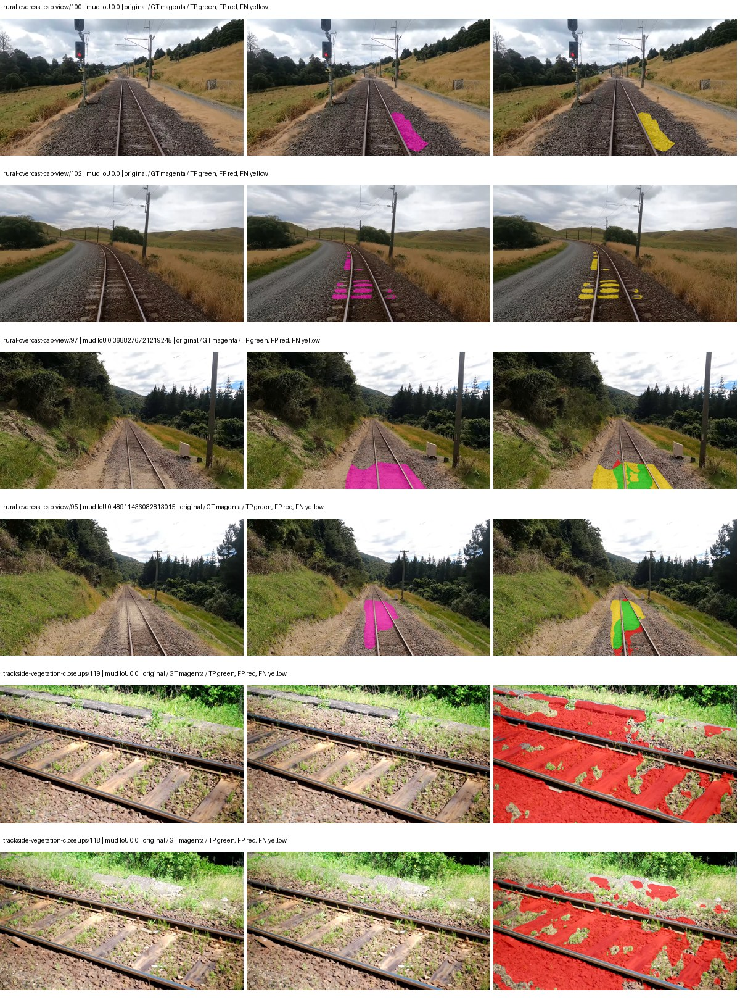
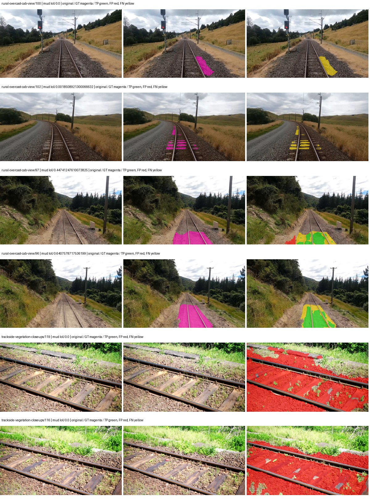
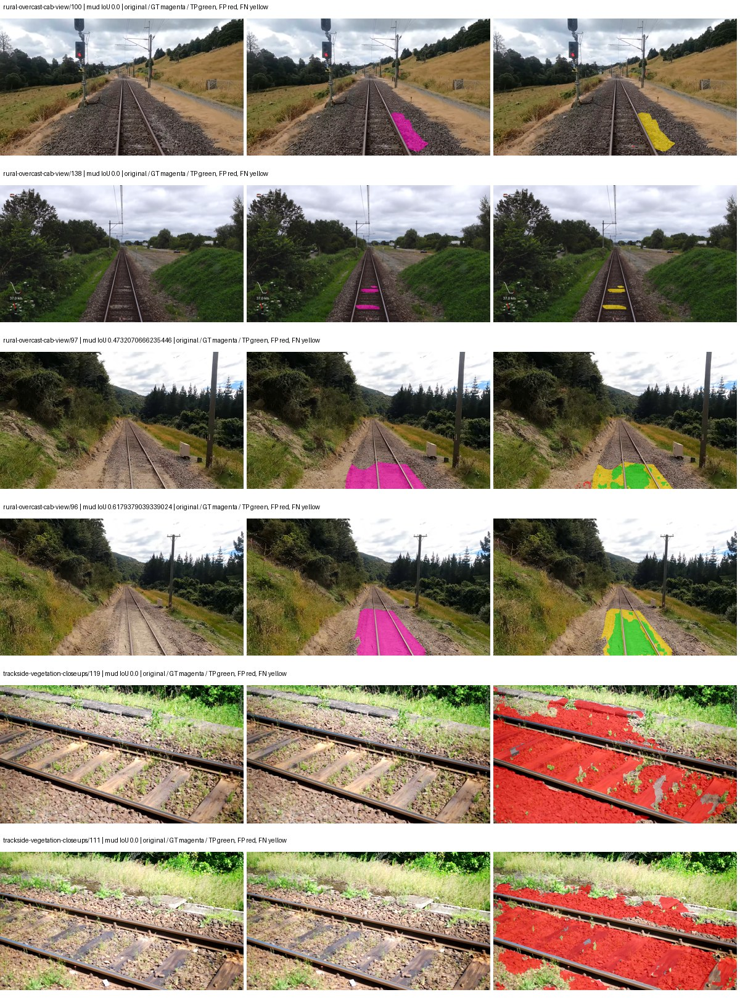
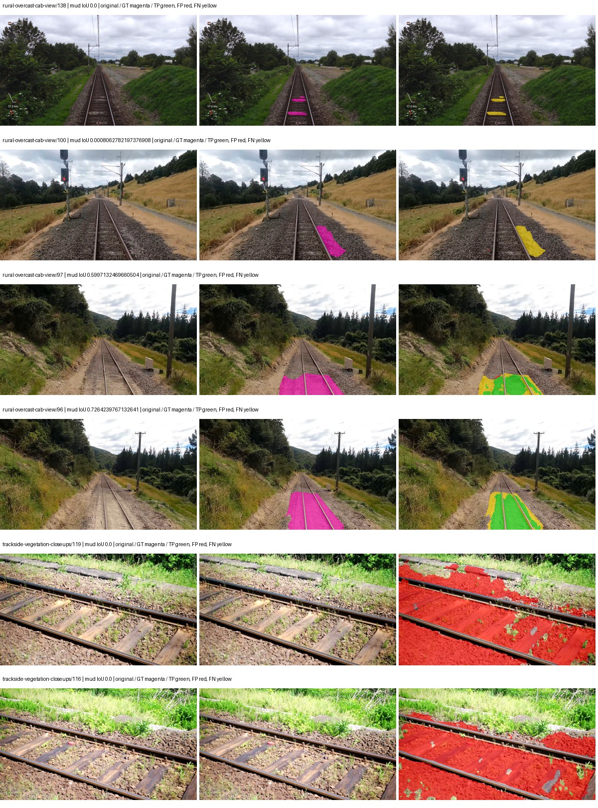
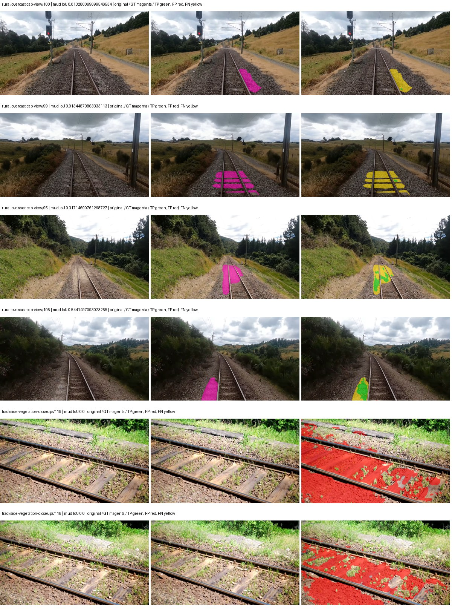
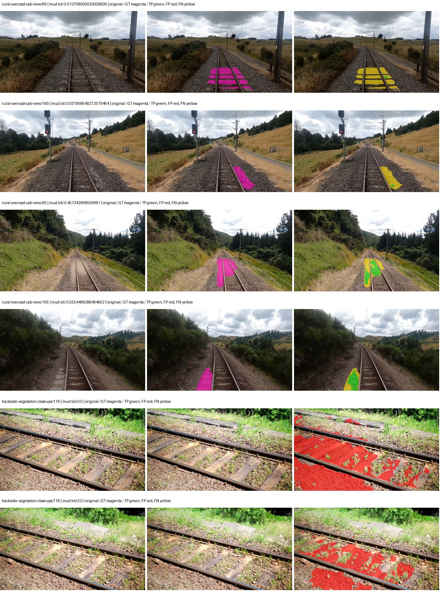
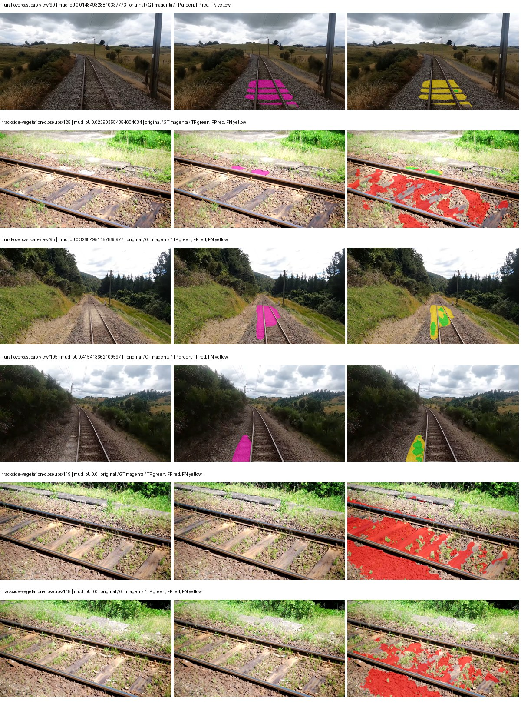

# segformer_b5 — paul-test-rtis

[RTIS comparison](../../README.md) · [Full model records](record.json)

Primary selection and early stopping: **mud-pumping validation IoU**. A job is complete only after full statistics and isolated profiling are verified.

| Model | Initialization path | Seed | Status | Steps | Best step | Mud IoU (%) | Mud precision (%) | Mud recall (%) | Final mud IoU (trainer val, %) | mIoU (%) | Fixed GT-class mIoU (%) |
| --- | --- | --- | --- | --- | --- | --- | --- | --- | --- | --- | --- |
| segformer_b5 | rtis_only | 0 | completed | 2036 | 763 | 2.23 | 2.60 | 13.76 | 1.20 | 34.12 | 39.81 |
| segformer_b5 | rtis_only | 1 | completed | 1781 | 509 | 2.55 | 2.87 | 18.54 | 1.51 | 33.34 | 37.05 |
| segformer_b5 | rtis_only | 2 | completed | 1781 | 509 | 3.58 | 4.18 | 19.79 | 1.41 | 31.39 | 36.62 |
| segformer_b5 | cityscapes_to_rtis | 0 | completed | 4000 | 3563 | 3.29 | 3.67 | 23.90 | 2.78 | 38.45 | 42.72 |
| segformer_b5 | cityscapes_to_rtis | 1 | completed | 4000 | 3054 | 4.12 | 4.65 | 26.70 | 3.74 | 40.51 | 42.76 |
| segformer_b5 | cityscapes_to_rtis | 2 | completed | 4000 | 3563 | 4.75 | 5.26 | 32.79 | 3.83 | 40.91 | 45.45 |
| segformer_b5 | railsem19_to_rtis | 0 | completed | 2545 | 1272 | 4.16 | 5.25 | 16.70 | 3.26 | 44.69 | 52.14 |
| segformer_b5 | railsem19_to_rtis | 1 | completed | 3563 | 2290 | 7.14 | 10.12 | 19.54 | 6.44 | 46.85 | 54.66 |
| segformer_b5 | railsem19_to_rtis | 2 | completed | 3818 | 2545 | 5.50 | 8.06 | 14.77 | 4.20 | 45.96 | 53.63 |
| segformer_b5 | cityscapes_to_railsem19_to_rtis | 0 | collecting | 3818 | 2545 | 4.04 | 4.50 | 27.96 | 3.10 | 47.39 | 50.03 |
| segformer_b5 | cityscapes_to_railsem19_to_rtis | 1 | training | 3563 | — | — | — | — | — | — | — |
| segformer_b5 | cityscapes_to_railsem19_to_rtis | 2 | training | 3563 | — | — | — | — | — | — | — |

Training: 220 images. Validation: 37 images. Test: 50 held out. Seeds: [0, 1, 2]. Seed variation measures optimization variability, not independent-recording uncertainty. Historical source checkpoints stay fixed across adaptation seeds.

Training code: `066afb2626398b7be59d4d19f5a0e4644fd59adc`. Split SHA-256: `71fef8292610c352da0709fe3bd030f3bcc18f97560394835f4b22826463b83d`.

## rtis_only — seed 0

Status: **completed**. Started: 2026-09-07T02:48:29.514193+00:00. Finished: 2026-09-07T03:49:11.267849+00:00.

Recipe pretrained initializer: `nvidia/mit-b5`.

`rtis_only` uses the recipe initializer, which may include pretrained segmentation components. Transfer paths load the exact historical source checkpoint below and reset the classifier; they do not reset all query/decoder features.

Source checkpoint: `Recipe pretrained initialization`.

Config SHA-256: `8f10f93b40397ad35e22bcc1ac6f8d591f3873b333c543c76f08898b6c45e424`. Weights used for validation: `raw`.

### Mud-pumping and aggregate quality

| Metric | Selected checkpoint | Final training validation |
| --- | --- | --- |
| Mud IoU | 2.23 | 1.20 |
| Mud precision | 2.60 | 1.48 |
| Mud recall | 13.76 | 5.99 |
| Mud Dice/F1 | 4.37 | 2.37 |
| mIoU | 34.12 | 36.83 |
| Mean accuracy | 45.47 | 48.89 |
| Mean precision | 54.98 | 55.30 |
| Mean Dice | 42.85 | 46.41 |
| Mean specificity | 98.96 | 99.13 |
| Pixel accuracy | 83.03 | 84.98 |
| Frequency-weighted IoU | 75.85 | 78.76 |
| Fixed GT-present class mIoU | 39.81 | 40.92 |
| Boundary F1 | 42.58 | 44.59 |

The selected checkpoint has independent evaluation evidence. Final values are the trainer's final validation record, not a new independent evaluation. mIoU averages classes with nonzero union, so false positives on absent classes can change its denominator. The fixed GT-class mean is supplementary and excludes absent classes; their false positives remain in the confusion matrix.

### Resource usage and timing

| Measurement | Value |
| --- | --- |
| Peak training VRAM, retained training invocation (GiB) | 16.31 |
| Peak evaluation VRAM (GiB) | 7.78 |
| Retained training invocation wall time (seconds) | 3335.58 |
| Retained training invocation GPU-hours (one GPU) | 0.93 |
| Evaluation wall time (seconds) | 29.50 |
| Full evaluation pipeline images/second | 1.25 |
| Best full-state checkpoint (MiB) | 1292.96 |
| Final full-state checkpoint (MiB) | 1292.91 |
| Audited periodic checkpoints removed (GiB) | 5.05 |

VRAM uses the recorded allocator high-water mark; it is not total device usage including CUDA context. Resumed jobs' retained training invocation times and peaks are **not whole-campaign totals**. Earlier invocation resource records are not reconstructed here. Evaluation throughput includes loader, sliding-window inference and metrics; it is not model-only latency/FPS. Missing measurements are shown as —, never inferred from another dataset's run.

### Standardized inference performance

Dedicated model-only profiling waits for an idle worker-locked L40S: BF16, batch 1, 1024x1024, 20 warmup and 100 CUDA-event-timed public forwards. It excludes loading, preprocessing, tiling and metrics.

| Status | Parameters | Weight MiB | FPS | p50 ms | p95 ms | Peak reserved GiB |
| --- | --- | --- | --- | --- | --- | --- |
| complete | 84609493 | 322.76 | 26.35 | 37.66 | 39.70 | 2.57 |

```json
{
  "schema_version": 1,
  "model_id": "segformer_b5",
  "measured_at": "2026-09-07T03:49:02+00:00",
  "status": "complete",
  "benchmark_scope": "rtis_selected_checkpoint_model_only",
  "applies_to": [
    "segformer_b5--rtis_only--seed-0"
  ],
  "source": {
    "campaign_git_sha": "066afb2626398b7be59d4d19f5a0e4644fd59adc",
    "git_dirty": false,
    "config_hash": "44f692bcf85b",
    "resolved_config": "/data/izadia1/projects/segmentary-runs/paul-test-rtis/mud-fullstats-v1-20260906-r2/configs/segformer_b5--rtis_only--seed-0.yaml",
    "config_sha256": "8f10f93b40397ad35e22bcc1ac6f8d591f3873b333c543c76f08898b6c45e424",
    "checkpoint_sha256": "91304f2fd69b323af62f90b692e6e9a2b6dd936f32d3303f58bcf0147ce81648",
    "checkpoint_global_step": 763,
    "checkpoint_bytes": 1355767993,
    "checkpoint_kind": "resume checkpoint with optimizer and EMA state",
    "weights": "raw",
    "measured_checkpoint_job_id": "segformer_b5--rtis_only--seed-0",
    "result_sha256": "f21fc6259755ff476c556aef145dbfaf35d68b7acb1ee1f83e9933f9bbba8cd9",
    "result_git_sha": "066afb2626398b7be59d4d19f5a0e4644fd59adc",
    "result_stage": "eval:paul-test-rtis:val",
    "result_seed": 0
  },
  "hardware": {
    "gpu_name": "NVIDIA L40S",
    "gpu_uuid": "GPU-84f5ca4d-68db-ae98-d056-40654d859dd9",
    "logical_device": "cuda:0",
    "physical_visibility_token": "0",
    "compute_capability": [
      8,
      9
    ],
    "total_memory_bytes": 47677177856
  },
  "model": {
    "parameter_count": 84609493,
    "trainable_parameter_count": 84609493,
    "resident_parameter_bytes": 338437972,
    "parameter_dtype_counts": {
      "float32": 84609493
    }
  },
  "contract": {
    "backend": "pytorch",
    "precision": "bf16_autocast",
    "batch_size": 1,
    "input_shape_nchw": [
      1,
      3,
      1024,
      1024
    ],
    "warmup_iterations": 20,
    "measured_iterations": 100,
    "timing": "per-forward CUDA events with end-event synchronization",
    "includes_preprocessing": false,
    "includes_data_loader": false,
    "includes_sliding_window": false,
    "input_resident_on_gpu": true,
    "model_only": true,
    "entrypoint": "public model(image) dense-logits forward"
  },
  "measurements": {
    "latency": {
      "p50_ms": 37.66476821899414,
      "p95_ms": 39.70196418762207,
      "mean_ms": 37.95691337585449,
      "minimum_ms": 36.922367095947266,
      "maximum_ms": 41.15046310424805,
      "fps": 26.345661726965645,
      "raw_ms": [
        37.35142517089844,
        37.219329833984375,
        36.99711990356445,
        37.22956848144531,
        36.99097442626953,
        37.00940704345703,
        38.41331100463867,
        38.430721282958984,
        37.62688064575195,
        36.922367095947266,
        37.30739212036133,
        38.993919372558594,
        38.3875846862793,
        37.9607048034668,
        37.7815055847168,
        38.531070709228516,
        37.32070541381836,
        38.46857452392578,
        38.29350280761719,
        39.69945526123047,
        37.27974319458008,
        37.83475112915039,
        37.09849548339844,
        37.215232849121094,
        37.749759674072266,
        38.30886459350586,
        38.184959411621094,
        37.403648376464844,
        37.26847839355469,
        38.2658576965332,
        39.779327392578125,
        37.405696868896484,
        37.3678092956543,
        39.77830505371094,
        38.405120849609375,
        37.970943450927734,
        37.65862274169922,
        37.140480041503906,
        38.27094268798828,
        38.00166320800781,
        38.569984436035156,
        38.59958267211914,
        37.44460678100586,
        37.365760803222656,
        38.02214431762695,
        37.23878479003906,
        37.208065032958984,
        37.186561584472656,
        37.52755355834961,
        38.953983306884766,
        38.85260772705078,
        38.42252731323242,
        37.834686279296875,
        37.58796691894531,
        37.45897674560547,
        37.564414978027344,
        38.22489547729492,
        37.35347366333008,
        38.140926361083984,
        37.4466552734375,
        37.1333122253418,
        38.33241653442383,
        40.776702880859375,
        37.501953125,
        37.57465744018555,
        37.09952163696289,
        37.50707244873047,
        37.465087890625,
        37.6064338684082,
        38.24028778076172,
        38.78092956542969,
        38.1767692565918,
        37.29510498046875,
        37.1682243347168,
        37.129215240478516,
        37.348350524902344,
        39.52537536621094,
        37.76921463012695,
        37.19782257080078,
        37.67091369628906,
        39.64931106567383,
        37.11692810058594,
        38.08563232421875,
        37.64633560180664,
        37.36467361450195,
        37.202945709228516,
        37.206016540527344,
        38.87513732910156,
        37.292991638183594,
        38.09689712524414,
        38.48601531982422,
        37.49068832397461,
        39.197696685791016,
        37.705726623535156,
        38.07846450805664,
        41.15046310424805,
        38.54956817626953,
        37.612545013427734,
        39.7496337890625,
        39.50592041015625
      ],
      "percentile_method": "numpy linear interpolation"
    },
    "peak_reserved_bytes": 2755657728,
    "memory_kind": "pytorch_cuda_allocator_peak_reserved_excluding_context",
    "benchmark_wall_clock_s": 7.829796526581049
  },
  "started_at": "2026-09-07T03:48:54+00:00",
  "finished_at": "2026-09-07T03:49:02+00:00",
  "environment": {
    "hostname": "hdrfs-app-001",
    "python": "3.11.15",
    "platform": "Linux-5.15.0-139-generic-x86_64-with-glibc2.35",
    "torch": "2.11.0+cu128",
    "torch_cuda": "12.8",
    "cudnn": 91900,
    "driver_version": "570.133.20",
    "cuda_available": true,
    "gpu_count": 1,
    "gpu_names": [
      "NVIDIA L40S"
    ],
    "cuda_visible_devices": "0",
    "packages": {
      "segmentary": "0.1.0",
      "torch": "2.11.0+cu128",
      "torchvision": "0.26.0+cu128",
      "transformers": "5.15.0",
      "timm": "1.0.28",
      "segmentation-models-pytorch": "0.5.0",
      "albumentations": "2.0.8",
      "lightning": "2.6.5",
      "numpy": "2.4.4"
    }
  }
}
```

### Per-class validation results

| Class | GT pixels | IoU (%) | Precision (%) | Recall (%) | Dice (%) | Boundary F1 (%) |
| --- | --- | --- | --- | --- | --- | --- |
| car | 29664 | 12.57 | 48.54 | 14.50 | 22.33 | 42.70 |
| construction | 311585 | 51.59 | 72.81 | 63.89 | 68.06 | 61.27 |
| fence | 265137 | 6.39 | 62.86 | 6.64 | 12.01 | 24.84 |
| mud-pumping | 1226250 | 2.23 | 2.60 | 13.76 | 4.37 | 3.78 |
| on-rails | 0 | 0.00 | 0.00 | — | 0.00 | 0.00 |
| person | 0 | 0.00 | 0.00 | — | 0.00 | 0.00 |
| pole | 628038 | 70.48 | 83.02 | 82.36 | 82.69 | 90.04 |
| rail-embedded | 16799 | 23.65 | 85.65 | 24.62 | 38.25 | 32.88 |
| rail-raised | 2969797 | 76.22 | 89.85 | 83.39 | 86.50 | 94.10 |
| rail-track | 6323197 | 33.77 | 76.98 | 37.57 | 50.49 | 43.61 |
| road | 1048831 | 4.68 | 29.54 | 5.26 | 8.94 | 15.49 |
| sidewalk | 1297367 | 45.02 | 94.32 | 46.28 | 62.09 | 22.35 |
| sky | 19121606 | 98.65 | 99.30 | 99.34 | 99.32 | 96.08 |
| standing-water | 95802 | 4.55 | 7.87 | 9.74 | 8.70 | 23.84 |
| terrain | 39239306 | 87.79 | 88.94 | 98.55 | 93.50 | 60.79 |
| trackbed | 10643081 | 59.79 | 79.78 | 70.47 | 74.84 | 61.72 |
| traffic-light | 19510 | 66.59 | 85.30 | 75.22 | 79.94 | 87.25 |
| traffic-sign | 13285 | 32.35 | 56.27 | 43.21 | 48.88 | 54.71 |
| tram-track | 56179 | 1.63 | 6.55 | 2.12 | 3.21 | 11.39 |
| truck | 0 | 0.00 | 0.00 | — | 0.00 | 0.00 |
| vegetation-overgrowth | 5901821 | 38.58 | 84.37 | 41.55 | 55.68 | 67.28 |

### Full-run accounting

| Measurement | Value |
| --- | --- |
| Full GPU-reserved wall seconds, all recorded worker attempts | 3641.76 |
| Full reserved GPU-hours | 1.01 |
| Whole-run timing complete | True |

| Phase | Wall seconds including failed attempts |
| --- | --- |
| training | 3342.59 |
| diagnostics | 233.71 |
| performance | 17.72 |

GPU-reserved time includes model loading, training, validation, collection, profiling, checkpoint I/O and orchestration while the worker owns one GPU. It is not GPU kernel-active time. Phase timings and sampled device memory/power/utilization are retained separately; sampled device memory is not the allocator high-water mark.

### Train/validation and raw/EMA diagnostics

| Checkpoint / weights / split | Images | Mud IoU (%) | Mud precision (%) | Mud recall (%) |
| --- | --- | --- | --- | --- |
| best-auto-train / raw | 220 | 95.24 | 97.27 | 97.85 |
| best-auto-val / raw | 37 | 2.23 | 2.60 | 13.76 |
| best-alternate-val / ema | 37 | 2.31 | 2.75 | 12.71 |
| final-auto-val / raw | 37 | 1.20 | 1.48 | 6.00 |

Train uses the evaluation transform without augmentation. Compare mud train/validation metrics for the same selected weights. Alternate EMA on running-stat BatchNorm is explicitly uncalibrated and is diagnostic only. Score-threshold curves use uncalibrated normalized scores and are pixel-level diagnostics, not event detection rates or a selected deployment operating point.

### Downloadable evidence

- best-auto-train: [per-image.csv](rtis_only--seed-0/best-auto-train/per-image.csv) · [per-image-confusion.json.gz](rtis_only--seed-0/best-auto-train/per-image-confusion.json.gz) · [groups.json](rtis_only--seed-0/best-auto-train/groups.json) · [mud-score-curves.json](rtis_only--seed-0/best-auto-train/mud-score-curves.json)
- best-auto-val: [per-image.csv](rtis_only--seed-0/best-auto-val/per-image.csv) · [per-image-confusion.json.gz](rtis_only--seed-0/best-auto-val/per-image-confusion.json.gz) · [groups.json](rtis_only--seed-0/best-auto-val/groups.json) · [mud-score-curves.json](rtis_only--seed-0/best-auto-val/mud-score-curves.json) · [examples.jpg](rtis_only--seed-0/best-auto-val/examples.jpg)
- best-alternate-val: [per-image.csv](rtis_only--seed-0/best-alternate-val/per-image.csv) · [per-image-confusion.json.gz](rtis_only--seed-0/best-alternate-val/per-image-confusion.json.gz) · [groups.json](rtis_only--seed-0/best-alternate-val/groups.json) · [mud-score-curves.json](rtis_only--seed-0/best-alternate-val/mud-score-curves.json)
- final-auto-val: [per-image.csv](rtis_only--seed-0/final-auto-val/per-image.csv) · [per-image-confusion.json.gz](rtis_only--seed-0/final-auto-val/per-image-confusion.json.gz) · [groups.json](rtis_only--seed-0/final-auto-val/groups.json) · [mud-score-curves.json](rtis_only--seed-0/final-auto-val/mud-score-curves.json)
- resources: [telemetry.csv](rtis_only--seed-0/resources/telemetry.csv)


Examples are two lowest and two highest mud-IoU positive images, plus up to two negative images with the most false-positive mud pixels. They are targeted diagnostic examples, not random samples. Green: true positive; red: false positive; yellow: false negative. Full predictions remain on HDRFS.

### Validation tracking

| Logged step | Overall mIoU (%) | Mud IoU (%) |
| --- | --- | --- |
| 254 | 28.78 | 0.90 |
| 508 | 32.70 | 1.81 |
| 763 | 34.12 | 2.23 |
| 1017 | 36.66 | 0.66 |
| 1272 | 36.29 | 1.31 |
| 1527 | 32.87 | 0.77 |
| 1781 | 34.96 | 1.50 |
| 2036 | 36.83 | 1.20 |

All retained scalar curves, including training loss and per-class IoU, are in record.json. Observed best mud on a curve is not necessarily a retained checkpoint: the pilot saved its selection-metric-best and final checkpoints. Step logging and checkpoint global_step may differ by one.

### Stopping and checkpoint provenance

```json
{
  "stopping": {
    "actual_steps": 2036,
    "maximum_steps": 4000,
    "min_delta": 0.001,
    "monitor": "val_iou/mud-pumping",
    "patience": 5,
    "reason": "validation_plateau"
  },
  "checkpoints": {
    "best": {
      "path": "/data/izadia1/projects/segmentary-runs/paul-test-rtis/mud-fullstats-v1-20260906-r2/future-runs/segformer_b5--rtis_only--seed-0_seed0/rtis/best.ckpt",
      "sha256": "91304f2fd69b323af62f90b692e6e9a2b6dd936f32d3303f58bcf0147ce81648",
      "global_step": 763,
      "bytes": 1355767993
    },
    "final": {
      "path": "/data/izadia1/projects/segmentary-runs/paul-test-rtis/mud-fullstats-v1-20260906-r2/future-runs/segformer_b5--rtis_only--seed-0_seed0/rtis/last.ckpt",
      "sha256": "fdf8a2d93583c9cbef8451d256a02adeb7f67e0f64da5f2f1cce13ffda7b6ca8",
      "global_step": 2036,
      "bytes": 1355711929
    }
  },
  "cleanup_error": null
}
```

### Resolved training, initialization and evaluation settings

The optimizer block is the base configuration. Stage LR scales are applied at runtime, and stage warmup is capped at min(base warmup, floor(stage budget / 10), stage budget - 1): 400 steps for this 4,000-step pilot. Model-internal native input grids may differ from augmentation crops (EoMT uses its 640 grid).

```json
{
  "name": "segformer_b5--rtis_only--seed-0",
  "model": {
    "arch": "segformer_b5",
    "checkpoint": "nvidia/mit-b5",
    "tuning": "full",
    "head": "unified_head",
    "lora_r": 16,
    "lora_alpha": 32,
    "lora_dropout": 0.05,
    "lora_targets": [],
    "drop_path": null,
    "revision": null,
    "subfolder": null,
    "local_files_only": false,
    "trust_remote_code": false,
    "backbone_path": null,
    "head_paths": [],
    "classifier_path": null,
    "inactive_parameter_paths": [],
    "smp_arch": null,
    "encoder_name": null,
    "encoder_weights": null,
    "native": null,
    "batch_norm_momentum": null
  },
  "space": "paul-test-rtis",
  "taxonomy_root": "/data/izadia1/projects/segmentary-rtis-fullstats-066afb2/taxonomy",
  "output_root": "/data/izadia1/projects/segmentary-runs/paul-test-rtis/mud-fullstats-v1-20260906-r2/future-runs",
  "optim": {
    "backbone_lr": 6e-05,
    "head_lr_mult": 10.0,
    "weight_decay": 0.05,
    "llrd": 1.0,
    "warmup_iters": 1500,
    "warmup_ratio": 1e-06,
    "poly_power": 0.9,
    "min_lr_ratio": 0.0,
    "betas": [
      0.9,
      0.999
    ],
    "grad_clip": 1.0
  },
  "train": {
    "iters": 4000,
    "batch_size": 2,
    "accum": 8,
    "num_workers": 2,
    "precision": "bf16-mixed",
    "ema_decay": 0.9998,
    "val_every": 250,
    "ckpt_every": 500,
    "selection_metric": "val_iou/mud-pumping",
    "early_stopping_patience": 5,
    "early_stopping_min_delta": 0.001,
    "seed": 0,
    "devices": 1
  },
  "eval": {
    "sliding_window": true,
    "window": [
      1024,
      1024
    ],
    "stride": [
      768,
      768
    ],
    "batch_size": 1,
    "num_workers": 2,
    "tta_scales": [],
    "tta_flip": false,
    "threshold": 0.5,
    "boundary_tolerance_frac": 0.0075,
    "save_confusion": true
  },
  "loss": {
    "task": "multiclass",
    "activation": "auto",
    "terms": [],
    "aux": "none",
    "aux_weight": 0.0,
    "ce_weight": 1.0,
    "label_smoothing": 0.0,
    "class_weights": null,
    "query": null
  },
  "aug": {
    "crop": [
      1024,
      1024
    ],
    "scale_min": 0.5,
    "scale_max": 2.0,
    "hflip_p": 0.5,
    "color_jitter_p": 0.5,
    "brightness": 0.25,
    "contrast": 0.25,
    "saturation": 0.25,
    "hue": 0.05
  },
  "stages": [
    {
      "name": "rtis",
      "data": [
        {
          "name": "paul-test-rtis",
          "root": "/data/izadia1/datasets/paul-test-rtis",
          "variant": null,
          "split_file": "splits.json",
          "train_split": "train",
          "val_split": "val",
          "limit": null,
          "loader": "folder",
          "mapping": "paul-test-rtis",
          "loader_options": {
            "require_groups": true
          }
        }
      ],
      "iters": null,
      "lr_scale": 1.0,
      "head_group_lr_scale": 1.0,
      "init_from": "pretrained",
      "reset_head": false,
      "freeze": null,
      "sample_weights": null
    }
  ]
}
```

### Hardware and software provenance

```json
{
  "training": {
    "cuda_available": true,
    "cuda_visible_devices": "0",
    "cudnn": 91900,
    "driver_version": "570.133.20",
    "gpu_count": 1,
    "gpu_names": [
      "NVIDIA L40S"
    ],
    "hostname": "hdrfs-app-001",
    "input_normalization": {
      "channel_order": "rgb",
      "mean": [
        0.485,
        0.456,
        0.406
      ],
      "source": "imagenet",
      "std": [
        0.229,
        0.224,
        0.225
      ]
    },
    "model_origins": [
      {
        "hf_commit": "40357155205b036cf11b61f132d53d2f8861f170",
        "hf_name_or_path": "nvidia/mit-b5",
        "module": "model",
        "timm_pretrained": {}
      },
      {
        "hf_commit": "40357155205b036cf11b61f132d53d2f8861f170",
        "hf_name_or_path": "nvidia/mit-b5",
        "module": "model.segformer",
        "timm_pretrained": {}
      },
      {
        "hf_commit": "40357155205b036cf11b61f132d53d2f8861f170",
        "hf_name_or_path": "nvidia/mit-b5",
        "module": "model.segformer.stages.0.blocks.0.attention",
        "timm_pretrained": {}
      },
      {
        "hf_commit": "40357155205b036cf11b61f132d53d2f8861f170",
        "hf_name_or_path": "nvidia/mit-b5",
        "module": "model.segformer.stages.0.blocks.1.attention",
        "timm_pretrained": {}
      },
      {
        "hf_commit": "40357155205b036cf11b61f132d53d2f8861f170",
        "hf_name_or_path": "nvidia/mit-b5",
        "module": "model.segformer.stages.0.blocks.2.attention",
        "timm_pretrained": {}
      },
      {
        "hf_commit": "40357155205b036cf11b61f132d53d2f8861f170",
        "hf_name_or_path": "nvidia/mit-b5",
        "module": "model.segformer.stages.1.blocks.0.attention",
        "timm_pretrained": {}
      },
      {
        "hf_commit": "40357155205b036cf11b61f132d53d2f8861f170",
        "hf_name_or_path": "nvidia/mit-b5",
        "module": "model.segformer.stages.1.blocks.1.attention",
        "timm_pretrained": {}
      },
      {
        "hf_commit": "40357155205b036cf11b61f132d53d2f8861f170",
        "hf_name_or_path": "nvidia/mit-b5",
        "module": "model.segformer.stages.1.blocks.2.attention",
        "timm_pretrained": {}
      },
      {
        "hf_commit": "40357155205b036cf11b61f132d53d2f8861f170",
        "hf_name_or_path": "nvidia/mit-b5",
        "module": "model.segformer.stages.1.blocks.3.attention",
        "timm_pretrained": {}
      },
      {
        "hf_commit": "40357155205b036cf11b61f132d53d2f8861f170",
        "hf_name_or_path": "nvidia/mit-b5",
        "module": "model.segformer.stages.1.blocks.4.attention",
        "timm_pretrained": {}
      },
      {
        "hf_commit": "40357155205b036cf11b61f132d53d2f8861f170",
        "hf_name_or_path": "nvidia/mit-b5",
        "module": "model.segformer.stages.1.blocks.5.attention",
        "timm_pretrained": {}
      },
      {
        "hf_commit": "40357155205b036cf11b61f132d53d2f8861f170",
        "hf_name_or_path": "nvidia/mit-b5",
        "module": "model.segformer.stages.2.blocks.0.attention",
        "timm_pretrained": {}
      },
      {
        "hf_commit": "40357155205b036cf11b61f132d53d2f8861f170",
        "hf_name_or_path": "nvidia/mit-b5",
        "module": "model.segformer.stages.2.blocks.1.attention",
        "timm_pretrained": {}
      },
      {
        "hf_commit": "40357155205b036cf11b61f132d53d2f8861f170",
        "hf_name_or_path": "nvidia/mit-b5",
        "module": "model.segformer.stages.2.blocks.2.attention",
        "timm_pretrained": {}
      },
      {
        "hf_commit": "40357155205b036cf11b61f132d53d2f8861f170",
        "hf_name_or_path": "nvidia/mit-b5",
        "module": "model.segformer.stages.2.blocks.3.attention",
        "timm_pretrained": {}
      },
      {
        "hf_commit": "40357155205b036cf11b61f132d53d2f8861f170",
        "hf_name_or_path": "nvidia/mit-b5",
        "module": "model.segformer.stages.2.blocks.4.attention",
        "timm_pretrained": {}
      },
      {
        "hf_commit": "40357155205b036cf11b61f132d53d2f8861f170",
        "hf_name_or_path": "nvidia/mit-b5",
        "module": "model.segformer.stages.2.blocks.5.attention",
        "timm_pretrained": {}
      },
      {
        "hf_commit": "40357155205b036cf11b61f132d53d2f8861f170",
        "hf_name_or_path": "nvidia/mit-b5",
        "module": "model.segformer.stages.2.blocks.6.attention",
        "timm_pretrained": {}
      },
      {
        "hf_commit": "40357155205b036cf11b61f132d53d2f8861f170",
        "hf_name_or_path": "nvidia/mit-b5",
        "module": "model.segformer.stages.2.blocks.7.attention",
        "timm_pretrained": {}
      },
      {
        "hf_commit": "40357155205b036cf11b61f132d53d2f8861f170",
        "hf_name_or_path": "nvidia/mit-b5",
        "module": "model.segformer.stages.2.blocks.8.attention",
        "timm_pretrained": {}
      },
      {
        "hf_commit": "40357155205b036cf11b61f132d53d2f8861f170",
        "hf_name_or_path": "nvidia/mit-b5",
        "module": "model.segformer.stages.2.blocks.9.attention",
        "timm_pretrained": {}
      },
      {
        "hf_commit": "40357155205b036cf11b61f132d53d2f8861f170",
        "hf_name_or_path": "nvidia/mit-b5",
        "module": "model.segformer.stages.2.blocks.10.attention",
        "timm_pretrained": {}
      },
      {
        "hf_commit": "40357155205b036cf11b61f132d53d2f8861f170",
        "hf_name_or_path": "nvidia/mit-b5",
        "module": "model.segformer.stages.2.blocks.11.attention",
        "timm_pretrained": {}
      },
      {
        "hf_commit": "40357155205b036cf11b61f132d53d2f8861f170",
        "hf_name_or_path": "nvidia/mit-b5",
        "module": "model.segformer.stages.2.blocks.12.attention",
        "timm_pretrained": {}
      },
      {
        "hf_commit": "40357155205b036cf11b61f132d53d2f8861f170",
        "hf_name_or_path": "nvidia/mit-b5",
        "module": "model.segformer.stages.2.blocks.13.attention",
        "timm_pretrained": {}
      },
      {
        "hf_commit": "40357155205b036cf11b61f132d53d2f8861f170",
        "hf_name_or_path": "nvidia/mit-b5",
        "module": "model.segformer.stages.2.blocks.14.attention",
        "timm_pretrained": {}
      },
      {
        "hf_commit": "40357155205b036cf11b61f132d53d2f8861f170",
        "hf_name_or_path": "nvidia/mit-b5",
        "module": "model.segformer.stages.2.blocks.15.attention",
        "timm_pretrained": {}
      },
      {
        "hf_commit": "40357155205b036cf11b61f132d53d2f8861f170",
        "hf_name_or_path": "nvidia/mit-b5",
        "module": "model.segformer.stages.2.blocks.16.attention",
        "timm_pretrained": {}
      },
      {
        "hf_commit": "40357155205b036cf11b61f132d53d2f8861f170",
        "hf_name_or_path": "nvidia/mit-b5",
        "module": "model.segformer.stages.2.blocks.17.attention",
        "timm_pretrained": {}
      },
      {
        "hf_commit": "40357155205b036cf11b61f132d53d2f8861f170",
        "hf_name_or_path": "nvidia/mit-b5",
        "module": "model.segformer.stages.2.blocks.18.attention",
        "timm_pretrained": {}
      },
      {
        "hf_commit": "40357155205b036cf11b61f132d53d2f8861f170",
        "hf_name_or_path": "nvidia/mit-b5",
        "module": "model.segformer.stages.2.blocks.19.attention",
        "timm_pretrained": {}
      },
      {
        "hf_commit": "40357155205b036cf11b61f132d53d2f8861f170",
        "hf_name_or_path": "nvidia/mit-b5",
        "module": "model.segformer.stages.2.blocks.20.attention",
        "timm_pretrained": {}
      },
      {
        "hf_commit": "40357155205b036cf11b61f132d53d2f8861f170",
        "hf_name_or_path": "nvidia/mit-b5",
        "module": "model.segformer.stages.2.blocks.21.attention",
        "timm_pretrained": {}
      },
      {
        "hf_commit": "40357155205b036cf11b61f132d53d2f8861f170",
        "hf_name_or_path": "nvidia/mit-b5",
        "module": "model.segformer.stages.2.blocks.22.attention",
        "timm_pretrained": {}
      },
      {
        "hf_commit": "40357155205b036cf11b61f132d53d2f8861f170",
        "hf_name_or_path": "nvidia/mit-b5",
        "module": "model.segformer.stages.2.blocks.23.attention",
        "timm_pretrained": {}
      },
      {
        "hf_commit": "40357155205b036cf11b61f132d53d2f8861f170",
        "hf_name_or_path": "nvidia/mit-b5",
        "module": "model.segformer.stages.2.blocks.24.attention",
        "timm_pretrained": {}
      },
      {
        "hf_commit": "40357155205b036cf11b61f132d53d2f8861f170",
        "hf_name_or_path": "nvidia/mit-b5",
        "module": "model.segformer.stages.2.blocks.25.attention",
        "timm_pretrained": {}
      },
      {
        "hf_commit": "40357155205b036cf11b61f132d53d2f8861f170",
        "hf_name_or_path": "nvidia/mit-b5",
        "module": "model.segformer.stages.2.blocks.26.attention",
        "timm_pretrained": {}
      },
      {
        "hf_commit": "40357155205b036cf11b61f132d53d2f8861f170",
        "hf_name_or_path": "nvidia/mit-b5",
        "module": "model.segformer.stages.2.blocks.27.attention",
        "timm_pretrained": {}
      },
      {
        "hf_commit": "40357155205b036cf11b61f132d53d2f8861f170",
        "hf_name_or_path": "nvidia/mit-b5",
        "module": "model.segformer.stages.2.blocks.28.attention",
        "timm_pretrained": {}
      },
      {
        "hf_commit": "40357155205b036cf11b61f132d53d2f8861f170",
        "hf_name_or_path": "nvidia/mit-b5",
        "module": "model.segformer.stages.2.blocks.29.attention",
        "timm_pretrained": {}
      },
      {
        "hf_commit": "40357155205b036cf11b61f132d53d2f8861f170",
        "hf_name_or_path": "nvidia/mit-b5",
        "module": "model.segformer.stages.2.blocks.30.attention",
        "timm_pretrained": {}
      },
      {
        "hf_commit": "40357155205b036cf11b61f132d53d2f8861f170",
        "hf_name_or_path": "nvidia/mit-b5",
        "module": "model.segformer.stages.2.blocks.31.attention",
        "timm_pretrained": {}
      },
      {
        "hf_commit": "40357155205b036cf11b61f132d53d2f8861f170",
        "hf_name_or_path": "nvidia/mit-b5",
        "module": "model.segformer.stages.2.blocks.32.attention",
        "timm_pretrained": {}
      },
      {
        "hf_commit": "40357155205b036cf11b61f132d53d2f8861f170",
        "hf_name_or_path": "nvidia/mit-b5",
        "module": "model.segformer.stages.2.blocks.33.attention",
        "timm_pretrained": {}
      },
      {
        "hf_commit": "40357155205b036cf11b61f132d53d2f8861f170",
        "hf_name_or_path": "nvidia/mit-b5",
        "module": "model.segformer.stages.2.blocks.34.attention",
        "timm_pretrained": {}
      },
      {
        "hf_commit": "40357155205b036cf11b61f132d53d2f8861f170",
        "hf_name_or_path": "nvidia/mit-b5",
        "module": "model.segformer.stages.2.blocks.35.attention",
        "timm_pretrained": {}
      },
      {
        "hf_commit": "40357155205b036cf11b61f132d53d2f8861f170",
        "hf_name_or_path": "nvidia/mit-b5",
        "module": "model.segformer.stages.2.blocks.36.attention",
        "timm_pretrained": {}
      },
      {
        "hf_commit": "40357155205b036cf11b61f132d53d2f8861f170",
        "hf_name_or_path": "nvidia/mit-b5",
        "module": "model.segformer.stages.2.blocks.37.attention",
        "timm_pretrained": {}
      },
      {
        "hf_commit": "40357155205b036cf11b61f132d53d2f8861f170",
        "hf_name_or_path": "nvidia/mit-b5",
        "module": "model.segformer.stages.2.blocks.38.attention",
        "timm_pretrained": {}
      },
      {
        "hf_commit": "40357155205b036cf11b61f132d53d2f8861f170",
        "hf_name_or_path": "nvidia/mit-b5",
        "module": "model.segformer.stages.2.blocks.39.attention",
        "timm_pretrained": {}
      },
      {
        "hf_commit": "40357155205b036cf11b61f132d53d2f8861f170",
        "hf_name_or_path": "nvidia/mit-b5",
        "module": "model.segformer.stages.3.blocks.0.attention",
        "timm_pretrained": {}
      },
      {
        "hf_commit": "40357155205b036cf11b61f132d53d2f8861f170",
        "hf_name_or_path": "nvidia/mit-b5",
        "module": "model.segformer.stages.3.blocks.1.attention",
        "timm_pretrained": {}
      },
      {
        "hf_commit": "40357155205b036cf11b61f132d53d2f8861f170",
        "hf_name_or_path": "nvidia/mit-b5",
        "module": "model.segformer.stages.3.blocks.2.attention",
        "timm_pretrained": {}
      },
      {
        "hf_commit": "40357155205b036cf11b61f132d53d2f8861f170",
        "hf_name_or_path": "nvidia/mit-b5",
        "module": "model.decode_head",
        "timm_pretrained": {}
      }
    ],
    "model_parameter_count": 84609493,
    "packages": {
      "albumentations": "2.0.8",
      "lightning": "2.6.5",
      "numpy": "2.4.4",
      "segmentary": "0.1.0",
      "segmentation-models-pytorch": "0.5.0",
      "timm": "1.0.28",
      "torch": "2.11.0+cu128",
      "torchvision": "0.26.0+cu128",
      "transformers": "5.15.0"
    },
    "platform": "Linux-5.15.0-139-generic-x86_64-with-glibc2.35",
    "python": "3.11.15",
    "torch": "2.11.0+cu128",
    "torch_cuda": "12.8",
    "trainable_parameter_count": 84609493,
    "training_stop": {
      "actual_steps": 2036,
      "maximum_steps": 4000,
      "min_delta": 0.001,
      "monitor": "val_iou/mud-pumping",
      "patience": 5,
      "reason": "validation_plateau"
    },
    "validation_weights": "raw"
  },
  "evaluation": {
    "cuda_available": true,
    "cuda_visible_devices": "0",
    "cudnn": 91900,
    "driver_version": "570.133.20",
    "gpu_count": 1,
    "gpu_names": [
      "NVIDIA L40S"
    ],
    "hostname": "hdrfs-app-001",
    "input_normalization": {
      "channel_order": "rgb",
      "mean": [
        0.485,
        0.456,
        0.406
      ],
      "source": "imagenet",
      "std": [
        0.229,
        0.224,
        0.225
      ]
    },
    "packages": {
      "albumentations": "2.0.8",
      "lightning": "2.6.5",
      "numpy": "2.4.4",
      "segmentary": "0.1.0",
      "segmentation-models-pytorch": "0.5.0",
      "timm": "1.0.28",
      "torch": "2.11.0+cu128",
      "torchvision": "0.26.0+cu128",
      "transformers": "5.15.0"
    },
    "platform": "Linux-5.15.0-139-generic-x86_64-with-glibc2.35",
    "python": "3.11.15",
    "torch": "2.11.0+cu128",
    "torch_cuda": "12.8"
  }
}
```

## rtis_only — seed 1

Status: **completed**. Started: 2026-09-07T02:48:37.159726+00:00. Finished: 2026-09-07T03:41:31.881792+00:00.

Recipe pretrained initializer: `nvidia/mit-b5`.

`rtis_only` uses the recipe initializer, which may include pretrained segmentation components. Transfer paths load the exact historical source checkpoint below and reset the classifier; they do not reset all query/decoder features.

Source checkpoint: `Recipe pretrained initialization`.

Config SHA-256: `734dbc8821fd102d19fb7da0642d60236b2001b13610e1354b0a3e2a972c2acd`. Weights used for validation: `raw`.

### Mud-pumping and aggregate quality

| Metric | Selected checkpoint | Final training validation |
| --- | --- | --- |
| Mud IoU | 2.55 | 1.51 |
| Mud precision | 2.87 | 1.75 |
| Mud recall | 18.54 | 10.21 |
| Mud Dice/F1 | 4.97 | 2.98 |
| mIoU | 33.34 | 35.96 |
| Mean accuracy | 42.90 | 51.25 |
| Mean precision | 56.35 | 52.71 |
| Mean Dice | 42.54 | 45.38 |
| Mean specificity | 98.96 | 99.04 |
| Pixel accuracy | 81.92 | 82.95 |
| Frequency-weighted IoU | 75.35 | 76.99 |
| Fixed GT-present class mIoU | 37.05 | 41.96 |
| Boundary F1 | 43.44 | 42.53 |

The selected checkpoint has independent evaluation evidence. Final values are the trainer's final validation record, not a new independent evaluation. mIoU averages classes with nonzero union, so false positives on absent classes can change its denominator. The fixed GT-class mean is supplementary and excludes absent classes; their false positives remain in the confusion matrix.

### Resource usage and timing

| Measurement | Value |
| --- | --- |
| Peak training VRAM, retained training invocation (GiB) | 16.31 |
| Peak evaluation VRAM (GiB) | 7.78 |
| Retained training invocation wall time (seconds) | 2870.46 |
| Retained training invocation GPU-hours (one GPU) | 0.80 |
| Evaluation wall time (seconds) | 29.16 |
| Full evaluation pipeline images/second | 1.27 |
| Best full-state checkpoint (MiB) | 1292.96 |
| Final full-state checkpoint (MiB) | 1292.91 |
| Audited periodic checkpoints removed (GiB) | 3.79 |

VRAM uses the recorded allocator high-water mark; it is not total device usage including CUDA context. Resumed jobs' retained training invocation times and peaks are **not whole-campaign totals**. Earlier invocation resource records are not reconstructed here. Evaluation throughput includes loader, sliding-window inference and metrics; it is not model-only latency/FPS. Missing measurements are shown as —, never inferred from another dataset's run.

### Standardized inference performance

Dedicated model-only profiling waits for an idle worker-locked L40S: BF16, batch 1, 1024x1024, 20 warmup and 100 CUDA-event-timed public forwards. It excludes loading, preprocessing, tiling and metrics.

| Status | Parameters | Weight MiB | FPS | p50 ms | p95 ms | Peak reserved GiB |
| --- | --- | --- | --- | --- | --- | --- |
| complete | 84609493 | 322.76 | 27.12 | 36.65 | 38.25 | 2.57 |

```json
{
  "schema_version": 1,
  "model_id": "segformer_b5",
  "measured_at": "2026-09-07T03:41:24+00:00",
  "status": "complete",
  "benchmark_scope": "rtis_selected_checkpoint_model_only",
  "applies_to": [
    "segformer_b5--rtis_only--seed-1"
  ],
  "source": {
    "campaign_git_sha": "066afb2626398b7be59d4d19f5a0e4644fd59adc",
    "git_dirty": false,
    "config_hash": "74ecafa372e0",
    "resolved_config": "/data/izadia1/projects/segmentary-runs/paul-test-rtis/mud-fullstats-v1-20260906-r2/configs/segformer_b5--rtis_only--seed-1.yaml",
    "config_sha256": "734dbc8821fd102d19fb7da0642d60236b2001b13610e1354b0a3e2a972c2acd",
    "checkpoint_sha256": "9c01c30e9a3ee11bb16374dbd7a8d9713e47bd1efdd3103dfe8d9a03a4cc5810",
    "checkpoint_global_step": 509,
    "checkpoint_bytes": 1355767993,
    "checkpoint_kind": "resume checkpoint with optimizer and EMA state",
    "weights": "raw",
    "measured_checkpoint_job_id": "segformer_b5--rtis_only--seed-1",
    "result_sha256": "7c664298d83837ce2a70567e0d9c8ba73f3ebac9e6887ad970a463ba438b8ca6",
    "result_git_sha": "066afb2626398b7be59d4d19f5a0e4644fd59adc",
    "result_stage": "eval:paul-test-rtis:val",
    "result_seed": 1
  },
  "hardware": {
    "gpu_name": "NVIDIA L40S",
    "gpu_uuid": "GPU-c76642eb-64c1-b0ac-b051-d2efd47b32c4",
    "logical_device": "cuda:0",
    "physical_visibility_token": "9",
    "compute_capability": [
      8,
      9
    ],
    "total_memory_bytes": 47677177856
  },
  "model": {
    "parameter_count": 84609493,
    "trainable_parameter_count": 84609493,
    "resident_parameter_bytes": 338437972,
    "parameter_dtype_counts": {
      "float32": 84609493
    }
  },
  "contract": {
    "backend": "pytorch",
    "precision": "bf16_autocast",
    "batch_size": 1,
    "input_shape_nchw": [
      1,
      3,
      1024,
      1024
    ],
    "warmup_iterations": 20,
    "measured_iterations": 100,
    "timing": "per-forward CUDA events with end-event synchronization",
    "includes_preprocessing": false,
    "includes_data_loader": false,
    "includes_sliding_window": false,
    "input_resident_on_gpu": true,
    "model_only": true,
    "entrypoint": "public model(image) dense-logits forward"
  },
  "measurements": {
    "latency": {
      "p50_ms": 36.64793586730957,
      "p95_ms": 38.25484828948974,
      "mean_ms": 36.879850425720214,
      "minimum_ms": 36.106239318847656,
      "maximum_ms": 40.32102584838867,
      "fps": 27.115077432705487,
      "raw_ms": [
        36.80767822265625,
        37.46815872192383,
        37.210113525390625,
        37.65964889526367,
        36.534305572509766,
        36.80460739135742,
        36.153343200683594,
        36.39603042602539,
        36.8271369934082,
        36.318206787109375,
        36.598785400390625,
        36.23628616333008,
        36.94182586669922,
        36.84249496459961,
        38.34368133544922,
        37.212158203125,
        37.10054397583008,
        36.45030212402344,
        36.75136184692383,
        36.21171188354492,
        36.87731170654297,
        36.49331283569336,
        36.21683120727539,
        37.10259246826172,
        38.21977615356445,
        36.340736389160156,
        37.019649505615234,
        36.64384078979492,
        36.89267349243164,
        36.421630859375,
        36.16563034057617,
        36.106239318847656,
        36.3397102355957,
        36.75027084350586,
        38.205440521240234,
        37.67193603515625,
        37.30329513549805,
        36.39807891845703,
        36.31411361694336,
        36.308990478515625,
        36.720638275146484,
        36.768768310546875,
        36.364288330078125,
        38.949886322021484,
        38.60377502441406,
        37.52345657348633,
        36.4400634765625,
        36.24959945678711,
        36.42982482910156,
        36.63359832763672,
        36.65203094482422,
        36.534271240234375,
        36.279296875,
        36.7011833190918,
        37.68524932861328,
        38.25254440307617,
        36.95616149902344,
        36.46054458618164,
        36.530174255371094,
        36.22092819213867,
        36.31411361694336,
        36.887550354003906,
        36.327423095703125,
        37.26131057739258,
        38.0682258605957,
        38.06105422973633,
        36.41958236694336,
        36.303871154785156,
        36.887550354003906,
        36.47078323364258,
        36.80972671508789,
        36.20556640625,
        36.301822662353516,
        36.30080032348633,
        37.56953430175781,
        38.298622131347656,
        37.50400161743164,
        36.571136474609375,
        36.56806564331055,
        36.26496124267578,
        36.90291213989258,
        40.32102584838867,
        36.49843215942383,
        37.90745544433594,
        37.57875061035156,
        36.93260955810547,
        36.33561706542969,
        36.69094467163086,
        36.79635238647461,
        36.29875183105469,
        36.576255798339844,
        36.30796813964844,
        36.87833786010742,
        36.99097442626953,
        38.024192810058594,
        36.580352783203125,
        36.28646469116211,
        36.24448013305664,
        36.41856002807617,
        36.40217590332031
      ],
      "percentile_method": "numpy linear interpolation"
    },
    "peak_reserved_bytes": 2755657728,
    "memory_kind": "pytorch_cuda_allocator_peak_reserved_excluding_context",
    "benchmark_wall_clock_s": 7.630262102931738
  },
  "started_at": "2026-09-07T03:41:16+00:00",
  "finished_at": "2026-09-07T03:41:24+00:00",
  "environment": {
    "hostname": "hdrfs-app-001",
    "python": "3.11.15",
    "platform": "Linux-5.15.0-139-generic-x86_64-with-glibc2.35",
    "torch": "2.11.0+cu128",
    "torch_cuda": "12.8",
    "cudnn": 91900,
    "driver_version": "570.133.20",
    "cuda_available": true,
    "gpu_count": 1,
    "gpu_names": [
      "NVIDIA L40S"
    ],
    "cuda_visible_devices": "9",
    "packages": {
      "segmentary": "0.1.0",
      "torch": "2.11.0+cu128",
      "torchvision": "0.26.0+cu128",
      "transformers": "5.15.0",
      "timm": "1.0.28",
      "segmentation-models-pytorch": "0.5.0",
      "albumentations": "2.0.8",
      "lightning": "2.6.5",
      "numpy": "2.4.4"
    }
  }
}
```

### Per-class validation results

| Class | GT pixels | IoU (%) | Precision (%) | Recall (%) | Dice (%) | Boundary F1 (%) |
| --- | --- | --- | --- | --- | --- | --- |
| car | 29664 | 3.43 | 22.96 | 3.87 | 6.63 | 22.03 |
| construction | 311585 | 54.71 | 70.13 | 71.32 | 70.72 | 65.66 |
| fence | 265137 | 5.87 | 68.78 | 6.03 | 11.09 | 28.74 |
| mud-pumping | 1226250 | 2.55 | 2.87 | 18.54 | 4.97 | 5.84 |
| on-rails | 0 | 0.00 | 0.00 | — | 0.00 | 0.00 |
| person | 0 | 0.00 | 0.00 | — | 0.00 | 0.00 |
| pole | 628038 | 64.71 | 80.62 | 76.63 | 78.58 | 86.79 |
| rail-embedded | 16799 | 27.33 | 82.50 | 29.01 | 42.92 | 55.09 |
| rail-raised | 2969797 | 75.86 | 88.22 | 84.42 | 86.28 | 92.20 |
| rail-track | 6323197 | 31.30 | 72.41 | 35.54 | 47.68 | 42.68 |
| road | 1048831 | 12.94 | 30.23 | 18.45 | 22.92 | 22.90 |
| sidewalk | 1297367 | 29.61 | 83.17 | 31.50 | 45.69 | 14.87 |
| sky | 19121606 | 98.45 | 98.77 | 99.67 | 99.22 | 95.93 |
| standing-water | 95802 | 0.07 | 0.25 | 0.10 | 0.14 | 0.94 |
| terrain | 39239306 | 89.80 | 91.39 | 98.10 | 94.63 | 71.20 |
| trackbed | 10643081 | 59.46 | 76.53 | 72.72 | 74.58 | 59.81 |
| traffic-light | 19510 | 51.39 | 85.30 | 56.38 | 67.89 | 71.12 |
| traffic-sign | 13285 | 26.31 | 55.59 | 33.32 | 41.66 | 53.75 |
| tram-track | 56179 | 8.94 | 26.73 | 11.84 | 16.41 | 34.38 |
| truck | 0 | — | — | — | — | — |
| vegetation-overgrowth | 5901821 | 24.10 | 90.48 | 24.73 | 38.84 | 44.93 |

### Full-run accounting

| Measurement | Value |
| --- | --- |
| Full GPU-reserved wall seconds, all recorded worker attempts | 3174.73 |
| Full reserved GPU-hours | 0.88 |
| Whole-run timing complete | True |

| Phase | Wall seconds including failed attempts |
| --- | --- |
| training | 2877.47 |
| diagnostics | 233.63 |
| performance | 17.21 |

GPU-reserved time includes model loading, training, validation, collection, profiling, checkpoint I/O and orchestration while the worker owns one GPU. It is not GPU kernel-active time. Phase timings and sampled device memory/power/utilization are retained separately; sampled device memory is not the allocator high-water mark.

### Train/validation and raw/EMA diagnostics

| Checkpoint / weights / split | Images | Mud IoU (%) | Mud precision (%) | Mud recall (%) |
| --- | --- | --- | --- | --- |
| best-auto-train / raw | 220 | 92.71 | 96.84 | 95.60 |
| best-auto-val / raw | 37 | 2.55 | 2.87 | 18.54 |
| best-alternate-val / ema | 37 | 2.77 | 3.14 | 18.96 |
| final-auto-val / raw | 37 | 1.51 | 1.75 | 10.20 |

Train uses the evaluation transform without augmentation. Compare mud train/validation metrics for the same selected weights. Alternate EMA on running-stat BatchNorm is explicitly uncalibrated and is diagnostic only. Score-threshold curves use uncalibrated normalized scores and are pixel-level diagnostics, not event detection rates or a selected deployment operating point.

### Downloadable evidence

- best-auto-train: [per-image.csv](rtis_only--seed-1/best-auto-train/per-image.csv) · [per-image-confusion.json.gz](rtis_only--seed-1/best-auto-train/per-image-confusion.json.gz) · [groups.json](rtis_only--seed-1/best-auto-train/groups.json) · [mud-score-curves.json](rtis_only--seed-1/best-auto-train/mud-score-curves.json)
- best-auto-val: [per-image.csv](rtis_only--seed-1/best-auto-val/per-image.csv) · [per-image-confusion.json.gz](rtis_only--seed-1/best-auto-val/per-image-confusion.json.gz) · [groups.json](rtis_only--seed-1/best-auto-val/groups.json) · [mud-score-curves.json](rtis_only--seed-1/best-auto-val/mud-score-curves.json) · [examples.jpg](rtis_only--seed-1/best-auto-val/examples.jpg)
- best-alternate-val: [per-image.csv](rtis_only--seed-1/best-alternate-val/per-image.csv) · [per-image-confusion.json.gz](rtis_only--seed-1/best-alternate-val/per-image-confusion.json.gz) · [groups.json](rtis_only--seed-1/best-alternate-val/groups.json) · [mud-score-curves.json](rtis_only--seed-1/best-alternate-val/mud-score-curves.json)
- final-auto-val: [per-image.csv](rtis_only--seed-1/final-auto-val/per-image.csv) · [per-image-confusion.json.gz](rtis_only--seed-1/final-auto-val/per-image-confusion.json.gz) · [groups.json](rtis_only--seed-1/final-auto-val/groups.json) · [mud-score-curves.json](rtis_only--seed-1/final-auto-val/mud-score-curves.json)
- resources: [telemetry.csv](rtis_only--seed-1/resources/telemetry.csv)


Examples are two lowest and two highest mud-IoU positive images, plus up to two negative images with the most false-positive mud pixels. They are targeted diagnostic examples, not random samples. Green: true positive; red: false positive; yellow: false negative. Full predictions remain on HDRFS.

### Validation tracking

| Logged step | Overall mIoU (%) | Mud IoU (%) |
| --- | --- | --- |
| 254 | 26.92 | 2.32 |
| 508 | 33.34 | 2.55 |
| 763 | 34.04 | 1.60 |
| 1017 | 35.90 | 1.99 |
| 1272 | 34.67 | 1.56 |
| 1527 | 36.47 | 2.44 |
| 1781 | 35.96 | 1.51 |

All retained scalar curves, including training loss and per-class IoU, are in record.json. Observed best mud on a curve is not necessarily a retained checkpoint: the pilot saved its selection-metric-best and final checkpoints. Step logging and checkpoint global_step may differ by one.

### Stopping and checkpoint provenance

```json
{
  "stopping": {
    "actual_steps": 1781,
    "maximum_steps": 4000,
    "min_delta": 0.001,
    "monitor": "val_iou/mud-pumping",
    "patience": 5,
    "reason": "validation_plateau"
  },
  "checkpoints": {
    "best": {
      "path": "/data/izadia1/projects/segmentary-runs/paul-test-rtis/mud-fullstats-v1-20260906-r2/future-runs/segformer_b5--rtis_only--seed-1_seed1/rtis/best.ckpt",
      "sha256": "9c01c30e9a3ee11bb16374dbd7a8d9713e47bd1efdd3103dfe8d9a03a4cc5810",
      "global_step": 509,
      "bytes": 1355767993
    },
    "final": {
      "path": "/data/izadia1/projects/segmentary-runs/paul-test-rtis/mud-fullstats-v1-20260906-r2/future-runs/segformer_b5--rtis_only--seed-1_seed1/rtis/last.ckpt",
      "sha256": "614fbd2438efeedf2a6ab5581d90a8868b60f9c52e2363ae6b92a25c40d77f76",
      "global_step": 1781,
      "bytes": 1355711929
    }
  },
  "cleanup_error": null
}
```

### Resolved training, initialization and evaluation settings

The optimizer block is the base configuration. Stage LR scales are applied at runtime, and stage warmup is capped at min(base warmup, floor(stage budget / 10), stage budget - 1): 400 steps for this 4,000-step pilot. Model-internal native input grids may differ from augmentation crops (EoMT uses its 640 grid).

```json
{
  "name": "segformer_b5--rtis_only--seed-1",
  "model": {
    "arch": "segformer_b5",
    "checkpoint": "nvidia/mit-b5",
    "tuning": "full",
    "head": "unified_head",
    "lora_r": 16,
    "lora_alpha": 32,
    "lora_dropout": 0.05,
    "lora_targets": [],
    "drop_path": null,
    "revision": null,
    "subfolder": null,
    "local_files_only": false,
    "trust_remote_code": false,
    "backbone_path": null,
    "head_paths": [],
    "classifier_path": null,
    "inactive_parameter_paths": [],
    "smp_arch": null,
    "encoder_name": null,
    "encoder_weights": null,
    "native": null,
    "batch_norm_momentum": null
  },
  "space": "paul-test-rtis",
  "taxonomy_root": "/data/izadia1/projects/segmentary-rtis-fullstats-066afb2/taxonomy",
  "output_root": "/data/izadia1/projects/segmentary-runs/paul-test-rtis/mud-fullstats-v1-20260906-r2/future-runs",
  "optim": {
    "backbone_lr": 6e-05,
    "head_lr_mult": 10.0,
    "weight_decay": 0.05,
    "llrd": 1.0,
    "warmup_iters": 1500,
    "warmup_ratio": 1e-06,
    "poly_power": 0.9,
    "min_lr_ratio": 0.0,
    "betas": [
      0.9,
      0.999
    ],
    "grad_clip": 1.0
  },
  "train": {
    "iters": 4000,
    "batch_size": 2,
    "accum": 8,
    "num_workers": 2,
    "precision": "bf16-mixed",
    "ema_decay": 0.9998,
    "val_every": 250,
    "ckpt_every": 500,
    "selection_metric": "val_iou/mud-pumping",
    "early_stopping_patience": 5,
    "early_stopping_min_delta": 0.001,
    "seed": 1,
    "devices": 1
  },
  "eval": {
    "sliding_window": true,
    "window": [
      1024,
      1024
    ],
    "stride": [
      768,
      768
    ],
    "batch_size": 1,
    "num_workers": 2,
    "tta_scales": [],
    "tta_flip": false,
    "threshold": 0.5,
    "boundary_tolerance_frac": 0.0075,
    "save_confusion": true
  },
  "loss": {
    "task": "multiclass",
    "activation": "auto",
    "terms": [],
    "aux": "none",
    "aux_weight": 0.0,
    "ce_weight": 1.0,
    "label_smoothing": 0.0,
    "class_weights": null,
    "query": null
  },
  "aug": {
    "crop": [
      1024,
      1024
    ],
    "scale_min": 0.5,
    "scale_max": 2.0,
    "hflip_p": 0.5,
    "color_jitter_p": 0.5,
    "brightness": 0.25,
    "contrast": 0.25,
    "saturation": 0.25,
    "hue": 0.05
  },
  "stages": [
    {
      "name": "rtis",
      "data": [
        {
          "name": "paul-test-rtis",
          "root": "/data/izadia1/datasets/paul-test-rtis",
          "variant": null,
          "split_file": "splits.json",
          "train_split": "train",
          "val_split": "val",
          "limit": null,
          "loader": "folder",
          "mapping": "paul-test-rtis",
          "loader_options": {
            "require_groups": true
          }
        }
      ],
      "iters": null,
      "lr_scale": 1.0,
      "head_group_lr_scale": 1.0,
      "init_from": "pretrained",
      "reset_head": false,
      "freeze": null,
      "sample_weights": null
    }
  ]
}
```

### Hardware and software provenance

```json
{
  "training": {
    "cuda_available": true,
    "cuda_visible_devices": "9",
    "cudnn": 91900,
    "driver_version": "570.133.20",
    "gpu_count": 1,
    "gpu_names": [
      "NVIDIA L40S"
    ],
    "hostname": "hdrfs-app-001",
    "input_normalization": {
      "channel_order": "rgb",
      "mean": [
        0.485,
        0.456,
        0.406
      ],
      "source": "imagenet",
      "std": [
        0.229,
        0.224,
        0.225
      ]
    },
    "model_origins": [
      {
        "hf_commit": "40357155205b036cf11b61f132d53d2f8861f170",
        "hf_name_or_path": "nvidia/mit-b5",
        "module": "model",
        "timm_pretrained": {}
      },
      {
        "hf_commit": "40357155205b036cf11b61f132d53d2f8861f170",
        "hf_name_or_path": "nvidia/mit-b5",
        "module": "model.segformer",
        "timm_pretrained": {}
      },
      {
        "hf_commit": "40357155205b036cf11b61f132d53d2f8861f170",
        "hf_name_or_path": "nvidia/mit-b5",
        "module": "model.segformer.stages.0.blocks.0.attention",
        "timm_pretrained": {}
      },
      {
        "hf_commit": "40357155205b036cf11b61f132d53d2f8861f170",
        "hf_name_or_path": "nvidia/mit-b5",
        "module": "model.segformer.stages.0.blocks.1.attention",
        "timm_pretrained": {}
      },
      {
        "hf_commit": "40357155205b036cf11b61f132d53d2f8861f170",
        "hf_name_or_path": "nvidia/mit-b5",
        "module": "model.segformer.stages.0.blocks.2.attention",
        "timm_pretrained": {}
      },
      {
        "hf_commit": "40357155205b036cf11b61f132d53d2f8861f170",
        "hf_name_or_path": "nvidia/mit-b5",
        "module": "model.segformer.stages.1.blocks.0.attention",
        "timm_pretrained": {}
      },
      {
        "hf_commit": "40357155205b036cf11b61f132d53d2f8861f170",
        "hf_name_or_path": "nvidia/mit-b5",
        "module": "model.segformer.stages.1.blocks.1.attention",
        "timm_pretrained": {}
      },
      {
        "hf_commit": "40357155205b036cf11b61f132d53d2f8861f170",
        "hf_name_or_path": "nvidia/mit-b5",
        "module": "model.segformer.stages.1.blocks.2.attention",
        "timm_pretrained": {}
      },
      {
        "hf_commit": "40357155205b036cf11b61f132d53d2f8861f170",
        "hf_name_or_path": "nvidia/mit-b5",
        "module": "model.segformer.stages.1.blocks.3.attention",
        "timm_pretrained": {}
      },
      {
        "hf_commit": "40357155205b036cf11b61f132d53d2f8861f170",
        "hf_name_or_path": "nvidia/mit-b5",
        "module": "model.segformer.stages.1.blocks.4.attention",
        "timm_pretrained": {}
      },
      {
        "hf_commit": "40357155205b036cf11b61f132d53d2f8861f170",
        "hf_name_or_path": "nvidia/mit-b5",
        "module": "model.segformer.stages.1.blocks.5.attention",
        "timm_pretrained": {}
      },
      {
        "hf_commit": "40357155205b036cf11b61f132d53d2f8861f170",
        "hf_name_or_path": "nvidia/mit-b5",
        "module": "model.segformer.stages.2.blocks.0.attention",
        "timm_pretrained": {}
      },
      {
        "hf_commit": "40357155205b036cf11b61f132d53d2f8861f170",
        "hf_name_or_path": "nvidia/mit-b5",
        "module": "model.segformer.stages.2.blocks.1.attention",
        "timm_pretrained": {}
      },
      {
        "hf_commit": "40357155205b036cf11b61f132d53d2f8861f170",
        "hf_name_or_path": "nvidia/mit-b5",
        "module": "model.segformer.stages.2.blocks.2.attention",
        "timm_pretrained": {}
      },
      {
        "hf_commit": "40357155205b036cf11b61f132d53d2f8861f170",
        "hf_name_or_path": "nvidia/mit-b5",
        "module": "model.segformer.stages.2.blocks.3.attention",
        "timm_pretrained": {}
      },
      {
        "hf_commit": "40357155205b036cf11b61f132d53d2f8861f170",
        "hf_name_or_path": "nvidia/mit-b5",
        "module": "model.segformer.stages.2.blocks.4.attention",
        "timm_pretrained": {}
      },
      {
        "hf_commit": "40357155205b036cf11b61f132d53d2f8861f170",
        "hf_name_or_path": "nvidia/mit-b5",
        "module": "model.segformer.stages.2.blocks.5.attention",
        "timm_pretrained": {}
      },
      {
        "hf_commit": "40357155205b036cf11b61f132d53d2f8861f170",
        "hf_name_or_path": "nvidia/mit-b5",
        "module": "model.segformer.stages.2.blocks.6.attention",
        "timm_pretrained": {}
      },
      {
        "hf_commit": "40357155205b036cf11b61f132d53d2f8861f170",
        "hf_name_or_path": "nvidia/mit-b5",
        "module": "model.segformer.stages.2.blocks.7.attention",
        "timm_pretrained": {}
      },
      {
        "hf_commit": "40357155205b036cf11b61f132d53d2f8861f170",
        "hf_name_or_path": "nvidia/mit-b5",
        "module": "model.segformer.stages.2.blocks.8.attention",
        "timm_pretrained": {}
      },
      {
        "hf_commit": "40357155205b036cf11b61f132d53d2f8861f170",
        "hf_name_or_path": "nvidia/mit-b5",
        "module": "model.segformer.stages.2.blocks.9.attention",
        "timm_pretrained": {}
      },
      {
        "hf_commit": "40357155205b036cf11b61f132d53d2f8861f170",
        "hf_name_or_path": "nvidia/mit-b5",
        "module": "model.segformer.stages.2.blocks.10.attention",
        "timm_pretrained": {}
      },
      {
        "hf_commit": "40357155205b036cf11b61f132d53d2f8861f170",
        "hf_name_or_path": "nvidia/mit-b5",
        "module": "model.segformer.stages.2.blocks.11.attention",
        "timm_pretrained": {}
      },
      {
        "hf_commit": "40357155205b036cf11b61f132d53d2f8861f170",
        "hf_name_or_path": "nvidia/mit-b5",
        "module": "model.segformer.stages.2.blocks.12.attention",
        "timm_pretrained": {}
      },
      {
        "hf_commit": "40357155205b036cf11b61f132d53d2f8861f170",
        "hf_name_or_path": "nvidia/mit-b5",
        "module": "model.segformer.stages.2.blocks.13.attention",
        "timm_pretrained": {}
      },
      {
        "hf_commit": "40357155205b036cf11b61f132d53d2f8861f170",
        "hf_name_or_path": "nvidia/mit-b5",
        "module": "model.segformer.stages.2.blocks.14.attention",
        "timm_pretrained": {}
      },
      {
        "hf_commit": "40357155205b036cf11b61f132d53d2f8861f170",
        "hf_name_or_path": "nvidia/mit-b5",
        "module": "model.segformer.stages.2.blocks.15.attention",
        "timm_pretrained": {}
      },
      {
        "hf_commit": "40357155205b036cf11b61f132d53d2f8861f170",
        "hf_name_or_path": "nvidia/mit-b5",
        "module": "model.segformer.stages.2.blocks.16.attention",
        "timm_pretrained": {}
      },
      {
        "hf_commit": "40357155205b036cf11b61f132d53d2f8861f170",
        "hf_name_or_path": "nvidia/mit-b5",
        "module": "model.segformer.stages.2.blocks.17.attention",
        "timm_pretrained": {}
      },
      {
        "hf_commit": "40357155205b036cf11b61f132d53d2f8861f170",
        "hf_name_or_path": "nvidia/mit-b5",
        "module": "model.segformer.stages.2.blocks.18.attention",
        "timm_pretrained": {}
      },
      {
        "hf_commit": "40357155205b036cf11b61f132d53d2f8861f170",
        "hf_name_or_path": "nvidia/mit-b5",
        "module": "model.segformer.stages.2.blocks.19.attention",
        "timm_pretrained": {}
      },
      {
        "hf_commit": "40357155205b036cf11b61f132d53d2f8861f170",
        "hf_name_or_path": "nvidia/mit-b5",
        "module": "model.segformer.stages.2.blocks.20.attention",
        "timm_pretrained": {}
      },
      {
        "hf_commit": "40357155205b036cf11b61f132d53d2f8861f170",
        "hf_name_or_path": "nvidia/mit-b5",
        "module": "model.segformer.stages.2.blocks.21.attention",
        "timm_pretrained": {}
      },
      {
        "hf_commit": "40357155205b036cf11b61f132d53d2f8861f170",
        "hf_name_or_path": "nvidia/mit-b5",
        "module": "model.segformer.stages.2.blocks.22.attention",
        "timm_pretrained": {}
      },
      {
        "hf_commit": "40357155205b036cf11b61f132d53d2f8861f170",
        "hf_name_or_path": "nvidia/mit-b5",
        "module": "model.segformer.stages.2.blocks.23.attention",
        "timm_pretrained": {}
      },
      {
        "hf_commit": "40357155205b036cf11b61f132d53d2f8861f170",
        "hf_name_or_path": "nvidia/mit-b5",
        "module": "model.segformer.stages.2.blocks.24.attention",
        "timm_pretrained": {}
      },
      {
        "hf_commit": "40357155205b036cf11b61f132d53d2f8861f170",
        "hf_name_or_path": "nvidia/mit-b5",
        "module": "model.segformer.stages.2.blocks.25.attention",
        "timm_pretrained": {}
      },
      {
        "hf_commit": "40357155205b036cf11b61f132d53d2f8861f170",
        "hf_name_or_path": "nvidia/mit-b5",
        "module": "model.segformer.stages.2.blocks.26.attention",
        "timm_pretrained": {}
      },
      {
        "hf_commit": "40357155205b036cf11b61f132d53d2f8861f170",
        "hf_name_or_path": "nvidia/mit-b5",
        "module": "model.segformer.stages.2.blocks.27.attention",
        "timm_pretrained": {}
      },
      {
        "hf_commit": "40357155205b036cf11b61f132d53d2f8861f170",
        "hf_name_or_path": "nvidia/mit-b5",
        "module": "model.segformer.stages.2.blocks.28.attention",
        "timm_pretrained": {}
      },
      {
        "hf_commit": "40357155205b036cf11b61f132d53d2f8861f170",
        "hf_name_or_path": "nvidia/mit-b5",
        "module": "model.segformer.stages.2.blocks.29.attention",
        "timm_pretrained": {}
      },
      {
        "hf_commit": "40357155205b036cf11b61f132d53d2f8861f170",
        "hf_name_or_path": "nvidia/mit-b5",
        "module": "model.segformer.stages.2.blocks.30.attention",
        "timm_pretrained": {}
      },
      {
        "hf_commit": "40357155205b036cf11b61f132d53d2f8861f170",
        "hf_name_or_path": "nvidia/mit-b5",
        "module": "model.segformer.stages.2.blocks.31.attention",
        "timm_pretrained": {}
      },
      {
        "hf_commit": "40357155205b036cf11b61f132d53d2f8861f170",
        "hf_name_or_path": "nvidia/mit-b5",
        "module": "model.segformer.stages.2.blocks.32.attention",
        "timm_pretrained": {}
      },
      {
        "hf_commit": "40357155205b036cf11b61f132d53d2f8861f170",
        "hf_name_or_path": "nvidia/mit-b5",
        "module": "model.segformer.stages.2.blocks.33.attention",
        "timm_pretrained": {}
      },
      {
        "hf_commit": "40357155205b036cf11b61f132d53d2f8861f170",
        "hf_name_or_path": "nvidia/mit-b5",
        "module": "model.segformer.stages.2.blocks.34.attention",
        "timm_pretrained": {}
      },
      {
        "hf_commit": "40357155205b036cf11b61f132d53d2f8861f170",
        "hf_name_or_path": "nvidia/mit-b5",
        "module": "model.segformer.stages.2.blocks.35.attention",
        "timm_pretrained": {}
      },
      {
        "hf_commit": "40357155205b036cf11b61f132d53d2f8861f170",
        "hf_name_or_path": "nvidia/mit-b5",
        "module": "model.segformer.stages.2.blocks.36.attention",
        "timm_pretrained": {}
      },
      {
        "hf_commit": "40357155205b036cf11b61f132d53d2f8861f170",
        "hf_name_or_path": "nvidia/mit-b5",
        "module": "model.segformer.stages.2.blocks.37.attention",
        "timm_pretrained": {}
      },
      {
        "hf_commit": "40357155205b036cf11b61f132d53d2f8861f170",
        "hf_name_or_path": "nvidia/mit-b5",
        "module": "model.segformer.stages.2.blocks.38.attention",
        "timm_pretrained": {}
      },
      {
        "hf_commit": "40357155205b036cf11b61f132d53d2f8861f170",
        "hf_name_or_path": "nvidia/mit-b5",
        "module": "model.segformer.stages.2.blocks.39.attention",
        "timm_pretrained": {}
      },
      {
        "hf_commit": "40357155205b036cf11b61f132d53d2f8861f170",
        "hf_name_or_path": "nvidia/mit-b5",
        "module": "model.segformer.stages.3.blocks.0.attention",
        "timm_pretrained": {}
      },
      {
        "hf_commit": "40357155205b036cf11b61f132d53d2f8861f170",
        "hf_name_or_path": "nvidia/mit-b5",
        "module": "model.segformer.stages.3.blocks.1.attention",
        "timm_pretrained": {}
      },
      {
        "hf_commit": "40357155205b036cf11b61f132d53d2f8861f170",
        "hf_name_or_path": "nvidia/mit-b5",
        "module": "model.segformer.stages.3.blocks.2.attention",
        "timm_pretrained": {}
      },
      {
        "hf_commit": "40357155205b036cf11b61f132d53d2f8861f170",
        "hf_name_or_path": "nvidia/mit-b5",
        "module": "model.decode_head",
        "timm_pretrained": {}
      }
    ],
    "model_parameter_count": 84609493,
    "packages": {
      "albumentations": "2.0.8",
      "lightning": "2.6.5",
      "numpy": "2.4.4",
      "segmentary": "0.1.0",
      "segmentation-models-pytorch": "0.5.0",
      "timm": "1.0.28",
      "torch": "2.11.0+cu128",
      "torchvision": "0.26.0+cu128",
      "transformers": "5.15.0"
    },
    "platform": "Linux-5.15.0-139-generic-x86_64-with-glibc2.35",
    "python": "3.11.15",
    "torch": "2.11.0+cu128",
    "torch_cuda": "12.8",
    "trainable_parameter_count": 84609493,
    "training_stop": {
      "actual_steps": 1781,
      "maximum_steps": 4000,
      "min_delta": 0.001,
      "monitor": "val_iou/mud-pumping",
      "patience": 5,
      "reason": "validation_plateau"
    },
    "validation_weights": "raw"
  },
  "evaluation": {
    "cuda_available": true,
    "cuda_visible_devices": "9",
    "cudnn": 91900,
    "driver_version": "570.133.20",
    "gpu_count": 1,
    "gpu_names": [
      "NVIDIA L40S"
    ],
    "hostname": "hdrfs-app-001",
    "input_normalization": {
      "channel_order": "rgb",
      "mean": [
        0.485,
        0.456,
        0.406
      ],
      "source": "imagenet",
      "std": [
        0.229,
        0.224,
        0.225
      ]
    },
    "packages": {
      "albumentations": "2.0.8",
      "lightning": "2.6.5",
      "numpy": "2.4.4",
      "segmentary": "0.1.0",
      "segmentation-models-pytorch": "0.5.0",
      "timm": "1.0.28",
      "torch": "2.11.0+cu128",
      "torchvision": "0.26.0+cu128",
      "transformers": "5.15.0"
    },
    "platform": "Linux-5.15.0-139-generic-x86_64-with-glibc2.35",
    "python": "3.11.15",
    "torch": "2.11.0+cu128",
    "torch_cuda": "12.8"
  }
}
```

## rtis_only — seed 2

Status: **completed**. Started: 2026-09-07T02:58:17.820220+00:00. Finished: 2026-09-07T03:50:57.479018+00:00.

Recipe pretrained initializer: `nvidia/mit-b5`.

`rtis_only` uses the recipe initializer, which may include pretrained segmentation components. Transfer paths load the exact historical source checkpoint below and reset the classifier; they do not reset all query/decoder features.

Source checkpoint: `Recipe pretrained initialization`.

Config SHA-256: `e93dba2af46fc23b92d734f377700183a9db146915ef203995d52bde1a949c0a`. Weights used for validation: `raw`.

### Mud-pumping and aggregate quality

| Metric | Selected checkpoint | Final training validation |
| --- | --- | --- |
| Mud IoU | 3.58 | 1.41 |
| Mud precision | 4.18 | 1.66 |
| Mud recall | 19.79 | 8.62 |
| Mud Dice/F1 | 6.91 | 2.79 |
| mIoU | 31.39 | 35.64 |
| Mean accuracy | 45.68 | 49.50 |
| Mean precision | 48.06 | 52.52 |
| Mean Dice | 40.31 | 45.02 |
| Mean specificity | 98.96 | 99.05 |
| Pixel accuracy | 81.49 | 83.76 |
| Frequency-weighted IoU | 74.55 | 77.43 |
| Fixed GT-present class mIoU | 36.62 | 41.58 |
| Boundary F1 | 40.01 | 44.40 |

The selected checkpoint has independent evaluation evidence. Final values are the trainer's final validation record, not a new independent evaluation. mIoU averages classes with nonzero union, so false positives on absent classes can change its denominator. The fixed GT-class mean is supplementary and excludes absent classes; their false positives remain in the confusion matrix.

### Resource usage and timing

| Measurement | Value |
| --- | --- |
| Peak training VRAM, retained training invocation (GiB) | 16.31 |
| Peak evaluation VRAM (GiB) | 7.78 |
| Retained training invocation wall time (seconds) | 2854.54 |
| Retained training invocation GPU-hours (one GPU) | 0.79 |
| Evaluation wall time (seconds) | 29.18 |
| Full evaluation pipeline images/second | 1.27 |
| Best full-state checkpoint (MiB) | 1292.96 |
| Final full-state checkpoint (MiB) | 1292.91 |
| Audited periodic checkpoints removed (GiB) | 3.79 |

VRAM uses the recorded allocator high-water mark; it is not total device usage including CUDA context. Resumed jobs' retained training invocation times and peaks are **not whole-campaign totals**. Earlier invocation resource records are not reconstructed here. Evaluation throughput includes loader, sliding-window inference and metrics; it is not model-only latency/FPS. Missing measurements are shown as —, never inferred from another dataset's run.

### Standardized inference performance

Dedicated model-only profiling waits for an idle worker-locked L40S: BF16, batch 1, 1024x1024, 20 warmup and 100 CUDA-event-timed public forwards. It excludes loading, preprocessing, tiling and metrics.

| Status | Parameters | Weight MiB | FPS | p50 ms | p95 ms | Peak reserved GiB |
| --- | --- | --- | --- | --- | --- | --- |
| complete | 84609493 | 322.76 | 27.01 | 36.78 | 38.58 | 2.57 |

```json
{
  "schema_version": 1,
  "model_id": "segformer_b5",
  "measured_at": "2026-09-07T03:50:49+00:00",
  "status": "complete",
  "benchmark_scope": "rtis_selected_checkpoint_model_only",
  "applies_to": [
    "segformer_b5--rtis_only--seed-2"
  ],
  "source": {
    "campaign_git_sha": "066afb2626398b7be59d4d19f5a0e4644fd59adc",
    "git_dirty": false,
    "config_hash": "e0ed1826b241",
    "resolved_config": "/data/izadia1/projects/segmentary-runs/paul-test-rtis/mud-fullstats-v1-20260906-r2/configs/segformer_b5--rtis_only--seed-2.yaml",
    "config_sha256": "e93dba2af46fc23b92d734f377700183a9db146915ef203995d52bde1a949c0a",
    "checkpoint_sha256": "fbc01b47d3ec9710f53a598dd7907376ee2a53e28d17a12cd2c8460a24cc99dd",
    "checkpoint_global_step": 509,
    "checkpoint_bytes": 1355767993,
    "checkpoint_kind": "resume checkpoint with optimizer and EMA state",
    "weights": "raw",
    "measured_checkpoint_job_id": "segformer_b5--rtis_only--seed-2",
    "result_sha256": "bdf8376b1cbd64cf32eebbbbce9b4a8a7f32d5158baf9fc682304fce28482487",
    "result_git_sha": "066afb2626398b7be59d4d19f5a0e4644fd59adc",
    "result_stage": "eval:paul-test-rtis:val",
    "result_seed": 2
  },
  "hardware": {
    "gpu_name": "NVIDIA L40S",
    "gpu_uuid": "GPU-1c9b612f-e0b5-fbbc-150f-8c2ef13453c9",
    "logical_device": "cuda:0",
    "physical_visibility_token": "5",
    "compute_capability": [
      8,
      9
    ],
    "total_memory_bytes": 47677177856
  },
  "model": {
    "parameter_count": 84609493,
    "trainable_parameter_count": 84609493,
    "resident_parameter_bytes": 338437972,
    "parameter_dtype_counts": {
      "float32": 84609493
    }
  },
  "contract": {
    "backend": "pytorch",
    "precision": "bf16_autocast",
    "batch_size": 1,
    "input_shape_nchw": [
      1,
      3,
      1024,
      1024
    ],
    "warmup_iterations": 20,
    "measured_iterations": 100,
    "timing": "per-forward CUDA events with end-event synchronization",
    "includes_preprocessing": false,
    "includes_data_loader": false,
    "includes_sliding_window": false,
    "input_resident_on_gpu": true,
    "model_only": true,
    "entrypoint": "public model(image) dense-logits forward"
  },
  "measurements": {
    "latency": {
      "p50_ms": 36.781057357788086,
      "p95_ms": 38.57520694732666,
      "mean_ms": 37.01785579681396,
      "minimum_ms": 35.89324951171875,
      "maximum_ms": 41.48633575439453,
      "fps": 27.013990369643928,
      "raw_ms": [
        36.31718444824219,
        36.48102569580078,
        36.76569747924805,
        36.44518280029297,
        36.37964630126953,
        37.607425689697266,
        41.48633575439453,
        37.786624908447266,
        38.81062316894531,
        36.85785675048828,
        36.83737564086914,
        36.527103424072266,
        36.097023010253906,
        36.838401794433594,
        37.628929138183594,
        37.770240783691406,
        38.317054748535156,
        37.84396743774414,
        37.5992317199707,
        36.943870544433594,
        35.996673583984375,
        36.33356857299805,
        36.01919937133789,
        36.796417236328125,
        36.890625,
        38.8771858215332,
        38.196224212646484,
        37.45894241333008,
        37.10259246826172,
        36.556800842285156,
        36.18406295776367,
        36.364288330078125,
        40.018943786621094,
        36.382720947265625,
        36.0816650390625,
        39.351295471191406,
        38.56281661987305,
        37.85113525390625,
        36.303871154785156,
        37.110782623291016,
        36.913150787353516,
        36.185089111328125,
        35.895294189453125,
        36.43596649169922,
        36.42777633666992,
        37.79993438720703,
        38.38665771484375,
        37.22342300415039,
        38.08153533935547,
        37.51219177246094,
        36.5219841003418,
        36.384769439697266,
        36.11648178100586,
        36.968448638916016,
        35.90553665161133,
        37.49990463256836,
        36.979713439941406,
        37.9054069519043,
        38.551551818847656,
        36.20761489868164,
        37.41798400878906,
        36.421630859375,
        36.45337677001953,
        36.217857360839844,
        36.68172836303711,
        38.20134353637695,
        37.27769470214844,
        37.3493766784668,
        37.826560974121094,
        36.22195053100586,
        36.95616149902344,
        36.122623443603516,
        35.983360290527344,
        36.334590911865234,
        36.53324890136719,
        37.588993072509766,
        37.764095306396484,
        36.397056579589844,
        35.987457275390625,
        35.99052810668945,
        36.43904113769531,
        35.99769592285156,
        36.67763137817383,
        37.11692810058594,
        37.210113525390625,
        37.95558547973633,
        37.967872619628906,
        36.42982482910156,
        35.96799850463867,
        35.89324951171875,
        35.91475296020508,
        36.41651153564453,
        36.334590911865234,
        36.44518280029297,
        36.43596649169922,
        36.37043380737305,
        37.13945770263672,
        37.926910400390625,
        37.628929138183594,
        36.106239318847656
      ],
      "percentile_method": "numpy linear interpolation"
    },
    "peak_reserved_bytes": 2755657728,
    "memory_kind": "pytorch_cuda_allocator_peak_reserved_excluding_context",
    "benchmark_wall_clock_s": 7.738431811332703
  },
  "started_at": "2026-09-07T03:50:41+00:00",
  "finished_at": "2026-09-07T03:50:49+00:00",
  "environment": {
    "hostname": "hdrfs-app-001",
    "python": "3.11.15",
    "platform": "Linux-5.15.0-139-generic-x86_64-with-glibc2.35",
    "torch": "2.11.0+cu128",
    "torch_cuda": "12.8",
    "cudnn": 91900,
    "driver_version": "570.133.20",
    "cuda_available": true,
    "gpu_count": 1,
    "gpu_names": [
      "NVIDIA L40S"
    ],
    "cuda_visible_devices": "5",
    "packages": {
      "segmentary": "0.1.0",
      "torch": "2.11.0+cu128",
      "torchvision": "0.26.0+cu128",
      "transformers": "5.15.0",
      "timm": "1.0.28",
      "segmentation-models-pytorch": "0.5.0",
      "albumentations": "2.0.8",
      "lightning": "2.6.5",
      "numpy": "2.4.4"
    }
  }
}
```

### Per-class validation results

| Class | GT pixels | IoU (%) | Precision (%) | Recall (%) | Dice (%) | Boundary F1 (%) |
| --- | --- | --- | --- | --- | --- | --- |
| car | 29664 | 14.50 | 47.41 | 17.28 | 25.33 | 47.38 |
| construction | 311585 | 18.80 | 19.92 | 76.94 | 31.64 | 39.94 |
| fence | 265137 | 21.87 | 54.31 | 26.80 | 35.89 | 39.85 |
| mud-pumping | 1226250 | 3.58 | 4.18 | 19.79 | 6.91 | 7.64 |
| on-rails | 0 | 0.00 | 0.00 | — | 0.00 | 0.00 |
| person | 0 | 0.00 | 0.00 | — | 0.00 | 0.00 |
| pole | 628038 | 65.44 | 85.44 | 73.66 | 79.11 | 88.50 |
| rail-embedded | 16799 | 20.35 | 65.59 | 22.79 | 33.82 | 45.10 |
| rail-raised | 2969797 | 77.73 | 89.07 | 85.92 | 87.47 | 93.20 |
| rail-track | 6323197 | 31.17 | 78.17 | 34.14 | 47.53 | 42.70 |
| road | 1048831 | 0.54 | 5.06 | 0.61 | 1.08 | 4.32 |
| sidewalk | 1297367 | 45.10 | 76.03 | 52.58 | 62.16 | 22.25 |
| sky | 19121606 | 98.23 | 99.22 | 99.00 | 99.11 | 95.52 |
| standing-water | 95802 | 2.73 | 3.88 | 8.48 | 5.32 | 6.90 |
| terrain | 39239306 | 86.86 | 93.13 | 92.80 | 92.97 | 66.74 |
| trackbed | 10643081 | 52.91 | 67.22 | 71.31 | 69.20 | 54.20 |
| traffic-light | 19510 | 49.88 | 88.93 | 53.18 | 66.56 | 70.73 |
| traffic-sign | 13285 | 25.81 | 65.31 | 29.91 | 41.03 | 51.06 |
| tram-track | 56179 | 0.56 | 1.49 | 0.89 | 1.11 | 4.94 |
| truck | 0 | 0.00 | 0.00 | — | 0.00 | 0.00 |
| vegetation-overgrowth | 5901821 | 43.04 | 64.87 | 56.12 | 60.18 | 59.35 |

### Full-run accounting

| Measurement | Value |
| --- | --- |
| Full GPU-reserved wall seconds, all recorded worker attempts | 3159.66 |
| Full reserved GPU-hours | 0.88 |
| Whole-run timing complete | True |

| Phase | Wall seconds including failed attempts |
| --- | --- |
| training | 2861.34 |
| diagnostics | 233.86 |
| performance | 18.06 |

GPU-reserved time includes model loading, training, validation, collection, profiling, checkpoint I/O and orchestration while the worker owns one GPU. It is not GPU kernel-active time. Phase timings and sampled device memory/power/utilization are retained separately; sampled device memory is not the allocator high-water mark.

### Train/validation and raw/EMA diagnostics

| Checkpoint / weights / split | Images | Mud IoU (%) | Mud precision (%) | Mud recall (%) |
| --- | --- | --- | --- | --- |
| best-auto-train / raw | 220 | 91.59 | 94.11 | 97.16 |
| best-auto-val / raw | 37 | 3.58 | 4.18 | 19.79 |
| best-alternate-val / ema | 37 | 1.82 | 2.08 | 12.79 |
| final-auto-val / raw | 37 | 1.42 | 1.67 | 8.64 |

Train uses the evaluation transform without augmentation. Compare mud train/validation metrics for the same selected weights. Alternate EMA on running-stat BatchNorm is explicitly uncalibrated and is diagnostic only. Score-threshold curves use uncalibrated normalized scores and are pixel-level diagnostics, not event detection rates or a selected deployment operating point.

### Downloadable evidence

- best-auto-train: [per-image.csv](rtis_only--seed-2/best-auto-train/per-image.csv) · [per-image-confusion.json.gz](rtis_only--seed-2/best-auto-train/per-image-confusion.json.gz) · [groups.json](rtis_only--seed-2/best-auto-train/groups.json) · [mud-score-curves.json](rtis_only--seed-2/best-auto-train/mud-score-curves.json)
- best-auto-val: [per-image.csv](rtis_only--seed-2/best-auto-val/per-image.csv) · [per-image-confusion.json.gz](rtis_only--seed-2/best-auto-val/per-image-confusion.json.gz) · [groups.json](rtis_only--seed-2/best-auto-val/groups.json) · [mud-score-curves.json](rtis_only--seed-2/best-auto-val/mud-score-curves.json) · [examples.jpg](rtis_only--seed-2/best-auto-val/examples.jpg)
- best-alternate-val: [per-image.csv](rtis_only--seed-2/best-alternate-val/per-image.csv) · [per-image-confusion.json.gz](rtis_only--seed-2/best-alternate-val/per-image-confusion.json.gz) · [groups.json](rtis_only--seed-2/best-alternate-val/groups.json) · [mud-score-curves.json](rtis_only--seed-2/best-alternate-val/mud-score-curves.json)
- final-auto-val: [per-image.csv](rtis_only--seed-2/final-auto-val/per-image.csv) · [per-image-confusion.json.gz](rtis_only--seed-2/final-auto-val/per-image-confusion.json.gz) · [groups.json](rtis_only--seed-2/final-auto-val/groups.json) · [mud-score-curves.json](rtis_only--seed-2/final-auto-val/mud-score-curves.json)
- resources: [telemetry.csv](rtis_only--seed-2/resources/telemetry.csv)



Examples are two lowest and two highest mud-IoU positive images, plus up to two negative images with the most false-positive mud pixels. They are targeted diagnostic examples, not random samples. Green: true positive; red: false positive; yellow: false negative. Full predictions remain on HDRFS.

### Validation tracking

| Logged step | Overall mIoU (%) | Mud IoU (%) |
| --- | --- | --- |
| 254 | 27.14 | 1.25 |
| 508 | 31.39 | 3.58 |
| 763 | 30.89 | 2.20 |
| 1017 | 37.88 | 2.82 |
| 1272 | 34.65 | 2.79 |
| 1527 | 36.02 | 3.08 |
| 1781 | 35.64 | 1.41 |

All retained scalar curves, including training loss and per-class IoU, are in record.json. Observed best mud on a curve is not necessarily a retained checkpoint: the pilot saved its selection-metric-best and final checkpoints. Step logging and checkpoint global_step may differ by one.

### Stopping and checkpoint provenance

```json
{
  "stopping": {
    "actual_steps": 1781,
    "maximum_steps": 4000,
    "min_delta": 0.001,
    "monitor": "val_iou/mud-pumping",
    "patience": 5,
    "reason": "validation_plateau"
  },
  "checkpoints": {
    "best": {
      "path": "/data/izadia1/projects/segmentary-runs/paul-test-rtis/mud-fullstats-v1-20260906-r2/future-runs/segformer_b5--rtis_only--seed-2_seed2/rtis/best.ckpt",
      "sha256": "fbc01b47d3ec9710f53a598dd7907376ee2a53e28d17a12cd2c8460a24cc99dd",
      "global_step": 509,
      "bytes": 1355767993
    },
    "final": {
      "path": "/data/izadia1/projects/segmentary-runs/paul-test-rtis/mud-fullstats-v1-20260906-r2/future-runs/segformer_b5--rtis_only--seed-2_seed2/rtis/last.ckpt",
      "sha256": "8c30d7e505356088211c2d55b56a52d331f4bad4a71f4fda939924bc55e15154",
      "global_step": 1781,
      "bytes": 1355711929
    }
  },
  "cleanup_error": null
}
```

### Resolved training, initialization and evaluation settings

The optimizer block is the base configuration. Stage LR scales are applied at runtime, and stage warmup is capped at min(base warmup, floor(stage budget / 10), stage budget - 1): 400 steps for this 4,000-step pilot. Model-internal native input grids may differ from augmentation crops (EoMT uses its 640 grid).

```json
{
  "name": "segformer_b5--rtis_only--seed-2",
  "model": {
    "arch": "segformer_b5",
    "checkpoint": "nvidia/mit-b5",
    "tuning": "full",
    "head": "unified_head",
    "lora_r": 16,
    "lora_alpha": 32,
    "lora_dropout": 0.05,
    "lora_targets": [],
    "drop_path": null,
    "revision": null,
    "subfolder": null,
    "local_files_only": false,
    "trust_remote_code": false,
    "backbone_path": null,
    "head_paths": [],
    "classifier_path": null,
    "inactive_parameter_paths": [],
    "smp_arch": null,
    "encoder_name": null,
    "encoder_weights": null,
    "native": null,
    "batch_norm_momentum": null
  },
  "space": "paul-test-rtis",
  "taxonomy_root": "/data/izadia1/projects/segmentary-rtis-fullstats-066afb2/taxonomy",
  "output_root": "/data/izadia1/projects/segmentary-runs/paul-test-rtis/mud-fullstats-v1-20260906-r2/future-runs",
  "optim": {
    "backbone_lr": 6e-05,
    "head_lr_mult": 10.0,
    "weight_decay": 0.05,
    "llrd": 1.0,
    "warmup_iters": 1500,
    "warmup_ratio": 1e-06,
    "poly_power": 0.9,
    "min_lr_ratio": 0.0,
    "betas": [
      0.9,
      0.999
    ],
    "grad_clip": 1.0
  },
  "train": {
    "iters": 4000,
    "batch_size": 2,
    "accum": 8,
    "num_workers": 2,
    "precision": "bf16-mixed",
    "ema_decay": 0.9998,
    "val_every": 250,
    "ckpt_every": 500,
    "selection_metric": "val_iou/mud-pumping",
    "early_stopping_patience": 5,
    "early_stopping_min_delta": 0.001,
    "seed": 2,
    "devices": 1
  },
  "eval": {
    "sliding_window": true,
    "window": [
      1024,
      1024
    ],
    "stride": [
      768,
      768
    ],
    "batch_size": 1,
    "num_workers": 2,
    "tta_scales": [],
    "tta_flip": false,
    "threshold": 0.5,
    "boundary_tolerance_frac": 0.0075,
    "save_confusion": true
  },
  "loss": {
    "task": "multiclass",
    "activation": "auto",
    "terms": [],
    "aux": "none",
    "aux_weight": 0.0,
    "ce_weight": 1.0,
    "label_smoothing": 0.0,
    "class_weights": null,
    "query": null
  },
  "aug": {
    "crop": [
      1024,
      1024
    ],
    "scale_min": 0.5,
    "scale_max": 2.0,
    "hflip_p": 0.5,
    "color_jitter_p": 0.5,
    "brightness": 0.25,
    "contrast": 0.25,
    "saturation": 0.25,
    "hue": 0.05
  },
  "stages": [
    {
      "name": "rtis",
      "data": [
        {
          "name": "paul-test-rtis",
          "root": "/data/izadia1/datasets/paul-test-rtis",
          "variant": null,
          "split_file": "splits.json",
          "train_split": "train",
          "val_split": "val",
          "limit": null,
          "loader": "folder",
          "mapping": "paul-test-rtis",
          "loader_options": {
            "require_groups": true
          }
        }
      ],
      "iters": null,
      "lr_scale": 1.0,
      "head_group_lr_scale": 1.0,
      "init_from": "pretrained",
      "reset_head": false,
      "freeze": null,
      "sample_weights": null
    }
  ]
}
```

### Hardware and software provenance

```json
{
  "training": {
    "cuda_available": true,
    "cuda_visible_devices": "5",
    "cudnn": 91900,
    "driver_version": "570.133.20",
    "gpu_count": 1,
    "gpu_names": [
      "NVIDIA L40S"
    ],
    "hostname": "hdrfs-app-001",
    "input_normalization": {
      "channel_order": "rgb",
      "mean": [
        0.485,
        0.456,
        0.406
      ],
      "source": "imagenet",
      "std": [
        0.229,
        0.224,
        0.225
      ]
    },
    "model_origins": [
      {
        "hf_commit": "40357155205b036cf11b61f132d53d2f8861f170",
        "hf_name_or_path": "nvidia/mit-b5",
        "module": "model",
        "timm_pretrained": {}
      },
      {
        "hf_commit": "40357155205b036cf11b61f132d53d2f8861f170",
        "hf_name_or_path": "nvidia/mit-b5",
        "module": "model.segformer",
        "timm_pretrained": {}
      },
      {
        "hf_commit": "40357155205b036cf11b61f132d53d2f8861f170",
        "hf_name_or_path": "nvidia/mit-b5",
        "module": "model.segformer.stages.0.blocks.0.attention",
        "timm_pretrained": {}
      },
      {
        "hf_commit": "40357155205b036cf11b61f132d53d2f8861f170",
        "hf_name_or_path": "nvidia/mit-b5",
        "module": "model.segformer.stages.0.blocks.1.attention",
        "timm_pretrained": {}
      },
      {
        "hf_commit": "40357155205b036cf11b61f132d53d2f8861f170",
        "hf_name_or_path": "nvidia/mit-b5",
        "module": "model.segformer.stages.0.blocks.2.attention",
        "timm_pretrained": {}
      },
      {
        "hf_commit": "40357155205b036cf11b61f132d53d2f8861f170",
        "hf_name_or_path": "nvidia/mit-b5",
        "module": "model.segformer.stages.1.blocks.0.attention",
        "timm_pretrained": {}
      },
      {
        "hf_commit": "40357155205b036cf11b61f132d53d2f8861f170",
        "hf_name_or_path": "nvidia/mit-b5",
        "module": "model.segformer.stages.1.blocks.1.attention",
        "timm_pretrained": {}
      },
      {
        "hf_commit": "40357155205b036cf11b61f132d53d2f8861f170",
        "hf_name_or_path": "nvidia/mit-b5",
        "module": "model.segformer.stages.1.blocks.2.attention",
        "timm_pretrained": {}
      },
      {
        "hf_commit": "40357155205b036cf11b61f132d53d2f8861f170",
        "hf_name_or_path": "nvidia/mit-b5",
        "module": "model.segformer.stages.1.blocks.3.attention",
        "timm_pretrained": {}
      },
      {
        "hf_commit": "40357155205b036cf11b61f132d53d2f8861f170",
        "hf_name_or_path": "nvidia/mit-b5",
        "module": "model.segformer.stages.1.blocks.4.attention",
        "timm_pretrained": {}
      },
      {
        "hf_commit": "40357155205b036cf11b61f132d53d2f8861f170",
        "hf_name_or_path": "nvidia/mit-b5",
        "module": "model.segformer.stages.1.blocks.5.attention",
        "timm_pretrained": {}
      },
      {
        "hf_commit": "40357155205b036cf11b61f132d53d2f8861f170",
        "hf_name_or_path": "nvidia/mit-b5",
        "module": "model.segformer.stages.2.blocks.0.attention",
        "timm_pretrained": {}
      },
      {
        "hf_commit": "40357155205b036cf11b61f132d53d2f8861f170",
        "hf_name_or_path": "nvidia/mit-b5",
        "module": "model.segformer.stages.2.blocks.1.attention",
        "timm_pretrained": {}
      },
      {
        "hf_commit": "40357155205b036cf11b61f132d53d2f8861f170",
        "hf_name_or_path": "nvidia/mit-b5",
        "module": "model.segformer.stages.2.blocks.2.attention",
        "timm_pretrained": {}
      },
      {
        "hf_commit": "40357155205b036cf11b61f132d53d2f8861f170",
        "hf_name_or_path": "nvidia/mit-b5",
        "module": "model.segformer.stages.2.blocks.3.attention",
        "timm_pretrained": {}
      },
      {
        "hf_commit": "40357155205b036cf11b61f132d53d2f8861f170",
        "hf_name_or_path": "nvidia/mit-b5",
        "module": "model.segformer.stages.2.blocks.4.attention",
        "timm_pretrained": {}
      },
      {
        "hf_commit": "40357155205b036cf11b61f132d53d2f8861f170",
        "hf_name_or_path": "nvidia/mit-b5",
        "module": "model.segformer.stages.2.blocks.5.attention",
        "timm_pretrained": {}
      },
      {
        "hf_commit": "40357155205b036cf11b61f132d53d2f8861f170",
        "hf_name_or_path": "nvidia/mit-b5",
        "module": "model.segformer.stages.2.blocks.6.attention",
        "timm_pretrained": {}
      },
      {
        "hf_commit": "40357155205b036cf11b61f132d53d2f8861f170",
        "hf_name_or_path": "nvidia/mit-b5",
        "module": "model.segformer.stages.2.blocks.7.attention",
        "timm_pretrained": {}
      },
      {
        "hf_commit": "40357155205b036cf11b61f132d53d2f8861f170",
        "hf_name_or_path": "nvidia/mit-b5",
        "module": "model.segformer.stages.2.blocks.8.attention",
        "timm_pretrained": {}
      },
      {
        "hf_commit": "40357155205b036cf11b61f132d53d2f8861f170",
        "hf_name_or_path": "nvidia/mit-b5",
        "module": "model.segformer.stages.2.blocks.9.attention",
        "timm_pretrained": {}
      },
      {
        "hf_commit": "40357155205b036cf11b61f132d53d2f8861f170",
        "hf_name_or_path": "nvidia/mit-b5",
        "module": "model.segformer.stages.2.blocks.10.attention",
        "timm_pretrained": {}
      },
      {
        "hf_commit": "40357155205b036cf11b61f132d53d2f8861f170",
        "hf_name_or_path": "nvidia/mit-b5",
        "module": "model.segformer.stages.2.blocks.11.attention",
        "timm_pretrained": {}
      },
      {
        "hf_commit": "40357155205b036cf11b61f132d53d2f8861f170",
        "hf_name_or_path": "nvidia/mit-b5",
        "module": "model.segformer.stages.2.blocks.12.attention",
        "timm_pretrained": {}
      },
      {
        "hf_commit": "40357155205b036cf11b61f132d53d2f8861f170",
        "hf_name_or_path": "nvidia/mit-b5",
        "module": "model.segformer.stages.2.blocks.13.attention",
        "timm_pretrained": {}
      },
      {
        "hf_commit": "40357155205b036cf11b61f132d53d2f8861f170",
        "hf_name_or_path": "nvidia/mit-b5",
        "module": "model.segformer.stages.2.blocks.14.attention",
        "timm_pretrained": {}
      },
      {
        "hf_commit": "40357155205b036cf11b61f132d53d2f8861f170",
        "hf_name_or_path": "nvidia/mit-b5",
        "module": "model.segformer.stages.2.blocks.15.attention",
        "timm_pretrained": {}
      },
      {
        "hf_commit": "40357155205b036cf11b61f132d53d2f8861f170",
        "hf_name_or_path": "nvidia/mit-b5",
        "module": "model.segformer.stages.2.blocks.16.attention",
        "timm_pretrained": {}
      },
      {
        "hf_commit": "40357155205b036cf11b61f132d53d2f8861f170",
        "hf_name_or_path": "nvidia/mit-b5",
        "module": "model.segformer.stages.2.blocks.17.attention",
        "timm_pretrained": {}
      },
      {
        "hf_commit": "40357155205b036cf11b61f132d53d2f8861f170",
        "hf_name_or_path": "nvidia/mit-b5",
        "module": "model.segformer.stages.2.blocks.18.attention",
        "timm_pretrained": {}
      },
      {
        "hf_commit": "40357155205b036cf11b61f132d53d2f8861f170",
        "hf_name_or_path": "nvidia/mit-b5",
        "module": "model.segformer.stages.2.blocks.19.attention",
        "timm_pretrained": {}
      },
      {
        "hf_commit": "40357155205b036cf11b61f132d53d2f8861f170",
        "hf_name_or_path": "nvidia/mit-b5",
        "module": "model.segformer.stages.2.blocks.20.attention",
        "timm_pretrained": {}
      },
      {
        "hf_commit": "40357155205b036cf11b61f132d53d2f8861f170",
        "hf_name_or_path": "nvidia/mit-b5",
        "module": "model.segformer.stages.2.blocks.21.attention",
        "timm_pretrained": {}
      },
      {
        "hf_commit": "40357155205b036cf11b61f132d53d2f8861f170",
        "hf_name_or_path": "nvidia/mit-b5",
        "module": "model.segformer.stages.2.blocks.22.attention",
        "timm_pretrained": {}
      },
      {
        "hf_commit": "40357155205b036cf11b61f132d53d2f8861f170",
        "hf_name_or_path": "nvidia/mit-b5",
        "module": "model.segformer.stages.2.blocks.23.attention",
        "timm_pretrained": {}
      },
      {
        "hf_commit": "40357155205b036cf11b61f132d53d2f8861f170",
        "hf_name_or_path": "nvidia/mit-b5",
        "module": "model.segformer.stages.2.blocks.24.attention",
        "timm_pretrained": {}
      },
      {
        "hf_commit": "40357155205b036cf11b61f132d53d2f8861f170",
        "hf_name_or_path": "nvidia/mit-b5",
        "module": "model.segformer.stages.2.blocks.25.attention",
        "timm_pretrained": {}
      },
      {
        "hf_commit": "40357155205b036cf11b61f132d53d2f8861f170",
        "hf_name_or_path": "nvidia/mit-b5",
        "module": "model.segformer.stages.2.blocks.26.attention",
        "timm_pretrained": {}
      },
      {
        "hf_commit": "40357155205b036cf11b61f132d53d2f8861f170",
        "hf_name_or_path": "nvidia/mit-b5",
        "module": "model.segformer.stages.2.blocks.27.attention",
        "timm_pretrained": {}
      },
      {
        "hf_commit": "40357155205b036cf11b61f132d53d2f8861f170",
        "hf_name_or_path": "nvidia/mit-b5",
        "module": "model.segformer.stages.2.blocks.28.attention",
        "timm_pretrained": {}
      },
      {
        "hf_commit": "40357155205b036cf11b61f132d53d2f8861f170",
        "hf_name_or_path": "nvidia/mit-b5",
        "module": "model.segformer.stages.2.blocks.29.attention",
        "timm_pretrained": {}
      },
      {
        "hf_commit": "40357155205b036cf11b61f132d53d2f8861f170",
        "hf_name_or_path": "nvidia/mit-b5",
        "module": "model.segformer.stages.2.blocks.30.attention",
        "timm_pretrained": {}
      },
      {
        "hf_commit": "40357155205b036cf11b61f132d53d2f8861f170",
        "hf_name_or_path": "nvidia/mit-b5",
        "module": "model.segformer.stages.2.blocks.31.attention",
        "timm_pretrained": {}
      },
      {
        "hf_commit": "40357155205b036cf11b61f132d53d2f8861f170",
        "hf_name_or_path": "nvidia/mit-b5",
        "module": "model.segformer.stages.2.blocks.32.attention",
        "timm_pretrained": {}
      },
      {
        "hf_commit": "40357155205b036cf11b61f132d53d2f8861f170",
        "hf_name_or_path": "nvidia/mit-b5",
        "module": "model.segformer.stages.2.blocks.33.attention",
        "timm_pretrained": {}
      },
      {
        "hf_commit": "40357155205b036cf11b61f132d53d2f8861f170",
        "hf_name_or_path": "nvidia/mit-b5",
        "module": "model.segformer.stages.2.blocks.34.attention",
        "timm_pretrained": {}
      },
      {
        "hf_commit": "40357155205b036cf11b61f132d53d2f8861f170",
        "hf_name_or_path": "nvidia/mit-b5",
        "module": "model.segformer.stages.2.blocks.35.attention",
        "timm_pretrained": {}
      },
      {
        "hf_commit": "40357155205b036cf11b61f132d53d2f8861f170",
        "hf_name_or_path": "nvidia/mit-b5",
        "module": "model.segformer.stages.2.blocks.36.attention",
        "timm_pretrained": {}
      },
      {
        "hf_commit": "40357155205b036cf11b61f132d53d2f8861f170",
        "hf_name_or_path": "nvidia/mit-b5",
        "module": "model.segformer.stages.2.blocks.37.attention",
        "timm_pretrained": {}
      },
      {
        "hf_commit": "40357155205b036cf11b61f132d53d2f8861f170",
        "hf_name_or_path": "nvidia/mit-b5",
        "module": "model.segformer.stages.2.blocks.38.attention",
        "timm_pretrained": {}
      },
      {
        "hf_commit": "40357155205b036cf11b61f132d53d2f8861f170",
        "hf_name_or_path": "nvidia/mit-b5",
        "module": "model.segformer.stages.2.blocks.39.attention",
        "timm_pretrained": {}
      },
      {
        "hf_commit": "40357155205b036cf11b61f132d53d2f8861f170",
        "hf_name_or_path": "nvidia/mit-b5",
        "module": "model.segformer.stages.3.blocks.0.attention",
        "timm_pretrained": {}
      },
      {
        "hf_commit": "40357155205b036cf11b61f132d53d2f8861f170",
        "hf_name_or_path": "nvidia/mit-b5",
        "module": "model.segformer.stages.3.blocks.1.attention",
        "timm_pretrained": {}
      },
      {
        "hf_commit": "40357155205b036cf11b61f132d53d2f8861f170",
        "hf_name_or_path": "nvidia/mit-b5",
        "module": "model.segformer.stages.3.blocks.2.attention",
        "timm_pretrained": {}
      },
      {
        "hf_commit": "40357155205b036cf11b61f132d53d2f8861f170",
        "hf_name_or_path": "nvidia/mit-b5",
        "module": "model.decode_head",
        "timm_pretrained": {}
      }
    ],
    "model_parameter_count": 84609493,
    "packages": {
      "albumentations": "2.0.8",
      "lightning": "2.6.5",
      "numpy": "2.4.4",
      "segmentary": "0.1.0",
      "segmentation-models-pytorch": "0.5.0",
      "timm": "1.0.28",
      "torch": "2.11.0+cu128",
      "torchvision": "0.26.0+cu128",
      "transformers": "5.15.0"
    },
    "platform": "Linux-5.15.0-139-generic-x86_64-with-glibc2.35",
    "python": "3.11.15",
    "torch": "2.11.0+cu128",
    "torch_cuda": "12.8",
    "trainable_parameter_count": 84609493,
    "training_stop": {
      "actual_steps": 1781,
      "maximum_steps": 4000,
      "min_delta": 0.001,
      "monitor": "val_iou/mud-pumping",
      "patience": 5,
      "reason": "validation_plateau"
    },
    "validation_weights": "raw"
  },
  "evaluation": {
    "cuda_available": true,
    "cuda_visible_devices": "5",
    "cudnn": 91900,
    "driver_version": "570.133.20",
    "gpu_count": 1,
    "gpu_names": [
      "NVIDIA L40S"
    ],
    "hostname": "hdrfs-app-001",
    "input_normalization": {
      "channel_order": "rgb",
      "mean": [
        0.485,
        0.456,
        0.406
      ],
      "source": "imagenet",
      "std": [
        0.229,
        0.224,
        0.225
      ]
    },
    "packages": {
      "albumentations": "2.0.8",
      "lightning": "2.6.5",
      "numpy": "2.4.4",
      "segmentary": "0.1.0",
      "segmentation-models-pytorch": "0.5.0",
      "timm": "1.0.28",
      "torch": "2.11.0+cu128",
      "torchvision": "0.26.0+cu128",
      "transformers": "5.15.0"
    },
    "platform": "Linux-5.15.0-139-generic-x86_64-with-glibc2.35",
    "python": "3.11.15",
    "torch": "2.11.0+cu128",
    "torch_cuda": "12.8"
  }
}
```

## cityscapes_to_rtis — seed 0

Status: **completed**. Started: 2026-09-07T03:00:12.017088+00:00. Finished: 2026-09-07T04:51:17.274589+00:00.

Recipe pretrained initializer: `nvidia/mit-b5`.

`rtis_only` uses the recipe initializer, which may include pretrained segmentation components. Transfer paths load the exact historical source checkpoint below and reset the classifier; they do not reset all query/decoder features.

Source checkpoint: `{'name': 'segformer_b5--cityscapes--seed-0', 'model': 'segformer_b5', 'protocol': 'cityscapes', 'config': '/data/izadia1/projects/segmentary-runs/all-model-city-rail-seed0-rail20-b9eb3e1/accepted/segformer_b5--cityscapes--seed-0/resolved-config.yaml', 'checkpoint': '/data/izadia1/projects/segmentary-runs/all-model-city-rail-seed0-a7c0b67/jobs/segformer_b5--cityscapes--seed-0/attempt-001/train/segformer_b5--cityscapes_seed0/cityscapes/last.ckpt', 'recorded_sha256': '303e1dd639de11fd66defadcba0eea5a2179ca0b1a8d768c1dde8f8e1f135b85', 'exists': True}`.

Config SHA-256: `734d2b6b135d14116fc9ffebac6b1575b727b7d1c7ff5a4cd0f312f72e271180`. Weights used for validation: `raw`.

### Mud-pumping and aggregate quality

| Metric | Selected checkpoint | Final training validation |
| --- | --- | --- |
| Mud IoU | 3.29 | 2.78 |
| Mud precision | 3.67 | 3.14 |
| Mud recall | 23.90 | 19.34 |
| Mud Dice/F1 | 6.37 | 5.41 |
| mIoU | 38.45 | 38.61 |
| Mean accuracy | 51.93 | 51.82 |
| Mean precision | 56.53 | 57.10 |
| Mean Dice | 48.04 | 48.18 |
| Mean specificity | 98.96 | 98.97 |
| Pixel accuracy | 81.83 | 81.88 |
| Frequency-weighted IoU | 75.45 | 75.45 |
| Fixed GT-present class mIoU | 42.72 | 42.91 |
| Boundary F1 | 47.05 | 47.63 |

The selected checkpoint has independent evaluation evidence. Final values are the trainer's final validation record, not a new independent evaluation. mIoU averages classes with nonzero union, so false positives on absent classes can change its denominator. The fixed GT-class mean is supplementary and excludes absent classes; their false positives remain in the confusion matrix.

### Resource usage and timing

| Measurement | Value |
| --- | --- |
| Peak training VRAM, retained training invocation (GiB) | 16.31 |
| Peak evaluation VRAM (GiB) | 7.78 |
| Retained training invocation wall time (seconds) | 6356.10 |
| Retained training invocation GPU-hours (one GPU) | 1.77 |
| Evaluation wall time (seconds) | 28.75 |
| Full evaluation pipeline images/second | 1.29 |
| Best full-state checkpoint (MiB) | 1292.96 |
| Final full-state checkpoint (MiB) | 1292.91 |
| Audited periodic checkpoints removed (GiB) | 10.10 |

VRAM uses the recorded allocator high-water mark; it is not total device usage including CUDA context. Resumed jobs' retained training invocation times and peaks are **not whole-campaign totals**. Earlier invocation resource records are not reconstructed here. Evaluation throughput includes loader, sliding-window inference and metrics; it is not model-only latency/FPS. Missing measurements are shown as —, never inferred from another dataset's run.

### Standardized inference performance

Dedicated model-only profiling waits for an idle worker-locked L40S: BF16, batch 1, 1024x1024, 20 warmup and 100 CUDA-event-timed public forwards. It excludes loading, preprocessing, tiling and metrics.

| Status | Parameters | Weight MiB | FPS | p50 ms | p95 ms | Peak reserved GiB |
| --- | --- | --- | --- | --- | --- | --- |
| complete | 84609493 | 322.76 | 26.61 | 36.71 | 39.69 | 2.57 |

```json
{
  "schema_version": 1,
  "model_id": "segformer_b5",
  "measured_at": "2026-09-07T04:51:03+00:00",
  "status": "complete",
  "benchmark_scope": "rtis_selected_checkpoint_model_only",
  "applies_to": [
    "segformer_b5--cityscapes_to_rtis--seed-0"
  ],
  "source": {
    "campaign_git_sha": "066afb2626398b7be59d4d19f5a0e4644fd59adc",
    "git_dirty": false,
    "config_hash": "dd34689ffbc1",
    "resolved_config": "/data/izadia1/projects/segmentary-runs/paul-test-rtis/mud-fullstats-v1-20260906-r2/configs/segformer_b5--cityscapes_to_rtis--seed-0.yaml",
    "config_sha256": "734d2b6b135d14116fc9ffebac6b1575b727b7d1c7ff5a4cd0f312f72e271180",
    "checkpoint_sha256": "658102ddb5f4ac9fb291dd2e2cfbc8dcd7c6ab997d89c238682936d2d56a8c25",
    "checkpoint_global_step": 3563,
    "checkpoint_bytes": 1355767993,
    "checkpoint_kind": "resume checkpoint with optimizer and EMA state",
    "weights": "raw",
    "measured_checkpoint_job_id": "segformer_b5--cityscapes_to_rtis--seed-0",
    "result_sha256": "cb43420093266ca43ba81a43313563058f21b5947c9041f91d796b0bd0f3f979",
    "result_git_sha": "066afb2626398b7be59d4d19f5a0e4644fd59adc",
    "result_stage": "eval:paul-test-rtis:val",
    "result_seed": 0
  },
  "hardware": {
    "gpu_name": "NVIDIA L40S",
    "gpu_uuid": "GPU-d411d86a-6d1d-1967-55e7-9f9ec85d13f5",
    "logical_device": "cuda:0",
    "physical_visibility_token": "1",
    "compute_capability": [
      8,
      9
    ],
    "total_memory_bytes": 47677177856
  },
  "model": {
    "parameter_count": 84609493,
    "trainable_parameter_count": 84609493,
    "resident_parameter_bytes": 338437972,
    "parameter_dtype_counts": {
      "float32": 84609493
    }
  },
  "contract": {
    "backend": "pytorch",
    "precision": "bf16_autocast",
    "batch_size": 1,
    "input_shape_nchw": [
      1,
      3,
      1024,
      1024
    ],
    "warmup_iterations": 20,
    "measured_iterations": 100,
    "timing": "per-forward CUDA events with end-event synchronization",
    "includes_preprocessing": false,
    "includes_data_loader": false,
    "includes_sliding_window": false,
    "input_resident_on_gpu": true,
    "model_only": true,
    "entrypoint": "public model(image) dense-logits forward"
  },
  "measurements": {
    "latency": {
      "p50_ms": 36.70783996582031,
      "p95_ms": 39.6938241958618,
      "mean_ms": 37.57295097351074,
      "minimum_ms": 35.79596710205078,
      "maximum_ms": 60.05756759643555,
      "fps": 26.61489114083716,
      "raw_ms": [
        37.195777893066406,
        37.712894439697266,
        37.387264251708984,
        36.83635330200195,
        36.2874870300293,
        37.61868667602539,
        37.40467071533203,
        37.68102264404297,
        36.71859359741211,
        36.77686309814453,
        36.38774490356445,
        36.02646255493164,
        36.01408004760742,
        36.003841400146484,
        35.85945510864258,
        37.08927917480469,
        35.907615661621094,
        36.24448013305664,
        35.83795166015625,
        35.90553665161133,
        35.98233413696289,
        37.65760040283203,
        37.612545013427734,
        38.93247985839844,
        37.65657424926758,
        36.47795104980469,
        36.955135345458984,
        39.40864181518555,
        37.529598236083984,
        37.982208251953125,
        38.14195251464844,
        38.8853759765625,
        52.530174255371094,
        45.11228942871094,
        48.19251251220703,
        37.69753646850586,
        46.41689682006836,
        60.05756759643555,
        36.697086334228516,
        36.294593811035156,
        36.67967987060547,
        38.56486511230469,
        36.561920166015625,
        35.79596710205078,
        35.92601776123047,
        37.46099090576172,
        35.964927673339844,
        37.49372863769531,
        38.08665466308594,
        38.172672271728516,
        36.80156707763672,
        37.19782257080078,
        36.566017150878906,
        36.27097702026367,
        36.013057708740234,
        36.532222747802734,
        38.16960144042969,
        39.299072265625,
        37.12307357788086,
        35.880958557128906,
        36.76057434082031,
        36.17891311645508,
        37.32787322998047,
        36.41446304321289,
        36.53529739379883,
        36.556705474853516,
        36.42265701293945,
        36.8353271484375,
        36.23628616333008,
        37.83884811401367,
        37.26131057739258,
        36.41958236694336,
        36.85478210449219,
        36.02739334106445,
        36.078590393066406,
        36.37043380737305,
        36.57727813720703,
        37.1517448425293,
        37.28384017944336,
        37.86956787109375,
        36.43084716796875,
        36.64495849609375,
        36.527103424072266,
        36.46873474121094,
        35.822593688964844,
        35.966976165771484,
        36.22297668457031,
        36.417537689208984,
        39.380062103271484,
        36.724735260009766,
        35.84092712402344,
        36.421600341796875,
        35.96083068847656,
        36.42367935180664,
        35.84716796875,
        36.3243522644043,
        36.129791259765625,
        36.74214553833008,
        38.13888168334961,
        38.17881774902344
      ],
      "percentile_method": "numpy linear interpolation"
    },
    "peak_reserved_bytes": 2755657728,
    "memory_kind": "pytorch_cuda_allocator_peak_reserved_excluding_context",
    "benchmark_wall_clock_s": 7.691804330796003
  },
  "started_at": "2026-09-07T04:50:55+00:00",
  "finished_at": "2026-09-07T04:51:03+00:00",
  "environment": {
    "hostname": "hdrfs-app-001",
    "python": "3.11.15",
    "platform": "Linux-5.15.0-139-generic-x86_64-with-glibc2.35",
    "torch": "2.11.0+cu128",
    "torch_cuda": "12.8",
    "cudnn": 91900,
    "driver_version": "570.133.20",
    "cuda_available": true,
    "gpu_count": 1,
    "gpu_names": [
      "NVIDIA L40S"
    ],
    "cuda_visible_devices": "1",
    "packages": {
      "segmentary": "0.1.0",
      "torch": "2.11.0+cu128",
      "torchvision": "0.26.0+cu128",
      "transformers": "5.15.0",
      "timm": "1.0.28",
      "segmentation-models-pytorch": "0.5.0",
      "albumentations": "2.0.8",
      "lightning": "2.6.5",
      "numpy": "2.4.4"
    }
  }
}
```

### Per-class validation results

| Class | GT pixels | IoU (%) | Precision (%) | Recall (%) | Dice (%) | Boundary F1 (%) |
| --- | --- | --- | --- | --- | --- | --- |
| car | 29664 | 66.83 | 72.23 | 89.93 | 80.12 | 55.95 |
| construction | 311585 | 52.97 | 64.31 | 75.02 | 69.25 | 59.19 |
| fence | 265137 | 11.59 | 46.88 | 13.34 | 20.77 | 32.22 |
| mud-pumping | 1226250 | 3.29 | 3.67 | 23.90 | 6.37 | 9.96 |
| on-rails | 0 | — | — | — | — | — |
| person | 0 | 0.00 | 0.00 | — | 0.00 | 0.00 |
| pole | 628038 | 74.08 | 85.22 | 85.01 | 85.11 | 91.23 |
| rail-embedded | 16799 | 16.54 | 27.68 | 29.13 | 28.39 | 27.36 |
| rail-raised | 2969797 | 77.72 | 86.80 | 88.13 | 87.46 | 93.07 |
| rail-track | 6323197 | 33.10 | 77.27 | 36.67 | 49.74 | 46.12 |
| road | 1048831 | 8.09 | 16.96 | 13.41 | 14.98 | 19.68 |
| sidewalk | 1297367 | 9.73 | 81.12 | 9.96 | 17.74 | 19.04 |
| sky | 19121606 | 98.72 | 99.24 | 99.47 | 99.36 | 96.78 |
| standing-water | 95802 | 3.68 | 8.50 | 6.08 | 7.09 | 9.40 |
| terrain | 39239306 | 90.23 | 91.82 | 98.11 | 94.86 | 73.00 |
| trackbed | 10643081 | 54.52 | 74.25 | 67.23 | 70.57 | 56.97 |
| traffic-light | 19510 | 65.16 | 94.60 | 67.68 | 78.91 | 93.84 |
| traffic-sign | 13285 | 48.89 | 80.51 | 55.45 | 65.67 | 70.32 |
| tram-track | 56179 | 22.42 | 31.70 | 43.39 | 36.63 | 25.23 |
| truck | 0 | 0.00 | 0.00 | — | 0.00 | 0.00 |
| vegetation-overgrowth | 5901821 | 31.43 | 87.87 | 32.86 | 47.83 | 61.70 |

### Full-run accounting

| Measurement | Value |
| --- | --- |
| Full GPU-reserved wall seconds, all recorded worker attempts | 6666.38 |
| Full reserved GPU-hours | 1.85 |
| Whole-run timing complete | True |

| Phase | Wall seconds including failed attempts |
| --- | --- |
| training | 6364.33 |
| diagnostics | 231.57 |
| performance | 17.13 |

GPU-reserved time includes model loading, training, validation, collection, profiling, checkpoint I/O and orchestration while the worker owns one GPU. It is not GPU kernel-active time. Phase timings and sampled device memory/power/utilization are retained separately; sampled device memory is not the allocator high-water mark.

### Train/validation and raw/EMA diagnostics

| Checkpoint / weights / split | Images | Mud IoU (%) | Mud precision (%) | Mud recall (%) |
| --- | --- | --- | --- | --- |
| best-auto-train / raw | 220 | 95.71 | 97.67 | 97.95 |
| best-auto-val / raw | 37 | 3.29 | 3.67 | 23.90 |
| best-alternate-val / ema | 37 | 2.14 | 2.44 | 14.82 |
| final-auto-val / raw | 37 | 2.78 | 3.14 | 19.34 |

Train uses the evaluation transform without augmentation. Compare mud train/validation metrics for the same selected weights. Alternate EMA on running-stat BatchNorm is explicitly uncalibrated and is diagnostic only. Score-threshold curves use uncalibrated normalized scores and are pixel-level diagnostics, not event detection rates or a selected deployment operating point.

### Downloadable evidence

- best-auto-train: [per-image.csv](cityscapes_to_rtis--seed-0/best-auto-train/per-image.csv) · [per-image-confusion.json.gz](cityscapes_to_rtis--seed-0/best-auto-train/per-image-confusion.json.gz) · [groups.json](cityscapes_to_rtis--seed-0/best-auto-train/groups.json) · [mud-score-curves.json](cityscapes_to_rtis--seed-0/best-auto-train/mud-score-curves.json)
- best-auto-val: [per-image.csv](cityscapes_to_rtis--seed-0/best-auto-val/per-image.csv) · [per-image-confusion.json.gz](cityscapes_to_rtis--seed-0/best-auto-val/per-image-confusion.json.gz) · [groups.json](cityscapes_to_rtis--seed-0/best-auto-val/groups.json) · [mud-score-curves.json](cityscapes_to_rtis--seed-0/best-auto-val/mud-score-curves.json) · [examples.jpg](cityscapes_to_rtis--seed-0/best-auto-val/examples.jpg)
- best-alternate-val: [per-image.csv](cityscapes_to_rtis--seed-0/best-alternate-val/per-image.csv) · [per-image-confusion.json.gz](cityscapes_to_rtis--seed-0/best-alternate-val/per-image-confusion.json.gz) · [groups.json](cityscapes_to_rtis--seed-0/best-alternate-val/groups.json) · [mud-score-curves.json](cityscapes_to_rtis--seed-0/best-alternate-val/mud-score-curves.json)
- final-auto-val: [per-image.csv](cityscapes_to_rtis--seed-0/final-auto-val/per-image.csv) · [per-image-confusion.json.gz](cityscapes_to_rtis--seed-0/final-auto-val/per-image-confusion.json.gz) · [groups.json](cityscapes_to_rtis--seed-0/final-auto-val/groups.json) · [mud-score-curves.json](cityscapes_to_rtis--seed-0/final-auto-val/mud-score-curves.json)
- resources: [telemetry.csv](cityscapes_to_rtis--seed-0/resources/telemetry.csv)



Examples are two lowest and two highest mud-IoU positive images, plus up to two negative images with the most false-positive mud pixels. They are targeted diagnostic examples, not random samples. Green: true positive; red: false positive; yellow: false negative. Full predictions remain on HDRFS.

### Validation tracking

| Logged step | Overall mIoU (%) | Mud IoU (%) |
| --- | --- | --- |
| 254 | 23.48 | 0.13 |
| 508 | 24.53 | 0.82 |
| 763 | 33.20 | 1.63 |
| 1017 | 37.16 | 1.55 |
| 1272 | 38.09 | 1.74 |
| 1527 | 38.44 | 1.83 |
| 1781 | 36.31 | 2.32 |
| 2036 | 38.49 | 2.59 |
| 2290 | 39.81 | 2.75 |
| 2545 | 38.97 | 3.03 |
| 2799 | 39.84 | 2.47 |
| 3054 | 39.25 | 2.37 |
| 3308 | 39.17 | 2.47 |
| 3563 | 38.45 | 3.29 |
| 3817 | 38.83 | 2.61 |
| 4000 | 38.61 | 2.78 |

All retained scalar curves, including training loss and per-class IoU, are in record.json. Observed best mud on a curve is not necessarily a retained checkpoint: the pilot saved its selection-metric-best and final checkpoints. Step logging and checkpoint global_step may differ by one.

### Stopping and checkpoint provenance

```json
{
  "stopping": {
    "actual_steps": 4000,
    "maximum_steps": 4000,
    "min_delta": 0.001,
    "monitor": "val_iou/mud-pumping",
    "patience": 5,
    "reason": "budget_complete"
  },
  "checkpoints": {
    "best": {
      "path": "/data/izadia1/projects/segmentary-runs/paul-test-rtis/mud-fullstats-v1-20260906-r2/future-runs/segformer_b5--cityscapes_to_rtis--seed-0_seed0/rtis/best.ckpt",
      "sha256": "658102ddb5f4ac9fb291dd2e2cfbc8dcd7c6ab997d89c238682936d2d56a8c25",
      "global_step": 3563,
      "bytes": 1355767993
    },
    "final": {
      "path": "/data/izadia1/projects/segmentary-runs/paul-test-rtis/mud-fullstats-v1-20260906-r2/future-runs/segformer_b5--cityscapes_to_rtis--seed-0_seed0/rtis/last.ckpt",
      "sha256": "3535bce80445c97ebdb5945d69fd64dddcaa47f920ad31305ebe43a9691bf599",
      "global_step": 4000,
      "bytes": 1355711865
    }
  },
  "cleanup_error": null
}
```

### Resolved training, initialization and evaluation settings

The optimizer block is the base configuration. Stage LR scales are applied at runtime, and stage warmup is capped at min(base warmup, floor(stage budget / 10), stage budget - 1): 400 steps for this 4,000-step pilot. Model-internal native input grids may differ from augmentation crops (EoMT uses its 640 grid).

```json
{
  "name": "segformer_b5--cityscapes_to_rtis--seed-0",
  "model": {
    "arch": "segformer_b5",
    "checkpoint": "nvidia/mit-b5",
    "tuning": "full",
    "head": "unified_head",
    "lora_r": 16,
    "lora_alpha": 32,
    "lora_dropout": 0.05,
    "lora_targets": [],
    "drop_path": null,
    "revision": null,
    "subfolder": null,
    "local_files_only": false,
    "trust_remote_code": false,
    "backbone_path": null,
    "head_paths": [],
    "classifier_path": null,
    "inactive_parameter_paths": [],
    "smp_arch": null,
    "encoder_name": null,
    "encoder_weights": null,
    "native": null,
    "batch_norm_momentum": null
  },
  "space": "paul-test-rtis",
  "taxonomy_root": "/data/izadia1/projects/segmentary-rtis-fullstats-066afb2/taxonomy",
  "output_root": "/data/izadia1/projects/segmentary-runs/paul-test-rtis/mud-fullstats-v1-20260906-r2/future-runs",
  "optim": {
    "backbone_lr": 6e-05,
    "head_lr_mult": 10.0,
    "weight_decay": 0.05,
    "llrd": 1.0,
    "warmup_iters": 1500,
    "warmup_ratio": 1e-06,
    "poly_power": 0.9,
    "min_lr_ratio": 0.0,
    "betas": [
      0.9,
      0.999
    ],
    "grad_clip": 1.0
  },
  "train": {
    "iters": 4000,
    "batch_size": 2,
    "accum": 8,
    "num_workers": 2,
    "precision": "bf16-mixed",
    "ema_decay": 0.9998,
    "val_every": 250,
    "ckpt_every": 500,
    "selection_metric": "val_iou/mud-pumping",
    "early_stopping_patience": 5,
    "early_stopping_min_delta": 0.001,
    "seed": 0,
    "devices": 1
  },
  "eval": {
    "sliding_window": true,
    "window": [
      1024,
      1024
    ],
    "stride": [
      768,
      768
    ],
    "batch_size": 1,
    "num_workers": 2,
    "tta_scales": [],
    "tta_flip": false,
    "threshold": 0.5,
    "boundary_tolerance_frac": 0.0075,
    "save_confusion": true
  },
  "loss": {
    "task": "multiclass",
    "activation": "auto",
    "terms": [],
    "aux": "none",
    "aux_weight": 0.0,
    "ce_weight": 1.0,
    "label_smoothing": 0.0,
    "class_weights": null,
    "query": null
  },
  "aug": {
    "crop": [
      1024,
      1024
    ],
    "scale_min": 0.5,
    "scale_max": 2.0,
    "hflip_p": 0.5,
    "color_jitter_p": 0.5,
    "brightness": 0.25,
    "contrast": 0.25,
    "saturation": 0.25,
    "hue": 0.05
  },
  "stages": [
    {
      "name": "rtis",
      "data": [
        {
          "name": "paul-test-rtis",
          "root": "/data/izadia1/datasets/paul-test-rtis",
          "variant": null,
          "split_file": "splits.json",
          "train_split": "train",
          "val_split": "val",
          "limit": null,
          "loader": "folder",
          "mapping": "paul-test-rtis",
          "loader_options": {
            "require_groups": true
          }
        }
      ],
      "iters": null,
      "lr_scale": 0.1,
      "head_group_lr_scale": 1.0,
      "init_from": "/data/izadia1/projects/segmentary-runs/all-model-city-rail-seed0-a7c0b67/jobs/segformer_b5--cityscapes--seed-0/attempt-001/train/segformer_b5--cityscapes_seed0/cityscapes/last.ckpt",
      "reset_head": true,
      "freeze": null,
      "sample_weights": null
    }
  ]
}
```

### Hardware and software provenance

```json
{
  "training": {
    "cuda_available": true,
    "cuda_visible_devices": "1",
    "cudnn": 91900,
    "driver_version": "570.133.20",
    "gpu_count": 1,
    "gpu_names": [
      "NVIDIA L40S"
    ],
    "hostname": "hdrfs-app-001",
    "input_normalization": {
      "channel_order": "rgb",
      "mean": [
        0.485,
        0.456,
        0.406
      ],
      "source": "imagenet",
      "std": [
        0.229,
        0.224,
        0.225
      ]
    },
    "model_origins": [
      {
        "hf_commit": "40357155205b036cf11b61f132d53d2f8861f170",
        "hf_name_or_path": "nvidia/mit-b5",
        "module": "model",
        "timm_pretrained": {}
      },
      {
        "hf_commit": "40357155205b036cf11b61f132d53d2f8861f170",
        "hf_name_or_path": "nvidia/mit-b5",
        "module": "model.segformer",
        "timm_pretrained": {}
      },
      {
        "hf_commit": "40357155205b036cf11b61f132d53d2f8861f170",
        "hf_name_or_path": "nvidia/mit-b5",
        "module": "model.segformer.stages.0.blocks.0.attention",
        "timm_pretrained": {}
      },
      {
        "hf_commit": "40357155205b036cf11b61f132d53d2f8861f170",
        "hf_name_or_path": "nvidia/mit-b5",
        "module": "model.segformer.stages.0.blocks.1.attention",
        "timm_pretrained": {}
      },
      {
        "hf_commit": "40357155205b036cf11b61f132d53d2f8861f170",
        "hf_name_or_path": "nvidia/mit-b5",
        "module": "model.segformer.stages.0.blocks.2.attention",
        "timm_pretrained": {}
      },
      {
        "hf_commit": "40357155205b036cf11b61f132d53d2f8861f170",
        "hf_name_or_path": "nvidia/mit-b5",
        "module": "model.segformer.stages.1.blocks.0.attention",
        "timm_pretrained": {}
      },
      {
        "hf_commit": "40357155205b036cf11b61f132d53d2f8861f170",
        "hf_name_or_path": "nvidia/mit-b5",
        "module": "model.segformer.stages.1.blocks.1.attention",
        "timm_pretrained": {}
      },
      {
        "hf_commit": "40357155205b036cf11b61f132d53d2f8861f170",
        "hf_name_or_path": "nvidia/mit-b5",
        "module": "model.segformer.stages.1.blocks.2.attention",
        "timm_pretrained": {}
      },
      {
        "hf_commit": "40357155205b036cf11b61f132d53d2f8861f170",
        "hf_name_or_path": "nvidia/mit-b5",
        "module": "model.segformer.stages.1.blocks.3.attention",
        "timm_pretrained": {}
      },
      {
        "hf_commit": "40357155205b036cf11b61f132d53d2f8861f170",
        "hf_name_or_path": "nvidia/mit-b5",
        "module": "model.segformer.stages.1.blocks.4.attention",
        "timm_pretrained": {}
      },
      {
        "hf_commit": "40357155205b036cf11b61f132d53d2f8861f170",
        "hf_name_or_path": "nvidia/mit-b5",
        "module": "model.segformer.stages.1.blocks.5.attention",
        "timm_pretrained": {}
      },
      {
        "hf_commit": "40357155205b036cf11b61f132d53d2f8861f170",
        "hf_name_or_path": "nvidia/mit-b5",
        "module": "model.segformer.stages.2.blocks.0.attention",
        "timm_pretrained": {}
      },
      {
        "hf_commit": "40357155205b036cf11b61f132d53d2f8861f170",
        "hf_name_or_path": "nvidia/mit-b5",
        "module": "model.segformer.stages.2.blocks.1.attention",
        "timm_pretrained": {}
      },
      {
        "hf_commit": "40357155205b036cf11b61f132d53d2f8861f170",
        "hf_name_or_path": "nvidia/mit-b5",
        "module": "model.segformer.stages.2.blocks.2.attention",
        "timm_pretrained": {}
      },
      {
        "hf_commit": "40357155205b036cf11b61f132d53d2f8861f170",
        "hf_name_or_path": "nvidia/mit-b5",
        "module": "model.segformer.stages.2.blocks.3.attention",
        "timm_pretrained": {}
      },
      {
        "hf_commit": "40357155205b036cf11b61f132d53d2f8861f170",
        "hf_name_or_path": "nvidia/mit-b5",
        "module": "model.segformer.stages.2.blocks.4.attention",
        "timm_pretrained": {}
      },
      {
        "hf_commit": "40357155205b036cf11b61f132d53d2f8861f170",
        "hf_name_or_path": "nvidia/mit-b5",
        "module": "model.segformer.stages.2.blocks.5.attention",
        "timm_pretrained": {}
      },
      {
        "hf_commit": "40357155205b036cf11b61f132d53d2f8861f170",
        "hf_name_or_path": "nvidia/mit-b5",
        "module": "model.segformer.stages.2.blocks.6.attention",
        "timm_pretrained": {}
      },
      {
        "hf_commit": "40357155205b036cf11b61f132d53d2f8861f170",
        "hf_name_or_path": "nvidia/mit-b5",
        "module": "model.segformer.stages.2.blocks.7.attention",
        "timm_pretrained": {}
      },
      {
        "hf_commit": "40357155205b036cf11b61f132d53d2f8861f170",
        "hf_name_or_path": "nvidia/mit-b5",
        "module": "model.segformer.stages.2.blocks.8.attention",
        "timm_pretrained": {}
      },
      {
        "hf_commit": "40357155205b036cf11b61f132d53d2f8861f170",
        "hf_name_or_path": "nvidia/mit-b5",
        "module": "model.segformer.stages.2.blocks.9.attention",
        "timm_pretrained": {}
      },
      {
        "hf_commit": "40357155205b036cf11b61f132d53d2f8861f170",
        "hf_name_or_path": "nvidia/mit-b5",
        "module": "model.segformer.stages.2.blocks.10.attention",
        "timm_pretrained": {}
      },
      {
        "hf_commit": "40357155205b036cf11b61f132d53d2f8861f170",
        "hf_name_or_path": "nvidia/mit-b5",
        "module": "model.segformer.stages.2.blocks.11.attention",
        "timm_pretrained": {}
      },
      {
        "hf_commit": "40357155205b036cf11b61f132d53d2f8861f170",
        "hf_name_or_path": "nvidia/mit-b5",
        "module": "model.segformer.stages.2.blocks.12.attention",
        "timm_pretrained": {}
      },
      {
        "hf_commit": "40357155205b036cf11b61f132d53d2f8861f170",
        "hf_name_or_path": "nvidia/mit-b5",
        "module": "model.segformer.stages.2.blocks.13.attention",
        "timm_pretrained": {}
      },
      {
        "hf_commit": "40357155205b036cf11b61f132d53d2f8861f170",
        "hf_name_or_path": "nvidia/mit-b5",
        "module": "model.segformer.stages.2.blocks.14.attention",
        "timm_pretrained": {}
      },
      {
        "hf_commit": "40357155205b036cf11b61f132d53d2f8861f170",
        "hf_name_or_path": "nvidia/mit-b5",
        "module": "model.segformer.stages.2.blocks.15.attention",
        "timm_pretrained": {}
      },
      {
        "hf_commit": "40357155205b036cf11b61f132d53d2f8861f170",
        "hf_name_or_path": "nvidia/mit-b5",
        "module": "model.segformer.stages.2.blocks.16.attention",
        "timm_pretrained": {}
      },
      {
        "hf_commit": "40357155205b036cf11b61f132d53d2f8861f170",
        "hf_name_or_path": "nvidia/mit-b5",
        "module": "model.segformer.stages.2.blocks.17.attention",
        "timm_pretrained": {}
      },
      {
        "hf_commit": "40357155205b036cf11b61f132d53d2f8861f170",
        "hf_name_or_path": "nvidia/mit-b5",
        "module": "model.segformer.stages.2.blocks.18.attention",
        "timm_pretrained": {}
      },
      {
        "hf_commit": "40357155205b036cf11b61f132d53d2f8861f170",
        "hf_name_or_path": "nvidia/mit-b5",
        "module": "model.segformer.stages.2.blocks.19.attention",
        "timm_pretrained": {}
      },
      {
        "hf_commit": "40357155205b036cf11b61f132d53d2f8861f170",
        "hf_name_or_path": "nvidia/mit-b5",
        "module": "model.segformer.stages.2.blocks.20.attention",
        "timm_pretrained": {}
      },
      {
        "hf_commit": "40357155205b036cf11b61f132d53d2f8861f170",
        "hf_name_or_path": "nvidia/mit-b5",
        "module": "model.segformer.stages.2.blocks.21.attention",
        "timm_pretrained": {}
      },
      {
        "hf_commit": "40357155205b036cf11b61f132d53d2f8861f170",
        "hf_name_or_path": "nvidia/mit-b5",
        "module": "model.segformer.stages.2.blocks.22.attention",
        "timm_pretrained": {}
      },
      {
        "hf_commit": "40357155205b036cf11b61f132d53d2f8861f170",
        "hf_name_or_path": "nvidia/mit-b5",
        "module": "model.segformer.stages.2.blocks.23.attention",
        "timm_pretrained": {}
      },
      {
        "hf_commit": "40357155205b036cf11b61f132d53d2f8861f170",
        "hf_name_or_path": "nvidia/mit-b5",
        "module": "model.segformer.stages.2.blocks.24.attention",
        "timm_pretrained": {}
      },
      {
        "hf_commit": "40357155205b036cf11b61f132d53d2f8861f170",
        "hf_name_or_path": "nvidia/mit-b5",
        "module": "model.segformer.stages.2.blocks.25.attention",
        "timm_pretrained": {}
      },
      {
        "hf_commit": "40357155205b036cf11b61f132d53d2f8861f170",
        "hf_name_or_path": "nvidia/mit-b5",
        "module": "model.segformer.stages.2.blocks.26.attention",
        "timm_pretrained": {}
      },
      {
        "hf_commit": "40357155205b036cf11b61f132d53d2f8861f170",
        "hf_name_or_path": "nvidia/mit-b5",
        "module": "model.segformer.stages.2.blocks.27.attention",
        "timm_pretrained": {}
      },
      {
        "hf_commit": "40357155205b036cf11b61f132d53d2f8861f170",
        "hf_name_or_path": "nvidia/mit-b5",
        "module": "model.segformer.stages.2.blocks.28.attention",
        "timm_pretrained": {}
      },
      {
        "hf_commit": "40357155205b036cf11b61f132d53d2f8861f170",
        "hf_name_or_path": "nvidia/mit-b5",
        "module": "model.segformer.stages.2.blocks.29.attention",
        "timm_pretrained": {}
      },
      {
        "hf_commit": "40357155205b036cf11b61f132d53d2f8861f170",
        "hf_name_or_path": "nvidia/mit-b5",
        "module": "model.segformer.stages.2.blocks.30.attention",
        "timm_pretrained": {}
      },
      {
        "hf_commit": "40357155205b036cf11b61f132d53d2f8861f170",
        "hf_name_or_path": "nvidia/mit-b5",
        "module": "model.segformer.stages.2.blocks.31.attention",
        "timm_pretrained": {}
      },
      {
        "hf_commit": "40357155205b036cf11b61f132d53d2f8861f170",
        "hf_name_or_path": "nvidia/mit-b5",
        "module": "model.segformer.stages.2.blocks.32.attention",
        "timm_pretrained": {}
      },
      {
        "hf_commit": "40357155205b036cf11b61f132d53d2f8861f170",
        "hf_name_or_path": "nvidia/mit-b5",
        "module": "model.segformer.stages.2.blocks.33.attention",
        "timm_pretrained": {}
      },
      {
        "hf_commit": "40357155205b036cf11b61f132d53d2f8861f170",
        "hf_name_or_path": "nvidia/mit-b5",
        "module": "model.segformer.stages.2.blocks.34.attention",
        "timm_pretrained": {}
      },
      {
        "hf_commit": "40357155205b036cf11b61f132d53d2f8861f170",
        "hf_name_or_path": "nvidia/mit-b5",
        "module": "model.segformer.stages.2.blocks.35.attention",
        "timm_pretrained": {}
      },
      {
        "hf_commit": "40357155205b036cf11b61f132d53d2f8861f170",
        "hf_name_or_path": "nvidia/mit-b5",
        "module": "model.segformer.stages.2.blocks.36.attention",
        "timm_pretrained": {}
      },
      {
        "hf_commit": "40357155205b036cf11b61f132d53d2f8861f170",
        "hf_name_or_path": "nvidia/mit-b5",
        "module": "model.segformer.stages.2.blocks.37.attention",
        "timm_pretrained": {}
      },
      {
        "hf_commit": "40357155205b036cf11b61f132d53d2f8861f170",
        "hf_name_or_path": "nvidia/mit-b5",
        "module": "model.segformer.stages.2.blocks.38.attention",
        "timm_pretrained": {}
      },
      {
        "hf_commit": "40357155205b036cf11b61f132d53d2f8861f170",
        "hf_name_or_path": "nvidia/mit-b5",
        "module": "model.segformer.stages.2.blocks.39.attention",
        "timm_pretrained": {}
      },
      {
        "hf_commit": "40357155205b036cf11b61f132d53d2f8861f170",
        "hf_name_or_path": "nvidia/mit-b5",
        "module": "model.segformer.stages.3.blocks.0.attention",
        "timm_pretrained": {}
      },
      {
        "hf_commit": "40357155205b036cf11b61f132d53d2f8861f170",
        "hf_name_or_path": "nvidia/mit-b5",
        "module": "model.segformer.stages.3.blocks.1.attention",
        "timm_pretrained": {}
      },
      {
        "hf_commit": "40357155205b036cf11b61f132d53d2f8861f170",
        "hf_name_or_path": "nvidia/mit-b5",
        "module": "model.segformer.stages.3.blocks.2.attention",
        "timm_pretrained": {}
      },
      {
        "hf_commit": "40357155205b036cf11b61f132d53d2f8861f170",
        "hf_name_or_path": "nvidia/mit-b5",
        "module": "model.decode_head",
        "timm_pretrained": {}
      }
    ],
    "model_parameter_count": 84609493,
    "packages": {
      "albumentations": "2.0.8",
      "lightning": "2.6.5",
      "numpy": "2.4.4",
      "segmentary": "0.1.0",
      "segmentation-models-pytorch": "0.5.0",
      "timm": "1.0.28",
      "torch": "2.11.0+cu128",
      "torchvision": "0.26.0+cu128",
      "transformers": "5.15.0"
    },
    "platform": "Linux-5.15.0-139-generic-x86_64-with-glibc2.35",
    "python": "3.11.15",
    "torch": "2.11.0+cu128",
    "torch_cuda": "12.8",
    "trainable_parameter_count": 84609493,
    "training_stop": {
      "actual_steps": 4000,
      "maximum_steps": 4000,
      "min_delta": 0.001,
      "monitor": "val_iou/mud-pumping",
      "patience": 5,
      "reason": "budget_complete"
    },
    "validation_weights": "raw"
  },
  "evaluation": {
    "cuda_available": true,
    "cuda_visible_devices": "1",
    "cudnn": 91900,
    "driver_version": "570.133.20",
    "gpu_count": 1,
    "gpu_names": [
      "NVIDIA L40S"
    ],
    "hostname": "hdrfs-app-001",
    "input_normalization": {
      "channel_order": "rgb",
      "mean": [
        0.485,
        0.456,
        0.406
      ],
      "source": "imagenet",
      "std": [
        0.229,
        0.224,
        0.225
      ]
    },
    "packages": {
      "albumentations": "2.0.8",
      "lightning": "2.6.5",
      "numpy": "2.4.4",
      "segmentary": "0.1.0",
      "segmentation-models-pytorch": "0.5.0",
      "timm": "1.0.28",
      "torch": "2.11.0+cu128",
      "torchvision": "0.26.0+cu128",
      "transformers": "5.15.0"
    },
    "platform": "Linux-5.15.0-139-generic-x86_64-with-glibc2.35",
    "python": "3.11.15",
    "torch": "2.11.0+cu128",
    "torch_cuda": "12.8"
  }
}
```

## cityscapes_to_rtis — seed 1

Status: **completed**. Started: 2026-09-07T03:07:39.654299+00:00. Finished: 2026-09-07T05:00:30.090113+00:00.

Recipe pretrained initializer: `nvidia/mit-b5`.

`rtis_only` uses the recipe initializer, which may include pretrained segmentation components. Transfer paths load the exact historical source checkpoint below and reset the classifier; they do not reset all query/decoder features.

Source checkpoint: `{'name': 'segformer_b5--cityscapes--seed-0', 'model': 'segformer_b5', 'protocol': 'cityscapes', 'config': '/data/izadia1/projects/segmentary-runs/all-model-city-rail-seed0-rail20-b9eb3e1/accepted/segformer_b5--cityscapes--seed-0/resolved-config.yaml', 'checkpoint': '/data/izadia1/projects/segmentary-runs/all-model-city-rail-seed0-a7c0b67/jobs/segformer_b5--cityscapes--seed-0/attempt-001/train/segformer_b5--cityscapes_seed0/cityscapes/last.ckpt', 'recorded_sha256': '303e1dd639de11fd66defadcba0eea5a2179ca0b1a8d768c1dde8f8e1f135b85', 'exists': True}`.

Config SHA-256: `62bb3a561b27bdaa0f72a9da8a91acc72ebfb454afcb23bac2d2dfe52a0636a9`. Weights used for validation: `raw`.

### Mud-pumping and aggregate quality

| Metric | Selected checkpoint | Final training validation |
| --- | --- | --- |
| Mud IoU | 4.12 | 3.74 |
| Mud precision | 4.65 | 4.27 |
| Mud recall | 26.70 | 23.19 |
| Mud Dice/F1 | 7.92 | 7.21 |
| mIoU | 40.51 | 40.97 |
| Mean accuracy | 52.66 | 53.03 |
| Mean precision | 58.26 | 58.66 |
| Mean Dice | 50.44 | 51.33 |
| Mean specificity | 98.99 | 98.99 |
| Pixel accuracy | 82.34 | 82.46 |
| Frequency-weighted IoU | 75.64 | 75.65 |
| Fixed GT-present class mIoU | 42.76 | 43.24 |
| Boundary F1 | 49.21 | 48.97 |

The selected checkpoint has independent evaluation evidence. Final values are the trainer's final validation record, not a new independent evaluation. mIoU averages classes with nonzero union, so false positives on absent classes can change its denominator. The fixed GT-class mean is supplementary and excludes absent classes; their false positives remain in the confusion matrix.

### Resource usage and timing

| Measurement | Value |
| --- | --- |
| Peak training VRAM, retained training invocation (GiB) | 16.31 |
| Peak evaluation VRAM (GiB) | 7.78 |
| Retained training invocation wall time (seconds) | 6455.55 |
| Retained training invocation GPU-hours (one GPU) | 1.79 |
| Evaluation wall time (seconds) | 29.30 |
| Full evaluation pipeline images/second | 1.26 |
| Best full-state checkpoint (MiB) | 1292.96 |
| Final full-state checkpoint (MiB) | 1292.91 |
| Audited periodic checkpoints removed (GiB) | 10.10 |

VRAM uses the recorded allocator high-water mark; it is not total device usage including CUDA context. Resumed jobs' retained training invocation times and peaks are **not whole-campaign totals**. Earlier invocation resource records are not reconstructed here. Evaluation throughput includes loader, sliding-window inference and metrics; it is not model-only latency/FPS. Missing measurements are shown as —, never inferred from another dataset's run.

### Standardized inference performance

Dedicated model-only profiling waits for an idle worker-locked L40S: BF16, batch 1, 1024x1024, 20 warmup and 100 CUDA-event-timed public forwards. It excludes loading, preprocessing, tiling and metrics.

| Status | Parameters | Weight MiB | FPS | p50 ms | p95 ms | Peak reserved GiB |
| --- | --- | --- | --- | --- | --- | --- |
| complete | 84609493 | 322.76 | 27.02 | 36.86 | 38.26 | 2.57 |

```json
{
  "schema_version": 1,
  "model_id": "segformer_b5",
  "measured_at": "2026-09-07T05:00:15+00:00",
  "status": "complete",
  "benchmark_scope": "rtis_selected_checkpoint_model_only",
  "applies_to": [
    "segformer_b5--cityscapes_to_rtis--seed-1"
  ],
  "source": {
    "campaign_git_sha": "066afb2626398b7be59d4d19f5a0e4644fd59adc",
    "git_dirty": false,
    "config_hash": "5e528fd8030a",
    "resolved_config": "/data/izadia1/projects/segmentary-runs/paul-test-rtis/mud-fullstats-v1-20260906-r2/configs/segformer_b5--cityscapes_to_rtis--seed-1.yaml",
    "config_sha256": "62bb3a561b27bdaa0f72a9da8a91acc72ebfb454afcb23bac2d2dfe52a0636a9",
    "checkpoint_sha256": "5c7ff41870d85c0712e863345c26abca3a42620af8b71dd77e2a31cd124032ff",
    "checkpoint_global_step": 3054,
    "checkpoint_bytes": 1355767993,
    "checkpoint_kind": "resume checkpoint with optimizer and EMA state",
    "weights": "raw",
    "measured_checkpoint_job_id": "segformer_b5--cityscapes_to_rtis--seed-1",
    "result_sha256": "8724cf84ffcbf2b0a970752b5f7a421521d6dba0e3cca28b66f3800929606aa5",
    "result_git_sha": "066afb2626398b7be59d4d19f5a0e4644fd59adc",
    "result_stage": "eval:paul-test-rtis:val",
    "result_seed": 1
  },
  "hardware": {
    "gpu_name": "NVIDIA L40S",
    "gpu_uuid": "GPU-e2e96741-aec9-e90b-5c46-d0d58be90a56",
    "logical_device": "cuda:0",
    "physical_visibility_token": "8",
    "compute_capability": [
      8,
      9
    ],
    "total_memory_bytes": 47677177856
  },
  "model": {
    "parameter_count": 84609493,
    "trainable_parameter_count": 84609493,
    "resident_parameter_bytes": 338437972,
    "parameter_dtype_counts": {
      "float32": 84609493
    }
  },
  "contract": {
    "backend": "pytorch",
    "precision": "bf16_autocast",
    "batch_size": 1,
    "input_shape_nchw": [
      1,
      3,
      1024,
      1024
    ],
    "warmup_iterations": 20,
    "measured_iterations": 100,
    "timing": "per-forward CUDA events with end-event synchronization",
    "includes_preprocessing": false,
    "includes_data_loader": false,
    "includes_sliding_window": false,
    "input_resident_on_gpu": true,
    "model_only": true,
    "entrypoint": "public model(image) dense-logits forward"
  },
  "measurements": {
    "latency": {
      "p50_ms": 36.85529708862305,
      "p95_ms": 38.26252746582031,
      "mean_ms": 37.00439838409424,
      "minimum_ms": 35.90758514404297,
      "maximum_ms": 39.74348831176758,
      "fps": 27.02381456442849,
      "raw_ms": [
        37.010433197021484,
        37.1701774597168,
        36.52812957763672,
        37.880767822265625,
        38.24844741821289,
        37.98835372924805,
        37.129215240478516,
        36.04787063598633,
        36.18201446533203,
        36.139007568359375,
        36.0366096496582,
        36.84454345703125,
        37.61356735229492,
        36.294654846191406,
        36.65715026855469,
        36.78617477416992,
        38.23411178588867,
        36.152320861816406,
        35.90758514404297,
        35.924991607666016,
        36.15740966796875,
        37.40262222290039,
        38.53004837036133,
        36.945919036865234,
        36.80972671508789,
        37.93510437011719,
        37.88185501098633,
        37.310462951660156,
        36.65305709838867,
        36.85068893432617,
        36.063232421875,
        38.18291091918945,
        37.768192291259766,
        36.52403259277344,
        36.81792068481445,
        36.19839859008789,
        37.9422721862793,
        36.591617584228516,
        37.697471618652344,
        37.25312042236328,
        37.506046295166016,
        37.10976028442383,
        39.3441276550293,
        36.785152435302734,
        36.54655838012695,
        36.410369873046875,
        36.938751220703125,
        37.117950439453125,
        36.83123016357422,
        36.369407653808594,
        36.7564811706543,
        39.74348831176758,
        37.784576416015625,
        36.1420783996582,
        36.737022399902344,
        36.87116622924805,
        37.06156921386719,
        36.11648178100586,
        36.64896011352539,
        37.821441650390625,
        37.14252853393555,
        37.45996856689453,
        38.03238296508789,
        36.88447952270508,
        37.28691101074219,
        37.08927917480469,
        36.58137512207031,
        36.85990524291992,
        36.175872802734375,
        36.003841400146484,
        36.00896072387695,
        37.24185562133789,
        37.63711929321289,
        37.17631912231445,
        37.86342239379883,
        35.943424224853516,
        36.389888763427734,
        36.48614501953125,
        35.96083068847656,
        38.866943359375,
        36.584449768066406,
        37.00223922729492,
        37.24595260620117,
        39.184383392333984,
        36.0714225769043,
        36.34688186645508,
        36.525054931640625,
        36.161537170410156,
        36.631553649902344,
        37.65555191040039,
        37.22342300415039,
        37.49580764770508,
        36.38579177856445,
        36.772865295410156,
        37.30534362792969,
        37.30636978149414,
        36.720638275146484,
        36.175872802734375,
        36.44825744628906,
        37.1701774597168
      ],
      "percentile_method": "numpy linear interpolation"
    },
    "peak_reserved_bytes": 2755657728,
    "memory_kind": "pytorch_cuda_allocator_peak_reserved_excluding_context",
    "benchmark_wall_clock_s": 7.748210679739714
  },
  "started_at": "2026-09-07T05:00:07+00:00",
  "finished_at": "2026-09-07T05:00:15+00:00",
  "environment": {
    "hostname": "hdrfs-app-001",
    "python": "3.11.15",
    "platform": "Linux-5.15.0-139-generic-x86_64-with-glibc2.35",
    "torch": "2.11.0+cu128",
    "torch_cuda": "12.8",
    "cudnn": 91900,
    "driver_version": "570.133.20",
    "cuda_available": true,
    "gpu_count": 1,
    "gpu_names": [
      "NVIDIA L40S"
    ],
    "cuda_visible_devices": "8",
    "packages": {
      "segmentary": "0.1.0",
      "torch": "2.11.0+cu128",
      "torchvision": "0.26.0+cu128",
      "transformers": "5.15.0",
      "timm": "1.0.28",
      "segmentation-models-pytorch": "0.5.0",
      "albumentations": "2.0.8",
      "lightning": "2.6.5",
      "numpy": "2.4.4"
    }
  }
}
```

### Per-class validation results

| Class | GT pixels | IoU (%) | Precision (%) | Recall (%) | Dice (%) | Boundary F1 (%) |
| --- | --- | --- | --- | --- | --- | --- |
| car | 29664 | 69.75 | 76.19 | 89.18 | 82.18 | 58.45 |
| construction | 311585 | 60.56 | 76.93 | 73.99 | 75.43 | 68.90 |
| fence | 265137 | 10.59 | 39.44 | 12.65 | 19.15 | 26.99 |
| mud-pumping | 1226250 | 4.12 | 4.65 | 26.70 | 7.92 | 10.71 |
| on-rails | 0 | — | — | — | — | — |
| person | 0 | 0.00 | 0.00 | — | 0.00 | 0.00 |
| pole | 628038 | 73.75 | 82.92 | 86.97 | 84.89 | 89.89 |
| rail-embedded | 16799 | 20.47 | 31.66 | 36.68 | 33.99 | 32.79 |
| rail-raised | 2969797 | 75.20 | 81.19 | 91.06 | 85.84 | 90.92 |
| rail-track | 6323197 | 32.25 | 80.39 | 35.00 | 48.77 | 48.39 |
| road | 1048831 | 5.47 | 11.85 | 9.23 | 10.38 | 18.28 |
| sidewalk | 1297367 | 10.69 | 75.31 | 11.08 | 19.32 | 16.06 |
| sky | 19121606 | 98.70 | 99.15 | 99.54 | 99.35 | 96.38 |
| standing-water | 95802 | 1.53 | 3.85 | 2.47 | 3.01 | 8.59 |
| terrain | 39239306 | 90.28 | 92.28 | 97.66 | 94.89 | 73.33 |
| trackbed | 10643081 | 55.98 | 71.65 | 71.91 | 71.78 | 56.66 |
| traffic-light | 19510 | 58.60 | 94.32 | 60.75 | 73.90 | 89.62 |
| traffic-sign | 13285 | 50.45 | 75.34 | 60.43 | 67.07 | 72.00 |
| tram-track | 56179 | 18.06 | 22.54 | 47.56 | 30.59 | 15.07 |
| truck | 0 | — | — | — | — | — |
| vegetation-overgrowth | 5901821 | 33.32 | 87.37 | 35.01 | 49.99 | 61.90 |

### Full-run accounting

| Measurement | Value |
| --- | --- |
| Full GPU-reserved wall seconds, all recorded worker attempts | 6771.48 |
| Full reserved GPU-hours | 1.88 |
| Whole-run timing complete | True |

| Phase | Wall seconds including failed attempts |
| --- | --- |
| training | 6464.12 |
| diagnostics | 234.86 |
| performance | 17.60 |

GPU-reserved time includes model loading, training, validation, collection, profiling, checkpoint I/O and orchestration while the worker owns one GPU. It is not GPU kernel-active time. Phase timings and sampled device memory/power/utilization are retained separately; sampled device memory is not the allocator high-water mark.

### Train/validation and raw/EMA diagnostics

| Checkpoint / weights / split | Images | Mud IoU (%) | Mud precision (%) | Mud recall (%) |
| --- | --- | --- | --- | --- |
| best-auto-train / raw | 220 | 95.35 | 97.72 | 97.51 |
| best-auto-val / raw | 37 | 4.12 | 4.65 | 26.70 |
| best-alternate-val / ema | 37 | 1.96 | 2.26 | 12.77 |
| final-auto-val / raw | 37 | 3.74 | 4.27 | 23.19 |

Train uses the evaluation transform without augmentation. Compare mud train/validation metrics for the same selected weights. Alternate EMA on running-stat BatchNorm is explicitly uncalibrated and is diagnostic only. Score-threshold curves use uncalibrated normalized scores and are pixel-level diagnostics, not event detection rates or a selected deployment operating point.

### Downloadable evidence

- best-auto-train: [per-image.csv](cityscapes_to_rtis--seed-1/best-auto-train/per-image.csv) · [per-image-confusion.json.gz](cityscapes_to_rtis--seed-1/best-auto-train/per-image-confusion.json.gz) · [groups.json](cityscapes_to_rtis--seed-1/best-auto-train/groups.json) · [mud-score-curves.json](cityscapes_to_rtis--seed-1/best-auto-train/mud-score-curves.json)
- best-auto-val: [per-image.csv](cityscapes_to_rtis--seed-1/best-auto-val/per-image.csv) · [per-image-confusion.json.gz](cityscapes_to_rtis--seed-1/best-auto-val/per-image-confusion.json.gz) · [groups.json](cityscapes_to_rtis--seed-1/best-auto-val/groups.json) · [mud-score-curves.json](cityscapes_to_rtis--seed-1/best-auto-val/mud-score-curves.json) · [examples.jpg](cityscapes_to_rtis--seed-1/best-auto-val/examples.jpg)
- best-alternate-val: [per-image.csv](cityscapes_to_rtis--seed-1/best-alternate-val/per-image.csv) · [per-image-confusion.json.gz](cityscapes_to_rtis--seed-1/best-alternate-val/per-image-confusion.json.gz) · [groups.json](cityscapes_to_rtis--seed-1/best-alternate-val/groups.json) · [mud-score-curves.json](cityscapes_to_rtis--seed-1/best-alternate-val/mud-score-curves.json)
- final-auto-val: [per-image.csv](cityscapes_to_rtis--seed-1/final-auto-val/per-image.csv) · [per-image-confusion.json.gz](cityscapes_to_rtis--seed-1/final-auto-val/per-image-confusion.json.gz) · [groups.json](cityscapes_to_rtis--seed-1/final-auto-val/groups.json) · [mud-score-curves.json](cityscapes_to_rtis--seed-1/final-auto-val/mud-score-curves.json)
- resources: [telemetry.csv](cityscapes_to_rtis--seed-1/resources/telemetry.csv)



Examples are two lowest and two highest mud-IoU positive images, plus up to two negative images with the most false-positive mud pixels. They are targeted diagnostic examples, not random samples. Green: true positive; red: false positive; yellow: false negative. Full predictions remain on HDRFS.

### Validation tracking

| Logged step | Overall mIoU (%) | Mud IoU (%) |
| --- | --- | --- |
| 254 | 23.18 | 0.08 |
| 508 | 25.58 | 0.84 |
| 763 | 33.56 | 0.79 |
| 1017 | 38.08 | 1.14 |
| 1272 | 35.06 | 2.83 |
| 1527 | 40.16 | 2.74 |
| 1781 | 36.82 | 3.22 |
| 2036 | 38.19 | 1.77 |
| 2290 | 39.45 | 2.65 |
| 2545 | 39.70 | 2.34 |
| 2799 | 39.89 | 3.33 |
| 3054 | 40.52 | 4.12 |
| 3308 | 41.59 | 3.06 |
| 3563 | 39.88 | 3.16 |
| 3817 | 41.01 | 3.85 |
| 4000 | 40.97 | 3.74 |

All retained scalar curves, including training loss and per-class IoU, are in record.json. Observed best mud on a curve is not necessarily a retained checkpoint: the pilot saved its selection-metric-best and final checkpoints. Step logging and checkpoint global_step may differ by one.

### Stopping and checkpoint provenance

```json
{
  "stopping": {
    "actual_steps": 4000,
    "maximum_steps": 4000,
    "min_delta": 0.001,
    "monitor": "val_iou/mud-pumping",
    "patience": 5,
    "reason": "budget_complete"
  },
  "checkpoints": {
    "best": {
      "path": "/data/izadia1/projects/segmentary-runs/paul-test-rtis/mud-fullstats-v1-20260906-r2/future-runs/segformer_b5--cityscapes_to_rtis--seed-1_seed1/rtis/best.ckpt",
      "sha256": "5c7ff41870d85c0712e863345c26abca3a42620af8b71dd77e2a31cd124032ff",
      "global_step": 3054,
      "bytes": 1355767993
    },
    "final": {
      "path": "/data/izadia1/projects/segmentary-runs/paul-test-rtis/mud-fullstats-v1-20260906-r2/future-runs/segformer_b5--cityscapes_to_rtis--seed-1_seed1/rtis/last.ckpt",
      "sha256": "3649693b7b9e4d4a7ae6ad1585fd1e2dd01038affea633c3ac8b192de26fe935",
      "global_step": 4000,
      "bytes": 1355711865
    }
  },
  "cleanup_error": null
}
```

### Resolved training, initialization and evaluation settings

The optimizer block is the base configuration. Stage LR scales are applied at runtime, and stage warmup is capped at min(base warmup, floor(stage budget / 10), stage budget - 1): 400 steps for this 4,000-step pilot. Model-internal native input grids may differ from augmentation crops (EoMT uses its 640 grid).

```json
{
  "name": "segformer_b5--cityscapes_to_rtis--seed-1",
  "model": {
    "arch": "segformer_b5",
    "checkpoint": "nvidia/mit-b5",
    "tuning": "full",
    "head": "unified_head",
    "lora_r": 16,
    "lora_alpha": 32,
    "lora_dropout": 0.05,
    "lora_targets": [],
    "drop_path": null,
    "revision": null,
    "subfolder": null,
    "local_files_only": false,
    "trust_remote_code": false,
    "backbone_path": null,
    "head_paths": [],
    "classifier_path": null,
    "inactive_parameter_paths": [],
    "smp_arch": null,
    "encoder_name": null,
    "encoder_weights": null,
    "native": null,
    "batch_norm_momentum": null
  },
  "space": "paul-test-rtis",
  "taxonomy_root": "/data/izadia1/projects/segmentary-rtis-fullstats-066afb2/taxonomy",
  "output_root": "/data/izadia1/projects/segmentary-runs/paul-test-rtis/mud-fullstats-v1-20260906-r2/future-runs",
  "optim": {
    "backbone_lr": 6e-05,
    "head_lr_mult": 10.0,
    "weight_decay": 0.05,
    "llrd": 1.0,
    "warmup_iters": 1500,
    "warmup_ratio": 1e-06,
    "poly_power": 0.9,
    "min_lr_ratio": 0.0,
    "betas": [
      0.9,
      0.999
    ],
    "grad_clip": 1.0
  },
  "train": {
    "iters": 4000,
    "batch_size": 2,
    "accum": 8,
    "num_workers": 2,
    "precision": "bf16-mixed",
    "ema_decay": 0.9998,
    "val_every": 250,
    "ckpt_every": 500,
    "selection_metric": "val_iou/mud-pumping",
    "early_stopping_patience": 5,
    "early_stopping_min_delta": 0.001,
    "seed": 1,
    "devices": 1
  },
  "eval": {
    "sliding_window": true,
    "window": [
      1024,
      1024
    ],
    "stride": [
      768,
      768
    ],
    "batch_size": 1,
    "num_workers": 2,
    "tta_scales": [],
    "tta_flip": false,
    "threshold": 0.5,
    "boundary_tolerance_frac": 0.0075,
    "save_confusion": true
  },
  "loss": {
    "task": "multiclass",
    "activation": "auto",
    "terms": [],
    "aux": "none",
    "aux_weight": 0.0,
    "ce_weight": 1.0,
    "label_smoothing": 0.0,
    "class_weights": null,
    "query": null
  },
  "aug": {
    "crop": [
      1024,
      1024
    ],
    "scale_min": 0.5,
    "scale_max": 2.0,
    "hflip_p": 0.5,
    "color_jitter_p": 0.5,
    "brightness": 0.25,
    "contrast": 0.25,
    "saturation": 0.25,
    "hue": 0.05
  },
  "stages": [
    {
      "name": "rtis",
      "data": [
        {
          "name": "paul-test-rtis",
          "root": "/data/izadia1/datasets/paul-test-rtis",
          "variant": null,
          "split_file": "splits.json",
          "train_split": "train",
          "val_split": "val",
          "limit": null,
          "loader": "folder",
          "mapping": "paul-test-rtis",
          "loader_options": {
            "require_groups": true
          }
        }
      ],
      "iters": null,
      "lr_scale": 0.1,
      "head_group_lr_scale": 1.0,
      "init_from": "/data/izadia1/projects/segmentary-runs/all-model-city-rail-seed0-a7c0b67/jobs/segformer_b5--cityscapes--seed-0/attempt-001/train/segformer_b5--cityscapes_seed0/cityscapes/last.ckpt",
      "reset_head": true,
      "freeze": null,
      "sample_weights": null
    }
  ]
}
```

### Hardware and software provenance

```json
{
  "training": {
    "cuda_available": true,
    "cuda_visible_devices": "8",
    "cudnn": 91900,
    "driver_version": "570.133.20",
    "gpu_count": 1,
    "gpu_names": [
      "NVIDIA L40S"
    ],
    "hostname": "hdrfs-app-001",
    "input_normalization": {
      "channel_order": "rgb",
      "mean": [
        0.485,
        0.456,
        0.406
      ],
      "source": "imagenet",
      "std": [
        0.229,
        0.224,
        0.225
      ]
    },
    "model_origins": [
      {
        "hf_commit": "40357155205b036cf11b61f132d53d2f8861f170",
        "hf_name_or_path": "nvidia/mit-b5",
        "module": "model",
        "timm_pretrained": {}
      },
      {
        "hf_commit": "40357155205b036cf11b61f132d53d2f8861f170",
        "hf_name_or_path": "nvidia/mit-b5",
        "module": "model.segformer",
        "timm_pretrained": {}
      },
      {
        "hf_commit": "40357155205b036cf11b61f132d53d2f8861f170",
        "hf_name_or_path": "nvidia/mit-b5",
        "module": "model.segformer.stages.0.blocks.0.attention",
        "timm_pretrained": {}
      },
      {
        "hf_commit": "40357155205b036cf11b61f132d53d2f8861f170",
        "hf_name_or_path": "nvidia/mit-b5",
        "module": "model.segformer.stages.0.blocks.1.attention",
        "timm_pretrained": {}
      },
      {
        "hf_commit": "40357155205b036cf11b61f132d53d2f8861f170",
        "hf_name_or_path": "nvidia/mit-b5",
        "module": "model.segformer.stages.0.blocks.2.attention",
        "timm_pretrained": {}
      },
      {
        "hf_commit": "40357155205b036cf11b61f132d53d2f8861f170",
        "hf_name_or_path": "nvidia/mit-b5",
        "module": "model.segformer.stages.1.blocks.0.attention",
        "timm_pretrained": {}
      },
      {
        "hf_commit": "40357155205b036cf11b61f132d53d2f8861f170",
        "hf_name_or_path": "nvidia/mit-b5",
        "module": "model.segformer.stages.1.blocks.1.attention",
        "timm_pretrained": {}
      },
      {
        "hf_commit": "40357155205b036cf11b61f132d53d2f8861f170",
        "hf_name_or_path": "nvidia/mit-b5",
        "module": "model.segformer.stages.1.blocks.2.attention",
        "timm_pretrained": {}
      },
      {
        "hf_commit": "40357155205b036cf11b61f132d53d2f8861f170",
        "hf_name_or_path": "nvidia/mit-b5",
        "module": "model.segformer.stages.1.blocks.3.attention",
        "timm_pretrained": {}
      },
      {
        "hf_commit": "40357155205b036cf11b61f132d53d2f8861f170",
        "hf_name_or_path": "nvidia/mit-b5",
        "module": "model.segformer.stages.1.blocks.4.attention",
        "timm_pretrained": {}
      },
      {
        "hf_commit": "40357155205b036cf11b61f132d53d2f8861f170",
        "hf_name_or_path": "nvidia/mit-b5",
        "module": "model.segformer.stages.1.blocks.5.attention",
        "timm_pretrained": {}
      },
      {
        "hf_commit": "40357155205b036cf11b61f132d53d2f8861f170",
        "hf_name_or_path": "nvidia/mit-b5",
        "module": "model.segformer.stages.2.blocks.0.attention",
        "timm_pretrained": {}
      },
      {
        "hf_commit": "40357155205b036cf11b61f132d53d2f8861f170",
        "hf_name_or_path": "nvidia/mit-b5",
        "module": "model.segformer.stages.2.blocks.1.attention",
        "timm_pretrained": {}
      },
      {
        "hf_commit": "40357155205b036cf11b61f132d53d2f8861f170",
        "hf_name_or_path": "nvidia/mit-b5",
        "module": "model.segformer.stages.2.blocks.2.attention",
        "timm_pretrained": {}
      },
      {
        "hf_commit": "40357155205b036cf11b61f132d53d2f8861f170",
        "hf_name_or_path": "nvidia/mit-b5",
        "module": "model.segformer.stages.2.blocks.3.attention",
        "timm_pretrained": {}
      },
      {
        "hf_commit": "40357155205b036cf11b61f132d53d2f8861f170",
        "hf_name_or_path": "nvidia/mit-b5",
        "module": "model.segformer.stages.2.blocks.4.attention",
        "timm_pretrained": {}
      },
      {
        "hf_commit": "40357155205b036cf11b61f132d53d2f8861f170",
        "hf_name_or_path": "nvidia/mit-b5",
        "module": "model.segformer.stages.2.blocks.5.attention",
        "timm_pretrained": {}
      },
      {
        "hf_commit": "40357155205b036cf11b61f132d53d2f8861f170",
        "hf_name_or_path": "nvidia/mit-b5",
        "module": "model.segformer.stages.2.blocks.6.attention",
        "timm_pretrained": {}
      },
      {
        "hf_commit": "40357155205b036cf11b61f132d53d2f8861f170",
        "hf_name_or_path": "nvidia/mit-b5",
        "module": "model.segformer.stages.2.blocks.7.attention",
        "timm_pretrained": {}
      },
      {
        "hf_commit": "40357155205b036cf11b61f132d53d2f8861f170",
        "hf_name_or_path": "nvidia/mit-b5",
        "module": "model.segformer.stages.2.blocks.8.attention",
        "timm_pretrained": {}
      },
      {
        "hf_commit": "40357155205b036cf11b61f132d53d2f8861f170",
        "hf_name_or_path": "nvidia/mit-b5",
        "module": "model.segformer.stages.2.blocks.9.attention",
        "timm_pretrained": {}
      },
      {
        "hf_commit": "40357155205b036cf11b61f132d53d2f8861f170",
        "hf_name_or_path": "nvidia/mit-b5",
        "module": "model.segformer.stages.2.blocks.10.attention",
        "timm_pretrained": {}
      },
      {
        "hf_commit": "40357155205b036cf11b61f132d53d2f8861f170",
        "hf_name_or_path": "nvidia/mit-b5",
        "module": "model.segformer.stages.2.blocks.11.attention",
        "timm_pretrained": {}
      },
      {
        "hf_commit": "40357155205b036cf11b61f132d53d2f8861f170",
        "hf_name_or_path": "nvidia/mit-b5",
        "module": "model.segformer.stages.2.blocks.12.attention",
        "timm_pretrained": {}
      },
      {
        "hf_commit": "40357155205b036cf11b61f132d53d2f8861f170",
        "hf_name_or_path": "nvidia/mit-b5",
        "module": "model.segformer.stages.2.blocks.13.attention",
        "timm_pretrained": {}
      },
      {
        "hf_commit": "40357155205b036cf11b61f132d53d2f8861f170",
        "hf_name_or_path": "nvidia/mit-b5",
        "module": "model.segformer.stages.2.blocks.14.attention",
        "timm_pretrained": {}
      },
      {
        "hf_commit": "40357155205b036cf11b61f132d53d2f8861f170",
        "hf_name_or_path": "nvidia/mit-b5",
        "module": "model.segformer.stages.2.blocks.15.attention",
        "timm_pretrained": {}
      },
      {
        "hf_commit": "40357155205b036cf11b61f132d53d2f8861f170",
        "hf_name_or_path": "nvidia/mit-b5",
        "module": "model.segformer.stages.2.blocks.16.attention",
        "timm_pretrained": {}
      },
      {
        "hf_commit": "40357155205b036cf11b61f132d53d2f8861f170",
        "hf_name_or_path": "nvidia/mit-b5",
        "module": "model.segformer.stages.2.blocks.17.attention",
        "timm_pretrained": {}
      },
      {
        "hf_commit": "40357155205b036cf11b61f132d53d2f8861f170",
        "hf_name_or_path": "nvidia/mit-b5",
        "module": "model.segformer.stages.2.blocks.18.attention",
        "timm_pretrained": {}
      },
      {
        "hf_commit": "40357155205b036cf11b61f132d53d2f8861f170",
        "hf_name_or_path": "nvidia/mit-b5",
        "module": "model.segformer.stages.2.blocks.19.attention",
        "timm_pretrained": {}
      },
      {
        "hf_commit": "40357155205b036cf11b61f132d53d2f8861f170",
        "hf_name_or_path": "nvidia/mit-b5",
        "module": "model.segformer.stages.2.blocks.20.attention",
        "timm_pretrained": {}
      },
      {
        "hf_commit": "40357155205b036cf11b61f132d53d2f8861f170",
        "hf_name_or_path": "nvidia/mit-b5",
        "module": "model.segformer.stages.2.blocks.21.attention",
        "timm_pretrained": {}
      },
      {
        "hf_commit": "40357155205b036cf11b61f132d53d2f8861f170",
        "hf_name_or_path": "nvidia/mit-b5",
        "module": "model.segformer.stages.2.blocks.22.attention",
        "timm_pretrained": {}
      },
      {
        "hf_commit": "40357155205b036cf11b61f132d53d2f8861f170",
        "hf_name_or_path": "nvidia/mit-b5",
        "module": "model.segformer.stages.2.blocks.23.attention",
        "timm_pretrained": {}
      },
      {
        "hf_commit": "40357155205b036cf11b61f132d53d2f8861f170",
        "hf_name_or_path": "nvidia/mit-b5",
        "module": "model.segformer.stages.2.blocks.24.attention",
        "timm_pretrained": {}
      },
      {
        "hf_commit": "40357155205b036cf11b61f132d53d2f8861f170",
        "hf_name_or_path": "nvidia/mit-b5",
        "module": "model.segformer.stages.2.blocks.25.attention",
        "timm_pretrained": {}
      },
      {
        "hf_commit": "40357155205b036cf11b61f132d53d2f8861f170",
        "hf_name_or_path": "nvidia/mit-b5",
        "module": "model.segformer.stages.2.blocks.26.attention",
        "timm_pretrained": {}
      },
      {
        "hf_commit": "40357155205b036cf11b61f132d53d2f8861f170",
        "hf_name_or_path": "nvidia/mit-b5",
        "module": "model.segformer.stages.2.blocks.27.attention",
        "timm_pretrained": {}
      },
      {
        "hf_commit": "40357155205b036cf11b61f132d53d2f8861f170",
        "hf_name_or_path": "nvidia/mit-b5",
        "module": "model.segformer.stages.2.blocks.28.attention",
        "timm_pretrained": {}
      },
      {
        "hf_commit": "40357155205b036cf11b61f132d53d2f8861f170",
        "hf_name_or_path": "nvidia/mit-b5",
        "module": "model.segformer.stages.2.blocks.29.attention",
        "timm_pretrained": {}
      },
      {
        "hf_commit": "40357155205b036cf11b61f132d53d2f8861f170",
        "hf_name_or_path": "nvidia/mit-b5",
        "module": "model.segformer.stages.2.blocks.30.attention",
        "timm_pretrained": {}
      },
      {
        "hf_commit": "40357155205b036cf11b61f132d53d2f8861f170",
        "hf_name_or_path": "nvidia/mit-b5",
        "module": "model.segformer.stages.2.blocks.31.attention",
        "timm_pretrained": {}
      },
      {
        "hf_commit": "40357155205b036cf11b61f132d53d2f8861f170",
        "hf_name_or_path": "nvidia/mit-b5",
        "module": "model.segformer.stages.2.blocks.32.attention",
        "timm_pretrained": {}
      },
      {
        "hf_commit": "40357155205b036cf11b61f132d53d2f8861f170",
        "hf_name_or_path": "nvidia/mit-b5",
        "module": "model.segformer.stages.2.blocks.33.attention",
        "timm_pretrained": {}
      },
      {
        "hf_commit": "40357155205b036cf11b61f132d53d2f8861f170",
        "hf_name_or_path": "nvidia/mit-b5",
        "module": "model.segformer.stages.2.blocks.34.attention",
        "timm_pretrained": {}
      },
      {
        "hf_commit": "40357155205b036cf11b61f132d53d2f8861f170",
        "hf_name_or_path": "nvidia/mit-b5",
        "module": "model.segformer.stages.2.blocks.35.attention",
        "timm_pretrained": {}
      },
      {
        "hf_commit": "40357155205b036cf11b61f132d53d2f8861f170",
        "hf_name_or_path": "nvidia/mit-b5",
        "module": "model.segformer.stages.2.blocks.36.attention",
        "timm_pretrained": {}
      },
      {
        "hf_commit": "40357155205b036cf11b61f132d53d2f8861f170",
        "hf_name_or_path": "nvidia/mit-b5",
        "module": "model.segformer.stages.2.blocks.37.attention",
        "timm_pretrained": {}
      },
      {
        "hf_commit": "40357155205b036cf11b61f132d53d2f8861f170",
        "hf_name_or_path": "nvidia/mit-b5",
        "module": "model.segformer.stages.2.blocks.38.attention",
        "timm_pretrained": {}
      },
      {
        "hf_commit": "40357155205b036cf11b61f132d53d2f8861f170",
        "hf_name_or_path": "nvidia/mit-b5",
        "module": "model.segformer.stages.2.blocks.39.attention",
        "timm_pretrained": {}
      },
      {
        "hf_commit": "40357155205b036cf11b61f132d53d2f8861f170",
        "hf_name_or_path": "nvidia/mit-b5",
        "module": "model.segformer.stages.3.blocks.0.attention",
        "timm_pretrained": {}
      },
      {
        "hf_commit": "40357155205b036cf11b61f132d53d2f8861f170",
        "hf_name_or_path": "nvidia/mit-b5",
        "module": "model.segformer.stages.3.blocks.1.attention",
        "timm_pretrained": {}
      },
      {
        "hf_commit": "40357155205b036cf11b61f132d53d2f8861f170",
        "hf_name_or_path": "nvidia/mit-b5",
        "module": "model.segformer.stages.3.blocks.2.attention",
        "timm_pretrained": {}
      },
      {
        "hf_commit": "40357155205b036cf11b61f132d53d2f8861f170",
        "hf_name_or_path": "nvidia/mit-b5",
        "module": "model.decode_head",
        "timm_pretrained": {}
      }
    ],
    "model_parameter_count": 84609493,
    "packages": {
      "albumentations": "2.0.8",
      "lightning": "2.6.5",
      "numpy": "2.4.4",
      "segmentary": "0.1.0",
      "segmentation-models-pytorch": "0.5.0",
      "timm": "1.0.28",
      "torch": "2.11.0+cu128",
      "torchvision": "0.26.0+cu128",
      "transformers": "5.15.0"
    },
    "platform": "Linux-5.15.0-139-generic-x86_64-with-glibc2.35",
    "python": "3.11.15",
    "torch": "2.11.0+cu128",
    "torch_cuda": "12.8",
    "trainable_parameter_count": 84609493,
    "training_stop": {
      "actual_steps": 4000,
      "maximum_steps": 4000,
      "min_delta": 0.001,
      "monitor": "val_iou/mud-pumping",
      "patience": 5,
      "reason": "budget_complete"
    },
    "validation_weights": "raw"
  },
  "evaluation": {
    "cuda_available": true,
    "cuda_visible_devices": "8",
    "cudnn": 91900,
    "driver_version": "570.133.20",
    "gpu_count": 1,
    "gpu_names": [
      "NVIDIA L40S"
    ],
    "hostname": "hdrfs-app-001",
    "input_normalization": {
      "channel_order": "rgb",
      "mean": [
        0.485,
        0.456,
        0.406
      ],
      "source": "imagenet",
      "std": [
        0.229,
        0.224,
        0.225
      ]
    },
    "packages": {
      "albumentations": "2.0.8",
      "lightning": "2.6.5",
      "numpy": "2.4.4",
      "segmentary": "0.1.0",
      "segmentation-models-pytorch": "0.5.0",
      "timm": "1.0.28",
      "torch": "2.11.0+cu128",
      "torchvision": "0.26.0+cu128",
      "transformers": "5.15.0"
    },
    "platform": "Linux-5.15.0-139-generic-x86_64-with-glibc2.35",
    "python": "3.11.15",
    "torch": "2.11.0+cu128",
    "torch_cuda": "12.8"
  }
}
```

## cityscapes_to_rtis — seed 2

Status: **completed**. Started: 2026-09-07T03:09:29.768916+00:00. Finished: 2026-09-07T05:02:00.153230+00:00.

Recipe pretrained initializer: `nvidia/mit-b5`.

`rtis_only` uses the recipe initializer, which may include pretrained segmentation components. Transfer paths load the exact historical source checkpoint below and reset the classifier; they do not reset all query/decoder features.

Source checkpoint: `{'name': 'segformer_b5--cityscapes--seed-0', 'model': 'segformer_b5', 'protocol': 'cityscapes', 'config': '/data/izadia1/projects/segmentary-runs/all-model-city-rail-seed0-rail20-b9eb3e1/accepted/segformer_b5--cityscapes--seed-0/resolved-config.yaml', 'checkpoint': '/data/izadia1/projects/segmentary-runs/all-model-city-rail-seed0-a7c0b67/jobs/segformer_b5--cityscapes--seed-0/attempt-001/train/segformer_b5--cityscapes_seed0/cityscapes/last.ckpt', 'recorded_sha256': '303e1dd639de11fd66defadcba0eea5a2179ca0b1a8d768c1dde8f8e1f135b85', 'exists': True}`.

Config SHA-256: `001b038a68c1b6562acaacaf3d9ed7a7d3c9f9c3d27a8539c131129dc01dcf03`. Weights used for validation: `raw`.

### Mud-pumping and aggregate quality

| Metric | Selected checkpoint | Final training validation |
| --- | --- | --- |
| Mud IoU | 4.75 | 3.83 |
| Mud precision | 5.26 | 4.30 |
| Mud recall | 32.79 | 25.77 |
| Mud Dice/F1 | 9.06 | 7.37 |
| mIoU | 40.91 | 40.15 |
| Mean accuracy | 55.54 | 53.96 |
| Mean precision | 59.64 | 59.33 |
| Mean Dice | 51.07 | 50.33 |
| Mean specificity | 99.00 | 99.00 |
| Pixel accuracy | 82.44 | 82.40 |
| Frequency-weighted IoU | 76.02 | 75.92 |
| Fixed GT-present class mIoU | 45.45 | 44.61 |
| Boundary F1 | 48.25 | 47.88 |

The selected checkpoint has independent evaluation evidence. Final values are the trainer's final validation record, not a new independent evaluation. mIoU averages classes with nonzero union, so false positives on absent classes can change its denominator. The fixed GT-class mean is supplementary and excludes absent classes; their false positives remain in the confusion matrix.

### Resource usage and timing

| Measurement | Value |
| --- | --- |
| Peak training VRAM, retained training invocation (GiB) | 16.31 |
| Peak evaluation VRAM (GiB) | 7.78 |
| Retained training invocation wall time (seconds) | 6438.35 |
| Retained training invocation GPU-hours (one GPU) | 1.79 |
| Evaluation wall time (seconds) | 29.32 |
| Full evaluation pipeline images/second | 1.26 |
| Best full-state checkpoint (MiB) | 1292.96 |
| Final full-state checkpoint (MiB) | 1292.91 |
| Audited periodic checkpoints removed (GiB) | 10.10 |

VRAM uses the recorded allocator high-water mark; it is not total device usage including CUDA context. Resumed jobs' retained training invocation times and peaks are **not whole-campaign totals**. Earlier invocation resource records are not reconstructed here. Evaluation throughput includes loader, sliding-window inference and metrics; it is not model-only latency/FPS. Missing measurements are shown as —, never inferred from another dataset's run.

### Standardized inference performance

Dedicated model-only profiling waits for an idle worker-locked L40S: BF16, batch 1, 1024x1024, 20 warmup and 100 CUDA-event-timed public forwards. It excludes loading, preprocessing, tiling and metrics.

| Status | Parameters | Weight MiB | FPS | p50 ms | p95 ms | Peak reserved GiB |
| --- | --- | --- | --- | --- | --- | --- |
| complete | 84609493 | 322.76 | 27.60 | 35.94 | 37.59 | 2.57 |

```json
{
  "schema_version": 1,
  "model_id": "segformer_b5",
  "measured_at": "2026-09-07T05:01:45+00:00",
  "status": "complete",
  "benchmark_scope": "rtis_selected_checkpoint_model_only",
  "applies_to": [
    "segformer_b5--cityscapes_to_rtis--seed-2"
  ],
  "source": {
    "campaign_git_sha": "066afb2626398b7be59d4d19f5a0e4644fd59adc",
    "git_dirty": false,
    "config_hash": "016cfde8a07d",
    "resolved_config": "/data/izadia1/projects/segmentary-runs/paul-test-rtis/mud-fullstats-v1-20260906-r2/configs/segformer_b5--cityscapes_to_rtis--seed-2.yaml",
    "config_sha256": "001b038a68c1b6562acaacaf3d9ed7a7d3c9f9c3d27a8539c131129dc01dcf03",
    "checkpoint_sha256": "518477ff4c93fe9ed81d5476af4a67c6534475a1834817bfd3c1fc1a71b7e487",
    "checkpoint_global_step": 3563,
    "checkpoint_bytes": 1355767993,
    "checkpoint_kind": "resume checkpoint with optimizer and EMA state",
    "weights": "raw",
    "measured_checkpoint_job_id": "segformer_b5--cityscapes_to_rtis--seed-2",
    "result_sha256": "b6f0d2999cd34d750ef2a0221140cf22ecf390f73cb820afcb6cf6c38e26b9c6",
    "result_git_sha": "066afb2626398b7be59d4d19f5a0e4644fd59adc",
    "result_stage": "eval:paul-test-rtis:val",
    "result_seed": 2
  },
  "hardware": {
    "gpu_name": "NVIDIA L40S",
    "gpu_uuid": "GPU-a5ad49e5-0536-5229-ba8a-f8a902808f53",
    "logical_device": "cuda:0",
    "physical_visibility_token": "7",
    "compute_capability": [
      8,
      9
    ],
    "total_memory_bytes": 47677177856
  },
  "model": {
    "parameter_count": 84609493,
    "trainable_parameter_count": 84609493,
    "resident_parameter_bytes": 338437972,
    "parameter_dtype_counts": {
      "float32": 84609493
    }
  },
  "contract": {
    "backend": "pytorch",
    "precision": "bf16_autocast",
    "batch_size": 1,
    "input_shape_nchw": [
      1,
      3,
      1024,
      1024
    ],
    "warmup_iterations": 20,
    "measured_iterations": 100,
    "timing": "per-forward CUDA events with end-event synchronization",
    "includes_preprocessing": false,
    "includes_data_loader": false,
    "includes_sliding_window": false,
    "input_resident_on_gpu": true,
    "model_only": true,
    "entrypoint": "public model(image) dense-logits forward"
  },
  "measurements": {
    "latency": {
      "p50_ms": 35.939327239990234,
      "p95_ms": 37.589196586608885,
      "mean_ms": 36.231083679199216,
      "minimum_ms": 35.39353561401367,
      "maximum_ms": 40.13568115234375,
      "fps": 27.600609710001976,
      "raw_ms": [
        38.29350280761719,
        35.81129455566406,
        36.5588493347168,
        35.582977294921875,
        35.44883346557617,
        36.005855560302734,
        36.04377746582031,
        36.03558349609375,
        35.87276840209961,
        36.706302642822266,
        35.65158462524414,
        36.52812957763672,
        40.13568115234375,
        36.25881576538086,
        35.93523025512695,
        35.692543029785156,
        36.37247848510742,
        36.91212844848633,
        35.6577262878418,
        39.70764923095703,
        35.911678314208984,
        35.485694885253906,
        35.714046478271484,
        36.42367935180664,
        35.75398254394531,
        36.29670333862305,
        37.29305648803711,
        38.54131317138672,
        35.63827133178711,
        35.63724899291992,
        35.67718505859375,
        35.758079528808594,
        39.579647064208984,
        37.552127838134766,
        35.734527587890625,
        37.26639938354492,
        35.8205451965332,
        35.39353561401367,
        35.55839920043945,
        35.564544677734375,
        35.73555374145508,
        36.01510238647461,
        36.62643051147461,
        35.71712112426758,
        37.32582473754883,
        36.0109748840332,
        36.26188659667969,
        35.49593734741211,
        37.02374267578125,
        35.569664001464844,
        36.82406234741211,
        36.801536560058594,
        36.25164794921875,
        37.179359436035156,
        35.706878662109375,
        35.978240966796875,
        35.84716796875,
        35.80006408691406,
        35.776512145996094,
        36.46464157104492,
        36.24339294433594,
        35.943424224853516,
        35.785728454589844,
        35.810302734375,
        35.729408264160156,
        35.83795166015625,
        35.934207916259766,
        35.65977478027344,
        36.24140930175781,
        35.58399963378906,
        36.04889678955078,
        35.69152069091797,
        36.0898551940918,
        35.714046478271484,
        35.60140609741211,
        36.171775817871094,
        35.739646911621094,
        36.23628616333008,
        35.64543914794922,
        35.59116744995117,
        37.2490234375,
        36.08371353149414,
        35.780609130859375,
        36.06217575073242,
        36.48204803466797,
        35.64236831665039,
        37.540863037109375,
        36.323360443115234,
        35.758079528808594,
        36.11033630371094,
        35.532798767089844,
        35.908607482910156,
        35.63622283935547,
        36.47488021850586,
        36.09292984008789,
        35.7652473449707,
        37.1855354309082,
        36.14003372192383,
        35.84102249145508,
        35.974143981933594
      ],
      "percentile_method": "numpy linear interpolation"
    },
    "peak_reserved_bytes": 2755657728,
    "memory_kind": "pytorch_cuda_allocator_peak_reserved_excluding_context",
    "benchmark_wall_clock_s": 7.677489463239908
  },
  "started_at": "2026-09-07T05:01:37+00:00",
  "finished_at": "2026-09-07T05:01:45+00:00",
  "environment": {
    "hostname": "hdrfs-app-001",
    "python": "3.11.15",
    "platform": "Linux-5.15.0-139-generic-x86_64-with-glibc2.35",
    "torch": "2.11.0+cu128",
    "torch_cuda": "12.8",
    "cudnn": 91900,
    "driver_version": "570.133.20",
    "cuda_available": true,
    "gpu_count": 1,
    "gpu_names": [
      "NVIDIA L40S"
    ],
    "cuda_visible_devices": "7",
    "packages": {
      "segmentary": "0.1.0",
      "torch": "2.11.0+cu128",
      "torchvision": "0.26.0+cu128",
      "transformers": "5.15.0",
      "timm": "1.0.28",
      "segmentation-models-pytorch": "0.5.0",
      "albumentations": "2.0.8",
      "lightning": "2.6.5",
      "numpy": "2.4.4"
    }
  }
}
```

### Per-class validation results

| Class | GT pixels | IoU (%) | Precision (%) | Recall (%) | Dice (%) | Boundary F1 (%) |
| --- | --- | --- | --- | --- | --- | --- |
| car | 29664 | 71.95 | 79.03 | 88.92 | 83.69 | 62.20 |
| construction | 311585 | 55.99 | 69.33 | 74.43 | 71.79 | 60.69 |
| fence | 265137 | 11.98 | 70.21 | 12.62 | 21.40 | 30.34 |
| mud-pumping | 1226250 | 4.75 | 5.26 | 32.79 | 9.06 | 16.60 |
| on-rails | 0 | — | — | — | — | — |
| person | 0 | 0.00 | 0.00 | — | 0.00 | 0.00 |
| pole | 628038 | 74.66 | 85.29 | 85.70 | 85.49 | 91.25 |
| rail-embedded | 16799 | 28.83 | 46.46 | 43.18 | 44.76 | 42.96 |
| rail-raised | 2969797 | 77.52 | 86.37 | 88.32 | 87.34 | 92.92 |
| rail-track | 6323197 | 32.77 | 77.28 | 36.27 | 49.37 | 46.92 |
| road | 1048831 | 8.43 | 19.39 | 12.97 | 15.54 | 18.33 |
| sidewalk | 1297367 | 24.90 | 87.69 | 25.80 | 39.87 | 17.92 |
| sky | 19121606 | 98.69 | 99.18 | 99.50 | 99.34 | 96.85 |
| standing-water | 95802 | 6.04 | 14.77 | 9.27 | 11.39 | 10.56 |
| terrain | 39239306 | 90.17 | 92.37 | 97.43 | 94.83 | 73.02 |
| trackbed | 10643081 | 56.31 | 74.14 | 70.07 | 72.05 | 59.10 |
| traffic-light | 19510 | 69.46 | 90.14 | 75.17 | 81.98 | 84.01 |
| traffic-sign | 13285 | 49.05 | 85.34 | 53.56 | 65.81 | 73.76 |
| tram-track | 56179 | 22.94 | 27.62 | 57.54 | 37.32 | 29.70 |
| truck | 0 | 0.00 | 0.00 | — | 0.00 | 0.00 |
| vegetation-overgrowth | 5901821 | 33.67 | 82.92 | 36.18 | 50.38 | 57.96 |

### Full-run accounting

| Measurement | Value |
| --- | --- |
| Full GPU-reserved wall seconds, all recorded worker attempts | 6751.42 |
| Full reserved GPU-hours | 1.88 |
| Whole-run timing complete | True |

| Phase | Wall seconds including failed attempts |
| --- | --- |
| training | 6446.84 |
| diagnostics | 232.82 |
| performance | 17.37 |

GPU-reserved time includes model loading, training, validation, collection, profiling, checkpoint I/O and orchestration while the worker owns one GPU. It is not GPU kernel-active time. Phase timings and sampled device memory/power/utilization are retained separately; sampled device memory is not the allocator high-water mark.

### Train/validation and raw/EMA diagnostics

| Checkpoint / weights / split | Images | Mud IoU (%) | Mud precision (%) | Mud recall (%) |
| --- | --- | --- | --- | --- |
| best-auto-train / raw | 220 | 95.62 | 98.12 | 97.41 |
| best-auto-val / raw | 37 | 4.75 | 5.26 | 32.79 |
| best-alternate-val / ema | 37 | 2.74 | 3.10 | 19.22 |
| final-auto-val / raw | 37 | 3.83 | 4.30 | 25.77 |

Train uses the evaluation transform without augmentation. Compare mud train/validation metrics for the same selected weights. Alternate EMA on running-stat BatchNorm is explicitly uncalibrated and is diagnostic only. Score-threshold curves use uncalibrated normalized scores and are pixel-level diagnostics, not event detection rates or a selected deployment operating point.

### Downloadable evidence

- best-auto-train: [per-image.csv](cityscapes_to_rtis--seed-2/best-auto-train/per-image.csv) · [per-image-confusion.json.gz](cityscapes_to_rtis--seed-2/best-auto-train/per-image-confusion.json.gz) · [groups.json](cityscapes_to_rtis--seed-2/best-auto-train/groups.json) · [mud-score-curves.json](cityscapes_to_rtis--seed-2/best-auto-train/mud-score-curves.json)
- best-auto-val: [per-image.csv](cityscapes_to_rtis--seed-2/best-auto-val/per-image.csv) · [per-image-confusion.json.gz](cityscapes_to_rtis--seed-2/best-auto-val/per-image-confusion.json.gz) · [groups.json](cityscapes_to_rtis--seed-2/best-auto-val/groups.json) · [mud-score-curves.json](cityscapes_to_rtis--seed-2/best-auto-val/mud-score-curves.json) · [examples.jpg](cityscapes_to_rtis--seed-2/best-auto-val/examples.jpg)
- best-alternate-val: [per-image.csv](cityscapes_to_rtis--seed-2/best-alternate-val/per-image.csv) · [per-image-confusion.json.gz](cityscapes_to_rtis--seed-2/best-alternate-val/per-image-confusion.json.gz) · [groups.json](cityscapes_to_rtis--seed-2/best-alternate-val/groups.json) · [mud-score-curves.json](cityscapes_to_rtis--seed-2/best-alternate-val/mud-score-curves.json)
- final-auto-val: [per-image.csv](cityscapes_to_rtis--seed-2/final-auto-val/per-image.csv) · [per-image-confusion.json.gz](cityscapes_to_rtis--seed-2/final-auto-val/per-image-confusion.json.gz) · [groups.json](cityscapes_to_rtis--seed-2/final-auto-val/groups.json) · [mud-score-curves.json](cityscapes_to_rtis--seed-2/final-auto-val/mud-score-curves.json)
- resources: [telemetry.csv](cityscapes_to_rtis--seed-2/resources/telemetry.csv)



Examples are two lowest and two highest mud-IoU positive images, plus up to two negative images with the most false-positive mud pixels. They are targeted diagnostic examples, not random samples. Green: true positive; red: false positive; yellow: false negative. Full predictions remain on HDRFS.

### Validation tracking

| Logged step | Overall mIoU (%) | Mud IoU (%) |
| --- | --- | --- |
| 254 | 24.86 | 0.14 |
| 508 | 25.70 | 0.61 |
| 763 | 36.40 | 0.46 |
| 1017 | 37.95 | 3.13 |
| 1272 | 39.28 | 2.57 |
| 1527 | 43.40 | 3.61 |
| 1781 | 41.74 | 2.57 |
| 2036 | 41.09 | 2.33 |
| 2290 | 40.12 | 2.14 |
| 2545 | 39.07 | 4.07 |
| 2799 | 39.47 | 2.77 |
| 3054 | 39.96 | 3.72 |
| 3308 | 40.78 | 3.63 |
| 3563 | 40.90 | 4.74 |
| 3817 | 40.33 | 4.09 |
| 4000 | 40.15 | 3.83 |

All retained scalar curves, including training loss and per-class IoU, are in record.json. Observed best mud on a curve is not necessarily a retained checkpoint: the pilot saved its selection-metric-best and final checkpoints. Step logging and checkpoint global_step may differ by one.

### Stopping and checkpoint provenance

```json
{
  "stopping": {
    "actual_steps": 4000,
    "maximum_steps": 4000,
    "min_delta": 0.001,
    "monitor": "val_iou/mud-pumping",
    "patience": 5,
    "reason": "budget_complete"
  },
  "checkpoints": {
    "best": {
      "path": "/data/izadia1/projects/segmentary-runs/paul-test-rtis/mud-fullstats-v1-20260906-r2/future-runs/segformer_b5--cityscapes_to_rtis--seed-2_seed2/rtis/best.ckpt",
      "sha256": "518477ff4c93fe9ed81d5476af4a67c6534475a1834817bfd3c1fc1a71b7e487",
      "global_step": 3563,
      "bytes": 1355767993
    },
    "final": {
      "path": "/data/izadia1/projects/segmentary-runs/paul-test-rtis/mud-fullstats-v1-20260906-r2/future-runs/segformer_b5--cityscapes_to_rtis--seed-2_seed2/rtis/last.ckpt",
      "sha256": "4914bd005eb864049a15d5e84452fa64de7611765099e634f639429dfd65f881",
      "global_step": 4000,
      "bytes": 1355711865
    }
  },
  "cleanup_error": null
}
```

### Resolved training, initialization and evaluation settings

The optimizer block is the base configuration. Stage LR scales are applied at runtime, and stage warmup is capped at min(base warmup, floor(stage budget / 10), stage budget - 1): 400 steps for this 4,000-step pilot. Model-internal native input grids may differ from augmentation crops (EoMT uses its 640 grid).

```json
{
  "name": "segformer_b5--cityscapes_to_rtis--seed-2",
  "model": {
    "arch": "segformer_b5",
    "checkpoint": "nvidia/mit-b5",
    "tuning": "full",
    "head": "unified_head",
    "lora_r": 16,
    "lora_alpha": 32,
    "lora_dropout": 0.05,
    "lora_targets": [],
    "drop_path": null,
    "revision": null,
    "subfolder": null,
    "local_files_only": false,
    "trust_remote_code": false,
    "backbone_path": null,
    "head_paths": [],
    "classifier_path": null,
    "inactive_parameter_paths": [],
    "smp_arch": null,
    "encoder_name": null,
    "encoder_weights": null,
    "native": null,
    "batch_norm_momentum": null
  },
  "space": "paul-test-rtis",
  "taxonomy_root": "/data/izadia1/projects/segmentary-rtis-fullstats-066afb2/taxonomy",
  "output_root": "/data/izadia1/projects/segmentary-runs/paul-test-rtis/mud-fullstats-v1-20260906-r2/future-runs",
  "optim": {
    "backbone_lr": 6e-05,
    "head_lr_mult": 10.0,
    "weight_decay": 0.05,
    "llrd": 1.0,
    "warmup_iters": 1500,
    "warmup_ratio": 1e-06,
    "poly_power": 0.9,
    "min_lr_ratio": 0.0,
    "betas": [
      0.9,
      0.999
    ],
    "grad_clip": 1.0
  },
  "train": {
    "iters": 4000,
    "batch_size": 2,
    "accum": 8,
    "num_workers": 2,
    "precision": "bf16-mixed",
    "ema_decay": 0.9998,
    "val_every": 250,
    "ckpt_every": 500,
    "selection_metric": "val_iou/mud-pumping",
    "early_stopping_patience": 5,
    "early_stopping_min_delta": 0.001,
    "seed": 2,
    "devices": 1
  },
  "eval": {
    "sliding_window": true,
    "window": [
      1024,
      1024
    ],
    "stride": [
      768,
      768
    ],
    "batch_size": 1,
    "num_workers": 2,
    "tta_scales": [],
    "tta_flip": false,
    "threshold": 0.5,
    "boundary_tolerance_frac": 0.0075,
    "save_confusion": true
  },
  "loss": {
    "task": "multiclass",
    "activation": "auto",
    "terms": [],
    "aux": "none",
    "aux_weight": 0.0,
    "ce_weight": 1.0,
    "label_smoothing": 0.0,
    "class_weights": null,
    "query": null
  },
  "aug": {
    "crop": [
      1024,
      1024
    ],
    "scale_min": 0.5,
    "scale_max": 2.0,
    "hflip_p": 0.5,
    "color_jitter_p": 0.5,
    "brightness": 0.25,
    "contrast": 0.25,
    "saturation": 0.25,
    "hue": 0.05
  },
  "stages": [
    {
      "name": "rtis",
      "data": [
        {
          "name": "paul-test-rtis",
          "root": "/data/izadia1/datasets/paul-test-rtis",
          "variant": null,
          "split_file": "splits.json",
          "train_split": "train",
          "val_split": "val",
          "limit": null,
          "loader": "folder",
          "mapping": "paul-test-rtis",
          "loader_options": {
            "require_groups": true
          }
        }
      ],
      "iters": null,
      "lr_scale": 0.1,
      "head_group_lr_scale": 1.0,
      "init_from": "/data/izadia1/projects/segmentary-runs/all-model-city-rail-seed0-a7c0b67/jobs/segformer_b5--cityscapes--seed-0/attempt-001/train/segformer_b5--cityscapes_seed0/cityscapes/last.ckpt",
      "reset_head": true,
      "freeze": null,
      "sample_weights": null
    }
  ]
}
```

### Hardware and software provenance

```json
{
  "training": {
    "cuda_available": true,
    "cuda_visible_devices": "7",
    "cudnn": 91900,
    "driver_version": "570.133.20",
    "gpu_count": 1,
    "gpu_names": [
      "NVIDIA L40S"
    ],
    "hostname": "hdrfs-app-001",
    "input_normalization": {
      "channel_order": "rgb",
      "mean": [
        0.485,
        0.456,
        0.406
      ],
      "source": "imagenet",
      "std": [
        0.229,
        0.224,
        0.225
      ]
    },
    "model_origins": [
      {
        "hf_commit": "40357155205b036cf11b61f132d53d2f8861f170",
        "hf_name_or_path": "nvidia/mit-b5",
        "module": "model",
        "timm_pretrained": {}
      },
      {
        "hf_commit": "40357155205b036cf11b61f132d53d2f8861f170",
        "hf_name_or_path": "nvidia/mit-b5",
        "module": "model.segformer",
        "timm_pretrained": {}
      },
      {
        "hf_commit": "40357155205b036cf11b61f132d53d2f8861f170",
        "hf_name_or_path": "nvidia/mit-b5",
        "module": "model.segformer.stages.0.blocks.0.attention",
        "timm_pretrained": {}
      },
      {
        "hf_commit": "40357155205b036cf11b61f132d53d2f8861f170",
        "hf_name_or_path": "nvidia/mit-b5",
        "module": "model.segformer.stages.0.blocks.1.attention",
        "timm_pretrained": {}
      },
      {
        "hf_commit": "40357155205b036cf11b61f132d53d2f8861f170",
        "hf_name_or_path": "nvidia/mit-b5",
        "module": "model.segformer.stages.0.blocks.2.attention",
        "timm_pretrained": {}
      },
      {
        "hf_commit": "40357155205b036cf11b61f132d53d2f8861f170",
        "hf_name_or_path": "nvidia/mit-b5",
        "module": "model.segformer.stages.1.blocks.0.attention",
        "timm_pretrained": {}
      },
      {
        "hf_commit": "40357155205b036cf11b61f132d53d2f8861f170",
        "hf_name_or_path": "nvidia/mit-b5",
        "module": "model.segformer.stages.1.blocks.1.attention",
        "timm_pretrained": {}
      },
      {
        "hf_commit": "40357155205b036cf11b61f132d53d2f8861f170",
        "hf_name_or_path": "nvidia/mit-b5",
        "module": "model.segformer.stages.1.blocks.2.attention",
        "timm_pretrained": {}
      },
      {
        "hf_commit": "40357155205b036cf11b61f132d53d2f8861f170",
        "hf_name_or_path": "nvidia/mit-b5",
        "module": "model.segformer.stages.1.blocks.3.attention",
        "timm_pretrained": {}
      },
      {
        "hf_commit": "40357155205b036cf11b61f132d53d2f8861f170",
        "hf_name_or_path": "nvidia/mit-b5",
        "module": "model.segformer.stages.1.blocks.4.attention",
        "timm_pretrained": {}
      },
      {
        "hf_commit": "40357155205b036cf11b61f132d53d2f8861f170",
        "hf_name_or_path": "nvidia/mit-b5",
        "module": "model.segformer.stages.1.blocks.5.attention",
        "timm_pretrained": {}
      },
      {
        "hf_commit": "40357155205b036cf11b61f132d53d2f8861f170",
        "hf_name_or_path": "nvidia/mit-b5",
        "module": "model.segformer.stages.2.blocks.0.attention",
        "timm_pretrained": {}
      },
      {
        "hf_commit": "40357155205b036cf11b61f132d53d2f8861f170",
        "hf_name_or_path": "nvidia/mit-b5",
        "module": "model.segformer.stages.2.blocks.1.attention",
        "timm_pretrained": {}
      },
      {
        "hf_commit": "40357155205b036cf11b61f132d53d2f8861f170",
        "hf_name_or_path": "nvidia/mit-b5",
        "module": "model.segformer.stages.2.blocks.2.attention",
        "timm_pretrained": {}
      },
      {
        "hf_commit": "40357155205b036cf11b61f132d53d2f8861f170",
        "hf_name_or_path": "nvidia/mit-b5",
        "module": "model.segformer.stages.2.blocks.3.attention",
        "timm_pretrained": {}
      },
      {
        "hf_commit": "40357155205b036cf11b61f132d53d2f8861f170",
        "hf_name_or_path": "nvidia/mit-b5",
        "module": "model.segformer.stages.2.blocks.4.attention",
        "timm_pretrained": {}
      },
      {
        "hf_commit": "40357155205b036cf11b61f132d53d2f8861f170",
        "hf_name_or_path": "nvidia/mit-b5",
        "module": "model.segformer.stages.2.blocks.5.attention",
        "timm_pretrained": {}
      },
      {
        "hf_commit": "40357155205b036cf11b61f132d53d2f8861f170",
        "hf_name_or_path": "nvidia/mit-b5",
        "module": "model.segformer.stages.2.blocks.6.attention",
        "timm_pretrained": {}
      },
      {
        "hf_commit": "40357155205b036cf11b61f132d53d2f8861f170",
        "hf_name_or_path": "nvidia/mit-b5",
        "module": "model.segformer.stages.2.blocks.7.attention",
        "timm_pretrained": {}
      },
      {
        "hf_commit": "40357155205b036cf11b61f132d53d2f8861f170",
        "hf_name_or_path": "nvidia/mit-b5",
        "module": "model.segformer.stages.2.blocks.8.attention",
        "timm_pretrained": {}
      },
      {
        "hf_commit": "40357155205b036cf11b61f132d53d2f8861f170",
        "hf_name_or_path": "nvidia/mit-b5",
        "module": "model.segformer.stages.2.blocks.9.attention",
        "timm_pretrained": {}
      },
      {
        "hf_commit": "40357155205b036cf11b61f132d53d2f8861f170",
        "hf_name_or_path": "nvidia/mit-b5",
        "module": "model.segformer.stages.2.blocks.10.attention",
        "timm_pretrained": {}
      },
      {
        "hf_commit": "40357155205b036cf11b61f132d53d2f8861f170",
        "hf_name_or_path": "nvidia/mit-b5",
        "module": "model.segformer.stages.2.blocks.11.attention",
        "timm_pretrained": {}
      },
      {
        "hf_commit": "40357155205b036cf11b61f132d53d2f8861f170",
        "hf_name_or_path": "nvidia/mit-b5",
        "module": "model.segformer.stages.2.blocks.12.attention",
        "timm_pretrained": {}
      },
      {
        "hf_commit": "40357155205b036cf11b61f132d53d2f8861f170",
        "hf_name_or_path": "nvidia/mit-b5",
        "module": "model.segformer.stages.2.blocks.13.attention",
        "timm_pretrained": {}
      },
      {
        "hf_commit": "40357155205b036cf11b61f132d53d2f8861f170",
        "hf_name_or_path": "nvidia/mit-b5",
        "module": "model.segformer.stages.2.blocks.14.attention",
        "timm_pretrained": {}
      },
      {
        "hf_commit": "40357155205b036cf11b61f132d53d2f8861f170",
        "hf_name_or_path": "nvidia/mit-b5",
        "module": "model.segformer.stages.2.blocks.15.attention",
        "timm_pretrained": {}
      },
      {
        "hf_commit": "40357155205b036cf11b61f132d53d2f8861f170",
        "hf_name_or_path": "nvidia/mit-b5",
        "module": "model.segformer.stages.2.blocks.16.attention",
        "timm_pretrained": {}
      },
      {
        "hf_commit": "40357155205b036cf11b61f132d53d2f8861f170",
        "hf_name_or_path": "nvidia/mit-b5",
        "module": "model.segformer.stages.2.blocks.17.attention",
        "timm_pretrained": {}
      },
      {
        "hf_commit": "40357155205b036cf11b61f132d53d2f8861f170",
        "hf_name_or_path": "nvidia/mit-b5",
        "module": "model.segformer.stages.2.blocks.18.attention",
        "timm_pretrained": {}
      },
      {
        "hf_commit": "40357155205b036cf11b61f132d53d2f8861f170",
        "hf_name_or_path": "nvidia/mit-b5",
        "module": "model.segformer.stages.2.blocks.19.attention",
        "timm_pretrained": {}
      },
      {
        "hf_commit": "40357155205b036cf11b61f132d53d2f8861f170",
        "hf_name_or_path": "nvidia/mit-b5",
        "module": "model.segformer.stages.2.blocks.20.attention",
        "timm_pretrained": {}
      },
      {
        "hf_commit": "40357155205b036cf11b61f132d53d2f8861f170",
        "hf_name_or_path": "nvidia/mit-b5",
        "module": "model.segformer.stages.2.blocks.21.attention",
        "timm_pretrained": {}
      },
      {
        "hf_commit": "40357155205b036cf11b61f132d53d2f8861f170",
        "hf_name_or_path": "nvidia/mit-b5",
        "module": "model.segformer.stages.2.blocks.22.attention",
        "timm_pretrained": {}
      },
      {
        "hf_commit": "40357155205b036cf11b61f132d53d2f8861f170",
        "hf_name_or_path": "nvidia/mit-b5",
        "module": "model.segformer.stages.2.blocks.23.attention",
        "timm_pretrained": {}
      },
      {
        "hf_commit": "40357155205b036cf11b61f132d53d2f8861f170",
        "hf_name_or_path": "nvidia/mit-b5",
        "module": "model.segformer.stages.2.blocks.24.attention",
        "timm_pretrained": {}
      },
      {
        "hf_commit": "40357155205b036cf11b61f132d53d2f8861f170",
        "hf_name_or_path": "nvidia/mit-b5",
        "module": "model.segformer.stages.2.blocks.25.attention",
        "timm_pretrained": {}
      },
      {
        "hf_commit": "40357155205b036cf11b61f132d53d2f8861f170",
        "hf_name_or_path": "nvidia/mit-b5",
        "module": "model.segformer.stages.2.blocks.26.attention",
        "timm_pretrained": {}
      },
      {
        "hf_commit": "40357155205b036cf11b61f132d53d2f8861f170",
        "hf_name_or_path": "nvidia/mit-b5",
        "module": "model.segformer.stages.2.blocks.27.attention",
        "timm_pretrained": {}
      },
      {
        "hf_commit": "40357155205b036cf11b61f132d53d2f8861f170",
        "hf_name_or_path": "nvidia/mit-b5",
        "module": "model.segformer.stages.2.blocks.28.attention",
        "timm_pretrained": {}
      },
      {
        "hf_commit": "40357155205b036cf11b61f132d53d2f8861f170",
        "hf_name_or_path": "nvidia/mit-b5",
        "module": "model.segformer.stages.2.blocks.29.attention",
        "timm_pretrained": {}
      },
      {
        "hf_commit": "40357155205b036cf11b61f132d53d2f8861f170",
        "hf_name_or_path": "nvidia/mit-b5",
        "module": "model.segformer.stages.2.blocks.30.attention",
        "timm_pretrained": {}
      },
      {
        "hf_commit": "40357155205b036cf11b61f132d53d2f8861f170",
        "hf_name_or_path": "nvidia/mit-b5",
        "module": "model.segformer.stages.2.blocks.31.attention",
        "timm_pretrained": {}
      },
      {
        "hf_commit": "40357155205b036cf11b61f132d53d2f8861f170",
        "hf_name_or_path": "nvidia/mit-b5",
        "module": "model.segformer.stages.2.blocks.32.attention",
        "timm_pretrained": {}
      },
      {
        "hf_commit": "40357155205b036cf11b61f132d53d2f8861f170",
        "hf_name_or_path": "nvidia/mit-b5",
        "module": "model.segformer.stages.2.blocks.33.attention",
        "timm_pretrained": {}
      },
      {
        "hf_commit": "40357155205b036cf11b61f132d53d2f8861f170",
        "hf_name_or_path": "nvidia/mit-b5",
        "module": "model.segformer.stages.2.blocks.34.attention",
        "timm_pretrained": {}
      },
      {
        "hf_commit": "40357155205b036cf11b61f132d53d2f8861f170",
        "hf_name_or_path": "nvidia/mit-b5",
        "module": "model.segformer.stages.2.blocks.35.attention",
        "timm_pretrained": {}
      },
      {
        "hf_commit": "40357155205b036cf11b61f132d53d2f8861f170",
        "hf_name_or_path": "nvidia/mit-b5",
        "module": "model.segformer.stages.2.blocks.36.attention",
        "timm_pretrained": {}
      },
      {
        "hf_commit": "40357155205b036cf11b61f132d53d2f8861f170",
        "hf_name_or_path": "nvidia/mit-b5",
        "module": "model.segformer.stages.2.blocks.37.attention",
        "timm_pretrained": {}
      },
      {
        "hf_commit": "40357155205b036cf11b61f132d53d2f8861f170",
        "hf_name_or_path": "nvidia/mit-b5",
        "module": "model.segformer.stages.2.blocks.38.attention",
        "timm_pretrained": {}
      },
      {
        "hf_commit": "40357155205b036cf11b61f132d53d2f8861f170",
        "hf_name_or_path": "nvidia/mit-b5",
        "module": "model.segformer.stages.2.blocks.39.attention",
        "timm_pretrained": {}
      },
      {
        "hf_commit": "40357155205b036cf11b61f132d53d2f8861f170",
        "hf_name_or_path": "nvidia/mit-b5",
        "module": "model.segformer.stages.3.blocks.0.attention",
        "timm_pretrained": {}
      },
      {
        "hf_commit": "40357155205b036cf11b61f132d53d2f8861f170",
        "hf_name_or_path": "nvidia/mit-b5",
        "module": "model.segformer.stages.3.blocks.1.attention",
        "timm_pretrained": {}
      },
      {
        "hf_commit": "40357155205b036cf11b61f132d53d2f8861f170",
        "hf_name_or_path": "nvidia/mit-b5",
        "module": "model.segformer.stages.3.blocks.2.attention",
        "timm_pretrained": {}
      },
      {
        "hf_commit": "40357155205b036cf11b61f132d53d2f8861f170",
        "hf_name_or_path": "nvidia/mit-b5",
        "module": "model.decode_head",
        "timm_pretrained": {}
      }
    ],
    "model_parameter_count": 84609493,
    "packages": {
      "albumentations": "2.0.8",
      "lightning": "2.6.5",
      "numpy": "2.4.4",
      "segmentary": "0.1.0",
      "segmentation-models-pytorch": "0.5.0",
      "timm": "1.0.28",
      "torch": "2.11.0+cu128",
      "torchvision": "0.26.0+cu128",
      "transformers": "5.15.0"
    },
    "platform": "Linux-5.15.0-139-generic-x86_64-with-glibc2.35",
    "python": "3.11.15",
    "torch": "2.11.0+cu128",
    "torch_cuda": "12.8",
    "trainable_parameter_count": 84609493,
    "training_stop": {
      "actual_steps": 4000,
      "maximum_steps": 4000,
      "min_delta": 0.001,
      "monitor": "val_iou/mud-pumping",
      "patience": 5,
      "reason": "budget_complete"
    },
    "validation_weights": "raw"
  },
  "evaluation": {
    "cuda_available": true,
    "cuda_visible_devices": "7",
    "cudnn": 91900,
    "driver_version": "570.133.20",
    "gpu_count": 1,
    "gpu_names": [
      "NVIDIA L40S"
    ],
    "hostname": "hdrfs-app-001",
    "input_normalization": {
      "channel_order": "rgb",
      "mean": [
        0.485,
        0.456,
        0.406
      ],
      "source": "imagenet",
      "std": [
        0.229,
        0.224,
        0.225
      ]
    },
    "packages": {
      "albumentations": "2.0.8",
      "lightning": "2.6.5",
      "numpy": "2.4.4",
      "segmentary": "0.1.0",
      "segmentation-models-pytorch": "0.5.0",
      "timm": "1.0.28",
      "torch": "2.11.0+cu128",
      "torchvision": "0.26.0+cu128",
      "transformers": "5.15.0"
    },
    "platform": "Linux-5.15.0-139-generic-x86_64-with-glibc2.35",
    "python": "3.11.15",
    "torch": "2.11.0+cu128",
    "torch_cuda": "12.8"
  }
}
```

## railsem19_to_rtis — seed 0

Status: **completed**. Started: 2026-09-07T03:16:28.590997+00:00. Finished: 2026-09-07T04:30:10.843416+00:00.

Recipe pretrained initializer: `nvidia/mit-b5`.

`rtis_only` uses the recipe initializer, which may include pretrained segmentation components. Transfer paths load the exact historical source checkpoint below and reset the classifier; they do not reset all query/decoder features.

Source checkpoint: `{'name': 'segformer_b5--railsem19--seed-0', 'model': 'segformer_b5', 'protocol': 'railsem19', 'config': '/data/izadia1/projects/segmentary-runs/all-model-city-rail-seed0-rail20-b9eb3e1/accepted/segformer_b5--railsem19--seed-0/resolved-config.yaml', 'checkpoint': '/data/izadia1/projects/segmentary-runs/all-model-city-rail-seed0-a7c0b67/jobs/segformer_b5--railsem19--seed-0/attempt-001/train/segformer_b5--railsem19_seed0/railsem19/last.ckpt', 'recorded_sha256': '7ecee01e5337241e3e2d864a36e5ad717ac57365a8fa50747fd19ff25d7debe1', 'exists': True}`.

Config SHA-256: `f62d03411a71d137fb9f961bde5f864fb945eaa80881c605ef7d9a3e37fe852d`. Weights used for validation: `raw`.

### Mud-pumping and aggregate quality

| Metric | Selected checkpoint | Final training validation |
| --- | --- | --- |
| Mud IoU | 4.16 | 3.26 |
| Mud precision | 5.25 | 4.68 |
| Mud recall | 16.70 | 9.68 |
| Mud Dice/F1 | 7.99 | 6.31 |
| mIoU | 44.69 | 50.10 |
| Mean accuracy | 64.07 | 63.28 |
| Mean precision | 58.47 | 66.43 |
| Mean Dice | 54.74 | 61.08 |
| Mean specificity | 99.12 | 99.15 |
| Pixel accuracy | 85.26 | 85.89 |
| Frequency-weighted IoU | 78.02 | 78.35 |
| Fixed GT-present class mIoU | 52.14 | 52.88 |
| Boundary F1 | 51.39 | 57.57 |

The selected checkpoint has independent evaluation evidence. Final values are the trainer's final validation record, not a new independent evaluation. mIoU averages classes with nonzero union, so false positives on absent classes can change its denominator. The fixed GT-class mean is supplementary and excludes absent classes; their false positives remain in the confusion matrix.

### Resource usage and timing

| Measurement | Value |
| --- | --- |
| Peak training VRAM, retained training invocation (GiB) | 16.31 |
| Peak evaluation VRAM (GiB) | 7.78 |
| Retained training invocation wall time (seconds) | 4111.77 |
| Retained training invocation GPU-hours (one GPU) | 1.14 |
| Evaluation wall time (seconds) | 30.07 |
| Full evaluation pipeline images/second | 1.23 |
| Best full-state checkpoint (MiB) | 1292.96 |
| Final full-state checkpoint (MiB) | 1292.91 |
| Audited periodic checkpoints removed (GiB) | 6.31 |

VRAM uses the recorded allocator high-water mark; it is not total device usage including CUDA context. Resumed jobs' retained training invocation times and peaks are **not whole-campaign totals**. Earlier invocation resource records are not reconstructed here. Evaluation throughput includes loader, sliding-window inference and metrics; it is not model-only latency/FPS. Missing measurements are shown as —, never inferred from another dataset's run.

### Standardized inference performance

Dedicated model-only profiling waits for an idle worker-locked L40S: BF16, batch 1, 1024x1024, 20 warmup and 100 CUDA-event-timed public forwards. It excludes loading, preprocessing, tiling and metrics.

| Status | Parameters | Weight MiB | FPS | p50 ms | p95 ms | Peak reserved GiB |
| --- | --- | --- | --- | --- | --- | --- |
| complete | 84609493 | 322.76 | 26.79 | 36.98 | 39.29 | 2.57 |

```json
{
  "schema_version": 1,
  "model_id": "segformer_b5",
  "measured_at": "2026-09-07T04:30:00+00:00",
  "status": "complete",
  "benchmark_scope": "rtis_selected_checkpoint_model_only",
  "applies_to": [
    "segformer_b5--railsem19_to_rtis--seed-0"
  ],
  "source": {
    "campaign_git_sha": "066afb2626398b7be59d4d19f5a0e4644fd59adc",
    "git_dirty": false,
    "config_hash": "4af8f0285e34",
    "resolved_config": "/data/izadia1/projects/segmentary-runs/paul-test-rtis/mud-fullstats-v1-20260906-r2/configs/segformer_b5--railsem19_to_rtis--seed-0.yaml",
    "config_sha256": "f62d03411a71d137fb9f961bde5f864fb945eaa80881c605ef7d9a3e37fe852d",
    "checkpoint_sha256": "090ff4a21f66b90a9c3169d382f8d5300de48549214e2136f81b52f6396a0e66",
    "checkpoint_global_step": 1272,
    "checkpoint_bytes": 1355767993,
    "checkpoint_kind": "resume checkpoint with optimizer and EMA state",
    "weights": "raw",
    "measured_checkpoint_job_id": "segformer_b5--railsem19_to_rtis--seed-0",
    "result_sha256": "b94b008920ffa22dca08cb8ecc659cd17a1892e45a5058fb9ba6f165416acf0b",
    "result_git_sha": "066afb2626398b7be59d4d19f5a0e4644fd59adc",
    "result_stage": "eval:paul-test-rtis:val",
    "result_seed": 0
  },
  "hardware": {
    "gpu_name": "NVIDIA L40S",
    "gpu_uuid": "GPU-fc5dde96-210d-0afa-ac74-7f88477d622b",
    "logical_device": "cuda:0",
    "physical_visibility_token": "4",
    "compute_capability": [
      8,
      9
    ],
    "total_memory_bytes": 47677177856
  },
  "model": {
    "parameter_count": 84609493,
    "trainable_parameter_count": 84609493,
    "resident_parameter_bytes": 338437972,
    "parameter_dtype_counts": {
      "float32": 84609493
    }
  },
  "contract": {
    "backend": "pytorch",
    "precision": "bf16_autocast",
    "batch_size": 1,
    "input_shape_nchw": [
      1,
      3,
      1024,
      1024
    ],
    "warmup_iterations": 20,
    "measured_iterations": 100,
    "timing": "per-forward CUDA events with end-event synchronization",
    "includes_preprocessing": false,
    "includes_data_loader": false,
    "includes_sliding_window": false,
    "input_resident_on_gpu": true,
    "model_only": true,
    "entrypoint": "public model(image) dense-logits forward"
  },
  "measurements": {
    "latency": {
      "p50_ms": 36.98227310180664,
      "p95_ms": 39.29446449279785,
      "mean_ms": 37.3231298828125,
      "minimum_ms": 36.59775924682617,
      "maximum_ms": 43.465728759765625,
      "fps": 26.793037002518517,
      "raw_ms": [
        36.8210563659668,
        36.6827507019043,
        36.9694709777832,
        36.988929748535156,
        37.23049545288086,
        37.812225341796875,
        36.96432113647461,
        36.86604690551758,
        36.92339324951172,
        36.85683059692383,
        36.84352111816406,
        40.49203109741211,
        37.48659133911133,
        37.64940643310547,
        36.986881256103516,
        37.00428771972656,
        37.69036865234375,
        37.05446243286133,
        37.2490234375,
        36.775936126708984,
        37.43852615356445,
        36.838401794433594,
        36.9541130065918,
        36.9090576171875,
        37.03807830810547,
        37.1517448425293,
        37.526527404785156,
        36.94182586669922,
        36.79334259033203,
        37.31455993652344,
        36.763648986816406,
        36.731903076171875,
        36.7718391418457,
        36.7083854675293,
        36.99302291870117,
        37.59513473510742,
        36.92544174194336,
        41.133056640625,
        37.87571334838867,
        36.86195373535156,
        36.81894302368164,
        36.6827507019043,
        36.677696228027344,
        36.99507141113281,
        36.70528030395508,
        37.76716613769531,
        37.13536071777344,
        36.801536560058594,
        36.733951568603516,
        37.06060791015625,
        37.92793655395508,
        36.798526763916016,
        36.66835021972656,
        37.18143844604492,
        37.30739212036133,
        43.465728759765625,
        37.46303939819336,
        39.002113342285156,
        36.66944122314453,
        38.06105422973633,
        37.96992111206055,
        36.60697555541992,
        37.04729461669922,
        40.23807907104492,
        39.24480056762695,
        37.226497650146484,
        36.838401794433594,
        36.783103942871094,
        37.72723388671875,
        36.83020782470703,
        36.64380645751953,
        36.759552001953125,
        36.913150787353516,
        37.001216888427734,
        38.10508728027344,
        40.610816955566406,
        36.977664947509766,
        36.95820617675781,
        37.200992584228516,
        36.59775924682617,
        37.38623809814453,
        36.7564811706543,
        38.63347244262695,
        37.48249435424805,
        37.92588806152344,
        36.846527099609375,
        36.64486312866211,
        36.720638275146484,
        37.215232849121094,
        37.2295036315918,
        36.761600494384766,
        37.195777893066406,
        36.956031799316406,
        36.61209487915039,
        37.13024139404297,
        36.61004638671875,
        36.67660903930664,
        36.89984130859375,
        37.02169418334961,
        36.789249420166016
      ],
      "percentile_method": "numpy linear interpolation"
    },
    "peak_reserved_bytes": 2755657728,
    "memory_kind": "pytorch_cuda_allocator_peak_reserved_excluding_context",
    "benchmark_wall_clock_s": 7.712733432650566
  },
  "started_at": "2026-09-07T04:29:52+00:00",
  "finished_at": "2026-09-07T04:30:00+00:00",
  "environment": {
    "hostname": "hdrfs-app-001",
    "python": "3.11.15",
    "platform": "Linux-5.15.0-139-generic-x86_64-with-glibc2.35",
    "torch": "2.11.0+cu128",
    "torch_cuda": "12.8",
    "cudnn": 91900,
    "driver_version": "570.133.20",
    "cuda_available": true,
    "gpu_count": 1,
    "gpu_names": [
      "NVIDIA L40S"
    ],
    "cuda_visible_devices": "4",
    "packages": {
      "segmentary": "0.1.0",
      "torch": "2.11.0+cu128",
      "torchvision": "0.26.0+cu128",
      "transformers": "5.15.0",
      "timm": "1.0.28",
      "segmentation-models-pytorch": "0.5.0",
      "albumentations": "2.0.8",
      "lightning": "2.6.5",
      "numpy": "2.4.4"
    }
  }
}
```

### Per-class validation results

| Class | GT pixels | IoU (%) | Precision (%) | Recall (%) | Dice (%) | Boundary F1 (%) |
| --- | --- | --- | --- | --- | --- | --- |
| car | 29664 | 71.38 | 76.73 | 91.10 | 83.30 | 61.61 |
| construction | 311585 | 54.52 | 61.57 | 82.65 | 70.57 | 57.20 |
| fence | 265137 | 29.09 | 67.82 | 33.75 | 45.07 | 47.14 |
| mud-pumping | 1226250 | 4.16 | 5.25 | 16.70 | 7.99 | 11.85 |
| on-rails | 0 | 0.00 | 0.00 | — | 0.00 | 0.00 |
| person | 0 | 0.00 | 0.00 | — | 0.00 | 0.00 |
| pole | 628038 | 76.75 | 84.06 | 89.82 | 86.84 | 92.36 |
| rail-embedded | 16799 | 59.21 | 65.31 | 86.37 | 74.38 | 88.41 |
| rail-raised | 2969797 | 76.14 | 83.81 | 89.27 | 86.45 | 91.85 |
| rail-track | 6323197 | 38.97 | 70.94 | 46.37 | 56.09 | 54.82 |
| road | 1048831 | 15.45 | 39.40 | 20.26 | 26.76 | 24.21 |
| sidewalk | 1297367 | 44.63 | 82.87 | 49.16 | 61.71 | 22.58 |
| sky | 19121606 | 98.83 | 99.33 | 99.50 | 99.41 | 97.50 |
| standing-water | 95802 | 0.52 | 0.73 | 1.73 | 1.03 | 2.38 |
| terrain | 39239306 | 89.95 | 91.55 | 98.09 | 94.71 | 74.87 |
| trackbed | 10643081 | 63.40 | 76.54 | 78.69 | 77.60 | 63.98 |
| traffic-light | 19510 | 69.45 | 94.93 | 72.12 | 81.97 | 89.32 |
| traffic-sign | 13285 | 53.60 | 87.97 | 57.84 | 69.79 | 79.96 |
| tram-track | 56179 | 53.10 | 53.83 | 97.51 | 69.37 | 53.05 |
| truck | 0 | 0.00 | 0.00 | — | 0.00 | 0.00 |
| vegetation-overgrowth | 5901821 | 39.45 | 85.22 | 42.35 | 56.58 | 66.01 |

### Full-run accounting

| Measurement | Value |
| --- | --- |
| Full GPU-reserved wall seconds, all recorded worker attempts | 4423.45 |
| Full reserved GPU-hours | 1.23 |
| Whole-run timing complete | True |

| Phase | Wall seconds including failed attempts |
| --- | --- |
| training | 4120.19 |
| diagnostics | 234.23 |
| performance | 17.39 |

GPU-reserved time includes model loading, training, validation, collection, profiling, checkpoint I/O and orchestration while the worker owns one GPU. It is not GPU kernel-active time. Phase timings and sampled device memory/power/utilization are retained separately; sampled device memory is not the allocator high-water mark.

### Train/validation and raw/EMA diagnostics

| Checkpoint / weights / split | Images | Mud IoU (%) | Mud precision (%) | Mud recall (%) |
| --- | --- | --- | --- | --- |
| best-auto-train / raw | 220 | 93.77 | 95.80 | 97.80 |
| best-auto-val / raw | 37 | 4.16 | 5.25 | 16.70 |
| best-alternate-val / ema | 37 | 1.27 | 1.73 | 4.59 |
| final-auto-val / raw | 37 | 3.26 | 4.69 | 9.69 |

Train uses the evaluation transform without augmentation. Compare mud train/validation metrics for the same selected weights. Alternate EMA on running-stat BatchNorm is explicitly uncalibrated and is diagnostic only. Score-threshold curves use uncalibrated normalized scores and are pixel-level diagnostics, not event detection rates or a selected deployment operating point.

### Downloadable evidence

- best-auto-train: [per-image.csv](railsem19_to_rtis--seed-0/best-auto-train/per-image.csv) · [per-image-confusion.json.gz](railsem19_to_rtis--seed-0/best-auto-train/per-image-confusion.json.gz) · [groups.json](railsem19_to_rtis--seed-0/best-auto-train/groups.json) · [mud-score-curves.json](railsem19_to_rtis--seed-0/best-auto-train/mud-score-curves.json)
- best-auto-val: [per-image.csv](railsem19_to_rtis--seed-0/best-auto-val/per-image.csv) · [per-image-confusion.json.gz](railsem19_to_rtis--seed-0/best-auto-val/per-image-confusion.json.gz) · [groups.json](railsem19_to_rtis--seed-0/best-auto-val/groups.json) · [mud-score-curves.json](railsem19_to_rtis--seed-0/best-auto-val/mud-score-curves.json) · [examples.jpg](railsem19_to_rtis--seed-0/best-auto-val/examples.jpg)
- best-alternate-val: [per-image.csv](railsem19_to_rtis--seed-0/best-alternate-val/per-image.csv) · [per-image-confusion.json.gz](railsem19_to_rtis--seed-0/best-alternate-val/per-image-confusion.json.gz) · [groups.json](railsem19_to_rtis--seed-0/best-alternate-val/groups.json) · [mud-score-curves.json](railsem19_to_rtis--seed-0/best-alternate-val/mud-score-curves.json)
- final-auto-val: [per-image.csv](railsem19_to_rtis--seed-0/final-auto-val/per-image.csv) · [per-image-confusion.json.gz](railsem19_to_rtis--seed-0/final-auto-val/per-image-confusion.json.gz) · [groups.json](railsem19_to_rtis--seed-0/final-auto-val/groups.json) · [mud-score-curves.json](railsem19_to_rtis--seed-0/final-auto-val/mud-score-curves.json)
- resources: [telemetry.csv](railsem19_to_rtis--seed-0/resources/telemetry.csv)



Examples are two lowest and two highest mud-IoU positive images, plus up to two negative images with the most false-positive mud pixels. They are targeted diagnostic examples, not random samples. Green: true positive; red: false positive; yellow: false negative. Full predictions remain on HDRFS.

### Validation tracking

| Logged step | Overall mIoU (%) | Mud IoU (%) |
| --- | --- | --- |
| 254 | 33.93 | 0.19 |
| 508 | 44.16 | 0.25 |
| 763 | 45.75 | 0.35 |
| 1017 | 45.53 | 0.95 |
| 1272 | 44.69 | 4.16 |
| 1527 | 47.12 | 1.54 |
| 1781 | 44.47 | 3.74 |
| 2036 | 45.05 | 2.40 |
| 2290 | 46.77 | 3.80 |
| 2545 | 50.10 | 3.26 |

All retained scalar curves, including training loss and per-class IoU, are in record.json. Observed best mud on a curve is not necessarily a retained checkpoint: the pilot saved its selection-metric-best and final checkpoints. Step logging and checkpoint global_step may differ by one.

### Stopping and checkpoint provenance

```json
{
  "stopping": {
    "actual_steps": 2545,
    "maximum_steps": 4000,
    "min_delta": 0.001,
    "monitor": "val_iou/mud-pumping",
    "patience": 5,
    "reason": "validation_plateau"
  },
  "checkpoints": {
    "best": {
      "path": "/data/izadia1/projects/segmentary-runs/paul-test-rtis/mud-fullstats-v1-20260906-r2/future-runs/segformer_b5--railsem19_to_rtis--seed-0_seed0/rtis/best.ckpt",
      "sha256": "090ff4a21f66b90a9c3169d382f8d5300de48549214e2136f81b52f6396a0e66",
      "global_step": 1272,
      "bytes": 1355767993
    },
    "final": {
      "path": "/data/izadia1/projects/segmentary-runs/paul-test-rtis/mud-fullstats-v1-20260906-r2/future-runs/segformer_b5--railsem19_to_rtis--seed-0_seed0/rtis/last.ckpt",
      "sha256": "4621fc8598b154c00bcd62ee85735cbe1486d90a7a5ba272937dfaeeea7ba7df",
      "global_step": 2545,
      "bytes": 1355711929
    }
  },
  "cleanup_error": null
}
```

### Resolved training, initialization and evaluation settings

The optimizer block is the base configuration. Stage LR scales are applied at runtime, and stage warmup is capped at min(base warmup, floor(stage budget / 10), stage budget - 1): 400 steps for this 4,000-step pilot. Model-internal native input grids may differ from augmentation crops (EoMT uses its 640 grid).

```json
{
  "name": "segformer_b5--railsem19_to_rtis--seed-0",
  "model": {
    "arch": "segformer_b5",
    "checkpoint": "nvidia/mit-b5",
    "tuning": "full",
    "head": "unified_head",
    "lora_r": 16,
    "lora_alpha": 32,
    "lora_dropout": 0.05,
    "lora_targets": [],
    "drop_path": null,
    "revision": null,
    "subfolder": null,
    "local_files_only": false,
    "trust_remote_code": false,
    "backbone_path": null,
    "head_paths": [],
    "classifier_path": null,
    "inactive_parameter_paths": [],
    "smp_arch": null,
    "encoder_name": null,
    "encoder_weights": null,
    "native": null,
    "batch_norm_momentum": null
  },
  "space": "paul-test-rtis",
  "taxonomy_root": "/data/izadia1/projects/segmentary-rtis-fullstats-066afb2/taxonomy",
  "output_root": "/data/izadia1/projects/segmentary-runs/paul-test-rtis/mud-fullstats-v1-20260906-r2/future-runs",
  "optim": {
    "backbone_lr": 6e-05,
    "head_lr_mult": 10.0,
    "weight_decay": 0.05,
    "llrd": 1.0,
    "warmup_iters": 1500,
    "warmup_ratio": 1e-06,
    "poly_power": 0.9,
    "min_lr_ratio": 0.0,
    "betas": [
      0.9,
      0.999
    ],
    "grad_clip": 1.0
  },
  "train": {
    "iters": 4000,
    "batch_size": 2,
    "accum": 8,
    "num_workers": 2,
    "precision": "bf16-mixed",
    "ema_decay": 0.9998,
    "val_every": 250,
    "ckpt_every": 500,
    "selection_metric": "val_iou/mud-pumping",
    "early_stopping_patience": 5,
    "early_stopping_min_delta": 0.001,
    "seed": 0,
    "devices": 1
  },
  "eval": {
    "sliding_window": true,
    "window": [
      1024,
      1024
    ],
    "stride": [
      768,
      768
    ],
    "batch_size": 1,
    "num_workers": 2,
    "tta_scales": [],
    "tta_flip": false,
    "threshold": 0.5,
    "boundary_tolerance_frac": 0.0075,
    "save_confusion": true
  },
  "loss": {
    "task": "multiclass",
    "activation": "auto",
    "terms": [],
    "aux": "none",
    "aux_weight": 0.0,
    "ce_weight": 1.0,
    "label_smoothing": 0.0,
    "class_weights": null,
    "query": null
  },
  "aug": {
    "crop": [
      1024,
      1024
    ],
    "scale_min": 0.5,
    "scale_max": 2.0,
    "hflip_p": 0.5,
    "color_jitter_p": 0.5,
    "brightness": 0.25,
    "contrast": 0.25,
    "saturation": 0.25,
    "hue": 0.05
  },
  "stages": [
    {
      "name": "rtis",
      "data": [
        {
          "name": "paul-test-rtis",
          "root": "/data/izadia1/datasets/paul-test-rtis",
          "variant": null,
          "split_file": "splits.json",
          "train_split": "train",
          "val_split": "val",
          "limit": null,
          "loader": "folder",
          "mapping": "paul-test-rtis",
          "loader_options": {
            "require_groups": true
          }
        }
      ],
      "iters": null,
      "lr_scale": 0.1,
      "head_group_lr_scale": 1.0,
      "init_from": "/data/izadia1/projects/segmentary-runs/all-model-city-rail-seed0-a7c0b67/jobs/segformer_b5--railsem19--seed-0/attempt-001/train/segformer_b5--railsem19_seed0/railsem19/last.ckpt",
      "reset_head": true,
      "freeze": null,
      "sample_weights": null
    }
  ]
}
```

### Hardware and software provenance

```json
{
  "training": {
    "cuda_available": true,
    "cuda_visible_devices": "4",
    "cudnn": 91900,
    "driver_version": "570.133.20",
    "gpu_count": 1,
    "gpu_names": [
      "NVIDIA L40S"
    ],
    "hostname": "hdrfs-app-001",
    "input_normalization": {
      "channel_order": "rgb",
      "mean": [
        0.485,
        0.456,
        0.406
      ],
      "source": "imagenet",
      "std": [
        0.229,
        0.224,
        0.225
      ]
    },
    "model_origins": [
      {
        "hf_commit": "40357155205b036cf11b61f132d53d2f8861f170",
        "hf_name_or_path": "nvidia/mit-b5",
        "module": "model",
        "timm_pretrained": {}
      },
      {
        "hf_commit": "40357155205b036cf11b61f132d53d2f8861f170",
        "hf_name_or_path": "nvidia/mit-b5",
        "module": "model.segformer",
        "timm_pretrained": {}
      },
      {
        "hf_commit": "40357155205b036cf11b61f132d53d2f8861f170",
        "hf_name_or_path": "nvidia/mit-b5",
        "module": "model.segformer.stages.0.blocks.0.attention",
        "timm_pretrained": {}
      },
      {
        "hf_commit": "40357155205b036cf11b61f132d53d2f8861f170",
        "hf_name_or_path": "nvidia/mit-b5",
        "module": "model.segformer.stages.0.blocks.1.attention",
        "timm_pretrained": {}
      },
      {
        "hf_commit": "40357155205b036cf11b61f132d53d2f8861f170",
        "hf_name_or_path": "nvidia/mit-b5",
        "module": "model.segformer.stages.0.blocks.2.attention",
        "timm_pretrained": {}
      },
      {
        "hf_commit": "40357155205b036cf11b61f132d53d2f8861f170",
        "hf_name_or_path": "nvidia/mit-b5",
        "module": "model.segformer.stages.1.blocks.0.attention",
        "timm_pretrained": {}
      },
      {
        "hf_commit": "40357155205b036cf11b61f132d53d2f8861f170",
        "hf_name_or_path": "nvidia/mit-b5",
        "module": "model.segformer.stages.1.blocks.1.attention",
        "timm_pretrained": {}
      },
      {
        "hf_commit": "40357155205b036cf11b61f132d53d2f8861f170",
        "hf_name_or_path": "nvidia/mit-b5",
        "module": "model.segformer.stages.1.blocks.2.attention",
        "timm_pretrained": {}
      },
      {
        "hf_commit": "40357155205b036cf11b61f132d53d2f8861f170",
        "hf_name_or_path": "nvidia/mit-b5",
        "module": "model.segformer.stages.1.blocks.3.attention",
        "timm_pretrained": {}
      },
      {
        "hf_commit": "40357155205b036cf11b61f132d53d2f8861f170",
        "hf_name_or_path": "nvidia/mit-b5",
        "module": "model.segformer.stages.1.blocks.4.attention",
        "timm_pretrained": {}
      },
      {
        "hf_commit": "40357155205b036cf11b61f132d53d2f8861f170",
        "hf_name_or_path": "nvidia/mit-b5",
        "module": "model.segformer.stages.1.blocks.5.attention",
        "timm_pretrained": {}
      },
      {
        "hf_commit": "40357155205b036cf11b61f132d53d2f8861f170",
        "hf_name_or_path": "nvidia/mit-b5",
        "module": "model.segformer.stages.2.blocks.0.attention",
        "timm_pretrained": {}
      },
      {
        "hf_commit": "40357155205b036cf11b61f132d53d2f8861f170",
        "hf_name_or_path": "nvidia/mit-b5",
        "module": "model.segformer.stages.2.blocks.1.attention",
        "timm_pretrained": {}
      },
      {
        "hf_commit": "40357155205b036cf11b61f132d53d2f8861f170",
        "hf_name_or_path": "nvidia/mit-b5",
        "module": "model.segformer.stages.2.blocks.2.attention",
        "timm_pretrained": {}
      },
      {
        "hf_commit": "40357155205b036cf11b61f132d53d2f8861f170",
        "hf_name_or_path": "nvidia/mit-b5",
        "module": "model.segformer.stages.2.blocks.3.attention",
        "timm_pretrained": {}
      },
      {
        "hf_commit": "40357155205b036cf11b61f132d53d2f8861f170",
        "hf_name_or_path": "nvidia/mit-b5",
        "module": "model.segformer.stages.2.blocks.4.attention",
        "timm_pretrained": {}
      },
      {
        "hf_commit": "40357155205b036cf11b61f132d53d2f8861f170",
        "hf_name_or_path": "nvidia/mit-b5",
        "module": "model.segformer.stages.2.blocks.5.attention",
        "timm_pretrained": {}
      },
      {
        "hf_commit": "40357155205b036cf11b61f132d53d2f8861f170",
        "hf_name_or_path": "nvidia/mit-b5",
        "module": "model.segformer.stages.2.blocks.6.attention",
        "timm_pretrained": {}
      },
      {
        "hf_commit": "40357155205b036cf11b61f132d53d2f8861f170",
        "hf_name_or_path": "nvidia/mit-b5",
        "module": "model.segformer.stages.2.blocks.7.attention",
        "timm_pretrained": {}
      },
      {
        "hf_commit": "40357155205b036cf11b61f132d53d2f8861f170",
        "hf_name_or_path": "nvidia/mit-b5",
        "module": "model.segformer.stages.2.blocks.8.attention",
        "timm_pretrained": {}
      },
      {
        "hf_commit": "40357155205b036cf11b61f132d53d2f8861f170",
        "hf_name_or_path": "nvidia/mit-b5",
        "module": "model.segformer.stages.2.blocks.9.attention",
        "timm_pretrained": {}
      },
      {
        "hf_commit": "40357155205b036cf11b61f132d53d2f8861f170",
        "hf_name_or_path": "nvidia/mit-b5",
        "module": "model.segformer.stages.2.blocks.10.attention",
        "timm_pretrained": {}
      },
      {
        "hf_commit": "40357155205b036cf11b61f132d53d2f8861f170",
        "hf_name_or_path": "nvidia/mit-b5",
        "module": "model.segformer.stages.2.blocks.11.attention",
        "timm_pretrained": {}
      },
      {
        "hf_commit": "40357155205b036cf11b61f132d53d2f8861f170",
        "hf_name_or_path": "nvidia/mit-b5",
        "module": "model.segformer.stages.2.blocks.12.attention",
        "timm_pretrained": {}
      },
      {
        "hf_commit": "40357155205b036cf11b61f132d53d2f8861f170",
        "hf_name_or_path": "nvidia/mit-b5",
        "module": "model.segformer.stages.2.blocks.13.attention",
        "timm_pretrained": {}
      },
      {
        "hf_commit": "40357155205b036cf11b61f132d53d2f8861f170",
        "hf_name_or_path": "nvidia/mit-b5",
        "module": "model.segformer.stages.2.blocks.14.attention",
        "timm_pretrained": {}
      },
      {
        "hf_commit": "40357155205b036cf11b61f132d53d2f8861f170",
        "hf_name_or_path": "nvidia/mit-b5",
        "module": "model.segformer.stages.2.blocks.15.attention",
        "timm_pretrained": {}
      },
      {
        "hf_commit": "40357155205b036cf11b61f132d53d2f8861f170",
        "hf_name_or_path": "nvidia/mit-b5",
        "module": "model.segformer.stages.2.blocks.16.attention",
        "timm_pretrained": {}
      },
      {
        "hf_commit": "40357155205b036cf11b61f132d53d2f8861f170",
        "hf_name_or_path": "nvidia/mit-b5",
        "module": "model.segformer.stages.2.blocks.17.attention",
        "timm_pretrained": {}
      },
      {
        "hf_commit": "40357155205b036cf11b61f132d53d2f8861f170",
        "hf_name_or_path": "nvidia/mit-b5",
        "module": "model.segformer.stages.2.blocks.18.attention",
        "timm_pretrained": {}
      },
      {
        "hf_commit": "40357155205b036cf11b61f132d53d2f8861f170",
        "hf_name_or_path": "nvidia/mit-b5",
        "module": "model.segformer.stages.2.blocks.19.attention",
        "timm_pretrained": {}
      },
      {
        "hf_commit": "40357155205b036cf11b61f132d53d2f8861f170",
        "hf_name_or_path": "nvidia/mit-b5",
        "module": "model.segformer.stages.2.blocks.20.attention",
        "timm_pretrained": {}
      },
      {
        "hf_commit": "40357155205b036cf11b61f132d53d2f8861f170",
        "hf_name_or_path": "nvidia/mit-b5",
        "module": "model.segformer.stages.2.blocks.21.attention",
        "timm_pretrained": {}
      },
      {
        "hf_commit": "40357155205b036cf11b61f132d53d2f8861f170",
        "hf_name_or_path": "nvidia/mit-b5",
        "module": "model.segformer.stages.2.blocks.22.attention",
        "timm_pretrained": {}
      },
      {
        "hf_commit": "40357155205b036cf11b61f132d53d2f8861f170",
        "hf_name_or_path": "nvidia/mit-b5",
        "module": "model.segformer.stages.2.blocks.23.attention",
        "timm_pretrained": {}
      },
      {
        "hf_commit": "40357155205b036cf11b61f132d53d2f8861f170",
        "hf_name_or_path": "nvidia/mit-b5",
        "module": "model.segformer.stages.2.blocks.24.attention",
        "timm_pretrained": {}
      },
      {
        "hf_commit": "40357155205b036cf11b61f132d53d2f8861f170",
        "hf_name_or_path": "nvidia/mit-b5",
        "module": "model.segformer.stages.2.blocks.25.attention",
        "timm_pretrained": {}
      },
      {
        "hf_commit": "40357155205b036cf11b61f132d53d2f8861f170",
        "hf_name_or_path": "nvidia/mit-b5",
        "module": "model.segformer.stages.2.blocks.26.attention",
        "timm_pretrained": {}
      },
      {
        "hf_commit": "40357155205b036cf11b61f132d53d2f8861f170",
        "hf_name_or_path": "nvidia/mit-b5",
        "module": "model.segformer.stages.2.blocks.27.attention",
        "timm_pretrained": {}
      },
      {
        "hf_commit": "40357155205b036cf11b61f132d53d2f8861f170",
        "hf_name_or_path": "nvidia/mit-b5",
        "module": "model.segformer.stages.2.blocks.28.attention",
        "timm_pretrained": {}
      },
      {
        "hf_commit": "40357155205b036cf11b61f132d53d2f8861f170",
        "hf_name_or_path": "nvidia/mit-b5",
        "module": "model.segformer.stages.2.blocks.29.attention",
        "timm_pretrained": {}
      },
      {
        "hf_commit": "40357155205b036cf11b61f132d53d2f8861f170",
        "hf_name_or_path": "nvidia/mit-b5",
        "module": "model.segformer.stages.2.blocks.30.attention",
        "timm_pretrained": {}
      },
      {
        "hf_commit": "40357155205b036cf11b61f132d53d2f8861f170",
        "hf_name_or_path": "nvidia/mit-b5",
        "module": "model.segformer.stages.2.blocks.31.attention",
        "timm_pretrained": {}
      },
      {
        "hf_commit": "40357155205b036cf11b61f132d53d2f8861f170",
        "hf_name_or_path": "nvidia/mit-b5",
        "module": "model.segformer.stages.2.blocks.32.attention",
        "timm_pretrained": {}
      },
      {
        "hf_commit": "40357155205b036cf11b61f132d53d2f8861f170",
        "hf_name_or_path": "nvidia/mit-b5",
        "module": "model.segformer.stages.2.blocks.33.attention",
        "timm_pretrained": {}
      },
      {
        "hf_commit": "40357155205b036cf11b61f132d53d2f8861f170",
        "hf_name_or_path": "nvidia/mit-b5",
        "module": "model.segformer.stages.2.blocks.34.attention",
        "timm_pretrained": {}
      },
      {
        "hf_commit": "40357155205b036cf11b61f132d53d2f8861f170",
        "hf_name_or_path": "nvidia/mit-b5",
        "module": "model.segformer.stages.2.blocks.35.attention",
        "timm_pretrained": {}
      },
      {
        "hf_commit": "40357155205b036cf11b61f132d53d2f8861f170",
        "hf_name_or_path": "nvidia/mit-b5",
        "module": "model.segformer.stages.2.blocks.36.attention",
        "timm_pretrained": {}
      },
      {
        "hf_commit": "40357155205b036cf11b61f132d53d2f8861f170",
        "hf_name_or_path": "nvidia/mit-b5",
        "module": "model.segformer.stages.2.blocks.37.attention",
        "timm_pretrained": {}
      },
      {
        "hf_commit": "40357155205b036cf11b61f132d53d2f8861f170",
        "hf_name_or_path": "nvidia/mit-b5",
        "module": "model.segformer.stages.2.blocks.38.attention",
        "timm_pretrained": {}
      },
      {
        "hf_commit": "40357155205b036cf11b61f132d53d2f8861f170",
        "hf_name_or_path": "nvidia/mit-b5",
        "module": "model.segformer.stages.2.blocks.39.attention",
        "timm_pretrained": {}
      },
      {
        "hf_commit": "40357155205b036cf11b61f132d53d2f8861f170",
        "hf_name_or_path": "nvidia/mit-b5",
        "module": "model.segformer.stages.3.blocks.0.attention",
        "timm_pretrained": {}
      },
      {
        "hf_commit": "40357155205b036cf11b61f132d53d2f8861f170",
        "hf_name_or_path": "nvidia/mit-b5",
        "module": "model.segformer.stages.3.blocks.1.attention",
        "timm_pretrained": {}
      },
      {
        "hf_commit": "40357155205b036cf11b61f132d53d2f8861f170",
        "hf_name_or_path": "nvidia/mit-b5",
        "module": "model.segformer.stages.3.blocks.2.attention",
        "timm_pretrained": {}
      },
      {
        "hf_commit": "40357155205b036cf11b61f132d53d2f8861f170",
        "hf_name_or_path": "nvidia/mit-b5",
        "module": "model.decode_head",
        "timm_pretrained": {}
      }
    ],
    "model_parameter_count": 84609493,
    "packages": {
      "albumentations": "2.0.8",
      "lightning": "2.6.5",
      "numpy": "2.4.4",
      "segmentary": "0.1.0",
      "segmentation-models-pytorch": "0.5.0",
      "timm": "1.0.28",
      "torch": "2.11.0+cu128",
      "torchvision": "0.26.0+cu128",
      "transformers": "5.15.0"
    },
    "platform": "Linux-5.15.0-139-generic-x86_64-with-glibc2.35",
    "python": "3.11.15",
    "torch": "2.11.0+cu128",
    "torch_cuda": "12.8",
    "trainable_parameter_count": 84609493,
    "training_stop": {
      "actual_steps": 2545,
      "maximum_steps": 4000,
      "min_delta": 0.001,
      "monitor": "val_iou/mud-pumping",
      "patience": 5,
      "reason": "validation_plateau"
    },
    "validation_weights": "raw"
  },
  "evaluation": {
    "cuda_available": true,
    "cuda_visible_devices": "4",
    "cudnn": 91900,
    "driver_version": "570.133.20",
    "gpu_count": 1,
    "gpu_names": [
      "NVIDIA L40S"
    ],
    "hostname": "hdrfs-app-001",
    "input_normalization": {
      "channel_order": "rgb",
      "mean": [
        0.485,
        0.456,
        0.406
      ],
      "source": "imagenet",
      "std": [
        0.229,
        0.224,
        0.225
      ]
    },
    "packages": {
      "albumentations": "2.0.8",
      "lightning": "2.6.5",
      "numpy": "2.4.4",
      "segmentary": "0.1.0",
      "segmentation-models-pytorch": "0.5.0",
      "timm": "1.0.28",
      "torch": "2.11.0+cu128",
      "torchvision": "0.26.0+cu128",
      "transformers": "5.15.0"
    },
    "platform": "Linux-5.15.0-139-generic-x86_64-with-glibc2.35",
    "python": "3.11.15",
    "torch": "2.11.0+cu128",
    "torch_cuda": "12.8"
  }
}
```

## railsem19_to_rtis — seed 1

Status: **completed**. Started: 2026-09-07T03:19:12.545899+00:00. Finished: 2026-09-07T05:00:48.239029+00:00.

Recipe pretrained initializer: `nvidia/mit-b5`.

`rtis_only` uses the recipe initializer, which may include pretrained segmentation components. Transfer paths load the exact historical source checkpoint below and reset the classifier; they do not reset all query/decoder features.

Source checkpoint: `{'name': 'segformer_b5--railsem19--seed-0', 'model': 'segformer_b5', 'protocol': 'railsem19', 'config': '/data/izadia1/projects/segmentary-runs/all-model-city-rail-seed0-rail20-b9eb3e1/accepted/segformer_b5--railsem19--seed-0/resolved-config.yaml', 'checkpoint': '/data/izadia1/projects/segmentary-runs/all-model-city-rail-seed0-a7c0b67/jobs/segformer_b5--railsem19--seed-0/attempt-001/train/segformer_b5--railsem19_seed0/railsem19/last.ckpt', 'recorded_sha256': '7ecee01e5337241e3e2d864a36e5ad717ac57365a8fa50747fd19ff25d7debe1', 'exists': True}`.

Config SHA-256: `229429064845a802c2f5d85f42c06313e5f50859c1b05fae9ec6abaa0df45040`. Weights used for validation: `raw`.

### Mud-pumping and aggregate quality

| Metric | Selected checkpoint | Final training validation |
| --- | --- | --- |
| Mud IoU | 7.14 | 6.44 |
| Mud precision | 10.12 | 9.77 |
| Mud recall | 19.54 | 15.88 |
| Mud Dice/F1 | 13.33 | 12.10 |
| mIoU | 46.85 | 46.27 |
| Mean accuracy | 64.56 | 64.63 |
| Mean precision | 61.82 | 60.71 |
| Mean Dice | 56.73 | 56.29 |
| Mean specificity | 99.19 | 99.22 |
| Pixel accuracy | 86.80 | 87.15 |
| Frequency-weighted IoU | 79.28 | 79.75 |
| Fixed GT-present class mIoU | 54.66 | 53.98 |
| Boundary F1 | 53.16 | 52.60 |

The selected checkpoint has independent evaluation evidence. Final values are the trainer's final validation record, not a new independent evaluation. mIoU averages classes with nonzero union, so false positives on absent classes can change its denominator. The fixed GT-class mean is supplementary and excludes absent classes; their false positives remain in the confusion matrix.

### Resource usage and timing

| Measurement | Value |
| --- | --- |
| Peak training VRAM, retained training invocation (GiB) | 16.31 |
| Peak evaluation VRAM (GiB) | 7.78 |
| Retained training invocation wall time (seconds) | 5785.28 |
| Retained training invocation GPU-hours (one GPU) | 1.61 |
| Evaluation wall time (seconds) | 29.09 |
| Full evaluation pipeline images/second | 1.27 |
| Best full-state checkpoint (MiB) | 1292.96 |
| Final full-state checkpoint (MiB) | 1292.91 |
| Audited periodic checkpoints removed (GiB) | 8.84 |

VRAM uses the recorded allocator high-water mark; it is not total device usage including CUDA context. Resumed jobs' retained training invocation times and peaks are **not whole-campaign totals**. Earlier invocation resource records are not reconstructed here. Evaluation throughput includes loader, sliding-window inference and metrics; it is not model-only latency/FPS. Missing measurements are shown as —, never inferred from another dataset's run.

### Standardized inference performance

Dedicated model-only profiling waits for an idle worker-locked L40S: BF16, batch 1, 1024x1024, 20 warmup and 100 CUDA-event-timed public forwards. It excludes loading, preprocessing, tiling and metrics.

| Status | Parameters | Weight MiB | FPS | p50 ms | p95 ms | Peak reserved GiB |
| --- | --- | --- | --- | --- | --- | --- |
| complete | 84609493 | 322.76 | 26.89 | 37.00 | 38.13 | 2.57 |

```json
{
  "schema_version": 1,
  "model_id": "segformer_b5",
  "measured_at": "2026-09-07T05:00:35+00:00",
  "status": "complete",
  "benchmark_scope": "rtis_selected_checkpoint_model_only",
  "applies_to": [
    "segformer_b5--railsem19_to_rtis--seed-1"
  ],
  "source": {
    "campaign_git_sha": "066afb2626398b7be59d4d19f5a0e4644fd59adc",
    "git_dirty": false,
    "config_hash": "806d22ab4cca",
    "resolved_config": "/data/izadia1/projects/segmentary-runs/paul-test-rtis/mud-fullstats-v1-20260906-r2/configs/segformer_b5--railsem19_to_rtis--seed-1.yaml",
    "config_sha256": "229429064845a802c2f5d85f42c06313e5f50859c1b05fae9ec6abaa0df45040",
    "checkpoint_sha256": "c1859823bf91ef7bf1329293854854702ffd71d640c3be7077f2ad03713d8dce",
    "checkpoint_global_step": 2290,
    "checkpoint_bytes": 1355767993,
    "checkpoint_kind": "resume checkpoint with optimizer and EMA state",
    "weights": "raw",
    "measured_checkpoint_job_id": "segformer_b5--railsem19_to_rtis--seed-1",
    "result_sha256": "25b829ef5553df5e9c259df87f1f4cc00bdf1efe355ebc2210b8d7431ef93541",
    "result_git_sha": "066afb2626398b7be59d4d19f5a0e4644fd59adc",
    "result_stage": "eval:paul-test-rtis:val",
    "result_seed": 1
  },
  "hardware": {
    "gpu_name": "NVIDIA L40S",
    "gpu_uuid": "GPU-804aea8b-5f62-423e-72c6-49e1ed15c4e4",
    "logical_device": "cuda:0",
    "physical_visibility_token": "6",
    "compute_capability": [
      8,
      9
    ],
    "total_memory_bytes": 47677177856
  },
  "model": {
    "parameter_count": 84609493,
    "trainable_parameter_count": 84609493,
    "resident_parameter_bytes": 338437972,
    "parameter_dtype_counts": {
      "float32": 84609493
    }
  },
  "contract": {
    "backend": "pytorch",
    "precision": "bf16_autocast",
    "batch_size": 1,
    "input_shape_nchw": [
      1,
      3,
      1024,
      1024
    ],
    "warmup_iterations": 20,
    "measured_iterations": 100,
    "timing": "per-forward CUDA events with end-event synchronization",
    "includes_preprocessing": false,
    "includes_data_loader": false,
    "includes_sliding_window": false,
    "input_resident_on_gpu": true,
    "model_only": true,
    "entrypoint": "public model(image) dense-logits forward"
  },
  "measurements": {
    "latency": {
      "p50_ms": 36.999168395996094,
      "p95_ms": 38.133454132080075,
      "mean_ms": 37.1913410949707,
      "minimum_ms": 36.28134536743164,
      "maximum_ms": 40.948734283447266,
      "fps": 26.887979044542377,
      "raw_ms": [
        37.69241714477539,
        36.67353439331055,
        37.168128967285156,
        37.775360107421875,
        36.76057434082031,
        36.68582534790039,
        36.39603042602539,
        37.12819290161133,
        37.768192291259766,
        37.37702560424805,
        38.205440521240234,
        37.77638244628906,
        37.603328704833984,
        36.88550567626953,
        36.52608108520508,
        36.42777633666992,
        37.25516891479492,
        37.23980712890625,
        37.95558547973633,
        37.791744232177734,
        37.171199798583984,
        36.64076614379883,
        36.4851188659668,
        40.29439926147461,
        37.02988815307617,
        37.20191955566406,
        37.334014892578125,
        37.95555114746094,
        37.745662689208984,
        36.814849853515625,
        36.750335693359375,
        36.41958236694336,
        36.83327865600586,
        36.501502990722656,
        37.47840118408203,
        37.751808166503906,
        38.09075164794922,
        37.844993591308594,
        36.83430480957031,
        36.697086334228516,
        37.761024475097656,
        37.66681671142578,
        37.6176643371582,
        37.6545295715332,
        37.775360107421875,
        37.46099090576172,
        36.58854293823242,
        36.7534065246582,
        36.6192626953125,
        37.38623809814453,
        37.54188919067383,
        37.87571334838867,
        40.948734283447266,
        36.5742073059082,
        36.43494415283203,
        36.49126434326172,
        36.37247848510742,
        36.57727813720703,
        36.4851188659668,
        37.49273681640625,
        37.81631851196289,
        36.3950080871582,
        36.57011032104492,
        36.9510383605957,
        37.34425735473633,
        36.6110725402832,
        37.68524932861328,
        37.575679779052734,
        38.12966537475586,
        38.66726303100586,
        36.968448638916016,
        37.42617416381836,
        37.09337615966797,
        37.4681282043457,
        36.613121032714844,
        36.736000061035156,
        37.75385665893555,
        37.33708953857422,
        36.750335693359375,
        36.91622543334961,
        36.510719299316406,
        36.550655364990234,
        36.755455017089844,
        36.87628936767578,
        37.336063385009766,
        37.49478530883789,
        36.792320251464844,
        36.754432678222656,
        36.483070373535156,
        36.50969696044922,
        36.28134536743164,
        36.53731155395508,
        36.556800842285156,
        39.28166580200195,
        37.729278564453125,
        36.85068893432617,
        36.5742073059082,
        36.42265701293945,
        36.42265701293945,
        36.559871673583984
      ],
      "percentile_method": "numpy linear interpolation"
    },
    "peak_reserved_bytes": 2755657728,
    "memory_kind": "pytorch_cuda_allocator_peak_reserved_excluding_context",
    "benchmark_wall_clock_s": 7.649757280945778
  },
  "started_at": "2026-09-07T05:00:27+00:00",
  "finished_at": "2026-09-07T05:00:35+00:00",
  "environment": {
    "hostname": "hdrfs-app-001",
    "python": "3.11.15",
    "platform": "Linux-5.15.0-139-generic-x86_64-with-glibc2.35",
    "torch": "2.11.0+cu128",
    "torch_cuda": "12.8",
    "cudnn": 91900,
    "driver_version": "570.133.20",
    "cuda_available": true,
    "gpu_count": 1,
    "gpu_names": [
      "NVIDIA L40S"
    ],
    "cuda_visible_devices": "6",
    "packages": {
      "segmentary": "0.1.0",
      "torch": "2.11.0+cu128",
      "torchvision": "0.26.0+cu128",
      "transformers": "5.15.0",
      "timm": "1.0.28",
      "segmentation-models-pytorch": "0.5.0",
      "albumentations": "2.0.8",
      "lightning": "2.6.5",
      "numpy": "2.4.4"
    }
  }
}
```

### Per-class validation results

| Class | GT pixels | IoU (%) | Precision (%) | Recall (%) | Dice (%) | Boundary F1 (%) |
| --- | --- | --- | --- | --- | --- | --- |
| car | 29664 | 70.39 | 75.63 | 91.04 | 82.62 | 59.90 |
| construction | 311585 | 63.65 | 73.69 | 82.38 | 77.79 | 68.70 |
| fence | 265137 | 28.86 | 70.07 | 32.92 | 44.79 | 53.23 |
| mud-pumping | 1226250 | 7.14 | 10.12 | 19.54 | 13.33 | 14.05 |
| on-rails | 0 | 0.00 | 0.00 | — | 0.00 | 0.00 |
| person | 0 | 0.00 | 0.00 | — | 0.00 | 0.00 |
| pole | 628038 | 77.78 | 87.30 | 87.71 | 87.50 | 93.20 |
| rail-embedded | 16799 | 64.57 | 78.26 | 78.68 | 78.47 | 93.88 |
| rail-raised | 2969797 | 77.36 | 86.18 | 88.32 | 87.24 | 93.02 |
| rail-track | 6323197 | 46.27 | 70.53 | 57.36 | 63.27 | 61.83 |
| road | 1048831 | 14.60 | 49.15 | 17.19 | 25.48 | 24.96 |
| sidewalk | 1297367 | 50.76 | 93.99 | 52.46 | 67.34 | 19.22 |
| sky | 19121606 | 98.91 | 99.38 | 99.52 | 99.45 | 97.54 |
| standing-water | 95802 | 0.73 | 1.01 | 2.51 | 1.44 | 4.71 |
| terrain | 39239306 | 90.15 | 91.67 | 98.19 | 94.82 | 76.62 |
| trackbed | 10643081 | 63.26 | 75.01 | 80.16 | 77.50 | 63.91 |
| traffic-light | 19510 | 67.36 | 94.71 | 69.99 | 80.50 | 88.37 |
| traffic-sign | 13285 | 54.86 | 94.42 | 56.70 | 70.85 | 75.52 |
| tram-track | 56179 | 60.95 | 62.10 | 97.06 | 75.74 | 56.21 |
| truck | 0 | 0.00 | 0.00 | — | 0.00 | 0.00 |
| vegetation-overgrowth | 5901821 | 46.26 | 84.98 | 50.38 | 63.26 | 71.57 |

### Full-run accounting

| Measurement | Value |
| --- | --- |
| Full GPU-reserved wall seconds, all recorded worker attempts | 6096.63 |
| Full reserved GPU-hours | 1.69 |
| Whole-run timing complete | True |

| Phase | Wall seconds including failed attempts |
| --- | --- |
| training | 5793.78 |
| diagnostics | 233.30 |
| performance | 17.18 |

GPU-reserved time includes model loading, training, validation, collection, profiling, checkpoint I/O and orchestration while the worker owns one GPU. It is not GPU kernel-active time. Phase timings and sampled device memory/power/utilization are retained separately; sampled device memory is not the allocator high-water mark.

### Train/validation and raw/EMA diagnostics

| Checkpoint / weights / split | Images | Mud IoU (%) | Mud precision (%) | Mud recall (%) |
| --- | --- | --- | --- | --- |
| best-auto-train / raw | 220 | 95.06 | 97.23 | 97.71 |
| best-auto-val / raw | 37 | 7.14 | 10.12 | 19.54 |
| best-alternate-val / ema | 37 | 3.53 | 4.75 | 12.01 |
| final-auto-val / raw | 37 | 6.45 | 9.79 | 15.90 |

Train uses the evaluation transform without augmentation. Compare mud train/validation metrics for the same selected weights. Alternate EMA on running-stat BatchNorm is explicitly uncalibrated and is diagnostic only. Score-threshold curves use uncalibrated normalized scores and are pixel-level diagnostics, not event detection rates or a selected deployment operating point.

### Downloadable evidence

- best-auto-train: [per-image.csv](railsem19_to_rtis--seed-1/best-auto-train/per-image.csv) · [per-image-confusion.json.gz](railsem19_to_rtis--seed-1/best-auto-train/per-image-confusion.json.gz) · [groups.json](railsem19_to_rtis--seed-1/best-auto-train/groups.json) · [mud-score-curves.json](railsem19_to_rtis--seed-1/best-auto-train/mud-score-curves.json)
- best-auto-val: [per-image.csv](railsem19_to_rtis--seed-1/best-auto-val/per-image.csv) · [per-image-confusion.json.gz](railsem19_to_rtis--seed-1/best-auto-val/per-image-confusion.json.gz) · [groups.json](railsem19_to_rtis--seed-1/best-auto-val/groups.json) · [mud-score-curves.json](railsem19_to_rtis--seed-1/best-auto-val/mud-score-curves.json) · [examples.jpg](railsem19_to_rtis--seed-1/best-auto-val/examples.jpg)
- best-alternate-val: [per-image.csv](railsem19_to_rtis--seed-1/best-alternate-val/per-image.csv) · [per-image-confusion.json.gz](railsem19_to_rtis--seed-1/best-alternate-val/per-image-confusion.json.gz) · [groups.json](railsem19_to_rtis--seed-1/best-alternate-val/groups.json) · [mud-score-curves.json](railsem19_to_rtis--seed-1/best-alternate-val/mud-score-curves.json)
- final-auto-val: [per-image.csv](railsem19_to_rtis--seed-1/final-auto-val/per-image.csv) · [per-image-confusion.json.gz](railsem19_to_rtis--seed-1/final-auto-val/per-image-confusion.json.gz) · [groups.json](railsem19_to_rtis--seed-1/final-auto-val/groups.json) · [mud-score-curves.json](railsem19_to_rtis--seed-1/final-auto-val/mud-score-curves.json)
- resources: [telemetry.csv](railsem19_to_rtis--seed-1/resources/telemetry.csv)



Examples are two lowest and two highest mud-IoU positive images, plus up to two negative images with the most false-positive mud pixels. They are targeted diagnostic examples, not random samples. Green: true positive; red: false positive; yellow: false negative. Full predictions remain on HDRFS.

### Validation tracking

| Logged step | Overall mIoU (%) | Mud IoU (%) |
| --- | --- | --- |
| 254 | 34.48 | 0.06 |
| 508 | 39.79 | 0.18 |
| 763 | 44.35 | 0.40 |
| 1017 | 45.60 | 0.50 |
| 1272 | 45.66 | 2.74 |
| 1527 | 46.95 | 5.65 |
| 1781 | 46.43 | 6.46 |
| 2036 | 45.56 | 2.74 |
| 2290 | 46.86 | 7.13 |
| 2545 | 45.53 | 5.27 |
| 2799 | 45.68 | 5.61 |
| 3054 | 48.48 | 7.08 |
| 3308 | 46.29 | 5.95 |
| 3563 | 46.27 | 6.44 |

All retained scalar curves, including training loss and per-class IoU, are in record.json. Observed best mud on a curve is not necessarily a retained checkpoint: the pilot saved its selection-metric-best and final checkpoints. Step logging and checkpoint global_step may differ by one.

### Stopping and checkpoint provenance

```json
{
  "stopping": {
    "actual_steps": 3563,
    "maximum_steps": 4000,
    "min_delta": 0.001,
    "monitor": "val_iou/mud-pumping",
    "patience": 5,
    "reason": "validation_plateau"
  },
  "checkpoints": {
    "best": {
      "path": "/data/izadia1/projects/segmentary-runs/paul-test-rtis/mud-fullstats-v1-20260906-r2/future-runs/segformer_b5--railsem19_to_rtis--seed-1_seed1/rtis/best.ckpt",
      "sha256": "c1859823bf91ef7bf1329293854854702ffd71d640c3be7077f2ad03713d8dce",
      "global_step": 2290,
      "bytes": 1355767993
    },
    "final": {
      "path": "/data/izadia1/projects/segmentary-runs/paul-test-rtis/mud-fullstats-v1-20260906-r2/future-runs/segformer_b5--railsem19_to_rtis--seed-1_seed1/rtis/last.ckpt",
      "sha256": "7b13382bb6f4d18d655abceb884f0fea9dfe2e51844fe977c6b387e41b534aa3",
      "global_step": 3563,
      "bytes": 1355711929
    }
  },
  "cleanup_error": null
}
```

### Resolved training, initialization and evaluation settings

The optimizer block is the base configuration. Stage LR scales are applied at runtime, and stage warmup is capped at min(base warmup, floor(stage budget / 10), stage budget - 1): 400 steps for this 4,000-step pilot. Model-internal native input grids may differ from augmentation crops (EoMT uses its 640 grid).

```json
{
  "name": "segformer_b5--railsem19_to_rtis--seed-1",
  "model": {
    "arch": "segformer_b5",
    "checkpoint": "nvidia/mit-b5",
    "tuning": "full",
    "head": "unified_head",
    "lora_r": 16,
    "lora_alpha": 32,
    "lora_dropout": 0.05,
    "lora_targets": [],
    "drop_path": null,
    "revision": null,
    "subfolder": null,
    "local_files_only": false,
    "trust_remote_code": false,
    "backbone_path": null,
    "head_paths": [],
    "classifier_path": null,
    "inactive_parameter_paths": [],
    "smp_arch": null,
    "encoder_name": null,
    "encoder_weights": null,
    "native": null,
    "batch_norm_momentum": null
  },
  "space": "paul-test-rtis",
  "taxonomy_root": "/data/izadia1/projects/segmentary-rtis-fullstats-066afb2/taxonomy",
  "output_root": "/data/izadia1/projects/segmentary-runs/paul-test-rtis/mud-fullstats-v1-20260906-r2/future-runs",
  "optim": {
    "backbone_lr": 6e-05,
    "head_lr_mult": 10.0,
    "weight_decay": 0.05,
    "llrd": 1.0,
    "warmup_iters": 1500,
    "warmup_ratio": 1e-06,
    "poly_power": 0.9,
    "min_lr_ratio": 0.0,
    "betas": [
      0.9,
      0.999
    ],
    "grad_clip": 1.0
  },
  "train": {
    "iters": 4000,
    "batch_size": 2,
    "accum": 8,
    "num_workers": 2,
    "precision": "bf16-mixed",
    "ema_decay": 0.9998,
    "val_every": 250,
    "ckpt_every": 500,
    "selection_metric": "val_iou/mud-pumping",
    "early_stopping_patience": 5,
    "early_stopping_min_delta": 0.001,
    "seed": 1,
    "devices": 1
  },
  "eval": {
    "sliding_window": true,
    "window": [
      1024,
      1024
    ],
    "stride": [
      768,
      768
    ],
    "batch_size": 1,
    "num_workers": 2,
    "tta_scales": [],
    "tta_flip": false,
    "threshold": 0.5,
    "boundary_tolerance_frac": 0.0075,
    "save_confusion": true
  },
  "loss": {
    "task": "multiclass",
    "activation": "auto",
    "terms": [],
    "aux": "none",
    "aux_weight": 0.0,
    "ce_weight": 1.0,
    "label_smoothing": 0.0,
    "class_weights": null,
    "query": null
  },
  "aug": {
    "crop": [
      1024,
      1024
    ],
    "scale_min": 0.5,
    "scale_max": 2.0,
    "hflip_p": 0.5,
    "color_jitter_p": 0.5,
    "brightness": 0.25,
    "contrast": 0.25,
    "saturation": 0.25,
    "hue": 0.05
  },
  "stages": [
    {
      "name": "rtis",
      "data": [
        {
          "name": "paul-test-rtis",
          "root": "/data/izadia1/datasets/paul-test-rtis",
          "variant": null,
          "split_file": "splits.json",
          "train_split": "train",
          "val_split": "val",
          "limit": null,
          "loader": "folder",
          "mapping": "paul-test-rtis",
          "loader_options": {
            "require_groups": true
          }
        }
      ],
      "iters": null,
      "lr_scale": 0.1,
      "head_group_lr_scale": 1.0,
      "init_from": "/data/izadia1/projects/segmentary-runs/all-model-city-rail-seed0-a7c0b67/jobs/segformer_b5--railsem19--seed-0/attempt-001/train/segformer_b5--railsem19_seed0/railsem19/last.ckpt",
      "reset_head": true,
      "freeze": null,
      "sample_weights": null
    }
  ]
}
```

### Hardware and software provenance

```json
{
  "training": {
    "cuda_available": true,
    "cuda_visible_devices": "6",
    "cudnn": 91900,
    "driver_version": "570.133.20",
    "gpu_count": 1,
    "gpu_names": [
      "NVIDIA L40S"
    ],
    "hostname": "hdrfs-app-001",
    "input_normalization": {
      "channel_order": "rgb",
      "mean": [
        0.485,
        0.456,
        0.406
      ],
      "source": "imagenet",
      "std": [
        0.229,
        0.224,
        0.225
      ]
    },
    "model_origins": [
      {
        "hf_commit": "40357155205b036cf11b61f132d53d2f8861f170",
        "hf_name_or_path": "nvidia/mit-b5",
        "module": "model",
        "timm_pretrained": {}
      },
      {
        "hf_commit": "40357155205b036cf11b61f132d53d2f8861f170",
        "hf_name_or_path": "nvidia/mit-b5",
        "module": "model.segformer",
        "timm_pretrained": {}
      },
      {
        "hf_commit": "40357155205b036cf11b61f132d53d2f8861f170",
        "hf_name_or_path": "nvidia/mit-b5",
        "module": "model.segformer.stages.0.blocks.0.attention",
        "timm_pretrained": {}
      },
      {
        "hf_commit": "40357155205b036cf11b61f132d53d2f8861f170",
        "hf_name_or_path": "nvidia/mit-b5",
        "module": "model.segformer.stages.0.blocks.1.attention",
        "timm_pretrained": {}
      },
      {
        "hf_commit": "40357155205b036cf11b61f132d53d2f8861f170",
        "hf_name_or_path": "nvidia/mit-b5",
        "module": "model.segformer.stages.0.blocks.2.attention",
        "timm_pretrained": {}
      },
      {
        "hf_commit": "40357155205b036cf11b61f132d53d2f8861f170",
        "hf_name_or_path": "nvidia/mit-b5",
        "module": "model.segformer.stages.1.blocks.0.attention",
        "timm_pretrained": {}
      },
      {
        "hf_commit": "40357155205b036cf11b61f132d53d2f8861f170",
        "hf_name_or_path": "nvidia/mit-b5",
        "module": "model.segformer.stages.1.blocks.1.attention",
        "timm_pretrained": {}
      },
      {
        "hf_commit": "40357155205b036cf11b61f132d53d2f8861f170",
        "hf_name_or_path": "nvidia/mit-b5",
        "module": "model.segformer.stages.1.blocks.2.attention",
        "timm_pretrained": {}
      },
      {
        "hf_commit": "40357155205b036cf11b61f132d53d2f8861f170",
        "hf_name_or_path": "nvidia/mit-b5",
        "module": "model.segformer.stages.1.blocks.3.attention",
        "timm_pretrained": {}
      },
      {
        "hf_commit": "40357155205b036cf11b61f132d53d2f8861f170",
        "hf_name_or_path": "nvidia/mit-b5",
        "module": "model.segformer.stages.1.blocks.4.attention",
        "timm_pretrained": {}
      },
      {
        "hf_commit": "40357155205b036cf11b61f132d53d2f8861f170",
        "hf_name_or_path": "nvidia/mit-b5",
        "module": "model.segformer.stages.1.blocks.5.attention",
        "timm_pretrained": {}
      },
      {
        "hf_commit": "40357155205b036cf11b61f132d53d2f8861f170",
        "hf_name_or_path": "nvidia/mit-b5",
        "module": "model.segformer.stages.2.blocks.0.attention",
        "timm_pretrained": {}
      },
      {
        "hf_commit": "40357155205b036cf11b61f132d53d2f8861f170",
        "hf_name_or_path": "nvidia/mit-b5",
        "module": "model.segformer.stages.2.blocks.1.attention",
        "timm_pretrained": {}
      },
      {
        "hf_commit": "40357155205b036cf11b61f132d53d2f8861f170",
        "hf_name_or_path": "nvidia/mit-b5",
        "module": "model.segformer.stages.2.blocks.2.attention",
        "timm_pretrained": {}
      },
      {
        "hf_commit": "40357155205b036cf11b61f132d53d2f8861f170",
        "hf_name_or_path": "nvidia/mit-b5",
        "module": "model.segformer.stages.2.blocks.3.attention",
        "timm_pretrained": {}
      },
      {
        "hf_commit": "40357155205b036cf11b61f132d53d2f8861f170",
        "hf_name_or_path": "nvidia/mit-b5",
        "module": "model.segformer.stages.2.blocks.4.attention",
        "timm_pretrained": {}
      },
      {
        "hf_commit": "40357155205b036cf11b61f132d53d2f8861f170",
        "hf_name_or_path": "nvidia/mit-b5",
        "module": "model.segformer.stages.2.blocks.5.attention",
        "timm_pretrained": {}
      },
      {
        "hf_commit": "40357155205b036cf11b61f132d53d2f8861f170",
        "hf_name_or_path": "nvidia/mit-b5",
        "module": "model.segformer.stages.2.blocks.6.attention",
        "timm_pretrained": {}
      },
      {
        "hf_commit": "40357155205b036cf11b61f132d53d2f8861f170",
        "hf_name_or_path": "nvidia/mit-b5",
        "module": "model.segformer.stages.2.blocks.7.attention",
        "timm_pretrained": {}
      },
      {
        "hf_commit": "40357155205b036cf11b61f132d53d2f8861f170",
        "hf_name_or_path": "nvidia/mit-b5",
        "module": "model.segformer.stages.2.blocks.8.attention",
        "timm_pretrained": {}
      },
      {
        "hf_commit": "40357155205b036cf11b61f132d53d2f8861f170",
        "hf_name_or_path": "nvidia/mit-b5",
        "module": "model.segformer.stages.2.blocks.9.attention",
        "timm_pretrained": {}
      },
      {
        "hf_commit": "40357155205b036cf11b61f132d53d2f8861f170",
        "hf_name_or_path": "nvidia/mit-b5",
        "module": "model.segformer.stages.2.blocks.10.attention",
        "timm_pretrained": {}
      },
      {
        "hf_commit": "40357155205b036cf11b61f132d53d2f8861f170",
        "hf_name_or_path": "nvidia/mit-b5",
        "module": "model.segformer.stages.2.blocks.11.attention",
        "timm_pretrained": {}
      },
      {
        "hf_commit": "40357155205b036cf11b61f132d53d2f8861f170",
        "hf_name_or_path": "nvidia/mit-b5",
        "module": "model.segformer.stages.2.blocks.12.attention",
        "timm_pretrained": {}
      },
      {
        "hf_commit": "40357155205b036cf11b61f132d53d2f8861f170",
        "hf_name_or_path": "nvidia/mit-b5",
        "module": "model.segformer.stages.2.blocks.13.attention",
        "timm_pretrained": {}
      },
      {
        "hf_commit": "40357155205b036cf11b61f132d53d2f8861f170",
        "hf_name_or_path": "nvidia/mit-b5",
        "module": "model.segformer.stages.2.blocks.14.attention",
        "timm_pretrained": {}
      },
      {
        "hf_commit": "40357155205b036cf11b61f132d53d2f8861f170",
        "hf_name_or_path": "nvidia/mit-b5",
        "module": "model.segformer.stages.2.blocks.15.attention",
        "timm_pretrained": {}
      },
      {
        "hf_commit": "40357155205b036cf11b61f132d53d2f8861f170",
        "hf_name_or_path": "nvidia/mit-b5",
        "module": "model.segformer.stages.2.blocks.16.attention",
        "timm_pretrained": {}
      },
      {
        "hf_commit": "40357155205b036cf11b61f132d53d2f8861f170",
        "hf_name_or_path": "nvidia/mit-b5",
        "module": "model.segformer.stages.2.blocks.17.attention",
        "timm_pretrained": {}
      },
      {
        "hf_commit": "40357155205b036cf11b61f132d53d2f8861f170",
        "hf_name_or_path": "nvidia/mit-b5",
        "module": "model.segformer.stages.2.blocks.18.attention",
        "timm_pretrained": {}
      },
      {
        "hf_commit": "40357155205b036cf11b61f132d53d2f8861f170",
        "hf_name_or_path": "nvidia/mit-b5",
        "module": "model.segformer.stages.2.blocks.19.attention",
        "timm_pretrained": {}
      },
      {
        "hf_commit": "40357155205b036cf11b61f132d53d2f8861f170",
        "hf_name_or_path": "nvidia/mit-b5",
        "module": "model.segformer.stages.2.blocks.20.attention",
        "timm_pretrained": {}
      },
      {
        "hf_commit": "40357155205b036cf11b61f132d53d2f8861f170",
        "hf_name_or_path": "nvidia/mit-b5",
        "module": "model.segformer.stages.2.blocks.21.attention",
        "timm_pretrained": {}
      },
      {
        "hf_commit": "40357155205b036cf11b61f132d53d2f8861f170",
        "hf_name_or_path": "nvidia/mit-b5",
        "module": "model.segformer.stages.2.blocks.22.attention",
        "timm_pretrained": {}
      },
      {
        "hf_commit": "40357155205b036cf11b61f132d53d2f8861f170",
        "hf_name_or_path": "nvidia/mit-b5",
        "module": "model.segformer.stages.2.blocks.23.attention",
        "timm_pretrained": {}
      },
      {
        "hf_commit": "40357155205b036cf11b61f132d53d2f8861f170",
        "hf_name_or_path": "nvidia/mit-b5",
        "module": "model.segformer.stages.2.blocks.24.attention",
        "timm_pretrained": {}
      },
      {
        "hf_commit": "40357155205b036cf11b61f132d53d2f8861f170",
        "hf_name_or_path": "nvidia/mit-b5",
        "module": "model.segformer.stages.2.blocks.25.attention",
        "timm_pretrained": {}
      },
      {
        "hf_commit": "40357155205b036cf11b61f132d53d2f8861f170",
        "hf_name_or_path": "nvidia/mit-b5",
        "module": "model.segformer.stages.2.blocks.26.attention",
        "timm_pretrained": {}
      },
      {
        "hf_commit": "40357155205b036cf11b61f132d53d2f8861f170",
        "hf_name_or_path": "nvidia/mit-b5",
        "module": "model.segformer.stages.2.blocks.27.attention",
        "timm_pretrained": {}
      },
      {
        "hf_commit": "40357155205b036cf11b61f132d53d2f8861f170",
        "hf_name_or_path": "nvidia/mit-b5",
        "module": "model.segformer.stages.2.blocks.28.attention",
        "timm_pretrained": {}
      },
      {
        "hf_commit": "40357155205b036cf11b61f132d53d2f8861f170",
        "hf_name_or_path": "nvidia/mit-b5",
        "module": "model.segformer.stages.2.blocks.29.attention",
        "timm_pretrained": {}
      },
      {
        "hf_commit": "40357155205b036cf11b61f132d53d2f8861f170",
        "hf_name_or_path": "nvidia/mit-b5",
        "module": "model.segformer.stages.2.blocks.30.attention",
        "timm_pretrained": {}
      },
      {
        "hf_commit": "40357155205b036cf11b61f132d53d2f8861f170",
        "hf_name_or_path": "nvidia/mit-b5",
        "module": "model.segformer.stages.2.blocks.31.attention",
        "timm_pretrained": {}
      },
      {
        "hf_commit": "40357155205b036cf11b61f132d53d2f8861f170",
        "hf_name_or_path": "nvidia/mit-b5",
        "module": "model.segformer.stages.2.blocks.32.attention",
        "timm_pretrained": {}
      },
      {
        "hf_commit": "40357155205b036cf11b61f132d53d2f8861f170",
        "hf_name_or_path": "nvidia/mit-b5",
        "module": "model.segformer.stages.2.blocks.33.attention",
        "timm_pretrained": {}
      },
      {
        "hf_commit": "40357155205b036cf11b61f132d53d2f8861f170",
        "hf_name_or_path": "nvidia/mit-b5",
        "module": "model.segformer.stages.2.blocks.34.attention",
        "timm_pretrained": {}
      },
      {
        "hf_commit": "40357155205b036cf11b61f132d53d2f8861f170",
        "hf_name_or_path": "nvidia/mit-b5",
        "module": "model.segformer.stages.2.blocks.35.attention",
        "timm_pretrained": {}
      },
      {
        "hf_commit": "40357155205b036cf11b61f132d53d2f8861f170",
        "hf_name_or_path": "nvidia/mit-b5",
        "module": "model.segformer.stages.2.blocks.36.attention",
        "timm_pretrained": {}
      },
      {
        "hf_commit": "40357155205b036cf11b61f132d53d2f8861f170",
        "hf_name_or_path": "nvidia/mit-b5",
        "module": "model.segformer.stages.2.blocks.37.attention",
        "timm_pretrained": {}
      },
      {
        "hf_commit": "40357155205b036cf11b61f132d53d2f8861f170",
        "hf_name_or_path": "nvidia/mit-b5",
        "module": "model.segformer.stages.2.blocks.38.attention",
        "timm_pretrained": {}
      },
      {
        "hf_commit": "40357155205b036cf11b61f132d53d2f8861f170",
        "hf_name_or_path": "nvidia/mit-b5",
        "module": "model.segformer.stages.2.blocks.39.attention",
        "timm_pretrained": {}
      },
      {
        "hf_commit": "40357155205b036cf11b61f132d53d2f8861f170",
        "hf_name_or_path": "nvidia/mit-b5",
        "module": "model.segformer.stages.3.blocks.0.attention",
        "timm_pretrained": {}
      },
      {
        "hf_commit": "40357155205b036cf11b61f132d53d2f8861f170",
        "hf_name_or_path": "nvidia/mit-b5",
        "module": "model.segformer.stages.3.blocks.1.attention",
        "timm_pretrained": {}
      },
      {
        "hf_commit": "40357155205b036cf11b61f132d53d2f8861f170",
        "hf_name_or_path": "nvidia/mit-b5",
        "module": "model.segformer.stages.3.blocks.2.attention",
        "timm_pretrained": {}
      },
      {
        "hf_commit": "40357155205b036cf11b61f132d53d2f8861f170",
        "hf_name_or_path": "nvidia/mit-b5",
        "module": "model.decode_head",
        "timm_pretrained": {}
      }
    ],
    "model_parameter_count": 84609493,
    "packages": {
      "albumentations": "2.0.8",
      "lightning": "2.6.5",
      "numpy": "2.4.4",
      "segmentary": "0.1.0",
      "segmentation-models-pytorch": "0.5.0",
      "timm": "1.0.28",
      "torch": "2.11.0+cu128",
      "torchvision": "0.26.0+cu128",
      "transformers": "5.15.0"
    },
    "platform": "Linux-5.15.0-139-generic-x86_64-with-glibc2.35",
    "python": "3.11.15",
    "torch": "2.11.0+cu128",
    "torch_cuda": "12.8",
    "trainable_parameter_count": 84609493,
    "training_stop": {
      "actual_steps": 3563,
      "maximum_steps": 4000,
      "min_delta": 0.001,
      "monitor": "val_iou/mud-pumping",
      "patience": 5,
      "reason": "validation_plateau"
    },
    "validation_weights": "raw"
  },
  "evaluation": {
    "cuda_available": true,
    "cuda_visible_devices": "6",
    "cudnn": 91900,
    "driver_version": "570.133.20",
    "gpu_count": 1,
    "gpu_names": [
      "NVIDIA L40S"
    ],
    "hostname": "hdrfs-app-001",
    "input_normalization": {
      "channel_order": "rgb",
      "mean": [
        0.485,
        0.456,
        0.406
      ],
      "source": "imagenet",
      "std": [
        0.229,
        0.224,
        0.225
      ]
    },
    "packages": {
      "albumentations": "2.0.8",
      "lightning": "2.6.5",
      "numpy": "2.4.4",
      "segmentary": "0.1.0",
      "segmentation-models-pytorch": "0.5.0",
      "timm": "1.0.28",
      "torch": "2.11.0+cu128",
      "torchvision": "0.26.0+cu128",
      "transformers": "5.15.0"
    },
    "platform": "Linux-5.15.0-139-generic-x86_64-with-glibc2.35",
    "python": "3.11.15",
    "torch": "2.11.0+cu128",
    "torch_cuda": "12.8"
  }
}
```

## railsem19_to_rtis — seed 2

Status: **completed**. Started: 2026-09-07T03:20:48.718354+00:00. Finished: 2026-09-07T05:09:00.984963+00:00.

Recipe pretrained initializer: `nvidia/mit-b5`.

`rtis_only` uses the recipe initializer, which may include pretrained segmentation components. Transfer paths load the exact historical source checkpoint below and reset the classifier; they do not reset all query/decoder features.

Source checkpoint: `{'name': 'segformer_b5--railsem19--seed-0', 'model': 'segformer_b5', 'protocol': 'railsem19', 'config': '/data/izadia1/projects/segmentary-runs/all-model-city-rail-seed0-rail20-b9eb3e1/accepted/segformer_b5--railsem19--seed-0/resolved-config.yaml', 'checkpoint': '/data/izadia1/projects/segmentary-runs/all-model-city-rail-seed0-a7c0b67/jobs/segformer_b5--railsem19--seed-0/attempt-001/train/segformer_b5--railsem19_seed0/railsem19/last.ckpt', 'recorded_sha256': '7ecee01e5337241e3e2d864a36e5ad717ac57365a8fa50747fd19ff25d7debe1', 'exists': True}`.

Config SHA-256: `fb44cfcf26964acf491a755cee3e78e1c3e39db5b99d23f13419e8194b85743e`. Weights used for validation: `raw`.

### Mud-pumping and aggregate quality

| Metric | Selected checkpoint | Final training validation |
| --- | --- | --- |
| Mud IoU | 5.50 | 4.20 |
| Mud precision | 8.06 | 5.69 |
| Mud recall | 14.77 | 13.82 |
| Mud Dice/F1 | 10.43 | 8.06 |
| mIoU | 45.96 | 45.69 |
| Mean accuracy | 64.95 | 63.49 |
| Mean precision | 60.43 | 60.90 |
| Mean Dice | 55.98 | 55.58 |
| Mean specificity | 99.17 | 99.18 |
| Pixel accuracy | 86.59 | 86.46 |
| Frequency-weighted IoU | 79.08 | 79.25 |
| Fixed GT-present class mIoU | 53.63 | 53.31 |
| Boundary F1 | 52.86 | 52.37 |

The selected checkpoint has independent evaluation evidence. Final values are the trainer's final validation record, not a new independent evaluation. mIoU averages classes with nonzero union, so false positives on absent classes can change its denominator. The fixed GT-class mean is supplementary and excludes absent classes; their false positives remain in the confusion matrix.

### Resource usage and timing

| Measurement | Value |
| --- | --- |
| Peak training VRAM, retained training invocation (GiB) | 16.31 |
| Peak evaluation VRAM (GiB) | 7.78 |
| Retained training invocation wall time (seconds) | 6178.75 |
| Retained training invocation GPU-hours (one GPU) | 1.72 |
| Evaluation wall time (seconds) | 29.74 |
| Full evaluation pipeline images/second | 1.24 |
| Best full-state checkpoint (MiB) | 1292.96 |
| Final full-state checkpoint (MiB) | 1292.91 |
| Audited periodic checkpoints removed (GiB) | 8.84 |

VRAM uses the recorded allocator high-water mark; it is not total device usage including CUDA context. Resumed jobs' retained training invocation times and peaks are **not whole-campaign totals**. Earlier invocation resource records are not reconstructed here. Evaluation throughput includes loader, sliding-window inference and metrics; it is not model-only latency/FPS. Missing measurements are shown as —, never inferred from another dataset's run.

### Standardized inference performance

Dedicated model-only profiling waits for an idle worker-locked L40S: BF16, batch 1, 1024x1024, 20 warmup and 100 CUDA-event-timed public forwards. It excludes loading, preprocessing, tiling and metrics.

| Status | Parameters | Weight MiB | FPS | p50 ms | p95 ms | Peak reserved GiB |
| --- | --- | --- | --- | --- | --- | --- |
| complete | 84609493 | 322.76 | 26.42 | 37.48 | 40.14 | 2.57 |

```json
{
  "schema_version": 1,
  "model_id": "segformer_b5",
  "measured_at": "2026-09-07T05:08:47+00:00",
  "status": "complete",
  "benchmark_scope": "rtis_selected_checkpoint_model_only",
  "applies_to": [
    "segformer_b5--railsem19_to_rtis--seed-2"
  ],
  "source": {
    "campaign_git_sha": "066afb2626398b7be59d4d19f5a0e4644fd59adc",
    "git_dirty": false,
    "config_hash": "ef6b57ead880",
    "resolved_config": "/data/izadia1/projects/segmentary-runs/paul-test-rtis/mud-fullstats-v1-20260906-r2/configs/segformer_b5--railsem19_to_rtis--seed-2.yaml",
    "config_sha256": "fb44cfcf26964acf491a755cee3e78e1c3e39db5b99d23f13419e8194b85743e",
    "checkpoint_sha256": "73670cf57df06049447eb2c4078db2ca1d8a7d7107c0af05359d9913c4849ad9",
    "checkpoint_global_step": 2545,
    "checkpoint_bytes": 1355767993,
    "checkpoint_kind": "resume checkpoint with optimizer and EMA state",
    "weights": "raw",
    "measured_checkpoint_job_id": "segformer_b5--railsem19_to_rtis--seed-2",
    "result_sha256": "6cb0153d9e347eac3a2d0dd5b99fa5c25b0eed9769530b4545b9b4aeba7a5565",
    "result_git_sha": "066afb2626398b7be59d4d19f5a0e4644fd59adc",
    "result_stage": "eval:paul-test-rtis:val",
    "result_seed": 2
  },
  "hardware": {
    "gpu_name": "NVIDIA L40S",
    "gpu_uuid": "GPU-2f8008a1-9b67-11f6-987b-b393a672322c",
    "logical_device": "cuda:0",
    "physical_visibility_token": "3",
    "compute_capability": [
      8,
      9
    ],
    "total_memory_bytes": 47677177856
  },
  "model": {
    "parameter_count": 84609493,
    "trainable_parameter_count": 84609493,
    "resident_parameter_bytes": 338437972,
    "parameter_dtype_counts": {
      "float32": 84609493
    }
  },
  "contract": {
    "backend": "pytorch",
    "precision": "bf16_autocast",
    "batch_size": 1,
    "input_shape_nchw": [
      1,
      3,
      1024,
      1024
    ],
    "warmup_iterations": 20,
    "measured_iterations": 100,
    "timing": "per-forward CUDA events with end-event synchronization",
    "includes_preprocessing": false,
    "includes_data_loader": false,
    "includes_sliding_window": false,
    "input_resident_on_gpu": true,
    "model_only": true,
    "entrypoint": "public model(image) dense-logits forward"
  },
  "measurements": {
    "latency": {
      "p50_ms": 37.48300743103027,
      "p95_ms": 40.13982715606689,
      "mean_ms": 37.84527534484863,
      "minimum_ms": 36.64179229736328,
      "maximum_ms": 44.67292785644531,
      "fps": 26.423377578520288,
      "raw_ms": [
        37.25721740722656,
        36.80460739135742,
        40.13875198364258,
        38.536094665527344,
        36.70732879638672,
        38.64057540893555,
        37.152767181396484,
        36.814849853515625,
        37.05545425415039,
        36.64179229736328,
        36.80767822265625,
        36.85068893432617,
        37.49068832397461,
        38.00166320800781,
        36.783103942871094,
        38.22489547729492,
        36.819969177246094,
        37.26643371582031,
        37.071807861328125,
        44.52761459350586,
        38.65907287597656,
        37.61663818359375,
        41.54470443725586,
        37.45280075073242,
        36.99507141113281,
        36.84761428833008,
        36.93056106567383,
        37.51424026489258,
        36.9172477722168,
        36.86489486694336,
        42.53696060180664,
        44.67292785644531,
        38.04671859741211,
        38.14400100708008,
        38.62220764160156,
        37.28179168701172,
        38.3006706237793,
        37.47328186035156,
        38.73689651489258,
        37.83065414428711,
        38.46246337890625,
        37.3831672668457,
        38.68979263305664,
        37.22956848144531,
        37.47430419921875,
        38.170623779296875,
        38.32012939453125,
        38.26790237426758,
        37.703678131103516,
        38.23923110961914,
        37.44870376586914,
        38.00364685058594,
        38.87615966796875,
        37.49273681640625,
        38.168575286865234,
        38.014976501464844,
        37.76921463012695,
        36.88447952270508,
        36.97663879394531,
        36.856929779052734,
        36.68377685546875,
        37.276607513427734,
        37.921791076660156,
        38.55769729614258,
        37.61260986328125,
        36.83020782470703,
        36.780033111572266,
        38.685630798339844,
        37.80607986450195,
        37.60230255126953,
        37.62688064575195,
        39.11177444458008,
        37.47532653808594,
        36.94694519042969,
        40.160255432128906,
        37.127166748046875,
        36.86195373535156,
        37.502079010009766,
        38.61094284057617,
        37.93404769897461,
        36.77900695800781,
        36.977664947509766,
        37.506046295166016,
        36.73088073730469,
        37.05958557128906,
        37.30636978149414,
        37.8152961730957,
        38.50649642944336,
        37.180416107177734,
        37.43958282470703,
        36.81894302368164,
        36.741119384765625,
        36.87116622924805,
        39.6932487487793,
        37.28486251831055,
        37.444576263427734,
        38.90176010131836,
        37.69036865234375,
        36.81894302368164,
        36.83123016357422
      ],
      "percentile_method": "numpy linear interpolation"
    },
    "peak_reserved_bytes": 2755657728,
    "memory_kind": "pytorch_cuda_allocator_peak_reserved_excluding_context",
    "benchmark_wall_clock_s": 7.851238567382097
  },
  "started_at": "2026-09-07T05:08:39+00:00",
  "finished_at": "2026-09-07T05:08:47+00:00",
  "environment": {
    "hostname": "hdrfs-app-001",
    "python": "3.11.15",
    "platform": "Linux-5.15.0-139-generic-x86_64-with-glibc2.35",
    "torch": "2.11.0+cu128",
    "torch_cuda": "12.8",
    "cudnn": 91900,
    "driver_version": "570.133.20",
    "cuda_available": true,
    "gpu_count": 1,
    "gpu_names": [
      "NVIDIA L40S"
    ],
    "cuda_visible_devices": "3",
    "packages": {
      "segmentary": "0.1.0",
      "torch": "2.11.0+cu128",
      "torchvision": "0.26.0+cu128",
      "transformers": "5.15.0",
      "timm": "1.0.28",
      "segmentation-models-pytorch": "0.5.0",
      "albumentations": "2.0.8",
      "lightning": "2.6.5",
      "numpy": "2.4.4"
    }
  }
}
```

### Per-class validation results

| Class | GT pixels | IoU (%) | Precision (%) | Recall (%) | Dice (%) | Boundary F1 (%) |
| --- | --- | --- | --- | --- | --- | --- |
| car | 29664 | 69.89 | 75.05 | 91.05 | 82.27 | 62.12 |
| construction | 311585 | 69.81 | 82.34 | 82.11 | 82.22 | 76.97 |
| fence | 265137 | 27.57 | 71.36 | 31.00 | 43.23 | 52.44 |
| mud-pumping | 1226250 | 5.50 | 8.06 | 14.77 | 10.43 | 10.71 |
| on-rails | 0 | 0.00 | 0.00 | — | 0.00 | 0.00 |
| person | 0 | 0.00 | 0.00 | — | 0.00 | 0.00 |
| pole | 628038 | 77.35 | 87.29 | 87.17 | 87.23 | 93.11 |
| rail-embedded | 16799 | 65.05 | 71.71 | 87.51 | 78.82 | 93.35 |
| rail-raised | 2969797 | 77.67 | 85.67 | 89.27 | 87.43 | 92.79 |
| rail-track | 6323197 | 48.98 | 71.20 | 61.08 | 65.75 | 62.02 |
| road | 1048831 | 13.47 | 36.83 | 17.51 | 23.74 | 22.64 |
| sidewalk | 1297367 | 45.57 | 83.75 | 49.99 | 62.61 | 19.98 |
| sky | 19121606 | 98.88 | 99.37 | 99.51 | 99.44 | 97.23 |
| standing-water | 95802 | 3.16 | 3.67 | 18.64 | 6.13 | 10.95 |
| terrain | 39239306 | 89.52 | 91.05 | 98.15 | 94.47 | 75.68 |
| trackbed | 10643081 | 64.11 | 78.27 | 77.98 | 78.13 | 64.50 |
| traffic-light | 19510 | 55.34 | 93.89 | 57.41 | 71.25 | 85.79 |
| traffic-sign | 13285 | 57.08 | 92.85 | 59.71 | 72.68 | 77.60 |
| tram-track | 56179 | 51.86 | 52.49 | 97.71 | 68.30 | 40.76 |
| truck | 0 | 0.00 | 0.00 | — | 0.00 | 0.00 |
| vegetation-overgrowth | 5901821 | 44.45 | 84.28 | 48.47 | 61.54 | 71.44 |

### Full-run accounting

| Measurement | Value |
| --- | --- |
| Full GPU-reserved wall seconds, all recorded worker attempts | 6493.28 |
| Full reserved GPU-hours | 1.80 |
| Whole-run timing complete | True |

| Phase | Wall seconds including failed attempts |
| --- | --- |
| training | 6186.84 |
| diagnostics | 235.39 |
| performance | 17.40 |

GPU-reserved time includes model loading, training, validation, collection, profiling, checkpoint I/O and orchestration while the worker owns one GPU. It is not GPU kernel-active time. Phase timings and sampled device memory/power/utilization are retained separately; sampled device memory is not the allocator high-water mark.

### Train/validation and raw/EMA diagnostics

| Checkpoint / weights / split | Images | Mud IoU (%) | Mud precision (%) | Mud recall (%) |
| --- | --- | --- | --- | --- |
| best-auto-train / raw | 220 | 95.39 | 97.67 | 97.61 |
| best-auto-val / raw | 37 | 5.50 | 8.06 | 14.77 |
| best-alternate-val / ema | 37 | 2.61 | 3.39 | 10.15 |
| final-auto-val / raw | 37 | 4.20 | 5.70 | 13.83 |

Train uses the evaluation transform without augmentation. Compare mud train/validation metrics for the same selected weights. Alternate EMA on running-stat BatchNorm is explicitly uncalibrated and is diagnostic only. Score-threshold curves use uncalibrated normalized scores and are pixel-level diagnostics, not event detection rates or a selected deployment operating point.

### Downloadable evidence

- best-auto-train: [per-image.csv](railsem19_to_rtis--seed-2/best-auto-train/per-image.csv) · [per-image-confusion.json.gz](railsem19_to_rtis--seed-2/best-auto-train/per-image-confusion.json.gz) · [groups.json](railsem19_to_rtis--seed-2/best-auto-train/groups.json) · [mud-score-curves.json](railsem19_to_rtis--seed-2/best-auto-train/mud-score-curves.json)
- best-auto-val: [per-image.csv](railsem19_to_rtis--seed-2/best-auto-val/per-image.csv) · [per-image-confusion.json.gz](railsem19_to_rtis--seed-2/best-auto-val/per-image-confusion.json.gz) · [groups.json](railsem19_to_rtis--seed-2/best-auto-val/groups.json) · [mud-score-curves.json](railsem19_to_rtis--seed-2/best-auto-val/mud-score-curves.json) · [examples.jpg](railsem19_to_rtis--seed-2/best-auto-val/examples.jpg)
- best-alternate-val: [per-image.csv](railsem19_to_rtis--seed-2/best-alternate-val/per-image.csv) · [per-image-confusion.json.gz](railsem19_to_rtis--seed-2/best-alternate-val/per-image-confusion.json.gz) · [groups.json](railsem19_to_rtis--seed-2/best-alternate-val/groups.json) · [mud-score-curves.json](railsem19_to_rtis--seed-2/best-alternate-val/mud-score-curves.json)
- final-auto-val: [per-image.csv](railsem19_to_rtis--seed-2/final-auto-val/per-image.csv) · [per-image-confusion.json.gz](railsem19_to_rtis--seed-2/final-auto-val/per-image-confusion.json.gz) · [groups.json](railsem19_to_rtis--seed-2/final-auto-val/groups.json) · [mud-score-curves.json](railsem19_to_rtis--seed-2/final-auto-val/mud-score-curves.json)
- resources: [telemetry.csv](railsem19_to_rtis--seed-2/resources/telemetry.csv)



Examples are two lowest and two highest mud-IoU positive images, plus up to two negative images with the most false-positive mud pixels. They are targeted diagnostic examples, not random samples. Green: true positive; red: false positive; yellow: false negative. Full predictions remain on HDRFS.

### Validation tracking

| Logged step | Overall mIoU (%) | Mud IoU (%) |
| --- | --- | --- |
| 254 | 33.22 | 0.23 |
| 508 | 40.90 | 0.23 |
| 763 | 44.80 | 0.72 |
| 1017 | 45.66 | 2.22 |
| 1272 | 46.20 | 1.42 |
| 1527 | 48.02 | 2.67 |
| 1781 | 46.80 | 3.66 |
| 2036 | 46.29 | 3.32 |
| 2290 | 49.01 | 2.66 |
| 2545 | 45.97 | 5.49 |
| 2799 | 46.15 | 3.52 |
| 3054 | 48.23 | 4.01 |
| 3308 | 46.21 | 4.86 |
| 3563 | 45.99 | 3.75 |
| 3817 | 45.69 | 4.20 |

All retained scalar curves, including training loss and per-class IoU, are in record.json. Observed best mud on a curve is not necessarily a retained checkpoint: the pilot saved its selection-metric-best and final checkpoints. Step logging and checkpoint global_step may differ by one.

### Stopping and checkpoint provenance

```json
{
  "stopping": {
    "actual_steps": 3818,
    "maximum_steps": 4000,
    "min_delta": 0.001,
    "monitor": "val_iou/mud-pumping",
    "patience": 5,
    "reason": "validation_plateau"
  },
  "checkpoints": {
    "best": {
      "path": "/data/izadia1/projects/segmentary-runs/paul-test-rtis/mud-fullstats-v1-20260906-r2/future-runs/segformer_b5--railsem19_to_rtis--seed-2_seed2/rtis/best.ckpt",
      "sha256": "73670cf57df06049447eb2c4078db2ca1d8a7d7107c0af05359d9913c4849ad9",
      "global_step": 2545,
      "bytes": 1355767993
    },
    "final": {
      "path": "/data/izadia1/projects/segmentary-runs/paul-test-rtis/mud-fullstats-v1-20260906-r2/future-runs/segformer_b5--railsem19_to_rtis--seed-2_seed2/rtis/last.ckpt",
      "sha256": "3a291d6de8ade3196ff71bbdc3fcf65f7c21aede066b1c67493988422ba5cf9b",
      "global_step": 3818,
      "bytes": 1355711993
    }
  },
  "cleanup_error": null
}
```

### Resolved training, initialization and evaluation settings

The optimizer block is the base configuration. Stage LR scales are applied at runtime, and stage warmup is capped at min(base warmup, floor(stage budget / 10), stage budget - 1): 400 steps for this 4,000-step pilot. Model-internal native input grids may differ from augmentation crops (EoMT uses its 640 grid).

```json
{
  "name": "segformer_b5--railsem19_to_rtis--seed-2",
  "model": {
    "arch": "segformer_b5",
    "checkpoint": "nvidia/mit-b5",
    "tuning": "full",
    "head": "unified_head",
    "lora_r": 16,
    "lora_alpha": 32,
    "lora_dropout": 0.05,
    "lora_targets": [],
    "drop_path": null,
    "revision": null,
    "subfolder": null,
    "local_files_only": false,
    "trust_remote_code": false,
    "backbone_path": null,
    "head_paths": [],
    "classifier_path": null,
    "inactive_parameter_paths": [],
    "smp_arch": null,
    "encoder_name": null,
    "encoder_weights": null,
    "native": null,
    "batch_norm_momentum": null
  },
  "space": "paul-test-rtis",
  "taxonomy_root": "/data/izadia1/projects/segmentary-rtis-fullstats-066afb2/taxonomy",
  "output_root": "/data/izadia1/projects/segmentary-runs/paul-test-rtis/mud-fullstats-v1-20260906-r2/future-runs",
  "optim": {
    "backbone_lr": 6e-05,
    "head_lr_mult": 10.0,
    "weight_decay": 0.05,
    "llrd": 1.0,
    "warmup_iters": 1500,
    "warmup_ratio": 1e-06,
    "poly_power": 0.9,
    "min_lr_ratio": 0.0,
    "betas": [
      0.9,
      0.999
    ],
    "grad_clip": 1.0
  },
  "train": {
    "iters": 4000,
    "batch_size": 2,
    "accum": 8,
    "num_workers": 2,
    "precision": "bf16-mixed",
    "ema_decay": 0.9998,
    "val_every": 250,
    "ckpt_every": 500,
    "selection_metric": "val_iou/mud-pumping",
    "early_stopping_patience": 5,
    "early_stopping_min_delta": 0.001,
    "seed": 2,
    "devices": 1
  },
  "eval": {
    "sliding_window": true,
    "window": [
      1024,
      1024
    ],
    "stride": [
      768,
      768
    ],
    "batch_size": 1,
    "num_workers": 2,
    "tta_scales": [],
    "tta_flip": false,
    "threshold": 0.5,
    "boundary_tolerance_frac": 0.0075,
    "save_confusion": true
  },
  "loss": {
    "task": "multiclass",
    "activation": "auto",
    "terms": [],
    "aux": "none",
    "aux_weight": 0.0,
    "ce_weight": 1.0,
    "label_smoothing": 0.0,
    "class_weights": null,
    "query": null
  },
  "aug": {
    "crop": [
      1024,
      1024
    ],
    "scale_min": 0.5,
    "scale_max": 2.0,
    "hflip_p": 0.5,
    "color_jitter_p": 0.5,
    "brightness": 0.25,
    "contrast": 0.25,
    "saturation": 0.25,
    "hue": 0.05
  },
  "stages": [
    {
      "name": "rtis",
      "data": [
        {
          "name": "paul-test-rtis",
          "root": "/data/izadia1/datasets/paul-test-rtis",
          "variant": null,
          "split_file": "splits.json",
          "train_split": "train",
          "val_split": "val",
          "limit": null,
          "loader": "folder",
          "mapping": "paul-test-rtis",
          "loader_options": {
            "require_groups": true
          }
        }
      ],
      "iters": null,
      "lr_scale": 0.1,
      "head_group_lr_scale": 1.0,
      "init_from": "/data/izadia1/projects/segmentary-runs/all-model-city-rail-seed0-a7c0b67/jobs/segformer_b5--railsem19--seed-0/attempt-001/train/segformer_b5--railsem19_seed0/railsem19/last.ckpt",
      "reset_head": true,
      "freeze": null,
      "sample_weights": null
    }
  ]
}
```

### Hardware and software provenance

```json
{
  "training": {
    "cuda_available": true,
    "cuda_visible_devices": "3",
    "cudnn": 91900,
    "driver_version": "570.133.20",
    "gpu_count": 1,
    "gpu_names": [
      "NVIDIA L40S"
    ],
    "hostname": "hdrfs-app-001",
    "input_normalization": {
      "channel_order": "rgb",
      "mean": [
        0.485,
        0.456,
        0.406
      ],
      "source": "imagenet",
      "std": [
        0.229,
        0.224,
        0.225
      ]
    },
    "model_origins": [
      {
        "hf_commit": "40357155205b036cf11b61f132d53d2f8861f170",
        "hf_name_or_path": "nvidia/mit-b5",
        "module": "model",
        "timm_pretrained": {}
      },
      {
        "hf_commit": "40357155205b036cf11b61f132d53d2f8861f170",
        "hf_name_or_path": "nvidia/mit-b5",
        "module": "model.segformer",
        "timm_pretrained": {}
      },
      {
        "hf_commit": "40357155205b036cf11b61f132d53d2f8861f170",
        "hf_name_or_path": "nvidia/mit-b5",
        "module": "model.segformer.stages.0.blocks.0.attention",
        "timm_pretrained": {}
      },
      {
        "hf_commit": "40357155205b036cf11b61f132d53d2f8861f170",
        "hf_name_or_path": "nvidia/mit-b5",
        "module": "model.segformer.stages.0.blocks.1.attention",
        "timm_pretrained": {}
      },
      {
        "hf_commit": "40357155205b036cf11b61f132d53d2f8861f170",
        "hf_name_or_path": "nvidia/mit-b5",
        "module": "model.segformer.stages.0.blocks.2.attention",
        "timm_pretrained": {}
      },
      {
        "hf_commit": "40357155205b036cf11b61f132d53d2f8861f170",
        "hf_name_or_path": "nvidia/mit-b5",
        "module": "model.segformer.stages.1.blocks.0.attention",
        "timm_pretrained": {}
      },
      {
        "hf_commit": "40357155205b036cf11b61f132d53d2f8861f170",
        "hf_name_or_path": "nvidia/mit-b5",
        "module": "model.segformer.stages.1.blocks.1.attention",
        "timm_pretrained": {}
      },
      {
        "hf_commit": "40357155205b036cf11b61f132d53d2f8861f170",
        "hf_name_or_path": "nvidia/mit-b5",
        "module": "model.segformer.stages.1.blocks.2.attention",
        "timm_pretrained": {}
      },
      {
        "hf_commit": "40357155205b036cf11b61f132d53d2f8861f170",
        "hf_name_or_path": "nvidia/mit-b5",
        "module": "model.segformer.stages.1.blocks.3.attention",
        "timm_pretrained": {}
      },
      {
        "hf_commit": "40357155205b036cf11b61f132d53d2f8861f170",
        "hf_name_or_path": "nvidia/mit-b5",
        "module": "model.segformer.stages.1.blocks.4.attention",
        "timm_pretrained": {}
      },
      {
        "hf_commit": "40357155205b036cf11b61f132d53d2f8861f170",
        "hf_name_or_path": "nvidia/mit-b5",
        "module": "model.segformer.stages.1.blocks.5.attention",
        "timm_pretrained": {}
      },
      {
        "hf_commit": "40357155205b036cf11b61f132d53d2f8861f170",
        "hf_name_or_path": "nvidia/mit-b5",
        "module": "model.segformer.stages.2.blocks.0.attention",
        "timm_pretrained": {}
      },
      {
        "hf_commit": "40357155205b036cf11b61f132d53d2f8861f170",
        "hf_name_or_path": "nvidia/mit-b5",
        "module": "model.segformer.stages.2.blocks.1.attention",
        "timm_pretrained": {}
      },
      {
        "hf_commit": "40357155205b036cf11b61f132d53d2f8861f170",
        "hf_name_or_path": "nvidia/mit-b5",
        "module": "model.segformer.stages.2.blocks.2.attention",
        "timm_pretrained": {}
      },
      {
        "hf_commit": "40357155205b036cf11b61f132d53d2f8861f170",
        "hf_name_or_path": "nvidia/mit-b5",
        "module": "model.segformer.stages.2.blocks.3.attention",
        "timm_pretrained": {}
      },
      {
        "hf_commit": "40357155205b036cf11b61f132d53d2f8861f170",
        "hf_name_or_path": "nvidia/mit-b5",
        "module": "model.segformer.stages.2.blocks.4.attention",
        "timm_pretrained": {}
      },
      {
        "hf_commit": "40357155205b036cf11b61f132d53d2f8861f170",
        "hf_name_or_path": "nvidia/mit-b5",
        "module": "model.segformer.stages.2.blocks.5.attention",
        "timm_pretrained": {}
      },
      {
        "hf_commit": "40357155205b036cf11b61f132d53d2f8861f170",
        "hf_name_or_path": "nvidia/mit-b5",
        "module": "model.segformer.stages.2.blocks.6.attention",
        "timm_pretrained": {}
      },
      {
        "hf_commit": "40357155205b036cf11b61f132d53d2f8861f170",
        "hf_name_or_path": "nvidia/mit-b5",
        "module": "model.segformer.stages.2.blocks.7.attention",
        "timm_pretrained": {}
      },
      {
        "hf_commit": "40357155205b036cf11b61f132d53d2f8861f170",
        "hf_name_or_path": "nvidia/mit-b5",
        "module": "model.segformer.stages.2.blocks.8.attention",
        "timm_pretrained": {}
      },
      {
        "hf_commit": "40357155205b036cf11b61f132d53d2f8861f170",
        "hf_name_or_path": "nvidia/mit-b5",
        "module": "model.segformer.stages.2.blocks.9.attention",
        "timm_pretrained": {}
      },
      {
        "hf_commit": "40357155205b036cf11b61f132d53d2f8861f170",
        "hf_name_or_path": "nvidia/mit-b5",
        "module": "model.segformer.stages.2.blocks.10.attention",
        "timm_pretrained": {}
      },
      {
        "hf_commit": "40357155205b036cf11b61f132d53d2f8861f170",
        "hf_name_or_path": "nvidia/mit-b5",
        "module": "model.segformer.stages.2.blocks.11.attention",
        "timm_pretrained": {}
      },
      {
        "hf_commit": "40357155205b036cf11b61f132d53d2f8861f170",
        "hf_name_or_path": "nvidia/mit-b5",
        "module": "model.segformer.stages.2.blocks.12.attention",
        "timm_pretrained": {}
      },
      {
        "hf_commit": "40357155205b036cf11b61f132d53d2f8861f170",
        "hf_name_or_path": "nvidia/mit-b5",
        "module": "model.segformer.stages.2.blocks.13.attention",
        "timm_pretrained": {}
      },
      {
        "hf_commit": "40357155205b036cf11b61f132d53d2f8861f170",
        "hf_name_or_path": "nvidia/mit-b5",
        "module": "model.segformer.stages.2.blocks.14.attention",
        "timm_pretrained": {}
      },
      {
        "hf_commit": "40357155205b036cf11b61f132d53d2f8861f170",
        "hf_name_or_path": "nvidia/mit-b5",
        "module": "model.segformer.stages.2.blocks.15.attention",
        "timm_pretrained": {}
      },
      {
        "hf_commit": "40357155205b036cf11b61f132d53d2f8861f170",
        "hf_name_or_path": "nvidia/mit-b5",
        "module": "model.segformer.stages.2.blocks.16.attention",
        "timm_pretrained": {}
      },
      {
        "hf_commit": "40357155205b036cf11b61f132d53d2f8861f170",
        "hf_name_or_path": "nvidia/mit-b5",
        "module": "model.segformer.stages.2.blocks.17.attention",
        "timm_pretrained": {}
      },
      {
        "hf_commit": "40357155205b036cf11b61f132d53d2f8861f170",
        "hf_name_or_path": "nvidia/mit-b5",
        "module": "model.segformer.stages.2.blocks.18.attention",
        "timm_pretrained": {}
      },
      {
        "hf_commit": "40357155205b036cf11b61f132d53d2f8861f170",
        "hf_name_or_path": "nvidia/mit-b5",
        "module": "model.segformer.stages.2.blocks.19.attention",
        "timm_pretrained": {}
      },
      {
        "hf_commit": "40357155205b036cf11b61f132d53d2f8861f170",
        "hf_name_or_path": "nvidia/mit-b5",
        "module": "model.segformer.stages.2.blocks.20.attention",
        "timm_pretrained": {}
      },
      {
        "hf_commit": "40357155205b036cf11b61f132d53d2f8861f170",
        "hf_name_or_path": "nvidia/mit-b5",
        "module": "model.segformer.stages.2.blocks.21.attention",
        "timm_pretrained": {}
      },
      {
        "hf_commit": "40357155205b036cf11b61f132d53d2f8861f170",
        "hf_name_or_path": "nvidia/mit-b5",
        "module": "model.segformer.stages.2.blocks.22.attention",
        "timm_pretrained": {}
      },
      {
        "hf_commit": "40357155205b036cf11b61f132d53d2f8861f170",
        "hf_name_or_path": "nvidia/mit-b5",
        "module": "model.segformer.stages.2.blocks.23.attention",
        "timm_pretrained": {}
      },
      {
        "hf_commit": "40357155205b036cf11b61f132d53d2f8861f170",
        "hf_name_or_path": "nvidia/mit-b5",
        "module": "model.segformer.stages.2.blocks.24.attention",
        "timm_pretrained": {}
      },
      {
        "hf_commit": "40357155205b036cf11b61f132d53d2f8861f170",
        "hf_name_or_path": "nvidia/mit-b5",
        "module": "model.segformer.stages.2.blocks.25.attention",
        "timm_pretrained": {}
      },
      {
        "hf_commit": "40357155205b036cf11b61f132d53d2f8861f170",
        "hf_name_or_path": "nvidia/mit-b5",
        "module": "model.segformer.stages.2.blocks.26.attention",
        "timm_pretrained": {}
      },
      {
        "hf_commit": "40357155205b036cf11b61f132d53d2f8861f170",
        "hf_name_or_path": "nvidia/mit-b5",
        "module": "model.segformer.stages.2.blocks.27.attention",
        "timm_pretrained": {}
      },
      {
        "hf_commit": "40357155205b036cf11b61f132d53d2f8861f170",
        "hf_name_or_path": "nvidia/mit-b5",
        "module": "model.segformer.stages.2.blocks.28.attention",
        "timm_pretrained": {}
      },
      {
        "hf_commit": "40357155205b036cf11b61f132d53d2f8861f170",
        "hf_name_or_path": "nvidia/mit-b5",
        "module": "model.segformer.stages.2.blocks.29.attention",
        "timm_pretrained": {}
      },
      {
        "hf_commit": "40357155205b036cf11b61f132d53d2f8861f170",
        "hf_name_or_path": "nvidia/mit-b5",
        "module": "model.segformer.stages.2.blocks.30.attention",
        "timm_pretrained": {}
      },
      {
        "hf_commit": "40357155205b036cf11b61f132d53d2f8861f170",
        "hf_name_or_path": "nvidia/mit-b5",
        "module": "model.segformer.stages.2.blocks.31.attention",
        "timm_pretrained": {}
      },
      {
        "hf_commit": "40357155205b036cf11b61f132d53d2f8861f170",
        "hf_name_or_path": "nvidia/mit-b5",
        "module": "model.segformer.stages.2.blocks.32.attention",
        "timm_pretrained": {}
      },
      {
        "hf_commit": "40357155205b036cf11b61f132d53d2f8861f170",
        "hf_name_or_path": "nvidia/mit-b5",
        "module": "model.segformer.stages.2.blocks.33.attention",
        "timm_pretrained": {}
      },
      {
        "hf_commit": "40357155205b036cf11b61f132d53d2f8861f170",
        "hf_name_or_path": "nvidia/mit-b5",
        "module": "model.segformer.stages.2.blocks.34.attention",
        "timm_pretrained": {}
      },
      {
        "hf_commit": "40357155205b036cf11b61f132d53d2f8861f170",
        "hf_name_or_path": "nvidia/mit-b5",
        "module": "model.segformer.stages.2.blocks.35.attention",
        "timm_pretrained": {}
      },
      {
        "hf_commit": "40357155205b036cf11b61f132d53d2f8861f170",
        "hf_name_or_path": "nvidia/mit-b5",
        "module": "model.segformer.stages.2.blocks.36.attention",
        "timm_pretrained": {}
      },
      {
        "hf_commit": "40357155205b036cf11b61f132d53d2f8861f170",
        "hf_name_or_path": "nvidia/mit-b5",
        "module": "model.segformer.stages.2.blocks.37.attention",
        "timm_pretrained": {}
      },
      {
        "hf_commit": "40357155205b036cf11b61f132d53d2f8861f170",
        "hf_name_or_path": "nvidia/mit-b5",
        "module": "model.segformer.stages.2.blocks.38.attention",
        "timm_pretrained": {}
      },
      {
        "hf_commit": "40357155205b036cf11b61f132d53d2f8861f170",
        "hf_name_or_path": "nvidia/mit-b5",
        "module": "model.segformer.stages.2.blocks.39.attention",
        "timm_pretrained": {}
      },
      {
        "hf_commit": "40357155205b036cf11b61f132d53d2f8861f170",
        "hf_name_or_path": "nvidia/mit-b5",
        "module": "model.segformer.stages.3.blocks.0.attention",
        "timm_pretrained": {}
      },
      {
        "hf_commit": "40357155205b036cf11b61f132d53d2f8861f170",
        "hf_name_or_path": "nvidia/mit-b5",
        "module": "model.segformer.stages.3.blocks.1.attention",
        "timm_pretrained": {}
      },
      {
        "hf_commit": "40357155205b036cf11b61f132d53d2f8861f170",
        "hf_name_or_path": "nvidia/mit-b5",
        "module": "model.segformer.stages.3.blocks.2.attention",
        "timm_pretrained": {}
      },
      {
        "hf_commit": "40357155205b036cf11b61f132d53d2f8861f170",
        "hf_name_or_path": "nvidia/mit-b5",
        "module": "model.decode_head",
        "timm_pretrained": {}
      }
    ],
    "model_parameter_count": 84609493,
    "packages": {
      "albumentations": "2.0.8",
      "lightning": "2.6.5",
      "numpy": "2.4.4",
      "segmentary": "0.1.0",
      "segmentation-models-pytorch": "0.5.0",
      "timm": "1.0.28",
      "torch": "2.11.0+cu128",
      "torchvision": "0.26.0+cu128",
      "transformers": "5.15.0"
    },
    "platform": "Linux-5.15.0-139-generic-x86_64-with-glibc2.35",
    "python": "3.11.15",
    "torch": "2.11.0+cu128",
    "torch_cuda": "12.8",
    "trainable_parameter_count": 84609493,
    "training_stop": {
      "actual_steps": 3818,
      "maximum_steps": 4000,
      "min_delta": 0.001,
      "monitor": "val_iou/mud-pumping",
      "patience": 5,
      "reason": "validation_plateau"
    },
    "validation_weights": "raw"
  },
  "evaluation": {
    "cuda_available": true,
    "cuda_visible_devices": "3",
    "cudnn": 91900,
    "driver_version": "570.133.20",
    "gpu_count": 1,
    "gpu_names": [
      "NVIDIA L40S"
    ],
    "hostname": "hdrfs-app-001",
    "input_normalization": {
      "channel_order": "rgb",
      "mean": [
        0.485,
        0.456,
        0.406
      ],
      "source": "imagenet",
      "std": [
        0.229,
        0.224,
        0.225
      ]
    },
    "packages": {
      "albumentations": "2.0.8",
      "lightning": "2.6.5",
      "numpy": "2.4.4",
      "segmentary": "0.1.0",
      "segmentation-models-pytorch": "0.5.0",
      "timm": "1.0.28",
      "torch": "2.11.0+cu128",
      "torchvision": "0.26.0+cu128",
      "transformers": "5.15.0"
    },
    "platform": "Linux-5.15.0-139-generic-x86_64-with-glibc2.35",
    "python": "3.11.15",
    "torch": "2.11.0+cu128",
    "torch_cuda": "12.8"
  }
}
```

## cityscapes_to_railsem19_to_rtis — seed 0

Status: **collecting**. Started: 2026-09-07T03:41:33.020798+00:00. Finished: —.

Recipe pretrained initializer: `nvidia/mit-b5`.

`rtis_only` uses the recipe initializer, which may include pretrained segmentation components. Transfer paths load the exact historical source checkpoint below and reset the classifier; they do not reset all query/decoder features.

Source checkpoint: `{'name': 'segformer_b5--cityscapes_to_railsem19--seed-0', 'model': 'segformer_b5', 'protocol': 'cityscapes_to_railsem19', 'config': '/data/izadia1/projects/segmentary-runs/all-model-city-rail-seed0-rail20-b9eb3e1/jobs/segformer_b5--cityscapes_to_railsem19--seed-0/attempt-001/resolved-config.yaml', 'checkpoint': '/data/izadia1/projects/segmentary-runs/all-model-city-rail-seed0-rail20-b9eb3e1/jobs/segformer_b5--cityscapes_to_railsem19--seed-0/attempt-001/train/segformer_b5--cityscapes_to_railsem19_seed0/railsem19/last.ckpt', 'recorded_sha256': '1a5f4c144fb89fea0250bbd390739f7e210be0bbb899acc2b64b6c0b2885051b', 'exists': True}`.

Config SHA-256: `e2bb7ca10cf07f2250471ec18ecae32ccbcbe4ef85e87e9b7ccdc7cb07a2af63`. Weights used for validation: `raw`.

### Mud-pumping and aggregate quality

| Metric | Selected checkpoint | Final training validation |
| --- | --- | --- |
| Mud IoU | 4.04 | 3.10 |
| Mud precision | 4.50 | 3.48 |
| Mud recall | 27.96 | 22.10 |
| Mud Dice/F1 | 7.76 | 6.02 |
| mIoU | 47.39 | 47.95 |
| Mean accuracy | 58.76 | 59.26 |
| Mean precision | 66.73 | 67.68 |
| Mean Dice | 58.15 | 58.86 |
| Mean specificity | 99.04 | 99.06 |
| Pixel accuracy | 83.31 | 83.36 |
| Frequency-weighted IoU | 77.24 | 77.71 |
| Fixed GT-present class mIoU | 50.03 | 50.61 |
| Boundary F1 | 56.44 | 57.33 |

The selected checkpoint has independent evaluation evidence. Final values are the trainer's final validation record, not a new independent evaluation. mIoU averages classes with nonzero union, so false positives on absent classes can change its denominator. The fixed GT-class mean is supplementary and excludes absent classes; their false positives remain in the confusion matrix.

### Resource usage and timing

| Measurement | Value |
| --- | --- |
| Peak training VRAM, retained training invocation (GiB) | 16.31 |
| Peak evaluation VRAM (GiB) | 7.78 |
| Retained training invocation wall time (seconds) | 6129.20 |
| Retained training invocation GPU-hours (one GPU) | 1.70 |
| Evaluation wall time (seconds) | 29.19 |
| Full evaluation pipeline images/second | 1.27 |
| Best full-state checkpoint (MiB) | 1292.96 |
| Final full-state checkpoint (MiB) | 1292.91 |
| Audited periodic checkpoints removed (GiB) | — |

VRAM uses the recorded allocator high-water mark; it is not total device usage including CUDA context. Resumed jobs' retained training invocation times and peaks are **not whole-campaign totals**. Earlier invocation resource records are not reconstructed here. Evaluation throughput includes loader, sliding-window inference and metrics; it is not model-only latency/FPS. Missing measurements are shown as —, never inferred from another dataset's run.

### Standardized inference performance

Dedicated model-only profiling waits for an idle worker-locked L40S: BF16, batch 1, 1024x1024, 20 warmup and 100 CUDA-event-timed public forwards. It excludes loading, preprocessing, tiling and metrics.

| Status | Parameters | Weight MiB | FPS | p50 ms | p95 ms | Peak reserved GiB |
| --- | --- | --- | --- | --- | --- | --- |
| waiting_for_idle_gpu | — | — | — | — | — | — |

```json
{
  "status": "waiting_for_idle_gpu",
  "contract": "L40S; batch 1; 1024x1024; BF16; 20 warmup; 100 timed forwards"
}
```

### Per-class validation results

| Class | GT pixels | IoU (%) | Precision (%) | Recall (%) | Dice (%) | Boundary F1 (%) |
| --- | --- | --- | --- | --- | --- | --- |
| car | 29664 | 72.22 | 80.00 | 88.13 | 83.87 | 61.58 |
| construction | 311585 | 56.52 | 72.18 | 72.26 | 72.22 | 64.34 |
| fence | 265137 | 17.58 | 72.87 | 18.82 | 29.91 | 47.36 |
| mud-pumping | 1226250 | 4.04 | 4.50 | 27.96 | 7.76 | 12.59 |
| on-rails | 0 | — | — | — | — | — |
| person | 0 | 0.00 | 0.00 | — | 0.00 | 0.00 |
| pole | 628038 | 76.26 | 84.97 | 88.15 | 86.53 | 91.99 |
| rail-embedded | 16799 | 57.93 | 79.24 | 68.30 | 73.36 | 89.15 |
| rail-raised | 2969797 | 79.04 | 85.18 | 91.65 | 88.30 | 92.95 |
| rail-track | 6323197 | 35.54 | 82.58 | 38.42 | 52.45 | 44.62 |
| road | 1048831 | 10.16 | 22.14 | 15.82 | 18.45 | 23.43 |
| sidewalk | 1297367 | 27.07 | 82.61 | 28.71 | 42.61 | 11.24 |
| sky | 19121606 | 98.90 | 99.36 | 99.54 | 99.45 | 97.58 |
| standing-water | 95802 | 2.72 | 4.26 | 7.01 | 5.30 | 10.95 |
| terrain | 39239306 | 90.32 | 91.76 | 98.29 | 94.92 | 74.73 |
| trackbed | 10643081 | 57.83 | 81.96 | 66.27 | 73.28 | 61.25 |
| traffic-light | 19510 | 71.84 | 96.59 | 73.71 | 83.61 | 95.73 |
| traffic-sign | 13285 | 47.21 | 77.13 | 54.89 | 64.14 | 71.36 |
| tram-track | 56179 | 52.76 | 64.74 | 74.03 | 69.07 | 53.69 |
| truck | 0 | — | — | — | — | — |
| vegetation-overgrowth | 5901821 | 42.51 | 85.87 | 45.71 | 59.66 | 67.93 |

### Validation tracking

| Logged step | Overall mIoU (%) | Mud IoU (%) |
| --- | --- | --- |
| 254 | 29.51 | 0.10 |
| 508 | 42.57 | 0.17 |
| 763 | 43.47 | 0.87 |
| 1017 | 41.93 | 0.96 |
| 1272 | 45.58 | 2.69 |
| 1527 | 43.98 | 2.17 |
| 1781 | 42.14 | 2.09 |
| 2036 | 46.87 | 2.63 |
| 2290 | 45.72 | 2.58 |
| 2545 | 47.39 | 4.04 |
| 2799 | 45.01 | 2.87 |
| 3054 | 45.32 | 3.40 |
| 3308 | 48.02 | 3.15 |
| 3563 | 47.01 | 3.82 |
| 3817 | 47.95 | 3.10 |

All retained scalar curves, including training loss and per-class IoU, are in record.json. Observed best mud on a curve is not necessarily a retained checkpoint: the pilot saved its selection-metric-best and final checkpoints. Step logging and checkpoint global_step may differ by one.

### Stopping and checkpoint provenance

```json
{
  "stopping": {
    "actual_steps": 3818,
    "maximum_steps": 4000,
    "min_delta": 0.001,
    "monitor": "val_iou/mud-pumping",
    "patience": 5,
    "reason": "validation_plateau"
  },
  "checkpoints": {
    "best": {
      "path": "/data/izadia1/projects/segmentary-runs/paul-test-rtis/mud-fullstats-v1-20260906-r2/future-runs/segformer_b5--cityscapes_to_railsem19_to_rtis--seed-0_seed0/rtis/best.ckpt",
      "sha256": "fda5fe85f62d18f352a8f26452561839bac8feae94e8b14ca216282b98334d78",
      "global_step": 2545,
      "bytes": 1355768057
    },
    "final": {
      "path": "/data/izadia1/projects/segmentary-runs/paul-test-rtis/mud-fullstats-v1-20260906-r2/future-runs/segformer_b5--cityscapes_to_railsem19_to_rtis--seed-0_seed0/rtis/last.ckpt",
      "sha256": "59a759fc9104884a142f786da85ef9f1503ab841646ea060d13ebff17ad288e0",
      "global_step": 3818,
      "bytes": 1355712057
    }
  },
  "cleanup_error": null
}
```

### Resolved training, initialization and evaluation settings

The optimizer block is the base configuration. Stage LR scales are applied at runtime, and stage warmup is capped at min(base warmup, floor(stage budget / 10), stage budget - 1): 400 steps for this 4,000-step pilot. Model-internal native input grids may differ from augmentation crops (EoMT uses its 640 grid).

```json
{
  "name": "segformer_b5--cityscapes_to_railsem19_to_rtis--seed-0",
  "model": {
    "arch": "segformer_b5",
    "checkpoint": "nvidia/mit-b5",
    "tuning": "full",
    "head": "unified_head",
    "lora_r": 16,
    "lora_alpha": 32,
    "lora_dropout": 0.05,
    "lora_targets": [],
    "drop_path": null,
    "revision": null,
    "subfolder": null,
    "local_files_only": false,
    "trust_remote_code": false,
    "backbone_path": null,
    "head_paths": [],
    "classifier_path": null,
    "inactive_parameter_paths": [],
    "smp_arch": null,
    "encoder_name": null,
    "encoder_weights": null,
    "native": null,
    "batch_norm_momentum": null
  },
  "space": "paul-test-rtis",
  "taxonomy_root": "/data/izadia1/projects/segmentary-rtis-fullstats-066afb2/taxonomy",
  "output_root": "/data/izadia1/projects/segmentary-runs/paul-test-rtis/mud-fullstats-v1-20260906-r2/future-runs",
  "optim": {
    "backbone_lr": 6e-05,
    "head_lr_mult": 10.0,
    "weight_decay": 0.05,
    "llrd": 1.0,
    "warmup_iters": 1500,
    "warmup_ratio": 1e-06,
    "poly_power": 0.9,
    "min_lr_ratio": 0.0,
    "betas": [
      0.9,
      0.999
    ],
    "grad_clip": 1.0
  },
  "train": {
    "iters": 4000,
    "batch_size": 2,
    "accum": 8,
    "num_workers": 2,
    "precision": "bf16-mixed",
    "ema_decay": 0.9998,
    "val_every": 250,
    "ckpt_every": 500,
    "selection_metric": "val_iou/mud-pumping",
    "early_stopping_patience": 5,
    "early_stopping_min_delta": 0.001,
    "seed": 0,
    "devices": 1
  },
  "eval": {
    "sliding_window": true,
    "window": [
      1024,
      1024
    ],
    "stride": [
      768,
      768
    ],
    "batch_size": 1,
    "num_workers": 2,
    "tta_scales": [],
    "tta_flip": false,
    "threshold": 0.5,
    "boundary_tolerance_frac": 0.0075,
    "save_confusion": true
  },
  "loss": {
    "task": "multiclass",
    "activation": "auto",
    "terms": [],
    "aux": "none",
    "aux_weight": 0.0,
    "ce_weight": 1.0,
    "label_smoothing": 0.0,
    "class_weights": null,
    "query": null
  },
  "aug": {
    "crop": [
      1024,
      1024
    ],
    "scale_min": 0.5,
    "scale_max": 2.0,
    "hflip_p": 0.5,
    "color_jitter_p": 0.5,
    "brightness": 0.25,
    "contrast": 0.25,
    "saturation": 0.25,
    "hue": 0.05
  },
  "stages": [
    {
      "name": "rtis",
      "data": [
        {
          "name": "paul-test-rtis",
          "root": "/data/izadia1/datasets/paul-test-rtis",
          "variant": null,
          "split_file": "splits.json",
          "train_split": "train",
          "val_split": "val",
          "limit": null,
          "loader": "folder",
          "mapping": "paul-test-rtis",
          "loader_options": {
            "require_groups": true
          }
        }
      ],
      "iters": null,
      "lr_scale": 0.1,
      "head_group_lr_scale": 1.0,
      "init_from": "/data/izadia1/projects/segmentary-runs/all-model-city-rail-seed0-rail20-b9eb3e1/jobs/segformer_b5--cityscapes_to_railsem19--seed-0/attempt-001/train/segformer_b5--cityscapes_to_railsem19_seed0/railsem19/last.ckpt",
      "reset_head": true,
      "freeze": null,
      "sample_weights": null
    }
  ]
}
```

### Hardware and software provenance

```json
{
  "training": {
    "cuda_available": true,
    "cuda_visible_devices": "9",
    "cudnn": 91900,
    "driver_version": "570.133.20",
    "gpu_count": 1,
    "gpu_names": [
      "NVIDIA L40S"
    ],
    "hostname": "hdrfs-app-001",
    "input_normalization": {
      "channel_order": "rgb",
      "mean": [
        0.485,
        0.456,
        0.406
      ],
      "source": "imagenet",
      "std": [
        0.229,
        0.224,
        0.225
      ]
    },
    "model_origins": [
      {
        "hf_commit": "40357155205b036cf11b61f132d53d2f8861f170",
        "hf_name_or_path": "nvidia/mit-b5",
        "module": "model",
        "timm_pretrained": {}
      },
      {
        "hf_commit": "40357155205b036cf11b61f132d53d2f8861f170",
        "hf_name_or_path": "nvidia/mit-b5",
        "module": "model.segformer",
        "timm_pretrained": {}
      },
      {
        "hf_commit": "40357155205b036cf11b61f132d53d2f8861f170",
        "hf_name_or_path": "nvidia/mit-b5",
        "module": "model.segformer.stages.0.blocks.0.attention",
        "timm_pretrained": {}
      },
      {
        "hf_commit": "40357155205b036cf11b61f132d53d2f8861f170",
        "hf_name_or_path": "nvidia/mit-b5",
        "module": "model.segformer.stages.0.blocks.1.attention",
        "timm_pretrained": {}
      },
      {
        "hf_commit": "40357155205b036cf11b61f132d53d2f8861f170",
        "hf_name_or_path": "nvidia/mit-b5",
        "module": "model.segformer.stages.0.blocks.2.attention",
        "timm_pretrained": {}
      },
      {
        "hf_commit": "40357155205b036cf11b61f132d53d2f8861f170",
        "hf_name_or_path": "nvidia/mit-b5",
        "module": "model.segformer.stages.1.blocks.0.attention",
        "timm_pretrained": {}
      },
      {
        "hf_commit": "40357155205b036cf11b61f132d53d2f8861f170",
        "hf_name_or_path": "nvidia/mit-b5",
        "module": "model.segformer.stages.1.blocks.1.attention",
        "timm_pretrained": {}
      },
      {
        "hf_commit": "40357155205b036cf11b61f132d53d2f8861f170",
        "hf_name_or_path": "nvidia/mit-b5",
        "module": "model.segformer.stages.1.blocks.2.attention",
        "timm_pretrained": {}
      },
      {
        "hf_commit": "40357155205b036cf11b61f132d53d2f8861f170",
        "hf_name_or_path": "nvidia/mit-b5",
        "module": "model.segformer.stages.1.blocks.3.attention",
        "timm_pretrained": {}
      },
      {
        "hf_commit": "40357155205b036cf11b61f132d53d2f8861f170",
        "hf_name_or_path": "nvidia/mit-b5",
        "module": "model.segformer.stages.1.blocks.4.attention",
        "timm_pretrained": {}
      },
      {
        "hf_commit": "40357155205b036cf11b61f132d53d2f8861f170",
        "hf_name_or_path": "nvidia/mit-b5",
        "module": "model.segformer.stages.1.blocks.5.attention",
        "timm_pretrained": {}
      },
      {
        "hf_commit": "40357155205b036cf11b61f132d53d2f8861f170",
        "hf_name_or_path": "nvidia/mit-b5",
        "module": "model.segformer.stages.2.blocks.0.attention",
        "timm_pretrained": {}
      },
      {
        "hf_commit": "40357155205b036cf11b61f132d53d2f8861f170",
        "hf_name_or_path": "nvidia/mit-b5",
        "module": "model.segformer.stages.2.blocks.1.attention",
        "timm_pretrained": {}
      },
      {
        "hf_commit": "40357155205b036cf11b61f132d53d2f8861f170",
        "hf_name_or_path": "nvidia/mit-b5",
        "module": "model.segformer.stages.2.blocks.2.attention",
        "timm_pretrained": {}
      },
      {
        "hf_commit": "40357155205b036cf11b61f132d53d2f8861f170",
        "hf_name_or_path": "nvidia/mit-b5",
        "module": "model.segformer.stages.2.blocks.3.attention",
        "timm_pretrained": {}
      },
      {
        "hf_commit": "40357155205b036cf11b61f132d53d2f8861f170",
        "hf_name_or_path": "nvidia/mit-b5",
        "module": "model.segformer.stages.2.blocks.4.attention",
        "timm_pretrained": {}
      },
      {
        "hf_commit": "40357155205b036cf11b61f132d53d2f8861f170",
        "hf_name_or_path": "nvidia/mit-b5",
        "module": "model.segformer.stages.2.blocks.5.attention",
        "timm_pretrained": {}
      },
      {
        "hf_commit": "40357155205b036cf11b61f132d53d2f8861f170",
        "hf_name_or_path": "nvidia/mit-b5",
        "module": "model.segformer.stages.2.blocks.6.attention",
        "timm_pretrained": {}
      },
      {
        "hf_commit": "40357155205b036cf11b61f132d53d2f8861f170",
        "hf_name_or_path": "nvidia/mit-b5",
        "module": "model.segformer.stages.2.blocks.7.attention",
        "timm_pretrained": {}
      },
      {
        "hf_commit": "40357155205b036cf11b61f132d53d2f8861f170",
        "hf_name_or_path": "nvidia/mit-b5",
        "module": "model.segformer.stages.2.blocks.8.attention",
        "timm_pretrained": {}
      },
      {
        "hf_commit": "40357155205b036cf11b61f132d53d2f8861f170",
        "hf_name_or_path": "nvidia/mit-b5",
        "module": "model.segformer.stages.2.blocks.9.attention",
        "timm_pretrained": {}
      },
      {
        "hf_commit": "40357155205b036cf11b61f132d53d2f8861f170",
        "hf_name_or_path": "nvidia/mit-b5",
        "module": "model.segformer.stages.2.blocks.10.attention",
        "timm_pretrained": {}
      },
      {
        "hf_commit": "40357155205b036cf11b61f132d53d2f8861f170",
        "hf_name_or_path": "nvidia/mit-b5",
        "module": "model.segformer.stages.2.blocks.11.attention",
        "timm_pretrained": {}
      },
      {
        "hf_commit": "40357155205b036cf11b61f132d53d2f8861f170",
        "hf_name_or_path": "nvidia/mit-b5",
        "module": "model.segformer.stages.2.blocks.12.attention",
        "timm_pretrained": {}
      },
      {
        "hf_commit": "40357155205b036cf11b61f132d53d2f8861f170",
        "hf_name_or_path": "nvidia/mit-b5",
        "module": "model.segformer.stages.2.blocks.13.attention",
        "timm_pretrained": {}
      },
      {
        "hf_commit": "40357155205b036cf11b61f132d53d2f8861f170",
        "hf_name_or_path": "nvidia/mit-b5",
        "module": "model.segformer.stages.2.blocks.14.attention",
        "timm_pretrained": {}
      },
      {
        "hf_commit": "40357155205b036cf11b61f132d53d2f8861f170",
        "hf_name_or_path": "nvidia/mit-b5",
        "module": "model.segformer.stages.2.blocks.15.attention",
        "timm_pretrained": {}
      },
      {
        "hf_commit": "40357155205b036cf11b61f132d53d2f8861f170",
        "hf_name_or_path": "nvidia/mit-b5",
        "module": "model.segformer.stages.2.blocks.16.attention",
        "timm_pretrained": {}
      },
      {
        "hf_commit": "40357155205b036cf11b61f132d53d2f8861f170",
        "hf_name_or_path": "nvidia/mit-b5",
        "module": "model.segformer.stages.2.blocks.17.attention",
        "timm_pretrained": {}
      },
      {
        "hf_commit": "40357155205b036cf11b61f132d53d2f8861f170",
        "hf_name_or_path": "nvidia/mit-b5",
        "module": "model.segformer.stages.2.blocks.18.attention",
        "timm_pretrained": {}
      },
      {
        "hf_commit": "40357155205b036cf11b61f132d53d2f8861f170",
        "hf_name_or_path": "nvidia/mit-b5",
        "module": "model.segformer.stages.2.blocks.19.attention",
        "timm_pretrained": {}
      },
      {
        "hf_commit": "40357155205b036cf11b61f132d53d2f8861f170",
        "hf_name_or_path": "nvidia/mit-b5",
        "module": "model.segformer.stages.2.blocks.20.attention",
        "timm_pretrained": {}
      },
      {
        "hf_commit": "40357155205b036cf11b61f132d53d2f8861f170",
        "hf_name_or_path": "nvidia/mit-b5",
        "module": "model.segformer.stages.2.blocks.21.attention",
        "timm_pretrained": {}
      },
      {
        "hf_commit": "40357155205b036cf11b61f132d53d2f8861f170",
        "hf_name_or_path": "nvidia/mit-b5",
        "module": "model.segformer.stages.2.blocks.22.attention",
        "timm_pretrained": {}
      },
      {
        "hf_commit": "40357155205b036cf11b61f132d53d2f8861f170",
        "hf_name_or_path": "nvidia/mit-b5",
        "module": "model.segformer.stages.2.blocks.23.attention",
        "timm_pretrained": {}
      },
      {
        "hf_commit": "40357155205b036cf11b61f132d53d2f8861f170",
        "hf_name_or_path": "nvidia/mit-b5",
        "module": "model.segformer.stages.2.blocks.24.attention",
        "timm_pretrained": {}
      },
      {
        "hf_commit": "40357155205b036cf11b61f132d53d2f8861f170",
        "hf_name_or_path": "nvidia/mit-b5",
        "module": "model.segformer.stages.2.blocks.25.attention",
        "timm_pretrained": {}
      },
      {
        "hf_commit": "40357155205b036cf11b61f132d53d2f8861f170",
        "hf_name_or_path": "nvidia/mit-b5",
        "module": "model.segformer.stages.2.blocks.26.attention",
        "timm_pretrained": {}
      },
      {
        "hf_commit": "40357155205b036cf11b61f132d53d2f8861f170",
        "hf_name_or_path": "nvidia/mit-b5",
        "module": "model.segformer.stages.2.blocks.27.attention",
        "timm_pretrained": {}
      },
      {
        "hf_commit": "40357155205b036cf11b61f132d53d2f8861f170",
        "hf_name_or_path": "nvidia/mit-b5",
        "module": "model.segformer.stages.2.blocks.28.attention",
        "timm_pretrained": {}
      },
      {
        "hf_commit": "40357155205b036cf11b61f132d53d2f8861f170",
        "hf_name_or_path": "nvidia/mit-b5",
        "module": "model.segformer.stages.2.blocks.29.attention",
        "timm_pretrained": {}
      },
      {
        "hf_commit": "40357155205b036cf11b61f132d53d2f8861f170",
        "hf_name_or_path": "nvidia/mit-b5",
        "module": "model.segformer.stages.2.blocks.30.attention",
        "timm_pretrained": {}
      },
      {
        "hf_commit": "40357155205b036cf11b61f132d53d2f8861f170",
        "hf_name_or_path": "nvidia/mit-b5",
        "module": "model.segformer.stages.2.blocks.31.attention",
        "timm_pretrained": {}
      },
      {
        "hf_commit": "40357155205b036cf11b61f132d53d2f8861f170",
        "hf_name_or_path": "nvidia/mit-b5",
        "module": "model.segformer.stages.2.blocks.32.attention",
        "timm_pretrained": {}
      },
      {
        "hf_commit": "40357155205b036cf11b61f132d53d2f8861f170",
        "hf_name_or_path": "nvidia/mit-b5",
        "module": "model.segformer.stages.2.blocks.33.attention",
        "timm_pretrained": {}
      },
      {
        "hf_commit": "40357155205b036cf11b61f132d53d2f8861f170",
        "hf_name_or_path": "nvidia/mit-b5",
        "module": "model.segformer.stages.2.blocks.34.attention",
        "timm_pretrained": {}
      },
      {
        "hf_commit": "40357155205b036cf11b61f132d53d2f8861f170",
        "hf_name_or_path": "nvidia/mit-b5",
        "module": "model.segformer.stages.2.blocks.35.attention",
        "timm_pretrained": {}
      },
      {
        "hf_commit": "40357155205b036cf11b61f132d53d2f8861f170",
        "hf_name_or_path": "nvidia/mit-b5",
        "module": "model.segformer.stages.2.blocks.36.attention",
        "timm_pretrained": {}
      },
      {
        "hf_commit": "40357155205b036cf11b61f132d53d2f8861f170",
        "hf_name_or_path": "nvidia/mit-b5",
        "module": "model.segformer.stages.2.blocks.37.attention",
        "timm_pretrained": {}
      },
      {
        "hf_commit": "40357155205b036cf11b61f132d53d2f8861f170",
        "hf_name_or_path": "nvidia/mit-b5",
        "module": "model.segformer.stages.2.blocks.38.attention",
        "timm_pretrained": {}
      },
      {
        "hf_commit": "40357155205b036cf11b61f132d53d2f8861f170",
        "hf_name_or_path": "nvidia/mit-b5",
        "module": "model.segformer.stages.2.blocks.39.attention",
        "timm_pretrained": {}
      },
      {
        "hf_commit": "40357155205b036cf11b61f132d53d2f8861f170",
        "hf_name_or_path": "nvidia/mit-b5",
        "module": "model.segformer.stages.3.blocks.0.attention",
        "timm_pretrained": {}
      },
      {
        "hf_commit": "40357155205b036cf11b61f132d53d2f8861f170",
        "hf_name_or_path": "nvidia/mit-b5",
        "module": "model.segformer.stages.3.blocks.1.attention",
        "timm_pretrained": {}
      },
      {
        "hf_commit": "40357155205b036cf11b61f132d53d2f8861f170",
        "hf_name_or_path": "nvidia/mit-b5",
        "module": "model.segformer.stages.3.blocks.2.attention",
        "timm_pretrained": {}
      },
      {
        "hf_commit": "40357155205b036cf11b61f132d53d2f8861f170",
        "hf_name_or_path": "nvidia/mit-b5",
        "module": "model.decode_head",
        "timm_pretrained": {}
      }
    ],
    "model_parameter_count": 84609493,
    "packages": {
      "albumentations": "2.0.8",
      "lightning": "2.6.5",
      "numpy": "2.4.4",
      "segmentary": "0.1.0",
      "segmentation-models-pytorch": "0.5.0",
      "timm": "1.0.28",
      "torch": "2.11.0+cu128",
      "torchvision": "0.26.0+cu128",
      "transformers": "5.15.0"
    },
    "platform": "Linux-5.15.0-139-generic-x86_64-with-glibc2.35",
    "python": "3.11.15",
    "torch": "2.11.0+cu128",
    "torch_cuda": "12.8",
    "trainable_parameter_count": 84609493,
    "training_stop": {
      "actual_steps": 3818,
      "maximum_steps": 4000,
      "min_delta": 0.001,
      "monitor": "val_iou/mud-pumping",
      "patience": 5,
      "reason": "validation_plateau"
    },
    "validation_weights": "raw"
  },
  "evaluation": {
    "cuda_available": true,
    "cuda_visible_devices": "9",
    "cudnn": 91900,
    "driver_version": "570.133.20",
    "gpu_count": 1,
    "gpu_names": [
      "NVIDIA L40S"
    ],
    "hostname": "hdrfs-app-001",
    "input_normalization": {
      "channel_order": "rgb",
      "mean": [
        0.485,
        0.456,
        0.406
      ],
      "source": "imagenet",
      "std": [
        0.229,
        0.224,
        0.225
      ]
    },
    "packages": {
      "albumentations": "2.0.8",
      "lightning": "2.6.5",
      "numpy": "2.4.4",
      "segmentary": "0.1.0",
      "segmentation-models-pytorch": "0.5.0",
      "timm": "1.0.28",
      "torch": "2.11.0+cu128",
      "torchvision": "0.26.0+cu128",
      "transformers": "5.15.0"
    },
    "platform": "Linux-5.15.0-139-generic-x86_64-with-glibc2.35",
    "python": "3.11.15",
    "torch": "2.11.0+cu128",
    "torch_cuda": "12.8"
  }
}
```

## cityscapes_to_railsem19_to_rtis — seed 1

Status: **training**. Started: 2026-09-07T03:49:12.223612+00:00. Finished: —.

Recipe pretrained initializer: `nvidia/mit-b5`.

`rtis_only` uses the recipe initializer, which may include pretrained segmentation components. Transfer paths load the exact historical source checkpoint below and reset the classifier; they do not reset all query/decoder features.

Source checkpoint: `{'name': 'segformer_b5--cityscapes_to_railsem19--seed-0', 'model': 'segformer_b5', 'protocol': 'cityscapes_to_railsem19', 'config': '/data/izadia1/projects/segmentary-runs/all-model-city-rail-seed0-rail20-b9eb3e1/jobs/segformer_b5--cityscapes_to_railsem19--seed-0/attempt-001/resolved-config.yaml', 'checkpoint': '/data/izadia1/projects/segmentary-runs/all-model-city-rail-seed0-rail20-b9eb3e1/jobs/segformer_b5--cityscapes_to_railsem19--seed-0/attempt-001/train/segformer_b5--cityscapes_to_railsem19_seed0/railsem19/last.ckpt', 'recorded_sha256': '1a5f4c144fb89fea0250bbd390739f7e210be0bbb899acc2b64b6c0b2885051b', 'exists': True}`.

Config SHA-256: `1c375e7abc1f32b1e30fd199eb30fb10d906818e4d326f0fe421c5a96ff31ec2`. Weights used for validation: `—`.

### Mud-pumping and aggregate quality

| Metric | Selected checkpoint | Final training validation |
| --- | --- | --- |
| Mud IoU | — | — |
| Mud precision | — | — |
| Mud recall | — | — |
| Mud Dice/F1 | — | — |
| mIoU | — | — |
| Mean accuracy | — | — |
| Mean precision | — | — |
| Mean Dice | — | — |
| Mean specificity | — | — |
| Pixel accuracy | — | — |
| Frequency-weighted IoU | — | — |
| Fixed GT-present class mIoU | — | — |
| Boundary F1 | — | — |

The selected checkpoint has independent evaluation evidence. Final values are the trainer's final validation record, not a new independent evaluation. mIoU averages classes with nonzero union, so false positives on absent classes can change its denominator. The fixed GT-class mean is supplementary and excludes absent classes; their false positives remain in the confusion matrix.

### Resource usage and timing

| Measurement | Value |
| --- | --- |
| Peak training VRAM, retained training invocation (GiB) | — |
| Peak evaluation VRAM (GiB) | — |
| Retained training invocation wall time (seconds) | — |
| Retained training invocation GPU-hours (one GPU) | — |
| Evaluation wall time (seconds) | — |
| Full evaluation pipeline images/second | — |
| Best full-state checkpoint (MiB) | — |
| Final full-state checkpoint (MiB) | — |
| Audited periodic checkpoints removed (GiB) | — |

VRAM uses the recorded allocator high-water mark; it is not total device usage including CUDA context. Resumed jobs' retained training invocation times and peaks are **not whole-campaign totals**. Earlier invocation resource records are not reconstructed here. Evaluation throughput includes loader, sliding-window inference and metrics; it is not model-only latency/FPS. Missing measurements are shown as —, never inferred from another dataset's run.

### Standardized inference performance

Dedicated model-only profiling waits for an idle worker-locked L40S: BF16, batch 1, 1024x1024, 20 warmup and 100 CUDA-event-timed public forwards. It excludes loading, preprocessing, tiling and metrics.

| Status | Parameters | Weight MiB | FPS | p50 ms | p95 ms | Peak reserved GiB |
| --- | --- | --- | --- | --- | --- | --- |
| waiting_for_idle_gpu | — | — | — | — | — | — |

```json
{
  "status": "waiting_for_idle_gpu",
  "contract": "L40S; batch 1; 1024x1024; BF16; 20 warmup; 100 timed forwards"
}
```

### Per-class validation results

| Class | GT pixels | IoU (%) | Precision (%) | Recall (%) | Dice (%) | Boundary F1 (%) |
| --- | --- | --- | --- | --- | --- | --- |

### Validation tracking

| Logged step | Overall mIoU (%) | Mud IoU (%) |
| --- | --- | --- |
| 254 | 29.88 | 0.06 |
| 508 | 41.76 | 0.13 |
| 763 | 45.26 | 1.66 |
| 1017 | 44.36 | 2.39 |
| 1272 | 46.49 | 2.92 |
| 1527 | 45.46 | 3.60 |
| 1781 | 45.20 | 4.54 |
| 2036 | 48.31 | 3.00 |
| 2290 | 45.17 | 5.07 |
| 2545 | 47.43 | 4.72 |
| 2799 | 42.31 | 4.68 |
| 3054 | 46.27 | 6.14 |
| 3308 | 48.92 | 5.60 |
| 3563 | 46.33 | 5.17 |

All retained scalar curves, including training loss and per-class IoU, are in record.json. Observed best mud on a curve is not necessarily a retained checkpoint: the pilot saved its selection-metric-best and final checkpoints. Step logging and checkpoint global_step may differ by one.

### Stopping and checkpoint provenance

```json
{
  "stopping": null,
  "checkpoints": null,
  "cleanup_error": null
}
```

### Resolved training, initialization and evaluation settings

The optimizer block is the base configuration. Stage LR scales are applied at runtime, and stage warmup is capped at min(base warmup, floor(stage budget / 10), stage budget - 1): 400 steps for this 4,000-step pilot. Model-internal native input grids may differ from augmentation crops (EoMT uses its 640 grid).

```json
{
  "name": "segformer_b5--cityscapes_to_railsem19_to_rtis--seed-1",
  "model": {
    "arch": "segformer_b5",
    "checkpoint": "nvidia/mit-b5",
    "tuning": "full",
    "head": "unified_head",
    "lora_r": 16,
    "lora_alpha": 32,
    "lora_dropout": 0.05,
    "lora_targets": [],
    "drop_path": null,
    "revision": null,
    "subfolder": null,
    "local_files_only": false,
    "trust_remote_code": false,
    "backbone_path": null,
    "head_paths": [],
    "classifier_path": null,
    "inactive_parameter_paths": [],
    "smp_arch": null,
    "encoder_name": null,
    "encoder_weights": null,
    "native": null,
    "batch_norm_momentum": null
  },
  "space": "paul-test-rtis",
  "taxonomy_root": "/data/izadia1/projects/segmentary-rtis-fullstats-066afb2/taxonomy",
  "output_root": "/data/izadia1/projects/segmentary-runs/paul-test-rtis/mud-fullstats-v1-20260906-r2/future-runs",
  "optim": {
    "backbone_lr": 6e-05,
    "head_lr_mult": 10.0,
    "weight_decay": 0.05,
    "llrd": 1.0,
    "warmup_iters": 1500,
    "warmup_ratio": 1e-06,
    "poly_power": 0.9,
    "min_lr_ratio": 0.0,
    "betas": [
      0.9,
      0.999
    ],
    "grad_clip": 1.0
  },
  "train": {
    "iters": 4000,
    "batch_size": 2,
    "accum": 8,
    "num_workers": 2,
    "precision": "bf16-mixed",
    "ema_decay": 0.9998,
    "val_every": 250,
    "ckpt_every": 500,
    "selection_metric": "val_iou/mud-pumping",
    "early_stopping_patience": 5,
    "early_stopping_min_delta": 0.001,
    "seed": 1,
    "devices": 1
  },
  "eval": {
    "sliding_window": true,
    "window": [
      1024,
      1024
    ],
    "stride": [
      768,
      768
    ],
    "batch_size": 1,
    "num_workers": 2,
    "tta_scales": [],
    "tta_flip": false,
    "threshold": 0.5,
    "boundary_tolerance_frac": 0.0075,
    "save_confusion": true
  },
  "loss": {
    "task": "multiclass",
    "activation": "auto",
    "terms": [],
    "aux": "none",
    "aux_weight": 0.0,
    "ce_weight": 1.0,
    "label_smoothing": 0.0,
    "class_weights": null,
    "query": null
  },
  "aug": {
    "crop": [
      1024,
      1024
    ],
    "scale_min": 0.5,
    "scale_max": 2.0,
    "hflip_p": 0.5,
    "color_jitter_p": 0.5,
    "brightness": 0.25,
    "contrast": 0.25,
    "saturation": 0.25,
    "hue": 0.05
  },
  "stages": [
    {
      "name": "rtis",
      "data": [
        {
          "name": "paul-test-rtis",
          "root": "/data/izadia1/datasets/paul-test-rtis",
          "variant": null,
          "split_file": "splits.json",
          "train_split": "train",
          "val_split": "val",
          "limit": null,
          "loader": "folder",
          "mapping": "paul-test-rtis",
          "loader_options": {
            "require_groups": true
          }
        }
      ],
      "iters": null,
      "lr_scale": 0.1,
      "head_group_lr_scale": 1.0,
      "init_from": "/data/izadia1/projects/segmentary-runs/all-model-city-rail-seed0-rail20-b9eb3e1/jobs/segformer_b5--cityscapes_to_railsem19--seed-0/attempt-001/train/segformer_b5--cityscapes_to_railsem19_seed0/railsem19/last.ckpt",
      "reset_head": true,
      "freeze": null,
      "sample_weights": null
    }
  ]
}
```

### Hardware and software provenance

```json
{
  "training": null,
  "evaluation": null
}
```

## cityscapes_to_railsem19_to_rtis — seed 2

Status: **training**. Started: 2026-09-07T03:50:58.526465+00:00. Finished: —.

Recipe pretrained initializer: `nvidia/mit-b5`.

`rtis_only` uses the recipe initializer, which may include pretrained segmentation components. Transfer paths load the exact historical source checkpoint below and reset the classifier; they do not reset all query/decoder features.

Source checkpoint: `{'name': 'segformer_b5--cityscapes_to_railsem19--seed-0', 'model': 'segformer_b5', 'protocol': 'cityscapes_to_railsem19', 'config': '/data/izadia1/projects/segmentary-runs/all-model-city-rail-seed0-rail20-b9eb3e1/jobs/segformer_b5--cityscapes_to_railsem19--seed-0/attempt-001/resolved-config.yaml', 'checkpoint': '/data/izadia1/projects/segmentary-runs/all-model-city-rail-seed0-rail20-b9eb3e1/jobs/segformer_b5--cityscapes_to_railsem19--seed-0/attempt-001/train/segformer_b5--cityscapes_to_railsem19_seed0/railsem19/last.ckpt', 'recorded_sha256': '1a5f4c144fb89fea0250bbd390739f7e210be0bbb899acc2b64b6c0b2885051b', 'exists': True}`.

Config SHA-256: `c0fc10b0d1f578812474a131d2a3b43fd1fc286aa4b07c0f47f9b4da91271b77`. Weights used for validation: `—`.

### Mud-pumping and aggregate quality

| Metric | Selected checkpoint | Final training validation |
| --- | --- | --- |
| Mud IoU | — | — |
| Mud precision | — | — |
| Mud recall | — | — |
| Mud Dice/F1 | — | — |
| mIoU | — | — |
| Mean accuracy | — | — |
| Mean precision | — | — |
| Mean Dice | — | — |
| Mean specificity | — | — |
| Pixel accuracy | — | — |
| Frequency-weighted IoU | — | — |
| Fixed GT-present class mIoU | — | — |
| Boundary F1 | — | — |

The selected checkpoint has independent evaluation evidence. Final values are the trainer's final validation record, not a new independent evaluation. mIoU averages classes with nonzero union, so false positives on absent classes can change its denominator. The fixed GT-class mean is supplementary and excludes absent classes; their false positives remain in the confusion matrix.

### Resource usage and timing

| Measurement | Value |
| --- | --- |
| Peak training VRAM, retained training invocation (GiB) | — |
| Peak evaluation VRAM (GiB) | — |
| Retained training invocation wall time (seconds) | — |
| Retained training invocation GPU-hours (one GPU) | — |
| Evaluation wall time (seconds) | — |
| Full evaluation pipeline images/second | — |
| Best full-state checkpoint (MiB) | — |
| Final full-state checkpoint (MiB) | — |
| Audited periodic checkpoints removed (GiB) | — |

VRAM uses the recorded allocator high-water mark; it is not total device usage including CUDA context. Resumed jobs' retained training invocation times and peaks are **not whole-campaign totals**. Earlier invocation resource records are not reconstructed here. Evaluation throughput includes loader, sliding-window inference and metrics; it is not model-only latency/FPS. Missing measurements are shown as —, never inferred from another dataset's run.

### Standardized inference performance

Dedicated model-only profiling waits for an idle worker-locked L40S: BF16, batch 1, 1024x1024, 20 warmup and 100 CUDA-event-timed public forwards. It excludes loading, preprocessing, tiling and metrics.

| Status | Parameters | Weight MiB | FPS | p50 ms | p95 ms | Peak reserved GiB |
| --- | --- | --- | --- | --- | --- | --- |
| waiting_for_idle_gpu | — | — | — | — | — | — |

```json
{
  "status": "waiting_for_idle_gpu",
  "contract": "L40S; batch 1; 1024x1024; BF16; 20 warmup; 100 timed forwards"
}
```

### Per-class validation results

| Class | GT pixels | IoU (%) | Precision (%) | Recall (%) | Dice (%) | Boundary F1 (%) |
| --- | --- | --- | --- | --- | --- | --- |

### Validation tracking

| Logged step | Overall mIoU (%) | Mud IoU (%) |
| --- | --- | --- |
| 254 | 30.56 | 0.12 |
| 508 | 41.16 | 0.37 |
| 763 | 46.29 | 0.20 |
| 1017 | 45.93 | 2.96 |
| 1272 | 46.24 | 1.96 |
| 1527 | 48.77 | 3.03 |
| 1781 | 47.31 | 3.92 |
| 2036 | 46.02 | 3.63 |
| 2290 | 48.93 | 3.87 |
| 2545 | 45.42 | 4.69 |
| 2799 | 44.60 | 3.83 |
| 3054 | 46.73 | 4.25 |
| 3308 | 45.94 | 4.18 |
| 3563 | 46.48 | 4.28 |

All retained scalar curves, including training loss and per-class IoU, are in record.json. Observed best mud on a curve is not necessarily a retained checkpoint: the pilot saved its selection-metric-best and final checkpoints. Step logging and checkpoint global_step may differ by one.

### Stopping and checkpoint provenance

```json
{
  "stopping": null,
  "checkpoints": null,
  "cleanup_error": null
}
```

### Resolved training, initialization and evaluation settings

The optimizer block is the base configuration. Stage LR scales are applied at runtime, and stage warmup is capped at min(base warmup, floor(stage budget / 10), stage budget - 1): 400 steps for this 4,000-step pilot. Model-internal native input grids may differ from augmentation crops (EoMT uses its 640 grid).

```json
{
  "name": "segformer_b5--cityscapes_to_railsem19_to_rtis--seed-2",
  "model": {
    "arch": "segformer_b5",
    "checkpoint": "nvidia/mit-b5",
    "tuning": "full",
    "head": "unified_head",
    "lora_r": 16,
    "lora_alpha": 32,
    "lora_dropout": 0.05,
    "lora_targets": [],
    "drop_path": null,
    "revision": null,
    "subfolder": null,
    "local_files_only": false,
    "trust_remote_code": false,
    "backbone_path": null,
    "head_paths": [],
    "classifier_path": null,
    "inactive_parameter_paths": [],
    "smp_arch": null,
    "encoder_name": null,
    "encoder_weights": null,
    "native": null,
    "batch_norm_momentum": null
  },
  "space": "paul-test-rtis",
  "taxonomy_root": "/data/izadia1/projects/segmentary-rtis-fullstats-066afb2/taxonomy",
  "output_root": "/data/izadia1/projects/segmentary-runs/paul-test-rtis/mud-fullstats-v1-20260906-r2/future-runs",
  "optim": {
    "backbone_lr": 6e-05,
    "head_lr_mult": 10.0,
    "weight_decay": 0.05,
    "llrd": 1.0,
    "warmup_iters": 1500,
    "warmup_ratio": 1e-06,
    "poly_power": 0.9,
    "min_lr_ratio": 0.0,
    "betas": [
      0.9,
      0.999
    ],
    "grad_clip": 1.0
  },
  "train": {
    "iters": 4000,
    "batch_size": 2,
    "accum": 8,
    "num_workers": 2,
    "precision": "bf16-mixed",
    "ema_decay": 0.9998,
    "val_every": 250,
    "ckpt_every": 500,
    "selection_metric": "val_iou/mud-pumping",
    "early_stopping_patience": 5,
    "early_stopping_min_delta": 0.001,
    "seed": 2,
    "devices": 1
  },
  "eval": {
    "sliding_window": true,
    "window": [
      1024,
      1024
    ],
    "stride": [
      768,
      768
    ],
    "batch_size": 1,
    "num_workers": 2,
    "tta_scales": [],
    "tta_flip": false,
    "threshold": 0.5,
    "boundary_tolerance_frac": 0.0075,
    "save_confusion": true
  },
  "loss": {
    "task": "multiclass",
    "activation": "auto",
    "terms": [],
    "aux": "none",
    "aux_weight": 0.0,
    "ce_weight": 1.0,
    "label_smoothing": 0.0,
    "class_weights": null,
    "query": null
  },
  "aug": {
    "crop": [
      1024,
      1024
    ],
    "scale_min": 0.5,
    "scale_max": 2.0,
    "hflip_p": 0.5,
    "color_jitter_p": 0.5,
    "brightness": 0.25,
    "contrast": 0.25,
    "saturation": 0.25,
    "hue": 0.05
  },
  "stages": [
    {
      "name": "rtis",
      "data": [
        {
          "name": "paul-test-rtis",
          "root": "/data/izadia1/datasets/paul-test-rtis",
          "variant": null,
          "split_file": "splits.json",
          "train_split": "train",
          "val_split": "val",
          "limit": null,
          "loader": "folder",
          "mapping": "paul-test-rtis",
          "loader_options": {
            "require_groups": true
          }
        }
      ],
      "iters": null,
      "lr_scale": 0.1,
      "head_group_lr_scale": 1.0,
      "init_from": "/data/izadia1/projects/segmentary-runs/all-model-city-rail-seed0-rail20-b9eb3e1/jobs/segformer_b5--cityscapes_to_railsem19--seed-0/attempt-001/train/segformer_b5--cityscapes_to_railsem19_seed0/railsem19/last.ckpt",
      "reset_head": true,
      "freeze": null,
      "sample_weights": null
    }
  ]
}
```

### Hardware and software provenance

```json
{
  "training": null,
  "evaluation": null
}
```
