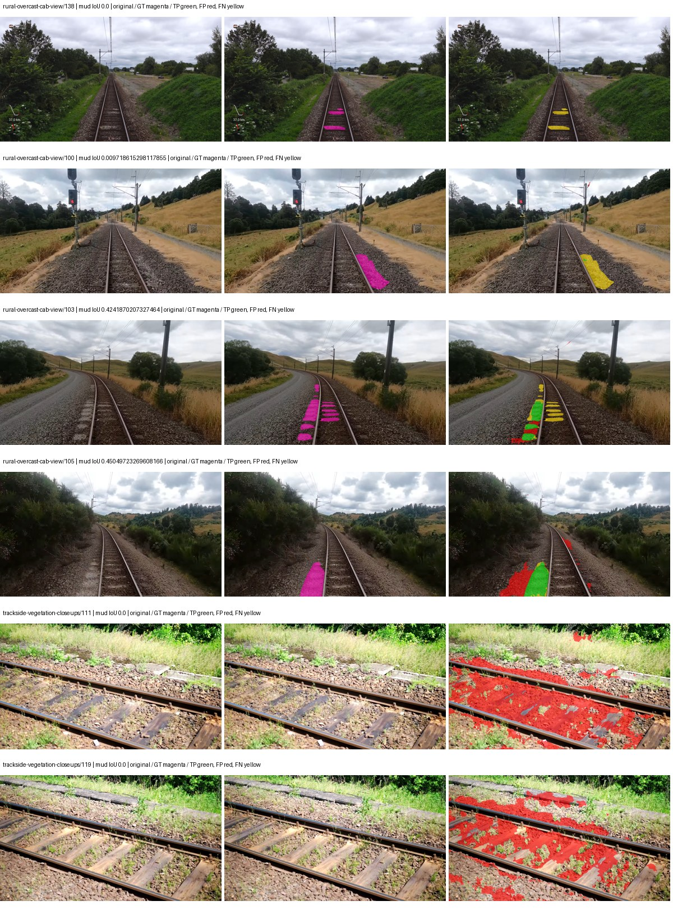
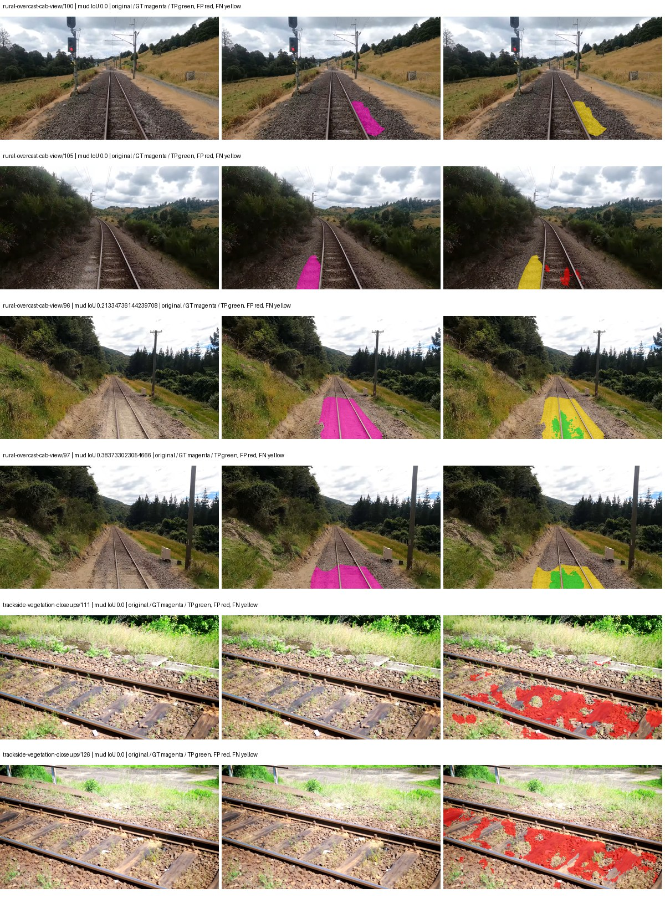
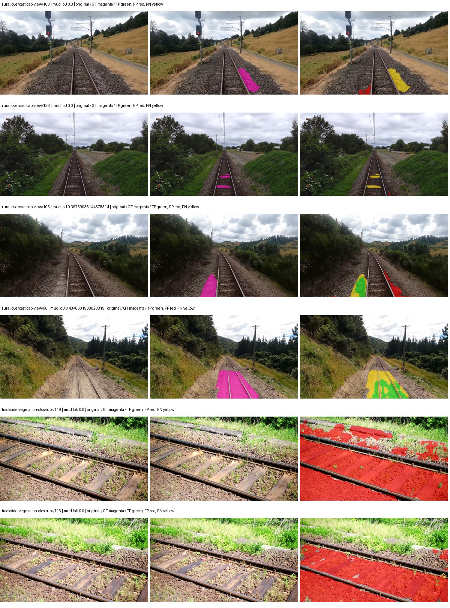
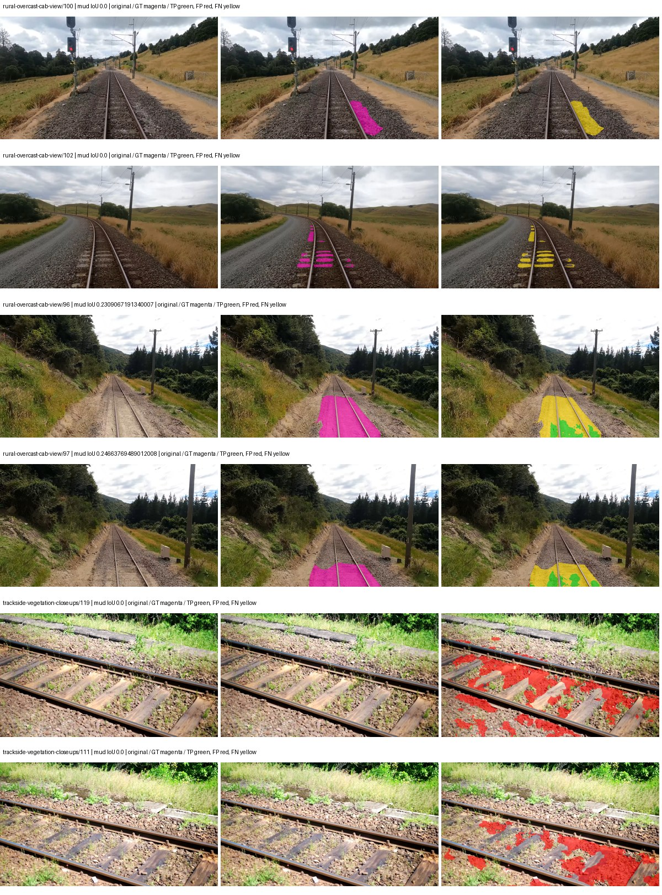
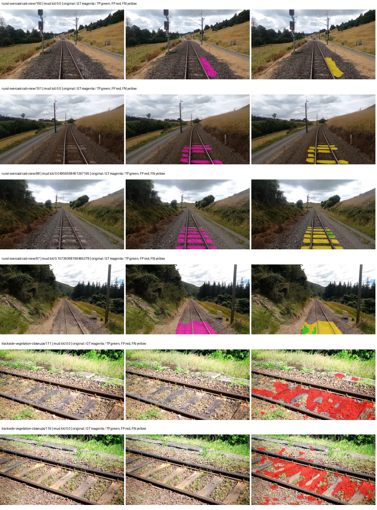
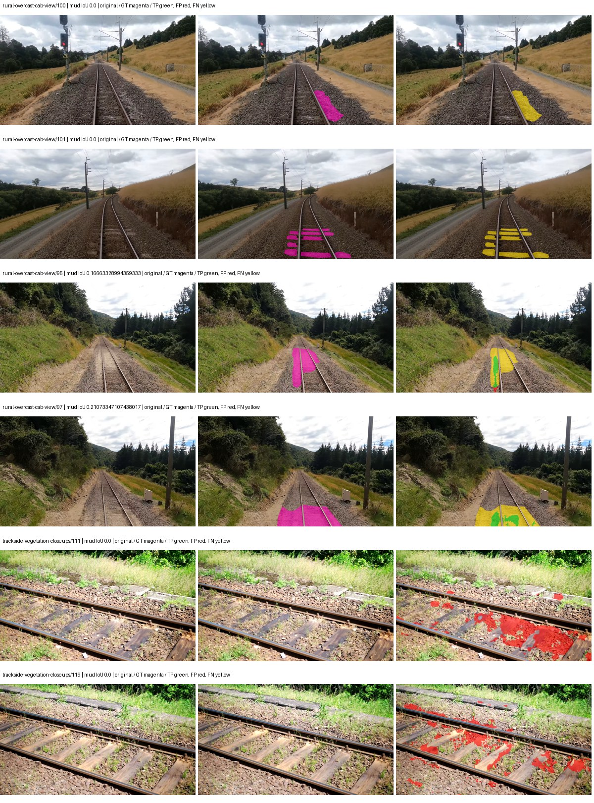
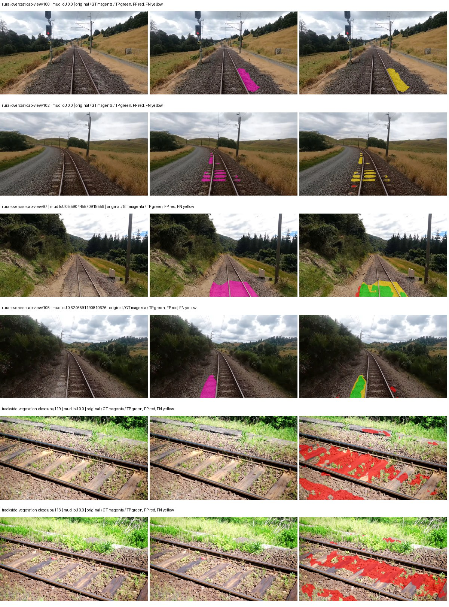
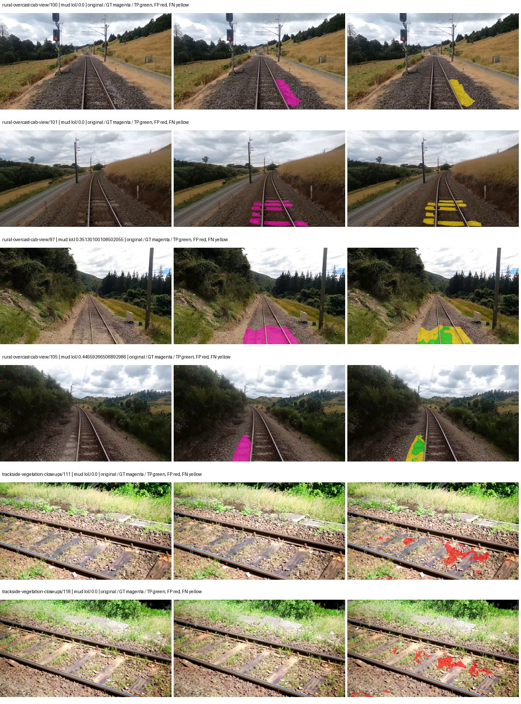
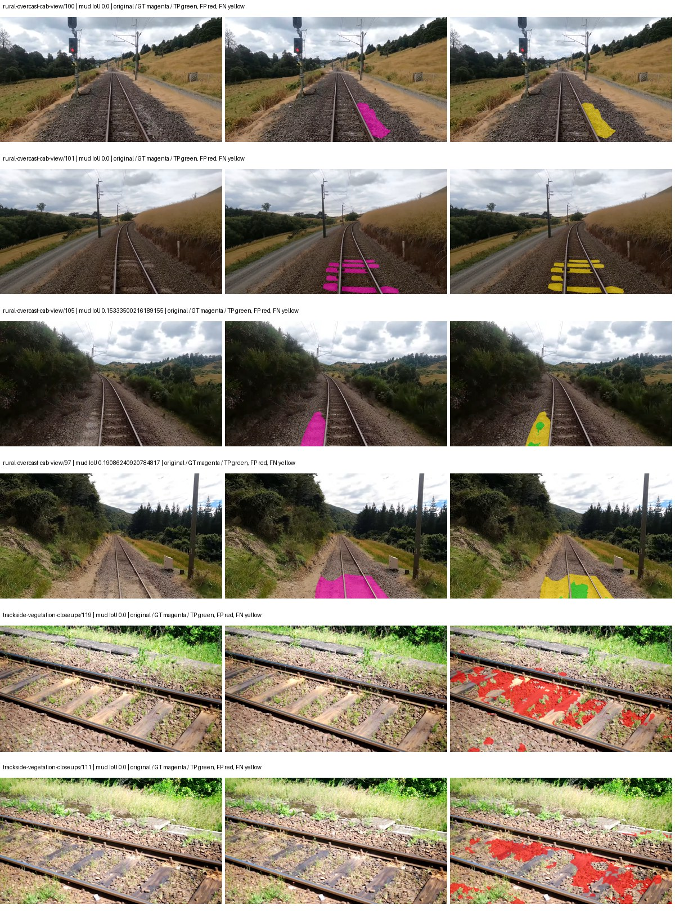
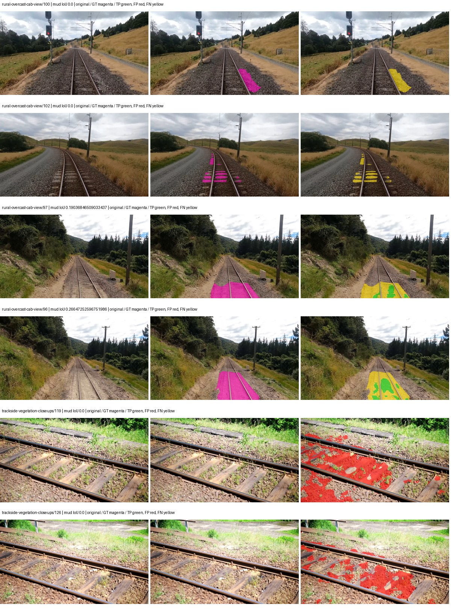

# smp_deeplabv3plus_resnet101 — paul-test-rtis

[RTIS comparison](../../README.md) · [Full model records](record.json)

Primary selection and early stopping: **mud-pumping validation IoU**. A job is complete only after full statistics and isolated profiling are verified.

| Model | Initialization path | Seed | Status | Steps | Best step | Mud IoU (%) | Mud precision (%) | Mud recall (%) | Final mud IoU (trainer val, %) | mIoU (%) | Fixed GT-class mIoU (%) |
| --- | --- | --- | --- | --- | --- | --- | --- | --- | --- | --- | --- |
| smp_deeplabv3plus_resnet101 | rtis_only | 0 | completed | 2036 | 763 | 7.11 | 8.64 | 28.75 | 1.08 | 24.85 | 29.00 |
| smp_deeplabv3plus_resnet101 | rtis_only | 1 | completed | 1527 | 254 | 2.70 | 4.43 | 6.45 | 0.35 | 23.64 | 24.96 |
| smp_deeplabv3plus_resnet101 | rtis_only | 2 | completed | 2290 | 1018 | 3.45 | 3.83 | 25.72 | 1.28 | 25.15 | 27.94 |
| smp_deeplabv3plus_resnet101 | cityscapes_to_rtis | 0 | completed | 3563 | 2290 | 3.19 | 5.07 | 7.92 | 1.19 | 30.84 | 35.98 |
| smp_deeplabv3plus_resnet101 | cityscapes_to_rtis | 1 | completed | 2545 | 1272 | 1.21 | 1.79 | 3.62 | 0.54 | 29.30 | 34.18 |
| smp_deeplabv3plus_resnet101 | cityscapes_to_rtis | 2 | completed | 4000 | 2800 | 3.85 | 7.72 | 7.13 | 1.33 | 31.58 | 36.85 |
| smp_deeplabv3plus_resnet101 | railsem19_to_rtis | 0 | completed | 2036 | 763 | 4.15 | 5.60 | 13.82 | 1.88 | 46.87 | 52.07 |
| smp_deeplabv3plus_resnet101 | railsem19_to_rtis | 1 | completed | 3309 | 2036 | 8.06 | 25.83 | 10.50 | 4.61 | 44.50 | 51.92 |
| smp_deeplabv3plus_resnet101 | railsem19_to_rtis | 2 | completed | 3054 | 2800 | 2.37 | 4.10 | 5.33 | 1.37 | 44.76 | 52.23 |
| smp_deeplabv3plus_resnet101 | cityscapes_to_railsem19_to_rtis | 0 | completed | 2290 | 1018 | 3.51 | 5.63 | 8.53 | 3.46 | 40.45 | 44.94 |
| smp_deeplabv3plus_resnet101 | cityscapes_to_railsem19_to_rtis | 1 | training | 2949 | — | — | — | — | — | — | — |
| smp_deeplabv3plus_resnet101 | cityscapes_to_railsem19_to_rtis | 2 | training | 2199 | — | — | — | — | — | — | — |

Training: 220 images. Validation: 37 images. Test: 50 held out. Seeds: [0, 1, 2]. Seed variation measures optimization variability, not independent-recording uncertainty. Historical source checkpoints stay fixed across adaptation seeds.

Training code: `066afb2626398b7be59d4d19f5a0e4644fd59adc`. Split SHA-256: `71fef8292610c352da0709fe3bd030f3bcc18f97560394835f4b22826463b83d`.

## rtis_only — seed 0

Status: **completed**. Started: 2026-09-07T05:37:21.188642+00:00. Finished: 2026-09-07T06:04:40.339053+00:00.

Recipe pretrained initializer: `{"arch": "smp", "backbone_path": null, "batch_norm_momentum": null, "checkpoint": null, "classifier_path": null, "drop_path": null, "encoder_name": "resnet101", "encoder_weights": "imagenet", "head": "unified_head", "head_paths": [], "inactive_parameter_paths": [], "local_files_only": false, "lora_alpha": 32, "lora_dropout": 0.05, "lora_r": 16, "lora_targets": [], "native": null, "revision": null, "smp_arch": "DeepLabV3Plus", "subfolder": null, "trust_remote_code": false, "tuning": "full"}`.

`rtis_only` uses the recipe initializer, which may include pretrained segmentation components. Transfer paths load the exact historical source checkpoint below and reset the classifier; they do not reset all query/decoder features.

Source checkpoint: `Recipe pretrained initialization`.

Config SHA-256: `d1073c1ea26ebd3018a45632db2ad3b2572e4366d9cef25dfac635b464542332`. Weights used for validation: `raw`.

### Mud-pumping and aggregate quality

| Metric | Selected checkpoint | Final training validation |
| --- | --- | --- |
| Mud IoU | 7.11 | 1.08 |
| Mud precision | 8.64 | 1.68 |
| Mud recall | 28.75 | 2.93 |
| Mud Dice/F1 | 13.28 | 2.14 |
| mIoU | 24.85 | 26.01 |
| Mean accuracy | 41.38 | 37.49 |
| Mean precision | 38.76 | 46.08 |
| Mean Dice | 32.43 | 33.70 |
| Mean specificity | 98.56 | 98.80 |
| Pixel accuracy | 74.70 | 80.67 |
| Frequency-weighted IoU | 67.09 | 71.11 |
| Fixed GT-present class mIoU | 29.00 | 30.34 |
| Boundary F1 | 27.53 | 32.18 |

The selected checkpoint has independent evaluation evidence. Final values are the trainer's final validation record, not a new independent evaluation. mIoU averages classes with nonzero union, so false positives on absent classes can change its denominator. The fixed GT-class mean is supplementary and excludes absent classes; their false positives remain in the confusion matrix.

### Resource usage and timing

| Measurement | Value |
| --- | --- |
| Peak training VRAM, retained training invocation (GiB) | 10.08 |
| Peak evaluation VRAM (GiB) | 7.19 |
| Retained training invocation wall time (seconds) | 1500.57 |
| Retained training invocation GPU-hours (one GPU) | 0.42 |
| Evaluation wall time (seconds) | 11.36 |
| Full evaluation pipeline images/second | 3.26 |
| Best full-state checkpoint (MiB) | 698.52 |
| Final full-state checkpoint (MiB) | 698.50 |
| Audited periodic checkpoints removed (GiB) | 2.73 |

VRAM uses the recorded allocator high-water mark; it is not total device usage including CUDA context. Resumed jobs' retained training invocation times and peaks are **not whole-campaign totals**. Earlier invocation resource records are not reconstructed here. Evaluation throughput includes loader, sliding-window inference and metrics; it is not model-only latency/FPS. Missing measurements are shown as —, never inferred from another dataset's run.

### Standardized inference performance

Dedicated model-only profiling waits for an idle worker-locked L40S: BF16, batch 1, 1024x1024, 20 warmup and 100 CUDA-event-timed public forwards. It excludes loading, preprocessing, tiling and metrics.

| Status | Parameters | Weight MiB | FPS | p50 ms | p95 ms | Peak reserved GiB |
| --- | --- | --- | --- | --- | --- | --- |
| complete | 45674853 | 174.24 | 112.48 | 8.76 | 9.88 | 0.71 |

```json
{
  "schema_version": 1,
  "model_id": "smp_deeplabv3plus_resnet101",
  "measured_at": "2026-09-07T06:04:34+00:00",
  "status": "complete",
  "benchmark_scope": "rtis_selected_checkpoint_model_only",
  "applies_to": [
    "smp_deeplabv3plus_resnet101--rtis_only--seed-0"
  ],
  "source": {
    "campaign_git_sha": "066afb2626398b7be59d4d19f5a0e4644fd59adc",
    "git_dirty": false,
    "config_hash": "96ec4acd47a3",
    "resolved_config": "/data/izadia1/projects/segmentary-runs/paul-test-rtis/mud-fullstats-v1-20260906-r2/configs/smp_deeplabv3plus_resnet101--rtis_only--seed-0.yaml",
    "config_sha256": "d1073c1ea26ebd3018a45632db2ad3b2572e4366d9cef25dfac635b464542332",
    "checkpoint_sha256": "ec5eb19914eac5fccff9d896042ca7dc8365cd4cad94024b278c1a0b49b187bf",
    "checkpoint_global_step": 763,
    "checkpoint_bytes": 732454124,
    "checkpoint_kind": "resume checkpoint with optimizer and EMA state",
    "weights": "raw",
    "measured_checkpoint_job_id": "smp_deeplabv3plus_resnet101--rtis_only--seed-0",
    "result_sha256": "dbd6963b71245ab4731a8bf2b9e189d4188f4117216a0477de5eb427d0b47e20",
    "result_git_sha": "066afb2626398b7be59d4d19f5a0e4644fd59adc",
    "result_stage": "eval:paul-test-rtis:val",
    "result_seed": 0
  },
  "hardware": {
    "gpu_name": "NVIDIA L40S",
    "gpu_uuid": "GPU-1c9b612f-e0b5-fbbc-150f-8c2ef13453c9",
    "logical_device": "cuda:0",
    "physical_visibility_token": "5",
    "compute_capability": [
      8,
      9
    ],
    "total_memory_bytes": 47677177856
  },
  "model": {
    "parameter_count": 45674853,
    "trainable_parameter_count": 45674853,
    "resident_parameter_bytes": 182699412,
    "parameter_dtype_counts": {
      "float32": 45674853
    }
  },
  "contract": {
    "backend": "pytorch",
    "precision": "bf16_autocast",
    "batch_size": 1,
    "input_shape_nchw": [
      1,
      3,
      1024,
      1024
    ],
    "warmup_iterations": 20,
    "measured_iterations": 100,
    "timing": "per-forward CUDA events with end-event synchronization",
    "includes_preprocessing": false,
    "includes_data_loader": false,
    "includes_sliding_window": false,
    "input_resident_on_gpu": true,
    "model_only": true,
    "entrypoint": "public model(image) dense-logits forward"
  },
  "measurements": {
    "latency": {
      "p50_ms": 8.755199909210205,
      "p95_ms": 9.882419538497924,
      "mean_ms": 8.890622406005859,
      "minimum_ms": 8.290304183959961,
      "maximum_ms": 10.091520309448242,
      "fps": 112.47806445187376,
      "raw_ms": [
        10.081279754638672,
        8.837120056152344,
        8.983551979064941,
        9.877504348754883,
        8.863743782043457,
        8.725503921508789,
        8.651776313781738,
        8.655808448791504,
        8.635392189025879,
        9.048064231872559,
        9.776127815246582,
        8.50227165222168,
        8.479743957519531,
        8.523776054382324,
        9.154560089111328,
        8.553471565246582,
        8.588288307189941,
        8.416255950927734,
        8.634367942810059,
        9.455615997314453,
        9.036800384521484,
        8.356863975524902,
        8.431615829467773,
        8.391679763793945,
        8.30361557006836,
        8.736767768859863,
        8.788991928100586,
        9.991168022155762,
        9.10540771484375,
        9.164799690246582,
        8.750080108642578,
        8.607744216918945,
        8.646656036376953,
        9.192447662353516,
        8.353792190551758,
        8.324064254760742,
        8.40294361114502,
        9.325568199157715,
        9.092096328735352,
        9.820159912109375,
        8.938495635986328,
        8.42131233215332,
        8.358912467956543,
        8.367103576660156,
        8.765439987182617,
        9.010175704956055,
        9.207807540893555,
        8.41318416595459,
        8.392704010009766,
        8.329216003417969,
        8.383487701416016,
        9.219072341918945,
        8.329216003417969,
        8.62822437286377,
        8.452095985412598,
        8.549375534057617,
        8.881152153015137,
        9.589759826660156,
        9.084927558898926,
        9.439231872558594,
        9.028608322143555,
        8.642560005187988,
        8.431615829467773,
        8.716287612915039,
        8.431615829467773,
        8.580096244812012,
        8.290304183959961,
        9.990143775939941,
        8.623104095458984,
        9.63379192352295,
        8.613887786865234,
        9.310208320617676,
        9.297920227050781,
        9.41977596282959,
        8.969216346740723,
        10.091520309448242,
        9.29587173461914,
        8.858624458312988,
        8.537088394165039,
        8.974335670471191,
        8.647680282592773,
        8.756223678588867,
        8.694784164428711,
        8.650752067565918,
        8.889344215393066,
        9.242624282836914,
        8.754176139831543,
        8.458239555358887,
        8.507391929626465,
        8.650752067565918,
        9.975808143615723,
        9.080831527709961,
        9.594880104064941,
        9.072640419006348,
        8.82585620880127,
        9.070591926574707,
        9.263104438781738,
        9.315327644348145,
        8.699904441833496,
        9.146368026733398
      ],
      "percentile_method": "numpy linear interpolation"
    },
    "peak_reserved_bytes": 763363328,
    "memory_kind": "pytorch_cuda_allocator_peak_reserved_excluding_context",
    "benchmark_wall_clock_s": 12.142886396497488
  },
  "started_at": "2026-09-07T06:04:22+00:00",
  "finished_at": "2026-09-07T06:04:34+00:00",
  "environment": {
    "hostname": "hdrfs-app-001",
    "python": "3.11.15",
    "platform": "Linux-5.15.0-139-generic-x86_64-with-glibc2.35",
    "torch": "2.11.0+cu128",
    "torch_cuda": "12.8",
    "cudnn": 91900,
    "driver_version": "570.133.20",
    "cuda_available": true,
    "gpu_count": 1,
    "gpu_names": [
      "NVIDIA L40S"
    ],
    "cuda_visible_devices": "5",
    "packages": {
      "segmentary": "0.1.0",
      "torch": "2.11.0+cu128",
      "torchvision": "0.26.0+cu128",
      "transformers": "5.15.0",
      "timm": "1.0.28",
      "segmentation-models-pytorch": "0.5.0",
      "albumentations": "2.0.8",
      "lightning": "2.6.5",
      "numpy": "2.4.4"
    }
  }
}
```

### Per-class validation results

| Class | GT pixels | IoU (%) | Precision (%) | Recall (%) | Dice (%) | Boundary F1 (%) |
| --- | --- | --- | --- | --- | --- | --- |
| car | 29664 | 0.00 | 0.00 | 0.00 | 0.00 | 0.00 |
| construction | 311585 | 41.31 | 60.43 | 56.61 | 58.46 | 46.09 |
| fence | 265137 | 18.04 | 25.43 | 38.32 | 30.57 | 21.00 |
| mud-pumping | 1226250 | 7.11 | 8.64 | 28.75 | 13.28 | 11.02 |
| on-rails | 0 | 0.00 | 0.00 | — | 0.00 | 0.00 |
| person | 0 | 0.00 | 0.00 | — | 0.00 | 0.00 |
| pole | 628038 | 60.17 | 81.66 | 69.57 | 75.13 | 85.08 |
| rail-embedded | 16799 | 1.50 | 3.99 | 2.35 | 2.95 | 9.91 |
| rail-raised | 2969797 | 62.23 | 73.61 | 80.10 | 76.72 | 83.51 |
| rail-track | 6323197 | 34.62 | 61.12 | 44.40 | 51.44 | 41.02 |
| road | 1048831 | 2.88 | 9.24 | 4.01 | 5.59 | 6.24 |
| sidewalk | 1297367 | 21.24 | 34.81 | 35.27 | 35.04 | 10.72 |
| sky | 19121606 | 92.73 | 99.61 | 93.06 | 96.23 | 79.40 |
| standing-water | 95802 | 0.81 | 0.82 | 56.82 | 1.61 | 1.60 |
| terrain | 39239306 | 74.48 | 86.84 | 83.95 | 85.37 | 43.41 |
| trackbed | 10643081 | 54.07 | 82.90 | 60.86 | 70.19 | 55.75 |
| traffic-light | 19510 | 0.14 | 100.00 | 0.14 | 0.28 | 11.40 |
| traffic-sign | 13285 | 0.00 | 0.00 | 0.00 | 0.00 | 0.00 |
| tram-track | 56179 | 14.19 | 16.93 | 46.76 | 24.86 | 11.78 |
| truck | 0 | 0.00 | 0.00 | — | 0.00 | 0.00 |
| vegetation-overgrowth | 5901821 | 36.40 | 68.03 | 43.91 | 53.37 | 60.26 |

### Full-run accounting

| Measurement | Value |
| --- | --- |
| Full GPU-reserved wall seconds, all recorded worker attempts | 1639.15 |
| Full reserved GPU-hours | 0.46 |
| Whole-run timing complete | True |

| Phase | Wall seconds including failed attempts |
| --- | --- |
| training | 1507.26 |
| diagnostics | 86.96 |
| performance | 20.85 |

GPU-reserved time includes model loading, training, validation, collection, profiling, checkpoint I/O and orchestration while the worker owns one GPU. It is not GPU kernel-active time. Phase timings and sampled device memory/power/utilization are retained separately; sampled device memory is not the allocator high-water mark.

### Train/validation and raw/EMA diagnostics

| Checkpoint / weights / split | Images | Mud IoU (%) | Mud precision (%) | Mud recall (%) |
| --- | --- | --- | --- | --- |
| best-auto-train / raw | 220 | 85.89 | 90.86 | 94.02 |
| best-auto-val / raw | 37 | 7.11 | 8.64 | 28.75 |
| best-alternate-val / ema | 37 | 2.43 | 3.24 | 8.87 |
| final-auto-val / raw | 37 | 1.08 | 1.69 | 2.94 |

Train uses the evaluation transform without augmentation. Compare mud train/validation metrics for the same selected weights. Alternate EMA on running-stat BatchNorm is explicitly uncalibrated and is diagnostic only. Score-threshold curves use uncalibrated normalized scores and are pixel-level diagnostics, not event detection rates or a selected deployment operating point.

### Downloadable evidence

- best-auto-train: [per-image.csv](rtis_only--seed-0/best-auto-train/per-image.csv) · [per-image-confusion.json.gz](rtis_only--seed-0/best-auto-train/per-image-confusion.json.gz) · [groups.json](rtis_only--seed-0/best-auto-train/groups.json) · [mud-score-curves.json](rtis_only--seed-0/best-auto-train/mud-score-curves.json)
- best-auto-val: [per-image.csv](rtis_only--seed-0/best-auto-val/per-image.csv) · [per-image-confusion.json.gz](rtis_only--seed-0/best-auto-val/per-image-confusion.json.gz) · [groups.json](rtis_only--seed-0/best-auto-val/groups.json) · [mud-score-curves.json](rtis_only--seed-0/best-auto-val/mud-score-curves.json) · [examples.jpg](rtis_only--seed-0/best-auto-val/examples.jpg)
- best-alternate-val: [per-image.csv](rtis_only--seed-0/best-alternate-val/per-image.csv) · [per-image-confusion.json.gz](rtis_only--seed-0/best-alternate-val/per-image-confusion.json.gz) · [groups.json](rtis_only--seed-0/best-alternate-val/groups.json) · [mud-score-curves.json](rtis_only--seed-0/best-alternate-val/mud-score-curves.json)
- final-auto-val: [per-image.csv](rtis_only--seed-0/final-auto-val/per-image.csv) · [per-image-confusion.json.gz](rtis_only--seed-0/final-auto-val/per-image-confusion.json.gz) · [groups.json](rtis_only--seed-0/final-auto-val/groups.json) · [mud-score-curves.json](rtis_only--seed-0/final-auto-val/mud-score-curves.json)
- resources: [telemetry.csv](rtis_only--seed-0/resources/telemetry.csv)



Examples are two lowest and two highest mud-IoU positive images, plus up to two negative images with the most false-positive mud pixels. They are targeted diagnostic examples, not random samples. Green: true positive; red: false positive; yellow: false negative. Full predictions remain on HDRFS.

### Validation tracking

| Logged step | Overall mIoU (%) | Mud IoU (%) |
| --- | --- | --- |
| 254 | 21.55 | 3.21 |
| 508 | 23.30 | 0.73 |
| 763 | 24.85 | 7.11 |
| 1017 | 25.55 | 0.33 |
| 1272 | 26.10 | 1.11 |
| 1527 | 27.75 | 1.19 |
| 1781 | 30.67 | 3.51 |
| 2036 | 26.01 | 1.08 |

All retained scalar curves, including training loss and per-class IoU, are in record.json. Observed best mud on a curve is not necessarily a retained checkpoint: the pilot saved its selection-metric-best and final checkpoints. Step logging and checkpoint global_step may differ by one.

### Stopping and checkpoint provenance

```json
{
  "stopping": {
    "actual_steps": 2036,
    "maximum_steps": 4000,
    "min_delta": 0.001,
    "monitor": "val_iou/mud-pumping",
    "patience": 5,
    "reason": "validation_plateau"
  },
  "checkpoints": {
    "best": {
      "path": "/data/izadia1/projects/segmentary-runs/paul-test-rtis/mud-fullstats-v1-20260906-r2/future-runs/smp_deeplabv3plus_resnet101--rtis_only--seed-0_seed0/rtis/best.ckpt",
      "sha256": "ec5eb19914eac5fccff9d896042ca7dc8365cd4cad94024b278c1a0b49b187bf",
      "global_step": 763,
      "bytes": 732454124
    },
    "final": {
      "path": "/data/izadia1/projects/segmentary-runs/paul-test-rtis/mud-fullstats-v1-20260906-r2/future-runs/smp_deeplabv3plus_resnet101--rtis_only--seed-0_seed0/rtis/last.ckpt",
      "sha256": "349a94d710e12b47651c4c6f42fd345a80bec50a20e0103856f528edb15a5b6c",
      "global_step": 2036,
      "bytes": 732431852
    }
  },
  "cleanup_error": null
}
```

### Resolved training, initialization and evaluation settings

The optimizer block is the base configuration. Stage LR scales are applied at runtime, and stage warmup is capped at min(base warmup, floor(stage budget / 10), stage budget - 1): 400 steps for this 4,000-step pilot. Model-internal native input grids may differ from augmentation crops (EoMT uses its 640 grid).

```json
{
  "name": "smp_deeplabv3plus_resnet101--rtis_only--seed-0",
  "model": {
    "arch": "smp",
    "checkpoint": null,
    "tuning": "full",
    "head": "unified_head",
    "lora_r": 16,
    "lora_alpha": 32,
    "lora_dropout": 0.05,
    "lora_targets": [],
    "drop_path": null,
    "revision": null,
    "subfolder": null,
    "local_files_only": false,
    "trust_remote_code": false,
    "backbone_path": null,
    "head_paths": [],
    "classifier_path": null,
    "inactive_parameter_paths": [],
    "smp_arch": "DeepLabV3Plus",
    "encoder_name": "resnet101",
    "encoder_weights": "imagenet",
    "native": null,
    "batch_norm_momentum": null
  },
  "space": "paul-test-rtis",
  "taxonomy_root": "/data/izadia1/projects/segmentary-rtis-fullstats-066afb2/taxonomy",
  "output_root": "/data/izadia1/projects/segmentary-runs/paul-test-rtis/mud-fullstats-v1-20260906-r2/future-runs",
  "optim": {
    "backbone_lr": 0.0001,
    "head_lr_mult": 10.0,
    "weight_decay": 0.05,
    "llrd": 1.0,
    "warmup_iters": 1500,
    "warmup_ratio": 1e-06,
    "poly_power": 0.9,
    "min_lr_ratio": 0.0,
    "betas": [
      0.9,
      0.999
    ],
    "grad_clip": 1.0
  },
  "train": {
    "iters": 4000,
    "batch_size": 2,
    "accum": 8,
    "num_workers": 2,
    "precision": "bf16-mixed",
    "ema_decay": 0.9998,
    "val_every": 250,
    "ckpt_every": 500,
    "selection_metric": "val_iou/mud-pumping",
    "early_stopping_patience": 5,
    "early_stopping_min_delta": 0.001,
    "seed": 0,
    "devices": 1
  },
  "eval": {
    "sliding_window": true,
    "window": [
      1024,
      1024
    ],
    "stride": [
      768,
      768
    ],
    "batch_size": 1,
    "num_workers": 2,
    "tta_scales": [],
    "tta_flip": false,
    "threshold": 0.5,
    "boundary_tolerance_frac": 0.0075,
    "save_confusion": true
  },
  "loss": {
    "task": "multiclass",
    "activation": "auto",
    "terms": [],
    "aux": "none",
    "aux_weight": 0.0,
    "ce_weight": 1.0,
    "label_smoothing": 0.0,
    "class_weights": null,
    "query": null
  },
  "aug": {
    "crop": [
      1024,
      1024
    ],
    "scale_min": 0.5,
    "scale_max": 2.0,
    "hflip_p": 0.5,
    "color_jitter_p": 0.5,
    "brightness": 0.25,
    "contrast": 0.25,
    "saturation": 0.25,
    "hue": 0.05
  },
  "stages": [
    {
      "name": "rtis",
      "data": [
        {
          "name": "paul-test-rtis",
          "root": "/data/izadia1/datasets/paul-test-rtis",
          "variant": null,
          "split_file": "splits.json",
          "train_split": "train",
          "val_split": "val",
          "limit": null,
          "loader": "folder",
          "mapping": "paul-test-rtis",
          "loader_options": {
            "require_groups": true
          }
        }
      ],
      "iters": null,
      "lr_scale": 1.0,
      "head_group_lr_scale": 1.0,
      "init_from": "pretrained",
      "reset_head": false,
      "freeze": null,
      "sample_weights": null
    }
  ]
}
```

### Hardware and software provenance

```json
{
  "training": {
    "cuda_available": true,
    "cuda_visible_devices": "5",
    "cudnn": 91900,
    "driver_version": "570.133.20",
    "gpu_count": 1,
    "gpu_names": [
      "NVIDIA L40S"
    ],
    "hostname": "hdrfs-app-001",
    "input_normalization": {
      "channel_order": "rgb",
      "mean": [
        0.485,
        0.456,
        0.406
      ],
      "source": "smp_encoder_settings",
      "std": [
        0.229,
        0.224,
        0.225
      ]
    },
    "model_origins": [
      {
        "hf_commit": null,
        "hf_name_or_path": null,
        "module": "model",
        "timm_pretrained": {}
      }
    ],
    "model_parameter_count": 45674853,
    "packages": {
      "albumentations": "2.0.8",
      "lightning": "2.6.5",
      "numpy": "2.4.4",
      "segmentary": "0.1.0",
      "segmentation-models-pytorch": "0.5.0",
      "timm": "1.0.28",
      "torch": "2.11.0+cu128",
      "torchvision": "0.26.0+cu128",
      "transformers": "5.15.0"
    },
    "platform": "Linux-5.15.0-139-generic-x86_64-with-glibc2.35",
    "python": "3.11.15",
    "torch": "2.11.0+cu128",
    "torch_cuda": "12.8",
    "trainable_parameter_count": 45674853,
    "training_stop": {
      "actual_steps": 2036,
      "maximum_steps": 4000,
      "min_delta": 0.001,
      "monitor": "val_iou/mud-pumping",
      "patience": 5,
      "reason": "validation_plateau"
    },
    "validation_weights": "raw"
  },
  "evaluation": {
    "cuda_available": true,
    "cuda_visible_devices": "5",
    "cudnn": 91900,
    "driver_version": "570.133.20",
    "gpu_count": 1,
    "gpu_names": [
      "NVIDIA L40S"
    ],
    "hostname": "hdrfs-app-001",
    "input_normalization": {
      "channel_order": "rgb",
      "mean": [
        0.485,
        0.456,
        0.406
      ],
      "source": "smp_encoder_settings",
      "std": [
        0.229,
        0.224,
        0.225
      ]
    },
    "packages": {
      "albumentations": "2.0.8",
      "lightning": "2.6.5",
      "numpy": "2.4.4",
      "segmentary": "0.1.0",
      "segmentation-models-pytorch": "0.5.0",
      "timm": "1.0.28",
      "torch": "2.11.0+cu128",
      "torchvision": "0.26.0+cu128",
      "transformers": "5.15.0"
    },
    "platform": "Linux-5.15.0-139-generic-x86_64-with-glibc2.35",
    "python": "3.11.15",
    "torch": "2.11.0+cu128",
    "torch_cuda": "12.8"
  }
}
```

## rtis_only — seed 1

Status: **completed**. Started: 2026-09-07T05:41:16.902932+00:00. Finished: 2026-09-07T06:02:20.373102+00:00.

Recipe pretrained initializer: `{"arch": "smp", "backbone_path": null, "batch_norm_momentum": null, "checkpoint": null, "classifier_path": null, "drop_path": null, "encoder_name": "resnet101", "encoder_weights": "imagenet", "head": "unified_head", "head_paths": [], "inactive_parameter_paths": [], "local_files_only": false, "lora_alpha": 32, "lora_dropout": 0.05, "lora_r": 16, "lora_targets": [], "native": null, "revision": null, "smp_arch": "DeepLabV3Plus", "subfolder": null, "trust_remote_code": false, "tuning": "full"}`.

`rtis_only` uses the recipe initializer, which may include pretrained segmentation components. Transfer paths load the exact historical source checkpoint below and reset the classifier; they do not reset all query/decoder features.

Source checkpoint: `Recipe pretrained initialization`.

Config SHA-256: `8d40d44d03aec5b6e93c31c8e36d6acffdd8763701f108e0576fbf02ab82b412`. Weights used for validation: `raw`.

### Mud-pumping and aggregate quality

| Metric | Selected checkpoint | Final training validation |
| --- | --- | --- |
| Mud IoU | 2.70 | 0.35 |
| Mud precision | 4.43 | 0.88 |
| Mud recall | 6.45 | 0.58 |
| Mud Dice/F1 | 5.26 | 0.70 |
| mIoU | 23.64 | 25.80 |
| Mean accuracy | 31.62 | 38.45 |
| Mean precision | 35.95 | 50.44 |
| Mean Dice | 30.46 | 33.87 |
| Mean specificity | 98.52 | 98.71 |
| Pixel accuracy | 78.53 | 79.60 |
| Frequency-weighted IoU | 66.04 | 68.72 |
| Fixed GT-present class mIoU | 24.96 | 30.11 |
| Boundary F1 | 24.74 | 31.36 |

The selected checkpoint has independent evaluation evidence. Final values are the trainer's final validation record, not a new independent evaluation. mIoU averages classes with nonzero union, so false positives on absent classes can change its denominator. The fixed GT-class mean is supplementary and excludes absent classes; their false positives remain in the confusion matrix.

### Resource usage and timing

| Measurement | Value |
| --- | --- |
| Peak training VRAM, retained training invocation (GiB) | 10.08 |
| Peak evaluation VRAM (GiB) | 7.19 |
| Retained training invocation wall time (seconds) | 1125.56 |
| Retained training invocation GPU-hours (one GPU) | 0.31 |
| Evaluation wall time (seconds) | 11.97 |
| Full evaluation pipeline images/second | 3.09 |
| Best full-state checkpoint (MiB) | 698.52 |
| Final full-state checkpoint (MiB) | 698.50 |
| Audited periodic checkpoints removed (GiB) | 2.05 |

VRAM uses the recorded allocator high-water mark; it is not total device usage including CUDA context. Resumed jobs' retained training invocation times and peaks are **not whole-campaign totals**. Earlier invocation resource records are not reconstructed here. Evaluation throughput includes loader, sliding-window inference and metrics; it is not model-only latency/FPS. Missing measurements are shown as —, never inferred from another dataset's run.

### Standardized inference performance

Dedicated model-only profiling waits for an idle worker-locked L40S: BF16, batch 1, 1024x1024, 20 warmup and 100 CUDA-event-timed public forwards. It excludes loading, preprocessing, tiling and metrics.

| Status | Parameters | Weight MiB | FPS | p50 ms | p95 ms | Peak reserved GiB |
| --- | --- | --- | --- | --- | --- | --- |
| complete | 45674853 | 174.24 | 115.43 | 8.47 | 9.48 | 0.66 |

```json
{
  "schema_version": 1,
  "model_id": "smp_deeplabv3plus_resnet101",
  "measured_at": "2026-09-07T06:02:15+00:00",
  "status": "complete",
  "benchmark_scope": "rtis_selected_checkpoint_model_only",
  "applies_to": [
    "smp_deeplabv3plus_resnet101--rtis_only--seed-1"
  ],
  "source": {
    "campaign_git_sha": "066afb2626398b7be59d4d19f5a0e4644fd59adc",
    "git_dirty": false,
    "config_hash": "4c41f7248977",
    "resolved_config": "/data/izadia1/projects/segmentary-runs/paul-test-rtis/mud-fullstats-v1-20260906-r2/configs/smp_deeplabv3plus_resnet101--rtis_only--seed-1.yaml",
    "config_sha256": "8d40d44d03aec5b6e93c31c8e36d6acffdd8763701f108e0576fbf02ab82b412",
    "checkpoint_sha256": "e66f774baa387a20ed270603924683d4a974f58882318473795b12fdd8c8e41b",
    "checkpoint_global_step": 254,
    "checkpoint_bytes": 732453932,
    "checkpoint_kind": "resume checkpoint with optimizer and EMA state",
    "weights": "raw",
    "measured_checkpoint_job_id": "smp_deeplabv3plus_resnet101--rtis_only--seed-1",
    "result_sha256": "43f3a5f28bafd5992ac8929ecf2fa86f3444253191e391136fd220d04c382d19",
    "result_git_sha": "066afb2626398b7be59d4d19f5a0e4644fd59adc",
    "result_stage": "eval:paul-test-rtis:val",
    "result_seed": 1
  },
  "hardware": {
    "gpu_name": "NVIDIA L40S",
    "gpu_uuid": "GPU-e2e96741-aec9-e90b-5c46-d0d58be90a56",
    "logical_device": "cuda:0",
    "physical_visibility_token": "8",
    "compute_capability": [
      8,
      9
    ],
    "total_memory_bytes": 47677177856
  },
  "model": {
    "parameter_count": 45674853,
    "trainable_parameter_count": 45674853,
    "resident_parameter_bytes": 182699412,
    "parameter_dtype_counts": {
      "float32": 45674853
    }
  },
  "contract": {
    "backend": "pytorch",
    "precision": "bf16_autocast",
    "batch_size": 1,
    "input_shape_nchw": [
      1,
      3,
      1024,
      1024
    ],
    "warmup_iterations": 20,
    "measured_iterations": 100,
    "timing": "per-forward CUDA events with end-event synchronization",
    "includes_preprocessing": false,
    "includes_data_loader": false,
    "includes_sliding_window": false,
    "input_resident_on_gpu": true,
    "model_only": true,
    "entrypoint": "public model(image) dense-logits forward"
  },
  "measurements": {
    "latency": {
      "p50_ms": 8.466944217681885,
      "p95_ms": 9.480243396759032,
      "mean_ms": 8.663142433166504,
      "minimum_ms": 8.31488037109375,
      "maximum_ms": 10.278911590576172,
      "fps": 115.43155474063764,
      "raw_ms": [
        8.79308795928955,
        8.581119537353516,
        8.481792449951172,
        8.547327995300293,
        9.057279586791992,
        8.71833610534668,
        8.418304443359375,
        9.283583641052246,
        9.480192184448242,
        8.508416175842285,
        8.369119644165039,
        8.358912467956543,
        8.430591583251953,
        8.723456382751465,
        9.027584075927734,
        8.890368461608887,
        8.723456382751465,
        9.01632022857666,
        8.427519798278809,
        8.353792190551758,
        8.354816436767578,
        8.443903923034668,
        8.331263542175293,
        8.31488037109375,
        8.345600128173828,
        8.319999694824219,
        8.350720405578613,
        9.763839721679688,
        8.890368461608887,
        8.451071739196777,
        8.398847579956055,
        8.419327735900879,
        8.822784423828125,
        10.278911590576172,
        8.99071979522705,
        8.953856468200684,
        8.654848098754883,
        8.706048011779785,
        9.253888130187988,
        8.69375991821289,
        8.51148796081543,
        8.376319885253906,
        8.741888046264648,
        8.32204818725586,
        8.383487701416016,
        8.333312034606934,
        8.434687614440918,
        9.481216430664062,
        9.343999862670898,
        8.51257610321045,
        8.385536193847656,
        8.386560440063477,
        8.360960006713867,
        8.368127822875977,
        8.434687614440918,
        9.251808166503906,
        8.751104354858398,
        9.472000122070312,
        8.662015914916992,
        8.389632225036621,
        8.354816436767578,
        8.336383819580078,
        8.33948802947998,
        8.90777587890625,
        8.351743698120117,
        8.424448013305664,
        8.860671997070312,
        8.507391929626465,
        8.357888221740723,
        8.428511619567871,
        8.476672172546387,
        8.472576141357422,
        9.995264053344727,
        8.612863540649414,
        8.424448013305664,
        8.41926383972168,
        8.400896072387695,
        8.461312294006348,
        8.353856086730957,
        9.193471908569336,
        8.736767768859863,
        8.391679763793945,
        8.345600128173828,
        8.37939167022705,
        8.355839729309082,
        8.350720405578613,
        8.733695983886719,
        8.348671913146973,
        9.02451229095459,
        9.684991836547852,
        9.23136043548584,
        9.289728164672852,
        8.920063972473145,
        8.607744216918945,
        8.389632225036621,
        8.372223854064941,
        8.354816436767578,
        8.358912467956543,
        8.526847839355469,
        8.39782428741455
      ],
      "percentile_method": "numpy linear interpolation"
    },
    "peak_reserved_bytes": 704643072,
    "memory_kind": "pytorch_cuda_allocator_peak_reserved_excluding_context",
    "benchmark_wall_clock_s": 11.81459141150117
  },
  "started_at": "2026-09-07T06:02:03+00:00",
  "finished_at": "2026-09-07T06:02:15+00:00",
  "environment": {
    "hostname": "hdrfs-app-001",
    "python": "3.11.15",
    "platform": "Linux-5.15.0-139-generic-x86_64-with-glibc2.35",
    "torch": "2.11.0+cu128",
    "torch_cuda": "12.8",
    "cudnn": 91900,
    "driver_version": "570.133.20",
    "cuda_available": true,
    "gpu_count": 1,
    "gpu_names": [
      "NVIDIA L40S"
    ],
    "cuda_visible_devices": "8",
    "packages": {
      "segmentary": "0.1.0",
      "torch": "2.11.0+cu128",
      "torchvision": "0.26.0+cu128",
      "transformers": "5.15.0",
      "timm": "1.0.28",
      "segmentation-models-pytorch": "0.5.0",
      "albumentations": "2.0.8",
      "lightning": "2.6.5",
      "numpy": "2.4.4"
    }
  }
}
```

### Per-class validation results

| Class | GT pixels | IoU (%) | Precision (%) | Recall (%) | Dice (%) | Boundary F1 (%) |
| --- | --- | --- | --- | --- | --- | --- |
| car | 29664 | 0.00 | 0.00 | 0.00 | 0.00 | 0.00 |
| construction | 311585 | 37.49 | 48.26 | 62.68 | 54.54 | 44.04 |
| fence | 265137 | 7.87 | 18.01 | 12.27 | 14.60 | 9.84 |
| mud-pumping | 1226250 | 2.70 | 4.43 | 6.45 | 5.26 | 4.47 |
| on-rails | 0 | 0.00 | 0.00 | — | 0.00 | 0.00 |
| person | 0 | — | — | — | — | — |
| pole | 628038 | 52.82 | 69.00 | 69.25 | 69.13 | 80.50 |
| rail-embedded | 16799 | 0.00 | 0.00 | 0.00 | 0.00 | 0.00 |
| rail-raised | 2969797 | 63.07 | 67.96 | 89.76 | 77.35 | 80.97 |
| rail-track | 6323197 | 29.24 | 72.31 | 32.93 | 45.25 | 35.36 |
| road | 1048831 | 0.02 | 0.08 | 0.03 | 0.04 | 0.00 |
| sidewalk | 1297367 | 16.30 | 82.52 | 16.89 | 28.04 | 7.79 |
| sky | 19121606 | 87.41 | 99.45 | 87.83 | 93.28 | 72.36 |
| standing-water | 95802 | 0.12 | 0.14 | 0.71 | 0.24 | 1.49 |
| terrain | 39239306 | 78.69 | 79.31 | 99.02 | 88.08 | 41.60 |
| trackbed | 10643081 | 53.63 | 69.85 | 69.78 | 69.81 | 49.98 |
| traffic-light | 19510 | 0.00 | 0.00 | 0.00 | 0.00 | 0.00 |
| traffic-sign | 13285 | 0.00 | 0.00 | 0.00 | 0.00 | 0.00 |
| tram-track | 56179 | 0.00 | 0.00 | 0.00 | 0.00 | 0.00 |
| truck | 0 | — | — | — | — | — |
| vegetation-overgrowth | 5901821 | 19.87 | 71.75 | 21.55 | 33.15 | 41.76 |

### Full-run accounting

| Measurement | Value |
| --- | --- |
| Full GPU-reserved wall seconds, all recorded worker attempts | 1263.47 |
| Full reserved GPU-hours | 0.35 |
| Whole-run timing complete | True |

| Phase | Wall seconds including failed attempts |
| --- | --- |
| training | 1132.31 |
| diagnostics | 86.51 |
| performance | 19.67 |

GPU-reserved time includes model loading, training, validation, collection, profiling, checkpoint I/O and orchestration while the worker owns one GPU. It is not GPU kernel-active time. Phase timings and sampled device memory/power/utilization are retained separately; sampled device memory is not the allocator high-water mark.

### Train/validation and raw/EMA diagnostics

| Checkpoint / weights / split | Images | Mud IoU (%) | Mud precision (%) | Mud recall (%) |
| --- | --- | --- | --- | --- |
| best-auto-train / raw | 220 | 84.76 | 90.02 | 93.55 |
| best-auto-val / raw | 37 | 2.70 | 4.43 | 6.45 |
| best-alternate-val / ema | 37 | 0.00 | 0.00 | 0.00 |
| final-auto-val / raw | 37 | 0.35 | 0.89 | 0.58 |

Train uses the evaluation transform without augmentation. Compare mud train/validation metrics for the same selected weights. Alternate EMA on running-stat BatchNorm is explicitly uncalibrated and is diagnostic only. Score-threshold curves use uncalibrated normalized scores and are pixel-level diagnostics, not event detection rates or a selected deployment operating point.

### Downloadable evidence

- best-auto-train: [per-image.csv](rtis_only--seed-1/best-auto-train/per-image.csv) · [per-image-confusion.json.gz](rtis_only--seed-1/best-auto-train/per-image-confusion.json.gz) · [groups.json](rtis_only--seed-1/best-auto-train/groups.json) · [mud-score-curves.json](rtis_only--seed-1/best-auto-train/mud-score-curves.json)
- best-auto-val: [per-image.csv](rtis_only--seed-1/best-auto-val/per-image.csv) · [per-image-confusion.json.gz](rtis_only--seed-1/best-auto-val/per-image-confusion.json.gz) · [groups.json](rtis_only--seed-1/best-auto-val/groups.json) · [mud-score-curves.json](rtis_only--seed-1/best-auto-val/mud-score-curves.json) · [examples.jpg](rtis_only--seed-1/best-auto-val/examples.jpg)
- best-alternate-val: [per-image.csv](rtis_only--seed-1/best-alternate-val/per-image.csv) · [per-image-confusion.json.gz](rtis_only--seed-1/best-alternate-val/per-image-confusion.json.gz) · [groups.json](rtis_only--seed-1/best-alternate-val/groups.json) · [mud-score-curves.json](rtis_only--seed-1/best-alternate-val/mud-score-curves.json)
- final-auto-val: [per-image.csv](rtis_only--seed-1/final-auto-val/per-image.csv) · [per-image-confusion.json.gz](rtis_only--seed-1/final-auto-val/per-image-confusion.json.gz) · [groups.json](rtis_only--seed-1/final-auto-val/groups.json) · [mud-score-curves.json](rtis_only--seed-1/final-auto-val/mud-score-curves.json)
- resources: [telemetry.csv](rtis_only--seed-1/resources/telemetry.csv)



Examples are two lowest and two highest mud-IoU positive images, plus up to two negative images with the most false-positive mud pixels. They are targeted diagnostic examples, not random samples. Green: true positive; red: false positive; yellow: false negative. Full predictions remain on HDRFS.

### Validation tracking

| Logged step | Overall mIoU (%) | Mud IoU (%) |
| --- | --- | --- |
| 254 | 23.64 | 2.69 |
| 508 | 22.33 | 1.68 |
| 763 | 27.24 | 0.79 |
| 1017 | 27.69 | 0.41 |
| 1272 | 28.16 | 0.25 |
| 1527 | 25.80 | 0.35 |

All retained scalar curves, including training loss and per-class IoU, are in record.json. Observed best mud on a curve is not necessarily a retained checkpoint: the pilot saved its selection-metric-best and final checkpoints. Step logging and checkpoint global_step may differ by one.

### Stopping and checkpoint provenance

```json
{
  "stopping": {
    "actual_steps": 1527,
    "maximum_steps": 4000,
    "min_delta": 0.001,
    "monitor": "val_iou/mud-pumping",
    "patience": 5,
    "reason": "validation_plateau"
  },
  "checkpoints": {
    "best": {
      "path": "/data/izadia1/projects/segmentary-runs/paul-test-rtis/mud-fullstats-v1-20260906-r2/future-runs/smp_deeplabv3plus_resnet101--rtis_only--seed-1_seed1/rtis/best.ckpt",
      "sha256": "e66f774baa387a20ed270603924683d4a974f58882318473795b12fdd8c8e41b",
      "global_step": 254,
      "bytes": 732453932
    },
    "final": {
      "path": "/data/izadia1/projects/segmentary-runs/paul-test-rtis/mud-fullstats-v1-20260906-r2/future-runs/smp_deeplabv3plus_resnet101--rtis_only--seed-1_seed1/rtis/last.ckpt",
      "sha256": "3a7bdfb2e8d063c31026682b5bd9d235e467d316f8e0fdcc7c924f9ff5d57f55",
      "global_step": 1527,
      "bytes": 732431852
    }
  },
  "cleanup_error": null
}
```

### Resolved training, initialization and evaluation settings

The optimizer block is the base configuration. Stage LR scales are applied at runtime, and stage warmup is capped at min(base warmup, floor(stage budget / 10), stage budget - 1): 400 steps for this 4,000-step pilot. Model-internal native input grids may differ from augmentation crops (EoMT uses its 640 grid).

```json
{
  "name": "smp_deeplabv3plus_resnet101--rtis_only--seed-1",
  "model": {
    "arch": "smp",
    "checkpoint": null,
    "tuning": "full",
    "head": "unified_head",
    "lora_r": 16,
    "lora_alpha": 32,
    "lora_dropout": 0.05,
    "lora_targets": [],
    "drop_path": null,
    "revision": null,
    "subfolder": null,
    "local_files_only": false,
    "trust_remote_code": false,
    "backbone_path": null,
    "head_paths": [],
    "classifier_path": null,
    "inactive_parameter_paths": [],
    "smp_arch": "DeepLabV3Plus",
    "encoder_name": "resnet101",
    "encoder_weights": "imagenet",
    "native": null,
    "batch_norm_momentum": null
  },
  "space": "paul-test-rtis",
  "taxonomy_root": "/data/izadia1/projects/segmentary-rtis-fullstats-066afb2/taxonomy",
  "output_root": "/data/izadia1/projects/segmentary-runs/paul-test-rtis/mud-fullstats-v1-20260906-r2/future-runs",
  "optim": {
    "backbone_lr": 0.0001,
    "head_lr_mult": 10.0,
    "weight_decay": 0.05,
    "llrd": 1.0,
    "warmup_iters": 1500,
    "warmup_ratio": 1e-06,
    "poly_power": 0.9,
    "min_lr_ratio": 0.0,
    "betas": [
      0.9,
      0.999
    ],
    "grad_clip": 1.0
  },
  "train": {
    "iters": 4000,
    "batch_size": 2,
    "accum": 8,
    "num_workers": 2,
    "precision": "bf16-mixed",
    "ema_decay": 0.9998,
    "val_every": 250,
    "ckpt_every": 500,
    "selection_metric": "val_iou/mud-pumping",
    "early_stopping_patience": 5,
    "early_stopping_min_delta": 0.001,
    "seed": 1,
    "devices": 1
  },
  "eval": {
    "sliding_window": true,
    "window": [
      1024,
      1024
    ],
    "stride": [
      768,
      768
    ],
    "batch_size": 1,
    "num_workers": 2,
    "tta_scales": [],
    "tta_flip": false,
    "threshold": 0.5,
    "boundary_tolerance_frac": 0.0075,
    "save_confusion": true
  },
  "loss": {
    "task": "multiclass",
    "activation": "auto",
    "terms": [],
    "aux": "none",
    "aux_weight": 0.0,
    "ce_weight": 1.0,
    "label_smoothing": 0.0,
    "class_weights": null,
    "query": null
  },
  "aug": {
    "crop": [
      1024,
      1024
    ],
    "scale_min": 0.5,
    "scale_max": 2.0,
    "hflip_p": 0.5,
    "color_jitter_p": 0.5,
    "brightness": 0.25,
    "contrast": 0.25,
    "saturation": 0.25,
    "hue": 0.05
  },
  "stages": [
    {
      "name": "rtis",
      "data": [
        {
          "name": "paul-test-rtis",
          "root": "/data/izadia1/datasets/paul-test-rtis",
          "variant": null,
          "split_file": "splits.json",
          "train_split": "train",
          "val_split": "val",
          "limit": null,
          "loader": "folder",
          "mapping": "paul-test-rtis",
          "loader_options": {
            "require_groups": true
          }
        }
      ],
      "iters": null,
      "lr_scale": 1.0,
      "head_group_lr_scale": 1.0,
      "init_from": "pretrained",
      "reset_head": false,
      "freeze": null,
      "sample_weights": null
    }
  ]
}
```

### Hardware and software provenance

```json
{
  "training": {
    "cuda_available": true,
    "cuda_visible_devices": "8",
    "cudnn": 91900,
    "driver_version": "570.133.20",
    "gpu_count": 1,
    "gpu_names": [
      "NVIDIA L40S"
    ],
    "hostname": "hdrfs-app-001",
    "input_normalization": {
      "channel_order": "rgb",
      "mean": [
        0.485,
        0.456,
        0.406
      ],
      "source": "smp_encoder_settings",
      "std": [
        0.229,
        0.224,
        0.225
      ]
    },
    "model_origins": [
      {
        "hf_commit": null,
        "hf_name_or_path": null,
        "module": "model",
        "timm_pretrained": {}
      }
    ],
    "model_parameter_count": 45674853,
    "packages": {
      "albumentations": "2.0.8",
      "lightning": "2.6.5",
      "numpy": "2.4.4",
      "segmentary": "0.1.0",
      "segmentation-models-pytorch": "0.5.0",
      "timm": "1.0.28",
      "torch": "2.11.0+cu128",
      "torchvision": "0.26.0+cu128",
      "transformers": "5.15.0"
    },
    "platform": "Linux-5.15.0-139-generic-x86_64-with-glibc2.35",
    "python": "3.11.15",
    "torch": "2.11.0+cu128",
    "torch_cuda": "12.8",
    "trainable_parameter_count": 45674853,
    "training_stop": {
      "actual_steps": 1527,
      "maximum_steps": 4000,
      "min_delta": 0.001,
      "monitor": "val_iou/mud-pumping",
      "patience": 5,
      "reason": "validation_plateau"
    },
    "validation_weights": "raw"
  },
  "evaluation": {
    "cuda_available": true,
    "cuda_visible_devices": "8",
    "cudnn": 91900,
    "driver_version": "570.133.20",
    "gpu_count": 1,
    "gpu_names": [
      "NVIDIA L40S"
    ],
    "hostname": "hdrfs-app-001",
    "input_normalization": {
      "channel_order": "rgb",
      "mean": [
        0.485,
        0.456,
        0.406
      ],
      "source": "smp_encoder_settings",
      "std": [
        0.229,
        0.224,
        0.225
      ]
    },
    "packages": {
      "albumentations": "2.0.8",
      "lightning": "2.6.5",
      "numpy": "2.4.4",
      "segmentary": "0.1.0",
      "segmentation-models-pytorch": "0.5.0",
      "timm": "1.0.28",
      "torch": "2.11.0+cu128",
      "torchvision": "0.26.0+cu128",
      "transformers": "5.15.0"
    },
    "platform": "Linux-5.15.0-139-generic-x86_64-with-glibc2.35",
    "python": "3.11.15",
    "torch": "2.11.0+cu128",
    "torch_cuda": "12.8"
  }
}
```

## rtis_only — seed 2

Status: **completed**. Started: 2026-09-07T05:43:11.370058+00:00. Finished: 2026-09-07T06:13:52.506510+00:00.

Recipe pretrained initializer: `{"arch": "smp", "backbone_path": null, "batch_norm_momentum": null, "checkpoint": null, "classifier_path": null, "drop_path": null, "encoder_name": "resnet101", "encoder_weights": "imagenet", "head": "unified_head", "head_paths": [], "inactive_parameter_paths": [], "local_files_only": false, "lora_alpha": 32, "lora_dropout": 0.05, "lora_r": 16, "lora_targets": [], "native": null, "revision": null, "smp_arch": "DeepLabV3Plus", "subfolder": null, "trust_remote_code": false, "tuning": "full"}`.

`rtis_only` uses the recipe initializer, which may include pretrained segmentation components. Transfer paths load the exact historical source checkpoint below and reset the classifier; they do not reset all query/decoder features.

Source checkpoint: `Recipe pretrained initialization`.

Config SHA-256: `5e5110d446860ab8ca1431cd9e6fb0118eeae5b40c0f399359330bc25808cb0c`. Weights used for validation: `raw`.

### Mud-pumping and aggregate quality

| Metric | Selected checkpoint | Final training validation |
| --- | --- | --- |
| Mud IoU | 3.45 | 1.28 |
| Mud precision | 3.83 | 1.80 |
| Mud recall | 25.72 | 4.22 |
| Mud Dice/F1 | 6.67 | 2.52 |
| mIoU | 25.15 | 30.19 |
| Mean accuracy | 34.16 | 43.35 |
| Mean precision | 49.05 | 46.43 |
| Mean Dice | 32.37 | 38.05 |
| Mean specificity | 98.61 | 98.72 |
| Pixel accuracy | 77.37 | 79.99 |
| Frequency-weighted IoU | 68.69 | 70.02 |
| Fixed GT-present class mIoU | 27.94 | 35.22 |
| Boundary F1 | 29.27 | 36.03 |

The selected checkpoint has independent evaluation evidence. Final values are the trainer's final validation record, not a new independent evaluation. mIoU averages classes with nonzero union, so false positives on absent classes can change its denominator. The fixed GT-class mean is supplementary and excludes absent classes; their false positives remain in the confusion matrix.

### Resource usage and timing

| Measurement | Value |
| --- | --- |
| Peak training VRAM, retained training invocation (GiB) | 10.08 |
| Peak evaluation VRAM (GiB) | 7.19 |
| Retained training invocation wall time (seconds) | 1704.73 |
| Retained training invocation GPU-hours (one GPU) | 0.47 |
| Evaluation wall time (seconds) | 11.80 |
| Full evaluation pipeline images/second | 3.14 |
| Best full-state checkpoint (MiB) | 698.52 |
| Final full-state checkpoint (MiB) | 698.50 |
| Audited periodic checkpoints removed (GiB) | 2.73 |

VRAM uses the recorded allocator high-water mark; it is not total device usage including CUDA context. Resumed jobs' retained training invocation times and peaks are **not whole-campaign totals**. Earlier invocation resource records are not reconstructed here. Evaluation throughput includes loader, sliding-window inference and metrics; it is not model-only latency/FPS. Missing measurements are shown as —, never inferred from another dataset's run.

### Standardized inference performance

Dedicated model-only profiling waits for an idle worker-locked L40S: BF16, batch 1, 1024x1024, 20 warmup and 100 CUDA-event-timed public forwards. It excludes loading, preprocessing, tiling and metrics.

| Status | Parameters | Weight MiB | FPS | p50 ms | p95 ms | Peak reserved GiB |
| --- | --- | --- | --- | --- | --- | --- |
| complete | 45674853 | 174.24 | 108.82 | 9.12 | 9.91 | 0.71 |

```json
{
  "schema_version": 1,
  "model_id": "smp_deeplabv3plus_resnet101",
  "measured_at": "2026-09-07T06:13:46+00:00",
  "status": "complete",
  "benchmark_scope": "rtis_selected_checkpoint_model_only",
  "applies_to": [
    "smp_deeplabv3plus_resnet101--rtis_only--seed-2"
  ],
  "source": {
    "campaign_git_sha": "066afb2626398b7be59d4d19f5a0e4644fd59adc",
    "git_dirty": false,
    "config_hash": "adb1694a37eb",
    "resolved_config": "/data/izadia1/projects/segmentary-runs/paul-test-rtis/mud-fullstats-v1-20260906-r2/configs/smp_deeplabv3plus_resnet101--rtis_only--seed-2.yaml",
    "config_sha256": "5e5110d446860ab8ca1431cd9e6fb0118eeae5b40c0f399359330bc25808cb0c",
    "checkpoint_sha256": "c51d3653dd9ca9d2be239273cefeacb9bf57312786657ff1c967f70d4c188074",
    "checkpoint_global_step": 1018,
    "checkpoint_bytes": 732454124,
    "checkpoint_kind": "resume checkpoint with optimizer and EMA state",
    "weights": "raw",
    "measured_checkpoint_job_id": "smp_deeplabv3plus_resnet101--rtis_only--seed-2",
    "result_sha256": "043595f6a5144bb09a7d3f73c5e91dca897f1478ffa5d855fead1438a7ae80dd",
    "result_git_sha": "066afb2626398b7be59d4d19f5a0e4644fd59adc",
    "result_stage": "eval:paul-test-rtis:val",
    "result_seed": 2
  },
  "hardware": {
    "gpu_name": "NVIDIA L40S",
    "gpu_uuid": "GPU-84f5ca4d-68db-ae98-d056-40654d859dd9",
    "logical_device": "cuda:0",
    "physical_visibility_token": "0",
    "compute_capability": [
      8,
      9
    ],
    "total_memory_bytes": 47677177856
  },
  "model": {
    "parameter_count": 45674853,
    "trainable_parameter_count": 45674853,
    "resident_parameter_bytes": 182699412,
    "parameter_dtype_counts": {
      "float32": 45674853
    }
  },
  "contract": {
    "backend": "pytorch",
    "precision": "bf16_autocast",
    "batch_size": 1,
    "input_shape_nchw": [
      1,
      3,
      1024,
      1024
    ],
    "warmup_iterations": 20,
    "measured_iterations": 100,
    "timing": "per-forward CUDA events with end-event synchronization",
    "includes_preprocessing": false,
    "includes_data_loader": false,
    "includes_sliding_window": false,
    "input_resident_on_gpu": true,
    "model_only": true,
    "entrypoint": "public model(image) dense-logits forward"
  },
  "measurements": {
    "latency": {
      "p50_ms": 9.116719722747803,
      "p95_ms": 9.910374212265014,
      "mean_ms": 9.189208641052247,
      "minimum_ms": 8.59545612335205,
      "maximum_ms": 10.777600288391113,
      "fps": 108.82329905238619,
      "raw_ms": [
        9.281536102294922,
        9.07583999633789,
        9.21395206451416,
        8.8472318649292,
        8.773632049560547,
        9.11359977722168,
        8.969152450561523,
        9.384832382202148,
        8.7838716506958,
        8.680447578430176,
        8.62720012664795,
        8.59545612335205,
        8.844287872314453,
        8.81868839263916,
        8.768511772155762,
        9.184224128723145,
        8.962047576904297,
        8.943615913391113,
        8.969216346740723,
        9.0316801071167,
        9.899007797241211,
        9.186304092407227,
        9.119839668273926,
        8.98969554901123,
        9.39417552947998,
        8.888319969177246,
        8.658944129943848,
        8.645631790161133,
        8.773632049560547,
        9.499648094177246,
        9.378815650939941,
        9.030655860900879,
        8.950783729553223,
        9.331680297851562,
        9.052224159240723,
        9.41158390045166,
        9.159680366516113,
        9.217023849487305,
        9.4136323928833,
        9.142271995544434,
        8.89958381652832,
        9.092096328735352,
        8.626175880432129,
        8.622079849243164,
        8.743935585021973,
        8.72646427154541,
        8.884223937988281,
        9.09721565246582,
        8.983551979064941,
        9.035776138305664,
        10.169343948364258,
        9.194496154785156,
        9.103360176086426,
        9.856927871704102,
        9.111552238464355,
        8.892416000366211,
        9.503744125366211,
        9.393152236938477,
        8.849311828613281,
        8.983551979064941,
        9.335807800292969,
        9.474047660827637,
        8.965120315551758,
        9.217023849487305,
        9.067520141601562,
        10.777600288391113,
        9.747455596923828,
        9.50271987915039,
        10.468352317810059,
        9.480192184448242,
        9.125887870788574,
        8.966143608093262,
        8.82688045501709,
        8.866815567016602,
        9.155584335327148,
        9.125887870788574,
        9.676799774169922,
        9.236479759216309,
        9.155584335327148,
        9.233407974243164,
        9.64192008972168,
        9.82425594329834,
        10.126336097717285,
        9.153535842895508,
        8.945728302001953,
        9.267200469970703,
        8.949760437011719,
        9.257984161376953,
        9.371647834777832,
        9.786239624023438,
        9.866239547729492,
        9.20576000213623,
        9.042943954467773,
        9.270272254943848,
        9.862144470214844,
        10.22771167755127,
        9.167872428894043,
        9.004032135009766,
        8.881279945373535,
        8.881152153015137
      ],
      "percentile_method": "numpy linear interpolation"
    },
    "peak_reserved_bytes": 763363328,
    "memory_kind": "pytorch_cuda_allocator_peak_reserved_excluding_context",
    "benchmark_wall_clock_s": 12.140288088470697
  },
  "started_at": "2026-09-07T06:13:34+00:00",
  "finished_at": "2026-09-07T06:13:46+00:00",
  "environment": {
    "hostname": "hdrfs-app-001",
    "python": "3.11.15",
    "platform": "Linux-5.15.0-139-generic-x86_64-with-glibc2.35",
    "torch": "2.11.0+cu128",
    "torch_cuda": "12.8",
    "cudnn": 91900,
    "driver_version": "570.133.20",
    "cuda_available": true,
    "gpu_count": 1,
    "gpu_names": [
      "NVIDIA L40S"
    ],
    "cuda_visible_devices": "0",
    "packages": {
      "segmentary": "0.1.0",
      "torch": "2.11.0+cu128",
      "torchvision": "0.26.0+cu128",
      "transformers": "5.15.0",
      "timm": "1.0.28",
      "segmentation-models-pytorch": "0.5.0",
      "albumentations": "2.0.8",
      "lightning": "2.6.5",
      "numpy": "2.4.4"
    }
  }
}
```

### Per-class validation results

| Class | GT pixels | IoU (%) | Precision (%) | Recall (%) | Dice (%) | Boundary F1 (%) |
| --- | --- | --- | --- | --- | --- | --- |
| car | 29664 | 0.00 | 0.00 | 0.00 | 0.00 | 0.00 |
| construction | 311585 | 25.25 | 32.00 | 54.50 | 40.32 | 36.33 |
| fence | 265137 | 15.23 | 75.97 | 16.00 | 26.43 | 40.02 |
| mud-pumping | 1226250 | 3.45 | 3.83 | 25.72 | 6.67 | 14.64 |
| on-rails | 0 | 0.00 | 0.00 | — | 0.00 | 0.00 |
| person | 0 | — | — | — | — | — |
| pole | 628038 | 60.22 | 86.81 | 66.28 | 75.17 | 82.62 |
| rail-embedded | 16799 | 0.07 | 100.00 | 0.07 | 0.13 | 3.21 |
| rail-raised | 2969797 | 69.78 | 79.81 | 84.74 | 82.20 | 89.26 |
| rail-track | 6323197 | 32.64 | 70.51 | 37.79 | 49.21 | 40.44 |
| road | 1048831 | 0.40 | 1.70 | 0.53 | 0.80 | 3.12 |
| sidewalk | 1297367 | 20.63 | 81.98 | 21.61 | 34.20 | 6.07 |
| sky | 19121606 | 90.46 | 99.44 | 90.93 | 94.99 | 72.13 |
| standing-water | 95802 | 0.88 | 0.95 | 10.36 | 1.74 | 3.91 |
| terrain | 39239306 | 82.57 | 84.65 | 97.11 | 90.45 | 49.45 |
| trackbed | 10643081 | 54.04 | 82.73 | 60.91 | 70.16 | 59.37 |
| traffic-light | 19510 | 32.46 | 93.89 | 33.16 | 49.01 | 41.95 |
| traffic-sign | 13285 | 0.00 | 0.00 | 0.00 | 0.00 | 0.00 |
| tram-track | 56179 | 0.05 | 0.66 | 0.06 | 0.10 | 3.71 |
| truck | 0 | 0.00 | 0.00 | — | 0.00 | 0.00 |
| vegetation-overgrowth | 5901821 | 14.79 | 86.11 | 15.15 | 25.77 | 39.22 |

### Full-run accounting

| Measurement | Value |
| --- | --- |
| Full GPU-reserved wall seconds, all recorded worker attempts | 1841.14 |
| Full reserved GPU-hours | 0.51 |
| Whole-run timing complete | True |

| Phase | Wall seconds including failed attempts |
| --- | --- |
| training | 1711.41 |
| diagnostics | 85.20 |
| performance | 20.06 |

GPU-reserved time includes model loading, training, validation, collection, profiling, checkpoint I/O and orchestration while the worker owns one GPU. It is not GPU kernel-active time. Phase timings and sampled device memory/power/utilization are retained separately; sampled device memory is not the allocator high-water mark.

### Train/validation and raw/EMA diagnostics

| Checkpoint / weights / split | Images | Mud IoU (%) | Mud precision (%) | Mud recall (%) |
| --- | --- | --- | --- | --- |
| best-auto-train / raw | 220 | 87.98 | 89.24 | 98.43 |
| best-auto-val / raw | 37 | 3.45 | 3.83 | 25.72 |
| best-alternate-val / ema | 37 | 1.02 | 1.57 | 2.79 |
| final-auto-val / raw | 37 | 1.28 | 1.80 | 4.22 |

Train uses the evaluation transform without augmentation. Compare mud train/validation metrics for the same selected weights. Alternate EMA on running-stat BatchNorm is explicitly uncalibrated and is diagnostic only. Score-threshold curves use uncalibrated normalized scores and are pixel-level diagnostics, not event detection rates or a selected deployment operating point.

### Downloadable evidence

- best-auto-train: [per-image.csv](rtis_only--seed-2/best-auto-train/per-image.csv) · [per-image-confusion.json.gz](rtis_only--seed-2/best-auto-train/per-image-confusion.json.gz) · [groups.json](rtis_only--seed-2/best-auto-train/groups.json) · [mud-score-curves.json](rtis_only--seed-2/best-auto-train/mud-score-curves.json)
- best-auto-val: [per-image.csv](rtis_only--seed-2/best-auto-val/per-image.csv) · [per-image-confusion.json.gz](rtis_only--seed-2/best-auto-val/per-image-confusion.json.gz) · [groups.json](rtis_only--seed-2/best-auto-val/groups.json) · [mud-score-curves.json](rtis_only--seed-2/best-auto-val/mud-score-curves.json) · [examples.jpg](rtis_only--seed-2/best-auto-val/examples.jpg)
- best-alternate-val: [per-image.csv](rtis_only--seed-2/best-alternate-val/per-image.csv) · [per-image-confusion.json.gz](rtis_only--seed-2/best-alternate-val/per-image-confusion.json.gz) · [groups.json](rtis_only--seed-2/best-alternate-val/groups.json) · [mud-score-curves.json](rtis_only--seed-2/best-alternate-val/mud-score-curves.json)
- final-auto-val: [per-image.csv](rtis_only--seed-2/final-auto-val/per-image.csv) · [per-image-confusion.json.gz](rtis_only--seed-2/final-auto-val/per-image-confusion.json.gz) · [groups.json](rtis_only--seed-2/final-auto-val/groups.json) · [mud-score-curves.json](rtis_only--seed-2/final-auto-val/mud-score-curves.json)
- resources: [telemetry.csv](rtis_only--seed-2/resources/telemetry.csv)



Examples are two lowest and two highest mud-IoU positive images, plus up to two negative images with the most false-positive mud pixels. They are targeted diagnostic examples, not random samples. Green: true positive; red: false positive; yellow: false negative. Full predictions remain on HDRFS.

### Validation tracking

| Logged step | Overall mIoU (%) | Mud IoU (%) |
| --- | --- | --- |
| 254 | 22.67 | 0.07 |
| 508 | 22.73 | 0.28 |
| 763 | 23.13 | 1.25 |
| 1017 | 25.15 | 3.45 |
| 1272 | 25.55 | 2.48 |
| 1527 | 26.63 | 0.77 |
| 1781 | 28.20 | 1.66 |
| 2036 | 31.08 | 0.84 |
| 2290 | 30.19 | 1.28 |

All retained scalar curves, including training loss and per-class IoU, are in record.json. Observed best mud on a curve is not necessarily a retained checkpoint: the pilot saved its selection-metric-best and final checkpoints. Step logging and checkpoint global_step may differ by one.

### Stopping and checkpoint provenance

```json
{
  "stopping": {
    "actual_steps": 2290,
    "maximum_steps": 4000,
    "min_delta": 0.001,
    "monitor": "val_iou/mud-pumping",
    "patience": 5,
    "reason": "validation_plateau"
  },
  "checkpoints": {
    "best": {
      "path": "/data/izadia1/projects/segmentary-runs/paul-test-rtis/mud-fullstats-v1-20260906-r2/future-runs/smp_deeplabv3plus_resnet101--rtis_only--seed-2_seed2/rtis/best.ckpt",
      "sha256": "c51d3653dd9ca9d2be239273cefeacb9bf57312786657ff1c967f70d4c188074",
      "global_step": 1018,
      "bytes": 732454124
    },
    "final": {
      "path": "/data/izadia1/projects/segmentary-runs/paul-test-rtis/mud-fullstats-v1-20260906-r2/future-runs/smp_deeplabv3plus_resnet101--rtis_only--seed-2_seed2/rtis/last.ckpt",
      "sha256": "959835e1e1c7c771a9ecb69d7395e46ad0516c7d545a8c3e6822e1a502638af7",
      "global_step": 2290,
      "bytes": 732431852
    }
  },
  "cleanup_error": null
}
```

### Resolved training, initialization and evaluation settings

The optimizer block is the base configuration. Stage LR scales are applied at runtime, and stage warmup is capped at min(base warmup, floor(stage budget / 10), stage budget - 1): 400 steps for this 4,000-step pilot. Model-internal native input grids may differ from augmentation crops (EoMT uses its 640 grid).

```json
{
  "name": "smp_deeplabv3plus_resnet101--rtis_only--seed-2",
  "model": {
    "arch": "smp",
    "checkpoint": null,
    "tuning": "full",
    "head": "unified_head",
    "lora_r": 16,
    "lora_alpha": 32,
    "lora_dropout": 0.05,
    "lora_targets": [],
    "drop_path": null,
    "revision": null,
    "subfolder": null,
    "local_files_only": false,
    "trust_remote_code": false,
    "backbone_path": null,
    "head_paths": [],
    "classifier_path": null,
    "inactive_parameter_paths": [],
    "smp_arch": "DeepLabV3Plus",
    "encoder_name": "resnet101",
    "encoder_weights": "imagenet",
    "native": null,
    "batch_norm_momentum": null
  },
  "space": "paul-test-rtis",
  "taxonomy_root": "/data/izadia1/projects/segmentary-rtis-fullstats-066afb2/taxonomy",
  "output_root": "/data/izadia1/projects/segmentary-runs/paul-test-rtis/mud-fullstats-v1-20260906-r2/future-runs",
  "optim": {
    "backbone_lr": 0.0001,
    "head_lr_mult": 10.0,
    "weight_decay": 0.05,
    "llrd": 1.0,
    "warmup_iters": 1500,
    "warmup_ratio": 1e-06,
    "poly_power": 0.9,
    "min_lr_ratio": 0.0,
    "betas": [
      0.9,
      0.999
    ],
    "grad_clip": 1.0
  },
  "train": {
    "iters": 4000,
    "batch_size": 2,
    "accum": 8,
    "num_workers": 2,
    "precision": "bf16-mixed",
    "ema_decay": 0.9998,
    "val_every": 250,
    "ckpt_every": 500,
    "selection_metric": "val_iou/mud-pumping",
    "early_stopping_patience": 5,
    "early_stopping_min_delta": 0.001,
    "seed": 2,
    "devices": 1
  },
  "eval": {
    "sliding_window": true,
    "window": [
      1024,
      1024
    ],
    "stride": [
      768,
      768
    ],
    "batch_size": 1,
    "num_workers": 2,
    "tta_scales": [],
    "tta_flip": false,
    "threshold": 0.5,
    "boundary_tolerance_frac": 0.0075,
    "save_confusion": true
  },
  "loss": {
    "task": "multiclass",
    "activation": "auto",
    "terms": [],
    "aux": "none",
    "aux_weight": 0.0,
    "ce_weight": 1.0,
    "label_smoothing": 0.0,
    "class_weights": null,
    "query": null
  },
  "aug": {
    "crop": [
      1024,
      1024
    ],
    "scale_min": 0.5,
    "scale_max": 2.0,
    "hflip_p": 0.5,
    "color_jitter_p": 0.5,
    "brightness": 0.25,
    "contrast": 0.25,
    "saturation": 0.25,
    "hue": 0.05
  },
  "stages": [
    {
      "name": "rtis",
      "data": [
        {
          "name": "paul-test-rtis",
          "root": "/data/izadia1/datasets/paul-test-rtis",
          "variant": null,
          "split_file": "splits.json",
          "train_split": "train",
          "val_split": "val",
          "limit": null,
          "loader": "folder",
          "mapping": "paul-test-rtis",
          "loader_options": {
            "require_groups": true
          }
        }
      ],
      "iters": null,
      "lr_scale": 1.0,
      "head_group_lr_scale": 1.0,
      "init_from": "pretrained",
      "reset_head": false,
      "freeze": null,
      "sample_weights": null
    }
  ]
}
```

### Hardware and software provenance

```json
{
  "training": {
    "cuda_available": true,
    "cuda_visible_devices": "0",
    "cudnn": 91900,
    "driver_version": "570.133.20",
    "gpu_count": 1,
    "gpu_names": [
      "NVIDIA L40S"
    ],
    "hostname": "hdrfs-app-001",
    "input_normalization": {
      "channel_order": "rgb",
      "mean": [
        0.485,
        0.456,
        0.406
      ],
      "source": "smp_encoder_settings",
      "std": [
        0.229,
        0.224,
        0.225
      ]
    },
    "model_origins": [
      {
        "hf_commit": null,
        "hf_name_or_path": null,
        "module": "model",
        "timm_pretrained": {}
      }
    ],
    "model_parameter_count": 45674853,
    "packages": {
      "albumentations": "2.0.8",
      "lightning": "2.6.5",
      "numpy": "2.4.4",
      "segmentary": "0.1.0",
      "segmentation-models-pytorch": "0.5.0",
      "timm": "1.0.28",
      "torch": "2.11.0+cu128",
      "torchvision": "0.26.0+cu128",
      "transformers": "5.15.0"
    },
    "platform": "Linux-5.15.0-139-generic-x86_64-with-glibc2.35",
    "python": "3.11.15",
    "torch": "2.11.0+cu128",
    "torch_cuda": "12.8",
    "trainable_parameter_count": 45674853,
    "training_stop": {
      "actual_steps": 2290,
      "maximum_steps": 4000,
      "min_delta": 0.001,
      "monitor": "val_iou/mud-pumping",
      "patience": 5,
      "reason": "validation_plateau"
    },
    "validation_weights": "raw"
  },
  "evaluation": {
    "cuda_available": true,
    "cuda_visible_devices": "0",
    "cudnn": 91900,
    "driver_version": "570.133.20",
    "gpu_count": 1,
    "gpu_names": [
      "NVIDIA L40S"
    ],
    "hostname": "hdrfs-app-001",
    "input_normalization": {
      "channel_order": "rgb",
      "mean": [
        0.485,
        0.456,
        0.406
      ],
      "source": "smp_encoder_settings",
      "std": [
        0.229,
        0.224,
        0.225
      ]
    },
    "packages": {
      "albumentations": "2.0.8",
      "lightning": "2.6.5",
      "numpy": "2.4.4",
      "segmentary": "0.1.0",
      "segmentation-models-pytorch": "0.5.0",
      "timm": "1.0.28",
      "torch": "2.11.0+cu128",
      "torchvision": "0.26.0+cu128",
      "transformers": "5.15.0"
    },
    "platform": "Linux-5.15.0-139-generic-x86_64-with-glibc2.35",
    "python": "3.11.15",
    "torch": "2.11.0+cu128",
    "torch_cuda": "12.8"
  }
}
```

## cityscapes_to_rtis — seed 0

Status: **completed**. Started: 2026-09-07T05:48:13.351657+00:00. Finished: 2026-09-07T06:33:20.449200+00:00.

Recipe pretrained initializer: `{"arch": "smp", "backbone_path": null, "batch_norm_momentum": null, "checkpoint": null, "classifier_path": null, "drop_path": null, "encoder_name": "resnet101", "encoder_weights": "imagenet", "head": "unified_head", "head_paths": [], "inactive_parameter_paths": [], "local_files_only": false, "lora_alpha": 32, "lora_dropout": 0.05, "lora_r": 16, "lora_targets": [], "native": null, "revision": null, "smp_arch": "DeepLabV3Plus", "subfolder": null, "trust_remote_code": false, "tuning": "full"}`.

`rtis_only` uses the recipe initializer, which may include pretrained segmentation components. Transfer paths load the exact historical source checkpoint below and reset the classifier; they do not reset all query/decoder features.

Source checkpoint: `{'name': 'smp_deeplabv3plus_resnet101--cityscapes--seed-0', 'model': 'smp_deeplabv3plus_resnet101', 'protocol': 'cityscapes', 'config': '/data/izadia1/projects/segmentary-runs/all-model-city-rail-seed0-rail20-b9eb3e1/accepted/smp_deeplabv3plus_resnet101--cityscapes--seed-0/resolved-config.yaml', 'checkpoint': '/data/izadia1/projects/segmentary-runs/current-main-fill-v2/jobs/smp_deeplabv3plus_resnet101--cityscapes--seed-0/train/smp_deeplabv3plus_resnet101--cityscapes_seed0/cityscapes/last.ckpt', 'recorded_sha256': '01074c9ac3f2b84d122c8a23d07d26a31d2ff58d5d23740b077bdc998d70363b', 'exists': True}`.

Config SHA-256: `66a506e3afe6f2156a12b26c196a51d5c35b09fe43afee73ab3209c66f35f2d2`. Weights used for validation: `raw`.

### Mud-pumping and aggregate quality

| Metric | Selected checkpoint | Final training validation |
| --- | --- | --- |
| Mud IoU | 3.19 | 1.19 |
| Mud precision | 5.07 | 2.11 |
| Mud recall | 7.92 | 2.66 |
| Mud Dice/F1 | 6.18 | 2.36 |
| mIoU | 30.84 | 31.09 |
| Mean accuracy | 44.99 | 44.93 |
| Mean precision | 42.79 | 42.18 |
| Mean Dice | 38.76 | 38.67 |
| Mean specificity | 98.80 | 98.78 |
| Pixel accuracy | 80.70 | 80.28 |
| Frequency-weighted IoU | 70.94 | 70.58 |
| Fixed GT-present class mIoU | 35.98 | 36.27 |
| Boundary F1 | 36.47 | 36.02 |

The selected checkpoint has independent evaluation evidence. Final values are the trainer's final validation record, not a new independent evaluation. mIoU averages classes with nonzero union, so false positives on absent classes can change its denominator. The fixed GT-class mean is supplementary and excludes absent classes; their false positives remain in the confusion matrix.

### Resource usage and timing

| Measurement | Value |
| --- | --- |
| Peak training VRAM, retained training invocation (GiB) | 10.08 |
| Peak evaluation VRAM (GiB) | 7.19 |
| Retained training invocation wall time (seconds) | 2564.21 |
| Retained training invocation GPU-hours (one GPU) | 0.71 |
| Evaluation wall time (seconds) | 12.04 |
| Full evaluation pipeline images/second | 3.07 |
| Best full-state checkpoint (MiB) | 698.52 |
| Final full-state checkpoint (MiB) | 698.50 |
| Audited periodic checkpoints removed (GiB) | 4.78 |

VRAM uses the recorded allocator high-water mark; it is not total device usage including CUDA context. Resumed jobs' retained training invocation times and peaks are **not whole-campaign totals**. Earlier invocation resource records are not reconstructed here. Evaluation throughput includes loader, sliding-window inference and metrics; it is not model-only latency/FPS. Missing measurements are shown as —, never inferred from another dataset's run.

### Standardized inference performance

Dedicated model-only profiling waits for an idle worker-locked L40S: BF16, batch 1, 1024x1024, 20 warmup and 100 CUDA-event-timed public forwards. It excludes loading, preprocessing, tiling and metrics.

| Status | Parameters | Weight MiB | FPS | p50 ms | p95 ms | Peak reserved GiB |
| --- | --- | --- | --- | --- | --- | --- |
| complete | 45674853 | 174.24 | 112.30 | 8.75 | 9.99 | 0.66 |

```json
{
  "schema_version": 1,
  "model_id": "smp_deeplabv3plus_resnet101",
  "measured_at": "2026-09-07T06:33:12+00:00",
  "status": "complete",
  "benchmark_scope": "rtis_selected_checkpoint_model_only",
  "applies_to": [
    "smp_deeplabv3plus_resnet101--cityscapes_to_rtis--seed-0"
  ],
  "source": {
    "campaign_git_sha": "066afb2626398b7be59d4d19f5a0e4644fd59adc",
    "git_dirty": false,
    "config_hash": "bc81d0dc81d6",
    "resolved_config": "/data/izadia1/projects/segmentary-runs/paul-test-rtis/mud-fullstats-v1-20260906-r2/configs/smp_deeplabv3plus_resnet101--cityscapes_to_rtis--seed-0.yaml",
    "config_sha256": "66a506e3afe6f2156a12b26c196a51d5c35b09fe43afee73ab3209c66f35f2d2",
    "checkpoint_sha256": "1ccbea9a948bbec961af2d7976c6d136da035de9a09f1414f6f9ab4be74c6eca",
    "checkpoint_global_step": 2290,
    "checkpoint_bytes": 732454124,
    "checkpoint_kind": "resume checkpoint with optimizer and EMA state",
    "weights": "raw",
    "measured_checkpoint_job_id": "smp_deeplabv3plus_resnet101--cityscapes_to_rtis--seed-0",
    "result_sha256": "a994917909814da3bb8ee3c1a48da76d818c273da77f90a1edcd845c6a5fe70e",
    "result_git_sha": "066afb2626398b7be59d4d19f5a0e4644fd59adc",
    "result_stage": "eval:paul-test-rtis:val",
    "result_seed": 0
  },
  "hardware": {
    "gpu_name": "NVIDIA L40S",
    "gpu_uuid": "GPU-a5ad49e5-0536-5229-ba8a-f8a902808f53",
    "logical_device": "cuda:0",
    "physical_visibility_token": "7",
    "compute_capability": [
      8,
      9
    ],
    "total_memory_bytes": 47677177856
  },
  "model": {
    "parameter_count": 45674853,
    "trainable_parameter_count": 45674853,
    "resident_parameter_bytes": 182699412,
    "parameter_dtype_counts": {
      "float32": 45674853
    }
  },
  "contract": {
    "backend": "pytorch",
    "precision": "bf16_autocast",
    "batch_size": 1,
    "input_shape_nchw": [
      1,
      3,
      1024,
      1024
    ],
    "warmup_iterations": 20,
    "measured_iterations": 100,
    "timing": "per-forward CUDA events with end-event synchronization",
    "includes_preprocessing": false,
    "includes_data_loader": false,
    "includes_sliding_window": false,
    "input_resident_on_gpu": true,
    "model_only": true,
    "entrypoint": "public model(image) dense-logits forward"
  },
  "measurements": {
    "latency": {
      "p50_ms": 8.754176139831543,
      "p95_ms": 9.987122964859008,
      "mean_ms": 8.90464129447937,
      "minimum_ms": 8.31283187866211,
      "maximum_ms": 10.440704345703125,
      "fps": 112.30098629800754,
      "raw_ms": [
        8.509440422058105,
        9.435135841369629,
        8.461312294006348,
        8.574975967407227,
        9.986047744750977,
        8.972288131713867,
        10.378239631652832,
        8.868864059448242,
        8.892416000366211,
        8.873984336853027,
        10.12224006652832,
        10.007552146911621,
        9.12281608581543,
        8.621055603027344,
        8.566783905029297,
        8.561663627624512,
        8.438783645629883,
        8.80947208404541,
        8.435711860656738,
        9.152511596679688,
        8.368127822875977,
        8.315903663635254,
        8.489983558654785,
        9.463808059692383,
        9.31328010559082,
        9.246720314025879,
        8.622079849243164,
        8.355839729309082,
        8.31283187866211,
        9.244607925415039,
        8.500191688537598,
        8.973312377929688,
        8.541184425354004,
        8.515583992004395,
        9.210880279541016,
        9.251839637756348,
        9.171968460083008,
        8.532032012939453,
        8.648703575134277,
        9.858048439025879,
        8.6179838180542,
        8.377344131469727,
        9.953280448913574,
        8.827903747558594,
        8.535039901733398,
        8.506367683410645,
        8.364031791687012,
        9.583616256713867,
        8.41113567352295,
        8.582143783569336,
        8.854528427124023,
        8.744959831237793,
        9.143296241760254,
        8.99891185760498,
        8.60364818572998,
        8.523743629455566,
        8.39577579498291,
        8.858624458312988,
        8.588288307189941,
        8.471551895141602,
        8.763392448425293,
        9.587712287902832,
        8.956928253173828,
        9.000960350036621,
        9.20473575592041,
        9.141247749328613,
        8.690688133239746,
        8.795136451721191,
        9.217023849487305,
        9.307135581970215,
        8.926207542419434,
        9.018367767333984,
        8.632320404052734,
        8.568832397460938,
        8.558591842651367,
        8.653792381286621,
        8.664031982421875,
        8.565759658813477,
        8.699904441833496,
        8.737792015075684,
        8.588288307189941,
        8.445952415466309,
        8.738816261291504,
        8.501248359680176,
        8.993791580200195,
        10.440704345703125,
        9.061375617980957,
        9.443327903747559,
        9.568256378173828,
        9.507840156555176,
        10.402815818786621,
        8.880127906799316,
        9.012224197387695,
        9.038847923278809,
        8.647680282592773,
        8.578047752380371,
        8.780799865722656,
        8.461312294006348,
        8.62822437286377,
        8.383487701416016
      ],
      "percentile_method": "numpy linear interpolation"
    },
    "peak_reserved_bytes": 704643072,
    "memory_kind": "pytorch_cuda_allocator_peak_reserved_excluding_context",
    "benchmark_wall_clock_s": 12.514390248805285
  },
  "started_at": "2026-09-07T06:33:00+00:00",
  "finished_at": "2026-09-07T06:33:12+00:00",
  "environment": {
    "hostname": "hdrfs-app-001",
    "python": "3.11.15",
    "platform": "Linux-5.15.0-139-generic-x86_64-with-glibc2.35",
    "torch": "2.11.0+cu128",
    "torch_cuda": "12.8",
    "cudnn": 91900,
    "driver_version": "570.133.20",
    "cuda_available": true,
    "gpu_count": 1,
    "gpu_names": [
      "NVIDIA L40S"
    ],
    "cuda_visible_devices": "7",
    "packages": {
      "segmentary": "0.1.0",
      "torch": "2.11.0+cu128",
      "torchvision": "0.26.0+cu128",
      "transformers": "5.15.0",
      "timm": "1.0.28",
      "segmentation-models-pytorch": "0.5.0",
      "albumentations": "2.0.8",
      "lightning": "2.6.5",
      "numpy": "2.4.4"
    }
  }
}
```

### Per-class validation results

| Class | GT pixels | IoU (%) | Precision (%) | Recall (%) | Dice (%) | Boundary F1 (%) |
| --- | --- | --- | --- | --- | --- | --- |
| car | 29664 | 45.36 | 77.39 | 52.29 | 62.41 | 47.77 |
| construction | 311585 | 33.93 | 41.24 | 65.67 | 50.66 | 35.56 |
| fence | 265137 | 19.45 | 28.16 | 38.61 | 32.56 | 26.07 |
| mud-pumping | 1226250 | 3.19 | 5.07 | 7.92 | 6.18 | 5.13 |
| on-rails | 0 | 0.00 | 0.00 | — | 0.00 | 0.00 |
| person | 0 | 0.00 | 0.00 | — | 0.00 | 0.00 |
| pole | 628038 | 72.52 | 85.44 | 82.75 | 84.07 | 92.40 |
| rail-embedded | 16799 | 0.00 | 0.00 | 0.00 | 0.00 | 0.00 |
| rail-raised | 2969797 | 66.10 | 75.26 | 84.46 | 79.59 | 85.46 |
| rail-track | 6323197 | 32.59 | 66.21 | 39.09 | 49.16 | 40.85 |
| road | 1048831 | 3.42 | 10.03 | 4.94 | 6.62 | 8.23 |
| sidewalk | 1297367 | 8.11 | 16.31 | 13.89 | 15.00 | 8.08 |
| sky | 19121606 | 98.10 | 99.51 | 98.58 | 99.04 | 94.00 |
| standing-water | 95802 | 2.40 | 2.76 | 15.47 | 4.68 | 12.36 |
| terrain | 39239306 | 83.82 | 87.07 | 95.74 | 91.20 | 53.49 |
| trackbed | 10643081 | 54.75 | 64.25 | 78.74 | 70.76 | 49.58 |
| traffic-light | 19510 | 77.07 | 97.99 | 78.30 | 87.05 | 94.02 |
| traffic-sign | 13285 | 30.19 | 67.21 | 35.40 | 46.38 | 59.35 |
| tram-track | 56179 | 0.45 | 1.08 | 0.75 | 0.89 | 6.82 |
| truck | 0 | 0.00 | 0.00 | — | 0.00 | 0.00 |
| vegetation-overgrowth | 5901821 | 16.14 | 73.60 | 17.13 | 27.80 | 46.68 |

### Full-run accounting

| Measurement | Value |
| --- | --- |
| Full GPU-reserved wall seconds, all recorded worker attempts | 2707.68 |
| Full reserved GPU-hours | 0.75 |
| Whole-run timing complete | True |

| Phase | Wall seconds including failed attempts |
| --- | --- |
| training | 2571.98 |
| diagnostics | 86.31 |
| performance | 20.93 |

GPU-reserved time includes model loading, training, validation, collection, profiling, checkpoint I/O and orchestration while the worker owns one GPU. It is not GPU kernel-active time. Phase timings and sampled device memory/power/utilization are retained separately; sampled device memory is not the allocator high-water mark.

### Train/validation and raw/EMA diagnostics

| Checkpoint / weights / split | Images | Mud IoU (%) | Mud precision (%) | Mud recall (%) |
| --- | --- | --- | --- | --- |
| best-auto-train / raw | 220 | 92.92 | 95.96 | 96.70 |
| best-auto-val / raw | 37 | 3.19 | 5.07 | 7.92 |
| best-alternate-val / ema | 37 | 1.73 | 3.57 | 3.25 |
| final-auto-val / raw | 37 | 1.19 | 2.11 | 2.65 |

Train uses the evaluation transform without augmentation. Compare mud train/validation metrics for the same selected weights. Alternate EMA on running-stat BatchNorm is explicitly uncalibrated and is diagnostic only. Score-threshold curves use uncalibrated normalized scores and are pixel-level diagnostics, not event detection rates or a selected deployment operating point.

### Downloadable evidence

- best-auto-train: [per-image.csv](cityscapes_to_rtis--seed-0/best-auto-train/per-image.csv) · [per-image-confusion.json.gz](cityscapes_to_rtis--seed-0/best-auto-train/per-image-confusion.json.gz) · [groups.json](cityscapes_to_rtis--seed-0/best-auto-train/groups.json) · [mud-score-curves.json](cityscapes_to_rtis--seed-0/best-auto-train/mud-score-curves.json)
- best-auto-val: [per-image.csv](cityscapes_to_rtis--seed-0/best-auto-val/per-image.csv) · [per-image-confusion.json.gz](cityscapes_to_rtis--seed-0/best-auto-val/per-image-confusion.json.gz) · [groups.json](cityscapes_to_rtis--seed-0/best-auto-val/groups.json) · [mud-score-curves.json](cityscapes_to_rtis--seed-0/best-auto-val/mud-score-curves.json) · [examples.jpg](cityscapes_to_rtis--seed-0/best-auto-val/examples.jpg)
- best-alternate-val: [per-image.csv](cityscapes_to_rtis--seed-0/best-alternate-val/per-image.csv) · [per-image-confusion.json.gz](cityscapes_to_rtis--seed-0/best-alternate-val/per-image-confusion.json.gz) · [groups.json](cityscapes_to_rtis--seed-0/best-alternate-val/groups.json) · [mud-score-curves.json](cityscapes_to_rtis--seed-0/best-alternate-val/mud-score-curves.json)
- final-auto-val: [per-image.csv](cityscapes_to_rtis--seed-0/final-auto-val/per-image.csv) · [per-image-confusion.json.gz](cityscapes_to_rtis--seed-0/final-auto-val/per-image-confusion.json.gz) · [groups.json](cityscapes_to_rtis--seed-0/final-auto-val/groups.json) · [mud-score-curves.json](cityscapes_to_rtis--seed-0/final-auto-val/mud-score-curves.json)
- resources: [telemetry.csv](cityscapes_to_rtis--seed-0/resources/telemetry.csv)



Examples are two lowest and two highest mud-IoU positive images, plus up to two negative images with the most false-positive mud pixels. They are targeted diagnostic examples, not random samples. Green: true positive; red: false positive; yellow: false negative. Full predictions remain on HDRFS.

### Validation tracking

| Logged step | Overall mIoU (%) | Mud IoU (%) |
| --- | --- | --- |
| 254 | 21.64 | 1.99 |
| 508 | 22.55 | 0.39 |
| 763 | 23.14 | 1.97 |
| 1017 | 27.78 | 1.07 |
| 1272 | 31.35 | 1.53 |
| 1527 | 28.35 | 2.09 |
| 1781 | 28.87 | 1.96 |
| 2036 | 30.58 | 0.55 |
| 2290 | 30.84 | 3.20 |
| 2545 | 32.10 | 1.57 |
| 2799 | 31.71 | 0.66 |
| 3054 | 29.99 | 0.50 |
| 3308 | 31.09 | 1.04 |
| 3563 | 31.09 | 1.19 |

All retained scalar curves, including training loss and per-class IoU, are in record.json. Observed best mud on a curve is not necessarily a retained checkpoint: the pilot saved its selection-metric-best and final checkpoints. Step logging and checkpoint global_step may differ by one.

### Stopping and checkpoint provenance

```json
{
  "stopping": {
    "actual_steps": 3563,
    "maximum_steps": 4000,
    "min_delta": 0.001,
    "monitor": "val_iou/mud-pumping",
    "patience": 5,
    "reason": "validation_plateau"
  },
  "checkpoints": {
    "best": {
      "path": "/data/izadia1/projects/segmentary-runs/paul-test-rtis/mud-fullstats-v1-20260906-r2/future-runs/smp_deeplabv3plus_resnet101--cityscapes_to_rtis--seed-0_seed0/rtis/best.ckpt",
      "sha256": "1ccbea9a948bbec961af2d7976c6d136da035de9a09f1414f6f9ab4be74c6eca",
      "global_step": 2290,
      "bytes": 732454124
    },
    "final": {
      "path": "/data/izadia1/projects/segmentary-runs/paul-test-rtis/mud-fullstats-v1-20260906-r2/future-runs/smp_deeplabv3plus_resnet101--cityscapes_to_rtis--seed-0_seed0/rtis/last.ckpt",
      "sha256": "2c32303c246723cf8456290559398f5ec4317fce6214cb2d9226b1805f3030b4",
      "global_step": 3563,
      "bytes": 732431916
    }
  },
  "cleanup_error": null
}
```

### Resolved training, initialization and evaluation settings

The optimizer block is the base configuration. Stage LR scales are applied at runtime, and stage warmup is capped at min(base warmup, floor(stage budget / 10), stage budget - 1): 400 steps for this 4,000-step pilot. Model-internal native input grids may differ from augmentation crops (EoMT uses its 640 grid).

```json
{
  "name": "smp_deeplabv3plus_resnet101--cityscapes_to_rtis--seed-0",
  "model": {
    "arch": "smp",
    "checkpoint": null,
    "tuning": "full",
    "head": "unified_head",
    "lora_r": 16,
    "lora_alpha": 32,
    "lora_dropout": 0.05,
    "lora_targets": [],
    "drop_path": null,
    "revision": null,
    "subfolder": null,
    "local_files_only": false,
    "trust_remote_code": false,
    "backbone_path": null,
    "head_paths": [],
    "classifier_path": null,
    "inactive_parameter_paths": [],
    "smp_arch": "DeepLabV3Plus",
    "encoder_name": "resnet101",
    "encoder_weights": "imagenet",
    "native": null,
    "batch_norm_momentum": null
  },
  "space": "paul-test-rtis",
  "taxonomy_root": "/data/izadia1/projects/segmentary-rtis-fullstats-066afb2/taxonomy",
  "output_root": "/data/izadia1/projects/segmentary-runs/paul-test-rtis/mud-fullstats-v1-20260906-r2/future-runs",
  "optim": {
    "backbone_lr": 0.0001,
    "head_lr_mult": 10.0,
    "weight_decay": 0.05,
    "llrd": 1.0,
    "warmup_iters": 1500,
    "warmup_ratio": 1e-06,
    "poly_power": 0.9,
    "min_lr_ratio": 0.0,
    "betas": [
      0.9,
      0.999
    ],
    "grad_clip": 1.0
  },
  "train": {
    "iters": 4000,
    "batch_size": 2,
    "accum": 8,
    "num_workers": 2,
    "precision": "bf16-mixed",
    "ema_decay": 0.9998,
    "val_every": 250,
    "ckpt_every": 500,
    "selection_metric": "val_iou/mud-pumping",
    "early_stopping_patience": 5,
    "early_stopping_min_delta": 0.001,
    "seed": 0,
    "devices": 1
  },
  "eval": {
    "sliding_window": true,
    "window": [
      1024,
      1024
    ],
    "stride": [
      768,
      768
    ],
    "batch_size": 1,
    "num_workers": 2,
    "tta_scales": [],
    "tta_flip": false,
    "threshold": 0.5,
    "boundary_tolerance_frac": 0.0075,
    "save_confusion": true
  },
  "loss": {
    "task": "multiclass",
    "activation": "auto",
    "terms": [],
    "aux": "none",
    "aux_weight": 0.0,
    "ce_weight": 1.0,
    "label_smoothing": 0.0,
    "class_weights": null,
    "query": null
  },
  "aug": {
    "crop": [
      1024,
      1024
    ],
    "scale_min": 0.5,
    "scale_max": 2.0,
    "hflip_p": 0.5,
    "color_jitter_p": 0.5,
    "brightness": 0.25,
    "contrast": 0.25,
    "saturation": 0.25,
    "hue": 0.05
  },
  "stages": [
    {
      "name": "rtis",
      "data": [
        {
          "name": "paul-test-rtis",
          "root": "/data/izadia1/datasets/paul-test-rtis",
          "variant": null,
          "split_file": "splits.json",
          "train_split": "train",
          "val_split": "val",
          "limit": null,
          "loader": "folder",
          "mapping": "paul-test-rtis",
          "loader_options": {
            "require_groups": true
          }
        }
      ],
      "iters": null,
      "lr_scale": 0.1,
      "head_group_lr_scale": 1.0,
      "init_from": "/data/izadia1/projects/segmentary-runs/current-main-fill-v2/jobs/smp_deeplabv3plus_resnet101--cityscapes--seed-0/train/smp_deeplabv3plus_resnet101--cityscapes_seed0/cityscapes/last.ckpt",
      "reset_head": true,
      "freeze": null,
      "sample_weights": null
    }
  ]
}
```

### Hardware and software provenance

```json
{
  "training": {
    "cuda_available": true,
    "cuda_visible_devices": "7",
    "cudnn": 91900,
    "driver_version": "570.133.20",
    "gpu_count": 1,
    "gpu_names": [
      "NVIDIA L40S"
    ],
    "hostname": "hdrfs-app-001",
    "input_normalization": {
      "channel_order": "rgb",
      "mean": [
        0.485,
        0.456,
        0.406
      ],
      "source": "smp_encoder_settings",
      "std": [
        0.229,
        0.224,
        0.225
      ]
    },
    "model_origins": [
      {
        "hf_commit": null,
        "hf_name_or_path": null,
        "module": "model",
        "timm_pretrained": {}
      }
    ],
    "model_parameter_count": 45674853,
    "packages": {
      "albumentations": "2.0.8",
      "lightning": "2.6.5",
      "numpy": "2.4.4",
      "segmentary": "0.1.0",
      "segmentation-models-pytorch": "0.5.0",
      "timm": "1.0.28",
      "torch": "2.11.0+cu128",
      "torchvision": "0.26.0+cu128",
      "transformers": "5.15.0"
    },
    "platform": "Linux-5.15.0-139-generic-x86_64-with-glibc2.35",
    "python": "3.11.15",
    "torch": "2.11.0+cu128",
    "torch_cuda": "12.8",
    "trainable_parameter_count": 45674853,
    "training_stop": {
      "actual_steps": 3563,
      "maximum_steps": 4000,
      "min_delta": 0.001,
      "monitor": "val_iou/mud-pumping",
      "patience": 5,
      "reason": "validation_plateau"
    },
    "validation_weights": "raw"
  },
  "evaluation": {
    "cuda_available": true,
    "cuda_visible_devices": "7",
    "cudnn": 91900,
    "driver_version": "570.133.20",
    "gpu_count": 1,
    "gpu_names": [
      "NVIDIA L40S"
    ],
    "hostname": "hdrfs-app-001",
    "input_normalization": {
      "channel_order": "rgb",
      "mean": [
        0.485,
        0.456,
        0.406
      ],
      "source": "smp_encoder_settings",
      "std": [
        0.229,
        0.224,
        0.225
      ]
    },
    "packages": {
      "albumentations": "2.0.8",
      "lightning": "2.6.5",
      "numpy": "2.4.4",
      "segmentary": "0.1.0",
      "segmentation-models-pytorch": "0.5.0",
      "timm": "1.0.28",
      "torch": "2.11.0+cu128",
      "torchvision": "0.26.0+cu128",
      "transformers": "5.15.0"
    },
    "platform": "Linux-5.15.0-139-generic-x86_64-with-glibc2.35",
    "python": "3.11.15",
    "torch": "2.11.0+cu128",
    "torch_cuda": "12.8"
  }
}
```

## cityscapes_to_rtis — seed 1

Status: **completed**. Started: 2026-09-07T05:55:28.165539+00:00. Finished: 2026-09-07T06:28:52.950282+00:00.

Recipe pretrained initializer: `{"arch": "smp", "backbone_path": null, "batch_norm_momentum": null, "checkpoint": null, "classifier_path": null, "drop_path": null, "encoder_name": "resnet101", "encoder_weights": "imagenet", "head": "unified_head", "head_paths": [], "inactive_parameter_paths": [], "local_files_only": false, "lora_alpha": 32, "lora_dropout": 0.05, "lora_r": 16, "lora_targets": [], "native": null, "revision": null, "smp_arch": "DeepLabV3Plus", "subfolder": null, "trust_remote_code": false, "tuning": "full"}`.

`rtis_only` uses the recipe initializer, which may include pretrained segmentation components. Transfer paths load the exact historical source checkpoint below and reset the classifier; they do not reset all query/decoder features.

Source checkpoint: `{'name': 'smp_deeplabv3plus_resnet101--cityscapes--seed-0', 'model': 'smp_deeplabv3plus_resnet101', 'protocol': 'cityscapes', 'config': '/data/izadia1/projects/segmentary-runs/all-model-city-rail-seed0-rail20-b9eb3e1/accepted/smp_deeplabv3plus_resnet101--cityscapes--seed-0/resolved-config.yaml', 'checkpoint': '/data/izadia1/projects/segmentary-runs/current-main-fill-v2/jobs/smp_deeplabv3plus_resnet101--cityscapes--seed-0/train/smp_deeplabv3plus_resnet101--cityscapes_seed0/cityscapes/last.ckpt', 'recorded_sha256': '01074c9ac3f2b84d122c8a23d07d26a31d2ff58d5d23740b077bdc998d70363b', 'exists': True}`.

Config SHA-256: `73ff2c8b2f896e2ffd235b9ed8891003f6abd3fd654796285ecebc483f21dda2`. Weights used for validation: `raw`.

### Mud-pumping and aggregate quality

| Metric | Selected checkpoint | Final training validation |
| --- | --- | --- |
| Mud IoU | 1.21 | 0.54 |
| Mud precision | 1.79 | 0.92 |
| Mud recall | 3.62 | 1.28 |
| Mud Dice/F1 | 2.39 | 1.07 |
| mIoU | 29.30 | 31.45 |
| Mean accuracy | 44.61 | 46.08 |
| Mean precision | 44.43 | 47.15 |
| Mean Dice | 37.03 | 38.95 |
| Mean specificity | 98.51 | 98.74 |
| Pixel accuracy | 75.22 | 79.78 |
| Frequency-weighted IoU | 65.64 | 69.63 |
| Fixed GT-present class mIoU | 34.18 | 36.69 |
| Boundary F1 | 34.00 | 36.49 |

The selected checkpoint has independent evaluation evidence. Final values are the trainer's final validation record, not a new independent evaluation. mIoU averages classes with nonzero union, so false positives on absent classes can change its denominator. The fixed GT-class mean is supplementary and excludes absent classes; their false positives remain in the confusion matrix.

### Resource usage and timing

| Measurement | Value |
| --- | --- |
| Peak training VRAM, retained training invocation (GiB) | 10.08 |
| Peak evaluation VRAM (GiB) | 7.19 |
| Retained training invocation wall time (seconds) | 1867.33 |
| Retained training invocation GPU-hours (one GPU) | 0.52 |
| Evaluation wall time (seconds) | 11.68 |
| Full evaluation pipeline images/second | 3.17 |
| Best full-state checkpoint (MiB) | 698.52 |
| Final full-state checkpoint (MiB) | 698.50 |
| Audited periodic checkpoints removed (GiB) | 3.41 |

VRAM uses the recorded allocator high-water mark; it is not total device usage including CUDA context. Resumed jobs' retained training invocation times and peaks are **not whole-campaign totals**. Earlier invocation resource records are not reconstructed here. Evaluation throughput includes loader, sliding-window inference and metrics; it is not model-only latency/FPS. Missing measurements are shown as —, never inferred from another dataset's run.

### Standardized inference performance

Dedicated model-only profiling waits for an idle worker-locked L40S: BF16, batch 1, 1024x1024, 20 warmup and 100 CUDA-event-timed public forwards. It excludes loading, preprocessing, tiling and metrics.

| Status | Parameters | Weight MiB | FPS | p50 ms | p95 ms | Peak reserved GiB |
| --- | --- | --- | --- | --- | --- | --- |
| complete | 45674853 | 174.24 | 111.84 | 8.68 | 9.97 | 0.71 |

```json
{
  "schema_version": 1,
  "model_id": "smp_deeplabv3plus_resnet101",
  "measured_at": "2026-09-07T06:28:46+00:00",
  "status": "complete",
  "benchmark_scope": "rtis_selected_checkpoint_model_only",
  "applies_to": [
    "smp_deeplabv3plus_resnet101--cityscapes_to_rtis--seed-1"
  ],
  "source": {
    "campaign_git_sha": "066afb2626398b7be59d4d19f5a0e4644fd59adc",
    "git_dirty": false,
    "config_hash": "50f9ac447d06",
    "resolved_config": "/data/izadia1/projects/segmentary-runs/paul-test-rtis/mud-fullstats-v1-20260906-r2/configs/smp_deeplabv3plus_resnet101--cityscapes_to_rtis--seed-1.yaml",
    "config_sha256": "73ff2c8b2f896e2ffd235b9ed8891003f6abd3fd654796285ecebc483f21dda2",
    "checkpoint_sha256": "656a9917858b73ff32ad56e8ce6151c7a2c111da8a23e4e1a685c8edefb54728",
    "checkpoint_global_step": 1272,
    "checkpoint_bytes": 732454124,
    "checkpoint_kind": "resume checkpoint with optimizer and EMA state",
    "weights": "raw",
    "measured_checkpoint_job_id": "smp_deeplabv3plus_resnet101--cityscapes_to_rtis--seed-1",
    "result_sha256": "baf4d8470ea18792cf907c0bdbdf085b03e2079deb76ba0623df8d23beb6a889",
    "result_git_sha": "066afb2626398b7be59d4d19f5a0e4644fd59adc",
    "result_stage": "eval:paul-test-rtis:val",
    "result_seed": 1
  },
  "hardware": {
    "gpu_name": "NVIDIA L40S",
    "gpu_uuid": "GPU-2f8008a1-9b67-11f6-987b-b393a672322c",
    "logical_device": "cuda:0",
    "physical_visibility_token": "3",
    "compute_capability": [
      8,
      9
    ],
    "total_memory_bytes": 47677177856
  },
  "model": {
    "parameter_count": 45674853,
    "trainable_parameter_count": 45674853,
    "resident_parameter_bytes": 182699412,
    "parameter_dtype_counts": {
      "float32": 45674853
    }
  },
  "contract": {
    "backend": "pytorch",
    "precision": "bf16_autocast",
    "batch_size": 1,
    "input_shape_nchw": [
      1,
      3,
      1024,
      1024
    ],
    "warmup_iterations": 20,
    "measured_iterations": 100,
    "timing": "per-forward CUDA events with end-event synchronization",
    "includes_preprocessing": false,
    "includes_data_loader": false,
    "includes_sliding_window": false,
    "input_resident_on_gpu": true,
    "model_only": true,
    "entrypoint": "public model(image) dense-logits forward"
  },
  "measurements": {
    "latency": {
      "p50_ms": 8.683472156524658,
      "p95_ms": 9.967053174972532,
      "mean_ms": 8.941737594604492,
      "minimum_ms": 8.449024200439453,
      "maximum_ms": 12.018688201904297,
      "fps": 111.83508679603919,
      "raw_ms": [
        9.103360176086426,
        8.822784423828125,
        8.49407958984375,
        8.546303749084473,
        8.471551895141602,
        8.521727561950684,
        8.945664405822754,
        8.73574447631836,
        8.689663887023926,
        8.688544273376465,
        9.506815910339355,
        8.654848098754883,
        8.823807716369629,
        9.94918441772461,
        8.71833610534668,
        8.518655776977539,
        8.497152328491211,
        8.950783729553223,
        8.7193603515625,
        8.557567596435547,
        8.567744255065918,
        8.581119537353516,
        8.506367683410645,
        8.587264060974121,
        8.615936279296875,
        8.475775718688965,
        8.657919883728027,
        8.527872085571289,
        8.952832221984863,
        8.712191581726074,
        9.40236759185791,
        11.931648254394531,
        11.496447563171387,
        9.150464057922363,
        8.599552154541016,
        10.306559562683105,
        8.678400039672852,
        9.32966423034668,
        8.870911598205566,
        8.664064407348633,
        8.821696281433105,
        8.518655776977539,
        8.449024200439453,
        8.785823822021484,
        8.521727561950684,
        8.596480369567871,
        8.561663627624512,
        8.524800300598145,
        9.176192283630371,
        8.631296157836914,
        8.584192276000977,
        8.678336143493652,
        12.018688201904297,
        11.370495796203613,
        9.171968460083008,
        8.674304008483887,
        8.669183731079102,
        8.929280281066895,
        9.740287780761719,
        8.762335777282715,
        8.745984077453613,
        8.820735931396484,
        8.961024284362793,
        8.672256469726562,
        9.673824310302734,
        9.576448440551758,
        9.947135925292969,
        8.570879936218262,
        8.50227165222168,
        8.562687873840332,
        8.606719970703125,
        8.556544303894043,
        9.1975679397583,
        8.593343734741211,
        8.992768287658691,
        8.551424026489258,
        9.386879920959473,
        8.546303749084473,
        8.902655601501465,
        8.608768463134766,
        8.555520057678223,
        8.533023834228516,
        9.248767852783203,
        8.538111686706543,
        8.633343696594238,
        9.567232131958008,
        8.694784164428711,
        8.80128002166748,
        8.887295722961426,
        8.768383979797363,
        8.70809555053711,
        9.505791664123535,
        8.674304008483887,
        8.587264060974121,
        8.548352241516113,
        8.580096244812012,
        8.519583702087402,
        9.262080192565918,
        9.331711769104004,
        8.535039901733398
      ],
      "percentile_method": "numpy linear interpolation"
    },
    "peak_reserved_bytes": 763363328,
    "memory_kind": "pytorch_cuda_allocator_peak_reserved_excluding_context",
    "benchmark_wall_clock_s": 11.62507601082325
  },
  "started_at": "2026-09-07T06:28:35+00:00",
  "finished_at": "2026-09-07T06:28:46+00:00",
  "environment": {
    "hostname": "hdrfs-app-001",
    "python": "3.11.15",
    "platform": "Linux-5.15.0-139-generic-x86_64-with-glibc2.35",
    "torch": "2.11.0+cu128",
    "torch_cuda": "12.8",
    "cudnn": 91900,
    "driver_version": "570.133.20",
    "cuda_available": true,
    "gpu_count": 1,
    "gpu_names": [
      "NVIDIA L40S"
    ],
    "cuda_visible_devices": "3",
    "packages": {
      "segmentary": "0.1.0",
      "torch": "2.11.0+cu128",
      "torchvision": "0.26.0+cu128",
      "transformers": "5.15.0",
      "timm": "1.0.28",
      "segmentation-models-pytorch": "0.5.0",
      "albumentations": "2.0.8",
      "lightning": "2.6.5",
      "numpy": "2.4.4"
    }
  }
}
```

### Per-class validation results

| Class | GT pixels | IoU (%) | Precision (%) | Recall (%) | Dice (%) | Boundary F1 (%) |
| --- | --- | --- | --- | --- | --- | --- |
| car | 29664 | 47.75 | 75.50 | 56.51 | 64.64 | 47.18 |
| construction | 311585 | 5.29 | 5.36 | 80.57 | 10.05 | 12.55 |
| fence | 265137 | 23.51 | 34.11 | 43.07 | 38.07 | 33.15 |
| mud-pumping | 1226250 | 1.21 | 1.79 | 3.62 | 2.39 | 2.70 |
| on-rails | 0 | 0.00 | 0.00 | — | 0.00 | 0.00 |
| person | 0 | 0.00 | 0.00 | — | 0.00 | 0.00 |
| pole | 628038 | 68.92 | 88.79 | 75.50 | 81.60 | 90.57 |
| rail-embedded | 16799 | 0.02 | 15.00 | 0.02 | 0.04 | 3.35 |
| rail-raised | 2969797 | 59.84 | 79.63 | 70.65 | 74.87 | 85.46 |
| rail-track | 6323197 | 30.87 | 59.10 | 39.25 | 47.17 | 39.43 |
| road | 1048831 | 1.17 | 3.65 | 1.69 | 2.31 | 9.03 |
| sidewalk | 1297367 | 18.04 | 54.95 | 21.17 | 30.57 | 9.39 |
| sky | 19121606 | 93.70 | 99.30 | 94.33 | 96.75 | 80.57 |
| standing-water | 95802 | 1.16 | 1.25 | 13.58 | 2.29 | 5.67 |
| terrain | 39239306 | 75.20 | 84.24 | 87.52 | 85.85 | 46.48 |
| trackbed | 10643081 | 54.89 | 66.06 | 76.46 | 70.88 | 48.01 |
| traffic-light | 19510 | 78.57 | 96.32 | 81.00 | 88.00 | 92.92 |
| traffic-sign | 13285 | 42.39 | 88.87 | 44.77 | 59.55 | 66.35 |
| tram-track | 56179 | 0.00 | 0.00 | 0.00 | 0.00 | 0.00 |
| truck | 0 | 0.00 | 0.00 | — | 0.00 | 0.00 |
| vegetation-overgrowth | 5901821 | 12.76 | 79.21 | 13.21 | 22.64 | 41.10 |

### Full-run accounting

| Measurement | Value |
| --- | --- |
| Full GPU-reserved wall seconds, all recorded worker attempts | 2005.31 |
| Full reserved GPU-hours | 0.56 |
| Whole-run timing complete | True |

| Phase | Wall seconds including failed attempts |
| --- | --- |
| training | 1874.59 |
| diagnostics | 84.99 |
| performance | 19.90 |

GPU-reserved time includes model loading, training, validation, collection, profiling, checkpoint I/O and orchestration while the worker owns one GPU. It is not GPU kernel-active time. Phase timings and sampled device memory/power/utilization are retained separately; sampled device memory is not the allocator high-water mark.

### Train/validation and raw/EMA diagnostics

| Checkpoint / weights / split | Images | Mud IoU (%) | Mud precision (%) | Mud recall (%) |
| --- | --- | --- | --- | --- |
| best-auto-train / raw | 220 | 91.22 | 96.28 | 94.55 |
| best-auto-val / raw | 37 | 1.21 | 1.79 | 3.62 |
| best-alternate-val / ema | 37 | 0.94 | 1.26 | 3.51 |
| final-auto-val / raw | 37 | 0.54 | 0.92 | 1.28 |

Train uses the evaluation transform without augmentation. Compare mud train/validation metrics for the same selected weights. Alternate EMA on running-stat BatchNorm is explicitly uncalibrated and is diagnostic only. Score-threshold curves use uncalibrated normalized scores and are pixel-level diagnostics, not event detection rates or a selected deployment operating point.

### Downloadable evidence

- best-auto-train: [per-image.csv](cityscapes_to_rtis--seed-1/best-auto-train/per-image.csv) · [per-image-confusion.json.gz](cityscapes_to_rtis--seed-1/best-auto-train/per-image-confusion.json.gz) · [groups.json](cityscapes_to_rtis--seed-1/best-auto-train/groups.json) · [mud-score-curves.json](cityscapes_to_rtis--seed-1/best-auto-train/mud-score-curves.json)
- best-auto-val: [per-image.csv](cityscapes_to_rtis--seed-1/best-auto-val/per-image.csv) · [per-image-confusion.json.gz](cityscapes_to_rtis--seed-1/best-auto-val/per-image-confusion.json.gz) · [groups.json](cityscapes_to_rtis--seed-1/best-auto-val/groups.json) · [mud-score-curves.json](cityscapes_to_rtis--seed-1/best-auto-val/mud-score-curves.json) · [examples.jpg](cityscapes_to_rtis--seed-1/best-auto-val/examples.jpg)
- best-alternate-val: [per-image.csv](cityscapes_to_rtis--seed-1/best-alternate-val/per-image.csv) · [per-image-confusion.json.gz](cityscapes_to_rtis--seed-1/best-alternate-val/per-image-confusion.json.gz) · [groups.json](cityscapes_to_rtis--seed-1/best-alternate-val/groups.json) · [mud-score-curves.json](cityscapes_to_rtis--seed-1/best-alternate-val/mud-score-curves.json)
- final-auto-val: [per-image.csv](cityscapes_to_rtis--seed-1/final-auto-val/per-image.csv) · [per-image-confusion.json.gz](cityscapes_to_rtis--seed-1/final-auto-val/per-image-confusion.json.gz) · [groups.json](cityscapes_to_rtis--seed-1/final-auto-val/groups.json) · [mud-score-curves.json](cityscapes_to_rtis--seed-1/final-auto-val/mud-score-curves.json)
- resources: [telemetry.csv](cityscapes_to_rtis--seed-1/resources/telemetry.csv)



Examples are two lowest and two highest mud-IoU positive images, plus up to two negative images with the most false-positive mud pixels. They are targeted diagnostic examples, not random samples. Green: true positive; red: false positive; yellow: false negative. Full predictions remain on HDRFS.

### Validation tracking

| Logged step | Overall mIoU (%) | Mud IoU (%) |
| --- | --- | --- |
| 254 | 20.21 | 0.64 |
| 508 | 19.20 | 0.76 |
| 763 | 27.22 | 0.29 |
| 1017 | 28.40 | 0.95 |
| 1272 | 29.30 | 1.21 |
| 1527 | 30.07 | 0.25 |
| 1781 | 30.80 | 0.98 |
| 2036 | 32.27 | 0.96 |
| 2290 | 29.97 | 0.65 |
| 2545 | 31.45 | 0.54 |

All retained scalar curves, including training loss and per-class IoU, are in record.json. Observed best mud on a curve is not necessarily a retained checkpoint: the pilot saved its selection-metric-best and final checkpoints. Step logging and checkpoint global_step may differ by one.

### Stopping and checkpoint provenance

```json
{
  "stopping": {
    "actual_steps": 2545,
    "maximum_steps": 4000,
    "min_delta": 0.001,
    "monitor": "val_iou/mud-pumping",
    "patience": 5,
    "reason": "validation_plateau"
  },
  "checkpoints": {
    "best": {
      "path": "/data/izadia1/projects/segmentary-runs/paul-test-rtis/mud-fullstats-v1-20260906-r2/future-runs/smp_deeplabv3plus_resnet101--cityscapes_to_rtis--seed-1_seed1/rtis/best.ckpt",
      "sha256": "656a9917858b73ff32ad56e8ce6151c7a2c111da8a23e4e1a685c8edefb54728",
      "global_step": 1272,
      "bytes": 732454124
    },
    "final": {
      "path": "/data/izadia1/projects/segmentary-runs/paul-test-rtis/mud-fullstats-v1-20260906-r2/future-runs/smp_deeplabv3plus_resnet101--cityscapes_to_rtis--seed-1_seed1/rtis/last.ckpt",
      "sha256": "9fb439ba7aa615ebc2e61cf1764794b0a3510979db08811f5d1b6c46e78d5718",
      "global_step": 2545,
      "bytes": 732431916
    }
  },
  "cleanup_error": null
}
```

### Resolved training, initialization and evaluation settings

The optimizer block is the base configuration. Stage LR scales are applied at runtime, and stage warmup is capped at min(base warmup, floor(stage budget / 10), stage budget - 1): 400 steps for this 4,000-step pilot. Model-internal native input grids may differ from augmentation crops (EoMT uses its 640 grid).

```json
{
  "name": "smp_deeplabv3plus_resnet101--cityscapes_to_rtis--seed-1",
  "model": {
    "arch": "smp",
    "checkpoint": null,
    "tuning": "full",
    "head": "unified_head",
    "lora_r": 16,
    "lora_alpha": 32,
    "lora_dropout": 0.05,
    "lora_targets": [],
    "drop_path": null,
    "revision": null,
    "subfolder": null,
    "local_files_only": false,
    "trust_remote_code": false,
    "backbone_path": null,
    "head_paths": [],
    "classifier_path": null,
    "inactive_parameter_paths": [],
    "smp_arch": "DeepLabV3Plus",
    "encoder_name": "resnet101",
    "encoder_weights": "imagenet",
    "native": null,
    "batch_norm_momentum": null
  },
  "space": "paul-test-rtis",
  "taxonomy_root": "/data/izadia1/projects/segmentary-rtis-fullstats-066afb2/taxonomy",
  "output_root": "/data/izadia1/projects/segmentary-runs/paul-test-rtis/mud-fullstats-v1-20260906-r2/future-runs",
  "optim": {
    "backbone_lr": 0.0001,
    "head_lr_mult": 10.0,
    "weight_decay": 0.05,
    "llrd": 1.0,
    "warmup_iters": 1500,
    "warmup_ratio": 1e-06,
    "poly_power": 0.9,
    "min_lr_ratio": 0.0,
    "betas": [
      0.9,
      0.999
    ],
    "grad_clip": 1.0
  },
  "train": {
    "iters": 4000,
    "batch_size": 2,
    "accum": 8,
    "num_workers": 2,
    "precision": "bf16-mixed",
    "ema_decay": 0.9998,
    "val_every": 250,
    "ckpt_every": 500,
    "selection_metric": "val_iou/mud-pumping",
    "early_stopping_patience": 5,
    "early_stopping_min_delta": 0.001,
    "seed": 1,
    "devices": 1
  },
  "eval": {
    "sliding_window": true,
    "window": [
      1024,
      1024
    ],
    "stride": [
      768,
      768
    ],
    "batch_size": 1,
    "num_workers": 2,
    "tta_scales": [],
    "tta_flip": false,
    "threshold": 0.5,
    "boundary_tolerance_frac": 0.0075,
    "save_confusion": true
  },
  "loss": {
    "task": "multiclass",
    "activation": "auto",
    "terms": [],
    "aux": "none",
    "aux_weight": 0.0,
    "ce_weight": 1.0,
    "label_smoothing": 0.0,
    "class_weights": null,
    "query": null
  },
  "aug": {
    "crop": [
      1024,
      1024
    ],
    "scale_min": 0.5,
    "scale_max": 2.0,
    "hflip_p": 0.5,
    "color_jitter_p": 0.5,
    "brightness": 0.25,
    "contrast": 0.25,
    "saturation": 0.25,
    "hue": 0.05
  },
  "stages": [
    {
      "name": "rtis",
      "data": [
        {
          "name": "paul-test-rtis",
          "root": "/data/izadia1/datasets/paul-test-rtis",
          "variant": null,
          "split_file": "splits.json",
          "train_split": "train",
          "val_split": "val",
          "limit": null,
          "loader": "folder",
          "mapping": "paul-test-rtis",
          "loader_options": {
            "require_groups": true
          }
        }
      ],
      "iters": null,
      "lr_scale": 0.1,
      "head_group_lr_scale": 1.0,
      "init_from": "/data/izadia1/projects/segmentary-runs/current-main-fill-v2/jobs/smp_deeplabv3plus_resnet101--cityscapes--seed-0/train/smp_deeplabv3plus_resnet101--cityscapes_seed0/cityscapes/last.ckpt",
      "reset_head": true,
      "freeze": null,
      "sample_weights": null
    }
  ]
}
```

### Hardware and software provenance

```json
{
  "training": {
    "cuda_available": true,
    "cuda_visible_devices": "3",
    "cudnn": 91900,
    "driver_version": "570.133.20",
    "gpu_count": 1,
    "gpu_names": [
      "NVIDIA L40S"
    ],
    "hostname": "hdrfs-app-001",
    "input_normalization": {
      "channel_order": "rgb",
      "mean": [
        0.485,
        0.456,
        0.406
      ],
      "source": "smp_encoder_settings",
      "std": [
        0.229,
        0.224,
        0.225
      ]
    },
    "model_origins": [
      {
        "hf_commit": null,
        "hf_name_or_path": null,
        "module": "model",
        "timm_pretrained": {}
      }
    ],
    "model_parameter_count": 45674853,
    "packages": {
      "albumentations": "2.0.8",
      "lightning": "2.6.5",
      "numpy": "2.4.4",
      "segmentary": "0.1.0",
      "segmentation-models-pytorch": "0.5.0",
      "timm": "1.0.28",
      "torch": "2.11.0+cu128",
      "torchvision": "0.26.0+cu128",
      "transformers": "5.15.0"
    },
    "platform": "Linux-5.15.0-139-generic-x86_64-with-glibc2.35",
    "python": "3.11.15",
    "torch": "2.11.0+cu128",
    "torch_cuda": "12.8",
    "trainable_parameter_count": 45674853,
    "training_stop": {
      "actual_steps": 2545,
      "maximum_steps": 4000,
      "min_delta": 0.001,
      "monitor": "val_iou/mud-pumping",
      "patience": 5,
      "reason": "validation_plateau"
    },
    "validation_weights": "raw"
  },
  "evaluation": {
    "cuda_available": true,
    "cuda_visible_devices": "3",
    "cudnn": 91900,
    "driver_version": "570.133.20",
    "gpu_count": 1,
    "gpu_names": [
      "NVIDIA L40S"
    ],
    "hostname": "hdrfs-app-001",
    "input_normalization": {
      "channel_order": "rgb",
      "mean": [
        0.485,
        0.456,
        0.406
      ],
      "source": "smp_encoder_settings",
      "std": [
        0.229,
        0.224,
        0.225
      ]
    },
    "packages": {
      "albumentations": "2.0.8",
      "lightning": "2.6.5",
      "numpy": "2.4.4",
      "segmentary": "0.1.0",
      "segmentation-models-pytorch": "0.5.0",
      "timm": "1.0.28",
      "torch": "2.11.0+cu128",
      "torchvision": "0.26.0+cu128",
      "transformers": "5.15.0"
    },
    "platform": "Linux-5.15.0-139-generic-x86_64-with-glibc2.35",
    "python": "3.11.15",
    "torch": "2.11.0+cu128",
    "torch_cuda": "12.8"
  }
}
```

## cityscapes_to_rtis — seed 2

Status: **completed**. Started: 2026-09-07T05:55:35.970381+00:00. Finished: 2026-09-07T06:46:03.475703+00:00.

Recipe pretrained initializer: `{"arch": "smp", "backbone_path": null, "batch_norm_momentum": null, "checkpoint": null, "classifier_path": null, "drop_path": null, "encoder_name": "resnet101", "encoder_weights": "imagenet", "head": "unified_head", "head_paths": [], "inactive_parameter_paths": [], "local_files_only": false, "lora_alpha": 32, "lora_dropout": 0.05, "lora_r": 16, "lora_targets": [], "native": null, "revision": null, "smp_arch": "DeepLabV3Plus", "subfolder": null, "trust_remote_code": false, "tuning": "full"}`.

`rtis_only` uses the recipe initializer, which may include pretrained segmentation components. Transfer paths load the exact historical source checkpoint below and reset the classifier; they do not reset all query/decoder features.

Source checkpoint: `{'name': 'smp_deeplabv3plus_resnet101--cityscapes--seed-0', 'model': 'smp_deeplabv3plus_resnet101', 'protocol': 'cityscapes', 'config': '/data/izadia1/projects/segmentary-runs/all-model-city-rail-seed0-rail20-b9eb3e1/accepted/smp_deeplabv3plus_resnet101--cityscapes--seed-0/resolved-config.yaml', 'checkpoint': '/data/izadia1/projects/segmentary-runs/current-main-fill-v2/jobs/smp_deeplabv3plus_resnet101--cityscapes--seed-0/train/smp_deeplabv3plus_resnet101--cityscapes_seed0/cityscapes/last.ckpt', 'recorded_sha256': '01074c9ac3f2b84d122c8a23d07d26a31d2ff58d5d23740b077bdc998d70363b', 'exists': True}`.

Config SHA-256: `67b1a180fa08a0c9114d05abbd2bab0be0e9b64f957fb13549397319ef50d6c0`. Weights used for validation: `raw`.

### Mud-pumping and aggregate quality

| Metric | Selected checkpoint | Final training validation |
| --- | --- | --- |
| Mud IoU | 3.85 | 1.33 |
| Mud precision | 7.72 | 2.31 |
| Mud recall | 7.13 | 3.02 |
| Mud Dice/F1 | 7.41 | 2.62 |
| mIoU | 31.58 | 32.22 |
| Mean accuracy | 47.47 | 46.99 |
| Mean precision | 42.22 | 43.43 |
| Mean Dice | 38.75 | 39.77 |
| Mean specificity | 98.70 | 98.81 |
| Pixel accuracy | 79.42 | 80.50 |
| Frequency-weighted IoU | 69.08 | 70.76 |
| Fixed GT-present class mIoU | 36.85 | 37.59 |
| Boundary F1 | 36.71 | 36.71 |

The selected checkpoint has independent evaluation evidence. Final values are the trainer's final validation record, not a new independent evaluation. mIoU averages classes with nonzero union, so false positives on absent classes can change its denominator. The fixed GT-class mean is supplementary and excludes absent classes; their false positives remain in the confusion matrix.

### Resource usage and timing

| Measurement | Value |
| --- | --- |
| Peak training VRAM, retained training invocation (GiB) | 10.08 |
| Peak evaluation VRAM (GiB) | 7.19 |
| Retained training invocation wall time (seconds) | 2886.31 |
| Retained training invocation GPU-hours (one GPU) | 0.80 |
| Evaluation wall time (seconds) | 11.78 |
| Full evaluation pipeline images/second | 3.14 |
| Best full-state checkpoint (MiB) | 698.52 |
| Final full-state checkpoint (MiB) | 698.50 |
| Audited periodic checkpoints removed (GiB) | 5.46 |

VRAM uses the recorded allocator high-water mark; it is not total device usage including CUDA context. Resumed jobs' retained training invocation times and peaks are **not whole-campaign totals**. Earlier invocation resource records are not reconstructed here. Evaluation throughput includes loader, sliding-window inference and metrics; it is not model-only latency/FPS. Missing measurements are shown as —, never inferred from another dataset's run.

### Standardized inference performance

Dedicated model-only profiling waits for an idle worker-locked L40S: BF16, batch 1, 1024x1024, 20 warmup and 100 CUDA-event-timed public forwards. It excludes loading, preprocessing, tiling and metrics.

| Status | Parameters | Weight MiB | FPS | p50 ms | p95 ms | Peak reserved GiB |
| --- | --- | --- | --- | --- | --- | --- |
| complete | 45674853 | 174.24 | 111.91 | 8.75 | 9.94 | 0.66 |

```json
{
  "schema_version": 1,
  "model_id": "smp_deeplabv3plus_resnet101",
  "measured_at": "2026-09-07T06:45:55+00:00",
  "status": "complete",
  "benchmark_scope": "rtis_selected_checkpoint_model_only",
  "applies_to": [
    "smp_deeplabv3plus_resnet101--cityscapes_to_rtis--seed-2"
  ],
  "source": {
    "campaign_git_sha": "066afb2626398b7be59d4d19f5a0e4644fd59adc",
    "git_dirty": false,
    "config_hash": "2054fa4986e9",
    "resolved_config": "/data/izadia1/projects/segmentary-runs/paul-test-rtis/mud-fullstats-v1-20260906-r2/configs/smp_deeplabv3plus_resnet101--cityscapes_to_rtis--seed-2.yaml",
    "config_sha256": "67b1a180fa08a0c9114d05abbd2bab0be0e9b64f957fb13549397319ef50d6c0",
    "checkpoint_sha256": "969cd62347efe5cdb5ff83c246c3d818714f22a0e61de88f06e7c41f16b585f0",
    "checkpoint_global_step": 2800,
    "checkpoint_bytes": 732454124,
    "checkpoint_kind": "resume checkpoint with optimizer and EMA state",
    "weights": "raw",
    "measured_checkpoint_job_id": "smp_deeplabv3plus_resnet101--cityscapes_to_rtis--seed-2",
    "result_sha256": "90acd6e7e00c1bf4bc064ce39ebdd2f5521e0a1acefd6955a1e207d081a87597",
    "result_git_sha": "066afb2626398b7be59d4d19f5a0e4644fd59adc",
    "result_stage": "eval:paul-test-rtis:val",
    "result_seed": 2
  },
  "hardware": {
    "gpu_name": "NVIDIA L40S",
    "gpu_uuid": "GPU-931d0911-fc78-1638-e3d7-1ba868cbd286",
    "logical_device": "cuda:0",
    "physical_visibility_token": "2",
    "compute_capability": [
      8,
      9
    ],
    "total_memory_bytes": 47677177856
  },
  "model": {
    "parameter_count": 45674853,
    "trainable_parameter_count": 45674853,
    "resident_parameter_bytes": 182699412,
    "parameter_dtype_counts": {
      "float32": 45674853
    }
  },
  "contract": {
    "backend": "pytorch",
    "precision": "bf16_autocast",
    "batch_size": 1,
    "input_shape_nchw": [
      1,
      3,
      1024,
      1024
    ],
    "warmup_iterations": 20,
    "measured_iterations": 100,
    "timing": "per-forward CUDA events with end-event synchronization",
    "includes_preprocessing": false,
    "includes_data_loader": false,
    "includes_sliding_window": false,
    "input_resident_on_gpu": true,
    "model_only": true,
    "entrypoint": "public model(image) dense-logits forward"
  },
  "measurements": {
    "latency": {
      "p50_ms": 8.748544216156006,
      "p95_ms": 9.935820865631102,
      "mean_ms": 8.93579710006714,
      "minimum_ms": 8.39475154876709,
      "maximum_ms": 10.817536354064941,
      "fps": 111.90943446919654,
      "raw_ms": [
        8.677375793457031,
        8.722432136535645,
        8.611743927001953,
        9.399295806884766,
        8.910847663879395,
        8.750080108642578,
        8.596480369567871,
        8.52889633178711,
        9.561056137084961,
        8.786944389343262,
        9.529343605041504,
        10.817536354064941,
        9.837568283081055,
        8.827903747558594,
        8.883199691772461,
        9.62662410736084,
        8.690688133239746,
        9.275391578674316,
        9.396224021911621,
        8.98969554901123,
        8.973312377929688,
        8.532992362976074,
        8.71833610534668,
        8.559616088867188,
        8.427519798278809,
        9.837568283081055,
        9.704447746276855,
        8.921088218688965,
        10.012672424316406,
        9.232383728027344,
        8.812543869018555,
        8.780799865722656,
        10.419168472290039,
        9.627615928649902,
        9.800704002380371,
        8.713215827941895,
        8.58409595489502,
        8.890368461608887,
        8.499199867248535,
        8.405088424682617,
        8.798208236694336,
        8.41215991973877,
        8.483776092529297,
        8.48588752746582,
        8.499199867248535,
        8.534015655517578,
        8.541152000427246,
        8.598527908325195,
        9.93177604675293,
        9.512960433959961,
        8.72544002532959,
        8.582143783569336,
        8.637503623962402,
        8.430591583251953,
        8.639488220214844,
        8.757247924804688,
        8.6179838180542,
        9.207807540893555,
        9.239551544189453,
        8.599552154541016,
        8.886272430419922,
        8.79206371307373,
        9.31123161315918,
        8.882176399230957,
        8.522751808166504,
        8.472576141357422,
        8.647680282592773,
        8.449024200439453,
        8.733695983886719,
        9.052191734313965,
        8.462335586547852,
        8.52070426940918,
        8.530879974365234,
        9.001983642578125,
        10.291168212890625,
        9.097087860107422,
        8.559616088867188,
        8.560640335083008,
        8.418304443359375,
        8.844287872314453,
        8.4203519821167,
        8.39475154876709,
        9.4269437789917,
        8.471551895141602,
        8.462335586547852,
        8.724448204040527,
        10.161151885986328,
        9.876480102539062,
        9.042943954467773,
        8.660991668701172,
        8.752127647399902,
        8.747008323669434,
        8.585151672363281,
        9.203712463378906,
        8.720383644104004,
        8.772607803344727,
        8.742912292480469,
        8.860671997070312,
        9.776127815246582,
        8.633343696594238
      ],
      "percentile_method": "numpy linear interpolation"
    },
    "peak_reserved_bytes": 704643072,
    "memory_kind": "pytorch_cuda_allocator_peak_reserved_excluding_context",
    "benchmark_wall_clock_s": 11.815462026745081
  },
  "started_at": "2026-09-07T06:45:43+00:00",
  "finished_at": "2026-09-07T06:45:55+00:00",
  "environment": {
    "hostname": "hdrfs-app-001",
    "python": "3.11.15",
    "platform": "Linux-5.15.0-139-generic-x86_64-with-glibc2.35",
    "torch": "2.11.0+cu128",
    "torch_cuda": "12.8",
    "cudnn": 91900,
    "driver_version": "570.133.20",
    "cuda_available": true,
    "gpu_count": 1,
    "gpu_names": [
      "NVIDIA L40S"
    ],
    "cuda_visible_devices": "2",
    "packages": {
      "segmentary": "0.1.0",
      "torch": "2.11.0+cu128",
      "torchvision": "0.26.0+cu128",
      "transformers": "5.15.0",
      "timm": "1.0.28",
      "segmentation-models-pytorch": "0.5.0",
      "albumentations": "2.0.8",
      "lightning": "2.6.5",
      "numpy": "2.4.4"
    }
  }
}
```

### Per-class validation results

| Class | GT pixels | IoU (%) | Precision (%) | Recall (%) | Dice (%) | Boundary F1 (%) |
| --- | --- | --- | --- | --- | --- | --- |
| car | 29664 | 74.08 | 82.69 | 87.67 | 85.11 | 75.41 |
| construction | 311585 | 17.17 | 18.41 | 71.85 | 29.31 | 18.93 |
| fence | 265137 | 9.53 | 11.69 | 34.07 | 17.41 | 13.65 |
| mud-pumping | 1226250 | 3.85 | 7.72 | 7.13 | 7.41 | 4.52 |
| on-rails | 0 | 0.00 | 0.00 | — | 0.00 | 0.00 |
| person | 0 | 0.00 | 0.00 | — | 0.00 | 0.00 |
| pole | 628038 | 73.61 | 86.27 | 83.38 | 84.80 | 92.08 |
| rail-embedded | 16799 | 2.06 | 11.51 | 2.45 | 4.04 | 8.58 |
| rail-raised | 2969797 | 66.62 | 78.81 | 81.16 | 79.96 | 87.23 |
| rail-track | 6323197 | 31.87 | 60.26 | 40.36 | 48.34 | 43.96 |
| road | 1048831 | 4.05 | 11.17 | 5.97 | 7.78 | 10.00 |
| sidewalk | 1297367 | 7.35 | 16.24 | 11.84 | 13.69 | 6.32 |
| sky | 19121606 | 96.36 | 99.30 | 97.02 | 98.15 | 87.35 |
| standing-water | 95802 | 0.84 | 0.96 | 6.49 | 1.67 | 8.23 |
| terrain | 39239306 | 81.00 | 84.89 | 94.65 | 89.50 | 50.78 |
| trackbed | 10643081 | 53.68 | 65.03 | 75.47 | 69.86 | 48.16 |
| traffic-light | 19510 | 86.71 | 92.55 | 93.22 | 92.88 | 96.58 |
| traffic-sign | 13285 | 37.96 | 72.79 | 44.24 | 55.03 | 63.24 |
| tram-track | 56179 | 0.75 | 2.09 | 1.15 | 1.49 | 7.31 |
| truck | 0 | 0.00 | 0.00 | — | 0.00 | 0.00 |
| vegetation-overgrowth | 5901821 | 15.78 | 84.33 | 16.26 | 27.26 | 48.57 |

### Full-run accounting

| Measurement | Value |
| --- | --- |
| Full GPU-reserved wall seconds, all recorded worker attempts | 3028.07 |
| Full reserved GPU-hours | 0.84 |
| Whole-run timing complete | True |

| Phase | Wall seconds including failed attempts |
| --- | --- |
| training | 2893.49 |
| diagnostics | 85.57 |
| performance | 20.28 |

GPU-reserved time includes model loading, training, validation, collection, profiling, checkpoint I/O and orchestration while the worker owns one GPU. It is not GPU kernel-active time. Phase timings and sampled device memory/power/utilization are retained separately; sampled device memory is not the allocator high-water mark.

### Train/validation and raw/EMA diagnostics

| Checkpoint / weights / split | Images | Mud IoU (%) | Mud precision (%) | Mud recall (%) |
| --- | --- | --- | --- | --- |
| best-auto-train / raw | 220 | 93.00 | 96.32 | 96.43 |
| best-auto-val / raw | 37 | 3.85 | 7.72 | 7.13 |
| best-alternate-val / ema | 37 | 2.20 | 3.52 | 5.58 |
| final-auto-val / raw | 37 | 1.33 | 2.31 | 3.02 |

Train uses the evaluation transform without augmentation. Compare mud train/validation metrics for the same selected weights. Alternate EMA on running-stat BatchNorm is explicitly uncalibrated and is diagnostic only. Score-threshold curves use uncalibrated normalized scores and are pixel-level diagnostics, not event detection rates or a selected deployment operating point.

### Downloadable evidence

- best-auto-train: [per-image.csv](cityscapes_to_rtis--seed-2/best-auto-train/per-image.csv) · [per-image-confusion.json.gz](cityscapes_to_rtis--seed-2/best-auto-train/per-image-confusion.json.gz) · [groups.json](cityscapes_to_rtis--seed-2/best-auto-train/groups.json) · [mud-score-curves.json](cityscapes_to_rtis--seed-2/best-auto-train/mud-score-curves.json)
- best-auto-val: [per-image.csv](cityscapes_to_rtis--seed-2/best-auto-val/per-image.csv) · [per-image-confusion.json.gz](cityscapes_to_rtis--seed-2/best-auto-val/per-image-confusion.json.gz) · [groups.json](cityscapes_to_rtis--seed-2/best-auto-val/groups.json) · [mud-score-curves.json](cityscapes_to_rtis--seed-2/best-auto-val/mud-score-curves.json) · [examples.jpg](cityscapes_to_rtis--seed-2/best-auto-val/examples.jpg)
- best-alternate-val: [per-image.csv](cityscapes_to_rtis--seed-2/best-alternate-val/per-image.csv) · [per-image-confusion.json.gz](cityscapes_to_rtis--seed-2/best-alternate-val/per-image-confusion.json.gz) · [groups.json](cityscapes_to_rtis--seed-2/best-alternate-val/groups.json) · [mud-score-curves.json](cityscapes_to_rtis--seed-2/best-alternate-val/mud-score-curves.json)
- final-auto-val: [per-image.csv](cityscapes_to_rtis--seed-2/final-auto-val/per-image.csv) · [per-image-confusion.json.gz](cityscapes_to_rtis--seed-2/final-auto-val/per-image-confusion.json.gz) · [groups.json](cityscapes_to_rtis--seed-2/final-auto-val/groups.json) · [mud-score-curves.json](cityscapes_to_rtis--seed-2/final-auto-val/mud-score-curves.json)
- resources: [telemetry.csv](cityscapes_to_rtis--seed-2/resources/telemetry.csv)



Examples are two lowest and two highest mud-IoU positive images, plus up to two negative images with the most false-positive mud pixels. They are targeted diagnostic examples, not random samples. Green: true positive; red: false positive; yellow: false negative. Full predictions remain on HDRFS.

### Validation tracking

| Logged step | Overall mIoU (%) | Mud IoU (%) |
| --- | --- | --- |
| 254 | 20.70 | 0.19 |
| 508 | 21.94 | 1.51 |
| 763 | 23.56 | 0.61 |
| 1017 | 26.08 | 1.99 |
| 1272 | 29.35 | 1.66 |
| 1527 | 33.11 | 2.85 |
| 1781 | 30.99 | 3.07 |
| 2036 | 30.61 | 0.74 |
| 2290 | 30.11 | 1.83 |
| 2545 | 32.68 | 1.83 |
| 2799 | 31.58 | 3.85 |
| 3054 | 32.08 | 2.30 |
| 3308 | 33.28 | 1.71 |
| 3563 | 32.30 | 2.44 |
| 3817 | 32.67 | 3.85 |
| 4000 | 32.22 | 1.33 |

All retained scalar curves, including training loss and per-class IoU, are in record.json. Observed best mud on a curve is not necessarily a retained checkpoint: the pilot saved its selection-metric-best and final checkpoints. Step logging and checkpoint global_step may differ by one.

### Stopping and checkpoint provenance

```json
{
  "stopping": {
    "actual_steps": 4000,
    "maximum_steps": 4000,
    "min_delta": 0.001,
    "monitor": "val_iou/mud-pumping",
    "patience": 5,
    "reason": "budget_complete"
  },
  "checkpoints": {
    "best": {
      "path": "/data/izadia1/projects/segmentary-runs/paul-test-rtis/mud-fullstats-v1-20260906-r2/future-runs/smp_deeplabv3plus_resnet101--cityscapes_to_rtis--seed-2_seed2/rtis/best.ckpt",
      "sha256": "969cd62347efe5cdb5ff83c246c3d818714f22a0e61de88f06e7c41f16b585f0",
      "global_step": 2800,
      "bytes": 732454124
    },
    "final": {
      "path": "/data/izadia1/projects/segmentary-runs/paul-test-rtis/mud-fullstats-v1-20260906-r2/future-runs/smp_deeplabv3plus_resnet101--cityscapes_to_rtis--seed-2_seed2/rtis/last.ckpt",
      "sha256": "7b68f00ea38a89262a3911f8e314196af8b6b3c00efbc7b572f90a590657ce2f",
      "global_step": 4000,
      "bytes": 732431788
    }
  },
  "cleanup_error": null
}
```

### Resolved training, initialization and evaluation settings

The optimizer block is the base configuration. Stage LR scales are applied at runtime, and stage warmup is capped at min(base warmup, floor(stage budget / 10), stage budget - 1): 400 steps for this 4,000-step pilot. Model-internal native input grids may differ from augmentation crops (EoMT uses its 640 grid).

```json
{
  "name": "smp_deeplabv3plus_resnet101--cityscapes_to_rtis--seed-2",
  "model": {
    "arch": "smp",
    "checkpoint": null,
    "tuning": "full",
    "head": "unified_head",
    "lora_r": 16,
    "lora_alpha": 32,
    "lora_dropout": 0.05,
    "lora_targets": [],
    "drop_path": null,
    "revision": null,
    "subfolder": null,
    "local_files_only": false,
    "trust_remote_code": false,
    "backbone_path": null,
    "head_paths": [],
    "classifier_path": null,
    "inactive_parameter_paths": [],
    "smp_arch": "DeepLabV3Plus",
    "encoder_name": "resnet101",
    "encoder_weights": "imagenet",
    "native": null,
    "batch_norm_momentum": null
  },
  "space": "paul-test-rtis",
  "taxonomy_root": "/data/izadia1/projects/segmentary-rtis-fullstats-066afb2/taxonomy",
  "output_root": "/data/izadia1/projects/segmentary-runs/paul-test-rtis/mud-fullstats-v1-20260906-r2/future-runs",
  "optim": {
    "backbone_lr": 0.0001,
    "head_lr_mult": 10.0,
    "weight_decay": 0.05,
    "llrd": 1.0,
    "warmup_iters": 1500,
    "warmup_ratio": 1e-06,
    "poly_power": 0.9,
    "min_lr_ratio": 0.0,
    "betas": [
      0.9,
      0.999
    ],
    "grad_clip": 1.0
  },
  "train": {
    "iters": 4000,
    "batch_size": 2,
    "accum": 8,
    "num_workers": 2,
    "precision": "bf16-mixed",
    "ema_decay": 0.9998,
    "val_every": 250,
    "ckpt_every": 500,
    "selection_metric": "val_iou/mud-pumping",
    "early_stopping_patience": 5,
    "early_stopping_min_delta": 0.001,
    "seed": 2,
    "devices": 1
  },
  "eval": {
    "sliding_window": true,
    "window": [
      1024,
      1024
    ],
    "stride": [
      768,
      768
    ],
    "batch_size": 1,
    "num_workers": 2,
    "tta_scales": [],
    "tta_flip": false,
    "threshold": 0.5,
    "boundary_tolerance_frac": 0.0075,
    "save_confusion": true
  },
  "loss": {
    "task": "multiclass",
    "activation": "auto",
    "terms": [],
    "aux": "none",
    "aux_weight": 0.0,
    "ce_weight": 1.0,
    "label_smoothing": 0.0,
    "class_weights": null,
    "query": null
  },
  "aug": {
    "crop": [
      1024,
      1024
    ],
    "scale_min": 0.5,
    "scale_max": 2.0,
    "hflip_p": 0.5,
    "color_jitter_p": 0.5,
    "brightness": 0.25,
    "contrast": 0.25,
    "saturation": 0.25,
    "hue": 0.05
  },
  "stages": [
    {
      "name": "rtis",
      "data": [
        {
          "name": "paul-test-rtis",
          "root": "/data/izadia1/datasets/paul-test-rtis",
          "variant": null,
          "split_file": "splits.json",
          "train_split": "train",
          "val_split": "val",
          "limit": null,
          "loader": "folder",
          "mapping": "paul-test-rtis",
          "loader_options": {
            "require_groups": true
          }
        }
      ],
      "iters": null,
      "lr_scale": 0.1,
      "head_group_lr_scale": 1.0,
      "init_from": "/data/izadia1/projects/segmentary-runs/current-main-fill-v2/jobs/smp_deeplabv3plus_resnet101--cityscapes--seed-0/train/smp_deeplabv3plus_resnet101--cityscapes_seed0/cityscapes/last.ckpt",
      "reset_head": true,
      "freeze": null,
      "sample_weights": null
    }
  ]
}
```

### Hardware and software provenance

```json
{
  "training": {
    "cuda_available": true,
    "cuda_visible_devices": "2",
    "cudnn": 91900,
    "driver_version": "570.133.20",
    "gpu_count": 1,
    "gpu_names": [
      "NVIDIA L40S"
    ],
    "hostname": "hdrfs-app-001",
    "input_normalization": {
      "channel_order": "rgb",
      "mean": [
        0.485,
        0.456,
        0.406
      ],
      "source": "smp_encoder_settings",
      "std": [
        0.229,
        0.224,
        0.225
      ]
    },
    "model_origins": [
      {
        "hf_commit": null,
        "hf_name_or_path": null,
        "module": "model",
        "timm_pretrained": {}
      }
    ],
    "model_parameter_count": 45674853,
    "packages": {
      "albumentations": "2.0.8",
      "lightning": "2.6.5",
      "numpy": "2.4.4",
      "segmentary": "0.1.0",
      "segmentation-models-pytorch": "0.5.0",
      "timm": "1.0.28",
      "torch": "2.11.0+cu128",
      "torchvision": "0.26.0+cu128",
      "transformers": "5.15.0"
    },
    "platform": "Linux-5.15.0-139-generic-x86_64-with-glibc2.35",
    "python": "3.11.15",
    "torch": "2.11.0+cu128",
    "torch_cuda": "12.8",
    "trainable_parameter_count": 45674853,
    "training_stop": {
      "actual_steps": 4000,
      "maximum_steps": 4000,
      "min_delta": 0.001,
      "monitor": "val_iou/mud-pumping",
      "patience": 5,
      "reason": "budget_complete"
    },
    "validation_weights": "raw"
  },
  "evaluation": {
    "cuda_available": true,
    "cuda_visible_devices": "2",
    "cudnn": 91900,
    "driver_version": "570.133.20",
    "gpu_count": 1,
    "gpu_names": [
      "NVIDIA L40S"
    ],
    "hostname": "hdrfs-app-001",
    "input_normalization": {
      "channel_order": "rgb",
      "mean": [
        0.485,
        0.456,
        0.406
      ],
      "source": "smp_encoder_settings",
      "std": [
        0.229,
        0.224,
        0.225
      ]
    },
    "packages": {
      "albumentations": "2.0.8",
      "lightning": "2.6.5",
      "numpy": "2.4.4",
      "segmentary": "0.1.0",
      "segmentation-models-pytorch": "0.5.0",
      "timm": "1.0.28",
      "torch": "2.11.0+cu128",
      "torchvision": "0.26.0+cu128",
      "transformers": "5.15.0"
    },
    "platform": "Linux-5.15.0-139-generic-x86_64-with-glibc2.35",
    "python": "3.11.15",
    "torch": "2.11.0+cu128",
    "torch_cuda": "12.8"
  }
}
```

## railsem19_to_rtis — seed 0

Status: **completed**. Started: 2026-09-07T06:02:21.051270+00:00. Finished: 2026-09-07T06:29:26.905647+00:00.

Recipe pretrained initializer: `{"arch": "smp", "backbone_path": null, "batch_norm_momentum": null, "checkpoint": null, "classifier_path": null, "drop_path": null, "encoder_name": "resnet101", "encoder_weights": "imagenet", "head": "unified_head", "head_paths": [], "inactive_parameter_paths": [], "local_files_only": false, "lora_alpha": 32, "lora_dropout": 0.05, "lora_r": 16, "lora_targets": [], "native": null, "revision": null, "smp_arch": "DeepLabV3Plus", "subfolder": null, "trust_remote_code": false, "tuning": "full"}`.

`rtis_only` uses the recipe initializer, which may include pretrained segmentation components. Transfer paths load the exact historical source checkpoint below and reset the classifier; they do not reset all query/decoder features.

Source checkpoint: `{'name': 'smp_deeplabv3plus_resnet101--railsem19--seed-0', 'model': 'smp_deeplabv3plus_resnet101', 'protocol': 'railsem19', 'config': '/data/izadia1/projects/segmentary-runs/all-model-city-rail-seed0-rail20-b9eb3e1/jobs/smp_deeplabv3plus_resnet101--railsem19--seed-0/attempt-001/resolved-config.yaml', 'checkpoint': '/data/izadia1/projects/segmentary-runs/all-model-city-rail-seed0-rail20-b9eb3e1/jobs/smp_deeplabv3plus_resnet101--railsem19--seed-0/attempt-001/train/smp_deeplabv3plus_resnet101--railsem19_seed0/railsem19/last.ckpt', 'recorded_sha256': '0984e2ea375e4355ac7def36d6d5d344a28807e3c0f9bd46a724214d69db0c31', 'exists': True}`.

Config SHA-256: `42585621307f184c0be86ddb3cbee4b3bc93bbcdd6e7777bb3c70e9d9de4c31b`. Weights used for validation: `raw`.

### Mud-pumping and aggregate quality

| Metric | Selected checkpoint | Final training validation |
| --- | --- | --- |
| Mud IoU | 4.15 | 1.88 |
| Mud precision | 5.60 | 3.49 |
| Mud recall | 13.82 | 3.91 |
| Mud Dice/F1 | 7.97 | 3.69 |
| mIoU | 46.87 | 48.44 |
| Mean accuracy | 61.27 | 62.65 |
| Mean precision | 62.73 | 62.93 |
| Mean Dice | 57.03 | 58.32 |
| Mean specificity | 99.07 | 99.10 |
| Pixel accuracy | 84.95 | 85.85 |
| Frequency-weighted IoU | 76.74 | 77.28 |
| Fixed GT-present class mIoU | 52.07 | 53.82 |
| Boundary F1 | 53.35 | 54.71 |

The selected checkpoint has independent evaluation evidence. Final values are the trainer's final validation record, not a new independent evaluation. mIoU averages classes with nonzero union, so false positives on absent classes can change its denominator. The fixed GT-class mean is supplementary and excludes absent classes; their false positives remain in the confusion matrix.

### Resource usage and timing

| Measurement | Value |
| --- | --- |
| Peak training VRAM, retained training invocation (GiB) | 10.08 |
| Peak evaluation VRAM (GiB) | 7.19 |
| Retained training invocation wall time (seconds) | 1489.44 |
| Retained training invocation GPU-hours (one GPU) | 0.41 |
| Evaluation wall time (seconds) | 11.60 |
| Full evaluation pipeline images/second | 3.19 |
| Best full-state checkpoint (MiB) | 698.52 |
| Final full-state checkpoint (MiB) | 698.50 |
| Audited periodic checkpoints removed (GiB) | 2.73 |

VRAM uses the recorded allocator high-water mark; it is not total device usage including CUDA context. Resumed jobs' retained training invocation times and peaks are **not whole-campaign totals**. Earlier invocation resource records are not reconstructed here. Evaluation throughput includes loader, sliding-window inference and metrics; it is not model-only latency/FPS. Missing measurements are shown as —, never inferred from another dataset's run.

### Standardized inference performance

Dedicated model-only profiling waits for an idle worker-locked L40S: BF16, batch 1, 1024x1024, 20 warmup and 100 CUDA-event-timed public forwards. It excludes loading, preprocessing, tiling and metrics.

| Status | Parameters | Weight MiB | FPS | p50 ms | p95 ms | Peak reserved GiB |
| --- | --- | --- | --- | --- | --- | --- |
| complete | 45674853 | 174.24 | 110.67 | 8.84 | 10.12 | 0.71 |

```json
{
  "schema_version": 1,
  "model_id": "smp_deeplabv3plus_resnet101",
  "measured_at": "2026-09-07T06:29:21+00:00",
  "status": "complete",
  "benchmark_scope": "rtis_selected_checkpoint_model_only",
  "applies_to": [
    "smp_deeplabv3plus_resnet101--railsem19_to_rtis--seed-0"
  ],
  "source": {
    "campaign_git_sha": "066afb2626398b7be59d4d19f5a0e4644fd59adc",
    "git_dirty": false,
    "config_hash": "8ef14e4b0934",
    "resolved_config": "/data/izadia1/projects/segmentary-runs/paul-test-rtis/mud-fullstats-v1-20260906-r2/configs/smp_deeplabv3plus_resnet101--railsem19_to_rtis--seed-0.yaml",
    "config_sha256": "42585621307f184c0be86ddb3cbee4b3bc93bbcdd6e7777bb3c70e9d9de4c31b",
    "checkpoint_sha256": "8635259d4610f35ac0f154ee165cb3eb8ada6856bbe466a719a75e044f376e9f",
    "checkpoint_global_step": 763,
    "checkpoint_bytes": 732454124,
    "checkpoint_kind": "resume checkpoint with optimizer and EMA state",
    "weights": "raw",
    "measured_checkpoint_job_id": "smp_deeplabv3plus_resnet101--railsem19_to_rtis--seed-0",
    "result_sha256": "7b75aa165183ae2ab469d50627d49fd7cfccd4bf9887e2181e26d3be57736142",
    "result_git_sha": "066afb2626398b7be59d4d19f5a0e4644fd59adc",
    "result_stage": "eval:paul-test-rtis:val",
    "result_seed": 0
  },
  "hardware": {
    "gpu_name": "NVIDIA L40S",
    "gpu_uuid": "GPU-e2e96741-aec9-e90b-5c46-d0d58be90a56",
    "logical_device": "cuda:0",
    "physical_visibility_token": "8",
    "compute_capability": [
      8,
      9
    ],
    "total_memory_bytes": 47677177856
  },
  "model": {
    "parameter_count": 45674853,
    "trainable_parameter_count": 45674853,
    "resident_parameter_bytes": 182699412,
    "parameter_dtype_counts": {
      "float32": 45674853
    }
  },
  "contract": {
    "backend": "pytorch",
    "precision": "bf16_autocast",
    "batch_size": 1,
    "input_shape_nchw": [
      1,
      3,
      1024,
      1024
    ],
    "warmup_iterations": 20,
    "measured_iterations": 100,
    "timing": "per-forward CUDA events with end-event synchronization",
    "includes_preprocessing": false,
    "includes_data_loader": false,
    "includes_sliding_window": false,
    "input_resident_on_gpu": true,
    "model_only": true,
    "entrypoint": "public model(image) dense-logits forward"
  },
  "measurements": {
    "latency": {
      "p50_ms": 8.841728210449219,
      "p95_ms": 10.123519611358642,
      "mean_ms": 9.035498208999634,
      "minimum_ms": 8.310784339904785,
      "maximum_ms": 11.208703994750977,
      "fps": 110.67458338976475,
      "raw_ms": [
        9.853952407836914,
        9.18835163116455,
        8.696800231933594,
        8.850432395935059,
        8.590335845947266,
        8.652799606323242,
        9.143296241760254,
        8.603615760803223,
        8.979488372802734,
        8.803327560424805,
        8.574943542480469,
        8.454143524169922,
        8.310784339904785,
        8.46332836151123,
        9.466879844665527,
        9.500672340393066,
        8.928256034851074,
        8.598527908325195,
        9.090047836303711,
        8.567808151245117,
        8.79308795928955,
        9.919487953186035,
        8.763392448425293,
        9.695232391357422,
        8.749055862426758,
        8.472576141357422,
        8.389632225036621,
        8.541184425354004,
        10.490880012512207,
        11.167743682861328,
        8.8023042678833,
        8.716287612915039,
        8.621055603027344,
        8.59545612335205,
        8.555520057678223,
        8.787967681884766,
        8.811519622802734,
        9.522175788879395,
        9.90617561340332,
        9.243647575378418,
        9.636863708496094,
        8.716287612915039,
        8.679424285888672,
        8.51251220703125,
        9.605119705200195,
        9.011199951171875,
        8.725503921508789,
        9.029631614685059,
        9.6245756149292,
        8.71833610534668,
        8.553471565246582,
        8.49510383605957,
        8.862719535827637,
        8.450048446655273,
        9.377792358398438,
        9.163776397705078,
        8.673279762268066,
        8.870911598205566,
        9.347071647644043,
        9.240575790405273,
        9.11359977722168,
        8.845312118530273,
        8.880127906799316,
        9.118720054626465,
        9.339903831481934,
        11.208703994750977,
        8.695808410644531,
        8.571904182434082,
        8.599552154541016,
        8.573951721191406,
        9.690112113952637,
        8.842240333557129,
        8.831999778747559,
        8.71116828918457,
        9.605119705200195,
        9.391103744506836,
        9.028608322143555,
        8.841216087341309,
        9.096192359924316,
        8.576000213623047,
        9.710592269897461,
        8.70911979675293,
        8.643584251403809,
        10.12019157409668,
        8.80128002166748,
        8.697855949401855,
        10.287103652954102,
        9.04089641571045,
        8.733663558959961,
        9.60102367401123,
        9.184255599975586,
        8.759296417236328,
        10.186752319335938,
        9.086976051330566,
        8.847359657287598,
        8.671232223510742,
        8.535039901733398,
        9.676799774169922,
        9.037823677062988,
        8.501248359680176
      ],
      "percentile_method": "numpy linear interpolation"
    },
    "peak_reserved_bytes": 763363328,
    "memory_kind": "pytorch_cuda_allocator_peak_reserved_excluding_context",
    "benchmark_wall_clock_s": 12.14291038364172
  },
  "started_at": "2026-09-07T06:29:09+00:00",
  "finished_at": "2026-09-07T06:29:21+00:00",
  "environment": {
    "hostname": "hdrfs-app-001",
    "python": "3.11.15",
    "platform": "Linux-5.15.0-139-generic-x86_64-with-glibc2.35",
    "torch": "2.11.0+cu128",
    "torch_cuda": "12.8",
    "cudnn": 91900,
    "driver_version": "570.133.20",
    "cuda_available": true,
    "gpu_count": 1,
    "gpu_names": [
      "NVIDIA L40S"
    ],
    "cuda_visible_devices": "8",
    "packages": {
      "segmentary": "0.1.0",
      "torch": "2.11.0+cu128",
      "torchvision": "0.26.0+cu128",
      "transformers": "5.15.0",
      "timm": "1.0.28",
      "segmentation-models-pytorch": "0.5.0",
      "albumentations": "2.0.8",
      "lightning": "2.6.5",
      "numpy": "2.4.4"
    }
  }
}
```

### Per-class validation results

| Class | GT pixels | IoU (%) | Precision (%) | Recall (%) | Dice (%) | Boundary F1 (%) |
| --- | --- | --- | --- | --- | --- | --- |
| car | 29664 | 64.75 | 83.10 | 74.57 | 78.60 | 64.81 |
| construction | 311585 | 50.63 | 57.03 | 81.86 | 67.23 | 59.84 |
| fence | 265137 | 30.67 | 75.46 | 34.07 | 46.94 | 44.60 |
| mud-pumping | 1226250 | 4.15 | 5.60 | 13.82 | 7.97 | 6.20 |
| on-rails | 0 | — | — | — | — | — |
| person | 0 | 0.00 | 0.00 | — | 0.00 | 0.00 |
| pole | 628038 | 75.77 | 88.37 | 84.16 | 86.21 | 92.25 |
| rail-embedded | 16799 | 55.53 | 78.79 | 65.28 | 71.40 | 97.61 |
| rail-raised | 2969797 | 70.71 | 76.79 | 89.93 | 82.84 | 89.35 |
| rail-track | 6323197 | 43.53 | 75.38 | 50.74 | 60.66 | 60.40 |
| road | 1048831 | 5.95 | 20.84 | 7.68 | 11.23 | 21.16 |
| sidewalk | 1297367 | 46.09 | 88.86 | 48.92 | 63.10 | 16.21 |
| sky | 19121606 | 97.77 | 99.44 | 98.31 | 98.87 | 93.64 |
| standing-water | 95802 | 0.68 | 1.30 | 1.38 | 1.34 | 1.89 |
| terrain | 39239306 | 87.88 | 89.99 | 97.40 | 93.55 | 64.73 |
| trackbed | 10643081 | 63.97 | 74.48 | 81.93 | 78.03 | 59.90 |
| traffic-light | 19510 | 82.07 | 98.92 | 82.81 | 90.15 | 96.52 |
| traffic-sign | 13285 | 49.13 | 85.98 | 53.41 | 65.89 | 70.23 |
| tram-track | 56179 | 72.56 | 73.78 | 97.76 | 84.10 | 68.62 |
| truck | 0 | 0.00 | 0.00 | — | 0.00 | 0.00 |
| vegetation-overgrowth | 5901821 | 35.52 | 80.47 | 38.87 | 52.42 | 59.10 |

### Full-run accounting

| Measurement | Value |
| --- | --- |
| Full GPU-reserved wall seconds, all recorded worker attempts | 1626.51 |
| Full reserved GPU-hours | 0.45 |
| Whole-run timing complete | True |

| Phase | Wall seconds including failed attempts |
| --- | --- |
| training | 1496.44 |
| diagnostics | 84.46 |
| performance | 20.21 |

GPU-reserved time includes model loading, training, validation, collection, profiling, checkpoint I/O and orchestration while the worker owns one GPU. It is not GPU kernel-active time. Phase timings and sampled device memory/power/utilization are retained separately; sampled device memory is not the allocator high-water mark.

### Train/validation and raw/EMA diagnostics

| Checkpoint / weights / split | Images | Mud IoU (%) | Mud precision (%) | Mud recall (%) |
| --- | --- | --- | --- | --- |
| best-auto-train / raw | 220 | 91.26 | 96.13 | 94.74 |
| best-auto-val / raw | 37 | 4.15 | 5.60 | 13.82 |
| best-alternate-val / ema | 37 | 2.78 | 3.40 | 13.35 |
| final-auto-val / raw | 37 | 1.88 | 3.50 | 3.92 |

Train uses the evaluation transform without augmentation. Compare mud train/validation metrics for the same selected weights. Alternate EMA on running-stat BatchNorm is explicitly uncalibrated and is diagnostic only. Score-threshold curves use uncalibrated normalized scores and are pixel-level diagnostics, not event detection rates or a selected deployment operating point.

### Downloadable evidence

- best-auto-train: [per-image.csv](railsem19_to_rtis--seed-0/best-auto-train/per-image.csv) · [per-image-confusion.json.gz](railsem19_to_rtis--seed-0/best-auto-train/per-image-confusion.json.gz) · [groups.json](railsem19_to_rtis--seed-0/best-auto-train/groups.json) · [mud-score-curves.json](railsem19_to_rtis--seed-0/best-auto-train/mud-score-curves.json)
- best-auto-val: [per-image.csv](railsem19_to_rtis--seed-0/best-auto-val/per-image.csv) · [per-image-confusion.json.gz](railsem19_to_rtis--seed-0/best-auto-val/per-image-confusion.json.gz) · [groups.json](railsem19_to_rtis--seed-0/best-auto-val/groups.json) · [mud-score-curves.json](railsem19_to_rtis--seed-0/best-auto-val/mud-score-curves.json) · [examples.jpg](railsem19_to_rtis--seed-0/best-auto-val/examples.jpg)
- best-alternate-val: [per-image.csv](railsem19_to_rtis--seed-0/best-alternate-val/per-image.csv) · [per-image-confusion.json.gz](railsem19_to_rtis--seed-0/best-alternate-val/per-image-confusion.json.gz) · [groups.json](railsem19_to_rtis--seed-0/best-alternate-val/groups.json) · [mud-score-curves.json](railsem19_to_rtis--seed-0/best-alternate-val/mud-score-curves.json)
- final-auto-val: [per-image.csv](railsem19_to_rtis--seed-0/final-auto-val/per-image.csv) · [per-image-confusion.json.gz](railsem19_to_rtis--seed-0/final-auto-val/per-image-confusion.json.gz) · [groups.json](railsem19_to_rtis--seed-0/final-auto-val/groups.json) · [mud-score-curves.json](railsem19_to_rtis--seed-0/final-auto-val/mud-score-curves.json)
- resources: [telemetry.csv](railsem19_to_rtis--seed-0/resources/telemetry.csv)



Examples are two lowest and two highest mud-IoU positive images, plus up to two negative images with the most false-positive mud pixels. They are targeted diagnostic examples, not random samples. Green: true positive; red: false positive; yellow: false negative. Full predictions remain on HDRFS.

### Validation tracking

| Logged step | Overall mIoU (%) | Mud IoU (%) |
| --- | --- | --- |
| 254 | 30.90 | 0.98 |
| 508 | 34.16 | 0.62 |
| 763 | 46.88 | 4.14 |
| 1017 | 46.29 | 2.19 |
| 1272 | 46.13 | 1.58 |
| 1527 | 44.40 | 3.05 |
| 1781 | 47.54 | 3.60 |
| 2036 | 48.44 | 1.88 |

All retained scalar curves, including training loss and per-class IoU, are in record.json. Observed best mud on a curve is not necessarily a retained checkpoint: the pilot saved its selection-metric-best and final checkpoints. Step logging and checkpoint global_step may differ by one.

### Stopping and checkpoint provenance

```json
{
  "stopping": {
    "actual_steps": 2036,
    "maximum_steps": 4000,
    "min_delta": 0.001,
    "monitor": "val_iou/mud-pumping",
    "patience": 5,
    "reason": "validation_plateau"
  },
  "checkpoints": {
    "best": {
      "path": "/data/izadia1/projects/segmentary-runs/paul-test-rtis/mud-fullstats-v1-20260906-r2/future-runs/smp_deeplabv3plus_resnet101--railsem19_to_rtis--seed-0_seed0/rtis/best.ckpt",
      "sha256": "8635259d4610f35ac0f154ee165cb3eb8ada6856bbe466a719a75e044f376e9f",
      "global_step": 763,
      "bytes": 732454124
    },
    "final": {
      "path": "/data/izadia1/projects/segmentary-runs/paul-test-rtis/mud-fullstats-v1-20260906-r2/future-runs/smp_deeplabv3plus_resnet101--railsem19_to_rtis--seed-0_seed0/rtis/last.ckpt",
      "sha256": "607811af9ffaf563681aba383786acd5ad783c2ab39367c073bf8501395e60c2",
      "global_step": 2036,
      "bytes": 732431916
    }
  },
  "cleanup_error": null
}
```

### Resolved training, initialization and evaluation settings

The optimizer block is the base configuration. Stage LR scales are applied at runtime, and stage warmup is capped at min(base warmup, floor(stage budget / 10), stage budget - 1): 400 steps for this 4,000-step pilot. Model-internal native input grids may differ from augmentation crops (EoMT uses its 640 grid).

```json
{
  "name": "smp_deeplabv3plus_resnet101--railsem19_to_rtis--seed-0",
  "model": {
    "arch": "smp",
    "checkpoint": null,
    "tuning": "full",
    "head": "unified_head",
    "lora_r": 16,
    "lora_alpha": 32,
    "lora_dropout": 0.05,
    "lora_targets": [],
    "drop_path": null,
    "revision": null,
    "subfolder": null,
    "local_files_only": false,
    "trust_remote_code": false,
    "backbone_path": null,
    "head_paths": [],
    "classifier_path": null,
    "inactive_parameter_paths": [],
    "smp_arch": "DeepLabV3Plus",
    "encoder_name": "resnet101",
    "encoder_weights": "imagenet",
    "native": null,
    "batch_norm_momentum": null
  },
  "space": "paul-test-rtis",
  "taxonomy_root": "/data/izadia1/projects/segmentary-rtis-fullstats-066afb2/taxonomy",
  "output_root": "/data/izadia1/projects/segmentary-runs/paul-test-rtis/mud-fullstats-v1-20260906-r2/future-runs",
  "optim": {
    "backbone_lr": 0.0001,
    "head_lr_mult": 10.0,
    "weight_decay": 0.05,
    "llrd": 1.0,
    "warmup_iters": 1500,
    "warmup_ratio": 1e-06,
    "poly_power": 0.9,
    "min_lr_ratio": 0.0,
    "betas": [
      0.9,
      0.999
    ],
    "grad_clip": 1.0
  },
  "train": {
    "iters": 4000,
    "batch_size": 2,
    "accum": 8,
    "num_workers": 2,
    "precision": "bf16-mixed",
    "ema_decay": 0.9998,
    "val_every": 250,
    "ckpt_every": 500,
    "selection_metric": "val_iou/mud-pumping",
    "early_stopping_patience": 5,
    "early_stopping_min_delta": 0.001,
    "seed": 0,
    "devices": 1
  },
  "eval": {
    "sliding_window": true,
    "window": [
      1024,
      1024
    ],
    "stride": [
      768,
      768
    ],
    "batch_size": 1,
    "num_workers": 2,
    "tta_scales": [],
    "tta_flip": false,
    "threshold": 0.5,
    "boundary_tolerance_frac": 0.0075,
    "save_confusion": true
  },
  "loss": {
    "task": "multiclass",
    "activation": "auto",
    "terms": [],
    "aux": "none",
    "aux_weight": 0.0,
    "ce_weight": 1.0,
    "label_smoothing": 0.0,
    "class_weights": null,
    "query": null
  },
  "aug": {
    "crop": [
      1024,
      1024
    ],
    "scale_min": 0.5,
    "scale_max": 2.0,
    "hflip_p": 0.5,
    "color_jitter_p": 0.5,
    "brightness": 0.25,
    "contrast": 0.25,
    "saturation": 0.25,
    "hue": 0.05
  },
  "stages": [
    {
      "name": "rtis",
      "data": [
        {
          "name": "paul-test-rtis",
          "root": "/data/izadia1/datasets/paul-test-rtis",
          "variant": null,
          "split_file": "splits.json",
          "train_split": "train",
          "val_split": "val",
          "limit": null,
          "loader": "folder",
          "mapping": "paul-test-rtis",
          "loader_options": {
            "require_groups": true
          }
        }
      ],
      "iters": null,
      "lr_scale": 0.1,
      "head_group_lr_scale": 1.0,
      "init_from": "/data/izadia1/projects/segmentary-runs/all-model-city-rail-seed0-rail20-b9eb3e1/jobs/smp_deeplabv3plus_resnet101--railsem19--seed-0/attempt-001/train/smp_deeplabv3plus_resnet101--railsem19_seed0/railsem19/last.ckpt",
      "reset_head": true,
      "freeze": null,
      "sample_weights": null
    }
  ]
}
```

### Hardware and software provenance

```json
{
  "training": {
    "cuda_available": true,
    "cuda_visible_devices": "8",
    "cudnn": 91900,
    "driver_version": "570.133.20",
    "gpu_count": 1,
    "gpu_names": [
      "NVIDIA L40S"
    ],
    "hostname": "hdrfs-app-001",
    "input_normalization": {
      "channel_order": "rgb",
      "mean": [
        0.485,
        0.456,
        0.406
      ],
      "source": "smp_encoder_settings",
      "std": [
        0.229,
        0.224,
        0.225
      ]
    },
    "model_origins": [
      {
        "hf_commit": null,
        "hf_name_or_path": null,
        "module": "model",
        "timm_pretrained": {}
      }
    ],
    "model_parameter_count": 45674853,
    "packages": {
      "albumentations": "2.0.8",
      "lightning": "2.6.5",
      "numpy": "2.4.4",
      "segmentary": "0.1.0",
      "segmentation-models-pytorch": "0.5.0",
      "timm": "1.0.28",
      "torch": "2.11.0+cu128",
      "torchvision": "0.26.0+cu128",
      "transformers": "5.15.0"
    },
    "platform": "Linux-5.15.0-139-generic-x86_64-with-glibc2.35",
    "python": "3.11.15",
    "torch": "2.11.0+cu128",
    "torch_cuda": "12.8",
    "trainable_parameter_count": 45674853,
    "training_stop": {
      "actual_steps": 2036,
      "maximum_steps": 4000,
      "min_delta": 0.001,
      "monitor": "val_iou/mud-pumping",
      "patience": 5,
      "reason": "validation_plateau"
    },
    "validation_weights": "raw"
  },
  "evaluation": {
    "cuda_available": true,
    "cuda_visible_devices": "8",
    "cudnn": 91900,
    "driver_version": "570.133.20",
    "gpu_count": 1,
    "gpu_names": [
      "NVIDIA L40S"
    ],
    "hostname": "hdrfs-app-001",
    "input_normalization": {
      "channel_order": "rgb",
      "mean": [
        0.485,
        0.456,
        0.406
      ],
      "source": "smp_encoder_settings",
      "std": [
        0.229,
        0.224,
        0.225
      ]
    },
    "packages": {
      "albumentations": "2.0.8",
      "lightning": "2.6.5",
      "numpy": "2.4.4",
      "segmentary": "0.1.0",
      "segmentation-models-pytorch": "0.5.0",
      "timm": "1.0.28",
      "torch": "2.11.0+cu128",
      "torchvision": "0.26.0+cu128",
      "transformers": "5.15.0"
    },
    "platform": "Linux-5.15.0-139-generic-x86_64-with-glibc2.35",
    "python": "3.11.15",
    "torch": "2.11.0+cu128",
    "torch_cuda": "12.8"
  }
}
```

## railsem19_to_rtis — seed 1

Status: **completed**. Started: 2026-09-07T06:04:40.886528+00:00. Finished: 2026-09-07T06:46:46.875339+00:00.

Recipe pretrained initializer: `{"arch": "smp", "backbone_path": null, "batch_norm_momentum": null, "checkpoint": null, "classifier_path": null, "drop_path": null, "encoder_name": "resnet101", "encoder_weights": "imagenet", "head": "unified_head", "head_paths": [], "inactive_parameter_paths": [], "local_files_only": false, "lora_alpha": 32, "lora_dropout": 0.05, "lora_r": 16, "lora_targets": [], "native": null, "revision": null, "smp_arch": "DeepLabV3Plus", "subfolder": null, "trust_remote_code": false, "tuning": "full"}`.

`rtis_only` uses the recipe initializer, which may include pretrained segmentation components. Transfer paths load the exact historical source checkpoint below and reset the classifier; they do not reset all query/decoder features.

Source checkpoint: `{'name': 'smp_deeplabv3plus_resnet101--railsem19--seed-0', 'model': 'smp_deeplabv3plus_resnet101', 'protocol': 'railsem19', 'config': '/data/izadia1/projects/segmentary-runs/all-model-city-rail-seed0-rail20-b9eb3e1/jobs/smp_deeplabv3plus_resnet101--railsem19--seed-0/attempt-001/resolved-config.yaml', 'checkpoint': '/data/izadia1/projects/segmentary-runs/all-model-city-rail-seed0-rail20-b9eb3e1/jobs/smp_deeplabv3plus_resnet101--railsem19--seed-0/attempt-001/train/smp_deeplabv3plus_resnet101--railsem19_seed0/railsem19/last.ckpt', 'recorded_sha256': '0984e2ea375e4355ac7def36d6d5d344a28807e3c0f9bd46a724214d69db0c31', 'exists': True}`.

Config SHA-256: `e2b736367dc40ee42a622b60bfb8d79bdd7fdd3a3797968b0698ae76bd0cac1d`. Weights used for validation: `raw`.

### Mud-pumping and aggregate quality

| Metric | Selected checkpoint | Final training validation |
| --- | --- | --- |
| Mud IoU | 8.06 | 4.61 |
| Mud precision | 25.83 | 21.18 |
| Mud recall | 10.50 | 5.56 |
| Mud Dice/F1 | 14.92 | 8.81 |
| mIoU | 44.50 | 43.82 |
| Mean accuracy | 62.29 | 60.25 |
| Mean precision | 59.10 | 60.73 |
| Mean Dice | 54.43 | 53.59 |
| Mean specificity | 99.10 | 99.10 |
| Pixel accuracy | 86.16 | 85.88 |
| Frequency-weighted IoU | 77.36 | 76.82 |
| Fixed GT-present class mIoU | 51.92 | 51.13 |
| Boundary F1 | 50.71 | 50.44 |

The selected checkpoint has independent evaluation evidence. Final values are the trainer's final validation record, not a new independent evaluation. mIoU averages classes with nonzero union, so false positives on absent classes can change its denominator. The fixed GT-class mean is supplementary and excludes absent classes; their false positives remain in the confusion matrix.

### Resource usage and timing

| Measurement | Value |
| --- | --- |
| Peak training VRAM, retained training invocation (GiB) | 10.08 |
| Peak evaluation VRAM (GiB) | 7.19 |
| Retained training invocation wall time (seconds) | 2386.06 |
| Retained training invocation GPU-hours (one GPU) | 0.66 |
| Evaluation wall time (seconds) | 12.09 |
| Full evaluation pipeline images/second | 3.06 |
| Best full-state checkpoint (MiB) | 698.52 |
| Final full-state checkpoint (MiB) | 698.50 |
| Audited periodic checkpoints removed (GiB) | 4.09 |

VRAM uses the recorded allocator high-water mark; it is not total device usage including CUDA context. Resumed jobs' retained training invocation times and peaks are **not whole-campaign totals**. Earlier invocation resource records are not reconstructed here. Evaluation throughput includes loader, sliding-window inference and metrics; it is not model-only latency/FPS. Missing measurements are shown as —, never inferred from another dataset's run.

### Standardized inference performance

Dedicated model-only profiling waits for an idle worker-locked L40S: BF16, batch 1, 1024x1024, 20 warmup and 100 CUDA-event-timed public forwards. It excludes loading, preprocessing, tiling and metrics.

| Status | Parameters | Weight MiB | FPS | p50 ms | p95 ms | Peak reserved GiB |
| --- | --- | --- | --- | --- | --- | --- |
| complete | 45674853 | 174.24 | 113.16 | 8.62 | 9.94 | 0.71 |

```json
{
  "schema_version": 1,
  "model_id": "smp_deeplabv3plus_resnet101",
  "measured_at": "2026-09-07T06:46:40+00:00",
  "status": "complete",
  "benchmark_scope": "rtis_selected_checkpoint_model_only",
  "applies_to": [
    "smp_deeplabv3plus_resnet101--railsem19_to_rtis--seed-1"
  ],
  "source": {
    "campaign_git_sha": "066afb2626398b7be59d4d19f5a0e4644fd59adc",
    "git_dirty": false,
    "config_hash": "b2addf83a39a",
    "resolved_config": "/data/izadia1/projects/segmentary-runs/paul-test-rtis/mud-fullstats-v1-20260906-r2/configs/smp_deeplabv3plus_resnet101--railsem19_to_rtis--seed-1.yaml",
    "config_sha256": "e2b736367dc40ee42a622b60bfb8d79bdd7fdd3a3797968b0698ae76bd0cac1d",
    "checkpoint_sha256": "5170d86c6dfd55d0a4d2ded656cb3cd355a80c5352d43573b8419f714c6e7ec8",
    "checkpoint_global_step": 2036,
    "checkpoint_bytes": 732454124,
    "checkpoint_kind": "resume checkpoint with optimizer and EMA state",
    "weights": "raw",
    "measured_checkpoint_job_id": "smp_deeplabv3plus_resnet101--railsem19_to_rtis--seed-1",
    "result_sha256": "6fadeba904da3bfd0fbb013232b72cf2d606ae68e91a2710981524a495e461ff",
    "result_git_sha": "066afb2626398b7be59d4d19f5a0e4644fd59adc",
    "result_stage": "eval:paul-test-rtis:val",
    "result_seed": 1
  },
  "hardware": {
    "gpu_name": "NVIDIA L40S",
    "gpu_uuid": "GPU-1c9b612f-e0b5-fbbc-150f-8c2ef13453c9",
    "logical_device": "cuda:0",
    "physical_visibility_token": "5",
    "compute_capability": [
      8,
      9
    ],
    "total_memory_bytes": 47677177856
  },
  "model": {
    "parameter_count": 45674853,
    "trainable_parameter_count": 45674853,
    "resident_parameter_bytes": 182699412,
    "parameter_dtype_counts": {
      "float32": 45674853
    }
  },
  "contract": {
    "backend": "pytorch",
    "precision": "bf16_autocast",
    "batch_size": 1,
    "input_shape_nchw": [
      1,
      3,
      1024,
      1024
    ],
    "warmup_iterations": 20,
    "measured_iterations": 100,
    "timing": "per-forward CUDA events with end-event synchronization",
    "includes_preprocessing": false,
    "includes_data_loader": false,
    "includes_sliding_window": false,
    "input_resident_on_gpu": true,
    "model_only": true,
    "entrypoint": "public model(image) dense-logits forward"
  },
  "measurements": {
    "latency": {
      "p50_ms": 8.616463661193848,
      "p95_ms": 9.93653769493103,
      "mean_ms": 8.837283487319946,
      "minimum_ms": 8.460288047790527,
      "maximum_ms": 11.193344116210938,
      "fps": 113.15694482754076,
      "raw_ms": [
        8.509440422058105,
        8.561663627624512,
        8.689663887023926,
        9.778176307678223,
        11.193344116210938,
        8.615967750549316,
        8.563712120056152,
        8.517631530761719,
        8.550399780273438,
        8.650752067565918,
        8.549375534057617,
        8.49407958984375,
        8.499199867248535,
        8.543231964111328,
        8.568832397460938,
        8.70297622680664,
        8.733695983886719,
        8.901599884033203,
        9.161727905273438,
        8.795136451721191,
        8.555520057678223,
        8.517631530761719,
        8.551424026489258,
        8.644607543945312,
        8.509440422058105,
        8.629247665405273,
        9.11257553100586,
        9.011199951171875,
        8.987648010253906,
        9.659392356872559,
        8.525823593139648,
        8.814592361450195,
        9.94918441772461,
        9.12281608581543,
        8.58521556854248,
        8.671232223510742,
        8.637439727783203,
        8.50227165222168,
        8.460288047790527,
        8.51968002319336,
        8.532992362976074,
        10.151935577392578,
        10.580991744995117,
        8.951807975769043,
        8.51353645324707,
        8.509440422058105,
        8.598527908325195,
        8.59340763092041,
        8.71014404296875,
        11.168767929077148,
        9.232383728027344,
        8.926207542419434,
        8.6046724319458,
        8.482815742492676,
        8.556544303894043,
        8.714240074157715,
        9.632767677307129,
        8.590335845947266,
        8.623104095458984,
        9.323519706726074,
        9.935872077941895,
        8.928256034851074,
        8.60364818572998,
        9.186304092407227,
        8.607744216918945,
        8.669183731079102,
        8.700927734375,
        9.167872428894043,
        9.31430435180664,
        9.063424110412598,
        9.747455596923828,
        8.633343696594238,
        8.571904182434082,
        8.664064407348633,
        8.743935585021973,
        9.077759742736816,
        8.592384338378906,
        8.574975967407227,
        8.578047752380371,
        8.926207542419434,
        8.493056297302246,
        8.582143783569336,
        8.51148796081543,
        8.473600387573242,
        8.596480369567871,
        8.565759658813477,
        8.516608238220215,
        8.506367683410645,
        8.534015655517578,
        8.540160179138184,
        8.612863540649414,
        8.507391929626465,
        8.616959571838379,
        8.592384338378906,
        8.638463973999023,
        8.640512466430664,
        8.540127754211426,
        8.51353645324707,
        9.172991752624512,
        8.739839553833008
      ],
      "percentile_method": "numpy linear interpolation"
    },
    "peak_reserved_bytes": 763363328,
    "memory_kind": "pytorch_cuda_allocator_peak_reserved_excluding_context",
    "benchmark_wall_clock_s": 12.032793708145618
  },
  "started_at": "2026-09-07T06:46:28+00:00",
  "finished_at": "2026-09-07T06:46:40+00:00",
  "environment": {
    "hostname": "hdrfs-app-001",
    "python": "3.11.15",
    "platform": "Linux-5.15.0-139-generic-x86_64-with-glibc2.35",
    "torch": "2.11.0+cu128",
    "torch_cuda": "12.8",
    "cudnn": 91900,
    "driver_version": "570.133.20",
    "cuda_available": true,
    "gpu_count": 1,
    "gpu_names": [
      "NVIDIA L40S"
    ],
    "cuda_visible_devices": "5",
    "packages": {
      "segmentary": "0.1.0",
      "torch": "2.11.0+cu128",
      "torchvision": "0.26.0+cu128",
      "transformers": "5.15.0",
      "timm": "1.0.28",
      "segmentation-models-pytorch": "0.5.0",
      "albumentations": "2.0.8",
      "lightning": "2.6.5",
      "numpy": "2.4.4"
    }
  }
}
```

### Per-class validation results

| Class | GT pixels | IoU (%) | Precision (%) | Recall (%) | Dice (%) | Boundary F1 (%) |
| --- | --- | --- | --- | --- | --- | --- |
| car | 29664 | 29.74 | 65.31 | 35.32 | 45.85 | 44.87 |
| construction | 311585 | 39.37 | 42.54 | 84.09 | 56.50 | 46.79 |
| fence | 265137 | 36.30 | 66.06 | 44.62 | 53.26 | 54.24 |
| mud-pumping | 1226250 | 8.06 | 25.83 | 10.50 | 14.92 | 9.85 |
| on-rails | 0 | 0.00 | 0.00 | — | 0.00 | 0.00 |
| person | 0 | 0.00 | 0.00 | — | 0.00 | 0.00 |
| pole | 628038 | 76.05 | 86.91 | 85.89 | 86.40 | 92.81 |
| rail-embedded | 16799 | 63.53 | 79.23 | 76.23 | 77.70 | 98.63 |
| rail-raised | 2969797 | 73.07 | 82.78 | 86.17 | 84.44 | 91.92 |
| rail-track | 6323197 | 54.17 | 68.51 | 72.13 | 70.28 | 63.75 |
| road | 1048831 | 11.66 | 35.42 | 14.80 | 20.88 | 26.86 |
| sidewalk | 1297367 | 48.47 | 86.78 | 52.33 | 65.29 | 16.65 |
| sky | 19121606 | 98.21 | 99.42 | 98.78 | 99.10 | 94.01 |
| standing-water | 95802 | 0.14 | 0.16 | 1.33 | 0.28 | 0.36 |
| terrain | 39239306 | 86.77 | 88.42 | 97.89 | 92.91 | 64.05 |
| trackbed | 10643081 | 65.16 | 79.77 | 78.06 | 78.90 | 62.23 |
| traffic-light | 19510 | 79.48 | 92.17 | 85.23 | 88.57 | 91.72 |
| traffic-sign | 13285 | 54.28 | 79.20 | 63.30 | 70.36 | 72.31 |
| tram-track | 56179 | 75.82 | 76.87 | 98.23 | 86.25 | 70.89 |
| truck | 0 | 0.00 | 0.00 | — | 0.00 | 0.00 |
| vegetation-overgrowth | 5901821 | 34.28 | 85.82 | 36.34 | 51.06 | 62.99 |

### Full-run accounting

| Measurement | Value |
| --- | --- |
| Full GPU-reserved wall seconds, all recorded worker attempts | 2526.51 |
| Full reserved GPU-hours | 0.70 |
| Whole-run timing complete | True |

| Phase | Wall seconds including failed attempts |
| --- | --- |
| training | 2393.31 |
| diagnostics | 85.78 |
| performance | 20.49 |

GPU-reserved time includes model loading, training, validation, collection, profiling, checkpoint I/O and orchestration while the worker owns one GPU. It is not GPU kernel-active time. Phase timings and sampled device memory/power/utilization are retained separately; sampled device memory is not the allocator high-water mark.

### Train/validation and raw/EMA diagnostics

| Checkpoint / weights / split | Images | Mud IoU (%) | Mud precision (%) | Mud recall (%) |
| --- | --- | --- | --- | --- |
| best-auto-train / raw | 220 | 94.55 | 97.74 | 96.66 |
| best-auto-val / raw | 37 | 8.06 | 25.83 | 10.50 |
| best-alternate-val / ema | 37 | 8.94 | 16.78 | 16.05 |
| final-auto-val / raw | 37 | 4.61 | 21.20 | 5.56 |

Train uses the evaluation transform without augmentation. Compare mud train/validation metrics for the same selected weights. Alternate EMA on running-stat BatchNorm is explicitly uncalibrated and is diagnostic only. Score-threshold curves use uncalibrated normalized scores and are pixel-level diagnostics, not event detection rates or a selected deployment operating point.

### Downloadable evidence

- best-auto-train: [per-image.csv](railsem19_to_rtis--seed-1/best-auto-train/per-image.csv) · [per-image-confusion.json.gz](railsem19_to_rtis--seed-1/best-auto-train/per-image-confusion.json.gz) · [groups.json](railsem19_to_rtis--seed-1/best-auto-train/groups.json) · [mud-score-curves.json](railsem19_to_rtis--seed-1/best-auto-train/mud-score-curves.json)
- best-auto-val: [per-image.csv](railsem19_to_rtis--seed-1/best-auto-val/per-image.csv) · [per-image-confusion.json.gz](railsem19_to_rtis--seed-1/best-auto-val/per-image-confusion.json.gz) · [groups.json](railsem19_to_rtis--seed-1/best-auto-val/groups.json) · [mud-score-curves.json](railsem19_to_rtis--seed-1/best-auto-val/mud-score-curves.json) · [examples.jpg](railsem19_to_rtis--seed-1/best-auto-val/examples.jpg)
- best-alternate-val: [per-image.csv](railsem19_to_rtis--seed-1/best-alternate-val/per-image.csv) · [per-image-confusion.json.gz](railsem19_to_rtis--seed-1/best-alternate-val/per-image-confusion.json.gz) · [groups.json](railsem19_to_rtis--seed-1/best-alternate-val/groups.json) · [mud-score-curves.json](railsem19_to_rtis--seed-1/best-alternate-val/mud-score-curves.json)
- final-auto-val: [per-image.csv](railsem19_to_rtis--seed-1/final-auto-val/per-image.csv) · [per-image-confusion.json.gz](railsem19_to_rtis--seed-1/final-auto-val/per-image-confusion.json.gz) · [groups.json](railsem19_to_rtis--seed-1/final-auto-val/groups.json) · [mud-score-curves.json](railsem19_to_rtis--seed-1/final-auto-val/mud-score-curves.json)
- resources: [telemetry.csv](railsem19_to_rtis--seed-1/resources/telemetry.csv)



Examples are two lowest and two highest mud-IoU positive images, plus up to two negative images with the most false-positive mud pixels. They are targeted diagnostic examples, not random samples. Green: true positive; red: false positive; yellow: false negative. Full predictions remain on HDRFS.

### Validation tracking

| Logged step | Overall mIoU (%) | Mud IoU (%) |
| --- | --- | --- |
| 254 | 28.34 | 0.01 |
| 508 | 30.43 | 5.15 |
| 763 | 42.79 | 1.66 |
| 1017 | 45.10 | 5.53 |
| 1272 | 43.95 | 3.33 |
| 1527 | 46.10 | 4.80 |
| 1781 | 47.22 | 1.98 |
| 2036 | 44.56 | 8.07 |
| 2290 | 45.42 | 1.36 |
| 2545 | 47.76 | 2.75 |
| 2799 | 43.85 | 2.70 |
| 3054 | 44.55 | 3.26 |
| 3308 | 43.82 | 4.61 |

All retained scalar curves, including training loss and per-class IoU, are in record.json. Observed best mud on a curve is not necessarily a retained checkpoint: the pilot saved its selection-metric-best and final checkpoints. Step logging and checkpoint global_step may differ by one.

### Stopping and checkpoint provenance

```json
{
  "stopping": {
    "actual_steps": 3309,
    "maximum_steps": 4000,
    "min_delta": 0.001,
    "monitor": "val_iou/mud-pumping",
    "patience": 5,
    "reason": "validation_plateau"
  },
  "checkpoints": {
    "best": {
      "path": "/data/izadia1/projects/segmentary-runs/paul-test-rtis/mud-fullstats-v1-20260906-r2/future-runs/smp_deeplabv3plus_resnet101--railsem19_to_rtis--seed-1_seed1/rtis/best.ckpt",
      "sha256": "5170d86c6dfd55d0a4d2ded656cb3cd355a80c5352d43573b8419f714c6e7ec8",
      "global_step": 2036,
      "bytes": 732454124
    },
    "final": {
      "path": "/data/izadia1/projects/segmentary-runs/paul-test-rtis/mud-fullstats-v1-20260906-r2/future-runs/smp_deeplabv3plus_resnet101--railsem19_to_rtis--seed-1_seed1/rtis/last.ckpt",
      "sha256": "842d4aa72672f7516259af6f224d7d1a87ca0da457e406c6bc5b0b6d55302bbc",
      "global_step": 3309,
      "bytes": 732431916
    }
  },
  "cleanup_error": null
}
```

### Resolved training, initialization and evaluation settings

The optimizer block is the base configuration. Stage LR scales are applied at runtime, and stage warmup is capped at min(base warmup, floor(stage budget / 10), stage budget - 1): 400 steps for this 4,000-step pilot. Model-internal native input grids may differ from augmentation crops (EoMT uses its 640 grid).

```json
{
  "name": "smp_deeplabv3plus_resnet101--railsem19_to_rtis--seed-1",
  "model": {
    "arch": "smp",
    "checkpoint": null,
    "tuning": "full",
    "head": "unified_head",
    "lora_r": 16,
    "lora_alpha": 32,
    "lora_dropout": 0.05,
    "lora_targets": [],
    "drop_path": null,
    "revision": null,
    "subfolder": null,
    "local_files_only": false,
    "trust_remote_code": false,
    "backbone_path": null,
    "head_paths": [],
    "classifier_path": null,
    "inactive_parameter_paths": [],
    "smp_arch": "DeepLabV3Plus",
    "encoder_name": "resnet101",
    "encoder_weights": "imagenet",
    "native": null,
    "batch_norm_momentum": null
  },
  "space": "paul-test-rtis",
  "taxonomy_root": "/data/izadia1/projects/segmentary-rtis-fullstats-066afb2/taxonomy",
  "output_root": "/data/izadia1/projects/segmentary-runs/paul-test-rtis/mud-fullstats-v1-20260906-r2/future-runs",
  "optim": {
    "backbone_lr": 0.0001,
    "head_lr_mult": 10.0,
    "weight_decay": 0.05,
    "llrd": 1.0,
    "warmup_iters": 1500,
    "warmup_ratio": 1e-06,
    "poly_power": 0.9,
    "min_lr_ratio": 0.0,
    "betas": [
      0.9,
      0.999
    ],
    "grad_clip": 1.0
  },
  "train": {
    "iters": 4000,
    "batch_size": 2,
    "accum": 8,
    "num_workers": 2,
    "precision": "bf16-mixed",
    "ema_decay": 0.9998,
    "val_every": 250,
    "ckpt_every": 500,
    "selection_metric": "val_iou/mud-pumping",
    "early_stopping_patience": 5,
    "early_stopping_min_delta": 0.001,
    "seed": 1,
    "devices": 1
  },
  "eval": {
    "sliding_window": true,
    "window": [
      1024,
      1024
    ],
    "stride": [
      768,
      768
    ],
    "batch_size": 1,
    "num_workers": 2,
    "tta_scales": [],
    "tta_flip": false,
    "threshold": 0.5,
    "boundary_tolerance_frac": 0.0075,
    "save_confusion": true
  },
  "loss": {
    "task": "multiclass",
    "activation": "auto",
    "terms": [],
    "aux": "none",
    "aux_weight": 0.0,
    "ce_weight": 1.0,
    "label_smoothing": 0.0,
    "class_weights": null,
    "query": null
  },
  "aug": {
    "crop": [
      1024,
      1024
    ],
    "scale_min": 0.5,
    "scale_max": 2.0,
    "hflip_p": 0.5,
    "color_jitter_p": 0.5,
    "brightness": 0.25,
    "contrast": 0.25,
    "saturation": 0.25,
    "hue": 0.05
  },
  "stages": [
    {
      "name": "rtis",
      "data": [
        {
          "name": "paul-test-rtis",
          "root": "/data/izadia1/datasets/paul-test-rtis",
          "variant": null,
          "split_file": "splits.json",
          "train_split": "train",
          "val_split": "val",
          "limit": null,
          "loader": "folder",
          "mapping": "paul-test-rtis",
          "loader_options": {
            "require_groups": true
          }
        }
      ],
      "iters": null,
      "lr_scale": 0.1,
      "head_group_lr_scale": 1.0,
      "init_from": "/data/izadia1/projects/segmentary-runs/all-model-city-rail-seed0-rail20-b9eb3e1/jobs/smp_deeplabv3plus_resnet101--railsem19--seed-0/attempt-001/train/smp_deeplabv3plus_resnet101--railsem19_seed0/railsem19/last.ckpt",
      "reset_head": true,
      "freeze": null,
      "sample_weights": null
    }
  ]
}
```

### Hardware and software provenance

```json
{
  "training": {
    "cuda_available": true,
    "cuda_visible_devices": "5",
    "cudnn": 91900,
    "driver_version": "570.133.20",
    "gpu_count": 1,
    "gpu_names": [
      "NVIDIA L40S"
    ],
    "hostname": "hdrfs-app-001",
    "input_normalization": {
      "channel_order": "rgb",
      "mean": [
        0.485,
        0.456,
        0.406
      ],
      "source": "smp_encoder_settings",
      "std": [
        0.229,
        0.224,
        0.225
      ]
    },
    "model_origins": [
      {
        "hf_commit": null,
        "hf_name_or_path": null,
        "module": "model",
        "timm_pretrained": {}
      }
    ],
    "model_parameter_count": 45674853,
    "packages": {
      "albumentations": "2.0.8",
      "lightning": "2.6.5",
      "numpy": "2.4.4",
      "segmentary": "0.1.0",
      "segmentation-models-pytorch": "0.5.0",
      "timm": "1.0.28",
      "torch": "2.11.0+cu128",
      "torchvision": "0.26.0+cu128",
      "transformers": "5.15.0"
    },
    "platform": "Linux-5.15.0-139-generic-x86_64-with-glibc2.35",
    "python": "3.11.15",
    "torch": "2.11.0+cu128",
    "torch_cuda": "12.8",
    "trainable_parameter_count": 45674853,
    "training_stop": {
      "actual_steps": 3309,
      "maximum_steps": 4000,
      "min_delta": 0.001,
      "monitor": "val_iou/mud-pumping",
      "patience": 5,
      "reason": "validation_plateau"
    },
    "validation_weights": "raw"
  },
  "evaluation": {
    "cuda_available": true,
    "cuda_visible_devices": "5",
    "cudnn": 91900,
    "driver_version": "570.133.20",
    "gpu_count": 1,
    "gpu_names": [
      "NVIDIA L40S"
    ],
    "hostname": "hdrfs-app-001",
    "input_normalization": {
      "channel_order": "rgb",
      "mean": [
        0.485,
        0.456,
        0.406
      ],
      "source": "smp_encoder_settings",
      "std": [
        0.229,
        0.224,
        0.225
      ]
    },
    "packages": {
      "albumentations": "2.0.8",
      "lightning": "2.6.5",
      "numpy": "2.4.4",
      "segmentary": "0.1.0",
      "segmentation-models-pytorch": "0.5.0",
      "timm": "1.0.28",
      "torch": "2.11.0+cu128",
      "torchvision": "0.26.0+cu128",
      "transformers": "5.15.0"
    },
    "platform": "Linux-5.15.0-139-generic-x86_64-with-glibc2.35",
    "python": "3.11.15",
    "torch": "2.11.0+cu128",
    "torch_cuda": "12.8"
  }
}
```

## railsem19_to_rtis — seed 2

Status: **completed**. Started: 2026-09-07T06:09:44.253220+00:00. Finished: 2026-09-07T06:49:09.823493+00:00.

Recipe pretrained initializer: `{"arch": "smp", "backbone_path": null, "batch_norm_momentum": null, "checkpoint": null, "classifier_path": null, "drop_path": null, "encoder_name": "resnet101", "encoder_weights": "imagenet", "head": "unified_head", "head_paths": [], "inactive_parameter_paths": [], "local_files_only": false, "lora_alpha": 32, "lora_dropout": 0.05, "lora_r": 16, "lora_targets": [], "native": null, "revision": null, "smp_arch": "DeepLabV3Plus", "subfolder": null, "trust_remote_code": false, "tuning": "full"}`.

`rtis_only` uses the recipe initializer, which may include pretrained segmentation components. Transfer paths load the exact historical source checkpoint below and reset the classifier; they do not reset all query/decoder features.

Source checkpoint: `{'name': 'smp_deeplabv3plus_resnet101--railsem19--seed-0', 'model': 'smp_deeplabv3plus_resnet101', 'protocol': 'railsem19', 'config': '/data/izadia1/projects/segmentary-runs/all-model-city-rail-seed0-rail20-b9eb3e1/jobs/smp_deeplabv3plus_resnet101--railsem19--seed-0/attempt-001/resolved-config.yaml', 'checkpoint': '/data/izadia1/projects/segmentary-runs/all-model-city-rail-seed0-rail20-b9eb3e1/jobs/smp_deeplabv3plus_resnet101--railsem19--seed-0/attempt-001/train/smp_deeplabv3plus_resnet101--railsem19_seed0/railsem19/last.ckpt', 'recorded_sha256': '0984e2ea375e4355ac7def36d6d5d344a28807e3c0f9bd46a724214d69db0c31', 'exists': True}`.

Config SHA-256: `b00b36f6c6bdcb4e34b5ddf690656cb4943777b5571b18f773f74b35e8af216c`. Weights used for validation: `raw`.

### Mud-pumping and aggregate quality

| Metric | Selected checkpoint | Final training validation |
| --- | --- | --- |
| Mud IoU | 2.37 | 1.37 |
| Mud precision | 4.10 | 2.29 |
| Mud recall | 5.33 | 3.30 |
| Mud Dice/F1 | 4.63 | 2.71 |
| mIoU | 44.76 | 43.86 |
| Mean accuracy | 62.09 | 60.60 |
| Mean precision | 59.23 | 59.02 |
| Mean Dice | 54.26 | 53.22 |
| Mean specificity | 99.00 | 99.00 |
| Pixel accuracy | 84.64 | 84.57 |
| Frequency-weighted IoU | 75.30 | 75.27 |
| Fixed GT-present class mIoU | 52.23 | 51.17 |
| Boundary F1 | 50.45 | 50.02 |

The selected checkpoint has independent evaluation evidence. Final values are the trainer's final validation record, not a new independent evaluation. mIoU averages classes with nonzero union, so false positives on absent classes can change its denominator. The fixed GT-class mean is supplementary and excludes absent classes; their false positives remain in the confusion matrix.

### Resource usage and timing

| Measurement | Value |
| --- | --- |
| Peak training VRAM, retained training invocation (GiB) | 10.08 |
| Peak evaluation VRAM (GiB) | 7.19 |
| Retained training invocation wall time (seconds) | 2226.37 |
| Retained training invocation GPU-hours (one GPU) | 0.62 |
| Evaluation wall time (seconds) | 11.46 |
| Full evaluation pipeline images/second | 3.23 |
| Best full-state checkpoint (MiB) | 698.52 |
| Final full-state checkpoint (MiB) | 698.50 |
| Audited periodic checkpoints removed (GiB) | 4.09 |

VRAM uses the recorded allocator high-water mark; it is not total device usage including CUDA context. Resumed jobs' retained training invocation times and peaks are **not whole-campaign totals**. Earlier invocation resource records are not reconstructed here. Evaluation throughput includes loader, sliding-window inference and metrics; it is not model-only latency/FPS. Missing measurements are shown as —, never inferred from another dataset's run.

### Standardized inference performance

Dedicated model-only profiling waits for an idle worker-locked L40S: BF16, batch 1, 1024x1024, 20 warmup and 100 CUDA-event-timed public forwards. It excludes loading, preprocessing, tiling and metrics.

| Status | Parameters | Weight MiB | FPS | p50 ms | p95 ms | Peak reserved GiB |
| --- | --- | --- | --- | --- | --- | --- |
| complete | 45674853 | 174.24 | 110.34 | 8.63 | 12.03 | 0.66 |

```json
{
  "schema_version": 1,
  "model_id": "smp_deeplabv3plus_resnet101",
  "measured_at": "2026-09-07T06:49:02+00:00",
  "status": "complete",
  "benchmark_scope": "rtis_selected_checkpoint_model_only",
  "applies_to": [
    "smp_deeplabv3plus_resnet101--railsem19_to_rtis--seed-2"
  ],
  "source": {
    "campaign_git_sha": "066afb2626398b7be59d4d19f5a0e4644fd59adc",
    "git_dirty": false,
    "config_hash": "3e298c2b10fc",
    "resolved_config": "/data/izadia1/projects/segmentary-runs/paul-test-rtis/mud-fullstats-v1-20260906-r2/configs/smp_deeplabv3plus_resnet101--railsem19_to_rtis--seed-2.yaml",
    "config_sha256": "b00b36f6c6bdcb4e34b5ddf690656cb4943777b5571b18f773f74b35e8af216c",
    "checkpoint_sha256": "7969230a52f0671f3745a2a795cb91e1150d62f1c75723edc2492f0398ef6be8",
    "checkpoint_global_step": 2800,
    "checkpoint_bytes": 732454124,
    "checkpoint_kind": "resume checkpoint with optimizer and EMA state",
    "weights": "raw",
    "measured_checkpoint_job_id": "smp_deeplabv3plus_resnet101--railsem19_to_rtis--seed-2",
    "result_sha256": "e76a0060ec7a22e5660ffc5b0c48c3e0f6aaa2b07668b6fed6ec5cebf0169f8a",
    "result_git_sha": "066afb2626398b7be59d4d19f5a0e4644fd59adc",
    "result_stage": "eval:paul-test-rtis:val",
    "result_seed": 2
  },
  "hardware": {
    "gpu_name": "NVIDIA L40S",
    "gpu_uuid": "GPU-c76642eb-64c1-b0ac-b051-d2efd47b32c4",
    "logical_device": "cuda:0",
    "physical_visibility_token": "9",
    "compute_capability": [
      8,
      9
    ],
    "total_memory_bytes": 47677177856
  },
  "model": {
    "parameter_count": 45674853,
    "trainable_parameter_count": 45674853,
    "resident_parameter_bytes": 182699412,
    "parameter_dtype_counts": {
      "float32": 45674853
    }
  },
  "contract": {
    "backend": "pytorch",
    "precision": "bf16_autocast",
    "batch_size": 1,
    "input_shape_nchw": [
      1,
      3,
      1024,
      1024
    ],
    "warmup_iterations": 20,
    "measured_iterations": 100,
    "timing": "per-forward CUDA events with end-event synchronization",
    "includes_preprocessing": false,
    "includes_data_loader": false,
    "includes_sliding_window": false,
    "input_resident_on_gpu": true,
    "model_only": true,
    "entrypoint": "public model(image) dense-logits forward"
  },
  "measurements": {
    "latency": {
      "p50_ms": 8.62769603729248,
      "p95_ms": 12.030392456054688,
      "mean_ms": 9.062552003860473,
      "minimum_ms": 8.237055778503418,
      "maximum_ms": 13.513728141784668,
      "fps": 110.34419439182464,
      "raw_ms": [
        8.759296417236328,
        8.550399780273438,
        8.434687614440918,
        8.325119972229004,
        8.347647666931152,
        8.958975791931152,
        8.855551719665527,
        8.748031616210938,
        8.744959831237793,
        8.838144302368164,
        8.558591842651367,
        8.355839729309082,
        9.194496154785156,
        8.60979175567627,
        8.614912033081055,
        9.13203239440918,
        8.731679916381836,
        8.435711860656738,
        8.846336364746094,
        8.30463981628418,
        8.31385612487793,
        8.368127822875977,
        9.750495910644531,
        8.577024459838867,
        8.522751808166504,
        9.085951805114746,
        8.650752067565918,
        8.440768241882324,
        8.880127906799316,
        8.678400039672852,
        8.695808410644531,
        8.514559745788574,
        8.43779182434082,
        8.844287872314453,
        8.838144302368164,
        9.127936363220215,
        8.639455795288086,
        8.335295677185059,
        8.445952415466309,
        9.18835163116455,
        8.712191581726074,
        8.588288307189941,
        8.444928169250488,
        8.325119972229004,
        8.550399780273438,
        8.557567596435547,
        8.747008323669434,
        8.698880195617676,
        8.615936279296875,
        8.897536277770996,
        11.280384063720703,
        13.513728141784668,
        9.763839721679688,
        8.561663627624512,
        8.463359832763672,
        8.562687873840332,
        8.651776313781738,
        8.348671913146973,
        8.388640403747559,
        8.599552154541016,
        8.334336280822754,
        10.081279754638672,
        13.372415542602539,
        12.029984474182129,
        11.967488288879395,
        11.487232208251953,
        11.771903991699219,
        12.020735740661621,
        12.0381441116333,
        12.082176208496094,
        12.354496002197266,
        9.441280364990234,
        8.806400299072266,
        8.599552154541016,
        8.530943870544434,
        8.450048446655273,
        8.560640335083008,
        8.736767768859863,
        9.19654369354248,
        8.767487525939941,
        8.839167594909668,
        9.346048355102539,
        8.562687873840332,
        8.518655776977539,
        8.333312034606934,
        8.51251220703125,
        8.29644775390625,
        8.261631965637207,
        8.290304183959961,
        8.279040336608887,
        8.237055778503418,
        8.416255950927734,
        8.309760093688965,
        9.077759742736816,
        8.416255950927734,
        8.514559745788574,
        8.704992294311523,
        8.588288307189941,
        8.70297622680664,
        9.462783813476562
      ],
      "percentile_method": "numpy linear interpolation"
    },
    "peak_reserved_bytes": 704643072,
    "memory_kind": "pytorch_cuda_allocator_peak_reserved_excluding_context",
    "benchmark_wall_clock_s": 12.210085697472095
  },
  "started_at": "2026-09-07T06:48:50+00:00",
  "finished_at": "2026-09-07T06:49:02+00:00",
  "environment": {
    "hostname": "hdrfs-app-001",
    "python": "3.11.15",
    "platform": "Linux-5.15.0-139-generic-x86_64-with-glibc2.35",
    "torch": "2.11.0+cu128",
    "torch_cuda": "12.8",
    "cudnn": 91900,
    "driver_version": "570.133.20",
    "cuda_available": true,
    "gpu_count": 1,
    "gpu_names": [
      "NVIDIA L40S"
    ],
    "cuda_visible_devices": "9",
    "packages": {
      "segmentary": "0.1.0",
      "torch": "2.11.0+cu128",
      "torchvision": "0.26.0+cu128",
      "transformers": "5.15.0",
      "timm": "1.0.28",
      "segmentation-models-pytorch": "0.5.0",
      "albumentations": "2.0.8",
      "lightning": "2.6.5",
      "numpy": "2.4.4"
    }
  }
}
```

### Per-class validation results

| Class | GT pixels | IoU (%) | Precision (%) | Recall (%) | Dice (%) | Boundary F1 (%) |
| --- | --- | --- | --- | --- | --- | --- |
| car | 29664 | 55.75 | 78.17 | 66.04 | 71.59 | 57.71 |
| construction | 311585 | 50.03 | 56.79 | 80.78 | 66.70 | 52.58 |
| fence | 265137 | 32.23 | 69.97 | 37.40 | 48.75 | 52.61 |
| mud-pumping | 1226250 | 2.37 | 4.10 | 5.33 | 4.63 | 2.38 |
| on-rails | 0 | 0.00 | 0.00 | — | 0.00 | 0.00 |
| person | 0 | 0.00 | 0.00 | — | 0.00 | 0.00 |
| pole | 628038 | 75.68 | 87.73 | 84.64 | 86.16 | 92.66 |
| rail-embedded | 16799 | 68.40 | 83.12 | 79.44 | 81.24 | 98.17 |
| rail-raised | 2969797 | 72.13 | 78.91 | 89.34 | 83.81 | 90.30 |
| rail-track | 6323197 | 48.11 | 64.39 | 65.55 | 64.96 | 62.78 |
| road | 1048831 | 8.79 | 35.17 | 10.49 | 16.16 | 23.19 |
| sidewalk | 1297367 | 44.90 | 84.38 | 48.97 | 61.97 | 15.44 |
| sky | 19121606 | 98.84 | 99.34 | 99.48 | 99.41 | 97.13 |
| standing-water | 95802 | 0.93 | 1.54 | 2.32 | 1.85 | 3.44 |
| terrain | 39239306 | 86.41 | 87.54 | 98.53 | 92.71 | 65.40 |
| trackbed | 10643081 | 58.75 | 75.29 | 72.78 | 74.01 | 56.87 |
| traffic-light | 19510 | 82.45 | 85.59 | 95.74 | 90.38 | 86.46 |
| traffic-sign | 13285 | 52.95 | 84.46 | 58.67 | 69.24 | 74.33 |
| tram-track | 56179 | 77.32 | 79.05 | 97.25 | 87.21 | 71.28 |
| truck | 0 | 0.00 | 0.00 | — | 0.00 | 0.00 |
| vegetation-overgrowth | 5901821 | 24.01 | 88.35 | 24.80 | 38.72 | 56.61 |

### Full-run accounting

| Measurement | Value |
| --- | --- |
| Full GPU-reserved wall seconds, all recorded worker attempts | 2366.14 |
| Full reserved GPU-hours | 0.66 |
| Whole-run timing complete | True |

| Phase | Wall seconds including failed attempts |
| --- | --- |
| training | 2233.75 |
| diagnostics | 85.31 |
| performance | 20.56 |

GPU-reserved time includes model loading, training, validation, collection, profiling, checkpoint I/O and orchestration while the worker owns one GPU. It is not GPU kernel-active time. Phase timings and sampled device memory/power/utilization are retained separately; sampled device memory is not the allocator high-water mark.

### Train/validation and raw/EMA diagnostics

| Checkpoint / weights / split | Images | Mud IoU (%) | Mud precision (%) | Mud recall (%) |
| --- | --- | --- | --- | --- |
| best-auto-train / raw | 220 | 94.71 | 97.60 | 96.96 |
| best-auto-val / raw | 37 | 2.37 | 4.10 | 5.33 |
| best-alternate-val / ema | 37 | 1.62 | 2.61 | 4.12 |
| final-auto-val / raw | 37 | 1.37 | 2.29 | 3.29 |

Train uses the evaluation transform without augmentation. Compare mud train/validation metrics for the same selected weights. Alternate EMA on running-stat BatchNorm is explicitly uncalibrated and is diagnostic only. Score-threshold curves use uncalibrated normalized scores and are pixel-level diagnostics, not event detection rates or a selected deployment operating point.

### Downloadable evidence

- best-auto-train: [per-image.csv](railsem19_to_rtis--seed-2/best-auto-train/per-image.csv) · [per-image-confusion.json.gz](railsem19_to_rtis--seed-2/best-auto-train/per-image-confusion.json.gz) · [groups.json](railsem19_to_rtis--seed-2/best-auto-train/groups.json) · [mud-score-curves.json](railsem19_to_rtis--seed-2/best-auto-train/mud-score-curves.json)
- best-auto-val: [per-image.csv](railsem19_to_rtis--seed-2/best-auto-val/per-image.csv) · [per-image-confusion.json.gz](railsem19_to_rtis--seed-2/best-auto-val/per-image-confusion.json.gz) · [groups.json](railsem19_to_rtis--seed-2/best-auto-val/groups.json) · [mud-score-curves.json](railsem19_to_rtis--seed-2/best-auto-val/mud-score-curves.json) · [examples.jpg](railsem19_to_rtis--seed-2/best-auto-val/examples.jpg)
- best-alternate-val: [per-image.csv](railsem19_to_rtis--seed-2/best-alternate-val/per-image.csv) · [per-image-confusion.json.gz](railsem19_to_rtis--seed-2/best-alternate-val/per-image-confusion.json.gz) · [groups.json](railsem19_to_rtis--seed-2/best-alternate-val/groups.json) · [mud-score-curves.json](railsem19_to_rtis--seed-2/best-alternate-val/mud-score-curves.json)
- final-auto-val: [per-image.csv](railsem19_to_rtis--seed-2/final-auto-val/per-image.csv) · [per-image-confusion.json.gz](railsem19_to_rtis--seed-2/final-auto-val/per-image-confusion.json.gz) · [groups.json](railsem19_to_rtis--seed-2/final-auto-val/groups.json) · [mud-score-curves.json](railsem19_to_rtis--seed-2/final-auto-val/mud-score-curves.json)
- resources: [telemetry.csv](railsem19_to_rtis--seed-2/resources/telemetry.csv)



Examples are two lowest and two highest mud-IoU positive images, plus up to two negative images with the most false-positive mud pixels. They are targeted diagnostic examples, not random samples. Green: true positive; red: false positive; yellow: false negative. Full predictions remain on HDRFS.

### Validation tracking

| Logged step | Overall mIoU (%) | Mud IoU (%) |
| --- | --- | --- |
| 254 | 27.87 | 0.11 |
| 508 | 30.62 | 0.25 |
| 763 | 41.94 | 1.18 |
| 1017 | 43.98 | 1.78 |
| 1272 | 48.38 | 0.43 |
| 1527 | 44.38 | 1.96 |
| 1781 | 44.40 | 2.31 |
| 2036 | 44.17 | 0.77 |
| 2290 | 43.02 | 1.29 |
| 2545 | 44.94 | 1.12 |
| 2799 | 44.76 | 2.37 |
| 3054 | 43.86 | 1.37 |

All retained scalar curves, including training loss and per-class IoU, are in record.json. Observed best mud on a curve is not necessarily a retained checkpoint: the pilot saved its selection-metric-best and final checkpoints. Step logging and checkpoint global_step may differ by one.

### Stopping and checkpoint provenance

```json
{
  "stopping": {
    "actual_steps": 3054,
    "maximum_steps": 4000,
    "min_delta": 0.001,
    "monitor": "val_iou/mud-pumping",
    "patience": 5,
    "reason": "validation_plateau"
  },
  "checkpoints": {
    "best": {
      "path": "/data/izadia1/projects/segmentary-runs/paul-test-rtis/mud-fullstats-v1-20260906-r2/future-runs/smp_deeplabv3plus_resnet101--railsem19_to_rtis--seed-2_seed2/rtis/best.ckpt",
      "sha256": "7969230a52f0671f3745a2a795cb91e1150d62f1c75723edc2492f0398ef6be8",
      "global_step": 2800,
      "bytes": 732454124
    },
    "final": {
      "path": "/data/izadia1/projects/segmentary-runs/paul-test-rtis/mud-fullstats-v1-20260906-r2/future-runs/smp_deeplabv3plus_resnet101--railsem19_to_rtis--seed-2_seed2/rtis/last.ckpt",
      "sha256": "b526c7b87a78960e500f07996c08094cb806a0181d2049ac4eee860873d061fb",
      "global_step": 3054,
      "bytes": 732431916
    }
  },
  "cleanup_error": null
}
```

### Resolved training, initialization and evaluation settings

The optimizer block is the base configuration. Stage LR scales are applied at runtime, and stage warmup is capped at min(base warmup, floor(stage budget / 10), stage budget - 1): 400 steps for this 4,000-step pilot. Model-internal native input grids may differ from augmentation crops (EoMT uses its 640 grid).

```json
{
  "name": "smp_deeplabv3plus_resnet101--railsem19_to_rtis--seed-2",
  "model": {
    "arch": "smp",
    "checkpoint": null,
    "tuning": "full",
    "head": "unified_head",
    "lora_r": 16,
    "lora_alpha": 32,
    "lora_dropout": 0.05,
    "lora_targets": [],
    "drop_path": null,
    "revision": null,
    "subfolder": null,
    "local_files_only": false,
    "trust_remote_code": false,
    "backbone_path": null,
    "head_paths": [],
    "classifier_path": null,
    "inactive_parameter_paths": [],
    "smp_arch": "DeepLabV3Plus",
    "encoder_name": "resnet101",
    "encoder_weights": "imagenet",
    "native": null,
    "batch_norm_momentum": null
  },
  "space": "paul-test-rtis",
  "taxonomy_root": "/data/izadia1/projects/segmentary-rtis-fullstats-066afb2/taxonomy",
  "output_root": "/data/izadia1/projects/segmentary-runs/paul-test-rtis/mud-fullstats-v1-20260906-r2/future-runs",
  "optim": {
    "backbone_lr": 0.0001,
    "head_lr_mult": 10.0,
    "weight_decay": 0.05,
    "llrd": 1.0,
    "warmup_iters": 1500,
    "warmup_ratio": 1e-06,
    "poly_power": 0.9,
    "min_lr_ratio": 0.0,
    "betas": [
      0.9,
      0.999
    ],
    "grad_clip": 1.0
  },
  "train": {
    "iters": 4000,
    "batch_size": 2,
    "accum": 8,
    "num_workers": 2,
    "precision": "bf16-mixed",
    "ema_decay": 0.9998,
    "val_every": 250,
    "ckpt_every": 500,
    "selection_metric": "val_iou/mud-pumping",
    "early_stopping_patience": 5,
    "early_stopping_min_delta": 0.001,
    "seed": 2,
    "devices": 1
  },
  "eval": {
    "sliding_window": true,
    "window": [
      1024,
      1024
    ],
    "stride": [
      768,
      768
    ],
    "batch_size": 1,
    "num_workers": 2,
    "tta_scales": [],
    "tta_flip": false,
    "threshold": 0.5,
    "boundary_tolerance_frac": 0.0075,
    "save_confusion": true
  },
  "loss": {
    "task": "multiclass",
    "activation": "auto",
    "terms": [],
    "aux": "none",
    "aux_weight": 0.0,
    "ce_weight": 1.0,
    "label_smoothing": 0.0,
    "class_weights": null,
    "query": null
  },
  "aug": {
    "crop": [
      1024,
      1024
    ],
    "scale_min": 0.5,
    "scale_max": 2.0,
    "hflip_p": 0.5,
    "color_jitter_p": 0.5,
    "brightness": 0.25,
    "contrast": 0.25,
    "saturation": 0.25,
    "hue": 0.05
  },
  "stages": [
    {
      "name": "rtis",
      "data": [
        {
          "name": "paul-test-rtis",
          "root": "/data/izadia1/datasets/paul-test-rtis",
          "variant": null,
          "split_file": "splits.json",
          "train_split": "train",
          "val_split": "val",
          "limit": null,
          "loader": "folder",
          "mapping": "paul-test-rtis",
          "loader_options": {
            "require_groups": true
          }
        }
      ],
      "iters": null,
      "lr_scale": 0.1,
      "head_group_lr_scale": 1.0,
      "init_from": "/data/izadia1/projects/segmentary-runs/all-model-city-rail-seed0-rail20-b9eb3e1/jobs/smp_deeplabv3plus_resnet101--railsem19--seed-0/attempt-001/train/smp_deeplabv3plus_resnet101--railsem19_seed0/railsem19/last.ckpt",
      "reset_head": true,
      "freeze": null,
      "sample_weights": null
    }
  ]
}
```

### Hardware and software provenance

```json
{
  "training": {
    "cuda_available": true,
    "cuda_visible_devices": "9",
    "cudnn": 91900,
    "driver_version": "570.133.20",
    "gpu_count": 1,
    "gpu_names": [
      "NVIDIA L40S"
    ],
    "hostname": "hdrfs-app-001",
    "input_normalization": {
      "channel_order": "rgb",
      "mean": [
        0.485,
        0.456,
        0.406
      ],
      "source": "smp_encoder_settings",
      "std": [
        0.229,
        0.224,
        0.225
      ]
    },
    "model_origins": [
      {
        "hf_commit": null,
        "hf_name_or_path": null,
        "module": "model",
        "timm_pretrained": {}
      }
    ],
    "model_parameter_count": 45674853,
    "packages": {
      "albumentations": "2.0.8",
      "lightning": "2.6.5",
      "numpy": "2.4.4",
      "segmentary": "0.1.0",
      "segmentation-models-pytorch": "0.5.0",
      "timm": "1.0.28",
      "torch": "2.11.0+cu128",
      "torchvision": "0.26.0+cu128",
      "transformers": "5.15.0"
    },
    "platform": "Linux-5.15.0-139-generic-x86_64-with-glibc2.35",
    "python": "3.11.15",
    "torch": "2.11.0+cu128",
    "torch_cuda": "12.8",
    "trainable_parameter_count": 45674853,
    "training_stop": {
      "actual_steps": 3054,
      "maximum_steps": 4000,
      "min_delta": 0.001,
      "monitor": "val_iou/mud-pumping",
      "patience": 5,
      "reason": "validation_plateau"
    },
    "validation_weights": "raw"
  },
  "evaluation": {
    "cuda_available": true,
    "cuda_visible_devices": "9",
    "cudnn": 91900,
    "driver_version": "570.133.20",
    "gpu_count": 1,
    "gpu_names": [
      "NVIDIA L40S"
    ],
    "hostname": "hdrfs-app-001",
    "input_normalization": {
      "channel_order": "rgb",
      "mean": [
        0.485,
        0.456,
        0.406
      ],
      "source": "smp_encoder_settings",
      "std": [
        0.229,
        0.224,
        0.225
      ]
    },
    "packages": {
      "albumentations": "2.0.8",
      "lightning": "2.6.5",
      "numpy": "2.4.4",
      "segmentary": "0.1.0",
      "segmentation-models-pytorch": "0.5.0",
      "timm": "1.0.28",
      "torch": "2.11.0+cu128",
      "torchvision": "0.26.0+cu128",
      "transformers": "5.15.0"
    },
    "platform": "Linux-5.15.0-139-generic-x86_64-with-glibc2.35",
    "python": "3.11.15",
    "torch": "2.11.0+cu128",
    "torch_cuda": "12.8"
  }
}
```

## cityscapes_to_railsem19_to_rtis — seed 0

Status: **completed**. Started: 2026-09-07T06:13:53.181092+00:00. Finished: 2026-09-07T06:44:04.012668+00:00.

Recipe pretrained initializer: `{"arch": "smp", "backbone_path": null, "batch_norm_momentum": null, "checkpoint": null, "classifier_path": null, "drop_path": null, "encoder_name": "resnet101", "encoder_weights": "imagenet", "head": "unified_head", "head_paths": [], "inactive_parameter_paths": [], "local_files_only": false, "lora_alpha": 32, "lora_dropout": 0.05, "lora_r": 16, "lora_targets": [], "native": null, "revision": null, "smp_arch": "DeepLabV3Plus", "subfolder": null, "trust_remote_code": false, "tuning": "full"}`.

`rtis_only` uses the recipe initializer, which may include pretrained segmentation components. Transfer paths load the exact historical source checkpoint below and reset the classifier; they do not reset all query/decoder features.

Source checkpoint: `{'name': 'smp_deeplabv3plus_resnet101--cityscapes_to_railsem19--seed-0', 'model': 'smp_deeplabv3plus_resnet101', 'protocol': 'cityscapes_to_railsem19', 'config': '/data/izadia1/projects/segmentary-runs/all-model-city-rail-seed0-rail20-b9eb3e1/jobs/smp_deeplabv3plus_resnet101--cityscapes_to_railsem19--seed-0/attempt-001/resolved-config.yaml', 'checkpoint': '/data/izadia1/projects/segmentary-runs/all-model-city-rail-seed0-rail20-b9eb3e1/jobs/smp_deeplabv3plus_resnet101--cityscapes_to_railsem19--seed-0/attempt-001/train/smp_deeplabv3plus_resnet101--cityscapes_to_railsem19_seed0/railsem19/last.ckpt', 'recorded_sha256': 'd7620fd163c6aecb70b2243b119a888adc02a33dc123dc454a41395f235e9654', 'exists': True}`.

Config SHA-256: `41376497c325fab9f2af57352da4a94c623ef9634102a7adf728eae48b0c9482`. Weights used for validation: `raw`.

### Mud-pumping and aggregate quality

| Metric | Selected checkpoint | Final training validation |
| --- | --- | --- |
| Mud IoU | 3.51 | 3.46 |
| Mud precision | 5.63 | 5.72 |
| Mud recall | 8.53 | 8.06 |
| Mud Dice/F1 | 6.79 | 6.69 |
| mIoU | 40.45 | 38.48 |
| Mean accuracy | 52.97 | 51.25 |
| Mean precision | 58.66 | 58.54 |
| Mean Dice | 50.40 | 48.92 |
| Mean specificity | 98.88 | 98.88 |
| Pixel accuracy | 82.52 | 82.65 |
| Frequency-weighted IoU | 72.71 | 72.63 |
| Fixed GT-present class mIoU | 44.94 | 42.76 |
| Boundary F1 | 47.05 | 46.39 |

The selected checkpoint has independent evaluation evidence. Final values are the trainer's final validation record, not a new independent evaluation. mIoU averages classes with nonzero union, so false positives on absent classes can change its denominator. The fixed GT-class mean is supplementary and excludes absent classes; their false positives remain in the confusion matrix.

### Resource usage and timing

| Measurement | Value |
| --- | --- |
| Peak training VRAM, retained training invocation (GiB) | 10.08 |
| Peak evaluation VRAM (GiB) | 7.19 |
| Retained training invocation wall time (seconds) | 1668.62 |
| Retained training invocation GPU-hours (one GPU) | 0.46 |
| Evaluation wall time (seconds) | 11.83 |
| Full evaluation pipeline images/second | 3.13 |
| Best full-state checkpoint (MiB) | 698.52 |
| Final full-state checkpoint (MiB) | 698.50 |
| Audited periodic checkpoints removed (GiB) | 2.73 |

VRAM uses the recorded allocator high-water mark; it is not total device usage including CUDA context. Resumed jobs' retained training invocation times and peaks are **not whole-campaign totals**. Earlier invocation resource records are not reconstructed here. Evaluation throughput includes loader, sliding-window inference and metrics; it is not model-only latency/FPS. Missing measurements are shown as —, never inferred from another dataset's run.

### Standardized inference performance

Dedicated model-only profiling waits for an idle worker-locked L40S: BF16, batch 1, 1024x1024, 20 warmup and 100 CUDA-event-timed public forwards. It excludes loading, preprocessing, tiling and metrics.

| Status | Parameters | Weight MiB | FPS | p50 ms | p95 ms | Peak reserved GiB |
| --- | --- | --- | --- | --- | --- | --- |
| complete | 45674853 | 174.24 | 108.84 | 9.06 | 9.92 | 0.71 |

```json
{
  "schema_version": 1,
  "model_id": "smp_deeplabv3plus_resnet101",
  "measured_at": "2026-09-07T06:43:58+00:00",
  "status": "complete",
  "benchmark_scope": "rtis_selected_checkpoint_model_only",
  "applies_to": [
    "smp_deeplabv3plus_resnet101--cityscapes_to_railsem19_to_rtis--seed-0"
  ],
  "source": {
    "campaign_git_sha": "066afb2626398b7be59d4d19f5a0e4644fd59adc",
    "git_dirty": false,
    "config_hash": "d1f98307d4fa",
    "resolved_config": "/data/izadia1/projects/segmentary-runs/paul-test-rtis/mud-fullstats-v1-20260906-r2/configs/smp_deeplabv3plus_resnet101--cityscapes_to_railsem19_to_rtis--seed-0.yaml",
    "config_sha256": "41376497c325fab9f2af57352da4a94c623ef9634102a7adf728eae48b0c9482",
    "checkpoint_sha256": "9b4eedaca0b4b64f4c22cf22ffc40f8d4b266f2f4bb11fff04bd1a8fbb3d7159",
    "checkpoint_global_step": 1018,
    "checkpoint_bytes": 732454188,
    "checkpoint_kind": "resume checkpoint with optimizer and EMA state",
    "weights": "raw",
    "measured_checkpoint_job_id": "smp_deeplabv3plus_resnet101--cityscapes_to_railsem19_to_rtis--seed-0",
    "result_sha256": "7fdd8274c3741bbfd17e14eb2ed5c80859008d50927ae53c0d46d0ea27c57101",
    "result_git_sha": "066afb2626398b7be59d4d19f5a0e4644fd59adc",
    "result_stage": "eval:paul-test-rtis:val",
    "result_seed": 0
  },
  "hardware": {
    "gpu_name": "NVIDIA L40S",
    "gpu_uuid": "GPU-84f5ca4d-68db-ae98-d056-40654d859dd9",
    "logical_device": "cuda:0",
    "physical_visibility_token": "0",
    "compute_capability": [
      8,
      9
    ],
    "total_memory_bytes": 47677177856
  },
  "model": {
    "parameter_count": 45674853,
    "trainable_parameter_count": 45674853,
    "resident_parameter_bytes": 182699412,
    "parameter_dtype_counts": {
      "float32": 45674853
    }
  },
  "contract": {
    "backend": "pytorch",
    "precision": "bf16_autocast",
    "batch_size": 1,
    "input_shape_nchw": [
      1,
      3,
      1024,
      1024
    ],
    "warmup_iterations": 20,
    "measured_iterations": 100,
    "timing": "per-forward CUDA events with end-event synchronization",
    "includes_preprocessing": false,
    "includes_data_loader": false,
    "includes_sliding_window": false,
    "input_resident_on_gpu": true,
    "model_only": true,
    "entrypoint": "public model(image) dense-logits forward"
  },
  "measurements": {
    "latency": {
      "p50_ms": 9.05728006362915,
      "p95_ms": 9.921075534820556,
      "mean_ms": 9.1873801612854,
      "minimum_ms": 8.598560333251953,
      "maximum_ms": 12.637215614318848,
      "fps": 108.84495715262649,
      "raw_ms": [
        8.768511772155762,
        8.78384017944336,
        8.873984336853027,
        10.934271812438965,
        11.295680046081543,
        11.103232383728027,
        9.909248352050781,
        12.637215614318848,
        9.22316837310791,
        9.347071647644043,
        9.134079933166504,
        9.696255683898926,
        9.12281608581543,
        8.829919815063477,
        8.70911979675293,
        9.056256294250488,
        9.152511596679688,
        9.752448081970215,
        9.025535583496094,
        8.80742359161377,
        8.772607803344727,
        8.6046724319458,
        8.953856468200684,
        8.749055862426758,
        9.175040245056152,
        9.779199600219727,
        8.779775619506836,
        8.890368461608887,
        9.219072341918945,
        9.12179183959961,
        9.449472427368164,
        9.096192359924316,
        8.855551719665527,
        8.598560333251953,
        8.736767768859863,
        8.715264320373535,
        8.90777587890625,
        8.938400268554688,
        8.600576400756836,
        8.695808410644531,
        8.798303604125977,
        8.862591743469238,
        8.826784133911133,
        9.401344299316406,
        9.854975700378418,
        9.111552238464355,
        9.207807540893555,
        9.020416259765625,
        8.742912292480469,
        8.630271911621094,
        9.067520141601562,
        9.336832046508789,
        9.142271995544434,
        8.952832221984863,
        9.703519821166992,
        8.9169921875,
        8.836095809936523,
        8.910847663879395,
        8.984576225280762,
        8.944640159606934,
        9.423871994018555,
        9.28656005859375,
        9.253984451293945,
        8.797183990478516,
        8.754176139831543,
        9.388031959533691,
        8.821760177612305,
        9.494527816772461,
        9.443231582641602,
        9.348095893859863,
        8.938495635986328,
        8.966143608093262,
        8.90060806274414,
        9.060352325439453,
        9.075584411621094,
        9.66540813446045,
        9.092063903808594,
        9.085951805114746,
        8.856608390808105,
        9.169919967651367,
        9.209856033325195,
        9.469951629638672,
        9.217023849487305,
        8.877056121826172,
        8.872960090637207,
        8.955904006958008,
        8.957951545715332,
        9.364383697509766,
        8.915040016174316,
        9.902079582214355,
        10.145792007446289,
        9.402239799499512,
        9.061247825622559,
        8.890463829040527,
        8.893440246582031,
        8.892319679260254,
        9.797632217407227,
        8.897536277770996,
        9.078783988952637,
        9.058303833007812
      ],
      "percentile_method": "numpy linear interpolation"
    },
    "peak_reserved_bytes": 763363328,
    "memory_kind": "pytorch_cuda_allocator_peak_reserved_excluding_context",
    "benchmark_wall_clock_s": 12.391332235187292
  },
  "started_at": "2026-09-07T06:43:46+00:00",
  "finished_at": "2026-09-07T06:43:58+00:00",
  "environment": {
    "hostname": "hdrfs-app-001",
    "python": "3.11.15",
    "platform": "Linux-5.15.0-139-generic-x86_64-with-glibc2.35",
    "torch": "2.11.0+cu128",
    "torch_cuda": "12.8",
    "cudnn": 91900,
    "driver_version": "570.133.20",
    "cuda_available": true,
    "gpu_count": 1,
    "gpu_names": [
      "NVIDIA L40S"
    ],
    "cuda_visible_devices": "0",
    "packages": {
      "segmentary": "0.1.0",
      "torch": "2.11.0+cu128",
      "torchvision": "0.26.0+cu128",
      "transformers": "5.15.0",
      "timm": "1.0.28",
      "segmentation-models-pytorch": "0.5.0",
      "albumentations": "2.0.8",
      "lightning": "2.6.5",
      "numpy": "2.4.4"
    }
  }
}
```

### Per-class validation results

| Class | GT pixels | IoU (%) | Precision (%) | Recall (%) | Dice (%) | Boundary F1 (%) |
| --- | --- | --- | --- | --- | --- | --- |
| car | 29664 | 65.56 | 82.34 | 76.29 | 79.20 | 64.49 |
| construction | 311585 | 52.76 | 62.09 | 77.83 | 69.08 | 53.27 |
| fence | 265137 | 13.72 | 22.60 | 25.88 | 24.13 | 23.03 |
| mud-pumping | 1226250 | 3.51 | 5.63 | 8.53 | 6.79 | 6.17 |
| on-rails | 0 | — | — | — | — | — |
| person | 0 | 0.00 | 0.00 | — | 0.00 | 0.00 |
| pole | 628038 | 74.27 | 84.81 | 85.66 | 85.24 | 91.04 |
| rail-embedded | 16799 | 19.43 | 75.49 | 20.73 | 32.53 | 50.54 |
| rail-raised | 2969797 | 70.86 | 81.78 | 84.15 | 82.95 | 89.03 |
| rail-track | 6323197 | 34.04 | 61.19 | 43.41 | 50.79 | 45.58 |
| road | 1048831 | 10.63 | 27.50 | 14.78 | 19.22 | 20.85 |
| sidewalk | 1297367 | 31.96 | 66.24 | 38.18 | 48.44 | 11.56 |
| sky | 19121606 | 98.33 | 99.19 | 99.12 | 99.16 | 94.29 |
| standing-water | 95802 | 0.64 | 1.24 | 1.30 | 1.27 | 6.75 |
| terrain | 39239306 | 85.86 | 87.05 | 98.44 | 92.39 | 58.83 |
| trackbed | 10643081 | 54.05 | 65.65 | 75.36 | 70.17 | 49.51 |
| traffic-light | 19510 | 84.14 | 98.17 | 85.48 | 91.39 | 96.62 |
| traffic-sign | 13285 | 51.81 | 90.90 | 54.64 | 68.25 | 70.20 |
| tram-track | 56179 | 39.59 | 76.17 | 45.18 | 56.72 | 56.07 |
| truck | 0 | 0.00 | 0.00 | — | 0.00 | 0.00 |
| vegetation-overgrowth | 5901821 | 17.82 | 85.23 | 18.39 | 30.25 | 53.23 |

### Full-run accounting

| Measurement | Value |
| --- | --- |
| Full GPU-reserved wall seconds, all recorded worker attempts | 1811.49 |
| Full reserved GPU-hours | 0.50 |
| Whole-run timing complete | True |

| Phase | Wall seconds including failed attempts |
| --- | --- |
| training | 1675.90 |
| diagnostics | 89.21 |
| performance | 20.48 |

GPU-reserved time includes model loading, training, validation, collection, profiling, checkpoint I/O and orchestration while the worker owns one GPU. It is not GPU kernel-active time. Phase timings and sampled device memory/power/utilization are retained separately; sampled device memory is not the allocator high-water mark.

### Train/validation and raw/EMA diagnostics

| Checkpoint / weights / split | Images | Mud IoU (%) | Mud precision (%) | Mud recall (%) |
| --- | --- | --- | --- | --- |
| best-auto-train / raw | 220 | 88.97 | 91.33 | 97.17 |
| best-auto-val / raw | 37 | 3.51 | 5.63 | 8.53 |
| best-alternate-val / ema | 37 | 1.97 | 2.64 | 7.19 |
| final-auto-val / raw | 37 | 3.45 | 5.70 | 8.04 |

Train uses the evaluation transform without augmentation. Compare mud train/validation metrics for the same selected weights. Alternate EMA on running-stat BatchNorm is explicitly uncalibrated and is diagnostic only. Score-threshold curves use uncalibrated normalized scores and are pixel-level diagnostics, not event detection rates or a selected deployment operating point.

### Downloadable evidence

- best-auto-train: [per-image.csv](cityscapes_to_railsem19_to_rtis--seed-0/best-auto-train/per-image.csv) · [per-image-confusion.json.gz](cityscapes_to_railsem19_to_rtis--seed-0/best-auto-train/per-image-confusion.json.gz) · [groups.json](cityscapes_to_railsem19_to_rtis--seed-0/best-auto-train/groups.json) · [mud-score-curves.json](cityscapes_to_railsem19_to_rtis--seed-0/best-auto-train/mud-score-curves.json)
- best-auto-val: [per-image.csv](cityscapes_to_railsem19_to_rtis--seed-0/best-auto-val/per-image.csv) · [per-image-confusion.json.gz](cityscapes_to_railsem19_to_rtis--seed-0/best-auto-val/per-image-confusion.json.gz) · [groups.json](cityscapes_to_railsem19_to_rtis--seed-0/best-auto-val/groups.json) · [mud-score-curves.json](cityscapes_to_railsem19_to_rtis--seed-0/best-auto-val/mud-score-curves.json) · [examples.jpg](cityscapes_to_railsem19_to_rtis--seed-0/best-auto-val/examples.jpg)
- best-alternate-val: [per-image.csv](cityscapes_to_railsem19_to_rtis--seed-0/best-alternate-val/per-image.csv) · [per-image-confusion.json.gz](cityscapes_to_railsem19_to_rtis--seed-0/best-alternate-val/per-image-confusion.json.gz) · [groups.json](cityscapes_to_railsem19_to_rtis--seed-0/best-alternate-val/groups.json) · [mud-score-curves.json](cityscapes_to_railsem19_to_rtis--seed-0/best-alternate-val/mud-score-curves.json)
- final-auto-val: [per-image.csv](cityscapes_to_railsem19_to_rtis--seed-0/final-auto-val/per-image.csv) · [per-image-confusion.json.gz](cityscapes_to_railsem19_to_rtis--seed-0/final-auto-val/per-image-confusion.json.gz) · [groups.json](cityscapes_to_railsem19_to_rtis--seed-0/final-auto-val/groups.json) · [mud-score-curves.json](cityscapes_to_railsem19_to_rtis--seed-0/final-auto-val/mud-score-curves.json)
- resources: [telemetry.csv](cityscapes_to_railsem19_to_rtis--seed-0/resources/telemetry.csv)



Examples are two lowest and two highest mud-IoU positive images, plus up to two negative images with the most false-positive mud pixels. They are targeted diagnostic examples, not random samples. Green: true positive; red: false positive; yellow: false negative. Full predictions remain on HDRFS.

### Validation tracking

| Logged step | Overall mIoU (%) | Mud IoU (%) |
| --- | --- | --- |
| 254 | 26.51 | 2.31 |
| 508 | 30.56 | 0.56 |
| 763 | 39.07 | 1.95 |
| 1017 | 40.45 | 3.52 |
| 1272 | 37.31 | 0.60 |
| 1527 | 38.31 | 1.53 |
| 1781 | 36.00 | 1.36 |
| 2036 | 38.44 | 1.05 |
| 2290 | 38.48 | 3.46 |

All retained scalar curves, including training loss and per-class IoU, are in record.json. Observed best mud on a curve is not necessarily a retained checkpoint: the pilot saved its selection-metric-best and final checkpoints. Step logging and checkpoint global_step may differ by one.

### Stopping and checkpoint provenance

```json
{
  "stopping": {
    "actual_steps": 2290,
    "maximum_steps": 4000,
    "min_delta": 0.001,
    "monitor": "val_iou/mud-pumping",
    "patience": 5,
    "reason": "validation_plateau"
  },
  "checkpoints": {
    "best": {
      "path": "/data/izadia1/projects/segmentary-runs/paul-test-rtis/mud-fullstats-v1-20260906-r2/future-runs/smp_deeplabv3plus_resnet101--cityscapes_to_railsem19_to_rtis--seed-0_seed0/rtis/best.ckpt",
      "sha256": "9b4eedaca0b4b64f4c22cf22ffc40f8d4b266f2f4bb11fff04bd1a8fbb3d7159",
      "global_step": 1018,
      "bytes": 732454188
    },
    "final": {
      "path": "/data/izadia1/projects/segmentary-runs/paul-test-rtis/mud-fullstats-v1-20260906-r2/future-runs/smp_deeplabv3plus_resnet101--cityscapes_to_railsem19_to_rtis--seed-0_seed0/rtis/last.ckpt",
      "sha256": "2128f8914227f1ec4bf2477f3ea8c965175c4eb095a743bf53fc018619ba1aca",
      "global_step": 2290,
      "bytes": 732431980
    }
  },
  "cleanup_error": null
}
```

### Resolved training, initialization and evaluation settings

The optimizer block is the base configuration. Stage LR scales are applied at runtime, and stage warmup is capped at min(base warmup, floor(stage budget / 10), stage budget - 1): 400 steps for this 4,000-step pilot. Model-internal native input grids may differ from augmentation crops (EoMT uses its 640 grid).

```json
{
  "name": "smp_deeplabv3plus_resnet101--cityscapes_to_railsem19_to_rtis--seed-0",
  "model": {
    "arch": "smp",
    "checkpoint": null,
    "tuning": "full",
    "head": "unified_head",
    "lora_r": 16,
    "lora_alpha": 32,
    "lora_dropout": 0.05,
    "lora_targets": [],
    "drop_path": null,
    "revision": null,
    "subfolder": null,
    "local_files_only": false,
    "trust_remote_code": false,
    "backbone_path": null,
    "head_paths": [],
    "classifier_path": null,
    "inactive_parameter_paths": [],
    "smp_arch": "DeepLabV3Plus",
    "encoder_name": "resnet101",
    "encoder_weights": "imagenet",
    "native": null,
    "batch_norm_momentum": null
  },
  "space": "paul-test-rtis",
  "taxonomy_root": "/data/izadia1/projects/segmentary-rtis-fullstats-066afb2/taxonomy",
  "output_root": "/data/izadia1/projects/segmentary-runs/paul-test-rtis/mud-fullstats-v1-20260906-r2/future-runs",
  "optim": {
    "backbone_lr": 0.0001,
    "head_lr_mult": 10.0,
    "weight_decay": 0.05,
    "llrd": 1.0,
    "warmup_iters": 1500,
    "warmup_ratio": 1e-06,
    "poly_power": 0.9,
    "min_lr_ratio": 0.0,
    "betas": [
      0.9,
      0.999
    ],
    "grad_clip": 1.0
  },
  "train": {
    "iters": 4000,
    "batch_size": 2,
    "accum": 8,
    "num_workers": 2,
    "precision": "bf16-mixed",
    "ema_decay": 0.9998,
    "val_every": 250,
    "ckpt_every": 500,
    "selection_metric": "val_iou/mud-pumping",
    "early_stopping_patience": 5,
    "early_stopping_min_delta": 0.001,
    "seed": 0,
    "devices": 1
  },
  "eval": {
    "sliding_window": true,
    "window": [
      1024,
      1024
    ],
    "stride": [
      768,
      768
    ],
    "batch_size": 1,
    "num_workers": 2,
    "tta_scales": [],
    "tta_flip": false,
    "threshold": 0.5,
    "boundary_tolerance_frac": 0.0075,
    "save_confusion": true
  },
  "loss": {
    "task": "multiclass",
    "activation": "auto",
    "terms": [],
    "aux": "none",
    "aux_weight": 0.0,
    "ce_weight": 1.0,
    "label_smoothing": 0.0,
    "class_weights": null,
    "query": null
  },
  "aug": {
    "crop": [
      1024,
      1024
    ],
    "scale_min": 0.5,
    "scale_max": 2.0,
    "hflip_p": 0.5,
    "color_jitter_p": 0.5,
    "brightness": 0.25,
    "contrast": 0.25,
    "saturation": 0.25,
    "hue": 0.05
  },
  "stages": [
    {
      "name": "rtis",
      "data": [
        {
          "name": "paul-test-rtis",
          "root": "/data/izadia1/datasets/paul-test-rtis",
          "variant": null,
          "split_file": "splits.json",
          "train_split": "train",
          "val_split": "val",
          "limit": null,
          "loader": "folder",
          "mapping": "paul-test-rtis",
          "loader_options": {
            "require_groups": true
          }
        }
      ],
      "iters": null,
      "lr_scale": 0.1,
      "head_group_lr_scale": 1.0,
      "init_from": "/data/izadia1/projects/segmentary-runs/all-model-city-rail-seed0-rail20-b9eb3e1/jobs/smp_deeplabv3plus_resnet101--cityscapes_to_railsem19--seed-0/attempt-001/train/smp_deeplabv3plus_resnet101--cityscapes_to_railsem19_seed0/railsem19/last.ckpt",
      "reset_head": true,
      "freeze": null,
      "sample_weights": null
    }
  ]
}
```

### Hardware and software provenance

```json
{
  "training": {
    "cuda_available": true,
    "cuda_visible_devices": "0",
    "cudnn": 91900,
    "driver_version": "570.133.20",
    "gpu_count": 1,
    "gpu_names": [
      "NVIDIA L40S"
    ],
    "hostname": "hdrfs-app-001",
    "input_normalization": {
      "channel_order": "rgb",
      "mean": [
        0.485,
        0.456,
        0.406
      ],
      "source": "smp_encoder_settings",
      "std": [
        0.229,
        0.224,
        0.225
      ]
    },
    "model_origins": [
      {
        "hf_commit": null,
        "hf_name_or_path": null,
        "module": "model",
        "timm_pretrained": {}
      }
    ],
    "model_parameter_count": 45674853,
    "packages": {
      "albumentations": "2.0.8",
      "lightning": "2.6.5",
      "numpy": "2.4.4",
      "segmentary": "0.1.0",
      "segmentation-models-pytorch": "0.5.0",
      "timm": "1.0.28",
      "torch": "2.11.0+cu128",
      "torchvision": "0.26.0+cu128",
      "transformers": "5.15.0"
    },
    "platform": "Linux-5.15.0-139-generic-x86_64-with-glibc2.35",
    "python": "3.11.15",
    "torch": "2.11.0+cu128",
    "torch_cuda": "12.8",
    "trainable_parameter_count": 45674853,
    "training_stop": {
      "actual_steps": 2290,
      "maximum_steps": 4000,
      "min_delta": 0.001,
      "monitor": "val_iou/mud-pumping",
      "patience": 5,
      "reason": "validation_plateau"
    },
    "validation_weights": "raw"
  },
  "evaluation": {
    "cuda_available": true,
    "cuda_visible_devices": "0",
    "cudnn": 91900,
    "driver_version": "570.133.20",
    "gpu_count": 1,
    "gpu_names": [
      "NVIDIA L40S"
    ],
    "hostname": "hdrfs-app-001",
    "input_normalization": {
      "channel_order": "rgb",
      "mean": [
        0.485,
        0.456,
        0.406
      ],
      "source": "smp_encoder_settings",
      "std": [
        0.229,
        0.224,
        0.225
      ]
    },
    "packages": {
      "albumentations": "2.0.8",
      "lightning": "2.6.5",
      "numpy": "2.4.4",
      "segmentary": "0.1.0",
      "segmentation-models-pytorch": "0.5.0",
      "timm": "1.0.28",
      "torch": "2.11.0+cu128",
      "torchvision": "0.26.0+cu128",
      "transformers": "5.15.0"
    },
    "platform": "Linux-5.15.0-139-generic-x86_64-with-glibc2.35",
    "python": "3.11.15",
    "torch": "2.11.0+cu128",
    "torch_cuda": "12.8"
  }
}
```

## cityscapes_to_railsem19_to_rtis — seed 1

Status: **training**. Started: 2026-09-07T06:13:53.384007+00:00. Finished: —.

Recipe pretrained initializer: `{"arch": "smp", "backbone_path": null, "batch_norm_momentum": null, "checkpoint": null, "classifier_path": null, "drop_path": null, "encoder_name": "resnet101", "encoder_weights": "imagenet", "head": "unified_head", "head_paths": [], "inactive_parameter_paths": [], "local_files_only": false, "lora_alpha": 32, "lora_dropout": 0.05, "lora_r": 16, "lora_targets": [], "native": null, "revision": null, "smp_arch": "DeepLabV3Plus", "subfolder": null, "trust_remote_code": false, "tuning": "full"}`.

`rtis_only` uses the recipe initializer, which may include pretrained segmentation components. Transfer paths load the exact historical source checkpoint below and reset the classifier; they do not reset all query/decoder features.

Source checkpoint: `{'name': 'smp_deeplabv3plus_resnet101--cityscapes_to_railsem19--seed-0', 'model': 'smp_deeplabv3plus_resnet101', 'protocol': 'cityscapes_to_railsem19', 'config': '/data/izadia1/projects/segmentary-runs/all-model-city-rail-seed0-rail20-b9eb3e1/jobs/smp_deeplabv3plus_resnet101--cityscapes_to_railsem19--seed-0/attempt-001/resolved-config.yaml', 'checkpoint': '/data/izadia1/projects/segmentary-runs/all-model-city-rail-seed0-rail20-b9eb3e1/jobs/smp_deeplabv3plus_resnet101--cityscapes_to_railsem19--seed-0/attempt-001/train/smp_deeplabv3plus_resnet101--cityscapes_to_railsem19_seed0/railsem19/last.ckpt', 'recorded_sha256': 'd7620fd163c6aecb70b2243b119a888adc02a33dc123dc454a41395f235e9654', 'exists': True}`.

Config SHA-256: `b53371229723a103f7c00cd4ded80d31b8c31ac372df5184cf5bcda6fb96b74c`. Weights used for validation: `—`.

### Mud-pumping and aggregate quality

| Metric | Selected checkpoint | Final training validation |
| --- | --- | --- |
| Mud IoU | — | — |
| Mud precision | — | — |
| Mud recall | — | — |
| Mud Dice/F1 | — | — |
| mIoU | — | — |
| Mean accuracy | — | — |
| Mean precision | — | — |
| Mean Dice | — | — |
| Mean specificity | — | — |
| Pixel accuracy | — | — |
| Frequency-weighted IoU | — | — |
| Fixed GT-present class mIoU | — | — |
| Boundary F1 | — | — |

The selected checkpoint has independent evaluation evidence. Final values are the trainer's final validation record, not a new independent evaluation. mIoU averages classes with nonzero union, so false positives on absent classes can change its denominator. The fixed GT-class mean is supplementary and excludes absent classes; their false positives remain in the confusion matrix.

### Resource usage and timing

| Measurement | Value |
| --- | --- |
| Peak training VRAM, retained training invocation (GiB) | — |
| Peak evaluation VRAM (GiB) | — |
| Retained training invocation wall time (seconds) | — |
| Retained training invocation GPU-hours (one GPU) | — |
| Evaluation wall time (seconds) | — |
| Full evaluation pipeline images/second | — |
| Best full-state checkpoint (MiB) | — |
| Final full-state checkpoint (MiB) | — |
| Audited periodic checkpoints removed (GiB) | — |

VRAM uses the recorded allocator high-water mark; it is not total device usage including CUDA context. Resumed jobs' retained training invocation times and peaks are **not whole-campaign totals**. Earlier invocation resource records are not reconstructed here. Evaluation throughput includes loader, sliding-window inference and metrics; it is not model-only latency/FPS. Missing measurements are shown as —, never inferred from another dataset's run.

### Standardized inference performance

Dedicated model-only profiling waits for an idle worker-locked L40S: BF16, batch 1, 1024x1024, 20 warmup and 100 CUDA-event-timed public forwards. It excludes loading, preprocessing, tiling and metrics.

| Status | Parameters | Weight MiB | FPS | p50 ms | p95 ms | Peak reserved GiB |
| --- | --- | --- | --- | --- | --- | --- |
| waiting_for_idle_gpu | — | — | — | — | — | — |

```json
{
  "status": "waiting_for_idle_gpu",
  "contract": "L40S; batch 1; 1024x1024; BF16; 20 warmup; 100 timed forwards"
}
```

### Per-class validation results

| Class | GT pixels | IoU (%) | Precision (%) | Recall (%) | Dice (%) | Boundary F1 (%) |
| --- | --- | --- | --- | --- | --- | --- |

### Validation tracking

| Logged step | Overall mIoU (%) | Mud IoU (%) |
| --- | --- | --- |
| 254 | 26.78 | 0.77 |
| 508 | 28.04 | 3.01 |
| 763 | 35.13 | 0.76 |
| 1017 | 39.72 | 2.74 |
| 1272 | 35.17 | 3.61 |
| 1527 | 41.76 | 1.56 |
| 1781 | 43.31 | 2.79 |
| 2036 | 39.58 | 4.51 |
| 2290 | 39.20 | 2.63 |
| 2545 | 41.29 | 2.03 |
| 2799 | 41.20 | 6.23 |

All retained scalar curves, including training loss and per-class IoU, are in record.json. Observed best mud on a curve is not necessarily a retained checkpoint: the pilot saved its selection-metric-best and final checkpoints. Step logging and checkpoint global_step may differ by one.

### Stopping and checkpoint provenance

```json
{
  "stopping": null,
  "checkpoints": null,
  "cleanup_error": null
}
```

### Resolved training, initialization and evaluation settings

The optimizer block is the base configuration. Stage LR scales are applied at runtime, and stage warmup is capped at min(base warmup, floor(stage budget / 10), stage budget - 1): 400 steps for this 4,000-step pilot. Model-internal native input grids may differ from augmentation crops (EoMT uses its 640 grid).

```json
{
  "name": "smp_deeplabv3plus_resnet101--cityscapes_to_railsem19_to_rtis--seed-1",
  "model": {
    "arch": "smp",
    "checkpoint": null,
    "tuning": "full",
    "head": "unified_head",
    "lora_r": 16,
    "lora_alpha": 32,
    "lora_dropout": 0.05,
    "lora_targets": [],
    "drop_path": null,
    "revision": null,
    "subfolder": null,
    "local_files_only": false,
    "trust_remote_code": false,
    "backbone_path": null,
    "head_paths": [],
    "classifier_path": null,
    "inactive_parameter_paths": [],
    "smp_arch": "DeepLabV3Plus",
    "encoder_name": "resnet101",
    "encoder_weights": "imagenet",
    "native": null,
    "batch_norm_momentum": null
  },
  "space": "paul-test-rtis",
  "taxonomy_root": "/data/izadia1/projects/segmentary-rtis-fullstats-066afb2/taxonomy",
  "output_root": "/data/izadia1/projects/segmentary-runs/paul-test-rtis/mud-fullstats-v1-20260906-r2/future-runs",
  "optim": {
    "backbone_lr": 0.0001,
    "head_lr_mult": 10.0,
    "weight_decay": 0.05,
    "llrd": 1.0,
    "warmup_iters": 1500,
    "warmup_ratio": 1e-06,
    "poly_power": 0.9,
    "min_lr_ratio": 0.0,
    "betas": [
      0.9,
      0.999
    ],
    "grad_clip": 1.0
  },
  "train": {
    "iters": 4000,
    "batch_size": 2,
    "accum": 8,
    "num_workers": 2,
    "precision": "bf16-mixed",
    "ema_decay": 0.9998,
    "val_every": 250,
    "ckpt_every": 500,
    "selection_metric": "val_iou/mud-pumping",
    "early_stopping_patience": 5,
    "early_stopping_min_delta": 0.001,
    "seed": 1,
    "devices": 1
  },
  "eval": {
    "sliding_window": true,
    "window": [
      1024,
      1024
    ],
    "stride": [
      768,
      768
    ],
    "batch_size": 1,
    "num_workers": 2,
    "tta_scales": [],
    "tta_flip": false,
    "threshold": 0.5,
    "boundary_tolerance_frac": 0.0075,
    "save_confusion": true
  },
  "loss": {
    "task": "multiclass",
    "activation": "auto",
    "terms": [],
    "aux": "none",
    "aux_weight": 0.0,
    "ce_weight": 1.0,
    "label_smoothing": 0.0,
    "class_weights": null,
    "query": null
  },
  "aug": {
    "crop": [
      1024,
      1024
    ],
    "scale_min": 0.5,
    "scale_max": 2.0,
    "hflip_p": 0.5,
    "color_jitter_p": 0.5,
    "brightness": 0.25,
    "contrast": 0.25,
    "saturation": 0.25,
    "hue": 0.05
  },
  "stages": [
    {
      "name": "rtis",
      "data": [
        {
          "name": "paul-test-rtis",
          "root": "/data/izadia1/datasets/paul-test-rtis",
          "variant": null,
          "split_file": "splits.json",
          "train_split": "train",
          "val_split": "val",
          "limit": null,
          "loader": "folder",
          "mapping": "paul-test-rtis",
          "loader_options": {
            "require_groups": true
          }
        }
      ],
      "iters": null,
      "lr_scale": 0.1,
      "head_group_lr_scale": 1.0,
      "init_from": "/data/izadia1/projects/segmentary-runs/all-model-city-rail-seed0-rail20-b9eb3e1/jobs/smp_deeplabv3plus_resnet101--cityscapes_to_railsem19--seed-0/attempt-001/train/smp_deeplabv3plus_resnet101--cityscapes_to_railsem19_seed0/railsem19/last.ckpt",
      "reset_head": true,
      "freeze": null,
      "sample_weights": null
    }
  ]
}
```

### Hardware and software provenance

```json
{
  "training": null,
  "evaluation": null
}
```

## cityscapes_to_railsem19_to_rtis — seed 2

Status: **training**. Started: 2026-09-07T06:23:35.412548+00:00. Finished: —.

Recipe pretrained initializer: `{"arch": "smp", "backbone_path": null, "batch_norm_momentum": null, "checkpoint": null, "classifier_path": null, "drop_path": null, "encoder_name": "resnet101", "encoder_weights": "imagenet", "head": "unified_head", "head_paths": [], "inactive_parameter_paths": [], "local_files_only": false, "lora_alpha": 32, "lora_dropout": 0.05, "lora_r": 16, "lora_targets": [], "native": null, "revision": null, "smp_arch": "DeepLabV3Plus", "subfolder": null, "trust_remote_code": false, "tuning": "full"}`.

`rtis_only` uses the recipe initializer, which may include pretrained segmentation components. Transfer paths load the exact historical source checkpoint below and reset the classifier; they do not reset all query/decoder features.

Source checkpoint: `{'name': 'smp_deeplabv3plus_resnet101--cityscapes_to_railsem19--seed-0', 'model': 'smp_deeplabv3plus_resnet101', 'protocol': 'cityscapes_to_railsem19', 'config': '/data/izadia1/projects/segmentary-runs/all-model-city-rail-seed0-rail20-b9eb3e1/jobs/smp_deeplabv3plus_resnet101--cityscapes_to_railsem19--seed-0/attempt-001/resolved-config.yaml', 'checkpoint': '/data/izadia1/projects/segmentary-runs/all-model-city-rail-seed0-rail20-b9eb3e1/jobs/smp_deeplabv3plus_resnet101--cityscapes_to_railsem19--seed-0/attempt-001/train/smp_deeplabv3plus_resnet101--cityscapes_to_railsem19_seed0/railsem19/last.ckpt', 'recorded_sha256': 'd7620fd163c6aecb70b2243b119a888adc02a33dc123dc454a41395f235e9654', 'exists': True}`.

Config SHA-256: `2da210858b3392294fc8fa5347aa684dc58696aa6e38c96f105fff29225d64de`. Weights used for validation: `—`.

### Mud-pumping and aggregate quality

| Metric | Selected checkpoint | Final training validation |
| --- | --- | --- |
| Mud IoU | — | — |
| Mud precision | — | — |
| Mud recall | — | — |
| Mud Dice/F1 | — | — |
| mIoU | — | — |
| Mean accuracy | — | — |
| Mean precision | — | — |
| Mean Dice | — | — |
| Mean specificity | — | — |
| Pixel accuracy | — | — |
| Frequency-weighted IoU | — | — |
| Fixed GT-present class mIoU | — | — |
| Boundary F1 | — | — |

The selected checkpoint has independent evaluation evidence. Final values are the trainer's final validation record, not a new independent evaluation. mIoU averages classes with nonzero union, so false positives on absent classes can change its denominator. The fixed GT-class mean is supplementary and excludes absent classes; their false positives remain in the confusion matrix.

### Resource usage and timing

| Measurement | Value |
| --- | --- |
| Peak training VRAM, retained training invocation (GiB) | — |
| Peak evaluation VRAM (GiB) | — |
| Retained training invocation wall time (seconds) | — |
| Retained training invocation GPU-hours (one GPU) | — |
| Evaluation wall time (seconds) | — |
| Full evaluation pipeline images/second | — |
| Best full-state checkpoint (MiB) | — |
| Final full-state checkpoint (MiB) | — |
| Audited periodic checkpoints removed (GiB) | — |

VRAM uses the recorded allocator high-water mark; it is not total device usage including CUDA context. Resumed jobs' retained training invocation times and peaks are **not whole-campaign totals**. Earlier invocation resource records are not reconstructed here. Evaluation throughput includes loader, sliding-window inference and metrics; it is not model-only latency/FPS. Missing measurements are shown as —, never inferred from another dataset's run.

### Standardized inference performance

Dedicated model-only profiling waits for an idle worker-locked L40S: BF16, batch 1, 1024x1024, 20 warmup and 100 CUDA-event-timed public forwards. It excludes loading, preprocessing, tiling and metrics.

| Status | Parameters | Weight MiB | FPS | p50 ms | p95 ms | Peak reserved GiB |
| --- | --- | --- | --- | --- | --- | --- |
| waiting_for_idle_gpu | — | — | — | — | — | — |

```json
{
  "status": "waiting_for_idle_gpu",
  "contract": "L40S; batch 1; 1024x1024; BF16; 20 warmup; 100 timed forwards"
}
```

### Per-class validation results

| Class | GT pixels | IoU (%) | Precision (%) | Recall (%) | Dice (%) | Boundary F1 (%) |
| --- | --- | --- | --- | --- | --- | --- |

### Validation tracking

| Logged step | Overall mIoU (%) | Mud IoU (%) |
| --- | --- | --- |
| 254 | 26.34 | 0.34 |
| 508 | 30.81 | 1.23 |
| 763 | 39.12 | 0.63 |
| 1017 | 38.08 | 4.61 |
| 1272 | 37.37 | 2.66 |
| 1527 | 41.59 | 6.10 |
| 1781 | 37.40 | 1.79 |
| 2036 | 36.75 | 0.76 |

All retained scalar curves, including training loss and per-class IoU, are in record.json. Observed best mud on a curve is not necessarily a retained checkpoint: the pilot saved its selection-metric-best and final checkpoints. Step logging and checkpoint global_step may differ by one.

### Stopping and checkpoint provenance

```json
{
  "stopping": null,
  "checkpoints": null,
  "cleanup_error": null
}
```

### Resolved training, initialization and evaluation settings

The optimizer block is the base configuration. Stage LR scales are applied at runtime, and stage warmup is capped at min(base warmup, floor(stage budget / 10), stage budget - 1): 400 steps for this 4,000-step pilot. Model-internal native input grids may differ from augmentation crops (EoMT uses its 640 grid).

```json
{
  "name": "smp_deeplabv3plus_resnet101--cityscapes_to_railsem19_to_rtis--seed-2",
  "model": {
    "arch": "smp",
    "checkpoint": null,
    "tuning": "full",
    "head": "unified_head",
    "lora_r": 16,
    "lora_alpha": 32,
    "lora_dropout": 0.05,
    "lora_targets": [],
    "drop_path": null,
    "revision": null,
    "subfolder": null,
    "local_files_only": false,
    "trust_remote_code": false,
    "backbone_path": null,
    "head_paths": [],
    "classifier_path": null,
    "inactive_parameter_paths": [],
    "smp_arch": "DeepLabV3Plus",
    "encoder_name": "resnet101",
    "encoder_weights": "imagenet",
    "native": null,
    "batch_norm_momentum": null
  },
  "space": "paul-test-rtis",
  "taxonomy_root": "/data/izadia1/projects/segmentary-rtis-fullstats-066afb2/taxonomy",
  "output_root": "/data/izadia1/projects/segmentary-runs/paul-test-rtis/mud-fullstats-v1-20260906-r2/future-runs",
  "optim": {
    "backbone_lr": 0.0001,
    "head_lr_mult": 10.0,
    "weight_decay": 0.05,
    "llrd": 1.0,
    "warmup_iters": 1500,
    "warmup_ratio": 1e-06,
    "poly_power": 0.9,
    "min_lr_ratio": 0.0,
    "betas": [
      0.9,
      0.999
    ],
    "grad_clip": 1.0
  },
  "train": {
    "iters": 4000,
    "batch_size": 2,
    "accum": 8,
    "num_workers": 2,
    "precision": "bf16-mixed",
    "ema_decay": 0.9998,
    "val_every": 250,
    "ckpt_every": 500,
    "selection_metric": "val_iou/mud-pumping",
    "early_stopping_patience": 5,
    "early_stopping_min_delta": 0.001,
    "seed": 2,
    "devices": 1
  },
  "eval": {
    "sliding_window": true,
    "window": [
      1024,
      1024
    ],
    "stride": [
      768,
      768
    ],
    "batch_size": 1,
    "num_workers": 2,
    "tta_scales": [],
    "tta_flip": false,
    "threshold": 0.5,
    "boundary_tolerance_frac": 0.0075,
    "save_confusion": true
  },
  "loss": {
    "task": "multiclass",
    "activation": "auto",
    "terms": [],
    "aux": "none",
    "aux_weight": 0.0,
    "ce_weight": 1.0,
    "label_smoothing": 0.0,
    "class_weights": null,
    "query": null
  },
  "aug": {
    "crop": [
      1024,
      1024
    ],
    "scale_min": 0.5,
    "scale_max": 2.0,
    "hflip_p": 0.5,
    "color_jitter_p": 0.5,
    "brightness": 0.25,
    "contrast": 0.25,
    "saturation": 0.25,
    "hue": 0.05
  },
  "stages": [
    {
      "name": "rtis",
      "data": [
        {
          "name": "paul-test-rtis",
          "root": "/data/izadia1/datasets/paul-test-rtis",
          "variant": null,
          "split_file": "splits.json",
          "train_split": "train",
          "val_split": "val",
          "limit": null,
          "loader": "folder",
          "mapping": "paul-test-rtis",
          "loader_options": {
            "require_groups": true
          }
        }
      ],
      "iters": null,
      "lr_scale": 0.1,
      "head_group_lr_scale": 1.0,
      "init_from": "/data/izadia1/projects/segmentary-runs/all-model-city-rail-seed0-rail20-b9eb3e1/jobs/smp_deeplabv3plus_resnet101--cityscapes_to_railsem19--seed-0/attempt-001/train/smp_deeplabv3plus_resnet101--cityscapes_to_railsem19_seed0/railsem19/last.ckpt",
      "reset_head": true,
      "freeze": null,
      "sample_weights": null
    }
  ]
}
```

### Hardware and software provenance

```json
{
  "training": null,
  "evaluation": null
}
```
