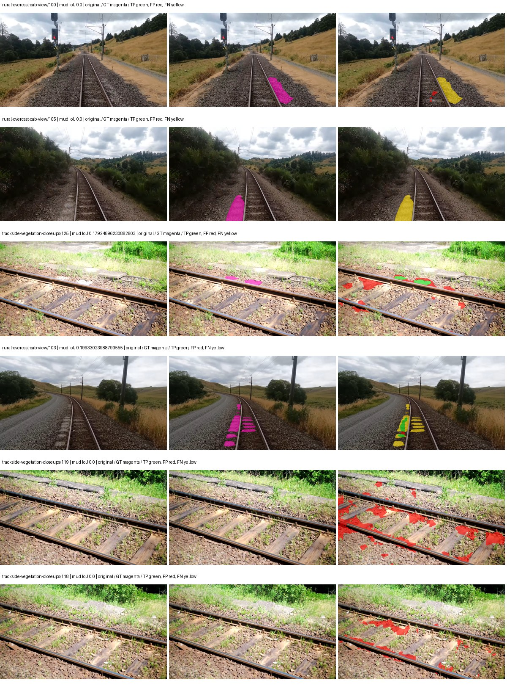
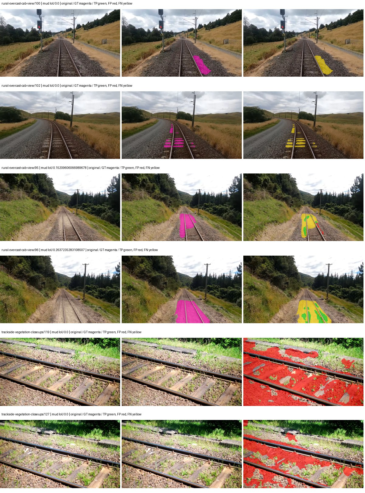
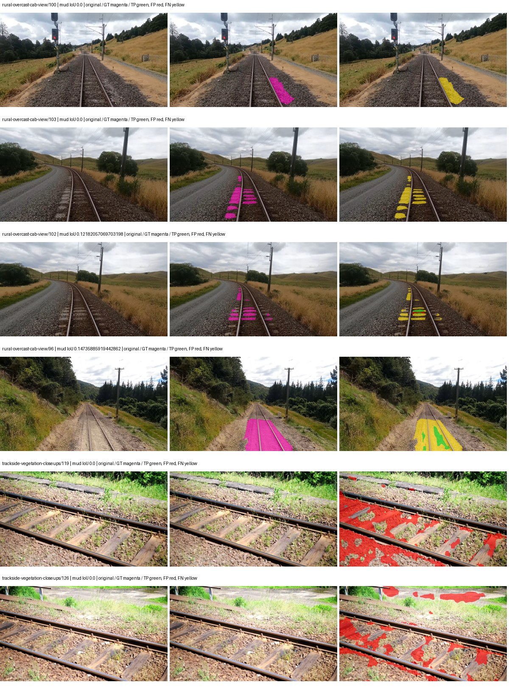
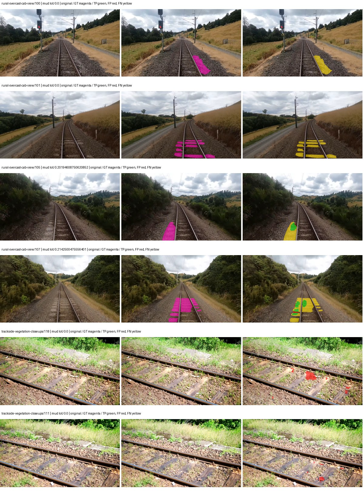
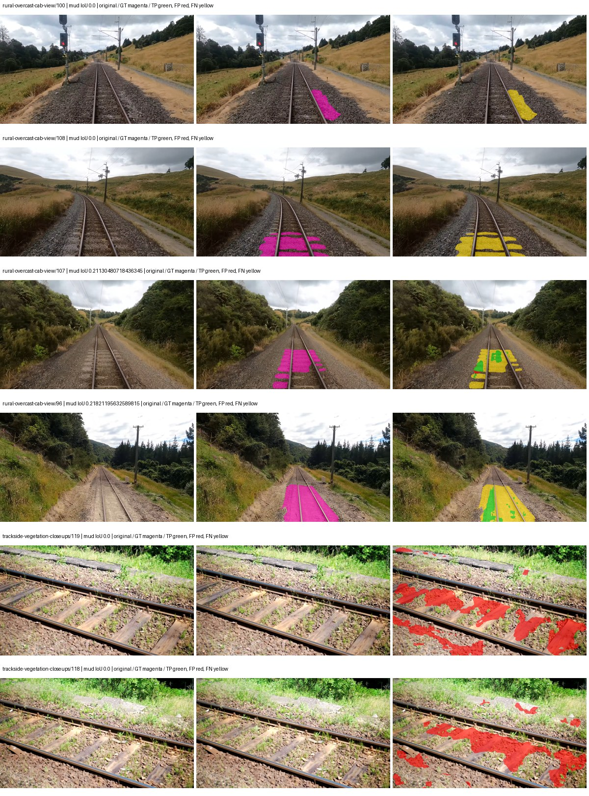

# smp_fpn_resnet50 — paul-test-rtis

[RTIS comparison](../../README.md) · [Full model records](record.json)

Primary selection and early stopping: **mud-pumping validation IoU**. A job is complete only after full statistics and isolated profiling are verified.

| Model | Initialization path | Seed | Status | Steps | Best step | Mud IoU (%) | Mud precision (%) | Mud recall (%) | Final mud IoU (trainer val, %) | mIoU (%) | Fixed GT-class mIoU (%) |
| --- | --- | --- | --- | --- | --- | --- | --- | --- | --- | --- | --- |
| smp_fpn_resnet50 | rtis_only | 0 | completed | 2290 | 1018 | 3.80 | 10.71 | 5.56 | 0.91 | 23.77 | 27.73 |
| smp_fpn_resnet50 | rtis_only | 1 | completed | 2290 | 1018 | 1.97 | 2.69 | 6.84 | 1.44 | 22.81 | 26.61 |
| smp_fpn_resnet50 | rtis_only | 2 | completed | 1781 | 509 | 2.09 | 3.73 | 4.54 | 0.65 | 23.04 | 24.32 |
| smp_fpn_resnet50 | cityscapes_to_rtis | 0 | completed | 3054 | 1781 | 5.75 | 47.78 | 6.13 | 4.41 | 29.28 | 34.16 |
| smp_fpn_resnet50 | cityscapes_to_rtis | 1 | training | 2849 | — | — | — | — | — | — | — |
| smp_fpn_resnet50 | cityscapes_to_rtis | 2 | collecting | 2545 | 1272 | 8.67 | 17.77 | 14.48 | 2.88 | 27.43 | 30.48 |
| smp_fpn_resnet50 | railsem19_to_rtis | 0 | training | 2649 | — | — | — | — | — | — | — |
| smp_fpn_resnet50 | railsem19_to_rtis | 1 | completed | 2036 | 763 | 2.94 | 4.33 | 8.40 | 1.99 | 40.00 | 44.45 |
| smp_fpn_resnet50 | railsem19_to_rtis | 2 | training | 2299 | — | — | — | — | — | — | — |
| smp_fpn_resnet50 | cityscapes_to_railsem19_to_rtis | 0 | collecting | 1781 | 509 | 19.83 | 59.69 | 22.89 | 12.56 | 33.66 | 35.53 |
| smp_fpn_resnet50 | cityscapes_to_railsem19_to_rtis | 1 | training | 1781 | — | — | — | — | — | — | — |
| smp_fpn_resnet50 | cityscapes_to_railsem19_to_rtis | 2 | training | 1349 | — | — | — | — | — | — | — |

Training: 220 images. Validation: 37 images. Test: 50 held out. Seeds: [0, 1, 2]. Seed variation measures optimization variability, not independent-recording uncertainty. Historical source checkpoints stay fixed across adaptation seeds.

Training code: `066afb2626398b7be59d4d19f5a0e4644fd59adc`. Split SHA-256: `71fef8292610c352da0709fe3bd030f3bcc18f97560394835f4b22826463b83d`.

## rtis_only — seed 0

Status: **completed**. Started: 2026-09-07T06:28:07.806388+00:00. Finished: 2026-09-07T06:53:53.061044+00:00.

Recipe pretrained initializer: `{"arch": "smp", "backbone_path": null, "batch_norm_momentum": null, "checkpoint": null, "classifier_path": null, "drop_path": null, "encoder_name": "resnet50", "encoder_weights": "imagenet", "head": "unified_head", "head_paths": [], "inactive_parameter_paths": [], "local_files_only": false, "lora_alpha": 32, "lora_dropout": 0.05, "lora_r": 16, "lora_targets": [], "native": null, "revision": null, "smp_arch": "FPN", "subfolder": null, "trust_remote_code": false, "tuning": "full"}`.

`rtis_only` uses the recipe initializer, which may include pretrained segmentation components. Transfer paths load the exact historical source checkpoint below and reset the classifier; they do not reset all query/decoder features.

Source checkpoint: `Recipe pretrained initialization`.

Config SHA-256: `25e17476f56cea4c4cbcc444ac84543b53fb214f12faa296d58fb1b679af46c8`. Weights used for validation: `raw`.

### Mud-pumping and aggregate quality

| Metric | Selected checkpoint | Final training validation |
| --- | --- | --- |
| Mud IoU | 3.80 | 0.91 |
| Mud precision | 10.71 | 1.18 |
| Mud recall | 5.56 | 3.87 |
| Mud Dice/F1 | 7.32 | 1.81 |
| mIoU | 23.77 | 25.94 |
| Mean accuracy | 42.03 | 38.95 |
| Mean precision | 42.16 | 42.44 |
| Mean Dice | 31.44 | 33.53 |
| Mean specificity | 98.41 | 98.66 |
| Pixel accuracy | 71.89 | 77.35 |
| Frequency-weighted IoU | 63.58 | 68.40 |
| Fixed GT-present class mIoU | 27.73 | 30.26 |
| Boundary F1 | 30.42 | 34.34 |

The selected checkpoint has independent evaluation evidence. Final values are the trainer's final validation record, not a new independent evaluation. mIoU averages classes with nonzero union, so false positives on absent classes can change its denominator. The fixed GT-class mean is supplementary and excludes absent classes; their false positives remain in the confusion matrix.

### Resource usage and timing

| Measurement | Value |
| --- | --- |
| Peak training VRAM, retained training invocation (GiB) | 8.69 |
| Peak evaluation VRAM (GiB) | 7.01 |
| Retained training invocation wall time (seconds) | 1414.59 |
| Retained training invocation GPU-hours (one GPU) | 0.39 |
| Evaluation wall time (seconds) | 11.71 |
| Full evaluation pipeline images/second | 3.16 |
| Best full-state checkpoint (MiB) | 399.34 |
| Final full-state checkpoint (MiB) | 399.33 |
| Audited periodic checkpoints removed (GiB) | 1.56 |

VRAM uses the recorded allocator high-water mark; it is not total device usage including CUDA context. Resumed jobs' retained training invocation times and peaks are **not whole-campaign totals**. Earlier invocation resource records are not reconstructed here. Evaluation throughput includes loader, sliding-window inference and metrics; it is not model-only latency/FPS. Missing measurements are shown as —, never inferred from another dataset's run.

### Standardized inference performance

Dedicated model-only profiling waits for an idle worker-locked L40S: BF16, batch 1, 1024x1024, 20 warmup and 100 CUDA-event-timed public forwards. It excludes loading, preprocessing, tiling and metrics.

| Status | Parameters | Weight MiB | FPS | p50 ms | p95 ms | Peak reserved GiB |
| --- | --- | --- | --- | --- | --- | --- |
| complete | 26118613 | 99.63 | 151.00 | 6.34 | 7.63 | 0.74 |

```json
{
  "schema_version": 1,
  "model_id": "smp_fpn_resnet50",
  "measured_at": "2026-09-07T06:53:49+00:00",
  "status": "complete",
  "benchmark_scope": "rtis_selected_checkpoint_model_only",
  "applies_to": [
    "smp_fpn_resnet50--rtis_only--seed-0"
  ],
  "source": {
    "campaign_git_sha": "066afb2626398b7be59d4d19f5a0e4644fd59adc",
    "git_dirty": false,
    "config_hash": "a14fecbfdeaa",
    "resolved_config": "/data/izadia1/projects/segmentary-runs/paul-test-rtis/mud-fullstats-v1-20260906-r2/configs/smp_fpn_resnet50--rtis_only--seed-0.yaml",
    "config_sha256": "25e17476f56cea4c4cbcc444ac84543b53fb214f12faa296d58fb1b679af46c8",
    "checkpoint_sha256": "b83691249cd7568c5abf4b9df325451d4138896db9d5cdf1ebf1d147d51d4c7e",
    "checkpoint_global_step": 1018,
    "checkpoint_bytes": 418737568,
    "checkpoint_kind": "resume checkpoint with optimizer and EMA state",
    "weights": "raw",
    "measured_checkpoint_job_id": "smp_fpn_resnet50--rtis_only--seed-0",
    "result_sha256": "b1e44e49d1988c0ef980784f35c451b51b9d05e86801401a10cc1e4bd189cae9",
    "result_git_sha": "066afb2626398b7be59d4d19f5a0e4644fd59adc",
    "result_stage": "eval:paul-test-rtis:val",
    "result_seed": 0
  },
  "hardware": {
    "gpu_name": "NVIDIA L40S",
    "gpu_uuid": "GPU-804aea8b-5f62-423e-72c6-49e1ed15c4e4",
    "logical_device": "cuda:0",
    "physical_visibility_token": "6",
    "compute_capability": [
      8,
      9
    ],
    "total_memory_bytes": 47677177856
  },
  "model": {
    "parameter_count": 26118613,
    "trainable_parameter_count": 26118613,
    "resident_parameter_bytes": 104474452,
    "parameter_dtype_counts": {
      "float32": 26118613
    }
  },
  "contract": {
    "backend": "pytorch",
    "precision": "bf16_autocast",
    "batch_size": 1,
    "input_shape_nchw": [
      1,
      3,
      1024,
      1024
    ],
    "warmup_iterations": 20,
    "measured_iterations": 100,
    "timing": "per-forward CUDA events with end-event synchronization",
    "includes_preprocessing": false,
    "includes_data_loader": false,
    "includes_sliding_window": false,
    "input_resident_on_gpu": true,
    "model_only": true,
    "entrypoint": "public model(image) dense-logits forward"
  },
  "measurements": {
    "latency": {
      "p50_ms": 6.343168020248413,
      "p95_ms": 7.632588911056518,
      "mean_ms": 6.622545599937439,
      "minimum_ms": 6.222847938537598,
      "maximum_ms": 10.657792091369629,
      "fps": 150.99933777873068,
      "raw_ms": [
        6.3303680419921875,
        6.234111785888672,
        6.2412800788879395,
        7.032832145690918,
        6.2412800788879395,
        6.237184047698975,
        6.790143966674805,
        6.2412800788879395,
        6.239232063293457,
        6.231040000915527,
        6.891520023345947,
        6.289408206939697,
        6.554624080657959,
        6.916096210479736,
        6.447103977203369,
        7.623680114746094,
        6.779903888702393,
        6.239232063293457,
        6.299647808074951,
        7.02566385269165,
        6.32422399520874,
        6.848512172698975,
        6.237184047698975,
        6.426623821258545,
        6.2412800788879395,
        6.245376110076904,
        6.234111785888672,
        6.236159801483154,
        6.223872184753418,
        6.238207817077637,
        6.246399879455566,
        6.487040042877197,
        6.2709760665893555,
        7.250944137573242,
        7.267327785491943,
        6.957056045532227,
        7.268352031707764,
        6.398975849151611,
        6.773759841918945,
        6.242303848266602,
        6.240255832672119,
        6.506495952606201,
        6.254591941833496,
        6.758399963378906,
        7.282688140869141,
        7.80185604095459,
        6.694911956787109,
        6.545407772064209,
        6.565887928009033,
        6.395904064178467,
        6.342656135559082,
        6.243328094482422,
        6.503424167633057,
        6.254591941833496,
        6.247424125671387,
        6.773759841918945,
        6.238207817077637,
        6.586368083953857,
        6.334432125091553,
        6.2412800788879395,
        6.222847938537598,
        6.238207817077637,
        6.236127853393555,
        6.236159801483154,
        6.2320637702941895,
        6.931456089019775,
        6.246399879455566,
        6.2412800788879395,
        6.247424125671387,
        6.259712219238281,
        6.240255832672119,
        6.263807773590088,
        6.249472141265869,
        6.807551860809326,
        6.790143966674805,
        6.249472141265869,
        6.236159801483154,
        6.848512172698975,
        6.386688232421875,
        6.297599792480469,
        6.311935901641846,
        9.240575790405273,
        8.374272346496582,
        6.558752059936523,
        7.395328044891357,
        6.28223991394043,
        6.6170878410339355,
        9.261055946350098,
        10.657792091369629,
        6.343679904937744,
        6.415359973907471,
        6.59657621383667,
        6.247424125671387,
        6.4481282234191895,
        7.226399898529053,
        6.410240173339844,
        6.4931840896606445,
        6.318079948425293,
        7.1045122146606445,
        6.3744001388549805
      ],
      "percentile_method": "numpy linear interpolation"
    },
    "peak_reserved_bytes": 792723456,
    "memory_kind": "pytorch_cuda_allocator_peak_reserved_excluding_context",
    "benchmark_wall_clock_s": 13.46997095271945
  },
  "started_at": "2026-09-07T06:53:35+00:00",
  "finished_at": "2026-09-07T06:53:49+00:00",
  "environment": {
    "hostname": "hdrfs-app-001",
    "python": "3.11.15",
    "platform": "Linux-5.15.0-139-generic-x86_64-with-glibc2.35",
    "torch": "2.11.0+cu128",
    "torch_cuda": "12.8",
    "cudnn": 91900,
    "driver_version": "570.133.20",
    "cuda_available": true,
    "gpu_count": 1,
    "gpu_names": [
      "NVIDIA L40S"
    ],
    "cuda_visible_devices": "6",
    "packages": {
      "segmentary": "0.1.0",
      "torch": "2.11.0+cu128",
      "torchvision": "0.26.0+cu128",
      "transformers": "5.15.0",
      "timm": "1.0.28",
      "segmentation-models-pytorch": "0.5.0",
      "albumentations": "2.0.8",
      "lightning": "2.6.5",
      "numpy": "2.4.4"
    }
  }
}
```

### Per-class validation results

| Class | GT pixels | IoU (%) | Precision (%) | Recall (%) | Dice (%) | Boundary F1 (%) |
| --- | --- | --- | --- | --- | --- | --- |
| car | 29664 | 0.00 | 0.00 | 0.00 | 0.00 | 0.00 |
| construction | 311585 | 9.95 | 10.16 | 83.26 | 18.10 | 13.64 |
| fence | 265137 | 11.83 | 17.42 | 26.93 | 21.15 | 20.69 |
| mud-pumping | 1226250 | 3.80 | 10.71 | 5.56 | 7.32 | 9.63 |
| on-rails | 0 | 0.00 | 0.00 | — | 0.00 | 0.00 |
| person | 0 | 0.00 | 0.00 | — | 0.00 | 0.00 |
| pole | 628038 | 57.59 | 64.24 | 84.77 | 73.09 | 84.41 |
| rail-embedded | 16799 | 10.39 | 72.87 | 10.81 | 18.83 | 21.60 |
| rail-raised | 2969797 | 69.01 | 85.63 | 78.05 | 81.66 | 91.00 |
| rail-track | 6323197 | 32.70 | 76.46 | 36.36 | 49.28 | 48.12 |
| road | 1048831 | 18.33 | 28.63 | 33.76 | 30.98 | 22.46 |
| sidewalk | 1297367 | 15.00 | 23.90 | 28.73 | 26.09 | 14.50 |
| sky | 19121606 | 95.24 | 99.37 | 95.82 | 97.56 | 85.39 |
| standing-water | 95802 | 0.67 | 0.68 | 63.84 | 1.34 | 1.60 |
| terrain | 39239306 | 67.18 | 85.25 | 76.01 | 80.37 | 53.37 |
| trackbed | 10643081 | 62.36 | 69.75 | 85.48 | 76.82 | 60.86 |
| traffic-light | 19510 | 16.44 | 89.90 | 16.75 | 28.23 | 39.78 |
| traffic-sign | 13285 | 19.74 | 73.43 | 21.26 | 32.97 | 30.56 |
| tram-track | 56179 | 0.00 | 0.00 | 0.00 | 0.00 | 0.00 |
| truck | 0 | 0.00 | 0.00 | — | 0.00 | 0.00 |
| vegetation-overgrowth | 5901821 | 8.90 | 76.92 | 9.14 | 16.34 | 41.22 |

### Full-run accounting

| Measurement | Value |
| --- | --- |
| Full GPU-reserved wall seconds, all recorded worker attempts | 1545.26 |
| Full reserved GPU-hours | 0.43 |
| Whole-run timing complete | True |

| Phase | Wall seconds including failed attempts |
| --- | --- |
| training | 1421.36 |
| diagnostics | 81.43 |
| performance | 20.72 |

GPU-reserved time includes model loading, training, validation, collection, profiling, checkpoint I/O and orchestration while the worker owns one GPU. It is not GPU kernel-active time. Phase timings and sampled device memory/power/utilization are retained separately; sampled device memory is not the allocator high-water mark.

### Train/validation and raw/EMA diagnostics

| Checkpoint / weights / split | Images | Mud IoU (%) | Mud precision (%) | Mud recall (%) |
| --- | --- | --- | --- | --- |
| best-auto-train / raw | 220 | 90.30 | 97.58 | 92.37 |
| best-auto-val / raw | 37 | 3.80 | 10.71 | 5.56 |
| best-alternate-val / ema | 37 | 0.52 | 1.23 | 0.90 |
| final-auto-val / raw | 37 | 0.91 | 1.18 | 3.86 |

Train uses the evaluation transform without augmentation. Compare mud train/validation metrics for the same selected weights. Alternate EMA on running-stat BatchNorm is explicitly uncalibrated and is diagnostic only. Score-threshold curves use uncalibrated normalized scores and are pixel-level diagnostics, not event detection rates or a selected deployment operating point.

### Downloadable evidence

- best-auto-train: [per-image.csv](rtis_only--seed-0/best-auto-train/per-image.csv) · [per-image-confusion.json.gz](rtis_only--seed-0/best-auto-train/per-image-confusion.json.gz) · [groups.json](rtis_only--seed-0/best-auto-train/groups.json) · [mud-score-curves.json](rtis_only--seed-0/best-auto-train/mud-score-curves.json)
- best-auto-val: [per-image.csv](rtis_only--seed-0/best-auto-val/per-image.csv) · [per-image-confusion.json.gz](rtis_only--seed-0/best-auto-val/per-image-confusion.json.gz) · [groups.json](rtis_only--seed-0/best-auto-val/groups.json) · [mud-score-curves.json](rtis_only--seed-0/best-auto-val/mud-score-curves.json) · [examples.jpg](rtis_only--seed-0/best-auto-val/examples.jpg)
- best-alternate-val: [per-image.csv](rtis_only--seed-0/best-alternate-val/per-image.csv) · [per-image-confusion.json.gz](rtis_only--seed-0/best-alternate-val/per-image-confusion.json.gz) · [groups.json](rtis_only--seed-0/best-alternate-val/groups.json) · [mud-score-curves.json](rtis_only--seed-0/best-alternate-val/mud-score-curves.json)
- final-auto-val: [per-image.csv](rtis_only--seed-0/final-auto-val/per-image.csv) · [per-image-confusion.json.gz](rtis_only--seed-0/final-auto-val/per-image-confusion.json.gz) · [groups.json](rtis_only--seed-0/final-auto-val/groups.json) · [mud-score-curves.json](rtis_only--seed-0/final-auto-val/mud-score-curves.json)
- resources: [telemetry.csv](rtis_only--seed-0/resources/telemetry.csv)



Examples are two lowest and two highest mud-IoU positive images, plus up to two negative images with the most false-positive mud pixels. They are targeted diagnostic examples, not random samples. Green: true positive; red: false positive; yellow: false negative. Full predictions remain on HDRFS.

### Validation tracking

| Logged step | Overall mIoU (%) | Mud IoU (%) |
| --- | --- | --- |
| 254 | 22.10 | 0.34 |
| 508 | 19.98 | 0.32 |
| 763 | 23.26 | 0.51 |
| 1017 | 23.77 | 3.79 |
| 1272 | 25.10 | 0.26 |
| 1527 | 25.25 | 0.66 |
| 1781 | 27.68 | 0.71 |
| 2036 | 24.93 | 0.41 |
| 2290 | 25.94 | 0.91 |

All retained scalar curves, including training loss and per-class IoU, are in record.json. Observed best mud on a curve is not necessarily a retained checkpoint: the pilot saved its selection-metric-best and final checkpoints. Step logging and checkpoint global_step may differ by one.

### Stopping and checkpoint provenance

```json
{
  "stopping": {
    "actual_steps": 2290,
    "maximum_steps": 4000,
    "min_delta": 0.001,
    "monitor": "val_iou/mud-pumping",
    "patience": 5,
    "reason": "validation_plateau"
  },
  "checkpoints": {
    "best": {
      "path": "/data/izadia1/projects/segmentary-runs/paul-test-rtis/mud-fullstats-v1-20260906-r2/future-runs/smp_fpn_resnet50--rtis_only--seed-0_seed0/rtis/best.ckpt",
      "sha256": "b83691249cd7568c5abf4b9df325451d4138896db9d5cdf1ebf1d147d51d4c7e",
      "global_step": 1018,
      "bytes": 418737568
    },
    "final": {
      "path": "/data/izadia1/projects/segmentary-runs/paul-test-rtis/mud-fullstats-v1-20260906-r2/future-runs/smp_fpn_resnet50--rtis_only--seed-0_seed0/rtis/last.ckpt",
      "sha256": "559da70ef763976b372123eef032f3fed3bd995866e6157ed27b3e27881a9b09",
      "global_step": 2290,
      "bytes": 418725920
    }
  },
  "cleanup_error": null
}
```

### Resolved training, initialization and evaluation settings

The optimizer block is the base configuration. Stage LR scales are applied at runtime, and stage warmup is capped at min(base warmup, floor(stage budget / 10), stage budget - 1): 400 steps for this 4,000-step pilot. Model-internal native input grids may differ from augmentation crops (EoMT uses its 640 grid).

```json
{
  "name": "smp_fpn_resnet50--rtis_only--seed-0",
  "model": {
    "arch": "smp",
    "checkpoint": null,
    "tuning": "full",
    "head": "unified_head",
    "lora_r": 16,
    "lora_alpha": 32,
    "lora_dropout": 0.05,
    "lora_targets": [],
    "drop_path": null,
    "revision": null,
    "subfolder": null,
    "local_files_only": false,
    "trust_remote_code": false,
    "backbone_path": null,
    "head_paths": [],
    "classifier_path": null,
    "inactive_parameter_paths": [],
    "smp_arch": "FPN",
    "encoder_name": "resnet50",
    "encoder_weights": "imagenet",
    "native": null,
    "batch_norm_momentum": null
  },
  "space": "paul-test-rtis",
  "taxonomy_root": "/data/izadia1/projects/segmentary-rtis-fullstats-066afb2/taxonomy",
  "output_root": "/data/izadia1/projects/segmentary-runs/paul-test-rtis/mud-fullstats-v1-20260906-r2/future-runs",
  "optim": {
    "backbone_lr": 0.0001,
    "head_lr_mult": 10.0,
    "weight_decay": 0.05,
    "llrd": 1.0,
    "warmup_iters": 1500,
    "warmup_ratio": 1e-06,
    "poly_power": 0.9,
    "min_lr_ratio": 0.0,
    "betas": [
      0.9,
      0.999
    ],
    "grad_clip": 1.0
  },
  "train": {
    "iters": 4000,
    "batch_size": 2,
    "accum": 8,
    "num_workers": 2,
    "precision": "bf16-mixed",
    "ema_decay": 0.9998,
    "val_every": 250,
    "ckpt_every": 500,
    "selection_metric": "val_iou/mud-pumping",
    "early_stopping_patience": 5,
    "early_stopping_min_delta": 0.001,
    "seed": 0,
    "devices": 1
  },
  "eval": {
    "sliding_window": true,
    "window": [
      1024,
      1024
    ],
    "stride": [
      768,
      768
    ],
    "batch_size": 1,
    "num_workers": 2,
    "tta_scales": [],
    "tta_flip": false,
    "threshold": 0.5,
    "boundary_tolerance_frac": 0.0075,
    "save_confusion": true
  },
  "loss": {
    "task": "multiclass",
    "activation": "auto",
    "terms": [],
    "aux": "none",
    "aux_weight": 0.0,
    "ce_weight": 1.0,
    "label_smoothing": 0.0,
    "class_weights": null,
    "query": null
  },
  "aug": {
    "crop": [
      1024,
      1024
    ],
    "scale_min": 0.5,
    "scale_max": 2.0,
    "hflip_p": 0.5,
    "color_jitter_p": 0.5,
    "brightness": 0.25,
    "contrast": 0.25,
    "saturation": 0.25,
    "hue": 0.05
  },
  "stages": [
    {
      "name": "rtis",
      "data": [
        {
          "name": "paul-test-rtis",
          "root": "/data/izadia1/datasets/paul-test-rtis",
          "variant": null,
          "split_file": "splits.json",
          "train_split": "train",
          "val_split": "val",
          "limit": null,
          "loader": "folder",
          "mapping": "paul-test-rtis",
          "loader_options": {
            "require_groups": true
          }
        }
      ],
      "iters": null,
      "lr_scale": 1.0,
      "head_group_lr_scale": 1.0,
      "init_from": "pretrained",
      "reset_head": false,
      "freeze": null,
      "sample_weights": null
    }
  ]
}
```

### Hardware and software provenance

```json
{
  "training": {
    "cuda_available": true,
    "cuda_visible_devices": "6",
    "cudnn": 91900,
    "driver_version": "570.133.20",
    "gpu_count": 1,
    "gpu_names": [
      "NVIDIA L40S"
    ],
    "hostname": "hdrfs-app-001",
    "input_normalization": {
      "channel_order": "rgb",
      "mean": [
        0.485,
        0.456,
        0.406
      ],
      "source": "smp_encoder_settings",
      "std": [
        0.229,
        0.224,
        0.225
      ]
    },
    "model_origins": [
      {
        "hf_commit": null,
        "hf_name_or_path": null,
        "module": "model",
        "timm_pretrained": {}
      }
    ],
    "model_parameter_count": 26118613,
    "packages": {
      "albumentations": "2.0.8",
      "lightning": "2.6.5",
      "numpy": "2.4.4",
      "segmentary": "0.1.0",
      "segmentation-models-pytorch": "0.5.0",
      "timm": "1.0.28",
      "torch": "2.11.0+cu128",
      "torchvision": "0.26.0+cu128",
      "transformers": "5.15.0"
    },
    "platform": "Linux-5.15.0-139-generic-x86_64-with-glibc2.35",
    "python": "3.11.15",
    "torch": "2.11.0+cu128",
    "torch_cuda": "12.8",
    "trainable_parameter_count": 26118613,
    "training_stop": {
      "actual_steps": 2290,
      "maximum_steps": 4000,
      "min_delta": 0.001,
      "monitor": "val_iou/mud-pumping",
      "patience": 5,
      "reason": "validation_plateau"
    },
    "validation_weights": "raw"
  },
  "evaluation": {
    "cuda_available": true,
    "cuda_visible_devices": "6",
    "cudnn": 91900,
    "driver_version": "570.133.20",
    "gpu_count": 1,
    "gpu_names": [
      "NVIDIA L40S"
    ],
    "hostname": "hdrfs-app-001",
    "input_normalization": {
      "channel_order": "rgb",
      "mean": [
        0.485,
        0.456,
        0.406
      ],
      "source": "smp_encoder_settings",
      "std": [
        0.229,
        0.224,
        0.225
      ]
    },
    "packages": {
      "albumentations": "2.0.8",
      "lightning": "2.6.5",
      "numpy": "2.4.4",
      "segmentary": "0.1.0",
      "segmentation-models-pytorch": "0.5.0",
      "timm": "1.0.28",
      "torch": "2.11.0+cu128",
      "torchvision": "0.26.0+cu128",
      "transformers": "5.15.0"
    },
    "platform": "Linux-5.15.0-139-generic-x86_64-with-glibc2.35",
    "python": "3.11.15",
    "torch": "2.11.0+cu128",
    "torch_cuda": "12.8"
  }
}
```

## rtis_only — seed 1

Status: **completed**. Started: 2026-09-07T06:28:52.975057+00:00. Finished: 2026-09-07T06:55:19.073731+00:00.

Recipe pretrained initializer: `{"arch": "smp", "backbone_path": null, "batch_norm_momentum": null, "checkpoint": null, "classifier_path": null, "drop_path": null, "encoder_name": "resnet50", "encoder_weights": "imagenet", "head": "unified_head", "head_paths": [], "inactive_parameter_paths": [], "local_files_only": false, "lora_alpha": 32, "lora_dropout": 0.05, "lora_r": 16, "lora_targets": [], "native": null, "revision": null, "smp_arch": "FPN", "subfolder": null, "trust_remote_code": false, "tuning": "full"}`.

`rtis_only` uses the recipe initializer, which may include pretrained segmentation components. Transfer paths load the exact historical source checkpoint below and reset the classifier; they do not reset all query/decoder features.

Source checkpoint: `Recipe pretrained initialization`.

Config SHA-256: `4b53581a7437f72aeb509664959fec291e2cf16b39ec00f0752120d20e4a35bb`. Weights used for validation: `raw`.

### Mud-pumping and aggregate quality

| Metric | Selected checkpoint | Final training validation |
| --- | --- | --- |
| Mud IoU | 1.97 | 1.44 |
| Mud precision | 2.69 | 1.95 |
| Mud recall | 6.84 | 5.22 |
| Mud Dice/F1 | 3.86 | 2.84 |
| mIoU | 22.81 | 29.40 |
| Mean accuracy | 38.32 | 43.20 |
| Mean precision | 43.18 | 51.92 |
| Mean Dice | 29.79 | 38.70 |
| Mean specificity | 98.36 | 98.93 |
| Pixel accuracy | 70.54 | 81.80 |
| Frequency-weighted IoU | 62.38 | 73.37 |
| Fixed GT-present class mIoU | 26.61 | 34.30 |
| Boundary F1 | 30.76 | 36.05 |

The selected checkpoint has independent evaluation evidence. Final values are the trainer's final validation record, not a new independent evaluation. mIoU averages classes with nonzero union, so false positives on absent classes can change its denominator. The fixed GT-class mean is supplementary and excludes absent classes; their false positives remain in the confusion matrix.

### Resource usage and timing

| Measurement | Value |
| --- | --- |
| Peak training VRAM, retained training invocation (GiB) | 8.69 |
| Peak evaluation VRAM (GiB) | 7.01 |
| Retained training invocation wall time (seconds) | 1453.15 |
| Retained training invocation GPU-hours (one GPU) | 0.40 |
| Evaluation wall time (seconds) | 11.98 |
| Full evaluation pipeline images/second | 3.09 |
| Best full-state checkpoint (MiB) | 399.34 |
| Final full-state checkpoint (MiB) | 399.33 |
| Audited periodic checkpoints removed (GiB) | 1.56 |

VRAM uses the recorded allocator high-water mark; it is not total device usage including CUDA context. Resumed jobs' retained training invocation times and peaks are **not whole-campaign totals**. Earlier invocation resource records are not reconstructed here. Evaluation throughput includes loader, sliding-window inference and metrics; it is not model-only latency/FPS. Missing measurements are shown as —, never inferred from another dataset's run.

### Standardized inference performance

Dedicated model-only profiling waits for an idle worker-locked L40S: BF16, batch 1, 1024x1024, 20 warmup and 100 CUDA-event-timed public forwards. It excludes loading, preprocessing, tiling and metrics.

| Status | Parameters | Weight MiB | FPS | p50 ms | p95 ms | Peak reserved GiB |
| --- | --- | --- | --- | --- | --- | --- |
| complete | 26118613 | 99.63 | 152.48 | 6.30 | 8.05 | 0.74 |

```json
{
  "schema_version": 1,
  "model_id": "smp_fpn_resnet50",
  "measured_at": "2026-09-07T06:55:15+00:00",
  "status": "complete",
  "benchmark_scope": "rtis_selected_checkpoint_model_only",
  "applies_to": [
    "smp_fpn_resnet50--rtis_only--seed-1"
  ],
  "source": {
    "campaign_git_sha": "066afb2626398b7be59d4d19f5a0e4644fd59adc",
    "git_dirty": false,
    "config_hash": "da319d9499ce",
    "resolved_config": "/data/izadia1/projects/segmentary-runs/paul-test-rtis/mud-fullstats-v1-20260906-r2/configs/smp_fpn_resnet50--rtis_only--seed-1.yaml",
    "config_sha256": "4b53581a7437f72aeb509664959fec291e2cf16b39ec00f0752120d20e4a35bb",
    "checkpoint_sha256": "e0bd374a4d81fdeec237120ab9b1efab8dfdc77ff396a250e92f26c1dd360eed",
    "checkpoint_global_step": 1018,
    "checkpoint_bytes": 418737568,
    "checkpoint_kind": "resume checkpoint with optimizer and EMA state",
    "weights": "raw",
    "measured_checkpoint_job_id": "smp_fpn_resnet50--rtis_only--seed-1",
    "result_sha256": "3813e3a3e32fc62e9e295918f098acb7562ba4f2956c557f698eacf44dd4f4ef",
    "result_git_sha": "066afb2626398b7be59d4d19f5a0e4644fd59adc",
    "result_stage": "eval:paul-test-rtis:val",
    "result_seed": 1
  },
  "hardware": {
    "gpu_name": "NVIDIA L40S",
    "gpu_uuid": "GPU-2f8008a1-9b67-11f6-987b-b393a672322c",
    "logical_device": "cuda:0",
    "physical_visibility_token": "3",
    "compute_capability": [
      8,
      9
    ],
    "total_memory_bytes": 47677177856
  },
  "model": {
    "parameter_count": 26118613,
    "trainable_parameter_count": 26118613,
    "resident_parameter_bytes": 104474452,
    "parameter_dtype_counts": {
      "float32": 26118613
    }
  },
  "contract": {
    "backend": "pytorch",
    "precision": "bf16_autocast",
    "batch_size": 1,
    "input_shape_nchw": [
      1,
      3,
      1024,
      1024
    ],
    "warmup_iterations": 20,
    "measured_iterations": 100,
    "timing": "per-forward CUDA events with end-event synchronization",
    "includes_preprocessing": false,
    "includes_data_loader": false,
    "includes_sliding_window": false,
    "input_resident_on_gpu": true,
    "model_only": true,
    "entrypoint": "public model(image) dense-logits forward"
  },
  "measurements": {
    "latency": {
      "p50_ms": 6.304719924926758,
      "p95_ms": 8.053035449981689,
      "mean_ms": 6.558438396453857,
      "minimum_ms": 6.177792072296143,
      "maximum_ms": 9.049087524414062,
      "fps": 152.47532103689488,
      "raw_ms": [
        7.335936069488525,
        6.737919807434082,
        6.372223854064941,
        6.313983917236328,
        6.326272010803223,
        6.320127964019775,
        6.327424049377441,
        6.578176021575928,
        6.956031799316406,
        6.944767951965332,
        7.878655910491943,
        8.071167945861816,
        9.049087524414062,
        6.421504020690918,
        6.250432014465332,
        6.660096168518066,
        7.816192150115967,
        7.92464017868042,
        8.058719635009766,
        8.547327995300293,
        8.193023681640625,
        7.515007972717285,
        7.592959880828857,
        6.369279861450195,
        7.394303798675537,
        8.052736282348633,
        8.044544219970703,
        6.385663986206055,
        6.412288188934326,
        6.390783786773682,
        6.453248023986816,
        6.796288013458252,
        6.356095790863037,
        6.308864116668701,
        6.400000095367432,
        6.268928050994873,
        6.3056960105896,
        6.294528007507324,
        6.400000095367432,
        6.478847980499268,
        6.253568172454834,
        6.190080165863037,
        6.190080165863037,
        6.1972479820251465,
        6.1921281814575195,
        6.464511871337891,
        6.206463813781738,
        6.190080165863037,
        6.177792072296143,
        6.187007904052734,
        6.231040000915527,
        6.244351863861084,
        6.191103935241699,
        6.217728137969971,
        6.21670389175415,
        6.237184047698975,
        6.23308801651001,
        6.273024082183838,
        6.261760234832764,
        6.3897600173950195,
        6.303743839263916,
        6.251584053039551,
        6.205440044403076,
        6.348800182342529,
        6.209536075592041,
        6.201344013214111,
        6.362112045288086,
        6.194143772125244,
        6.231040000915527,
        6.178815841674805,
        6.194143772125244,
        6.441984176635742,
        6.210559844970703,
        6.194176197052002,
        6.178815841674805,
        6.200319766998291,
        6.277120113372803,
        6.205440044403076,
        6.207359790802002,
        6.185023784637451,
        6.673408031463623,
        6.410240173339844,
        6.37337589263916,
        6.694911956787109,
        6.28326416015625,
        6.285312175750732,
        6.3354878425598145,
        6.277120113372803,
        6.2259202003479,
        6.235136032104492,
        6.184959888458252,
        6.312960147857666,
        6.9416961669921875,
        6.4634881019592285,
        6.28223991394043,
        6.234111785888672,
        6.199264049530029,
        6.2218241691589355,
        6.185984134674072,
        6.193151950836182
      ],
      "percentile_method": "numpy linear interpolation"
    },
    "peak_reserved_bytes": 792723456,
    "memory_kind": "pytorch_cuda_allocator_peak_reserved_excluding_context",
    "benchmark_wall_clock_s": 13.63183245062828
  },
  "started_at": "2026-09-07T06:55:01+00:00",
  "finished_at": "2026-09-07T06:55:15+00:00",
  "environment": {
    "hostname": "hdrfs-app-001",
    "python": "3.11.15",
    "platform": "Linux-5.15.0-139-generic-x86_64-with-glibc2.35",
    "torch": "2.11.0+cu128",
    "torch_cuda": "12.8",
    "cudnn": 91900,
    "driver_version": "570.133.20",
    "cuda_available": true,
    "gpu_count": 1,
    "gpu_names": [
      "NVIDIA L40S"
    ],
    "cuda_visible_devices": "3",
    "packages": {
      "segmentary": "0.1.0",
      "torch": "2.11.0+cu128",
      "torchvision": "0.26.0+cu128",
      "transformers": "5.15.0",
      "timm": "1.0.28",
      "segmentation-models-pytorch": "0.5.0",
      "albumentations": "2.0.8",
      "lightning": "2.6.5",
      "numpy": "2.4.4"
    }
  }
}
```

### Per-class validation results

| Class | GT pixels | IoU (%) | Precision (%) | Recall (%) | Dice (%) | Boundary F1 (%) |
| --- | --- | --- | --- | --- | --- | --- |
| car | 29664 | 1.64 | 98.98 | 1.64 | 3.23 | 29.74 |
| construction | 311585 | 4.54 | 4.60 | 79.07 | 8.69 | 18.32 |
| fence | 265137 | 12.84 | 30.01 | 18.33 | 22.76 | 29.27 |
| mud-pumping | 1226250 | 1.97 | 2.69 | 6.84 | 3.86 | 4.15 |
| on-rails | 0 | 0.00 | 0.00 | — | 0.00 | 0.00 |
| person | 0 | 0.00 | 0.00 | — | 0.00 | 0.00 |
| pole | 628038 | 61.64 | 75.35 | 77.20 | 76.26 | 86.52 |
| rail-embedded | 16799 | 0.00 | 0.00 | 0.00 | 0.00 | 0.00 |
| rail-raised | 2969797 | 71.43 | 80.44 | 86.45 | 83.34 | 89.15 |
| rail-track | 6323197 | 37.36 | 59.53 | 50.08 | 54.40 | 49.45 |
| road | 1048831 | 1.51 | 2.06 | 5.32 | 2.97 | 5.85 |
| sidewalk | 1297367 | 10.22 | 27.34 | 14.03 | 18.54 | 6.59 |
| sky | 19121606 | 79.59 | 99.33 | 80.02 | 88.63 | 74.10 |
| standing-water | 95802 | 1.21 | 1.23 | 45.70 | 2.40 | 3.24 |
| terrain | 39239306 | 72.82 | 87.54 | 81.24 | 84.27 | 57.69 |
| trackbed | 10643081 | 58.15 | 69.68 | 77.84 | 73.54 | 57.67 |
| traffic-light | 19510 | 31.18 | 92.89 | 31.94 | 47.53 | 50.18 |
| traffic-sign | 13285 | 23.26 | 84.69 | 24.28 | 37.74 | 46.30 |
| tram-track | 56179 | 0.00 | 0.00 | 0.00 | 0.00 | 0.00 |
| truck | 0 | 0.00 | 0.00 | — | 0.00 | 0.00 |
| vegetation-overgrowth | 5901821 | 9.60 | 90.40 | 9.70 | 17.52 | 37.68 |

### Full-run accounting

| Measurement | Value |
| --- | --- |
| Full GPU-reserved wall seconds, all recorded worker attempts | 1586.10 |
| Full reserved GPU-hours | 0.44 |
| Whole-run timing complete | True |

| Phase | Wall seconds including failed attempts |
| --- | --- |
| training | 1460.36 |
| diagnostics | 81.32 |
| performance | 20.86 |

GPU-reserved time includes model loading, training, validation, collection, profiling, checkpoint I/O and orchestration while the worker owns one GPU. It is not GPU kernel-active time. Phase timings and sampled device memory/power/utilization are retained separately; sampled device memory is not the allocator high-water mark.

### Train/validation and raw/EMA diagnostics

| Checkpoint / weights / split | Images | Mud IoU (%) | Mud precision (%) | Mud recall (%) |
| --- | --- | --- | --- | --- |
| best-auto-train / raw | 220 | 91.31 | 93.59 | 97.40 |
| best-auto-val / raw | 37 | 1.97 | 2.69 | 6.84 |
| best-alternate-val / ema | 37 | 0.53 | 0.78 | 1.65 |
| final-auto-val / raw | 37 | 1.44 | 1.95 | 5.21 |

Train uses the evaluation transform without augmentation. Compare mud train/validation metrics for the same selected weights. Alternate EMA on running-stat BatchNorm is explicitly uncalibrated and is diagnostic only. Score-threshold curves use uncalibrated normalized scores and are pixel-level diagnostics, not event detection rates or a selected deployment operating point.

### Downloadable evidence

- best-auto-train: [per-image.csv](rtis_only--seed-1/best-auto-train/per-image.csv) · [per-image-confusion.json.gz](rtis_only--seed-1/best-auto-train/per-image-confusion.json.gz) · [groups.json](rtis_only--seed-1/best-auto-train/groups.json) · [mud-score-curves.json](rtis_only--seed-1/best-auto-train/mud-score-curves.json)
- best-auto-val: [per-image.csv](rtis_only--seed-1/best-auto-val/per-image.csv) · [per-image-confusion.json.gz](rtis_only--seed-1/best-auto-val/per-image-confusion.json.gz) · [groups.json](rtis_only--seed-1/best-auto-val/groups.json) · [mud-score-curves.json](rtis_only--seed-1/best-auto-val/mud-score-curves.json) · [examples.jpg](rtis_only--seed-1/best-auto-val/examples.jpg)
- best-alternate-val: [per-image.csv](rtis_only--seed-1/best-alternate-val/per-image.csv) · [per-image-confusion.json.gz](rtis_only--seed-1/best-alternate-val/per-image-confusion.json.gz) · [groups.json](rtis_only--seed-1/best-alternate-val/groups.json) · [mud-score-curves.json](rtis_only--seed-1/best-alternate-val/mud-score-curves.json)
- final-auto-val: [per-image.csv](rtis_only--seed-1/final-auto-val/per-image.csv) · [per-image-confusion.json.gz](rtis_only--seed-1/final-auto-val/per-image-confusion.json.gz) · [groups.json](rtis_only--seed-1/final-auto-val/groups.json) · [mud-score-curves.json](rtis_only--seed-1/final-auto-val/mud-score-curves.json)
- resources: [telemetry.csv](rtis_only--seed-1/resources/telemetry.csv)



Examples are two lowest and two highest mud-IoU positive images, plus up to two negative images with the most false-positive mud pixels. They are targeted diagnostic examples, not random samples. Green: true positive; red: false positive; yellow: false negative. Full predictions remain on HDRFS.

### Validation tracking

| Logged step | Overall mIoU (%) | Mud IoU (%) |
| --- | --- | --- |
| 254 | 21.93 | 0.37 |
| 508 | 22.90 | 0.82 |
| 763 | 23.56 | 0.97 |
| 1017 | 22.81 | 1.97 |
| 1272 | 26.47 | 0.90 |
| 1527 | 26.60 | 0.76 |
| 1781 | 26.15 | 0.54 |
| 2036 | 27.54 | 0.54 |
| 2290 | 29.40 | 1.44 |

All retained scalar curves, including training loss and per-class IoU, are in record.json. Observed best mud on a curve is not necessarily a retained checkpoint: the pilot saved its selection-metric-best and final checkpoints. Step logging and checkpoint global_step may differ by one.

### Stopping and checkpoint provenance

```json
{
  "stopping": {
    "actual_steps": 2290,
    "maximum_steps": 4000,
    "min_delta": 0.001,
    "monitor": "val_iou/mud-pumping",
    "patience": 5,
    "reason": "validation_plateau"
  },
  "checkpoints": {
    "best": {
      "path": "/data/izadia1/projects/segmentary-runs/paul-test-rtis/mud-fullstats-v1-20260906-r2/future-runs/smp_fpn_resnet50--rtis_only--seed-1_seed1/rtis/best.ckpt",
      "sha256": "e0bd374a4d81fdeec237120ab9b1efab8dfdc77ff396a250e92f26c1dd360eed",
      "global_step": 1018,
      "bytes": 418737568
    },
    "final": {
      "path": "/data/izadia1/projects/segmentary-runs/paul-test-rtis/mud-fullstats-v1-20260906-r2/future-runs/smp_fpn_resnet50--rtis_only--seed-1_seed1/rtis/last.ckpt",
      "sha256": "80d32eb4513f477a973d23382e217e712d5b9231bbfbe36262d9ab083d622858",
      "global_step": 2290,
      "bytes": 418725920
    }
  },
  "cleanup_error": null
}
```

### Resolved training, initialization and evaluation settings

The optimizer block is the base configuration. Stage LR scales are applied at runtime, and stage warmup is capped at min(base warmup, floor(stage budget / 10), stage budget - 1): 400 steps for this 4,000-step pilot. Model-internal native input grids may differ from augmentation crops (EoMT uses its 640 grid).

```json
{
  "name": "smp_fpn_resnet50--rtis_only--seed-1",
  "model": {
    "arch": "smp",
    "checkpoint": null,
    "tuning": "full",
    "head": "unified_head",
    "lora_r": 16,
    "lora_alpha": 32,
    "lora_dropout": 0.05,
    "lora_targets": [],
    "drop_path": null,
    "revision": null,
    "subfolder": null,
    "local_files_only": false,
    "trust_remote_code": false,
    "backbone_path": null,
    "head_paths": [],
    "classifier_path": null,
    "inactive_parameter_paths": [],
    "smp_arch": "FPN",
    "encoder_name": "resnet50",
    "encoder_weights": "imagenet",
    "native": null,
    "batch_norm_momentum": null
  },
  "space": "paul-test-rtis",
  "taxonomy_root": "/data/izadia1/projects/segmentary-rtis-fullstats-066afb2/taxonomy",
  "output_root": "/data/izadia1/projects/segmentary-runs/paul-test-rtis/mud-fullstats-v1-20260906-r2/future-runs",
  "optim": {
    "backbone_lr": 0.0001,
    "head_lr_mult": 10.0,
    "weight_decay": 0.05,
    "llrd": 1.0,
    "warmup_iters": 1500,
    "warmup_ratio": 1e-06,
    "poly_power": 0.9,
    "min_lr_ratio": 0.0,
    "betas": [
      0.9,
      0.999
    ],
    "grad_clip": 1.0
  },
  "train": {
    "iters": 4000,
    "batch_size": 2,
    "accum": 8,
    "num_workers": 2,
    "precision": "bf16-mixed",
    "ema_decay": 0.9998,
    "val_every": 250,
    "ckpt_every": 500,
    "selection_metric": "val_iou/mud-pumping",
    "early_stopping_patience": 5,
    "early_stopping_min_delta": 0.001,
    "seed": 1,
    "devices": 1
  },
  "eval": {
    "sliding_window": true,
    "window": [
      1024,
      1024
    ],
    "stride": [
      768,
      768
    ],
    "batch_size": 1,
    "num_workers": 2,
    "tta_scales": [],
    "tta_flip": false,
    "threshold": 0.5,
    "boundary_tolerance_frac": 0.0075,
    "save_confusion": true
  },
  "loss": {
    "task": "multiclass",
    "activation": "auto",
    "terms": [],
    "aux": "none",
    "aux_weight": 0.0,
    "ce_weight": 1.0,
    "label_smoothing": 0.0,
    "class_weights": null,
    "query": null
  },
  "aug": {
    "crop": [
      1024,
      1024
    ],
    "scale_min": 0.5,
    "scale_max": 2.0,
    "hflip_p": 0.5,
    "color_jitter_p": 0.5,
    "brightness": 0.25,
    "contrast": 0.25,
    "saturation": 0.25,
    "hue": 0.05
  },
  "stages": [
    {
      "name": "rtis",
      "data": [
        {
          "name": "paul-test-rtis",
          "root": "/data/izadia1/datasets/paul-test-rtis",
          "variant": null,
          "split_file": "splits.json",
          "train_split": "train",
          "val_split": "val",
          "limit": null,
          "loader": "folder",
          "mapping": "paul-test-rtis",
          "loader_options": {
            "require_groups": true
          }
        }
      ],
      "iters": null,
      "lr_scale": 1.0,
      "head_group_lr_scale": 1.0,
      "init_from": "pretrained",
      "reset_head": false,
      "freeze": null,
      "sample_weights": null
    }
  ]
}
```

### Hardware and software provenance

```json
{
  "training": {
    "cuda_available": true,
    "cuda_visible_devices": "3",
    "cudnn": 91900,
    "driver_version": "570.133.20",
    "gpu_count": 1,
    "gpu_names": [
      "NVIDIA L40S"
    ],
    "hostname": "hdrfs-app-001",
    "input_normalization": {
      "channel_order": "rgb",
      "mean": [
        0.485,
        0.456,
        0.406
      ],
      "source": "smp_encoder_settings",
      "std": [
        0.229,
        0.224,
        0.225
      ]
    },
    "model_origins": [
      {
        "hf_commit": null,
        "hf_name_or_path": null,
        "module": "model",
        "timm_pretrained": {}
      }
    ],
    "model_parameter_count": 26118613,
    "packages": {
      "albumentations": "2.0.8",
      "lightning": "2.6.5",
      "numpy": "2.4.4",
      "segmentary": "0.1.0",
      "segmentation-models-pytorch": "0.5.0",
      "timm": "1.0.28",
      "torch": "2.11.0+cu128",
      "torchvision": "0.26.0+cu128",
      "transformers": "5.15.0"
    },
    "platform": "Linux-5.15.0-139-generic-x86_64-with-glibc2.35",
    "python": "3.11.15",
    "torch": "2.11.0+cu128",
    "torch_cuda": "12.8",
    "trainable_parameter_count": 26118613,
    "training_stop": {
      "actual_steps": 2290,
      "maximum_steps": 4000,
      "min_delta": 0.001,
      "monitor": "val_iou/mud-pumping",
      "patience": 5,
      "reason": "validation_plateau"
    },
    "validation_weights": "raw"
  },
  "evaluation": {
    "cuda_available": true,
    "cuda_visible_devices": "3",
    "cudnn": 91900,
    "driver_version": "570.133.20",
    "gpu_count": 1,
    "gpu_names": [
      "NVIDIA L40S"
    ],
    "hostname": "hdrfs-app-001",
    "input_normalization": {
      "channel_order": "rgb",
      "mean": [
        0.485,
        0.456,
        0.406
      ],
      "source": "smp_encoder_settings",
      "std": [
        0.229,
        0.224,
        0.225
      ]
    },
    "packages": {
      "albumentations": "2.0.8",
      "lightning": "2.6.5",
      "numpy": "2.4.4",
      "segmentary": "0.1.0",
      "segmentation-models-pytorch": "0.5.0",
      "timm": "1.0.28",
      "torch": "2.11.0+cu128",
      "torchvision": "0.26.0+cu128",
      "transformers": "5.15.0"
    },
    "platform": "Linux-5.15.0-139-generic-x86_64-with-glibc2.35",
    "python": "3.11.15",
    "torch": "2.11.0+cu128",
    "torch_cuda": "12.8"
  }
}
```

## rtis_only — seed 2

Status: **completed**. Started: 2026-09-07T06:29:26.932395+00:00. Finished: 2026-09-07T06:50:25.150956+00:00.

Recipe pretrained initializer: `{"arch": "smp", "backbone_path": null, "batch_norm_momentum": null, "checkpoint": null, "classifier_path": null, "drop_path": null, "encoder_name": "resnet50", "encoder_weights": "imagenet", "head": "unified_head", "head_paths": [], "inactive_parameter_paths": [], "local_files_only": false, "lora_alpha": 32, "lora_dropout": 0.05, "lora_r": 16, "lora_targets": [], "native": null, "revision": null, "smp_arch": "FPN", "subfolder": null, "trust_remote_code": false, "tuning": "full"}`.

`rtis_only` uses the recipe initializer, which may include pretrained segmentation components. Transfer paths load the exact historical source checkpoint below and reset the classifier; they do not reset all query/decoder features.

Source checkpoint: `Recipe pretrained initialization`.

Config SHA-256: `e611ebfa5395cc256644260926f8070884214425e2dc252a671126c9e763d051`. Weights used for validation: `raw`.

### Mud-pumping and aggregate quality

| Metric | Selected checkpoint | Final training validation |
| --- | --- | --- |
| Mud IoU | 2.09 | 0.65 |
| Mud precision | 3.73 | 0.75 |
| Mud recall | 4.54 | 4.55 |
| Mud Dice/F1 | 4.10 | 1.28 |
| mIoU | 23.04 | 28.63 |
| Mean accuracy | 30.84 | 40.53 |
| Mean precision | 46.43 | 51.92 |
| Mean Dice | 29.52 | 37.33 |
| Mean specificity | 98.42 | 98.85 |
| Pixel accuracy | 77.16 | 80.12 |
| Frequency-weighted IoU | 64.02 | 73.16 |
| Fixed GT-present class mIoU | 24.32 | 33.40 |
| Boundary F1 | 28.06 | 35.31 |

The selected checkpoint has independent evaluation evidence. Final values are the trainer's final validation record, not a new independent evaluation. mIoU averages classes with nonzero union, so false positives on absent classes can change its denominator. The fixed GT-class mean is supplementary and excludes absent classes; their false positives remain in the confusion matrix.

### Resource usage and timing

| Measurement | Value |
| --- | --- |
| Peak training VRAM, retained training invocation (GiB) | 8.69 |
| Peak evaluation VRAM (GiB) | 7.01 |
| Retained training invocation wall time (seconds) | 1126.98 |
| Retained training invocation GPU-hours (one GPU) | 0.31 |
| Evaluation wall time (seconds) | 12.01 |
| Full evaluation pipeline images/second | 3.08 |
| Best full-state checkpoint (MiB) | 399.34 |
| Final full-state checkpoint (MiB) | 399.33 |
| Audited periodic checkpoints removed (GiB) | 1.17 |

VRAM uses the recorded allocator high-water mark; it is not total device usage including CUDA context. Resumed jobs' retained training invocation times and peaks are **not whole-campaign totals**. Earlier invocation resource records are not reconstructed here. Evaluation throughput includes loader, sliding-window inference and metrics; it is not model-only latency/FPS. Missing measurements are shown as —, never inferred from another dataset's run.

### Standardized inference performance

Dedicated model-only profiling waits for an idle worker-locked L40S: BF16, batch 1, 1024x1024, 20 warmup and 100 CUDA-event-timed public forwards. It excludes loading, preprocessing, tiling and metrics.

| Status | Parameters | Weight MiB | FPS | p50 ms | p95 ms | Peak reserved GiB |
| --- | --- | --- | --- | --- | --- | --- |
| complete | 26118613 | 99.63 | 154.67 | 6.27 | 7.50 | 0.73 |

```json
{
  "schema_version": 1,
  "model_id": "smp_fpn_resnet50",
  "measured_at": "2026-09-07T06:50:21+00:00",
  "status": "complete",
  "benchmark_scope": "rtis_selected_checkpoint_model_only",
  "applies_to": [
    "smp_fpn_resnet50--rtis_only--seed-2"
  ],
  "source": {
    "campaign_git_sha": "066afb2626398b7be59d4d19f5a0e4644fd59adc",
    "git_dirty": false,
    "config_hash": "757a5d1672c9",
    "resolved_config": "/data/izadia1/projects/segmentary-runs/paul-test-rtis/mud-fullstats-v1-20260906-r2/configs/smp_fpn_resnet50--rtis_only--seed-2.yaml",
    "config_sha256": "e611ebfa5395cc256644260926f8070884214425e2dc252a671126c9e763d051",
    "checkpoint_sha256": "c8d7e650ebd69923c8336f469ccd6606875aac8e9d659c55910a5e736d2c829e",
    "checkpoint_global_step": 509,
    "checkpoint_bytes": 418737568,
    "checkpoint_kind": "resume checkpoint with optimizer and EMA state",
    "weights": "raw",
    "measured_checkpoint_job_id": "smp_fpn_resnet50--rtis_only--seed-2",
    "result_sha256": "d0e54950a4179ced9c7f8ec9db535a67a8f23fa2d9f8f5187902093008b3fb40",
    "result_git_sha": "066afb2626398b7be59d4d19f5a0e4644fd59adc",
    "result_stage": "eval:paul-test-rtis:val",
    "result_seed": 2
  },
  "hardware": {
    "gpu_name": "NVIDIA L40S",
    "gpu_uuid": "GPU-e2e96741-aec9-e90b-5c46-d0d58be90a56",
    "logical_device": "cuda:0",
    "physical_visibility_token": "8",
    "compute_capability": [
      8,
      9
    ],
    "total_memory_bytes": 47677177856
  },
  "model": {
    "parameter_count": 26118613,
    "trainable_parameter_count": 26118613,
    "resident_parameter_bytes": 104474452,
    "parameter_dtype_counts": {
      "float32": 26118613
    }
  },
  "contract": {
    "backend": "pytorch",
    "precision": "bf16_autocast",
    "batch_size": 1,
    "input_shape_nchw": [
      1,
      3,
      1024,
      1024
    ],
    "warmup_iterations": 20,
    "measured_iterations": 100,
    "timing": "per-forward CUDA events with end-event synchronization",
    "includes_preprocessing": false,
    "includes_data_loader": false,
    "includes_sliding_window": false,
    "input_resident_on_gpu": true,
    "model_only": true,
    "entrypoint": "public model(image) dense-logits forward"
  },
  "measurements": {
    "latency": {
      "p50_ms": 6.273040056228638,
      "p95_ms": 7.499980854988098,
      "mean_ms": 6.465381774902344,
      "minimum_ms": 6.2412800788879395,
      "maximum_ms": 8.830975532531738,
      "fps": 154.66990733352392,
      "raw_ms": [
        6.988800048828125,
        6.28326416015625,
        6.273024082183838,
        6.264832019805908,
        6.43177604675293,
        6.26585578918457,
        6.268928050994873,
        6.261760234832764,
        6.269951820373535,
        6.569983959197998,
        6.258687973022461,
        6.725632190704346,
        6.261760234832764,
        6.263807773590088,
        6.2412800788879395,
        6.327295780181885,
        6.243328094482422,
        6.260735988616943,
        6.259712219238281,
        6.444032192230225,
        6.259712219238281,
        6.273983955383301,
        6.269951820373535,
        6.516736030578613,
        6.452223777770996,
        6.248447895050049,
        6.250495910644531,
        6.255616188049316,
        6.258687973022461,
        6.262784004211426,
        6.262784004211426,
        6.262784004211426,
        6.328320026397705,
        6.319104194641113,
        6.268928050994873,
        6.28326416015625,
        6.266880035400391,
        6.261760234832764,
        7.886847972869873,
        8.311807632446289,
        7.640063762664795,
        6.319104194641113,
        6.260735988616943,
        6.297599792480469,
        6.247424125671387,
        6.258687973022461,
        6.682623863220215,
        6.3354878425598145,
        6.260735988616943,
        6.266880035400391,
        6.3006720542907715,
        6.350848197937012,
        6.859744071960449,
        6.262784004211426,
        6.337535858154297,
        6.535168170928955,
        6.358016014099121,
        6.352896213531494,
        6.284287929534912,
        6.3303680419921875,
        6.267903804779053,
        6.455296039581299,
        6.281216144561768,
        6.649856090545654,
        6.273024082183838,
        6.358016014099121,
        6.254591941833496,
        6.264832019805908,
        6.262784004211426,
        6.5372161865234375,
        6.271999835968018,
        6.263807773590088,
        6.269951820373535,
        6.257664203643799,
        6.245376110076904,
        6.268928050994873,
        6.264832019805908,
        7.492608070373535,
        8.022015571594238,
        7.4547200202941895,
        8.830975532531738,
        7.480319976806641,
        6.58022403717041,
        6.636544227600098,
        6.293504238128662,
        6.321152210235596,
        6.3160319328308105,
        6.26585578918457,
        6.252543926239014,
        6.262784004211426,
        7.129055976867676,
        6.293504238128662,
        6.253568172454834,
        6.2730560302734375,
        6.276095867156982,
        6.253568172454834,
        6.306816101074219,
        6.273024082183838,
        6.260735988616943,
        6.354944229125977
      ],
      "percentile_method": "numpy linear interpolation"
    },
    "peak_reserved_bytes": 782237696,
    "memory_kind": "pytorch_cuda_allocator_peak_reserved_excluding_context",
    "benchmark_wall_clock_s": 13.694210443645716
  },
  "started_at": "2026-09-07T06:50:07+00:00",
  "finished_at": "2026-09-07T06:50:21+00:00",
  "environment": {
    "hostname": "hdrfs-app-001",
    "python": "3.11.15",
    "platform": "Linux-5.15.0-139-generic-x86_64-with-glibc2.35",
    "torch": "2.11.0+cu128",
    "torch_cuda": "12.8",
    "cudnn": 91900,
    "driver_version": "570.133.20",
    "cuda_available": true,
    "gpu_count": 1,
    "gpu_names": [
      "NVIDIA L40S"
    ],
    "cuda_visible_devices": "8",
    "packages": {
      "segmentary": "0.1.0",
      "torch": "2.11.0+cu128",
      "torchvision": "0.26.0+cu128",
      "transformers": "5.15.0",
      "timm": "1.0.28",
      "segmentation-models-pytorch": "0.5.0",
      "albumentations": "2.0.8",
      "lightning": "2.6.5",
      "numpy": "2.4.4"
    }
  }
}
```

### Per-class validation results

| Class | GT pixels | IoU (%) | Precision (%) | Recall (%) | Dice (%) | Boundary F1 (%) |
| --- | --- | --- | --- | --- | --- | --- |
| car | 29664 | 0.00 | 0.00 | 0.00 | 0.00 | 0.00 |
| construction | 311585 | 13.53 | 16.92 | 40.33 | 23.84 | 23.22 |
| fence | 265137 | 5.86 | 31.06 | 6.73 | 11.07 | 19.65 |
| mud-pumping | 1226250 | 2.09 | 3.73 | 4.54 | 4.10 | 3.78 |
| on-rails | 0 | 0.00 | 0.00 | — | 0.00 | 0.00 |
| person | 0 | — | — | — | — | — |
| pole | 628038 | 57.80 | 77.18 | 69.72 | 73.26 | 81.15 |
| rail-embedded | 16799 | 0.00 | 0.00 | 0.00 | 0.00 | 0.00 |
| rail-raised | 2969797 | 65.58 | 69.04 | 92.89 | 79.21 | 85.18 |
| rail-track | 6323197 | 25.83 | 80.25 | 27.58 | 41.05 | 39.39 |
| road | 1048831 | 1.55 | 15.41 | 1.69 | 3.05 | 8.50 |
| sidewalk | 1297367 | 11.04 | 91.87 | 11.15 | 19.88 | 9.35 |
| sky | 19121606 | 88.61 | 99.53 | 88.99 | 93.96 | 78.98 |
| standing-water | 95802 | 0.11 | 0.12 | 1.52 | 0.22 | 1.98 |
| terrain | 39239306 | 76.15 | 77.84 | 97.22 | 86.46 | 45.71 |
| trackbed | 10643081 | 55.69 | 66.87 | 76.91 | 71.54 | 53.34 |
| traffic-light | 19510 | 30.63 | 84.28 | 32.48 | 46.89 | 39.69 |
| traffic-sign | 13285 | 0.38 | 100.00 | 0.38 | 0.76 | 27.82 |
| tram-track | 56179 | 0.00 | 0.00 | 0.00 | 0.00 | 0.00 |
| truck | 0 | — | — | — | — | — |
| vegetation-overgrowth | 5901821 | 2.90 | 67.99 | 2.94 | 5.63 | 15.43 |

### Full-run accounting

| Measurement | Value |
| --- | --- |
| Full GPU-reserved wall seconds, all recorded worker attempts | 1258.22 |
| Full reserved GPU-hours | 0.35 |
| Whole-run timing complete | True |

| Phase | Wall seconds including failed attempts |
| --- | --- |
| training | 1133.50 |
| diagnostics | 81.24 |
| performance | 21.30 |

GPU-reserved time includes model loading, training, validation, collection, profiling, checkpoint I/O and orchestration while the worker owns one GPU. It is not GPU kernel-active time. Phase timings and sampled device memory/power/utilization are retained separately; sampled device memory is not the allocator high-water mark.

### Train/validation and raw/EMA diagnostics

| Checkpoint / weights / split | Images | Mud IoU (%) | Mud precision (%) | Mud recall (%) |
| --- | --- | --- | --- | --- |
| best-auto-train / raw | 220 | 85.88 | 96.21 | 88.88 |
| best-auto-val / raw | 37 | 2.09 | 3.73 | 4.54 |
| best-alternate-val / ema | 37 | 0.20 | 0.25 | 1.02 |
| final-auto-val / raw | 37 | 0.64 | 0.74 | 4.53 |

Train uses the evaluation transform without augmentation. Compare mud train/validation metrics for the same selected weights. Alternate EMA on running-stat BatchNorm is explicitly uncalibrated and is diagnostic only. Score-threshold curves use uncalibrated normalized scores and are pixel-level diagnostics, not event detection rates or a selected deployment operating point.

### Downloadable evidence

- best-auto-train: [per-image.csv](rtis_only--seed-2/best-auto-train/per-image.csv) · [per-image-confusion.json.gz](rtis_only--seed-2/best-auto-train/per-image-confusion.json.gz) · [groups.json](rtis_only--seed-2/best-auto-train/groups.json) · [mud-score-curves.json](rtis_only--seed-2/best-auto-train/mud-score-curves.json)
- best-auto-val: [per-image.csv](rtis_only--seed-2/best-auto-val/per-image.csv) · [per-image-confusion.json.gz](rtis_only--seed-2/best-auto-val/per-image-confusion.json.gz) · [groups.json](rtis_only--seed-2/best-auto-val/groups.json) · [mud-score-curves.json](rtis_only--seed-2/best-auto-val/mud-score-curves.json) · [examples.jpg](rtis_only--seed-2/best-auto-val/examples.jpg)
- best-alternate-val: [per-image.csv](rtis_only--seed-2/best-alternate-val/per-image.csv) · [per-image-confusion.json.gz](rtis_only--seed-2/best-alternate-val/per-image-confusion.json.gz) · [groups.json](rtis_only--seed-2/best-alternate-val/groups.json) · [mud-score-curves.json](rtis_only--seed-2/best-alternate-val/mud-score-curves.json)
- final-auto-val: [per-image.csv](rtis_only--seed-2/final-auto-val/per-image.csv) · [per-image-confusion.json.gz](rtis_only--seed-2/final-auto-val/per-image-confusion.json.gz) · [groups.json](rtis_only--seed-2/final-auto-val/groups.json) · [mud-score-curves.json](rtis_only--seed-2/final-auto-val/mud-score-curves.json)
- resources: [telemetry.csv](rtis_only--seed-2/resources/telemetry.csv)



Examples are two lowest and two highest mud-IoU positive images, plus up to two negative images with the most false-positive mud pixels. They are targeted diagnostic examples, not random samples. Green: true positive; red: false positive; yellow: false negative. Full predictions remain on HDRFS.

### Validation tracking

| Logged step | Overall mIoU (%) | Mud IoU (%) |
| --- | --- | --- |
| 254 | 21.54 | 0.17 |
| 508 | 23.04 | 2.10 |
| 763 | 26.44 | 0.21 |
| 1017 | 26.74 | 0.94 |
| 1272 | 27.54 | 1.39 |
| 1527 | 27.61 | 1.25 |
| 1781 | 28.63 | 0.65 |

All retained scalar curves, including training loss and per-class IoU, are in record.json. Observed best mud on a curve is not necessarily a retained checkpoint: the pilot saved its selection-metric-best and final checkpoints. Step logging and checkpoint global_step may differ by one.

### Stopping and checkpoint provenance

```json
{
  "stopping": {
    "actual_steps": 1781,
    "maximum_steps": 4000,
    "min_delta": 0.001,
    "monitor": "val_iou/mud-pumping",
    "patience": 5,
    "reason": "validation_plateau"
  },
  "checkpoints": {
    "best": {
      "path": "/data/izadia1/projects/segmentary-runs/paul-test-rtis/mud-fullstats-v1-20260906-r2/future-runs/smp_fpn_resnet50--rtis_only--seed-2_seed2/rtis/best.ckpt",
      "sha256": "c8d7e650ebd69923c8336f469ccd6606875aac8e9d659c55910a5e736d2c829e",
      "global_step": 509,
      "bytes": 418737568
    },
    "final": {
      "path": "/data/izadia1/projects/segmentary-runs/paul-test-rtis/mud-fullstats-v1-20260906-r2/future-runs/smp_fpn_resnet50--rtis_only--seed-2_seed2/rtis/last.ckpt",
      "sha256": "f890fef041f380e859003e84e28602199a547e78b2b94f5ad52a1385bc6cc0b5",
      "global_step": 1781,
      "bytes": 418725920
    }
  },
  "cleanup_error": null
}
```

### Resolved training, initialization and evaluation settings

The optimizer block is the base configuration. Stage LR scales are applied at runtime, and stage warmup is capped at min(base warmup, floor(stage budget / 10), stage budget - 1): 400 steps for this 4,000-step pilot. Model-internal native input grids may differ from augmentation crops (EoMT uses its 640 grid).

```json
{
  "name": "smp_fpn_resnet50--rtis_only--seed-2",
  "model": {
    "arch": "smp",
    "checkpoint": null,
    "tuning": "full",
    "head": "unified_head",
    "lora_r": 16,
    "lora_alpha": 32,
    "lora_dropout": 0.05,
    "lora_targets": [],
    "drop_path": null,
    "revision": null,
    "subfolder": null,
    "local_files_only": false,
    "trust_remote_code": false,
    "backbone_path": null,
    "head_paths": [],
    "classifier_path": null,
    "inactive_parameter_paths": [],
    "smp_arch": "FPN",
    "encoder_name": "resnet50",
    "encoder_weights": "imagenet",
    "native": null,
    "batch_norm_momentum": null
  },
  "space": "paul-test-rtis",
  "taxonomy_root": "/data/izadia1/projects/segmentary-rtis-fullstats-066afb2/taxonomy",
  "output_root": "/data/izadia1/projects/segmentary-runs/paul-test-rtis/mud-fullstats-v1-20260906-r2/future-runs",
  "optim": {
    "backbone_lr": 0.0001,
    "head_lr_mult": 10.0,
    "weight_decay": 0.05,
    "llrd": 1.0,
    "warmup_iters": 1500,
    "warmup_ratio": 1e-06,
    "poly_power": 0.9,
    "min_lr_ratio": 0.0,
    "betas": [
      0.9,
      0.999
    ],
    "grad_clip": 1.0
  },
  "train": {
    "iters": 4000,
    "batch_size": 2,
    "accum": 8,
    "num_workers": 2,
    "precision": "bf16-mixed",
    "ema_decay": 0.9998,
    "val_every": 250,
    "ckpt_every": 500,
    "selection_metric": "val_iou/mud-pumping",
    "early_stopping_patience": 5,
    "early_stopping_min_delta": 0.001,
    "seed": 2,
    "devices": 1
  },
  "eval": {
    "sliding_window": true,
    "window": [
      1024,
      1024
    ],
    "stride": [
      768,
      768
    ],
    "batch_size": 1,
    "num_workers": 2,
    "tta_scales": [],
    "tta_flip": false,
    "threshold": 0.5,
    "boundary_tolerance_frac": 0.0075,
    "save_confusion": true
  },
  "loss": {
    "task": "multiclass",
    "activation": "auto",
    "terms": [],
    "aux": "none",
    "aux_weight": 0.0,
    "ce_weight": 1.0,
    "label_smoothing": 0.0,
    "class_weights": null,
    "query": null
  },
  "aug": {
    "crop": [
      1024,
      1024
    ],
    "scale_min": 0.5,
    "scale_max": 2.0,
    "hflip_p": 0.5,
    "color_jitter_p": 0.5,
    "brightness": 0.25,
    "contrast": 0.25,
    "saturation": 0.25,
    "hue": 0.05
  },
  "stages": [
    {
      "name": "rtis",
      "data": [
        {
          "name": "paul-test-rtis",
          "root": "/data/izadia1/datasets/paul-test-rtis",
          "variant": null,
          "split_file": "splits.json",
          "train_split": "train",
          "val_split": "val",
          "limit": null,
          "loader": "folder",
          "mapping": "paul-test-rtis",
          "loader_options": {
            "require_groups": true
          }
        }
      ],
      "iters": null,
      "lr_scale": 1.0,
      "head_group_lr_scale": 1.0,
      "init_from": "pretrained",
      "reset_head": false,
      "freeze": null,
      "sample_weights": null
    }
  ]
}
```

### Hardware and software provenance

```json
{
  "training": {
    "cuda_available": true,
    "cuda_visible_devices": "8",
    "cudnn": 91900,
    "driver_version": "570.133.20",
    "gpu_count": 1,
    "gpu_names": [
      "NVIDIA L40S"
    ],
    "hostname": "hdrfs-app-001",
    "input_normalization": {
      "channel_order": "rgb",
      "mean": [
        0.485,
        0.456,
        0.406
      ],
      "source": "smp_encoder_settings",
      "std": [
        0.229,
        0.224,
        0.225
      ]
    },
    "model_origins": [
      {
        "hf_commit": null,
        "hf_name_or_path": null,
        "module": "model",
        "timm_pretrained": {}
      }
    ],
    "model_parameter_count": 26118613,
    "packages": {
      "albumentations": "2.0.8",
      "lightning": "2.6.5",
      "numpy": "2.4.4",
      "segmentary": "0.1.0",
      "segmentation-models-pytorch": "0.5.0",
      "timm": "1.0.28",
      "torch": "2.11.0+cu128",
      "torchvision": "0.26.0+cu128",
      "transformers": "5.15.0"
    },
    "platform": "Linux-5.15.0-139-generic-x86_64-with-glibc2.35",
    "python": "3.11.15",
    "torch": "2.11.0+cu128",
    "torch_cuda": "12.8",
    "trainable_parameter_count": 26118613,
    "training_stop": {
      "actual_steps": 1781,
      "maximum_steps": 4000,
      "min_delta": 0.001,
      "monitor": "val_iou/mud-pumping",
      "patience": 5,
      "reason": "validation_plateau"
    },
    "validation_weights": "raw"
  },
  "evaluation": {
    "cuda_available": true,
    "cuda_visible_devices": "8",
    "cudnn": 91900,
    "driver_version": "570.133.20",
    "gpu_count": 1,
    "gpu_names": [
      "NVIDIA L40S"
    ],
    "hostname": "hdrfs-app-001",
    "input_normalization": {
      "channel_order": "rgb",
      "mean": [
        0.485,
        0.456,
        0.406
      ],
      "source": "smp_encoder_settings",
      "std": [
        0.229,
        0.224,
        0.225
      ]
    },
    "packages": {
      "albumentations": "2.0.8",
      "lightning": "2.6.5",
      "numpy": "2.4.4",
      "segmentary": "0.1.0",
      "segmentation-models-pytorch": "0.5.0",
      "timm": "1.0.28",
      "torch": "2.11.0+cu128",
      "torchvision": "0.26.0+cu128",
      "transformers": "5.15.0"
    },
    "platform": "Linux-5.15.0-139-generic-x86_64-with-glibc2.35",
    "python": "3.11.15",
    "torch": "2.11.0+cu128",
    "torch_cuda": "12.8"
  }
}
```

## cityscapes_to_rtis — seed 0

Status: **completed**. Started: 2026-09-07T06:33:20.837593+00:00. Finished: 2026-09-07T07:07:20.641533+00:00.

Recipe pretrained initializer: `{"arch": "smp", "backbone_path": null, "batch_norm_momentum": null, "checkpoint": null, "classifier_path": null, "drop_path": null, "encoder_name": "resnet50", "encoder_weights": "imagenet", "head": "unified_head", "head_paths": [], "inactive_parameter_paths": [], "local_files_only": false, "lora_alpha": 32, "lora_dropout": 0.05, "lora_r": 16, "lora_targets": [], "native": null, "revision": null, "smp_arch": "FPN", "subfolder": null, "trust_remote_code": false, "tuning": "full"}`.

`rtis_only` uses the recipe initializer, which may include pretrained segmentation components. Transfer paths load the exact historical source checkpoint below and reset the classifier; they do not reset all query/decoder features.

Source checkpoint: `{'name': 'smp_fpn_resnet50--cityscapes--seed-0', 'model': 'smp_fpn_resnet50', 'protocol': 'cityscapes', 'config': '/data/izadia1/projects/segmentary-runs/all-model-city-rail-seed0-rail20-b9eb3e1/accepted/smp_fpn_resnet50--cityscapes--seed-0/resolved-config.yaml', 'checkpoint': '/data/izadia1/projects/segmentary-runs/current-main-fill-v2/jobs/smp_fpn_resnet50--cityscapes--seed-0/train/smp_fpn_resnet50--cityscapes_seed0/cityscapes/last.ckpt', 'recorded_sha256': '556c5d27ea6d8d034aa1d6c86a7defd74bcdd36b3e3962cc39034d22d32628d6', 'exists': True}`.

Config SHA-256: `8ca790bde8cacd6c5442cf68e89477c8b79439e293247691a4570920569a55cf`. Weights used for validation: `raw`.

### Mud-pumping and aggregate quality

| Metric | Selected checkpoint | Final training validation |
| --- | --- | --- |
| Mud IoU | 5.75 | 4.41 |
| Mud precision | 47.78 | 28.75 |
| Mud recall | 6.13 | 4.95 |
| Mud Dice/F1 | 10.87 | 8.44 |
| mIoU | 29.28 | 30.21 |
| Mean accuracy | 41.95 | 42.00 |
| Mean precision | 44.30 | 46.00 |
| Mean Dice | 37.53 | 38.59 |
| Mean specificity | 98.74 | 98.97 |
| Pixel accuracy | 81.38 | 83.40 |
| Frequency-weighted IoU | 70.15 | 74.38 |
| Fixed GT-present class mIoU | 34.16 | 35.24 |
| Boundary F1 | 35.26 | 37.07 |

The selected checkpoint has independent evaluation evidence. Final values are the trainer's final validation record, not a new independent evaluation. mIoU averages classes with nonzero union, so false positives on absent classes can change its denominator. The fixed GT-class mean is supplementary and excludes absent classes; their false positives remain in the confusion matrix.

### Resource usage and timing

| Measurement | Value |
| --- | --- |
| Peak training VRAM, retained training invocation (GiB) | 8.69 |
| Peak evaluation VRAM (GiB) | 7.01 |
| Retained training invocation wall time (seconds) | 1905.71 |
| Retained training invocation GPU-hours (one GPU) | 0.53 |
| Evaluation wall time (seconds) | 11.69 |
| Full evaluation pipeline images/second | 3.17 |
| Best full-state checkpoint (MiB) | 399.34 |
| Final full-state checkpoint (MiB) | 399.33 |
| Audited periodic checkpoints removed (GiB) | 2.34 |

VRAM uses the recorded allocator high-water mark; it is not total device usage including CUDA context. Resumed jobs' retained training invocation times and peaks are **not whole-campaign totals**. Earlier invocation resource records are not reconstructed here. Evaluation throughput includes loader, sliding-window inference and metrics; it is not model-only latency/FPS. Missing measurements are shown as —, never inferred from another dataset's run.

### Standardized inference performance

Dedicated model-only profiling waits for an idle worker-locked L40S: BF16, batch 1, 1024x1024, 20 warmup and 100 CUDA-event-timed public forwards. It excludes loading, preprocessing, tiling and metrics.

| Status | Parameters | Weight MiB | FPS | p50 ms | p95 ms | Peak reserved GiB |
| --- | --- | --- | --- | --- | --- | --- |
| complete | 26118613 | 99.63 | 153.38 | 6.40 | 7.08 | 0.73 |

```json
{
  "schema_version": 1,
  "model_id": "smp_fpn_resnet50",
  "measured_at": "2026-09-07T07:07:15+00:00",
  "status": "complete",
  "benchmark_scope": "rtis_selected_checkpoint_model_only",
  "applies_to": [
    "smp_fpn_resnet50--cityscapes_to_rtis--seed-0"
  ],
  "source": {
    "campaign_git_sha": "066afb2626398b7be59d4d19f5a0e4644fd59adc",
    "git_dirty": false,
    "config_hash": "dac114f652f4",
    "resolved_config": "/data/izadia1/projects/segmentary-runs/paul-test-rtis/mud-fullstats-v1-20260906-r2/configs/smp_fpn_resnet50--cityscapes_to_rtis--seed-0.yaml",
    "config_sha256": "8ca790bde8cacd6c5442cf68e89477c8b79439e293247691a4570920569a55cf",
    "checkpoint_sha256": "f54d70a80e07b19ca5f34a87590b18d72a63943016bd8073b04975ab36cb1234",
    "checkpoint_global_step": 1781,
    "checkpoint_bytes": 418737632,
    "checkpoint_kind": "resume checkpoint with optimizer and EMA state",
    "weights": "raw",
    "measured_checkpoint_job_id": "smp_fpn_resnet50--cityscapes_to_rtis--seed-0",
    "result_sha256": "ddaad4040c7c085b04cb2c2ef88d2c12d096ea3da225f70bed7914e8749ba430",
    "result_git_sha": "066afb2626398b7be59d4d19f5a0e4644fd59adc",
    "result_stage": "eval:paul-test-rtis:val",
    "result_seed": 0
  },
  "hardware": {
    "gpu_name": "NVIDIA L40S",
    "gpu_uuid": "GPU-a5ad49e5-0536-5229-ba8a-f8a902808f53",
    "logical_device": "cuda:0",
    "physical_visibility_token": "7",
    "compute_capability": [
      8,
      9
    ],
    "total_memory_bytes": 47677177856
  },
  "model": {
    "parameter_count": 26118613,
    "trainable_parameter_count": 26118613,
    "resident_parameter_bytes": 104474452,
    "parameter_dtype_counts": {
      "float32": 26118613
    }
  },
  "contract": {
    "backend": "pytorch",
    "precision": "bf16_autocast",
    "batch_size": 1,
    "input_shape_nchw": [
      1,
      3,
      1024,
      1024
    ],
    "warmup_iterations": 20,
    "measured_iterations": 100,
    "timing": "per-forward CUDA events with end-event synchronization",
    "includes_preprocessing": false,
    "includes_data_loader": false,
    "includes_sliding_window": false,
    "input_resident_on_gpu": true,
    "model_only": true,
    "entrypoint": "public model(image) dense-logits forward"
  },
  "measurements": {
    "latency": {
      "p50_ms": 6.39846396446228,
      "p95_ms": 7.083673405647278,
      "mean_ms": 6.5197667169570925,
      "minimum_ms": 6.244351863861084,
      "maximum_ms": 7.28166389465332,
      "fps": 153.37972099509724,
      "raw_ms": [
        6.680575847625732,
        6.259712219238281,
        6.301695823669434,
        6.263807773590088,
        6.26585578918457,
        6.2709760665893555,
        6.329343795776367,
        6.628352165222168,
        6.458367824554443,
        6.3447041511535645,
        6.806528091430664,
        6.307839870452881,
        6.3897600173950195,
        6.304768085479736,
        6.958079814910889,
        6.32422399520874,
        6.296576023101807,
        6.684671878814697,
        6.63756799697876,
        6.259712219238281,
        6.252543926239014,
        7.080959796905518,
        6.276095867156982,
        6.244351863861084,
        6.779903888702393,
        7.255040168762207,
        6.391808032989502,
        6.569983959197998,
        6.250495910644531,
        6.5382399559021,
        6.4481282234191895,
        6.261760234832764,
        6.751232147216797,
        6.822912216186523,
        6.350848197937012,
        6.673376083374023,
        6.870016098022461,
        6.43993616104126,
        6.725664138793945,
        6.263807773590088,
        7.036928176879883,
        6.276095867156982,
        6.625279903411865,
        6.249472141265869,
        6.251520156860352,
        6.258687973022461,
        6.260735988616943,
        6.524928092956543,
        6.955999851226807,
        6.956031799316406,
        6.338560104370117,
        6.325247764587402,
        6.892543792724609,
        6.27507209777832,
        6.28223991394043,
        6.261760234832764,
        6.262784004211426,
        6.510591983795166,
        6.876160144805908,
        6.649856090545654,
        6.447103977203369,
        6.982656002044678,
        6.334464073181152,
        6.917119979858398,
        6.27507209777832,
        6.27507209777832,
        6.879231929779053,
        6.721536159515381,
        6.3406081199646,
        6.277120113372803,
        6.262784004211426,
        6.325247764587402,
        7.28166389465332,
        6.466527938842773,
        6.353919982910156,
        6.380544185638428,
        6.284287929534912,
        6.2740478515625,
        7.215104103088379,
        6.279168128967285,
        6.450175762176514,
        6.973440170288086,
        6.526976108551025,
        6.560768127441406,
        6.405119895935059,
        7.135231971740723,
        6.278143882751465,
        6.487040042877197,
        6.386655807495117,
        6.640639781951904,
        6.375487804412842,
        6.744063854217529,
        6.261760234832764,
        6.258687973022461,
        6.410240173339844,
        6.674431800842285,
        7.164927959442139,
        6.577151775360107,
        6.311935901641846,
        6.689792156219482
      ],
      "percentile_method": "numpy linear interpolation"
    },
    "peak_reserved_bytes": 782237696,
    "memory_kind": "pytorch_cuda_allocator_peak_reserved_excluding_context",
    "benchmark_wall_clock_s": 14.27998398989439
  },
  "started_at": "2026-09-07T07:07:01+00:00",
  "finished_at": "2026-09-07T07:07:15+00:00",
  "environment": {
    "hostname": "hdrfs-app-001",
    "python": "3.11.15",
    "platform": "Linux-5.15.0-139-generic-x86_64-with-glibc2.35",
    "torch": "2.11.0+cu128",
    "torch_cuda": "12.8",
    "cudnn": 91900,
    "driver_version": "570.133.20",
    "cuda_available": true,
    "gpu_count": 1,
    "gpu_names": [
      "NVIDIA L40S"
    ],
    "cuda_visible_devices": "7",
    "packages": {
      "segmentary": "0.1.0",
      "torch": "2.11.0+cu128",
      "torchvision": "0.26.0+cu128",
      "transformers": "5.15.0",
      "timm": "1.0.28",
      "segmentation-models-pytorch": "0.5.0",
      "albumentations": "2.0.8",
      "lightning": "2.6.5",
      "numpy": "2.4.4"
    }
  }
}
```

### Per-class validation results

| Class | GT pixels | IoU (%) | Precision (%) | Recall (%) | Dice (%) | Boundary F1 (%) |
| --- | --- | --- | --- | --- | --- | --- |
| car | 29664 | 9.93 | 43.25 | 11.42 | 18.07 | 34.88 |
| construction | 311585 | 50.44 | 65.89 | 68.25 | 67.05 | 55.04 |
| fence | 265137 | 21.14 | 32.43 | 37.79 | 34.90 | 30.58 |
| mud-pumping | 1226250 | 5.75 | 47.78 | 6.13 | 10.87 | 11.65 |
| on-rails | 0 | 0.00 | 0.00 | — | 0.00 | 0.00 |
| person | 0 | 0.00 | 0.00 | — | 0.00 | 0.00 |
| pole | 628038 | 66.40 | 84.92 | 75.27 | 79.81 | 87.77 |
| rail-embedded | 16799 | 0.00 | 0.00 | 0.00 | 0.00 | 0.00 |
| rail-raised | 2969797 | 69.82 | 76.50 | 88.90 | 82.23 | 87.78 |
| rail-track | 6323197 | 42.75 | 67.09 | 54.09 | 59.89 | 52.73 |
| road | 1048831 | 8.38 | 13.38 | 18.34 | 15.47 | 16.47 |
| sidewalk | 1297367 | 5.97 | 21.05 | 7.69 | 11.26 | 13.07 |
| sky | 19121606 | 91.15 | 99.59 | 91.50 | 95.37 | 79.88 |
| standing-water | 95802 | 0.00 | 0.00 | 0.00 | 0.00 | 0.38 |
| terrain | 39239306 | 81.73 | 82.62 | 98.69 | 89.94 | 49.82 |
| trackbed | 10643081 | 57.39 | 73.02 | 72.84 | 72.93 | 55.01 |
| traffic-light | 19510 | 53.02 | 70.35 | 68.27 | 69.30 | 61.33 |
| traffic-sign | 13285 | 28.75 | 71.07 | 32.56 | 44.66 | 44.11 |
| tram-track | 56179 | 0.00 | 0.00 | 0.00 | 0.00 | 0.00 |
| truck | 0 | 0.00 | 0.00 | — | 0.00 | 0.00 |
| vegetation-overgrowth | 5901821 | 22.24 | 81.37 | 23.44 | 36.39 | 60.01 |

### Full-run accounting

| Measurement | Value |
| --- | --- |
| Full GPU-reserved wall seconds, all recorded worker attempts | 2040.17 |
| Full reserved GPU-hours | 0.57 |
| Whole-run timing complete | True |

| Phase | Wall seconds including failed attempts |
| --- | --- |
| training | 1913.22 |
| diagnostics | 80.92 |
| performance | 22.09 |

GPU-reserved time includes model loading, training, validation, collection, profiling, checkpoint I/O and orchestration while the worker owns one GPU. It is not GPU kernel-active time. Phase timings and sampled device memory/power/utilization are retained separately; sampled device memory is not the allocator high-water mark.

### Train/validation and raw/EMA diagnostics

| Checkpoint / weights / split | Images | Mud IoU (%) | Mud precision (%) | Mud recall (%) |
| --- | --- | --- | --- | --- |
| best-auto-train / raw | 220 | 91.43 | 96.18 | 94.87 |
| best-auto-val / raw | 37 | 5.75 | 47.78 | 6.13 |
| best-alternate-val / ema | 37 | 5.38 | 26.93 | 6.30 |
| final-auto-val / raw | 37 | 4.41 | 28.78 | 4.95 |

Train uses the evaluation transform without augmentation. Compare mud train/validation metrics for the same selected weights. Alternate EMA on running-stat BatchNorm is explicitly uncalibrated and is diagnostic only. Score-threshold curves use uncalibrated normalized scores and are pixel-level diagnostics, not event detection rates or a selected deployment operating point.

### Downloadable evidence

- best-auto-train: [per-image.csv](cityscapes_to_rtis--seed-0/best-auto-train/per-image.csv) · [per-image-confusion.json.gz](cityscapes_to_rtis--seed-0/best-auto-train/per-image-confusion.json.gz) · [groups.json](cityscapes_to_rtis--seed-0/best-auto-train/groups.json) · [mud-score-curves.json](cityscapes_to_rtis--seed-0/best-auto-train/mud-score-curves.json)
- best-auto-val: [per-image.csv](cityscapes_to_rtis--seed-0/best-auto-val/per-image.csv) · [per-image-confusion.json.gz](cityscapes_to_rtis--seed-0/best-auto-val/per-image-confusion.json.gz) · [groups.json](cityscapes_to_rtis--seed-0/best-auto-val/groups.json) · [mud-score-curves.json](cityscapes_to_rtis--seed-0/best-auto-val/mud-score-curves.json) · [examples.jpg](cityscapes_to_rtis--seed-0/best-auto-val/examples.jpg)
- best-alternate-val: [per-image.csv](cityscapes_to_rtis--seed-0/best-alternate-val/per-image.csv) · [per-image-confusion.json.gz](cityscapes_to_rtis--seed-0/best-alternate-val/per-image-confusion.json.gz) · [groups.json](cityscapes_to_rtis--seed-0/best-alternate-val/groups.json) · [mud-score-curves.json](cityscapes_to_rtis--seed-0/best-alternate-val/mud-score-curves.json)
- final-auto-val: [per-image.csv](cityscapes_to_rtis--seed-0/final-auto-val/per-image.csv) · [per-image-confusion.json.gz](cityscapes_to_rtis--seed-0/final-auto-val/per-image-confusion.json.gz) · [groups.json](cityscapes_to_rtis--seed-0/final-auto-val/groups.json) · [mud-score-curves.json](cityscapes_to_rtis--seed-0/final-auto-val/mud-score-curves.json)
- resources: [telemetry.csv](cityscapes_to_rtis--seed-0/resources/telemetry.csv)



Examples are two lowest and two highest mud-IoU positive images, plus up to two negative images with the most false-positive mud pixels. They are targeted diagnostic examples, not random samples. Green: true positive; red: false positive; yellow: false negative. Full predictions remain on HDRFS.

### Validation tracking

| Logged step | Overall mIoU (%) | Mud IoU (%) |
| --- | --- | --- |
| 254 | 20.51 | 0.92 |
| 508 | 22.78 | 0.48 |
| 763 | 25.08 | 0.96 |
| 1017 | 24.71 | 3.33 |
| 1272 | 30.60 | 3.76 |
| 1527 | 29.52 | 5.02 |
| 1781 | 29.28 | 5.74 |
| 2036 | 29.40 | 3.47 |
| 2290 | 31.25 | 3.16 |
| 2545 | 30.59 | 4.29 |
| 2799 | 31.34 | 3.40 |
| 3054 | 30.21 | 4.41 |

All retained scalar curves, including training loss and per-class IoU, are in record.json. Observed best mud on a curve is not necessarily a retained checkpoint: the pilot saved its selection-metric-best and final checkpoints. Step logging and checkpoint global_step may differ by one.

### Stopping and checkpoint provenance

```json
{
  "stopping": {
    "actual_steps": 3054,
    "maximum_steps": 4000,
    "min_delta": 0.001,
    "monitor": "val_iou/mud-pumping",
    "patience": 5,
    "reason": "validation_plateau"
  },
  "checkpoints": {
    "best": {
      "path": "/data/izadia1/projects/segmentary-runs/paul-test-rtis/mud-fullstats-v1-20260906-r2/future-runs/smp_fpn_resnet50--cityscapes_to_rtis--seed-0_seed0/rtis/best.ckpt",
      "sha256": "f54d70a80e07b19ca5f34a87590b18d72a63943016bd8073b04975ab36cb1234",
      "global_step": 1781,
      "bytes": 418737632
    },
    "final": {
      "path": "/data/izadia1/projects/segmentary-runs/paul-test-rtis/mud-fullstats-v1-20260906-r2/future-runs/smp_fpn_resnet50--cityscapes_to_rtis--seed-0_seed0/rtis/last.ckpt",
      "sha256": "7eab3809ef535c51bfa64bdfd1290a8e6ed0d656f94dfc1890cbb36a472bb25d",
      "global_step": 3054,
      "bytes": 418725920
    }
  },
  "cleanup_error": null
}
```

### Resolved training, initialization and evaluation settings

The optimizer block is the base configuration. Stage LR scales are applied at runtime, and stage warmup is capped at min(base warmup, floor(stage budget / 10), stage budget - 1): 400 steps for this 4,000-step pilot. Model-internal native input grids may differ from augmentation crops (EoMT uses its 640 grid).

```json
{
  "name": "smp_fpn_resnet50--cityscapes_to_rtis--seed-0",
  "model": {
    "arch": "smp",
    "checkpoint": null,
    "tuning": "full",
    "head": "unified_head",
    "lora_r": 16,
    "lora_alpha": 32,
    "lora_dropout": 0.05,
    "lora_targets": [],
    "drop_path": null,
    "revision": null,
    "subfolder": null,
    "local_files_only": false,
    "trust_remote_code": false,
    "backbone_path": null,
    "head_paths": [],
    "classifier_path": null,
    "inactive_parameter_paths": [],
    "smp_arch": "FPN",
    "encoder_name": "resnet50",
    "encoder_weights": "imagenet",
    "native": null,
    "batch_norm_momentum": null
  },
  "space": "paul-test-rtis",
  "taxonomy_root": "/data/izadia1/projects/segmentary-rtis-fullstats-066afb2/taxonomy",
  "output_root": "/data/izadia1/projects/segmentary-runs/paul-test-rtis/mud-fullstats-v1-20260906-r2/future-runs",
  "optim": {
    "backbone_lr": 0.0001,
    "head_lr_mult": 10.0,
    "weight_decay": 0.05,
    "llrd": 1.0,
    "warmup_iters": 1500,
    "warmup_ratio": 1e-06,
    "poly_power": 0.9,
    "min_lr_ratio": 0.0,
    "betas": [
      0.9,
      0.999
    ],
    "grad_clip": 1.0
  },
  "train": {
    "iters": 4000,
    "batch_size": 2,
    "accum": 8,
    "num_workers": 2,
    "precision": "bf16-mixed",
    "ema_decay": 0.9998,
    "val_every": 250,
    "ckpt_every": 500,
    "selection_metric": "val_iou/mud-pumping",
    "early_stopping_patience": 5,
    "early_stopping_min_delta": 0.001,
    "seed": 0,
    "devices": 1
  },
  "eval": {
    "sliding_window": true,
    "window": [
      1024,
      1024
    ],
    "stride": [
      768,
      768
    ],
    "batch_size": 1,
    "num_workers": 2,
    "tta_scales": [],
    "tta_flip": false,
    "threshold": 0.5,
    "boundary_tolerance_frac": 0.0075,
    "save_confusion": true
  },
  "loss": {
    "task": "multiclass",
    "activation": "auto",
    "terms": [],
    "aux": "none",
    "aux_weight": 0.0,
    "ce_weight": 1.0,
    "label_smoothing": 0.0,
    "class_weights": null,
    "query": null
  },
  "aug": {
    "crop": [
      1024,
      1024
    ],
    "scale_min": 0.5,
    "scale_max": 2.0,
    "hflip_p": 0.5,
    "color_jitter_p": 0.5,
    "brightness": 0.25,
    "contrast": 0.25,
    "saturation": 0.25,
    "hue": 0.05
  },
  "stages": [
    {
      "name": "rtis",
      "data": [
        {
          "name": "paul-test-rtis",
          "root": "/data/izadia1/datasets/paul-test-rtis",
          "variant": null,
          "split_file": "splits.json",
          "train_split": "train",
          "val_split": "val",
          "limit": null,
          "loader": "folder",
          "mapping": "paul-test-rtis",
          "loader_options": {
            "require_groups": true
          }
        }
      ],
      "iters": null,
      "lr_scale": 0.1,
      "head_group_lr_scale": 1.0,
      "init_from": "/data/izadia1/projects/segmentary-runs/current-main-fill-v2/jobs/smp_fpn_resnet50--cityscapes--seed-0/train/smp_fpn_resnet50--cityscapes_seed0/cityscapes/last.ckpt",
      "reset_head": true,
      "freeze": null,
      "sample_weights": null
    }
  ]
}
```

### Hardware and software provenance

```json
{
  "training": {
    "cuda_available": true,
    "cuda_visible_devices": "7",
    "cudnn": 91900,
    "driver_version": "570.133.20",
    "gpu_count": 1,
    "gpu_names": [
      "NVIDIA L40S"
    ],
    "hostname": "hdrfs-app-001",
    "input_normalization": {
      "channel_order": "rgb",
      "mean": [
        0.485,
        0.456,
        0.406
      ],
      "source": "smp_encoder_settings",
      "std": [
        0.229,
        0.224,
        0.225
      ]
    },
    "model_origins": [
      {
        "hf_commit": null,
        "hf_name_or_path": null,
        "module": "model",
        "timm_pretrained": {}
      }
    ],
    "model_parameter_count": 26118613,
    "packages": {
      "albumentations": "2.0.8",
      "lightning": "2.6.5",
      "numpy": "2.4.4",
      "segmentary": "0.1.0",
      "segmentation-models-pytorch": "0.5.0",
      "timm": "1.0.28",
      "torch": "2.11.0+cu128",
      "torchvision": "0.26.0+cu128",
      "transformers": "5.15.0"
    },
    "platform": "Linux-5.15.0-139-generic-x86_64-with-glibc2.35",
    "python": "3.11.15",
    "torch": "2.11.0+cu128",
    "torch_cuda": "12.8",
    "trainable_parameter_count": 26118613,
    "training_stop": {
      "actual_steps": 3054,
      "maximum_steps": 4000,
      "min_delta": 0.001,
      "monitor": "val_iou/mud-pumping",
      "patience": 5,
      "reason": "validation_plateau"
    },
    "validation_weights": "raw"
  },
  "evaluation": {
    "cuda_available": true,
    "cuda_visible_devices": "7",
    "cudnn": 91900,
    "driver_version": "570.133.20",
    "gpu_count": 1,
    "gpu_names": [
      "NVIDIA L40S"
    ],
    "hostname": "hdrfs-app-001",
    "input_normalization": {
      "channel_order": "rgb",
      "mean": [
        0.485,
        0.456,
        0.406
      ],
      "source": "smp_encoder_settings",
      "std": [
        0.229,
        0.224,
        0.225
      ]
    },
    "packages": {
      "albumentations": "2.0.8",
      "lightning": "2.6.5",
      "numpy": "2.4.4",
      "segmentary": "0.1.0",
      "segmentation-models-pytorch": "0.5.0",
      "timm": "1.0.28",
      "torch": "2.11.0+cu128",
      "torchvision": "0.26.0+cu128",
      "transformers": "5.15.0"
    },
    "platform": "Linux-5.15.0-139-generic-x86_64-with-glibc2.35",
    "python": "3.11.15",
    "torch": "2.11.0+cu128",
    "torch_cuda": "12.8"
  }
}
```

## cityscapes_to_rtis — seed 1

Status: **training**. Started: 2026-09-07T06:44:04.367157+00:00. Finished: —.

Recipe pretrained initializer: `{"arch": "smp", "backbone_path": null, "batch_norm_momentum": null, "checkpoint": null, "classifier_path": null, "drop_path": null, "encoder_name": "resnet50", "encoder_weights": "imagenet", "head": "unified_head", "head_paths": [], "inactive_parameter_paths": [], "local_files_only": false, "lora_alpha": 32, "lora_dropout": 0.05, "lora_r": 16, "lora_targets": [], "native": null, "revision": null, "smp_arch": "FPN", "subfolder": null, "trust_remote_code": false, "tuning": "full"}`.

`rtis_only` uses the recipe initializer, which may include pretrained segmentation components. Transfer paths load the exact historical source checkpoint below and reset the classifier; they do not reset all query/decoder features.

Source checkpoint: `{'name': 'smp_fpn_resnet50--cityscapes--seed-0', 'model': 'smp_fpn_resnet50', 'protocol': 'cityscapes', 'config': '/data/izadia1/projects/segmentary-runs/all-model-city-rail-seed0-rail20-b9eb3e1/accepted/smp_fpn_resnet50--cityscapes--seed-0/resolved-config.yaml', 'checkpoint': '/data/izadia1/projects/segmentary-runs/current-main-fill-v2/jobs/smp_fpn_resnet50--cityscapes--seed-0/train/smp_fpn_resnet50--cityscapes_seed0/cityscapes/last.ckpt', 'recorded_sha256': '556c5d27ea6d8d034aa1d6c86a7defd74bcdd36b3e3962cc39034d22d32628d6', 'exists': True}`.

Config SHA-256: `34ebc00787e6ea6aae80e3017bcf2a2509b5b19889dd625dbcebe237acb4084d`. Weights used for validation: `—`.

### Mud-pumping and aggregate quality

| Metric | Selected checkpoint | Final training validation |
| --- | --- | --- |
| Mud IoU | — | — |
| Mud precision | — | — |
| Mud recall | — | — |
| Mud Dice/F1 | — | — |
| mIoU | — | — |
| Mean accuracy | — | — |
| Mean precision | — | — |
| Mean Dice | — | — |
| Mean specificity | — | — |
| Pixel accuracy | — | — |
| Frequency-weighted IoU | — | — |
| Fixed GT-present class mIoU | — | — |
| Boundary F1 | — | — |

The selected checkpoint has independent evaluation evidence. Final values are the trainer's final validation record, not a new independent evaluation. mIoU averages classes with nonzero union, so false positives on absent classes can change its denominator. The fixed GT-class mean is supplementary and excludes absent classes; their false positives remain in the confusion matrix.

### Resource usage and timing

| Measurement | Value |
| --- | --- |
| Peak training VRAM, retained training invocation (GiB) | — |
| Peak evaluation VRAM (GiB) | — |
| Retained training invocation wall time (seconds) | — |
| Retained training invocation GPU-hours (one GPU) | — |
| Evaluation wall time (seconds) | — |
| Full evaluation pipeline images/second | — |
| Best full-state checkpoint (MiB) | — |
| Final full-state checkpoint (MiB) | — |
| Audited periodic checkpoints removed (GiB) | — |

VRAM uses the recorded allocator high-water mark; it is not total device usage including CUDA context. Resumed jobs' retained training invocation times and peaks are **not whole-campaign totals**. Earlier invocation resource records are not reconstructed here. Evaluation throughput includes loader, sliding-window inference and metrics; it is not model-only latency/FPS. Missing measurements are shown as —, never inferred from another dataset's run.

### Standardized inference performance

Dedicated model-only profiling waits for an idle worker-locked L40S: BF16, batch 1, 1024x1024, 20 warmup and 100 CUDA-event-timed public forwards. It excludes loading, preprocessing, tiling and metrics.

| Status | Parameters | Weight MiB | FPS | p50 ms | p95 ms | Peak reserved GiB |
| --- | --- | --- | --- | --- | --- | --- |
| waiting_for_idle_gpu | — | — | — | — | — | — |

```json
{
  "status": "waiting_for_idle_gpu",
  "contract": "L40S; batch 1; 1024x1024; BF16; 20 warmup; 100 timed forwards"
}
```

### Per-class validation results

| Class | GT pixels | IoU (%) | Precision (%) | Recall (%) | Dice (%) | Boundary F1 (%) |
| --- | --- | --- | --- | --- | --- | --- |

### Validation tracking

| Logged step | Overall mIoU (%) | Mud IoU (%) |
| --- | --- | --- |
| 254 | 20.21 | 0.58 |
| 508 | 21.08 | 1.13 |
| 763 | 23.07 | 0.74 |
| 1017 | 29.31 | 3.47 |
| 1272 | 28.00 | 3.34 |
| 1527 | 28.94 | 2.61 |
| 1781 | 29.86 | 2.85 |
| 2036 | 30.56 | 5.03 |
| 2290 | 30.04 | 2.29 |
| 2545 | 32.41 | 3.88 |
| 2799 | 32.88 | 2.78 |

All retained scalar curves, including training loss and per-class IoU, are in record.json. Observed best mud on a curve is not necessarily a retained checkpoint: the pilot saved its selection-metric-best and final checkpoints. Step logging and checkpoint global_step may differ by one.

### Stopping and checkpoint provenance

```json
{
  "stopping": null,
  "checkpoints": null,
  "cleanup_error": null
}
```

### Resolved training, initialization and evaluation settings

The optimizer block is the base configuration. Stage LR scales are applied at runtime, and stage warmup is capped at min(base warmup, floor(stage budget / 10), stage budget - 1): 400 steps for this 4,000-step pilot. Model-internal native input grids may differ from augmentation crops (EoMT uses its 640 grid).

```json
{
  "name": "smp_fpn_resnet50--cityscapes_to_rtis--seed-1",
  "model": {
    "arch": "smp",
    "checkpoint": null,
    "tuning": "full",
    "head": "unified_head",
    "lora_r": 16,
    "lora_alpha": 32,
    "lora_dropout": 0.05,
    "lora_targets": [],
    "drop_path": null,
    "revision": null,
    "subfolder": null,
    "local_files_only": false,
    "trust_remote_code": false,
    "backbone_path": null,
    "head_paths": [],
    "classifier_path": null,
    "inactive_parameter_paths": [],
    "smp_arch": "FPN",
    "encoder_name": "resnet50",
    "encoder_weights": "imagenet",
    "native": null,
    "batch_norm_momentum": null
  },
  "space": "paul-test-rtis",
  "taxonomy_root": "/data/izadia1/projects/segmentary-rtis-fullstats-066afb2/taxonomy",
  "output_root": "/data/izadia1/projects/segmentary-runs/paul-test-rtis/mud-fullstats-v1-20260906-r2/future-runs",
  "optim": {
    "backbone_lr": 0.0001,
    "head_lr_mult": 10.0,
    "weight_decay": 0.05,
    "llrd": 1.0,
    "warmup_iters": 1500,
    "warmup_ratio": 1e-06,
    "poly_power": 0.9,
    "min_lr_ratio": 0.0,
    "betas": [
      0.9,
      0.999
    ],
    "grad_clip": 1.0
  },
  "train": {
    "iters": 4000,
    "batch_size": 2,
    "accum": 8,
    "num_workers": 2,
    "precision": "bf16-mixed",
    "ema_decay": 0.9998,
    "val_every": 250,
    "ckpt_every": 500,
    "selection_metric": "val_iou/mud-pumping",
    "early_stopping_patience": 5,
    "early_stopping_min_delta": 0.001,
    "seed": 1,
    "devices": 1
  },
  "eval": {
    "sliding_window": true,
    "window": [
      1024,
      1024
    ],
    "stride": [
      768,
      768
    ],
    "batch_size": 1,
    "num_workers": 2,
    "tta_scales": [],
    "tta_flip": false,
    "threshold": 0.5,
    "boundary_tolerance_frac": 0.0075,
    "save_confusion": true
  },
  "loss": {
    "task": "multiclass",
    "activation": "auto",
    "terms": [],
    "aux": "none",
    "aux_weight": 0.0,
    "ce_weight": 1.0,
    "label_smoothing": 0.0,
    "class_weights": null,
    "query": null
  },
  "aug": {
    "crop": [
      1024,
      1024
    ],
    "scale_min": 0.5,
    "scale_max": 2.0,
    "hflip_p": 0.5,
    "color_jitter_p": 0.5,
    "brightness": 0.25,
    "contrast": 0.25,
    "saturation": 0.25,
    "hue": 0.05
  },
  "stages": [
    {
      "name": "rtis",
      "data": [
        {
          "name": "paul-test-rtis",
          "root": "/data/izadia1/datasets/paul-test-rtis",
          "variant": null,
          "split_file": "splits.json",
          "train_split": "train",
          "val_split": "val",
          "limit": null,
          "loader": "folder",
          "mapping": "paul-test-rtis",
          "loader_options": {
            "require_groups": true
          }
        }
      ],
      "iters": null,
      "lr_scale": 0.1,
      "head_group_lr_scale": 1.0,
      "init_from": "/data/izadia1/projects/segmentary-runs/current-main-fill-v2/jobs/smp_fpn_resnet50--cityscapes--seed-0/train/smp_fpn_resnet50--cityscapes_seed0/cityscapes/last.ckpt",
      "reset_head": true,
      "freeze": null,
      "sample_weights": null
    }
  ]
}
```

### Hardware and software provenance

```json
{
  "training": null,
  "evaluation": null
}
```

## cityscapes_to_rtis — seed 2

Status: **collecting**. Started: 2026-09-07T06:46:03.937016+00:00. Finished: —.

Recipe pretrained initializer: `{"arch": "smp", "backbone_path": null, "batch_norm_momentum": null, "checkpoint": null, "classifier_path": null, "drop_path": null, "encoder_name": "resnet50", "encoder_weights": "imagenet", "head": "unified_head", "head_paths": [], "inactive_parameter_paths": [], "local_files_only": false, "lora_alpha": 32, "lora_dropout": 0.05, "lora_r": 16, "lora_targets": [], "native": null, "revision": null, "smp_arch": "FPN", "subfolder": null, "trust_remote_code": false, "tuning": "full"}`.

`rtis_only` uses the recipe initializer, which may include pretrained segmentation components. Transfer paths load the exact historical source checkpoint below and reset the classifier; they do not reset all query/decoder features.

Source checkpoint: `{'name': 'smp_fpn_resnet50--cityscapes--seed-0', 'model': 'smp_fpn_resnet50', 'protocol': 'cityscapes', 'config': '/data/izadia1/projects/segmentary-runs/all-model-city-rail-seed0-rail20-b9eb3e1/accepted/smp_fpn_resnet50--cityscapes--seed-0/resolved-config.yaml', 'checkpoint': '/data/izadia1/projects/segmentary-runs/current-main-fill-v2/jobs/smp_fpn_resnet50--cityscapes--seed-0/train/smp_fpn_resnet50--cityscapes_seed0/cityscapes/last.ckpt', 'recorded_sha256': '556c5d27ea6d8d034aa1d6c86a7defd74bcdd36b3e3962cc39034d22d32628d6', 'exists': True}`.

Config SHA-256: `51163c4c18e65997a321eaa3229760319ac775ac95ee31f7a3ae5a1a4c91c018`. Weights used for validation: `raw`.

### Mud-pumping and aggregate quality

| Metric | Selected checkpoint | Final training validation |
| --- | --- | --- |
| Mud IoU | 8.67 | 2.88 |
| Mud precision | 17.77 | 24.53 |
| Mud recall | 14.48 | 3.16 |
| Mud Dice/F1 | 15.96 | 5.60 |
| mIoU | 27.43 | 30.46 |
| Mean accuracy | 37.81 | 44.45 |
| Mean precision | 45.37 | 43.58 |
| Mean Dice | 35.49 | 39.07 |
| Mean specificity | 98.64 | 98.93 |
| Pixel accuracy | 80.01 | 82.32 |
| Frequency-weighted IoU | 68.57 | 72.94 |
| Fixed GT-present class mIoU | 30.48 | 35.54 |
| Boundary F1 | 33.94 | 36.28 |

The selected checkpoint has independent evaluation evidence. Final values are the trainer's final validation record, not a new independent evaluation. mIoU averages classes with nonzero union, so false positives on absent classes can change its denominator. The fixed GT-class mean is supplementary and excludes absent classes; their false positives remain in the confusion matrix.

### Resource usage and timing

| Measurement | Value |
| --- | --- |
| Peak training VRAM, retained training invocation (GiB) | 8.69 |
| Peak evaluation VRAM (GiB) | 7.01 |
| Retained training invocation wall time (seconds) | 1570.76 |
| Retained training invocation GPU-hours (one GPU) | 0.44 |
| Evaluation wall time (seconds) | 11.69 |
| Full evaluation pipeline images/second | 3.17 |
| Best full-state checkpoint (MiB) | 399.34 |
| Final full-state checkpoint (MiB) | 399.33 |
| Audited periodic checkpoints removed (GiB) | — |

VRAM uses the recorded allocator high-water mark; it is not total device usage including CUDA context. Resumed jobs' retained training invocation times and peaks are **not whole-campaign totals**. Earlier invocation resource records are not reconstructed here. Evaluation throughput includes loader, sliding-window inference and metrics; it is not model-only latency/FPS. Missing measurements are shown as —, never inferred from another dataset's run.

### Standardized inference performance

Dedicated model-only profiling waits for an idle worker-locked L40S: BF16, batch 1, 1024x1024, 20 warmup and 100 CUDA-event-timed public forwards. It excludes loading, preprocessing, tiling and metrics.

| Status | Parameters | Weight MiB | FPS | p50 ms | p95 ms | Peak reserved GiB |
| --- | --- | --- | --- | --- | --- | --- |
| complete | 26118613 | 99.63 | 145.55 | 6.69 | 8.05 | 0.74 |

```json
{
  "schema_version": 1,
  "model_id": "smp_fpn_resnet50",
  "measured_at": "2026-09-07T07:14:22+00:00",
  "status": "complete",
  "benchmark_scope": "rtis_selected_checkpoint_model_only",
  "applies_to": [
    "smp_fpn_resnet50--cityscapes_to_rtis--seed-2"
  ],
  "source": {
    "campaign_git_sha": "066afb2626398b7be59d4d19f5a0e4644fd59adc",
    "git_dirty": false,
    "config_hash": "c6dac8e024fa",
    "resolved_config": "/data/izadia1/projects/segmentary-runs/paul-test-rtis/mud-fullstats-v1-20260906-r2/configs/smp_fpn_resnet50--cityscapes_to_rtis--seed-2.yaml",
    "config_sha256": "51163c4c18e65997a321eaa3229760319ac775ac95ee31f7a3ae5a1a4c91c018",
    "checkpoint_sha256": "95e6ced648e2dcf0bad56ef4cb480a6d74aa2dd790880b0a645aeb37dc53a556",
    "checkpoint_global_step": 1272,
    "checkpoint_bytes": 418737632,
    "checkpoint_kind": "resume checkpoint with optimizer and EMA state",
    "weights": "raw",
    "measured_checkpoint_job_id": "smp_fpn_resnet50--cityscapes_to_rtis--seed-2",
    "result_sha256": "6a85e249f0ae88472145eeb71733f4c48280c381e2173dc83a34342c9cb495ea",
    "result_git_sha": "066afb2626398b7be59d4d19f5a0e4644fd59adc",
    "result_stage": "eval:paul-test-rtis:val",
    "result_seed": 2
  },
  "hardware": {
    "gpu_name": "NVIDIA L40S",
    "gpu_uuid": "GPU-931d0911-fc78-1638-e3d7-1ba868cbd286",
    "logical_device": "cuda:0",
    "physical_visibility_token": "2",
    "compute_capability": [
      8,
      9
    ],
    "total_memory_bytes": 47677177856
  },
  "model": {
    "parameter_count": 26118613,
    "trainable_parameter_count": 26118613,
    "resident_parameter_bytes": 104474452,
    "parameter_dtype_counts": {
      "float32": 26118613
    }
  },
  "contract": {
    "backend": "pytorch",
    "precision": "bf16_autocast",
    "batch_size": 1,
    "input_shape_nchw": [
      1,
      3,
      1024,
      1024
    ],
    "warmup_iterations": 20,
    "measured_iterations": 100,
    "timing": "per-forward CUDA events with end-event synchronization",
    "includes_preprocessing": false,
    "includes_data_loader": false,
    "includes_sliding_window": false,
    "input_resident_on_gpu": true,
    "model_only": true,
    "entrypoint": "public model(image) dense-logits forward"
  },
  "measurements": {
    "latency": {
      "p50_ms": 6.691840171813965,
      "p95_ms": 8.050737380981445,
      "mean_ms": 6.870512962341309,
      "minimum_ms": 6.288383960723877,
      "maximum_ms": 9.29587173461914,
      "fps": 145.54953982056438,
      "raw_ms": [
        6.894591808319092,
        6.48908805847168,
        6.43993616104126,
        6.688767910003662,
        6.998015880584717,
        6.977536201477051,
        6.4235520362854,
        6.4337921142578125,
        6.444032192230225,
        6.529024124145508,
        6.709248065948486,
        6.850560188293457,
        6.868991851806641,
        6.646783828735352,
        6.3744001388549805,
        7.292928218841553,
        6.646783828735352,
        6.418432235717773,
        6.317056179046631,
        6.47270393371582,
        6.294528007507324,
        6.383615970611572,
        6.603775978088379,
        6.780928134918213,
        7.039999961853027,
        6.397952079772949,
        7.2335357666015625,
        6.8823041915893555,
        6.449151992797852,
        6.855679988861084,
        6.763455867767334,
        7.678976058959961,
        6.594560146331787,
        6.770688056945801,
        6.409215927124023,
        6.315008163452148,
        7.110655784606934,
        6.288383960723877,
        6.693888187408447,
        6.689792156219482,
        7.243775844573975,
        7.0062079429626465,
        6.418432235717773,
        6.623231887817383,
        6.554624080657959,
        6.6611199378967285,
        7.855103969573975,
        6.582272052764893,
        8.00051212310791,
        9.29587173461914,
        8.254464149475098,
        8.77660846710205,
        8.424448013305664,
        7.164927959442139,
        7.250944137573242,
        8.129504203796387,
        6.693888187408447,
        6.650879859924316,
        8.046591758728027,
        6.615039825439453,
        6.872064113616943,
        6.619135856628418,
        6.846464157104492,
        6.87718391418457,
        6.69593620300293,
        7.654399871826172,
        7.02566385269165,
        6.960127830505371,
        6.623231887817383,
        6.47270393371582,
        6.361087799072266,
        6.930431842803955,
        6.452223777770996,
        6.725632190704346,
        6.4839677810668945,
        7.365632057189941,
        7.204864025115967,
        6.625279903411865,
        6.417407989501953,
        6.816768169403076,
        7.423999786376953,
        6.396927833557129,
        6.5966081619262695,
        6.337535858154297,
        6.475776195526123,
        6.404032230377197,
        6.921216011047363,
        7.291903972625732,
        6.622208118438721,
        6.792191982269287,
        6.671360015869141,
        6.359039783477783,
        6.462368011474609,
        6.6702399253845215,
        6.436863899230957,
        6.456287860870361,
        7.966720104217529,
        7.343103885650635,
        6.968319892883301,
        7.023615837097168
      ],
      "percentile_method": "numpy linear interpolation"
    },
    "peak_reserved_bytes": 792723456,
    "memory_kind": "pytorch_cuda_allocator_peak_reserved_excluding_context",
    "benchmark_wall_clock_s": 14.003633614629507
  },
  "started_at": "2026-09-07T07:14:08+00:00",
  "finished_at": "2026-09-07T07:14:22+00:00",
  "environment": {
    "hostname": "hdrfs-app-001",
    "python": "3.11.15",
    "platform": "Linux-5.15.0-139-generic-x86_64-with-glibc2.35",
    "torch": "2.11.0+cu128",
    "torch_cuda": "12.8",
    "cudnn": 91900,
    "driver_version": "570.133.20",
    "cuda_available": true,
    "gpu_count": 1,
    "gpu_names": [
      "NVIDIA L40S"
    ],
    "cuda_visible_devices": "2",
    "packages": {
      "segmentary": "0.1.0",
      "torch": "2.11.0+cu128",
      "torchvision": "0.26.0+cu128",
      "transformers": "5.15.0",
      "timm": "1.0.28",
      "segmentation-models-pytorch": "0.5.0",
      "albumentations": "2.0.8",
      "lightning": "2.6.5",
      "numpy": "2.4.4"
    }
  }
}
```

### Per-class validation results

| Class | GT pixels | IoU (%) | Precision (%) | Recall (%) | Dice (%) | Boundary F1 (%) |
| --- | --- | --- | --- | --- | --- | --- |
| car | 29664 | 3.02 | 19.15 | 3.47 | 5.87 | 28.21 |
| construction | 311585 | 43.58 | 52.72 | 71.52 | 60.70 | 44.88 |
| fence | 265137 | 17.53 | 29.91 | 29.76 | 29.84 | 29.06 |
| mud-pumping | 1226250 | 8.67 | 17.77 | 14.48 | 15.96 | 16.48 |
| on-rails | 0 | 0.00 | 0.00 | — | 0.00 | 0.00 |
| person | 0 | — | — | — | — | — |
| pole | 628038 | 66.95 | 78.39 | 82.11 | 80.21 | 88.66 |
| rail-embedded | 16799 | 0.00 | 0.00 | 0.00 | 0.00 | 0.00 |
| rail-raised | 2969797 | 69.37 | 76.24 | 88.51 | 81.92 | 86.31 |
| rail-track | 6323197 | 33.25 | 60.15 | 42.64 | 49.90 | 48.96 |
| road | 1048831 | 4.75 | 8.15 | 10.22 | 9.07 | 12.33 |
| sidewalk | 1297367 | 13.01 | 54.89 | 14.57 | 23.02 | 12.66 |
| sky | 19121606 | 93.50 | 99.69 | 93.77 | 96.64 | 84.55 |
| standing-water | 95802 | 0.03 | 0.03 | 0.25 | 0.05 | 0.11 |
| terrain | 39239306 | 80.15 | 81.15 | 98.49 | 88.98 | 51.86 |
| trackbed | 10643081 | 57.43 | 75.23 | 70.82 | 72.96 | 56.02 |
| traffic-light | 19510 | 19.51 | 89.40 | 19.97 | 32.65 | 33.04 |
| traffic-sign | 13285 | 27.23 | 79.82 | 29.24 | 42.81 | 43.45 |
| tram-track | 56179 | 0.00 | 0.00 | 0.00 | 0.00 | 0.00 |
| truck | 0 | 0.00 | 0.00 | — | 0.00 | 0.00 |
| vegetation-overgrowth | 5901821 | 10.62 | 84.77 | 10.82 | 19.19 | 42.29 |

### Validation tracking

| Logged step | Overall mIoU (%) | Mud IoU (%) |
| --- | --- | --- |
| 254 | 20.10 | 1.07 |
| 508 | 21.97 | 2.27 |
| 763 | 24.27 | 5.50 |
| 1017 | 26.14 | 3.12 |
| 1272 | 27.43 | 8.67 |
| 1527 | 28.93 | 5.80 |
| 1781 | 29.66 | 7.72 |
| 2036 | 30.53 | 5.15 |
| 2290 | 30.59 | 3.30 |
| 2545 | 30.46 | 2.88 |

All retained scalar curves, including training loss and per-class IoU, are in record.json. Observed best mud on a curve is not necessarily a retained checkpoint: the pilot saved its selection-metric-best and final checkpoints. Step logging and checkpoint global_step may differ by one.

### Stopping and checkpoint provenance

```json
{
  "stopping": {
    "actual_steps": 2545,
    "maximum_steps": 4000,
    "min_delta": 0.001,
    "monitor": "val_iou/mud-pumping",
    "patience": 5,
    "reason": "validation_plateau"
  },
  "checkpoints": {
    "best": {
      "path": "/data/izadia1/projects/segmentary-runs/paul-test-rtis/mud-fullstats-v1-20260906-r2/future-runs/smp_fpn_resnet50--cityscapes_to_rtis--seed-2_seed2/rtis/best.ckpt",
      "sha256": "95e6ced648e2dcf0bad56ef4cb480a6d74aa2dd790880b0a645aeb37dc53a556",
      "global_step": 1272,
      "bytes": 418737632
    },
    "final": {
      "path": "/data/izadia1/projects/segmentary-runs/paul-test-rtis/mud-fullstats-v1-20260906-r2/future-runs/smp_fpn_resnet50--cityscapes_to_rtis--seed-2_seed2/rtis/last.ckpt",
      "sha256": "1ac2e2121dd979d28c2529d2f471366b2e9892489348be6c4a3c65dd4f54b4c6",
      "global_step": 2545,
      "bytes": 418725920
    }
  },
  "cleanup_error": null
}
```

### Resolved training, initialization and evaluation settings

The optimizer block is the base configuration. Stage LR scales are applied at runtime, and stage warmup is capped at min(base warmup, floor(stage budget / 10), stage budget - 1): 400 steps for this 4,000-step pilot. Model-internal native input grids may differ from augmentation crops (EoMT uses its 640 grid).

```json
{
  "name": "smp_fpn_resnet50--cityscapes_to_rtis--seed-2",
  "model": {
    "arch": "smp",
    "checkpoint": null,
    "tuning": "full",
    "head": "unified_head",
    "lora_r": 16,
    "lora_alpha": 32,
    "lora_dropout": 0.05,
    "lora_targets": [],
    "drop_path": null,
    "revision": null,
    "subfolder": null,
    "local_files_only": false,
    "trust_remote_code": false,
    "backbone_path": null,
    "head_paths": [],
    "classifier_path": null,
    "inactive_parameter_paths": [],
    "smp_arch": "FPN",
    "encoder_name": "resnet50",
    "encoder_weights": "imagenet",
    "native": null,
    "batch_norm_momentum": null
  },
  "space": "paul-test-rtis",
  "taxonomy_root": "/data/izadia1/projects/segmentary-rtis-fullstats-066afb2/taxonomy",
  "output_root": "/data/izadia1/projects/segmentary-runs/paul-test-rtis/mud-fullstats-v1-20260906-r2/future-runs",
  "optim": {
    "backbone_lr": 0.0001,
    "head_lr_mult": 10.0,
    "weight_decay": 0.05,
    "llrd": 1.0,
    "warmup_iters": 1500,
    "warmup_ratio": 1e-06,
    "poly_power": 0.9,
    "min_lr_ratio": 0.0,
    "betas": [
      0.9,
      0.999
    ],
    "grad_clip": 1.0
  },
  "train": {
    "iters": 4000,
    "batch_size": 2,
    "accum": 8,
    "num_workers": 2,
    "precision": "bf16-mixed",
    "ema_decay": 0.9998,
    "val_every": 250,
    "ckpt_every": 500,
    "selection_metric": "val_iou/mud-pumping",
    "early_stopping_patience": 5,
    "early_stopping_min_delta": 0.001,
    "seed": 2,
    "devices": 1
  },
  "eval": {
    "sliding_window": true,
    "window": [
      1024,
      1024
    ],
    "stride": [
      768,
      768
    ],
    "batch_size": 1,
    "num_workers": 2,
    "tta_scales": [],
    "tta_flip": false,
    "threshold": 0.5,
    "boundary_tolerance_frac": 0.0075,
    "save_confusion": true
  },
  "loss": {
    "task": "multiclass",
    "activation": "auto",
    "terms": [],
    "aux": "none",
    "aux_weight": 0.0,
    "ce_weight": 1.0,
    "label_smoothing": 0.0,
    "class_weights": null,
    "query": null
  },
  "aug": {
    "crop": [
      1024,
      1024
    ],
    "scale_min": 0.5,
    "scale_max": 2.0,
    "hflip_p": 0.5,
    "color_jitter_p": 0.5,
    "brightness": 0.25,
    "contrast": 0.25,
    "saturation": 0.25,
    "hue": 0.05
  },
  "stages": [
    {
      "name": "rtis",
      "data": [
        {
          "name": "paul-test-rtis",
          "root": "/data/izadia1/datasets/paul-test-rtis",
          "variant": null,
          "split_file": "splits.json",
          "train_split": "train",
          "val_split": "val",
          "limit": null,
          "loader": "folder",
          "mapping": "paul-test-rtis",
          "loader_options": {
            "require_groups": true
          }
        }
      ],
      "iters": null,
      "lr_scale": 0.1,
      "head_group_lr_scale": 1.0,
      "init_from": "/data/izadia1/projects/segmentary-runs/current-main-fill-v2/jobs/smp_fpn_resnet50--cityscapes--seed-0/train/smp_fpn_resnet50--cityscapes_seed0/cityscapes/last.ckpt",
      "reset_head": true,
      "freeze": null,
      "sample_weights": null
    }
  ]
}
```

### Hardware and software provenance

```json
{
  "training": {
    "cuda_available": true,
    "cuda_visible_devices": "2",
    "cudnn": 91900,
    "driver_version": "570.133.20",
    "gpu_count": 1,
    "gpu_names": [
      "NVIDIA L40S"
    ],
    "hostname": "hdrfs-app-001",
    "input_normalization": {
      "channel_order": "rgb",
      "mean": [
        0.485,
        0.456,
        0.406
      ],
      "source": "smp_encoder_settings",
      "std": [
        0.229,
        0.224,
        0.225
      ]
    },
    "model_origins": [
      {
        "hf_commit": null,
        "hf_name_or_path": null,
        "module": "model",
        "timm_pretrained": {}
      }
    ],
    "model_parameter_count": 26118613,
    "packages": {
      "albumentations": "2.0.8",
      "lightning": "2.6.5",
      "numpy": "2.4.4",
      "segmentary": "0.1.0",
      "segmentation-models-pytorch": "0.5.0",
      "timm": "1.0.28",
      "torch": "2.11.0+cu128",
      "torchvision": "0.26.0+cu128",
      "transformers": "5.15.0"
    },
    "platform": "Linux-5.15.0-139-generic-x86_64-with-glibc2.35",
    "python": "3.11.15",
    "torch": "2.11.0+cu128",
    "torch_cuda": "12.8",
    "trainable_parameter_count": 26118613,
    "training_stop": {
      "actual_steps": 2545,
      "maximum_steps": 4000,
      "min_delta": 0.001,
      "monitor": "val_iou/mud-pumping",
      "patience": 5,
      "reason": "validation_plateau"
    },
    "validation_weights": "raw"
  },
  "evaluation": {
    "cuda_available": true,
    "cuda_visible_devices": "2",
    "cudnn": 91900,
    "driver_version": "570.133.20",
    "gpu_count": 1,
    "gpu_names": [
      "NVIDIA L40S"
    ],
    "hostname": "hdrfs-app-001",
    "input_normalization": {
      "channel_order": "rgb",
      "mean": [
        0.485,
        0.456,
        0.406
      ],
      "source": "smp_encoder_settings",
      "std": [
        0.229,
        0.224,
        0.225
      ]
    },
    "packages": {
      "albumentations": "2.0.8",
      "lightning": "2.6.5",
      "numpy": "2.4.4",
      "segmentary": "0.1.0",
      "segmentation-models-pytorch": "0.5.0",
      "timm": "1.0.28",
      "torch": "2.11.0+cu128",
      "torchvision": "0.26.0+cu128",
      "transformers": "5.15.0"
    },
    "platform": "Linux-5.15.0-139-generic-x86_64-with-glibc2.35",
    "python": "3.11.15",
    "torch": "2.11.0+cu128",
    "torch_cuda": "12.8"
  }
}
```

## railsem19_to_rtis — seed 0

Status: **training**. Started: 2026-09-07T06:46:47.387957+00:00. Finished: —.

Recipe pretrained initializer: `{"arch": "smp", "backbone_path": null, "batch_norm_momentum": null, "checkpoint": null, "classifier_path": null, "drop_path": null, "encoder_name": "resnet50", "encoder_weights": "imagenet", "head": "unified_head", "head_paths": [], "inactive_parameter_paths": [], "local_files_only": false, "lora_alpha": 32, "lora_dropout": 0.05, "lora_r": 16, "lora_targets": [], "native": null, "revision": null, "smp_arch": "FPN", "subfolder": null, "trust_remote_code": false, "tuning": "full"}`.

`rtis_only` uses the recipe initializer, which may include pretrained segmentation components. Transfer paths load the exact historical source checkpoint below and reset the classifier; they do not reset all query/decoder features.

Source checkpoint: `{'name': 'smp_fpn_resnet50--railsem19--seed-0', 'model': 'smp_fpn_resnet50', 'protocol': 'railsem19', 'config': '/data/izadia1/projects/segmentary-runs/all-model-city-rail-seed0-rail20-b9eb3e1/jobs/smp_fpn_resnet50--railsem19--seed-0/attempt-001/resolved-config.yaml', 'checkpoint': '/data/izadia1/projects/segmentary-runs/all-model-city-rail-seed0-rail20-b9eb3e1/jobs/smp_fpn_resnet50--railsem19--seed-0/attempt-001/train/smp_fpn_resnet50--railsem19_seed0/railsem19/last.ckpt', 'recorded_sha256': '3937cfdc1cbd07489ea1eaf7771f305d8a2c6ccc6a141373c1d8f2142f0a9248', 'exists': True}`.

Config SHA-256: `bcc27948c5d86d400db6a16a560e2fd910c4a3ea7c37ff833e24946ea2e0171c`. Weights used for validation: `—`.

### Mud-pumping and aggregate quality

| Metric | Selected checkpoint | Final training validation |
| --- | --- | --- |
| Mud IoU | — | — |
| Mud precision | — | — |
| Mud recall | — | — |
| Mud Dice/F1 | — | — |
| mIoU | — | — |
| Mean accuracy | — | — |
| Mean precision | — | — |
| Mean Dice | — | — |
| Mean specificity | — | — |
| Pixel accuracy | — | — |
| Frequency-weighted IoU | — | — |
| Fixed GT-present class mIoU | — | — |
| Boundary F1 | — | — |

The selected checkpoint has independent evaluation evidence. Final values are the trainer's final validation record, not a new independent evaluation. mIoU averages classes with nonzero union, so false positives on absent classes can change its denominator. The fixed GT-class mean is supplementary and excludes absent classes; their false positives remain in the confusion matrix.

### Resource usage and timing

| Measurement | Value |
| --- | --- |
| Peak training VRAM, retained training invocation (GiB) | — |
| Peak evaluation VRAM (GiB) | — |
| Retained training invocation wall time (seconds) | — |
| Retained training invocation GPU-hours (one GPU) | — |
| Evaluation wall time (seconds) | — |
| Full evaluation pipeline images/second | — |
| Best full-state checkpoint (MiB) | — |
| Final full-state checkpoint (MiB) | — |
| Audited periodic checkpoints removed (GiB) | — |

VRAM uses the recorded allocator high-water mark; it is not total device usage including CUDA context. Resumed jobs' retained training invocation times and peaks are **not whole-campaign totals**. Earlier invocation resource records are not reconstructed here. Evaluation throughput includes loader, sliding-window inference and metrics; it is not model-only latency/FPS. Missing measurements are shown as —, never inferred from another dataset's run.

### Standardized inference performance

Dedicated model-only profiling waits for an idle worker-locked L40S: BF16, batch 1, 1024x1024, 20 warmup and 100 CUDA-event-timed public forwards. It excludes loading, preprocessing, tiling and metrics.

| Status | Parameters | Weight MiB | FPS | p50 ms | p95 ms | Peak reserved GiB |
| --- | --- | --- | --- | --- | --- | --- |
| waiting_for_idle_gpu | — | — | — | — | — | — |

```json
{
  "status": "waiting_for_idle_gpu",
  "contract": "L40S; batch 1; 1024x1024; BF16; 20 warmup; 100 timed forwards"
}
```

### Per-class validation results

| Class | GT pixels | IoU (%) | Precision (%) | Recall (%) | Dice (%) | Boundary F1 (%) |
| --- | --- | --- | --- | --- | --- | --- |

### Validation tracking

| Logged step | Overall mIoU (%) | Mud IoU (%) |
| --- | --- | --- |
| 254 | 28.66 | 0.00 |
| 508 | 34.01 | 0.70 |
| 763 | 37.66 | 3.32 |
| 1017 | 39.76 | 5.51 |
| 1272 | 40.90 | 2.45 |
| 1527 | 41.10 | 1.69 |
| 1781 | 40.68 | 7.88 |
| 2036 | 39.55 | 8.33 |
| 2290 | 42.19 | 1.57 |
| 2545 | 42.64 | 4.90 |

All retained scalar curves, including training loss and per-class IoU, are in record.json. Observed best mud on a curve is not necessarily a retained checkpoint: the pilot saved its selection-metric-best and final checkpoints. Step logging and checkpoint global_step may differ by one.

### Stopping and checkpoint provenance

```json
{
  "stopping": null,
  "checkpoints": null,
  "cleanup_error": null
}
```

### Resolved training, initialization and evaluation settings

The optimizer block is the base configuration. Stage LR scales are applied at runtime, and stage warmup is capped at min(base warmup, floor(stage budget / 10), stage budget - 1): 400 steps for this 4,000-step pilot. Model-internal native input grids may differ from augmentation crops (EoMT uses its 640 grid).

```json
{
  "name": "smp_fpn_resnet50--railsem19_to_rtis--seed-0",
  "model": {
    "arch": "smp",
    "checkpoint": null,
    "tuning": "full",
    "head": "unified_head",
    "lora_r": 16,
    "lora_alpha": 32,
    "lora_dropout": 0.05,
    "lora_targets": [],
    "drop_path": null,
    "revision": null,
    "subfolder": null,
    "local_files_only": false,
    "trust_remote_code": false,
    "backbone_path": null,
    "head_paths": [],
    "classifier_path": null,
    "inactive_parameter_paths": [],
    "smp_arch": "FPN",
    "encoder_name": "resnet50",
    "encoder_weights": "imagenet",
    "native": null,
    "batch_norm_momentum": null
  },
  "space": "paul-test-rtis",
  "taxonomy_root": "/data/izadia1/projects/segmentary-rtis-fullstats-066afb2/taxonomy",
  "output_root": "/data/izadia1/projects/segmentary-runs/paul-test-rtis/mud-fullstats-v1-20260906-r2/future-runs",
  "optim": {
    "backbone_lr": 0.0001,
    "head_lr_mult": 10.0,
    "weight_decay": 0.05,
    "llrd": 1.0,
    "warmup_iters": 1500,
    "warmup_ratio": 1e-06,
    "poly_power": 0.9,
    "min_lr_ratio": 0.0,
    "betas": [
      0.9,
      0.999
    ],
    "grad_clip": 1.0
  },
  "train": {
    "iters": 4000,
    "batch_size": 2,
    "accum": 8,
    "num_workers": 2,
    "precision": "bf16-mixed",
    "ema_decay": 0.9998,
    "val_every": 250,
    "ckpt_every": 500,
    "selection_metric": "val_iou/mud-pumping",
    "early_stopping_patience": 5,
    "early_stopping_min_delta": 0.001,
    "seed": 0,
    "devices": 1
  },
  "eval": {
    "sliding_window": true,
    "window": [
      1024,
      1024
    ],
    "stride": [
      768,
      768
    ],
    "batch_size": 1,
    "num_workers": 2,
    "tta_scales": [],
    "tta_flip": false,
    "threshold": 0.5,
    "boundary_tolerance_frac": 0.0075,
    "save_confusion": true
  },
  "loss": {
    "task": "multiclass",
    "activation": "auto",
    "terms": [],
    "aux": "none",
    "aux_weight": 0.0,
    "ce_weight": 1.0,
    "label_smoothing": 0.0,
    "class_weights": null,
    "query": null
  },
  "aug": {
    "crop": [
      1024,
      1024
    ],
    "scale_min": 0.5,
    "scale_max": 2.0,
    "hflip_p": 0.5,
    "color_jitter_p": 0.5,
    "brightness": 0.25,
    "contrast": 0.25,
    "saturation": 0.25,
    "hue": 0.05
  },
  "stages": [
    {
      "name": "rtis",
      "data": [
        {
          "name": "paul-test-rtis",
          "root": "/data/izadia1/datasets/paul-test-rtis",
          "variant": null,
          "split_file": "splits.json",
          "train_split": "train",
          "val_split": "val",
          "limit": null,
          "loader": "folder",
          "mapping": "paul-test-rtis",
          "loader_options": {
            "require_groups": true
          }
        }
      ],
      "iters": null,
      "lr_scale": 0.1,
      "head_group_lr_scale": 1.0,
      "init_from": "/data/izadia1/projects/segmentary-runs/all-model-city-rail-seed0-rail20-b9eb3e1/jobs/smp_fpn_resnet50--railsem19--seed-0/attempt-001/train/smp_fpn_resnet50--railsem19_seed0/railsem19/last.ckpt",
      "reset_head": true,
      "freeze": null,
      "sample_weights": null
    }
  ]
}
```

### Hardware and software provenance

```json
{
  "training": null,
  "evaluation": null
}
```

## railsem19_to_rtis — seed 1

Status: **completed**. Started: 2026-09-07T06:49:10.181215+00:00. Finished: 2026-09-07T07:13:09.982795+00:00.

Recipe pretrained initializer: `{"arch": "smp", "backbone_path": null, "batch_norm_momentum": null, "checkpoint": null, "classifier_path": null, "drop_path": null, "encoder_name": "resnet50", "encoder_weights": "imagenet", "head": "unified_head", "head_paths": [], "inactive_parameter_paths": [], "local_files_only": false, "lora_alpha": 32, "lora_dropout": 0.05, "lora_r": 16, "lora_targets": [], "native": null, "revision": null, "smp_arch": "FPN", "subfolder": null, "trust_remote_code": false, "tuning": "full"}`.

`rtis_only` uses the recipe initializer, which may include pretrained segmentation components. Transfer paths load the exact historical source checkpoint below and reset the classifier; they do not reset all query/decoder features.

Source checkpoint: `{'name': 'smp_fpn_resnet50--railsem19--seed-0', 'model': 'smp_fpn_resnet50', 'protocol': 'railsem19', 'config': '/data/izadia1/projects/segmentary-runs/all-model-city-rail-seed0-rail20-b9eb3e1/jobs/smp_fpn_resnet50--railsem19--seed-0/attempt-001/resolved-config.yaml', 'checkpoint': '/data/izadia1/projects/segmentary-runs/all-model-city-rail-seed0-rail20-b9eb3e1/jobs/smp_fpn_resnet50--railsem19--seed-0/attempt-001/train/smp_fpn_resnet50--railsem19_seed0/railsem19/last.ckpt', 'recorded_sha256': '3937cfdc1cbd07489ea1eaf7771f305d8a2c6ccc6a141373c1d8f2142f0a9248', 'exists': True}`.

Config SHA-256: `d7f03c06dd743cc7eeec00316e8caa40c9436767b86f7a0135a63f1db184885a`. Weights used for validation: `raw`.

### Mud-pumping and aggregate quality

| Metric | Selected checkpoint | Final training validation |
| --- | --- | --- |
| Mud IoU | 2.94 | 1.99 |
| Mud precision | 4.33 | 2.80 |
| Mud recall | 8.40 | 6.43 |
| Mud Dice/F1 | 5.71 | 3.90 |
| mIoU | 40.00 | 39.58 |
| Mean accuracy | 55.36 | 58.17 |
| Mean precision | 58.49 | 53.49 |
| Mean Dice | 51.60 | 49.66 |
| Mean specificity | 98.98 | 98.96 |
| Pixel accuracy | 83.15 | 82.69 |
| Frequency-weighted IoU | 74.13 | 73.76 |
| Fixed GT-present class mIoU | 44.45 | 46.18 |
| Boundary F1 | 50.91 | 47.27 |

The selected checkpoint has independent evaluation evidence. Final values are the trainer's final validation record, not a new independent evaluation. mIoU averages classes with nonzero union, so false positives on absent classes can change its denominator. The fixed GT-class mean is supplementary and excludes absent classes; their false positives remain in the confusion matrix.

### Resource usage and timing

| Measurement | Value |
| --- | --- |
| Peak training VRAM, retained training invocation (GiB) | 8.69 |
| Peak evaluation VRAM (GiB) | 7.01 |
| Retained training invocation wall time (seconds) | 1308.63 |
| Retained training invocation GPU-hours (one GPU) | 0.36 |
| Evaluation wall time (seconds) | 11.62 |
| Full evaluation pipeline images/second | 3.18 |
| Best full-state checkpoint (MiB) | 399.34 |
| Final full-state checkpoint (MiB) | 399.33 |
| Audited periodic checkpoints removed (GiB) | 1.56 |

VRAM uses the recorded allocator high-water mark; it is not total device usage including CUDA context. Resumed jobs' retained training invocation times and peaks are **not whole-campaign totals**. Earlier invocation resource records are not reconstructed here. Evaluation throughput includes loader, sliding-window inference and metrics; it is not model-only latency/FPS. Missing measurements are shown as —, never inferred from another dataset's run.

### Standardized inference performance

Dedicated model-only profiling waits for an idle worker-locked L40S: BF16, batch 1, 1024x1024, 20 warmup and 100 CUDA-event-timed public forwards. It excludes loading, preprocessing, tiling and metrics.

| Status | Parameters | Weight MiB | FPS | p50 ms | p95 ms | Peak reserved GiB |
| --- | --- | --- | --- | --- | --- | --- |
| complete | 26118613 | 99.63 | 155.65 | 6.33 | 6.83 | 0.73 |

```json
{
  "schema_version": 1,
  "model_id": "smp_fpn_resnet50",
  "measured_at": "2026-09-07T07:13:06+00:00",
  "status": "complete",
  "benchmark_scope": "rtis_selected_checkpoint_model_only",
  "applies_to": [
    "smp_fpn_resnet50--railsem19_to_rtis--seed-1"
  ],
  "source": {
    "campaign_git_sha": "066afb2626398b7be59d4d19f5a0e4644fd59adc",
    "git_dirty": false,
    "config_hash": "dd2704d212cc",
    "resolved_config": "/data/izadia1/projects/segmentary-runs/paul-test-rtis/mud-fullstats-v1-20260906-r2/configs/smp_fpn_resnet50--railsem19_to_rtis--seed-1.yaml",
    "config_sha256": "d7f03c06dd743cc7eeec00316e8caa40c9436767b86f7a0135a63f1db184885a",
    "checkpoint_sha256": "648a175ea04598234ffe769ce85dc7fd6724a1641268b192dde629f8ed9a5c3a",
    "checkpoint_global_step": 763,
    "checkpoint_bytes": 418737632,
    "checkpoint_kind": "resume checkpoint with optimizer and EMA state",
    "weights": "raw",
    "measured_checkpoint_job_id": "smp_fpn_resnet50--railsem19_to_rtis--seed-1",
    "result_sha256": "6ef2d90713d3150941cbf2cfaadab218bba8f3d9b3cf7473f503b8bcdf4b1652",
    "result_git_sha": "066afb2626398b7be59d4d19f5a0e4644fd59adc",
    "result_stage": "eval:paul-test-rtis:val",
    "result_seed": 1
  },
  "hardware": {
    "gpu_name": "NVIDIA L40S",
    "gpu_uuid": "GPU-c76642eb-64c1-b0ac-b051-d2efd47b32c4",
    "logical_device": "cuda:0",
    "physical_visibility_token": "9",
    "compute_capability": [
      8,
      9
    ],
    "total_memory_bytes": 47677177856
  },
  "model": {
    "parameter_count": 26118613,
    "trainable_parameter_count": 26118613,
    "resident_parameter_bytes": 104474452,
    "parameter_dtype_counts": {
      "float32": 26118613
    }
  },
  "contract": {
    "backend": "pytorch",
    "precision": "bf16_autocast",
    "batch_size": 1,
    "input_shape_nchw": [
      1,
      3,
      1024,
      1024
    ],
    "warmup_iterations": 20,
    "measured_iterations": 100,
    "timing": "per-forward CUDA events with end-event synchronization",
    "includes_preprocessing": false,
    "includes_data_loader": false,
    "includes_sliding_window": false,
    "input_resident_on_gpu": true,
    "model_only": true,
    "entrypoint": "public model(image) dense-logits forward"
  },
  "measurements": {
    "latency": {
      "p50_ms": 6.325760126113892,
      "p95_ms": 6.831104040145874,
      "mean_ms": 6.424727373123169,
      "minimum_ms": 6.255616188049316,
      "maximum_ms": 6.995903968811035,
      "fps": 155.64862785981268,
      "raw_ms": [
        6.435840129852295,
        6.461440086364746,
        6.681600093841553,
        6.33241605758667,
        6.68671989440918,
        6.860799789428711,
        6.425600051879883,
        6.345727920532227,
        6.273024082183838,
        6.287360191345215,
        6.279168128967285,
        6.288352012634277,
        6.3897600173950195,
        6.354944229125977,
        6.268928050994873,
        6.27507209777832,
        6.257664203643799,
        6.552576065063477,
        6.759424209594727,
        6.271999835968018,
        6.3406081199646,
        6.550528049468994,
        6.348800182342529,
        6.285312175750732,
        6.280191898345947,
        6.298624038696289,
        6.510591983795166,
        6.26585578918457,
        6.257664203643799,
        6.255616188049316,
        6.26585578918457,
        6.279168128967285,
        6.263807773590088,
        6.28326416015625,
        6.9120001792907715,
        6.284287929534912,
        6.257664203643799,
        6.671360015869141,
        6.666240215301514,
        6.303743839263916,
        6.415359973907471,
        6.303743839263916,
        6.830080032348633,
        6.364160060882568,
        6.318079948425293,
        6.995903968811035,
        6.803455829620361,
        6.2863359451293945,
        6.290431976318359,
        6.2566399574279785,
        6.266880035400391,
        6.264832019805908,
        6.5423359870910645,
        6.459392070770264,
        6.3897600173950195,
        6.295551776885986,
        6.262784004211426,
        6.850560188293457,
        6.7348480224609375,
        6.288383960723877,
        6.453248023986816,
        6.94374418258667,
        6.363135814666748,
        6.3160319328308105,
        6.296576023101807,
        6.288383960723877,
        6.296576023101807,
        6.568960189819336,
        6.279168128967285,
        6.659071922302246,
        6.258687973022461,
        6.502399921417236,
        6.558720111846924,
        6.721536159515381,
        6.765567779541016,
        6.517759799957275,
        6.293504238128662,
        6.263807773590088,
        6.259712219238281,
        6.265823841094971,
        6.259712219238281,
        6.680575847625732,
        6.278143882751465,
        6.765567779541016,
        6.401023864746094,
        6.319104194641113,
        6.277120113372803,
        6.526976108551025,
        6.633471965789795,
        6.372352123260498,
        6.292479991912842,
        6.276095867156982,
        6.573023796081543,
        6.410240173339844,
        6.605823993682861,
        6.278143882751465,
        6.257664203643799,
        6.294528007507324,
        6.460415840148926,
        6.348735809326172
      ],
      "percentile_method": "numpy linear interpolation"
    },
    "peak_reserved_bytes": 782237696,
    "memory_kind": "pytorch_cuda_allocator_peak_reserved_excluding_context",
    "benchmark_wall_clock_s": 13.055868025869131
  },
  "started_at": "2026-09-07T07:12:53+00:00",
  "finished_at": "2026-09-07T07:13:06+00:00",
  "environment": {
    "hostname": "hdrfs-app-001",
    "python": "3.11.15",
    "platform": "Linux-5.15.0-139-generic-x86_64-with-glibc2.35",
    "torch": "2.11.0+cu128",
    "torch_cuda": "12.8",
    "cudnn": 91900,
    "driver_version": "570.133.20",
    "cuda_available": true,
    "gpu_count": 1,
    "gpu_names": [
      "NVIDIA L40S"
    ],
    "cuda_visible_devices": "9",
    "packages": {
      "segmentary": "0.1.0",
      "torch": "2.11.0+cu128",
      "torchvision": "0.26.0+cu128",
      "transformers": "5.15.0",
      "timm": "1.0.28",
      "segmentation-models-pytorch": "0.5.0",
      "albumentations": "2.0.8",
      "lightning": "2.6.5",
      "numpy": "2.4.4"
    }
  }
}
```

### Per-class validation results

| Class | GT pixels | IoU (%) | Precision (%) | Recall (%) | Dice (%) | Boundary F1 (%) |
| --- | --- | --- | --- | --- | --- | --- |
| car | 29664 | 38.44 | 73.27 | 44.71 | 55.54 | 53.30 |
| construction | 311585 | 54.40 | 62.00 | 81.62 | 70.47 | 64.57 |
| fence | 265137 | 24.54 | 40.00 | 38.84 | 39.41 | 33.01 |
| mud-pumping | 1226250 | 2.94 | 4.33 | 8.40 | 5.71 | 7.44 |
| on-rails | 0 | 0.00 | 0.00 | — | 0.00 | 0.00 |
| person | 0 | — | — | — | — | — |
| pole | 628038 | 72.28 | 81.81 | 86.11 | 83.91 | 92.10 |
| rail-embedded | 16799 | 40.23 | 79.15 | 45.00 | 57.38 | 90.24 |
| rail-raised | 2969797 | 64.99 | 68.98 | 91.82 | 78.78 | 83.57 |
| rail-track | 6323197 | 39.32 | 64.05 | 50.45 | 56.44 | 51.16 |
| road | 1048831 | 19.11 | 48.52 | 23.96 | 32.08 | 32.92 |
| sidewalk | 1297367 | 36.42 | 52.22 | 54.62 | 53.40 | 26.69 |
| sky | 19121606 | 95.24 | 99.33 | 95.85 | 97.56 | 91.27 |
| standing-water | 95802 | 3.85 | 5.45 | 11.62 | 7.42 | 20.01 |
| terrain | 39239306 | 88.35 | 90.03 | 97.94 | 93.82 | 69.16 |
| trackbed | 10643081 | 57.07 | 69.47 | 76.18 | 72.67 | 57.58 |
| traffic-light | 19510 | 41.40 | 97.69 | 41.81 | 58.56 | 68.39 |
| traffic-sign | 13285 | 47.89 | 81.96 | 53.53 | 64.76 | 73.59 |
| tram-track | 56179 | 51.62 | 65.16 | 71.29 | 68.09 | 53.30 |
| truck | 0 | 0.00 | 0.00 | — | 0.00 | 0.00 |
| vegetation-overgrowth | 5901821 | 21.94 | 86.36 | 22.73 | 35.99 | 49.92 |

### Full-run accounting

| Measurement | Value |
| --- | --- |
| Full GPU-reserved wall seconds, all recorded worker attempts | 1440.14 |
| Full reserved GPU-hours | 0.40 |
| Whole-run timing complete | True |

| Phase | Wall seconds including failed attempts |
| --- | --- |
| training | 1315.60 |
| diagnostics | 81.05 |
| performance | 20.46 |

GPU-reserved time includes model loading, training, validation, collection, profiling, checkpoint I/O and orchestration while the worker owns one GPU. It is not GPU kernel-active time. Phase timings and sampled device memory/power/utilization are retained separately; sampled device memory is not the allocator high-water mark.

### Train/validation and raw/EMA diagnostics

| Checkpoint / weights / split | Images | Mud IoU (%) | Mud precision (%) | Mud recall (%) |
| --- | --- | --- | --- | --- |
| best-auto-train / raw | 220 | 90.27 | 95.75 | 94.04 |
| best-auto-val / raw | 37 | 2.94 | 4.33 | 8.40 |
| best-alternate-val / ema | 37 | 1.41 | 3.38 | 2.37 |
| final-auto-val / raw | 37 | 1.99 | 2.80 | 6.43 |

Train uses the evaluation transform without augmentation. Compare mud train/validation metrics for the same selected weights. Alternate EMA on running-stat BatchNorm is explicitly uncalibrated and is diagnostic only. Score-threshold curves use uncalibrated normalized scores and are pixel-level diagnostics, not event detection rates or a selected deployment operating point.

### Downloadable evidence

- best-auto-train: [per-image.csv](railsem19_to_rtis--seed-1/best-auto-train/per-image.csv) · [per-image-confusion.json.gz](railsem19_to_rtis--seed-1/best-auto-train/per-image-confusion.json.gz) · [groups.json](railsem19_to_rtis--seed-1/best-auto-train/groups.json) · [mud-score-curves.json](railsem19_to_rtis--seed-1/best-auto-train/mud-score-curves.json)
- best-auto-val: [per-image.csv](railsem19_to_rtis--seed-1/best-auto-val/per-image.csv) · [per-image-confusion.json.gz](railsem19_to_rtis--seed-1/best-auto-val/per-image-confusion.json.gz) · [groups.json](railsem19_to_rtis--seed-1/best-auto-val/groups.json) · [mud-score-curves.json](railsem19_to_rtis--seed-1/best-auto-val/mud-score-curves.json) · [examples.jpg](railsem19_to_rtis--seed-1/best-auto-val/examples.jpg)
- best-alternate-val: [per-image.csv](railsem19_to_rtis--seed-1/best-alternate-val/per-image.csv) · [per-image-confusion.json.gz](railsem19_to_rtis--seed-1/best-alternate-val/per-image-confusion.json.gz) · [groups.json](railsem19_to_rtis--seed-1/best-alternate-val/groups.json) · [mud-score-curves.json](railsem19_to_rtis--seed-1/best-alternate-val/mud-score-curves.json)
- final-auto-val: [per-image.csv](railsem19_to_rtis--seed-1/final-auto-val/per-image.csv) · [per-image-confusion.json.gz](railsem19_to_rtis--seed-1/final-auto-val/per-image-confusion.json.gz) · [groups.json](railsem19_to_rtis--seed-1/final-auto-val/groups.json) · [mud-score-curves.json](railsem19_to_rtis--seed-1/final-auto-val/mud-score-curves.json)
- resources: [telemetry.csv](railsem19_to_rtis--seed-1/resources/telemetry.csv)



Examples are two lowest and two highest mud-IoU positive images, plus up to two negative images with the most false-positive mud pixels. They are targeted diagnostic examples, not random samples. Green: true positive; red: false positive; yellow: false negative. Full predictions remain on HDRFS.

### Validation tracking

| Logged step | Overall mIoU (%) | Mud IoU (%) |
| --- | --- | --- |
| 254 | 28.37 | 0.40 |
| 508 | 32.31 | 1.95 |
| 763 | 40.01 | 2.94 |
| 1017 | 37.57 | 0.92 |
| 1272 | 39.44 | 1.05 |
| 1527 | 39.97 | 0.49 |
| 1781 | 40.46 | 2.24 |
| 2036 | 39.58 | 1.99 |

All retained scalar curves, including training loss and per-class IoU, are in record.json. Observed best mud on a curve is not necessarily a retained checkpoint: the pilot saved its selection-metric-best and final checkpoints. Step logging and checkpoint global_step may differ by one.

### Stopping and checkpoint provenance

```json
{
  "stopping": {
    "actual_steps": 2036,
    "maximum_steps": 4000,
    "min_delta": 0.001,
    "monitor": "val_iou/mud-pumping",
    "patience": 5,
    "reason": "validation_plateau"
  },
  "checkpoints": {
    "best": {
      "path": "/data/izadia1/projects/segmentary-runs/paul-test-rtis/mud-fullstats-v1-20260906-r2/future-runs/smp_fpn_resnet50--railsem19_to_rtis--seed-1_seed1/rtis/best.ckpt",
      "sha256": "648a175ea04598234ffe769ce85dc7fd6724a1641268b192dde629f8ed9a5c3a",
      "global_step": 763,
      "bytes": 418737632
    },
    "final": {
      "path": "/data/izadia1/projects/segmentary-runs/paul-test-rtis/mud-fullstats-v1-20260906-r2/future-runs/smp_fpn_resnet50--railsem19_to_rtis--seed-1_seed1/rtis/last.ckpt",
      "sha256": "67542e3b05ca3442d2adf61a5da0f228947e08ec20fb97e26ee894fde19f98b8",
      "global_step": 2036,
      "bytes": 418725920
    }
  },
  "cleanup_error": null
}
```

### Resolved training, initialization and evaluation settings

The optimizer block is the base configuration. Stage LR scales are applied at runtime, and stage warmup is capped at min(base warmup, floor(stage budget / 10), stage budget - 1): 400 steps for this 4,000-step pilot. Model-internal native input grids may differ from augmentation crops (EoMT uses its 640 grid).

```json
{
  "name": "smp_fpn_resnet50--railsem19_to_rtis--seed-1",
  "model": {
    "arch": "smp",
    "checkpoint": null,
    "tuning": "full",
    "head": "unified_head",
    "lora_r": 16,
    "lora_alpha": 32,
    "lora_dropout": 0.05,
    "lora_targets": [],
    "drop_path": null,
    "revision": null,
    "subfolder": null,
    "local_files_only": false,
    "trust_remote_code": false,
    "backbone_path": null,
    "head_paths": [],
    "classifier_path": null,
    "inactive_parameter_paths": [],
    "smp_arch": "FPN",
    "encoder_name": "resnet50",
    "encoder_weights": "imagenet",
    "native": null,
    "batch_norm_momentum": null
  },
  "space": "paul-test-rtis",
  "taxonomy_root": "/data/izadia1/projects/segmentary-rtis-fullstats-066afb2/taxonomy",
  "output_root": "/data/izadia1/projects/segmentary-runs/paul-test-rtis/mud-fullstats-v1-20260906-r2/future-runs",
  "optim": {
    "backbone_lr": 0.0001,
    "head_lr_mult": 10.0,
    "weight_decay": 0.05,
    "llrd": 1.0,
    "warmup_iters": 1500,
    "warmup_ratio": 1e-06,
    "poly_power": 0.9,
    "min_lr_ratio": 0.0,
    "betas": [
      0.9,
      0.999
    ],
    "grad_clip": 1.0
  },
  "train": {
    "iters": 4000,
    "batch_size": 2,
    "accum": 8,
    "num_workers": 2,
    "precision": "bf16-mixed",
    "ema_decay": 0.9998,
    "val_every": 250,
    "ckpt_every": 500,
    "selection_metric": "val_iou/mud-pumping",
    "early_stopping_patience": 5,
    "early_stopping_min_delta": 0.001,
    "seed": 1,
    "devices": 1
  },
  "eval": {
    "sliding_window": true,
    "window": [
      1024,
      1024
    ],
    "stride": [
      768,
      768
    ],
    "batch_size": 1,
    "num_workers": 2,
    "tta_scales": [],
    "tta_flip": false,
    "threshold": 0.5,
    "boundary_tolerance_frac": 0.0075,
    "save_confusion": true
  },
  "loss": {
    "task": "multiclass",
    "activation": "auto",
    "terms": [],
    "aux": "none",
    "aux_weight": 0.0,
    "ce_weight": 1.0,
    "label_smoothing": 0.0,
    "class_weights": null,
    "query": null
  },
  "aug": {
    "crop": [
      1024,
      1024
    ],
    "scale_min": 0.5,
    "scale_max": 2.0,
    "hflip_p": 0.5,
    "color_jitter_p": 0.5,
    "brightness": 0.25,
    "contrast": 0.25,
    "saturation": 0.25,
    "hue": 0.05
  },
  "stages": [
    {
      "name": "rtis",
      "data": [
        {
          "name": "paul-test-rtis",
          "root": "/data/izadia1/datasets/paul-test-rtis",
          "variant": null,
          "split_file": "splits.json",
          "train_split": "train",
          "val_split": "val",
          "limit": null,
          "loader": "folder",
          "mapping": "paul-test-rtis",
          "loader_options": {
            "require_groups": true
          }
        }
      ],
      "iters": null,
      "lr_scale": 0.1,
      "head_group_lr_scale": 1.0,
      "init_from": "/data/izadia1/projects/segmentary-runs/all-model-city-rail-seed0-rail20-b9eb3e1/jobs/smp_fpn_resnet50--railsem19--seed-0/attempt-001/train/smp_fpn_resnet50--railsem19_seed0/railsem19/last.ckpt",
      "reset_head": true,
      "freeze": null,
      "sample_weights": null
    }
  ]
}
```

### Hardware and software provenance

```json
{
  "training": {
    "cuda_available": true,
    "cuda_visible_devices": "9",
    "cudnn": 91900,
    "driver_version": "570.133.20",
    "gpu_count": 1,
    "gpu_names": [
      "NVIDIA L40S"
    ],
    "hostname": "hdrfs-app-001",
    "input_normalization": {
      "channel_order": "rgb",
      "mean": [
        0.485,
        0.456,
        0.406
      ],
      "source": "smp_encoder_settings",
      "std": [
        0.229,
        0.224,
        0.225
      ]
    },
    "model_origins": [
      {
        "hf_commit": null,
        "hf_name_or_path": null,
        "module": "model",
        "timm_pretrained": {}
      }
    ],
    "model_parameter_count": 26118613,
    "packages": {
      "albumentations": "2.0.8",
      "lightning": "2.6.5",
      "numpy": "2.4.4",
      "segmentary": "0.1.0",
      "segmentation-models-pytorch": "0.5.0",
      "timm": "1.0.28",
      "torch": "2.11.0+cu128",
      "torchvision": "0.26.0+cu128",
      "transformers": "5.15.0"
    },
    "platform": "Linux-5.15.0-139-generic-x86_64-with-glibc2.35",
    "python": "3.11.15",
    "torch": "2.11.0+cu128",
    "torch_cuda": "12.8",
    "trainable_parameter_count": 26118613,
    "training_stop": {
      "actual_steps": 2036,
      "maximum_steps": 4000,
      "min_delta": 0.001,
      "monitor": "val_iou/mud-pumping",
      "patience": 5,
      "reason": "validation_plateau"
    },
    "validation_weights": "raw"
  },
  "evaluation": {
    "cuda_available": true,
    "cuda_visible_devices": "9",
    "cudnn": 91900,
    "driver_version": "570.133.20",
    "gpu_count": 1,
    "gpu_names": [
      "NVIDIA L40S"
    ],
    "hostname": "hdrfs-app-001",
    "input_normalization": {
      "channel_order": "rgb",
      "mean": [
        0.485,
        0.456,
        0.406
      ],
      "source": "smp_encoder_settings",
      "std": [
        0.229,
        0.224,
        0.225
      ]
    },
    "packages": {
      "albumentations": "2.0.8",
      "lightning": "2.6.5",
      "numpy": "2.4.4",
      "segmentary": "0.1.0",
      "segmentation-models-pytorch": "0.5.0",
      "timm": "1.0.28",
      "torch": "2.11.0+cu128",
      "torchvision": "0.26.0+cu128",
      "transformers": "5.15.0"
    },
    "platform": "Linux-5.15.0-139-generic-x86_64-with-glibc2.35",
    "python": "3.11.15",
    "torch": "2.11.0+cu128",
    "torch_cuda": "12.8"
  }
}
```

## railsem19_to_rtis — seed 2

Status: **training**. Started: 2026-09-07T06:50:25.509789+00:00. Finished: —.

Recipe pretrained initializer: `{"arch": "smp", "backbone_path": null, "batch_norm_momentum": null, "checkpoint": null, "classifier_path": null, "drop_path": null, "encoder_name": "resnet50", "encoder_weights": "imagenet", "head": "unified_head", "head_paths": [], "inactive_parameter_paths": [], "local_files_only": false, "lora_alpha": 32, "lora_dropout": 0.05, "lora_r": 16, "lora_targets": [], "native": null, "revision": null, "smp_arch": "FPN", "subfolder": null, "trust_remote_code": false, "tuning": "full"}`.

`rtis_only` uses the recipe initializer, which may include pretrained segmentation components. Transfer paths load the exact historical source checkpoint below and reset the classifier; they do not reset all query/decoder features.

Source checkpoint: `{'name': 'smp_fpn_resnet50--railsem19--seed-0', 'model': 'smp_fpn_resnet50', 'protocol': 'railsem19', 'config': '/data/izadia1/projects/segmentary-runs/all-model-city-rail-seed0-rail20-b9eb3e1/jobs/smp_fpn_resnet50--railsem19--seed-0/attempt-001/resolved-config.yaml', 'checkpoint': '/data/izadia1/projects/segmentary-runs/all-model-city-rail-seed0-rail20-b9eb3e1/jobs/smp_fpn_resnet50--railsem19--seed-0/attempt-001/train/smp_fpn_resnet50--railsem19_seed0/railsem19/last.ckpt', 'recorded_sha256': '3937cfdc1cbd07489ea1eaf7771f305d8a2c6ccc6a141373c1d8f2142f0a9248', 'exists': True}`.

Config SHA-256: `146e10b37f94475e3f85b5a9cc11120787c245d81a527c0b358db5752814f906`. Weights used for validation: `—`.

### Mud-pumping and aggregate quality

| Metric | Selected checkpoint | Final training validation |
| --- | --- | --- |
| Mud IoU | — | — |
| Mud precision | — | — |
| Mud recall | — | — |
| Mud Dice/F1 | — | — |
| mIoU | — | — |
| Mean accuracy | — | — |
| Mean precision | — | — |
| Mean Dice | — | — |
| Mean specificity | — | — |
| Pixel accuracy | — | — |
| Frequency-weighted IoU | — | — |
| Fixed GT-present class mIoU | — | — |
| Boundary F1 | — | — |

The selected checkpoint has independent evaluation evidence. Final values are the trainer's final validation record, not a new independent evaluation. mIoU averages classes with nonzero union, so false positives on absent classes can change its denominator. The fixed GT-class mean is supplementary and excludes absent classes; their false positives remain in the confusion matrix.

### Resource usage and timing

| Measurement | Value |
| --- | --- |
| Peak training VRAM, retained training invocation (GiB) | — |
| Peak evaluation VRAM (GiB) | — |
| Retained training invocation wall time (seconds) | — |
| Retained training invocation GPU-hours (one GPU) | — |
| Evaluation wall time (seconds) | — |
| Full evaluation pipeline images/second | — |
| Best full-state checkpoint (MiB) | — |
| Final full-state checkpoint (MiB) | — |
| Audited periodic checkpoints removed (GiB) | — |

VRAM uses the recorded allocator high-water mark; it is not total device usage including CUDA context. Resumed jobs' retained training invocation times and peaks are **not whole-campaign totals**. Earlier invocation resource records are not reconstructed here. Evaluation throughput includes loader, sliding-window inference and metrics; it is not model-only latency/FPS. Missing measurements are shown as —, never inferred from another dataset's run.

### Standardized inference performance

Dedicated model-only profiling waits for an idle worker-locked L40S: BF16, batch 1, 1024x1024, 20 warmup and 100 CUDA-event-timed public forwards. It excludes loading, preprocessing, tiling and metrics.

| Status | Parameters | Weight MiB | FPS | p50 ms | p95 ms | Peak reserved GiB |
| --- | --- | --- | --- | --- | --- | --- |
| waiting_for_idle_gpu | — | — | — | — | — | — |

```json
{
  "status": "waiting_for_idle_gpu",
  "contract": "L40S; batch 1; 1024x1024; BF16; 20 warmup; 100 timed forwards"
}
```

### Per-class validation results

| Class | GT pixels | IoU (%) | Precision (%) | Recall (%) | Dice (%) | Boundary F1 (%) |
| --- | --- | --- | --- | --- | --- | --- |

### Validation tracking

| Logged step | Overall mIoU (%) | Mud IoU (%) |
| --- | --- | --- |
| 254 | 28.04 | 0.29 |
| 508 | 37.51 | 2.03 |
| 763 | 39.47 | 1.31 |
| 1017 | 41.98 | 0.84 |
| 1272 | 43.67 | 2.78 |
| 1527 | 41.63 | 4.77 |
| 1781 | 43.42 | 1.77 |
| 2036 | 42.08 | 2.84 |
| 2290 | 45.57 | 1.62 |

All retained scalar curves, including training loss and per-class IoU, are in record.json. Observed best mud on a curve is not necessarily a retained checkpoint: the pilot saved its selection-metric-best and final checkpoints. Step logging and checkpoint global_step may differ by one.

### Stopping and checkpoint provenance

```json
{
  "stopping": null,
  "checkpoints": null,
  "cleanup_error": null
}
```

### Resolved training, initialization and evaluation settings

The optimizer block is the base configuration. Stage LR scales are applied at runtime, and stage warmup is capped at min(base warmup, floor(stage budget / 10), stage budget - 1): 400 steps for this 4,000-step pilot. Model-internal native input grids may differ from augmentation crops (EoMT uses its 640 grid).

```json
{
  "name": "smp_fpn_resnet50--railsem19_to_rtis--seed-2",
  "model": {
    "arch": "smp",
    "checkpoint": null,
    "tuning": "full",
    "head": "unified_head",
    "lora_r": 16,
    "lora_alpha": 32,
    "lora_dropout": 0.05,
    "lora_targets": [],
    "drop_path": null,
    "revision": null,
    "subfolder": null,
    "local_files_only": false,
    "trust_remote_code": false,
    "backbone_path": null,
    "head_paths": [],
    "classifier_path": null,
    "inactive_parameter_paths": [],
    "smp_arch": "FPN",
    "encoder_name": "resnet50",
    "encoder_weights": "imagenet",
    "native": null,
    "batch_norm_momentum": null
  },
  "space": "paul-test-rtis",
  "taxonomy_root": "/data/izadia1/projects/segmentary-rtis-fullstats-066afb2/taxonomy",
  "output_root": "/data/izadia1/projects/segmentary-runs/paul-test-rtis/mud-fullstats-v1-20260906-r2/future-runs",
  "optim": {
    "backbone_lr": 0.0001,
    "head_lr_mult": 10.0,
    "weight_decay": 0.05,
    "llrd": 1.0,
    "warmup_iters": 1500,
    "warmup_ratio": 1e-06,
    "poly_power": 0.9,
    "min_lr_ratio": 0.0,
    "betas": [
      0.9,
      0.999
    ],
    "grad_clip": 1.0
  },
  "train": {
    "iters": 4000,
    "batch_size": 2,
    "accum": 8,
    "num_workers": 2,
    "precision": "bf16-mixed",
    "ema_decay": 0.9998,
    "val_every": 250,
    "ckpt_every": 500,
    "selection_metric": "val_iou/mud-pumping",
    "early_stopping_patience": 5,
    "early_stopping_min_delta": 0.001,
    "seed": 2,
    "devices": 1
  },
  "eval": {
    "sliding_window": true,
    "window": [
      1024,
      1024
    ],
    "stride": [
      768,
      768
    ],
    "batch_size": 1,
    "num_workers": 2,
    "tta_scales": [],
    "tta_flip": false,
    "threshold": 0.5,
    "boundary_tolerance_frac": 0.0075,
    "save_confusion": true
  },
  "loss": {
    "task": "multiclass",
    "activation": "auto",
    "terms": [],
    "aux": "none",
    "aux_weight": 0.0,
    "ce_weight": 1.0,
    "label_smoothing": 0.0,
    "class_weights": null,
    "query": null
  },
  "aug": {
    "crop": [
      1024,
      1024
    ],
    "scale_min": 0.5,
    "scale_max": 2.0,
    "hflip_p": 0.5,
    "color_jitter_p": 0.5,
    "brightness": 0.25,
    "contrast": 0.25,
    "saturation": 0.25,
    "hue": 0.05
  },
  "stages": [
    {
      "name": "rtis",
      "data": [
        {
          "name": "paul-test-rtis",
          "root": "/data/izadia1/datasets/paul-test-rtis",
          "variant": null,
          "split_file": "splits.json",
          "train_split": "train",
          "val_split": "val",
          "limit": null,
          "loader": "folder",
          "mapping": "paul-test-rtis",
          "loader_options": {
            "require_groups": true
          }
        }
      ],
      "iters": null,
      "lr_scale": 0.1,
      "head_group_lr_scale": 1.0,
      "init_from": "/data/izadia1/projects/segmentary-runs/all-model-city-rail-seed0-rail20-b9eb3e1/jobs/smp_fpn_resnet50--railsem19--seed-0/attempt-001/train/smp_fpn_resnet50--railsem19_seed0/railsem19/last.ckpt",
      "reset_head": true,
      "freeze": null,
      "sample_weights": null
    }
  ]
}
```

### Hardware and software provenance

```json
{
  "training": null,
  "evaluation": null
}
```

## cityscapes_to_railsem19_to_rtis — seed 0

Status: **collecting**. Started: 2026-09-07T06:53:53.566679+00:00. Finished: —.

Recipe pretrained initializer: `{"arch": "smp", "backbone_path": null, "batch_norm_momentum": null, "checkpoint": null, "classifier_path": null, "drop_path": null, "encoder_name": "resnet50", "encoder_weights": "imagenet", "head": "unified_head", "head_paths": [], "inactive_parameter_paths": [], "local_files_only": false, "lora_alpha": 32, "lora_dropout": 0.05, "lora_r": 16, "lora_targets": [], "native": null, "revision": null, "smp_arch": "FPN", "subfolder": null, "trust_remote_code": false, "tuning": "full"}`.

`rtis_only` uses the recipe initializer, which may include pretrained segmentation components. Transfer paths load the exact historical source checkpoint below and reset the classifier; they do not reset all query/decoder features.

Source checkpoint: `{'name': 'smp_fpn_resnet50--cityscapes_to_railsem19--seed-0', 'model': 'smp_fpn_resnet50', 'protocol': 'cityscapes_to_railsem19', 'config': '/data/izadia1/projects/segmentary-runs/all-model-city-rail-seed0-rail20-b9eb3e1/jobs/smp_fpn_resnet50--cityscapes_to_railsem19--seed-0/attempt-001/resolved-config.yaml', 'checkpoint': '/data/izadia1/projects/segmentary-runs/all-model-city-rail-seed0-rail20-b9eb3e1/jobs/smp_fpn_resnet50--cityscapes_to_railsem19--seed-0/attempt-001/train/smp_fpn_resnet50--cityscapes_to_railsem19_seed0/railsem19/last.ckpt', 'recorded_sha256': '985c7a6172c91f8abb1b11d51bfe5522f1ab8168e096f824699e7bcb49c5aa4f', 'exists': True}`.

Config SHA-256: `b84b97e2a4d824efa41ab0f9bd544514497fc903154297435766093daa62a8af`. Weights used for validation: `raw`.

### Mud-pumping and aggregate quality

| Metric | Selected checkpoint | Final training validation |
| --- | --- | --- |
| Mud IoU | 19.83 | 12.56 |
| Mud precision | 59.69 | 63.21 |
| Mud recall | 22.89 | 13.55 |
| Mud Dice/F1 | 33.10 | 22.31 |
| mIoU | 33.66 | 36.94 |
| Mean accuracy | 42.07 | 50.55 |
| Mean precision | 66.00 | 52.89 |
| Mean Dice | 43.18 | 47.08 |
| Mean specificity | 98.90 | 99.00 |
| Pixel accuracy | 83.82 | 84.49 |
| Frequency-weighted IoU | 73.01 | 74.72 |
| Fixed GT-present class mIoU | 35.53 | 41.05 |
| Boundary F1 | 40.23 | 42.34 |

The selected checkpoint has independent evaluation evidence. Final values are the trainer's final validation record, not a new independent evaluation. mIoU averages classes with nonzero union, so false positives on absent classes can change its denominator. The fixed GT-class mean is supplementary and excludes absent classes; their false positives remain in the confusion matrix.

### Resource usage and timing

| Measurement | Value |
| --- | --- |
| Peak training VRAM, retained training invocation (GiB) | 8.69 |
| Peak evaluation VRAM (GiB) | 7.01 |
| Retained training invocation wall time (seconds) | 1115.84 |
| Retained training invocation GPU-hours (one GPU) | 0.31 |
| Evaluation wall time (seconds) | 11.74 |
| Full evaluation pipeline images/second | 3.15 |
| Best full-state checkpoint (MiB) | 399.34 |
| Final full-state checkpoint (MiB) | 399.33 |
| Audited periodic checkpoints removed (GiB) | — |

VRAM uses the recorded allocator high-water mark; it is not total device usage including CUDA context. Resumed jobs' retained training invocation times and peaks are **not whole-campaign totals**. Earlier invocation resource records are not reconstructed here. Evaluation throughput includes loader, sliding-window inference and metrics; it is not model-only latency/FPS. Missing measurements are shown as —, never inferred from another dataset's run.

### Standardized inference performance

Dedicated model-only profiling waits for an idle worker-locked L40S: BF16, batch 1, 1024x1024, 20 warmup and 100 CUDA-event-timed public forwards. It excludes loading, preprocessing, tiling and metrics.

| Status | Parameters | Weight MiB | FPS | p50 ms | p95 ms | Peak reserved GiB |
| --- | --- | --- | --- | --- | --- | --- |
| waiting_for_idle_gpu | — | — | — | — | — | — |

```json
{
  "status": "waiting_for_idle_gpu",
  "contract": "L40S; batch 1; 1024x1024; BF16; 20 warmup; 100 timed forwards"
}
```

### Per-class validation results

| Class | GT pixels | IoU (%) | Precision (%) | Recall (%) | Dice (%) | Boundary F1 (%) |
| --- | --- | --- | --- | --- | --- | --- |
| car | 29664 | 0.00 | 0.00 | 0.00 | 0.00 | 0.00 |
| construction | 311585 | 54.68 | 65.89 | 76.26 | 70.70 | 55.19 |
| fence | 265137 | 18.49 | 56.39 | 21.58 | 31.21 | 35.76 |
| mud-pumping | 1226250 | 19.83 | 59.69 | 22.89 | 33.10 | 33.41 |
| on-rails | 0 | — | — | — | — | — |
| person | 0 | — | — | — | — | — |
| pole | 628038 | 68.81 | 79.50 | 83.65 | 81.52 | 89.88 |
| rail-embedded | 16799 | 0.44 | 100.00 | 0.44 | 0.88 | 9.02 |
| rail-raised | 2969797 | 75.14 | 83.51 | 88.22 | 85.80 | 91.79 |
| rail-track | 6323197 | 38.48 | 67.45 | 47.26 | 55.58 | 50.58 |
| road | 1048831 | 25.38 | 54.55 | 32.18 | 40.48 | 30.54 |
| sidewalk | 1297367 | 41.05 | 74.82 | 47.63 | 58.21 | 18.79 |
| sky | 19121606 | 97.62 | 99.30 | 98.30 | 98.79 | 93.74 |
| standing-water | 95802 | 0.87 | 2.60 | 1.30 | 1.73 | 1.67 |
| terrain | 39239306 | 83.42 | 84.92 | 97.94 | 90.96 | 63.37 |
| trackbed | 10643081 | 59.34 | 67.87 | 82.52 | 74.48 | 59.53 |
| traffic-light | 19510 | 19.50 | 100.00 | 19.50 | 32.63 | 31.05 |
| traffic-sign | 13285 | 8.87 | 98.58 | 8.88 | 16.30 | 30.25 |
| tram-track | 56179 | 9.99 | 80.14 | 10.24 | 18.17 | 19.54 |
| truck | 0 | 0.00 | 0.00 | — | 0.00 | 0.00 |
| vegetation-overgrowth | 5901821 | 17.61 | 78.77 | 18.49 | 29.95 | 50.33 |

### Validation tracking

| Logged step | Overall mIoU (%) | Mud IoU (%) |
| --- | --- | --- |
| 254 | 26.61 | 0.07 |
| 508 | 33.66 | 19.84 |
| 763 | 35.36 | 14.42 |
| 1017 | 39.00 | 8.66 |
| 1272 | 37.72 | 7.24 |
| 1527 | 37.39 | 10.24 |
| 1781 | 36.94 | 12.56 |

All retained scalar curves, including training loss and per-class IoU, are in record.json. Observed best mud on a curve is not necessarily a retained checkpoint: the pilot saved its selection-metric-best and final checkpoints. Step logging and checkpoint global_step may differ by one.

### Stopping and checkpoint provenance

```json
{
  "stopping": {
    "actual_steps": 1781,
    "maximum_steps": 4000,
    "min_delta": 0.001,
    "monitor": "val_iou/mud-pumping",
    "patience": 5,
    "reason": "validation_plateau"
  },
  "checkpoints": {
    "best": {
      "path": "/data/izadia1/projects/segmentary-runs/paul-test-rtis/mud-fullstats-v1-20260906-r2/future-runs/smp_fpn_resnet50--cityscapes_to_railsem19_to_rtis--seed-0_seed0/rtis/best.ckpt",
      "sha256": "9bbe3f4fed463625e9c4a41b707de74483bb3a8b60442c17845726fc3cc2f488",
      "global_step": 509,
      "bytes": 418737696
    },
    "final": {
      "path": "/data/izadia1/projects/segmentary-runs/paul-test-rtis/mud-fullstats-v1-20260906-r2/future-runs/smp_fpn_resnet50--cityscapes_to_railsem19_to_rtis--seed-0_seed0/rtis/last.ckpt",
      "sha256": "d689857d84476b441cf128255d617d06a85c27c6b09598474c47b1a153646a86",
      "global_step": 1781,
      "bytes": 418725984
    }
  },
  "cleanup_error": null
}
```

### Resolved training, initialization and evaluation settings

The optimizer block is the base configuration. Stage LR scales are applied at runtime, and stage warmup is capped at min(base warmup, floor(stage budget / 10), stage budget - 1): 400 steps for this 4,000-step pilot. Model-internal native input grids may differ from augmentation crops (EoMT uses its 640 grid).

```json
{
  "name": "smp_fpn_resnet50--cityscapes_to_railsem19_to_rtis--seed-0",
  "model": {
    "arch": "smp",
    "checkpoint": null,
    "tuning": "full",
    "head": "unified_head",
    "lora_r": 16,
    "lora_alpha": 32,
    "lora_dropout": 0.05,
    "lora_targets": [],
    "drop_path": null,
    "revision": null,
    "subfolder": null,
    "local_files_only": false,
    "trust_remote_code": false,
    "backbone_path": null,
    "head_paths": [],
    "classifier_path": null,
    "inactive_parameter_paths": [],
    "smp_arch": "FPN",
    "encoder_name": "resnet50",
    "encoder_weights": "imagenet",
    "native": null,
    "batch_norm_momentum": null
  },
  "space": "paul-test-rtis",
  "taxonomy_root": "/data/izadia1/projects/segmentary-rtis-fullstats-066afb2/taxonomy",
  "output_root": "/data/izadia1/projects/segmentary-runs/paul-test-rtis/mud-fullstats-v1-20260906-r2/future-runs",
  "optim": {
    "backbone_lr": 0.0001,
    "head_lr_mult": 10.0,
    "weight_decay": 0.05,
    "llrd": 1.0,
    "warmup_iters": 1500,
    "warmup_ratio": 1e-06,
    "poly_power": 0.9,
    "min_lr_ratio": 0.0,
    "betas": [
      0.9,
      0.999
    ],
    "grad_clip": 1.0
  },
  "train": {
    "iters": 4000,
    "batch_size": 2,
    "accum": 8,
    "num_workers": 2,
    "precision": "bf16-mixed",
    "ema_decay": 0.9998,
    "val_every": 250,
    "ckpt_every": 500,
    "selection_metric": "val_iou/mud-pumping",
    "early_stopping_patience": 5,
    "early_stopping_min_delta": 0.001,
    "seed": 0,
    "devices": 1
  },
  "eval": {
    "sliding_window": true,
    "window": [
      1024,
      1024
    ],
    "stride": [
      768,
      768
    ],
    "batch_size": 1,
    "num_workers": 2,
    "tta_scales": [],
    "tta_flip": false,
    "threshold": 0.5,
    "boundary_tolerance_frac": 0.0075,
    "save_confusion": true
  },
  "loss": {
    "task": "multiclass",
    "activation": "auto",
    "terms": [],
    "aux": "none",
    "aux_weight": 0.0,
    "ce_weight": 1.0,
    "label_smoothing": 0.0,
    "class_weights": null,
    "query": null
  },
  "aug": {
    "crop": [
      1024,
      1024
    ],
    "scale_min": 0.5,
    "scale_max": 2.0,
    "hflip_p": 0.5,
    "color_jitter_p": 0.5,
    "brightness": 0.25,
    "contrast": 0.25,
    "saturation": 0.25,
    "hue": 0.05
  },
  "stages": [
    {
      "name": "rtis",
      "data": [
        {
          "name": "paul-test-rtis",
          "root": "/data/izadia1/datasets/paul-test-rtis",
          "variant": null,
          "split_file": "splits.json",
          "train_split": "train",
          "val_split": "val",
          "limit": null,
          "loader": "folder",
          "mapping": "paul-test-rtis",
          "loader_options": {
            "require_groups": true
          }
        }
      ],
      "iters": null,
      "lr_scale": 0.1,
      "head_group_lr_scale": 1.0,
      "init_from": "/data/izadia1/projects/segmentary-runs/all-model-city-rail-seed0-rail20-b9eb3e1/jobs/smp_fpn_resnet50--cityscapes_to_railsem19--seed-0/attempt-001/train/smp_fpn_resnet50--cityscapes_to_railsem19_seed0/railsem19/last.ckpt",
      "reset_head": true,
      "freeze": null,
      "sample_weights": null
    }
  ]
}
```

### Hardware and software provenance

```json
{
  "training": {
    "cuda_available": true,
    "cuda_visible_devices": "6",
    "cudnn": 91900,
    "driver_version": "570.133.20",
    "gpu_count": 1,
    "gpu_names": [
      "NVIDIA L40S"
    ],
    "hostname": "hdrfs-app-001",
    "input_normalization": {
      "channel_order": "rgb",
      "mean": [
        0.485,
        0.456,
        0.406
      ],
      "source": "smp_encoder_settings",
      "std": [
        0.229,
        0.224,
        0.225
      ]
    },
    "model_origins": [
      {
        "hf_commit": null,
        "hf_name_or_path": null,
        "module": "model",
        "timm_pretrained": {}
      }
    ],
    "model_parameter_count": 26118613,
    "packages": {
      "albumentations": "2.0.8",
      "lightning": "2.6.5",
      "numpy": "2.4.4",
      "segmentary": "0.1.0",
      "segmentation-models-pytorch": "0.5.0",
      "timm": "1.0.28",
      "torch": "2.11.0+cu128",
      "torchvision": "0.26.0+cu128",
      "transformers": "5.15.0"
    },
    "platform": "Linux-5.15.0-139-generic-x86_64-with-glibc2.35",
    "python": "3.11.15",
    "torch": "2.11.0+cu128",
    "torch_cuda": "12.8",
    "trainable_parameter_count": 26118613,
    "training_stop": {
      "actual_steps": 1781,
      "maximum_steps": 4000,
      "min_delta": 0.001,
      "monitor": "val_iou/mud-pumping",
      "patience": 5,
      "reason": "validation_plateau"
    },
    "validation_weights": "raw"
  },
  "evaluation": {
    "cuda_available": true,
    "cuda_visible_devices": "6",
    "cudnn": 91900,
    "driver_version": "570.133.20",
    "gpu_count": 1,
    "gpu_names": [
      "NVIDIA L40S"
    ],
    "hostname": "hdrfs-app-001",
    "input_normalization": {
      "channel_order": "rgb",
      "mean": [
        0.485,
        0.456,
        0.406
      ],
      "source": "smp_encoder_settings",
      "std": [
        0.229,
        0.224,
        0.225
      ]
    },
    "packages": {
      "albumentations": "2.0.8",
      "lightning": "2.6.5",
      "numpy": "2.4.4",
      "segmentary": "0.1.0",
      "segmentation-models-pytorch": "0.5.0",
      "timm": "1.0.28",
      "torch": "2.11.0+cu128",
      "torchvision": "0.26.0+cu128",
      "transformers": "5.15.0"
    },
    "platform": "Linux-5.15.0-139-generic-x86_64-with-glibc2.35",
    "python": "3.11.15",
    "torch": "2.11.0+cu128",
    "torch_cuda": "12.8"
  }
}
```

## cityscapes_to_railsem19_to_rtis — seed 1

Status: **training**. Started: 2026-09-07T06:55:19.435811+00:00. Finished: —.

Recipe pretrained initializer: `{"arch": "smp", "backbone_path": null, "batch_norm_momentum": null, "checkpoint": null, "classifier_path": null, "drop_path": null, "encoder_name": "resnet50", "encoder_weights": "imagenet", "head": "unified_head", "head_paths": [], "inactive_parameter_paths": [], "local_files_only": false, "lora_alpha": 32, "lora_dropout": 0.05, "lora_r": 16, "lora_targets": [], "native": null, "revision": null, "smp_arch": "FPN", "subfolder": null, "trust_remote_code": false, "tuning": "full"}`.

`rtis_only` uses the recipe initializer, which may include pretrained segmentation components. Transfer paths load the exact historical source checkpoint below and reset the classifier; they do not reset all query/decoder features.

Source checkpoint: `{'name': 'smp_fpn_resnet50--cityscapes_to_railsem19--seed-0', 'model': 'smp_fpn_resnet50', 'protocol': 'cityscapes_to_railsem19', 'config': '/data/izadia1/projects/segmentary-runs/all-model-city-rail-seed0-rail20-b9eb3e1/jobs/smp_fpn_resnet50--cityscapes_to_railsem19--seed-0/attempt-001/resolved-config.yaml', 'checkpoint': '/data/izadia1/projects/segmentary-runs/all-model-city-rail-seed0-rail20-b9eb3e1/jobs/smp_fpn_resnet50--cityscapes_to_railsem19--seed-0/attempt-001/train/smp_fpn_resnet50--cityscapes_to_railsem19_seed0/railsem19/last.ckpt', 'recorded_sha256': '985c7a6172c91f8abb1b11d51bfe5522f1ab8168e096f824699e7bcb49c5aa4f', 'exists': True}`.

Config SHA-256: `9219e0ef79bb45bf2a778f90a58c991e92e908ce092f668b087211345826830f`. Weights used for validation: `—`.

### Mud-pumping and aggregate quality

| Metric | Selected checkpoint | Final training validation |
| --- | --- | --- |
| Mud IoU | — | — |
| Mud precision | — | — |
| Mud recall | — | — |
| Mud Dice/F1 | — | — |
| mIoU | — | — |
| Mean accuracy | — | — |
| Mean precision | — | — |
| Mean Dice | — | — |
| Mean specificity | — | — |
| Pixel accuracy | — | — |
| Frequency-weighted IoU | — | — |
| Fixed GT-present class mIoU | — | — |
| Boundary F1 | — | — |

The selected checkpoint has independent evaluation evidence. Final values are the trainer's final validation record, not a new independent evaluation. mIoU averages classes with nonzero union, so false positives on absent classes can change its denominator. The fixed GT-class mean is supplementary and excludes absent classes; their false positives remain in the confusion matrix.

### Resource usage and timing

| Measurement | Value |
| --- | --- |
| Peak training VRAM, retained training invocation (GiB) | — |
| Peak evaluation VRAM (GiB) | — |
| Retained training invocation wall time (seconds) | — |
| Retained training invocation GPU-hours (one GPU) | — |
| Evaluation wall time (seconds) | — |
| Full evaluation pipeline images/second | — |
| Best full-state checkpoint (MiB) | — |
| Final full-state checkpoint (MiB) | — |
| Audited periodic checkpoints removed (GiB) | — |

VRAM uses the recorded allocator high-water mark; it is not total device usage including CUDA context. Resumed jobs' retained training invocation times and peaks are **not whole-campaign totals**. Earlier invocation resource records are not reconstructed here. Evaluation throughput includes loader, sliding-window inference and metrics; it is not model-only latency/FPS. Missing measurements are shown as —, never inferred from another dataset's run.

### Standardized inference performance

Dedicated model-only profiling waits for an idle worker-locked L40S: BF16, batch 1, 1024x1024, 20 warmup and 100 CUDA-event-timed public forwards. It excludes loading, preprocessing, tiling and metrics.

| Status | Parameters | Weight MiB | FPS | p50 ms | p95 ms | Peak reserved GiB |
| --- | --- | --- | --- | --- | --- | --- |
| waiting_for_idle_gpu | — | — | — | — | — | — |

```json
{
  "status": "waiting_for_idle_gpu",
  "contract": "L40S; batch 1; 1024x1024; BF16; 20 warmup; 100 timed forwards"
}
```

### Per-class validation results

| Class | GT pixels | IoU (%) | Precision (%) | Recall (%) | Dice (%) | Boundary F1 (%) |
| --- | --- | --- | --- | --- | --- | --- |

### Validation tracking

| Logged step | Overall mIoU (%) | Mud IoU (%) |
| --- | --- | --- |
| 254 | 26.60 | 0.08 |
| 508 | 28.30 | 14.06 |
| 763 | 36.95 | 8.05 |
| 1017 | 37.53 | 8.78 |
| 1272 | 37.52 | 11.10 |
| 1527 | 38.97 | 6.76 |
| 1781 | 36.30 | 10.40 |

All retained scalar curves, including training loss and per-class IoU, are in record.json. Observed best mud on a curve is not necessarily a retained checkpoint: the pilot saved its selection-metric-best and final checkpoints. Step logging and checkpoint global_step may differ by one.

### Stopping and checkpoint provenance

```json
{
  "stopping": null,
  "checkpoints": null,
  "cleanup_error": null
}
```

### Resolved training, initialization and evaluation settings

The optimizer block is the base configuration. Stage LR scales are applied at runtime, and stage warmup is capped at min(base warmup, floor(stage budget / 10), stage budget - 1): 400 steps for this 4,000-step pilot. Model-internal native input grids may differ from augmentation crops (EoMT uses its 640 grid).

```json
{
  "name": "smp_fpn_resnet50--cityscapes_to_railsem19_to_rtis--seed-1",
  "model": {
    "arch": "smp",
    "checkpoint": null,
    "tuning": "full",
    "head": "unified_head",
    "lora_r": 16,
    "lora_alpha": 32,
    "lora_dropout": 0.05,
    "lora_targets": [],
    "drop_path": null,
    "revision": null,
    "subfolder": null,
    "local_files_only": false,
    "trust_remote_code": false,
    "backbone_path": null,
    "head_paths": [],
    "classifier_path": null,
    "inactive_parameter_paths": [],
    "smp_arch": "FPN",
    "encoder_name": "resnet50",
    "encoder_weights": "imagenet",
    "native": null,
    "batch_norm_momentum": null
  },
  "space": "paul-test-rtis",
  "taxonomy_root": "/data/izadia1/projects/segmentary-rtis-fullstats-066afb2/taxonomy",
  "output_root": "/data/izadia1/projects/segmentary-runs/paul-test-rtis/mud-fullstats-v1-20260906-r2/future-runs",
  "optim": {
    "backbone_lr": 0.0001,
    "head_lr_mult": 10.0,
    "weight_decay": 0.05,
    "llrd": 1.0,
    "warmup_iters": 1500,
    "warmup_ratio": 1e-06,
    "poly_power": 0.9,
    "min_lr_ratio": 0.0,
    "betas": [
      0.9,
      0.999
    ],
    "grad_clip": 1.0
  },
  "train": {
    "iters": 4000,
    "batch_size": 2,
    "accum": 8,
    "num_workers": 2,
    "precision": "bf16-mixed",
    "ema_decay": 0.9998,
    "val_every": 250,
    "ckpt_every": 500,
    "selection_metric": "val_iou/mud-pumping",
    "early_stopping_patience": 5,
    "early_stopping_min_delta": 0.001,
    "seed": 1,
    "devices": 1
  },
  "eval": {
    "sliding_window": true,
    "window": [
      1024,
      1024
    ],
    "stride": [
      768,
      768
    ],
    "batch_size": 1,
    "num_workers": 2,
    "tta_scales": [],
    "tta_flip": false,
    "threshold": 0.5,
    "boundary_tolerance_frac": 0.0075,
    "save_confusion": true
  },
  "loss": {
    "task": "multiclass",
    "activation": "auto",
    "terms": [],
    "aux": "none",
    "aux_weight": 0.0,
    "ce_weight": 1.0,
    "label_smoothing": 0.0,
    "class_weights": null,
    "query": null
  },
  "aug": {
    "crop": [
      1024,
      1024
    ],
    "scale_min": 0.5,
    "scale_max": 2.0,
    "hflip_p": 0.5,
    "color_jitter_p": 0.5,
    "brightness": 0.25,
    "contrast": 0.25,
    "saturation": 0.25,
    "hue": 0.05
  },
  "stages": [
    {
      "name": "rtis",
      "data": [
        {
          "name": "paul-test-rtis",
          "root": "/data/izadia1/datasets/paul-test-rtis",
          "variant": null,
          "split_file": "splits.json",
          "train_split": "train",
          "val_split": "val",
          "limit": null,
          "loader": "folder",
          "mapping": "paul-test-rtis",
          "loader_options": {
            "require_groups": true
          }
        }
      ],
      "iters": null,
      "lr_scale": 0.1,
      "head_group_lr_scale": 1.0,
      "init_from": "/data/izadia1/projects/segmentary-runs/all-model-city-rail-seed0-rail20-b9eb3e1/jobs/smp_fpn_resnet50--cityscapes_to_railsem19--seed-0/attempt-001/train/smp_fpn_resnet50--cityscapes_to_railsem19_seed0/railsem19/last.ckpt",
      "reset_head": true,
      "freeze": null,
      "sample_weights": null
    }
  ]
}
```

### Hardware and software provenance

```json
{
  "training": null,
  "evaluation": null
}
```

## cityscapes_to_railsem19_to_rtis — seed 2

Status: **training**. Started: 2026-09-07T06:59:24.266784+00:00. Finished: —.

Recipe pretrained initializer: `{"arch": "smp", "backbone_path": null, "batch_norm_momentum": null, "checkpoint": null, "classifier_path": null, "drop_path": null, "encoder_name": "resnet50", "encoder_weights": "imagenet", "head": "unified_head", "head_paths": [], "inactive_parameter_paths": [], "local_files_only": false, "lora_alpha": 32, "lora_dropout": 0.05, "lora_r": 16, "lora_targets": [], "native": null, "revision": null, "smp_arch": "FPN", "subfolder": null, "trust_remote_code": false, "tuning": "full"}`.

`rtis_only` uses the recipe initializer, which may include pretrained segmentation components. Transfer paths load the exact historical source checkpoint below and reset the classifier; they do not reset all query/decoder features.

Source checkpoint: `{'name': 'smp_fpn_resnet50--cityscapes_to_railsem19--seed-0', 'model': 'smp_fpn_resnet50', 'protocol': 'cityscapes_to_railsem19', 'config': '/data/izadia1/projects/segmentary-runs/all-model-city-rail-seed0-rail20-b9eb3e1/jobs/smp_fpn_resnet50--cityscapes_to_railsem19--seed-0/attempt-001/resolved-config.yaml', 'checkpoint': '/data/izadia1/projects/segmentary-runs/all-model-city-rail-seed0-rail20-b9eb3e1/jobs/smp_fpn_resnet50--cityscapes_to_railsem19--seed-0/attempt-001/train/smp_fpn_resnet50--cityscapes_to_railsem19_seed0/railsem19/last.ckpt', 'recorded_sha256': '985c7a6172c91f8abb1b11d51bfe5522f1ab8168e096f824699e7bcb49c5aa4f', 'exists': True}`.

Config SHA-256: `64db46ef229b80d294d20992345f921784aa96a8e4c7813485e68a722359bbd4`. Weights used for validation: `—`.

### Mud-pumping and aggregate quality

| Metric | Selected checkpoint | Final training validation |
| --- | --- | --- |
| Mud IoU | — | — |
| Mud precision | — | — |
| Mud recall | — | — |
| Mud Dice/F1 | — | — |
| mIoU | — | — |
| Mean accuracy | — | — |
| Mean precision | — | — |
| Mean Dice | — | — |
| Mean specificity | — | — |
| Pixel accuracy | — | — |
| Frequency-weighted IoU | — | — |
| Fixed GT-present class mIoU | — | — |
| Boundary F1 | — | — |

The selected checkpoint has independent evaluation evidence. Final values are the trainer's final validation record, not a new independent evaluation. mIoU averages classes with nonzero union, so false positives on absent classes can change its denominator. The fixed GT-class mean is supplementary and excludes absent classes; their false positives remain in the confusion matrix.

### Resource usage and timing

| Measurement | Value |
| --- | --- |
| Peak training VRAM, retained training invocation (GiB) | — |
| Peak evaluation VRAM (GiB) | — |
| Retained training invocation wall time (seconds) | — |
| Retained training invocation GPU-hours (one GPU) | — |
| Evaluation wall time (seconds) | — |
| Full evaluation pipeline images/second | — |
| Best full-state checkpoint (MiB) | — |
| Final full-state checkpoint (MiB) | — |
| Audited periodic checkpoints removed (GiB) | — |

VRAM uses the recorded allocator high-water mark; it is not total device usage including CUDA context. Resumed jobs' retained training invocation times and peaks are **not whole-campaign totals**. Earlier invocation resource records are not reconstructed here. Evaluation throughput includes loader, sliding-window inference and metrics; it is not model-only latency/FPS. Missing measurements are shown as —, never inferred from another dataset's run.

### Standardized inference performance

Dedicated model-only profiling waits for an idle worker-locked L40S: BF16, batch 1, 1024x1024, 20 warmup and 100 CUDA-event-timed public forwards. It excludes loading, preprocessing, tiling and metrics.

| Status | Parameters | Weight MiB | FPS | p50 ms | p95 ms | Peak reserved GiB |
| --- | --- | --- | --- | --- | --- | --- |
| waiting_for_idle_gpu | — | — | — | — | — | — |

```json
{
  "status": "waiting_for_idle_gpu",
  "contract": "L40S; batch 1; 1024x1024; BF16; 20 warmup; 100 timed forwards"
}
```

### Per-class validation results

| Class | GT pixels | IoU (%) | Precision (%) | Recall (%) | Dice (%) | Boundary F1 (%) |
| --- | --- | --- | --- | --- | --- | --- |

### Validation tracking

| Logged step | Overall mIoU (%) | Mud IoU (%) |
| --- | --- | --- |
| 254 | 26.35 | 0.27 |
| 508 | 29.69 | 11.29 |
| 763 | 35.97 | 11.18 |
| 1017 | 35.65 | 0.86 |
| 1272 | 39.98 | 15.58 |

All retained scalar curves, including training loss and per-class IoU, are in record.json. Observed best mud on a curve is not necessarily a retained checkpoint: the pilot saved its selection-metric-best and final checkpoints. Step logging and checkpoint global_step may differ by one.

### Stopping and checkpoint provenance

```json
{
  "stopping": null,
  "checkpoints": null,
  "cleanup_error": null
}
```

### Resolved training, initialization and evaluation settings

The optimizer block is the base configuration. Stage LR scales are applied at runtime, and stage warmup is capped at min(base warmup, floor(stage budget / 10), stage budget - 1): 400 steps for this 4,000-step pilot. Model-internal native input grids may differ from augmentation crops (EoMT uses its 640 grid).

```json
{
  "name": "smp_fpn_resnet50--cityscapes_to_railsem19_to_rtis--seed-2",
  "model": {
    "arch": "smp",
    "checkpoint": null,
    "tuning": "full",
    "head": "unified_head",
    "lora_r": 16,
    "lora_alpha": 32,
    "lora_dropout": 0.05,
    "lora_targets": [],
    "drop_path": null,
    "revision": null,
    "subfolder": null,
    "local_files_only": false,
    "trust_remote_code": false,
    "backbone_path": null,
    "head_paths": [],
    "classifier_path": null,
    "inactive_parameter_paths": [],
    "smp_arch": "FPN",
    "encoder_name": "resnet50",
    "encoder_weights": "imagenet",
    "native": null,
    "batch_norm_momentum": null
  },
  "space": "paul-test-rtis",
  "taxonomy_root": "/data/izadia1/projects/segmentary-rtis-fullstats-066afb2/taxonomy",
  "output_root": "/data/izadia1/projects/segmentary-runs/paul-test-rtis/mud-fullstats-v1-20260906-r2/future-runs",
  "optim": {
    "backbone_lr": 0.0001,
    "head_lr_mult": 10.0,
    "weight_decay": 0.05,
    "llrd": 1.0,
    "warmup_iters": 1500,
    "warmup_ratio": 1e-06,
    "poly_power": 0.9,
    "min_lr_ratio": 0.0,
    "betas": [
      0.9,
      0.999
    ],
    "grad_clip": 1.0
  },
  "train": {
    "iters": 4000,
    "batch_size": 2,
    "accum": 8,
    "num_workers": 2,
    "precision": "bf16-mixed",
    "ema_decay": 0.9998,
    "val_every": 250,
    "ckpt_every": 500,
    "selection_metric": "val_iou/mud-pumping",
    "early_stopping_patience": 5,
    "early_stopping_min_delta": 0.001,
    "seed": 2,
    "devices": 1
  },
  "eval": {
    "sliding_window": true,
    "window": [
      1024,
      1024
    ],
    "stride": [
      768,
      768
    ],
    "batch_size": 1,
    "num_workers": 2,
    "tta_scales": [],
    "tta_flip": false,
    "threshold": 0.5,
    "boundary_tolerance_frac": 0.0075,
    "save_confusion": true
  },
  "loss": {
    "task": "multiclass",
    "activation": "auto",
    "terms": [],
    "aux": "none",
    "aux_weight": 0.0,
    "ce_weight": 1.0,
    "label_smoothing": 0.0,
    "class_weights": null,
    "query": null
  },
  "aug": {
    "crop": [
      1024,
      1024
    ],
    "scale_min": 0.5,
    "scale_max": 2.0,
    "hflip_p": 0.5,
    "color_jitter_p": 0.5,
    "brightness": 0.25,
    "contrast": 0.25,
    "saturation": 0.25,
    "hue": 0.05
  },
  "stages": [
    {
      "name": "rtis",
      "data": [
        {
          "name": "paul-test-rtis",
          "root": "/data/izadia1/datasets/paul-test-rtis",
          "variant": null,
          "split_file": "splits.json",
          "train_split": "train",
          "val_split": "val",
          "limit": null,
          "loader": "folder",
          "mapping": "paul-test-rtis",
          "loader_options": {
            "require_groups": true
          }
        }
      ],
      "iters": null,
      "lr_scale": 0.1,
      "head_group_lr_scale": 1.0,
      "init_from": "/data/izadia1/projects/segmentary-runs/all-model-city-rail-seed0-rail20-b9eb3e1/jobs/smp_fpn_resnet50--cityscapes_to_railsem19--seed-0/attempt-001/train/smp_fpn_resnet50--cityscapes_to_railsem19_seed0/railsem19/last.ckpt",
      "reset_head": true,
      "freeze": null,
      "sample_weights": null
    }
  ]
}
```

### Hardware and software provenance

```json
{
  "training": null,
  "evaluation": null
}
```
