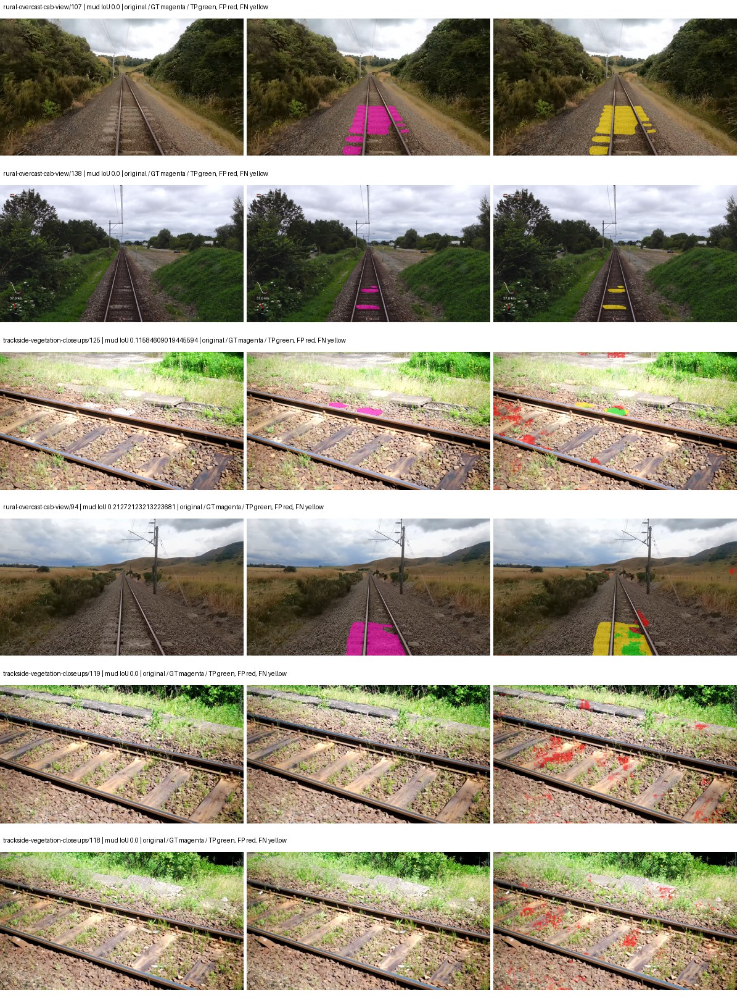
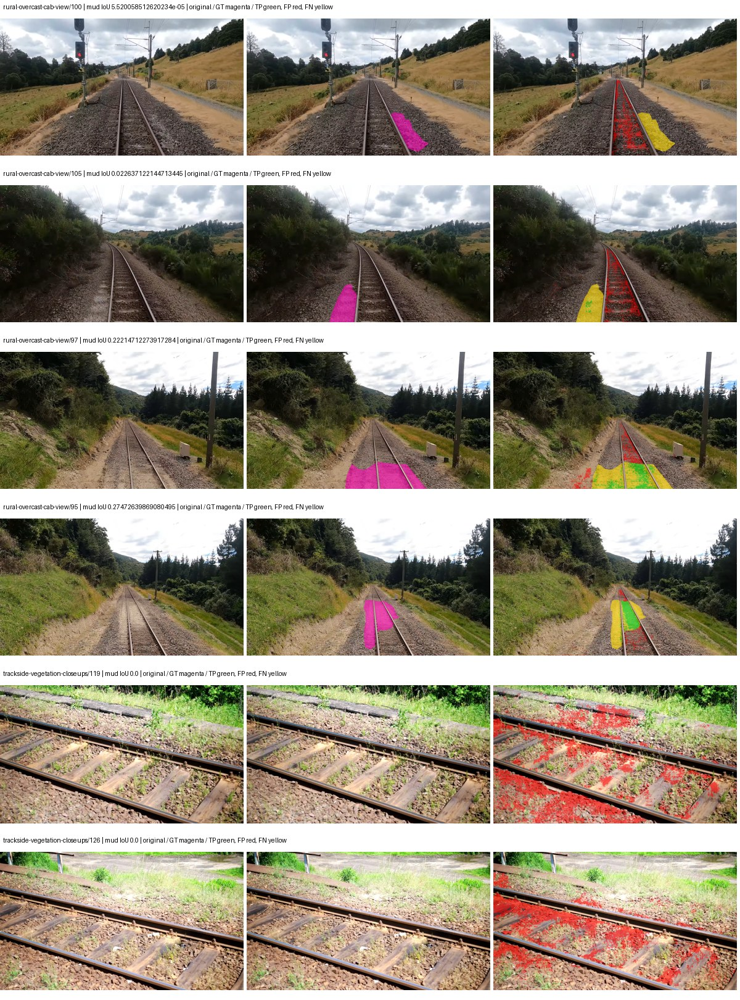
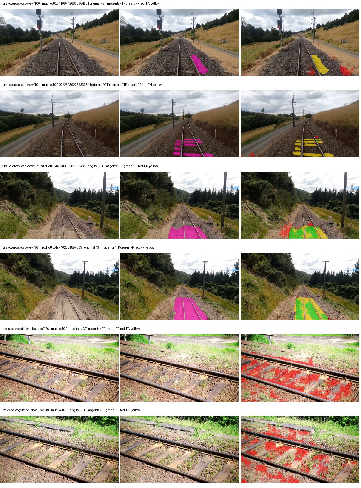
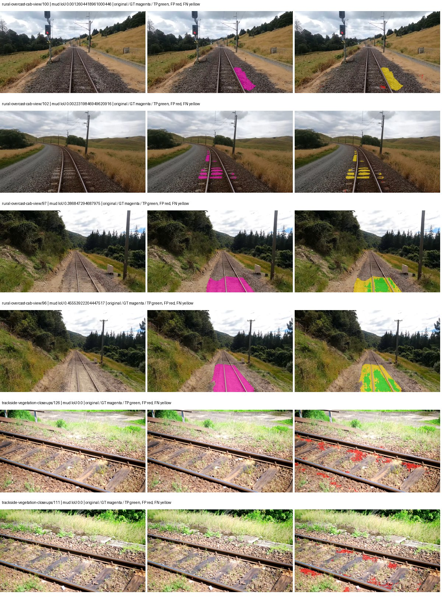
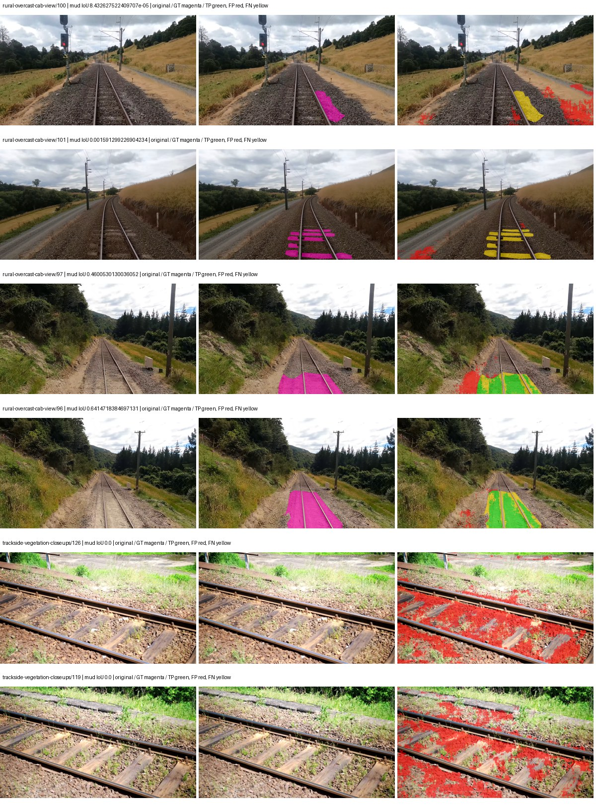
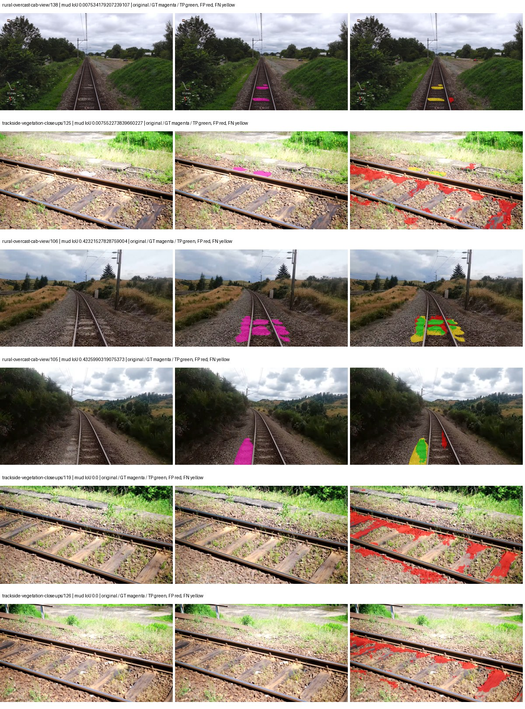
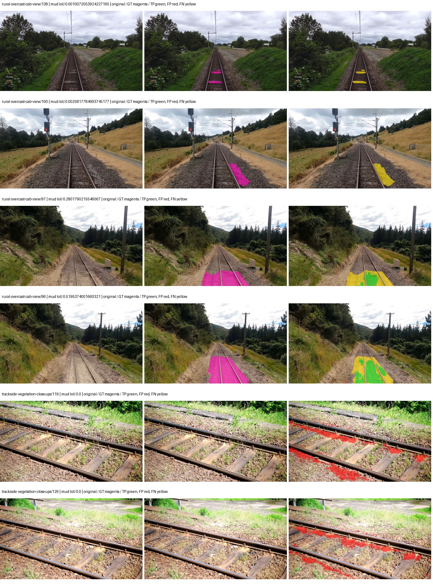
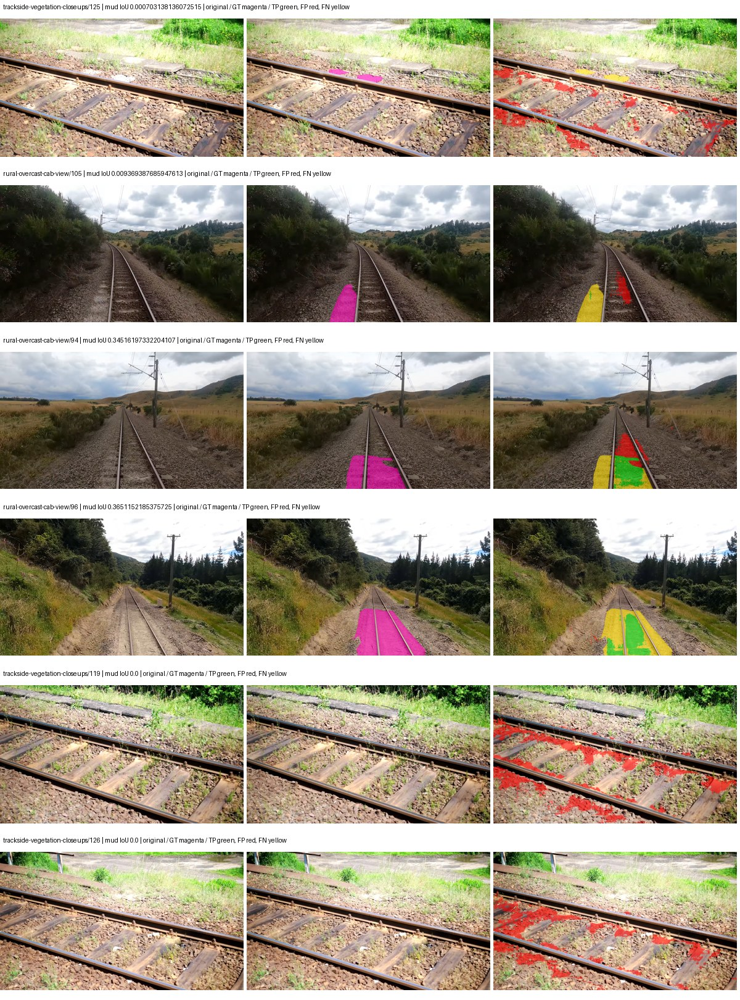
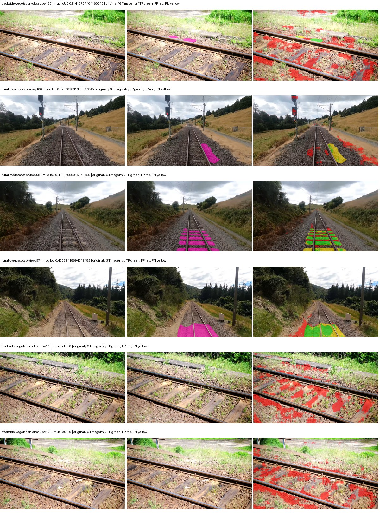
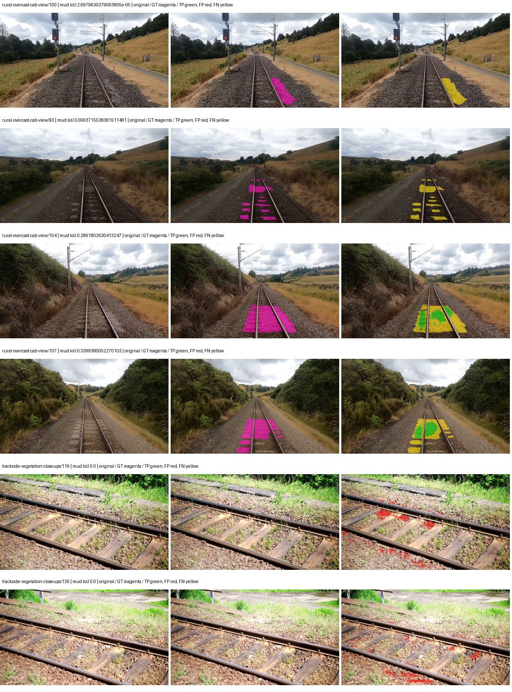

# smp_linknet_mobilenet_v2 — paul-test-rtis

[RTIS comparison](../../README.md) · [Full model records](record.json)

Primary selection and early stopping: **mud-pumping validation IoU**. A job is complete only after full statistics and isolated profiling are verified.

| Model | Initialization path | Seed | Status | Steps | Best step | Mud IoU (%) | Mud precision (%) | Mud recall (%) | Final mud IoU (trainer val, %) | mIoU (%) | Fixed GT-class mIoU (%) |
| --- | --- | --- | --- | --- | --- | --- | --- | --- | --- | --- | --- |
| smp_linknet_mobilenet_v2 | rtis_only | 0 | completed | 1781 | 509 | 6.53 | 6.71 | 70.86 | 4.01 | 13.65 | 13.65 |
| smp_linknet_mobilenet_v2 | rtis_only | 1 | completed | 4000 | 3309 | 3.99 | 13.52 | 5.36 | 2.14 | 18.67 | 18.67 |
| smp_linknet_mobilenet_v2 | rtis_only | 2 | completed | 4000 | 3309 | 5.00 | 6.53 | 17.64 | 4.25 | 17.12 | 17.12 |
| smp_linknet_mobilenet_v2 | cityscapes_to_rtis | 0 | completed | 4000 | 3054 | 9.71 | 12.66 | 29.41 | 4.08 | 21.87 | 23.09 |
| smp_linknet_mobilenet_v2 | cityscapes_to_rtis | 1 | completed | 3309 | 2036 | 13.10 | 31.37 | 18.36 | 3.16 | 21.08 | 22.25 |
| smp_linknet_mobilenet_v2 | cityscapes_to_rtis | 2 | completed | 3818 | 2545 | 7.70 | 9.33 | 30.61 | 6.24 | 21.84 | 23.05 |
| smp_linknet_mobilenet_v2 | railsem19_to_rtis | 0 | completed | 2036 | 763 | 12.98 | 18.54 | 30.23 | 11.94 | 22.27 | 23.50 |
| smp_linknet_mobilenet_v2 | railsem19_to_rtis | 1 | completed | 3309 | 2036 | 10.48 | 17.71 | 20.43 | 8.38 | 24.37 | 25.72 |
| smp_linknet_mobilenet_v2 | railsem19_to_rtis | 2 | completed | 2036 | 763 | 12.37 | 17.50 | 29.71 | 1.24 | 22.72 | 23.98 |
| smp_linknet_mobilenet_v2 | cityscapes_to_railsem19_to_rtis | 0 | completed | 2036 | 763 | 12.27 | 14.61 | 43.38 | 11.98 | 23.60 | 24.91 |
| smp_linknet_mobilenet_v2 | cityscapes_to_railsem19_to_rtis | 1 | completed | 3309 | 2036 | 12.29 | 38.86 | 15.24 | 8.73 | 22.30 | 24.78 |
| smp_linknet_mobilenet_v2 | cityscapes_to_railsem19_to_rtis | 2 | training | 2799 | — | — | — | — | — | — | — |

Training: 220 images. Validation: 37 images. Test: 50 held out. Seeds: [0, 1, 2]. Seed variation measures optimization variability, not independent-recording uncertainty. Historical source checkpoints stay fixed across adaptation seeds.

Training code: `066afb2626398b7be59d4d19f5a0e4644fd59adc`. Split SHA-256: `71fef8292610c352da0709fe3bd030f3bcc18f97560394835f4b22826463b83d`.

## rtis_only — seed 0

Status: **completed**. Started: 2026-09-07T07:04:55.595604+00:00. Finished: 2026-09-07T07:25:31.261860+00:00.

Recipe pretrained initializer: `{"arch": "smp", "backbone_path": null, "batch_norm_momentum": null, "checkpoint": null, "classifier_path": null, "drop_path": null, "encoder_name": "mobilenet_v2", "encoder_weights": "imagenet", "head": "unified_head", "head_paths": [], "inactive_parameter_paths": [], "local_files_only": false, "lora_alpha": 32, "lora_dropout": 0.05, "lora_r": 16, "lora_targets": [], "native": null, "revision": null, "smp_arch": "Linknet", "subfolder": null, "trust_remote_code": false, "tuning": "full"}`.

`rtis_only` uses the recipe initializer, which may include pretrained segmentation components. Transfer paths load the exact historical source checkpoint below and reset the classifier; they do not reset all query/decoder features.

Source checkpoint: `Recipe pretrained initialization`.

Config SHA-256: `57d6aab85a8356e8d589b58f1fb2ad67d5b21f00cf3039437eb0cfe361be80ff`. Weights used for validation: `raw`.

### Mud-pumping and aggregate quality

| Metric | Selected checkpoint | Final training validation |
| --- | --- | --- |
| Mud IoU | 6.53 | 4.01 |
| Mud precision | 6.71 | 4.34 |
| Mud recall | 70.86 | 34.08 |
| Mud Dice/F1 | 12.26 | 7.71 |
| mIoU | 13.65 | 18.09 |
| Mean accuracy | 19.34 | 23.18 |
| Mean precision | 18.98 | 23.51 |
| Mean Dice | 16.86 | 21.56 |
| Mean specificity | 97.98 | 98.40 |
| Pixel accuracy | 68.06 | 74.08 |
| Frequency-weighted IoU | 55.91 | 64.41 |
| Fixed GT-present class mIoU | 13.65 | 18.09 |
| Boundary F1 | 13.27 | 15.58 |

The selected checkpoint has independent evaluation evidence. Final values are the trainer's final validation record, not a new independent evaluation. mIoU averages classes with nonzero union, so false positives on absent classes can change its denominator. The fixed GT-class mean is supplementary and excludes absent classes; their false positives remain in the confusion matrix.

### Resource usage and timing

| Measurement | Value |
| --- | --- |
| Peak training VRAM, retained training invocation (GiB) | 8.04 |
| Peak evaluation VRAM (GiB) | 6.12 |
| Retained training invocation wall time (seconds) | 1112.29 |
| Retained training invocation GPU-hours (one GPU) | 0.31 |
| Evaluation wall time (seconds) | 10.46 |
| Full evaluation pipeline images/second | 3.54 |
| Best full-state checkpoint (MiB) | 66.65 |
| Final full-state checkpoint (MiB) | 66.64 |
| Audited periodic checkpoints removed (GiB) | 0.20 |

VRAM uses the recorded allocator high-water mark; it is not total device usage including CUDA context. Resumed jobs' retained training invocation times and peaks are **not whole-campaign totals**. Earlier invocation resource records are not reconstructed here. Evaluation throughput includes loader, sliding-window inference and metrics; it is not model-only latency/FPS. Missing measurements are shown as —, never inferred from another dataset's run.

### Standardized inference performance

Dedicated model-only profiling waits for an idle worker-locked L40S: BF16, batch 1, 1024x1024, 20 warmup and 100 CUDA-event-timed public forwards. It excludes loading, preprocessing, tiling and metrics.

| Status | Parameters | Weight MiB | FPS | p50 ms | p95 ms | Peak reserved GiB |
| --- | --- | --- | --- | --- | --- | --- |
| complete | 4320519 | 16.48 | 164.62 | 5.95 | 6.86 | 0.32 |

```json
{
  "schema_version": 1,
  "model_id": "smp_linknet_mobilenet_v2",
  "measured_at": "2026-09-07T07:25:29+00:00",
  "status": "complete",
  "benchmark_scope": "rtis_selected_checkpoint_model_only",
  "applies_to": [
    "smp_linknet_mobilenet_v2--rtis_only--seed-0"
  ],
  "source": {
    "campaign_git_sha": "066afb2626398b7be59d4d19f5a0e4644fd59adc",
    "git_dirty": false,
    "config_hash": "4f1029b13a04",
    "resolved_config": "/data/izadia1/projects/segmentary-runs/paul-test-rtis/mud-fullstats-v1-20260906-r2/configs/smp_linknet_mobilenet_v2--rtis_only--seed-0.yaml",
    "config_sha256": "57d6aab85a8356e8d589b58f1fb2ad67d5b21f00cf3039437eb0cfe361be80ff",
    "checkpoint_sha256": "57a0801af41d9373cee80bfc42b94b7fba45bcf63ad0304f59ea6c8e2bffef14",
    "checkpoint_global_step": 509,
    "checkpoint_bytes": 69890418,
    "checkpoint_kind": "resume checkpoint with optimizer and EMA state",
    "weights": "raw",
    "measured_checkpoint_job_id": "smp_linknet_mobilenet_v2--rtis_only--seed-0",
    "result_sha256": "da73e8af128ad5e38e327405c6ee3218c00ee0ed4c0c2abba0f848faa898cdd4",
    "result_git_sha": "066afb2626398b7be59d4d19f5a0e4644fd59adc",
    "result_stage": "eval:paul-test-rtis:val",
    "result_seed": 0
  },
  "hardware": {
    "gpu_name": "NVIDIA L40S",
    "gpu_uuid": "GPU-fc5dde96-210d-0afa-ac74-7f88477d622b",
    "logical_device": "cuda:0",
    "physical_visibility_token": "4",
    "compute_capability": [
      8,
      9
    ],
    "total_memory_bytes": 47677177856
  },
  "model": {
    "parameter_count": 4320519,
    "trainable_parameter_count": 4320519,
    "resident_parameter_bytes": 17282076,
    "parameter_dtype_counts": {
      "float32": 4320519
    }
  },
  "contract": {
    "backend": "pytorch",
    "precision": "bf16_autocast",
    "batch_size": 1,
    "input_shape_nchw": [
      1,
      3,
      1024,
      1024
    ],
    "warmup_iterations": 20,
    "measured_iterations": 100,
    "timing": "per-forward CUDA events with end-event synchronization",
    "includes_preprocessing": false,
    "includes_data_loader": false,
    "includes_sliding_window": false,
    "input_resident_on_gpu": true,
    "model_only": true,
    "entrypoint": "public model(image) dense-logits forward"
  },
  "measurements": {
    "latency": {
      "p50_ms": 5.945296049118042,
      "p95_ms": 6.8603904247283936,
      "mean_ms": 6.0744348955154415,
      "minimum_ms": 5.460991859436035,
      "maximum_ms": 7.309311866760254,
      "fps": 164.62436707293836,
      "raw_ms": [
        5.518335819244385,
        5.692416191101074,
        5.780479907989502,
        6.01907205581665,
        5.943295955657959,
        6.040575981140137,
        5.938176155090332,
        5.9996161460876465,
        6.4337921142578125,
        6.792191982269287,
        6.288383960723877,
        5.805056095123291,
        6.279168128967285,
        5.774335861206055,
        5.762944221496582,
        5.923840045928955,
        5.91974401473999,
        6.674431800842285,
        5.860256195068359,
        5.999711990356445,
        6.342656135559082,
        6.721536159515381,
        5.673984050750732,
        5.726208209991455,
        5.732351779937744,
        6.113279819488525,
        5.803008079528809,
        5.71289587020874,
        5.694464206695557,
        6.279263973236084,
        6.185984134674072,
        6.555647850036621,
        5.66374397277832,
        5.739520072937012,
        5.8737921714782715,
        6.045695781707764,
        5.66374397277832,
        5.815328121185303,
        5.756927967071533,
        5.625855922698975,
        5.537792205810547,
        6.213632106781006,
        6.2218241691589355,
        6.293504238128662,
        5.460991859436035,
        5.568448066711426,
        6.191999912261963,
        6.222847938537598,
        5.548031806945801,
        5.519360065460205,
        5.627840042114258,
        5.834752082824707,
        7.14035177230835,
        6.364160060882568,
        6.244351863861084,
        6.054912090301514,
        5.851136207580566,
        6.749152183532715,
        6.885280132293701,
        6.859776020050049,
        6.569983959197998,
        6.007808208465576,
        7.309311866760254,
        5.989376068115234,
        5.77126407623291,
        5.62278413772583,
        5.6453118324279785,
        5.964799880981445,
        6.352896213531494,
        7.123968124389648,
        6.643712043762207,
        5.947296142578125,
        6.1420159339904785,
        5.899263858795166,
        5.916672229766846,
        5.900288105010986,
        5.863423824310303,
        6.006783962249756,
        6.02623987197876,
        6.376448154449463,
        6.872064113616943,
        6.605792045593262,
        6.619135856628418,
        5.8438720703125,
        5.8869757652282715,
        5.8869757652282715,
        5.695487976074219,
        5.738495826721191,
        5.72108793258667,
        5.690303802490234,
        6.29145622253418,
        6.529024124145508,
        6.428671836853027,
        6.58022403717041,
        5.91974401473999,
        5.8664960861206055,
        5.805056095123291,
        5.795839786529541,
        6.3303680419921875,
        6.694911956787109
      ],
      "percentile_method": "numpy linear interpolation"
    },
    "peak_reserved_bytes": 339738624,
    "memory_kind": "pytorch_cuda_allocator_peak_reserved_excluding_context",
    "benchmark_wall_clock_s": 13.7872333265841
  },
  "started_at": "2026-09-07T07:25:15+00:00",
  "finished_at": "2026-09-07T07:25:29+00:00",
  "environment": {
    "hostname": "hdrfs-app-001",
    "python": "3.11.15",
    "platform": "Linux-5.15.0-139-generic-x86_64-with-glibc2.35",
    "torch": "2.11.0+cu128",
    "torch_cuda": "12.8",
    "cudnn": 91900,
    "driver_version": "570.133.20",
    "cuda_available": true,
    "gpu_count": 1,
    "gpu_names": [
      "NVIDIA L40S"
    ],
    "cuda_visible_devices": "4",
    "packages": {
      "segmentary": "0.1.0",
      "torch": "2.11.0+cu128",
      "torchvision": "0.26.0+cu128",
      "transformers": "5.15.0",
      "timm": "1.0.28",
      "segmentation-models-pytorch": "0.5.0",
      "albumentations": "2.0.8",
      "lightning": "2.6.5",
      "numpy": "2.4.4"
    }
  }
}
```

### Per-class validation results

| Class | GT pixels | IoU (%) | Precision (%) | Recall (%) | Dice (%) | Boundary F1 (%) |
| --- | --- | --- | --- | --- | --- | --- |
| car | 29664 | 0.00 | 0.00 | 0.00 | 0.00 | 0.00 |
| construction | 311585 | 0.00 | 0.00 | 0.00 | 0.00 | 0.00 |
| fence | 265137 | 0.00 | 0.00 | 0.00 | 0.00 | 0.00 |
| mud-pumping | 1226250 | 6.53 | 6.71 | 70.86 | 12.26 | 15.18 |
| on-rails | 0 | — | — | — | — | — |
| person | 0 | — | — | — | — | — |
| pole | 628038 | 0.00 | 0.00 | 0.00 | 0.00 | 0.00 |
| rail-embedded | 16799 | 0.00 | 0.00 | 0.00 | 0.00 | 0.00 |
| rail-raised | 2969797 | 52.45 | 88.17 | 56.42 | 68.81 | 81.04 |
| rail-track | 6323197 | 13.33 | 38.28 | 16.99 | 23.53 | 51.21 |
| road | 1048831 | 0.00 | 0.00 | 0.00 | 0.00 | 0.00 |
| sidewalk | 1297367 | 0.00 | 0.00 | 0.00 | 0.00 | 0.00 |
| sky | 19121606 | 86.76 | 90.93 | 94.98 | 92.91 | 30.59 |
| standing-water | 95802 | 0.00 | 0.00 | 0.00 | 0.00 | 0.00 |
| terrain | 39239306 | 75.50 | 78.21 | 95.61 | 86.04 | 23.71 |
| trackbed | 10643081 | 11.08 | 39.43 | 13.35 | 19.95 | 37.07 |
| traffic-light | 19510 | 0.00 | 0.00 | 0.00 | 0.00 | 0.00 |
| traffic-sign | 13285 | 0.00 | 0.00 | 0.00 | 0.00 | 0.00 |
| tram-track | 56179 | 0.00 | 0.00 | 0.00 | 0.00 | 0.00 |
| truck | 0 | — | — | — | — | — |
| vegetation-overgrowth | 5901821 | 0.00 | 0.00 | 0.00 | 0.00 | 0.00 |

### Full-run accounting

| Measurement | Value |
| --- | --- |
| Full GPU-reserved wall seconds, all recorded worker attempts | 1235.67 |
| Full reserved GPU-hours | 0.34 |
| Whole-run timing complete | True |

| Phase | Wall seconds including failed attempts |
| --- | --- |
| training | 1118.75 |
| diagnostics | 77.63 |
| performance | 20.66 |

GPU-reserved time includes model loading, training, validation, collection, profiling, checkpoint I/O and orchestration while the worker owns one GPU. It is not GPU kernel-active time. Phase timings and sampled device memory/power/utilization are retained separately; sampled device memory is not the allocator high-water mark.

### Train/validation and raw/EMA diagnostics

| Checkpoint / weights / split | Images | Mud IoU (%) | Mud precision (%) | Mud recall (%) |
| --- | --- | --- | --- | --- |
| best-auto-train / raw | 220 | 42.09 | 44.97 | 86.80 |
| best-auto-val / raw | 37 | 6.53 | 6.71 | 70.86 |
| best-alternate-val / ema | 37 | 6.45 | 6.77 | 57.24 |
| final-auto-val / raw | 37 | 4.01 | 4.34 | 34.08 |

Train uses the evaluation transform without augmentation. Compare mud train/validation metrics for the same selected weights. Alternate EMA on running-stat BatchNorm is explicitly uncalibrated and is diagnostic only. Score-threshold curves use uncalibrated normalized scores and are pixel-level diagnostics, not event detection rates or a selected deployment operating point.

### Downloadable evidence

- best-auto-train: [per-image.csv](rtis_only--seed-0/best-auto-train/per-image.csv) · [per-image-confusion.json.gz](rtis_only--seed-0/best-auto-train/per-image-confusion.json.gz) · [groups.json](rtis_only--seed-0/best-auto-train/groups.json) · [mud-score-curves.json](rtis_only--seed-0/best-auto-train/mud-score-curves.json)
- best-auto-val: [per-image.csv](rtis_only--seed-0/best-auto-val/per-image.csv) · [per-image-confusion.json.gz](rtis_only--seed-0/best-auto-val/per-image-confusion.json.gz) · [groups.json](rtis_only--seed-0/best-auto-val/groups.json) · [mud-score-curves.json](rtis_only--seed-0/best-auto-val/mud-score-curves.json) · [examples.jpg](rtis_only--seed-0/best-auto-val/examples.jpg)
- best-alternate-val: [per-image.csv](rtis_only--seed-0/best-alternate-val/per-image.csv) · [per-image-confusion.json.gz](rtis_only--seed-0/best-alternate-val/per-image-confusion.json.gz) · [groups.json](rtis_only--seed-0/best-alternate-val/groups.json) · [mud-score-curves.json](rtis_only--seed-0/best-alternate-val/mud-score-curves.json)
- final-auto-val: [per-image.csv](rtis_only--seed-0/final-auto-val/per-image.csv) · [per-image-confusion.json.gz](rtis_only--seed-0/final-auto-val/per-image-confusion.json.gz) · [groups.json](rtis_only--seed-0/final-auto-val/groups.json) · [mud-score-curves.json](rtis_only--seed-0/final-auto-val/mud-score-curves.json)
- resources: [telemetry.csv](rtis_only--seed-0/resources/telemetry.csv)


Examples are two lowest and two highest mud-IoU positive images, plus up to two negative images with the most false-positive mud pixels. They are targeted diagnostic examples, not random samples. Green: true positive; red: false positive; yellow: false negative. Full predictions remain on HDRFS.

### Validation tracking

| Logged step | Overall mIoU (%) | Mud IoU (%) |
| --- | --- | --- |
| 254 | 7.53 | 0.54 |
| 508 | 13.65 | 6.53 |
| 763 | 15.79 | 4.45 |
| 1017 | 16.63 | 3.00 |
| 1272 | 18.07 | 1.00 |
| 1527 | 17.19 | 4.65 |
| 1781 | 18.09 | 4.01 |

All retained scalar curves, including training loss and per-class IoU, are in record.json. Observed best mud on a curve is not necessarily a retained checkpoint: the pilot saved its selection-metric-best and final checkpoints. Step logging and checkpoint global_step may differ by one.

### Stopping and checkpoint provenance

```json
{
  "stopping": {
    "actual_steps": 1781,
    "maximum_steps": 4000,
    "min_delta": 0.001,
    "monitor": "val_iou/mud-pumping",
    "patience": 5,
    "reason": "validation_plateau"
  },
  "checkpoints": {
    "best": {
      "path": "/data/izadia1/projects/segmentary-runs/paul-test-rtis/mud-fullstats-v1-20260906-r2/future-runs/smp_linknet_mobilenet_v2--rtis_only--seed-0_seed0/rtis/best.ckpt",
      "sha256": "57a0801af41d9373cee80bfc42b94b7fba45bcf63ad0304f59ea6c8e2bffef14",
      "global_step": 509,
      "bytes": 69890418
    },
    "final": {
      "path": "/data/izadia1/projects/segmentary-runs/paul-test-rtis/mud-fullstats-v1-20260906-r2/future-runs/smp_linknet_mobilenet_v2--rtis_only--seed-0_seed0/rtis/last.ckpt",
      "sha256": "582cc6033b5e21f85f6efe2863d64cf59bf82b0c170e061e7a228275a1a41a90",
      "global_step": 1781,
      "bytes": 69877106
    }
  },
  "cleanup_error": null
}
```

### Resolved training, initialization and evaluation settings

The optimizer block is the base configuration. Stage LR scales are applied at runtime, and stage warmup is capped at min(base warmup, floor(stage budget / 10), stage budget - 1): 400 steps for this 4,000-step pilot. Model-internal native input grids may differ from augmentation crops (EoMT uses its 640 grid).

```json
{
  "name": "smp_linknet_mobilenet_v2--rtis_only--seed-0",
  "model": {
    "arch": "smp",
    "checkpoint": null,
    "tuning": "full",
    "head": "unified_head",
    "lora_r": 16,
    "lora_alpha": 32,
    "lora_dropout": 0.05,
    "lora_targets": [],
    "drop_path": null,
    "revision": null,
    "subfolder": null,
    "local_files_only": false,
    "trust_remote_code": false,
    "backbone_path": null,
    "head_paths": [],
    "classifier_path": null,
    "inactive_parameter_paths": [],
    "smp_arch": "Linknet",
    "encoder_name": "mobilenet_v2",
    "encoder_weights": "imagenet",
    "native": null,
    "batch_norm_momentum": null
  },
  "space": "paul-test-rtis",
  "taxonomy_root": "/data/izadia1/projects/segmentary-rtis-fullstats-066afb2/taxonomy",
  "output_root": "/data/izadia1/projects/segmentary-runs/paul-test-rtis/mud-fullstats-v1-20260906-r2/future-runs",
  "optim": {
    "backbone_lr": 0.0001,
    "head_lr_mult": 10.0,
    "weight_decay": 0.05,
    "llrd": 1.0,
    "warmup_iters": 1500,
    "warmup_ratio": 1e-06,
    "poly_power": 0.9,
    "min_lr_ratio": 0.0,
    "betas": [
      0.9,
      0.999
    ],
    "grad_clip": 1.0
  },
  "train": {
    "iters": 4000,
    "batch_size": 2,
    "accum": 8,
    "num_workers": 2,
    "precision": "bf16-mixed",
    "ema_decay": 0.9998,
    "val_every": 250,
    "ckpt_every": 500,
    "selection_metric": "val_iou/mud-pumping",
    "early_stopping_patience": 5,
    "early_stopping_min_delta": 0.001,
    "seed": 0,
    "devices": 1
  },
  "eval": {
    "sliding_window": true,
    "window": [
      1024,
      1024
    ],
    "stride": [
      768,
      768
    ],
    "batch_size": 1,
    "num_workers": 2,
    "tta_scales": [],
    "tta_flip": false,
    "threshold": 0.5,
    "boundary_tolerance_frac": 0.0075,
    "save_confusion": true
  },
  "loss": {
    "task": "multiclass",
    "activation": "auto",
    "terms": [],
    "aux": "none",
    "aux_weight": 0.0,
    "ce_weight": 1.0,
    "label_smoothing": 0.0,
    "class_weights": null,
    "query": null
  },
  "aug": {
    "crop": [
      1024,
      1024
    ],
    "scale_min": 0.5,
    "scale_max": 2.0,
    "hflip_p": 0.5,
    "color_jitter_p": 0.5,
    "brightness": 0.25,
    "contrast": 0.25,
    "saturation": 0.25,
    "hue": 0.05
  },
  "stages": [
    {
      "name": "rtis",
      "data": [
        {
          "name": "paul-test-rtis",
          "root": "/data/izadia1/datasets/paul-test-rtis",
          "variant": null,
          "split_file": "splits.json",
          "train_split": "train",
          "val_split": "val",
          "limit": null,
          "loader": "folder",
          "mapping": "paul-test-rtis",
          "loader_options": {
            "require_groups": true
          }
        }
      ],
      "iters": null,
      "lr_scale": 1.0,
      "head_group_lr_scale": 1.0,
      "init_from": "pretrained",
      "reset_head": false,
      "freeze": null,
      "sample_weights": null
    }
  ]
}
```

### Hardware and software provenance

```json
{
  "training": {
    "cuda_available": true,
    "cuda_visible_devices": "4",
    "cudnn": 91900,
    "driver_version": "570.133.20",
    "gpu_count": 1,
    "gpu_names": [
      "NVIDIA L40S"
    ],
    "hostname": "hdrfs-app-001",
    "input_normalization": {
      "channel_order": "rgb",
      "mean": [
        0.485,
        0.456,
        0.406
      ],
      "source": "smp_encoder_settings",
      "std": [
        0.229,
        0.224,
        0.225
      ]
    },
    "model_origins": [
      {
        "hf_commit": null,
        "hf_name_or_path": null,
        "module": "model",
        "timm_pretrained": {}
      }
    ],
    "model_parameter_count": 4320519,
    "packages": {
      "albumentations": "2.0.8",
      "lightning": "2.6.5",
      "numpy": "2.4.4",
      "segmentary": "0.1.0",
      "segmentation-models-pytorch": "0.5.0",
      "timm": "1.0.28",
      "torch": "2.11.0+cu128",
      "torchvision": "0.26.0+cu128",
      "transformers": "5.15.0"
    },
    "platform": "Linux-5.15.0-139-generic-x86_64-with-glibc2.35",
    "python": "3.11.15",
    "torch": "2.11.0+cu128",
    "torch_cuda": "12.8",
    "trainable_parameter_count": 4320519,
    "training_stop": {
      "actual_steps": 1781,
      "maximum_steps": 4000,
      "min_delta": 0.001,
      "monitor": "val_iou/mud-pumping",
      "patience": 5,
      "reason": "validation_plateau"
    },
    "validation_weights": "raw"
  },
  "evaluation": {
    "cuda_available": true,
    "cuda_visible_devices": "4",
    "cudnn": 91900,
    "driver_version": "570.133.20",
    "gpu_count": 1,
    "gpu_names": [
      "NVIDIA L40S"
    ],
    "hostname": "hdrfs-app-001",
    "input_normalization": {
      "channel_order": "rgb",
      "mean": [
        0.485,
        0.456,
        0.406
      ],
      "source": "smp_encoder_settings",
      "std": [
        0.229,
        0.224,
        0.225
      ]
    },
    "packages": {
      "albumentations": "2.0.8",
      "lightning": "2.6.5",
      "numpy": "2.4.4",
      "segmentary": "0.1.0",
      "segmentation-models-pytorch": "0.5.0",
      "timm": "1.0.28",
      "torch": "2.11.0+cu128",
      "torchvision": "0.26.0+cu128",
      "transformers": "5.15.0"
    },
    "platform": "Linux-5.15.0-139-generic-x86_64-with-glibc2.35",
    "python": "3.11.15",
    "torch": "2.11.0+cu128",
    "torch_cuda": "12.8"
  }
}
```

## rtis_only — seed 1

Status: **completed**. Started: 2026-09-07T07:07:20.667222+00:00. Finished: 2026-09-07T07:49:37.777923+00:00.

Recipe pretrained initializer: `{"arch": "smp", "backbone_path": null, "batch_norm_momentum": null, "checkpoint": null, "classifier_path": null, "drop_path": null, "encoder_name": "mobilenet_v2", "encoder_weights": "imagenet", "head": "unified_head", "head_paths": [], "inactive_parameter_paths": [], "local_files_only": false, "lora_alpha": 32, "lora_dropout": 0.05, "lora_r": 16, "lora_targets": [], "native": null, "revision": null, "smp_arch": "Linknet", "subfolder": null, "trust_remote_code": false, "tuning": "full"}`.

`rtis_only` uses the recipe initializer, which may include pretrained segmentation components. Transfer paths load the exact historical source checkpoint below and reset the classifier; they do not reset all query/decoder features.

Source checkpoint: `Recipe pretrained initialization`.

Config SHA-256: `b99a64ff75fd7bcbe8c5de94bea8410c3ff362e5526fba2bb86674e7e0c4b970`. Weights used for validation: `raw`.

### Mud-pumping and aggregate quality

| Metric | Selected checkpoint | Final training validation |
| --- | --- | --- |
| Mud IoU | 3.99 | 2.14 |
| Mud precision | 13.52 | 8.10 |
| Mud recall | 5.36 | 2.82 |
| Mud Dice/F1 | 7.68 | 4.19 |
| mIoU | 18.67 | 19.05 |
| Mean accuracy | 26.70 | 27.21 |
| Mean precision | 25.15 | 24.83 |
| Mean Dice | 23.79 | 24.23 |
| Mean specificity | 98.18 | 98.15 |
| Pixel accuracy | 74.53 | 74.04 |
| Frequency-weighted IoU | 59.68 | 58.94 |
| Fixed GT-present class mIoU | 18.67 | 19.05 |
| Boundary F1 | 17.62 | 17.54 |

The selected checkpoint has independent evaluation evidence. Final values are the trainer's final validation record, not a new independent evaluation. mIoU averages classes with nonzero union, so false positives on absent classes can change its denominator. The fixed GT-class mean is supplementary and excludes absent classes; their false positives remain in the confusion matrix.

### Resource usage and timing

| Measurement | Value |
| --- | --- |
| Peak training VRAM, retained training invocation (GiB) | 8.04 |
| Peak evaluation VRAM (GiB) | 6.12 |
| Retained training invocation wall time (seconds) | 2430.15 |
| Retained training invocation GPU-hours (one GPU) | 0.68 |
| Evaluation wall time (seconds) | 9.65 |
| Full evaluation pipeline images/second | 3.83 |
| Best full-state checkpoint (MiB) | 66.65 |
| Final full-state checkpoint (MiB) | 66.64 |
| Audited periodic checkpoints removed (GiB) | 0.52 |

VRAM uses the recorded allocator high-water mark; it is not total device usage including CUDA context. Resumed jobs' retained training invocation times and peaks are **not whole-campaign totals**. Earlier invocation resource records are not reconstructed here. Evaluation throughput includes loader, sliding-window inference and metrics; it is not model-only latency/FPS. Missing measurements are shown as —, never inferred from another dataset's run.

### Standardized inference performance

Dedicated model-only profiling waits for an idle worker-locked L40S: BF16, batch 1, 1024x1024, 20 warmup and 100 CUDA-event-timed public forwards. It excludes loading, preprocessing, tiling and metrics.

| Status | Parameters | Weight MiB | FPS | p50 ms | p95 ms | Peak reserved GiB |
| --- | --- | --- | --- | --- | --- | --- |
| complete | 4320519 | 16.48 | 173.61 | 5.65 | 6.44 | 0.32 |

```json
{
  "schema_version": 1,
  "model_id": "smp_linknet_mobilenet_v2",
  "measured_at": "2026-09-07T07:49:35+00:00",
  "status": "complete",
  "benchmark_scope": "rtis_selected_checkpoint_model_only",
  "applies_to": [
    "smp_linknet_mobilenet_v2--rtis_only--seed-1"
  ],
  "source": {
    "campaign_git_sha": "066afb2626398b7be59d4d19f5a0e4644fd59adc",
    "git_dirty": false,
    "config_hash": "20988e4318bb",
    "resolved_config": "/data/izadia1/projects/segmentary-runs/paul-test-rtis/mud-fullstats-v1-20260906-r2/configs/smp_linknet_mobilenet_v2--rtis_only--seed-1.yaml",
    "config_sha256": "b99a64ff75fd7bcbe8c5de94bea8410c3ff362e5526fba2bb86674e7e0c4b970",
    "checkpoint_sha256": "0e611c8db842f3a8ad2502661cd7cae60560b8960cdf7815cf7ff336b5bf5c0f",
    "checkpoint_global_step": 3309,
    "checkpoint_bytes": 69890418,
    "checkpoint_kind": "resume checkpoint with optimizer and EMA state",
    "weights": "raw",
    "measured_checkpoint_job_id": "smp_linknet_mobilenet_v2--rtis_only--seed-1",
    "result_sha256": "f13dbb7174893d0fbaf4b6b914792791b6bdbb49827174221af13f941d2c6a0a",
    "result_git_sha": "066afb2626398b7be59d4d19f5a0e4644fd59adc",
    "result_stage": "eval:paul-test-rtis:val",
    "result_seed": 1
  },
  "hardware": {
    "gpu_name": "NVIDIA L40S",
    "gpu_uuid": "GPU-a5ad49e5-0536-5229-ba8a-f8a902808f53",
    "logical_device": "cuda:0",
    "physical_visibility_token": "7",
    "compute_capability": [
      8,
      9
    ],
    "total_memory_bytes": 47677177856
  },
  "model": {
    "parameter_count": 4320519,
    "trainable_parameter_count": 4320519,
    "resident_parameter_bytes": 17282076,
    "parameter_dtype_counts": {
      "float32": 4320519
    }
  },
  "contract": {
    "backend": "pytorch",
    "precision": "bf16_autocast",
    "batch_size": 1,
    "input_shape_nchw": [
      1,
      3,
      1024,
      1024
    ],
    "warmup_iterations": 20,
    "measured_iterations": 100,
    "timing": "per-forward CUDA events with end-event synchronization",
    "includes_preprocessing": false,
    "includes_data_loader": false,
    "includes_sliding_window": false,
    "input_resident_on_gpu": true,
    "model_only": true,
    "entrypoint": "public model(image) dense-logits forward"
  },
  "measurements": {
    "latency": {
      "p50_ms": 5.651968002319336,
      "p95_ms": 6.436812925338745,
      "mean_ms": 5.760133762359619,
      "minimum_ms": 5.406720161437988,
      "maximum_ms": 6.922239780426025,
      "fps": 173.60707949781246,
      "raw_ms": [
        5.533696174621582,
        5.537792205810547,
        5.533696174621582,
        5.5654401779174805,
        5.509119987487793,
        5.5265278816223145,
        5.472256183624268,
        6.028287887573242,
        5.561344146728516,
        5.476352214813232,
        5.4620161056518555,
        5.541888236999512,
        5.501952171325684,
        5.523519992828369,
        5.682176113128662,
        5.636096000671387,
        6.392831802368164,
        5.651455879211426,
        5.406720161437988,
        5.408768177032471,
        5.440512180328369,
        5.4620161056518555,
        5.4620161056518555,
        5.454847812652588,
        5.490687847137451,
        5.592063903808594,
        5.534719944000244,
        5.416959762573242,
        5.465087890625,
        5.929984092712402,
        5.468160152435303,
        5.4824957847595215,
        5.974016189575195,
        5.655551910400391,
        5.4917120933532715,
        5.501952171325684,
        5.487616062164307,
        6.219776153564453,
        5.6248321533203125,
        5.920767784118652,
        5.819392204284668,
        6.334464073181152,
        6.348800182342529,
        5.755839824676514,
        5.61356782913208,
        5.619711875915527,
        5.608448028564453,
        5.646336078643799,
        5.756927967071533,
        5.696512222290039,
        6.455296039581299,
        6.390783786773682,
        5.8275837898254395,
        5.801983833312988,
        6.388735771179199,
        5.82041597366333,
        5.731328010559082,
        5.700607776641846,
        5.607423782348633,
        5.9771199226379395,
        6.166528224945068,
        5.806079864501953,
        6.7778239250183105,
        6.922239780426025,
        5.801983833312988,
        5.716991901397705,
        5.715968132019043,
        5.661695957183838,
        5.652480125427246,
        5.909503936767578,
        5.8224639892578125,
        6.518784046173096,
        5.702655792236328,
        5.679103851318359,
        6.5279998779296875,
        6.181888103485107,
        5.895167827606201,
        5.616640090942383,
        5.587967872619629,
        5.554175853729248,
        5.804031848907471,
        5.4527997970581055,
        5.41593599319458,
        5.483520030975342,
        5.660672187805176,
        6.108160018920898,
        5.525504112243652,
        5.511168003082275,
        5.51526403427124,
        5.815296173095703,
        6.066175937652588,
        6.194176197052002,
        5.612607955932617,
        5.497856140136719,
        6.070271968841553,
        5.47327995300293,
        5.4179840087890625,
        5.709824085235596,
        6.435840129852295,
        6.095871925354004
      ],
      "percentile_method": "numpy linear interpolation"
    },
    "peak_reserved_bytes": 339738624,
    "memory_kind": "pytorch_cuda_allocator_peak_reserved_excluding_context",
    "benchmark_wall_clock_s": 13.640381626784801
  },
  "started_at": "2026-09-07T07:49:21+00:00",
  "finished_at": "2026-09-07T07:49:35+00:00",
  "environment": {
    "hostname": "hdrfs-app-001",
    "python": "3.11.15",
    "platform": "Linux-5.15.0-139-generic-x86_64-with-glibc2.35",
    "torch": "2.11.0+cu128",
    "torch_cuda": "12.8",
    "cudnn": 91900,
    "driver_version": "570.133.20",
    "cuda_available": true,
    "gpu_count": 1,
    "gpu_names": [
      "NVIDIA L40S"
    ],
    "cuda_visible_devices": "7",
    "packages": {
      "segmentary": "0.1.0",
      "torch": "2.11.0+cu128",
      "torchvision": "0.26.0+cu128",
      "transformers": "5.15.0",
      "timm": "1.0.28",
      "segmentation-models-pytorch": "0.5.0",
      "albumentations": "2.0.8",
      "lightning": "2.6.5",
      "numpy": "2.4.4"
    }
  }
}
```

### Per-class validation results

| Class | GT pixels | IoU (%) | Precision (%) | Recall (%) | Dice (%) | Boundary F1 (%) |
| --- | --- | --- | --- | --- | --- | --- |
| car | 29664 | 0.00 | 0.00 | 0.00 | 0.00 | 0.00 |
| construction | 311585 | 10.53 | 10.94 | 73.62 | 19.06 | 7.11 |
| fence | 265137 | 0.00 | 0.00 | 0.00 | 0.00 | 0.00 |
| mud-pumping | 1226250 | 3.99 | 13.52 | 5.36 | 7.68 | 6.45 |
| on-rails | 0 | — | — | — | — | — |
| person | 0 | — | — | — | — | — |
| pole | 628038 | 20.68 | 59.05 | 24.14 | 34.27 | 76.93 |
| rail-embedded | 16799 | 0.00 | 0.00 | 0.00 | 0.00 | 0.00 |
| rail-raised | 2969797 | 66.33 | 71.47 | 90.23 | 79.76 | 74.86 |
| rail-track | 6323197 | 28.71 | 57.58 | 36.41 | 44.61 | 43.25 |
| road | 1048831 | 0.00 | 0.00 | 0.00 | 0.00 | 0.00 |
| sidewalk | 1297367 | 0.00 | 0.00 | 0.00 | 0.00 | 0.00 |
| sky | 19121606 | 80.38 | 99.44 | 80.75 | 89.13 | 38.01 |
| standing-water | 95802 | 0.26 | 0.50 | 0.53 | 0.51 | 1.58 |
| terrain | 39239306 | 71.83 | 73.79 | 96.44 | 83.61 | 23.05 |
| trackbed | 10643081 | 53.37 | 66.44 | 73.07 | 69.60 | 46.00 |
| traffic-light | 19510 | 0.00 | 0.00 | 0.00 | 0.00 | 0.00 |
| traffic-sign | 13285 | 0.00 | 0.00 | 0.00 | 0.00 | 0.00 |
| tram-track | 56179 | 0.00 | 0.00 | 0.00 | 0.00 | 0.00 |
| truck | 0 | — | — | — | — | — |
| vegetation-overgrowth | 5901821 | 0.00 | 0.00 | 0.00 | 0.00 | 0.00 |

### Full-run accounting

| Measurement | Value |
| --- | --- |
| Full GPU-reserved wall seconds, all recorded worker attempts | 2537.11 |
| Full reserved GPU-hours | 0.70 |
| Whole-run timing complete | True |

| Phase | Wall seconds including failed attempts |
| --- | --- |
| training | 2436.67 |
| diagnostics | 62.86 |
| performance | 20.18 |

GPU-reserved time includes model loading, training, validation, collection, profiling, checkpoint I/O and orchestration while the worker owns one GPU. It is not GPU kernel-active time. Phase timings and sampled device memory/power/utilization are retained separately; sampled device memory is not the allocator high-water mark.

### Train/validation and raw/EMA diagnostics

| Checkpoint / weights / split | Images | Mud IoU (%) | Mud precision (%) | Mud recall (%) |
| --- | --- | --- | --- | --- |
| best-auto-train / raw | 220 | 84.44 | 95.71 | 87.75 |
| best-auto-val / raw | 37 | 3.99 | 13.52 | 5.36 |
| best-alternate-val / ema | 37 | 0.40 | 0.56 | 1.39 |
| final-auto-val / raw | 37 | 2.14 | 8.12 | 2.83 |

Train uses the evaluation transform without augmentation. Compare mud train/validation metrics for the same selected weights. Alternate EMA on running-stat BatchNorm is explicitly uncalibrated and is diagnostic only. Score-threshold curves use uncalibrated normalized scores and are pixel-level diagnostics, not event detection rates or a selected deployment operating point.

### Downloadable evidence

- best-auto-train: [per-image.csv](rtis_only--seed-1/best-auto-train/per-image.csv) · [per-image-confusion.json.gz](rtis_only--seed-1/best-auto-train/per-image-confusion.json.gz) · [groups.json](rtis_only--seed-1/best-auto-train/groups.json) · [mud-score-curves.json](rtis_only--seed-1/best-auto-train/mud-score-curves.json)
- best-auto-val: [per-image.csv](rtis_only--seed-1/best-auto-val/per-image.csv) · [per-image-confusion.json.gz](rtis_only--seed-1/best-auto-val/per-image-confusion.json.gz) · [groups.json](rtis_only--seed-1/best-auto-val/groups.json) · [mud-score-curves.json](rtis_only--seed-1/best-auto-val/mud-score-curves.json) · [examples.jpg](rtis_only--seed-1/best-auto-val/examples.jpg)
- best-alternate-val: [per-image.csv](rtis_only--seed-1/best-alternate-val/per-image.csv) · [per-image-confusion.json.gz](rtis_only--seed-1/best-alternate-val/per-image-confusion.json.gz) · [groups.json](rtis_only--seed-1/best-alternate-val/groups.json) · [mud-score-curves.json](rtis_only--seed-1/best-alternate-val/mud-score-curves.json)
- final-auto-val: [per-image.csv](rtis_only--seed-1/final-auto-val/per-image.csv) · [per-image-confusion.json.gz](rtis_only--seed-1/final-auto-val/per-image-confusion.json.gz) · [groups.json](rtis_only--seed-1/final-auto-val/groups.json) · [mud-score-curves.json](rtis_only--seed-1/final-auto-val/mud-score-curves.json)
- resources: [telemetry.csv](rtis_only--seed-1/resources/telemetry.csv)



Examples are two lowest and two highest mud-IoU positive images, plus up to two negative images with the most false-positive mud pixels. They are targeted diagnostic examples, not random samples. Green: true positive; red: false positive; yellow: false negative. Full predictions remain on HDRFS.

### Validation tracking

| Logged step | Overall mIoU (%) | Mud IoU (%) |
| --- | --- | --- |
| 254 | 11.42 | 1.03 |
| 508 | 14.85 | 1.07 |
| 763 | 14.98 | 0.06 |
| 1017 | 15.95 | 0.14 |
| 1272 | 16.27 | 1.34 |
| 1527 | 17.61 | 0.82 |
| 1781 | 15.89 | 0.81 |
| 2036 | 17.71 | 1.29 |
| 2290 | 17.08 | 1.38 |
| 2545 | 19.16 | 2.37 |
| 2799 | 18.24 | 1.29 |
| 3054 | 19.03 | 1.24 |
| 3308 | 18.68 | 4.02 |
| 3563 | 18.48 | 1.59 |
| 3817 | 18.94 | 1.27 |
| 4000 | 19.05 | 2.14 |

All retained scalar curves, including training loss and per-class IoU, are in record.json. Observed best mud on a curve is not necessarily a retained checkpoint: the pilot saved its selection-metric-best and final checkpoints. Step logging and checkpoint global_step may differ by one.

### Stopping and checkpoint provenance

```json
{
  "stopping": {
    "actual_steps": 4000,
    "maximum_steps": 4000,
    "min_delta": 0.001,
    "monitor": "val_iou/mud-pumping",
    "patience": 5,
    "reason": "budget_complete"
  },
  "checkpoints": {
    "best": {
      "path": "/data/izadia1/projects/segmentary-runs/paul-test-rtis/mud-fullstats-v1-20260906-r2/future-runs/smp_linknet_mobilenet_v2--rtis_only--seed-1_seed1/rtis/best.ckpt",
      "sha256": "0e611c8db842f3a8ad2502661cd7cae60560b8960cdf7815cf7ff336b5bf5c0f",
      "global_step": 3309,
      "bytes": 69890418
    },
    "final": {
      "path": "/data/izadia1/projects/segmentary-runs/paul-test-rtis/mud-fullstats-v1-20260906-r2/future-runs/smp_linknet_mobilenet_v2--rtis_only--seed-1_seed1/rtis/last.ckpt",
      "sha256": "be461211b6a540408c9fd33b8f6d5abf40a617897046efc50c7995a2e6b0de3e",
      "global_step": 4000,
      "bytes": 69876978
    }
  },
  "cleanup_error": null
}
```

### Resolved training, initialization and evaluation settings

The optimizer block is the base configuration. Stage LR scales are applied at runtime, and stage warmup is capped at min(base warmup, floor(stage budget / 10), stage budget - 1): 400 steps for this 4,000-step pilot. Model-internal native input grids may differ from augmentation crops (EoMT uses its 640 grid).

```json
{
  "name": "smp_linknet_mobilenet_v2--rtis_only--seed-1",
  "model": {
    "arch": "smp",
    "checkpoint": null,
    "tuning": "full",
    "head": "unified_head",
    "lora_r": 16,
    "lora_alpha": 32,
    "lora_dropout": 0.05,
    "lora_targets": [],
    "drop_path": null,
    "revision": null,
    "subfolder": null,
    "local_files_only": false,
    "trust_remote_code": false,
    "backbone_path": null,
    "head_paths": [],
    "classifier_path": null,
    "inactive_parameter_paths": [],
    "smp_arch": "Linknet",
    "encoder_name": "mobilenet_v2",
    "encoder_weights": "imagenet",
    "native": null,
    "batch_norm_momentum": null
  },
  "space": "paul-test-rtis",
  "taxonomy_root": "/data/izadia1/projects/segmentary-rtis-fullstats-066afb2/taxonomy",
  "output_root": "/data/izadia1/projects/segmentary-runs/paul-test-rtis/mud-fullstats-v1-20260906-r2/future-runs",
  "optim": {
    "backbone_lr": 0.0001,
    "head_lr_mult": 10.0,
    "weight_decay": 0.05,
    "llrd": 1.0,
    "warmup_iters": 1500,
    "warmup_ratio": 1e-06,
    "poly_power": 0.9,
    "min_lr_ratio": 0.0,
    "betas": [
      0.9,
      0.999
    ],
    "grad_clip": 1.0
  },
  "train": {
    "iters": 4000,
    "batch_size": 2,
    "accum": 8,
    "num_workers": 2,
    "precision": "bf16-mixed",
    "ema_decay": 0.9998,
    "val_every": 250,
    "ckpt_every": 500,
    "selection_metric": "val_iou/mud-pumping",
    "early_stopping_patience": 5,
    "early_stopping_min_delta": 0.001,
    "seed": 1,
    "devices": 1
  },
  "eval": {
    "sliding_window": true,
    "window": [
      1024,
      1024
    ],
    "stride": [
      768,
      768
    ],
    "batch_size": 1,
    "num_workers": 2,
    "tta_scales": [],
    "tta_flip": false,
    "threshold": 0.5,
    "boundary_tolerance_frac": 0.0075,
    "save_confusion": true
  },
  "loss": {
    "task": "multiclass",
    "activation": "auto",
    "terms": [],
    "aux": "none",
    "aux_weight": 0.0,
    "ce_weight": 1.0,
    "label_smoothing": 0.0,
    "class_weights": null,
    "query": null
  },
  "aug": {
    "crop": [
      1024,
      1024
    ],
    "scale_min": 0.5,
    "scale_max": 2.0,
    "hflip_p": 0.5,
    "color_jitter_p": 0.5,
    "brightness": 0.25,
    "contrast": 0.25,
    "saturation": 0.25,
    "hue": 0.05
  },
  "stages": [
    {
      "name": "rtis",
      "data": [
        {
          "name": "paul-test-rtis",
          "root": "/data/izadia1/datasets/paul-test-rtis",
          "variant": null,
          "split_file": "splits.json",
          "train_split": "train",
          "val_split": "val",
          "limit": null,
          "loader": "folder",
          "mapping": "paul-test-rtis",
          "loader_options": {
            "require_groups": true
          }
        }
      ],
      "iters": null,
      "lr_scale": 1.0,
      "head_group_lr_scale": 1.0,
      "init_from": "pretrained",
      "reset_head": false,
      "freeze": null,
      "sample_weights": null
    }
  ]
}
```

### Hardware and software provenance

```json
{
  "training": {
    "cuda_available": true,
    "cuda_visible_devices": "7",
    "cudnn": 91900,
    "driver_version": "570.133.20",
    "gpu_count": 1,
    "gpu_names": [
      "NVIDIA L40S"
    ],
    "hostname": "hdrfs-app-001",
    "input_normalization": {
      "channel_order": "rgb",
      "mean": [
        0.485,
        0.456,
        0.406
      ],
      "source": "smp_encoder_settings",
      "std": [
        0.229,
        0.224,
        0.225
      ]
    },
    "model_origins": [
      {
        "hf_commit": null,
        "hf_name_or_path": null,
        "module": "model",
        "timm_pretrained": {}
      }
    ],
    "model_parameter_count": 4320519,
    "packages": {
      "albumentations": "2.0.8",
      "lightning": "2.6.5",
      "numpy": "2.4.4",
      "segmentary": "0.1.0",
      "segmentation-models-pytorch": "0.5.0",
      "timm": "1.0.28",
      "torch": "2.11.0+cu128",
      "torchvision": "0.26.0+cu128",
      "transformers": "5.15.0"
    },
    "platform": "Linux-5.15.0-139-generic-x86_64-with-glibc2.35",
    "python": "3.11.15",
    "torch": "2.11.0+cu128",
    "torch_cuda": "12.8",
    "trainable_parameter_count": 4320519,
    "training_stop": {
      "actual_steps": 4000,
      "maximum_steps": 4000,
      "min_delta": 0.001,
      "monitor": "val_iou/mud-pumping",
      "patience": 5,
      "reason": "budget_complete"
    },
    "validation_weights": "raw"
  },
  "evaluation": {
    "cuda_available": true,
    "cuda_visible_devices": "7",
    "cudnn": 91900,
    "driver_version": "570.133.20",
    "gpu_count": 1,
    "gpu_names": [
      "NVIDIA L40S"
    ],
    "hostname": "hdrfs-app-001",
    "input_normalization": {
      "channel_order": "rgb",
      "mean": [
        0.485,
        0.456,
        0.406
      ],
      "source": "smp_encoder_settings",
      "std": [
        0.229,
        0.224,
        0.225
      ]
    },
    "packages": {
      "albumentations": "2.0.8",
      "lightning": "2.6.5",
      "numpy": "2.4.4",
      "segmentary": "0.1.0",
      "segmentation-models-pytorch": "0.5.0",
      "timm": "1.0.28",
      "torch": "2.11.0+cu128",
      "torchvision": "0.26.0+cu128",
      "transformers": "5.15.0"
    },
    "platform": "Linux-5.15.0-139-generic-x86_64-with-glibc2.35",
    "python": "3.11.15",
    "torch": "2.11.0+cu128",
    "torch_cuda": "12.8"
  }
}
```

## rtis_only — seed 2

Status: **completed**. Started: 2026-09-07T07:13:10.013537+00:00. Finished: 2026-09-07T07:56:10.381655+00:00.

Recipe pretrained initializer: `{"arch": "smp", "backbone_path": null, "batch_norm_momentum": null, "checkpoint": null, "classifier_path": null, "drop_path": null, "encoder_name": "mobilenet_v2", "encoder_weights": "imagenet", "head": "unified_head", "head_paths": [], "inactive_parameter_paths": [], "local_files_only": false, "lora_alpha": 32, "lora_dropout": 0.05, "lora_r": 16, "lora_targets": [], "native": null, "revision": null, "smp_arch": "Linknet", "subfolder": null, "trust_remote_code": false, "tuning": "full"}`.

`rtis_only` uses the recipe initializer, which may include pretrained segmentation components. Transfer paths load the exact historical source checkpoint below and reset the classifier; they do not reset all query/decoder features.

Source checkpoint: `Recipe pretrained initialization`.

Config SHA-256: `24101198b34774f3786b8bcc8891b6a6e1a950717bf3b88e2ec7b0e6ed7bd719`. Weights used for validation: `raw`.

### Mud-pumping and aggregate quality

| Metric | Selected checkpoint | Final training validation |
| --- | --- | --- |
| Mud IoU | 5.00 | 4.25 |
| Mud precision | 6.53 | 5.09 |
| Mud recall | 17.64 | 20.44 |
| Mud Dice/F1 | 9.53 | 8.16 |
| mIoU | 17.12 | 17.30 |
| Mean accuracy | 23.21 | 25.33 |
| Mean precision | 23.65 | 25.14 |
| Mean Dice | 20.94 | 20.94 |
| Mean specificity | 98.24 | 98.38 |
| Pixel accuracy | 74.02 | 74.16 |
| Frequency-weighted IoU | 62.08 | 64.49 |
| Fixed GT-present class mIoU | 17.12 | 18.26 |
| Boundary F1 | 15.19 | 18.73 |

The selected checkpoint has independent evaluation evidence. Final values are the trainer's final validation record, not a new independent evaluation. mIoU averages classes with nonzero union, so false positives on absent classes can change its denominator. The fixed GT-class mean is supplementary and excludes absent classes; their false positives remain in the confusion matrix.

### Resource usage and timing

| Measurement | Value |
| --- | --- |
| Peak training VRAM, retained training invocation (GiB) | 8.04 |
| Peak evaluation VRAM (GiB) | 6.12 |
| Retained training invocation wall time (seconds) | 2470.40 |
| Retained training invocation GPU-hours (one GPU) | 0.69 |
| Evaluation wall time (seconds) | 9.68 |
| Full evaluation pipeline images/second | 3.82 |
| Best full-state checkpoint (MiB) | 66.65 |
| Final full-state checkpoint (MiB) | 66.64 |
| Audited periodic checkpoints removed (GiB) | 0.52 |

VRAM uses the recorded allocator high-water mark; it is not total device usage including CUDA context. Resumed jobs' retained training invocation times and peaks are **not whole-campaign totals**. Earlier invocation resource records are not reconstructed here. Evaluation throughput includes loader, sliding-window inference and metrics; it is not model-only latency/FPS. Missing measurements are shown as —, never inferred from another dataset's run.

### Standardized inference performance

Dedicated model-only profiling waits for an idle worker-locked L40S: BF16, batch 1, 1024x1024, 20 warmup and 100 CUDA-event-timed public forwards. It excludes loading, preprocessing, tiling and metrics.

| Status | Parameters | Weight MiB | FPS | p50 ms | p95 ms | Peak reserved GiB |
| --- | --- | --- | --- | --- | --- | --- |
| complete | 4320519 | 16.48 | 176.72 | 5.57 | 6.20 | 0.32 |

```json
{
  "schema_version": 1,
  "model_id": "smp_linknet_mobilenet_v2",
  "measured_at": "2026-09-07T07:56:08+00:00",
  "status": "complete",
  "benchmark_scope": "rtis_selected_checkpoint_model_only",
  "applies_to": [
    "smp_linknet_mobilenet_v2--rtis_only--seed-2"
  ],
  "source": {
    "campaign_git_sha": "066afb2626398b7be59d4d19f5a0e4644fd59adc",
    "git_dirty": false,
    "config_hash": "fe9d2bb88b1f",
    "resolved_config": "/data/izadia1/projects/segmentary-runs/paul-test-rtis/mud-fullstats-v1-20260906-r2/configs/smp_linknet_mobilenet_v2--rtis_only--seed-2.yaml",
    "config_sha256": "24101198b34774f3786b8bcc8891b6a6e1a950717bf3b88e2ec7b0e6ed7bd719",
    "checkpoint_sha256": "5361825699db1f551e97236b2408d9cee05a32da44edad79270a25a33a9538c3",
    "checkpoint_global_step": 3309,
    "checkpoint_bytes": 69890418,
    "checkpoint_kind": "resume checkpoint with optimizer and EMA state",
    "weights": "raw",
    "measured_checkpoint_job_id": "smp_linknet_mobilenet_v2--rtis_only--seed-2",
    "result_sha256": "d18d18113ac0edc8c054871b0f3b4d1d392f42bf5de3aed44f1c9a5bab90c4b4",
    "result_git_sha": "066afb2626398b7be59d4d19f5a0e4644fd59adc",
    "result_stage": "eval:paul-test-rtis:val",
    "result_seed": 2
  },
  "hardware": {
    "gpu_name": "NVIDIA L40S",
    "gpu_uuid": "GPU-c76642eb-64c1-b0ac-b051-d2efd47b32c4",
    "logical_device": "cuda:0",
    "physical_visibility_token": "9",
    "compute_capability": [
      8,
      9
    ],
    "total_memory_bytes": 47677177856
  },
  "model": {
    "parameter_count": 4320519,
    "trainable_parameter_count": 4320519,
    "resident_parameter_bytes": 17282076,
    "parameter_dtype_counts": {
      "float32": 4320519
    }
  },
  "contract": {
    "backend": "pytorch",
    "precision": "bf16_autocast",
    "batch_size": 1,
    "input_shape_nchw": [
      1,
      3,
      1024,
      1024
    ],
    "warmup_iterations": 20,
    "measured_iterations": 100,
    "timing": "per-forward CUDA events with end-event synchronization",
    "includes_preprocessing": false,
    "includes_data_loader": false,
    "includes_sliding_window": false,
    "input_resident_on_gpu": true,
    "model_only": true,
    "entrypoint": "public model(image) dense-logits forward"
  },
  "measurements": {
    "latency": {
      "p50_ms": 5.568000078201294,
      "p95_ms": 6.201344013214111,
      "mean_ms": 5.658706245422363,
      "minimum_ms": 5.352447986602783,
      "maximum_ms": 6.589439868927002,
      "fps": 176.7188393652621,
      "raw_ms": [
        5.480447769165039,
        5.409855842590332,
        5.380095958709717,
        5.386240005493164,
        5.391359806060791,
        5.831679821014404,
        6.0733442306518555,
        5.838848114013672,
        5.677055835723877,
        5.691391944885254,
        5.536767959594727,
        5.426176071166992,
        5.544960021972656,
        5.408768177032471,
        5.465087890625,
        5.532671928405762,
        6.131711959838867,
        6.097919940948486,
        5.72211217880249,
        5.912576198577881,
        6.201344013214111,
        5.7927680015563965,
        5.803008079528809,
        5.641215801239014,
        5.519360065460205,
        5.481472015380859,
        5.3882880210876465,
        5.3882880210876465,
        5.4036478996276855,
        5.367807865142822,
        5.400576114654541,
        5.360640048980713,
        5.4179840087890625,
        5.895167827606201,
        5.682176113128662,
        5.96889591217041,
        5.697535991668701,
        5.559296131134033,
        5.543903827667236,
        5.498879909515381,
        5.549056053161621,
        5.744639873504639,
        6.184959888458252,
        5.874688148498535,
        5.974016189575195,
        5.816319942474365,
        5.837823867797852,
        6.201344013214111,
        5.625855922698975,
        5.499904155731201,
        5.434368133544922,
        5.405695915222168,
        5.396480083465576,
        5.385216236114502,
        6.28223991394043,
        5.483520030975342,
        5.914624214172363,
        5.540863990783691,
        5.576704025268555,
        5.840896129608154,
        5.805056095123291,
        5.441535949707031,
        5.4620161056518555,
        5.410816192626953,
        5.495808124542236,
        6.304768085479736,
        5.443583965301514,
        5.739520072937012,
        5.959680080413818,
        5.687295913696289,
        5.516287803649902,
        5.414912223815918,
        5.512159824371338,
        5.800960063934326,
        5.439487934112549,
        5.393407821655273,
        5.352447986602783,
        5.520383834838867,
        5.444608211517334,
        6.589439868927002,
        5.784575939178467,
        5.5951361656188965,
        5.618688106536865,
        5.597184181213379,
        5.536767959594727,
        5.948416233062744,
        5.702655792236328,
        5.684288024902344,
        5.988351821899414,
        5.885951995849609,
        5.708799839019775,
        5.849088191986084,
        5.633024215698242,
        5.51423978805542,
        5.441504001617432,
        5.484543800354004,
        5.438464164733887,
        5.404672145843506,
        6.222847938537598,
        5.576704025268555
      ],
      "percentile_method": "numpy linear interpolation"
    },
    "peak_reserved_bytes": 339738624,
    "memory_kind": "pytorch_cuda_allocator_peak_reserved_excluding_context",
    "benchmark_wall_clock_s": 13.244657814502716
  },
  "started_at": "2026-09-07T07:55:55+00:00",
  "finished_at": "2026-09-07T07:56:08+00:00",
  "environment": {
    "hostname": "hdrfs-app-001",
    "python": "3.11.15",
    "platform": "Linux-5.15.0-139-generic-x86_64-with-glibc2.35",
    "torch": "2.11.0+cu128",
    "torch_cuda": "12.8",
    "cudnn": 91900,
    "driver_version": "570.133.20",
    "cuda_available": true,
    "gpu_count": 1,
    "gpu_names": [
      "NVIDIA L40S"
    ],
    "cuda_visible_devices": "9",
    "packages": {
      "segmentary": "0.1.0",
      "torch": "2.11.0+cu128",
      "torchvision": "0.26.0+cu128",
      "transformers": "5.15.0",
      "timm": "1.0.28",
      "segmentation-models-pytorch": "0.5.0",
      "albumentations": "2.0.8",
      "lightning": "2.6.5",
      "numpy": "2.4.4"
    }
  }
}
```

### Per-class validation results

| Class | GT pixels | IoU (%) | Precision (%) | Recall (%) | Dice (%) | Boundary F1 (%) |
| --- | --- | --- | --- | --- | --- | --- |
| car | 29664 | 0.00 | 0.00 | 0.00 | 0.00 | 0.00 |
| construction | 311585 | 5.28 | 5.52 | 54.55 | 10.03 | 5.27 |
| fence | 265137 | 0.00 | 0.00 | 0.00 | 0.00 | 0.00 |
| mud-pumping | 1226250 | 5.00 | 6.53 | 17.64 | 9.53 | 13.04 |
| on-rails | 0 | — | — | — | — | — |
| person | 0 | — | — | — | — | — |
| pole | 628038 | 0.00 | 0.00 | 0.00 | 0.00 | 0.00 |
| rail-embedded | 16799 | 0.00 | 0.00 | 0.00 | 0.00 | 0.00 |
| rail-raised | 2969797 | 59.16 | 89.30 | 63.67 | 74.34 | 82.71 |
| rail-track | 6323197 | 17.76 | 68.33 | 19.35 | 30.16 | 41.33 |
| road | 1048831 | 0.00 | 0.00 | 0.00 | 0.00 | 0.00 |
| sidewalk | 1297367 | 0.00 | 0.00 | 0.00 | 0.00 | 0.00 |
| sky | 19121606 | 89.43 | 98.33 | 90.81 | 94.42 | 50.37 |
| standing-water | 95802 | 0.34 | 0.36 | 9.37 | 0.69 | 1.65 |
| terrain | 39239306 | 74.70 | 76.19 | 97.45 | 85.52 | 23.29 |
| trackbed | 10643081 | 56.44 | 81.08 | 65.00 | 72.16 | 55.80 |
| traffic-light | 19510 | 0.00 | 0.00 | 0.00 | 0.00 | 0.00 |
| traffic-sign | 13285 | 0.00 | 0.00 | 0.00 | 0.00 | 0.00 |
| tram-track | 56179 | 0.00 | 0.00 | 0.00 | 0.00 | 0.00 |
| truck | 0 | — | — | — | — | — |
| vegetation-overgrowth | 5901821 | 0.00 | 0.00 | 0.00 | 0.00 | 0.00 |

### Full-run accounting

| Measurement | Value |
| --- | --- |
| Full GPU-reserved wall seconds, all recorded worker attempts | 2580.37 |
| Full reserved GPU-hours | 0.72 |
| Whole-run timing complete | True |

| Phase | Wall seconds including failed attempts |
| --- | --- |
| training | 2476.73 |
| diagnostics | 66.54 |
| performance | 19.74 |

GPU-reserved time includes model loading, training, validation, collection, profiling, checkpoint I/O and orchestration while the worker owns one GPU. It is not GPU kernel-active time. Phase timings and sampled device memory/power/utilization are retained separately; sampled device memory is not the allocator high-water mark.

### Train/validation and raw/EMA diagnostics

| Checkpoint / weights / split | Images | Mud IoU (%) | Mud precision (%) | Mud recall (%) |
| --- | --- | --- | --- | --- |
| best-auto-train / raw | 220 | 50.36 | 75.83 | 59.99 |
| best-auto-val / raw | 37 | 5.00 | 6.53 | 17.64 |
| best-alternate-val / ema | 37 | 3.17 | 3.61 | 20.82 |
| final-auto-val / raw | 37 | 4.25 | 5.09 | 20.42 |

Train uses the evaluation transform without augmentation. Compare mud train/validation metrics for the same selected weights. Alternate EMA on running-stat BatchNorm is explicitly uncalibrated and is diagnostic only. Score-threshold curves use uncalibrated normalized scores and are pixel-level diagnostics, not event detection rates or a selected deployment operating point.

### Downloadable evidence

- best-auto-train: [per-image.csv](rtis_only--seed-2/best-auto-train/per-image.csv) · [per-image-confusion.json.gz](rtis_only--seed-2/best-auto-train/per-image-confusion.json.gz) · [groups.json](rtis_only--seed-2/best-auto-train/groups.json) · [mud-score-curves.json](rtis_only--seed-2/best-auto-train/mud-score-curves.json)
- best-auto-val: [per-image.csv](rtis_only--seed-2/best-auto-val/per-image.csv) · [per-image-confusion.json.gz](rtis_only--seed-2/best-auto-val/per-image-confusion.json.gz) · [groups.json](rtis_only--seed-2/best-auto-val/groups.json) · [mud-score-curves.json](rtis_only--seed-2/best-auto-val/mud-score-curves.json) · [examples.jpg](rtis_only--seed-2/best-auto-val/examples.jpg)
- best-alternate-val: [per-image.csv](rtis_only--seed-2/best-alternate-val/per-image.csv) · [per-image-confusion.json.gz](rtis_only--seed-2/best-alternate-val/per-image-confusion.json.gz) · [groups.json](rtis_only--seed-2/best-alternate-val/groups.json) · [mud-score-curves.json](rtis_only--seed-2/best-alternate-val/mud-score-curves.json)
- final-auto-val: [per-image.csv](rtis_only--seed-2/final-auto-val/per-image.csv) · [per-image-confusion.json.gz](rtis_only--seed-2/final-auto-val/per-image-confusion.json.gz) · [groups.json](rtis_only--seed-2/final-auto-val/groups.json) · [mud-score-curves.json](rtis_only--seed-2/final-auto-val/mud-score-curves.json)
- resources: [telemetry.csv](rtis_only--seed-2/resources/telemetry.csv)



Examples are two lowest and two highest mud-IoU positive images, plus up to two negative images with the most false-positive mud pixels. They are targeted diagnostic examples, not random samples. Green: true positive; red: false positive; yellow: false negative. Full predictions remain on HDRFS.

### Validation tracking

| Logged step | Overall mIoU (%) | Mud IoU (%) |
| --- | --- | --- |
| 254 | 2.69 | 0.04 |
| 508 | 5.43 | 0.77 |
| 763 | 12.17 | 1.18 |
| 1017 | 16.15 | 2.77 |
| 1272 | 16.84 | 3.07 |
| 1527 | 17.39 | 2.88 |
| 1781 | 16.73 | 0.92 |
| 2036 | 17.32 | 1.61 |
| 2290 | 18.31 | 2.23 |
| 2545 | 17.85 | 3.33 |
| 2799 | 17.60 | 2.37 |
| 3054 | 17.70 | 4.21 |
| 3308 | 17.12 | 5.00 |
| 3563 | 18.05 | 4.52 |
| 3817 | 18.09 | 3.78 |
| 4000 | 17.30 | 4.25 |

All retained scalar curves, including training loss and per-class IoU, are in record.json. Observed best mud on a curve is not necessarily a retained checkpoint: the pilot saved its selection-metric-best and final checkpoints. Step logging and checkpoint global_step may differ by one.

### Stopping and checkpoint provenance

```json
{
  "stopping": {
    "actual_steps": 4000,
    "maximum_steps": 4000,
    "min_delta": 0.001,
    "monitor": "val_iou/mud-pumping",
    "patience": 5,
    "reason": "budget_complete"
  },
  "checkpoints": {
    "best": {
      "path": "/data/izadia1/projects/segmentary-runs/paul-test-rtis/mud-fullstats-v1-20260906-r2/future-runs/smp_linknet_mobilenet_v2--rtis_only--seed-2_seed2/rtis/best.ckpt",
      "sha256": "5361825699db1f551e97236b2408d9cee05a32da44edad79270a25a33a9538c3",
      "global_step": 3309,
      "bytes": 69890418
    },
    "final": {
      "path": "/data/izadia1/projects/segmentary-runs/paul-test-rtis/mud-fullstats-v1-20260906-r2/future-runs/smp_linknet_mobilenet_v2--rtis_only--seed-2_seed2/rtis/last.ckpt",
      "sha256": "a036c2a0a95e950df2e2ccc3e3b37284a1d9e958239cadd90da1f2858cc51e40",
      "global_step": 4000,
      "bytes": 69876978
    }
  },
  "cleanup_error": null
}
```

### Resolved training, initialization and evaluation settings

The optimizer block is the base configuration. Stage LR scales are applied at runtime, and stage warmup is capped at min(base warmup, floor(stage budget / 10), stage budget - 1): 400 steps for this 4,000-step pilot. Model-internal native input grids may differ from augmentation crops (EoMT uses its 640 grid).

```json
{
  "name": "smp_linknet_mobilenet_v2--rtis_only--seed-2",
  "model": {
    "arch": "smp",
    "checkpoint": null,
    "tuning": "full",
    "head": "unified_head",
    "lora_r": 16,
    "lora_alpha": 32,
    "lora_dropout": 0.05,
    "lora_targets": [],
    "drop_path": null,
    "revision": null,
    "subfolder": null,
    "local_files_only": false,
    "trust_remote_code": false,
    "backbone_path": null,
    "head_paths": [],
    "classifier_path": null,
    "inactive_parameter_paths": [],
    "smp_arch": "Linknet",
    "encoder_name": "mobilenet_v2",
    "encoder_weights": "imagenet",
    "native": null,
    "batch_norm_momentum": null
  },
  "space": "paul-test-rtis",
  "taxonomy_root": "/data/izadia1/projects/segmentary-rtis-fullstats-066afb2/taxonomy",
  "output_root": "/data/izadia1/projects/segmentary-runs/paul-test-rtis/mud-fullstats-v1-20260906-r2/future-runs",
  "optim": {
    "backbone_lr": 0.0001,
    "head_lr_mult": 10.0,
    "weight_decay": 0.05,
    "llrd": 1.0,
    "warmup_iters": 1500,
    "warmup_ratio": 1e-06,
    "poly_power": 0.9,
    "min_lr_ratio": 0.0,
    "betas": [
      0.9,
      0.999
    ],
    "grad_clip": 1.0
  },
  "train": {
    "iters": 4000,
    "batch_size": 2,
    "accum": 8,
    "num_workers": 2,
    "precision": "bf16-mixed",
    "ema_decay": 0.9998,
    "val_every": 250,
    "ckpt_every": 500,
    "selection_metric": "val_iou/mud-pumping",
    "early_stopping_patience": 5,
    "early_stopping_min_delta": 0.001,
    "seed": 2,
    "devices": 1
  },
  "eval": {
    "sliding_window": true,
    "window": [
      1024,
      1024
    ],
    "stride": [
      768,
      768
    ],
    "batch_size": 1,
    "num_workers": 2,
    "tta_scales": [],
    "tta_flip": false,
    "threshold": 0.5,
    "boundary_tolerance_frac": 0.0075,
    "save_confusion": true
  },
  "loss": {
    "task": "multiclass",
    "activation": "auto",
    "terms": [],
    "aux": "none",
    "aux_weight": 0.0,
    "ce_weight": 1.0,
    "label_smoothing": 0.0,
    "class_weights": null,
    "query": null
  },
  "aug": {
    "crop": [
      1024,
      1024
    ],
    "scale_min": 0.5,
    "scale_max": 2.0,
    "hflip_p": 0.5,
    "color_jitter_p": 0.5,
    "brightness": 0.25,
    "contrast": 0.25,
    "saturation": 0.25,
    "hue": 0.05
  },
  "stages": [
    {
      "name": "rtis",
      "data": [
        {
          "name": "paul-test-rtis",
          "root": "/data/izadia1/datasets/paul-test-rtis",
          "variant": null,
          "split_file": "splits.json",
          "train_split": "train",
          "val_split": "val",
          "limit": null,
          "loader": "folder",
          "mapping": "paul-test-rtis",
          "loader_options": {
            "require_groups": true
          }
        }
      ],
      "iters": null,
      "lr_scale": 1.0,
      "head_group_lr_scale": 1.0,
      "init_from": "pretrained",
      "reset_head": false,
      "freeze": null,
      "sample_weights": null
    }
  ]
}
```

### Hardware and software provenance

```json
{
  "training": {
    "cuda_available": true,
    "cuda_visible_devices": "9",
    "cudnn": 91900,
    "driver_version": "570.133.20",
    "gpu_count": 1,
    "gpu_names": [
      "NVIDIA L40S"
    ],
    "hostname": "hdrfs-app-001",
    "input_normalization": {
      "channel_order": "rgb",
      "mean": [
        0.485,
        0.456,
        0.406
      ],
      "source": "smp_encoder_settings",
      "std": [
        0.229,
        0.224,
        0.225
      ]
    },
    "model_origins": [
      {
        "hf_commit": null,
        "hf_name_or_path": null,
        "module": "model",
        "timm_pretrained": {}
      }
    ],
    "model_parameter_count": 4320519,
    "packages": {
      "albumentations": "2.0.8",
      "lightning": "2.6.5",
      "numpy": "2.4.4",
      "segmentary": "0.1.0",
      "segmentation-models-pytorch": "0.5.0",
      "timm": "1.0.28",
      "torch": "2.11.0+cu128",
      "torchvision": "0.26.0+cu128",
      "transformers": "5.15.0"
    },
    "platform": "Linux-5.15.0-139-generic-x86_64-with-glibc2.35",
    "python": "3.11.15",
    "torch": "2.11.0+cu128",
    "torch_cuda": "12.8",
    "trainable_parameter_count": 4320519,
    "training_stop": {
      "actual_steps": 4000,
      "maximum_steps": 4000,
      "min_delta": 0.001,
      "monitor": "val_iou/mud-pumping",
      "patience": 5,
      "reason": "budget_complete"
    },
    "validation_weights": "raw"
  },
  "evaluation": {
    "cuda_available": true,
    "cuda_visible_devices": "9",
    "cudnn": 91900,
    "driver_version": "570.133.20",
    "gpu_count": 1,
    "gpu_names": [
      "NVIDIA L40S"
    ],
    "hostname": "hdrfs-app-001",
    "input_normalization": {
      "channel_order": "rgb",
      "mean": [
        0.485,
        0.456,
        0.406
      ],
      "source": "smp_encoder_settings",
      "std": [
        0.229,
        0.224,
        0.225
      ]
    },
    "packages": {
      "albumentations": "2.0.8",
      "lightning": "2.6.5",
      "numpy": "2.4.4",
      "segmentary": "0.1.0",
      "segmentation-models-pytorch": "0.5.0",
      "timm": "1.0.28",
      "torch": "2.11.0+cu128",
      "torchvision": "0.26.0+cu128",
      "transformers": "5.15.0"
    },
    "platform": "Linux-5.15.0-139-generic-x86_64-with-glibc2.35",
    "python": "3.11.15",
    "torch": "2.11.0+cu128",
    "torch_cuda": "12.8"
  }
}
```

## cityscapes_to_rtis — seed 0

Status: **completed**. Started: 2026-09-07T07:14:27.244353+00:00. Finished: 2026-09-07T07:56:59.577260+00:00.

Recipe pretrained initializer: `{"arch": "smp", "backbone_path": null, "batch_norm_momentum": null, "checkpoint": null, "classifier_path": null, "drop_path": null, "encoder_name": "mobilenet_v2", "encoder_weights": "imagenet", "head": "unified_head", "head_paths": [], "inactive_parameter_paths": [], "local_files_only": false, "lora_alpha": 32, "lora_dropout": 0.05, "lora_r": 16, "lora_targets": [], "native": null, "revision": null, "smp_arch": "Linknet", "subfolder": null, "trust_remote_code": false, "tuning": "full"}`.

`rtis_only` uses the recipe initializer, which may include pretrained segmentation components. Transfer paths load the exact historical source checkpoint below and reset the classifier; they do not reset all query/decoder features.

Source checkpoint: `{'name': 'smp_linknet_mobilenet_v2--cityscapes--seed-0', 'model': 'smp_linknet_mobilenet_v2', 'protocol': 'cityscapes', 'config': '/data/izadia1/projects/segmentary-runs/all-model-city-rail-seed0-rail20-b9eb3e1/jobs/smp_linknet_mobilenet_v2--cityscapes--seed-0/attempt-001/resolved-config.yaml', 'checkpoint': '/data/izadia1/projects/segmentary-runs/all-model-city-rail-seed0-rail20-b9eb3e1/jobs/smp_linknet_mobilenet_v2--cityscapes--seed-0/attempt-001/train/smp_linknet_mobilenet_v2--cityscapes_seed0/cityscapes/last.ckpt', 'recorded_sha256': 'e2ada95ae11d248b4c71f1670b6ce01e63a2e8d93ede09db6b859f72121d3db3', 'exists': True}`.

Config SHA-256: `a66dd4ac11d8a15befdc12a30d09e309d6fc126c869001ce9d95bf6e3889a099`. Weights used for validation: `raw`.

### Mud-pumping and aggregate quality

| Metric | Selected checkpoint | Final training validation |
| --- | --- | --- |
| Mud IoU | 9.71 | 4.08 |
| Mud precision | 12.66 | 5.82 |
| Mud recall | 29.41 | 11.97 |
| Mud Dice/F1 | 17.70 | 7.83 |
| mIoU | 21.87 | 23.02 |
| Mean accuracy | 29.67 | 31.58 |
| Mean precision | 32.42 | 35.21 |
| Mean Dice | 28.04 | 29.00 |
| Mean specificity | 98.28 | 98.52 |
| Pixel accuracy | 74.87 | 76.90 |
| Frequency-weighted IoU | 62.13 | 66.16 |
| Fixed GT-present class mIoU | 23.09 | 24.30 |
| Boundary F1 | 21.43 | 21.99 |

The selected checkpoint has independent evaluation evidence. Final values are the trainer's final validation record, not a new independent evaluation. mIoU averages classes with nonzero union, so false positives on absent classes can change its denominator. The fixed GT-class mean is supplementary and excludes absent classes; their false positives remain in the confusion matrix.

### Resource usage and timing

| Measurement | Value |
| --- | --- |
| Peak training VRAM, retained training invocation (GiB) | 8.04 |
| Peak evaluation VRAM (GiB) | 6.12 |
| Retained training invocation wall time (seconds) | 2444.66 |
| Retained training invocation GPU-hours (one GPU) | 0.68 |
| Evaluation wall time (seconds) | 10.30 |
| Full evaluation pipeline images/second | 3.59 |
| Best full-state checkpoint (MiB) | 66.65 |
| Final full-state checkpoint (MiB) | 66.64 |
| Audited periodic checkpoints removed (GiB) | 0.52 |

VRAM uses the recorded allocator high-water mark; it is not total device usage including CUDA context. Resumed jobs' retained training invocation times and peaks are **not whole-campaign totals**. Earlier invocation resource records are not reconstructed here. Evaluation throughput includes loader, sliding-window inference and metrics; it is not model-only latency/FPS. Missing measurements are shown as —, never inferred from another dataset's run.

### Standardized inference performance

Dedicated model-only profiling waits for an idle worker-locked L40S: BF16, batch 1, 1024x1024, 20 warmup and 100 CUDA-event-timed public forwards. It excludes loading, preprocessing, tiling and metrics.

| Status | Parameters | Weight MiB | FPS | p50 ms | p95 ms | Peak reserved GiB |
| --- | --- | --- | --- | --- | --- | --- |
| complete | 4320519 | 16.48 | 179.45 | 5.50 | 6.06 | 0.32 |

```json
{
  "schema_version": 1,
  "model_id": "smp_linknet_mobilenet_v2",
  "measured_at": "2026-09-07T07:56:57+00:00",
  "status": "complete",
  "benchmark_scope": "rtis_selected_checkpoint_model_only",
  "applies_to": [
    "smp_linknet_mobilenet_v2--cityscapes_to_rtis--seed-0"
  ],
  "source": {
    "campaign_git_sha": "066afb2626398b7be59d4d19f5a0e4644fd59adc",
    "git_dirty": false,
    "config_hash": "60ebac2d4ad9",
    "resolved_config": "/data/izadia1/projects/segmentary-runs/paul-test-rtis/mud-fullstats-v1-20260906-r2/configs/smp_linknet_mobilenet_v2--cityscapes_to_rtis--seed-0.yaml",
    "config_sha256": "a66dd4ac11d8a15befdc12a30d09e309d6fc126c869001ce9d95bf6e3889a099",
    "checkpoint_sha256": "3f83ec491acb2df3dd3ec9045cef44cf38d867b49c1b106bd91c2d4d0539ebdb",
    "checkpoint_global_step": 3054,
    "checkpoint_bytes": 69890418,
    "checkpoint_kind": "resume checkpoint with optimizer and EMA state",
    "weights": "raw",
    "measured_checkpoint_job_id": "smp_linknet_mobilenet_v2--cityscapes_to_rtis--seed-0",
    "result_sha256": "27f48c2783d635f123b1264939401497b94242ccba7b4682ab0ac196e1a144e1",
    "result_git_sha": "066afb2626398b7be59d4d19f5a0e4644fd59adc",
    "result_stage": "eval:paul-test-rtis:val",
    "result_seed": 0
  },
  "hardware": {
    "gpu_name": "NVIDIA L40S",
    "gpu_uuid": "GPU-931d0911-fc78-1638-e3d7-1ba868cbd286",
    "logical_device": "cuda:0",
    "physical_visibility_token": "2",
    "compute_capability": [
      8,
      9
    ],
    "total_memory_bytes": 47677177856
  },
  "model": {
    "parameter_count": 4320519,
    "trainable_parameter_count": 4320519,
    "resident_parameter_bytes": 17282076,
    "parameter_dtype_counts": {
      "float32": 4320519
    }
  },
  "contract": {
    "backend": "pytorch",
    "precision": "bf16_autocast",
    "batch_size": 1,
    "input_shape_nchw": [
      1,
      3,
      1024,
      1024
    ],
    "warmup_iterations": 20,
    "measured_iterations": 100,
    "timing": "per-forward CUDA events with end-event synchronization",
    "includes_preprocessing": false,
    "includes_data_loader": false,
    "includes_sliding_window": false,
    "input_resident_on_gpu": true,
    "model_only": true,
    "entrypoint": "public model(image) dense-logits forward"
  },
  "measurements": {
    "latency": {
      "p50_ms": 5.501440048217773,
      "p95_ms": 6.061302185058594,
      "mean_ms": 5.572477126121521,
      "minimum_ms": 5.280767917633057,
      "maximum_ms": 6.834239959716797,
      "fps": 179.45340597494857,
      "raw_ms": [
        5.676032066345215,
        5.625855922698975,
        6.136864185333252,
        5.9996161460876465,
        5.8664960861206055,
        5.579775810241699,
        5.505023956298828,
        5.406720161437988,
        5.394432067871094,
        5.337088108062744,
        5.280767917633057,
        5.2900800704956055,
        5.360640048980713,
        5.701632022857666,
        5.611519813537598,
        6.834239959716797,
        6.611968040466309,
        5.718016147613525,
        5.529664039611816,
        5.544960021972656,
        5.364736080169678,
        5.567488193511963,
        5.352416038513184,
        5.660672187805176,
        6.488063812255859,
        5.755904197692871,
        5.539840221405029,
        5.520383834838867,
        5.625855922698975,
        5.652480125427246,
        5.573631763458252,
        5.711872100830078,
        5.970943927764893,
        5.669919967651367,
        5.399551868438721,
        5.4476799964904785,
        5.371903896331787,
        5.311456203460693,
        5.345280170440674,
        5.438464164733887,
        5.301248073577881,
        6.034495830535889,
        5.464064121246338,
        5.401599884033203,
        5.573631763458252,
        5.471231937408447,
        5.348351955413818,
        5.302271842956543,
        5.446656227111816,
        5.336063861846924,
        5.40064001083374,
        5.430272102355957,
        6.0609917640686035,
        6.017024040222168,
        5.933055877685547,
        5.509119987487793,
        5.37497615814209,
        5.330944061279297,
        5.363711833953857,
        5.716991901397705,
        5.7333760261535645,
        5.304319858551025,
        5.302271842956543,
        5.586944103240967,
        5.296127796173096,
        5.657599925994873,
        5.296127796173096,
        5.2848639488220215,
        5.567488193511963,
        5.676032066345215,
        5.8746562004089355,
        5.3882880210876465,
        5.3288960456848145,
        5.315584182739258,
        5.628928184509277,
        5.443583965301514,
        5.688320159912109,
        5.497856140136719,
        5.591040134429932,
        5.40774393081665,
        5.32480001449585,
        5.310463905334473,
        6.067200183868408,
        5.341119766235352,
        5.31660795211792,
        5.856256008148193,
        5.421055793762207,
        5.862400054931641,
        5.496831893920898,
        5.906432151794434,
        5.51526403427124,
        5.30844783782959,
        5.287936210632324,
        5.299200057983398,
        5.619711875915527,
        6.040575981140137,
        5.356544017791748,
        5.774335861206055,
        5.363711833953857,
        5.311488151550293
      ],
      "percentile_method": "numpy linear interpolation"
    },
    "peak_reserved_bytes": 339738624,
    "memory_kind": "pytorch_cuda_allocator_peak_reserved_excluding_context",
    "benchmark_wall_clock_s": 13.372835483402014
  },
  "started_at": "2026-09-07T07:56:44+00:00",
  "finished_at": "2026-09-07T07:56:57+00:00",
  "environment": {
    "hostname": "hdrfs-app-001",
    "python": "3.11.15",
    "platform": "Linux-5.15.0-139-generic-x86_64-with-glibc2.35",
    "torch": "2.11.0+cu128",
    "torch_cuda": "12.8",
    "cudnn": 91900,
    "driver_version": "570.133.20",
    "cuda_available": true,
    "gpu_count": 1,
    "gpu_names": [
      "NVIDIA L40S"
    ],
    "cuda_visible_devices": "2",
    "packages": {
      "segmentary": "0.1.0",
      "torch": "2.11.0+cu128",
      "torchvision": "0.26.0+cu128",
      "transformers": "5.15.0",
      "timm": "1.0.28",
      "segmentation-models-pytorch": "0.5.0",
      "albumentations": "2.0.8",
      "lightning": "2.6.5",
      "numpy": "2.4.4"
    }
  }
}
```

### Per-class validation results

| Class | GT pixels | IoU (%) | Precision (%) | Recall (%) | Dice (%) | Boundary F1 (%) |
| --- | --- | --- | --- | --- | --- | --- |
| car | 29664 | 0.00 | 0.00 | 0.00 | 0.00 | 0.00 |
| construction | 311585 | 24.27 | 29.75 | 56.87 | 39.06 | 20.90 |
| fence | 265137 | 2.86 | 36.53 | 3.01 | 5.57 | 16.40 |
| mud-pumping | 1226250 | 9.71 | 12.66 | 29.41 | 17.70 | 11.70 |
| on-rails | 0 | 0.00 | 0.00 | — | 0.00 | 0.00 |
| person | 0 | — | — | — | — | — |
| pole | 628038 | 52.98 | 88.51 | 56.89 | 69.26 | 77.26 |
| rail-embedded | 16799 | 0.00 | 0.00 | 0.00 | 0.00 | 0.00 |
| rail-raised | 2969797 | 71.28 | 82.41 | 84.08 | 83.23 | 86.49 |
| rail-track | 6323197 | 27.30 | 57.57 | 34.17 | 42.89 | 40.87 |
| road | 1048831 | 2.46 | 9.88 | 3.17 | 4.80 | 8.82 |
| sidewalk | 1297367 | 13.71 | 47.77 | 16.12 | 24.11 | 13.09 |
| sky | 19121606 | 82.65 | 99.18 | 83.22 | 90.50 | 51.14 |
| standing-water | 95802 | 0.19 | 0.19 | 5.04 | 0.37 | 0.41 |
| terrain | 39239306 | 74.82 | 76.40 | 97.30 | 85.60 | 30.40 |
| trackbed | 10643081 | 53.37 | 75.23 | 64.75 | 69.60 | 49.66 |
| traffic-light | 19510 | 0.00 | 0.00 | 0.00 | 0.00 | 0.00 |
| traffic-sign | 13285 | 0.00 | 0.00 | 0.00 | 0.00 | 0.00 |
| tram-track | 56179 | 0.00 | 0.00 | 0.00 | 0.00 | 0.00 |
| truck | 0 | — | — | — | — | — |
| vegetation-overgrowth | 5901821 | 0.00 | 0.00 | 0.00 | 0.00 | 0.00 |

### Full-run accounting

| Measurement | Value |
| --- | --- |
| Full GPU-reserved wall seconds, all recorded worker attempts | 2552.42 |
| Full reserved GPU-hours | 0.71 |
| Whole-run timing complete | True |

| Phase | Wall seconds including failed attempts |
| --- | --- |
| training | 2451.28 |
| diagnostics | 63.33 |
| performance | 19.80 |

GPU-reserved time includes model loading, training, validation, collection, profiling, checkpoint I/O and orchestration while the worker owns one GPU. It is not GPU kernel-active time. Phase timings and sampled device memory/power/utilization are retained separately; sampled device memory is not the allocator high-water mark.

### Train/validation and raw/EMA diagnostics

| Checkpoint / weights / split | Images | Mud IoU (%) | Mud precision (%) | Mud recall (%) |
| --- | --- | --- | --- | --- |
| best-auto-train / raw | 220 | 67.23 | 91.67 | 71.61 |
| best-auto-val / raw | 37 | 9.71 | 12.66 | 29.41 |
| best-alternate-val / ema | 37 | 1.34 | 34.61 | 1.37 |
| final-auto-val / raw | 37 | 4.08 | 5.83 | 11.98 |

Train uses the evaluation transform without augmentation. Compare mud train/validation metrics for the same selected weights. Alternate EMA on running-stat BatchNorm is explicitly uncalibrated and is diagnostic only. Score-threshold curves use uncalibrated normalized scores and are pixel-level diagnostics, not event detection rates or a selected deployment operating point.

### Downloadable evidence

- best-auto-train: [per-image.csv](cityscapes_to_rtis--seed-0/best-auto-train/per-image.csv) · [per-image-confusion.json.gz](cityscapes_to_rtis--seed-0/best-auto-train/per-image-confusion.json.gz) · [groups.json](cityscapes_to_rtis--seed-0/best-auto-train/groups.json) · [mud-score-curves.json](cityscapes_to_rtis--seed-0/best-auto-train/mud-score-curves.json)
- best-auto-val: [per-image.csv](cityscapes_to_rtis--seed-0/best-auto-val/per-image.csv) · [per-image-confusion.json.gz](cityscapes_to_rtis--seed-0/best-auto-val/per-image-confusion.json.gz) · [groups.json](cityscapes_to_rtis--seed-0/best-auto-val/groups.json) · [mud-score-curves.json](cityscapes_to_rtis--seed-0/best-auto-val/mud-score-curves.json) · [examples.jpg](cityscapes_to_rtis--seed-0/best-auto-val/examples.jpg)
- best-alternate-val: [per-image.csv](cityscapes_to_rtis--seed-0/best-alternate-val/per-image.csv) · [per-image-confusion.json.gz](cityscapes_to_rtis--seed-0/best-alternate-val/per-image-confusion.json.gz) · [groups.json](cityscapes_to_rtis--seed-0/best-alternate-val/groups.json) · [mud-score-curves.json](cityscapes_to_rtis--seed-0/best-alternate-val/mud-score-curves.json)
- final-auto-val: [per-image.csv](cityscapes_to_rtis--seed-0/final-auto-val/per-image.csv) · [per-image-confusion.json.gz](cityscapes_to_rtis--seed-0/final-auto-val/per-image-confusion.json.gz) · [groups.json](cityscapes_to_rtis--seed-0/final-auto-val/groups.json) · [mud-score-curves.json](cityscapes_to_rtis--seed-0/final-auto-val/mud-score-curves.json)
- resources: [telemetry.csv](cityscapes_to_rtis--seed-0/resources/telemetry.csv)



Examples are two lowest and two highest mud-IoU positive images, plus up to two negative images with the most false-positive mud pixels. They are targeted diagnostic examples, not random samples. Green: true positive; red: false positive; yellow: false negative. Full predictions remain on HDRFS.

### Validation tracking

| Logged step | Overall mIoU (%) | Mud IoU (%) |
| --- | --- | --- |
| 254 | 15.57 | 4.70 |
| 508 | 18.10 | 7.30 |
| 763 | 18.04 | 4.29 |
| 1017 | 20.89 | 3.20 |
| 1272 | 21.47 | 2.04 |
| 1527 | 22.44 | 8.56 |
| 1781 | 21.33 | 4.37 |
| 2036 | 22.34 | 9.04 |
| 2290 | 22.28 | 9.49 |
| 2545 | 22.56 | 5.66 |
| 2799 | 23.07 | 6.62 |
| 3054 | 21.88 | 9.71 |
| 3308 | 22.47 | 5.32 |
| 3563 | 23.03 | 4.68 |
| 3817 | 23.11 | 4.62 |
| 4000 | 23.02 | 4.08 |

All retained scalar curves, including training loss and per-class IoU, are in record.json. Observed best mud on a curve is not necessarily a retained checkpoint: the pilot saved its selection-metric-best and final checkpoints. Step logging and checkpoint global_step may differ by one.

### Stopping and checkpoint provenance

```json
{
  "stopping": {
    "actual_steps": 4000,
    "maximum_steps": 4000,
    "min_delta": 0.001,
    "monitor": "val_iou/mud-pumping",
    "patience": 5,
    "reason": "budget_complete"
  },
  "checkpoints": {
    "best": {
      "path": "/data/izadia1/projects/segmentary-runs/paul-test-rtis/mud-fullstats-v1-20260906-r2/future-runs/smp_linknet_mobilenet_v2--cityscapes_to_rtis--seed-0_seed0/rtis/best.ckpt",
      "sha256": "3f83ec491acb2df3dd3ec9045cef44cf38d867b49c1b106bd91c2d4d0539ebdb",
      "global_step": 3054,
      "bytes": 69890418
    },
    "final": {
      "path": "/data/izadia1/projects/segmentary-runs/paul-test-rtis/mud-fullstats-v1-20260906-r2/future-runs/smp_linknet_mobilenet_v2--cityscapes_to_rtis--seed-0_seed0/rtis/last.ckpt",
      "sha256": "24ee39f5ebe531bfd1ff418cf737fc78fc29c4b09a87278201d599b7743a6ff0",
      "global_step": 4000,
      "bytes": 69877042
    }
  },
  "cleanup_error": null
}
```

### Resolved training, initialization and evaluation settings

The optimizer block is the base configuration. Stage LR scales are applied at runtime, and stage warmup is capped at min(base warmup, floor(stage budget / 10), stage budget - 1): 400 steps for this 4,000-step pilot. Model-internal native input grids may differ from augmentation crops (EoMT uses its 640 grid).

```json
{
  "name": "smp_linknet_mobilenet_v2--cityscapes_to_rtis--seed-0",
  "model": {
    "arch": "smp",
    "checkpoint": null,
    "tuning": "full",
    "head": "unified_head",
    "lora_r": 16,
    "lora_alpha": 32,
    "lora_dropout": 0.05,
    "lora_targets": [],
    "drop_path": null,
    "revision": null,
    "subfolder": null,
    "local_files_only": false,
    "trust_remote_code": false,
    "backbone_path": null,
    "head_paths": [],
    "classifier_path": null,
    "inactive_parameter_paths": [],
    "smp_arch": "Linknet",
    "encoder_name": "mobilenet_v2",
    "encoder_weights": "imagenet",
    "native": null,
    "batch_norm_momentum": null
  },
  "space": "paul-test-rtis",
  "taxonomy_root": "/data/izadia1/projects/segmentary-rtis-fullstats-066afb2/taxonomy",
  "output_root": "/data/izadia1/projects/segmentary-runs/paul-test-rtis/mud-fullstats-v1-20260906-r2/future-runs",
  "optim": {
    "backbone_lr": 0.0001,
    "head_lr_mult": 10.0,
    "weight_decay": 0.05,
    "llrd": 1.0,
    "warmup_iters": 1500,
    "warmup_ratio": 1e-06,
    "poly_power": 0.9,
    "min_lr_ratio": 0.0,
    "betas": [
      0.9,
      0.999
    ],
    "grad_clip": 1.0
  },
  "train": {
    "iters": 4000,
    "batch_size": 2,
    "accum": 8,
    "num_workers": 2,
    "precision": "bf16-mixed",
    "ema_decay": 0.9998,
    "val_every": 250,
    "ckpt_every": 500,
    "selection_metric": "val_iou/mud-pumping",
    "early_stopping_patience": 5,
    "early_stopping_min_delta": 0.001,
    "seed": 0,
    "devices": 1
  },
  "eval": {
    "sliding_window": true,
    "window": [
      1024,
      1024
    ],
    "stride": [
      768,
      768
    ],
    "batch_size": 1,
    "num_workers": 2,
    "tta_scales": [],
    "tta_flip": false,
    "threshold": 0.5,
    "boundary_tolerance_frac": 0.0075,
    "save_confusion": true
  },
  "loss": {
    "task": "multiclass",
    "activation": "auto",
    "terms": [],
    "aux": "none",
    "aux_weight": 0.0,
    "ce_weight": 1.0,
    "label_smoothing": 0.0,
    "class_weights": null,
    "query": null
  },
  "aug": {
    "crop": [
      1024,
      1024
    ],
    "scale_min": 0.5,
    "scale_max": 2.0,
    "hflip_p": 0.5,
    "color_jitter_p": 0.5,
    "brightness": 0.25,
    "contrast": 0.25,
    "saturation": 0.25,
    "hue": 0.05
  },
  "stages": [
    {
      "name": "rtis",
      "data": [
        {
          "name": "paul-test-rtis",
          "root": "/data/izadia1/datasets/paul-test-rtis",
          "variant": null,
          "split_file": "splits.json",
          "train_split": "train",
          "val_split": "val",
          "limit": null,
          "loader": "folder",
          "mapping": "paul-test-rtis",
          "loader_options": {
            "require_groups": true
          }
        }
      ],
      "iters": null,
      "lr_scale": 0.1,
      "head_group_lr_scale": 1.0,
      "init_from": "/data/izadia1/projects/segmentary-runs/all-model-city-rail-seed0-rail20-b9eb3e1/jobs/smp_linknet_mobilenet_v2--cityscapes--seed-0/attempt-001/train/smp_linknet_mobilenet_v2--cityscapes_seed0/cityscapes/last.ckpt",
      "reset_head": true,
      "freeze": null,
      "sample_weights": null
    }
  ]
}
```

### Hardware and software provenance

```json
{
  "training": {
    "cuda_available": true,
    "cuda_visible_devices": "2",
    "cudnn": 91900,
    "driver_version": "570.133.20",
    "gpu_count": 1,
    "gpu_names": [
      "NVIDIA L40S"
    ],
    "hostname": "hdrfs-app-001",
    "input_normalization": {
      "channel_order": "rgb",
      "mean": [
        0.485,
        0.456,
        0.406
      ],
      "source": "smp_encoder_settings",
      "std": [
        0.229,
        0.224,
        0.225
      ]
    },
    "model_origins": [
      {
        "hf_commit": null,
        "hf_name_or_path": null,
        "module": "model",
        "timm_pretrained": {}
      }
    ],
    "model_parameter_count": 4320519,
    "packages": {
      "albumentations": "2.0.8",
      "lightning": "2.6.5",
      "numpy": "2.4.4",
      "segmentary": "0.1.0",
      "segmentation-models-pytorch": "0.5.0",
      "timm": "1.0.28",
      "torch": "2.11.0+cu128",
      "torchvision": "0.26.0+cu128",
      "transformers": "5.15.0"
    },
    "platform": "Linux-5.15.0-139-generic-x86_64-with-glibc2.35",
    "python": "3.11.15",
    "torch": "2.11.0+cu128",
    "torch_cuda": "12.8",
    "trainable_parameter_count": 4320519,
    "training_stop": {
      "actual_steps": 4000,
      "maximum_steps": 4000,
      "min_delta": 0.001,
      "monitor": "val_iou/mud-pumping",
      "patience": 5,
      "reason": "budget_complete"
    },
    "validation_weights": "raw"
  },
  "evaluation": {
    "cuda_available": true,
    "cuda_visible_devices": "2",
    "cudnn": 91900,
    "driver_version": "570.133.20",
    "gpu_count": 1,
    "gpu_names": [
      "NVIDIA L40S"
    ],
    "hostname": "hdrfs-app-001",
    "input_normalization": {
      "channel_order": "rgb",
      "mean": [
        0.485,
        0.456,
        0.406
      ],
      "source": "smp_encoder_settings",
      "std": [
        0.229,
        0.224,
        0.225
      ]
    },
    "packages": {
      "albumentations": "2.0.8",
      "lightning": "2.6.5",
      "numpy": "2.4.4",
      "segmentary": "0.1.0",
      "segmentation-models-pytorch": "0.5.0",
      "timm": "1.0.28",
      "torch": "2.11.0+cu128",
      "torchvision": "0.26.0+cu128",
      "transformers": "5.15.0"
    },
    "platform": "Linux-5.15.0-139-generic-x86_64-with-glibc2.35",
    "python": "3.11.15",
    "torch": "2.11.0+cu128",
    "torch_cuda": "12.8"
  }
}
```

## cityscapes_to_rtis — seed 1

Status: **completed**. Started: 2026-09-07T07:14:40.946359+00:00. Finished: 2026-09-07T07:50:23.726209+00:00.

Recipe pretrained initializer: `{"arch": "smp", "backbone_path": null, "batch_norm_momentum": null, "checkpoint": null, "classifier_path": null, "drop_path": null, "encoder_name": "mobilenet_v2", "encoder_weights": "imagenet", "head": "unified_head", "head_paths": [], "inactive_parameter_paths": [], "local_files_only": false, "lora_alpha": 32, "lora_dropout": 0.05, "lora_r": 16, "lora_targets": [], "native": null, "revision": null, "smp_arch": "Linknet", "subfolder": null, "trust_remote_code": false, "tuning": "full"}`.

`rtis_only` uses the recipe initializer, which may include pretrained segmentation components. Transfer paths load the exact historical source checkpoint below and reset the classifier; they do not reset all query/decoder features.

Source checkpoint: `{'name': 'smp_linknet_mobilenet_v2--cityscapes--seed-0', 'model': 'smp_linknet_mobilenet_v2', 'protocol': 'cityscapes', 'config': '/data/izadia1/projects/segmentary-runs/all-model-city-rail-seed0-rail20-b9eb3e1/jobs/smp_linknet_mobilenet_v2--cityscapes--seed-0/attempt-001/resolved-config.yaml', 'checkpoint': '/data/izadia1/projects/segmentary-runs/all-model-city-rail-seed0-rail20-b9eb3e1/jobs/smp_linknet_mobilenet_v2--cityscapes--seed-0/attempt-001/train/smp_linknet_mobilenet_v2--cityscapes_seed0/cityscapes/last.ckpt', 'recorded_sha256': 'e2ada95ae11d248b4c71f1670b6ce01e63a2e8d93ede09db6b859f72121d3db3', 'exists': True}`.

Config SHA-256: `5c2b422694691f2a18ae7bbb5f9df8d56f4e01f5048abf752cb2c254b525d205`. Weights used for validation: `raw`.

### Mud-pumping and aggregate quality

| Metric | Selected checkpoint | Final training validation |
| --- | --- | --- |
| Mud IoU | 13.10 | 3.16 |
| Mud precision | 31.37 | 4.74 |
| Mud recall | 18.36 | 8.62 |
| Mud Dice/F1 | 23.16 | 6.12 |
| mIoU | 21.08 | 21.40 |
| Mean accuracy | 29.59 | 28.98 |
| Mean precision | 31.03 | 29.54 |
| Mean Dice | 26.72 | 26.89 |
| Mean specificity | 98.28 | 98.39 |
| Pixel accuracy | 76.53 | 75.64 |
| Frequency-weighted IoU | 62.25 | 62.94 |
| Fixed GT-present class mIoU | 22.25 | 22.59 |
| Boundary F1 | 20.89 | 21.46 |

The selected checkpoint has independent evaluation evidence. Final values are the trainer's final validation record, not a new independent evaluation. mIoU averages classes with nonzero union, so false positives on absent classes can change its denominator. The fixed GT-class mean is supplementary and excludes absent classes; their false positives remain in the confusion matrix.

### Resource usage and timing

| Measurement | Value |
| --- | --- |
| Peak training VRAM, retained training invocation (GiB) | 8.04 |
| Peak evaluation VRAM (GiB) | 6.12 |
| Retained training invocation wall time (seconds) | 2035.11 |
| Retained training invocation GPU-hours (one GPU) | 0.57 |
| Evaluation wall time (seconds) | 10.13 |
| Full evaluation pipeline images/second | 3.65 |
| Best full-state checkpoint (MiB) | 66.65 |
| Final full-state checkpoint (MiB) | 66.64 |
| Audited periodic checkpoints removed (GiB) | 0.39 |

VRAM uses the recorded allocator high-water mark; it is not total device usage including CUDA context. Resumed jobs' retained training invocation times and peaks are **not whole-campaign totals**. Earlier invocation resource records are not reconstructed here. Evaluation throughput includes loader, sliding-window inference and metrics; it is not model-only latency/FPS. Missing measurements are shown as —, never inferred from another dataset's run.

### Standardized inference performance

Dedicated model-only profiling waits for an idle worker-locked L40S: BF16, batch 1, 1024x1024, 20 warmup and 100 CUDA-event-timed public forwards. It excludes loading, preprocessing, tiling and metrics.

| Status | Parameters | Weight MiB | FPS | p50 ms | p95 ms | Peak reserved GiB |
| --- | --- | --- | --- | --- | --- | --- |
| complete | 4320519 | 16.48 | 176.81 | 5.57 | 6.08 | 0.32 |

```json
{
  "schema_version": 1,
  "model_id": "smp_linknet_mobilenet_v2",
  "measured_at": "2026-09-07T07:50:21+00:00",
  "status": "complete",
  "benchmark_scope": "rtis_selected_checkpoint_model_only",
  "applies_to": [
    "smp_linknet_mobilenet_v2--cityscapes_to_rtis--seed-1"
  ],
  "source": {
    "campaign_git_sha": "066afb2626398b7be59d4d19f5a0e4644fd59adc",
    "git_dirty": false,
    "config_hash": "241bd3c9b066",
    "resolved_config": "/data/izadia1/projects/segmentary-runs/paul-test-rtis/mud-fullstats-v1-20260906-r2/configs/smp_linknet_mobilenet_v2--cityscapes_to_rtis--seed-1.yaml",
    "config_sha256": "5c2b422694691f2a18ae7bbb5f9df8d56f4e01f5048abf752cb2c254b525d205",
    "checkpoint_sha256": "3643cbc65b67e50a1fcf18f5098d7ceb01f9853052e3038cdeb1b352fdc0d4ee",
    "checkpoint_global_step": 2036,
    "checkpoint_bytes": 69890418,
    "checkpoint_kind": "resume checkpoint with optimizer and EMA state",
    "weights": "raw",
    "measured_checkpoint_job_id": "smp_linknet_mobilenet_v2--cityscapes_to_rtis--seed-1",
    "result_sha256": "04f3e577977c58d45534084aab3d61010aea242029e2d8d43eccd41d83852adf",
    "result_git_sha": "066afb2626398b7be59d4d19f5a0e4644fd59adc",
    "result_stage": "eval:paul-test-rtis:val",
    "result_seed": 1
  },
  "hardware": {
    "gpu_name": "NVIDIA L40S",
    "gpu_uuid": "GPU-804aea8b-5f62-423e-72c6-49e1ed15c4e4",
    "logical_device": "cuda:0",
    "physical_visibility_token": "6",
    "compute_capability": [
      8,
      9
    ],
    "total_memory_bytes": 47677177856
  },
  "model": {
    "parameter_count": 4320519,
    "trainable_parameter_count": 4320519,
    "resident_parameter_bytes": 17282076,
    "parameter_dtype_counts": {
      "float32": 4320519
    }
  },
  "contract": {
    "backend": "pytorch",
    "precision": "bf16_autocast",
    "batch_size": 1,
    "input_shape_nchw": [
      1,
      3,
      1024,
      1024
    ],
    "warmup_iterations": 20,
    "measured_iterations": 100,
    "timing": "per-forward CUDA events with end-event synchronization",
    "includes_preprocessing": false,
    "includes_data_loader": false,
    "includes_sliding_window": false,
    "input_resident_on_gpu": true,
    "model_only": true,
    "entrypoint": "public model(image) dense-logits forward"
  },
  "measurements": {
    "latency": {
      "p50_ms": 5.565439939498901,
      "p95_ms": 6.076825809478759,
      "mean_ms": 5.655736327171326,
      "minimum_ms": 5.397503852844238,
      "maximum_ms": 7.674880027770996,
      "fps": 176.8116372744948,
      "raw_ms": [
        5.547008037567139,
        5.47430419921875,
        5.47327995300293,
        5.442560195922852,
        5.644288063049316,
        5.954559803009033,
        5.830656051635742,
        5.984255790710449,
        5.7630720138549805,
        5.702655792236328,
        6.000639915466309,
        5.5930562019348145,
        5.904384136199951,
        5.756927967071533,
        5.998591899871826,
        6.401023864746094,
        5.816319942474365,
        5.718016147613525,
        5.679103851318359,
        5.591040134429932,
        5.660672187805176,
        6.227968215942383,
        5.656576156616211,
        5.9555840492248535,
        6.181888103485107,
        5.553152084350586,
        5.524479866027832,
        7.674880027770996,
        5.727231979370117,
        5.492735862731934,
        5.488639831542969,
        5.796864032745361,
        5.5070719718933105,
        5.543935775756836,
        5.550079822540283,
        5.513216018676758,
        5.858304023742676,
        5.642240047454834,
        5.834752082824707,
        5.628928184509277,
        5.481472015380859,
        5.45689582824707,
        5.4128642082214355,
        5.773312091827393,
        5.439487934112549,
        5.402624130249023,
        5.465087890625,
        5.487616062164307,
        5.397503852844238,
        5.435391902923584,
        5.431295871734619,
        5.450751781463623,
        5.420032024383545,
        5.408768177032471,
        5.429247856140137,
        5.399551868438721,
        5.414912223815918,
        5.743616104125977,
        5.494783878326416,
        5.561344146728516,
        5.998591899871826,
        5.941247940063477,
        6.071296215057373,
        5.849088191986084,
        6.206463813781738,
        5.765120029449463,
        5.724160194396973,
        5.665791988372803,
        5.599232196807861,
        5.661695957183838,
        5.688320159912109,
        5.655551910400391,
        5.598207950592041,
        5.608448028564453,
        5.568511962890625,
        5.581823825836182,
        5.600255966186523,
        5.559296131134033,
        5.562367916107178,
        5.537792205810547,
        5.518335819244385,
        5.4917120933532715,
        5.489664077758789,
        5.426176071166992,
        5.41593599319458,
        5.848063945770264,
        5.5357441902160645,
        5.485568046569824,
        5.488639831542969,
        5.454847812652588,
        5.467135906219482,
        5.482528209686279,
        5.404672145843506,
        5.438464164733887,
        5.435391902923584,
        5.739520072937012,
        5.455872058868408,
        5.840896129608154,
        5.4824957847595215,
        5.427199840545654
      ],
      "percentile_method": "numpy linear interpolation"
    },
    "peak_reserved_bytes": 339738624,
    "memory_kind": "pytorch_cuda_allocator_peak_reserved_excluding_context",
    "benchmark_wall_clock_s": 13.357148114591837
  },
  "started_at": "2026-09-07T07:50:08+00:00",
  "finished_at": "2026-09-07T07:50:21+00:00",
  "environment": {
    "hostname": "hdrfs-app-001",
    "python": "3.11.15",
    "platform": "Linux-5.15.0-139-generic-x86_64-with-glibc2.35",
    "torch": "2.11.0+cu128",
    "torch_cuda": "12.8",
    "cudnn": 91900,
    "driver_version": "570.133.20",
    "cuda_available": true,
    "gpu_count": 1,
    "gpu_names": [
      "NVIDIA L40S"
    ],
    "cuda_visible_devices": "6",
    "packages": {
      "segmentary": "0.1.0",
      "torch": "2.11.0+cu128",
      "torchvision": "0.26.0+cu128",
      "transformers": "5.15.0",
      "timm": "1.0.28",
      "segmentation-models-pytorch": "0.5.0",
      "albumentations": "2.0.8",
      "lightning": "2.6.5",
      "numpy": "2.4.4"
    }
  }
}
```

### Per-class validation results

| Class | GT pixels | IoU (%) | Precision (%) | Recall (%) | Dice (%) | Boundary F1 (%) |
| --- | --- | --- | --- | --- | --- | --- |
| car | 29664 | 0.00 | 0.00 | 0.00 | 0.00 | 0.00 |
| construction | 311585 | 14.64 | 15.50 | 72.48 | 25.54 | 11.28 |
| fence | 265137 | 2.92 | 34.53 | 3.09 | 5.66 | 12.99 |
| mud-pumping | 1226250 | 13.10 | 31.37 | 18.36 | 23.16 | 15.10 |
| on-rails | 0 | 0.00 | 0.00 | — | 0.00 | 0.00 |
| person | 0 | — | — | — | — | — |
| pole | 628038 | 53.45 | 77.82 | 63.06 | 69.67 | 77.66 |
| rail-embedded | 16799 | 0.00 | 0.00 | 0.00 | 0.00 | 0.00 |
| rail-raised | 2969797 | 66.11 | 84.34 | 75.36 | 79.60 | 86.17 |
| rail-track | 6323197 | 25.31 | 62.36 | 29.87 | 40.39 | 43.12 |
| road | 1048831 | 0.00 | 5.88 | 0.00 | 0.00 | 1.69 |
| sidewalk | 1297367 | 7.11 | 34.99 | 8.19 | 13.27 | 8.62 |
| sky | 19121606 | 88.38 | 99.47 | 88.80 | 93.83 | 57.77 |
| standing-water | 95802 | 0.00 | 0.00 | 0.00 | 0.00 | 0.01 |
| terrain | 39239306 | 72.23 | 73.88 | 96.99 | 83.87 | 33.29 |
| trackbed | 10643081 | 57.19 | 69.39 | 76.50 | 72.77 | 49.21 |
| traffic-light | 19510 | 0.00 | 0.00 | 0.00 | 0.00 | 0.00 |
| traffic-sign | 13285 | 0.00 | 0.00 | 0.00 | 0.00 | 0.00 |
| tram-track | 56179 | 0.00 | 0.00 | 0.00 | 0.00 | 0.00 |
| truck | 0 | — | — | — | — | — |
| vegetation-overgrowth | 5901821 | 0.00 | 0.00 | 0.00 | 0.00 | 0.00 |

### Full-run accounting

| Measurement | Value |
| --- | --- |
| Full GPU-reserved wall seconds, all recorded worker attempts | 2142.83 |
| Full reserved GPU-hours | 0.60 |
| Whole-run timing complete | True |

| Phase | Wall seconds including failed attempts |
| --- | --- |
| training | 2041.70 |
| diagnostics | 63.14 |
| performance | 20.19 |

GPU-reserved time includes model loading, training, validation, collection, profiling, checkpoint I/O and orchestration while the worker owns one GPU. It is not GPU kernel-active time. Phase timings and sampled device memory/power/utilization are retained separately; sampled device memory is not the allocator high-water mark.

### Train/validation and raw/EMA diagnostics

| Checkpoint / weights / split | Images | Mud IoU (%) | Mud precision (%) | Mud recall (%) |
| --- | --- | --- | --- | --- |
| best-auto-train / raw | 220 | 15.31 | 82.73 | 15.81 |
| best-auto-val / raw | 37 | 13.10 | 31.37 | 18.36 |
| best-alternate-val / ema | 37 | 4.46 | 27.83 | 5.04 |
| final-auto-val / raw | 37 | 3.16 | 4.75 | 8.63 |

Train uses the evaluation transform without augmentation. Compare mud train/validation metrics for the same selected weights. Alternate EMA on running-stat BatchNorm is explicitly uncalibrated and is diagnostic only. Score-threshold curves use uncalibrated normalized scores and are pixel-level diagnostics, not event detection rates or a selected deployment operating point.

### Downloadable evidence

- best-auto-train: [per-image.csv](cityscapes_to_rtis--seed-1/best-auto-train/per-image.csv) · [per-image-confusion.json.gz](cityscapes_to_rtis--seed-1/best-auto-train/per-image-confusion.json.gz) · [groups.json](cityscapes_to_rtis--seed-1/best-auto-train/groups.json) · [mud-score-curves.json](cityscapes_to_rtis--seed-1/best-auto-train/mud-score-curves.json)
- best-auto-val: [per-image.csv](cityscapes_to_rtis--seed-1/best-auto-val/per-image.csv) · [per-image-confusion.json.gz](cityscapes_to_rtis--seed-1/best-auto-val/per-image-confusion.json.gz) · [groups.json](cityscapes_to_rtis--seed-1/best-auto-val/groups.json) · [mud-score-curves.json](cityscapes_to_rtis--seed-1/best-auto-val/mud-score-curves.json) · [examples.jpg](cityscapes_to_rtis--seed-1/best-auto-val/examples.jpg)
- best-alternate-val: [per-image.csv](cityscapes_to_rtis--seed-1/best-alternate-val/per-image.csv) · [per-image-confusion.json.gz](cityscapes_to_rtis--seed-1/best-alternate-val/per-image-confusion.json.gz) · [groups.json](cityscapes_to_rtis--seed-1/best-alternate-val/groups.json) · [mud-score-curves.json](cityscapes_to_rtis--seed-1/best-alternate-val/mud-score-curves.json)
- final-auto-val: [per-image.csv](cityscapes_to_rtis--seed-1/final-auto-val/per-image.csv) · [per-image-confusion.json.gz](cityscapes_to_rtis--seed-1/final-auto-val/per-image-confusion.json.gz) · [groups.json](cityscapes_to_rtis--seed-1/final-auto-val/groups.json) · [mud-score-curves.json](cityscapes_to_rtis--seed-1/final-auto-val/mud-score-curves.json)
- resources: [telemetry.csv](cityscapes_to_rtis--seed-1/resources/telemetry.csv)



Examples are two lowest and two highest mud-IoU positive images, plus up to two negative images with the most false-positive mud pixels. They are targeted diagnostic examples, not random samples. Green: true positive; red: false positive; yellow: false negative. Full predictions remain on HDRFS.

### Validation tracking

| Logged step | Overall mIoU (%) | Mud IoU (%) |
| --- | --- | --- |
| 254 | 15.05 | 0.91 |
| 508 | 18.36 | 0.48 |
| 763 | 20.51 | 3.62 |
| 1017 | 20.72 | 1.88 |
| 1272 | 20.13 | 1.04 |
| 1527 | 20.39 | 9.03 |
| 1781 | 21.60 | 2.01 |
| 2036 | 21.08 | 13.11 |
| 2290 | 20.26 | 1.71 |
| 2545 | 21.48 | 4.93 |
| 2799 | 20.36 | 1.48 |
| 3054 | 21.87 | 4.48 |
| 3308 | 21.40 | 3.16 |

All retained scalar curves, including training loss and per-class IoU, are in record.json. Observed best mud on a curve is not necessarily a retained checkpoint: the pilot saved its selection-metric-best and final checkpoints. Step logging and checkpoint global_step may differ by one.

### Stopping and checkpoint provenance

```json
{
  "stopping": {
    "actual_steps": 3309,
    "maximum_steps": 4000,
    "min_delta": 0.001,
    "monitor": "val_iou/mud-pumping",
    "patience": 5,
    "reason": "validation_plateau"
  },
  "checkpoints": {
    "best": {
      "path": "/data/izadia1/projects/segmentary-runs/paul-test-rtis/mud-fullstats-v1-20260906-r2/future-runs/smp_linknet_mobilenet_v2--cityscapes_to_rtis--seed-1_seed1/rtis/best.ckpt",
      "sha256": "3643cbc65b67e50a1fcf18f5098d7ceb01f9853052e3038cdeb1b352fdc0d4ee",
      "global_step": 2036,
      "bytes": 69890418
    },
    "final": {
      "path": "/data/izadia1/projects/segmentary-runs/paul-test-rtis/mud-fullstats-v1-20260906-r2/future-runs/smp_linknet_mobilenet_v2--cityscapes_to_rtis--seed-1_seed1/rtis/last.ckpt",
      "sha256": "9825fc10d21a4772e1e928eb877c7b4dd479c288477e1395e17d0a7b8068ca2d",
      "global_step": 3309,
      "bytes": 69877170
    }
  },
  "cleanup_error": null
}
```

### Resolved training, initialization and evaluation settings

The optimizer block is the base configuration. Stage LR scales are applied at runtime, and stage warmup is capped at min(base warmup, floor(stage budget / 10), stage budget - 1): 400 steps for this 4,000-step pilot. Model-internal native input grids may differ from augmentation crops (EoMT uses its 640 grid).

```json
{
  "name": "smp_linknet_mobilenet_v2--cityscapes_to_rtis--seed-1",
  "model": {
    "arch": "smp",
    "checkpoint": null,
    "tuning": "full",
    "head": "unified_head",
    "lora_r": 16,
    "lora_alpha": 32,
    "lora_dropout": 0.05,
    "lora_targets": [],
    "drop_path": null,
    "revision": null,
    "subfolder": null,
    "local_files_only": false,
    "trust_remote_code": false,
    "backbone_path": null,
    "head_paths": [],
    "classifier_path": null,
    "inactive_parameter_paths": [],
    "smp_arch": "Linknet",
    "encoder_name": "mobilenet_v2",
    "encoder_weights": "imagenet",
    "native": null,
    "batch_norm_momentum": null
  },
  "space": "paul-test-rtis",
  "taxonomy_root": "/data/izadia1/projects/segmentary-rtis-fullstats-066afb2/taxonomy",
  "output_root": "/data/izadia1/projects/segmentary-runs/paul-test-rtis/mud-fullstats-v1-20260906-r2/future-runs",
  "optim": {
    "backbone_lr": 0.0001,
    "head_lr_mult": 10.0,
    "weight_decay": 0.05,
    "llrd": 1.0,
    "warmup_iters": 1500,
    "warmup_ratio": 1e-06,
    "poly_power": 0.9,
    "min_lr_ratio": 0.0,
    "betas": [
      0.9,
      0.999
    ],
    "grad_clip": 1.0
  },
  "train": {
    "iters": 4000,
    "batch_size": 2,
    "accum": 8,
    "num_workers": 2,
    "precision": "bf16-mixed",
    "ema_decay": 0.9998,
    "val_every": 250,
    "ckpt_every": 500,
    "selection_metric": "val_iou/mud-pumping",
    "early_stopping_patience": 5,
    "early_stopping_min_delta": 0.001,
    "seed": 1,
    "devices": 1
  },
  "eval": {
    "sliding_window": true,
    "window": [
      1024,
      1024
    ],
    "stride": [
      768,
      768
    ],
    "batch_size": 1,
    "num_workers": 2,
    "tta_scales": [],
    "tta_flip": false,
    "threshold": 0.5,
    "boundary_tolerance_frac": 0.0075,
    "save_confusion": true
  },
  "loss": {
    "task": "multiclass",
    "activation": "auto",
    "terms": [],
    "aux": "none",
    "aux_weight": 0.0,
    "ce_weight": 1.0,
    "label_smoothing": 0.0,
    "class_weights": null,
    "query": null
  },
  "aug": {
    "crop": [
      1024,
      1024
    ],
    "scale_min": 0.5,
    "scale_max": 2.0,
    "hflip_p": 0.5,
    "color_jitter_p": 0.5,
    "brightness": 0.25,
    "contrast": 0.25,
    "saturation": 0.25,
    "hue": 0.05
  },
  "stages": [
    {
      "name": "rtis",
      "data": [
        {
          "name": "paul-test-rtis",
          "root": "/data/izadia1/datasets/paul-test-rtis",
          "variant": null,
          "split_file": "splits.json",
          "train_split": "train",
          "val_split": "val",
          "limit": null,
          "loader": "folder",
          "mapping": "paul-test-rtis",
          "loader_options": {
            "require_groups": true
          }
        }
      ],
      "iters": null,
      "lr_scale": 0.1,
      "head_group_lr_scale": 1.0,
      "init_from": "/data/izadia1/projects/segmentary-runs/all-model-city-rail-seed0-rail20-b9eb3e1/jobs/smp_linknet_mobilenet_v2--cityscapes--seed-0/attempt-001/train/smp_linknet_mobilenet_v2--cityscapes_seed0/cityscapes/last.ckpt",
      "reset_head": true,
      "freeze": null,
      "sample_weights": null
    }
  ]
}
```

### Hardware and software provenance

```json
{
  "training": {
    "cuda_available": true,
    "cuda_visible_devices": "6",
    "cudnn": 91900,
    "driver_version": "570.133.20",
    "gpu_count": 1,
    "gpu_names": [
      "NVIDIA L40S"
    ],
    "hostname": "hdrfs-app-001",
    "input_normalization": {
      "channel_order": "rgb",
      "mean": [
        0.485,
        0.456,
        0.406
      ],
      "source": "smp_encoder_settings",
      "std": [
        0.229,
        0.224,
        0.225
      ]
    },
    "model_origins": [
      {
        "hf_commit": null,
        "hf_name_or_path": null,
        "module": "model",
        "timm_pretrained": {}
      }
    ],
    "model_parameter_count": 4320519,
    "packages": {
      "albumentations": "2.0.8",
      "lightning": "2.6.5",
      "numpy": "2.4.4",
      "segmentary": "0.1.0",
      "segmentation-models-pytorch": "0.5.0",
      "timm": "1.0.28",
      "torch": "2.11.0+cu128",
      "torchvision": "0.26.0+cu128",
      "transformers": "5.15.0"
    },
    "platform": "Linux-5.15.0-139-generic-x86_64-with-glibc2.35",
    "python": "3.11.15",
    "torch": "2.11.0+cu128",
    "torch_cuda": "12.8",
    "trainable_parameter_count": 4320519,
    "training_stop": {
      "actual_steps": 3309,
      "maximum_steps": 4000,
      "min_delta": 0.001,
      "monitor": "val_iou/mud-pumping",
      "patience": 5,
      "reason": "validation_plateau"
    },
    "validation_weights": "raw"
  },
  "evaluation": {
    "cuda_available": true,
    "cuda_visible_devices": "6",
    "cudnn": 91900,
    "driver_version": "570.133.20",
    "gpu_count": 1,
    "gpu_names": [
      "NVIDIA L40S"
    ],
    "hostname": "hdrfs-app-001",
    "input_normalization": {
      "channel_order": "rgb",
      "mean": [
        0.485,
        0.456,
        0.406
      ],
      "source": "smp_encoder_settings",
      "std": [
        0.229,
        0.224,
        0.225
      ]
    },
    "packages": {
      "albumentations": "2.0.8",
      "lightning": "2.6.5",
      "numpy": "2.4.4",
      "segmentary": "0.1.0",
      "segmentation-models-pytorch": "0.5.0",
      "timm": "1.0.28",
      "torch": "2.11.0+cu128",
      "torchvision": "0.26.0+cu128",
      "transformers": "5.15.0"
    },
    "platform": "Linux-5.15.0-139-generic-x86_64-with-glibc2.35",
    "python": "3.11.15",
    "torch": "2.11.0+cu128",
    "torch_cuda": "12.8"
  }
}
```

## cityscapes_to_rtis — seed 2

Status: **completed**. Started: 2026-09-07T07:16:27.974592+00:00. Finished: 2026-09-07T07:57:20.317477+00:00.

Recipe pretrained initializer: `{"arch": "smp", "backbone_path": null, "batch_norm_momentum": null, "checkpoint": null, "classifier_path": null, "drop_path": null, "encoder_name": "mobilenet_v2", "encoder_weights": "imagenet", "head": "unified_head", "head_paths": [], "inactive_parameter_paths": [], "local_files_only": false, "lora_alpha": 32, "lora_dropout": 0.05, "lora_r": 16, "lora_targets": [], "native": null, "revision": null, "smp_arch": "Linknet", "subfolder": null, "trust_remote_code": false, "tuning": "full"}`.

`rtis_only` uses the recipe initializer, which may include pretrained segmentation components. Transfer paths load the exact historical source checkpoint below and reset the classifier; they do not reset all query/decoder features.

Source checkpoint: `{'name': 'smp_linknet_mobilenet_v2--cityscapes--seed-0', 'model': 'smp_linknet_mobilenet_v2', 'protocol': 'cityscapes', 'config': '/data/izadia1/projects/segmentary-runs/all-model-city-rail-seed0-rail20-b9eb3e1/jobs/smp_linknet_mobilenet_v2--cityscapes--seed-0/attempt-001/resolved-config.yaml', 'checkpoint': '/data/izadia1/projects/segmentary-runs/all-model-city-rail-seed0-rail20-b9eb3e1/jobs/smp_linknet_mobilenet_v2--cityscapes--seed-0/attempt-001/train/smp_linknet_mobilenet_v2--cityscapes_seed0/cityscapes/last.ckpt', 'recorded_sha256': 'e2ada95ae11d248b4c71f1670b6ce01e63a2e8d93ede09db6b859f72121d3db3', 'exists': True}`.

Config SHA-256: `31b0864d95326c46ecebfab339da70028042e18a9bd092a6e2e46cb4867ab34c`. Weights used for validation: `raw`.

### Mud-pumping and aggregate quality

| Metric | Selected checkpoint | Final training validation |
| --- | --- | --- |
| Mud IoU | 7.70 | 6.24 |
| Mud precision | 9.33 | 7.39 |
| Mud recall | 30.61 | 28.64 |
| Mud Dice/F1 | 14.31 | 11.75 |
| mIoU | 21.84 | 20.92 |
| Mean accuracy | 30.26 | 29.18 |
| Mean precision | 33.68 | 34.17 |
| Mean Dice | 27.35 | 26.55 |
| Mean specificity | 98.43 | 98.34 |
| Pixel accuracy | 76.04 | 73.75 |
| Frequency-weighted IoU | 64.61 | 62.70 |
| Fixed GT-present class mIoU | 23.05 | 22.08 |
| Boundary F1 | 21.76 | 21.06 |

The selected checkpoint has independent evaluation evidence. Final values are the trainer's final validation record, not a new independent evaluation. mIoU averages classes with nonzero union, so false positives on absent classes can change its denominator. The fixed GT-class mean is supplementary and excludes absent classes; their false positives remain in the confusion matrix.

### Resource usage and timing

| Measurement | Value |
| --- | --- |
| Peak training VRAM, retained training invocation (GiB) | 8.04 |
| Peak evaluation VRAM (GiB) | 6.12 |
| Retained training invocation wall time (seconds) | 2347.23 |
| Retained training invocation GPU-hours (one GPU) | 0.65 |
| Evaluation wall time (seconds) | 9.49 |
| Full evaluation pipeline images/second | 3.90 |
| Best full-state checkpoint (MiB) | 66.65 |
| Final full-state checkpoint (MiB) | 66.64 |
| Audited periodic checkpoints removed (GiB) | 0.46 |

VRAM uses the recorded allocator high-water mark; it is not total device usage including CUDA context. Resumed jobs' retained training invocation times and peaks are **not whole-campaign totals**. Earlier invocation resource records are not reconstructed here. Evaluation throughput includes loader, sliding-window inference and metrics; it is not model-only latency/FPS. Missing measurements are shown as —, never inferred from another dataset's run.

### Standardized inference performance

Dedicated model-only profiling waits for an idle worker-locked L40S: BF16, batch 1, 1024x1024, 20 warmup and 100 CUDA-event-timed public forwards. It excludes loading, preprocessing, tiling and metrics.

| Status | Parameters | Weight MiB | FPS | p50 ms | p95 ms | Peak reserved GiB |
| --- | --- | --- | --- | --- | --- | --- |
| complete | 4320519 | 16.48 | 181.65 | 5.45 | 5.86 | 0.32 |

```json
{
  "schema_version": 1,
  "model_id": "smp_linknet_mobilenet_v2",
  "measured_at": "2026-09-07T07:57:18+00:00",
  "status": "complete",
  "benchmark_scope": "rtis_selected_checkpoint_model_only",
  "applies_to": [
    "smp_linknet_mobilenet_v2--cityscapes_to_rtis--seed-2"
  ],
  "source": {
    "campaign_git_sha": "066afb2626398b7be59d4d19f5a0e4644fd59adc",
    "git_dirty": false,
    "config_hash": "04e08fb58dff",
    "resolved_config": "/data/izadia1/projects/segmentary-runs/paul-test-rtis/mud-fullstats-v1-20260906-r2/configs/smp_linknet_mobilenet_v2--cityscapes_to_rtis--seed-2.yaml",
    "config_sha256": "31b0864d95326c46ecebfab339da70028042e18a9bd092a6e2e46cb4867ab34c",
    "checkpoint_sha256": "eca39a27412160bd06212f6690743928934c3f10f985d7c1d199241c4b902b8a",
    "checkpoint_global_step": 2545,
    "checkpoint_bytes": 69890418,
    "checkpoint_kind": "resume checkpoint with optimizer and EMA state",
    "weights": "raw",
    "measured_checkpoint_job_id": "smp_linknet_mobilenet_v2--cityscapes_to_rtis--seed-2",
    "result_sha256": "c2aedee4ebf8f7bb388394f89a20e727b57c6572219694ccb11fbefa9445b236",
    "result_git_sha": "066afb2626398b7be59d4d19f5a0e4644fd59adc",
    "result_stage": "eval:paul-test-rtis:val",
    "result_seed": 2
  },
  "hardware": {
    "gpu_name": "NVIDIA L40S",
    "gpu_uuid": "GPU-2f8008a1-9b67-11f6-987b-b393a672322c",
    "logical_device": "cuda:0",
    "physical_visibility_token": "3",
    "compute_capability": [
      8,
      9
    ],
    "total_memory_bytes": 47677177856
  },
  "model": {
    "parameter_count": 4320519,
    "trainable_parameter_count": 4320519,
    "resident_parameter_bytes": 17282076,
    "parameter_dtype_counts": {
      "float32": 4320519
    }
  },
  "contract": {
    "backend": "pytorch",
    "precision": "bf16_autocast",
    "batch_size": 1,
    "input_shape_nchw": [
      1,
      3,
      1024,
      1024
    ],
    "warmup_iterations": 20,
    "measured_iterations": 100,
    "timing": "per-forward CUDA events with end-event synchronization",
    "includes_preprocessing": false,
    "includes_data_loader": false,
    "includes_sliding_window": false,
    "input_resident_on_gpu": true,
    "model_only": true,
    "entrypoint": "public model(image) dense-logits forward"
  },
  "measurements": {
    "latency": {
      "p50_ms": 5.445120096206665,
      "p95_ms": 5.862553644180298,
      "mean_ms": 5.5050752019882205,
      "minimum_ms": 5.378047943115234,
      "maximum_ms": 6.045695781707764,
      "fps": 181.65056122009716,
      "raw_ms": [
        5.47430419921875,
        5.624896049499512,
        5.437439918518066,
        5.398528099060059,
        5.413887977600098,
        5.402624130249023,
        5.865471839904785,
        5.668992042541504,
        5.493824005126953,
        5.42412805557251,
        5.460991859436035,
        5.387263774871826,
        5.433343887329102,
        5.391359806060791,
        5.40774393081665,
        5.394432067871094,
        5.809152126312256,
        5.480480194091797,
        5.4824957847595215,
        5.442560195922852,
        5.398528099060059,
        5.4128642082214355,
        5.42412805557251,
        5.401599884033203,
        5.439487934112549,
        5.82041597366333,
        5.557248115539551,
        5.628928184509277,
        5.4232001304626465,
        5.410816192626953,
        5.427199840545654,
        5.468160152435303,
        5.425151824951172,
        5.9903998374938965,
        5.475327968597412,
        5.391359806060791,
        5.419104099273682,
        5.406720161437988,
        5.3831682205200195,
        5.4527997970581055,
        5.414912223815918,
        5.420032024383545,
        5.463039875030518,
        5.43939208984375,
        5.439487934112549,
        5.411839962005615,
        5.47430419921875,
        5.4128642082214355,
        5.397503852844238,
        5.402624130249023,
        5.413887977600098,
        5.741568088531494,
        5.416959762573242,
        5.505887985229492,
        5.4476799964904785,
        5.434368133544922,
        5.442560195922852,
        5.395455837249756,
        5.458943843841553,
        5.430272102355957,
        5.530623912811279,
        5.401599884033203,
        5.862400054931641,
        5.378047943115234,
        5.471231937408447,
        5.478400230407715,
        5.582848072052002,
        5.5951361656188965,
        5.462143898010254,
        5.460991859436035,
        5.672959804534912,
        5.971968173980713,
        5.428224086761475,
        5.401599884033203,
        5.391359806060791,
        5.4179840087890625,
        5.414912223815918,
        5.578752040863037,
        5.547008037567139,
        6.045695781707764,
        5.937151908874512,
        5.607423782348633,
        5.607423782348633,
        5.5951361656188965,
        5.483520030975342,
        5.474175930023193,
        5.5265278816223145,
        5.517312049865723,
        5.548960208892822,
        5.490687847137451,
        5.505023956298828,
        5.82041597366333,
        5.500927925109863,
        5.397503852844238,
        5.430272102355957,
        5.428224086761475,
        5.426112174987793,
        5.542912006378174,
        5.575615882873535,
        5.384191989898682
      ],
      "percentile_method": "numpy linear interpolation"
    },
    "peak_reserved_bytes": 339738624,
    "memory_kind": "pytorch_cuda_allocator_peak_reserved_excluding_context",
    "benchmark_wall_clock_s": 13.105353243649006
  },
  "started_at": "2026-09-07T07:57:05+00:00",
  "finished_at": "2026-09-07T07:57:18+00:00",
  "environment": {
    "hostname": "hdrfs-app-001",
    "python": "3.11.15",
    "platform": "Linux-5.15.0-139-generic-x86_64-with-glibc2.35",
    "torch": "2.11.0+cu128",
    "torch_cuda": "12.8",
    "cudnn": 91900,
    "driver_version": "570.133.20",
    "cuda_available": true,
    "gpu_count": 1,
    "gpu_names": [
      "NVIDIA L40S"
    ],
    "cuda_visible_devices": "3",
    "packages": {
      "segmentary": "0.1.0",
      "torch": "2.11.0+cu128",
      "torchvision": "0.26.0+cu128",
      "transformers": "5.15.0",
      "timm": "1.0.28",
      "segmentation-models-pytorch": "0.5.0",
      "albumentations": "2.0.8",
      "lightning": "2.6.5",
      "numpy": "2.4.4"
    }
  }
}
```

### Per-class validation results

| Class | GT pixels | IoU (%) | Precision (%) | Recall (%) | Dice (%) | Boundary F1 (%) |
| --- | --- | --- | --- | --- | --- | --- |
| car | 29664 | 0.00 | 0.00 | 0.00 | 0.00 | 0.00 |
| construction | 311585 | 21.99 | 24.91 | 65.20 | 36.05 | 20.76 |
| fence | 265137 | 3.08 | 14.06 | 3.79 | 5.97 | 8.08 |
| mud-pumping | 1226250 | 7.70 | 9.33 | 30.61 | 14.31 | 8.78 |
| on-rails | 0 | 0.00 | 0.00 | — | 0.00 | 0.00 |
| person | 0 | — | — | — | — | — |
| pole | 628038 | 55.15 | 84.94 | 61.13 | 71.09 | 82.14 |
| rail-embedded | 16799 | 0.00 | 0.00 | 0.00 | 0.00 | 0.00 |
| rail-raised | 2969797 | 70.24 | 83.33 | 81.72 | 82.52 | 87.08 |
| rail-track | 6323197 | 25.82 | 60.67 | 31.00 | 41.04 | 42.31 |
| road | 1048831 | 1.67 | 3.17 | 3.39 | 3.28 | 4.73 |
| sidewalk | 1297367 | 6.02 | 27.34 | 7.16 | 11.35 | 9.93 |
| sky | 19121606 | 89.95 | 98.89 | 90.87 | 94.71 | 65.87 |
| standing-water | 95802 | 0.16 | 0.17 | 2.27 | 0.32 | 0.46 |
| terrain | 39239306 | 76.75 | 80.05 | 94.90 | 86.84 | 30.41 |
| trackbed | 10643081 | 56.26 | 71.47 | 72.55 | 72.01 | 50.28 |
| traffic-light | 19510 | 0.00 | 0.00 | 0.00 | 0.00 | 0.00 |
| traffic-sign | 13285 | 0.00 | 0.00 | 0.00 | 0.00 | 0.00 |
| tram-track | 56179 | 0.00 | 0.00 | 0.00 | 0.00 | 0.00 |
| truck | 0 | — | — | — | — | — |
| vegetation-overgrowth | 5901821 | 0.11 | 81.63 | 0.11 | 0.21 | 2.69 |

### Full-run accounting

| Measurement | Value |
| --- | --- |
| Full GPU-reserved wall seconds, all recorded worker attempts | 2452.40 |
| Full reserved GPU-hours | 0.68 |
| Whole-run timing complete | True |

| Phase | Wall seconds including failed attempts |
| --- | --- |
| training | 2353.47 |
| diagnostics | 62.32 |
| performance | 19.69 |

GPU-reserved time includes model loading, training, validation, collection, profiling, checkpoint I/O and orchestration while the worker owns one GPU. It is not GPU kernel-active time. Phase timings and sampled device memory/power/utilization are retained separately; sampled device memory is not the allocator high-water mark.

### Train/validation and raw/EMA diagnostics

| Checkpoint / weights / split | Images | Mud IoU (%) | Mud precision (%) | Mud recall (%) |
| --- | --- | --- | --- | --- |
| best-auto-train / raw | 220 | 51.63 | 82.33 | 58.06 |
| best-auto-val / raw | 37 | 7.70 | 9.33 | 30.61 |
| best-alternate-val / ema | 37 | 0.62 | 92.84 | 0.62 |
| final-auto-val / raw | 37 | 6.24 | 7.39 | 28.62 |

Train uses the evaluation transform without augmentation. Compare mud train/validation metrics for the same selected weights. Alternate EMA on running-stat BatchNorm is explicitly uncalibrated and is diagnostic only. Score-threshold curves use uncalibrated normalized scores and are pixel-level diagnostics, not event detection rates or a selected deployment operating point.

### Downloadable evidence

- best-auto-train: [per-image.csv](cityscapes_to_rtis--seed-2/best-auto-train/per-image.csv) · [per-image-confusion.json.gz](cityscapes_to_rtis--seed-2/best-auto-train/per-image-confusion.json.gz) · [groups.json](cityscapes_to_rtis--seed-2/best-auto-train/groups.json) · [mud-score-curves.json](cityscapes_to_rtis--seed-2/best-auto-train/mud-score-curves.json)
- best-auto-val: [per-image.csv](cityscapes_to_rtis--seed-2/best-auto-val/per-image.csv) · [per-image-confusion.json.gz](cityscapes_to_rtis--seed-2/best-auto-val/per-image-confusion.json.gz) · [groups.json](cityscapes_to_rtis--seed-2/best-auto-val/groups.json) · [mud-score-curves.json](cityscapes_to_rtis--seed-2/best-auto-val/mud-score-curves.json) · [examples.jpg](cityscapes_to_rtis--seed-2/best-auto-val/examples.jpg)
- best-alternate-val: [per-image.csv](cityscapes_to_rtis--seed-2/best-alternate-val/per-image.csv) · [per-image-confusion.json.gz](cityscapes_to_rtis--seed-2/best-alternate-val/per-image-confusion.json.gz) · [groups.json](cityscapes_to_rtis--seed-2/best-alternate-val/groups.json) · [mud-score-curves.json](cityscapes_to_rtis--seed-2/best-alternate-val/mud-score-curves.json)
- final-auto-val: [per-image.csv](cityscapes_to_rtis--seed-2/final-auto-val/per-image.csv) · [per-image-confusion.json.gz](cityscapes_to_rtis--seed-2/final-auto-val/per-image-confusion.json.gz) · [groups.json](cityscapes_to_rtis--seed-2/final-auto-val/groups.json) · [mud-score-curves.json](cityscapes_to_rtis--seed-2/final-auto-val/mud-score-curves.json)
- resources: [telemetry.csv](cityscapes_to_rtis--seed-2/resources/telemetry.csv)



Examples are two lowest and two highest mud-IoU positive images, plus up to two negative images with the most false-positive mud pixels. They are targeted diagnostic examples, not random samples. Green: true positive; red: false positive; yellow: false negative. Full predictions remain on HDRFS.

### Validation tracking

| Logged step | Overall mIoU (%) | Mud IoU (%) |
| --- | --- | --- |
| 254 | 15.93 | 2.07 |
| 508 | 17.52 | 4.01 |
| 763 | 20.62 | 2.39 |
| 1017 | 20.23 | 3.95 |
| 1272 | 20.00 | 3.69 |
| 1527 | 21.69 | 5.21 |
| 1781 | 21.19 | 2.24 |
| 2036 | 21.16 | 2.86 |
| 2290 | 21.58 | 5.92 |
| 2545 | 21.84 | 7.70 |
| 2799 | 20.88 | 4.43 |
| 3054 | 21.95 | 6.03 |
| 3308 | 20.45 | 5.25 |
| 3563 | 21.39 | 3.69 |
| 3817 | 20.92 | 6.24 |

All retained scalar curves, including training loss and per-class IoU, are in record.json. Observed best mud on a curve is not necessarily a retained checkpoint: the pilot saved its selection-metric-best and final checkpoints. Step logging and checkpoint global_step may differ by one.

### Stopping and checkpoint provenance

```json
{
  "stopping": {
    "actual_steps": 3818,
    "maximum_steps": 4000,
    "min_delta": 0.001,
    "monitor": "val_iou/mud-pumping",
    "patience": 5,
    "reason": "validation_plateau"
  },
  "checkpoints": {
    "best": {
      "path": "/data/izadia1/projects/segmentary-runs/paul-test-rtis/mud-fullstats-v1-20260906-r2/future-runs/smp_linknet_mobilenet_v2--cityscapes_to_rtis--seed-2_seed2/rtis/best.ckpt",
      "sha256": "eca39a27412160bd06212f6690743928934c3f10f985d7c1d199241c4b902b8a",
      "global_step": 2545,
      "bytes": 69890418
    },
    "final": {
      "path": "/data/izadia1/projects/segmentary-runs/paul-test-rtis/mud-fullstats-v1-20260906-r2/future-runs/smp_linknet_mobilenet_v2--cityscapes_to_rtis--seed-2_seed2/rtis/last.ckpt",
      "sha256": "d4239ba8e8af7007c318d2a86f2347487c796888b1c63241f3a7cd4e9ca5b380",
      "global_step": 3818,
      "bytes": 69877170
    }
  },
  "cleanup_error": null
}
```

### Resolved training, initialization and evaluation settings

The optimizer block is the base configuration. Stage LR scales are applied at runtime, and stage warmup is capped at min(base warmup, floor(stage budget / 10), stage budget - 1): 400 steps for this 4,000-step pilot. Model-internal native input grids may differ from augmentation crops (EoMT uses its 640 grid).

```json
{
  "name": "smp_linknet_mobilenet_v2--cityscapes_to_rtis--seed-2",
  "model": {
    "arch": "smp",
    "checkpoint": null,
    "tuning": "full",
    "head": "unified_head",
    "lora_r": 16,
    "lora_alpha": 32,
    "lora_dropout": 0.05,
    "lora_targets": [],
    "drop_path": null,
    "revision": null,
    "subfolder": null,
    "local_files_only": false,
    "trust_remote_code": false,
    "backbone_path": null,
    "head_paths": [],
    "classifier_path": null,
    "inactive_parameter_paths": [],
    "smp_arch": "Linknet",
    "encoder_name": "mobilenet_v2",
    "encoder_weights": "imagenet",
    "native": null,
    "batch_norm_momentum": null
  },
  "space": "paul-test-rtis",
  "taxonomy_root": "/data/izadia1/projects/segmentary-rtis-fullstats-066afb2/taxonomy",
  "output_root": "/data/izadia1/projects/segmentary-runs/paul-test-rtis/mud-fullstats-v1-20260906-r2/future-runs",
  "optim": {
    "backbone_lr": 0.0001,
    "head_lr_mult": 10.0,
    "weight_decay": 0.05,
    "llrd": 1.0,
    "warmup_iters": 1500,
    "warmup_ratio": 1e-06,
    "poly_power": 0.9,
    "min_lr_ratio": 0.0,
    "betas": [
      0.9,
      0.999
    ],
    "grad_clip": 1.0
  },
  "train": {
    "iters": 4000,
    "batch_size": 2,
    "accum": 8,
    "num_workers": 2,
    "precision": "bf16-mixed",
    "ema_decay": 0.9998,
    "val_every": 250,
    "ckpt_every": 500,
    "selection_metric": "val_iou/mud-pumping",
    "early_stopping_patience": 5,
    "early_stopping_min_delta": 0.001,
    "seed": 2,
    "devices": 1
  },
  "eval": {
    "sliding_window": true,
    "window": [
      1024,
      1024
    ],
    "stride": [
      768,
      768
    ],
    "batch_size": 1,
    "num_workers": 2,
    "tta_scales": [],
    "tta_flip": false,
    "threshold": 0.5,
    "boundary_tolerance_frac": 0.0075,
    "save_confusion": true
  },
  "loss": {
    "task": "multiclass",
    "activation": "auto",
    "terms": [],
    "aux": "none",
    "aux_weight": 0.0,
    "ce_weight": 1.0,
    "label_smoothing": 0.0,
    "class_weights": null,
    "query": null
  },
  "aug": {
    "crop": [
      1024,
      1024
    ],
    "scale_min": 0.5,
    "scale_max": 2.0,
    "hflip_p": 0.5,
    "color_jitter_p": 0.5,
    "brightness": 0.25,
    "contrast": 0.25,
    "saturation": 0.25,
    "hue": 0.05
  },
  "stages": [
    {
      "name": "rtis",
      "data": [
        {
          "name": "paul-test-rtis",
          "root": "/data/izadia1/datasets/paul-test-rtis",
          "variant": null,
          "split_file": "splits.json",
          "train_split": "train",
          "val_split": "val",
          "limit": null,
          "loader": "folder",
          "mapping": "paul-test-rtis",
          "loader_options": {
            "require_groups": true
          }
        }
      ],
      "iters": null,
      "lr_scale": 0.1,
      "head_group_lr_scale": 1.0,
      "init_from": "/data/izadia1/projects/segmentary-runs/all-model-city-rail-seed0-rail20-b9eb3e1/jobs/smp_linknet_mobilenet_v2--cityscapes--seed-0/attempt-001/train/smp_linknet_mobilenet_v2--cityscapes_seed0/cityscapes/last.ckpt",
      "reset_head": true,
      "freeze": null,
      "sample_weights": null
    }
  ]
}
```

### Hardware and software provenance

```json
{
  "training": {
    "cuda_available": true,
    "cuda_visible_devices": "3",
    "cudnn": 91900,
    "driver_version": "570.133.20",
    "gpu_count": 1,
    "gpu_names": [
      "NVIDIA L40S"
    ],
    "hostname": "hdrfs-app-001",
    "input_normalization": {
      "channel_order": "rgb",
      "mean": [
        0.485,
        0.456,
        0.406
      ],
      "source": "smp_encoder_settings",
      "std": [
        0.229,
        0.224,
        0.225
      ]
    },
    "model_origins": [
      {
        "hf_commit": null,
        "hf_name_or_path": null,
        "module": "model",
        "timm_pretrained": {}
      }
    ],
    "model_parameter_count": 4320519,
    "packages": {
      "albumentations": "2.0.8",
      "lightning": "2.6.5",
      "numpy": "2.4.4",
      "segmentary": "0.1.0",
      "segmentation-models-pytorch": "0.5.0",
      "timm": "1.0.28",
      "torch": "2.11.0+cu128",
      "torchvision": "0.26.0+cu128",
      "transformers": "5.15.0"
    },
    "platform": "Linux-5.15.0-139-generic-x86_64-with-glibc2.35",
    "python": "3.11.15",
    "torch": "2.11.0+cu128",
    "torch_cuda": "12.8",
    "trainable_parameter_count": 4320519,
    "training_stop": {
      "actual_steps": 3818,
      "maximum_steps": 4000,
      "min_delta": 0.001,
      "monitor": "val_iou/mud-pumping",
      "patience": 5,
      "reason": "validation_plateau"
    },
    "validation_weights": "raw"
  },
  "evaluation": {
    "cuda_available": true,
    "cuda_visible_devices": "3",
    "cudnn": 91900,
    "driver_version": "570.133.20",
    "gpu_count": 1,
    "gpu_names": [
      "NVIDIA L40S"
    ],
    "hostname": "hdrfs-app-001",
    "input_normalization": {
      "channel_order": "rgb",
      "mean": [
        0.485,
        0.456,
        0.406
      ],
      "source": "smp_encoder_settings",
      "std": [
        0.229,
        0.224,
        0.225
      ]
    },
    "packages": {
      "albumentations": "2.0.8",
      "lightning": "2.6.5",
      "numpy": "2.4.4",
      "segmentary": "0.1.0",
      "segmentation-models-pytorch": "0.5.0",
      "timm": "1.0.28",
      "torch": "2.11.0+cu128",
      "torchvision": "0.26.0+cu128",
      "transformers": "5.15.0"
    },
    "platform": "Linux-5.15.0-139-generic-x86_64-with-glibc2.35",
    "python": "3.11.15",
    "torch": "2.11.0+cu128",
    "torch_cuda": "12.8"
  }
}
```

## railsem19_to_rtis — seed 0

Status: **completed**. Started: 2026-09-07T07:20:57.160060+00:00. Finished: 2026-09-07T07:44:06.430889+00:00.

Recipe pretrained initializer: `{"arch": "smp", "backbone_path": null, "batch_norm_momentum": null, "checkpoint": null, "classifier_path": null, "drop_path": null, "encoder_name": "mobilenet_v2", "encoder_weights": "imagenet", "head": "unified_head", "head_paths": [], "inactive_parameter_paths": [], "local_files_only": false, "lora_alpha": 32, "lora_dropout": 0.05, "lora_r": 16, "lora_targets": [], "native": null, "revision": null, "smp_arch": "Linknet", "subfolder": null, "trust_remote_code": false, "tuning": "full"}`.

`rtis_only` uses the recipe initializer, which may include pretrained segmentation components. Transfer paths load the exact historical source checkpoint below and reset the classifier; they do not reset all query/decoder features.

Source checkpoint: `{'name': 'smp_linknet_mobilenet_v2--railsem19--seed-0', 'model': 'smp_linknet_mobilenet_v2', 'protocol': 'railsem19', 'config': '/data/izadia1/projects/segmentary-runs/all-model-city-rail-seed0-rail20-b9eb3e1/jobs/smp_linknet_mobilenet_v2--railsem19--seed-0/attempt-001/resolved-config.yaml', 'checkpoint': '/data/izadia1/projects/segmentary-runs/all-model-city-rail-seed0-rail20-b9eb3e1/jobs/smp_linknet_mobilenet_v2--railsem19--seed-0/attempt-001/train/smp_linknet_mobilenet_v2--railsem19_seed0/railsem19/last.ckpt', 'recorded_sha256': 'fccf4aa72f1f3a7bafb70eff9caef9a6554d82613783fa2a2b339ff804e30a6f', 'exists': True}`.

Config SHA-256: `d4415ea4677b226c6253df630dac26943f0f517095f1c85c1a435d93d77e1825`. Weights used for validation: `raw`.

### Mud-pumping and aggregate quality

| Metric | Selected checkpoint | Final training validation |
| --- | --- | --- |
| Mud IoU | 12.98 | 11.94 |
| Mud precision | 18.54 | 15.85 |
| Mud recall | 30.23 | 32.64 |
| Mud Dice/F1 | 22.98 | 21.34 |
| mIoU | 22.27 | 25.44 |
| Mean accuracy | 31.11 | 35.05 |
| Mean precision | 34.64 | 39.11 |
| Mean Dice | 27.83 | 32.43 |
| Mean specificity | 98.44 | 98.65 |
| Pixel accuracy | 78.42 | 79.88 |
| Frequency-weighted IoU | 64.70 | 68.46 |
| Fixed GT-present class mIoU | 23.50 | 26.85 |
| Boundary F1 | 21.36 | 24.47 |

The selected checkpoint has independent evaluation evidence. Final values are the trainer's final validation record, not a new independent evaluation. mIoU averages classes with nonzero union, so false positives on absent classes can change its denominator. The fixed GT-class mean is supplementary and excludes absent classes; their false positives remain in the confusion matrix.

### Resource usage and timing

| Measurement | Value |
| --- | --- |
| Peak training VRAM, retained training invocation (GiB) | 8.04 |
| Peak evaluation VRAM (GiB) | 6.12 |
| Retained training invocation wall time (seconds) | 1278.97 |
| Retained training invocation GPU-hours (one GPU) | 0.36 |
| Evaluation wall time (seconds) | 9.93 |
| Full evaluation pipeline images/second | 3.73 |
| Best full-state checkpoint (MiB) | 66.65 |
| Final full-state checkpoint (MiB) | 66.64 |
| Audited periodic checkpoints removed (GiB) | 0.26 |

VRAM uses the recorded allocator high-water mark; it is not total device usage including CUDA context. Resumed jobs' retained training invocation times and peaks are **not whole-campaign totals**. Earlier invocation resource records are not reconstructed here. Evaluation throughput includes loader, sliding-window inference and metrics; it is not model-only latency/FPS. Missing measurements are shown as —, never inferred from another dataset's run.

### Standardized inference performance

Dedicated model-only profiling waits for an idle worker-locked L40S: BF16, batch 1, 1024x1024, 20 warmup and 100 CUDA-event-timed public forwards. It excludes loading, preprocessing, tiling and metrics.

| Status | Parameters | Weight MiB | FPS | p50 ms | p95 ms | Peak reserved GiB |
| --- | --- | --- | --- | --- | --- | --- |
| complete | 4320519 | 16.48 | 170.29 | 5.73 | 6.61 | 0.32 |

```json
{
  "schema_version": 1,
  "model_id": "smp_linknet_mobilenet_v2",
  "measured_at": "2026-09-07T07:44:04+00:00",
  "status": "complete",
  "benchmark_scope": "rtis_selected_checkpoint_model_only",
  "applies_to": [
    "smp_linknet_mobilenet_v2--railsem19_to_rtis--seed-0"
  ],
  "source": {
    "campaign_git_sha": "066afb2626398b7be59d4d19f5a0e4644fd59adc",
    "git_dirty": false,
    "config_hash": "7db475ce7dcf",
    "resolved_config": "/data/izadia1/projects/segmentary-runs/paul-test-rtis/mud-fullstats-v1-20260906-r2/configs/smp_linknet_mobilenet_v2--railsem19_to_rtis--seed-0.yaml",
    "config_sha256": "d4415ea4677b226c6253df630dac26943f0f517095f1c85c1a435d93d77e1825",
    "checkpoint_sha256": "9eb947ff851a40f091839fd82f390bd9a6dde56a74ffde634fe94a6ac912213e",
    "checkpoint_global_step": 763,
    "checkpoint_bytes": 69890418,
    "checkpoint_kind": "resume checkpoint with optimizer and EMA state",
    "weights": "raw",
    "measured_checkpoint_job_id": "smp_linknet_mobilenet_v2--railsem19_to_rtis--seed-0",
    "result_sha256": "dd7fcc9955fdd5268e0ea7ca96ac01a1eaf80601ea6d51cea099241fecb64056",
    "result_git_sha": "066afb2626398b7be59d4d19f5a0e4644fd59adc",
    "result_stage": "eval:paul-test-rtis:val",
    "result_seed": 0
  },
  "hardware": {
    "gpu_name": "NVIDIA L40S",
    "gpu_uuid": "GPU-84f5ca4d-68db-ae98-d056-40654d859dd9",
    "logical_device": "cuda:0",
    "physical_visibility_token": "0",
    "compute_capability": [
      8,
      9
    ],
    "total_memory_bytes": 47677177856
  },
  "model": {
    "parameter_count": 4320519,
    "trainable_parameter_count": 4320519,
    "resident_parameter_bytes": 17282076,
    "parameter_dtype_counts": {
      "float32": 4320519
    }
  },
  "contract": {
    "backend": "pytorch",
    "precision": "bf16_autocast",
    "batch_size": 1,
    "input_shape_nchw": [
      1,
      3,
      1024,
      1024
    ],
    "warmup_iterations": 20,
    "measured_iterations": 100,
    "timing": "per-forward CUDA events with end-event synchronization",
    "includes_preprocessing": false,
    "includes_data_loader": false,
    "includes_sliding_window": false,
    "input_resident_on_gpu": true,
    "model_only": true,
    "entrypoint": "public model(image) dense-logits forward"
  },
  "measurements": {
    "latency": {
      "p50_ms": 5.7292799949646,
      "p95_ms": 6.613350224494934,
      "mean_ms": 5.872288656234741,
      "minimum_ms": 5.441535949707031,
      "maximum_ms": 7.156735897064209,
      "fps": 170.291356324638,
      "raw_ms": [
        5.918623924255371,
        5.804031848907471,
        5.760000228881836,
        5.724095821380615,
        6.470655918121338,
        6.290431976318359,
        6.136832237243652,
        6.1378560066223145,
        6.843455791473389,
        6.612991809844971,
        5.695487976074219,
        5.631936073303223,
        5.504000186920166,
        5.46611213684082,
        5.478400230407715,
        5.469183921813965,
        5.639167785644531,
        5.62278413772583,
        6.23308801651001,
        6.210559844970703,
        6.535071849822998,
        5.901311874389648,
        5.815296173095703,
        5.788671970367432,
        5.879807949066162,
        6.620160102844238,
        6.623231887817383,
        5.683199882507324,
        5.63097620010376,
        5.506048202514648,
        5.742591857910156,
        6.533120155334473,
        6.287360191345215,
        6.515711784362793,
        5.888000011444092,
        5.790719985961914,
        5.5654401779174805,
        5.463039875030518,
        5.441535949707031,
        5.883903980255127,
        5.4813761711120605,
        6.179840087890625,
        5.611584186553955,
        5.482560157775879,
        5.4527997970581055,
        5.5808000564575195,
        6.257664203643799,
        6.592512130737305,
        6.061056137084961,
        5.894176006317139,
        5.691391944885254,
        5.648384094238281,
        5.478400230407715,
        5.465087890625,
        5.472256183624268,
        5.5808000564575195,
        6.009856224060059,
        6.086656093597412,
        6.178815841674805,
        5.619711875915527,
        6.065152168273926,
        6.155263900756836,
        5.7190399169921875,
        5.718016147613525,
        6.6017279624938965,
        5.892096042633057,
        5.480447769165039,
        5.502975940704346,
        5.525504112243652,
        5.533696174621582,
        5.542912006378174,
        5.577727794647217,
        6.010879993438721,
        5.97603178024292,
        5.935103893280029,
        5.7282562255859375,
        5.620736122131348,
        6.0200958251953125,
        6.3006720542907715,
        5.565343856811523,
        5.666816234588623,
        5.730303764343262,
        6.190080165863037,
        6.003712177276611,
        5.6104960441589355,
        5.597184181213379,
        5.616735935211182,
        5.604351997375488,
        5.598207950592041,
        5.611519813537598,
        5.626880168914795,
        6.567935943603516,
        5.846015930175781,
        5.682112216949463,
        7.156735897064209,
        6.6263041496276855,
        5.7466559410095215,
        5.537792205810547,
        5.600255966186523,
        5.566463947296143
      ],
      "percentile_method": "numpy linear interpolation"
    },
    "peak_reserved_bytes": 339738624,
    "memory_kind": "pytorch_cuda_allocator_peak_reserved_excluding_context",
    "benchmark_wall_clock_s": 14.163022585213184
  },
  "started_at": "2026-09-07T07:43:50+00:00",
  "finished_at": "2026-09-07T07:44:04+00:00",
  "environment": {
    "hostname": "hdrfs-app-001",
    "python": "3.11.15",
    "platform": "Linux-5.15.0-139-generic-x86_64-with-glibc2.35",
    "torch": "2.11.0+cu128",
    "torch_cuda": "12.8",
    "cudnn": 91900,
    "driver_version": "570.133.20",
    "cuda_available": true,
    "gpu_count": 1,
    "gpu_names": [
      "NVIDIA L40S"
    ],
    "cuda_visible_devices": "0",
    "packages": {
      "segmentary": "0.1.0",
      "torch": "2.11.0+cu128",
      "torchvision": "0.26.0+cu128",
      "transformers": "5.15.0",
      "timm": "1.0.28",
      "segmentation-models-pytorch": "0.5.0",
      "albumentations": "2.0.8",
      "lightning": "2.6.5",
      "numpy": "2.4.4"
    }
  }
}
```

### Per-class validation results

| Class | GT pixels | IoU (%) | Precision (%) | Recall (%) | Dice (%) | Boundary F1 (%) |
| --- | --- | --- | --- | --- | --- | --- |
| car | 29664 | 0.00 | 0.00 | 0.00 | 0.00 | 0.00 |
| construction | 311585 | 20.32 | 22.59 | 66.92 | 33.78 | 15.86 |
| fence | 265137 | 5.00 | 30.63 | 5.63 | 9.52 | 17.66 |
| mud-pumping | 1226250 | 12.98 | 18.54 | 30.23 | 22.98 | 17.38 |
| on-rails | 0 | 0.00 | 0.00 | — | 0.00 | 0.00 |
| person | 0 | — | — | — | — | — |
| pole | 628038 | 53.46 | 85.13 | 58.97 | 69.67 | 80.77 |
| rail-embedded | 16799 | 0.00 | 0.00 | 0.00 | 0.00 | 0.00 |
| rail-raised | 2969797 | 69.76 | 74.29 | 91.96 | 82.19 | 84.39 |
| rail-track | 6323197 | 31.59 | 76.79 | 34.93 | 48.02 | 37.77 |
| road | 1048831 | 2.19 | 9.33 | 2.78 | 4.28 | 11.07 |
| sidewalk | 1297367 | 0.05 | 25.25 | 0.05 | 0.10 | 1.81 |
| sky | 19121606 | 86.40 | 99.13 | 87.07 | 92.71 | 45.75 |
| standing-water | 95802 | 0.00 | 0.00 | 0.00 | 0.00 | 0.00 |
| terrain | 39239306 | 75.15 | 76.22 | 98.17 | 85.81 | 33.22 |
| trackbed | 10643081 | 66.12 | 76.33 | 83.17 | 79.61 | 56.12 |
| traffic-light | 19510 | 0.00 | 0.00 | 0.00 | 0.00 | 0.00 |
| traffic-sign | 13285 | 0.00 | 0.00 | 0.00 | 0.00 | 0.00 |
| tram-track | 56179 | 0.00 | 0.00 | 0.00 | 0.00 | 0.00 |
| truck | 0 | — | — | — | — | — |
| vegetation-overgrowth | 5901821 | 0.06 | 63.92 | 0.06 | 0.11 | 3.95 |

### Full-run accounting

| Measurement | Value |
| --- | --- |
| Full GPU-reserved wall seconds, all recorded worker attempts | 1389.36 |
| Full reserved GPU-hours | 0.39 |
| Whole-run timing complete | True |

| Phase | Wall seconds including failed attempts |
| --- | --- |
| training | 1286.51 |
| diagnostics | 64.16 |
| performance | 21.08 |

GPU-reserved time includes model loading, training, validation, collection, profiling, checkpoint I/O and orchestration while the worker owns one GPU. It is not GPU kernel-active time. Phase timings and sampled device memory/power/utilization are retained separately; sampled device memory is not the allocator high-water mark.

### Train/validation and raw/EMA diagnostics

| Checkpoint / weights / split | Images | Mud IoU (%) | Mud precision (%) | Mud recall (%) |
| --- | --- | --- | --- | --- |
| best-auto-train / raw | 220 | 35.65 | 75.61 | 40.28 |
| best-auto-val / raw | 37 | 12.98 | 18.54 | 30.23 |
| best-alternate-val / ema | 37 | 16.77 | 28.88 | 28.56 |
| final-auto-val / raw | 37 | 11.93 | 15.84 | 32.59 |

Train uses the evaluation transform without augmentation. Compare mud train/validation metrics for the same selected weights. Alternate EMA on running-stat BatchNorm is explicitly uncalibrated and is diagnostic only. Score-threshold curves use uncalibrated normalized scores and are pixel-level diagnostics, not event detection rates or a selected deployment operating point.

### Downloadable evidence

- best-auto-train: [per-image.csv](railsem19_to_rtis--seed-0/best-auto-train/per-image.csv) · [per-image-confusion.json.gz](railsem19_to_rtis--seed-0/best-auto-train/per-image-confusion.json.gz) · [groups.json](railsem19_to_rtis--seed-0/best-auto-train/groups.json) · [mud-score-curves.json](railsem19_to_rtis--seed-0/best-auto-train/mud-score-curves.json)
- best-auto-val: [per-image.csv](railsem19_to_rtis--seed-0/best-auto-val/per-image.csv) · [per-image-confusion.json.gz](railsem19_to_rtis--seed-0/best-auto-val/per-image-confusion.json.gz) · [groups.json](railsem19_to_rtis--seed-0/best-auto-val/groups.json) · [mud-score-curves.json](railsem19_to_rtis--seed-0/best-auto-val/mud-score-curves.json) · [examples.jpg](railsem19_to_rtis--seed-0/best-auto-val/examples.jpg)
- best-alternate-val: [per-image.csv](railsem19_to_rtis--seed-0/best-alternate-val/per-image.csv) · [per-image-confusion.json.gz](railsem19_to_rtis--seed-0/best-alternate-val/per-image-confusion.json.gz) · [groups.json](railsem19_to_rtis--seed-0/best-alternate-val/groups.json) · [mud-score-curves.json](railsem19_to_rtis--seed-0/best-alternate-val/mud-score-curves.json)
- final-auto-val: [per-image.csv](railsem19_to_rtis--seed-0/final-auto-val/per-image.csv) · [per-image-confusion.json.gz](railsem19_to_rtis--seed-0/final-auto-val/per-image-confusion.json.gz) · [groups.json](railsem19_to_rtis--seed-0/final-auto-val/groups.json) · [mud-score-curves.json](railsem19_to_rtis--seed-0/final-auto-val/mud-score-curves.json)
- resources: [telemetry.csv](railsem19_to_rtis--seed-0/resources/telemetry.csv)



Examples are two lowest and two highest mud-IoU positive images, plus up to two negative images with the most false-positive mud pixels. They are targeted diagnostic examples, not random samples. Green: true positive; red: false positive; yellow: false negative. Full predictions remain on HDRFS.

### Validation tracking

| Logged step | Overall mIoU (%) | Mud IoU (%) |
| --- | --- | --- |
| 254 | 20.56 | 4.23 |
| 508 | 23.21 | 5.16 |
| 763 | 22.27 | 12.99 |
| 1017 | 21.18 | 4.92 |
| 1272 | 23.41 | 4.84 |
| 1527 | 23.64 | 4.93 |
| 1781 | 24.34 | 7.33 |
| 2036 | 25.44 | 11.94 |

All retained scalar curves, including training loss and per-class IoU, are in record.json. Observed best mud on a curve is not necessarily a retained checkpoint: the pilot saved its selection-metric-best and final checkpoints. Step logging and checkpoint global_step may differ by one.

### Stopping and checkpoint provenance

```json
{
  "stopping": {
    "actual_steps": 2036,
    "maximum_steps": 4000,
    "min_delta": 0.001,
    "monitor": "val_iou/mud-pumping",
    "patience": 5,
    "reason": "validation_plateau"
  },
  "checkpoints": {
    "best": {
      "path": "/data/izadia1/projects/segmentary-runs/paul-test-rtis/mud-fullstats-v1-20260906-r2/future-runs/smp_linknet_mobilenet_v2--railsem19_to_rtis--seed-0_seed0/rtis/best.ckpt",
      "sha256": "9eb947ff851a40f091839fd82f390bd9a6dde56a74ffde634fe94a6ac912213e",
      "global_step": 763,
      "bytes": 69890418
    },
    "final": {
      "path": "/data/izadia1/projects/segmentary-runs/paul-test-rtis/mud-fullstats-v1-20260906-r2/future-runs/smp_linknet_mobilenet_v2--railsem19_to_rtis--seed-0_seed0/rtis/last.ckpt",
      "sha256": "7b790c7cfe55528752db5de98430310a1585e0d5bd4360945336168860e99178",
      "global_step": 2036,
      "bytes": 69877170
    }
  },
  "cleanup_error": null
}
```

### Resolved training, initialization and evaluation settings

The optimizer block is the base configuration. Stage LR scales are applied at runtime, and stage warmup is capped at min(base warmup, floor(stage budget / 10), stage budget - 1): 400 steps for this 4,000-step pilot. Model-internal native input grids may differ from augmentation crops (EoMT uses its 640 grid).

```json
{
  "name": "smp_linknet_mobilenet_v2--railsem19_to_rtis--seed-0",
  "model": {
    "arch": "smp",
    "checkpoint": null,
    "tuning": "full",
    "head": "unified_head",
    "lora_r": 16,
    "lora_alpha": 32,
    "lora_dropout": 0.05,
    "lora_targets": [],
    "drop_path": null,
    "revision": null,
    "subfolder": null,
    "local_files_only": false,
    "trust_remote_code": false,
    "backbone_path": null,
    "head_paths": [],
    "classifier_path": null,
    "inactive_parameter_paths": [],
    "smp_arch": "Linknet",
    "encoder_name": "mobilenet_v2",
    "encoder_weights": "imagenet",
    "native": null,
    "batch_norm_momentum": null
  },
  "space": "paul-test-rtis",
  "taxonomy_root": "/data/izadia1/projects/segmentary-rtis-fullstats-066afb2/taxonomy",
  "output_root": "/data/izadia1/projects/segmentary-runs/paul-test-rtis/mud-fullstats-v1-20260906-r2/future-runs",
  "optim": {
    "backbone_lr": 0.0001,
    "head_lr_mult": 10.0,
    "weight_decay": 0.05,
    "llrd": 1.0,
    "warmup_iters": 1500,
    "warmup_ratio": 1e-06,
    "poly_power": 0.9,
    "min_lr_ratio": 0.0,
    "betas": [
      0.9,
      0.999
    ],
    "grad_clip": 1.0
  },
  "train": {
    "iters": 4000,
    "batch_size": 2,
    "accum": 8,
    "num_workers": 2,
    "precision": "bf16-mixed",
    "ema_decay": 0.9998,
    "val_every": 250,
    "ckpt_every": 500,
    "selection_metric": "val_iou/mud-pumping",
    "early_stopping_patience": 5,
    "early_stopping_min_delta": 0.001,
    "seed": 0,
    "devices": 1
  },
  "eval": {
    "sliding_window": true,
    "window": [
      1024,
      1024
    ],
    "stride": [
      768,
      768
    ],
    "batch_size": 1,
    "num_workers": 2,
    "tta_scales": [],
    "tta_flip": false,
    "threshold": 0.5,
    "boundary_tolerance_frac": 0.0075,
    "save_confusion": true
  },
  "loss": {
    "task": "multiclass",
    "activation": "auto",
    "terms": [],
    "aux": "none",
    "aux_weight": 0.0,
    "ce_weight": 1.0,
    "label_smoothing": 0.0,
    "class_weights": null,
    "query": null
  },
  "aug": {
    "crop": [
      1024,
      1024
    ],
    "scale_min": 0.5,
    "scale_max": 2.0,
    "hflip_p": 0.5,
    "color_jitter_p": 0.5,
    "brightness": 0.25,
    "contrast": 0.25,
    "saturation": 0.25,
    "hue": 0.05
  },
  "stages": [
    {
      "name": "rtis",
      "data": [
        {
          "name": "paul-test-rtis",
          "root": "/data/izadia1/datasets/paul-test-rtis",
          "variant": null,
          "split_file": "splits.json",
          "train_split": "train",
          "val_split": "val",
          "limit": null,
          "loader": "folder",
          "mapping": "paul-test-rtis",
          "loader_options": {
            "require_groups": true
          }
        }
      ],
      "iters": null,
      "lr_scale": 0.1,
      "head_group_lr_scale": 1.0,
      "init_from": "/data/izadia1/projects/segmentary-runs/all-model-city-rail-seed0-rail20-b9eb3e1/jobs/smp_linknet_mobilenet_v2--railsem19--seed-0/attempt-001/train/smp_linknet_mobilenet_v2--railsem19_seed0/railsem19/last.ckpt",
      "reset_head": true,
      "freeze": null,
      "sample_weights": null
    }
  ]
}
```

### Hardware and software provenance

```json
{
  "training": {
    "cuda_available": true,
    "cuda_visible_devices": "0",
    "cudnn": 91900,
    "driver_version": "570.133.20",
    "gpu_count": 1,
    "gpu_names": [
      "NVIDIA L40S"
    ],
    "hostname": "hdrfs-app-001",
    "input_normalization": {
      "channel_order": "rgb",
      "mean": [
        0.485,
        0.456,
        0.406
      ],
      "source": "smp_encoder_settings",
      "std": [
        0.229,
        0.224,
        0.225
      ]
    },
    "model_origins": [
      {
        "hf_commit": null,
        "hf_name_or_path": null,
        "module": "model",
        "timm_pretrained": {}
      }
    ],
    "model_parameter_count": 4320519,
    "packages": {
      "albumentations": "2.0.8",
      "lightning": "2.6.5",
      "numpy": "2.4.4",
      "segmentary": "0.1.0",
      "segmentation-models-pytorch": "0.5.0",
      "timm": "1.0.28",
      "torch": "2.11.0+cu128",
      "torchvision": "0.26.0+cu128",
      "transformers": "5.15.0"
    },
    "platform": "Linux-5.15.0-139-generic-x86_64-with-glibc2.35",
    "python": "3.11.15",
    "torch": "2.11.0+cu128",
    "torch_cuda": "12.8",
    "trainable_parameter_count": 4320519,
    "training_stop": {
      "actual_steps": 2036,
      "maximum_steps": 4000,
      "min_delta": 0.001,
      "monitor": "val_iou/mud-pumping",
      "patience": 5,
      "reason": "validation_plateau"
    },
    "validation_weights": "raw"
  },
  "evaluation": {
    "cuda_available": true,
    "cuda_visible_devices": "0",
    "cudnn": 91900,
    "driver_version": "570.133.20",
    "gpu_count": 1,
    "gpu_names": [
      "NVIDIA L40S"
    ],
    "hostname": "hdrfs-app-001",
    "input_normalization": {
      "channel_order": "rgb",
      "mean": [
        0.485,
        0.456,
        0.406
      ],
      "source": "smp_encoder_settings",
      "std": [
        0.229,
        0.224,
        0.225
      ]
    },
    "packages": {
      "albumentations": "2.0.8",
      "lightning": "2.6.5",
      "numpy": "2.4.4",
      "segmentary": "0.1.0",
      "segmentation-models-pytorch": "0.5.0",
      "timm": "1.0.28",
      "torch": "2.11.0+cu128",
      "torchvision": "0.26.0+cu128",
      "transformers": "5.15.0"
    },
    "platform": "Linux-5.15.0-139-generic-x86_64-with-glibc2.35",
    "python": "3.11.15",
    "torch": "2.11.0+cu128",
    "torch_cuda": "12.8"
  }
}
```

## railsem19_to_rtis — seed 1

Status: **completed**. Started: 2026-09-07T07:21:28.681874+00:00. Finished: 2026-09-07T07:57:10.294426+00:00.

Recipe pretrained initializer: `{"arch": "smp", "backbone_path": null, "batch_norm_momentum": null, "checkpoint": null, "classifier_path": null, "drop_path": null, "encoder_name": "mobilenet_v2", "encoder_weights": "imagenet", "head": "unified_head", "head_paths": [], "inactive_parameter_paths": [], "local_files_only": false, "lora_alpha": 32, "lora_dropout": 0.05, "lora_r": 16, "lora_targets": [], "native": null, "revision": null, "smp_arch": "Linknet", "subfolder": null, "trust_remote_code": false, "tuning": "full"}`.

`rtis_only` uses the recipe initializer, which may include pretrained segmentation components. Transfer paths load the exact historical source checkpoint below and reset the classifier; they do not reset all query/decoder features.

Source checkpoint: `{'name': 'smp_linknet_mobilenet_v2--railsem19--seed-0', 'model': 'smp_linknet_mobilenet_v2', 'protocol': 'railsem19', 'config': '/data/izadia1/projects/segmentary-runs/all-model-city-rail-seed0-rail20-b9eb3e1/jobs/smp_linknet_mobilenet_v2--railsem19--seed-0/attempt-001/resolved-config.yaml', 'checkpoint': '/data/izadia1/projects/segmentary-runs/all-model-city-rail-seed0-rail20-b9eb3e1/jobs/smp_linknet_mobilenet_v2--railsem19--seed-0/attempt-001/train/smp_linknet_mobilenet_v2--railsem19_seed0/railsem19/last.ckpt', 'recorded_sha256': 'fccf4aa72f1f3a7bafb70eff9caef9a6554d82613783fa2a2b339ff804e30a6f', 'exists': True}`.

Config SHA-256: `944dcdceb2fa01c786f50a72028f765d0b2c232b3c775eb75621f9ed97626254`. Weights used for validation: `raw`.

### Mud-pumping and aggregate quality

| Metric | Selected checkpoint | Final training validation |
| --- | --- | --- |
| Mud IoU | 10.48 | 8.38 |
| Mud precision | 17.71 | 10.52 |
| Mud recall | 20.43 | 29.20 |
| Mud Dice/F1 | 18.97 | 15.46 |
| mIoU | 24.37 | 23.42 |
| Mean accuracy | 32.49 | 33.54 |
| Mean precision | 39.55 | 36.52 |
| Mean Dice | 31.40 | 29.61 |
| Mean specificity | 98.23 | 98.53 |
| Pixel accuracy | 76.57 | 78.68 |
| Frequency-weighted IoU | 61.94 | 66.57 |
| Fixed GT-present class mIoU | 25.72 | 26.02 |
| Boundary F1 | 24.63 | 23.47 |

The selected checkpoint has independent evaluation evidence. Final values are the trainer's final validation record, not a new independent evaluation. mIoU averages classes with nonzero union, so false positives on absent classes can change its denominator. The fixed GT-class mean is supplementary and excludes absent classes; their false positives remain in the confusion matrix.

### Resource usage and timing

| Measurement | Value |
| --- | --- |
| Peak training VRAM, retained training invocation (GiB) | 8.04 |
| Peak evaluation VRAM (GiB) | 6.12 |
| Retained training invocation wall time (seconds) | 2035.74 |
| Retained training invocation GPU-hours (one GPU) | 0.57 |
| Evaluation wall time (seconds) | 9.86 |
| Full evaluation pipeline images/second | 3.75 |
| Best full-state checkpoint (MiB) | 66.65 |
| Final full-state checkpoint (MiB) | 66.64 |
| Audited periodic checkpoints removed (GiB) | 0.39 |

VRAM uses the recorded allocator high-water mark; it is not total device usage including CUDA context. Resumed jobs' retained training invocation times and peaks are **not whole-campaign totals**. Earlier invocation resource records are not reconstructed here. Evaluation throughput includes loader, sliding-window inference and metrics; it is not model-only latency/FPS. Missing measurements are shown as —, never inferred from another dataset's run.

### Standardized inference performance

Dedicated model-only profiling waits for an idle worker-locked L40S: BF16, batch 1, 1024x1024, 20 warmup and 100 CUDA-event-timed public forwards. It excludes loading, preprocessing, tiling and metrics.

| Status | Parameters | Weight MiB | FPS | p50 ms | p95 ms | Peak reserved GiB |
| --- | --- | --- | --- | --- | --- | --- |
| complete | 4320519 | 16.48 | 150.15 | 5.70 | 10.37 | 0.32 |

```json
{
  "schema_version": 1,
  "model_id": "smp_linknet_mobilenet_v2",
  "measured_at": "2026-09-07T07:57:08+00:00",
  "status": "complete",
  "benchmark_scope": "rtis_selected_checkpoint_model_only",
  "applies_to": [
    "smp_linknet_mobilenet_v2--railsem19_to_rtis--seed-1"
  ],
  "source": {
    "campaign_git_sha": "066afb2626398b7be59d4d19f5a0e4644fd59adc",
    "git_dirty": false,
    "config_hash": "4fb7e5533abf",
    "resolved_config": "/data/izadia1/projects/segmentary-runs/paul-test-rtis/mud-fullstats-v1-20260906-r2/configs/smp_linknet_mobilenet_v2--railsem19_to_rtis--seed-1.yaml",
    "config_sha256": "944dcdceb2fa01c786f50a72028f765d0b2c232b3c775eb75621f9ed97626254",
    "checkpoint_sha256": "f11977b900fd3557cfccca7f5b48b0412200b297982d10cd990b3146e0fbcd29",
    "checkpoint_global_step": 2036,
    "checkpoint_bytes": 69890418,
    "checkpoint_kind": "resume checkpoint with optimizer and EMA state",
    "weights": "raw",
    "measured_checkpoint_job_id": "smp_linknet_mobilenet_v2--railsem19_to_rtis--seed-1",
    "result_sha256": "f70634ae6874ef885be0929822359b38f50db86d38c755e77f81b7b8f63c2e66",
    "result_git_sha": "066afb2626398b7be59d4d19f5a0e4644fd59adc",
    "result_stage": "eval:paul-test-rtis:val",
    "result_seed": 1
  },
  "hardware": {
    "gpu_name": "NVIDIA L40S",
    "gpu_uuid": "GPU-e2e96741-aec9-e90b-5c46-d0d58be90a56",
    "logical_device": "cuda:0",
    "physical_visibility_token": "8",
    "compute_capability": [
      8,
      9
    ],
    "total_memory_bytes": 47677177856
  },
  "model": {
    "parameter_count": 4320519,
    "trainable_parameter_count": 4320519,
    "resident_parameter_bytes": 17282076,
    "parameter_dtype_counts": {
      "float32": 4320519
    }
  },
  "contract": {
    "backend": "pytorch",
    "precision": "bf16_autocast",
    "batch_size": 1,
    "input_shape_nchw": [
      1,
      3,
      1024,
      1024
    ],
    "warmup_iterations": 20,
    "measured_iterations": 100,
    "timing": "per-forward CUDA events with end-event synchronization",
    "includes_preprocessing": false,
    "includes_data_loader": false,
    "includes_sliding_window": false,
    "input_resident_on_gpu": true,
    "model_only": true,
    "entrypoint": "public model(image) dense-logits forward"
  },
  "measurements": {
    "latency": {
      "p50_ms": 5.703167915344238,
      "p95_ms": 10.37429723739624,
      "mean_ms": 6.660157742500306,
      "minimum_ms": 5.348351955413818,
      "maximum_ms": 10.611712455749512,
      "fps": 150.14659391904848,
      "raw_ms": [
        5.575679779052734,
        9.91641616821289,
        5.82860803604126,
        5.906432151794434,
        9.785344123840332,
        10.22156810760498,
        5.643263816833496,
        5.677055835723877,
        5.6156158447265625,
        5.5265278816223145,
        5.467135906219482,
        5.379072189331055,
        5.35756778717041,
        5.4036478996276855,
        5.419007778167725,
        7.349247932434082,
        10.377216339111328,
        10.374143600463867,
        5.422080039978027,
        5.348351955413818,
        5.419007778167725,
        5.378047943115234,
        5.354496002197266,
        5.400576114654541,
        5.391359806060791,
        5.3534722328186035,
        10.440704345703125,
        5.811200141906738,
        10.35366439819336,
        10.144767761230469,
        5.647359848022461,
        5.629983901977539,
        5.701632022857666,
        6.517759799957275,
        5.6842241287231445,
        5.643263816833496,
        5.623807907104492,
        5.67193603515625,
        5.437439918518066,
        9.975808143615723,
        10.4017915725708,
        9.49350357055664,
        5.666816234588623,
        5.737472057342529,
        5.570496082305908,
        5.47327995300293,
        5.701632022857666,
        5.402624130249023,
        5.392384052276611,
        8.194047927856445,
        6.356991767883301,
        5.7047038078308105,
        5.669888019561768,
        6.4481282234191895,
        7.908351898193359,
        10.591232299804688,
        7.395328044891357,
        5.922815799713135,
        5.987328052520752,
        5.839871883392334,
        5.941247940063477,
        5.844992160797119,
        5.7630720138549805,
        5.4128642082214355,
        5.398528099060059,
        5.4824957847595215,
        9.497568130493164,
        10.290176391601562,
        8.240127563476562,
        5.706751823425293,
        7.498816013336182,
        5.649407863616943,
        5.62278413772583,
        5.643263816833496,
        5.612544059753418,
        5.642240047454834,
        6.26585578918457,
        10.280960083007812,
        10.611712455749512,
        7.9779839515686035,
        5.816319942474365,
        5.982207775115967,
        5.945343971252441,
        5.856256008148193,
        6.081535816192627,
        5.72211217880249,
        5.6750078201293945,
        5.638144016265869,
        5.657599925994873,
        5.6596479415893555,
        6.930431842803955,
        10.36291217803955,
        10.362879753112793,
        6.386688232421875,
        6.338560104370117,
        5.655551910400391,
        5.62175989151001,
        5.681151866912842,
        5.62278413772583,
        5.602303981781006
      ],
      "percentile_method": "numpy linear interpolation"
    },
    "peak_reserved_bytes": 339738624,
    "memory_kind": "pytorch_cuda_allocator_peak_reserved_excluding_context",
    "benchmark_wall_clock_s": 13.428466286510229
  },
  "started_at": "2026-09-07T07:56:54+00:00",
  "finished_at": "2026-09-07T07:57:08+00:00",
  "environment": {
    "hostname": "hdrfs-app-001",
    "python": "3.11.15",
    "platform": "Linux-5.15.0-139-generic-x86_64-with-glibc2.35",
    "torch": "2.11.0+cu128",
    "torch_cuda": "12.8",
    "cudnn": 91900,
    "driver_version": "570.133.20",
    "cuda_available": true,
    "gpu_count": 1,
    "gpu_names": [
      "NVIDIA L40S"
    ],
    "cuda_visible_devices": "8",
    "packages": {
      "segmentary": "0.1.0",
      "torch": "2.11.0+cu128",
      "torchvision": "0.26.0+cu128",
      "transformers": "5.15.0",
      "timm": "1.0.28",
      "segmentation-models-pytorch": "0.5.0",
      "albumentations": "2.0.8",
      "lightning": "2.6.5",
      "numpy": "2.4.4"
    }
  }
}
```

### Per-class validation results

| Class | GT pixels | IoU (%) | Precision (%) | Recall (%) | Dice (%) | Boundary F1 (%) |
| --- | --- | --- | --- | --- | --- | --- |
| car | 29664 | 0.00 | 0.00 | 0.00 | 0.00 | 0.00 |
| construction | 311585 | 34.57 | 42.32 | 65.36 | 51.38 | 28.56 |
| fence | 265137 | 7.93 | 38.87 | 9.06 | 14.69 | 20.36 |
| mud-pumping | 1226250 | 10.48 | 17.71 | 20.43 | 18.97 | 15.69 |
| on-rails | 0 | 0.00 | 0.00 | — | 0.00 | 0.00 |
| person | 0 | — | — | — | — | — |
| pole | 628038 | 61.81 | 80.74 | 72.50 | 76.40 | 82.85 |
| rail-embedded | 16799 | 0.00 | 0.00 | 0.00 | 0.00 | 0.00 |
| rail-raised | 2969797 | 70.82 | 82.34 | 83.51 | 82.92 | 88.30 |
| rail-track | 6323197 | 32.70 | 73.13 | 37.16 | 49.28 | 40.45 |
| road | 1048831 | 7.92 | 21.94 | 11.03 | 14.68 | 16.63 |
| sidewalk | 1297367 | 17.68 | 60.07 | 20.03 | 30.05 | 20.93 |
| sky | 19121606 | 78.86 | 99.27 | 79.33 | 88.18 | 48.86 |
| standing-water | 95802 | 2.46 | 3.16 | 9.99 | 4.80 | 3.70 |
| terrain | 39239306 | 71.57 | 72.13 | 98.93 | 83.43 | 34.46 |
| trackbed | 10643081 | 64.38 | 81.12 | 75.73 | 78.33 | 56.32 |
| traffic-light | 19510 | 0.00 | 0.00 | 0.00 | 0.00 | 0.00 |
| traffic-sign | 13285 | 0.00 | 0.00 | 0.00 | 0.00 | 0.00 |
| tram-track | 56179 | 0.00 | 0.00 | 0.00 | 0.00 | 0.00 |
| truck | 0 | — | — | — | — | — |
| vegetation-overgrowth | 5901821 | 1.78 | 78.70 | 1.79 | 3.50 | 10.85 |

### Full-run accounting

| Measurement | Value |
| --- | --- |
| Full GPU-reserved wall seconds, all recorded worker attempts | 2141.67 |
| Full reserved GPU-hours | 0.59 |
| Whole-run timing complete | True |

| Phase | Wall seconds including failed attempts |
| --- | --- |
| training | 2042.18 |
| diagnostics | 61.98 |
| performance | 19.85 |

GPU-reserved time includes model loading, training, validation, collection, profiling, checkpoint I/O and orchestration while the worker owns one GPU. It is not GPU kernel-active time. Phase timings and sampled device memory/power/utilization are retained separately; sampled device memory is not the allocator high-water mark.

### Train/validation and raw/EMA diagnostics

| Checkpoint / weights / split | Images | Mud IoU (%) | Mud precision (%) | Mud recall (%) |
| --- | --- | --- | --- | --- |
| best-auto-train / raw | 220 | 21.50 | 85.83 | 22.29 |
| best-auto-val / raw | 37 | 10.48 | 17.71 | 20.43 |
| best-alternate-val / ema | 37 | 13.07 | 22.33 | 23.96 |
| final-auto-val / raw | 37 | 8.39 | 10.53 | 29.22 |

Train uses the evaluation transform without augmentation. Compare mud train/validation metrics for the same selected weights. Alternate EMA on running-stat BatchNorm is explicitly uncalibrated and is diagnostic only. Score-threshold curves use uncalibrated normalized scores and are pixel-level diagnostics, not event detection rates or a selected deployment operating point.

### Downloadable evidence

- best-auto-train: [per-image.csv](railsem19_to_rtis--seed-1/best-auto-train/per-image.csv) · [per-image-confusion.json.gz](railsem19_to_rtis--seed-1/best-auto-train/per-image-confusion.json.gz) · [groups.json](railsem19_to_rtis--seed-1/best-auto-train/groups.json) · [mud-score-curves.json](railsem19_to_rtis--seed-1/best-auto-train/mud-score-curves.json)
- best-auto-val: [per-image.csv](railsem19_to_rtis--seed-1/best-auto-val/per-image.csv) · [per-image-confusion.json.gz](railsem19_to_rtis--seed-1/best-auto-val/per-image-confusion.json.gz) · [groups.json](railsem19_to_rtis--seed-1/best-auto-val/groups.json) · [mud-score-curves.json](railsem19_to_rtis--seed-1/best-auto-val/mud-score-curves.json) · [examples.jpg](railsem19_to_rtis--seed-1/best-auto-val/examples.jpg)
- best-alternate-val: [per-image.csv](railsem19_to_rtis--seed-1/best-alternate-val/per-image.csv) · [per-image-confusion.json.gz](railsem19_to_rtis--seed-1/best-alternate-val/per-image-confusion.json.gz) · [groups.json](railsem19_to_rtis--seed-1/best-alternate-val/groups.json) · [mud-score-curves.json](railsem19_to_rtis--seed-1/best-alternate-val/mud-score-curves.json)
- final-auto-val: [per-image.csv](railsem19_to_rtis--seed-1/final-auto-val/per-image.csv) · [per-image-confusion.json.gz](railsem19_to_rtis--seed-1/final-auto-val/per-image-confusion.json.gz) · [groups.json](railsem19_to_rtis--seed-1/final-auto-val/groups.json) · [mud-score-curves.json](railsem19_to_rtis--seed-1/final-auto-val/mud-score-curves.json)
- resources: [telemetry.csv](railsem19_to_rtis--seed-1/resources/telemetry.csv)



Examples are two lowest and two highest mud-IoU positive images, plus up to two negative images with the most false-positive mud pixels. They are targeted diagnostic examples, not random samples. Green: true positive; red: false positive; yellow: false negative. Full predictions remain on HDRFS.

### Validation tracking

| Logged step | Overall mIoU (%) | Mud IoU (%) |
| --- | --- | --- |
| 254 | 20.53 | 0.20 |
| 508 | 22.86 | 2.73 |
| 763 | 24.65 | 1.66 |
| 1017 | 24.13 | 6.31 |
| 1272 | 24.73 | 3.82 |
| 1527 | 23.80 | 5.42 |
| 1781 | 25.29 | 8.44 |
| 2036 | 24.36 | 10.49 |
| 2290 | 25.18 | 2.65 |
| 2545 | 24.47 | 6.40 |
| 2799 | 21.91 | 2.53 |
| 3054 | 23.58 | 6.63 |
| 3308 | 23.42 | 8.38 |

All retained scalar curves, including training loss and per-class IoU, are in record.json. Observed best mud on a curve is not necessarily a retained checkpoint: the pilot saved its selection-metric-best and final checkpoints. Step logging and checkpoint global_step may differ by one.

### Stopping and checkpoint provenance

```json
{
  "stopping": {
    "actual_steps": 3309,
    "maximum_steps": 4000,
    "min_delta": 0.001,
    "monitor": "val_iou/mud-pumping",
    "patience": 5,
    "reason": "validation_plateau"
  },
  "checkpoints": {
    "best": {
      "path": "/data/izadia1/projects/segmentary-runs/paul-test-rtis/mud-fullstats-v1-20260906-r2/future-runs/smp_linknet_mobilenet_v2--railsem19_to_rtis--seed-1_seed1/rtis/best.ckpt",
      "sha256": "f11977b900fd3557cfccca7f5b48b0412200b297982d10cd990b3146e0fbcd29",
      "global_step": 2036,
      "bytes": 69890418
    },
    "final": {
      "path": "/data/izadia1/projects/segmentary-runs/paul-test-rtis/mud-fullstats-v1-20260906-r2/future-runs/smp_linknet_mobilenet_v2--railsem19_to_rtis--seed-1_seed1/rtis/last.ckpt",
      "sha256": "f0e3cdea71c1c316131aad39510836b97ebce13d1828fba50f2e1873e092e9f2",
      "global_step": 3309,
      "bytes": 69877170
    }
  },
  "cleanup_error": null
}
```

### Resolved training, initialization and evaluation settings

The optimizer block is the base configuration. Stage LR scales are applied at runtime, and stage warmup is capped at min(base warmup, floor(stage budget / 10), stage budget - 1): 400 steps for this 4,000-step pilot. Model-internal native input grids may differ from augmentation crops (EoMT uses its 640 grid).

```json
{
  "name": "smp_linknet_mobilenet_v2--railsem19_to_rtis--seed-1",
  "model": {
    "arch": "smp",
    "checkpoint": null,
    "tuning": "full",
    "head": "unified_head",
    "lora_r": 16,
    "lora_alpha": 32,
    "lora_dropout": 0.05,
    "lora_targets": [],
    "drop_path": null,
    "revision": null,
    "subfolder": null,
    "local_files_only": false,
    "trust_remote_code": false,
    "backbone_path": null,
    "head_paths": [],
    "classifier_path": null,
    "inactive_parameter_paths": [],
    "smp_arch": "Linknet",
    "encoder_name": "mobilenet_v2",
    "encoder_weights": "imagenet",
    "native": null,
    "batch_norm_momentum": null
  },
  "space": "paul-test-rtis",
  "taxonomy_root": "/data/izadia1/projects/segmentary-rtis-fullstats-066afb2/taxonomy",
  "output_root": "/data/izadia1/projects/segmentary-runs/paul-test-rtis/mud-fullstats-v1-20260906-r2/future-runs",
  "optim": {
    "backbone_lr": 0.0001,
    "head_lr_mult": 10.0,
    "weight_decay": 0.05,
    "llrd": 1.0,
    "warmup_iters": 1500,
    "warmup_ratio": 1e-06,
    "poly_power": 0.9,
    "min_lr_ratio": 0.0,
    "betas": [
      0.9,
      0.999
    ],
    "grad_clip": 1.0
  },
  "train": {
    "iters": 4000,
    "batch_size": 2,
    "accum": 8,
    "num_workers": 2,
    "precision": "bf16-mixed",
    "ema_decay": 0.9998,
    "val_every": 250,
    "ckpt_every": 500,
    "selection_metric": "val_iou/mud-pumping",
    "early_stopping_patience": 5,
    "early_stopping_min_delta": 0.001,
    "seed": 1,
    "devices": 1
  },
  "eval": {
    "sliding_window": true,
    "window": [
      1024,
      1024
    ],
    "stride": [
      768,
      768
    ],
    "batch_size": 1,
    "num_workers": 2,
    "tta_scales": [],
    "tta_flip": false,
    "threshold": 0.5,
    "boundary_tolerance_frac": 0.0075,
    "save_confusion": true
  },
  "loss": {
    "task": "multiclass",
    "activation": "auto",
    "terms": [],
    "aux": "none",
    "aux_weight": 0.0,
    "ce_weight": 1.0,
    "label_smoothing": 0.0,
    "class_weights": null,
    "query": null
  },
  "aug": {
    "crop": [
      1024,
      1024
    ],
    "scale_min": 0.5,
    "scale_max": 2.0,
    "hflip_p": 0.5,
    "color_jitter_p": 0.5,
    "brightness": 0.25,
    "contrast": 0.25,
    "saturation": 0.25,
    "hue": 0.05
  },
  "stages": [
    {
      "name": "rtis",
      "data": [
        {
          "name": "paul-test-rtis",
          "root": "/data/izadia1/datasets/paul-test-rtis",
          "variant": null,
          "split_file": "splits.json",
          "train_split": "train",
          "val_split": "val",
          "limit": null,
          "loader": "folder",
          "mapping": "paul-test-rtis",
          "loader_options": {
            "require_groups": true
          }
        }
      ],
      "iters": null,
      "lr_scale": 0.1,
      "head_group_lr_scale": 1.0,
      "init_from": "/data/izadia1/projects/segmentary-runs/all-model-city-rail-seed0-rail20-b9eb3e1/jobs/smp_linknet_mobilenet_v2--railsem19--seed-0/attempt-001/train/smp_linknet_mobilenet_v2--railsem19_seed0/railsem19/last.ckpt",
      "reset_head": true,
      "freeze": null,
      "sample_weights": null
    }
  ]
}
```

### Hardware and software provenance

```json
{
  "training": {
    "cuda_available": true,
    "cuda_visible_devices": "8",
    "cudnn": 91900,
    "driver_version": "570.133.20",
    "gpu_count": 1,
    "gpu_names": [
      "NVIDIA L40S"
    ],
    "hostname": "hdrfs-app-001",
    "input_normalization": {
      "channel_order": "rgb",
      "mean": [
        0.485,
        0.456,
        0.406
      ],
      "source": "smp_encoder_settings",
      "std": [
        0.229,
        0.224,
        0.225
      ]
    },
    "model_origins": [
      {
        "hf_commit": null,
        "hf_name_or_path": null,
        "module": "model",
        "timm_pretrained": {}
      }
    ],
    "model_parameter_count": 4320519,
    "packages": {
      "albumentations": "2.0.8",
      "lightning": "2.6.5",
      "numpy": "2.4.4",
      "segmentary": "0.1.0",
      "segmentation-models-pytorch": "0.5.0",
      "timm": "1.0.28",
      "torch": "2.11.0+cu128",
      "torchvision": "0.26.0+cu128",
      "transformers": "5.15.0"
    },
    "platform": "Linux-5.15.0-139-generic-x86_64-with-glibc2.35",
    "python": "3.11.15",
    "torch": "2.11.0+cu128",
    "torch_cuda": "12.8",
    "trainable_parameter_count": 4320519,
    "training_stop": {
      "actual_steps": 3309,
      "maximum_steps": 4000,
      "min_delta": 0.001,
      "monitor": "val_iou/mud-pumping",
      "patience": 5,
      "reason": "validation_plateau"
    },
    "validation_weights": "raw"
  },
  "evaluation": {
    "cuda_available": true,
    "cuda_visible_devices": "8",
    "cudnn": 91900,
    "driver_version": "570.133.20",
    "gpu_count": 1,
    "gpu_names": [
      "NVIDIA L40S"
    ],
    "hostname": "hdrfs-app-001",
    "input_normalization": {
      "channel_order": "rgb",
      "mean": [
        0.485,
        0.456,
        0.406
      ],
      "source": "smp_encoder_settings",
      "std": [
        0.229,
        0.224,
        0.225
      ]
    },
    "packages": {
      "albumentations": "2.0.8",
      "lightning": "2.6.5",
      "numpy": "2.4.4",
      "segmentary": "0.1.0",
      "segmentation-models-pytorch": "0.5.0",
      "timm": "1.0.28",
      "torch": "2.11.0+cu128",
      "torchvision": "0.26.0+cu128",
      "transformers": "5.15.0"
    },
    "platform": "Linux-5.15.0-139-generic-x86_64-with-glibc2.35",
    "python": "3.11.15",
    "torch": "2.11.0+cu128",
    "torch_cuda": "12.8"
  }
}
```

## railsem19_to_rtis — seed 2

Status: **completed**. Started: 2026-09-07T07:23:13.604415+00:00. Finished: 2026-09-07T07:46:01.519436+00:00.

Recipe pretrained initializer: `{"arch": "smp", "backbone_path": null, "batch_norm_momentum": null, "checkpoint": null, "classifier_path": null, "drop_path": null, "encoder_name": "mobilenet_v2", "encoder_weights": "imagenet", "head": "unified_head", "head_paths": [], "inactive_parameter_paths": [], "local_files_only": false, "lora_alpha": 32, "lora_dropout": 0.05, "lora_r": 16, "lora_targets": [], "native": null, "revision": null, "smp_arch": "Linknet", "subfolder": null, "trust_remote_code": false, "tuning": "full"}`.

`rtis_only` uses the recipe initializer, which may include pretrained segmentation components. Transfer paths load the exact historical source checkpoint below and reset the classifier; they do not reset all query/decoder features.

Source checkpoint: `{'name': 'smp_linknet_mobilenet_v2--railsem19--seed-0', 'model': 'smp_linknet_mobilenet_v2', 'protocol': 'railsem19', 'config': '/data/izadia1/projects/segmentary-runs/all-model-city-rail-seed0-rail20-b9eb3e1/jobs/smp_linknet_mobilenet_v2--railsem19--seed-0/attempt-001/resolved-config.yaml', 'checkpoint': '/data/izadia1/projects/segmentary-runs/all-model-city-rail-seed0-rail20-b9eb3e1/jobs/smp_linknet_mobilenet_v2--railsem19--seed-0/attempt-001/train/smp_linknet_mobilenet_v2--railsem19_seed0/railsem19/last.ckpt', 'recorded_sha256': 'fccf4aa72f1f3a7bafb70eff9caef9a6554d82613783fa2a2b339ff804e30a6f', 'exists': True}`.

Config SHA-256: `2a694f2bb7a5edc11352ee05b249edbac417fbdbba2a8848f5777d93fbb604dd`. Weights used for validation: `raw`.

### Mud-pumping and aggregate quality

| Metric | Selected checkpoint | Final training validation |
| --- | --- | --- |
| Mud IoU | 12.37 | 1.24 |
| Mud precision | 17.50 | 1.71 |
| Mud recall | 29.71 | 4.37 |
| Mud Dice/F1 | 22.02 | 2.46 |
| mIoU | 22.72 | 25.08 |
| Mean accuracy | 30.68 | 33.18 |
| Mean precision | 32.11 | 38.85 |
| Mean Dice | 28.81 | 31.70 |
| Mean specificity | 98.38 | 98.60 |
| Pixel accuracy | 77.81 | 78.78 |
| Frequency-weighted IoU | 64.21 | 67.16 |
| Fixed GT-present class mIoU | 23.98 | 26.48 |
| Boundary F1 | 23.56 | 24.58 |

The selected checkpoint has independent evaluation evidence. Final values are the trainer's final validation record, not a new independent evaluation. mIoU averages classes with nonzero union, so false positives on absent classes can change its denominator. The fixed GT-class mean is supplementary and excludes absent classes; their false positives remain in the confusion matrix.

### Resource usage and timing

| Measurement | Value |
| --- | --- |
| Peak training VRAM, retained training invocation (GiB) | 8.04 |
| Peak evaluation VRAM (GiB) | 6.12 |
| Retained training invocation wall time (seconds) | 1260.50 |
| Retained training invocation GPU-hours (one GPU) | 0.35 |
| Evaluation wall time (seconds) | 9.95 |
| Full evaluation pipeline images/second | 3.72 |
| Best full-state checkpoint (MiB) | 66.65 |
| Final full-state checkpoint (MiB) | 66.64 |
| Audited periodic checkpoints removed (GiB) | 0.26 |

VRAM uses the recorded allocator high-water mark; it is not total device usage including CUDA context. Resumed jobs' retained training invocation times and peaks are **not whole-campaign totals**. Earlier invocation resource records are not reconstructed here. Evaluation throughput includes loader, sliding-window inference and metrics; it is not model-only latency/FPS. Missing measurements are shown as —, never inferred from another dataset's run.

### Standardized inference performance

Dedicated model-only profiling waits for an idle worker-locked L40S: BF16, batch 1, 1024x1024, 20 warmup and 100 CUDA-event-timed public forwards. It excludes loading, preprocessing, tiling and metrics.

| Status | Parameters | Weight MiB | FPS | p50 ms | p95 ms | Peak reserved GiB |
| --- | --- | --- | --- | --- | --- | --- |
| complete | 4320519 | 16.48 | 162.85 | 5.81 | 7.75 | 0.32 |

```json
{
  "schema_version": 1,
  "model_id": "smp_linknet_mobilenet_v2",
  "measured_at": "2026-09-07T07:45:59+00:00",
  "status": "complete",
  "benchmark_scope": "rtis_selected_checkpoint_model_only",
  "applies_to": [
    "smp_linknet_mobilenet_v2--railsem19_to_rtis--seed-2"
  ],
  "source": {
    "campaign_git_sha": "066afb2626398b7be59d4d19f5a0e4644fd59adc",
    "git_dirty": false,
    "config_hash": "760dfed93e38",
    "resolved_config": "/data/izadia1/projects/segmentary-runs/paul-test-rtis/mud-fullstats-v1-20260906-r2/configs/smp_linknet_mobilenet_v2--railsem19_to_rtis--seed-2.yaml",
    "config_sha256": "2a694f2bb7a5edc11352ee05b249edbac417fbdbba2a8848f5777d93fbb604dd",
    "checkpoint_sha256": "638218b92166bec7c2ddaea7e30998f184e2c21f1afd26c987057390909c43db",
    "checkpoint_global_step": 763,
    "checkpoint_bytes": 69890418,
    "checkpoint_kind": "resume checkpoint with optimizer and EMA state",
    "weights": "raw",
    "measured_checkpoint_job_id": "smp_linknet_mobilenet_v2--railsem19_to_rtis--seed-2",
    "result_sha256": "2ab6b6fea61003f4302d6753405646f22496dc1ff46a0aca9639c3da5e59681d",
    "result_git_sha": "066afb2626398b7be59d4d19f5a0e4644fd59adc",
    "result_stage": "eval:paul-test-rtis:val",
    "result_seed": 2
  },
  "hardware": {
    "gpu_name": "NVIDIA L40S",
    "gpu_uuid": "GPU-1c9b612f-e0b5-fbbc-150f-8c2ef13453c9",
    "logical_device": "cuda:0",
    "physical_visibility_token": "5",
    "compute_capability": [
      8,
      9
    ],
    "total_memory_bytes": 47677177856
  },
  "model": {
    "parameter_count": 4320519,
    "trainable_parameter_count": 4320519,
    "resident_parameter_bytes": 17282076,
    "parameter_dtype_counts": {
      "float32": 4320519
    }
  },
  "contract": {
    "backend": "pytorch",
    "precision": "bf16_autocast",
    "batch_size": 1,
    "input_shape_nchw": [
      1,
      3,
      1024,
      1024
    ],
    "warmup_iterations": 20,
    "measured_iterations": 100,
    "timing": "per-forward CUDA events with end-event synchronization",
    "includes_preprocessing": false,
    "includes_data_loader": false,
    "includes_sliding_window": false,
    "input_resident_on_gpu": true,
    "model_only": true,
    "entrypoint": "public model(image) dense-logits forward"
  },
  "measurements": {
    "latency": {
      "p50_ms": 5.809664011001587,
      "p95_ms": 7.753369736671448,
      "mean_ms": 6.140754871368408,
      "minimum_ms": 5.420032024383545,
      "maximum_ms": 8.053759574890137,
      "fps": 162.8464286471607,
      "raw_ms": [
        6.388735771179199,
        5.934112071990967,
        5.975039958953857,
        5.8521599769592285,
        5.7487359046936035,
        5.723135948181152,
        5.688320159912109,
        5.553152084350586,
        5.741568088531494,
        7.564288139343262,
        7.75270414352417,
        7.707647800445557,
        7.766016006469727,
        7.707647800445557,
        7.387135982513428,
        5.8173441886901855,
        5.915647983551025,
        5.894144058227539,
        5.768191814422607,
        5.62278413772583,
        5.649407863616943,
        5.842944145202637,
        5.66374397277832,
        5.506048202514648,
        5.486591815948486,
        5.451776027679443,
        5.607423782348633,
        5.536767959594727,
        5.527552127838135,
        5.520383834838867,
        6.455296039581299,
        5.8787841796875,
        6.112256050109863,
        6.500351905822754,
        5.489664077758789,
        7.480319976806641,
        7.421951770782471,
        7.433216094970703,
        7.541759967803955,
        7.602176189422607,
        7.328767776489258,
        5.752831935882568,
        6.421504020690918,
        6.467584133148193,
        5.876736164093018,
        5.998591899871826,
        5.860352039337158,
        5.743616104125977,
        5.725183963775635,
        5.6750078201293945,
        6.204415798187256,
        5.942272186279297,
        5.574656009674072,
        5.5951361656188965,
        5.87775993347168,
        5.529600143432617,
        5.552159786224365,
        5.924863815307617,
        5.801983833312988,
        5.593088150024414,
        7.094272136688232,
        7.5489277839660645,
        8.053759574890137,
        7.84281587600708,
        7.805952072143555,
        7.769087791442871,
        6.435840129852295,
        5.789696216583252,
        5.797887802124023,
        5.599232196807861,
        5.4824957847595215,
        5.4620161056518555,
        5.487616062164307,
        5.517312049865723,
        5.464064121246338,
        5.483520030975342,
        5.566463947296143,
        6.535168170928955,
        6.636544227600098,
        6.3303680419921875,
        5.784575939178467,
        5.7630720138549805,
        5.956607818603516,
        5.859327793121338,
        5.765120029449463,
        6.396927833557129,
        6.179840087890625,
        6.523903846740723,
        6.052864074707031,
        5.725183963775635,
        5.708799839019775,
        5.711872100830078,
        5.676032066345215,
        5.60537576675415,
        5.797887802124023,
        6.405119895935059,
        5.438496112823486,
        5.420032024383545,
        5.438464164733887,
        5.499904155731201
      ],
      "percentile_method": "numpy linear interpolation"
    },
    "peak_reserved_bytes": 339738624,
    "memory_kind": "pytorch_cuda_allocator_peak_reserved_excluding_context",
    "benchmark_wall_clock_s": 14.005594115704298
  },
  "started_at": "2026-09-07T07:45:45+00:00",
  "finished_at": "2026-09-07T07:45:59+00:00",
  "environment": {
    "hostname": "hdrfs-app-001",
    "python": "3.11.15",
    "platform": "Linux-5.15.0-139-generic-x86_64-with-glibc2.35",
    "torch": "2.11.0+cu128",
    "torch_cuda": "12.8",
    "cudnn": 91900,
    "driver_version": "570.133.20",
    "cuda_available": true,
    "gpu_count": 1,
    "gpu_names": [
      "NVIDIA L40S"
    ],
    "cuda_visible_devices": "5",
    "packages": {
      "segmentary": "0.1.0",
      "torch": "2.11.0+cu128",
      "torchvision": "0.26.0+cu128",
      "transformers": "5.15.0",
      "timm": "1.0.28",
      "segmentation-models-pytorch": "0.5.0",
      "albumentations": "2.0.8",
      "lightning": "2.6.5",
      "numpy": "2.4.4"
    }
  }
}
```

### Per-class validation results

| Class | GT pixels | IoU (%) | Precision (%) | Recall (%) | Dice (%) | Boundary F1 (%) |
| --- | --- | --- | --- | --- | --- | --- |
| car | 29664 | 0.00 | 0.00 | 0.00 | 0.00 | 0.00 |
| construction | 311585 | 28.27 | 34.43 | 61.22 | 44.07 | 22.35 |
| fence | 265137 | 1.49 | 13.65 | 1.65 | 2.94 | 8.42 |
| mud-pumping | 1226250 | 12.37 | 17.50 | 29.71 | 22.02 | 17.12 |
| on-rails | 0 | 0.00 | 0.00 | — | 0.00 | 0.00 |
| person | 0 | — | — | — | — | — |
| pole | 628038 | 49.50 | 86.49 | 53.65 | 66.22 | 78.18 |
| rail-embedded | 16799 | 0.00 | 0.00 | 0.00 | 0.00 | 0.00 |
| rail-raised | 2969797 | 70.92 | 76.39 | 90.84 | 82.99 | 86.16 |
| rail-track | 6323197 | 29.94 | 75.34 | 33.19 | 46.08 | 43.42 |
| road | 1048831 | 5.12 | 13.61 | 7.58 | 9.74 | 13.46 |
| sidewalk | 1297367 | 9.23 | 38.07 | 10.85 | 16.89 | 29.42 |
| sky | 19121606 | 87.81 | 99.21 | 88.43 | 93.51 | 56.60 |
| standing-water | 95802 | 0.56 | 0.71 | 2.56 | 1.11 | 1.37 |
| terrain | 39239306 | 74.30 | 75.04 | 98.69 | 85.25 | 37.92 |
| trackbed | 10643081 | 62.09 | 79.58 | 73.86 | 76.61 | 53.19 |
| traffic-light | 19510 | 0.00 | 0.00 | 0.00 | 0.00 | 0.00 |
| traffic-sign | 13285 | 0.00 | 0.00 | 0.00 | 0.00 | 0.00 |
| tram-track | 56179 | 0.00 | 0.00 | 0.00 | 0.00 | 0.00 |
| truck | 0 | — | — | — | — | — |
| vegetation-overgrowth | 5901821 | 0.00 | 0.00 | 0.00 | 0.00 | 0.00 |

### Full-run accounting

| Measurement | Value |
| --- | --- |
| Full GPU-reserved wall seconds, all recorded worker attempts | 1367.97 |
| Full reserved GPU-hours | 0.38 |
| Whole-run timing complete | True |

| Phase | Wall seconds including failed attempts |
| --- | --- |
| training | 1267.18 |
| diagnostics | 63.11 |
| performance | 20.40 |

GPU-reserved time includes model loading, training, validation, collection, profiling, checkpoint I/O and orchestration while the worker owns one GPU. It is not GPU kernel-active time. Phase timings and sampled device memory/power/utilization are retained separately; sampled device memory is not the allocator high-water mark.

### Train/validation and raw/EMA diagnostics

| Checkpoint / weights / split | Images | Mud IoU (%) | Mud precision (%) | Mud recall (%) |
| --- | --- | --- | --- | --- |
| best-auto-train / raw | 220 | 35.97 | 79.46 | 39.66 |
| best-auto-val / raw | 37 | 12.37 | 17.50 | 29.71 |
| best-alternate-val / ema | 37 | 2.59 | 4.63 | 5.54 |
| final-auto-val / raw | 37 | 1.24 | 1.70 | 4.36 |

Train uses the evaluation transform without augmentation. Compare mud train/validation metrics for the same selected weights. Alternate EMA on running-stat BatchNorm is explicitly uncalibrated and is diagnostic only. Score-threshold curves use uncalibrated normalized scores and are pixel-level diagnostics, not event detection rates or a selected deployment operating point.

### Downloadable evidence

- best-auto-train: [per-image.csv](railsem19_to_rtis--seed-2/best-auto-train/per-image.csv) · [per-image-confusion.json.gz](railsem19_to_rtis--seed-2/best-auto-train/per-image-confusion.json.gz) · [groups.json](railsem19_to_rtis--seed-2/best-auto-train/groups.json) · [mud-score-curves.json](railsem19_to_rtis--seed-2/best-auto-train/mud-score-curves.json)
- best-auto-val: [per-image.csv](railsem19_to_rtis--seed-2/best-auto-val/per-image.csv) · [per-image-confusion.json.gz](railsem19_to_rtis--seed-2/best-auto-val/per-image-confusion.json.gz) · [groups.json](railsem19_to_rtis--seed-2/best-auto-val/groups.json) · [mud-score-curves.json](railsem19_to_rtis--seed-2/best-auto-val/mud-score-curves.json) · [examples.jpg](railsem19_to_rtis--seed-2/best-auto-val/examples.jpg)
- best-alternate-val: [per-image.csv](railsem19_to_rtis--seed-2/best-alternate-val/per-image.csv) · [per-image-confusion.json.gz](railsem19_to_rtis--seed-2/best-alternate-val/per-image-confusion.json.gz) · [groups.json](railsem19_to_rtis--seed-2/best-alternate-val/groups.json) · [mud-score-curves.json](railsem19_to_rtis--seed-2/best-alternate-val/mud-score-curves.json)
- final-auto-val: [per-image.csv](railsem19_to_rtis--seed-2/final-auto-val/per-image.csv) · [per-image-confusion.json.gz](railsem19_to_rtis--seed-2/final-auto-val/per-image-confusion.json.gz) · [groups.json](railsem19_to_rtis--seed-2/final-auto-val/groups.json) · [mud-score-curves.json](railsem19_to_rtis--seed-2/final-auto-val/mud-score-curves.json)
- resources: [telemetry.csv](railsem19_to_rtis--seed-2/resources/telemetry.csv)



Examples are two lowest and two highest mud-IoU positive images, plus up to two negative images with the most false-positive mud pixels. They are targeted diagnostic examples, not random samples. Green: true positive; red: false positive; yellow: false negative. Full predictions remain on HDRFS.

### Validation tracking

| Logged step | Overall mIoU (%) | Mud IoU (%) |
| --- | --- | --- |
| 254 | 19.62 | 1.19 |
| 508 | 22.64 | 2.14 |
| 763 | 22.72 | 12.38 |
| 1017 | 23.75 | 10.20 |
| 1272 | 22.55 | 2.91 |
| 1527 | 24.48 | 8.48 |
| 1781 | 24.24 | 1.93 |
| 2036 | 25.08 | 1.24 |

All retained scalar curves, including training loss and per-class IoU, are in record.json. Observed best mud on a curve is not necessarily a retained checkpoint: the pilot saved its selection-metric-best and final checkpoints. Step logging and checkpoint global_step may differ by one.

### Stopping and checkpoint provenance

```json
{
  "stopping": {
    "actual_steps": 2036,
    "maximum_steps": 4000,
    "min_delta": 0.001,
    "monitor": "val_iou/mud-pumping",
    "patience": 5,
    "reason": "validation_plateau"
  },
  "checkpoints": {
    "best": {
      "path": "/data/izadia1/projects/segmentary-runs/paul-test-rtis/mud-fullstats-v1-20260906-r2/future-runs/smp_linknet_mobilenet_v2--railsem19_to_rtis--seed-2_seed2/rtis/best.ckpt",
      "sha256": "638218b92166bec7c2ddaea7e30998f184e2c21f1afd26c987057390909c43db",
      "global_step": 763,
      "bytes": 69890418
    },
    "final": {
      "path": "/data/izadia1/projects/segmentary-runs/paul-test-rtis/mud-fullstats-v1-20260906-r2/future-runs/smp_linknet_mobilenet_v2--railsem19_to_rtis--seed-2_seed2/rtis/last.ckpt",
      "sha256": "13fee3543a387e3fc92d69f8335f695ce94eafbe408e20d251d24f239949dd9a",
      "global_step": 2036,
      "bytes": 69877170
    }
  },
  "cleanup_error": null
}
```

### Resolved training, initialization and evaluation settings

The optimizer block is the base configuration. Stage LR scales are applied at runtime, and stage warmup is capped at min(base warmup, floor(stage budget / 10), stage budget - 1): 400 steps for this 4,000-step pilot. Model-internal native input grids may differ from augmentation crops (EoMT uses its 640 grid).

```json
{
  "name": "smp_linknet_mobilenet_v2--railsem19_to_rtis--seed-2",
  "model": {
    "arch": "smp",
    "checkpoint": null,
    "tuning": "full",
    "head": "unified_head",
    "lora_r": 16,
    "lora_alpha": 32,
    "lora_dropout": 0.05,
    "lora_targets": [],
    "drop_path": null,
    "revision": null,
    "subfolder": null,
    "local_files_only": false,
    "trust_remote_code": false,
    "backbone_path": null,
    "head_paths": [],
    "classifier_path": null,
    "inactive_parameter_paths": [],
    "smp_arch": "Linknet",
    "encoder_name": "mobilenet_v2",
    "encoder_weights": "imagenet",
    "native": null,
    "batch_norm_momentum": null
  },
  "space": "paul-test-rtis",
  "taxonomy_root": "/data/izadia1/projects/segmentary-rtis-fullstats-066afb2/taxonomy",
  "output_root": "/data/izadia1/projects/segmentary-runs/paul-test-rtis/mud-fullstats-v1-20260906-r2/future-runs",
  "optim": {
    "backbone_lr": 0.0001,
    "head_lr_mult": 10.0,
    "weight_decay": 0.05,
    "llrd": 1.0,
    "warmup_iters": 1500,
    "warmup_ratio": 1e-06,
    "poly_power": 0.9,
    "min_lr_ratio": 0.0,
    "betas": [
      0.9,
      0.999
    ],
    "grad_clip": 1.0
  },
  "train": {
    "iters": 4000,
    "batch_size": 2,
    "accum": 8,
    "num_workers": 2,
    "precision": "bf16-mixed",
    "ema_decay": 0.9998,
    "val_every": 250,
    "ckpt_every": 500,
    "selection_metric": "val_iou/mud-pumping",
    "early_stopping_patience": 5,
    "early_stopping_min_delta": 0.001,
    "seed": 2,
    "devices": 1
  },
  "eval": {
    "sliding_window": true,
    "window": [
      1024,
      1024
    ],
    "stride": [
      768,
      768
    ],
    "batch_size": 1,
    "num_workers": 2,
    "tta_scales": [],
    "tta_flip": false,
    "threshold": 0.5,
    "boundary_tolerance_frac": 0.0075,
    "save_confusion": true
  },
  "loss": {
    "task": "multiclass",
    "activation": "auto",
    "terms": [],
    "aux": "none",
    "aux_weight": 0.0,
    "ce_weight": 1.0,
    "label_smoothing": 0.0,
    "class_weights": null,
    "query": null
  },
  "aug": {
    "crop": [
      1024,
      1024
    ],
    "scale_min": 0.5,
    "scale_max": 2.0,
    "hflip_p": 0.5,
    "color_jitter_p": 0.5,
    "brightness": 0.25,
    "contrast": 0.25,
    "saturation": 0.25,
    "hue": 0.05
  },
  "stages": [
    {
      "name": "rtis",
      "data": [
        {
          "name": "paul-test-rtis",
          "root": "/data/izadia1/datasets/paul-test-rtis",
          "variant": null,
          "split_file": "splits.json",
          "train_split": "train",
          "val_split": "val",
          "limit": null,
          "loader": "folder",
          "mapping": "paul-test-rtis",
          "loader_options": {
            "require_groups": true
          }
        }
      ],
      "iters": null,
      "lr_scale": 0.1,
      "head_group_lr_scale": 1.0,
      "init_from": "/data/izadia1/projects/segmentary-runs/all-model-city-rail-seed0-rail20-b9eb3e1/jobs/smp_linknet_mobilenet_v2--railsem19--seed-0/attempt-001/train/smp_linknet_mobilenet_v2--railsem19_seed0/railsem19/last.ckpt",
      "reset_head": true,
      "freeze": null,
      "sample_weights": null
    }
  ]
}
```

### Hardware and software provenance

```json
{
  "training": {
    "cuda_available": true,
    "cuda_visible_devices": "5",
    "cudnn": 91900,
    "driver_version": "570.133.20",
    "gpu_count": 1,
    "gpu_names": [
      "NVIDIA L40S"
    ],
    "hostname": "hdrfs-app-001",
    "input_normalization": {
      "channel_order": "rgb",
      "mean": [
        0.485,
        0.456,
        0.406
      ],
      "source": "smp_encoder_settings",
      "std": [
        0.229,
        0.224,
        0.225
      ]
    },
    "model_origins": [
      {
        "hf_commit": null,
        "hf_name_or_path": null,
        "module": "model",
        "timm_pretrained": {}
      }
    ],
    "model_parameter_count": 4320519,
    "packages": {
      "albumentations": "2.0.8",
      "lightning": "2.6.5",
      "numpy": "2.4.4",
      "segmentary": "0.1.0",
      "segmentation-models-pytorch": "0.5.0",
      "timm": "1.0.28",
      "torch": "2.11.0+cu128",
      "torchvision": "0.26.0+cu128",
      "transformers": "5.15.0"
    },
    "platform": "Linux-5.15.0-139-generic-x86_64-with-glibc2.35",
    "python": "3.11.15",
    "torch": "2.11.0+cu128",
    "torch_cuda": "12.8",
    "trainable_parameter_count": 4320519,
    "training_stop": {
      "actual_steps": 2036,
      "maximum_steps": 4000,
      "min_delta": 0.001,
      "monitor": "val_iou/mud-pumping",
      "patience": 5,
      "reason": "validation_plateau"
    },
    "validation_weights": "raw"
  },
  "evaluation": {
    "cuda_available": true,
    "cuda_visible_devices": "5",
    "cudnn": 91900,
    "driver_version": "570.133.20",
    "gpu_count": 1,
    "gpu_names": [
      "NVIDIA L40S"
    ],
    "hostname": "hdrfs-app-001",
    "input_normalization": {
      "channel_order": "rgb",
      "mean": [
        0.485,
        0.456,
        0.406
      ],
      "source": "smp_encoder_settings",
      "std": [
        0.229,
        0.224,
        0.225
      ]
    },
    "packages": {
      "albumentations": "2.0.8",
      "lightning": "2.6.5",
      "numpy": "2.4.4",
      "segmentary": "0.1.0",
      "segmentation-models-pytorch": "0.5.0",
      "timm": "1.0.28",
      "torch": "2.11.0+cu128",
      "torchvision": "0.26.0+cu128",
      "transformers": "5.15.0"
    },
    "platform": "Linux-5.15.0-139-generic-x86_64-with-glibc2.35",
    "python": "3.11.15",
    "torch": "2.11.0+cu128",
    "torch_cuda": "12.8"
  }
}
```

## cityscapes_to_railsem19_to_rtis — seed 0

Status: **completed**. Started: 2026-09-07T07:25:31.367773+00:00. Finished: 2026-09-07T07:48:31.780038+00:00.

Recipe pretrained initializer: `{"arch": "smp", "backbone_path": null, "batch_norm_momentum": null, "checkpoint": null, "classifier_path": null, "drop_path": null, "encoder_name": "mobilenet_v2", "encoder_weights": "imagenet", "head": "unified_head", "head_paths": [], "inactive_parameter_paths": [], "local_files_only": false, "lora_alpha": 32, "lora_dropout": 0.05, "lora_r": 16, "lora_targets": [], "native": null, "revision": null, "smp_arch": "Linknet", "subfolder": null, "trust_remote_code": false, "tuning": "full"}`.

`rtis_only` uses the recipe initializer, which may include pretrained segmentation components. Transfer paths load the exact historical source checkpoint below and reset the classifier; they do not reset all query/decoder features.

Source checkpoint: `{'name': 'smp_linknet_mobilenet_v2--cityscapes_to_railsem19--seed-0', 'model': 'smp_linknet_mobilenet_v2', 'protocol': 'cityscapes_to_railsem19', 'config': '/data/izadia1/projects/segmentary-runs/all-model-city-rail-seed0-rail20-b9eb3e1/jobs/smp_linknet_mobilenet_v2--cityscapes_to_railsem19--seed-0/attempt-001/resolved-config.yaml', 'checkpoint': '/data/izadia1/projects/segmentary-runs/all-model-city-rail-seed0-rail20-b9eb3e1/jobs/smp_linknet_mobilenet_v2--cityscapes_to_railsem19--seed-0/attempt-001/train/smp_linknet_mobilenet_v2--cityscapes_to_railsem19_seed0/railsem19/last.ckpt', 'recorded_sha256': '8d558b4137b08b1e1f658a6645cdedce5f970a43078e60a9c55f0832b3ee2d5a', 'exists': True}`.

Config SHA-256: `427150cc8e285063d2aec6ed7d0e10c74b8cc7411d9ef668addc82ac071566be`. Weights used for validation: `raw`.

### Mud-pumping and aggregate quality

| Metric | Selected checkpoint | Final training validation |
| --- | --- | --- |
| Mud IoU | 12.27 | 11.98 |
| Mud precision | 14.61 | 15.14 |
| Mud recall | 43.38 | 36.48 |
| Mud Dice/F1 | 21.86 | 21.40 |
| mIoU | 23.60 | 24.11 |
| Mean accuracy | 32.14 | 33.48 |
| Mean precision | 31.72 | 36.56 |
| Mean Dice | 29.57 | 30.47 |
| Mean specificity | 98.51 | 98.49 |
| Pixel accuracy | 78.72 | 77.84 |
| Frequency-weighted IoU | 66.23 | 66.25 |
| Fixed GT-present class mIoU | 24.91 | 25.45 |
| Boundary F1 | 22.53 | 24.11 |

The selected checkpoint has independent evaluation evidence. Final values are the trainer's final validation record, not a new independent evaluation. mIoU averages classes with nonzero union, so false positives on absent classes can change its denominator. The fixed GT-class mean is supplementary and excludes absent classes; their false positives remain in the confusion matrix.

### Resource usage and timing

| Measurement | Value |
| --- | --- |
| Peak training VRAM, retained training invocation (GiB) | 8.04 |
| Peak evaluation VRAM (GiB) | 6.12 |
| Retained training invocation wall time (seconds) | 1271.61 |
| Retained training invocation GPU-hours (one GPU) | 0.35 |
| Evaluation wall time (seconds) | 10.64 |
| Full evaluation pipeline images/second | 3.48 |
| Best full-state checkpoint (MiB) | 66.65 |
| Final full-state checkpoint (MiB) | 66.64 |
| Audited periodic checkpoints removed (GiB) | 0.26 |

VRAM uses the recorded allocator high-water mark; it is not total device usage including CUDA context. Resumed jobs' retained training invocation times and peaks are **not whole-campaign totals**. Earlier invocation resource records are not reconstructed here. Evaluation throughput includes loader, sliding-window inference and metrics; it is not model-only latency/FPS. Missing measurements are shown as —, never inferred from another dataset's run.

### Standardized inference performance

Dedicated model-only profiling waits for an idle worker-locked L40S: BF16, batch 1, 1024x1024, 20 warmup and 100 CUDA-event-timed public forwards. It excludes loading, preprocessing, tiling and metrics.

| Status | Parameters | Weight MiB | FPS | p50 ms | p95 ms | Peak reserved GiB |
| --- | --- | --- | --- | --- | --- | --- |
| complete | 4320519 | 16.48 | 175.88 | 5.50 | 6.36 | 0.32 |

```json
{
  "schema_version": 1,
  "model_id": "smp_linknet_mobilenet_v2",
  "measured_at": "2026-09-07T07:48:29+00:00",
  "status": "complete",
  "benchmark_scope": "rtis_selected_checkpoint_model_only",
  "applies_to": [
    "smp_linknet_mobilenet_v2--cityscapes_to_railsem19_to_rtis--seed-0"
  ],
  "source": {
    "campaign_git_sha": "066afb2626398b7be59d4d19f5a0e4644fd59adc",
    "git_dirty": false,
    "config_hash": "04453230c679",
    "resolved_config": "/data/izadia1/projects/segmentary-runs/paul-test-rtis/mud-fullstats-v1-20260906-r2/configs/smp_linknet_mobilenet_v2--cityscapes_to_railsem19_to_rtis--seed-0.yaml",
    "config_sha256": "427150cc8e285063d2aec6ed7d0e10c74b8cc7411d9ef668addc82ac071566be",
    "checkpoint_sha256": "8a7ee71364687924237f5f1d939753e9df1adadd2de265e0fbc77d51f3960165",
    "checkpoint_global_step": 763,
    "checkpoint_bytes": 69890482,
    "checkpoint_kind": "resume checkpoint with optimizer and EMA state",
    "weights": "raw",
    "measured_checkpoint_job_id": "smp_linknet_mobilenet_v2--cityscapes_to_railsem19_to_rtis--seed-0",
    "result_sha256": "77f5949bc61cd110aa713ab4909105113d7e505e02009e6de1eaeed8f667227d",
    "result_git_sha": "066afb2626398b7be59d4d19f5a0e4644fd59adc",
    "result_stage": "eval:paul-test-rtis:val",
    "result_seed": 0
  },
  "hardware": {
    "gpu_name": "NVIDIA L40S",
    "gpu_uuid": "GPU-fc5dde96-210d-0afa-ac74-7f88477d622b",
    "logical_device": "cuda:0",
    "physical_visibility_token": "4",
    "compute_capability": [
      8,
      9
    ],
    "total_memory_bytes": 47677177856
  },
  "model": {
    "parameter_count": 4320519,
    "trainable_parameter_count": 4320519,
    "resident_parameter_bytes": 17282076,
    "parameter_dtype_counts": {
      "float32": 4320519
    }
  },
  "contract": {
    "backend": "pytorch",
    "precision": "bf16_autocast",
    "batch_size": 1,
    "input_shape_nchw": [
      1,
      3,
      1024,
      1024
    ],
    "warmup_iterations": 20,
    "measured_iterations": 100,
    "timing": "per-forward CUDA events with end-event synchronization",
    "includes_preprocessing": false,
    "includes_data_loader": false,
    "includes_sliding_window": false,
    "input_resident_on_gpu": true,
    "model_only": true,
    "entrypoint": "public model(image) dense-logits forward"
  },
  "measurements": {
    "latency": {
      "p50_ms": 5.500416040420532,
      "p95_ms": 6.359039783477783,
      "mean_ms": 5.685850534439087,
      "minimum_ms": 5.416959762573242,
      "maximum_ms": 6.618112087249756,
      "fps": 175.8751824275048,
      "raw_ms": [
        5.616640090942383,
        5.597184181213379,
        5.463039875030518,
        5.508096218109131,
        5.472256183624268,
        5.442560195922852,
        5.590015888214111,
        6.243328094482422,
        5.918752193450928,
        5.752831935882568,
        5.642240047454834,
        5.427199840545654,
        5.831679821014404,
        5.884928226470947,
        5.495808124542236,
        5.435391902923584,
        5.534719944000244,
        5.898240089416504,
        5.47219181060791,
        5.444608211517334,
        5.429215908050537,
        5.454847812652588,
        6.200319766998291,
        6.141952037811279,
        5.479423999786377,
        5.441535949707031,
        5.620607852935791,
        5.47327995300293,
        5.429247856140137,
        5.458943843841553,
        6.359039783477783,
        5.549056053161621,
        5.449728012084961,
        5.475327968597412,
        5.500927925109863,
        5.5214080810546875,
        5.42412805557251,
        5.792704105377197,
        6.426623821258545,
        5.903327941894531,
        5.420032024383545,
        5.811200141906738,
        5.471231937408447,
        6.359039783477783,
        6.2781758308410645,
        6.618112087249756,
        5.8275837898254395,
        5.857312202453613,
        5.4527997970581055,
        5.437439918518066,
        5.438464164733887,
        5.442560195922852,
        5.458943843841553,
        5.4824957847595215,
        5.4917120933532715,
        5.832704067230225,
        6.168575763702393,
        6.271999835968018,
        6.032383918762207,
        6.150144100189209,
        5.468063831329346,
        5.924863815307617,
        5.47327995300293,
        5.443583965301514,
        5.445631980895996,
        5.824575901031494,
        5.862400054931641,
        5.455872058868408,
        5.431295871734619,
        6.065152168273926,
        5.52243185043335,
        5.691391944885254,
        6.414336204528809,
        5.813375949859619,
        5.445631980895996,
        5.416959762573242,
        5.480447769165039,
        5.501952171325684,
        6.427648067474365,
        5.616640090942383,
        5.428224086761475,
        5.45692777633667,
        5.471231937408447,
        5.4527997970581055,
        5.449728012084961,
        5.426176071166992,
        5.578752040863037,
        5.474239826202393,
        5.4620161056518555,
        6.2218241691589355,
        6.157311916351318,
        5.82041597366333,
        5.4824957847595215,
        5.480447769165039,
        6.263807773590088,
        5.863423824310303,
        5.499904155731201,
        5.463039875030518,
        5.4323201179504395,
        5.468160152435303
      ],
      "percentile_method": "numpy linear interpolation"
    },
    "peak_reserved_bytes": 339738624,
    "memory_kind": "pytorch_cuda_allocator_peak_reserved_excluding_context",
    "benchmark_wall_clock_s": 13.12133426591754
  },
  "started_at": "2026-09-07T07:48:16+00:00",
  "finished_at": "2026-09-07T07:48:29+00:00",
  "environment": {
    "hostname": "hdrfs-app-001",
    "python": "3.11.15",
    "platform": "Linux-5.15.0-139-generic-x86_64-with-glibc2.35",
    "torch": "2.11.0+cu128",
    "torch_cuda": "12.8",
    "cudnn": 91900,
    "driver_version": "570.133.20",
    "cuda_available": true,
    "gpu_count": 1,
    "gpu_names": [
      "NVIDIA L40S"
    ],
    "cuda_visible_devices": "4",
    "packages": {
      "segmentary": "0.1.0",
      "torch": "2.11.0+cu128",
      "torchvision": "0.26.0+cu128",
      "transformers": "5.15.0",
      "timm": "1.0.28",
      "segmentation-models-pytorch": "0.5.0",
      "albumentations": "2.0.8",
      "lightning": "2.6.5",
      "numpy": "2.4.4"
    }
  }
}
```

### Per-class validation results

| Class | GT pixels | IoU (%) | Precision (%) | Recall (%) | Dice (%) | Boundary F1 (%) |
| --- | --- | --- | --- | --- | --- | --- |
| car | 29664 | 0.00 | 0.00 | 0.00 | 0.00 | 0.00 |
| construction | 311585 | 25.93 | 31.54 | 59.28 | 41.18 | 24.12 |
| fence | 265137 | 1.40 | 6.62 | 1.74 | 2.76 | 4.05 |
| mud-pumping | 1226250 | 12.27 | 14.61 | 43.38 | 21.86 | 14.53 |
| on-rails | 0 | 0.00 | 0.00 | — | 0.00 | 0.00 |
| person | 0 | — | — | — | — | — |
| pole | 628038 | 54.88 | 87.52 | 59.54 | 70.87 | 81.67 |
| rail-embedded | 16799 | 0.00 | 0.00 | 0.00 | 0.00 | 0.00 |
| rail-raised | 2969797 | 71.63 | 81.29 | 85.78 | 83.47 | 86.31 |
| rail-track | 6323197 | 28.60 | 72.91 | 32.00 | 44.48 | 41.86 |
| road | 1048831 | 0.01 | 2.70 | 0.01 | 0.02 | 0.63 |
| sidewalk | 1297367 | 25.84 | 55.09 | 32.73 | 41.06 | 21.76 |
| sky | 19121606 | 95.25 | 99.05 | 96.13 | 97.57 | 69.51 |
| standing-water | 95802 | 0.00 | 0.00 | 0.00 | 0.00 | 0.00 |
| terrain | 39239306 | 76.59 | 78.13 | 97.49 | 86.74 | 35.14 |
| trackbed | 10643081 | 56.01 | 73.21 | 70.45 | 71.80 | 48.56 |
| traffic-light | 19510 | 0.00 | 0.00 | 0.00 | 0.00 | 0.00 |
| traffic-sign | 13285 | 0.00 | 0.00 | 0.00 | 0.00 | 0.00 |
| tram-track | 56179 | 0.00 | 0.00 | 0.00 | 0.00 | 0.00 |
| truck | 0 | — | — | — | — | — |
| vegetation-overgrowth | 5901821 | 0.00 | 0.00 | 0.00 | 0.00 | 0.00 |

### Full-run accounting

| Measurement | Value |
| --- | --- |
| Full GPU-reserved wall seconds, all recorded worker attempts | 1380.50 |
| Full reserved GPU-hours | 0.38 |
| Whole-run timing complete | True |

| Phase | Wall seconds including failed attempts |
| --- | --- |
| training | 1278.18 |
| diagnostics | 64.40 |
| performance | 19.76 |

GPU-reserved time includes model loading, training, validation, collection, profiling, checkpoint I/O and orchestration while the worker owns one GPU. It is not GPU kernel-active time. Phase timings and sampled device memory/power/utilization are retained separately; sampled device memory is not the allocator high-water mark.

### Train/validation and raw/EMA diagnostics

| Checkpoint / weights / split | Images | Mud IoU (%) | Mud precision (%) | Mud recall (%) |
| --- | --- | --- | --- | --- |
| best-auto-train / raw | 220 | 59.99 | 78.78 | 71.55 |
| best-auto-val / raw | 37 | 12.27 | 14.61 | 43.38 |
| best-alternate-val / ema | 37 | 3.02 | 3.90 | 11.78 |
| final-auto-val / raw | 37 | 11.98 | 15.14 | 36.47 |

Train uses the evaluation transform without augmentation. Compare mud train/validation metrics for the same selected weights. Alternate EMA on running-stat BatchNorm is explicitly uncalibrated and is diagnostic only. Score-threshold curves use uncalibrated normalized scores and are pixel-level diagnostics, not event detection rates or a selected deployment operating point.

### Downloadable evidence

- best-auto-train: [per-image.csv](cityscapes_to_railsem19_to_rtis--seed-0/best-auto-train/per-image.csv) · [per-image-confusion.json.gz](cityscapes_to_railsem19_to_rtis--seed-0/best-auto-train/per-image-confusion.json.gz) · [groups.json](cityscapes_to_railsem19_to_rtis--seed-0/best-auto-train/groups.json) · [mud-score-curves.json](cityscapes_to_railsem19_to_rtis--seed-0/best-auto-train/mud-score-curves.json)
- best-auto-val: [per-image.csv](cityscapes_to_railsem19_to_rtis--seed-0/best-auto-val/per-image.csv) · [per-image-confusion.json.gz](cityscapes_to_railsem19_to_rtis--seed-0/best-auto-val/per-image-confusion.json.gz) · [groups.json](cityscapes_to_railsem19_to_rtis--seed-0/best-auto-val/groups.json) · [mud-score-curves.json](cityscapes_to_railsem19_to_rtis--seed-0/best-auto-val/mud-score-curves.json) · [examples.jpg](cityscapes_to_railsem19_to_rtis--seed-0/best-auto-val/examples.jpg)
- best-alternate-val: [per-image.csv](cityscapes_to_railsem19_to_rtis--seed-0/best-alternate-val/per-image.csv) · [per-image-confusion.json.gz](cityscapes_to_railsem19_to_rtis--seed-0/best-alternate-val/per-image-confusion.json.gz) · [groups.json](cityscapes_to_railsem19_to_rtis--seed-0/best-alternate-val/groups.json) · [mud-score-curves.json](cityscapes_to_railsem19_to_rtis--seed-0/best-alternate-val/mud-score-curves.json)
- final-auto-val: [per-image.csv](cityscapes_to_railsem19_to_rtis--seed-0/final-auto-val/per-image.csv) · [per-image-confusion.json.gz](cityscapes_to_railsem19_to_rtis--seed-0/final-auto-val/per-image-confusion.json.gz) · [groups.json](cityscapes_to_railsem19_to_rtis--seed-0/final-auto-val/groups.json) · [mud-score-curves.json](cityscapes_to_railsem19_to_rtis--seed-0/final-auto-val/mud-score-curves.json)
- resources: [telemetry.csv](cityscapes_to_railsem19_to_rtis--seed-0/resources/telemetry.csv)



Examples are two lowest and two highest mud-IoU positive images, plus up to two negative images with the most false-positive mud pixels. They are targeted diagnostic examples, not random samples. Green: true positive; red: false positive; yellow: false negative. Full predictions remain on HDRFS.

### Validation tracking

| Logged step | Overall mIoU (%) | Mud IoU (%) |
| --- | --- | --- |
| 254 | 19.11 | 1.27 |
| 508 | 20.73 | 3.19 |
| 763 | 23.60 | 12.29 |
| 1017 | 23.23 | 5.95 |
| 1272 | 22.31 | 4.65 |
| 1527 | 23.13 | 5.96 |
| 1781 | 21.97 | 5.93 |
| 2036 | 24.11 | 11.98 |

All retained scalar curves, including training loss and per-class IoU, are in record.json. Observed best mud on a curve is not necessarily a retained checkpoint: the pilot saved its selection-metric-best and final checkpoints. Step logging and checkpoint global_step may differ by one.

### Stopping and checkpoint provenance

```json
{
  "stopping": {
    "actual_steps": 2036,
    "maximum_steps": 4000,
    "min_delta": 0.001,
    "monitor": "val_iou/mud-pumping",
    "patience": 5,
    "reason": "validation_plateau"
  },
  "checkpoints": {
    "best": {
      "path": "/data/izadia1/projects/segmentary-runs/paul-test-rtis/mud-fullstats-v1-20260906-r2/future-runs/smp_linknet_mobilenet_v2--cityscapes_to_railsem19_to_rtis--seed-0_seed0/rtis/best.ckpt",
      "sha256": "8a7ee71364687924237f5f1d939753e9df1adadd2de265e0fbc77d51f3960165",
      "global_step": 763,
      "bytes": 69890482
    },
    "final": {
      "path": "/data/izadia1/projects/segmentary-runs/paul-test-rtis/mud-fullstats-v1-20260906-r2/future-runs/smp_linknet_mobilenet_v2--cityscapes_to_railsem19_to_rtis--seed-0_seed0/rtis/last.ckpt",
      "sha256": "9f072abf4b9f59625d5208dee901911b5b056ad2b7423b2f1bbfc7298a4fcedc",
      "global_step": 2036,
      "bytes": 69877234
    }
  },
  "cleanup_error": null
}
```

### Resolved training, initialization and evaluation settings

The optimizer block is the base configuration. Stage LR scales are applied at runtime, and stage warmup is capped at min(base warmup, floor(stage budget / 10), stage budget - 1): 400 steps for this 4,000-step pilot. Model-internal native input grids may differ from augmentation crops (EoMT uses its 640 grid).

```json
{
  "name": "smp_linknet_mobilenet_v2--cityscapes_to_railsem19_to_rtis--seed-0",
  "model": {
    "arch": "smp",
    "checkpoint": null,
    "tuning": "full",
    "head": "unified_head",
    "lora_r": 16,
    "lora_alpha": 32,
    "lora_dropout": 0.05,
    "lora_targets": [],
    "drop_path": null,
    "revision": null,
    "subfolder": null,
    "local_files_only": false,
    "trust_remote_code": false,
    "backbone_path": null,
    "head_paths": [],
    "classifier_path": null,
    "inactive_parameter_paths": [],
    "smp_arch": "Linknet",
    "encoder_name": "mobilenet_v2",
    "encoder_weights": "imagenet",
    "native": null,
    "batch_norm_momentum": null
  },
  "space": "paul-test-rtis",
  "taxonomy_root": "/data/izadia1/projects/segmentary-rtis-fullstats-066afb2/taxonomy",
  "output_root": "/data/izadia1/projects/segmentary-runs/paul-test-rtis/mud-fullstats-v1-20260906-r2/future-runs",
  "optim": {
    "backbone_lr": 0.0001,
    "head_lr_mult": 10.0,
    "weight_decay": 0.05,
    "llrd": 1.0,
    "warmup_iters": 1500,
    "warmup_ratio": 1e-06,
    "poly_power": 0.9,
    "min_lr_ratio": 0.0,
    "betas": [
      0.9,
      0.999
    ],
    "grad_clip": 1.0
  },
  "train": {
    "iters": 4000,
    "batch_size": 2,
    "accum": 8,
    "num_workers": 2,
    "precision": "bf16-mixed",
    "ema_decay": 0.9998,
    "val_every": 250,
    "ckpt_every": 500,
    "selection_metric": "val_iou/mud-pumping",
    "early_stopping_patience": 5,
    "early_stopping_min_delta": 0.001,
    "seed": 0,
    "devices": 1
  },
  "eval": {
    "sliding_window": true,
    "window": [
      1024,
      1024
    ],
    "stride": [
      768,
      768
    ],
    "batch_size": 1,
    "num_workers": 2,
    "tta_scales": [],
    "tta_flip": false,
    "threshold": 0.5,
    "boundary_tolerance_frac": 0.0075,
    "save_confusion": true
  },
  "loss": {
    "task": "multiclass",
    "activation": "auto",
    "terms": [],
    "aux": "none",
    "aux_weight": 0.0,
    "ce_weight": 1.0,
    "label_smoothing": 0.0,
    "class_weights": null,
    "query": null
  },
  "aug": {
    "crop": [
      1024,
      1024
    ],
    "scale_min": 0.5,
    "scale_max": 2.0,
    "hflip_p": 0.5,
    "color_jitter_p": 0.5,
    "brightness": 0.25,
    "contrast": 0.25,
    "saturation": 0.25,
    "hue": 0.05
  },
  "stages": [
    {
      "name": "rtis",
      "data": [
        {
          "name": "paul-test-rtis",
          "root": "/data/izadia1/datasets/paul-test-rtis",
          "variant": null,
          "split_file": "splits.json",
          "train_split": "train",
          "val_split": "val",
          "limit": null,
          "loader": "folder",
          "mapping": "paul-test-rtis",
          "loader_options": {
            "require_groups": true
          }
        }
      ],
      "iters": null,
      "lr_scale": 0.1,
      "head_group_lr_scale": 1.0,
      "init_from": "/data/izadia1/projects/segmentary-runs/all-model-city-rail-seed0-rail20-b9eb3e1/jobs/smp_linknet_mobilenet_v2--cityscapes_to_railsem19--seed-0/attempt-001/train/smp_linknet_mobilenet_v2--cityscapes_to_railsem19_seed0/railsem19/last.ckpt",
      "reset_head": true,
      "freeze": null,
      "sample_weights": null
    }
  ]
}
```

### Hardware and software provenance

```json
{
  "training": {
    "cuda_available": true,
    "cuda_visible_devices": "4",
    "cudnn": 91900,
    "driver_version": "570.133.20",
    "gpu_count": 1,
    "gpu_names": [
      "NVIDIA L40S"
    ],
    "hostname": "hdrfs-app-001",
    "input_normalization": {
      "channel_order": "rgb",
      "mean": [
        0.485,
        0.456,
        0.406
      ],
      "source": "smp_encoder_settings",
      "std": [
        0.229,
        0.224,
        0.225
      ]
    },
    "model_origins": [
      {
        "hf_commit": null,
        "hf_name_or_path": null,
        "module": "model",
        "timm_pretrained": {}
      }
    ],
    "model_parameter_count": 4320519,
    "packages": {
      "albumentations": "2.0.8",
      "lightning": "2.6.5",
      "numpy": "2.4.4",
      "segmentary": "0.1.0",
      "segmentation-models-pytorch": "0.5.0",
      "timm": "1.0.28",
      "torch": "2.11.0+cu128",
      "torchvision": "0.26.0+cu128",
      "transformers": "5.15.0"
    },
    "platform": "Linux-5.15.0-139-generic-x86_64-with-glibc2.35",
    "python": "3.11.15",
    "torch": "2.11.0+cu128",
    "torch_cuda": "12.8",
    "trainable_parameter_count": 4320519,
    "training_stop": {
      "actual_steps": 2036,
      "maximum_steps": 4000,
      "min_delta": 0.001,
      "monitor": "val_iou/mud-pumping",
      "patience": 5,
      "reason": "validation_plateau"
    },
    "validation_weights": "raw"
  },
  "evaluation": {
    "cuda_available": true,
    "cuda_visible_devices": "4",
    "cudnn": 91900,
    "driver_version": "570.133.20",
    "gpu_count": 1,
    "gpu_names": [
      "NVIDIA L40S"
    ],
    "hostname": "hdrfs-app-001",
    "input_normalization": {
      "channel_order": "rgb",
      "mean": [
        0.485,
        0.456,
        0.406
      ],
      "source": "smp_encoder_settings",
      "std": [
        0.229,
        0.224,
        0.225
      ]
    },
    "packages": {
      "albumentations": "2.0.8",
      "lightning": "2.6.5",
      "numpy": "2.4.4",
      "segmentary": "0.1.0",
      "segmentation-models-pytorch": "0.5.0",
      "timm": "1.0.28",
      "torch": "2.11.0+cu128",
      "torchvision": "0.26.0+cu128",
      "transformers": "5.15.0"
    },
    "platform": "Linux-5.15.0-139-generic-x86_64-with-glibc2.35",
    "python": "3.11.15",
    "torch": "2.11.0+cu128",
    "torch_cuda": "12.8"
  }
}
```

## cityscapes_to_railsem19_to_rtis — seed 1

Status: **completed**. Started: 2026-09-07T07:28:18.602966+00:00. Finished: 2026-09-07T08:03:55.210414+00:00.

Recipe pretrained initializer: `{"arch": "smp", "backbone_path": null, "batch_norm_momentum": null, "checkpoint": null, "classifier_path": null, "drop_path": null, "encoder_name": "mobilenet_v2", "encoder_weights": "imagenet", "head": "unified_head", "head_paths": [], "inactive_parameter_paths": [], "local_files_only": false, "lora_alpha": 32, "lora_dropout": 0.05, "lora_r": 16, "lora_targets": [], "native": null, "revision": null, "smp_arch": "Linknet", "subfolder": null, "trust_remote_code": false, "tuning": "full"}`.

`rtis_only` uses the recipe initializer, which may include pretrained segmentation components. Transfer paths load the exact historical source checkpoint below and reset the classifier; they do not reset all query/decoder features.

Source checkpoint: `{'name': 'smp_linknet_mobilenet_v2--cityscapes_to_railsem19--seed-0', 'model': 'smp_linknet_mobilenet_v2', 'protocol': 'cityscapes_to_railsem19', 'config': '/data/izadia1/projects/segmentary-runs/all-model-city-rail-seed0-rail20-b9eb3e1/jobs/smp_linknet_mobilenet_v2--cityscapes_to_railsem19--seed-0/attempt-001/resolved-config.yaml', 'checkpoint': '/data/izadia1/projects/segmentary-runs/all-model-city-rail-seed0-rail20-b9eb3e1/jobs/smp_linknet_mobilenet_v2--cityscapes_to_railsem19--seed-0/attempt-001/train/smp_linknet_mobilenet_v2--cityscapes_to_railsem19_seed0/railsem19/last.ckpt', 'recorded_sha256': '8d558b4137b08b1e1f658a6645cdedce5f970a43078e60a9c55f0832b3ee2d5a', 'exists': True}`.

Config SHA-256: `aa94da0f4ebb74c9771fc8d40867c93591d8f63c08a4b97de0b794e7cb31b0ec`. Weights used for validation: `raw`.

### Mud-pumping and aggregate quality

| Metric | Selected checkpoint | Final training validation |
| --- | --- | --- |
| Mud IoU | 12.29 | 8.73 |
| Mud precision | 38.86 | 14.19 |
| Mud recall | 15.24 | 18.51 |
| Mud Dice/F1 | 21.89 | 16.06 |
| mIoU | 22.30 | 22.54 |
| Mean accuracy | 32.31 | 32.97 |
| Mean precision | 30.83 | 34.73 |
| Mean Dice | 28.43 | 28.67 |
| Mean specificity | 98.32 | 98.49 |
| Pixel accuracy | 77.14 | 77.07 |
| Frequency-weighted IoU | 63.62 | 65.70 |
| Fixed GT-present class mIoU | 24.78 | 25.04 |
| Boundary F1 | 22.14 | 23.40 |

The selected checkpoint has independent evaluation evidence. Final values are the trainer's final validation record, not a new independent evaluation. mIoU averages classes with nonzero union, so false positives on absent classes can change its denominator. The fixed GT-class mean is supplementary and excludes absent classes; their false positives remain in the confusion matrix.

### Resource usage and timing

| Measurement | Value |
| --- | --- |
| Peak training VRAM, retained training invocation (GiB) | 8.04 |
| Peak evaluation VRAM (GiB) | 6.12 |
| Retained training invocation wall time (seconds) | 2028.66 |
| Retained training invocation GPU-hours (one GPU) | 0.56 |
| Evaluation wall time (seconds) | 9.95 |
| Full evaluation pipeline images/second | 3.72 |
| Best full-state checkpoint (MiB) | 66.65 |
| Final full-state checkpoint (MiB) | 66.64 |
| Audited periodic checkpoints removed (GiB) | 0.39 |

VRAM uses the recorded allocator high-water mark; it is not total device usage including CUDA context. Resumed jobs' retained training invocation times and peaks are **not whole-campaign totals**. Earlier invocation resource records are not reconstructed here. Evaluation throughput includes loader, sliding-window inference and metrics; it is not model-only latency/FPS. Missing measurements are shown as —, never inferred from another dataset's run.

### Standardized inference performance

Dedicated model-only profiling waits for an idle worker-locked L40S: BF16, batch 1, 1024x1024, 20 warmup and 100 CUDA-event-timed public forwards. It excludes loading, preprocessing, tiling and metrics.

| Status | Parameters | Weight MiB | FPS | p50 ms | p95 ms | Peak reserved GiB |
| --- | --- | --- | --- | --- | --- | --- |
| complete | 4320519 | 16.48 | 173.36 | 5.69 | 6.54 | 0.32 |

```json
{
  "schema_version": 1,
  "model_id": "smp_linknet_mobilenet_v2",
  "measured_at": "2026-09-07T08:03:52+00:00",
  "status": "complete",
  "benchmark_scope": "rtis_selected_checkpoint_model_only",
  "applies_to": [
    "smp_linknet_mobilenet_v2--cityscapes_to_railsem19_to_rtis--seed-1"
  ],
  "source": {
    "campaign_git_sha": "066afb2626398b7be59d4d19f5a0e4644fd59adc",
    "git_dirty": false,
    "config_hash": "ef59f84e2f7d",
    "resolved_config": "/data/izadia1/projects/segmentary-runs/paul-test-rtis/mud-fullstats-v1-20260906-r2/configs/smp_linknet_mobilenet_v2--cityscapes_to_railsem19_to_rtis--seed-1.yaml",
    "config_sha256": "aa94da0f4ebb74c9771fc8d40867c93591d8f63c08a4b97de0b794e7cb31b0ec",
    "checkpoint_sha256": "014e2e01acfbc2fbf777cf132c992aebec669608f291dd2c8e89822b5723e8d7",
    "checkpoint_global_step": 2036,
    "checkpoint_bytes": 69890482,
    "checkpoint_kind": "resume checkpoint with optimizer and EMA state",
    "weights": "raw",
    "measured_checkpoint_job_id": "smp_linknet_mobilenet_v2--cityscapes_to_railsem19_to_rtis--seed-1",
    "result_sha256": "505a134cff48577ab985f0680bc58531cb3325045edb78e9c96fe72ae57263ec",
    "result_git_sha": "066afb2626398b7be59d4d19f5a0e4644fd59adc",
    "result_stage": "eval:paul-test-rtis:val",
    "result_seed": 1
  },
  "hardware": {
    "gpu_name": "NVIDIA L40S",
    "gpu_uuid": "GPU-d411d86a-6d1d-1967-55e7-9f9ec85d13f5",
    "logical_device": "cuda:0",
    "physical_visibility_token": "1",
    "compute_capability": [
      8,
      9
    ],
    "total_memory_bytes": 47677177856
  },
  "model": {
    "parameter_count": 4320519,
    "trainable_parameter_count": 4320519,
    "resident_parameter_bytes": 17282076,
    "parameter_dtype_counts": {
      "float32": 4320519
    }
  },
  "contract": {
    "backend": "pytorch",
    "precision": "bf16_autocast",
    "batch_size": 1,
    "input_shape_nchw": [
      1,
      3,
      1024,
      1024
    ],
    "warmup_iterations": 20,
    "measured_iterations": 100,
    "timing": "per-forward CUDA events with end-event synchronization",
    "includes_preprocessing": false,
    "includes_data_loader": false,
    "includes_sliding_window": false,
    "input_resident_on_gpu": true,
    "model_only": true,
    "entrypoint": "public model(image) dense-logits forward"
  },
  "measurements": {
    "latency": {
      "p50_ms": 5.6934239864349365,
      "p95_ms": 6.535004830360412,
      "mean_ms": 5.768390073776245,
      "minimum_ms": 5.359615802764893,
      "maximum_ms": 6.780992031097412,
      "fps": 173.35859524239066,
      "raw_ms": [
        5.788671970367432,
        6.0344319343566895,
        5.7414398193359375,
        6.006783962249756,
        5.732351779937744,
        5.66374397277832,
        6.191199779510498,
        6.087615966796875,
        5.497856140136719,
        5.465184211730957,
        5.445631980895996,
        5.718016147613525,
        5.4323201179504395,
        5.359615802764893,
        5.421055793762207,
        6.780992031097412,
        6.5669121742248535,
        5.545983791351318,
        6.009856224060059,
        5.963647842407227,
        5.371903896331787,
        5.793791770935059,
        6.278143882751465,
        5.830560207366943,
        6.249472141265869,
        6.552576065063477,
        5.371903896331787,
        5.996543884277344,
        6.142975807189941,
        5.395455837249756,
        5.376031875610352,
        5.444608211517334,
        5.475327968597412,
        6.372352123260498,
        5.51423978805542,
        5.554111957550049,
        6.241312026977539,
        5.780479907989502,
        6.213632106781006,
        5.41593599319458,
        5.402624130249023,
        5.693408012390137,
        5.405695915222168,
        5.795839786529541,
        5.9258880615234375,
        5.594175815582275,
        5.978208065032959,
        6.7788801193237305,
        5.983232021331787,
        5.436416149139404,
        5.431295871734619,
        5.818431854248047,
        5.457920074462891,
        5.448607921600342,
        5.582848072052002,
        5.901247978210449,
        5.411839962005615,
        5.944320201873779,
        5.437439918518066,
        6.070271968841553,
        6.189055919647217,
        6.5340800285339355,
        5.693439960479736,
        5.436416149139404,
        5.442560195922852,
        5.592063903808594,
        5.435391902923584,
        5.775360107421875,
        5.564288139343262,
        5.376959800720215,
        5.393407821655273,
        5.495776176452637,
        5.481472015380859,
        6.727680206298828,
        6.311935901641846,
        6.139904022216797,
        6.079360008239746,
        5.97811222076416,
        5.833727836608887,
        6.191103935241699,
        6.304768085479736,
        5.700575828552246,
        5.6596479415893555,
        5.452735900878906,
        5.42412805557251,
        5.378047943115234,
        5.370880126953125,
        5.513216018676758,
        5.532544136047363,
        5.488639831542969,
        5.5265278816223145,
        5.7292799949646,
        5.760000228881836,
        5.374048233032227,
        6.441984176635742,
        5.776383876800537,
        5.7927680015563965,
        5.635072231292725,
        5.532671928405762,
        5.449728012084961
      ],
      "percentile_method": "numpy linear interpolation"
    },
    "peak_reserved_bytes": 339738624,
    "memory_kind": "pytorch_cuda_allocator_peak_reserved_excluding_context",
    "benchmark_wall_clock_s": 13.894971750676632
  },
  "started_at": "2026-09-07T08:03:39+00:00",
  "finished_at": "2026-09-07T08:03:52+00:00",
  "environment": {
    "hostname": "hdrfs-app-001",
    "python": "3.11.15",
    "platform": "Linux-5.15.0-139-generic-x86_64-with-glibc2.35",
    "torch": "2.11.0+cu128",
    "torch_cuda": "12.8",
    "cudnn": 91900,
    "driver_version": "570.133.20",
    "cuda_available": true,
    "gpu_count": 1,
    "gpu_names": [
      "NVIDIA L40S"
    ],
    "cuda_visible_devices": "1",
    "packages": {
      "segmentary": "0.1.0",
      "torch": "2.11.0+cu128",
      "torchvision": "0.26.0+cu128",
      "transformers": "5.15.0",
      "timm": "1.0.28",
      "segmentation-models-pytorch": "0.5.0",
      "albumentations": "2.0.8",
      "lightning": "2.6.5",
      "numpy": "2.4.4"
    }
  }
}
```

### Per-class validation results

| Class | GT pixels | IoU (%) | Precision (%) | Recall (%) | Dice (%) | Boundary F1 (%) |
| --- | --- | --- | --- | --- | --- | --- |
| car | 29664 | 0.00 | 0.00 | 0.00 | 0.00 | 0.00 |
| construction | 311585 | 23.86 | 26.13 | 73.32 | 38.53 | 20.38 |
| fence | 265137 | 3.34 | 10.73 | 4.62 | 6.46 | 8.99 |
| mud-pumping | 1226250 | 12.29 | 38.86 | 15.24 | 21.89 | 18.61 |
| on-rails | 0 | 0.00 | 0.00 | — | 0.00 | 0.00 |
| person | 0 | — | — | — | — | — |
| pole | 628038 | 56.98 | 77.21 | 68.50 | 72.60 | 83.78 |
| rail-embedded | 16799 | 0.00 | 0.00 | 0.00 | 0.00 | 0.00 |
| rail-raised | 2969797 | 70.87 | 86.52 | 79.66 | 82.95 | 91.02 |
| rail-track | 6323197 | 31.82 | 72.35 | 36.23 | 48.28 | 40.03 |
| road | 1048831 | 4.28 | 14.09 | 5.78 | 8.20 | 10.40 |
| sidewalk | 1297367 | 23.07 | 37.35 | 37.63 | 37.49 | 18.28 |
| sky | 19121606 | 88.04 | 99.52 | 88.41 | 93.64 | 58.84 |
| standing-water | 95802 | 0.39 | 0.42 | 5.63 | 0.77 | 0.77 |
| terrain | 39239306 | 73.13 | 74.07 | 98.31 | 84.48 | 38.67 |
| trackbed | 10643081 | 57.95 | 79.29 | 68.29 | 73.38 | 53.13 |
| traffic-light | 19510 | 0.00 | 0.00 | 0.00 | 0.00 | 0.00 |
| traffic-sign | 13285 | 0.00 | 0.00 | 0.00 | 0.00 | 0.00 |
| tram-track | 56179 | 0.00 | 0.00 | 0.00 | 0.00 | 0.00 |
| truck | 0 | 0.00 | 0.00 | — | 0.00 | 0.00 |
| vegetation-overgrowth | 5901821 | 0.00 | 0.00 | 0.00 | 0.00 | 0.00 |

### Full-run accounting

| Measurement | Value |
| --- | --- |
| Full GPU-reserved wall seconds, all recorded worker attempts | 2136.67 |
| Full reserved GPU-hours | 0.59 |
| Whole-run timing complete | True |

| Phase | Wall seconds including failed attempts |
| --- | --- |
| training | 2035.27 |
| diagnostics | 63.06 |
| performance | 21.01 |

GPU-reserved time includes model loading, training, validation, collection, profiling, checkpoint I/O and orchestration while the worker owns one GPU. It is not GPU kernel-active time. Phase timings and sampled device memory/power/utilization are retained separately; sampled device memory is not the allocator high-water mark.

### Train/validation and raw/EMA diagnostics

| Checkpoint / weights / split | Images | Mud IoU (%) | Mud precision (%) | Mud recall (%) |
| --- | --- | --- | --- | --- |
| best-auto-train / raw | 220 | 9.92 | 84.56 | 10.10 |
| best-auto-val / raw | 37 | 12.29 | 38.86 | 15.24 |
| best-alternate-val / ema | 37 | 7.82 | 13.82 | 15.28 |
| final-auto-val / raw | 37 | 8.74 | 14.19 | 18.53 |

Train uses the evaluation transform without augmentation. Compare mud train/validation metrics for the same selected weights. Alternate EMA on running-stat BatchNorm is explicitly uncalibrated and is diagnostic only. Score-threshold curves use uncalibrated normalized scores and are pixel-level diagnostics, not event detection rates or a selected deployment operating point.

### Downloadable evidence

- best-auto-train: [per-image.csv](cityscapes_to_railsem19_to_rtis--seed-1/best-auto-train/per-image.csv) · [per-image-confusion.json.gz](cityscapes_to_railsem19_to_rtis--seed-1/best-auto-train/per-image-confusion.json.gz) · [groups.json](cityscapes_to_railsem19_to_rtis--seed-1/best-auto-train/groups.json) · [mud-score-curves.json](cityscapes_to_railsem19_to_rtis--seed-1/best-auto-train/mud-score-curves.json)
- best-auto-val: [per-image.csv](cityscapes_to_railsem19_to_rtis--seed-1/best-auto-val/per-image.csv) · [per-image-confusion.json.gz](cityscapes_to_railsem19_to_rtis--seed-1/best-auto-val/per-image-confusion.json.gz) · [groups.json](cityscapes_to_railsem19_to_rtis--seed-1/best-auto-val/groups.json) · [mud-score-curves.json](cityscapes_to_railsem19_to_rtis--seed-1/best-auto-val/mud-score-curves.json) · [examples.jpg](cityscapes_to_railsem19_to_rtis--seed-1/best-auto-val/examples.jpg)
- best-alternate-val: [per-image.csv](cityscapes_to_railsem19_to_rtis--seed-1/best-alternate-val/per-image.csv) · [per-image-confusion.json.gz](cityscapes_to_railsem19_to_rtis--seed-1/best-alternate-val/per-image-confusion.json.gz) · [groups.json](cityscapes_to_railsem19_to_rtis--seed-1/best-alternate-val/groups.json) · [mud-score-curves.json](cityscapes_to_railsem19_to_rtis--seed-1/best-alternate-val/mud-score-curves.json)
- final-auto-val: [per-image.csv](cityscapes_to_railsem19_to_rtis--seed-1/final-auto-val/per-image.csv) · [per-image-confusion.json.gz](cityscapes_to_railsem19_to_rtis--seed-1/final-auto-val/per-image-confusion.json.gz) · [groups.json](cityscapes_to_railsem19_to_rtis--seed-1/final-auto-val/groups.json) · [mud-score-curves.json](cityscapes_to_railsem19_to_rtis--seed-1/final-auto-val/mud-score-curves.json)
- resources: [telemetry.csv](cityscapes_to_railsem19_to_rtis--seed-1/resources/telemetry.csv)



Examples are two lowest and two highest mud-IoU positive images, plus up to two negative images with the most false-positive mud pixels. They are targeted diagnostic examples, not random samples. Green: true positive; red: false positive; yellow: false negative. Full predictions remain on HDRFS.

### Validation tracking

| Logged step | Overall mIoU (%) | Mud IoU (%) |
| --- | --- | --- |
| 254 | 19.31 | 0.36 |
| 508 | 22.52 | 2.18 |
| 763 | 22.62 | 2.51 |
| 1017 | 22.31 | 5.73 |
| 1272 | 23.46 | 3.03 |
| 1527 | 22.75 | 11.04 |
| 1781 | 23.26 | 6.52 |
| 2036 | 22.30 | 12.28 |
| 2290 | 22.74 | 1.54 |
| 2545 | 22.13 | 6.94 |
| 2799 | 20.60 | 2.84 |
| 3054 | 22.61 | 3.41 |
| 3308 | 22.54 | 8.73 |

All retained scalar curves, including training loss and per-class IoU, are in record.json. Observed best mud on a curve is not necessarily a retained checkpoint: the pilot saved its selection-metric-best and final checkpoints. Step logging and checkpoint global_step may differ by one.

### Stopping and checkpoint provenance

```json
{
  "stopping": {
    "actual_steps": 3309,
    "maximum_steps": 4000,
    "min_delta": 0.001,
    "monitor": "val_iou/mud-pumping",
    "patience": 5,
    "reason": "validation_plateau"
  },
  "checkpoints": {
    "best": {
      "path": "/data/izadia1/projects/segmentary-runs/paul-test-rtis/mud-fullstats-v1-20260906-r2/future-runs/smp_linknet_mobilenet_v2--cityscapes_to_railsem19_to_rtis--seed-1_seed1/rtis/best.ckpt",
      "sha256": "014e2e01acfbc2fbf777cf132c992aebec669608f291dd2c8e89822b5723e8d7",
      "global_step": 2036,
      "bytes": 69890482
    },
    "final": {
      "path": "/data/izadia1/projects/segmentary-runs/paul-test-rtis/mud-fullstats-v1-20260906-r2/future-runs/smp_linknet_mobilenet_v2--cityscapes_to_railsem19_to_rtis--seed-1_seed1/rtis/last.ckpt",
      "sha256": "606b12008dc4afb4df1702cf000efe45aa833e4fe899869540ff8c87a9e6fdd6",
      "global_step": 3309,
      "bytes": 69877234
    }
  },
  "cleanup_error": null
}
```

### Resolved training, initialization and evaluation settings

The optimizer block is the base configuration. Stage LR scales are applied at runtime, and stage warmup is capped at min(base warmup, floor(stage budget / 10), stage budget - 1): 400 steps for this 4,000-step pilot. Model-internal native input grids may differ from augmentation crops (EoMT uses its 640 grid).

```json
{
  "name": "smp_linknet_mobilenet_v2--cityscapes_to_railsem19_to_rtis--seed-1",
  "model": {
    "arch": "smp",
    "checkpoint": null,
    "tuning": "full",
    "head": "unified_head",
    "lora_r": 16,
    "lora_alpha": 32,
    "lora_dropout": 0.05,
    "lora_targets": [],
    "drop_path": null,
    "revision": null,
    "subfolder": null,
    "local_files_only": false,
    "trust_remote_code": false,
    "backbone_path": null,
    "head_paths": [],
    "classifier_path": null,
    "inactive_parameter_paths": [],
    "smp_arch": "Linknet",
    "encoder_name": "mobilenet_v2",
    "encoder_weights": "imagenet",
    "native": null,
    "batch_norm_momentum": null
  },
  "space": "paul-test-rtis",
  "taxonomy_root": "/data/izadia1/projects/segmentary-rtis-fullstats-066afb2/taxonomy",
  "output_root": "/data/izadia1/projects/segmentary-runs/paul-test-rtis/mud-fullstats-v1-20260906-r2/future-runs",
  "optim": {
    "backbone_lr": 0.0001,
    "head_lr_mult": 10.0,
    "weight_decay": 0.05,
    "llrd": 1.0,
    "warmup_iters": 1500,
    "warmup_ratio": 1e-06,
    "poly_power": 0.9,
    "min_lr_ratio": 0.0,
    "betas": [
      0.9,
      0.999
    ],
    "grad_clip": 1.0
  },
  "train": {
    "iters": 4000,
    "batch_size": 2,
    "accum": 8,
    "num_workers": 2,
    "precision": "bf16-mixed",
    "ema_decay": 0.9998,
    "val_every": 250,
    "ckpt_every": 500,
    "selection_metric": "val_iou/mud-pumping",
    "early_stopping_patience": 5,
    "early_stopping_min_delta": 0.001,
    "seed": 1,
    "devices": 1
  },
  "eval": {
    "sliding_window": true,
    "window": [
      1024,
      1024
    ],
    "stride": [
      768,
      768
    ],
    "batch_size": 1,
    "num_workers": 2,
    "tta_scales": [],
    "tta_flip": false,
    "threshold": 0.5,
    "boundary_tolerance_frac": 0.0075,
    "save_confusion": true
  },
  "loss": {
    "task": "multiclass",
    "activation": "auto",
    "terms": [],
    "aux": "none",
    "aux_weight": 0.0,
    "ce_weight": 1.0,
    "label_smoothing": 0.0,
    "class_weights": null,
    "query": null
  },
  "aug": {
    "crop": [
      1024,
      1024
    ],
    "scale_min": 0.5,
    "scale_max": 2.0,
    "hflip_p": 0.5,
    "color_jitter_p": 0.5,
    "brightness": 0.25,
    "contrast": 0.25,
    "saturation": 0.25,
    "hue": 0.05
  },
  "stages": [
    {
      "name": "rtis",
      "data": [
        {
          "name": "paul-test-rtis",
          "root": "/data/izadia1/datasets/paul-test-rtis",
          "variant": null,
          "split_file": "splits.json",
          "train_split": "train",
          "val_split": "val",
          "limit": null,
          "loader": "folder",
          "mapping": "paul-test-rtis",
          "loader_options": {
            "require_groups": true
          }
        }
      ],
      "iters": null,
      "lr_scale": 0.1,
      "head_group_lr_scale": 1.0,
      "init_from": "/data/izadia1/projects/segmentary-runs/all-model-city-rail-seed0-rail20-b9eb3e1/jobs/smp_linknet_mobilenet_v2--cityscapes_to_railsem19--seed-0/attempt-001/train/smp_linknet_mobilenet_v2--cityscapes_to_railsem19_seed0/railsem19/last.ckpt",
      "reset_head": true,
      "freeze": null,
      "sample_weights": null
    }
  ]
}
```

### Hardware and software provenance

```json
{
  "training": {
    "cuda_available": true,
    "cuda_visible_devices": "1",
    "cudnn": 91900,
    "driver_version": "570.133.20",
    "gpu_count": 1,
    "gpu_names": [
      "NVIDIA L40S"
    ],
    "hostname": "hdrfs-app-001",
    "input_normalization": {
      "channel_order": "rgb",
      "mean": [
        0.485,
        0.456,
        0.406
      ],
      "source": "smp_encoder_settings",
      "std": [
        0.229,
        0.224,
        0.225
      ]
    },
    "model_origins": [
      {
        "hf_commit": null,
        "hf_name_or_path": null,
        "module": "model",
        "timm_pretrained": {}
      }
    ],
    "model_parameter_count": 4320519,
    "packages": {
      "albumentations": "2.0.8",
      "lightning": "2.6.5",
      "numpy": "2.4.4",
      "segmentary": "0.1.0",
      "segmentation-models-pytorch": "0.5.0",
      "timm": "1.0.28",
      "torch": "2.11.0+cu128",
      "torchvision": "0.26.0+cu128",
      "transformers": "5.15.0"
    },
    "platform": "Linux-5.15.0-139-generic-x86_64-with-glibc2.35",
    "python": "3.11.15",
    "torch": "2.11.0+cu128",
    "torch_cuda": "12.8",
    "trainable_parameter_count": 4320519,
    "training_stop": {
      "actual_steps": 3309,
      "maximum_steps": 4000,
      "min_delta": 0.001,
      "monitor": "val_iou/mud-pumping",
      "patience": 5,
      "reason": "validation_plateau"
    },
    "validation_weights": "raw"
  },
  "evaluation": {
    "cuda_available": true,
    "cuda_visible_devices": "1",
    "cudnn": 91900,
    "driver_version": "570.133.20",
    "gpu_count": 1,
    "gpu_names": [
      "NVIDIA L40S"
    ],
    "hostname": "hdrfs-app-001",
    "input_normalization": {
      "channel_order": "rgb",
      "mean": [
        0.485,
        0.456,
        0.406
      ],
      "source": "smp_encoder_settings",
      "std": [
        0.229,
        0.224,
        0.225
      ]
    },
    "packages": {
      "albumentations": "2.0.8",
      "lightning": "2.6.5",
      "numpy": "2.4.4",
      "segmentary": "0.1.0",
      "segmentation-models-pytorch": "0.5.0",
      "timm": "1.0.28",
      "torch": "2.11.0+cu128",
      "torchvision": "0.26.0+cu128",
      "transformers": "5.15.0"
    },
    "platform": "Linux-5.15.0-139-generic-x86_64-with-glibc2.35",
    "python": "3.11.15",
    "torch": "2.11.0+cu128",
    "torch_cuda": "12.8"
  }
}
```

## cityscapes_to_railsem19_to_rtis — seed 2

Status: **training**. Started: 2026-09-07T07:44:06.510652+00:00. Finished: —.

Recipe pretrained initializer: `{"arch": "smp", "backbone_path": null, "batch_norm_momentum": null, "checkpoint": null, "classifier_path": null, "drop_path": null, "encoder_name": "mobilenet_v2", "encoder_weights": "imagenet", "head": "unified_head", "head_paths": [], "inactive_parameter_paths": [], "local_files_only": false, "lora_alpha": 32, "lora_dropout": 0.05, "lora_r": 16, "lora_targets": [], "native": null, "revision": null, "smp_arch": "Linknet", "subfolder": null, "trust_remote_code": false, "tuning": "full"}`.

`rtis_only` uses the recipe initializer, which may include pretrained segmentation components. Transfer paths load the exact historical source checkpoint below and reset the classifier; they do not reset all query/decoder features.

Source checkpoint: `{'name': 'smp_linknet_mobilenet_v2--cityscapes_to_railsem19--seed-0', 'model': 'smp_linknet_mobilenet_v2', 'protocol': 'cityscapes_to_railsem19', 'config': '/data/izadia1/projects/segmentary-runs/all-model-city-rail-seed0-rail20-b9eb3e1/jobs/smp_linknet_mobilenet_v2--cityscapes_to_railsem19--seed-0/attempt-001/resolved-config.yaml', 'checkpoint': '/data/izadia1/projects/segmentary-runs/all-model-city-rail-seed0-rail20-b9eb3e1/jobs/smp_linknet_mobilenet_v2--cityscapes_to_railsem19--seed-0/attempt-001/train/smp_linknet_mobilenet_v2--cityscapes_to_railsem19_seed0/railsem19/last.ckpt', 'recorded_sha256': '8d558b4137b08b1e1f658a6645cdedce5f970a43078e60a9c55f0832b3ee2d5a', 'exists': True}`.

Config SHA-256: `60eeb7352485de735b049432557d9c726b01633e8d7fae48991bc3df092c5ab5`. Weights used for validation: `—`.

### Mud-pumping and aggregate quality

| Metric | Selected checkpoint | Final training validation |
| --- | --- | --- |
| Mud IoU | — | — |
| Mud precision | — | — |
| Mud recall | — | — |
| Mud Dice/F1 | — | — |
| mIoU | — | — |
| Mean accuracy | — | — |
| Mean precision | — | — |
| Mean Dice | — | — |
| Mean specificity | — | — |
| Pixel accuracy | — | — |
| Frequency-weighted IoU | — | — |
| Fixed GT-present class mIoU | — | — |
| Boundary F1 | — | — |

The selected checkpoint has independent evaluation evidence. Final values are the trainer's final validation record, not a new independent evaluation. mIoU averages classes with nonzero union, so false positives on absent classes can change its denominator. The fixed GT-class mean is supplementary and excludes absent classes; their false positives remain in the confusion matrix.

### Resource usage and timing

| Measurement | Value |
| --- | --- |
| Peak training VRAM, retained training invocation (GiB) | — |
| Peak evaluation VRAM (GiB) | — |
| Retained training invocation wall time (seconds) | — |
| Retained training invocation GPU-hours (one GPU) | — |
| Evaluation wall time (seconds) | — |
| Full evaluation pipeline images/second | — |
| Best full-state checkpoint (MiB) | — |
| Final full-state checkpoint (MiB) | — |
| Audited periodic checkpoints removed (GiB) | — |

VRAM uses the recorded allocator high-water mark; it is not total device usage including CUDA context. Resumed jobs' retained training invocation times and peaks are **not whole-campaign totals**. Earlier invocation resource records are not reconstructed here. Evaluation throughput includes loader, sliding-window inference and metrics; it is not model-only latency/FPS. Missing measurements are shown as —, never inferred from another dataset's run.

### Standardized inference performance

Dedicated model-only profiling waits for an idle worker-locked L40S: BF16, batch 1, 1024x1024, 20 warmup and 100 CUDA-event-timed public forwards. It excludes loading, preprocessing, tiling and metrics.

| Status | Parameters | Weight MiB | FPS | p50 ms | p95 ms | Peak reserved GiB |
| --- | --- | --- | --- | --- | --- | --- |
| waiting_for_idle_gpu | — | — | — | — | — | — |

```json
{
  "status": "waiting_for_idle_gpu",
  "contract": "L40S; batch 1; 1024x1024; BF16; 20 warmup; 100 timed forwards"
}
```

### Per-class validation results

| Class | GT pixels | IoU (%) | Precision (%) | Recall (%) | Dice (%) | Boundary F1 (%) |
| --- | --- | --- | --- | --- | --- | --- |

### Validation tracking

| Logged step | Overall mIoU (%) | Mud IoU (%) |
| --- | --- | --- |
| 254 | 19.82 | 1.90 |
| 508 | 23.16 | 6.75 |
| 763 | 22.77 | 9.32 |
| 1017 | 22.46 | 11.03 |
| 1272 | 22.42 | 8.11 |
| 1527 | 23.98 | 12.66 |
| 1781 | 23.54 | 10.02 |
| 2036 | 22.60 | 3.17 |
| 2290 | 22.56 | 8.30 |
| 2545 | 22.84 | 9.52 |
| 2799 | 21.40 | 6.46 |

All retained scalar curves, including training loss and per-class IoU, are in record.json. Observed best mud on a curve is not necessarily a retained checkpoint: the pilot saved its selection-metric-best and final checkpoints. Step logging and checkpoint global_step may differ by one.

### Stopping and checkpoint provenance

```json
{
  "stopping": null,
  "checkpoints": null,
  "cleanup_error": null
}
```

### Resolved training, initialization and evaluation settings

The optimizer block is the base configuration. Stage LR scales are applied at runtime, and stage warmup is capped at min(base warmup, floor(stage budget / 10), stage budget - 1): 400 steps for this 4,000-step pilot. Model-internal native input grids may differ from augmentation crops (EoMT uses its 640 grid).

```json
{
  "name": "smp_linknet_mobilenet_v2--cityscapes_to_railsem19_to_rtis--seed-2",
  "model": {
    "arch": "smp",
    "checkpoint": null,
    "tuning": "full",
    "head": "unified_head",
    "lora_r": 16,
    "lora_alpha": 32,
    "lora_dropout": 0.05,
    "lora_targets": [],
    "drop_path": null,
    "revision": null,
    "subfolder": null,
    "local_files_only": false,
    "trust_remote_code": false,
    "backbone_path": null,
    "head_paths": [],
    "classifier_path": null,
    "inactive_parameter_paths": [],
    "smp_arch": "Linknet",
    "encoder_name": "mobilenet_v2",
    "encoder_weights": "imagenet",
    "native": null,
    "batch_norm_momentum": null
  },
  "space": "paul-test-rtis",
  "taxonomy_root": "/data/izadia1/projects/segmentary-rtis-fullstats-066afb2/taxonomy",
  "output_root": "/data/izadia1/projects/segmentary-runs/paul-test-rtis/mud-fullstats-v1-20260906-r2/future-runs",
  "optim": {
    "backbone_lr": 0.0001,
    "head_lr_mult": 10.0,
    "weight_decay": 0.05,
    "llrd": 1.0,
    "warmup_iters": 1500,
    "warmup_ratio": 1e-06,
    "poly_power": 0.9,
    "min_lr_ratio": 0.0,
    "betas": [
      0.9,
      0.999
    ],
    "grad_clip": 1.0
  },
  "train": {
    "iters": 4000,
    "batch_size": 2,
    "accum": 8,
    "num_workers": 2,
    "precision": "bf16-mixed",
    "ema_decay": 0.9998,
    "val_every": 250,
    "ckpt_every": 500,
    "selection_metric": "val_iou/mud-pumping",
    "early_stopping_patience": 5,
    "early_stopping_min_delta": 0.001,
    "seed": 2,
    "devices": 1
  },
  "eval": {
    "sliding_window": true,
    "window": [
      1024,
      1024
    ],
    "stride": [
      768,
      768
    ],
    "batch_size": 1,
    "num_workers": 2,
    "tta_scales": [],
    "tta_flip": false,
    "threshold": 0.5,
    "boundary_tolerance_frac": 0.0075,
    "save_confusion": true
  },
  "loss": {
    "task": "multiclass",
    "activation": "auto",
    "terms": [],
    "aux": "none",
    "aux_weight": 0.0,
    "ce_weight": 1.0,
    "label_smoothing": 0.0,
    "class_weights": null,
    "query": null
  },
  "aug": {
    "crop": [
      1024,
      1024
    ],
    "scale_min": 0.5,
    "scale_max": 2.0,
    "hflip_p": 0.5,
    "color_jitter_p": 0.5,
    "brightness": 0.25,
    "contrast": 0.25,
    "saturation": 0.25,
    "hue": 0.05
  },
  "stages": [
    {
      "name": "rtis",
      "data": [
        {
          "name": "paul-test-rtis",
          "root": "/data/izadia1/datasets/paul-test-rtis",
          "variant": null,
          "split_file": "splits.json",
          "train_split": "train",
          "val_split": "val",
          "limit": null,
          "loader": "folder",
          "mapping": "paul-test-rtis",
          "loader_options": {
            "require_groups": true
          }
        }
      ],
      "iters": null,
      "lr_scale": 0.1,
      "head_group_lr_scale": 1.0,
      "init_from": "/data/izadia1/projects/segmentary-runs/all-model-city-rail-seed0-rail20-b9eb3e1/jobs/smp_linknet_mobilenet_v2--cityscapes_to_railsem19--seed-0/attempt-001/train/smp_linknet_mobilenet_v2--cityscapes_to_railsem19_seed0/railsem19/last.ckpt",
      "reset_head": true,
      "freeze": null,
      "sample_weights": null
    }
  ]
}
```

### Hardware and software provenance

```json
{
  "training": null,
  "evaluation": null
}
```
