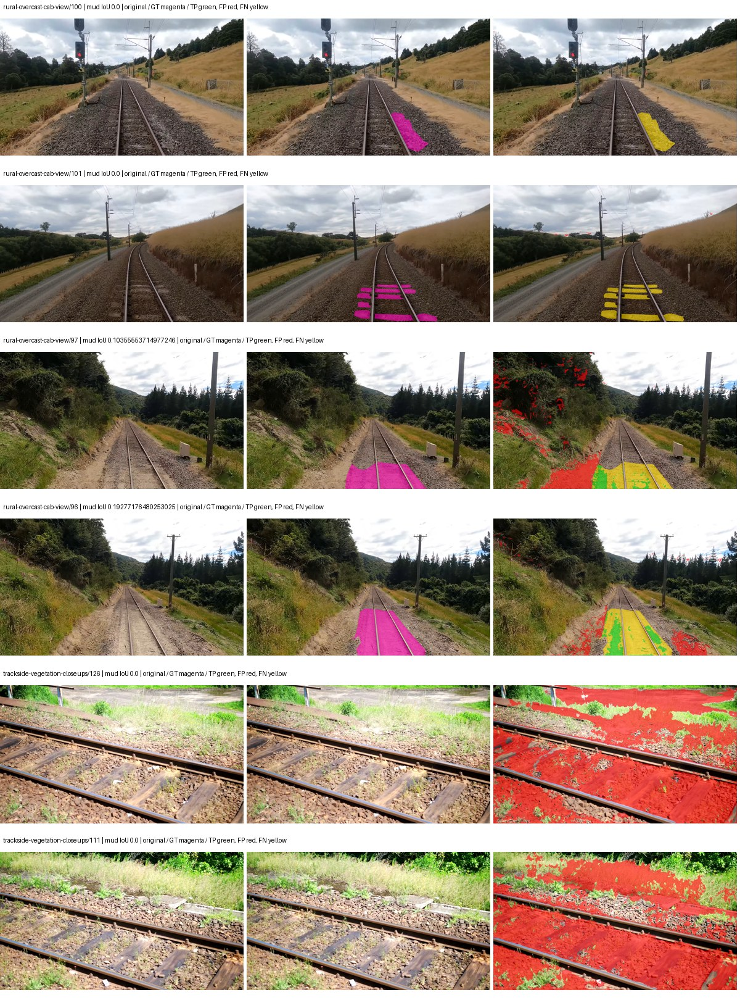
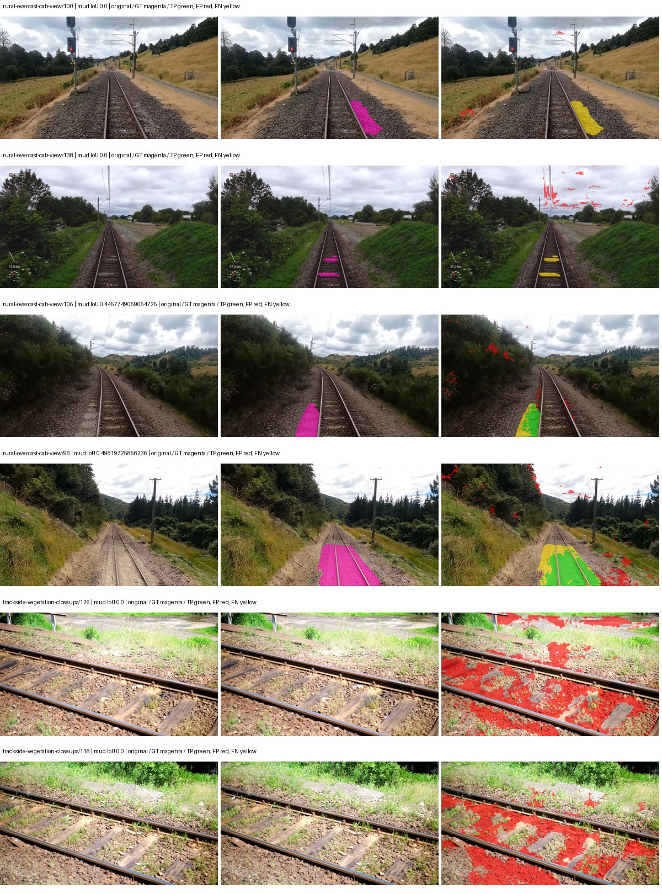
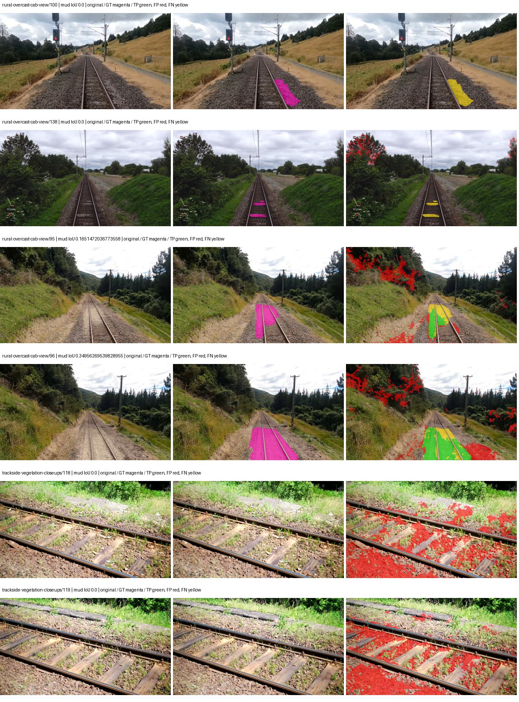
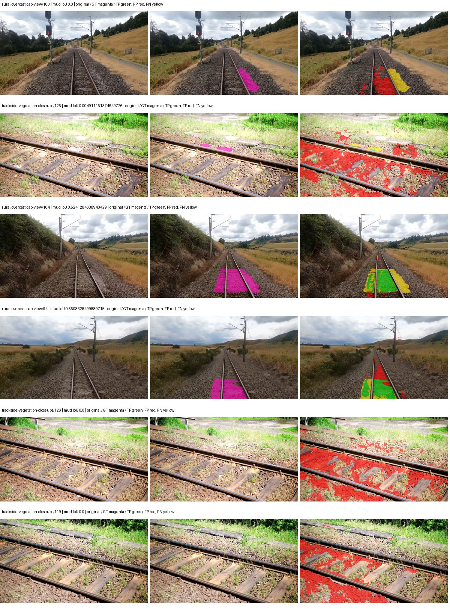
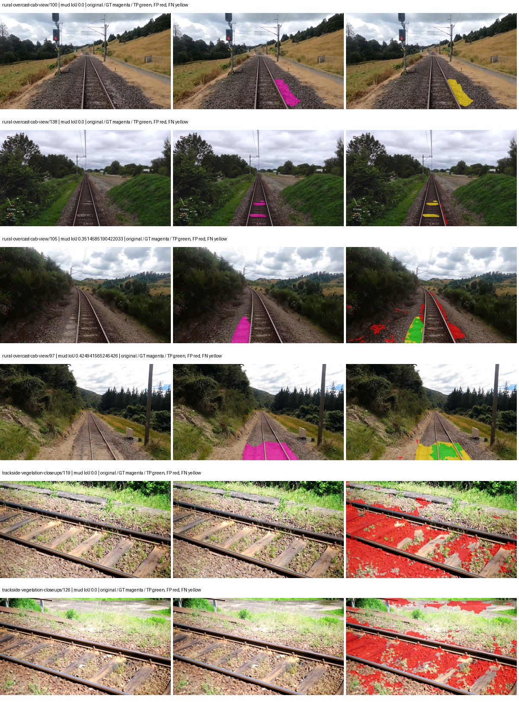
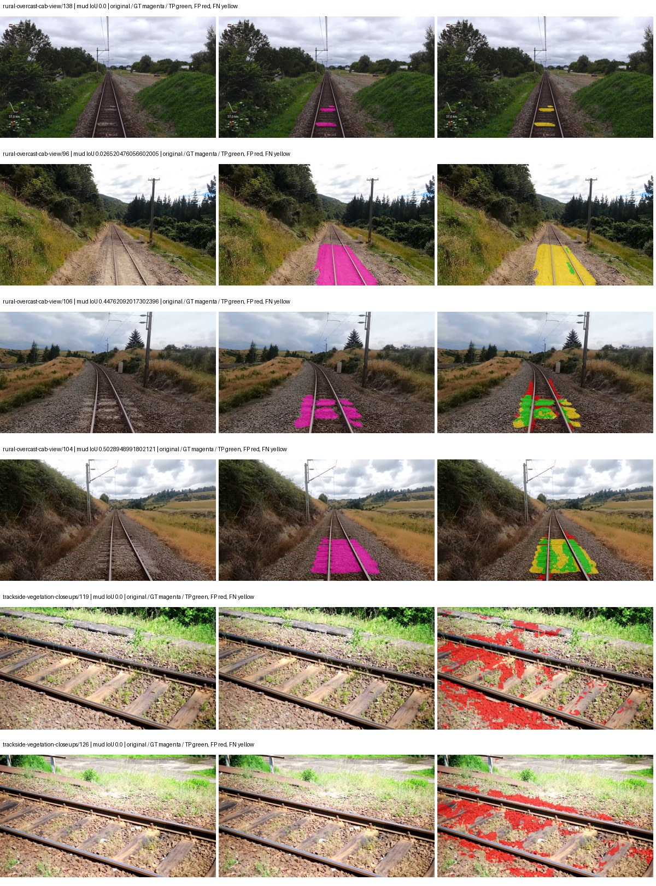
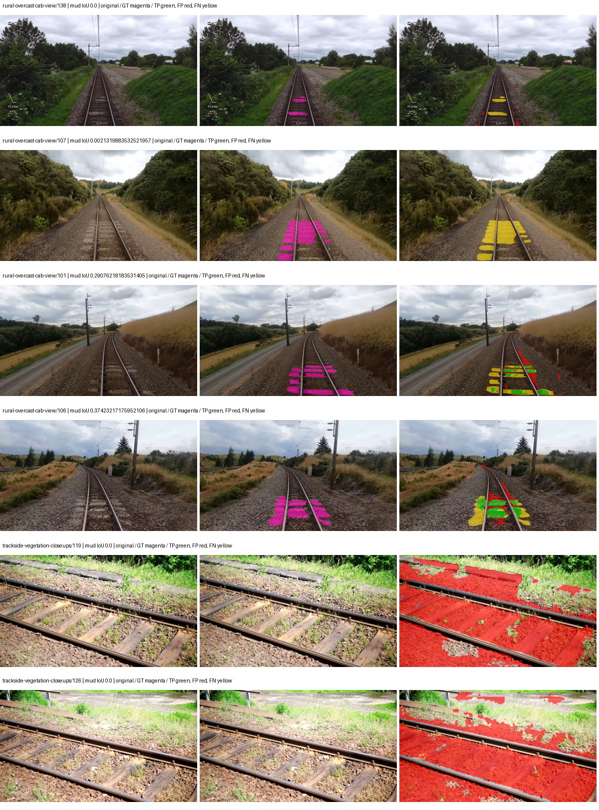

# smp_manet_efficientnet_b0 — paul-test-rtis

[RTIS comparison](../../README.md) · [Full model records](record.json)

Primary selection and early stopping: **mud-pumping validation IoU**. A job is complete only after full statistics and isolated profiling are verified.

| Model | Initialization path | Seed | Status | Steps | Best step | Mud IoU (%) | Mud precision (%) | Mud recall (%) | Final mud IoU (trainer val, %) | mIoU (%) | Fixed GT-class mIoU (%) |
| --- | --- | --- | --- | --- | --- | --- | --- | --- | --- | --- | --- |
| smp_manet_efficientnet_b0 | rtis_only | 0 | completed | 2290 | 1018 | 0.82 | 0.92 | 7.03 | 0.18 | 20.16 | 21.28 |
| smp_manet_efficientnet_b0 | rtis_only | 1 | completed | 3054 | 1781 | 8.63 | 10.14 | 36.62 | 3.20 | 20.99 | 22.16 |
| smp_manet_efficientnet_b0 | rtis_only | 2 | completed | 2290 | 1018 | 4.46 | 5.37 | 20.91 | 1.05 | 18.98 | 20.04 |
| smp_manet_efficientnet_b0 | cityscapes_to_rtis | 0 | completed | 1781 | 509 | 11.04 | 13.46 | 38.07 | 2.76 | 21.47 | 22.66 |
| smp_manet_efficientnet_b0 | cityscapes_to_rtis | 1 | collecting | 3054 | 1781 | 8.68 | 11.48 | 26.26 | 2.73 | 21.37 | 23.74 |
| smp_manet_efficientnet_b0 | cityscapes_to_rtis | 2 | completed | 2290 | 1018 | 3.28 | 3.97 | 15.86 | 0.48 | 21.11 | 22.28 |
| smp_manet_efficientnet_b0 | railsem19_to_rtis | 0 | completed | 2545 | 1272 | 8.27 | 11.60 | 22.35 | 2.94 | 25.62 | 28.47 |
| smp_manet_efficientnet_b0 | railsem19_to_rtis | 1 | completed | 1527 | 254 | 2.34 | 2.60 | 18.85 | 0.40 | 25.52 | 25.52 |
| smp_manet_efficientnet_b0 | railsem19_to_rtis | 2 | training | 2549 | — | — | — | — | — | — | — |
| smp_manet_efficientnet_b0 | cityscapes_to_railsem19_to_rtis | 0 | training | 1599 | — | — | — | — | — | — | — |
| smp_manet_efficientnet_b0 | cityscapes_to_railsem19_to_rtis | 1 | collecting | 1527 | 254 | 6.48 | 7.33 | 35.73 | 5.93 | 23.85 | 23.85 |
| smp_manet_efficientnet_b0 | cityscapes_to_railsem19_to_rtis | 2 | training | 1499 | — | — | — | — | — | — | — |

Training: 220 images. Validation: 37 images. Test: 50 held out. Seeds: [0, 1, 2]. Seed variation measures optimization variability, not independent-recording uncertainty. Historical source checkpoints stay fixed across adaptation seeds.

Training code: `066afb2626398b7be59d4d19f5a0e4644fd59adc`. Split SHA-256: `71fef8292610c352da0709fe3bd030f3bcc18f97560394835f4b22826463b83d`.

## rtis_only — seed 0

Status: **completed**. Started: 2026-09-07T07:46:01.545023+00:00. Finished: 2026-09-07T08:15:47.448776+00:00.

Recipe pretrained initializer: `{"arch": "smp", "backbone_path": null, "batch_norm_momentum": null, "checkpoint": null, "classifier_path": null, "drop_path": null, "encoder_name": "efficientnet-b0", "encoder_weights": "imagenet", "head": "unified_head", "head_paths": [], "inactive_parameter_paths": ["encoder._conv_head", "encoder._bn1"], "local_files_only": false, "lora_alpha": 32, "lora_dropout": 0.05, "lora_r": 16, "lora_targets": [], "native": null, "revision": null, "smp_arch": "MAnet", "subfolder": null, "trust_remote_code": false, "tuning": "full"}`.

`rtis_only` uses the recipe initializer, which may include pretrained segmentation components. Transfer paths load the exact historical source checkpoint below and reset the classifier; they do not reset all query/decoder features.

Source checkpoint: `Recipe pretrained initialization`.

Config SHA-256: `9a7ece3bf03c0880e1e6d7022ed2ecca99c1c889b1ae4dd568534ad8625ec859`. Weights used for validation: `raw`.

### Mud-pumping and aggregate quality

| Metric | Selected checkpoint | Final training validation |
| --- | --- | --- |
| Mud IoU | 0.82 | 0.18 |
| Mud precision | 0.92 | 0.28 |
| Mud recall | 7.03 | 0.51 |
| Mud Dice/F1 | 1.62 | 0.36 |
| mIoU | 20.16 | 23.77 |
| Mean accuracy | 25.39 | 31.90 |
| Mean precision | 36.59 | 37.84 |
| Mean Dice | 25.24 | 29.97 |
| Mean specificity | 98.55 | 98.62 |
| Pixel accuracy | 76.10 | 78.60 |
| Frequency-weighted IoU | 67.07 | 67.83 |
| Fixed GT-present class mIoU | 21.28 | 25.09 |
| Boundary F1 | 23.59 | 26.97 |

The selected checkpoint has independent evaluation evidence. Final values are the trainer's final validation record, not a new independent evaluation. mIoU averages classes with nonzero union, so false positives on absent classes can change its denominator. The fixed GT-class mean is supplementary and excludes absent classes; their false positives remain in the confusion matrix.

### Resource usage and timing

| Measurement | Value |
| --- | --- |
| Peak training VRAM, retained training invocation (GiB) | 8.80 |
| Peak evaluation VRAM (GiB) | 6.37 |
| Retained training invocation wall time (seconds) | 1663.75 |
| Retained training invocation GPU-hours (one GPU) | 0.46 |
| Evaluation wall time (seconds) | 10.31 |
| Full evaluation pipeline images/second | 3.59 |
| Best full-state checkpoint (MiB) | 136.59 |
| Final full-state checkpoint (MiB) | 136.57 |
| Audited periodic checkpoints removed (GiB) | 0.53 |

VRAM uses the recorded allocator high-water mark; it is not total device usage including CUDA context. Resumed jobs' retained training invocation times and peaks are **not whole-campaign totals**. Earlier invocation resource records are not reconstructed here. Evaluation throughput includes loader, sliding-window inference and metrics; it is not model-only latency/FPS. Missing measurements are shown as —, never inferred from another dataset's run.

### Standardized inference performance

Dedicated model-only profiling waits for an idle worker-locked L40S: BF16, batch 1, 1024x1024, 20 warmup and 100 CUDA-event-timed public forwards. It excludes loading, preprocessing, tiling and metrics.

| Status | Parameters | Weight MiB | FPS | p50 ms | p95 ms | Peak reserved GiB |
| --- | --- | --- | --- | --- | --- | --- |
| complete | 9095257 | 34.70 | 94.42 | 10.47 | 11.43 | 0.57 |

```json
{
  "schema_version": 1,
  "model_id": "smp_manet_efficientnet_b0",
  "measured_at": "2026-09-07T08:15:45+00:00",
  "status": "complete",
  "benchmark_scope": "rtis_selected_checkpoint_model_only",
  "applies_to": [
    "smp_manet_efficientnet_b0--rtis_only--seed-0"
  ],
  "source": {
    "campaign_git_sha": "066afb2626398b7be59d4d19f5a0e4644fd59adc",
    "git_dirty": false,
    "config_hash": "42bc2eb45667",
    "resolved_config": "/data/izadia1/projects/segmentary-runs/paul-test-rtis/mud-fullstats-v1-20260906-r2/configs/smp_manet_efficientnet_b0--rtis_only--seed-0.yaml",
    "config_sha256": "9a7ece3bf03c0880e1e6d7022ed2ecca99c1c889b1ae4dd568534ad8625ec859",
    "checkpoint_sha256": "49b6bcc0723caa18105269d52f4a599a6383ab6c6cacd71630f949564354ebb3",
    "checkpoint_global_step": 1018,
    "checkpoint_bytes": 143226380,
    "checkpoint_kind": "resume checkpoint with optimizer and EMA state",
    "weights": "raw",
    "measured_checkpoint_job_id": "smp_manet_efficientnet_b0--rtis_only--seed-0",
    "result_sha256": "74b4ea72d7b2a19092e2d93205bb12583414361994dc9daf29bb117095affdfb",
    "result_git_sha": "066afb2626398b7be59d4d19f5a0e4644fd59adc",
    "result_stage": "eval:paul-test-rtis:val",
    "result_seed": 0
  },
  "hardware": {
    "gpu_name": "NVIDIA L40S",
    "gpu_uuid": "GPU-1c9b612f-e0b5-fbbc-150f-8c2ef13453c9",
    "logical_device": "cuda:0",
    "physical_visibility_token": "5",
    "compute_capability": [
      8,
      9
    ],
    "total_memory_bytes": 47677177856
  },
  "model": {
    "parameter_count": 9095257,
    "trainable_parameter_count": 8683097,
    "resident_parameter_bytes": 36381028,
    "parameter_dtype_counts": {
      "float32": 9095257
    }
  },
  "contract": {
    "backend": "pytorch",
    "precision": "bf16_autocast",
    "batch_size": 1,
    "input_shape_nchw": [
      1,
      3,
      1024,
      1024
    ],
    "warmup_iterations": 20,
    "measured_iterations": 100,
    "timing": "per-forward CUDA events with end-event synchronization",
    "includes_preprocessing": false,
    "includes_data_loader": false,
    "includes_sliding_window": false,
    "input_resident_on_gpu": true,
    "model_only": true,
    "entrypoint": "public model(image) dense-logits forward"
  },
  "measurements": {
    "latency": {
      "p50_ms": 10.470400333404541,
      "p95_ms": 11.425280141830443,
      "mean_ms": 10.590935039520264,
      "minimum_ms": 10.120160102844238,
      "maximum_ms": 14.590975761413574,
      "fps": 94.42036952058359,
      "raw_ms": [
        10.726400375366211,
        11.323391914367676,
        11.212800025939941,
        11.23737621307373,
        10.553343772888184,
        11.090944290161133,
        14.590975761413574,
        10.915840148925781,
        10.796031951904297,
        10.799103736877441,
        10.704895973205566,
        11.11961555480957,
        10.63424015045166,
        10.727423667907715,
        10.854399681091309,
        10.475520133972168,
        10.42636775970459,
        10.763263702392578,
        11.713536262512207,
        10.722304344177246,
        11.419648170471191,
        10.300415992736816,
        10.141695976257324,
        10.175488471984863,
        10.449919700622559,
        11.185152053833008,
        11.151359558105469,
        10.62707233428955,
        10.292223930358887,
        10.195967674255371,
        10.550271987915039,
        10.210335731506348,
        11.577343940734863,
        11.930624008178711,
        10.861568450927734,
        10.263551712036133,
        10.265600204467773,
        10.143744468688965,
        10.263551712036133,
        11.193344116210938,
        11.53228759765625,
        10.155008316040039,
        10.446847915649414,
        10.358783721923828,
        10.805248260498047,
        10.350591659545898,
        10.93734359741211,
        10.853376388549805,
        10.707967758178711,
        10.249216079711914,
        10.711039543151855,
        10.170368194580078,
        10.12224006652832,
        10.132479667663574,
        10.576895713806152,
        10.168319702148438,
        10.781696319580078,
        10.472448348999023,
        10.184703826904297,
        10.285056114196777,
        10.1396484375,
        10.697728157043457,
        10.162176132202148,
        10.587136268615723,
        10.181632041931152,
        10.446847915649414,
        10.136575698852539,
        10.134559631347656,
        10.145792007446289,
        10.132479667663574,
        10.480640411376953,
        10.202112197875977,
        10.52467155456543,
        10.554368019104004,
        10.150912284851074,
        10.468352317810059,
        10.151935577392578,
        10.120160102844238,
        10.404864311218262,
        10.760191917419434,
        10.135552406311035,
        10.146783828735352,
        10.341376304626465,
        10.159104347229004,
        10.741727828979492,
        10.685440063476562,
        10.22771167755127,
        11.407360076904297,
        10.265600204467773,
        10.1212158203125,
        10.52467155456543,
        10.94041633605957,
        10.166272163391113,
        10.176511764526367,
        10.1396484375,
        10.133503913879395,
        10.176511764526367,
        10.757120132446289,
        10.163200378417969,
        10.512415885925293
      ],
      "percentile_method": "numpy linear interpolation"
    },
    "peak_reserved_bytes": 614465536,
    "memory_kind": "pytorch_cuda_allocator_peak_reserved_excluding_context",
    "benchmark_wall_clock_s": 21.941352535039186
  },
  "started_at": "2026-09-07T08:15:23+00:00",
  "finished_at": "2026-09-07T08:15:45+00:00",
  "environment": {
    "hostname": "hdrfs-app-001",
    "python": "3.11.15",
    "platform": "Linux-5.15.0-139-generic-x86_64-with-glibc2.35",
    "torch": "2.11.0+cu128",
    "torch_cuda": "12.8",
    "cudnn": 91900,
    "driver_version": "570.133.20",
    "cuda_available": true,
    "gpu_count": 1,
    "gpu_names": [
      "NVIDIA L40S"
    ],
    "cuda_visible_devices": "5",
    "packages": {
      "segmentary": "0.1.0",
      "torch": "2.11.0+cu128",
      "torchvision": "0.26.0+cu128",
      "transformers": "5.15.0",
      "timm": "1.0.28",
      "segmentation-models-pytorch": "0.5.0",
      "albumentations": "2.0.8",
      "lightning": "2.6.5",
      "numpy": "2.4.4"
    }
  }
}
```

### Per-class validation results

| Class | GT pixels | IoU (%) | Precision (%) | Recall (%) | Dice (%) | Boundary F1 (%) |
| --- | --- | --- | --- | --- | --- | --- |
| car | 29664 | 0.00 | 0.00 | 0.00 | 0.00 | 0.00 |
| construction | 311585 | 17.92 | 25.20 | 38.26 | 30.39 | 27.57 |
| fence | 265137 | 0.14 | 8.57 | 0.14 | 0.28 | 2.14 |
| mud-pumping | 1226250 | 0.82 | 0.92 | 7.03 | 1.62 | 1.95 |
| on-rails | 0 | 0.00 | 0.00 | — | 0.00 | 0.00 |
| person | 0 | — | — | — | — | — |
| pole | 628038 | 26.87 | 83.14 | 28.42 | 42.36 | 73.79 |
| rail-embedded | 16799 | 0.00 | 0.00 | 0.00 | 0.00 | 0.00 |
| rail-raised | 2969797 | 70.44 | 85.23 | 80.23 | 82.65 | 89.37 |
| rail-track | 6323197 | 29.26 | 62.70 | 35.42 | 45.27 | 43.15 |
| road | 1048831 | 0.41 | 19.48 | 0.41 | 0.81 | 3.24 |
| sidewalk | 1297367 | 1.35 | 68.94 | 1.36 | 2.67 | 7.91 |
| sky | 19121606 | 87.91 | 99.06 | 88.65 | 93.57 | 68.24 |
| standing-water | 95802 | 0.00 | 0.00 | 0.00 | 0.00 | 0.00 |
| terrain | 39239306 | 82.35 | 85.03 | 96.32 | 90.32 | 37.34 |
| trackbed | 10643081 | 55.71 | 72.47 | 70.67 | 71.56 | 52.69 |
| traffic-light | 19510 | 0.00 | 0.00 | 0.00 | 0.00 | 0.00 |
| traffic-sign | 13285 | 0.00 | 0.00 | 0.00 | 0.00 | 0.00 |
| tram-track | 56179 | 0.00 | 0.00 | 0.00 | 0.00 | 0.00 |
| truck | 0 | — | — | — | — | — |
| vegetation-overgrowth | 5901821 | 9.88 | 84.56 | 10.06 | 17.98 | 40.89 |

### Full-run accounting

| Measurement | Value |
| --- | --- |
| Full GPU-reserved wall seconds, all recorded worker attempts | 1785.91 |
| Full reserved GPU-hours | 0.50 |
| Whole-run timing complete | True |

| Phase | Wall seconds including failed attempts |
| --- | --- |
| training | 1670.21 |
| diagnostics | 69.06 |
| performance | 28.42 |

GPU-reserved time includes model loading, training, validation, collection, profiling, checkpoint I/O and orchestration while the worker owns one GPU. It is not GPU kernel-active time. Phase timings and sampled device memory/power/utilization are retained separately; sampled device memory is not the allocator high-water mark.

### Train/validation and raw/EMA diagnostics

| Checkpoint / weights / split | Images | Mud IoU (%) | Mud precision (%) | Mud recall (%) |
| --- | --- | --- | --- | --- |
| best-auto-train / raw | 220 | 74.78 | 77.09 | 96.14 |
| best-auto-val / raw | 37 | 0.82 | 0.92 | 7.03 |
| best-alternate-val / ema | 37 | 1.27 | 1.35 | 17.23 |
| final-auto-val / raw | 37 | 0.18 | 0.28 | 0.51 |

Train uses the evaluation transform without augmentation. Compare mud train/validation metrics for the same selected weights. Alternate EMA on running-stat BatchNorm is explicitly uncalibrated and is diagnostic only. Score-threshold curves use uncalibrated normalized scores and are pixel-level diagnostics, not event detection rates or a selected deployment operating point.

### Downloadable evidence

- best-auto-train: [per-image.csv](rtis_only--seed-0/best-auto-train/per-image.csv) · [per-image-confusion.json.gz](rtis_only--seed-0/best-auto-train/per-image-confusion.json.gz) · [groups.json](rtis_only--seed-0/best-auto-train/groups.json) · [mud-score-curves.json](rtis_only--seed-0/best-auto-train/mud-score-curves.json)
- best-auto-val: [per-image.csv](rtis_only--seed-0/best-auto-val/per-image.csv) · [per-image-confusion.json.gz](rtis_only--seed-0/best-auto-val/per-image-confusion.json.gz) · [groups.json](rtis_only--seed-0/best-auto-val/groups.json) · [mud-score-curves.json](rtis_only--seed-0/best-auto-val/mud-score-curves.json) · [examples.jpg](rtis_only--seed-0/best-auto-val/examples.jpg)
- best-alternate-val: [per-image.csv](rtis_only--seed-0/best-alternate-val/per-image.csv) · [per-image-confusion.json.gz](rtis_only--seed-0/best-alternate-val/per-image-confusion.json.gz) · [groups.json](rtis_only--seed-0/best-alternate-val/groups.json) · [mud-score-curves.json](rtis_only--seed-0/best-alternate-val/mud-score-curves.json)
- final-auto-val: [per-image.csv](rtis_only--seed-0/final-auto-val/per-image.csv) · [per-image-confusion.json.gz](rtis_only--seed-0/final-auto-val/per-image-confusion.json.gz) · [groups.json](rtis_only--seed-0/final-auto-val/groups.json) · [mud-score-curves.json](rtis_only--seed-0/final-auto-val/mud-score-curves.json)
- resources: [telemetry.csv](rtis_only--seed-0/resources/telemetry.csv)



Examples are two lowest and two highest mud-IoU positive images, plus up to two negative images with the most false-positive mud pixels. They are targeted diagnostic examples, not random samples. Green: true positive; red: false positive; yellow: false negative. Full predictions remain on HDRFS.

### Validation tracking

| Logged step | Overall mIoU (%) | Mud IoU (%) |
| --- | --- | --- |
| 254 | 18.30 | 0.15 |
| 508 | 18.68 | 0.56 |
| 763 | 19.41 | 0.70 |
| 1017 | 20.16 | 0.82 |
| 1272 | 19.76 | 0.29 |
| 1527 | 20.73 | 0.11 |
| 1781 | 20.95 | 0.43 |
| 2036 | 21.58 | 0.48 |
| 2290 | 23.77 | 0.18 |

All retained scalar curves, including training loss and per-class IoU, are in record.json. Observed best mud on a curve is not necessarily a retained checkpoint: the pilot saved its selection-metric-best and final checkpoints. Step logging and checkpoint global_step may differ by one.

### Stopping and checkpoint provenance

```json
{
  "stopping": {
    "actual_steps": 2290,
    "maximum_steps": 4000,
    "min_delta": 0.001,
    "monitor": "val_iou/mud-pumping",
    "patience": 5,
    "reason": "validation_plateau"
  },
  "checkpoints": {
    "best": {
      "path": "/data/izadia1/projects/segmentary-runs/paul-test-rtis/mud-fullstats-v1-20260906-r2/future-runs/smp_manet_efficientnet_b0--rtis_only--seed-0_seed0/rtis/best.ckpt",
      "sha256": "49b6bcc0723caa18105269d52f4a599a6383ab6c6cacd71630f949564354ebb3",
      "global_step": 1018,
      "bytes": 143226380
    },
    "final": {
      "path": "/data/izadia1/projects/segmentary-runs/paul-test-rtis/mud-fullstats-v1-20260906-r2/future-runs/smp_manet_efficientnet_b0--rtis_only--seed-0_seed0/rtis/last.ckpt",
      "sha256": "917f3d0ae70291f4d91a967fd0a57344aa668f254db7c839fbd58d8594626e88",
      "global_step": 2290,
      "bytes": 143208460
    }
  },
  "cleanup_error": null
}
```

### Resolved training, initialization and evaluation settings

The optimizer block is the base configuration. Stage LR scales are applied at runtime, and stage warmup is capped at min(base warmup, floor(stage budget / 10), stage budget - 1): 400 steps for this 4,000-step pilot. Model-internal native input grids may differ from augmentation crops (EoMT uses its 640 grid).

```json
{
  "name": "smp_manet_efficientnet_b0--rtis_only--seed-0",
  "model": {
    "arch": "smp",
    "checkpoint": null,
    "tuning": "full",
    "head": "unified_head",
    "lora_r": 16,
    "lora_alpha": 32,
    "lora_dropout": 0.05,
    "lora_targets": [],
    "drop_path": null,
    "revision": null,
    "subfolder": null,
    "local_files_only": false,
    "trust_remote_code": false,
    "backbone_path": null,
    "head_paths": [],
    "classifier_path": null,
    "inactive_parameter_paths": [
      "encoder._conv_head",
      "encoder._bn1"
    ],
    "smp_arch": "MAnet",
    "encoder_name": "efficientnet-b0",
    "encoder_weights": "imagenet",
    "native": null,
    "batch_norm_momentum": null
  },
  "space": "paul-test-rtis",
  "taxonomy_root": "/data/izadia1/projects/segmentary-rtis-fullstats-066afb2/taxonomy",
  "output_root": "/data/izadia1/projects/segmentary-runs/paul-test-rtis/mud-fullstats-v1-20260906-r2/future-runs",
  "optim": {
    "backbone_lr": 0.0001,
    "head_lr_mult": 10.0,
    "weight_decay": 0.05,
    "llrd": 1.0,
    "warmup_iters": 1500,
    "warmup_ratio": 1e-06,
    "poly_power": 0.9,
    "min_lr_ratio": 0.0,
    "betas": [
      0.9,
      0.999
    ],
    "grad_clip": 1.0
  },
  "train": {
    "iters": 4000,
    "batch_size": 2,
    "accum": 8,
    "num_workers": 2,
    "precision": "bf16-mixed",
    "ema_decay": 0.9998,
    "val_every": 250,
    "ckpt_every": 500,
    "selection_metric": "val_iou/mud-pumping",
    "early_stopping_patience": 5,
    "early_stopping_min_delta": 0.001,
    "seed": 0,
    "devices": 1
  },
  "eval": {
    "sliding_window": true,
    "window": [
      1024,
      1024
    ],
    "stride": [
      768,
      768
    ],
    "batch_size": 1,
    "num_workers": 2,
    "tta_scales": [],
    "tta_flip": false,
    "threshold": 0.5,
    "boundary_tolerance_frac": 0.0075,
    "save_confusion": true
  },
  "loss": {
    "task": "multiclass",
    "activation": "auto",
    "terms": [],
    "aux": "none",
    "aux_weight": 0.0,
    "ce_weight": 1.0,
    "label_smoothing": 0.0,
    "class_weights": null,
    "query": null
  },
  "aug": {
    "crop": [
      1024,
      1024
    ],
    "scale_min": 0.5,
    "scale_max": 2.0,
    "hflip_p": 0.5,
    "color_jitter_p": 0.5,
    "brightness": 0.25,
    "contrast": 0.25,
    "saturation": 0.25,
    "hue": 0.05
  },
  "stages": [
    {
      "name": "rtis",
      "data": [
        {
          "name": "paul-test-rtis",
          "root": "/data/izadia1/datasets/paul-test-rtis",
          "variant": null,
          "split_file": "splits.json",
          "train_split": "train",
          "val_split": "val",
          "limit": null,
          "loader": "folder",
          "mapping": "paul-test-rtis",
          "loader_options": {
            "require_groups": true
          }
        }
      ],
      "iters": null,
      "lr_scale": 1.0,
      "head_group_lr_scale": 1.0,
      "init_from": "pretrained",
      "reset_head": false,
      "freeze": null,
      "sample_weights": null
    }
  ]
}
```

### Hardware and software provenance

```json
{
  "training": {
    "cuda_available": true,
    "cuda_visible_devices": "5",
    "cudnn": 91900,
    "driver_version": "570.133.20",
    "gpu_count": 1,
    "gpu_names": [
      "NVIDIA L40S"
    ],
    "hostname": "hdrfs-app-001",
    "input_normalization": {
      "channel_order": "rgb",
      "mean": [
        0.485,
        0.456,
        0.406
      ],
      "source": "smp_encoder_settings",
      "std": [
        0.229,
        0.224,
        0.225
      ]
    },
    "model_origins": [
      {
        "hf_commit": null,
        "hf_name_or_path": null,
        "module": "model",
        "timm_pretrained": {}
      }
    ],
    "model_parameter_count": 9095257,
    "packages": {
      "albumentations": "2.0.8",
      "lightning": "2.6.5",
      "numpy": "2.4.4",
      "segmentary": "0.1.0",
      "segmentation-models-pytorch": "0.5.0",
      "timm": "1.0.28",
      "torch": "2.11.0+cu128",
      "torchvision": "0.26.0+cu128",
      "transformers": "5.15.0"
    },
    "platform": "Linux-5.15.0-139-generic-x86_64-with-glibc2.35",
    "python": "3.11.15",
    "torch": "2.11.0+cu128",
    "torch_cuda": "12.8",
    "trainable_parameter_count": 8683097,
    "training_stop": {
      "actual_steps": 2290,
      "maximum_steps": 4000,
      "min_delta": 0.001,
      "monitor": "val_iou/mud-pumping",
      "patience": 5,
      "reason": "validation_plateau"
    },
    "validation_weights": "raw"
  },
  "evaluation": {
    "cuda_available": true,
    "cuda_visible_devices": "5",
    "cudnn": 91900,
    "driver_version": "570.133.20",
    "gpu_count": 1,
    "gpu_names": [
      "NVIDIA L40S"
    ],
    "hostname": "hdrfs-app-001",
    "input_normalization": {
      "channel_order": "rgb",
      "mean": [
        0.485,
        0.456,
        0.406
      ],
      "source": "smp_encoder_settings",
      "std": [
        0.229,
        0.224,
        0.225
      ]
    },
    "packages": {
      "albumentations": "2.0.8",
      "lightning": "2.6.5",
      "numpy": "2.4.4",
      "segmentary": "0.1.0",
      "segmentation-models-pytorch": "0.5.0",
      "timm": "1.0.28",
      "torch": "2.11.0+cu128",
      "torchvision": "0.26.0+cu128",
      "transformers": "5.15.0"
    },
    "platform": "Linux-5.15.0-139-generic-x86_64-with-glibc2.35",
    "python": "3.11.15",
    "torch": "2.11.0+cu128",
    "torch_cuda": "12.8"
  }
}
```

## rtis_only — seed 1

Status: **completed**. Started: 2026-09-07T07:48:31.807788+00:00. Finished: 2026-09-07T08:27:09.456295+00:00.

Recipe pretrained initializer: `{"arch": "smp", "backbone_path": null, "batch_norm_momentum": null, "checkpoint": null, "classifier_path": null, "drop_path": null, "encoder_name": "efficientnet-b0", "encoder_weights": "imagenet", "head": "unified_head", "head_paths": [], "inactive_parameter_paths": ["encoder._conv_head", "encoder._bn1"], "local_files_only": false, "lora_alpha": 32, "lora_dropout": 0.05, "lora_r": 16, "lora_targets": [], "native": null, "revision": null, "smp_arch": "MAnet", "subfolder": null, "trust_remote_code": false, "tuning": "full"}`.

`rtis_only` uses the recipe initializer, which may include pretrained segmentation components. Transfer paths load the exact historical source checkpoint below and reset the classifier; they do not reset all query/decoder features.

Source checkpoint: `Recipe pretrained initialization`.

Config SHA-256: `0258a216cc7225624951f6ce40f0b9ebacbea56f2c959a9efb85824db8aafcf5`. Weights used for validation: `raw`.

### Mud-pumping and aggregate quality

| Metric | Selected checkpoint | Final training validation |
| --- | --- | --- |
| Mud IoU | 8.63 | 3.20 |
| Mud precision | 10.14 | 6.63 |
| Mud recall | 36.62 | 5.84 |
| Mud Dice/F1 | 15.89 | 6.21 |
| mIoU | 20.99 | 22.27 |
| Mean accuracy | 31.39 | 29.26 |
| Mean precision | 33.08 | 34.02 |
| Mean Dice | 26.46 | 28.16 |
| Mean specificity | 98.54 | 98.59 |
| Pixel accuracy | 75.88 | 78.77 |
| Frequency-weighted IoU | 65.78 | 67.65 |
| Fixed GT-present class mIoU | 22.16 | 23.51 |
| Boundary F1 | 23.43 | 25.36 |

The selected checkpoint has independent evaluation evidence. Final values are the trainer's final validation record, not a new independent evaluation. mIoU averages classes with nonzero union, so false positives on absent classes can change its denominator. The fixed GT-class mean is supplementary and excludes absent classes; their false positives remain in the confusion matrix.

### Resource usage and timing

| Measurement | Value |
| --- | --- |
| Peak training VRAM, retained training invocation (GiB) | 8.80 |
| Peak evaluation VRAM (GiB) | 6.37 |
| Retained training invocation wall time (seconds) | 2191.43 |
| Retained training invocation GPU-hours (one GPU) | 0.61 |
| Evaluation wall time (seconds) | 10.65 |
| Full evaluation pipeline images/second | 3.47 |
| Best full-state checkpoint (MiB) | 136.59 |
| Final full-state checkpoint (MiB) | 136.57 |
| Audited periodic checkpoints removed (GiB) | 0.80 |

VRAM uses the recorded allocator high-water mark; it is not total device usage including CUDA context. Resumed jobs' retained training invocation times and peaks are **not whole-campaign totals**. Earlier invocation resource records are not reconstructed here. Evaluation throughput includes loader, sliding-window inference and metrics; it is not model-only latency/FPS. Missing measurements are shown as —, never inferred from another dataset's run.

### Standardized inference performance

Dedicated model-only profiling waits for an idle worker-locked L40S: BF16, batch 1, 1024x1024, 20 warmup and 100 CUDA-event-timed public forwards. It excludes loading, preprocessing, tiling and metrics.

| Status | Parameters | Weight MiB | FPS | p50 ms | p95 ms | Peak reserved GiB |
| --- | --- | --- | --- | --- | --- | --- |
| complete | 9095257 | 34.70 | 96.09 | 10.24 | 11.25 | 0.57 |

```json
{
  "schema_version": 1,
  "model_id": "smp_manet_efficientnet_b0",
  "measured_at": "2026-09-07T08:27:06+00:00",
  "status": "complete",
  "benchmark_scope": "rtis_selected_checkpoint_model_only",
  "applies_to": [
    "smp_manet_efficientnet_b0--rtis_only--seed-1"
  ],
  "source": {
    "campaign_git_sha": "066afb2626398b7be59d4d19f5a0e4644fd59adc",
    "git_dirty": false,
    "config_hash": "44a573d9fd2f",
    "resolved_config": "/data/izadia1/projects/segmentary-runs/paul-test-rtis/mud-fullstats-v1-20260906-r2/configs/smp_manet_efficientnet_b0--rtis_only--seed-1.yaml",
    "config_sha256": "0258a216cc7225624951f6ce40f0b9ebacbea56f2c959a9efb85824db8aafcf5",
    "checkpoint_sha256": "064844566b79cd0ef8067252129699a537dd0a6d43465105070e5a1abdc0ab10",
    "checkpoint_global_step": 1781,
    "checkpoint_bytes": 143226380,
    "checkpoint_kind": "resume checkpoint with optimizer and EMA state",
    "weights": "raw",
    "measured_checkpoint_job_id": "smp_manet_efficientnet_b0--rtis_only--seed-1",
    "result_sha256": "50bb2f1a74056c241f2d76eb1328f69cc22775f0778c5fa034f51471a98d9630",
    "result_git_sha": "066afb2626398b7be59d4d19f5a0e4644fd59adc",
    "result_stage": "eval:paul-test-rtis:val",
    "result_seed": 1
  },
  "hardware": {
    "gpu_name": "NVIDIA L40S",
    "gpu_uuid": "GPU-fc5dde96-210d-0afa-ac74-7f88477d622b",
    "logical_device": "cuda:0",
    "physical_visibility_token": "4",
    "compute_capability": [
      8,
      9
    ],
    "total_memory_bytes": 47677177856
  },
  "model": {
    "parameter_count": 9095257,
    "trainable_parameter_count": 8683097,
    "resident_parameter_bytes": 36381028,
    "parameter_dtype_counts": {
      "float32": 9095257
    }
  },
  "contract": {
    "backend": "pytorch",
    "precision": "bf16_autocast",
    "batch_size": 1,
    "input_shape_nchw": [
      1,
      3,
      1024,
      1024
    ],
    "warmup_iterations": 20,
    "measured_iterations": 100,
    "timing": "per-forward CUDA events with end-event synchronization",
    "includes_preprocessing": false,
    "includes_data_loader": false,
    "includes_sliding_window": false,
    "input_resident_on_gpu": true,
    "model_only": true,
    "entrypoint": "public model(image) dense-logits forward"
  },
  "measurements": {
    "latency": {
      "p50_ms": 10.235904216766357,
      "p95_ms": 11.25493779182434,
      "mean_ms": 10.406789140701294,
      "minimum_ms": 10.064895629882812,
      "maximum_ms": 12.263423919677734,
      "fps": 96.09111768095379,
      "raw_ms": [
        10.582015991210938,
        10.207200050354004,
        10.519552230834961,
        10.133503913879395,
        10.105855941772461,
        10.198047637939453,
        10.233856201171875,
        11.060223579406738,
        10.210240364074707,
        10.265600204467773,
        12.263423919677734,
        10.926079750061035,
        10.095616340637207,
        10.10483169555664,
        10.064895629882812,
        10.710016250610352,
        10.176511764526367,
        10.157055854797363,
        10.088447570800781,
        10.161151885986328,
        10.290176391601562,
        10.480640411376953,
        10.148863792419434,
        10.697728157043457,
        11.66643238067627,
        10.192895889282227,
        10.269791603088379,
        10.521599769592285,
        10.098688125610352,
        10.590208053588867,
        10.141695976257324,
        10.190848350524902,
        10.082304000854492,
        10.269696235656738,
        10.424320220947266,
        10.453120231628418,
        10.574848175048828,
        10.467328071594238,
        12.125184059143066,
        10.136575698852539,
        11.689984321594238,
        10.253312110900879,
        10.175488471984863,
        10.249216079711914,
        10.54310417175293,
        10.516480445861816,
        10.316800117492676,
        10.628095626831055,
        10.243071556091309,
        10.163200378417969,
        10.191871643066406,
        10.127360343933105,
        10.503168106079102,
        10.22976016998291,
        10.070015907287598,
        10.585087776184082,
        12.191743850708008,
        10.557439804077148,
        10.23795223236084,
        10.735584259033203,
        10.301440238952637,
        10.91379165649414,
        10.22771167755127,
        10.173439979553223,
        10.587136268615723,
        10.425344467163086,
        10.22156810760498,
        10.277888298034668,
        10.097567558288574,
        10.226688385009766,
        10.165247917175293,
        10.200063705444336,
        10.468352317810059,
        10.104767799377441,
        10.205280303955078,
        10.290176391601562,
        10.21132755279541,
        10.661824226379395,
        11.233280181884766,
        10.382271766662598,
        10.136575698852539,
        10.196991920471191,
        10.162176132202148,
        10.714112281799316,
        10.116095542907715,
        10.18172836303711,
        10.406911849975586,
        10.182527542114258,
        10.272768020629883,
        10.112000465393066,
        10.21337604522705,
        10.100735664367676,
        10.209280014038086,
        10.109951972961426,
        10.167296409606934,
        10.681344032287598,
        10.232895851135254,
        10.4519681930542,
        10.076191902160645,
        10.283007621765137
      ],
      "percentile_method": "numpy linear interpolation"
    },
    "peak_reserved_bytes": 614465536,
    "memory_kind": "pytorch_cuda_allocator_peak_reserved_excluding_context",
    "benchmark_wall_clock_s": 21.682581312954426
  },
  "started_at": "2026-09-07T08:26:45+00:00",
  "finished_at": "2026-09-07T08:27:06+00:00",
  "environment": {
    "hostname": "hdrfs-app-001",
    "python": "3.11.15",
    "platform": "Linux-5.15.0-139-generic-x86_64-with-glibc2.35",
    "torch": "2.11.0+cu128",
    "torch_cuda": "12.8",
    "cudnn": 91900,
    "driver_version": "570.133.20",
    "cuda_available": true,
    "gpu_count": 1,
    "gpu_names": [
      "NVIDIA L40S"
    ],
    "cuda_visible_devices": "4",
    "packages": {
      "segmentary": "0.1.0",
      "torch": "2.11.0+cu128",
      "torchvision": "0.26.0+cu128",
      "transformers": "5.15.0",
      "timm": "1.0.28",
      "segmentation-models-pytorch": "0.5.0",
      "albumentations": "2.0.8",
      "lightning": "2.6.5",
      "numpy": "2.4.4"
    }
  }
}
```

### Per-class validation results

| Class | GT pixels | IoU (%) | Precision (%) | Recall (%) | Dice (%) | Boundary F1 (%) |
| --- | --- | --- | --- | --- | --- | --- |
| car | 29664 | 0.00 | 0.00 | 0.00 | 0.00 | 0.00 |
| construction | 311585 | 19.31 | 20.14 | 82.46 | 32.38 | 17.19 |
| fence | 265137 | 3.07 | 15.64 | 3.68 | 5.95 | 7.25 |
| mud-pumping | 1226250 | 8.63 | 10.14 | 36.62 | 15.89 | 12.51 |
| on-rails | 0 | 0.00 | 0.00 | — | 0.00 | 0.00 |
| person | 0 | — | — | — | — | — |
| pole | 628038 | 38.19 | 73.76 | 44.20 | 55.27 | 71.91 |
| rail-embedded | 16799 | 0.00 | 0.00 | 0.00 | 0.00 | 0.00 |
| rail-raised | 2969797 | 70.56 | 77.11 | 89.26 | 82.74 | 84.28 |
| rail-track | 6323197 | 31.80 | 63.39 | 38.96 | 48.26 | 46.01 |
| road | 1048831 | 0.25 | 6.46 | 0.26 | 0.51 | 7.12 |
| sidewalk | 1297367 | 1.89 | 28.28 | 1.99 | 3.71 | 20.23 |
| sky | 19121606 | 90.63 | 98.71 | 91.72 | 95.09 | 64.85 |
| standing-water | 95802 | 0.25 | 0.26 | 8.81 | 0.50 | 0.92 |
| terrain | 39239306 | 79.22 | 84.94 | 92.17 | 88.41 | 36.54 |
| trackbed | 10643081 | 52.15 | 65.35 | 72.08 | 68.55 | 48.87 |
| traffic-light | 19510 | 0.00 | 0.00 | 0.00 | 0.00 | 0.00 |
| traffic-sign | 13285 | 0.00 | 0.00 | 0.00 | 0.00 | 0.00 |
| tram-track | 56179 | 0.00 | 0.00 | 0.00 | 0.00 | 0.00 |
| truck | 0 | — | — | — | — | — |
| vegetation-overgrowth | 5901821 | 2.87 | 84.26 | 2.89 | 5.58 | 27.47 |

### Full-run accounting

| Measurement | Value |
| --- | --- |
| Full GPU-reserved wall seconds, all recorded worker attempts | 2317.65 |
| Full reserved GPU-hours | 0.64 |
| Whole-run timing complete | True |

| Phase | Wall seconds including failed attempts |
| --- | --- |
| training | 2197.98 |
| diagnostics | 71.99 |
| performance | 28.54 |

GPU-reserved time includes model loading, training, validation, collection, profiling, checkpoint I/O and orchestration while the worker owns one GPU. It is not GPU kernel-active time. Phase timings and sampled device memory/power/utilization are retained separately; sampled device memory is not the allocator high-water mark.

### Train/validation and raw/EMA diagnostics

| Checkpoint / weights / split | Images | Mud IoU (%) | Mud precision (%) | Mud recall (%) |
| --- | --- | --- | --- | --- |
| best-auto-train / raw | 220 | 84.46 | 89.26 | 94.02 |
| best-auto-val / raw | 37 | 8.63 | 10.14 | 36.62 |
| best-alternate-val / ema | 37 | 5.10 | 6.26 | 21.72 |
| final-auto-val / raw | 37 | 3.21 | 6.64 | 5.84 |

Train uses the evaluation transform without augmentation. Compare mud train/validation metrics for the same selected weights. Alternate EMA on running-stat BatchNorm is explicitly uncalibrated and is diagnostic only. Score-threshold curves use uncalibrated normalized scores and are pixel-level diagnostics, not event detection rates or a selected deployment operating point.

### Downloadable evidence

- best-auto-train: [per-image.csv](rtis_only--seed-1/best-auto-train/per-image.csv) · [per-image-confusion.json.gz](rtis_only--seed-1/best-auto-train/per-image-confusion.json.gz) · [groups.json](rtis_only--seed-1/best-auto-train/groups.json) · [mud-score-curves.json](rtis_only--seed-1/best-auto-train/mud-score-curves.json)
- best-auto-val: [per-image.csv](rtis_only--seed-1/best-auto-val/per-image.csv) · [per-image-confusion.json.gz](rtis_only--seed-1/best-auto-val/per-image-confusion.json.gz) · [groups.json](rtis_only--seed-1/best-auto-val/groups.json) · [mud-score-curves.json](rtis_only--seed-1/best-auto-val/mud-score-curves.json) · [examples.jpg](rtis_only--seed-1/best-auto-val/examples.jpg)
- best-alternate-val: [per-image.csv](rtis_only--seed-1/best-alternate-val/per-image.csv) · [per-image-confusion.json.gz](rtis_only--seed-1/best-alternate-val/per-image-confusion.json.gz) · [groups.json](rtis_only--seed-1/best-alternate-val/groups.json) · [mud-score-curves.json](rtis_only--seed-1/best-alternate-val/mud-score-curves.json)
- final-auto-val: [per-image.csv](rtis_only--seed-1/final-auto-val/per-image.csv) · [per-image-confusion.json.gz](rtis_only--seed-1/final-auto-val/per-image-confusion.json.gz) · [groups.json](rtis_only--seed-1/final-auto-val/groups.json) · [mud-score-curves.json](rtis_only--seed-1/final-auto-val/mud-score-curves.json)
- resources: [telemetry.csv](rtis_only--seed-1/resources/telemetry.csv)



Examples are two lowest and two highest mud-IoU positive images, plus up to two negative images with the most false-positive mud pixels. They are targeted diagnostic examples, not random samples. Green: true positive; red: false positive; yellow: false negative. Full predictions remain on HDRFS.

### Validation tracking

| Logged step | Overall mIoU (%) | Mud IoU (%) |
| --- | --- | --- |
| 254 | 15.81 | 0.48 |
| 508 | 17.10 | 0.96 |
| 763 | 19.34 | 3.32 |
| 1017 | 20.53 | 0.44 |
| 1272 | 19.83 | 1.62 |
| 1527 | 21.89 | 0.96 |
| 1781 | 20.99 | 8.62 |
| 2036 | 20.56 | 2.12 |
| 2290 | 21.08 | 1.08 |
| 2545 | 23.70 | 1.26 |
| 2799 | 21.84 | 2.59 |
| 3054 | 22.27 | 3.20 |

All retained scalar curves, including training loss and per-class IoU, are in record.json. Observed best mud on a curve is not necessarily a retained checkpoint: the pilot saved its selection-metric-best and final checkpoints. Step logging and checkpoint global_step may differ by one.

### Stopping and checkpoint provenance

```json
{
  "stopping": {
    "actual_steps": 3054,
    "maximum_steps": 4000,
    "min_delta": 0.001,
    "monitor": "val_iou/mud-pumping",
    "patience": 5,
    "reason": "validation_plateau"
  },
  "checkpoints": {
    "best": {
      "path": "/data/izadia1/projects/segmentary-runs/paul-test-rtis/mud-fullstats-v1-20260906-r2/future-runs/smp_manet_efficientnet_b0--rtis_only--seed-1_seed1/rtis/best.ckpt",
      "sha256": "064844566b79cd0ef8067252129699a537dd0a6d43465105070e5a1abdc0ab10",
      "global_step": 1781,
      "bytes": 143226380
    },
    "final": {
      "path": "/data/izadia1/projects/segmentary-runs/paul-test-rtis/mud-fullstats-v1-20260906-r2/future-runs/smp_manet_efficientnet_b0--rtis_only--seed-1_seed1/rtis/last.ckpt",
      "sha256": "80d904f02a54dfdf3259179af82e77ab6c553fc80a008c50ba58e4d087b3286b",
      "global_step": 3054,
      "bytes": 143208460
    }
  },
  "cleanup_error": null
}
```

### Resolved training, initialization and evaluation settings

The optimizer block is the base configuration. Stage LR scales are applied at runtime, and stage warmup is capped at min(base warmup, floor(stage budget / 10), stage budget - 1): 400 steps for this 4,000-step pilot. Model-internal native input grids may differ from augmentation crops (EoMT uses its 640 grid).

```json
{
  "name": "smp_manet_efficientnet_b0--rtis_only--seed-1",
  "model": {
    "arch": "smp",
    "checkpoint": null,
    "tuning": "full",
    "head": "unified_head",
    "lora_r": 16,
    "lora_alpha": 32,
    "lora_dropout": 0.05,
    "lora_targets": [],
    "drop_path": null,
    "revision": null,
    "subfolder": null,
    "local_files_only": false,
    "trust_remote_code": false,
    "backbone_path": null,
    "head_paths": [],
    "classifier_path": null,
    "inactive_parameter_paths": [
      "encoder._conv_head",
      "encoder._bn1"
    ],
    "smp_arch": "MAnet",
    "encoder_name": "efficientnet-b0",
    "encoder_weights": "imagenet",
    "native": null,
    "batch_norm_momentum": null
  },
  "space": "paul-test-rtis",
  "taxonomy_root": "/data/izadia1/projects/segmentary-rtis-fullstats-066afb2/taxonomy",
  "output_root": "/data/izadia1/projects/segmentary-runs/paul-test-rtis/mud-fullstats-v1-20260906-r2/future-runs",
  "optim": {
    "backbone_lr": 0.0001,
    "head_lr_mult": 10.0,
    "weight_decay": 0.05,
    "llrd": 1.0,
    "warmup_iters": 1500,
    "warmup_ratio": 1e-06,
    "poly_power": 0.9,
    "min_lr_ratio": 0.0,
    "betas": [
      0.9,
      0.999
    ],
    "grad_clip": 1.0
  },
  "train": {
    "iters": 4000,
    "batch_size": 2,
    "accum": 8,
    "num_workers": 2,
    "precision": "bf16-mixed",
    "ema_decay": 0.9998,
    "val_every": 250,
    "ckpt_every": 500,
    "selection_metric": "val_iou/mud-pumping",
    "early_stopping_patience": 5,
    "early_stopping_min_delta": 0.001,
    "seed": 1,
    "devices": 1
  },
  "eval": {
    "sliding_window": true,
    "window": [
      1024,
      1024
    ],
    "stride": [
      768,
      768
    ],
    "batch_size": 1,
    "num_workers": 2,
    "tta_scales": [],
    "tta_flip": false,
    "threshold": 0.5,
    "boundary_tolerance_frac": 0.0075,
    "save_confusion": true
  },
  "loss": {
    "task": "multiclass",
    "activation": "auto",
    "terms": [],
    "aux": "none",
    "aux_weight": 0.0,
    "ce_weight": 1.0,
    "label_smoothing": 0.0,
    "class_weights": null,
    "query": null
  },
  "aug": {
    "crop": [
      1024,
      1024
    ],
    "scale_min": 0.5,
    "scale_max": 2.0,
    "hflip_p": 0.5,
    "color_jitter_p": 0.5,
    "brightness": 0.25,
    "contrast": 0.25,
    "saturation": 0.25,
    "hue": 0.05
  },
  "stages": [
    {
      "name": "rtis",
      "data": [
        {
          "name": "paul-test-rtis",
          "root": "/data/izadia1/datasets/paul-test-rtis",
          "variant": null,
          "split_file": "splits.json",
          "train_split": "train",
          "val_split": "val",
          "limit": null,
          "loader": "folder",
          "mapping": "paul-test-rtis",
          "loader_options": {
            "require_groups": true
          }
        }
      ],
      "iters": null,
      "lr_scale": 1.0,
      "head_group_lr_scale": 1.0,
      "init_from": "pretrained",
      "reset_head": false,
      "freeze": null,
      "sample_weights": null
    }
  ]
}
```

### Hardware and software provenance

```json
{
  "training": {
    "cuda_available": true,
    "cuda_visible_devices": "4",
    "cudnn": 91900,
    "driver_version": "570.133.20",
    "gpu_count": 1,
    "gpu_names": [
      "NVIDIA L40S"
    ],
    "hostname": "hdrfs-app-001",
    "input_normalization": {
      "channel_order": "rgb",
      "mean": [
        0.485,
        0.456,
        0.406
      ],
      "source": "smp_encoder_settings",
      "std": [
        0.229,
        0.224,
        0.225
      ]
    },
    "model_origins": [
      {
        "hf_commit": null,
        "hf_name_or_path": null,
        "module": "model",
        "timm_pretrained": {}
      }
    ],
    "model_parameter_count": 9095257,
    "packages": {
      "albumentations": "2.0.8",
      "lightning": "2.6.5",
      "numpy": "2.4.4",
      "segmentary": "0.1.0",
      "segmentation-models-pytorch": "0.5.0",
      "timm": "1.0.28",
      "torch": "2.11.0+cu128",
      "torchvision": "0.26.0+cu128",
      "transformers": "5.15.0"
    },
    "platform": "Linux-5.15.0-139-generic-x86_64-with-glibc2.35",
    "python": "3.11.15",
    "torch": "2.11.0+cu128",
    "torch_cuda": "12.8",
    "trainable_parameter_count": 8683097,
    "training_stop": {
      "actual_steps": 3054,
      "maximum_steps": 4000,
      "min_delta": 0.001,
      "monitor": "val_iou/mud-pumping",
      "patience": 5,
      "reason": "validation_plateau"
    },
    "validation_weights": "raw"
  },
  "evaluation": {
    "cuda_available": true,
    "cuda_visible_devices": "4",
    "cudnn": 91900,
    "driver_version": "570.133.20",
    "gpu_count": 1,
    "gpu_names": [
      "NVIDIA L40S"
    ],
    "hostname": "hdrfs-app-001",
    "input_normalization": {
      "channel_order": "rgb",
      "mean": [
        0.485,
        0.456,
        0.406
      ],
      "source": "smp_encoder_settings",
      "std": [
        0.229,
        0.224,
        0.225
      ]
    },
    "packages": {
      "albumentations": "2.0.8",
      "lightning": "2.6.5",
      "numpy": "2.4.4",
      "segmentary": "0.1.0",
      "segmentation-models-pytorch": "0.5.0",
      "timm": "1.0.28",
      "torch": "2.11.0+cu128",
      "torchvision": "0.26.0+cu128",
      "transformers": "5.15.0"
    },
    "platform": "Linux-5.15.0-139-generic-x86_64-with-glibc2.35",
    "python": "3.11.15",
    "torch": "2.11.0+cu128",
    "torch_cuda": "12.8"
  }
}
```

## rtis_only — seed 2

Status: **completed**. Started: 2026-09-07T07:49:37.813875+00:00. Finished: 2026-09-07T08:19:13.096423+00:00.

Recipe pretrained initializer: `{"arch": "smp", "backbone_path": null, "batch_norm_momentum": null, "checkpoint": null, "classifier_path": null, "drop_path": null, "encoder_name": "efficientnet-b0", "encoder_weights": "imagenet", "head": "unified_head", "head_paths": [], "inactive_parameter_paths": ["encoder._conv_head", "encoder._bn1"], "local_files_only": false, "lora_alpha": 32, "lora_dropout": 0.05, "lora_r": 16, "lora_targets": [], "native": null, "revision": null, "smp_arch": "MAnet", "subfolder": null, "trust_remote_code": false, "tuning": "full"}`.

`rtis_only` uses the recipe initializer, which may include pretrained segmentation components. Transfer paths load the exact historical source checkpoint below and reset the classifier; they do not reset all query/decoder features.

Source checkpoint: `Recipe pretrained initialization`.

Config SHA-256: `9d3e109b49deed75e60707615bdfa47010ad3ee467eb0b696fa22f4b09291a59`. Weights used for validation: `raw`.

### Mud-pumping and aggregate quality

| Metric | Selected checkpoint | Final training validation |
| --- | --- | --- |
| Mud IoU | 4.46 | 1.05 |
| Mud precision | 5.37 | 1.63 |
| Mud recall | 20.91 | 2.89 |
| Mud Dice/F1 | 8.55 | 2.08 |
| mIoU | 18.98 | 22.81 |
| Mean accuracy | 30.76 | 32.85 |
| Mean precision | 30.71 | 32.89 |
| Mean Dice | 24.11 | 27.96 |
| Mean specificity | 98.23 | 98.63 |
| Pixel accuracy | 67.54 | 76.79 |
| Frequency-weighted IoU | 60.54 | 68.57 |
| Fixed GT-present class mIoU | 20.04 | 24.08 |
| Boundary F1 | 22.25 | 24.36 |

The selected checkpoint has independent evaluation evidence. Final values are the trainer's final validation record, not a new independent evaluation. mIoU averages classes with nonzero union, so false positives on absent classes can change its denominator. The fixed GT-class mean is supplementary and excludes absent classes; their false positives remain in the confusion matrix.

### Resource usage and timing

| Measurement | Value |
| --- | --- |
| Peak training VRAM, retained training invocation (GiB) | 8.80 |
| Peak evaluation VRAM (GiB) | 6.37 |
| Retained training invocation wall time (seconds) | 1651.16 |
| Retained training invocation GPU-hours (one GPU) | 0.46 |
| Evaluation wall time (seconds) | 10.78 |
| Full evaluation pipeline images/second | 3.43 |
| Best full-state checkpoint (MiB) | 136.59 |
| Final full-state checkpoint (MiB) | 136.57 |
| Audited periodic checkpoints removed (GiB) | 0.53 |

VRAM uses the recorded allocator high-water mark; it is not total device usage including CUDA context. Resumed jobs' retained training invocation times and peaks are **not whole-campaign totals**. Earlier invocation resource records are not reconstructed here. Evaluation throughput includes loader, sliding-window inference and metrics; it is not model-only latency/FPS. Missing measurements are shown as —, never inferred from another dataset's run.

### Standardized inference performance

Dedicated model-only profiling waits for an idle worker-locked L40S: BF16, batch 1, 1024x1024, 20 warmup and 100 CUDA-event-timed public forwards. It excludes loading, preprocessing, tiling and metrics.

| Status | Parameters | Weight MiB | FPS | p50 ms | p95 ms | Peak reserved GiB |
| --- | --- | --- | --- | --- | --- | --- |
| complete | 9095257 | 34.70 | 97.81 | 10.03 | 11.10 | 0.57 |

```json
{
  "schema_version": 1,
  "model_id": "smp_manet_efficientnet_b0",
  "measured_at": "2026-09-07T08:19:10+00:00",
  "status": "complete",
  "benchmark_scope": "rtis_selected_checkpoint_model_only",
  "applies_to": [
    "smp_manet_efficientnet_b0--rtis_only--seed-2"
  ],
  "source": {
    "campaign_git_sha": "066afb2626398b7be59d4d19f5a0e4644fd59adc",
    "git_dirty": false,
    "config_hash": "b39aa443a09c",
    "resolved_config": "/data/izadia1/projects/segmentary-runs/paul-test-rtis/mud-fullstats-v1-20260906-r2/configs/smp_manet_efficientnet_b0--rtis_only--seed-2.yaml",
    "config_sha256": "9d3e109b49deed75e60707615bdfa47010ad3ee467eb0b696fa22f4b09291a59",
    "checkpoint_sha256": "2a4527a3967b667ec3314700f4fd67b3f5baf0ed80e9459efb3804d4f1398900",
    "checkpoint_global_step": 1018,
    "checkpoint_bytes": 143226380,
    "checkpoint_kind": "resume checkpoint with optimizer and EMA state",
    "weights": "raw",
    "measured_checkpoint_job_id": "smp_manet_efficientnet_b0--rtis_only--seed-2",
    "result_sha256": "e534c133258d8f24273e34b905d5af75884b08e125f2f65d0ec6c27d15f81e6f",
    "result_git_sha": "066afb2626398b7be59d4d19f5a0e4644fd59adc",
    "result_stage": "eval:paul-test-rtis:val",
    "result_seed": 2
  },
  "hardware": {
    "gpu_name": "NVIDIA L40S",
    "gpu_uuid": "GPU-a5ad49e5-0536-5229-ba8a-f8a902808f53",
    "logical_device": "cuda:0",
    "physical_visibility_token": "7",
    "compute_capability": [
      8,
      9
    ],
    "total_memory_bytes": 47677177856
  },
  "model": {
    "parameter_count": 9095257,
    "trainable_parameter_count": 8683097,
    "resident_parameter_bytes": 36381028,
    "parameter_dtype_counts": {
      "float32": 9095257
    }
  },
  "contract": {
    "backend": "pytorch",
    "precision": "bf16_autocast",
    "batch_size": 1,
    "input_shape_nchw": [
      1,
      3,
      1024,
      1024
    ],
    "warmup_iterations": 20,
    "measured_iterations": 100,
    "timing": "per-forward CUDA events with end-event synchronization",
    "includes_preprocessing": false,
    "includes_data_loader": false,
    "includes_sliding_window": false,
    "input_resident_on_gpu": true,
    "model_only": true,
    "entrypoint": "public model(image) dense-logits forward"
  },
  "measurements": {
    "latency": {
      "p50_ms": 10.027008056640625,
      "p95_ms": 11.098419284820556,
      "mean_ms": 10.224261455535888,
      "minimum_ms": 9.862144470214844,
      "maximum_ms": 11.589632034301758,
      "fps": 97.80657550170078,
      "raw_ms": [
        10.097663879394531,
        10.103808403015137,
        9.92563247680664,
        10.02393627166748,
        9.896960258483887,
        10.064895629882812,
        9.905152320861816,
        11.36128044128418,
        10.064895629882812,
        10.003456115722656,
        9.927680015563965,
        10.037247657775879,
        9.958399772644043,
        9.90719985961914,
        10.186752319335938,
        9.942015647888184,
        9.919487953186035,
        10.250240325927734,
        10.195967674255371,
        9.93177604675293,
        10.386431694030762,
        9.881600379943848,
        10.042367935180664,
        9.957375526428223,
        10.028032302856445,
        9.986047744750977,
        9.954303741455078,
        10.877951622009277,
        10.162176132202148,
        9.950207710266113,
        9.910271644592285,
        10.000384330749512,
        10.22054386138916,
        11.589632034301758,
        10.331135749816895,
        10.01574420928955,
        9.903103828430176,
        10.012672424316406,
        10.32806396484375,
        9.913375854492188,
        10.549247741699219,
        10.025983810424805,
        10.892288208007812,
        10.03110408782959,
        9.967616081237793,
        10.83801555633545,
        10.23795223236084,
        11.397120475769043,
        10.316800117492676,
        9.93996810913086,
        9.908224105834961,
        9.93280029296875,
        11.104255676269531,
        10.987520217895508,
        10.407936096191406,
        10.232831954956055,
        9.937919616699219,
        9.987071990966797,
        10.870783805847168,
        10.91379165649414,
        9.91641616821289,
        10.380288124084473,
        10.967040061950684,
        11.083776473999023,
        9.923583984375,
        9.92255973815918,
        10.2225923538208,
        10.054656028747559,
        9.964544296264648,
        10.779647827148438,
        10.278911590576172,
        10.074111938476562,
        9.883647918701172,
        10.383359909057617,
        9.91539192199707,
        10.285056114196777,
        9.920512199401855,
        9.951231956481934,
        10.41919994354248,
        9.944064140319824,
        9.872384071350098,
        9.862144470214844,
        9.986047744750977,
        10.920960426330566,
        9.977855682373047,
        9.899007797241211,
        11.098112106323242,
        9.917440414428711,
        9.872384071350098,
        10.759167671203613,
        9.974783897399902,
        10.369024276733398,
        9.896960258483887,
        11.172863960266113,
        10.077183723449707,
        9.917440414428711,
        10.784768104553223,
        10.226688385009766,
        10.012672424316406,
        9.92255973815918
      ],
      "percentile_method": "numpy linear interpolation"
    },
    "peak_reserved_bytes": 614465536,
    "memory_kind": "pytorch_cuda_allocator_peak_reserved_excluding_context",
    "benchmark_wall_clock_s": 21.43387497588992
  },
  "started_at": "2026-09-07T08:18:49+00:00",
  "finished_at": "2026-09-07T08:19:10+00:00",
  "environment": {
    "hostname": "hdrfs-app-001",
    "python": "3.11.15",
    "platform": "Linux-5.15.0-139-generic-x86_64-with-glibc2.35",
    "torch": "2.11.0+cu128",
    "torch_cuda": "12.8",
    "cudnn": 91900,
    "driver_version": "570.133.20",
    "cuda_available": true,
    "gpu_count": 1,
    "gpu_names": [
      "NVIDIA L40S"
    ],
    "cuda_visible_devices": "7",
    "packages": {
      "segmentary": "0.1.0",
      "torch": "2.11.0+cu128",
      "torchvision": "0.26.0+cu128",
      "transformers": "5.15.0",
      "timm": "1.0.28",
      "segmentation-models-pytorch": "0.5.0",
      "albumentations": "2.0.8",
      "lightning": "2.6.5",
      "numpy": "2.4.4"
    }
  }
}
```

### Per-class validation results

| Class | GT pixels | IoU (%) | Precision (%) | Recall (%) | Dice (%) | Boundary F1 (%) |
| --- | --- | --- | --- | --- | --- | --- |
| car | 29664 | 0.00 | 0.00 | 0.00 | 0.00 | 0.00 |
| construction | 311585 | 4.71 | 4.77 | 78.69 | 8.99 | 9.19 |
| fence | 265137 | 0.04 | 0.52 | 0.04 | 0.08 | 1.08 |
| mud-pumping | 1226250 | 4.46 | 5.37 | 20.91 | 8.55 | 4.27 |
| on-rails | 0 | 0.00 | 0.00 | — | 0.00 | 0.00 |
| person | 0 | — | — | — | — | — |
| pole | 628038 | 20.01 | 52.40 | 24.46 | 33.35 | 64.23 |
| rail-embedded | 16799 | 0.00 | 0.00 | 0.00 | 0.00 | 0.00 |
| rail-raised | 2969797 | 66.54 | 75.88 | 84.39 | 79.91 | 83.99 |
| rail-track | 6323197 | 30.64 | 62.86 | 37.41 | 46.91 | 40.21 |
| road | 1048831 | 0.69 | 2.14 | 1.01 | 1.37 | 2.89 |
| sidewalk | 1297367 | 11.66 | 31.71 | 15.57 | 20.88 | 28.42 |
| sky | 19121606 | 91.78 | 97.39 | 94.10 | 95.72 | 66.79 |
| standing-water | 95802 | 0.50 | 0.51 | 47.83 | 1.00 | 0.93 |
| terrain | 39239306 | 64.86 | 86.00 | 72.52 | 78.69 | 32.70 |
| trackbed | 10643081 | 61.48 | 79.09 | 73.42 | 76.15 | 57.73 |
| traffic-light | 19510 | 0.00 | 0.00 | 0.00 | 0.00 | 0.00 |
| traffic-sign | 13285 | 0.00 | 0.00 | 0.00 | 0.00 | 0.00 |
| tram-track | 56179 | 0.00 | 0.00 | 0.00 | 0.00 | 0.00 |
| truck | 0 | — | — | — | — | — |
| vegetation-overgrowth | 5901821 | 3.31 | 84.89 | 3.33 | 6.41 | 30.26 |

### Full-run accounting

| Measurement | Value |
| --- | --- |
| Full GPU-reserved wall seconds, all recorded worker attempts | 1775.29 |
| Full reserved GPU-hours | 0.49 |
| Whole-run timing complete | True |

| Phase | Wall seconds including failed attempts |
| --- | --- |
| training | 1657.39 |
| diagnostics | 70.91 |
| performance | 28.02 |

GPU-reserved time includes model loading, training, validation, collection, profiling, checkpoint I/O and orchestration while the worker owns one GPU. It is not GPU kernel-active time. Phase timings and sampled device memory/power/utilization are retained separately; sampled device memory is not the allocator high-water mark.

### Train/validation and raw/EMA diagnostics

| Checkpoint / weights / split | Images | Mud IoU (%) | Mud precision (%) | Mud recall (%) |
| --- | --- | --- | --- | --- |
| best-auto-train / raw | 220 | 83.32 | 88.69 | 93.23 |
| best-auto-val / raw | 37 | 4.46 | 5.37 | 20.91 |
| best-alternate-val / ema | 37 | 2.06 | 2.98 | 6.31 |
| final-auto-val / raw | 37 | 1.05 | 1.63 | 2.88 |

Train uses the evaluation transform without augmentation. Compare mud train/validation metrics for the same selected weights. Alternate EMA on running-stat BatchNorm is explicitly uncalibrated and is diagnostic only. Score-threshold curves use uncalibrated normalized scores and are pixel-level diagnostics, not event detection rates or a selected deployment operating point.

### Downloadable evidence

- best-auto-train: [per-image.csv](rtis_only--seed-2/best-auto-train/per-image.csv) · [per-image-confusion.json.gz](rtis_only--seed-2/best-auto-train/per-image-confusion.json.gz) · [groups.json](rtis_only--seed-2/best-auto-train/groups.json) · [mud-score-curves.json](rtis_only--seed-2/best-auto-train/mud-score-curves.json)
- best-auto-val: [per-image.csv](rtis_only--seed-2/best-auto-val/per-image.csv) · [per-image-confusion.json.gz](rtis_only--seed-2/best-auto-val/per-image-confusion.json.gz) · [groups.json](rtis_only--seed-2/best-auto-val/groups.json) · [mud-score-curves.json](rtis_only--seed-2/best-auto-val/mud-score-curves.json) · [examples.jpg](rtis_only--seed-2/best-auto-val/examples.jpg)
- best-alternate-val: [per-image.csv](rtis_only--seed-2/best-alternate-val/per-image.csv) · [per-image-confusion.json.gz](rtis_only--seed-2/best-alternate-val/per-image-confusion.json.gz) · [groups.json](rtis_only--seed-2/best-alternate-val/groups.json) · [mud-score-curves.json](rtis_only--seed-2/best-alternate-val/mud-score-curves.json)
- final-auto-val: [per-image.csv](rtis_only--seed-2/final-auto-val/per-image.csv) · [per-image-confusion.json.gz](rtis_only--seed-2/final-auto-val/per-image-confusion.json.gz) · [groups.json](rtis_only--seed-2/final-auto-val/groups.json) · [mud-score-curves.json](rtis_only--seed-2/final-auto-val/mud-score-curves.json)
- resources: [telemetry.csv](rtis_only--seed-2/resources/telemetry.csv)



Examples are two lowest and two highest mud-IoU positive images, plus up to two negative images with the most false-positive mud pixels. They are targeted diagnostic examples, not random samples. Green: true positive; red: false positive; yellow: false negative. Full predictions remain on HDRFS.

### Validation tracking

| Logged step | Overall mIoU (%) | Mud IoU (%) |
| --- | --- | --- |
| 254 | 16.38 | 0.29 |
| 508 | 18.49 | 2.34 |
| 763 | 18.55 | 0.73 |
| 1017 | 18.98 | 4.47 |
| 1272 | 19.39 | 1.55 |
| 1527 | 20.54 | 1.87 |
| 1781 | 21.93 | 0.38 |
| 2036 | 20.68 | 1.61 |
| 2290 | 22.81 | 1.05 |

All retained scalar curves, including training loss and per-class IoU, are in record.json. Observed best mud on a curve is not necessarily a retained checkpoint: the pilot saved its selection-metric-best and final checkpoints. Step logging and checkpoint global_step may differ by one.

### Stopping and checkpoint provenance

```json
{
  "stopping": {
    "actual_steps": 2290,
    "maximum_steps": 4000,
    "min_delta": 0.001,
    "monitor": "val_iou/mud-pumping",
    "patience": 5,
    "reason": "validation_plateau"
  },
  "checkpoints": {
    "best": {
      "path": "/data/izadia1/projects/segmentary-runs/paul-test-rtis/mud-fullstats-v1-20260906-r2/future-runs/smp_manet_efficientnet_b0--rtis_only--seed-2_seed2/rtis/best.ckpt",
      "sha256": "2a4527a3967b667ec3314700f4fd67b3f5baf0ed80e9459efb3804d4f1398900",
      "global_step": 1018,
      "bytes": 143226380
    },
    "final": {
      "path": "/data/izadia1/projects/segmentary-runs/paul-test-rtis/mud-fullstats-v1-20260906-r2/future-runs/smp_manet_efficientnet_b0--rtis_only--seed-2_seed2/rtis/last.ckpt",
      "sha256": "f49a12311ec1c59757587a45c9402bddb891013c1dc30fa15ba2ffe0389df8cb",
      "global_step": 2290,
      "bytes": 143208460
    }
  },
  "cleanup_error": null
}
```

### Resolved training, initialization and evaluation settings

The optimizer block is the base configuration. Stage LR scales are applied at runtime, and stage warmup is capped at min(base warmup, floor(stage budget / 10), stage budget - 1): 400 steps for this 4,000-step pilot. Model-internal native input grids may differ from augmentation crops (EoMT uses its 640 grid).

```json
{
  "name": "smp_manet_efficientnet_b0--rtis_only--seed-2",
  "model": {
    "arch": "smp",
    "checkpoint": null,
    "tuning": "full",
    "head": "unified_head",
    "lora_r": 16,
    "lora_alpha": 32,
    "lora_dropout": 0.05,
    "lora_targets": [],
    "drop_path": null,
    "revision": null,
    "subfolder": null,
    "local_files_only": false,
    "trust_remote_code": false,
    "backbone_path": null,
    "head_paths": [],
    "classifier_path": null,
    "inactive_parameter_paths": [
      "encoder._conv_head",
      "encoder._bn1"
    ],
    "smp_arch": "MAnet",
    "encoder_name": "efficientnet-b0",
    "encoder_weights": "imagenet",
    "native": null,
    "batch_norm_momentum": null
  },
  "space": "paul-test-rtis",
  "taxonomy_root": "/data/izadia1/projects/segmentary-rtis-fullstats-066afb2/taxonomy",
  "output_root": "/data/izadia1/projects/segmentary-runs/paul-test-rtis/mud-fullstats-v1-20260906-r2/future-runs",
  "optim": {
    "backbone_lr": 0.0001,
    "head_lr_mult": 10.0,
    "weight_decay": 0.05,
    "llrd": 1.0,
    "warmup_iters": 1500,
    "warmup_ratio": 1e-06,
    "poly_power": 0.9,
    "min_lr_ratio": 0.0,
    "betas": [
      0.9,
      0.999
    ],
    "grad_clip": 1.0
  },
  "train": {
    "iters": 4000,
    "batch_size": 2,
    "accum": 8,
    "num_workers": 2,
    "precision": "bf16-mixed",
    "ema_decay": 0.9998,
    "val_every": 250,
    "ckpt_every": 500,
    "selection_metric": "val_iou/mud-pumping",
    "early_stopping_patience": 5,
    "early_stopping_min_delta": 0.001,
    "seed": 2,
    "devices": 1
  },
  "eval": {
    "sliding_window": true,
    "window": [
      1024,
      1024
    ],
    "stride": [
      768,
      768
    ],
    "batch_size": 1,
    "num_workers": 2,
    "tta_scales": [],
    "tta_flip": false,
    "threshold": 0.5,
    "boundary_tolerance_frac": 0.0075,
    "save_confusion": true
  },
  "loss": {
    "task": "multiclass",
    "activation": "auto",
    "terms": [],
    "aux": "none",
    "aux_weight": 0.0,
    "ce_weight": 1.0,
    "label_smoothing": 0.0,
    "class_weights": null,
    "query": null
  },
  "aug": {
    "crop": [
      1024,
      1024
    ],
    "scale_min": 0.5,
    "scale_max": 2.0,
    "hflip_p": 0.5,
    "color_jitter_p": 0.5,
    "brightness": 0.25,
    "contrast": 0.25,
    "saturation": 0.25,
    "hue": 0.05
  },
  "stages": [
    {
      "name": "rtis",
      "data": [
        {
          "name": "paul-test-rtis",
          "root": "/data/izadia1/datasets/paul-test-rtis",
          "variant": null,
          "split_file": "splits.json",
          "train_split": "train",
          "val_split": "val",
          "limit": null,
          "loader": "folder",
          "mapping": "paul-test-rtis",
          "loader_options": {
            "require_groups": true
          }
        }
      ],
      "iters": null,
      "lr_scale": 1.0,
      "head_group_lr_scale": 1.0,
      "init_from": "pretrained",
      "reset_head": false,
      "freeze": null,
      "sample_weights": null
    }
  ]
}
```

### Hardware and software provenance

```json
{
  "training": {
    "cuda_available": true,
    "cuda_visible_devices": "7",
    "cudnn": 91900,
    "driver_version": "570.133.20",
    "gpu_count": 1,
    "gpu_names": [
      "NVIDIA L40S"
    ],
    "hostname": "hdrfs-app-001",
    "input_normalization": {
      "channel_order": "rgb",
      "mean": [
        0.485,
        0.456,
        0.406
      ],
      "source": "smp_encoder_settings",
      "std": [
        0.229,
        0.224,
        0.225
      ]
    },
    "model_origins": [
      {
        "hf_commit": null,
        "hf_name_or_path": null,
        "module": "model",
        "timm_pretrained": {}
      }
    ],
    "model_parameter_count": 9095257,
    "packages": {
      "albumentations": "2.0.8",
      "lightning": "2.6.5",
      "numpy": "2.4.4",
      "segmentary": "0.1.0",
      "segmentation-models-pytorch": "0.5.0",
      "timm": "1.0.28",
      "torch": "2.11.0+cu128",
      "torchvision": "0.26.0+cu128",
      "transformers": "5.15.0"
    },
    "platform": "Linux-5.15.0-139-generic-x86_64-with-glibc2.35",
    "python": "3.11.15",
    "torch": "2.11.0+cu128",
    "torch_cuda": "12.8",
    "trainable_parameter_count": 8683097,
    "training_stop": {
      "actual_steps": 2290,
      "maximum_steps": 4000,
      "min_delta": 0.001,
      "monitor": "val_iou/mud-pumping",
      "patience": 5,
      "reason": "validation_plateau"
    },
    "validation_weights": "raw"
  },
  "evaluation": {
    "cuda_available": true,
    "cuda_visible_devices": "7",
    "cudnn": 91900,
    "driver_version": "570.133.20",
    "gpu_count": 1,
    "gpu_names": [
      "NVIDIA L40S"
    ],
    "hostname": "hdrfs-app-001",
    "input_normalization": {
      "channel_order": "rgb",
      "mean": [
        0.485,
        0.456,
        0.406
      ],
      "source": "smp_encoder_settings",
      "std": [
        0.229,
        0.224,
        0.225
      ]
    },
    "packages": {
      "albumentations": "2.0.8",
      "lightning": "2.6.5",
      "numpy": "2.4.4",
      "segmentary": "0.1.0",
      "segmentation-models-pytorch": "0.5.0",
      "timm": "1.0.28",
      "torch": "2.11.0+cu128",
      "torchvision": "0.26.0+cu128",
      "transformers": "5.15.0"
    },
    "platform": "Linux-5.15.0-139-generic-x86_64-with-glibc2.35",
    "python": "3.11.15",
    "torch": "2.11.0+cu128",
    "torch_cuda": "12.8"
  }
}
```

## cityscapes_to_rtis — seed 0

Status: **completed**. Started: 2026-09-07T07:50:23.882823+00:00. Finished: 2026-09-07T08:14:16.133126+00:00.

Recipe pretrained initializer: `{"arch": "smp", "backbone_path": null, "batch_norm_momentum": null, "checkpoint": null, "classifier_path": null, "drop_path": null, "encoder_name": "efficientnet-b0", "encoder_weights": "imagenet", "head": "unified_head", "head_paths": [], "inactive_parameter_paths": ["encoder._conv_head", "encoder._bn1"], "local_files_only": false, "lora_alpha": 32, "lora_dropout": 0.05, "lora_r": 16, "lora_targets": [], "native": null, "revision": null, "smp_arch": "MAnet", "subfolder": null, "trust_remote_code": false, "tuning": "full"}`.

`rtis_only` uses the recipe initializer, which may include pretrained segmentation components. Transfer paths load the exact historical source checkpoint below and reset the classifier; they do not reset all query/decoder features.

Source checkpoint: `{'name': 'smp_manet_efficientnet_b0--cityscapes--seed-0', 'model': 'smp_manet_efficientnet_b0', 'protocol': 'cityscapes', 'config': '/data/izadia1/projects/segmentary-runs/all-model-city-rail-seed0-rail20-b9eb3e1/jobs/smp_manet_efficientnet_b0--cityscapes--seed-0/attempt-001/resolved-config.yaml', 'checkpoint': '/data/izadia1/projects/segmentary-runs/all-model-city-rail-seed0-rail20-b9eb3e1/jobs/smp_manet_efficientnet_b0--cityscapes--seed-0/attempt-001/train/smp_manet_efficientnet_b0--cityscapes_seed0/cityscapes/last.ckpt', 'recorded_sha256': '5678b197769804af694fe91c6646d8de6e5f94f320f7b4c55120998d0a784aba', 'exists': True}`.

Config SHA-256: `b6b4f21abecbc5914ee6c7ee288effed47be3d161dbaa97d14475748c49217c7`. Weights used for validation: `raw`.

### Mud-pumping and aggregate quality

| Metric | Selected checkpoint | Final training validation |
| --- | --- | --- |
| Mud IoU | 11.04 | 2.76 |
| Mud precision | 13.46 | 3.59 |
| Mud recall | 38.07 | 10.63 |
| Mud Dice/F1 | 19.89 | 5.36 |
| mIoU | 21.47 | 24.03 |
| Mean accuracy | 30.54 | 34.45 |
| Mean precision | 36.19 | 38.94 |
| Mean Dice | 27.55 | 30.05 |
| Mean specificity | 98.31 | 98.77 |
| Pixel accuracy | 74.56 | 79.28 |
| Frequency-weighted IoU | 61.67 | 69.95 |
| Fixed GT-present class mIoU | 22.66 | 26.70 |
| Boundary F1 | 23.98 | 26.57 |

The selected checkpoint has independent evaluation evidence. Final values are the trainer's final validation record, not a new independent evaluation. mIoU averages classes with nonzero union, so false positives on absent classes can change its denominator. The fixed GT-class mean is supplementary and excludes absent classes; their false positives remain in the confusion matrix.

### Resource usage and timing

| Measurement | Value |
| --- | --- |
| Peak training VRAM, retained training invocation (GiB) | 8.80 |
| Peak evaluation VRAM (GiB) | 6.37 |
| Retained training invocation wall time (seconds) | 1307.32 |
| Retained training invocation GPU-hours (one GPU) | 0.36 |
| Evaluation wall time (seconds) | 11.05 |
| Full evaluation pipeline images/second | 3.35 |
| Best full-state checkpoint (MiB) | 136.59 |
| Final full-state checkpoint (MiB) | 136.57 |
| Audited periodic checkpoints removed (GiB) | 0.40 |

VRAM uses the recorded allocator high-water mark; it is not total device usage including CUDA context. Resumed jobs' retained training invocation times and peaks are **not whole-campaign totals**. Earlier invocation resource records are not reconstructed here. Evaluation throughput includes loader, sliding-window inference and metrics; it is not model-only latency/FPS. Missing measurements are shown as —, never inferred from another dataset's run.

### Standardized inference performance

Dedicated model-only profiling waits for an idle worker-locked L40S: BF16, batch 1, 1024x1024, 20 warmup and 100 CUDA-event-timed public forwards. It excludes loading, preprocessing, tiling and metrics.

| Status | Parameters | Weight MiB | FPS | p50 ms | p95 ms | Peak reserved GiB |
| --- | --- | --- | --- | --- | --- | --- |
| complete | 9095257 | 34.70 | 94.62 | 10.46 | 11.52 | 0.57 |

```json
{
  "schema_version": 1,
  "model_id": "smp_manet_efficientnet_b0",
  "measured_at": "2026-09-07T08:14:13+00:00",
  "status": "complete",
  "benchmark_scope": "rtis_selected_checkpoint_model_only",
  "applies_to": [
    "smp_manet_efficientnet_b0--cityscapes_to_rtis--seed-0"
  ],
  "source": {
    "campaign_git_sha": "066afb2626398b7be59d4d19f5a0e4644fd59adc",
    "git_dirty": false,
    "config_hash": "29559c1379cf",
    "resolved_config": "/data/izadia1/projects/segmentary-runs/paul-test-rtis/mud-fullstats-v1-20260906-r2/configs/smp_manet_efficientnet_b0--cityscapes_to_rtis--seed-0.yaml",
    "config_sha256": "b6b4f21abecbc5914ee6c7ee288effed47be3d161dbaa97d14475748c49217c7",
    "checkpoint_sha256": "a66823aefdb4e2c470c9b50aa2c2cb71b37176be1a8a0166a2c27173205ed758",
    "checkpoint_global_step": 509,
    "checkpoint_bytes": 143226444,
    "checkpoint_kind": "resume checkpoint with optimizer and EMA state",
    "weights": "raw",
    "measured_checkpoint_job_id": "smp_manet_efficientnet_b0--cityscapes_to_rtis--seed-0",
    "result_sha256": "4f68c41939e9a2064053ad9c804bfa2f4dba989c5c8ad34f6879277f6b269a18",
    "result_git_sha": "066afb2626398b7be59d4d19f5a0e4644fd59adc",
    "result_stage": "eval:paul-test-rtis:val",
    "result_seed": 0
  },
  "hardware": {
    "gpu_name": "NVIDIA L40S",
    "gpu_uuid": "GPU-804aea8b-5f62-423e-72c6-49e1ed15c4e4",
    "logical_device": "cuda:0",
    "physical_visibility_token": "6",
    "compute_capability": [
      8,
      9
    ],
    "total_memory_bytes": 47677177856
  },
  "model": {
    "parameter_count": 9095257,
    "trainable_parameter_count": 8683097,
    "resident_parameter_bytes": 36381028,
    "parameter_dtype_counts": {
      "float32": 9095257
    }
  },
  "contract": {
    "backend": "pytorch",
    "precision": "bf16_autocast",
    "batch_size": 1,
    "input_shape_nchw": [
      1,
      3,
      1024,
      1024
    ],
    "warmup_iterations": 20,
    "measured_iterations": 100,
    "timing": "per-forward CUDA events with end-event synchronization",
    "includes_preprocessing": false,
    "includes_data_loader": false,
    "includes_sliding_window": false,
    "input_resident_on_gpu": true,
    "model_only": true,
    "entrypoint": "public model(image) dense-logits forward"
  },
  "measurements": {
    "latency": {
      "p50_ms": 10.462719917297363,
      "p95_ms": 11.52138271331787,
      "mean_ms": 10.56803807258606,
      "minimum_ms": 9.888768196105957,
      "maximum_ms": 12.822527885437012,
      "fps": 94.62494297726298,
      "raw_ms": [
        10.198016166687012,
        10.3372802734375,
        10.027999877929688,
        10.827775955200195,
        11.9552001953125,
        11.161600112915039,
        11.048959732055664,
        10.552319526672363,
        10.274815559387207,
        10.61580753326416,
        11.092991828918457,
        10.475520133972168,
        12.294143676757812,
        11.249664306640625,
        10.859519958496094,
        10.693632125854492,
        11.25171184539795,
        10.6178560256958,
        12.025856018066406,
        11.321344375610352,
        11.080703735351562,
        10.250240325927734,
        10.483712196350098,
        10.466303825378418,
        10.016768455505371,
        9.967616081237793,
        10.175456047058105,
        10.13862419128418,
        10.462207794189453,
        10.4017915725708,
        9.962495803833008,
        11.486207962036133,
        10.264575958251953,
        10.142720222473145,
        10.521599769592285,
        10.13145637512207,
        10.108927726745605,
        10.163200378417969,
        10.065919876098633,
        10.377216339111328,
        11.2107515335083,
        11.503616333007812,
        11.397120475769043,
        10.141695976257324,
        10.095616340637207,
        11.455488204956055,
        10.148863792419434,
        10.969087600708008,
        10.648575782775879,
        10.874879837036133,
        10.880000114440918,
        10.387455940246582,
        11.858943939208984,
        10.399744033813477,
        10.590208053588867,
        10.253312110900879,
        10.456064224243164,
        11.083776473999023,
        12.822527885437012,
        10.629119873046875,
        10.668031692504883,
        10.380288124084473,
        10.950655937194824,
        10.674176216125488,
        11.091967582702637,
        10.036224365234375,
        10.727423667907715,
        9.989119529724121,
        10.018815994262695,
        9.894911766052246,
        9.929727554321289,
        10.463232040405273,
        10.902527809143066,
        11.103232383728027,
        10.662912368774414,
        10.190848350524902,
        10.494976043701172,
        9.963520050048828,
        9.966591835021973,
        10.004480361938477,
        11.157504081726074,
        10.385408401489258,
        9.943039894104004,
        9.926655769348145,
        9.986047744750977,
        10.001407623291016,
        10.828800201416016,
        10.223615646362305,
        10.183679580688477,
        10.569727897644043,
        10.892288208007812,
        10.324992179870605,
        10.03110408782959,
        9.910271644592285,
        10.663935661315918,
        10.521632194519043,
        9.952256202697754,
        9.992192268371582,
        9.950207710266113,
        9.888768196105957
      ],
      "percentile_method": "numpy linear interpolation"
    },
    "peak_reserved_bytes": 614465536,
    "memory_kind": "pytorch_cuda_allocator_peak_reserved_excluding_context",
    "benchmark_wall_clock_s": 22.255213771015406
  },
  "started_at": "2026-09-07T08:13:51+00:00",
  "finished_at": "2026-09-07T08:14:13+00:00",
  "environment": {
    "hostname": "hdrfs-app-001",
    "python": "3.11.15",
    "platform": "Linux-5.15.0-139-generic-x86_64-with-glibc2.35",
    "torch": "2.11.0+cu128",
    "torch_cuda": "12.8",
    "cudnn": 91900,
    "driver_version": "570.133.20",
    "cuda_available": true,
    "gpu_count": 1,
    "gpu_names": [
      "NVIDIA L40S"
    ],
    "cuda_visible_devices": "6",
    "packages": {
      "segmentary": "0.1.0",
      "torch": "2.11.0+cu128",
      "torchvision": "0.26.0+cu128",
      "transformers": "5.15.0",
      "timm": "1.0.28",
      "segmentation-models-pytorch": "0.5.0",
      "albumentations": "2.0.8",
      "lightning": "2.6.5",
      "numpy": "2.4.4"
    }
  }
}
```

### Per-class validation results

| Class | GT pixels | IoU (%) | Precision (%) | Recall (%) | Dice (%) | Boundary F1 (%) |
| --- | --- | --- | --- | --- | --- | --- |
| car | 29664 | 0.00 | 0.00 | 0.00 | 0.00 | 0.00 |
| construction | 311585 | 24.87 | 28.71 | 65.01 | 39.83 | 18.24 |
| fence | 265137 | 4.60 | 28.84 | 5.18 | 8.79 | 25.57 |
| mud-pumping | 1226250 | 11.04 | 13.46 | 38.07 | 19.89 | 14.11 |
| on-rails | 0 | 0.00 | 0.00 | — | 0.00 | 0.00 |
| person | 0 | — | — | — | — | — |
| pole | 628038 | 56.02 | 85.43 | 61.94 | 71.81 | 85.09 |
| rail-embedded | 16799 | 0.00 | 0.00 | 0.00 | 0.00 | 0.00 |
| rail-raised | 2969797 | 64.52 | 78.37 | 78.50 | 78.44 | 86.18 |
| rail-track | 6323197 | 24.08 | 66.78 | 27.35 | 38.81 | 50.81 |
| road | 1048831 | 0.00 | 21.89 | 0.00 | 0.01 | 0.37 |
| sidewalk | 1297367 | 12.56 | 29.33 | 18.02 | 22.32 | 15.22 |
| sky | 19121606 | 89.15 | 98.52 | 90.36 | 94.26 | 72.93 |
| standing-water | 95802 | 0.01 | 0.01 | 0.14 | 0.03 | 0.01 |
| terrain | 39239306 | 73.14 | 78.14 | 91.95 | 84.49 | 38.12 |
| trackbed | 10643081 | 47.85 | 58.03 | 73.16 | 64.73 | 48.85 |
| traffic-light | 19510 | 0.00 | 0.00 | 0.00 | 0.00 | 0.00 |
| traffic-sign | 13285 | 0.00 | 0.00 | 0.00 | 0.00 | 0.00 |
| tram-track | 56179 | 0.00 | 0.00 | 0.00 | 0.00 | 0.00 |
| truck | 0 | — | — | — | — | — |
| vegetation-overgrowth | 5901821 | 0.00 | 100.00 | 0.00 | 0.00 | 0.20 |

### Full-run accounting

| Measurement | Value |
| --- | --- |
| Full GPU-reserved wall seconds, all recorded worker attempts | 1432.38 |
| Full reserved GPU-hours | 0.40 |
| Whole-run timing complete | True |

| Phase | Wall seconds including failed attempts |
| --- | --- |
| training | 1313.78 |
| diagnostics | 69.67 |
| performance | 29.68 |

GPU-reserved time includes model loading, training, validation, collection, profiling, checkpoint I/O and orchestration while the worker owns one GPU. It is not GPU kernel-active time. Phase timings and sampled device memory/power/utilization are retained separately; sampled device memory is not the allocator high-water mark.

### Train/validation and raw/EMA diagnostics

| Checkpoint / weights / split | Images | Mud IoU (%) | Mud precision (%) | Mud recall (%) |
| --- | --- | --- | --- | --- |
| best-auto-train / raw | 220 | 72.74 | 87.03 | 81.59 |
| best-auto-val / raw | 37 | 11.04 | 13.46 | 38.07 |
| best-alternate-val / ema | 37 | 5.20 | 8.57 | 11.67 |
| final-auto-val / raw | 37 | 2.74 | 3.57 | 10.56 |

Train uses the evaluation transform without augmentation. Compare mud train/validation metrics for the same selected weights. Alternate EMA on running-stat BatchNorm is explicitly uncalibrated and is diagnostic only. Score-threshold curves use uncalibrated normalized scores and are pixel-level diagnostics, not event detection rates or a selected deployment operating point.

### Downloadable evidence

- best-auto-train: [per-image.csv](cityscapes_to_rtis--seed-0/best-auto-train/per-image.csv) · [per-image-confusion.json.gz](cityscapes_to_rtis--seed-0/best-auto-train/per-image-confusion.json.gz) · [groups.json](cityscapes_to_rtis--seed-0/best-auto-train/groups.json) · [mud-score-curves.json](cityscapes_to_rtis--seed-0/best-auto-train/mud-score-curves.json)
- best-auto-val: [per-image.csv](cityscapes_to_rtis--seed-0/best-auto-val/per-image.csv) · [per-image-confusion.json.gz](cityscapes_to_rtis--seed-0/best-auto-val/per-image-confusion.json.gz) · [groups.json](cityscapes_to_rtis--seed-0/best-auto-val/groups.json) · [mud-score-curves.json](cityscapes_to_rtis--seed-0/best-auto-val/mud-score-curves.json) · [examples.jpg](cityscapes_to_rtis--seed-0/best-auto-val/examples.jpg)
- best-alternate-val: [per-image.csv](cityscapes_to_rtis--seed-0/best-alternate-val/per-image.csv) · [per-image-confusion.json.gz](cityscapes_to_rtis--seed-0/best-alternate-val/per-image-confusion.json.gz) · [groups.json](cityscapes_to_rtis--seed-0/best-alternate-val/groups.json) · [mud-score-curves.json](cityscapes_to_rtis--seed-0/best-alternate-val/mud-score-curves.json)
- final-auto-val: [per-image.csv](cityscapes_to_rtis--seed-0/final-auto-val/per-image.csv) · [per-image-confusion.json.gz](cityscapes_to_rtis--seed-0/final-auto-val/per-image-confusion.json.gz) · [groups.json](cityscapes_to_rtis--seed-0/final-auto-val/groups.json) · [mud-score-curves.json](cityscapes_to_rtis--seed-0/final-auto-val/mud-score-curves.json)
- resources: [telemetry.csv](cityscapes_to_rtis--seed-0/resources/telemetry.csv)



Examples are two lowest and two highest mud-IoU positive images, plus up to two negative images with the most false-positive mud pixels. They are targeted diagnostic examples, not random samples. Green: true positive; red: false positive; yellow: false negative. Full predictions remain on HDRFS.

### Validation tracking

| Logged step | Overall mIoU (%) | Mud IoU (%) |
| --- | --- | --- |
| 254 | 21.25 | 10.09 |
| 508 | 21.47 | 11.04 |
| 763 | 21.04 | 3.93 |
| 1017 | 23.10 | 4.39 |
| 1272 | 24.99 | 6.09 |
| 1527 | 22.68 | 4.18 |
| 1781 | 24.03 | 2.76 |

All retained scalar curves, including training loss and per-class IoU, are in record.json. Observed best mud on a curve is not necessarily a retained checkpoint: the pilot saved its selection-metric-best and final checkpoints. Step logging and checkpoint global_step may differ by one.

### Stopping and checkpoint provenance

```json
{
  "stopping": {
    "actual_steps": 1781,
    "maximum_steps": 4000,
    "min_delta": 0.001,
    "monitor": "val_iou/mud-pumping",
    "patience": 5,
    "reason": "validation_plateau"
  },
  "checkpoints": {
    "best": {
      "path": "/data/izadia1/projects/segmentary-runs/paul-test-rtis/mud-fullstats-v1-20260906-r2/future-runs/smp_manet_efficientnet_b0--cityscapes_to_rtis--seed-0_seed0/rtis/best.ckpt",
      "sha256": "a66823aefdb4e2c470c9b50aa2c2cb71b37176be1a8a0166a2c27173205ed758",
      "global_step": 509,
      "bytes": 143226444
    },
    "final": {
      "path": "/data/izadia1/projects/segmentary-runs/paul-test-rtis/mud-fullstats-v1-20260906-r2/future-runs/smp_manet_efficientnet_b0--cityscapes_to_rtis--seed-0_seed0/rtis/last.ckpt",
      "sha256": "d3758fdfff88c8d4fe01d3713042ffa911b9d52242c6a58e333cf48111a5c062",
      "global_step": 1781,
      "bytes": 143208524
    }
  },
  "cleanup_error": null
}
```

### Resolved training, initialization and evaluation settings

The optimizer block is the base configuration. Stage LR scales are applied at runtime, and stage warmup is capped at min(base warmup, floor(stage budget / 10), stage budget - 1): 400 steps for this 4,000-step pilot. Model-internal native input grids may differ from augmentation crops (EoMT uses its 640 grid).

```json
{
  "name": "smp_manet_efficientnet_b0--cityscapes_to_rtis--seed-0",
  "model": {
    "arch": "smp",
    "checkpoint": null,
    "tuning": "full",
    "head": "unified_head",
    "lora_r": 16,
    "lora_alpha": 32,
    "lora_dropout": 0.05,
    "lora_targets": [],
    "drop_path": null,
    "revision": null,
    "subfolder": null,
    "local_files_only": false,
    "trust_remote_code": false,
    "backbone_path": null,
    "head_paths": [],
    "classifier_path": null,
    "inactive_parameter_paths": [
      "encoder._conv_head",
      "encoder._bn1"
    ],
    "smp_arch": "MAnet",
    "encoder_name": "efficientnet-b0",
    "encoder_weights": "imagenet",
    "native": null,
    "batch_norm_momentum": null
  },
  "space": "paul-test-rtis",
  "taxonomy_root": "/data/izadia1/projects/segmentary-rtis-fullstats-066afb2/taxonomy",
  "output_root": "/data/izadia1/projects/segmentary-runs/paul-test-rtis/mud-fullstats-v1-20260906-r2/future-runs",
  "optim": {
    "backbone_lr": 0.0001,
    "head_lr_mult": 10.0,
    "weight_decay": 0.05,
    "llrd": 1.0,
    "warmup_iters": 1500,
    "warmup_ratio": 1e-06,
    "poly_power": 0.9,
    "min_lr_ratio": 0.0,
    "betas": [
      0.9,
      0.999
    ],
    "grad_clip": 1.0
  },
  "train": {
    "iters": 4000,
    "batch_size": 2,
    "accum": 8,
    "num_workers": 2,
    "precision": "bf16-mixed",
    "ema_decay": 0.9998,
    "val_every": 250,
    "ckpt_every": 500,
    "selection_metric": "val_iou/mud-pumping",
    "early_stopping_patience": 5,
    "early_stopping_min_delta": 0.001,
    "seed": 0,
    "devices": 1
  },
  "eval": {
    "sliding_window": true,
    "window": [
      1024,
      1024
    ],
    "stride": [
      768,
      768
    ],
    "batch_size": 1,
    "num_workers": 2,
    "tta_scales": [],
    "tta_flip": false,
    "threshold": 0.5,
    "boundary_tolerance_frac": 0.0075,
    "save_confusion": true
  },
  "loss": {
    "task": "multiclass",
    "activation": "auto",
    "terms": [],
    "aux": "none",
    "aux_weight": 0.0,
    "ce_weight": 1.0,
    "label_smoothing": 0.0,
    "class_weights": null,
    "query": null
  },
  "aug": {
    "crop": [
      1024,
      1024
    ],
    "scale_min": 0.5,
    "scale_max": 2.0,
    "hflip_p": 0.5,
    "color_jitter_p": 0.5,
    "brightness": 0.25,
    "contrast": 0.25,
    "saturation": 0.25,
    "hue": 0.05
  },
  "stages": [
    {
      "name": "rtis",
      "data": [
        {
          "name": "paul-test-rtis",
          "root": "/data/izadia1/datasets/paul-test-rtis",
          "variant": null,
          "split_file": "splits.json",
          "train_split": "train",
          "val_split": "val",
          "limit": null,
          "loader": "folder",
          "mapping": "paul-test-rtis",
          "loader_options": {
            "require_groups": true
          }
        }
      ],
      "iters": null,
      "lr_scale": 0.1,
      "head_group_lr_scale": 1.0,
      "init_from": "/data/izadia1/projects/segmentary-runs/all-model-city-rail-seed0-rail20-b9eb3e1/jobs/smp_manet_efficientnet_b0--cityscapes--seed-0/attempt-001/train/smp_manet_efficientnet_b0--cityscapes_seed0/cityscapes/last.ckpt",
      "reset_head": true,
      "freeze": null,
      "sample_weights": null
    }
  ]
}
```

### Hardware and software provenance

```json
{
  "training": {
    "cuda_available": true,
    "cuda_visible_devices": "6",
    "cudnn": 91900,
    "driver_version": "570.133.20",
    "gpu_count": 1,
    "gpu_names": [
      "NVIDIA L40S"
    ],
    "hostname": "hdrfs-app-001",
    "input_normalization": {
      "channel_order": "rgb",
      "mean": [
        0.485,
        0.456,
        0.406
      ],
      "source": "smp_encoder_settings",
      "std": [
        0.229,
        0.224,
        0.225
      ]
    },
    "model_origins": [
      {
        "hf_commit": null,
        "hf_name_or_path": null,
        "module": "model",
        "timm_pretrained": {}
      }
    ],
    "model_parameter_count": 9095257,
    "packages": {
      "albumentations": "2.0.8",
      "lightning": "2.6.5",
      "numpy": "2.4.4",
      "segmentary": "0.1.0",
      "segmentation-models-pytorch": "0.5.0",
      "timm": "1.0.28",
      "torch": "2.11.0+cu128",
      "torchvision": "0.26.0+cu128",
      "transformers": "5.15.0"
    },
    "platform": "Linux-5.15.0-139-generic-x86_64-with-glibc2.35",
    "python": "3.11.15",
    "torch": "2.11.0+cu128",
    "torch_cuda": "12.8",
    "trainable_parameter_count": 8683097,
    "training_stop": {
      "actual_steps": 1781,
      "maximum_steps": 4000,
      "min_delta": 0.001,
      "monitor": "val_iou/mud-pumping",
      "patience": 5,
      "reason": "validation_plateau"
    },
    "validation_weights": "raw"
  },
  "evaluation": {
    "cuda_available": true,
    "cuda_visible_devices": "6",
    "cudnn": 91900,
    "driver_version": "570.133.20",
    "gpu_count": 1,
    "gpu_names": [
      "NVIDIA L40S"
    ],
    "hostname": "hdrfs-app-001",
    "input_normalization": {
      "channel_order": "rgb",
      "mean": [
        0.485,
        0.456,
        0.406
      ],
      "source": "smp_encoder_settings",
      "std": [
        0.229,
        0.224,
        0.225
      ]
    },
    "packages": {
      "albumentations": "2.0.8",
      "lightning": "2.6.5",
      "numpy": "2.4.4",
      "segmentary": "0.1.0",
      "segmentation-models-pytorch": "0.5.0",
      "timm": "1.0.28",
      "torch": "2.11.0+cu128",
      "torchvision": "0.26.0+cu128",
      "transformers": "5.15.0"
    },
    "platform": "Linux-5.15.0-139-generic-x86_64-with-glibc2.35",
    "python": "3.11.15",
    "torch": "2.11.0+cu128",
    "torch_cuda": "12.8"
  }
}
```

## cityscapes_to_rtis — seed 1

Status: **collecting**. Started: 2026-09-07T07:56:10.512413+00:00. Finished: —.

Recipe pretrained initializer: `{"arch": "smp", "backbone_path": null, "batch_norm_momentum": null, "checkpoint": null, "classifier_path": null, "drop_path": null, "encoder_name": "efficientnet-b0", "encoder_weights": "imagenet", "head": "unified_head", "head_paths": [], "inactive_parameter_paths": ["encoder._conv_head", "encoder._bn1"], "local_files_only": false, "lora_alpha": 32, "lora_dropout": 0.05, "lora_r": 16, "lora_targets": [], "native": null, "revision": null, "smp_arch": "MAnet", "subfolder": null, "trust_remote_code": false, "tuning": "full"}`.

`rtis_only` uses the recipe initializer, which may include pretrained segmentation components. Transfer paths load the exact historical source checkpoint below and reset the classifier; they do not reset all query/decoder features.

Source checkpoint: `{'name': 'smp_manet_efficientnet_b0--cityscapes--seed-0', 'model': 'smp_manet_efficientnet_b0', 'protocol': 'cityscapes', 'config': '/data/izadia1/projects/segmentary-runs/all-model-city-rail-seed0-rail20-b9eb3e1/jobs/smp_manet_efficientnet_b0--cityscapes--seed-0/attempt-001/resolved-config.yaml', 'checkpoint': '/data/izadia1/projects/segmentary-runs/all-model-city-rail-seed0-rail20-b9eb3e1/jobs/smp_manet_efficientnet_b0--cityscapes--seed-0/attempt-001/train/smp_manet_efficientnet_b0--cityscapes_seed0/cityscapes/last.ckpt', 'recorded_sha256': '5678b197769804af694fe91c6646d8de6e5f94f320f7b4c55120998d0a784aba', 'exists': True}`.

Config SHA-256: `b98f709a71a185053f0914722303f70269b9317b1e0f5c069e79671e593426de`. Weights used for validation: `raw`.

### Mud-pumping and aggregate quality

| Metric | Selected checkpoint | Final training validation |
| --- | --- | --- |
| Mud IoU | 8.68 | 2.73 |
| Mud precision | 11.48 | 4.75 |
| Mud recall | 26.26 | 6.01 |
| Mud Dice/F1 | 15.97 | 5.31 |
| mIoU | 21.37 | 22.36 |
| Mean accuracy | 34.85 | 33.70 |
| Mean precision | 36.50 | 36.33 |
| Mean Dice | 27.39 | 28.53 |
| Mean specificity | 98.30 | 98.62 |
| Pixel accuracy | 70.28 | 78.66 |
| Frequency-weighted IoU | 62.65 | 67.79 |
| Fixed GT-present class mIoU | 23.74 | 26.09 |
| Boundary F1 | 25.37 | 24.86 |

The selected checkpoint has independent evaluation evidence. Final values are the trainer's final validation record, not a new independent evaluation. mIoU averages classes with nonzero union, so false positives on absent classes can change its denominator. The fixed GT-class mean is supplementary and excludes absent classes; their false positives remain in the confusion matrix.

### Resource usage and timing

| Measurement | Value |
| --- | --- |
| Peak training VRAM, retained training invocation (GiB) | 8.80 |
| Peak evaluation VRAM (GiB) | 6.37 |
| Retained training invocation wall time (seconds) | 2189.52 |
| Retained training invocation GPU-hours (one GPU) | 0.61 |
| Evaluation wall time (seconds) | 11.21 |
| Full evaluation pipeline images/second | 3.30 |
| Best full-state checkpoint (MiB) | 136.59 |
| Final full-state checkpoint (MiB) | 136.57 |
| Audited periodic checkpoints removed (GiB) | — |

VRAM uses the recorded allocator high-water mark; it is not total device usage including CUDA context. Resumed jobs' retained training invocation times and peaks are **not whole-campaign totals**. Earlier invocation resource records are not reconstructed here. Evaluation throughput includes loader, sliding-window inference and metrics; it is not model-only latency/FPS. Missing measurements are shown as —, never inferred from another dataset's run.

### Standardized inference performance

Dedicated model-only profiling waits for an idle worker-locked L40S: BF16, batch 1, 1024x1024, 20 warmup and 100 CUDA-event-timed public forwards. It excludes loading, preprocessing, tiling and metrics.

| Status | Parameters | Weight MiB | FPS | p50 ms | p95 ms | Peak reserved GiB |
| --- | --- | --- | --- | --- | --- | --- |
| waiting_for_idle_gpu | — | — | — | — | — | — |

```json
{
  "status": "waiting_for_idle_gpu",
  "contract": "L40S; batch 1; 1024x1024; BF16; 20 warmup; 100 timed forwards"
}
```

### Per-class validation results

| Class | GT pixels | IoU (%) | Precision (%) | Recall (%) | Dice (%) | Boundary F1 (%) |
| --- | --- | --- | --- | --- | --- | --- |
| car | 29664 | 0.00 | 0.00 | 0.00 | 0.00 | 0.00 |
| construction | 311585 | 3.97 | 4.04 | 69.22 | 7.64 | 10.74 |
| fence | 265137 | 11.51 | 35.66 | 14.53 | 20.65 | 30.05 |
| mud-pumping | 1226250 | 8.68 | 11.48 | 26.26 | 15.97 | 14.79 |
| on-rails | 0 | 0.00 | 0.00 | — | 0.00 | 0.00 |
| person | 0 | 0.00 | 0.00 | — | 0.00 | 0.00 |
| pole | 628038 | 63.39 | 81.54 | 74.00 | 77.59 | 86.36 |
| rail-embedded | 16799 | 0.00 | 0.00 | 0.00 | 0.00 | 0.00 |
| rail-raised | 2969797 | 69.09 | 75.17 | 89.52 | 81.72 | 84.22 |
| rail-track | 6323197 | 31.70 | 67.73 | 37.34 | 48.14 | 47.45 |
| road | 1048831 | 7.72 | 22.61 | 10.49 | 14.33 | 18.57 |
| sidewalk | 1297367 | 10.92 | 89.72 | 11.06 | 19.69 | 10.85 |
| sky | 19121606 | 89.38 | 99.45 | 89.82 | 94.39 | 65.96 |
| standing-water | 95802 | 0.64 | 0.64 | 57.11 | 1.27 | 1.69 |
| terrain | 39239306 | 71.79 | 83.72 | 83.44 | 83.58 | 40.01 |
| trackbed | 10643081 | 49.41 | 82.89 | 55.02 | 66.14 | 57.39 |
| traffic-light | 19510 | 0.00 | 0.00 | 0.00 | 0.00 | 0.00 |
| traffic-sign | 13285 | 0.00 | 0.00 | 0.00 | 0.00 | 0.00 |
| tram-track | 56179 | 0.00 | 0.00 | 0.00 | 0.00 | 0.00 |
| truck | 0 | — | — | — | — | — |
| vegetation-overgrowth | 5901821 | 9.13 | 75.34 | 9.41 | 16.73 | 39.22 |

### Validation tracking

| Logged step | Overall mIoU (%) | Mud IoU (%) |
| --- | --- | --- |
| 254 | 15.42 | 4.96 |
| 508 | 20.46 | 3.70 |
| 763 | 23.49 | 3.47 |
| 1017 | 22.59 | 2.56 |
| 1272 | 22.32 | 5.88 |
| 1527 | 22.56 | 0.35 |
| 1781 | 21.37 | 8.69 |
| 2036 | 21.57 | 6.80 |
| 2290 | 22.71 | 2.10 |
| 2545 | 19.47 | 1.36 |
| 2799 | 21.92 | 3.90 |
| 3054 | 22.36 | 2.73 |

All retained scalar curves, including training loss and per-class IoU, are in record.json. Observed best mud on a curve is not necessarily a retained checkpoint: the pilot saved its selection-metric-best and final checkpoints. Step logging and checkpoint global_step may differ by one.

### Stopping and checkpoint provenance

```json
{
  "stopping": {
    "actual_steps": 3054,
    "maximum_steps": 4000,
    "min_delta": 0.001,
    "monitor": "val_iou/mud-pumping",
    "patience": 5,
    "reason": "validation_plateau"
  },
  "checkpoints": {
    "best": {
      "path": "/data/izadia1/projects/segmentary-runs/paul-test-rtis/mud-fullstats-v1-20260906-r2/future-runs/smp_manet_efficientnet_b0--cityscapes_to_rtis--seed-1_seed1/rtis/best.ckpt",
      "sha256": "d1fdb693ead37ca0d3788dc529522447a46049a903fededc929fc9d0094901fd",
      "global_step": 1781,
      "bytes": 143226444
    },
    "final": {
      "path": "/data/izadia1/projects/segmentary-runs/paul-test-rtis/mud-fullstats-v1-20260906-r2/future-runs/smp_manet_efficientnet_b0--cityscapes_to_rtis--seed-1_seed1/rtis/last.ckpt",
      "sha256": "75010dba38153d9af34837014639ce6eeec3a531453006a4b488334761dfa351",
      "global_step": 3054,
      "bytes": 143208524
    }
  },
  "cleanup_error": null
}
```

### Resolved training, initialization and evaluation settings

The optimizer block is the base configuration. Stage LR scales are applied at runtime, and stage warmup is capped at min(base warmup, floor(stage budget / 10), stage budget - 1): 400 steps for this 4,000-step pilot. Model-internal native input grids may differ from augmentation crops (EoMT uses its 640 grid).

```json
{
  "name": "smp_manet_efficientnet_b0--cityscapes_to_rtis--seed-1",
  "model": {
    "arch": "smp",
    "checkpoint": null,
    "tuning": "full",
    "head": "unified_head",
    "lora_r": 16,
    "lora_alpha": 32,
    "lora_dropout": 0.05,
    "lora_targets": [],
    "drop_path": null,
    "revision": null,
    "subfolder": null,
    "local_files_only": false,
    "trust_remote_code": false,
    "backbone_path": null,
    "head_paths": [],
    "classifier_path": null,
    "inactive_parameter_paths": [
      "encoder._conv_head",
      "encoder._bn1"
    ],
    "smp_arch": "MAnet",
    "encoder_name": "efficientnet-b0",
    "encoder_weights": "imagenet",
    "native": null,
    "batch_norm_momentum": null
  },
  "space": "paul-test-rtis",
  "taxonomy_root": "/data/izadia1/projects/segmentary-rtis-fullstats-066afb2/taxonomy",
  "output_root": "/data/izadia1/projects/segmentary-runs/paul-test-rtis/mud-fullstats-v1-20260906-r2/future-runs",
  "optim": {
    "backbone_lr": 0.0001,
    "head_lr_mult": 10.0,
    "weight_decay": 0.05,
    "llrd": 1.0,
    "warmup_iters": 1500,
    "warmup_ratio": 1e-06,
    "poly_power": 0.9,
    "min_lr_ratio": 0.0,
    "betas": [
      0.9,
      0.999
    ],
    "grad_clip": 1.0
  },
  "train": {
    "iters": 4000,
    "batch_size": 2,
    "accum": 8,
    "num_workers": 2,
    "precision": "bf16-mixed",
    "ema_decay": 0.9998,
    "val_every": 250,
    "ckpt_every": 500,
    "selection_metric": "val_iou/mud-pumping",
    "early_stopping_patience": 5,
    "early_stopping_min_delta": 0.001,
    "seed": 1,
    "devices": 1
  },
  "eval": {
    "sliding_window": true,
    "window": [
      1024,
      1024
    ],
    "stride": [
      768,
      768
    ],
    "batch_size": 1,
    "num_workers": 2,
    "tta_scales": [],
    "tta_flip": false,
    "threshold": 0.5,
    "boundary_tolerance_frac": 0.0075,
    "save_confusion": true
  },
  "loss": {
    "task": "multiclass",
    "activation": "auto",
    "terms": [],
    "aux": "none",
    "aux_weight": 0.0,
    "ce_weight": 1.0,
    "label_smoothing": 0.0,
    "class_weights": null,
    "query": null
  },
  "aug": {
    "crop": [
      1024,
      1024
    ],
    "scale_min": 0.5,
    "scale_max": 2.0,
    "hflip_p": 0.5,
    "color_jitter_p": 0.5,
    "brightness": 0.25,
    "contrast": 0.25,
    "saturation": 0.25,
    "hue": 0.05
  },
  "stages": [
    {
      "name": "rtis",
      "data": [
        {
          "name": "paul-test-rtis",
          "root": "/data/izadia1/datasets/paul-test-rtis",
          "variant": null,
          "split_file": "splits.json",
          "train_split": "train",
          "val_split": "val",
          "limit": null,
          "loader": "folder",
          "mapping": "paul-test-rtis",
          "loader_options": {
            "require_groups": true
          }
        }
      ],
      "iters": null,
      "lr_scale": 0.1,
      "head_group_lr_scale": 1.0,
      "init_from": "/data/izadia1/projects/segmentary-runs/all-model-city-rail-seed0-rail20-b9eb3e1/jobs/smp_manet_efficientnet_b0--cityscapes--seed-0/attempt-001/train/smp_manet_efficientnet_b0--cityscapes_seed0/cityscapes/last.ckpt",
      "reset_head": true,
      "freeze": null,
      "sample_weights": null
    }
  ]
}
```

### Hardware and software provenance

```json
{
  "training": {
    "cuda_available": true,
    "cuda_visible_devices": "9",
    "cudnn": 91900,
    "driver_version": "570.133.20",
    "gpu_count": 1,
    "gpu_names": [
      "NVIDIA L40S"
    ],
    "hostname": "hdrfs-app-001",
    "input_normalization": {
      "channel_order": "rgb",
      "mean": [
        0.485,
        0.456,
        0.406
      ],
      "source": "smp_encoder_settings",
      "std": [
        0.229,
        0.224,
        0.225
      ]
    },
    "model_origins": [
      {
        "hf_commit": null,
        "hf_name_or_path": null,
        "module": "model",
        "timm_pretrained": {}
      }
    ],
    "model_parameter_count": 9095257,
    "packages": {
      "albumentations": "2.0.8",
      "lightning": "2.6.5",
      "numpy": "2.4.4",
      "segmentary": "0.1.0",
      "segmentation-models-pytorch": "0.5.0",
      "timm": "1.0.28",
      "torch": "2.11.0+cu128",
      "torchvision": "0.26.0+cu128",
      "transformers": "5.15.0"
    },
    "platform": "Linux-5.15.0-139-generic-x86_64-with-glibc2.35",
    "python": "3.11.15",
    "torch": "2.11.0+cu128",
    "torch_cuda": "12.8",
    "trainable_parameter_count": 8683097,
    "training_stop": {
      "actual_steps": 3054,
      "maximum_steps": 4000,
      "min_delta": 0.001,
      "monitor": "val_iou/mud-pumping",
      "patience": 5,
      "reason": "validation_plateau"
    },
    "validation_weights": "raw"
  },
  "evaluation": {
    "cuda_available": true,
    "cuda_visible_devices": "9",
    "cudnn": 91900,
    "driver_version": "570.133.20",
    "gpu_count": 1,
    "gpu_names": [
      "NVIDIA L40S"
    ],
    "hostname": "hdrfs-app-001",
    "input_normalization": {
      "channel_order": "rgb",
      "mean": [
        0.485,
        0.456,
        0.406
      ],
      "source": "smp_encoder_settings",
      "std": [
        0.229,
        0.224,
        0.225
      ]
    },
    "packages": {
      "albumentations": "2.0.8",
      "lightning": "2.6.5",
      "numpy": "2.4.4",
      "segmentary": "0.1.0",
      "segmentation-models-pytorch": "0.5.0",
      "timm": "1.0.28",
      "torch": "2.11.0+cu128",
      "torchvision": "0.26.0+cu128",
      "transformers": "5.15.0"
    },
    "platform": "Linux-5.15.0-139-generic-x86_64-with-glibc2.35",
    "python": "3.11.15",
    "torch": "2.11.0+cu128",
    "torch_cuda": "12.8"
  }
}
```

## cityscapes_to_rtis — seed 2

Status: **completed**. Started: 2026-09-07T07:56:59.712484+00:00. Finished: 2026-09-07T08:26:28.840410+00:00.

Recipe pretrained initializer: `{"arch": "smp", "backbone_path": null, "batch_norm_momentum": null, "checkpoint": null, "classifier_path": null, "drop_path": null, "encoder_name": "efficientnet-b0", "encoder_weights": "imagenet", "head": "unified_head", "head_paths": [], "inactive_parameter_paths": ["encoder._conv_head", "encoder._bn1"], "local_files_only": false, "lora_alpha": 32, "lora_dropout": 0.05, "lora_r": 16, "lora_targets": [], "native": null, "revision": null, "smp_arch": "MAnet", "subfolder": null, "trust_remote_code": false, "tuning": "full"}`.

`rtis_only` uses the recipe initializer, which may include pretrained segmentation components. Transfer paths load the exact historical source checkpoint below and reset the classifier; they do not reset all query/decoder features.

Source checkpoint: `{'name': 'smp_manet_efficientnet_b0--cityscapes--seed-0', 'model': 'smp_manet_efficientnet_b0', 'protocol': 'cityscapes', 'config': '/data/izadia1/projects/segmentary-runs/all-model-city-rail-seed0-rail20-b9eb3e1/jobs/smp_manet_efficientnet_b0--cityscapes--seed-0/attempt-001/resolved-config.yaml', 'checkpoint': '/data/izadia1/projects/segmentary-runs/all-model-city-rail-seed0-rail20-b9eb3e1/jobs/smp_manet_efficientnet_b0--cityscapes--seed-0/attempt-001/train/smp_manet_efficientnet_b0--cityscapes_seed0/cityscapes/last.ckpt', 'recorded_sha256': '5678b197769804af694fe91c6646d8de6e5f94f320f7b4c55120998d0a784aba', 'exists': True}`.

Config SHA-256: `8bf905249131cf1cff21efd2c6c73338f5508c78f785294e9b5ac0532bffed7c`. Weights used for validation: `raw`.

### Mud-pumping and aggregate quality

| Metric | Selected checkpoint | Final training validation |
| --- | --- | --- |
| Mud IoU | 3.28 | 0.48 |
| Mud precision | 3.97 | 0.74 |
| Mud recall | 15.86 | 1.33 |
| Mud Dice/F1 | 6.35 | 0.95 |
| mIoU | 21.11 | 21.94 |
| Mean accuracy | 31.12 | 31.82 |
| Mean precision | 36.01 | 34.92 |
| Mean Dice | 26.14 | 27.62 |
| Mean specificity | 98.39 | 98.53 |
| Pixel accuracy | 73.75 | 78.24 |
| Frequency-weighted IoU | 64.05 | 66.49 |
| Fixed GT-present class mIoU | 22.28 | 25.59 |
| Boundary F1 | 22.67 | 22.72 |

The selected checkpoint has independent evaluation evidence. Final values are the trainer's final validation record, not a new independent evaluation. mIoU averages classes with nonzero union, so false positives on absent classes can change its denominator. The fixed GT-class mean is supplementary and excludes absent classes; their false positives remain in the confusion matrix.

### Resource usage and timing

| Measurement | Value |
| --- | --- |
| Peak training VRAM, retained training invocation (GiB) | 8.80 |
| Peak evaluation VRAM (GiB) | 6.37 |
| Retained training invocation wall time (seconds) | 1643.11 |
| Retained training invocation GPU-hours (one GPU) | 0.46 |
| Evaluation wall time (seconds) | 10.99 |
| Full evaluation pipeline images/second | 3.37 |
| Best full-state checkpoint (MiB) | 136.59 |
| Final full-state checkpoint (MiB) | 136.57 |
| Audited periodic checkpoints removed (GiB) | 0.53 |

VRAM uses the recorded allocator high-water mark; it is not total device usage including CUDA context. Resumed jobs' retained training invocation times and peaks are **not whole-campaign totals**. Earlier invocation resource records are not reconstructed here. Evaluation throughput includes loader, sliding-window inference and metrics; it is not model-only latency/FPS. Missing measurements are shown as —, never inferred from another dataset's run.

### Standardized inference performance

Dedicated model-only profiling waits for an idle worker-locked L40S: BF16, batch 1, 1024x1024, 20 warmup and 100 CUDA-event-timed public forwards. It excludes loading, preprocessing, tiling and metrics.

| Status | Parameters | Weight MiB | FPS | p50 ms | p95 ms | Peak reserved GiB |
| --- | --- | --- | --- | --- | --- | --- |
| complete | 9095257 | 34.70 | 87.23 | 11.31 | 12.82 | 0.57 |

```json
{
  "schema_version": 1,
  "model_id": "smp_manet_efficientnet_b0",
  "measured_at": "2026-09-07T08:26:26+00:00",
  "status": "complete",
  "benchmark_scope": "rtis_selected_checkpoint_model_only",
  "applies_to": [
    "smp_manet_efficientnet_b0--cityscapes_to_rtis--seed-2"
  ],
  "source": {
    "campaign_git_sha": "066afb2626398b7be59d4d19f5a0e4644fd59adc",
    "git_dirty": false,
    "config_hash": "5a135d9c1e56",
    "resolved_config": "/data/izadia1/projects/segmentary-runs/paul-test-rtis/mud-fullstats-v1-20260906-r2/configs/smp_manet_efficientnet_b0--cityscapes_to_rtis--seed-2.yaml",
    "config_sha256": "8bf905249131cf1cff21efd2c6c73338f5508c78f785294e9b5ac0532bffed7c",
    "checkpoint_sha256": "6b46b317fc0051d5f927a4645ea23d2645957771d81a7734575cf5e3d5c32c2d",
    "checkpoint_global_step": 1018,
    "checkpoint_bytes": 143226444,
    "checkpoint_kind": "resume checkpoint with optimizer and EMA state",
    "weights": "raw",
    "measured_checkpoint_job_id": "smp_manet_efficientnet_b0--cityscapes_to_rtis--seed-2",
    "result_sha256": "4c8452cace8ded2bc7da171bad5ed29f7e6105ddc793d573d0e4891b8bcf6f83",
    "result_git_sha": "066afb2626398b7be59d4d19f5a0e4644fd59adc",
    "result_stage": "eval:paul-test-rtis:val",
    "result_seed": 2
  },
  "hardware": {
    "gpu_name": "NVIDIA L40S",
    "gpu_uuid": "GPU-931d0911-fc78-1638-e3d7-1ba868cbd286",
    "logical_device": "cuda:0",
    "physical_visibility_token": "2",
    "compute_capability": [
      8,
      9
    ],
    "total_memory_bytes": 47677177856
  },
  "model": {
    "parameter_count": 9095257,
    "trainable_parameter_count": 8683097,
    "resident_parameter_bytes": 36381028,
    "parameter_dtype_counts": {
      "float32": 9095257
    }
  },
  "contract": {
    "backend": "pytorch",
    "precision": "bf16_autocast",
    "batch_size": 1,
    "input_shape_nchw": [
      1,
      3,
      1024,
      1024
    ],
    "warmup_iterations": 20,
    "measured_iterations": 100,
    "timing": "per-forward CUDA events with end-event synchronization",
    "includes_preprocessing": false,
    "includes_data_loader": false,
    "includes_sliding_window": false,
    "input_resident_on_gpu": true,
    "model_only": true,
    "entrypoint": "public model(image) dense-logits forward"
  },
  "measurements": {
    "latency": {
      "p50_ms": 11.310591697692871,
      "p95_ms": 12.824678659439085,
      "mean_ms": 11.463880977630616,
      "minimum_ms": 10.239999771118164,
      "maximum_ms": 15.295488357543945,
      "fps": 87.23049392708215,
      "raw_ms": [
        10.476544380187988,
        10.465279579162598,
        11.22713565826416,
        11.302911758422852,
        12.704768180847168,
        11.15340805053711,
        11.468799591064453,
        11.31827163696289,
        10.683391571044922,
        10.884096145629883,
        15.295488357543945,
        13.66323184967041,
        11.923456192016602,
        11.020288467407227,
        11.8220796585083,
        11.220992088317871,
        11.334624290466309,
        11.323391914367676,
        11.25171184539795,
        11.053055763244629,
        11.942912101745605,
        11.521023750305176,
        11.691007614135742,
        11.997183799743652,
        11.2609281539917,
        11.888640403747559,
        13.906944274902344,
        11.61622428894043,
        10.681344032287598,
        10.891263961791992,
        11.523072242736816,
        11.597824096679688,
        11.083776473999023,
        10.890239715576172,
        10.82265567779541,
        11.372544288635254,
        12.4334077835083,
        11.473919868469238,
        11.297696113586426,
        11.324383735656738,
        14.520319938659668,
        13.736960411071777,
        12.016544342041016,
        12.617728233337402,
        11.07750415802002,
        11.041791915893555,
        11.556863784790039,
        11.679743766784668,
        11.45241641998291,
        11.213791847229004,
        11.885567665100098,
        11.12883186340332,
        12.07910442352295,
        11.197440147399902,
        11.269248008728027,
        12.762207984924316,
        11.958271980285645,
        12.419168472290039,
        12.073984146118164,
        11.035679817199707,
        11.729920387268066,
        10.93836784362793,
        11.406304359436035,
        10.981375694274902,
        11.376640319824219,
        11.36128044128418,
        11.564031600952148,
        11.76467227935791,
        11.410431861877441,
        11.006976127624512,
        10.475520133972168,
        10.706944465637207,
        10.530816078186035,
        11.19536018371582,
        11.098112106323242,
        12.445695877075195,
        12.521471977233887,
        10.596351623535156,
        11.32646369934082,
        10.771455764770508,
        10.584063529968262,
        11.984895706176758,
        12.78054428100586,
        11.941887855529785,
        10.607616424560547,
        10.385408401489258,
        10.463135719299316,
        10.491904258728027,
        12.018624305725098,
        11.048959732055664,
        10.803199768066406,
        10.920960426330566,
        10.464256286621094,
        10.74176025390625,
        10.757120132446289,
        11.809791564941406,
        11.020288467407227,
        10.239999771118164,
        10.251263618469238,
        10.331135749816895
      ],
      "percentile_method": "numpy linear interpolation"
    },
    "peak_reserved_bytes": 614465536,
    "memory_kind": "pytorch_cuda_allocator_peak_reserved_excluding_context",
    "benchmark_wall_clock_s": 22.73411988094449
  },
  "started_at": "2026-09-07T08:26:03+00:00",
  "finished_at": "2026-09-07T08:26:26+00:00",
  "environment": {
    "hostname": "hdrfs-app-001",
    "python": "3.11.15",
    "platform": "Linux-5.15.0-139-generic-x86_64-with-glibc2.35",
    "torch": "2.11.0+cu128",
    "torch_cuda": "12.8",
    "cudnn": 91900,
    "driver_version": "570.133.20",
    "cuda_available": true,
    "gpu_count": 1,
    "gpu_names": [
      "NVIDIA L40S"
    ],
    "cuda_visible_devices": "2",
    "packages": {
      "segmentary": "0.1.0",
      "torch": "2.11.0+cu128",
      "torchvision": "0.26.0+cu128",
      "transformers": "5.15.0",
      "timm": "1.0.28",
      "segmentation-models-pytorch": "0.5.0",
      "albumentations": "2.0.8",
      "lightning": "2.6.5",
      "numpy": "2.4.4"
    }
  }
}
```

### Per-class validation results

| Class | GT pixels | IoU (%) | Precision (%) | Recall (%) | Dice (%) | Boundary F1 (%) |
| --- | --- | --- | --- | --- | --- | --- |
| car | 29664 | 0.00 | 0.00 | 0.00 | 0.00 | 0.00 |
| construction | 311585 | 7.40 | 7.94 | 52.03 | 13.77 | 13.71 |
| fence | 265137 | 1.54 | 10.64 | 1.77 | 3.03 | 4.62 |
| mud-pumping | 1226250 | 3.28 | 3.97 | 15.86 | 6.35 | 7.51 |
| on-rails | 0 | 0.00 | 0.00 | — | 0.00 | 0.00 |
| person | 0 | — | — | — | — | — |
| pole | 628038 | 61.44 | 83.56 | 69.88 | 76.11 | 85.76 |
| rail-embedded | 16799 | 0.00 | 0.00 | 0.00 | 0.00 | 0.00 |
| rail-raised | 2969797 | 72.39 | 82.08 | 85.98 | 83.98 | 89.11 |
| rail-track | 6323197 | 27.14 | 56.12 | 34.46 | 42.70 | 35.31 |
| road | 1048831 | 0.05 | 42.14 | 0.05 | 0.09 | 3.21 |
| sidewalk | 1297367 | 3.34 | 58.87 | 3.42 | 6.47 | 5.98 |
| sky | 19121606 | 87.17 | 99.29 | 87.71 | 93.15 | 64.82 |
| standing-water | 95802 | 1.09 | 1.10 | 45.01 | 2.15 | 2.72 |
| terrain | 39239306 | 76.70 | 82.23 | 91.94 | 86.82 | 35.39 |
| trackbed | 10643081 | 52.53 | 73.46 | 64.83 | 68.88 | 54.13 |
| traffic-light | 19510 | 0.00 | 0.00 | 0.00 | 0.00 | 0.00 |
| traffic-sign | 13285 | 0.00 | 0.00 | 0.00 | 0.00 | 0.00 |
| tram-track | 56179 | 0.00 | 0.00 | 0.00 | 0.00 | 0.00 |
| truck | 0 | — | — | — | — | — |
| vegetation-overgrowth | 5901821 | 7.05 | 82.76 | 7.15 | 13.16 | 28.40 |

### Full-run accounting

| Measurement | Value |
| --- | --- |
| Full GPU-reserved wall seconds, all recorded worker attempts | 1769.24 |
| Full reserved GPU-hours | 0.49 |
| Whole-run timing complete | True |

| Phase | Wall seconds including failed attempts |
| --- | --- |
| training | 1649.96 |
| diagnostics | 70.05 |
| performance | 29.79 |

GPU-reserved time includes model loading, training, validation, collection, profiling, checkpoint I/O and orchestration while the worker owns one GPU. It is not GPU kernel-active time. Phase timings and sampled device memory/power/utilization are retained separately; sampled device memory is not the allocator high-water mark.

### Train/validation and raw/EMA diagnostics

| Checkpoint / weights / split | Images | Mud IoU (%) | Mud precision (%) | Mud recall (%) |
| --- | --- | --- | --- | --- |
| best-auto-train / raw | 220 | 81.31 | 84.70 | 95.31 |
| best-auto-val / raw | 37 | 3.28 | 3.97 | 15.86 |
| best-alternate-val / ema | 37 | 2.22 | 3.04 | 7.62 |
| final-auto-val / raw | 37 | 0.48 | 0.74 | 1.34 |

Train uses the evaluation transform without augmentation. Compare mud train/validation metrics for the same selected weights. Alternate EMA on running-stat BatchNorm is explicitly uncalibrated and is diagnostic only. Score-threshold curves use uncalibrated normalized scores and are pixel-level diagnostics, not event detection rates or a selected deployment operating point.

### Downloadable evidence

- best-auto-train: [per-image.csv](cityscapes_to_rtis--seed-2/best-auto-train/per-image.csv) · [per-image-confusion.json.gz](cityscapes_to_rtis--seed-2/best-auto-train/per-image-confusion.json.gz) · [groups.json](cityscapes_to_rtis--seed-2/best-auto-train/groups.json) · [mud-score-curves.json](cityscapes_to_rtis--seed-2/best-auto-train/mud-score-curves.json)
- best-auto-val: [per-image.csv](cityscapes_to_rtis--seed-2/best-auto-val/per-image.csv) · [per-image-confusion.json.gz](cityscapes_to_rtis--seed-2/best-auto-val/per-image-confusion.json.gz) · [groups.json](cityscapes_to_rtis--seed-2/best-auto-val/groups.json) · [mud-score-curves.json](cityscapes_to_rtis--seed-2/best-auto-val/mud-score-curves.json) · [examples.jpg](cityscapes_to_rtis--seed-2/best-auto-val/examples.jpg)
- best-alternate-val: [per-image.csv](cityscapes_to_rtis--seed-2/best-alternate-val/per-image.csv) · [per-image-confusion.json.gz](cityscapes_to_rtis--seed-2/best-alternate-val/per-image-confusion.json.gz) · [groups.json](cityscapes_to_rtis--seed-2/best-alternate-val/groups.json) · [mud-score-curves.json](cityscapes_to_rtis--seed-2/best-alternate-val/mud-score-curves.json)
- final-auto-val: [per-image.csv](cityscapes_to_rtis--seed-2/final-auto-val/per-image.csv) · [per-image-confusion.json.gz](cityscapes_to_rtis--seed-2/final-auto-val/per-image-confusion.json.gz) · [groups.json](cityscapes_to_rtis--seed-2/final-auto-val/groups.json) · [mud-score-curves.json](cityscapes_to_rtis--seed-2/final-auto-val/mud-score-curves.json)
- resources: [telemetry.csv](cityscapes_to_rtis--seed-2/resources/telemetry.csv)



Examples are two lowest and two highest mud-IoU positive images, plus up to two negative images with the most false-positive mud pixels. They are targeted diagnostic examples, not random samples. Green: true positive; red: false positive; yellow: false negative. Full predictions remain on HDRFS.

### Validation tracking

| Logged step | Overall mIoU (%) | Mud IoU (%) |
| --- | --- | --- |
| 254 | 20.90 | 1.04 |
| 508 | 24.47 | 1.40 |
| 763 | 23.13 | 0.10 |
| 1017 | 21.11 | 3.28 |
| 1272 | 22.87 | 1.33 |
| 1527 | 21.35 | 0.60 |
| 1781 | 22.00 | 0.54 |
| 2036 | 24.26 | 1.37 |
| 2290 | 21.94 | 0.48 |

All retained scalar curves, including training loss and per-class IoU, are in record.json. Observed best mud on a curve is not necessarily a retained checkpoint: the pilot saved its selection-metric-best and final checkpoints. Step logging and checkpoint global_step may differ by one.

### Stopping and checkpoint provenance

```json
{
  "stopping": {
    "actual_steps": 2290,
    "maximum_steps": 4000,
    "min_delta": 0.001,
    "monitor": "val_iou/mud-pumping",
    "patience": 5,
    "reason": "validation_plateau"
  },
  "checkpoints": {
    "best": {
      "path": "/data/izadia1/projects/segmentary-runs/paul-test-rtis/mud-fullstats-v1-20260906-r2/future-runs/smp_manet_efficientnet_b0--cityscapes_to_rtis--seed-2_seed2/rtis/best.ckpt",
      "sha256": "6b46b317fc0051d5f927a4645ea23d2645957771d81a7734575cf5e3d5c32c2d",
      "global_step": 1018,
      "bytes": 143226444
    },
    "final": {
      "path": "/data/izadia1/projects/segmentary-runs/paul-test-rtis/mud-fullstats-v1-20260906-r2/future-runs/smp_manet_efficientnet_b0--cityscapes_to_rtis--seed-2_seed2/rtis/last.ckpt",
      "sha256": "b12db3da601ba358de9ec6f2f3e2cd5c7f11a72f7a2b73d3d58a3ddc25e8c7e4",
      "global_step": 2290,
      "bytes": 143208524
    }
  },
  "cleanup_error": null
}
```

### Resolved training, initialization and evaluation settings

The optimizer block is the base configuration. Stage LR scales are applied at runtime, and stage warmup is capped at min(base warmup, floor(stage budget / 10), stage budget - 1): 400 steps for this 4,000-step pilot. Model-internal native input grids may differ from augmentation crops (EoMT uses its 640 grid).

```json
{
  "name": "smp_manet_efficientnet_b0--cityscapes_to_rtis--seed-2",
  "model": {
    "arch": "smp",
    "checkpoint": null,
    "tuning": "full",
    "head": "unified_head",
    "lora_r": 16,
    "lora_alpha": 32,
    "lora_dropout": 0.05,
    "lora_targets": [],
    "drop_path": null,
    "revision": null,
    "subfolder": null,
    "local_files_only": false,
    "trust_remote_code": false,
    "backbone_path": null,
    "head_paths": [],
    "classifier_path": null,
    "inactive_parameter_paths": [
      "encoder._conv_head",
      "encoder._bn1"
    ],
    "smp_arch": "MAnet",
    "encoder_name": "efficientnet-b0",
    "encoder_weights": "imagenet",
    "native": null,
    "batch_norm_momentum": null
  },
  "space": "paul-test-rtis",
  "taxonomy_root": "/data/izadia1/projects/segmentary-rtis-fullstats-066afb2/taxonomy",
  "output_root": "/data/izadia1/projects/segmentary-runs/paul-test-rtis/mud-fullstats-v1-20260906-r2/future-runs",
  "optim": {
    "backbone_lr": 0.0001,
    "head_lr_mult": 10.0,
    "weight_decay": 0.05,
    "llrd": 1.0,
    "warmup_iters": 1500,
    "warmup_ratio": 1e-06,
    "poly_power": 0.9,
    "min_lr_ratio": 0.0,
    "betas": [
      0.9,
      0.999
    ],
    "grad_clip": 1.0
  },
  "train": {
    "iters": 4000,
    "batch_size": 2,
    "accum": 8,
    "num_workers": 2,
    "precision": "bf16-mixed",
    "ema_decay": 0.9998,
    "val_every": 250,
    "ckpt_every": 500,
    "selection_metric": "val_iou/mud-pumping",
    "early_stopping_patience": 5,
    "early_stopping_min_delta": 0.001,
    "seed": 2,
    "devices": 1
  },
  "eval": {
    "sliding_window": true,
    "window": [
      1024,
      1024
    ],
    "stride": [
      768,
      768
    ],
    "batch_size": 1,
    "num_workers": 2,
    "tta_scales": [],
    "tta_flip": false,
    "threshold": 0.5,
    "boundary_tolerance_frac": 0.0075,
    "save_confusion": true
  },
  "loss": {
    "task": "multiclass",
    "activation": "auto",
    "terms": [],
    "aux": "none",
    "aux_weight": 0.0,
    "ce_weight": 1.0,
    "label_smoothing": 0.0,
    "class_weights": null,
    "query": null
  },
  "aug": {
    "crop": [
      1024,
      1024
    ],
    "scale_min": 0.5,
    "scale_max": 2.0,
    "hflip_p": 0.5,
    "color_jitter_p": 0.5,
    "brightness": 0.25,
    "contrast": 0.25,
    "saturation": 0.25,
    "hue": 0.05
  },
  "stages": [
    {
      "name": "rtis",
      "data": [
        {
          "name": "paul-test-rtis",
          "root": "/data/izadia1/datasets/paul-test-rtis",
          "variant": null,
          "split_file": "splits.json",
          "train_split": "train",
          "val_split": "val",
          "limit": null,
          "loader": "folder",
          "mapping": "paul-test-rtis",
          "loader_options": {
            "require_groups": true
          }
        }
      ],
      "iters": null,
      "lr_scale": 0.1,
      "head_group_lr_scale": 1.0,
      "init_from": "/data/izadia1/projects/segmentary-runs/all-model-city-rail-seed0-rail20-b9eb3e1/jobs/smp_manet_efficientnet_b0--cityscapes--seed-0/attempt-001/train/smp_manet_efficientnet_b0--cityscapes_seed0/cityscapes/last.ckpt",
      "reset_head": true,
      "freeze": null,
      "sample_weights": null
    }
  ]
}
```

### Hardware and software provenance

```json
{
  "training": {
    "cuda_available": true,
    "cuda_visible_devices": "2",
    "cudnn": 91900,
    "driver_version": "570.133.20",
    "gpu_count": 1,
    "gpu_names": [
      "NVIDIA L40S"
    ],
    "hostname": "hdrfs-app-001",
    "input_normalization": {
      "channel_order": "rgb",
      "mean": [
        0.485,
        0.456,
        0.406
      ],
      "source": "smp_encoder_settings",
      "std": [
        0.229,
        0.224,
        0.225
      ]
    },
    "model_origins": [
      {
        "hf_commit": null,
        "hf_name_or_path": null,
        "module": "model",
        "timm_pretrained": {}
      }
    ],
    "model_parameter_count": 9095257,
    "packages": {
      "albumentations": "2.0.8",
      "lightning": "2.6.5",
      "numpy": "2.4.4",
      "segmentary": "0.1.0",
      "segmentation-models-pytorch": "0.5.0",
      "timm": "1.0.28",
      "torch": "2.11.0+cu128",
      "torchvision": "0.26.0+cu128",
      "transformers": "5.15.0"
    },
    "platform": "Linux-5.15.0-139-generic-x86_64-with-glibc2.35",
    "python": "3.11.15",
    "torch": "2.11.0+cu128",
    "torch_cuda": "12.8",
    "trainable_parameter_count": 8683097,
    "training_stop": {
      "actual_steps": 2290,
      "maximum_steps": 4000,
      "min_delta": 0.001,
      "monitor": "val_iou/mud-pumping",
      "patience": 5,
      "reason": "validation_plateau"
    },
    "validation_weights": "raw"
  },
  "evaluation": {
    "cuda_available": true,
    "cuda_visible_devices": "2",
    "cudnn": 91900,
    "driver_version": "570.133.20",
    "gpu_count": 1,
    "gpu_names": [
      "NVIDIA L40S"
    ],
    "hostname": "hdrfs-app-001",
    "input_normalization": {
      "channel_order": "rgb",
      "mean": [
        0.485,
        0.456,
        0.406
      ],
      "source": "smp_encoder_settings",
      "std": [
        0.229,
        0.224,
        0.225
      ]
    },
    "packages": {
      "albumentations": "2.0.8",
      "lightning": "2.6.5",
      "numpy": "2.4.4",
      "segmentary": "0.1.0",
      "segmentation-models-pytorch": "0.5.0",
      "timm": "1.0.28",
      "torch": "2.11.0+cu128",
      "torchvision": "0.26.0+cu128",
      "transformers": "5.15.0"
    },
    "platform": "Linux-5.15.0-139-generic-x86_64-with-glibc2.35",
    "python": "3.11.15",
    "torch": "2.11.0+cu128",
    "torch_cuda": "12.8"
  }
}
```

## railsem19_to_rtis — seed 0

Status: **completed**. Started: 2026-09-07T07:57:10.479167+00:00. Finished: 2026-09-07T08:29:39.948618+00:00.

Recipe pretrained initializer: `{"arch": "smp", "backbone_path": null, "batch_norm_momentum": null, "checkpoint": null, "classifier_path": null, "drop_path": null, "encoder_name": "efficientnet-b0", "encoder_weights": "imagenet", "head": "unified_head", "head_paths": [], "inactive_parameter_paths": ["encoder._conv_head", "encoder._bn1"], "local_files_only": false, "lora_alpha": 32, "lora_dropout": 0.05, "lora_r": 16, "lora_targets": [], "native": null, "revision": null, "smp_arch": "MAnet", "subfolder": null, "trust_remote_code": false, "tuning": "full"}`.

`rtis_only` uses the recipe initializer, which may include pretrained segmentation components. Transfer paths load the exact historical source checkpoint below and reset the classifier; they do not reset all query/decoder features.

Source checkpoint: `{'name': 'smp_manet_efficientnet_b0--railsem19--seed-0', 'model': 'smp_manet_efficientnet_b0', 'protocol': 'railsem19', 'config': '/data/izadia1/projects/segmentary-runs/all-model-city-rail-seed0-rail20-b9eb3e1/jobs/smp_manet_efficientnet_b0--railsem19--seed-0/attempt-001/resolved-config.yaml', 'checkpoint': '/data/izadia1/projects/segmentary-runs/all-model-city-rail-seed0-rail20-b9eb3e1/jobs/smp_manet_efficientnet_b0--railsem19--seed-0/attempt-001/train/smp_manet_efficientnet_b0--railsem19_seed0/railsem19/last.ckpt', 'recorded_sha256': 'fffec5c804295bfc66040c05f345ddb807fec17962c99753624a16e1a8aecf33', 'exists': True}`.

Config SHA-256: `934763047309ee24f8d4f802a2a23e9425a4b388cc83aa8bf476e300100ec94f`. Weights used for validation: `raw`.

### Mud-pumping and aggregate quality

| Metric | Selected checkpoint | Final training validation |
| --- | --- | --- |
| Mud IoU | 8.27 | 2.94 |
| Mud precision | 11.60 | 3.33 |
| Mud recall | 22.35 | 20.14 |
| Mud Dice/F1 | 15.27 | 5.72 |
| mIoU | 25.62 | 25.65 |
| Mean accuracy | 36.09 | 37.10 |
| Mean precision | 43.30 | 45.60 |
| Mean Dice | 32.57 | 32.27 |
| Mean specificity | 98.56 | 98.65 |
| Pixel accuracy | 78.03 | 78.81 |
| Frequency-weighted IoU | 67.88 | 69.65 |
| Fixed GT-present class mIoU | 28.47 | 29.92 |
| Boundary F1 | 27.99 | 29.38 |

The selected checkpoint has independent evaluation evidence. Final values are the trainer's final validation record, not a new independent evaluation. mIoU averages classes with nonzero union, so false positives on absent classes can change its denominator. The fixed GT-class mean is supplementary and excludes absent classes; their false positives remain in the confusion matrix.

### Resource usage and timing

| Measurement | Value |
| --- | --- |
| Peak training VRAM, retained training invocation (GiB) | 8.80 |
| Peak evaluation VRAM (GiB) | 6.37 |
| Retained training invocation wall time (seconds) | 1824.76 |
| Retained training invocation GPU-hours (one GPU) | 0.51 |
| Evaluation wall time (seconds) | 10.50 |
| Full evaluation pipeline images/second | 3.52 |
| Best full-state checkpoint (MiB) | 136.59 |
| Final full-state checkpoint (MiB) | 136.57 |
| Audited periodic checkpoints removed (GiB) | 0.67 |

VRAM uses the recorded allocator high-water mark; it is not total device usage including CUDA context. Resumed jobs' retained training invocation times and peaks are **not whole-campaign totals**. Earlier invocation resource records are not reconstructed here. Evaluation throughput includes loader, sliding-window inference and metrics; it is not model-only latency/FPS. Missing measurements are shown as —, never inferred from another dataset's run.

### Standardized inference performance

Dedicated model-only profiling waits for an idle worker-locked L40S: BF16, batch 1, 1024x1024, 20 warmup and 100 CUDA-event-timed public forwards. It excludes loading, preprocessing, tiling and metrics.

| Status | Parameters | Weight MiB | FPS | p50 ms | p95 ms | Peak reserved GiB |
| --- | --- | --- | --- | --- | --- | --- |
| complete | 9095257 | 34.70 | 87.97 | 11.08 | 14.85 | 0.57 |

```json
{
  "schema_version": 1,
  "model_id": "smp_manet_efficientnet_b0",
  "measured_at": "2026-09-07T08:29:37+00:00",
  "status": "complete",
  "benchmark_scope": "rtis_selected_checkpoint_model_only",
  "applies_to": [
    "smp_manet_efficientnet_b0--railsem19_to_rtis--seed-0"
  ],
  "source": {
    "campaign_git_sha": "066afb2626398b7be59d4d19f5a0e4644fd59adc",
    "git_dirty": false,
    "config_hash": "4b70e5279552",
    "resolved_config": "/data/izadia1/projects/segmentary-runs/paul-test-rtis/mud-fullstats-v1-20260906-r2/configs/smp_manet_efficientnet_b0--railsem19_to_rtis--seed-0.yaml",
    "config_sha256": "934763047309ee24f8d4f802a2a23e9425a4b388cc83aa8bf476e300100ec94f",
    "checkpoint_sha256": "f080e44ee36c657a798320525465314a42dcbcf3ca2a72aabae97259fbcaab36",
    "checkpoint_global_step": 1272,
    "checkpoint_bytes": 143226444,
    "checkpoint_kind": "resume checkpoint with optimizer and EMA state",
    "weights": "raw",
    "measured_checkpoint_job_id": "smp_manet_efficientnet_b0--railsem19_to_rtis--seed-0",
    "result_sha256": "6e24cd3a73aac810f2f6ee79f35f22dc45eb162ce2c03344cf79d6f1926068d1",
    "result_git_sha": "066afb2626398b7be59d4d19f5a0e4644fd59adc",
    "result_stage": "eval:paul-test-rtis:val",
    "result_seed": 0
  },
  "hardware": {
    "gpu_name": "NVIDIA L40S",
    "gpu_uuid": "GPU-e2e96741-aec9-e90b-5c46-d0d58be90a56",
    "logical_device": "cuda:0",
    "physical_visibility_token": "8",
    "compute_capability": [
      8,
      9
    ],
    "total_memory_bytes": 47677177856
  },
  "model": {
    "parameter_count": 9095257,
    "trainable_parameter_count": 8683097,
    "resident_parameter_bytes": 36381028,
    "parameter_dtype_counts": {
      "float32": 9095257
    }
  },
  "contract": {
    "backend": "pytorch",
    "precision": "bf16_autocast",
    "batch_size": 1,
    "input_shape_nchw": [
      1,
      3,
      1024,
      1024
    ],
    "warmup_iterations": 20,
    "measured_iterations": 100,
    "timing": "per-forward CUDA events with end-event synchronization",
    "includes_preprocessing": false,
    "includes_data_loader": false,
    "includes_sliding_window": false,
    "input_resident_on_gpu": true,
    "model_only": true,
    "entrypoint": "public model(image) dense-logits forward"
  },
  "measurements": {
    "latency": {
      "p50_ms": 11.08070421218872,
      "p95_ms": 14.847794914245604,
      "mean_ms": 11.36760766029358,
      "minimum_ms": 9.929727554321289,
      "maximum_ms": 16.253952026367188,
      "fps": 87.96925702256107,
      "raw_ms": [
        10.721280097961426,
        11.388928413391113,
        10.896384239196777,
        10.459136009216309,
        10.412032127380371,
        9.937919616699219,
        9.929727554321289,
        9.967616081237793,
        10.55129623413086,
        11.177984237670898,
        11.312128067016602,
        11.85689640045166,
        15.616000175476074,
        15.71225643157959,
        12.504063606262207,
        10.986495971679688,
        10.598400115966797,
        10.884096145629883,
        10.545151710510254,
        10.44275188446045,
        13.931520462036133,
        14.832639694213867,
        15.753215789794922,
        11.310079574584961,
        10.677248001098633,
        11.65004825592041,
        12.112895965576172,
        14.316543579101562,
        10.651583671569824,
        10.630144119262695,
        12.691455841064453,
        15.135744094848633,
        16.253952026367188,
        11.579392433166504,
        13.227007865905762,
        11.720704078674316,
        11.310079574584961,
        10.631168365478516,
        11.112447738647461,
        11.110400199890137,
        10.785792350769043,
        10.405887603759766,
        10.294272422790527,
        10.636287689208984,
        10.72332763671875,
        11.617280006408691,
        11.521023750305176,
        10.803199768066406,
        11.157504081726074,
        10.629119873046875,
        11.544575691223145,
        11.386879920959473,
        11.800576210021973,
        11.109375953674316,
        10.406911849975586,
        10.287103652954102,
        10.777600288391113,
        11.63263988494873,
        11.445247650146484,
        10.882047653198242,
        11.719679832458496,
        11.13907241821289,
        11.544575691223145,
        11.109375953674316,
        10.972160339355469,
        11.33568000793457,
        11.36847972869873,
        10.71513557434082,
        11.014143943786621,
        10.746879577636719,
        11.05408000946045,
        10.949631690979004,
        10.780672073364258,
        10.51750373840332,
        10.536959648132324,
        10.579968452453613,
        10.531840324401855,
        10.974207878112793,
        11.13702392578125,
        11.655167579650879,
        11.295743942260742,
        11.146240234375,
        10.479616165161133,
        10.338303565979004,
        11.214847564697266,
        10.875904083251953,
        11.496447563171387,
        11.212800025939941,
        10.692607879638672,
        11.15443229675293,
        10.821632385253906,
        10.789888381958008,
        10.364928245544434,
        11.222016334533691,
        11.531264305114746,
        10.950624465942383,
        11.004927635192871,
        11.107328414916992,
        10.935296058654785,
        11.358207702636719
      ],
      "percentile_method": "numpy linear interpolation"
    },
    "peak_reserved_bytes": 614465536,
    "memory_kind": "pytorch_cuda_allocator_peak_reserved_excluding_context",
    "benchmark_wall_clock_s": 22.60428562760353
  },
  "started_at": "2026-09-07T08:29:14+00:00",
  "finished_at": "2026-09-07T08:29:37+00:00",
  "environment": {
    "hostname": "hdrfs-app-001",
    "python": "3.11.15",
    "platform": "Linux-5.15.0-139-generic-x86_64-with-glibc2.35",
    "torch": "2.11.0+cu128",
    "torch_cuda": "12.8",
    "cudnn": 91900,
    "driver_version": "570.133.20",
    "cuda_available": true,
    "gpu_count": 1,
    "gpu_names": [
      "NVIDIA L40S"
    ],
    "cuda_visible_devices": "8",
    "packages": {
      "segmentary": "0.1.0",
      "torch": "2.11.0+cu128",
      "torchvision": "0.26.0+cu128",
      "transformers": "5.15.0",
      "timm": "1.0.28",
      "segmentation-models-pytorch": "0.5.0",
      "albumentations": "2.0.8",
      "lightning": "2.6.5",
      "numpy": "2.4.4"
    }
  }
}
```

### Per-class validation results

| Class | GT pixels | IoU (%) | Precision (%) | Recall (%) | Dice (%) | Boundary F1 (%) |
| --- | --- | --- | --- | --- | --- | --- |
| car | 29664 | 0.00 | 0.00 | 0.00 | 0.00 | 0.00 |
| construction | 311585 | 31.79 | 38.33 | 65.08 | 48.25 | 39.40 |
| fence | 265137 | 4.20 | 68.14 | 4.29 | 8.07 | 16.56 |
| mud-pumping | 1226250 | 8.27 | 11.60 | 22.35 | 15.27 | 19.09 |
| on-rails | 0 | 0.00 | 0.00 | — | 0.00 | 0.00 |
| person | 0 | 0.00 | 0.00 | — | 0.00 | 0.00 |
| pole | 628038 | 69.60 | 83.43 | 80.77 | 82.08 | 88.65 |
| rail-embedded | 16799 | 0.00 | 0.00 | 0.00 | 0.00 | 0.00 |
| rail-raised | 2969797 | 75.38 | 84.69 | 87.27 | 85.96 | 91.54 |
| rail-track | 6323197 | 33.67 | 78.37 | 37.12 | 50.38 | 44.93 |
| road | 1048831 | 11.54 | 34.97 | 14.70 | 20.69 | 14.48 |
| sidewalk | 1297367 | 19.39 | 83.21 | 20.18 | 32.48 | 21.68 |
| sky | 19121606 | 94.91 | 99.53 | 95.34 | 97.39 | 84.57 |
| standing-water | 95802 | 0.34 | 0.35 | 17.39 | 0.68 | 1.46 |
| terrain | 39239306 | 80.09 | 81.05 | 98.55 | 88.94 | 40.34 |
| trackbed | 10643081 | 48.93 | 79.77 | 55.86 | 65.71 | 54.13 |
| traffic-light | 19510 | 0.00 | 0.00 | 0.00 | 0.00 | 0.00 |
| traffic-sign | 13285 | 0.00 | 0.00 | 0.00 | 0.00 | 0.00 |
| tram-track | 56179 | 28.12 | 43.33 | 44.48 | 43.90 | 21.88 |
| truck | 0 | — | — | — | — | — |
| vegetation-overgrowth | 5901821 | 6.15 | 79.29 | 6.25 | 11.58 | 21.15 |

### Full-run accounting

| Measurement | Value |
| --- | --- |
| Full GPU-reserved wall seconds, all recorded worker attempts | 1949.63 |
| Full reserved GPU-hours | 0.54 |
| Whole-run timing complete | True |

| Phase | Wall seconds including failed attempts |
| --- | --- |
| training | 1831.13 |
| diagnostics | 69.77 |
| performance | 29.92 |

GPU-reserved time includes model loading, training, validation, collection, profiling, checkpoint I/O and orchestration while the worker owns one GPU. It is not GPU kernel-active time. Phase timings and sampled device memory/power/utilization are retained separately; sampled device memory is not the allocator high-water mark.

### Train/validation and raw/EMA diagnostics

| Checkpoint / weights / split | Images | Mud IoU (%) | Mud precision (%) | Mud recall (%) |
| --- | --- | --- | --- | --- |
| best-auto-train / raw | 220 | 84.72 | 92.22 | 91.24 |
| best-auto-val / raw | 37 | 8.27 | 11.60 | 22.35 |
| best-alternate-val / ema | 37 | 0.96 | 2.05 | 1.78 |
| final-auto-val / raw | 37 | 2.94 | 3.33 | 20.10 |

Train uses the evaluation transform without augmentation. Compare mud train/validation metrics for the same selected weights. Alternate EMA on running-stat BatchNorm is explicitly uncalibrated and is diagnostic only. Score-threshold curves use uncalibrated normalized scores and are pixel-level diagnostics, not event detection rates or a selected deployment operating point.

### Downloadable evidence

- best-auto-train: [per-image.csv](railsem19_to_rtis--seed-0/best-auto-train/per-image.csv) · [per-image-confusion.json.gz](railsem19_to_rtis--seed-0/best-auto-train/per-image-confusion.json.gz) · [groups.json](railsem19_to_rtis--seed-0/best-auto-train/groups.json) · [mud-score-curves.json](railsem19_to_rtis--seed-0/best-auto-train/mud-score-curves.json)
- best-auto-val: [per-image.csv](railsem19_to_rtis--seed-0/best-auto-val/per-image.csv) · [per-image-confusion.json.gz](railsem19_to_rtis--seed-0/best-auto-val/per-image-confusion.json.gz) · [groups.json](railsem19_to_rtis--seed-0/best-auto-val/groups.json) · [mud-score-curves.json](railsem19_to_rtis--seed-0/best-auto-val/mud-score-curves.json) · [examples.jpg](railsem19_to_rtis--seed-0/best-auto-val/examples.jpg)
- best-alternate-val: [per-image.csv](railsem19_to_rtis--seed-0/best-alternate-val/per-image.csv) · [per-image-confusion.json.gz](railsem19_to_rtis--seed-0/best-alternate-val/per-image-confusion.json.gz) · [groups.json](railsem19_to_rtis--seed-0/best-alternate-val/groups.json) · [mud-score-curves.json](railsem19_to_rtis--seed-0/best-alternate-val/mud-score-curves.json)
- final-auto-val: [per-image.csv](railsem19_to_rtis--seed-0/final-auto-val/per-image.csv) · [per-image-confusion.json.gz](railsem19_to_rtis--seed-0/final-auto-val/per-image-confusion.json.gz) · [groups.json](railsem19_to_rtis--seed-0/final-auto-val/groups.json) · [mud-score-curves.json](railsem19_to_rtis--seed-0/final-auto-val/mud-score-curves.json)
- resources: [telemetry.csv](railsem19_to_rtis--seed-0/resources/telemetry.csv)



Examples are two lowest and two highest mud-IoU positive images, plus up to two negative images with the most false-positive mud pixels. They are targeted diagnostic examples, not random samples. Green: true positive; red: false positive; yellow: false negative. Full predictions remain on HDRFS.

### Validation tracking

| Logged step | Overall mIoU (%) | Mud IoU (%) |
| --- | --- | --- |
| 254 | 23.37 | 5.35 |
| 508 | 25.92 | 7.20 |
| 763 | 22.86 | 4.09 |
| 1017 | 27.29 | 7.91 |
| 1272 | 25.61 | 8.27 |
| 1527 | 24.30 | 5.15 |
| 1781 | 23.64 | 4.53 |
| 2036 | 25.90 | 5.88 |
| 2290 | 23.39 | 2.99 |
| 2545 | 25.65 | 2.94 |

All retained scalar curves, including training loss and per-class IoU, are in record.json. Observed best mud on a curve is not necessarily a retained checkpoint: the pilot saved its selection-metric-best and final checkpoints. Step logging and checkpoint global_step may differ by one.

### Stopping and checkpoint provenance

```json
{
  "stopping": {
    "actual_steps": 2545,
    "maximum_steps": 4000,
    "min_delta": 0.001,
    "monitor": "val_iou/mud-pumping",
    "patience": 5,
    "reason": "validation_plateau"
  },
  "checkpoints": {
    "best": {
      "path": "/data/izadia1/projects/segmentary-runs/paul-test-rtis/mud-fullstats-v1-20260906-r2/future-runs/smp_manet_efficientnet_b0--railsem19_to_rtis--seed-0_seed0/rtis/best.ckpt",
      "sha256": "f080e44ee36c657a798320525465314a42dcbcf3ca2a72aabae97259fbcaab36",
      "global_step": 1272,
      "bytes": 143226444
    },
    "final": {
      "path": "/data/izadia1/projects/segmentary-runs/paul-test-rtis/mud-fullstats-v1-20260906-r2/future-runs/smp_manet_efficientnet_b0--railsem19_to_rtis--seed-0_seed0/rtis/last.ckpt",
      "sha256": "0df491da308858dc7cd28c544de52ec17861508caa7e6b81375de4db8d6e618e",
      "global_step": 2545,
      "bytes": 143208524
    }
  },
  "cleanup_error": null
}
```

### Resolved training, initialization and evaluation settings

The optimizer block is the base configuration. Stage LR scales are applied at runtime, and stage warmup is capped at min(base warmup, floor(stage budget / 10), stage budget - 1): 400 steps for this 4,000-step pilot. Model-internal native input grids may differ from augmentation crops (EoMT uses its 640 grid).

```json
{
  "name": "smp_manet_efficientnet_b0--railsem19_to_rtis--seed-0",
  "model": {
    "arch": "smp",
    "checkpoint": null,
    "tuning": "full",
    "head": "unified_head",
    "lora_r": 16,
    "lora_alpha": 32,
    "lora_dropout": 0.05,
    "lora_targets": [],
    "drop_path": null,
    "revision": null,
    "subfolder": null,
    "local_files_only": false,
    "trust_remote_code": false,
    "backbone_path": null,
    "head_paths": [],
    "classifier_path": null,
    "inactive_parameter_paths": [
      "encoder._conv_head",
      "encoder._bn1"
    ],
    "smp_arch": "MAnet",
    "encoder_name": "efficientnet-b0",
    "encoder_weights": "imagenet",
    "native": null,
    "batch_norm_momentum": null
  },
  "space": "paul-test-rtis",
  "taxonomy_root": "/data/izadia1/projects/segmentary-rtis-fullstats-066afb2/taxonomy",
  "output_root": "/data/izadia1/projects/segmentary-runs/paul-test-rtis/mud-fullstats-v1-20260906-r2/future-runs",
  "optim": {
    "backbone_lr": 0.0001,
    "head_lr_mult": 10.0,
    "weight_decay": 0.05,
    "llrd": 1.0,
    "warmup_iters": 1500,
    "warmup_ratio": 1e-06,
    "poly_power": 0.9,
    "min_lr_ratio": 0.0,
    "betas": [
      0.9,
      0.999
    ],
    "grad_clip": 1.0
  },
  "train": {
    "iters": 4000,
    "batch_size": 2,
    "accum": 8,
    "num_workers": 2,
    "precision": "bf16-mixed",
    "ema_decay": 0.9998,
    "val_every": 250,
    "ckpt_every": 500,
    "selection_metric": "val_iou/mud-pumping",
    "early_stopping_patience": 5,
    "early_stopping_min_delta": 0.001,
    "seed": 0,
    "devices": 1
  },
  "eval": {
    "sliding_window": true,
    "window": [
      1024,
      1024
    ],
    "stride": [
      768,
      768
    ],
    "batch_size": 1,
    "num_workers": 2,
    "tta_scales": [],
    "tta_flip": false,
    "threshold": 0.5,
    "boundary_tolerance_frac": 0.0075,
    "save_confusion": true
  },
  "loss": {
    "task": "multiclass",
    "activation": "auto",
    "terms": [],
    "aux": "none",
    "aux_weight": 0.0,
    "ce_weight": 1.0,
    "label_smoothing": 0.0,
    "class_weights": null,
    "query": null
  },
  "aug": {
    "crop": [
      1024,
      1024
    ],
    "scale_min": 0.5,
    "scale_max": 2.0,
    "hflip_p": 0.5,
    "color_jitter_p": 0.5,
    "brightness": 0.25,
    "contrast": 0.25,
    "saturation": 0.25,
    "hue": 0.05
  },
  "stages": [
    {
      "name": "rtis",
      "data": [
        {
          "name": "paul-test-rtis",
          "root": "/data/izadia1/datasets/paul-test-rtis",
          "variant": null,
          "split_file": "splits.json",
          "train_split": "train",
          "val_split": "val",
          "limit": null,
          "loader": "folder",
          "mapping": "paul-test-rtis",
          "loader_options": {
            "require_groups": true
          }
        }
      ],
      "iters": null,
      "lr_scale": 0.1,
      "head_group_lr_scale": 1.0,
      "init_from": "/data/izadia1/projects/segmentary-runs/all-model-city-rail-seed0-rail20-b9eb3e1/jobs/smp_manet_efficientnet_b0--railsem19--seed-0/attempt-001/train/smp_manet_efficientnet_b0--railsem19_seed0/railsem19/last.ckpt",
      "reset_head": true,
      "freeze": null,
      "sample_weights": null
    }
  ]
}
```

### Hardware and software provenance

```json
{
  "training": {
    "cuda_available": true,
    "cuda_visible_devices": "8",
    "cudnn": 91900,
    "driver_version": "570.133.20",
    "gpu_count": 1,
    "gpu_names": [
      "NVIDIA L40S"
    ],
    "hostname": "hdrfs-app-001",
    "input_normalization": {
      "channel_order": "rgb",
      "mean": [
        0.485,
        0.456,
        0.406
      ],
      "source": "smp_encoder_settings",
      "std": [
        0.229,
        0.224,
        0.225
      ]
    },
    "model_origins": [
      {
        "hf_commit": null,
        "hf_name_or_path": null,
        "module": "model",
        "timm_pretrained": {}
      }
    ],
    "model_parameter_count": 9095257,
    "packages": {
      "albumentations": "2.0.8",
      "lightning": "2.6.5",
      "numpy": "2.4.4",
      "segmentary": "0.1.0",
      "segmentation-models-pytorch": "0.5.0",
      "timm": "1.0.28",
      "torch": "2.11.0+cu128",
      "torchvision": "0.26.0+cu128",
      "transformers": "5.15.0"
    },
    "platform": "Linux-5.15.0-139-generic-x86_64-with-glibc2.35",
    "python": "3.11.15",
    "torch": "2.11.0+cu128",
    "torch_cuda": "12.8",
    "trainable_parameter_count": 8683097,
    "training_stop": {
      "actual_steps": 2545,
      "maximum_steps": 4000,
      "min_delta": 0.001,
      "monitor": "val_iou/mud-pumping",
      "patience": 5,
      "reason": "validation_plateau"
    },
    "validation_weights": "raw"
  },
  "evaluation": {
    "cuda_available": true,
    "cuda_visible_devices": "8",
    "cudnn": 91900,
    "driver_version": "570.133.20",
    "gpu_count": 1,
    "gpu_names": [
      "NVIDIA L40S"
    ],
    "hostname": "hdrfs-app-001",
    "input_normalization": {
      "channel_order": "rgb",
      "mean": [
        0.485,
        0.456,
        0.406
      ],
      "source": "smp_encoder_settings",
      "std": [
        0.229,
        0.224,
        0.225
      ]
    },
    "packages": {
      "albumentations": "2.0.8",
      "lightning": "2.6.5",
      "numpy": "2.4.4",
      "segmentary": "0.1.0",
      "segmentation-models-pytorch": "0.5.0",
      "timm": "1.0.28",
      "torch": "2.11.0+cu128",
      "torchvision": "0.26.0+cu128",
      "transformers": "5.15.0"
    },
    "platform": "Linux-5.15.0-139-generic-x86_64-with-glibc2.35",
    "python": "3.11.15",
    "torch": "2.11.0+cu128",
    "torch_cuda": "12.8"
  }
}
```

## railsem19_to_rtis — seed 1

Status: **completed**. Started: 2026-09-07T07:57:20.447044+00:00. Finished: 2026-09-07T08:18:12.180313+00:00.

Recipe pretrained initializer: `{"arch": "smp", "backbone_path": null, "batch_norm_momentum": null, "checkpoint": null, "classifier_path": null, "drop_path": null, "encoder_name": "efficientnet-b0", "encoder_weights": "imagenet", "head": "unified_head", "head_paths": [], "inactive_parameter_paths": ["encoder._conv_head", "encoder._bn1"], "local_files_only": false, "lora_alpha": 32, "lora_dropout": 0.05, "lora_r": 16, "lora_targets": [], "native": null, "revision": null, "smp_arch": "MAnet", "subfolder": null, "trust_remote_code": false, "tuning": "full"}`.

`rtis_only` uses the recipe initializer, which may include pretrained segmentation components. Transfer paths load the exact historical source checkpoint below and reset the classifier; they do not reset all query/decoder features.

Source checkpoint: `{'name': 'smp_manet_efficientnet_b0--railsem19--seed-0', 'model': 'smp_manet_efficientnet_b0', 'protocol': 'railsem19', 'config': '/data/izadia1/projects/segmentary-runs/all-model-city-rail-seed0-rail20-b9eb3e1/jobs/smp_manet_efficientnet_b0--railsem19--seed-0/attempt-001/resolved-config.yaml', 'checkpoint': '/data/izadia1/projects/segmentary-runs/all-model-city-rail-seed0-rail20-b9eb3e1/jobs/smp_manet_efficientnet_b0--railsem19--seed-0/attempt-001/train/smp_manet_efficientnet_b0--railsem19_seed0/railsem19/last.ckpt', 'recorded_sha256': 'fffec5c804295bfc66040c05f345ddb807fec17962c99753624a16e1a8aecf33', 'exists': True}`.

Config SHA-256: `ebe6c0f3df1ae7811b2c31105c905d84c165a67074fee9bbcedac5be0a796a23`. Weights used for validation: `raw`.

### Mud-pumping and aggregate quality

| Metric | Selected checkpoint | Final training validation |
| --- | --- | --- |
| Mud IoU | 2.34 | 0.40 |
| Mud precision | 2.60 | 0.48 |
| Mud recall | 18.85 | 2.35 |
| Mud Dice/F1 | 4.58 | 0.80 |
| mIoU | 25.52 | 26.77 |
| Mean accuracy | 32.31 | 38.65 |
| Mean precision | 36.15 | 42.81 |
| Mean Dice | 30.94 | 33.80 |
| Mean specificity | 98.75 | 98.76 |
| Pixel accuracy | 79.13 | 78.87 |
| Frequency-weighted IoU | 71.33 | 71.25 |
| Fixed GT-present class mIoU | 25.52 | 29.74 |
| Boundary F1 | 27.53 | 30.46 |

The selected checkpoint has independent evaluation evidence. Final values are the trainer's final validation record, not a new independent evaluation. mIoU averages classes with nonzero union, so false positives on absent classes can change its denominator. The fixed GT-class mean is supplementary and excludes absent classes; their false positives remain in the confusion matrix.

### Resource usage and timing

| Measurement | Value |
| --- | --- |
| Peak training VRAM, retained training invocation (GiB) | 8.80 |
| Peak evaluation VRAM (GiB) | 6.37 |
| Retained training invocation wall time (seconds) | 1127.03 |
| Retained training invocation GPU-hours (one GPU) | 0.31 |
| Evaluation wall time (seconds) | 10.66 |
| Full evaluation pipeline images/second | 3.47 |
| Best full-state checkpoint (MiB) | 136.59 |
| Final full-state checkpoint (MiB) | 136.57 |
| Audited periodic checkpoints removed (GiB) | 0.40 |

VRAM uses the recorded allocator high-water mark; it is not total device usage including CUDA context. Resumed jobs' retained training invocation times and peaks are **not whole-campaign totals**. Earlier invocation resource records are not reconstructed here. Evaluation throughput includes loader, sliding-window inference and metrics; it is not model-only latency/FPS. Missing measurements are shown as —, never inferred from another dataset's run.

### Standardized inference performance

Dedicated model-only profiling waits for an idle worker-locked L40S: BF16, batch 1, 1024x1024, 20 warmup and 100 CUDA-event-timed public forwards. It excludes loading, preprocessing, tiling and metrics.

| Status | Parameters | Weight MiB | FPS | p50 ms | p95 ms | Peak reserved GiB |
| --- | --- | --- | --- | --- | --- | --- |
| complete | 9095257 | 34.70 | 90.94 | 10.80 | 12.30 | 0.57 |

```json
{
  "schema_version": 1,
  "model_id": "smp_manet_efficientnet_b0",
  "measured_at": "2026-09-07T08:18:09+00:00",
  "status": "complete",
  "benchmark_scope": "rtis_selected_checkpoint_model_only",
  "applies_to": [
    "smp_manet_efficientnet_b0--railsem19_to_rtis--seed-1"
  ],
  "source": {
    "campaign_git_sha": "066afb2626398b7be59d4d19f5a0e4644fd59adc",
    "git_dirty": false,
    "config_hash": "4250055dc9b5",
    "resolved_config": "/data/izadia1/projects/segmentary-runs/paul-test-rtis/mud-fullstats-v1-20260906-r2/configs/smp_manet_efficientnet_b0--railsem19_to_rtis--seed-1.yaml",
    "config_sha256": "ebe6c0f3df1ae7811b2c31105c905d84c165a67074fee9bbcedac5be0a796a23",
    "checkpoint_sha256": "1bba680f908c4e2349f2fcb29d6cae6d058c1263862dcd9bbd8b70c6c069baf0",
    "checkpoint_global_step": 254,
    "checkpoint_bytes": 143226252,
    "checkpoint_kind": "resume checkpoint with optimizer and EMA state",
    "weights": "raw",
    "measured_checkpoint_job_id": "smp_manet_efficientnet_b0--railsem19_to_rtis--seed-1",
    "result_sha256": "87314e6d45c66872793143f159d24aa78eecbbbb52edd06916e62e41494493d0",
    "result_git_sha": "066afb2626398b7be59d4d19f5a0e4644fd59adc",
    "result_stage": "eval:paul-test-rtis:val",
    "result_seed": 1
  },
  "hardware": {
    "gpu_name": "NVIDIA L40S",
    "gpu_uuid": "GPU-2f8008a1-9b67-11f6-987b-b393a672322c",
    "logical_device": "cuda:0",
    "physical_visibility_token": "3",
    "compute_capability": [
      8,
      9
    ],
    "total_memory_bytes": 47677177856
  },
  "model": {
    "parameter_count": 9095257,
    "trainable_parameter_count": 8683097,
    "resident_parameter_bytes": 36381028,
    "parameter_dtype_counts": {
      "float32": 9095257
    }
  },
  "contract": {
    "backend": "pytorch",
    "precision": "bf16_autocast",
    "batch_size": 1,
    "input_shape_nchw": [
      1,
      3,
      1024,
      1024
    ],
    "warmup_iterations": 20,
    "measured_iterations": 100,
    "timing": "per-forward CUDA events with end-event synchronization",
    "includes_preprocessing": false,
    "includes_data_loader": false,
    "includes_sliding_window": false,
    "input_resident_on_gpu": true,
    "model_only": true,
    "entrypoint": "public model(image) dense-logits forward"
  },
  "measurements": {
    "latency": {
      "p50_ms": 10.803711891174316,
      "p95_ms": 12.30180516242981,
      "mean_ms": 10.996473321914673,
      "minimum_ms": 10.155872344970703,
      "maximum_ms": 14.99238395690918,
      "fps": 90.93824635641302,
      "raw_ms": [
        10.248191833496094,
        10.305536270141602,
        11.819007873535156,
        10.334176063537598,
        10.503168106079102,
        10.750975608825684,
        10.566656112670898,
        12.076031684875488,
        11.46777629852295,
        11.083776473999023,
        10.64038372039795,
        10.586112022399902,
        10.464256286621094,
        10.571776390075684,
        10.570752143859863,
        10.722304344177246,
        10.738688468933105,
        10.992639541625977,
        10.770432472229004,
        10.19587230682373,
        10.288127899169922,
        10.72332763671875,
        11.04691219329834,
        11.621376037597656,
        10.820608139038086,
        10.851327896118164,
        10.803199768066406,
        10.511360168457031,
        10.349599838256836,
        10.248191833496094,
        11.072447776794434,
        11.042816162109375,
        10.757120132446289,
        10.284031867980957,
        10.260479927062988,
        10.591232299804688,
        10.332159996032715,
        10.260479927062988,
        10.529727935791016,
        10.349535942077637,
        10.371071815490723,
        14.125056266784668,
        10.55129623413086,
        10.993663787841797,
        10.187775611877441,
        10.161151885986328,
        10.155872344970703,
        11.398143768310547,
        10.83187198638916,
        10.60649585723877,
        10.696703910827637,
        11.307007789611816,
        11.03667163848877,
        10.983424186706543,
        11.926527976989746,
        10.690560340881348,
        10.501119613647461,
        10.651647567749023,
        10.405887603759766,
        11.809760093688965,
        11.181056022644043,
        11.212800025939941,
        10.781696319580078,
        11.329536437988281,
        11.997183799743652,
        10.804224014282227,
        10.74892807006836,
        11.04691219329834,
        10.684415817260742,
        10.297344207763672,
        10.200160026550293,
        10.389408111572266,
        10.730496406555176,
        10.828895568847656,
        10.563584327697754,
        12.296064376831055,
        11.471872329711914,
        11.45139217376709,
        10.94758415222168,
        11.056127548217773,
        12.410880088806152,
        11.598848342895508,
        11.705344200134277,
        10.920960426330566,
        10.828800201416016,
        11.350015640258789,
        10.671104431152344,
        11.773951530456543,
        11.222944259643555,
        11.152383804321289,
        11.158528327941895,
        10.776576042175293,
        11.107328414916992,
        11.712512016296387,
        14.99238395690918,
        11.511808395385742,
        10.971136093139648,
        11.080703735351562,
        12.708864212036133,
        12.428288459777832
      ],
      "percentile_method": "numpy linear interpolation"
    },
    "peak_reserved_bytes": 614465536,
    "memory_kind": "pytorch_cuda_allocator_peak_reserved_excluding_context",
    "benchmark_wall_clock_s": 22.23722269758582
  },
  "started_at": "2026-09-07T08:17:47+00:00",
  "finished_at": "2026-09-07T08:18:09+00:00",
  "environment": {
    "hostname": "hdrfs-app-001",
    "python": "3.11.15",
    "platform": "Linux-5.15.0-139-generic-x86_64-with-glibc2.35",
    "torch": "2.11.0+cu128",
    "torch_cuda": "12.8",
    "cudnn": 91900,
    "driver_version": "570.133.20",
    "cuda_available": true,
    "gpu_count": 1,
    "gpu_names": [
      "NVIDIA L40S"
    ],
    "cuda_visible_devices": "3",
    "packages": {
      "segmentary": "0.1.0",
      "torch": "2.11.0+cu128",
      "torchvision": "0.26.0+cu128",
      "transformers": "5.15.0",
      "timm": "1.0.28",
      "segmentation-models-pytorch": "0.5.0",
      "albumentations": "2.0.8",
      "lightning": "2.6.5",
      "numpy": "2.4.4"
    }
  }
}
```

### Per-class validation results

| Class | GT pixels | IoU (%) | Precision (%) | Recall (%) | Dice (%) | Boundary F1 (%) |
| --- | --- | --- | --- | --- | --- | --- |
| car | 29664 | 0.00 | 0.00 | 0.00 | 0.00 | 0.00 |
| construction | 311585 | 19.67 | 21.69 | 67.85 | 32.87 | 22.65 |
| fence | 265137 | 0.00 | 0.00 | 0.00 | 0.00 | 0.00 |
| mud-pumping | 1226250 | 2.34 | 2.60 | 18.85 | 4.58 | 12.75 |
| on-rails | 0 | — | — | — | — | — |
| person | 0 | — | — | — | — | — |
| pole | 628038 | 66.78 | 85.26 | 75.50 | 80.08 | 82.22 |
| rail-embedded | 16799 | 0.00 | 0.00 | 0.00 | 0.00 | 0.00 |
| rail-raised | 2969797 | 67.83 | 82.78 | 78.97 | 80.83 | 88.00 |
| rail-track | 6323197 | 31.75 | 70.68 | 36.57 | 48.20 | 52.43 |
| road | 1048831 | 0.66 | 69.08 | 0.66 | 1.31 | 9.35 |
| sidewalk | 1297367 | 28.44 | 48.32 | 40.88 | 44.29 | 10.42 |
| sky | 19121606 | 97.81 | 99.46 | 98.33 | 98.89 | 92.61 |
| standing-water | 95802 | 0.00 | 0.00 | 0.00 | 0.00 | 0.00 |
| terrain | 39239306 | 86.30 | 87.30 | 98.69 | 92.65 | 63.23 |
| trackbed | 10643081 | 57.82 | 83.49 | 65.29 | 73.28 | 61.93 |
| traffic-light | 19510 | 0.00 | 0.00 | 0.00 | 0.00 | 0.00 |
| traffic-sign | 13285 | 0.00 | 0.00 | 0.00 | 0.00 | 0.00 |
| tram-track | 56179 | 0.00 | 0.00 | 0.00 | 0.00 | 0.00 |
| truck | 0 | — | — | — | — | — |
| vegetation-overgrowth | 5901821 | 0.00 | 0.00 | 0.00 | 0.00 | 0.00 |

### Full-run accounting

| Measurement | Value |
| --- | --- |
| Full GPU-reserved wall seconds, all recorded worker attempts | 1251.84 |
| Full reserved GPU-hours | 0.35 |
| Whole-run timing complete | True |

| Phase | Wall seconds including failed attempts |
| --- | --- |
| training | 1133.95 |
| diagnostics | 70.25 |
| performance | 28.94 |

GPU-reserved time includes model loading, training, validation, collection, profiling, checkpoint I/O and orchestration while the worker owns one GPU. It is not GPU kernel-active time. Phase timings and sampled device memory/power/utilization are retained separately; sampled device memory is not the allocator high-water mark.

### Train/validation and raw/EMA diagnostics

| Checkpoint / weights / split | Images | Mud IoU (%) | Mud precision (%) | Mud recall (%) |
| --- | --- | --- | --- | --- |
| best-auto-train / raw | 220 | 68.65 | 73.41 | 91.36 |
| best-auto-val / raw | 37 | 2.34 | 2.60 | 18.85 |
| best-alternate-val / ema | 37 | 2.02 | 2.25 | 16.33 |
| final-auto-val / raw | 37 | 0.40 | 0.48 | 2.35 |

Train uses the evaluation transform without augmentation. Compare mud train/validation metrics for the same selected weights. Alternate EMA on running-stat BatchNorm is explicitly uncalibrated and is diagnostic only. Score-threshold curves use uncalibrated normalized scores and are pixel-level diagnostics, not event detection rates or a selected deployment operating point.

### Downloadable evidence

- best-auto-train: [per-image.csv](railsem19_to_rtis--seed-1/best-auto-train/per-image.csv) · [per-image-confusion.json.gz](railsem19_to_rtis--seed-1/best-auto-train/per-image-confusion.json.gz) · [groups.json](railsem19_to_rtis--seed-1/best-auto-train/groups.json) · [mud-score-curves.json](railsem19_to_rtis--seed-1/best-auto-train/mud-score-curves.json)
- best-auto-val: [per-image.csv](railsem19_to_rtis--seed-1/best-auto-val/per-image.csv) · [per-image-confusion.json.gz](railsem19_to_rtis--seed-1/best-auto-val/per-image-confusion.json.gz) · [groups.json](railsem19_to_rtis--seed-1/best-auto-val/groups.json) · [mud-score-curves.json](railsem19_to_rtis--seed-1/best-auto-val/mud-score-curves.json) · [examples.jpg](railsem19_to_rtis--seed-1/best-auto-val/examples.jpg)
- best-alternate-val: [per-image.csv](railsem19_to_rtis--seed-1/best-alternate-val/per-image.csv) · [per-image-confusion.json.gz](railsem19_to_rtis--seed-1/best-alternate-val/per-image-confusion.json.gz) · [groups.json](railsem19_to_rtis--seed-1/best-alternate-val/groups.json) · [mud-score-curves.json](railsem19_to_rtis--seed-1/best-alternate-val/mud-score-curves.json)
- final-auto-val: [per-image.csv](railsem19_to_rtis--seed-1/final-auto-val/per-image.csv) · [per-image-confusion.json.gz](railsem19_to_rtis--seed-1/final-auto-val/per-image-confusion.json.gz) · [groups.json](railsem19_to_rtis--seed-1/final-auto-val/groups.json) · [mud-score-curves.json](railsem19_to_rtis--seed-1/final-auto-val/mud-score-curves.json)
- resources: [telemetry.csv](railsem19_to_rtis--seed-1/resources/telemetry.csv)



Examples are two lowest and two highest mud-IoU positive images, plus up to two negative images with the most false-positive mud pixels. They are targeted diagnostic examples, not random samples. Green: true positive; red: false positive; yellow: false negative. Full predictions remain on HDRFS.

### Validation tracking

| Logged step | Overall mIoU (%) | Mud IoU (%) |
| --- | --- | --- |
| 254 | 25.52 | 2.35 |
| 508 | 26.30 | 1.77 |
| 763 | 30.06 | 0.96 |
| 1017 | 26.58 | 0.22 |
| 1272 | 27.30 | 0.52 |
| 1527 | 26.77 | 0.40 |

All retained scalar curves, including training loss and per-class IoU, are in record.json. Observed best mud on a curve is not necessarily a retained checkpoint: the pilot saved its selection-metric-best and final checkpoints. Step logging and checkpoint global_step may differ by one.

### Stopping and checkpoint provenance

```json
{
  "stopping": {
    "actual_steps": 1527,
    "maximum_steps": 4000,
    "min_delta": 0.001,
    "monitor": "val_iou/mud-pumping",
    "patience": 5,
    "reason": "validation_plateau"
  },
  "checkpoints": {
    "best": {
      "path": "/data/izadia1/projects/segmentary-runs/paul-test-rtis/mud-fullstats-v1-20260906-r2/future-runs/smp_manet_efficientnet_b0--railsem19_to_rtis--seed-1_seed1/rtis/best.ckpt",
      "sha256": "1bba680f908c4e2349f2fcb29d6cae6d058c1263862dcd9bbd8b70c6c069baf0",
      "global_step": 254,
      "bytes": 143226252
    },
    "final": {
      "path": "/data/izadia1/projects/segmentary-runs/paul-test-rtis/mud-fullstats-v1-20260906-r2/future-runs/smp_manet_efficientnet_b0--railsem19_to_rtis--seed-1_seed1/rtis/last.ckpt",
      "sha256": "c8e542cfe7b617cf275b86b3276a499aac240b2b6389dec383b4559fffcd8681",
      "global_step": 1527,
      "bytes": 143208524
    }
  },
  "cleanup_error": null
}
```

### Resolved training, initialization and evaluation settings

The optimizer block is the base configuration. Stage LR scales are applied at runtime, and stage warmup is capped at min(base warmup, floor(stage budget / 10), stage budget - 1): 400 steps for this 4,000-step pilot. Model-internal native input grids may differ from augmentation crops (EoMT uses its 640 grid).

```json
{
  "name": "smp_manet_efficientnet_b0--railsem19_to_rtis--seed-1",
  "model": {
    "arch": "smp",
    "checkpoint": null,
    "tuning": "full",
    "head": "unified_head",
    "lora_r": 16,
    "lora_alpha": 32,
    "lora_dropout": 0.05,
    "lora_targets": [],
    "drop_path": null,
    "revision": null,
    "subfolder": null,
    "local_files_only": false,
    "trust_remote_code": false,
    "backbone_path": null,
    "head_paths": [],
    "classifier_path": null,
    "inactive_parameter_paths": [
      "encoder._conv_head",
      "encoder._bn1"
    ],
    "smp_arch": "MAnet",
    "encoder_name": "efficientnet-b0",
    "encoder_weights": "imagenet",
    "native": null,
    "batch_norm_momentum": null
  },
  "space": "paul-test-rtis",
  "taxonomy_root": "/data/izadia1/projects/segmentary-rtis-fullstats-066afb2/taxonomy",
  "output_root": "/data/izadia1/projects/segmentary-runs/paul-test-rtis/mud-fullstats-v1-20260906-r2/future-runs",
  "optim": {
    "backbone_lr": 0.0001,
    "head_lr_mult": 10.0,
    "weight_decay": 0.05,
    "llrd": 1.0,
    "warmup_iters": 1500,
    "warmup_ratio": 1e-06,
    "poly_power": 0.9,
    "min_lr_ratio": 0.0,
    "betas": [
      0.9,
      0.999
    ],
    "grad_clip": 1.0
  },
  "train": {
    "iters": 4000,
    "batch_size": 2,
    "accum": 8,
    "num_workers": 2,
    "precision": "bf16-mixed",
    "ema_decay": 0.9998,
    "val_every": 250,
    "ckpt_every": 500,
    "selection_metric": "val_iou/mud-pumping",
    "early_stopping_patience": 5,
    "early_stopping_min_delta": 0.001,
    "seed": 1,
    "devices": 1
  },
  "eval": {
    "sliding_window": true,
    "window": [
      1024,
      1024
    ],
    "stride": [
      768,
      768
    ],
    "batch_size": 1,
    "num_workers": 2,
    "tta_scales": [],
    "tta_flip": false,
    "threshold": 0.5,
    "boundary_tolerance_frac": 0.0075,
    "save_confusion": true
  },
  "loss": {
    "task": "multiclass",
    "activation": "auto",
    "terms": [],
    "aux": "none",
    "aux_weight": 0.0,
    "ce_weight": 1.0,
    "label_smoothing": 0.0,
    "class_weights": null,
    "query": null
  },
  "aug": {
    "crop": [
      1024,
      1024
    ],
    "scale_min": 0.5,
    "scale_max": 2.0,
    "hflip_p": 0.5,
    "color_jitter_p": 0.5,
    "brightness": 0.25,
    "contrast": 0.25,
    "saturation": 0.25,
    "hue": 0.05
  },
  "stages": [
    {
      "name": "rtis",
      "data": [
        {
          "name": "paul-test-rtis",
          "root": "/data/izadia1/datasets/paul-test-rtis",
          "variant": null,
          "split_file": "splits.json",
          "train_split": "train",
          "val_split": "val",
          "limit": null,
          "loader": "folder",
          "mapping": "paul-test-rtis",
          "loader_options": {
            "require_groups": true
          }
        }
      ],
      "iters": null,
      "lr_scale": 0.1,
      "head_group_lr_scale": 1.0,
      "init_from": "/data/izadia1/projects/segmentary-runs/all-model-city-rail-seed0-rail20-b9eb3e1/jobs/smp_manet_efficientnet_b0--railsem19--seed-0/attempt-001/train/smp_manet_efficientnet_b0--railsem19_seed0/railsem19/last.ckpt",
      "reset_head": true,
      "freeze": null,
      "sample_weights": null
    }
  ]
}
```

### Hardware and software provenance

```json
{
  "training": {
    "cuda_available": true,
    "cuda_visible_devices": "3",
    "cudnn": 91900,
    "driver_version": "570.133.20",
    "gpu_count": 1,
    "gpu_names": [
      "NVIDIA L40S"
    ],
    "hostname": "hdrfs-app-001",
    "input_normalization": {
      "channel_order": "rgb",
      "mean": [
        0.485,
        0.456,
        0.406
      ],
      "source": "smp_encoder_settings",
      "std": [
        0.229,
        0.224,
        0.225
      ]
    },
    "model_origins": [
      {
        "hf_commit": null,
        "hf_name_or_path": null,
        "module": "model",
        "timm_pretrained": {}
      }
    ],
    "model_parameter_count": 9095257,
    "packages": {
      "albumentations": "2.0.8",
      "lightning": "2.6.5",
      "numpy": "2.4.4",
      "segmentary": "0.1.0",
      "segmentation-models-pytorch": "0.5.0",
      "timm": "1.0.28",
      "torch": "2.11.0+cu128",
      "torchvision": "0.26.0+cu128",
      "transformers": "5.15.0"
    },
    "platform": "Linux-5.15.0-139-generic-x86_64-with-glibc2.35",
    "python": "3.11.15",
    "torch": "2.11.0+cu128",
    "torch_cuda": "12.8",
    "trainable_parameter_count": 8683097,
    "training_stop": {
      "actual_steps": 1527,
      "maximum_steps": 4000,
      "min_delta": 0.001,
      "monitor": "val_iou/mud-pumping",
      "patience": 5,
      "reason": "validation_plateau"
    },
    "validation_weights": "raw"
  },
  "evaluation": {
    "cuda_available": true,
    "cuda_visible_devices": "3",
    "cudnn": 91900,
    "driver_version": "570.133.20",
    "gpu_count": 1,
    "gpu_names": [
      "NVIDIA L40S"
    ],
    "hostname": "hdrfs-app-001",
    "input_normalization": {
      "channel_order": "rgb",
      "mean": [
        0.485,
        0.456,
        0.406
      ],
      "source": "smp_encoder_settings",
      "std": [
        0.229,
        0.224,
        0.225
      ]
    },
    "packages": {
      "albumentations": "2.0.8",
      "lightning": "2.6.5",
      "numpy": "2.4.4",
      "segmentary": "0.1.0",
      "segmentation-models-pytorch": "0.5.0",
      "timm": "1.0.28",
      "torch": "2.11.0+cu128",
      "torchvision": "0.26.0+cu128",
      "transformers": "5.15.0"
    },
    "platform": "Linux-5.15.0-139-generic-x86_64-with-glibc2.35",
    "python": "3.11.15",
    "torch": "2.11.0+cu128",
    "torch_cuda": "12.8"
  }
}
```

## railsem19_to_rtis — seed 2

Status: **training**. Started: 2026-09-07T08:03:55.345471+00:00. Finished: —.

Recipe pretrained initializer: `{"arch": "smp", "backbone_path": null, "batch_norm_momentum": null, "checkpoint": null, "classifier_path": null, "drop_path": null, "encoder_name": "efficientnet-b0", "encoder_weights": "imagenet", "head": "unified_head", "head_paths": [], "inactive_parameter_paths": ["encoder._conv_head", "encoder._bn1"], "local_files_only": false, "lora_alpha": 32, "lora_dropout": 0.05, "lora_r": 16, "lora_targets": [], "native": null, "revision": null, "smp_arch": "MAnet", "subfolder": null, "trust_remote_code": false, "tuning": "full"}`.

`rtis_only` uses the recipe initializer, which may include pretrained segmentation components. Transfer paths load the exact historical source checkpoint below and reset the classifier; they do not reset all query/decoder features.

Source checkpoint: `{'name': 'smp_manet_efficientnet_b0--railsem19--seed-0', 'model': 'smp_manet_efficientnet_b0', 'protocol': 'railsem19', 'config': '/data/izadia1/projects/segmentary-runs/all-model-city-rail-seed0-rail20-b9eb3e1/jobs/smp_manet_efficientnet_b0--railsem19--seed-0/attempt-001/resolved-config.yaml', 'checkpoint': '/data/izadia1/projects/segmentary-runs/all-model-city-rail-seed0-rail20-b9eb3e1/jobs/smp_manet_efficientnet_b0--railsem19--seed-0/attempt-001/train/smp_manet_efficientnet_b0--railsem19_seed0/railsem19/last.ckpt', 'recorded_sha256': 'fffec5c804295bfc66040c05f345ddb807fec17962c99753624a16e1a8aecf33', 'exists': True}`.

Config SHA-256: `20da55086e11ebbe661a9b3fe71d046286a742d30f5ed1350c512fb35be361f2`. Weights used for validation: `—`.

### Mud-pumping and aggregate quality

| Metric | Selected checkpoint | Final training validation |
| --- | --- | --- |
| Mud IoU | — | — |
| Mud precision | — | — |
| Mud recall | — | — |
| Mud Dice/F1 | — | — |
| mIoU | — | — |
| Mean accuracy | — | — |
| Mean precision | — | — |
| Mean Dice | — | — |
| Mean specificity | — | — |
| Pixel accuracy | — | — |
| Frequency-weighted IoU | — | — |
| Fixed GT-present class mIoU | — | — |
| Boundary F1 | — | — |

The selected checkpoint has independent evaluation evidence. Final values are the trainer's final validation record, not a new independent evaluation. mIoU averages classes with nonzero union, so false positives on absent classes can change its denominator. The fixed GT-class mean is supplementary and excludes absent classes; their false positives remain in the confusion matrix.

### Resource usage and timing

| Measurement | Value |
| --- | --- |
| Peak training VRAM, retained training invocation (GiB) | — |
| Peak evaluation VRAM (GiB) | — |
| Retained training invocation wall time (seconds) | — |
| Retained training invocation GPU-hours (one GPU) | — |
| Evaluation wall time (seconds) | — |
| Full evaluation pipeline images/second | — |
| Best full-state checkpoint (MiB) | — |
| Final full-state checkpoint (MiB) | — |
| Audited periodic checkpoints removed (GiB) | — |

VRAM uses the recorded allocator high-water mark; it is not total device usage including CUDA context. Resumed jobs' retained training invocation times and peaks are **not whole-campaign totals**. Earlier invocation resource records are not reconstructed here. Evaluation throughput includes loader, sliding-window inference and metrics; it is not model-only latency/FPS. Missing measurements are shown as —, never inferred from another dataset's run.

### Standardized inference performance

Dedicated model-only profiling waits for an idle worker-locked L40S: BF16, batch 1, 1024x1024, 20 warmup and 100 CUDA-event-timed public forwards. It excludes loading, preprocessing, tiling and metrics.

| Status | Parameters | Weight MiB | FPS | p50 ms | p95 ms | Peak reserved GiB |
| --- | --- | --- | --- | --- | --- | --- |
| waiting_for_idle_gpu | — | — | — | — | — | — |

```json
{
  "status": "waiting_for_idle_gpu",
  "contract": "L40S; batch 1; 1024x1024; BF16; 20 warmup; 100 timed forwards"
}
```

### Per-class validation results

| Class | GT pixels | IoU (%) | Precision (%) | Recall (%) | Dice (%) | Boundary F1 (%) |
| --- | --- | --- | --- | --- | --- | --- |

### Validation tracking

| Logged step | Overall mIoU (%) | Mud IoU (%) |
| --- | --- | --- |
| 254 | 26.28 | 4.05 |
| 508 | 23.37 | 0.82 |
| 763 | 23.27 | 3.23 |
| 1017 | 26.81 | 10.44 |
| 1272 | 25.97 | 11.17 |
| 1527 | 27.82 | 9.81 |
| 1781 | 26.38 | 9.56 |
| 2036 | 27.33 | 17.25 |
| 2290 | 25.22 | 7.80 |
| 2545 | 26.10 | 9.69 |

All retained scalar curves, including training loss and per-class IoU, are in record.json. Observed best mud on a curve is not necessarily a retained checkpoint: the pilot saved its selection-metric-best and final checkpoints. Step logging and checkpoint global_step may differ by one.

### Stopping and checkpoint provenance

```json
{
  "stopping": null,
  "checkpoints": null,
  "cleanup_error": null
}
```

### Resolved training, initialization and evaluation settings

The optimizer block is the base configuration. Stage LR scales are applied at runtime, and stage warmup is capped at min(base warmup, floor(stage budget / 10), stage budget - 1): 400 steps for this 4,000-step pilot. Model-internal native input grids may differ from augmentation crops (EoMT uses its 640 grid).

```json
{
  "name": "smp_manet_efficientnet_b0--railsem19_to_rtis--seed-2",
  "model": {
    "arch": "smp",
    "checkpoint": null,
    "tuning": "full",
    "head": "unified_head",
    "lora_r": 16,
    "lora_alpha": 32,
    "lora_dropout": 0.05,
    "lora_targets": [],
    "drop_path": null,
    "revision": null,
    "subfolder": null,
    "local_files_only": false,
    "trust_remote_code": false,
    "backbone_path": null,
    "head_paths": [],
    "classifier_path": null,
    "inactive_parameter_paths": [
      "encoder._conv_head",
      "encoder._bn1"
    ],
    "smp_arch": "MAnet",
    "encoder_name": "efficientnet-b0",
    "encoder_weights": "imagenet",
    "native": null,
    "batch_norm_momentum": null
  },
  "space": "paul-test-rtis",
  "taxonomy_root": "/data/izadia1/projects/segmentary-rtis-fullstats-066afb2/taxonomy",
  "output_root": "/data/izadia1/projects/segmentary-runs/paul-test-rtis/mud-fullstats-v1-20260906-r2/future-runs",
  "optim": {
    "backbone_lr": 0.0001,
    "head_lr_mult": 10.0,
    "weight_decay": 0.05,
    "llrd": 1.0,
    "warmup_iters": 1500,
    "warmup_ratio": 1e-06,
    "poly_power": 0.9,
    "min_lr_ratio": 0.0,
    "betas": [
      0.9,
      0.999
    ],
    "grad_clip": 1.0
  },
  "train": {
    "iters": 4000,
    "batch_size": 2,
    "accum": 8,
    "num_workers": 2,
    "precision": "bf16-mixed",
    "ema_decay": 0.9998,
    "val_every": 250,
    "ckpt_every": 500,
    "selection_metric": "val_iou/mud-pumping",
    "early_stopping_patience": 5,
    "early_stopping_min_delta": 0.001,
    "seed": 2,
    "devices": 1
  },
  "eval": {
    "sliding_window": true,
    "window": [
      1024,
      1024
    ],
    "stride": [
      768,
      768
    ],
    "batch_size": 1,
    "num_workers": 2,
    "tta_scales": [],
    "tta_flip": false,
    "threshold": 0.5,
    "boundary_tolerance_frac": 0.0075,
    "save_confusion": true
  },
  "loss": {
    "task": "multiclass",
    "activation": "auto",
    "terms": [],
    "aux": "none",
    "aux_weight": 0.0,
    "ce_weight": 1.0,
    "label_smoothing": 0.0,
    "class_weights": null,
    "query": null
  },
  "aug": {
    "crop": [
      1024,
      1024
    ],
    "scale_min": 0.5,
    "scale_max": 2.0,
    "hflip_p": 0.5,
    "color_jitter_p": 0.5,
    "brightness": 0.25,
    "contrast": 0.25,
    "saturation": 0.25,
    "hue": 0.05
  },
  "stages": [
    {
      "name": "rtis",
      "data": [
        {
          "name": "paul-test-rtis",
          "root": "/data/izadia1/datasets/paul-test-rtis",
          "variant": null,
          "split_file": "splits.json",
          "train_split": "train",
          "val_split": "val",
          "limit": null,
          "loader": "folder",
          "mapping": "paul-test-rtis",
          "loader_options": {
            "require_groups": true
          }
        }
      ],
      "iters": null,
      "lr_scale": 0.1,
      "head_group_lr_scale": 1.0,
      "init_from": "/data/izadia1/projects/segmentary-runs/all-model-city-rail-seed0-rail20-b9eb3e1/jobs/smp_manet_efficientnet_b0--railsem19--seed-0/attempt-001/train/smp_manet_efficientnet_b0--railsem19_seed0/railsem19/last.ckpt",
      "reset_head": true,
      "freeze": null,
      "sample_weights": null
    }
  ]
}
```

### Hardware and software provenance

```json
{
  "training": null,
  "evaluation": null
}
```

## cityscapes_to_railsem19_to_rtis — seed 0

Status: **training**. Started: 2026-09-07T08:14:16.319565+00:00. Finished: —.

Recipe pretrained initializer: `{"arch": "smp", "backbone_path": null, "batch_norm_momentum": null, "checkpoint": null, "classifier_path": null, "drop_path": null, "encoder_name": "efficientnet-b0", "encoder_weights": "imagenet", "head": "unified_head", "head_paths": [], "inactive_parameter_paths": ["encoder._conv_head", "encoder._bn1"], "local_files_only": false, "lora_alpha": 32, "lora_dropout": 0.05, "lora_r": 16, "lora_targets": [], "native": null, "revision": null, "smp_arch": "MAnet", "subfolder": null, "trust_remote_code": false, "tuning": "full"}`.

`rtis_only` uses the recipe initializer, which may include pretrained segmentation components. Transfer paths load the exact historical source checkpoint below and reset the classifier; they do not reset all query/decoder features.

Source checkpoint: `{'name': 'smp_manet_efficientnet_b0--cityscapes_to_railsem19--seed-0', 'model': 'smp_manet_efficientnet_b0', 'protocol': 'cityscapes_to_railsem19', 'config': '/data/izadia1/projects/segmentary-runs/all-model-city-rail-seed0-rail20-b9eb3e1/jobs/smp_manet_efficientnet_b0--cityscapes_to_railsem19--seed-0/attempt-001/resolved-config.yaml', 'checkpoint': '/data/izadia1/projects/segmentary-runs/all-model-city-rail-seed0-rail20-b9eb3e1/jobs/smp_manet_efficientnet_b0--cityscapes_to_railsem19--seed-0/attempt-001/train/smp_manet_efficientnet_b0--cityscapes_to_railsem19_seed0/railsem19/last.ckpt', 'recorded_sha256': '287ffa33437f1bb7e439a2fc5836920bbf70a7cf9f9352291805531e32c0c2fa', 'exists': True}`.

Config SHA-256: `c00aa55cda78f7a7434cadee206666706fdfaf66822bb6b280244d9307753b8f`. Weights used for validation: `—`.

### Mud-pumping and aggregate quality

| Metric | Selected checkpoint | Final training validation |
| --- | --- | --- |
| Mud IoU | — | — |
| Mud precision | — | — |
| Mud recall | — | — |
| Mud Dice/F1 | — | — |
| mIoU | — | — |
| Mean accuracy | — | — |
| Mean precision | — | — |
| Mean Dice | — | — |
| Mean specificity | — | — |
| Pixel accuracy | — | — |
| Frequency-weighted IoU | — | — |
| Fixed GT-present class mIoU | — | — |
| Boundary F1 | — | — |

The selected checkpoint has independent evaluation evidence. Final values are the trainer's final validation record, not a new independent evaluation. mIoU averages classes with nonzero union, so false positives on absent classes can change its denominator. The fixed GT-class mean is supplementary and excludes absent classes; their false positives remain in the confusion matrix.

### Resource usage and timing

| Measurement | Value |
| --- | --- |
| Peak training VRAM, retained training invocation (GiB) | — |
| Peak evaluation VRAM (GiB) | — |
| Retained training invocation wall time (seconds) | — |
| Retained training invocation GPU-hours (one GPU) | — |
| Evaluation wall time (seconds) | — |
| Full evaluation pipeline images/second | — |
| Best full-state checkpoint (MiB) | — |
| Final full-state checkpoint (MiB) | — |
| Audited periodic checkpoints removed (GiB) | — |

VRAM uses the recorded allocator high-water mark; it is not total device usage including CUDA context. Resumed jobs' retained training invocation times and peaks are **not whole-campaign totals**. Earlier invocation resource records are not reconstructed here. Evaluation throughput includes loader, sliding-window inference and metrics; it is not model-only latency/FPS. Missing measurements are shown as —, never inferred from another dataset's run.

### Standardized inference performance

Dedicated model-only profiling waits for an idle worker-locked L40S: BF16, batch 1, 1024x1024, 20 warmup and 100 CUDA-event-timed public forwards. It excludes loading, preprocessing, tiling and metrics.

| Status | Parameters | Weight MiB | FPS | p50 ms | p95 ms | Peak reserved GiB |
| --- | --- | --- | --- | --- | --- | --- |
| waiting_for_idle_gpu | — | — | — | — | — | — |

```json
{
  "status": "waiting_for_idle_gpu",
  "contract": "L40S; batch 1; 1024x1024; BF16; 20 warmup; 100 timed forwards"
}
```

### Per-class validation results

| Class | GT pixels | IoU (%) | Precision (%) | Recall (%) | Dice (%) | Boundary F1 (%) |
| --- | --- | --- | --- | --- | --- | --- |

### Validation tracking

| Logged step | Overall mIoU (%) | Mud IoU (%) |
| --- | --- | --- |
| 254 | 20.67 | 4.71 |
| 508 | 22.33 | 5.07 |
| 763 | 21.54 | 2.31 |
| 1017 | 23.69 | 1.92 |
| 1272 | 21.52 | 13.59 |
| 1527 | 22.82 | 6.27 |

All retained scalar curves, including training loss and per-class IoU, are in record.json. Observed best mud on a curve is not necessarily a retained checkpoint: the pilot saved its selection-metric-best and final checkpoints. Step logging and checkpoint global_step may differ by one.

### Stopping and checkpoint provenance

```json
{
  "stopping": null,
  "checkpoints": null,
  "cleanup_error": null
}
```

### Resolved training, initialization and evaluation settings

The optimizer block is the base configuration. Stage LR scales are applied at runtime, and stage warmup is capped at min(base warmup, floor(stage budget / 10), stage budget - 1): 400 steps for this 4,000-step pilot. Model-internal native input grids may differ from augmentation crops (EoMT uses its 640 grid).

```json
{
  "name": "smp_manet_efficientnet_b0--cityscapes_to_railsem19_to_rtis--seed-0",
  "model": {
    "arch": "smp",
    "checkpoint": null,
    "tuning": "full",
    "head": "unified_head",
    "lora_r": 16,
    "lora_alpha": 32,
    "lora_dropout": 0.05,
    "lora_targets": [],
    "drop_path": null,
    "revision": null,
    "subfolder": null,
    "local_files_only": false,
    "trust_remote_code": false,
    "backbone_path": null,
    "head_paths": [],
    "classifier_path": null,
    "inactive_parameter_paths": [
      "encoder._conv_head",
      "encoder._bn1"
    ],
    "smp_arch": "MAnet",
    "encoder_name": "efficientnet-b0",
    "encoder_weights": "imagenet",
    "native": null,
    "batch_norm_momentum": null
  },
  "space": "paul-test-rtis",
  "taxonomy_root": "/data/izadia1/projects/segmentary-rtis-fullstats-066afb2/taxonomy",
  "output_root": "/data/izadia1/projects/segmentary-runs/paul-test-rtis/mud-fullstats-v1-20260906-r2/future-runs",
  "optim": {
    "backbone_lr": 0.0001,
    "head_lr_mult": 10.0,
    "weight_decay": 0.05,
    "llrd": 1.0,
    "warmup_iters": 1500,
    "warmup_ratio": 1e-06,
    "poly_power": 0.9,
    "min_lr_ratio": 0.0,
    "betas": [
      0.9,
      0.999
    ],
    "grad_clip": 1.0
  },
  "train": {
    "iters": 4000,
    "batch_size": 2,
    "accum": 8,
    "num_workers": 2,
    "precision": "bf16-mixed",
    "ema_decay": 0.9998,
    "val_every": 250,
    "ckpt_every": 500,
    "selection_metric": "val_iou/mud-pumping",
    "early_stopping_patience": 5,
    "early_stopping_min_delta": 0.001,
    "seed": 0,
    "devices": 1
  },
  "eval": {
    "sliding_window": true,
    "window": [
      1024,
      1024
    ],
    "stride": [
      768,
      768
    ],
    "batch_size": 1,
    "num_workers": 2,
    "tta_scales": [],
    "tta_flip": false,
    "threshold": 0.5,
    "boundary_tolerance_frac": 0.0075,
    "save_confusion": true
  },
  "loss": {
    "task": "multiclass",
    "activation": "auto",
    "terms": [],
    "aux": "none",
    "aux_weight": 0.0,
    "ce_weight": 1.0,
    "label_smoothing": 0.0,
    "class_weights": null,
    "query": null
  },
  "aug": {
    "crop": [
      1024,
      1024
    ],
    "scale_min": 0.5,
    "scale_max": 2.0,
    "hflip_p": 0.5,
    "color_jitter_p": 0.5,
    "brightness": 0.25,
    "contrast": 0.25,
    "saturation": 0.25,
    "hue": 0.05
  },
  "stages": [
    {
      "name": "rtis",
      "data": [
        {
          "name": "paul-test-rtis",
          "root": "/data/izadia1/datasets/paul-test-rtis",
          "variant": null,
          "split_file": "splits.json",
          "train_split": "train",
          "val_split": "val",
          "limit": null,
          "loader": "folder",
          "mapping": "paul-test-rtis",
          "loader_options": {
            "require_groups": true
          }
        }
      ],
      "iters": null,
      "lr_scale": 0.1,
      "head_group_lr_scale": 1.0,
      "init_from": "/data/izadia1/projects/segmentary-runs/all-model-city-rail-seed0-rail20-b9eb3e1/jobs/smp_manet_efficientnet_b0--cityscapes_to_railsem19--seed-0/attempt-001/train/smp_manet_efficientnet_b0--cityscapes_to_railsem19_seed0/railsem19/last.ckpt",
      "reset_head": true,
      "freeze": null,
      "sample_weights": null
    }
  ]
}
```

### Hardware and software provenance

```json
{
  "training": null,
  "evaluation": null
}
```

## cityscapes_to_railsem19_to_rtis — seed 1

Status: **collecting**. Started: 2026-09-07T08:14:38.322578+00:00. Finished: —.

Recipe pretrained initializer: `{"arch": "smp", "backbone_path": null, "batch_norm_momentum": null, "checkpoint": null, "classifier_path": null, "drop_path": null, "encoder_name": "efficientnet-b0", "encoder_weights": "imagenet", "head": "unified_head", "head_paths": [], "inactive_parameter_paths": ["encoder._conv_head", "encoder._bn1"], "local_files_only": false, "lora_alpha": 32, "lora_dropout": 0.05, "lora_r": 16, "lora_targets": [], "native": null, "revision": null, "smp_arch": "MAnet", "subfolder": null, "trust_remote_code": false, "tuning": "full"}`.

`rtis_only` uses the recipe initializer, which may include pretrained segmentation components. Transfer paths load the exact historical source checkpoint below and reset the classifier; they do not reset all query/decoder features.

Source checkpoint: `{'name': 'smp_manet_efficientnet_b0--cityscapes_to_railsem19--seed-0', 'model': 'smp_manet_efficientnet_b0', 'protocol': 'cityscapes_to_railsem19', 'config': '/data/izadia1/projects/segmentary-runs/all-model-city-rail-seed0-rail20-b9eb3e1/jobs/smp_manet_efficientnet_b0--cityscapes_to_railsem19--seed-0/attempt-001/resolved-config.yaml', 'checkpoint': '/data/izadia1/projects/segmentary-runs/all-model-city-rail-seed0-rail20-b9eb3e1/jobs/smp_manet_efficientnet_b0--cityscapes_to_railsem19--seed-0/attempt-001/train/smp_manet_efficientnet_b0--cityscapes_to_railsem19_seed0/railsem19/last.ckpt', 'recorded_sha256': '287ffa33437f1bb7e439a2fc5836920bbf70a7cf9f9352291805531e32c0c2fa', 'exists': True}`.

Config SHA-256: `1427f97aa0e552ba74783f043daec263a2d9d10c1e68a6f812871ca84f9a5e07`. Weights used for validation: `raw`.

### Mud-pumping and aggregate quality

| Metric | Selected checkpoint | Final training validation |
| --- | --- | --- |
| Mud IoU | 6.48 | 5.93 |
| Mud precision | 7.33 | 14.55 |
| Mud recall | 35.73 | 9.09 |
| Mud Dice/F1 | 12.17 | 11.19 |
| mIoU | 23.85 | 23.61 |
| Mean accuracy | 30.86 | 38.13 |
| Mean precision | 34.57 | 48.49 |
| Mean Dice | 29.43 | 30.46 |
| Mean specificity | 98.56 | 98.34 |
| Pixel accuracy | 78.43 | 74.40 |
| Frequency-weighted IoU | 67.12 | 62.10 |
| Fixed GT-present class mIoU | 23.85 | 27.54 |
| Boundary F1 | 26.98 | 27.82 |

The selected checkpoint has independent evaluation evidence. Final values are the trainer's final validation record, not a new independent evaluation. mIoU averages classes with nonzero union, so false positives on absent classes can change its denominator. The fixed GT-class mean is supplementary and excludes absent classes; their false positives remain in the confusion matrix.

### Resource usage and timing

| Measurement | Value |
| --- | --- |
| Peak training VRAM, retained training invocation (GiB) | 8.80 |
| Peak evaluation VRAM (GiB) | 6.37 |
| Retained training invocation wall time (seconds) | 1144.61 |
| Retained training invocation GPU-hours (one GPU) | 0.32 |
| Evaluation wall time (seconds) | 10.95 |
| Full evaluation pipeline images/second | 3.38 |
| Best full-state checkpoint (MiB) | 136.59 |
| Final full-state checkpoint (MiB) | 136.57 |
| Audited periodic checkpoints removed (GiB) | — |

VRAM uses the recorded allocator high-water mark; it is not total device usage including CUDA context. Resumed jobs' retained training invocation times and peaks are **not whole-campaign totals**. Earlier invocation resource records are not reconstructed here. Evaluation throughput includes loader, sliding-window inference and metrics; it is not model-only latency/FPS. Missing measurements are shown as —, never inferred from another dataset's run.

### Standardized inference performance

Dedicated model-only profiling waits for an idle worker-locked L40S: BF16, batch 1, 1024x1024, 20 warmup and 100 CUDA-event-timed public forwards. It excludes loading, preprocessing, tiling and metrics.

| Status | Parameters | Weight MiB | FPS | p50 ms | p95 ms | Peak reserved GiB |
| --- | --- | --- | --- | --- | --- | --- |
| waiting_for_idle_gpu | — | — | — | — | — | — |

```json
{
  "status": "waiting_for_idle_gpu",
  "contract": "L40S; batch 1; 1024x1024; BF16; 20 warmup; 100 timed forwards"
}
```

### Per-class validation results

| Class | GT pixels | IoU (%) | Precision (%) | Recall (%) | Dice (%) | Boundary F1 (%) |
| --- | --- | --- | --- | --- | --- | --- |
| car | 29664 | 0.00 | 0.00 | 0.00 | 0.00 | 0.00 |
| construction | 311585 | 29.13 | 35.19 | 62.88 | 45.12 | 36.03 |
| fence | 265137 | 0.90 | 16.48 | 0.94 | 1.78 | 6.90 |
| mud-pumping | 1226250 | 6.48 | 7.33 | 35.73 | 12.17 | 15.48 |
| on-rails | 0 | — | — | — | — | — |
| person | 0 | — | — | — | — | — |
| pole | 628038 | 56.42 | 81.85 | 64.49 | 72.14 | 84.15 |
| rail-embedded | 16799 | 0.00 | 0.00 | 0.00 | 0.00 | 0.00 |
| rail-raised | 2969797 | 70.27 | 75.50 | 91.04 | 82.54 | 87.83 |
| rail-track | 6323197 | 31.47 | 76.76 | 34.78 | 47.87 | 42.25 |
| road | 1048831 | 1.84 | 22.09 | 1.97 | 3.62 | 18.32 |
| sidewalk | 1297367 | 4.07 | 50.41 | 4.24 | 7.82 | 8.92 |
| sky | 19121606 | 93.63 | 99.29 | 94.26 | 96.71 | 81.30 |
| standing-water | 95802 | 0.00 | 0.00 | 0.00 | 0.00 | 0.00 |
| terrain | 39239306 | 80.13 | 80.72 | 99.11 | 88.97 | 49.48 |
| trackbed | 10643081 | 54.96 | 76.58 | 66.06 | 70.93 | 55.04 |
| traffic-light | 19510 | 0.00 | 0.00 | 0.00 | 0.00 | 0.00 |
| traffic-sign | 13285 | 0.00 | 0.00 | 0.00 | 0.00 | 0.00 |
| tram-track | 56179 | 0.00 | 0.00 | 0.00 | 0.00 | 0.00 |
| truck | 0 | — | — | — | — | — |
| vegetation-overgrowth | 5901821 | 0.00 | 0.00 | 0.00 | 0.00 | 0.00 |

### Validation tracking

| Logged step | Overall mIoU (%) | Mud IoU (%) |
| --- | --- | --- |
| 254 | 23.85 | 6.49 |
| 508 | 24.47 | 3.01 |
| 763 | 23.81 | 2.40 |
| 1017 | 21.94 | 1.91 |
| 1272 | 25.62 | 1.02 |
| 1527 | 23.61 | 5.93 |

All retained scalar curves, including training loss and per-class IoU, are in record.json. Observed best mud on a curve is not necessarily a retained checkpoint: the pilot saved its selection-metric-best and final checkpoints. Step logging and checkpoint global_step may differ by one.

### Stopping and checkpoint provenance

```json
{
  "stopping": {
    "actual_steps": 1527,
    "maximum_steps": 4000,
    "min_delta": 0.001,
    "monitor": "val_iou/mud-pumping",
    "patience": 5,
    "reason": "validation_plateau"
  },
  "checkpoints": {
    "best": {
      "path": "/data/izadia1/projects/segmentary-runs/paul-test-rtis/mud-fullstats-v1-20260906-r2/future-runs/smp_manet_efficientnet_b0--cityscapes_to_railsem19_to_rtis--seed-1_seed1/rtis/best.ckpt",
      "sha256": "4658d99f64e4312b73f45c41661800052d6c4580dca220b13bd01a13a4ffdf2d",
      "global_step": 254,
      "bytes": 143226316
    },
    "final": {
      "path": "/data/izadia1/projects/segmentary-runs/paul-test-rtis/mud-fullstats-v1-20260906-r2/future-runs/smp_manet_efficientnet_b0--cityscapes_to_railsem19_to_rtis--seed-1_seed1/rtis/last.ckpt",
      "sha256": "0c74fe6a4913aca6d1c17aafeadedcb76ea82e9c9d90c2bcb88a343d18a4ef0d",
      "global_step": 1527,
      "bytes": 143208588
    }
  },
  "cleanup_error": null
}
```

### Resolved training, initialization and evaluation settings

The optimizer block is the base configuration. Stage LR scales are applied at runtime, and stage warmup is capped at min(base warmup, floor(stage budget / 10), stage budget - 1): 400 steps for this 4,000-step pilot. Model-internal native input grids may differ from augmentation crops (EoMT uses its 640 grid).

```json
{
  "name": "smp_manet_efficientnet_b0--cityscapes_to_railsem19_to_rtis--seed-1",
  "model": {
    "arch": "smp",
    "checkpoint": null,
    "tuning": "full",
    "head": "unified_head",
    "lora_r": 16,
    "lora_alpha": 32,
    "lora_dropout": 0.05,
    "lora_targets": [],
    "drop_path": null,
    "revision": null,
    "subfolder": null,
    "local_files_only": false,
    "trust_remote_code": false,
    "backbone_path": null,
    "head_paths": [],
    "classifier_path": null,
    "inactive_parameter_paths": [
      "encoder._conv_head",
      "encoder._bn1"
    ],
    "smp_arch": "MAnet",
    "encoder_name": "efficientnet-b0",
    "encoder_weights": "imagenet",
    "native": null,
    "batch_norm_momentum": null
  },
  "space": "paul-test-rtis",
  "taxonomy_root": "/data/izadia1/projects/segmentary-rtis-fullstats-066afb2/taxonomy",
  "output_root": "/data/izadia1/projects/segmentary-runs/paul-test-rtis/mud-fullstats-v1-20260906-r2/future-runs",
  "optim": {
    "backbone_lr": 0.0001,
    "head_lr_mult": 10.0,
    "weight_decay": 0.05,
    "llrd": 1.0,
    "warmup_iters": 1500,
    "warmup_ratio": 1e-06,
    "poly_power": 0.9,
    "min_lr_ratio": 0.0,
    "betas": [
      0.9,
      0.999
    ],
    "grad_clip": 1.0
  },
  "train": {
    "iters": 4000,
    "batch_size": 2,
    "accum": 8,
    "num_workers": 2,
    "precision": "bf16-mixed",
    "ema_decay": 0.9998,
    "val_every": 250,
    "ckpt_every": 500,
    "selection_metric": "val_iou/mud-pumping",
    "early_stopping_patience": 5,
    "early_stopping_min_delta": 0.001,
    "seed": 1,
    "devices": 1
  },
  "eval": {
    "sliding_window": true,
    "window": [
      1024,
      1024
    ],
    "stride": [
      768,
      768
    ],
    "batch_size": 1,
    "num_workers": 2,
    "tta_scales": [],
    "tta_flip": false,
    "threshold": 0.5,
    "boundary_tolerance_frac": 0.0075,
    "save_confusion": true
  },
  "loss": {
    "task": "multiclass",
    "activation": "auto",
    "terms": [],
    "aux": "none",
    "aux_weight": 0.0,
    "ce_weight": 1.0,
    "label_smoothing": 0.0,
    "class_weights": null,
    "query": null
  },
  "aug": {
    "crop": [
      1024,
      1024
    ],
    "scale_min": 0.5,
    "scale_max": 2.0,
    "hflip_p": 0.5,
    "color_jitter_p": 0.5,
    "brightness": 0.25,
    "contrast": 0.25,
    "saturation": 0.25,
    "hue": 0.05
  },
  "stages": [
    {
      "name": "rtis",
      "data": [
        {
          "name": "paul-test-rtis",
          "root": "/data/izadia1/datasets/paul-test-rtis",
          "variant": null,
          "split_file": "splits.json",
          "train_split": "train",
          "val_split": "val",
          "limit": null,
          "loader": "folder",
          "mapping": "paul-test-rtis",
          "loader_options": {
            "require_groups": true
          }
        }
      ],
      "iters": null,
      "lr_scale": 0.1,
      "head_group_lr_scale": 1.0,
      "init_from": "/data/izadia1/projects/segmentary-runs/all-model-city-rail-seed0-rail20-b9eb3e1/jobs/smp_manet_efficientnet_b0--cityscapes_to_railsem19--seed-0/attempt-001/train/smp_manet_efficientnet_b0--cityscapes_to_railsem19_seed0/railsem19/last.ckpt",
      "reset_head": true,
      "freeze": null,
      "sample_weights": null
    }
  ]
}
```

### Hardware and software provenance

```json
{
  "training": {
    "cuda_available": true,
    "cuda_visible_devices": "0",
    "cudnn": 91900,
    "driver_version": "570.133.20",
    "gpu_count": 1,
    "gpu_names": [
      "NVIDIA L40S"
    ],
    "hostname": "hdrfs-app-001",
    "input_normalization": {
      "channel_order": "rgb",
      "mean": [
        0.485,
        0.456,
        0.406
      ],
      "source": "smp_encoder_settings",
      "std": [
        0.229,
        0.224,
        0.225
      ]
    },
    "model_origins": [
      {
        "hf_commit": null,
        "hf_name_or_path": null,
        "module": "model",
        "timm_pretrained": {}
      }
    ],
    "model_parameter_count": 9095257,
    "packages": {
      "albumentations": "2.0.8",
      "lightning": "2.6.5",
      "numpy": "2.4.4",
      "segmentary": "0.1.0",
      "segmentation-models-pytorch": "0.5.0",
      "timm": "1.0.28",
      "torch": "2.11.0+cu128",
      "torchvision": "0.26.0+cu128",
      "transformers": "5.15.0"
    },
    "platform": "Linux-5.15.0-139-generic-x86_64-with-glibc2.35",
    "python": "3.11.15",
    "torch": "2.11.0+cu128",
    "torch_cuda": "12.8",
    "trainable_parameter_count": 8683097,
    "training_stop": {
      "actual_steps": 1527,
      "maximum_steps": 4000,
      "min_delta": 0.001,
      "monitor": "val_iou/mud-pumping",
      "patience": 5,
      "reason": "validation_plateau"
    },
    "validation_weights": "raw"
  },
  "evaluation": {
    "cuda_available": true,
    "cuda_visible_devices": "0",
    "cudnn": 91900,
    "driver_version": "570.133.20",
    "gpu_count": 1,
    "gpu_names": [
      "NVIDIA L40S"
    ],
    "hostname": "hdrfs-app-001",
    "input_normalization": {
      "channel_order": "rgb",
      "mean": [
        0.485,
        0.456,
        0.406
      ],
      "source": "smp_encoder_settings",
      "std": [
        0.229,
        0.224,
        0.225
      ]
    },
    "packages": {
      "albumentations": "2.0.8",
      "lightning": "2.6.5",
      "numpy": "2.4.4",
      "segmentary": "0.1.0",
      "segmentation-models-pytorch": "0.5.0",
      "timm": "1.0.28",
      "torch": "2.11.0+cu128",
      "torchvision": "0.26.0+cu128",
      "transformers": "5.15.0"
    },
    "platform": "Linux-5.15.0-139-generic-x86_64-with-glibc2.35",
    "python": "3.11.15",
    "torch": "2.11.0+cu128",
    "torch_cuda": "12.8"
  }
}
```

## cityscapes_to_railsem19_to_rtis — seed 2

Status: **training**. Started: 2026-09-07T08:15:47.670666+00:00. Finished: —.

Recipe pretrained initializer: `{"arch": "smp", "backbone_path": null, "batch_norm_momentum": null, "checkpoint": null, "classifier_path": null, "drop_path": null, "encoder_name": "efficientnet-b0", "encoder_weights": "imagenet", "head": "unified_head", "head_paths": [], "inactive_parameter_paths": ["encoder._conv_head", "encoder._bn1"], "local_files_only": false, "lora_alpha": 32, "lora_dropout": 0.05, "lora_r": 16, "lora_targets": [], "native": null, "revision": null, "smp_arch": "MAnet", "subfolder": null, "trust_remote_code": false, "tuning": "full"}`.

`rtis_only` uses the recipe initializer, which may include pretrained segmentation components. Transfer paths load the exact historical source checkpoint below and reset the classifier; they do not reset all query/decoder features.

Source checkpoint: `{'name': 'smp_manet_efficientnet_b0--cityscapes_to_railsem19--seed-0', 'model': 'smp_manet_efficientnet_b0', 'protocol': 'cityscapes_to_railsem19', 'config': '/data/izadia1/projects/segmentary-runs/all-model-city-rail-seed0-rail20-b9eb3e1/jobs/smp_manet_efficientnet_b0--cityscapes_to_railsem19--seed-0/attempt-001/resolved-config.yaml', 'checkpoint': '/data/izadia1/projects/segmentary-runs/all-model-city-rail-seed0-rail20-b9eb3e1/jobs/smp_manet_efficientnet_b0--cityscapes_to_railsem19--seed-0/attempt-001/train/smp_manet_efficientnet_b0--cityscapes_to_railsem19_seed0/railsem19/last.ckpt', 'recorded_sha256': '287ffa33437f1bb7e439a2fc5836920bbf70a7cf9f9352291805531e32c0c2fa', 'exists': True}`.

Config SHA-256: `7596993277abfa8762eb53f4890a8e21cafe8ae7854265dd841f65e2d05e65d8`. Weights used for validation: `—`.

### Mud-pumping and aggregate quality

| Metric | Selected checkpoint | Final training validation |
| --- | --- | --- |
| Mud IoU | — | — |
| Mud precision | — | — |
| Mud recall | — | — |
| Mud Dice/F1 | — | — |
| mIoU | — | — |
| Mean accuracy | — | — |
| Mean precision | — | — |
| Mean Dice | — | — |
| Mean specificity | — | — |
| Pixel accuracy | — | — |
| Frequency-weighted IoU | — | — |
| Fixed GT-present class mIoU | — | — |
| Boundary F1 | — | — |

The selected checkpoint has independent evaluation evidence. Final values are the trainer's final validation record, not a new independent evaluation. mIoU averages classes with nonzero union, so false positives on absent classes can change its denominator. The fixed GT-class mean is supplementary and excludes absent classes; their false positives remain in the confusion matrix.

### Resource usage and timing

| Measurement | Value |
| --- | --- |
| Peak training VRAM, retained training invocation (GiB) | — |
| Peak evaluation VRAM (GiB) | — |
| Retained training invocation wall time (seconds) | — |
| Retained training invocation GPU-hours (one GPU) | — |
| Evaluation wall time (seconds) | — |
| Full evaluation pipeline images/second | — |
| Best full-state checkpoint (MiB) | — |
| Final full-state checkpoint (MiB) | — |
| Audited periodic checkpoints removed (GiB) | — |

VRAM uses the recorded allocator high-water mark; it is not total device usage including CUDA context. Resumed jobs' retained training invocation times and peaks are **not whole-campaign totals**. Earlier invocation resource records are not reconstructed here. Evaluation throughput includes loader, sliding-window inference and metrics; it is not model-only latency/FPS. Missing measurements are shown as —, never inferred from another dataset's run.

### Standardized inference performance

Dedicated model-only profiling waits for an idle worker-locked L40S: BF16, batch 1, 1024x1024, 20 warmup and 100 CUDA-event-timed public forwards. It excludes loading, preprocessing, tiling and metrics.

| Status | Parameters | Weight MiB | FPS | p50 ms | p95 ms | Peak reserved GiB |
| --- | --- | --- | --- | --- | --- | --- |
| waiting_for_idle_gpu | — | — | — | — | — | — |

```json
{
  "status": "waiting_for_idle_gpu",
  "contract": "L40S; batch 1; 1024x1024; BF16; 20 warmup; 100 timed forwards"
}
```

### Per-class validation results

| Class | GT pixels | IoU (%) | Precision (%) | Recall (%) | Dice (%) | Boundary F1 (%) |
| --- | --- | --- | --- | --- | --- | --- |

### Validation tracking

| Logged step | Overall mIoU (%) | Mud IoU (%) |
| --- | --- | --- |
| 254 | 23.09 | 5.51 |
| 508 | 24.45 | 2.74 |
| 763 | 21.17 | 4.62 |
| 1017 | 21.09 | 4.65 |
| 1272 | 24.19 | 2.62 |

All retained scalar curves, including training loss and per-class IoU, are in record.json. Observed best mud on a curve is not necessarily a retained checkpoint: the pilot saved its selection-metric-best and final checkpoints. Step logging and checkpoint global_step may differ by one.

### Stopping and checkpoint provenance

```json
{
  "stopping": null,
  "checkpoints": null,
  "cleanup_error": null
}
```

### Resolved training, initialization and evaluation settings

The optimizer block is the base configuration. Stage LR scales are applied at runtime, and stage warmup is capped at min(base warmup, floor(stage budget / 10), stage budget - 1): 400 steps for this 4,000-step pilot. Model-internal native input grids may differ from augmentation crops (EoMT uses its 640 grid).

```json
{
  "name": "smp_manet_efficientnet_b0--cityscapes_to_railsem19_to_rtis--seed-2",
  "model": {
    "arch": "smp",
    "checkpoint": null,
    "tuning": "full",
    "head": "unified_head",
    "lora_r": 16,
    "lora_alpha": 32,
    "lora_dropout": 0.05,
    "lora_targets": [],
    "drop_path": null,
    "revision": null,
    "subfolder": null,
    "local_files_only": false,
    "trust_remote_code": false,
    "backbone_path": null,
    "head_paths": [],
    "classifier_path": null,
    "inactive_parameter_paths": [
      "encoder._conv_head",
      "encoder._bn1"
    ],
    "smp_arch": "MAnet",
    "encoder_name": "efficientnet-b0",
    "encoder_weights": "imagenet",
    "native": null,
    "batch_norm_momentum": null
  },
  "space": "paul-test-rtis",
  "taxonomy_root": "/data/izadia1/projects/segmentary-rtis-fullstats-066afb2/taxonomy",
  "output_root": "/data/izadia1/projects/segmentary-runs/paul-test-rtis/mud-fullstats-v1-20260906-r2/future-runs",
  "optim": {
    "backbone_lr": 0.0001,
    "head_lr_mult": 10.0,
    "weight_decay": 0.05,
    "llrd": 1.0,
    "warmup_iters": 1500,
    "warmup_ratio": 1e-06,
    "poly_power": 0.9,
    "min_lr_ratio": 0.0,
    "betas": [
      0.9,
      0.999
    ],
    "grad_clip": 1.0
  },
  "train": {
    "iters": 4000,
    "batch_size": 2,
    "accum": 8,
    "num_workers": 2,
    "precision": "bf16-mixed",
    "ema_decay": 0.9998,
    "val_every": 250,
    "ckpt_every": 500,
    "selection_metric": "val_iou/mud-pumping",
    "early_stopping_patience": 5,
    "early_stopping_min_delta": 0.001,
    "seed": 2,
    "devices": 1
  },
  "eval": {
    "sliding_window": true,
    "window": [
      1024,
      1024
    ],
    "stride": [
      768,
      768
    ],
    "batch_size": 1,
    "num_workers": 2,
    "tta_scales": [],
    "tta_flip": false,
    "threshold": 0.5,
    "boundary_tolerance_frac": 0.0075,
    "save_confusion": true
  },
  "loss": {
    "task": "multiclass",
    "activation": "auto",
    "terms": [],
    "aux": "none",
    "aux_weight": 0.0,
    "ce_weight": 1.0,
    "label_smoothing": 0.0,
    "class_weights": null,
    "query": null
  },
  "aug": {
    "crop": [
      1024,
      1024
    ],
    "scale_min": 0.5,
    "scale_max": 2.0,
    "hflip_p": 0.5,
    "color_jitter_p": 0.5,
    "brightness": 0.25,
    "contrast": 0.25,
    "saturation": 0.25,
    "hue": 0.05
  },
  "stages": [
    {
      "name": "rtis",
      "data": [
        {
          "name": "paul-test-rtis",
          "root": "/data/izadia1/datasets/paul-test-rtis",
          "variant": null,
          "split_file": "splits.json",
          "train_split": "train",
          "val_split": "val",
          "limit": null,
          "loader": "folder",
          "mapping": "paul-test-rtis",
          "loader_options": {
            "require_groups": true
          }
        }
      ],
      "iters": null,
      "lr_scale": 0.1,
      "head_group_lr_scale": 1.0,
      "init_from": "/data/izadia1/projects/segmentary-runs/all-model-city-rail-seed0-rail20-b9eb3e1/jobs/smp_manet_efficientnet_b0--cityscapes_to_railsem19--seed-0/attempt-001/train/smp_manet_efficientnet_b0--cityscapes_to_railsem19_seed0/railsem19/last.ckpt",
      "reset_head": true,
      "freeze": null,
      "sample_weights": null
    }
  ]
}
```

### Hardware and software provenance

```json
{
  "training": null,
  "evaluation": null
}
```
