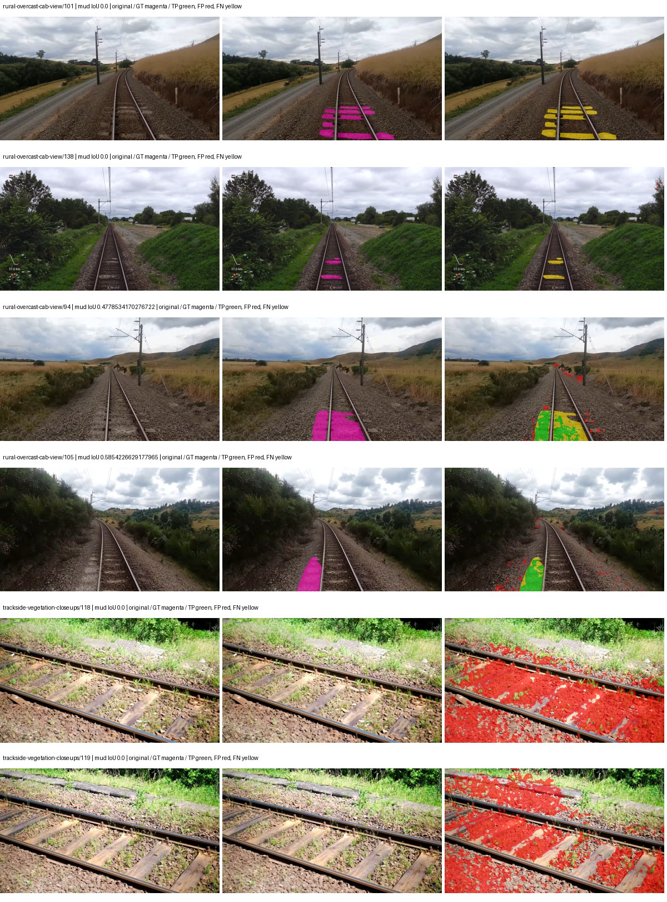
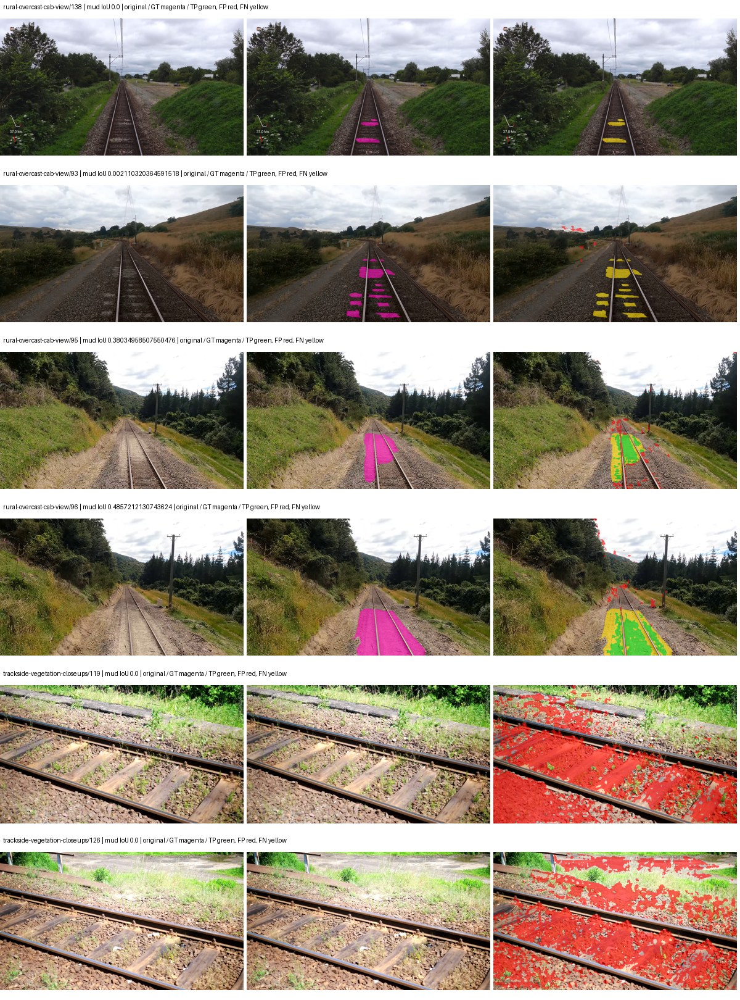
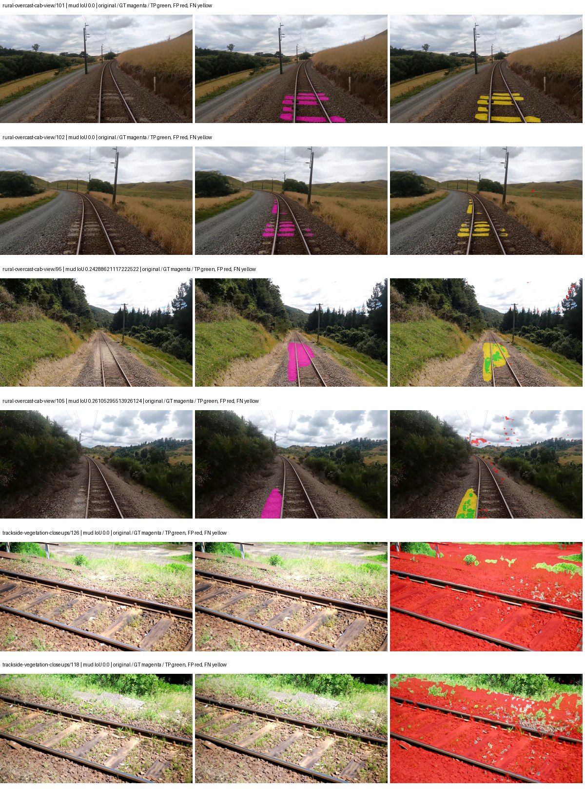
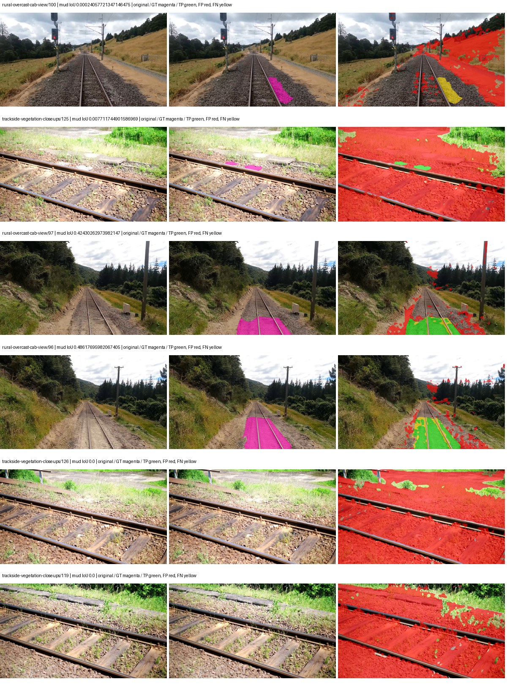
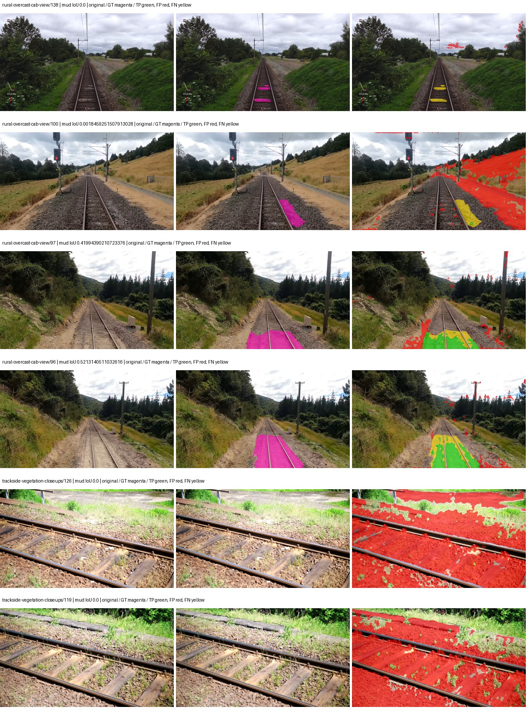
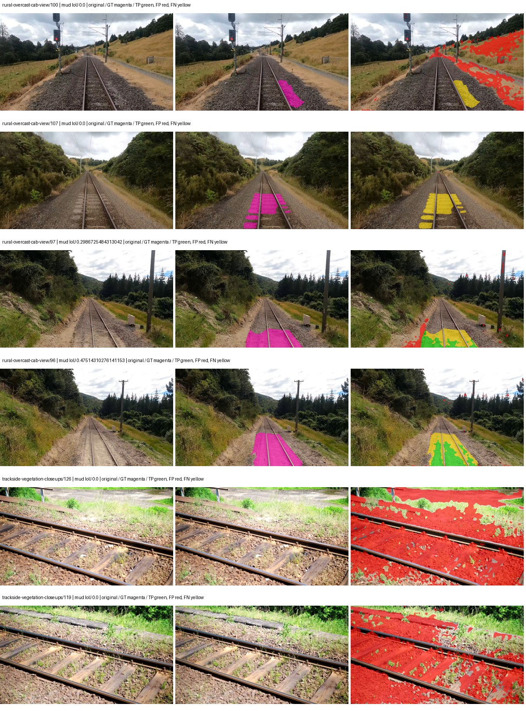
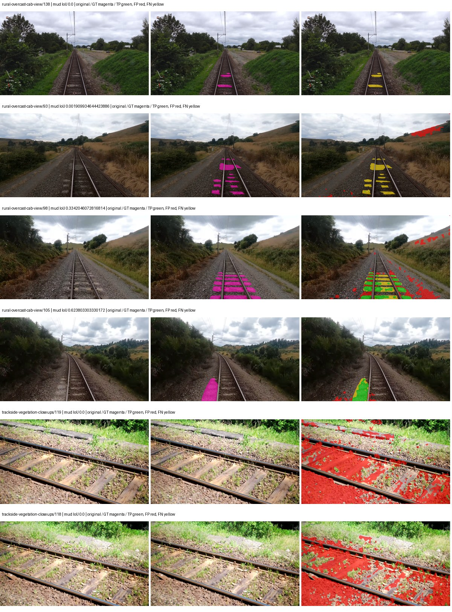
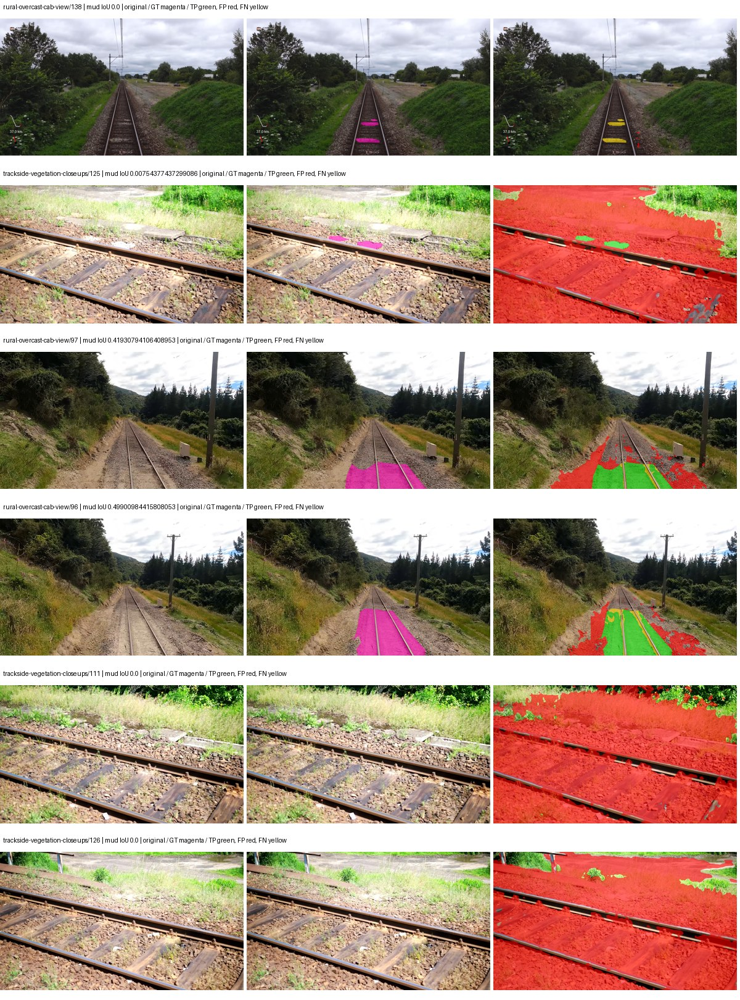

# smp_pspnet_mobilenet_v2 — paul-test-rtis

[RTIS comparison](../../README.md) · [Full model records](record.json)

Primary selection and early stopping: **mud-pumping validation IoU**. A job is complete only after full statistics and isolated profiling are verified.

| Model | Initialization path | Seed | Status | Steps | Best step | Mud IoU (%) | Mud precision (%) | Mud recall (%) | Final mud IoU (trainer val, %) | mIoU (%) | Fixed GT-class mIoU (%) |
| --- | --- | --- | --- | --- | --- | --- | --- | --- | --- | --- | --- |
| smp_pspnet_mobilenet_v2 | rtis_only | 0 | completed | 3309 | 2036 | 3.81 | 4.65 | 17.28 | 0.76 | 16.35 | 19.07 |
| smp_pspnet_mobilenet_v2 | rtis_only | 1 | completed | 3309 | 2036 | 5.61 | 6.57 | 27.60 | 0.40 | 15.71 | 18.32 |
| smp_pspnet_mobilenet_v2 | rtis_only | 2 | completed | 3309 | 2036 | 1.06 | 1.16 | 10.98 | 0.14 | 16.42 | 19.16 |
| smp_pspnet_mobilenet_v2 | cityscapes_to_rtis | 0 | completed | 1781 | 509 | 3.00 | 3.10 | 47.05 | 1.24 | 16.40 | 17.32 |
| smp_pspnet_mobilenet_v2 | cityscapes_to_rtis | 1 | completed | 1781 | 509 | 3.28 | 3.48 | 36.25 | 0.49 | 16.02 | 17.80 |
| smp_pspnet_mobilenet_v2 | cityscapes_to_rtis | 2 | completed | 1781 | 509 | 1.38 | 1.55 | 11.46 | 0.92 | 15.87 | 18.52 |
| smp_pspnet_mobilenet_v2 | railsem19_to_rtis | 0 | training | 2449 | — | — | — | — | — | — | — |
| smp_pspnet_mobilenet_v2 | railsem19_to_rtis | 1 | collecting | 2290 | 1018 | 12.17 | 15.18 | 38.05 | 5.76 | 19.54 | 22.80 |
| smp_pspnet_mobilenet_v2 | railsem19_to_rtis | 2 | completed | 2036 | 763 | 7.42 | 8.58 | 35.40 | 4.68 | 18.45 | 21.53 |
| smp_pspnet_mobilenet_v2 | cityscapes_to_railsem19_to_rtis | 0 | completed | 1781 | 509 | 5.14 | 5.22 | 77.10 | 5.02 | 17.61 | 18.58 |
| smp_pspnet_mobilenet_v2 | cityscapes_to_railsem19_to_rtis | 1 | training | 1499 | — | — | — | — | — | — | — |
| smp_pspnet_mobilenet_v2 | cityscapes_to_railsem19_to_rtis | 2 | training | 1299 | — | — | — | — | — | — | — |

Training: 220 images. Validation: 37 images. Test: 50 held out. Seeds: [0, 1, 2]. Seed variation measures optimization variability, not independent-recording uncertainty. Historical source checkpoints stay fixed across adaptation seeds.

Training code: `066afb2626398b7be59d4d19f5a0e4644fd59adc`. Split SHA-256: `71fef8292610c352da0709fe3bd030f3bcc18f97560394835f4b22826463b83d`.

## rtis_only — seed 0

Status: **completed**. Started: 2026-09-07T08:48:13.578227+00:00. Finished: 2026-09-07T09:23:41.365054+00:00.

Recipe pretrained initializer: `{"arch": "smp", "backbone_path": null, "batch_norm_momentum": null, "checkpoint": null, "classifier_path": null, "drop_path": null, "encoder_name": "mobilenet_v2", "encoder_weights": "imagenet", "head": "unified_head", "head_paths": [], "inactive_parameter_paths": ["encoder.features.7", "encoder.features.8", "encoder.features.9", "encoder.features.10", "encoder.features.11", "encoder.features.12", "encoder.features.13", "encoder.features.14", "encoder.features.15", "encoder.features.16", "encoder.features.17", "encoder.features.18"], "local_files_only": false, "lora_alpha": 32, "lora_dropout": 0.05, "lora_r": 16, "lora_targets": [], "native": null, "revision": null, "smp_arch": "PSPNet", "subfolder": null, "trust_remote_code": false, "tuning": "full"}`.

`rtis_only` uses the recipe initializer, which may include pretrained segmentation components. Transfer paths load the exact historical source checkpoint below and reset the classifier; they do not reset all query/decoder features.

Source checkpoint: `Recipe pretrained initialization`.

Config SHA-256: `b407a30fee8d85ed2188bfff826d207ea29abb781044568ab5a628b8e9c8dd01`. Weights used for validation: `raw`.

### Mud-pumping and aggregate quality

| Metric | Selected checkpoint | Final training validation |
| --- | --- | --- |
| Mud IoU | 3.81 | 0.76 |
| Mud precision | 4.65 | 0.92 |
| Mud recall | 17.28 | 4.17 |
| Mud Dice/F1 | 7.33 | 1.51 |
| mIoU | 16.35 | 16.04 |
| Mean accuracy | 28.76 | 26.64 |
| Mean precision | 33.90 | 45.22 |
| Mean Dice | 22.23 | 21.77 |
| Mean specificity | 97.82 | 97.78 |
| Pixel accuracy | 58.83 | 59.01 |
| Frequency-weighted IoU | 52.45 | 52.77 |
| Fixed GT-present class mIoU | 19.07 | 18.71 |
| Boundary F1 | 21.28 | 24.34 |

The selected checkpoint has independent evaluation evidence. Final values are the trainer's final validation record, not a new independent evaluation. mIoU averages classes with nonzero union, so false positives on absent classes can change its denominator. The fixed GT-class mean is supplementary and excludes absent classes; their false positives remain in the confusion matrix.

### Resource usage and timing

| Measurement | Value |
| --- | --- |
| Peak training VRAM, retained training invocation (GiB) | 7.28 |
| Peak evaluation VRAM (GiB) | 6.48 |
| Retained training invocation wall time (seconds) | 2022.44 |
| Retained training invocation GPU-hours (one GPU) | 0.56 |
| Evaluation wall time (seconds) | 10.27 |
| Full evaluation pipeline images/second | 3.60 |
| Best full-state checkpoint (MiB) | 19.96 |
| Final full-state checkpoint (MiB) | 19.95 |
| Audited periodic checkpoints removed (GiB) | 0.12 |

VRAM uses the recorded allocator high-water mark; it is not total device usage including CUDA context. Resumed jobs' retained training invocation times and peaks are **not whole-campaign totals**. Earlier invocation resource records are not reconstructed here. Evaluation throughput includes loader, sliding-window inference and metrics; it is not model-only latency/FPS. Missing measurements are shown as —, never inferred from another dataset's run.

### Standardized inference performance

Dedicated model-only profiling waits for an idle worker-locked L40S: BF16, batch 1, 1024x1024, 20 warmup and 100 CUDA-event-timed public forwards. It excludes loading, preprocessing, tiling and metrics.

| Status | Parameters | Weight MiB | FPS | p50 ms | p95 ms | Peak reserved GiB |
| --- | --- | --- | --- | --- | --- | --- |
| complete | 2355533 | 8.99 | 330.33 | 2.96 | 3.44 | 0.36 |

```json
{
  "schema_version": 1,
  "model_id": "smp_pspnet_mobilenet_v2",
  "measured_at": "2026-09-07T09:23:39+00:00",
  "status": "complete",
  "benchmark_scope": "rtis_selected_checkpoint_model_only",
  "applies_to": [
    "smp_pspnet_mobilenet_v2--rtis_only--seed-0"
  ],
  "source": {
    "campaign_git_sha": "066afb2626398b7be59d4d19f5a0e4644fd59adc",
    "git_dirty": false,
    "config_hash": "a23e87182d41",
    "resolved_config": "/data/izadia1/projects/segmentary-runs/paul-test-rtis/mud-fullstats-v1-20260906-r2/configs/smp_pspnet_mobilenet_v2--rtis_only--seed-0.yaml",
    "config_sha256": "b407a30fee8d85ed2188bfff826d207ea29abb781044568ab5a628b8e9c8dd01",
    "checkpoint_sha256": "69cd7185824a85d260ae260d0fd458df06b004153e5f1dc82191a50b4d5b10d0",
    "checkpoint_global_step": 2036,
    "checkpoint_bytes": 20928325,
    "checkpoint_kind": "resume checkpoint with optimizer and EMA state",
    "weights": "raw",
    "measured_checkpoint_job_id": "smp_pspnet_mobilenet_v2--rtis_only--seed-0",
    "result_sha256": "34619fb31bd34737b9a2d80cce2c5dc3ea7a7b6472bb762af69f7b8addeaac24",
    "result_git_sha": "066afb2626398b7be59d4d19f5a0e4644fd59adc",
    "result_stage": "eval:paul-test-rtis:val",
    "result_seed": 0
  },
  "hardware": {
    "gpu_name": "NVIDIA L40S",
    "gpu_uuid": "GPU-a5ad49e5-0536-5229-ba8a-f8a902808f53",
    "logical_device": "cuda:0",
    "physical_visibility_token": "7",
    "compute_capability": [
      8,
      9
    ],
    "total_memory_bytes": 47677177856
  },
  "model": {
    "parameter_count": 2355533,
    "trainable_parameter_count": 187149,
    "resident_parameter_bytes": 9422132,
    "parameter_dtype_counts": {
      "float32": 2355533
    }
  },
  "contract": {
    "backend": "pytorch",
    "precision": "bf16_autocast",
    "batch_size": 1,
    "input_shape_nchw": [
      1,
      3,
      1024,
      1024
    ],
    "warmup_iterations": 20,
    "measured_iterations": 100,
    "timing": "per-forward CUDA events with end-event synchronization",
    "includes_preprocessing": false,
    "includes_data_loader": false,
    "includes_sliding_window": false,
    "input_resident_on_gpu": true,
    "model_only": true,
    "entrypoint": "public model(image) dense-logits forward"
  },
  "measurements": {
    "latency": {
      "p50_ms": 2.95577609539032,
      "p95_ms": 3.444633591175079,
      "mean_ms": 3.027280960083008,
      "minimum_ms": 2.8928000926971436,
      "maximum_ms": 3.7406721115112305,
      "fps": 330.3294319839345,
      "raw_ms": [
        2.9511680603027344,
        3.0853118896484375,
        3.3556480407714844,
        3.009536027908325,
        2.9870080947875977,
        2.9777920246124268,
        2.9675519466400146,
        3.077120065689087,
        3.178463935852051,
        2.9184000492095947,
        3.481600046157837,
        2.9368319511413574,
        2.939903974533081,
        2.9020159244537354,
        2.905087947845459,
        2.8928000926971436,
        2.9020159244537354,
        2.9921278953552246,
        3.7109758853912354,
        3.7406721115112305,
        3.675136089324951,
        3.0842878818511963,
        2.93068790435791,
        3.18668794631958,
        3.185663938522339,
        3.11296010017395,
        2.9317119121551514,
        2.9859840869903564,
        2.9818880558013916,
        2.920448064804077,
        3.0515201091766357,
        2.9378559589385986,
        3.009536027908325,
        3.022847890853882,
        2.9163520336151123,
        2.939903974533081,
        2.9409279823303223,
        2.9614078998565674,
        2.9562880992889404,
        2.924544095993042,
        2.953216075897217,
        2.934783935546875,
        2.9378559589385986,
        2.9327359199523926,
        2.950144052505493,
        2.93887996673584,
        2.899967908859253,
        2.9655039310455322,
        2.9061119556427,
        2.915328025817871,
        3.2081921100616455,
        3.11296010017395,
        2.9470720291137695,
        2.91430401802063,
        2.9818880558013916,
        2.900991916656494,
        3.251199960708618,
        2.9214720726013184,
        3.2255361080169678,
        2.9757440090179443,
        2.9573121070861816,
        2.933759927749634,
        2.8968958854675293,
        2.9071359634399414,
        2.8928000926971436,
        2.91430401802063,
        2.899967908859253,
        3.2286720275878906,
        2.9900801181793213,
        3.328000068664551,
        3.5778560638427734,
        3.0545918941497803,
        2.955264091491699,
        2.9849600791931152,
        2.935807943344116,
        2.9511680603027344,
        2.924544095993042,
        2.9276158809661865,
        2.900991916656494,
        2.9317119121551514,
        2.93068790435791,
        2.929663896560669,
        2.953216075897217,
        2.91430401802063,
        2.93887996673584,
        2.9419519901275635,
        2.9562880992889404,
        2.933759927749634,
        2.9675519466400146,
        2.983936071395874,
        2.999295949935913,
        2.9921278953552246,
        3.008512020111084,
        3.023871898651123,
        2.978816032409668,
        2.924544095993042,
        3.44268798828125,
        3.0105600357055664,
        3.0382080078125,
        3.423232078552246
      ],
      "percentile_method": "numpy linear interpolation"
    },
    "peak_reserved_bytes": 381681664,
    "memory_kind": "pytorch_cuda_allocator_peak_reserved_excluding_context",
    "benchmark_wall_clock_s": 9.061689727008343
  },
  "started_at": "2026-09-07T09:23:30+00:00",
  "finished_at": "2026-09-07T09:23:39+00:00",
  "environment": {
    "hostname": "hdrfs-app-001",
    "python": "3.11.15",
    "platform": "Linux-5.15.0-139-generic-x86_64-with-glibc2.35",
    "torch": "2.11.0+cu128",
    "torch_cuda": "12.8",
    "cudnn": 91900,
    "driver_version": "570.133.20",
    "cuda_available": true,
    "gpu_count": 1,
    "gpu_names": [
      "NVIDIA L40S"
    ],
    "cuda_visible_devices": "7",
    "packages": {
      "segmentary": "0.1.0",
      "torch": "2.11.0+cu128",
      "torchvision": "0.26.0+cu128",
      "transformers": "5.15.0",
      "timm": "1.0.28",
      "segmentation-models-pytorch": "0.5.0",
      "albumentations": "2.0.8",
      "lightning": "2.6.5",
      "numpy": "2.4.4"
    }
  }
}
```

### Per-class validation results

| Class | GT pixels | IoU (%) | Precision (%) | Recall (%) | Dice (%) | Boundary F1 (%) |
| --- | --- | --- | --- | --- | --- | --- |
| car | 29664 | 0.00 | 0.00 | 0.00 | 0.00 | 0.00 |
| construction | 311585 | 5.37 | 7.78 | 14.78 | 10.19 | 17.04 |
| fence | 265137 | 1.87 | 4.90 | 2.92 | 3.66 | 5.91 |
| mud-pumping | 1226250 | 3.81 | 4.65 | 17.28 | 7.33 | 5.86 |
| on-rails | 0 | 0.00 | 0.00 | — | 0.00 | 0.00 |
| person | 0 | 0.00 | 0.00 | — | 0.00 | 0.00 |
| pole | 628038 | 41.14 | 82.03 | 45.22 | 58.30 | 75.92 |
| rail-embedded | 16799 | 9.49 | 99.13 | 9.49 | 17.33 | 16.19 |
| rail-raised | 2969797 | 56.13 | 81.52 | 64.32 | 71.91 | 79.66 |
| rail-track | 6323197 | 30.71 | 40.07 | 56.79 | 46.98 | 39.88 |
| road | 1048831 | 0.03 | 0.06 | 0.05 | 0.05 | 0.14 |
| sidewalk | 1297367 | 0.00 | 0.00 | 0.00 | 0.00 | 0.00 |
| sky | 19121606 | 79.40 | 98.48 | 80.39 | 88.52 | 62.87 |
| standing-water | 95802 | 0.52 | 0.52 | 97.08 | 1.03 | 0.47 |
| terrain | 39239306 | 58.68 | 85.90 | 64.93 | 73.96 | 35.19 |
| trackbed | 10643081 | 39.24 | 70.73 | 46.84 | 56.36 | 41.58 |
| traffic-light | 19510 | 9.02 | 79.18 | 9.24 | 16.55 | 29.23 |
| traffic-sign | 13285 | 0.00 | 0.00 | 0.00 | 0.00 | 0.00 |
| tram-track | 56179 | 0.00 | 0.00 | 0.00 | 0.00 | 0.00 |
| truck | 0 | 0.00 | 0.00 | — | 0.00 | 0.00 |
| vegetation-overgrowth | 5901821 | 7.92 | 57.01 | 8.43 | 14.68 | 36.98 |

### Full-run accounting

| Measurement | Value |
| --- | --- |
| Full GPU-reserved wall seconds, all recorded worker attempts | 2127.79 |
| Full reserved GPU-hours | 0.59 |
| Whole-run timing complete | True |

| Phase | Wall seconds including failed attempts |
| --- | --- |
| training | 2029.00 |
| diagnostics | 65.71 |
| performance | 15.71 |

GPU-reserved time includes model loading, training, validation, collection, profiling, checkpoint I/O and orchestration while the worker owns one GPU. It is not GPU kernel-active time. Phase timings and sampled device memory/power/utilization are retained separately; sampled device memory is not the allocator high-water mark.

### Train/validation and raw/EMA diagnostics

| Checkpoint / weights / split | Images | Mud IoU (%) | Mud precision (%) | Mud recall (%) |
| --- | --- | --- | --- | --- |
| best-auto-train / raw | 220 | 79.15 | 86.72 | 90.07 |
| best-auto-val / raw | 37 | 3.81 | 4.65 | 17.28 |
| best-alternate-val / ema | 37 | 1.02 | 1.21 | 6.21 |
| final-auto-val / raw | 37 | 0.76 | 0.92 | 4.18 |

Train uses the evaluation transform without augmentation. Compare mud train/validation metrics for the same selected weights. Alternate EMA on running-stat BatchNorm is explicitly uncalibrated and is diagnostic only. Score-threshold curves use uncalibrated normalized scores and are pixel-level diagnostics, not event detection rates or a selected deployment operating point.

### Downloadable evidence

- best-auto-train: [per-image.csv](rtis_only--seed-0/best-auto-train/per-image.csv) · [per-image-confusion.json.gz](rtis_only--seed-0/best-auto-train/per-image-confusion.json.gz) · [groups.json](rtis_only--seed-0/best-auto-train/groups.json) · [mud-score-curves.json](rtis_only--seed-0/best-auto-train/mud-score-curves.json)
- best-auto-val: [per-image.csv](rtis_only--seed-0/best-auto-val/per-image.csv) · [per-image-confusion.json.gz](rtis_only--seed-0/best-auto-val/per-image-confusion.json.gz) · [groups.json](rtis_only--seed-0/best-auto-val/groups.json) · [mud-score-curves.json](rtis_only--seed-0/best-auto-val/mud-score-curves.json) · [examples.jpg](rtis_only--seed-0/best-auto-val/examples.jpg)
- best-alternate-val: [per-image.csv](rtis_only--seed-0/best-alternate-val/per-image.csv) · [per-image-confusion.json.gz](rtis_only--seed-0/best-alternate-val/per-image-confusion.json.gz) · [groups.json](rtis_only--seed-0/best-alternate-val/groups.json) · [mud-score-curves.json](rtis_only--seed-0/best-alternate-val/mud-score-curves.json)
- final-auto-val: [per-image.csv](rtis_only--seed-0/final-auto-val/per-image.csv) · [per-image-confusion.json.gz](rtis_only--seed-0/final-auto-val/per-image-confusion.json.gz) · [groups.json](rtis_only--seed-0/final-auto-val/groups.json) · [mud-score-curves.json](rtis_only--seed-0/final-auto-val/mud-score-curves.json)
- resources: [telemetry.csv](rtis_only--seed-0/resources/telemetry.csv)



Examples are two lowest and two highest mud-IoU positive images, plus up to two negative images with the most false-positive mud pixels. They are targeted diagnostic examples, not random samples. Green: true positive; red: false positive; yellow: false negative. Full predictions remain on HDRFS.

### Validation tracking

| Logged step | Overall mIoU (%) | Mud IoU (%) |
| --- | --- | --- |
| 254 | 12.10 | 0.31 |
| 508 | 12.86 | 0.30 |
| 763 | 14.06 | 0.23 |
| 1017 | 16.45 | 3.41 |
| 1272 | 16.83 | 0.48 |
| 1527 | 16.26 | 0.72 |
| 1781 | 14.90 | 1.30 |
| 2036 | 16.35 | 3.80 |
| 2290 | 16.01 | 2.96 |
| 2545 | 13.58 | 0.27 |
| 2799 | 16.53 | 1.58 |
| 3054 | 14.43 | 0.94 |
| 3308 | 16.04 | 0.76 |

All retained scalar curves, including training loss and per-class IoU, are in record.json. Observed best mud on a curve is not necessarily a retained checkpoint: the pilot saved its selection-metric-best and final checkpoints. Step logging and checkpoint global_step may differ by one.

### Stopping and checkpoint provenance

```json
{
  "stopping": {
    "actual_steps": 3309,
    "maximum_steps": 4000,
    "min_delta": 0.001,
    "monitor": "val_iou/mud-pumping",
    "patience": 5,
    "reason": "validation_plateau"
  },
  "checkpoints": {
    "best": {
      "path": "/data/izadia1/projects/segmentary-runs/paul-test-rtis/mud-fullstats-v1-20260906-r2/future-runs/smp_pspnet_mobilenet_v2--rtis_only--seed-0_seed0/rtis/best.ckpt",
      "sha256": "69cd7185824a85d260ae260d0fd458df06b004153e5f1dc82191a50b4d5b10d0",
      "global_step": 2036,
      "bytes": 20928325
    },
    "final": {
      "path": "/data/izadia1/projects/segmentary-runs/paul-test-rtis/mud-fullstats-v1-20260906-r2/future-runs/smp_pspnet_mobilenet_v2--rtis_only--seed-0_seed0/rtis/last.ckpt",
      "sha256": "4eb1ca9a44ed07791dc446fef645561c24dd356403a32e9a33e46f3695f76328",
      "global_step": 3309,
      "bytes": 20920517
    }
  },
  "cleanup_error": null
}
```

### Resolved training, initialization and evaluation settings

The optimizer block is the base configuration. Stage LR scales are applied at runtime, and stage warmup is capped at min(base warmup, floor(stage budget / 10), stage budget - 1): 400 steps for this 4,000-step pilot. Model-internal native input grids may differ from augmentation crops (EoMT uses its 640 grid).

```json
{
  "name": "smp_pspnet_mobilenet_v2--rtis_only--seed-0",
  "model": {
    "arch": "smp",
    "checkpoint": null,
    "tuning": "full",
    "head": "unified_head",
    "lora_r": 16,
    "lora_alpha": 32,
    "lora_dropout": 0.05,
    "lora_targets": [],
    "drop_path": null,
    "revision": null,
    "subfolder": null,
    "local_files_only": false,
    "trust_remote_code": false,
    "backbone_path": null,
    "head_paths": [],
    "classifier_path": null,
    "inactive_parameter_paths": [
      "encoder.features.7",
      "encoder.features.8",
      "encoder.features.9",
      "encoder.features.10",
      "encoder.features.11",
      "encoder.features.12",
      "encoder.features.13",
      "encoder.features.14",
      "encoder.features.15",
      "encoder.features.16",
      "encoder.features.17",
      "encoder.features.18"
    ],
    "smp_arch": "PSPNet",
    "encoder_name": "mobilenet_v2",
    "encoder_weights": "imagenet",
    "native": null,
    "batch_norm_momentum": null
  },
  "space": "paul-test-rtis",
  "taxonomy_root": "/data/izadia1/projects/segmentary-rtis-fullstats-066afb2/taxonomy",
  "output_root": "/data/izadia1/projects/segmentary-runs/paul-test-rtis/mud-fullstats-v1-20260906-r2/future-runs",
  "optim": {
    "backbone_lr": 0.0001,
    "head_lr_mult": 10.0,
    "weight_decay": 0.05,
    "llrd": 1.0,
    "warmup_iters": 1500,
    "warmup_ratio": 1e-06,
    "poly_power": 0.9,
    "min_lr_ratio": 0.0,
    "betas": [
      0.9,
      0.999
    ],
    "grad_clip": 1.0
  },
  "train": {
    "iters": 4000,
    "batch_size": 2,
    "accum": 8,
    "num_workers": 2,
    "precision": "bf16-mixed",
    "ema_decay": 0.9998,
    "val_every": 250,
    "ckpt_every": 500,
    "selection_metric": "val_iou/mud-pumping",
    "early_stopping_patience": 5,
    "early_stopping_min_delta": 0.001,
    "seed": 0,
    "devices": 1
  },
  "eval": {
    "sliding_window": true,
    "window": [
      1024,
      1024
    ],
    "stride": [
      768,
      768
    ],
    "batch_size": 1,
    "num_workers": 2,
    "tta_scales": [],
    "tta_flip": false,
    "threshold": 0.5,
    "boundary_tolerance_frac": 0.0075,
    "save_confusion": true
  },
  "loss": {
    "task": "multiclass",
    "activation": "auto",
    "terms": [],
    "aux": "none",
    "aux_weight": 0.0,
    "ce_weight": 1.0,
    "label_smoothing": 0.0,
    "class_weights": null,
    "query": null
  },
  "aug": {
    "crop": [
      1024,
      1024
    ],
    "scale_min": 0.5,
    "scale_max": 2.0,
    "hflip_p": 0.5,
    "color_jitter_p": 0.5,
    "brightness": 0.25,
    "contrast": 0.25,
    "saturation": 0.25,
    "hue": 0.05
  },
  "stages": [
    {
      "name": "rtis",
      "data": [
        {
          "name": "paul-test-rtis",
          "root": "/data/izadia1/datasets/paul-test-rtis",
          "variant": null,
          "split_file": "splits.json",
          "train_split": "train",
          "val_split": "val",
          "limit": null,
          "loader": "folder",
          "mapping": "paul-test-rtis",
          "loader_options": {
            "require_groups": true
          }
        }
      ],
      "iters": null,
      "lr_scale": 1.0,
      "head_group_lr_scale": 1.0,
      "init_from": "pretrained",
      "reset_head": false,
      "freeze": null,
      "sample_weights": null
    }
  ]
}
```

### Hardware and software provenance

```json
{
  "training": {
    "cuda_available": true,
    "cuda_visible_devices": "7",
    "cudnn": 91900,
    "driver_version": "570.133.20",
    "gpu_count": 1,
    "gpu_names": [
      "NVIDIA L40S"
    ],
    "hostname": "hdrfs-app-001",
    "input_normalization": {
      "channel_order": "rgb",
      "mean": [
        0.485,
        0.456,
        0.406
      ],
      "source": "smp_encoder_settings",
      "std": [
        0.229,
        0.224,
        0.225
      ]
    },
    "model_origins": [
      {
        "hf_commit": null,
        "hf_name_or_path": null,
        "module": "model",
        "timm_pretrained": {}
      }
    ],
    "model_parameter_count": 2355533,
    "packages": {
      "albumentations": "2.0.8",
      "lightning": "2.6.5",
      "numpy": "2.4.4",
      "segmentary": "0.1.0",
      "segmentation-models-pytorch": "0.5.0",
      "timm": "1.0.28",
      "torch": "2.11.0+cu128",
      "torchvision": "0.26.0+cu128",
      "transformers": "5.15.0"
    },
    "platform": "Linux-5.15.0-139-generic-x86_64-with-glibc2.35",
    "python": "3.11.15",
    "torch": "2.11.0+cu128",
    "torch_cuda": "12.8",
    "trainable_parameter_count": 187149,
    "training_stop": {
      "actual_steps": 3309,
      "maximum_steps": 4000,
      "min_delta": 0.001,
      "monitor": "val_iou/mud-pumping",
      "patience": 5,
      "reason": "validation_plateau"
    },
    "validation_weights": "raw"
  },
  "evaluation": {
    "cuda_available": true,
    "cuda_visible_devices": "7",
    "cudnn": 91900,
    "driver_version": "570.133.20",
    "gpu_count": 1,
    "gpu_names": [
      "NVIDIA L40S"
    ],
    "hostname": "hdrfs-app-001",
    "input_normalization": {
      "channel_order": "rgb",
      "mean": [
        0.485,
        0.456,
        0.406
      ],
      "source": "smp_encoder_settings",
      "std": [
        0.229,
        0.224,
        0.225
      ]
    },
    "packages": {
      "albumentations": "2.0.8",
      "lightning": "2.6.5",
      "numpy": "2.4.4",
      "segmentary": "0.1.0",
      "segmentation-models-pytorch": "0.5.0",
      "timm": "1.0.28",
      "torch": "2.11.0+cu128",
      "torchvision": "0.26.0+cu128",
      "transformers": "5.15.0"
    },
    "platform": "Linux-5.15.0-139-generic-x86_64-with-glibc2.35",
    "python": "3.11.15",
    "torch": "2.11.0+cu128",
    "torch_cuda": "12.8"
  }
}
```

## rtis_only — seed 1

Status: **completed**. Started: 2026-09-07T08:51:10.355440+00:00. Finished: 2026-09-07T09:26:16.248369+00:00.

Recipe pretrained initializer: `{"arch": "smp", "backbone_path": null, "batch_norm_momentum": null, "checkpoint": null, "classifier_path": null, "drop_path": null, "encoder_name": "mobilenet_v2", "encoder_weights": "imagenet", "head": "unified_head", "head_paths": [], "inactive_parameter_paths": ["encoder.features.7", "encoder.features.8", "encoder.features.9", "encoder.features.10", "encoder.features.11", "encoder.features.12", "encoder.features.13", "encoder.features.14", "encoder.features.15", "encoder.features.16", "encoder.features.17", "encoder.features.18"], "local_files_only": false, "lora_alpha": 32, "lora_dropout": 0.05, "lora_r": 16, "lora_targets": [], "native": null, "revision": null, "smp_arch": "PSPNet", "subfolder": null, "trust_remote_code": false, "tuning": "full"}`.

`rtis_only` uses the recipe initializer, which may include pretrained segmentation components. Transfer paths load the exact historical source checkpoint below and reset the classifier; they do not reset all query/decoder features.

Source checkpoint: `Recipe pretrained initialization`.

Config SHA-256: `4c9cc8beba88dd38fc6c2be0a35bf95d3ed2e69bc3f59977f903ec7558d301b9`. Weights used for validation: `raw`.

### Mud-pumping and aggregate quality

| Metric | Selected checkpoint | Final training validation |
| --- | --- | --- |
| Mud IoU | 5.61 | 0.40 |
| Mud precision | 6.57 | 0.52 |
| Mud recall | 27.60 | 1.74 |
| Mud Dice/F1 | 10.62 | 0.80 |
| mIoU | 15.71 | 12.64 |
| Mean accuracy | 23.82 | 20.62 |
| Mean precision | 33.96 | 40.64 |
| Mean Dice | 21.16 | 18.02 |
| Mean specificity | 98.14 | 97.27 |
| Pixel accuracy | 67.90 | 49.82 |
| Frequency-weighted IoU | 57.87 | 42.77 |
| Fixed GT-present class mIoU | 18.32 | 14.75 |
| Boundary F1 | 21.66 | 20.35 |

The selected checkpoint has independent evaluation evidence. Final values are the trainer's final validation record, not a new independent evaluation. mIoU averages classes with nonzero union, so false positives on absent classes can change its denominator. The fixed GT-class mean is supplementary and excludes absent classes; their false positives remain in the confusion matrix.

### Resource usage and timing

| Measurement | Value |
| --- | --- |
| Peak training VRAM, retained training invocation (GiB) | 7.28 |
| Peak evaluation VRAM (GiB) | 6.48 |
| Retained training invocation wall time (seconds) | 1998.62 |
| Retained training invocation GPU-hours (one GPU) | 0.56 |
| Evaluation wall time (seconds) | 10.58 |
| Full evaluation pipeline images/second | 3.50 |
| Best full-state checkpoint (MiB) | 19.96 |
| Final full-state checkpoint (MiB) | 19.95 |
| Audited periodic checkpoints removed (GiB) | 0.12 |

VRAM uses the recorded allocator high-water mark; it is not total device usage including CUDA context. Resumed jobs' retained training invocation times and peaks are **not whole-campaign totals**. Earlier invocation resource records are not reconstructed here. Evaluation throughput includes loader, sliding-window inference and metrics; it is not model-only latency/FPS. Missing measurements are shown as —, never inferred from another dataset's run.

### Standardized inference performance

Dedicated model-only profiling waits for an idle worker-locked L40S: BF16, batch 1, 1024x1024, 20 warmup and 100 CUDA-event-timed public forwards. It excludes loading, preprocessing, tiling and metrics.

| Status | Parameters | Weight MiB | FPS | p50 ms | p95 ms | Peak reserved GiB |
| --- | --- | --- | --- | --- | --- | --- |
| complete | 2355533 | 8.99 | 278.69 | 3.30 | 4.56 | 0.36 |

```json
{
  "schema_version": 1,
  "model_id": "smp_pspnet_mobilenet_v2",
  "measured_at": "2026-09-07T09:26:14+00:00",
  "status": "complete",
  "benchmark_scope": "rtis_selected_checkpoint_model_only",
  "applies_to": [
    "smp_pspnet_mobilenet_v2--rtis_only--seed-1"
  ],
  "source": {
    "campaign_git_sha": "066afb2626398b7be59d4d19f5a0e4644fd59adc",
    "git_dirty": false,
    "config_hash": "9bb829ba3dbb",
    "resolved_config": "/data/izadia1/projects/segmentary-runs/paul-test-rtis/mud-fullstats-v1-20260906-r2/configs/smp_pspnet_mobilenet_v2--rtis_only--seed-1.yaml",
    "config_sha256": "4c9cc8beba88dd38fc6c2be0a35bf95d3ed2e69bc3f59977f903ec7558d301b9",
    "checkpoint_sha256": "8bceefa47dc899f384b2faf463a06dcdf59c07aca1c0ed83329bee984c627875",
    "checkpoint_global_step": 2036,
    "checkpoint_bytes": 20928325,
    "checkpoint_kind": "resume checkpoint with optimizer and EMA state",
    "weights": "raw",
    "measured_checkpoint_job_id": "smp_pspnet_mobilenet_v2--rtis_only--seed-1",
    "result_sha256": "b3ce0c01b0940a64da2e1637c268ea83b4666b01cc726ae20f54059e0a8fd8d8",
    "result_git_sha": "066afb2626398b7be59d4d19f5a0e4644fd59adc",
    "result_stage": "eval:paul-test-rtis:val",
    "result_seed": 1
  },
  "hardware": {
    "gpu_name": "NVIDIA L40S",
    "gpu_uuid": "GPU-e2e96741-aec9-e90b-5c46-d0d58be90a56",
    "logical_device": "cuda:0",
    "physical_visibility_token": "8",
    "compute_capability": [
      8,
      9
    ],
    "total_memory_bytes": 47677177856
  },
  "model": {
    "parameter_count": 2355533,
    "trainable_parameter_count": 187149,
    "resident_parameter_bytes": 9422132,
    "parameter_dtype_counts": {
      "float32": 2355533
    }
  },
  "contract": {
    "backend": "pytorch",
    "precision": "bf16_autocast",
    "batch_size": 1,
    "input_shape_nchw": [
      1,
      3,
      1024,
      1024
    ],
    "warmup_iterations": 20,
    "measured_iterations": 100,
    "timing": "per-forward CUDA events with end-event synchronization",
    "includes_preprocessing": false,
    "includes_data_loader": false,
    "includes_sliding_window": false,
    "input_resident_on_gpu": true,
    "model_only": true,
    "entrypoint": "public model(image) dense-logits forward"
  },
  "measurements": {
    "latency": {
      "p50_ms": 3.3018879890441895,
      "p95_ms": 4.564070320129394,
      "mean_ms": 3.58822783946991,
      "minimum_ms": 2.9276158809661865,
      "maximum_ms": 5.667903900146484,
      "fps": 278.6891035736823,
      "raw_ms": [
        3.226624011993408,
        3.132416009902954,
        3.0863358974456787,
        3.0863358974456787,
        3.131392002105713,
        3.0812160968780518,
        3.08735990524292,
        3.0412800312042236,
        3.0730879306793213,
        3.155967950820923,
        3.441663980484009,
        3.2071681022644043,
        3.1539199352264404,
        3.497983932495117,
        3.373055934906006,
        3.6720640659332275,
        3.6874239444732666,
        3.487744092941284,
        3.384320020675659,
        3.200000047683716,
        3.8492159843444824,
        3.245055913925171,
        3.1057920455932617,
        3.0494720935821533,
        3.0515201091766357,
        3.048448085784912,
        3.432447910308838,
        3.2962560653686523,
        3.11296010017395,
        3.0300159454345703,
        3.047424077987671,
        3.0432960987091064,
        3.048448085784912,
        3.21126389503479,
        3.0351359844207764,
        3.6382720470428467,
        3.737600088119507,
        3.1600639820098877,
        3.1549439430236816,
        3.4365439414978027,
        3.1795198917388916,
        3.275775909423828,
        3.9086079597473145,
        3.452928066253662,
        3.179487943649292,
        3.1498239040374756,
        3.1252479553222656,
        3.057663917541504,
        3.082240104675293,
        3.0812160968780518,
        3.0791680812835693,
        3.058687925338745,
        3.1784958839416504,
        3.6116480827331543,
        3.1590399742126465,
        3.522559881210327,
        4.560895919799805,
        4.624383926391602,
        5.396480083465576,
        3.6720640659332275,
        3.1744000911712646,
        3.131392002105713,
        4.349952220916748,
        4.267007827758789,
        3.3075199127197266,
        3.4498560428619385,
        4.3130879402160645,
        3.29420804977417,
        4.473855972290039,
        4.363264083862305,
        4.311039924621582,
        4.293568134307861,
        4.282368183135986,
        4.255743980407715,
        4.221920013427734,
        4.09497594833374,
        4.117504119873047,
        4.694015979766846,
        4.624383926391602,
        4.555776119232178,
        4.443136215209961,
        4.443136215209961,
        4.3079681396484375,
        4.294623851776123,
        4.4165120124816895,
        4.3427839279174805,
        4.290559768676758,
        4.302847862243652,
        4.1860480308532715,
        5.667903900146484,
        3.9935998916625977,
        3.111936092376709,
        3.1651840209960938,
        3.0003199577331543,
        3.4887681007385254,
        3.397631883621216,
        3.1774721145629883,
        3.0300159454345703,
        2.9614078998565674,
        2.9276158809661865
      ],
      "percentile_method": "numpy linear interpolation"
    },
    "peak_reserved_bytes": 381681664,
    "memory_kind": "pytorch_cuda_allocator_peak_reserved_excluding_context",
    "benchmark_wall_clock_s": 9.013896752148867
  },
  "started_at": "2026-09-07T09:26:05+00:00",
  "finished_at": "2026-09-07T09:26:14+00:00",
  "environment": {
    "hostname": "hdrfs-app-001",
    "python": "3.11.15",
    "platform": "Linux-5.15.0-139-generic-x86_64-with-glibc2.35",
    "torch": "2.11.0+cu128",
    "torch_cuda": "12.8",
    "cudnn": 91900,
    "driver_version": "570.133.20",
    "cuda_available": true,
    "gpu_count": 1,
    "gpu_names": [
      "NVIDIA L40S"
    ],
    "cuda_visible_devices": "8",
    "packages": {
      "segmentary": "0.1.0",
      "torch": "2.11.0+cu128",
      "torchvision": "0.26.0+cu128",
      "transformers": "5.15.0",
      "timm": "1.0.28",
      "segmentation-models-pytorch": "0.5.0",
      "albumentations": "2.0.8",
      "lightning": "2.6.5",
      "numpy": "2.4.4"
    }
  }
}
```

### Per-class validation results

| Class | GT pixels | IoU (%) | Precision (%) | Recall (%) | Dice (%) | Boundary F1 (%) |
| --- | --- | --- | --- | --- | --- | --- |
| car | 29664 | 0.00 | 0.00 | 0.00 | 0.00 | 0.00 |
| construction | 311585 | 8.21 | 11.44 | 22.52 | 15.18 | 18.88 |
| fence | 265137 | 0.32 | 14.59 | 0.33 | 0.65 | 6.19 |
| mud-pumping | 1226250 | 5.61 | 6.57 | 27.60 | 10.62 | 7.89 |
| on-rails | 0 | 0.00 | 0.00 | — | 0.00 | 0.00 |
| person | 0 | 0.00 | 0.00 | — | 0.00 | 0.00 |
| pole | 628038 | 23.25 | 81.17 | 24.57 | 37.72 | 70.29 |
| rail-embedded | 16799 | 2.49 | 100.00 | 2.49 | 4.86 | 16.04 |
| rail-raised | 2969797 | 63.05 | 78.84 | 75.90 | 77.34 | 83.58 |
| rail-track | 6323197 | 16.61 | 45.29 | 20.78 | 28.49 | 41.73 |
| road | 1048831 | 0.00 | 0.00 | 0.00 | 0.00 | 0.00 |
| sidewalk | 1297367 | 2.33 | 29.76 | 2.47 | 4.56 | 3.85 |
| sky | 19121606 | 66.31 | 98.68 | 66.90 | 79.74 | 50.37 |
| standing-water | 95802 | 0.02 | 0.02 | 1.04 | 0.03 | 0.55 |
| terrain | 39239306 | 76.78 | 84.93 | 88.89 | 86.86 | 36.31 |
| trackbed | 10643081 | 43.22 | 51.87 | 72.15 | 60.35 | 40.65 |
| traffic-light | 19510 | 0.00 | 0.00 | 0.00 | 0.00 | 0.00 |
| traffic-sign | 13285 | 3.58 | 23.81 | 4.05 | 6.92 | 22.96 |
| tram-track | 56179 | 0.72 | 1.65 | 1.27 | 1.43 | 5.06 |
| truck | 0 | 0.00 | 0.00 | — | 0.00 | 0.00 |
| vegetation-overgrowth | 5901821 | 17.34 | 84.62 | 17.91 | 29.56 | 50.45 |

### Full-run accounting

| Measurement | Value |
| --- | --- |
| Full GPU-reserved wall seconds, all recorded worker attempts | 2105.90 |
| Full reserved GPU-hours | 0.58 |
| Whole-run timing complete | True |

| Phase | Wall seconds including failed attempts |
| --- | --- |
| training | 2004.97 |
| diagnostics | 67.26 |
| performance | 15.59 |

GPU-reserved time includes model loading, training, validation, collection, profiling, checkpoint I/O and orchestration while the worker owns one GPU. It is not GPU kernel-active time. Phase timings and sampled device memory/power/utilization are retained separately; sampled device memory is not the allocator high-water mark.

### Train/validation and raw/EMA diagnostics

| Checkpoint / weights / split | Images | Mud IoU (%) | Mud precision (%) | Mud recall (%) |
| --- | --- | --- | --- | --- |
| best-auto-train / raw | 220 | 78.49 | 88.81 | 87.11 |
| best-auto-val / raw | 37 | 5.61 | 6.57 | 27.60 |
| best-alternate-val / ema | 37 | 5.63 | 6.02 | 46.15 |
| final-auto-val / raw | 37 | 0.40 | 0.52 | 1.74 |

Train uses the evaluation transform without augmentation. Compare mud train/validation metrics for the same selected weights. Alternate EMA on running-stat BatchNorm is explicitly uncalibrated and is diagnostic only. Score-threshold curves use uncalibrated normalized scores and are pixel-level diagnostics, not event detection rates or a selected deployment operating point.

### Downloadable evidence

- best-auto-train: [per-image.csv](rtis_only--seed-1/best-auto-train/per-image.csv) · [per-image-confusion.json.gz](rtis_only--seed-1/best-auto-train/per-image-confusion.json.gz) · [groups.json](rtis_only--seed-1/best-auto-train/groups.json) · [mud-score-curves.json](rtis_only--seed-1/best-auto-train/mud-score-curves.json)
- best-auto-val: [per-image.csv](rtis_only--seed-1/best-auto-val/per-image.csv) · [per-image-confusion.json.gz](rtis_only--seed-1/best-auto-val/per-image-confusion.json.gz) · [groups.json](rtis_only--seed-1/best-auto-val/groups.json) · [mud-score-curves.json](rtis_only--seed-1/best-auto-val/mud-score-curves.json) · [examples.jpg](rtis_only--seed-1/best-auto-val/examples.jpg)
- best-alternate-val: [per-image.csv](rtis_only--seed-1/best-alternate-val/per-image.csv) · [per-image-confusion.json.gz](rtis_only--seed-1/best-alternate-val/per-image-confusion.json.gz) · [groups.json](rtis_only--seed-1/best-alternate-val/groups.json) · [mud-score-curves.json](rtis_only--seed-1/best-alternate-val/mud-score-curves.json)
- final-auto-val: [per-image.csv](rtis_only--seed-1/final-auto-val/per-image.csv) · [per-image-confusion.json.gz](rtis_only--seed-1/final-auto-val/per-image-confusion.json.gz) · [groups.json](rtis_only--seed-1/final-auto-val/groups.json) · [mud-score-curves.json](rtis_only--seed-1/final-auto-val/mud-score-curves.json)
- resources: [telemetry.csv](rtis_only--seed-1/resources/telemetry.csv)



Examples are two lowest and two highest mud-IoU positive images, plus up to two negative images with the most false-positive mud pixels. They are targeted diagnostic examples, not random samples. Green: true positive; red: false positive; yellow: false negative. Full predictions remain on HDRFS.

### Validation tracking

| Logged step | Overall mIoU (%) | Mud IoU (%) |
| --- | --- | --- |
| 254 | 13.24 | 0.96 |
| 508 | 13.78 | 0.40 |
| 763 | 14.77 | 2.87 |
| 1017 | 15.72 | 0.95 |
| 1272 | 13.10 | 0.64 |
| 1527 | 16.01 | 3.82 |
| 1781 | 13.06 | 1.42 |
| 2036 | 15.70 | 5.60 |
| 2290 | 13.65 | 0.39 |
| 2545 | 14.17 | 0.91 |
| 2799 | 13.77 | 0.39 |
| 3054 | 12.39 | 0.38 |
| 3308 | 12.64 | 0.40 |

All retained scalar curves, including training loss and per-class IoU, are in record.json. Observed best mud on a curve is not necessarily a retained checkpoint: the pilot saved its selection-metric-best and final checkpoints. Step logging and checkpoint global_step may differ by one.

### Stopping and checkpoint provenance

```json
{
  "stopping": {
    "actual_steps": 3309,
    "maximum_steps": 4000,
    "min_delta": 0.001,
    "monitor": "val_iou/mud-pumping",
    "patience": 5,
    "reason": "validation_plateau"
  },
  "checkpoints": {
    "best": {
      "path": "/data/izadia1/projects/segmentary-runs/paul-test-rtis/mud-fullstats-v1-20260906-r2/future-runs/smp_pspnet_mobilenet_v2--rtis_only--seed-1_seed1/rtis/best.ckpt",
      "sha256": "8bceefa47dc899f384b2faf463a06dcdf59c07aca1c0ed83329bee984c627875",
      "global_step": 2036,
      "bytes": 20928325
    },
    "final": {
      "path": "/data/izadia1/projects/segmentary-runs/paul-test-rtis/mud-fullstats-v1-20260906-r2/future-runs/smp_pspnet_mobilenet_v2--rtis_only--seed-1_seed1/rtis/last.ckpt",
      "sha256": "893b93aff3c3a9ddff0fe6f16f0db1547dbe25df7d79aa45299118118bffc4ee",
      "global_step": 3309,
      "bytes": 20920517
    }
  },
  "cleanup_error": null
}
```

### Resolved training, initialization and evaluation settings

The optimizer block is the base configuration. Stage LR scales are applied at runtime, and stage warmup is capped at min(base warmup, floor(stage budget / 10), stage budget - 1): 400 steps for this 4,000-step pilot. Model-internal native input grids may differ from augmentation crops (EoMT uses its 640 grid).

```json
{
  "name": "smp_pspnet_mobilenet_v2--rtis_only--seed-1",
  "model": {
    "arch": "smp",
    "checkpoint": null,
    "tuning": "full",
    "head": "unified_head",
    "lora_r": 16,
    "lora_alpha": 32,
    "lora_dropout": 0.05,
    "lora_targets": [],
    "drop_path": null,
    "revision": null,
    "subfolder": null,
    "local_files_only": false,
    "trust_remote_code": false,
    "backbone_path": null,
    "head_paths": [],
    "classifier_path": null,
    "inactive_parameter_paths": [
      "encoder.features.7",
      "encoder.features.8",
      "encoder.features.9",
      "encoder.features.10",
      "encoder.features.11",
      "encoder.features.12",
      "encoder.features.13",
      "encoder.features.14",
      "encoder.features.15",
      "encoder.features.16",
      "encoder.features.17",
      "encoder.features.18"
    ],
    "smp_arch": "PSPNet",
    "encoder_name": "mobilenet_v2",
    "encoder_weights": "imagenet",
    "native": null,
    "batch_norm_momentum": null
  },
  "space": "paul-test-rtis",
  "taxonomy_root": "/data/izadia1/projects/segmentary-rtis-fullstats-066afb2/taxonomy",
  "output_root": "/data/izadia1/projects/segmentary-runs/paul-test-rtis/mud-fullstats-v1-20260906-r2/future-runs",
  "optim": {
    "backbone_lr": 0.0001,
    "head_lr_mult": 10.0,
    "weight_decay": 0.05,
    "llrd": 1.0,
    "warmup_iters": 1500,
    "warmup_ratio": 1e-06,
    "poly_power": 0.9,
    "min_lr_ratio": 0.0,
    "betas": [
      0.9,
      0.999
    ],
    "grad_clip": 1.0
  },
  "train": {
    "iters": 4000,
    "batch_size": 2,
    "accum": 8,
    "num_workers": 2,
    "precision": "bf16-mixed",
    "ema_decay": 0.9998,
    "val_every": 250,
    "ckpt_every": 500,
    "selection_metric": "val_iou/mud-pumping",
    "early_stopping_patience": 5,
    "early_stopping_min_delta": 0.001,
    "seed": 1,
    "devices": 1
  },
  "eval": {
    "sliding_window": true,
    "window": [
      1024,
      1024
    ],
    "stride": [
      768,
      768
    ],
    "batch_size": 1,
    "num_workers": 2,
    "tta_scales": [],
    "tta_flip": false,
    "threshold": 0.5,
    "boundary_tolerance_frac": 0.0075,
    "save_confusion": true
  },
  "loss": {
    "task": "multiclass",
    "activation": "auto",
    "terms": [],
    "aux": "none",
    "aux_weight": 0.0,
    "ce_weight": 1.0,
    "label_smoothing": 0.0,
    "class_weights": null,
    "query": null
  },
  "aug": {
    "crop": [
      1024,
      1024
    ],
    "scale_min": 0.5,
    "scale_max": 2.0,
    "hflip_p": 0.5,
    "color_jitter_p": 0.5,
    "brightness": 0.25,
    "contrast": 0.25,
    "saturation": 0.25,
    "hue": 0.05
  },
  "stages": [
    {
      "name": "rtis",
      "data": [
        {
          "name": "paul-test-rtis",
          "root": "/data/izadia1/datasets/paul-test-rtis",
          "variant": null,
          "split_file": "splits.json",
          "train_split": "train",
          "val_split": "val",
          "limit": null,
          "loader": "folder",
          "mapping": "paul-test-rtis",
          "loader_options": {
            "require_groups": true
          }
        }
      ],
      "iters": null,
      "lr_scale": 1.0,
      "head_group_lr_scale": 1.0,
      "init_from": "pretrained",
      "reset_head": false,
      "freeze": null,
      "sample_weights": null
    }
  ]
}
```

### Hardware and software provenance

```json
{
  "training": {
    "cuda_available": true,
    "cuda_visible_devices": "8",
    "cudnn": 91900,
    "driver_version": "570.133.20",
    "gpu_count": 1,
    "gpu_names": [
      "NVIDIA L40S"
    ],
    "hostname": "hdrfs-app-001",
    "input_normalization": {
      "channel_order": "rgb",
      "mean": [
        0.485,
        0.456,
        0.406
      ],
      "source": "smp_encoder_settings",
      "std": [
        0.229,
        0.224,
        0.225
      ]
    },
    "model_origins": [
      {
        "hf_commit": null,
        "hf_name_or_path": null,
        "module": "model",
        "timm_pretrained": {}
      }
    ],
    "model_parameter_count": 2355533,
    "packages": {
      "albumentations": "2.0.8",
      "lightning": "2.6.5",
      "numpy": "2.4.4",
      "segmentary": "0.1.0",
      "segmentation-models-pytorch": "0.5.0",
      "timm": "1.0.28",
      "torch": "2.11.0+cu128",
      "torchvision": "0.26.0+cu128",
      "transformers": "5.15.0"
    },
    "platform": "Linux-5.15.0-139-generic-x86_64-with-glibc2.35",
    "python": "3.11.15",
    "torch": "2.11.0+cu128",
    "torch_cuda": "12.8",
    "trainable_parameter_count": 187149,
    "training_stop": {
      "actual_steps": 3309,
      "maximum_steps": 4000,
      "min_delta": 0.001,
      "monitor": "val_iou/mud-pumping",
      "patience": 5,
      "reason": "validation_plateau"
    },
    "validation_weights": "raw"
  },
  "evaluation": {
    "cuda_available": true,
    "cuda_visible_devices": "8",
    "cudnn": 91900,
    "driver_version": "570.133.20",
    "gpu_count": 1,
    "gpu_names": [
      "NVIDIA L40S"
    ],
    "hostname": "hdrfs-app-001",
    "input_normalization": {
      "channel_order": "rgb",
      "mean": [
        0.485,
        0.456,
        0.406
      ],
      "source": "smp_encoder_settings",
      "std": [
        0.229,
        0.224,
        0.225
      ]
    },
    "packages": {
      "albumentations": "2.0.8",
      "lightning": "2.6.5",
      "numpy": "2.4.4",
      "segmentary": "0.1.0",
      "segmentation-models-pytorch": "0.5.0",
      "timm": "1.0.28",
      "torch": "2.11.0+cu128",
      "torchvision": "0.26.0+cu128",
      "transformers": "5.15.0"
    },
    "platform": "Linux-5.15.0-139-generic-x86_64-with-glibc2.35",
    "python": "3.11.15",
    "torch": "2.11.0+cu128",
    "torch_cuda": "12.8"
  }
}
```

## rtis_only — seed 2

Status: **completed**. Started: 2026-09-07T08:53:16.370278+00:00. Finished: 2026-09-07T09:28:24.157572+00:00.

Recipe pretrained initializer: `{"arch": "smp", "backbone_path": null, "batch_norm_momentum": null, "checkpoint": null, "classifier_path": null, "drop_path": null, "encoder_name": "mobilenet_v2", "encoder_weights": "imagenet", "head": "unified_head", "head_paths": [], "inactive_parameter_paths": ["encoder.features.7", "encoder.features.8", "encoder.features.9", "encoder.features.10", "encoder.features.11", "encoder.features.12", "encoder.features.13", "encoder.features.14", "encoder.features.15", "encoder.features.16", "encoder.features.17", "encoder.features.18"], "local_files_only": false, "lora_alpha": 32, "lora_dropout": 0.05, "lora_r": 16, "lora_targets": [], "native": null, "revision": null, "smp_arch": "PSPNet", "subfolder": null, "trust_remote_code": false, "tuning": "full"}`.

`rtis_only` uses the recipe initializer, which may include pretrained segmentation components. Transfer paths load the exact historical source checkpoint below and reset the classifier; they do not reset all query/decoder features.

Source checkpoint: `Recipe pretrained initialization`.

Config SHA-256: `bb60732d289b76ba921216e43e9ef417c9d97284da8bfe340f28ae7631de0297`. Weights used for validation: `raw`.

### Mud-pumping and aggregate quality

| Metric | Selected checkpoint | Final training validation |
| --- | --- | --- |
| Mud IoU | 1.06 | 0.14 |
| Mud precision | 1.16 | 0.16 |
| Mud recall | 10.98 | 1.37 |
| Mud Dice/F1 | 2.10 | 0.28 |
| mIoU | 16.42 | 15.30 |
| Mean accuracy | 27.09 | 23.40 |
| Mean precision | 40.83 | 34.56 |
| Mean Dice | 22.17 | 21.37 |
| Mean specificity | 97.92 | 97.75 |
| Pixel accuracy | 59.69 | 57.65 |
| Frequency-weighted IoU | 54.50 | 51.42 |
| Fixed GT-present class mIoU | 19.16 | 17.85 |
| Boundary F1 | 20.64 | 21.56 |

The selected checkpoint has independent evaluation evidence. Final values are the trainer's final validation record, not a new independent evaluation. mIoU averages classes with nonzero union, so false positives on absent classes can change its denominator. The fixed GT-class mean is supplementary and excludes absent classes; their false positives remain in the confusion matrix.

### Resource usage and timing

| Measurement | Value |
| --- | --- |
| Peak training VRAM, retained training invocation (GiB) | 7.28 |
| Peak evaluation VRAM (GiB) | 6.48 |
| Retained training invocation wall time (seconds) | 1998.96 |
| Retained training invocation GPU-hours (one GPU) | 0.56 |
| Evaluation wall time (seconds) | 10.76 |
| Full evaluation pipeline images/second | 3.44 |
| Best full-state checkpoint (MiB) | 19.96 |
| Final full-state checkpoint (MiB) | 19.95 |
| Audited periodic checkpoints removed (GiB) | 0.12 |

VRAM uses the recorded allocator high-water mark; it is not total device usage including CUDA context. Resumed jobs' retained training invocation times and peaks are **not whole-campaign totals**. Earlier invocation resource records are not reconstructed here. Evaluation throughput includes loader, sliding-window inference and metrics; it is not model-only latency/FPS. Missing measurements are shown as —, never inferred from another dataset's run.

### Standardized inference performance

Dedicated model-only profiling waits for an idle worker-locked L40S: BF16, batch 1, 1024x1024, 20 warmup and 100 CUDA-event-timed public forwards. It excludes loading, preprocessing, tiling and metrics.

| Status | Parameters | Weight MiB | FPS | p50 ms | p95 ms | Peak reserved GiB |
| --- | --- | --- | --- | --- | --- | --- |
| complete | 2355533 | 8.99 | 304.00 | 3.22 | 3.73 | 0.36 |

```json
{
  "schema_version": 1,
  "model_id": "smp_pspnet_mobilenet_v2",
  "measured_at": "2026-09-07T09:28:22+00:00",
  "status": "complete",
  "benchmark_scope": "rtis_selected_checkpoint_model_only",
  "applies_to": [
    "smp_pspnet_mobilenet_v2--rtis_only--seed-2"
  ],
  "source": {
    "campaign_git_sha": "066afb2626398b7be59d4d19f5a0e4644fd59adc",
    "git_dirty": false,
    "config_hash": "a04eb260f13c",
    "resolved_config": "/data/izadia1/projects/segmentary-runs/paul-test-rtis/mud-fullstats-v1-20260906-r2/configs/smp_pspnet_mobilenet_v2--rtis_only--seed-2.yaml",
    "config_sha256": "bb60732d289b76ba921216e43e9ef417c9d97284da8bfe340f28ae7631de0297",
    "checkpoint_sha256": "fe15b7f6a65eb4c7bc28c9f025dad288fa0c14e8755a530f4832f21591dc701c",
    "checkpoint_global_step": 2036,
    "checkpoint_bytes": 20928325,
    "checkpoint_kind": "resume checkpoint with optimizer and EMA state",
    "weights": "raw",
    "measured_checkpoint_job_id": "smp_pspnet_mobilenet_v2--rtis_only--seed-2",
    "result_sha256": "f14e1a3543b3b9c5b3e6daed97f3cbc8b7dbbe7ad5fb9b3a07d658b987621814",
    "result_git_sha": "066afb2626398b7be59d4d19f5a0e4644fd59adc",
    "result_stage": "eval:paul-test-rtis:val",
    "result_seed": 2
  },
  "hardware": {
    "gpu_name": "NVIDIA L40S",
    "gpu_uuid": "GPU-c76642eb-64c1-b0ac-b051-d2efd47b32c4",
    "logical_device": "cuda:0",
    "physical_visibility_token": "9",
    "compute_capability": [
      8,
      9
    ],
    "total_memory_bytes": 47677177856
  },
  "model": {
    "parameter_count": 2355533,
    "trainable_parameter_count": 187149,
    "resident_parameter_bytes": 9422132,
    "parameter_dtype_counts": {
      "float32": 2355533
    }
  },
  "contract": {
    "backend": "pytorch",
    "precision": "bf16_autocast",
    "batch_size": 1,
    "input_shape_nchw": [
      1,
      3,
      1024,
      1024
    ],
    "warmup_iterations": 20,
    "measured_iterations": 100,
    "timing": "per-forward CUDA events with end-event synchronization",
    "includes_preprocessing": false,
    "includes_data_loader": false,
    "includes_sliding_window": false,
    "input_resident_on_gpu": true,
    "model_only": true,
    "entrypoint": "public model(image) dense-logits forward"
  },
  "measurements": {
    "latency": {
      "p50_ms": 3.218943953514099,
      "p95_ms": 3.730995225906372,
      "mean_ms": 3.289466562271118,
      "minimum_ms": 2.964479923248291,
      "maximum_ms": 4.002816200256348,
      "fps": 304.00065818257735,
      "raw_ms": [
        3.1703040599823,
        3.140608072280884,
        3.3116159439086914,
        3.4836480617523193,
        3.359744071960449,
        3.5624959468841553,
        3.7611520290374756,
        3.196928024291992,
        3.4887681007385254,
        3.6761600971221924,
        3.41811203956604,
        3.2471039295196533,
        3.1682560443878174,
        3.368959903717041,
        3.304447889328003,
        3.225600004196167,
        3.151871919631958,
        2.9870080947875977,
        3.1006720066070557,
        3.634176015853882,
        3.417088031768799,
        3.122175931930542,
        3.6433920860290527,
        3.7304320335388184,
        3.3914880752563477,
        3.0248959064483643,
        3.1283199787139893,
        3.1385600566864014,
        3.1242239475250244,
        2.988032102584839,
        3.398655891418457,
        3.26963210105896,
        3.4242560863494873,
        3.5583999156951904,
        3.1641600131988525,
        3.0443520545959473,
        3.2071681022644043,
        2.964479923248291,
        3.191807985305786,
        3.0617599487304688,
        2.9808640480041504,
        3.1037440299987793,
        3.1887359619140625,
        3.1979520320892334,
        3.1651840209960938,
        2.999295949935913,
        3.254271984100342,
        3.5082240104675293,
        3.7416958808898926,
        3.69868803024292,
        3.7847039699554443,
        3.3024001121520996,
        3.1938560009002686,
        3.3126399517059326,
        3.26963210105896,
        3.2276480197906494,
        3.131392002105713,
        2.9757440090179443,
        3.1590399742126465,
        3.1252479553222656,
        3.150847911834717,
        3.0269439220428467,
        3.496959924697876,
        3.4068479537963867,
        3.7304320335388184,
        2.999295949935913,
        3.008512020111084,
        3.091423988342285,
        2.9706239700317383,
        3.2122879028320312,
        3.4600958824157715,
        3.402751922607422,
        3.4406399726867676,
        3.319808006286621,
        3.4897921085357666,
        4.002816200256348,
        3.8707199096679688,
        3.3259520530700684,
        3.2040960788726807,
        3.1846399307250977,
        3.16211199760437,
        2.9972479343414307,
        3.146752119064331,
        3.16211199760437,
        3.1682560443878174,
        2.9911038875579834,
        3.2276480197906494,
        3.275775909423828,
        3.176448106765747,
        3.4611198902130127,
        3.08735990524292,
        3.111936092376709,
        3.3658881187438965,
        3.339263916015625,
        3.3945600986480713,
        3.679231882095337,
        3.615744113922119,
        3.6730880737304688,
        3.0504961013793945,
        2.993151903152466
      ],
      "percentile_method": "numpy linear interpolation"
    },
    "peak_reserved_bytes": 381681664,
    "memory_kind": "pytorch_cuda_allocator_peak_reserved_excluding_context",
    "benchmark_wall_clock_s": 9.346897289156914
  },
  "started_at": "2026-09-07T09:28:12+00:00",
  "finished_at": "2026-09-07T09:28:22+00:00",
  "environment": {
    "hostname": "hdrfs-app-001",
    "python": "3.11.15",
    "platform": "Linux-5.15.0-139-generic-x86_64-with-glibc2.35",
    "torch": "2.11.0+cu128",
    "torch_cuda": "12.8",
    "cudnn": 91900,
    "driver_version": "570.133.20",
    "cuda_available": true,
    "gpu_count": 1,
    "gpu_names": [
      "NVIDIA L40S"
    ],
    "cuda_visible_devices": "9",
    "packages": {
      "segmentary": "0.1.0",
      "torch": "2.11.0+cu128",
      "torchvision": "0.26.0+cu128",
      "transformers": "5.15.0",
      "timm": "1.0.28",
      "segmentation-models-pytorch": "0.5.0",
      "albumentations": "2.0.8",
      "lightning": "2.6.5",
      "numpy": "2.4.4"
    }
  }
}
```

### Per-class validation results

| Class | GT pixels | IoU (%) | Precision (%) | Recall (%) | Dice (%) | Boundary F1 (%) |
| --- | --- | --- | --- | --- | --- | --- |
| car | 29664 | 0.00 | 0.00 | 0.00 | 0.00 | 0.00 |
| construction | 311585 | 2.00 | 2.03 | 58.08 | 3.93 | 7.72 |
| fence | 265137 | 1.02 | 2.50 | 1.69 | 2.02 | 4.50 |
| mud-pumping | 1226250 | 1.06 | 1.16 | 10.98 | 2.10 | 3.09 |
| on-rails | 0 | 0.00 | 0.00 | — | 0.00 | 0.00 |
| person | 0 | 0.00 | 0.00 | — | 0.00 | 0.00 |
| pole | 628038 | 41.42 | 74.18 | 48.40 | 58.58 | 75.44 |
| rail-embedded | 16799 | 10.42 | 99.43 | 10.43 | 18.88 | 16.21 |
| rail-raised | 2969797 | 56.54 | 68.83 | 76.01 | 72.24 | 75.39 |
| rail-track | 6323197 | 22.13 | 52.92 | 27.55 | 36.23 | 36.02 |
| road | 1048831 | 0.00 | 0.01 | 0.00 | 0.00 | 0.06 |
| sidewalk | 1297367 | 8.40 | 90.34 | 8.48 | 15.50 | 4.30 |
| sky | 19121606 | 80.28 | 98.80 | 81.07 | 89.06 | 54.78 |
| standing-water | 95802 | 0.37 | 0.37 | 25.08 | 0.73 | 2.74 |
| terrain | 39239306 | 63.22 | 90.52 | 67.71 | 77.47 | 34.93 |
| trackbed | 10643081 | 42.69 | 64.20 | 56.02 | 59.83 | 38.58 |
| traffic-light | 19510 | 5.63 | 51.37 | 5.95 | 10.66 | 19.06 |
| traffic-sign | 13285 | 0.59 | 71.82 | 0.59 | 1.18 | 17.20 |
| tram-track | 56179 | 1.60 | 7.94 | 1.97 | 3.16 | 9.13 |
| truck | 0 | 0.00 | 0.00 | — | 0.00 | 0.00 |
| vegetation-overgrowth | 5901821 | 7.51 | 81.09 | 7.64 | 13.96 | 34.17 |

### Full-run accounting

| Measurement | Value |
| --- | --- |
| Full GPU-reserved wall seconds, all recorded worker attempts | 2107.79 |
| Full reserved GPU-hours | 0.59 |
| Whole-run timing complete | True |

| Phase | Wall seconds including failed attempts |
| --- | --- |
| training | 2006.25 |
| diagnostics | 66.92 |
| performance | 16.53 |

GPU-reserved time includes model loading, training, validation, collection, profiling, checkpoint I/O and orchestration while the worker owns one GPU. It is not GPU kernel-active time. Phase timings and sampled device memory/power/utilization are retained separately; sampled device memory is not the allocator high-water mark.

### Train/validation and raw/EMA diagnostics

| Checkpoint / weights / split | Images | Mud IoU (%) | Mud precision (%) | Mud recall (%) |
| --- | --- | --- | --- | --- |
| best-auto-train / raw | 220 | 74.95 | 81.85 | 89.89 |
| best-auto-val / raw | 37 | 1.06 | 1.16 | 10.98 |
| best-alternate-val / ema | 37 | 1.41 | 1.53 | 15.82 |
| final-auto-val / raw | 37 | 0.14 | 0.16 | 1.38 |

Train uses the evaluation transform without augmentation. Compare mud train/validation metrics for the same selected weights. Alternate EMA on running-stat BatchNorm is explicitly uncalibrated and is diagnostic only. Score-threshold curves use uncalibrated normalized scores and are pixel-level diagnostics, not event detection rates or a selected deployment operating point.

### Downloadable evidence

- best-auto-train: [per-image.csv](rtis_only--seed-2/best-auto-train/per-image.csv) · [per-image-confusion.json.gz](rtis_only--seed-2/best-auto-train/per-image-confusion.json.gz) · [groups.json](rtis_only--seed-2/best-auto-train/groups.json) · [mud-score-curves.json](rtis_only--seed-2/best-auto-train/mud-score-curves.json)
- best-auto-val: [per-image.csv](rtis_only--seed-2/best-auto-val/per-image.csv) · [per-image-confusion.json.gz](rtis_only--seed-2/best-auto-val/per-image-confusion.json.gz) · [groups.json](rtis_only--seed-2/best-auto-val/groups.json) · [mud-score-curves.json](rtis_only--seed-2/best-auto-val/mud-score-curves.json) · [examples.jpg](rtis_only--seed-2/best-auto-val/examples.jpg)
- best-alternate-val: [per-image.csv](rtis_only--seed-2/best-alternate-val/per-image.csv) · [per-image-confusion.json.gz](rtis_only--seed-2/best-alternate-val/per-image-confusion.json.gz) · [groups.json](rtis_only--seed-2/best-alternate-val/groups.json) · [mud-score-curves.json](rtis_only--seed-2/best-alternate-val/mud-score-curves.json)
- final-auto-val: [per-image.csv](rtis_only--seed-2/final-auto-val/per-image.csv) · [per-image-confusion.json.gz](rtis_only--seed-2/final-auto-val/per-image-confusion.json.gz) · [groups.json](rtis_only--seed-2/final-auto-val/groups.json) · [mud-score-curves.json](rtis_only--seed-2/final-auto-val/mud-score-curves.json)
- resources: [telemetry.csv](rtis_only--seed-2/resources/telemetry.csv)



Examples are two lowest and two highest mud-IoU positive images, plus up to two negative images with the most false-positive mud pixels. They are targeted diagnostic examples, not random samples. Green: true positive; red: false positive; yellow: false negative. Full predictions remain on HDRFS.

### Validation tracking

| Logged step | Overall mIoU (%) | Mud IoU (%) |
| --- | --- | --- |
| 254 | 10.84 | 0.08 |
| 508 | 10.41 | 0.27 |
| 763 | 15.34 | 0.14 |
| 1017 | 13.89 | 0.92 |
| 1272 | 15.21 | 0.23 |
| 1527 | 17.10 | 0.23 |
| 1781 | 15.21 | 0.45 |
| 2036 | 16.42 | 1.06 |
| 2290 | 15.29 | 0.60 |
| 2545 | 13.20 | 0.24 |
| 2799 | 17.07 | 0.27 |
| 3054 | 16.71 | 0.29 |
| 3308 | 15.30 | 0.14 |

All retained scalar curves, including training loss and per-class IoU, are in record.json. Observed best mud on a curve is not necessarily a retained checkpoint: the pilot saved its selection-metric-best and final checkpoints. Step logging and checkpoint global_step may differ by one.

### Stopping and checkpoint provenance

```json
{
  "stopping": {
    "actual_steps": 3309,
    "maximum_steps": 4000,
    "min_delta": 0.001,
    "monitor": "val_iou/mud-pumping",
    "patience": 5,
    "reason": "validation_plateau"
  },
  "checkpoints": {
    "best": {
      "path": "/data/izadia1/projects/segmentary-runs/paul-test-rtis/mud-fullstats-v1-20260906-r2/future-runs/smp_pspnet_mobilenet_v2--rtis_only--seed-2_seed2/rtis/best.ckpt",
      "sha256": "fe15b7f6a65eb4c7bc28c9f025dad288fa0c14e8755a530f4832f21591dc701c",
      "global_step": 2036,
      "bytes": 20928325
    },
    "final": {
      "path": "/data/izadia1/projects/segmentary-runs/paul-test-rtis/mud-fullstats-v1-20260906-r2/future-runs/smp_pspnet_mobilenet_v2--rtis_only--seed-2_seed2/rtis/last.ckpt",
      "sha256": "e6d1d336ef272563f7f7d6d357c7a00d1161de368ed80ee22cfbaf7329d8e941",
      "global_step": 3309,
      "bytes": 20920517
    }
  },
  "cleanup_error": null
}
```

### Resolved training, initialization and evaluation settings

The optimizer block is the base configuration. Stage LR scales are applied at runtime, and stage warmup is capped at min(base warmup, floor(stage budget / 10), stage budget - 1): 400 steps for this 4,000-step pilot. Model-internal native input grids may differ from augmentation crops (EoMT uses its 640 grid).

```json
{
  "name": "smp_pspnet_mobilenet_v2--rtis_only--seed-2",
  "model": {
    "arch": "smp",
    "checkpoint": null,
    "tuning": "full",
    "head": "unified_head",
    "lora_r": 16,
    "lora_alpha": 32,
    "lora_dropout": 0.05,
    "lora_targets": [],
    "drop_path": null,
    "revision": null,
    "subfolder": null,
    "local_files_only": false,
    "trust_remote_code": false,
    "backbone_path": null,
    "head_paths": [],
    "classifier_path": null,
    "inactive_parameter_paths": [
      "encoder.features.7",
      "encoder.features.8",
      "encoder.features.9",
      "encoder.features.10",
      "encoder.features.11",
      "encoder.features.12",
      "encoder.features.13",
      "encoder.features.14",
      "encoder.features.15",
      "encoder.features.16",
      "encoder.features.17",
      "encoder.features.18"
    ],
    "smp_arch": "PSPNet",
    "encoder_name": "mobilenet_v2",
    "encoder_weights": "imagenet",
    "native": null,
    "batch_norm_momentum": null
  },
  "space": "paul-test-rtis",
  "taxonomy_root": "/data/izadia1/projects/segmentary-rtis-fullstats-066afb2/taxonomy",
  "output_root": "/data/izadia1/projects/segmentary-runs/paul-test-rtis/mud-fullstats-v1-20260906-r2/future-runs",
  "optim": {
    "backbone_lr": 0.0001,
    "head_lr_mult": 10.0,
    "weight_decay": 0.05,
    "llrd": 1.0,
    "warmup_iters": 1500,
    "warmup_ratio": 1e-06,
    "poly_power": 0.9,
    "min_lr_ratio": 0.0,
    "betas": [
      0.9,
      0.999
    ],
    "grad_clip": 1.0
  },
  "train": {
    "iters": 4000,
    "batch_size": 2,
    "accum": 8,
    "num_workers": 2,
    "precision": "bf16-mixed",
    "ema_decay": 0.9998,
    "val_every": 250,
    "ckpt_every": 500,
    "selection_metric": "val_iou/mud-pumping",
    "early_stopping_patience": 5,
    "early_stopping_min_delta": 0.001,
    "seed": 2,
    "devices": 1
  },
  "eval": {
    "sliding_window": true,
    "window": [
      1024,
      1024
    ],
    "stride": [
      768,
      768
    ],
    "batch_size": 1,
    "num_workers": 2,
    "tta_scales": [],
    "tta_flip": false,
    "threshold": 0.5,
    "boundary_tolerance_frac": 0.0075,
    "save_confusion": true
  },
  "loss": {
    "task": "multiclass",
    "activation": "auto",
    "terms": [],
    "aux": "none",
    "aux_weight": 0.0,
    "ce_weight": 1.0,
    "label_smoothing": 0.0,
    "class_weights": null,
    "query": null
  },
  "aug": {
    "crop": [
      1024,
      1024
    ],
    "scale_min": 0.5,
    "scale_max": 2.0,
    "hflip_p": 0.5,
    "color_jitter_p": 0.5,
    "brightness": 0.25,
    "contrast": 0.25,
    "saturation": 0.25,
    "hue": 0.05
  },
  "stages": [
    {
      "name": "rtis",
      "data": [
        {
          "name": "paul-test-rtis",
          "root": "/data/izadia1/datasets/paul-test-rtis",
          "variant": null,
          "split_file": "splits.json",
          "train_split": "train",
          "val_split": "val",
          "limit": null,
          "loader": "folder",
          "mapping": "paul-test-rtis",
          "loader_options": {
            "require_groups": true
          }
        }
      ],
      "iters": null,
      "lr_scale": 1.0,
      "head_group_lr_scale": 1.0,
      "init_from": "pretrained",
      "reset_head": false,
      "freeze": null,
      "sample_weights": null
    }
  ]
}
```

### Hardware and software provenance

```json
{
  "training": {
    "cuda_available": true,
    "cuda_visible_devices": "9",
    "cudnn": 91900,
    "driver_version": "570.133.20",
    "gpu_count": 1,
    "gpu_names": [
      "NVIDIA L40S"
    ],
    "hostname": "hdrfs-app-001",
    "input_normalization": {
      "channel_order": "rgb",
      "mean": [
        0.485,
        0.456,
        0.406
      ],
      "source": "smp_encoder_settings",
      "std": [
        0.229,
        0.224,
        0.225
      ]
    },
    "model_origins": [
      {
        "hf_commit": null,
        "hf_name_or_path": null,
        "module": "model",
        "timm_pretrained": {}
      }
    ],
    "model_parameter_count": 2355533,
    "packages": {
      "albumentations": "2.0.8",
      "lightning": "2.6.5",
      "numpy": "2.4.4",
      "segmentary": "0.1.0",
      "segmentation-models-pytorch": "0.5.0",
      "timm": "1.0.28",
      "torch": "2.11.0+cu128",
      "torchvision": "0.26.0+cu128",
      "transformers": "5.15.0"
    },
    "platform": "Linux-5.15.0-139-generic-x86_64-with-glibc2.35",
    "python": "3.11.15",
    "torch": "2.11.0+cu128",
    "torch_cuda": "12.8",
    "trainable_parameter_count": 187149,
    "training_stop": {
      "actual_steps": 3309,
      "maximum_steps": 4000,
      "min_delta": 0.001,
      "monitor": "val_iou/mud-pumping",
      "patience": 5,
      "reason": "validation_plateau"
    },
    "validation_weights": "raw"
  },
  "evaluation": {
    "cuda_available": true,
    "cuda_visible_devices": "9",
    "cudnn": 91900,
    "driver_version": "570.133.20",
    "gpu_count": 1,
    "gpu_names": [
      "NVIDIA L40S"
    ],
    "hostname": "hdrfs-app-001",
    "input_normalization": {
      "channel_order": "rgb",
      "mean": [
        0.485,
        0.456,
        0.406
      ],
      "source": "smp_encoder_settings",
      "std": [
        0.229,
        0.224,
        0.225
      ]
    },
    "packages": {
      "albumentations": "2.0.8",
      "lightning": "2.6.5",
      "numpy": "2.4.4",
      "segmentary": "0.1.0",
      "segmentation-models-pytorch": "0.5.0",
      "timm": "1.0.28",
      "torch": "2.11.0+cu128",
      "torchvision": "0.26.0+cu128",
      "transformers": "5.15.0"
    },
    "platform": "Linux-5.15.0-139-generic-x86_64-with-glibc2.35",
    "python": "3.11.15",
    "torch": "2.11.0+cu128",
    "torch_cuda": "12.8"
  }
}
```

## cityscapes_to_rtis — seed 0

Status: **completed**. Started: 2026-09-07T08:55:03.958819+00:00. Finished: 2026-09-07T09:15:12.344622+00:00.

Recipe pretrained initializer: `{"arch": "smp", "backbone_path": null, "batch_norm_momentum": null, "checkpoint": null, "classifier_path": null, "drop_path": null, "encoder_name": "mobilenet_v2", "encoder_weights": "imagenet", "head": "unified_head", "head_paths": [], "inactive_parameter_paths": ["encoder.features.7", "encoder.features.8", "encoder.features.9", "encoder.features.10", "encoder.features.11", "encoder.features.12", "encoder.features.13", "encoder.features.14", "encoder.features.15", "encoder.features.16", "encoder.features.17", "encoder.features.18"], "local_files_only": false, "lora_alpha": 32, "lora_dropout": 0.05, "lora_r": 16, "lora_targets": [], "native": null, "revision": null, "smp_arch": "PSPNet", "subfolder": null, "trust_remote_code": false, "tuning": "full"}`.

`rtis_only` uses the recipe initializer, which may include pretrained segmentation components. Transfer paths load the exact historical source checkpoint below and reset the classifier; they do not reset all query/decoder features.

Source checkpoint: `{'name': 'smp_pspnet_mobilenet_v2--cityscapes--seed-0', 'model': 'smp_pspnet_mobilenet_v2', 'protocol': 'cityscapes', 'config': '/data/izadia1/projects/segmentary-runs/all-model-city-rail-seed0-rail20-b9eb3e1/jobs/smp_pspnet_mobilenet_v2--cityscapes--seed-0/attempt-001/resolved-config.yaml', 'checkpoint': '/data/izadia1/projects/segmentary-runs/all-model-city-rail-seed0-rail20-b9eb3e1/jobs/smp_pspnet_mobilenet_v2--cityscapes--seed-0/attempt-001/train/smp_pspnet_mobilenet_v2--cityscapes_seed0/cityscapes/last.ckpt', 'recorded_sha256': '1497ae6fe6fd454da2f7d48947743bef33fa7ab9411a8a0675ecff4b3b893ec4', 'exists': True}`.

Config SHA-256: `2d03aa5c5adf94065c4377ea6b0d99650d3c97c66f9422b40b3db0858212d0eb`. Weights used for validation: `raw`.

### Mud-pumping and aggregate quality

| Metric | Selected checkpoint | Final training validation |
| --- | --- | --- |
| Mud IoU | 3.00 | 1.24 |
| Mud precision | 3.10 | 1.37 |
| Mud recall | 47.05 | 11.23 |
| Mud Dice/F1 | 5.82 | 2.44 |
| mIoU | 16.40 | 16.70 |
| Mean accuracy | 23.34 | 24.20 |
| Mean precision | 32.73 | 36.94 |
| Mean Dice | 20.94 | 21.14 |
| Mean specificity | 98.07 | 98.37 |
| Pixel accuracy | 64.50 | 72.18 |
| Frequency-weighted IoU | 58.01 | 63.72 |
| Fixed GT-present class mIoU | 17.32 | 19.48 |
| Boundary F1 | 18.91 | 19.83 |

The selected checkpoint has independent evaluation evidence. Final values are the trainer's final validation record, not a new independent evaluation. mIoU averages classes with nonzero union, so false positives on absent classes can change its denominator. The fixed GT-class mean is supplementary and excludes absent classes; their false positives remain in the confusion matrix.

### Resource usage and timing

| Measurement | Value |
| --- | --- |
| Peak training VRAM, retained training invocation (GiB) | 7.28 |
| Peak evaluation VRAM (GiB) | 6.48 |
| Retained training invocation wall time (seconds) | 1101.13 |
| Retained training invocation GPU-hours (one GPU) | 0.31 |
| Evaluation wall time (seconds) | 10.59 |
| Full evaluation pipeline images/second | 3.49 |
| Best full-state checkpoint (MiB) | 19.96 |
| Final full-state checkpoint (MiB) | 19.95 |
| Audited periodic checkpoints removed (GiB) | 0.06 |

VRAM uses the recorded allocator high-water mark; it is not total device usage including CUDA context. Resumed jobs' retained training invocation times and peaks are **not whole-campaign totals**. Earlier invocation resource records are not reconstructed here. Evaluation throughput includes loader, sliding-window inference and metrics; it is not model-only latency/FPS. Missing measurements are shown as —, never inferred from another dataset's run.

### Standardized inference performance

Dedicated model-only profiling waits for an idle worker-locked L40S: BF16, batch 1, 1024x1024, 20 warmup and 100 CUDA-event-timed public forwards. It excludes loading, preprocessing, tiling and metrics.

| Status | Parameters | Weight MiB | FPS | p50 ms | p95 ms | Peak reserved GiB |
| --- | --- | --- | --- | --- | --- | --- |
| complete | 2355533 | 8.99 | 308.49 | 3.13 | 3.82 | 0.36 |

```json
{
  "schema_version": 1,
  "model_id": "smp_pspnet_mobilenet_v2",
  "measured_at": "2026-09-07T09:15:10+00:00",
  "status": "complete",
  "benchmark_scope": "rtis_selected_checkpoint_model_only",
  "applies_to": [
    "smp_pspnet_mobilenet_v2--cityscapes_to_rtis--seed-0"
  ],
  "source": {
    "campaign_git_sha": "066afb2626398b7be59d4d19f5a0e4644fd59adc",
    "git_dirty": false,
    "config_hash": "2e549123c581",
    "resolved_config": "/data/izadia1/projects/segmentary-runs/paul-test-rtis/mud-fullstats-v1-20260906-r2/configs/smp_pspnet_mobilenet_v2--cityscapes_to_rtis--seed-0.yaml",
    "config_sha256": "2d03aa5c5adf94065c4377ea6b0d99650d3c97c66f9422b40b3db0858212d0eb",
    "checkpoint_sha256": "f0d6a9f4f0b58308f163b428d99e5bbb6da8965bb42a0ef7a392486b7cad90e2",
    "checkpoint_global_step": 509,
    "checkpoint_bytes": 20928389,
    "checkpoint_kind": "resume checkpoint with optimizer and EMA state",
    "weights": "raw",
    "measured_checkpoint_job_id": "smp_pspnet_mobilenet_v2--cityscapes_to_rtis--seed-0",
    "result_sha256": "6830b79b7c607503723c2954101614334b7c3e096f96b90a3cb76e4b88394d40",
    "result_git_sha": "066afb2626398b7be59d4d19f5a0e4644fd59adc",
    "result_stage": "eval:paul-test-rtis:val",
    "result_seed": 0
  },
  "hardware": {
    "gpu_name": "NVIDIA L40S",
    "gpu_uuid": "GPU-1c9b612f-e0b5-fbbc-150f-8c2ef13453c9",
    "logical_device": "cuda:0",
    "physical_visibility_token": "5",
    "compute_capability": [
      8,
      9
    ],
    "total_memory_bytes": 47677177856
  },
  "model": {
    "parameter_count": 2355533,
    "trainable_parameter_count": 187149,
    "resident_parameter_bytes": 9422132,
    "parameter_dtype_counts": {
      "float32": 2355533
    }
  },
  "contract": {
    "backend": "pytorch",
    "precision": "bf16_autocast",
    "batch_size": 1,
    "input_shape_nchw": [
      1,
      3,
      1024,
      1024
    ],
    "warmup_iterations": 20,
    "measured_iterations": 100,
    "timing": "per-forward CUDA events with end-event synchronization",
    "includes_preprocessing": false,
    "includes_data_loader": false,
    "includes_sliding_window": false,
    "input_resident_on_gpu": true,
    "model_only": true,
    "entrypoint": "public model(image) dense-logits forward"
  },
  "measurements": {
    "latency": {
      "p50_ms": 3.1283199787139893,
      "p95_ms": 3.8161919713020325,
      "mean_ms": 3.2416361594200134,
      "minimum_ms": 2.955264091491699,
      "maximum_ms": 4.343808174133301,
      "fps": 308.4861936445446,
      "raw_ms": [
        3.5921919345855713,
        3.8307840824127197,
        3.1877119541168213,
        3.31059193611145,
        3.4641919136047363,
        3.4263041019439697,
        3.072000026702881,
        3.1774721145629883,
        3.1590399742126465,
        3.127295970916748,
        3.1098880767822266,
        3.226624011993408,
        3.837951898574829,
        3.150847911834717,
        3.619839906692505,
        3.56659197807312,
        3.624959945678711,
        3.077120065689087,
        3.0074880123138428,
        3.0218238830566406,
        3.0023679733276367,
        2.968575954437256,
        2.98089599609375,
        2.9818880558013916,
        3.1293439865112305,
        3.368959903717041,
        3.640320062637329,
        3.525631904602051,
        3.0023679733276367,
        3.003391981124878,
        2.9798080921173096,
        3.0003199577331543,
        3.039232015609741,
        3.438591957092285,
        3.4795520305633545,
        3.022847890853882,
        2.978816032409668,
        3.0146560668945312,
        3.8154239654541016,
        3.580928087234497,
        3.0719680786132812,
        2.9675519466400146,
        3.0351359844207764,
        3.300352096557617,
        3.0300159454345703,
        2.9614078998565674,
        2.9849600791931152,
        2.955264091491699,
        3.003391981124878,
        3.5778560638427734,
        3.545088052749634,
        3.56659197807312,
        3.2286720275878906,
        3.0003199577331543,
        3.073024034500122,
        3.039232015609741,
        2.998271942138672,
        2.982912063598633,
        3.0730559825897217,
        2.998271942138672,
        2.9757440090179443,
        3.0146560668945312,
        3.472383975982666,
        3.649535894393921,
        3.7304320335388184,
        3.57478404045105,
        3.530751943588257,
        3.156991958618164,
        3.1733760833740234,
        3.0515520572662354,
        2.9962239265441895,
        2.960383892059326,
        3.004415988922119,
        4.343808174133301,
        3.2829439640045166,
        3.191807985305786,
        3.5000319480895996,
        3.1825919151306152,
        3.0300159454345703,
        2.9849600791931152,
        3.0218238830566406,
        3.048448085784912,
        3.0412800312042236,
        2.983936071395874,
        3.0167040824890137,
        3.3751039505004883,
        3.5082240104675293,
        3.6730880737304688,
        3.319808006286621,
        3.1344640254974365,
        3.0709760189056396,
        3.0853118896484375,
        3.0300159454345703,
        2.988032102584839,
        3.9567360877990723,
        3.8359038829803467,
        3.3617920875549316,
        3.423232078552246,
        3.2921600341796875,
        3.251199960708618
      ],
      "percentile_method": "numpy linear interpolation"
    },
    "peak_reserved_bytes": 381681664,
    "memory_kind": "pytorch_cuda_allocator_peak_reserved_excluding_context",
    "benchmark_wall_clock_s": 9.188782770186663
  },
  "started_at": "2026-09-07T09:15:01+00:00",
  "finished_at": "2026-09-07T09:15:10+00:00",
  "environment": {
    "hostname": "hdrfs-app-001",
    "python": "3.11.15",
    "platform": "Linux-5.15.0-139-generic-x86_64-with-glibc2.35",
    "torch": "2.11.0+cu128",
    "torch_cuda": "12.8",
    "cudnn": 91900,
    "driver_version": "570.133.20",
    "cuda_available": true,
    "gpu_count": 1,
    "gpu_names": [
      "NVIDIA L40S"
    ],
    "cuda_visible_devices": "5",
    "packages": {
      "segmentary": "0.1.0",
      "torch": "2.11.0+cu128",
      "torchvision": "0.26.0+cu128",
      "transformers": "5.15.0",
      "timm": "1.0.28",
      "segmentation-models-pytorch": "0.5.0",
      "albumentations": "2.0.8",
      "lightning": "2.6.5",
      "numpy": "2.4.4"
    }
  }
}
```

### Per-class validation results

| Class | GT pixels | IoU (%) | Precision (%) | Recall (%) | Dice (%) | Boundary F1 (%) |
| --- | --- | --- | --- | --- | --- | --- |
| car | 29664 | 0.00 | 0.00 | 0.00 | 0.00 | 0.00 |
| construction | 311585 | 1.77 | 1.87 | 24.95 | 3.48 | 9.06 |
| fence | 265137 | 0.01 | 0.16 | 0.01 | 0.01 | 0.00 |
| mud-pumping | 1226250 | 3.00 | 3.10 | 47.05 | 5.82 | 9.07 |
| on-rails | 0 | 0.00 | 0.00 | — | 0.00 | 0.00 |
| person | 0 | — | — | — | — | — |
| pole | 628038 | 30.11 | 80.35 | 32.50 | 46.28 | 72.61 |
| rail-embedded | 16799 | 0.00 | 0.00 | 0.00 | 0.00 | 0.00 |
| rail-raised | 2969797 | 56.98 | 70.97 | 74.29 | 72.59 | 78.23 |
| rail-track | 6323197 | 16.84 | 61.63 | 18.81 | 28.83 | 32.62 |
| road | 1048831 | 0.18 | 1.84 | 0.20 | 0.36 | 0.19 |
| sidewalk | 1297367 | 3.60 | 96.02 | 3.60 | 6.94 | 2.41 |
| sky | 19121606 | 90.74 | 98.76 | 91.79 | 95.14 | 72.00 |
| standing-water | 95802 | 0.00 | 0.00 | 0.00 | 0.00 | 1.02 |
| terrain | 39239306 | 69.36 | 86.69 | 77.62 | 81.91 | 40.75 |
| trackbed | 10643081 | 38.74 | 65.02 | 48.94 | 55.85 | 36.96 |
| traffic-light | 19510 | 0.00 | 0.00 | 0.00 | 0.00 | 0.00 |
| traffic-sign | 13285 | 0.00 | 0.00 | 0.00 | 0.00 | 0.00 |
| tram-track | 56179 | 0.00 | 0.00 | 0.00 | 0.00 | 0.00 |
| truck | 0 | — | — | — | — | — |
| vegetation-overgrowth | 5901821 | 0.36 | 55.45 | 0.37 | 0.73 | 4.37 |

### Full-run accounting

| Measurement | Value |
| --- | --- |
| Full GPU-reserved wall seconds, all recorded worker attempts | 1208.41 |
| Full reserved GPU-hours | 0.34 |
| Whole-run timing complete | True |

| Phase | Wall seconds including failed attempts |
| --- | --- |
| training | 1107.57 |
| diagnostics | 66.80 |
| performance | 16.10 |

GPU-reserved time includes model loading, training, validation, collection, profiling, checkpoint I/O and orchestration while the worker owns one GPU. It is not GPU kernel-active time. Phase timings and sampled device memory/power/utilization are retained separately; sampled device memory is not the allocator high-water mark.

### Train/validation and raw/EMA diagnostics

| Checkpoint / weights / split | Images | Mud IoU (%) | Mud precision (%) | Mud recall (%) |
| --- | --- | --- | --- | --- |
| best-auto-train / raw | 220 | 66.36 | 68.65 | 95.21 |
| best-auto-val / raw | 37 | 3.00 | 3.10 | 47.05 |
| best-alternate-val / ema | 37 | 1.54 | 1.64 | 20.03 |
| final-auto-val / raw | 37 | 1.23 | 1.37 | 11.22 |

Train uses the evaluation transform without augmentation. Compare mud train/validation metrics for the same selected weights. Alternate EMA on running-stat BatchNorm is explicitly uncalibrated and is diagnostic only. Score-threshold curves use uncalibrated normalized scores and are pixel-level diagnostics, not event detection rates or a selected deployment operating point.

### Downloadable evidence

- best-auto-train: [per-image.csv](cityscapes_to_rtis--seed-0/best-auto-train/per-image.csv) · [per-image-confusion.json.gz](cityscapes_to_rtis--seed-0/best-auto-train/per-image-confusion.json.gz) · [groups.json](cityscapes_to_rtis--seed-0/best-auto-train/groups.json) · [mud-score-curves.json](cityscapes_to_rtis--seed-0/best-auto-train/mud-score-curves.json)
- best-auto-val: [per-image.csv](cityscapes_to_rtis--seed-0/best-auto-val/per-image.csv) · [per-image-confusion.json.gz](cityscapes_to_rtis--seed-0/best-auto-val/per-image-confusion.json.gz) · [groups.json](cityscapes_to_rtis--seed-0/best-auto-val/groups.json) · [mud-score-curves.json](cityscapes_to_rtis--seed-0/best-auto-val/mud-score-curves.json) · [examples.jpg](cityscapes_to_rtis--seed-0/best-auto-val/examples.jpg)
- best-alternate-val: [per-image.csv](cityscapes_to_rtis--seed-0/best-alternate-val/per-image.csv) · [per-image-confusion.json.gz](cityscapes_to_rtis--seed-0/best-alternate-val/per-image-confusion.json.gz) · [groups.json](cityscapes_to_rtis--seed-0/best-alternate-val/groups.json) · [mud-score-curves.json](cityscapes_to_rtis--seed-0/best-alternate-val/mud-score-curves.json)
- final-auto-val: [per-image.csv](cityscapes_to_rtis--seed-0/final-auto-val/per-image.csv) · [per-image-confusion.json.gz](cityscapes_to_rtis--seed-0/final-auto-val/per-image-confusion.json.gz) · [groups.json](cityscapes_to_rtis--seed-0/final-auto-val/groups.json) · [mud-score-curves.json](cityscapes_to_rtis--seed-0/final-auto-val/mud-score-curves.json)
- resources: [telemetry.csv](cityscapes_to_rtis--seed-0/resources/telemetry.csv)



Examples are two lowest and two highest mud-IoU positive images, plus up to two negative images with the most false-positive mud pixels. They are targeted diagnostic examples, not random samples. Green: true positive; red: false positive; yellow: false negative. Full predictions remain on HDRFS.

### Validation tracking

| Logged step | Overall mIoU (%) | Mud IoU (%) |
| --- | --- | --- |
| 254 | 16.15 | 1.47 |
| 508 | 16.41 | 3.00 |
| 763 | 17.67 | 0.60 |
| 1017 | 17.64 | 2.10 |
| 1272 | 16.63 | 0.69 |
| 1527 | 16.51 | 0.55 |
| 1781 | 16.70 | 1.24 |

All retained scalar curves, including training loss and per-class IoU, are in record.json. Observed best mud on a curve is not necessarily a retained checkpoint: the pilot saved its selection-metric-best and final checkpoints. Step logging and checkpoint global_step may differ by one.

### Stopping and checkpoint provenance

```json
{
  "stopping": {
    "actual_steps": 1781,
    "maximum_steps": 4000,
    "min_delta": 0.001,
    "monitor": "val_iou/mud-pumping",
    "patience": 5,
    "reason": "validation_plateau"
  },
  "checkpoints": {
    "best": {
      "path": "/data/izadia1/projects/segmentary-runs/paul-test-rtis/mud-fullstats-v1-20260906-r2/future-runs/smp_pspnet_mobilenet_v2--cityscapes_to_rtis--seed-0_seed0/rtis/best.ckpt",
      "sha256": "f0d6a9f4f0b58308f163b428d99e5bbb6da8965bb42a0ef7a392486b7cad90e2",
      "global_step": 509,
      "bytes": 20928389
    },
    "final": {
      "path": "/data/izadia1/projects/segmentary-runs/paul-test-rtis/mud-fullstats-v1-20260906-r2/future-runs/smp_pspnet_mobilenet_v2--cityscapes_to_rtis--seed-0_seed0/rtis/last.ckpt",
      "sha256": "ee4152495c0a5335428b268b8e354ecc3060c3d41e0b0d0dd4f031d370ee97a3",
      "global_step": 1781,
      "bytes": 20920581
    }
  },
  "cleanup_error": null
}
```

### Resolved training, initialization and evaluation settings

The optimizer block is the base configuration. Stage LR scales are applied at runtime, and stage warmup is capped at min(base warmup, floor(stage budget / 10), stage budget - 1): 400 steps for this 4,000-step pilot. Model-internal native input grids may differ from augmentation crops (EoMT uses its 640 grid).

```json
{
  "name": "smp_pspnet_mobilenet_v2--cityscapes_to_rtis--seed-0",
  "model": {
    "arch": "smp",
    "checkpoint": null,
    "tuning": "full",
    "head": "unified_head",
    "lora_r": 16,
    "lora_alpha": 32,
    "lora_dropout": 0.05,
    "lora_targets": [],
    "drop_path": null,
    "revision": null,
    "subfolder": null,
    "local_files_only": false,
    "trust_remote_code": false,
    "backbone_path": null,
    "head_paths": [],
    "classifier_path": null,
    "inactive_parameter_paths": [
      "encoder.features.7",
      "encoder.features.8",
      "encoder.features.9",
      "encoder.features.10",
      "encoder.features.11",
      "encoder.features.12",
      "encoder.features.13",
      "encoder.features.14",
      "encoder.features.15",
      "encoder.features.16",
      "encoder.features.17",
      "encoder.features.18"
    ],
    "smp_arch": "PSPNet",
    "encoder_name": "mobilenet_v2",
    "encoder_weights": "imagenet",
    "native": null,
    "batch_norm_momentum": null
  },
  "space": "paul-test-rtis",
  "taxonomy_root": "/data/izadia1/projects/segmentary-rtis-fullstats-066afb2/taxonomy",
  "output_root": "/data/izadia1/projects/segmentary-runs/paul-test-rtis/mud-fullstats-v1-20260906-r2/future-runs",
  "optim": {
    "backbone_lr": 0.0001,
    "head_lr_mult": 10.0,
    "weight_decay": 0.05,
    "llrd": 1.0,
    "warmup_iters": 1500,
    "warmup_ratio": 1e-06,
    "poly_power": 0.9,
    "min_lr_ratio": 0.0,
    "betas": [
      0.9,
      0.999
    ],
    "grad_clip": 1.0
  },
  "train": {
    "iters": 4000,
    "batch_size": 2,
    "accum": 8,
    "num_workers": 2,
    "precision": "bf16-mixed",
    "ema_decay": 0.9998,
    "val_every": 250,
    "ckpt_every": 500,
    "selection_metric": "val_iou/mud-pumping",
    "early_stopping_patience": 5,
    "early_stopping_min_delta": 0.001,
    "seed": 0,
    "devices": 1
  },
  "eval": {
    "sliding_window": true,
    "window": [
      1024,
      1024
    ],
    "stride": [
      768,
      768
    ],
    "batch_size": 1,
    "num_workers": 2,
    "tta_scales": [],
    "tta_flip": false,
    "threshold": 0.5,
    "boundary_tolerance_frac": 0.0075,
    "save_confusion": true
  },
  "loss": {
    "task": "multiclass",
    "activation": "auto",
    "terms": [],
    "aux": "none",
    "aux_weight": 0.0,
    "ce_weight": 1.0,
    "label_smoothing": 0.0,
    "class_weights": null,
    "query": null
  },
  "aug": {
    "crop": [
      1024,
      1024
    ],
    "scale_min": 0.5,
    "scale_max": 2.0,
    "hflip_p": 0.5,
    "color_jitter_p": 0.5,
    "brightness": 0.25,
    "contrast": 0.25,
    "saturation": 0.25,
    "hue": 0.05
  },
  "stages": [
    {
      "name": "rtis",
      "data": [
        {
          "name": "paul-test-rtis",
          "root": "/data/izadia1/datasets/paul-test-rtis",
          "variant": null,
          "split_file": "splits.json",
          "train_split": "train",
          "val_split": "val",
          "limit": null,
          "loader": "folder",
          "mapping": "paul-test-rtis",
          "loader_options": {
            "require_groups": true
          }
        }
      ],
      "iters": null,
      "lr_scale": 0.1,
      "head_group_lr_scale": 1.0,
      "init_from": "/data/izadia1/projects/segmentary-runs/all-model-city-rail-seed0-rail20-b9eb3e1/jobs/smp_pspnet_mobilenet_v2--cityscapes--seed-0/attempt-001/train/smp_pspnet_mobilenet_v2--cityscapes_seed0/cityscapes/last.ckpt",
      "reset_head": true,
      "freeze": null,
      "sample_weights": null
    }
  ]
}
```

### Hardware and software provenance

```json
{
  "training": {
    "cuda_available": true,
    "cuda_visible_devices": "5",
    "cudnn": 91900,
    "driver_version": "570.133.20",
    "gpu_count": 1,
    "gpu_names": [
      "NVIDIA L40S"
    ],
    "hostname": "hdrfs-app-001",
    "input_normalization": {
      "channel_order": "rgb",
      "mean": [
        0.485,
        0.456,
        0.406
      ],
      "source": "smp_encoder_settings",
      "std": [
        0.229,
        0.224,
        0.225
      ]
    },
    "model_origins": [
      {
        "hf_commit": null,
        "hf_name_or_path": null,
        "module": "model",
        "timm_pretrained": {}
      }
    ],
    "model_parameter_count": 2355533,
    "packages": {
      "albumentations": "2.0.8",
      "lightning": "2.6.5",
      "numpy": "2.4.4",
      "segmentary": "0.1.0",
      "segmentation-models-pytorch": "0.5.0",
      "timm": "1.0.28",
      "torch": "2.11.0+cu128",
      "torchvision": "0.26.0+cu128",
      "transformers": "5.15.0"
    },
    "platform": "Linux-5.15.0-139-generic-x86_64-with-glibc2.35",
    "python": "3.11.15",
    "torch": "2.11.0+cu128",
    "torch_cuda": "12.8",
    "trainable_parameter_count": 187149,
    "training_stop": {
      "actual_steps": 1781,
      "maximum_steps": 4000,
      "min_delta": 0.001,
      "monitor": "val_iou/mud-pumping",
      "patience": 5,
      "reason": "validation_plateau"
    },
    "validation_weights": "raw"
  },
  "evaluation": {
    "cuda_available": true,
    "cuda_visible_devices": "5",
    "cudnn": 91900,
    "driver_version": "570.133.20",
    "gpu_count": 1,
    "gpu_names": [
      "NVIDIA L40S"
    ],
    "hostname": "hdrfs-app-001",
    "input_normalization": {
      "channel_order": "rgb",
      "mean": [
        0.485,
        0.456,
        0.406
      ],
      "source": "smp_encoder_settings",
      "std": [
        0.229,
        0.224,
        0.225
      ]
    },
    "packages": {
      "albumentations": "2.0.8",
      "lightning": "2.6.5",
      "numpy": "2.4.4",
      "segmentary": "0.1.0",
      "segmentation-models-pytorch": "0.5.0",
      "timm": "1.0.28",
      "torch": "2.11.0+cu128",
      "torchvision": "0.26.0+cu128",
      "transformers": "5.15.0"
    },
    "platform": "Linux-5.15.0-139-generic-x86_64-with-glibc2.35",
    "python": "3.11.15",
    "torch": "2.11.0+cu128",
    "torch_cuda": "12.8"
  }
}
```

## cityscapes_to_rtis — seed 1

Status: **completed**. Started: 2026-09-07T08:57:16.785917+00:00. Finished: 2026-09-07T09:17:18.460662+00:00.

Recipe pretrained initializer: `{"arch": "smp", "backbone_path": null, "batch_norm_momentum": null, "checkpoint": null, "classifier_path": null, "drop_path": null, "encoder_name": "mobilenet_v2", "encoder_weights": "imagenet", "head": "unified_head", "head_paths": [], "inactive_parameter_paths": ["encoder.features.7", "encoder.features.8", "encoder.features.9", "encoder.features.10", "encoder.features.11", "encoder.features.12", "encoder.features.13", "encoder.features.14", "encoder.features.15", "encoder.features.16", "encoder.features.17", "encoder.features.18"], "local_files_only": false, "lora_alpha": 32, "lora_dropout": 0.05, "lora_r": 16, "lora_targets": [], "native": null, "revision": null, "smp_arch": "PSPNet", "subfolder": null, "trust_remote_code": false, "tuning": "full"}`.

`rtis_only` uses the recipe initializer, which may include pretrained segmentation components. Transfer paths load the exact historical source checkpoint below and reset the classifier; they do not reset all query/decoder features.

Source checkpoint: `{'name': 'smp_pspnet_mobilenet_v2--cityscapes--seed-0', 'model': 'smp_pspnet_mobilenet_v2', 'protocol': 'cityscapes', 'config': '/data/izadia1/projects/segmentary-runs/all-model-city-rail-seed0-rail20-b9eb3e1/jobs/smp_pspnet_mobilenet_v2--cityscapes--seed-0/attempt-001/resolved-config.yaml', 'checkpoint': '/data/izadia1/projects/segmentary-runs/all-model-city-rail-seed0-rail20-b9eb3e1/jobs/smp_pspnet_mobilenet_v2--cityscapes--seed-0/attempt-001/train/smp_pspnet_mobilenet_v2--cityscapes_seed0/cityscapes/last.ckpt', 'recorded_sha256': '1497ae6fe6fd454da2f7d48947743bef33fa7ab9411a8a0675ecff4b3b893ec4', 'exists': True}`.

Config SHA-256: `7ca793a068e7ce5a0a939ea907517adc3ee0db694ad9d9e5345511149001583d`. Weights used for validation: `raw`.

### Mud-pumping and aggregate quality

| Metric | Selected checkpoint | Final training validation |
| --- | --- | --- |
| Mud IoU | 3.28 | 0.49 |
| Mud precision | 3.48 | 0.56 |
| Mud recall | 36.25 | 3.83 |
| Mud Dice/F1 | 6.36 | 0.97 |
| mIoU | 16.02 | 16.98 |
| Mean accuracy | 23.84 | 23.26 |
| Mean precision | 28.92 | 35.81 |
| Mean Dice | 20.58 | 21.38 |
| Mean specificity | 98.15 | 98.38 |
| Pixel accuracy | 67.70 | 72.77 |
| Frequency-weighted IoU | 59.44 | 63.68 |
| Fixed GT-present class mIoU | 17.80 | 18.86 |
| Boundary F1 | 17.94 | 20.24 |

The selected checkpoint has independent evaluation evidence. Final values are the trainer's final validation record, not a new independent evaluation. mIoU averages classes with nonzero union, so false positives on absent classes can change its denominator. The fixed GT-class mean is supplementary and excludes absent classes; their false positives remain in the confusion matrix.

### Resource usage and timing

| Measurement | Value |
| --- | --- |
| Peak training VRAM, retained training invocation (GiB) | 7.28 |
| Peak evaluation VRAM (GiB) | 6.48 |
| Retained training invocation wall time (seconds) | 1094.98 |
| Retained training invocation GPU-hours (one GPU) | 0.30 |
| Evaluation wall time (seconds) | 10.33 |
| Full evaluation pipeline images/second | 3.58 |
| Best full-state checkpoint (MiB) | 19.96 |
| Final full-state checkpoint (MiB) | 19.95 |
| Audited periodic checkpoints removed (GiB) | 0.06 |

VRAM uses the recorded allocator high-water mark; it is not total device usage including CUDA context. Resumed jobs' retained training invocation times and peaks are **not whole-campaign totals**. Earlier invocation resource records are not reconstructed here. Evaluation throughput includes loader, sliding-window inference and metrics; it is not model-only latency/FPS. Missing measurements are shown as —, never inferred from another dataset's run.

### Standardized inference performance

Dedicated model-only profiling waits for an idle worker-locked L40S: BF16, batch 1, 1024x1024, 20 warmup and 100 CUDA-event-timed public forwards. It excludes loading, preprocessing, tiling and metrics.

| Status | Parameters | Weight MiB | FPS | p50 ms | p95 ms | Peak reserved GiB |
| --- | --- | --- | --- | --- | --- | --- |
| complete | 2355533 | 8.99 | 306.90 | 3.11 | 3.87 | 0.36 |

```json
{
  "schema_version": 1,
  "model_id": "smp_pspnet_mobilenet_v2",
  "measured_at": "2026-09-07T09:17:16+00:00",
  "status": "complete",
  "benchmark_scope": "rtis_selected_checkpoint_model_only",
  "applies_to": [
    "smp_pspnet_mobilenet_v2--cityscapes_to_rtis--seed-1"
  ],
  "source": {
    "campaign_git_sha": "066afb2626398b7be59d4d19f5a0e4644fd59adc",
    "git_dirty": false,
    "config_hash": "15b8f2c93fcb",
    "resolved_config": "/data/izadia1/projects/segmentary-runs/paul-test-rtis/mud-fullstats-v1-20260906-r2/configs/smp_pspnet_mobilenet_v2--cityscapes_to_rtis--seed-1.yaml",
    "config_sha256": "7ca793a068e7ce5a0a939ea907517adc3ee0db694ad9d9e5345511149001583d",
    "checkpoint_sha256": "f4607a1c3b5b4fc838a206f97c2e17061f6e5de31889c5cf707a0c0bd6c78725",
    "checkpoint_global_step": 509,
    "checkpoint_bytes": 20928389,
    "checkpoint_kind": "resume checkpoint with optimizer and EMA state",
    "weights": "raw",
    "measured_checkpoint_job_id": "smp_pspnet_mobilenet_v2--cityscapes_to_rtis--seed-1",
    "result_sha256": "d3f4a5d8b5f84dc86f0cf2df594645edb76f1d8c012851cf95c95af963e8169d",
    "result_git_sha": "066afb2626398b7be59d4d19f5a0e4644fd59adc",
    "result_stage": "eval:paul-test-rtis:val",
    "result_seed": 1
  },
  "hardware": {
    "gpu_name": "NVIDIA L40S",
    "gpu_uuid": "GPU-2f8008a1-9b67-11f6-987b-b393a672322c",
    "logical_device": "cuda:0",
    "physical_visibility_token": "3",
    "compute_capability": [
      8,
      9
    ],
    "total_memory_bytes": 47677177856
  },
  "model": {
    "parameter_count": 2355533,
    "trainable_parameter_count": 187149,
    "resident_parameter_bytes": 9422132,
    "parameter_dtype_counts": {
      "float32": 2355533
    }
  },
  "contract": {
    "backend": "pytorch",
    "precision": "bf16_autocast",
    "batch_size": 1,
    "input_shape_nchw": [
      1,
      3,
      1024,
      1024
    ],
    "warmup_iterations": 20,
    "measured_iterations": 100,
    "timing": "per-forward CUDA events with end-event synchronization",
    "includes_preprocessing": false,
    "includes_data_loader": false,
    "includes_sliding_window": false,
    "input_resident_on_gpu": true,
    "model_only": true,
    "entrypoint": "public model(image) dense-logits forward"
  },
  "measurements": {
    "latency": {
      "p50_ms": 3.1052799224853516,
      "p95_ms": 3.87025910615921,
      "mean_ms": 3.2583779168128966,
      "minimum_ms": 2.96345591545105,
      "maximum_ms": 4.385791778564453,
      "fps": 306.9011715430866,
      "raw_ms": [
        3.668992042541504,
        3.703808069229126,
        3.6188158988952637,
        3.324928045272827,
        3.0167040824890137,
        3.2982399463653564,
        3.240959882736206,
        3.0361599922180176,
        2.9870080947875977,
        2.98905611038208,
        2.993151903152466,
        3.0074880123138428,
        2.9972479343414307,
        3.240959882736206,
        3.2327680587768555,
        3.0699520111083984,
        3.0556159019470215,
        3.441663980484009,
        3.048448085784912,
        2.98905611038208,
        3.0402560234069824,
        3.0248959064483643,
        3.4211840629577637,
        3.8696959018707275,
        3.2174079418182373,
        3.1795198917388916,
        3.2921600341796875,
        3.7713921070098877,
        3.8932480812072754,
        3.31059193611145,
        3.072000026702881,
        3.034111976623535,
        3.052544116973877,
        3.742719888687134,
        3.5184640884399414,
        3.082240104675293,
        3.0003199577331543,
        2.9654080867767334,
        2.979840040206909,
        3.1877119541168213,
        3.0812160968780518,
        3.078144073486328,
        2.9748480319976807,
        2.9786880016326904,
        3.0013439655303955,
        3.1498239040374756,
        3.229696035385132,
        3.0156800746917725,
        3.0115840435028076,
        3.0156800746917725,
        3.4856960773468018,
        3.5287039279937744,
        3.166208028793335,
        3.49183988571167,
        3.6771841049194336,
        3.156991958618164,
        3.093503952026367,
        3.023871898651123,
        3.027967929840088,
        3.0003199577331543,
        3.000447988510132,
        3.0361599922180176,
        3.0658559799194336,
        3.037184000015259,
        3.01363205909729,
        3.788800001144409,
        4.172800064086914,
        4.125696182250977,
        3.2491519451141357,
        3.2675840854644775,
        3.235840082168579,
        3.117055892944336,
        3.0351359844207764,
        3.0208001136779785,
        2.994175910949707,
        3.0197761058807373,
        3.522559881210327,
        3.171328067779541,
        3.057663917541504,
        3.3648641109466553,
        3.3269760608673096,
        3.088383913040161,
        3.0146560668945312,
        2.96345591545105,
        2.993151903152466,
        3.357696056365967,
        4.385791778564453,
        3.880959987640381,
        3.6485118865966797,
        3.7754878997802734,
        3.812351942062378,
        3.142656087875366,
        3.1590399742126465,
        3.0320639610290527,
        3.037184000015259,
        3.8594560623168945,
        3.808255910873413,
        3.3361918926239014,
        3.088383913040161,
        3.0248959064483643
      ],
      "percentile_method": "numpy linear interpolation"
    },
    "peak_reserved_bytes": 381681664,
    "memory_kind": "pytorch_cuda_allocator_peak_reserved_excluding_context",
    "benchmark_wall_clock_s": 9.132523499429226
  },
  "started_at": "2026-09-07T09:17:07+00:00",
  "finished_at": "2026-09-07T09:17:16+00:00",
  "environment": {
    "hostname": "hdrfs-app-001",
    "python": "3.11.15",
    "platform": "Linux-5.15.0-139-generic-x86_64-with-glibc2.35",
    "torch": "2.11.0+cu128",
    "torch_cuda": "12.8",
    "cudnn": 91900,
    "driver_version": "570.133.20",
    "cuda_available": true,
    "gpu_count": 1,
    "gpu_names": [
      "NVIDIA L40S"
    ],
    "cuda_visible_devices": "3",
    "packages": {
      "segmentary": "0.1.0",
      "torch": "2.11.0+cu128",
      "torchvision": "0.26.0+cu128",
      "transformers": "5.15.0",
      "timm": "1.0.28",
      "segmentation-models-pytorch": "0.5.0",
      "albumentations": "2.0.8",
      "lightning": "2.6.5",
      "numpy": "2.4.4"
    }
  }
}
```

### Per-class validation results

| Class | GT pixels | IoU (%) | Precision (%) | Recall (%) | Dice (%) | Boundary F1 (%) |
| --- | --- | --- | --- | --- | --- | --- |
| car | 29664 | 0.00 | 0.00 | 0.00 | 0.00 | 0.00 |
| construction | 311585 | 2.03 | 2.23 | 18.63 | 3.98 | 6.94 |
| fence | 265137 | 0.54 | 1.48 | 0.85 | 1.08 | 0.80 |
| mud-pumping | 1226250 | 3.28 | 3.48 | 36.25 | 6.36 | 6.59 |
| on-rails | 0 | 0.00 | 0.00 | — | 0.00 | 0.00 |
| person | 0 | — | — | — | — | — |
| pole | 628038 | 26.48 | 87.53 | 27.52 | 41.87 | 64.39 |
| rail-embedded | 16799 | 0.00 | 0.00 | 0.00 | 0.00 | 0.00 |
| rail-raised | 2969797 | 58.35 | 71.83 | 75.66 | 73.70 | 77.37 |
| rail-track | 6323197 | 17.11 | 59.48 | 19.36 | 29.22 | 34.60 |
| road | 1048831 | 0.12 | 1.12 | 0.14 | 0.24 | 0.11 |
| sidewalk | 1297367 | 6.98 | 81.29 | 7.10 | 13.05 | 2.78 |
| sky | 19121606 | 91.26 | 98.68 | 92.39 | 95.43 | 71.28 |
| standing-water | 95802 | 1.07 | 1.15 | 12.76 | 2.11 | 5.22 |
| terrain | 39239306 | 71.77 | 83.64 | 83.49 | 83.57 | 37.74 |
| trackbed | 10643081 | 38.86 | 60.39 | 52.14 | 55.97 | 36.61 |
| traffic-light | 19510 | 0.00 | 0.00 | 0.00 | 0.00 | 0.00 |
| traffic-sign | 13285 | 0.00 | 0.00 | 0.00 | 0.00 | 0.00 |
| tram-track | 56179 | 0.00 | 0.00 | 0.00 | 0.00 | 0.00 |
| truck | 0 | 0.00 | 0.00 | — | 0.00 | 0.00 |
| vegetation-overgrowth | 5901821 | 2.56 | 26.00 | 2.77 | 5.00 | 14.28 |

### Full-run accounting

| Measurement | Value |
| --- | --- |
| Full GPU-reserved wall seconds, all recorded worker attempts | 1201.70 |
| Full reserved GPU-hours | 0.33 |
| Whole-run timing complete | True |

| Phase | Wall seconds including failed attempts |
| --- | --- |
| training | 1102.34 |
| diagnostics | 66.20 |
| performance | 15.78 |

GPU-reserved time includes model loading, training, validation, collection, profiling, checkpoint I/O and orchestration while the worker owns one GPU. It is not GPU kernel-active time. Phase timings and sampled device memory/power/utilization are retained separately; sampled device memory is not the allocator high-water mark.

### Train/validation and raw/EMA diagnostics

| Checkpoint / weights / split | Images | Mud IoU (%) | Mud precision (%) | Mud recall (%) |
| --- | --- | --- | --- | --- |
| best-auto-train / raw | 220 | 68.59 | 71.35 | 94.67 |
| best-auto-val / raw | 37 | 3.28 | 3.48 | 36.25 |
| best-alternate-val / ema | 37 | 2.86 | 3.01 | 36.36 |
| final-auto-val / raw | 37 | 0.49 | 0.56 | 3.84 |

Train uses the evaluation transform without augmentation. Compare mud train/validation metrics for the same selected weights. Alternate EMA on running-stat BatchNorm is explicitly uncalibrated and is diagnostic only. Score-threshold curves use uncalibrated normalized scores and are pixel-level diagnostics, not event detection rates or a selected deployment operating point.

### Downloadable evidence

- best-auto-train: [per-image.csv](cityscapes_to_rtis--seed-1/best-auto-train/per-image.csv) · [per-image-confusion.json.gz](cityscapes_to_rtis--seed-1/best-auto-train/per-image-confusion.json.gz) · [groups.json](cityscapes_to_rtis--seed-1/best-auto-train/groups.json) · [mud-score-curves.json](cityscapes_to_rtis--seed-1/best-auto-train/mud-score-curves.json)
- best-auto-val: [per-image.csv](cityscapes_to_rtis--seed-1/best-auto-val/per-image.csv) · [per-image-confusion.json.gz](cityscapes_to_rtis--seed-1/best-auto-val/per-image-confusion.json.gz) · [groups.json](cityscapes_to_rtis--seed-1/best-auto-val/groups.json) · [mud-score-curves.json](cityscapes_to_rtis--seed-1/best-auto-val/mud-score-curves.json) · [examples.jpg](cityscapes_to_rtis--seed-1/best-auto-val/examples.jpg)
- best-alternate-val: [per-image.csv](cityscapes_to_rtis--seed-1/best-alternate-val/per-image.csv) · [per-image-confusion.json.gz](cityscapes_to_rtis--seed-1/best-alternate-val/per-image-confusion.json.gz) · [groups.json](cityscapes_to_rtis--seed-1/best-alternate-val/groups.json) · [mud-score-curves.json](cityscapes_to_rtis--seed-1/best-alternate-val/mud-score-curves.json)
- final-auto-val: [per-image.csv](cityscapes_to_rtis--seed-1/final-auto-val/per-image.csv) · [per-image-confusion.json.gz](cityscapes_to_rtis--seed-1/final-auto-val/per-image-confusion.json.gz) · [groups.json](cityscapes_to_rtis--seed-1/final-auto-val/groups.json) · [mud-score-curves.json](cityscapes_to_rtis--seed-1/final-auto-val/mud-score-curves.json)
- resources: [telemetry.csv](cityscapes_to_rtis--seed-1/resources/telemetry.csv)



Examples are two lowest and two highest mud-IoU positive images, plus up to two negative images with the most false-positive mud pixels. They are targeted diagnostic examples, not random samples. Green: true positive; red: false positive; yellow: false negative. Full predictions remain on HDRFS.

### Validation tracking

| Logged step | Overall mIoU (%) | Mud IoU (%) |
| --- | --- | --- |
| 254 | 15.78 | 0.98 |
| 508 | 16.02 | 3.28 |
| 763 | 15.90 | 1.06 |
| 1017 | 15.61 | 1.82 |
| 1272 | 16.56 | 0.46 |
| 1527 | 16.82 | 0.48 |
| 1781 | 16.98 | 0.49 |

All retained scalar curves, including training loss and per-class IoU, are in record.json. Observed best mud on a curve is not necessarily a retained checkpoint: the pilot saved its selection-metric-best and final checkpoints. Step logging and checkpoint global_step may differ by one.

### Stopping and checkpoint provenance

```json
{
  "stopping": {
    "actual_steps": 1781,
    "maximum_steps": 4000,
    "min_delta": 0.001,
    "monitor": "val_iou/mud-pumping",
    "patience": 5,
    "reason": "validation_plateau"
  },
  "checkpoints": {
    "best": {
      "path": "/data/izadia1/projects/segmentary-runs/paul-test-rtis/mud-fullstats-v1-20260906-r2/future-runs/smp_pspnet_mobilenet_v2--cityscapes_to_rtis--seed-1_seed1/rtis/best.ckpt",
      "sha256": "f4607a1c3b5b4fc838a206f97c2e17061f6e5de31889c5cf707a0c0bd6c78725",
      "global_step": 509,
      "bytes": 20928389
    },
    "final": {
      "path": "/data/izadia1/projects/segmentary-runs/paul-test-rtis/mud-fullstats-v1-20260906-r2/future-runs/smp_pspnet_mobilenet_v2--cityscapes_to_rtis--seed-1_seed1/rtis/last.ckpt",
      "sha256": "a76949acceb1d4cd2f7d24b7e7fd83a3096ab5f65c5dac09770027774371e093",
      "global_step": 1781,
      "bytes": 20920581
    }
  },
  "cleanup_error": null
}
```

### Resolved training, initialization and evaluation settings

The optimizer block is the base configuration. Stage LR scales are applied at runtime, and stage warmup is capped at min(base warmup, floor(stage budget / 10), stage budget - 1): 400 steps for this 4,000-step pilot. Model-internal native input grids may differ from augmentation crops (EoMT uses its 640 grid).

```json
{
  "name": "smp_pspnet_mobilenet_v2--cityscapes_to_rtis--seed-1",
  "model": {
    "arch": "smp",
    "checkpoint": null,
    "tuning": "full",
    "head": "unified_head",
    "lora_r": 16,
    "lora_alpha": 32,
    "lora_dropout": 0.05,
    "lora_targets": [],
    "drop_path": null,
    "revision": null,
    "subfolder": null,
    "local_files_only": false,
    "trust_remote_code": false,
    "backbone_path": null,
    "head_paths": [],
    "classifier_path": null,
    "inactive_parameter_paths": [
      "encoder.features.7",
      "encoder.features.8",
      "encoder.features.9",
      "encoder.features.10",
      "encoder.features.11",
      "encoder.features.12",
      "encoder.features.13",
      "encoder.features.14",
      "encoder.features.15",
      "encoder.features.16",
      "encoder.features.17",
      "encoder.features.18"
    ],
    "smp_arch": "PSPNet",
    "encoder_name": "mobilenet_v2",
    "encoder_weights": "imagenet",
    "native": null,
    "batch_norm_momentum": null
  },
  "space": "paul-test-rtis",
  "taxonomy_root": "/data/izadia1/projects/segmentary-rtis-fullstats-066afb2/taxonomy",
  "output_root": "/data/izadia1/projects/segmentary-runs/paul-test-rtis/mud-fullstats-v1-20260906-r2/future-runs",
  "optim": {
    "backbone_lr": 0.0001,
    "head_lr_mult": 10.0,
    "weight_decay": 0.05,
    "llrd": 1.0,
    "warmup_iters": 1500,
    "warmup_ratio": 1e-06,
    "poly_power": 0.9,
    "min_lr_ratio": 0.0,
    "betas": [
      0.9,
      0.999
    ],
    "grad_clip": 1.0
  },
  "train": {
    "iters": 4000,
    "batch_size": 2,
    "accum": 8,
    "num_workers": 2,
    "precision": "bf16-mixed",
    "ema_decay": 0.9998,
    "val_every": 250,
    "ckpt_every": 500,
    "selection_metric": "val_iou/mud-pumping",
    "early_stopping_patience": 5,
    "early_stopping_min_delta": 0.001,
    "seed": 1,
    "devices": 1
  },
  "eval": {
    "sliding_window": true,
    "window": [
      1024,
      1024
    ],
    "stride": [
      768,
      768
    ],
    "batch_size": 1,
    "num_workers": 2,
    "tta_scales": [],
    "tta_flip": false,
    "threshold": 0.5,
    "boundary_tolerance_frac": 0.0075,
    "save_confusion": true
  },
  "loss": {
    "task": "multiclass",
    "activation": "auto",
    "terms": [],
    "aux": "none",
    "aux_weight": 0.0,
    "ce_weight": 1.0,
    "label_smoothing": 0.0,
    "class_weights": null,
    "query": null
  },
  "aug": {
    "crop": [
      1024,
      1024
    ],
    "scale_min": 0.5,
    "scale_max": 2.0,
    "hflip_p": 0.5,
    "color_jitter_p": 0.5,
    "brightness": 0.25,
    "contrast": 0.25,
    "saturation": 0.25,
    "hue": 0.05
  },
  "stages": [
    {
      "name": "rtis",
      "data": [
        {
          "name": "paul-test-rtis",
          "root": "/data/izadia1/datasets/paul-test-rtis",
          "variant": null,
          "split_file": "splits.json",
          "train_split": "train",
          "val_split": "val",
          "limit": null,
          "loader": "folder",
          "mapping": "paul-test-rtis",
          "loader_options": {
            "require_groups": true
          }
        }
      ],
      "iters": null,
      "lr_scale": 0.1,
      "head_group_lr_scale": 1.0,
      "init_from": "/data/izadia1/projects/segmentary-runs/all-model-city-rail-seed0-rail20-b9eb3e1/jobs/smp_pspnet_mobilenet_v2--cityscapes--seed-0/attempt-001/train/smp_pspnet_mobilenet_v2--cityscapes_seed0/cityscapes/last.ckpt",
      "reset_head": true,
      "freeze": null,
      "sample_weights": null
    }
  ]
}
```

### Hardware and software provenance

```json
{
  "training": {
    "cuda_available": true,
    "cuda_visible_devices": "3",
    "cudnn": 91900,
    "driver_version": "570.133.20",
    "gpu_count": 1,
    "gpu_names": [
      "NVIDIA L40S"
    ],
    "hostname": "hdrfs-app-001",
    "input_normalization": {
      "channel_order": "rgb",
      "mean": [
        0.485,
        0.456,
        0.406
      ],
      "source": "smp_encoder_settings",
      "std": [
        0.229,
        0.224,
        0.225
      ]
    },
    "model_origins": [
      {
        "hf_commit": null,
        "hf_name_or_path": null,
        "module": "model",
        "timm_pretrained": {}
      }
    ],
    "model_parameter_count": 2355533,
    "packages": {
      "albumentations": "2.0.8",
      "lightning": "2.6.5",
      "numpy": "2.4.4",
      "segmentary": "0.1.0",
      "segmentation-models-pytorch": "0.5.0",
      "timm": "1.0.28",
      "torch": "2.11.0+cu128",
      "torchvision": "0.26.0+cu128",
      "transformers": "5.15.0"
    },
    "platform": "Linux-5.15.0-139-generic-x86_64-with-glibc2.35",
    "python": "3.11.15",
    "torch": "2.11.0+cu128",
    "torch_cuda": "12.8",
    "trainable_parameter_count": 187149,
    "training_stop": {
      "actual_steps": 1781,
      "maximum_steps": 4000,
      "min_delta": 0.001,
      "monitor": "val_iou/mud-pumping",
      "patience": 5,
      "reason": "validation_plateau"
    },
    "validation_weights": "raw"
  },
  "evaluation": {
    "cuda_available": true,
    "cuda_visible_devices": "3",
    "cudnn": 91900,
    "driver_version": "570.133.20",
    "gpu_count": 1,
    "gpu_names": [
      "NVIDIA L40S"
    ],
    "hostname": "hdrfs-app-001",
    "input_normalization": {
      "channel_order": "rgb",
      "mean": [
        0.485,
        0.456,
        0.406
      ],
      "source": "smp_encoder_settings",
      "std": [
        0.229,
        0.224,
        0.225
      ]
    },
    "packages": {
      "albumentations": "2.0.8",
      "lightning": "2.6.5",
      "numpy": "2.4.4",
      "segmentary": "0.1.0",
      "segmentation-models-pytorch": "0.5.0",
      "timm": "1.0.28",
      "torch": "2.11.0+cu128",
      "torchvision": "0.26.0+cu128",
      "transformers": "5.15.0"
    },
    "platform": "Linux-5.15.0-139-generic-x86_64-with-glibc2.35",
    "python": "3.11.15",
    "torch": "2.11.0+cu128",
    "torch_cuda": "12.8"
  }
}
```

## cityscapes_to_rtis — seed 2

Status: **completed**. Started: 2026-09-07T09:02:20.089677+00:00. Finished: 2026-09-07T09:22:23.051661+00:00.

Recipe pretrained initializer: `{"arch": "smp", "backbone_path": null, "batch_norm_momentum": null, "checkpoint": null, "classifier_path": null, "drop_path": null, "encoder_name": "mobilenet_v2", "encoder_weights": "imagenet", "head": "unified_head", "head_paths": [], "inactive_parameter_paths": ["encoder.features.7", "encoder.features.8", "encoder.features.9", "encoder.features.10", "encoder.features.11", "encoder.features.12", "encoder.features.13", "encoder.features.14", "encoder.features.15", "encoder.features.16", "encoder.features.17", "encoder.features.18"], "local_files_only": false, "lora_alpha": 32, "lora_dropout": 0.05, "lora_r": 16, "lora_targets": [], "native": null, "revision": null, "smp_arch": "PSPNet", "subfolder": null, "trust_remote_code": false, "tuning": "full"}`.

`rtis_only` uses the recipe initializer, which may include pretrained segmentation components. Transfer paths load the exact historical source checkpoint below and reset the classifier; they do not reset all query/decoder features.

Source checkpoint: `{'name': 'smp_pspnet_mobilenet_v2--cityscapes--seed-0', 'model': 'smp_pspnet_mobilenet_v2', 'protocol': 'cityscapes', 'config': '/data/izadia1/projects/segmentary-runs/all-model-city-rail-seed0-rail20-b9eb3e1/jobs/smp_pspnet_mobilenet_v2--cityscapes--seed-0/attempt-001/resolved-config.yaml', 'checkpoint': '/data/izadia1/projects/segmentary-runs/all-model-city-rail-seed0-rail20-b9eb3e1/jobs/smp_pspnet_mobilenet_v2--cityscapes--seed-0/attempt-001/train/smp_pspnet_mobilenet_v2--cityscapes_seed0/cityscapes/last.ckpt', 'recorded_sha256': '1497ae6fe6fd454da2f7d48947743bef33fa7ab9411a8a0675ecff4b3b893ec4', 'exists': True}`.

Config SHA-256: `9c50e73bf3aad37efe6b1eece8271db41cca652b87b1b3a85dd5cf6858d115e2`. Weights used for validation: `raw`.

### Mud-pumping and aggregate quality

| Metric | Selected checkpoint | Final training validation |
| --- | --- | --- |
| Mud IoU | 1.38 | 0.92 |
| Mud precision | 1.55 | 1.04 |
| Mud recall | 11.46 | 7.44 |
| Mud Dice/F1 | 2.73 | 1.82 |
| mIoU | 15.87 | 16.73 |
| Mean accuracy | 23.26 | 23.77 |
| Mean precision | 26.95 | 36.21 |
| Mean Dice | 20.16 | 21.06 |
| Mean specificity | 98.21 | 98.44 |
| Pixel accuracy | 69.66 | 73.18 |
| Frequency-weighted IoU | 60.53 | 64.49 |
| Fixed GT-present class mIoU | 18.52 | 19.52 |
| Boundary F1 | 17.85 | 22.19 |

The selected checkpoint has independent evaluation evidence. Final values are the trainer's final validation record, not a new independent evaluation. mIoU averages classes with nonzero union, so false positives on absent classes can change its denominator. The fixed GT-class mean is supplementary and excludes absent classes; their false positives remain in the confusion matrix.

### Resource usage and timing

| Measurement | Value |
| --- | --- |
| Peak training VRAM, retained training invocation (GiB) | 7.28 |
| Peak evaluation VRAM (GiB) | 6.48 |
| Retained training invocation wall time (seconds) | 1096.81 |
| Retained training invocation GPU-hours (one GPU) | 0.30 |
| Evaluation wall time (seconds) | 10.68 |
| Full evaluation pipeline images/second | 3.47 |
| Best full-state checkpoint (MiB) | 19.96 |
| Final full-state checkpoint (MiB) | 19.95 |
| Audited periodic checkpoints removed (GiB) | 0.06 |

VRAM uses the recorded allocator high-water mark; it is not total device usage including CUDA context. Resumed jobs' retained training invocation times and peaks are **not whole-campaign totals**. Earlier invocation resource records are not reconstructed here. Evaluation throughput includes loader, sliding-window inference and metrics; it is not model-only latency/FPS. Missing measurements are shown as —, never inferred from another dataset's run.

### Standardized inference performance

Dedicated model-only profiling waits for an idle worker-locked L40S: BF16, batch 1, 1024x1024, 20 warmup and 100 CUDA-event-timed public forwards. It excludes loading, preprocessing, tiling and metrics.

| Status | Parameters | Weight MiB | FPS | p50 ms | p95 ms | Peak reserved GiB |
| --- | --- | --- | --- | --- | --- | --- |
| complete | 2355533 | 8.99 | 322.63 | 3.05 | 3.37 | 0.36 |

```json
{
  "schema_version": 1,
  "model_id": "smp_pspnet_mobilenet_v2",
  "measured_at": "2026-09-07T09:22:21+00:00",
  "status": "complete",
  "benchmark_scope": "rtis_selected_checkpoint_model_only",
  "applies_to": [
    "smp_pspnet_mobilenet_v2--cityscapes_to_rtis--seed-2"
  ],
  "source": {
    "campaign_git_sha": "066afb2626398b7be59d4d19f5a0e4644fd59adc",
    "git_dirty": false,
    "config_hash": "9f545ab66508",
    "resolved_config": "/data/izadia1/projects/segmentary-runs/paul-test-rtis/mud-fullstats-v1-20260906-r2/configs/smp_pspnet_mobilenet_v2--cityscapes_to_rtis--seed-2.yaml",
    "config_sha256": "9c50e73bf3aad37efe6b1eece8271db41cca652b87b1b3a85dd5cf6858d115e2",
    "checkpoint_sha256": "86b2f29d34341c78dbf3a1d630a41c5a52c8f11e2656c79f9c1197e575491a09",
    "checkpoint_global_step": 509,
    "checkpoint_bytes": 20928389,
    "checkpoint_kind": "resume checkpoint with optimizer and EMA state",
    "weights": "raw",
    "measured_checkpoint_job_id": "smp_pspnet_mobilenet_v2--cityscapes_to_rtis--seed-2",
    "result_sha256": "123143c050666065f5b323d1c17b4a6f4e41e36f128a6a9a80a0aa3b01a773f5",
    "result_git_sha": "066afb2626398b7be59d4d19f5a0e4644fd59adc",
    "result_stage": "eval:paul-test-rtis:val",
    "result_seed": 2
  },
  "hardware": {
    "gpu_name": "NVIDIA L40S",
    "gpu_uuid": "GPU-84f5ca4d-68db-ae98-d056-40654d859dd9",
    "logical_device": "cuda:0",
    "physical_visibility_token": "0",
    "compute_capability": [
      8,
      9
    ],
    "total_memory_bytes": 47677177856
  },
  "model": {
    "parameter_count": 2355533,
    "trainable_parameter_count": 187149,
    "resident_parameter_bytes": 9422132,
    "parameter_dtype_counts": {
      "float32": 2355533
    }
  },
  "contract": {
    "backend": "pytorch",
    "precision": "bf16_autocast",
    "batch_size": 1,
    "input_shape_nchw": [
      1,
      3,
      1024,
      1024
    ],
    "warmup_iterations": 20,
    "measured_iterations": 100,
    "timing": "per-forward CUDA events with end-event synchronization",
    "includes_preprocessing": false,
    "includes_data_loader": false,
    "includes_sliding_window": false,
    "input_resident_on_gpu": true,
    "model_only": true,
    "entrypoint": "public model(image) dense-logits forward"
  },
  "measurements": {
    "latency": {
      "p50_ms": 3.0479360818862915,
      "p95_ms": 3.3748064637184143,
      "mean_ms": 3.099497289657593,
      "minimum_ms": 2.9163520336151123,
      "maximum_ms": 4.612063884735107,
      "fps": 322.63296481555295,
      "raw_ms": [
        2.9900801181793213,
        2.958336114883423,
        3.0218238830566406,
        2.97871994972229,
        2.9573121070861816,
        2.939903974533081,
        3.042304039001465,
        3.221503973007202,
        3.027967929840088,
        3.467103958129883,
        3.053567886352539,
        3.0648319721221924,
        3.2070720195770264,
        2.96345591545105,
        2.9562880992889404,
        2.9921278953552246,
        3.0023679733276367,
        2.9777920246124268,
        2.9921278953552246,
        3.2471039295196533,
        3.106816053390503,
        3.0658559799194336,
        2.992255926132202,
        3.2368640899658203,
        3.067903995513916,
        3.2573440074920654,
        2.9808640480041504,
        2.93068790435791,
        3.4263041019439697,
        3.111936092376709,
        3.1006720066070557,
        3.0452799797058105,
        3.008512020111084,
        3.180543899536133,
        3.196928024291992,
        3.0361599922180176,
        2.983936071395874,
        3.0208001136779785,
        3.047424077987671,
        4.612063884735107,
        3.5912320613861084,
        3.1744000911712646,
        3.0023679733276367,
        2.9409279823303223,
        2.9675519466400146,
        3.1744000911712646,
        2.9859840869903564,
        2.949120044708252,
        2.9900801181793213,
        2.978816032409668,
        2.944000005722046,
        2.9378559589385986,
        3.0300159454345703,
        2.979840040206909,
        2.964384078979492,
        3.329024076461792,
        3.1150081157684326,
        3.048448085784912,
        3.196928024291992,
        3.312608003616333,
        3.0269439220428467,
        3.175424098968506,
        3.0709760189056396,
        3.141632080078125,
        3.1150081157684326,
        3.152895927429199,
        3.11296010017395,
        3.0566399097442627,
        3.1344640254974365,
        3.06278395652771,
        3.0320959091186523,
        3.0740480422973633,
        3.0607359409332275,
        3.0402560234069824,
        3.0115840435028076,
        3.0791680812835693,
        3.039232015609741,
        3.372096061706543,
        3.0453760623931885,
        3.047327995300293,
        3.039072036743164,
        3.085279941558838,
        3.043328046798706,
        3.018752098083496,
        3.0648319721221924,
        3.1283199787139893,
        3.096575975418091,
        3.0566399097442627,
        3.4333438873291016,
        3.132416009902954,
        3.072000026702881,
        3.072000026702881,
        3.31059193611145,
        3.3259520530700684,
        2.9706239700317383,
        2.969599962234497,
        2.9511680603027344,
        2.9163520336151123,
        3.339263916015625,
        2.988032102584839
      ],
      "percentile_method": "numpy linear interpolation"
    },
    "peak_reserved_bytes": 381681664,
    "memory_kind": "pytorch_cuda_allocator_peak_reserved_excluding_context",
    "benchmark_wall_clock_s": 8.616774968802929
  },
  "started_at": "2026-09-07T09:22:12+00:00",
  "finished_at": "2026-09-07T09:22:21+00:00",
  "environment": {
    "hostname": "hdrfs-app-001",
    "python": "3.11.15",
    "platform": "Linux-5.15.0-139-generic-x86_64-with-glibc2.35",
    "torch": "2.11.0+cu128",
    "torch_cuda": "12.8",
    "cudnn": 91900,
    "driver_version": "570.133.20",
    "cuda_available": true,
    "gpu_count": 1,
    "gpu_names": [
      "NVIDIA L40S"
    ],
    "cuda_visible_devices": "0",
    "packages": {
      "segmentary": "0.1.0",
      "torch": "2.11.0+cu128",
      "torchvision": "0.26.0+cu128",
      "transformers": "5.15.0",
      "timm": "1.0.28",
      "segmentation-models-pytorch": "0.5.0",
      "albumentations": "2.0.8",
      "lightning": "2.6.5",
      "numpy": "2.4.4"
    }
  }
}
```

### Per-class validation results

| Class | GT pixels | IoU (%) | Precision (%) | Recall (%) | Dice (%) | Boundary F1 (%) |
| --- | --- | --- | --- | --- | --- | --- |
| car | 29664 | 0.00 | 0.00 | 0.00 | 0.00 | 0.00 |
| construction | 311585 | 1.69 | 1.84 | 16.74 | 3.31 | 8.11 |
| fence | 265137 | 0.49 | 2.85 | 0.59 | 0.98 | 1.66 |
| mud-pumping | 1226250 | 1.38 | 1.55 | 11.46 | 2.73 | 1.94 |
| on-rails | 0 | 0.00 | 0.00 | — | 0.00 | 0.00 |
| person | 0 | 0.00 | 0.00 | — | 0.00 | 0.00 |
| pole | 628038 | 34.48 | 80.26 | 37.68 | 51.28 | 69.87 |
| rail-embedded | 16799 | 0.00 | 0.00 | 0.00 | 0.00 | 0.00 |
| rail-raised | 2969797 | 57.24 | 74.73 | 70.98 | 72.80 | 77.95 |
| rail-track | 6323197 | 21.77 | 43.59 | 30.30 | 35.75 | 30.55 |
| road | 1048831 | 1.16 | 7.40 | 1.35 | 2.29 | 5.59 |
| sidewalk | 1297367 | 5.22 | 85.74 | 5.26 | 9.92 | 2.72 |
| sky | 19121606 | 94.20 | 97.88 | 96.16 | 97.01 | 80.11 |
| standing-water | 95802 | 1.95 | 2.91 | 5.54 | 3.82 | 11.36 |
| terrain | 39239306 | 71.77 | 82.91 | 84.23 | 83.57 | 39.30 |
| trackbed | 10643081 | 41.05 | 59.04 | 57.39 | 58.20 | 39.45 |
| traffic-light | 19510 | 0.00 | 0.00 | 0.00 | 0.00 | 0.00 |
| traffic-sign | 13285 | 0.00 | 0.00 | 0.00 | 0.00 | 0.00 |
| tram-track | 56179 | 0.00 | 0.00 | 0.00 | 0.00 | 0.00 |
| truck | 0 | 0.00 | 0.00 | — | 0.00 | 0.00 |
| vegetation-overgrowth | 5901821 | 0.91 | 25.16 | 0.93 | 1.80 | 6.26 |

### Full-run accounting

| Measurement | Value |
| --- | --- |
| Full GPU-reserved wall seconds, all recorded worker attempts | 1202.98 |
| Full reserved GPU-hours | 0.33 |
| Whole-run timing complete | True |

| Phase | Wall seconds including failed attempts |
| --- | --- |
| training | 1103.43 |
| diagnostics | 66.82 |
| performance | 15.02 |

GPU-reserved time includes model loading, training, validation, collection, profiling, checkpoint I/O and orchestration while the worker owns one GPU. It is not GPU kernel-active time. Phase timings and sampled device memory/power/utilization are retained separately; sampled device memory is not the allocator high-water mark.

### Train/validation and raw/EMA diagnostics

| Checkpoint / weights / split | Images | Mud IoU (%) | Mud precision (%) | Mud recall (%) |
| --- | --- | --- | --- | --- |
| best-auto-train / raw | 220 | 74.26 | 82.65 | 87.96 |
| best-auto-val / raw | 37 | 1.38 | 1.55 | 11.46 |
| best-alternate-val / ema | 37 | 1.78 | 1.89 | 24.08 |
| final-auto-val / raw | 37 | 0.92 | 1.04 | 7.45 |

Train uses the evaluation transform without augmentation. Compare mud train/validation metrics for the same selected weights. Alternate EMA on running-stat BatchNorm is explicitly uncalibrated and is diagnostic only. Score-threshold curves use uncalibrated normalized scores and are pixel-level diagnostics, not event detection rates or a selected deployment operating point.

### Downloadable evidence

- best-auto-train: [per-image.csv](cityscapes_to_rtis--seed-2/best-auto-train/per-image.csv) · [per-image-confusion.json.gz](cityscapes_to_rtis--seed-2/best-auto-train/per-image-confusion.json.gz) · [groups.json](cityscapes_to_rtis--seed-2/best-auto-train/groups.json) · [mud-score-curves.json](cityscapes_to_rtis--seed-2/best-auto-train/mud-score-curves.json)
- best-auto-val: [per-image.csv](cityscapes_to_rtis--seed-2/best-auto-val/per-image.csv) · [per-image-confusion.json.gz](cityscapes_to_rtis--seed-2/best-auto-val/per-image-confusion.json.gz) · [groups.json](cityscapes_to_rtis--seed-2/best-auto-val/groups.json) · [mud-score-curves.json](cityscapes_to_rtis--seed-2/best-auto-val/mud-score-curves.json) · [examples.jpg](cityscapes_to_rtis--seed-2/best-auto-val/examples.jpg)
- best-alternate-val: [per-image.csv](cityscapes_to_rtis--seed-2/best-alternate-val/per-image.csv) · [per-image-confusion.json.gz](cityscapes_to_rtis--seed-2/best-alternate-val/per-image-confusion.json.gz) · [groups.json](cityscapes_to_rtis--seed-2/best-alternate-val/groups.json) · [mud-score-curves.json](cityscapes_to_rtis--seed-2/best-alternate-val/mud-score-curves.json)
- final-auto-val: [per-image.csv](cityscapes_to_rtis--seed-2/final-auto-val/per-image.csv) · [per-image-confusion.json.gz](cityscapes_to_rtis--seed-2/final-auto-val/per-image-confusion.json.gz) · [groups.json](cityscapes_to_rtis--seed-2/final-auto-val/groups.json) · [mud-score-curves.json](cityscapes_to_rtis--seed-2/final-auto-val/mud-score-curves.json)
- resources: [telemetry.csv](cityscapes_to_rtis--seed-2/resources/telemetry.csv)



Examples are two lowest and two highest mud-IoU positive images, plus up to two negative images with the most false-positive mud pixels. They are targeted diagnostic examples, not random samples. Green: true positive; red: false positive; yellow: false negative. Full predictions remain on HDRFS.

### Validation tracking

| Logged step | Overall mIoU (%) | Mud IoU (%) |
| --- | --- | --- |
| 254 | 16.46 | 0.15 |
| 508 | 15.87 | 1.38 |
| 763 | 15.43 | 1.09 |
| 1017 | 15.76 | 0.35 |
| 1272 | 16.48 | 0.54 |
| 1527 | 16.13 | 0.94 |
| 1781 | 16.73 | 0.92 |

All retained scalar curves, including training loss and per-class IoU, are in record.json. Observed best mud on a curve is not necessarily a retained checkpoint: the pilot saved its selection-metric-best and final checkpoints. Step logging and checkpoint global_step may differ by one.

### Stopping and checkpoint provenance

```json
{
  "stopping": {
    "actual_steps": 1781,
    "maximum_steps": 4000,
    "min_delta": 0.001,
    "monitor": "val_iou/mud-pumping",
    "patience": 5,
    "reason": "validation_plateau"
  },
  "checkpoints": {
    "best": {
      "path": "/data/izadia1/projects/segmentary-runs/paul-test-rtis/mud-fullstats-v1-20260906-r2/future-runs/smp_pspnet_mobilenet_v2--cityscapes_to_rtis--seed-2_seed2/rtis/best.ckpt",
      "sha256": "86b2f29d34341c78dbf3a1d630a41c5a52c8f11e2656c79f9c1197e575491a09",
      "global_step": 509,
      "bytes": 20928389
    },
    "final": {
      "path": "/data/izadia1/projects/segmentary-runs/paul-test-rtis/mud-fullstats-v1-20260906-r2/future-runs/smp_pspnet_mobilenet_v2--cityscapes_to_rtis--seed-2_seed2/rtis/last.ckpt",
      "sha256": "458c405a9056cbdeff48da805913cfaf6cee771f65feeeeb3195d6e69a88509d",
      "global_step": 1781,
      "bytes": 20920581
    }
  },
  "cleanup_error": null
}
```

### Resolved training, initialization and evaluation settings

The optimizer block is the base configuration. Stage LR scales are applied at runtime, and stage warmup is capped at min(base warmup, floor(stage budget / 10), stage budget - 1): 400 steps for this 4,000-step pilot. Model-internal native input grids may differ from augmentation crops (EoMT uses its 640 grid).

```json
{
  "name": "smp_pspnet_mobilenet_v2--cityscapes_to_rtis--seed-2",
  "model": {
    "arch": "smp",
    "checkpoint": null,
    "tuning": "full",
    "head": "unified_head",
    "lora_r": 16,
    "lora_alpha": 32,
    "lora_dropout": 0.05,
    "lora_targets": [],
    "drop_path": null,
    "revision": null,
    "subfolder": null,
    "local_files_only": false,
    "trust_remote_code": false,
    "backbone_path": null,
    "head_paths": [],
    "classifier_path": null,
    "inactive_parameter_paths": [
      "encoder.features.7",
      "encoder.features.8",
      "encoder.features.9",
      "encoder.features.10",
      "encoder.features.11",
      "encoder.features.12",
      "encoder.features.13",
      "encoder.features.14",
      "encoder.features.15",
      "encoder.features.16",
      "encoder.features.17",
      "encoder.features.18"
    ],
    "smp_arch": "PSPNet",
    "encoder_name": "mobilenet_v2",
    "encoder_weights": "imagenet",
    "native": null,
    "batch_norm_momentum": null
  },
  "space": "paul-test-rtis",
  "taxonomy_root": "/data/izadia1/projects/segmentary-rtis-fullstats-066afb2/taxonomy",
  "output_root": "/data/izadia1/projects/segmentary-runs/paul-test-rtis/mud-fullstats-v1-20260906-r2/future-runs",
  "optim": {
    "backbone_lr": 0.0001,
    "head_lr_mult": 10.0,
    "weight_decay": 0.05,
    "llrd": 1.0,
    "warmup_iters": 1500,
    "warmup_ratio": 1e-06,
    "poly_power": 0.9,
    "min_lr_ratio": 0.0,
    "betas": [
      0.9,
      0.999
    ],
    "grad_clip": 1.0
  },
  "train": {
    "iters": 4000,
    "batch_size": 2,
    "accum": 8,
    "num_workers": 2,
    "precision": "bf16-mixed",
    "ema_decay": 0.9998,
    "val_every": 250,
    "ckpt_every": 500,
    "selection_metric": "val_iou/mud-pumping",
    "early_stopping_patience": 5,
    "early_stopping_min_delta": 0.001,
    "seed": 2,
    "devices": 1
  },
  "eval": {
    "sliding_window": true,
    "window": [
      1024,
      1024
    ],
    "stride": [
      768,
      768
    ],
    "batch_size": 1,
    "num_workers": 2,
    "tta_scales": [],
    "tta_flip": false,
    "threshold": 0.5,
    "boundary_tolerance_frac": 0.0075,
    "save_confusion": true
  },
  "loss": {
    "task": "multiclass",
    "activation": "auto",
    "terms": [],
    "aux": "none",
    "aux_weight": 0.0,
    "ce_weight": 1.0,
    "label_smoothing": 0.0,
    "class_weights": null,
    "query": null
  },
  "aug": {
    "crop": [
      1024,
      1024
    ],
    "scale_min": 0.5,
    "scale_max": 2.0,
    "hflip_p": 0.5,
    "color_jitter_p": 0.5,
    "brightness": 0.25,
    "contrast": 0.25,
    "saturation": 0.25,
    "hue": 0.05
  },
  "stages": [
    {
      "name": "rtis",
      "data": [
        {
          "name": "paul-test-rtis",
          "root": "/data/izadia1/datasets/paul-test-rtis",
          "variant": null,
          "split_file": "splits.json",
          "train_split": "train",
          "val_split": "val",
          "limit": null,
          "loader": "folder",
          "mapping": "paul-test-rtis",
          "loader_options": {
            "require_groups": true
          }
        }
      ],
      "iters": null,
      "lr_scale": 0.1,
      "head_group_lr_scale": 1.0,
      "init_from": "/data/izadia1/projects/segmentary-runs/all-model-city-rail-seed0-rail20-b9eb3e1/jobs/smp_pspnet_mobilenet_v2--cityscapes--seed-0/attempt-001/train/smp_pspnet_mobilenet_v2--cityscapes_seed0/cityscapes/last.ckpt",
      "reset_head": true,
      "freeze": null,
      "sample_weights": null
    }
  ]
}
```

### Hardware and software provenance

```json
{
  "training": {
    "cuda_available": true,
    "cuda_visible_devices": "0",
    "cudnn": 91900,
    "driver_version": "570.133.20",
    "gpu_count": 1,
    "gpu_names": [
      "NVIDIA L40S"
    ],
    "hostname": "hdrfs-app-001",
    "input_normalization": {
      "channel_order": "rgb",
      "mean": [
        0.485,
        0.456,
        0.406
      ],
      "source": "smp_encoder_settings",
      "std": [
        0.229,
        0.224,
        0.225
      ]
    },
    "model_origins": [
      {
        "hf_commit": null,
        "hf_name_or_path": null,
        "module": "model",
        "timm_pretrained": {}
      }
    ],
    "model_parameter_count": 2355533,
    "packages": {
      "albumentations": "2.0.8",
      "lightning": "2.6.5",
      "numpy": "2.4.4",
      "segmentary": "0.1.0",
      "segmentation-models-pytorch": "0.5.0",
      "timm": "1.0.28",
      "torch": "2.11.0+cu128",
      "torchvision": "0.26.0+cu128",
      "transformers": "5.15.0"
    },
    "platform": "Linux-5.15.0-139-generic-x86_64-with-glibc2.35",
    "python": "3.11.15",
    "torch": "2.11.0+cu128",
    "torch_cuda": "12.8",
    "trainable_parameter_count": 187149,
    "training_stop": {
      "actual_steps": 1781,
      "maximum_steps": 4000,
      "min_delta": 0.001,
      "monitor": "val_iou/mud-pumping",
      "patience": 5,
      "reason": "validation_plateau"
    },
    "validation_weights": "raw"
  },
  "evaluation": {
    "cuda_available": true,
    "cuda_visible_devices": "0",
    "cudnn": 91900,
    "driver_version": "570.133.20",
    "gpu_count": 1,
    "gpu_names": [
      "NVIDIA L40S"
    ],
    "hostname": "hdrfs-app-001",
    "input_normalization": {
      "channel_order": "rgb",
      "mean": [
        0.485,
        0.456,
        0.406
      ],
      "source": "smp_encoder_settings",
      "std": [
        0.229,
        0.224,
        0.225
      ]
    },
    "packages": {
      "albumentations": "2.0.8",
      "lightning": "2.6.5",
      "numpy": "2.4.4",
      "segmentary": "0.1.0",
      "segmentation-models-pytorch": "0.5.0",
      "timm": "1.0.28",
      "torch": "2.11.0+cu128",
      "torchvision": "0.26.0+cu128",
      "transformers": "5.15.0"
    },
    "platform": "Linux-5.15.0-139-generic-x86_64-with-glibc2.35",
    "python": "3.11.15",
    "torch": "2.11.0+cu128",
    "torch_cuda": "12.8"
  }
}
```

## railsem19_to_rtis — seed 0

Status: **training**. Started: 2026-09-07T09:06:03.942752+00:00. Finished: —.

Recipe pretrained initializer: `{"arch": "smp", "backbone_path": null, "batch_norm_momentum": null, "checkpoint": null, "classifier_path": null, "drop_path": null, "encoder_name": "mobilenet_v2", "encoder_weights": "imagenet", "head": "unified_head", "head_paths": [], "inactive_parameter_paths": ["encoder.features.7", "encoder.features.8", "encoder.features.9", "encoder.features.10", "encoder.features.11", "encoder.features.12", "encoder.features.13", "encoder.features.14", "encoder.features.15", "encoder.features.16", "encoder.features.17", "encoder.features.18"], "local_files_only": false, "lora_alpha": 32, "lora_dropout": 0.05, "lora_r": 16, "lora_targets": [], "native": null, "revision": null, "smp_arch": "PSPNet", "subfolder": null, "trust_remote_code": false, "tuning": "full"}`.

`rtis_only` uses the recipe initializer, which may include pretrained segmentation components. Transfer paths load the exact historical source checkpoint below and reset the classifier; they do not reset all query/decoder features.

Source checkpoint: `{'name': 'smp_pspnet_mobilenet_v2--railsem19--seed-0', 'model': 'smp_pspnet_mobilenet_v2', 'protocol': 'railsem19', 'config': '/data/izadia1/projects/segmentary-runs/all-model-city-rail-seed0-rail20-b9eb3e1/jobs/smp_pspnet_mobilenet_v2--railsem19--seed-0/attempt-001/resolved-config.yaml', 'checkpoint': '/data/izadia1/projects/segmentary-runs/all-model-city-rail-seed0-rail20-b9eb3e1/jobs/smp_pspnet_mobilenet_v2--railsem19--seed-0/attempt-001/train/smp_pspnet_mobilenet_v2--railsem19_seed0/railsem19/last.ckpt', 'recorded_sha256': '27ec41d525085b0153320bd0e51c0fa96610481aff74eab46b327f3d7909f50d', 'exists': True}`.

Config SHA-256: `ac70214b738da8e4e83732e595234f2e242ef04ae460795d409389a81eb8cba0`. Weights used for validation: `—`.

### Mud-pumping and aggregate quality

| Metric | Selected checkpoint | Final training validation |
| --- | --- | --- |
| Mud IoU | — | — |
| Mud precision | — | — |
| Mud recall | — | — |
| Mud Dice/F1 | — | — |
| mIoU | — | — |
| Mean accuracy | — | — |
| Mean precision | — | — |
| Mean Dice | — | — |
| Mean specificity | — | — |
| Pixel accuracy | — | — |
| Frequency-weighted IoU | — | — |
| Fixed GT-present class mIoU | — | — |
| Boundary F1 | — | — |

The selected checkpoint has independent evaluation evidence. Final values are the trainer's final validation record, not a new independent evaluation. mIoU averages classes with nonzero union, so false positives on absent classes can change its denominator. The fixed GT-class mean is supplementary and excludes absent classes; their false positives remain in the confusion matrix.

### Resource usage and timing

| Measurement | Value |
| --- | --- |
| Peak training VRAM, retained training invocation (GiB) | — |
| Peak evaluation VRAM (GiB) | — |
| Retained training invocation wall time (seconds) | — |
| Retained training invocation GPU-hours (one GPU) | — |
| Evaluation wall time (seconds) | — |
| Full evaluation pipeline images/second | — |
| Best full-state checkpoint (MiB) | — |
| Final full-state checkpoint (MiB) | — |
| Audited periodic checkpoints removed (GiB) | — |

VRAM uses the recorded allocator high-water mark; it is not total device usage including CUDA context. Resumed jobs' retained training invocation times and peaks are **not whole-campaign totals**. Earlier invocation resource records are not reconstructed here. Evaluation throughput includes loader, sliding-window inference and metrics; it is not model-only latency/FPS. Missing measurements are shown as —, never inferred from another dataset's run.

### Standardized inference performance

Dedicated model-only profiling waits for an idle worker-locked L40S: BF16, batch 1, 1024x1024, 20 warmup and 100 CUDA-event-timed public forwards. It excludes loading, preprocessing, tiling and metrics.

| Status | Parameters | Weight MiB | FPS | p50 ms | p95 ms | Peak reserved GiB |
| --- | --- | --- | --- | --- | --- | --- |
| waiting_for_idle_gpu | — | — | — | — | — | — |

```json
{
  "status": "waiting_for_idle_gpu",
  "contract": "L40S; batch 1; 1024x1024; BF16; 20 warmup; 100 timed forwards"
}
```

### Per-class validation results

| Class | GT pixels | IoU (%) | Precision (%) | Recall (%) | Dice (%) | Boundary F1 (%) |
| --- | --- | --- | --- | --- | --- | --- |

### Validation tracking

| Logged step | Overall mIoU (%) | Mud IoU (%) |
| --- | --- | --- |
| 254 | 21.53 | 5.29 |
| 508 | 18.60 | 5.91 |
| 763 | 18.31 | 3.06 |
| 1017 | 19.11 | 6.22 |
| 1272 | 18.39 | 3.11 |
| 1527 | 18.44 | 2.45 |
| 1781 | 18.92 | 7.50 |
| 2036 | 18.75 | 6.26 |
| 2290 | 19.02 | 1.69 |

All retained scalar curves, including training loss and per-class IoU, are in record.json. Observed best mud on a curve is not necessarily a retained checkpoint: the pilot saved its selection-metric-best and final checkpoints. Step logging and checkpoint global_step may differ by one.

### Stopping and checkpoint provenance

```json
{
  "stopping": null,
  "checkpoints": null,
  "cleanup_error": null
}
```

### Resolved training, initialization and evaluation settings

The optimizer block is the base configuration. Stage LR scales are applied at runtime, and stage warmup is capped at min(base warmup, floor(stage budget / 10), stage budget - 1): 400 steps for this 4,000-step pilot. Model-internal native input grids may differ from augmentation crops (EoMT uses its 640 grid).

```json
{
  "name": "smp_pspnet_mobilenet_v2--railsem19_to_rtis--seed-0",
  "model": {
    "arch": "smp",
    "checkpoint": null,
    "tuning": "full",
    "head": "unified_head",
    "lora_r": 16,
    "lora_alpha": 32,
    "lora_dropout": 0.05,
    "lora_targets": [],
    "drop_path": null,
    "revision": null,
    "subfolder": null,
    "local_files_only": false,
    "trust_remote_code": false,
    "backbone_path": null,
    "head_paths": [],
    "classifier_path": null,
    "inactive_parameter_paths": [
      "encoder.features.7",
      "encoder.features.8",
      "encoder.features.9",
      "encoder.features.10",
      "encoder.features.11",
      "encoder.features.12",
      "encoder.features.13",
      "encoder.features.14",
      "encoder.features.15",
      "encoder.features.16",
      "encoder.features.17",
      "encoder.features.18"
    ],
    "smp_arch": "PSPNet",
    "encoder_name": "mobilenet_v2",
    "encoder_weights": "imagenet",
    "native": null,
    "batch_norm_momentum": null
  },
  "space": "paul-test-rtis",
  "taxonomy_root": "/data/izadia1/projects/segmentary-rtis-fullstats-066afb2/taxonomy",
  "output_root": "/data/izadia1/projects/segmentary-runs/paul-test-rtis/mud-fullstats-v1-20260906-r2/future-runs",
  "optim": {
    "backbone_lr": 0.0001,
    "head_lr_mult": 10.0,
    "weight_decay": 0.05,
    "llrd": 1.0,
    "warmup_iters": 1500,
    "warmup_ratio": 1e-06,
    "poly_power": 0.9,
    "min_lr_ratio": 0.0,
    "betas": [
      0.9,
      0.999
    ],
    "grad_clip": 1.0
  },
  "train": {
    "iters": 4000,
    "batch_size": 2,
    "accum": 8,
    "num_workers": 2,
    "precision": "bf16-mixed",
    "ema_decay": 0.9998,
    "val_every": 250,
    "ckpt_every": 500,
    "selection_metric": "val_iou/mud-pumping",
    "early_stopping_patience": 5,
    "early_stopping_min_delta": 0.001,
    "seed": 0,
    "devices": 1
  },
  "eval": {
    "sliding_window": true,
    "window": [
      1024,
      1024
    ],
    "stride": [
      768,
      768
    ],
    "batch_size": 1,
    "num_workers": 2,
    "tta_scales": [],
    "tta_flip": false,
    "threshold": 0.5,
    "boundary_tolerance_frac": 0.0075,
    "save_confusion": true
  },
  "loss": {
    "task": "multiclass",
    "activation": "auto",
    "terms": [],
    "aux": "none",
    "aux_weight": 0.0,
    "ce_weight": 1.0,
    "label_smoothing": 0.0,
    "class_weights": null,
    "query": null
  },
  "aug": {
    "crop": [
      1024,
      1024
    ],
    "scale_min": 0.5,
    "scale_max": 2.0,
    "hflip_p": 0.5,
    "color_jitter_p": 0.5,
    "brightness": 0.25,
    "contrast": 0.25,
    "saturation": 0.25,
    "hue": 0.05
  },
  "stages": [
    {
      "name": "rtis",
      "data": [
        {
          "name": "paul-test-rtis",
          "root": "/data/izadia1/datasets/paul-test-rtis",
          "variant": null,
          "split_file": "splits.json",
          "train_split": "train",
          "val_split": "val",
          "limit": null,
          "loader": "folder",
          "mapping": "paul-test-rtis",
          "loader_options": {
            "require_groups": true
          }
        }
      ],
      "iters": null,
      "lr_scale": 0.1,
      "head_group_lr_scale": 1.0,
      "init_from": "/data/izadia1/projects/segmentary-runs/all-model-city-rail-seed0-rail20-b9eb3e1/jobs/smp_pspnet_mobilenet_v2--railsem19--seed-0/attempt-001/train/smp_pspnet_mobilenet_v2--railsem19_seed0/railsem19/last.ckpt",
      "reset_head": true,
      "freeze": null,
      "sample_weights": null
    }
  ]
}
```

### Hardware and software provenance

```json
{
  "training": null,
  "evaluation": null
}
```

## railsem19_to_rtis — seed 1

Status: **collecting**. Started: 2026-09-07T09:06:15.557383+00:00. Finished: —.

Recipe pretrained initializer: `{"arch": "smp", "backbone_path": null, "batch_norm_momentum": null, "checkpoint": null, "classifier_path": null, "drop_path": null, "encoder_name": "mobilenet_v2", "encoder_weights": "imagenet", "head": "unified_head", "head_paths": [], "inactive_parameter_paths": ["encoder.features.7", "encoder.features.8", "encoder.features.9", "encoder.features.10", "encoder.features.11", "encoder.features.12", "encoder.features.13", "encoder.features.14", "encoder.features.15", "encoder.features.16", "encoder.features.17", "encoder.features.18"], "local_files_only": false, "lora_alpha": 32, "lora_dropout": 0.05, "lora_r": 16, "lora_targets": [], "native": null, "revision": null, "smp_arch": "PSPNet", "subfolder": null, "trust_remote_code": false, "tuning": "full"}`.

`rtis_only` uses the recipe initializer, which may include pretrained segmentation components. Transfer paths load the exact historical source checkpoint below and reset the classifier; they do not reset all query/decoder features.

Source checkpoint: `{'name': 'smp_pspnet_mobilenet_v2--railsem19--seed-0', 'model': 'smp_pspnet_mobilenet_v2', 'protocol': 'railsem19', 'config': '/data/izadia1/projects/segmentary-runs/all-model-city-rail-seed0-rail20-b9eb3e1/jobs/smp_pspnet_mobilenet_v2--railsem19--seed-0/attempt-001/resolved-config.yaml', 'checkpoint': '/data/izadia1/projects/segmentary-runs/all-model-city-rail-seed0-rail20-b9eb3e1/jobs/smp_pspnet_mobilenet_v2--railsem19--seed-0/attempt-001/train/smp_pspnet_mobilenet_v2--railsem19_seed0/railsem19/last.ckpt', 'recorded_sha256': '27ec41d525085b0153320bd0e51c0fa96610481aff74eab46b327f3d7909f50d', 'exists': True}`.

Config SHA-256: `5bac2ca016bdd807ba2ec40876f4692a9953d88e65c16bebfbb36ee83fac077d`. Weights used for validation: `raw`.

### Mud-pumping and aggregate quality

| Metric | Selected checkpoint | Final training validation |
| --- | --- | --- |
| Mud IoU | 12.17 | 5.76 |
| Mud precision | 15.18 | 7.49 |
| Mud recall | 38.05 | 19.99 |
| Mud Dice/F1 | 21.70 | 10.89 |
| mIoU | 19.54 | 18.36 |
| Mean accuracy | 29.56 | 27.28 |
| Mean precision | 40.72 | 41.02 |
| Mean Dice | 25.33 | 23.68 |
| Mean specificity | 98.56 | 98.43 |
| Pixel accuracy | 76.66 | 74.25 |
| Frequency-weighted IoU | 65.93 | 64.11 |
| Fixed GT-present class mIoU | 22.80 | 21.42 |
| Boundary F1 | 22.74 | 23.34 |

The selected checkpoint has independent evaluation evidence. Final values are the trainer's final validation record, not a new independent evaluation. mIoU averages classes with nonzero union, so false positives on absent classes can change its denominator. The fixed GT-class mean is supplementary and excludes absent classes; their false positives remain in the confusion matrix.

### Resource usage and timing

| Measurement | Value |
| --- | --- |
| Peak training VRAM, retained training invocation (GiB) | 7.28 |
| Peak evaluation VRAM (GiB) | 6.48 |
| Retained training invocation wall time (seconds) | 1401.01 |
| Retained training invocation GPU-hours (one GPU) | 0.39 |
| Evaluation wall time (seconds) | 10.70 |
| Full evaluation pipeline images/second | 3.46 |
| Best full-state checkpoint (MiB) | 19.96 |
| Final full-state checkpoint (MiB) | 19.95 |
| Audited periodic checkpoints removed (GiB) | — |

VRAM uses the recorded allocator high-water mark; it is not total device usage including CUDA context. Resumed jobs' retained training invocation times and peaks are **not whole-campaign totals**. Earlier invocation resource records are not reconstructed here. Evaluation throughput includes loader, sliding-window inference and metrics; it is not model-only latency/FPS. Missing measurements are shown as —, never inferred from another dataset's run.

### Standardized inference performance

Dedicated model-only profiling waits for an idle worker-locked L40S: BF16, batch 1, 1024x1024, 20 warmup and 100 CUDA-event-timed public forwards. It excludes loading, preprocessing, tiling and metrics.

| Status | Parameters | Weight MiB | FPS | p50 ms | p95 ms | Peak reserved GiB |
| --- | --- | --- | --- | --- | --- | --- |
| waiting_for_idle_gpu | — | — | — | — | — | — |

```json
{
  "status": "waiting_for_idle_gpu",
  "contract": "L40S; batch 1; 1024x1024; BF16; 20 warmup; 100 timed forwards"
}
```

### Per-class validation results

| Class | GT pixels | IoU (%) | Precision (%) | Recall (%) | Dice (%) | Boundary F1 (%) |
| --- | --- | --- | --- | --- | --- | --- |
| car | 29664 | 0.00 | 0.00 | 0.00 | 0.00 | 0.00 |
| construction | 311585 | 9.09 | 12.84 | 23.77 | 16.67 | 22.24 |
| fence | 265137 | 8.14 | 23.92 | 10.98 | 15.05 | 16.88 |
| mud-pumping | 1226250 | 12.17 | 15.18 | 38.05 | 21.70 | 15.13 |
| on-rails | 0 | 0.00 | 0.00 | — | 0.00 | 0.00 |
| person | 0 | 0.00 | 0.00 | — | 0.00 | 0.00 |
| pole | 628038 | 51.07 | 80.14 | 58.46 | 67.61 | 79.27 |
| rail-embedded | 16799 | 0.00 | 0.00 | 0.00 | 0.00 | 0.00 |
| rail-raised | 2969797 | 62.88 | 76.24 | 78.20 | 77.21 | 83.86 |
| rail-track | 6323197 | 29.19 | 64.21 | 34.86 | 45.19 | 37.28 |
| road | 1048831 | 6.16 | 20.07 | 8.17 | 11.61 | 10.62 |
| sidewalk | 1297367 | 4.25 | 76.90 | 4.30 | 8.15 | 4.98 |
| sky | 19121606 | 93.06 | 98.70 | 94.22 | 96.41 | 74.29 |
| standing-water | 95802 | 0.76 | 0.85 | 6.79 | 1.51 | 1.74 |
| terrain | 39239306 | 82.63 | 85.68 | 95.86 | 90.49 | 48.34 |
| trackbed | 10643081 | 37.27 | 46.93 | 64.41 | 54.30 | 39.94 |
| traffic-light | 19510 | 6.57 | 88.93 | 6.63 | 12.34 | 18.86 |
| traffic-sign | 13285 | 2.46 | 100.00 | 2.46 | 4.80 | 10.16 |
| tram-track | 56179 | 0.00 | 0.00 | 0.00 | 0.00 | 0.00 |
| truck | 0 | 0.00 | 0.00 | — | 0.00 | 0.00 |
| vegetation-overgrowth | 5901821 | 4.71 | 64.44 | 4.84 | 9.00 | 14.01 |

### Validation tracking

| Logged step | Overall mIoU (%) | Mud IoU (%) |
| --- | --- | --- |
| 254 | 20.63 | 3.32 |
| 508 | 19.15 | 8.27 |
| 763 | 18.45 | 3.92 |
| 1017 | 19.54 | 12.19 |
| 1272 | 18.07 | 5.14 |
| 1527 | 20.06 | 6.39 |
| 1781 | 19.94 | 2.51 |
| 2036 | 19.37 | 4.87 |
| 2290 | 18.36 | 5.76 |

All retained scalar curves, including training loss and per-class IoU, are in record.json. Observed best mud on a curve is not necessarily a retained checkpoint: the pilot saved its selection-metric-best and final checkpoints. Step logging and checkpoint global_step may differ by one.

### Stopping and checkpoint provenance

```json
{
  "stopping": {
    "actual_steps": 2290,
    "maximum_steps": 4000,
    "min_delta": 0.001,
    "monitor": "val_iou/mud-pumping",
    "patience": 5,
    "reason": "validation_plateau"
  },
  "checkpoints": {
    "best": {
      "path": "/data/izadia1/projects/segmentary-runs/paul-test-rtis/mud-fullstats-v1-20260906-r2/future-runs/smp_pspnet_mobilenet_v2--railsem19_to_rtis--seed-1_seed1/rtis/best.ckpt",
      "sha256": "9d8514707177552c30595a48d11fc223e6811faa29a821d6f73b7d9a2e335151",
      "global_step": 1018,
      "bytes": 20928389
    },
    "final": {
      "path": "/data/izadia1/projects/segmentary-runs/paul-test-rtis/mud-fullstats-v1-20260906-r2/future-runs/smp_pspnet_mobilenet_v2--railsem19_to_rtis--seed-1_seed1/rtis/last.ckpt",
      "sha256": "1c2cc1869a0b41a06923fa620626250710d3590aab5e25df213b075730a2c12d",
      "global_step": 2290,
      "bytes": 20920517
    }
  },
  "cleanup_error": null
}
```

### Resolved training, initialization and evaluation settings

The optimizer block is the base configuration. Stage LR scales are applied at runtime, and stage warmup is capped at min(base warmup, floor(stage budget / 10), stage budget - 1): 400 steps for this 4,000-step pilot. Model-internal native input grids may differ from augmentation crops (EoMT uses its 640 grid).

```json
{
  "name": "smp_pspnet_mobilenet_v2--railsem19_to_rtis--seed-1",
  "model": {
    "arch": "smp",
    "checkpoint": null,
    "tuning": "full",
    "head": "unified_head",
    "lora_r": 16,
    "lora_alpha": 32,
    "lora_dropout": 0.05,
    "lora_targets": [],
    "drop_path": null,
    "revision": null,
    "subfolder": null,
    "local_files_only": false,
    "trust_remote_code": false,
    "backbone_path": null,
    "head_paths": [],
    "classifier_path": null,
    "inactive_parameter_paths": [
      "encoder.features.7",
      "encoder.features.8",
      "encoder.features.9",
      "encoder.features.10",
      "encoder.features.11",
      "encoder.features.12",
      "encoder.features.13",
      "encoder.features.14",
      "encoder.features.15",
      "encoder.features.16",
      "encoder.features.17",
      "encoder.features.18"
    ],
    "smp_arch": "PSPNet",
    "encoder_name": "mobilenet_v2",
    "encoder_weights": "imagenet",
    "native": null,
    "batch_norm_momentum": null
  },
  "space": "paul-test-rtis",
  "taxonomy_root": "/data/izadia1/projects/segmentary-rtis-fullstats-066afb2/taxonomy",
  "output_root": "/data/izadia1/projects/segmentary-runs/paul-test-rtis/mud-fullstats-v1-20260906-r2/future-runs",
  "optim": {
    "backbone_lr": 0.0001,
    "head_lr_mult": 10.0,
    "weight_decay": 0.05,
    "llrd": 1.0,
    "warmup_iters": 1500,
    "warmup_ratio": 1e-06,
    "poly_power": 0.9,
    "min_lr_ratio": 0.0,
    "betas": [
      0.9,
      0.999
    ],
    "grad_clip": 1.0
  },
  "train": {
    "iters": 4000,
    "batch_size": 2,
    "accum": 8,
    "num_workers": 2,
    "precision": "bf16-mixed",
    "ema_decay": 0.9998,
    "val_every": 250,
    "ckpt_every": 500,
    "selection_metric": "val_iou/mud-pumping",
    "early_stopping_patience": 5,
    "early_stopping_min_delta": 0.001,
    "seed": 1,
    "devices": 1
  },
  "eval": {
    "sliding_window": true,
    "window": [
      1024,
      1024
    ],
    "stride": [
      768,
      768
    ],
    "batch_size": 1,
    "num_workers": 2,
    "tta_scales": [],
    "tta_flip": false,
    "threshold": 0.5,
    "boundary_tolerance_frac": 0.0075,
    "save_confusion": true
  },
  "loss": {
    "task": "multiclass",
    "activation": "auto",
    "terms": [],
    "aux": "none",
    "aux_weight": 0.0,
    "ce_weight": 1.0,
    "label_smoothing": 0.0,
    "class_weights": null,
    "query": null
  },
  "aug": {
    "crop": [
      1024,
      1024
    ],
    "scale_min": 0.5,
    "scale_max": 2.0,
    "hflip_p": 0.5,
    "color_jitter_p": 0.5,
    "brightness": 0.25,
    "contrast": 0.25,
    "saturation": 0.25,
    "hue": 0.05
  },
  "stages": [
    {
      "name": "rtis",
      "data": [
        {
          "name": "paul-test-rtis",
          "root": "/data/izadia1/datasets/paul-test-rtis",
          "variant": null,
          "split_file": "splits.json",
          "train_split": "train",
          "val_split": "val",
          "limit": null,
          "loader": "folder",
          "mapping": "paul-test-rtis",
          "loader_options": {
            "require_groups": true
          }
        }
      ],
      "iters": null,
      "lr_scale": 0.1,
      "head_group_lr_scale": 1.0,
      "init_from": "/data/izadia1/projects/segmentary-runs/all-model-city-rail-seed0-rail20-b9eb3e1/jobs/smp_pspnet_mobilenet_v2--railsem19--seed-0/attempt-001/train/smp_pspnet_mobilenet_v2--railsem19_seed0/railsem19/last.ckpt",
      "reset_head": true,
      "freeze": null,
      "sample_weights": null
    }
  ]
}
```

### Hardware and software provenance

```json
{
  "training": {
    "cuda_available": true,
    "cuda_visible_devices": "1",
    "cudnn": 91900,
    "driver_version": "570.133.20",
    "gpu_count": 1,
    "gpu_names": [
      "NVIDIA L40S"
    ],
    "hostname": "hdrfs-app-001",
    "input_normalization": {
      "channel_order": "rgb",
      "mean": [
        0.485,
        0.456,
        0.406
      ],
      "source": "smp_encoder_settings",
      "std": [
        0.229,
        0.224,
        0.225
      ]
    },
    "model_origins": [
      {
        "hf_commit": null,
        "hf_name_or_path": null,
        "module": "model",
        "timm_pretrained": {}
      }
    ],
    "model_parameter_count": 2355533,
    "packages": {
      "albumentations": "2.0.8",
      "lightning": "2.6.5",
      "numpy": "2.4.4",
      "segmentary": "0.1.0",
      "segmentation-models-pytorch": "0.5.0",
      "timm": "1.0.28",
      "torch": "2.11.0+cu128",
      "torchvision": "0.26.0+cu128",
      "transformers": "5.15.0"
    },
    "platform": "Linux-5.15.0-139-generic-x86_64-with-glibc2.35",
    "python": "3.11.15",
    "torch": "2.11.0+cu128",
    "torch_cuda": "12.8",
    "trainable_parameter_count": 187149,
    "training_stop": {
      "actual_steps": 2290,
      "maximum_steps": 4000,
      "min_delta": 0.001,
      "monitor": "val_iou/mud-pumping",
      "patience": 5,
      "reason": "validation_plateau"
    },
    "validation_weights": "raw"
  },
  "evaluation": {
    "cuda_available": true,
    "cuda_visible_devices": "1",
    "cudnn": 91900,
    "driver_version": "570.133.20",
    "gpu_count": 1,
    "gpu_names": [
      "NVIDIA L40S"
    ],
    "hostname": "hdrfs-app-001",
    "input_normalization": {
      "channel_order": "rgb",
      "mean": [
        0.485,
        0.456,
        0.406
      ],
      "source": "smp_encoder_settings",
      "std": [
        0.229,
        0.224,
        0.225
      ]
    },
    "packages": {
      "albumentations": "2.0.8",
      "lightning": "2.6.5",
      "numpy": "2.4.4",
      "segmentary": "0.1.0",
      "segmentation-models-pytorch": "0.5.0",
      "timm": "1.0.28",
      "torch": "2.11.0+cu128",
      "torchvision": "0.26.0+cu128",
      "transformers": "5.15.0"
    },
    "platform": "Linux-5.15.0-139-generic-x86_64-with-glibc2.35",
    "python": "3.11.15",
    "torch": "2.11.0+cu128",
    "torch_cuda": "12.8"
  }
}
```

## railsem19_to_rtis — seed 2

Status: **completed**. Started: 2026-09-07T09:07:57.310367+00:00. Finished: 2026-09-07T09:30:26.861902+00:00.

Recipe pretrained initializer: `{"arch": "smp", "backbone_path": null, "batch_norm_momentum": null, "checkpoint": null, "classifier_path": null, "drop_path": null, "encoder_name": "mobilenet_v2", "encoder_weights": "imagenet", "head": "unified_head", "head_paths": [], "inactive_parameter_paths": ["encoder.features.7", "encoder.features.8", "encoder.features.9", "encoder.features.10", "encoder.features.11", "encoder.features.12", "encoder.features.13", "encoder.features.14", "encoder.features.15", "encoder.features.16", "encoder.features.17", "encoder.features.18"], "local_files_only": false, "lora_alpha": 32, "lora_dropout": 0.05, "lora_r": 16, "lora_targets": [], "native": null, "revision": null, "smp_arch": "PSPNet", "subfolder": null, "trust_remote_code": false, "tuning": "full"}`.

`rtis_only` uses the recipe initializer, which may include pretrained segmentation components. Transfer paths load the exact historical source checkpoint below and reset the classifier; they do not reset all query/decoder features.

Source checkpoint: `{'name': 'smp_pspnet_mobilenet_v2--railsem19--seed-0', 'model': 'smp_pspnet_mobilenet_v2', 'protocol': 'railsem19', 'config': '/data/izadia1/projects/segmentary-runs/all-model-city-rail-seed0-rail20-b9eb3e1/jobs/smp_pspnet_mobilenet_v2--railsem19--seed-0/attempt-001/resolved-config.yaml', 'checkpoint': '/data/izadia1/projects/segmentary-runs/all-model-city-rail-seed0-rail20-b9eb3e1/jobs/smp_pspnet_mobilenet_v2--railsem19--seed-0/attempt-001/train/smp_pspnet_mobilenet_v2--railsem19_seed0/railsem19/last.ckpt', 'recorded_sha256': '27ec41d525085b0153320bd0e51c0fa96610481aff74eab46b327f3d7909f50d', 'exists': True}`.

Config SHA-256: `5b8ddd8d288c67df0d3ec02824503b9be93c521f28a78cec0792c484c7b862da`. Weights used for validation: `raw`.

### Mud-pumping and aggregate quality

| Metric | Selected checkpoint | Final training validation |
| --- | --- | --- |
| Mud IoU | 7.42 | 4.68 |
| Mud precision | 8.58 | 5.33 |
| Mud recall | 35.40 | 27.74 |
| Mud Dice/F1 | 13.81 | 8.95 |
| mIoU | 18.45 | 18.07 |
| Mean accuracy | 29.01 | 28.28 |
| Mean precision | 37.20 | 34.77 |
| Mean Dice | 24.00 | 23.60 |
| Mean specificity | 98.49 | 98.34 |
| Pixel accuracy | 75.43 | 72.13 |
| Frequency-weighted IoU | 65.09 | 62.23 |
| Fixed GT-present class mIoU | 21.53 | 21.08 |
| Boundary F1 | 21.11 | 22.57 |

The selected checkpoint has independent evaluation evidence. Final values are the trainer's final validation record, not a new independent evaluation. mIoU averages classes with nonzero union, so false positives on absent classes can change its denominator. The fixed GT-class mean is supplementary and excludes absent classes; their false positives remain in the confusion matrix.

### Resource usage and timing

| Measurement | Value |
| --- | --- |
| Peak training VRAM, retained training invocation (GiB) | 7.28 |
| Peak evaluation VRAM (GiB) | 6.48 |
| Retained training invocation wall time (seconds) | 1244.43 |
| Retained training invocation GPU-hours (one GPU) | 0.35 |
| Evaluation wall time (seconds) | 10.37 |
| Full evaluation pipeline images/second | 3.57 |
| Best full-state checkpoint (MiB) | 19.96 |
| Final full-state checkpoint (MiB) | 19.95 |
| Audited periodic checkpoints removed (GiB) | 0.08 |

VRAM uses the recorded allocator high-water mark; it is not total device usage including CUDA context. Resumed jobs' retained training invocation times and peaks are **not whole-campaign totals**. Earlier invocation resource records are not reconstructed here. Evaluation throughput includes loader, sliding-window inference and metrics; it is not model-only latency/FPS. Missing measurements are shown as —, never inferred from another dataset's run.

### Standardized inference performance

Dedicated model-only profiling waits for an idle worker-locked L40S: BF16, batch 1, 1024x1024, 20 warmup and 100 CUDA-event-timed public forwards. It excludes loading, preprocessing, tiling and metrics.

| Status | Parameters | Weight MiB | FPS | p50 ms | p95 ms | Peak reserved GiB |
| --- | --- | --- | --- | --- | --- | --- |
| complete | 2355533 | 8.99 | 308.18 | 3.17 | 3.61 | 0.36 |

```json
{
  "schema_version": 1,
  "model_id": "smp_pspnet_mobilenet_v2",
  "measured_at": "2026-09-07T09:30:25+00:00",
  "status": "complete",
  "benchmark_scope": "rtis_selected_checkpoint_model_only",
  "applies_to": [
    "smp_pspnet_mobilenet_v2--railsem19_to_rtis--seed-2"
  ],
  "source": {
    "campaign_git_sha": "066afb2626398b7be59d4d19f5a0e4644fd59adc",
    "git_dirty": false,
    "config_hash": "48d0c988f987",
    "resolved_config": "/data/izadia1/projects/segmentary-runs/paul-test-rtis/mud-fullstats-v1-20260906-r2/configs/smp_pspnet_mobilenet_v2--railsem19_to_rtis--seed-2.yaml",
    "config_sha256": "5b8ddd8d288c67df0d3ec02824503b9be93c521f28a78cec0792c484c7b862da",
    "checkpoint_sha256": "8a3dfcf928f1301043e00423fd36df91296c99352b57e2e18c4bc3e954e70b71",
    "checkpoint_global_step": 763,
    "checkpoint_bytes": 20928389,
    "checkpoint_kind": "resume checkpoint with optimizer and EMA state",
    "weights": "raw",
    "measured_checkpoint_job_id": "smp_pspnet_mobilenet_v2--railsem19_to_rtis--seed-2",
    "result_sha256": "e1745703abe63f20a6605e0cd547f0fe57ed7fbdc55d40de44c07d1a9f1f37c6",
    "result_git_sha": "066afb2626398b7be59d4d19f5a0e4644fd59adc",
    "result_stage": "eval:paul-test-rtis:val",
    "result_seed": 2
  },
  "hardware": {
    "gpu_name": "NVIDIA L40S",
    "gpu_uuid": "GPU-804aea8b-5f62-423e-72c6-49e1ed15c4e4",
    "logical_device": "cuda:0",
    "physical_visibility_token": "6",
    "compute_capability": [
      8,
      9
    ],
    "total_memory_bytes": 47677177856
  },
  "model": {
    "parameter_count": 2355533,
    "trainable_parameter_count": 187149,
    "resident_parameter_bytes": 9422132,
    "parameter_dtype_counts": {
      "float32": 2355533
    }
  },
  "contract": {
    "backend": "pytorch",
    "precision": "bf16_autocast",
    "batch_size": 1,
    "input_shape_nchw": [
      1,
      3,
      1024,
      1024
    ],
    "warmup_iterations": 20,
    "measured_iterations": 100,
    "timing": "per-forward CUDA events with end-event synchronization",
    "includes_preprocessing": false,
    "includes_data_loader": false,
    "includes_sliding_window": false,
    "input_resident_on_gpu": true,
    "model_only": true,
    "entrypoint": "public model(image) dense-logits forward"
  },
  "measurements": {
    "latency": {
      "p50_ms": 3.1656960248947144,
      "p95_ms": 3.6135424017906184,
      "mean_ms": 3.2448720049858095,
      "minimum_ms": 2.988032102584839,
      "maximum_ms": 4.625408172607422,
      "fps": 308.17856558393686,
      "raw_ms": [
        3.0945279598236084,
        3.1057920455932617,
        3.570688009262085,
        3.5583999156951904,
        3.239936113357544,
        3.0464000701904297,
        3.4119679927825928,
        3.072000026702881,
        3.043328046798706,
        3.0300159454345703,
        3.043328046798706,
        3.092479944229126,
        3.067903995513916,
        3.083264112472534,
        3.043328046798706,
        3.0156800746917725,
        3.0801920890808105,
        3.16211199760437,
        3.0894079208374023,
        3.1088640689849854,
        3.1201279163360596,
        3.1088640689849854,
        3.506175994873047,
        3.147775888442993,
        3.427328109741211,
        3.323904037475586,
        3.1948800086975098,
        4.136960029602051,
        3.412992000579834,
        3.596287965774536,
        3.2081921100616455,
        3.1651840209960938,
        3.446784019470215,
        3.2696640491485596,
        3.101696014404297,
        3.0218238830566406,
        3.0320639610290527,
        3.264512062072754,
        3.4447360038757324,
        3.096575975418091,
        3.043328046798706,
        3.132416009902954,
        3.486720085144043,
        3.477504014968872,
        3.2092161178588867,
        3.423232078552246,
        3.0545918941497803,
        3.0259199142456055,
        2.988032102584839,
        3.0074880123138428,
        3.0023679733276367,
        3.0115840435028076,
        3.0248959064483643,
        3.183648109436035,
        3.9034879207611084,
        3.265536069869995,
        3.175391912460327,
        3.34335994720459,
        3.0453760623931885,
        3.0914559364318848,
        3.2133119106292725,
        3.250175952911377,
        3.107840061187744,
        3.0904319286346436,
        3.0945279598236084,
        3.190783977508545,
        3.1703040599823,
        3.2286720275878906,
        3.392512083053589,
        3.2870399951934814,
        3.601408004760742,
        3.398655891418457,
        4.625408172607422,
        3.87174391746521,
        3.4293758869171143,
        3.2235519886016846,
        3.1334400177001953,
        3.102720022201538,
        3.4447360038757324,
        3.1600639820098877,
        3.166208028793335,
        3.1897599697113037,
        3.097599983215332,
        3.132416009902954,
        3.398655891418457,
        3.200000047683716,
        3.1928319931030273,
        3.4662399291992188,
        3.368959903717041,
        3.146752119064331,
        3.082240104675293,
        3.2614400386810303,
        3.3177599906921387,
        3.066879987716675,
        3.0361599922180176,
        3.1580159664154053,
        3.0955519676208496,
        3.003391981124878,
        3.363840103149414,
        3.8440959453582764
      ],
      "percentile_method": "numpy linear interpolation"
    },
    "peak_reserved_bytes": 381681664,
    "memory_kind": "pytorch_cuda_allocator_peak_reserved_excluding_context",
    "benchmark_wall_clock_s": 9.154608022421598
  },
  "started_at": "2026-09-07T09:30:16+00:00",
  "finished_at": "2026-09-07T09:30:25+00:00",
  "environment": {
    "hostname": "hdrfs-app-001",
    "python": "3.11.15",
    "platform": "Linux-5.15.0-139-generic-x86_64-with-glibc2.35",
    "torch": "2.11.0+cu128",
    "torch_cuda": "12.8",
    "cudnn": 91900,
    "driver_version": "570.133.20",
    "cuda_available": true,
    "gpu_count": 1,
    "gpu_names": [
      "NVIDIA L40S"
    ],
    "cuda_visible_devices": "6",
    "packages": {
      "segmentary": "0.1.0",
      "torch": "2.11.0+cu128",
      "torchvision": "0.26.0+cu128",
      "transformers": "5.15.0",
      "timm": "1.0.28",
      "segmentation-models-pytorch": "0.5.0",
      "albumentations": "2.0.8",
      "lightning": "2.6.5",
      "numpy": "2.4.4"
    }
  }
}
```

### Per-class validation results

| Class | GT pixels | IoU (%) | Precision (%) | Recall (%) | Dice (%) | Boundary F1 (%) |
| --- | --- | --- | --- | --- | --- | --- |
| car | 29664 | 0.00 | 0.00 | 0.00 | 0.00 | 0.00 |
| construction | 311585 | 8.05 | 8.85 | 47.10 | 14.90 | 13.74 |
| fence | 265137 | 7.52 | 17.51 | 11.66 | 14.00 | 11.61 |
| mud-pumping | 1226250 | 7.42 | 8.58 | 35.40 | 13.81 | 11.30 |
| on-rails | 0 | 0.00 | 0.00 | — | 0.00 | 0.00 |
| person | 0 | 0.00 | 0.00 | — | 0.00 | 0.00 |
| pole | 628038 | 49.41 | 86.30 | 53.62 | 66.14 | 77.30 |
| rail-embedded | 16799 | 0.00 | 0.00 | 0.00 | 0.00 | 0.00 |
| rail-raised | 2969797 | 52.20 | 80.18 | 59.93 | 68.59 | 82.68 |
| rail-track | 6323197 | 29.84 | 62.10 | 36.48 | 45.96 | 36.84 |
| road | 1048831 | 9.23 | 34.72 | 11.17 | 16.90 | 13.70 |
| sidewalk | 1297367 | 3.09 | 92.10 | 3.10 | 5.99 | 4.66 |
| sky | 19121606 | 88.52 | 98.70 | 89.56 | 93.91 | 68.97 |
| standing-water | 95802 | 0.63 | 0.69 | 6.85 | 1.26 | 2.44 |
| terrain | 39239306 | 82.67 | 84.95 | 96.85 | 90.51 | 49.52 |
| trackbed | 10643081 | 42.53 | 55.91 | 63.99 | 59.68 | 45.96 |
| traffic-light | 19510 | 3.93 | 80.79 | 3.97 | 7.56 | 16.94 |
| traffic-sign | 13285 | 0.00 | 0.00 | 0.00 | 0.00 | 0.00 |
| tram-track | 56179 | 0.00 | 0.00 | 0.00 | 0.00 | 0.00 |
| truck | 0 | 0.00 | 0.00 | — | 0.00 | 0.00 |
| vegetation-overgrowth | 5901821 | 2.50 | 69.80 | 2.53 | 4.88 | 7.56 |

### Full-run accounting

| Measurement | Value |
| --- | --- |
| Full GPU-reserved wall seconds, all recorded worker attempts | 1349.57 |
| Full reserved GPU-hours | 0.37 |
| Whole-run timing complete | True |

| Phase | Wall seconds including failed attempts |
| --- | --- |
| training | 1250.99 |
| diagnostics | 65.38 |
| performance | 15.56 |

GPU-reserved time includes model loading, training, validation, collection, profiling, checkpoint I/O and orchestration while the worker owns one GPU. It is not GPU kernel-active time. Phase timings and sampled device memory/power/utilization are retained separately; sampled device memory is not the allocator high-water mark.

### Train/validation and raw/EMA diagnostics

| Checkpoint / weights / split | Images | Mud IoU (%) | Mud precision (%) | Mud recall (%) |
| --- | --- | --- | --- | --- |
| best-auto-train / raw | 220 | 79.13 | 83.48 | 93.83 |
| best-auto-val / raw | 37 | 7.42 | 8.58 | 35.40 |
| best-alternate-val / ema | 37 | 8.96 | 10.87 | 33.77 |
| final-auto-val / raw | 37 | 4.68 | 5.32 | 27.73 |

Train uses the evaluation transform without augmentation. Compare mud train/validation metrics for the same selected weights. Alternate EMA on running-stat BatchNorm is explicitly uncalibrated and is diagnostic only. Score-threshold curves use uncalibrated normalized scores and are pixel-level diagnostics, not event detection rates or a selected deployment operating point.

### Downloadable evidence

- best-auto-train: [per-image.csv](railsem19_to_rtis--seed-2/best-auto-train/per-image.csv) · [per-image-confusion.json.gz](railsem19_to_rtis--seed-2/best-auto-train/per-image-confusion.json.gz) · [groups.json](railsem19_to_rtis--seed-2/best-auto-train/groups.json) · [mud-score-curves.json](railsem19_to_rtis--seed-2/best-auto-train/mud-score-curves.json)
- best-auto-val: [per-image.csv](railsem19_to_rtis--seed-2/best-auto-val/per-image.csv) · [per-image-confusion.json.gz](railsem19_to_rtis--seed-2/best-auto-val/per-image-confusion.json.gz) · [groups.json](railsem19_to_rtis--seed-2/best-auto-val/groups.json) · [mud-score-curves.json](railsem19_to_rtis--seed-2/best-auto-val/mud-score-curves.json) · [examples.jpg](railsem19_to_rtis--seed-2/best-auto-val/examples.jpg)
- best-alternate-val: [per-image.csv](railsem19_to_rtis--seed-2/best-alternate-val/per-image.csv) · [per-image-confusion.json.gz](railsem19_to_rtis--seed-2/best-alternate-val/per-image-confusion.json.gz) · [groups.json](railsem19_to_rtis--seed-2/best-alternate-val/groups.json) · [mud-score-curves.json](railsem19_to_rtis--seed-2/best-alternate-val/mud-score-curves.json)
- final-auto-val: [per-image.csv](railsem19_to_rtis--seed-2/final-auto-val/per-image.csv) · [per-image-confusion.json.gz](railsem19_to_rtis--seed-2/final-auto-val/per-image-confusion.json.gz) · [groups.json](railsem19_to_rtis--seed-2/final-auto-val/groups.json) · [mud-score-curves.json](railsem19_to_rtis--seed-2/final-auto-val/mud-score-curves.json)
- resources: [telemetry.csv](railsem19_to_rtis--seed-2/resources/telemetry.csv)



Examples are two lowest and two highest mud-IoU positive images, plus up to two negative images with the most false-positive mud pixels. They are targeted diagnostic examples, not random samples. Green: true positive; red: false positive; yellow: false negative. Full predictions remain on HDRFS.

### Validation tracking

| Logged step | Overall mIoU (%) | Mud IoU (%) |
| --- | --- | --- |
| 254 | 19.28 | 3.90 |
| 508 | 18.01 | 5.93 |
| 763 | 18.45 | 7.42 |
| 1017 | 17.44 | 2.91 |
| 1272 | 17.67 | 1.55 |
| 1527 | 18.33 | 3.32 |
| 1781 | 18.57 | 5.93 |
| 2036 | 18.07 | 4.68 |

All retained scalar curves, including training loss and per-class IoU, are in record.json. Observed best mud on a curve is not necessarily a retained checkpoint: the pilot saved its selection-metric-best and final checkpoints. Step logging and checkpoint global_step may differ by one.

### Stopping and checkpoint provenance

```json
{
  "stopping": {
    "actual_steps": 2036,
    "maximum_steps": 4000,
    "min_delta": 0.001,
    "monitor": "val_iou/mud-pumping",
    "patience": 5,
    "reason": "validation_plateau"
  },
  "checkpoints": {
    "best": {
      "path": "/data/izadia1/projects/segmentary-runs/paul-test-rtis/mud-fullstats-v1-20260906-r2/future-runs/smp_pspnet_mobilenet_v2--railsem19_to_rtis--seed-2_seed2/rtis/best.ckpt",
      "sha256": "8a3dfcf928f1301043e00423fd36df91296c99352b57e2e18c4bc3e954e70b71",
      "global_step": 763,
      "bytes": 20928389
    },
    "final": {
      "path": "/data/izadia1/projects/segmentary-runs/paul-test-rtis/mud-fullstats-v1-20260906-r2/future-runs/smp_pspnet_mobilenet_v2--railsem19_to_rtis--seed-2_seed2/rtis/last.ckpt",
      "sha256": "c5c49b0b03f9d4f3dc0f5a7f27736d82d139f03147d19bc087431f6445308988",
      "global_step": 2036,
      "bytes": 20920517
    }
  },
  "cleanup_error": null
}
```

### Resolved training, initialization and evaluation settings

The optimizer block is the base configuration. Stage LR scales are applied at runtime, and stage warmup is capped at min(base warmup, floor(stage budget / 10), stage budget - 1): 400 steps for this 4,000-step pilot. Model-internal native input grids may differ from augmentation crops (EoMT uses its 640 grid).

```json
{
  "name": "smp_pspnet_mobilenet_v2--railsem19_to_rtis--seed-2",
  "model": {
    "arch": "smp",
    "checkpoint": null,
    "tuning": "full",
    "head": "unified_head",
    "lora_r": 16,
    "lora_alpha": 32,
    "lora_dropout": 0.05,
    "lora_targets": [],
    "drop_path": null,
    "revision": null,
    "subfolder": null,
    "local_files_only": false,
    "trust_remote_code": false,
    "backbone_path": null,
    "head_paths": [],
    "classifier_path": null,
    "inactive_parameter_paths": [
      "encoder.features.7",
      "encoder.features.8",
      "encoder.features.9",
      "encoder.features.10",
      "encoder.features.11",
      "encoder.features.12",
      "encoder.features.13",
      "encoder.features.14",
      "encoder.features.15",
      "encoder.features.16",
      "encoder.features.17",
      "encoder.features.18"
    ],
    "smp_arch": "PSPNet",
    "encoder_name": "mobilenet_v2",
    "encoder_weights": "imagenet",
    "native": null,
    "batch_norm_momentum": null
  },
  "space": "paul-test-rtis",
  "taxonomy_root": "/data/izadia1/projects/segmentary-rtis-fullstats-066afb2/taxonomy",
  "output_root": "/data/izadia1/projects/segmentary-runs/paul-test-rtis/mud-fullstats-v1-20260906-r2/future-runs",
  "optim": {
    "backbone_lr": 0.0001,
    "head_lr_mult": 10.0,
    "weight_decay": 0.05,
    "llrd": 1.0,
    "warmup_iters": 1500,
    "warmup_ratio": 1e-06,
    "poly_power": 0.9,
    "min_lr_ratio": 0.0,
    "betas": [
      0.9,
      0.999
    ],
    "grad_clip": 1.0
  },
  "train": {
    "iters": 4000,
    "batch_size": 2,
    "accum": 8,
    "num_workers": 2,
    "precision": "bf16-mixed",
    "ema_decay": 0.9998,
    "val_every": 250,
    "ckpt_every": 500,
    "selection_metric": "val_iou/mud-pumping",
    "early_stopping_patience": 5,
    "early_stopping_min_delta": 0.001,
    "seed": 2,
    "devices": 1
  },
  "eval": {
    "sliding_window": true,
    "window": [
      1024,
      1024
    ],
    "stride": [
      768,
      768
    ],
    "batch_size": 1,
    "num_workers": 2,
    "tta_scales": [],
    "tta_flip": false,
    "threshold": 0.5,
    "boundary_tolerance_frac": 0.0075,
    "save_confusion": true
  },
  "loss": {
    "task": "multiclass",
    "activation": "auto",
    "terms": [],
    "aux": "none",
    "aux_weight": 0.0,
    "ce_weight": 1.0,
    "label_smoothing": 0.0,
    "class_weights": null,
    "query": null
  },
  "aug": {
    "crop": [
      1024,
      1024
    ],
    "scale_min": 0.5,
    "scale_max": 2.0,
    "hflip_p": 0.5,
    "color_jitter_p": 0.5,
    "brightness": 0.25,
    "contrast": 0.25,
    "saturation": 0.25,
    "hue": 0.05
  },
  "stages": [
    {
      "name": "rtis",
      "data": [
        {
          "name": "paul-test-rtis",
          "root": "/data/izadia1/datasets/paul-test-rtis",
          "variant": null,
          "split_file": "splits.json",
          "train_split": "train",
          "val_split": "val",
          "limit": null,
          "loader": "folder",
          "mapping": "paul-test-rtis",
          "loader_options": {
            "require_groups": true
          }
        }
      ],
      "iters": null,
      "lr_scale": 0.1,
      "head_group_lr_scale": 1.0,
      "init_from": "/data/izadia1/projects/segmentary-runs/all-model-city-rail-seed0-rail20-b9eb3e1/jobs/smp_pspnet_mobilenet_v2--railsem19--seed-0/attempt-001/train/smp_pspnet_mobilenet_v2--railsem19_seed0/railsem19/last.ckpt",
      "reset_head": true,
      "freeze": null,
      "sample_weights": null
    }
  ]
}
```

### Hardware and software provenance

```json
{
  "training": {
    "cuda_available": true,
    "cuda_visible_devices": "6",
    "cudnn": 91900,
    "driver_version": "570.133.20",
    "gpu_count": 1,
    "gpu_names": [
      "NVIDIA L40S"
    ],
    "hostname": "hdrfs-app-001",
    "input_normalization": {
      "channel_order": "rgb",
      "mean": [
        0.485,
        0.456,
        0.406
      ],
      "source": "smp_encoder_settings",
      "std": [
        0.229,
        0.224,
        0.225
      ]
    },
    "model_origins": [
      {
        "hf_commit": null,
        "hf_name_or_path": null,
        "module": "model",
        "timm_pretrained": {}
      }
    ],
    "model_parameter_count": 2355533,
    "packages": {
      "albumentations": "2.0.8",
      "lightning": "2.6.5",
      "numpy": "2.4.4",
      "segmentary": "0.1.0",
      "segmentation-models-pytorch": "0.5.0",
      "timm": "1.0.28",
      "torch": "2.11.0+cu128",
      "torchvision": "0.26.0+cu128",
      "transformers": "5.15.0"
    },
    "platform": "Linux-5.15.0-139-generic-x86_64-with-glibc2.35",
    "python": "3.11.15",
    "torch": "2.11.0+cu128",
    "torch_cuda": "12.8",
    "trainable_parameter_count": 187149,
    "training_stop": {
      "actual_steps": 2036,
      "maximum_steps": 4000,
      "min_delta": 0.001,
      "monitor": "val_iou/mud-pumping",
      "patience": 5,
      "reason": "validation_plateau"
    },
    "validation_weights": "raw"
  },
  "evaluation": {
    "cuda_available": true,
    "cuda_visible_devices": "6",
    "cudnn": 91900,
    "driver_version": "570.133.20",
    "gpu_count": 1,
    "gpu_names": [
      "NVIDIA L40S"
    ],
    "hostname": "hdrfs-app-001",
    "input_normalization": {
      "channel_order": "rgb",
      "mean": [
        0.485,
        0.456,
        0.406
      ],
      "source": "smp_encoder_settings",
      "std": [
        0.229,
        0.224,
        0.225
      ]
    },
    "packages": {
      "albumentations": "2.0.8",
      "lightning": "2.6.5",
      "numpy": "2.4.4",
      "segmentary": "0.1.0",
      "segmentation-models-pytorch": "0.5.0",
      "timm": "1.0.28",
      "torch": "2.11.0+cu128",
      "torchvision": "0.26.0+cu128",
      "transformers": "5.15.0"
    },
    "platform": "Linux-5.15.0-139-generic-x86_64-with-glibc2.35",
    "python": "3.11.15",
    "torch": "2.11.0+cu128",
    "torch_cuda": "12.8"
  }
}
```

## cityscapes_to_railsem19_to_rtis — seed 0

Status: **completed**. Started: 2026-09-07T09:09:19.173520+00:00. Finished: 2026-09-07T09:29:39.128542+00:00.

Recipe pretrained initializer: `{"arch": "smp", "backbone_path": null, "batch_norm_momentum": null, "checkpoint": null, "classifier_path": null, "drop_path": null, "encoder_name": "mobilenet_v2", "encoder_weights": "imagenet", "head": "unified_head", "head_paths": [], "inactive_parameter_paths": ["encoder.features.7", "encoder.features.8", "encoder.features.9", "encoder.features.10", "encoder.features.11", "encoder.features.12", "encoder.features.13", "encoder.features.14", "encoder.features.15", "encoder.features.16", "encoder.features.17", "encoder.features.18"], "local_files_only": false, "lora_alpha": 32, "lora_dropout": 0.05, "lora_r": 16, "lora_targets": [], "native": null, "revision": null, "smp_arch": "PSPNet", "subfolder": null, "trust_remote_code": false, "tuning": "full"}`.

`rtis_only` uses the recipe initializer, which may include pretrained segmentation components. Transfer paths load the exact historical source checkpoint below and reset the classifier; they do not reset all query/decoder features.

Source checkpoint: `{'name': 'smp_pspnet_mobilenet_v2--cityscapes_to_railsem19--seed-0', 'model': 'smp_pspnet_mobilenet_v2', 'protocol': 'cityscapes_to_railsem19', 'config': '/data/izadia1/projects/segmentary-runs/all-model-city-rail-seed0-rail20-b9eb3e1/jobs/smp_pspnet_mobilenet_v2--cityscapes_to_railsem19--seed-0/attempt-001/resolved-config.yaml', 'checkpoint': '/data/izadia1/projects/segmentary-runs/all-model-city-rail-seed0-rail20-b9eb3e1/jobs/smp_pspnet_mobilenet_v2--cityscapes_to_railsem19--seed-0/attempt-001/train/smp_pspnet_mobilenet_v2--cityscapes_to_railsem19_seed0/railsem19/last.ckpt', 'recorded_sha256': 'adb9fed3b2cc36c21cfa1f2b5b702dd0add7562df47961bd52ef2d410bc14e3f', 'exists': True}`.

Config SHA-256: `3072fb13cc6a71d4aab394b1c4fbfa40c9f04345d0495f03b6d90b0007ac5390`. Weights used for validation: `raw`.

### Mud-pumping and aggregate quality

| Metric | Selected checkpoint | Final training validation |
| --- | --- | --- |
| Mud IoU | 5.14 | 5.02 |
| Mud precision | 5.22 | 5.35 |
| Mud recall | 77.10 | 44.67 |
| Mud Dice/F1 | 9.77 | 9.55 |
| mIoU | 17.61 | 19.00 |
| Mean accuracy | 24.87 | 27.44 |
| Mean precision | 34.87 | 44.82 |
| Mean Dice | 22.76 | 24.60 |
| Mean specificity | 98.29 | 98.51 |
| Pixel accuracy | 70.06 | 74.76 |
| Frequency-weighted IoU | 62.47 | 66.41 |
| Fixed GT-present class mIoU | 18.58 | 22.17 |
| Boundary F1 | 22.06 | 23.47 |

The selected checkpoint has independent evaluation evidence. Final values are the trainer's final validation record, not a new independent evaluation. mIoU averages classes with nonzero union, so false positives on absent classes can change its denominator. The fixed GT-class mean is supplementary and excludes absent classes; their false positives remain in the confusion matrix.

### Resource usage and timing

| Measurement | Value |
| --- | --- |
| Peak training VRAM, retained training invocation (GiB) | 7.28 |
| Peak evaluation VRAM (GiB) | 6.48 |
| Retained training invocation wall time (seconds) | 1113.27 |
| Retained training invocation GPU-hours (one GPU) | 0.31 |
| Evaluation wall time (seconds) | 10.79 |
| Full evaluation pipeline images/second | 3.43 |
| Best full-state checkpoint (MiB) | 19.96 |
| Final full-state checkpoint (MiB) | 19.95 |
| Audited periodic checkpoints removed (GiB) | 0.06 |

VRAM uses the recorded allocator high-water mark; it is not total device usage including CUDA context. Resumed jobs' retained training invocation times and peaks are **not whole-campaign totals**. Earlier invocation resource records are not reconstructed here. Evaluation throughput includes loader, sliding-window inference and metrics; it is not model-only latency/FPS. Missing measurements are shown as —, never inferred from another dataset's run.

### Standardized inference performance

Dedicated model-only profiling waits for an idle worker-locked L40S: BF16, batch 1, 1024x1024, 20 warmup and 100 CUDA-event-timed public forwards. It excludes loading, preprocessing, tiling and metrics.

| Status | Parameters | Weight MiB | FPS | p50 ms | p95 ms | Peak reserved GiB |
| --- | --- | --- | --- | --- | --- | --- |
| complete | 2355533 | 8.99 | 333.33 | 2.93 | 3.37 | 0.36 |

```json
{
  "schema_version": 1,
  "model_id": "smp_pspnet_mobilenet_v2",
  "measured_at": "2026-09-07T09:29:37+00:00",
  "status": "complete",
  "benchmark_scope": "rtis_selected_checkpoint_model_only",
  "applies_to": [
    "smp_pspnet_mobilenet_v2--cityscapes_to_railsem19_to_rtis--seed-0"
  ],
  "source": {
    "campaign_git_sha": "066afb2626398b7be59d4d19f5a0e4644fd59adc",
    "git_dirty": false,
    "config_hash": "12a506c30895",
    "resolved_config": "/data/izadia1/projects/segmentary-runs/paul-test-rtis/mud-fullstats-v1-20260906-r2/configs/smp_pspnet_mobilenet_v2--cityscapes_to_railsem19_to_rtis--seed-0.yaml",
    "config_sha256": "3072fb13cc6a71d4aab394b1c4fbfa40c9f04345d0495f03b6d90b0007ac5390",
    "checkpoint_sha256": "61d5e9b48efa44cd657b7e03f099c9795fa90182941f18f6b4e81e3e19ce4365",
    "checkpoint_global_step": 509,
    "checkpoint_bytes": 20928453,
    "checkpoint_kind": "resume checkpoint with optimizer and EMA state",
    "weights": "raw",
    "measured_checkpoint_job_id": "smp_pspnet_mobilenet_v2--cityscapes_to_railsem19_to_rtis--seed-0",
    "result_sha256": "a84a464b4b7531fabe9499f6e9f8eea38721049c4c077c5873e5a5e8a48c68af",
    "result_git_sha": "066afb2626398b7be59d4d19f5a0e4644fd59adc",
    "result_stage": "eval:paul-test-rtis:val",
    "result_seed": 0
  },
  "hardware": {
    "gpu_name": "NVIDIA L40S",
    "gpu_uuid": "GPU-fc5dde96-210d-0afa-ac74-7f88477d622b",
    "logical_device": "cuda:0",
    "physical_visibility_token": "4",
    "compute_capability": [
      8,
      9
    ],
    "total_memory_bytes": 47677177856
  },
  "model": {
    "parameter_count": 2355533,
    "trainable_parameter_count": 187149,
    "resident_parameter_bytes": 9422132,
    "parameter_dtype_counts": {
      "float32": 2355533
    }
  },
  "contract": {
    "backend": "pytorch",
    "precision": "bf16_autocast",
    "batch_size": 1,
    "input_shape_nchw": [
      1,
      3,
      1024,
      1024
    ],
    "warmup_iterations": 20,
    "measured_iterations": 100,
    "timing": "per-forward CUDA events with end-event synchronization",
    "includes_preprocessing": false,
    "includes_data_loader": false,
    "includes_sliding_window": false,
    "input_resident_on_gpu": true,
    "model_only": true,
    "entrypoint": "public model(image) dense-logits forward"
  },
  "measurements": {
    "latency": {
      "p50_ms": 2.933247923851013,
      "p95_ms": 3.36890869140625,
      "mean_ms": 3.0000396728515626,
      "minimum_ms": 2.8344318866729736,
      "maximum_ms": 3.5624959468841553,
      "fps": 333.32892529700837,
      "raw_ms": [
        3.234816074371338,
        3.516479969024658,
        3.058687925338745,
        3.0208001136779785,
        3.3669118881225586,
        2.8968958854675293,
        2.8671998977661133,
        2.8620800971984863,
        2.845695972442627,
        2.876415967941284,
        2.8733439445495605,
        2.8631041049957275,
        2.876415967941284,
        2.870271921157837,
        3.245055913925171,
        2.8590080738067627,
        2.9059839248657227,
        2.876415967941284,
        2.922463893890381,
        2.895872116088867,
        2.8579840660095215,
        2.9409279823303223,
        2.8887040615081787,
        2.8590080738067627,
        2.9010560512542725,
        3.259392023086548,
        3.353600025177002,
        3.4068479537963867,
        3.4498560428619385,
        2.865151882171631,
        2.845695972442627,
        2.849792003631592,
        2.8344318866729736,
        2.9849600791931152,
        3.1191039085388184,
        2.910111904144287,
        2.8559679985046387,
        2.857919931411743,
        2.860032081604004,
        2.851840019226074,
        2.8426239490509033,
        2.999232053756714,
        2.854912042617798,
        2.8344318866729736,
        2.9737279415130615,
        2.9777920246124268,
        2.9317119121551514,
        2.950144052505493,
        2.9030399322509766,
        2.925568103790283,
        2.9460480213165283,
        3.5624959468841553,
        3.2040960788726807,
        3.256319999694824,
        3.3474559783935547,
        3.142751932144165,
        2.8395519256591797,
        2.846719980239868,
        2.876415967941284,
        2.8671998977661133,
        2.884608030319214,
        2.878495931625366,
        2.850816011428833,
        2.909183979034424,
        2.958336114883423,
        3.486720085144043,
        2.997152090072632,
        2.9265921115875244,
        2.884608030319214,
        2.9163520336151123,
        3.0115840435028076,
        3.204063892364502,
        2.9655039310455322,
        2.950144052505493,
        2.9480960369110107,
        2.979840040206909,
        2.9511680603027344,
        2.9368319511413574,
        3.3196799755096436,
        2.9061119556427,
        3.126271963119507,
        2.934783935546875,
        3.1928319931030273,
        3.1682560443878174,
        2.9276158809661865,
        2.865151882171631,
        2.9081599712371826,
        3.2624640464782715,
        2.9224960803985596,
        2.876415967941284,
        2.978816032409668,
        2.967616081237793,
        2.939903974533081,
        2.93887996673584,
        3.0115840435028076,
        2.9848320484161377,
        3.3085439205169678,
        3.2225279808044434,
        3.0617599487304688,
        2.9706239700317383
      ],
      "percentile_method": "numpy linear interpolation"
    },
    "peak_reserved_bytes": 381681664,
    "memory_kind": "pytorch_cuda_allocator_peak_reserved_excluding_context",
    "benchmark_wall_clock_s": 8.928418084979057
  },
  "started_at": "2026-09-07T09:29:28+00:00",
  "finished_at": "2026-09-07T09:29:37+00:00",
  "environment": {
    "hostname": "hdrfs-app-001",
    "python": "3.11.15",
    "platform": "Linux-5.15.0-139-generic-x86_64-with-glibc2.35",
    "torch": "2.11.0+cu128",
    "torch_cuda": "12.8",
    "cudnn": 91900,
    "driver_version": "570.133.20",
    "cuda_available": true,
    "gpu_count": 1,
    "gpu_names": [
      "NVIDIA L40S"
    ],
    "cuda_visible_devices": "4",
    "packages": {
      "segmentary": "0.1.0",
      "torch": "2.11.0+cu128",
      "torchvision": "0.26.0+cu128",
      "transformers": "5.15.0",
      "timm": "1.0.28",
      "segmentation-models-pytorch": "0.5.0",
      "albumentations": "2.0.8",
      "lightning": "2.6.5",
      "numpy": "2.4.4"
    }
  }
}
```

### Per-class validation results

| Class | GT pixels | IoU (%) | Precision (%) | Recall (%) | Dice (%) | Boundary F1 (%) |
| --- | --- | --- | --- | --- | --- | --- |
| car | 29664 | 0.00 | 0.00 | 0.00 | 0.00 | 0.00 |
| construction | 311585 | 5.29 | 7.59 | 14.84 | 10.05 | 15.72 |
| fence | 265137 | 1.11 | 6.11 | 1.34 | 2.19 | 7.01 |
| mud-pumping | 1226250 | 5.14 | 5.22 | 77.10 | 9.77 | 14.50 |
| on-rails | 0 | — | — | — | — | — |
| person | 0 | — | — | — | — | — |
| pole | 628038 | 33.11 | 80.16 | 36.07 | 49.75 | 74.25 |
| rail-embedded | 16799 | 0.00 | 0.00 | 0.00 | 0.00 | 0.00 |
| rail-raised | 2969797 | 51.17 | 76.91 | 60.45 | 67.70 | 81.14 |
| rail-track | 6323197 | 18.55 | 69.48 | 20.19 | 31.29 | 35.24 |
| road | 1048831 | 0.03 | 0.24 | 0.03 | 0.06 | 0.00 |
| sidewalk | 1297367 | 13.10 | 84.08 | 13.44 | 23.17 | 5.81 |
| sky | 19121606 | 93.01 | 98.55 | 94.30 | 96.38 | 80.46 |
| standing-water | 95802 | 0.43 | 0.68 | 1.14 | 0.85 | 4.74 |
| terrain | 39239306 | 79.77 | 85.41 | 92.36 | 88.75 | 46.19 |
| trackbed | 10643081 | 31.45 | 80.72 | 34.01 | 47.85 | 40.00 |
| traffic-light | 19510 | 0.00 | 0.00 | 0.00 | 0.00 | 0.00 |
| traffic-sign | 13285 | 0.00 | 0.00 | 0.00 | 0.00 | 0.00 |
| tram-track | 56179 | 0.05 | 6.88 | 0.05 | 0.09 | 5.50 |
| truck | 0 | 0.00 | 0.00 | — | 0.00 | 0.00 |
| vegetation-overgrowth | 5901821 | 2.32 | 60.46 | 2.36 | 4.54 | 8.51 |

### Full-run accounting

| Measurement | Value |
| --- | --- |
| Full GPU-reserved wall seconds, all recorded worker attempts | 1219.98 |
| Full reserved GPU-hours | 0.34 |
| Whole-run timing complete | True |

| Phase | Wall seconds including failed attempts |
| --- | --- |
| training | 1119.96 |
| diagnostics | 66.21 |
| performance | 15.97 |

GPU-reserved time includes model loading, training, validation, collection, profiling, checkpoint I/O and orchestration while the worker owns one GPU. It is not GPU kernel-active time. Phase timings and sampled device memory/power/utilization are retained separately; sampled device memory is not the allocator high-water mark.

### Train/validation and raw/EMA diagnostics

| Checkpoint / weights / split | Images | Mud IoU (%) | Mud precision (%) | Mud recall (%) |
| --- | --- | --- | --- | --- |
| best-auto-train / raw | 220 | 67.91 | 70.51 | 94.86 |
| best-auto-val / raw | 37 | 5.14 | 5.22 | 77.10 |
| best-alternate-val / ema | 37 | 4.07 | 4.23 | 50.75 |
| final-auto-val / raw | 37 | 5.02 | 5.35 | 44.69 |

Train uses the evaluation transform without augmentation. Compare mud train/validation metrics for the same selected weights. Alternate EMA on running-stat BatchNorm is explicitly uncalibrated and is diagnostic only. Score-threshold curves use uncalibrated normalized scores and are pixel-level diagnostics, not event detection rates or a selected deployment operating point.

### Downloadable evidence

- best-auto-train: [per-image.csv](cityscapes_to_railsem19_to_rtis--seed-0/best-auto-train/per-image.csv) · [per-image-confusion.json.gz](cityscapes_to_railsem19_to_rtis--seed-0/best-auto-train/per-image-confusion.json.gz) · [groups.json](cityscapes_to_railsem19_to_rtis--seed-0/best-auto-train/groups.json) · [mud-score-curves.json](cityscapes_to_railsem19_to_rtis--seed-0/best-auto-train/mud-score-curves.json)
- best-auto-val: [per-image.csv](cityscapes_to_railsem19_to_rtis--seed-0/best-auto-val/per-image.csv) · [per-image-confusion.json.gz](cityscapes_to_railsem19_to_rtis--seed-0/best-auto-val/per-image-confusion.json.gz) · [groups.json](cityscapes_to_railsem19_to_rtis--seed-0/best-auto-val/groups.json) · [mud-score-curves.json](cityscapes_to_railsem19_to_rtis--seed-0/best-auto-val/mud-score-curves.json) · [examples.jpg](cityscapes_to_railsem19_to_rtis--seed-0/best-auto-val/examples.jpg)
- best-alternate-val: [per-image.csv](cityscapes_to_railsem19_to_rtis--seed-0/best-alternate-val/per-image.csv) · [per-image-confusion.json.gz](cityscapes_to_railsem19_to_rtis--seed-0/best-alternate-val/per-image-confusion.json.gz) · [groups.json](cityscapes_to_railsem19_to_rtis--seed-0/best-alternate-val/groups.json) · [mud-score-curves.json](cityscapes_to_railsem19_to_rtis--seed-0/best-alternate-val/mud-score-curves.json)
- final-auto-val: [per-image.csv](cityscapes_to_railsem19_to_rtis--seed-0/final-auto-val/per-image.csv) · [per-image-confusion.json.gz](cityscapes_to_railsem19_to_rtis--seed-0/final-auto-val/per-image-confusion.json.gz) · [groups.json](cityscapes_to_railsem19_to_rtis--seed-0/final-auto-val/groups.json) · [mud-score-curves.json](cityscapes_to_railsem19_to_rtis--seed-0/final-auto-val/mud-score-curves.json)
- resources: [telemetry.csv](cityscapes_to_railsem19_to_rtis--seed-0/resources/telemetry.csv)



Examples are two lowest and two highest mud-IoU positive images, plus up to two negative images with the most false-positive mud pixels. They are targeted diagnostic examples, not random samples. Green: true positive; red: false positive; yellow: false negative. Full predictions remain on HDRFS.

### Validation tracking

| Logged step | Overall mIoU (%) | Mud IoU (%) |
| --- | --- | --- |
| 254 | 19.44 | 3.04 |
| 508 | 17.61 | 5.14 |
| 763 | 17.54 | 2.14 |
| 1017 | 18.49 | 4.23 |
| 1272 | 17.44 | 1.95 |
| 1527 | 18.60 | 3.46 |
| 1781 | 19.00 | 5.02 |

All retained scalar curves, including training loss and per-class IoU, are in record.json. Observed best mud on a curve is not necessarily a retained checkpoint: the pilot saved its selection-metric-best and final checkpoints. Step logging and checkpoint global_step may differ by one.

### Stopping and checkpoint provenance

```json
{
  "stopping": {
    "actual_steps": 1781,
    "maximum_steps": 4000,
    "min_delta": 0.001,
    "monitor": "val_iou/mud-pumping",
    "patience": 5,
    "reason": "validation_plateau"
  },
  "checkpoints": {
    "best": {
      "path": "/data/izadia1/projects/segmentary-runs/paul-test-rtis/mud-fullstats-v1-20260906-r2/future-runs/smp_pspnet_mobilenet_v2--cityscapes_to_railsem19_to_rtis--seed-0_seed0/rtis/best.ckpt",
      "sha256": "61d5e9b48efa44cd657b7e03f099c9795fa90182941f18f6b4e81e3e19ce4365",
      "global_step": 509,
      "bytes": 20928453
    },
    "final": {
      "path": "/data/izadia1/projects/segmentary-runs/paul-test-rtis/mud-fullstats-v1-20260906-r2/future-runs/smp_pspnet_mobilenet_v2--cityscapes_to_railsem19_to_rtis--seed-0_seed0/rtis/last.ckpt",
      "sha256": "a28f130199c2cd275a9c91eef6835c5989e8826b679422ee4e9735d925505e11",
      "global_step": 1781,
      "bytes": 20920581
    }
  },
  "cleanup_error": null
}
```

### Resolved training, initialization and evaluation settings

The optimizer block is the base configuration. Stage LR scales are applied at runtime, and stage warmup is capped at min(base warmup, floor(stage budget / 10), stage budget - 1): 400 steps for this 4,000-step pilot. Model-internal native input grids may differ from augmentation crops (EoMT uses its 640 grid).

```json
{
  "name": "smp_pspnet_mobilenet_v2--cityscapes_to_railsem19_to_rtis--seed-0",
  "model": {
    "arch": "smp",
    "checkpoint": null,
    "tuning": "full",
    "head": "unified_head",
    "lora_r": 16,
    "lora_alpha": 32,
    "lora_dropout": 0.05,
    "lora_targets": [],
    "drop_path": null,
    "revision": null,
    "subfolder": null,
    "local_files_only": false,
    "trust_remote_code": false,
    "backbone_path": null,
    "head_paths": [],
    "classifier_path": null,
    "inactive_parameter_paths": [
      "encoder.features.7",
      "encoder.features.8",
      "encoder.features.9",
      "encoder.features.10",
      "encoder.features.11",
      "encoder.features.12",
      "encoder.features.13",
      "encoder.features.14",
      "encoder.features.15",
      "encoder.features.16",
      "encoder.features.17",
      "encoder.features.18"
    ],
    "smp_arch": "PSPNet",
    "encoder_name": "mobilenet_v2",
    "encoder_weights": "imagenet",
    "native": null,
    "batch_norm_momentum": null
  },
  "space": "paul-test-rtis",
  "taxonomy_root": "/data/izadia1/projects/segmentary-rtis-fullstats-066afb2/taxonomy",
  "output_root": "/data/izadia1/projects/segmentary-runs/paul-test-rtis/mud-fullstats-v1-20260906-r2/future-runs",
  "optim": {
    "backbone_lr": 0.0001,
    "head_lr_mult": 10.0,
    "weight_decay": 0.05,
    "llrd": 1.0,
    "warmup_iters": 1500,
    "warmup_ratio": 1e-06,
    "poly_power": 0.9,
    "min_lr_ratio": 0.0,
    "betas": [
      0.9,
      0.999
    ],
    "grad_clip": 1.0
  },
  "train": {
    "iters": 4000,
    "batch_size": 2,
    "accum": 8,
    "num_workers": 2,
    "precision": "bf16-mixed",
    "ema_decay": 0.9998,
    "val_every": 250,
    "ckpt_every": 500,
    "selection_metric": "val_iou/mud-pumping",
    "early_stopping_patience": 5,
    "early_stopping_min_delta": 0.001,
    "seed": 0,
    "devices": 1
  },
  "eval": {
    "sliding_window": true,
    "window": [
      1024,
      1024
    ],
    "stride": [
      768,
      768
    ],
    "batch_size": 1,
    "num_workers": 2,
    "tta_scales": [],
    "tta_flip": false,
    "threshold": 0.5,
    "boundary_tolerance_frac": 0.0075,
    "save_confusion": true
  },
  "loss": {
    "task": "multiclass",
    "activation": "auto",
    "terms": [],
    "aux": "none",
    "aux_weight": 0.0,
    "ce_weight": 1.0,
    "label_smoothing": 0.0,
    "class_weights": null,
    "query": null
  },
  "aug": {
    "crop": [
      1024,
      1024
    ],
    "scale_min": 0.5,
    "scale_max": 2.0,
    "hflip_p": 0.5,
    "color_jitter_p": 0.5,
    "brightness": 0.25,
    "contrast": 0.25,
    "saturation": 0.25,
    "hue": 0.05
  },
  "stages": [
    {
      "name": "rtis",
      "data": [
        {
          "name": "paul-test-rtis",
          "root": "/data/izadia1/datasets/paul-test-rtis",
          "variant": null,
          "split_file": "splits.json",
          "train_split": "train",
          "val_split": "val",
          "limit": null,
          "loader": "folder",
          "mapping": "paul-test-rtis",
          "loader_options": {
            "require_groups": true
          }
        }
      ],
      "iters": null,
      "lr_scale": 0.1,
      "head_group_lr_scale": 1.0,
      "init_from": "/data/izadia1/projects/segmentary-runs/all-model-city-rail-seed0-rail20-b9eb3e1/jobs/smp_pspnet_mobilenet_v2--cityscapes_to_railsem19--seed-0/attempt-001/train/smp_pspnet_mobilenet_v2--cityscapes_to_railsem19_seed0/railsem19/last.ckpt",
      "reset_head": true,
      "freeze": null,
      "sample_weights": null
    }
  ]
}
```

### Hardware and software provenance

```json
{
  "training": {
    "cuda_available": true,
    "cuda_visible_devices": "4",
    "cudnn": 91900,
    "driver_version": "570.133.20",
    "gpu_count": 1,
    "gpu_names": [
      "NVIDIA L40S"
    ],
    "hostname": "hdrfs-app-001",
    "input_normalization": {
      "channel_order": "rgb",
      "mean": [
        0.485,
        0.456,
        0.406
      ],
      "source": "smp_encoder_settings",
      "std": [
        0.229,
        0.224,
        0.225
      ]
    },
    "model_origins": [
      {
        "hf_commit": null,
        "hf_name_or_path": null,
        "module": "model",
        "timm_pretrained": {}
      }
    ],
    "model_parameter_count": 2355533,
    "packages": {
      "albumentations": "2.0.8",
      "lightning": "2.6.5",
      "numpy": "2.4.4",
      "segmentary": "0.1.0",
      "segmentation-models-pytorch": "0.5.0",
      "timm": "1.0.28",
      "torch": "2.11.0+cu128",
      "torchvision": "0.26.0+cu128",
      "transformers": "5.15.0"
    },
    "platform": "Linux-5.15.0-139-generic-x86_64-with-glibc2.35",
    "python": "3.11.15",
    "torch": "2.11.0+cu128",
    "torch_cuda": "12.8",
    "trainable_parameter_count": 187149,
    "training_stop": {
      "actual_steps": 1781,
      "maximum_steps": 4000,
      "min_delta": 0.001,
      "monitor": "val_iou/mud-pumping",
      "patience": 5,
      "reason": "validation_plateau"
    },
    "validation_weights": "raw"
  },
  "evaluation": {
    "cuda_available": true,
    "cuda_visible_devices": "4",
    "cudnn": 91900,
    "driver_version": "570.133.20",
    "gpu_count": 1,
    "gpu_names": [
      "NVIDIA L40S"
    ],
    "hostname": "hdrfs-app-001",
    "input_normalization": {
      "channel_order": "rgb",
      "mean": [
        0.485,
        0.456,
        0.406
      ],
      "source": "smp_encoder_settings",
      "std": [
        0.229,
        0.224,
        0.225
      ]
    },
    "packages": {
      "albumentations": "2.0.8",
      "lightning": "2.6.5",
      "numpy": "2.4.4",
      "segmentary": "0.1.0",
      "segmentation-models-pytorch": "0.5.0",
      "timm": "1.0.28",
      "torch": "2.11.0+cu128",
      "torchvision": "0.26.0+cu128",
      "transformers": "5.15.0"
    },
    "platform": "Linux-5.15.0-139-generic-x86_64-with-glibc2.35",
    "python": "3.11.15",
    "torch": "2.11.0+cu128",
    "torch_cuda": "12.8"
  }
}
```

## cityscapes_to_railsem19_to_rtis — seed 1

Status: **training**. Started: 2026-09-07T09:15:12.390899+00:00. Finished: —.

Recipe pretrained initializer: `{"arch": "smp", "backbone_path": null, "batch_norm_momentum": null, "checkpoint": null, "classifier_path": null, "drop_path": null, "encoder_name": "mobilenet_v2", "encoder_weights": "imagenet", "head": "unified_head", "head_paths": [], "inactive_parameter_paths": ["encoder.features.7", "encoder.features.8", "encoder.features.9", "encoder.features.10", "encoder.features.11", "encoder.features.12", "encoder.features.13", "encoder.features.14", "encoder.features.15", "encoder.features.16", "encoder.features.17", "encoder.features.18"], "local_files_only": false, "lora_alpha": 32, "lora_dropout": 0.05, "lora_r": 16, "lora_targets": [], "native": null, "revision": null, "smp_arch": "PSPNet", "subfolder": null, "trust_remote_code": false, "tuning": "full"}`.

`rtis_only` uses the recipe initializer, which may include pretrained segmentation components. Transfer paths load the exact historical source checkpoint below and reset the classifier; they do not reset all query/decoder features.

Source checkpoint: `{'name': 'smp_pspnet_mobilenet_v2--cityscapes_to_railsem19--seed-0', 'model': 'smp_pspnet_mobilenet_v2', 'protocol': 'cityscapes_to_railsem19', 'config': '/data/izadia1/projects/segmentary-runs/all-model-city-rail-seed0-rail20-b9eb3e1/jobs/smp_pspnet_mobilenet_v2--cityscapes_to_railsem19--seed-0/attempt-001/resolved-config.yaml', 'checkpoint': '/data/izadia1/projects/segmentary-runs/all-model-city-rail-seed0-rail20-b9eb3e1/jobs/smp_pspnet_mobilenet_v2--cityscapes_to_railsem19--seed-0/attempt-001/train/smp_pspnet_mobilenet_v2--cityscapes_to_railsem19_seed0/railsem19/last.ckpt', 'recorded_sha256': 'adb9fed3b2cc36c21cfa1f2b5b702dd0add7562df47961bd52ef2d410bc14e3f', 'exists': True}`.

Config SHA-256: `ac5398656e779c26b0c945aa23cab8b9dada7e28517c2c6a7bad2158d27398ba`. Weights used for validation: `—`.

### Mud-pumping and aggregate quality

| Metric | Selected checkpoint | Final training validation |
| --- | --- | --- |
| Mud IoU | — | — |
| Mud precision | — | — |
| Mud recall | — | — |
| Mud Dice/F1 | — | — |
| mIoU | — | — |
| Mean accuracy | — | — |
| Mean precision | — | — |
| Mean Dice | — | — |
| Mean specificity | — | — |
| Pixel accuracy | — | — |
| Frequency-weighted IoU | — | — |
| Fixed GT-present class mIoU | — | — |
| Boundary F1 | — | — |

The selected checkpoint has independent evaluation evidence. Final values are the trainer's final validation record, not a new independent evaluation. mIoU averages classes with nonzero union, so false positives on absent classes can change its denominator. The fixed GT-class mean is supplementary and excludes absent classes; their false positives remain in the confusion matrix.

### Resource usage and timing

| Measurement | Value |
| --- | --- |
| Peak training VRAM, retained training invocation (GiB) | — |
| Peak evaluation VRAM (GiB) | — |
| Retained training invocation wall time (seconds) | — |
| Retained training invocation GPU-hours (one GPU) | — |
| Evaluation wall time (seconds) | — |
| Full evaluation pipeline images/second | — |
| Best full-state checkpoint (MiB) | — |
| Final full-state checkpoint (MiB) | — |
| Audited periodic checkpoints removed (GiB) | — |

VRAM uses the recorded allocator high-water mark; it is not total device usage including CUDA context. Resumed jobs' retained training invocation times and peaks are **not whole-campaign totals**. Earlier invocation resource records are not reconstructed here. Evaluation throughput includes loader, sliding-window inference and metrics; it is not model-only latency/FPS. Missing measurements are shown as —, never inferred from another dataset's run.

### Standardized inference performance

Dedicated model-only profiling waits for an idle worker-locked L40S: BF16, batch 1, 1024x1024, 20 warmup and 100 CUDA-event-timed public forwards. It excludes loading, preprocessing, tiling and metrics.

| Status | Parameters | Weight MiB | FPS | p50 ms | p95 ms | Peak reserved GiB |
| --- | --- | --- | --- | --- | --- | --- |
| waiting_for_idle_gpu | — | — | — | — | — | — |

```json
{
  "status": "waiting_for_idle_gpu",
  "contract": "L40S; batch 1; 1024x1024; BF16; 20 warmup; 100 timed forwards"
}
```

### Per-class validation results

| Class | GT pixels | IoU (%) | Precision (%) | Recall (%) | Dice (%) | Boundary F1 (%) |
| --- | --- | --- | --- | --- | --- | --- |

### Validation tracking

| Logged step | Overall mIoU (%) | Mud IoU (%) |
| --- | --- | --- |
| 254 | 18.15 | 2.19 |
| 508 | 18.03 | 3.30 |
| 763 | 17.18 | 3.09 |
| 1017 | 17.58 | 6.36 |
| 1272 | 17.29 | 3.06 |

All retained scalar curves, including training loss and per-class IoU, are in record.json. Observed best mud on a curve is not necessarily a retained checkpoint: the pilot saved its selection-metric-best and final checkpoints. Step logging and checkpoint global_step may differ by one.

### Stopping and checkpoint provenance

```json
{
  "stopping": null,
  "checkpoints": null,
  "cleanup_error": null
}
```

### Resolved training, initialization and evaluation settings

The optimizer block is the base configuration. Stage LR scales are applied at runtime, and stage warmup is capped at min(base warmup, floor(stage budget / 10), stage budget - 1): 400 steps for this 4,000-step pilot. Model-internal native input grids may differ from augmentation crops (EoMT uses its 640 grid).

```json
{
  "name": "smp_pspnet_mobilenet_v2--cityscapes_to_railsem19_to_rtis--seed-1",
  "model": {
    "arch": "smp",
    "checkpoint": null,
    "tuning": "full",
    "head": "unified_head",
    "lora_r": 16,
    "lora_alpha": 32,
    "lora_dropout": 0.05,
    "lora_targets": [],
    "drop_path": null,
    "revision": null,
    "subfolder": null,
    "local_files_only": false,
    "trust_remote_code": false,
    "backbone_path": null,
    "head_paths": [],
    "classifier_path": null,
    "inactive_parameter_paths": [
      "encoder.features.7",
      "encoder.features.8",
      "encoder.features.9",
      "encoder.features.10",
      "encoder.features.11",
      "encoder.features.12",
      "encoder.features.13",
      "encoder.features.14",
      "encoder.features.15",
      "encoder.features.16",
      "encoder.features.17",
      "encoder.features.18"
    ],
    "smp_arch": "PSPNet",
    "encoder_name": "mobilenet_v2",
    "encoder_weights": "imagenet",
    "native": null,
    "batch_norm_momentum": null
  },
  "space": "paul-test-rtis",
  "taxonomy_root": "/data/izadia1/projects/segmentary-rtis-fullstats-066afb2/taxonomy",
  "output_root": "/data/izadia1/projects/segmentary-runs/paul-test-rtis/mud-fullstats-v1-20260906-r2/future-runs",
  "optim": {
    "backbone_lr": 0.0001,
    "head_lr_mult": 10.0,
    "weight_decay": 0.05,
    "llrd": 1.0,
    "warmup_iters": 1500,
    "warmup_ratio": 1e-06,
    "poly_power": 0.9,
    "min_lr_ratio": 0.0,
    "betas": [
      0.9,
      0.999
    ],
    "grad_clip": 1.0
  },
  "train": {
    "iters": 4000,
    "batch_size": 2,
    "accum": 8,
    "num_workers": 2,
    "precision": "bf16-mixed",
    "ema_decay": 0.9998,
    "val_every": 250,
    "ckpt_every": 500,
    "selection_metric": "val_iou/mud-pumping",
    "early_stopping_patience": 5,
    "early_stopping_min_delta": 0.001,
    "seed": 1,
    "devices": 1
  },
  "eval": {
    "sliding_window": true,
    "window": [
      1024,
      1024
    ],
    "stride": [
      768,
      768
    ],
    "batch_size": 1,
    "num_workers": 2,
    "tta_scales": [],
    "tta_flip": false,
    "threshold": 0.5,
    "boundary_tolerance_frac": 0.0075,
    "save_confusion": true
  },
  "loss": {
    "task": "multiclass",
    "activation": "auto",
    "terms": [],
    "aux": "none",
    "aux_weight": 0.0,
    "ce_weight": 1.0,
    "label_smoothing": 0.0,
    "class_weights": null,
    "query": null
  },
  "aug": {
    "crop": [
      1024,
      1024
    ],
    "scale_min": 0.5,
    "scale_max": 2.0,
    "hflip_p": 0.5,
    "color_jitter_p": 0.5,
    "brightness": 0.25,
    "contrast": 0.25,
    "saturation": 0.25,
    "hue": 0.05
  },
  "stages": [
    {
      "name": "rtis",
      "data": [
        {
          "name": "paul-test-rtis",
          "root": "/data/izadia1/datasets/paul-test-rtis",
          "variant": null,
          "split_file": "splits.json",
          "train_split": "train",
          "val_split": "val",
          "limit": null,
          "loader": "folder",
          "mapping": "paul-test-rtis",
          "loader_options": {
            "require_groups": true
          }
        }
      ],
      "iters": null,
      "lr_scale": 0.1,
      "head_group_lr_scale": 1.0,
      "init_from": "/data/izadia1/projects/segmentary-runs/all-model-city-rail-seed0-rail20-b9eb3e1/jobs/smp_pspnet_mobilenet_v2--cityscapes_to_railsem19--seed-0/attempt-001/train/smp_pspnet_mobilenet_v2--cityscapes_to_railsem19_seed0/railsem19/last.ckpt",
      "reset_head": true,
      "freeze": null,
      "sample_weights": null
    }
  ]
}
```

### Hardware and software provenance

```json
{
  "training": null,
  "evaluation": null
}
```

## cityscapes_to_railsem19_to_rtis — seed 2

Status: **training**. Started: 2026-09-07T09:17:18.504040+00:00. Finished: —.

Recipe pretrained initializer: `{"arch": "smp", "backbone_path": null, "batch_norm_momentum": null, "checkpoint": null, "classifier_path": null, "drop_path": null, "encoder_name": "mobilenet_v2", "encoder_weights": "imagenet", "head": "unified_head", "head_paths": [], "inactive_parameter_paths": ["encoder.features.7", "encoder.features.8", "encoder.features.9", "encoder.features.10", "encoder.features.11", "encoder.features.12", "encoder.features.13", "encoder.features.14", "encoder.features.15", "encoder.features.16", "encoder.features.17", "encoder.features.18"], "local_files_only": false, "lora_alpha": 32, "lora_dropout": 0.05, "lora_r": 16, "lora_targets": [], "native": null, "revision": null, "smp_arch": "PSPNet", "subfolder": null, "trust_remote_code": false, "tuning": "full"}`.

`rtis_only` uses the recipe initializer, which may include pretrained segmentation components. Transfer paths load the exact historical source checkpoint below and reset the classifier; they do not reset all query/decoder features.

Source checkpoint: `{'name': 'smp_pspnet_mobilenet_v2--cityscapes_to_railsem19--seed-0', 'model': 'smp_pspnet_mobilenet_v2', 'protocol': 'cityscapes_to_railsem19', 'config': '/data/izadia1/projects/segmentary-runs/all-model-city-rail-seed0-rail20-b9eb3e1/jobs/smp_pspnet_mobilenet_v2--cityscapes_to_railsem19--seed-0/attempt-001/resolved-config.yaml', 'checkpoint': '/data/izadia1/projects/segmentary-runs/all-model-city-rail-seed0-rail20-b9eb3e1/jobs/smp_pspnet_mobilenet_v2--cityscapes_to_railsem19--seed-0/attempt-001/train/smp_pspnet_mobilenet_v2--cityscapes_to_railsem19_seed0/railsem19/last.ckpt', 'recorded_sha256': 'adb9fed3b2cc36c21cfa1f2b5b702dd0add7562df47961bd52ef2d410bc14e3f', 'exists': True}`.

Config SHA-256: `d2f450e0cd992e0852308ff097209ba346a37aff0b3b4fe9fff6c73ae0d85f1e`. Weights used for validation: `—`.

### Mud-pumping and aggregate quality

| Metric | Selected checkpoint | Final training validation |
| --- | --- | --- |
| Mud IoU | — | — |
| Mud precision | — | — |
| Mud recall | — | — |
| Mud Dice/F1 | — | — |
| mIoU | — | — |
| Mean accuracy | — | — |
| Mean precision | — | — |
| Mean Dice | — | — |
| Mean specificity | — | — |
| Pixel accuracy | — | — |
| Frequency-weighted IoU | — | — |
| Fixed GT-present class mIoU | — | — |
| Boundary F1 | — | — |

The selected checkpoint has independent evaluation evidence. Final values are the trainer's final validation record, not a new independent evaluation. mIoU averages classes with nonzero union, so false positives on absent classes can change its denominator. The fixed GT-class mean is supplementary and excludes absent classes; their false positives remain in the confusion matrix.

### Resource usage and timing

| Measurement | Value |
| --- | --- |
| Peak training VRAM, retained training invocation (GiB) | — |
| Peak evaluation VRAM (GiB) | — |
| Retained training invocation wall time (seconds) | — |
| Retained training invocation GPU-hours (one GPU) | — |
| Evaluation wall time (seconds) | — |
| Full evaluation pipeline images/second | — |
| Best full-state checkpoint (MiB) | — |
| Final full-state checkpoint (MiB) | — |
| Audited periodic checkpoints removed (GiB) | — |

VRAM uses the recorded allocator high-water mark; it is not total device usage including CUDA context. Resumed jobs' retained training invocation times and peaks are **not whole-campaign totals**. Earlier invocation resource records are not reconstructed here. Evaluation throughput includes loader, sliding-window inference and metrics; it is not model-only latency/FPS. Missing measurements are shown as —, never inferred from another dataset's run.

### Standardized inference performance

Dedicated model-only profiling waits for an idle worker-locked L40S: BF16, batch 1, 1024x1024, 20 warmup and 100 CUDA-event-timed public forwards. It excludes loading, preprocessing, tiling and metrics.

| Status | Parameters | Weight MiB | FPS | p50 ms | p95 ms | Peak reserved GiB |
| --- | --- | --- | --- | --- | --- | --- |
| waiting_for_idle_gpu | — | — | — | — | — | — |

```json
{
  "status": "waiting_for_idle_gpu",
  "contract": "L40S; batch 1; 1024x1024; BF16; 20 warmup; 100 timed forwards"
}
```

### Per-class validation results

| Class | GT pixels | IoU (%) | Precision (%) | Recall (%) | Dice (%) | Boundary F1 (%) |
| --- | --- | --- | --- | --- | --- | --- |

### Validation tracking

| Logged step | Overall mIoU (%) | Mud IoU (%) |
| --- | --- | --- |
| 254 | 18.83 | 1.05 |
| 508 | 18.39 | 4.32 |
| 763 | 16.71 | 3.59 |
| 1017 | 17.33 | 1.48 |
| 1272 | 17.32 | 1.68 |

All retained scalar curves, including training loss and per-class IoU, are in record.json. Observed best mud on a curve is not necessarily a retained checkpoint: the pilot saved its selection-metric-best and final checkpoints. Step logging and checkpoint global_step may differ by one.

### Stopping and checkpoint provenance

```json
{
  "stopping": null,
  "checkpoints": null,
  "cleanup_error": null
}
```

### Resolved training, initialization and evaluation settings

The optimizer block is the base configuration. Stage LR scales are applied at runtime, and stage warmup is capped at min(base warmup, floor(stage budget / 10), stage budget - 1): 400 steps for this 4,000-step pilot. Model-internal native input grids may differ from augmentation crops (EoMT uses its 640 grid).

```json
{
  "name": "smp_pspnet_mobilenet_v2--cityscapes_to_railsem19_to_rtis--seed-2",
  "model": {
    "arch": "smp",
    "checkpoint": null,
    "tuning": "full",
    "head": "unified_head",
    "lora_r": 16,
    "lora_alpha": 32,
    "lora_dropout": 0.05,
    "lora_targets": [],
    "drop_path": null,
    "revision": null,
    "subfolder": null,
    "local_files_only": false,
    "trust_remote_code": false,
    "backbone_path": null,
    "head_paths": [],
    "classifier_path": null,
    "inactive_parameter_paths": [
      "encoder.features.7",
      "encoder.features.8",
      "encoder.features.9",
      "encoder.features.10",
      "encoder.features.11",
      "encoder.features.12",
      "encoder.features.13",
      "encoder.features.14",
      "encoder.features.15",
      "encoder.features.16",
      "encoder.features.17",
      "encoder.features.18"
    ],
    "smp_arch": "PSPNet",
    "encoder_name": "mobilenet_v2",
    "encoder_weights": "imagenet",
    "native": null,
    "batch_norm_momentum": null
  },
  "space": "paul-test-rtis",
  "taxonomy_root": "/data/izadia1/projects/segmentary-rtis-fullstats-066afb2/taxonomy",
  "output_root": "/data/izadia1/projects/segmentary-runs/paul-test-rtis/mud-fullstats-v1-20260906-r2/future-runs",
  "optim": {
    "backbone_lr": 0.0001,
    "head_lr_mult": 10.0,
    "weight_decay": 0.05,
    "llrd": 1.0,
    "warmup_iters": 1500,
    "warmup_ratio": 1e-06,
    "poly_power": 0.9,
    "min_lr_ratio": 0.0,
    "betas": [
      0.9,
      0.999
    ],
    "grad_clip": 1.0
  },
  "train": {
    "iters": 4000,
    "batch_size": 2,
    "accum": 8,
    "num_workers": 2,
    "precision": "bf16-mixed",
    "ema_decay": 0.9998,
    "val_every": 250,
    "ckpt_every": 500,
    "selection_metric": "val_iou/mud-pumping",
    "early_stopping_patience": 5,
    "early_stopping_min_delta": 0.001,
    "seed": 2,
    "devices": 1
  },
  "eval": {
    "sliding_window": true,
    "window": [
      1024,
      1024
    ],
    "stride": [
      768,
      768
    ],
    "batch_size": 1,
    "num_workers": 2,
    "tta_scales": [],
    "tta_flip": false,
    "threshold": 0.5,
    "boundary_tolerance_frac": 0.0075,
    "save_confusion": true
  },
  "loss": {
    "task": "multiclass",
    "activation": "auto",
    "terms": [],
    "aux": "none",
    "aux_weight": 0.0,
    "ce_weight": 1.0,
    "label_smoothing": 0.0,
    "class_weights": null,
    "query": null
  },
  "aug": {
    "crop": [
      1024,
      1024
    ],
    "scale_min": 0.5,
    "scale_max": 2.0,
    "hflip_p": 0.5,
    "color_jitter_p": 0.5,
    "brightness": 0.25,
    "contrast": 0.25,
    "saturation": 0.25,
    "hue": 0.05
  },
  "stages": [
    {
      "name": "rtis",
      "data": [
        {
          "name": "paul-test-rtis",
          "root": "/data/izadia1/datasets/paul-test-rtis",
          "variant": null,
          "split_file": "splits.json",
          "train_split": "train",
          "val_split": "val",
          "limit": null,
          "loader": "folder",
          "mapping": "paul-test-rtis",
          "loader_options": {
            "require_groups": true
          }
        }
      ],
      "iters": null,
      "lr_scale": 0.1,
      "head_group_lr_scale": 1.0,
      "init_from": "/data/izadia1/projects/segmentary-runs/all-model-city-rail-seed0-rail20-b9eb3e1/jobs/smp_pspnet_mobilenet_v2--cityscapes_to_railsem19--seed-0/attempt-001/train/smp_pspnet_mobilenet_v2--cityscapes_to_railsem19_seed0/railsem19/last.ckpt",
      "reset_head": true,
      "freeze": null,
      "sample_weights": null
    }
  ]
}
```

### Hardware and software provenance

```json
{
  "training": null,
  "evaluation": null
}
```
