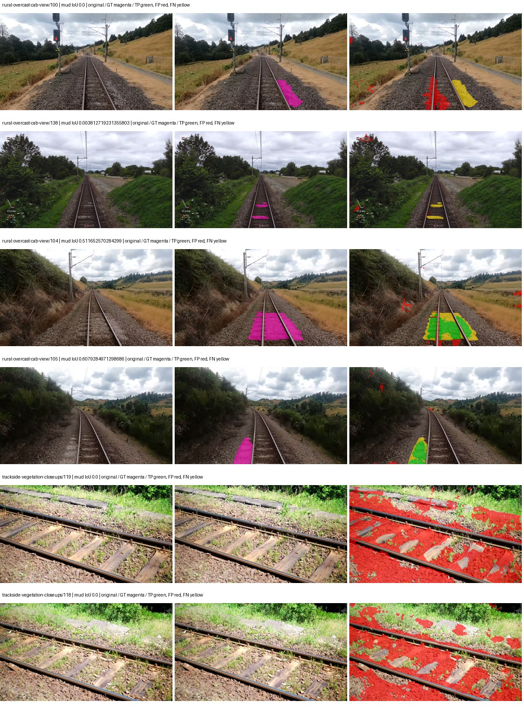
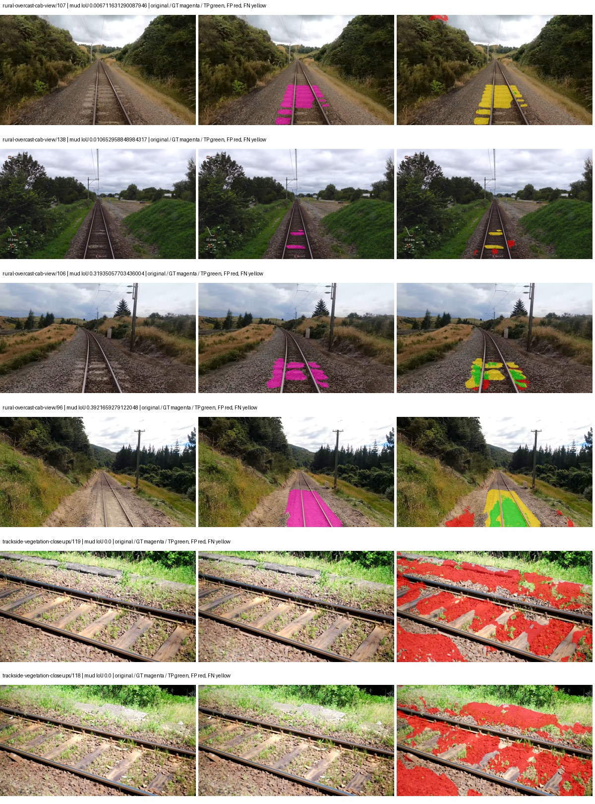
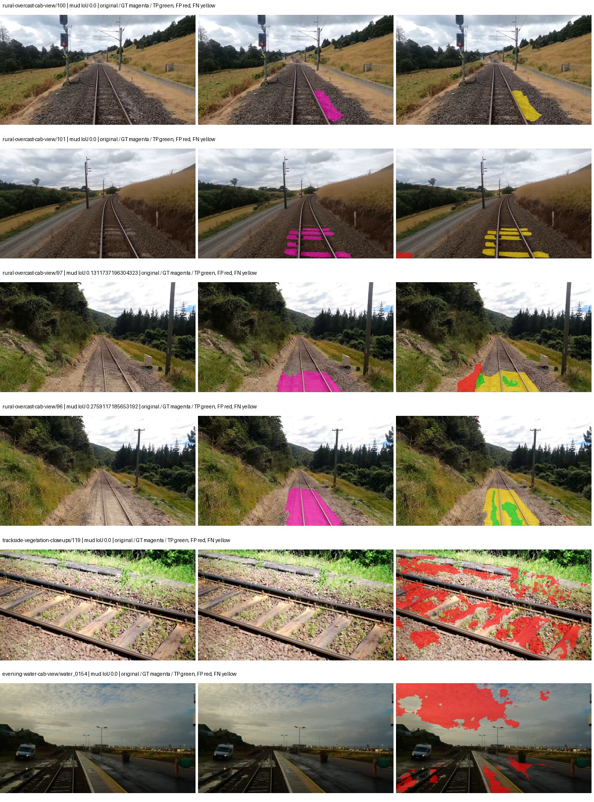
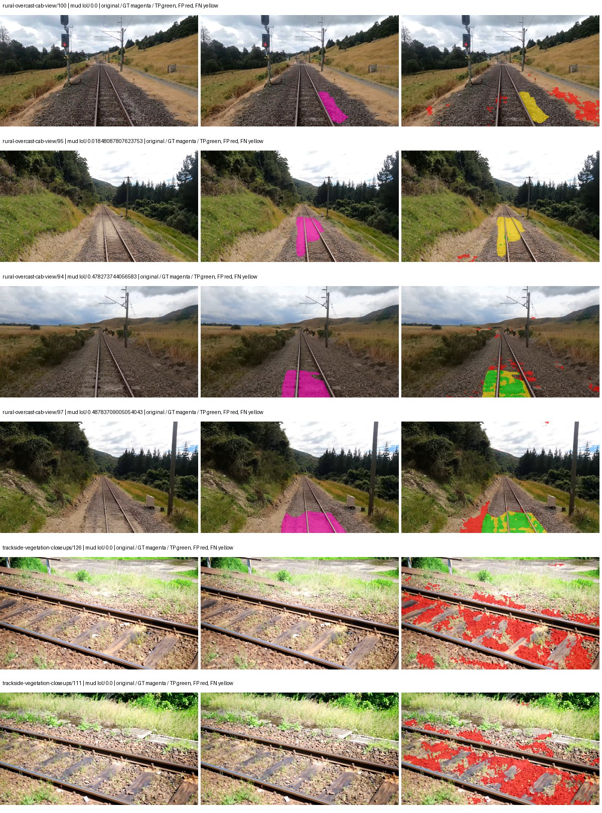
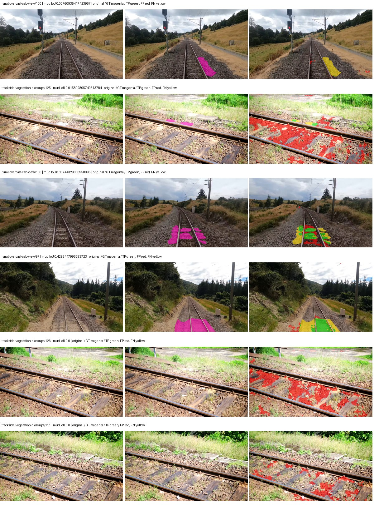
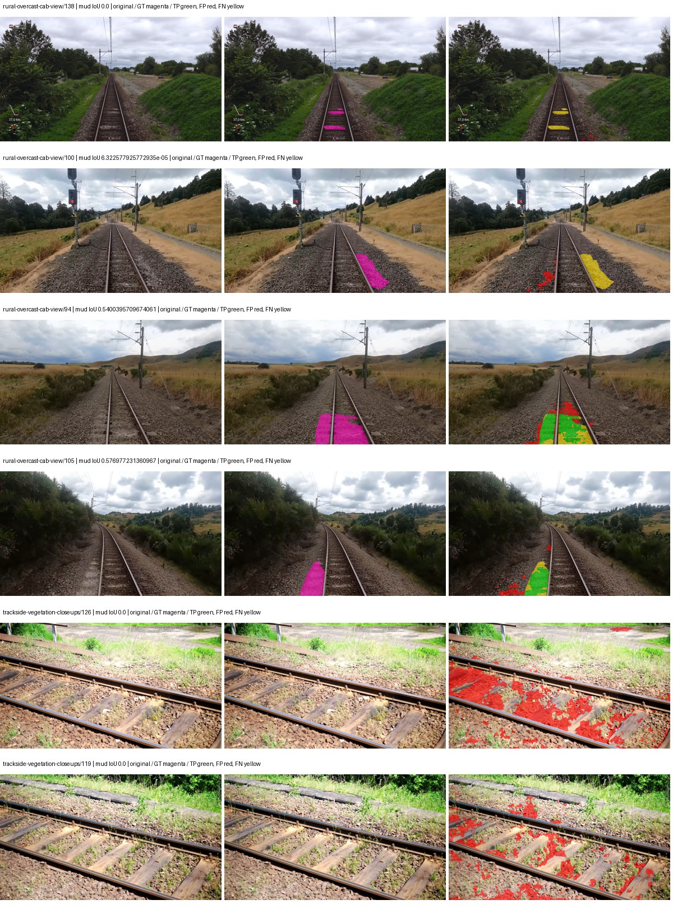
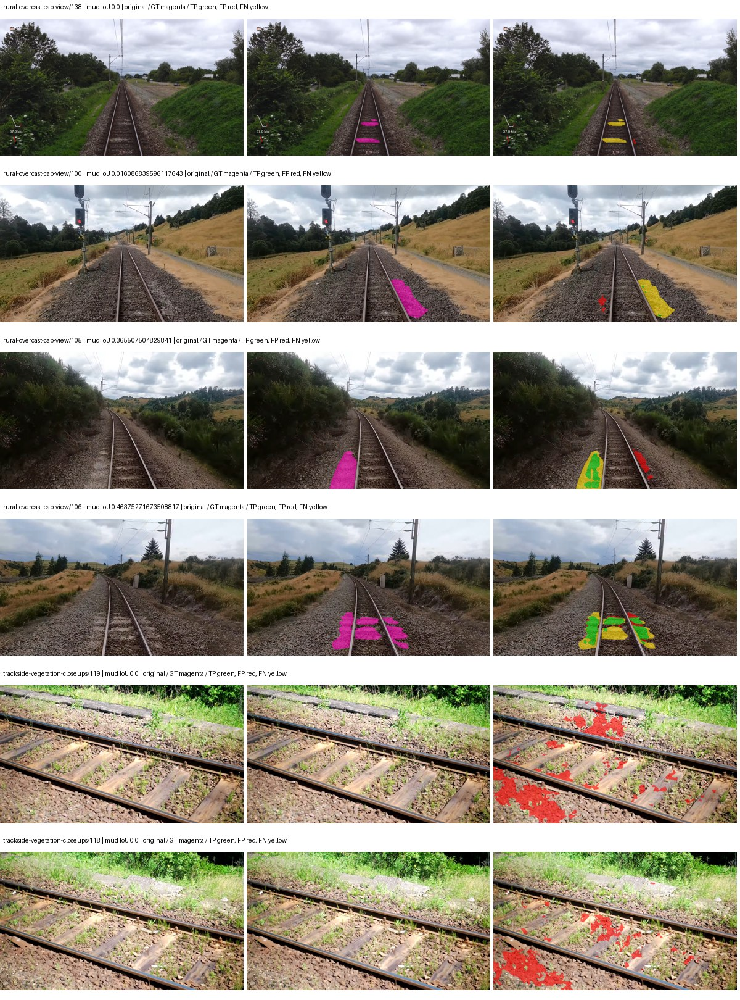
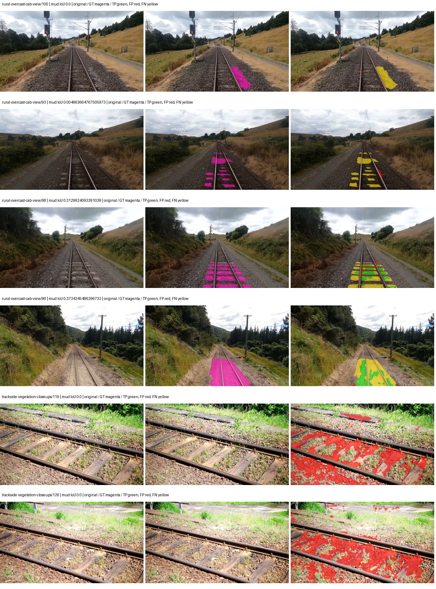
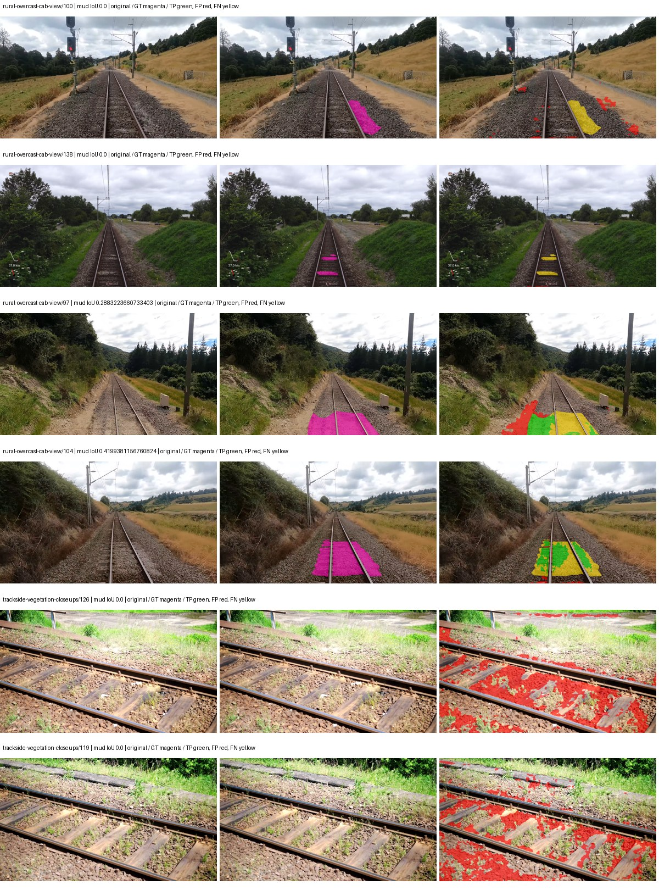
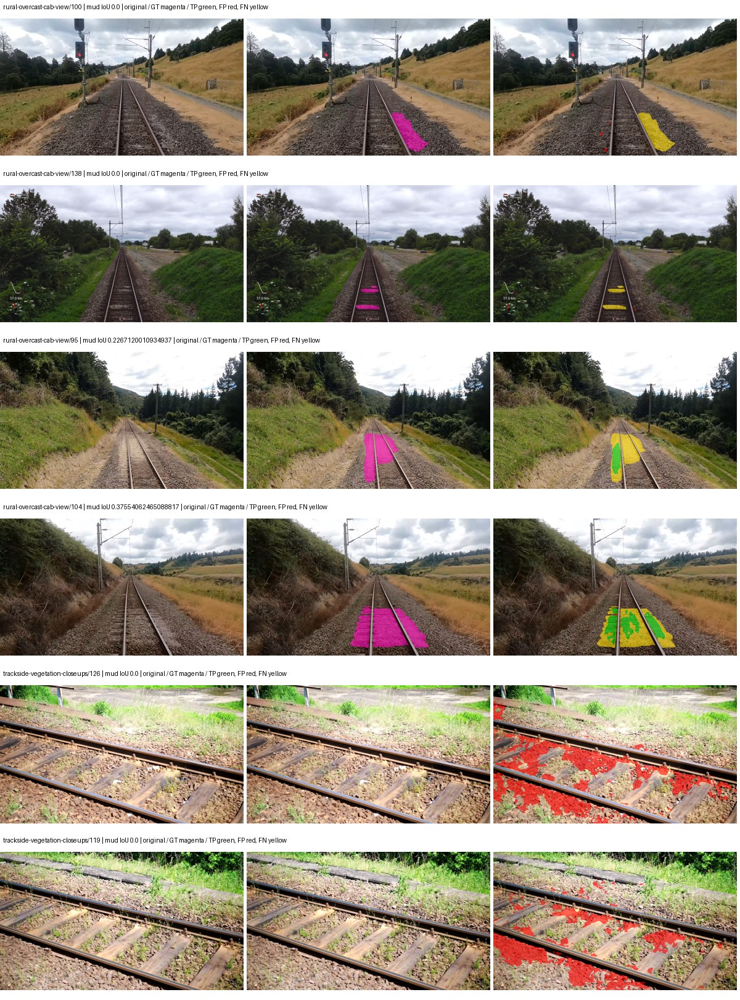

# smp_unet_resnet34 — paul-test-rtis

[RTIS comparison](../../README.md) · [Full model records](record.json)

Primary selection and early stopping: **mud-pumping validation IoU**. A job is complete only after full statistics and isolated profiling are verified.

| Model | Initialization path | Seed | Status | Steps | Best step | Mud IoU (%) | Mud precision (%) | Mud recall (%) | Final mud IoU (trainer val, %) | mIoU (%) | Fixed GT-class mIoU (%) |
| --- | --- | --- | --- | --- | --- | --- | --- | --- | --- | --- | --- |
| smp_unet_resnet34 | rtis_only | 0 | completed | 2290 | 1018 | 5.41 | 5.82 | 43.24 | 3.86 | 21.10 | 22.27 |
| smp_unet_resnet34 | rtis_only | 1 | completed | 1527 | 254 | 3.31 | 3.76 | 21.51 | 1.03 | 20.60 | 20.60 |
| smp_unet_resnet34 | rtis_only | 2 | completed | 1527 | 254 | 1.71 | 2.23 | 6.88 | 1.14 | 21.79 | 21.79 |
| smp_unet_resnet34 | cityscapes_to_rtis | 0 | completed | 1527 | 254 | 9.61 | 11.62 | 35.62 | 3.66 | 20.61 | 20.61 |
| smp_unet_resnet34 | cityscapes_to_rtis | 1 | completed | 1781 | 509 | 12.11 | 17.92 | 27.20 | 3.36 | 20.62 | 21.76 |
| smp_unet_resnet34 | cityscapes_to_rtis | 2 | completed | 2290 | 1018 | 12.81 | 17.53 | 32.23 | 2.19 | 25.03 | 27.81 |
| smp_unet_resnet34 | railsem19_to_rtis | 0 | training | 3399 | — | — | — | — | — | — | — |
| smp_unet_resnet34 | railsem19_to_rtis | 1 | training | 2849 | — | — | — | — | — | — | — |
| smp_unet_resnet34 | railsem19_to_rtis | 2 | completed | 2036 | 763 | 9.70 | 16.58 | 18.96 | 5.09 | 26.39 | 29.32 |
| smp_unet_resnet34 | cityscapes_to_railsem19_to_rtis | 0 | completed | 2290 | 1018 | 5.99 | 7.60 | 22.05 | 3.18 | 23.42 | 27.32 |
| smp_unet_resnet34 | cityscapes_to_railsem19_to_rtis | 1 | completed | 1527 | 254 | 6.16 | 7.40 | 26.95 | 3.34 | 25.30 | 26.71 |
| smp_unet_resnet34 | cityscapes_to_railsem19_to_rtis | 2 | completed | 1781 | 509 | 6.39 | 9.46 | 16.44 | 1.88 | 25.53 | 26.95 |

Training: 220 images. Validation: 37 images. Test: 50 held out. Seeds: [0, 1, 2]. Seed variation measures optimization variability, not independent-recording uncertainty. Historical source checkpoints stay fixed across adaptation seeds.

Training code: `066afb2626398b7be59d4d19f5a0e4644fd59adc`. Split SHA-256: `71fef8292610c352da0709fe3bd030f3bcc18f97560394835f4b22826463b83d`.

## rtis_only — seed 0

Status: **completed**. Started: 2026-09-07T09:22:23.076950+00:00. Finished: 2026-09-07T09:48:11.292234+00:00.

Recipe pretrained initializer: `{"arch": "smp", "backbone_path": null, "batch_norm_momentum": null, "checkpoint": null, "classifier_path": null, "drop_path": null, "encoder_name": "resnet34", "encoder_weights": "imagenet", "head": "unified_head", "head_paths": [], "inactive_parameter_paths": [], "local_files_only": false, "lora_alpha": 32, "lora_dropout": 0.05, "lora_r": 16, "lora_targets": [], "native": null, "revision": null, "smp_arch": "Unet", "subfolder": null, "trust_remote_code": false, "tuning": "full"}`.

`rtis_only` uses the recipe initializer, which may include pretrained segmentation components. Transfer paths load the exact historical source checkpoint below and reset the classifier; they do not reset all query/decoder features.

Source checkpoint: `Recipe pretrained initialization`.

Config SHA-256: `0e8d2800f4b2ed201da05e3a7105fad5c6225bc5cfb5f7b76f3efd5bbeec9768`. Weights used for validation: `raw`.

### Mud-pumping and aggregate quality

| Metric | Selected checkpoint | Final training validation |
| --- | --- | --- |
| Mud IoU | 5.41 | 3.86 |
| Mud precision | 5.82 | 4.48 |
| Mud recall | 43.24 | 21.79 |
| Mud Dice/F1 | 10.27 | 7.44 |
| mIoU | 21.10 | 25.38 |
| Mean accuracy | 34.51 | 37.13 |
| Mean precision | 33.57 | 41.13 |
| Mean Dice | 28.26 | 32.11 |
| Mean specificity | 97.98 | 98.74 |
| Pixel accuracy | 62.49 | 78.89 |
| Frequency-weighted IoU | 55.65 | 70.26 |
| Fixed GT-present class mIoU | 22.27 | 28.20 |
| Boundary F1 | 25.01 | 28.33 |

The selected checkpoint has independent evaluation evidence. Final values are the trainer's final validation record, not a new independent evaluation. mIoU averages classes with nonzero union, so false positives on absent classes can change its denominator. The fixed GT-class mean is supplementary and excludes absent classes; their false positives remain in the confusion matrix.

### Resource usage and timing

| Measurement | Value |
| --- | --- |
| Peak training VRAM, retained training invocation (GiB) | 7.91 |
| Peak evaluation VRAM (GiB) | 6.50 |
| Retained training invocation wall time (seconds) | 1437.44 |
| Retained training invocation GPU-hours (one GPU) | 0.40 |
| Evaluation wall time (seconds) | 10.39 |
| Full evaluation pipeline images/second | 3.56 |
| Best full-state checkpoint (MiB) | 373.37 |
| Final full-state checkpoint (MiB) | 373.36 |
| Audited periodic checkpoints removed (GiB) | 1.46 |

VRAM uses the recorded allocator high-water mark; it is not total device usage including CUDA context. Resumed jobs' retained training invocation times and peaks are **not whole-campaign totals**. Earlier invocation resource records are not reconstructed here. Evaluation throughput includes loader, sliding-window inference and metrics; it is not model-only latency/FPS. Missing measurements are shown as —, never inferred from another dataset's run.

### Standardized inference performance

Dedicated model-only profiling waits for an idle worker-locked L40S: BF16, batch 1, 1024x1024, 20 warmup and 100 CUDA-event-timed public forwards. It excludes loading, preprocessing, tiling and metrics.

| Status | Parameters | Weight MiB | FPS | p50 ms | p95 ms | Peak reserved GiB |
| --- | --- | --- | --- | --- | --- | --- |
| complete | 24439269 | 93.23 | 140.51 | 6.95 | 8.22 | 0.67 |

```json
{
  "schema_version": 1,
  "model_id": "smp_unet_resnet34",
  "measured_at": "2026-09-07T09:48:07+00:00",
  "status": "complete",
  "benchmark_scope": "rtis_selected_checkpoint_model_only",
  "applies_to": [
    "smp_unet_resnet34--rtis_only--seed-0"
  ],
  "source": {
    "campaign_git_sha": "066afb2626398b7be59d4d19f5a0e4644fd59adc",
    "git_dirty": false,
    "config_hash": "220d177a27b7",
    "resolved_config": "/data/izadia1/projects/segmentary-runs/paul-test-rtis/mud-fullstats-v1-20260906-r2/configs/smp_unet_resnet34--rtis_only--seed-0.yaml",
    "config_sha256": "0e8d2800f4b2ed201da05e3a7105fad5c6225bc5cfb5f7b76f3efd5bbeec9768",
    "checkpoint_sha256": "6a8484809246c621f5f151c2fa272e4a1135fe3211361fa34bb5333994435555",
    "checkpoint_global_step": 1018,
    "checkpoint_bytes": 391502233,
    "checkpoint_kind": "resume checkpoint with optimizer and EMA state",
    "weights": "raw",
    "measured_checkpoint_job_id": "smp_unet_resnet34--rtis_only--seed-0",
    "result_sha256": "9ea5818e11bf6a6d93ca8e750e96a78b000fda34d2b3791666dbf82d532a13ef",
    "result_git_sha": "066afb2626398b7be59d4d19f5a0e4644fd59adc",
    "result_stage": "eval:paul-test-rtis:val",
    "result_seed": 0
  },
  "hardware": {
    "gpu_name": "NVIDIA L40S",
    "gpu_uuid": "GPU-84f5ca4d-68db-ae98-d056-40654d859dd9",
    "logical_device": "cuda:0",
    "physical_visibility_token": "0",
    "compute_capability": [
      8,
      9
    ],
    "total_memory_bytes": 47677177856
  },
  "model": {
    "parameter_count": 24439269,
    "trainable_parameter_count": 24439269,
    "resident_parameter_bytes": 97757076,
    "parameter_dtype_counts": {
      "float32": 24439269
    }
  },
  "contract": {
    "backend": "pytorch",
    "precision": "bf16_autocast",
    "batch_size": 1,
    "input_shape_nchw": [
      1,
      3,
      1024,
      1024
    ],
    "warmup_iterations": 20,
    "measured_iterations": 100,
    "timing": "per-forward CUDA events with end-event synchronization",
    "includes_preprocessing": false,
    "includes_data_loader": false,
    "includes_sliding_window": false,
    "input_resident_on_gpu": true,
    "model_only": true,
    "entrypoint": "public model(image) dense-logits forward"
  },
  "measurements": {
    "latency": {
      "p50_ms": 6.95252799987793,
      "p95_ms": 8.220467329025269,
      "mean_ms": 7.117014083862305,
      "minimum_ms": 6.812672138214111,
      "maximum_ms": 10.660863876342773,
      "fps": 140.5083632288267,
      "raw_ms": [
        7.19155216217041,
        7.364607810974121,
        8.350720405578613,
        6.93452787399292,
        7.860223770141602,
        8.052736282348633,
        8.419327735900879,
        8.144895553588867,
        8.27286434173584,
        8.218624114990234,
        8.255488395690918,
        6.924287796020508,
        6.834176063537598,
        7.328767776489258,
        6.924287796020508,
        7.383039951324463,
        6.875135898590088,
        7.073791980743408,
        7.0338239669799805,
        6.9621758460998535,
        6.987775802612305,
        7.007232189178467,
        7.33081579208374,
        6.939648151397705,
        6.914048194885254,
        6.919167995452881,
        6.899712085723877,
        6.894591808319092,
        6.939583778381348,
        6.905856132507324,
        6.8587517738342285,
        6.892543792724609,
        7.179264068603516,
        6.880256175994873,
        6.8679680824279785,
        6.88640022277832,
        6.860799789428711,
        6.875135898590088,
        6.939648151397705,
        6.884352207183838,
        6.872064113616943,
        6.903808116912842,
        6.996032238006592,
        6.8895039558410645,
        6.874112129211426,
        6.953120231628418,
        6.860799789428711,
        6.864895820617676,
        6.859776020050049,
        6.850560188293457,
        7.208960056304932,
        7.710720062255859,
        7.292928218841553,
        6.930431842803955,
        6.945792198181152,
        6.933472156524658,
        6.956031799316406,
        10.660863876342773,
        6.955008029937744,
        6.966271877288818,
        6.988800048828125,
        6.917119979858398,
        6.933504104614258,
        6.982656002044678,
        6.946784019470215,
        7.039999961853027,
        6.938623905181885,
        6.94374418258667,
        6.982656002044678,
        6.951935768127441,
        6.960127830505371,
        6.9918718338012695,
        7.0215678215026855,
        6.947711944580078,
        6.931456089019775,
        7.119872093200684,
        6.975391864776611,
        6.960127830505371,
        6.972415924072266,
        6.945792198181152,
        7.026688098907471,
        6.9898881912231445,
        6.968319892883301,
        6.975488185882568,
        6.9918718338012695,
        6.9713921546936035,
        6.914048194885254,
        6.890495777130127,
        6.874112129211426,
        6.89356803894043,
        6.831103801727295,
        6.853631973266602,
        6.854656219482422,
        6.812672138214111,
        7.1045122146606445,
        7.387135982513428,
        7.274496078491211,
        6.980607986450195,
        6.9468159675598145,
        6.953983783721924
      ],
      "percentile_method": "numpy linear interpolation"
    },
    "peak_reserved_bytes": 723517440,
    "memory_kind": "pytorch_cuda_allocator_peak_reserved_excluding_context",
    "benchmark_wall_clock_s": 8.20121569186449
  },
  "started_at": "2026-09-07T09:47:59+00:00",
  "finished_at": "2026-09-07T09:48:07+00:00",
  "environment": {
    "hostname": "hdrfs-app-001",
    "python": "3.11.15",
    "platform": "Linux-5.15.0-139-generic-x86_64-with-glibc2.35",
    "torch": "2.11.0+cu128",
    "torch_cuda": "12.8",
    "cudnn": 91900,
    "driver_version": "570.133.20",
    "cuda_available": true,
    "gpu_count": 1,
    "gpu_names": [
      "NVIDIA L40S"
    ],
    "cuda_visible_devices": "0",
    "packages": {
      "segmentary": "0.1.0",
      "torch": "2.11.0+cu128",
      "torchvision": "0.26.0+cu128",
      "transformers": "5.15.0",
      "timm": "1.0.28",
      "segmentation-models-pytorch": "0.5.0",
      "albumentations": "2.0.8",
      "lightning": "2.6.5",
      "numpy": "2.4.4"
    }
  }
}
```

### Per-class validation results

| Class | GT pixels | IoU (%) | Precision (%) | Recall (%) | Dice (%) | Boundary F1 (%) |
| --- | --- | --- | --- | --- | --- | --- |
| car | 29664 | 0.00 | 0.00 | 0.00 | 0.00 | 0.00 |
| construction | 311585 | 7.49 | 7.68 | 75.65 | 13.94 | 14.02 |
| fence | 265137 | 9.30 | 19.89 | 14.87 | 17.02 | 16.63 |
| mud-pumping | 1226250 | 5.41 | 5.82 | 43.24 | 10.27 | 9.14 |
| on-rails | 0 | 0.00 | 0.00 | — | 0.00 | 0.00 |
| person | 0 | — | — | — | — | — |
| pole | 628038 | 59.58 | 77.16 | 72.33 | 74.67 | 83.47 |
| rail-embedded | 16799 | 0.00 | 0.00 | 0.00 | 0.00 | 0.00 |
| rail-raised | 2969797 | 54.98 | 86.58 | 60.10 | 70.95 | 84.91 |
| rail-track | 6323197 | 31.12 | 66.29 | 36.97 | 47.47 | 43.20 |
| road | 1048831 | 15.76 | 28.36 | 26.18 | 27.23 | 19.88 |
| sidewalk | 1297367 | 9.40 | 40.51 | 10.91 | 17.19 | 12.04 |
| sky | 19121606 | 77.83 | 99.54 | 78.10 | 87.53 | 54.96 |
| standing-water | 95802 | 0.43 | 0.43 | 48.27 | 0.85 | 1.75 |
| terrain | 39239306 | 60.07 | 85.09 | 67.14 | 75.06 | 37.64 |
| trackbed | 10643081 | 57.19 | 72.46 | 73.07 | 72.76 | 52.52 |
| traffic-light | 19510 | 0.00 | 0.00 | 0.00 | 0.00 | 0.00 |
| traffic-sign | 13285 | 0.00 | 0.00 | 0.00 | 0.00 | 0.00 |
| tram-track | 56179 | 0.00 | 0.00 | 0.00 | 0.00 | 6.76 |
| truck | 0 | — | — | — | — | — |
| vegetation-overgrowth | 5901821 | 12.36 | 48.10 | 14.27 | 22.01 | 38.35 |

### Full-run accounting

| Measurement | Value |
| --- | --- |
| Full GPU-reserved wall seconds, all recorded worker attempts | 1548.22 |
| Full reserved GPU-hours | 0.43 |
| Whole-run timing complete | True |

| Phase | Wall seconds including failed attempts |
| --- | --- |
| training | 1444.09 |
| diagnostics | 68.25 |
| performance | 15.42 |

GPU-reserved time includes model loading, training, validation, collection, profiling, checkpoint I/O and orchestration while the worker owns one GPU. It is not GPU kernel-active time. Phase timings and sampled device memory/power/utilization are retained separately; sampled device memory is not the allocator high-water mark.

### Train/validation and raw/EMA diagnostics

| Checkpoint / weights / split | Images | Mud IoU (%) | Mud precision (%) | Mud recall (%) |
| --- | --- | --- | --- | --- |
| best-auto-train / raw | 220 | 83.56 | 88.26 | 94.02 |
| best-auto-val / raw | 37 | 5.41 | 5.82 | 43.24 |
| best-alternate-val / ema | 37 | 2.69 | 3.00 | 20.68 |
| final-auto-val / raw | 37 | 3.86 | 4.48 | 21.79 |

Train uses the evaluation transform without augmentation. Compare mud train/validation metrics for the same selected weights. Alternate EMA on running-stat BatchNorm is explicitly uncalibrated and is diagnostic only. Score-threshold curves use uncalibrated normalized scores and are pixel-level diagnostics, not event detection rates or a selected deployment operating point.

### Downloadable evidence

- best-auto-train: [per-image.csv](rtis_only--seed-0/best-auto-train/per-image.csv) · [per-image-confusion.json.gz](rtis_only--seed-0/best-auto-train/per-image-confusion.json.gz) · [groups.json](rtis_only--seed-0/best-auto-train/groups.json) · [mud-score-curves.json](rtis_only--seed-0/best-auto-train/mud-score-curves.json)
- best-auto-val: [per-image.csv](rtis_only--seed-0/best-auto-val/per-image.csv) · [per-image-confusion.json.gz](rtis_only--seed-0/best-auto-val/per-image-confusion.json.gz) · [groups.json](rtis_only--seed-0/best-auto-val/groups.json) · [mud-score-curves.json](rtis_only--seed-0/best-auto-val/mud-score-curves.json) · [examples.jpg](rtis_only--seed-0/best-auto-val/examples.jpg)
- best-alternate-val: [per-image.csv](rtis_only--seed-0/best-alternate-val/per-image.csv) · [per-image-confusion.json.gz](rtis_only--seed-0/best-alternate-val/per-image-confusion.json.gz) · [groups.json](rtis_only--seed-0/best-alternate-val/groups.json) · [mud-score-curves.json](rtis_only--seed-0/best-alternate-val/mud-score-curves.json)
- final-auto-val: [per-image.csv](rtis_only--seed-0/final-auto-val/per-image.csv) · [per-image-confusion.json.gz](rtis_only--seed-0/final-auto-val/per-image-confusion.json.gz) · [groups.json](rtis_only--seed-0/final-auto-val/groups.json) · [mud-score-curves.json](rtis_only--seed-0/final-auto-val/mud-score-curves.json)
- resources: [telemetry.csv](rtis_only--seed-0/resources/telemetry.csv)



Examples are two lowest and two highest mud-IoU positive images, plus up to two negative images with the most false-positive mud pixels. They are targeted diagnostic examples, not random samples. Green: true positive; red: false positive; yellow: false negative. Full predictions remain on HDRFS.

### Validation tracking

| Logged step | Overall mIoU (%) | Mud IoU (%) |
| --- | --- | --- |
| 254 | 19.89 | 0.84 |
| 508 | 21.50 | 0.76 |
| 763 | 23.08 | 2.80 |
| 1017 | 21.10 | 5.41 |
| 1272 | 25.11 | 3.04 |
| 1527 | 25.15 | 0.92 |
| 1781 | 22.99 | 2.01 |
| 2036 | 25.71 | 3.39 |
| 2290 | 25.38 | 3.86 |

All retained scalar curves, including training loss and per-class IoU, are in record.json. Observed best mud on a curve is not necessarily a retained checkpoint: the pilot saved its selection-metric-best and final checkpoints. Step logging and checkpoint global_step may differ by one.

### Stopping and checkpoint provenance

```json
{
  "stopping": {
    "actual_steps": 2290,
    "maximum_steps": 4000,
    "min_delta": 0.001,
    "monitor": "val_iou/mud-pumping",
    "patience": 5,
    "reason": "validation_plateau"
  },
  "checkpoints": {
    "best": {
      "path": "/data/izadia1/projects/segmentary-runs/paul-test-rtis/mud-fullstats-v1-20260906-r2/future-runs/smp_unet_resnet34--rtis_only--seed-0_seed0/rtis/best.ckpt",
      "sha256": "6a8484809246c621f5f151c2fa272e4a1135fe3211361fa34bb5333994435555",
      "global_step": 1018,
      "bytes": 391502233
    },
    "final": {
      "path": "/data/izadia1/projects/segmentary-runs/paul-test-rtis/mud-fullstats-v1-20260906-r2/future-runs/smp_unet_resnet34--rtis_only--seed-0_seed0/rtis/last.ckpt",
      "sha256": "ab1d1ccb14d7624bc14f018df6397a009c1145500ed5d6e2fd4183f4ca5946c4",
      "global_step": 2290,
      "bytes": 391493273
    }
  },
  "cleanup_error": null
}
```

### Resolved training, initialization and evaluation settings

The optimizer block is the base configuration. Stage LR scales are applied at runtime, and stage warmup is capped at min(base warmup, floor(stage budget / 10), stage budget - 1): 400 steps for this 4,000-step pilot. Model-internal native input grids may differ from augmentation crops (EoMT uses its 640 grid).

```json
{
  "name": "smp_unet_resnet34--rtis_only--seed-0",
  "model": {
    "arch": "smp",
    "checkpoint": null,
    "tuning": "full",
    "head": "unified_head",
    "lora_r": 16,
    "lora_alpha": 32,
    "lora_dropout": 0.05,
    "lora_targets": [],
    "drop_path": null,
    "revision": null,
    "subfolder": null,
    "local_files_only": false,
    "trust_remote_code": false,
    "backbone_path": null,
    "head_paths": [],
    "classifier_path": null,
    "inactive_parameter_paths": [],
    "smp_arch": "Unet",
    "encoder_name": "resnet34",
    "encoder_weights": "imagenet",
    "native": null,
    "batch_norm_momentum": null
  },
  "space": "paul-test-rtis",
  "taxonomy_root": "/data/izadia1/projects/segmentary-rtis-fullstats-066afb2/taxonomy",
  "output_root": "/data/izadia1/projects/segmentary-runs/paul-test-rtis/mud-fullstats-v1-20260906-r2/future-runs",
  "optim": {
    "backbone_lr": 0.0001,
    "head_lr_mult": 10.0,
    "weight_decay": 0.05,
    "llrd": 1.0,
    "warmup_iters": 1500,
    "warmup_ratio": 1e-06,
    "poly_power": 0.9,
    "min_lr_ratio": 0.0,
    "betas": [
      0.9,
      0.999
    ],
    "grad_clip": 1.0
  },
  "train": {
    "iters": 4000,
    "batch_size": 2,
    "accum": 8,
    "num_workers": 2,
    "precision": "bf16-mixed",
    "ema_decay": 0.9998,
    "val_every": 250,
    "ckpt_every": 500,
    "selection_metric": "val_iou/mud-pumping",
    "early_stopping_patience": 5,
    "early_stopping_min_delta": 0.001,
    "seed": 0,
    "devices": 1
  },
  "eval": {
    "sliding_window": true,
    "window": [
      1024,
      1024
    ],
    "stride": [
      768,
      768
    ],
    "batch_size": 1,
    "num_workers": 2,
    "tta_scales": [],
    "tta_flip": false,
    "threshold": 0.5,
    "boundary_tolerance_frac": 0.0075,
    "save_confusion": true
  },
  "loss": {
    "task": "multiclass",
    "activation": "auto",
    "terms": [],
    "aux": "none",
    "aux_weight": 0.0,
    "ce_weight": 1.0,
    "label_smoothing": 0.0,
    "class_weights": null,
    "query": null
  },
  "aug": {
    "crop": [
      1024,
      1024
    ],
    "scale_min": 0.5,
    "scale_max": 2.0,
    "hflip_p": 0.5,
    "color_jitter_p": 0.5,
    "brightness": 0.25,
    "contrast": 0.25,
    "saturation": 0.25,
    "hue": 0.05
  },
  "stages": [
    {
      "name": "rtis",
      "data": [
        {
          "name": "paul-test-rtis",
          "root": "/data/izadia1/datasets/paul-test-rtis",
          "variant": null,
          "split_file": "splits.json",
          "train_split": "train",
          "val_split": "val",
          "limit": null,
          "loader": "folder",
          "mapping": "paul-test-rtis",
          "loader_options": {
            "require_groups": true
          }
        }
      ],
      "iters": null,
      "lr_scale": 1.0,
      "head_group_lr_scale": 1.0,
      "init_from": "pretrained",
      "reset_head": false,
      "freeze": null,
      "sample_weights": null
    }
  ]
}
```

### Hardware and software provenance

```json
{
  "training": {
    "cuda_available": true,
    "cuda_visible_devices": "0",
    "cudnn": 91900,
    "driver_version": "570.133.20",
    "gpu_count": 1,
    "gpu_names": [
      "NVIDIA L40S"
    ],
    "hostname": "hdrfs-app-001",
    "input_normalization": {
      "channel_order": "rgb",
      "mean": [
        0.485,
        0.456,
        0.406
      ],
      "source": "smp_encoder_settings",
      "std": [
        0.229,
        0.224,
        0.225
      ]
    },
    "model_origins": [
      {
        "hf_commit": null,
        "hf_name_or_path": null,
        "module": "model",
        "timm_pretrained": {}
      }
    ],
    "model_parameter_count": 24439269,
    "packages": {
      "albumentations": "2.0.8",
      "lightning": "2.6.5",
      "numpy": "2.4.4",
      "segmentary": "0.1.0",
      "segmentation-models-pytorch": "0.5.0",
      "timm": "1.0.28",
      "torch": "2.11.0+cu128",
      "torchvision": "0.26.0+cu128",
      "transformers": "5.15.0"
    },
    "platform": "Linux-5.15.0-139-generic-x86_64-with-glibc2.35",
    "python": "3.11.15",
    "torch": "2.11.0+cu128",
    "torch_cuda": "12.8",
    "trainable_parameter_count": 24439269,
    "training_stop": {
      "actual_steps": 2290,
      "maximum_steps": 4000,
      "min_delta": 0.001,
      "monitor": "val_iou/mud-pumping",
      "patience": 5,
      "reason": "validation_plateau"
    },
    "validation_weights": "raw"
  },
  "evaluation": {
    "cuda_available": true,
    "cuda_visible_devices": "0",
    "cudnn": 91900,
    "driver_version": "570.133.20",
    "gpu_count": 1,
    "gpu_names": [
      "NVIDIA L40S"
    ],
    "hostname": "hdrfs-app-001",
    "input_normalization": {
      "channel_order": "rgb",
      "mean": [
        0.485,
        0.456,
        0.406
      ],
      "source": "smp_encoder_settings",
      "std": [
        0.229,
        0.224,
        0.225
      ]
    },
    "packages": {
      "albumentations": "2.0.8",
      "lightning": "2.6.5",
      "numpy": "2.4.4",
      "segmentary": "0.1.0",
      "segmentation-models-pytorch": "0.5.0",
      "timm": "1.0.28",
      "torch": "2.11.0+cu128",
      "torchvision": "0.26.0+cu128",
      "transformers": "5.15.0"
    },
    "platform": "Linux-5.15.0-139-generic-x86_64-with-glibc2.35",
    "python": "3.11.15",
    "torch": "2.11.0+cu128",
    "torch_cuda": "12.8"
  }
}
```

## rtis_only — seed 1

Status: **completed**. Started: 2026-09-07T09:23:41.396535+00:00. Finished: 2026-09-07T09:41:39.541080+00:00.

Recipe pretrained initializer: `{"arch": "smp", "backbone_path": null, "batch_norm_momentum": null, "checkpoint": null, "classifier_path": null, "drop_path": null, "encoder_name": "resnet34", "encoder_weights": "imagenet", "head": "unified_head", "head_paths": [], "inactive_parameter_paths": [], "local_files_only": false, "lora_alpha": 32, "lora_dropout": 0.05, "lora_r": 16, "lora_targets": [], "native": null, "revision": null, "smp_arch": "Unet", "subfolder": null, "trust_remote_code": false, "tuning": "full"}`.

`rtis_only` uses the recipe initializer, which may include pretrained segmentation components. Transfer paths load the exact historical source checkpoint below and reset the classifier; they do not reset all query/decoder features.

Source checkpoint: `Recipe pretrained initialization`.

Config SHA-256: `d184801ca13d7f7c931ed6326a8f5d832d1cf230abe160ef4de4008ddfc4d9a5`. Weights used for validation: `raw`.

### Mud-pumping and aggregate quality

| Metric | Selected checkpoint | Final training validation |
| --- | --- | --- |
| Mud IoU | 3.31 | 1.03 |
| Mud precision | 3.76 | 1.26 |
| Mud recall | 21.51 | 5.32 |
| Mud Dice/F1 | 6.40 | 2.04 |
| mIoU | 20.60 | 25.09 |
| Mean accuracy | 27.06 | 36.88 |
| Mean precision | 29.58 | 36.74 |
| Mean Dice | 25.51 | 32.27 |
| Mean specificity | 98.60 | 98.55 |
| Pixel accuracy | 77.57 | 74.89 |
| Frequency-weighted IoU | 67.49 | 67.23 |
| Fixed GT-present class mIoU | 20.60 | 26.48 |
| Boundary F1 | 22.00 | 27.55 |

The selected checkpoint has independent evaluation evidence. Final values are the trainer's final validation record, not a new independent evaluation. mIoU averages classes with nonzero union, so false positives on absent classes can change its denominator. The fixed GT-class mean is supplementary and excludes absent classes; their false positives remain in the confusion matrix.

### Resource usage and timing

| Measurement | Value |
| --- | --- |
| Peak training VRAM, retained training invocation (GiB) | 7.91 |
| Peak evaluation VRAM (GiB) | 6.50 |
| Retained training invocation wall time (seconds) | 968.74 |
| Retained training invocation GPU-hours (one GPU) | 0.27 |
| Evaluation wall time (seconds) | 10.00 |
| Full evaluation pipeline images/second | 3.70 |
| Best full-state checkpoint (MiB) | 373.37 |
| Final full-state checkpoint (MiB) | 373.36 |
| Audited periodic checkpoints removed (GiB) | 1.09 |

VRAM uses the recorded allocator high-water mark; it is not total device usage including CUDA context. Resumed jobs' retained training invocation times and peaks are **not whole-campaign totals**. Earlier invocation resource records are not reconstructed here. Evaluation throughput includes loader, sliding-window inference and metrics; it is not model-only latency/FPS. Missing measurements are shown as —, never inferred from another dataset's run.

### Standardized inference performance

Dedicated model-only profiling waits for an idle worker-locked L40S: BF16, batch 1, 1024x1024, 20 warmup and 100 CUDA-event-timed public forwards. It excludes loading, preprocessing, tiling and metrics.

| Status | Parameters | Weight MiB | FPS | p50 ms | p95 ms | Peak reserved GiB |
| --- | --- | --- | --- | --- | --- | --- |
| complete | 24439269 | 93.23 | 142.14 | 6.80 | 8.28 | 0.68 |

```json
{
  "schema_version": 1,
  "model_id": "smp_unet_resnet34",
  "measured_at": "2026-09-07T09:41:36+00:00",
  "status": "complete",
  "benchmark_scope": "rtis_selected_checkpoint_model_only",
  "applies_to": [
    "smp_unet_resnet34--rtis_only--seed-1"
  ],
  "source": {
    "campaign_git_sha": "066afb2626398b7be59d4d19f5a0e4644fd59adc",
    "git_dirty": false,
    "config_hash": "869c91fb1886",
    "resolved_config": "/data/izadia1/projects/segmentary-runs/paul-test-rtis/mud-fullstats-v1-20260906-r2/configs/smp_unet_resnet34--rtis_only--seed-1.yaml",
    "config_sha256": "d184801ca13d7f7c931ed6326a8f5d832d1cf230abe160ef4de4008ddfc4d9a5",
    "checkpoint_sha256": "531b55d815974284e7e99580ed9ff5c4805bdf8a48c2ba47f3a2136aa9b6225c",
    "checkpoint_global_step": 254,
    "checkpoint_bytes": 391502041,
    "checkpoint_kind": "resume checkpoint with optimizer and EMA state",
    "weights": "raw",
    "measured_checkpoint_job_id": "smp_unet_resnet34--rtis_only--seed-1",
    "result_sha256": "0b12f3408b5e7144f97afba9a2a36f44350826e843767a127d84e58532c30749",
    "result_git_sha": "066afb2626398b7be59d4d19f5a0e4644fd59adc",
    "result_stage": "eval:paul-test-rtis:val",
    "result_seed": 1
  },
  "hardware": {
    "gpu_name": "NVIDIA L40S",
    "gpu_uuid": "GPU-a5ad49e5-0536-5229-ba8a-f8a902808f53",
    "logical_device": "cuda:0",
    "physical_visibility_token": "7",
    "compute_capability": [
      8,
      9
    ],
    "total_memory_bytes": 47677177856
  },
  "model": {
    "parameter_count": 24439269,
    "trainable_parameter_count": 24439269,
    "resident_parameter_bytes": 97757076,
    "parameter_dtype_counts": {
      "float32": 24439269
    }
  },
  "contract": {
    "backend": "pytorch",
    "precision": "bf16_autocast",
    "batch_size": 1,
    "input_shape_nchw": [
      1,
      3,
      1024,
      1024
    ],
    "warmup_iterations": 20,
    "measured_iterations": 100,
    "timing": "per-forward CUDA events with end-event synchronization",
    "includes_preprocessing": false,
    "includes_data_loader": false,
    "includes_sliding_window": false,
    "input_resident_on_gpu": true,
    "model_only": true,
    "entrypoint": "public model(image) dense-logits forward"
  },
  "measurements": {
    "latency": {
      "p50_ms": 6.802432060241699,
      "p95_ms": 8.278169584274291,
      "mean_ms": 7.035217242240906,
      "minimum_ms": 6.69593620300293,
      "maximum_ms": 9.218048095703125,
      "fps": 142.14202142839204,
      "raw_ms": [
        7.408639907836914,
        7.24070405960083,
        6.972415924072266,
        7.369728088378906,
        7.264256000518799,
        7.185408115386963,
        7.045119762420654,
        6.865920066833496,
        6.775807857513428,
        6.751232147216797,
        6.7399678230285645,
        6.802432060241699,
        7.485439777374268,
        8.265727996826172,
        8.514559745788574,
        8.71116828918457,
        8.550399780273438,
        9.218048095703125,
        7.186431884765625,
        6.850560188293457,
        7.023615837097168,
        7.112703800201416,
        7.2427520751953125,
        7.1096320152282715,
        6.795263767242432,
        6.748159885406494,
        6.730751991271973,
        6.742015838623047,
        6.87718391418457,
        7.053311824798584,
        7.075839996337891,
        7.344128131866455,
        7.142399787902832,
        6.980607986450195,
        6.959104061126709,
        7.301119804382324,
        8.145919799804688,
        6.970367908477783,
        6.900735855102539,
        8.756223678588867,
        6.963200092315674,
        6.767615795135498,
        6.755328178405762,
        6.742015838623047,
        6.733823776245117,
        6.818816184997559,
        6.811647891998291,
        6.746111869812012,
        7.19052791595459,
        6.806528091430664,
        6.725632190704346,
        6.785024166107178,
        6.726655960083008,
        6.714367866516113,
        6.746111869812012,
        6.7358717918396,
        6.888448238372803,
        6.7358717918396,
        7.073791980743408,
        6.802432060241699,
        6.759424209594727,
        6.733823776245117,
        6.718463897705078,
        7.903232097625732,
        6.833151817321777,
        6.936575889587402,
        6.7399678230285645,
        6.730751991271973,
        6.766592025756836,
        6.762495994567871,
        6.771711826324463,
        6.714303970336914,
        6.724607944488525,
        6.750207901000977,
        6.69593620300293,
        6.721536159515381,
        7.489535808563232,
        7.629824161529541,
        6.881279945373535,
        6.756351947784424,
        6.7348480224609375,
        6.740992069244385,
        6.7399678230285645,
        6.723584175109863,
        6.771711826324463,
        6.754303932189941,
        6.74508810043335,
        6.747136116027832,
        8.050687789916992,
        6.989823818206787,
        6.724607944488525,
        7.015423774719238,
        6.740992069244385,
        6.754303932189941,
        6.7399678230285645,
        6.743040084838867,
        6.759424209594727,
        6.707200050354004,
        6.758399963378906,
        7.0748162269592285
      ],
      "percentile_method": "numpy linear interpolation"
    },
    "peak_reserved_bytes": 727711744,
    "memory_kind": "pytorch_cuda_allocator_peak_reserved_excluding_context",
    "benchmark_wall_clock_s": 8.354329098016024
  },
  "started_at": "2026-09-07T09:41:28+00:00",
  "finished_at": "2026-09-07T09:41:36+00:00",
  "environment": {
    "hostname": "hdrfs-app-001",
    "python": "3.11.15",
    "platform": "Linux-5.15.0-139-generic-x86_64-with-glibc2.35",
    "torch": "2.11.0+cu128",
    "torch_cuda": "12.8",
    "cudnn": 91900,
    "driver_version": "570.133.20",
    "cuda_available": true,
    "gpu_count": 1,
    "gpu_names": [
      "NVIDIA L40S"
    ],
    "cuda_visible_devices": "7",
    "packages": {
      "segmentary": "0.1.0",
      "torch": "2.11.0+cu128",
      "torchvision": "0.26.0+cu128",
      "transformers": "5.15.0",
      "timm": "1.0.28",
      "segmentation-models-pytorch": "0.5.0",
      "albumentations": "2.0.8",
      "lightning": "2.6.5",
      "numpy": "2.4.4"
    }
  }
}
```

### Per-class validation results

| Class | GT pixels | IoU (%) | Precision (%) | Recall (%) | Dice (%) | Boundary F1 (%) |
| --- | --- | --- | --- | --- | --- | --- |
| car | 29664 | 0.00 | 0.00 | 0.00 | 0.00 | 0.00 |
| construction | 311585 | 19.65 | 23.23 | 56.09 | 32.85 | 20.06 |
| fence | 265137 | 0.02 | 38.26 | 0.02 | 0.03 | 2.28 |
| mud-pumping | 1226250 | 3.31 | 3.76 | 21.51 | 6.40 | 11.61 |
| on-rails | 0 | — | — | — | — | — |
| person | 0 | — | — | — | — | — |
| pole | 628038 | 23.09 | 79.96 | 24.51 | 37.52 | 61.57 |
| rail-embedded | 16799 | 0.00 | 0.00 | 0.00 | 0.00 | 0.00 |
| rail-raised | 2969797 | 62.19 | 69.49 | 85.54 | 76.69 | 83.08 |
| rail-track | 6323197 | 31.80 | 61.13 | 39.86 | 48.26 | 48.42 |
| road | 1048831 | 0.00 | 0.00 | 0.00 | 0.00 | 0.00 |
| sidewalk | 1297367 | 0.00 | 0.00 | 0.00 | 0.00 | 0.00 |
| sky | 19121606 | 94.42 | 99.16 | 95.17 | 97.13 | 78.49 |
| standing-water | 95802 | 0.00 | 0.00 | 0.00 | 0.00 | 0.00 |
| terrain | 39239306 | 82.33 | 84.20 | 97.37 | 90.31 | 40.05 |
| trackbed | 10643081 | 53.93 | 73.32 | 67.09 | 70.07 | 50.35 |
| traffic-light | 19510 | 0.00 | 0.00 | 0.00 | 0.00 | 0.00 |
| traffic-sign | 13285 | 0.00 | 0.00 | 0.00 | 0.00 | 0.00 |
| tram-track | 56179 | 0.00 | 0.00 | 0.00 | 0.00 | 0.00 |
| truck | 0 | — | — | — | — | — |
| vegetation-overgrowth | 5901821 | 0.00 | 0.00 | 0.00 | 0.00 | 0.00 |

### Full-run accounting

| Measurement | Value |
| --- | --- |
| Full GPU-reserved wall seconds, all recorded worker attempts | 1078.15 |
| Full reserved GPU-hours | 0.30 |
| Whole-run timing complete | True |

| Phase | Wall seconds including failed attempts |
| --- | --- |
| training | 975.56 |
| diagnostics | 67.46 |
| performance | 15.64 |

GPU-reserved time includes model loading, training, validation, collection, profiling, checkpoint I/O and orchestration while the worker owns one GPU. It is not GPU kernel-active time. Phase timings and sampled device memory/power/utilization are retained separately; sampled device memory is not the allocator high-water mark.

### Train/validation and raw/EMA diagnostics

| Checkpoint / weights / split | Images | Mud IoU (%) | Mud precision (%) | Mud recall (%) |
| --- | --- | --- | --- | --- |
| best-auto-train / raw | 220 | 71.77 | 76.78 | 91.67 |
| best-auto-val / raw | 37 | 3.31 | 3.76 | 21.51 |
| best-alternate-val / ema | 37 | 1.51 | 2.22 | 4.57 |
| final-auto-val / raw | 37 | 1.03 | 1.26 | 5.34 |

Train uses the evaluation transform without augmentation. Compare mud train/validation metrics for the same selected weights. Alternate EMA on running-stat BatchNorm is explicitly uncalibrated and is diagnostic only. Score-threshold curves use uncalibrated normalized scores and are pixel-level diagnostics, not event detection rates or a selected deployment operating point.

### Downloadable evidence

- best-auto-train: [per-image.csv](rtis_only--seed-1/best-auto-train/per-image.csv) · [per-image-confusion.json.gz](rtis_only--seed-1/best-auto-train/per-image-confusion.json.gz) · [groups.json](rtis_only--seed-1/best-auto-train/groups.json) · [mud-score-curves.json](rtis_only--seed-1/best-auto-train/mud-score-curves.json)
- best-auto-val: [per-image.csv](rtis_only--seed-1/best-auto-val/per-image.csv) · [per-image-confusion.json.gz](rtis_only--seed-1/best-auto-val/per-image-confusion.json.gz) · [groups.json](rtis_only--seed-1/best-auto-val/groups.json) · [mud-score-curves.json](rtis_only--seed-1/best-auto-val/mud-score-curves.json) · [examples.jpg](rtis_only--seed-1/best-auto-val/examples.jpg)
- best-alternate-val: [per-image.csv](rtis_only--seed-1/best-alternate-val/per-image.csv) · [per-image-confusion.json.gz](rtis_only--seed-1/best-alternate-val/per-image-confusion.json.gz) · [groups.json](rtis_only--seed-1/best-alternate-val/groups.json) · [mud-score-curves.json](rtis_only--seed-1/best-alternate-val/mud-score-curves.json)
- final-auto-val: [per-image.csv](rtis_only--seed-1/final-auto-val/per-image.csv) · [per-image-confusion.json.gz](rtis_only--seed-1/final-auto-val/per-image-confusion.json.gz) · [groups.json](rtis_only--seed-1/final-auto-val/groups.json) · [mud-score-curves.json](rtis_only--seed-1/final-auto-val/mud-score-curves.json)
- resources: [telemetry.csv](rtis_only--seed-1/resources/telemetry.csv)



Examples are two lowest and two highest mud-IoU positive images, plus up to two negative images with the most false-positive mud pixels. They are targeted diagnostic examples, not random samples. Green: true positive; red: false positive; yellow: false negative. Full predictions remain on HDRFS.

### Validation tracking

| Logged step | Overall mIoU (%) | Mud IoU (%) |
| --- | --- | --- |
| 254 | 20.59 | 3.31 |
| 508 | 20.98 | 0.39 |
| 763 | 24.04 | 0.86 |
| 1017 | 23.14 | 1.83 |
| 1272 | 24.75 | 2.79 |
| 1527 | 25.09 | 1.03 |

All retained scalar curves, including training loss and per-class IoU, are in record.json. Observed best mud on a curve is not necessarily a retained checkpoint: the pilot saved its selection-metric-best and final checkpoints. Step logging and checkpoint global_step may differ by one.

### Stopping and checkpoint provenance

```json
{
  "stopping": {
    "actual_steps": 1527,
    "maximum_steps": 4000,
    "min_delta": 0.001,
    "monitor": "val_iou/mud-pumping",
    "patience": 5,
    "reason": "validation_plateau"
  },
  "checkpoints": {
    "best": {
      "path": "/data/izadia1/projects/segmentary-runs/paul-test-rtis/mud-fullstats-v1-20260906-r2/future-runs/smp_unet_resnet34--rtis_only--seed-1_seed1/rtis/best.ckpt",
      "sha256": "531b55d815974284e7e99580ed9ff5c4805bdf8a48c2ba47f3a2136aa9b6225c",
      "global_step": 254,
      "bytes": 391502041
    },
    "final": {
      "path": "/data/izadia1/projects/segmentary-runs/paul-test-rtis/mud-fullstats-v1-20260906-r2/future-runs/smp_unet_resnet34--rtis_only--seed-1_seed1/rtis/last.ckpt",
      "sha256": "bd9a8a96472eacd6dd50f2f45aa270709dd8a28370ec81420e2bc505a379f3e6",
      "global_step": 1527,
      "bytes": 391493273
    }
  },
  "cleanup_error": null
}
```

### Resolved training, initialization and evaluation settings

The optimizer block is the base configuration. Stage LR scales are applied at runtime, and stage warmup is capped at min(base warmup, floor(stage budget / 10), stage budget - 1): 400 steps for this 4,000-step pilot. Model-internal native input grids may differ from augmentation crops (EoMT uses its 640 grid).

```json
{
  "name": "smp_unet_resnet34--rtis_only--seed-1",
  "model": {
    "arch": "smp",
    "checkpoint": null,
    "tuning": "full",
    "head": "unified_head",
    "lora_r": 16,
    "lora_alpha": 32,
    "lora_dropout": 0.05,
    "lora_targets": [],
    "drop_path": null,
    "revision": null,
    "subfolder": null,
    "local_files_only": false,
    "trust_remote_code": false,
    "backbone_path": null,
    "head_paths": [],
    "classifier_path": null,
    "inactive_parameter_paths": [],
    "smp_arch": "Unet",
    "encoder_name": "resnet34",
    "encoder_weights": "imagenet",
    "native": null,
    "batch_norm_momentum": null
  },
  "space": "paul-test-rtis",
  "taxonomy_root": "/data/izadia1/projects/segmentary-rtis-fullstats-066afb2/taxonomy",
  "output_root": "/data/izadia1/projects/segmentary-runs/paul-test-rtis/mud-fullstats-v1-20260906-r2/future-runs",
  "optim": {
    "backbone_lr": 0.0001,
    "head_lr_mult": 10.0,
    "weight_decay": 0.05,
    "llrd": 1.0,
    "warmup_iters": 1500,
    "warmup_ratio": 1e-06,
    "poly_power": 0.9,
    "min_lr_ratio": 0.0,
    "betas": [
      0.9,
      0.999
    ],
    "grad_clip": 1.0
  },
  "train": {
    "iters": 4000,
    "batch_size": 2,
    "accum": 8,
    "num_workers": 2,
    "precision": "bf16-mixed",
    "ema_decay": 0.9998,
    "val_every": 250,
    "ckpt_every": 500,
    "selection_metric": "val_iou/mud-pumping",
    "early_stopping_patience": 5,
    "early_stopping_min_delta": 0.001,
    "seed": 1,
    "devices": 1
  },
  "eval": {
    "sliding_window": true,
    "window": [
      1024,
      1024
    ],
    "stride": [
      768,
      768
    ],
    "batch_size": 1,
    "num_workers": 2,
    "tta_scales": [],
    "tta_flip": false,
    "threshold": 0.5,
    "boundary_tolerance_frac": 0.0075,
    "save_confusion": true
  },
  "loss": {
    "task": "multiclass",
    "activation": "auto",
    "terms": [],
    "aux": "none",
    "aux_weight": 0.0,
    "ce_weight": 1.0,
    "label_smoothing": 0.0,
    "class_weights": null,
    "query": null
  },
  "aug": {
    "crop": [
      1024,
      1024
    ],
    "scale_min": 0.5,
    "scale_max": 2.0,
    "hflip_p": 0.5,
    "color_jitter_p": 0.5,
    "brightness": 0.25,
    "contrast": 0.25,
    "saturation": 0.25,
    "hue": 0.05
  },
  "stages": [
    {
      "name": "rtis",
      "data": [
        {
          "name": "paul-test-rtis",
          "root": "/data/izadia1/datasets/paul-test-rtis",
          "variant": null,
          "split_file": "splits.json",
          "train_split": "train",
          "val_split": "val",
          "limit": null,
          "loader": "folder",
          "mapping": "paul-test-rtis",
          "loader_options": {
            "require_groups": true
          }
        }
      ],
      "iters": null,
      "lr_scale": 1.0,
      "head_group_lr_scale": 1.0,
      "init_from": "pretrained",
      "reset_head": false,
      "freeze": null,
      "sample_weights": null
    }
  ]
}
```

### Hardware and software provenance

```json
{
  "training": {
    "cuda_available": true,
    "cuda_visible_devices": "7",
    "cudnn": 91900,
    "driver_version": "570.133.20",
    "gpu_count": 1,
    "gpu_names": [
      "NVIDIA L40S"
    ],
    "hostname": "hdrfs-app-001",
    "input_normalization": {
      "channel_order": "rgb",
      "mean": [
        0.485,
        0.456,
        0.406
      ],
      "source": "smp_encoder_settings",
      "std": [
        0.229,
        0.224,
        0.225
      ]
    },
    "model_origins": [
      {
        "hf_commit": null,
        "hf_name_or_path": null,
        "module": "model",
        "timm_pretrained": {}
      }
    ],
    "model_parameter_count": 24439269,
    "packages": {
      "albumentations": "2.0.8",
      "lightning": "2.6.5",
      "numpy": "2.4.4",
      "segmentary": "0.1.0",
      "segmentation-models-pytorch": "0.5.0",
      "timm": "1.0.28",
      "torch": "2.11.0+cu128",
      "torchvision": "0.26.0+cu128",
      "transformers": "5.15.0"
    },
    "platform": "Linux-5.15.0-139-generic-x86_64-with-glibc2.35",
    "python": "3.11.15",
    "torch": "2.11.0+cu128",
    "torch_cuda": "12.8",
    "trainable_parameter_count": 24439269,
    "training_stop": {
      "actual_steps": 1527,
      "maximum_steps": 4000,
      "min_delta": 0.001,
      "monitor": "val_iou/mud-pumping",
      "patience": 5,
      "reason": "validation_plateau"
    },
    "validation_weights": "raw"
  },
  "evaluation": {
    "cuda_available": true,
    "cuda_visible_devices": "7",
    "cudnn": 91900,
    "driver_version": "570.133.20",
    "gpu_count": 1,
    "gpu_names": [
      "NVIDIA L40S"
    ],
    "hostname": "hdrfs-app-001",
    "input_normalization": {
      "channel_order": "rgb",
      "mean": [
        0.485,
        0.456,
        0.406
      ],
      "source": "smp_encoder_settings",
      "std": [
        0.229,
        0.224,
        0.225
      ]
    },
    "packages": {
      "albumentations": "2.0.8",
      "lightning": "2.6.5",
      "numpy": "2.4.4",
      "segmentary": "0.1.0",
      "segmentation-models-pytorch": "0.5.0",
      "timm": "1.0.28",
      "torch": "2.11.0+cu128",
      "torchvision": "0.26.0+cu128",
      "transformers": "5.15.0"
    },
    "platform": "Linux-5.15.0-139-generic-x86_64-with-glibc2.35",
    "python": "3.11.15",
    "torch": "2.11.0+cu128",
    "torch_cuda": "12.8"
  }
}
```

## rtis_only — seed 2

Status: **completed**. Started: 2026-09-07T09:26:16.276327+00:00. Finished: 2026-09-07T09:44:35.781157+00:00.

Recipe pretrained initializer: `{"arch": "smp", "backbone_path": null, "batch_norm_momentum": null, "checkpoint": null, "classifier_path": null, "drop_path": null, "encoder_name": "resnet34", "encoder_weights": "imagenet", "head": "unified_head", "head_paths": [], "inactive_parameter_paths": [], "local_files_only": false, "lora_alpha": 32, "lora_dropout": 0.05, "lora_r": 16, "lora_targets": [], "native": null, "revision": null, "smp_arch": "Unet", "subfolder": null, "trust_remote_code": false, "tuning": "full"}`.

`rtis_only` uses the recipe initializer, which may include pretrained segmentation components. Transfer paths load the exact historical source checkpoint below and reset the classifier; they do not reset all query/decoder features.

Source checkpoint: `Recipe pretrained initialization`.

Config SHA-256: `04a4444d380fbf26ed1c66ef5ec6b59fdba8493d28bd9e1b7237d193a93158df`. Weights used for validation: `raw`.

### Mud-pumping and aggregate quality

| Metric | Selected checkpoint | Final training validation |
| --- | --- | --- |
| Mud IoU | 1.71 | 1.14 |
| Mud precision | 2.23 | 1.55 |
| Mud recall | 6.88 | 4.16 |
| Mud Dice/F1 | 3.37 | 2.26 |
| mIoU | 21.79 | 23.38 |
| Mean accuracy | 28.15 | 34.47 |
| Mean precision | 28.25 | 38.15 |
| Mean Dice | 26.83 | 29.71 |
| Mean specificity | 98.51 | 98.45 |
| Pixel accuracy | 78.18 | 73.76 |
| Frequency-weighted IoU | 65.96 | 64.96 |
| Fixed GT-present class mIoU | 21.79 | 24.68 |
| Boundary F1 | 21.64 | 26.35 |

The selected checkpoint has independent evaluation evidence. Final values are the trainer's final validation record, not a new independent evaluation. mIoU averages classes with nonzero union, so false positives on absent classes can change its denominator. The fixed GT-class mean is supplementary and excludes absent classes; their false positives remain in the confusion matrix.

### Resource usage and timing

| Measurement | Value |
| --- | --- |
| Peak training VRAM, retained training invocation (GiB) | 7.91 |
| Peak evaluation VRAM (GiB) | 6.50 |
| Retained training invocation wall time (seconds) | 987.73 |
| Retained training invocation GPU-hours (one GPU) | 0.27 |
| Evaluation wall time (seconds) | 10.10 |
| Full evaluation pipeline images/second | 3.66 |
| Best full-state checkpoint (MiB) | 373.37 |
| Final full-state checkpoint (MiB) | 373.36 |
| Audited periodic checkpoints removed (GiB) | 1.09 |

VRAM uses the recorded allocator high-water mark; it is not total device usage including CUDA context. Resumed jobs' retained training invocation times and peaks are **not whole-campaign totals**. Earlier invocation resource records are not reconstructed here. Evaluation throughput includes loader, sliding-window inference and metrics; it is not model-only latency/FPS. Missing measurements are shown as —, never inferred from another dataset's run.

### Standardized inference performance

Dedicated model-only profiling waits for an idle worker-locked L40S: BF16, batch 1, 1024x1024, 20 warmup and 100 CUDA-event-timed public forwards. It excludes loading, preprocessing, tiling and metrics.

| Status | Parameters | Weight MiB | FPS | p50 ms | p95 ms | Peak reserved GiB |
| --- | --- | --- | --- | --- | --- | --- |
| complete | 24439269 | 93.23 | 142.72 | 6.95 | 7.52 | 0.68 |

```json
{
  "schema_version": 1,
  "model_id": "smp_unet_resnet34",
  "measured_at": "2026-09-07T09:44:32+00:00",
  "status": "complete",
  "benchmark_scope": "rtis_selected_checkpoint_model_only",
  "applies_to": [
    "smp_unet_resnet34--rtis_only--seed-2"
  ],
  "source": {
    "campaign_git_sha": "066afb2626398b7be59d4d19f5a0e4644fd59adc",
    "git_dirty": false,
    "config_hash": "f7c9b6e8083b",
    "resolved_config": "/data/izadia1/projects/segmentary-runs/paul-test-rtis/mud-fullstats-v1-20260906-r2/configs/smp_unet_resnet34--rtis_only--seed-2.yaml",
    "config_sha256": "04a4444d380fbf26ed1c66ef5ec6b59fdba8493d28bd9e1b7237d193a93158df",
    "checkpoint_sha256": "9416a9932585588a65ed744a193768ec80f609693d5ab8af1328f1dc4022af1a",
    "checkpoint_global_step": 254,
    "checkpoint_bytes": 391502041,
    "checkpoint_kind": "resume checkpoint with optimizer and EMA state",
    "weights": "raw",
    "measured_checkpoint_job_id": "smp_unet_resnet34--rtis_only--seed-2",
    "result_sha256": "2cc7a2b91118dbaf9543a03a692e718f488912935ad527346eb17edb22f9d5ab",
    "result_git_sha": "066afb2626398b7be59d4d19f5a0e4644fd59adc",
    "result_stage": "eval:paul-test-rtis:val",
    "result_seed": 2
  },
  "hardware": {
    "gpu_name": "NVIDIA L40S",
    "gpu_uuid": "GPU-e2e96741-aec9-e90b-5c46-d0d58be90a56",
    "logical_device": "cuda:0",
    "physical_visibility_token": "8",
    "compute_capability": [
      8,
      9
    ],
    "total_memory_bytes": 47677177856
  },
  "model": {
    "parameter_count": 24439269,
    "trainable_parameter_count": 24439269,
    "resident_parameter_bytes": 97757076,
    "parameter_dtype_counts": {
      "float32": 24439269
    }
  },
  "contract": {
    "backend": "pytorch",
    "precision": "bf16_autocast",
    "batch_size": 1,
    "input_shape_nchw": [
      1,
      3,
      1024,
      1024
    ],
    "warmup_iterations": 20,
    "measured_iterations": 100,
    "timing": "per-forward CUDA events with end-event synchronization",
    "includes_preprocessing": false,
    "includes_data_loader": false,
    "includes_sliding_window": false,
    "input_resident_on_gpu": true,
    "model_only": true,
    "entrypoint": "public model(image) dense-logits forward"
  },
  "measurements": {
    "latency": {
      "p50_ms": 6.95196795463562,
      "p95_ms": 7.520614433288574,
      "mean_ms": 7.0067811203002925,
      "minimum_ms": 6.635519981384277,
      "maximum_ms": 7.869408130645752,
      "fps": 142.71888658013947,
      "raw_ms": [
        6.854656219482422,
        6.945856094360352,
        7.070720195770264,
        6.681600093841553,
        6.687744140625,
        6.851583957672119,
        6.915071964263916,
        7.85203218460083,
        6.979584217071533,
        6.635519981384277,
        6.743040084838867,
        7.164927959442139,
        6.980607986450195,
        6.958079814910889,
        7.118847846984863,
        7.244800090789795,
        6.706175804138184,
        6.67852783203125,
        6.7205119132995605,
        7.038976192474365,
        6.84441614151001,
        7.1987199783325195,
        6.815743923187256,
        6.919167995452881,
        6.793216228485107,
        6.989823818206787,
        7.087103843688965,
        6.7993597984313965,
        7.518208026885986,
        7.869408130645752,
        6.8433918952941895,
        6.903808116912842,
        7.112703800201416,
        7.238624095916748,
        7.774208068847656,
        7.423999786376953,
        7.788576126098633,
        7.28166389465332,
        7.450623989105225,
        7.3461761474609375,
        7.080959796905518,
        6.921216011047363,
        7.018496036529541,
        7.187456130981445,
        6.789120197296143,
        6.701056003570557,
        7.14137601852417,
        7.29804801940918,
        7.237631797790527,
        6.657023906707764,
        6.649856090545654,
        6.750207901000977,
        7.127039909362793,
        7.120895862579346,
        6.931456089019775,
        7.497727870941162,
        7.196671962738037,
        7.013376235961914,
        7.132160186767578,
        6.792191982269287,
        6.839295864105225,
        6.872064113616943,
        7.457791805267334,
        7.018496036529541,
        7.386112213134766,
        7.029759883880615,
        6.74502420425415,
        7.163904190063477,
        6.706175804138184,
        6.694911956787109,
        6.650879859924316,
        6.642687797546387,
        6.857728004455566,
        7.2427520751953125,
        7.110655784606934,
        7.0215678215026855,
        7.017471790313721,
        6.93555212020874,
        6.89356803894043,
        6.945792198181152,
        6.714367866516113,
        7.004159927368164,
        6.756351947784424,
        7.422976016998291,
        7.1495680809021,
        6.750207901000977,
        6.757376194000244,
        6.909952163696289,
        7.0830078125,
        7.055359840393066,
        6.732800006866455,
        6.727680206298828,
        6.719488143920898,
        6.696959972381592,
        7.235583782196045,
        7.566336154937744,
        6.781951904296875,
        6.7645440101623535,
        6.8823041915893555,
        6.663167953491211
      ],
      "percentile_method": "numpy linear interpolation"
    },
    "peak_reserved_bytes": 727711744,
    "memory_kind": "pytorch_cuda_allocator_peak_reserved_excluding_context",
    "benchmark_wall_clock_s": 8.135506112128496
  },
  "started_at": "2026-09-07T09:44:24+00:00",
  "finished_at": "2026-09-07T09:44:32+00:00",
  "environment": {
    "hostname": "hdrfs-app-001",
    "python": "3.11.15",
    "platform": "Linux-5.15.0-139-generic-x86_64-with-glibc2.35",
    "torch": "2.11.0+cu128",
    "torch_cuda": "12.8",
    "cudnn": 91900,
    "driver_version": "570.133.20",
    "cuda_available": true,
    "gpu_count": 1,
    "gpu_names": [
      "NVIDIA L40S"
    ],
    "cuda_visible_devices": "8",
    "packages": {
      "segmentary": "0.1.0",
      "torch": "2.11.0+cu128",
      "torchvision": "0.26.0+cu128",
      "transformers": "5.15.0",
      "timm": "1.0.28",
      "segmentation-models-pytorch": "0.5.0",
      "albumentations": "2.0.8",
      "lightning": "2.6.5",
      "numpy": "2.4.4"
    }
  }
}
```

### Per-class validation results

| Class | GT pixels | IoU (%) | Precision (%) | Recall (%) | Dice (%) | Boundary F1 (%) |
| --- | --- | --- | --- | --- | --- | --- |
| car | 29664 | 0.00 | 0.00 | 0.00 | 0.00 | 0.00 |
| construction | 311585 | 21.79 | 26.57 | 54.77 | 35.78 | 23.98 |
| fence | 265137 | 0.00 | 0.00 | 0.00 | 0.00 | 0.00 |
| mud-pumping | 1226250 | 1.71 | 2.23 | 6.88 | 3.37 | 2.02 |
| on-rails | 0 | — | — | — | — | — |
| person | 0 | — | — | — | — | — |
| pole | 628038 | 43.83 | 65.96 | 56.64 | 60.95 | 77.70 |
| rail-embedded | 16799 | 0.00 | 0.00 | 0.00 | 0.00 | 0.00 |
| rail-raised | 2969797 | 65.84 | 72.41 | 87.89 | 79.40 | 84.75 |
| rail-track | 6323197 | 29.61 | 69.27 | 34.09 | 45.69 | 39.10 |
| road | 1048831 | 0.00 | 0.00 | 0.00 | 0.00 | 0.00 |
| sidewalk | 1297367 | 0.01 | 21.13 | 0.01 | 0.01 | 0.67 |
| sky | 19121606 | 93.14 | 98.82 | 94.19 | 96.45 | 75.58 |
| standing-water | 95802 | 0.00 | 0.00 | 0.00 | 0.00 | 0.00 |
| terrain | 39239306 | 78.12 | 79.38 | 98.00 | 87.72 | 36.11 |
| trackbed | 10643081 | 58.12 | 72.78 | 74.26 | 73.52 | 49.65 |
| traffic-light | 19510 | 0.00 | 0.00 | 0.00 | 0.00 | 0.00 |
| traffic-sign | 13285 | 0.00 | 0.00 | 0.00 | 0.00 | 0.00 |
| tram-track | 56179 | 0.00 | 0.00 | 0.00 | 0.00 | 0.00 |
| truck | 0 | — | — | — | — | — |
| vegetation-overgrowth | 5901821 | 0.00 | 0.00 | 0.00 | 0.00 | 0.00 |

### Full-run accounting

| Measurement | Value |
| --- | --- |
| Full GPU-reserved wall seconds, all recorded worker attempts | 1099.51 |
| Full reserved GPU-hours | 0.31 |
| Whole-run timing complete | True |

| Phase | Wall seconds including failed attempts |
| --- | --- |
| training | 994.70 |
| diagnostics | 68.43 |
| performance | 15.78 |

GPU-reserved time includes model loading, training, validation, collection, profiling, checkpoint I/O and orchestration while the worker owns one GPU. It is not GPU kernel-active time. Phase timings and sampled device memory/power/utilization are retained separately; sampled device memory is not the allocator high-water mark.

### Train/validation and raw/EMA diagnostics

| Checkpoint / weights / split | Images | Mud IoU (%) | Mud precision (%) | Mud recall (%) |
| --- | --- | --- | --- | --- |
| best-auto-train / raw | 220 | 69.69 | 78.24 | 86.45 |
| best-auto-val / raw | 37 | 1.71 | 2.23 | 6.88 |
| best-alternate-val / ema | 37 | 3.07 | 3.88 | 12.75 |
| final-auto-val / raw | 37 | 1.14 | 1.55 | 4.16 |

Train uses the evaluation transform without augmentation. Compare mud train/validation metrics for the same selected weights. Alternate EMA on running-stat BatchNorm is explicitly uncalibrated and is diagnostic only. Score-threshold curves use uncalibrated normalized scores and are pixel-level diagnostics, not event detection rates or a selected deployment operating point.

### Downloadable evidence

- best-auto-train: [per-image.csv](rtis_only--seed-2/best-auto-train/per-image.csv) · [per-image-confusion.json.gz](rtis_only--seed-2/best-auto-train/per-image-confusion.json.gz) · [groups.json](rtis_only--seed-2/best-auto-train/groups.json) · [mud-score-curves.json](rtis_only--seed-2/best-auto-train/mud-score-curves.json)
- best-auto-val: [per-image.csv](rtis_only--seed-2/best-auto-val/per-image.csv) · [per-image-confusion.json.gz](rtis_only--seed-2/best-auto-val/per-image-confusion.json.gz) · [groups.json](rtis_only--seed-2/best-auto-val/groups.json) · [mud-score-curves.json](rtis_only--seed-2/best-auto-val/mud-score-curves.json) · [examples.jpg](rtis_only--seed-2/best-auto-val/examples.jpg)
- best-alternate-val: [per-image.csv](rtis_only--seed-2/best-alternate-val/per-image.csv) · [per-image-confusion.json.gz](rtis_only--seed-2/best-alternate-val/per-image-confusion.json.gz) · [groups.json](rtis_only--seed-2/best-alternate-val/groups.json) · [mud-score-curves.json](rtis_only--seed-2/best-alternate-val/mud-score-curves.json)
- final-auto-val: [per-image.csv](rtis_only--seed-2/final-auto-val/per-image.csv) · [per-image-confusion.json.gz](rtis_only--seed-2/final-auto-val/per-image-confusion.json.gz) · [groups.json](rtis_only--seed-2/final-auto-val/groups.json) · [mud-score-curves.json](rtis_only--seed-2/final-auto-val/mud-score-curves.json)
- resources: [telemetry.csv](rtis_only--seed-2/resources/telemetry.csv)



Examples are two lowest and two highest mud-IoU positive images, plus up to two negative images with the most false-positive mud pixels. They are targeted diagnostic examples, not random samples. Green: true positive; red: false positive; yellow: false negative. Full predictions remain on HDRFS.

### Validation tracking

| Logged step | Overall mIoU (%) | Mud IoU (%) |
| --- | --- | --- |
| 254 | 21.79 | 1.71 |
| 508 | 23.75 | 1.04 |
| 763 | 24.35 | 0.60 |
| 1017 | 25.16 | 1.69 |
| 1272 | 22.83 | 1.13 |
| 1527 | 23.38 | 1.14 |

All retained scalar curves, including training loss and per-class IoU, are in record.json. Observed best mud on a curve is not necessarily a retained checkpoint: the pilot saved its selection-metric-best and final checkpoints. Step logging and checkpoint global_step may differ by one.

### Stopping and checkpoint provenance

```json
{
  "stopping": {
    "actual_steps": 1527,
    "maximum_steps": 4000,
    "min_delta": 0.001,
    "monitor": "val_iou/mud-pumping",
    "patience": 5,
    "reason": "validation_plateau"
  },
  "checkpoints": {
    "best": {
      "path": "/data/izadia1/projects/segmentary-runs/paul-test-rtis/mud-fullstats-v1-20260906-r2/future-runs/smp_unet_resnet34--rtis_only--seed-2_seed2/rtis/best.ckpt",
      "sha256": "9416a9932585588a65ed744a193768ec80f609693d5ab8af1328f1dc4022af1a",
      "global_step": 254,
      "bytes": 391502041
    },
    "final": {
      "path": "/data/izadia1/projects/segmentary-runs/paul-test-rtis/mud-fullstats-v1-20260906-r2/future-runs/smp_unet_resnet34--rtis_only--seed-2_seed2/rtis/last.ckpt",
      "sha256": "e1182e7bd02110f3646bda9c07d3b193019a4a98e6d404e72b800358f84cc187",
      "global_step": 1527,
      "bytes": 391493273
    }
  },
  "cleanup_error": null
}
```

### Resolved training, initialization and evaluation settings

The optimizer block is the base configuration. Stage LR scales are applied at runtime, and stage warmup is capped at min(base warmup, floor(stage budget / 10), stage budget - 1): 400 steps for this 4,000-step pilot. Model-internal native input grids may differ from augmentation crops (EoMT uses its 640 grid).

```json
{
  "name": "smp_unet_resnet34--rtis_only--seed-2",
  "model": {
    "arch": "smp",
    "checkpoint": null,
    "tuning": "full",
    "head": "unified_head",
    "lora_r": 16,
    "lora_alpha": 32,
    "lora_dropout": 0.05,
    "lora_targets": [],
    "drop_path": null,
    "revision": null,
    "subfolder": null,
    "local_files_only": false,
    "trust_remote_code": false,
    "backbone_path": null,
    "head_paths": [],
    "classifier_path": null,
    "inactive_parameter_paths": [],
    "smp_arch": "Unet",
    "encoder_name": "resnet34",
    "encoder_weights": "imagenet",
    "native": null,
    "batch_norm_momentum": null
  },
  "space": "paul-test-rtis",
  "taxonomy_root": "/data/izadia1/projects/segmentary-rtis-fullstats-066afb2/taxonomy",
  "output_root": "/data/izadia1/projects/segmentary-runs/paul-test-rtis/mud-fullstats-v1-20260906-r2/future-runs",
  "optim": {
    "backbone_lr": 0.0001,
    "head_lr_mult": 10.0,
    "weight_decay": 0.05,
    "llrd": 1.0,
    "warmup_iters": 1500,
    "warmup_ratio": 1e-06,
    "poly_power": 0.9,
    "min_lr_ratio": 0.0,
    "betas": [
      0.9,
      0.999
    ],
    "grad_clip": 1.0
  },
  "train": {
    "iters": 4000,
    "batch_size": 2,
    "accum": 8,
    "num_workers": 2,
    "precision": "bf16-mixed",
    "ema_decay": 0.9998,
    "val_every": 250,
    "ckpt_every": 500,
    "selection_metric": "val_iou/mud-pumping",
    "early_stopping_patience": 5,
    "early_stopping_min_delta": 0.001,
    "seed": 2,
    "devices": 1
  },
  "eval": {
    "sliding_window": true,
    "window": [
      1024,
      1024
    ],
    "stride": [
      768,
      768
    ],
    "batch_size": 1,
    "num_workers": 2,
    "tta_scales": [],
    "tta_flip": false,
    "threshold": 0.5,
    "boundary_tolerance_frac": 0.0075,
    "save_confusion": true
  },
  "loss": {
    "task": "multiclass",
    "activation": "auto",
    "terms": [],
    "aux": "none",
    "aux_weight": 0.0,
    "ce_weight": 1.0,
    "label_smoothing": 0.0,
    "class_weights": null,
    "query": null
  },
  "aug": {
    "crop": [
      1024,
      1024
    ],
    "scale_min": 0.5,
    "scale_max": 2.0,
    "hflip_p": 0.5,
    "color_jitter_p": 0.5,
    "brightness": 0.25,
    "contrast": 0.25,
    "saturation": 0.25,
    "hue": 0.05
  },
  "stages": [
    {
      "name": "rtis",
      "data": [
        {
          "name": "paul-test-rtis",
          "root": "/data/izadia1/datasets/paul-test-rtis",
          "variant": null,
          "split_file": "splits.json",
          "train_split": "train",
          "val_split": "val",
          "limit": null,
          "loader": "folder",
          "mapping": "paul-test-rtis",
          "loader_options": {
            "require_groups": true
          }
        }
      ],
      "iters": null,
      "lr_scale": 1.0,
      "head_group_lr_scale": 1.0,
      "init_from": "pretrained",
      "reset_head": false,
      "freeze": null,
      "sample_weights": null
    }
  ]
}
```

### Hardware and software provenance

```json
{
  "training": {
    "cuda_available": true,
    "cuda_visible_devices": "8",
    "cudnn": 91900,
    "driver_version": "570.133.20",
    "gpu_count": 1,
    "gpu_names": [
      "NVIDIA L40S"
    ],
    "hostname": "hdrfs-app-001",
    "input_normalization": {
      "channel_order": "rgb",
      "mean": [
        0.485,
        0.456,
        0.406
      ],
      "source": "smp_encoder_settings",
      "std": [
        0.229,
        0.224,
        0.225
      ]
    },
    "model_origins": [
      {
        "hf_commit": null,
        "hf_name_or_path": null,
        "module": "model",
        "timm_pretrained": {}
      }
    ],
    "model_parameter_count": 24439269,
    "packages": {
      "albumentations": "2.0.8",
      "lightning": "2.6.5",
      "numpy": "2.4.4",
      "segmentary": "0.1.0",
      "segmentation-models-pytorch": "0.5.0",
      "timm": "1.0.28",
      "torch": "2.11.0+cu128",
      "torchvision": "0.26.0+cu128",
      "transformers": "5.15.0"
    },
    "platform": "Linux-5.15.0-139-generic-x86_64-with-glibc2.35",
    "python": "3.11.15",
    "torch": "2.11.0+cu128",
    "torch_cuda": "12.8",
    "trainable_parameter_count": 24439269,
    "training_stop": {
      "actual_steps": 1527,
      "maximum_steps": 4000,
      "min_delta": 0.001,
      "monitor": "val_iou/mud-pumping",
      "patience": 5,
      "reason": "validation_plateau"
    },
    "validation_weights": "raw"
  },
  "evaluation": {
    "cuda_available": true,
    "cuda_visible_devices": "8",
    "cudnn": 91900,
    "driver_version": "570.133.20",
    "gpu_count": 1,
    "gpu_names": [
      "NVIDIA L40S"
    ],
    "hostname": "hdrfs-app-001",
    "input_normalization": {
      "channel_order": "rgb",
      "mean": [
        0.485,
        0.456,
        0.406
      ],
      "source": "smp_encoder_settings",
      "std": [
        0.229,
        0.224,
        0.225
      ]
    },
    "packages": {
      "albumentations": "2.0.8",
      "lightning": "2.6.5",
      "numpy": "2.4.4",
      "segmentary": "0.1.0",
      "segmentation-models-pytorch": "0.5.0",
      "timm": "1.0.28",
      "torch": "2.11.0+cu128",
      "torchvision": "0.26.0+cu128",
      "transformers": "5.15.0"
    },
    "platform": "Linux-5.15.0-139-generic-x86_64-with-glibc2.35",
    "python": "3.11.15",
    "torch": "2.11.0+cu128",
    "torch_cuda": "12.8"
  }
}
```

## cityscapes_to_rtis — seed 0

Status: **completed**. Started: 2026-09-07T09:28:24.621172+00:00. Finished: 2026-09-07T09:46:45.636051+00:00.

Recipe pretrained initializer: `{"arch": "smp", "backbone_path": null, "batch_norm_momentum": null, "checkpoint": null, "classifier_path": null, "drop_path": null, "encoder_name": "resnet34", "encoder_weights": "imagenet", "head": "unified_head", "head_paths": [], "inactive_parameter_paths": [], "local_files_only": false, "lora_alpha": 32, "lora_dropout": 0.05, "lora_r": 16, "lora_targets": [], "native": null, "revision": null, "smp_arch": "Unet", "subfolder": null, "trust_remote_code": false, "tuning": "full"}`.

`rtis_only` uses the recipe initializer, which may include pretrained segmentation components. Transfer paths load the exact historical source checkpoint below and reset the classifier; they do not reset all query/decoder features.

Source checkpoint: `{'name': 'smp_unet_resnet34--cityscapes--seed-0', 'model': 'smp_unet_resnet34', 'protocol': 'cityscapes', 'config': '/data/izadia1/projects/segmentary-runs/all-model-city-rail-seed0-rail20-b9eb3e1/jobs/smp_unet_resnet34--cityscapes--seed-0/attempt-001/resolved-config.yaml', 'checkpoint': '/data/izadia1/projects/segmentary-runs/all-model-city-rail-seed0-rail20-b9eb3e1/jobs/smp_unet_resnet34--cityscapes--seed-0/attempt-001/train/smp_unet_resnet34--cityscapes_seed0/cityscapes/last.ckpt', 'recorded_sha256': '6fbbb9a3d23a04947b1d03d8c39643874311c2531a3455f67df7a8f09307fe72', 'exists': True}`.

Config SHA-256: `bfe4aa5d304f1f27a7c20278449e51e2fc96b471de3306b3d319c2323e1aea7e`. Weights used for validation: `raw`.

### Mud-pumping and aggregate quality

| Metric | Selected checkpoint | Final training validation |
| --- | --- | --- |
| Mud IoU | 9.61 | 3.66 |
| Mud precision | 11.62 | 13.56 |
| Mud recall | 35.62 | 4.77 |
| Mud Dice/F1 | 17.53 | 7.05 |
| mIoU | 20.61 | 22.51 |
| Mean accuracy | 29.63 | 33.67 |
| Mean precision | 26.50 | 33.93 |
| Mean Dice | 25.75 | 28.16 |
| Mean specificity | 98.34 | 98.62 |
| Pixel accuracy | 74.89 | 79.59 |
| Frequency-weighted IoU | 61.91 | 67.61 |
| Fixed GT-present class mIoU | 20.61 | 26.26 |
| Boundary F1 | 22.67 | 25.34 |

The selected checkpoint has independent evaluation evidence. Final values are the trainer's final validation record, not a new independent evaluation. mIoU averages classes with nonzero union, so false positives on absent classes can change its denominator. The fixed GT-class mean is supplementary and excludes absent classes; their false positives remain in the confusion matrix.

### Resource usage and timing

| Measurement | Value |
| --- | --- |
| Peak training VRAM, retained training invocation (GiB) | 7.91 |
| Peak evaluation VRAM (GiB) | 6.50 |
| Retained training invocation wall time (seconds) | 988.22 |
| Retained training invocation GPU-hours (one GPU) | 0.27 |
| Evaluation wall time (seconds) | 10.95 |
| Full evaluation pipeline images/second | 3.38 |
| Best full-state checkpoint (MiB) | 373.37 |
| Final full-state checkpoint (MiB) | 373.36 |
| Audited periodic checkpoints removed (GiB) | 1.09 |

VRAM uses the recorded allocator high-water mark; it is not total device usage including CUDA context. Resumed jobs' retained training invocation times and peaks are **not whole-campaign totals**. Earlier invocation resource records are not reconstructed here. Evaluation throughput includes loader, sliding-window inference and metrics; it is not model-only latency/FPS. Missing measurements are shown as —, never inferred from another dataset's run.

### Standardized inference performance

Dedicated model-only profiling waits for an idle worker-locked L40S: BF16, batch 1, 1024x1024, 20 warmup and 100 CUDA-event-timed public forwards. It excludes loading, preprocessing, tiling and metrics.

| Status | Parameters | Weight MiB | FPS | p50 ms | p95 ms | Peak reserved GiB |
| --- | --- | --- | --- | --- | --- | --- |
| complete | 24439269 | 93.23 | 138.86 | 7.17 | 7.84 | 0.68 |

```json
{
  "schema_version": 1,
  "model_id": "smp_unet_resnet34",
  "measured_at": "2026-09-07T09:46:42+00:00",
  "status": "complete",
  "benchmark_scope": "rtis_selected_checkpoint_model_only",
  "applies_to": [
    "smp_unet_resnet34--cityscapes_to_rtis--seed-0"
  ],
  "source": {
    "campaign_git_sha": "066afb2626398b7be59d4d19f5a0e4644fd59adc",
    "git_dirty": false,
    "config_hash": "409bdb8cfade",
    "resolved_config": "/data/izadia1/projects/segmentary-runs/paul-test-rtis/mud-fullstats-v1-20260906-r2/configs/smp_unet_resnet34--cityscapes_to_rtis--seed-0.yaml",
    "config_sha256": "bfe4aa5d304f1f27a7c20278449e51e2fc96b471de3306b3d319c2323e1aea7e",
    "checkpoint_sha256": "1f15e26e3aabfaffe20d00f97b4dccda51f8b057dc8b94b7b62b804b7d1ce860",
    "checkpoint_global_step": 254,
    "checkpoint_bytes": 391502105,
    "checkpoint_kind": "resume checkpoint with optimizer and EMA state",
    "weights": "raw",
    "measured_checkpoint_job_id": "smp_unet_resnet34--cityscapes_to_rtis--seed-0",
    "result_sha256": "cf0d9516eba0aa3c2870032534ef4fdc6f6bca8fb1e5e5d39baf99344e418efe",
    "result_git_sha": "066afb2626398b7be59d4d19f5a0e4644fd59adc",
    "result_stage": "eval:paul-test-rtis:val",
    "result_seed": 0
  },
  "hardware": {
    "gpu_name": "NVIDIA L40S",
    "gpu_uuid": "GPU-c76642eb-64c1-b0ac-b051-d2efd47b32c4",
    "logical_device": "cuda:0",
    "physical_visibility_token": "9",
    "compute_capability": [
      8,
      9
    ],
    "total_memory_bytes": 47677177856
  },
  "model": {
    "parameter_count": 24439269,
    "trainable_parameter_count": 24439269,
    "resident_parameter_bytes": 97757076,
    "parameter_dtype_counts": {
      "float32": 24439269
    }
  },
  "contract": {
    "backend": "pytorch",
    "precision": "bf16_autocast",
    "batch_size": 1,
    "input_shape_nchw": [
      1,
      3,
      1024,
      1024
    ],
    "warmup_iterations": 20,
    "measured_iterations": 100,
    "timing": "per-forward CUDA events with end-event synchronization",
    "includes_preprocessing": false,
    "includes_data_loader": false,
    "includes_sliding_window": false,
    "input_resident_on_gpu": true,
    "model_only": true,
    "entrypoint": "public model(image) dense-logits forward"
  },
  "measurements": {
    "latency": {
      "p50_ms": 7.16595196723938,
      "p95_ms": 7.843891072273254,
      "mean_ms": 7.201433906555176,
      "minimum_ms": 6.681600093841553,
      "maximum_ms": 8.192000389099121,
      "fps": 138.8612341619549,
      "raw_ms": [
        7.285759925842285,
        6.939648151397705,
        7.517183780670166,
        7.101439952850342,
        7.008255958557129,
        6.9918718338012695,
        7.696383953094482,
        6.863872051239014,
        6.748159885406494,
        6.705183982849121,
        7.162879943847656,
        6.717440128326416,
        6.7358717918396,
        6.987775802612305,
        7.432191848754883,
        7.511040210723877,
        6.979584217071533,
        6.6908159255981445,
        6.774784088134766,
        6.825984001159668,
        6.702079772949219,
        7.374847888946533,
        8.103936195373535,
        7.84281587600708,
        7.700479984283447,
        7.592959880828857,
        7.173120021820068,
        6.895616054534912,
        7.404543876647949,
        6.833151817321777,
        7.10041618347168,
        7.317503929138184,
        6.956031799316406,
        6.8157758712768555,
        6.878208160400391,
        6.9027838706970215,
        8.192000389099121,
        6.958079814910889,
        7.556096076965332,
        7.18233585357666,
        7.315455913543701,
        7.621632099151611,
        7.067647933959961,
        7.433216094970703,
        7.5089921951293945,
        7.142399787902832,
        7.4496002197265625,
        7.623680114746094,
        7.490560054779053,
        7.584767818450928,
        7.708672046661377,
        7.023615837097168,
        7.060480117797852,
        6.925312042236328,
        7.263232231140137,
        7.796735763549805,
        7.205887794494629,
        7.399424076080322,
        7.176191806793213,
        6.820864200592041,
        6.713344097137451,
        6.693888187408447,
        7.378943920135498,
        7.757823944091797,
        7.407616138458252,
        6.763519763946533,
        6.681600093841553,
        6.906879901885986,
        6.951935768127441,
        6.7696638107299805,
        6.863872051239014,
        7.10041618347168,
        7.287807941436768,
        7.251967906951904,
        7.204864025115967,
        7.416831970214844,
        7.136256217956543,
        7.337984085083008,
        8.027135848999023,
        7.469056129455566,
        7.3758721351623535,
        7.616511821746826,
        7.007232189178467,
        7.04204797744751,
        7.402463912963867,
        7.052288055419922,
        6.972415924072266,
        7.964672088623047,
        7.1690239906311035,
        7.3758721351623535,
        7.1249918937683105,
        7.864319801330566,
        6.996992111206055,
        6.733823776245117,
        6.797311782836914,
        7.293951988220215,
        7.235583782196045,
        7.193600177764893,
        7.121920108795166,
        6.903808116912842
      ],
      "percentile_method": "numpy linear interpolation"
    },
    "peak_reserved_bytes": 727711744,
    "memory_kind": "pytorch_cuda_allocator_peak_reserved_excluding_context",
    "benchmark_wall_clock_s": 8.212328724563122
  },
  "started_at": "2026-09-07T09:46:33+00:00",
  "finished_at": "2026-09-07T09:46:42+00:00",
  "environment": {
    "hostname": "hdrfs-app-001",
    "python": "3.11.15",
    "platform": "Linux-5.15.0-139-generic-x86_64-with-glibc2.35",
    "torch": "2.11.0+cu128",
    "torch_cuda": "12.8",
    "cudnn": 91900,
    "driver_version": "570.133.20",
    "cuda_available": true,
    "gpu_count": 1,
    "gpu_names": [
      "NVIDIA L40S"
    ],
    "cuda_visible_devices": "9",
    "packages": {
      "segmentary": "0.1.0",
      "torch": "2.11.0+cu128",
      "torchvision": "0.26.0+cu128",
      "transformers": "5.15.0",
      "timm": "1.0.28",
      "segmentation-models-pytorch": "0.5.0",
      "albumentations": "2.0.8",
      "lightning": "2.6.5",
      "numpy": "2.4.4"
    }
  }
}
```

### Per-class validation results

| Class | GT pixels | IoU (%) | Precision (%) | Recall (%) | Dice (%) | Boundary F1 (%) |
| --- | --- | --- | --- | --- | --- | --- |
| car | 29664 | 0.00 | 0.00 | 0.00 | 0.00 | 0.00 |
| construction | 311585 | 9.82 | 10.41 | 63.38 | 17.89 | 10.54 |
| fence | 265137 | 8.07 | 13.04 | 17.47 | 14.93 | 14.02 |
| mud-pumping | 1226250 | 9.61 | 11.62 | 35.62 | 17.53 | 18.16 |
| on-rails | 0 | — | — | — | — | — |
| person | 0 | — | — | — | — | — |
| pole | 628038 | 64.17 | 81.01 | 75.53 | 78.17 | 86.65 |
| rail-embedded | 16799 | 0.00 | 0.00 | 0.00 | 0.00 | 0.00 |
| rail-raised | 2969797 | 54.22 | 69.96 | 70.68 | 70.32 | 79.27 |
| rail-track | 6323197 | 9.42 | 52.80 | 10.29 | 17.22 | 34.47 |
| road | 1048831 | 0.00 | 0.00 | 0.00 | 0.00 | 0.00 |
| sidewalk | 1297367 | 0.00 | 0.00 | 0.00 | 0.00 | 0.00 |
| sky | 19121606 | 89.34 | 99.30 | 89.90 | 94.37 | 71.86 |
| standing-water | 95802 | 0.00 | 0.00 | 0.00 | 0.00 | 0.00 |
| terrain | 39239306 | 76.69 | 78.96 | 96.39 | 86.81 | 43.28 |
| trackbed | 10643081 | 49.58 | 59.94 | 74.16 | 66.30 | 49.72 |
| traffic-light | 19510 | 0.00 | 0.00 | 0.00 | 0.00 | 0.00 |
| traffic-sign | 13285 | 0.00 | 0.00 | 0.00 | 0.00 | 0.00 |
| tram-track | 56179 | 0.00 | 0.00 | 0.00 | 0.00 | 0.00 |
| truck | 0 | — | — | — | — | — |
| vegetation-overgrowth | 5901821 | 0.00 | 0.00 | 0.00 | 0.00 | 0.00 |

### Full-run accounting

| Measurement | Value |
| --- | --- |
| Full GPU-reserved wall seconds, all recorded worker attempts | 1101.45 |
| Full reserved GPU-hours | 0.31 |
| Whole-run timing complete | True |

| Phase | Wall seconds including failed attempts |
| --- | --- |
| training | 995.42 |
| diagnostics | 68.03 |
| performance | 16.27 |

GPU-reserved time includes model loading, training, validation, collection, profiling, checkpoint I/O and orchestration while the worker owns one GPU. It is not GPU kernel-active time. Phase timings and sampled device memory/power/utilization are retained separately; sampled device memory is not the allocator high-water mark.

### Train/validation and raw/EMA diagnostics

| Checkpoint / weights / split | Images | Mud IoU (%) | Mud precision (%) | Mud recall (%) |
| --- | --- | --- | --- | --- |
| best-auto-train / raw | 220 | 64.63 | 81.15 | 76.04 |
| best-auto-val / raw | 37 | 9.61 | 11.62 | 35.62 |
| best-alternate-val / ema | 37 | 7.08 | 9.49 | 21.83 |
| final-auto-val / raw | 37 | 3.66 | 13.56 | 4.77 |

Train uses the evaluation transform without augmentation. Compare mud train/validation metrics for the same selected weights. Alternate EMA on running-stat BatchNorm is explicitly uncalibrated and is diagnostic only. Score-threshold curves use uncalibrated normalized scores and are pixel-level diagnostics, not event detection rates or a selected deployment operating point.

### Downloadable evidence

- best-auto-train: [per-image.csv](cityscapes_to_rtis--seed-0/best-auto-train/per-image.csv) · [per-image-confusion.json.gz](cityscapes_to_rtis--seed-0/best-auto-train/per-image-confusion.json.gz) · [groups.json](cityscapes_to_rtis--seed-0/best-auto-train/groups.json) · [mud-score-curves.json](cityscapes_to_rtis--seed-0/best-auto-train/mud-score-curves.json)
- best-auto-val: [per-image.csv](cityscapes_to_rtis--seed-0/best-auto-val/per-image.csv) · [per-image-confusion.json.gz](cityscapes_to_rtis--seed-0/best-auto-val/per-image-confusion.json.gz) · [groups.json](cityscapes_to_rtis--seed-0/best-auto-val/groups.json) · [mud-score-curves.json](cityscapes_to_rtis--seed-0/best-auto-val/mud-score-curves.json) · [examples.jpg](cityscapes_to_rtis--seed-0/best-auto-val/examples.jpg)
- best-alternate-val: [per-image.csv](cityscapes_to_rtis--seed-0/best-alternate-val/per-image.csv) · [per-image-confusion.json.gz](cityscapes_to_rtis--seed-0/best-alternate-val/per-image-confusion.json.gz) · [groups.json](cityscapes_to_rtis--seed-0/best-alternate-val/groups.json) · [mud-score-curves.json](cityscapes_to_rtis--seed-0/best-alternate-val/mud-score-curves.json)
- final-auto-val: [per-image.csv](cityscapes_to_rtis--seed-0/final-auto-val/per-image.csv) · [per-image-confusion.json.gz](cityscapes_to_rtis--seed-0/final-auto-val/per-image-confusion.json.gz) · [groups.json](cityscapes_to_rtis--seed-0/final-auto-val/groups.json) · [mud-score-curves.json](cityscapes_to_rtis--seed-0/final-auto-val/mud-score-curves.json)
- resources: [telemetry.csv](cityscapes_to_rtis--seed-0/resources/telemetry.csv)



Examples are two lowest and two highest mud-IoU positive images, plus up to two negative images with the most false-positive mud pixels. They are targeted diagnostic examples, not random samples. Green: true positive; red: false positive; yellow: false negative. Full predictions remain on HDRFS.

### Validation tracking

| Logged step | Overall mIoU (%) | Mud IoU (%) |
| --- | --- | --- |
| 254 | 20.61 | 9.60 |
| 508 | 22.77 | 5.75 |
| 763 | 22.57 | 0.37 |
| 1017 | 22.97 | 2.73 |
| 1272 | 22.36 | 4.04 |
| 1527 | 22.51 | 3.66 |

All retained scalar curves, including training loss and per-class IoU, are in record.json. Observed best mud on a curve is not necessarily a retained checkpoint: the pilot saved its selection-metric-best and final checkpoints. Step logging and checkpoint global_step may differ by one.

### Stopping and checkpoint provenance

```json
{
  "stopping": {
    "actual_steps": 1527,
    "maximum_steps": 4000,
    "min_delta": 0.001,
    "monitor": "val_iou/mud-pumping",
    "patience": 5,
    "reason": "validation_plateau"
  },
  "checkpoints": {
    "best": {
      "path": "/data/izadia1/projects/segmentary-runs/paul-test-rtis/mud-fullstats-v1-20260906-r2/future-runs/smp_unet_resnet34--cityscapes_to_rtis--seed-0_seed0/rtis/best.ckpt",
      "sha256": "1f15e26e3aabfaffe20d00f97b4dccda51f8b057dc8b94b7b62b804b7d1ce860",
      "global_step": 254,
      "bytes": 391502105
    },
    "final": {
      "path": "/data/izadia1/projects/segmentary-runs/paul-test-rtis/mud-fullstats-v1-20260906-r2/future-runs/smp_unet_resnet34--cityscapes_to_rtis--seed-0_seed0/rtis/last.ckpt",
      "sha256": "e0db1831e791b08748040b4fd3fac01cd30e9630a410b67b0bd5abc6855c2f96",
      "global_step": 1527,
      "bytes": 391493337
    }
  },
  "cleanup_error": null
}
```

### Resolved training, initialization and evaluation settings

The optimizer block is the base configuration. Stage LR scales are applied at runtime, and stage warmup is capped at min(base warmup, floor(stage budget / 10), stage budget - 1): 400 steps for this 4,000-step pilot. Model-internal native input grids may differ from augmentation crops (EoMT uses its 640 grid).

```json
{
  "name": "smp_unet_resnet34--cityscapes_to_rtis--seed-0",
  "model": {
    "arch": "smp",
    "checkpoint": null,
    "tuning": "full",
    "head": "unified_head",
    "lora_r": 16,
    "lora_alpha": 32,
    "lora_dropout": 0.05,
    "lora_targets": [],
    "drop_path": null,
    "revision": null,
    "subfolder": null,
    "local_files_only": false,
    "trust_remote_code": false,
    "backbone_path": null,
    "head_paths": [],
    "classifier_path": null,
    "inactive_parameter_paths": [],
    "smp_arch": "Unet",
    "encoder_name": "resnet34",
    "encoder_weights": "imagenet",
    "native": null,
    "batch_norm_momentum": null
  },
  "space": "paul-test-rtis",
  "taxonomy_root": "/data/izadia1/projects/segmentary-rtis-fullstats-066afb2/taxonomy",
  "output_root": "/data/izadia1/projects/segmentary-runs/paul-test-rtis/mud-fullstats-v1-20260906-r2/future-runs",
  "optim": {
    "backbone_lr": 0.0001,
    "head_lr_mult": 10.0,
    "weight_decay": 0.05,
    "llrd": 1.0,
    "warmup_iters": 1500,
    "warmup_ratio": 1e-06,
    "poly_power": 0.9,
    "min_lr_ratio": 0.0,
    "betas": [
      0.9,
      0.999
    ],
    "grad_clip": 1.0
  },
  "train": {
    "iters": 4000,
    "batch_size": 2,
    "accum": 8,
    "num_workers": 2,
    "precision": "bf16-mixed",
    "ema_decay": 0.9998,
    "val_every": 250,
    "ckpt_every": 500,
    "selection_metric": "val_iou/mud-pumping",
    "early_stopping_patience": 5,
    "early_stopping_min_delta": 0.001,
    "seed": 0,
    "devices": 1
  },
  "eval": {
    "sliding_window": true,
    "window": [
      1024,
      1024
    ],
    "stride": [
      768,
      768
    ],
    "batch_size": 1,
    "num_workers": 2,
    "tta_scales": [],
    "tta_flip": false,
    "threshold": 0.5,
    "boundary_tolerance_frac": 0.0075,
    "save_confusion": true
  },
  "loss": {
    "task": "multiclass",
    "activation": "auto",
    "terms": [],
    "aux": "none",
    "aux_weight": 0.0,
    "ce_weight": 1.0,
    "label_smoothing": 0.0,
    "class_weights": null,
    "query": null
  },
  "aug": {
    "crop": [
      1024,
      1024
    ],
    "scale_min": 0.5,
    "scale_max": 2.0,
    "hflip_p": 0.5,
    "color_jitter_p": 0.5,
    "brightness": 0.25,
    "contrast": 0.25,
    "saturation": 0.25,
    "hue": 0.05
  },
  "stages": [
    {
      "name": "rtis",
      "data": [
        {
          "name": "paul-test-rtis",
          "root": "/data/izadia1/datasets/paul-test-rtis",
          "variant": null,
          "split_file": "splits.json",
          "train_split": "train",
          "val_split": "val",
          "limit": null,
          "loader": "folder",
          "mapping": "paul-test-rtis",
          "loader_options": {
            "require_groups": true
          }
        }
      ],
      "iters": null,
      "lr_scale": 0.1,
      "head_group_lr_scale": 1.0,
      "init_from": "/data/izadia1/projects/segmentary-runs/all-model-city-rail-seed0-rail20-b9eb3e1/jobs/smp_unet_resnet34--cityscapes--seed-0/attempt-001/train/smp_unet_resnet34--cityscapes_seed0/cityscapes/last.ckpt",
      "reset_head": true,
      "freeze": null,
      "sample_weights": null
    }
  ]
}
```

### Hardware and software provenance

```json
{
  "training": {
    "cuda_available": true,
    "cuda_visible_devices": "9",
    "cudnn": 91900,
    "driver_version": "570.133.20",
    "gpu_count": 1,
    "gpu_names": [
      "NVIDIA L40S"
    ],
    "hostname": "hdrfs-app-001",
    "input_normalization": {
      "channel_order": "rgb",
      "mean": [
        0.485,
        0.456,
        0.406
      ],
      "source": "smp_encoder_settings",
      "std": [
        0.229,
        0.224,
        0.225
      ]
    },
    "model_origins": [
      {
        "hf_commit": null,
        "hf_name_or_path": null,
        "module": "model",
        "timm_pretrained": {}
      }
    ],
    "model_parameter_count": 24439269,
    "packages": {
      "albumentations": "2.0.8",
      "lightning": "2.6.5",
      "numpy": "2.4.4",
      "segmentary": "0.1.0",
      "segmentation-models-pytorch": "0.5.0",
      "timm": "1.0.28",
      "torch": "2.11.0+cu128",
      "torchvision": "0.26.0+cu128",
      "transformers": "5.15.0"
    },
    "platform": "Linux-5.15.0-139-generic-x86_64-with-glibc2.35",
    "python": "3.11.15",
    "torch": "2.11.0+cu128",
    "torch_cuda": "12.8",
    "trainable_parameter_count": 24439269,
    "training_stop": {
      "actual_steps": 1527,
      "maximum_steps": 4000,
      "min_delta": 0.001,
      "monitor": "val_iou/mud-pumping",
      "patience": 5,
      "reason": "validation_plateau"
    },
    "validation_weights": "raw"
  },
  "evaluation": {
    "cuda_available": true,
    "cuda_visible_devices": "9",
    "cudnn": 91900,
    "driver_version": "570.133.20",
    "gpu_count": 1,
    "gpu_names": [
      "NVIDIA L40S"
    ],
    "hostname": "hdrfs-app-001",
    "input_normalization": {
      "channel_order": "rgb",
      "mean": [
        0.485,
        0.456,
        0.406
      ],
      "source": "smp_encoder_settings",
      "std": [
        0.229,
        0.224,
        0.225
      ]
    },
    "packages": {
      "albumentations": "2.0.8",
      "lightning": "2.6.5",
      "numpy": "2.4.4",
      "segmentary": "0.1.0",
      "segmentation-models-pytorch": "0.5.0",
      "timm": "1.0.28",
      "torch": "2.11.0+cu128",
      "torchvision": "0.26.0+cu128",
      "transformers": "5.15.0"
    },
    "platform": "Linux-5.15.0-139-generic-x86_64-with-glibc2.35",
    "python": "3.11.15",
    "torch": "2.11.0+cu128",
    "torch_cuda": "12.8"
  }
}
```

## cityscapes_to_rtis — seed 1

Status: **completed**. Started: 2026-09-07T09:29:39.439935+00:00. Finished: 2026-09-07T09:50:02.193685+00:00.

Recipe pretrained initializer: `{"arch": "smp", "backbone_path": null, "batch_norm_momentum": null, "checkpoint": null, "classifier_path": null, "drop_path": null, "encoder_name": "resnet34", "encoder_weights": "imagenet", "head": "unified_head", "head_paths": [], "inactive_parameter_paths": [], "local_files_only": false, "lora_alpha": 32, "lora_dropout": 0.05, "lora_r": 16, "lora_targets": [], "native": null, "revision": null, "smp_arch": "Unet", "subfolder": null, "trust_remote_code": false, "tuning": "full"}`.

`rtis_only` uses the recipe initializer, which may include pretrained segmentation components. Transfer paths load the exact historical source checkpoint below and reset the classifier; they do not reset all query/decoder features.

Source checkpoint: `{'name': 'smp_unet_resnet34--cityscapes--seed-0', 'model': 'smp_unet_resnet34', 'protocol': 'cityscapes', 'config': '/data/izadia1/projects/segmentary-runs/all-model-city-rail-seed0-rail20-b9eb3e1/jobs/smp_unet_resnet34--cityscapes--seed-0/attempt-001/resolved-config.yaml', 'checkpoint': '/data/izadia1/projects/segmentary-runs/all-model-city-rail-seed0-rail20-b9eb3e1/jobs/smp_unet_resnet34--cityscapes--seed-0/attempt-001/train/smp_unet_resnet34--cityscapes_seed0/cityscapes/last.ckpt', 'recorded_sha256': '6fbbb9a3d23a04947b1d03d8c39643874311c2531a3455f67df7a8f09307fe72', 'exists': True}`.

Config SHA-256: `f0b3dc682ebc59ab28341473b0227954c126f25aa208affae2c4ea68e16b7852`. Weights used for validation: `raw`.

### Mud-pumping and aggregate quality

| Metric | Selected checkpoint | Final training validation |
| --- | --- | --- |
| Mud IoU | 12.11 | 3.36 |
| Mud precision | 17.92 | 6.81 |
| Mud recall | 27.20 | 6.22 |
| Mud Dice/F1 | 21.61 | 6.50 |
| mIoU | 20.62 | 22.93 |
| Mean accuracy | 30.39 | 35.43 |
| Mean precision | 36.57 | 33.35 |
| Mean Dice | 27.00 | 29.53 |
| Mean specificity | 98.19 | 98.55 |
| Pixel accuracy | 72.93 | 78.41 |
| Frequency-weighted IoU | 60.50 | 66.21 |
| Fixed GT-present class mIoU | 21.76 | 26.75 |
| Boundary F1 | 23.96 | 24.33 |

The selected checkpoint has independent evaluation evidence. Final values are the trainer's final validation record, not a new independent evaluation. mIoU averages classes with nonzero union, so false positives on absent classes can change its denominator. The fixed GT-class mean is supplementary and excludes absent classes; their false positives remain in the confusion matrix.

### Resource usage and timing

| Measurement | Value |
| --- | --- |
| Peak training VRAM, retained training invocation (GiB) | 7.91 |
| Peak evaluation VRAM (GiB) | 6.50 |
| Retained training invocation wall time (seconds) | 1110.92 |
| Retained training invocation GPU-hours (one GPU) | 0.31 |
| Evaluation wall time (seconds) | 11.03 |
| Full evaluation pipeline images/second | 3.35 |
| Best full-state checkpoint (MiB) | 373.37 |
| Final full-state checkpoint (MiB) | 373.36 |
| Audited periodic checkpoints removed (GiB) | 1.09 |

VRAM uses the recorded allocator high-water mark; it is not total device usage including CUDA context. Resumed jobs' retained training invocation times and peaks are **not whole-campaign totals**. Earlier invocation resource records are not reconstructed here. Evaluation throughput includes loader, sliding-window inference and metrics; it is not model-only latency/FPS. Missing measurements are shown as —, never inferred from another dataset's run.

### Standardized inference performance

Dedicated model-only profiling waits for an idle worker-locked L40S: BF16, batch 1, 1024x1024, 20 warmup and 100 CUDA-event-timed public forwards. It excludes loading, preprocessing, tiling and metrics.

| Status | Parameters | Weight MiB | FPS | p50 ms | p95 ms | Peak reserved GiB |
| --- | --- | --- | --- | --- | --- | --- |
| complete | 24439269 | 93.23 | 134.64 | 7.31 | 8.66 | 0.67 |

```json
{
  "schema_version": 1,
  "model_id": "smp_unet_resnet34",
  "measured_at": "2026-09-07T09:49:58+00:00",
  "status": "complete",
  "benchmark_scope": "rtis_selected_checkpoint_model_only",
  "applies_to": [
    "smp_unet_resnet34--cityscapes_to_rtis--seed-1"
  ],
  "source": {
    "campaign_git_sha": "066afb2626398b7be59d4d19f5a0e4644fd59adc",
    "git_dirty": false,
    "config_hash": "5cf9ead96c43",
    "resolved_config": "/data/izadia1/projects/segmentary-runs/paul-test-rtis/mud-fullstats-v1-20260906-r2/configs/smp_unet_resnet34--cityscapes_to_rtis--seed-1.yaml",
    "config_sha256": "f0b3dc682ebc59ab28341473b0227954c126f25aa208affae2c4ea68e16b7852",
    "checkpoint_sha256": "8437ebb0f8651a3b83c70cf3592d92784e99586e14250a2ec3eea106f53973e2",
    "checkpoint_global_step": 509,
    "checkpoint_bytes": 391502297,
    "checkpoint_kind": "resume checkpoint with optimizer and EMA state",
    "weights": "raw",
    "measured_checkpoint_job_id": "smp_unet_resnet34--cityscapes_to_rtis--seed-1",
    "result_sha256": "165267d949c9acace7f989934303514c178a2ca42b98f371649f10e12dd4403a",
    "result_git_sha": "066afb2626398b7be59d4d19f5a0e4644fd59adc",
    "result_stage": "eval:paul-test-rtis:val",
    "result_seed": 1
  },
  "hardware": {
    "gpu_name": "NVIDIA L40S",
    "gpu_uuid": "GPU-fc5dde96-210d-0afa-ac74-7f88477d622b",
    "logical_device": "cuda:0",
    "physical_visibility_token": "4",
    "compute_capability": [
      8,
      9
    ],
    "total_memory_bytes": 47677177856
  },
  "model": {
    "parameter_count": 24439269,
    "trainable_parameter_count": 24439269,
    "resident_parameter_bytes": 97757076,
    "parameter_dtype_counts": {
      "float32": 24439269
    }
  },
  "contract": {
    "backend": "pytorch",
    "precision": "bf16_autocast",
    "batch_size": 1,
    "input_shape_nchw": [
      1,
      3,
      1024,
      1024
    ],
    "warmup_iterations": 20,
    "measured_iterations": 100,
    "timing": "per-forward CUDA events with end-event synchronization",
    "includes_preprocessing": false,
    "includes_data_loader": false,
    "includes_sliding_window": false,
    "input_resident_on_gpu": true,
    "model_only": true,
    "entrypoint": "public model(image) dense-logits forward"
  },
  "measurements": {
    "latency": {
      "p50_ms": 7.307775974273682,
      "p95_ms": 8.664614200592041,
      "mean_ms": 7.42727201461792,
      "minimum_ms": 6.8382720947265625,
      "maximum_ms": 9.52012825012207,
      "fps": 134.6389358073676,
      "raw_ms": [
        7.160831928253174,
        6.959104061126709,
        6.8382720947265625,
        7.099391937255859,
        6.907904148101807,
        6.866943836212158,
        6.9120001792907715,
        6.919167995452881,
        7.18233585357666,
        8.22374439239502,
        7.249824047088623,
        7.146495819091797,
        7.309311866760254,
        7.60422420501709,
        7.073791980743408,
        7.04307222366333,
        8.042495727539062,
        7.812096118927002,
        7.344128131866455,
        7.052192211151123,
        7.039999961853027,
        6.955008029937744,
        7.618559837341309,
        7.802879810333252,
        7.946335792541504,
        7.3164801597595215,
        7.181312084197998,
        7.687168121337891,
        7.329792022705078,
        7.812096118927002,
        7.208960056304932,
        7.131135940551758,
        7.4700798988342285,
        7.374847888946533,
        7.29088020324707,
        7.342080116271973,
        7.226367950439453,
        7.012351989746094,
        7.011328220367432,
        7.114751815795898,
        7.556096076965332,
        8.202239990234375,
        7.4967041015625,
        7.714784145355225,
        7.110655784606934,
        6.985727787017822,
        7.226367950439453,
        7.2867841720581055,
        7.306240081787109,
        8.73465633392334,
        9.035743713378906,
        7.526400089263916,
        8.660927772521973,
        8.755200386047363,
        8.842240333557129,
        9.52012825012207,
        7.729152202606201,
        8.329216003417969,
        7.51913595199585,
        7.431168079376221,
        7.377920150756836,
        7.448575973510742,
        7.321599960327148,
        7.368703842163086,
        7.107583999633789,
        7.2724480628967285,
        7.505919933319092,
        7.3666558265686035,
        7.492608070373535,
        7.268352031707764,
        7.145472049713135,
        7.181312084197998,
        8.120287895202637,
        7.101439952850342,
        7.399424076080322,
        7.465983867645264,
        7.044095993041992,
        7.391232013702393,
        7.650303840637207,
        7.800960063934326,
        7.529568195343018,
        7.081984043121338,
        7.054336071014404,
        7.100319862365723,
        7.117824077606201,
        7.4146881103515625,
        7.196671962738037,
        7.04307222366333,
        7.287807941436768,
        7.101376056671143,
        7.458816051483154,
        7.4496002197265625,
        7.135231971740723,
        7.546879768371582,
        7.05625581741333,
        6.955103874206543,
        6.989823818206787,
        6.929408073425293,
        7.180287837982178,
        7.677951812744141
      ],
      "percentile_method": "numpy linear interpolation"
    },
    "peak_reserved_bytes": 723517440,
    "memory_kind": "pytorch_cuda_allocator_peak_reserved_excluding_context",
    "benchmark_wall_clock_s": 8.549776561558247
  },
  "started_at": "2026-09-07T09:49:50+00:00",
  "finished_at": "2026-09-07T09:49:58+00:00",
  "environment": {
    "hostname": "hdrfs-app-001",
    "python": "3.11.15",
    "platform": "Linux-5.15.0-139-generic-x86_64-with-glibc2.35",
    "torch": "2.11.0+cu128",
    "torch_cuda": "12.8",
    "cudnn": 91900,
    "driver_version": "570.133.20",
    "cuda_available": true,
    "gpu_count": 1,
    "gpu_names": [
      "NVIDIA L40S"
    ],
    "cuda_visible_devices": "4",
    "packages": {
      "segmentary": "0.1.0",
      "torch": "2.11.0+cu128",
      "torchvision": "0.26.0+cu128",
      "transformers": "5.15.0",
      "timm": "1.0.28",
      "segmentation-models-pytorch": "0.5.0",
      "albumentations": "2.0.8",
      "lightning": "2.6.5",
      "numpy": "2.4.4"
    }
  }
}
```

### Per-class validation results

| Class | GT pixels | IoU (%) | Precision (%) | Recall (%) | Dice (%) | Boundary F1 (%) |
| --- | --- | --- | --- | --- | --- | --- |
| car | 29664 | 0.00 | 0.00 | 0.00 | 0.00 | 0.00 |
| construction | 311585 | 4.78 | 4.86 | 74.32 | 9.12 | 7.29 |
| fence | 265137 | 18.74 | 35.83 | 28.22 | 31.57 | 25.18 |
| mud-pumping | 1226250 | 12.11 | 17.92 | 27.20 | 21.61 | 20.40 |
| on-rails | 0 | 0.00 | 0.00 | — | 0.00 | 0.00 |
| person | 0 | — | — | — | — | — |
| pole | 628038 | 62.11 | 82.59 | 71.46 | 76.63 | 85.46 |
| rail-embedded | 16799 | 0.00 | 0.00 | 0.00 | 0.00 | 0.00 |
| rail-raised | 2969797 | 42.17 | 77.17 | 48.17 | 59.32 | 80.80 |
| rail-track | 6323197 | 23.55 | 72.06 | 25.91 | 38.12 | 39.98 |
| road | 1048831 | 7.13 | 17.46 | 10.76 | 13.31 | 13.78 |
| sidewalk | 1297367 | 6.87 | 50.10 | 7.37 | 12.86 | 7.24 |
| sky | 19121606 | 83.55 | 99.25 | 84.08 | 91.04 | 68.49 |
| standing-water | 95802 | 0.57 | 0.71 | 2.73 | 1.13 | 0.54 |
| terrain | 39239306 | 72.31 | 75.75 | 94.10 | 83.93 | 39.92 |
| trackbed | 10643081 | 56.85 | 73.29 | 71.71 | 72.49 | 55.68 |
| traffic-light | 19510 | 0.00 | 0.00 | 0.00 | 0.00 | 0.00 |
| traffic-sign | 13285 | 0.00 | 0.00 | 0.00 | 0.00 | 0.00 |
| tram-track | 56179 | 0.00 | 0.00 | 0.00 | 0.00 | 0.00 |
| truck | 0 | — | — | — | — | — |
| vegetation-overgrowth | 5901821 | 0.96 | 87.79 | 0.97 | 1.91 | 10.46 |

### Full-run accounting

| Measurement | Value |
| --- | --- |
| Full GPU-reserved wall seconds, all recorded worker attempts | 1223.04 |
| Full reserved GPU-hours | 0.34 |
| Whole-run timing complete | True |

| Phase | Wall seconds including failed attempts |
| --- | --- |
| training | 1118.21 |
| diagnostics | 67.37 |
| performance | 16.35 |

GPU-reserved time includes model loading, training, validation, collection, profiling, checkpoint I/O and orchestration while the worker owns one GPU. It is not GPU kernel-active time. Phase timings and sampled device memory/power/utilization are retained separately; sampled device memory is not the allocator high-water mark.

### Train/validation and raw/EMA diagnostics

| Checkpoint / weights / split | Images | Mud IoU (%) | Mud precision (%) | Mud recall (%) |
| --- | --- | --- | --- | --- |
| best-auto-train / raw | 220 | 55.88 | 83.80 | 62.65 |
| best-auto-val / raw | 37 | 12.11 | 17.92 | 27.20 |
| best-alternate-val / ema | 37 | 7.09 | 8.80 | 26.77 |
| final-auto-val / raw | 37 | 3.34 | 6.77 | 6.18 |

Train uses the evaluation transform without augmentation. Compare mud train/validation metrics for the same selected weights. Alternate EMA on running-stat BatchNorm is explicitly uncalibrated and is diagnostic only. Score-threshold curves use uncalibrated normalized scores and are pixel-level diagnostics, not event detection rates or a selected deployment operating point.

### Downloadable evidence

- best-auto-train: [per-image.csv](cityscapes_to_rtis--seed-1/best-auto-train/per-image.csv) · [per-image-confusion.json.gz](cityscapes_to_rtis--seed-1/best-auto-train/per-image-confusion.json.gz) · [groups.json](cityscapes_to_rtis--seed-1/best-auto-train/groups.json) · [mud-score-curves.json](cityscapes_to_rtis--seed-1/best-auto-train/mud-score-curves.json)
- best-auto-val: [per-image.csv](cityscapes_to_rtis--seed-1/best-auto-val/per-image.csv) · [per-image-confusion.json.gz](cityscapes_to_rtis--seed-1/best-auto-val/per-image-confusion.json.gz) · [groups.json](cityscapes_to_rtis--seed-1/best-auto-val/groups.json) · [mud-score-curves.json](cityscapes_to_rtis--seed-1/best-auto-val/mud-score-curves.json) · [examples.jpg](cityscapes_to_rtis--seed-1/best-auto-val/examples.jpg)
- best-alternate-val: [per-image.csv](cityscapes_to_rtis--seed-1/best-alternate-val/per-image.csv) · [per-image-confusion.json.gz](cityscapes_to_rtis--seed-1/best-alternate-val/per-image-confusion.json.gz) · [groups.json](cityscapes_to_rtis--seed-1/best-alternate-val/groups.json) · [mud-score-curves.json](cityscapes_to_rtis--seed-1/best-alternate-val/mud-score-curves.json)
- final-auto-val: [per-image.csv](cityscapes_to_rtis--seed-1/final-auto-val/per-image.csv) · [per-image-confusion.json.gz](cityscapes_to_rtis--seed-1/final-auto-val/per-image-confusion.json.gz) · [groups.json](cityscapes_to_rtis--seed-1/final-auto-val/groups.json) · [mud-score-curves.json](cityscapes_to_rtis--seed-1/final-auto-val/mud-score-curves.json)
- resources: [telemetry.csv](cityscapes_to_rtis--seed-1/resources/telemetry.csv)



Examples are two lowest and two highest mud-IoU positive images, plus up to two negative images with the most false-positive mud pixels. They are targeted diagnostic examples, not random samples. Green: true positive; red: false positive; yellow: false negative. Full predictions remain on HDRFS.

### Validation tracking

| Logged step | Overall mIoU (%) | Mud IoU (%) |
| --- | --- | --- |
| 254 | 19.63 | 8.38 |
| 508 | 20.62 | 12.11 |
| 763 | 23.47 | 1.73 |
| 1017 | 23.40 | 2.95 |
| 1272 | 21.81 | 2.67 |
| 1527 | 21.65 | 6.37 |
| 1781 | 22.93 | 3.36 |

All retained scalar curves, including training loss and per-class IoU, are in record.json. Observed best mud on a curve is not necessarily a retained checkpoint: the pilot saved its selection-metric-best and final checkpoints. Step logging and checkpoint global_step may differ by one.

### Stopping and checkpoint provenance

```json
{
  "stopping": {
    "actual_steps": 1781,
    "maximum_steps": 4000,
    "min_delta": 0.001,
    "monitor": "val_iou/mud-pumping",
    "patience": 5,
    "reason": "validation_plateau"
  },
  "checkpoints": {
    "best": {
      "path": "/data/izadia1/projects/segmentary-runs/paul-test-rtis/mud-fullstats-v1-20260906-r2/future-runs/smp_unet_resnet34--cityscapes_to_rtis--seed-1_seed1/rtis/best.ckpt",
      "sha256": "8437ebb0f8651a3b83c70cf3592d92784e99586e14250a2ec3eea106f53973e2",
      "global_step": 509,
      "bytes": 391502297
    },
    "final": {
      "path": "/data/izadia1/projects/segmentary-runs/paul-test-rtis/mud-fullstats-v1-20260906-r2/future-runs/smp_unet_resnet34--cityscapes_to_rtis--seed-1_seed1/rtis/last.ckpt",
      "sha256": "d50b42f1a50a4e2294d4080b3a30a5ab33d828605f5b7b7189405390764319ee",
      "global_step": 1781,
      "bytes": 391493337
    }
  },
  "cleanup_error": null
}
```

### Resolved training, initialization and evaluation settings

The optimizer block is the base configuration. Stage LR scales are applied at runtime, and stage warmup is capped at min(base warmup, floor(stage budget / 10), stage budget - 1): 400 steps for this 4,000-step pilot. Model-internal native input grids may differ from augmentation crops (EoMT uses its 640 grid).

```json
{
  "name": "smp_unet_resnet34--cityscapes_to_rtis--seed-1",
  "model": {
    "arch": "smp",
    "checkpoint": null,
    "tuning": "full",
    "head": "unified_head",
    "lora_r": 16,
    "lora_alpha": 32,
    "lora_dropout": 0.05,
    "lora_targets": [],
    "drop_path": null,
    "revision": null,
    "subfolder": null,
    "local_files_only": false,
    "trust_remote_code": false,
    "backbone_path": null,
    "head_paths": [],
    "classifier_path": null,
    "inactive_parameter_paths": [],
    "smp_arch": "Unet",
    "encoder_name": "resnet34",
    "encoder_weights": "imagenet",
    "native": null,
    "batch_norm_momentum": null
  },
  "space": "paul-test-rtis",
  "taxonomy_root": "/data/izadia1/projects/segmentary-rtis-fullstats-066afb2/taxonomy",
  "output_root": "/data/izadia1/projects/segmentary-runs/paul-test-rtis/mud-fullstats-v1-20260906-r2/future-runs",
  "optim": {
    "backbone_lr": 0.0001,
    "head_lr_mult": 10.0,
    "weight_decay": 0.05,
    "llrd": 1.0,
    "warmup_iters": 1500,
    "warmup_ratio": 1e-06,
    "poly_power": 0.9,
    "min_lr_ratio": 0.0,
    "betas": [
      0.9,
      0.999
    ],
    "grad_clip": 1.0
  },
  "train": {
    "iters": 4000,
    "batch_size": 2,
    "accum": 8,
    "num_workers": 2,
    "precision": "bf16-mixed",
    "ema_decay": 0.9998,
    "val_every": 250,
    "ckpt_every": 500,
    "selection_metric": "val_iou/mud-pumping",
    "early_stopping_patience": 5,
    "early_stopping_min_delta": 0.001,
    "seed": 1,
    "devices": 1
  },
  "eval": {
    "sliding_window": true,
    "window": [
      1024,
      1024
    ],
    "stride": [
      768,
      768
    ],
    "batch_size": 1,
    "num_workers": 2,
    "tta_scales": [],
    "tta_flip": false,
    "threshold": 0.5,
    "boundary_tolerance_frac": 0.0075,
    "save_confusion": true
  },
  "loss": {
    "task": "multiclass",
    "activation": "auto",
    "terms": [],
    "aux": "none",
    "aux_weight": 0.0,
    "ce_weight": 1.0,
    "label_smoothing": 0.0,
    "class_weights": null,
    "query": null
  },
  "aug": {
    "crop": [
      1024,
      1024
    ],
    "scale_min": 0.5,
    "scale_max": 2.0,
    "hflip_p": 0.5,
    "color_jitter_p": 0.5,
    "brightness": 0.25,
    "contrast": 0.25,
    "saturation": 0.25,
    "hue": 0.05
  },
  "stages": [
    {
      "name": "rtis",
      "data": [
        {
          "name": "paul-test-rtis",
          "root": "/data/izadia1/datasets/paul-test-rtis",
          "variant": null,
          "split_file": "splits.json",
          "train_split": "train",
          "val_split": "val",
          "limit": null,
          "loader": "folder",
          "mapping": "paul-test-rtis",
          "loader_options": {
            "require_groups": true
          }
        }
      ],
      "iters": null,
      "lr_scale": 0.1,
      "head_group_lr_scale": 1.0,
      "init_from": "/data/izadia1/projects/segmentary-runs/all-model-city-rail-seed0-rail20-b9eb3e1/jobs/smp_unet_resnet34--cityscapes--seed-0/attempt-001/train/smp_unet_resnet34--cityscapes_seed0/cityscapes/last.ckpt",
      "reset_head": true,
      "freeze": null,
      "sample_weights": null
    }
  ]
}
```

### Hardware and software provenance

```json
{
  "training": {
    "cuda_available": true,
    "cuda_visible_devices": "4",
    "cudnn": 91900,
    "driver_version": "570.133.20",
    "gpu_count": 1,
    "gpu_names": [
      "NVIDIA L40S"
    ],
    "hostname": "hdrfs-app-001",
    "input_normalization": {
      "channel_order": "rgb",
      "mean": [
        0.485,
        0.456,
        0.406
      ],
      "source": "smp_encoder_settings",
      "std": [
        0.229,
        0.224,
        0.225
      ]
    },
    "model_origins": [
      {
        "hf_commit": null,
        "hf_name_or_path": null,
        "module": "model",
        "timm_pretrained": {}
      }
    ],
    "model_parameter_count": 24439269,
    "packages": {
      "albumentations": "2.0.8",
      "lightning": "2.6.5",
      "numpy": "2.4.4",
      "segmentary": "0.1.0",
      "segmentation-models-pytorch": "0.5.0",
      "timm": "1.0.28",
      "torch": "2.11.0+cu128",
      "torchvision": "0.26.0+cu128",
      "transformers": "5.15.0"
    },
    "platform": "Linux-5.15.0-139-generic-x86_64-with-glibc2.35",
    "python": "3.11.15",
    "torch": "2.11.0+cu128",
    "torch_cuda": "12.8",
    "trainable_parameter_count": 24439269,
    "training_stop": {
      "actual_steps": 1781,
      "maximum_steps": 4000,
      "min_delta": 0.001,
      "monitor": "val_iou/mud-pumping",
      "patience": 5,
      "reason": "validation_plateau"
    },
    "validation_weights": "raw"
  },
  "evaluation": {
    "cuda_available": true,
    "cuda_visible_devices": "4",
    "cudnn": 91900,
    "driver_version": "570.133.20",
    "gpu_count": 1,
    "gpu_names": [
      "NVIDIA L40S"
    ],
    "hostname": "hdrfs-app-001",
    "input_normalization": {
      "channel_order": "rgb",
      "mean": [
        0.485,
        0.456,
        0.406
      ],
      "source": "smp_encoder_settings",
      "std": [
        0.229,
        0.224,
        0.225
      ]
    },
    "packages": {
      "albumentations": "2.0.8",
      "lightning": "2.6.5",
      "numpy": "2.4.4",
      "segmentary": "0.1.0",
      "segmentation-models-pytorch": "0.5.0",
      "timm": "1.0.28",
      "torch": "2.11.0+cu128",
      "torchvision": "0.26.0+cu128",
      "transformers": "5.15.0"
    },
    "platform": "Linux-5.15.0-139-generic-x86_64-with-glibc2.35",
    "python": "3.11.15",
    "torch": "2.11.0+cu128",
    "torch_cuda": "12.8"
  }
}
```

## cityscapes_to_rtis — seed 2

Status: **completed**. Started: 2026-09-07T09:30:27.195529+00:00. Finished: 2026-09-07T09:56:20.137561+00:00.

Recipe pretrained initializer: `{"arch": "smp", "backbone_path": null, "batch_norm_momentum": null, "checkpoint": null, "classifier_path": null, "drop_path": null, "encoder_name": "resnet34", "encoder_weights": "imagenet", "head": "unified_head", "head_paths": [], "inactive_parameter_paths": [], "local_files_only": false, "lora_alpha": 32, "lora_dropout": 0.05, "lora_r": 16, "lora_targets": [], "native": null, "revision": null, "smp_arch": "Unet", "subfolder": null, "trust_remote_code": false, "tuning": "full"}`.

`rtis_only` uses the recipe initializer, which may include pretrained segmentation components. Transfer paths load the exact historical source checkpoint below and reset the classifier; they do not reset all query/decoder features.

Source checkpoint: `{'name': 'smp_unet_resnet34--cityscapes--seed-0', 'model': 'smp_unet_resnet34', 'protocol': 'cityscapes', 'config': '/data/izadia1/projects/segmentary-runs/all-model-city-rail-seed0-rail20-b9eb3e1/jobs/smp_unet_resnet34--cityscapes--seed-0/attempt-001/resolved-config.yaml', 'checkpoint': '/data/izadia1/projects/segmentary-runs/all-model-city-rail-seed0-rail20-b9eb3e1/jobs/smp_unet_resnet34--cityscapes--seed-0/attempt-001/train/smp_unet_resnet34--cityscapes_seed0/cityscapes/last.ckpt', 'recorded_sha256': '6fbbb9a3d23a04947b1d03d8c39643874311c2531a3455f67df7a8f09307fe72', 'exists': True}`.

Config SHA-256: `97af2d3eb9d1e32ffe94ffec1155572009bdaf67a49beb252f39eebcca701668`. Weights used for validation: `raw`.

### Mud-pumping and aggregate quality

| Metric | Selected checkpoint | Final training validation |
| --- | --- | --- |
| Mud IoU | 12.81 | 2.19 |
| Mud precision | 17.53 | 9.20 |
| Mud recall | 32.23 | 2.80 |
| Mud Dice/F1 | 22.71 | 4.29 |
| mIoU | 25.03 | 23.26 |
| Mean accuracy | 36.08 | 33.24 |
| Mean precision | 39.74 | 40.27 |
| Mean Dice | 32.12 | 30.01 |
| Mean specificity | 98.62 | 98.33 |
| Pixel accuracy | 79.62 | 77.16 |
| Frequency-weighted IoU | 68.43 | 62.67 |
| Fixed GT-present class mIoU | 27.81 | 25.84 |
| Boundary F1 | 27.87 | 26.21 |

The selected checkpoint has independent evaluation evidence. Final values are the trainer's final validation record, not a new independent evaluation. mIoU averages classes with nonzero union, so false positives on absent classes can change its denominator. The fixed GT-class mean is supplementary and excludes absent classes; their false positives remain in the confusion matrix.

### Resource usage and timing

| Measurement | Value |
| --- | --- |
| Peak training VRAM, retained training invocation (GiB) | 7.91 |
| Peak evaluation VRAM (GiB) | 6.50 |
| Retained training invocation wall time (seconds) | 1441.17 |
| Retained training invocation GPU-hours (one GPU) | 0.40 |
| Evaluation wall time (seconds) | 10.43 |
| Full evaluation pipeline images/second | 3.55 |
| Best full-state checkpoint (MiB) | 373.37 |
| Final full-state checkpoint (MiB) | 373.36 |
| Audited periodic checkpoints removed (GiB) | 1.46 |

VRAM uses the recorded allocator high-water mark; it is not total device usage including CUDA context. Resumed jobs' retained training invocation times and peaks are **not whole-campaign totals**. Earlier invocation resource records are not reconstructed here. Evaluation throughput includes loader, sliding-window inference and metrics; it is not model-only latency/FPS. Missing measurements are shown as —, never inferred from another dataset's run.

### Standardized inference performance

Dedicated model-only profiling waits for an idle worker-locked L40S: BF16, batch 1, 1024x1024, 20 warmup and 100 CUDA-event-timed public forwards. It excludes loading, preprocessing, tiling and metrics.

| Status | Parameters | Weight MiB | FPS | p50 ms | p95 ms | Peak reserved GiB |
| --- | --- | --- | --- | --- | --- | --- |
| complete | 24439269 | 93.23 | 133.83 | 7.29 | 8.83 | 0.67 |

```json
{
  "schema_version": 1,
  "model_id": "smp_unet_resnet34",
  "measured_at": "2026-09-07T09:56:16+00:00",
  "status": "complete",
  "benchmark_scope": "rtis_selected_checkpoint_model_only",
  "applies_to": [
    "smp_unet_resnet34--cityscapes_to_rtis--seed-2"
  ],
  "source": {
    "campaign_git_sha": "066afb2626398b7be59d4d19f5a0e4644fd59adc",
    "git_dirty": false,
    "config_hash": "9b75783b59d3",
    "resolved_config": "/data/izadia1/projects/segmentary-runs/paul-test-rtis/mud-fullstats-v1-20260906-r2/configs/smp_unet_resnet34--cityscapes_to_rtis--seed-2.yaml",
    "config_sha256": "97af2d3eb9d1e32ffe94ffec1155572009bdaf67a49beb252f39eebcca701668",
    "checkpoint_sha256": "08df3db203dcd35f8a959e2ed5389ccce7f130cb60b9802efacf9cd3bdd66ba8",
    "checkpoint_global_step": 1018,
    "checkpoint_bytes": 391502297,
    "checkpoint_kind": "resume checkpoint with optimizer and EMA state",
    "weights": "raw",
    "measured_checkpoint_job_id": "smp_unet_resnet34--cityscapes_to_rtis--seed-2",
    "result_sha256": "6bb578a28bc9b9444569907c68575ebb789ce790c101ba3d5ca7ba3fa61fbd12",
    "result_git_sha": "066afb2626398b7be59d4d19f5a0e4644fd59adc",
    "result_stage": "eval:paul-test-rtis:val",
    "result_seed": 2
  },
  "hardware": {
    "gpu_name": "NVIDIA L40S",
    "gpu_uuid": "GPU-804aea8b-5f62-423e-72c6-49e1ed15c4e4",
    "logical_device": "cuda:0",
    "physical_visibility_token": "6",
    "compute_capability": [
      8,
      9
    ],
    "total_memory_bytes": 47677177856
  },
  "model": {
    "parameter_count": 24439269,
    "trainable_parameter_count": 24439269,
    "resident_parameter_bytes": 97757076,
    "parameter_dtype_counts": {
      "float32": 24439269
    }
  },
  "contract": {
    "backend": "pytorch",
    "precision": "bf16_autocast",
    "batch_size": 1,
    "input_shape_nchw": [
      1,
      3,
      1024,
      1024
    ],
    "warmup_iterations": 20,
    "measured_iterations": 100,
    "timing": "per-forward CUDA events with end-event synchronization",
    "includes_preprocessing": false,
    "includes_data_loader": false,
    "includes_sliding_window": false,
    "input_resident_on_gpu": true,
    "model_only": true,
    "entrypoint": "public model(image) dense-logits forward"
  },
  "measurements": {
    "latency": {
      "p50_ms": 7.292416095733643,
      "p95_ms": 8.831129598617554,
      "mean_ms": 7.47201470375061,
      "minimum_ms": 6.801407814025879,
      "maximum_ms": 10.190848350524902,
      "fps": 133.83271308313215,
      "raw_ms": [
        9.324543952941895,
        7.2038397789001465,
        7.275519847869873,
        7.061503887176514,
        7.032832145690918,
        6.985727787017822,
        7.523327827453613,
        7.935999870300293,
        7.262207984924316,
        7.128064155578613,
        7.667712211608887,
        7.070720195770264,
        6.967296123504639,
        6.9621758460998535,
        7.004159927368164,
        7.582719802856445,
        7.649280071258545,
        7.954432010650635,
        7.58681583404541,
        7.506944179534912,
        7.052288055419922,
        7.011328220367432,
        7.388160228729248,
        7.716864109039307,
        8.01689624786377,
        7.408639907836914,
        7.809023857116699,
        7.997439861297607,
        7.379968166351318,
        7.075839996337891,
        7.007232189178467,
        7.222271919250488,
        7.812096118927002,
        7.2427520751953125,
        7.264256000518799,
        8.075263977050781,
        7.428095817565918,
        7.344128131866455,
        7.28985595703125,
        7.763967990875244,
        7.542784214019775,
        7.406591892242432,
        7.118847846984863,
        7.574528217315674,
        7.719935894012451,
        7.436287879943848,
        7.494656085968018,
        7.411712169647217,
        7.0952959060668945,
        7.118847846984863,
        7.705599784851074,
        7.022592067718506,
        7.476223945617676,
        7.02566385269165,
        7.038976192474365,
        7.099391937255859,
        7.267327785491943,
        8.321023941040039,
        7.832543849945068,
        7.628799915313721,
        7.222271919250488,
        7.037951946258545,
        6.989823818206787,
        6.981632232666016,
        6.972415924072266,
        6.9918718338012695,
        7.150591850280762,
        7.884799957275391,
        7.65337610244751,
        7.54585599899292,
        7.030752182006836,
        7.027711868286133,
        7.011328220367432,
        6.9918718338012695,
        6.958079814910889,
        7.045119762420654,
        7.390207767486572,
        7.79366397857666,
        10.190848350524902,
        7.4496002197265625,
        7.189504146575928,
        7.311359882354736,
        7.102464199066162,
        7.493631839752197,
        7.294976234436035,
        6.815743923187256,
        6.812672138214111,
        6.841343879699707,
        6.801407814025879,
        7.060480117797852,
        8.875007629394531,
        9.657343864440918,
        8.872960090637207,
        8.459263801574707,
        8.765439987182617,
        7.99948787689209,
        8.828927993774414,
        7.285759925842285,
        7.0010881423950195,
        7.0830078125
      ],
      "percentile_method": "numpy linear interpolation"
    },
    "peak_reserved_bytes": 723517440,
    "memory_kind": "pytorch_cuda_allocator_peak_reserved_excluding_context",
    "benchmark_wall_clock_s": 8.174734652042389
  },
  "started_at": "2026-09-07T09:56:08+00:00",
  "finished_at": "2026-09-07T09:56:16+00:00",
  "environment": {
    "hostname": "hdrfs-app-001",
    "python": "3.11.15",
    "platform": "Linux-5.15.0-139-generic-x86_64-with-glibc2.35",
    "torch": "2.11.0+cu128",
    "torch_cuda": "12.8",
    "cudnn": 91900,
    "driver_version": "570.133.20",
    "cuda_available": true,
    "gpu_count": 1,
    "gpu_names": [
      "NVIDIA L40S"
    ],
    "cuda_visible_devices": "6",
    "packages": {
      "segmentary": "0.1.0",
      "torch": "2.11.0+cu128",
      "torchvision": "0.26.0+cu128",
      "transformers": "5.15.0",
      "timm": "1.0.28",
      "segmentation-models-pytorch": "0.5.0",
      "albumentations": "2.0.8",
      "lightning": "2.6.5",
      "numpy": "2.4.4"
    }
  }
}
```

### Per-class validation results

| Class | GT pixels | IoU (%) | Precision (%) | Recall (%) | Dice (%) | Boundary F1 (%) |
| --- | --- | --- | --- | --- | --- | --- |
| car | 29664 | 0.00 | 0.00 | 0.00 | 0.00 | 0.00 |
| construction | 311585 | 19.58 | 21.60 | 67.67 | 32.74 | 20.27 |
| fence | 265137 | 28.83 | 72.21 | 32.42 | 44.75 | 44.41 |
| mud-pumping | 1226250 | 12.81 | 17.53 | 32.23 | 22.71 | 20.06 |
| on-rails | 0 | 0.00 | 0.00 | — | 0.00 | 0.00 |
| person | 0 | — | — | — | — | — |
| pole | 628038 | 63.00 | 84.75 | 71.05 | 77.30 | 84.97 |
| rail-embedded | 16799 | 0.00 | 0.00 | 0.00 | 0.00 | 0.00 |
| rail-raised | 2969797 | 67.92 | 79.69 | 82.14 | 80.90 | 85.53 |
| rail-track | 6323197 | 30.47 | 70.85 | 34.84 | 46.71 | 43.90 |
| road | 1048831 | 7.80 | 36.64 | 9.01 | 14.47 | 19.82 |
| sidewalk | 1297367 | 23.54 | 80.57 | 24.95 | 38.10 | 13.54 |
| sky | 19121606 | 93.90 | 99.24 | 94.59 | 96.86 | 75.80 |
| standing-water | 95802 | 0.87 | 0.91 | 16.19 | 1.73 | 2.37 |
| terrain | 39239306 | 78.66 | 80.60 | 97.03 | 88.05 | 41.30 |
| trackbed | 10643081 | 60.59 | 77.07 | 73.91 | 75.46 | 56.28 |
| traffic-light | 19510 | 0.00 | 0.00 | 0.00 | 0.00 | 0.00 |
| traffic-sign | 13285 | 0.00 | 0.00 | 0.00 | 0.00 | 0.00 |
| tram-track | 56179 | 0.00 | 0.00 | 0.00 | 0.00 | 0.00 |
| truck | 0 | 0.00 | 0.00 | — | 0.00 | 0.00 |
| vegetation-overgrowth | 5901821 | 12.70 | 73.14 | 13.33 | 22.55 | 49.09 |

### Full-run accounting

| Measurement | Value |
| --- | --- |
| Full GPU-reserved wall seconds, all recorded worker attempts | 1553.25 |
| Full reserved GPU-hours | 0.43 |
| Whole-run timing complete | True |

| Phase | Wall seconds including failed attempts |
| --- | --- |
| training | 1448.32 |
| diagnostics | 68.51 |
| performance | 15.69 |

GPU-reserved time includes model loading, training, validation, collection, profiling, checkpoint I/O and orchestration while the worker owns one GPU. It is not GPU kernel-active time. Phase timings and sampled device memory/power/utilization are retained separately; sampled device memory is not the allocator high-water mark.

### Train/validation and raw/EMA diagnostics

| Checkpoint / weights / split | Images | Mud IoU (%) | Mud precision (%) | Mud recall (%) |
| --- | --- | --- | --- | --- |
| best-auto-train / raw | 220 | 78.61 | 89.91 | 86.22 |
| best-auto-val / raw | 37 | 12.81 | 17.53 | 32.23 |
| best-alternate-val / ema | 37 | 10.40 | 13.87 | 29.41 |
| final-auto-val / raw | 37 | 2.19 | 9.18 | 2.80 |

Train uses the evaluation transform without augmentation. Compare mud train/validation metrics for the same selected weights. Alternate EMA on running-stat BatchNorm is explicitly uncalibrated and is diagnostic only. Score-threshold curves use uncalibrated normalized scores and are pixel-level diagnostics, not event detection rates or a selected deployment operating point.

### Downloadable evidence

- best-auto-train: [per-image.csv](cityscapes_to_rtis--seed-2/best-auto-train/per-image.csv) · [per-image-confusion.json.gz](cityscapes_to_rtis--seed-2/best-auto-train/per-image-confusion.json.gz) · [groups.json](cityscapes_to_rtis--seed-2/best-auto-train/groups.json) · [mud-score-curves.json](cityscapes_to_rtis--seed-2/best-auto-train/mud-score-curves.json)
- best-auto-val: [per-image.csv](cityscapes_to_rtis--seed-2/best-auto-val/per-image.csv) · [per-image-confusion.json.gz](cityscapes_to_rtis--seed-2/best-auto-val/per-image-confusion.json.gz) · [groups.json](cityscapes_to_rtis--seed-2/best-auto-val/groups.json) · [mud-score-curves.json](cityscapes_to_rtis--seed-2/best-auto-val/mud-score-curves.json) · [examples.jpg](cityscapes_to_rtis--seed-2/best-auto-val/examples.jpg)
- best-alternate-val: [per-image.csv](cityscapes_to_rtis--seed-2/best-alternate-val/per-image.csv) · [per-image-confusion.json.gz](cityscapes_to_rtis--seed-2/best-alternate-val/per-image-confusion.json.gz) · [groups.json](cityscapes_to_rtis--seed-2/best-alternate-val/groups.json) · [mud-score-curves.json](cityscapes_to_rtis--seed-2/best-alternate-val/mud-score-curves.json)
- final-auto-val: [per-image.csv](cityscapes_to_rtis--seed-2/final-auto-val/per-image.csv) · [per-image-confusion.json.gz](cityscapes_to_rtis--seed-2/final-auto-val/per-image-confusion.json.gz) · [groups.json](cityscapes_to_rtis--seed-2/final-auto-val/groups.json) · [mud-score-curves.json](cityscapes_to_rtis--seed-2/final-auto-val/mud-score-curves.json)
- resources: [telemetry.csv](cityscapes_to_rtis--seed-2/resources/telemetry.csv)



Examples are two lowest and two highest mud-IoU positive images, plus up to two negative images with the most false-positive mud pixels. They are targeted diagnostic examples, not random samples. Green: true positive; red: false positive; yellow: false negative. Full predictions remain on HDRFS.

### Validation tracking

| Logged step | Overall mIoU (%) | Mud IoU (%) |
| --- | --- | --- |
| 254 | 18.61 | 8.16 |
| 508 | 21.42 | 1.96 |
| 763 | 24.48 | 5.90 |
| 1017 | 25.03 | 12.80 |
| 1272 | 21.39 | 9.93 |
| 1527 | 20.86 | 2.90 |
| 1781 | 23.40 | 4.11 |
| 2036 | 23.03 | 2.54 |
| 2290 | 23.26 | 2.19 |

All retained scalar curves, including training loss and per-class IoU, are in record.json. Observed best mud on a curve is not necessarily a retained checkpoint: the pilot saved its selection-metric-best and final checkpoints. Step logging and checkpoint global_step may differ by one.

### Stopping and checkpoint provenance

```json
{
  "stopping": {
    "actual_steps": 2290,
    "maximum_steps": 4000,
    "min_delta": 0.001,
    "monitor": "val_iou/mud-pumping",
    "patience": 5,
    "reason": "validation_plateau"
  },
  "checkpoints": {
    "best": {
      "path": "/data/izadia1/projects/segmentary-runs/paul-test-rtis/mud-fullstats-v1-20260906-r2/future-runs/smp_unet_resnet34--cityscapes_to_rtis--seed-2_seed2/rtis/best.ckpt",
      "sha256": "08df3db203dcd35f8a959e2ed5389ccce7f130cb60b9802efacf9cd3bdd66ba8",
      "global_step": 1018,
      "bytes": 391502297
    },
    "final": {
      "path": "/data/izadia1/projects/segmentary-runs/paul-test-rtis/mud-fullstats-v1-20260906-r2/future-runs/smp_unet_resnet34--cityscapes_to_rtis--seed-2_seed2/rtis/last.ckpt",
      "sha256": "2003ce76b1784f7beff38d0194d08b91cb554730b97ebb27278f0ee93b057153",
      "global_step": 2290,
      "bytes": 391493337
    }
  },
  "cleanup_error": null
}
```

### Resolved training, initialization and evaluation settings

The optimizer block is the base configuration. Stage LR scales are applied at runtime, and stage warmup is capped at min(base warmup, floor(stage budget / 10), stage budget - 1): 400 steps for this 4,000-step pilot. Model-internal native input grids may differ from augmentation crops (EoMT uses its 640 grid).

```json
{
  "name": "smp_unet_resnet34--cityscapes_to_rtis--seed-2",
  "model": {
    "arch": "smp",
    "checkpoint": null,
    "tuning": "full",
    "head": "unified_head",
    "lora_r": 16,
    "lora_alpha": 32,
    "lora_dropout": 0.05,
    "lora_targets": [],
    "drop_path": null,
    "revision": null,
    "subfolder": null,
    "local_files_only": false,
    "trust_remote_code": false,
    "backbone_path": null,
    "head_paths": [],
    "classifier_path": null,
    "inactive_parameter_paths": [],
    "smp_arch": "Unet",
    "encoder_name": "resnet34",
    "encoder_weights": "imagenet",
    "native": null,
    "batch_norm_momentum": null
  },
  "space": "paul-test-rtis",
  "taxonomy_root": "/data/izadia1/projects/segmentary-rtis-fullstats-066afb2/taxonomy",
  "output_root": "/data/izadia1/projects/segmentary-runs/paul-test-rtis/mud-fullstats-v1-20260906-r2/future-runs",
  "optim": {
    "backbone_lr": 0.0001,
    "head_lr_mult": 10.0,
    "weight_decay": 0.05,
    "llrd": 1.0,
    "warmup_iters": 1500,
    "warmup_ratio": 1e-06,
    "poly_power": 0.9,
    "min_lr_ratio": 0.0,
    "betas": [
      0.9,
      0.999
    ],
    "grad_clip": 1.0
  },
  "train": {
    "iters": 4000,
    "batch_size": 2,
    "accum": 8,
    "num_workers": 2,
    "precision": "bf16-mixed",
    "ema_decay": 0.9998,
    "val_every": 250,
    "ckpt_every": 500,
    "selection_metric": "val_iou/mud-pumping",
    "early_stopping_patience": 5,
    "early_stopping_min_delta": 0.001,
    "seed": 2,
    "devices": 1
  },
  "eval": {
    "sliding_window": true,
    "window": [
      1024,
      1024
    ],
    "stride": [
      768,
      768
    ],
    "batch_size": 1,
    "num_workers": 2,
    "tta_scales": [],
    "tta_flip": false,
    "threshold": 0.5,
    "boundary_tolerance_frac": 0.0075,
    "save_confusion": true
  },
  "loss": {
    "task": "multiclass",
    "activation": "auto",
    "terms": [],
    "aux": "none",
    "aux_weight": 0.0,
    "ce_weight": 1.0,
    "label_smoothing": 0.0,
    "class_weights": null,
    "query": null
  },
  "aug": {
    "crop": [
      1024,
      1024
    ],
    "scale_min": 0.5,
    "scale_max": 2.0,
    "hflip_p": 0.5,
    "color_jitter_p": 0.5,
    "brightness": 0.25,
    "contrast": 0.25,
    "saturation": 0.25,
    "hue": 0.05
  },
  "stages": [
    {
      "name": "rtis",
      "data": [
        {
          "name": "paul-test-rtis",
          "root": "/data/izadia1/datasets/paul-test-rtis",
          "variant": null,
          "split_file": "splits.json",
          "train_split": "train",
          "val_split": "val",
          "limit": null,
          "loader": "folder",
          "mapping": "paul-test-rtis",
          "loader_options": {
            "require_groups": true
          }
        }
      ],
      "iters": null,
      "lr_scale": 0.1,
      "head_group_lr_scale": 1.0,
      "init_from": "/data/izadia1/projects/segmentary-runs/all-model-city-rail-seed0-rail20-b9eb3e1/jobs/smp_unet_resnet34--cityscapes--seed-0/attempt-001/train/smp_unet_resnet34--cityscapes_seed0/cityscapes/last.ckpt",
      "reset_head": true,
      "freeze": null,
      "sample_weights": null
    }
  ]
}
```

### Hardware and software provenance

```json
{
  "training": {
    "cuda_available": true,
    "cuda_visible_devices": "6",
    "cudnn": 91900,
    "driver_version": "570.133.20",
    "gpu_count": 1,
    "gpu_names": [
      "NVIDIA L40S"
    ],
    "hostname": "hdrfs-app-001",
    "input_normalization": {
      "channel_order": "rgb",
      "mean": [
        0.485,
        0.456,
        0.406
      ],
      "source": "smp_encoder_settings",
      "std": [
        0.229,
        0.224,
        0.225
      ]
    },
    "model_origins": [
      {
        "hf_commit": null,
        "hf_name_or_path": null,
        "module": "model",
        "timm_pretrained": {}
      }
    ],
    "model_parameter_count": 24439269,
    "packages": {
      "albumentations": "2.0.8",
      "lightning": "2.6.5",
      "numpy": "2.4.4",
      "segmentary": "0.1.0",
      "segmentation-models-pytorch": "0.5.0",
      "timm": "1.0.28",
      "torch": "2.11.0+cu128",
      "torchvision": "0.26.0+cu128",
      "transformers": "5.15.0"
    },
    "platform": "Linux-5.15.0-139-generic-x86_64-with-glibc2.35",
    "python": "3.11.15",
    "torch": "2.11.0+cu128",
    "torch_cuda": "12.8",
    "trainable_parameter_count": 24439269,
    "training_stop": {
      "actual_steps": 2290,
      "maximum_steps": 4000,
      "min_delta": 0.001,
      "monitor": "val_iou/mud-pumping",
      "patience": 5,
      "reason": "validation_plateau"
    },
    "validation_weights": "raw"
  },
  "evaluation": {
    "cuda_available": true,
    "cuda_visible_devices": "6",
    "cudnn": 91900,
    "driver_version": "570.133.20",
    "gpu_count": 1,
    "gpu_names": [
      "NVIDIA L40S"
    ],
    "hostname": "hdrfs-app-001",
    "input_normalization": {
      "channel_order": "rgb",
      "mean": [
        0.485,
        0.456,
        0.406
      ],
      "source": "smp_encoder_settings",
      "std": [
        0.229,
        0.224,
        0.225
      ]
    },
    "packages": {
      "albumentations": "2.0.8",
      "lightning": "2.6.5",
      "numpy": "2.4.4",
      "segmentary": "0.1.0",
      "segmentation-models-pytorch": "0.5.0",
      "timm": "1.0.28",
      "torch": "2.11.0+cu128",
      "torchvision": "0.26.0+cu128",
      "transformers": "5.15.0"
    },
    "platform": "Linux-5.15.0-139-generic-x86_64-with-glibc2.35",
    "python": "3.11.15",
    "torch": "2.11.0+cu128",
    "torch_cuda": "12.8"
  }
}
```

## railsem19_to_rtis — seed 0

Status: **training**. Started: 2026-09-07T09:31:22.873108+00:00. Finished: —.

Recipe pretrained initializer: `{"arch": "smp", "backbone_path": null, "batch_norm_momentum": null, "checkpoint": null, "classifier_path": null, "drop_path": null, "encoder_name": "resnet34", "encoder_weights": "imagenet", "head": "unified_head", "head_paths": [], "inactive_parameter_paths": [], "local_files_only": false, "lora_alpha": 32, "lora_dropout": 0.05, "lora_r": 16, "lora_targets": [], "native": null, "revision": null, "smp_arch": "Unet", "subfolder": null, "trust_remote_code": false, "tuning": "full"}`.

`rtis_only` uses the recipe initializer, which may include pretrained segmentation components. Transfer paths load the exact historical source checkpoint below and reset the classifier; they do not reset all query/decoder features.

Source checkpoint: `{'name': 'smp_unet_resnet34--railsem19--seed-0', 'model': 'smp_unet_resnet34', 'protocol': 'railsem19', 'config': '/data/izadia1/projects/segmentary-runs/all-model-city-rail-seed0-rail20-b9eb3e1/jobs/smp_unet_resnet34--railsem19--seed-0/attempt-001/resolved-config.yaml', 'checkpoint': '/data/izadia1/projects/segmentary-runs/all-model-city-rail-seed0-rail20-b9eb3e1/jobs/smp_unet_resnet34--railsem19--seed-0/attempt-001/train/smp_unet_resnet34--railsem19_seed0/railsem19/last.ckpt', 'recorded_sha256': '95eeb357b2b7b1736aa1350b2671afd0e443ba0ecab6a27294b8677f006b4530', 'exists': True}`.

Config SHA-256: `d9cd7735bfa3c9cabfaae0ed56bf3e226b41070d65ddfcb723c439e8f9d35091`. Weights used for validation: `—`.

### Mud-pumping and aggregate quality

| Metric | Selected checkpoint | Final training validation |
| --- | --- | --- |
| Mud IoU | — | — |
| Mud precision | — | — |
| Mud recall | — | — |
| Mud Dice/F1 | — | — |
| mIoU | — | — |
| Mean accuracy | — | — |
| Mean precision | — | — |
| Mean Dice | — | — |
| Mean specificity | — | — |
| Pixel accuracy | — | — |
| Frequency-weighted IoU | — | — |
| Fixed GT-present class mIoU | — | — |
| Boundary F1 | — | — |

The selected checkpoint has independent evaluation evidence. Final values are the trainer's final validation record, not a new independent evaluation. mIoU averages classes with nonzero union, so false positives on absent classes can change its denominator. The fixed GT-class mean is supplementary and excludes absent classes; their false positives remain in the confusion matrix.

### Resource usage and timing

| Measurement | Value |
| --- | --- |
| Peak training VRAM, retained training invocation (GiB) | — |
| Peak evaluation VRAM (GiB) | — |
| Retained training invocation wall time (seconds) | — |
| Retained training invocation GPU-hours (one GPU) | — |
| Evaluation wall time (seconds) | — |
| Full evaluation pipeline images/second | — |
| Best full-state checkpoint (MiB) | — |
| Final full-state checkpoint (MiB) | — |
| Audited periodic checkpoints removed (GiB) | — |

VRAM uses the recorded allocator high-water mark; it is not total device usage including CUDA context. Resumed jobs' retained training invocation times and peaks are **not whole-campaign totals**. Earlier invocation resource records are not reconstructed here. Evaluation throughput includes loader, sliding-window inference and metrics; it is not model-only latency/FPS. Missing measurements are shown as —, never inferred from another dataset's run.

### Standardized inference performance

Dedicated model-only profiling waits for an idle worker-locked L40S: BF16, batch 1, 1024x1024, 20 warmup and 100 CUDA-event-timed public forwards. It excludes loading, preprocessing, tiling and metrics.

| Status | Parameters | Weight MiB | FPS | p50 ms | p95 ms | Peak reserved GiB |
| --- | --- | --- | --- | --- | --- | --- |
| waiting_for_idle_gpu | — | — | — | — | — | — |

```json
{
  "status": "waiting_for_idle_gpu",
  "contract": "L40S; batch 1; 1024x1024; BF16; 20 warmup; 100 timed forwards"
}
```

### Per-class validation results

| Class | GT pixels | IoU (%) | Precision (%) | Recall (%) | Dice (%) | Boundary F1 (%) |
| --- | --- | --- | --- | --- | --- | --- |

### Validation tracking

| Logged step | Overall mIoU (%) | Mud IoU (%) |
| --- | --- | --- |
| 254 | 26.57 | 3.46 |
| 508 | 25.75 | 3.12 |
| 763 | 27.07 | 3.37 |
| 1017 | 26.92 | 9.39 |
| 1272 | 27.95 | 6.45 |
| 1527 | 26.81 | 10.76 |
| 1781 | 30.08 | 8.32 |
| 2036 | 30.62 | 9.46 |
| 2290 | 33.06 | 10.91 |
| 2545 | 31.96 | 9.46 |
| 2799 | 32.34 | 9.57 |
| 3054 | 34.70 | 8.57 |
| 3308 | 36.39 | 5.87 |

All retained scalar curves, including training loss and per-class IoU, are in record.json. Observed best mud on a curve is not necessarily a retained checkpoint: the pilot saved its selection-metric-best and final checkpoints. Step logging and checkpoint global_step may differ by one.

### Stopping and checkpoint provenance

```json
{
  "stopping": null,
  "checkpoints": null,
  "cleanup_error": null
}
```

### Resolved training, initialization and evaluation settings

The optimizer block is the base configuration. Stage LR scales are applied at runtime, and stage warmup is capped at min(base warmup, floor(stage budget / 10), stage budget - 1): 400 steps for this 4,000-step pilot. Model-internal native input grids may differ from augmentation crops (EoMT uses its 640 grid).

```json
{
  "name": "smp_unet_resnet34--railsem19_to_rtis--seed-0",
  "model": {
    "arch": "smp",
    "checkpoint": null,
    "tuning": "full",
    "head": "unified_head",
    "lora_r": 16,
    "lora_alpha": 32,
    "lora_dropout": 0.05,
    "lora_targets": [],
    "drop_path": null,
    "revision": null,
    "subfolder": null,
    "local_files_only": false,
    "trust_remote_code": false,
    "backbone_path": null,
    "head_paths": [],
    "classifier_path": null,
    "inactive_parameter_paths": [],
    "smp_arch": "Unet",
    "encoder_name": "resnet34",
    "encoder_weights": "imagenet",
    "native": null,
    "batch_norm_momentum": null
  },
  "space": "paul-test-rtis",
  "taxonomy_root": "/data/izadia1/projects/segmentary-rtis-fullstats-066afb2/taxonomy",
  "output_root": "/data/izadia1/projects/segmentary-runs/paul-test-rtis/mud-fullstats-v1-20260906-r2/future-runs",
  "optim": {
    "backbone_lr": 0.0001,
    "head_lr_mult": 10.0,
    "weight_decay": 0.05,
    "llrd": 1.0,
    "warmup_iters": 1500,
    "warmup_ratio": 1e-06,
    "poly_power": 0.9,
    "min_lr_ratio": 0.0,
    "betas": [
      0.9,
      0.999
    ],
    "grad_clip": 1.0
  },
  "train": {
    "iters": 4000,
    "batch_size": 2,
    "accum": 8,
    "num_workers": 2,
    "precision": "bf16-mixed",
    "ema_decay": 0.9998,
    "val_every": 250,
    "ckpt_every": 500,
    "selection_metric": "val_iou/mud-pumping",
    "early_stopping_patience": 5,
    "early_stopping_min_delta": 0.001,
    "seed": 0,
    "devices": 1
  },
  "eval": {
    "sliding_window": true,
    "window": [
      1024,
      1024
    ],
    "stride": [
      768,
      768
    ],
    "batch_size": 1,
    "num_workers": 2,
    "tta_scales": [],
    "tta_flip": false,
    "threshold": 0.5,
    "boundary_tolerance_frac": 0.0075,
    "save_confusion": true
  },
  "loss": {
    "task": "multiclass",
    "activation": "auto",
    "terms": [],
    "aux": "none",
    "aux_weight": 0.0,
    "ce_weight": 1.0,
    "label_smoothing": 0.0,
    "class_weights": null,
    "query": null
  },
  "aug": {
    "crop": [
      1024,
      1024
    ],
    "scale_min": 0.5,
    "scale_max": 2.0,
    "hflip_p": 0.5,
    "color_jitter_p": 0.5,
    "brightness": 0.25,
    "contrast": 0.25,
    "saturation": 0.25,
    "hue": 0.05
  },
  "stages": [
    {
      "name": "rtis",
      "data": [
        {
          "name": "paul-test-rtis",
          "root": "/data/izadia1/datasets/paul-test-rtis",
          "variant": null,
          "split_file": "splits.json",
          "train_split": "train",
          "val_split": "val",
          "limit": null,
          "loader": "folder",
          "mapping": "paul-test-rtis",
          "loader_options": {
            "require_groups": true
          }
        }
      ],
      "iters": null,
      "lr_scale": 0.1,
      "head_group_lr_scale": 1.0,
      "init_from": "/data/izadia1/projects/segmentary-runs/all-model-city-rail-seed0-rail20-b9eb3e1/jobs/smp_unet_resnet34--railsem19--seed-0/attempt-001/train/smp_unet_resnet34--railsem19_seed0/railsem19/last.ckpt",
      "reset_head": true,
      "freeze": null,
      "sample_weights": null
    }
  ]
}
```

### Hardware and software provenance

```json
{
  "training": null,
  "evaluation": null
}
```

## railsem19_to_rtis — seed 1

Status: **training**. Started: 2026-09-07T09:37:15.942389+00:00. Finished: —.

Recipe pretrained initializer: `{"arch": "smp", "backbone_path": null, "batch_norm_momentum": null, "checkpoint": null, "classifier_path": null, "drop_path": null, "encoder_name": "resnet34", "encoder_weights": "imagenet", "head": "unified_head", "head_paths": [], "inactive_parameter_paths": [], "local_files_only": false, "lora_alpha": 32, "lora_dropout": 0.05, "lora_r": 16, "lora_targets": [], "native": null, "revision": null, "smp_arch": "Unet", "subfolder": null, "trust_remote_code": false, "tuning": "full"}`.

`rtis_only` uses the recipe initializer, which may include pretrained segmentation components. Transfer paths load the exact historical source checkpoint below and reset the classifier; they do not reset all query/decoder features.

Source checkpoint: `{'name': 'smp_unet_resnet34--railsem19--seed-0', 'model': 'smp_unet_resnet34', 'protocol': 'railsem19', 'config': '/data/izadia1/projects/segmentary-runs/all-model-city-rail-seed0-rail20-b9eb3e1/jobs/smp_unet_resnet34--railsem19--seed-0/attempt-001/resolved-config.yaml', 'checkpoint': '/data/izadia1/projects/segmentary-runs/all-model-city-rail-seed0-rail20-b9eb3e1/jobs/smp_unet_resnet34--railsem19--seed-0/attempt-001/train/smp_unet_resnet34--railsem19_seed0/railsem19/last.ckpt', 'recorded_sha256': '95eeb357b2b7b1736aa1350b2671afd0e443ba0ecab6a27294b8677f006b4530', 'exists': True}`.

Config SHA-256: `8c22bb58d14c857e3ceab46ef316b44e1dc6b8aec4134ed53c1f31822c64a4c0`. Weights used for validation: `—`.

### Mud-pumping and aggregate quality

| Metric | Selected checkpoint | Final training validation |
| --- | --- | --- |
| Mud IoU | — | — |
| Mud precision | — | — |
| Mud recall | — | — |
| Mud Dice/F1 | — | — |
| mIoU | — | — |
| Mean accuracy | — | — |
| Mean precision | — | — |
| Mean Dice | — | — |
| Mean specificity | — | — |
| Pixel accuracy | — | — |
| Frequency-weighted IoU | — | — |
| Fixed GT-present class mIoU | — | — |
| Boundary F1 | — | — |

The selected checkpoint has independent evaluation evidence. Final values are the trainer's final validation record, not a new independent evaluation. mIoU averages classes with nonzero union, so false positives on absent classes can change its denominator. The fixed GT-class mean is supplementary and excludes absent classes; their false positives remain in the confusion matrix.

### Resource usage and timing

| Measurement | Value |
| --- | --- |
| Peak training VRAM, retained training invocation (GiB) | — |
| Peak evaluation VRAM (GiB) | — |
| Retained training invocation wall time (seconds) | — |
| Retained training invocation GPU-hours (one GPU) | — |
| Evaluation wall time (seconds) | — |
| Full evaluation pipeline images/second | — |
| Best full-state checkpoint (MiB) | — |
| Final full-state checkpoint (MiB) | — |
| Audited periodic checkpoints removed (GiB) | — |

VRAM uses the recorded allocator high-water mark; it is not total device usage including CUDA context. Resumed jobs' retained training invocation times and peaks are **not whole-campaign totals**. Earlier invocation resource records are not reconstructed here. Evaluation throughput includes loader, sliding-window inference and metrics; it is not model-only latency/FPS. Missing measurements are shown as —, never inferred from another dataset's run.

### Standardized inference performance

Dedicated model-only profiling waits for an idle worker-locked L40S: BF16, batch 1, 1024x1024, 20 warmup and 100 CUDA-event-timed public forwards. It excludes loading, preprocessing, tiling and metrics.

| Status | Parameters | Weight MiB | FPS | p50 ms | p95 ms | Peak reserved GiB |
| --- | --- | --- | --- | --- | --- | --- |
| waiting_for_idle_gpu | — | — | — | — | — | — |

```json
{
  "status": "waiting_for_idle_gpu",
  "contract": "L40S; batch 1; 1024x1024; BF16; 20 warmup; 100 timed forwards"
}
```

### Per-class validation results

| Class | GT pixels | IoU (%) | Precision (%) | Recall (%) | Dice (%) | Boundary F1 (%) |
| --- | --- | --- | --- | --- | --- | --- |

### Validation tracking

| Logged step | Overall mIoU (%) | Mud IoU (%) |
| --- | --- | --- |
| 254 | 24.52 | 3.43 |
| 508 | 26.49 | 2.56 |
| 763 | 27.04 | 5.36 |
| 1017 | 25.14 | 1.23 |
| 1272 | 27.13 | 5.73 |
| 1527 | 31.17 | 5.65 |
| 1781 | 30.04 | 10.60 |
| 2036 | 33.85 | 4.51 |
| 2290 | 33.74 | 4.73 |
| 2545 | 33.37 | 6.28 |
| 2799 | 33.35 | 8.73 |

All retained scalar curves, including training loss and per-class IoU, are in record.json. Observed best mud on a curve is not necessarily a retained checkpoint: the pilot saved its selection-metric-best and final checkpoints. Step logging and checkpoint global_step may differ by one.

### Stopping and checkpoint provenance

```json
{
  "stopping": null,
  "checkpoints": null,
  "cleanup_error": null
}
```

### Resolved training, initialization and evaluation settings

The optimizer block is the base configuration. Stage LR scales are applied at runtime, and stage warmup is capped at min(base warmup, floor(stage budget / 10), stage budget - 1): 400 steps for this 4,000-step pilot. Model-internal native input grids may differ from augmentation crops (EoMT uses its 640 grid).

```json
{
  "name": "smp_unet_resnet34--railsem19_to_rtis--seed-1",
  "model": {
    "arch": "smp",
    "checkpoint": null,
    "tuning": "full",
    "head": "unified_head",
    "lora_r": 16,
    "lora_alpha": 32,
    "lora_dropout": 0.05,
    "lora_targets": [],
    "drop_path": null,
    "revision": null,
    "subfolder": null,
    "local_files_only": false,
    "trust_remote_code": false,
    "backbone_path": null,
    "head_paths": [],
    "classifier_path": null,
    "inactive_parameter_paths": [],
    "smp_arch": "Unet",
    "encoder_name": "resnet34",
    "encoder_weights": "imagenet",
    "native": null,
    "batch_norm_momentum": null
  },
  "space": "paul-test-rtis",
  "taxonomy_root": "/data/izadia1/projects/segmentary-rtis-fullstats-066afb2/taxonomy",
  "output_root": "/data/izadia1/projects/segmentary-runs/paul-test-rtis/mud-fullstats-v1-20260906-r2/future-runs",
  "optim": {
    "backbone_lr": 0.0001,
    "head_lr_mult": 10.0,
    "weight_decay": 0.05,
    "llrd": 1.0,
    "warmup_iters": 1500,
    "warmup_ratio": 1e-06,
    "poly_power": 0.9,
    "min_lr_ratio": 0.0,
    "betas": [
      0.9,
      0.999
    ],
    "grad_clip": 1.0
  },
  "train": {
    "iters": 4000,
    "batch_size": 2,
    "accum": 8,
    "num_workers": 2,
    "precision": "bf16-mixed",
    "ema_decay": 0.9998,
    "val_every": 250,
    "ckpt_every": 500,
    "selection_metric": "val_iou/mud-pumping",
    "early_stopping_patience": 5,
    "early_stopping_min_delta": 0.001,
    "seed": 1,
    "devices": 1
  },
  "eval": {
    "sliding_window": true,
    "window": [
      1024,
      1024
    ],
    "stride": [
      768,
      768
    ],
    "batch_size": 1,
    "num_workers": 2,
    "tta_scales": [],
    "tta_flip": false,
    "threshold": 0.5,
    "boundary_tolerance_frac": 0.0075,
    "save_confusion": true
  },
  "loss": {
    "task": "multiclass",
    "activation": "auto",
    "terms": [],
    "aux": "none",
    "aux_weight": 0.0,
    "ce_weight": 1.0,
    "label_smoothing": 0.0,
    "class_weights": null,
    "query": null
  },
  "aug": {
    "crop": [
      1024,
      1024
    ],
    "scale_min": 0.5,
    "scale_max": 2.0,
    "hflip_p": 0.5,
    "color_jitter_p": 0.5,
    "brightness": 0.25,
    "contrast": 0.25,
    "saturation": 0.25,
    "hue": 0.05
  },
  "stages": [
    {
      "name": "rtis",
      "data": [
        {
          "name": "paul-test-rtis",
          "root": "/data/izadia1/datasets/paul-test-rtis",
          "variant": null,
          "split_file": "splits.json",
          "train_split": "train",
          "val_split": "val",
          "limit": null,
          "loader": "folder",
          "mapping": "paul-test-rtis",
          "loader_options": {
            "require_groups": true
          }
        }
      ],
      "iters": null,
      "lr_scale": 0.1,
      "head_group_lr_scale": 1.0,
      "init_from": "/data/izadia1/projects/segmentary-runs/all-model-city-rail-seed0-rail20-b9eb3e1/jobs/smp_unet_resnet34--railsem19--seed-0/attempt-001/train/smp_unet_resnet34--railsem19_seed0/railsem19/last.ckpt",
      "reset_head": true,
      "freeze": null,
      "sample_weights": null
    }
  ]
}
```

### Hardware and software provenance

```json
{
  "training": null,
  "evaluation": null
}
```

## railsem19_to_rtis — seed 2

Status: **completed**. Started: 2026-09-07T09:38:32.742802+00:00. Finished: 2026-09-07T10:01:38.769245+00:00.

Recipe pretrained initializer: `{"arch": "smp", "backbone_path": null, "batch_norm_momentum": null, "checkpoint": null, "classifier_path": null, "drop_path": null, "encoder_name": "resnet34", "encoder_weights": "imagenet", "head": "unified_head", "head_paths": [], "inactive_parameter_paths": [], "local_files_only": false, "lora_alpha": 32, "lora_dropout": 0.05, "lora_r": 16, "lora_targets": [], "native": null, "revision": null, "smp_arch": "Unet", "subfolder": null, "trust_remote_code": false, "tuning": "full"}`.

`rtis_only` uses the recipe initializer, which may include pretrained segmentation components. Transfer paths load the exact historical source checkpoint below and reset the classifier; they do not reset all query/decoder features.

Source checkpoint: `{'name': 'smp_unet_resnet34--railsem19--seed-0', 'model': 'smp_unet_resnet34', 'protocol': 'railsem19', 'config': '/data/izadia1/projects/segmentary-runs/all-model-city-rail-seed0-rail20-b9eb3e1/jobs/smp_unet_resnet34--railsem19--seed-0/attempt-001/resolved-config.yaml', 'checkpoint': '/data/izadia1/projects/segmentary-runs/all-model-city-rail-seed0-rail20-b9eb3e1/jobs/smp_unet_resnet34--railsem19--seed-0/attempt-001/train/smp_unet_resnet34--railsem19_seed0/railsem19/last.ckpt', 'recorded_sha256': '95eeb357b2b7b1736aa1350b2671afd0e443ba0ecab6a27294b8677f006b4530', 'exists': True}`.

Config SHA-256: `08907091cdc5e9e197eb762eb7361646c4594e3e7a45ed5a6ca9e654e2426c5c`. Weights used for validation: `raw`.

### Mud-pumping and aggregate quality

| Metric | Selected checkpoint | Final training validation |
| --- | --- | --- |
| Mud IoU | 9.70 | 5.09 |
| Mud precision | 16.58 | 6.52 |
| Mud recall | 18.96 | 18.93 |
| Mud Dice/F1 | 17.69 | 9.70 |
| mIoU | 26.39 | 28.05 |
| Mean accuracy | 38.65 | 42.90 |
| Mean precision | 40.96 | 45.42 |
| Mean Dice | 33.61 | 36.05 |
| Mean specificity | 98.56 | 98.88 |
| Pixel accuracy | 79.13 | 81.82 |
| Frequency-weighted IoU | 67.39 | 73.03 |
| Fixed GT-present class mIoU | 29.32 | 32.72 |
| Boundary F1 | 27.89 | 34.16 |

The selected checkpoint has independent evaluation evidence. Final values are the trainer's final validation record, not a new independent evaluation. mIoU averages classes with nonzero union, so false positives on absent classes can change its denominator. The fixed GT-class mean is supplementary and excludes absent classes; their false positives remain in the confusion matrix.

### Resource usage and timing

| Measurement | Value |
| --- | --- |
| Peak training VRAM, retained training invocation (GiB) | 7.91 |
| Peak evaluation VRAM (GiB) | 6.50 |
| Retained training invocation wall time (seconds) | 1275.34 |
| Retained training invocation GPU-hours (one GPU) | 0.35 |
| Evaluation wall time (seconds) | 10.12 |
| Full evaluation pipeline images/second | 3.66 |
| Best full-state checkpoint (MiB) | 373.37 |
| Final full-state checkpoint (MiB) | 373.36 |
| Audited periodic checkpoints removed (GiB) | 1.46 |

VRAM uses the recorded allocator high-water mark; it is not total device usage including CUDA context. Resumed jobs' retained training invocation times and peaks are **not whole-campaign totals**. Earlier invocation resource records are not reconstructed here. Evaluation throughput includes loader, sliding-window inference and metrics; it is not model-only latency/FPS. Missing measurements are shown as —, never inferred from another dataset's run.

### Standardized inference performance

Dedicated model-only profiling waits for an idle worker-locked L40S: BF16, batch 1, 1024x1024, 20 warmup and 100 CUDA-event-timed public forwards. It excludes loading, preprocessing, tiling and metrics.

| Status | Parameters | Weight MiB | FPS | p50 ms | p95 ms | Peak reserved GiB |
| --- | --- | --- | --- | --- | --- | --- |
| complete | 24439269 | 93.23 | 143.65 | 6.88 | 7.49 | 0.67 |

```json
{
  "schema_version": 1,
  "model_id": "smp_unet_resnet34",
  "measured_at": "2026-09-07T10:01:35+00:00",
  "status": "complete",
  "benchmark_scope": "rtis_selected_checkpoint_model_only",
  "applies_to": [
    "smp_unet_resnet34--railsem19_to_rtis--seed-2"
  ],
  "source": {
    "campaign_git_sha": "066afb2626398b7be59d4d19f5a0e4644fd59adc",
    "git_dirty": false,
    "config_hash": "0f3565f4533d",
    "resolved_config": "/data/izadia1/projects/segmentary-runs/paul-test-rtis/mud-fullstats-v1-20260906-r2/configs/smp_unet_resnet34--railsem19_to_rtis--seed-2.yaml",
    "config_sha256": "08907091cdc5e9e197eb762eb7361646c4594e3e7a45ed5a6ca9e654e2426c5c",
    "checkpoint_sha256": "04099ae4459420b3502378f326381e28f6f6d7893742fb95b097d252a15176bd",
    "checkpoint_global_step": 763,
    "checkpoint_bytes": 391502297,
    "checkpoint_kind": "resume checkpoint with optimizer and EMA state",
    "weights": "raw",
    "measured_checkpoint_job_id": "smp_unet_resnet34--railsem19_to_rtis--seed-2",
    "result_sha256": "ba890ee5046636f941c7b3d6a8fb70e0155942ce656c1611d4f849b27a2aa7e5",
    "result_git_sha": "066afb2626398b7be59d4d19f5a0e4644fd59adc",
    "result_stage": "eval:paul-test-rtis:val",
    "result_seed": 2
  },
  "hardware": {
    "gpu_name": "NVIDIA L40S",
    "gpu_uuid": "GPU-931d0911-fc78-1638-e3d7-1ba868cbd286",
    "logical_device": "cuda:0",
    "physical_visibility_token": "2",
    "compute_capability": [
      8,
      9
    ],
    "total_memory_bytes": 47677177856
  },
  "model": {
    "parameter_count": 24439269,
    "trainable_parameter_count": 24439269,
    "resident_parameter_bytes": 97757076,
    "parameter_dtype_counts": {
      "float32": 24439269
    }
  },
  "contract": {
    "backend": "pytorch",
    "precision": "bf16_autocast",
    "batch_size": 1,
    "input_shape_nchw": [
      1,
      3,
      1024,
      1024
    ],
    "warmup_iterations": 20,
    "measured_iterations": 100,
    "timing": "per-forward CUDA events with end-event synchronization",
    "includes_preprocessing": false,
    "includes_data_loader": false,
    "includes_sliding_window": false,
    "input_resident_on_gpu": true,
    "model_only": true,
    "entrypoint": "public model(image) dense-logits forward"
  },
  "measurements": {
    "latency": {
      "p50_ms": 6.878208160400391,
      "p95_ms": 7.494659042358398,
      "mean_ms": 6.961342740058899,
      "minimum_ms": 6.682688236236572,
      "maximum_ms": 7.854047775268555,
      "fps": 143.65044752724518,
      "raw_ms": [
        7.493631839752197,
        6.855679988861084,
        6.694911956787109,
        7.300096035003662,
        7.165952205657959,
        7.29088020324707,
        7.626751899719238,
        6.860799789428711,
        6.932415962219238,
        6.906879901885986,
        6.818816184997559,
        6.851583957672119,
        6.704127788543701,
        7.14137601852417,
        7.297023773193359,
        7.566336154937744,
        7.401472091674805,
        6.831103801727295,
        6.703104019165039,
        6.970367908477783,
        7.335936069488525,
        6.999040126800537,
        6.753280162811279,
        7.854047775268555,
        7.254015922546387,
        6.834080219268799,
        6.785088062286377,
        7.153632164001465,
        6.692863941192627,
        6.693888187408447,
        6.913023948669434,
        6.83519983291626,
        7.0563201904296875,
        7.250944137573242,
        6.956031799316406,
        6.696959972381592,
        7.041088104248047,
        6.740960121154785,
        7.122943878173828,
        7.827455997467041,
        7.514175891876221,
        6.714367866516113,
        6.682688236236572,
        6.69593620300293,
        7.115776062011719,
        7.060480117797852,
        6.924287796020508,
        7.135231971740723,
        6.874112129211426,
        6.689792156219482,
        6.692863941192627,
        6.691840171813965,
        6.689792156219482,
        6.696959972381592,
        6.698912143707275,
        6.696959972381592,
        7.250944137573242,
        6.703104019165039,
        6.689792156219482,
        6.6908159255981445,
        6.7000322341918945,
        6.704127788543701,
        7.151616096496582,
        6.7491841316223145,
        6.938528060913086,
        6.905856132507324,
        6.702079772949219,
        6.8382720947265625,
        6.818816184997559,
        7.154687881469727,
        6.851583957672119,
        6.837247848510742,
        7.28985595703125,
        6.886496067047119,
        6.9541120529174805,
        6.6918721199035645,
        6.824960231781006,
        7.172095775604248,
        6.80947208404541,
        7.177216053009033,
        7.290815830230713,
        6.995840072631836,
        6.699007987976074,
        6.684671878814697,
        6.699007987976074,
        6.692863941192627,
        6.824960231781006,
        6.820864200592041,
        6.904831886291504,
        6.852543830871582,
        7.294976234436035,
        7.122943878173828,
        6.929408073425293,
        7.118847846984863,
        7.319551944732666,
        6.93452787399292,
        6.8823041915893555,
        6.850560188293457,
        7.081984043121338,
        6.856704235076904
      ],
      "percentile_method": "numpy linear interpolation"
    },
    "peak_reserved_bytes": 723517440,
    "memory_kind": "pytorch_cuda_allocator_peak_reserved_excluding_context",
    "benchmark_wall_clock_s": 8.21617203950882
  },
  "started_at": "2026-09-07T10:01:26+00:00",
  "finished_at": "2026-09-07T10:01:35+00:00",
  "environment": {
    "hostname": "hdrfs-app-001",
    "python": "3.11.15",
    "platform": "Linux-5.15.0-139-generic-x86_64-with-glibc2.35",
    "torch": "2.11.0+cu128",
    "torch_cuda": "12.8",
    "cudnn": 91900,
    "driver_version": "570.133.20",
    "cuda_available": true,
    "gpu_count": 1,
    "gpu_names": [
      "NVIDIA L40S"
    ],
    "cuda_visible_devices": "2",
    "packages": {
      "segmentary": "0.1.0",
      "torch": "2.11.0+cu128",
      "torchvision": "0.26.0+cu128",
      "transformers": "5.15.0",
      "timm": "1.0.28",
      "segmentation-models-pytorch": "0.5.0",
      "albumentations": "2.0.8",
      "lightning": "2.6.5",
      "numpy": "2.4.4"
    }
  }
}
```

### Per-class validation results

| Class | GT pixels | IoU (%) | Precision (%) | Recall (%) | Dice (%) | Boundary F1 (%) |
| --- | --- | --- | --- | --- | --- | --- |
| car | 29664 | 0.00 | 0.00 | 0.00 | 0.00 | 0.00 |
| construction | 311585 | 8.01 | 8.19 | 78.16 | 14.83 | 8.03 |
| fence | 265137 | 8.92 | 13.69 | 20.36 | 16.38 | 10.01 |
| mud-pumping | 1226250 | 9.70 | 16.58 | 18.96 | 17.69 | 15.30 |
| on-rails | 0 | 0.00 | 0.00 | — | 0.00 | 0.00 |
| person | 0 | — | — | — | — | — |
| pole | 628038 | 71.83 | 85.69 | 81.62 | 83.61 | 90.68 |
| rail-embedded | 16799 | 0.00 | 0.00 | 0.00 | 0.00 | 0.00 |
| rail-raised | 2969797 | 66.14 | 77.62 | 81.74 | 79.62 | 83.04 |
| rail-track | 6323197 | 41.43 | 69.85 | 50.45 | 58.59 | 48.24 |
| road | 1048831 | 11.69 | 51.11 | 13.16 | 20.93 | 24.10 |
| sidewalk | 1297367 | 39.14 | 86.49 | 41.69 | 56.26 | 17.16 |
| sky | 19121606 | 86.21 | 99.61 | 86.50 | 92.59 | 77.31 |
| standing-water | 95802 | 0.00 | 0.02 | 0.00 | 0.01 | 0.87 |
| terrain | 39239306 | 78.67 | 79.21 | 99.14 | 88.06 | 42.29 |
| trackbed | 10643081 | 61.28 | 83.92 | 69.43 | 75.99 | 62.86 |
| traffic-light | 19510 | 0.00 | 0.00 | 0.00 | 0.00 | 0.00 |
| traffic-sign | 13285 | 0.00 | 0.00 | 0.00 | 0.00 | 0.00 |
| tram-track | 56179 | 38.21 | 65.54 | 47.82 | 55.29 | 39.24 |
| truck | 0 | 0.00 | 0.00 | — | 0.00 | 0.00 |
| vegetation-overgrowth | 5901821 | 6.54 | 81.73 | 6.63 | 12.27 | 38.68 |

### Full-run accounting

| Measurement | Value |
| --- | --- |
| Full GPU-reserved wall seconds, all recorded worker attempts | 1386.31 |
| Full reserved GPU-hours | 0.39 |
| Whole-run timing complete | True |

| Phase | Wall seconds including failed attempts |
| --- | --- |
| training | 1283.08 |
| diagnostics | 67.33 |
| performance | 15.35 |

GPU-reserved time includes model loading, training, validation, collection, profiling, checkpoint I/O and orchestration while the worker owns one GPU. It is not GPU kernel-active time. Phase timings and sampled device memory/power/utilization are retained separately; sampled device memory is not the allocator high-water mark.

### Train/validation and raw/EMA diagnostics

| Checkpoint / weights / split | Images | Mud IoU (%) | Mud precision (%) | Mud recall (%) |
| --- | --- | --- | --- | --- |
| best-auto-train / raw | 220 | 77.87 | 96.53 | 80.11 |
| best-auto-val / raw | 37 | 9.70 | 16.58 | 18.96 |
| best-alternate-val / ema | 37 | 4.38 | 8.68 | 8.13 |
| final-auto-val / raw | 37 | 5.09 | 6.51 | 18.93 |

Train uses the evaluation transform without augmentation. Compare mud train/validation metrics for the same selected weights. Alternate EMA on running-stat BatchNorm is explicitly uncalibrated and is diagnostic only. Score-threshold curves use uncalibrated normalized scores and are pixel-level diagnostics, not event detection rates or a selected deployment operating point.

### Downloadable evidence

- best-auto-train: [per-image.csv](railsem19_to_rtis--seed-2/best-auto-train/per-image.csv) · [per-image-confusion.json.gz](railsem19_to_rtis--seed-2/best-auto-train/per-image-confusion.json.gz) · [groups.json](railsem19_to_rtis--seed-2/best-auto-train/groups.json) · [mud-score-curves.json](railsem19_to_rtis--seed-2/best-auto-train/mud-score-curves.json)
- best-auto-val: [per-image.csv](railsem19_to_rtis--seed-2/best-auto-val/per-image.csv) · [per-image-confusion.json.gz](railsem19_to_rtis--seed-2/best-auto-val/per-image-confusion.json.gz) · [groups.json](railsem19_to_rtis--seed-2/best-auto-val/groups.json) · [mud-score-curves.json](railsem19_to_rtis--seed-2/best-auto-val/mud-score-curves.json) · [examples.jpg](railsem19_to_rtis--seed-2/best-auto-val/examples.jpg)
- best-alternate-val: [per-image.csv](railsem19_to_rtis--seed-2/best-alternate-val/per-image.csv) · [per-image-confusion.json.gz](railsem19_to_rtis--seed-2/best-alternate-val/per-image-confusion.json.gz) · [groups.json](railsem19_to_rtis--seed-2/best-alternate-val/groups.json) · [mud-score-curves.json](railsem19_to_rtis--seed-2/best-alternate-val/mud-score-curves.json)
- final-auto-val: [per-image.csv](railsem19_to_rtis--seed-2/final-auto-val/per-image.csv) · [per-image-confusion.json.gz](railsem19_to_rtis--seed-2/final-auto-val/per-image-confusion.json.gz) · [groups.json](railsem19_to_rtis--seed-2/final-auto-val/groups.json) · [mud-score-curves.json](railsem19_to_rtis--seed-2/final-auto-val/mud-score-curves.json)
- resources: [telemetry.csv](railsem19_to_rtis--seed-2/resources/telemetry.csv)



Examples are two lowest and two highest mud-IoU positive images, plus up to two negative images with the most false-positive mud pixels. They are targeted diagnostic examples, not random samples. Green: true positive; red: false positive; yellow: false negative. Full predictions remain on HDRFS.

### Validation tracking

| Logged step | Overall mIoU (%) | Mud IoU (%) |
| --- | --- | --- |
| 254 | 26.47 | 1.77 |
| 508 | 25.04 | 4.29 |
| 763 | 26.39 | 9.71 |
| 1017 | 26.22 | 8.15 |
| 1272 | 25.65 | 5.51 |
| 1527 | 27.03 | 5.05 |
| 1781 | 28.19 | 7.08 |
| 2036 | 28.05 | 5.09 |

All retained scalar curves, including training loss and per-class IoU, are in record.json. Observed best mud on a curve is not necessarily a retained checkpoint: the pilot saved its selection-metric-best and final checkpoints. Step logging and checkpoint global_step may differ by one.

### Stopping and checkpoint provenance

```json
{
  "stopping": {
    "actual_steps": 2036,
    "maximum_steps": 4000,
    "min_delta": 0.001,
    "monitor": "val_iou/mud-pumping",
    "patience": 5,
    "reason": "validation_plateau"
  },
  "checkpoints": {
    "best": {
      "path": "/data/izadia1/projects/segmentary-runs/paul-test-rtis/mud-fullstats-v1-20260906-r2/future-runs/smp_unet_resnet34--railsem19_to_rtis--seed-2_seed2/rtis/best.ckpt",
      "sha256": "04099ae4459420b3502378f326381e28f6f6d7893742fb95b097d252a15176bd",
      "global_step": 763,
      "bytes": 391502297
    },
    "final": {
      "path": "/data/izadia1/projects/segmentary-runs/paul-test-rtis/mud-fullstats-v1-20260906-r2/future-runs/smp_unet_resnet34--railsem19_to_rtis--seed-2_seed2/rtis/last.ckpt",
      "sha256": "74bd6e36e4aaf3e7838c993c2925c4900664a9a913e187afbdc4ea094bc58acc",
      "global_step": 2036,
      "bytes": 391493337
    }
  },
  "cleanup_error": null
}
```

### Resolved training, initialization and evaluation settings

The optimizer block is the base configuration. Stage LR scales are applied at runtime, and stage warmup is capped at min(base warmup, floor(stage budget / 10), stage budget - 1): 400 steps for this 4,000-step pilot. Model-internal native input grids may differ from augmentation crops (EoMT uses its 640 grid).

```json
{
  "name": "smp_unet_resnet34--railsem19_to_rtis--seed-2",
  "model": {
    "arch": "smp",
    "checkpoint": null,
    "tuning": "full",
    "head": "unified_head",
    "lora_r": 16,
    "lora_alpha": 32,
    "lora_dropout": 0.05,
    "lora_targets": [],
    "drop_path": null,
    "revision": null,
    "subfolder": null,
    "local_files_only": false,
    "trust_remote_code": false,
    "backbone_path": null,
    "head_paths": [],
    "classifier_path": null,
    "inactive_parameter_paths": [],
    "smp_arch": "Unet",
    "encoder_name": "resnet34",
    "encoder_weights": "imagenet",
    "native": null,
    "batch_norm_momentum": null
  },
  "space": "paul-test-rtis",
  "taxonomy_root": "/data/izadia1/projects/segmentary-rtis-fullstats-066afb2/taxonomy",
  "output_root": "/data/izadia1/projects/segmentary-runs/paul-test-rtis/mud-fullstats-v1-20260906-r2/future-runs",
  "optim": {
    "backbone_lr": 0.0001,
    "head_lr_mult": 10.0,
    "weight_decay": 0.05,
    "llrd": 1.0,
    "warmup_iters": 1500,
    "warmup_ratio": 1e-06,
    "poly_power": 0.9,
    "min_lr_ratio": 0.0,
    "betas": [
      0.9,
      0.999
    ],
    "grad_clip": 1.0
  },
  "train": {
    "iters": 4000,
    "batch_size": 2,
    "accum": 8,
    "num_workers": 2,
    "precision": "bf16-mixed",
    "ema_decay": 0.9998,
    "val_every": 250,
    "ckpt_every": 500,
    "selection_metric": "val_iou/mud-pumping",
    "early_stopping_patience": 5,
    "early_stopping_min_delta": 0.001,
    "seed": 2,
    "devices": 1
  },
  "eval": {
    "sliding_window": true,
    "window": [
      1024,
      1024
    ],
    "stride": [
      768,
      768
    ],
    "batch_size": 1,
    "num_workers": 2,
    "tta_scales": [],
    "tta_flip": false,
    "threshold": 0.5,
    "boundary_tolerance_frac": 0.0075,
    "save_confusion": true
  },
  "loss": {
    "task": "multiclass",
    "activation": "auto",
    "terms": [],
    "aux": "none",
    "aux_weight": 0.0,
    "ce_weight": 1.0,
    "label_smoothing": 0.0,
    "class_weights": null,
    "query": null
  },
  "aug": {
    "crop": [
      1024,
      1024
    ],
    "scale_min": 0.5,
    "scale_max": 2.0,
    "hflip_p": 0.5,
    "color_jitter_p": 0.5,
    "brightness": 0.25,
    "contrast": 0.25,
    "saturation": 0.25,
    "hue": 0.05
  },
  "stages": [
    {
      "name": "rtis",
      "data": [
        {
          "name": "paul-test-rtis",
          "root": "/data/izadia1/datasets/paul-test-rtis",
          "variant": null,
          "split_file": "splits.json",
          "train_split": "train",
          "val_split": "val",
          "limit": null,
          "loader": "folder",
          "mapping": "paul-test-rtis",
          "loader_options": {
            "require_groups": true
          }
        }
      ],
      "iters": null,
      "lr_scale": 0.1,
      "head_group_lr_scale": 1.0,
      "init_from": "/data/izadia1/projects/segmentary-runs/all-model-city-rail-seed0-rail20-b9eb3e1/jobs/smp_unet_resnet34--railsem19--seed-0/attempt-001/train/smp_unet_resnet34--railsem19_seed0/railsem19/last.ckpt",
      "reset_head": true,
      "freeze": null,
      "sample_weights": null
    }
  ]
}
```

### Hardware and software provenance

```json
{
  "training": {
    "cuda_available": true,
    "cuda_visible_devices": "2",
    "cudnn": 91900,
    "driver_version": "570.133.20",
    "gpu_count": 1,
    "gpu_names": [
      "NVIDIA L40S"
    ],
    "hostname": "hdrfs-app-001",
    "input_normalization": {
      "channel_order": "rgb",
      "mean": [
        0.485,
        0.456,
        0.406
      ],
      "source": "smp_encoder_settings",
      "std": [
        0.229,
        0.224,
        0.225
      ]
    },
    "model_origins": [
      {
        "hf_commit": null,
        "hf_name_or_path": null,
        "module": "model",
        "timm_pretrained": {}
      }
    ],
    "model_parameter_count": 24439269,
    "packages": {
      "albumentations": "2.0.8",
      "lightning": "2.6.5",
      "numpy": "2.4.4",
      "segmentary": "0.1.0",
      "segmentation-models-pytorch": "0.5.0",
      "timm": "1.0.28",
      "torch": "2.11.0+cu128",
      "torchvision": "0.26.0+cu128",
      "transformers": "5.15.0"
    },
    "platform": "Linux-5.15.0-139-generic-x86_64-with-glibc2.35",
    "python": "3.11.15",
    "torch": "2.11.0+cu128",
    "torch_cuda": "12.8",
    "trainable_parameter_count": 24439269,
    "training_stop": {
      "actual_steps": 2036,
      "maximum_steps": 4000,
      "min_delta": 0.001,
      "monitor": "val_iou/mud-pumping",
      "patience": 5,
      "reason": "validation_plateau"
    },
    "validation_weights": "raw"
  },
  "evaluation": {
    "cuda_available": true,
    "cuda_visible_devices": "2",
    "cudnn": 91900,
    "driver_version": "570.133.20",
    "gpu_count": 1,
    "gpu_names": [
      "NVIDIA L40S"
    ],
    "hostname": "hdrfs-app-001",
    "input_normalization": {
      "channel_order": "rgb",
      "mean": [
        0.485,
        0.456,
        0.406
      ],
      "source": "smp_encoder_settings",
      "std": [
        0.229,
        0.224,
        0.225
      ]
    },
    "packages": {
      "albumentations": "2.0.8",
      "lightning": "2.6.5",
      "numpy": "2.4.4",
      "segmentary": "0.1.0",
      "segmentation-models-pytorch": "0.5.0",
      "timm": "1.0.28",
      "torch": "2.11.0+cu128",
      "torchvision": "0.26.0+cu128",
      "transformers": "5.15.0"
    },
    "platform": "Linux-5.15.0-139-generic-x86_64-with-glibc2.35",
    "python": "3.11.15",
    "torch": "2.11.0+cu128",
    "torch_cuda": "12.8"
  }
}
```

## cityscapes_to_railsem19_to_rtis — seed 0

Status: **completed**. Started: 2026-09-07T09:40:31.404375+00:00. Finished: 2026-09-07T10:05:58.335822+00:00.

Recipe pretrained initializer: `{"arch": "smp", "backbone_path": null, "batch_norm_momentum": null, "checkpoint": null, "classifier_path": null, "drop_path": null, "encoder_name": "resnet34", "encoder_weights": "imagenet", "head": "unified_head", "head_paths": [], "inactive_parameter_paths": [], "local_files_only": false, "lora_alpha": 32, "lora_dropout": 0.05, "lora_r": 16, "lora_targets": [], "native": null, "revision": null, "smp_arch": "Unet", "subfolder": null, "trust_remote_code": false, "tuning": "full"}`.

`rtis_only` uses the recipe initializer, which may include pretrained segmentation components. Transfer paths load the exact historical source checkpoint below and reset the classifier; they do not reset all query/decoder features.

Source checkpoint: `{'name': 'smp_unet_resnet34--cityscapes_to_railsem19--seed-0', 'model': 'smp_unet_resnet34', 'protocol': 'cityscapes_to_railsem19', 'config': '/data/izadia1/projects/segmentary-runs/all-model-city-rail-seed0-rail20-b9eb3e1/jobs/smp_unet_resnet34--cityscapes_to_railsem19--seed-0/attempt-001/resolved-config.yaml', 'checkpoint': '/data/izadia1/projects/segmentary-runs/all-model-city-rail-seed0-rail20-b9eb3e1/jobs/smp_unet_resnet34--cityscapes_to_railsem19--seed-0/attempt-001/train/smp_unet_resnet34--cityscapes_to_railsem19_seed0/railsem19/last.ckpt', 'recorded_sha256': 'f60003929ba2e106456d6bd308795a21052207aabe946b9aef02bfb9934dd507', 'exists': True}`.

Config SHA-256: `40f8995b2d98e9465a701cbcf4715b84de9fc5d86a2b0d9d778a96000bb31590`. Weights used for validation: `raw`.

### Mud-pumping and aggregate quality

| Metric | Selected checkpoint | Final training validation |
| --- | --- | --- |
| Mud IoU | 5.99 | 3.18 |
| Mud precision | 7.60 | 4.60 |
| Mud recall | 22.05 | 9.34 |
| Mud Dice/F1 | 11.30 | 6.16 |
| mIoU | 23.42 | 27.63 |
| Mean accuracy | 35.20 | 40.55 |
| Mean precision | 41.84 | 50.22 |
| Mean Dice | 29.52 | 35.73 |
| Mean specificity | 98.70 | 98.78 |
| Pixel accuracy | 79.47 | 80.71 |
| Frequency-weighted IoU | 69.06 | 70.21 |
| Fixed GT-present class mIoU | 27.32 | 32.23 |
| Boundary F1 | 26.43 | 35.24 |

The selected checkpoint has independent evaluation evidence. Final values are the trainer's final validation record, not a new independent evaluation. mIoU averages classes with nonzero union, so false positives on absent classes can change its denominator. The fixed GT-class mean is supplementary and excludes absent classes; their false positives remain in the confusion matrix.

### Resource usage and timing

| Measurement | Value |
| --- | --- |
| Peak training VRAM, retained training invocation (GiB) | 7.91 |
| Peak evaluation VRAM (GiB) | 6.50 |
| Retained training invocation wall time (seconds) | 1417.47 |
| Retained training invocation GPU-hours (one GPU) | 0.39 |
| Evaluation wall time (seconds) | 10.23 |
| Full evaluation pipeline images/second | 3.62 |
| Best full-state checkpoint (MiB) | 373.37 |
| Final full-state checkpoint (MiB) | 373.36 |
| Audited periodic checkpoints removed (GiB) | 1.46 |

VRAM uses the recorded allocator high-water mark; it is not total device usage including CUDA context. Resumed jobs' retained training invocation times and peaks are **not whole-campaign totals**. Earlier invocation resource records are not reconstructed here. Evaluation throughput includes loader, sliding-window inference and metrics; it is not model-only latency/FPS. Missing measurements are shown as —, never inferred from another dataset's run.

### Standardized inference performance

Dedicated model-only profiling waits for an idle worker-locked L40S: BF16, batch 1, 1024x1024, 20 warmup and 100 CUDA-event-timed public forwards. It excludes loading, preprocessing, tiling and metrics.

| Status | Parameters | Weight MiB | FPS | p50 ms | p95 ms | Peak reserved GiB |
| --- | --- | --- | --- | --- | --- | --- |
| complete | 24439269 | 93.23 | 143.54 | 6.88 | 7.41 | 0.67 |

```json
{
  "schema_version": 1,
  "model_id": "smp_unet_resnet34",
  "measured_at": "2026-09-07T10:05:54+00:00",
  "status": "complete",
  "benchmark_scope": "rtis_selected_checkpoint_model_only",
  "applies_to": [
    "smp_unet_resnet34--cityscapes_to_railsem19_to_rtis--seed-0"
  ],
  "source": {
    "campaign_git_sha": "066afb2626398b7be59d4d19f5a0e4644fd59adc",
    "git_dirty": false,
    "config_hash": "5e79f94b1d6a",
    "resolved_config": "/data/izadia1/projects/segmentary-runs/paul-test-rtis/mud-fullstats-v1-20260906-r2/configs/smp_unet_resnet34--cityscapes_to_railsem19_to_rtis--seed-0.yaml",
    "config_sha256": "40f8995b2d98e9465a701cbcf4715b84de9fc5d86a2b0d9d778a96000bb31590",
    "checkpoint_sha256": "e6c80caa8c4b0c74d4720ee8e2b18acb1d78173aecfc54a6f25815e9e7ca17b2",
    "checkpoint_global_step": 1018,
    "checkpoint_bytes": 391502297,
    "checkpoint_kind": "resume checkpoint with optimizer and EMA state",
    "weights": "raw",
    "measured_checkpoint_job_id": "smp_unet_resnet34--cityscapes_to_railsem19_to_rtis--seed-0",
    "result_sha256": "12b9cb3fd4ff2218c1c3a722e8e6e3d99626925b4e32a0564e162aab665fb9c2",
    "result_git_sha": "066afb2626398b7be59d4d19f5a0e4644fd59adc",
    "result_stage": "eval:paul-test-rtis:val",
    "result_seed": 0
  },
  "hardware": {
    "gpu_name": "NVIDIA L40S",
    "gpu_uuid": "GPU-1c9b612f-e0b5-fbbc-150f-8c2ef13453c9",
    "logical_device": "cuda:0",
    "physical_visibility_token": "5",
    "compute_capability": [
      8,
      9
    ],
    "total_memory_bytes": 47677177856
  },
  "model": {
    "parameter_count": 24439269,
    "trainable_parameter_count": 24439269,
    "resident_parameter_bytes": 97757076,
    "parameter_dtype_counts": {
      "float32": 24439269
    }
  },
  "contract": {
    "backend": "pytorch",
    "precision": "bf16_autocast",
    "batch_size": 1,
    "input_shape_nchw": [
      1,
      3,
      1024,
      1024
    ],
    "warmup_iterations": 20,
    "measured_iterations": 100,
    "timing": "per-forward CUDA events with end-event synchronization",
    "includes_preprocessing": false,
    "includes_data_loader": false,
    "includes_sliding_window": false,
    "input_resident_on_gpu": true,
    "model_only": true,
    "entrypoint": "public model(image) dense-logits forward"
  },
  "measurements": {
    "latency": {
      "p50_ms": 6.876160144805908,
      "p95_ms": 7.405209469795227,
      "mean_ms": 6.966864643096923,
      "minimum_ms": 6.756288051605225,
      "maximum_ms": 7.6031999588012695,
      "fps": 143.53659088107074,
      "raw_ms": [
        6.916096210479736,
        6.796288013458252,
        6.774784088134766,
        6.812672138214111,
        6.83622407913208,
        6.756288051605225,
        6.778848171234131,
        7.288832187652588,
        7.361536026000977,
        6.785024166107178,
        6.7993597984313965,
        6.792191982269287,
        6.77785587310791,
        6.796288013458252,
        6.8587517738342285,
        6.833151817321777,
        6.78707218170166,
        6.83622407913208,
        6.833151817321777,
        7.055359840393066,
        7.205887794494629,
        7.03385591506958,
        7.068672180175781,
        6.888448238372803,
        6.833151817321777,
        6.884352207183838,
        7.373824119567871,
        7.3021440505981445,
        7.002111911773682,
        7.5438079833984375,
        7.402495861053467,
        6.948863983154297,
        6.881279945373535,
        6.802432060241699,
        6.773759841918945,
        6.785024166107178,
        6.788095951080322,
        6.845439910888672,
        6.811647891998291,
        6.82700777053833,
        6.78604793548584,
        6.830080032348633,
        6.94374418258667,
        6.9765119552612305,
        7.166975975036621,
        6.891520023345947,
        6.8239359855651855,
        6.793216228485107,
        6.804480075836182,
        6.798336029052734,
        6.800384044647217,
        6.7788801193237305,
        6.907904148101807,
        7.189504146575928,
        7.320576190948486,
        6.970367908477783,
        6.889472007751465,
        6.832128047943115,
        6.876160144805908,
        6.817791938781738,
        6.795263767242432,
        6.853631973266602,
        6.953983783721924,
        7.276544094085693,
        6.876160144805908,
        6.809599876403809,
        6.788095951080322,
        6.78707218170166,
        6.818816184997559,
        6.879231929779053,
        7.216127872467041,
        6.993919849395752,
        7.151616096496582,
        6.8853759765625,
        6.822912216186523,
        6.785024166107178,
        7.592959880828857,
        6.842368125915527,
        6.775807857513428,
        6.8587517738342285,
        6.77788782119751,
        6.800384044647217,
        6.936575889587402,
        6.953983783721924,
        7.6031999588012695,
        7.227392196655273,
        6.923264026641846,
        6.796288013458252,
        6.8515520095825195,
        6.955008029937744,
        7.254015922546387,
        7.123968124389648,
        7.3461761474609375,
        7.080959796905518,
        7.0215678215026855,
        7.33900785446167,
        7.540736198425293,
        7.335936069488525,
        7.456768035888672,
        6.922207832336426
      ],
      "percentile_method": "numpy linear interpolation"
    },
    "peak_reserved_bytes": 723517440,
    "memory_kind": "pytorch_cuda_allocator_peak_reserved_excluding_context",
    "benchmark_wall_clock_s": 8.114638838917017
  },
  "started_at": "2026-09-07T10:05:46+00:00",
  "finished_at": "2026-09-07T10:05:54+00:00",
  "environment": {
    "hostname": "hdrfs-app-001",
    "python": "3.11.15",
    "platform": "Linux-5.15.0-139-generic-x86_64-with-glibc2.35",
    "torch": "2.11.0+cu128",
    "torch_cuda": "12.8",
    "cudnn": 91900,
    "driver_version": "570.133.20",
    "cuda_available": true,
    "gpu_count": 1,
    "gpu_names": [
      "NVIDIA L40S"
    ],
    "cuda_visible_devices": "5",
    "packages": {
      "segmentary": "0.1.0",
      "torch": "2.11.0+cu128",
      "torchvision": "0.26.0+cu128",
      "transformers": "5.15.0",
      "timm": "1.0.28",
      "segmentation-models-pytorch": "0.5.0",
      "albumentations": "2.0.8",
      "lightning": "2.6.5",
      "numpy": "2.4.4"
    }
  }
}
```

### Per-class validation results

| Class | GT pixels | IoU (%) | Precision (%) | Recall (%) | Dice (%) | Boundary F1 (%) |
| --- | --- | --- | --- | --- | --- | --- |
| car | 29664 | 0.00 | 0.00 | 0.00 | 0.00 | 0.00 |
| construction | 311585 | 27.59 | 31.06 | 71.15 | 43.25 | 28.22 |
| fence | 265137 | 14.48 | 32.16 | 20.85 | 25.30 | 21.54 |
| mud-pumping | 1226250 | 5.99 | 7.60 | 22.05 | 11.30 | 11.44 |
| on-rails | 0 | 0.00 | 0.00 | — | 0.00 | 0.00 |
| person | 0 | 0.00 | 0.00 | — | 0.00 | 0.00 |
| pole | 628038 | 71.12 | 85.94 | 80.49 | 83.12 | 90.21 |
| rail-embedded | 16799 | 2.66 | 90.51 | 2.67 | 5.18 | 21.07 |
| rail-raised | 2969797 | 71.67 | 82.13 | 84.91 | 83.50 | 86.32 |
| rail-track | 6323197 | 33.33 | 73.95 | 37.76 | 49.99 | 41.91 |
| road | 1048831 | 6.01 | 23.79 | 7.44 | 11.33 | 13.50 |
| sidewalk | 1297367 | 13.34 | 71.86 | 14.08 | 23.54 | 8.53 |
| sky | 19121606 | 92.08 | 99.66 | 92.37 | 95.88 | 78.47 |
| standing-water | 95802 | 0.55 | 0.58 | 8.70 | 1.09 | 2.31 |
| terrain | 39239306 | 82.08 | 84.62 | 96.47 | 90.16 | 47.26 |
| trackbed | 10643081 | 59.40 | 67.92 | 82.56 | 74.53 | 52.97 |
| traffic-light | 19510 | 0.00 | 0.00 | 0.00 | 0.00 | 0.00 |
| traffic-sign | 13285 | 0.00 | 0.00 | 0.00 | 0.00 | 0.00 |
| tram-track | 56179 | 5.64 | 40.93 | 6.14 | 10.69 | 16.73 |
| truck | 0 | 0.00 | 0.00 | — | 0.00 | 0.00 |
| vegetation-overgrowth | 5901821 | 5.88 | 85.92 | 5.94 | 11.11 | 34.52 |

### Full-run accounting

| Measurement | Value |
| --- | --- |
| Full GPU-reserved wall seconds, all recorded worker attempts | 1527.39 |
| Full reserved GPU-hours | 0.42 |
| Whole-run timing complete | True |

| Phase | Wall seconds including failed attempts |
| --- | --- |
| training | 1424.33 |
| diagnostics | 67.03 |
| performance | 15.54 |

GPU-reserved time includes model loading, training, validation, collection, profiling, checkpoint I/O and orchestration while the worker owns one GPU. It is not GPU kernel-active time. Phase timings and sampled device memory/power/utilization are retained separately; sampled device memory is not the allocator high-water mark.

### Train/validation and raw/EMA diagnostics

| Checkpoint / weights / split | Images | Mud IoU (%) | Mud precision (%) | Mud recall (%) |
| --- | --- | --- | --- | --- |
| best-auto-train / raw | 220 | 80.54 | 88.55 | 89.90 |
| best-auto-val / raw | 37 | 5.99 | 7.60 | 22.05 |
| best-alternate-val / ema | 37 | 3.88 | 4.78 | 17.13 |
| final-auto-val / raw | 37 | 3.18 | 4.59 | 9.33 |

Train uses the evaluation transform without augmentation. Compare mud train/validation metrics for the same selected weights. Alternate EMA on running-stat BatchNorm is explicitly uncalibrated and is diagnostic only. Score-threshold curves use uncalibrated normalized scores and are pixel-level diagnostics, not event detection rates or a selected deployment operating point.

### Downloadable evidence

- best-auto-train: [per-image.csv](cityscapes_to_railsem19_to_rtis--seed-0/best-auto-train/per-image.csv) · [per-image-confusion.json.gz](cityscapes_to_railsem19_to_rtis--seed-0/best-auto-train/per-image-confusion.json.gz) · [groups.json](cityscapes_to_railsem19_to_rtis--seed-0/best-auto-train/groups.json) · [mud-score-curves.json](cityscapes_to_railsem19_to_rtis--seed-0/best-auto-train/mud-score-curves.json)
- best-auto-val: [per-image.csv](cityscapes_to_railsem19_to_rtis--seed-0/best-auto-val/per-image.csv) · [per-image-confusion.json.gz](cityscapes_to_railsem19_to_rtis--seed-0/best-auto-val/per-image-confusion.json.gz) · [groups.json](cityscapes_to_railsem19_to_rtis--seed-0/best-auto-val/groups.json) · [mud-score-curves.json](cityscapes_to_railsem19_to_rtis--seed-0/best-auto-val/mud-score-curves.json) · [examples.jpg](cityscapes_to_railsem19_to_rtis--seed-0/best-auto-val/examples.jpg)
- best-alternate-val: [per-image.csv](cityscapes_to_railsem19_to_rtis--seed-0/best-alternate-val/per-image.csv) · [per-image-confusion.json.gz](cityscapes_to_railsem19_to_rtis--seed-0/best-alternate-val/per-image-confusion.json.gz) · [groups.json](cityscapes_to_railsem19_to_rtis--seed-0/best-alternate-val/groups.json) · [mud-score-curves.json](cityscapes_to_railsem19_to_rtis--seed-0/best-alternate-val/mud-score-curves.json)
- final-auto-val: [per-image.csv](cityscapes_to_railsem19_to_rtis--seed-0/final-auto-val/per-image.csv) · [per-image-confusion.json.gz](cityscapes_to_railsem19_to_rtis--seed-0/final-auto-val/per-image-confusion.json.gz) · [groups.json](cityscapes_to_railsem19_to_rtis--seed-0/final-auto-val/groups.json) · [mud-score-curves.json](cityscapes_to_railsem19_to_rtis--seed-0/final-auto-val/mud-score-curves.json)
- resources: [telemetry.csv](cityscapes_to_railsem19_to_rtis--seed-0/resources/telemetry.csv)



Examples are two lowest and two highest mud-IoU positive images, plus up to two negative images with the most false-positive mud pixels. They are targeted diagnostic examples, not random samples. Green: true positive; red: false positive; yellow: false negative. Full predictions remain on HDRFS.

### Validation tracking

| Logged step | Overall mIoU (%) | Mud IoU (%) |
| --- | --- | --- |
| 254 | 25.83 | 3.98 |
| 508 | 25.46 | 2.91 |
| 763 | 25.46 | 5.76 |
| 1017 | 23.42 | 5.99 |
| 1272 | 25.47 | 3.46 |
| 1527 | 26.11 | 5.55 |
| 1781 | 28.53 | 4.43 |
| 2036 | 28.13 | 4.22 |
| 2290 | 27.63 | 3.18 |

All retained scalar curves, including training loss and per-class IoU, are in record.json. Observed best mud on a curve is not necessarily a retained checkpoint: the pilot saved its selection-metric-best and final checkpoints. Step logging and checkpoint global_step may differ by one.

### Stopping and checkpoint provenance

```json
{
  "stopping": {
    "actual_steps": 2290,
    "maximum_steps": 4000,
    "min_delta": 0.001,
    "monitor": "val_iou/mud-pumping",
    "patience": 5,
    "reason": "validation_plateau"
  },
  "checkpoints": {
    "best": {
      "path": "/data/izadia1/projects/segmentary-runs/paul-test-rtis/mud-fullstats-v1-20260906-r2/future-runs/smp_unet_resnet34--cityscapes_to_railsem19_to_rtis--seed-0_seed0/rtis/best.ckpt",
      "sha256": "e6c80caa8c4b0c74d4720ee8e2b18acb1d78173aecfc54a6f25815e9e7ca17b2",
      "global_step": 1018,
      "bytes": 391502297
    },
    "final": {
      "path": "/data/izadia1/projects/segmentary-runs/paul-test-rtis/mud-fullstats-v1-20260906-r2/future-runs/smp_unet_resnet34--cityscapes_to_railsem19_to_rtis--seed-0_seed0/rtis/last.ckpt",
      "sha256": "fc25660045348203d81f157b5efc65c6f9a54d8c732f7c49f49d3f1ea02e07da",
      "global_step": 2290,
      "bytes": 391493401
    }
  },
  "cleanup_error": null
}
```

### Resolved training, initialization and evaluation settings

The optimizer block is the base configuration. Stage LR scales are applied at runtime, and stage warmup is capped at min(base warmup, floor(stage budget / 10), stage budget - 1): 400 steps for this 4,000-step pilot. Model-internal native input grids may differ from augmentation crops (EoMT uses its 640 grid).

```json
{
  "name": "smp_unet_resnet34--cityscapes_to_railsem19_to_rtis--seed-0",
  "model": {
    "arch": "smp",
    "checkpoint": null,
    "tuning": "full",
    "head": "unified_head",
    "lora_r": 16,
    "lora_alpha": 32,
    "lora_dropout": 0.05,
    "lora_targets": [],
    "drop_path": null,
    "revision": null,
    "subfolder": null,
    "local_files_only": false,
    "trust_remote_code": false,
    "backbone_path": null,
    "head_paths": [],
    "classifier_path": null,
    "inactive_parameter_paths": [],
    "smp_arch": "Unet",
    "encoder_name": "resnet34",
    "encoder_weights": "imagenet",
    "native": null,
    "batch_norm_momentum": null
  },
  "space": "paul-test-rtis",
  "taxonomy_root": "/data/izadia1/projects/segmentary-rtis-fullstats-066afb2/taxonomy",
  "output_root": "/data/izadia1/projects/segmentary-runs/paul-test-rtis/mud-fullstats-v1-20260906-r2/future-runs",
  "optim": {
    "backbone_lr": 0.0001,
    "head_lr_mult": 10.0,
    "weight_decay": 0.05,
    "llrd": 1.0,
    "warmup_iters": 1500,
    "warmup_ratio": 1e-06,
    "poly_power": 0.9,
    "min_lr_ratio": 0.0,
    "betas": [
      0.9,
      0.999
    ],
    "grad_clip": 1.0
  },
  "train": {
    "iters": 4000,
    "batch_size": 2,
    "accum": 8,
    "num_workers": 2,
    "precision": "bf16-mixed",
    "ema_decay": 0.9998,
    "val_every": 250,
    "ckpt_every": 500,
    "selection_metric": "val_iou/mud-pumping",
    "early_stopping_patience": 5,
    "early_stopping_min_delta": 0.001,
    "seed": 0,
    "devices": 1
  },
  "eval": {
    "sliding_window": true,
    "window": [
      1024,
      1024
    ],
    "stride": [
      768,
      768
    ],
    "batch_size": 1,
    "num_workers": 2,
    "tta_scales": [],
    "tta_flip": false,
    "threshold": 0.5,
    "boundary_tolerance_frac": 0.0075,
    "save_confusion": true
  },
  "loss": {
    "task": "multiclass",
    "activation": "auto",
    "terms": [],
    "aux": "none",
    "aux_weight": 0.0,
    "ce_weight": 1.0,
    "label_smoothing": 0.0,
    "class_weights": null,
    "query": null
  },
  "aug": {
    "crop": [
      1024,
      1024
    ],
    "scale_min": 0.5,
    "scale_max": 2.0,
    "hflip_p": 0.5,
    "color_jitter_p": 0.5,
    "brightness": 0.25,
    "contrast": 0.25,
    "saturation": 0.25,
    "hue": 0.05
  },
  "stages": [
    {
      "name": "rtis",
      "data": [
        {
          "name": "paul-test-rtis",
          "root": "/data/izadia1/datasets/paul-test-rtis",
          "variant": null,
          "split_file": "splits.json",
          "train_split": "train",
          "val_split": "val",
          "limit": null,
          "loader": "folder",
          "mapping": "paul-test-rtis",
          "loader_options": {
            "require_groups": true
          }
        }
      ],
      "iters": null,
      "lr_scale": 0.1,
      "head_group_lr_scale": 1.0,
      "init_from": "/data/izadia1/projects/segmentary-runs/all-model-city-rail-seed0-rail20-b9eb3e1/jobs/smp_unet_resnet34--cityscapes_to_railsem19--seed-0/attempt-001/train/smp_unet_resnet34--cityscapes_to_railsem19_seed0/railsem19/last.ckpt",
      "reset_head": true,
      "freeze": null,
      "sample_weights": null
    }
  ]
}
```

### Hardware and software provenance

```json
{
  "training": {
    "cuda_available": true,
    "cuda_visible_devices": "5",
    "cudnn": 91900,
    "driver_version": "570.133.20",
    "gpu_count": 1,
    "gpu_names": [
      "NVIDIA L40S"
    ],
    "hostname": "hdrfs-app-001",
    "input_normalization": {
      "channel_order": "rgb",
      "mean": [
        0.485,
        0.456,
        0.406
      ],
      "source": "smp_encoder_settings",
      "std": [
        0.229,
        0.224,
        0.225
      ]
    },
    "model_origins": [
      {
        "hf_commit": null,
        "hf_name_or_path": null,
        "module": "model",
        "timm_pretrained": {}
      }
    ],
    "model_parameter_count": 24439269,
    "packages": {
      "albumentations": "2.0.8",
      "lightning": "2.6.5",
      "numpy": "2.4.4",
      "segmentary": "0.1.0",
      "segmentation-models-pytorch": "0.5.0",
      "timm": "1.0.28",
      "torch": "2.11.0+cu128",
      "torchvision": "0.26.0+cu128",
      "transformers": "5.15.0"
    },
    "platform": "Linux-5.15.0-139-generic-x86_64-with-glibc2.35",
    "python": "3.11.15",
    "torch": "2.11.0+cu128",
    "torch_cuda": "12.8",
    "trainable_parameter_count": 24439269,
    "training_stop": {
      "actual_steps": 2290,
      "maximum_steps": 4000,
      "min_delta": 0.001,
      "monitor": "val_iou/mud-pumping",
      "patience": 5,
      "reason": "validation_plateau"
    },
    "validation_weights": "raw"
  },
  "evaluation": {
    "cuda_available": true,
    "cuda_visible_devices": "5",
    "cudnn": 91900,
    "driver_version": "570.133.20",
    "gpu_count": 1,
    "gpu_names": [
      "NVIDIA L40S"
    ],
    "hostname": "hdrfs-app-001",
    "input_normalization": {
      "channel_order": "rgb",
      "mean": [
        0.485,
        0.456,
        0.406
      ],
      "source": "smp_encoder_settings",
      "std": [
        0.229,
        0.224,
        0.225
      ]
    },
    "packages": {
      "albumentations": "2.0.8",
      "lightning": "2.6.5",
      "numpy": "2.4.4",
      "segmentary": "0.1.0",
      "segmentation-models-pytorch": "0.5.0",
      "timm": "1.0.28",
      "torch": "2.11.0+cu128",
      "torchvision": "0.26.0+cu128",
      "transformers": "5.15.0"
    },
    "platform": "Linux-5.15.0-139-generic-x86_64-with-glibc2.35",
    "python": "3.11.15",
    "torch": "2.11.0+cu128",
    "torch_cuda": "12.8"
  }
}
```

## cityscapes_to_railsem19_to_rtis — seed 1

Status: **completed**. Started: 2026-09-07T09:41:39.875420+00:00. Finished: 2026-09-07T09:59:46.584128+00:00.

Recipe pretrained initializer: `{"arch": "smp", "backbone_path": null, "batch_norm_momentum": null, "checkpoint": null, "classifier_path": null, "drop_path": null, "encoder_name": "resnet34", "encoder_weights": "imagenet", "head": "unified_head", "head_paths": [], "inactive_parameter_paths": [], "local_files_only": false, "lora_alpha": 32, "lora_dropout": 0.05, "lora_r": 16, "lora_targets": [], "native": null, "revision": null, "smp_arch": "Unet", "subfolder": null, "trust_remote_code": false, "tuning": "full"}`.

`rtis_only` uses the recipe initializer, which may include pretrained segmentation components. Transfer paths load the exact historical source checkpoint below and reset the classifier; they do not reset all query/decoder features.

Source checkpoint: `{'name': 'smp_unet_resnet34--cityscapes_to_railsem19--seed-0', 'model': 'smp_unet_resnet34', 'protocol': 'cityscapes_to_railsem19', 'config': '/data/izadia1/projects/segmentary-runs/all-model-city-rail-seed0-rail20-b9eb3e1/jobs/smp_unet_resnet34--cityscapes_to_railsem19--seed-0/attempt-001/resolved-config.yaml', 'checkpoint': '/data/izadia1/projects/segmentary-runs/all-model-city-rail-seed0-rail20-b9eb3e1/jobs/smp_unet_resnet34--cityscapes_to_railsem19--seed-0/attempt-001/train/smp_unet_resnet34--cityscapes_to_railsem19_seed0/railsem19/last.ckpt', 'recorded_sha256': 'f60003929ba2e106456d6bd308795a21052207aabe946b9aef02bfb9934dd507', 'exists': True}`.

Config SHA-256: `fcd65115a6a23c9d76c5ded5b0bff8b5d3fb91d48ffd7143c90b296b17eb6418`. Weights used for validation: `raw`.

### Mud-pumping and aggregate quality

| Metric | Selected checkpoint | Final training validation |
| --- | --- | --- |
| Mud IoU | 6.16 | 3.34 |
| Mud precision | 7.40 | 14.71 |
| Mud recall | 26.95 | 4.15 |
| Mud Dice/F1 | 11.61 | 6.47 |
| mIoU | 25.30 | 28.44 |
| Mean accuracy | 33.70 | 40.81 |
| Mean precision | 35.35 | 48.46 |
| Mean Dice | 31.41 | 35.54 |
| Mean specificity | 98.54 | 98.76 |
| Pixel accuracy | 78.96 | 81.52 |
| Frequency-weighted IoU | 67.18 | 70.29 |
| Fixed GT-present class mIoU | 26.71 | 33.18 |
| Boundary F1 | 26.69 | 33.20 |

The selected checkpoint has independent evaluation evidence. Final values are the trainer's final validation record, not a new independent evaluation. mIoU averages classes with nonzero union, so false positives on absent classes can change its denominator. The fixed GT-class mean is supplementary and excludes absent classes; their false positives remain in the confusion matrix.

### Resource usage and timing

| Measurement | Value |
| --- | --- |
| Peak training VRAM, retained training invocation (GiB) | 7.91 |
| Peak evaluation VRAM (GiB) | 6.50 |
| Retained training invocation wall time (seconds) | 970.06 |
| Retained training invocation GPU-hours (one GPU) | 0.27 |
| Evaluation wall time (seconds) | 9.99 |
| Full evaluation pipeline images/second | 3.70 |
| Best full-state checkpoint (MiB) | 373.37 |
| Final full-state checkpoint (MiB) | 373.36 |
| Audited periodic checkpoints removed (GiB) | 1.09 |

VRAM uses the recorded allocator high-water mark; it is not total device usage including CUDA context. Resumed jobs' retained training invocation times and peaks are **not whole-campaign totals**. Earlier invocation resource records are not reconstructed here. Evaluation throughput includes loader, sliding-window inference and metrics; it is not model-only latency/FPS. Missing measurements are shown as —, never inferred from another dataset's run.

### Standardized inference performance

Dedicated model-only profiling waits for an idle worker-locked L40S: BF16, batch 1, 1024x1024, 20 warmup and 100 CUDA-event-timed public forwards. It excludes loading, preprocessing, tiling and metrics.

| Status | Parameters | Weight MiB | FPS | p50 ms | p95 ms | Peak reserved GiB |
| --- | --- | --- | --- | --- | --- | --- |
| complete | 24439269 | 93.23 | 141.73 | 6.94 | 7.76 | 0.68 |

```json
{
  "schema_version": 1,
  "model_id": "smp_unet_resnet34",
  "measured_at": "2026-09-07T09:59:43+00:00",
  "status": "complete",
  "benchmark_scope": "rtis_selected_checkpoint_model_only",
  "applies_to": [
    "smp_unet_resnet34--cityscapes_to_railsem19_to_rtis--seed-1"
  ],
  "source": {
    "campaign_git_sha": "066afb2626398b7be59d4d19f5a0e4644fd59adc",
    "git_dirty": false,
    "config_hash": "21366232ccab",
    "resolved_config": "/data/izadia1/projects/segmentary-runs/paul-test-rtis/mud-fullstats-v1-20260906-r2/configs/smp_unet_resnet34--cityscapes_to_railsem19_to_rtis--seed-1.yaml",
    "config_sha256": "fcd65115a6a23c9d76c5ded5b0bff8b5d3fb91d48ffd7143c90b296b17eb6418",
    "checkpoint_sha256": "2e6fd7c6a1e640d2151a536feeebbe90ab20838e0e28e3dae2de9ba9eca21d73",
    "checkpoint_global_step": 254,
    "checkpoint_bytes": 391502105,
    "checkpoint_kind": "resume checkpoint with optimizer and EMA state",
    "weights": "raw",
    "measured_checkpoint_job_id": "smp_unet_resnet34--cityscapes_to_railsem19_to_rtis--seed-1",
    "result_sha256": "7d707a5f63ea409fa8512346d5d588bd16eaac681c959d552d4e5830022c1372",
    "result_git_sha": "066afb2626398b7be59d4d19f5a0e4644fd59adc",
    "result_stage": "eval:paul-test-rtis:val",
    "result_seed": 1
  },
  "hardware": {
    "gpu_name": "NVIDIA L40S",
    "gpu_uuid": "GPU-a5ad49e5-0536-5229-ba8a-f8a902808f53",
    "logical_device": "cuda:0",
    "physical_visibility_token": "7",
    "compute_capability": [
      8,
      9
    ],
    "total_memory_bytes": 47677177856
  },
  "model": {
    "parameter_count": 24439269,
    "trainable_parameter_count": 24439269,
    "resident_parameter_bytes": 97757076,
    "parameter_dtype_counts": {
      "float32": 24439269
    }
  },
  "contract": {
    "backend": "pytorch",
    "precision": "bf16_autocast",
    "batch_size": 1,
    "input_shape_nchw": [
      1,
      3,
      1024,
      1024
    ],
    "warmup_iterations": 20,
    "measured_iterations": 100,
    "timing": "per-forward CUDA events with end-event synchronization",
    "includes_preprocessing": false,
    "includes_data_loader": false,
    "includes_sliding_window": false,
    "input_resident_on_gpu": true,
    "model_only": true,
    "entrypoint": "public model(image) dense-logits forward"
  },
  "measurements": {
    "latency": {
      "p50_ms": 6.939136028289795,
      "p95_ms": 7.75690233707428,
      "mean_ms": 7.0558307123184205,
      "minimum_ms": 6.651904106140137,
      "maximum_ms": 9.40339183807373,
      "fps": 141.72675632001065,
      "raw_ms": [
        8.425472259521484,
        7.047167778015137,
        7.527423858642578,
        6.913023948669434,
        6.966271877288818,
        6.990848064422607,
        6.815743923187256,
        6.682623863220215,
        7.7557759284973145,
        6.813695907592773,
        6.779903888702393,
        6.712319850921631,
        6.8587517738342285,
        7.3666558265686035,
        7.0687360763549805,
        6.716415882110596,
        6.760447978973389,
        6.7348480224609375,
        7.63699197769165,
        7.39631986618042,
        7.4700798988342285,
        6.979584217071533,
        6.9621758460998535,
        7.665664196014404,
        7.4547200202941895,
        7.135231971740723,
        7.0307841300964355,
        6.94271993637085,
        7.194623947143555,
        6.93555212020874,
        6.814720153808594,
        7.428095817565918,
        6.887423992156982,
        6.773759841918945,
        6.755328178405762,
        6.848512172698975,
        6.846464157104492,
        7.061503887176514,
        7.379968166351318,
        6.968319892883301,
        7.570432186126709,
        7.383039951324463,
        6.945792198181152,
        6.770688056945801,
        9.40339183807373,
        6.9765119552612305,
        7.301119804382324,
        7.326720237731934,
        6.72870397567749,
        6.651904106140137,
        6.733823776245117,
        6.963200092315674,
        6.803455829620361,
        7.120895862579346,
        6.868991851806641,
        6.892543792724609,
        7.089151859283447,
        6.849535942077637,
        6.825984001159668,
        6.737919807434082,
        6.693888187408447,
        7.224319934844971,
        6.7297282218933105,
        6.76255989074707,
        6.709184169769287,
        6.850560188293457,
        6.748159885406494,
        6.737919807434082,
        6.709248065948486,
        6.694911956787109,
        6.682623863220215,
        6.715392112731934,
        7.485439777374268,
        7.119872093200684,
        6.753280162811279,
        6.711296081542969,
        6.928383827209473,
        6.8823041915893555,
        6.783999919891357,
        6.748159885406494,
        6.738944053649902,
        6.898687839508057,
        7.109568119049072,
        7.8305277824401855,
        7.510015964508057,
        6.846464157104492,
        6.93555212020874,
        7.014400005340576,
        6.981632232666016,
        7.778304100036621,
        8.131584167480469,
        7.121920108795166,
        6.894591808319092,
        7.206912040710449,
        7.0502400398254395,
        6.999040126800537,
        7.337984085083008,
        6.891520023345947,
        7.227392196655273,
        6.958079814910889
      ],
      "percentile_method": "numpy linear interpolation"
    },
    "peak_reserved_bytes": 727711744,
    "memory_kind": "pytorch_cuda_allocator_peak_reserved_excluding_context",
    "benchmark_wall_clock_s": 8.458855397999287
  },
  "started_at": "2026-09-07T09:59:34+00:00",
  "finished_at": "2026-09-07T09:59:43+00:00",
  "environment": {
    "hostname": "hdrfs-app-001",
    "python": "3.11.15",
    "platform": "Linux-5.15.0-139-generic-x86_64-with-glibc2.35",
    "torch": "2.11.0+cu128",
    "torch_cuda": "12.8",
    "cudnn": 91900,
    "driver_version": "570.133.20",
    "cuda_available": true,
    "gpu_count": 1,
    "gpu_names": [
      "NVIDIA L40S"
    ],
    "cuda_visible_devices": "7",
    "packages": {
      "segmentary": "0.1.0",
      "torch": "2.11.0+cu128",
      "torchvision": "0.26.0+cu128",
      "transformers": "5.15.0",
      "timm": "1.0.28",
      "segmentation-models-pytorch": "0.5.0",
      "albumentations": "2.0.8",
      "lightning": "2.6.5",
      "numpy": "2.4.4"
    }
  }
}
```

### Per-class validation results

| Class | GT pixels | IoU (%) | Precision (%) | Recall (%) | Dice (%) | Boundary F1 (%) |
| --- | --- | --- | --- | --- | --- | --- |
| car | 29664 | 0.00 | 0.00 | 0.00 | 0.00 | 0.00 |
| construction | 311585 | 37.71 | 45.81 | 68.08 | 54.77 | 36.26 |
| fence | 265137 | 20.06 | 45.08 | 26.54 | 33.41 | 32.01 |
| mud-pumping | 1226250 | 6.16 | 7.40 | 26.95 | 11.61 | 10.58 |
| on-rails | 0 | 0.00 | 0.00 | — | 0.00 | 0.00 |
| person | 0 | — | — | — | — | — |
| pole | 628038 | 70.99 | 88.03 | 78.57 | 83.03 | 91.35 |
| rail-embedded | 16799 | 0.00 | 0.00 | 0.00 | 0.00 | 0.00 |
| rail-raised | 2969797 | 66.70 | 71.21 | 91.34 | 80.03 | 84.02 |
| rail-track | 6323197 | 35.67 | 64.34 | 44.46 | 52.58 | 44.74 |
| road | 1048831 | 0.18 | 5.62 | 0.19 | 0.37 | 5.57 |
| sidewalk | 1297367 | 12.57 | 78.50 | 13.01 | 22.33 | 13.93 |
| sky | 19121606 | 93.04 | 99.39 | 93.58 | 96.39 | 80.09 |
| standing-water | 95802 | 0.00 | 0.00 | 0.00 | 0.00 | 0.00 |
| terrain | 39239306 | 78.33 | 78.97 | 98.98 | 87.85 | 46.67 |
| trackbed | 10643081 | 59.28 | 87.32 | 64.87 | 74.43 | 61.98 |
| traffic-light | 19510 | 0.00 | 0.00 | 0.00 | 0.00 | 0.00 |
| traffic-sign | 13285 | 0.00 | 0.00 | 0.00 | 0.00 | 0.00 |
| tram-track | 56179 | 0.00 | 0.00 | 0.00 | 0.00 | 0.00 |
| truck | 0 | — | — | — | — | — |
| vegetation-overgrowth | 5901821 | 0.00 | 0.00 | 0.00 | 0.00 | 0.00 |

### Full-run accounting

| Measurement | Value |
| --- | --- |
| Full GPU-reserved wall seconds, all recorded worker attempts | 1087.02 |
| Full reserved GPU-hours | 0.30 |
| Whole-run timing complete | True |

| Phase | Wall seconds including failed attempts |
| --- | --- |
| training | 977.13 |
| diagnostics | 73.85 |
| performance | 16.04 |

GPU-reserved time includes model loading, training, validation, collection, profiling, checkpoint I/O and orchestration while the worker owns one GPU. It is not GPU kernel-active time. Phase timings and sampled device memory/power/utilization are retained separately; sampled device memory is not the allocator high-water mark.

### Train/validation and raw/EMA diagnostics

| Checkpoint / weights / split | Images | Mud IoU (%) | Mud precision (%) | Mud recall (%) |
| --- | --- | --- | --- | --- |
| best-auto-train / raw | 220 | 69.37 | 81.84 | 81.99 |
| best-auto-val / raw | 37 | 6.16 | 7.40 | 26.95 |
| best-alternate-val / ema | 37 | 1.62 | 1.96 | 8.38 |
| final-auto-val / raw | 37 | 3.34 | 14.71 | 4.15 |

Train uses the evaluation transform without augmentation. Compare mud train/validation metrics for the same selected weights. Alternate EMA on running-stat BatchNorm is explicitly uncalibrated and is diagnostic only. Score-threshold curves use uncalibrated normalized scores and are pixel-level diagnostics, not event detection rates or a selected deployment operating point.

### Downloadable evidence

- best-auto-train: [per-image.csv](cityscapes_to_railsem19_to_rtis--seed-1/best-auto-train/per-image.csv) · [per-image-confusion.json.gz](cityscapes_to_railsem19_to_rtis--seed-1/best-auto-train/per-image-confusion.json.gz) · [groups.json](cityscapes_to_railsem19_to_rtis--seed-1/best-auto-train/groups.json) · [mud-score-curves.json](cityscapes_to_railsem19_to_rtis--seed-1/best-auto-train/mud-score-curves.json)
- best-auto-val: [per-image.csv](cityscapes_to_railsem19_to_rtis--seed-1/best-auto-val/per-image.csv) · [per-image-confusion.json.gz](cityscapes_to_railsem19_to_rtis--seed-1/best-auto-val/per-image-confusion.json.gz) · [groups.json](cityscapes_to_railsem19_to_rtis--seed-1/best-auto-val/groups.json) · [mud-score-curves.json](cityscapes_to_railsem19_to_rtis--seed-1/best-auto-val/mud-score-curves.json) · [examples.jpg](cityscapes_to_railsem19_to_rtis--seed-1/best-auto-val/examples.jpg)
- best-alternate-val: [per-image.csv](cityscapes_to_railsem19_to_rtis--seed-1/best-alternate-val/per-image.csv) · [per-image-confusion.json.gz](cityscapes_to_railsem19_to_rtis--seed-1/best-alternate-val/per-image-confusion.json.gz) · [groups.json](cityscapes_to_railsem19_to_rtis--seed-1/best-alternate-val/groups.json) · [mud-score-curves.json](cityscapes_to_railsem19_to_rtis--seed-1/best-alternate-val/mud-score-curves.json)
- final-auto-val: [per-image.csv](cityscapes_to_railsem19_to_rtis--seed-1/final-auto-val/per-image.csv) · [per-image-confusion.json.gz](cityscapes_to_railsem19_to_rtis--seed-1/final-auto-val/per-image-confusion.json.gz) · [groups.json](cityscapes_to_railsem19_to_rtis--seed-1/final-auto-val/groups.json) · [mud-score-curves.json](cityscapes_to_railsem19_to_rtis--seed-1/final-auto-val/mud-score-curves.json)
- resources: [telemetry.csv](cityscapes_to_railsem19_to_rtis--seed-1/resources/telemetry.csv)



Examples are two lowest and two highest mud-IoU positive images, plus up to two negative images with the most false-positive mud pixels. They are targeted diagnostic examples, not random samples. Green: true positive; red: false positive; yellow: false negative. Full predictions remain on HDRFS.

### Validation tracking

| Logged step | Overall mIoU (%) | Mud IoU (%) |
| --- | --- | --- |
| 254 | 25.30 | 6.16 |
| 508 | 28.28 | 4.15 |
| 763 | 26.80 | 2.00 |
| 1017 | 26.38 | 3.06 |
| 1272 | 25.99 | 1.86 |
| 1527 | 28.44 | 3.34 |

All retained scalar curves, including training loss and per-class IoU, are in record.json. Observed best mud on a curve is not necessarily a retained checkpoint: the pilot saved its selection-metric-best and final checkpoints. Step logging and checkpoint global_step may differ by one.

### Stopping and checkpoint provenance

```json
{
  "stopping": {
    "actual_steps": 1527,
    "maximum_steps": 4000,
    "min_delta": 0.001,
    "monitor": "val_iou/mud-pumping",
    "patience": 5,
    "reason": "validation_plateau"
  },
  "checkpoints": {
    "best": {
      "path": "/data/izadia1/projects/segmentary-runs/paul-test-rtis/mud-fullstats-v1-20260906-r2/future-runs/smp_unet_resnet34--cityscapes_to_railsem19_to_rtis--seed-1_seed1/rtis/best.ckpt",
      "sha256": "2e6fd7c6a1e640d2151a536feeebbe90ab20838e0e28e3dae2de9ba9eca21d73",
      "global_step": 254,
      "bytes": 391502105
    },
    "final": {
      "path": "/data/izadia1/projects/segmentary-runs/paul-test-rtis/mud-fullstats-v1-20260906-r2/future-runs/smp_unet_resnet34--cityscapes_to_railsem19_to_rtis--seed-1_seed1/rtis/last.ckpt",
      "sha256": "4450f69deec7e4d755785d9e17521f4e27b0ef5f5e8ef376e9d93a07c3c113f1",
      "global_step": 1527,
      "bytes": 391493401
    }
  },
  "cleanup_error": null
}
```

### Resolved training, initialization and evaluation settings

The optimizer block is the base configuration. Stage LR scales are applied at runtime, and stage warmup is capped at min(base warmup, floor(stage budget / 10), stage budget - 1): 400 steps for this 4,000-step pilot. Model-internal native input grids may differ from augmentation crops (EoMT uses its 640 grid).

```json
{
  "name": "smp_unet_resnet34--cityscapes_to_railsem19_to_rtis--seed-1",
  "model": {
    "arch": "smp",
    "checkpoint": null,
    "tuning": "full",
    "head": "unified_head",
    "lora_r": 16,
    "lora_alpha": 32,
    "lora_dropout": 0.05,
    "lora_targets": [],
    "drop_path": null,
    "revision": null,
    "subfolder": null,
    "local_files_only": false,
    "trust_remote_code": false,
    "backbone_path": null,
    "head_paths": [],
    "classifier_path": null,
    "inactive_parameter_paths": [],
    "smp_arch": "Unet",
    "encoder_name": "resnet34",
    "encoder_weights": "imagenet",
    "native": null,
    "batch_norm_momentum": null
  },
  "space": "paul-test-rtis",
  "taxonomy_root": "/data/izadia1/projects/segmentary-rtis-fullstats-066afb2/taxonomy",
  "output_root": "/data/izadia1/projects/segmentary-runs/paul-test-rtis/mud-fullstats-v1-20260906-r2/future-runs",
  "optim": {
    "backbone_lr": 0.0001,
    "head_lr_mult": 10.0,
    "weight_decay": 0.05,
    "llrd": 1.0,
    "warmup_iters": 1500,
    "warmup_ratio": 1e-06,
    "poly_power": 0.9,
    "min_lr_ratio": 0.0,
    "betas": [
      0.9,
      0.999
    ],
    "grad_clip": 1.0
  },
  "train": {
    "iters": 4000,
    "batch_size": 2,
    "accum": 8,
    "num_workers": 2,
    "precision": "bf16-mixed",
    "ema_decay": 0.9998,
    "val_every": 250,
    "ckpt_every": 500,
    "selection_metric": "val_iou/mud-pumping",
    "early_stopping_patience": 5,
    "early_stopping_min_delta": 0.001,
    "seed": 1,
    "devices": 1
  },
  "eval": {
    "sliding_window": true,
    "window": [
      1024,
      1024
    ],
    "stride": [
      768,
      768
    ],
    "batch_size": 1,
    "num_workers": 2,
    "tta_scales": [],
    "tta_flip": false,
    "threshold": 0.5,
    "boundary_tolerance_frac": 0.0075,
    "save_confusion": true
  },
  "loss": {
    "task": "multiclass",
    "activation": "auto",
    "terms": [],
    "aux": "none",
    "aux_weight": 0.0,
    "ce_weight": 1.0,
    "label_smoothing": 0.0,
    "class_weights": null,
    "query": null
  },
  "aug": {
    "crop": [
      1024,
      1024
    ],
    "scale_min": 0.5,
    "scale_max": 2.0,
    "hflip_p": 0.5,
    "color_jitter_p": 0.5,
    "brightness": 0.25,
    "contrast": 0.25,
    "saturation": 0.25,
    "hue": 0.05
  },
  "stages": [
    {
      "name": "rtis",
      "data": [
        {
          "name": "paul-test-rtis",
          "root": "/data/izadia1/datasets/paul-test-rtis",
          "variant": null,
          "split_file": "splits.json",
          "train_split": "train",
          "val_split": "val",
          "limit": null,
          "loader": "folder",
          "mapping": "paul-test-rtis",
          "loader_options": {
            "require_groups": true
          }
        }
      ],
      "iters": null,
      "lr_scale": 0.1,
      "head_group_lr_scale": 1.0,
      "init_from": "/data/izadia1/projects/segmentary-runs/all-model-city-rail-seed0-rail20-b9eb3e1/jobs/smp_unet_resnet34--cityscapes_to_railsem19--seed-0/attempt-001/train/smp_unet_resnet34--cityscapes_to_railsem19_seed0/railsem19/last.ckpt",
      "reset_head": true,
      "freeze": null,
      "sample_weights": null
    }
  ]
}
```

### Hardware and software provenance

```json
{
  "training": {
    "cuda_available": true,
    "cuda_visible_devices": "7",
    "cudnn": 91900,
    "driver_version": "570.133.20",
    "gpu_count": 1,
    "gpu_names": [
      "NVIDIA L40S"
    ],
    "hostname": "hdrfs-app-001",
    "input_normalization": {
      "channel_order": "rgb",
      "mean": [
        0.485,
        0.456,
        0.406
      ],
      "source": "smp_encoder_settings",
      "std": [
        0.229,
        0.224,
        0.225
      ]
    },
    "model_origins": [
      {
        "hf_commit": null,
        "hf_name_or_path": null,
        "module": "model",
        "timm_pretrained": {}
      }
    ],
    "model_parameter_count": 24439269,
    "packages": {
      "albumentations": "2.0.8",
      "lightning": "2.6.5",
      "numpy": "2.4.4",
      "segmentary": "0.1.0",
      "segmentation-models-pytorch": "0.5.0",
      "timm": "1.0.28",
      "torch": "2.11.0+cu128",
      "torchvision": "0.26.0+cu128",
      "transformers": "5.15.0"
    },
    "platform": "Linux-5.15.0-139-generic-x86_64-with-glibc2.35",
    "python": "3.11.15",
    "torch": "2.11.0+cu128",
    "torch_cuda": "12.8",
    "trainable_parameter_count": 24439269,
    "training_stop": {
      "actual_steps": 1527,
      "maximum_steps": 4000,
      "min_delta": 0.001,
      "monitor": "val_iou/mud-pumping",
      "patience": 5,
      "reason": "validation_plateau"
    },
    "validation_weights": "raw"
  },
  "evaluation": {
    "cuda_available": true,
    "cuda_visible_devices": "7",
    "cudnn": 91900,
    "driver_version": "570.133.20",
    "gpu_count": 1,
    "gpu_names": [
      "NVIDIA L40S"
    ],
    "hostname": "hdrfs-app-001",
    "input_normalization": {
      "channel_order": "rgb",
      "mean": [
        0.485,
        0.456,
        0.406
      ],
      "source": "smp_encoder_settings",
      "std": [
        0.229,
        0.224,
        0.225
      ]
    },
    "packages": {
      "albumentations": "2.0.8",
      "lightning": "2.6.5",
      "numpy": "2.4.4",
      "segmentary": "0.1.0",
      "segmentation-models-pytorch": "0.5.0",
      "timm": "1.0.28",
      "torch": "2.11.0+cu128",
      "torchvision": "0.26.0+cu128",
      "transformers": "5.15.0"
    },
    "platform": "Linux-5.15.0-139-generic-x86_64-with-glibc2.35",
    "python": "3.11.15",
    "torch": "2.11.0+cu128",
    "torch_cuda": "12.8"
  }
}
```

## cityscapes_to_railsem19_to_rtis — seed 2

Status: **completed**. Started: 2026-09-07T09:44:36.118680+00:00. Finished: 2026-09-07T10:05:04.317895+00:00.

Recipe pretrained initializer: `{"arch": "smp", "backbone_path": null, "batch_norm_momentum": null, "checkpoint": null, "classifier_path": null, "drop_path": null, "encoder_name": "resnet34", "encoder_weights": "imagenet", "head": "unified_head", "head_paths": [], "inactive_parameter_paths": [], "local_files_only": false, "lora_alpha": 32, "lora_dropout": 0.05, "lora_r": 16, "lora_targets": [], "native": null, "revision": null, "smp_arch": "Unet", "subfolder": null, "trust_remote_code": false, "tuning": "full"}`.

`rtis_only` uses the recipe initializer, which may include pretrained segmentation components. Transfer paths load the exact historical source checkpoint below and reset the classifier; they do not reset all query/decoder features.

Source checkpoint: `{'name': 'smp_unet_resnet34--cityscapes_to_railsem19--seed-0', 'model': 'smp_unet_resnet34', 'protocol': 'cityscapes_to_railsem19', 'config': '/data/izadia1/projects/segmentary-runs/all-model-city-rail-seed0-rail20-b9eb3e1/jobs/smp_unet_resnet34--cityscapes_to_railsem19--seed-0/attempt-001/resolved-config.yaml', 'checkpoint': '/data/izadia1/projects/segmentary-runs/all-model-city-rail-seed0-rail20-b9eb3e1/jobs/smp_unet_resnet34--cityscapes_to_railsem19--seed-0/attempt-001/train/smp_unet_resnet34--cityscapes_to_railsem19_seed0/railsem19/last.ckpt', 'recorded_sha256': 'f60003929ba2e106456d6bd308795a21052207aabe946b9aef02bfb9934dd507', 'exists': True}`.

Config SHA-256: `f2a5d055631da4bf3a1d4a919a7c1b0f71bb96daa51d3a916923d27129e54db2`. Weights used for validation: `raw`.

### Mud-pumping and aggregate quality

| Metric | Selected checkpoint | Final training validation |
| --- | --- | --- |
| Mud IoU | 6.39 | 1.88 |
| Mud precision | 9.46 | 2.73 |
| Mud recall | 16.44 | 5.68 |
| Mud Dice/F1 | 12.01 | 3.68 |
| mIoU | 25.53 | 28.40 |
| Mean accuracy | 35.18 | 41.82 |
| Mean precision | 42.98 | 47.48 |
| Mean Dice | 32.01 | 36.63 |
| Mean specificity | 98.57 | 98.59 |
| Pixel accuracy | 79.44 | 78.24 |
| Frequency-weighted IoU | 67.92 | 67.32 |
| Fixed GT-present class mIoU | 26.95 | 33.13 |
| Boundary F1 | 28.76 | 34.05 |

The selected checkpoint has independent evaluation evidence. Final values are the trainer's final validation record, not a new independent evaluation. mIoU averages classes with nonzero union, so false positives on absent classes can change its denominator. The fixed GT-class mean is supplementary and excludes absent classes; their false positives remain in the confusion matrix.

### Resource usage and timing

| Measurement | Value |
| --- | --- |
| Peak training VRAM, retained training invocation (GiB) | 7.91 |
| Peak evaluation VRAM (GiB) | 6.50 |
| Retained training invocation wall time (seconds) | 1114.91 |
| Retained training invocation GPU-hours (one GPU) | 0.31 |
| Evaluation wall time (seconds) | 10.29 |
| Full evaluation pipeline images/second | 3.59 |
| Best full-state checkpoint (MiB) | 373.37 |
| Final full-state checkpoint (MiB) | 373.36 |
| Audited periodic checkpoints removed (GiB) | 1.09 |

VRAM uses the recorded allocator high-water mark; it is not total device usage including CUDA context. Resumed jobs' retained training invocation times and peaks are **not whole-campaign totals**. Earlier invocation resource records are not reconstructed here. Evaluation throughput includes loader, sliding-window inference and metrics; it is not model-only latency/FPS. Missing measurements are shown as —, never inferred from another dataset's run.

### Standardized inference performance

Dedicated model-only profiling waits for an idle worker-locked L40S: BF16, batch 1, 1024x1024, 20 warmup and 100 CUDA-event-timed public forwards. It excludes loading, preprocessing, tiling and metrics.

| Status | Parameters | Weight MiB | FPS | p50 ms | p95 ms | Peak reserved GiB |
| --- | --- | --- | --- | --- | --- | --- |
| complete | 24439269 | 93.23 | 144.18 | 6.88 | 7.37 | 0.68 |

```json
{
  "schema_version": 1,
  "model_id": "smp_unet_resnet34",
  "measured_at": "2026-09-07T10:05:00+00:00",
  "status": "complete",
  "benchmark_scope": "rtis_selected_checkpoint_model_only",
  "applies_to": [
    "smp_unet_resnet34--cityscapes_to_railsem19_to_rtis--seed-2"
  ],
  "source": {
    "campaign_git_sha": "066afb2626398b7be59d4d19f5a0e4644fd59adc",
    "git_dirty": false,
    "config_hash": "5c5b0c1d088d",
    "resolved_config": "/data/izadia1/projects/segmentary-runs/paul-test-rtis/mud-fullstats-v1-20260906-r2/configs/smp_unet_resnet34--cityscapes_to_railsem19_to_rtis--seed-2.yaml",
    "config_sha256": "f2a5d055631da4bf3a1d4a919a7c1b0f71bb96daa51d3a916923d27129e54db2",
    "checkpoint_sha256": "baf08ed8716a1dcee4724dad066525f8a06c9f9b1956540611d2df21d949d53e",
    "checkpoint_global_step": 509,
    "checkpoint_bytes": 391502297,
    "checkpoint_kind": "resume checkpoint with optimizer and EMA state",
    "weights": "raw",
    "measured_checkpoint_job_id": "smp_unet_resnet34--cityscapes_to_railsem19_to_rtis--seed-2",
    "result_sha256": "6a5f9a6c52681b990b958cd9372e59a09bef3f2669a40fe9bb38e3887b8e9fa5",
    "result_git_sha": "066afb2626398b7be59d4d19f5a0e4644fd59adc",
    "result_stage": "eval:paul-test-rtis:val",
    "result_seed": 2
  },
  "hardware": {
    "gpu_name": "NVIDIA L40S",
    "gpu_uuid": "GPU-e2e96741-aec9-e90b-5c46-d0d58be90a56",
    "logical_device": "cuda:0",
    "physical_visibility_token": "8",
    "compute_capability": [
      8,
      9
    ],
    "total_memory_bytes": 47677177856
  },
  "model": {
    "parameter_count": 24439269,
    "trainable_parameter_count": 24439269,
    "resident_parameter_bytes": 97757076,
    "parameter_dtype_counts": {
      "float32": 24439269
    }
  },
  "contract": {
    "backend": "pytorch",
    "precision": "bf16_autocast",
    "batch_size": 1,
    "input_shape_nchw": [
      1,
      3,
      1024,
      1024
    ],
    "warmup_iterations": 20,
    "measured_iterations": 100,
    "timing": "per-forward CUDA events with end-event synchronization",
    "includes_preprocessing": false,
    "includes_data_loader": false,
    "includes_sliding_window": false,
    "input_resident_on_gpu": true,
    "model_only": true,
    "entrypoint": "public model(image) dense-logits forward"
  },
  "measurements": {
    "latency": {
      "p50_ms": 6.879232168197632,
      "p95_ms": 7.371468639373779,
      "mean_ms": 6.935683836936951,
      "minimum_ms": 6.659071922302246,
      "maximum_ms": 8.074239730834961,
      "fps": 144.1818894157719,
      "raw_ms": [
        6.9273600578308105,
        6.710271835327148,
        7.170048236846924,
        7.102464199066162,
        7.660543918609619,
        8.074239730834961,
        7.0348801612854,
        6.919167995452881,
        6.878208160400391,
        6.8812479972839355,
        6.842368125915527,
        7.012351989746094,
        7.0215678215026855,
        6.866943836212158,
        6.772736072540283,
        6.813695907592773,
        6.807551860809326,
        6.806528091430664,
        6.769599914550781,
        7.022592067718506,
        6.884352207183838,
        6.795263767242432,
        6.98470401763916,
        6.892543792724609,
        6.92633581161499,
        7.245855808258057,
        6.8976640701293945,
        6.726655960083008,
        6.88640022277832,
        6.69593620300293,
        6.709248065948486,
        6.721536159515381,
        7.185408115386963,
        6.681600093841553,
        6.72870397567749,
        7.423999786376953,
        7.231488227844238,
        6.909952163696289,
        6.856704235076904,
        6.874112129211426,
        7.260159969329834,
        6.831103801727295,
        6.725632190704346,
        7.087103843688965,
        6.770688056945801,
        6.7491841316223145,
        6.8526082038879395,
        7.317503929138184,
        6.903808116912842,
        6.938623905181885,
        7.273439884185791,
        6.966271877288818,
        7.309311866760254,
        6.875135898590088,
        6.800384044647217,
        7.022592067718506,
        6.715392112731934,
        6.831103801727295,
        7.368703842163086,
        6.730751991271973,
        6.726655960083008,
        6.713344097137451,
        6.8290557861328125,
        7.128064155578613,
        6.880256175994873,
        6.795263767242432,
        6.747200012207031,
        6.706175804138184,
        6.693888187408447,
        6.937600135803223,
        7.177216053009033,
        7.002048015594482,
        7.666687965393066,
        7.027679920196533,
        7.146495819091797,
        6.990848064422607,
        7.039999961853027,
        6.951935768127441,
        6.948863983154297,
        6.892543792724609,
        7.521279811859131,
        6.723584175109863,
        6.7000322341918945,
        6.659071922302246,
        6.681600093841553,
        6.699007987976074,
        6.694911956787109,
        6.796288013458252,
        6.710271835327148,
        7.325695991516113,
        6.8853759765625,
        6.702079772949219,
        6.743040084838867,
        6.707200050354004,
        6.818816184997559,
        7.048192024230957,
        6.797311782836914,
        7.259136199951172,
        6.707200050354004,
        6.704127788543701
      ],
      "percentile_method": "numpy linear interpolation"
    },
    "peak_reserved_bytes": 727711744,
    "memory_kind": "pytorch_cuda_allocator_peak_reserved_excluding_context",
    "benchmark_wall_clock_s": 8.601357474923134
  },
  "started_at": "2026-09-07T10:04:52+00:00",
  "finished_at": "2026-09-07T10:05:00+00:00",
  "environment": {
    "hostname": "hdrfs-app-001",
    "python": "3.11.15",
    "platform": "Linux-5.15.0-139-generic-x86_64-with-glibc2.35",
    "torch": "2.11.0+cu128",
    "torch_cuda": "12.8",
    "cudnn": 91900,
    "driver_version": "570.133.20",
    "cuda_available": true,
    "gpu_count": 1,
    "gpu_names": [
      "NVIDIA L40S"
    ],
    "cuda_visible_devices": "8",
    "packages": {
      "segmentary": "0.1.0",
      "torch": "2.11.0+cu128",
      "torchvision": "0.26.0+cu128",
      "transformers": "5.15.0",
      "timm": "1.0.28",
      "segmentation-models-pytorch": "0.5.0",
      "albumentations": "2.0.8",
      "lightning": "2.6.5",
      "numpy": "2.4.4"
    }
  }
}
```

### Per-class validation results

| Class | GT pixels | IoU (%) | Precision (%) | Recall (%) | Dice (%) | Boundary F1 (%) |
| --- | --- | --- | --- | --- | --- | --- |
| car | 29664 | 0.00 | 0.00 | 0.00 | 0.00 | 0.00 |
| construction | 311585 | 17.66 | 18.55 | 78.60 | 30.02 | 24.03 |
| fence | 265137 | 20.89 | 51.54 | 26.00 | 34.56 | 34.35 |
| mud-pumping | 1226250 | 6.39 | 9.46 | 16.44 | 12.01 | 13.12 |
| on-rails | 0 | 0.00 | 0.00 | — | 0.00 | 0.00 |
| person | 0 | — | — | — | — | — |
| pole | 628038 | 70.18 | 76.80 | 89.07 | 82.48 | 86.02 |
| rail-embedded | 16799 | 0.00 | 0.00 | 0.00 | 0.00 | 0.00 |
| rail-raised | 2969797 | 71.13 | 81.72 | 84.59 | 83.13 | 88.35 |
| rail-track | 6323197 | 34.62 | 70.21 | 40.58 | 51.43 | 41.92 |
| road | 1048831 | 3.46 | 25.93 | 3.84 | 6.68 | 11.38 |
| sidewalk | 1297367 | 16.34 | 60.83 | 18.26 | 28.08 | 16.37 |
| sky | 19121606 | 97.42 | 99.20 | 98.19 | 98.69 | 87.60 |
| standing-water | 95802 | 0.11 | 0.12 | 1.19 | 0.22 | 0.26 |
| terrain | 39239306 | 76.26 | 78.54 | 96.33 | 86.53 | 46.35 |
| trackbed | 10643081 | 60.68 | 81.93 | 70.06 | 75.53 | 59.51 |
| traffic-light | 19510 | 0.00 | 0.00 | 0.00 | 0.00 | 0.00 |
| traffic-sign | 13285 | 0.00 | 0.00 | 0.00 | 0.00 | 0.00 |
| tram-track | 56179 | 3.24 | 77.85 | 3.27 | 6.28 | 4.71 |
| truck | 0 | — | — | — | — | — |
| vegetation-overgrowth | 5901821 | 6.68 | 83.95 | 6.76 | 12.52 | 32.47 |

### Full-run accounting

| Measurement | Value |
| --- | --- |
| Full GPU-reserved wall seconds, all recorded worker attempts | 1228.52 |
| Full reserved GPU-hours | 0.34 |
| Whole-run timing complete | True |

| Phase | Wall seconds including failed attempts |
| --- | --- |
| training | 1122.84 |
| diagnostics | 69.27 |
| performance | 16.06 |

GPU-reserved time includes model loading, training, validation, collection, profiling, checkpoint I/O and orchestration while the worker owns one GPU. It is not GPU kernel-active time. Phase timings and sampled device memory/power/utilization are retained separately; sampled device memory is not the allocator high-water mark.

### Train/validation and raw/EMA diagnostics

| Checkpoint / weights / split | Images | Mud IoU (%) | Mud precision (%) | Mud recall (%) |
| --- | --- | --- | --- | --- |
| best-auto-train / raw | 220 | 71.21 | 91.04 | 76.57 |
| best-auto-val / raw | 37 | 6.39 | 9.46 | 16.44 |
| best-alternate-val / ema | 37 | 5.31 | 8.36 | 12.71 |
| final-auto-val / raw | 37 | 1.88 | 2.73 | 5.68 |

Train uses the evaluation transform without augmentation. Compare mud train/validation metrics for the same selected weights. Alternate EMA on running-stat BatchNorm is explicitly uncalibrated and is diagnostic only. Score-threshold curves use uncalibrated normalized scores and are pixel-level diagnostics, not event detection rates or a selected deployment operating point.

### Downloadable evidence

- best-auto-train: [per-image.csv](cityscapes_to_railsem19_to_rtis--seed-2/best-auto-train/per-image.csv) · [per-image-confusion.json.gz](cityscapes_to_railsem19_to_rtis--seed-2/best-auto-train/per-image-confusion.json.gz) · [groups.json](cityscapes_to_railsem19_to_rtis--seed-2/best-auto-train/groups.json) · [mud-score-curves.json](cityscapes_to_railsem19_to_rtis--seed-2/best-auto-train/mud-score-curves.json)
- best-auto-val: [per-image.csv](cityscapes_to_railsem19_to_rtis--seed-2/best-auto-val/per-image.csv) · [per-image-confusion.json.gz](cityscapes_to_railsem19_to_rtis--seed-2/best-auto-val/per-image-confusion.json.gz) · [groups.json](cityscapes_to_railsem19_to_rtis--seed-2/best-auto-val/groups.json) · [mud-score-curves.json](cityscapes_to_railsem19_to_rtis--seed-2/best-auto-val/mud-score-curves.json) · [examples.jpg](cityscapes_to_railsem19_to_rtis--seed-2/best-auto-val/examples.jpg)
- best-alternate-val: [per-image.csv](cityscapes_to_railsem19_to_rtis--seed-2/best-alternate-val/per-image.csv) · [per-image-confusion.json.gz](cityscapes_to_railsem19_to_rtis--seed-2/best-alternate-val/per-image-confusion.json.gz) · [groups.json](cityscapes_to_railsem19_to_rtis--seed-2/best-alternate-val/groups.json) · [mud-score-curves.json](cityscapes_to_railsem19_to_rtis--seed-2/best-alternate-val/mud-score-curves.json)
- final-auto-val: [per-image.csv](cityscapes_to_railsem19_to_rtis--seed-2/final-auto-val/per-image.csv) · [per-image-confusion.json.gz](cityscapes_to_railsem19_to_rtis--seed-2/final-auto-val/per-image-confusion.json.gz) · [groups.json](cityscapes_to_railsem19_to_rtis--seed-2/final-auto-val/groups.json) · [mud-score-curves.json](cityscapes_to_railsem19_to_rtis--seed-2/final-auto-val/mud-score-curves.json)
- resources: [telemetry.csv](cityscapes_to_railsem19_to_rtis--seed-2/resources/telemetry.csv)



Examples are two lowest and two highest mud-IoU positive images, plus up to two negative images with the most false-positive mud pixels. They are targeted diagnostic examples, not random samples. Green: true positive; red: false positive; yellow: false negative. Full predictions remain on HDRFS.

### Validation tracking

| Logged step | Overall mIoU (%) | Mud IoU (%) |
| --- | --- | --- |
| 254 | 26.46 | 2.61 |
| 508 | 25.53 | 6.39 |
| 763 | 25.05 | 4.93 |
| 1017 | 25.98 | 2.88 |
| 1272 | 24.27 | 4.45 |
| 1527 | 26.09 | 1.54 |
| 1781 | 28.40 | 1.88 |

All retained scalar curves, including training loss and per-class IoU, are in record.json. Observed best mud on a curve is not necessarily a retained checkpoint: the pilot saved its selection-metric-best and final checkpoints. Step logging and checkpoint global_step may differ by one.

### Stopping and checkpoint provenance

```json
{
  "stopping": {
    "actual_steps": 1781,
    "maximum_steps": 4000,
    "min_delta": 0.001,
    "monitor": "val_iou/mud-pumping",
    "patience": 5,
    "reason": "validation_plateau"
  },
  "checkpoints": {
    "best": {
      "path": "/data/izadia1/projects/segmentary-runs/paul-test-rtis/mud-fullstats-v1-20260906-r2/future-runs/smp_unet_resnet34--cityscapes_to_railsem19_to_rtis--seed-2_seed2/rtis/best.ckpt",
      "sha256": "baf08ed8716a1dcee4724dad066525f8a06c9f9b1956540611d2df21d949d53e",
      "global_step": 509,
      "bytes": 391502297
    },
    "final": {
      "path": "/data/izadia1/projects/segmentary-runs/paul-test-rtis/mud-fullstats-v1-20260906-r2/future-runs/smp_unet_resnet34--cityscapes_to_railsem19_to_rtis--seed-2_seed2/rtis/last.ckpt",
      "sha256": "fa876404fa5888d0261a509287c59c617c50e117c0014c62e873af97f86cf68b",
      "global_step": 1781,
      "bytes": 391493401
    }
  },
  "cleanup_error": null
}
```

### Resolved training, initialization and evaluation settings

The optimizer block is the base configuration. Stage LR scales are applied at runtime, and stage warmup is capped at min(base warmup, floor(stage budget / 10), stage budget - 1): 400 steps for this 4,000-step pilot. Model-internal native input grids may differ from augmentation crops (EoMT uses its 640 grid).

```json
{
  "name": "smp_unet_resnet34--cityscapes_to_railsem19_to_rtis--seed-2",
  "model": {
    "arch": "smp",
    "checkpoint": null,
    "tuning": "full",
    "head": "unified_head",
    "lora_r": 16,
    "lora_alpha": 32,
    "lora_dropout": 0.05,
    "lora_targets": [],
    "drop_path": null,
    "revision": null,
    "subfolder": null,
    "local_files_only": false,
    "trust_remote_code": false,
    "backbone_path": null,
    "head_paths": [],
    "classifier_path": null,
    "inactive_parameter_paths": [],
    "smp_arch": "Unet",
    "encoder_name": "resnet34",
    "encoder_weights": "imagenet",
    "native": null,
    "batch_norm_momentum": null
  },
  "space": "paul-test-rtis",
  "taxonomy_root": "/data/izadia1/projects/segmentary-rtis-fullstats-066afb2/taxonomy",
  "output_root": "/data/izadia1/projects/segmentary-runs/paul-test-rtis/mud-fullstats-v1-20260906-r2/future-runs",
  "optim": {
    "backbone_lr": 0.0001,
    "head_lr_mult": 10.0,
    "weight_decay": 0.05,
    "llrd": 1.0,
    "warmup_iters": 1500,
    "warmup_ratio": 1e-06,
    "poly_power": 0.9,
    "min_lr_ratio": 0.0,
    "betas": [
      0.9,
      0.999
    ],
    "grad_clip": 1.0
  },
  "train": {
    "iters": 4000,
    "batch_size": 2,
    "accum": 8,
    "num_workers": 2,
    "precision": "bf16-mixed",
    "ema_decay": 0.9998,
    "val_every": 250,
    "ckpt_every": 500,
    "selection_metric": "val_iou/mud-pumping",
    "early_stopping_patience": 5,
    "early_stopping_min_delta": 0.001,
    "seed": 2,
    "devices": 1
  },
  "eval": {
    "sliding_window": true,
    "window": [
      1024,
      1024
    ],
    "stride": [
      768,
      768
    ],
    "batch_size": 1,
    "num_workers": 2,
    "tta_scales": [],
    "tta_flip": false,
    "threshold": 0.5,
    "boundary_tolerance_frac": 0.0075,
    "save_confusion": true
  },
  "loss": {
    "task": "multiclass",
    "activation": "auto",
    "terms": [],
    "aux": "none",
    "aux_weight": 0.0,
    "ce_weight": 1.0,
    "label_smoothing": 0.0,
    "class_weights": null,
    "query": null
  },
  "aug": {
    "crop": [
      1024,
      1024
    ],
    "scale_min": 0.5,
    "scale_max": 2.0,
    "hflip_p": 0.5,
    "color_jitter_p": 0.5,
    "brightness": 0.25,
    "contrast": 0.25,
    "saturation": 0.25,
    "hue": 0.05
  },
  "stages": [
    {
      "name": "rtis",
      "data": [
        {
          "name": "paul-test-rtis",
          "root": "/data/izadia1/datasets/paul-test-rtis",
          "variant": null,
          "split_file": "splits.json",
          "train_split": "train",
          "val_split": "val",
          "limit": null,
          "loader": "folder",
          "mapping": "paul-test-rtis",
          "loader_options": {
            "require_groups": true
          }
        }
      ],
      "iters": null,
      "lr_scale": 0.1,
      "head_group_lr_scale": 1.0,
      "init_from": "/data/izadia1/projects/segmentary-runs/all-model-city-rail-seed0-rail20-b9eb3e1/jobs/smp_unet_resnet34--cityscapes_to_railsem19--seed-0/attempt-001/train/smp_unet_resnet34--cityscapes_to_railsem19_seed0/railsem19/last.ckpt",
      "reset_head": true,
      "freeze": null,
      "sample_weights": null
    }
  ]
}
```

### Hardware and software provenance

```json
{
  "training": {
    "cuda_available": true,
    "cuda_visible_devices": "8",
    "cudnn": 91900,
    "driver_version": "570.133.20",
    "gpu_count": 1,
    "gpu_names": [
      "NVIDIA L40S"
    ],
    "hostname": "hdrfs-app-001",
    "input_normalization": {
      "channel_order": "rgb",
      "mean": [
        0.485,
        0.456,
        0.406
      ],
      "source": "smp_encoder_settings",
      "std": [
        0.229,
        0.224,
        0.225
      ]
    },
    "model_origins": [
      {
        "hf_commit": null,
        "hf_name_or_path": null,
        "module": "model",
        "timm_pretrained": {}
      }
    ],
    "model_parameter_count": 24439269,
    "packages": {
      "albumentations": "2.0.8",
      "lightning": "2.6.5",
      "numpy": "2.4.4",
      "segmentary": "0.1.0",
      "segmentation-models-pytorch": "0.5.0",
      "timm": "1.0.28",
      "torch": "2.11.0+cu128",
      "torchvision": "0.26.0+cu128",
      "transformers": "5.15.0"
    },
    "platform": "Linux-5.15.0-139-generic-x86_64-with-glibc2.35",
    "python": "3.11.15",
    "torch": "2.11.0+cu128",
    "torch_cuda": "12.8",
    "trainable_parameter_count": 24439269,
    "training_stop": {
      "actual_steps": 1781,
      "maximum_steps": 4000,
      "min_delta": 0.001,
      "monitor": "val_iou/mud-pumping",
      "patience": 5,
      "reason": "validation_plateau"
    },
    "validation_weights": "raw"
  },
  "evaluation": {
    "cuda_available": true,
    "cuda_visible_devices": "8",
    "cudnn": 91900,
    "driver_version": "570.133.20",
    "gpu_count": 1,
    "gpu_names": [
      "NVIDIA L40S"
    ],
    "hostname": "hdrfs-app-001",
    "input_normalization": {
      "channel_order": "rgb",
      "mean": [
        0.485,
        0.456,
        0.406
      ],
      "source": "smp_encoder_settings",
      "std": [
        0.229,
        0.224,
        0.225
      ]
    },
    "packages": {
      "albumentations": "2.0.8",
      "lightning": "2.6.5",
      "numpy": "2.4.4",
      "segmentary": "0.1.0",
      "segmentation-models-pytorch": "0.5.0",
      "timm": "1.0.28",
      "torch": "2.11.0+cu128",
      "torchvision": "0.26.0+cu128",
      "transformers": "5.15.0"
    },
    "platform": "Linux-5.15.0-139-generic-x86_64-with-glibc2.35",
    "python": "3.11.15",
    "torch": "2.11.0+cu128",
    "torch_cuda": "12.8"
  }
}
```
