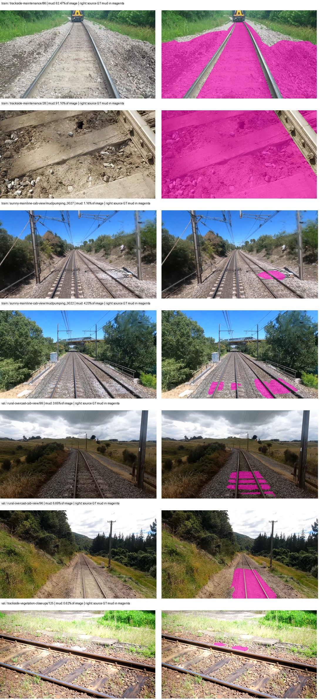

# Mud-pumping failure audit — paul-test-rtis

Audit date: 2026-09-06 UTC. This is a descriptive audit of one completed model run, not a causal experiment or a final test-set result.

## Findings that the evidence supports

1. The low IoU is reproducible from the confusion matrix: the model both misses most annotated mud and predicts mud on other classes.
2. Mud labels differ substantially in spatial extent between scene groups: broad maintenance surfaces dominate training pixels, whereas validation examples are mainly localized cab-view regions. This is a measured distribution difference; whether the annotation semantics are inconsistent requires domain review.
3. All 257 training and validation masks exactly match re-rasterization of the retained Supervisely annotations using the current preparation implementation. No conversion discrepancy was found in this check.
4. **Mud IoU actually improved from 2.06% at the selected checkpoint to 12.46% at the final checkpoint, while overall mIoU fell.** Selection by overall mIoU chose the earlier checkpoint. The data do not support blaming mud-specific overfitting for the low selected-checkpoint score.

5. The campaign mIoU denominator changes from 19 to 21 classes between the selected and final checkpoints. A fixed 18-ground-truth-class mean improves from 49.638% to 49.988%; therefore the reported aggregate decline does not establish a broad generalization decline. False positives on absent classes remain real errors and should be reported separately.

## Run and evaluation provenance

- Model: `eomt_dinov3_large--cityscapes_to_rtis--seed-0`; DINOv3 ViT-L/16 EoMT initialized from the historical Cityscapes endpoint, with the RTIS classifier reset.
- Completed: `2026-09-06T02:51:03.384650+00:00`; training code `4f5ebf0095cc097d491ad42ea5e6f77939b7119b`.
- Best checkpoint step: 509; stopped at 1272 of 4,000 maximum steps, after three validation checks without the required improvement.
- Best checkpoint SHA-256: `108c835a31607dd4d5b5f38fb50b12359f175d2f1b97771e930b9e1428ed0cfc`.
- Evaluation: all 37 validation images, native 21-class RTIS taxonomy, ignore label 255 excluded, EMA weights, no TTA. The 50 test images were not inferred on or visually inspected in this audit.
- The benchmark initializer uses a COCO-panoptic pretrained EoMT before the historical Cityscapes stage; this is not bare backbone-only pretraining.
- Split groups are visual groupings with unconfirmed original recording identities. Do not interpret a scene-group count as a verified number of independent recordings.

## 1. Exact confusion-matrix calculation

Rows of the confusion matrix are ground-truth classes; columns are predicted classes. Treat class 13 (mud-pumping) as positive and all other valid classes as negative. Counts below are pixels, not independent observations.

| Quantity | Definition | Count |
| --- | --- | --- |
| TP | GT mud, predicted mud | 97,510 |
| FN | GT mud, predicted another class | 1,128,740 |
| FP | GT another class, predicted mud | 3,498,218 |
| TN | GT another class, predicted another class | 84,482,787 |
| N | All evaluated non-ignore pixels | 89,207,255 |

**IoU** = TP / (TP + FP + FN) = 97,510 / (97,510 + 3,498,218 + 1,128,740) = **2.0639%**.

**Precision** = TP / (TP + FP) = 97,510 / 3,595,728 = **2.7118%**.

**Recall** = TP / (TP + FN) = 97,510 / 1,226,250 = **7.9519%**.

**Dice/F1** = 2TP / (2TP + FP + FN) = **4.0444%**.

Predicted mud area / annotated mud area = 3,595,728 / 1,226,250 = **2.932×**. The model overpredicts the total area while missing most of the actual mud locations; this is not just a conservative detector.

Binary mud-vs-rest accuracy is **94.813%**, but predicting no mud anywhere would score **98.625%** accuracy. Accuracy is therefore a poor success criterion here.

### Where actual mud pixels go

| Predicted class | Pixels | Share of GT mud |
| --- | --- | --- |
| trackbed | 597,062 | 48.690% |
| rail-track | 500,703 | 40.832% |
| mud-pumping | 97,510 | 7.952% |
| rail-raised | 15,819 | 1.290% |
| terrain | 15,156 | 1.236% |

### What predicted mud pixels really are

| GT class | Pixels | Share of predicted mud |
| --- | --- | --- |
| trackbed | 1,454,082 | 40.439% |
| vegetation-overgrowth | 1,031,622 | 28.690% |
| rail-track | 890,990 | 24.779% |
| mud-pumping | 97,510 | 2.712% |
| standing-water | 34,253 | 0.953% |
| tram-track | 29,955 | 0.833% |
| rail-raised | 17,198 | 0.478% |
| road | 15,107 | 0.420% |
| sidewalk | 13,177 | 0.366% |
| terrain | 11,438 | 0.318% |
| rail-embedded | 284 | 0.008% |
| construction | 88 | 0.002% |
| traffic-sign | 24 | 0.001% |

Rail-track plus trackbed account for **89.522% of all GT mud pixels** being assigned the wrong class. Trackbed, vegetation-overgrowth and rail-track account for **96.526% of mud false positives**. These are direct error locations, not explanations inferred from the overall score.

## 2. Dataset support and distribution shift

| Split | Images | Images containing mud | Mud pixels | All labeled pixels | Mud fraction of labeled pixels |
| --- | --- | --- | --- | --- | --- |
| train | 220 | 105 | 63,625,696 | 465,741,534 | 13.6612% |
| val | 37 | 18 | 1,226,250 | 89,207,255 | 1.3746% |

Training/validation mud prevalence ratio = (63,625,696/465,741,534) / (1,226,250/89,207,255) = **9.938×**. This is computed over full-resolution labeled pixels before augmentation, not the class frequency actually sampled by the training loss.

| Split / scene group | All images | Mud images | Mud pixels | Share of split mud pixels | Median mud coverage of positive image |
| --- | --- | --- | --- | --- | --- |
| train / miscellaneous-mud-cab-view | 1 | 1 | 46,297 | 0.073% | 2.233% |
| train / miscellaneous-numbered-cab-views | 18 | 2 | 89,885 | 0.141% | 2.167% |
| train / sunny-mainline-cab-view | 64 | 48 | 1,228,887 | 1.931% | 1.156% |
| train / trackside-maintenance | 54 | 54 | 62,260,627 | 97.855% | 62.301% |
| val / rural-overcast-cab-view | 19 | 17 | 1,213,322 | 98.946% | 3.649% |
| val / trackside-vegetation-closeups | 9 | 1 | 12,928 | 1.054% | 0.619% |

### Concentration calculation and its limits

Let p_g be the fraction of mud-labeled pixels in scene group g. The concentration index is H = Σ p_g²; its reciprocal 1/H is the number of equally weighted groups that would have the same concentration. It is **not** a statistical effective sample size.

| Split | Pixel-share H | 1/H | Positive-image-share H | 1/H for image shares |
| --- | --- | --- | --- | --- |
| train | 0.957927 | 1.044 | 0.473923 | 2.110 |
| val | 0.979137 | 1.021 | 0.895062 | 1.117 |

**Important distinction:** maintenance supplies 54/105 = 51.43% of mud-positive training images, although it supplies 97.85% of training mud pixels. This model uses Hungarian query matching with classification, sampled mask BCE and Dice losses. Therefore 97.85% pixel share does **not** mean 97.85% of gradient influence or training loss. Actual influence would require logging the augmented samples, matched queries and loss contributions.

## 3. Annotation conversion and overlap checks

- Re-rendered every retained training/validation Supervisely JSON in original object order, using the same polygon/bitmap rules and aliases as preparation, then compared every pixel with the stored mask.
- Result: **257/257 exact matches; 0 mismatching images.** This checks reproducibility against the source JSON, not correctness of the human labels or independent correctness of the rasterizer.
- Later source objects overwrite earlier objects. Source mud union means the union of all mud objects before later classes overwrite them; it counts each pixel only once.

| Split | Source mud union pixels | Final mud pixels | Mud overwritten by later classes | Fraction overwritten |
| --- | --- | --- | --- | --- |
| train | 80,635,875 | 63,625,696 | 17,010,179 | 21.095% |
| val | 1,348,006 | 1,226,250 | 121,756 | 9.032% |

These overwritten pixels reflect the existing source object order, not evidence of dropped polygon or bitmap annotations. A separate annotation-policy review must decide whether these overlaps represent the intended semantic priority.

## 4. Visual evidence

Left: original image. Right: only the stored ground-truth mud region highlighted in magenta. These are **annotation overlays, not model predictions**. Within each group, representatives were selected deterministically as the median and maximum mud/image-area fraction among positive images; the single positive closeup is shown once. This is a targeted review, not random sampling.

- `train/trackside-maintenance/86`: broad mud coverage includes the central track surface and adjoining earth.
- `train/trackside-maintenance/28`: the mud region covers most of a close view, including areas around a sleeper and ballast.
- `train/sunny-mainline-cab-view/mudpumping_0027` and `mudpumping_0022`: labels cover much smaller localized patches in cab views.
- `val/rural-overcast-cab-view/99` and `96`: labels range from separated patches around sleepers to a continuous region between rails.
- These visible differences establish variation in annotation scale and context. They do not establish that any particular region is mislabeled. A rail-domain annotator should decide whether the same operational definition is being applied across groups.

## 5. Training trajectory

| Logged step | Overall validation mIoU |
| --- | --- |
| 508 | 47.0252% |
| 763 | 44.3320% |
| 1017 | 44.8489% |
| 1272 | 42.8470% |

Overall decline from best to final = 100 × (0.428470433 − 0.470251530) = **-4.178 percentage points**.

The event logged at step 508 corresponds to the saved best checkpoint with global_step 509. The independent best-checkpoint evaluation matches the first validation score to floating-point precision. The reported aggregate decline alone is insufficient evidence of overfitting here: the set of classes averaged changes from 19 to 21. The same fixed 18 ground-truth-present classes improve slightly (49.638% to 49.988%). Training loss is measured on changing augmented batches and is not directly comparable to validation mIoU. No matched train/validation mud IoU was computed here, so a mud-specific generalization gap has not been established.

### Checkpoint selection trades off aggregate score against mud performance

Both columns below are validation results. The first is the independent evaluation of the saved best checkpoint; the second is the validation result recorded at the end of training. The latter is not a second standalone evaluation of `last.ckpt` performed by this audit.

| Metric | Selected checkpoint, step 509 | Final training validation, step 1,272 | Change (percentage points) |
| --- | ---: | ---: | ---: |
| Overall mIoU | 47.0252% | 42.8470% | -4.1781 |
| Mud IoU | 2.0639% | 12.4639% | +10.4000 |
| Mud precision | 2.7118% | 14.5713% | +11.8594 |
| Mud recall | 7.9519% | 46.2893% | +38.3375 |

This establishes a **checkpoint-selection tradeoff**: the published checkpoint is better on the campaign's aggregate objective, but worse on mud. The final mud result remains weak, so selection alone does not explain the entire failure. The aggregate comparison is additionally affected by its changing class denominator; see Section 8. It is not evidence that extending training indefinitely would help. If anomaly detection is the intended priority, predefine an anomaly metric and selection policy for a new experiment; do not silently change selection after inspecting these results or replace the current benchmark result.

## 6. Claims we can and cannot make

| Claim | Evidence status |
| --- | --- |
| The model fails to localize most annotated mud | Confirmed by 7.95% recall and the confusion counts. |
| Most predicted mud is on other annotated classes | Confirmed by 2.71% precision. |
| Mud has limited scene diversity and different coverage across splits | Confirmed descriptively by per-image and group counts; recording independence remains unknown. |
| Polygon/mask conversion caused the observed error | Not supported by the 257 exact source re-render matches; shared implementation errors remain possible. |
| Maintenance scenes caused the failure | Plausible hypothesis; requires a controlled ablation. |
| The annotations are inconsistent or wrong | Not established; visual examples identify questions for domain adjudication. |
| Mud is simply too rare in training | Not supported as a blanket claim: 105 positive images and 63.6 million mud pixels, although spatial/context diversity is limited. |
| Training longer will fix the class | Not established; mud improved, but remained weak, and the aggregate comparison has a changing denominator. |
| The model is generally useless | Not supported: other classes perform substantially better; this is a class-specific failure in one initialization arm. |

## 7. Recommended verification experiments

1. **Adjudicate the definition first.** Review broad maintenance regions and localized cab-view patches with the annotator. Specify whether mud-pumping includes all muddy/soiled trackbed or only visible evidence of pumping, and how sleepers, ballast, rails, water and mixed boundaries are labeled. Preserve the original annotations and log each proposed correction.
2. **Measure the failure by scene and image.** Run the selected best checkpoint on train and validation separately; save per-image confusion matrices and prediction/GT overlays. Report mud precision, recall and IoU by group, including zero-mud images for false positives. Do not use test images to choose changes.
3. **Test scene dependence with controlled retraining.** Compare the unchanged baseline against scene-balanced sampling and a maintenance-excluded ablation, holding initialization, split, optimizer budget, augmentations and checkpoint selection fixed. The exclusion changes both sample count and context; interpret accordingly or add a matched-size control. Do not discard the original run.
4. **Test annotation changes separately.** If adjudication finds a real mismatch, create a versioned dataset with explicit edits; retrain the same recipe and compare under a documented evaluation policy. Changing validation labels creates a new benchmark version, so old/new scores are not directly interchangeable.
5. **Assess uncertainty at the recording/group level.** Frames and pixels are correlated; do not compute binomial confidence intervals treating millions of pixels as independent trials. Current validation has only two mud-positive visual groups, so a reliable population confidence interval is not available. Obtain confirmed recording IDs and additional held-out recordings before strong generalization claims.
6. **Use repeated seeds for any promising intervention.** Compare paired outcomes across seeds and report the raw results. This reduces optimization-noise ambiguity but does not solve the small number of independent validation scenes.

No dataset edits, split changes, campaign restarts or new training runs were made for this audit.

## 8. All-class context for the selected checkpoint

Training and validation support below is from the dataset inventory. Test support is reproduced from the existing preparation inventory only; the test masks were not re-read for this audit. A dash denotes undefined IoU (no ground truth or prediction for that class). Zero IoU with zero support can arise from false-positive predictions.

| Class | Train images | Val images | Test images (existing inventory) | Val labeled pixels | Best-checkpoint IoU | Final-training-val IoU |
| --- | ---: | ---: | ---: | ---: | ---: | ---: |
| person | 18 | 0 | 3 | 0 | — | 0.000% |
| truck | 24 | 0 | 13 | 0 | — | 0.000% |
| rail-track | 176 | 37 | 45 | 6,323,197 | 65.248% | 59.943% |
| vegetation-overgrowth | 81 | 13 | 24 | 5,901,821 | 27.581% | 33.917% |
| car | 28 | 3 | 21 | 29,664 | 68.688% | 60.510% |
| on-rails | 32 | 0 | 5 | 0 | 0.000% | 0.000% |
| traffic-sign | 57 | 9 | 26 | 13,285 | 50.056% | 55.848% |
| road | 67 | 11 | 32 | 1,048,831 | 7.164% | 9.432% |
| sidewalk | 78 | 12 | 35 | 1,297,367 | 62.029% | 36.711% |
| construction | 136 | 12 | 39 | 311,585 | 64.555% | 59.412% |
| tram-track | 23 | 2 | 19 | 56,179 | 0.000% | 0.469% |
| pole | 134 | 21 | 45 | 628,038 | 77.747% | 78.584% |
| traffic-light | 34 | 3 | 13 | 19,510 | 86.590% | 86.548% |
| mud-pumping | 105 | 18 | 11 | 1,226,250 | 2.064% | 12.464% |
| fence | 84 | 7 | 30 | 265,137 | 47.328% | 44.627% |
| terrain | 191 | 35 | 50 | 39,239,306 | 90.834% | 90.658% |
| sky | 156 | 28 | 46 | 19,121,606 | 98.824% | 98.858% |
| rail-embedded | 24 | 3 | 17 | 16,799 | 0.000% | 2.826% |
| rail-raised | 217 | 37 | 50 | 2,969,797 | 77.140% | 78.680% |
| trackbed | 198 | 37 | 49 | 10,643,081 | 67.629% | 74.701% |
| standing-water | 38 | 9 | 4 | 95,802 | 0.000% | 15.598% |

Overall mIoU is the arithmetic mean of class IoUs with nonzero union in this evaluator, including absent-GT classes if false positives give them nonzero union. The denominator can therefore differ between checkpoints. At the selected checkpoint person/truck are undefined; on-rails is zero due to false positives. At the final checkpoint all three absent-GT classes have zero IoU from false positives.

For the same fixed 18 classes present in validation ground truth, the mean IoU is **49.6377% → 49.9882%** (+0.3506 points). This supplementary calculation shows how much of the reported aggregate change comes from changing the set of classes with nonzero union. It does not replace the campaign metric.

## 9. Additional completed models (snapshot)

This is the fixed three-completion snapshot used during the audit, not the continuously updating leaderboard. See the [live per-model reports](../live/README.md) for later results. All values use each run's aggregate-selected checkpoint.

| Model / initialization | mIoU | Fixed 18-class mIoU | Mud IoU | Mud precision | Mud recall | Water IoU | Best / final step |
| --- | ---: | ---: | ---: | ---: | ---: | ---: | --- |
| eomt_dinov3_large--cityscapes_to_rtis--seed-0 | 47.025% | 49.638% | 2.064% | 2.712% | 7.952% | 0.000% | 509 / 1272 |
| eomt_large--cityscapes_to_railsem19_to_rtis--seed-0 | 58.340% | 58.340% | 13.328% | 16.575% | 40.490% | 0.403% | 763 / 1527 |
| eomt_large--cityscapes_to_rtis--seed-0 | 50.686% | 53.502% | 10.259% | 13.256% | 31.209% | 39.212% | 1527 / 1527 |

EoMT Large Cityscapes -> RailSem19 -> RTIS leads overall in this snapshot but does not lead standing-water IoU. No completed run in this snapshot establishes strong mud-pumping detection. These three rows cover only two architectures and omit their still-running initialization arms; they cannot establish a general architecture or transfer ranking.

## Evidence files and reproduction

- [Recalculated metrics, full confusion matrix, class metrics, curves and checkpoint hashes](evidence.json)
- [All 257 image-level counts](per-image.csv)
- [Per-image source-render checks and mud geometry counts](annotation-audit.json)
- [All training and validation scene-group totals](groups.json)
- [Visual comparison sheet](annotation-review.jpg)

The runnable audit and report-generation scripts, plus the full original completed-run snapshot, are retained locally under `artifacts/paul-test-rtis/mud-pumping-audit/`. From the repository root, run `.venv/bin/python artifacts/paul-test-rtis/mud-pumping-audit/audit_annotations.py` to recompute source-mask checks and group counts. The report-generation script records the formulas used here; its evidence JSON can also be independently recalculated from the integer confusion matrix.

Full completed-run snapshot SHA-256: `b1565945351ebbc47ff4f177550a008b2c65050f6db7d28f27fe9dd86b68b15e`.

Values are descriptive of this fixed dataset and checkpoint. Percentages may differ slightly due to rounding.
