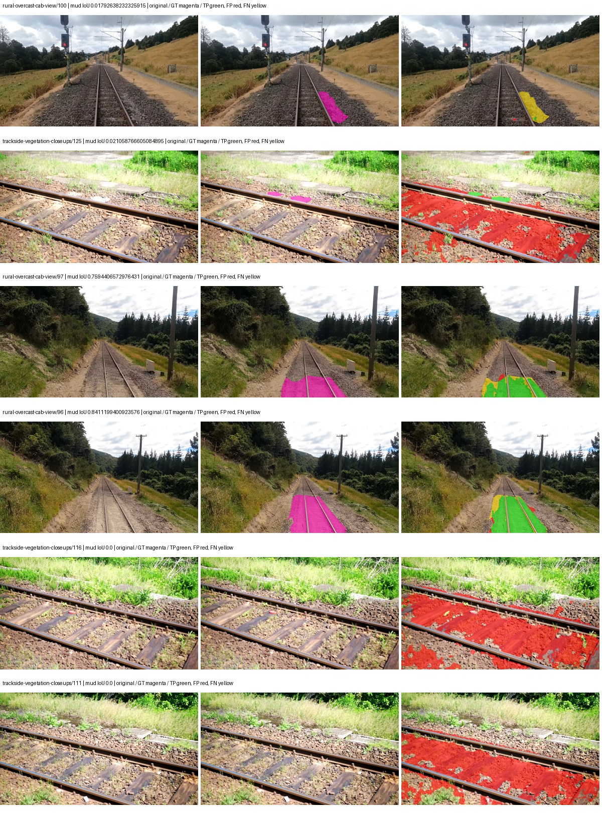
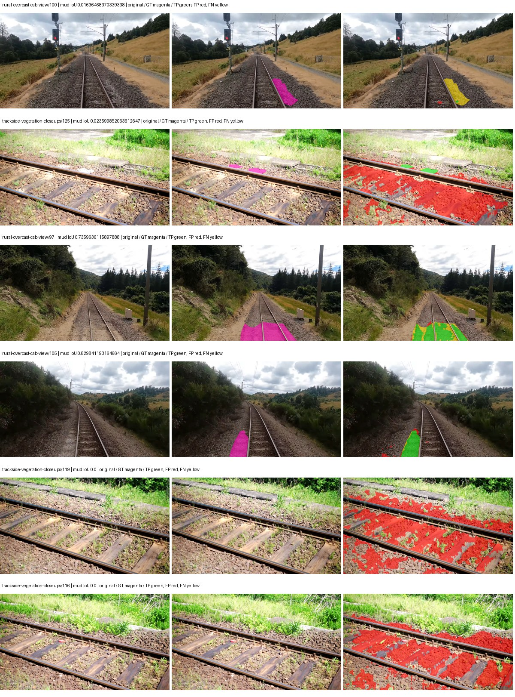
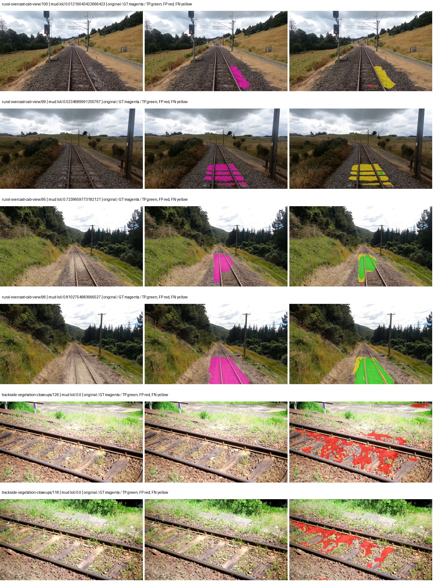
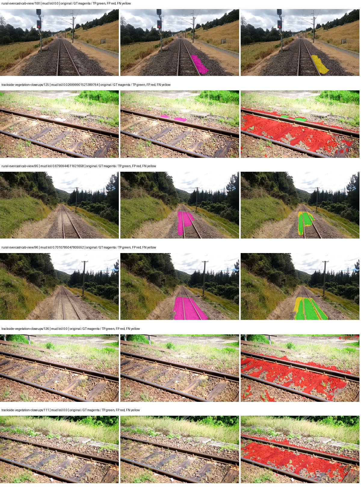

# eomt_dinov3_large — paul-test-rtis_v2

[RTIS comparison](../../README.md) · [Full model records](record.json)

Primary selection and early stopping: **mud-pumping validation IoU**. A job is complete only after full statistics and isolated profiling are verified.

| Model | Initialization path | Seed | Status | Steps | Best step | Mud IoU (%) | Mud precision (%) | Mud recall (%) | Final mud IoU (trainer val, %) | mIoU (%) | Fixed GT-class mIoU (%) |
| --- | --- | --- | --- | --- | --- | --- | --- | --- | --- | --- | --- |
| eomt_dinov3_large | rtis_only | 0 | completed | 4000 | 3823 | 10.91 | 12.37 | 48.09 | 10.95 | 45.86 | 50.95 |
| eomt_dinov3_large | cityscapes_to_rtis | 0 | completed | 3313 | 2294 | 11.74 | 13.33 | 49.65 | 11.46 | 47.87 | 53.19 |
| eomt_dinov3_large | railsem19_to_rtis | 0 | completed | 4000 | 3823 | 21.03 | 29.51 | 42.26 | 21.16 | 50.92 | 59.41 |
| eomt_dinov3_large | cityscapes_to_railsem19_to_rtis | 0 | completed | 2803 | 2803 | 9.14 | 11.20 | 33.28 | 9.15 | 48.24 | 53.60 |

Training: 205 images. Validation: 37 images. Test: 50 held out. Seeds: [0]. Seed variation measures optimization variability, not independent-recording uncertainty. Historical source checkpoints stay fixed across adaptation seeds.

Training code: `066afb2626398b7be59d4d19f5a0e4644fd59adc`. Split SHA-256: `18a84c0163a65ded46508bcc904c374e5f33ad8a09b8879e3c8add606e86aa9f`.

## rtis_only — seed 0

Status: **completed**. Started: 2026-09-09T17:19:53.536051+00:00. Finished: 2026-09-09T19:16:36.096123+00:00.

Recipe pretrained initializer: `tue-mps/eomt-dinov3-coco-panoptic-large-640 (DINOv3 ViT-L/16, COCO panoptic)`.

`rtis_only` uses the recipe initializer, which may include pretrained segmentation components. Transfer paths load the exact historical source checkpoint below and reset the classifier; they do not reset all query/decoder features.

Source checkpoint: `Recipe pretrained initialization`.

Config SHA-256: `dc9e8226222a3605dc73b598e110512906544e02c4fb2d498b66d47eb39865ed`. Weights used for validation: `ema`.

### Mud-pumping and aggregate quality

| Metric | Selected checkpoint | Final training validation |
| --- | --- | --- |
| Mud IoU | 10.91 | 10.95 |
| Mud precision | 12.37 | 12.41 |
| Mud recall | 48.09 | 48.13 |
| Mud Dice/F1 | 19.68 | 19.73 |
| mIoU | 45.86 | 45.91 |
| Mean accuracy | 64.32 | 64.41 |
| Mean precision | 61.15 | 61.14 |
| Mean Dice | 56.47 | 56.53 |
| Mean specificity | 99.18 | 99.19 |
| Pixel accuracy | 86.65 | 86.67 |
| Frequency-weighted IoU | 79.82 | 79.85 |
| Fixed GT-present class mIoU | 50.95 | 51.01 |
| Boundary F1 | 55.87 | 55.85 |

The selected checkpoint has independent evaluation evidence. Final values are the trainer's final validation record, not a new independent evaluation. mIoU averages classes with nonzero union, so false positives on absent classes can change its denominator. The fixed GT-class mean is supplementary and excludes absent classes; their false positives remain in the confusion matrix.

### Resource usage and timing

| Measurement | Value |
| --- | --- |
| Peak training VRAM, retained training invocation (GiB) | 17.84 |
| Peak evaluation VRAM (GiB) | 10.77 |
| Retained training invocation wall time (seconds) | 6474.24 |
| Retained training invocation GPU-hours (one GPU) | 1.80 |
| Evaluation wall time (seconds) | 22.78 |
| Full evaluation pipeline images/second | 1.62 |
| Best full-state checkpoint (MiB) | 4805.94 |
| Final full-state checkpoint (MiB) | 4805.92 |
| Verified periodic checkpoints removed (GiB) | 37.55 |

VRAM uses the recorded allocator high-water mark; it is not total device usage including CUDA context. Resumed jobs' retained training invocation times and peaks are **not whole-campaign totals**. Earlier invocation resource records are not reconstructed here. Evaluation throughput includes loader, sliding-window inference and metrics; it is not model-only latency/FPS. Missing measurements are shown as —, never inferred from another dataset's run.

### Standardized inference performance

Dedicated model-only profiling waits for an idle worker-locked L40S: BF16, batch 1, 1024x1024, 20 warmup and 100 CUDA-event-timed public forwards. It excludes loading, preprocessing, tiling and metrics.

| Status | Parameters | Weight MiB | FPS | p50 ms | p95 ms | Peak reserved GiB |
| --- | --- | --- | --- | --- | --- | --- |
| complete | 314917910 | 1201.32 | 36.27 | 24.66 | 25.11 | 3.13 |

```json
{
  "schema_version": 1,
  "model_id": "eomt_dinov3_large",
  "measured_at": "2026-09-09T19:15:41+00:00",
  "status": "complete",
  "benchmark_scope": "rtis_selected_checkpoint_model_only",
  "applies_to": [
    "eomt_dinov3_large--rtis_only--seed-0"
  ],
  "source": {
    "campaign_git_sha": "066afb2626398b7be59d4d19f5a0e4644fd59adc",
    "git_dirty": false,
    "config_hash": "84c2c15f7c66",
    "resolved_config": "/data/izadia1/projects/segmentary-runs/paul-test-rtis_v2/seed0-20260909/configs/eomt_dinov3_large--rtis_only--seed-0.yaml",
    "config_sha256": "dc9e8226222a3605dc73b598e110512906544e02c4fb2d498b66d47eb39865ed",
    "checkpoint_sha256": "1d5841986172c3ff060b685339fb774656017f757d3fabdd143a3ed69578d9e7",
    "checkpoint_global_step": 3823,
    "checkpoint_bytes": 5039394617,
    "checkpoint_kind": "resume checkpoint with optimizer and EMA state",
    "weights": "ema",
    "measured_checkpoint_job_id": "eomt_dinov3_large--rtis_only--seed-0",
    "result_sha256": "be91050fdb1301847a70c69a9024217ec548514f826188b8cbfe55b7feff1bb1",
    "result_git_sha": "066afb2626398b7be59d4d19f5a0e4644fd59adc",
    "result_stage": "eval:paul-test-rtis:val",
    "result_seed": 0
  },
  "hardware": {
    "gpu_name": "NVIDIA L40S",
    "gpu_uuid": "GPU-84f5ca4d-68db-ae98-d056-40654d859dd9",
    "logical_device": "cuda:0",
    "physical_visibility_token": "0",
    "compute_capability": [
      8,
      9
    ],
    "total_memory_bytes": 47677177856
  },
  "model": {
    "parameter_count": 314917910,
    "trainable_parameter_count": 314917910,
    "resident_parameter_bytes": 1259671640,
    "parameter_dtype_counts": {
      "float32": 314917910
    }
  },
  "contract": {
    "backend": "pytorch",
    "precision": "bf16_autocast",
    "batch_size": 1,
    "input_shape_nchw": [
      1,
      3,
      1024,
      1024
    ],
    "warmup_iterations": 20,
    "measured_iterations": 100,
    "timing": "per-forward CUDA events with end-event synchronization",
    "includes_preprocessing": false,
    "includes_data_loader": false,
    "includes_sliding_window": false,
    "input_resident_on_gpu": true,
    "model_only": true,
    "entrypoint": "public model(image) dense-logits forward"
  },
  "measurements": {
    "latency": {
      "p50_ms": 24.657360076904297,
      "p95_ms": 25.10653438568115,
      "mean_ms": 27.57400157928467,
      "minimum_ms": 24.50636863708496,
      "maximum_ms": 310.94989013671875,
      "fps": 36.26604564900232,
      "raw_ms": [
        24.70502471923828,
        24.573951721191406,
        24.65376091003418,
        25.593856811523438,
        24.58937644958496,
        24.72345542907715,
        24.65679931640625,
        24.7142391204834,
        24.53094482421875,
        24.563711166381836,
        24.54627227783203,
        24.53094482421875,
        24.534015655517578,
        24.598527908325195,
        24.558591842651367,
        24.608768463134766,
        24.523775100708008,
        24.563711166381836,
        24.563711166381836,
        24.558591842651367,
        24.782848358154297,
        24.52582359313965,
        24.567808151245117,
        24.54528045654297,
        24.50636863708496,
        24.5166072845459,
        24.54617691040039,
        24.593536376953125,
        24.50943946838379,
        24.579072952270508,
        24.576000213623047,
        24.573951721191406,
        24.633344650268555,
        24.57811164855957,
        24.821760177612305,
        24.816640853881836,
        24.73472023010254,
        24.67523193359375,
        25.307231903076172,
        24.579072952270508,
        24.868864059448242,
        24.785919189453125,
        25.10540771484375,
        24.68454360961914,
        24.88115119934082,
        24.862720489501953,
        24.828927993774414,
        24.7326717376709,
        24.887359619140625,
        24.861631393432617,
        24.767488479614258,
        25.10848045349121,
        24.76335906982422,
        24.577024459838867,
        24.757247924804688,
        24.830976486206055,
        24.558496475219727,
        24.570880889892578,
        310.94989013671875,
        24.663040161132812,
        24.560640335083008,
        24.534015655517578,
        24.556543350219727,
        24.86579132080078,
        24.91596794128418,
        24.560640335083008,
        24.54732894897461,
        24.74799919128418,
        24.867839813232422,
        24.72345542907715,
        24.772607803344727,
        24.774656295776367,
        24.56972885131836,
        24.550399780273438,
        24.594463348388672,
        24.67635154724121,
        24.95078468322754,
        24.637439727783203,
        24.634239196777344,
        24.738815307617188,
        24.714208602905273,
        24.58515167236328,
        24.788991928100586,
        24.83407974243164,
        24.737791061401367,
        25.10643196105957,
        24.947711944580078,
        24.745983123779297,
        24.842239379882812,
        24.623104095458984,
        24.53094482421875,
        24.583168029785156,
        24.878175735473633,
        24.534015655517578,
        24.638463973999023,
        24.636415481567383,
        25.944063186645508,
        24.69171142578125,
        24.657920837402344,
        24.69273567199707
      ],
      "percentile_method": "numpy linear interpolation"
    },
    "peak_reserved_bytes": 3359637504,
    "memory_kind": "pytorch_cuda_allocator_peak_reserved_excluding_context",
    "benchmark_wall_clock_s": 3.954499889165163
  },
  "started_at": "2026-09-09T19:15:37+00:00",
  "finished_at": "2026-09-09T19:15:41+00:00",
  "environment": {
    "hostname": "hdrfs-app-001",
    "python": "3.11.15",
    "platform": "Linux-5.15.0-139-generic-x86_64-with-glibc2.35",
    "torch": "2.11.0+cu128",
    "torch_cuda": "12.8",
    "cudnn": 91900,
    "driver_version": "570.133.20",
    "cuda_available": true,
    "gpu_count": 1,
    "gpu_names": [
      "NVIDIA L40S"
    ],
    "cuda_visible_devices": "0",
    "packages": {
      "segmentary": "0.1.0",
      "torch": "2.11.0+cu128",
      "torchvision": "0.26.0+cu128",
      "transformers": "5.15.0",
      "timm": "1.0.28",
      "segmentation-models-pytorch": "0.5.0",
      "albumentations": "2.0.8",
      "lightning": "2.6.5",
      "numpy": "2.4.4"
    }
  }
}
```

### Per-class validation results

| Class | GT pixels | IoU (%) | Precision (%) | Recall (%) | Dice (%) | Boundary F1 (%) |
| --- | --- | --- | --- | --- | --- | --- |
| car | 29664 | 4.23 | 9.94 | 6.86 | 8.12 | 11.04 |
| construction | 311585 | 35.82 | 39.83 | 78.05 | 52.74 | 49.27 |
| fence | 265137 | 40.54 | 62.46 | 53.60 | 57.69 | 59.74 |
| mud-pumping | 1226250 | 10.91 | 12.37 | 48.09 | 19.68 | 16.71 |
| on-rails | 0 | 0.00 | 0.00 | — | 0.00 | 0.00 |
| person | 0 | — | — | — | — | — |
| pole | 628038 | 76.18 | 85.33 | 87.66 | 86.48 | 93.18 |
| rail-embedded | 16799 | 38.87 | 80.02 | 43.05 | 55.98 | 86.67 |
| rail-raised | 2969797 | 81.95 | 86.31 | 94.19 | 90.08 | 94.86 |
| rail-track | 6323197 | 53.13 | 81.99 | 60.14 | 69.39 | 65.06 |
| road | 1048831 | 8.76 | 21.78 | 12.79 | 16.11 | 18.30 |
| sidewalk | 1297367 | 42.02 | 93.31 | 43.32 | 59.17 | 56.85 |
| sky | 19121606 | 98.78 | 99.45 | 99.32 | 99.39 | 98.49 |
| standing-water | 95802 | 52.04 | 61.24 | 77.60 | 68.45 | 68.66 |
| terrain | 39239306 | 89.87 | 90.93 | 98.71 | 94.66 | 73.32 |
| trackbed | 10643081 | 77.71 | 88.99 | 85.98 | 87.46 | 76.83 |
| traffic-light | 19510 | 72.23 | 94.65 | 75.30 | 83.88 | 80.62 |
| traffic-sign | 13285 | 48.52 | 59.28 | 72.79 | 65.34 | 67.76 |
| tram-track | 56179 | 61.74 | 63.41 | 95.91 | 76.34 | 47.75 |
| truck | 0 | 0.00 | 0.00 | — | 0.00 | 0.00 |
| vegetation-overgrowth | 5901821 | 23.85 | 91.63 | 24.39 | 38.52 | 52.36 |

### Full-run accounting

| Measurement | Value |
| --- | --- |
| Full GPU-reserved wall seconds, all recorded worker attempts | 6979.69 |
| Full reserved GPU-hours | 1.94 |
| Whole-run timing complete | True |

| Phase | Wall seconds including failed attempts |
| --- | --- |
| training | 6481.58 |
| diagnostics | 378.76 |
| performance | 22.56 |

GPU-reserved time includes model loading, training, validation, collection, profiling, checkpoint I/O and orchestration while the worker owns one GPU. It is not GPU kernel-active time. Phase timings and sampled device memory/power/utilization are retained separately; sampled device memory is not the allocator high-water mark.

### Train/validation and raw/EMA diagnostics

| Checkpoint / weights / split | Images | Mud IoU (%) | Mud precision (%) | Mud recall (%) |
| --- | --- | --- | --- | --- |
| best-auto-train / ema | 205 | 95.35 | 97.38 | 97.87 |
| best-auto-val / ema | 37 | 10.91 | 12.37 | 48.09 |
| best-alternate-val / raw | 37 | 11.83 | 13.53 | 48.48 |
| final-auto-val / ema | 37 | 10.94 | 12.40 | 48.11 |

Train uses the evaluation transform without augmentation. Compare mud train/validation metrics for the same selected weights. Alternate EMA on running-stat BatchNorm is explicitly uncalibrated and is diagnostic only. Score-threshold curves use uncalibrated normalized scores and are pixel-level diagnostics, not event detection rates or a selected deployment operating point.

### Downloadable evidence

- best-auto-train: [per-image.csv](rtis_only--seed-0/best-auto-train/per-image.csv) · [per-image-confusion.json.gz](rtis_only--seed-0/best-auto-train/per-image-confusion.json.gz) · [groups.json](rtis_only--seed-0/best-auto-train/groups.json) · [mud-score-curves.json](rtis_only--seed-0/best-auto-train/mud-score-curves.json)
- best-auto-val: [per-image.csv](rtis_only--seed-0/best-auto-val/per-image.csv) · [per-image-confusion.json.gz](rtis_only--seed-0/best-auto-val/per-image-confusion.json.gz) · [groups.json](rtis_only--seed-0/best-auto-val/groups.json) · [mud-score-curves.json](rtis_only--seed-0/best-auto-val/mud-score-curves.json) · [examples.jpg](rtis_only--seed-0/best-auto-val/examples.jpg)
- best-alternate-val: [per-image.csv](rtis_only--seed-0/best-alternate-val/per-image.csv) · [per-image-confusion.json.gz](rtis_only--seed-0/best-alternate-val/per-image-confusion.json.gz) · [groups.json](rtis_only--seed-0/best-alternate-val/groups.json) · [mud-score-curves.json](rtis_only--seed-0/best-alternate-val/mud-score-curves.json)
- final-auto-val: [per-image.csv](rtis_only--seed-0/final-auto-val/per-image.csv) · [per-image-confusion.json.gz](rtis_only--seed-0/final-auto-val/per-image-confusion.json.gz) · [groups.json](rtis_only--seed-0/final-auto-val/groups.json) · [mud-score-curves.json](rtis_only--seed-0/final-auto-val/mud-score-curves.json)
- resources: [telemetry.csv](rtis_only--seed-0/resources/telemetry.csv)



Examples are two lowest and two highest mud-IoU positive images, plus up to two negative images with the most false-positive mud pixels. They are targeted diagnostic examples, not random samples. Green: true positive; red: false positive; yellow: false negative. Full predictions remain on HDRFS.

### Validation tracking

| Logged step | Overall mIoU (%) | Mud IoU (%) |
| --- | --- | --- |
| 254 | 24.08 | 0.00 |
| 509 | 36.34 | 3.74 |
| 764 | 40.42 | 6.55 |
| 1019 | 41.91 | 8.54 |
| 1274 | 44.06 | 9.08 |
| 1529 | 44.59 | 9.96 |
| 1784 | 45.16 | 10.56 |
| 2038 | 45.59 | 10.74 |
| 2293 | 45.61 | 10.74 |
| 2548 | 45.62 | 10.80 |
| 2803 | 45.68 | 10.86 |
| 3058 | 45.73 | 10.85 |
| 3313 | 45.72 | 10.86 |
| 3568 | 45.77 | 10.89 |
| 3823 | 45.86 | 10.91 |
| 4000 | 45.91 | 10.95 |

All retained scalar curves, including training loss and per-class IoU, are in record.json. Observed best mud on a curve is not necessarily a retained checkpoint: the pilot saved its selection-metric-best and final checkpoints. Step logging and checkpoint global_step may differ by one.

### Stopping and checkpoint provenance

```json
{
  "stopping": {
    "actual_steps": 4000,
    "maximum_steps": 4000,
    "min_delta": 0.001,
    "monitor": "val_iou/mud-pumping",
    "patience": 5,
    "reason": "budget_complete"
  },
  "checkpoints": {
    "best": {
      "path": "/data/izadia1/projects/segmentary-runs/paul-test-rtis_v2/seed0-20260909/future-runs/eomt_dinov3_large--rtis_only--seed-0_seed0/rtis/best.ckpt",
      "sha256": "1d5841986172c3ff060b685339fb774656017f757d3fabdd143a3ed69578d9e7",
      "global_step": 3823,
      "bytes": 5039394617
    },
    "final": {
      "path": "/data/izadia1/projects/segmentary-runs/paul-test-rtis_v2/seed0-20260909/future-runs/eomt_dinov3_large--rtis_only--seed-0_seed0/rtis/last.ckpt",
      "sha256": "357e855d6971bab44cb1a9cea3bdaf00282297d0eed2c1aa144fb0d8a7c9815d",
      "global_step": 4000,
      "bytes": 5039373817
    }
  },
  "cleanup_error": null
}
```

### Resolved training, initialization and evaluation settings

The optimizer block is the base configuration. Stage LR scales are applied at runtime, and stage warmup is capped at min(base warmup, floor(stage budget / 10), stage budget - 1): 400 steps for this 4,000-step pilot. Model-internal native input grids may differ from augmentation crops (EoMT uses its 640 grid).

```json
{
  "name": "eomt_dinov3_large--rtis_only--seed-0",
  "model": {
    "arch": "eomt_dinov3_large",
    "checkpoint": null,
    "tuning": "full",
    "head": "unified_head",
    "lora_r": 16,
    "lora_alpha": 32,
    "lora_dropout": 0.05,
    "lora_targets": [],
    "drop_path": null,
    "revision": null,
    "subfolder": null,
    "local_files_only": false,
    "trust_remote_code": false,
    "backbone_path": null,
    "head_paths": [],
    "classifier_path": null,
    "inactive_parameter_paths": [],
    "smp_arch": null,
    "encoder_name": null,
    "encoder_weights": null,
    "native": null,
    "batch_norm_momentum": null
  },
  "space": "paul-test-rtis",
  "taxonomy_root": "/data/izadia1/projects/segmentary-rtis-fullstats-066afb2/taxonomy",
  "output_root": "/data/izadia1/projects/segmentary-runs/paul-test-rtis_v2/seed0-20260909/future-runs",
  "optim": {
    "backbone_lr": 1e-05,
    "head_lr_mult": 10.0,
    "weight_decay": 0.05,
    "llrd": 0.75,
    "warmup_iters": 1500,
    "warmup_ratio": 1e-06,
    "poly_power": 0.9,
    "min_lr_ratio": 0.0,
    "betas": [
      0.9,
      0.999
    ],
    "grad_clip": 1.0
  },
  "train": {
    "iters": 4000,
    "batch_size": 2,
    "accum": 8,
    "num_workers": 2,
    "precision": "bf16-mixed",
    "ema_decay": 0.9998,
    "val_every": 250,
    "ckpt_every": 500,
    "selection_metric": "val_iou/mud-pumping",
    "early_stopping_patience": 5,
    "early_stopping_min_delta": 0.001,
    "seed": 0,
    "devices": 1
  },
  "eval": {
    "sliding_window": true,
    "window": [
      1024,
      1024
    ],
    "stride": [
      768,
      768
    ],
    "batch_size": 1,
    "num_workers": 2,
    "tta_scales": [],
    "tta_flip": false,
    "threshold": 0.5,
    "boundary_tolerance_frac": 0.0075,
    "save_confusion": true
  },
  "loss": {
    "task": "multiclass",
    "activation": "auto",
    "terms": [],
    "aux": "none",
    "aux_weight": 0.0,
    "ce_weight": 1.0,
    "label_smoothing": 0.0,
    "class_weights": null,
    "query": {
      "kind": "hungarian_query",
      "classification_weight": 2.0,
      "mask_bce_weight": 5.0,
      "dice_weight": 5.0,
      "no_object_coefficient": 0.1,
      "match_class_cost": 2.0,
      "match_mask_bce_cost": 5.0,
      "match_dice_cost": 5.0,
      "matching_num_points": 8192,
      "auxiliary_layer_weight": 1.0,
      "dice_smooth": 1.0
    }
  },
  "aug": {
    "crop": [
      1024,
      1024
    ],
    "scale_min": 0.5,
    "scale_max": 2.0,
    "hflip_p": 0.5,
    "color_jitter_p": 0.5,
    "brightness": 0.25,
    "contrast": 0.25,
    "saturation": 0.25,
    "hue": 0.05
  },
  "stages": [
    {
      "name": "rtis",
      "data": [
        {
          "name": "paul-test-rtis",
          "root": "/data/izadia1/datasets/paul-test-rtis_v2",
          "variant": null,
          "split_file": "splits.json",
          "train_split": "train",
          "val_split": "val",
          "limit": null,
          "loader": "folder",
          "mapping": "paul-test-rtis",
          "loader_options": {
            "require_groups": true
          }
        }
      ],
      "iters": null,
      "lr_scale": 1.0,
      "head_group_lr_scale": 1.0,
      "init_from": "pretrained",
      "reset_head": false,
      "freeze": null,
      "sample_weights": null
    }
  ]
}
```

### Hardware and software provenance

```json
{
  "training": {
    "cuda_available": true,
    "cuda_visible_devices": "0",
    "cudnn": 91900,
    "driver_version": "570.133.20",
    "gpu_count": 1,
    "gpu_names": [
      "NVIDIA L40S"
    ],
    "hostname": "hdrfs-app-001",
    "input_normalization": {
      "channel_order": "rgb",
      "mean": [
        0.485,
        0.456,
        0.406
      ],
      "source": "imagenet",
      "std": [
        0.229,
        0.224,
        0.225
      ]
    },
    "model_origins": [
      {
        "hf_commit": "e8c0564219d89c9000add20d89d052d9f7464236",
        "hf_name_or_path": "tue-mps/eomt-dinov3-coco-panoptic-large-640",
        "module": "model",
        "timm_pretrained": {}
      },
      {
        "hf_commit": "e8c0564219d89c9000add20d89d052d9f7464236",
        "hf_name_or_path": "tue-mps/eomt-dinov3-coco-panoptic-large-640",
        "module": "model.embeddings",
        "timm_pretrained": {}
      },
      {
        "hf_commit": "e8c0564219d89c9000add20d89d052d9f7464236",
        "hf_name_or_path": "tue-mps/eomt-dinov3-coco-panoptic-large-640",
        "module": "model.layers.0.attention",
        "timm_pretrained": {}
      },
      {
        "hf_commit": "e8c0564219d89c9000add20d89d052d9f7464236",
        "hf_name_or_path": "tue-mps/eomt-dinov3-coco-panoptic-large-640",
        "module": "model.layers.0.mlp",
        "timm_pretrained": {}
      },
      {
        "hf_commit": "e8c0564219d89c9000add20d89d052d9f7464236",
        "hf_name_or_path": "tue-mps/eomt-dinov3-coco-panoptic-large-640",
        "module": "model.layers.1.attention",
        "timm_pretrained": {}
      },
      {
        "hf_commit": "e8c0564219d89c9000add20d89d052d9f7464236",
        "hf_name_or_path": "tue-mps/eomt-dinov3-coco-panoptic-large-640",
        "module": "model.layers.1.mlp",
        "timm_pretrained": {}
      },
      {
        "hf_commit": "e8c0564219d89c9000add20d89d052d9f7464236",
        "hf_name_or_path": "tue-mps/eomt-dinov3-coco-panoptic-large-640",
        "module": "model.layers.2.attention",
        "timm_pretrained": {}
      },
      {
        "hf_commit": "e8c0564219d89c9000add20d89d052d9f7464236",
        "hf_name_or_path": "tue-mps/eomt-dinov3-coco-panoptic-large-640",
        "module": "model.layers.2.mlp",
        "timm_pretrained": {}
      },
      {
        "hf_commit": "e8c0564219d89c9000add20d89d052d9f7464236",
        "hf_name_or_path": "tue-mps/eomt-dinov3-coco-panoptic-large-640",
        "module": "model.layers.3.attention",
        "timm_pretrained": {}
      },
      {
        "hf_commit": "e8c0564219d89c9000add20d89d052d9f7464236",
        "hf_name_or_path": "tue-mps/eomt-dinov3-coco-panoptic-large-640",
        "module": "model.layers.3.mlp",
        "timm_pretrained": {}
      },
      {
        "hf_commit": "e8c0564219d89c9000add20d89d052d9f7464236",
        "hf_name_or_path": "tue-mps/eomt-dinov3-coco-panoptic-large-640",
        "module": "model.layers.4.attention",
        "timm_pretrained": {}
      },
      {
        "hf_commit": "e8c0564219d89c9000add20d89d052d9f7464236",
        "hf_name_or_path": "tue-mps/eomt-dinov3-coco-panoptic-large-640",
        "module": "model.layers.4.mlp",
        "timm_pretrained": {}
      },
      {
        "hf_commit": "e8c0564219d89c9000add20d89d052d9f7464236",
        "hf_name_or_path": "tue-mps/eomt-dinov3-coco-panoptic-large-640",
        "module": "model.layers.5.attention",
        "timm_pretrained": {}
      },
      {
        "hf_commit": "e8c0564219d89c9000add20d89d052d9f7464236",
        "hf_name_or_path": "tue-mps/eomt-dinov3-coco-panoptic-large-640",
        "module": "model.layers.5.mlp",
        "timm_pretrained": {}
      },
      {
        "hf_commit": "e8c0564219d89c9000add20d89d052d9f7464236",
        "hf_name_or_path": "tue-mps/eomt-dinov3-coco-panoptic-large-640",
        "module": "model.layers.6.attention",
        "timm_pretrained": {}
      },
      {
        "hf_commit": "e8c0564219d89c9000add20d89d052d9f7464236",
        "hf_name_or_path": "tue-mps/eomt-dinov3-coco-panoptic-large-640",
        "module": "model.layers.6.mlp",
        "timm_pretrained": {}
      },
      {
        "hf_commit": "e8c0564219d89c9000add20d89d052d9f7464236",
        "hf_name_or_path": "tue-mps/eomt-dinov3-coco-panoptic-large-640",
        "module": "model.layers.7.attention",
        "timm_pretrained": {}
      },
      {
        "hf_commit": "e8c0564219d89c9000add20d89d052d9f7464236",
        "hf_name_or_path": "tue-mps/eomt-dinov3-coco-panoptic-large-640",
        "module": "model.layers.7.mlp",
        "timm_pretrained": {}
      },
      {
        "hf_commit": "e8c0564219d89c9000add20d89d052d9f7464236",
        "hf_name_or_path": "tue-mps/eomt-dinov3-coco-panoptic-large-640",
        "module": "model.layers.8.attention",
        "timm_pretrained": {}
      },
      {
        "hf_commit": "e8c0564219d89c9000add20d89d052d9f7464236",
        "hf_name_or_path": "tue-mps/eomt-dinov3-coco-panoptic-large-640",
        "module": "model.layers.8.mlp",
        "timm_pretrained": {}
      },
      {
        "hf_commit": "e8c0564219d89c9000add20d89d052d9f7464236",
        "hf_name_or_path": "tue-mps/eomt-dinov3-coco-panoptic-large-640",
        "module": "model.layers.9.attention",
        "timm_pretrained": {}
      },
      {
        "hf_commit": "e8c0564219d89c9000add20d89d052d9f7464236",
        "hf_name_or_path": "tue-mps/eomt-dinov3-coco-panoptic-large-640",
        "module": "model.layers.9.mlp",
        "timm_pretrained": {}
      },
      {
        "hf_commit": "e8c0564219d89c9000add20d89d052d9f7464236",
        "hf_name_or_path": "tue-mps/eomt-dinov3-coco-panoptic-large-640",
        "module": "model.layers.10.attention",
        "timm_pretrained": {}
      },
      {
        "hf_commit": "e8c0564219d89c9000add20d89d052d9f7464236",
        "hf_name_or_path": "tue-mps/eomt-dinov3-coco-panoptic-large-640",
        "module": "model.layers.10.mlp",
        "timm_pretrained": {}
      },
      {
        "hf_commit": "e8c0564219d89c9000add20d89d052d9f7464236",
        "hf_name_or_path": "tue-mps/eomt-dinov3-coco-panoptic-large-640",
        "module": "model.layers.11.attention",
        "timm_pretrained": {}
      },
      {
        "hf_commit": "e8c0564219d89c9000add20d89d052d9f7464236",
        "hf_name_or_path": "tue-mps/eomt-dinov3-coco-panoptic-large-640",
        "module": "model.layers.11.mlp",
        "timm_pretrained": {}
      },
      {
        "hf_commit": "e8c0564219d89c9000add20d89d052d9f7464236",
        "hf_name_or_path": "tue-mps/eomt-dinov3-coco-panoptic-large-640",
        "module": "model.layers.12.attention",
        "timm_pretrained": {}
      },
      {
        "hf_commit": "e8c0564219d89c9000add20d89d052d9f7464236",
        "hf_name_or_path": "tue-mps/eomt-dinov3-coco-panoptic-large-640",
        "module": "model.layers.12.mlp",
        "timm_pretrained": {}
      },
      {
        "hf_commit": "e8c0564219d89c9000add20d89d052d9f7464236",
        "hf_name_or_path": "tue-mps/eomt-dinov3-coco-panoptic-large-640",
        "module": "model.layers.13.attention",
        "timm_pretrained": {}
      },
      {
        "hf_commit": "e8c0564219d89c9000add20d89d052d9f7464236",
        "hf_name_or_path": "tue-mps/eomt-dinov3-coco-panoptic-large-640",
        "module": "model.layers.13.mlp",
        "timm_pretrained": {}
      },
      {
        "hf_commit": "e8c0564219d89c9000add20d89d052d9f7464236",
        "hf_name_or_path": "tue-mps/eomt-dinov3-coco-panoptic-large-640",
        "module": "model.layers.14.attention",
        "timm_pretrained": {}
      },
      {
        "hf_commit": "e8c0564219d89c9000add20d89d052d9f7464236",
        "hf_name_or_path": "tue-mps/eomt-dinov3-coco-panoptic-large-640",
        "module": "model.layers.14.mlp",
        "timm_pretrained": {}
      },
      {
        "hf_commit": "e8c0564219d89c9000add20d89d052d9f7464236",
        "hf_name_or_path": "tue-mps/eomt-dinov3-coco-panoptic-large-640",
        "module": "model.layers.15.attention",
        "timm_pretrained": {}
      },
      {
        "hf_commit": "e8c0564219d89c9000add20d89d052d9f7464236",
        "hf_name_or_path": "tue-mps/eomt-dinov3-coco-panoptic-large-640",
        "module": "model.layers.15.mlp",
        "timm_pretrained": {}
      },
      {
        "hf_commit": "e8c0564219d89c9000add20d89d052d9f7464236",
        "hf_name_or_path": "tue-mps/eomt-dinov3-coco-panoptic-large-640",
        "module": "model.layers.16.attention",
        "timm_pretrained": {}
      },
      {
        "hf_commit": "e8c0564219d89c9000add20d89d052d9f7464236",
        "hf_name_or_path": "tue-mps/eomt-dinov3-coco-panoptic-large-640",
        "module": "model.layers.16.mlp",
        "timm_pretrained": {}
      },
      {
        "hf_commit": "e8c0564219d89c9000add20d89d052d9f7464236",
        "hf_name_or_path": "tue-mps/eomt-dinov3-coco-panoptic-large-640",
        "module": "model.layers.17.attention",
        "timm_pretrained": {}
      },
      {
        "hf_commit": "e8c0564219d89c9000add20d89d052d9f7464236",
        "hf_name_or_path": "tue-mps/eomt-dinov3-coco-panoptic-large-640",
        "module": "model.layers.17.mlp",
        "timm_pretrained": {}
      },
      {
        "hf_commit": "e8c0564219d89c9000add20d89d052d9f7464236",
        "hf_name_or_path": "tue-mps/eomt-dinov3-coco-panoptic-large-640",
        "module": "model.layers.18.attention",
        "timm_pretrained": {}
      },
      {
        "hf_commit": "e8c0564219d89c9000add20d89d052d9f7464236",
        "hf_name_or_path": "tue-mps/eomt-dinov3-coco-panoptic-large-640",
        "module": "model.layers.18.mlp",
        "timm_pretrained": {}
      },
      {
        "hf_commit": "e8c0564219d89c9000add20d89d052d9f7464236",
        "hf_name_or_path": "tue-mps/eomt-dinov3-coco-panoptic-large-640",
        "module": "model.layers.19.attention",
        "timm_pretrained": {}
      },
      {
        "hf_commit": "e8c0564219d89c9000add20d89d052d9f7464236",
        "hf_name_or_path": "tue-mps/eomt-dinov3-coco-panoptic-large-640",
        "module": "model.layers.19.mlp",
        "timm_pretrained": {}
      },
      {
        "hf_commit": "e8c0564219d89c9000add20d89d052d9f7464236",
        "hf_name_or_path": "tue-mps/eomt-dinov3-coco-panoptic-large-640",
        "module": "model.layers.20.attention",
        "timm_pretrained": {}
      },
      {
        "hf_commit": "e8c0564219d89c9000add20d89d052d9f7464236",
        "hf_name_or_path": "tue-mps/eomt-dinov3-coco-panoptic-large-640",
        "module": "model.layers.20.mlp",
        "timm_pretrained": {}
      },
      {
        "hf_commit": "e8c0564219d89c9000add20d89d052d9f7464236",
        "hf_name_or_path": "tue-mps/eomt-dinov3-coco-panoptic-large-640",
        "module": "model.layers.21.attention",
        "timm_pretrained": {}
      },
      {
        "hf_commit": "e8c0564219d89c9000add20d89d052d9f7464236",
        "hf_name_or_path": "tue-mps/eomt-dinov3-coco-panoptic-large-640",
        "module": "model.layers.21.mlp",
        "timm_pretrained": {}
      },
      {
        "hf_commit": "e8c0564219d89c9000add20d89d052d9f7464236",
        "hf_name_or_path": "tue-mps/eomt-dinov3-coco-panoptic-large-640",
        "module": "model.layers.22.attention",
        "timm_pretrained": {}
      },
      {
        "hf_commit": "e8c0564219d89c9000add20d89d052d9f7464236",
        "hf_name_or_path": "tue-mps/eomt-dinov3-coco-panoptic-large-640",
        "module": "model.layers.22.mlp",
        "timm_pretrained": {}
      },
      {
        "hf_commit": "e8c0564219d89c9000add20d89d052d9f7464236",
        "hf_name_or_path": "tue-mps/eomt-dinov3-coco-panoptic-large-640",
        "module": "model.layers.23.attention",
        "timm_pretrained": {}
      },
      {
        "hf_commit": "e8c0564219d89c9000add20d89d052d9f7464236",
        "hf_name_or_path": "tue-mps/eomt-dinov3-coco-panoptic-large-640",
        "module": "model.layers.23.mlp",
        "timm_pretrained": {}
      },
      {
        "hf_commit": "e8c0564219d89c9000add20d89d052d9f7464236",
        "hf_name_or_path": "tue-mps/eomt-dinov3-coco-panoptic-large-640",
        "module": "model.rope_embeddings",
        "timm_pretrained": {}
      }
    ],
    "model_parameter_count": 314917910,
    "packages": {
      "albumentations": "2.0.8",
      "lightning": "2.6.5",
      "numpy": "2.4.4",
      "segmentary": "0.1.0",
      "segmentation-models-pytorch": "0.5.0",
      "timm": "1.0.28",
      "torch": "2.11.0+cu128",
      "torchvision": "0.26.0+cu128",
      "transformers": "5.15.0"
    },
    "platform": "Linux-5.15.0-139-generic-x86_64-with-glibc2.35",
    "python": "3.11.15",
    "torch": "2.11.0+cu128",
    "torch_cuda": "12.8",
    "trainable_parameter_count": 314917910,
    "training_stop": {
      "actual_steps": 4000,
      "maximum_steps": 4000,
      "min_delta": 0.001,
      "monitor": "val_iou/mud-pumping",
      "patience": 5,
      "reason": "budget_complete"
    },
    "validation_weights": "ema"
  },
  "evaluation": {
    "cuda_available": true,
    "cuda_visible_devices": "0",
    "cudnn": 91900,
    "driver_version": "570.133.20",
    "gpu_count": 1,
    "gpu_names": [
      "NVIDIA L40S"
    ],
    "hostname": "hdrfs-app-001",
    "input_normalization": {
      "channel_order": "rgb",
      "mean": [
        0.485,
        0.456,
        0.406
      ],
      "source": "imagenet",
      "std": [
        0.229,
        0.224,
        0.225
      ]
    },
    "packages": {
      "albumentations": "2.0.8",
      "lightning": "2.6.5",
      "numpy": "2.4.4",
      "segmentary": "0.1.0",
      "segmentation-models-pytorch": "0.5.0",
      "timm": "1.0.28",
      "torch": "2.11.0+cu128",
      "torchvision": "0.26.0+cu128",
      "transformers": "5.15.0"
    },
    "platform": "Linux-5.15.0-139-generic-x86_64-with-glibc2.35",
    "python": "3.11.15",
    "torch": "2.11.0+cu128",
    "torch_cuda": "12.8"
  }
}
```

## cityscapes_to_rtis — seed 0

Status: **completed**. Started: 2026-09-09T17:21:40.818954+00:00. Finished: 2026-09-09T19:02:05.227264+00:00.

Recipe pretrained initializer: `tue-mps/eomt-dinov3-coco-panoptic-large-640 (DINOv3 ViT-L/16, COCO panoptic)`.

`rtis_only` uses the recipe initializer, which may include pretrained segmentation components. Transfer paths load the exact historical source checkpoint below and reset the classifier; they do not reset all query/decoder features.

Source checkpoint: `{'name': 'eomt_dinov3_large--cityscapes--seed-0', 'model': 'eomt_dinov3_large', 'protocol': 'cityscapes', 'config': '/data/izadia1/projects/segmentary-runs/all-model-city-rail-seed0-rail20-b9eb3e1/accepted/eomt_dinov3_large--cityscapes--seed-0/resolved-config.yaml', 'checkpoint': '/data/izadia1/projects/segmentary-runs/all-model-city-rail-seed0-a7c0b67/jobs/eomt_dinov3_large--cityscapes--seed-0/attempt-001/train/eomt_dinov3_large--cityscapes_seed0/cityscapes/last.ckpt', 'recorded_sha256': '070ecbb50465dee5614b17a02ca2afc5fda4bd15063608708d2eb06bdd4bf5f9', 'exists': True}`.

Config SHA-256: `88f6e2d13ca5294f1e46ab063b8b27c177b5a009fdca42e74f487542b7ac667a`. Weights used for validation: `ema`.

### Mud-pumping and aggregate quality

| Metric | Selected checkpoint | Final training validation |
| --- | --- | --- |
| Mud IoU | 11.74 | 11.46 |
| Mud precision | 13.33 | 13.00 |
| Mud recall | 49.65 | 49.30 |
| Mud Dice/F1 | 21.01 | 20.57 |
| mIoU | 47.87 | 48.28 |
| Mean accuracy | 63.32 | 64.04 |
| Mean precision | 65.35 | 65.77 |
| Mean Dice | 58.28 | 58.89 |
| Mean specificity | 99.21 | 99.20 |
| Pixel accuracy | 87.00 | 86.93 |
| Frequency-weighted IoU | 80.19 | 80.16 |
| Fixed GT-present class mIoU | 53.19 | 53.64 |
| Boundary F1 | 59.43 | 59.36 |

The selected checkpoint has independent evaluation evidence. Final values are the trainer's final validation record, not a new independent evaluation. mIoU averages classes with nonzero union, so false positives on absent classes can change its denominator. The fixed GT-class mean is supplementary and excludes absent classes; their false positives remain in the confusion matrix.

### Resource usage and timing

| Measurement | Value |
| --- | --- |
| Peak training VRAM, retained training invocation (GiB) | 17.84 |
| Peak evaluation VRAM (GiB) | 10.78 |
| Retained training invocation wall time (seconds) | 5475.59 |
| Retained training invocation GPU-hours (one GPU) | 1.52 |
| Evaluation wall time (seconds) | 21.95 |
| Full evaluation pipeline images/second | 1.69 |
| Best full-state checkpoint (MiB) | 4805.94 |
| Final full-state checkpoint (MiB) | 4805.92 |
| Verified periodic checkpoints removed (GiB) | 28.16 |

VRAM uses the recorded allocator high-water mark; it is not total device usage including CUDA context. Resumed jobs' retained training invocation times and peaks are **not whole-campaign totals**. Earlier invocation resource records are not reconstructed here. Evaluation throughput includes loader, sliding-window inference and metrics; it is not model-only latency/FPS. Missing measurements are shown as —, never inferred from another dataset's run.

### Standardized inference performance

Dedicated model-only profiling waits for an idle worker-locked L40S: BF16, batch 1, 1024x1024, 20 warmup and 100 CUDA-event-timed public forwards. It excludes loading, preprocessing, tiling and metrics.

| Status | Parameters | Weight MiB | FPS | p50 ms | p95 ms | Peak reserved GiB |
| --- | --- | --- | --- | --- | --- | --- |
| complete | 314917910 | 1201.32 | 38.02 | 24.21 | 24.38 | 3.13 |

```json
{
  "schema_version": 1,
  "model_id": "eomt_dinov3_large",
  "measured_at": "2026-09-09T19:01:23+00:00",
  "status": "complete",
  "benchmark_scope": "rtis_selected_checkpoint_model_only",
  "applies_to": [
    "eomt_dinov3_large--cityscapes_to_rtis--seed-0"
  ],
  "source": {
    "campaign_git_sha": "066afb2626398b7be59d4d19f5a0e4644fd59adc",
    "git_dirty": false,
    "config_hash": "b25fd31ae700",
    "resolved_config": "/data/izadia1/projects/segmentary-runs/paul-test-rtis_v2/seed0-20260909/configs/eomt_dinov3_large--cityscapes_to_rtis--seed-0.yaml",
    "config_sha256": "88f6e2d13ca5294f1e46ab063b8b27c177b5a009fdca42e74f487542b7ac667a",
    "checkpoint_sha256": "04b2c9c30297355818345eaed9b1190ace5774de74321ede41dc176dcd664635",
    "checkpoint_global_step": 2294,
    "checkpoint_bytes": 5039394681,
    "checkpoint_kind": "resume checkpoint with optimizer and EMA state",
    "weights": "ema",
    "measured_checkpoint_job_id": "eomt_dinov3_large--cityscapes_to_rtis--seed-0",
    "result_sha256": "d56bbc3ab8addc647fae227b78c3d6e94685c7064b7a4c08c4e3c8395859d9ab",
    "result_git_sha": "066afb2626398b7be59d4d19f5a0e4644fd59adc",
    "result_stage": "eval:paul-test-rtis:val",
    "result_seed": 0
  },
  "hardware": {
    "gpu_name": "NVIDIA L40S",
    "gpu_uuid": "GPU-d411d86a-6d1d-1967-55e7-9f9ec85d13f5",
    "logical_device": "cuda:0",
    "physical_visibility_token": "1",
    "compute_capability": [
      8,
      9
    ],
    "total_memory_bytes": 47677177856
  },
  "model": {
    "parameter_count": 314917910,
    "trainable_parameter_count": 314917910,
    "resident_parameter_bytes": 1259671640,
    "parameter_dtype_counts": {
      "float32": 314917910
    }
  },
  "contract": {
    "backend": "pytorch",
    "precision": "bf16_autocast",
    "batch_size": 1,
    "input_shape_nchw": [
      1,
      3,
      1024,
      1024
    ],
    "warmup_iterations": 20,
    "measured_iterations": 100,
    "timing": "per-forward CUDA events with end-event synchronization",
    "includes_preprocessing": false,
    "includes_data_loader": false,
    "includes_sliding_window": false,
    "input_resident_on_gpu": true,
    "model_only": true,
    "entrypoint": "public model(image) dense-logits forward"
  },
  "measurements": {
    "latency": {
      "p50_ms": 24.2073917388916,
      "p95_ms": 24.377292728424074,
      "mean_ms": 26.303009338378907,
      "minimum_ms": 24.08857536315918,
      "maximum_ms": 230.8915252685547,
      "fps": 38.01846348208123,
      "raw_ms": [
        24.1397762298584,
        24.172544479370117,
        24.144832611083984,
        24.211456298828125,
        24.276992797851562,
        24.173568725585938,
        24.175615310668945,
        24.182655334472656,
        24.167423248291016,
        24.150976181030273,
        24.243200302124023,
        24.184831619262695,
        24.185855865478516,
        24.211456298828125,
        24.435712814331055,
        24.169471740722656,
        24.08857536315918,
        24.14793586730957,
        24.142847061157227,
        24.19705581665039,
        24.137664794921875,
        24.1582088470459,
        24.128511428833008,
        26.031103134155273,
        24.376319885253906,
        24.206335067749023,
        24.142847061157227,
        24.166400909423828,
        24.1582088470459,
        24.161279678344727,
        24.204288482666016,
        24.182655334472656,
        24.13260841369629,
        24.245248794555664,
        24.227840423583984,
        24.218624114990234,
        24.183744430541992,
        24.27712059020996,
        24.166400909423828,
        24.215551376342773,
        24.221696853637695,
        24.154111862182617,
        24.142847061157227,
        24.349695205688477,
        24.189952850341797,
        24.162303924560547,
        24.146944046020508,
        24.20844841003418,
        24.242176055908203,
        24.136703491210938,
        24.161279678344727,
        24.196096420288086,
        24.209407806396484,
        24.202112197875977,
        24.197120666503906,
        24.149919509887695,
        24.12339210510254,
        24.169471740722656,
        230.8915252685547,
        24.343551635742188,
        24.145919799804688,
        24.179712295532227,
        24.33126449584961,
        24.27903938293457,
        24.214527130126953,
        24.198144912719727,
        24.228864669799805,
        24.201120376586914,
        24.166400909423828,
        24.255456924438477,
        24.170495986938477,
        24.247295379638672,
        24.222719192504883,
        24.310752868652344,
        24.160255432128906,
        24.249343872070312,
        24.182815551757812,
        24.230911254882812,
        24.276992797851562,
        24.240127563476562,
        24.2739200592041,
        24.455167770385742,
        24.30886459350586,
        24.26870346069336,
        24.26982307434082,
        24.249343872070312,
        24.257535934448242,
        24.27084732055664,
        24.30054473876953,
        24.247295379638672,
        24.289247512817383,
        24.227840423583984,
        24.29849624633789,
        24.395776748657227,
        24.25446319580078,
        24.327167510986328,
        24.274944305419922,
        24.25446319580078,
        24.266752243041992,
        24.195072174072266
      ],
      "percentile_method": "numpy linear interpolation"
    },
    "peak_reserved_bytes": 3359637504,
    "memory_kind": "pytorch_cuda_allocator_peak_reserved_excluding_context",
    "benchmark_wall_clock_s": 3.7312978617846966
  },
  "started_at": "2026-09-09T19:01:19+00:00",
  "finished_at": "2026-09-09T19:01:23+00:00",
  "environment": {
    "hostname": "hdrfs-app-001",
    "python": "3.11.15",
    "platform": "Linux-5.15.0-139-generic-x86_64-with-glibc2.35",
    "torch": "2.11.0+cu128",
    "torch_cuda": "12.8",
    "cudnn": 91900,
    "driver_version": "570.133.20",
    "cuda_available": true,
    "gpu_count": 1,
    "gpu_names": [
      "NVIDIA L40S"
    ],
    "cuda_visible_devices": "1",
    "packages": {
      "segmentary": "0.1.0",
      "torch": "2.11.0+cu128",
      "torchvision": "0.26.0+cu128",
      "transformers": "5.15.0",
      "timm": "1.0.28",
      "segmentation-models-pytorch": "0.5.0",
      "albumentations": "2.0.8",
      "lightning": "2.6.5",
      "numpy": "2.4.4"
    }
  }
}
```

### Per-class validation results

| Class | GT pixels | IoU (%) | Precision (%) | Recall (%) | Dice (%) | Boundary F1 (%) |
| --- | --- | --- | --- | --- | --- | --- |
| car | 29664 | 65.63 | 67.29 | 96.40 | 79.25 | 46.70 |
| construction | 311585 | 62.59 | 75.78 | 78.24 | 76.99 | 67.31 |
| fence | 265137 | 47.49 | 77.28 | 55.20 | 64.40 | 62.15 |
| mud-pumping | 1226250 | 11.74 | 13.33 | 49.65 | 21.01 | 16.03 |
| on-rails | 0 | 0.00 | 0.00 | — | 0.00 | 0.00 |
| person | 0 | — | — | — | — | — |
| pole | 628038 | 78.67 | 88.61 | 87.52 | 88.06 | 94.81 |
| rail-embedded | 16799 | 27.94 | 82.57 | 29.69 | 43.68 | 93.38 |
| rail-raised | 2969797 | 80.37 | 84.22 | 94.63 | 89.12 | 94.49 |
| rail-track | 6323197 | 55.86 | 78.77 | 65.76 | 71.68 | 68.98 |
| road | 1048831 | 10.74 | 24.03 | 16.25 | 19.39 | 23.14 |
| sidewalk | 1297367 | 35.91 | 93.09 | 36.90 | 52.85 | 61.95 |
| sky | 19121606 | 98.87 | 99.43 | 99.44 | 99.43 | 98.72 |
| standing-water | 95802 | 41.72 | 72.01 | 49.80 | 58.88 | 58.44 |
| terrain | 39239306 | 90.35 | 91.26 | 98.91 | 94.93 | 74.08 |
| trackbed | 10643081 | 73.01 | 88.50 | 80.66 | 84.40 | 73.24 |
| traffic-light | 19510 | 84.77 | 93.09 | 90.46 | 91.75 | 82.53 |
| traffic-sign | 13285 | 54.03 | 75.31 | 65.66 | 70.15 | 73.91 |
| tram-track | 56179 | 6.21 | 11.28 | 12.12 | 11.69 | 38.72 |
| truck | 0 | 0.00 | 0.00 | — | 0.00 | 0.00 |
| vegetation-overgrowth | 5901821 | 31.50 | 91.22 | 32.48 | 47.91 | 59.95 |

### Full-run accounting

| Measurement | Value |
| --- | --- |
| Full GPU-reserved wall seconds, all recorded worker attempts | 6000.16 |
| Full reserved GPU-hours | 1.67 |
| Whole-run timing complete | True |

| Phase | Wall seconds including failed attempts |
| --- | --- |
| training | 5508.48 |
| diagnostics | 375.39 |
| performance | 20.48 |

GPU-reserved time includes model loading, training, validation, collection, profiling, checkpoint I/O and orchestration while the worker owns one GPU. It is not GPU kernel-active time. Phase timings and sampled device memory/power/utilization are retained separately; sampled device memory is not the allocator high-water mark.

### Train/validation and raw/EMA diagnostics

| Checkpoint / weights / split | Images | Mud IoU (%) | Mud precision (%) | Mud recall (%) |
| --- | --- | --- | --- | --- |
| best-auto-train / ema | 205 | 94.09 | 96.84 | 97.07 |
| best-auto-val / ema | 37 | 11.74 | 13.33 | 49.65 |
| best-alternate-val / raw | 37 | 11.79 | 13.35 | 50.08 |
| final-auto-val / ema | 37 | 11.51 | 13.06 | 49.32 |

Train uses the evaluation transform without augmentation. Compare mud train/validation metrics for the same selected weights. Alternate EMA on running-stat BatchNorm is explicitly uncalibrated and is diagnostic only. Score-threshold curves use uncalibrated normalized scores and are pixel-level diagnostics, not event detection rates or a selected deployment operating point.

### Downloadable evidence

- best-auto-train: [per-image.csv](cityscapes_to_rtis--seed-0/best-auto-train/per-image.csv) · [per-image-confusion.json.gz](cityscapes_to_rtis--seed-0/best-auto-train/per-image-confusion.json.gz) · [groups.json](cityscapes_to_rtis--seed-0/best-auto-train/groups.json) · [mud-score-curves.json](cityscapes_to_rtis--seed-0/best-auto-train/mud-score-curves.json)
- best-auto-val: [per-image.csv](cityscapes_to_rtis--seed-0/best-auto-val/per-image.csv) · [per-image-confusion.json.gz](cityscapes_to_rtis--seed-0/best-auto-val/per-image-confusion.json.gz) · [groups.json](cityscapes_to_rtis--seed-0/best-auto-val/groups.json) · [mud-score-curves.json](cityscapes_to_rtis--seed-0/best-auto-val/mud-score-curves.json) · [examples.jpg](cityscapes_to_rtis--seed-0/best-auto-val/examples.jpg)
- best-alternate-val: [per-image.csv](cityscapes_to_rtis--seed-0/best-alternate-val/per-image.csv) · [per-image-confusion.json.gz](cityscapes_to_rtis--seed-0/best-alternate-val/per-image-confusion.json.gz) · [groups.json](cityscapes_to_rtis--seed-0/best-alternate-val/groups.json) · [mud-score-curves.json](cityscapes_to_rtis--seed-0/best-alternate-val/mud-score-curves.json)
- final-auto-val: [per-image.csv](cityscapes_to_rtis--seed-0/final-auto-val/per-image.csv) · [per-image-confusion.json.gz](cityscapes_to_rtis--seed-0/final-auto-val/per-image-confusion.json.gz) · [groups.json](cityscapes_to_rtis--seed-0/final-auto-val/groups.json) · [mud-score-curves.json](cityscapes_to_rtis--seed-0/final-auto-val/mud-score-curves.json)
- resources: [telemetry.csv](cityscapes_to_rtis--seed-0/resources/telemetry.csv)



Examples are two lowest and two highest mud-IoU positive images, plus up to two negative images with the most false-positive mud pixels. They are targeted diagnostic examples, not random samples. Green: true positive; red: false positive; yellow: false negative. Full predictions remain on HDRFS.

### Validation tracking

| Logged step | Overall mIoU (%) | Mud IoU (%) |
| --- | --- | --- |
| 254 | 26.59 | 0.00 |
| 509 | 43.72 | 2.60 |
| 764 | 44.74 | 9.64 |
| 1019 | 45.12 | 9.67 |
| 1274 | 45.26 | 10.30 |
| 1529 | 45.97 | 10.97 |
| 1784 | 46.84 | 11.47 |
| 2038 | 47.75 | 11.71 |
| 2293 | 47.82 | 11.74 |
| 2548 | 47.93 | 11.65 |
| 2803 | 47.93 | 11.56 |
| 3058 | 48.17 | 11.52 |
| 3313 | 48.28 | 11.46 |

All retained scalar curves, including training loss and per-class IoU, are in record.json. Observed best mud on a curve is not necessarily a retained checkpoint: the pilot saved its selection-metric-best and final checkpoints. Step logging and checkpoint global_step may differ by one.

### Stopping and checkpoint provenance

```json
{
  "stopping": {
    "actual_steps": 3313,
    "maximum_steps": 4000,
    "min_delta": 0.001,
    "monitor": "val_iou/mud-pumping",
    "patience": 5,
    "reason": "validation_plateau"
  },
  "checkpoints": {
    "best": {
      "path": "/data/izadia1/projects/segmentary-runs/paul-test-rtis_v2/seed0-20260909/future-runs/eomt_dinov3_large--cityscapes_to_rtis--seed-0_seed0/rtis/best.ckpt",
      "sha256": "04b2c9c30297355818345eaed9b1190ace5774de74321ede41dc176dcd664635",
      "global_step": 2294,
      "bytes": 5039394681
    },
    "final": {
      "path": "/data/izadia1/projects/segmentary-runs/paul-test-rtis_v2/seed0-20260909/future-runs/eomt_dinov3_large--cityscapes_to_rtis--seed-0_seed0/rtis/last.ckpt",
      "sha256": "56faa765e3d2deb37df84ff8fda211267ddc12b678bf30a5252387e1e0b72a16",
      "global_step": 3313,
      "bytes": 5039373945
    }
  },
  "cleanup_error": null
}
```

### Resolved training, initialization and evaluation settings

The optimizer block is the base configuration. Stage LR scales are applied at runtime, and stage warmup is capped at min(base warmup, floor(stage budget / 10), stage budget - 1): 400 steps for this 4,000-step pilot. Model-internal native input grids may differ from augmentation crops (EoMT uses its 640 grid).

```json
{
  "name": "eomt_dinov3_large--cityscapes_to_rtis--seed-0",
  "model": {
    "arch": "eomt_dinov3_large",
    "checkpoint": null,
    "tuning": "full",
    "head": "unified_head",
    "lora_r": 16,
    "lora_alpha": 32,
    "lora_dropout": 0.05,
    "lora_targets": [],
    "drop_path": null,
    "revision": null,
    "subfolder": null,
    "local_files_only": false,
    "trust_remote_code": false,
    "backbone_path": null,
    "head_paths": [],
    "classifier_path": null,
    "inactive_parameter_paths": [],
    "smp_arch": null,
    "encoder_name": null,
    "encoder_weights": null,
    "native": null,
    "batch_norm_momentum": null
  },
  "space": "paul-test-rtis",
  "taxonomy_root": "/data/izadia1/projects/segmentary-rtis-fullstats-066afb2/taxonomy",
  "output_root": "/data/izadia1/projects/segmentary-runs/paul-test-rtis_v2/seed0-20260909/future-runs",
  "optim": {
    "backbone_lr": 1e-05,
    "head_lr_mult": 10.0,
    "weight_decay": 0.05,
    "llrd": 0.75,
    "warmup_iters": 1500,
    "warmup_ratio": 1e-06,
    "poly_power": 0.9,
    "min_lr_ratio": 0.0,
    "betas": [
      0.9,
      0.999
    ],
    "grad_clip": 1.0
  },
  "train": {
    "iters": 4000,
    "batch_size": 2,
    "accum": 8,
    "num_workers": 2,
    "precision": "bf16-mixed",
    "ema_decay": 0.9998,
    "val_every": 250,
    "ckpt_every": 500,
    "selection_metric": "val_iou/mud-pumping",
    "early_stopping_patience": 5,
    "early_stopping_min_delta": 0.001,
    "seed": 0,
    "devices": 1
  },
  "eval": {
    "sliding_window": true,
    "window": [
      1024,
      1024
    ],
    "stride": [
      768,
      768
    ],
    "batch_size": 1,
    "num_workers": 2,
    "tta_scales": [],
    "tta_flip": false,
    "threshold": 0.5,
    "boundary_tolerance_frac": 0.0075,
    "save_confusion": true
  },
  "loss": {
    "task": "multiclass",
    "activation": "auto",
    "terms": [],
    "aux": "none",
    "aux_weight": 0.0,
    "ce_weight": 1.0,
    "label_smoothing": 0.0,
    "class_weights": null,
    "query": {
      "kind": "hungarian_query",
      "classification_weight": 2.0,
      "mask_bce_weight": 5.0,
      "dice_weight": 5.0,
      "no_object_coefficient": 0.1,
      "match_class_cost": 2.0,
      "match_mask_bce_cost": 5.0,
      "match_dice_cost": 5.0,
      "matching_num_points": 8192,
      "auxiliary_layer_weight": 1.0,
      "dice_smooth": 1.0
    }
  },
  "aug": {
    "crop": [
      1024,
      1024
    ],
    "scale_min": 0.5,
    "scale_max": 2.0,
    "hflip_p": 0.5,
    "color_jitter_p": 0.5,
    "brightness": 0.25,
    "contrast": 0.25,
    "saturation": 0.25,
    "hue": 0.05
  },
  "stages": [
    {
      "name": "rtis",
      "data": [
        {
          "name": "paul-test-rtis",
          "root": "/data/izadia1/datasets/paul-test-rtis_v2",
          "variant": null,
          "split_file": "splits.json",
          "train_split": "train",
          "val_split": "val",
          "limit": null,
          "loader": "folder",
          "mapping": "paul-test-rtis",
          "loader_options": {
            "require_groups": true
          }
        }
      ],
      "iters": null,
      "lr_scale": 0.1,
      "head_group_lr_scale": 1.0,
      "init_from": "/data/izadia1/projects/segmentary-runs/all-model-city-rail-seed0-a7c0b67/jobs/eomt_dinov3_large--cityscapes--seed-0/attempt-001/train/eomt_dinov3_large--cityscapes_seed0/cityscapes/last.ckpt",
      "reset_head": true,
      "freeze": null,
      "sample_weights": null
    }
  ]
}
```

### Hardware and software provenance

```json
{
  "training": {
    "cuda_available": true,
    "cuda_visible_devices": "1",
    "cudnn": 91900,
    "driver_version": "570.133.20",
    "gpu_count": 1,
    "gpu_names": [
      "NVIDIA L40S"
    ],
    "hostname": "hdrfs-app-001",
    "input_normalization": {
      "channel_order": "rgb",
      "mean": [
        0.485,
        0.456,
        0.406
      ],
      "source": "imagenet",
      "std": [
        0.229,
        0.224,
        0.225
      ]
    },
    "model_origins": [
      {
        "hf_commit": "e8c0564219d89c9000add20d89d052d9f7464236",
        "hf_name_or_path": "tue-mps/eomt-dinov3-coco-panoptic-large-640",
        "module": "model",
        "timm_pretrained": {}
      },
      {
        "hf_commit": "e8c0564219d89c9000add20d89d052d9f7464236",
        "hf_name_or_path": "tue-mps/eomt-dinov3-coco-panoptic-large-640",
        "module": "model.embeddings",
        "timm_pretrained": {}
      },
      {
        "hf_commit": "e8c0564219d89c9000add20d89d052d9f7464236",
        "hf_name_or_path": "tue-mps/eomt-dinov3-coco-panoptic-large-640",
        "module": "model.layers.0.attention",
        "timm_pretrained": {}
      },
      {
        "hf_commit": "e8c0564219d89c9000add20d89d052d9f7464236",
        "hf_name_or_path": "tue-mps/eomt-dinov3-coco-panoptic-large-640",
        "module": "model.layers.0.mlp",
        "timm_pretrained": {}
      },
      {
        "hf_commit": "e8c0564219d89c9000add20d89d052d9f7464236",
        "hf_name_or_path": "tue-mps/eomt-dinov3-coco-panoptic-large-640",
        "module": "model.layers.1.attention",
        "timm_pretrained": {}
      },
      {
        "hf_commit": "e8c0564219d89c9000add20d89d052d9f7464236",
        "hf_name_or_path": "tue-mps/eomt-dinov3-coco-panoptic-large-640",
        "module": "model.layers.1.mlp",
        "timm_pretrained": {}
      },
      {
        "hf_commit": "e8c0564219d89c9000add20d89d052d9f7464236",
        "hf_name_or_path": "tue-mps/eomt-dinov3-coco-panoptic-large-640",
        "module": "model.layers.2.attention",
        "timm_pretrained": {}
      },
      {
        "hf_commit": "e8c0564219d89c9000add20d89d052d9f7464236",
        "hf_name_or_path": "tue-mps/eomt-dinov3-coco-panoptic-large-640",
        "module": "model.layers.2.mlp",
        "timm_pretrained": {}
      },
      {
        "hf_commit": "e8c0564219d89c9000add20d89d052d9f7464236",
        "hf_name_or_path": "tue-mps/eomt-dinov3-coco-panoptic-large-640",
        "module": "model.layers.3.attention",
        "timm_pretrained": {}
      },
      {
        "hf_commit": "e8c0564219d89c9000add20d89d052d9f7464236",
        "hf_name_or_path": "tue-mps/eomt-dinov3-coco-panoptic-large-640",
        "module": "model.layers.3.mlp",
        "timm_pretrained": {}
      },
      {
        "hf_commit": "e8c0564219d89c9000add20d89d052d9f7464236",
        "hf_name_or_path": "tue-mps/eomt-dinov3-coco-panoptic-large-640",
        "module": "model.layers.4.attention",
        "timm_pretrained": {}
      },
      {
        "hf_commit": "e8c0564219d89c9000add20d89d052d9f7464236",
        "hf_name_or_path": "tue-mps/eomt-dinov3-coco-panoptic-large-640",
        "module": "model.layers.4.mlp",
        "timm_pretrained": {}
      },
      {
        "hf_commit": "e8c0564219d89c9000add20d89d052d9f7464236",
        "hf_name_or_path": "tue-mps/eomt-dinov3-coco-panoptic-large-640",
        "module": "model.layers.5.attention",
        "timm_pretrained": {}
      },
      {
        "hf_commit": "e8c0564219d89c9000add20d89d052d9f7464236",
        "hf_name_or_path": "tue-mps/eomt-dinov3-coco-panoptic-large-640",
        "module": "model.layers.5.mlp",
        "timm_pretrained": {}
      },
      {
        "hf_commit": "e8c0564219d89c9000add20d89d052d9f7464236",
        "hf_name_or_path": "tue-mps/eomt-dinov3-coco-panoptic-large-640",
        "module": "model.layers.6.attention",
        "timm_pretrained": {}
      },
      {
        "hf_commit": "e8c0564219d89c9000add20d89d052d9f7464236",
        "hf_name_or_path": "tue-mps/eomt-dinov3-coco-panoptic-large-640",
        "module": "model.layers.6.mlp",
        "timm_pretrained": {}
      },
      {
        "hf_commit": "e8c0564219d89c9000add20d89d052d9f7464236",
        "hf_name_or_path": "tue-mps/eomt-dinov3-coco-panoptic-large-640",
        "module": "model.layers.7.attention",
        "timm_pretrained": {}
      },
      {
        "hf_commit": "e8c0564219d89c9000add20d89d052d9f7464236",
        "hf_name_or_path": "tue-mps/eomt-dinov3-coco-panoptic-large-640",
        "module": "model.layers.7.mlp",
        "timm_pretrained": {}
      },
      {
        "hf_commit": "e8c0564219d89c9000add20d89d052d9f7464236",
        "hf_name_or_path": "tue-mps/eomt-dinov3-coco-panoptic-large-640",
        "module": "model.layers.8.attention",
        "timm_pretrained": {}
      },
      {
        "hf_commit": "e8c0564219d89c9000add20d89d052d9f7464236",
        "hf_name_or_path": "tue-mps/eomt-dinov3-coco-panoptic-large-640",
        "module": "model.layers.8.mlp",
        "timm_pretrained": {}
      },
      {
        "hf_commit": "e8c0564219d89c9000add20d89d052d9f7464236",
        "hf_name_or_path": "tue-mps/eomt-dinov3-coco-panoptic-large-640",
        "module": "model.layers.9.attention",
        "timm_pretrained": {}
      },
      {
        "hf_commit": "e8c0564219d89c9000add20d89d052d9f7464236",
        "hf_name_or_path": "tue-mps/eomt-dinov3-coco-panoptic-large-640",
        "module": "model.layers.9.mlp",
        "timm_pretrained": {}
      },
      {
        "hf_commit": "e8c0564219d89c9000add20d89d052d9f7464236",
        "hf_name_or_path": "tue-mps/eomt-dinov3-coco-panoptic-large-640",
        "module": "model.layers.10.attention",
        "timm_pretrained": {}
      },
      {
        "hf_commit": "e8c0564219d89c9000add20d89d052d9f7464236",
        "hf_name_or_path": "tue-mps/eomt-dinov3-coco-panoptic-large-640",
        "module": "model.layers.10.mlp",
        "timm_pretrained": {}
      },
      {
        "hf_commit": "e8c0564219d89c9000add20d89d052d9f7464236",
        "hf_name_or_path": "tue-mps/eomt-dinov3-coco-panoptic-large-640",
        "module": "model.layers.11.attention",
        "timm_pretrained": {}
      },
      {
        "hf_commit": "e8c0564219d89c9000add20d89d052d9f7464236",
        "hf_name_or_path": "tue-mps/eomt-dinov3-coco-panoptic-large-640",
        "module": "model.layers.11.mlp",
        "timm_pretrained": {}
      },
      {
        "hf_commit": "e8c0564219d89c9000add20d89d052d9f7464236",
        "hf_name_or_path": "tue-mps/eomt-dinov3-coco-panoptic-large-640",
        "module": "model.layers.12.attention",
        "timm_pretrained": {}
      },
      {
        "hf_commit": "e8c0564219d89c9000add20d89d052d9f7464236",
        "hf_name_or_path": "tue-mps/eomt-dinov3-coco-panoptic-large-640",
        "module": "model.layers.12.mlp",
        "timm_pretrained": {}
      },
      {
        "hf_commit": "e8c0564219d89c9000add20d89d052d9f7464236",
        "hf_name_or_path": "tue-mps/eomt-dinov3-coco-panoptic-large-640",
        "module": "model.layers.13.attention",
        "timm_pretrained": {}
      },
      {
        "hf_commit": "e8c0564219d89c9000add20d89d052d9f7464236",
        "hf_name_or_path": "tue-mps/eomt-dinov3-coco-panoptic-large-640",
        "module": "model.layers.13.mlp",
        "timm_pretrained": {}
      },
      {
        "hf_commit": "e8c0564219d89c9000add20d89d052d9f7464236",
        "hf_name_or_path": "tue-mps/eomt-dinov3-coco-panoptic-large-640",
        "module": "model.layers.14.attention",
        "timm_pretrained": {}
      },
      {
        "hf_commit": "e8c0564219d89c9000add20d89d052d9f7464236",
        "hf_name_or_path": "tue-mps/eomt-dinov3-coco-panoptic-large-640",
        "module": "model.layers.14.mlp",
        "timm_pretrained": {}
      },
      {
        "hf_commit": "e8c0564219d89c9000add20d89d052d9f7464236",
        "hf_name_or_path": "tue-mps/eomt-dinov3-coco-panoptic-large-640",
        "module": "model.layers.15.attention",
        "timm_pretrained": {}
      },
      {
        "hf_commit": "e8c0564219d89c9000add20d89d052d9f7464236",
        "hf_name_or_path": "tue-mps/eomt-dinov3-coco-panoptic-large-640",
        "module": "model.layers.15.mlp",
        "timm_pretrained": {}
      },
      {
        "hf_commit": "e8c0564219d89c9000add20d89d052d9f7464236",
        "hf_name_or_path": "tue-mps/eomt-dinov3-coco-panoptic-large-640",
        "module": "model.layers.16.attention",
        "timm_pretrained": {}
      },
      {
        "hf_commit": "e8c0564219d89c9000add20d89d052d9f7464236",
        "hf_name_or_path": "tue-mps/eomt-dinov3-coco-panoptic-large-640",
        "module": "model.layers.16.mlp",
        "timm_pretrained": {}
      },
      {
        "hf_commit": "e8c0564219d89c9000add20d89d052d9f7464236",
        "hf_name_or_path": "tue-mps/eomt-dinov3-coco-panoptic-large-640",
        "module": "model.layers.17.attention",
        "timm_pretrained": {}
      },
      {
        "hf_commit": "e8c0564219d89c9000add20d89d052d9f7464236",
        "hf_name_or_path": "tue-mps/eomt-dinov3-coco-panoptic-large-640",
        "module": "model.layers.17.mlp",
        "timm_pretrained": {}
      },
      {
        "hf_commit": "e8c0564219d89c9000add20d89d052d9f7464236",
        "hf_name_or_path": "tue-mps/eomt-dinov3-coco-panoptic-large-640",
        "module": "model.layers.18.attention",
        "timm_pretrained": {}
      },
      {
        "hf_commit": "e8c0564219d89c9000add20d89d052d9f7464236",
        "hf_name_or_path": "tue-mps/eomt-dinov3-coco-panoptic-large-640",
        "module": "model.layers.18.mlp",
        "timm_pretrained": {}
      },
      {
        "hf_commit": "e8c0564219d89c9000add20d89d052d9f7464236",
        "hf_name_or_path": "tue-mps/eomt-dinov3-coco-panoptic-large-640",
        "module": "model.layers.19.attention",
        "timm_pretrained": {}
      },
      {
        "hf_commit": "e8c0564219d89c9000add20d89d052d9f7464236",
        "hf_name_or_path": "tue-mps/eomt-dinov3-coco-panoptic-large-640",
        "module": "model.layers.19.mlp",
        "timm_pretrained": {}
      },
      {
        "hf_commit": "e8c0564219d89c9000add20d89d052d9f7464236",
        "hf_name_or_path": "tue-mps/eomt-dinov3-coco-panoptic-large-640",
        "module": "model.layers.20.attention",
        "timm_pretrained": {}
      },
      {
        "hf_commit": "e8c0564219d89c9000add20d89d052d9f7464236",
        "hf_name_or_path": "tue-mps/eomt-dinov3-coco-panoptic-large-640",
        "module": "model.layers.20.mlp",
        "timm_pretrained": {}
      },
      {
        "hf_commit": "e8c0564219d89c9000add20d89d052d9f7464236",
        "hf_name_or_path": "tue-mps/eomt-dinov3-coco-panoptic-large-640",
        "module": "model.layers.21.attention",
        "timm_pretrained": {}
      },
      {
        "hf_commit": "e8c0564219d89c9000add20d89d052d9f7464236",
        "hf_name_or_path": "tue-mps/eomt-dinov3-coco-panoptic-large-640",
        "module": "model.layers.21.mlp",
        "timm_pretrained": {}
      },
      {
        "hf_commit": "e8c0564219d89c9000add20d89d052d9f7464236",
        "hf_name_or_path": "tue-mps/eomt-dinov3-coco-panoptic-large-640",
        "module": "model.layers.22.attention",
        "timm_pretrained": {}
      },
      {
        "hf_commit": "e8c0564219d89c9000add20d89d052d9f7464236",
        "hf_name_or_path": "tue-mps/eomt-dinov3-coco-panoptic-large-640",
        "module": "model.layers.22.mlp",
        "timm_pretrained": {}
      },
      {
        "hf_commit": "e8c0564219d89c9000add20d89d052d9f7464236",
        "hf_name_or_path": "tue-mps/eomt-dinov3-coco-panoptic-large-640",
        "module": "model.layers.23.attention",
        "timm_pretrained": {}
      },
      {
        "hf_commit": "e8c0564219d89c9000add20d89d052d9f7464236",
        "hf_name_or_path": "tue-mps/eomt-dinov3-coco-panoptic-large-640",
        "module": "model.layers.23.mlp",
        "timm_pretrained": {}
      },
      {
        "hf_commit": "e8c0564219d89c9000add20d89d052d9f7464236",
        "hf_name_or_path": "tue-mps/eomt-dinov3-coco-panoptic-large-640",
        "module": "model.rope_embeddings",
        "timm_pretrained": {}
      }
    ],
    "model_parameter_count": 314917910,
    "packages": {
      "albumentations": "2.0.8",
      "lightning": "2.6.5",
      "numpy": "2.4.4",
      "segmentary": "0.1.0",
      "segmentation-models-pytorch": "0.5.0",
      "timm": "1.0.28",
      "torch": "2.11.0+cu128",
      "torchvision": "0.26.0+cu128",
      "transformers": "5.15.0"
    },
    "platform": "Linux-5.15.0-139-generic-x86_64-with-glibc2.35",
    "python": "3.11.15",
    "torch": "2.11.0+cu128",
    "torch_cuda": "12.8",
    "trainable_parameter_count": 314917910,
    "training_stop": {
      "actual_steps": 3313,
      "maximum_steps": 4000,
      "min_delta": 0.001,
      "monitor": "val_iou/mud-pumping",
      "patience": 5,
      "reason": "validation_plateau"
    },
    "validation_weights": "ema"
  },
  "evaluation": {
    "cuda_available": true,
    "cuda_visible_devices": "1",
    "cudnn": 91900,
    "driver_version": "570.133.20",
    "gpu_count": 1,
    "gpu_names": [
      "NVIDIA L40S"
    ],
    "hostname": "hdrfs-app-001",
    "input_normalization": {
      "channel_order": "rgb",
      "mean": [
        0.485,
        0.456,
        0.406
      ],
      "source": "imagenet",
      "std": [
        0.229,
        0.224,
        0.225
      ]
    },
    "packages": {
      "albumentations": "2.0.8",
      "lightning": "2.6.5",
      "numpy": "2.4.4",
      "segmentary": "0.1.0",
      "segmentation-models-pytorch": "0.5.0",
      "timm": "1.0.28",
      "torch": "2.11.0+cu128",
      "torchvision": "0.26.0+cu128",
      "transformers": "5.15.0"
    },
    "platform": "Linux-5.15.0-139-generic-x86_64-with-glibc2.35",
    "python": "3.11.15",
    "torch": "2.11.0+cu128",
    "torch_cuda": "12.8"
  }
}
```

## railsem19_to_rtis — seed 0

Status: **completed**. Started: 2026-09-09T17:21:40.822517+00:00. Finished: 2026-09-09T19:17:41.019930+00:00.

Recipe pretrained initializer: `tue-mps/eomt-dinov3-coco-panoptic-large-640 (DINOv3 ViT-L/16, COCO panoptic)`.

`rtis_only` uses the recipe initializer, which may include pretrained segmentation components. Transfer paths load the exact historical source checkpoint below and reset the classifier; they do not reset all query/decoder features.

Source checkpoint: `{'name': 'eomt_dinov3_large--railsem19--seed-0', 'model': 'eomt_dinov3_large', 'protocol': 'railsem19', 'config': '/data/izadia1/projects/segmentary-runs/all-model-city-rail-seed0-rail20-b9eb3e1/accepted/eomt_dinov3_large--railsem19--seed-0/resolved-config.yaml', 'checkpoint': '/data/izadia1/projects/segmentary-runs/all-model-city-rail-seed0-a7c0b67/jobs/eomt_dinov3_large--railsem19--seed-0/attempt-001/train/eomt_dinov3_large--railsem19_seed0/railsem19/last.ckpt', 'recorded_sha256': '8ea5ae97baade3b62637a42dfc27240dc0a49ca21cad3cc317ea4b05d1919220', 'exists': True}`.

Config SHA-256: `5f861a29eeec8ae01859a96f141618eb1ca4c7f4dc8d0058e646c4ba9393c2ae`. Weights used for validation: `ema`.

### Mud-pumping and aggregate quality

| Metric | Selected checkpoint | Final training validation |
| --- | --- | --- |
| Mud IoU | 21.03 | 21.16 |
| Mud precision | 29.51 | 29.76 |
| Mud recall | 42.26 | 42.26 |
| Mud Dice/F1 | 34.75 | 34.92 |
| mIoU | 50.92 | 50.92 |
| Mean accuracy | 72.79 | 72.81 |
| Mean precision | 62.65 | 62.64 |
| Mean Dice | 61.29 | 61.29 |
| Mean specificity | 99.37 | 99.37 |
| Pixel accuracy | 90.03 | 90.04 |
| Frequency-weighted IoU | 83.29 | 83.30 |
| Fixed GT-present class mIoU | 59.41 | 59.41 |
| Boundary F1 | 58.50 | 58.51 |

The selected checkpoint has independent evaluation evidence. Final values are the trainer's final validation record, not a new independent evaluation. mIoU averages classes with nonzero union, so false positives on absent classes can change its denominator. The fixed GT-class mean is supplementary and excludes absent classes; their false positives remain in the confusion matrix.

### Resource usage and timing

| Measurement | Value |
| --- | --- |
| Peak training VRAM, retained training invocation (GiB) | 17.84 |
| Peak evaluation VRAM (GiB) | 10.77 |
| Retained training invocation wall time (seconds) | 6429.36 |
| Retained training invocation GPU-hours (one GPU) | 1.79 |
| Evaluation wall time (seconds) | 22.62 |
| Full evaluation pipeline images/second | 1.64 |
| Best full-state checkpoint (MiB) | 4805.94 |
| Final full-state checkpoint (MiB) | 4805.92 |
| Verified periodic checkpoints removed (GiB) | 37.55 |

VRAM uses the recorded allocator high-water mark; it is not total device usage including CUDA context. Resumed jobs' retained training invocation times and peaks are **not whole-campaign totals**. Earlier invocation resource records are not reconstructed here. Evaluation throughput includes loader, sliding-window inference and metrics; it is not model-only latency/FPS. Missing measurements are shown as —, never inferred from another dataset's run.

### Standardized inference performance

Dedicated model-only profiling waits for an idle worker-locked L40S: BF16, batch 1, 1024x1024, 20 warmup and 100 CUDA-event-timed public forwards. It excludes loading, preprocessing, tiling and metrics.

| Status | Parameters | Weight MiB | FPS | p50 ms | p95 ms | Peak reserved GiB |
| --- | --- | --- | --- | --- | --- | --- |
| complete | 314917910 | 1201.32 | 41.10 | 24.28 | 24.67 | 3.13 |

```json
{
  "schema_version": 1,
  "model_id": "eomt_dinov3_large",
  "measured_at": "2026-09-09T19:16:47+00:00",
  "status": "complete",
  "benchmark_scope": "rtis_selected_checkpoint_model_only",
  "applies_to": [
    "eomt_dinov3_large--railsem19_to_rtis--seed-0"
  ],
  "source": {
    "campaign_git_sha": "066afb2626398b7be59d4d19f5a0e4644fd59adc",
    "git_dirty": false,
    "config_hash": "8fd4a3425a28",
    "resolved_config": "/data/izadia1/projects/segmentary-runs/paul-test-rtis_v2/seed0-20260909/configs/eomt_dinov3_large--railsem19_to_rtis--seed-0.yaml",
    "config_sha256": "5f861a29eeec8ae01859a96f141618eb1ca4c7f4dc8d0058e646c4ba9393c2ae",
    "checkpoint_sha256": "f923102e3041a052908584d7df336fb02167a1744af42d6e136fd2c85d268723",
    "checkpoint_global_step": 3823,
    "checkpoint_bytes": 5039394681,
    "checkpoint_kind": "resume checkpoint with optimizer and EMA state",
    "weights": "ema",
    "measured_checkpoint_job_id": "eomt_dinov3_large--railsem19_to_rtis--seed-0",
    "result_sha256": "121a6847fafdcb575bd4295d55075ac73da917c5570d82697c40b18e377bf717",
    "result_git_sha": "066afb2626398b7be59d4d19f5a0e4644fd59adc",
    "result_stage": "eval:paul-test-rtis:val",
    "result_seed": 0
  },
  "hardware": {
    "gpu_name": "NVIDIA L40S",
    "gpu_uuid": "GPU-931d0911-fc78-1638-e3d7-1ba868cbd286",
    "logical_device": "cuda:0",
    "physical_visibility_token": "2",
    "compute_capability": [
      8,
      9
    ],
    "total_memory_bytes": 47677177856
  },
  "model": {
    "parameter_count": 314917910,
    "trainable_parameter_count": 314917910,
    "resident_parameter_bytes": 1259671640,
    "parameter_dtype_counts": {
      "float32": 314917910
    }
  },
  "contract": {
    "backend": "pytorch",
    "precision": "bf16_autocast",
    "batch_size": 1,
    "input_shape_nchw": [
      1,
      3,
      1024,
      1024
    ],
    "warmup_iterations": 20,
    "measured_iterations": 100,
    "timing": "per-forward CUDA events with end-event synchronization",
    "includes_preprocessing": false,
    "includes_data_loader": false,
    "includes_sliding_window": false,
    "input_resident_on_gpu": true,
    "model_only": true,
    "entrypoint": "public model(image) dense-logits forward"
  },
  "measurements": {
    "latency": {
      "p50_ms": 24.279024124145508,
      "p95_ms": 24.672768211364748,
      "mean_ms": 24.330084171295166,
      "minimum_ms": 24.179712295532227,
      "maximum_ms": 24.846336364746094,
      "fps": 41.101378563244275,
      "raw_ms": [
        24.7838077545166,
        24.31999969482422,
        24.26982307434082,
        24.266752243041992,
        24.268800735473633,
        24.252416610717773,
        24.377344131469727,
        24.279008865356445,
        24.248319625854492,
        24.245248794555664,
        24.32102394104004,
        24.258560180664062,
        24.220672607421875,
        24.391679763793945,
        24.267776489257812,
        24.258560180664062,
        24.224767684936523,
        24.2739200592041,
        24.413055419921875,
        24.267711639404297,
        24.265727996826172,
        24.240127563476562,
        24.230911254882812,
        24.211360931396484,
        24.28006362915039,
        24.559616088867188,
        24.573951721191406,
        24.404991149902344,
        24.228864669799805,
        24.196096420288086,
        24.28108787536621,
        24.218624114990234,
        24.671232223510742,
        24.242176055908203,
        24.569856643676758,
        24.48076820373535,
        24.236032485961914,
        24.209407806396484,
        24.227840423583984,
        24.227840423583984,
        24.32512092590332,
        24.28211212158203,
        24.190975189208984,
        24.558591842651367,
        24.465408325195312,
        24.846336364746094,
        24.573951721191406,
        24.2872314453125,
        24.32921600341797,
        24.259584426879883,
        24.217599868774414,
        24.330303192138672,
        24.366079330444336,
        24.179712295532227,
        24.227840423583984,
        24.242176055908203,
        24.30668830871582,
        24.231935501098633,
        24.247295379638672,
        24.222719192504883,
        24.29849624633789,
        24.250368118286133,
        24.31488037109375,
        24.317951202392578,
        24.441856384277344,
        24.296480178833008,
        24.2872314453125,
        24.452096939086914,
        24.27903938293457,
        24.28611183166504,
        24.204288482666016,
        24.262752532958984,
        24.268800735473633,
        24.222719192504883,
        24.31590461730957,
        24.28620719909668,
        24.284160614013672,
        24.27801513671875,
        24.210432052612305,
        24.256511688232422,
        24.285184860229492,
        24.31078338623047,
        24.261632919311523,
        24.36908721923828,
        24.369152069091797,
        24.50739288330078,
        24.826879501342773,
        24.29030418395996,
        24.217599868774414,
        24.21455955505371,
        24.49715232849121,
        24.24627113342285,
        24.70195198059082,
        24.196096420288086,
        24.396799087524414,
        24.790016174316406,
        24.251392364501953,
        24.259584426879883,
        24.368223190307617,
        24.377344131469727
      ],
      "percentile_method": "numpy linear interpolation"
    },
    "peak_reserved_bytes": 3359637504,
    "memory_kind": "pytorch_cuda_allocator_peak_reserved_excluding_context",
    "benchmark_wall_clock_s": 3.4781977757811546
  },
  "started_at": "2026-09-09T19:16:44+00:00",
  "finished_at": "2026-09-09T19:16:47+00:00",
  "environment": {
    "hostname": "hdrfs-app-001",
    "python": "3.11.15",
    "platform": "Linux-5.15.0-139-generic-x86_64-with-glibc2.35",
    "torch": "2.11.0+cu128",
    "torch_cuda": "12.8",
    "cudnn": 91900,
    "driver_version": "570.133.20",
    "cuda_available": true,
    "gpu_count": 1,
    "gpu_names": [
      "NVIDIA L40S"
    ],
    "cuda_visible_devices": "2",
    "packages": {
      "segmentary": "0.1.0",
      "torch": "2.11.0+cu128",
      "torchvision": "0.26.0+cu128",
      "transformers": "5.15.0",
      "timm": "1.0.28",
      "segmentation-models-pytorch": "0.5.0",
      "albumentations": "2.0.8",
      "lightning": "2.6.5",
      "numpy": "2.4.4"
    }
  }
}
```

### Per-class validation results

| Class | GT pixels | IoU (%) | Precision (%) | Recall (%) | Dice (%) | Boundary F1 (%) |
| --- | --- | --- | --- | --- | --- | --- |
| car | 29664 | 51.90 | 68.89 | 67.78 | 68.33 | 52.41 |
| construction | 311585 | 56.39 | 65.21 | 80.66 | 72.12 | 62.46 |
| fence | 265137 | 50.65 | 75.92 | 60.34 | 67.24 | 68.04 |
| mud-pumping | 1226250 | 21.03 | 29.51 | 42.26 | 34.75 | 19.78 |
| on-rails | 0 | 0.00 | 0.00 | — | 0.00 | 0.00 |
| person | 0 | 0.00 | 0.00 | — | 0.00 | 0.00 |
| pole | 628038 | 77.47 | 87.81 | 86.80 | 87.30 | 95.16 |
| rail-embedded | 16799 | 69.04 | 83.14 | 80.28 | 81.68 | 98.97 |
| rail-raised | 2969797 | 82.36 | 90.21 | 90.45 | 90.33 | 97.35 |
| rail-track | 6323197 | 69.17 | 83.15 | 80.44 | 81.77 | 76.84 |
| road | 1048831 | 13.24 | 32.73 | 18.19 | 23.38 | 27.15 |
| sidewalk | 1297367 | 51.49 | 84.24 | 56.98 | 67.97 | 67.61 |
| sky | 19121606 | 98.89 | 99.51 | 99.38 | 99.44 | 98.74 |
| standing-water | 95802 | 21.83 | 26.21 | 56.66 | 35.84 | 27.17 |
| terrain | 39239306 | 91.06 | 92.18 | 98.69 | 95.32 | 75.69 |
| trackbed | 10643081 | 79.22 | 86.63 | 90.26 | 88.40 | 77.57 |
| traffic-light | 19510 | 77.82 | 94.69 | 81.37 | 87.53 | 85.19 |
| traffic-sign | 13285 | 61.12 | 74.30 | 77.51 | 75.87 | 83.49 |
| tram-track | 56179 | 55.32 | 56.06 | 97.66 | 71.23 | 44.92 |
| truck | 0 | 0.00 | 0.00 | — | 0.00 | 0.00 |
| vegetation-overgrowth | 5901821 | 41.36 | 85.15 | 44.57 | 58.51 | 69.93 |

### Full-run accounting

| Measurement | Value |
| --- | --- |
| Full GPU-reserved wall seconds, all recorded worker attempts | 6939.26 |
| Full reserved GPU-hours | 1.93 |
| Whole-run timing complete | True |

| Phase | Wall seconds including failed attempts |
| --- | --- |
| training | 6440.76 |
| diagnostics | 376.28 |
| performance | 22.42 |

GPU-reserved time includes model loading, training, validation, collection, profiling, checkpoint I/O and orchestration while the worker owns one GPU. It is not GPU kernel-active time. Phase timings and sampled device memory/power/utilization are retained separately; sampled device memory is not the allocator high-water mark.

### Train/validation and raw/EMA diagnostics

| Checkpoint / weights / split | Images | Mud IoU (%) | Mud precision (%) | Mud recall (%) |
| --- | --- | --- | --- | --- |
| best-auto-train / ema | 205 | 95.23 | 96.96 | 98.16 |
| best-auto-val / ema | 37 | 21.03 | 29.51 | 42.26 |
| best-alternate-val / raw | 37 | 22.61 | 32.02 | 43.49 |
| final-auto-val / ema | 37 | 21.12 | 29.70 | 42.23 |

Train uses the evaluation transform without augmentation. Compare mud train/validation metrics for the same selected weights. Alternate EMA on running-stat BatchNorm is explicitly uncalibrated and is diagnostic only. Score-threshold curves use uncalibrated normalized scores and are pixel-level diagnostics, not event detection rates or a selected deployment operating point.

### Downloadable evidence

- best-auto-train: [per-image.csv](railsem19_to_rtis--seed-0/best-auto-train/per-image.csv) · [per-image-confusion.json.gz](railsem19_to_rtis--seed-0/best-auto-train/per-image-confusion.json.gz) · [groups.json](railsem19_to_rtis--seed-0/best-auto-train/groups.json) · [mud-score-curves.json](railsem19_to_rtis--seed-0/best-auto-train/mud-score-curves.json)
- best-auto-val: [per-image.csv](railsem19_to_rtis--seed-0/best-auto-val/per-image.csv) · [per-image-confusion.json.gz](railsem19_to_rtis--seed-0/best-auto-val/per-image-confusion.json.gz) · [groups.json](railsem19_to_rtis--seed-0/best-auto-val/groups.json) · [mud-score-curves.json](railsem19_to_rtis--seed-0/best-auto-val/mud-score-curves.json) · [examples.jpg](railsem19_to_rtis--seed-0/best-auto-val/examples.jpg)
- best-alternate-val: [per-image.csv](railsem19_to_rtis--seed-0/best-alternate-val/per-image.csv) · [per-image-confusion.json.gz](railsem19_to_rtis--seed-0/best-alternate-val/per-image-confusion.json.gz) · [groups.json](railsem19_to_rtis--seed-0/best-alternate-val/groups.json) · [mud-score-curves.json](railsem19_to_rtis--seed-0/best-alternate-val/mud-score-curves.json)
- final-auto-val: [per-image.csv](railsem19_to_rtis--seed-0/final-auto-val/per-image.csv) · [per-image-confusion.json.gz](railsem19_to_rtis--seed-0/final-auto-val/per-image-confusion.json.gz) · [groups.json](railsem19_to_rtis--seed-0/final-auto-val/groups.json) · [mud-score-curves.json](railsem19_to_rtis--seed-0/final-auto-val/mud-score-curves.json)
- resources: [telemetry.csv](railsem19_to_rtis--seed-0/resources/telemetry.csv)



Examples are two lowest and two highest mud-IoU positive images, plus up to two negative images with the most false-positive mud pixels. They are targeted diagnostic examples, not random samples. Green: true positive; red: false positive; yellow: false negative. Full predictions remain on HDRFS.

### Validation tracking

| Logged step | Overall mIoU (%) | Mud IoU (%) |
| --- | --- | --- |
| 254 | 31.19 | 0.00 |
| 509 | 46.64 | 4.93 |
| 764 | 54.22 | 13.50 |
| 1019 | 50.89 | 14.43 |
| 1274 | 51.64 | 17.50 |
| 1529 | 51.29 | 19.25 |
| 1784 | 50.44 | 19.15 |
| 2038 | 50.61 | 20.47 |
| 2293 | 50.67 | 20.64 |
| 2548 | 50.75 | 20.74 |
| 2803 | 50.79 | 20.72 |
| 3058 | 50.81 | 20.78 |
| 3313 | 50.82 | 20.81 |
| 3568 | 50.87 | 20.90 |
| 3823 | 50.93 | 21.04 |
| 4000 | 50.92 | 21.16 |

All retained scalar curves, including training loss and per-class IoU, are in record.json. Observed best mud on a curve is not necessarily a retained checkpoint: the pilot saved its selection-metric-best and final checkpoints. Step logging and checkpoint global_step may differ by one.

### Stopping and checkpoint provenance

```json
{
  "stopping": {
    "actual_steps": 4000,
    "maximum_steps": 4000,
    "min_delta": 0.001,
    "monitor": "val_iou/mud-pumping",
    "patience": 5,
    "reason": "budget_complete"
  },
  "checkpoints": {
    "best": {
      "path": "/data/izadia1/projects/segmentary-runs/paul-test-rtis_v2/seed0-20260909/future-runs/eomt_dinov3_large--railsem19_to_rtis--seed-0_seed0/rtis/best.ckpt",
      "sha256": "f923102e3041a052908584d7df336fb02167a1744af42d6e136fd2c85d268723",
      "global_step": 3823,
      "bytes": 5039394681
    },
    "final": {
      "path": "/data/izadia1/projects/segmentary-runs/paul-test-rtis_v2/seed0-20260909/future-runs/eomt_dinov3_large--railsem19_to_rtis--seed-0_seed0/rtis/last.ckpt",
      "sha256": "c86db1e648563637bf9c490573fc2ebd98861111bb0a8324e6cd07793c256711",
      "global_step": 4000,
      "bytes": 5039373817
    }
  },
  "cleanup_error": null
}
```

### Resolved training, initialization and evaluation settings

The optimizer block is the base configuration. Stage LR scales are applied at runtime, and stage warmup is capped at min(base warmup, floor(stage budget / 10), stage budget - 1): 400 steps for this 4,000-step pilot. Model-internal native input grids may differ from augmentation crops (EoMT uses its 640 grid).

```json
{
  "name": "eomt_dinov3_large--railsem19_to_rtis--seed-0",
  "model": {
    "arch": "eomt_dinov3_large",
    "checkpoint": null,
    "tuning": "full",
    "head": "unified_head",
    "lora_r": 16,
    "lora_alpha": 32,
    "lora_dropout": 0.05,
    "lora_targets": [],
    "drop_path": null,
    "revision": null,
    "subfolder": null,
    "local_files_only": false,
    "trust_remote_code": false,
    "backbone_path": null,
    "head_paths": [],
    "classifier_path": null,
    "inactive_parameter_paths": [],
    "smp_arch": null,
    "encoder_name": null,
    "encoder_weights": null,
    "native": null,
    "batch_norm_momentum": null
  },
  "space": "paul-test-rtis",
  "taxonomy_root": "/data/izadia1/projects/segmentary-rtis-fullstats-066afb2/taxonomy",
  "output_root": "/data/izadia1/projects/segmentary-runs/paul-test-rtis_v2/seed0-20260909/future-runs",
  "optim": {
    "backbone_lr": 1e-05,
    "head_lr_mult": 10.0,
    "weight_decay": 0.05,
    "llrd": 0.75,
    "warmup_iters": 1500,
    "warmup_ratio": 1e-06,
    "poly_power": 0.9,
    "min_lr_ratio": 0.0,
    "betas": [
      0.9,
      0.999
    ],
    "grad_clip": 1.0
  },
  "train": {
    "iters": 4000,
    "batch_size": 2,
    "accum": 8,
    "num_workers": 2,
    "precision": "bf16-mixed",
    "ema_decay": 0.9998,
    "val_every": 250,
    "ckpt_every": 500,
    "selection_metric": "val_iou/mud-pumping",
    "early_stopping_patience": 5,
    "early_stopping_min_delta": 0.001,
    "seed": 0,
    "devices": 1
  },
  "eval": {
    "sliding_window": true,
    "window": [
      1024,
      1024
    ],
    "stride": [
      768,
      768
    ],
    "batch_size": 1,
    "num_workers": 2,
    "tta_scales": [],
    "tta_flip": false,
    "threshold": 0.5,
    "boundary_tolerance_frac": 0.0075,
    "save_confusion": true
  },
  "loss": {
    "task": "multiclass",
    "activation": "auto",
    "terms": [],
    "aux": "none",
    "aux_weight": 0.0,
    "ce_weight": 1.0,
    "label_smoothing": 0.0,
    "class_weights": null,
    "query": {
      "kind": "hungarian_query",
      "classification_weight": 2.0,
      "mask_bce_weight": 5.0,
      "dice_weight": 5.0,
      "no_object_coefficient": 0.1,
      "match_class_cost": 2.0,
      "match_mask_bce_cost": 5.0,
      "match_dice_cost": 5.0,
      "matching_num_points": 8192,
      "auxiliary_layer_weight": 1.0,
      "dice_smooth": 1.0
    }
  },
  "aug": {
    "crop": [
      1024,
      1024
    ],
    "scale_min": 0.5,
    "scale_max": 2.0,
    "hflip_p": 0.5,
    "color_jitter_p": 0.5,
    "brightness": 0.25,
    "contrast": 0.25,
    "saturation": 0.25,
    "hue": 0.05
  },
  "stages": [
    {
      "name": "rtis",
      "data": [
        {
          "name": "paul-test-rtis",
          "root": "/data/izadia1/datasets/paul-test-rtis_v2",
          "variant": null,
          "split_file": "splits.json",
          "train_split": "train",
          "val_split": "val",
          "limit": null,
          "loader": "folder",
          "mapping": "paul-test-rtis",
          "loader_options": {
            "require_groups": true
          }
        }
      ],
      "iters": null,
      "lr_scale": 0.1,
      "head_group_lr_scale": 1.0,
      "init_from": "/data/izadia1/projects/segmentary-runs/all-model-city-rail-seed0-a7c0b67/jobs/eomt_dinov3_large--railsem19--seed-0/attempt-001/train/eomt_dinov3_large--railsem19_seed0/railsem19/last.ckpt",
      "reset_head": true,
      "freeze": null,
      "sample_weights": null
    }
  ]
}
```

### Hardware and software provenance

```json
{
  "training": {
    "cuda_available": true,
    "cuda_visible_devices": "2",
    "cudnn": 91900,
    "driver_version": "570.133.20",
    "gpu_count": 1,
    "gpu_names": [
      "NVIDIA L40S"
    ],
    "hostname": "hdrfs-app-001",
    "input_normalization": {
      "channel_order": "rgb",
      "mean": [
        0.485,
        0.456,
        0.406
      ],
      "source": "imagenet",
      "std": [
        0.229,
        0.224,
        0.225
      ]
    },
    "model_origins": [
      {
        "hf_commit": "e8c0564219d89c9000add20d89d052d9f7464236",
        "hf_name_or_path": "tue-mps/eomt-dinov3-coco-panoptic-large-640",
        "module": "model",
        "timm_pretrained": {}
      },
      {
        "hf_commit": "e8c0564219d89c9000add20d89d052d9f7464236",
        "hf_name_or_path": "tue-mps/eomt-dinov3-coco-panoptic-large-640",
        "module": "model.embeddings",
        "timm_pretrained": {}
      },
      {
        "hf_commit": "e8c0564219d89c9000add20d89d052d9f7464236",
        "hf_name_or_path": "tue-mps/eomt-dinov3-coco-panoptic-large-640",
        "module": "model.layers.0.attention",
        "timm_pretrained": {}
      },
      {
        "hf_commit": "e8c0564219d89c9000add20d89d052d9f7464236",
        "hf_name_or_path": "tue-mps/eomt-dinov3-coco-panoptic-large-640",
        "module": "model.layers.0.mlp",
        "timm_pretrained": {}
      },
      {
        "hf_commit": "e8c0564219d89c9000add20d89d052d9f7464236",
        "hf_name_or_path": "tue-mps/eomt-dinov3-coco-panoptic-large-640",
        "module": "model.layers.1.attention",
        "timm_pretrained": {}
      },
      {
        "hf_commit": "e8c0564219d89c9000add20d89d052d9f7464236",
        "hf_name_or_path": "tue-mps/eomt-dinov3-coco-panoptic-large-640",
        "module": "model.layers.1.mlp",
        "timm_pretrained": {}
      },
      {
        "hf_commit": "e8c0564219d89c9000add20d89d052d9f7464236",
        "hf_name_or_path": "tue-mps/eomt-dinov3-coco-panoptic-large-640",
        "module": "model.layers.2.attention",
        "timm_pretrained": {}
      },
      {
        "hf_commit": "e8c0564219d89c9000add20d89d052d9f7464236",
        "hf_name_or_path": "tue-mps/eomt-dinov3-coco-panoptic-large-640",
        "module": "model.layers.2.mlp",
        "timm_pretrained": {}
      },
      {
        "hf_commit": "e8c0564219d89c9000add20d89d052d9f7464236",
        "hf_name_or_path": "tue-mps/eomt-dinov3-coco-panoptic-large-640",
        "module": "model.layers.3.attention",
        "timm_pretrained": {}
      },
      {
        "hf_commit": "e8c0564219d89c9000add20d89d052d9f7464236",
        "hf_name_or_path": "tue-mps/eomt-dinov3-coco-panoptic-large-640",
        "module": "model.layers.3.mlp",
        "timm_pretrained": {}
      },
      {
        "hf_commit": "e8c0564219d89c9000add20d89d052d9f7464236",
        "hf_name_or_path": "tue-mps/eomt-dinov3-coco-panoptic-large-640",
        "module": "model.layers.4.attention",
        "timm_pretrained": {}
      },
      {
        "hf_commit": "e8c0564219d89c9000add20d89d052d9f7464236",
        "hf_name_or_path": "tue-mps/eomt-dinov3-coco-panoptic-large-640",
        "module": "model.layers.4.mlp",
        "timm_pretrained": {}
      },
      {
        "hf_commit": "e8c0564219d89c9000add20d89d052d9f7464236",
        "hf_name_or_path": "tue-mps/eomt-dinov3-coco-panoptic-large-640",
        "module": "model.layers.5.attention",
        "timm_pretrained": {}
      },
      {
        "hf_commit": "e8c0564219d89c9000add20d89d052d9f7464236",
        "hf_name_or_path": "tue-mps/eomt-dinov3-coco-panoptic-large-640",
        "module": "model.layers.5.mlp",
        "timm_pretrained": {}
      },
      {
        "hf_commit": "e8c0564219d89c9000add20d89d052d9f7464236",
        "hf_name_or_path": "tue-mps/eomt-dinov3-coco-panoptic-large-640",
        "module": "model.layers.6.attention",
        "timm_pretrained": {}
      },
      {
        "hf_commit": "e8c0564219d89c9000add20d89d052d9f7464236",
        "hf_name_or_path": "tue-mps/eomt-dinov3-coco-panoptic-large-640",
        "module": "model.layers.6.mlp",
        "timm_pretrained": {}
      },
      {
        "hf_commit": "e8c0564219d89c9000add20d89d052d9f7464236",
        "hf_name_or_path": "tue-mps/eomt-dinov3-coco-panoptic-large-640",
        "module": "model.layers.7.attention",
        "timm_pretrained": {}
      },
      {
        "hf_commit": "e8c0564219d89c9000add20d89d052d9f7464236",
        "hf_name_or_path": "tue-mps/eomt-dinov3-coco-panoptic-large-640",
        "module": "model.layers.7.mlp",
        "timm_pretrained": {}
      },
      {
        "hf_commit": "e8c0564219d89c9000add20d89d052d9f7464236",
        "hf_name_or_path": "tue-mps/eomt-dinov3-coco-panoptic-large-640",
        "module": "model.layers.8.attention",
        "timm_pretrained": {}
      },
      {
        "hf_commit": "e8c0564219d89c9000add20d89d052d9f7464236",
        "hf_name_or_path": "tue-mps/eomt-dinov3-coco-panoptic-large-640",
        "module": "model.layers.8.mlp",
        "timm_pretrained": {}
      },
      {
        "hf_commit": "e8c0564219d89c9000add20d89d052d9f7464236",
        "hf_name_or_path": "tue-mps/eomt-dinov3-coco-panoptic-large-640",
        "module": "model.layers.9.attention",
        "timm_pretrained": {}
      },
      {
        "hf_commit": "e8c0564219d89c9000add20d89d052d9f7464236",
        "hf_name_or_path": "tue-mps/eomt-dinov3-coco-panoptic-large-640",
        "module": "model.layers.9.mlp",
        "timm_pretrained": {}
      },
      {
        "hf_commit": "e8c0564219d89c9000add20d89d052d9f7464236",
        "hf_name_or_path": "tue-mps/eomt-dinov3-coco-panoptic-large-640",
        "module": "model.layers.10.attention",
        "timm_pretrained": {}
      },
      {
        "hf_commit": "e8c0564219d89c9000add20d89d052d9f7464236",
        "hf_name_or_path": "tue-mps/eomt-dinov3-coco-panoptic-large-640",
        "module": "model.layers.10.mlp",
        "timm_pretrained": {}
      },
      {
        "hf_commit": "e8c0564219d89c9000add20d89d052d9f7464236",
        "hf_name_or_path": "tue-mps/eomt-dinov3-coco-panoptic-large-640",
        "module": "model.layers.11.attention",
        "timm_pretrained": {}
      },
      {
        "hf_commit": "e8c0564219d89c9000add20d89d052d9f7464236",
        "hf_name_or_path": "tue-mps/eomt-dinov3-coco-panoptic-large-640",
        "module": "model.layers.11.mlp",
        "timm_pretrained": {}
      },
      {
        "hf_commit": "e8c0564219d89c9000add20d89d052d9f7464236",
        "hf_name_or_path": "tue-mps/eomt-dinov3-coco-panoptic-large-640",
        "module": "model.layers.12.attention",
        "timm_pretrained": {}
      },
      {
        "hf_commit": "e8c0564219d89c9000add20d89d052d9f7464236",
        "hf_name_or_path": "tue-mps/eomt-dinov3-coco-panoptic-large-640",
        "module": "model.layers.12.mlp",
        "timm_pretrained": {}
      },
      {
        "hf_commit": "e8c0564219d89c9000add20d89d052d9f7464236",
        "hf_name_or_path": "tue-mps/eomt-dinov3-coco-panoptic-large-640",
        "module": "model.layers.13.attention",
        "timm_pretrained": {}
      },
      {
        "hf_commit": "e8c0564219d89c9000add20d89d052d9f7464236",
        "hf_name_or_path": "tue-mps/eomt-dinov3-coco-panoptic-large-640",
        "module": "model.layers.13.mlp",
        "timm_pretrained": {}
      },
      {
        "hf_commit": "e8c0564219d89c9000add20d89d052d9f7464236",
        "hf_name_or_path": "tue-mps/eomt-dinov3-coco-panoptic-large-640",
        "module": "model.layers.14.attention",
        "timm_pretrained": {}
      },
      {
        "hf_commit": "e8c0564219d89c9000add20d89d052d9f7464236",
        "hf_name_or_path": "tue-mps/eomt-dinov3-coco-panoptic-large-640",
        "module": "model.layers.14.mlp",
        "timm_pretrained": {}
      },
      {
        "hf_commit": "e8c0564219d89c9000add20d89d052d9f7464236",
        "hf_name_or_path": "tue-mps/eomt-dinov3-coco-panoptic-large-640",
        "module": "model.layers.15.attention",
        "timm_pretrained": {}
      },
      {
        "hf_commit": "e8c0564219d89c9000add20d89d052d9f7464236",
        "hf_name_or_path": "tue-mps/eomt-dinov3-coco-panoptic-large-640",
        "module": "model.layers.15.mlp",
        "timm_pretrained": {}
      },
      {
        "hf_commit": "e8c0564219d89c9000add20d89d052d9f7464236",
        "hf_name_or_path": "tue-mps/eomt-dinov3-coco-panoptic-large-640",
        "module": "model.layers.16.attention",
        "timm_pretrained": {}
      },
      {
        "hf_commit": "e8c0564219d89c9000add20d89d052d9f7464236",
        "hf_name_or_path": "tue-mps/eomt-dinov3-coco-panoptic-large-640",
        "module": "model.layers.16.mlp",
        "timm_pretrained": {}
      },
      {
        "hf_commit": "e8c0564219d89c9000add20d89d052d9f7464236",
        "hf_name_or_path": "tue-mps/eomt-dinov3-coco-panoptic-large-640",
        "module": "model.layers.17.attention",
        "timm_pretrained": {}
      },
      {
        "hf_commit": "e8c0564219d89c9000add20d89d052d9f7464236",
        "hf_name_or_path": "tue-mps/eomt-dinov3-coco-panoptic-large-640",
        "module": "model.layers.17.mlp",
        "timm_pretrained": {}
      },
      {
        "hf_commit": "e8c0564219d89c9000add20d89d052d9f7464236",
        "hf_name_or_path": "tue-mps/eomt-dinov3-coco-panoptic-large-640",
        "module": "model.layers.18.attention",
        "timm_pretrained": {}
      },
      {
        "hf_commit": "e8c0564219d89c9000add20d89d052d9f7464236",
        "hf_name_or_path": "tue-mps/eomt-dinov3-coco-panoptic-large-640",
        "module": "model.layers.18.mlp",
        "timm_pretrained": {}
      },
      {
        "hf_commit": "e8c0564219d89c9000add20d89d052d9f7464236",
        "hf_name_or_path": "tue-mps/eomt-dinov3-coco-panoptic-large-640",
        "module": "model.layers.19.attention",
        "timm_pretrained": {}
      },
      {
        "hf_commit": "e8c0564219d89c9000add20d89d052d9f7464236",
        "hf_name_or_path": "tue-mps/eomt-dinov3-coco-panoptic-large-640",
        "module": "model.layers.19.mlp",
        "timm_pretrained": {}
      },
      {
        "hf_commit": "e8c0564219d89c9000add20d89d052d9f7464236",
        "hf_name_or_path": "tue-mps/eomt-dinov3-coco-panoptic-large-640",
        "module": "model.layers.20.attention",
        "timm_pretrained": {}
      },
      {
        "hf_commit": "e8c0564219d89c9000add20d89d052d9f7464236",
        "hf_name_or_path": "tue-mps/eomt-dinov3-coco-panoptic-large-640",
        "module": "model.layers.20.mlp",
        "timm_pretrained": {}
      },
      {
        "hf_commit": "e8c0564219d89c9000add20d89d052d9f7464236",
        "hf_name_or_path": "tue-mps/eomt-dinov3-coco-panoptic-large-640",
        "module": "model.layers.21.attention",
        "timm_pretrained": {}
      },
      {
        "hf_commit": "e8c0564219d89c9000add20d89d052d9f7464236",
        "hf_name_or_path": "tue-mps/eomt-dinov3-coco-panoptic-large-640",
        "module": "model.layers.21.mlp",
        "timm_pretrained": {}
      },
      {
        "hf_commit": "e8c0564219d89c9000add20d89d052d9f7464236",
        "hf_name_or_path": "tue-mps/eomt-dinov3-coco-panoptic-large-640",
        "module": "model.layers.22.attention",
        "timm_pretrained": {}
      },
      {
        "hf_commit": "e8c0564219d89c9000add20d89d052d9f7464236",
        "hf_name_or_path": "tue-mps/eomt-dinov3-coco-panoptic-large-640",
        "module": "model.layers.22.mlp",
        "timm_pretrained": {}
      },
      {
        "hf_commit": "e8c0564219d89c9000add20d89d052d9f7464236",
        "hf_name_or_path": "tue-mps/eomt-dinov3-coco-panoptic-large-640",
        "module": "model.layers.23.attention",
        "timm_pretrained": {}
      },
      {
        "hf_commit": "e8c0564219d89c9000add20d89d052d9f7464236",
        "hf_name_or_path": "tue-mps/eomt-dinov3-coco-panoptic-large-640",
        "module": "model.layers.23.mlp",
        "timm_pretrained": {}
      },
      {
        "hf_commit": "e8c0564219d89c9000add20d89d052d9f7464236",
        "hf_name_or_path": "tue-mps/eomt-dinov3-coco-panoptic-large-640",
        "module": "model.rope_embeddings",
        "timm_pretrained": {}
      }
    ],
    "model_parameter_count": 314917910,
    "packages": {
      "albumentations": "2.0.8",
      "lightning": "2.6.5",
      "numpy": "2.4.4",
      "segmentary": "0.1.0",
      "segmentation-models-pytorch": "0.5.0",
      "timm": "1.0.28",
      "torch": "2.11.0+cu128",
      "torchvision": "0.26.0+cu128",
      "transformers": "5.15.0"
    },
    "platform": "Linux-5.15.0-139-generic-x86_64-with-glibc2.35",
    "python": "3.11.15",
    "torch": "2.11.0+cu128",
    "torch_cuda": "12.8",
    "trainable_parameter_count": 314917910,
    "training_stop": {
      "actual_steps": 4000,
      "maximum_steps": 4000,
      "min_delta": 0.001,
      "monitor": "val_iou/mud-pumping",
      "patience": 5,
      "reason": "budget_complete"
    },
    "validation_weights": "ema"
  },
  "evaluation": {
    "cuda_available": true,
    "cuda_visible_devices": "2",
    "cudnn": 91900,
    "driver_version": "570.133.20",
    "gpu_count": 1,
    "gpu_names": [
      "NVIDIA L40S"
    ],
    "hostname": "hdrfs-app-001",
    "input_normalization": {
      "channel_order": "rgb",
      "mean": [
        0.485,
        0.456,
        0.406
      ],
      "source": "imagenet",
      "std": [
        0.229,
        0.224,
        0.225
      ]
    },
    "packages": {
      "albumentations": "2.0.8",
      "lightning": "2.6.5",
      "numpy": "2.4.4",
      "segmentary": "0.1.0",
      "segmentation-models-pytorch": "0.5.0",
      "timm": "1.0.28",
      "torch": "2.11.0+cu128",
      "torchvision": "0.26.0+cu128",
      "transformers": "5.15.0"
    },
    "platform": "Linux-5.15.0-139-generic-x86_64-with-glibc2.35",
    "python": "3.11.15",
    "torch": "2.11.0+cu128",
    "torch_cuda": "12.8"
  }
}
```

## cityscapes_to_railsem19_to_rtis — seed 0

Status: **completed**. Started: 2026-09-09T17:21:40.641909+00:00. Finished: 2026-09-09T18:48:25.704879+00:00.

Recipe pretrained initializer: `tue-mps/eomt-dinov3-coco-panoptic-large-640 (DINOv3 ViT-L/16, COCO panoptic)`.

`rtis_only` uses the recipe initializer, which may include pretrained segmentation components. Transfer paths load the exact historical source checkpoint below and reset the classifier; they do not reset all query/decoder features.

Source checkpoint: `{'name': 'eomt_dinov3_large--cityscapes_to_railsem19--seed-0', 'model': 'eomt_dinov3_large', 'protocol': 'cityscapes_to_railsem19', 'config': '/data/izadia1/projects/segmentary-runs/all-model-city-rail-seed0-rail20-b9eb3e1/jobs/eomt_dinov3_large--cityscapes_to_railsem19--seed-0/attempt-001/resolved-config.yaml', 'checkpoint': '/data/izadia1/projects/segmentary-runs/all-model-city-rail-seed0-rail20-b9eb3e1/jobs/eomt_dinov3_large--cityscapes_to_railsem19--seed-0/attempt-001/train/eomt_dinov3_large--cityscapes_to_railsem19_seed0/railsem19/last.ckpt', 'recorded_sha256': '08d1d4d82d6f8c0e5f0e5ffe53944d13d5a492bafe5dfec76f5ea064b6fa2a46', 'exists': True}`.

Config SHA-256: `56af27a1db195d5bf8229ad56792c2edd9bac2f41b415916ff87c9fe386a02ac`. Weights used for validation: `ema`.

### Mud-pumping and aggregate quality

| Metric | Selected checkpoint | Final training validation |
| --- | --- | --- |
| Mud IoU | 9.14 | 9.15 |
| Mud precision | 11.20 | 11.20 |
| Mud recall | 33.28 | 33.28 |
| Mud Dice/F1 | 16.76 | 16.76 |
| mIoU | 48.24 | 48.23 |
| Mean accuracy | 63.61 | 63.59 |
| Mean precision | 63.50 | 63.49 |
| Mean Dice | 58.50 | 58.49 |
| Mean specificity | 99.22 | 99.22 |
| Pixel accuracy | 87.48 | 87.49 |
| Frequency-weighted IoU | 80.52 | 80.53 |
| Fixed GT-present class mIoU | 53.60 | 53.59 |
| Boundary F1 | 57.83 | 57.83 |

The selected checkpoint has independent evaluation evidence. Final values are the trainer's final validation record, not a new independent evaluation. mIoU averages classes with nonzero union, so false positives on absent classes can change its denominator. The fixed GT-class mean is supplementary and excludes absent classes; their false positives remain in the confusion matrix.

### Resource usage and timing

| Measurement | Value |
| --- | --- |
| Peak training VRAM, retained training invocation (GiB) | 17.84 |
| Peak evaluation VRAM (GiB) | 10.77 |
| Retained training invocation wall time (seconds) | 4692.51 |
| Retained training invocation GPU-hours (one GPU) | 1.30 |
| Evaluation wall time (seconds) | 22.39 |
| Full evaluation pipeline images/second | 1.65 |
| Best full-state checkpoint (MiB) | 4805.94 |
| Final full-state checkpoint (MiB) | 4805.92 |
| Verified periodic checkpoints removed (GiB) | 23.47 |

VRAM uses the recorded allocator high-water mark; it is not total device usage including CUDA context. Resumed jobs' retained training invocation times and peaks are **not whole-campaign totals**. Earlier invocation resource records are not reconstructed here. Evaluation throughput includes loader, sliding-window inference and metrics; it is not model-only latency/FPS. Missing measurements are shown as —, never inferred from another dataset's run.

### Standardized inference performance

Dedicated model-only profiling waits for an idle worker-locked L40S: BF16, batch 1, 1024x1024, 20 warmup and 100 CUDA-event-timed public forwards. It excludes loading, preprocessing, tiling and metrics.

| Status | Parameters | Weight MiB | FPS | p50 ms | p95 ms | Peak reserved GiB |
| --- | --- | --- | --- | --- | --- | --- |
| complete | 314917910 | 1201.32 | 41.10 | 24.26 | 24.76 | 3.13 |

```json
{
  "schema_version": 1,
  "model_id": "eomt_dinov3_large",
  "measured_at": "2026-09-09T18:47:47+00:00",
  "status": "complete",
  "benchmark_scope": "rtis_selected_checkpoint_model_only",
  "applies_to": [
    "eomt_dinov3_large--cityscapes_to_railsem19_to_rtis--seed-0"
  ],
  "source": {
    "campaign_git_sha": "066afb2626398b7be59d4d19f5a0e4644fd59adc",
    "git_dirty": false,
    "config_hash": "48d3bb088334",
    "resolved_config": "/data/izadia1/projects/segmentary-runs/paul-test-rtis_v2/seed0-20260909/configs/eomt_dinov3_large--cityscapes_to_railsem19_to_rtis--seed-0.yaml",
    "config_sha256": "56af27a1db195d5bf8229ad56792c2edd9bac2f41b415916ff87c9fe386a02ac",
    "checkpoint_sha256": "f13d18218995aac69617a3b1ec80ebe00bc2b9e3ee179f393dd707b503408f36",
    "checkpoint_global_step": 2803,
    "checkpoint_bytes": 5039394873,
    "checkpoint_kind": "resume checkpoint with optimizer and EMA state",
    "weights": "ema",
    "measured_checkpoint_job_id": "eomt_dinov3_large--cityscapes_to_railsem19_to_rtis--seed-0",
    "result_sha256": "31fe707dd85f11e092de8a7afa9a839a7282981f3b6dc132711b984dffbd58eb",
    "result_git_sha": "066afb2626398b7be59d4d19f5a0e4644fd59adc",
    "result_stage": "eval:paul-test-rtis:val",
    "result_seed": 0
  },
  "hardware": {
    "gpu_name": "NVIDIA L40S",
    "gpu_uuid": "GPU-2f8008a1-9b67-11f6-987b-b393a672322c",
    "logical_device": "cuda:0",
    "physical_visibility_token": "3",
    "compute_capability": [
      8,
      9
    ],
    "total_memory_bytes": 47677177856
  },
  "model": {
    "parameter_count": 314917910,
    "trainable_parameter_count": 314917910,
    "resident_parameter_bytes": 1259671640,
    "parameter_dtype_counts": {
      "float32": 314917910
    }
  },
  "contract": {
    "backend": "pytorch",
    "precision": "bf16_autocast",
    "batch_size": 1,
    "input_shape_nchw": [
      1,
      3,
      1024,
      1024
    ],
    "warmup_iterations": 20,
    "measured_iterations": 100,
    "timing": "per-forward CUDA events with end-event synchronization",
    "includes_preprocessing": false,
    "includes_data_loader": false,
    "includes_sliding_window": false,
    "input_resident_on_gpu": true,
    "model_only": true,
    "entrypoint": "public model(image) dense-logits forward"
  },
  "measurements": {
    "latency": {
      "p50_ms": 24.26316738128662,
      "p95_ms": 24.756474685668945,
      "mean_ms": 24.32943649291992,
      "minimum_ms": 24.12339210510254,
      "maximum_ms": 24.886272430419922,
      "fps": 41.10247273055456,
      "raw_ms": [
        24.49510383605957,
        24.8668155670166,
        24.33228874206543,
        24.31999969482422,
        24.212480545043945,
        24.242143630981445,
        24.191904067993164,
        24.231935501098633,
        24.31180763244629,
        24.247295379638672,
        24.66815948486328,
        24.597471237182617,
        24.837120056152344,
        24.886272430419922,
        24.189952850341797,
        24.16022491455078,
        24.174591064453125,
        24.256511688232422,
        24.220672607421875,
        24.169343948364258,
        24.549312591552734,
        24.13465690612793,
        24.474624633789062,
        24.365951538085938,
        24.780704498291016,
        24.430559158325195,
        24.363008499145508,
        24.464384078979492,
        24.223743438720703,
        24.397823333740234,
        24.216480255126953,
        24.16316795349121,
        24.147968292236328,
        24.12339210510254,
        24.657920837402344,
        24.445951461791992,
        24.589311599731445,
        24.50441551208496,
        24.656896591186523,
        24.267776489257812,
        24.463359832763672,
        24.260608673095703,
        24.257535934448242,
        24.218624114990234,
        24.418304443359375,
        24.13055992126465,
        24.176511764526367,
        24.28211212158203,
        24.592384338378906,
        24.161279678344727,
        24.439807891845703,
        24.239103317260742,
        24.48896026611328,
        24.88422393798828,
        24.182783126831055,
        24.196096420288086,
        24.227840423583984,
        24.276063919067383,
        24.34048080444336,
        24.459264755249023,
        24.414207458496094,
        24.190975189208984,
        24.360960006713867,
        24.188928604125977,
        24.208383560180664,
        24.293312072753906,
        24.33228874206543,
        24.48486328125,
        24.336383819580078,
        24.26265525817871,
        24.30259132385254,
        24.181760787963867,
        24.159360885620117,
        24.169471740722656,
        24.18662452697754,
        24.183712005615234,
        24.31692886352539,
        24.264671325683594,
        24.34867286682129,
        24.3885440826416,
        24.225727081298828,
        24.379392623901367,
        24.47974395751953,
        24.177663803100586,
        24.170495986938477,
        24.349695205688477,
        24.164352416992188,
        24.755199432373047,
        24.12646484375,
        24.179584503173828,
        24.184831619262695,
        24.190975189208984,
        24.209312438964844,
        24.179712295532227,
        24.223743438720703,
        24.184831619262695,
        24.26367950439453,
        24.161279678344727,
        24.164352416992188,
        24.33126449584961
      ],
      "percentile_method": "numpy linear interpolation"
    },
    "peak_reserved_bytes": 3359637504,
    "memory_kind": "pytorch_cuda_allocator_peak_reserved_excluding_context",
    "benchmark_wall_clock_s": 3.466730587184429
  },
  "started_at": "2026-09-09T18:47:44+00:00",
  "finished_at": "2026-09-09T18:47:47+00:00",
  "environment": {
    "hostname": "hdrfs-app-001",
    "python": "3.11.15",
    "platform": "Linux-5.15.0-139-generic-x86_64-with-glibc2.35",
    "torch": "2.11.0+cu128",
    "torch_cuda": "12.8",
    "cudnn": 91900,
    "driver_version": "570.133.20",
    "cuda_available": true,
    "gpu_count": 1,
    "gpu_names": [
      "NVIDIA L40S"
    ],
    "cuda_visible_devices": "3",
    "packages": {
      "segmentary": "0.1.0",
      "torch": "2.11.0+cu128",
      "torchvision": "0.26.0+cu128",
      "transformers": "5.15.0",
      "timm": "1.0.28",
      "segmentation-models-pytorch": "0.5.0",
      "albumentations": "2.0.8",
      "lightning": "2.6.5",
      "numpy": "2.4.4"
    }
  }
}
```

### Per-class validation results

| Class | GT pixels | IoU (%) | Precision (%) | Recall (%) | Dice (%) | Boundary F1 (%) |
| --- | --- | --- | --- | --- | --- | --- |
| car | 29664 | 64.97 | 70.26 | 89.62 | 78.77 | 53.06 |
| construction | 311585 | 54.07 | 61.75 | 81.29 | 70.19 | 60.06 |
| fence | 265137 | 50.12 | 78.30 | 58.21 | 66.77 | 67.21 |
| mud-pumping | 1226250 | 9.14 | 11.20 | 33.28 | 16.76 | 12.28 |
| on-rails | 0 | 0.00 | 0.00 | — | 0.00 | 0.00 |
| person | 0 | — | — | — | — | — |
| pole | 628038 | 78.62 | 87.77 | 88.30 | 88.03 | 95.04 |
| rail-embedded | 16799 | 45.59 | 86.04 | 49.24 | 62.63 | 91.43 |
| rail-raised | 2969797 | 81.24 | 87.99 | 91.37 | 89.65 | 95.92 |
| rail-track | 6323197 | 56.29 | 78.88 | 66.28 | 72.03 | 70.69 |
| road | 1048831 | 13.10 | 32.70 | 17.94 | 23.17 | 27.52 |
| sidewalk | 1297367 | 49.98 | 87.13 | 53.96 | 66.65 | 60.69 |
| sky | 19121606 | 98.89 | 99.54 | 99.34 | 99.44 | 98.77 |
| standing-water | 95802 | 34.28 | 50.65 | 51.48 | 51.06 | 47.37 |
| terrain | 39239306 | 90.17 | 91.13 | 98.85 | 94.83 | 74.96 |
| trackbed | 10643081 | 76.19 | 86.08 | 86.89 | 86.48 | 74.52 |
| traffic-light | 19510 | 78.30 | 95.25 | 81.48 | 87.83 | 83.76 |
| traffic-sign | 13285 | 55.34 | 74.91 | 67.93 | 71.25 | 82.27 |
| tram-track | 56179 | 0.02 | 0.05 | 0.04 | 0.04 | 0.89 |
| truck | 0 | 0.00 | 0.00 | — | 0.00 | 0.00 |
| vegetation-overgrowth | 5901821 | 28.53 | 90.29 | 29.43 | 44.39 | 60.18 |

### Full-run accounting

| Measurement | Value |
| --- | --- |
| Full GPU-reserved wall seconds, all recorded worker attempts | 5184.83 |
| Full reserved GPU-hours | 1.44 |
| Whole-run timing complete | True |

| Phase | Wall seconds including failed attempts |
| --- | --- |
| training | 4704.11 |
| diagnostics | 375.30 |
| performance | 21.83 |

GPU-reserved time includes model loading, training, validation, collection, profiling, checkpoint I/O and orchestration while the worker owns one GPU. It is not GPU kernel-active time. Phase timings and sampled device memory/power/utilization are retained separately; sampled device memory is not the allocator high-water mark.

### Train/validation and raw/EMA diagnostics

| Checkpoint / weights / split | Images | Mud IoU (%) | Mud precision (%) | Mud recall (%) |
| --- | --- | --- | --- | --- |
| best-auto-train / ema | 205 | 92.67 | 95.69 | 96.71 |
| best-auto-val / ema | 37 | 9.14 | 11.20 | 33.28 |
| best-alternate-val / raw | 37 | 9.36 | 12.71 | 26.25 |
| final-auto-val / ema | 37 | 9.14 | 11.20 | 33.28 |

Train uses the evaluation transform without augmentation. Compare mud train/validation metrics for the same selected weights. Alternate EMA on running-stat BatchNorm is explicitly uncalibrated and is diagnostic only. Score-threshold curves use uncalibrated normalized scores and are pixel-level diagnostics, not event detection rates or a selected deployment operating point.

### Downloadable evidence

- best-auto-train: [per-image.csv](cityscapes_to_railsem19_to_rtis--seed-0/best-auto-train/per-image.csv) · [per-image-confusion.json.gz](cityscapes_to_railsem19_to_rtis--seed-0/best-auto-train/per-image-confusion.json.gz) · [groups.json](cityscapes_to_railsem19_to_rtis--seed-0/best-auto-train/groups.json) · [mud-score-curves.json](cityscapes_to_railsem19_to_rtis--seed-0/best-auto-train/mud-score-curves.json)
- best-auto-val: [per-image.csv](cityscapes_to_railsem19_to_rtis--seed-0/best-auto-val/per-image.csv) · [per-image-confusion.json.gz](cityscapes_to_railsem19_to_rtis--seed-0/best-auto-val/per-image-confusion.json.gz) · [groups.json](cityscapes_to_railsem19_to_rtis--seed-0/best-auto-val/groups.json) · [mud-score-curves.json](cityscapes_to_railsem19_to_rtis--seed-0/best-auto-val/mud-score-curves.json) · [examples.jpg](cityscapes_to_railsem19_to_rtis--seed-0/best-auto-val/examples.jpg)
- best-alternate-val: [per-image.csv](cityscapes_to_railsem19_to_rtis--seed-0/best-alternate-val/per-image.csv) · [per-image-confusion.json.gz](cityscapes_to_railsem19_to_rtis--seed-0/best-alternate-val/per-image-confusion.json.gz) · [groups.json](cityscapes_to_railsem19_to_rtis--seed-0/best-alternate-val/groups.json) · [mud-score-curves.json](cityscapes_to_railsem19_to_rtis--seed-0/best-alternate-val/mud-score-curves.json)
- final-auto-val: [per-image.csv](cityscapes_to_railsem19_to_rtis--seed-0/final-auto-val/per-image.csv) · [per-image-confusion.json.gz](cityscapes_to_railsem19_to_rtis--seed-0/final-auto-val/per-image-confusion.json.gz) · [groups.json](cityscapes_to_railsem19_to_rtis--seed-0/final-auto-val/groups.json) · [mud-score-curves.json](cityscapes_to_railsem19_to_rtis--seed-0/final-auto-val/mud-score-curves.json)
- resources: [telemetry.csv](cityscapes_to_railsem19_to_rtis--seed-0/resources/telemetry.csv)



Examples are two lowest and two highest mud-IoU positive images, plus up to two negative images with the most false-positive mud pixels. They are targeted diagnostic examples, not random samples. Green: true positive; red: false positive; yellow: false negative. Full predictions remain on HDRFS.

### Validation tracking

| Logged step | Overall mIoU (%) | Mud IoU (%) |
| --- | --- | --- |
| 254 | 32.05 | 0.00 |
| 509 | 45.56 | 5.21 |
| 764 | 48.94 | 8.40 |
| 1019 | 48.53 | 7.90 |
| 1274 | 48.71 | 8.72 |
| 1529 | 48.58 | 9.12 |
| 1784 | 48.29 | 9.11 |
| 2038 | 48.16 | 9.06 |
| 2293 | 48.16 | 9.10 |
| 2548 | 48.20 | 9.13 |
| 2803 | 48.23 | 9.15 |

All retained scalar curves, including training loss and per-class IoU, are in record.json. Observed best mud on a curve is not necessarily a retained checkpoint: the pilot saved its selection-metric-best and final checkpoints. Step logging and checkpoint global_step may differ by one.

### Stopping and checkpoint provenance

```json
{
  "stopping": {
    "actual_steps": 2803,
    "maximum_steps": 4000,
    "min_delta": 0.001,
    "monitor": "val_iou/mud-pumping",
    "patience": 5,
    "reason": "validation_plateau"
  },
  "checkpoints": {
    "best": {
      "path": "/data/izadia1/projects/segmentary-runs/paul-test-rtis_v2/seed0-20260909/future-runs/eomt_dinov3_large--cityscapes_to_railsem19_to_rtis--seed-0_seed0/rtis/best.ckpt",
      "sha256": "f13d18218995aac69617a3b1ec80ebe00bc2b9e3ee179f393dd707b503408f36",
      "global_step": 2803,
      "bytes": 5039394873
    },
    "final": {
      "path": "/data/izadia1/projects/segmentary-runs/paul-test-rtis_v2/seed0-20260909/future-runs/eomt_dinov3_large--cityscapes_to_railsem19_to_rtis--seed-0_seed0/rtis/last.ckpt",
      "sha256": "97c174f41a418b2e9de785c49beb9920045570d530a0d999b52797cdc194a152",
      "global_step": 2803,
      "bytes": 5039374009
    }
  },
  "cleanup_error": null
}
```

### Resolved training, initialization and evaluation settings

The optimizer block is the base configuration. Stage LR scales are applied at runtime, and stage warmup is capped at min(base warmup, floor(stage budget / 10), stage budget - 1): 400 steps for this 4,000-step pilot. Model-internal native input grids may differ from augmentation crops (EoMT uses its 640 grid).

```json
{
  "name": "eomt_dinov3_large--cityscapes_to_railsem19_to_rtis--seed-0",
  "model": {
    "arch": "eomt_dinov3_large",
    "checkpoint": null,
    "tuning": "full",
    "head": "unified_head",
    "lora_r": 16,
    "lora_alpha": 32,
    "lora_dropout": 0.05,
    "lora_targets": [],
    "drop_path": null,
    "revision": null,
    "subfolder": null,
    "local_files_only": false,
    "trust_remote_code": false,
    "backbone_path": null,
    "head_paths": [],
    "classifier_path": null,
    "inactive_parameter_paths": [],
    "smp_arch": null,
    "encoder_name": null,
    "encoder_weights": null,
    "native": null,
    "batch_norm_momentum": null
  },
  "space": "paul-test-rtis",
  "taxonomy_root": "/data/izadia1/projects/segmentary-rtis-fullstats-066afb2/taxonomy",
  "output_root": "/data/izadia1/projects/segmentary-runs/paul-test-rtis_v2/seed0-20260909/future-runs",
  "optim": {
    "backbone_lr": 1e-05,
    "head_lr_mult": 10.0,
    "weight_decay": 0.05,
    "llrd": 0.75,
    "warmup_iters": 1500,
    "warmup_ratio": 1e-06,
    "poly_power": 0.9,
    "min_lr_ratio": 0.0,
    "betas": [
      0.9,
      0.999
    ],
    "grad_clip": 1.0
  },
  "train": {
    "iters": 4000,
    "batch_size": 2,
    "accum": 8,
    "num_workers": 2,
    "precision": "bf16-mixed",
    "ema_decay": 0.9998,
    "val_every": 250,
    "ckpt_every": 500,
    "selection_metric": "val_iou/mud-pumping",
    "early_stopping_patience": 5,
    "early_stopping_min_delta": 0.001,
    "seed": 0,
    "devices": 1
  },
  "eval": {
    "sliding_window": true,
    "window": [
      1024,
      1024
    ],
    "stride": [
      768,
      768
    ],
    "batch_size": 1,
    "num_workers": 2,
    "tta_scales": [],
    "tta_flip": false,
    "threshold": 0.5,
    "boundary_tolerance_frac": 0.0075,
    "save_confusion": true
  },
  "loss": {
    "task": "multiclass",
    "activation": "auto",
    "terms": [],
    "aux": "none",
    "aux_weight": 0.0,
    "ce_weight": 1.0,
    "label_smoothing": 0.0,
    "class_weights": null,
    "query": {
      "kind": "hungarian_query",
      "classification_weight": 2.0,
      "mask_bce_weight": 5.0,
      "dice_weight": 5.0,
      "no_object_coefficient": 0.1,
      "match_class_cost": 2.0,
      "match_mask_bce_cost": 5.0,
      "match_dice_cost": 5.0,
      "matching_num_points": 8192,
      "auxiliary_layer_weight": 1.0,
      "dice_smooth": 1.0
    }
  },
  "aug": {
    "crop": [
      1024,
      1024
    ],
    "scale_min": 0.5,
    "scale_max": 2.0,
    "hflip_p": 0.5,
    "color_jitter_p": 0.5,
    "brightness": 0.25,
    "contrast": 0.25,
    "saturation": 0.25,
    "hue": 0.05
  },
  "stages": [
    {
      "name": "rtis",
      "data": [
        {
          "name": "paul-test-rtis",
          "root": "/data/izadia1/datasets/paul-test-rtis_v2",
          "variant": null,
          "split_file": "splits.json",
          "train_split": "train",
          "val_split": "val",
          "limit": null,
          "loader": "folder",
          "mapping": "paul-test-rtis",
          "loader_options": {
            "require_groups": true
          }
        }
      ],
      "iters": null,
      "lr_scale": 0.1,
      "head_group_lr_scale": 1.0,
      "init_from": "/data/izadia1/projects/segmentary-runs/all-model-city-rail-seed0-rail20-b9eb3e1/jobs/eomt_dinov3_large--cityscapes_to_railsem19--seed-0/attempt-001/train/eomt_dinov3_large--cityscapes_to_railsem19_seed0/railsem19/last.ckpt",
      "reset_head": true,
      "freeze": null,
      "sample_weights": null
    }
  ]
}
```

### Hardware and software provenance

```json
{
  "training": {
    "cuda_available": true,
    "cuda_visible_devices": "3",
    "cudnn": 91900,
    "driver_version": "570.133.20",
    "gpu_count": 1,
    "gpu_names": [
      "NVIDIA L40S"
    ],
    "hostname": "hdrfs-app-001",
    "input_normalization": {
      "channel_order": "rgb",
      "mean": [
        0.485,
        0.456,
        0.406
      ],
      "source": "imagenet",
      "std": [
        0.229,
        0.224,
        0.225
      ]
    },
    "model_origins": [
      {
        "hf_commit": "e8c0564219d89c9000add20d89d052d9f7464236",
        "hf_name_or_path": "tue-mps/eomt-dinov3-coco-panoptic-large-640",
        "module": "model",
        "timm_pretrained": {}
      },
      {
        "hf_commit": "e8c0564219d89c9000add20d89d052d9f7464236",
        "hf_name_or_path": "tue-mps/eomt-dinov3-coco-panoptic-large-640",
        "module": "model.embeddings",
        "timm_pretrained": {}
      },
      {
        "hf_commit": "e8c0564219d89c9000add20d89d052d9f7464236",
        "hf_name_or_path": "tue-mps/eomt-dinov3-coco-panoptic-large-640",
        "module": "model.layers.0.attention",
        "timm_pretrained": {}
      },
      {
        "hf_commit": "e8c0564219d89c9000add20d89d052d9f7464236",
        "hf_name_or_path": "tue-mps/eomt-dinov3-coco-panoptic-large-640",
        "module": "model.layers.0.mlp",
        "timm_pretrained": {}
      },
      {
        "hf_commit": "e8c0564219d89c9000add20d89d052d9f7464236",
        "hf_name_or_path": "tue-mps/eomt-dinov3-coco-panoptic-large-640",
        "module": "model.layers.1.attention",
        "timm_pretrained": {}
      },
      {
        "hf_commit": "e8c0564219d89c9000add20d89d052d9f7464236",
        "hf_name_or_path": "tue-mps/eomt-dinov3-coco-panoptic-large-640",
        "module": "model.layers.1.mlp",
        "timm_pretrained": {}
      },
      {
        "hf_commit": "e8c0564219d89c9000add20d89d052d9f7464236",
        "hf_name_or_path": "tue-mps/eomt-dinov3-coco-panoptic-large-640",
        "module": "model.layers.2.attention",
        "timm_pretrained": {}
      },
      {
        "hf_commit": "e8c0564219d89c9000add20d89d052d9f7464236",
        "hf_name_or_path": "tue-mps/eomt-dinov3-coco-panoptic-large-640",
        "module": "model.layers.2.mlp",
        "timm_pretrained": {}
      },
      {
        "hf_commit": "e8c0564219d89c9000add20d89d052d9f7464236",
        "hf_name_or_path": "tue-mps/eomt-dinov3-coco-panoptic-large-640",
        "module": "model.layers.3.attention",
        "timm_pretrained": {}
      },
      {
        "hf_commit": "e8c0564219d89c9000add20d89d052d9f7464236",
        "hf_name_or_path": "tue-mps/eomt-dinov3-coco-panoptic-large-640",
        "module": "model.layers.3.mlp",
        "timm_pretrained": {}
      },
      {
        "hf_commit": "e8c0564219d89c9000add20d89d052d9f7464236",
        "hf_name_or_path": "tue-mps/eomt-dinov3-coco-panoptic-large-640",
        "module": "model.layers.4.attention",
        "timm_pretrained": {}
      },
      {
        "hf_commit": "e8c0564219d89c9000add20d89d052d9f7464236",
        "hf_name_or_path": "tue-mps/eomt-dinov3-coco-panoptic-large-640",
        "module": "model.layers.4.mlp",
        "timm_pretrained": {}
      },
      {
        "hf_commit": "e8c0564219d89c9000add20d89d052d9f7464236",
        "hf_name_or_path": "tue-mps/eomt-dinov3-coco-panoptic-large-640",
        "module": "model.layers.5.attention",
        "timm_pretrained": {}
      },
      {
        "hf_commit": "e8c0564219d89c9000add20d89d052d9f7464236",
        "hf_name_or_path": "tue-mps/eomt-dinov3-coco-panoptic-large-640",
        "module": "model.layers.5.mlp",
        "timm_pretrained": {}
      },
      {
        "hf_commit": "e8c0564219d89c9000add20d89d052d9f7464236",
        "hf_name_or_path": "tue-mps/eomt-dinov3-coco-panoptic-large-640",
        "module": "model.layers.6.attention",
        "timm_pretrained": {}
      },
      {
        "hf_commit": "e8c0564219d89c9000add20d89d052d9f7464236",
        "hf_name_or_path": "tue-mps/eomt-dinov3-coco-panoptic-large-640",
        "module": "model.layers.6.mlp",
        "timm_pretrained": {}
      },
      {
        "hf_commit": "e8c0564219d89c9000add20d89d052d9f7464236",
        "hf_name_or_path": "tue-mps/eomt-dinov3-coco-panoptic-large-640",
        "module": "model.layers.7.attention",
        "timm_pretrained": {}
      },
      {
        "hf_commit": "e8c0564219d89c9000add20d89d052d9f7464236",
        "hf_name_or_path": "tue-mps/eomt-dinov3-coco-panoptic-large-640",
        "module": "model.layers.7.mlp",
        "timm_pretrained": {}
      },
      {
        "hf_commit": "e8c0564219d89c9000add20d89d052d9f7464236",
        "hf_name_or_path": "tue-mps/eomt-dinov3-coco-panoptic-large-640",
        "module": "model.layers.8.attention",
        "timm_pretrained": {}
      },
      {
        "hf_commit": "e8c0564219d89c9000add20d89d052d9f7464236",
        "hf_name_or_path": "tue-mps/eomt-dinov3-coco-panoptic-large-640",
        "module": "model.layers.8.mlp",
        "timm_pretrained": {}
      },
      {
        "hf_commit": "e8c0564219d89c9000add20d89d052d9f7464236",
        "hf_name_or_path": "tue-mps/eomt-dinov3-coco-panoptic-large-640",
        "module": "model.layers.9.attention",
        "timm_pretrained": {}
      },
      {
        "hf_commit": "e8c0564219d89c9000add20d89d052d9f7464236",
        "hf_name_or_path": "tue-mps/eomt-dinov3-coco-panoptic-large-640",
        "module": "model.layers.9.mlp",
        "timm_pretrained": {}
      },
      {
        "hf_commit": "e8c0564219d89c9000add20d89d052d9f7464236",
        "hf_name_or_path": "tue-mps/eomt-dinov3-coco-panoptic-large-640",
        "module": "model.layers.10.attention",
        "timm_pretrained": {}
      },
      {
        "hf_commit": "e8c0564219d89c9000add20d89d052d9f7464236",
        "hf_name_or_path": "tue-mps/eomt-dinov3-coco-panoptic-large-640",
        "module": "model.layers.10.mlp",
        "timm_pretrained": {}
      },
      {
        "hf_commit": "e8c0564219d89c9000add20d89d052d9f7464236",
        "hf_name_or_path": "tue-mps/eomt-dinov3-coco-panoptic-large-640",
        "module": "model.layers.11.attention",
        "timm_pretrained": {}
      },
      {
        "hf_commit": "e8c0564219d89c9000add20d89d052d9f7464236",
        "hf_name_or_path": "tue-mps/eomt-dinov3-coco-panoptic-large-640",
        "module": "model.layers.11.mlp",
        "timm_pretrained": {}
      },
      {
        "hf_commit": "e8c0564219d89c9000add20d89d052d9f7464236",
        "hf_name_or_path": "tue-mps/eomt-dinov3-coco-panoptic-large-640",
        "module": "model.layers.12.attention",
        "timm_pretrained": {}
      },
      {
        "hf_commit": "e8c0564219d89c9000add20d89d052d9f7464236",
        "hf_name_or_path": "tue-mps/eomt-dinov3-coco-panoptic-large-640",
        "module": "model.layers.12.mlp",
        "timm_pretrained": {}
      },
      {
        "hf_commit": "e8c0564219d89c9000add20d89d052d9f7464236",
        "hf_name_or_path": "tue-mps/eomt-dinov3-coco-panoptic-large-640",
        "module": "model.layers.13.attention",
        "timm_pretrained": {}
      },
      {
        "hf_commit": "e8c0564219d89c9000add20d89d052d9f7464236",
        "hf_name_or_path": "tue-mps/eomt-dinov3-coco-panoptic-large-640",
        "module": "model.layers.13.mlp",
        "timm_pretrained": {}
      },
      {
        "hf_commit": "e8c0564219d89c9000add20d89d052d9f7464236",
        "hf_name_or_path": "tue-mps/eomt-dinov3-coco-panoptic-large-640",
        "module": "model.layers.14.attention",
        "timm_pretrained": {}
      },
      {
        "hf_commit": "e8c0564219d89c9000add20d89d052d9f7464236",
        "hf_name_or_path": "tue-mps/eomt-dinov3-coco-panoptic-large-640",
        "module": "model.layers.14.mlp",
        "timm_pretrained": {}
      },
      {
        "hf_commit": "e8c0564219d89c9000add20d89d052d9f7464236",
        "hf_name_or_path": "tue-mps/eomt-dinov3-coco-panoptic-large-640",
        "module": "model.layers.15.attention",
        "timm_pretrained": {}
      },
      {
        "hf_commit": "e8c0564219d89c9000add20d89d052d9f7464236",
        "hf_name_or_path": "tue-mps/eomt-dinov3-coco-panoptic-large-640",
        "module": "model.layers.15.mlp",
        "timm_pretrained": {}
      },
      {
        "hf_commit": "e8c0564219d89c9000add20d89d052d9f7464236",
        "hf_name_or_path": "tue-mps/eomt-dinov3-coco-panoptic-large-640",
        "module": "model.layers.16.attention",
        "timm_pretrained": {}
      },
      {
        "hf_commit": "e8c0564219d89c9000add20d89d052d9f7464236",
        "hf_name_or_path": "tue-mps/eomt-dinov3-coco-panoptic-large-640",
        "module": "model.layers.16.mlp",
        "timm_pretrained": {}
      },
      {
        "hf_commit": "e8c0564219d89c9000add20d89d052d9f7464236",
        "hf_name_or_path": "tue-mps/eomt-dinov3-coco-panoptic-large-640",
        "module": "model.layers.17.attention",
        "timm_pretrained": {}
      },
      {
        "hf_commit": "e8c0564219d89c9000add20d89d052d9f7464236",
        "hf_name_or_path": "tue-mps/eomt-dinov3-coco-panoptic-large-640",
        "module": "model.layers.17.mlp",
        "timm_pretrained": {}
      },
      {
        "hf_commit": "e8c0564219d89c9000add20d89d052d9f7464236",
        "hf_name_or_path": "tue-mps/eomt-dinov3-coco-panoptic-large-640",
        "module": "model.layers.18.attention",
        "timm_pretrained": {}
      },
      {
        "hf_commit": "e8c0564219d89c9000add20d89d052d9f7464236",
        "hf_name_or_path": "tue-mps/eomt-dinov3-coco-panoptic-large-640",
        "module": "model.layers.18.mlp",
        "timm_pretrained": {}
      },
      {
        "hf_commit": "e8c0564219d89c9000add20d89d052d9f7464236",
        "hf_name_or_path": "tue-mps/eomt-dinov3-coco-panoptic-large-640",
        "module": "model.layers.19.attention",
        "timm_pretrained": {}
      },
      {
        "hf_commit": "e8c0564219d89c9000add20d89d052d9f7464236",
        "hf_name_or_path": "tue-mps/eomt-dinov3-coco-panoptic-large-640",
        "module": "model.layers.19.mlp",
        "timm_pretrained": {}
      },
      {
        "hf_commit": "e8c0564219d89c9000add20d89d052d9f7464236",
        "hf_name_or_path": "tue-mps/eomt-dinov3-coco-panoptic-large-640",
        "module": "model.layers.20.attention",
        "timm_pretrained": {}
      },
      {
        "hf_commit": "e8c0564219d89c9000add20d89d052d9f7464236",
        "hf_name_or_path": "tue-mps/eomt-dinov3-coco-panoptic-large-640",
        "module": "model.layers.20.mlp",
        "timm_pretrained": {}
      },
      {
        "hf_commit": "e8c0564219d89c9000add20d89d052d9f7464236",
        "hf_name_or_path": "tue-mps/eomt-dinov3-coco-panoptic-large-640",
        "module": "model.layers.21.attention",
        "timm_pretrained": {}
      },
      {
        "hf_commit": "e8c0564219d89c9000add20d89d052d9f7464236",
        "hf_name_or_path": "tue-mps/eomt-dinov3-coco-panoptic-large-640",
        "module": "model.layers.21.mlp",
        "timm_pretrained": {}
      },
      {
        "hf_commit": "e8c0564219d89c9000add20d89d052d9f7464236",
        "hf_name_or_path": "tue-mps/eomt-dinov3-coco-panoptic-large-640",
        "module": "model.layers.22.attention",
        "timm_pretrained": {}
      },
      {
        "hf_commit": "e8c0564219d89c9000add20d89d052d9f7464236",
        "hf_name_or_path": "tue-mps/eomt-dinov3-coco-panoptic-large-640",
        "module": "model.layers.22.mlp",
        "timm_pretrained": {}
      },
      {
        "hf_commit": "e8c0564219d89c9000add20d89d052d9f7464236",
        "hf_name_or_path": "tue-mps/eomt-dinov3-coco-panoptic-large-640",
        "module": "model.layers.23.attention",
        "timm_pretrained": {}
      },
      {
        "hf_commit": "e8c0564219d89c9000add20d89d052d9f7464236",
        "hf_name_or_path": "tue-mps/eomt-dinov3-coco-panoptic-large-640",
        "module": "model.layers.23.mlp",
        "timm_pretrained": {}
      },
      {
        "hf_commit": "e8c0564219d89c9000add20d89d052d9f7464236",
        "hf_name_or_path": "tue-mps/eomt-dinov3-coco-panoptic-large-640",
        "module": "model.rope_embeddings",
        "timm_pretrained": {}
      }
    ],
    "model_parameter_count": 314917910,
    "packages": {
      "albumentations": "2.0.8",
      "lightning": "2.6.5",
      "numpy": "2.4.4",
      "segmentary": "0.1.0",
      "segmentation-models-pytorch": "0.5.0",
      "timm": "1.0.28",
      "torch": "2.11.0+cu128",
      "torchvision": "0.26.0+cu128",
      "transformers": "5.15.0"
    },
    "platform": "Linux-5.15.0-139-generic-x86_64-with-glibc2.35",
    "python": "3.11.15",
    "torch": "2.11.0+cu128",
    "torch_cuda": "12.8",
    "trainable_parameter_count": 314917910,
    "training_stop": {
      "actual_steps": 2803,
      "maximum_steps": 4000,
      "min_delta": 0.001,
      "monitor": "val_iou/mud-pumping",
      "patience": 5,
      "reason": "validation_plateau"
    },
    "validation_weights": "ema"
  },
  "evaluation": {
    "cuda_available": true,
    "cuda_visible_devices": "3",
    "cudnn": 91900,
    "driver_version": "570.133.20",
    "gpu_count": 1,
    "gpu_names": [
      "NVIDIA L40S"
    ],
    "hostname": "hdrfs-app-001",
    "input_normalization": {
      "channel_order": "rgb",
      "mean": [
        0.485,
        0.456,
        0.406
      ],
      "source": "imagenet",
      "std": [
        0.229,
        0.224,
        0.225
      ]
    },
    "packages": {
      "albumentations": "2.0.8",
      "lightning": "2.6.5",
      "numpy": "2.4.4",
      "segmentary": "0.1.0",
      "segmentation-models-pytorch": "0.5.0",
      "timm": "1.0.28",
      "torch": "2.11.0+cu128",
      "torchvision": "0.26.0+cu128",
      "transformers": "5.15.0"
    },
    "platform": "Linux-5.15.0-139-generic-x86_64-with-glibc2.35",
    "python": "3.11.15",
    "torch": "2.11.0+cu128",
    "torch_cuda": "12.8"
  }
}
```
