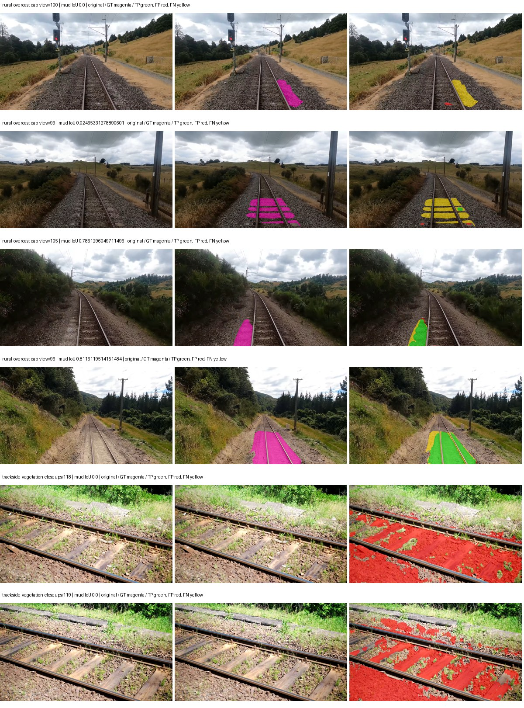
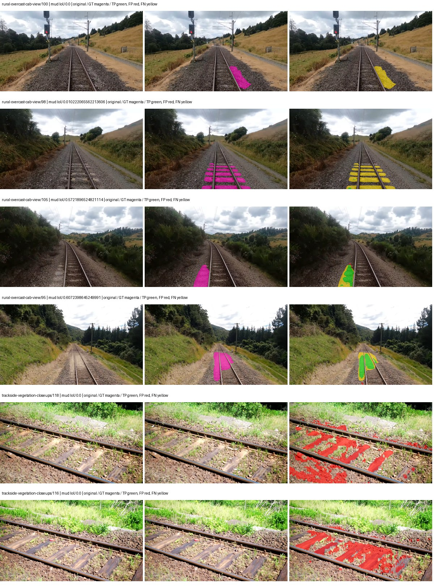
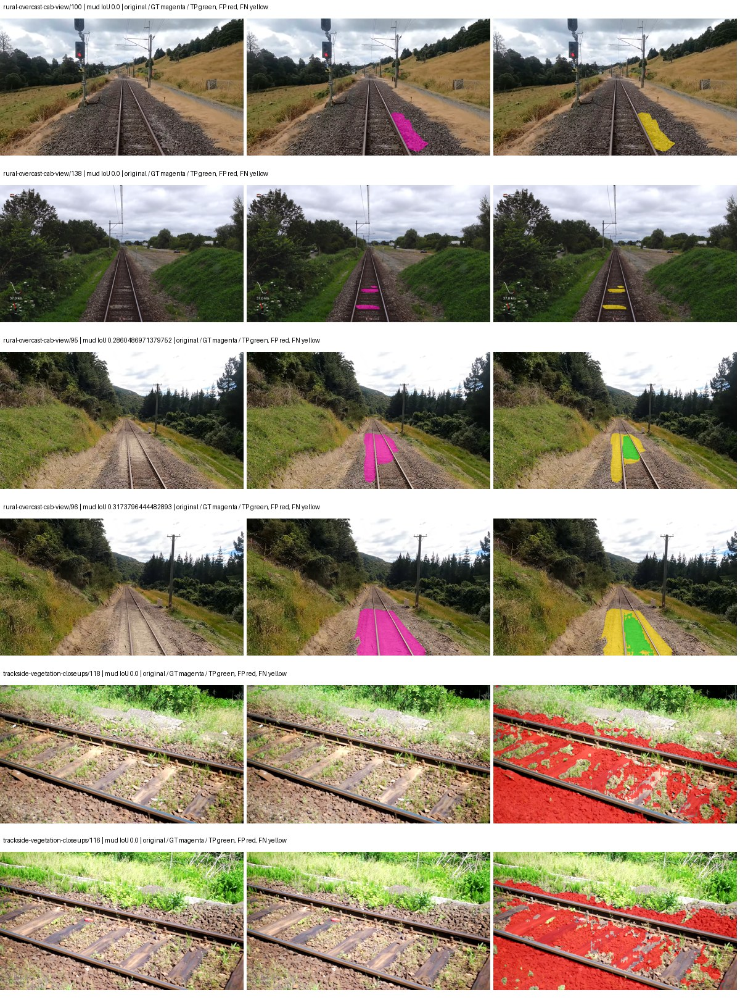
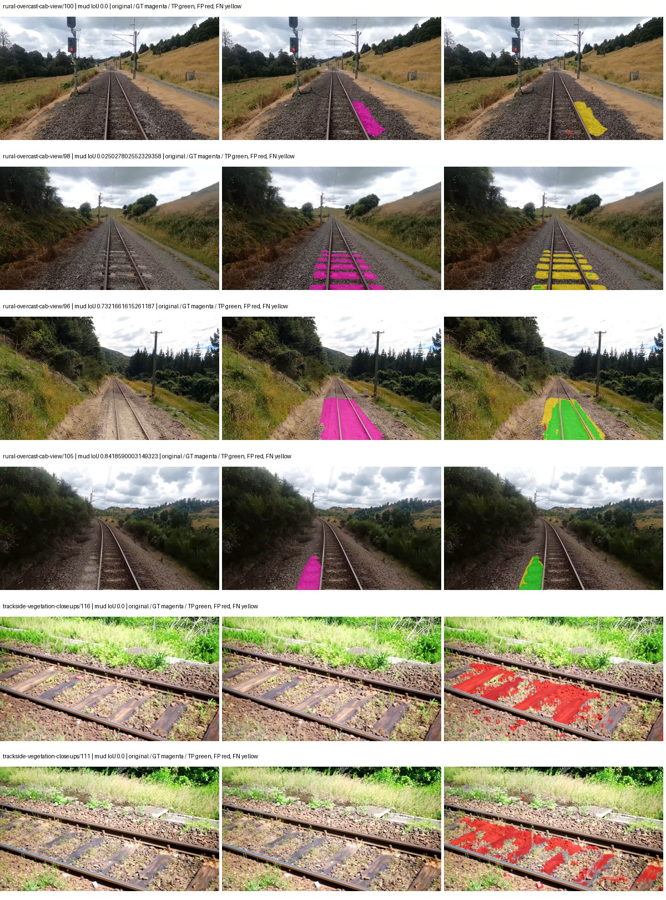

# eomt_large — paul-test-rtis_v2

[RTIS comparison](../../README.md) · [Full model records](record.json)

Primary selection and early stopping: **mud-pumping validation IoU**. A job is complete only after full statistics and isolated profiling are verified.

| Model | Initialization path | Seed | Status | Steps | Best step | Mud IoU (%) | Mud precision (%) | Mud recall (%) | Final mud IoU (trainer val, %) | mIoU (%) | Fixed GT-class mIoU (%) |
| --- | --- | --- | --- | --- | --- | --- | --- | --- | --- | --- | --- |
| eomt_large | rtis_only | 0 | completed | 2294 | 1019 | 10.56 | 12.31 | 42.66 | 8.86 | 46.33 | 51.47 |
| eomt_large | cityscapes_to_rtis | 0 | completed | 2803 | 1529 | 9.23 | 13.88 | 21.57 | 7.40 | 50.22 | 55.80 |
| eomt_large | railsem19_to_rtis | 0 | completed | 3568 | 3568 | 2.88 | 3.48 | 14.30 | 2.88 | 49.21 | 57.42 |
| eomt_large | cityscapes_to_railsem19_to_rtis | 0 | completed | 3313 | 2294 | 18.16 | 26.08 | 37.42 | 18.16 | 56.12 | 59.23 |

Training: 205 images. Validation: 37 images. Test: 50 held out. Seeds: [0]. Seed variation measures optimization variability, not independent-recording uncertainty. Historical source checkpoints stay fixed across adaptation seeds.

Training code: `066afb2626398b7be59d4d19f5a0e4644fd59adc`. Split SHA-256: `18a84c0163a65ded46508bcc904c374e5f33ad8a09b8879e3c8add606e86aa9f`.

## rtis_only — seed 0

Status: **completed**. Started: 2026-09-09T17:21:37.262147+00:00. Finished: 2026-09-09T18:47:26.765643+00:00.

Recipe pretrained initializer: `tue-mps/coco_panoptic_eomt_large_640 (DINOv2-based ViT-L, COCO panoptic)`.

`rtis_only` uses the recipe initializer, which may include pretrained segmentation components. Transfer paths load the exact historical source checkpoint below and reset the classifier; they do not reset all query/decoder features.

Source checkpoint: `Recipe pretrained initialization`.

Config SHA-256: `9955af3078b33c9e4a8aa7d65b596502f0eddfdbb74d26062659ee1979350b0b`. Weights used for validation: `ema`.

### Mud-pumping and aggregate quality

| Metric | Selected checkpoint | Final training validation |
| --- | --- | --- |
| Mud IoU | 10.56 | 8.86 |
| Mud precision | 12.31 | 10.30 |
| Mud recall | 42.66 | 38.88 |
| Mud Dice/F1 | 19.11 | 16.28 |
| mIoU | 46.33 | 48.17 |
| Mean accuracy | 63.26 | 64.84 |
| Mean precision | 61.14 | 62.25 |
| Mean Dice | 57.08 | 58.69 |
| Mean specificity | 99.25 | 99.26 |
| Pixel accuracy | 87.25 | 87.30 |
| Frequency-weighted IoU | 80.88 | 81.35 |
| Fixed GT-present class mIoU | 51.47 | 53.52 |
| Boundary F1 | 59.48 | 60.87 |

The selected checkpoint has independent evaluation evidence. Final values are the trainer's final validation record, not a new independent evaluation. mIoU averages classes with nonzero union, so false positives on absent classes can change its denominator. The fixed GT-class mean is supplementary and excludes absent classes; their false positives remain in the confusion matrix.

### Resource usage and timing

| Measurement | Value |
| --- | --- |
| Peak training VRAM, retained training invocation (GiB) | 17.70 |
| Peak evaluation VRAM (GiB) | 10.80 |
| Retained training invocation wall time (seconds) | 3701.92 |
| Retained training invocation GPU-hours (one GPU) | 1.03 |
| Evaluation wall time (seconds) | 22.04 |
| Full evaluation pipeline images/second | 1.68 |
| Best full-state checkpoint (MiB) | 4831.36 |
| Final full-state checkpoint (MiB) | 4831.34 |
| Verified periodic checkpoints removed (GiB) | 18.87 |

VRAM uses the recorded allocator high-water mark; it is not total device usage including CUDA context. Resumed jobs' retained training invocation times and peaks are **not whole-campaign totals**. Earlier invocation resource records are not reconstructed here. Evaluation throughput includes loader, sliding-window inference and metrics; it is not model-only latency/FPS. Missing measurements are shown as —, never inferred from another dataset's run.

### Standardized inference performance

Dedicated model-only profiling waits for an idle worker-locked L40S: BF16, batch 1, 1024x1024, 20 warmup and 100 CUDA-event-timed public forwards. It excludes loading, preprocessing, tiling and metrics.

| Status | Parameters | Weight MiB | FPS | p50 ms | p95 ms | Peak reserved GiB |
| --- | --- | --- | --- | --- | --- | --- |
| complete | 316580886 | 1207.66 | 45.40 | 22.00 | 22.27 | 3.12 |

```json
{
  "schema_version": 1,
  "model_id": "eomt_large",
  "measured_at": "2026-09-09T18:46:52+00:00",
  "status": "complete",
  "benchmark_scope": "rtis_selected_checkpoint_model_only",
  "applies_to": [
    "eomt_large--rtis_only--seed-0"
  ],
  "source": {
    "campaign_git_sha": "066afb2626398b7be59d4d19f5a0e4644fd59adc",
    "git_dirty": false,
    "config_hash": "72e7e6172f7a",
    "resolved_config": "/data/izadia1/projects/segmentary-runs/paul-test-rtis_v2/seed0-20260909/configs/eomt_large--rtis_only--seed-0.yaml",
    "config_sha256": "9955af3078b33c9e4a8aa7d65b596502f0eddfdbb74d26062659ee1979350b0b",
    "checkpoint_sha256": "acc9ce2548fb9af2a9da5efcc84d31fe473142f699f44d44e8de14d2d08a486e",
    "checkpoint_global_step": 1019,
    "checkpoint_bytes": 5066052217,
    "checkpoint_kind": "resume checkpoint with optimizer and EMA state",
    "weights": "ema",
    "measured_checkpoint_job_id": "eomt_large--rtis_only--seed-0",
    "result_sha256": "d3b60b29fc90b3b4e4c3620ad2ab2289b40fb6a6b0e3223b63dc7e702b0b1e26",
    "result_git_sha": "066afb2626398b7be59d4d19f5a0e4644fd59adc",
    "result_stage": "eval:paul-test-rtis:val",
    "result_seed": 0
  },
  "hardware": {
    "gpu_name": "NVIDIA L40S",
    "gpu_uuid": "GPU-1c9b612f-e0b5-fbbc-150f-8c2ef13453c9",
    "logical_device": "cuda:0",
    "physical_visibility_token": "5",
    "compute_capability": [
      8,
      9
    ],
    "total_memory_bytes": 47677177856
  },
  "model": {
    "parameter_count": 316580886,
    "trainable_parameter_count": 316580886,
    "resident_parameter_bytes": 1266323544,
    "parameter_dtype_counts": {
      "float32": 316580886
    }
  },
  "contract": {
    "backend": "pytorch",
    "precision": "bf16_autocast",
    "batch_size": 1,
    "input_shape_nchw": [
      1,
      3,
      1024,
      1024
    ],
    "warmup_iterations": 20,
    "measured_iterations": 100,
    "timing": "per-forward CUDA events with end-event synchronization",
    "includes_preprocessing": false,
    "includes_data_loader": false,
    "includes_sliding_window": false,
    "input_resident_on_gpu": true,
    "model_only": true,
    "entrypoint": "public model(image) dense-logits forward"
  },
  "measurements": {
    "latency": {
      "p50_ms": 21.998591423034668,
      "p95_ms": 22.265138721466066,
      "mean_ms": 22.028103275299074,
      "minimum_ms": 21.87264060974121,
      "maximum_ms": 22.408191680908203,
      "fps": 45.39655491452761,
      "raw_ms": [
        21.958656311035156,
        22.08665657043457,
        21.87264060974121,
        21.937152862548828,
        21.8787841796875,
        21.9105281829834,
        21.897216796875,
        21.899263381958008,
        21.898239135742188,
        21.91360092163086,
        22.010879516601562,
        21.956607818603516,
        21.947391510009766,
        22.05900764465332,
        21.926912307739258,
        22.114303588867188,
        22.03443145751953,
        21.993471145629883,
        21.923839569091797,
        21.90131187438965,
        21.898239135742188,
        21.935104370117188,
        21.89414405822754,
        22.09587287902832,
        21.959680557250977,
        21.961727142333984,
        21.972991943359375,
        22.04979133605957,
        22.020063400268555,
        21.977088928222656,
        21.993471145629883,
        22.046720504760742,
        21.936128616333008,
        21.933055877685547,
        21.92278480529785,
        21.909503936767578,
        21.994495391845703,
        21.935104370117188,
        21.890047073364258,
        22.112255096435547,
        22.032384872436523,
        22.012928009033203,
        21.964799880981445,
        21.908479690551758,
        22.05081558227539,
        21.932031631469727,
        22.128639221191406,
        22.0631046295166,
        22.01702308654785,
        22.05388832092285,
        21.932031631469727,
        22.09587287902832,
        22.132736206054688,
        21.979135513305664,
        22.28838348388672,
        22.120447158813477,
        22.192127227783203,
        22.27097511291504,
        21.922815322875977,
        22.408191680908203,
        22.322240829467773,
        22.040576934814453,
        22.120447158813477,
        22.08153533935547,
        22.146047592163086,
        21.962751388549805,
        21.941247940063477,
        22.363136291503906,
        21.988351821899414,
        22.148096084594727,
        22.06208038330078,
        22.004735946655273,
        21.944320678710938,
        22.1081600189209,
        21.946367263793945,
        22.11123275756836,
        22.121471405029297,
        22.197248458862305,
        21.9105281829834,
        22.11020851135254,
        22.245376586914062,
        22.05286407470703,
        21.9105281829834,
        22.217727661132812,
        22.07334327697754,
        21.982208251953125,
        21.970943450927734,
        21.983232498168945,
        21.987327575683594,
        22.107135772705078,
        21.981184005737305,
        22.164480209350586,
        22.002687454223633,
        22.175743103027344,
        21.964767456054688,
        22.020095825195312,
        22.002687454223633,
        22.029312133789062,
        21.977088928222656,
        22.26483154296875
      ],
      "percentile_method": "numpy linear interpolation"
    },
    "peak_reserved_bytes": 3351248896,
    "memory_kind": "pytorch_cuda_allocator_peak_reserved_excluding_context",
    "benchmark_wall_clock_s": 3.233785640448332
  },
  "started_at": "2026-09-09T18:46:49+00:00",
  "finished_at": "2026-09-09T18:46:52+00:00",
  "environment": {
    "hostname": "hdrfs-app-001",
    "python": "3.11.15",
    "platform": "Linux-5.15.0-139-generic-x86_64-with-glibc2.35",
    "torch": "2.11.0+cu128",
    "torch_cuda": "12.8",
    "cudnn": 91900,
    "driver_version": "570.133.20",
    "cuda_available": true,
    "gpu_count": 1,
    "gpu_names": [
      "NVIDIA L40S"
    ],
    "cuda_visible_devices": "5",
    "packages": {
      "segmentary": "0.1.0",
      "torch": "2.11.0+cu128",
      "torchvision": "0.26.0+cu128",
      "transformers": "5.15.0",
      "timm": "1.0.28",
      "segmentation-models-pytorch": "0.5.0",
      "albumentations": "2.0.8",
      "lightning": "2.6.5",
      "numpy": "2.4.4"
    }
  }
}
```

### Per-class validation results

| Class | GT pixels | IoU (%) | Precision (%) | Recall (%) | Dice (%) | Boundary F1 (%) |
| --- | --- | --- | --- | --- | --- | --- |
| car | 29664 | 4.10 | 10.61 | 6.25 | 7.87 | 14.11 |
| construction | 311585 | 71.59 | 84.24 | 82.66 | 83.45 | 80.25 |
| fence | 265137 | 43.89 | 67.93 | 55.36 | 61.00 | 60.97 |
| mud-pumping | 1226250 | 10.56 | 12.31 | 42.66 | 19.11 | 19.46 |
| on-rails | 0 | 0.00 | 0.00 | — | 0.00 | 0.00 |
| person | 0 | — | — | — | — | — |
| pole | 628038 | 76.25 | 86.82 | 86.23 | 86.52 | 93.65 |
| rail-embedded | 16799 | 39.35 | 77.18 | 44.53 | 56.47 | 84.62 |
| rail-raised | 2969797 | 80.58 | 85.32 | 93.55 | 89.25 | 95.00 |
| rail-track | 6323197 | 50.15 | 79.30 | 57.70 | 66.80 | 69.31 |
| road | 1048831 | 8.93 | 17.55 | 15.40 | 16.40 | 24.68 |
| sidewalk | 1297367 | 43.86 | 75.84 | 50.99 | 60.98 | 77.17 |
| sky | 19121606 | 98.72 | 99.40 | 99.31 | 99.36 | 98.38 |
| standing-water | 95802 | 33.63 | 44.13 | 58.56 | 50.33 | 51.44 |
| terrain | 39239306 | 91.52 | 92.78 | 98.54 | 95.57 | 79.43 |
| trackbed | 10643081 | 75.42 | 85.84 | 86.14 | 85.99 | 77.36 |
| traffic-light | 19510 | 57.33 | 93.79 | 59.59 | 72.88 | 76.61 |
| traffic-sign | 13285 | 46.31 | 59.13 | 68.11 | 63.30 | 74.18 |
| tram-track | 56179 | 59.27 | 60.53 | 96.60 | 74.42 | 52.95 |
| truck | 0 | 0.00 | 0.00 | — | 0.00 | 0.00 |
| vegetation-overgrowth | 5901821 | 35.06 | 90.12 | 36.46 | 51.92 | 60.06 |

### Full-run accounting

| Measurement | Value |
| --- | --- |
| Full GPU-reserved wall seconds, all recorded worker attempts | 4333.11 |
| Full reserved GPU-hours | 1.20 |
| Whole-run timing complete | True |

| Phase | Wall seconds including failed attempts |
| --- | --- |
| training | 3709.43 |
| diagnostics | 526.15 |
| performance | 21.51 |

GPU-reserved time includes model loading, training, validation, collection, profiling, checkpoint I/O and orchestration while the worker owns one GPU. It is not GPU kernel-active time. Phase timings and sampled device memory/power/utilization are retained separately; sampled device memory is not the allocator high-water mark.

### Train/validation and raw/EMA diagnostics

| Checkpoint / weights / split | Images | Mud IoU (%) | Mud precision (%) | Mud recall (%) |
| --- | --- | --- | --- | --- |
| best-auto-train / ema | 205 | 95.30 | 97.63 | 97.56 |
| best-auto-val / ema | 37 | 10.56 | 12.31 | 42.66 |
| best-alternate-val / raw | 37 | 9.38 | 10.37 | 49.63 |
| final-auto-val / ema | 37 | 8.87 | 10.31 | 38.88 |

Train uses the evaluation transform without augmentation. Compare mud train/validation metrics for the same selected weights. Alternate EMA on running-stat BatchNorm is explicitly uncalibrated and is diagnostic only. Score-threshold curves use uncalibrated normalized scores and are pixel-level diagnostics, not event detection rates or a selected deployment operating point.

### Downloadable evidence

- best-auto-train: [per-image.csv](rtis_only--seed-0/best-auto-train/per-image.csv) · [per-image-confusion.json.gz](rtis_only--seed-0/best-auto-train/per-image-confusion.json.gz) · [groups.json](rtis_only--seed-0/best-auto-train/groups.json) · [mud-score-curves.json](rtis_only--seed-0/best-auto-train/mud-score-curves.json)
- best-auto-val: [per-image.csv](rtis_only--seed-0/best-auto-val/per-image.csv) · [per-image-confusion.json.gz](rtis_only--seed-0/best-auto-val/per-image-confusion.json.gz) · [groups.json](rtis_only--seed-0/best-auto-val/groups.json) · [mud-score-curves.json](rtis_only--seed-0/best-auto-val/mud-score-curves.json) · [examples.jpg](rtis_only--seed-0/best-auto-val/examples.jpg)
- best-alternate-val: [per-image.csv](rtis_only--seed-0/best-alternate-val/per-image.csv) · [per-image-confusion.json.gz](rtis_only--seed-0/best-alternate-val/per-image-confusion.json.gz) · [groups.json](rtis_only--seed-0/best-alternate-val/groups.json) · [mud-score-curves.json](rtis_only--seed-0/best-alternate-val/mud-score-curves.json)
- final-auto-val: [per-image.csv](rtis_only--seed-0/final-auto-val/per-image.csv) · [per-image-confusion.json.gz](rtis_only--seed-0/final-auto-val/per-image-confusion.json.gz) · [groups.json](rtis_only--seed-0/final-auto-val/groups.json) · [mud-score-curves.json](rtis_only--seed-0/final-auto-val/mud-score-curves.json)
- resources: [telemetry.csv](rtis_only--seed-0/resources/telemetry.csv)



Examples are two lowest and two highest mud-IoU positive images, plus up to two negative images with the most false-positive mud pixels. They are targeted diagnostic examples, not random samples. Green: true positive; red: false positive; yellow: false negative. Full predictions remain on HDRFS.

### Validation tracking

| Logged step | Overall mIoU (%) | Mud IoU (%) |
| --- | --- | --- |
| 254 | 27.65 | 0.46 |
| 509 | 38.62 | 5.94 |
| 764 | 42.11 | 8.84 |
| 1019 | 46.31 | 10.56 |
| 1274 | 47.01 | 10.19 |
| 1529 | 47.07 | 8.68 |
| 1784 | 47.64 | 8.80 |
| 2038 | 48.15 | 8.83 |
| 2293 | 48.17 | 8.86 |

All retained scalar curves, including training loss and per-class IoU, are in record.json. Observed best mud on a curve is not necessarily a retained checkpoint: the pilot saved its selection-metric-best and final checkpoints. Step logging and checkpoint global_step may differ by one.

### Stopping and checkpoint provenance

```json
{
  "stopping": {
    "actual_steps": 2294,
    "maximum_steps": 4000,
    "min_delta": 0.001,
    "monitor": "val_iou/mud-pumping",
    "patience": 5,
    "reason": "validation_plateau"
  },
  "checkpoints": {
    "best": {
      "path": "/data/izadia1/projects/segmentary-runs/paul-test-rtis_v2/seed0-20260909/future-runs/eomt_large--rtis_only--seed-0_seed0/rtis/best.ckpt",
      "sha256": "acc9ce2548fb9af2a9da5efcc84d31fe473142f699f44d44e8de14d2d08a486e",
      "global_step": 1019,
      "bytes": 5066052217
    },
    "final": {
      "path": "/data/izadia1/projects/segmentary-runs/paul-test-rtis_v2/seed0-20260909/future-runs/eomt_large--rtis_only--seed-0_seed0/rtis/last.ckpt",
      "sha256": "a4d27d864dc826f3180191b4aacf3000614091f24b3f0699986b8f7752c8cd66",
      "global_step": 2294,
      "bytes": 5066030329
    }
  },
  "cleanup_error": null
}
```

### Resolved training, initialization and evaluation settings

The optimizer block is the base configuration. Stage LR scales are applied at runtime, and stage warmup is capped at min(base warmup, floor(stage budget / 10), stage budget - 1): 400 steps for this 4,000-step pilot. Model-internal native input grids may differ from augmentation crops (EoMT uses its 640 grid).

```json
{
  "name": "eomt_large--rtis_only--seed-0",
  "model": {
    "arch": "eomt_large",
    "checkpoint": null,
    "tuning": "full",
    "head": "unified_head",
    "lora_r": 16,
    "lora_alpha": 32,
    "lora_dropout": 0.05,
    "lora_targets": [],
    "drop_path": null,
    "revision": null,
    "subfolder": null,
    "local_files_only": false,
    "trust_remote_code": false,
    "backbone_path": null,
    "head_paths": [],
    "classifier_path": null,
    "inactive_parameter_paths": [],
    "smp_arch": null,
    "encoder_name": null,
    "encoder_weights": null,
    "native": null,
    "batch_norm_momentum": null
  },
  "space": "paul-test-rtis",
  "taxonomy_root": "/data/izadia1/projects/segmentary-rtis-fullstats-066afb2/taxonomy",
  "output_root": "/data/izadia1/projects/segmentary-runs/paul-test-rtis_v2/seed0-20260909/future-runs",
  "optim": {
    "backbone_lr": 1e-05,
    "head_lr_mult": 10.0,
    "weight_decay": 0.05,
    "llrd": 0.75,
    "warmup_iters": 1500,
    "warmup_ratio": 1e-06,
    "poly_power": 0.9,
    "min_lr_ratio": 0.0,
    "betas": [
      0.9,
      0.999
    ],
    "grad_clip": 1.0
  },
  "train": {
    "iters": 4000,
    "batch_size": 2,
    "accum": 8,
    "num_workers": 2,
    "precision": "bf16-mixed",
    "ema_decay": 0.9998,
    "val_every": 250,
    "ckpt_every": 500,
    "selection_metric": "val_iou/mud-pumping",
    "early_stopping_patience": 5,
    "early_stopping_min_delta": 0.001,
    "seed": 0,
    "devices": 1
  },
  "eval": {
    "sliding_window": true,
    "window": [
      1024,
      1024
    ],
    "stride": [
      768,
      768
    ],
    "batch_size": 1,
    "num_workers": 2,
    "tta_scales": [],
    "tta_flip": false,
    "threshold": 0.5,
    "boundary_tolerance_frac": 0.0075,
    "save_confusion": true
  },
  "loss": {
    "task": "multiclass",
    "activation": "auto",
    "terms": [],
    "aux": "none",
    "aux_weight": 0.0,
    "ce_weight": 1.0,
    "label_smoothing": 0.0,
    "class_weights": null,
    "query": {
      "kind": "hungarian_query",
      "classification_weight": 2.0,
      "mask_bce_weight": 5.0,
      "dice_weight": 5.0,
      "no_object_coefficient": 0.1,
      "match_class_cost": 2.0,
      "match_mask_bce_cost": 5.0,
      "match_dice_cost": 5.0,
      "matching_num_points": 8192,
      "auxiliary_layer_weight": 1.0,
      "dice_smooth": 1.0
    }
  },
  "aug": {
    "crop": [
      1024,
      1024
    ],
    "scale_min": 0.5,
    "scale_max": 2.0,
    "hflip_p": 0.5,
    "color_jitter_p": 0.5,
    "brightness": 0.25,
    "contrast": 0.25,
    "saturation": 0.25,
    "hue": 0.05
  },
  "stages": [
    {
      "name": "rtis",
      "data": [
        {
          "name": "paul-test-rtis",
          "root": "/data/izadia1/datasets/paul-test-rtis_v2",
          "variant": null,
          "split_file": "splits.json",
          "train_split": "train",
          "val_split": "val",
          "limit": null,
          "loader": "folder",
          "mapping": "paul-test-rtis",
          "loader_options": {
            "require_groups": true
          }
        }
      ],
      "iters": null,
      "lr_scale": 1.0,
      "head_group_lr_scale": 1.0,
      "init_from": "pretrained",
      "reset_head": false,
      "freeze": null,
      "sample_weights": null
    }
  ]
}
```

### Hardware and software provenance

```json
{
  "training": {
    "cuda_available": true,
    "cuda_visible_devices": "4",
    "cudnn": 91900,
    "driver_version": "570.133.20",
    "gpu_count": 1,
    "gpu_names": [
      "NVIDIA L40S"
    ],
    "hostname": "hdrfs-app-001",
    "input_normalization": {
      "channel_order": "rgb",
      "mean": [
        0.485,
        0.456,
        0.406
      ],
      "source": "imagenet",
      "std": [
        0.229,
        0.224,
        0.225
      ]
    },
    "model_origins": [
      {
        "hf_commit": "dcd130bed9b1ebda7041fd660fddb16f905b9c3b",
        "hf_name_or_path": "tue-mps/coco_panoptic_eomt_large_640",
        "module": "model",
        "timm_pretrained": {}
      },
      {
        "hf_commit": "dcd130bed9b1ebda7041fd660fddb16f905b9c3b",
        "hf_name_or_path": "tue-mps/coco_panoptic_eomt_large_640",
        "module": "model.embeddings",
        "timm_pretrained": {}
      },
      {
        "hf_commit": "dcd130bed9b1ebda7041fd660fddb16f905b9c3b",
        "hf_name_or_path": "tue-mps/coco_panoptic_eomt_large_640",
        "module": "model.layers.0.attention",
        "timm_pretrained": {}
      },
      {
        "hf_commit": "dcd130bed9b1ebda7041fd660fddb16f905b9c3b",
        "hf_name_or_path": "tue-mps/coco_panoptic_eomt_large_640",
        "module": "model.layers.1.attention",
        "timm_pretrained": {}
      },
      {
        "hf_commit": "dcd130bed9b1ebda7041fd660fddb16f905b9c3b",
        "hf_name_or_path": "tue-mps/coco_panoptic_eomt_large_640",
        "module": "model.layers.2.attention",
        "timm_pretrained": {}
      },
      {
        "hf_commit": "dcd130bed9b1ebda7041fd660fddb16f905b9c3b",
        "hf_name_or_path": "tue-mps/coco_panoptic_eomt_large_640",
        "module": "model.layers.3.attention",
        "timm_pretrained": {}
      },
      {
        "hf_commit": "dcd130bed9b1ebda7041fd660fddb16f905b9c3b",
        "hf_name_or_path": "tue-mps/coco_panoptic_eomt_large_640",
        "module": "model.layers.4.attention",
        "timm_pretrained": {}
      },
      {
        "hf_commit": "dcd130bed9b1ebda7041fd660fddb16f905b9c3b",
        "hf_name_or_path": "tue-mps/coco_panoptic_eomt_large_640",
        "module": "model.layers.5.attention",
        "timm_pretrained": {}
      },
      {
        "hf_commit": "dcd130bed9b1ebda7041fd660fddb16f905b9c3b",
        "hf_name_or_path": "tue-mps/coco_panoptic_eomt_large_640",
        "module": "model.layers.6.attention",
        "timm_pretrained": {}
      },
      {
        "hf_commit": "dcd130bed9b1ebda7041fd660fddb16f905b9c3b",
        "hf_name_or_path": "tue-mps/coco_panoptic_eomt_large_640",
        "module": "model.layers.7.attention",
        "timm_pretrained": {}
      },
      {
        "hf_commit": "dcd130bed9b1ebda7041fd660fddb16f905b9c3b",
        "hf_name_or_path": "tue-mps/coco_panoptic_eomt_large_640",
        "module": "model.layers.8.attention",
        "timm_pretrained": {}
      },
      {
        "hf_commit": "dcd130bed9b1ebda7041fd660fddb16f905b9c3b",
        "hf_name_or_path": "tue-mps/coco_panoptic_eomt_large_640",
        "module": "model.layers.9.attention",
        "timm_pretrained": {}
      },
      {
        "hf_commit": "dcd130bed9b1ebda7041fd660fddb16f905b9c3b",
        "hf_name_or_path": "tue-mps/coco_panoptic_eomt_large_640",
        "module": "model.layers.10.attention",
        "timm_pretrained": {}
      },
      {
        "hf_commit": "dcd130bed9b1ebda7041fd660fddb16f905b9c3b",
        "hf_name_or_path": "tue-mps/coco_panoptic_eomt_large_640",
        "module": "model.layers.11.attention",
        "timm_pretrained": {}
      },
      {
        "hf_commit": "dcd130bed9b1ebda7041fd660fddb16f905b9c3b",
        "hf_name_or_path": "tue-mps/coco_panoptic_eomt_large_640",
        "module": "model.layers.12.attention",
        "timm_pretrained": {}
      },
      {
        "hf_commit": "dcd130bed9b1ebda7041fd660fddb16f905b9c3b",
        "hf_name_or_path": "tue-mps/coco_panoptic_eomt_large_640",
        "module": "model.layers.13.attention",
        "timm_pretrained": {}
      },
      {
        "hf_commit": "dcd130bed9b1ebda7041fd660fddb16f905b9c3b",
        "hf_name_or_path": "tue-mps/coco_panoptic_eomt_large_640",
        "module": "model.layers.14.attention",
        "timm_pretrained": {}
      },
      {
        "hf_commit": "dcd130bed9b1ebda7041fd660fddb16f905b9c3b",
        "hf_name_or_path": "tue-mps/coco_panoptic_eomt_large_640",
        "module": "model.layers.15.attention",
        "timm_pretrained": {}
      },
      {
        "hf_commit": "dcd130bed9b1ebda7041fd660fddb16f905b9c3b",
        "hf_name_or_path": "tue-mps/coco_panoptic_eomt_large_640",
        "module": "model.layers.16.attention",
        "timm_pretrained": {}
      },
      {
        "hf_commit": "dcd130bed9b1ebda7041fd660fddb16f905b9c3b",
        "hf_name_or_path": "tue-mps/coco_panoptic_eomt_large_640",
        "module": "model.layers.17.attention",
        "timm_pretrained": {}
      },
      {
        "hf_commit": "dcd130bed9b1ebda7041fd660fddb16f905b9c3b",
        "hf_name_or_path": "tue-mps/coco_panoptic_eomt_large_640",
        "module": "model.layers.18.attention",
        "timm_pretrained": {}
      },
      {
        "hf_commit": "dcd130bed9b1ebda7041fd660fddb16f905b9c3b",
        "hf_name_or_path": "tue-mps/coco_panoptic_eomt_large_640",
        "module": "model.layers.19.attention",
        "timm_pretrained": {}
      },
      {
        "hf_commit": "dcd130bed9b1ebda7041fd660fddb16f905b9c3b",
        "hf_name_or_path": "tue-mps/coco_panoptic_eomt_large_640",
        "module": "model.layers.20.attention",
        "timm_pretrained": {}
      },
      {
        "hf_commit": "dcd130bed9b1ebda7041fd660fddb16f905b9c3b",
        "hf_name_or_path": "tue-mps/coco_panoptic_eomt_large_640",
        "module": "model.layers.21.attention",
        "timm_pretrained": {}
      },
      {
        "hf_commit": "dcd130bed9b1ebda7041fd660fddb16f905b9c3b",
        "hf_name_or_path": "tue-mps/coco_panoptic_eomt_large_640",
        "module": "model.layers.22.attention",
        "timm_pretrained": {}
      },
      {
        "hf_commit": "dcd130bed9b1ebda7041fd660fddb16f905b9c3b",
        "hf_name_or_path": "tue-mps/coco_panoptic_eomt_large_640",
        "module": "model.layers.23.attention",
        "timm_pretrained": {}
      }
    ],
    "model_parameter_count": 316580886,
    "packages": {
      "albumentations": "2.0.8",
      "lightning": "2.6.5",
      "numpy": "2.4.4",
      "segmentary": "0.1.0",
      "segmentation-models-pytorch": "0.5.0",
      "timm": "1.0.28",
      "torch": "2.11.0+cu128",
      "torchvision": "0.26.0+cu128",
      "transformers": "5.15.0"
    },
    "platform": "Linux-5.15.0-139-generic-x86_64-with-glibc2.35",
    "python": "3.11.15",
    "torch": "2.11.0+cu128",
    "torch_cuda": "12.8",
    "trainable_parameter_count": 316580886,
    "training_stop": {
      "actual_steps": 2294,
      "maximum_steps": 4000,
      "min_delta": 0.001,
      "monitor": "val_iou/mud-pumping",
      "patience": 5,
      "reason": "validation_plateau"
    },
    "validation_weights": "ema"
  },
  "evaluation": {
    "cuda_available": true,
    "cuda_visible_devices": "4",
    "cudnn": 91900,
    "driver_version": "570.133.20",
    "gpu_count": 1,
    "gpu_names": [
      "NVIDIA L40S"
    ],
    "hostname": "hdrfs-app-001",
    "input_normalization": {
      "channel_order": "rgb",
      "mean": [
        0.485,
        0.456,
        0.406
      ],
      "source": "imagenet",
      "std": [
        0.229,
        0.224,
        0.225
      ]
    },
    "packages": {
      "albumentations": "2.0.8",
      "lightning": "2.6.5",
      "numpy": "2.4.4",
      "segmentary": "0.1.0",
      "segmentation-models-pytorch": "0.5.0",
      "timm": "1.0.28",
      "torch": "2.11.0+cu128",
      "torchvision": "0.26.0+cu128",
      "transformers": "5.15.0"
    },
    "platform": "Linux-5.15.0-139-generic-x86_64-with-glibc2.35",
    "python": "3.11.15",
    "torch": "2.11.0+cu128",
    "torch_cuda": "12.8"
  }
}
```

## cityscapes_to_rtis — seed 0

Status: **completed**. Started: 2026-09-09T17:21:40.581761+00:00. Finished: 2026-09-09T18:47:30.510762+00:00.

Recipe pretrained initializer: `tue-mps/coco_panoptic_eomt_large_640 (DINOv2-based ViT-L, COCO panoptic)`.

`rtis_only` uses the recipe initializer, which may include pretrained segmentation components. Transfer paths load the exact historical source checkpoint below and reset the classifier; they do not reset all query/decoder features.

Source checkpoint: `{'name': 'eomt_large--cityscapes--seed-0', 'model': 'eomt_large', 'protocol': 'cityscapes', 'config': '/data/izadia1/projects/segmentary-runs/all-model-city-rail-seed0-rail20-b9eb3e1/accepted/eomt_large--cityscapes--seed-0/resolved-config.yaml', 'checkpoint': '/data/izadia1/projects/segmentary-runs/all-model-city-rail-seed0-a7c0b67/jobs/eomt_large--cityscapes--seed-0/attempt-001/train/eomt_large--cityscapes_seed0/cityscapes/last.ckpt', 'recorded_sha256': '2651e4743a617a9b4939dd5fbaaf4a643d7988f028adc18ac9d6027a084b7bdd', 'exists': True}`.

Config SHA-256: `7a9216585030e5d68c28b3c735dac470d4dd6a9d544b387d5d2160cc12c0d604`. Weights used for validation: `ema`.

### Mud-pumping and aggregate quality

| Metric | Selected checkpoint | Final training validation |
| --- | --- | --- |
| Mud IoU | 9.23 | 7.40 |
| Mud precision | 13.88 | 11.45 |
| Mud recall | 21.57 | 17.31 |
| Mud Dice/F1 | 16.90 | 13.79 |
| mIoU | 50.22 | 50.89 |
| Mean accuracy | 66.63 | 68.17 |
| Mean precision | 62.29 | 63.11 |
| Mean Dice | 60.15 | 60.95 |
| Mean specificity | 99.31 | 99.32 |
| Pixel accuracy | 88.91 | 89.07 |
| Frequency-weighted IoU | 82.03 | 82.32 |
| Fixed GT-present class mIoU | 55.80 | 56.55 |
| Boundary F1 | 57.55 | 59.21 |

The selected checkpoint has independent evaluation evidence. Final values are the trainer's final validation record, not a new independent evaluation. mIoU averages classes with nonzero union, so false positives on absent classes can change its denominator. The fixed GT-class mean is supplementary and excludes absent classes; their false positives remain in the confusion matrix.

### Resource usage and timing

| Measurement | Value |
| --- | --- |
| Peak training VRAM, retained training invocation (GiB) | 17.70 |
| Peak evaluation VRAM (GiB) | 10.80 |
| Retained training invocation wall time (seconds) | 4368.38 |
| Retained training invocation GPU-hours (one GPU) | 1.21 |
| Evaluation wall time (seconds) | 21.65 |
| Full evaluation pipeline images/second | 1.71 |
| Best full-state checkpoint (MiB) | 4831.36 |
| Final full-state checkpoint (MiB) | 4831.34 |
| Verified periodic checkpoints removed (GiB) | 23.59 |

VRAM uses the recorded allocator high-water mark; it is not total device usage including CUDA context. Resumed jobs' retained training invocation times and peaks are **not whole-campaign totals**. Earlier invocation resource records are not reconstructed here. Evaluation throughput includes loader, sliding-window inference and metrics; it is not model-only latency/FPS. Missing measurements are shown as —, never inferred from another dataset's run.

### Standardized inference performance

Dedicated model-only profiling waits for an idle worker-locked L40S: BF16, batch 1, 1024x1024, 20 warmup and 100 CUDA-event-timed public forwards. It excludes loading, preprocessing, tiling and metrics.

| Status | Parameters | Weight MiB | FPS | p50 ms | p95 ms | Peak reserved GiB |
| --- | --- | --- | --- | --- | --- | --- |
| complete | 316580886 | 1207.66 | 45.33 | 22.02 | 22.29 | 3.12 |

```json
{
  "schema_version": 1,
  "model_id": "eomt_large",
  "measured_at": "2026-09-09T18:46:52+00:00",
  "status": "complete",
  "benchmark_scope": "rtis_selected_checkpoint_model_only",
  "applies_to": [
    "eomt_large--cityscapes_to_rtis--seed-0"
  ],
  "source": {
    "campaign_git_sha": "066afb2626398b7be59d4d19f5a0e4644fd59adc",
    "git_dirty": false,
    "config_hash": "24a3b5d7ca56",
    "resolved_config": "/data/izadia1/projects/segmentary-runs/paul-test-rtis_v2/seed0-20260909/configs/eomt_large--cityscapes_to_rtis--seed-0.yaml",
    "config_sha256": "7a9216585030e5d68c28b3c735dac470d4dd6a9d544b387d5d2160cc12c0d604",
    "checkpoint_sha256": "b25fdad165adcf543ddd465431524d2c4983519cb067b6cb4878e432cd6e5802",
    "checkpoint_global_step": 1529,
    "checkpoint_bytes": 5066052281,
    "checkpoint_kind": "resume checkpoint with optimizer and EMA state",
    "weights": "ema",
    "measured_checkpoint_job_id": "eomt_large--cityscapes_to_rtis--seed-0",
    "result_sha256": "696553cc9eb80a6354425e7880b39906c851f6940c9ab92e7dd27e289d611b46",
    "result_git_sha": "066afb2626398b7be59d4d19f5a0e4644fd59adc",
    "result_stage": "eval:paul-test-rtis:val",
    "result_seed": 0
  },
  "hardware": {
    "gpu_name": "NVIDIA L40S",
    "gpu_uuid": "GPU-c76642eb-64c1-b0ac-b051-d2efd47b32c4",
    "logical_device": "cuda:0",
    "physical_visibility_token": "9",
    "compute_capability": [
      8,
      9
    ],
    "total_memory_bytes": 47677177856
  },
  "model": {
    "parameter_count": 316580886,
    "trainable_parameter_count": 316580886,
    "resident_parameter_bytes": 1266323544,
    "parameter_dtype_counts": {
      "float32": 316580886
    }
  },
  "contract": {
    "backend": "pytorch",
    "precision": "bf16_autocast",
    "batch_size": 1,
    "input_shape_nchw": [
      1,
      3,
      1024,
      1024
    ],
    "warmup_iterations": 20,
    "measured_iterations": 100,
    "timing": "per-forward CUDA events with end-event synchronization",
    "includes_preprocessing": false,
    "includes_data_loader": false,
    "includes_sliding_window": false,
    "input_resident_on_gpu": true,
    "model_only": true,
    "entrypoint": "public model(image) dense-logits forward"
  },
  "measurements": {
    "latency": {
      "p50_ms": 22.021120071411133,
      "p95_ms": 22.289663314819336,
      "mean_ms": 22.059621448516847,
      "minimum_ms": 21.88800048828125,
      "maximum_ms": 22.785024642944336,
      "fps": 45.331693580228404,
      "raw_ms": [
        22.021120071411133,
        21.971967697143555,
        21.958656311035156,
        22.039615631103516,
        22.045696258544922,
        22.106111526489258,
        22.2873592376709,
        22.122495651245117,
        22.121471405029297,
        22.05388832092285,
        21.954559326171875,
        21.986303329467773,
        22.021120071411133,
        22.009855270385742,
        21.983232498168945,
        21.991424560546875,
        21.947391510009766,
        21.943296432495117,
        22.188032150268555,
        21.950464248657227,
        22.10406494140625,
        22.364160537719727,
        22.06719970703125,
        22.33344078063965,
        22.1296329498291,
        21.986303329467773,
        21.992448806762695,
        22.01702308654785,
        21.88800048828125,
        22.000640869140625,
        21.918720245361328,
        22.11020851135254,
        21.977088928222656,
        22.1081600189209,
        22.002687454223633,
        21.956607818603516,
        22.137855529785156,
        22.148096084594727,
        22.054912567138672,
        21.999616622924805,
        21.954559326171875,
        21.971967697143555,
        21.953535079956055,
        22.04159927368164,
        21.940223693847656,
        21.914623260498047,
        21.941247940063477,
        22.0579833984375,
        21.968896865844727,
        22.26278305053711,
        22.037471771240234,
        22.113279342651367,
        22.214656829833984,
        21.974016189575195,
        22.11529541015625,
        22.27814483642578,
        22.06105613708496,
        21.984256744384766,
        21.994495391845703,
        21.954559326171875,
        21.957632064819336,
        21.979135513305664,
        21.987327575683594,
        21.974016189575195,
        22.113279342651367,
        22.051807403564453,
        22.160383224487305,
        22.51468849182129,
        22.137855529785156,
        22.191104888916016,
        22.021120071411133,
        21.982208251953125,
        21.962751388549805,
        22.13475227355957,
        21.969919204711914,
        22.024160385131836,
        22.04364776611328,
        21.950464248657227,
        21.998592376708984,
        22.06617546081543,
        22.124544143676758,
        22.007808685302734,
        22.001663208007812,
        21.975040435791016,
        22.785024642944336,
        22.134784698486328,
        21.932031631469727,
        22.121503829956055,
        21.995519638061523,
        22.10406494140625,
        22.047744750976562,
        22.036479949951172,
        22.154239654541016,
        21.88902473449707,
        22.003711700439453,
        22.037504196166992,
        22.253568649291992,
        22.029312133789062,
        21.991424560546875,
        22.380544662475586
      ],
      "percentile_method": "numpy linear interpolation"
    },
    "peak_reserved_bytes": 3351248896,
    "memory_kind": "pytorch_cuda_allocator_peak_reserved_excluding_context",
    "benchmark_wall_clock_s": 3.191860131919384
  },
  "started_at": "2026-09-09T18:46:49+00:00",
  "finished_at": "2026-09-09T18:46:52+00:00",
  "environment": {
    "hostname": "hdrfs-app-001",
    "python": "3.11.15",
    "platform": "Linux-5.15.0-139-generic-x86_64-with-glibc2.35",
    "torch": "2.11.0+cu128",
    "torch_cuda": "12.8",
    "cudnn": 91900,
    "driver_version": "570.133.20",
    "cuda_available": true,
    "gpu_count": 1,
    "gpu_names": [
      "NVIDIA L40S"
    ],
    "cuda_visible_devices": "9",
    "packages": {
      "segmentary": "0.1.0",
      "torch": "2.11.0+cu128",
      "torchvision": "0.26.0+cu128",
      "transformers": "5.15.0",
      "timm": "1.0.28",
      "segmentation-models-pytorch": "0.5.0",
      "albumentations": "2.0.8",
      "lightning": "2.6.5",
      "numpy": "2.4.4"
    }
  }
}
```

### Per-class validation results

| Class | GT pixels | IoU (%) | Precision (%) | Recall (%) | Dice (%) | Boundary F1 (%) |
| --- | --- | --- | --- | --- | --- | --- |
| car | 29664 | 73.71 | 76.98 | 94.56 | 84.87 | 63.30 |
| construction | 311585 | 59.09 | 69.73 | 79.49 | 74.29 | 65.79 |
| fence | 265137 | 54.15 | 83.46 | 60.67 | 70.26 | 73.40 |
| mud-pumping | 1226250 | 9.23 | 13.88 | 21.57 | 16.90 | 13.72 |
| on-rails | 0 | 0.00 | 0.00 | — | 0.00 | 0.00 |
| person | 0 | — | — | — | — | — |
| pole | 628038 | 78.54 | 88.96 | 87.02 | 87.98 | 94.17 |
| rail-embedded | 16799 | 3.00 | 3.90 | 11.58 | 5.83 | 9.55 |
| rail-raised | 2969797 | 80.47 | 85.41 | 93.29 | 89.18 | 94.30 |
| rail-track | 6323197 | 59.24 | 77.52 | 71.53 | 74.41 | 73.26 |
| road | 1048831 | 6.31 | 16.99 | 9.13 | 11.88 | 24.17 |
| sidewalk | 1297367 | 51.79 | 87.85 | 55.78 | 68.24 | 74.65 |
| sky | 19121606 | 98.88 | 99.43 | 99.45 | 99.44 | 98.80 |
| standing-water | 95802 | 39.13 | 60.72 | 52.39 | 56.25 | 47.31 |
| terrain | 39239306 | 91.13 | 92.22 | 98.72 | 95.36 | 76.96 |
| trackbed | 10643081 | 76.11 | 84.86 | 88.07 | 86.44 | 71.59 |
| traffic-light | 19510 | 82.44 | 93.28 | 87.64 | 90.38 | 89.15 |
| traffic-sign | 13285 | 55.98 | 76.21 | 67.84 | 71.78 | 85.74 |
| tram-track | 56179 | 42.99 | 50.29 | 74.75 | 60.13 | 28.14 |
| truck | 0 | 0.00 | 0.00 | — | 0.00 | 0.00 |
| vegetation-overgrowth | 5901821 | 42.22 | 84.18 | 45.86 | 59.37 | 66.93 |

### Full-run accounting

| Measurement | Value |
| --- | --- |
| Full GPU-reserved wall seconds, all recorded worker attempts | 4951.91 |
| Full reserved GPU-hours | 1.38 |
| Whole-run timing complete | True |

| Phase | Wall seconds including failed attempts |
| --- | --- |
| training | 4379.41 |
| diagnostics | 466.89 |
| performance | 21.01 |

GPU-reserved time includes model loading, training, validation, collection, profiling, checkpoint I/O and orchestration while the worker owns one GPU. It is not GPU kernel-active time. Phase timings and sampled device memory/power/utilization are retained separately; sampled device memory is not the allocator high-water mark.

### Train/validation and raw/EMA diagnostics

| Checkpoint / weights / split | Images | Mud IoU (%) | Mud precision (%) | Mud recall (%) |
| --- | --- | --- | --- | --- |
| best-auto-train / ema | 205 | 94.18 | 97.23 | 96.77 |
| best-auto-val / ema | 37 | 9.23 | 13.88 | 21.57 |
| best-alternate-val / raw | 37 | 9.04 | 14.65 | 19.11 |
| final-auto-val / ema | 37 | 7.38 | 11.42 | 17.28 |

Train uses the evaluation transform without augmentation. Compare mud train/validation metrics for the same selected weights. Alternate EMA on running-stat BatchNorm is explicitly uncalibrated and is diagnostic only. Score-threshold curves use uncalibrated normalized scores and are pixel-level diagnostics, not event detection rates or a selected deployment operating point.

### Downloadable evidence

- best-auto-train: [per-image.csv](cityscapes_to_rtis--seed-0/best-auto-train/per-image.csv) · [per-image-confusion.json.gz](cityscapes_to_rtis--seed-0/best-auto-train/per-image-confusion.json.gz) · [groups.json](cityscapes_to_rtis--seed-0/best-auto-train/groups.json) · [mud-score-curves.json](cityscapes_to_rtis--seed-0/best-auto-train/mud-score-curves.json)
- best-auto-val: [per-image.csv](cityscapes_to_rtis--seed-0/best-auto-val/per-image.csv) · [per-image-confusion.json.gz](cityscapes_to_rtis--seed-0/best-auto-val/per-image-confusion.json.gz) · [groups.json](cityscapes_to_rtis--seed-0/best-auto-val/groups.json) · [mud-score-curves.json](cityscapes_to_rtis--seed-0/best-auto-val/mud-score-curves.json) · [examples.jpg](cityscapes_to_rtis--seed-0/best-auto-val/examples.jpg)
- best-alternate-val: [per-image.csv](cityscapes_to_rtis--seed-0/best-alternate-val/per-image.csv) · [per-image-confusion.json.gz](cityscapes_to_rtis--seed-0/best-alternate-val/per-image-confusion.json.gz) · [groups.json](cityscapes_to_rtis--seed-0/best-alternate-val/groups.json) · [mud-score-curves.json](cityscapes_to_rtis--seed-0/best-alternate-val/mud-score-curves.json)
- final-auto-val: [per-image.csv](cityscapes_to_rtis--seed-0/final-auto-val/per-image.csv) · [per-image-confusion.json.gz](cityscapes_to_rtis--seed-0/final-auto-val/per-image-confusion.json.gz) · [groups.json](cityscapes_to_rtis--seed-0/final-auto-val/groups.json) · [mud-score-curves.json](cityscapes_to_rtis--seed-0/final-auto-val/mud-score-curves.json)
- resources: [telemetry.csv](cityscapes_to_rtis--seed-0/resources/telemetry.csv)



Examples are two lowest and two highest mud-IoU positive images, plus up to two negative images with the most false-positive mud pixels. They are targeted diagnostic examples, not random samples. Green: true positive; red: false positive; yellow: false negative. Full predictions remain on HDRFS.

### Validation tracking

| Logged step | Overall mIoU (%) | Mud IoU (%) |
| --- | --- | --- |
| 254 | 23.76 | 0.00 |
| 509 | 48.86 | 2.27 |
| 764 | 50.15 | 6.20 |
| 1019 | 48.67 | 6.34 |
| 1274 | 52.35 | 8.51 |
| 1529 | 50.18 | 9.22 |
| 1784 | 53.41 | 7.75 |
| 2038 | 50.94 | 7.32 |
| 2293 | 51.04 | 7.30 |
| 2548 | 51.01 | 7.39 |
| 2803 | 50.89 | 7.40 |

All retained scalar curves, including training loss and per-class IoU, are in record.json. Observed best mud on a curve is not necessarily a retained checkpoint: the pilot saved its selection-metric-best and final checkpoints. Step logging and checkpoint global_step may differ by one.

### Stopping and checkpoint provenance

```json
{
  "stopping": {
    "actual_steps": 2803,
    "maximum_steps": 4000,
    "min_delta": 0.001,
    "monitor": "val_iou/mud-pumping",
    "patience": 5,
    "reason": "validation_plateau"
  },
  "checkpoints": {
    "best": {
      "path": "/data/izadia1/projects/segmentary-runs/paul-test-rtis_v2/seed0-20260909/future-runs/eomt_large--cityscapes_to_rtis--seed-0_seed0/rtis/best.ckpt",
      "sha256": "b25fdad165adcf543ddd465431524d2c4983519cb067b6cb4878e432cd6e5802",
      "global_step": 1529,
      "bytes": 5066052281
    },
    "final": {
      "path": "/data/izadia1/projects/segmentary-runs/paul-test-rtis_v2/seed0-20260909/future-runs/eomt_large--cityscapes_to_rtis--seed-0_seed0/rtis/last.ckpt",
      "sha256": "3505a07a378506bc309b3ec92cdcfda3dc8559ca262655547406ddf70e21575e",
      "global_step": 2803,
      "bytes": 5066030393
    }
  },
  "cleanup_error": null
}
```

### Resolved training, initialization and evaluation settings

The optimizer block is the base configuration. Stage LR scales are applied at runtime, and stage warmup is capped at min(base warmup, floor(stage budget / 10), stage budget - 1): 400 steps for this 4,000-step pilot. Model-internal native input grids may differ from augmentation crops (EoMT uses its 640 grid).

```json
{
  "name": "eomt_large--cityscapes_to_rtis--seed-0",
  "model": {
    "arch": "eomt_large",
    "checkpoint": null,
    "tuning": "full",
    "head": "unified_head",
    "lora_r": 16,
    "lora_alpha": 32,
    "lora_dropout": 0.05,
    "lora_targets": [],
    "drop_path": null,
    "revision": null,
    "subfolder": null,
    "local_files_only": false,
    "trust_remote_code": false,
    "backbone_path": null,
    "head_paths": [],
    "classifier_path": null,
    "inactive_parameter_paths": [],
    "smp_arch": null,
    "encoder_name": null,
    "encoder_weights": null,
    "native": null,
    "batch_norm_momentum": null
  },
  "space": "paul-test-rtis",
  "taxonomy_root": "/data/izadia1/projects/segmentary-rtis-fullstats-066afb2/taxonomy",
  "output_root": "/data/izadia1/projects/segmentary-runs/paul-test-rtis_v2/seed0-20260909/future-runs",
  "optim": {
    "backbone_lr": 1e-05,
    "head_lr_mult": 10.0,
    "weight_decay": 0.05,
    "llrd": 0.75,
    "warmup_iters": 1500,
    "warmup_ratio": 1e-06,
    "poly_power": 0.9,
    "min_lr_ratio": 0.0,
    "betas": [
      0.9,
      0.999
    ],
    "grad_clip": 1.0
  },
  "train": {
    "iters": 4000,
    "batch_size": 2,
    "accum": 8,
    "num_workers": 2,
    "precision": "bf16-mixed",
    "ema_decay": 0.9998,
    "val_every": 250,
    "ckpt_every": 500,
    "selection_metric": "val_iou/mud-pumping",
    "early_stopping_patience": 5,
    "early_stopping_min_delta": 0.001,
    "seed": 0,
    "devices": 1
  },
  "eval": {
    "sliding_window": true,
    "window": [
      1024,
      1024
    ],
    "stride": [
      768,
      768
    ],
    "batch_size": 1,
    "num_workers": 2,
    "tta_scales": [],
    "tta_flip": false,
    "threshold": 0.5,
    "boundary_tolerance_frac": 0.0075,
    "save_confusion": true
  },
  "loss": {
    "task": "multiclass",
    "activation": "auto",
    "terms": [],
    "aux": "none",
    "aux_weight": 0.0,
    "ce_weight": 1.0,
    "label_smoothing": 0.0,
    "class_weights": null,
    "query": {
      "kind": "hungarian_query",
      "classification_weight": 2.0,
      "mask_bce_weight": 5.0,
      "dice_weight": 5.0,
      "no_object_coefficient": 0.1,
      "match_class_cost": 2.0,
      "match_mask_bce_cost": 5.0,
      "match_dice_cost": 5.0,
      "matching_num_points": 8192,
      "auxiliary_layer_weight": 1.0,
      "dice_smooth": 1.0
    }
  },
  "aug": {
    "crop": [
      1024,
      1024
    ],
    "scale_min": 0.5,
    "scale_max": 2.0,
    "hflip_p": 0.5,
    "color_jitter_p": 0.5,
    "brightness": 0.25,
    "contrast": 0.25,
    "saturation": 0.25,
    "hue": 0.05
  },
  "stages": [
    {
      "name": "rtis",
      "data": [
        {
          "name": "paul-test-rtis",
          "root": "/data/izadia1/datasets/paul-test-rtis_v2",
          "variant": null,
          "split_file": "splits.json",
          "train_split": "train",
          "val_split": "val",
          "limit": null,
          "loader": "folder",
          "mapping": "paul-test-rtis",
          "loader_options": {
            "require_groups": true
          }
        }
      ],
      "iters": null,
      "lr_scale": 0.1,
      "head_group_lr_scale": 1.0,
      "init_from": "/data/izadia1/projects/segmentary-runs/all-model-city-rail-seed0-a7c0b67/jobs/eomt_large--cityscapes--seed-0/attempt-001/train/eomt_large--cityscapes_seed0/cityscapes/last.ckpt",
      "reset_head": true,
      "freeze": null,
      "sample_weights": null
    }
  ]
}
```

### Hardware and software provenance

```json
{
  "training": {
    "cuda_available": true,
    "cuda_visible_devices": "5",
    "cudnn": 91900,
    "driver_version": "570.133.20",
    "gpu_count": 1,
    "gpu_names": [
      "NVIDIA L40S"
    ],
    "hostname": "hdrfs-app-001",
    "input_normalization": {
      "channel_order": "rgb",
      "mean": [
        0.485,
        0.456,
        0.406
      ],
      "source": "imagenet",
      "std": [
        0.229,
        0.224,
        0.225
      ]
    },
    "model_origins": [
      {
        "hf_commit": "dcd130bed9b1ebda7041fd660fddb16f905b9c3b",
        "hf_name_or_path": "tue-mps/coco_panoptic_eomt_large_640",
        "module": "model",
        "timm_pretrained": {}
      },
      {
        "hf_commit": "dcd130bed9b1ebda7041fd660fddb16f905b9c3b",
        "hf_name_or_path": "tue-mps/coco_panoptic_eomt_large_640",
        "module": "model.embeddings",
        "timm_pretrained": {}
      },
      {
        "hf_commit": "dcd130bed9b1ebda7041fd660fddb16f905b9c3b",
        "hf_name_or_path": "tue-mps/coco_panoptic_eomt_large_640",
        "module": "model.layers.0.attention",
        "timm_pretrained": {}
      },
      {
        "hf_commit": "dcd130bed9b1ebda7041fd660fddb16f905b9c3b",
        "hf_name_or_path": "tue-mps/coco_panoptic_eomt_large_640",
        "module": "model.layers.1.attention",
        "timm_pretrained": {}
      },
      {
        "hf_commit": "dcd130bed9b1ebda7041fd660fddb16f905b9c3b",
        "hf_name_or_path": "tue-mps/coco_panoptic_eomt_large_640",
        "module": "model.layers.2.attention",
        "timm_pretrained": {}
      },
      {
        "hf_commit": "dcd130bed9b1ebda7041fd660fddb16f905b9c3b",
        "hf_name_or_path": "tue-mps/coco_panoptic_eomt_large_640",
        "module": "model.layers.3.attention",
        "timm_pretrained": {}
      },
      {
        "hf_commit": "dcd130bed9b1ebda7041fd660fddb16f905b9c3b",
        "hf_name_or_path": "tue-mps/coco_panoptic_eomt_large_640",
        "module": "model.layers.4.attention",
        "timm_pretrained": {}
      },
      {
        "hf_commit": "dcd130bed9b1ebda7041fd660fddb16f905b9c3b",
        "hf_name_or_path": "tue-mps/coco_panoptic_eomt_large_640",
        "module": "model.layers.5.attention",
        "timm_pretrained": {}
      },
      {
        "hf_commit": "dcd130bed9b1ebda7041fd660fddb16f905b9c3b",
        "hf_name_or_path": "tue-mps/coco_panoptic_eomt_large_640",
        "module": "model.layers.6.attention",
        "timm_pretrained": {}
      },
      {
        "hf_commit": "dcd130bed9b1ebda7041fd660fddb16f905b9c3b",
        "hf_name_or_path": "tue-mps/coco_panoptic_eomt_large_640",
        "module": "model.layers.7.attention",
        "timm_pretrained": {}
      },
      {
        "hf_commit": "dcd130bed9b1ebda7041fd660fddb16f905b9c3b",
        "hf_name_or_path": "tue-mps/coco_panoptic_eomt_large_640",
        "module": "model.layers.8.attention",
        "timm_pretrained": {}
      },
      {
        "hf_commit": "dcd130bed9b1ebda7041fd660fddb16f905b9c3b",
        "hf_name_or_path": "tue-mps/coco_panoptic_eomt_large_640",
        "module": "model.layers.9.attention",
        "timm_pretrained": {}
      },
      {
        "hf_commit": "dcd130bed9b1ebda7041fd660fddb16f905b9c3b",
        "hf_name_or_path": "tue-mps/coco_panoptic_eomt_large_640",
        "module": "model.layers.10.attention",
        "timm_pretrained": {}
      },
      {
        "hf_commit": "dcd130bed9b1ebda7041fd660fddb16f905b9c3b",
        "hf_name_or_path": "tue-mps/coco_panoptic_eomt_large_640",
        "module": "model.layers.11.attention",
        "timm_pretrained": {}
      },
      {
        "hf_commit": "dcd130bed9b1ebda7041fd660fddb16f905b9c3b",
        "hf_name_or_path": "tue-mps/coco_panoptic_eomt_large_640",
        "module": "model.layers.12.attention",
        "timm_pretrained": {}
      },
      {
        "hf_commit": "dcd130bed9b1ebda7041fd660fddb16f905b9c3b",
        "hf_name_or_path": "tue-mps/coco_panoptic_eomt_large_640",
        "module": "model.layers.13.attention",
        "timm_pretrained": {}
      },
      {
        "hf_commit": "dcd130bed9b1ebda7041fd660fddb16f905b9c3b",
        "hf_name_or_path": "tue-mps/coco_panoptic_eomt_large_640",
        "module": "model.layers.14.attention",
        "timm_pretrained": {}
      },
      {
        "hf_commit": "dcd130bed9b1ebda7041fd660fddb16f905b9c3b",
        "hf_name_or_path": "tue-mps/coco_panoptic_eomt_large_640",
        "module": "model.layers.15.attention",
        "timm_pretrained": {}
      },
      {
        "hf_commit": "dcd130bed9b1ebda7041fd660fddb16f905b9c3b",
        "hf_name_or_path": "tue-mps/coco_panoptic_eomt_large_640",
        "module": "model.layers.16.attention",
        "timm_pretrained": {}
      },
      {
        "hf_commit": "dcd130bed9b1ebda7041fd660fddb16f905b9c3b",
        "hf_name_or_path": "tue-mps/coco_panoptic_eomt_large_640",
        "module": "model.layers.17.attention",
        "timm_pretrained": {}
      },
      {
        "hf_commit": "dcd130bed9b1ebda7041fd660fddb16f905b9c3b",
        "hf_name_or_path": "tue-mps/coco_panoptic_eomt_large_640",
        "module": "model.layers.18.attention",
        "timm_pretrained": {}
      },
      {
        "hf_commit": "dcd130bed9b1ebda7041fd660fddb16f905b9c3b",
        "hf_name_or_path": "tue-mps/coco_panoptic_eomt_large_640",
        "module": "model.layers.19.attention",
        "timm_pretrained": {}
      },
      {
        "hf_commit": "dcd130bed9b1ebda7041fd660fddb16f905b9c3b",
        "hf_name_or_path": "tue-mps/coco_panoptic_eomt_large_640",
        "module": "model.layers.20.attention",
        "timm_pretrained": {}
      },
      {
        "hf_commit": "dcd130bed9b1ebda7041fd660fddb16f905b9c3b",
        "hf_name_or_path": "tue-mps/coco_panoptic_eomt_large_640",
        "module": "model.layers.21.attention",
        "timm_pretrained": {}
      },
      {
        "hf_commit": "dcd130bed9b1ebda7041fd660fddb16f905b9c3b",
        "hf_name_or_path": "tue-mps/coco_panoptic_eomt_large_640",
        "module": "model.layers.22.attention",
        "timm_pretrained": {}
      },
      {
        "hf_commit": "dcd130bed9b1ebda7041fd660fddb16f905b9c3b",
        "hf_name_or_path": "tue-mps/coco_panoptic_eomt_large_640",
        "module": "model.layers.23.attention",
        "timm_pretrained": {}
      }
    ],
    "model_parameter_count": 316580886,
    "packages": {
      "albumentations": "2.0.8",
      "lightning": "2.6.5",
      "numpy": "2.4.4",
      "segmentary": "0.1.0",
      "segmentation-models-pytorch": "0.5.0",
      "timm": "1.0.28",
      "torch": "2.11.0+cu128",
      "torchvision": "0.26.0+cu128",
      "transformers": "5.15.0"
    },
    "platform": "Linux-5.15.0-139-generic-x86_64-with-glibc2.35",
    "python": "3.11.15",
    "torch": "2.11.0+cu128",
    "torch_cuda": "12.8",
    "trainable_parameter_count": 316580886,
    "training_stop": {
      "actual_steps": 2803,
      "maximum_steps": 4000,
      "min_delta": 0.001,
      "monitor": "val_iou/mud-pumping",
      "patience": 5,
      "reason": "validation_plateau"
    },
    "validation_weights": "ema"
  },
  "evaluation": {
    "cuda_available": true,
    "cuda_visible_devices": "5",
    "cudnn": 91900,
    "driver_version": "570.133.20",
    "gpu_count": 1,
    "gpu_names": [
      "NVIDIA L40S"
    ],
    "hostname": "hdrfs-app-001",
    "input_normalization": {
      "channel_order": "rgb",
      "mean": [
        0.485,
        0.456,
        0.406
      ],
      "source": "imagenet",
      "std": [
        0.229,
        0.224,
        0.225
      ]
    },
    "packages": {
      "albumentations": "2.0.8",
      "lightning": "2.6.5",
      "numpy": "2.4.4",
      "segmentary": "0.1.0",
      "segmentation-models-pytorch": "0.5.0",
      "timm": "1.0.28",
      "torch": "2.11.0+cu128",
      "torchvision": "0.26.0+cu128",
      "transformers": "5.15.0"
    },
    "platform": "Linux-5.15.0-139-generic-x86_64-with-glibc2.35",
    "python": "3.11.15",
    "torch": "2.11.0+cu128",
    "torch_cuda": "12.8"
  }
}
```

## railsem19_to_rtis — seed 0

Status: **completed**. Started: 2026-09-09T17:21:40.927789+00:00. Finished: 2026-09-09T19:02:47.113732+00:00.

Recipe pretrained initializer: `tue-mps/coco_panoptic_eomt_large_640 (DINOv2-based ViT-L, COCO panoptic)`.

`rtis_only` uses the recipe initializer, which may include pretrained segmentation components. Transfer paths load the exact historical source checkpoint below and reset the classifier; they do not reset all query/decoder features.

Source checkpoint: `{'name': 'eomt_large--railsem19--seed-0', 'model': 'eomt_large', 'protocol': 'railsem19', 'config': '/data/izadia1/projects/segmentary-runs/all-model-city-rail-seed0-rail20-b9eb3e1/accepted/eomt_large--railsem19--seed-0/resolved-config.yaml', 'checkpoint': '/data/izadia1/projects/segmentary-runs/all-model-city-rail-seed0-a7c0b67/jobs/eomt_large--railsem19--seed-0/attempt-001/train/eomt_large--railsem19_seed0/railsem19/last.ckpt', 'recorded_sha256': 'bb69373c9ee71051db4f35323b5f398f57e3ef71a71a88f23286df71fe0a0dbd', 'exists': True}`.

Config SHA-256: `93f814413535d921f0ad94a9c9e2f92cc7c5d45d984085e5e068e817cb1019f6`. Weights used for validation: `ema`.

### Mud-pumping and aggregate quality

| Metric | Selected checkpoint | Final training validation |
| --- | --- | --- |
| Mud IoU | 2.88 | 2.88 |
| Mud precision | 3.48 | 3.49 |
| Mud recall | 14.30 | 14.30 |
| Mud Dice/F1 | 5.60 | 5.61 |
| mIoU | 49.21 | 49.22 |
| Mean accuracy | 66.95 | 66.96 |
| Mean precision | 62.26 | 62.26 |
| Mean Dice | 59.04 | 59.05 |
| Mean specificity | 99.19 | 99.19 |
| Pixel accuracy | 86.15 | 86.15 |
| Frequency-weighted IoU | 80.12 | 80.12 |
| Fixed GT-present class mIoU | 57.42 | 57.43 |
| Boundary F1 | 59.38 | 59.36 |

The selected checkpoint has independent evaluation evidence. Final values are the trainer's final validation record, not a new independent evaluation. mIoU averages classes with nonzero union, so false positives on absent classes can change its denominator. The fixed GT-class mean is supplementary and excludes absent classes; their false positives remain in the confusion matrix.

### Resource usage and timing

| Measurement | Value |
| --- | --- |
| Peak training VRAM, retained training invocation (GiB) | 17.69 |
| Peak evaluation VRAM (GiB) | 10.80 |
| Retained training invocation wall time (seconds) | 5548.05 |
| Retained training invocation GPU-hours (one GPU) | 1.54 |
| Evaluation wall time (seconds) | 21.42 |
| Full evaluation pipeline images/second | 1.73 |
| Best full-state checkpoint (MiB) | 4831.36 |
| Final full-state checkpoint (MiB) | 4831.34 |
| Verified periodic checkpoints removed (GiB) | 33.03 |

VRAM uses the recorded allocator high-water mark; it is not total device usage including CUDA context. Resumed jobs' retained training invocation times and peaks are **not whole-campaign totals**. Earlier invocation resource records are not reconstructed here. Evaluation throughput includes loader, sliding-window inference and metrics; it is not model-only latency/FPS. Missing measurements are shown as —, never inferred from another dataset's run.

### Standardized inference performance

Dedicated model-only profiling waits for an idle worker-locked L40S: BF16, batch 1, 1024x1024, 20 warmup and 100 CUDA-event-timed public forwards. It excludes loading, preprocessing, tiling and metrics.

| Status | Parameters | Weight MiB | FPS | p50 ms | p95 ms | Peak reserved GiB |
| --- | --- | --- | --- | --- | --- | --- |
| complete | 316580886 | 1207.66 | 45.20 | 22.10 | 22.32 | 3.12 |

```json
{
  "schema_version": 1,
  "model_id": "eomt_large",
  "measured_at": "2026-09-09T19:02:00+00:00",
  "status": "complete",
  "benchmark_scope": "rtis_selected_checkpoint_model_only",
  "applies_to": [
    "eomt_large--railsem19_to_rtis--seed-0"
  ],
  "source": {
    "campaign_git_sha": "066afb2626398b7be59d4d19f5a0e4644fd59adc",
    "git_dirty": false,
    "config_hash": "78a5fc3ea510",
    "resolved_config": "/data/izadia1/projects/segmentary-runs/paul-test-rtis_v2/seed0-20260909/configs/eomt_large--railsem19_to_rtis--seed-0.yaml",
    "config_sha256": "93f814413535d921f0ad94a9c9e2f92cc7c5d45d984085e5e068e817cb1019f6",
    "checkpoint_sha256": "2b3be1ba16ac9f3a8f0f8ac7d6e869e254389ab7d1536c6056261bec07cc8a8a",
    "checkpoint_global_step": 3568,
    "checkpoint_bytes": 5066052409,
    "checkpoint_kind": "resume checkpoint with optimizer and EMA state",
    "weights": "ema",
    "measured_checkpoint_job_id": "eomt_large--railsem19_to_rtis--seed-0",
    "result_sha256": "cf0d25271747b05f720c7063a59490609269f67c835a63297c288423becc84e9",
    "result_git_sha": "066afb2626398b7be59d4d19f5a0e4644fd59adc",
    "result_stage": "eval:paul-test-rtis:val",
    "result_seed": 0
  },
  "hardware": {
    "gpu_name": "NVIDIA L40S",
    "gpu_uuid": "GPU-804aea8b-5f62-423e-72c6-49e1ed15c4e4",
    "logical_device": "cuda:0",
    "physical_visibility_token": "6",
    "compute_capability": [
      8,
      9
    ],
    "total_memory_bytes": 47677177856
  },
  "model": {
    "parameter_count": 316580886,
    "trainable_parameter_count": 316580886,
    "resident_parameter_bytes": 1266323544,
    "parameter_dtype_counts": {
      "float32": 316580886
    }
  },
  "contract": {
    "backend": "pytorch",
    "precision": "bf16_autocast",
    "batch_size": 1,
    "input_shape_nchw": [
      1,
      3,
      1024,
      1024
    ],
    "warmup_iterations": 20,
    "measured_iterations": 100,
    "timing": "per-forward CUDA events with end-event synchronization",
    "includes_preprocessing": false,
    "includes_data_loader": false,
    "includes_sliding_window": false,
    "input_resident_on_gpu": true,
    "model_only": true,
    "entrypoint": "public model(image) dense-logits forward"
  },
  "measurements": {
    "latency": {
      "p50_ms": 22.096384048461914,
      "p95_ms": 22.323097133636473,
      "mean_ms": 22.12384708404541,
      "minimum_ms": 21.983232498168945,
      "maximum_ms": 22.69183921813965,
      "fps": 45.20009545361345,
      "raw_ms": [
        22.43071937561035,
        22.69183921813965,
        22.320127487182617,
        22.097919464111328,
        22.0262393951416,
        22.137855529785156,
        22.07129669189453,
        22.02521514892578,
        22.26380729675293,
        22.179840087890625,
        22.040576934814453,
        22.227968215942383,
        22.379520416259766,
        22.07744026184082,
        22.26585578918457,
        22.524927139282227,
        22.10918426513672,
        21.983232498168945,
        22.039552688598633,
        22.030336380004883,
        22.06719970703125,
        22.027263641357422,
        22.0631046295166,
        22.046720504760742,
        22.03340721130371,
        22.132736206054688,
        22.173696517944336,
        22.016000747680664,
        22.028255462646484,
        22.11020851135254,
        22.09996795654297,
        22.220800399780273,
        22.140928268432617,
        22.07539176940918,
        22.08255958557129,
        22.167552947998047,
        22.164480209350586,
        22.10304069519043,
        22.216703414916992,
        22.138879776000977,
        22.199296951293945,
        22.176767349243164,
        22.0948486328125,
        22.0262393951416,
        22.05388832092285,
        22.055936813354492,
        22.03545570373535,
        22.0631046295166,
        22.185983657836914,
        22.4716796875,
        22.10304069519043,
        22.124544143676758,
        22.027263641357422,
        21.997535705566406,
        22.07334327697754,
        22.06617546081543,
        22.032384872436523,
        22.165504455566406,
        22.150144577026367,
        22.169599533081055,
        22.162431716918945,
        22.028287887573242,
        22.04159927368164,
        22.08460807800293,
        22.064128875732422,
        22.120447158813477,
        22.228992462158203,
        22.238208770751953,
        22.10304069519043,
        22.153215408325195,
        22.04876708984375,
        22.005760192871094,
        22.07539176940918,
        22.1265926361084,
        22.123519897460938,
        22.168575286865234,
        22.064128875732422,
        22.07129669189453,
        22.28633689880371,
        22.028287887573242,
        22.014976501464844,
        22.09382438659668,
        22.036479949951172,
        22.11737632751465,
        22.018047332763672,
        22.045696258544922,
        22.07436752319336,
        22.191104888916016,
        22.08665657043457,
        22.112255096435547,
        22.08665657043457,
        22.215679168701172,
        22.11123275756836,
        22.130687713623047,
        22.0446720123291,
        22.07948875427246,
        22.08153533935547,
        22.133760452270508,
        22.1081600189209,
        22.07334327697754
      ],
      "percentile_method": "numpy linear interpolation"
    },
    "peak_reserved_bytes": 3351248896,
    "memory_kind": "pytorch_cuda_allocator_peak_reserved_excluding_context",
    "benchmark_wall_clock_s": 3.197335511445999
  },
  "started_at": "2026-09-09T19:01:57+00:00",
  "finished_at": "2026-09-09T19:02:00+00:00",
  "environment": {
    "hostname": "hdrfs-app-001",
    "python": "3.11.15",
    "platform": "Linux-5.15.0-139-generic-x86_64-with-glibc2.35",
    "torch": "2.11.0+cu128",
    "torch_cuda": "12.8",
    "cudnn": 91900,
    "driver_version": "570.133.20",
    "cuda_available": true,
    "gpu_count": 1,
    "gpu_names": [
      "NVIDIA L40S"
    ],
    "cuda_visible_devices": "6",
    "packages": {
      "segmentary": "0.1.0",
      "torch": "2.11.0+cu128",
      "torchvision": "0.26.0+cu128",
      "transformers": "5.15.0",
      "timm": "1.0.28",
      "segmentation-models-pytorch": "0.5.0",
      "albumentations": "2.0.8",
      "lightning": "2.6.5",
      "numpy": "2.4.4"
    }
  }
}
```

### Per-class validation results

| Class | GT pixels | IoU (%) | Precision (%) | Recall (%) | Dice (%) | Boundary F1 (%) |
| --- | --- | --- | --- | --- | --- | --- |
| car | 29664 | 43.34 | 72.61 | 51.81 | 60.47 | 63.42 |
| construction | 311585 | 65.61 | 77.58 | 80.96 | 79.23 | 71.79 |
| fence | 265137 | 53.17 | 78.02 | 62.54 | 69.43 | 70.20 |
| mud-pumping | 1226250 | 2.88 | 3.48 | 14.30 | 5.60 | 4.64 |
| on-rails | 0 | 0.00 | 0.00 | — | 0.00 | 0.00 |
| person | 0 | 0.00 | 0.00 | — | 0.00 | 0.00 |
| pole | 628038 | 78.10 | 88.16 | 87.26 | 87.71 | 94.96 |
| rail-embedded | 16799 | 69.72 | 81.07 | 83.28 | 82.16 | 98.63 |
| rail-raised | 2969797 | 79.73 | 84.62 | 93.25 | 88.72 | 94.15 |
| rail-track | 6323197 | 57.51 | 83.85 | 64.67 | 73.02 | 67.81 |
| road | 1048831 | 9.66 | 25.24 | 13.53 | 17.62 | 24.34 |
| sidewalk | 1297367 | 57.19 | 77.66 | 68.45 | 72.76 | 63.42 |
| sky | 19121606 | 98.86 | 99.46 | 99.40 | 99.43 | 98.61 |
| standing-water | 95802 | 15.58 | 26.04 | 27.94 | 26.95 | 43.17 |
| terrain | 39239306 | 91.17 | 92.51 | 98.43 | 95.38 | 77.08 |
| trackbed | 10643081 | 58.28 | 84.03 | 65.54 | 73.64 | 60.61 |
| traffic-light | 19510 | 69.83 | 95.14 | 72.41 | 82.23 | 93.17 |
| traffic-sign | 13285 | 61.98 | 78.16 | 74.96 | 76.53 | 82.37 |
| tram-track | 56179 | 74.01 | 77.56 | 94.18 | 85.07 | 68.84 |
| truck | 0 | 0.00 | 0.00 | — | 0.00 | 0.00 |
| vegetation-overgrowth | 5901821 | 46.86 | 82.16 | 52.17 | 63.82 | 69.78 |

### Full-run accounting

| Measurement | Value |
| --- | --- |
| Full GPU-reserved wall seconds, all recorded worker attempts | 6038.96 |
| Full reserved GPU-hours | 1.68 |
| Whole-run timing complete | True |

| Phase | Wall seconds including failed attempts |
| --- | --- |
| training | 5560.78 |
| diagnostics | 365.60 |
| performance | 21.10 |

GPU-reserved time includes model loading, training, validation, collection, profiling, checkpoint I/O and orchestration while the worker owns one GPU. It is not GPU kernel-active time. Phase timings and sampled device memory/power/utilization are retained separately; sampled device memory is not the allocator high-water mark.

### Train/validation and raw/EMA diagnostics

| Checkpoint / weights / split | Images | Mud IoU (%) | Mud precision (%) | Mud recall (%) |
| --- | --- | --- | --- | --- |
| best-auto-train / ema | 205 | 96.57 | 98.16 | 98.35 |
| best-auto-val / ema | 37 | 2.88 | 3.48 | 14.30 |
| best-alternate-val / raw | 37 | 3.04 | 3.72 | 14.16 |
| final-auto-val / ema | 37 | 2.88 | 3.48 | 14.30 |

Train uses the evaluation transform without augmentation. Compare mud train/validation metrics for the same selected weights. Alternate EMA on running-stat BatchNorm is explicitly uncalibrated and is diagnostic only. Score-threshold curves use uncalibrated normalized scores and are pixel-level diagnostics, not event detection rates or a selected deployment operating point.

### Downloadable evidence

- best-auto-train: [per-image.csv](railsem19_to_rtis--seed-0/best-auto-train/per-image.csv) · [per-image-confusion.json.gz](railsem19_to_rtis--seed-0/best-auto-train/per-image-confusion.json.gz) · [groups.json](railsem19_to_rtis--seed-0/best-auto-train/groups.json) · [mud-score-curves.json](railsem19_to_rtis--seed-0/best-auto-train/mud-score-curves.json)
- best-auto-val: [per-image.csv](railsem19_to_rtis--seed-0/best-auto-val/per-image.csv) · [per-image-confusion.json.gz](railsem19_to_rtis--seed-0/best-auto-val/per-image-confusion.json.gz) · [groups.json](railsem19_to_rtis--seed-0/best-auto-val/groups.json) · [mud-score-curves.json](railsem19_to_rtis--seed-0/best-auto-val/mud-score-curves.json) · [examples.jpg](railsem19_to_rtis--seed-0/best-auto-val/examples.jpg)
- best-alternate-val: [per-image.csv](railsem19_to_rtis--seed-0/best-alternate-val/per-image.csv) · [per-image-confusion.json.gz](railsem19_to_rtis--seed-0/best-alternate-val/per-image-confusion.json.gz) · [groups.json](railsem19_to_rtis--seed-0/best-alternate-val/groups.json) · [mud-score-curves.json](railsem19_to_rtis--seed-0/best-alternate-val/mud-score-curves.json)
- final-auto-val: [per-image.csv](railsem19_to_rtis--seed-0/final-auto-val/per-image.csv) · [per-image-confusion.json.gz](railsem19_to_rtis--seed-0/final-auto-val/per-image-confusion.json.gz) · [groups.json](railsem19_to_rtis--seed-0/final-auto-val/groups.json) · [mud-score-curves.json](railsem19_to_rtis--seed-0/final-auto-val/mud-score-curves.json)
- resources: [telemetry.csv](railsem19_to_rtis--seed-0/resources/telemetry.csv)



Examples are two lowest and two highest mud-IoU positive images, plus up to two negative images with the most false-positive mud pixels. They are targeted diagnostic examples, not random samples. Green: true positive; red: false positive; yellow: false negative. Full predictions remain on HDRFS.

### Validation tracking

| Logged step | Overall mIoU (%) | Mud IoU (%) |
| --- | --- | --- |
| 254 | 33.44 | 0.00 |
| 509 | 49.59 | 2.03 |
| 764 | 49.89 | 2.20 |
| 1019 | 50.20 | 2.16 |
| 1274 | 50.52 | 2.45 |
| 1529 | 49.46 | 2.74 |
| 1784 | 49.42 | 2.64 |
| 2038 | 49.30 | 2.83 |
| 2293 | 49.36 | 2.84 |
| 2548 | 49.35 | 2.85 |
| 2803 | 49.32 | 2.86 |
| 3058 | 49.25 | 2.87 |
| 3313 | 49.24 | 2.88 |
| 3568 | 49.22 | 2.88 |

All retained scalar curves, including training loss and per-class IoU, are in record.json. Observed best mud on a curve is not necessarily a retained checkpoint: the pilot saved its selection-metric-best and final checkpoints. Step logging and checkpoint global_step may differ by one.

### Stopping and checkpoint provenance

```json
{
  "stopping": {
    "actual_steps": 3568,
    "maximum_steps": 4000,
    "min_delta": 0.001,
    "monitor": "val_iou/mud-pumping",
    "patience": 5,
    "reason": "validation_plateau"
  },
  "checkpoints": {
    "best": {
      "path": "/data/izadia1/projects/segmentary-runs/paul-test-rtis_v2/seed0-20260909/future-runs/eomt_large--railsem19_to_rtis--seed-0_seed0/rtis/best.ckpt",
      "sha256": "2b3be1ba16ac9f3a8f0f8ac7d6e869e254389ab7d1536c6056261bec07cc8a8a",
      "global_step": 3568,
      "bytes": 5066052409
    },
    "final": {
      "path": "/data/izadia1/projects/segmentary-runs/paul-test-rtis_v2/seed0-20260909/future-runs/eomt_large--railsem19_to_rtis--seed-0_seed0/rtis/last.ckpt",
      "sha256": "2cbf5b3e1c6e605e1a57e11a0e88c3267d2bf58db552f09467806ce12f2e42a6",
      "global_step": 3568,
      "bytes": 5066030393
    }
  },
  "cleanup_error": null
}
```

### Resolved training, initialization and evaluation settings

The optimizer block is the base configuration. Stage LR scales are applied at runtime, and stage warmup is capped at min(base warmup, floor(stage budget / 10), stage budget - 1): 400 steps for this 4,000-step pilot. Model-internal native input grids may differ from augmentation crops (EoMT uses its 640 grid).

```json
{
  "name": "eomt_large--railsem19_to_rtis--seed-0",
  "model": {
    "arch": "eomt_large",
    "checkpoint": null,
    "tuning": "full",
    "head": "unified_head",
    "lora_r": 16,
    "lora_alpha": 32,
    "lora_dropout": 0.05,
    "lora_targets": [],
    "drop_path": null,
    "revision": null,
    "subfolder": null,
    "local_files_only": false,
    "trust_remote_code": false,
    "backbone_path": null,
    "head_paths": [],
    "classifier_path": null,
    "inactive_parameter_paths": [],
    "smp_arch": null,
    "encoder_name": null,
    "encoder_weights": null,
    "native": null,
    "batch_norm_momentum": null
  },
  "space": "paul-test-rtis",
  "taxonomy_root": "/data/izadia1/projects/segmentary-rtis-fullstats-066afb2/taxonomy",
  "output_root": "/data/izadia1/projects/segmentary-runs/paul-test-rtis_v2/seed0-20260909/future-runs",
  "optim": {
    "backbone_lr": 1e-05,
    "head_lr_mult": 10.0,
    "weight_decay": 0.05,
    "llrd": 0.75,
    "warmup_iters": 1500,
    "warmup_ratio": 1e-06,
    "poly_power": 0.9,
    "min_lr_ratio": 0.0,
    "betas": [
      0.9,
      0.999
    ],
    "grad_clip": 1.0
  },
  "train": {
    "iters": 4000,
    "batch_size": 2,
    "accum": 8,
    "num_workers": 2,
    "precision": "bf16-mixed",
    "ema_decay": 0.9998,
    "val_every": 250,
    "ckpt_every": 500,
    "selection_metric": "val_iou/mud-pumping",
    "early_stopping_patience": 5,
    "early_stopping_min_delta": 0.001,
    "seed": 0,
    "devices": 1
  },
  "eval": {
    "sliding_window": true,
    "window": [
      1024,
      1024
    ],
    "stride": [
      768,
      768
    ],
    "batch_size": 1,
    "num_workers": 2,
    "tta_scales": [],
    "tta_flip": false,
    "threshold": 0.5,
    "boundary_tolerance_frac": 0.0075,
    "save_confusion": true
  },
  "loss": {
    "task": "multiclass",
    "activation": "auto",
    "terms": [],
    "aux": "none",
    "aux_weight": 0.0,
    "ce_weight": 1.0,
    "label_smoothing": 0.0,
    "class_weights": null,
    "query": {
      "kind": "hungarian_query",
      "classification_weight": 2.0,
      "mask_bce_weight": 5.0,
      "dice_weight": 5.0,
      "no_object_coefficient": 0.1,
      "match_class_cost": 2.0,
      "match_mask_bce_cost": 5.0,
      "match_dice_cost": 5.0,
      "matching_num_points": 8192,
      "auxiliary_layer_weight": 1.0,
      "dice_smooth": 1.0
    }
  },
  "aug": {
    "crop": [
      1024,
      1024
    ],
    "scale_min": 0.5,
    "scale_max": 2.0,
    "hflip_p": 0.5,
    "color_jitter_p": 0.5,
    "brightness": 0.25,
    "contrast": 0.25,
    "saturation": 0.25,
    "hue": 0.05
  },
  "stages": [
    {
      "name": "rtis",
      "data": [
        {
          "name": "paul-test-rtis",
          "root": "/data/izadia1/datasets/paul-test-rtis_v2",
          "variant": null,
          "split_file": "splits.json",
          "train_split": "train",
          "val_split": "val",
          "limit": null,
          "loader": "folder",
          "mapping": "paul-test-rtis",
          "loader_options": {
            "require_groups": true
          }
        }
      ],
      "iters": null,
      "lr_scale": 0.1,
      "head_group_lr_scale": 1.0,
      "init_from": "/data/izadia1/projects/segmentary-runs/all-model-city-rail-seed0-a7c0b67/jobs/eomt_large--railsem19--seed-0/attempt-001/train/eomt_large--railsem19_seed0/railsem19/last.ckpt",
      "reset_head": true,
      "freeze": null,
      "sample_weights": null
    }
  ]
}
```

### Hardware and software provenance

```json
{
  "training": {
    "cuda_available": true,
    "cuda_visible_devices": "6",
    "cudnn": 91900,
    "driver_version": "570.133.20",
    "gpu_count": 1,
    "gpu_names": [
      "NVIDIA L40S"
    ],
    "hostname": "hdrfs-app-001",
    "input_normalization": {
      "channel_order": "rgb",
      "mean": [
        0.485,
        0.456,
        0.406
      ],
      "source": "imagenet",
      "std": [
        0.229,
        0.224,
        0.225
      ]
    },
    "model_origins": [
      {
        "hf_commit": "dcd130bed9b1ebda7041fd660fddb16f905b9c3b",
        "hf_name_or_path": "tue-mps/coco_panoptic_eomt_large_640",
        "module": "model",
        "timm_pretrained": {}
      },
      {
        "hf_commit": "dcd130bed9b1ebda7041fd660fddb16f905b9c3b",
        "hf_name_or_path": "tue-mps/coco_panoptic_eomt_large_640",
        "module": "model.embeddings",
        "timm_pretrained": {}
      },
      {
        "hf_commit": "dcd130bed9b1ebda7041fd660fddb16f905b9c3b",
        "hf_name_or_path": "tue-mps/coco_panoptic_eomt_large_640",
        "module": "model.layers.0.attention",
        "timm_pretrained": {}
      },
      {
        "hf_commit": "dcd130bed9b1ebda7041fd660fddb16f905b9c3b",
        "hf_name_or_path": "tue-mps/coco_panoptic_eomt_large_640",
        "module": "model.layers.1.attention",
        "timm_pretrained": {}
      },
      {
        "hf_commit": "dcd130bed9b1ebda7041fd660fddb16f905b9c3b",
        "hf_name_or_path": "tue-mps/coco_panoptic_eomt_large_640",
        "module": "model.layers.2.attention",
        "timm_pretrained": {}
      },
      {
        "hf_commit": "dcd130bed9b1ebda7041fd660fddb16f905b9c3b",
        "hf_name_or_path": "tue-mps/coco_panoptic_eomt_large_640",
        "module": "model.layers.3.attention",
        "timm_pretrained": {}
      },
      {
        "hf_commit": "dcd130bed9b1ebda7041fd660fddb16f905b9c3b",
        "hf_name_or_path": "tue-mps/coco_panoptic_eomt_large_640",
        "module": "model.layers.4.attention",
        "timm_pretrained": {}
      },
      {
        "hf_commit": "dcd130bed9b1ebda7041fd660fddb16f905b9c3b",
        "hf_name_or_path": "tue-mps/coco_panoptic_eomt_large_640",
        "module": "model.layers.5.attention",
        "timm_pretrained": {}
      },
      {
        "hf_commit": "dcd130bed9b1ebda7041fd660fddb16f905b9c3b",
        "hf_name_or_path": "tue-mps/coco_panoptic_eomt_large_640",
        "module": "model.layers.6.attention",
        "timm_pretrained": {}
      },
      {
        "hf_commit": "dcd130bed9b1ebda7041fd660fddb16f905b9c3b",
        "hf_name_or_path": "tue-mps/coco_panoptic_eomt_large_640",
        "module": "model.layers.7.attention",
        "timm_pretrained": {}
      },
      {
        "hf_commit": "dcd130bed9b1ebda7041fd660fddb16f905b9c3b",
        "hf_name_or_path": "tue-mps/coco_panoptic_eomt_large_640",
        "module": "model.layers.8.attention",
        "timm_pretrained": {}
      },
      {
        "hf_commit": "dcd130bed9b1ebda7041fd660fddb16f905b9c3b",
        "hf_name_or_path": "tue-mps/coco_panoptic_eomt_large_640",
        "module": "model.layers.9.attention",
        "timm_pretrained": {}
      },
      {
        "hf_commit": "dcd130bed9b1ebda7041fd660fddb16f905b9c3b",
        "hf_name_or_path": "tue-mps/coco_panoptic_eomt_large_640",
        "module": "model.layers.10.attention",
        "timm_pretrained": {}
      },
      {
        "hf_commit": "dcd130bed9b1ebda7041fd660fddb16f905b9c3b",
        "hf_name_or_path": "tue-mps/coco_panoptic_eomt_large_640",
        "module": "model.layers.11.attention",
        "timm_pretrained": {}
      },
      {
        "hf_commit": "dcd130bed9b1ebda7041fd660fddb16f905b9c3b",
        "hf_name_or_path": "tue-mps/coco_panoptic_eomt_large_640",
        "module": "model.layers.12.attention",
        "timm_pretrained": {}
      },
      {
        "hf_commit": "dcd130bed9b1ebda7041fd660fddb16f905b9c3b",
        "hf_name_or_path": "tue-mps/coco_panoptic_eomt_large_640",
        "module": "model.layers.13.attention",
        "timm_pretrained": {}
      },
      {
        "hf_commit": "dcd130bed9b1ebda7041fd660fddb16f905b9c3b",
        "hf_name_or_path": "tue-mps/coco_panoptic_eomt_large_640",
        "module": "model.layers.14.attention",
        "timm_pretrained": {}
      },
      {
        "hf_commit": "dcd130bed9b1ebda7041fd660fddb16f905b9c3b",
        "hf_name_or_path": "tue-mps/coco_panoptic_eomt_large_640",
        "module": "model.layers.15.attention",
        "timm_pretrained": {}
      },
      {
        "hf_commit": "dcd130bed9b1ebda7041fd660fddb16f905b9c3b",
        "hf_name_or_path": "tue-mps/coco_panoptic_eomt_large_640",
        "module": "model.layers.16.attention",
        "timm_pretrained": {}
      },
      {
        "hf_commit": "dcd130bed9b1ebda7041fd660fddb16f905b9c3b",
        "hf_name_or_path": "tue-mps/coco_panoptic_eomt_large_640",
        "module": "model.layers.17.attention",
        "timm_pretrained": {}
      },
      {
        "hf_commit": "dcd130bed9b1ebda7041fd660fddb16f905b9c3b",
        "hf_name_or_path": "tue-mps/coco_panoptic_eomt_large_640",
        "module": "model.layers.18.attention",
        "timm_pretrained": {}
      },
      {
        "hf_commit": "dcd130bed9b1ebda7041fd660fddb16f905b9c3b",
        "hf_name_or_path": "tue-mps/coco_panoptic_eomt_large_640",
        "module": "model.layers.19.attention",
        "timm_pretrained": {}
      },
      {
        "hf_commit": "dcd130bed9b1ebda7041fd660fddb16f905b9c3b",
        "hf_name_or_path": "tue-mps/coco_panoptic_eomt_large_640",
        "module": "model.layers.20.attention",
        "timm_pretrained": {}
      },
      {
        "hf_commit": "dcd130bed9b1ebda7041fd660fddb16f905b9c3b",
        "hf_name_or_path": "tue-mps/coco_panoptic_eomt_large_640",
        "module": "model.layers.21.attention",
        "timm_pretrained": {}
      },
      {
        "hf_commit": "dcd130bed9b1ebda7041fd660fddb16f905b9c3b",
        "hf_name_or_path": "tue-mps/coco_panoptic_eomt_large_640",
        "module": "model.layers.22.attention",
        "timm_pretrained": {}
      },
      {
        "hf_commit": "dcd130bed9b1ebda7041fd660fddb16f905b9c3b",
        "hf_name_or_path": "tue-mps/coco_panoptic_eomt_large_640",
        "module": "model.layers.23.attention",
        "timm_pretrained": {}
      }
    ],
    "model_parameter_count": 316580886,
    "packages": {
      "albumentations": "2.0.8",
      "lightning": "2.6.5",
      "numpy": "2.4.4",
      "segmentary": "0.1.0",
      "segmentation-models-pytorch": "0.5.0",
      "timm": "1.0.28",
      "torch": "2.11.0+cu128",
      "torchvision": "0.26.0+cu128",
      "transformers": "5.15.0"
    },
    "platform": "Linux-5.15.0-139-generic-x86_64-with-glibc2.35",
    "python": "3.11.15",
    "torch": "2.11.0+cu128",
    "torch_cuda": "12.8",
    "trainable_parameter_count": 316580886,
    "training_stop": {
      "actual_steps": 3568,
      "maximum_steps": 4000,
      "min_delta": 0.001,
      "monitor": "val_iou/mud-pumping",
      "patience": 5,
      "reason": "validation_plateau"
    },
    "validation_weights": "ema"
  },
  "evaluation": {
    "cuda_available": true,
    "cuda_visible_devices": "6",
    "cudnn": 91900,
    "driver_version": "570.133.20",
    "gpu_count": 1,
    "gpu_names": [
      "NVIDIA L40S"
    ],
    "hostname": "hdrfs-app-001",
    "input_normalization": {
      "channel_order": "rgb",
      "mean": [
        0.485,
        0.456,
        0.406
      ],
      "source": "imagenet",
      "std": [
        0.229,
        0.224,
        0.225
      ]
    },
    "packages": {
      "albumentations": "2.0.8",
      "lightning": "2.6.5",
      "numpy": "2.4.4",
      "segmentary": "0.1.0",
      "segmentation-models-pytorch": "0.5.0",
      "timm": "1.0.28",
      "torch": "2.11.0+cu128",
      "torchvision": "0.26.0+cu128",
      "transformers": "5.15.0"
    },
    "platform": "Linux-5.15.0-139-generic-x86_64-with-glibc2.35",
    "python": "3.11.15",
    "torch": "2.11.0+cu128",
    "torch_cuda": "12.8"
  }
}
```

## cityscapes_to_railsem19_to_rtis — seed 0

Status: **completed**. Started: 2026-09-09T17:21:40.852150+00:00. Finished: 2026-09-09T18:54:18.984137+00:00.

Recipe pretrained initializer: `tue-mps/coco_panoptic_eomt_large_640 (DINOv2-based ViT-L, COCO panoptic)`.

`rtis_only` uses the recipe initializer, which may include pretrained segmentation components. Transfer paths load the exact historical source checkpoint below and reset the classifier; they do not reset all query/decoder features.

Source checkpoint: `{'name': 'eomt_large--cityscapes_to_railsem19--seed-0', 'model': 'eomt_large', 'protocol': 'cityscapes_to_railsem19', 'config': '/data/izadia1/projects/segmentary-runs/all-model-city-rail-seed0-rail20-b9eb3e1/jobs/eomt_large--cityscapes_to_railsem19--seed-0/attempt-001/resolved-config.yaml', 'checkpoint': '/data/izadia1/projects/segmentary-runs/all-model-city-rail-seed0-rail20-b9eb3e1/jobs/eomt_large--cityscapes_to_railsem19--seed-0/attempt-001/train/eomt_large--cityscapes_to_railsem19_seed0/railsem19/last.ckpt', 'recorded_sha256': 'a856595b513f6081fbfc534aa777b1cbad824f19e565f3f3b9861bebf79f6e1e', 'exists': True}`.

Config SHA-256: `b3bb1ef3daebed52d68fe64987d7beccfbc4ce7fef254194c15a131ed12474cf`. Weights used for validation: `ema`.

### Mud-pumping and aggregate quality

| Metric | Selected checkpoint | Final training validation |
| --- | --- | --- |
| Mud IoU | 18.16 | 18.16 |
| Mud precision | 26.08 | 26.19 |
| Mud recall | 37.42 | 37.21 |
| Mud Dice/F1 | 30.74 | 30.74 |
| mIoU | 56.12 | 56.22 |
| Mean accuracy | 71.15 | 71.29 |
| Mean precision | 71.09 | 71.24 |
| Mean Dice | 67.47 | 67.58 |
| Mean specificity | 99.34 | 99.34 |
| Pixel accuracy | 89.70 | 89.73 |
| Frequency-weighted IoU | 82.62 | 82.66 |
| Fixed GT-present class mIoU | 59.23 | 59.35 |
| Boundary F1 | 65.35 | 65.40 |

The selected checkpoint has independent evaluation evidence. Final values are the trainer's final validation record, not a new independent evaluation. mIoU averages classes with nonzero union, so false positives on absent classes can change its denominator. The fixed GT-class mean is supplementary and excludes absent classes; their false positives remain in the confusion matrix.

### Resource usage and timing

| Measurement | Value |
| --- | --- |
| Peak training VRAM, retained training invocation (GiB) | 17.70 |
| Peak evaluation VRAM (GiB) | 10.80 |
| Retained training invocation wall time (seconds) | 5046.25 |
| Retained training invocation GPU-hours (one GPU) | 1.40 |
| Evaluation wall time (seconds) | 21.34 |
| Full evaluation pipeline images/second | 1.73 |
| Best full-state checkpoint (MiB) | 4831.36 |
| Final full-state checkpoint (MiB) | 4831.34 |
| Verified periodic checkpoints removed (GiB) | 28.31 |

VRAM uses the recorded allocator high-water mark; it is not total device usage including CUDA context. Resumed jobs' retained training invocation times and peaks are **not whole-campaign totals**. Earlier invocation resource records are not reconstructed here. Evaluation throughput includes loader, sliding-window inference and metrics; it is not model-only latency/FPS. Missing measurements are shown as —, never inferred from another dataset's run.

### Standardized inference performance

Dedicated model-only profiling waits for an idle worker-locked L40S: BF16, batch 1, 1024x1024, 20 warmup and 100 CUDA-event-timed public forwards. It excludes loading, preprocessing, tiling and metrics.

| Status | Parameters | Weight MiB | FPS | p50 ms | p95 ms | Peak reserved GiB |
| --- | --- | --- | --- | --- | --- | --- |
| complete | 316580886 | 1207.66 | 45.89 | 21.78 | 21.85 | 3.12 |

```json
{
  "schema_version": 1,
  "model_id": "eomt_large",
  "measured_at": "2026-09-09T18:53:37+00:00",
  "status": "complete",
  "benchmark_scope": "rtis_selected_checkpoint_model_only",
  "applies_to": [
    "eomt_large--cityscapes_to_railsem19_to_rtis--seed-0"
  ],
  "source": {
    "campaign_git_sha": "066afb2626398b7be59d4d19f5a0e4644fd59adc",
    "git_dirty": false,
    "config_hash": "202c97925d7a",
    "resolved_config": "/data/izadia1/projects/segmentary-runs/paul-test-rtis_v2/seed0-20260909/configs/eomt_large--cityscapes_to_railsem19_to_rtis--seed-0.yaml",
    "config_sha256": "b3bb1ef3daebed52d68fe64987d7beccfbc4ce7fef254194c15a131ed12474cf",
    "checkpoint_sha256": "45c690614a1d61e03553d307bb32376e24204446c393c193ef016b9ef091fb6c",
    "checkpoint_global_step": 2294,
    "checkpoint_bytes": 5066052345,
    "checkpoint_kind": "resume checkpoint with optimizer and EMA state",
    "weights": "ema",
    "measured_checkpoint_job_id": "eomt_large--cityscapes_to_railsem19_to_rtis--seed-0",
    "result_sha256": "4f6a732485fbf7dc2bdcc02ac1736a69e24c319b253e9c6b1aef02ae7fa8ff36",
    "result_git_sha": "066afb2626398b7be59d4d19f5a0e4644fd59adc",
    "result_stage": "eval:paul-test-rtis:val",
    "result_seed": 0
  },
  "hardware": {
    "gpu_name": "NVIDIA L40S",
    "gpu_uuid": "GPU-a5ad49e5-0536-5229-ba8a-f8a902808f53",
    "logical_device": "cuda:0",
    "physical_visibility_token": "7",
    "compute_capability": [
      8,
      9
    ],
    "total_memory_bytes": 47677177856
  },
  "model": {
    "parameter_count": 316580886,
    "trainable_parameter_count": 316580886,
    "resident_parameter_bytes": 1266323544,
    "parameter_dtype_counts": {
      "float32": 316580886
    }
  },
  "contract": {
    "backend": "pytorch",
    "precision": "bf16_autocast",
    "batch_size": 1,
    "input_shape_nchw": [
      1,
      3,
      1024,
      1024
    ],
    "warmup_iterations": 20,
    "measured_iterations": 100,
    "timing": "per-forward CUDA events with end-event synchronization",
    "includes_preprocessing": false,
    "includes_data_loader": false,
    "includes_sliding_window": false,
    "input_resident_on_gpu": true,
    "model_only": true,
    "entrypoint": "public model(image) dense-logits forward"
  },
  "measurements": {
    "latency": {
      "p50_ms": 21.780991554260254,
      "p95_ms": 21.853593349456787,
      "mean_ms": 21.793299770355226,
      "minimum_ms": 21.688255310058594,
      "maximum_ms": 22.29350471496582,
      "fps": 45.88566259067707,
      "raw_ms": [
        21.766143798828125,
        21.794815063476562,
        21.747711181640625,
        21.767168045043945,
        21.702655792236328,
        21.795839309692383,
        21.780479431152344,
        21.765119552612305,
        21.806079864501953,
        21.957632064819336,
        21.804031372070312,
        22.29350471496582,
        21.776384353637695,
        21.773311614990234,
        21.762048721313477,
        21.83577537536621,
        21.744640350341797,
        21.761024475097656,
        21.795839309692383,
        21.754880905151367,
        21.798912048339844,
        21.815296173095703,
        21.775360107421875,
        21.84294319152832,
        21.85318374633789,
        21.765119552612305,
        22.132736206054688,
        21.85215950012207,
        21.787647247314453,
        21.752832412719727,
        21.746688842773438,
        21.781503677368164,
        21.757951736450195,
        21.803007125854492,
        21.720064163208008,
        21.803007125854492,
        21.762048721313477,
        21.815296173095703,
        21.749759674072266,
        21.812223434448242,
        22.016000747680664,
        21.795839309692383,
        21.814271926879883,
        21.738496780395508,
        21.789695739746094,
        21.86137580871582,
        21.754880905151367,
        21.758975982666016,
        21.762048721313477,
        21.813247680664062,
        21.811199188232422,
        21.72313690185547,
        21.796863555908203,
        21.785600662231445,
        21.805055618286133,
        21.741567611694336,
        21.76924705505371,
        21.816320419311523,
        21.772287368774414,
        21.831680297851562,
        21.688255310058594,
        21.769216537475586,
        21.762048721313477,
        21.787647247314453,
        21.831680297851562,
        21.816320419311523,
        21.767168045043945,
        21.804031372070312,
        21.738496780395508,
        21.790719985961914,
        21.795839309692383,
        21.734399795532227,
        21.766143798828125,
        21.795839309692383,
        21.737472534179688,
        21.756927490234375,
        21.748735427856445,
        21.788671493530273,
        21.797887802124023,
        21.810144424438477,
        21.794815063476562,
        21.814271926879883,
        21.728288650512695,
        21.773311614990234,
        21.737472534179688,
        21.73744010925293,
        21.774335861206055,
        21.762048721313477,
        21.775360107421875,
        21.741567611694336,
        21.778432846069336,
        21.779455184936523,
        21.785600662231445,
        21.756927490234375,
        21.811199188232422,
        21.838848114013672,
        21.808128356933594,
        21.799936294555664,
        21.777408599853516,
        21.796863555908203
      ],
      "percentile_method": "numpy linear interpolation"
    },
    "peak_reserved_bytes": 3351248896,
    "memory_kind": "pytorch_cuda_allocator_peak_reserved_excluding_context",
    "benchmark_wall_clock_s": 3.1641633212566376
  },
  "started_at": "2026-09-09T18:53:34+00:00",
  "finished_at": "2026-09-09T18:53:37+00:00",
  "environment": {
    "hostname": "hdrfs-app-001",
    "python": "3.11.15",
    "platform": "Linux-5.15.0-139-generic-x86_64-with-glibc2.35",
    "torch": "2.11.0+cu128",
    "torch_cuda": "12.8",
    "cudnn": 91900,
    "driver_version": "570.133.20",
    "cuda_available": true,
    "gpu_count": 1,
    "gpu_names": [
      "NVIDIA L40S"
    ],
    "cuda_visible_devices": "7",
    "packages": {
      "segmentary": "0.1.0",
      "torch": "2.11.0+cu128",
      "torchvision": "0.26.0+cu128",
      "transformers": "5.15.0",
      "timm": "1.0.28",
      "segmentation-models-pytorch": "0.5.0",
      "albumentations": "2.0.8",
      "lightning": "2.6.5",
      "numpy": "2.4.4"
    }
  }
}
```

### Per-class validation results

| Class | GT pixels | IoU (%) | Precision (%) | Recall (%) | Dice (%) | Boundary F1 (%) |
| --- | --- | --- | --- | --- | --- | --- |
| car | 29664 | 70.62 | 79.42 | 86.44 | 82.78 | 66.89 |
| construction | 311585 | 56.70 | 66.12 | 79.92 | 72.37 | 58.39 |
| fence | 265137 | 58.24 | 81.79 | 66.92 | 73.61 | 74.46 |
| mud-pumping | 1226250 | 18.16 | 26.08 | 37.42 | 30.74 | 20.90 |
| on-rails | 0 | — | — | — | — | — |
| person | 0 | — | — | — | — | — |
| pole | 628038 | 78.93 | 88.82 | 87.64 | 88.22 | 95.73 |
| rail-embedded | 16799 | 41.89 | 54.01 | 65.13 | 59.05 | 75.11 |
| rail-raised | 2969797 | 80.85 | 87.11 | 91.84 | 89.41 | 95.29 |
| rail-track | 6323197 | 64.23 | 79.11 | 77.35 | 78.22 | 75.67 |
| road | 1048831 | 12.68 | 61.03 | 13.80 | 22.51 | 32.66 |
| sidewalk | 1297367 | 67.39 | 89.85 | 72.94 | 80.52 | 69.25 |
| sky | 19121606 | 98.89 | 99.58 | 99.31 | 99.44 | 98.56 |
| standing-water | 95802 | 19.52 | 25.26 | 46.20 | 32.66 | 39.07 |
| terrain | 39239306 | 90.63 | 91.67 | 98.76 | 95.08 | 76.27 |
| trackbed | 10643081 | 76.37 | 85.69 | 87.54 | 86.60 | 71.82 |
| traffic-light | 19510 | 60.25 | 95.23 | 62.12 | 75.19 | 86.24 |
| traffic-sign | 13285 | 58.54 | 80.28 | 68.37 | 73.85 | 86.88 |
| tram-track | 56179 | 70.33 | 73.64 | 94.00 | 82.58 | 49.50 |
| truck | 0 | 0.00 | 0.00 | — | 0.00 | 0.00 |
| vegetation-overgrowth | 5901821 | 41.99 | 86.06 | 45.05 | 59.14 | 68.99 |

### Full-run accounting

| Measurement | Value |
| --- | --- |
| Full GPU-reserved wall seconds, all recorded worker attempts | 5531.09 |
| Full reserved GPU-hours | 1.54 |
| Whole-run timing complete | True |

| Phase | Wall seconds including failed attempts |
| --- | --- |
| training | 5058.50 |
| diagnostics | 363.93 |
| performance | 20.16 |

GPU-reserved time includes model loading, training, validation, collection, profiling, checkpoint I/O and orchestration while the worker owns one GPU. It is not GPU kernel-active time. Phase timings and sampled device memory/power/utilization are retained separately; sampled device memory is not the allocator high-water mark.

### Train/validation and raw/EMA diagnostics

| Checkpoint / weights / split | Images | Mud IoU (%) | Mud precision (%) | Mud recall (%) |
| --- | --- | --- | --- | --- |
| best-auto-train / ema | 205 | 96.05 | 97.84 | 98.13 |
| best-auto-val / ema | 37 | 18.16 | 26.08 | 37.42 |
| best-alternate-val / raw | 37 | 19.54 | 29.14 | 37.21 |
| final-auto-val / ema | 37 | 18.17 | 26.19 | 37.25 |

Train uses the evaluation transform without augmentation. Compare mud train/validation metrics for the same selected weights. Alternate EMA on running-stat BatchNorm is explicitly uncalibrated and is diagnostic only. Score-threshold curves use uncalibrated normalized scores and are pixel-level diagnostics, not event detection rates or a selected deployment operating point.

### Downloadable evidence

- best-auto-train: [per-image.csv](cityscapes_to_railsem19_to_rtis--seed-0/best-auto-train/per-image.csv) · [per-image-confusion.json.gz](cityscapes_to_railsem19_to_rtis--seed-0/best-auto-train/per-image-confusion.json.gz) · [groups.json](cityscapes_to_railsem19_to_rtis--seed-0/best-auto-train/groups.json) · [mud-score-curves.json](cityscapes_to_railsem19_to_rtis--seed-0/best-auto-train/mud-score-curves.json)
- best-auto-val: [per-image.csv](cityscapes_to_railsem19_to_rtis--seed-0/best-auto-val/per-image.csv) · [per-image-confusion.json.gz](cityscapes_to_railsem19_to_rtis--seed-0/best-auto-val/per-image-confusion.json.gz) · [groups.json](cityscapes_to_railsem19_to_rtis--seed-0/best-auto-val/groups.json) · [mud-score-curves.json](cityscapes_to_railsem19_to_rtis--seed-0/best-auto-val/mud-score-curves.json) · [examples.jpg](cityscapes_to_railsem19_to_rtis--seed-0/best-auto-val/examples.jpg)
- best-alternate-val: [per-image.csv](cityscapes_to_railsem19_to_rtis--seed-0/best-alternate-val/per-image.csv) · [per-image-confusion.json.gz](cityscapes_to_railsem19_to_rtis--seed-0/best-alternate-val/per-image-confusion.json.gz) · [groups.json](cityscapes_to_railsem19_to_rtis--seed-0/best-alternate-val/groups.json) · [mud-score-curves.json](cityscapes_to_railsem19_to_rtis--seed-0/best-alternate-val/mud-score-curves.json)
- final-auto-val: [per-image.csv](cityscapes_to_railsem19_to_rtis--seed-0/final-auto-val/per-image.csv) · [per-image-confusion.json.gz](cityscapes_to_railsem19_to_rtis--seed-0/final-auto-val/per-image-confusion.json.gz) · [groups.json](cityscapes_to_railsem19_to_rtis--seed-0/final-auto-val/groups.json) · [mud-score-curves.json](cityscapes_to_railsem19_to_rtis--seed-0/final-auto-val/mud-score-curves.json)
- resources: [telemetry.csv](cityscapes_to_railsem19_to_rtis--seed-0/resources/telemetry.csv)



Examples are two lowest and two highest mud-IoU positive images, plus up to two negative images with the most false-positive mud pixels. They are targeted diagnostic examples, not random samples. Green: true positive; red: false positive; yellow: false negative. Full predictions remain on HDRFS.

### Validation tracking

| Logged step | Overall mIoU (%) | Mud IoU (%) |
| --- | --- | --- |
| 254 | 34.86 | 0.01 |
| 509 | 55.80 | 11.97 |
| 764 | 54.77 | 12.61 |
| 1019 | 56.01 | 13.53 |
| 1274 | 56.04 | 15.66 |
| 1529 | 56.17 | 16.66 |
| 1784 | 56.08 | 16.44 |
| 2038 | 56.08 | 18.13 |
| 2293 | 56.12 | 18.18 |
| 2548 | 56.14 | 18.16 |
| 2803 | 56.17 | 18.16 |
| 3058 | 56.18 | 18.13 |
| 3313 | 56.22 | 18.16 |

All retained scalar curves, including training loss and per-class IoU, are in record.json. Observed best mud on a curve is not necessarily a retained checkpoint: the pilot saved its selection-metric-best and final checkpoints. Step logging and checkpoint global_step may differ by one.

### Stopping and checkpoint provenance

```json
{
  "stopping": {
    "actual_steps": 3313,
    "maximum_steps": 4000,
    "min_delta": 0.001,
    "monitor": "val_iou/mud-pumping",
    "patience": 5,
    "reason": "validation_plateau"
  },
  "checkpoints": {
    "best": {
      "path": "/data/izadia1/projects/segmentary-runs/paul-test-rtis_v2/seed0-20260909/future-runs/eomt_large--cityscapes_to_railsem19_to_rtis--seed-0_seed0/rtis/best.ckpt",
      "sha256": "45c690614a1d61e03553d307bb32376e24204446c393c193ef016b9ef091fb6c",
      "global_step": 2294,
      "bytes": 5066052345
    },
    "final": {
      "path": "/data/izadia1/projects/segmentary-runs/paul-test-rtis_v2/seed0-20260909/future-runs/eomt_large--cityscapes_to_railsem19_to_rtis--seed-0_seed0/rtis/last.ckpt",
      "sha256": "a332f1327f531ba9a15640256c8b123e38e416d1a8c89e81536fa3915d9553a7",
      "global_step": 3313,
      "bytes": 5066030457
    }
  },
  "cleanup_error": null
}
```

### Resolved training, initialization and evaluation settings

The optimizer block is the base configuration. Stage LR scales are applied at runtime, and stage warmup is capped at min(base warmup, floor(stage budget / 10), stage budget - 1): 400 steps for this 4,000-step pilot. Model-internal native input grids may differ from augmentation crops (EoMT uses its 640 grid).

```json
{
  "name": "eomt_large--cityscapes_to_railsem19_to_rtis--seed-0",
  "model": {
    "arch": "eomt_large",
    "checkpoint": null,
    "tuning": "full",
    "head": "unified_head",
    "lora_r": 16,
    "lora_alpha": 32,
    "lora_dropout": 0.05,
    "lora_targets": [],
    "drop_path": null,
    "revision": null,
    "subfolder": null,
    "local_files_only": false,
    "trust_remote_code": false,
    "backbone_path": null,
    "head_paths": [],
    "classifier_path": null,
    "inactive_parameter_paths": [],
    "smp_arch": null,
    "encoder_name": null,
    "encoder_weights": null,
    "native": null,
    "batch_norm_momentum": null
  },
  "space": "paul-test-rtis",
  "taxonomy_root": "/data/izadia1/projects/segmentary-rtis-fullstats-066afb2/taxonomy",
  "output_root": "/data/izadia1/projects/segmentary-runs/paul-test-rtis_v2/seed0-20260909/future-runs",
  "optim": {
    "backbone_lr": 1e-05,
    "head_lr_mult": 10.0,
    "weight_decay": 0.05,
    "llrd": 0.75,
    "warmup_iters": 1500,
    "warmup_ratio": 1e-06,
    "poly_power": 0.9,
    "min_lr_ratio": 0.0,
    "betas": [
      0.9,
      0.999
    ],
    "grad_clip": 1.0
  },
  "train": {
    "iters": 4000,
    "batch_size": 2,
    "accum": 8,
    "num_workers": 2,
    "precision": "bf16-mixed",
    "ema_decay": 0.9998,
    "val_every": 250,
    "ckpt_every": 500,
    "selection_metric": "val_iou/mud-pumping",
    "early_stopping_patience": 5,
    "early_stopping_min_delta": 0.001,
    "seed": 0,
    "devices": 1
  },
  "eval": {
    "sliding_window": true,
    "window": [
      1024,
      1024
    ],
    "stride": [
      768,
      768
    ],
    "batch_size": 1,
    "num_workers": 2,
    "tta_scales": [],
    "tta_flip": false,
    "threshold": 0.5,
    "boundary_tolerance_frac": 0.0075,
    "save_confusion": true
  },
  "loss": {
    "task": "multiclass",
    "activation": "auto",
    "terms": [],
    "aux": "none",
    "aux_weight": 0.0,
    "ce_weight": 1.0,
    "label_smoothing": 0.0,
    "class_weights": null,
    "query": {
      "kind": "hungarian_query",
      "classification_weight": 2.0,
      "mask_bce_weight": 5.0,
      "dice_weight": 5.0,
      "no_object_coefficient": 0.1,
      "match_class_cost": 2.0,
      "match_mask_bce_cost": 5.0,
      "match_dice_cost": 5.0,
      "matching_num_points": 8192,
      "auxiliary_layer_weight": 1.0,
      "dice_smooth": 1.0
    }
  },
  "aug": {
    "crop": [
      1024,
      1024
    ],
    "scale_min": 0.5,
    "scale_max": 2.0,
    "hflip_p": 0.5,
    "color_jitter_p": 0.5,
    "brightness": 0.25,
    "contrast": 0.25,
    "saturation": 0.25,
    "hue": 0.05
  },
  "stages": [
    {
      "name": "rtis",
      "data": [
        {
          "name": "paul-test-rtis",
          "root": "/data/izadia1/datasets/paul-test-rtis_v2",
          "variant": null,
          "split_file": "splits.json",
          "train_split": "train",
          "val_split": "val",
          "limit": null,
          "loader": "folder",
          "mapping": "paul-test-rtis",
          "loader_options": {
            "require_groups": true
          }
        }
      ],
      "iters": null,
      "lr_scale": 0.1,
      "head_group_lr_scale": 1.0,
      "init_from": "/data/izadia1/projects/segmentary-runs/all-model-city-rail-seed0-rail20-b9eb3e1/jobs/eomt_large--cityscapes_to_railsem19--seed-0/attempt-001/train/eomt_large--cityscapes_to_railsem19_seed0/railsem19/last.ckpt",
      "reset_head": true,
      "freeze": null,
      "sample_weights": null
    }
  ]
}
```

### Hardware and software provenance

```json
{
  "training": {
    "cuda_available": true,
    "cuda_visible_devices": "7",
    "cudnn": 91900,
    "driver_version": "570.133.20",
    "gpu_count": 1,
    "gpu_names": [
      "NVIDIA L40S"
    ],
    "hostname": "hdrfs-app-001",
    "input_normalization": {
      "channel_order": "rgb",
      "mean": [
        0.485,
        0.456,
        0.406
      ],
      "source": "imagenet",
      "std": [
        0.229,
        0.224,
        0.225
      ]
    },
    "model_origins": [
      {
        "hf_commit": "dcd130bed9b1ebda7041fd660fddb16f905b9c3b",
        "hf_name_or_path": "tue-mps/coco_panoptic_eomt_large_640",
        "module": "model",
        "timm_pretrained": {}
      },
      {
        "hf_commit": "dcd130bed9b1ebda7041fd660fddb16f905b9c3b",
        "hf_name_or_path": "tue-mps/coco_panoptic_eomt_large_640",
        "module": "model.embeddings",
        "timm_pretrained": {}
      },
      {
        "hf_commit": "dcd130bed9b1ebda7041fd660fddb16f905b9c3b",
        "hf_name_or_path": "tue-mps/coco_panoptic_eomt_large_640",
        "module": "model.layers.0.attention",
        "timm_pretrained": {}
      },
      {
        "hf_commit": "dcd130bed9b1ebda7041fd660fddb16f905b9c3b",
        "hf_name_or_path": "tue-mps/coco_panoptic_eomt_large_640",
        "module": "model.layers.1.attention",
        "timm_pretrained": {}
      },
      {
        "hf_commit": "dcd130bed9b1ebda7041fd660fddb16f905b9c3b",
        "hf_name_or_path": "tue-mps/coco_panoptic_eomt_large_640",
        "module": "model.layers.2.attention",
        "timm_pretrained": {}
      },
      {
        "hf_commit": "dcd130bed9b1ebda7041fd660fddb16f905b9c3b",
        "hf_name_or_path": "tue-mps/coco_panoptic_eomt_large_640",
        "module": "model.layers.3.attention",
        "timm_pretrained": {}
      },
      {
        "hf_commit": "dcd130bed9b1ebda7041fd660fddb16f905b9c3b",
        "hf_name_or_path": "tue-mps/coco_panoptic_eomt_large_640",
        "module": "model.layers.4.attention",
        "timm_pretrained": {}
      },
      {
        "hf_commit": "dcd130bed9b1ebda7041fd660fddb16f905b9c3b",
        "hf_name_or_path": "tue-mps/coco_panoptic_eomt_large_640",
        "module": "model.layers.5.attention",
        "timm_pretrained": {}
      },
      {
        "hf_commit": "dcd130bed9b1ebda7041fd660fddb16f905b9c3b",
        "hf_name_or_path": "tue-mps/coco_panoptic_eomt_large_640",
        "module": "model.layers.6.attention",
        "timm_pretrained": {}
      },
      {
        "hf_commit": "dcd130bed9b1ebda7041fd660fddb16f905b9c3b",
        "hf_name_or_path": "tue-mps/coco_panoptic_eomt_large_640",
        "module": "model.layers.7.attention",
        "timm_pretrained": {}
      },
      {
        "hf_commit": "dcd130bed9b1ebda7041fd660fddb16f905b9c3b",
        "hf_name_or_path": "tue-mps/coco_panoptic_eomt_large_640",
        "module": "model.layers.8.attention",
        "timm_pretrained": {}
      },
      {
        "hf_commit": "dcd130bed9b1ebda7041fd660fddb16f905b9c3b",
        "hf_name_or_path": "tue-mps/coco_panoptic_eomt_large_640",
        "module": "model.layers.9.attention",
        "timm_pretrained": {}
      },
      {
        "hf_commit": "dcd130bed9b1ebda7041fd660fddb16f905b9c3b",
        "hf_name_or_path": "tue-mps/coco_panoptic_eomt_large_640",
        "module": "model.layers.10.attention",
        "timm_pretrained": {}
      },
      {
        "hf_commit": "dcd130bed9b1ebda7041fd660fddb16f905b9c3b",
        "hf_name_or_path": "tue-mps/coco_panoptic_eomt_large_640",
        "module": "model.layers.11.attention",
        "timm_pretrained": {}
      },
      {
        "hf_commit": "dcd130bed9b1ebda7041fd660fddb16f905b9c3b",
        "hf_name_or_path": "tue-mps/coco_panoptic_eomt_large_640",
        "module": "model.layers.12.attention",
        "timm_pretrained": {}
      },
      {
        "hf_commit": "dcd130bed9b1ebda7041fd660fddb16f905b9c3b",
        "hf_name_or_path": "tue-mps/coco_panoptic_eomt_large_640",
        "module": "model.layers.13.attention",
        "timm_pretrained": {}
      },
      {
        "hf_commit": "dcd130bed9b1ebda7041fd660fddb16f905b9c3b",
        "hf_name_or_path": "tue-mps/coco_panoptic_eomt_large_640",
        "module": "model.layers.14.attention",
        "timm_pretrained": {}
      },
      {
        "hf_commit": "dcd130bed9b1ebda7041fd660fddb16f905b9c3b",
        "hf_name_or_path": "tue-mps/coco_panoptic_eomt_large_640",
        "module": "model.layers.15.attention",
        "timm_pretrained": {}
      },
      {
        "hf_commit": "dcd130bed9b1ebda7041fd660fddb16f905b9c3b",
        "hf_name_or_path": "tue-mps/coco_panoptic_eomt_large_640",
        "module": "model.layers.16.attention",
        "timm_pretrained": {}
      },
      {
        "hf_commit": "dcd130bed9b1ebda7041fd660fddb16f905b9c3b",
        "hf_name_or_path": "tue-mps/coco_panoptic_eomt_large_640",
        "module": "model.layers.17.attention",
        "timm_pretrained": {}
      },
      {
        "hf_commit": "dcd130bed9b1ebda7041fd660fddb16f905b9c3b",
        "hf_name_or_path": "tue-mps/coco_panoptic_eomt_large_640",
        "module": "model.layers.18.attention",
        "timm_pretrained": {}
      },
      {
        "hf_commit": "dcd130bed9b1ebda7041fd660fddb16f905b9c3b",
        "hf_name_or_path": "tue-mps/coco_panoptic_eomt_large_640",
        "module": "model.layers.19.attention",
        "timm_pretrained": {}
      },
      {
        "hf_commit": "dcd130bed9b1ebda7041fd660fddb16f905b9c3b",
        "hf_name_or_path": "tue-mps/coco_panoptic_eomt_large_640",
        "module": "model.layers.20.attention",
        "timm_pretrained": {}
      },
      {
        "hf_commit": "dcd130bed9b1ebda7041fd660fddb16f905b9c3b",
        "hf_name_or_path": "tue-mps/coco_panoptic_eomt_large_640",
        "module": "model.layers.21.attention",
        "timm_pretrained": {}
      },
      {
        "hf_commit": "dcd130bed9b1ebda7041fd660fddb16f905b9c3b",
        "hf_name_or_path": "tue-mps/coco_panoptic_eomt_large_640",
        "module": "model.layers.22.attention",
        "timm_pretrained": {}
      },
      {
        "hf_commit": "dcd130bed9b1ebda7041fd660fddb16f905b9c3b",
        "hf_name_or_path": "tue-mps/coco_panoptic_eomt_large_640",
        "module": "model.layers.23.attention",
        "timm_pretrained": {}
      }
    ],
    "model_parameter_count": 316580886,
    "packages": {
      "albumentations": "2.0.8",
      "lightning": "2.6.5",
      "numpy": "2.4.4",
      "segmentary": "0.1.0",
      "segmentation-models-pytorch": "0.5.0",
      "timm": "1.0.28",
      "torch": "2.11.0+cu128",
      "torchvision": "0.26.0+cu128",
      "transformers": "5.15.0"
    },
    "platform": "Linux-5.15.0-139-generic-x86_64-with-glibc2.35",
    "python": "3.11.15",
    "torch": "2.11.0+cu128",
    "torch_cuda": "12.8",
    "trainable_parameter_count": 316580886,
    "training_stop": {
      "actual_steps": 3313,
      "maximum_steps": 4000,
      "min_delta": 0.001,
      "monitor": "val_iou/mud-pumping",
      "patience": 5,
      "reason": "validation_plateau"
    },
    "validation_weights": "ema"
  },
  "evaluation": {
    "cuda_available": true,
    "cuda_visible_devices": "7",
    "cudnn": 91900,
    "driver_version": "570.133.20",
    "gpu_count": 1,
    "gpu_names": [
      "NVIDIA L40S"
    ],
    "hostname": "hdrfs-app-001",
    "input_normalization": {
      "channel_order": "rgb",
      "mean": [
        0.485,
        0.456,
        0.406
      ],
      "source": "imagenet",
      "std": [
        0.229,
        0.224,
        0.225
      ]
    },
    "packages": {
      "albumentations": "2.0.8",
      "lightning": "2.6.5",
      "numpy": "2.4.4",
      "segmentary": "0.1.0",
      "segmentation-models-pytorch": "0.5.0",
      "timm": "1.0.28",
      "torch": "2.11.0+cu128",
      "torchvision": "0.26.0+cu128",
      "transformers": "5.15.0"
    },
    "platform": "Linux-5.15.0-139-generic-x86_64-with-glibc2.35",
    "python": "3.11.15",
    "torch": "2.11.0+cu128",
    "torch_cuda": "12.8"
  }
}
```
