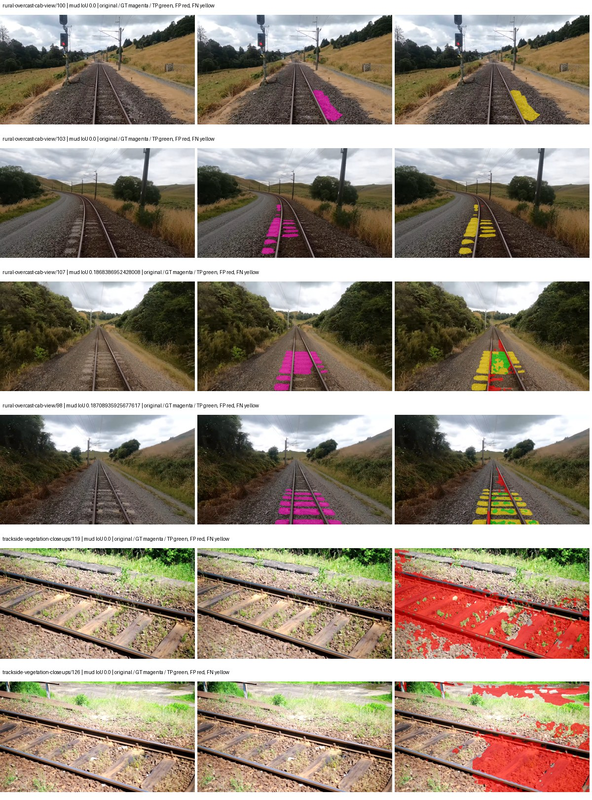
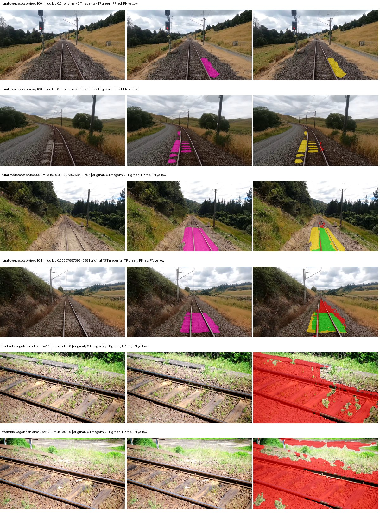
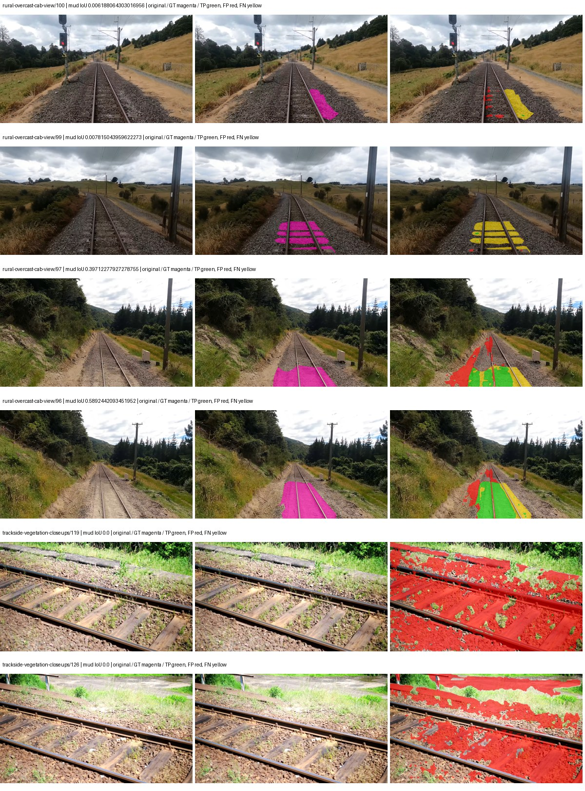
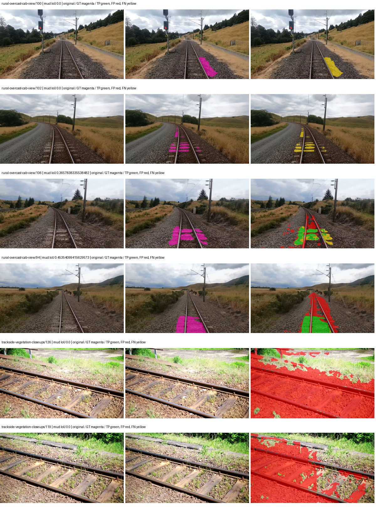

# hf_auto_beit_base_ade — paul-test-rtis_v2

[RTIS comparison](../../README.md) · [Full model records](record.json)

Primary selection and early stopping: **mud-pumping validation IoU**. A job is complete only after full statistics and isolated profiling are verified.

| Model | Initialization path | Seed | Status | Steps | Best step | Mud IoU (%) | Mud precision (%) | Mud recall (%) | Final mud IoU (trainer val, %) | mIoU (%) | Fixed GT-class mIoU (%) |
| --- | --- | --- | --- | --- | --- | --- | --- | --- | --- | --- | --- |
| hf_auto_beit_base_ade | rtis_only | 0 | completed | 3823 | 2549 | 2.52 | 3.43 | 8.68 | 1.62 | 26.88 | 29.86 |
| hf_auto_beit_base_ade | cityscapes_to_rtis | 0 | completed | 1529 | 254 | 6.27 | 6.59 | 55.96 | 1.72 | 18.11 | 19.12 |
| hf_auto_beit_base_ade | railsem19_to_rtis | 0 | completed | 1784 | 509 | 7.09 | 7.72 | 46.52 | 1.31 | 21.94 | 25.60 |
| hf_auto_beit_base_ade | cityscapes_to_railsem19_to_rtis | 0 | completed | 1529 | 254 | 3.06 | 3.47 | 20.47 | 1.14 | 20.52 | 21.66 |

Training: 205 images. Validation: 37 images. Test: 50 held out. Seeds: [0]. Seed variation measures optimization variability, not independent-recording uncertainty. Historical source checkpoints stay fixed across adaptation seeds.

Training code: `066afb2626398b7be59d4d19f5a0e4644fd59adc`. Split SHA-256: `18a84c0163a65ded46508bcc904c374e5f33ad8a09b8879e3c8add606e86aa9f`.

## rtis_only — seed 0

Status: **completed**. Started: 2026-09-09T17:21:37.284834+00:00. Finished: 2026-09-09T20:27:50.219786+00:00.

Recipe pretrained initializer: `microsoft/beit-base-finetuned-ade-640-640`.

`rtis_only` uses the recipe initializer, which may include pretrained segmentation components. Transfer paths load the exact historical source checkpoint below and reset the classifier; they do not reset all query/decoder features.

Source checkpoint: `Recipe pretrained initialization`.

Config SHA-256: `a4a82f88e939d1c6cc28518b4a3a277cf09fe2ccc477f759f09e2873f80a5566`. Weights used for validation: `raw`.

### Mud-pumping and aggregate quality

| Metric | Selected checkpoint | Final training validation |
| --- | --- | --- |
| Mud IoU | 2.52 | 1.62 |
| Mud precision | 3.43 | 1.99 |
| Mud recall | 8.68 | 8.13 |
| Mud Dice/F1 | 4.91 | 3.20 |
| mIoU | 26.88 | 29.59 |
| Mean accuracy | 37.52 | 41.97 |
| Mean precision | 49.50 | 54.65 |
| Mean Dice | 35.14 | 38.49 |
| Mean specificity | 98.78 | 98.78 |
| Pixel accuracy | 79.24 | 79.06 |
| Frequency-weighted IoU | 69.71 | 70.22 |
| Fixed GT-present class mIoU | 29.86 | 32.87 |
| Boundary F1 | 33.59 | 35.06 |

The selected checkpoint has independent evaluation evidence. Final values are the trainer's final validation record, not a new independent evaluation. mIoU averages classes with nonzero union, so false positives on absent classes can change its denominator. The fixed GT-class mean is supplementary and excludes absent classes; their false positives remain in the confusion matrix.

### Resource usage and timing

| Measurement | Value |
| --- | --- |
| Peak training VRAM, retained training invocation (GiB) | 15.36 |
| Peak evaluation VRAM (GiB) | 7.39 |
| Retained training invocation wall time (seconds) | 9008.13 |
| Retained training invocation GPU-hours (one GPU) | 2.50 |
| Evaluation wall time (seconds) | 120.18 |
| Full evaluation pipeline images/second | 0.31 |
| Best full-state checkpoint (MiB) | 2355.56 |
| Final full-state checkpoint (MiB) | 2355.55 |
| Verified periodic checkpoints removed (GiB) | 16.10 |

VRAM uses the recorded allocator high-water mark; it is not total device usage including CUDA context. Resumed jobs' retained training invocation times and peaks are **not whole-campaign totals**. Earlier invocation resource records are not reconstructed here. Evaluation throughput includes loader, sliding-window inference and metrics; it is not model-only latency/FPS. Missing measurements are shown as —, never inferred from another dataset's run.

### Standardized inference performance

Dedicated model-only profiling waits for an idle worker-locked L40S: BF16, batch 1, 1024x1024, 20 warmup and 100 CUDA-event-timed public forwards. It excludes loading, preprocessing, tiling and metrics.

| Status | Parameters | Weight MiB | FPS | p50 ms | p95 ms | Peak reserved GiB |
| --- | --- | --- | --- | --- | --- | --- |
| complete | 161500245 | 616.07 | 2.51 | 395.39 | 424.98 | 3.77 |

```json
{
  "schema_version": 1,
  "model_id": "hf_auto_beit_base_ade",
  "measured_at": "2026-09-09T20:27:26+00:00",
  "status": "complete",
  "benchmark_scope": "rtis_selected_checkpoint_model_only",
  "applies_to": [
    "hf_auto_beit_base_ade--rtis_only--seed-0"
  ],
  "source": {
    "campaign_git_sha": "066afb2626398b7be59d4d19f5a0e4644fd59adc",
    "git_dirty": false,
    "config_hash": "7c385d36148d",
    "resolved_config": "/data/izadia1/projects/segmentary-runs/paul-test-rtis_v2/seed0-20260909/configs/hf_auto_beit_base_ade--rtis_only--seed-0.yaml",
    "config_sha256": "a4a82f88e939d1c6cc28518b4a3a277cf09fe2ccc477f759f09e2873f80a5566",
    "checkpoint_sha256": "b03bcd7ef3d920b1c742d2b7f5f2be029660a697faa734c4dabae091f5ae15ae",
    "checkpoint_global_step": 2549,
    "checkpoint_bytes": 2469981637,
    "checkpoint_kind": "resume checkpoint with optimizer and EMA state",
    "weights": "raw",
    "measured_checkpoint_job_id": "hf_auto_beit_base_ade--rtis_only--seed-0",
    "result_sha256": "2804505f9bbb0ad58ab56a659a8f96a1f3e183233b944f443fa8d895b3ff5dba",
    "result_git_sha": "066afb2626398b7be59d4d19f5a0e4644fd59adc",
    "result_stage": "eval:paul-test-rtis:val",
    "result_seed": 0
  },
  "hardware": {
    "gpu_name": "NVIDIA L40S",
    "gpu_uuid": "GPU-e2e96741-aec9-e90b-5c46-d0d58be90a56",
    "logical_device": "cuda:0",
    "physical_visibility_token": "8",
    "compute_capability": [
      8,
      9
    ],
    "total_memory_bytes": 47677177856
  },
  "model": {
    "parameter_count": 161500245,
    "trainable_parameter_count": 147173109,
    "resident_parameter_bytes": 646000980,
    "parameter_dtype_counts": {
      "float32": 161500245
    }
  },
  "contract": {
    "backend": "pytorch",
    "precision": "bf16_autocast",
    "batch_size": 1,
    "input_shape_nchw": [
      1,
      3,
      1024,
      1024
    ],
    "warmup_iterations": 20,
    "measured_iterations": 100,
    "timing": "per-forward CUDA events with end-event synchronization",
    "includes_preprocessing": false,
    "includes_data_loader": false,
    "includes_sliding_window": false,
    "input_resident_on_gpu": true,
    "model_only": true,
    "entrypoint": "public model(image) dense-logits forward"
  },
  "measurements": {
    "latency": {
      "p50_ms": 395.3930206298828,
      "p95_ms": 424.98345947265625,
      "mean_ms": 397.9985501098633,
      "minimum_ms": 392.2104187011719,
      "maximum_ms": 436.5926513671875,
      "fps": 2.5125719672193796,
      "raw_ms": [
        392.5104675292969,
        392.4633483886719,
        393.596923828125,
        393.5672302246094,
        426.1877746582031,
        392.6251525878906,
        392.7593078613281,
        398.2233581542969,
        396.7559814453125,
        399.3169860839844,
        398.3841247558594,
        398.77734375,
        436.5926513671875,
        397.1246032714844,
        398.9114990234375,
        397.72979736328125,
        401.2984313964844,
        397.83935546875,
        397.0457458496094,
        392.5145263671875,
        392.9774169921875,
        397.5147399902344,
        432.84478759765625,
        397.1338195800781,
        395.357177734375,
        395.4657287597656,
        398.97393798828125,
        399.76141357421875,
        394.98956298828125,
        392.94976806640625,
        394.1683349609375,
        399.53509521484375,
        400.2662353515625,
        402.0336608886719,
        404.6090087890625,
        406.4266357421875,
        433.2287902832031,
        399.82489013671875,
        399.98052978515625,
        396.0022888183594,
        394.0904846191406,
        394.07513427734375,
        397.0426940917969,
        394.5789489746094,
        393.8488464355469,
        394.6516418457031,
        393.2405700683594,
        395.64801025390625,
        398.2520446777344,
        395.0008239746094,
        399.6416015625,
        396.19073486328125,
        395.2496643066406,
        424.9200744628906,
        392.5340270996094,
        392.86273193359375,
        393.5672302246094,
        392.6886291503906,
        392.69580078125,
        399.4869689941406,
        393.3327331542969,
        392.6528015136719,
        393.13818359375,
        393.31121826171875,
        393.5201416015625,
        392.2104187011719,
        394.7765808105469,
        395.8046569824219,
        397.9888610839844,
        404.5823669433594,
        398.99853515625,
        396.5327453613281,
        393.4515075683594,
        395.4288635253906,
        397.2618103027344,
        393.6491394042969,
        426.48883056640625,
        393.67987060546875,
        393.2446594238281,
        394.1693420410156,
        393.28564453125,
        397.8659973144531,
        395.5906677246094,
        397.75640869140625,
        392.9661560058594,
        394.113037109375,
        393.0982360839844,
        393.8836364746094,
        394.1099548339844,
        393.3522033691406,
        394.7110290527344,
        393.43719482421875,
        393.6593933105469,
        393.533447265625,
        395.082763671875,
        394.4212341308594,
        395.725830078125,
        400.14337158203125,
        400.0133056640625,
        400.3471374511719
      ],
      "percentile_method": "numpy linear interpolation"
    },
    "peak_reserved_bytes": 4049600512,
    "memory_kind": "pytorch_cuda_allocator_peak_reserved_excluding_context",
    "benchmark_wall_clock_s": 54.10029997676611
  },
  "started_at": "2026-09-09T20:26:31+00:00",
  "finished_at": "2026-09-09T20:27:26+00:00",
  "environment": {
    "hostname": "hdrfs-app-001",
    "python": "3.11.15",
    "platform": "Linux-5.15.0-139-generic-x86_64-with-glibc2.35",
    "torch": "2.11.0+cu128",
    "torch_cuda": "12.8",
    "cudnn": 91900,
    "driver_version": "570.133.20",
    "cuda_available": true,
    "gpu_count": 1,
    "gpu_names": [
      "NVIDIA L40S"
    ],
    "cuda_visible_devices": "8",
    "packages": {
      "segmentary": "0.1.0",
      "torch": "2.11.0+cu128",
      "torchvision": "0.26.0+cu128",
      "transformers": "5.15.0",
      "timm": "1.0.28",
      "segmentation-models-pytorch": "0.5.0",
      "albumentations": "2.0.8",
      "lightning": "2.6.5",
      "numpy": "2.4.4"
    }
  }
}
```

### Per-class validation results

| Class | GT pixels | IoU (%) | Precision (%) | Recall (%) | Dice (%) | Boundary F1 (%) |
| --- | --- | --- | --- | --- | --- | --- |
| car | 29664 | 47.86 | 89.77 | 50.62 | 64.74 | 30.80 |
| construction | 311585 | 35.67 | 38.39 | 83.45 | 52.59 | 46.74 |
| fence | 265137 | 0.67 | 37.88 | 0.68 | 1.34 | 4.64 |
| mud-pumping | 1226250 | 2.52 | 3.43 | 8.68 | 4.91 | 11.79 |
| on-rails | 0 | 0.00 | 0.00 | — | 0.00 | 0.00 |
| person | 0 | 0.00 | 0.00 | — | 0.00 | 0.00 |
| pole | 628038 | 55.37 | 83.58 | 62.13 | 71.28 | 84.81 |
| rail-embedded | 16799 | 0.00 | 0.00 | 0.00 | 0.00 | 0.00 |
| rail-raised | 2969797 | 28.12 | 97.82 | 28.30 | 43.90 | 70.68 |
| rail-track | 6323197 | 6.22 | 70.45 | 6.39 | 11.72 | 14.31 |
| road | 1048831 | 8.61 | 27.74 | 11.10 | 15.85 | 13.46 |
| sidewalk | 1297367 | 29.01 | 57.75 | 36.82 | 44.97 | 11.89 |
| sky | 19121606 | 98.20 | 98.75 | 99.44 | 99.09 | 94.77 |
| standing-water | 95802 | 0.96 | 1.71 | 2.14 | 1.90 | 4.46 |
| terrain | 39239306 | 88.25 | 91.34 | 96.31 | 93.76 | 65.60 |
| trackbed | 10643081 | 46.46 | 49.05 | 89.81 | 63.45 | 52.51 |
| traffic-light | 19510 | 47.13 | 76.62 | 55.05 | 64.07 | 65.98 |
| traffic-sign | 13285 | 14.96 | 79.82 | 15.54 | 26.02 | 39.98 |
| tram-track | 56179 | 0.00 | 0.00 | 0.00 | 0.00 | 0.00 |
| truck | 0 | — | — | — | — | — |
| vegetation-overgrowth | 5901821 | 27.50 | 85.87 | 28.81 | 43.14 | 59.47 |

### Full-run accounting

| Measurement | Value |
| --- | --- |
| Full GPU-reserved wall seconds, all recorded worker attempts | 11155.36 |
| Full reserved GPU-hours | 3.10 |
| Whole-run timing complete | True |

| Phase | Wall seconds including failed attempts |
| --- | --- |
| training | 9015.20 |
| diagnostics | 1916.32 |
| performance | 65.71 |

GPU-reserved time includes model loading, training, validation, collection, profiling, checkpoint I/O and orchestration while the worker owns one GPU. It is not GPU kernel-active time. Phase timings and sampled device memory/power/utilization are retained separately; sampled device memory is not the allocator high-water mark.

### Train/validation and raw/EMA diagnostics

| Checkpoint / weights / split | Images | Mud IoU (%) | Mud precision (%) | Mud recall (%) |
| --- | --- | --- | --- | --- |
| best-auto-train / raw | 205 | 80.83 | 82.86 | 97.06 |
| best-auto-val / raw | 37 | 2.52 | 3.43 | 8.68 |
| best-alternate-val / ema | 37 | 1.69 | 2.11 | 7.74 |
| final-auto-val / raw | 37 | 1.63 | 1.99 | 8.17 |

Train uses the evaluation transform without augmentation. Compare mud train/validation metrics for the same selected weights. Alternate EMA on running-stat BatchNorm is explicitly uncalibrated and is diagnostic only. Score-threshold curves use uncalibrated normalized scores and are pixel-level diagnostics, not event detection rates or a selected deployment operating point.

### Downloadable evidence

- best-auto-train: [per-image.csv](rtis_only--seed-0/best-auto-train/per-image.csv) · [per-image-confusion.json.gz](rtis_only--seed-0/best-auto-train/per-image-confusion.json.gz) · [groups.json](rtis_only--seed-0/best-auto-train/groups.json) · [mud-score-curves.json](rtis_only--seed-0/best-auto-train/mud-score-curves.json)
- best-auto-val: [per-image.csv](rtis_only--seed-0/best-auto-val/per-image.csv) · [per-image-confusion.json.gz](rtis_only--seed-0/best-auto-val/per-image-confusion.json.gz) · [groups.json](rtis_only--seed-0/best-auto-val/groups.json) · [mud-score-curves.json](rtis_only--seed-0/best-auto-val/mud-score-curves.json) · [examples.jpg](rtis_only--seed-0/best-auto-val/examples.jpg)
- best-alternate-val: [per-image.csv](rtis_only--seed-0/best-alternate-val/per-image.csv) · [per-image-confusion.json.gz](rtis_only--seed-0/best-alternate-val/per-image-confusion.json.gz) · [groups.json](rtis_only--seed-0/best-alternate-val/groups.json) · [mud-score-curves.json](rtis_only--seed-0/best-alternate-val/mud-score-curves.json)
- final-auto-val: [per-image.csv](rtis_only--seed-0/final-auto-val/per-image.csv) · [per-image-confusion.json.gz](rtis_only--seed-0/final-auto-val/per-image-confusion.json.gz) · [groups.json](rtis_only--seed-0/final-auto-val/groups.json) · [mud-score-curves.json](rtis_only--seed-0/final-auto-val/mud-score-curves.json)
- resources: [telemetry.csv](rtis_only--seed-0/resources/telemetry.csv)



Examples are two lowest and two highest mud-IoU positive images, plus up to two negative images with the most false-positive mud pixels. They are targeted diagnostic examples, not random samples. Green: true positive; red: false positive; yellow: false negative. Full predictions remain on HDRFS.

### Validation tracking

| Logged step | Overall mIoU (%) | Mud IoU (%) |
| --- | --- | --- |
| 254 | 17.48 | 0.23 |
| 509 | 21.96 | 0.00 |
| 764 | 24.46 | 0.24 |
| 1019 | 26.61 | 0.55 |
| 1274 | 24.85 | 0.53 |
| 1529 | 27.96 | 0.80 |
| 1784 | 25.26 | 0.78 |
| 2038 | 28.55 | 0.13 |
| 2293 | 28.27 | 0.08 |
| 2548 | 26.88 | 2.51 |
| 2803 | 28.30 | 0.52 |
| 3058 | 27.80 | 0.65 |
| 3313 | 27.33 | 1.07 |
| 3568 | 27.76 | 1.33 |
| 3823 | 29.59 | 1.62 |

All retained scalar curves, including training loss and per-class IoU, are in record.json. Observed best mud on a curve is not necessarily a retained checkpoint: the pilot saved its selection-metric-best and final checkpoints. Step logging and checkpoint global_step may differ by one.

### Stopping and checkpoint provenance

```json
{
  "stopping": {
    "actual_steps": 3823,
    "maximum_steps": 4000,
    "min_delta": 0.001,
    "monitor": "val_iou/mud-pumping",
    "patience": 5,
    "reason": "validation_plateau"
  },
  "checkpoints": {
    "best": {
      "path": "/data/izadia1/projects/segmentary-runs/paul-test-rtis_v2/seed0-20260909/future-runs/hf_auto_beit_base_ade--rtis_only--seed-0_seed0/rtis/best.ckpt",
      "sha256": "b03bcd7ef3d920b1c742d2b7f5f2be029660a697faa734c4dabae091f5ae15ae",
      "global_step": 2549,
      "bytes": 2469981637
    },
    "final": {
      "path": "/data/izadia1/projects/segmentary-runs/paul-test-rtis_v2/seed0-20260909/future-runs/hf_auto_beit_base_ade--rtis_only--seed-0_seed0/rtis/last.ckpt",
      "sha256": "cf845c603d545174c69f1ece4d5dd9f545040afb0e839e496b9b0d4137a80ed5",
      "global_step": 3823,
      "bytes": 2469969477
    }
  },
  "cleanup_error": null
}
```

### Resolved training, initialization and evaluation settings

The optimizer block is the base configuration. Stage LR scales are applied at runtime, and stage warmup is capped at min(base warmup, floor(stage budget / 10), stage budget - 1): 400 steps for this 4,000-step pilot. Model-internal native input grids may differ from augmentation crops (EoMT uses its 640 grid).

```json
{
  "name": "hf_auto_beit_base_ade--rtis_only--seed-0",
  "model": {
    "arch": "hf_auto",
    "checkpoint": "microsoft/beit-base-finetuned-ade-640-640",
    "tuning": "full",
    "head": "unified_head",
    "lora_r": 16,
    "lora_alpha": 32,
    "lora_dropout": 0.05,
    "lora_targets": [],
    "drop_path": null,
    "revision": "a8b6f5ef4acb2ea55d882989deaa02d39401e2b2",
    "subfolder": null,
    "local_files_only": false,
    "trust_remote_code": false,
    "backbone_path": null,
    "head_paths": [],
    "classifier_path": null,
    "inactive_parameter_paths": [
      "beit.layers.10",
      "beit.layers.11"
    ],
    "smp_arch": null,
    "encoder_name": null,
    "encoder_weights": null,
    "native": null,
    "batch_norm_momentum": null
  },
  "space": "paul-test-rtis",
  "taxonomy_root": "/data/izadia1/projects/segmentary-rtis-fullstats-066afb2/taxonomy",
  "output_root": "/data/izadia1/projects/segmentary-runs/paul-test-rtis_v2/seed0-20260909/future-runs",
  "optim": {
    "backbone_lr": 2e-05,
    "head_lr_mult": 10.0,
    "weight_decay": 0.05,
    "llrd": 0.8,
    "warmup_iters": 1500,
    "warmup_ratio": 1e-06,
    "poly_power": 0.9,
    "min_lr_ratio": 0.0,
    "betas": [
      0.9,
      0.999
    ],
    "grad_clip": 1.0
  },
  "train": {
    "iters": 4000,
    "batch_size": 2,
    "accum": 8,
    "num_workers": 2,
    "precision": "bf16-mixed",
    "ema_decay": 0.9998,
    "val_every": 250,
    "ckpt_every": 500,
    "selection_metric": "val_iou/mud-pumping",
    "early_stopping_patience": 5,
    "early_stopping_min_delta": 0.001,
    "seed": 0,
    "devices": 1
  },
  "eval": {
    "sliding_window": true,
    "window": [
      1024,
      1024
    ],
    "stride": [
      768,
      768
    ],
    "batch_size": 1,
    "num_workers": 2,
    "tta_scales": [],
    "tta_flip": false,
    "threshold": 0.5,
    "boundary_tolerance_frac": 0.0075,
    "save_confusion": true
  },
  "loss": {
    "task": "multiclass",
    "activation": "auto",
    "terms": [],
    "aux": "none",
    "aux_weight": 0.0,
    "ce_weight": 1.0,
    "label_smoothing": 0.0,
    "class_weights": null,
    "query": null
  },
  "aug": {
    "crop": [
      640,
      640
    ],
    "scale_min": 0.5,
    "scale_max": 2.0,
    "hflip_p": 0.5,
    "color_jitter_p": 0.5,
    "brightness": 0.25,
    "contrast": 0.25,
    "saturation": 0.25,
    "hue": 0.05
  },
  "stages": [
    {
      "name": "rtis",
      "data": [
        {
          "name": "paul-test-rtis",
          "root": "/data/izadia1/datasets/paul-test-rtis_v2",
          "variant": null,
          "split_file": "splits.json",
          "train_split": "train",
          "val_split": "val",
          "limit": null,
          "loader": "folder",
          "mapping": "paul-test-rtis",
          "loader_options": {
            "require_groups": true
          }
        }
      ],
      "iters": null,
      "lr_scale": 1.0,
      "head_group_lr_scale": 1.0,
      "init_from": "pretrained",
      "reset_head": false,
      "freeze": null,
      "sample_weights": null
    }
  ]
}
```

### Hardware and software provenance

```json
{
  "training": {
    "cuda_available": true,
    "cuda_visible_devices": "8",
    "cudnn": 91900,
    "driver_version": "570.133.20",
    "gpu_count": 1,
    "gpu_names": [
      "NVIDIA L40S"
    ],
    "hostname": "hdrfs-app-001",
    "input_normalization": {
      "channel_order": "rgb",
      "mean": [
        0.5,
        0.5,
        0.5
      ],
      "source": "hf_image_processor",
      "std": [
        0.5,
        0.5,
        0.5
      ]
    },
    "model_origins": [
      {
        "hf_commit": "a8b6f5ef4acb2ea55d882989deaa02d39401e2b2",
        "hf_name_or_path": "microsoft/beit-base-finetuned-ade-640-640",
        "module": "model",
        "timm_pretrained": {}
      },
      {
        "hf_commit": "a8b6f5ef4acb2ea55d882989deaa02d39401e2b2",
        "hf_name_or_path": "microsoft/beit-base-finetuned-ade-640-640",
        "module": "model.beit",
        "timm_pretrained": {}
      },
      {
        "hf_commit": "a8b6f5ef4acb2ea55d882989deaa02d39401e2b2",
        "hf_name_or_path": "microsoft/beit-base-finetuned-ade-640-640",
        "module": "model.beit.layers.0.attention",
        "timm_pretrained": {}
      },
      {
        "hf_commit": "a8b6f5ef4acb2ea55d882989deaa02d39401e2b2",
        "hf_name_or_path": "microsoft/beit-base-finetuned-ade-640-640",
        "module": "model.beit.layers.0.mlp",
        "timm_pretrained": {}
      },
      {
        "hf_commit": "a8b6f5ef4acb2ea55d882989deaa02d39401e2b2",
        "hf_name_or_path": "microsoft/beit-base-finetuned-ade-640-640",
        "module": "model.beit.layers.1.attention",
        "timm_pretrained": {}
      },
      {
        "hf_commit": "a8b6f5ef4acb2ea55d882989deaa02d39401e2b2",
        "hf_name_or_path": "microsoft/beit-base-finetuned-ade-640-640",
        "module": "model.beit.layers.1.mlp",
        "timm_pretrained": {}
      },
      {
        "hf_commit": "a8b6f5ef4acb2ea55d882989deaa02d39401e2b2",
        "hf_name_or_path": "microsoft/beit-base-finetuned-ade-640-640",
        "module": "model.beit.layers.2.attention",
        "timm_pretrained": {}
      },
      {
        "hf_commit": "a8b6f5ef4acb2ea55d882989deaa02d39401e2b2",
        "hf_name_or_path": "microsoft/beit-base-finetuned-ade-640-640",
        "module": "model.beit.layers.2.mlp",
        "timm_pretrained": {}
      },
      {
        "hf_commit": "a8b6f5ef4acb2ea55d882989deaa02d39401e2b2",
        "hf_name_or_path": "microsoft/beit-base-finetuned-ade-640-640",
        "module": "model.beit.layers.3.attention",
        "timm_pretrained": {}
      },
      {
        "hf_commit": "a8b6f5ef4acb2ea55d882989deaa02d39401e2b2",
        "hf_name_or_path": "microsoft/beit-base-finetuned-ade-640-640",
        "module": "model.beit.layers.3.mlp",
        "timm_pretrained": {}
      },
      {
        "hf_commit": "a8b6f5ef4acb2ea55d882989deaa02d39401e2b2",
        "hf_name_or_path": "microsoft/beit-base-finetuned-ade-640-640",
        "module": "model.beit.layers.4.attention",
        "timm_pretrained": {}
      },
      {
        "hf_commit": "a8b6f5ef4acb2ea55d882989deaa02d39401e2b2",
        "hf_name_or_path": "microsoft/beit-base-finetuned-ade-640-640",
        "module": "model.beit.layers.4.mlp",
        "timm_pretrained": {}
      },
      {
        "hf_commit": "a8b6f5ef4acb2ea55d882989deaa02d39401e2b2",
        "hf_name_or_path": "microsoft/beit-base-finetuned-ade-640-640",
        "module": "model.beit.layers.5.attention",
        "timm_pretrained": {}
      },
      {
        "hf_commit": "a8b6f5ef4acb2ea55d882989deaa02d39401e2b2",
        "hf_name_or_path": "microsoft/beit-base-finetuned-ade-640-640",
        "module": "model.beit.layers.5.mlp",
        "timm_pretrained": {}
      },
      {
        "hf_commit": "a8b6f5ef4acb2ea55d882989deaa02d39401e2b2",
        "hf_name_or_path": "microsoft/beit-base-finetuned-ade-640-640",
        "module": "model.beit.layers.6.attention",
        "timm_pretrained": {}
      },
      {
        "hf_commit": "a8b6f5ef4acb2ea55d882989deaa02d39401e2b2",
        "hf_name_or_path": "microsoft/beit-base-finetuned-ade-640-640",
        "module": "model.beit.layers.6.mlp",
        "timm_pretrained": {}
      },
      {
        "hf_commit": "a8b6f5ef4acb2ea55d882989deaa02d39401e2b2",
        "hf_name_or_path": "microsoft/beit-base-finetuned-ade-640-640",
        "module": "model.beit.layers.7.attention",
        "timm_pretrained": {}
      },
      {
        "hf_commit": "a8b6f5ef4acb2ea55d882989deaa02d39401e2b2",
        "hf_name_or_path": "microsoft/beit-base-finetuned-ade-640-640",
        "module": "model.beit.layers.7.mlp",
        "timm_pretrained": {}
      },
      {
        "hf_commit": "a8b6f5ef4acb2ea55d882989deaa02d39401e2b2",
        "hf_name_or_path": "microsoft/beit-base-finetuned-ade-640-640",
        "module": "model.beit.layers.8.attention",
        "timm_pretrained": {}
      },
      {
        "hf_commit": "a8b6f5ef4acb2ea55d882989deaa02d39401e2b2",
        "hf_name_or_path": "microsoft/beit-base-finetuned-ade-640-640",
        "module": "model.beit.layers.8.mlp",
        "timm_pretrained": {}
      },
      {
        "hf_commit": "a8b6f5ef4acb2ea55d882989deaa02d39401e2b2",
        "hf_name_or_path": "microsoft/beit-base-finetuned-ade-640-640",
        "module": "model.beit.layers.9.attention",
        "timm_pretrained": {}
      },
      {
        "hf_commit": "a8b6f5ef4acb2ea55d882989deaa02d39401e2b2",
        "hf_name_or_path": "microsoft/beit-base-finetuned-ade-640-640",
        "module": "model.beit.layers.9.mlp",
        "timm_pretrained": {}
      },
      {
        "hf_commit": "a8b6f5ef4acb2ea55d882989deaa02d39401e2b2",
        "hf_name_or_path": "microsoft/beit-base-finetuned-ade-640-640",
        "module": "model.beit.layers.10.attention",
        "timm_pretrained": {}
      },
      {
        "hf_commit": "a8b6f5ef4acb2ea55d882989deaa02d39401e2b2",
        "hf_name_or_path": "microsoft/beit-base-finetuned-ade-640-640",
        "module": "model.beit.layers.10.mlp",
        "timm_pretrained": {}
      },
      {
        "hf_commit": "a8b6f5ef4acb2ea55d882989deaa02d39401e2b2",
        "hf_name_or_path": "microsoft/beit-base-finetuned-ade-640-640",
        "module": "model.beit.layers.11.attention",
        "timm_pretrained": {}
      },
      {
        "hf_commit": "a8b6f5ef4acb2ea55d882989deaa02d39401e2b2",
        "hf_name_or_path": "microsoft/beit-base-finetuned-ade-640-640",
        "module": "model.beit.layers.11.mlp",
        "timm_pretrained": {}
      }
    ],
    "model_parameter_count": 161500245,
    "packages": {
      "albumentations": "2.0.8",
      "lightning": "2.6.5",
      "numpy": "2.4.4",
      "segmentary": "0.1.0",
      "segmentation-models-pytorch": "0.5.0",
      "timm": "1.0.28",
      "torch": "2.11.0+cu128",
      "torchvision": "0.26.0+cu128",
      "transformers": "5.15.0"
    },
    "platform": "Linux-5.15.0-139-generic-x86_64-with-glibc2.35",
    "python": "3.11.15",
    "torch": "2.11.0+cu128",
    "torch_cuda": "12.8",
    "trainable_parameter_count": 147173109,
    "training_stop": {
      "actual_steps": 3823,
      "maximum_steps": 4000,
      "min_delta": 0.001,
      "monitor": "val_iou/mud-pumping",
      "patience": 5,
      "reason": "validation_plateau"
    },
    "validation_weights": "raw"
  },
  "evaluation": {
    "cuda_available": true,
    "cuda_visible_devices": "8",
    "cudnn": 91900,
    "driver_version": "570.133.20",
    "gpu_count": 1,
    "gpu_names": [
      "NVIDIA L40S"
    ],
    "hostname": "hdrfs-app-001",
    "input_normalization": {
      "channel_order": "rgb",
      "mean": [
        0.5,
        0.5,
        0.5
      ],
      "source": "hf_image_processor",
      "std": [
        0.5,
        0.5,
        0.5
      ]
    },
    "packages": {
      "albumentations": "2.0.8",
      "lightning": "2.6.5",
      "numpy": "2.4.4",
      "segmentary": "0.1.0",
      "segmentation-models-pytorch": "0.5.0",
      "timm": "1.0.28",
      "torch": "2.11.0+cu128",
      "torchvision": "0.26.0+cu128",
      "transformers": "5.15.0"
    },
    "platform": "Linux-5.15.0-139-generic-x86_64-with-glibc2.35",
    "python": "3.11.15",
    "torch": "2.11.0+cu128",
    "torch_cuda": "12.8"
  }
}
```

## cityscapes_to_rtis — seed 0

Status: **completed**. Started: 2026-09-09T17:21:39.057466+00:00. Finished: 2026-09-09T19:04:56.932682+00:00.

Recipe pretrained initializer: `microsoft/beit-base-finetuned-ade-640-640`.

`rtis_only` uses the recipe initializer, which may include pretrained segmentation components. Transfer paths load the exact historical source checkpoint below and reset the classifier; they do not reset all query/decoder features.

Source checkpoint: `{'name': 'hf_auto_beit_base_ade--cityscapes--seed-0', 'model': 'hf_auto_beit_base_ade', 'protocol': 'cityscapes', 'config': '/data/izadia1/projects/segmentary-runs/all-model-city-rail-seed0-rail20-b9eb3e1/accepted/hf_auto_beit_base_ade--cityscapes--seed-0/resolved-config.yaml', 'checkpoint': '/data/izadia1/projects/segmentary-runs/all-model-city-rail-seed0-a7c0b67/jobs/hf_auto_beit_base_ade--cityscapes--seed-0/attempt-001/train/hf_auto_beit_base_ade--cityscapes_seed0/cityscapes/last.ckpt', 'recorded_sha256': '0a7ecfaf15bb3636cd8873013bef29fa31037c57fb25731b6757caf0e9a42008', 'exists': True}`.

Config SHA-256: `59f37dfb56ede61a9edfe106c3ae6a8ba976c596432f66abf8502b61ca039f1a`. Weights used for validation: `raw`.

### Mud-pumping and aggregate quality

| Metric | Selected checkpoint | Final training validation |
| --- | --- | --- |
| Mud IoU | 6.27 | 1.72 |
| Mud precision | 6.59 | 1.99 |
| Mud recall | 55.96 | 11.24 |
| Mud Dice/F1 | 11.79 | 3.39 |
| mIoU | 18.11 | 28.47 |
| Mean accuracy | 24.46 | 40.95 |
| Mean precision | 44.61 | 48.00 |
| Mean Dice | 23.36 | 36.48 |
| Mean specificity | 98.18 | 98.78 |
| Pixel accuracy | 72.09 | 78.15 |
| Frequency-weighted IoU | 60.77 | 70.61 |
| Fixed GT-present class mIoU | 19.12 | 33.21 |
| Boundary F1 | 19.79 | 35.50 |

The selected checkpoint has independent evaluation evidence. Final values are the trainer's final validation record, not a new independent evaluation. mIoU averages classes with nonzero union, so false positives on absent classes can change its denominator. The fixed GT-class mean is supplementary and excludes absent classes; their false positives remain in the confusion matrix.

### Resource usage and timing

| Measurement | Value |
| --- | --- |
| Peak training VRAM, retained training invocation (GiB) | 15.36 |
| Peak evaluation VRAM (GiB) | 7.39 |
| Retained training invocation wall time (seconds) | 3629.22 |
| Retained training invocation GPU-hours (one GPU) | 1.01 |
| Evaluation wall time (seconds) | 120.44 |
| Full evaluation pipeline images/second | 0.31 |
| Best full-state checkpoint (MiB) | 2355.56 |
| Final full-state checkpoint (MiB) | 2355.55 |
| Verified periodic checkpoints removed (GiB) | 6.90 |

VRAM uses the recorded allocator high-water mark; it is not total device usage including CUDA context. Resumed jobs' retained training invocation times and peaks are **not whole-campaign totals**. Earlier invocation resource records are not reconstructed here. Evaluation throughput includes loader, sliding-window inference and metrics; it is not model-only latency/FPS. Missing measurements are shown as —, never inferred from another dataset's run.

### Standardized inference performance

Dedicated model-only profiling waits for an idle worker-locked L40S: BF16, batch 1, 1024x1024, 20 warmup and 100 CUDA-event-timed public forwards. It excludes loading, preprocessing, tiling and metrics.

| Status | Parameters | Weight MiB | FPS | p50 ms | p95 ms | Peak reserved GiB |
| --- | --- | --- | --- | --- | --- | --- |
| complete | 161500245 | 616.07 | 2.51 | 395.73 | 405.21 | 3.77 |

```json
{
  "schema_version": 1,
  "model_id": "hf_auto_beit_base_ade",
  "measured_at": "2026-09-09T19:04:42+00:00",
  "status": "complete",
  "benchmark_scope": "rtis_selected_checkpoint_model_only",
  "applies_to": [
    "hf_auto_beit_base_ade--cityscapes_to_rtis--seed-0"
  ],
  "source": {
    "campaign_git_sha": "066afb2626398b7be59d4d19f5a0e4644fd59adc",
    "git_dirty": false,
    "config_hash": "d5f939ca48b2",
    "resolved_config": "/data/izadia1/projects/segmentary-runs/paul-test-rtis_v2/seed0-20260909/configs/hf_auto_beit_base_ade--cityscapes_to_rtis--seed-0.yaml",
    "config_sha256": "59f37dfb56ede61a9edfe106c3ae6a8ba976c596432f66abf8502b61ca039f1a",
    "checkpoint_sha256": "0308330c8309a2b2368e5bbd2ec3430fae9eebfc60ac31f6a863bc437e3746c1",
    "checkpoint_global_step": 254,
    "checkpoint_bytes": 2469981509,
    "checkpoint_kind": "resume checkpoint with optimizer and EMA state",
    "weights": "raw",
    "measured_checkpoint_job_id": "hf_auto_beit_base_ade--cityscapes_to_rtis--seed-0",
    "result_sha256": "788990f6a07569a8e7ad38e741067bdb7b5d7d7b0b36f230ba40dc9d0283d656",
    "result_git_sha": "066afb2626398b7be59d4d19f5a0e4644fd59adc",
    "result_stage": "eval:paul-test-rtis:val",
    "result_seed": 0
  },
  "hardware": {
    "gpu_name": "NVIDIA L40S",
    "gpu_uuid": "GPU-1c9b612f-e0b5-fbbc-150f-8c2ef13453c9",
    "logical_device": "cuda:0",
    "physical_visibility_token": "5",
    "compute_capability": [
      8,
      9
    ],
    "total_memory_bytes": 47677177856
  },
  "model": {
    "parameter_count": 161500245,
    "trainable_parameter_count": 147173109,
    "resident_parameter_bytes": 646000980,
    "parameter_dtype_counts": {
      "float32": 161500245
    }
  },
  "contract": {
    "backend": "pytorch",
    "precision": "bf16_autocast",
    "batch_size": 1,
    "input_shape_nchw": [
      1,
      3,
      1024,
      1024
    ],
    "warmup_iterations": 20,
    "measured_iterations": 100,
    "timing": "per-forward CUDA events with end-event synchronization",
    "includes_preprocessing": false,
    "includes_data_loader": false,
    "includes_sliding_window": false,
    "input_resident_on_gpu": true,
    "model_only": true,
    "entrypoint": "public model(image) dense-logits forward"
  },
  "measurements": {
    "latency": {
      "p50_ms": 395.73350524902344,
      "p95_ms": 405.20960540771483,
      "mean_ms": 397.84483917236327,
      "minimum_ms": 392.18994140625,
      "maximum_ms": 435.44677734375,
      "fps": 2.513542722032791,
      "raw_ms": [
        409.5733642578125,
        404.37554931640625,
        435.44677734375,
        405.1138610839844,
        400.5140380859375,
        399.2647705078125,
        403.3403015136719,
        403.4068603515625,
        402.51800537109375,
        403.6792297363281,
        403.409912109375,
        407.02874755859375,
        404.20556640625,
        401.786865234375,
        400.3000183105469,
        396.58087158203125,
        395.9388122558594,
        397.022216796875,
        397.0652160644531,
        395.7125244140625,
        397.4563903808594,
        399.2811584472656,
        396.2367858886719,
        395.7227478027344,
        394.2533264160156,
        394.3577575683594,
        396.36376953125,
        429.7103271484375,
        395.47698974609375,
        395.3387451171875,
        396.5296630859375,
        392.9456787109375,
        392.7040100097656,
        395.65106201171875,
        395.2701416015625,
        394.1888122558594,
        398.40869140625,
        395.683837890625,
        396.4375,
        395.7237854003906,
        395.39508056640625,
        393.5528869628906,
        396.8112487792969,
        398.266357421875,
        398.9186706542969,
        401.1990966796875,
        398.74560546875,
        399.3415832519531,
        398.2756042480469,
        403.19384765625,
        399.8730163574219,
        403.2942199707031,
        396.6187438964844,
        393.3460388183594,
        393.10540771484375,
        393.16070556640625,
        395.82208251953125,
        393.2723083496094,
        392.8647766113281,
        424.72857666015625,
        393.4341125488281,
        396.5010070800781,
        393.4197692871094,
        393.71063232421875,
        393.702392578125,
        394.8308410644531,
        395.29779052734375,
        399.6231689453125,
        397.380615234375,
        396.1026611328125,
        394.09765625,
        394.3813171386719,
        395.0325622558594,
        394.0863952636719,
        394.3761901855469,
        395.0458984375,
        395.1697692871094,
        395.0458984375,
        394.22259521484375,
        394.95782470703125,
        395.74322509765625,
        395.0223388671875,
        393.3972473144531,
        394.44683837890625,
        397.0079345703125,
        394.82061767578125,
        392.7244873046875,
        399.2494201660156,
        399.71533203125,
        397.5413818359375,
        395.52203369140625,
        395.1155090332031,
        393.4208068847656,
        396.0688781738281,
        393.6726989746094,
        392.18994140625,
        392.6200256347656,
        393.6993408203125,
        394.7294616699219,
        393.5467529296875
      ],
      "percentile_method": "numpy linear interpolation"
    },
    "peak_reserved_bytes": 4049600512,
    "memory_kind": "pytorch_cuda_allocator_peak_reserved_excluding_context",
    "benchmark_wall_clock_s": 53.932363115251064
  },
  "started_at": "2026-09-09T19:03:48+00:00",
  "finished_at": "2026-09-09T19:04:42+00:00",
  "environment": {
    "hostname": "hdrfs-app-001",
    "python": "3.11.15",
    "platform": "Linux-5.15.0-139-generic-x86_64-with-glibc2.35",
    "torch": "2.11.0+cu128",
    "torch_cuda": "12.8",
    "cudnn": 91900,
    "driver_version": "570.133.20",
    "cuda_available": true,
    "gpu_count": 1,
    "gpu_names": [
      "NVIDIA L40S"
    ],
    "cuda_visible_devices": "5",
    "packages": {
      "segmentary": "0.1.0",
      "torch": "2.11.0+cu128",
      "torchvision": "0.26.0+cu128",
      "transformers": "5.15.0",
      "timm": "1.0.28",
      "segmentation-models-pytorch": "0.5.0",
      "albumentations": "2.0.8",
      "lightning": "2.6.5",
      "numpy": "2.4.4"
    }
  }
}
```

### Per-class validation results

| Class | GT pixels | IoU (%) | Precision (%) | Recall (%) | Dice (%) | Boundary F1 (%) |
| --- | --- | --- | --- | --- | --- | --- |
| car | 29664 | 0.00 | 0.00 | 0.00 | 0.00 | 0.00 |
| construction | 311585 | 48.00 | 74.13 | 57.66 | 64.86 | 57.77 |
| fence | 265137 | 0.18 | 75.76 | 0.18 | 0.36 | 1.00 |
| mud-pumping | 1226250 | 6.27 | 6.59 | 55.96 | 11.79 | 15.24 |
| on-rails | 0 | 0.00 | 0.00 | — | 0.00 | 0.00 |
| person | 0 | — | — | — | — | — |
| pole | 628038 | 42.16 | 81.36 | 46.66 | 59.31 | 59.86 |
| rail-embedded | 16799 | 0.00 | 0.00 | 0.00 | 0.00 | 0.00 |
| rail-raised | 2969797 | 10.99 | 96.38 | 11.04 | 19.81 | 36.79 |
| rail-track | 6323197 | 12.97 | 87.57 | 13.22 | 22.97 | 16.29 |
| road | 1048831 | 3.98 | 10.12 | 6.16 | 7.66 | 12.82 |
| sidewalk | 1297367 | 12.92 | 86.52 | 13.18 | 22.88 | 5.72 |
| sky | 19121606 | 97.83 | 99.29 | 98.52 | 98.90 | 93.23 |
| standing-water | 95802 | 0.02 | 0.02 | 0.20 | 0.04 | 0.68 |
| terrain | 39239306 | 77.22 | 77.87 | 98.92 | 87.14 | 42.68 |
| trackbed | 10643081 | 31.51 | 63.72 | 38.41 | 47.93 | 32.64 |
| traffic-light | 19510 | 0.00 | 0.00 | 0.00 | 0.00 | 0.00 |
| traffic-sign | 13285 | 0.00 | 0.00 | 0.00 | 0.00 | 0.00 |
| tram-track | 56179 | 0.00 | 0.00 | 0.00 | 0.00 | 0.00 |
| truck | 0 | — | — | — | — | — |
| vegetation-overgrowth | 5901821 | 0.10 | 88.31 | 0.10 | 0.20 | 1.35 |

### Full-run accounting

| Measurement | Value |
| --- | --- |
| Full GPU-reserved wall seconds, all recorded worker attempts | 5779.53 |
| Full reserved GPU-hours | 1.61 |
| Whole-run timing complete | True |

| Phase | Wall seconds including failed attempts |
| --- | --- |
| training | 3637.84 |
| diagnostics | 1924.24 |
| performance | 65.37 |

GPU-reserved time includes model loading, training, validation, collection, profiling, checkpoint I/O and orchestration while the worker owns one GPU. It is not GPU kernel-active time. Phase timings and sampled device memory/power/utilization are retained separately; sampled device memory is not the allocator high-water mark.

### Train/validation and raw/EMA diagnostics

| Checkpoint / weights / split | Images | Mud IoU (%) | Mud precision (%) | Mud recall (%) |
| --- | --- | --- | --- | --- |
| best-auto-train / raw | 205 | 69.97 | 71.24 | 97.52 |
| best-auto-val / raw | 37 | 6.27 | 6.59 | 55.96 |
| best-alternate-val / ema | 37 | 5.39 | 5.74 | 47.40 |
| final-auto-val / raw | 37 | 1.72 | 2.00 | 11.26 |

Train uses the evaluation transform without augmentation. Compare mud train/validation metrics for the same selected weights. Alternate EMA on running-stat BatchNorm is explicitly uncalibrated and is diagnostic only. Score-threshold curves use uncalibrated normalized scores and are pixel-level diagnostics, not event detection rates or a selected deployment operating point.

### Downloadable evidence

- best-auto-train: [per-image.csv](cityscapes_to_rtis--seed-0/best-auto-train/per-image.csv) · [per-image-confusion.json.gz](cityscapes_to_rtis--seed-0/best-auto-train/per-image-confusion.json.gz) · [groups.json](cityscapes_to_rtis--seed-0/best-auto-train/groups.json) · [mud-score-curves.json](cityscapes_to_rtis--seed-0/best-auto-train/mud-score-curves.json)
- best-auto-val: [per-image.csv](cityscapes_to_rtis--seed-0/best-auto-val/per-image.csv) · [per-image-confusion.json.gz](cityscapes_to_rtis--seed-0/best-auto-val/per-image-confusion.json.gz) · [groups.json](cityscapes_to_rtis--seed-0/best-auto-val/groups.json) · [mud-score-curves.json](cityscapes_to_rtis--seed-0/best-auto-val/mud-score-curves.json) · [examples.jpg](cityscapes_to_rtis--seed-0/best-auto-val/examples.jpg)
- best-alternate-val: [per-image.csv](cityscapes_to_rtis--seed-0/best-alternate-val/per-image.csv) · [per-image-confusion.json.gz](cityscapes_to_rtis--seed-0/best-alternate-val/per-image-confusion.json.gz) · [groups.json](cityscapes_to_rtis--seed-0/best-alternate-val/groups.json) · [mud-score-curves.json](cityscapes_to_rtis--seed-0/best-alternate-val/mud-score-curves.json)
- final-auto-val: [per-image.csv](cityscapes_to_rtis--seed-0/final-auto-val/per-image.csv) · [per-image-confusion.json.gz](cityscapes_to_rtis--seed-0/final-auto-val/per-image-confusion.json.gz) · [groups.json](cityscapes_to_rtis--seed-0/final-auto-val/groups.json) · [mud-score-curves.json](cityscapes_to_rtis--seed-0/final-auto-val/mud-score-curves.json)
- resources: [telemetry.csv](cityscapes_to_rtis--seed-0/resources/telemetry.csv)



Examples are two lowest and two highest mud-IoU positive images, plus up to two negative images with the most false-positive mud pixels. They are targeted diagnostic examples, not random samples. Green: true positive; red: false positive; yellow: false negative. Full predictions remain on HDRFS.

### Validation tracking

| Logged step | Overall mIoU (%) | Mud IoU (%) |
| --- | --- | --- |
| 254 | 18.11 | 6.27 |
| 509 | 20.85 | 2.47 |
| 764 | 20.02 | 1.36 |
| 1019 | 26.51 | 3.55 |
| 1274 | 29.67 | 1.55 |
| 1529 | 28.47 | 1.72 |

All retained scalar curves, including training loss and per-class IoU, are in record.json. Observed best mud on a curve is not necessarily a retained checkpoint: the pilot saved its selection-metric-best and final checkpoints. Step logging and checkpoint global_step may differ by one.

### Stopping and checkpoint provenance

```json
{
  "stopping": {
    "actual_steps": 1529,
    "maximum_steps": 4000,
    "min_delta": 0.001,
    "monitor": "val_iou/mud-pumping",
    "patience": 5,
    "reason": "validation_plateau"
  },
  "checkpoints": {
    "best": {
      "path": "/data/izadia1/projects/segmentary-runs/paul-test-rtis_v2/seed0-20260909/future-runs/hf_auto_beit_base_ade--cityscapes_to_rtis--seed-0_seed0/rtis/best.ckpt",
      "sha256": "0308330c8309a2b2368e5bbd2ec3430fae9eebfc60ac31f6a863bc437e3746c1",
      "global_step": 254,
      "bytes": 2469981509
    },
    "final": {
      "path": "/data/izadia1/projects/segmentary-runs/paul-test-rtis_v2/seed0-20260909/future-runs/hf_auto_beit_base_ade--cityscapes_to_rtis--seed-0_seed0/rtis/last.ckpt",
      "sha256": "b01f662d680d92adf04f6c1abe990b49e4e3d2e4915ce1f54b317f6c06bffc6c",
      "global_step": 1529,
      "bytes": 2469969541
    }
  },
  "cleanup_error": null
}
```

### Resolved training, initialization and evaluation settings

The optimizer block is the base configuration. Stage LR scales are applied at runtime, and stage warmup is capped at min(base warmup, floor(stage budget / 10), stage budget - 1): 400 steps for this 4,000-step pilot. Model-internal native input grids may differ from augmentation crops (EoMT uses its 640 grid).

```json
{
  "name": "hf_auto_beit_base_ade--cityscapes_to_rtis--seed-0",
  "model": {
    "arch": "hf_auto",
    "checkpoint": "microsoft/beit-base-finetuned-ade-640-640",
    "tuning": "full",
    "head": "unified_head",
    "lora_r": 16,
    "lora_alpha": 32,
    "lora_dropout": 0.05,
    "lora_targets": [],
    "drop_path": null,
    "revision": "a8b6f5ef4acb2ea55d882989deaa02d39401e2b2",
    "subfolder": null,
    "local_files_only": false,
    "trust_remote_code": false,
    "backbone_path": null,
    "head_paths": [],
    "classifier_path": null,
    "inactive_parameter_paths": [
      "beit.layers.10",
      "beit.layers.11"
    ],
    "smp_arch": null,
    "encoder_name": null,
    "encoder_weights": null,
    "native": null,
    "batch_norm_momentum": null
  },
  "space": "paul-test-rtis",
  "taxonomy_root": "/data/izadia1/projects/segmentary-rtis-fullstats-066afb2/taxonomy",
  "output_root": "/data/izadia1/projects/segmentary-runs/paul-test-rtis_v2/seed0-20260909/future-runs",
  "optim": {
    "backbone_lr": 2e-05,
    "head_lr_mult": 10.0,
    "weight_decay": 0.05,
    "llrd": 0.8,
    "warmup_iters": 1500,
    "warmup_ratio": 1e-06,
    "poly_power": 0.9,
    "min_lr_ratio": 0.0,
    "betas": [
      0.9,
      0.999
    ],
    "grad_clip": 1.0
  },
  "train": {
    "iters": 4000,
    "batch_size": 2,
    "accum": 8,
    "num_workers": 2,
    "precision": "bf16-mixed",
    "ema_decay": 0.9998,
    "val_every": 250,
    "ckpt_every": 500,
    "selection_metric": "val_iou/mud-pumping",
    "early_stopping_patience": 5,
    "early_stopping_min_delta": 0.001,
    "seed": 0,
    "devices": 1
  },
  "eval": {
    "sliding_window": true,
    "window": [
      1024,
      1024
    ],
    "stride": [
      768,
      768
    ],
    "batch_size": 1,
    "num_workers": 2,
    "tta_scales": [],
    "tta_flip": false,
    "threshold": 0.5,
    "boundary_tolerance_frac": 0.0075,
    "save_confusion": true
  },
  "loss": {
    "task": "multiclass",
    "activation": "auto",
    "terms": [],
    "aux": "none",
    "aux_weight": 0.0,
    "ce_weight": 1.0,
    "label_smoothing": 0.0,
    "class_weights": null,
    "query": null
  },
  "aug": {
    "crop": [
      640,
      640
    ],
    "scale_min": 0.5,
    "scale_max": 2.0,
    "hflip_p": 0.5,
    "color_jitter_p": 0.5,
    "brightness": 0.25,
    "contrast": 0.25,
    "saturation": 0.25,
    "hue": 0.05
  },
  "stages": [
    {
      "name": "rtis",
      "data": [
        {
          "name": "paul-test-rtis",
          "root": "/data/izadia1/datasets/paul-test-rtis_v2",
          "variant": null,
          "split_file": "splits.json",
          "train_split": "train",
          "val_split": "val",
          "limit": null,
          "loader": "folder",
          "mapping": "paul-test-rtis",
          "loader_options": {
            "require_groups": true
          }
        }
      ],
      "iters": null,
      "lr_scale": 0.1,
      "head_group_lr_scale": 1.0,
      "init_from": "/data/izadia1/projects/segmentary-runs/all-model-city-rail-seed0-a7c0b67/jobs/hf_auto_beit_base_ade--cityscapes--seed-0/attempt-001/train/hf_auto_beit_base_ade--cityscapes_seed0/cityscapes/last.ckpt",
      "reset_head": true,
      "freeze": null,
      "sample_weights": null
    }
  ]
}
```

### Hardware and software provenance

```json
{
  "training": {
    "cuda_available": true,
    "cuda_visible_devices": "9",
    "cudnn": 91900,
    "driver_version": "570.133.20",
    "gpu_count": 1,
    "gpu_names": [
      "NVIDIA L40S"
    ],
    "hostname": "hdrfs-app-001",
    "input_normalization": {
      "channel_order": "rgb",
      "mean": [
        0.5,
        0.5,
        0.5
      ],
      "source": "hf_image_processor",
      "std": [
        0.5,
        0.5,
        0.5
      ]
    },
    "model_origins": [
      {
        "hf_commit": "a8b6f5ef4acb2ea55d882989deaa02d39401e2b2",
        "hf_name_or_path": "microsoft/beit-base-finetuned-ade-640-640",
        "module": "model",
        "timm_pretrained": {}
      },
      {
        "hf_commit": "a8b6f5ef4acb2ea55d882989deaa02d39401e2b2",
        "hf_name_or_path": "microsoft/beit-base-finetuned-ade-640-640",
        "module": "model.beit",
        "timm_pretrained": {}
      },
      {
        "hf_commit": "a8b6f5ef4acb2ea55d882989deaa02d39401e2b2",
        "hf_name_or_path": "microsoft/beit-base-finetuned-ade-640-640",
        "module": "model.beit.layers.0.attention",
        "timm_pretrained": {}
      },
      {
        "hf_commit": "a8b6f5ef4acb2ea55d882989deaa02d39401e2b2",
        "hf_name_or_path": "microsoft/beit-base-finetuned-ade-640-640",
        "module": "model.beit.layers.0.mlp",
        "timm_pretrained": {}
      },
      {
        "hf_commit": "a8b6f5ef4acb2ea55d882989deaa02d39401e2b2",
        "hf_name_or_path": "microsoft/beit-base-finetuned-ade-640-640",
        "module": "model.beit.layers.1.attention",
        "timm_pretrained": {}
      },
      {
        "hf_commit": "a8b6f5ef4acb2ea55d882989deaa02d39401e2b2",
        "hf_name_or_path": "microsoft/beit-base-finetuned-ade-640-640",
        "module": "model.beit.layers.1.mlp",
        "timm_pretrained": {}
      },
      {
        "hf_commit": "a8b6f5ef4acb2ea55d882989deaa02d39401e2b2",
        "hf_name_or_path": "microsoft/beit-base-finetuned-ade-640-640",
        "module": "model.beit.layers.2.attention",
        "timm_pretrained": {}
      },
      {
        "hf_commit": "a8b6f5ef4acb2ea55d882989deaa02d39401e2b2",
        "hf_name_or_path": "microsoft/beit-base-finetuned-ade-640-640",
        "module": "model.beit.layers.2.mlp",
        "timm_pretrained": {}
      },
      {
        "hf_commit": "a8b6f5ef4acb2ea55d882989deaa02d39401e2b2",
        "hf_name_or_path": "microsoft/beit-base-finetuned-ade-640-640",
        "module": "model.beit.layers.3.attention",
        "timm_pretrained": {}
      },
      {
        "hf_commit": "a8b6f5ef4acb2ea55d882989deaa02d39401e2b2",
        "hf_name_or_path": "microsoft/beit-base-finetuned-ade-640-640",
        "module": "model.beit.layers.3.mlp",
        "timm_pretrained": {}
      },
      {
        "hf_commit": "a8b6f5ef4acb2ea55d882989deaa02d39401e2b2",
        "hf_name_or_path": "microsoft/beit-base-finetuned-ade-640-640",
        "module": "model.beit.layers.4.attention",
        "timm_pretrained": {}
      },
      {
        "hf_commit": "a8b6f5ef4acb2ea55d882989deaa02d39401e2b2",
        "hf_name_or_path": "microsoft/beit-base-finetuned-ade-640-640",
        "module": "model.beit.layers.4.mlp",
        "timm_pretrained": {}
      },
      {
        "hf_commit": "a8b6f5ef4acb2ea55d882989deaa02d39401e2b2",
        "hf_name_or_path": "microsoft/beit-base-finetuned-ade-640-640",
        "module": "model.beit.layers.5.attention",
        "timm_pretrained": {}
      },
      {
        "hf_commit": "a8b6f5ef4acb2ea55d882989deaa02d39401e2b2",
        "hf_name_or_path": "microsoft/beit-base-finetuned-ade-640-640",
        "module": "model.beit.layers.5.mlp",
        "timm_pretrained": {}
      },
      {
        "hf_commit": "a8b6f5ef4acb2ea55d882989deaa02d39401e2b2",
        "hf_name_or_path": "microsoft/beit-base-finetuned-ade-640-640",
        "module": "model.beit.layers.6.attention",
        "timm_pretrained": {}
      },
      {
        "hf_commit": "a8b6f5ef4acb2ea55d882989deaa02d39401e2b2",
        "hf_name_or_path": "microsoft/beit-base-finetuned-ade-640-640",
        "module": "model.beit.layers.6.mlp",
        "timm_pretrained": {}
      },
      {
        "hf_commit": "a8b6f5ef4acb2ea55d882989deaa02d39401e2b2",
        "hf_name_or_path": "microsoft/beit-base-finetuned-ade-640-640",
        "module": "model.beit.layers.7.attention",
        "timm_pretrained": {}
      },
      {
        "hf_commit": "a8b6f5ef4acb2ea55d882989deaa02d39401e2b2",
        "hf_name_or_path": "microsoft/beit-base-finetuned-ade-640-640",
        "module": "model.beit.layers.7.mlp",
        "timm_pretrained": {}
      },
      {
        "hf_commit": "a8b6f5ef4acb2ea55d882989deaa02d39401e2b2",
        "hf_name_or_path": "microsoft/beit-base-finetuned-ade-640-640",
        "module": "model.beit.layers.8.attention",
        "timm_pretrained": {}
      },
      {
        "hf_commit": "a8b6f5ef4acb2ea55d882989deaa02d39401e2b2",
        "hf_name_or_path": "microsoft/beit-base-finetuned-ade-640-640",
        "module": "model.beit.layers.8.mlp",
        "timm_pretrained": {}
      },
      {
        "hf_commit": "a8b6f5ef4acb2ea55d882989deaa02d39401e2b2",
        "hf_name_or_path": "microsoft/beit-base-finetuned-ade-640-640",
        "module": "model.beit.layers.9.attention",
        "timm_pretrained": {}
      },
      {
        "hf_commit": "a8b6f5ef4acb2ea55d882989deaa02d39401e2b2",
        "hf_name_or_path": "microsoft/beit-base-finetuned-ade-640-640",
        "module": "model.beit.layers.9.mlp",
        "timm_pretrained": {}
      },
      {
        "hf_commit": "a8b6f5ef4acb2ea55d882989deaa02d39401e2b2",
        "hf_name_or_path": "microsoft/beit-base-finetuned-ade-640-640",
        "module": "model.beit.layers.10.attention",
        "timm_pretrained": {}
      },
      {
        "hf_commit": "a8b6f5ef4acb2ea55d882989deaa02d39401e2b2",
        "hf_name_or_path": "microsoft/beit-base-finetuned-ade-640-640",
        "module": "model.beit.layers.10.mlp",
        "timm_pretrained": {}
      },
      {
        "hf_commit": "a8b6f5ef4acb2ea55d882989deaa02d39401e2b2",
        "hf_name_or_path": "microsoft/beit-base-finetuned-ade-640-640",
        "module": "model.beit.layers.11.attention",
        "timm_pretrained": {}
      },
      {
        "hf_commit": "a8b6f5ef4acb2ea55d882989deaa02d39401e2b2",
        "hf_name_or_path": "microsoft/beit-base-finetuned-ade-640-640",
        "module": "model.beit.layers.11.mlp",
        "timm_pretrained": {}
      }
    ],
    "model_parameter_count": 161500245,
    "packages": {
      "albumentations": "2.0.8",
      "lightning": "2.6.5",
      "numpy": "2.4.4",
      "segmentary": "0.1.0",
      "segmentation-models-pytorch": "0.5.0",
      "timm": "1.0.28",
      "torch": "2.11.0+cu128",
      "torchvision": "0.26.0+cu128",
      "transformers": "5.15.0"
    },
    "platform": "Linux-5.15.0-139-generic-x86_64-with-glibc2.35",
    "python": "3.11.15",
    "torch": "2.11.0+cu128",
    "torch_cuda": "12.8",
    "trainable_parameter_count": 147173109,
    "training_stop": {
      "actual_steps": 1529,
      "maximum_steps": 4000,
      "min_delta": 0.001,
      "monitor": "val_iou/mud-pumping",
      "patience": 5,
      "reason": "validation_plateau"
    },
    "validation_weights": "raw"
  },
  "evaluation": {
    "cuda_available": true,
    "cuda_visible_devices": "9",
    "cudnn": 91900,
    "driver_version": "570.133.20",
    "gpu_count": 1,
    "gpu_names": [
      "NVIDIA L40S"
    ],
    "hostname": "hdrfs-app-001",
    "input_normalization": {
      "channel_order": "rgb",
      "mean": [
        0.5,
        0.5,
        0.5
      ],
      "source": "hf_image_processor",
      "std": [
        0.5,
        0.5,
        0.5
      ]
    },
    "packages": {
      "albumentations": "2.0.8",
      "lightning": "2.6.5",
      "numpy": "2.4.4",
      "segmentary": "0.1.0",
      "segmentation-models-pytorch": "0.5.0",
      "timm": "1.0.28",
      "torch": "2.11.0+cu128",
      "torchvision": "0.26.0+cu128",
      "transformers": "5.15.0"
    },
    "platform": "Linux-5.15.0-139-generic-x86_64-with-glibc2.35",
    "python": "3.11.15",
    "torch": "2.11.0+cu128",
    "torch_cuda": "12.8"
  }
}
```

## railsem19_to_rtis — seed 0

Status: **completed**. Started: 2026-09-09T18:27:14.916285+00:00. Finished: 2026-09-09T20:11:03.741756+00:00.

Recipe pretrained initializer: `microsoft/beit-base-finetuned-ade-640-640`.

`rtis_only` uses the recipe initializer, which may include pretrained segmentation components. Transfer paths load the exact historical source checkpoint below and reset the classifier; they do not reset all query/decoder features.

Source checkpoint: `{'name': 'hf_auto_beit_base_ade--railsem19--seed-0', 'model': 'hf_auto_beit_base_ade', 'protocol': 'railsem19', 'config': '/data/izadia1/projects/segmentary-runs/all-model-city-rail-seed0-rail20-b9eb3e1/accepted/hf_auto_beit_base_ade--railsem19--seed-0/resolved-config.yaml', 'checkpoint': '/data/izadia1/projects/segmentary-runs/all-model-city-rail-seed0-a7c0b67/jobs/hf_auto_beit_base_ade--railsem19--seed-0/attempt-001/train/hf_auto_beit_base_ade--railsem19_seed0/railsem19/last.ckpt', 'recorded_sha256': '0e15a6c4ff02f245b1381862a98f63a79d470468f9a16ee8be7c1535568fd224', 'exists': True}`.

Config SHA-256: `3e32a09f2820ef2e41f8aa02ee821fc27bd5cf47b64ba0222d218bade242065d`. Weights used for validation: `raw`.

### Mud-pumping and aggregate quality

| Metric | Selected checkpoint | Final training validation |
| --- | --- | --- |
| Mud IoU | 7.09 | 1.31 |
| Mud precision | 7.72 | 1.92 |
| Mud recall | 46.52 | 3.98 |
| Mud Dice/F1 | 13.24 | 2.59 |
| mIoU | 21.94 | 26.17 |
| Mean accuracy | 33.00 | 37.63 |
| Mean precision | 39.89 | 50.20 |
| Mean Dice | 28.26 | 34.71 |
| Mean specificity | 98.72 | 98.68 |
| Pixel accuracy | 78.33 | 78.95 |
| Frequency-weighted IoU | 69.91 | 69.14 |
| Fixed GT-present class mIoU | 25.60 | 30.53 |
| Boundary F1 | 26.02 | 33.01 |

The selected checkpoint has independent evaluation evidence. Final values are the trainer's final validation record, not a new independent evaluation. mIoU averages classes with nonzero union, so false positives on absent classes can change its denominator. The fixed GT-class mean is supplementary and excludes absent classes; their false positives remain in the confusion matrix.

### Resource usage and timing

| Measurement | Value |
| --- | --- |
| Peak training VRAM, retained training invocation (GiB) | 15.36 |
| Peak evaluation VRAM (GiB) | 7.39 |
| Retained training invocation wall time (seconds) | 4069.09 |
| Retained training invocation GPU-hours (one GPU) | 1.13 |
| Evaluation wall time (seconds) | 119.63 |
| Full evaluation pipeline images/second | 0.31 |
| Best full-state checkpoint (MiB) | 2355.56 |
| Final full-state checkpoint (MiB) | 2355.55 |
| Verified periodic checkpoints removed (GiB) | 6.90 |

VRAM uses the recorded allocator high-water mark; it is not total device usage including CUDA context. Resumed jobs' retained training invocation times and peaks are **not whole-campaign totals**. Earlier invocation resource records are not reconstructed here. Evaluation throughput includes loader, sliding-window inference and metrics; it is not model-only latency/FPS. Missing measurements are shown as —, never inferred from another dataset's run.

### Standardized inference performance

Dedicated model-only profiling waits for an idle worker-locked L40S: BF16, batch 1, 1024x1024, 20 warmup and 100 CUDA-event-timed public forwards. It excludes loading, preprocessing, tiling and metrics.

| Status | Parameters | Weight MiB | FPS | p50 ms | p95 ms | Peak reserved GiB |
| --- | --- | --- | --- | --- | --- | --- |
| complete | 161500245 | 616.07 | 2.52 | 394.96 | 406.20 | 3.77 |

```json
{
  "schema_version": 1,
  "model_id": "hf_auto_beit_base_ade",
  "measured_at": "2026-09-09T20:10:49+00:00",
  "status": "complete",
  "benchmark_scope": "rtis_selected_checkpoint_model_only",
  "applies_to": [
    "hf_auto_beit_base_ade--railsem19_to_rtis--seed-0"
  ],
  "source": {
    "campaign_git_sha": "066afb2626398b7be59d4d19f5a0e4644fd59adc",
    "git_dirty": false,
    "config_hash": "00d1ce996859",
    "resolved_config": "/data/izadia1/projects/segmentary-runs/paul-test-rtis_v2/seed0-20260909/configs/hf_auto_beit_base_ade--railsem19_to_rtis--seed-0.yaml",
    "config_sha256": "3e32a09f2820ef2e41f8aa02ee821fc27bd5cf47b64ba0222d218bade242065d",
    "checkpoint_sha256": "40a6df14defd63a1d2cb838ab975894fab4dd29a531c873aa43ca27cc7b5821d",
    "checkpoint_global_step": 509,
    "checkpoint_bytes": 2469981637,
    "checkpoint_kind": "resume checkpoint with optimizer and EMA state",
    "weights": "raw",
    "measured_checkpoint_job_id": "hf_auto_beit_base_ade--railsem19_to_rtis--seed-0",
    "result_sha256": "c765ed3b5dc91e096a511a7b919add311ead106bcc68857391d5b38b0bc536da",
    "result_git_sha": "066afb2626398b7be59d4d19f5a0e4644fd59adc",
    "result_stage": "eval:paul-test-rtis:val",
    "result_seed": 0
  },
  "hardware": {
    "gpu_name": "NVIDIA L40S",
    "gpu_uuid": "GPU-fc5dde96-210d-0afa-ac74-7f88477d622b",
    "logical_device": "cuda:0",
    "physical_visibility_token": "4",
    "compute_capability": [
      8,
      9
    ],
    "total_memory_bytes": 47677177856
  },
  "model": {
    "parameter_count": 161500245,
    "trainable_parameter_count": 147173109,
    "resident_parameter_bytes": 646000980,
    "parameter_dtype_counts": {
      "float32": 161500245
    }
  },
  "contract": {
    "backend": "pytorch",
    "precision": "bf16_autocast",
    "batch_size": 1,
    "input_shape_nchw": [
      1,
      3,
      1024,
      1024
    ],
    "warmup_iterations": 20,
    "measured_iterations": 100,
    "timing": "per-forward CUDA events with end-event synchronization",
    "includes_preprocessing": false,
    "includes_data_loader": false,
    "includes_sliding_window": false,
    "input_resident_on_gpu": true,
    "model_only": true,
    "entrypoint": "public model(image) dense-logits forward"
  },
  "measurements": {
    "latency": {
      "p50_ms": 394.956787109375,
      "p95_ms": 406.19869537353514,
      "mean_ms": 396.8049609375,
      "minimum_ms": 391.6083068847656,
      "maximum_ms": 432.28057861328125,
      "fps": 2.5201297827461087,
      "raw_ms": [
        398.35546875,
        396.5409240722656,
        394.4591064453125,
        394.0351867675781,
        399.6211242675781,
        395.5179443359375,
        393.96966552734375,
        394.3935852050781,
        396.01971435546875,
        395.22509765625,
        391.6083068847656,
        424.8832092285156,
        393.591796875,
        401.5646667480469,
        394.13555908203125,
        405.98114013671875,
        397.444091796875,
        396.47540283203125,
        398.03997802734375,
        396.34637451171875,
        394.6332092285156,
        392.8924255371094,
        396.1047058105469,
        396.8993225097656,
        394.956787109375,
        394.3116760253906,
        399.6600341796875,
        393.8754577636719,
        395.8374328613281,
        396.9095764160156,
        395.79034423828125,
        427.2455749511719,
        394.2635498046875,
        395.4442138671875,
        392.7900085449219,
        393.9717102050781,
        397.6652526855469,
        394.8717956542969,
        392.55755615234375,
        392.7387390136719,
        393.970703125,
        392.7316589355469,
        396.2808532714844,
        393.987060546875,
        394.5513000488281,
        394.69671630859375,
        393.2969055175781,
        394.48370361328125,
        394.1949462890625,
        393.8160705566406,
        393.7187805175781,
        393.3409423828125,
        399.06304931640625,
        394.956787109375,
        396.9310607910156,
        394.2451171875,
        394.7202453613281,
        394.6658020019531,
        432.28057861328125,
        401.2195739746094,
        398.3390808105469,
        395.8435974121094,
        394.60760498046875,
        395.0858154296875,
        395.17498779296875,
        397.1205139160156,
        394.9638977050781,
        400.32666015625,
        400.8581237792969,
        396.22247314453125,
        393.2508239746094,
        393.3624267578125,
        402.25177001953125,
        393.9819641113281,
        393.74029541015625,
        395.12884521484375,
        396.4354553222656,
        396.32281494140625,
        395.7043762207031,
        397.73492431640625,
        396.52557373046875,
        395.6807556152344,
        393.4698791503906,
        393.5907897949219,
        398.79986572265625,
        393.4167175292969,
        393.6583557128906,
        394.93121337890625,
        394.53387451171875,
        395.5496826171875,
        393.5282287597656,
        414.065673828125,
        410.3322448730469,
        394.52056884765625,
        393.7792053222656,
        394.5317077636719,
        395.2998352050781,
        392.30462646484375,
        393.9911804199219,
        392.7500915527344
      ],
      "percentile_method": "numpy linear interpolation"
    },
    "peak_reserved_bytes": 4049600512,
    "memory_kind": "pytorch_cuda_allocator_peak_reserved_excluding_context",
    "benchmark_wall_clock_s": 53.95827667042613
  },
  "started_at": "2026-09-09T20:09:55+00:00",
  "finished_at": "2026-09-09T20:10:49+00:00",
  "environment": {
    "hostname": "hdrfs-app-001",
    "python": "3.11.15",
    "platform": "Linux-5.15.0-139-generic-x86_64-with-glibc2.35",
    "torch": "2.11.0+cu128",
    "torch_cuda": "12.8",
    "cudnn": 91900,
    "driver_version": "570.133.20",
    "cuda_available": true,
    "gpu_count": 1,
    "gpu_names": [
      "NVIDIA L40S"
    ],
    "cuda_visible_devices": "4",
    "packages": {
      "segmentary": "0.1.0",
      "torch": "2.11.0+cu128",
      "torchvision": "0.26.0+cu128",
      "transformers": "5.15.0",
      "timm": "1.0.28",
      "segmentation-models-pytorch": "0.5.0",
      "albumentations": "2.0.8",
      "lightning": "2.6.5",
      "numpy": "2.4.4"
    }
  }
}
```

### Per-class validation results

| Class | GT pixels | IoU (%) | Precision (%) | Recall (%) | Dice (%) | Boundary F1 (%) |
| --- | --- | --- | --- | --- | --- | --- |
| car | 29664 | 0.00 | 0.00 | 0.00 | 0.00 | 0.00 |
| construction | 311585 | 40.88 | 47.07 | 75.68 | 58.04 | 51.22 |
| fence | 265137 | 3.99 | 100.00 | 3.99 | 7.67 | 22.42 |
| mud-pumping | 1226250 | 7.09 | 7.72 | 46.52 | 13.24 | 13.20 |
| on-rails | 0 | 0.00 | 0.00 | — | 0.00 | 0.00 |
| person | 0 | 0.00 | 0.00 | — | 0.00 | 0.00 |
| pole | 628038 | 59.61 | 84.25 | 67.09 | 74.69 | 81.22 |
| rail-embedded | 16799 | 0.00 | 0.00 | 0.00 | 0.00 | 0.00 |
| rail-raised | 2969797 | 27.20 | 97.70 | 27.38 | 42.77 | 69.50 |
| rail-track | 6323197 | 17.33 | 87.58 | 17.77 | 29.54 | 34.19 |
| road | 1048831 | 5.11 | 20.05 | 6.42 | 9.73 | 6.00 |
| sidewalk | 1297367 | 32.48 | 74.50 | 36.54 | 49.03 | 8.77 |
| sky | 19121606 | 98.52 | 99.05 | 99.46 | 99.26 | 96.28 |
| standing-water | 95802 | 0.66 | 0.71 | 8.34 | 1.30 | 2.74 |
| terrain | 39239306 | 84.79 | 88.56 | 95.21 | 91.77 | 56.72 |
| trackbed | 10643081 | 49.88 | 63.69 | 69.70 | 66.56 | 51.24 |
| traffic-light | 19510 | 0.00 | 0.00 | 0.00 | 0.00 | 0.00 |
| traffic-sign | 13285 | 0.00 | 0.00 | 0.00 | 0.00 | 0.00 |
| tram-track | 56179 | 0.00 | 0.00 | 0.00 | 0.00 | 0.00 |
| truck | 0 | 0.00 | 0.00 | — | 0.00 | 0.00 |
| vegetation-overgrowth | 5901821 | 33.30 | 66.76 | 39.91 | 49.96 | 52.89 |

### Full-run accounting

| Measurement | Value |
| --- | --- |
| Full GPU-reserved wall seconds, all recorded worker attempts | 6207.81 |
| Full reserved GPU-hours | 1.72 |
| Whole-run timing complete | True |

| Phase | Wall seconds including failed attempts |
| --- | --- |
| training | 4078.00 |
| diagnostics | 1916.36 |
| performance | 65.92 |

GPU-reserved time includes model loading, training, validation, collection, profiling, checkpoint I/O and orchestration while the worker owns one GPU. It is not GPU kernel-active time. Phase timings and sampled device memory/power/utilization are retained separately; sampled device memory is not the allocator high-water mark.

### Train/validation and raw/EMA diagnostics

| Checkpoint / weights / split | Images | Mud IoU (%) | Mud precision (%) | Mud recall (%) |
| --- | --- | --- | --- | --- |
| best-auto-train / raw | 205 | 67.16 | 67.78 | 98.64 |
| best-auto-val / raw | 37 | 7.09 | 7.72 | 46.52 |
| best-alternate-val / ema | 37 | 5.27 | 5.95 | 31.68 |
| final-auto-val / raw | 37 | 1.31 | 1.92 | 3.99 |

Train uses the evaluation transform without augmentation. Compare mud train/validation metrics for the same selected weights. Alternate EMA on running-stat BatchNorm is explicitly uncalibrated and is diagnostic only. Score-threshold curves use uncalibrated normalized scores and are pixel-level diagnostics, not event detection rates or a selected deployment operating point.

### Downloadable evidence

- best-auto-train: [per-image.csv](railsem19_to_rtis--seed-0/best-auto-train/per-image.csv) · [per-image-confusion.json.gz](railsem19_to_rtis--seed-0/best-auto-train/per-image-confusion.json.gz) · [groups.json](railsem19_to_rtis--seed-0/best-auto-train/groups.json) · [mud-score-curves.json](railsem19_to_rtis--seed-0/best-auto-train/mud-score-curves.json)
- best-auto-val: [per-image.csv](railsem19_to_rtis--seed-0/best-auto-val/per-image.csv) · [per-image-confusion.json.gz](railsem19_to_rtis--seed-0/best-auto-val/per-image-confusion.json.gz) · [groups.json](railsem19_to_rtis--seed-0/best-auto-val/groups.json) · [mud-score-curves.json](railsem19_to_rtis--seed-0/best-auto-val/mud-score-curves.json) · [examples.jpg](railsem19_to_rtis--seed-0/best-auto-val/examples.jpg)
- best-alternate-val: [per-image.csv](railsem19_to_rtis--seed-0/best-alternate-val/per-image.csv) · [per-image-confusion.json.gz](railsem19_to_rtis--seed-0/best-alternate-val/per-image-confusion.json.gz) · [groups.json](railsem19_to_rtis--seed-0/best-alternate-val/groups.json) · [mud-score-curves.json](railsem19_to_rtis--seed-0/best-alternate-val/mud-score-curves.json)
- final-auto-val: [per-image.csv](railsem19_to_rtis--seed-0/final-auto-val/per-image.csv) · [per-image-confusion.json.gz](railsem19_to_rtis--seed-0/final-auto-val/per-image-confusion.json.gz) · [groups.json](railsem19_to_rtis--seed-0/final-auto-val/groups.json) · [mud-score-curves.json](railsem19_to_rtis--seed-0/final-auto-val/mud-score-curves.json)
- resources: [telemetry.csv](railsem19_to_rtis--seed-0/resources/telemetry.csv)



Examples are two lowest and two highest mud-IoU positive images, plus up to two negative images with the most false-positive mud pixels. They are targeted diagnostic examples, not random samples. Green: true positive; red: false positive; yellow: false negative. Full predictions remain on HDRFS.

### Validation tracking

| Logged step | Overall mIoU (%) | Mud IoU (%) |
| --- | --- | --- |
| 254 | 21.17 | 5.77 |
| 509 | 21.95 | 7.10 |
| 764 | 25.06 | 0.64 |
| 1019 | 29.50 | 2.41 |
| 1274 | 27.88 | 1.02 |
| 1529 | 26.47 | 0.83 |
| 1784 | 26.17 | 1.31 |

All retained scalar curves, including training loss and per-class IoU, are in record.json. Observed best mud on a curve is not necessarily a retained checkpoint: the pilot saved its selection-metric-best and final checkpoints. Step logging and checkpoint global_step may differ by one.

### Stopping and checkpoint provenance

```json
{
  "stopping": {
    "actual_steps": 1784,
    "maximum_steps": 4000,
    "min_delta": 0.001,
    "monitor": "val_iou/mud-pumping",
    "patience": 5,
    "reason": "validation_plateau"
  },
  "checkpoints": {
    "best": {
      "path": "/data/izadia1/projects/segmentary-runs/paul-test-rtis_v2/seed0-20260909/future-runs/hf_auto_beit_base_ade--railsem19_to_rtis--seed-0_seed0/rtis/best.ckpt",
      "sha256": "40a6df14defd63a1d2cb838ab975894fab4dd29a531c873aa43ca27cc7b5821d",
      "global_step": 509,
      "bytes": 2469981637
    },
    "final": {
      "path": "/data/izadia1/projects/segmentary-runs/paul-test-rtis_v2/seed0-20260909/future-runs/hf_auto_beit_base_ade--railsem19_to_rtis--seed-0_seed0/rtis/last.ckpt",
      "sha256": "3fcf665aab630deb788d4d9af527113dd332eab74a5fc91feb1bb6285718630d",
      "global_step": 1784,
      "bytes": 2469969541
    }
  },
  "cleanup_error": null
}
```

### Resolved training, initialization and evaluation settings

The optimizer block is the base configuration. Stage LR scales are applied at runtime, and stage warmup is capped at min(base warmup, floor(stage budget / 10), stage budget - 1): 400 steps for this 4,000-step pilot. Model-internal native input grids may differ from augmentation crops (EoMT uses its 640 grid).

```json
{
  "name": "hf_auto_beit_base_ade--railsem19_to_rtis--seed-0",
  "model": {
    "arch": "hf_auto",
    "checkpoint": "microsoft/beit-base-finetuned-ade-640-640",
    "tuning": "full",
    "head": "unified_head",
    "lora_r": 16,
    "lora_alpha": 32,
    "lora_dropout": 0.05,
    "lora_targets": [],
    "drop_path": null,
    "revision": "a8b6f5ef4acb2ea55d882989deaa02d39401e2b2",
    "subfolder": null,
    "local_files_only": false,
    "trust_remote_code": false,
    "backbone_path": null,
    "head_paths": [],
    "classifier_path": null,
    "inactive_parameter_paths": [
      "beit.layers.10",
      "beit.layers.11"
    ],
    "smp_arch": null,
    "encoder_name": null,
    "encoder_weights": null,
    "native": null,
    "batch_norm_momentum": null
  },
  "space": "paul-test-rtis",
  "taxonomy_root": "/data/izadia1/projects/segmentary-rtis-fullstats-066afb2/taxonomy",
  "output_root": "/data/izadia1/projects/segmentary-runs/paul-test-rtis_v2/seed0-20260909/future-runs",
  "optim": {
    "backbone_lr": 2e-05,
    "head_lr_mult": 10.0,
    "weight_decay": 0.05,
    "llrd": 0.8,
    "warmup_iters": 1500,
    "warmup_ratio": 1e-06,
    "poly_power": 0.9,
    "min_lr_ratio": 0.0,
    "betas": [
      0.9,
      0.999
    ],
    "grad_clip": 1.0
  },
  "train": {
    "iters": 4000,
    "batch_size": 2,
    "accum": 8,
    "num_workers": 2,
    "precision": "bf16-mixed",
    "ema_decay": 0.9998,
    "val_every": 250,
    "ckpt_every": 500,
    "selection_metric": "val_iou/mud-pumping",
    "early_stopping_patience": 5,
    "early_stopping_min_delta": 0.001,
    "seed": 0,
    "devices": 1
  },
  "eval": {
    "sliding_window": true,
    "window": [
      1024,
      1024
    ],
    "stride": [
      768,
      768
    ],
    "batch_size": 1,
    "num_workers": 2,
    "tta_scales": [],
    "tta_flip": false,
    "threshold": 0.5,
    "boundary_tolerance_frac": 0.0075,
    "save_confusion": true
  },
  "loss": {
    "task": "multiclass",
    "activation": "auto",
    "terms": [],
    "aux": "none",
    "aux_weight": 0.0,
    "ce_weight": 1.0,
    "label_smoothing": 0.0,
    "class_weights": null,
    "query": null
  },
  "aug": {
    "crop": [
      640,
      640
    ],
    "scale_min": 0.5,
    "scale_max": 2.0,
    "hflip_p": 0.5,
    "color_jitter_p": 0.5,
    "brightness": 0.25,
    "contrast": 0.25,
    "saturation": 0.25,
    "hue": 0.05
  },
  "stages": [
    {
      "name": "rtis",
      "data": [
        {
          "name": "paul-test-rtis",
          "root": "/data/izadia1/datasets/paul-test-rtis_v2",
          "variant": null,
          "split_file": "splits.json",
          "train_split": "train",
          "val_split": "val",
          "limit": null,
          "loader": "folder",
          "mapping": "paul-test-rtis",
          "loader_options": {
            "require_groups": true
          }
        }
      ],
      "iters": null,
      "lr_scale": 0.1,
      "head_group_lr_scale": 1.0,
      "init_from": "/data/izadia1/projects/segmentary-runs/all-model-city-rail-seed0-a7c0b67/jobs/hf_auto_beit_base_ade--railsem19--seed-0/attempt-001/train/hf_auto_beit_base_ade--railsem19_seed0/railsem19/last.ckpt",
      "reset_head": true,
      "freeze": null,
      "sample_weights": null
    }
  ]
}
```

### Hardware and software provenance

```json
{
  "training": {
    "cuda_available": true,
    "cuda_visible_devices": "4",
    "cudnn": 91900,
    "driver_version": "570.133.20",
    "gpu_count": 1,
    "gpu_names": [
      "NVIDIA L40S"
    ],
    "hostname": "hdrfs-app-001",
    "input_normalization": {
      "channel_order": "rgb",
      "mean": [
        0.5,
        0.5,
        0.5
      ],
      "source": "hf_image_processor",
      "std": [
        0.5,
        0.5,
        0.5
      ]
    },
    "model_origins": [
      {
        "hf_commit": "a8b6f5ef4acb2ea55d882989deaa02d39401e2b2",
        "hf_name_or_path": "microsoft/beit-base-finetuned-ade-640-640",
        "module": "model",
        "timm_pretrained": {}
      },
      {
        "hf_commit": "a8b6f5ef4acb2ea55d882989deaa02d39401e2b2",
        "hf_name_or_path": "microsoft/beit-base-finetuned-ade-640-640",
        "module": "model.beit",
        "timm_pretrained": {}
      },
      {
        "hf_commit": "a8b6f5ef4acb2ea55d882989deaa02d39401e2b2",
        "hf_name_or_path": "microsoft/beit-base-finetuned-ade-640-640",
        "module": "model.beit.layers.0.attention",
        "timm_pretrained": {}
      },
      {
        "hf_commit": "a8b6f5ef4acb2ea55d882989deaa02d39401e2b2",
        "hf_name_or_path": "microsoft/beit-base-finetuned-ade-640-640",
        "module": "model.beit.layers.0.mlp",
        "timm_pretrained": {}
      },
      {
        "hf_commit": "a8b6f5ef4acb2ea55d882989deaa02d39401e2b2",
        "hf_name_or_path": "microsoft/beit-base-finetuned-ade-640-640",
        "module": "model.beit.layers.1.attention",
        "timm_pretrained": {}
      },
      {
        "hf_commit": "a8b6f5ef4acb2ea55d882989deaa02d39401e2b2",
        "hf_name_or_path": "microsoft/beit-base-finetuned-ade-640-640",
        "module": "model.beit.layers.1.mlp",
        "timm_pretrained": {}
      },
      {
        "hf_commit": "a8b6f5ef4acb2ea55d882989deaa02d39401e2b2",
        "hf_name_or_path": "microsoft/beit-base-finetuned-ade-640-640",
        "module": "model.beit.layers.2.attention",
        "timm_pretrained": {}
      },
      {
        "hf_commit": "a8b6f5ef4acb2ea55d882989deaa02d39401e2b2",
        "hf_name_or_path": "microsoft/beit-base-finetuned-ade-640-640",
        "module": "model.beit.layers.2.mlp",
        "timm_pretrained": {}
      },
      {
        "hf_commit": "a8b6f5ef4acb2ea55d882989deaa02d39401e2b2",
        "hf_name_or_path": "microsoft/beit-base-finetuned-ade-640-640",
        "module": "model.beit.layers.3.attention",
        "timm_pretrained": {}
      },
      {
        "hf_commit": "a8b6f5ef4acb2ea55d882989deaa02d39401e2b2",
        "hf_name_or_path": "microsoft/beit-base-finetuned-ade-640-640",
        "module": "model.beit.layers.3.mlp",
        "timm_pretrained": {}
      },
      {
        "hf_commit": "a8b6f5ef4acb2ea55d882989deaa02d39401e2b2",
        "hf_name_or_path": "microsoft/beit-base-finetuned-ade-640-640",
        "module": "model.beit.layers.4.attention",
        "timm_pretrained": {}
      },
      {
        "hf_commit": "a8b6f5ef4acb2ea55d882989deaa02d39401e2b2",
        "hf_name_or_path": "microsoft/beit-base-finetuned-ade-640-640",
        "module": "model.beit.layers.4.mlp",
        "timm_pretrained": {}
      },
      {
        "hf_commit": "a8b6f5ef4acb2ea55d882989deaa02d39401e2b2",
        "hf_name_or_path": "microsoft/beit-base-finetuned-ade-640-640",
        "module": "model.beit.layers.5.attention",
        "timm_pretrained": {}
      },
      {
        "hf_commit": "a8b6f5ef4acb2ea55d882989deaa02d39401e2b2",
        "hf_name_or_path": "microsoft/beit-base-finetuned-ade-640-640",
        "module": "model.beit.layers.5.mlp",
        "timm_pretrained": {}
      },
      {
        "hf_commit": "a8b6f5ef4acb2ea55d882989deaa02d39401e2b2",
        "hf_name_or_path": "microsoft/beit-base-finetuned-ade-640-640",
        "module": "model.beit.layers.6.attention",
        "timm_pretrained": {}
      },
      {
        "hf_commit": "a8b6f5ef4acb2ea55d882989deaa02d39401e2b2",
        "hf_name_or_path": "microsoft/beit-base-finetuned-ade-640-640",
        "module": "model.beit.layers.6.mlp",
        "timm_pretrained": {}
      },
      {
        "hf_commit": "a8b6f5ef4acb2ea55d882989deaa02d39401e2b2",
        "hf_name_or_path": "microsoft/beit-base-finetuned-ade-640-640",
        "module": "model.beit.layers.7.attention",
        "timm_pretrained": {}
      },
      {
        "hf_commit": "a8b6f5ef4acb2ea55d882989deaa02d39401e2b2",
        "hf_name_or_path": "microsoft/beit-base-finetuned-ade-640-640",
        "module": "model.beit.layers.7.mlp",
        "timm_pretrained": {}
      },
      {
        "hf_commit": "a8b6f5ef4acb2ea55d882989deaa02d39401e2b2",
        "hf_name_or_path": "microsoft/beit-base-finetuned-ade-640-640",
        "module": "model.beit.layers.8.attention",
        "timm_pretrained": {}
      },
      {
        "hf_commit": "a8b6f5ef4acb2ea55d882989deaa02d39401e2b2",
        "hf_name_or_path": "microsoft/beit-base-finetuned-ade-640-640",
        "module": "model.beit.layers.8.mlp",
        "timm_pretrained": {}
      },
      {
        "hf_commit": "a8b6f5ef4acb2ea55d882989deaa02d39401e2b2",
        "hf_name_or_path": "microsoft/beit-base-finetuned-ade-640-640",
        "module": "model.beit.layers.9.attention",
        "timm_pretrained": {}
      },
      {
        "hf_commit": "a8b6f5ef4acb2ea55d882989deaa02d39401e2b2",
        "hf_name_or_path": "microsoft/beit-base-finetuned-ade-640-640",
        "module": "model.beit.layers.9.mlp",
        "timm_pretrained": {}
      },
      {
        "hf_commit": "a8b6f5ef4acb2ea55d882989deaa02d39401e2b2",
        "hf_name_or_path": "microsoft/beit-base-finetuned-ade-640-640",
        "module": "model.beit.layers.10.attention",
        "timm_pretrained": {}
      },
      {
        "hf_commit": "a8b6f5ef4acb2ea55d882989deaa02d39401e2b2",
        "hf_name_or_path": "microsoft/beit-base-finetuned-ade-640-640",
        "module": "model.beit.layers.10.mlp",
        "timm_pretrained": {}
      },
      {
        "hf_commit": "a8b6f5ef4acb2ea55d882989deaa02d39401e2b2",
        "hf_name_or_path": "microsoft/beit-base-finetuned-ade-640-640",
        "module": "model.beit.layers.11.attention",
        "timm_pretrained": {}
      },
      {
        "hf_commit": "a8b6f5ef4acb2ea55d882989deaa02d39401e2b2",
        "hf_name_or_path": "microsoft/beit-base-finetuned-ade-640-640",
        "module": "model.beit.layers.11.mlp",
        "timm_pretrained": {}
      }
    ],
    "model_parameter_count": 161500245,
    "packages": {
      "albumentations": "2.0.8",
      "lightning": "2.6.5",
      "numpy": "2.4.4",
      "segmentary": "0.1.0",
      "segmentation-models-pytorch": "0.5.0",
      "timm": "1.0.28",
      "torch": "2.11.0+cu128",
      "torchvision": "0.26.0+cu128",
      "transformers": "5.15.0"
    },
    "platform": "Linux-5.15.0-139-generic-x86_64-with-glibc2.35",
    "python": "3.11.15",
    "torch": "2.11.0+cu128",
    "torch_cuda": "12.8",
    "trainable_parameter_count": 147173109,
    "training_stop": {
      "actual_steps": 1784,
      "maximum_steps": 4000,
      "min_delta": 0.001,
      "monitor": "val_iou/mud-pumping",
      "patience": 5,
      "reason": "validation_plateau"
    },
    "validation_weights": "raw"
  },
  "evaluation": {
    "cuda_available": true,
    "cuda_visible_devices": "4",
    "cudnn": 91900,
    "driver_version": "570.133.20",
    "gpu_count": 1,
    "gpu_names": [
      "NVIDIA L40S"
    ],
    "hostname": "hdrfs-app-001",
    "input_normalization": {
      "channel_order": "rgb",
      "mean": [
        0.5,
        0.5,
        0.5
      ],
      "source": "hf_image_processor",
      "std": [
        0.5,
        0.5,
        0.5
      ]
    },
    "packages": {
      "albumentations": "2.0.8",
      "lightning": "2.6.5",
      "numpy": "2.4.4",
      "segmentary": "0.1.0",
      "segmentation-models-pytorch": "0.5.0",
      "timm": "1.0.28",
      "torch": "2.11.0+cu128",
      "torchvision": "0.26.0+cu128",
      "transformers": "5.15.0"
    },
    "platform": "Linux-5.15.0-139-generic-x86_64-with-glibc2.35",
    "python": "3.11.15",
    "torch": "2.11.0+cu128",
    "torch_cuda": "12.8"
  }
}
```

## cityscapes_to_railsem19_to_rtis — seed 0

Status: **completed**. Started: 2026-09-09T18:47:39.618984+00:00. Finished: 2026-09-09T20:07:24.715569+00:00.

Recipe pretrained initializer: `microsoft/beit-base-finetuned-ade-640-640`.

`rtis_only` uses the recipe initializer, which may include pretrained segmentation components. Transfer paths load the exact historical source checkpoint below and reset the classifier; they do not reset all query/decoder features.

Source checkpoint: `{'name': 'hf_auto_beit_base_ade--cityscapes_to_railsem19--seed-0', 'model': 'hf_auto_beit_base_ade', 'protocol': 'cityscapes_to_railsem19', 'config': '/data/izadia1/projects/segmentary-runs/all-model-city-rail-seed0-rail20-b9eb3e1/jobs/hf_auto_beit_base_ade--cityscapes_to_railsem19--seed-0/attempt-001/resolved-config.yaml', 'checkpoint': '/data/izadia1/projects/segmentary-runs/all-model-city-rail-seed0-rail20-b9eb3e1/jobs/hf_auto_beit_base_ade--cityscapes_to_railsem19--seed-0/attempt-001/train/hf_auto_beit_base_ade--cityscapes_to_railsem19_seed0/railsem19/last.ckpt', 'recorded_sha256': '5bed2a6c77050ecedb0cba428814edf73f0130c7d50bfae68584830b74e102b0', 'exists': True}`.

Config SHA-256: `d7a4cb7c2783ceb737a4061d609eb8ab447a8a6357ae9b1f3bfe1e460bd06ba8`. Weights used for validation: `raw`.

### Mud-pumping and aggregate quality

| Metric | Selected checkpoint | Final training validation |
| --- | --- | --- |
| Mud IoU | 3.06 | 1.14 |
| Mud precision | 3.47 | 1.41 |
| Mud recall | 20.47 | 5.51 |
| Mud Dice/F1 | 5.93 | 2.25 |
| mIoU | 20.52 | 29.22 |
| Mean accuracy | 27.07 | 42.28 |
| Mean precision | 48.61 | 46.98 |
| Mean Dice | 27.05 | 37.27 |
| Mean specificity | 98.23 | 98.77 |
| Pixel accuracy | 74.05 | 79.03 |
| Frequency-weighted IoU | 61.90 | 70.84 |
| Fixed GT-present class mIoU | 21.66 | 34.09 |
| Boundary F1 | 25.87 | 36.31 |

The selected checkpoint has independent evaluation evidence. Final values are the trainer's final validation record, not a new independent evaluation. mIoU averages classes with nonzero union, so false positives on absent classes can change its denominator. The fixed GT-class mean is supplementary and excludes absent classes; their false positives remain in the confusion matrix.

### Resource usage and timing

| Measurement | Value |
| --- | --- |
| Peak training VRAM, retained training invocation (GiB) | 15.36 |
| Peak evaluation VRAM (GiB) | 7.39 |
| Retained training invocation wall time (seconds) | 3603.95 |
| Retained training invocation GPU-hours (one GPU) | 1.00 |
| Evaluation wall time (seconds) | 120.33 |
| Full evaluation pipeline images/second | 0.31 |
| Best full-state checkpoint (MiB) | 2355.56 |
| Final full-state checkpoint (MiB) | 2355.55 |
| Verified periodic checkpoints removed (GiB) | 6.90 |

VRAM uses the recorded allocator high-water mark; it is not total device usage including CUDA context. Resumed jobs' retained training invocation times and peaks are **not whole-campaign totals**. Earlier invocation resource records are not reconstructed here. Evaluation throughput includes loader, sliding-window inference and metrics; it is not model-only latency/FPS. Missing measurements are shown as —, never inferred from another dataset's run.

### Standardized inference performance

Dedicated model-only profiling waits for an idle worker-locked L40S: BF16, batch 1, 1024x1024, 20 warmup and 100 CUDA-event-timed public forwards. It excludes loading, preprocessing, tiling and metrics.

| Status | Parameters | Weight MiB | FPS | p50 ms | p95 ms | Peak reserved GiB |
| --- | --- | --- | --- | --- | --- | --- |
| complete | 161500245 | 616.07 | 2.53 | 393.70 | 404.68 | 3.77 |

```json
{
  "schema_version": 1,
  "model_id": "hf_auto_beit_base_ade",
  "measured_at": "2026-09-09T20:07:11+00:00",
  "status": "complete",
  "benchmark_scope": "rtis_selected_checkpoint_model_only",
  "applies_to": [
    "hf_auto_beit_base_ade--cityscapes_to_railsem19_to_rtis--seed-0"
  ],
  "source": {
    "campaign_git_sha": "066afb2626398b7be59d4d19f5a0e4644fd59adc",
    "git_dirty": false,
    "config_hash": "a6f07cc75a52",
    "resolved_config": "/data/izadia1/projects/segmentary-runs/paul-test-rtis_v2/seed0-20260909/configs/hf_auto_beit_base_ade--cityscapes_to_railsem19_to_rtis--seed-0.yaml",
    "config_sha256": "d7a4cb7c2783ceb737a4061d609eb8ab447a8a6357ae9b1f3bfe1e460bd06ba8",
    "checkpoint_sha256": "6e9c429471613fb011ae22fce4035432e32c099f1bed109a5fb824b5517835b0",
    "checkpoint_global_step": 254,
    "checkpoint_bytes": 2469981509,
    "checkpoint_kind": "resume checkpoint with optimizer and EMA state",
    "weights": "raw",
    "measured_checkpoint_job_id": "hf_auto_beit_base_ade--cityscapes_to_railsem19_to_rtis--seed-0",
    "result_sha256": "16f91ddab2dbf68d8d8615a533aca1d231d3ad30ac09e869d699f1ffa7f3de5b",
    "result_git_sha": "066afb2626398b7be59d4d19f5a0e4644fd59adc",
    "result_stage": "eval:paul-test-rtis:val",
    "result_seed": 0
  },
  "hardware": {
    "gpu_name": "NVIDIA L40S",
    "gpu_uuid": "GPU-c76642eb-64c1-b0ac-b051-d2efd47b32c4",
    "logical_device": "cuda:0",
    "physical_visibility_token": "9",
    "compute_capability": [
      8,
      9
    ],
    "total_memory_bytes": 47677177856
  },
  "model": {
    "parameter_count": 161500245,
    "trainable_parameter_count": 147173109,
    "resident_parameter_bytes": 646000980,
    "parameter_dtype_counts": {
      "float32": 161500245
    }
  },
  "contract": {
    "backend": "pytorch",
    "precision": "bf16_autocast",
    "batch_size": 1,
    "input_shape_nchw": [
      1,
      3,
      1024,
      1024
    ],
    "warmup_iterations": 20,
    "measured_iterations": 100,
    "timing": "per-forward CUDA events with end-event synchronization",
    "includes_preprocessing": false,
    "includes_data_loader": false,
    "includes_sliding_window": false,
    "input_resident_on_gpu": true,
    "model_only": true,
    "entrypoint": "public model(image) dense-logits forward"
  },
  "measurements": {
    "latency": {
      "p50_ms": 393.7018737792969,
      "p95_ms": 404.67619171142576,
      "mean_ms": 395.22862854003904,
      "minimum_ms": 390.5157165527344,
      "maximum_ms": 417.7346496582031,
      "fps": 2.5301810845382473,
      "raw_ms": [
        391.2857666015625,
        392.6620178222656,
        404.9797058105469,
        393.0787658691406,
        392.17254638671875,
        416.9308166503906,
        395.02130126953125,
        396.567626953125,
        395.0233459472656,
        392.5340270996094,
        394.5277404785156,
        392.0466003417969,
        390.5157165527344,
        391.9032287597656,
        394.7817077636719,
        393.8201599121094,
        392.7756652832031,
        392.7685241699219,
        394.0413513183594,
        393.3204345703125,
        391.8428039550781,
        392.9886779785156,
        392.7725830078125,
        402.7750549316406,
        394.3680114746094,
        392.6507568359375,
        391.99334716796875,
        392.4356994628906,
        415.8126220703125,
        391.5621643066406,
        392.1797180175781,
        393.1258850097656,
        393.1064453125,
        393.0654602050781,
        394.3587951660156,
        393.2098693847656,
        392.7756652832031,
        392.2636413574219,
        399.2197265625,
        399.1173095703125,
        392.4408264160156,
        399.9365234375,
        393.96453857421875,
        392.47564697265625,
        396.0412292480469,
        394.25433349609375,
        399.66925048828125,
        397.1881103515625,
        395.5394592285156,
        394.072021484375,
        403.894287109375,
        394.51544189453125,
        393.43206787109375,
        395.821044921875,
        393.027587890625,
        415.60675048828125,
        392.0291748046875,
        394.2379455566406,
        395.5998840332031,
        393.481201171875,
        393.4464111328125,
        392.5667724609375,
        391.77728271484375,
        396.08831787109375,
        391.3461608886719,
        391.4485778808594,
        392.63433837890625,
        392.3619689941406,
        392.0475769042969,
        391.1331787109375,
        397.58642578125,
        393.5364990234375,
        393.0142822265625,
        393.02349853515625,
        392.8248291015625,
        394.5430908203125,
        395.1615905761719,
        394.8277893066406,
        395.20562744140625,
        393.2518310546875,
        395.2762756347656,
        404.66021728515625,
        394.2604675292969,
        394.25946044921875,
        393.5835876464844,
        395.2814025878906,
        396.8901062011719,
        417.7346496582031,
        392.3660888671875,
        396.72216796875,
        395.97467041015625,
        394.1888122558594,
        394.5902099609375,
        394.54925537109375,
        393.4474182128906,
        395.536376953125,
        395.514892578125,
        393.3378601074219,
        393.11358642578125,
        394.14068603515625
      ],
      "percentile_method": "numpy linear interpolation"
    },
    "peak_reserved_bytes": 4049600512,
    "memory_kind": "pytorch_cuda_allocator_peak_reserved_excluding_context",
    "benchmark_wall_clock_s": 53.5039865411818
  },
  "started_at": "2026-09-09T20:06:17+00:00",
  "finished_at": "2026-09-09T20:07:11+00:00",
  "environment": {
    "hostname": "hdrfs-app-001",
    "python": "3.11.15",
    "platform": "Linux-5.15.0-139-generic-x86_64-with-glibc2.35",
    "torch": "2.11.0+cu128",
    "torch_cuda": "12.8",
    "cudnn": 91900,
    "driver_version": "570.133.20",
    "cuda_available": true,
    "gpu_count": 1,
    "gpu_names": [
      "NVIDIA L40S"
    ],
    "cuda_visible_devices": "9",
    "packages": {
      "segmentary": "0.1.0",
      "torch": "2.11.0+cu128",
      "torchvision": "0.26.0+cu128",
      "transformers": "5.15.0",
      "timm": "1.0.28",
      "segmentation-models-pytorch": "0.5.0",
      "albumentations": "2.0.8",
      "lightning": "2.6.5",
      "numpy": "2.4.4"
    }
  }
}
```

### Per-class validation results

| Class | GT pixels | IoU (%) | Precision (%) | Recall (%) | Dice (%) | Boundary F1 (%) |
| --- | --- | --- | --- | --- | --- | --- |
| car | 29664 | 0.00 | 0.00 | 0.00 | 0.00 | 0.00 |
| construction | 311585 | 46.22 | 58.39 | 68.91 | 63.22 | 49.46 |
| fence | 265137 | 2.25 | 87.86 | 2.26 | 4.41 | 20.77 |
| mud-pumping | 1226250 | 3.06 | 3.47 | 20.47 | 5.93 | 10.13 |
| on-rails | 0 | 0.00 | 0.00 | — | 0.00 | 0.00 |
| person | 0 | — | — | — | — | — |
| pole | 628038 | 46.52 | 81.53 | 52.00 | 63.50 | 68.22 |
| rail-embedded | 16799 | 0.00 | 0.00 | 0.00 | 0.00 | 0.00 |
| rail-raised | 2969797 | 19.92 | 96.11 | 20.08 | 33.23 | 69.75 |
| rail-track | 6323197 | 18.12 | 81.28 | 18.91 | 30.68 | 27.14 |
| road | 1048831 | 19.14 | 34.17 | 30.32 | 32.13 | 22.94 |
| sidewalk | 1297367 | 13.81 | 82.48 | 14.23 | 24.28 | 4.60 |
| sky | 19121606 | 98.27 | 98.97 | 99.29 | 99.13 | 95.99 |
| standing-water | 95802 | 4.60 | 7.60 | 10.42 | 8.79 | 8.96 |
| terrain | 39239306 | 75.47 | 76.12 | 98.88 | 86.02 | 43.20 |
| trackbed | 10643081 | 39.27 | 67.84 | 48.25 | 56.39 | 44.57 |
| traffic-light | 19510 | 0.00 | 0.00 | 0.00 | 0.00 | 0.00 |
| traffic-sign | 13285 | 2.51 | 100.00 | 2.51 | 4.90 | 19.82 |
| tram-track | 56179 | 0.00 | 0.00 | 0.00 | 0.00 | 0.00 |
| truck | 0 | — | — | — | — | — |
| vegetation-overgrowth | 5901821 | 0.64 | 47.84 | 0.64 | 1.26 | 6.01 |

### Full-run accounting

| Measurement | Value |
| --- | --- |
| Full GPU-reserved wall seconds, all recorded worker attempts | 4786.94 |
| Full reserved GPU-hours | 1.33 |
| Whole-run timing complete | True |

| Phase | Wall seconds including failed attempts |
| --- | --- |
| training | 3613.66 |
| diagnostics | 960.82 |
| performance | 64.93 |

GPU-reserved time includes model loading, training, validation, collection, profiling, checkpoint I/O and orchestration while the worker owns one GPU. It is not GPU kernel-active time. Phase timings and sampled device memory/power/utilization are retained separately; sampled device memory is not the allocator high-water mark.

### Train/validation and raw/EMA diagnostics

| Checkpoint / weights / split | Images | Mud IoU (%) | Mud precision (%) | Mud recall (%) |
| --- | --- | --- | --- | --- |
| best-auto-train / raw | 205 | 71.87 | 74.27 | 95.69 |
| best-auto-val / raw | 37 | 3.06 | 3.47 | 20.47 |
| best-alternate-val / ema | 37 | 3.37 | 3.90 | 19.65 |
| final-auto-val / raw | 37 | 1.13 | 1.41 | 5.49 |

Train uses the evaluation transform without augmentation. Compare mud train/validation metrics for the same selected weights. Alternate EMA on running-stat BatchNorm is explicitly uncalibrated and is diagnostic only. Score-threshold curves use uncalibrated normalized scores and are pixel-level diagnostics, not event detection rates or a selected deployment operating point.

### Downloadable evidence

- best-auto-train: [per-image.csv](cityscapes_to_railsem19_to_rtis--seed-0/best-auto-train/per-image.csv) · [per-image-confusion.json.gz](cityscapes_to_railsem19_to_rtis--seed-0/best-auto-train/per-image-confusion.json.gz) · [groups.json](cityscapes_to_railsem19_to_rtis--seed-0/best-auto-train/groups.json) · [mud-score-curves.json](cityscapes_to_railsem19_to_rtis--seed-0/best-auto-train/mud-score-curves.json)
- best-auto-val: [per-image.csv](cityscapes_to_railsem19_to_rtis--seed-0/best-auto-val/per-image.csv) · [per-image-confusion.json.gz](cityscapes_to_railsem19_to_rtis--seed-0/best-auto-val/per-image-confusion.json.gz) · [groups.json](cityscapes_to_railsem19_to_rtis--seed-0/best-auto-val/groups.json) · [mud-score-curves.json](cityscapes_to_railsem19_to_rtis--seed-0/best-auto-val/mud-score-curves.json) · [examples.jpg](cityscapes_to_railsem19_to_rtis--seed-0/best-auto-val/examples.jpg)
- best-alternate-val: [per-image.csv](cityscapes_to_railsem19_to_rtis--seed-0/best-alternate-val/per-image.csv) · [per-image-confusion.json.gz](cityscapes_to_railsem19_to_rtis--seed-0/best-alternate-val/per-image-confusion.json.gz) · [groups.json](cityscapes_to_railsem19_to_rtis--seed-0/best-alternate-val/groups.json) · [mud-score-curves.json](cityscapes_to_railsem19_to_rtis--seed-0/best-alternate-val/mud-score-curves.json)
- final-auto-val: [per-image.csv](cityscapes_to_railsem19_to_rtis--seed-0/final-auto-val/per-image.csv) · [per-image-confusion.json.gz](cityscapes_to_railsem19_to_rtis--seed-0/final-auto-val/per-image-confusion.json.gz) · [groups.json](cityscapes_to_railsem19_to_rtis--seed-0/final-auto-val/groups.json) · [mud-score-curves.json](cityscapes_to_railsem19_to_rtis--seed-0/final-auto-val/mud-score-curves.json)
- resources: [telemetry.csv](cityscapes_to_railsem19_to_rtis--seed-0/resources/telemetry.csv)



Examples are two lowest and two highest mud-IoU positive images, plus up to two negative images with the most false-positive mud pixels. They are targeted diagnostic examples, not random samples. Green: true positive; red: false positive; yellow: false negative. Full predictions remain on HDRFS.

### Validation tracking

| Logged step | Overall mIoU (%) | Mud IoU (%) |
| --- | --- | --- |
| 254 | 20.51 | 3.06 |
| 509 | 22.99 | 2.34 |
| 764 | 26.45 | 0.12 |
| 1019 | 27.12 | 0.22 |
| 1274 | 29.83 | 0.18 |
| 1529 | 29.22 | 1.14 |

All retained scalar curves, including training loss and per-class IoU, are in record.json. Observed best mud on a curve is not necessarily a retained checkpoint: the pilot saved its selection-metric-best and final checkpoints. Step logging and checkpoint global_step may differ by one.

### Stopping and checkpoint provenance

```json
{
  "stopping": {
    "actual_steps": 1529,
    "maximum_steps": 4000,
    "min_delta": 0.001,
    "monitor": "val_iou/mud-pumping",
    "patience": 5,
    "reason": "validation_plateau"
  },
  "checkpoints": {
    "best": {
      "path": "/data/izadia1/projects/segmentary-runs/paul-test-rtis_v2/seed0-20260909/future-runs/hf_auto_beit_base_ade--cityscapes_to_railsem19_to_rtis--seed-0_seed0/rtis/best.ckpt",
      "sha256": "6e9c429471613fb011ae22fce4035432e32c099f1bed109a5fb824b5517835b0",
      "global_step": 254,
      "bytes": 2469981509
    },
    "final": {
      "path": "/data/izadia1/projects/segmentary-runs/paul-test-rtis_v2/seed0-20260909/future-runs/hf_auto_beit_base_ade--cityscapes_to_railsem19_to_rtis--seed-0_seed0/rtis/last.ckpt",
      "sha256": "97bf4b4c3e011d59e7915ff5777120c965d59bd03379de89dc309d905241571b",
      "global_step": 1529,
      "bytes": 2469969605
    }
  },
  "cleanup_error": null
}
```

### Resolved training, initialization and evaluation settings

The optimizer block is the base configuration. Stage LR scales are applied at runtime, and stage warmup is capped at min(base warmup, floor(stage budget / 10), stage budget - 1): 400 steps for this 4,000-step pilot. Model-internal native input grids may differ from augmentation crops (EoMT uses its 640 grid).

```json
{
  "name": "hf_auto_beit_base_ade--cityscapes_to_railsem19_to_rtis--seed-0",
  "model": {
    "arch": "hf_auto",
    "checkpoint": "microsoft/beit-base-finetuned-ade-640-640",
    "tuning": "full",
    "head": "unified_head",
    "lora_r": 16,
    "lora_alpha": 32,
    "lora_dropout": 0.05,
    "lora_targets": [],
    "drop_path": null,
    "revision": "a8b6f5ef4acb2ea55d882989deaa02d39401e2b2",
    "subfolder": null,
    "local_files_only": false,
    "trust_remote_code": false,
    "backbone_path": null,
    "head_paths": [],
    "classifier_path": null,
    "inactive_parameter_paths": [
      "beit.layers.10",
      "beit.layers.11"
    ],
    "smp_arch": null,
    "encoder_name": null,
    "encoder_weights": null,
    "native": null,
    "batch_norm_momentum": null
  },
  "space": "paul-test-rtis",
  "taxonomy_root": "/data/izadia1/projects/segmentary-rtis-fullstats-066afb2/taxonomy",
  "output_root": "/data/izadia1/projects/segmentary-runs/paul-test-rtis_v2/seed0-20260909/future-runs",
  "optim": {
    "backbone_lr": 2e-05,
    "head_lr_mult": 10.0,
    "weight_decay": 0.05,
    "llrd": 0.8,
    "warmup_iters": 1500,
    "warmup_ratio": 1e-06,
    "poly_power": 0.9,
    "min_lr_ratio": 0.0,
    "betas": [
      0.9,
      0.999
    ],
    "grad_clip": 1.0
  },
  "train": {
    "iters": 4000,
    "batch_size": 2,
    "accum": 8,
    "num_workers": 2,
    "precision": "bf16-mixed",
    "ema_decay": 0.9998,
    "val_every": 250,
    "ckpt_every": 500,
    "selection_metric": "val_iou/mud-pumping",
    "early_stopping_patience": 5,
    "early_stopping_min_delta": 0.001,
    "seed": 0,
    "devices": 1
  },
  "eval": {
    "sliding_window": true,
    "window": [
      1024,
      1024
    ],
    "stride": [
      768,
      768
    ],
    "batch_size": 1,
    "num_workers": 2,
    "tta_scales": [],
    "tta_flip": false,
    "threshold": 0.5,
    "boundary_tolerance_frac": 0.0075,
    "save_confusion": true
  },
  "loss": {
    "task": "multiclass",
    "activation": "auto",
    "terms": [],
    "aux": "none",
    "aux_weight": 0.0,
    "ce_weight": 1.0,
    "label_smoothing": 0.0,
    "class_weights": null,
    "query": null
  },
  "aug": {
    "crop": [
      640,
      640
    ],
    "scale_min": 0.5,
    "scale_max": 2.0,
    "hflip_p": 0.5,
    "color_jitter_p": 0.5,
    "brightness": 0.25,
    "contrast": 0.25,
    "saturation": 0.25,
    "hue": 0.05
  },
  "stages": [
    {
      "name": "rtis",
      "data": [
        {
          "name": "paul-test-rtis",
          "root": "/data/izadia1/datasets/paul-test-rtis_v2",
          "variant": null,
          "split_file": "splits.json",
          "train_split": "train",
          "val_split": "val",
          "limit": null,
          "loader": "folder",
          "mapping": "paul-test-rtis",
          "loader_options": {
            "require_groups": true
          }
        }
      ],
      "iters": null,
      "lr_scale": 0.1,
      "head_group_lr_scale": 1.0,
      "init_from": "/data/izadia1/projects/segmentary-runs/all-model-city-rail-seed0-rail20-b9eb3e1/jobs/hf_auto_beit_base_ade--cityscapes_to_railsem19--seed-0/attempt-001/train/hf_auto_beit_base_ade--cityscapes_to_railsem19_seed0/railsem19/last.ckpt",
      "reset_head": true,
      "freeze": null,
      "sample_weights": null
    }
  ]
}
```

### Hardware and software provenance

```json
{
  "training": {
    "cuda_available": true,
    "cuda_visible_devices": "9",
    "cudnn": 91900,
    "driver_version": "570.133.20",
    "gpu_count": 1,
    "gpu_names": [
      "NVIDIA L40S"
    ],
    "hostname": "hdrfs-app-001",
    "input_normalization": {
      "channel_order": "rgb",
      "mean": [
        0.5,
        0.5,
        0.5
      ],
      "source": "hf_image_processor",
      "std": [
        0.5,
        0.5,
        0.5
      ]
    },
    "model_origins": [
      {
        "hf_commit": "a8b6f5ef4acb2ea55d882989deaa02d39401e2b2",
        "hf_name_or_path": "microsoft/beit-base-finetuned-ade-640-640",
        "module": "model",
        "timm_pretrained": {}
      },
      {
        "hf_commit": "a8b6f5ef4acb2ea55d882989deaa02d39401e2b2",
        "hf_name_or_path": "microsoft/beit-base-finetuned-ade-640-640",
        "module": "model.beit",
        "timm_pretrained": {}
      },
      {
        "hf_commit": "a8b6f5ef4acb2ea55d882989deaa02d39401e2b2",
        "hf_name_or_path": "microsoft/beit-base-finetuned-ade-640-640",
        "module": "model.beit.layers.0.attention",
        "timm_pretrained": {}
      },
      {
        "hf_commit": "a8b6f5ef4acb2ea55d882989deaa02d39401e2b2",
        "hf_name_or_path": "microsoft/beit-base-finetuned-ade-640-640",
        "module": "model.beit.layers.0.mlp",
        "timm_pretrained": {}
      },
      {
        "hf_commit": "a8b6f5ef4acb2ea55d882989deaa02d39401e2b2",
        "hf_name_or_path": "microsoft/beit-base-finetuned-ade-640-640",
        "module": "model.beit.layers.1.attention",
        "timm_pretrained": {}
      },
      {
        "hf_commit": "a8b6f5ef4acb2ea55d882989deaa02d39401e2b2",
        "hf_name_or_path": "microsoft/beit-base-finetuned-ade-640-640",
        "module": "model.beit.layers.1.mlp",
        "timm_pretrained": {}
      },
      {
        "hf_commit": "a8b6f5ef4acb2ea55d882989deaa02d39401e2b2",
        "hf_name_or_path": "microsoft/beit-base-finetuned-ade-640-640",
        "module": "model.beit.layers.2.attention",
        "timm_pretrained": {}
      },
      {
        "hf_commit": "a8b6f5ef4acb2ea55d882989deaa02d39401e2b2",
        "hf_name_or_path": "microsoft/beit-base-finetuned-ade-640-640",
        "module": "model.beit.layers.2.mlp",
        "timm_pretrained": {}
      },
      {
        "hf_commit": "a8b6f5ef4acb2ea55d882989deaa02d39401e2b2",
        "hf_name_or_path": "microsoft/beit-base-finetuned-ade-640-640",
        "module": "model.beit.layers.3.attention",
        "timm_pretrained": {}
      },
      {
        "hf_commit": "a8b6f5ef4acb2ea55d882989deaa02d39401e2b2",
        "hf_name_or_path": "microsoft/beit-base-finetuned-ade-640-640",
        "module": "model.beit.layers.3.mlp",
        "timm_pretrained": {}
      },
      {
        "hf_commit": "a8b6f5ef4acb2ea55d882989deaa02d39401e2b2",
        "hf_name_or_path": "microsoft/beit-base-finetuned-ade-640-640",
        "module": "model.beit.layers.4.attention",
        "timm_pretrained": {}
      },
      {
        "hf_commit": "a8b6f5ef4acb2ea55d882989deaa02d39401e2b2",
        "hf_name_or_path": "microsoft/beit-base-finetuned-ade-640-640",
        "module": "model.beit.layers.4.mlp",
        "timm_pretrained": {}
      },
      {
        "hf_commit": "a8b6f5ef4acb2ea55d882989deaa02d39401e2b2",
        "hf_name_or_path": "microsoft/beit-base-finetuned-ade-640-640",
        "module": "model.beit.layers.5.attention",
        "timm_pretrained": {}
      },
      {
        "hf_commit": "a8b6f5ef4acb2ea55d882989deaa02d39401e2b2",
        "hf_name_or_path": "microsoft/beit-base-finetuned-ade-640-640",
        "module": "model.beit.layers.5.mlp",
        "timm_pretrained": {}
      },
      {
        "hf_commit": "a8b6f5ef4acb2ea55d882989deaa02d39401e2b2",
        "hf_name_or_path": "microsoft/beit-base-finetuned-ade-640-640",
        "module": "model.beit.layers.6.attention",
        "timm_pretrained": {}
      },
      {
        "hf_commit": "a8b6f5ef4acb2ea55d882989deaa02d39401e2b2",
        "hf_name_or_path": "microsoft/beit-base-finetuned-ade-640-640",
        "module": "model.beit.layers.6.mlp",
        "timm_pretrained": {}
      },
      {
        "hf_commit": "a8b6f5ef4acb2ea55d882989deaa02d39401e2b2",
        "hf_name_or_path": "microsoft/beit-base-finetuned-ade-640-640",
        "module": "model.beit.layers.7.attention",
        "timm_pretrained": {}
      },
      {
        "hf_commit": "a8b6f5ef4acb2ea55d882989deaa02d39401e2b2",
        "hf_name_or_path": "microsoft/beit-base-finetuned-ade-640-640",
        "module": "model.beit.layers.7.mlp",
        "timm_pretrained": {}
      },
      {
        "hf_commit": "a8b6f5ef4acb2ea55d882989deaa02d39401e2b2",
        "hf_name_or_path": "microsoft/beit-base-finetuned-ade-640-640",
        "module": "model.beit.layers.8.attention",
        "timm_pretrained": {}
      },
      {
        "hf_commit": "a8b6f5ef4acb2ea55d882989deaa02d39401e2b2",
        "hf_name_or_path": "microsoft/beit-base-finetuned-ade-640-640",
        "module": "model.beit.layers.8.mlp",
        "timm_pretrained": {}
      },
      {
        "hf_commit": "a8b6f5ef4acb2ea55d882989deaa02d39401e2b2",
        "hf_name_or_path": "microsoft/beit-base-finetuned-ade-640-640",
        "module": "model.beit.layers.9.attention",
        "timm_pretrained": {}
      },
      {
        "hf_commit": "a8b6f5ef4acb2ea55d882989deaa02d39401e2b2",
        "hf_name_or_path": "microsoft/beit-base-finetuned-ade-640-640",
        "module": "model.beit.layers.9.mlp",
        "timm_pretrained": {}
      },
      {
        "hf_commit": "a8b6f5ef4acb2ea55d882989deaa02d39401e2b2",
        "hf_name_or_path": "microsoft/beit-base-finetuned-ade-640-640",
        "module": "model.beit.layers.10.attention",
        "timm_pretrained": {}
      },
      {
        "hf_commit": "a8b6f5ef4acb2ea55d882989deaa02d39401e2b2",
        "hf_name_or_path": "microsoft/beit-base-finetuned-ade-640-640",
        "module": "model.beit.layers.10.mlp",
        "timm_pretrained": {}
      },
      {
        "hf_commit": "a8b6f5ef4acb2ea55d882989deaa02d39401e2b2",
        "hf_name_or_path": "microsoft/beit-base-finetuned-ade-640-640",
        "module": "model.beit.layers.11.attention",
        "timm_pretrained": {}
      },
      {
        "hf_commit": "a8b6f5ef4acb2ea55d882989deaa02d39401e2b2",
        "hf_name_or_path": "microsoft/beit-base-finetuned-ade-640-640",
        "module": "model.beit.layers.11.mlp",
        "timm_pretrained": {}
      }
    ],
    "model_parameter_count": 161500245,
    "packages": {
      "albumentations": "2.0.8",
      "lightning": "2.6.5",
      "numpy": "2.4.4",
      "segmentary": "0.1.0",
      "segmentation-models-pytorch": "0.5.0",
      "timm": "1.0.28",
      "torch": "2.11.0+cu128",
      "torchvision": "0.26.0+cu128",
      "transformers": "5.15.0"
    },
    "platform": "Linux-5.15.0-139-generic-x86_64-with-glibc2.35",
    "python": "3.11.15",
    "torch": "2.11.0+cu128",
    "torch_cuda": "12.8",
    "trainable_parameter_count": 147173109,
    "training_stop": {
      "actual_steps": 1529,
      "maximum_steps": 4000,
      "min_delta": 0.001,
      "monitor": "val_iou/mud-pumping",
      "patience": 5,
      "reason": "validation_plateau"
    },
    "validation_weights": "raw"
  },
  "evaluation": {
    "cuda_available": true,
    "cuda_visible_devices": "9",
    "cudnn": 91900,
    "driver_version": "570.133.20",
    "gpu_count": 1,
    "gpu_names": [
      "NVIDIA L40S"
    ],
    "hostname": "hdrfs-app-001",
    "input_normalization": {
      "channel_order": "rgb",
      "mean": [
        0.5,
        0.5,
        0.5
      ],
      "source": "hf_image_processor",
      "std": [
        0.5,
        0.5,
        0.5
      ]
    },
    "packages": {
      "albumentations": "2.0.8",
      "lightning": "2.6.5",
      "numpy": "2.4.4",
      "segmentary": "0.1.0",
      "segmentation-models-pytorch": "0.5.0",
      "timm": "1.0.28",
      "torch": "2.11.0+cu128",
      "torchvision": "0.26.0+cu128",
      "transformers": "5.15.0"
    },
    "platform": "Linux-5.15.0-139-generic-x86_64-with-glibc2.35",
    "python": "3.11.15",
    "torch": "2.11.0+cu128",
    "torch_cuda": "12.8"
  }
}
```
