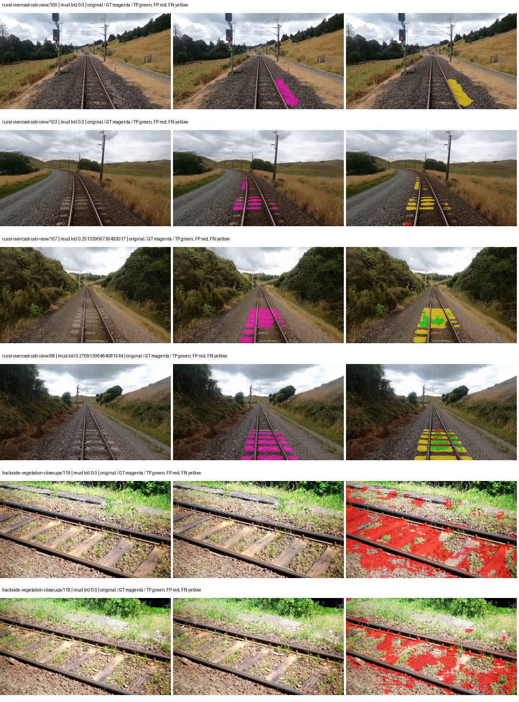
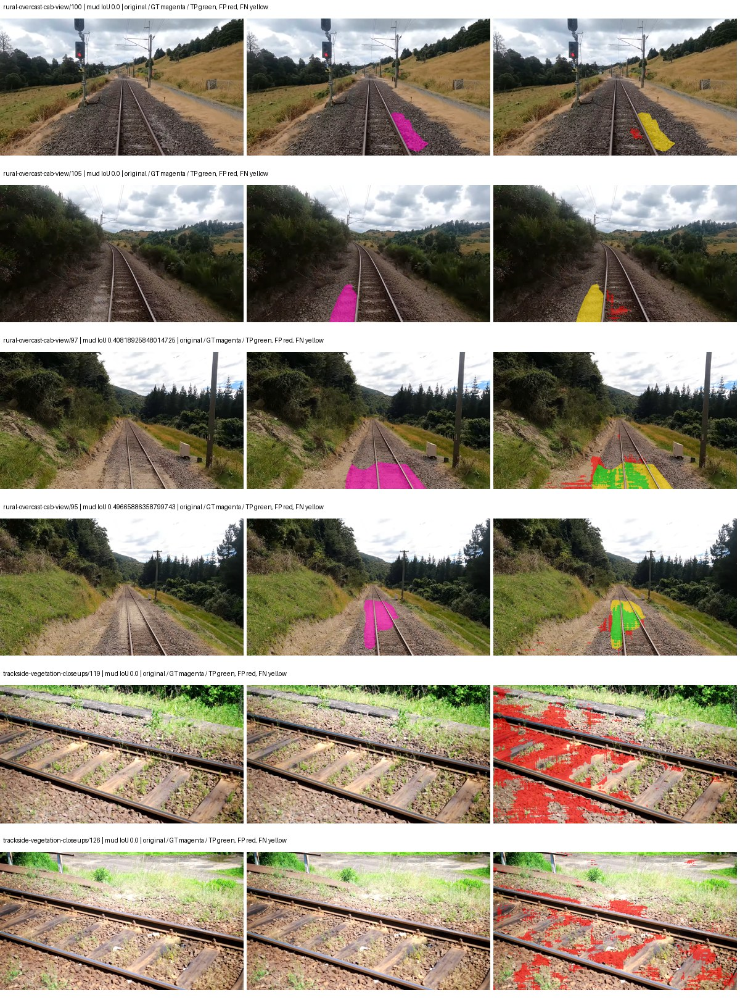
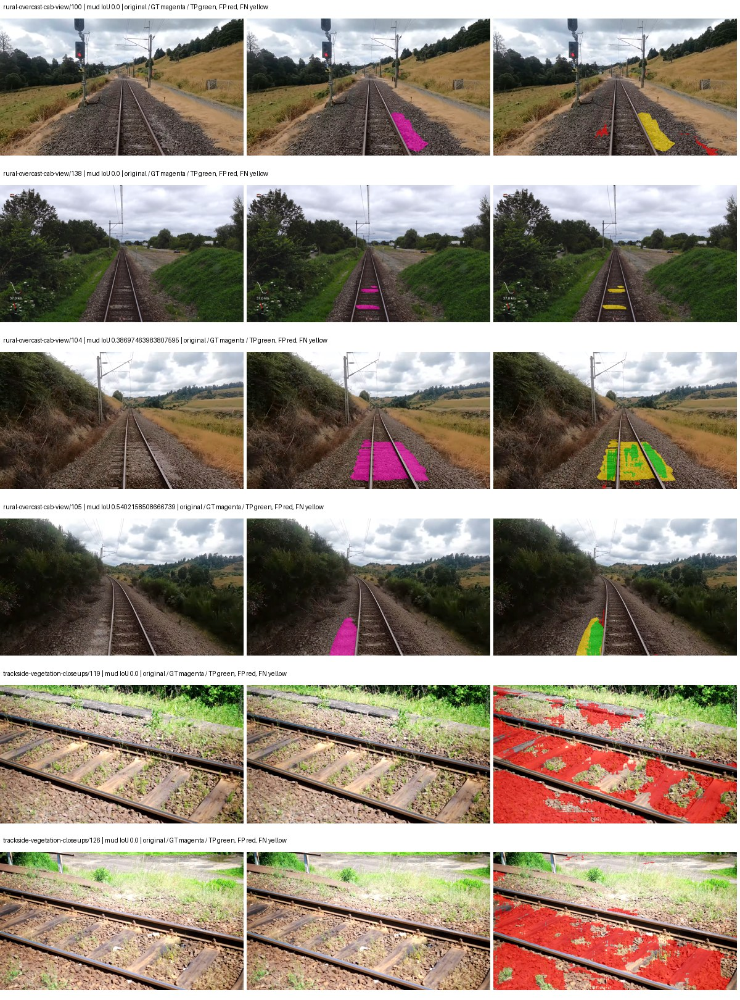
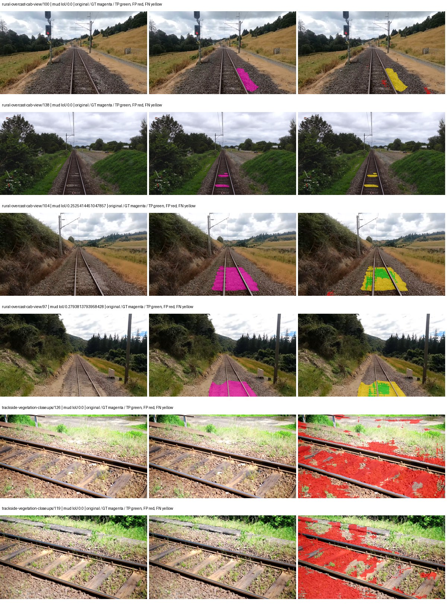

# hf_auto_mobilenetv2_deeplabv3 — paul-test-rtis_v2

[RTIS comparison](../../README.md) · [Full model records](record.json)

Primary selection and early stopping: **mud-pumping validation IoU**. A job is complete only after full statistics and isolated profiling are verified.

| Model | Initialization path | Seed | Status | Steps | Best step | Mud IoU (%) | Mud precision (%) | Mud recall (%) | Final mud IoU (trainer val, %) | mIoU (%) | Fixed GT-class mIoU (%) |
| --- | --- | --- | --- | --- | --- | --- | --- | --- | --- | --- | --- |
| hf_auto_mobilenetv2_deeplabv3 | rtis_only | 0 | completed | 4000 | 3568 | 4.11 | 5.93 | 11.81 | 3.61 | 22.30 | 26.02 |
| hf_auto_mobilenetv2_deeplabv3 | cityscapes_to_rtis | 0 | completed | 4000 | 3313 | 7.57 | 12.79 | 15.64 | 6.21 | 21.16 | 24.68 |
| hf_auto_mobilenetv2_deeplabv3 | railsem19_to_rtis | 0 | completed | 2803 | 1529 | 4.57 | 5.51 | 21.09 | 3.79 | 23.03 | 26.87 |
| hf_auto_mobilenetv2_deeplabv3 | cityscapes_to_railsem19_to_rtis | 0 | completed | 3823 | 2549 | 3.61 | 4.53 | 15.15 | 3.16 | 27.72 | 30.80 |

Training: 205 images. Validation: 37 images. Test: 50 held out. Seeds: [0]. Seed variation measures optimization variability, not independent-recording uncertainty. Historical source checkpoints stay fixed across adaptation seeds.

Training code: `066afb2626398b7be59d4d19f5a0e4644fd59adc`. Split SHA-256: `18a84c0163a65ded46508bcc904c374e5f33ad8a09b8879e3c8add606e86aa9f`.

## rtis_only — seed 0

Status: **completed**. Started: 2026-09-09T18:48:32.889781+00:00. Finished: 2026-09-09T19:46:50.966504+00:00.

Recipe pretrained initializer: `google/deeplabv3_mobilenet_v2_1.0_513`.

`rtis_only` uses the recipe initializer, which may include pretrained segmentation components. Transfer paths load the exact historical source checkpoint below and reset the classifier; they do not reset all query/decoder features.

Source checkpoint: `Recipe pretrained initialization`.

Config SHA-256: `57a6395443c8d991eb269994678dcd72c7f1fa926f0b256ec9a72fb3e66a72df`. Weights used for validation: `raw`.

### Mud-pumping and aggregate quality

| Metric | Selected checkpoint | Final training validation |
| --- | --- | --- |
| Mud IoU | 4.11 | 3.61 |
| Mud precision | 5.93 | 5.20 |
| Mud recall | 11.81 | 10.57 |
| Mud Dice/F1 | 7.90 | 6.98 |
| mIoU | 22.30 | 22.36 |
| Mean accuracy | 32.94 | 32.79 |
| Mean precision | 38.59 | 38.51 |
| Mean Dice | 28.33 | 28.51 |
| Mean specificity | 98.74 | 98.71 |
| Pixel accuracy | 79.96 | 79.94 |
| Frequency-weighted IoU | 69.75 | 69.24 |
| Fixed GT-present class mIoU | 26.02 | 26.08 |
| Boundary F1 | 24.36 | 24.69 |

The selected checkpoint has independent evaluation evidence. Final values are the trainer's final validation record, not a new independent evaluation. mIoU averages classes with nonzero union, so false positives on absent classes can change its denominator. The fixed GT-class mean is supplementary and excludes absent classes; their false positives remain in the confusion matrix.

### Resource usage and timing

| Measurement | Value |
| --- | --- |
| Peak training VRAM, retained training invocation (GiB) | 9.88 |
| Peak evaluation VRAM (GiB) | 6.55 |
| Retained training invocation wall time (seconds) | 3380.15 |
| Retained training invocation GPU-hours (one GPU) | 0.94 |
| Evaluation wall time (seconds) | 10.82 |
| Full evaluation pipeline images/second | 3.42 |
| Best full-state checkpoint (MiB) | 36.06 |
| Final full-state checkpoint (MiB) | 36.05 |
| Verified periodic checkpoints removed (GiB) | 0.28 |

VRAM uses the recorded allocator high-water mark; it is not total device usage including CUDA context. Resumed jobs' retained training invocation times and peaks are **not whole-campaign totals**. Earlier invocation resource records are not reconstructed here. Evaluation throughput includes loader, sliding-window inference and metrics; it is not model-only latency/FPS. Missing measurements are shown as —, never inferred from another dataset's run.

### Standardized inference performance

Dedicated model-only profiling waits for an idle worker-locked L40S: BF16, batch 1, 1024x1024, 20 warmup and 100 CUDA-event-timed public forwards. It excludes loading, preprocessing, tiling and metrics.

| Status | Parameters | Weight MiB | FPS | p50 ms | p95 ms | Peak reserved GiB |
| --- | --- | --- | --- | --- | --- | --- |
| complete | 2525717 | 9.63 | 172.56 | 5.73 | 6.17 | 0.45 |

```json
{
  "schema_version": 1,
  "model_id": "hf_auto_mobilenetv2_deeplabv3",
  "measured_at": "2026-09-09T19:46:49+00:00",
  "status": "complete",
  "benchmark_scope": "rtis_selected_checkpoint_model_only",
  "applies_to": [
    "hf_auto_mobilenetv2_deeplabv3--rtis_only--seed-0"
  ],
  "source": {
    "campaign_git_sha": "066afb2626398b7be59d4d19f5a0e4644fd59adc",
    "git_dirty": false,
    "config_hash": "67884a8b065a",
    "resolved_config": "/data/izadia1/projects/segmentary-runs/paul-test-rtis_v2/seed0-20260909/configs/hf_auto_mobilenetv2_deeplabv3--rtis_only--seed-0.yaml",
    "config_sha256": "57a6395443c8d991eb269994678dcd72c7f1fa926f0b256ec9a72fb3e66a72df",
    "checkpoint_sha256": "108a6ed24bbeabb90baee18b095ddf155542352bf4258080bf70fafd1949a6a1",
    "checkpoint_global_step": 3568,
    "checkpoint_bytes": 37808208,
    "checkpoint_kind": "resume checkpoint with optimizer and EMA state",
    "weights": "raw",
    "measured_checkpoint_job_id": "hf_auto_mobilenetv2_deeplabv3--rtis_only--seed-0",
    "result_sha256": "8bb38535b6f5ae27bc6e18c3069ca26603e3d3e2f5ebc83c9fb6d224c19a5e75",
    "result_git_sha": "066afb2626398b7be59d4d19f5a0e4644fd59adc",
    "result_stage": "eval:paul-test-rtis:val",
    "result_seed": 0
  },
  "hardware": {
    "gpu_name": "NVIDIA L40S",
    "gpu_uuid": "GPU-2f8008a1-9b67-11f6-987b-b393a672322c",
    "logical_device": "cuda:0",
    "physical_visibility_token": "3",
    "compute_capability": [
      8,
      9
    ],
    "total_memory_bytes": 47677177856
  },
  "model": {
    "parameter_count": 2525717,
    "trainable_parameter_count": 2113557,
    "resident_parameter_bytes": 10102868,
    "parameter_dtype_counts": {
      "float32": 2525717
    }
  },
  "contract": {
    "backend": "pytorch",
    "precision": "bf16_autocast",
    "batch_size": 1,
    "input_shape_nchw": [
      1,
      3,
      1024,
      1024
    ],
    "warmup_iterations": 20,
    "measured_iterations": 100,
    "timing": "per-forward CUDA events with end-event synchronization",
    "includes_preprocessing": false,
    "includes_data_loader": false,
    "includes_sliding_window": false,
    "input_resident_on_gpu": true,
    "model_only": true,
    "entrypoint": "public model(image) dense-logits forward"
  },
  "measurements": {
    "latency": {
      "p50_ms": 5.727231979370117,
      "p95_ms": 6.17047016620636,
      "mean_ms": 5.795253429412842,
      "minimum_ms": 5.6545281410217285,
      "maximum_ms": 6.694911956787109,
      "fps": 172.55500767656974,
      "raw_ms": [
        5.82041597366333,
        5.726208209991455,
        5.736447811126709,
        5.819392204284668,
        5.797887802124023,
        5.7630720138549805,
        5.688320159912109,
        5.6545281410217285,
        5.676032066345215,
        5.657599925994873,
        5.67193603515625,
        5.6933441162109375,
        5.71289587020874,
        6.209536075592041,
        5.7333760261535645,
        5.687295913696289,
        5.660607814788818,
        6.206463813781738,
        5.731328010559082,
        5.716991901397705,
        5.72211217880249,
        5.716991901397705,
        5.694464206695557,
        5.706751823425293,
        5.725183963775635,
        5.705728054046631,
        5.761919975280762,
        5.709824085235596,
        5.682176113128662,
        5.976992130279541,
        5.725183963775635,
        6.060031890869141,
        5.6985602378845215,
        5.71289587020874,
        5.67091178894043,
        5.734399795532227,
        5.716991901397705,
        5.77945613861084,
        6.069248199462891,
        6.1532158851623535,
        5.6893439292907715,
        5.703680038452148,
        5.688320159912109,
        5.87775993347168,
        5.710847854614258,
        5.664768218994141,
        5.6893439292907715,
        6.297599792480469,
        6.694911956787109,
        5.775263786315918,
        6.244351863861084,
        5.754879951477051,
        5.888000011444092,
        6.032383918762207,
        6.046720027923584,
        5.742591857910156,
        5.723199844360352,
        5.863423824310303,
        6.168575763702393,
        5.709824085235596,
        5.833727836608887,
        6.031360149383545,
        5.900288105010986,
        5.794816017150879,
        5.753856182098389,
        5.764095783233643,
        5.772287845611572,
        5.750783920288086,
        5.737472057342529,
        5.7927680015563965,
        5.743648052215576,
        5.700607776641846,
        5.772287845611572,
        5.708799839019775,
        5.693439960479736,
        5.727231979370117,
        5.724160194396973,
        5.879807949066162,
        5.7876482009887695,
        5.756927967071533,
        6.095871925354004,
        5.682176113128662,
        5.687295913696289,
        5.6842241287231445,
        5.720064163208008,
        5.7191362380981445,
        5.777408123016357,
        5.725183963775635,
        5.765120029449463,
        5.703680038452148,
        5.701632022857666,
        5.7139201164245605,
        5.677055835723877,
        5.684288024902344,
        5.691328048706055,
        5.730303764343262,
        5.740543842315674,
        5.705728054046631,
        5.914624214172363,
        5.727231979370117
      ],
      "percentile_method": "numpy linear interpolation"
    },
    "peak_reserved_bytes": 484442112,
    "memory_kind": "pytorch_cuda_allocator_peak_reserved_excluding_context",
    "benchmark_wall_clock_s": 9.838996633887291
  },
  "started_at": "2026-09-09T19:46:39+00:00",
  "finished_at": "2026-09-09T19:46:49+00:00",
  "environment": {
    "hostname": "hdrfs-app-001",
    "python": "3.11.15",
    "platform": "Linux-5.15.0-139-generic-x86_64-with-glibc2.35",
    "torch": "2.11.0+cu128",
    "torch_cuda": "12.8",
    "cudnn": 91900,
    "driver_version": "570.133.20",
    "cuda_available": true,
    "gpu_count": 1,
    "gpu_names": [
      "NVIDIA L40S"
    ],
    "cuda_visible_devices": "3",
    "packages": {
      "segmentary": "0.1.0",
      "torch": "2.11.0+cu128",
      "torchvision": "0.26.0+cu128",
      "transformers": "5.15.0",
      "timm": "1.0.28",
      "segmentation-models-pytorch": "0.5.0",
      "albumentations": "2.0.8",
      "lightning": "2.6.5",
      "numpy": "2.4.4"
    }
  }
}
```

### Per-class validation results

| Class | GT pixels | IoU (%) | Precision (%) | Recall (%) | Dice (%) | Boundary F1 (%) |
| --- | --- | --- | --- | --- | --- | --- |
| car | 29664 | 0.00 | 0.00 | 0.00 | 0.00 | 0.00 |
| construction | 311585 | 17.16 | 19.11 | 62.77 | 29.30 | 19.94 |
| fence | 265137 | 9.07 | 27.88 | 11.86 | 16.64 | 27.64 |
| mud-pumping | 1226250 | 4.11 | 5.93 | 11.81 | 7.90 | 6.54 |
| on-rails | 0 | 0.00 | 0.00 | — | 0.00 | 0.00 |
| person | 0 | 0.00 | 0.00 | — | 0.00 | 0.00 |
| pole | 628038 | 54.03 | 81.90 | 61.36 | 70.15 | 80.18 |
| rail-embedded | 16799 | 0.00 | 0.00 | 0.00 | 0.00 | 0.00 |
| rail-raised | 2969797 | 73.95 | 85.09 | 84.96 | 85.02 | 88.18 |
| rail-track | 6323197 | 32.58 | 64.18 | 39.81 | 49.14 | 43.01 |
| road | 1048831 | 10.39 | 37.94 | 12.51 | 18.82 | 23.07 |
| sidewalk | 1297367 | 24.16 | 88.44 | 24.95 | 38.92 | 8.64 |
| sky | 19121606 | 94.55 | 98.94 | 95.52 | 97.20 | 79.44 |
| standing-water | 95802 | 0.05 | 0.06 | 0.53 | 0.10 | 0.93 |
| terrain | 39239306 | 83.28 | 86.01 | 96.33 | 90.88 | 46.62 |
| trackbed | 10643081 | 53.16 | 62.34 | 78.30 | 69.42 | 45.42 |
| traffic-light | 19510 | 0.00 | 0.00 | 0.00 | 0.00 | 0.00 |
| traffic-sign | 13285 | 0.00 | 0.00 | 0.00 | 0.00 | 0.00 |
| tram-track | 56179 | 0.70 | 72.91 | 0.70 | 1.39 | 9.23 |
| truck | 0 | 0.00 | 0.00 | — | 0.00 | 0.00 |
| vegetation-overgrowth | 5901821 | 11.17 | 79.68 | 11.50 | 20.09 | 32.68 |

### Full-run accounting

| Measurement | Value |
| --- | --- |
| Full GPU-reserved wall seconds, all recorded worker attempts | 3498.08 |
| Full reserved GPU-hours | 0.97 |
| Whole-run timing complete | True |

| Phase | Wall seconds including failed attempts |
| --- | --- |
| training | 3386.61 |
| diagnostics | 76.68 |
| performance | 16.24 |

GPU-reserved time includes model loading, training, validation, collection, profiling, checkpoint I/O and orchestration while the worker owns one GPU. It is not GPU kernel-active time. Phase timings and sampled device memory/power/utilization are retained separately; sampled device memory is not the allocator high-water mark.

### Train/validation and raw/EMA diagnostics

| Checkpoint / weights / split | Images | Mud IoU (%) | Mud precision (%) | Mud recall (%) |
| --- | --- | --- | --- | --- |
| best-auto-train / raw | 205 | 87.11 | 95.37 | 90.96 |
| best-auto-val / raw | 37 | 4.11 | 5.93 | 11.81 |
| best-alternate-val / ema | 37 | 0.75 | 1.71 | 1.33 |
| final-auto-val / raw | 37 | 3.61 | 5.19 | 10.60 |

Train uses the evaluation transform without augmentation. Compare mud train/validation metrics for the same selected weights. Alternate EMA on running-stat BatchNorm is explicitly uncalibrated and is diagnostic only. Score-threshold curves use uncalibrated normalized scores and are pixel-level diagnostics, not event detection rates or a selected deployment operating point.

### Downloadable evidence

- best-auto-train: [per-image.csv](rtis_only--seed-0/best-auto-train/per-image.csv) · [per-image-confusion.json.gz](rtis_only--seed-0/best-auto-train/per-image-confusion.json.gz) · [groups.json](rtis_only--seed-0/best-auto-train/groups.json) · [mud-score-curves.json](rtis_only--seed-0/best-auto-train/mud-score-curves.json)
- best-auto-val: [per-image.csv](rtis_only--seed-0/best-auto-val/per-image.csv) · [per-image-confusion.json.gz](rtis_only--seed-0/best-auto-val/per-image-confusion.json.gz) · [groups.json](rtis_only--seed-0/best-auto-val/groups.json) · [mud-score-curves.json](rtis_only--seed-0/best-auto-val/mud-score-curves.json) · [examples.jpg](rtis_only--seed-0/best-auto-val/examples.jpg)
- best-alternate-val: [per-image.csv](rtis_only--seed-0/best-alternate-val/per-image.csv) · [per-image-confusion.json.gz](rtis_only--seed-0/best-alternate-val/per-image-confusion.json.gz) · [groups.json](rtis_only--seed-0/best-alternate-val/groups.json) · [mud-score-curves.json](rtis_only--seed-0/best-alternate-val/mud-score-curves.json)
- final-auto-val: [per-image.csv](rtis_only--seed-0/final-auto-val/per-image.csv) · [per-image-confusion.json.gz](rtis_only--seed-0/final-auto-val/per-image-confusion.json.gz) · [groups.json](rtis_only--seed-0/final-auto-val/groups.json) · [mud-score-curves.json](rtis_only--seed-0/final-auto-val/mud-score-curves.json)
- resources: [telemetry.csv](rtis_only--seed-0/resources/telemetry.csv)



Examples are two lowest and two highest mud-IoU positive images, plus up to two negative images with the most false-positive mud pixels. They are targeted diagnostic examples, not random samples. Green: true positive; red: false positive; yellow: false negative. Full predictions remain on HDRFS.

### Validation tracking

| Logged step | Overall mIoU (%) | Mud IoU (%) |
| --- | --- | --- |
| 254 | 13.94 | 0.14 |
| 509 | 17.80 | 0.12 |
| 764 | 19.15 | 0.16 |
| 1019 | 19.90 | 1.90 |
| 1274 | 20.49 | 1.11 |
| 1529 | 20.23 | 0.67 |
| 1784 | 20.33 | 1.35 |
| 2038 | 21.02 | 2.15 |
| 2293 | 21.46 | 0.81 |
| 2548 | 23.53 | 3.06 |
| 2803 | 21.56 | 3.63 |
| 3058 | 21.82 | 1.55 |
| 3313 | 21.68 | 3.07 |
| 3568 | 22.30 | 4.12 |
| 3823 | 22.50 | 3.21 |
| 4000 | 22.36 | 3.61 |

All retained scalar curves, including training loss and per-class IoU, are in record.json. Observed best mud on a curve is not necessarily a retained checkpoint: the pilot saved its selection-metric-best and final checkpoints. Step logging and checkpoint global_step may differ by one.

### Stopping and checkpoint provenance

```json
{
  "stopping": {
    "actual_steps": 4000,
    "maximum_steps": 4000,
    "min_delta": 0.001,
    "monitor": "val_iou/mud-pumping",
    "patience": 5,
    "reason": "budget_complete"
  },
  "checkpoints": {
    "best": {
      "path": "/data/izadia1/projects/segmentary-runs/paul-test-rtis_v2/seed0-20260909/future-runs/hf_auto_mobilenetv2_deeplabv3--rtis_only--seed-0_seed0/rtis/best.ckpt",
      "sha256": "108a6ed24bbeabb90baee18b095ddf155542352bf4258080bf70fafd1949a6a1",
      "global_step": 3568,
      "bytes": 37808208
    },
    "final": {
      "path": "/data/izadia1/projects/segmentary-runs/paul-test-rtis_v2/seed0-20260909/future-runs/hf_auto_mobilenetv2_deeplabv3--rtis_only--seed-0_seed0/rtis/last.ckpt",
      "sha256": "8b2dcbf18d252334592efe46e6721e869db1a97c3cd17ca0d152273f0f7c771a",
      "global_step": 4000,
      "bytes": 37797456
    }
  },
  "cleanup_error": null
}
```

### Resolved training, initialization and evaluation settings

The optimizer block is the base configuration. Stage LR scales are applied at runtime, and stage warmup is capped at min(base warmup, floor(stage budget / 10), stage budget - 1): 400 steps for this 4,000-step pilot. Model-internal native input grids may differ from augmentation crops (EoMT uses its 640 grid).

```json
{
  "name": "hf_auto_mobilenetv2_deeplabv3--rtis_only--seed-0",
  "model": {
    "arch": "hf_auto",
    "checkpoint": "google/deeplabv3_mobilenet_v2_1.0_513",
    "tuning": "full",
    "head": "unified_head",
    "lora_r": 16,
    "lora_alpha": 32,
    "lora_dropout": 0.05,
    "lora_targets": [],
    "drop_path": null,
    "revision": "5282e0eaf10de7cc7f35ee5e40f47981b801bf63",
    "subfolder": null,
    "local_files_only": false,
    "trust_remote_code": false,
    "backbone_path": null,
    "head_paths": [],
    "classifier_path": null,
    "inactive_parameter_paths": [
      "mobilenet_v2.conv_1x1"
    ],
    "smp_arch": null,
    "encoder_name": null,
    "encoder_weights": null,
    "native": null,
    "batch_norm_momentum": 0.003
  },
  "space": "paul-test-rtis",
  "taxonomy_root": "/data/izadia1/projects/segmentary-rtis-fullstats-066afb2/taxonomy",
  "output_root": "/data/izadia1/projects/segmentary-runs/paul-test-rtis_v2/seed0-20260909/future-runs",
  "optim": {
    "backbone_lr": 0.0001,
    "head_lr_mult": 10.0,
    "weight_decay": 0.05,
    "llrd": 1.0,
    "warmup_iters": 1500,
    "warmup_ratio": 1e-06,
    "poly_power": 0.9,
    "min_lr_ratio": 0.0,
    "betas": [
      0.9,
      0.999
    ],
    "grad_clip": 1.0
  },
  "train": {
    "iters": 4000,
    "batch_size": 2,
    "accum": 8,
    "num_workers": 2,
    "precision": "bf16-mixed",
    "ema_decay": 0.9998,
    "val_every": 250,
    "ckpt_every": 500,
    "selection_metric": "val_iou/mud-pumping",
    "early_stopping_patience": 5,
    "early_stopping_min_delta": 0.001,
    "seed": 0,
    "devices": 1
  },
  "eval": {
    "sliding_window": true,
    "window": [
      1024,
      1024
    ],
    "stride": [
      768,
      768
    ],
    "batch_size": 1,
    "num_workers": 2,
    "tta_scales": [],
    "tta_flip": false,
    "threshold": 0.5,
    "boundary_tolerance_frac": 0.0075,
    "save_confusion": true
  },
  "loss": {
    "task": "multiclass",
    "activation": "auto",
    "terms": [],
    "aux": "none",
    "aux_weight": 0.0,
    "ce_weight": 1.0,
    "label_smoothing": 0.0,
    "class_weights": null,
    "query": null
  },
  "aug": {
    "crop": [
      1024,
      1024
    ],
    "scale_min": 0.5,
    "scale_max": 2.0,
    "hflip_p": 0.5,
    "color_jitter_p": 0.5,
    "brightness": 0.25,
    "contrast": 0.25,
    "saturation": 0.25,
    "hue": 0.05
  },
  "stages": [
    {
      "name": "rtis",
      "data": [
        {
          "name": "paul-test-rtis",
          "root": "/data/izadia1/datasets/paul-test-rtis_v2",
          "variant": null,
          "split_file": "splits.json",
          "train_split": "train",
          "val_split": "val",
          "limit": null,
          "loader": "folder",
          "mapping": "paul-test-rtis",
          "loader_options": {
            "require_groups": true
          }
        }
      ],
      "iters": null,
      "lr_scale": 1.0,
      "head_group_lr_scale": 1.0,
      "init_from": "pretrained",
      "reset_head": false,
      "freeze": null,
      "sample_weights": null
    }
  ]
}
```

### Hardware and software provenance

```json
{
  "training": {
    "cuda_available": true,
    "cuda_visible_devices": "3",
    "cudnn": 91900,
    "driver_version": "570.133.20",
    "gpu_count": 1,
    "gpu_names": [
      "NVIDIA L40S"
    ],
    "hostname": "hdrfs-app-001",
    "input_normalization": {
      "channel_order": "rgb",
      "mean": [
        0.5,
        0.5,
        0.5
      ],
      "source": "hf_image_processor",
      "std": [
        0.5,
        0.5,
        0.5
      ]
    },
    "model_origins": [
      {
        "hf_commit": "5282e0eaf10de7cc7f35ee5e40f47981b801bf63",
        "hf_name_or_path": "google/deeplabv3_mobilenet_v2_1.0_513",
        "module": "model",
        "timm_pretrained": {}
      },
      {
        "hf_commit": "5282e0eaf10de7cc7f35ee5e40f47981b801bf63",
        "hf_name_or_path": "google/deeplabv3_mobilenet_v2_1.0_513",
        "module": "model.mobilenet_v2",
        "timm_pretrained": {}
      },
      {
        "hf_commit": "5282e0eaf10de7cc7f35ee5e40f47981b801bf63",
        "hf_name_or_path": "google/deeplabv3_mobilenet_v2_1.0_513",
        "module": "model.mobilenet_v2.conv_stem.first_conv",
        "timm_pretrained": {}
      },
      {
        "hf_commit": "5282e0eaf10de7cc7f35ee5e40f47981b801bf63",
        "hf_name_or_path": "google/deeplabv3_mobilenet_v2_1.0_513",
        "module": "model.mobilenet_v2.conv_stem.conv_3x3",
        "timm_pretrained": {}
      },
      {
        "hf_commit": "5282e0eaf10de7cc7f35ee5e40f47981b801bf63",
        "hf_name_or_path": "google/deeplabv3_mobilenet_v2_1.0_513",
        "module": "model.mobilenet_v2.conv_stem.reduce_1x1",
        "timm_pretrained": {}
      },
      {
        "hf_commit": "5282e0eaf10de7cc7f35ee5e40f47981b801bf63",
        "hf_name_or_path": "google/deeplabv3_mobilenet_v2_1.0_513",
        "module": "model.mobilenet_v2.layer.0.expand_1x1",
        "timm_pretrained": {}
      },
      {
        "hf_commit": "5282e0eaf10de7cc7f35ee5e40f47981b801bf63",
        "hf_name_or_path": "google/deeplabv3_mobilenet_v2_1.0_513",
        "module": "model.mobilenet_v2.layer.0.conv_3x3",
        "timm_pretrained": {}
      },
      {
        "hf_commit": "5282e0eaf10de7cc7f35ee5e40f47981b801bf63",
        "hf_name_or_path": "google/deeplabv3_mobilenet_v2_1.0_513",
        "module": "model.mobilenet_v2.layer.0.reduce_1x1",
        "timm_pretrained": {}
      },
      {
        "hf_commit": "5282e0eaf10de7cc7f35ee5e40f47981b801bf63",
        "hf_name_or_path": "google/deeplabv3_mobilenet_v2_1.0_513",
        "module": "model.mobilenet_v2.layer.1.expand_1x1",
        "timm_pretrained": {}
      },
      {
        "hf_commit": "5282e0eaf10de7cc7f35ee5e40f47981b801bf63",
        "hf_name_or_path": "google/deeplabv3_mobilenet_v2_1.0_513",
        "module": "model.mobilenet_v2.layer.1.conv_3x3",
        "timm_pretrained": {}
      },
      {
        "hf_commit": "5282e0eaf10de7cc7f35ee5e40f47981b801bf63",
        "hf_name_or_path": "google/deeplabv3_mobilenet_v2_1.0_513",
        "module": "model.mobilenet_v2.layer.1.reduce_1x1",
        "timm_pretrained": {}
      },
      {
        "hf_commit": "5282e0eaf10de7cc7f35ee5e40f47981b801bf63",
        "hf_name_or_path": "google/deeplabv3_mobilenet_v2_1.0_513",
        "module": "model.mobilenet_v2.layer.2.expand_1x1",
        "timm_pretrained": {}
      },
      {
        "hf_commit": "5282e0eaf10de7cc7f35ee5e40f47981b801bf63",
        "hf_name_or_path": "google/deeplabv3_mobilenet_v2_1.0_513",
        "module": "model.mobilenet_v2.layer.2.conv_3x3",
        "timm_pretrained": {}
      },
      {
        "hf_commit": "5282e0eaf10de7cc7f35ee5e40f47981b801bf63",
        "hf_name_or_path": "google/deeplabv3_mobilenet_v2_1.0_513",
        "module": "model.mobilenet_v2.layer.2.reduce_1x1",
        "timm_pretrained": {}
      },
      {
        "hf_commit": "5282e0eaf10de7cc7f35ee5e40f47981b801bf63",
        "hf_name_or_path": "google/deeplabv3_mobilenet_v2_1.0_513",
        "module": "model.mobilenet_v2.layer.3.expand_1x1",
        "timm_pretrained": {}
      },
      {
        "hf_commit": "5282e0eaf10de7cc7f35ee5e40f47981b801bf63",
        "hf_name_or_path": "google/deeplabv3_mobilenet_v2_1.0_513",
        "module": "model.mobilenet_v2.layer.3.conv_3x3",
        "timm_pretrained": {}
      },
      {
        "hf_commit": "5282e0eaf10de7cc7f35ee5e40f47981b801bf63",
        "hf_name_or_path": "google/deeplabv3_mobilenet_v2_1.0_513",
        "module": "model.mobilenet_v2.layer.3.reduce_1x1",
        "timm_pretrained": {}
      },
      {
        "hf_commit": "5282e0eaf10de7cc7f35ee5e40f47981b801bf63",
        "hf_name_or_path": "google/deeplabv3_mobilenet_v2_1.0_513",
        "module": "model.mobilenet_v2.layer.4.expand_1x1",
        "timm_pretrained": {}
      },
      {
        "hf_commit": "5282e0eaf10de7cc7f35ee5e40f47981b801bf63",
        "hf_name_or_path": "google/deeplabv3_mobilenet_v2_1.0_513",
        "module": "model.mobilenet_v2.layer.4.conv_3x3",
        "timm_pretrained": {}
      },
      {
        "hf_commit": "5282e0eaf10de7cc7f35ee5e40f47981b801bf63",
        "hf_name_or_path": "google/deeplabv3_mobilenet_v2_1.0_513",
        "module": "model.mobilenet_v2.layer.4.reduce_1x1",
        "timm_pretrained": {}
      },
      {
        "hf_commit": "5282e0eaf10de7cc7f35ee5e40f47981b801bf63",
        "hf_name_or_path": "google/deeplabv3_mobilenet_v2_1.0_513",
        "module": "model.mobilenet_v2.layer.5.expand_1x1",
        "timm_pretrained": {}
      },
      {
        "hf_commit": "5282e0eaf10de7cc7f35ee5e40f47981b801bf63",
        "hf_name_or_path": "google/deeplabv3_mobilenet_v2_1.0_513",
        "module": "model.mobilenet_v2.layer.5.conv_3x3",
        "timm_pretrained": {}
      },
      {
        "hf_commit": "5282e0eaf10de7cc7f35ee5e40f47981b801bf63",
        "hf_name_or_path": "google/deeplabv3_mobilenet_v2_1.0_513",
        "module": "model.mobilenet_v2.layer.5.reduce_1x1",
        "timm_pretrained": {}
      },
      {
        "hf_commit": "5282e0eaf10de7cc7f35ee5e40f47981b801bf63",
        "hf_name_or_path": "google/deeplabv3_mobilenet_v2_1.0_513",
        "module": "model.mobilenet_v2.layer.6.expand_1x1",
        "timm_pretrained": {}
      },
      {
        "hf_commit": "5282e0eaf10de7cc7f35ee5e40f47981b801bf63",
        "hf_name_or_path": "google/deeplabv3_mobilenet_v2_1.0_513",
        "module": "model.mobilenet_v2.layer.6.conv_3x3",
        "timm_pretrained": {}
      },
      {
        "hf_commit": "5282e0eaf10de7cc7f35ee5e40f47981b801bf63",
        "hf_name_or_path": "google/deeplabv3_mobilenet_v2_1.0_513",
        "module": "model.mobilenet_v2.layer.6.reduce_1x1",
        "timm_pretrained": {}
      },
      {
        "hf_commit": "5282e0eaf10de7cc7f35ee5e40f47981b801bf63",
        "hf_name_or_path": "google/deeplabv3_mobilenet_v2_1.0_513",
        "module": "model.mobilenet_v2.layer.7.expand_1x1",
        "timm_pretrained": {}
      },
      {
        "hf_commit": "5282e0eaf10de7cc7f35ee5e40f47981b801bf63",
        "hf_name_or_path": "google/deeplabv3_mobilenet_v2_1.0_513",
        "module": "model.mobilenet_v2.layer.7.conv_3x3",
        "timm_pretrained": {}
      },
      {
        "hf_commit": "5282e0eaf10de7cc7f35ee5e40f47981b801bf63",
        "hf_name_or_path": "google/deeplabv3_mobilenet_v2_1.0_513",
        "module": "model.mobilenet_v2.layer.7.reduce_1x1",
        "timm_pretrained": {}
      },
      {
        "hf_commit": "5282e0eaf10de7cc7f35ee5e40f47981b801bf63",
        "hf_name_or_path": "google/deeplabv3_mobilenet_v2_1.0_513",
        "module": "model.mobilenet_v2.layer.8.expand_1x1",
        "timm_pretrained": {}
      },
      {
        "hf_commit": "5282e0eaf10de7cc7f35ee5e40f47981b801bf63",
        "hf_name_or_path": "google/deeplabv3_mobilenet_v2_1.0_513",
        "module": "model.mobilenet_v2.layer.8.conv_3x3",
        "timm_pretrained": {}
      },
      {
        "hf_commit": "5282e0eaf10de7cc7f35ee5e40f47981b801bf63",
        "hf_name_or_path": "google/deeplabv3_mobilenet_v2_1.0_513",
        "module": "model.mobilenet_v2.layer.8.reduce_1x1",
        "timm_pretrained": {}
      },
      {
        "hf_commit": "5282e0eaf10de7cc7f35ee5e40f47981b801bf63",
        "hf_name_or_path": "google/deeplabv3_mobilenet_v2_1.0_513",
        "module": "model.mobilenet_v2.layer.9.expand_1x1",
        "timm_pretrained": {}
      },
      {
        "hf_commit": "5282e0eaf10de7cc7f35ee5e40f47981b801bf63",
        "hf_name_or_path": "google/deeplabv3_mobilenet_v2_1.0_513",
        "module": "model.mobilenet_v2.layer.9.conv_3x3",
        "timm_pretrained": {}
      },
      {
        "hf_commit": "5282e0eaf10de7cc7f35ee5e40f47981b801bf63",
        "hf_name_or_path": "google/deeplabv3_mobilenet_v2_1.0_513",
        "module": "model.mobilenet_v2.layer.9.reduce_1x1",
        "timm_pretrained": {}
      },
      {
        "hf_commit": "5282e0eaf10de7cc7f35ee5e40f47981b801bf63",
        "hf_name_or_path": "google/deeplabv3_mobilenet_v2_1.0_513",
        "module": "model.mobilenet_v2.layer.10.expand_1x1",
        "timm_pretrained": {}
      },
      {
        "hf_commit": "5282e0eaf10de7cc7f35ee5e40f47981b801bf63",
        "hf_name_or_path": "google/deeplabv3_mobilenet_v2_1.0_513",
        "module": "model.mobilenet_v2.layer.10.conv_3x3",
        "timm_pretrained": {}
      },
      {
        "hf_commit": "5282e0eaf10de7cc7f35ee5e40f47981b801bf63",
        "hf_name_or_path": "google/deeplabv3_mobilenet_v2_1.0_513",
        "module": "model.mobilenet_v2.layer.10.reduce_1x1",
        "timm_pretrained": {}
      },
      {
        "hf_commit": "5282e0eaf10de7cc7f35ee5e40f47981b801bf63",
        "hf_name_or_path": "google/deeplabv3_mobilenet_v2_1.0_513",
        "module": "model.mobilenet_v2.layer.11.expand_1x1",
        "timm_pretrained": {}
      },
      {
        "hf_commit": "5282e0eaf10de7cc7f35ee5e40f47981b801bf63",
        "hf_name_or_path": "google/deeplabv3_mobilenet_v2_1.0_513",
        "module": "model.mobilenet_v2.layer.11.conv_3x3",
        "timm_pretrained": {}
      },
      {
        "hf_commit": "5282e0eaf10de7cc7f35ee5e40f47981b801bf63",
        "hf_name_or_path": "google/deeplabv3_mobilenet_v2_1.0_513",
        "module": "model.mobilenet_v2.layer.11.reduce_1x1",
        "timm_pretrained": {}
      },
      {
        "hf_commit": "5282e0eaf10de7cc7f35ee5e40f47981b801bf63",
        "hf_name_or_path": "google/deeplabv3_mobilenet_v2_1.0_513",
        "module": "model.mobilenet_v2.layer.12.expand_1x1",
        "timm_pretrained": {}
      },
      {
        "hf_commit": "5282e0eaf10de7cc7f35ee5e40f47981b801bf63",
        "hf_name_or_path": "google/deeplabv3_mobilenet_v2_1.0_513",
        "module": "model.mobilenet_v2.layer.12.conv_3x3",
        "timm_pretrained": {}
      },
      {
        "hf_commit": "5282e0eaf10de7cc7f35ee5e40f47981b801bf63",
        "hf_name_or_path": "google/deeplabv3_mobilenet_v2_1.0_513",
        "module": "model.mobilenet_v2.layer.12.reduce_1x1",
        "timm_pretrained": {}
      },
      {
        "hf_commit": "5282e0eaf10de7cc7f35ee5e40f47981b801bf63",
        "hf_name_or_path": "google/deeplabv3_mobilenet_v2_1.0_513",
        "module": "model.mobilenet_v2.layer.13.expand_1x1",
        "timm_pretrained": {}
      },
      {
        "hf_commit": "5282e0eaf10de7cc7f35ee5e40f47981b801bf63",
        "hf_name_or_path": "google/deeplabv3_mobilenet_v2_1.0_513",
        "module": "model.mobilenet_v2.layer.13.conv_3x3",
        "timm_pretrained": {}
      },
      {
        "hf_commit": "5282e0eaf10de7cc7f35ee5e40f47981b801bf63",
        "hf_name_or_path": "google/deeplabv3_mobilenet_v2_1.0_513",
        "module": "model.mobilenet_v2.layer.13.reduce_1x1",
        "timm_pretrained": {}
      },
      {
        "hf_commit": "5282e0eaf10de7cc7f35ee5e40f47981b801bf63",
        "hf_name_or_path": "google/deeplabv3_mobilenet_v2_1.0_513",
        "module": "model.mobilenet_v2.layer.14.expand_1x1",
        "timm_pretrained": {}
      },
      {
        "hf_commit": "5282e0eaf10de7cc7f35ee5e40f47981b801bf63",
        "hf_name_or_path": "google/deeplabv3_mobilenet_v2_1.0_513",
        "module": "model.mobilenet_v2.layer.14.conv_3x3",
        "timm_pretrained": {}
      },
      {
        "hf_commit": "5282e0eaf10de7cc7f35ee5e40f47981b801bf63",
        "hf_name_or_path": "google/deeplabv3_mobilenet_v2_1.0_513",
        "module": "model.mobilenet_v2.layer.14.reduce_1x1",
        "timm_pretrained": {}
      },
      {
        "hf_commit": "5282e0eaf10de7cc7f35ee5e40f47981b801bf63",
        "hf_name_or_path": "google/deeplabv3_mobilenet_v2_1.0_513",
        "module": "model.mobilenet_v2.layer.15.expand_1x1",
        "timm_pretrained": {}
      },
      {
        "hf_commit": "5282e0eaf10de7cc7f35ee5e40f47981b801bf63",
        "hf_name_or_path": "google/deeplabv3_mobilenet_v2_1.0_513",
        "module": "model.mobilenet_v2.layer.15.conv_3x3",
        "timm_pretrained": {}
      },
      {
        "hf_commit": "5282e0eaf10de7cc7f35ee5e40f47981b801bf63",
        "hf_name_or_path": "google/deeplabv3_mobilenet_v2_1.0_513",
        "module": "model.mobilenet_v2.layer.15.reduce_1x1",
        "timm_pretrained": {}
      },
      {
        "hf_commit": "5282e0eaf10de7cc7f35ee5e40f47981b801bf63",
        "hf_name_or_path": "google/deeplabv3_mobilenet_v2_1.0_513",
        "module": "model.mobilenet_v2.conv_1x1",
        "timm_pretrained": {}
      },
      {
        "hf_commit": "5282e0eaf10de7cc7f35ee5e40f47981b801bf63",
        "hf_name_or_path": "google/deeplabv3_mobilenet_v2_1.0_513",
        "module": "model.segmentation_head.conv_pool",
        "timm_pretrained": {}
      },
      {
        "hf_commit": "5282e0eaf10de7cc7f35ee5e40f47981b801bf63",
        "hf_name_or_path": "google/deeplabv3_mobilenet_v2_1.0_513",
        "module": "model.segmentation_head.conv_aspp",
        "timm_pretrained": {}
      },
      {
        "hf_commit": "5282e0eaf10de7cc7f35ee5e40f47981b801bf63",
        "hf_name_or_path": "google/deeplabv3_mobilenet_v2_1.0_513",
        "module": "model.segmentation_head.conv_projection",
        "timm_pretrained": {}
      },
      {
        "hf_commit": "5282e0eaf10de7cc7f35ee5e40f47981b801bf63",
        "hf_name_or_path": "google/deeplabv3_mobilenet_v2_1.0_513",
        "module": "model.segmentation_head.classifier",
        "timm_pretrained": {}
      }
    ],
    "model_parameter_count": 2525717,
    "packages": {
      "albumentations": "2.0.8",
      "lightning": "2.6.5",
      "numpy": "2.4.4",
      "segmentary": "0.1.0",
      "segmentation-models-pytorch": "0.5.0",
      "timm": "1.0.28",
      "torch": "2.11.0+cu128",
      "torchvision": "0.26.0+cu128",
      "transformers": "5.15.0"
    },
    "platform": "Linux-5.15.0-139-generic-x86_64-with-glibc2.35",
    "python": "3.11.15",
    "torch": "2.11.0+cu128",
    "torch_cuda": "12.8",
    "trainable_parameter_count": 2113557,
    "training_stop": {
      "actual_steps": 4000,
      "maximum_steps": 4000,
      "min_delta": 0.001,
      "monitor": "val_iou/mud-pumping",
      "patience": 5,
      "reason": "budget_complete"
    },
    "validation_weights": "raw"
  },
  "evaluation": {
    "cuda_available": true,
    "cuda_visible_devices": "3",
    "cudnn": 91900,
    "driver_version": "570.133.20",
    "gpu_count": 1,
    "gpu_names": [
      "NVIDIA L40S"
    ],
    "hostname": "hdrfs-app-001",
    "input_normalization": {
      "channel_order": "rgb",
      "mean": [
        0.5,
        0.5,
        0.5
      ],
      "source": "hf_image_processor",
      "std": [
        0.5,
        0.5,
        0.5
      ]
    },
    "packages": {
      "albumentations": "2.0.8",
      "lightning": "2.6.5",
      "numpy": "2.4.4",
      "segmentary": "0.1.0",
      "segmentation-models-pytorch": "0.5.0",
      "timm": "1.0.28",
      "torch": "2.11.0+cu128",
      "torchvision": "0.26.0+cu128",
      "transformers": "5.15.0"
    },
    "platform": "Linux-5.15.0-139-generic-x86_64-with-glibc2.35",
    "python": "3.11.15",
    "torch": "2.11.0+cu128",
    "torch_cuda": "12.8"
  }
}
```

## cityscapes_to_rtis — seed 0

Status: **completed**. Started: 2026-09-09T18:54:26.136551+00:00. Finished: 2026-09-09T19:52:03.373960+00:00.

Recipe pretrained initializer: `google/deeplabv3_mobilenet_v2_1.0_513`.

`rtis_only` uses the recipe initializer, which may include pretrained segmentation components. Transfer paths load the exact historical source checkpoint below and reset the classifier; they do not reset all query/decoder features.

Source checkpoint: `{'name': 'hf_auto_mobilenetv2_deeplabv3--cityscapes--seed-0', 'model': 'hf_auto_mobilenetv2_deeplabv3', 'protocol': 'cityscapes', 'config': '/data/izadia1/projects/segmentary-runs/all-model-city-rail-seed0-rail20-b9eb3e1/jobs/hf_auto_mobilenetv2_deeplabv3--cityscapes--seed-0/attempt-001/resolved-config.yaml', 'checkpoint': '/data/izadia1/projects/segmentary-runs/all-model-city-rail-seed0-rail20-b9eb3e1/jobs/hf_auto_mobilenetv2_deeplabv3--cityscapes--seed-0/attempt-001/train/hf_auto_mobilenetv2_deeplabv3--cityscapes_seed0/cityscapes/last.bn-recalibrated.ckpt', 'recorded_sha256': '4f3711930ae1df9eaa26a222ba7652799b210f3a244770289a5e58a1c8bf3aa5', 'exists': True}`.

Config SHA-256: `364cc47d0df437b2053cee0188ad885196eb3c1e70222a1b0e5fd4c90fd5b18d`. Weights used for validation: `raw`.

### Mud-pumping and aggregate quality

| Metric | Selected checkpoint | Final training validation |
| --- | --- | --- |
| Mud IoU | 7.57 | 6.21 |
| Mud precision | 12.79 | 11.46 |
| Mud recall | 15.64 | 11.94 |
| Mud Dice/F1 | 14.07 | 11.69 |
| mIoU | 21.16 | 21.05 |
| Mean accuracy | 32.53 | 32.48 |
| Mean precision | 38.85 | 37.21 |
| Mean Dice | 27.32 | 27.08 |
| Mean specificity | 98.45 | 98.46 |
| Pixel accuracy | 76.48 | 76.52 |
| Frequency-weighted IoU | 64.44 | 64.51 |
| Fixed GT-present class mIoU | 24.68 | 24.55 |
| Boundary F1 | 26.40 | 26.15 |

The selected checkpoint has independent evaluation evidence. Final values are the trainer's final validation record, not a new independent evaluation. mIoU averages classes with nonzero union, so false positives on absent classes can change its denominator. The fixed GT-class mean is supplementary and excludes absent classes; their false positives remain in the confusion matrix.

### Resource usage and timing

| Measurement | Value |
| --- | --- |
| Peak training VRAM, retained training invocation (GiB) | 9.88 |
| Peak evaluation VRAM (GiB) | 6.55 |
| Retained training invocation wall time (seconds) | 3342.46 |
| Retained training invocation GPU-hours (one GPU) | 0.93 |
| Evaluation wall time (seconds) | 10.37 |
| Full evaluation pipeline images/second | 3.57 |
| Best full-state checkpoint (MiB) | 36.06 |
| Final full-state checkpoint (MiB) | 36.05 |
| Verified periodic checkpoints removed (GiB) | 0.28 |

VRAM uses the recorded allocator high-water mark; it is not total device usage including CUDA context. Resumed jobs' retained training invocation times and peaks are **not whole-campaign totals**. Earlier invocation resource records are not reconstructed here. Evaluation throughput includes loader, sliding-window inference and metrics; it is not model-only latency/FPS. Missing measurements are shown as —, never inferred from another dataset's run.

### Standardized inference performance

Dedicated model-only profiling waits for an idle worker-locked L40S: BF16, batch 1, 1024x1024, 20 warmup and 100 CUDA-event-timed public forwards. It excludes loading, preprocessing, tiling and metrics.

| Status | Parameters | Weight MiB | FPS | p50 ms | p95 ms | Peak reserved GiB |
| --- | --- | --- | --- | --- | --- | --- |
| complete | 2525717 | 9.63 | 174.94 | 5.67 | 5.74 | 0.45 |

```json
{
  "schema_version": 1,
  "model_id": "hf_auto_mobilenetv2_deeplabv3",
  "measured_at": "2026-09-09T19:52:01+00:00",
  "status": "complete",
  "benchmark_scope": "rtis_selected_checkpoint_model_only",
  "applies_to": [
    "hf_auto_mobilenetv2_deeplabv3--cityscapes_to_rtis--seed-0"
  ],
  "source": {
    "campaign_git_sha": "066afb2626398b7be59d4d19f5a0e4644fd59adc",
    "git_dirty": false,
    "config_hash": "57af96fdf4e0",
    "resolved_config": "/data/izadia1/projects/segmentary-runs/paul-test-rtis_v2/seed0-20260909/configs/hf_auto_mobilenetv2_deeplabv3--cityscapes_to_rtis--seed-0.yaml",
    "config_sha256": "364cc47d0df437b2053cee0188ad885196eb3c1e70222a1b0e5fd4c90fd5b18d",
    "checkpoint_sha256": "6d1ec03996ce472708bc9eaa944da718fb41c06cf4781e917bdd6a7bcfe2e01f",
    "checkpoint_global_step": 3313,
    "checkpoint_bytes": 37808208,
    "checkpoint_kind": "resume checkpoint with optimizer and EMA state",
    "weights": "raw",
    "measured_checkpoint_job_id": "hf_auto_mobilenetv2_deeplabv3--cityscapes_to_rtis--seed-0",
    "result_sha256": "d78839b2be5f41f5609d5f70b9de79c1237fb3f91b4646c9b9a5a382f65e9144",
    "result_git_sha": "066afb2626398b7be59d4d19f5a0e4644fd59adc",
    "result_stage": "eval:paul-test-rtis:val",
    "result_seed": 0
  },
  "hardware": {
    "gpu_name": "NVIDIA L40S",
    "gpu_uuid": "GPU-a5ad49e5-0536-5229-ba8a-f8a902808f53",
    "logical_device": "cuda:0",
    "physical_visibility_token": "7",
    "compute_capability": [
      8,
      9
    ],
    "total_memory_bytes": 47677177856
  },
  "model": {
    "parameter_count": 2525717,
    "trainable_parameter_count": 2113557,
    "resident_parameter_bytes": 10102868,
    "parameter_dtype_counts": {
      "float32": 2525717
    }
  },
  "contract": {
    "backend": "pytorch",
    "precision": "bf16_autocast",
    "batch_size": 1,
    "input_shape_nchw": [
      1,
      3,
      1024,
      1024
    ],
    "warmup_iterations": 20,
    "measured_iterations": 100,
    "timing": "per-forward CUDA events with end-event synchronization",
    "includes_preprocessing": false,
    "includes_data_loader": false,
    "includes_sliding_window": false,
    "input_resident_on_gpu": true,
    "model_only": true,
    "entrypoint": "public model(image) dense-logits forward"
  },
  "measurements": {
    "latency": {
      "p50_ms": 5.672959804534912,
      "p95_ms": 5.736652612686157,
      "mean_ms": 5.716396799087525,
      "minimum_ms": 5.63097620010376,
      "maximum_ms": 8.938495635986328,
      "fps": 174.93537190413798,
      "raw_ms": [
        5.723135948181152,
        5.686272144317627,
        5.672959804534912,
        5.686272144317627,
        5.6985602378845215,
        5.669888019561768,
        5.67193603515625,
        5.658624172210693,
        5.6750078201293945,
        5.655519962310791,
        5.6750078201293945,
        5.6381120681762695,
        5.6432318687438965,
        5.66377592086792,
        5.6453118324279785,
        5.669888019561768,
        5.667840003967285,
        5.63097620010376,
        5.68012809753418,
        5.631999969482422,
        8.938495635986328,
        5.740543842315674,
        5.650432109832764,
        5.631999969482422,
        5.653503894805908,
        5.6750078201293945,
        5.667840003967285,
        5.6893439292907715,
        5.6842241287231445,
        5.705696105957031,
        5.661695957183838,
        5.769216060638428,
        5.664768218994141,
        5.6985602378845215,
        5.667840003967285,
        5.694464206695557,
        5.682176113128662,
        5.676032066345215,
        5.646336078643799,
        5.656576156616211,
        5.707776069641113,
        5.669888019561768,
        5.67091178894043,
        5.682176113128662,
        5.708799839019775,
        5.672959804534912,
        5.695487976074219,
        5.679103851318359,
        5.6596479415893555,
        5.775360107421875,
        5.66374397277832,
        5.668863773345947,
        5.736447811126709,
        5.664768218994141,
        5.6596479415893555,
        5.6596479415893555,
        5.6842241287231445,
        5.683199882507324,
        5.6596479415893555,
        5.6893439292907715,
        5.674975872039795,
        5.688320159912109,
        5.6893439292907715,
        5.677055835723877,
        5.653503894805908,
        5.637119770050049,
        5.665791988372803,
        5.71289587020874,
        5.698592185974121,
        5.650432109832764,
        5.6842241287231445,
        5.678080081939697,
        5.682176113128662,
        5.682176113128662,
        5.690368175506592,
        5.662720203399658,
        5.668863773345947,
        5.642240047454834,
        5.688320159912109,
        5.690368175506592,
        5.660672187805176,
        5.658624172210693,
        5.655551910400391,
        5.639167785644531,
        5.662720203399658,
        5.677055835723877,
        6.486015796661377,
        5.708799839019775,
        5.657567977905273,
        5.683199882507324,
        5.6596479415893555,
        5.6893439292907715,
        5.664768218994141,
        5.6842241287231445,
        5.672959804534912,
        5.650432109832764,
        5.6893439292907715,
        5.665791988372803,
        5.692416191101074,
        5.672959804534912
      ],
      "percentile_method": "numpy linear interpolation"
    },
    "peak_reserved_bytes": 484442112,
    "memory_kind": "pytorch_cuda_allocator_peak_reserved_excluding_context",
    "benchmark_wall_clock_s": 9.683938380330801
  },
  "started_at": "2026-09-09T19:51:52+00:00",
  "finished_at": "2026-09-09T19:52:01+00:00",
  "environment": {
    "hostname": "hdrfs-app-001",
    "python": "3.11.15",
    "platform": "Linux-5.15.0-139-generic-x86_64-with-glibc2.35",
    "torch": "2.11.0+cu128",
    "torch_cuda": "12.8",
    "cudnn": 91900,
    "driver_version": "570.133.20",
    "cuda_available": true,
    "gpu_count": 1,
    "gpu_names": [
      "NVIDIA L40S"
    ],
    "cuda_visible_devices": "7",
    "packages": {
      "segmentary": "0.1.0",
      "torch": "2.11.0+cu128",
      "torchvision": "0.26.0+cu128",
      "transformers": "5.15.0",
      "timm": "1.0.28",
      "segmentation-models-pytorch": "0.5.0",
      "albumentations": "2.0.8",
      "lightning": "2.6.5",
      "numpy": "2.4.4"
    }
  }
}
```

### Per-class validation results

| Class | GT pixels | IoU (%) | Precision (%) | Recall (%) | Dice (%) | Boundary F1 (%) |
| --- | --- | --- | --- | --- | --- | --- |
| car | 29664 | 0.00 | 0.00 | 0.00 | 0.00 | 0.00 |
| construction | 311585 | 13.26 | 14.58 | 59.43 | 23.41 | 16.73 |
| fence | 265137 | 25.06 | 50.65 | 33.15 | 40.07 | 41.50 |
| mud-pumping | 1226250 | 7.57 | 12.79 | 15.64 | 14.07 | 11.48 |
| on-rails | 0 | 0.00 | 0.00 | — | 0.00 | 0.00 |
| person | 0 | 0.00 | 0.00 | — | 0.00 | 0.00 |
| pole | 628038 | 58.57 | 83.54 | 66.20 | 73.87 | 83.51 |
| rail-embedded | 16799 | 0.00 | 0.00 | 0.00 | 0.00 | 0.00 |
| rail-raised | 2969797 | 66.89 | 73.73 | 87.83 | 80.16 | 82.43 |
| rail-track | 6323197 | 26.00 | 65.71 | 30.08 | 41.27 | 37.17 |
| road | 1048831 | 1.73 | 18.13 | 1.87 | 3.40 | 12.28 |
| sidewalk | 1297367 | 4.77 | 25.49 | 5.54 | 9.10 | 7.35 |
| sky | 19121606 | 89.23 | 99.21 | 89.87 | 94.31 | 72.75 |
| standing-water | 95802 | 0.15 | 0.16 | 4.18 | 0.31 | 0.75 |
| terrain | 39239306 | 76.43 | 80.02 | 94.45 | 86.64 | 42.83 |
| trackbed | 10643081 | 55.61 | 66.26 | 77.58 | 71.47 | 47.34 |
| traffic-light | 19510 | 6.89 | 85.85 | 6.97 | 12.89 | 45.42 |
| traffic-sign | 13285 | 8.24 | 57.24 | 8.78 | 15.22 | 38.19 |
| tram-track | 56179 | 0.00 | 0.00 | 0.00 | 0.00 | 0.00 |
| truck | 0 | 0.00 | 0.00 | — | 0.00 | 0.00 |
| vegetation-overgrowth | 5901821 | 3.91 | 82.58 | 3.94 | 7.52 | 14.64 |

### Full-run accounting

| Measurement | Value |
| --- | --- |
| Full GPU-reserved wall seconds, all recorded worker attempts | 3457.27 |
| Full reserved GPU-hours | 0.96 |
| Whole-run timing complete | True |

| Phase | Wall seconds including failed attempts |
| --- | --- |
| training | 3348.70 |
| diagnostics | 75.33 |
| performance | 15.73 |

GPU-reserved time includes model loading, training, validation, collection, profiling, checkpoint I/O and orchestration while the worker owns one GPU. It is not GPU kernel-active time. Phase timings and sampled device memory/power/utilization are retained separately; sampled device memory is not the allocator high-water mark.

### Train/validation and raw/EMA diagnostics

| Checkpoint / weights / split | Images | Mud IoU (%) | Mud precision (%) | Mud recall (%) |
| --- | --- | --- | --- | --- |
| best-auto-train / raw | 205 | 79.94 | 85.23 | 92.80 |
| best-auto-val / raw | 37 | 7.57 | 12.79 | 15.64 |
| best-alternate-val / ema | 37 | 3.53 | 4.44 | 14.77 |
| final-auto-val / raw | 37 | 6.20 | 11.42 | 11.93 |

Train uses the evaluation transform without augmentation. Compare mud train/validation metrics for the same selected weights. Alternate EMA on running-stat BatchNorm is explicitly uncalibrated and is diagnostic only. Score-threshold curves use uncalibrated normalized scores and are pixel-level diagnostics, not event detection rates or a selected deployment operating point.

### Downloadable evidence

- best-auto-train: [per-image.csv](cityscapes_to_rtis--seed-0/best-auto-train/per-image.csv) · [per-image-confusion.json.gz](cityscapes_to_rtis--seed-0/best-auto-train/per-image-confusion.json.gz) · [groups.json](cityscapes_to_rtis--seed-0/best-auto-train/groups.json) · [mud-score-curves.json](cityscapes_to_rtis--seed-0/best-auto-train/mud-score-curves.json)
- best-auto-val: [per-image.csv](cityscapes_to_rtis--seed-0/best-auto-val/per-image.csv) · [per-image-confusion.json.gz](cityscapes_to_rtis--seed-0/best-auto-val/per-image-confusion.json.gz) · [groups.json](cityscapes_to_rtis--seed-0/best-auto-val/groups.json) · [mud-score-curves.json](cityscapes_to_rtis--seed-0/best-auto-val/mud-score-curves.json) · [examples.jpg](cityscapes_to_rtis--seed-0/best-auto-val/examples.jpg)
- best-alternate-val: [per-image.csv](cityscapes_to_rtis--seed-0/best-alternate-val/per-image.csv) · [per-image-confusion.json.gz](cityscapes_to_rtis--seed-0/best-alternate-val/per-image-confusion.json.gz) · [groups.json](cityscapes_to_rtis--seed-0/best-alternate-val/groups.json) · [mud-score-curves.json](cityscapes_to_rtis--seed-0/best-alternate-val/mud-score-curves.json)
- final-auto-val: [per-image.csv](cityscapes_to_rtis--seed-0/final-auto-val/per-image.csv) · [per-image-confusion.json.gz](cityscapes_to_rtis--seed-0/final-auto-val/per-image-confusion.json.gz) · [groups.json](cityscapes_to_rtis--seed-0/final-auto-val/groups.json) · [mud-score-curves.json](cityscapes_to_rtis--seed-0/final-auto-val/mud-score-curves.json)
- resources: [telemetry.csv](cityscapes_to_rtis--seed-0/resources/telemetry.csv)



Examples are two lowest and two highest mud-IoU positive images, plus up to two negative images with the most false-positive mud pixels. They are targeted diagnostic examples, not random samples. Green: true positive; red: false positive; yellow: false negative. Full predictions remain on HDRFS.

### Validation tracking

| Logged step | Overall mIoU (%) | Mud IoU (%) |
| --- | --- | --- |
| 254 | 16.28 | 0.65 |
| 509 | 18.98 | 0.54 |
| 764 | 20.17 | 0.56 |
| 1019 | 20.46 | 1.40 |
| 1274 | 20.41 | 1.72 |
| 1529 | 20.81 | 2.48 |
| 1784 | 21.11 | 4.09 |
| 2038 | 20.09 | 2.04 |
| 2293 | 20.62 | 4.21 |
| 2548 | 20.68 | 5.67 |
| 2803 | 20.49 | 5.20 |
| 3058 | 21.17 | 5.87 |
| 3313 | 21.16 | 7.58 |
| 3568 | 20.95 | 7.15 |
| 3823 | 20.84 | 5.54 |
| 4000 | 21.05 | 6.21 |

All retained scalar curves, including training loss and per-class IoU, are in record.json. Observed best mud on a curve is not necessarily a retained checkpoint: the pilot saved its selection-metric-best and final checkpoints. Step logging and checkpoint global_step may differ by one.

### Stopping and checkpoint provenance

```json
{
  "stopping": {
    "actual_steps": 4000,
    "maximum_steps": 4000,
    "min_delta": 0.001,
    "monitor": "val_iou/mud-pumping",
    "patience": 5,
    "reason": "budget_complete"
  },
  "checkpoints": {
    "best": {
      "path": "/data/izadia1/projects/segmentary-runs/paul-test-rtis_v2/seed0-20260909/future-runs/hf_auto_mobilenetv2_deeplabv3--cityscapes_to_rtis--seed-0_seed0/rtis/best.ckpt",
      "sha256": "6d1ec03996ce472708bc9eaa944da718fb41c06cf4781e917bdd6a7bcfe2e01f",
      "global_step": 3313,
      "bytes": 37808208
    },
    "final": {
      "path": "/data/izadia1/projects/segmentary-runs/paul-test-rtis_v2/seed0-20260909/future-runs/hf_auto_mobilenetv2_deeplabv3--cityscapes_to_rtis--seed-0_seed0/rtis/last.ckpt",
      "sha256": "9cdaf78d9cca5c972853d64c63cbb315b273fc51f99261fea894d46111c150e3",
      "global_step": 4000,
      "bytes": 37797520
    }
  },
  "cleanup_error": null
}
```

### Resolved training, initialization and evaluation settings

The optimizer block is the base configuration. Stage LR scales are applied at runtime, and stage warmup is capped at min(base warmup, floor(stage budget / 10), stage budget - 1): 400 steps for this 4,000-step pilot. Model-internal native input grids may differ from augmentation crops (EoMT uses its 640 grid).

```json
{
  "name": "hf_auto_mobilenetv2_deeplabv3--cityscapes_to_rtis--seed-0",
  "model": {
    "arch": "hf_auto",
    "checkpoint": "google/deeplabv3_mobilenet_v2_1.0_513",
    "tuning": "full",
    "head": "unified_head",
    "lora_r": 16,
    "lora_alpha": 32,
    "lora_dropout": 0.05,
    "lora_targets": [],
    "drop_path": null,
    "revision": "5282e0eaf10de7cc7f35ee5e40f47981b801bf63",
    "subfolder": null,
    "local_files_only": false,
    "trust_remote_code": false,
    "backbone_path": null,
    "head_paths": [],
    "classifier_path": null,
    "inactive_parameter_paths": [
      "mobilenet_v2.conv_1x1"
    ],
    "smp_arch": null,
    "encoder_name": null,
    "encoder_weights": null,
    "native": null,
    "batch_norm_momentum": 0.003
  },
  "space": "paul-test-rtis",
  "taxonomy_root": "/data/izadia1/projects/segmentary-rtis-fullstats-066afb2/taxonomy",
  "output_root": "/data/izadia1/projects/segmentary-runs/paul-test-rtis_v2/seed0-20260909/future-runs",
  "optim": {
    "backbone_lr": 0.0001,
    "head_lr_mult": 10.0,
    "weight_decay": 0.05,
    "llrd": 1.0,
    "warmup_iters": 1500,
    "warmup_ratio": 1e-06,
    "poly_power": 0.9,
    "min_lr_ratio": 0.0,
    "betas": [
      0.9,
      0.999
    ],
    "grad_clip": 1.0
  },
  "train": {
    "iters": 4000,
    "batch_size": 2,
    "accum": 8,
    "num_workers": 2,
    "precision": "bf16-mixed",
    "ema_decay": 0.9998,
    "val_every": 250,
    "ckpt_every": 500,
    "selection_metric": "val_iou/mud-pumping",
    "early_stopping_patience": 5,
    "early_stopping_min_delta": 0.001,
    "seed": 0,
    "devices": 1
  },
  "eval": {
    "sliding_window": true,
    "window": [
      1024,
      1024
    ],
    "stride": [
      768,
      768
    ],
    "batch_size": 1,
    "num_workers": 2,
    "tta_scales": [],
    "tta_flip": false,
    "threshold": 0.5,
    "boundary_tolerance_frac": 0.0075,
    "save_confusion": true
  },
  "loss": {
    "task": "multiclass",
    "activation": "auto",
    "terms": [],
    "aux": "none",
    "aux_weight": 0.0,
    "ce_weight": 1.0,
    "label_smoothing": 0.0,
    "class_weights": null,
    "query": null
  },
  "aug": {
    "crop": [
      1024,
      1024
    ],
    "scale_min": 0.5,
    "scale_max": 2.0,
    "hflip_p": 0.5,
    "color_jitter_p": 0.5,
    "brightness": 0.25,
    "contrast": 0.25,
    "saturation": 0.25,
    "hue": 0.05
  },
  "stages": [
    {
      "name": "rtis",
      "data": [
        {
          "name": "paul-test-rtis",
          "root": "/data/izadia1/datasets/paul-test-rtis_v2",
          "variant": null,
          "split_file": "splits.json",
          "train_split": "train",
          "val_split": "val",
          "limit": null,
          "loader": "folder",
          "mapping": "paul-test-rtis",
          "loader_options": {
            "require_groups": true
          }
        }
      ],
      "iters": null,
      "lr_scale": 0.1,
      "head_group_lr_scale": 1.0,
      "init_from": "/data/izadia1/projects/segmentary-runs/all-model-city-rail-seed0-rail20-b9eb3e1/jobs/hf_auto_mobilenetv2_deeplabv3--cityscapes--seed-0/attempt-001/train/hf_auto_mobilenetv2_deeplabv3--cityscapes_seed0/cityscapes/last.bn-recalibrated.ckpt",
      "reset_head": true,
      "freeze": null,
      "sample_weights": null
    }
  ]
}
```

### Hardware and software provenance

```json
{
  "training": {
    "cuda_available": true,
    "cuda_visible_devices": "7",
    "cudnn": 91900,
    "driver_version": "570.133.20",
    "gpu_count": 1,
    "gpu_names": [
      "NVIDIA L40S"
    ],
    "hostname": "hdrfs-app-001",
    "input_normalization": {
      "channel_order": "rgb",
      "mean": [
        0.5,
        0.5,
        0.5
      ],
      "source": "hf_image_processor",
      "std": [
        0.5,
        0.5,
        0.5
      ]
    },
    "model_origins": [
      {
        "hf_commit": "5282e0eaf10de7cc7f35ee5e40f47981b801bf63",
        "hf_name_or_path": "google/deeplabv3_mobilenet_v2_1.0_513",
        "module": "model",
        "timm_pretrained": {}
      },
      {
        "hf_commit": "5282e0eaf10de7cc7f35ee5e40f47981b801bf63",
        "hf_name_or_path": "google/deeplabv3_mobilenet_v2_1.0_513",
        "module": "model.mobilenet_v2",
        "timm_pretrained": {}
      },
      {
        "hf_commit": "5282e0eaf10de7cc7f35ee5e40f47981b801bf63",
        "hf_name_or_path": "google/deeplabv3_mobilenet_v2_1.0_513",
        "module": "model.mobilenet_v2.conv_stem.first_conv",
        "timm_pretrained": {}
      },
      {
        "hf_commit": "5282e0eaf10de7cc7f35ee5e40f47981b801bf63",
        "hf_name_or_path": "google/deeplabv3_mobilenet_v2_1.0_513",
        "module": "model.mobilenet_v2.conv_stem.conv_3x3",
        "timm_pretrained": {}
      },
      {
        "hf_commit": "5282e0eaf10de7cc7f35ee5e40f47981b801bf63",
        "hf_name_or_path": "google/deeplabv3_mobilenet_v2_1.0_513",
        "module": "model.mobilenet_v2.conv_stem.reduce_1x1",
        "timm_pretrained": {}
      },
      {
        "hf_commit": "5282e0eaf10de7cc7f35ee5e40f47981b801bf63",
        "hf_name_or_path": "google/deeplabv3_mobilenet_v2_1.0_513",
        "module": "model.mobilenet_v2.layer.0.expand_1x1",
        "timm_pretrained": {}
      },
      {
        "hf_commit": "5282e0eaf10de7cc7f35ee5e40f47981b801bf63",
        "hf_name_or_path": "google/deeplabv3_mobilenet_v2_1.0_513",
        "module": "model.mobilenet_v2.layer.0.conv_3x3",
        "timm_pretrained": {}
      },
      {
        "hf_commit": "5282e0eaf10de7cc7f35ee5e40f47981b801bf63",
        "hf_name_or_path": "google/deeplabv3_mobilenet_v2_1.0_513",
        "module": "model.mobilenet_v2.layer.0.reduce_1x1",
        "timm_pretrained": {}
      },
      {
        "hf_commit": "5282e0eaf10de7cc7f35ee5e40f47981b801bf63",
        "hf_name_or_path": "google/deeplabv3_mobilenet_v2_1.0_513",
        "module": "model.mobilenet_v2.layer.1.expand_1x1",
        "timm_pretrained": {}
      },
      {
        "hf_commit": "5282e0eaf10de7cc7f35ee5e40f47981b801bf63",
        "hf_name_or_path": "google/deeplabv3_mobilenet_v2_1.0_513",
        "module": "model.mobilenet_v2.layer.1.conv_3x3",
        "timm_pretrained": {}
      },
      {
        "hf_commit": "5282e0eaf10de7cc7f35ee5e40f47981b801bf63",
        "hf_name_or_path": "google/deeplabv3_mobilenet_v2_1.0_513",
        "module": "model.mobilenet_v2.layer.1.reduce_1x1",
        "timm_pretrained": {}
      },
      {
        "hf_commit": "5282e0eaf10de7cc7f35ee5e40f47981b801bf63",
        "hf_name_or_path": "google/deeplabv3_mobilenet_v2_1.0_513",
        "module": "model.mobilenet_v2.layer.2.expand_1x1",
        "timm_pretrained": {}
      },
      {
        "hf_commit": "5282e0eaf10de7cc7f35ee5e40f47981b801bf63",
        "hf_name_or_path": "google/deeplabv3_mobilenet_v2_1.0_513",
        "module": "model.mobilenet_v2.layer.2.conv_3x3",
        "timm_pretrained": {}
      },
      {
        "hf_commit": "5282e0eaf10de7cc7f35ee5e40f47981b801bf63",
        "hf_name_or_path": "google/deeplabv3_mobilenet_v2_1.0_513",
        "module": "model.mobilenet_v2.layer.2.reduce_1x1",
        "timm_pretrained": {}
      },
      {
        "hf_commit": "5282e0eaf10de7cc7f35ee5e40f47981b801bf63",
        "hf_name_or_path": "google/deeplabv3_mobilenet_v2_1.0_513",
        "module": "model.mobilenet_v2.layer.3.expand_1x1",
        "timm_pretrained": {}
      },
      {
        "hf_commit": "5282e0eaf10de7cc7f35ee5e40f47981b801bf63",
        "hf_name_or_path": "google/deeplabv3_mobilenet_v2_1.0_513",
        "module": "model.mobilenet_v2.layer.3.conv_3x3",
        "timm_pretrained": {}
      },
      {
        "hf_commit": "5282e0eaf10de7cc7f35ee5e40f47981b801bf63",
        "hf_name_or_path": "google/deeplabv3_mobilenet_v2_1.0_513",
        "module": "model.mobilenet_v2.layer.3.reduce_1x1",
        "timm_pretrained": {}
      },
      {
        "hf_commit": "5282e0eaf10de7cc7f35ee5e40f47981b801bf63",
        "hf_name_or_path": "google/deeplabv3_mobilenet_v2_1.0_513",
        "module": "model.mobilenet_v2.layer.4.expand_1x1",
        "timm_pretrained": {}
      },
      {
        "hf_commit": "5282e0eaf10de7cc7f35ee5e40f47981b801bf63",
        "hf_name_or_path": "google/deeplabv3_mobilenet_v2_1.0_513",
        "module": "model.mobilenet_v2.layer.4.conv_3x3",
        "timm_pretrained": {}
      },
      {
        "hf_commit": "5282e0eaf10de7cc7f35ee5e40f47981b801bf63",
        "hf_name_or_path": "google/deeplabv3_mobilenet_v2_1.0_513",
        "module": "model.mobilenet_v2.layer.4.reduce_1x1",
        "timm_pretrained": {}
      },
      {
        "hf_commit": "5282e0eaf10de7cc7f35ee5e40f47981b801bf63",
        "hf_name_or_path": "google/deeplabv3_mobilenet_v2_1.0_513",
        "module": "model.mobilenet_v2.layer.5.expand_1x1",
        "timm_pretrained": {}
      },
      {
        "hf_commit": "5282e0eaf10de7cc7f35ee5e40f47981b801bf63",
        "hf_name_or_path": "google/deeplabv3_mobilenet_v2_1.0_513",
        "module": "model.mobilenet_v2.layer.5.conv_3x3",
        "timm_pretrained": {}
      },
      {
        "hf_commit": "5282e0eaf10de7cc7f35ee5e40f47981b801bf63",
        "hf_name_or_path": "google/deeplabv3_mobilenet_v2_1.0_513",
        "module": "model.mobilenet_v2.layer.5.reduce_1x1",
        "timm_pretrained": {}
      },
      {
        "hf_commit": "5282e0eaf10de7cc7f35ee5e40f47981b801bf63",
        "hf_name_or_path": "google/deeplabv3_mobilenet_v2_1.0_513",
        "module": "model.mobilenet_v2.layer.6.expand_1x1",
        "timm_pretrained": {}
      },
      {
        "hf_commit": "5282e0eaf10de7cc7f35ee5e40f47981b801bf63",
        "hf_name_or_path": "google/deeplabv3_mobilenet_v2_1.0_513",
        "module": "model.mobilenet_v2.layer.6.conv_3x3",
        "timm_pretrained": {}
      },
      {
        "hf_commit": "5282e0eaf10de7cc7f35ee5e40f47981b801bf63",
        "hf_name_or_path": "google/deeplabv3_mobilenet_v2_1.0_513",
        "module": "model.mobilenet_v2.layer.6.reduce_1x1",
        "timm_pretrained": {}
      },
      {
        "hf_commit": "5282e0eaf10de7cc7f35ee5e40f47981b801bf63",
        "hf_name_or_path": "google/deeplabv3_mobilenet_v2_1.0_513",
        "module": "model.mobilenet_v2.layer.7.expand_1x1",
        "timm_pretrained": {}
      },
      {
        "hf_commit": "5282e0eaf10de7cc7f35ee5e40f47981b801bf63",
        "hf_name_or_path": "google/deeplabv3_mobilenet_v2_1.0_513",
        "module": "model.mobilenet_v2.layer.7.conv_3x3",
        "timm_pretrained": {}
      },
      {
        "hf_commit": "5282e0eaf10de7cc7f35ee5e40f47981b801bf63",
        "hf_name_or_path": "google/deeplabv3_mobilenet_v2_1.0_513",
        "module": "model.mobilenet_v2.layer.7.reduce_1x1",
        "timm_pretrained": {}
      },
      {
        "hf_commit": "5282e0eaf10de7cc7f35ee5e40f47981b801bf63",
        "hf_name_or_path": "google/deeplabv3_mobilenet_v2_1.0_513",
        "module": "model.mobilenet_v2.layer.8.expand_1x1",
        "timm_pretrained": {}
      },
      {
        "hf_commit": "5282e0eaf10de7cc7f35ee5e40f47981b801bf63",
        "hf_name_or_path": "google/deeplabv3_mobilenet_v2_1.0_513",
        "module": "model.mobilenet_v2.layer.8.conv_3x3",
        "timm_pretrained": {}
      },
      {
        "hf_commit": "5282e0eaf10de7cc7f35ee5e40f47981b801bf63",
        "hf_name_or_path": "google/deeplabv3_mobilenet_v2_1.0_513",
        "module": "model.mobilenet_v2.layer.8.reduce_1x1",
        "timm_pretrained": {}
      },
      {
        "hf_commit": "5282e0eaf10de7cc7f35ee5e40f47981b801bf63",
        "hf_name_or_path": "google/deeplabv3_mobilenet_v2_1.0_513",
        "module": "model.mobilenet_v2.layer.9.expand_1x1",
        "timm_pretrained": {}
      },
      {
        "hf_commit": "5282e0eaf10de7cc7f35ee5e40f47981b801bf63",
        "hf_name_or_path": "google/deeplabv3_mobilenet_v2_1.0_513",
        "module": "model.mobilenet_v2.layer.9.conv_3x3",
        "timm_pretrained": {}
      },
      {
        "hf_commit": "5282e0eaf10de7cc7f35ee5e40f47981b801bf63",
        "hf_name_or_path": "google/deeplabv3_mobilenet_v2_1.0_513",
        "module": "model.mobilenet_v2.layer.9.reduce_1x1",
        "timm_pretrained": {}
      },
      {
        "hf_commit": "5282e0eaf10de7cc7f35ee5e40f47981b801bf63",
        "hf_name_or_path": "google/deeplabv3_mobilenet_v2_1.0_513",
        "module": "model.mobilenet_v2.layer.10.expand_1x1",
        "timm_pretrained": {}
      },
      {
        "hf_commit": "5282e0eaf10de7cc7f35ee5e40f47981b801bf63",
        "hf_name_or_path": "google/deeplabv3_mobilenet_v2_1.0_513",
        "module": "model.mobilenet_v2.layer.10.conv_3x3",
        "timm_pretrained": {}
      },
      {
        "hf_commit": "5282e0eaf10de7cc7f35ee5e40f47981b801bf63",
        "hf_name_or_path": "google/deeplabv3_mobilenet_v2_1.0_513",
        "module": "model.mobilenet_v2.layer.10.reduce_1x1",
        "timm_pretrained": {}
      },
      {
        "hf_commit": "5282e0eaf10de7cc7f35ee5e40f47981b801bf63",
        "hf_name_or_path": "google/deeplabv3_mobilenet_v2_1.0_513",
        "module": "model.mobilenet_v2.layer.11.expand_1x1",
        "timm_pretrained": {}
      },
      {
        "hf_commit": "5282e0eaf10de7cc7f35ee5e40f47981b801bf63",
        "hf_name_or_path": "google/deeplabv3_mobilenet_v2_1.0_513",
        "module": "model.mobilenet_v2.layer.11.conv_3x3",
        "timm_pretrained": {}
      },
      {
        "hf_commit": "5282e0eaf10de7cc7f35ee5e40f47981b801bf63",
        "hf_name_or_path": "google/deeplabv3_mobilenet_v2_1.0_513",
        "module": "model.mobilenet_v2.layer.11.reduce_1x1",
        "timm_pretrained": {}
      },
      {
        "hf_commit": "5282e0eaf10de7cc7f35ee5e40f47981b801bf63",
        "hf_name_or_path": "google/deeplabv3_mobilenet_v2_1.0_513",
        "module": "model.mobilenet_v2.layer.12.expand_1x1",
        "timm_pretrained": {}
      },
      {
        "hf_commit": "5282e0eaf10de7cc7f35ee5e40f47981b801bf63",
        "hf_name_or_path": "google/deeplabv3_mobilenet_v2_1.0_513",
        "module": "model.mobilenet_v2.layer.12.conv_3x3",
        "timm_pretrained": {}
      },
      {
        "hf_commit": "5282e0eaf10de7cc7f35ee5e40f47981b801bf63",
        "hf_name_or_path": "google/deeplabv3_mobilenet_v2_1.0_513",
        "module": "model.mobilenet_v2.layer.12.reduce_1x1",
        "timm_pretrained": {}
      },
      {
        "hf_commit": "5282e0eaf10de7cc7f35ee5e40f47981b801bf63",
        "hf_name_or_path": "google/deeplabv3_mobilenet_v2_1.0_513",
        "module": "model.mobilenet_v2.layer.13.expand_1x1",
        "timm_pretrained": {}
      },
      {
        "hf_commit": "5282e0eaf10de7cc7f35ee5e40f47981b801bf63",
        "hf_name_or_path": "google/deeplabv3_mobilenet_v2_1.0_513",
        "module": "model.mobilenet_v2.layer.13.conv_3x3",
        "timm_pretrained": {}
      },
      {
        "hf_commit": "5282e0eaf10de7cc7f35ee5e40f47981b801bf63",
        "hf_name_or_path": "google/deeplabv3_mobilenet_v2_1.0_513",
        "module": "model.mobilenet_v2.layer.13.reduce_1x1",
        "timm_pretrained": {}
      },
      {
        "hf_commit": "5282e0eaf10de7cc7f35ee5e40f47981b801bf63",
        "hf_name_or_path": "google/deeplabv3_mobilenet_v2_1.0_513",
        "module": "model.mobilenet_v2.layer.14.expand_1x1",
        "timm_pretrained": {}
      },
      {
        "hf_commit": "5282e0eaf10de7cc7f35ee5e40f47981b801bf63",
        "hf_name_or_path": "google/deeplabv3_mobilenet_v2_1.0_513",
        "module": "model.mobilenet_v2.layer.14.conv_3x3",
        "timm_pretrained": {}
      },
      {
        "hf_commit": "5282e0eaf10de7cc7f35ee5e40f47981b801bf63",
        "hf_name_or_path": "google/deeplabv3_mobilenet_v2_1.0_513",
        "module": "model.mobilenet_v2.layer.14.reduce_1x1",
        "timm_pretrained": {}
      },
      {
        "hf_commit": "5282e0eaf10de7cc7f35ee5e40f47981b801bf63",
        "hf_name_or_path": "google/deeplabv3_mobilenet_v2_1.0_513",
        "module": "model.mobilenet_v2.layer.15.expand_1x1",
        "timm_pretrained": {}
      },
      {
        "hf_commit": "5282e0eaf10de7cc7f35ee5e40f47981b801bf63",
        "hf_name_or_path": "google/deeplabv3_mobilenet_v2_1.0_513",
        "module": "model.mobilenet_v2.layer.15.conv_3x3",
        "timm_pretrained": {}
      },
      {
        "hf_commit": "5282e0eaf10de7cc7f35ee5e40f47981b801bf63",
        "hf_name_or_path": "google/deeplabv3_mobilenet_v2_1.0_513",
        "module": "model.mobilenet_v2.layer.15.reduce_1x1",
        "timm_pretrained": {}
      },
      {
        "hf_commit": "5282e0eaf10de7cc7f35ee5e40f47981b801bf63",
        "hf_name_or_path": "google/deeplabv3_mobilenet_v2_1.0_513",
        "module": "model.mobilenet_v2.conv_1x1",
        "timm_pretrained": {}
      },
      {
        "hf_commit": "5282e0eaf10de7cc7f35ee5e40f47981b801bf63",
        "hf_name_or_path": "google/deeplabv3_mobilenet_v2_1.0_513",
        "module": "model.segmentation_head.conv_pool",
        "timm_pretrained": {}
      },
      {
        "hf_commit": "5282e0eaf10de7cc7f35ee5e40f47981b801bf63",
        "hf_name_or_path": "google/deeplabv3_mobilenet_v2_1.0_513",
        "module": "model.segmentation_head.conv_aspp",
        "timm_pretrained": {}
      },
      {
        "hf_commit": "5282e0eaf10de7cc7f35ee5e40f47981b801bf63",
        "hf_name_or_path": "google/deeplabv3_mobilenet_v2_1.0_513",
        "module": "model.segmentation_head.conv_projection",
        "timm_pretrained": {}
      },
      {
        "hf_commit": "5282e0eaf10de7cc7f35ee5e40f47981b801bf63",
        "hf_name_or_path": "google/deeplabv3_mobilenet_v2_1.0_513",
        "module": "model.segmentation_head.classifier",
        "timm_pretrained": {}
      }
    ],
    "model_parameter_count": 2525717,
    "packages": {
      "albumentations": "2.0.8",
      "lightning": "2.6.5",
      "numpy": "2.4.4",
      "segmentary": "0.1.0",
      "segmentation-models-pytorch": "0.5.0",
      "timm": "1.0.28",
      "torch": "2.11.0+cu128",
      "torchvision": "0.26.0+cu128",
      "transformers": "5.15.0"
    },
    "platform": "Linux-5.15.0-139-generic-x86_64-with-glibc2.35",
    "python": "3.11.15",
    "torch": "2.11.0+cu128",
    "torch_cuda": "12.8",
    "trainable_parameter_count": 2113557,
    "training_stop": {
      "actual_steps": 4000,
      "maximum_steps": 4000,
      "min_delta": 0.001,
      "monitor": "val_iou/mud-pumping",
      "patience": 5,
      "reason": "budget_complete"
    },
    "validation_weights": "raw"
  },
  "evaluation": {
    "cuda_available": true,
    "cuda_visible_devices": "7",
    "cudnn": 91900,
    "driver_version": "570.133.20",
    "gpu_count": 1,
    "gpu_names": [
      "NVIDIA L40S"
    ],
    "hostname": "hdrfs-app-001",
    "input_normalization": {
      "channel_order": "rgb",
      "mean": [
        0.5,
        0.5,
        0.5
      ],
      "source": "hf_image_processor",
      "std": [
        0.5,
        0.5,
        0.5
      ]
    },
    "packages": {
      "albumentations": "2.0.8",
      "lightning": "2.6.5",
      "numpy": "2.4.4",
      "segmentary": "0.1.0",
      "segmentation-models-pytorch": "0.5.0",
      "timm": "1.0.28",
      "torch": "2.11.0+cu128",
      "torchvision": "0.26.0+cu128",
      "transformers": "5.15.0"
    },
    "platform": "Linux-5.15.0-139-generic-x86_64-with-glibc2.35",
    "python": "3.11.15",
    "torch": "2.11.0+cu128",
    "torch_cuda": "12.8"
  }
}
```

## railsem19_to_rtis — seed 0

Status: **completed**. Started: 2026-09-09T19:02:12.393554+00:00. Finished: 2026-09-09T19:43:33.509842+00:00.

Recipe pretrained initializer: `google/deeplabv3_mobilenet_v2_1.0_513`.

`rtis_only` uses the recipe initializer, which may include pretrained segmentation components. Transfer paths load the exact historical source checkpoint below and reset the classifier; they do not reset all query/decoder features.

Source checkpoint: `{'name': 'hf_auto_mobilenetv2_deeplabv3--railsem19--seed-0', 'model': 'hf_auto_mobilenetv2_deeplabv3', 'protocol': 'railsem19', 'config': '/data/izadia1/projects/segmentary-runs/all-model-city-rail-seed0-rail20-b9eb3e1/jobs/hf_auto_mobilenetv2_deeplabv3--railsem19--seed-0/attempt-001/resolved-config.yaml', 'checkpoint': '/data/izadia1/projects/segmentary-runs/all-model-city-rail-seed0-rail20-b9eb3e1/jobs/hf_auto_mobilenetv2_deeplabv3--railsem19--seed-0/attempt-001/train/hf_auto_mobilenetv2_deeplabv3--railsem19_seed0/railsem19/last.bn-recalibrated.ckpt', 'recorded_sha256': '79a6185e64264a8fa64a4bca840b7536c498c9e989fae15c821957420f97e768', 'exists': True}`.

Config SHA-256: `c1139b9511c71a2842b2b3f2462a91bc8cbb19f213b3ec22e63945b1396b51f6`. Weights used for validation: `raw`.

### Mud-pumping and aggregate quality

| Metric | Selected checkpoint | Final training validation |
| --- | --- | --- |
| Mud IoU | 4.57 | 3.79 |
| Mud precision | 5.51 | 4.68 |
| Mud recall | 21.09 | 16.70 |
| Mud Dice/F1 | 8.74 | 7.31 |
| mIoU | 23.03 | 28.11 |
| Mean accuracy | 33.87 | 38.15 |
| Mean precision | 40.81 | 54.99 |
| Mean Dice | 29.03 | 35.95 |
| Mean specificity | 98.63 | 98.53 |
| Pixel accuracy | 79.28 | 77.90 |
| Frequency-weighted IoU | 68.83 | 66.98 |
| Fixed GT-present class mIoU | 26.87 | 31.23 |
| Boundary F1 | 25.69 | 34.30 |

The selected checkpoint has independent evaluation evidence. Final values are the trainer's final validation record, not a new independent evaluation. mIoU averages classes with nonzero union, so false positives on absent classes can change its denominator. The fixed GT-class mean is supplementary and excludes absent classes; their false positives remain in the confusion matrix.

### Resource usage and timing

| Measurement | Value |
| --- | --- |
| Peak training VRAM, retained training invocation (GiB) | 9.88 |
| Peak evaluation VRAM (GiB) | 6.55 |
| Retained training invocation wall time (seconds) | 2362.02 |
| Retained training invocation GPU-hours (one GPU) | 0.66 |
| Evaluation wall time (seconds) | 10.59 |
| Full evaluation pipeline images/second | 3.49 |
| Best full-state checkpoint (MiB) | 36.06 |
| Final full-state checkpoint (MiB) | 36.05 |
| Verified periodic checkpoints removed (GiB) | 0.18 |

VRAM uses the recorded allocator high-water mark; it is not total device usage including CUDA context. Resumed jobs' retained training invocation times and peaks are **not whole-campaign totals**. Earlier invocation resource records are not reconstructed here. Evaluation throughput includes loader, sliding-window inference and metrics; it is not model-only latency/FPS. Missing measurements are shown as —, never inferred from another dataset's run.

### Standardized inference performance

Dedicated model-only profiling waits for an idle worker-locked L40S: BF16, batch 1, 1024x1024, 20 warmup and 100 CUDA-event-timed public forwards. It excludes loading, preprocessing, tiling and metrics.

| Status | Parameters | Weight MiB | FPS | p50 ms | p95 ms | Peak reserved GiB |
| --- | --- | --- | --- | --- | --- | --- |
| complete | 2525717 | 9.63 | 167.09 | 5.75 | 7.47 | 0.45 |

```json
{
  "schema_version": 1,
  "model_id": "hf_auto_mobilenetv2_deeplabv3",
  "measured_at": "2026-09-09T19:43:31+00:00",
  "status": "complete",
  "benchmark_scope": "rtis_selected_checkpoint_model_only",
  "applies_to": [
    "hf_auto_mobilenetv2_deeplabv3--railsem19_to_rtis--seed-0"
  ],
  "source": {
    "campaign_git_sha": "066afb2626398b7be59d4d19f5a0e4644fd59adc",
    "git_dirty": false,
    "config_hash": "540f8948ebd4",
    "resolved_config": "/data/izadia1/projects/segmentary-runs/paul-test-rtis_v2/seed0-20260909/configs/hf_auto_mobilenetv2_deeplabv3--railsem19_to_rtis--seed-0.yaml",
    "config_sha256": "c1139b9511c71a2842b2b3f2462a91bc8cbb19f213b3ec22e63945b1396b51f6",
    "checkpoint_sha256": "99ef8d6154bca4f9939704c411f78c7047f5ee1479d91732d5d4da0b3fe6aaec",
    "checkpoint_global_step": 1529,
    "checkpoint_bytes": 37808208,
    "checkpoint_kind": "resume checkpoint with optimizer and EMA state",
    "weights": "raw",
    "measured_checkpoint_job_id": "hf_auto_mobilenetv2_deeplabv3--railsem19_to_rtis--seed-0",
    "result_sha256": "06c2a54e74b6318c1aef02177d358a62cdbe137daf98fef28716604824032e6c",
    "result_git_sha": "066afb2626398b7be59d4d19f5a0e4644fd59adc",
    "result_stage": "eval:paul-test-rtis:val",
    "result_seed": 0
  },
  "hardware": {
    "gpu_name": "NVIDIA L40S",
    "gpu_uuid": "GPU-d411d86a-6d1d-1967-55e7-9f9ec85d13f5",
    "logical_device": "cuda:0",
    "physical_visibility_token": "1",
    "compute_capability": [
      8,
      9
    ],
    "total_memory_bytes": 47677177856
  },
  "model": {
    "parameter_count": 2525717,
    "trainable_parameter_count": 2113557,
    "resident_parameter_bytes": 10102868,
    "parameter_dtype_counts": {
      "float32": 2525717
    }
  },
  "contract": {
    "backend": "pytorch",
    "precision": "bf16_autocast",
    "batch_size": 1,
    "input_shape_nchw": [
      1,
      3,
      1024,
      1024
    ],
    "warmup_iterations": 20,
    "measured_iterations": 100,
    "timing": "per-forward CUDA events with end-event synchronization",
    "includes_preprocessing": false,
    "includes_data_loader": false,
    "includes_sliding_window": false,
    "input_resident_on_gpu": true,
    "model_only": true,
    "entrypoint": "public model(image) dense-logits forward"
  },
  "measurements": {
    "latency": {
      "p50_ms": 5.749744176864624,
      "p95_ms": 7.46691210269928,
      "mean_ms": 5.9848559999465945,
      "minimum_ms": 5.600255966186523,
      "maximum_ms": 7.712672233581543,
      "fps": 167.08839778416112,
      "raw_ms": [
        5.672959804534912,
        5.77126407623291,
        5.62278413772583,
        5.767168045043945,
        5.800960063934326,
        5.66480016708374,
        5.651455879211426,
        5.657599925994873,
        5.7139201164245605,
        5.642240047454834,
        5.67091178894043,
        5.623807907104492,
        5.9115519523620605,
        5.723135948181152,
        5.751808166503906,
        5.665791988372803,
        5.619711875915527,
        5.60537576675415,
        5.600255966186523,
        5.848063945770264,
        6.1675519943237305,
        5.809152126312256,
        6.309887886047363,
        5.8961920738220215,
        6.407167911529541,
        6.456319808959961,
        6.051839828491211,
        5.974016189575195,
        6.411263942718506,
        6.38156795501709,
        5.928959846496582,
        6.1121602058410645,
        6.47270393371582,
        5.833727836608887,
        6.247424125671387,
        5.819392204284668,
        5.668863773345947,
        5.694464206695557,
        5.666816234588623,
        5.631999969482422,
        5.628928184509277,
        5.649407863616943,
        5.71398401260376,
        5.607423782348633,
        5.665791988372803,
        5.638144016265869,
        5.825535774230957,
        5.844992160797119,
        5.6453118324279785,
        5.692416191101074,
        5.606400012969971,
        5.710847854614258,
        5.683199882507324,
        5.67193603515625,
        5.627840042114258,
        5.803008079528809,
        5.747680187225342,
        5.823488235473633,
        5.737472057342529,
        5.848063945770264,
        5.725183963775635,
        5.63804817199707,
        5.988351821899414,
        6.065152168273926,
        6.0149760246276855,
        6.5136637687683105,
        6.611968040466309,
        5.937151908874512,
        6.385632038116455,
        6.731776237487793,
        6.345727920532227,
        5.976064205169678,
        6.297599792480469,
        6.4337921142578125,
        5.967872142791748,
        6.043647766113281,
        5.892096042633057,
        5.6750078201293945,
        5.651455879211426,
        5.611519813537598,
        5.722015857696533,
        5.62175989151001,
        5.6248321533203125,
        5.640192031860352,
        5.612512111663818,
        5.644288063049316,
        5.648384094238281,
        5.688320159912109,
        5.6596479415893555,
        5.647359848022461,
        5.6156158447265625,
        5.637119770050049,
        7.700384140014648,
        7.567359924316406,
        7.504000186920166,
        7.712672233581543,
        7.464960098266602,
        7.2867841720581055,
        7.260159969329834,
        7.621632099151611
      ],
      "percentile_method": "numpy linear interpolation"
    },
    "peak_reserved_bytes": 484442112,
    "memory_kind": "pytorch_cuda_allocator_peak_reserved_excluding_context",
    "benchmark_wall_clock_s": 10.181433241814375
  },
  "started_at": "2026-09-09T19:43:21+00:00",
  "finished_at": "2026-09-09T19:43:31+00:00",
  "environment": {
    "hostname": "hdrfs-app-001",
    "python": "3.11.15",
    "platform": "Linux-5.15.0-139-generic-x86_64-with-glibc2.35",
    "torch": "2.11.0+cu128",
    "torch_cuda": "12.8",
    "cudnn": 91900,
    "driver_version": "570.133.20",
    "cuda_available": true,
    "gpu_count": 1,
    "gpu_names": [
      "NVIDIA L40S"
    ],
    "cuda_visible_devices": "1",
    "packages": {
      "segmentary": "0.1.0",
      "torch": "2.11.0+cu128",
      "torchvision": "0.26.0+cu128",
      "transformers": "5.15.0",
      "timm": "1.0.28",
      "segmentation-models-pytorch": "0.5.0",
      "albumentations": "2.0.8",
      "lightning": "2.6.5",
      "numpy": "2.4.4"
    }
  }
}
```

### Per-class validation results

| Class | GT pixels | IoU (%) | Precision (%) | Recall (%) | Dice (%) | Boundary F1 (%) |
| --- | --- | --- | --- | --- | --- | --- |
| car | 29664 | 0.00 | 0.00 | 0.00 | 0.00 | 0.00 |
| construction | 311585 | 31.15 | 37.16 | 65.83 | 47.50 | 30.98 |
| fence | 265137 | 10.27 | 36.46 | 12.50 | 18.62 | 32.73 |
| mud-pumping | 1226250 | 4.57 | 5.51 | 21.09 | 8.74 | 11.90 |
| on-rails | 0 | 0.00 | 0.00 | — | 0.00 | 0.00 |
| person | 0 | 0.00 | 0.00 | — | 0.00 | 0.00 |
| pole | 628038 | 64.49 | 85.74 | 72.25 | 78.41 | 85.90 |
| rail-embedded | 16799 | 0.01 | 100.00 | 0.01 | 0.01 | 4.61 |
| rail-raised | 2969797 | 69.39 | 74.56 | 90.92 | 81.93 | 85.50 |
| rail-track | 6323197 | 32.06 | 74.68 | 35.97 | 48.55 | 39.75 |
| road | 1048831 | 11.54 | 20.13 | 21.29 | 20.69 | 18.51 |
| sidewalk | 1297367 | 17.63 | 80.64 | 18.41 | 29.98 | 10.51 |
| sky | 19121606 | 92.44 | 99.11 | 93.21 | 96.07 | 76.15 |
| standing-water | 95802 | 0.35 | 0.41 | 2.54 | 0.70 | 4.35 |
| terrain | 39239306 | 80.83 | 81.78 | 98.59 | 89.40 | 50.40 |
| trackbed | 10643081 | 62.78 | 84.96 | 70.63 | 77.13 | 59.69 |
| traffic-light | 19510 | 0.00 | 0.00 | 0.00 | 0.00 | 0.00 |
| traffic-sign | 13285 | 0.00 | 0.00 | 0.00 | 0.00 | 0.00 |
| tram-track | 56179 | 1.10 | 13.07 | 1.19 | 2.18 | 12.00 |
| truck | 0 | 0.00 | 0.00 | — | 0.00 | 0.00 |
| vegetation-overgrowth | 5901821 | 5.12 | 62.87 | 5.28 | 9.75 | 16.53 |

### Full-run accounting

| Measurement | Value |
| --- | --- |
| Full GPU-reserved wall seconds, all recorded worker attempts | 2481.16 |
| Full reserved GPU-hours | 0.69 |
| Whole-run timing complete | True |

| Phase | Wall seconds including failed attempts |
| --- | --- |
| training | 2368.70 |
| diagnostics | 76.94 |
| performance | 17.14 |

GPU-reserved time includes model loading, training, validation, collection, profiling, checkpoint I/O and orchestration while the worker owns one GPU. It is not GPU kernel-active time. Phase timings and sampled device memory/power/utilization are retained separately; sampled device memory is not the allocator high-water mark.

### Train/validation and raw/EMA diagnostics

| Checkpoint / weights / split | Images | Mud IoU (%) | Mud precision (%) | Mud recall (%) |
| --- | --- | --- | --- | --- |
| best-auto-train / raw | 205 | 82.05 | 87.75 | 92.66 |
| best-auto-val / raw | 37 | 4.57 | 5.51 | 21.09 |
| best-alternate-val / ema | 37 | 3.00 | 3.65 | 14.42 |
| final-auto-val / raw | 37 | 3.79 | 4.68 | 16.72 |

Train uses the evaluation transform without augmentation. Compare mud train/validation metrics for the same selected weights. Alternate EMA on running-stat BatchNorm is explicitly uncalibrated and is diagnostic only. Score-threshold curves use uncalibrated normalized scores and are pixel-level diagnostics, not event detection rates or a selected deployment operating point.

### Downloadable evidence

- best-auto-train: [per-image.csv](railsem19_to_rtis--seed-0/best-auto-train/per-image.csv) · [per-image-confusion.json.gz](railsem19_to_rtis--seed-0/best-auto-train/per-image-confusion.json.gz) · [groups.json](railsem19_to_rtis--seed-0/best-auto-train/groups.json) · [mud-score-curves.json](railsem19_to_rtis--seed-0/best-auto-train/mud-score-curves.json)
- best-auto-val: [per-image.csv](railsem19_to_rtis--seed-0/best-auto-val/per-image.csv) · [per-image-confusion.json.gz](railsem19_to_rtis--seed-0/best-auto-val/per-image-confusion.json.gz) · [groups.json](railsem19_to_rtis--seed-0/best-auto-val/groups.json) · [mud-score-curves.json](railsem19_to_rtis--seed-0/best-auto-val/mud-score-curves.json) · [examples.jpg](railsem19_to_rtis--seed-0/best-auto-val/examples.jpg)
- best-alternate-val: [per-image.csv](railsem19_to_rtis--seed-0/best-alternate-val/per-image.csv) · [per-image-confusion.json.gz](railsem19_to_rtis--seed-0/best-alternate-val/per-image-confusion.json.gz) · [groups.json](railsem19_to_rtis--seed-0/best-alternate-val/groups.json) · [mud-score-curves.json](railsem19_to_rtis--seed-0/best-alternate-val/mud-score-curves.json)
- final-auto-val: [per-image.csv](railsem19_to_rtis--seed-0/final-auto-val/per-image.csv) · [per-image-confusion.json.gz](railsem19_to_rtis--seed-0/final-auto-val/per-image-confusion.json.gz) · [groups.json](railsem19_to_rtis--seed-0/final-auto-val/groups.json) · [mud-score-curves.json](railsem19_to_rtis--seed-0/final-auto-val/mud-score-curves.json)
- resources: [telemetry.csv](railsem19_to_rtis--seed-0/resources/telemetry.csv)



Examples are two lowest and two highest mud-IoU positive images, plus up to two negative images with the most false-positive mud pixels. They are targeted diagnostic examples, not random samples. Green: true positive; red: false positive; yellow: false negative. Full predictions remain on HDRFS.

### Validation tracking

| Logged step | Overall mIoU (%) | Mud IoU (%) |
| --- | --- | --- |
| 254 | 22.58 | 0.97 |
| 509 | 24.83 | 3.21 |
| 764 | 24.38 | 1.82 |
| 1019 | 23.48 | 3.67 |
| 1274 | 24.61 | 1.95 |
| 1529 | 23.03 | 4.57 |
| 1784 | 25.32 | 2.29 |
| 2038 | 24.64 | 3.71 |
| 2293 | 26.13 | 3.19 |
| 2548 | 27.57 | 3.55 |
| 2803 | 28.11 | 3.79 |

All retained scalar curves, including training loss and per-class IoU, are in record.json. Observed best mud on a curve is not necessarily a retained checkpoint: the pilot saved its selection-metric-best and final checkpoints. Step logging and checkpoint global_step may differ by one.

### Stopping and checkpoint provenance

```json
{
  "stopping": {
    "actual_steps": 2803,
    "maximum_steps": 4000,
    "min_delta": 0.001,
    "monitor": "val_iou/mud-pumping",
    "patience": 5,
    "reason": "validation_plateau"
  },
  "checkpoints": {
    "best": {
      "path": "/data/izadia1/projects/segmentary-runs/paul-test-rtis_v2/seed0-20260909/future-runs/hf_auto_mobilenetv2_deeplabv3--railsem19_to_rtis--seed-0_seed0/rtis/best.ckpt",
      "sha256": "99ef8d6154bca4f9939704c411f78c7047f5ee1479d91732d5d4da0b3fe6aaec",
      "global_step": 1529,
      "bytes": 37808208
    },
    "final": {
      "path": "/data/izadia1/projects/segmentary-runs/paul-test-rtis_v2/seed0-20260909/future-runs/hf_auto_mobilenetv2_deeplabv3--railsem19_to_rtis--seed-0_seed0/rtis/last.ckpt",
      "sha256": "23893fc5a675fac1a7717e1982e82ab19985d54a0c86343f4538933b3e5c2233",
      "global_step": 2803,
      "bytes": 37797648
    }
  },
  "cleanup_error": null
}
```

### Resolved training, initialization and evaluation settings

The optimizer block is the base configuration. Stage LR scales are applied at runtime, and stage warmup is capped at min(base warmup, floor(stage budget / 10), stage budget - 1): 400 steps for this 4,000-step pilot. Model-internal native input grids may differ from augmentation crops (EoMT uses its 640 grid).

```json
{
  "name": "hf_auto_mobilenetv2_deeplabv3--railsem19_to_rtis--seed-0",
  "model": {
    "arch": "hf_auto",
    "checkpoint": "google/deeplabv3_mobilenet_v2_1.0_513",
    "tuning": "full",
    "head": "unified_head",
    "lora_r": 16,
    "lora_alpha": 32,
    "lora_dropout": 0.05,
    "lora_targets": [],
    "drop_path": null,
    "revision": "5282e0eaf10de7cc7f35ee5e40f47981b801bf63",
    "subfolder": null,
    "local_files_only": false,
    "trust_remote_code": false,
    "backbone_path": null,
    "head_paths": [],
    "classifier_path": null,
    "inactive_parameter_paths": [
      "mobilenet_v2.conv_1x1"
    ],
    "smp_arch": null,
    "encoder_name": null,
    "encoder_weights": null,
    "native": null,
    "batch_norm_momentum": 0.003
  },
  "space": "paul-test-rtis",
  "taxonomy_root": "/data/izadia1/projects/segmentary-rtis-fullstats-066afb2/taxonomy",
  "output_root": "/data/izadia1/projects/segmentary-runs/paul-test-rtis_v2/seed0-20260909/future-runs",
  "optim": {
    "backbone_lr": 0.0001,
    "head_lr_mult": 10.0,
    "weight_decay": 0.05,
    "llrd": 1.0,
    "warmup_iters": 1500,
    "warmup_ratio": 1e-06,
    "poly_power": 0.9,
    "min_lr_ratio": 0.0,
    "betas": [
      0.9,
      0.999
    ],
    "grad_clip": 1.0
  },
  "train": {
    "iters": 4000,
    "batch_size": 2,
    "accum": 8,
    "num_workers": 2,
    "precision": "bf16-mixed",
    "ema_decay": 0.9998,
    "val_every": 250,
    "ckpt_every": 500,
    "selection_metric": "val_iou/mud-pumping",
    "early_stopping_patience": 5,
    "early_stopping_min_delta": 0.001,
    "seed": 0,
    "devices": 1
  },
  "eval": {
    "sliding_window": true,
    "window": [
      1024,
      1024
    ],
    "stride": [
      768,
      768
    ],
    "batch_size": 1,
    "num_workers": 2,
    "tta_scales": [],
    "tta_flip": false,
    "threshold": 0.5,
    "boundary_tolerance_frac": 0.0075,
    "save_confusion": true
  },
  "loss": {
    "task": "multiclass",
    "activation": "auto",
    "terms": [],
    "aux": "none",
    "aux_weight": 0.0,
    "ce_weight": 1.0,
    "label_smoothing": 0.0,
    "class_weights": null,
    "query": null
  },
  "aug": {
    "crop": [
      1024,
      1024
    ],
    "scale_min": 0.5,
    "scale_max": 2.0,
    "hflip_p": 0.5,
    "color_jitter_p": 0.5,
    "brightness": 0.25,
    "contrast": 0.25,
    "saturation": 0.25,
    "hue": 0.05
  },
  "stages": [
    {
      "name": "rtis",
      "data": [
        {
          "name": "paul-test-rtis",
          "root": "/data/izadia1/datasets/paul-test-rtis_v2",
          "variant": null,
          "split_file": "splits.json",
          "train_split": "train",
          "val_split": "val",
          "limit": null,
          "loader": "folder",
          "mapping": "paul-test-rtis",
          "loader_options": {
            "require_groups": true
          }
        }
      ],
      "iters": null,
      "lr_scale": 0.1,
      "head_group_lr_scale": 1.0,
      "init_from": "/data/izadia1/projects/segmentary-runs/all-model-city-rail-seed0-rail20-b9eb3e1/jobs/hf_auto_mobilenetv2_deeplabv3--railsem19--seed-0/attempt-001/train/hf_auto_mobilenetv2_deeplabv3--railsem19_seed0/railsem19/last.bn-recalibrated.ckpt",
      "reset_head": true,
      "freeze": null,
      "sample_weights": null
    }
  ]
}
```

### Hardware and software provenance

```json
{
  "training": {
    "cuda_available": true,
    "cuda_visible_devices": "1",
    "cudnn": 91900,
    "driver_version": "570.133.20",
    "gpu_count": 1,
    "gpu_names": [
      "NVIDIA L40S"
    ],
    "hostname": "hdrfs-app-001",
    "input_normalization": {
      "channel_order": "rgb",
      "mean": [
        0.5,
        0.5,
        0.5
      ],
      "source": "hf_image_processor",
      "std": [
        0.5,
        0.5,
        0.5
      ]
    },
    "model_origins": [
      {
        "hf_commit": "5282e0eaf10de7cc7f35ee5e40f47981b801bf63",
        "hf_name_or_path": "google/deeplabv3_mobilenet_v2_1.0_513",
        "module": "model",
        "timm_pretrained": {}
      },
      {
        "hf_commit": "5282e0eaf10de7cc7f35ee5e40f47981b801bf63",
        "hf_name_or_path": "google/deeplabv3_mobilenet_v2_1.0_513",
        "module": "model.mobilenet_v2",
        "timm_pretrained": {}
      },
      {
        "hf_commit": "5282e0eaf10de7cc7f35ee5e40f47981b801bf63",
        "hf_name_or_path": "google/deeplabv3_mobilenet_v2_1.0_513",
        "module": "model.mobilenet_v2.conv_stem.first_conv",
        "timm_pretrained": {}
      },
      {
        "hf_commit": "5282e0eaf10de7cc7f35ee5e40f47981b801bf63",
        "hf_name_or_path": "google/deeplabv3_mobilenet_v2_1.0_513",
        "module": "model.mobilenet_v2.conv_stem.conv_3x3",
        "timm_pretrained": {}
      },
      {
        "hf_commit": "5282e0eaf10de7cc7f35ee5e40f47981b801bf63",
        "hf_name_or_path": "google/deeplabv3_mobilenet_v2_1.0_513",
        "module": "model.mobilenet_v2.conv_stem.reduce_1x1",
        "timm_pretrained": {}
      },
      {
        "hf_commit": "5282e0eaf10de7cc7f35ee5e40f47981b801bf63",
        "hf_name_or_path": "google/deeplabv3_mobilenet_v2_1.0_513",
        "module": "model.mobilenet_v2.layer.0.expand_1x1",
        "timm_pretrained": {}
      },
      {
        "hf_commit": "5282e0eaf10de7cc7f35ee5e40f47981b801bf63",
        "hf_name_or_path": "google/deeplabv3_mobilenet_v2_1.0_513",
        "module": "model.mobilenet_v2.layer.0.conv_3x3",
        "timm_pretrained": {}
      },
      {
        "hf_commit": "5282e0eaf10de7cc7f35ee5e40f47981b801bf63",
        "hf_name_or_path": "google/deeplabv3_mobilenet_v2_1.0_513",
        "module": "model.mobilenet_v2.layer.0.reduce_1x1",
        "timm_pretrained": {}
      },
      {
        "hf_commit": "5282e0eaf10de7cc7f35ee5e40f47981b801bf63",
        "hf_name_or_path": "google/deeplabv3_mobilenet_v2_1.0_513",
        "module": "model.mobilenet_v2.layer.1.expand_1x1",
        "timm_pretrained": {}
      },
      {
        "hf_commit": "5282e0eaf10de7cc7f35ee5e40f47981b801bf63",
        "hf_name_or_path": "google/deeplabv3_mobilenet_v2_1.0_513",
        "module": "model.mobilenet_v2.layer.1.conv_3x3",
        "timm_pretrained": {}
      },
      {
        "hf_commit": "5282e0eaf10de7cc7f35ee5e40f47981b801bf63",
        "hf_name_or_path": "google/deeplabv3_mobilenet_v2_1.0_513",
        "module": "model.mobilenet_v2.layer.1.reduce_1x1",
        "timm_pretrained": {}
      },
      {
        "hf_commit": "5282e0eaf10de7cc7f35ee5e40f47981b801bf63",
        "hf_name_or_path": "google/deeplabv3_mobilenet_v2_1.0_513",
        "module": "model.mobilenet_v2.layer.2.expand_1x1",
        "timm_pretrained": {}
      },
      {
        "hf_commit": "5282e0eaf10de7cc7f35ee5e40f47981b801bf63",
        "hf_name_or_path": "google/deeplabv3_mobilenet_v2_1.0_513",
        "module": "model.mobilenet_v2.layer.2.conv_3x3",
        "timm_pretrained": {}
      },
      {
        "hf_commit": "5282e0eaf10de7cc7f35ee5e40f47981b801bf63",
        "hf_name_or_path": "google/deeplabv3_mobilenet_v2_1.0_513",
        "module": "model.mobilenet_v2.layer.2.reduce_1x1",
        "timm_pretrained": {}
      },
      {
        "hf_commit": "5282e0eaf10de7cc7f35ee5e40f47981b801bf63",
        "hf_name_or_path": "google/deeplabv3_mobilenet_v2_1.0_513",
        "module": "model.mobilenet_v2.layer.3.expand_1x1",
        "timm_pretrained": {}
      },
      {
        "hf_commit": "5282e0eaf10de7cc7f35ee5e40f47981b801bf63",
        "hf_name_or_path": "google/deeplabv3_mobilenet_v2_1.0_513",
        "module": "model.mobilenet_v2.layer.3.conv_3x3",
        "timm_pretrained": {}
      },
      {
        "hf_commit": "5282e0eaf10de7cc7f35ee5e40f47981b801bf63",
        "hf_name_or_path": "google/deeplabv3_mobilenet_v2_1.0_513",
        "module": "model.mobilenet_v2.layer.3.reduce_1x1",
        "timm_pretrained": {}
      },
      {
        "hf_commit": "5282e0eaf10de7cc7f35ee5e40f47981b801bf63",
        "hf_name_or_path": "google/deeplabv3_mobilenet_v2_1.0_513",
        "module": "model.mobilenet_v2.layer.4.expand_1x1",
        "timm_pretrained": {}
      },
      {
        "hf_commit": "5282e0eaf10de7cc7f35ee5e40f47981b801bf63",
        "hf_name_or_path": "google/deeplabv3_mobilenet_v2_1.0_513",
        "module": "model.mobilenet_v2.layer.4.conv_3x3",
        "timm_pretrained": {}
      },
      {
        "hf_commit": "5282e0eaf10de7cc7f35ee5e40f47981b801bf63",
        "hf_name_or_path": "google/deeplabv3_mobilenet_v2_1.0_513",
        "module": "model.mobilenet_v2.layer.4.reduce_1x1",
        "timm_pretrained": {}
      },
      {
        "hf_commit": "5282e0eaf10de7cc7f35ee5e40f47981b801bf63",
        "hf_name_or_path": "google/deeplabv3_mobilenet_v2_1.0_513",
        "module": "model.mobilenet_v2.layer.5.expand_1x1",
        "timm_pretrained": {}
      },
      {
        "hf_commit": "5282e0eaf10de7cc7f35ee5e40f47981b801bf63",
        "hf_name_or_path": "google/deeplabv3_mobilenet_v2_1.0_513",
        "module": "model.mobilenet_v2.layer.5.conv_3x3",
        "timm_pretrained": {}
      },
      {
        "hf_commit": "5282e0eaf10de7cc7f35ee5e40f47981b801bf63",
        "hf_name_or_path": "google/deeplabv3_mobilenet_v2_1.0_513",
        "module": "model.mobilenet_v2.layer.5.reduce_1x1",
        "timm_pretrained": {}
      },
      {
        "hf_commit": "5282e0eaf10de7cc7f35ee5e40f47981b801bf63",
        "hf_name_or_path": "google/deeplabv3_mobilenet_v2_1.0_513",
        "module": "model.mobilenet_v2.layer.6.expand_1x1",
        "timm_pretrained": {}
      },
      {
        "hf_commit": "5282e0eaf10de7cc7f35ee5e40f47981b801bf63",
        "hf_name_or_path": "google/deeplabv3_mobilenet_v2_1.0_513",
        "module": "model.mobilenet_v2.layer.6.conv_3x3",
        "timm_pretrained": {}
      },
      {
        "hf_commit": "5282e0eaf10de7cc7f35ee5e40f47981b801bf63",
        "hf_name_or_path": "google/deeplabv3_mobilenet_v2_1.0_513",
        "module": "model.mobilenet_v2.layer.6.reduce_1x1",
        "timm_pretrained": {}
      },
      {
        "hf_commit": "5282e0eaf10de7cc7f35ee5e40f47981b801bf63",
        "hf_name_or_path": "google/deeplabv3_mobilenet_v2_1.0_513",
        "module": "model.mobilenet_v2.layer.7.expand_1x1",
        "timm_pretrained": {}
      },
      {
        "hf_commit": "5282e0eaf10de7cc7f35ee5e40f47981b801bf63",
        "hf_name_or_path": "google/deeplabv3_mobilenet_v2_1.0_513",
        "module": "model.mobilenet_v2.layer.7.conv_3x3",
        "timm_pretrained": {}
      },
      {
        "hf_commit": "5282e0eaf10de7cc7f35ee5e40f47981b801bf63",
        "hf_name_or_path": "google/deeplabv3_mobilenet_v2_1.0_513",
        "module": "model.mobilenet_v2.layer.7.reduce_1x1",
        "timm_pretrained": {}
      },
      {
        "hf_commit": "5282e0eaf10de7cc7f35ee5e40f47981b801bf63",
        "hf_name_or_path": "google/deeplabv3_mobilenet_v2_1.0_513",
        "module": "model.mobilenet_v2.layer.8.expand_1x1",
        "timm_pretrained": {}
      },
      {
        "hf_commit": "5282e0eaf10de7cc7f35ee5e40f47981b801bf63",
        "hf_name_or_path": "google/deeplabv3_mobilenet_v2_1.0_513",
        "module": "model.mobilenet_v2.layer.8.conv_3x3",
        "timm_pretrained": {}
      },
      {
        "hf_commit": "5282e0eaf10de7cc7f35ee5e40f47981b801bf63",
        "hf_name_or_path": "google/deeplabv3_mobilenet_v2_1.0_513",
        "module": "model.mobilenet_v2.layer.8.reduce_1x1",
        "timm_pretrained": {}
      },
      {
        "hf_commit": "5282e0eaf10de7cc7f35ee5e40f47981b801bf63",
        "hf_name_or_path": "google/deeplabv3_mobilenet_v2_1.0_513",
        "module": "model.mobilenet_v2.layer.9.expand_1x1",
        "timm_pretrained": {}
      },
      {
        "hf_commit": "5282e0eaf10de7cc7f35ee5e40f47981b801bf63",
        "hf_name_or_path": "google/deeplabv3_mobilenet_v2_1.0_513",
        "module": "model.mobilenet_v2.layer.9.conv_3x3",
        "timm_pretrained": {}
      },
      {
        "hf_commit": "5282e0eaf10de7cc7f35ee5e40f47981b801bf63",
        "hf_name_or_path": "google/deeplabv3_mobilenet_v2_1.0_513",
        "module": "model.mobilenet_v2.layer.9.reduce_1x1",
        "timm_pretrained": {}
      },
      {
        "hf_commit": "5282e0eaf10de7cc7f35ee5e40f47981b801bf63",
        "hf_name_or_path": "google/deeplabv3_mobilenet_v2_1.0_513",
        "module": "model.mobilenet_v2.layer.10.expand_1x1",
        "timm_pretrained": {}
      },
      {
        "hf_commit": "5282e0eaf10de7cc7f35ee5e40f47981b801bf63",
        "hf_name_or_path": "google/deeplabv3_mobilenet_v2_1.0_513",
        "module": "model.mobilenet_v2.layer.10.conv_3x3",
        "timm_pretrained": {}
      },
      {
        "hf_commit": "5282e0eaf10de7cc7f35ee5e40f47981b801bf63",
        "hf_name_or_path": "google/deeplabv3_mobilenet_v2_1.0_513",
        "module": "model.mobilenet_v2.layer.10.reduce_1x1",
        "timm_pretrained": {}
      },
      {
        "hf_commit": "5282e0eaf10de7cc7f35ee5e40f47981b801bf63",
        "hf_name_or_path": "google/deeplabv3_mobilenet_v2_1.0_513",
        "module": "model.mobilenet_v2.layer.11.expand_1x1",
        "timm_pretrained": {}
      },
      {
        "hf_commit": "5282e0eaf10de7cc7f35ee5e40f47981b801bf63",
        "hf_name_or_path": "google/deeplabv3_mobilenet_v2_1.0_513",
        "module": "model.mobilenet_v2.layer.11.conv_3x3",
        "timm_pretrained": {}
      },
      {
        "hf_commit": "5282e0eaf10de7cc7f35ee5e40f47981b801bf63",
        "hf_name_or_path": "google/deeplabv3_mobilenet_v2_1.0_513",
        "module": "model.mobilenet_v2.layer.11.reduce_1x1",
        "timm_pretrained": {}
      },
      {
        "hf_commit": "5282e0eaf10de7cc7f35ee5e40f47981b801bf63",
        "hf_name_or_path": "google/deeplabv3_mobilenet_v2_1.0_513",
        "module": "model.mobilenet_v2.layer.12.expand_1x1",
        "timm_pretrained": {}
      },
      {
        "hf_commit": "5282e0eaf10de7cc7f35ee5e40f47981b801bf63",
        "hf_name_or_path": "google/deeplabv3_mobilenet_v2_1.0_513",
        "module": "model.mobilenet_v2.layer.12.conv_3x3",
        "timm_pretrained": {}
      },
      {
        "hf_commit": "5282e0eaf10de7cc7f35ee5e40f47981b801bf63",
        "hf_name_or_path": "google/deeplabv3_mobilenet_v2_1.0_513",
        "module": "model.mobilenet_v2.layer.12.reduce_1x1",
        "timm_pretrained": {}
      },
      {
        "hf_commit": "5282e0eaf10de7cc7f35ee5e40f47981b801bf63",
        "hf_name_or_path": "google/deeplabv3_mobilenet_v2_1.0_513",
        "module": "model.mobilenet_v2.layer.13.expand_1x1",
        "timm_pretrained": {}
      },
      {
        "hf_commit": "5282e0eaf10de7cc7f35ee5e40f47981b801bf63",
        "hf_name_or_path": "google/deeplabv3_mobilenet_v2_1.0_513",
        "module": "model.mobilenet_v2.layer.13.conv_3x3",
        "timm_pretrained": {}
      },
      {
        "hf_commit": "5282e0eaf10de7cc7f35ee5e40f47981b801bf63",
        "hf_name_or_path": "google/deeplabv3_mobilenet_v2_1.0_513",
        "module": "model.mobilenet_v2.layer.13.reduce_1x1",
        "timm_pretrained": {}
      },
      {
        "hf_commit": "5282e0eaf10de7cc7f35ee5e40f47981b801bf63",
        "hf_name_or_path": "google/deeplabv3_mobilenet_v2_1.0_513",
        "module": "model.mobilenet_v2.layer.14.expand_1x1",
        "timm_pretrained": {}
      },
      {
        "hf_commit": "5282e0eaf10de7cc7f35ee5e40f47981b801bf63",
        "hf_name_or_path": "google/deeplabv3_mobilenet_v2_1.0_513",
        "module": "model.mobilenet_v2.layer.14.conv_3x3",
        "timm_pretrained": {}
      },
      {
        "hf_commit": "5282e0eaf10de7cc7f35ee5e40f47981b801bf63",
        "hf_name_or_path": "google/deeplabv3_mobilenet_v2_1.0_513",
        "module": "model.mobilenet_v2.layer.14.reduce_1x1",
        "timm_pretrained": {}
      },
      {
        "hf_commit": "5282e0eaf10de7cc7f35ee5e40f47981b801bf63",
        "hf_name_or_path": "google/deeplabv3_mobilenet_v2_1.0_513",
        "module": "model.mobilenet_v2.layer.15.expand_1x1",
        "timm_pretrained": {}
      },
      {
        "hf_commit": "5282e0eaf10de7cc7f35ee5e40f47981b801bf63",
        "hf_name_or_path": "google/deeplabv3_mobilenet_v2_1.0_513",
        "module": "model.mobilenet_v2.layer.15.conv_3x3",
        "timm_pretrained": {}
      },
      {
        "hf_commit": "5282e0eaf10de7cc7f35ee5e40f47981b801bf63",
        "hf_name_or_path": "google/deeplabv3_mobilenet_v2_1.0_513",
        "module": "model.mobilenet_v2.layer.15.reduce_1x1",
        "timm_pretrained": {}
      },
      {
        "hf_commit": "5282e0eaf10de7cc7f35ee5e40f47981b801bf63",
        "hf_name_or_path": "google/deeplabv3_mobilenet_v2_1.0_513",
        "module": "model.mobilenet_v2.conv_1x1",
        "timm_pretrained": {}
      },
      {
        "hf_commit": "5282e0eaf10de7cc7f35ee5e40f47981b801bf63",
        "hf_name_or_path": "google/deeplabv3_mobilenet_v2_1.0_513",
        "module": "model.segmentation_head.conv_pool",
        "timm_pretrained": {}
      },
      {
        "hf_commit": "5282e0eaf10de7cc7f35ee5e40f47981b801bf63",
        "hf_name_or_path": "google/deeplabv3_mobilenet_v2_1.0_513",
        "module": "model.segmentation_head.conv_aspp",
        "timm_pretrained": {}
      },
      {
        "hf_commit": "5282e0eaf10de7cc7f35ee5e40f47981b801bf63",
        "hf_name_or_path": "google/deeplabv3_mobilenet_v2_1.0_513",
        "module": "model.segmentation_head.conv_projection",
        "timm_pretrained": {}
      },
      {
        "hf_commit": "5282e0eaf10de7cc7f35ee5e40f47981b801bf63",
        "hf_name_or_path": "google/deeplabv3_mobilenet_v2_1.0_513",
        "module": "model.segmentation_head.classifier",
        "timm_pretrained": {}
      }
    ],
    "model_parameter_count": 2525717,
    "packages": {
      "albumentations": "2.0.8",
      "lightning": "2.6.5",
      "numpy": "2.4.4",
      "segmentary": "0.1.0",
      "segmentation-models-pytorch": "0.5.0",
      "timm": "1.0.28",
      "torch": "2.11.0+cu128",
      "torchvision": "0.26.0+cu128",
      "transformers": "5.15.0"
    },
    "platform": "Linux-5.15.0-139-generic-x86_64-with-glibc2.35",
    "python": "3.11.15",
    "torch": "2.11.0+cu128",
    "torch_cuda": "12.8",
    "trainable_parameter_count": 2113557,
    "training_stop": {
      "actual_steps": 2803,
      "maximum_steps": 4000,
      "min_delta": 0.001,
      "monitor": "val_iou/mud-pumping",
      "patience": 5,
      "reason": "validation_plateau"
    },
    "validation_weights": "raw"
  },
  "evaluation": {
    "cuda_available": true,
    "cuda_visible_devices": "1",
    "cudnn": 91900,
    "driver_version": "570.133.20",
    "gpu_count": 1,
    "gpu_names": [
      "NVIDIA L40S"
    ],
    "hostname": "hdrfs-app-001",
    "input_normalization": {
      "channel_order": "rgb",
      "mean": [
        0.5,
        0.5,
        0.5
      ],
      "source": "hf_image_processor",
      "std": [
        0.5,
        0.5,
        0.5
      ]
    },
    "packages": {
      "albumentations": "2.0.8",
      "lightning": "2.6.5",
      "numpy": "2.4.4",
      "segmentary": "0.1.0",
      "segmentation-models-pytorch": "0.5.0",
      "timm": "1.0.28",
      "torch": "2.11.0+cu128",
      "torchvision": "0.26.0+cu128",
      "transformers": "5.15.0"
    },
    "platform": "Linux-5.15.0-139-generic-x86_64-with-glibc2.35",
    "python": "3.11.15",
    "torch": "2.11.0+cu128",
    "torch_cuda": "12.8"
  }
}
```

## cityscapes_to_railsem19_to_rtis — seed 0

Status: **completed**. Started: 2026-09-09T19:02:54.307178+00:00. Finished: 2026-09-09T19:58:25.608610+00:00.

Recipe pretrained initializer: `google/deeplabv3_mobilenet_v2_1.0_513`.

`rtis_only` uses the recipe initializer, which may include pretrained segmentation components. Transfer paths load the exact historical source checkpoint below and reset the classifier; they do not reset all query/decoder features.

Source checkpoint: `{'name': 'hf_auto_mobilenetv2_deeplabv3--cityscapes_to_railsem19--seed-0', 'model': 'hf_auto_mobilenetv2_deeplabv3', 'protocol': 'cityscapes_to_railsem19', 'config': '/data/izadia1/projects/segmentary-runs/all-model-city-rail-seed0-rail20-b9eb3e1/jobs/hf_auto_mobilenetv2_deeplabv3--cityscapes_to_railsem19--seed-0/attempt-001/resolved-config.yaml', 'checkpoint': '/data/izadia1/projects/segmentary-runs/all-model-city-rail-seed0-rail20-b9eb3e1/jobs/hf_auto_mobilenetv2_deeplabv3--cityscapes_to_railsem19--seed-0/attempt-001/train/hf_auto_mobilenetv2_deeplabv3--cityscapes_to_railsem19_seed0/railsem19/last.bn-recalibrated.ckpt', 'recorded_sha256': '2671491cfd7ee6602687c37110da7b0e85183c7fe0bb5aa429ca8541f2a7ce35', 'exists': True}`.

Config SHA-256: `df71644beaa736041ab1d4c80438e76f0a84c6b1d168f0e95fac0a404254c5d6`. Weights used for validation: `raw`.

### Mud-pumping and aggregate quality

| Metric | Selected checkpoint | Final training validation |
| --- | --- | --- |
| Mud IoU | 3.61 | 3.16 |
| Mud precision | 4.53 | 4.59 |
| Mud recall | 15.15 | 9.26 |
| Mud Dice/F1 | 6.97 | 6.13 |
| mIoU | 27.72 | 27.82 |
| Mean accuracy | 37.33 | 37.58 |
| Mean precision | 53.06 | 54.27 |
| Mean Dice | 35.74 | 35.97 |
| Mean specificity | 98.49 | 98.40 |
| Pixel accuracy | 76.76 | 76.10 |
| Frequency-weighted IoU | 65.70 | 64.17 |
| Fixed GT-present class mIoU | 30.80 | 30.91 |
| Boundary F1 | 31.94 | 32.40 |

The selected checkpoint has independent evaluation evidence. Final values are the trainer's final validation record, not a new independent evaluation. mIoU averages classes with nonzero union, so false positives on absent classes can change its denominator. The fixed GT-class mean is supplementary and excludes absent classes; their false positives remain in the confusion matrix.

### Resource usage and timing

| Measurement | Value |
| --- | --- |
| Peak training VRAM, retained training invocation (GiB) | 9.88 |
| Peak evaluation VRAM (GiB) | 6.55 |
| Retained training invocation wall time (seconds) | 3214.53 |
| Retained training invocation GPU-hours (one GPU) | 0.89 |
| Evaluation wall time (seconds) | 10.24 |
| Full evaluation pipeline images/second | 3.61 |
| Best full-state checkpoint (MiB) | 36.06 |
| Final full-state checkpoint (MiB) | 36.05 |
| Verified periodic checkpoints removed (GiB) | 0.25 |

VRAM uses the recorded allocator high-water mark; it is not total device usage including CUDA context. Resumed jobs' retained training invocation times and peaks are **not whole-campaign totals**. Earlier invocation resource records are not reconstructed here. Evaluation throughput includes loader, sliding-window inference and metrics; it is not model-only latency/FPS. Missing measurements are shown as —, never inferred from another dataset's run.

### Standardized inference performance

Dedicated model-only profiling waits for an idle worker-locked L40S: BF16, batch 1, 1024x1024, 20 warmup and 100 CUDA-event-timed public forwards. It excludes loading, preprocessing, tiling and metrics.

| Status | Parameters | Weight MiB | FPS | p50 ms | p95 ms | Peak reserved GiB |
| --- | --- | --- | --- | --- | --- | --- |
| complete | 2525717 | 9.63 | 174.36 | 5.62 | 6.23 | 0.45 |

```json
{
  "schema_version": 1,
  "model_id": "hf_auto_mobilenetv2_deeplabv3",
  "measured_at": "2026-09-09T19:58:23+00:00",
  "status": "complete",
  "benchmark_scope": "rtis_selected_checkpoint_model_only",
  "applies_to": [
    "hf_auto_mobilenetv2_deeplabv3--cityscapes_to_railsem19_to_rtis--seed-0"
  ],
  "source": {
    "campaign_git_sha": "066afb2626398b7be59d4d19f5a0e4644fd59adc",
    "git_dirty": false,
    "config_hash": "91e3929ca377",
    "resolved_config": "/data/izadia1/projects/segmentary-runs/paul-test-rtis_v2/seed0-20260909/configs/hf_auto_mobilenetv2_deeplabv3--cityscapes_to_railsem19_to_rtis--seed-0.yaml",
    "config_sha256": "df71644beaa736041ab1d4c80438e76f0a84c6b1d168f0e95fac0a404254c5d6",
    "checkpoint_sha256": "31abb7b939db87acaa0f687bd7b5cbabe2dabf40674b79cd3d99abab6ae8c6d8",
    "checkpoint_global_step": 2549,
    "checkpoint_bytes": 37808272,
    "checkpoint_kind": "resume checkpoint with optimizer and EMA state",
    "weights": "raw",
    "measured_checkpoint_job_id": "hf_auto_mobilenetv2_deeplabv3--cityscapes_to_railsem19_to_rtis--seed-0",
    "result_sha256": "015d89bdeec61d0b0794f0df17853fc5a52059c947c1789fa10c4d2032a055bc",
    "result_git_sha": "066afb2626398b7be59d4d19f5a0e4644fd59adc",
    "result_stage": "eval:paul-test-rtis:val",
    "result_seed": 0
  },
  "hardware": {
    "gpu_name": "NVIDIA L40S",
    "gpu_uuid": "GPU-804aea8b-5f62-423e-72c6-49e1ed15c4e4",
    "logical_device": "cuda:0",
    "physical_visibility_token": "6",
    "compute_capability": [
      8,
      9
    ],
    "total_memory_bytes": 47677177856
  },
  "model": {
    "parameter_count": 2525717,
    "trainable_parameter_count": 2113557,
    "resident_parameter_bytes": 10102868,
    "parameter_dtype_counts": {
      "float32": 2525717
    }
  },
  "contract": {
    "backend": "pytorch",
    "precision": "bf16_autocast",
    "batch_size": 1,
    "input_shape_nchw": [
      1,
      3,
      1024,
      1024
    ],
    "warmup_iterations": 20,
    "measured_iterations": 100,
    "timing": "per-forward CUDA events with end-event synchronization",
    "includes_preprocessing": false,
    "includes_data_loader": false,
    "includes_sliding_window": false,
    "input_resident_on_gpu": true,
    "model_only": true,
    "entrypoint": "public model(image) dense-logits forward"
  },
  "measurements": {
    "latency": {
      "p50_ms": 5.620736122131348,
      "p95_ms": 6.233651208877563,
      "mean_ms": 5.735414090156556,
      "minimum_ms": 5.5654401779174805,
      "maximum_ms": 7.285759925842285,
      "fps": 174.3553271447753,
      "raw_ms": [
        5.715968132019043,
        5.5654401779174805,
        5.5951361656188965,
        5.598207950592041,
        5.60537576675415,
        5.600255966186523,
        5.7927680015563965,
        5.5859198570251465,
        5.597184181213379,
        5.590015888214111,
        5.618688106536865,
        6.033408164978027,
        6.244351863861084,
        5.768191814422607,
        5.652480125427246,
        5.593088150024414,
        5.573631763458252,
        5.5951361656188965,
        5.62278413772583,
        5.617663860321045,
        6.544384002685547,
        5.720064163208008,
        6.164480209350586,
        6.074368000030518,
        5.8521599769592285,
        5.657599925994873,
        5.611519813537598,
        7.285759925842285,
        5.803008079528809,
        5.592063903808594,
        5.6299519538879395,
        5.604351997375488,
        5.592095851898193,
        5.608448028564453,
        5.591040134429932,
        5.583871841430664,
        5.612544059753418,
        6.255616188049316,
        5.6156158447265625,
        5.609471797943115,
        5.573631763458252,
        5.791744232177734,
        5.5654401779174805,
        5.5859198570251465,
        5.601280212402344,
        5.601280212402344,
        5.583871841430664,
        5.641215801239014,
        5.618688106536865,
        5.939199924468994,
        5.627903938293457,
        5.5654401779174805,
        5.598207950592041,
        5.579775810241699,
        5.662720203399658,
        5.9903998374938965,
        5.656576156616211,
        5.844992160797119,
        5.891071796417236,
        5.652480125427246,
        5.652480125427246,
        5.617663860321045,
        5.583871841430664,
        5.596159934997559,
        5.6156158447265625,
        5.616640090942383,
        5.617663860321045,
        5.587967872619629,
        5.661695957183838,
        5.739520072937012,
        5.720064163208008,
        5.981184005737305,
        5.914624214172363,
        5.679103851318359,
        5.603328227996826,
        5.637119770050049,
        5.591040134429932,
        5.603328227996826,
        5.602303981781006,
        5.750783920288086,
        5.617663860321045,
        5.592063903808594,
        5.5808000564575195,
        5.578752040863037,
        5.626880168914795,
        5.606400012969971,
        6.552576065063477,
        6.194176197052002,
        5.826560020446777,
        5.648384094238281,
        5.68012809753418,
        5.888000011444092,
        5.612544059753418,
        5.673984050750732,
        5.658624172210693,
        5.994495868682861,
        6.23308801651001,
        6.065152168273926,
        5.739520072937012,
        5.653503894805908
      ],
      "percentile_method": "numpy linear interpolation"
    },
    "peak_reserved_bytes": 484442112,
    "memory_kind": "pytorch_cuda_allocator_peak_reserved_excluding_context",
    "benchmark_wall_clock_s": 9.927326079457998
  },
  "started_at": "2026-09-09T19:58:13+00:00",
  "finished_at": "2026-09-09T19:58:23+00:00",
  "environment": {
    "hostname": "hdrfs-app-001",
    "python": "3.11.15",
    "platform": "Linux-5.15.0-139-generic-x86_64-with-glibc2.35",
    "torch": "2.11.0+cu128",
    "torch_cuda": "12.8",
    "cudnn": 91900,
    "driver_version": "570.133.20",
    "cuda_available": true,
    "gpu_count": 1,
    "gpu_names": [
      "NVIDIA L40S"
    ],
    "cuda_visible_devices": "6",
    "packages": {
      "segmentary": "0.1.0",
      "torch": "2.11.0+cu128",
      "torchvision": "0.26.0+cu128",
      "transformers": "5.15.0",
      "timm": "1.0.28",
      "segmentation-models-pytorch": "0.5.0",
      "albumentations": "2.0.8",
      "lightning": "2.6.5",
      "numpy": "2.4.4"
    }
  }
}
```

### Per-class validation results

| Class | GT pixels | IoU (%) | Precision (%) | Recall (%) | Dice (%) | Boundary F1 (%) |
| --- | --- | --- | --- | --- | --- | --- |
| car | 29664 | 0.00 | 0.00 | 0.00 | 0.00 | 0.00 |
| construction | 311585 | 35.34 | 43.63 | 65.05 | 52.23 | 37.95 |
| fence | 265137 | 23.36 | 60.93 | 27.48 | 37.87 | 40.95 |
| mud-pumping | 1226250 | 3.61 | 4.53 | 15.15 | 6.97 | 8.25 |
| on-rails | 0 | 0.00 | 0.00 | — | 0.00 | 0.00 |
| person | 0 | — | — | — | — | — |
| pole | 628038 | 59.87 | 88.83 | 64.74 | 74.89 | 82.64 |
| rail-embedded | 16799 | 0.00 | 0.00 | 0.00 | 0.00 | 0.00 |
| rail-raised | 2969797 | 68.43 | 75.04 | 88.60 | 81.26 | 85.90 |
| rail-track | 6323197 | 29.92 | 69.78 | 34.38 | 46.06 | 41.71 |
| road | 1048831 | 12.01 | 31.37 | 16.29 | 21.44 | 16.57 |
| sidewalk | 1297367 | 12.26 | 77.77 | 12.70 | 21.83 | 15.55 |
| sky | 19121606 | 85.96 | 99.12 | 86.62 | 92.45 | 67.78 |
| standing-water | 95802 | 0.13 | 0.14 | 3.56 | 0.26 | 1.94 |
| terrain | 39239306 | 79.29 | 81.15 | 97.19 | 88.45 | 47.87 |
| trackbed | 10643081 | 57.38 | 74.35 | 71.55 | 72.92 | 52.72 |
| traffic-light | 19510 | 62.67 | 98.74 | 63.18 | 77.05 | 73.78 |
| traffic-sign | 13285 | 20.41 | 76.27 | 21.80 | 33.91 | 56.77 |
| tram-track | 56179 | 1.39 | 100.00 | 1.39 | 2.74 | 0.00 |
| truck | 0 | 0.00 | 0.00 | — | 0.00 | 0.00 |
| vegetation-overgrowth | 5901821 | 2.33 | 79.51 | 2.34 | 4.55 | 8.34 |

### Full-run accounting

| Measurement | Value |
| --- | --- |
| Full GPU-reserved wall seconds, all recorded worker attempts | 3331.35 |
| Full reserved GPU-hours | 0.93 |
| Whole-run timing complete | True |

| Phase | Wall seconds including failed attempts |
| --- | --- |
| training | 3221.01 |
| diagnostics | 76.60 |
| performance | 16.56 |

GPU-reserved time includes model loading, training, validation, collection, profiling, checkpoint I/O and orchestration while the worker owns one GPU. It is not GPU kernel-active time. Phase timings and sampled device memory/power/utilization are retained separately; sampled device memory is not the allocator high-water mark.

### Train/validation and raw/EMA diagnostics

| Checkpoint / weights / split | Images | Mud IoU (%) | Mud precision (%) | Mud recall (%) |
| --- | --- | --- | --- | --- |
| best-auto-train / raw | 205 | 75.26 | 77.82 | 95.81 |
| best-auto-val / raw | 37 | 3.61 | 4.53 | 15.15 |
| best-alternate-val / ema | 37 | 2.00 | 2.57 | 8.25 |
| final-auto-val / raw | 37 | 3.16 | 4.58 | 9.24 |

Train uses the evaluation transform without augmentation. Compare mud train/validation metrics for the same selected weights. Alternate EMA on running-stat BatchNorm is explicitly uncalibrated and is diagnostic only. Score-threshold curves use uncalibrated normalized scores and are pixel-level diagnostics, not event detection rates or a selected deployment operating point.

### Downloadable evidence

- best-auto-train: [per-image.csv](cityscapes_to_railsem19_to_rtis--seed-0/best-auto-train/per-image.csv) · [per-image-confusion.json.gz](cityscapes_to_railsem19_to_rtis--seed-0/best-auto-train/per-image-confusion.json.gz) · [groups.json](cityscapes_to_railsem19_to_rtis--seed-0/best-auto-train/groups.json) · [mud-score-curves.json](cityscapes_to_railsem19_to_rtis--seed-0/best-auto-train/mud-score-curves.json)
- best-auto-val: [per-image.csv](cityscapes_to_railsem19_to_rtis--seed-0/best-auto-val/per-image.csv) · [per-image-confusion.json.gz](cityscapes_to_railsem19_to_rtis--seed-0/best-auto-val/per-image-confusion.json.gz) · [groups.json](cityscapes_to_railsem19_to_rtis--seed-0/best-auto-val/groups.json) · [mud-score-curves.json](cityscapes_to_railsem19_to_rtis--seed-0/best-auto-val/mud-score-curves.json) · [examples.jpg](cityscapes_to_railsem19_to_rtis--seed-0/best-auto-val/examples.jpg)
- best-alternate-val: [per-image.csv](cityscapes_to_railsem19_to_rtis--seed-0/best-alternate-val/per-image.csv) · [per-image-confusion.json.gz](cityscapes_to_railsem19_to_rtis--seed-0/best-alternate-val/per-image-confusion.json.gz) · [groups.json](cityscapes_to_railsem19_to_rtis--seed-0/best-alternate-val/groups.json) · [mud-score-curves.json](cityscapes_to_railsem19_to_rtis--seed-0/best-alternate-val/mud-score-curves.json)
- final-auto-val: [per-image.csv](cityscapes_to_railsem19_to_rtis--seed-0/final-auto-val/per-image.csv) · [per-image-confusion.json.gz](cityscapes_to_railsem19_to_rtis--seed-0/final-auto-val/per-image-confusion.json.gz) · [groups.json](cityscapes_to_railsem19_to_rtis--seed-0/final-auto-val/groups.json) · [mud-score-curves.json](cityscapes_to_railsem19_to_rtis--seed-0/final-auto-val/mud-score-curves.json)
- resources: [telemetry.csv](cityscapes_to_railsem19_to_rtis--seed-0/resources/telemetry.csv)



Examples are two lowest and two highest mud-IoU positive images, plus up to two negative images with the most false-positive mud pixels. They are targeted diagnostic examples, not random samples. Green: true positive; red: false positive; yellow: false negative. Full predictions remain on HDRFS.

### Validation tracking

| Logged step | Overall mIoU (%) | Mud IoU (%) |
| --- | --- | --- |
| 254 | 22.38 | 0.77 |
| 509 | 22.88 | 1.80 |
| 764 | 22.77 | 1.55 |
| 1019 | 21.96 | 1.41 |
| 1274 | 26.02 | 1.63 |
| 1529 | 27.37 | 2.00 |
| 1784 | 27.18 | 1.24 |
| 2038 | 27.75 | 1.42 |
| 2293 | 27.50 | 1.28 |
| 2548 | 27.72 | 3.61 |
| 2803 | 27.53 | 3.46 |
| 3058 | 28.31 | 1.86 |
| 3313 | 27.46 | 3.24 |
| 3568 | 28.02 | 3.40 |
| 3823 | 27.82 | 3.16 |

All retained scalar curves, including training loss and per-class IoU, are in record.json. Observed best mud on a curve is not necessarily a retained checkpoint: the pilot saved its selection-metric-best and final checkpoints. Step logging and checkpoint global_step may differ by one.

### Stopping and checkpoint provenance

```json
{
  "stopping": {
    "actual_steps": 3823,
    "maximum_steps": 4000,
    "min_delta": 0.001,
    "monitor": "val_iou/mud-pumping",
    "patience": 5,
    "reason": "validation_plateau"
  },
  "checkpoints": {
    "best": {
      "path": "/data/izadia1/projects/segmentary-runs/paul-test-rtis_v2/seed0-20260909/future-runs/hf_auto_mobilenetv2_deeplabv3--cityscapes_to_railsem19_to_rtis--seed-0_seed0/rtis/best.ckpt",
      "sha256": "31abb7b939db87acaa0f687bd7b5cbabe2dabf40674b79cd3d99abab6ae8c6d8",
      "global_step": 2549,
      "bytes": 37808272
    },
    "final": {
      "path": "/data/izadia1/projects/segmentary-runs/paul-test-rtis_v2/seed0-20260909/future-runs/hf_auto_mobilenetv2_deeplabv3--cityscapes_to_railsem19_to_rtis--seed-0_seed0/rtis/last.ckpt",
      "sha256": "c0aa92c1658dac49bf2f57bcb63b5451aa64f4143d9e127373f31b78824dea92",
      "global_step": 3823,
      "bytes": 37797712
    }
  },
  "cleanup_error": null
}
```

### Resolved training, initialization and evaluation settings

The optimizer block is the base configuration. Stage LR scales are applied at runtime, and stage warmup is capped at min(base warmup, floor(stage budget / 10), stage budget - 1): 400 steps for this 4,000-step pilot. Model-internal native input grids may differ from augmentation crops (EoMT uses its 640 grid).

```json
{
  "name": "hf_auto_mobilenetv2_deeplabv3--cityscapes_to_railsem19_to_rtis--seed-0",
  "model": {
    "arch": "hf_auto",
    "checkpoint": "google/deeplabv3_mobilenet_v2_1.0_513",
    "tuning": "full",
    "head": "unified_head",
    "lora_r": 16,
    "lora_alpha": 32,
    "lora_dropout": 0.05,
    "lora_targets": [],
    "drop_path": null,
    "revision": "5282e0eaf10de7cc7f35ee5e40f47981b801bf63",
    "subfolder": null,
    "local_files_only": false,
    "trust_remote_code": false,
    "backbone_path": null,
    "head_paths": [],
    "classifier_path": null,
    "inactive_parameter_paths": [
      "mobilenet_v2.conv_1x1"
    ],
    "smp_arch": null,
    "encoder_name": null,
    "encoder_weights": null,
    "native": null,
    "batch_norm_momentum": 0.003
  },
  "space": "paul-test-rtis",
  "taxonomy_root": "/data/izadia1/projects/segmentary-rtis-fullstats-066afb2/taxonomy",
  "output_root": "/data/izadia1/projects/segmentary-runs/paul-test-rtis_v2/seed0-20260909/future-runs",
  "optim": {
    "backbone_lr": 0.0001,
    "head_lr_mult": 10.0,
    "weight_decay": 0.05,
    "llrd": 1.0,
    "warmup_iters": 1500,
    "warmup_ratio": 1e-06,
    "poly_power": 0.9,
    "min_lr_ratio": 0.0,
    "betas": [
      0.9,
      0.999
    ],
    "grad_clip": 1.0
  },
  "train": {
    "iters": 4000,
    "batch_size": 2,
    "accum": 8,
    "num_workers": 2,
    "precision": "bf16-mixed",
    "ema_decay": 0.9998,
    "val_every": 250,
    "ckpt_every": 500,
    "selection_metric": "val_iou/mud-pumping",
    "early_stopping_patience": 5,
    "early_stopping_min_delta": 0.001,
    "seed": 0,
    "devices": 1
  },
  "eval": {
    "sliding_window": true,
    "window": [
      1024,
      1024
    ],
    "stride": [
      768,
      768
    ],
    "batch_size": 1,
    "num_workers": 2,
    "tta_scales": [],
    "tta_flip": false,
    "threshold": 0.5,
    "boundary_tolerance_frac": 0.0075,
    "save_confusion": true
  },
  "loss": {
    "task": "multiclass",
    "activation": "auto",
    "terms": [],
    "aux": "none",
    "aux_weight": 0.0,
    "ce_weight": 1.0,
    "label_smoothing": 0.0,
    "class_weights": null,
    "query": null
  },
  "aug": {
    "crop": [
      1024,
      1024
    ],
    "scale_min": 0.5,
    "scale_max": 2.0,
    "hflip_p": 0.5,
    "color_jitter_p": 0.5,
    "brightness": 0.25,
    "contrast": 0.25,
    "saturation": 0.25,
    "hue": 0.05
  },
  "stages": [
    {
      "name": "rtis",
      "data": [
        {
          "name": "paul-test-rtis",
          "root": "/data/izadia1/datasets/paul-test-rtis_v2",
          "variant": null,
          "split_file": "splits.json",
          "train_split": "train",
          "val_split": "val",
          "limit": null,
          "loader": "folder",
          "mapping": "paul-test-rtis",
          "loader_options": {
            "require_groups": true
          }
        }
      ],
      "iters": null,
      "lr_scale": 0.1,
      "head_group_lr_scale": 1.0,
      "init_from": "/data/izadia1/projects/segmentary-runs/all-model-city-rail-seed0-rail20-b9eb3e1/jobs/hf_auto_mobilenetv2_deeplabv3--cityscapes_to_railsem19--seed-0/attempt-001/train/hf_auto_mobilenetv2_deeplabv3--cityscapes_to_railsem19_seed0/railsem19/last.bn-recalibrated.ckpt",
      "reset_head": true,
      "freeze": null,
      "sample_weights": null
    }
  ]
}
```

### Hardware and software provenance

```json
{
  "training": {
    "cuda_available": true,
    "cuda_visible_devices": "6",
    "cudnn": 91900,
    "driver_version": "570.133.20",
    "gpu_count": 1,
    "gpu_names": [
      "NVIDIA L40S"
    ],
    "hostname": "hdrfs-app-001",
    "input_normalization": {
      "channel_order": "rgb",
      "mean": [
        0.5,
        0.5,
        0.5
      ],
      "source": "hf_image_processor",
      "std": [
        0.5,
        0.5,
        0.5
      ]
    },
    "model_origins": [
      {
        "hf_commit": "5282e0eaf10de7cc7f35ee5e40f47981b801bf63",
        "hf_name_or_path": "google/deeplabv3_mobilenet_v2_1.0_513",
        "module": "model",
        "timm_pretrained": {}
      },
      {
        "hf_commit": "5282e0eaf10de7cc7f35ee5e40f47981b801bf63",
        "hf_name_or_path": "google/deeplabv3_mobilenet_v2_1.0_513",
        "module": "model.mobilenet_v2",
        "timm_pretrained": {}
      },
      {
        "hf_commit": "5282e0eaf10de7cc7f35ee5e40f47981b801bf63",
        "hf_name_or_path": "google/deeplabv3_mobilenet_v2_1.0_513",
        "module": "model.mobilenet_v2.conv_stem.first_conv",
        "timm_pretrained": {}
      },
      {
        "hf_commit": "5282e0eaf10de7cc7f35ee5e40f47981b801bf63",
        "hf_name_or_path": "google/deeplabv3_mobilenet_v2_1.0_513",
        "module": "model.mobilenet_v2.conv_stem.conv_3x3",
        "timm_pretrained": {}
      },
      {
        "hf_commit": "5282e0eaf10de7cc7f35ee5e40f47981b801bf63",
        "hf_name_or_path": "google/deeplabv3_mobilenet_v2_1.0_513",
        "module": "model.mobilenet_v2.conv_stem.reduce_1x1",
        "timm_pretrained": {}
      },
      {
        "hf_commit": "5282e0eaf10de7cc7f35ee5e40f47981b801bf63",
        "hf_name_or_path": "google/deeplabv3_mobilenet_v2_1.0_513",
        "module": "model.mobilenet_v2.layer.0.expand_1x1",
        "timm_pretrained": {}
      },
      {
        "hf_commit": "5282e0eaf10de7cc7f35ee5e40f47981b801bf63",
        "hf_name_or_path": "google/deeplabv3_mobilenet_v2_1.0_513",
        "module": "model.mobilenet_v2.layer.0.conv_3x3",
        "timm_pretrained": {}
      },
      {
        "hf_commit": "5282e0eaf10de7cc7f35ee5e40f47981b801bf63",
        "hf_name_or_path": "google/deeplabv3_mobilenet_v2_1.0_513",
        "module": "model.mobilenet_v2.layer.0.reduce_1x1",
        "timm_pretrained": {}
      },
      {
        "hf_commit": "5282e0eaf10de7cc7f35ee5e40f47981b801bf63",
        "hf_name_or_path": "google/deeplabv3_mobilenet_v2_1.0_513",
        "module": "model.mobilenet_v2.layer.1.expand_1x1",
        "timm_pretrained": {}
      },
      {
        "hf_commit": "5282e0eaf10de7cc7f35ee5e40f47981b801bf63",
        "hf_name_or_path": "google/deeplabv3_mobilenet_v2_1.0_513",
        "module": "model.mobilenet_v2.layer.1.conv_3x3",
        "timm_pretrained": {}
      },
      {
        "hf_commit": "5282e0eaf10de7cc7f35ee5e40f47981b801bf63",
        "hf_name_or_path": "google/deeplabv3_mobilenet_v2_1.0_513",
        "module": "model.mobilenet_v2.layer.1.reduce_1x1",
        "timm_pretrained": {}
      },
      {
        "hf_commit": "5282e0eaf10de7cc7f35ee5e40f47981b801bf63",
        "hf_name_or_path": "google/deeplabv3_mobilenet_v2_1.0_513",
        "module": "model.mobilenet_v2.layer.2.expand_1x1",
        "timm_pretrained": {}
      },
      {
        "hf_commit": "5282e0eaf10de7cc7f35ee5e40f47981b801bf63",
        "hf_name_or_path": "google/deeplabv3_mobilenet_v2_1.0_513",
        "module": "model.mobilenet_v2.layer.2.conv_3x3",
        "timm_pretrained": {}
      },
      {
        "hf_commit": "5282e0eaf10de7cc7f35ee5e40f47981b801bf63",
        "hf_name_or_path": "google/deeplabv3_mobilenet_v2_1.0_513",
        "module": "model.mobilenet_v2.layer.2.reduce_1x1",
        "timm_pretrained": {}
      },
      {
        "hf_commit": "5282e0eaf10de7cc7f35ee5e40f47981b801bf63",
        "hf_name_or_path": "google/deeplabv3_mobilenet_v2_1.0_513",
        "module": "model.mobilenet_v2.layer.3.expand_1x1",
        "timm_pretrained": {}
      },
      {
        "hf_commit": "5282e0eaf10de7cc7f35ee5e40f47981b801bf63",
        "hf_name_or_path": "google/deeplabv3_mobilenet_v2_1.0_513",
        "module": "model.mobilenet_v2.layer.3.conv_3x3",
        "timm_pretrained": {}
      },
      {
        "hf_commit": "5282e0eaf10de7cc7f35ee5e40f47981b801bf63",
        "hf_name_or_path": "google/deeplabv3_mobilenet_v2_1.0_513",
        "module": "model.mobilenet_v2.layer.3.reduce_1x1",
        "timm_pretrained": {}
      },
      {
        "hf_commit": "5282e0eaf10de7cc7f35ee5e40f47981b801bf63",
        "hf_name_or_path": "google/deeplabv3_mobilenet_v2_1.0_513",
        "module": "model.mobilenet_v2.layer.4.expand_1x1",
        "timm_pretrained": {}
      },
      {
        "hf_commit": "5282e0eaf10de7cc7f35ee5e40f47981b801bf63",
        "hf_name_or_path": "google/deeplabv3_mobilenet_v2_1.0_513",
        "module": "model.mobilenet_v2.layer.4.conv_3x3",
        "timm_pretrained": {}
      },
      {
        "hf_commit": "5282e0eaf10de7cc7f35ee5e40f47981b801bf63",
        "hf_name_or_path": "google/deeplabv3_mobilenet_v2_1.0_513",
        "module": "model.mobilenet_v2.layer.4.reduce_1x1",
        "timm_pretrained": {}
      },
      {
        "hf_commit": "5282e0eaf10de7cc7f35ee5e40f47981b801bf63",
        "hf_name_or_path": "google/deeplabv3_mobilenet_v2_1.0_513",
        "module": "model.mobilenet_v2.layer.5.expand_1x1",
        "timm_pretrained": {}
      },
      {
        "hf_commit": "5282e0eaf10de7cc7f35ee5e40f47981b801bf63",
        "hf_name_or_path": "google/deeplabv3_mobilenet_v2_1.0_513",
        "module": "model.mobilenet_v2.layer.5.conv_3x3",
        "timm_pretrained": {}
      },
      {
        "hf_commit": "5282e0eaf10de7cc7f35ee5e40f47981b801bf63",
        "hf_name_or_path": "google/deeplabv3_mobilenet_v2_1.0_513",
        "module": "model.mobilenet_v2.layer.5.reduce_1x1",
        "timm_pretrained": {}
      },
      {
        "hf_commit": "5282e0eaf10de7cc7f35ee5e40f47981b801bf63",
        "hf_name_or_path": "google/deeplabv3_mobilenet_v2_1.0_513",
        "module": "model.mobilenet_v2.layer.6.expand_1x1",
        "timm_pretrained": {}
      },
      {
        "hf_commit": "5282e0eaf10de7cc7f35ee5e40f47981b801bf63",
        "hf_name_or_path": "google/deeplabv3_mobilenet_v2_1.0_513",
        "module": "model.mobilenet_v2.layer.6.conv_3x3",
        "timm_pretrained": {}
      },
      {
        "hf_commit": "5282e0eaf10de7cc7f35ee5e40f47981b801bf63",
        "hf_name_or_path": "google/deeplabv3_mobilenet_v2_1.0_513",
        "module": "model.mobilenet_v2.layer.6.reduce_1x1",
        "timm_pretrained": {}
      },
      {
        "hf_commit": "5282e0eaf10de7cc7f35ee5e40f47981b801bf63",
        "hf_name_or_path": "google/deeplabv3_mobilenet_v2_1.0_513",
        "module": "model.mobilenet_v2.layer.7.expand_1x1",
        "timm_pretrained": {}
      },
      {
        "hf_commit": "5282e0eaf10de7cc7f35ee5e40f47981b801bf63",
        "hf_name_or_path": "google/deeplabv3_mobilenet_v2_1.0_513",
        "module": "model.mobilenet_v2.layer.7.conv_3x3",
        "timm_pretrained": {}
      },
      {
        "hf_commit": "5282e0eaf10de7cc7f35ee5e40f47981b801bf63",
        "hf_name_or_path": "google/deeplabv3_mobilenet_v2_1.0_513",
        "module": "model.mobilenet_v2.layer.7.reduce_1x1",
        "timm_pretrained": {}
      },
      {
        "hf_commit": "5282e0eaf10de7cc7f35ee5e40f47981b801bf63",
        "hf_name_or_path": "google/deeplabv3_mobilenet_v2_1.0_513",
        "module": "model.mobilenet_v2.layer.8.expand_1x1",
        "timm_pretrained": {}
      },
      {
        "hf_commit": "5282e0eaf10de7cc7f35ee5e40f47981b801bf63",
        "hf_name_or_path": "google/deeplabv3_mobilenet_v2_1.0_513",
        "module": "model.mobilenet_v2.layer.8.conv_3x3",
        "timm_pretrained": {}
      },
      {
        "hf_commit": "5282e0eaf10de7cc7f35ee5e40f47981b801bf63",
        "hf_name_or_path": "google/deeplabv3_mobilenet_v2_1.0_513",
        "module": "model.mobilenet_v2.layer.8.reduce_1x1",
        "timm_pretrained": {}
      },
      {
        "hf_commit": "5282e0eaf10de7cc7f35ee5e40f47981b801bf63",
        "hf_name_or_path": "google/deeplabv3_mobilenet_v2_1.0_513",
        "module": "model.mobilenet_v2.layer.9.expand_1x1",
        "timm_pretrained": {}
      },
      {
        "hf_commit": "5282e0eaf10de7cc7f35ee5e40f47981b801bf63",
        "hf_name_or_path": "google/deeplabv3_mobilenet_v2_1.0_513",
        "module": "model.mobilenet_v2.layer.9.conv_3x3",
        "timm_pretrained": {}
      },
      {
        "hf_commit": "5282e0eaf10de7cc7f35ee5e40f47981b801bf63",
        "hf_name_or_path": "google/deeplabv3_mobilenet_v2_1.0_513",
        "module": "model.mobilenet_v2.layer.9.reduce_1x1",
        "timm_pretrained": {}
      },
      {
        "hf_commit": "5282e0eaf10de7cc7f35ee5e40f47981b801bf63",
        "hf_name_or_path": "google/deeplabv3_mobilenet_v2_1.0_513",
        "module": "model.mobilenet_v2.layer.10.expand_1x1",
        "timm_pretrained": {}
      },
      {
        "hf_commit": "5282e0eaf10de7cc7f35ee5e40f47981b801bf63",
        "hf_name_or_path": "google/deeplabv3_mobilenet_v2_1.0_513",
        "module": "model.mobilenet_v2.layer.10.conv_3x3",
        "timm_pretrained": {}
      },
      {
        "hf_commit": "5282e0eaf10de7cc7f35ee5e40f47981b801bf63",
        "hf_name_or_path": "google/deeplabv3_mobilenet_v2_1.0_513",
        "module": "model.mobilenet_v2.layer.10.reduce_1x1",
        "timm_pretrained": {}
      },
      {
        "hf_commit": "5282e0eaf10de7cc7f35ee5e40f47981b801bf63",
        "hf_name_or_path": "google/deeplabv3_mobilenet_v2_1.0_513",
        "module": "model.mobilenet_v2.layer.11.expand_1x1",
        "timm_pretrained": {}
      },
      {
        "hf_commit": "5282e0eaf10de7cc7f35ee5e40f47981b801bf63",
        "hf_name_or_path": "google/deeplabv3_mobilenet_v2_1.0_513",
        "module": "model.mobilenet_v2.layer.11.conv_3x3",
        "timm_pretrained": {}
      },
      {
        "hf_commit": "5282e0eaf10de7cc7f35ee5e40f47981b801bf63",
        "hf_name_or_path": "google/deeplabv3_mobilenet_v2_1.0_513",
        "module": "model.mobilenet_v2.layer.11.reduce_1x1",
        "timm_pretrained": {}
      },
      {
        "hf_commit": "5282e0eaf10de7cc7f35ee5e40f47981b801bf63",
        "hf_name_or_path": "google/deeplabv3_mobilenet_v2_1.0_513",
        "module": "model.mobilenet_v2.layer.12.expand_1x1",
        "timm_pretrained": {}
      },
      {
        "hf_commit": "5282e0eaf10de7cc7f35ee5e40f47981b801bf63",
        "hf_name_or_path": "google/deeplabv3_mobilenet_v2_1.0_513",
        "module": "model.mobilenet_v2.layer.12.conv_3x3",
        "timm_pretrained": {}
      },
      {
        "hf_commit": "5282e0eaf10de7cc7f35ee5e40f47981b801bf63",
        "hf_name_or_path": "google/deeplabv3_mobilenet_v2_1.0_513",
        "module": "model.mobilenet_v2.layer.12.reduce_1x1",
        "timm_pretrained": {}
      },
      {
        "hf_commit": "5282e0eaf10de7cc7f35ee5e40f47981b801bf63",
        "hf_name_or_path": "google/deeplabv3_mobilenet_v2_1.0_513",
        "module": "model.mobilenet_v2.layer.13.expand_1x1",
        "timm_pretrained": {}
      },
      {
        "hf_commit": "5282e0eaf10de7cc7f35ee5e40f47981b801bf63",
        "hf_name_or_path": "google/deeplabv3_mobilenet_v2_1.0_513",
        "module": "model.mobilenet_v2.layer.13.conv_3x3",
        "timm_pretrained": {}
      },
      {
        "hf_commit": "5282e0eaf10de7cc7f35ee5e40f47981b801bf63",
        "hf_name_or_path": "google/deeplabv3_mobilenet_v2_1.0_513",
        "module": "model.mobilenet_v2.layer.13.reduce_1x1",
        "timm_pretrained": {}
      },
      {
        "hf_commit": "5282e0eaf10de7cc7f35ee5e40f47981b801bf63",
        "hf_name_or_path": "google/deeplabv3_mobilenet_v2_1.0_513",
        "module": "model.mobilenet_v2.layer.14.expand_1x1",
        "timm_pretrained": {}
      },
      {
        "hf_commit": "5282e0eaf10de7cc7f35ee5e40f47981b801bf63",
        "hf_name_or_path": "google/deeplabv3_mobilenet_v2_1.0_513",
        "module": "model.mobilenet_v2.layer.14.conv_3x3",
        "timm_pretrained": {}
      },
      {
        "hf_commit": "5282e0eaf10de7cc7f35ee5e40f47981b801bf63",
        "hf_name_or_path": "google/deeplabv3_mobilenet_v2_1.0_513",
        "module": "model.mobilenet_v2.layer.14.reduce_1x1",
        "timm_pretrained": {}
      },
      {
        "hf_commit": "5282e0eaf10de7cc7f35ee5e40f47981b801bf63",
        "hf_name_or_path": "google/deeplabv3_mobilenet_v2_1.0_513",
        "module": "model.mobilenet_v2.layer.15.expand_1x1",
        "timm_pretrained": {}
      },
      {
        "hf_commit": "5282e0eaf10de7cc7f35ee5e40f47981b801bf63",
        "hf_name_or_path": "google/deeplabv3_mobilenet_v2_1.0_513",
        "module": "model.mobilenet_v2.layer.15.conv_3x3",
        "timm_pretrained": {}
      },
      {
        "hf_commit": "5282e0eaf10de7cc7f35ee5e40f47981b801bf63",
        "hf_name_or_path": "google/deeplabv3_mobilenet_v2_1.0_513",
        "module": "model.mobilenet_v2.layer.15.reduce_1x1",
        "timm_pretrained": {}
      },
      {
        "hf_commit": "5282e0eaf10de7cc7f35ee5e40f47981b801bf63",
        "hf_name_or_path": "google/deeplabv3_mobilenet_v2_1.0_513",
        "module": "model.mobilenet_v2.conv_1x1",
        "timm_pretrained": {}
      },
      {
        "hf_commit": "5282e0eaf10de7cc7f35ee5e40f47981b801bf63",
        "hf_name_or_path": "google/deeplabv3_mobilenet_v2_1.0_513",
        "module": "model.segmentation_head.conv_pool",
        "timm_pretrained": {}
      },
      {
        "hf_commit": "5282e0eaf10de7cc7f35ee5e40f47981b801bf63",
        "hf_name_or_path": "google/deeplabv3_mobilenet_v2_1.0_513",
        "module": "model.segmentation_head.conv_aspp",
        "timm_pretrained": {}
      },
      {
        "hf_commit": "5282e0eaf10de7cc7f35ee5e40f47981b801bf63",
        "hf_name_or_path": "google/deeplabv3_mobilenet_v2_1.0_513",
        "module": "model.segmentation_head.conv_projection",
        "timm_pretrained": {}
      },
      {
        "hf_commit": "5282e0eaf10de7cc7f35ee5e40f47981b801bf63",
        "hf_name_or_path": "google/deeplabv3_mobilenet_v2_1.0_513",
        "module": "model.segmentation_head.classifier",
        "timm_pretrained": {}
      }
    ],
    "model_parameter_count": 2525717,
    "packages": {
      "albumentations": "2.0.8",
      "lightning": "2.6.5",
      "numpy": "2.4.4",
      "segmentary": "0.1.0",
      "segmentation-models-pytorch": "0.5.0",
      "timm": "1.0.28",
      "torch": "2.11.0+cu128",
      "torchvision": "0.26.0+cu128",
      "transformers": "5.15.0"
    },
    "platform": "Linux-5.15.0-139-generic-x86_64-with-glibc2.35",
    "python": "3.11.15",
    "torch": "2.11.0+cu128",
    "torch_cuda": "12.8",
    "trainable_parameter_count": 2113557,
    "training_stop": {
      "actual_steps": 3823,
      "maximum_steps": 4000,
      "min_delta": 0.001,
      "monitor": "val_iou/mud-pumping",
      "patience": 5,
      "reason": "validation_plateau"
    },
    "validation_weights": "raw"
  },
  "evaluation": {
    "cuda_available": true,
    "cuda_visible_devices": "6",
    "cudnn": 91900,
    "driver_version": "570.133.20",
    "gpu_count": 1,
    "gpu_names": [
      "NVIDIA L40S"
    ],
    "hostname": "hdrfs-app-001",
    "input_normalization": {
      "channel_order": "rgb",
      "mean": [
        0.5,
        0.5,
        0.5
      ],
      "source": "hf_image_processor",
      "std": [
        0.5,
        0.5,
        0.5
      ]
    },
    "packages": {
      "albumentations": "2.0.8",
      "lightning": "2.6.5",
      "numpy": "2.4.4",
      "segmentary": "0.1.0",
      "segmentation-models-pytorch": "0.5.0",
      "timm": "1.0.28",
      "torch": "2.11.0+cu128",
      "torchvision": "0.26.0+cu128",
      "transformers": "5.15.0"
    },
    "platform": "Linux-5.15.0-139-generic-x86_64-with-glibc2.35",
    "python": "3.11.15",
    "torch": "2.11.0+cu128",
    "torch_cuda": "12.8"
  }
}
```
