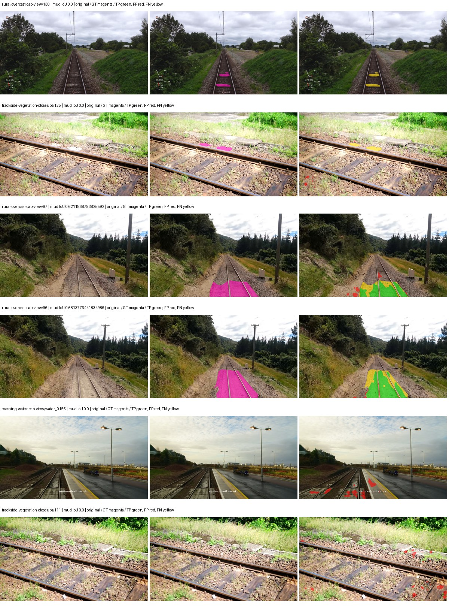
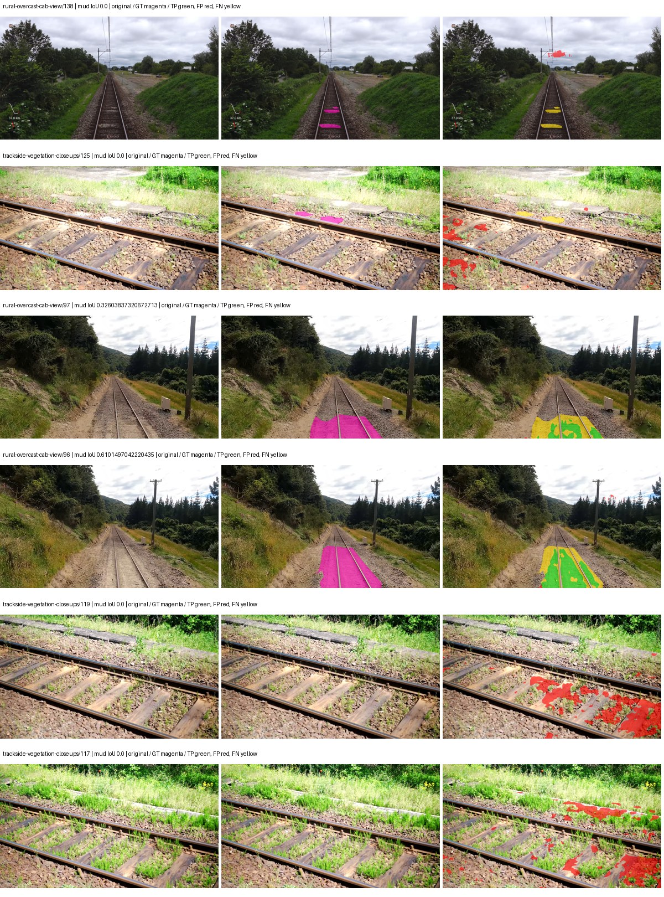

# hf_auto_mobilevit_xxs_deeplabv3 — paul-test-rtis_v2

[RTIS comparison](../../README.md) · [Full model records](record.json)

Primary selection and early stopping: **mud-pumping validation IoU**. A job is complete only after full statistics and isolated profiling are verified.

| Model | Initialization path | Seed | Status | Steps | Best step | Mud IoU (%) | Mud precision (%) | Mud recall (%) | Final mud IoU (trainer val, %) | mIoU (%) | Fixed GT-class mIoU (%) |
| --- | --- | --- | --- | --- | --- | --- | --- | --- | --- | --- | --- |
| hf_auto_mobilevit_xxs_deeplabv3 | rtis_only | 0 | training | 3949 | — | — | — | — | — | — | — |
| hf_auto_mobilevit_xxs_deeplabv3 | cityscapes_to_rtis | 0 | completed | 2803 | 1529 | 28.92 | 55.34 | 37.73 | 12.48 | 26.12 | 30.47 |
| hf_auto_mobilevit_xxs_deeplabv3 | railsem19_to_rtis | 0 | completed | 2803 | 1529 | 11.18 | 23.69 | 17.47 | 5.62 | 25.52 | 29.77 |
| hf_auto_mobilevit_xxs_deeplabv3 | cityscapes_to_railsem19_to_rtis | 0 | training | 2549 | — | — | — | — | — | — | — |

Training: 205 images. Validation: 37 images. Test: 50 held out. Seeds: [0]. Seed variation measures optimization variability, not independent-recording uncertainty. Historical source checkpoints stay fixed across adaptation seeds.

Training code: `066afb2626398b7be59d4d19f5a0e4644fd59adc`. Split SHA-256: `18a84c0163a65ded46508bcc904c374e5f33ad8a09b8879e3c8add606e86aa9f`.

## rtis_only — seed 0

Status: **training**. Started: 2026-09-09T19:05:04.318364+00:00. Finished: —.

Recipe pretrained initializer: `apple/deeplabv3-mobilevit-xx-small`.

`rtis_only` uses the recipe initializer, which may include pretrained segmentation components. Transfer paths load the exact historical source checkpoint below and reset the classifier; they do not reset all query/decoder features.

Source checkpoint: `Recipe pretrained initialization`.

Config SHA-256: `daa56907414983d6074d7a63221d02601110f480ddf76fa4e89a3bc7d7bca5dd`. Weights used for validation: `—`.

### Mud-pumping and aggregate quality

| Metric | Selected checkpoint | Final training validation |
| --- | --- | --- |
| Mud IoU | — | — |
| Mud precision | — | — |
| Mud recall | — | — |
| Mud Dice/F1 | — | — |
| mIoU | — | — |
| Mean accuracy | — | — |
| Mean precision | — | — |
| Mean Dice | — | — |
| Mean specificity | — | — |
| Pixel accuracy | — | — |
| Frequency-weighted IoU | — | — |
| Fixed GT-present class mIoU | — | — |
| Boundary F1 | — | — |

The selected checkpoint has independent evaluation evidence. Final values are the trainer's final validation record, not a new independent evaluation. mIoU averages classes with nonzero union, so false positives on absent classes can change its denominator. The fixed GT-class mean is supplementary and excludes absent classes; their false positives remain in the confusion matrix.

### Resource usage and timing

| Measurement | Value |
| --- | --- |
| Peak training VRAM, retained training invocation (GiB) | — |
| Peak evaluation VRAM (GiB) | — |
| Retained training invocation wall time (seconds) | — |
| Retained training invocation GPU-hours (one GPU) | — |
| Evaluation wall time (seconds) | — |
| Full evaluation pipeline images/second | — |
| Best full-state checkpoint (MiB) | — |
| Final full-state checkpoint (MiB) | — |
| Verified periodic checkpoints removed (GiB) | — |

VRAM uses the recorded allocator high-water mark; it is not total device usage including CUDA context. Resumed jobs' retained training invocation times and peaks are **not whole-campaign totals**. Earlier invocation resource records are not reconstructed here. Evaluation throughput includes loader, sliding-window inference and metrics; it is not model-only latency/FPS. Missing measurements are shown as —, never inferred from another dataset's run.

### Standardized inference performance

Dedicated model-only profiling waits for an idle worker-locked L40S: BF16, batch 1, 1024x1024, 20 warmup and 100 CUDA-event-timed public forwards. It excludes loading, preprocessing, tiling and metrics.

| Status | Parameters | Weight MiB | FPS | p50 ms | p95 ms | Peak reserved GiB |
| --- | --- | --- | --- | --- | --- | --- |
| waiting_for_idle_gpu | — | — | — | — | — | — |

```json
{
  "status": "waiting_for_idle_gpu",
  "contract": "L40S; batch 1; 1024x1024; BF16; 20 warmup; 100 timed forwards"
}
```

### Per-class validation results

| Class | GT pixels | IoU (%) | Precision (%) | Recall (%) | Dice (%) | Boundary F1 (%) |
| --- | --- | --- | --- | --- | --- | --- |

### Validation tracking

| Logged step | Overall mIoU (%) | Mud IoU (%) |
| --- | --- | --- |
| 254 | 9.94 | 0.31 |
| 509 | 16.52 | 0.50 |
| 764 | 19.18 | 0.70 |
| 1019 | 19.38 | 0.33 |
| 1274 | 20.33 | 1.58 |
| 1529 | 21.68 | 3.22 |
| 1784 | 21.82 | 3.11 |
| 2038 | 23.36 | 4.22 |
| 2293 | 22.60 | 6.27 |
| 2548 | 24.61 | 7.83 |
| 2803 | 23.86 | 5.31 |
| 3058 | 24.14 | 5.65 |
| 3313 | 24.20 | 9.25 |
| 3568 | 23.48 | 8.49 |
| 3823 | 23.87 | 10.47 |

All retained scalar curves, including training loss and per-class IoU, are in record.json. Observed best mud on a curve is not necessarily a retained checkpoint: the pilot saved its selection-metric-best and final checkpoints. Step logging and checkpoint global_step may differ by one.

### Stopping and checkpoint provenance

```json
{
  "stopping": null,
  "checkpoints": null,
  "cleanup_error": null
}
```

### Resolved training, initialization and evaluation settings

The optimizer block is the base configuration. Stage LR scales are applied at runtime, and stage warmup is capped at min(base warmup, floor(stage budget / 10), stage budget - 1): 400 steps for this 4,000-step pilot. Model-internal native input grids may differ from augmentation crops (EoMT uses its 640 grid).

```json
{
  "name": "hf_auto_mobilevit_xxs_deeplabv3--rtis_only--seed-0",
  "model": {
    "arch": "hf_auto",
    "checkpoint": "apple/deeplabv3-mobilevit-xx-small",
    "tuning": "full",
    "head": "unified_head",
    "lora_r": 16,
    "lora_alpha": 32,
    "lora_dropout": 0.05,
    "lora_targets": [],
    "drop_path": null,
    "revision": "2bece0a6464b15913c1f2c82cb5ab11bc5b7b3ad",
    "subfolder": null,
    "local_files_only": false,
    "trust_remote_code": false,
    "backbone_path": null,
    "head_paths": [],
    "classifier_path": null,
    "inactive_parameter_paths": [],
    "smp_arch": null,
    "encoder_name": null,
    "encoder_weights": null,
    "native": null,
    "batch_norm_momentum": null
  },
  "space": "paul-test-rtis",
  "taxonomy_root": "/data/izadia1/projects/segmentary-rtis-fullstats-066afb2/taxonomy",
  "output_root": "/data/izadia1/projects/segmentary-runs/paul-test-rtis_v2/seed0-20260909/future-runs",
  "optim": {
    "backbone_lr": 0.0001,
    "head_lr_mult": 10.0,
    "weight_decay": 0.05,
    "llrd": 1.0,
    "warmup_iters": 1500,
    "warmup_ratio": 1e-06,
    "poly_power": 0.9,
    "min_lr_ratio": 0.0,
    "betas": [
      0.9,
      0.999
    ],
    "grad_clip": 1.0
  },
  "train": {
    "iters": 4000,
    "batch_size": 2,
    "accum": 8,
    "num_workers": 2,
    "precision": "bf16-mixed",
    "ema_decay": 0.9998,
    "val_every": 250,
    "ckpt_every": 500,
    "selection_metric": "val_iou/mud-pumping",
    "early_stopping_patience": 5,
    "early_stopping_min_delta": 0.001,
    "seed": 0,
    "devices": 1
  },
  "eval": {
    "sliding_window": true,
    "window": [
      1024,
      1024
    ],
    "stride": [
      768,
      768
    ],
    "batch_size": 1,
    "num_workers": 2,
    "tta_scales": [],
    "tta_flip": false,
    "threshold": 0.5,
    "boundary_tolerance_frac": 0.0075,
    "save_confusion": true
  },
  "loss": {
    "task": "multiclass",
    "activation": "auto",
    "terms": [],
    "aux": "none",
    "aux_weight": 0.0,
    "ce_weight": 1.0,
    "label_smoothing": 0.0,
    "class_weights": null,
    "query": null
  },
  "aug": {
    "crop": [
      1024,
      1024
    ],
    "scale_min": 0.5,
    "scale_max": 2.0,
    "hflip_p": 0.5,
    "color_jitter_p": 0.5,
    "brightness": 0.25,
    "contrast": 0.25,
    "saturation": 0.25,
    "hue": 0.05
  },
  "stages": [
    {
      "name": "rtis",
      "data": [
        {
          "name": "paul-test-rtis",
          "root": "/data/izadia1/datasets/paul-test-rtis_v2",
          "variant": null,
          "split_file": "splits.json",
          "train_split": "train",
          "val_split": "val",
          "limit": null,
          "loader": "folder",
          "mapping": "paul-test-rtis",
          "loader_options": {
            "require_groups": true
          }
        }
      ],
      "iters": null,
      "lr_scale": 1.0,
      "head_group_lr_scale": 1.0,
      "init_from": "pretrained",
      "reset_head": false,
      "freeze": null,
      "sample_weights": null
    }
  ]
}
```

### Hardware and software provenance

```json
{
  "training": null,
  "evaluation": null
}
```

## cityscapes_to_rtis — seed 0

Status: **completed**. Started: 2026-09-09T19:16:43.333444+00:00. Finished: 2026-09-09T20:37:46.885213+00:00.

Recipe pretrained initializer: `apple/deeplabv3-mobilevit-xx-small`.

`rtis_only` uses the recipe initializer, which may include pretrained segmentation components. Transfer paths load the exact historical source checkpoint below and reset the classifier; they do not reset all query/decoder features.

Source checkpoint: `{'name': 'hf_auto_mobilevit_xxs_deeplabv3--cityscapes--seed-0', 'model': 'hf_auto_mobilevit_xxs_deeplabv3', 'protocol': 'cityscapes', 'config': '/data/izadia1/projects/segmentary-runs/all-model-city-rail-seed0-rail20-b9eb3e1/jobs/hf_auto_mobilevit_xxs_deeplabv3--cityscapes--seed-0/attempt-001/resolved-config.yaml', 'checkpoint': '/data/izadia1/projects/segmentary-runs/all-model-city-rail-seed0-rail20-b9eb3e1/jobs/hf_auto_mobilevit_xxs_deeplabv3--cityscapes--seed-0/attempt-001/train/hf_auto_mobilevit_xxs_deeplabv3--cityscapes_seed0/cityscapes/last.ckpt', 'recorded_sha256': '01d26e2baac106b0f31d7180ff889bc67cb7eaaed954174221aca62b4f1c726f', 'exists': True}`.

Config SHA-256: `259253eec07fd251bc534122e8b93ef17873cefc5f81d3df4b5ba7eec324dc81`. Weights used for validation: `raw`.

### Mud-pumping and aggregate quality

| Metric | Selected checkpoint | Final training validation |
| --- | --- | --- |
| Mud IoU | 28.92 | 12.48 |
| Mud precision | 55.34 | 39.10 |
| Mud recall | 37.73 | 15.49 |
| Mud Dice/F1 | 44.86 | 22.19 |
| mIoU | 26.12 | 28.11 |
| Mean accuracy | 37.91 | 41.62 |
| Mean precision | 43.79 | 42.61 |
| Mean Dice | 33.79 | 36.48 |
| Mean specificity | 98.90 | 98.76 |
| Pixel accuracy | 82.52 | 81.05 |
| Frequency-weighted IoU | 72.78 | 70.56 |
| Fixed GT-present class mIoU | 30.47 | 32.80 |
| Boundary F1 | 34.12 | 34.53 |

The selected checkpoint has independent evaluation evidence. Final values are the trainer's final validation record, not a new independent evaluation. mIoU averages classes with nonzero union, so false positives on absent classes can change its denominator. The fixed GT-class mean is supplementary and excludes absent classes; their false positives remain in the confusion matrix.

### Resource usage and timing

| Measurement | Value |
| --- | --- |
| Peak training VRAM, retained training invocation (GiB) | 15.78 |
| Peak evaluation VRAM (GiB) | 6.64 |
| Retained training invocation wall time (seconds) | 4676.72 |
| Retained training invocation GPU-hours (one GPU) | 1.30 |
| Evaluation wall time (seconds) | 17.15 |
| Full evaluation pipeline images/second | 2.16 |
| Best full-state checkpoint (MiB) | 28.88 |
| Final full-state checkpoint (MiB) | 28.87 |
| Verified periodic checkpoints removed (GiB) | 0.14 |

VRAM uses the recorded allocator high-water mark; it is not total device usage including CUDA context. Resumed jobs' retained training invocation times and peaks are **not whole-campaign totals**. Earlier invocation resource records are not reconstructed here. Evaluation throughput includes loader, sliding-window inference and metrics; it is not model-only latency/FPS. Missing measurements are shown as —, never inferred from another dataset's run.

### Standardized inference performance

Dedicated model-only profiling waits for an idle worker-locked L40S: BF16, batch 1, 1024x1024, 20 warmup and 100 CUDA-event-timed public forwards. It excludes loading, preprocessing, tiling and metrics.

| Status | Parameters | Weight MiB | FPS | p50 ms | p95 ms | Peak reserved GiB |
| --- | --- | --- | --- | --- | --- | --- |
| complete | 1854853 | 7.08 | 34.36 | 29.13 | 29.40 | 3.30 |

```json
{
  "schema_version": 1,
  "model_id": "hf_auto_mobilevit_xxs_deeplabv3",
  "measured_at": "2026-09-09T20:37:45+00:00",
  "status": "complete",
  "benchmark_scope": "rtis_selected_checkpoint_model_only",
  "applies_to": [
    "hf_auto_mobilevit_xxs_deeplabv3--cityscapes_to_rtis--seed-0"
  ],
  "source": {
    "campaign_git_sha": "066afb2626398b7be59d4d19f5a0e4644fd59adc",
    "git_dirty": false,
    "config_hash": "4a27dbc013cf",
    "resolved_config": "/data/izadia1/projects/segmentary-runs/paul-test-rtis_v2/seed0-20260909/configs/hf_auto_mobilevit_xxs_deeplabv3--cityscapes_to_rtis--seed-0.yaml",
    "config_sha256": "259253eec07fd251bc534122e8b93ef17873cefc5f81d3df4b5ba7eec324dc81",
    "checkpoint_sha256": "560bc809a10addbeb36b203b066dd8aa735c2ee75c534699867154c463ee8b15",
    "checkpoint_global_step": 1529,
    "checkpoint_bytes": 30284868,
    "checkpoint_kind": "resume checkpoint with optimizer and EMA state",
    "weights": "raw",
    "measured_checkpoint_job_id": "hf_auto_mobilevit_xxs_deeplabv3--cityscapes_to_rtis--seed-0",
    "result_sha256": "901aef22424ec015d434da3be3496817543d18263dfeaa476e21a8e081116035",
    "result_git_sha": "066afb2626398b7be59d4d19f5a0e4644fd59adc",
    "result_stage": "eval:paul-test-rtis:val",
    "result_seed": 0
  },
  "hardware": {
    "gpu_name": "NVIDIA L40S",
    "gpu_uuid": "GPU-84f5ca4d-68db-ae98-d056-40654d859dd9",
    "logical_device": "cuda:0",
    "physical_visibility_token": "0",
    "compute_capability": [
      8,
      9
    ],
    "total_memory_bytes": 47677177856
  },
  "model": {
    "parameter_count": 1854853,
    "trainable_parameter_count": 1854853,
    "resident_parameter_bytes": 7419412,
    "parameter_dtype_counts": {
      "float32": 1854853
    }
  },
  "contract": {
    "backend": "pytorch",
    "precision": "bf16_autocast",
    "batch_size": 1,
    "input_shape_nchw": [
      1,
      3,
      1024,
      1024
    ],
    "warmup_iterations": 20,
    "measured_iterations": 100,
    "timing": "per-forward CUDA events with end-event synchronization",
    "includes_preprocessing": false,
    "includes_data_loader": false,
    "includes_sliding_window": false,
    "input_resident_on_gpu": true,
    "model_only": true,
    "entrypoint": "public model(image) dense-logits forward"
  },
  "measurements": {
    "latency": {
      "p50_ms": 29.130720138549805,
      "p95_ms": 29.400422859191895,
      "mean_ms": 29.10187484741211,
      "minimum_ms": 28.60851287841797,
      "maximum_ms": 29.76870346069336,
      "fps": 34.36204729912531,
      "raw_ms": [
        29.230079650878906,
        28.72211265563965,
        28.917760848999023,
        29.39904022216797,
        29.13580894470215,
        29.14009666442871,
        29.104127883911133,
        29.18195152282715,
        29.196287155151367,
        28.76416015625,
        29.14089584350586,
        29.007871627807617,
        29.285375595092773,
        29.202592849731445,
        28.886112213134766,
        28.874752044677734,
        29.196287155151367,
        28.99660873413086,
        28.60851287841797,
        29.213695526123047,
        28.65158462524414,
        28.932096481323242,
        29.037567138671875,
        29.102079391479492,
        29.070335388183594,
        29.299711227416992,
        29.12563133239746,
        28.850175857543945,
        29.1759033203125,
        29.476863861083984,
        29.032512664794922,
        29.18297576904297,
        29.039615631103516,
        29.386751174926758,
        28.95974349975586,
        29.061119079589844,
        28.843904495239258,
        28.783615112304688,
        29.188095092773438,
        28.980224609375,
        29.280319213867188,
        28.812288284301758,
        29.008895874023438,
        29.00275230407715,
        29.2608642578125,
        29.047807693481445,
        28.81724739074707,
        29.293567657470703,
        28.98431968688965,
        29.420543670654297,
        29.030399322509766,
        29.289472579956055,
        29.34681510925293,
        29.224960327148438,
        29.306880950927734,
        29.36934471130371,
        29.243392944335938,
        29.4072322845459,
        29.111295700073242,
        29.139968872070312,
        28.96691131591797,
        29.297664642333984,
        29.16556739807129,
        29.750272750854492,
        29.054975509643555,
        28.78156852722168,
        29.139968872070312,
        29.223936080932617,
        29.016000747680664,
        29.19219207763672,
        29.068159103393555,
        28.983264923095703,
        28.95052719116211,
        29.253759384155273,
        29.335552215576172,
        29.029375076293945,
        28.93734359741211,
        28.80614471435547,
        28.864511489868164,
        29.220863342285156,
        28.759071350097656,
        29.201343536376953,
        29.271039962768555,
        29.161344528198242,
        28.76313591003418,
        28.956575393676758,
        28.79692840576172,
        29.3253116607666,
        29.16659164428711,
        28.941312789916992,
        29.040544509887695,
        28.95564842224121,
        29.138944625854492,
        29.40006446838379,
        29.76870346069336,
        29.158527374267578,
        29.38163185119629,
        29.227008819580078,
        29.256704330444336,
        28.69548797607422
      ],
      "percentile_method": "numpy linear interpolation"
    },
    "peak_reserved_bytes": 3548381184,
    "memory_kind": "pytorch_cuda_allocator_peak_reserved_excluding_context",
    "benchmark_wall_clock_s": 15.408045154064894
  },
  "started_at": "2026-09-09T20:37:29+00:00",
  "finished_at": "2026-09-09T20:37:45+00:00",
  "environment": {
    "hostname": "hdrfs-app-001",
    "python": "3.11.15",
    "platform": "Linux-5.15.0-139-generic-x86_64-with-glibc2.35",
    "torch": "2.11.0+cu128",
    "torch_cuda": "12.8",
    "cudnn": 91900,
    "driver_version": "570.133.20",
    "cuda_available": true,
    "gpu_count": 1,
    "gpu_names": [
      "NVIDIA L40S"
    ],
    "cuda_visible_devices": "0",
    "packages": {
      "segmentary": "0.1.0",
      "torch": "2.11.0+cu128",
      "torchvision": "0.26.0+cu128",
      "transformers": "5.15.0",
      "timm": "1.0.28",
      "segmentation-models-pytorch": "0.5.0",
      "albumentations": "2.0.8",
      "lightning": "2.6.5",
      "numpy": "2.4.4"
    }
  }
}
```

### Per-class validation results

| Class | GT pixels | IoU (%) | Precision (%) | Recall (%) | Dice (%) | Boundary F1 (%) |
| --- | --- | --- | --- | --- | --- | --- |
| car | 29664 | 5.24 | 62.36 | 5.41 | 9.95 | 31.85 |
| construction | 311585 | 30.53 | 37.34 | 62.62 | 46.78 | 41.47 |
| fence | 265137 | 5.78 | 9.41 | 13.05 | 10.93 | 8.14 |
| mud-pumping | 1226250 | 28.92 | 55.34 | 37.73 | 44.86 | 41.26 |
| on-rails | 0 | 0.00 | 0.00 | — | 0.00 | 0.00 |
| person | 0 | 0.00 | 0.00 | — | 0.00 | 0.00 |
| pole | 628038 | 60.51 | 81.56 | 70.10 | 75.40 | 84.22 |
| rail-embedded | 16799 | 0.00 | 0.00 | 0.00 | 0.00 | 0.00 |
| rail-raised | 2969797 | 70.43 | 79.47 | 86.10 | 82.65 | 89.21 |
| rail-track | 6323197 | 36.96 | 58.48 | 50.10 | 53.97 | 54.14 |
| road | 1048831 | 6.44 | 16.38 | 9.59 | 12.10 | 14.83 |
| sidewalk | 1297367 | 13.74 | 81.76 | 14.18 | 24.16 | 6.51 |
| sky | 19121606 | 97.18 | 98.85 | 98.28 | 98.57 | 91.51 |
| standing-water | 95802 | 0.74 | 0.95 | 3.16 | 1.47 | 2.77 |
| terrain | 39239306 | 84.69 | 87.82 | 95.96 | 91.71 | 55.91 |
| trackbed | 10643081 | 50.90 | 66.31 | 68.64 | 67.46 | 50.20 |
| traffic-light | 19510 | 7.84 | 30.26 | 9.57 | 14.55 | 29.85 |
| traffic-sign | 13285 | 11.86 | 88.35 | 12.04 | 21.20 | 54.64 |
| tram-track | 56179 | 0.00 | 0.00 | 0.00 | 0.00 | 0.00 |
| truck | 0 | 0.00 | 0.00 | — | 0.00 | 0.00 |
| vegetation-overgrowth | 5901821 | 36.76 | 64.86 | 45.90 | 53.76 | 60.02 |

### Full-run accounting

| Measurement | Value |
| --- | --- |
| Full GPU-reserved wall seconds, all recorded worker attempts | 4863.59 |
| Full reserved GPU-hours | 1.35 |
| Whole-run timing complete | True |

| Phase | Wall seconds including failed attempts |
| --- | --- |
| training | 4683.66 |
| diagnostics | 132.94 |
| performance | 22.72 |

GPU-reserved time includes model loading, training, validation, collection, profiling, checkpoint I/O and orchestration while the worker owns one GPU. It is not GPU kernel-active time. Phase timings and sampled device memory/power/utilization are retained separately; sampled device memory is not the allocator high-water mark.

### Train/validation and raw/EMA diagnostics

| Checkpoint / weights / split | Images | Mud IoU (%) | Mud precision (%) | Mud recall (%) |
| --- | --- | --- | --- | --- |
| best-auto-train / raw | 205 | 83.54 | 88.22 | 94.03 |
| best-auto-val / raw | 37 | 28.92 | 55.34 | 37.73 |
| best-alternate-val / ema | 37 | 3.19 | 6.72 | 5.71 |
| final-auto-val / raw | 37 | 12.45 | 38.92 | 15.48 |

Train uses the evaluation transform without augmentation. Compare mud train/validation metrics for the same selected weights. Alternate EMA on running-stat BatchNorm is explicitly uncalibrated and is diagnostic only. Score-threshold curves use uncalibrated normalized scores and are pixel-level diagnostics, not event detection rates or a selected deployment operating point.

### Downloadable evidence

- best-auto-train: [per-image.csv](cityscapes_to_rtis--seed-0/best-auto-train/per-image.csv) · [per-image-confusion.json.gz](cityscapes_to_rtis--seed-0/best-auto-train/per-image-confusion.json.gz) · [groups.json](cityscapes_to_rtis--seed-0/best-auto-train/groups.json) · [mud-score-curves.json](cityscapes_to_rtis--seed-0/best-auto-train/mud-score-curves.json)
- best-auto-val: [per-image.csv](cityscapes_to_rtis--seed-0/best-auto-val/per-image.csv) · [per-image-confusion.json.gz](cityscapes_to_rtis--seed-0/best-auto-val/per-image-confusion.json.gz) · [groups.json](cityscapes_to_rtis--seed-0/best-auto-val/groups.json) · [mud-score-curves.json](cityscapes_to_rtis--seed-0/best-auto-val/mud-score-curves.json) · [examples.jpg](cityscapes_to_rtis--seed-0/best-auto-val/examples.jpg)
- best-alternate-val: [per-image.csv](cityscapes_to_rtis--seed-0/best-alternate-val/per-image.csv) · [per-image-confusion.json.gz](cityscapes_to_rtis--seed-0/best-alternate-val/per-image-confusion.json.gz) · [groups.json](cityscapes_to_rtis--seed-0/best-alternate-val/groups.json) · [mud-score-curves.json](cityscapes_to_rtis--seed-0/best-alternate-val/mud-score-curves.json)
- final-auto-val: [per-image.csv](cityscapes_to_rtis--seed-0/final-auto-val/per-image.csv) · [per-image-confusion.json.gz](cityscapes_to_rtis--seed-0/final-auto-val/per-image-confusion.json.gz) · [groups.json](cityscapes_to_rtis--seed-0/final-auto-val/groups.json) · [mud-score-curves.json](cityscapes_to_rtis--seed-0/final-auto-val/mud-score-curves.json)
- resources: [telemetry.csv](cityscapes_to_rtis--seed-0/resources/telemetry.csv)



Examples are two lowest and two highest mud-IoU positive images, plus up to two negative images with the most false-positive mud pixels. They are targeted diagnostic examples, not random samples. Green: true positive; red: false positive; yellow: false negative. Full predictions remain on HDRFS.

### Validation tracking

| Logged step | Overall mIoU (%) | Mud IoU (%) |
| --- | --- | --- |
| 254 | 18.77 | 1.87 |
| 509 | 22.41 | 5.34 |
| 764 | 19.93 | 6.32 |
| 1019 | 22.78 | 5.72 |
| 1274 | 22.37 | 9.90 |
| 1529 | 26.13 | 28.93 |
| 1784 | 26.15 | 16.63 |
| 2038 | 24.19 | 14.39 |
| 2293 | 25.78 | 17.19 |
| 2548 | 28.26 | 19.48 |
| 2803 | 28.11 | 12.48 |

All retained scalar curves, including training loss and per-class IoU, are in record.json. Observed best mud on a curve is not necessarily a retained checkpoint: the pilot saved its selection-metric-best and final checkpoints. Step logging and checkpoint global_step may differ by one.

### Stopping and checkpoint provenance

```json
{
  "stopping": {
    "actual_steps": 2803,
    "maximum_steps": 4000,
    "min_delta": 0.001,
    "monitor": "val_iou/mud-pumping",
    "patience": 5,
    "reason": "validation_plateau"
  },
  "checkpoints": {
    "best": {
      "path": "/data/izadia1/projects/segmentary-runs/paul-test-rtis_v2/seed0-20260909/future-runs/hf_auto_mobilevit_xxs_deeplabv3--cityscapes_to_rtis--seed-0_seed0/rtis/best.ckpt",
      "sha256": "560bc809a10addbeb36b203b066dd8aa735c2ee75c534699867154c463ee8b15",
      "global_step": 1529,
      "bytes": 30284868
    },
    "final": {
      "path": "/data/izadia1/projects/segmentary-runs/paul-test-rtis_v2/seed0-20260909/future-runs/hf_auto_mobilevit_xxs_deeplabv3--cityscapes_to_rtis--seed-0_seed0/rtis/last.ckpt",
      "sha256": "e412e109ddb5b037821b42c15738868a7dfbf56df4dffb08e8bdda93b3243d54",
      "global_step": 2803,
      "bytes": 30270340
    }
  },
  "cleanup_error": null
}
```

### Resolved training, initialization and evaluation settings

The optimizer block is the base configuration. Stage LR scales are applied at runtime, and stage warmup is capped at min(base warmup, floor(stage budget / 10), stage budget - 1): 400 steps for this 4,000-step pilot. Model-internal native input grids may differ from augmentation crops (EoMT uses its 640 grid).

```json
{
  "name": "hf_auto_mobilevit_xxs_deeplabv3--cityscapes_to_rtis--seed-0",
  "model": {
    "arch": "hf_auto",
    "checkpoint": "apple/deeplabv3-mobilevit-xx-small",
    "tuning": "full",
    "head": "unified_head",
    "lora_r": 16,
    "lora_alpha": 32,
    "lora_dropout": 0.05,
    "lora_targets": [],
    "drop_path": null,
    "revision": "2bece0a6464b15913c1f2c82cb5ab11bc5b7b3ad",
    "subfolder": null,
    "local_files_only": false,
    "trust_remote_code": false,
    "backbone_path": null,
    "head_paths": [],
    "classifier_path": null,
    "inactive_parameter_paths": [],
    "smp_arch": null,
    "encoder_name": null,
    "encoder_weights": null,
    "native": null,
    "batch_norm_momentum": null
  },
  "space": "paul-test-rtis",
  "taxonomy_root": "/data/izadia1/projects/segmentary-rtis-fullstats-066afb2/taxonomy",
  "output_root": "/data/izadia1/projects/segmentary-runs/paul-test-rtis_v2/seed0-20260909/future-runs",
  "optim": {
    "backbone_lr": 0.0001,
    "head_lr_mult": 10.0,
    "weight_decay": 0.05,
    "llrd": 1.0,
    "warmup_iters": 1500,
    "warmup_ratio": 1e-06,
    "poly_power": 0.9,
    "min_lr_ratio": 0.0,
    "betas": [
      0.9,
      0.999
    ],
    "grad_clip": 1.0
  },
  "train": {
    "iters": 4000,
    "batch_size": 2,
    "accum": 8,
    "num_workers": 2,
    "precision": "bf16-mixed",
    "ema_decay": 0.9998,
    "val_every": 250,
    "ckpt_every": 500,
    "selection_metric": "val_iou/mud-pumping",
    "early_stopping_patience": 5,
    "early_stopping_min_delta": 0.001,
    "seed": 0,
    "devices": 1
  },
  "eval": {
    "sliding_window": true,
    "window": [
      1024,
      1024
    ],
    "stride": [
      768,
      768
    ],
    "batch_size": 1,
    "num_workers": 2,
    "tta_scales": [],
    "tta_flip": false,
    "threshold": 0.5,
    "boundary_tolerance_frac": 0.0075,
    "save_confusion": true
  },
  "loss": {
    "task": "multiclass",
    "activation": "auto",
    "terms": [],
    "aux": "none",
    "aux_weight": 0.0,
    "ce_weight": 1.0,
    "label_smoothing": 0.0,
    "class_weights": null,
    "query": null
  },
  "aug": {
    "crop": [
      1024,
      1024
    ],
    "scale_min": 0.5,
    "scale_max": 2.0,
    "hflip_p": 0.5,
    "color_jitter_p": 0.5,
    "brightness": 0.25,
    "contrast": 0.25,
    "saturation": 0.25,
    "hue": 0.05
  },
  "stages": [
    {
      "name": "rtis",
      "data": [
        {
          "name": "paul-test-rtis",
          "root": "/data/izadia1/datasets/paul-test-rtis_v2",
          "variant": null,
          "split_file": "splits.json",
          "train_split": "train",
          "val_split": "val",
          "limit": null,
          "loader": "folder",
          "mapping": "paul-test-rtis",
          "loader_options": {
            "require_groups": true
          }
        }
      ],
      "iters": null,
      "lr_scale": 0.1,
      "head_group_lr_scale": 1.0,
      "init_from": "/data/izadia1/projects/segmentary-runs/all-model-city-rail-seed0-rail20-b9eb3e1/jobs/hf_auto_mobilevit_xxs_deeplabv3--cityscapes--seed-0/attempt-001/train/hf_auto_mobilevit_xxs_deeplabv3--cityscapes_seed0/cityscapes/last.ckpt",
      "reset_head": true,
      "freeze": null,
      "sample_weights": null
    }
  ]
}
```

### Hardware and software provenance

```json
{
  "training": {
    "cuda_available": true,
    "cuda_visible_devices": "0",
    "cudnn": 91900,
    "driver_version": "570.133.20",
    "gpu_count": 1,
    "gpu_names": [
      "NVIDIA L40S"
    ],
    "hostname": "hdrfs-app-001",
    "input_normalization": {
      "channel_order": "bgr",
      "mean": [
        0.0,
        0.0,
        0.0
      ],
      "source": "hf_image_processor",
      "std": [
        1.0,
        1.0,
        1.0
      ]
    },
    "model_origins": [
      {
        "hf_commit": "2bece0a6464b15913c1f2c82cb5ab11bc5b7b3ad",
        "hf_name_or_path": "apple/deeplabv3-mobilevit-xx-small",
        "module": "model",
        "timm_pretrained": {}
      },
      {
        "hf_commit": "2bece0a6464b15913c1f2c82cb5ab11bc5b7b3ad",
        "hf_name_or_path": "apple/deeplabv3-mobilevit-xx-small",
        "module": "model.mobilevit",
        "timm_pretrained": {}
      },
      {
        "hf_commit": "2bece0a6464b15913c1f2c82cb5ab11bc5b7b3ad",
        "hf_name_or_path": "apple/deeplabv3-mobilevit-xx-small",
        "module": "model.mobilevit.encoder",
        "timm_pretrained": {}
      }
    ],
    "model_parameter_count": 1854853,
    "packages": {
      "albumentations": "2.0.8",
      "lightning": "2.6.5",
      "numpy": "2.4.4",
      "segmentary": "0.1.0",
      "segmentation-models-pytorch": "0.5.0",
      "timm": "1.0.28",
      "torch": "2.11.0+cu128",
      "torchvision": "0.26.0+cu128",
      "transformers": "5.15.0"
    },
    "platform": "Linux-5.15.0-139-generic-x86_64-with-glibc2.35",
    "python": "3.11.15",
    "torch": "2.11.0+cu128",
    "torch_cuda": "12.8",
    "trainable_parameter_count": 1854853,
    "training_stop": {
      "actual_steps": 2803,
      "maximum_steps": 4000,
      "min_delta": 0.001,
      "monitor": "val_iou/mud-pumping",
      "patience": 5,
      "reason": "validation_plateau"
    },
    "validation_weights": "raw"
  },
  "evaluation": {
    "cuda_available": true,
    "cuda_visible_devices": "0",
    "cudnn": 91900,
    "driver_version": "570.133.20",
    "gpu_count": 1,
    "gpu_names": [
      "NVIDIA L40S"
    ],
    "hostname": "hdrfs-app-001",
    "input_normalization": {
      "channel_order": "bgr",
      "mean": [
        0.0,
        0.0,
        0.0
      ],
      "source": "hf_image_processor",
      "std": [
        1.0,
        1.0,
        1.0
      ]
    },
    "packages": {
      "albumentations": "2.0.8",
      "lightning": "2.6.5",
      "numpy": "2.4.4",
      "segmentary": "0.1.0",
      "segmentation-models-pytorch": "0.5.0",
      "timm": "1.0.28",
      "torch": "2.11.0+cu128",
      "torchvision": "0.26.0+cu128",
      "transformers": "5.15.0"
    },
    "platform": "Linux-5.15.0-139-generic-x86_64-with-glibc2.35",
    "python": "3.11.15",
    "torch": "2.11.0+cu128",
    "torch_cuda": "12.8"
  }
}
```

## railsem19_to_rtis — seed 0

Status: **completed**. Started: 2026-09-09T19:17:48.338835+00:00. Finished: 2026-09-09T20:38:56.268114+00:00.

Recipe pretrained initializer: `apple/deeplabv3-mobilevit-xx-small`.

`rtis_only` uses the recipe initializer, which may include pretrained segmentation components. Transfer paths load the exact historical source checkpoint below and reset the classifier; they do not reset all query/decoder features.

Source checkpoint: `{'name': 'hf_auto_mobilevit_xxs_deeplabv3--railsem19--seed-0', 'model': 'hf_auto_mobilevit_xxs_deeplabv3', 'protocol': 'railsem19', 'config': '/data/izadia1/projects/segmentary-runs/all-model-city-rail-seed0-rail20-b9eb3e1/jobs/hf_auto_mobilevit_xxs_deeplabv3--railsem19--seed-0/attempt-001/resolved-config.yaml', 'checkpoint': '/data/izadia1/projects/segmentary-runs/all-model-city-rail-seed0-rail20-b9eb3e1/jobs/hf_auto_mobilevit_xxs_deeplabv3--railsem19--seed-0/attempt-001/train/hf_auto_mobilevit_xxs_deeplabv3--railsem19_seed0/railsem19/last.ckpt', 'recorded_sha256': '9a4a000c2398260d53a1e1fb0e073bbc3fde8d64049cb54dc0895da390ce5131', 'exists': True}`.

Config SHA-256: `2aee4c3b40a82df9c5e0baeb0ac0d836e12908f2912530cd655af9771fa81e69`. Weights used for validation: `raw`.

### Mud-pumping and aggregate quality

| Metric | Selected checkpoint | Final training validation |
| --- | --- | --- |
| Mud IoU | 11.18 | 5.62 |
| Mud precision | 23.69 | 9.19 |
| Mud recall | 17.47 | 12.64 |
| Mud Dice/F1 | 20.11 | 10.65 |
| mIoU | 25.52 | 27.91 |
| Mean accuracy | 36.19 | 41.23 |
| Mean precision | 51.26 | 47.99 |
| Mean Dice | 32.25 | 36.20 |
| Mean specificity | 98.74 | 98.87 |
| Pixel accuracy | 81.50 | 81.92 |
| Frequency-weighted IoU | 69.93 | 71.87 |
| Fixed GT-present class mIoU | 29.77 | 32.57 |
| Boundary F1 | 29.06 | 33.58 |

The selected checkpoint has independent evaluation evidence. Final values are the trainer's final validation record, not a new independent evaluation. mIoU averages classes with nonzero union, so false positives on absent classes can change its denominator. The fixed GT-class mean is supplementary and excludes absent classes; their false positives remain in the confusion matrix.

### Resource usage and timing

| Measurement | Value |
| --- | --- |
| Peak training VRAM, retained training invocation (GiB) | 15.78 |
| Peak evaluation VRAM (GiB) | 6.64 |
| Retained training invocation wall time (seconds) | 4682.39 |
| Retained training invocation GPU-hours (one GPU) | 1.30 |
| Evaluation wall time (seconds) | 16.97 |
| Full evaluation pipeline images/second | 2.18 |
| Best full-state checkpoint (MiB) | 28.88 |
| Final full-state checkpoint (MiB) | 28.87 |
| Verified periodic checkpoints removed (GiB) | 0.14 |

VRAM uses the recorded allocator high-water mark; it is not total device usage including CUDA context. Resumed jobs' retained training invocation times and peaks are **not whole-campaign totals**. Earlier invocation resource records are not reconstructed here. Evaluation throughput includes loader, sliding-window inference and metrics; it is not model-only latency/FPS. Missing measurements are shown as —, never inferred from another dataset's run.

### Standardized inference performance

Dedicated model-only profiling waits for an idle worker-locked L40S: BF16, batch 1, 1024x1024, 20 warmup and 100 CUDA-event-timed public forwards. It excludes loading, preprocessing, tiling and metrics.

| Status | Parameters | Weight MiB | FPS | p50 ms | p95 ms | Peak reserved GiB |
| --- | --- | --- | --- | --- | --- | --- |
| complete | 1854853 | 7.08 | 34.69 | 28.75 | 29.18 | 3.30 |

```json
{
  "schema_version": 1,
  "model_id": "hf_auto_mobilevit_xxs_deeplabv3",
  "measured_at": "2026-09-09T20:38:54+00:00",
  "status": "complete",
  "benchmark_scope": "rtis_selected_checkpoint_model_only",
  "applies_to": [
    "hf_auto_mobilevit_xxs_deeplabv3--railsem19_to_rtis--seed-0"
  ],
  "source": {
    "campaign_git_sha": "066afb2626398b7be59d4d19f5a0e4644fd59adc",
    "git_dirty": false,
    "config_hash": "1e0000a0870e",
    "resolved_config": "/data/izadia1/projects/segmentary-runs/paul-test-rtis_v2/seed0-20260909/configs/hf_auto_mobilevit_xxs_deeplabv3--railsem19_to_rtis--seed-0.yaml",
    "config_sha256": "2aee4c3b40a82df9c5e0baeb0ac0d836e12908f2912530cd655af9771fa81e69",
    "checkpoint_sha256": "cbf96703f62147277f3ea9911383818c5c5b80a23c821307180a101956b7c49e",
    "checkpoint_global_step": 1529,
    "checkpoint_bytes": 30284868,
    "checkpoint_kind": "resume checkpoint with optimizer and EMA state",
    "weights": "raw",
    "measured_checkpoint_job_id": "hf_auto_mobilevit_xxs_deeplabv3--railsem19_to_rtis--seed-0",
    "result_sha256": "ded3fe35ecb553f1b2af75d174cf83f92c5a2c8408eb5d96520f1f952de18b53",
    "result_git_sha": "066afb2626398b7be59d4d19f5a0e4644fd59adc",
    "result_stage": "eval:paul-test-rtis:val",
    "result_seed": 0
  },
  "hardware": {
    "gpu_name": "NVIDIA L40S",
    "gpu_uuid": "GPU-931d0911-fc78-1638-e3d7-1ba868cbd286",
    "logical_device": "cuda:0",
    "physical_visibility_token": "2",
    "compute_capability": [
      8,
      9
    ],
    "total_memory_bytes": 47677177856
  },
  "model": {
    "parameter_count": 1854853,
    "trainable_parameter_count": 1854853,
    "resident_parameter_bytes": 7419412,
    "parameter_dtype_counts": {
      "float32": 1854853
    }
  },
  "contract": {
    "backend": "pytorch",
    "precision": "bf16_autocast",
    "batch_size": 1,
    "input_shape_nchw": [
      1,
      3,
      1024,
      1024
    ],
    "warmup_iterations": 20,
    "measured_iterations": 100,
    "timing": "per-forward CUDA events with end-event synchronization",
    "includes_preprocessing": false,
    "includes_data_loader": false,
    "includes_sliding_window": false,
    "input_resident_on_gpu": true,
    "model_only": true,
    "entrypoint": "public model(image) dense-logits forward"
  },
  "measurements": {
    "latency": {
      "p50_ms": 28.74883270263672,
      "p95_ms": 29.182053756713866,
      "mean_ms": 28.825512962341307,
      "minimum_ms": 28.60032081604004,
      "maximum_ms": 29.57916831970215,
      "fps": 34.6914901846304,
      "raw_ms": [
        28.892160415649414,
        28.865535736083984,
        28.72319984436035,
        28.669952392578125,
        28.745664596557617,
        28.664831161499023,
        28.774303436279297,
        28.693504333496094,
        28.636159896850586,
        28.73971176147461,
        28.701696395874023,
        28.75200080871582,
        29.093887329101562,
        28.697599411010742,
        28.717056274414062,
        28.896255493164062,
        28.667903900146484,
        28.687360763549805,
        28.684288024902344,
        28.650400161743164,
        28.97817611694336,
        28.660736083984375,
        28.72719955444336,
        28.754976272583008,
        28.689407348632812,
        28.742656707763672,
        28.687360763549805,
        28.95667266845703,
        28.683359146118164,
        29.13484764099121,
        28.708864212036133,
        28.687360763549805,
        28.71295928955078,
        28.686336517333984,
        28.687360763549805,
        28.702720642089844,
        29.238271713256836,
        28.826623916625977,
        28.799999237060547,
        29.075456619262695,
        28.776384353637695,
        28.847103118896484,
        29.15430450439453,
        28.757984161376953,
        28.650495529174805,
        28.650495529174805,
        28.651519775390625,
        28.862464904785156,
        28.97817611694336,
        28.943328857421875,
        28.698623657226562,
        28.74367904663086,
        29.466623306274414,
        29.00275230407715,
        29.06220817565918,
        28.72934341430664,
        28.98534393310547,
        28.9484806060791,
        29.244415283203125,
        28.827648162841797,
        28.75596809387207,
        28.693504333496094,
        28.891136169433594,
        28.90127944946289,
        28.68320083618164,
        28.668928146362305,
        28.726272583007812,
        28.863487243652344,
        28.77440071105957,
        28.98636817932129,
        29.099008560180664,
        29.039615631103516,
        28.734464645385742,
        28.72319984436035,
        28.641279220581055,
        29.20345687866211,
        28.75289535522461,
        29.180927276611328,
        28.78054428100586,
        28.675071716308594,
        29.054975509643555,
        28.891136169433594,
        28.896127700805664,
        28.75391960144043,
        29.057024002075195,
        28.852224349975586,
        29.57916831970215,
        28.733440399169922,
        28.698623657226562,
        28.60032081604004,
        28.699647903442383,
        28.724224090576172,
        28.97100830078125,
        28.72617530822754,
        28.904447555541992,
        28.613632202148438,
        28.687360763549805,
        28.696575164794922,
        28.72115135192871,
        28.838911056518555
      ],
      "percentile_method": "numpy linear interpolation"
    },
    "peak_reserved_bytes": 3548381184,
    "memory_kind": "pytorch_cuda_allocator_peak_reserved_excluding_context",
    "benchmark_wall_clock_s": 15.462867800146341
  },
  "started_at": "2026-09-09T20:38:39+00:00",
  "finished_at": "2026-09-09T20:38:54+00:00",
  "environment": {
    "hostname": "hdrfs-app-001",
    "python": "3.11.15",
    "platform": "Linux-5.15.0-139-generic-x86_64-with-glibc2.35",
    "torch": "2.11.0+cu128",
    "torch_cuda": "12.8",
    "cudnn": 91900,
    "driver_version": "570.133.20",
    "cuda_available": true,
    "gpu_count": 1,
    "gpu_names": [
      "NVIDIA L40S"
    ],
    "cuda_visible_devices": "2",
    "packages": {
      "segmentary": "0.1.0",
      "torch": "2.11.0+cu128",
      "torchvision": "0.26.0+cu128",
      "transformers": "5.15.0",
      "timm": "1.0.28",
      "segmentation-models-pytorch": "0.5.0",
      "albumentations": "2.0.8",
      "lightning": "2.6.5",
      "numpy": "2.4.4"
    }
  }
}
```

### Per-class validation results

| Class | GT pixels | IoU (%) | Precision (%) | Recall (%) | Dice (%) | Boundary F1 (%) |
| --- | --- | --- | --- | --- | --- | --- |
| car | 29664 | 0.00 | 0.00 | 0.00 | 0.00 | 0.00 |
| construction | 311585 | 52.62 | 65.98 | 72.21 | 68.96 | 60.27 |
| fence | 265137 | 5.04 | 7.39 | 13.72 | 9.61 | 11.45 |
| mud-pumping | 1226250 | 11.18 | 23.69 | 17.47 | 20.11 | 13.68 |
| on-rails | 0 | 0.00 | 0.00 | — | 0.00 | 0.00 |
| person | 0 | 0.00 | 0.00 | — | 0.00 | 0.00 |
| pole | 628038 | 59.21 | 83.66 | 66.95 | 74.38 | 86.08 |
| rail-embedded | 16799 | 0.23 | 100.00 | 0.23 | 0.46 | 4.89 |
| rail-raised | 2969797 | 63.75 | 69.81 | 88.01 | 77.86 | 82.15 |
| rail-track | 6323197 | 33.82 | 70.85 | 39.29 | 50.55 | 39.54 |
| road | 1048831 | 1.95 | 18.69 | 2.13 | 3.83 | 13.53 |
| sidewalk | 1297367 | 47.08 | 86.52 | 50.81 | 64.02 | 16.17 |
| sky | 19121606 | 97.81 | 99.13 | 98.66 | 98.89 | 94.36 |
| standing-water | 95802 | 0.01 | 0.02 | 0.05 | 0.03 | 0.70 |
| terrain | 39239306 | 82.09 | 82.89 | 98.84 | 90.16 | 53.82 |
| trackbed | 10643081 | 53.95 | 65.70 | 75.09 | 70.08 | 55.68 |
| traffic-light | 19510 | 2.31 | 48.48 | 2.37 | 4.52 | 7.34 |
| traffic-sign | 13285 | 1.21 | 99.38 | 1.21 | 2.39 | 28.28 |
| tram-track | 56179 | 17.45 | 83.19 | 18.09 | 29.72 | 21.36 |
| truck | 0 | 0.00 | 0.00 | — | 0.00 | 0.00 |
| vegetation-overgrowth | 5901821 | 6.19 | 70.98 | 6.35 | 11.66 | 20.86 |

### Full-run accounting

| Measurement | Value |
| --- | --- |
| Full GPU-reserved wall seconds, all recorded worker attempts | 4867.96 |
| Full reserved GPU-hours | 1.35 |
| Whole-run timing complete | True |

| Phase | Wall seconds including failed attempts |
| --- | --- |
| training | 4689.30 |
| diagnostics | 132.31 |
| performance | 22.37 |

GPU-reserved time includes model loading, training, validation, collection, profiling, checkpoint I/O and orchestration while the worker owns one GPU. It is not GPU kernel-active time. Phase timings and sampled device memory/power/utilization are retained separately; sampled device memory is not the allocator high-water mark.

### Train/validation and raw/EMA diagnostics

| Checkpoint / weights / split | Images | Mud IoU (%) | Mud precision (%) | Mud recall (%) |
| --- | --- | --- | --- | --- |
| best-auto-train / raw | 205 | 87.04 | 91.05 | 95.18 |
| best-auto-val / raw | 37 | 11.18 | 23.69 | 17.47 |
| best-alternate-val / ema | 37 | 1.46 | 41.85 | 1.49 |
| final-auto-val / raw | 37 | 5.62 | 9.19 | 12.64 |

Train uses the evaluation transform without augmentation. Compare mud train/validation metrics for the same selected weights. Alternate EMA on running-stat BatchNorm is explicitly uncalibrated and is diagnostic only. Score-threshold curves use uncalibrated normalized scores and are pixel-level diagnostics, not event detection rates or a selected deployment operating point.

### Downloadable evidence

- best-auto-train: [per-image.csv](railsem19_to_rtis--seed-0/best-auto-train/per-image.csv) · [per-image-confusion.json.gz](railsem19_to_rtis--seed-0/best-auto-train/per-image-confusion.json.gz) · [groups.json](railsem19_to_rtis--seed-0/best-auto-train/groups.json) · [mud-score-curves.json](railsem19_to_rtis--seed-0/best-auto-train/mud-score-curves.json)
- best-auto-val: [per-image.csv](railsem19_to_rtis--seed-0/best-auto-val/per-image.csv) · [per-image-confusion.json.gz](railsem19_to_rtis--seed-0/best-auto-val/per-image-confusion.json.gz) · [groups.json](railsem19_to_rtis--seed-0/best-auto-val/groups.json) · [mud-score-curves.json](railsem19_to_rtis--seed-0/best-auto-val/mud-score-curves.json) · [examples.jpg](railsem19_to_rtis--seed-0/best-auto-val/examples.jpg)
- best-alternate-val: [per-image.csv](railsem19_to_rtis--seed-0/best-alternate-val/per-image.csv) · [per-image-confusion.json.gz](railsem19_to_rtis--seed-0/best-alternate-val/per-image-confusion.json.gz) · [groups.json](railsem19_to_rtis--seed-0/best-alternate-val/groups.json) · [mud-score-curves.json](railsem19_to_rtis--seed-0/best-alternate-val/mud-score-curves.json)
- final-auto-val: [per-image.csv](railsem19_to_rtis--seed-0/final-auto-val/per-image.csv) · [per-image-confusion.json.gz](railsem19_to_rtis--seed-0/final-auto-val/per-image-confusion.json.gz) · [groups.json](railsem19_to_rtis--seed-0/final-auto-val/groups.json) · [mud-score-curves.json](railsem19_to_rtis--seed-0/final-auto-val/mud-score-curves.json)
- resources: [telemetry.csv](railsem19_to_rtis--seed-0/resources/telemetry.csv)



Examples are two lowest and two highest mud-IoU positive images, plus up to two negative images with the most false-positive mud pixels. They are targeted diagnostic examples, not random samples. Green: true positive; red: false positive; yellow: false negative. Full predictions remain on HDRFS.

### Validation tracking

| Logged step | Overall mIoU (%) | Mud IoU (%) |
| --- | --- | --- |
| 254 | 22.77 | 0.92 |
| 509 | 27.03 | 3.30 |
| 764 | 26.68 | 4.72 |
| 1019 | 25.65 | 5.19 |
| 1274 | 25.88 | 6.55 |
| 1529 | 25.52 | 11.17 |
| 1784 | 27.68 | 10.63 |
| 2038 | 26.56 | 8.40 |
| 2293 | 27.18 | 9.52 |
| 2548 | 28.14 | 6.10 |
| 2803 | 27.91 | 5.62 |

All retained scalar curves, including training loss and per-class IoU, are in record.json. Observed best mud on a curve is not necessarily a retained checkpoint: the pilot saved its selection-metric-best and final checkpoints. Step logging and checkpoint global_step may differ by one.

### Stopping and checkpoint provenance

```json
{
  "stopping": {
    "actual_steps": 2803,
    "maximum_steps": 4000,
    "min_delta": 0.001,
    "monitor": "val_iou/mud-pumping",
    "patience": 5,
    "reason": "validation_plateau"
  },
  "checkpoints": {
    "best": {
      "path": "/data/izadia1/projects/segmentary-runs/paul-test-rtis_v2/seed0-20260909/future-runs/hf_auto_mobilevit_xxs_deeplabv3--railsem19_to_rtis--seed-0_seed0/rtis/best.ckpt",
      "sha256": "cbf96703f62147277f3ea9911383818c5c5b80a23c821307180a101956b7c49e",
      "global_step": 1529,
      "bytes": 30284868
    },
    "final": {
      "path": "/data/izadia1/projects/segmentary-runs/paul-test-rtis_v2/seed0-20260909/future-runs/hf_auto_mobilevit_xxs_deeplabv3--railsem19_to_rtis--seed-0_seed0/rtis/last.ckpt",
      "sha256": "a1fca32140330a111f6546a14157e6fe14ee9bf37a22bdf61f922d7f01e062d6",
      "global_step": 2803,
      "bytes": 30270340
    }
  },
  "cleanup_error": null
}
```

### Resolved training, initialization and evaluation settings

The optimizer block is the base configuration. Stage LR scales are applied at runtime, and stage warmup is capped at min(base warmup, floor(stage budget / 10), stage budget - 1): 400 steps for this 4,000-step pilot. Model-internal native input grids may differ from augmentation crops (EoMT uses its 640 grid).

```json
{
  "name": "hf_auto_mobilevit_xxs_deeplabv3--railsem19_to_rtis--seed-0",
  "model": {
    "arch": "hf_auto",
    "checkpoint": "apple/deeplabv3-mobilevit-xx-small",
    "tuning": "full",
    "head": "unified_head",
    "lora_r": 16,
    "lora_alpha": 32,
    "lora_dropout": 0.05,
    "lora_targets": [],
    "drop_path": null,
    "revision": "2bece0a6464b15913c1f2c82cb5ab11bc5b7b3ad",
    "subfolder": null,
    "local_files_only": false,
    "trust_remote_code": false,
    "backbone_path": null,
    "head_paths": [],
    "classifier_path": null,
    "inactive_parameter_paths": [],
    "smp_arch": null,
    "encoder_name": null,
    "encoder_weights": null,
    "native": null,
    "batch_norm_momentum": null
  },
  "space": "paul-test-rtis",
  "taxonomy_root": "/data/izadia1/projects/segmentary-rtis-fullstats-066afb2/taxonomy",
  "output_root": "/data/izadia1/projects/segmentary-runs/paul-test-rtis_v2/seed0-20260909/future-runs",
  "optim": {
    "backbone_lr": 0.0001,
    "head_lr_mult": 10.0,
    "weight_decay": 0.05,
    "llrd": 1.0,
    "warmup_iters": 1500,
    "warmup_ratio": 1e-06,
    "poly_power": 0.9,
    "min_lr_ratio": 0.0,
    "betas": [
      0.9,
      0.999
    ],
    "grad_clip": 1.0
  },
  "train": {
    "iters": 4000,
    "batch_size": 2,
    "accum": 8,
    "num_workers": 2,
    "precision": "bf16-mixed",
    "ema_decay": 0.9998,
    "val_every": 250,
    "ckpt_every": 500,
    "selection_metric": "val_iou/mud-pumping",
    "early_stopping_patience": 5,
    "early_stopping_min_delta": 0.001,
    "seed": 0,
    "devices": 1
  },
  "eval": {
    "sliding_window": true,
    "window": [
      1024,
      1024
    ],
    "stride": [
      768,
      768
    ],
    "batch_size": 1,
    "num_workers": 2,
    "tta_scales": [],
    "tta_flip": false,
    "threshold": 0.5,
    "boundary_tolerance_frac": 0.0075,
    "save_confusion": true
  },
  "loss": {
    "task": "multiclass",
    "activation": "auto",
    "terms": [],
    "aux": "none",
    "aux_weight": 0.0,
    "ce_weight": 1.0,
    "label_smoothing": 0.0,
    "class_weights": null,
    "query": null
  },
  "aug": {
    "crop": [
      1024,
      1024
    ],
    "scale_min": 0.5,
    "scale_max": 2.0,
    "hflip_p": 0.5,
    "color_jitter_p": 0.5,
    "brightness": 0.25,
    "contrast": 0.25,
    "saturation": 0.25,
    "hue": 0.05
  },
  "stages": [
    {
      "name": "rtis",
      "data": [
        {
          "name": "paul-test-rtis",
          "root": "/data/izadia1/datasets/paul-test-rtis_v2",
          "variant": null,
          "split_file": "splits.json",
          "train_split": "train",
          "val_split": "val",
          "limit": null,
          "loader": "folder",
          "mapping": "paul-test-rtis",
          "loader_options": {
            "require_groups": true
          }
        }
      ],
      "iters": null,
      "lr_scale": 0.1,
      "head_group_lr_scale": 1.0,
      "init_from": "/data/izadia1/projects/segmentary-runs/all-model-city-rail-seed0-rail20-b9eb3e1/jobs/hf_auto_mobilevit_xxs_deeplabv3--railsem19--seed-0/attempt-001/train/hf_auto_mobilevit_xxs_deeplabv3--railsem19_seed0/railsem19/last.ckpt",
      "reset_head": true,
      "freeze": null,
      "sample_weights": null
    }
  ]
}
```

### Hardware and software provenance

```json
{
  "training": {
    "cuda_available": true,
    "cuda_visible_devices": "2",
    "cudnn": 91900,
    "driver_version": "570.133.20",
    "gpu_count": 1,
    "gpu_names": [
      "NVIDIA L40S"
    ],
    "hostname": "hdrfs-app-001",
    "input_normalization": {
      "channel_order": "bgr",
      "mean": [
        0.0,
        0.0,
        0.0
      ],
      "source": "hf_image_processor",
      "std": [
        1.0,
        1.0,
        1.0
      ]
    },
    "model_origins": [
      {
        "hf_commit": "2bece0a6464b15913c1f2c82cb5ab11bc5b7b3ad",
        "hf_name_or_path": "apple/deeplabv3-mobilevit-xx-small",
        "module": "model",
        "timm_pretrained": {}
      },
      {
        "hf_commit": "2bece0a6464b15913c1f2c82cb5ab11bc5b7b3ad",
        "hf_name_or_path": "apple/deeplabv3-mobilevit-xx-small",
        "module": "model.mobilevit",
        "timm_pretrained": {}
      },
      {
        "hf_commit": "2bece0a6464b15913c1f2c82cb5ab11bc5b7b3ad",
        "hf_name_or_path": "apple/deeplabv3-mobilevit-xx-small",
        "module": "model.mobilevit.encoder",
        "timm_pretrained": {}
      }
    ],
    "model_parameter_count": 1854853,
    "packages": {
      "albumentations": "2.0.8",
      "lightning": "2.6.5",
      "numpy": "2.4.4",
      "segmentary": "0.1.0",
      "segmentation-models-pytorch": "0.5.0",
      "timm": "1.0.28",
      "torch": "2.11.0+cu128",
      "torchvision": "0.26.0+cu128",
      "transformers": "5.15.0"
    },
    "platform": "Linux-5.15.0-139-generic-x86_64-with-glibc2.35",
    "python": "3.11.15",
    "torch": "2.11.0+cu128",
    "torch_cuda": "12.8",
    "trainable_parameter_count": 1854853,
    "training_stop": {
      "actual_steps": 2803,
      "maximum_steps": 4000,
      "min_delta": 0.001,
      "monitor": "val_iou/mud-pumping",
      "patience": 5,
      "reason": "validation_plateau"
    },
    "validation_weights": "raw"
  },
  "evaluation": {
    "cuda_available": true,
    "cuda_visible_devices": "2",
    "cudnn": 91900,
    "driver_version": "570.133.20",
    "gpu_count": 1,
    "gpu_names": [
      "NVIDIA L40S"
    ],
    "hostname": "hdrfs-app-001",
    "input_normalization": {
      "channel_order": "bgr",
      "mean": [
        0.0,
        0.0,
        0.0
      ],
      "source": "hf_image_processor",
      "std": [
        1.0,
        1.0,
        1.0
      ]
    },
    "packages": {
      "albumentations": "2.0.8",
      "lightning": "2.6.5",
      "numpy": "2.4.4",
      "segmentary": "0.1.0",
      "segmentation-models-pytorch": "0.5.0",
      "timm": "1.0.28",
      "torch": "2.11.0+cu128",
      "torchvision": "0.26.0+cu128",
      "transformers": "5.15.0"
    },
    "platform": "Linux-5.15.0-139-generic-x86_64-with-glibc2.35",
    "python": "3.11.15",
    "torch": "2.11.0+cu128",
    "torch_cuda": "12.8"
  }
}
```

## cityscapes_to_railsem19_to_rtis — seed 0

Status: **training**. Started: 2026-09-09T19:43:40.825222+00:00. Finished: —.

Recipe pretrained initializer: `apple/deeplabv3-mobilevit-xx-small`.

`rtis_only` uses the recipe initializer, which may include pretrained segmentation components. Transfer paths load the exact historical source checkpoint below and reset the classifier; they do not reset all query/decoder features.

Source checkpoint: `{'name': 'hf_auto_mobilevit_xxs_deeplabv3--cityscapes_to_railsem19--seed-0', 'model': 'hf_auto_mobilevit_xxs_deeplabv3', 'protocol': 'cityscapes_to_railsem19', 'config': '/data/izadia1/projects/segmentary-runs/all-model-city-rail-seed0-rail20-b9eb3e1/jobs/hf_auto_mobilevit_xxs_deeplabv3--cityscapes_to_railsem19--seed-0/attempt-001/resolved-config.yaml', 'checkpoint': '/data/izadia1/projects/segmentary-runs/all-model-city-rail-seed0-rail20-b9eb3e1/jobs/hf_auto_mobilevit_xxs_deeplabv3--cityscapes_to_railsem19--seed-0/attempt-001/train/hf_auto_mobilevit_xxs_deeplabv3--cityscapes_to_railsem19_seed0/railsem19/last.ckpt', 'recorded_sha256': 'ede10f1547709ba617ffe445c5867e6c314514fd952532bb083fecb7bb0876b7', 'exists': True}`.

Config SHA-256: `7704d5074baa52d3b9c1de441cd1a783a48473041ec166e165e71585caa21cd1`. Weights used for validation: `—`.

### Mud-pumping and aggregate quality

| Metric | Selected checkpoint | Final training validation |
| --- | --- | --- |
| Mud IoU | — | — |
| Mud precision | — | — |
| Mud recall | — | — |
| Mud Dice/F1 | — | — |
| mIoU | — | — |
| Mean accuracy | — | — |
| Mean precision | — | — |
| Mean Dice | — | — |
| Mean specificity | — | — |
| Pixel accuracy | — | — |
| Frequency-weighted IoU | — | — |
| Fixed GT-present class mIoU | — | — |
| Boundary F1 | — | — |

The selected checkpoint has independent evaluation evidence. Final values are the trainer's final validation record, not a new independent evaluation. mIoU averages classes with nonzero union, so false positives on absent classes can change its denominator. The fixed GT-class mean is supplementary and excludes absent classes; their false positives remain in the confusion matrix.

### Resource usage and timing

| Measurement | Value |
| --- | --- |
| Peak training VRAM, retained training invocation (GiB) | — |
| Peak evaluation VRAM (GiB) | — |
| Retained training invocation wall time (seconds) | — |
| Retained training invocation GPU-hours (one GPU) | — |
| Evaluation wall time (seconds) | — |
| Full evaluation pipeline images/second | — |
| Best full-state checkpoint (MiB) | — |
| Final full-state checkpoint (MiB) | — |
| Verified periodic checkpoints removed (GiB) | — |

VRAM uses the recorded allocator high-water mark; it is not total device usage including CUDA context. Resumed jobs' retained training invocation times and peaks are **not whole-campaign totals**. Earlier invocation resource records are not reconstructed here. Evaluation throughput includes loader, sliding-window inference and metrics; it is not model-only latency/FPS. Missing measurements are shown as —, never inferred from another dataset's run.

### Standardized inference performance

Dedicated model-only profiling waits for an idle worker-locked L40S: BF16, batch 1, 1024x1024, 20 warmup and 100 CUDA-event-timed public forwards. It excludes loading, preprocessing, tiling and metrics.

| Status | Parameters | Weight MiB | FPS | p50 ms | p95 ms | Peak reserved GiB |
| --- | --- | --- | --- | --- | --- | --- |
| waiting_for_idle_gpu | — | — | — | — | — | — |

```json
{
  "status": "waiting_for_idle_gpu",
  "contract": "L40S; batch 1; 1024x1024; BF16; 20 warmup; 100 timed forwards"
}
```

### Per-class validation results

| Class | GT pixels | IoU (%) | Precision (%) | Recall (%) | Dice (%) | Boundary F1 (%) |
| --- | --- | --- | --- | --- | --- | --- |

### Validation tracking

| Logged step | Overall mIoU (%) | Mud IoU (%) |
| --- | --- | --- |
| 254 | 22.68 | 2.08 |
| 509 | 23.46 | 13.78 |
| 764 | 23.75 | 11.29 |
| 1019 | 25.13 | 15.05 |
| 1274 | 24.87 | 8.27 |
| 1529 | 26.05 | 21.92 |
| 1784 | 27.61 | 18.25 |
| 2038 | 26.49 | 12.96 |
| 2293 | 27.57 | 15.88 |
| 2548 | 26.86 | 11.85 |

All retained scalar curves, including training loss and per-class IoU, are in record.json. Observed best mud on a curve is not necessarily a retained checkpoint: the pilot saved its selection-metric-best and final checkpoints. Step logging and checkpoint global_step may differ by one.

### Stopping and checkpoint provenance

```json
{
  "stopping": null,
  "checkpoints": null,
  "cleanup_error": null
}
```

### Resolved training, initialization and evaluation settings

The optimizer block is the base configuration. Stage LR scales are applied at runtime, and stage warmup is capped at min(base warmup, floor(stage budget / 10), stage budget - 1): 400 steps for this 4,000-step pilot. Model-internal native input grids may differ from augmentation crops (EoMT uses its 640 grid).

```json
{
  "name": "hf_auto_mobilevit_xxs_deeplabv3--cityscapes_to_railsem19_to_rtis--seed-0",
  "model": {
    "arch": "hf_auto",
    "checkpoint": "apple/deeplabv3-mobilevit-xx-small",
    "tuning": "full",
    "head": "unified_head",
    "lora_r": 16,
    "lora_alpha": 32,
    "lora_dropout": 0.05,
    "lora_targets": [],
    "drop_path": null,
    "revision": "2bece0a6464b15913c1f2c82cb5ab11bc5b7b3ad",
    "subfolder": null,
    "local_files_only": false,
    "trust_remote_code": false,
    "backbone_path": null,
    "head_paths": [],
    "classifier_path": null,
    "inactive_parameter_paths": [],
    "smp_arch": null,
    "encoder_name": null,
    "encoder_weights": null,
    "native": null,
    "batch_norm_momentum": null
  },
  "space": "paul-test-rtis",
  "taxonomy_root": "/data/izadia1/projects/segmentary-rtis-fullstats-066afb2/taxonomy",
  "output_root": "/data/izadia1/projects/segmentary-runs/paul-test-rtis_v2/seed0-20260909/future-runs",
  "optim": {
    "backbone_lr": 0.0001,
    "head_lr_mult": 10.0,
    "weight_decay": 0.05,
    "llrd": 1.0,
    "warmup_iters": 1500,
    "warmup_ratio": 1e-06,
    "poly_power": 0.9,
    "min_lr_ratio": 0.0,
    "betas": [
      0.9,
      0.999
    ],
    "grad_clip": 1.0
  },
  "train": {
    "iters": 4000,
    "batch_size": 2,
    "accum": 8,
    "num_workers": 2,
    "precision": "bf16-mixed",
    "ema_decay": 0.9998,
    "val_every": 250,
    "ckpt_every": 500,
    "selection_metric": "val_iou/mud-pumping",
    "early_stopping_patience": 5,
    "early_stopping_min_delta": 0.001,
    "seed": 0,
    "devices": 1
  },
  "eval": {
    "sliding_window": true,
    "window": [
      1024,
      1024
    ],
    "stride": [
      768,
      768
    ],
    "batch_size": 1,
    "num_workers": 2,
    "tta_scales": [],
    "tta_flip": false,
    "threshold": 0.5,
    "boundary_tolerance_frac": 0.0075,
    "save_confusion": true
  },
  "loss": {
    "task": "multiclass",
    "activation": "auto",
    "terms": [],
    "aux": "none",
    "aux_weight": 0.0,
    "ce_weight": 1.0,
    "label_smoothing": 0.0,
    "class_weights": null,
    "query": null
  },
  "aug": {
    "crop": [
      1024,
      1024
    ],
    "scale_min": 0.5,
    "scale_max": 2.0,
    "hflip_p": 0.5,
    "color_jitter_p": 0.5,
    "brightness": 0.25,
    "contrast": 0.25,
    "saturation": 0.25,
    "hue": 0.05
  },
  "stages": [
    {
      "name": "rtis",
      "data": [
        {
          "name": "paul-test-rtis",
          "root": "/data/izadia1/datasets/paul-test-rtis_v2",
          "variant": null,
          "split_file": "splits.json",
          "train_split": "train",
          "val_split": "val",
          "limit": null,
          "loader": "folder",
          "mapping": "paul-test-rtis",
          "loader_options": {
            "require_groups": true
          }
        }
      ],
      "iters": null,
      "lr_scale": 0.1,
      "head_group_lr_scale": 1.0,
      "init_from": "/data/izadia1/projects/segmentary-runs/all-model-city-rail-seed0-rail20-b9eb3e1/jobs/hf_auto_mobilevit_xxs_deeplabv3--cityscapes_to_railsem19--seed-0/attempt-001/train/hf_auto_mobilevit_xxs_deeplabv3--cityscapes_to_railsem19_seed0/railsem19/last.ckpt",
      "reset_head": true,
      "freeze": null,
      "sample_weights": null
    }
  ]
}
```

### Hardware and software provenance

```json
{
  "training": null,
  "evaluation": null
}
```
