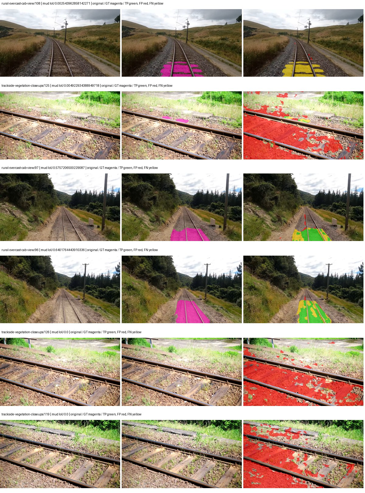
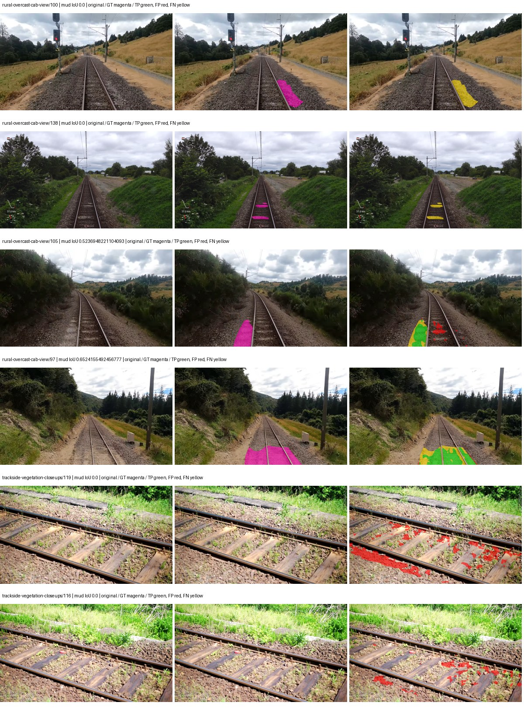
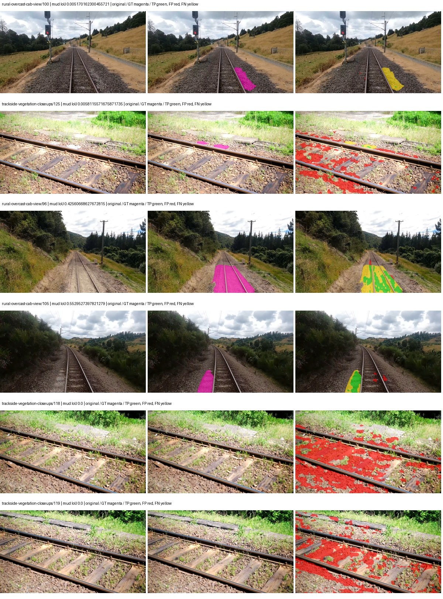

# hf_auto_mobilevitv2_deeplabv3 — paul-test-rtis_v2

[RTIS comparison](../../README.md) · [Full model records](record.json)

Primary selection and early stopping: **mud-pumping validation IoU**. A job is complete only after full statistics and isolated profiling are verified.

| Model | Initialization path | Seed | Status | Steps | Best step | Mud IoU (%) | Mud precision (%) | Mud recall (%) | Final mud IoU (trainer val, %) | mIoU (%) | Fixed GT-class mIoU (%) |
| --- | --- | --- | --- | --- | --- | --- | --- | --- | --- | --- | --- |
| hf_auto_mobilevitv2_deeplabv3 | rtis_only | 0 | completed | 2039 | 764 | 11.95 | 28.67 | 17.00 | 2.72 | 26.19 | 30.56 |
| hf_auto_mobilevitv2_deeplabv3 | cityscapes_to_rtis | 0 | completed | 3313 | 2039 | 7.13 | 8.41 | 31.95 | 5.02 | 31.48 | 36.73 |
| hf_auto_mobilevitv2_deeplabv3 | railsem19_to_rtis | 0 | completed | 4000 | 2803 | 23.30 | 45.16 | 32.49 | 12.72 | 36.36 | 42.42 |
| hf_auto_mobilevitv2_deeplabv3 | cityscapes_to_railsem19_to_rtis | 0 | completed | 1784 | 509 | 8.98 | 11.56 | 28.74 | 3.85 | 26.58 | 31.01 |

Training: 205 images. Validation: 37 images. Test: 50 held out. Seeds: [0]. Seed variation measures optimization variability, not independent-recording uncertainty. Historical source checkpoints stay fixed across adaptation seeds.

Training code: `066afb2626398b7be59d4d19f5a0e4644fd59adc`. Split SHA-256: `18a84c0163a65ded46508bcc904c374e5f33ad8a09b8879e3c8add606e86aa9f`.

## rtis_only — seed 0

Status: **completed**. Started: 2026-09-09T19:46:58.194331+00:00. Finished: 2026-09-09T20:15:42.152068+00:00.

Recipe pretrained initializer: `apple/mobilevitv2-1.0-voc-deeplabv3`.

`rtis_only` uses the recipe initializer, which may include pretrained segmentation components. Transfer paths load the exact historical source checkpoint below and reset the classifier; they do not reset all query/decoder features.

Source checkpoint: `Recipe pretrained initialization`.

Config SHA-256: `d546c8dc48f422a28f5e1ba8ca329159985eb290a954c45357af90ec38fa4653`. Weights used for validation: `raw`.

### Mud-pumping and aggregate quality

| Metric | Selected checkpoint | Final training validation |
| --- | --- | --- |
| Mud IoU | 11.95 | 2.72 |
| Mud precision | 28.67 | 4.02 |
| Mud recall | 17.00 | 7.76 |
| Mud Dice/F1 | 21.34 | 5.29 |
| mIoU | 26.19 | 28.79 |
| Mean accuracy | 38.99 | 42.67 |
| Mean precision | 44.26 | 44.62 |
| Mean Dice | 34.93 | 37.13 |
| Mean specificity | 98.59 | 98.77 |
| Pixel accuracy | 79.54 | 80.13 |
| Frequency-weighted IoU | 67.14 | 70.61 |
| Fixed GT-present class mIoU | 30.56 | 33.59 |
| Boundary F1 | 30.44 | 33.68 |

The selected checkpoint has independent evaluation evidence. Final values are the trainer's final validation record, not a new independent evaluation. mIoU averages classes with nonzero union, so false positives on absent classes can change its denominator. The fixed GT-class mean is supplementary and excludes absent classes; their false positives remain in the confusion matrix.

### Resource usage and timing

| Measurement | Value |
| --- | --- |
| Peak training VRAM, retained training invocation (GiB) | 9.10 |
| Peak evaluation VRAM (GiB) | 6.64 |
| Retained training invocation wall time (seconds) | 1582.13 |
| Retained training invocation GPU-hours (one GPU) | 0.44 |
| Evaluation wall time (seconds) | 12.10 |
| Full evaluation pipeline images/second | 3.06 |
| Best full-state checkpoint (MiB) | 203.83 |
| Final full-state checkpoint (MiB) | 203.82 |
| Verified periodic checkpoints removed (GiB) | 0.80 |

VRAM uses the recorded allocator high-water mark; it is not total device usage including CUDA context. Resumed jobs' retained training invocation times and peaks are **not whole-campaign totals**. Earlier invocation resource records are not reconstructed here. Evaluation throughput includes loader, sliding-window inference and metrics; it is not model-only latency/FPS. Missing measurements are shown as —, never inferred from another dataset's run.

### Standardized inference performance

Dedicated model-only profiling waits for an idle worker-locked L40S: BF16, batch 1, 1024x1024, 20 warmup and 100 CUDA-event-timed public forwards. It excludes loading, preprocessing, tiling and metrics.

| Status | Parameters | Weight MiB | FPS | p50 ms | p95 ms | Peak reserved GiB |
| --- | --- | --- | --- | --- | --- | --- |
| complete | 13318654 | 50.81 | 82.81 | 12.05 | 12.27 | 0.39 |

```json
{
  "schema_version": 1,
  "model_id": "hf_auto_mobilevitv2_deeplabv3",
  "measured_at": "2026-09-09T20:15:39+00:00",
  "status": "complete",
  "benchmark_scope": "rtis_selected_checkpoint_model_only",
  "applies_to": [
    "hf_auto_mobilevitv2_deeplabv3--rtis_only--seed-0"
  ],
  "source": {
    "campaign_git_sha": "066afb2626398b7be59d4d19f5a0e4644fd59adc",
    "git_dirty": false,
    "config_hash": "c1b4ffc0f28e",
    "resolved_config": "/data/izadia1/projects/segmentary-runs/paul-test-rtis_v2/seed0-20260909/configs/hf_auto_mobilevitv2_deeplabv3--rtis_only--seed-0.yaml",
    "config_sha256": "d546c8dc48f422a28f5e1ba8ca329159985eb290a954c45357af90ec38fa4653",
    "checkpoint_sha256": "247aa0a8030fcfeebf03aea1fb9664657dd5a50b92e65c58c2938407b1f62845",
    "checkpoint_global_step": 764,
    "checkpoint_bytes": 213729206,
    "checkpoint_kind": "resume checkpoint with optimizer and EMA state",
    "weights": "raw",
    "measured_checkpoint_job_id": "hf_auto_mobilevitv2_deeplabv3--rtis_only--seed-0",
    "result_sha256": "9e7440604b8f5a87a07c19c7ee89e454f645b5e8b1d46793cfc9f58828bb0691",
    "result_git_sha": "066afb2626398b7be59d4d19f5a0e4644fd59adc",
    "result_stage": "eval:paul-test-rtis:val",
    "result_seed": 0
  },
  "hardware": {
    "gpu_name": "NVIDIA L40S",
    "gpu_uuid": "GPU-2f8008a1-9b67-11f6-987b-b393a672322c",
    "logical_device": "cuda:0",
    "physical_visibility_token": "3",
    "compute_capability": [
      8,
      9
    ],
    "total_memory_bytes": 47677177856
  },
  "model": {
    "parameter_count": 13318654,
    "trainable_parameter_count": 13318654,
    "resident_parameter_bytes": 53274616,
    "parameter_dtype_counts": {
      "float32": 13318654
    }
  },
  "contract": {
    "backend": "pytorch",
    "precision": "bf16_autocast",
    "batch_size": 1,
    "input_shape_nchw": [
      1,
      3,
      1024,
      1024
    ],
    "warmup_iterations": 20,
    "measured_iterations": 100,
    "timing": "per-forward CUDA events with end-event synchronization",
    "includes_preprocessing": false,
    "includes_data_loader": false,
    "includes_sliding_window": false,
    "input_resident_on_gpu": true,
    "model_only": true,
    "entrypoint": "public model(image) dense-logits forward"
  },
  "measurements": {
    "latency": {
      "p50_ms": 12.049407958984375,
      "p95_ms": 12.269056177139282,
      "mean_ms": 12.075905933380128,
      "minimum_ms": 12.025856018066406,
      "maximum_ms": 12.653568267822266,
      "fps": 82.8095221606362,
      "raw_ms": [
        12.168191909790039,
        12.030943870544434,
        12.033023834228516,
        12.039072036743164,
        12.049407958984375,
        12.155839920043945,
        12.067839622497559,
        12.05452823638916,
        12.043264389038086,
        12.091520309448242,
        12.0381441116333,
        12.040191650390625,
        12.163071632385254,
        12.050432205200195,
        12.058624267578125,
        12.065792083740234,
        12.040063858032227,
        12.068863868713379,
        12.26854419708252,
        12.326911926269531,
        12.059647560119629,
        12.081055641174316,
        12.050432205200195,
        12.04531192779541,
        12.328960418701172,
        12.07091236114502,
        12.039168357849121,
        12.035072326660156,
        12.037088394165039,
        12.042240142822266,
        12.065792083740234,
        12.124159812927246,
        12.05350399017334,
        12.048383712768555,
        12.03711986541748,
        12.034048080444336,
        12.03711986541748,
        12.05452823638916,
        12.039168357849121,
        12.042240142822266,
        12.041215896606445,
        12.039168357849121,
        12.029952049255371,
        12.067839622497559,
        12.073984146118164,
        12.041215896606445,
        12.049407958984375,
        12.653568267822266,
        12.105728149414062,
        12.04736042022705,
        12.05452823638916,
        12.278783798217773,
        12.053471565246582,
        12.175359725952148,
        12.104703903198242,
        12.058624267578125,
        12.04633617401123,
        12.039168357849121,
        12.035072326660156,
        12.040191650390625,
        12.046272277832031,
        12.056575775146484,
        12.031999588012695,
        12.068863868713379,
        12.043264389038086,
        12.067839622497559,
        12.05350399017334,
        12.06272029876709,
        12.030976295471191,
        12.035072326660156,
        12.079232215881348,
        12.049407958984375,
        12.048383712768555,
        12.034048080444336,
        12.093440055847168,
        12.06067180633545,
        12.12611198425293,
        12.327936172485352,
        12.033023834228516,
        12.043231964111328,
        12.034048080444336,
        12.03711986541748,
        12.04736042022705,
        12.095487594604492,
        12.04742431640625,
        12.050432205200195,
        12.042240142822266,
        12.076064109802246,
        12.040191650390625,
        12.071935653686523,
        12.057663917541504,
        12.03609561920166,
        12.033023834228516,
        12.031935691833496,
        12.048383712768555,
        12.07910442352295,
        12.025856018066406,
        12.0381441116333,
        12.056575775146484,
        12.033023834228516
      ],
      "percentile_method": "numpy linear interpolation"
    },
    "peak_reserved_bytes": 417333248,
    "memory_kind": "pytorch_cuda_allocator_peak_reserved_excluding_context",
    "benchmark_wall_clock_s": 16.203009102493525
  },
  "started_at": "2026-09-09T20:15:23+00:00",
  "finished_at": "2026-09-09T20:15:39+00:00",
  "environment": {
    "hostname": "hdrfs-app-001",
    "python": "3.11.15",
    "platform": "Linux-5.15.0-139-generic-x86_64-with-glibc2.35",
    "torch": "2.11.0+cu128",
    "torch_cuda": "12.8",
    "cudnn": 91900,
    "driver_version": "570.133.20",
    "cuda_available": true,
    "gpu_count": 1,
    "gpu_names": [
      "NVIDIA L40S"
    ],
    "cuda_visible_devices": "3",
    "packages": {
      "segmentary": "0.1.0",
      "torch": "2.11.0+cu128",
      "torchvision": "0.26.0+cu128",
      "transformers": "5.15.0",
      "timm": "1.0.28",
      "segmentation-models-pytorch": "0.5.0",
      "albumentations": "2.0.8",
      "lightning": "2.6.5",
      "numpy": "2.4.4"
    }
  }
}
```

### Per-class validation results

| Class | GT pixels | IoU (%) | Precision (%) | Recall (%) | Dice (%) | Boundary F1 (%) |
| --- | --- | --- | --- | --- | --- | --- |
| car | 29664 | 7.45 | 54.95 | 7.93 | 13.86 | 16.05 |
| construction | 311585 | 35.77 | 44.37 | 64.86 | 52.69 | 40.07 |
| fence | 265137 | 5.20 | 14.59 | 7.48 | 9.89 | 15.84 |
| mud-pumping | 1226250 | 11.95 | 28.67 | 17.00 | 21.34 | 19.51 |
| on-rails | 0 | 0.00 | 0.00 | — | 0.00 | 0.00 |
| person | 0 | 0.00 | 0.00 | — | 0.00 | 0.00 |
| pole | 628038 | 59.32 | 79.54 | 70.01 | 74.47 | 79.83 |
| rail-embedded | 16799 | 7.22 | 19.80 | 10.20 | 13.46 | 14.11 |
| rail-raised | 2969797 | 55.85 | 59.53 | 90.03 | 71.67 | 73.53 |
| rail-track | 6323197 | 31.56 | 65.57 | 37.83 | 47.98 | 42.57 |
| road | 1048831 | 13.38 | 27.94 | 20.43 | 23.60 | 17.25 |
| sidewalk | 1297367 | 27.23 | 85.41 | 28.56 | 42.81 | 10.50 |
| sky | 19121606 | 97.07 | 98.59 | 98.44 | 98.51 | 89.48 |
| standing-water | 95802 | 0.00 | 0.00 | 0.00 | 0.00 | 0.00 |
| terrain | 39239306 | 78.49 | 80.18 | 97.38 | 87.95 | 43.66 |
| trackbed | 10643081 | 49.75 | 67.70 | 65.24 | 66.45 | 49.36 |
| traffic-light | 19510 | 40.10 | 75.63 | 46.05 | 57.24 | 62.40 |
| traffic-sign | 13285 | 20.17 | 42.43 | 27.77 | 33.57 | 34.90 |
| tram-track | 56179 | 2.22 | 3.79 | 5.10 | 4.35 | 4.64 |
| truck | 0 | 0.00 | 0.00 | — | 0.00 | 0.00 |
| vegetation-overgrowth | 5901821 | 7.31 | 80.75 | 7.44 | 13.63 | 25.51 |

### Full-run accounting

| Measurement | Value |
| --- | --- |
| Full GPU-reserved wall seconds, all recorded worker attempts | 1723.96 |
| Full reserved GPU-hours | 0.48 |
| Whole-run timing complete | True |

| Phase | Wall seconds including failed attempts |
| --- | --- |
| training | 1588.59 |
| diagnostics | 91.42 |
| performance | 23.28 |

GPU-reserved time includes model loading, training, validation, collection, profiling, checkpoint I/O and orchestration while the worker owns one GPU. It is not GPU kernel-active time. Phase timings and sampled device memory/power/utilization are retained separately; sampled device memory is not the allocator high-water mark.

### Train/validation and raw/EMA diagnostics

| Checkpoint / weights / split | Images | Mud IoU (%) | Mud precision (%) | Mud recall (%) |
| --- | --- | --- | --- | --- |
| best-auto-train / raw | 205 | 87.33 | 96.65 | 90.05 |
| best-auto-val / raw | 37 | 11.95 | 28.67 | 17.00 |
| best-alternate-val / ema | 37 | 1.86 | 2.27 | 9.52 |
| final-auto-val / raw | 37 | 2.71 | 4.01 | 7.74 |

Train uses the evaluation transform without augmentation. Compare mud train/validation metrics for the same selected weights. Alternate EMA on running-stat BatchNorm is explicitly uncalibrated and is diagnostic only. Score-threshold curves use uncalibrated normalized scores and are pixel-level diagnostics, not event detection rates or a selected deployment operating point.

### Downloadable evidence

- best-auto-train: [per-image.csv](rtis_only--seed-0/best-auto-train/per-image.csv) · [per-image-confusion.json.gz](rtis_only--seed-0/best-auto-train/per-image-confusion.json.gz) · [groups.json](rtis_only--seed-0/best-auto-train/groups.json) · [mud-score-curves.json](rtis_only--seed-0/best-auto-train/mud-score-curves.json)
- best-auto-val: [per-image.csv](rtis_only--seed-0/best-auto-val/per-image.csv) · [per-image-confusion.json.gz](rtis_only--seed-0/best-auto-val/per-image-confusion.json.gz) · [groups.json](rtis_only--seed-0/best-auto-val/groups.json) · [mud-score-curves.json](rtis_only--seed-0/best-auto-val/mud-score-curves.json) · [examples.jpg](rtis_only--seed-0/best-auto-val/examples.jpg)
- best-alternate-val: [per-image.csv](rtis_only--seed-0/best-alternate-val/per-image.csv) · [per-image-confusion.json.gz](rtis_only--seed-0/best-alternate-val/per-image-confusion.json.gz) · [groups.json](rtis_only--seed-0/best-alternate-val/groups.json) · [mud-score-curves.json](rtis_only--seed-0/best-alternate-val/mud-score-curves.json)
- final-auto-val: [per-image.csv](rtis_only--seed-0/final-auto-val/per-image.csv) · [per-image-confusion.json.gz](rtis_only--seed-0/final-auto-val/per-image-confusion.json.gz) · [groups.json](rtis_only--seed-0/final-auto-val/groups.json) · [mud-score-curves.json](rtis_only--seed-0/final-auto-val/mud-score-curves.json)
- resources: [telemetry.csv](rtis_only--seed-0/resources/telemetry.csv)


Examples are two lowest and two highest mud-IoU positive images, plus up to two negative images with the most false-positive mud pixels. They are targeted diagnostic examples, not random samples. Green: true positive; red: false positive; yellow: false negative. Full predictions remain on HDRFS.

### Validation tracking

| Logged step | Overall mIoU (%) | Mud IoU (%) |
| --- | --- | --- |
| 254 | 19.45 | 2.32 |
| 509 | 23.82 | 0.69 |
| 764 | 26.21 | 11.96 |
| 1019 | 27.84 | 1.38 |
| 1274 | 27.47 | 1.70 |
| 1529 | 28.62 | 9.75 |
| 1784 | 29.14 | 1.93 |
| 2038 | 28.79 | 2.72 |

All retained scalar curves, including training loss and per-class IoU, are in record.json. Observed best mud on a curve is not necessarily a retained checkpoint: the pilot saved its selection-metric-best and final checkpoints. Step logging and checkpoint global_step may differ by one.

### Stopping and checkpoint provenance

```json
{
  "stopping": {
    "actual_steps": 2039,
    "maximum_steps": 4000,
    "min_delta": 0.001,
    "monitor": "val_iou/mud-pumping",
    "patience": 5,
    "reason": "validation_plateau"
  },
  "checkpoints": {
    "best": {
      "path": "/data/izadia1/projects/segmentary-runs/paul-test-rtis_v2/seed0-20260909/future-runs/hf_auto_mobilevitv2_deeplabv3--rtis_only--seed-0_seed0/rtis/best.ckpt",
      "sha256": "247aa0a8030fcfeebf03aea1fb9664657dd5a50b92e65c58c2938407b1f62845",
      "global_step": 764,
      "bytes": 213729206
    },
    "final": {
      "path": "/data/izadia1/projects/segmentary-runs/paul-test-rtis_v2/seed0-20260909/future-runs/hf_auto_mobilevitv2_deeplabv3--rtis_only--seed-0_seed0/rtis/last.ckpt",
      "sha256": "6c1131647cb2953a3dc45d134540e89f97aa9591e8cf782dfdd3449dade63b63",
      "global_step": 2039,
      "bytes": 213717558
    }
  },
  "cleanup_error": null
}
```

### Resolved training, initialization and evaluation settings

The optimizer block is the base configuration. Stage LR scales are applied at runtime, and stage warmup is capped at min(base warmup, floor(stage budget / 10), stage budget - 1): 400 steps for this 4,000-step pilot. Model-internal native input grids may differ from augmentation crops (EoMT uses its 640 grid).

```json
{
  "name": "hf_auto_mobilevitv2_deeplabv3--rtis_only--seed-0",
  "model": {
    "arch": "hf_auto",
    "checkpoint": "apple/mobilevitv2-1.0-voc-deeplabv3",
    "tuning": "full",
    "head": "unified_head",
    "lora_r": 16,
    "lora_alpha": 32,
    "lora_dropout": 0.05,
    "lora_targets": [],
    "drop_path": null,
    "revision": "cd9b6a101aefbccb4c3cc1bce0324cfc1de8a4c9",
    "subfolder": null,
    "local_files_only": false,
    "trust_remote_code": false,
    "backbone_path": null,
    "head_paths": [],
    "classifier_path": null,
    "inactive_parameter_paths": [],
    "smp_arch": null,
    "encoder_name": null,
    "encoder_weights": null,
    "native": null,
    "batch_norm_momentum": null
  },
  "space": "paul-test-rtis",
  "taxonomy_root": "/data/izadia1/projects/segmentary-rtis-fullstats-066afb2/taxonomy",
  "output_root": "/data/izadia1/projects/segmentary-runs/paul-test-rtis_v2/seed0-20260909/future-runs",
  "optim": {
    "backbone_lr": 0.0001,
    "head_lr_mult": 10.0,
    "weight_decay": 0.05,
    "llrd": 1.0,
    "warmup_iters": 1500,
    "warmup_ratio": 1e-06,
    "poly_power": 0.9,
    "min_lr_ratio": 0.0,
    "betas": [
      0.9,
      0.999
    ],
    "grad_clip": 1.0
  },
  "train": {
    "iters": 4000,
    "batch_size": 2,
    "accum": 8,
    "num_workers": 2,
    "precision": "bf16-mixed",
    "ema_decay": 0.9998,
    "val_every": 250,
    "ckpt_every": 500,
    "selection_metric": "val_iou/mud-pumping",
    "early_stopping_patience": 5,
    "early_stopping_min_delta": 0.001,
    "seed": 0,
    "devices": 1
  },
  "eval": {
    "sliding_window": true,
    "window": [
      1024,
      1024
    ],
    "stride": [
      768,
      768
    ],
    "batch_size": 1,
    "num_workers": 2,
    "tta_scales": [],
    "tta_flip": false,
    "threshold": 0.5,
    "boundary_tolerance_frac": 0.0075,
    "save_confusion": true
  },
  "loss": {
    "task": "multiclass",
    "activation": "auto",
    "terms": [],
    "aux": "none",
    "aux_weight": 0.0,
    "ce_weight": 1.0,
    "label_smoothing": 0.0,
    "class_weights": null,
    "query": null
  },
  "aug": {
    "crop": [
      1024,
      1024
    ],
    "scale_min": 0.5,
    "scale_max": 2.0,
    "hflip_p": 0.5,
    "color_jitter_p": 0.5,
    "brightness": 0.25,
    "contrast": 0.25,
    "saturation": 0.25,
    "hue": 0.05
  },
  "stages": [
    {
      "name": "rtis",
      "data": [
        {
          "name": "paul-test-rtis",
          "root": "/data/izadia1/datasets/paul-test-rtis_v2",
          "variant": null,
          "split_file": "splits.json",
          "train_split": "train",
          "val_split": "val",
          "limit": null,
          "loader": "folder",
          "mapping": "paul-test-rtis",
          "loader_options": {
            "require_groups": true
          }
        }
      ],
      "iters": null,
      "lr_scale": 1.0,
      "head_group_lr_scale": 1.0,
      "init_from": "pretrained",
      "reset_head": false,
      "freeze": null,
      "sample_weights": null
    }
  ]
}
```

### Hardware and software provenance

```json
{
  "training": {
    "cuda_available": true,
    "cuda_visible_devices": "3",
    "cudnn": 91900,
    "driver_version": "570.133.20",
    "gpu_count": 1,
    "gpu_names": [
      "NVIDIA L40S"
    ],
    "hostname": "hdrfs-app-001",
    "input_normalization": {
      "channel_order": "bgr",
      "mean": [
        0.0,
        0.0,
        0.0
      ],
      "source": "hf_image_processor",
      "std": [
        1.0,
        1.0,
        1.0
      ]
    },
    "model_origins": [
      {
        "hf_commit": "cd9b6a101aefbccb4c3cc1bce0324cfc1de8a4c9",
        "hf_name_or_path": "apple/mobilevitv2-1.0-voc-deeplabv3",
        "module": "model",
        "timm_pretrained": {}
      },
      {
        "hf_commit": "cd9b6a101aefbccb4c3cc1bce0324cfc1de8a4c9",
        "hf_name_or_path": "apple/mobilevitv2-1.0-voc-deeplabv3",
        "module": "model.mobilevitv2",
        "timm_pretrained": {}
      },
      {
        "hf_commit": "cd9b6a101aefbccb4c3cc1bce0324cfc1de8a4c9",
        "hf_name_or_path": "apple/mobilevitv2-1.0-voc-deeplabv3",
        "module": "model.mobilevitv2.encoder",
        "timm_pretrained": {}
      }
    ],
    "model_parameter_count": 13318654,
    "packages": {
      "albumentations": "2.0.8",
      "lightning": "2.6.5",
      "numpy": "2.4.4",
      "segmentary": "0.1.0",
      "segmentation-models-pytorch": "0.5.0",
      "timm": "1.0.28",
      "torch": "2.11.0+cu128",
      "torchvision": "0.26.0+cu128",
      "transformers": "5.15.0"
    },
    "platform": "Linux-5.15.0-139-generic-x86_64-with-glibc2.35",
    "python": "3.11.15",
    "torch": "2.11.0+cu128",
    "torch_cuda": "12.8",
    "trainable_parameter_count": 13318654,
    "training_stop": {
      "actual_steps": 2039,
      "maximum_steps": 4000,
      "min_delta": 0.001,
      "monitor": "val_iou/mud-pumping",
      "patience": 5,
      "reason": "validation_plateau"
    },
    "validation_weights": "raw"
  },
  "evaluation": {
    "cuda_available": true,
    "cuda_visible_devices": "3",
    "cudnn": 91900,
    "driver_version": "570.133.20",
    "gpu_count": 1,
    "gpu_names": [
      "NVIDIA L40S"
    ],
    "hostname": "hdrfs-app-001",
    "input_normalization": {
      "channel_order": "bgr",
      "mean": [
        0.0,
        0.0,
        0.0
      ],
      "source": "hf_image_processor",
      "std": [
        1.0,
        1.0,
        1.0
      ]
    },
    "packages": {
      "albumentations": "2.0.8",
      "lightning": "2.6.5",
      "numpy": "2.4.4",
      "segmentary": "0.1.0",
      "segmentation-models-pytorch": "0.5.0",
      "timm": "1.0.28",
      "torch": "2.11.0+cu128",
      "torchvision": "0.26.0+cu128",
      "transformers": "5.15.0"
    },
    "platform": "Linux-5.15.0-139-generic-x86_64-with-glibc2.35",
    "python": "3.11.15",
    "torch": "2.11.0+cu128",
    "torch_cuda": "12.8"
  }
}
```

## cityscapes_to_rtis — seed 0

Status: **completed**. Started: 2026-09-09T19:52:10.662518+00:00. Finished: 2026-09-09T20:36:55.664509+00:00.

Recipe pretrained initializer: `apple/mobilevitv2-1.0-voc-deeplabv3`.

`rtis_only` uses the recipe initializer, which may include pretrained segmentation components. Transfer paths load the exact historical source checkpoint below and reset the classifier; they do not reset all query/decoder features.

Source checkpoint: `{'name': 'hf_auto_mobilevitv2_deeplabv3--cityscapes--seed-0', 'model': 'hf_auto_mobilevitv2_deeplabv3', 'protocol': 'cityscapes', 'config': '/data/izadia1/projects/segmentary-runs/all-model-city-rail-seed0-rail20-b9eb3e1/jobs/hf_auto_mobilevitv2_deeplabv3--cityscapes--seed-0/attempt-001/resolved-config.yaml', 'checkpoint': '/data/izadia1/projects/segmentary-runs/all-model-city-rail-seed0-rail20-b9eb3e1/jobs/hf_auto_mobilevitv2_deeplabv3--cityscapes--seed-0/attempt-001/train/hf_auto_mobilevitv2_deeplabv3--cityscapes_seed0/cityscapes/last.ckpt', 'recorded_sha256': '532109af0466d02b0e9e648dede15173d1aa42a4c857b4c68304552862f0535d', 'exists': True}`.

Config SHA-256: `099aa5403b14453a9546bb1e4a69b8c314a625b1676504eec45ced3ba06d8c51`. Weights used for validation: `raw`.

### Mud-pumping and aggregate quality

| Metric | Selected checkpoint | Final training validation |
| --- | --- | --- |
| Mud IoU | 7.13 | 5.02 |
| Mud precision | 8.41 | 5.78 |
| Mud recall | 31.95 | 27.61 |
| Mud Dice/F1 | 13.32 | 9.56 |
| mIoU | 31.48 | 29.75 |
| Mean accuracy | 45.71 | 43.09 |
| Mean precision | 50.66 | 52.32 |
| Mean Dice | 39.87 | 37.96 |
| Mean specificity | 98.62 | 98.58 |
| Pixel accuracy | 78.44 | 77.15 |
| Frequency-weighted IoU | 68.70 | 68.10 |
| Fixed GT-present class mIoU | 36.73 | 34.71 |
| Boundary F1 | 36.77 | 34.44 |

The selected checkpoint has independent evaluation evidence. Final values are the trainer's final validation record, not a new independent evaluation. mIoU averages classes with nonzero union, so false positives on absent classes can change its denominator. The fixed GT-class mean is supplementary and excludes absent classes; their false positives remain in the confusion matrix.

### Resource usage and timing

| Measurement | Value |
| --- | --- |
| Peak training VRAM, retained training invocation (GiB) | 9.10 |
| Peak evaluation VRAM (GiB) | 6.64 |
| Retained training invocation wall time (seconds) | 2542.77 |
| Retained training invocation GPU-hours (one GPU) | 0.71 |
| Evaluation wall time (seconds) | 12.31 |
| Full evaluation pipeline images/second | 3.00 |
| Best full-state checkpoint (MiB) | 203.83 |
| Final full-state checkpoint (MiB) | 203.82 |
| Verified periodic checkpoints removed (GiB) | 1.19 |

VRAM uses the recorded allocator high-water mark; it is not total device usage including CUDA context. Resumed jobs' retained training invocation times and peaks are **not whole-campaign totals**. Earlier invocation resource records are not reconstructed here. Evaluation throughput includes loader, sliding-window inference and metrics; it is not model-only latency/FPS. Missing measurements are shown as —, never inferred from another dataset's run.

### Standardized inference performance

Dedicated model-only profiling waits for an idle worker-locked L40S: BF16, batch 1, 1024x1024, 20 warmup and 100 CUDA-event-timed public forwards. It excludes loading, preprocessing, tiling and metrics.

| Status | Parameters | Weight MiB | FPS | p50 ms | p95 ms | Peak reserved GiB |
| --- | --- | --- | --- | --- | --- | --- |
| complete | 13318654 | 50.81 | 83.13 | 12.03 | 12.05 | 0.39 |

```json
{
  "schema_version": 1,
  "model_id": "hf_auto_mobilevitv2_deeplabv3",
  "measured_at": "2026-09-09T20:36:52+00:00",
  "status": "complete",
  "benchmark_scope": "rtis_selected_checkpoint_model_only",
  "applies_to": [
    "hf_auto_mobilevitv2_deeplabv3--cityscapes_to_rtis--seed-0"
  ],
  "source": {
    "campaign_git_sha": "066afb2626398b7be59d4d19f5a0e4644fd59adc",
    "git_dirty": false,
    "config_hash": "40ba4167f58a",
    "resolved_config": "/data/izadia1/projects/segmentary-runs/paul-test-rtis_v2/seed0-20260909/configs/hf_auto_mobilevitv2_deeplabv3--cityscapes_to_rtis--seed-0.yaml",
    "config_sha256": "099aa5403b14453a9546bb1e4a69b8c314a625b1676504eec45ced3ba06d8c51",
    "checkpoint_sha256": "fb27b944805355a4b4506e86c94b9dc9e30c63abb4683f7ab758bcc4468523df",
    "checkpoint_global_step": 2039,
    "checkpoint_bytes": 213729206,
    "checkpoint_kind": "resume checkpoint with optimizer and EMA state",
    "weights": "raw",
    "measured_checkpoint_job_id": "hf_auto_mobilevitv2_deeplabv3--cityscapes_to_rtis--seed-0",
    "result_sha256": "d19c42e00e29821af4dbaa9077ac6074007f3082072c55d52f32756c73b49b61",
    "result_git_sha": "066afb2626398b7be59d4d19f5a0e4644fd59adc",
    "result_stage": "eval:paul-test-rtis:val",
    "result_seed": 0
  },
  "hardware": {
    "gpu_name": "NVIDIA L40S",
    "gpu_uuid": "GPU-a5ad49e5-0536-5229-ba8a-f8a902808f53",
    "logical_device": "cuda:0",
    "physical_visibility_token": "7",
    "compute_capability": [
      8,
      9
    ],
    "total_memory_bytes": 47677177856
  },
  "model": {
    "parameter_count": 13318654,
    "trainable_parameter_count": 13318654,
    "resident_parameter_bytes": 53274616,
    "parameter_dtype_counts": {
      "float32": 13318654
    }
  },
  "contract": {
    "backend": "pytorch",
    "precision": "bf16_autocast",
    "batch_size": 1,
    "input_shape_nchw": [
      1,
      3,
      1024,
      1024
    ],
    "warmup_iterations": 20,
    "measured_iterations": 100,
    "timing": "per-forward CUDA events with end-event synchronization",
    "includes_preprocessing": false,
    "includes_data_loader": false,
    "includes_sliding_window": false,
    "input_resident_on_gpu": true,
    "model_only": true,
    "entrypoint": "public model(image) dense-logits forward"
  },
  "measurements": {
    "latency": {
      "p50_ms": 12.025856018066406,
      "p95_ms": 12.05171241760254,
      "mean_ms": 12.029694690704346,
      "minimum_ms": 12.012543678283691,
      "maximum_ms": 12.246015548706055,
      "fps": 83.12762923008559,
      "raw_ms": [
        12.093440055847168,
        12.057600021362305,
        12.02892780303955,
        12.024831771850586,
        12.026880264282227,
        12.033023834228516,
        12.038080215454102,
        12.02790355682373,
        12.024831771850586,
        12.022784233093262,
        12.029952049255371,
        12.018688201904297,
        12.025856018066406,
        12.021759986877441,
        12.246015548706055,
        12.035039901733398,
        12.019743919372559,
        12.024831771850586,
        12.04428768157959,
        12.020735740661621,
        12.012543678283691,
        12.034048080444336,
        12.030976295471191,
        12.056575775146484,
        12.029952049255371,
        12.024831771850586,
        12.020768165588379,
        12.019712448120117,
        12.014592170715332,
        12.025856018066406,
        12.023807525634766,
        12.019712448120117,
        12.013567924499512,
        12.035039901733398,
        12.020735740661621,
        12.035072326660156,
        12.025856018066406,
        12.023807525634766,
        12.021759986877441,
        12.029952049255371,
        12.021759986877441,
        12.022784233093262,
        12.023807525634766,
        12.02892780303955,
        12.026880264282227,
        12.029919624328613,
        12.029952049255371,
        12.015616416931152,
        12.024831771850586,
        12.020735740661621,
        12.025856018066406,
        12.02790355682373,
        12.025856018066406,
        12.034048080444336,
        12.022784233093262,
        12.024831771850586,
        12.026880264282227,
        12.048383712768555,
        12.051456451416016,
        12.030976295471191,
        12.022784233093262,
        12.022784233093262,
        12.017663955688477,
        12.03609561920166,
        12.030976295471191,
        12.019712448120117,
        12.014592170715332,
        12.030976295471191,
        12.020735740661621,
        12.025856018066406,
        12.031999588012695,
        12.021759986877441,
        12.026880264282227,
        12.030976295471191,
        12.019712448120117,
        12.02892780303955,
        12.024831771850586,
        12.023807525634766,
        12.025856018066406,
        12.018655776977539,
        12.034048080444336,
        12.016639709472656,
        12.013567924499512,
        12.034048080444336,
        12.023807525634766,
        12.02790355682373,
        12.031999588012695,
        12.015616416931152,
        12.02892780303955,
        12.022784233093262,
        12.024831771850586,
        12.022784233093262,
        12.020735740661621,
        12.022784233093262,
        12.025856018066406,
        12.025856018066406,
        12.029952049255371,
        12.023807525634766,
        12.058624267578125,
        12.020735740661621
      ],
      "percentile_method": "numpy linear interpolation"
    },
    "peak_reserved_bytes": 417333248,
    "memory_kind": "pytorch_cuda_allocator_peak_reserved_excluding_context",
    "benchmark_wall_clock_s": 16.0127714574337
  },
  "started_at": "2026-09-09T20:36:36+00:00",
  "finished_at": "2026-09-09T20:36:52+00:00",
  "environment": {
    "hostname": "hdrfs-app-001",
    "python": "3.11.15",
    "platform": "Linux-5.15.0-139-generic-x86_64-with-glibc2.35",
    "torch": "2.11.0+cu128",
    "torch_cuda": "12.8",
    "cudnn": 91900,
    "driver_version": "570.133.20",
    "cuda_available": true,
    "gpu_count": 1,
    "gpu_names": [
      "NVIDIA L40S"
    ],
    "cuda_visible_devices": "7",
    "packages": {
      "segmentary": "0.1.0",
      "torch": "2.11.0+cu128",
      "torchvision": "0.26.0+cu128",
      "transformers": "5.15.0",
      "timm": "1.0.28",
      "segmentation-models-pytorch": "0.5.0",
      "albumentations": "2.0.8",
      "lightning": "2.6.5",
      "numpy": "2.4.4"
    }
  }
}
```

### Per-class validation results

| Class | GT pixels | IoU (%) | Precision (%) | Recall (%) | Dice (%) | Boundary F1 (%) |
| --- | --- | --- | --- | --- | --- | --- |
| car | 29664 | 52.59 | 81.05 | 59.97 | 68.93 | 63.43 |
| construction | 311585 | 16.47 | 17.62 | 71.63 | 28.28 | 22.39 |
| fence | 265137 | 8.18 | 16.17 | 14.20 | 15.12 | 16.43 |
| mud-pumping | 1226250 | 7.13 | 8.41 | 31.95 | 13.32 | 17.74 |
| on-rails | 0 | 0.00 | 0.00 | — | 0.00 | 0.00 |
| person | 0 | 0.00 | 0.00 | — | 0.00 | 0.00 |
| pole | 628038 | 62.83 | 86.51 | 69.66 | 77.18 | 83.19 |
| rail-embedded | 16799 | 8.97 | 72.55 | 9.28 | 16.46 | 15.18 |
| rail-raised | 2969797 | 71.28 | 78.11 | 89.07 | 83.23 | 87.84 |
| rail-track | 6323197 | 29.89 | 77.35 | 32.76 | 46.03 | 42.63 |
| road | 1048831 | 6.57 | 16.00 | 10.02 | 12.33 | 10.41 |
| sidewalk | 1297367 | 34.56 | 87.36 | 36.38 | 51.37 | 12.75 |
| sky | 19121606 | 96.96 | 99.05 | 97.87 | 98.46 | 89.92 |
| standing-water | 95802 | 0.12 | 0.13 | 2.41 | 0.25 | 0.62 |
| terrain | 39239306 | 79.68 | 82.73 | 95.57 | 88.69 | 50.03 |
| trackbed | 10643081 | 55.76 | 80.10 | 64.72 | 71.59 | 55.09 |
| traffic-light | 19510 | 75.93 | 96.11 | 78.33 | 86.32 | 96.88 |
| traffic-sign | 13285 | 44.68 | 84.66 | 48.61 | 61.76 | 68.94 |
| tram-track | 56179 | 2.28 | 9.55 | 2.90 | 4.45 | 9.97 |
| truck | 0 | 0.00 | 0.00 | — | 0.00 | 0.00 |
| vegetation-overgrowth | 5901821 | 7.21 | 70.40 | 7.44 | 13.45 | 28.79 |

### Full-run accounting

| Measurement | Value |
| --- | --- |
| Full GPU-reserved wall seconds, all recorded worker attempts | 2685.21 |
| Full reserved GPU-hours | 0.75 |
| Whole-run timing complete | True |

| Phase | Wall seconds including failed attempts |
| --- | --- |
| training | 2549.62 |
| diagnostics | 90.78 |
| performance | 23.12 |

GPU-reserved time includes model loading, training, validation, collection, profiling, checkpoint I/O and orchestration while the worker owns one GPU. It is not GPU kernel-active time. Phase timings and sampled device memory/power/utilization are retained separately; sampled device memory is not the allocator high-water mark.

### Train/validation and raw/EMA diagnostics

| Checkpoint / weights / split | Images | Mud IoU (%) | Mud precision (%) | Mud recall (%) |
| --- | --- | --- | --- | --- |
| best-auto-train / raw | 205 | 90.37 | 92.47 | 97.54 |
| best-auto-val / raw | 37 | 7.13 | 8.41 | 31.95 |
| best-alternate-val / ema | 37 | 3.36 | 4.11 | 15.50 |
| final-auto-val / raw | 37 | 5.01 | 5.77 | 27.59 |

Train uses the evaluation transform without augmentation. Compare mud train/validation metrics for the same selected weights. Alternate EMA on running-stat BatchNorm is explicitly uncalibrated and is diagnostic only. Score-threshold curves use uncalibrated normalized scores and are pixel-level diagnostics, not event detection rates or a selected deployment operating point.

### Downloadable evidence

- best-auto-train: [per-image.csv](cityscapes_to_rtis--seed-0/best-auto-train/per-image.csv) · [per-image-confusion.json.gz](cityscapes_to_rtis--seed-0/best-auto-train/per-image-confusion.json.gz) · [groups.json](cityscapes_to_rtis--seed-0/best-auto-train/groups.json) · [mud-score-curves.json](cityscapes_to_rtis--seed-0/best-auto-train/mud-score-curves.json)
- best-auto-val: [per-image.csv](cityscapes_to_rtis--seed-0/best-auto-val/per-image.csv) · [per-image-confusion.json.gz](cityscapes_to_rtis--seed-0/best-auto-val/per-image-confusion.json.gz) · [groups.json](cityscapes_to_rtis--seed-0/best-auto-val/groups.json) · [mud-score-curves.json](cityscapes_to_rtis--seed-0/best-auto-val/mud-score-curves.json) · [examples.jpg](cityscapes_to_rtis--seed-0/best-auto-val/examples.jpg)
- best-alternate-val: [per-image.csv](cityscapes_to_rtis--seed-0/best-alternate-val/per-image.csv) · [per-image-confusion.json.gz](cityscapes_to_rtis--seed-0/best-alternate-val/per-image-confusion.json.gz) · [groups.json](cityscapes_to_rtis--seed-0/best-alternate-val/groups.json) · [mud-score-curves.json](cityscapes_to_rtis--seed-0/best-alternate-val/mud-score-curves.json)
- final-auto-val: [per-image.csv](cityscapes_to_rtis--seed-0/final-auto-val/per-image.csv) · [per-image-confusion.json.gz](cityscapes_to_rtis--seed-0/final-auto-val/per-image-confusion.json.gz) · [groups.json](cityscapes_to_rtis--seed-0/final-auto-val/groups.json) · [mud-score-curves.json](cityscapes_to_rtis--seed-0/final-auto-val/mud-score-curves.json)
- resources: [telemetry.csv](cityscapes_to_rtis--seed-0/resources/telemetry.csv)



Examples are two lowest and two highest mud-IoU positive images, plus up to two negative images with the most false-positive mud pixels. They are targeted diagnostic examples, not random samples. Green: true positive; red: false positive; yellow: false negative. Full predictions remain on HDRFS.

### Validation tracking

| Logged step | Overall mIoU (%) | Mud IoU (%) |
| --- | --- | --- |
| 254 | 21.95 | 2.86 |
| 509 | 21.26 | 6.25 |
| 764 | 24.10 | 6.70 |
| 1019 | 26.82 | 5.11 |
| 1274 | 28.98 | 3.23 |
| 1529 | 30.14 | 3.87 |
| 1784 | 29.84 | 3.77 |
| 2038 | 31.48 | 7.14 |
| 2293 | 31.05 | 1.17 |
| 2548 | 29.62 | 3.44 |
| 2803 | 29.22 | 5.59 |
| 3058 | 30.27 | 4.63 |
| 3313 | 29.75 | 5.02 |

All retained scalar curves, including training loss and per-class IoU, are in record.json. Observed best mud on a curve is not necessarily a retained checkpoint: the pilot saved its selection-metric-best and final checkpoints. Step logging and checkpoint global_step may differ by one.

### Stopping and checkpoint provenance

```json
{
  "stopping": {
    "actual_steps": 3313,
    "maximum_steps": 4000,
    "min_delta": 0.001,
    "monitor": "val_iou/mud-pumping",
    "patience": 5,
    "reason": "validation_plateau"
  },
  "checkpoints": {
    "best": {
      "path": "/data/izadia1/projects/segmentary-runs/paul-test-rtis_v2/seed0-20260909/future-runs/hf_auto_mobilevitv2_deeplabv3--cityscapes_to_rtis--seed-0_seed0/rtis/best.ckpt",
      "sha256": "fb27b944805355a4b4506e86c94b9dc9e30c63abb4683f7ab758bcc4468523df",
      "global_step": 2039,
      "bytes": 213729206
    },
    "final": {
      "path": "/data/izadia1/projects/segmentary-runs/paul-test-rtis_v2/seed0-20260909/future-runs/hf_auto_mobilevitv2_deeplabv3--cityscapes_to_rtis--seed-0_seed0/rtis/last.ckpt",
      "sha256": "434ec5adc41fd382d152d2d0ba077d7f1ef2f32ba8f9586f96da89c633f3c001",
      "global_step": 3313,
      "bytes": 213717622
    }
  },
  "cleanup_error": null
}
```

### Resolved training, initialization and evaluation settings

The optimizer block is the base configuration. Stage LR scales are applied at runtime, and stage warmup is capped at min(base warmup, floor(stage budget / 10), stage budget - 1): 400 steps for this 4,000-step pilot. Model-internal native input grids may differ from augmentation crops (EoMT uses its 640 grid).

```json
{
  "name": "hf_auto_mobilevitv2_deeplabv3--cityscapes_to_rtis--seed-0",
  "model": {
    "arch": "hf_auto",
    "checkpoint": "apple/mobilevitv2-1.0-voc-deeplabv3",
    "tuning": "full",
    "head": "unified_head",
    "lora_r": 16,
    "lora_alpha": 32,
    "lora_dropout": 0.05,
    "lora_targets": [],
    "drop_path": null,
    "revision": "cd9b6a101aefbccb4c3cc1bce0324cfc1de8a4c9",
    "subfolder": null,
    "local_files_only": false,
    "trust_remote_code": false,
    "backbone_path": null,
    "head_paths": [],
    "classifier_path": null,
    "inactive_parameter_paths": [],
    "smp_arch": null,
    "encoder_name": null,
    "encoder_weights": null,
    "native": null,
    "batch_norm_momentum": null
  },
  "space": "paul-test-rtis",
  "taxonomy_root": "/data/izadia1/projects/segmentary-rtis-fullstats-066afb2/taxonomy",
  "output_root": "/data/izadia1/projects/segmentary-runs/paul-test-rtis_v2/seed0-20260909/future-runs",
  "optim": {
    "backbone_lr": 0.0001,
    "head_lr_mult": 10.0,
    "weight_decay": 0.05,
    "llrd": 1.0,
    "warmup_iters": 1500,
    "warmup_ratio": 1e-06,
    "poly_power": 0.9,
    "min_lr_ratio": 0.0,
    "betas": [
      0.9,
      0.999
    ],
    "grad_clip": 1.0
  },
  "train": {
    "iters": 4000,
    "batch_size": 2,
    "accum": 8,
    "num_workers": 2,
    "precision": "bf16-mixed",
    "ema_decay": 0.9998,
    "val_every": 250,
    "ckpt_every": 500,
    "selection_metric": "val_iou/mud-pumping",
    "early_stopping_patience": 5,
    "early_stopping_min_delta": 0.001,
    "seed": 0,
    "devices": 1
  },
  "eval": {
    "sliding_window": true,
    "window": [
      1024,
      1024
    ],
    "stride": [
      768,
      768
    ],
    "batch_size": 1,
    "num_workers": 2,
    "tta_scales": [],
    "tta_flip": false,
    "threshold": 0.5,
    "boundary_tolerance_frac": 0.0075,
    "save_confusion": true
  },
  "loss": {
    "task": "multiclass",
    "activation": "auto",
    "terms": [],
    "aux": "none",
    "aux_weight": 0.0,
    "ce_weight": 1.0,
    "label_smoothing": 0.0,
    "class_weights": null,
    "query": null
  },
  "aug": {
    "crop": [
      1024,
      1024
    ],
    "scale_min": 0.5,
    "scale_max": 2.0,
    "hflip_p": 0.5,
    "color_jitter_p": 0.5,
    "brightness": 0.25,
    "contrast": 0.25,
    "saturation": 0.25,
    "hue": 0.05
  },
  "stages": [
    {
      "name": "rtis",
      "data": [
        {
          "name": "paul-test-rtis",
          "root": "/data/izadia1/datasets/paul-test-rtis_v2",
          "variant": null,
          "split_file": "splits.json",
          "train_split": "train",
          "val_split": "val",
          "limit": null,
          "loader": "folder",
          "mapping": "paul-test-rtis",
          "loader_options": {
            "require_groups": true
          }
        }
      ],
      "iters": null,
      "lr_scale": 0.1,
      "head_group_lr_scale": 1.0,
      "init_from": "/data/izadia1/projects/segmentary-runs/all-model-city-rail-seed0-rail20-b9eb3e1/jobs/hf_auto_mobilevitv2_deeplabv3--cityscapes--seed-0/attempt-001/train/hf_auto_mobilevitv2_deeplabv3--cityscapes_seed0/cityscapes/last.ckpt",
      "reset_head": true,
      "freeze": null,
      "sample_weights": null
    }
  ]
}
```

### Hardware and software provenance

```json
{
  "training": {
    "cuda_available": true,
    "cuda_visible_devices": "7",
    "cudnn": 91900,
    "driver_version": "570.133.20",
    "gpu_count": 1,
    "gpu_names": [
      "NVIDIA L40S"
    ],
    "hostname": "hdrfs-app-001",
    "input_normalization": {
      "channel_order": "bgr",
      "mean": [
        0.0,
        0.0,
        0.0
      ],
      "source": "hf_image_processor",
      "std": [
        1.0,
        1.0,
        1.0
      ]
    },
    "model_origins": [
      {
        "hf_commit": "cd9b6a101aefbccb4c3cc1bce0324cfc1de8a4c9",
        "hf_name_or_path": "apple/mobilevitv2-1.0-voc-deeplabv3",
        "module": "model",
        "timm_pretrained": {}
      },
      {
        "hf_commit": "cd9b6a101aefbccb4c3cc1bce0324cfc1de8a4c9",
        "hf_name_or_path": "apple/mobilevitv2-1.0-voc-deeplabv3",
        "module": "model.mobilevitv2",
        "timm_pretrained": {}
      },
      {
        "hf_commit": "cd9b6a101aefbccb4c3cc1bce0324cfc1de8a4c9",
        "hf_name_or_path": "apple/mobilevitv2-1.0-voc-deeplabv3",
        "module": "model.mobilevitv2.encoder",
        "timm_pretrained": {}
      }
    ],
    "model_parameter_count": 13318654,
    "packages": {
      "albumentations": "2.0.8",
      "lightning": "2.6.5",
      "numpy": "2.4.4",
      "segmentary": "0.1.0",
      "segmentation-models-pytorch": "0.5.0",
      "timm": "1.0.28",
      "torch": "2.11.0+cu128",
      "torchvision": "0.26.0+cu128",
      "transformers": "5.15.0"
    },
    "platform": "Linux-5.15.0-139-generic-x86_64-with-glibc2.35",
    "python": "3.11.15",
    "torch": "2.11.0+cu128",
    "torch_cuda": "12.8",
    "trainable_parameter_count": 13318654,
    "training_stop": {
      "actual_steps": 3313,
      "maximum_steps": 4000,
      "min_delta": 0.001,
      "monitor": "val_iou/mud-pumping",
      "patience": 5,
      "reason": "validation_plateau"
    },
    "validation_weights": "raw"
  },
  "evaluation": {
    "cuda_available": true,
    "cuda_visible_devices": "7",
    "cudnn": 91900,
    "driver_version": "570.133.20",
    "gpu_count": 1,
    "gpu_names": [
      "NVIDIA L40S"
    ],
    "hostname": "hdrfs-app-001",
    "input_normalization": {
      "channel_order": "bgr",
      "mean": [
        0.0,
        0.0,
        0.0
      ],
      "source": "hf_image_processor",
      "std": [
        1.0,
        1.0,
        1.0
      ]
    },
    "packages": {
      "albumentations": "2.0.8",
      "lightning": "2.6.5",
      "numpy": "2.4.4",
      "segmentary": "0.1.0",
      "segmentation-models-pytorch": "0.5.0",
      "timm": "1.0.28",
      "torch": "2.11.0+cu128",
      "torchvision": "0.26.0+cu128",
      "transformers": "5.15.0"
    },
    "platform": "Linux-5.15.0-139-generic-x86_64-with-glibc2.35",
    "python": "3.11.15",
    "torch": "2.11.0+cu128",
    "torch_cuda": "12.8"
  }
}
```

## railsem19_to_rtis — seed 0

Status: **completed**. Started: 2026-09-09T19:58:33.128021+00:00. Finished: 2026-09-09T20:52:07.050120+00:00.

Recipe pretrained initializer: `apple/mobilevitv2-1.0-voc-deeplabv3`.

`rtis_only` uses the recipe initializer, which may include pretrained segmentation components. Transfer paths load the exact historical source checkpoint below and reset the classifier; they do not reset all query/decoder features.

Source checkpoint: `{'name': 'hf_auto_mobilevitv2_deeplabv3--railsem19--seed-0', 'model': 'hf_auto_mobilevitv2_deeplabv3', 'protocol': 'railsem19', 'config': '/data/izadia1/projects/segmentary-runs/all-model-city-rail-seed0-rail20-b9eb3e1/jobs/hf_auto_mobilevitv2_deeplabv3--railsem19--seed-0/attempt-001/resolved-config.yaml', 'checkpoint': '/data/izadia1/projects/segmentary-runs/all-model-city-rail-seed0-rail20-b9eb3e1/jobs/hf_auto_mobilevitv2_deeplabv3--railsem19--seed-0/attempt-001/train/hf_auto_mobilevitv2_deeplabv3--railsem19_seed0/railsem19/last.ckpt', 'recorded_sha256': '3447670839539d1c864c79dacd4bf77b868d02f49be1ee2a1fc64bccf13935ed', 'exists': True}`.

Config SHA-256: `225ae7d4c6d30bad09463b7b555e9d8e7b5b98f42cde7ec308240737e8c7bffe`. Weights used for validation: `raw`.

### Mud-pumping and aggregate quality

| Metric | Selected checkpoint | Final training validation |
| --- | --- | --- |
| Mud IoU | 23.30 | 12.72 |
| Mud precision | 45.16 | 16.61 |
| Mud recall | 32.49 | 35.19 |
| Mud Dice/F1 | 37.79 | 22.57 |
| mIoU | 36.36 | 35.81 |
| Mean accuracy | 50.20 | 50.84 |
| Mean precision | 57.85 | 53.91 |
| Mean Dice | 45.75 | 44.91 |
| Mean specificity | 98.78 | 98.90 |
| Pixel accuracy | 80.66 | 82.20 |
| Frequency-weighted IoU | 71.88 | 73.64 |
| Fixed GT-present class mIoU | 42.42 | 41.77 |
| Boundary F1 | 41.04 | 40.70 |

The selected checkpoint has independent evaluation evidence. Final values are the trainer's final validation record, not a new independent evaluation. mIoU averages classes with nonzero union, so false positives on absent classes can change its denominator. The fixed GT-class mean is supplementary and excludes absent classes; their false positives remain in the confusion matrix.

### Resource usage and timing

| Measurement | Value |
| --- | --- |
| Peak training VRAM, retained training invocation (GiB) | 9.10 |
| Peak evaluation VRAM (GiB) | 6.64 |
| Retained training invocation wall time (seconds) | 3070.50 |
| Retained training invocation GPU-hours (one GPU) | 0.85 |
| Evaluation wall time (seconds) | 12.23 |
| Full evaluation pipeline images/second | 3.03 |
| Best full-state checkpoint (MiB) | 203.83 |
| Final full-state checkpoint (MiB) | 203.82 |
| Verified periodic checkpoints removed (GiB) | 1.59 |

VRAM uses the recorded allocator high-water mark; it is not total device usage including CUDA context. Resumed jobs' retained training invocation times and peaks are **not whole-campaign totals**. Earlier invocation resource records are not reconstructed here. Evaluation throughput includes loader, sliding-window inference and metrics; it is not model-only latency/FPS. Missing measurements are shown as —, never inferred from another dataset's run.

### Standardized inference performance

Dedicated model-only profiling waits for an idle worker-locked L40S: BF16, batch 1, 1024x1024, 20 warmup and 100 CUDA-event-timed public forwards. It excludes loading, preprocessing, tiling and metrics.

| Status | Parameters | Weight MiB | FPS | p50 ms | p95 ms | Peak reserved GiB |
| --- | --- | --- | --- | --- | --- | --- |
| complete | 13318654 | 50.81 | 84.72 | 11.79 | 11.90 | 0.39 |

```json
{
  "schema_version": 1,
  "model_id": "hf_auto_mobilevitv2_deeplabv3",
  "measured_at": "2026-09-09T20:52:03+00:00",
  "status": "complete",
  "benchmark_scope": "rtis_selected_checkpoint_model_only",
  "applies_to": [
    "hf_auto_mobilevitv2_deeplabv3--railsem19_to_rtis--seed-0"
  ],
  "source": {
    "campaign_git_sha": "066afb2626398b7be59d4d19f5a0e4644fd59adc",
    "git_dirty": false,
    "config_hash": "99ed0f8b8362",
    "resolved_config": "/data/izadia1/projects/segmentary-runs/paul-test-rtis_v2/seed0-20260909/configs/hf_auto_mobilevitv2_deeplabv3--railsem19_to_rtis--seed-0.yaml",
    "config_sha256": "225ae7d4c6d30bad09463b7b555e9d8e7b5b98f42cde7ec308240737e8c7bffe",
    "checkpoint_sha256": "c7352872e814ec6e7fb1e73ae14507680691bf9715d414aa74d47e760bafac58",
    "checkpoint_global_step": 2803,
    "checkpoint_bytes": 213729206,
    "checkpoint_kind": "resume checkpoint with optimizer and EMA state",
    "weights": "raw",
    "measured_checkpoint_job_id": "hf_auto_mobilevitv2_deeplabv3--railsem19_to_rtis--seed-0",
    "result_sha256": "1745828b01b0e2ffa18a7a8364b8abfcadb52525a95ff940846c881af6bb8c13",
    "result_git_sha": "066afb2626398b7be59d4d19f5a0e4644fd59adc",
    "result_stage": "eval:paul-test-rtis:val",
    "result_seed": 0
  },
  "hardware": {
    "gpu_name": "NVIDIA L40S",
    "gpu_uuid": "GPU-804aea8b-5f62-423e-72c6-49e1ed15c4e4",
    "logical_device": "cuda:0",
    "physical_visibility_token": "6",
    "compute_capability": [
      8,
      9
    ],
    "total_memory_bytes": 47677177856
  },
  "model": {
    "parameter_count": 13318654,
    "trainable_parameter_count": 13318654,
    "resident_parameter_bytes": 53274616,
    "parameter_dtype_counts": {
      "float32": 13318654
    }
  },
  "contract": {
    "backend": "pytorch",
    "precision": "bf16_autocast",
    "batch_size": 1,
    "input_shape_nchw": [
      1,
      3,
      1024,
      1024
    ],
    "warmup_iterations": 20,
    "measured_iterations": 100,
    "timing": "per-forward CUDA events with end-event synchronization",
    "includes_preprocessing": false,
    "includes_data_loader": false,
    "includes_sliding_window": false,
    "input_resident_on_gpu": true,
    "model_only": true,
    "entrypoint": "public model(image) dense-logits forward"
  },
  "measurements": {
    "latency": {
      "p50_ms": 11.789312362670898,
      "p95_ms": 11.899494409561157,
      "mean_ms": 11.803821115493774,
      "minimum_ms": 11.754495620727539,
      "maximum_ms": 12.083200454711914,
      "fps": 84.71832893904106,
      "raw_ms": [
        11.880448341369629,
        11.809791564941406,
        11.787263870239258,
        11.799551963806152,
        11.801600456237793,
        11.798527717590332,
        11.788288116455078,
        11.85689640045166,
        11.788288116455078,
        11.811840057373047,
        11.806719779968262,
        11.773951530456543,
        11.966464042663574,
        11.771903991699219,
        11.754495620727539,
        11.782143592834473,
        11.776991844177246,
        11.811840057373047,
        11.788288116455078,
        11.795455932617188,
        11.785216331481934,
        11.790335655212402,
        11.777024269104004,
        11.814911842346191,
        11.794431686401367,
        11.784192085266113,
        11.777024269104004,
        11.827199935913086,
        11.794400215148926,
        11.816960334777832,
        11.809791564941406,
        11.799551963806152,
        11.794431686401367,
        11.95315170288086,
        11.782143592834473,
        11.772895812988281,
        11.76473617553711,
        11.778047561645508,
        11.763711929321289,
        11.781120300292969,
        11.793408393859863,
        11.771903991699219,
        11.793408393859863,
        11.794431686401367,
        11.789312362670898,
        11.898880004882812,
        11.84870433807373,
        11.786239624023438,
        11.769856452941895,
        11.781120300292969,
        11.806719779968262,
        11.777024269104004,
        11.804672241210938,
        11.807744026184082,
        11.832320213317871,
        11.798527717590332,
        11.802623748779297,
        11.821056365966797,
        11.794431686401367,
        11.911168098449707,
        11.790335655212402,
        11.789312362670898,
        11.807744026184082,
        11.773951530456543,
        11.787263870239258,
        11.801600456237793,
        11.783167839050293,
        11.792384147644043,
        11.889663696289062,
        12.083200454711914,
        11.788288116455078,
        11.781120300292969,
        11.787263870239258,
        11.774975776672363,
        11.769856452941895,
        11.785216331481934,
        11.8057279586792,
        12.029952049255371,
        11.799519538879395,
        11.799551963806152,
        11.794431686401367,
        11.780096054077148,
        11.789312362670898,
        11.828224182128906,
        11.804672241210938,
        11.781120300292969,
        11.783167839050293,
        11.778047561645508,
        11.787263870239258,
        11.767807960510254,
        11.781120300292969,
        11.772928237915039,
        11.766783714294434,
        11.779071807861328,
        11.792384147644043,
        11.783167839050293,
        11.767807960510254,
        11.773951530456543,
        11.781120300292969,
        11.773951530456543
      ],
      "percentile_method": "numpy linear interpolation"
    },
    "peak_reserved_bytes": 417333248,
    "memory_kind": "pytorch_cuda_allocator_peak_reserved_excluding_context",
    "benchmark_wall_clock_s": 15.98125335201621
  },
  "started_at": "2026-09-09T20:51:47+00:00",
  "finished_at": "2026-09-09T20:52:03+00:00",
  "environment": {
    "hostname": "hdrfs-app-001",
    "python": "3.11.15",
    "platform": "Linux-5.15.0-139-generic-x86_64-with-glibc2.35",
    "torch": "2.11.0+cu128",
    "torch_cuda": "12.8",
    "cudnn": 91900,
    "driver_version": "570.133.20",
    "cuda_available": true,
    "gpu_count": 1,
    "gpu_names": [
      "NVIDIA L40S"
    ],
    "cuda_visible_devices": "6",
    "packages": {
      "segmentary": "0.1.0",
      "torch": "2.11.0+cu128",
      "torchvision": "0.26.0+cu128",
      "transformers": "5.15.0",
      "timm": "1.0.28",
      "segmentation-models-pytorch": "0.5.0",
      "albumentations": "2.0.8",
      "lightning": "2.6.5",
      "numpy": "2.4.4"
    }
  }
}
```

### Per-class validation results

| Class | GT pixels | IoU (%) | Precision (%) | Recall (%) | Dice (%) | Boundary F1 (%) |
| --- | --- | --- | --- | --- | --- | --- |
| car | 29664 | 65.28 | 91.72 | 69.37 | 78.99 | 63.86 |
| construction | 311585 | 34.21 | 37.72 | 78.60 | 50.98 | 33.09 |
| fence | 265137 | 16.64 | 33.35 | 24.93 | 28.53 | 30.53 |
| mud-pumping | 1226250 | 23.30 | 45.16 | 32.49 | 37.79 | 30.61 |
| on-rails | 0 | 0.00 | 0.00 | — | 0.00 | 0.00 |
| person | 0 | 0.00 | 0.00 | — | 0.00 | 0.00 |
| pole | 628038 | 66.79 | 83.30 | 77.11 | 80.09 | 87.63 |
| rail-embedded | 16799 | 6.13 | 81.06 | 6.21 | 11.54 | 27.68 |
| rail-raised | 2969797 | 71.48 | 82.30 | 84.47 | 83.37 | 89.96 |
| rail-track | 6323197 | 34.43 | 67.44 | 41.29 | 51.22 | 47.15 |
| road | 1048831 | 25.03 | 69.91 | 28.05 | 40.04 | 23.47 |
| sidewalk | 1297367 | 49.68 | 91.66 | 52.03 | 66.38 | 14.92 |
| sky | 19121606 | 98.29 | 99.26 | 99.02 | 99.14 | 96.23 |
| standing-water | 95802 | 0.14 | 0.15 | 8.01 | 0.29 | 0.55 |
| terrain | 39239306 | 84.41 | 85.55 | 98.45 | 91.55 | 52.07 |
| trackbed | 10643081 | 47.31 | 75.89 | 55.67 | 64.23 | 48.63 |
| traffic-light | 19510 | 87.30 | 95.14 | 91.37 | 93.22 | 94.18 |
| traffic-sign | 13285 | 34.07 | 84.63 | 36.31 | 50.82 | 65.90 |
| tram-track | 56179 | 0.98 | 14.47 | 1.04 | 1.94 | 9.63 |
| truck | 0 | 0.00 | 0.00 | — | 0.00 | 0.00 |
| vegetation-overgrowth | 5901821 | 18.07 | 76.21 | 19.16 | 30.62 | 45.72 |

### Full-run accounting

| Measurement | Value |
| --- | --- |
| Full GPU-reserved wall seconds, all recorded worker attempts | 3214.09 |
| Full reserved GPU-hours | 0.89 |
| Whole-run timing complete | True |

| Phase | Wall seconds including failed attempts |
| --- | --- |
| training | 3077.79 |
| diagnostics | 90.87 |
| performance | 23.22 |

GPU-reserved time includes model loading, training, validation, collection, profiling, checkpoint I/O and orchestration while the worker owns one GPU. It is not GPU kernel-active time. Phase timings and sampled device memory/power/utilization are retained separately; sampled device memory is not the allocator high-water mark.

### Train/validation and raw/EMA diagnostics

| Checkpoint / weights / split | Images | Mud IoU (%) | Mud precision (%) | Mud recall (%) |
| --- | --- | --- | --- | --- |
| best-auto-train / raw | 205 | 92.86 | 96.44 | 96.16 |
| best-auto-val / raw | 37 | 23.30 | 45.16 | 32.49 |
| best-alternate-val / ema | 37 | 13.56 | 22.97 | 24.86 |
| final-auto-val / raw | 37 | 12.72 | 16.61 | 35.18 |

Train uses the evaluation transform without augmentation. Compare mud train/validation metrics for the same selected weights. Alternate EMA on running-stat BatchNorm is explicitly uncalibrated and is diagnostic only. Score-threshold curves use uncalibrated normalized scores and are pixel-level diagnostics, not event detection rates or a selected deployment operating point.

### Downloadable evidence

- best-auto-train: [per-image.csv](railsem19_to_rtis--seed-0/best-auto-train/per-image.csv) · [per-image-confusion.json.gz](railsem19_to_rtis--seed-0/best-auto-train/per-image-confusion.json.gz) · [groups.json](railsem19_to_rtis--seed-0/best-auto-train/groups.json) · [mud-score-curves.json](railsem19_to_rtis--seed-0/best-auto-train/mud-score-curves.json)
- best-auto-val: [per-image.csv](railsem19_to_rtis--seed-0/best-auto-val/per-image.csv) · [per-image-confusion.json.gz](railsem19_to_rtis--seed-0/best-auto-val/per-image-confusion.json.gz) · [groups.json](railsem19_to_rtis--seed-0/best-auto-val/groups.json) · [mud-score-curves.json](railsem19_to_rtis--seed-0/best-auto-val/mud-score-curves.json) · [examples.jpg](railsem19_to_rtis--seed-0/best-auto-val/examples.jpg)
- best-alternate-val: [per-image.csv](railsem19_to_rtis--seed-0/best-alternate-val/per-image.csv) · [per-image-confusion.json.gz](railsem19_to_rtis--seed-0/best-alternate-val/per-image-confusion.json.gz) · [groups.json](railsem19_to_rtis--seed-0/best-alternate-val/groups.json) · [mud-score-curves.json](railsem19_to_rtis--seed-0/best-alternate-val/mud-score-curves.json)
- final-auto-val: [per-image.csv](railsem19_to_rtis--seed-0/final-auto-val/per-image.csv) · [per-image-confusion.json.gz](railsem19_to_rtis--seed-0/final-auto-val/per-image-confusion.json.gz) · [groups.json](railsem19_to_rtis--seed-0/final-auto-val/groups.json) · [mud-score-curves.json](railsem19_to_rtis--seed-0/final-auto-val/mud-score-curves.json)
- resources: [telemetry.csv](railsem19_to_rtis--seed-0/resources/telemetry.csv)



Examples are two lowest and two highest mud-IoU positive images, plus up to two negative images with the most false-positive mud pixels. They are targeted diagnostic examples, not random samples. Green: true positive; red: false positive; yellow: false negative. Full predictions remain on HDRFS.

### Validation tracking

| Logged step | Overall mIoU (%) | Mud IoU (%) |
| --- | --- | --- |
| 254 | 26.81 | 0.03 |
| 509 | 30.28 | 12.09 |
| 764 | 34.20 | 6.47 |
| 1019 | 35.95 | 6.56 |
| 1274 | 35.20 | 12.82 |
| 1529 | 36.41 | 18.30 |
| 1784 | 36.33 | 14.18 |
| 2038 | 38.29 | 10.90 |
| 2293 | 34.59 | 7.04 |
| 2548 | 35.59 | 11.78 |
| 2803 | 36.35 | 23.30 |
| 3058 | 36.26 | 13.16 |
| 3313 | 35.35 | 9.66 |
| 3568 | 36.23 | 9.33 |
| 3823 | 37.01 | 13.95 |
| 4000 | 35.81 | 12.72 |

All retained scalar curves, including training loss and per-class IoU, are in record.json. Observed best mud on a curve is not necessarily a retained checkpoint: the pilot saved its selection-metric-best and final checkpoints. Step logging and checkpoint global_step may differ by one.

### Stopping and checkpoint provenance

```json
{
  "stopping": {
    "actual_steps": 4000,
    "maximum_steps": 4000,
    "min_delta": 0.001,
    "monitor": "val_iou/mud-pumping",
    "patience": 5,
    "reason": "budget_complete"
  },
  "checkpoints": {
    "best": {
      "path": "/data/izadia1/projects/segmentary-runs/paul-test-rtis_v2/seed0-20260909/future-runs/hf_auto_mobilevitv2_deeplabv3--railsem19_to_rtis--seed-0_seed0/rtis/best.ckpt",
      "sha256": "c7352872e814ec6e7fb1e73ae14507680691bf9715d414aa74d47e760bafac58",
      "global_step": 2803,
      "bytes": 213729206
    },
    "final": {
      "path": "/data/izadia1/projects/segmentary-runs/paul-test-rtis_v2/seed0-20260909/future-runs/hf_auto_mobilevitv2_deeplabv3--railsem19_to_rtis--seed-0_seed0/rtis/last.ckpt",
      "sha256": "961aecef080f0b892c3f18470fe42cfc90dfedd98451323f6b7c4901535eb49d",
      "global_step": 4000,
      "bytes": 213717494
    }
  },
  "cleanup_error": null
}
```

### Resolved training, initialization and evaluation settings

The optimizer block is the base configuration. Stage LR scales are applied at runtime, and stage warmup is capped at min(base warmup, floor(stage budget / 10), stage budget - 1): 400 steps for this 4,000-step pilot. Model-internal native input grids may differ from augmentation crops (EoMT uses its 640 grid).

```json
{
  "name": "hf_auto_mobilevitv2_deeplabv3--railsem19_to_rtis--seed-0",
  "model": {
    "arch": "hf_auto",
    "checkpoint": "apple/mobilevitv2-1.0-voc-deeplabv3",
    "tuning": "full",
    "head": "unified_head",
    "lora_r": 16,
    "lora_alpha": 32,
    "lora_dropout": 0.05,
    "lora_targets": [],
    "drop_path": null,
    "revision": "cd9b6a101aefbccb4c3cc1bce0324cfc1de8a4c9",
    "subfolder": null,
    "local_files_only": false,
    "trust_remote_code": false,
    "backbone_path": null,
    "head_paths": [],
    "classifier_path": null,
    "inactive_parameter_paths": [],
    "smp_arch": null,
    "encoder_name": null,
    "encoder_weights": null,
    "native": null,
    "batch_norm_momentum": null
  },
  "space": "paul-test-rtis",
  "taxonomy_root": "/data/izadia1/projects/segmentary-rtis-fullstats-066afb2/taxonomy",
  "output_root": "/data/izadia1/projects/segmentary-runs/paul-test-rtis_v2/seed0-20260909/future-runs",
  "optim": {
    "backbone_lr": 0.0001,
    "head_lr_mult": 10.0,
    "weight_decay": 0.05,
    "llrd": 1.0,
    "warmup_iters": 1500,
    "warmup_ratio": 1e-06,
    "poly_power": 0.9,
    "min_lr_ratio": 0.0,
    "betas": [
      0.9,
      0.999
    ],
    "grad_clip": 1.0
  },
  "train": {
    "iters": 4000,
    "batch_size": 2,
    "accum": 8,
    "num_workers": 2,
    "precision": "bf16-mixed",
    "ema_decay": 0.9998,
    "val_every": 250,
    "ckpt_every": 500,
    "selection_metric": "val_iou/mud-pumping",
    "early_stopping_patience": 5,
    "early_stopping_min_delta": 0.001,
    "seed": 0,
    "devices": 1
  },
  "eval": {
    "sliding_window": true,
    "window": [
      1024,
      1024
    ],
    "stride": [
      768,
      768
    ],
    "batch_size": 1,
    "num_workers": 2,
    "tta_scales": [],
    "tta_flip": false,
    "threshold": 0.5,
    "boundary_tolerance_frac": 0.0075,
    "save_confusion": true
  },
  "loss": {
    "task": "multiclass",
    "activation": "auto",
    "terms": [],
    "aux": "none",
    "aux_weight": 0.0,
    "ce_weight": 1.0,
    "label_smoothing": 0.0,
    "class_weights": null,
    "query": null
  },
  "aug": {
    "crop": [
      1024,
      1024
    ],
    "scale_min": 0.5,
    "scale_max": 2.0,
    "hflip_p": 0.5,
    "color_jitter_p": 0.5,
    "brightness": 0.25,
    "contrast": 0.25,
    "saturation": 0.25,
    "hue": 0.05
  },
  "stages": [
    {
      "name": "rtis",
      "data": [
        {
          "name": "paul-test-rtis",
          "root": "/data/izadia1/datasets/paul-test-rtis_v2",
          "variant": null,
          "split_file": "splits.json",
          "train_split": "train",
          "val_split": "val",
          "limit": null,
          "loader": "folder",
          "mapping": "paul-test-rtis",
          "loader_options": {
            "require_groups": true
          }
        }
      ],
      "iters": null,
      "lr_scale": 0.1,
      "head_group_lr_scale": 1.0,
      "init_from": "/data/izadia1/projects/segmentary-runs/all-model-city-rail-seed0-rail20-b9eb3e1/jobs/hf_auto_mobilevitv2_deeplabv3--railsem19--seed-0/attempt-001/train/hf_auto_mobilevitv2_deeplabv3--railsem19_seed0/railsem19/last.ckpt",
      "reset_head": true,
      "freeze": null,
      "sample_weights": null
    }
  ]
}
```

### Hardware and software provenance

```json
{
  "training": {
    "cuda_available": true,
    "cuda_visible_devices": "6",
    "cudnn": 91900,
    "driver_version": "570.133.20",
    "gpu_count": 1,
    "gpu_names": [
      "NVIDIA L40S"
    ],
    "hostname": "hdrfs-app-001",
    "input_normalization": {
      "channel_order": "bgr",
      "mean": [
        0.0,
        0.0,
        0.0
      ],
      "source": "hf_image_processor",
      "std": [
        1.0,
        1.0,
        1.0
      ]
    },
    "model_origins": [
      {
        "hf_commit": "cd9b6a101aefbccb4c3cc1bce0324cfc1de8a4c9",
        "hf_name_or_path": "apple/mobilevitv2-1.0-voc-deeplabv3",
        "module": "model",
        "timm_pretrained": {}
      },
      {
        "hf_commit": "cd9b6a101aefbccb4c3cc1bce0324cfc1de8a4c9",
        "hf_name_or_path": "apple/mobilevitv2-1.0-voc-deeplabv3",
        "module": "model.mobilevitv2",
        "timm_pretrained": {}
      },
      {
        "hf_commit": "cd9b6a101aefbccb4c3cc1bce0324cfc1de8a4c9",
        "hf_name_or_path": "apple/mobilevitv2-1.0-voc-deeplabv3",
        "module": "model.mobilevitv2.encoder",
        "timm_pretrained": {}
      }
    ],
    "model_parameter_count": 13318654,
    "packages": {
      "albumentations": "2.0.8",
      "lightning": "2.6.5",
      "numpy": "2.4.4",
      "segmentary": "0.1.0",
      "segmentation-models-pytorch": "0.5.0",
      "timm": "1.0.28",
      "torch": "2.11.0+cu128",
      "torchvision": "0.26.0+cu128",
      "transformers": "5.15.0"
    },
    "platform": "Linux-5.15.0-139-generic-x86_64-with-glibc2.35",
    "python": "3.11.15",
    "torch": "2.11.0+cu128",
    "torch_cuda": "12.8",
    "trainable_parameter_count": 13318654,
    "training_stop": {
      "actual_steps": 4000,
      "maximum_steps": 4000,
      "min_delta": 0.001,
      "monitor": "val_iou/mud-pumping",
      "patience": 5,
      "reason": "budget_complete"
    },
    "validation_weights": "raw"
  },
  "evaluation": {
    "cuda_available": true,
    "cuda_visible_devices": "6",
    "cudnn": 91900,
    "driver_version": "570.133.20",
    "gpu_count": 1,
    "gpu_names": [
      "NVIDIA L40S"
    ],
    "hostname": "hdrfs-app-001",
    "input_normalization": {
      "channel_order": "bgr",
      "mean": [
        0.0,
        0.0,
        0.0
      ],
      "source": "hf_image_processor",
      "std": [
        1.0,
        1.0,
        1.0
      ]
    },
    "packages": {
      "albumentations": "2.0.8",
      "lightning": "2.6.5",
      "numpy": "2.4.4",
      "segmentary": "0.1.0",
      "segmentation-models-pytorch": "0.5.0",
      "timm": "1.0.28",
      "torch": "2.11.0+cu128",
      "torchvision": "0.26.0+cu128",
      "transformers": "5.15.0"
    },
    "platform": "Linux-5.15.0-139-generic-x86_64-with-glibc2.35",
    "python": "3.11.15",
    "torch": "2.11.0+cu128",
    "torch_cuda": "12.8"
  }
}
```

## cityscapes_to_railsem19_to_rtis — seed 0

Status: **completed**. Started: 2026-09-09T20:07:32.078380+00:00. Finished: 2026-09-09T20:32:52.152714+00:00.

Recipe pretrained initializer: `apple/mobilevitv2-1.0-voc-deeplabv3`.

`rtis_only` uses the recipe initializer, which may include pretrained segmentation components. Transfer paths load the exact historical source checkpoint below and reset the classifier; they do not reset all query/decoder features.

Source checkpoint: `{'name': 'hf_auto_mobilevitv2_deeplabv3--cityscapes_to_railsem19--seed-0', 'model': 'hf_auto_mobilevitv2_deeplabv3', 'protocol': 'cityscapes_to_railsem19', 'config': '/data/izadia1/projects/segmentary-runs/all-model-city-rail-seed0-rail20-b9eb3e1/jobs/hf_auto_mobilevitv2_deeplabv3--cityscapes_to_railsem19--seed-0/attempt-001/resolved-config.yaml', 'checkpoint': '/data/izadia1/projects/segmentary-runs/all-model-city-rail-seed0-rail20-b9eb3e1/jobs/hf_auto_mobilevitv2_deeplabv3--cityscapes_to_railsem19--seed-0/attempt-001/train/hf_auto_mobilevitv2_deeplabv3--cityscapes_to_railsem19_seed0/railsem19/last.ckpt', 'recorded_sha256': 'fb8317597d0c6864238817b24fb6fc81daa495641ec537d7c1da8f225b72c809', 'exists': True}`.

Config SHA-256: `7c79c332a75c4b331c5fbff81886ba287459efc12c2de3b620daa8a85c42f636`. Weights used for validation: `raw`.

### Mud-pumping and aggregate quality

| Metric | Selected checkpoint | Final training validation |
| --- | --- | --- |
| Mud IoU | 8.98 | 3.85 |
| Mud precision | 11.56 | 5.26 |
| Mud recall | 28.74 | 12.56 |
| Mud Dice/F1 | 16.49 | 7.41 |
| mIoU | 26.58 | 35.84 |
| Mean accuracy | 42.44 | 49.20 |
| Mean precision | 46.68 | 55.43 |
| Mean Dice | 35.40 | 44.83 |
| Mean specificity | 98.69 | 98.75 |
| Pixel accuracy | 77.95 | 79.90 |
| Frequency-weighted IoU | 69.66 | 71.24 |
| Fixed GT-present class mIoU | 31.01 | 39.83 |
| Boundary F1 | 35.89 | 40.66 |

The selected checkpoint has independent evaluation evidence. Final values are the trainer's final validation record, not a new independent evaluation. mIoU averages classes with nonzero union, so false positives on absent classes can change its denominator. The fixed GT-class mean is supplementary and excludes absent classes; their false positives remain in the confusion matrix.

### Resource usage and timing

| Measurement | Value |
| --- | --- |
| Peak training VRAM, retained training invocation (GiB) | 9.10 |
| Peak evaluation VRAM (GiB) | 6.64 |
| Retained training invocation wall time (seconds) | 1378.07 |
| Retained training invocation GPU-hours (one GPU) | 0.38 |
| Evaluation wall time (seconds) | 12.37 |
| Full evaluation pipeline images/second | 2.99 |
| Best full-state checkpoint (MiB) | 203.83 |
| Final full-state checkpoint (MiB) | 203.82 |
| Verified periodic checkpoints removed (GiB) | 0.60 |

VRAM uses the recorded allocator high-water mark; it is not total device usage including CUDA context. Resumed jobs' retained training invocation times and peaks are **not whole-campaign totals**. Earlier invocation resource records are not reconstructed here. Evaluation throughput includes loader, sliding-window inference and metrics; it is not model-only latency/FPS. Missing measurements are shown as —, never inferred from another dataset's run.

### Standardized inference performance

Dedicated model-only profiling waits for an idle worker-locked L40S: BF16, batch 1, 1024x1024, 20 warmup and 100 CUDA-event-timed public forwards. It excludes loading, preprocessing, tiling and metrics.

| Status | Parameters | Weight MiB | FPS | p50 ms | p95 ms | Peak reserved GiB |
| --- | --- | --- | --- | --- | --- | --- |
| complete | 13318654 | 50.81 | 84.99 | 11.76 | 11.80 | 0.39 |

```json
{
  "schema_version": 1,
  "model_id": "hf_auto_mobilevitv2_deeplabv3",
  "measured_at": "2026-09-09T20:32:49+00:00",
  "status": "complete",
  "benchmark_scope": "rtis_selected_checkpoint_model_only",
  "applies_to": [
    "hf_auto_mobilevitv2_deeplabv3--cityscapes_to_railsem19_to_rtis--seed-0"
  ],
  "source": {
    "campaign_git_sha": "066afb2626398b7be59d4d19f5a0e4644fd59adc",
    "git_dirty": false,
    "config_hash": "691946c165ec",
    "resolved_config": "/data/izadia1/projects/segmentary-runs/paul-test-rtis_v2/seed0-20260909/configs/hf_auto_mobilevitv2_deeplabv3--cityscapes_to_railsem19_to_rtis--seed-0.yaml",
    "config_sha256": "7c79c332a75c4b331c5fbff81886ba287459efc12c2de3b620daa8a85c42f636",
    "checkpoint_sha256": "5809795c35c23a5f802dfbcb5e805f8da65a17e2cf7a31085ecd2df880d6df27",
    "checkpoint_global_step": 509,
    "checkpoint_bytes": 213729270,
    "checkpoint_kind": "resume checkpoint with optimizer and EMA state",
    "weights": "raw",
    "measured_checkpoint_job_id": "hf_auto_mobilevitv2_deeplabv3--cityscapes_to_railsem19_to_rtis--seed-0",
    "result_sha256": "79ff9e716faae81c81dd31d7a36942e071ca5907ba269085a1e0ab827343e8dc",
    "result_git_sha": "066afb2626398b7be59d4d19f5a0e4644fd59adc",
    "result_stage": "eval:paul-test-rtis:val",
    "result_seed": 0
  },
  "hardware": {
    "gpu_name": "NVIDIA L40S",
    "gpu_uuid": "GPU-c76642eb-64c1-b0ac-b051-d2efd47b32c4",
    "logical_device": "cuda:0",
    "physical_visibility_token": "9",
    "compute_capability": [
      8,
      9
    ],
    "total_memory_bytes": 47677177856
  },
  "model": {
    "parameter_count": 13318654,
    "trainable_parameter_count": 13318654,
    "resident_parameter_bytes": 53274616,
    "parameter_dtype_counts": {
      "float32": 13318654
    }
  },
  "contract": {
    "backend": "pytorch",
    "precision": "bf16_autocast",
    "batch_size": 1,
    "input_shape_nchw": [
      1,
      3,
      1024,
      1024
    ],
    "warmup_iterations": 20,
    "measured_iterations": 100,
    "timing": "per-forward CUDA events with end-event synchronization",
    "includes_preprocessing": false,
    "includes_data_loader": false,
    "includes_sliding_window": false,
    "input_resident_on_gpu": true,
    "model_only": true,
    "entrypoint": "public model(image) dense-logits forward"
  },
  "measurements": {
    "latency": {
      "p50_ms": 11.75705623626709,
      "p95_ms": 11.799807977676391,
      "mean_ms": 11.765728673934937,
      "minimum_ms": 11.736063957214355,
      "maximum_ms": 12.051456451416016,
      "fps": 84.992610973202,
      "raw_ms": [
        11.982848167419434,
        11.757568359375,
        11.745280265808105,
        11.774975776672363,
        11.74732780456543,
        11.752448081970215,
        11.74937629699707,
        11.776000022888184,
        11.752448081970215,
        11.745280265808105,
        11.742207527160645,
        11.74732780456543,
        11.754495620727539,
        11.77286434173584,
        11.757568359375,
        11.74835205078125,
        11.761664390563965,
        11.762687683105469,
        11.761664390563965,
        11.790335655212402,
        11.762687683105469,
        11.773951530456543,
        11.736063957214355,
        11.751423835754395,
        11.760640144348145,
        11.759615898132324,
        11.757568359375,
        11.772928237915039,
        11.74732780456543,
        11.773951530456543,
        11.771903991699219,
        11.753472328186035,
        11.757568359375,
        12.051456451416016,
        11.767807960510254,
        11.744256019592285,
        11.759615898132324,
        11.76473617553711,
        11.770879745483398,
        11.74118423461914,
        11.74732780456543,
        11.74937629699707,
        11.76576042175293,
        11.742176055908203,
        11.744256019592285,
        11.778047561645508,
        11.74835205078125,
        11.776000022888184,
        11.752448081970215,
        11.752448081970215,
        11.7391357421875,
        11.750399589538574,
        11.7739839553833,
        11.772928237915039,
        11.757568359375,
        11.771903991699219,
        11.752448081970215,
        11.74118423461914,
        11.736063957214355,
        11.752448081970215,
        11.804672241210938,
        11.792384147644043,
        11.809791564941406,
        11.75654411315918,
        11.76467227935791,
        11.797504425048828,
        11.751423835754395,
        11.771903991699219,
        11.752448081970215,
        11.784192085266113,
        11.744256019592285,
        11.74937629699707,
        11.745280265808105,
        11.74118423461914,
        11.744319915771484,
        11.792384147644043,
        11.74835205078125,
        11.753472328186035,
        11.75654411315918,
        11.780096054077148,
        11.779071807861328,
        11.751423835754395,
        11.75551986694336,
        11.750399589538574,
        11.744256019592285,
        11.779071807861328,
        11.763711929321289,
        11.753472328186035,
        11.799551963806152,
        11.811840057373047,
        11.76473617553711,
        11.759615898132324,
        11.753472328186035,
        11.743231773376465,
        11.786239624023438,
        11.74937629699707,
        11.780096054077148,
        11.757568359375,
        11.74118423461914,
        11.742207527160645
      ],
      "percentile_method": "numpy linear interpolation"
    },
    "peak_reserved_bytes": 417333248,
    "memory_kind": "pytorch_cuda_allocator_peak_reserved_excluding_context",
    "benchmark_wall_clock_s": 16.41927731782198
  },
  "started_at": "2026-09-09T20:32:33+00:00",
  "finished_at": "2026-09-09T20:32:49+00:00",
  "environment": {
    "hostname": "hdrfs-app-001",
    "python": "3.11.15",
    "platform": "Linux-5.15.0-139-generic-x86_64-with-glibc2.35",
    "torch": "2.11.0+cu128",
    "torch_cuda": "12.8",
    "cudnn": 91900,
    "driver_version": "570.133.20",
    "cuda_available": true,
    "gpu_count": 1,
    "gpu_names": [
      "NVIDIA L40S"
    ],
    "cuda_visible_devices": "9",
    "packages": {
      "segmentary": "0.1.0",
      "torch": "2.11.0+cu128",
      "torchvision": "0.26.0+cu128",
      "transformers": "5.15.0",
      "timm": "1.0.28",
      "segmentation-models-pytorch": "0.5.0",
      "albumentations": "2.0.8",
      "lightning": "2.6.5",
      "numpy": "2.4.4"
    }
  }
}
```

### Per-class validation results

| Class | GT pixels | IoU (%) | Precision (%) | Recall (%) | Dice (%) | Boundary F1 (%) |
| --- | --- | --- | --- | --- | --- | --- |
| car | 29664 | 13.05 | 60.20 | 14.28 | 23.08 | 48.11 |
| construction | 311585 | 15.29 | 16.14 | 74.41 | 26.53 | 25.00 |
| fence | 265137 | 12.51 | 36.10 | 16.07 | 22.24 | 27.29 |
| mud-pumping | 1226250 | 8.98 | 11.56 | 28.74 | 16.49 | 17.72 |
| on-rails | 0 | 0.00 | 0.00 | — | 0.00 | 0.00 |
| person | 0 | 0.00 | 0.00 | — | 0.00 | 0.00 |
| pole | 628038 | 62.40 | 84.63 | 70.38 | 76.85 | 84.89 |
| rail-embedded | 16799 | 7.55 | 58.05 | 7.98 | 14.04 | 20.73 |
| rail-raised | 2969797 | 65.93 | 73.31 | 86.74 | 79.46 | 85.37 |
| rail-track | 6323197 | 29.95 | 67.00 | 35.13 | 46.09 | 40.58 |
| road | 1048831 | 9.69 | 20.47 | 15.55 | 17.67 | 21.93 |
| sidewalk | 1297367 | 20.55 | 85.35 | 21.30 | 34.09 | 12.04 |
| sky | 19121606 | 97.93 | 99.33 | 98.58 | 98.95 | 95.36 |
| standing-water | 95802 | 0.81 | 0.82 | 40.05 | 1.61 | 2.89 |
| terrain | 39239306 | 83.25 | 86.88 | 95.21 | 90.86 | 52.62 |
| trackbed | 10643081 | 46.83 | 74.15 | 55.97 | 63.79 | 50.09 |
| traffic-light | 19510 | 31.80 | 61.32 | 39.78 | 48.26 | 56.07 |
| traffic-sign | 13285 | 31.64 | 57.32 | 41.40 | 48.07 | 55.31 |
| tram-track | 56179 | 4.09 | 14.27 | 5.42 | 7.86 | 17.00 |
| truck | 0 | 0.00 | 0.00 | — | 0.00 | 0.00 |
| vegetation-overgrowth | 5901821 | 15.97 | 73.41 | 16.95 | 27.54 | 40.76 |

### Full-run accounting

| Measurement | Value |
| --- | --- |
| Full GPU-reserved wall seconds, all recorded worker attempts | 1520.24 |
| Full reserved GPU-hours | 0.42 |
| Whole-run timing complete | True |

| Phase | Wall seconds including failed attempts |
| --- | --- |
| training | 1385.04 |
| diagnostics | 90.70 |
| performance | 23.33 |

GPU-reserved time includes model loading, training, validation, collection, profiling, checkpoint I/O and orchestration while the worker owns one GPU. It is not GPU kernel-active time. Phase timings and sampled device memory/power/utilization are retained separately; sampled device memory is not the allocator high-water mark.

### Train/validation and raw/EMA diagnostics

| Checkpoint / weights / split | Images | Mud IoU (%) | Mud precision (%) | Mud recall (%) |
| --- | --- | --- | --- | --- |
| best-auto-train / raw | 205 | 87.98 | 93.24 | 93.98 |
| best-auto-val / raw | 37 | 8.98 | 11.56 | 28.74 |
| best-alternate-val / ema | 37 | 4.16 | 5.13 | 17.94 |
| final-auto-val / raw | 37 | 3.84 | 5.25 | 12.56 |

Train uses the evaluation transform without augmentation. Compare mud train/validation metrics for the same selected weights. Alternate EMA on running-stat BatchNorm is explicitly uncalibrated and is diagnostic only. Score-threshold curves use uncalibrated normalized scores and are pixel-level diagnostics, not event detection rates or a selected deployment operating point.

### Downloadable evidence

- best-auto-train: [per-image.csv](cityscapes_to_railsem19_to_rtis--seed-0/best-auto-train/per-image.csv) · [per-image-confusion.json.gz](cityscapes_to_railsem19_to_rtis--seed-0/best-auto-train/per-image-confusion.json.gz) · [groups.json](cityscapes_to_railsem19_to_rtis--seed-0/best-auto-train/groups.json) · [mud-score-curves.json](cityscapes_to_railsem19_to_rtis--seed-0/best-auto-train/mud-score-curves.json)
- best-auto-val: [per-image.csv](cityscapes_to_railsem19_to_rtis--seed-0/best-auto-val/per-image.csv) · [per-image-confusion.json.gz](cityscapes_to_railsem19_to_rtis--seed-0/best-auto-val/per-image-confusion.json.gz) · [groups.json](cityscapes_to_railsem19_to_rtis--seed-0/best-auto-val/groups.json) · [mud-score-curves.json](cityscapes_to_railsem19_to_rtis--seed-0/best-auto-val/mud-score-curves.json) · [examples.jpg](cityscapes_to_railsem19_to_rtis--seed-0/best-auto-val/examples.jpg)
- best-alternate-val: [per-image.csv](cityscapes_to_railsem19_to_rtis--seed-0/best-alternate-val/per-image.csv) · [per-image-confusion.json.gz](cityscapes_to_railsem19_to_rtis--seed-0/best-alternate-val/per-image-confusion.json.gz) · [groups.json](cityscapes_to_railsem19_to_rtis--seed-0/best-alternate-val/groups.json) · [mud-score-curves.json](cityscapes_to_railsem19_to_rtis--seed-0/best-alternate-val/mud-score-curves.json)
- final-auto-val: [per-image.csv](cityscapes_to_railsem19_to_rtis--seed-0/final-auto-val/per-image.csv) · [per-image-confusion.json.gz](cityscapes_to_railsem19_to_rtis--seed-0/final-auto-val/per-image-confusion.json.gz) · [groups.json](cityscapes_to_railsem19_to_rtis--seed-0/final-auto-val/groups.json) · [mud-score-curves.json](cityscapes_to_railsem19_to_rtis--seed-0/final-auto-val/mud-score-curves.json)
- resources: [telemetry.csv](cityscapes_to_railsem19_to_rtis--seed-0/resources/telemetry.csv)



Examples are two lowest and two highest mud-IoU positive images, plus up to two negative images with the most false-positive mud pixels. They are targeted diagnostic examples, not random samples. Green: true positive; red: false positive; yellow: false negative. Full predictions remain on HDRFS.

### Validation tracking

| Logged step | Overall mIoU (%) | Mud IoU (%) |
| --- | --- | --- |
| 254 | 25.89 | 1.49 |
| 509 | 26.59 | 9.00 |
| 764 | 31.35 | 6.97 |
| 1019 | 31.98 | 4.38 |
| 1274 | 34.37 | 5.92 |
| 1529 | 36.14 | 6.85 |
| 1784 | 35.84 | 3.85 |

All retained scalar curves, including training loss and per-class IoU, are in record.json. Observed best mud on a curve is not necessarily a retained checkpoint: the pilot saved its selection-metric-best and final checkpoints. Step logging and checkpoint global_step may differ by one.

### Stopping and checkpoint provenance

```json
{
  "stopping": {
    "actual_steps": 1784,
    "maximum_steps": 4000,
    "min_delta": 0.001,
    "monitor": "val_iou/mud-pumping",
    "patience": 5,
    "reason": "validation_plateau"
  },
  "checkpoints": {
    "best": {
      "path": "/data/izadia1/projects/segmentary-runs/paul-test-rtis_v2/seed0-20260909/future-runs/hf_auto_mobilevitv2_deeplabv3--cityscapes_to_railsem19_to_rtis--seed-0_seed0/rtis/best.ckpt",
      "sha256": "5809795c35c23a5f802dfbcb5e805f8da65a17e2cf7a31085ecd2df880d6df27",
      "global_step": 509,
      "bytes": 213729270
    },
    "final": {
      "path": "/data/izadia1/projects/segmentary-runs/paul-test-rtis_v2/seed0-20260909/future-runs/hf_auto_mobilevitv2_deeplabv3--cityscapes_to_railsem19_to_rtis--seed-0_seed0/rtis/last.ckpt",
      "sha256": "786f4271095708f04ed98f4ea488f89bbb8c903a005d6dc058f3d255a9484fa5",
      "global_step": 1784,
      "bytes": 213717622
    }
  },
  "cleanup_error": null
}
```

### Resolved training, initialization and evaluation settings

The optimizer block is the base configuration. Stage LR scales are applied at runtime, and stage warmup is capped at min(base warmup, floor(stage budget / 10), stage budget - 1): 400 steps for this 4,000-step pilot. Model-internal native input grids may differ from augmentation crops (EoMT uses its 640 grid).

```json
{
  "name": "hf_auto_mobilevitv2_deeplabv3--cityscapes_to_railsem19_to_rtis--seed-0",
  "model": {
    "arch": "hf_auto",
    "checkpoint": "apple/mobilevitv2-1.0-voc-deeplabv3",
    "tuning": "full",
    "head": "unified_head",
    "lora_r": 16,
    "lora_alpha": 32,
    "lora_dropout": 0.05,
    "lora_targets": [],
    "drop_path": null,
    "revision": "cd9b6a101aefbccb4c3cc1bce0324cfc1de8a4c9",
    "subfolder": null,
    "local_files_only": false,
    "trust_remote_code": false,
    "backbone_path": null,
    "head_paths": [],
    "classifier_path": null,
    "inactive_parameter_paths": [],
    "smp_arch": null,
    "encoder_name": null,
    "encoder_weights": null,
    "native": null,
    "batch_norm_momentum": null
  },
  "space": "paul-test-rtis",
  "taxonomy_root": "/data/izadia1/projects/segmentary-rtis-fullstats-066afb2/taxonomy",
  "output_root": "/data/izadia1/projects/segmentary-runs/paul-test-rtis_v2/seed0-20260909/future-runs",
  "optim": {
    "backbone_lr": 0.0001,
    "head_lr_mult": 10.0,
    "weight_decay": 0.05,
    "llrd": 1.0,
    "warmup_iters": 1500,
    "warmup_ratio": 1e-06,
    "poly_power": 0.9,
    "min_lr_ratio": 0.0,
    "betas": [
      0.9,
      0.999
    ],
    "grad_clip": 1.0
  },
  "train": {
    "iters": 4000,
    "batch_size": 2,
    "accum": 8,
    "num_workers": 2,
    "precision": "bf16-mixed",
    "ema_decay": 0.9998,
    "val_every": 250,
    "ckpt_every": 500,
    "selection_metric": "val_iou/mud-pumping",
    "early_stopping_patience": 5,
    "early_stopping_min_delta": 0.001,
    "seed": 0,
    "devices": 1
  },
  "eval": {
    "sliding_window": true,
    "window": [
      1024,
      1024
    ],
    "stride": [
      768,
      768
    ],
    "batch_size": 1,
    "num_workers": 2,
    "tta_scales": [],
    "tta_flip": false,
    "threshold": 0.5,
    "boundary_tolerance_frac": 0.0075,
    "save_confusion": true
  },
  "loss": {
    "task": "multiclass",
    "activation": "auto",
    "terms": [],
    "aux": "none",
    "aux_weight": 0.0,
    "ce_weight": 1.0,
    "label_smoothing": 0.0,
    "class_weights": null,
    "query": null
  },
  "aug": {
    "crop": [
      1024,
      1024
    ],
    "scale_min": 0.5,
    "scale_max": 2.0,
    "hflip_p": 0.5,
    "color_jitter_p": 0.5,
    "brightness": 0.25,
    "contrast": 0.25,
    "saturation": 0.25,
    "hue": 0.05
  },
  "stages": [
    {
      "name": "rtis",
      "data": [
        {
          "name": "paul-test-rtis",
          "root": "/data/izadia1/datasets/paul-test-rtis_v2",
          "variant": null,
          "split_file": "splits.json",
          "train_split": "train",
          "val_split": "val",
          "limit": null,
          "loader": "folder",
          "mapping": "paul-test-rtis",
          "loader_options": {
            "require_groups": true
          }
        }
      ],
      "iters": null,
      "lr_scale": 0.1,
      "head_group_lr_scale": 1.0,
      "init_from": "/data/izadia1/projects/segmentary-runs/all-model-city-rail-seed0-rail20-b9eb3e1/jobs/hf_auto_mobilevitv2_deeplabv3--cityscapes_to_railsem19--seed-0/attempt-001/train/hf_auto_mobilevitv2_deeplabv3--cityscapes_to_railsem19_seed0/railsem19/last.ckpt",
      "reset_head": true,
      "freeze": null,
      "sample_weights": null
    }
  ]
}
```

### Hardware and software provenance

```json
{
  "training": {
    "cuda_available": true,
    "cuda_visible_devices": "9",
    "cudnn": 91900,
    "driver_version": "570.133.20",
    "gpu_count": 1,
    "gpu_names": [
      "NVIDIA L40S"
    ],
    "hostname": "hdrfs-app-001",
    "input_normalization": {
      "channel_order": "bgr",
      "mean": [
        0.0,
        0.0,
        0.0
      ],
      "source": "hf_image_processor",
      "std": [
        1.0,
        1.0,
        1.0
      ]
    },
    "model_origins": [
      {
        "hf_commit": "cd9b6a101aefbccb4c3cc1bce0324cfc1de8a4c9",
        "hf_name_or_path": "apple/mobilevitv2-1.0-voc-deeplabv3",
        "module": "model",
        "timm_pretrained": {}
      },
      {
        "hf_commit": "cd9b6a101aefbccb4c3cc1bce0324cfc1de8a4c9",
        "hf_name_or_path": "apple/mobilevitv2-1.0-voc-deeplabv3",
        "module": "model.mobilevitv2",
        "timm_pretrained": {}
      },
      {
        "hf_commit": "cd9b6a101aefbccb4c3cc1bce0324cfc1de8a4c9",
        "hf_name_or_path": "apple/mobilevitv2-1.0-voc-deeplabv3",
        "module": "model.mobilevitv2.encoder",
        "timm_pretrained": {}
      }
    ],
    "model_parameter_count": 13318654,
    "packages": {
      "albumentations": "2.0.8",
      "lightning": "2.6.5",
      "numpy": "2.4.4",
      "segmentary": "0.1.0",
      "segmentation-models-pytorch": "0.5.0",
      "timm": "1.0.28",
      "torch": "2.11.0+cu128",
      "torchvision": "0.26.0+cu128",
      "transformers": "5.15.0"
    },
    "platform": "Linux-5.15.0-139-generic-x86_64-with-glibc2.35",
    "python": "3.11.15",
    "torch": "2.11.0+cu128",
    "torch_cuda": "12.8",
    "trainable_parameter_count": 13318654,
    "training_stop": {
      "actual_steps": 1784,
      "maximum_steps": 4000,
      "min_delta": 0.001,
      "monitor": "val_iou/mud-pumping",
      "patience": 5,
      "reason": "validation_plateau"
    },
    "validation_weights": "raw"
  },
  "evaluation": {
    "cuda_available": true,
    "cuda_visible_devices": "9",
    "cudnn": 91900,
    "driver_version": "570.133.20",
    "gpu_count": 1,
    "gpu_names": [
      "NVIDIA L40S"
    ],
    "hostname": "hdrfs-app-001",
    "input_normalization": {
      "channel_order": "bgr",
      "mean": [
        0.0,
        0.0,
        0.0
      ],
      "source": "hf_image_processor",
      "std": [
        1.0,
        1.0,
        1.0
      ]
    },
    "packages": {
      "albumentations": "2.0.8",
      "lightning": "2.6.5",
      "numpy": "2.4.4",
      "segmentary": "0.1.0",
      "segmentation-models-pytorch": "0.5.0",
      "timm": "1.0.28",
      "torch": "2.11.0+cu128",
      "torchvision": "0.26.0+cu128",
      "transformers": "5.15.0"
    },
    "platform": "Linux-5.15.0-139-generic-x86_64-with-glibc2.35",
    "python": "3.11.15",
    "torch": "2.11.0+cu128",
    "torch_cuda": "12.8"
  }
}
```
