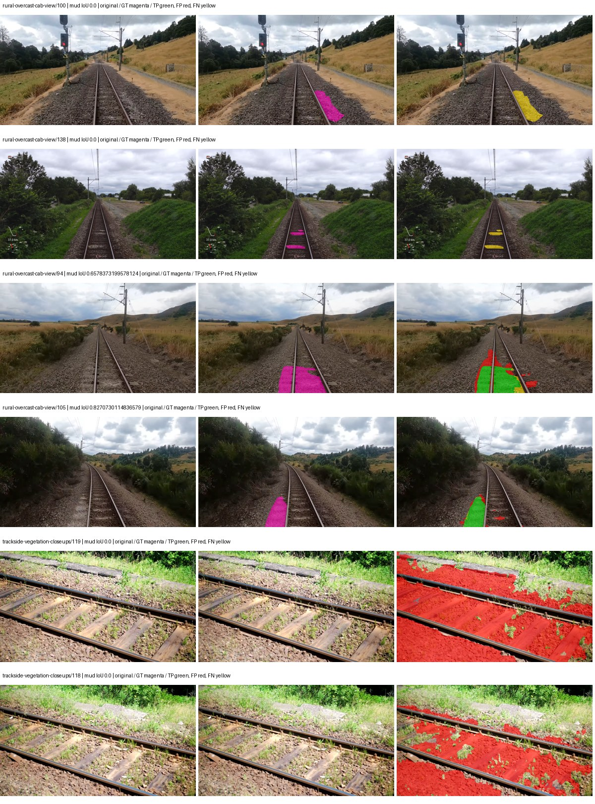
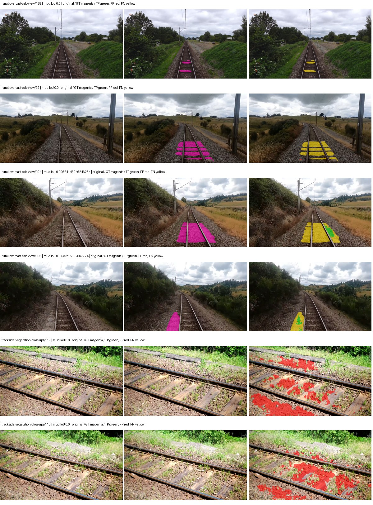
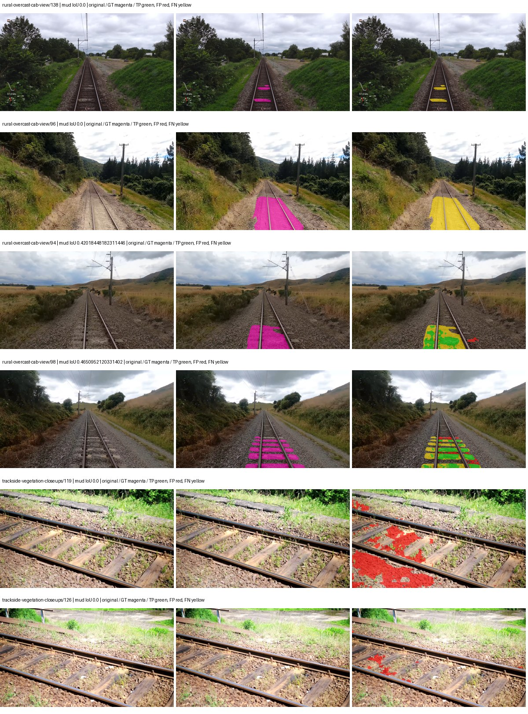
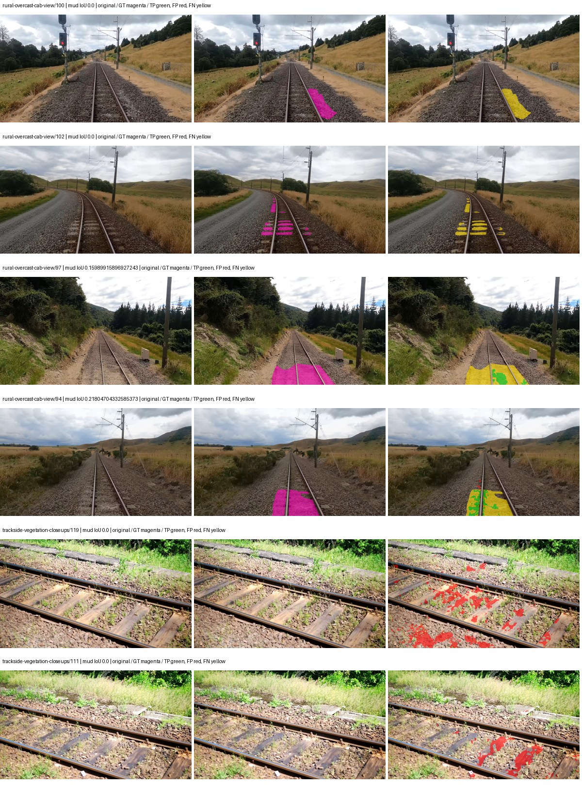

# hf_auto_segformer_b0 — paul-test-rtis_v2

[RTIS comparison](../../README.md) · [Full model records](record.json)

Primary selection and early stopping: **mud-pumping validation IoU**. A job is complete only after full statistics and isolated profiling are verified.

| Model | Initialization path | Seed | Status | Steps | Best step | Mud IoU (%) | Mud precision (%) | Mud recall (%) | Final mud IoU (trainer val, %) | mIoU (%) | Fixed GT-class mIoU (%) |
| --- | --- | --- | --- | --- | --- | --- | --- | --- | --- | --- | --- |
| hf_auto_segformer_b0 | rtis_only | 0 | completed | 4000 | 3058 | 7.68 | 8.74 | 38.86 | 5.84 | 30.28 | 35.33 |
| hf_auto_segformer_b0 | cityscapes_to_rtis | 0 | completed | 3568 | 2294 | 1.86 | 3.56 | 3.74 | 1.43 | 28.28 | 32.99 |
| hf_auto_segformer_b0 | railsem19_to_rtis | 0 | completed | 2803 | 1529 | 9.05 | 25.88 | 12.22 | 8.80 | 34.63 | 40.40 |
| hf_auto_segformer_b0 | cityscapes_to_railsem19_to_rtis | 0 | completed | 4000 | 2803 | 4.57 | 14.17 | 6.32 | 3.50 | 33.68 | 39.29 |

Training: 205 images. Validation: 37 images. Test: 50 held out. Seeds: [0]. Seed variation measures optimization variability, not independent-recording uncertainty. Historical source checkpoints stay fixed across adaptation seeds.

Training code: `066afb2626398b7be59d4d19f5a0e4644fd59adc`. Split SHA-256: `18a84c0163a65ded46508bcc904c374e5f33ad8a09b8879e3c8add606e86aa9f`.

## rtis_only — seed 0

Status: **completed**. Started: 2026-09-09T20:11:11.090903+00:00. Finished: 2026-09-09T20:54:23.049051+00:00.

Recipe pretrained initializer: `nvidia/segformer-b0-finetuned-ade-512-512`.

`rtis_only` uses the recipe initializer, which may include pretrained segmentation components. Transfer paths load the exact historical source checkpoint below and reset the classifier; they do not reset all query/decoder features.

Source checkpoint: `Recipe pretrained initialization`.

Config SHA-256: `ab9f4e070ca62f85be5922601689277b1f45d402592f4ce7d23a2a32670d0cee`. Weights used for validation: `raw`.

### Mud-pumping and aggregate quality

| Metric | Selected checkpoint | Final training validation |
| --- | --- | --- |
| Mud IoU | 7.68 | 5.84 |
| Mud precision | 8.74 | 6.74 |
| Mud recall | 38.86 | 30.35 |
| Mud Dice/F1 | 14.27 | 11.03 |
| mIoU | 30.28 | 31.04 |
| Mean accuracy | 43.50 | 43.71 |
| Mean precision | 56.46 | 57.22 |
| Mean Dice | 39.28 | 40.43 |
| Mean specificity | 99.00 | 98.98 |
| Pixel accuracy | 82.53 | 82.42 |
| Frequency-weighted IoU | 75.32 | 75.16 |
| Fixed GT-present class mIoU | 35.33 | 36.21 |
| Boundary F1 | 39.57 | 39.70 |

The selected checkpoint has independent evaluation evidence. Final values are the trainer's final validation record, not a new independent evaluation. mIoU averages classes with nonzero union, so false positives on absent classes can change its denominator. The fixed GT-class mean is supplementary and excludes absent classes; their false positives remain in the confusion matrix.

### Resource usage and timing

| Measurement | Value |
| --- | --- |
| Peak training VRAM, retained training invocation (GiB) | 7.80 |
| Peak evaluation VRAM (GiB) | 7.03 |
| Retained training invocation wall time (seconds) | 2455.29 |
| Retained training invocation GPU-hours (one GPU) | 0.68 |
| Evaluation wall time (seconds) | 12.73 |
| Full evaluation pipeline images/second | 2.91 |
| Best full-state checkpoint (MiB) | 57.10 |
| Final full-state checkpoint (MiB) | 57.09 |
| Verified periodic checkpoints removed (GiB) | 0.45 |

VRAM uses the recorded allocator high-water mark; it is not total device usage including CUDA context. Resumed jobs' retained training invocation times and peaks are **not whole-campaign totals**. Earlier invocation resource records are not reconstructed here. Evaluation throughput includes loader, sliding-window inference and metrics; it is not model-only latency/FPS. Missing measurements are shown as —, never inferred from another dataset's run.

### Standardized inference performance

Dedicated model-only profiling waits for an idle worker-locked L40S: BF16, batch 1, 1024x1024, 20 warmup and 100 CUDA-event-timed public forwards. It excludes loading, preprocessing, tiling and metrics.

| Status | Parameters | Weight MiB | FPS | p50 ms | p95 ms | Peak reserved GiB |
| --- | --- | --- | --- | --- | --- | --- |
| complete | 3719541 | 14.19 | 133.61 | 7.39 | 8.09 | 0.89 |

```json
{
  "schema_version": 1,
  "model_id": "hf_auto_segformer_b0",
  "measured_at": "2026-09-09T20:54:20+00:00",
  "status": "complete",
  "benchmark_scope": "rtis_selected_checkpoint_model_only",
  "applies_to": [
    "hf_auto_segformer_b0--rtis_only--seed-0"
  ],
  "source": {
    "campaign_git_sha": "066afb2626398b7be59d4d19f5a0e4644fd59adc",
    "git_dirty": false,
    "config_hash": "88bf00cccc2d",
    "resolved_config": "/data/izadia1/projects/segmentary-runs/paul-test-rtis_v2/seed0-20260909/configs/hf_auto_segformer_b0--rtis_only--seed-0.yaml",
    "config_sha256": "ab9f4e070ca62f85be5922601689277b1f45d402592f4ce7d23a2a32670d0cee",
    "checkpoint_sha256": "6886cb91244365fae671adcc92cd187fccca0894426d0ab1569f9e2016873e2e",
    "checkpoint_global_step": 3058,
    "checkpoint_bytes": 59870029,
    "checkpoint_kind": "resume checkpoint with optimizer and EMA state",
    "weights": "raw",
    "measured_checkpoint_job_id": "hf_auto_segformer_b0--rtis_only--seed-0",
    "result_sha256": "9e0156efc6932af213d63f300782881efe609c5dec94847605a45cb7cf2f1bc6",
    "result_git_sha": "066afb2626398b7be59d4d19f5a0e4644fd59adc",
    "result_stage": "eval:paul-test-rtis:val",
    "result_seed": 0
  },
  "hardware": {
    "gpu_name": "NVIDIA L40S",
    "gpu_uuid": "GPU-fc5dde96-210d-0afa-ac74-7f88477d622b",
    "logical_device": "cuda:0",
    "physical_visibility_token": "4",
    "compute_capability": [
      8,
      9
    ],
    "total_memory_bytes": 47677177856
  },
  "model": {
    "parameter_count": 3719541,
    "trainable_parameter_count": 3719541,
    "resident_parameter_bytes": 14878164,
    "parameter_dtype_counts": {
      "float32": 3719541
    }
  },
  "contract": {
    "backend": "pytorch",
    "precision": "bf16_autocast",
    "batch_size": 1,
    "input_shape_nchw": [
      1,
      3,
      1024,
      1024
    ],
    "warmup_iterations": 20,
    "measured_iterations": 100,
    "timing": "per-forward CUDA events with end-event synchronization",
    "includes_preprocessing": false,
    "includes_data_loader": false,
    "includes_sliding_window": false,
    "input_resident_on_gpu": true,
    "model_only": true,
    "entrypoint": "public model(image) dense-logits forward"
  },
  "measurements": {
    "latency": {
      "p50_ms": 7.389695882797241,
      "p95_ms": 8.085657215118408,
      "mean_ms": 7.484528636932373,
      "minimum_ms": 7.313407897949219,
      "maximum_ms": 8.287232398986816,
      "fps": 133.60894833984662,
      "raw_ms": [
        7.618559837341309,
        7.364607810974121,
        8.085503578186035,
        7.386112213134766,
        7.358367919921875,
        7.352320194244385,
        7.345151901245117,
        7.422976016998291,
        7.365632057189941,
        7.383999824523926,
        7.381087779998779,
        7.791615962982178,
        7.386047840118408,
        7.349247932434082,
        7.313407897949219,
        7.3369598388671875,
        7.381919860839844,
        7.400447845458984,
        7.37494421005249,
        7.391232013702393,
        7.341184139251709,
        7.421951770782471,
        7.882719993591309,
        8.285183906555176,
        7.352320194244385,
        7.799808025360107,
        7.376800060272217,
        7.382016181945801,
        7.7117438316345215,
        7.433216094970703,
        7.403520107269287,
        7.352320194244385,
        7.434239864349365,
        7.390207767486572,
        7.385119915008545,
        7.384064197540283,
        7.408671855926514,
        7.433216094970703,
        7.3963518142700195,
        7.364607810974121,
        7.323647975921631,
        8.235008239746094,
        7.593984127044678,
        7.460864067077637,
        7.3758721351623535,
        7.366591930389404,
        7.441408157348633,
        7.371776103973389,
        7.90118408203125,
        7.390207767486572,
        7.367680072784424,
        7.3809919357299805,
        7.376895904541016,
        7.3942718505859375,
        7.379968166351318,
        7.363584041595459,
        7.53766393661499,
        7.413760185241699,
        7.372799873352051,
        7.382016181945801,
        7.401472091674805,
        7.43833589553833,
        7.8151679039001465,
        8.088576316833496,
        7.359488010406494,
        7.372799873352051,
        7.470208168029785,
        7.3809919357299805,
        7.390207767486572,
        7.365632057189941,
        7.361536026000977,
        7.357439994812012,
        8.250368118286133,
        7.6943359375,
        7.400415897369385,
        7.345151901245117,
        7.358463764190674,
        7.4106879234313965,
        7.38918399810791,
        7.412735939025879,
        7.493631839752197,
        7.426112174987793,
        7.375807762145996,
        7.783423900604248,
        7.423999786376953,
        7.369696140289307,
        7.411712169647217,
        8.287232398986816,
        7.451648235321045,
        7.359488010406494,
        7.372799873352051,
        7.35641622543335,
        7.408639907836914,
        7.395423889160156,
        7.756800174713135,
        7.3512959480285645,
        8.045568466186523,
        7.427072048187256,
        7.3471999168396,
        7.386112213134766
      ],
      "percentile_method": "numpy linear interpolation"
    },
    "peak_reserved_bytes": 960495616,
    "memory_kind": "pytorch_cuda_allocator_peak_reserved_excluding_context",
    "benchmark_wall_clock_s": 4.47013234347105
  },
  "started_at": "2026-09-09T20:54:16+00:00",
  "finished_at": "2026-09-09T20:54:20+00:00",
  "environment": {
    "hostname": "hdrfs-app-001",
    "python": "3.11.15",
    "platform": "Linux-5.15.0-139-generic-x86_64-with-glibc2.35",
    "torch": "2.11.0+cu128",
    "torch_cuda": "12.8",
    "cudnn": 91900,
    "driver_version": "570.133.20",
    "cuda_available": true,
    "gpu_count": 1,
    "gpu_names": [
      "NVIDIA L40S"
    ],
    "cuda_visible_devices": "4",
    "packages": {
      "segmentary": "0.1.0",
      "torch": "2.11.0+cu128",
      "torchvision": "0.26.0+cu128",
      "transformers": "5.15.0",
      "timm": "1.0.28",
      "segmentation-models-pytorch": "0.5.0",
      "albumentations": "2.0.8",
      "lightning": "2.6.5",
      "numpy": "2.4.4"
    }
  }
}
```

### Per-class validation results

| Class | GT pixels | IoU (%) | Precision (%) | Recall (%) | Dice (%) | Boundary F1 (%) |
| --- | --- | --- | --- | --- | --- | --- |
| car | 29664 | 5.77 | 35.02 | 6.47 | 10.92 | 37.87 |
| construction | 311585 | 50.75 | 62.62 | 72.82 | 67.33 | 65.92 |
| fence | 265137 | 13.06 | 37.47 | 16.70 | 23.11 | 26.93 |
| mud-pumping | 1226250 | 7.68 | 8.74 | 38.86 | 14.27 | 14.98 |
| on-rails | 0 | 0.00 | 0.00 | — | 0.00 | 0.00 |
| person | 0 | 0.00 | 0.00 | — | 0.00 | 0.00 |
| pole | 628038 | 65.04 | 81.01 | 76.75 | 78.82 | 87.25 |
| rail-embedded | 16799 | 16.21 | 97.68 | 16.27 | 27.89 | 34.45 |
| rail-raised | 2969797 | 77.17 | 83.36 | 91.22 | 87.12 | 91.93 |
| rail-track | 6323197 | 33.02 | 71.86 | 37.93 | 49.65 | 45.70 |
| road | 1048831 | 23.53 | 38.45 | 37.76 | 38.10 | 35.92 |
| sidewalk | 1297367 | 20.47 | 89.67 | 20.96 | 33.98 | 9.38 |
| sky | 19121606 | 98.34 | 99.20 | 99.13 | 99.17 | 95.07 |
| standing-water | 95802 | 1.54 | 1.76 | 10.65 | 3.03 | 5.37 |
| terrain | 39239306 | 87.98 | 91.98 | 95.29 | 93.61 | 67.26 |
| trackbed | 10643081 | 53.28 | 77.29 | 63.17 | 69.52 | 57.16 |
| traffic-light | 19510 | 13.36 | 80.86 | 13.79 | 23.57 | 37.57 |
| traffic-sign | 13285 | 16.56 | 88.61 | 16.92 | 28.42 | 37.23 |
| tram-track | 56179 | 8.33 | 78.02 | 8.53 | 15.38 | 21.05 |
| truck | 0 | 0.00 | 0.00 | — | 0.00 | 0.00 |
| vegetation-overgrowth | 5901821 | 43.80 | 62.15 | 59.74 | 60.92 | 59.92 |

### Full-run accounting

| Measurement | Value |
| --- | --- |
| Full GPU-reserved wall seconds, all recorded worker attempts | 2591.96 |
| Full reserved GPU-hours | 0.72 |
| Whole-run timing complete | True |

| Phase | Wall seconds including failed attempts |
| --- | --- |
| training | 2461.66 |
| diagnostics | 98.45 |
| performance | 11.21 |

GPU-reserved time includes model loading, training, validation, collection, profiling, checkpoint I/O and orchestration while the worker owns one GPU. It is not GPU kernel-active time. Phase timings and sampled device memory/power/utilization are retained separately; sampled device memory is not the allocator high-water mark.

### Train/validation and raw/EMA diagnostics

| Checkpoint / weights / split | Images | Mud IoU (%) | Mud precision (%) | Mud recall (%) |
| --- | --- | --- | --- | --- |
| best-auto-train / raw | 205 | 95.05 | 97.40 | 97.52 |
| best-auto-val / raw | 37 | 7.68 | 8.74 | 38.86 |
| best-alternate-val / ema | 37 | 5.07 | 5.71 | 31.17 |
| final-auto-val / raw | 37 | 5.85 | 6.75 | 30.39 |

Train uses the evaluation transform without augmentation. Compare mud train/validation metrics for the same selected weights. Alternate EMA on running-stat BatchNorm is explicitly uncalibrated and is diagnostic only. Score-threshold curves use uncalibrated normalized scores and are pixel-level diagnostics, not event detection rates or a selected deployment operating point.

### Downloadable evidence

- best-auto-train: [per-image.csv](rtis_only--seed-0/best-auto-train/per-image.csv) · [per-image-confusion.json.gz](rtis_only--seed-0/best-auto-train/per-image-confusion.json.gz) · [groups.json](rtis_only--seed-0/best-auto-train/groups.json) · [mud-score-curves.json](rtis_only--seed-0/best-auto-train/mud-score-curves.json)
- best-auto-val: [per-image.csv](rtis_only--seed-0/best-auto-val/per-image.csv) · [per-image-confusion.json.gz](rtis_only--seed-0/best-auto-val/per-image-confusion.json.gz) · [groups.json](rtis_only--seed-0/best-auto-val/groups.json) · [mud-score-curves.json](rtis_only--seed-0/best-auto-val/mud-score-curves.json) · [examples.jpg](rtis_only--seed-0/best-auto-val/examples.jpg)
- best-alternate-val: [per-image.csv](rtis_only--seed-0/best-alternate-val/per-image.csv) · [per-image-confusion.json.gz](rtis_only--seed-0/best-alternate-val/per-image-confusion.json.gz) · [groups.json](rtis_only--seed-0/best-alternate-val/groups.json) · [mud-score-curves.json](rtis_only--seed-0/best-alternate-val/mud-score-curves.json)
- final-auto-val: [per-image.csv](rtis_only--seed-0/final-auto-val/per-image.csv) · [per-image-confusion.json.gz](rtis_only--seed-0/final-auto-val/per-image-confusion.json.gz) · [groups.json](rtis_only--seed-0/final-auto-val/groups.json) · [mud-score-curves.json](rtis_only--seed-0/final-auto-val/mud-score-curves.json)
- resources: [telemetry.csv](rtis_only--seed-0/resources/telemetry.csv)



Examples are two lowest and two highest mud-IoU positive images, plus up to two negative images with the most false-positive mud pixels. They are targeted diagnostic examples, not random samples. Green: true positive; red: false positive; yellow: false negative. Full predictions remain on HDRFS.

### Validation tracking

| Logged step | Overall mIoU (%) | Mud IoU (%) |
| --- | --- | --- |
| 254 | 19.15 | 0.51 |
| 509 | 27.00 | 1.60 |
| 764 | 24.45 | 2.46 |
| 1019 | 25.43 | 3.58 |
| 1274 | 25.81 | 3.46 |
| 1529 | 26.84 | 3.10 |
| 1784 | 27.31 | 5.36 |
| 2038 | 28.18 | 4.56 |
| 2293 | 28.93 | 5.81 |
| 2548 | 29.80 | 5.13 |
| 2803 | 30.54 | 4.43 |
| 3058 | 30.27 | 7.69 |
| 3313 | 29.87 | 6.08 |
| 3568 | 30.77 | 5.86 |
| 3823 | 30.74 | 5.36 |
| 4000 | 31.04 | 5.84 |

All retained scalar curves, including training loss and per-class IoU, are in record.json. Observed best mud on a curve is not necessarily a retained checkpoint: the pilot saved its selection-metric-best and final checkpoints. Step logging and checkpoint global_step may differ by one.

### Stopping and checkpoint provenance

```json
{
  "stopping": {
    "actual_steps": 4000,
    "maximum_steps": 4000,
    "min_delta": 0.001,
    "monitor": "val_iou/mud-pumping",
    "patience": 5,
    "reason": "budget_complete"
  },
  "checkpoints": {
    "best": {
      "path": "/data/izadia1/projects/segmentary-runs/paul-test-rtis_v2/seed0-20260909/future-runs/hf_auto_segformer_b0--rtis_only--seed-0_seed0/rtis/best.ckpt",
      "sha256": "6886cb91244365fae671adcc92cd187fccca0894426d0ab1569f9e2016873e2e",
      "global_step": 3058,
      "bytes": 59870029
    },
    "final": {
      "path": "/data/izadia1/projects/segmentary-runs/paul-test-rtis_v2/seed0-20260909/future-runs/hf_auto_segformer_b0--rtis_only--seed-0_seed0/rtis/last.ckpt",
      "sha256": "f9dc8aa576fd0d988fa4c5c8a392a39f44966eabafc41099e83841adb6ea7b16",
      "global_step": 4000,
      "bytes": 59860173
    }
  },
  "cleanup_error": null
}
```

### Resolved training, initialization and evaluation settings

The optimizer block is the base configuration. Stage LR scales are applied at runtime, and stage warmup is capped at min(base warmup, floor(stage budget / 10), stage budget - 1): 400 steps for this 4,000-step pilot. Model-internal native input grids may differ from augmentation crops (EoMT uses its 640 grid).

```json
{
  "name": "hf_auto_segformer_b0--rtis_only--seed-0",
  "model": {
    "arch": "hf_auto",
    "checkpoint": "nvidia/segformer-b0-finetuned-ade-512-512",
    "tuning": "full",
    "head": "unified_head",
    "lora_r": 16,
    "lora_alpha": 32,
    "lora_dropout": 0.05,
    "lora_targets": [],
    "drop_path": null,
    "revision": "489d5cd81a0b59fab9b7ea758d3548ebe99677da",
    "subfolder": null,
    "local_files_only": false,
    "trust_remote_code": false,
    "backbone_path": null,
    "head_paths": [],
    "classifier_path": null,
    "inactive_parameter_paths": [],
    "smp_arch": null,
    "encoder_name": null,
    "encoder_weights": null,
    "native": null,
    "batch_norm_momentum": null
  },
  "space": "paul-test-rtis",
  "taxonomy_root": "/data/izadia1/projects/segmentary-rtis-fullstats-066afb2/taxonomy",
  "output_root": "/data/izadia1/projects/segmentary-runs/paul-test-rtis_v2/seed0-20260909/future-runs",
  "optim": {
    "backbone_lr": 6e-05,
    "head_lr_mult": 10.0,
    "weight_decay": 0.05,
    "llrd": 1.0,
    "warmup_iters": 1500,
    "warmup_ratio": 1e-06,
    "poly_power": 0.9,
    "min_lr_ratio": 0.0,
    "betas": [
      0.9,
      0.999
    ],
    "grad_clip": 1.0
  },
  "train": {
    "iters": 4000,
    "batch_size": 2,
    "accum": 8,
    "num_workers": 2,
    "precision": "bf16-mixed",
    "ema_decay": 0.9998,
    "val_every": 250,
    "ckpt_every": 500,
    "selection_metric": "val_iou/mud-pumping",
    "early_stopping_patience": 5,
    "early_stopping_min_delta": 0.001,
    "seed": 0,
    "devices": 1
  },
  "eval": {
    "sliding_window": true,
    "window": [
      1024,
      1024
    ],
    "stride": [
      768,
      768
    ],
    "batch_size": 1,
    "num_workers": 2,
    "tta_scales": [],
    "tta_flip": false,
    "threshold": 0.5,
    "boundary_tolerance_frac": 0.0075,
    "save_confusion": true
  },
  "loss": {
    "task": "multiclass",
    "activation": "auto",
    "terms": [],
    "aux": "none",
    "aux_weight": 0.0,
    "ce_weight": 1.0,
    "label_smoothing": 0.0,
    "class_weights": null,
    "query": null
  },
  "aug": {
    "crop": [
      1024,
      1024
    ],
    "scale_min": 0.5,
    "scale_max": 2.0,
    "hflip_p": 0.5,
    "color_jitter_p": 0.5,
    "brightness": 0.25,
    "contrast": 0.25,
    "saturation": 0.25,
    "hue": 0.05
  },
  "stages": [
    {
      "name": "rtis",
      "data": [
        {
          "name": "paul-test-rtis",
          "root": "/data/izadia1/datasets/paul-test-rtis_v2",
          "variant": null,
          "split_file": "splits.json",
          "train_split": "train",
          "val_split": "val",
          "limit": null,
          "loader": "folder",
          "mapping": "paul-test-rtis",
          "loader_options": {
            "require_groups": true
          }
        }
      ],
      "iters": null,
      "lr_scale": 1.0,
      "head_group_lr_scale": 1.0,
      "init_from": "pretrained",
      "reset_head": false,
      "freeze": null,
      "sample_weights": null
    }
  ]
}
```

### Hardware and software provenance

```json
{
  "training": {
    "cuda_available": true,
    "cuda_visible_devices": "4",
    "cudnn": 91900,
    "driver_version": "570.133.20",
    "gpu_count": 1,
    "gpu_names": [
      "NVIDIA L40S"
    ],
    "hostname": "hdrfs-app-001",
    "input_normalization": {
      "channel_order": "rgb",
      "mean": [
        0.485,
        0.456,
        0.406
      ],
      "source": "hf_image_processor",
      "std": [
        0.229,
        0.224,
        0.225
      ]
    },
    "model_origins": [
      {
        "hf_commit": "489d5cd81a0b59fab9b7ea758d3548ebe99677da",
        "hf_name_or_path": "nvidia/segformer-b0-finetuned-ade-512-512",
        "module": "model",
        "timm_pretrained": {}
      },
      {
        "hf_commit": "489d5cd81a0b59fab9b7ea758d3548ebe99677da",
        "hf_name_or_path": "nvidia/segformer-b0-finetuned-ade-512-512",
        "module": "model.segformer",
        "timm_pretrained": {}
      },
      {
        "hf_commit": "489d5cd81a0b59fab9b7ea758d3548ebe99677da",
        "hf_name_or_path": "nvidia/segformer-b0-finetuned-ade-512-512",
        "module": "model.segformer.stages.0.blocks.0.attention",
        "timm_pretrained": {}
      },
      {
        "hf_commit": "489d5cd81a0b59fab9b7ea758d3548ebe99677da",
        "hf_name_or_path": "nvidia/segformer-b0-finetuned-ade-512-512",
        "module": "model.segformer.stages.0.blocks.1.attention",
        "timm_pretrained": {}
      },
      {
        "hf_commit": "489d5cd81a0b59fab9b7ea758d3548ebe99677da",
        "hf_name_or_path": "nvidia/segformer-b0-finetuned-ade-512-512",
        "module": "model.segformer.stages.1.blocks.0.attention",
        "timm_pretrained": {}
      },
      {
        "hf_commit": "489d5cd81a0b59fab9b7ea758d3548ebe99677da",
        "hf_name_or_path": "nvidia/segformer-b0-finetuned-ade-512-512",
        "module": "model.segformer.stages.1.blocks.1.attention",
        "timm_pretrained": {}
      },
      {
        "hf_commit": "489d5cd81a0b59fab9b7ea758d3548ebe99677da",
        "hf_name_or_path": "nvidia/segformer-b0-finetuned-ade-512-512",
        "module": "model.segformer.stages.2.blocks.0.attention",
        "timm_pretrained": {}
      },
      {
        "hf_commit": "489d5cd81a0b59fab9b7ea758d3548ebe99677da",
        "hf_name_or_path": "nvidia/segformer-b0-finetuned-ade-512-512",
        "module": "model.segformer.stages.2.blocks.1.attention",
        "timm_pretrained": {}
      },
      {
        "hf_commit": "489d5cd81a0b59fab9b7ea758d3548ebe99677da",
        "hf_name_or_path": "nvidia/segformer-b0-finetuned-ade-512-512",
        "module": "model.segformer.stages.3.blocks.0.attention",
        "timm_pretrained": {}
      },
      {
        "hf_commit": "489d5cd81a0b59fab9b7ea758d3548ebe99677da",
        "hf_name_or_path": "nvidia/segformer-b0-finetuned-ade-512-512",
        "module": "model.segformer.stages.3.blocks.1.attention",
        "timm_pretrained": {}
      },
      {
        "hf_commit": "489d5cd81a0b59fab9b7ea758d3548ebe99677da",
        "hf_name_or_path": "nvidia/segformer-b0-finetuned-ade-512-512",
        "module": "model.decode_head",
        "timm_pretrained": {}
      }
    ],
    "model_parameter_count": 3719541,
    "packages": {
      "albumentations": "2.0.8",
      "lightning": "2.6.5",
      "numpy": "2.4.4",
      "segmentary": "0.1.0",
      "segmentation-models-pytorch": "0.5.0",
      "timm": "1.0.28",
      "torch": "2.11.0+cu128",
      "torchvision": "0.26.0+cu128",
      "transformers": "5.15.0"
    },
    "platform": "Linux-5.15.0-139-generic-x86_64-with-glibc2.35",
    "python": "3.11.15",
    "torch": "2.11.0+cu128",
    "torch_cuda": "12.8",
    "trainable_parameter_count": 3719541,
    "training_stop": {
      "actual_steps": 4000,
      "maximum_steps": 4000,
      "min_delta": 0.001,
      "monitor": "val_iou/mud-pumping",
      "patience": 5,
      "reason": "budget_complete"
    },
    "validation_weights": "raw"
  },
  "evaluation": {
    "cuda_available": true,
    "cuda_visible_devices": "4",
    "cudnn": 91900,
    "driver_version": "570.133.20",
    "gpu_count": 1,
    "gpu_names": [
      "NVIDIA L40S"
    ],
    "hostname": "hdrfs-app-001",
    "input_normalization": {
      "channel_order": "rgb",
      "mean": [
        0.485,
        0.456,
        0.406
      ],
      "source": "hf_image_processor",
      "std": [
        0.229,
        0.224,
        0.225
      ]
    },
    "packages": {
      "albumentations": "2.0.8",
      "lightning": "2.6.5",
      "numpy": "2.4.4",
      "segmentary": "0.1.0",
      "segmentation-models-pytorch": "0.5.0",
      "timm": "1.0.28",
      "torch": "2.11.0+cu128",
      "torchvision": "0.26.0+cu128",
      "transformers": "5.15.0"
    },
    "platform": "Linux-5.15.0-139-generic-x86_64-with-glibc2.35",
    "python": "3.11.15",
    "torch": "2.11.0+cu128",
    "torch_cuda": "12.8"
  }
}
```

## cityscapes_to_rtis — seed 0

Status: **completed**. Started: 2026-09-09T20:15:49.532624+00:00. Finished: 2026-09-09T20:53:41.800171+00:00.

Recipe pretrained initializer: `nvidia/segformer-b0-finetuned-ade-512-512`.

`rtis_only` uses the recipe initializer, which may include pretrained segmentation components. Transfer paths load the exact historical source checkpoint below and reset the classifier; they do not reset all query/decoder features.

Source checkpoint: `{'name': 'hf_auto_segformer_b0--cityscapes--seed-0', 'model': 'hf_auto_segformer_b0', 'protocol': 'cityscapes', 'config': '/data/izadia1/projects/segmentary-runs/all-model-city-rail-seed0-rail20-b9eb3e1/jobs/hf_auto_segformer_b0--cityscapes--seed-0/attempt-001/resolved-config.yaml', 'checkpoint': '/data/izadia1/projects/segmentary-runs/all-model-city-rail-seed0-rail20-b9eb3e1/jobs/hf_auto_segformer_b0--cityscapes--seed-0/attempt-001/train/hf_auto_segformer_b0--cityscapes_seed0/cityscapes/last.ckpt', 'recorded_sha256': '68c80fba89b35c10ef9974fcd7163c2bf6b0afaf0ad6c00ff14cbc2b97e30dc9', 'exists': True}`.

Config SHA-256: `6f4c93ee08e69823ed1c9dc508a873b94792e2853d718d8867978d7c9b803909`. Weights used for validation: `raw`.

### Mud-pumping and aggregate quality

| Metric | Selected checkpoint | Final training validation |
| --- | --- | --- |
| Mud IoU | 1.86 | 1.43 |
| Mud precision | 3.56 | 2.74 |
| Mud recall | 3.74 | 2.92 |
| Mud Dice/F1 | 3.65 | 2.83 |
| mIoU | 28.28 | 29.42 |
| Mean accuracy | 39.46 | 40.65 |
| Mean precision | 47.97 | 49.39 |
| Mean Dice | 36.48 | 38.16 |
| Mean specificity | 98.89 | 98.91 |
| Pixel accuracy | 80.10 | 81.72 |
| Frequency-weighted IoU | 73.14 | 73.71 |
| Fixed GT-present class mIoU | 32.99 | 34.32 |
| Boundary F1 | 35.43 | 38.13 |

The selected checkpoint has independent evaluation evidence. Final values are the trainer's final validation record, not a new independent evaluation. mIoU averages classes with nonzero union, so false positives on absent classes can change its denominator. The fixed GT-class mean is supplementary and excludes absent classes; their false positives remain in the confusion matrix.

### Resource usage and timing

| Measurement | Value |
| --- | --- |
| Peak training VRAM, retained training invocation (GiB) | 7.79 |
| Peak evaluation VRAM (GiB) | 7.03 |
| Retained training invocation wall time (seconds) | 2134.95 |
| Retained training invocation GPU-hours (one GPU) | 0.59 |
| Evaluation wall time (seconds) | 12.89 |
| Full evaluation pipeline images/second | 2.87 |
| Best full-state checkpoint (MiB) | 57.10 |
| Final full-state checkpoint (MiB) | 57.09 |
| Verified periodic checkpoints removed (GiB) | 0.39 |

VRAM uses the recorded allocator high-water mark; it is not total device usage including CUDA context. Resumed jobs' retained training invocation times and peaks are **not whole-campaign totals**. Earlier invocation resource records are not reconstructed here. Evaluation throughput includes loader, sliding-window inference and metrics; it is not model-only latency/FPS. Missing measurements are shown as —, never inferred from another dataset's run.

### Standardized inference performance

Dedicated model-only profiling waits for an idle worker-locked L40S: BF16, batch 1, 1024x1024, 20 warmup and 100 CUDA-event-timed public forwards. It excludes loading, preprocessing, tiling and metrics.

| Status | Parameters | Weight MiB | FPS | p50 ms | p95 ms | Peak reserved GiB |
| --- | --- | --- | --- | --- | --- | --- |
| complete | 3719541 | 14.19 | 131.49 | 7.46 | 8.25 | 0.89 |

```json
{
  "schema_version": 1,
  "model_id": "hf_auto_segformer_b0",
  "measured_at": "2026-09-09T20:53:39+00:00",
  "status": "complete",
  "benchmark_scope": "rtis_selected_checkpoint_model_only",
  "applies_to": [
    "hf_auto_segformer_b0--cityscapes_to_rtis--seed-0"
  ],
  "source": {
    "campaign_git_sha": "066afb2626398b7be59d4d19f5a0e4644fd59adc",
    "git_dirty": false,
    "config_hash": "9b0c83d0e55d",
    "resolved_config": "/data/izadia1/projects/segmentary-runs/paul-test-rtis_v2/seed0-20260909/configs/hf_auto_segformer_b0--cityscapes_to_rtis--seed-0.yaml",
    "config_sha256": "6f4c93ee08e69823ed1c9dc508a873b94792e2853d718d8867978d7c9b803909",
    "checkpoint_sha256": "32b5a10b2b1abf13fe64f80b298c48d21545feee96eca2e799c78c1dc7f1d341",
    "checkpoint_global_step": 2294,
    "checkpoint_bytes": 59870093,
    "checkpoint_kind": "resume checkpoint with optimizer and EMA state",
    "weights": "raw",
    "measured_checkpoint_job_id": "hf_auto_segformer_b0--cityscapes_to_rtis--seed-0",
    "result_sha256": "1bc476664e2e71c25f58f2425da8d478b57fb389ded57aa95b93d448c1a48ea1",
    "result_git_sha": "066afb2626398b7be59d4d19f5a0e4644fd59adc",
    "result_stage": "eval:paul-test-rtis:val",
    "result_seed": 0
  },
  "hardware": {
    "gpu_name": "NVIDIA L40S",
    "gpu_uuid": "GPU-2f8008a1-9b67-11f6-987b-b393a672322c",
    "logical_device": "cuda:0",
    "physical_visibility_token": "3",
    "compute_capability": [
      8,
      9
    ],
    "total_memory_bytes": 47677177856
  },
  "model": {
    "parameter_count": 3719541,
    "trainable_parameter_count": 3719541,
    "resident_parameter_bytes": 14878164,
    "parameter_dtype_counts": {
      "float32": 3719541
    }
  },
  "contract": {
    "backend": "pytorch",
    "precision": "bf16_autocast",
    "batch_size": 1,
    "input_shape_nchw": [
      1,
      3,
      1024,
      1024
    ],
    "warmup_iterations": 20,
    "measured_iterations": 100,
    "timing": "per-forward CUDA events with end-event synchronization",
    "includes_preprocessing": false,
    "includes_data_loader": false,
    "includes_sliding_window": false,
    "input_resident_on_gpu": true,
    "model_only": true,
    "entrypoint": "public model(image) dense-logits forward"
  },
  "measurements": {
    "latency": {
      "p50_ms": 7.46342396736145,
      "p95_ms": 8.24586386680603,
      "mean_ms": 7.604892807006836,
      "minimum_ms": 7.326720237731934,
      "maximum_ms": 8.397727966308594,
      "fps": 131.49429260576048,
      "raw_ms": [
        8.263680458068848,
        8.397727966308594,
        7.950272083282471,
        8.257568359375,
        7.592959880828857,
        7.423999786376953,
        7.3809919357299805,
        7.415808200836182,
        7.399424076080322,
        7.609344005584717,
        7.879680156707764,
        7.376895904541016,
        7.408639907836914,
        7.407616138458252,
        7.3573760986328125,
        7.326720237731934,
        7.761919975280762,
        7.501823902130127,
        7.407616138458252,
        7.373824119567871,
        7.388160228729248,
        7.853055953979492,
        7.394303798675537,
        7.629824161529541,
        7.412735939025879,
        7.386112213134766,
        8.129535675048828,
        7.467008113861084,
        7.625728130340576,
        8.37939167022705,
        7.415808200836182,
        7.395328044891357,
        7.84281587600708,
        7.776127815246582,
        7.5141119956970215,
        7.565279960632324,
        7.975935935974121,
        7.4547200202941895,
        7.386112213134766,
        7.557119846343994,
        7.459839820861816,
        7.654240131378174,
        7.872511863708496,
        7.404543876647949,
        7.39737606048584,
        7.413760185241699,
        7.39737606048584,
        7.647071838378906,
        7.840767860412598,
        7.6769280433654785,
        7.402495861053467,
        7.404543876647949,
        7.379968166351318,
        7.415808200836182,
        7.400447845458984,
        7.395328044891357,
        7.3758721351623535,
        7.337887763977051,
        7.704576015472412,
        7.583744049072266,
        7.941120147705078,
        7.748608112335205,
        7.415808200836182,
        7.971839904785156,
        7.394303798675537,
        7.386112213134766,
        8.00972843170166,
        7.429120063781738,
        7.4055681228637695,
        7.379968166351318,
        7.417856216430664,
        7.394303798675537,
        7.368703842163086,
        7.802879810333252,
        7.698431968688965,
        7.386112213134766,
        8.074239730834961,
        7.409664154052734,
        7.369631767272949,
        7.607295989990234,
        7.875584125518799,
        8.245247840881348,
        7.618559837341309,
        8.358912467956543,
        7.519231796264648,
        7.540736198425293,
        7.421951770782471,
        7.367551803588867,
        7.384064197540283,
        7.510015964508057,
        7.417856216430664,
        7.374847888946533,
        7.376031875610352,
        7.769087791442871,
        7.561215877532959,
        7.567359924316406,
        8.01587200164795,
        8.070143699645996,
        7.89299201965332,
        7.782527923583984
      ],
      "percentile_method": "numpy linear interpolation"
    },
    "peak_reserved_bytes": 960495616,
    "memory_kind": "pytorch_cuda_allocator_peak_reserved_excluding_context",
    "benchmark_wall_clock_s": 4.461721494793892
  },
  "started_at": "2026-09-09T20:53:35+00:00",
  "finished_at": "2026-09-09T20:53:39+00:00",
  "environment": {
    "hostname": "hdrfs-app-001",
    "python": "3.11.15",
    "platform": "Linux-5.15.0-139-generic-x86_64-with-glibc2.35",
    "torch": "2.11.0+cu128",
    "torch_cuda": "12.8",
    "cudnn": 91900,
    "driver_version": "570.133.20",
    "cuda_available": true,
    "gpu_count": 1,
    "gpu_names": [
      "NVIDIA L40S"
    ],
    "cuda_visible_devices": "3",
    "packages": {
      "segmentary": "0.1.0",
      "torch": "2.11.0+cu128",
      "torchvision": "0.26.0+cu128",
      "transformers": "5.15.0",
      "timm": "1.0.28",
      "segmentation-models-pytorch": "0.5.0",
      "albumentations": "2.0.8",
      "lightning": "2.6.5",
      "numpy": "2.4.4"
    }
  }
}
```

### Per-class validation results

| Class | GT pixels | IoU (%) | Precision (%) | Recall (%) | Dice (%) | Boundary F1 (%) |
| --- | --- | --- | --- | --- | --- | --- |
| car | 29664 | 0.00 | 0.00 | 0.00 | 0.00 | 0.00 |
| construction | 311585 | 52.84 | 68.35 | 69.96 | 69.14 | 65.50 |
| fence | 265137 | 3.65 | 8.14 | 6.20 | 7.04 | 17.04 |
| mud-pumping | 1226250 | 1.86 | 3.56 | 3.74 | 3.65 | 5.55 |
| on-rails | 0 | 0.00 | 0.00 | — | 0.00 | 0.00 |
| person | 0 | 0.00 | 0.00 | — | 0.00 | 0.00 |
| pole | 628038 | 65.32 | 81.15 | 77.00 | 79.02 | 87.13 |
| rail-embedded | 16799 | 17.53 | 52.86 | 20.78 | 29.83 | 26.40 |
| rail-raised | 2969797 | 67.15 | 82.71 | 78.12 | 80.35 | 87.03 |
| rail-track | 6323197 | 34.51 | 48.82 | 54.08 | 51.31 | 46.73 |
| road | 1048831 | 6.28 | 12.23 | 11.42 | 11.81 | 14.09 |
| sidewalk | 1297367 | 18.31 | 84.33 | 18.96 | 30.96 | 12.73 |
| sky | 19121606 | 98.14 | 98.99 | 99.13 | 99.06 | 94.94 |
| standing-water | 95802 | 0.21 | 0.22 | 9.38 | 0.43 | 0.52 |
| terrain | 39239306 | 85.59 | 92.54 | 91.93 | 92.24 | 58.02 |
| trackbed | 10643081 | 51.94 | 77.98 | 60.87 | 68.37 | 54.47 |
| traffic-light | 19510 | 11.40 | 99.29 | 11.41 | 20.47 | 40.88 |
| traffic-sign | 13285 | 14.97 | 71.11 | 15.94 | 26.04 | 46.55 |
| tram-track | 56179 | 25.85 | 65.45 | 29.93 | 41.07 | 27.02 |
| truck | 0 | 0.00 | 0.00 | — | 0.00 | 0.00 |
| vegetation-overgrowth | 5901821 | 38.23 | 59.75 | 51.48 | 55.31 | 59.38 |

### Full-run accounting

| Measurement | Value |
| --- | --- |
| Full GPU-reserved wall seconds, all recorded worker attempts | 2272.32 |
| Full reserved GPU-hours | 0.63 |
| Whole-run timing complete | True |

| Phase | Wall seconds including failed attempts |
| --- | --- |
| training | 2141.65 |
| diagnostics | 98.68 |
| performance | 11.17 |

GPU-reserved time includes model loading, training, validation, collection, profiling, checkpoint I/O and orchestration while the worker owns one GPU. It is not GPU kernel-active time. Phase timings and sampled device memory/power/utilization are retained separately; sampled device memory is not the allocator high-water mark.

### Train/validation and raw/EMA diagnostics

| Checkpoint / weights / split | Images | Mud IoU (%) | Mud precision (%) | Mud recall (%) |
| --- | --- | --- | --- | --- |
| best-auto-train / raw | 205 | 90.12 | 94.00 | 95.62 |
| best-auto-val / raw | 37 | 1.86 | 3.56 | 3.74 |
| best-alternate-val / ema | 37 | 0.85 | 1.62 | 1.77 |
| final-auto-val / raw | 37 | 1.44 | 2.75 | 2.93 |

Train uses the evaluation transform without augmentation. Compare mud train/validation metrics for the same selected weights. Alternate EMA on running-stat BatchNorm is explicitly uncalibrated and is diagnostic only. Score-threshold curves use uncalibrated normalized scores and are pixel-level diagnostics, not event detection rates or a selected deployment operating point.

### Downloadable evidence

- best-auto-train: [per-image.csv](cityscapes_to_rtis--seed-0/best-auto-train/per-image.csv) · [per-image-confusion.json.gz](cityscapes_to_rtis--seed-0/best-auto-train/per-image-confusion.json.gz) · [groups.json](cityscapes_to_rtis--seed-0/best-auto-train/groups.json) · [mud-score-curves.json](cityscapes_to_rtis--seed-0/best-auto-train/mud-score-curves.json)
- best-auto-val: [per-image.csv](cityscapes_to_rtis--seed-0/best-auto-val/per-image.csv) · [per-image-confusion.json.gz](cityscapes_to_rtis--seed-0/best-auto-val/per-image-confusion.json.gz) · [groups.json](cityscapes_to_rtis--seed-0/best-auto-val/groups.json) · [mud-score-curves.json](cityscapes_to_rtis--seed-0/best-auto-val/mud-score-curves.json) · [examples.jpg](cityscapes_to_rtis--seed-0/best-auto-val/examples.jpg)
- best-alternate-val: [per-image.csv](cityscapes_to_rtis--seed-0/best-alternate-val/per-image.csv) · [per-image-confusion.json.gz](cityscapes_to_rtis--seed-0/best-alternate-val/per-image-confusion.json.gz) · [groups.json](cityscapes_to_rtis--seed-0/best-alternate-val/groups.json) · [mud-score-curves.json](cityscapes_to_rtis--seed-0/best-alternate-val/mud-score-curves.json)
- final-auto-val: [per-image.csv](cityscapes_to_rtis--seed-0/final-auto-val/per-image.csv) · [per-image-confusion.json.gz](cityscapes_to_rtis--seed-0/final-auto-val/per-image-confusion.json.gz) · [groups.json](cityscapes_to_rtis--seed-0/final-auto-val/groups.json) · [mud-score-curves.json](cityscapes_to_rtis--seed-0/final-auto-val/mud-score-curves.json)
- resources: [telemetry.csv](cityscapes_to_rtis--seed-0/resources/telemetry.csv)



Examples are two lowest and two highest mud-IoU positive images, plus up to two negative images with the most false-positive mud pixels. They are targeted diagnostic examples, not random samples. Green: true positive; red: false positive; yellow: false negative. Full predictions remain on HDRFS.

### Validation tracking

| Logged step | Overall mIoU (%) | Mud IoU (%) |
| --- | --- | --- |
| 254 | 19.20 | 0.14 |
| 509 | 22.11 | 0.05 |
| 764 | 23.60 | 0.05 |
| 1019 | 26.30 | 0.21 |
| 1274 | 26.08 | 0.35 |
| 1529 | 26.56 | 0.83 |
| 1784 | 27.07 | 1.20 |
| 2038 | 27.97 | 1.18 |
| 2293 | 28.29 | 1.86 |
| 2548 | 29.05 | 1.54 |
| 2803 | 28.65 | 1.29 |
| 3058 | 29.11 | 1.14 |
| 3313 | 29.45 | 1.74 |
| 3568 | 29.42 | 1.43 |

All retained scalar curves, including training loss and per-class IoU, are in record.json. Observed best mud on a curve is not necessarily a retained checkpoint: the pilot saved its selection-metric-best and final checkpoints. Step logging and checkpoint global_step may differ by one.

### Stopping and checkpoint provenance

```json
{
  "stopping": {
    "actual_steps": 3568,
    "maximum_steps": 4000,
    "min_delta": 0.001,
    "monitor": "val_iou/mud-pumping",
    "patience": 5,
    "reason": "validation_plateau"
  },
  "checkpoints": {
    "best": {
      "path": "/data/izadia1/projects/segmentary-runs/paul-test-rtis_v2/seed0-20260909/future-runs/hf_auto_segformer_b0--cityscapes_to_rtis--seed-0_seed0/rtis/best.ckpt",
      "sha256": "32b5a10b2b1abf13fe64f80b298c48d21545feee96eca2e799c78c1dc7f1d341",
      "global_step": 2294,
      "bytes": 59870093
    },
    "final": {
      "path": "/data/izadia1/projects/segmentary-runs/paul-test-rtis_v2/seed0-20260909/future-runs/hf_auto_segformer_b0--cityscapes_to_rtis--seed-0_seed0/rtis/last.ckpt",
      "sha256": "492e0026eae19e9442daeb98f36ea4f8d81868a9f5525ea9f2299a450a6d7084",
      "global_step": 3568,
      "bytes": 59860365
    }
  },
  "cleanup_error": null
}
```

### Resolved training, initialization and evaluation settings

The optimizer block is the base configuration. Stage LR scales are applied at runtime, and stage warmup is capped at min(base warmup, floor(stage budget / 10), stage budget - 1): 400 steps for this 4,000-step pilot. Model-internal native input grids may differ from augmentation crops (EoMT uses its 640 grid).

```json
{
  "name": "hf_auto_segformer_b0--cityscapes_to_rtis--seed-0",
  "model": {
    "arch": "hf_auto",
    "checkpoint": "nvidia/segformer-b0-finetuned-ade-512-512",
    "tuning": "full",
    "head": "unified_head",
    "lora_r": 16,
    "lora_alpha": 32,
    "lora_dropout": 0.05,
    "lora_targets": [],
    "drop_path": null,
    "revision": "489d5cd81a0b59fab9b7ea758d3548ebe99677da",
    "subfolder": null,
    "local_files_only": false,
    "trust_remote_code": false,
    "backbone_path": null,
    "head_paths": [],
    "classifier_path": null,
    "inactive_parameter_paths": [],
    "smp_arch": null,
    "encoder_name": null,
    "encoder_weights": null,
    "native": null,
    "batch_norm_momentum": null
  },
  "space": "paul-test-rtis",
  "taxonomy_root": "/data/izadia1/projects/segmentary-rtis-fullstats-066afb2/taxonomy",
  "output_root": "/data/izadia1/projects/segmentary-runs/paul-test-rtis_v2/seed0-20260909/future-runs",
  "optim": {
    "backbone_lr": 6e-05,
    "head_lr_mult": 10.0,
    "weight_decay": 0.05,
    "llrd": 1.0,
    "warmup_iters": 1500,
    "warmup_ratio": 1e-06,
    "poly_power": 0.9,
    "min_lr_ratio": 0.0,
    "betas": [
      0.9,
      0.999
    ],
    "grad_clip": 1.0
  },
  "train": {
    "iters": 4000,
    "batch_size": 2,
    "accum": 8,
    "num_workers": 2,
    "precision": "bf16-mixed",
    "ema_decay": 0.9998,
    "val_every": 250,
    "ckpt_every": 500,
    "selection_metric": "val_iou/mud-pumping",
    "early_stopping_patience": 5,
    "early_stopping_min_delta": 0.001,
    "seed": 0,
    "devices": 1
  },
  "eval": {
    "sliding_window": true,
    "window": [
      1024,
      1024
    ],
    "stride": [
      768,
      768
    ],
    "batch_size": 1,
    "num_workers": 2,
    "tta_scales": [],
    "tta_flip": false,
    "threshold": 0.5,
    "boundary_tolerance_frac": 0.0075,
    "save_confusion": true
  },
  "loss": {
    "task": "multiclass",
    "activation": "auto",
    "terms": [],
    "aux": "none",
    "aux_weight": 0.0,
    "ce_weight": 1.0,
    "label_smoothing": 0.0,
    "class_weights": null,
    "query": null
  },
  "aug": {
    "crop": [
      1024,
      1024
    ],
    "scale_min": 0.5,
    "scale_max": 2.0,
    "hflip_p": 0.5,
    "color_jitter_p": 0.5,
    "brightness": 0.25,
    "contrast": 0.25,
    "saturation": 0.25,
    "hue": 0.05
  },
  "stages": [
    {
      "name": "rtis",
      "data": [
        {
          "name": "paul-test-rtis",
          "root": "/data/izadia1/datasets/paul-test-rtis_v2",
          "variant": null,
          "split_file": "splits.json",
          "train_split": "train",
          "val_split": "val",
          "limit": null,
          "loader": "folder",
          "mapping": "paul-test-rtis",
          "loader_options": {
            "require_groups": true
          }
        }
      ],
      "iters": null,
      "lr_scale": 0.1,
      "head_group_lr_scale": 1.0,
      "init_from": "/data/izadia1/projects/segmentary-runs/all-model-city-rail-seed0-rail20-b9eb3e1/jobs/hf_auto_segformer_b0--cityscapes--seed-0/attempt-001/train/hf_auto_segformer_b0--cityscapes_seed0/cityscapes/last.ckpt",
      "reset_head": true,
      "freeze": null,
      "sample_weights": null
    }
  ]
}
```

### Hardware and software provenance

```json
{
  "training": {
    "cuda_available": true,
    "cuda_visible_devices": "3",
    "cudnn": 91900,
    "driver_version": "570.133.20",
    "gpu_count": 1,
    "gpu_names": [
      "NVIDIA L40S"
    ],
    "hostname": "hdrfs-app-001",
    "input_normalization": {
      "channel_order": "rgb",
      "mean": [
        0.485,
        0.456,
        0.406
      ],
      "source": "hf_image_processor",
      "std": [
        0.229,
        0.224,
        0.225
      ]
    },
    "model_origins": [
      {
        "hf_commit": "489d5cd81a0b59fab9b7ea758d3548ebe99677da",
        "hf_name_or_path": "nvidia/segformer-b0-finetuned-ade-512-512",
        "module": "model",
        "timm_pretrained": {}
      },
      {
        "hf_commit": "489d5cd81a0b59fab9b7ea758d3548ebe99677da",
        "hf_name_or_path": "nvidia/segformer-b0-finetuned-ade-512-512",
        "module": "model.segformer",
        "timm_pretrained": {}
      },
      {
        "hf_commit": "489d5cd81a0b59fab9b7ea758d3548ebe99677da",
        "hf_name_or_path": "nvidia/segformer-b0-finetuned-ade-512-512",
        "module": "model.segformer.stages.0.blocks.0.attention",
        "timm_pretrained": {}
      },
      {
        "hf_commit": "489d5cd81a0b59fab9b7ea758d3548ebe99677da",
        "hf_name_or_path": "nvidia/segformer-b0-finetuned-ade-512-512",
        "module": "model.segformer.stages.0.blocks.1.attention",
        "timm_pretrained": {}
      },
      {
        "hf_commit": "489d5cd81a0b59fab9b7ea758d3548ebe99677da",
        "hf_name_or_path": "nvidia/segformer-b0-finetuned-ade-512-512",
        "module": "model.segformer.stages.1.blocks.0.attention",
        "timm_pretrained": {}
      },
      {
        "hf_commit": "489d5cd81a0b59fab9b7ea758d3548ebe99677da",
        "hf_name_or_path": "nvidia/segformer-b0-finetuned-ade-512-512",
        "module": "model.segformer.stages.1.blocks.1.attention",
        "timm_pretrained": {}
      },
      {
        "hf_commit": "489d5cd81a0b59fab9b7ea758d3548ebe99677da",
        "hf_name_or_path": "nvidia/segformer-b0-finetuned-ade-512-512",
        "module": "model.segformer.stages.2.blocks.0.attention",
        "timm_pretrained": {}
      },
      {
        "hf_commit": "489d5cd81a0b59fab9b7ea758d3548ebe99677da",
        "hf_name_or_path": "nvidia/segformer-b0-finetuned-ade-512-512",
        "module": "model.segformer.stages.2.blocks.1.attention",
        "timm_pretrained": {}
      },
      {
        "hf_commit": "489d5cd81a0b59fab9b7ea758d3548ebe99677da",
        "hf_name_or_path": "nvidia/segformer-b0-finetuned-ade-512-512",
        "module": "model.segformer.stages.3.blocks.0.attention",
        "timm_pretrained": {}
      },
      {
        "hf_commit": "489d5cd81a0b59fab9b7ea758d3548ebe99677da",
        "hf_name_or_path": "nvidia/segformer-b0-finetuned-ade-512-512",
        "module": "model.segformer.stages.3.blocks.1.attention",
        "timm_pretrained": {}
      },
      {
        "hf_commit": "489d5cd81a0b59fab9b7ea758d3548ebe99677da",
        "hf_name_or_path": "nvidia/segformer-b0-finetuned-ade-512-512",
        "module": "model.decode_head",
        "timm_pretrained": {}
      }
    ],
    "model_parameter_count": 3719541,
    "packages": {
      "albumentations": "2.0.8",
      "lightning": "2.6.5",
      "numpy": "2.4.4",
      "segmentary": "0.1.0",
      "segmentation-models-pytorch": "0.5.0",
      "timm": "1.0.28",
      "torch": "2.11.0+cu128",
      "torchvision": "0.26.0+cu128",
      "transformers": "5.15.0"
    },
    "platform": "Linux-5.15.0-139-generic-x86_64-with-glibc2.35",
    "python": "3.11.15",
    "torch": "2.11.0+cu128",
    "torch_cuda": "12.8",
    "trainable_parameter_count": 3719541,
    "training_stop": {
      "actual_steps": 3568,
      "maximum_steps": 4000,
      "min_delta": 0.001,
      "monitor": "val_iou/mud-pumping",
      "patience": 5,
      "reason": "validation_plateau"
    },
    "validation_weights": "raw"
  },
  "evaluation": {
    "cuda_available": true,
    "cuda_visible_devices": "3",
    "cudnn": 91900,
    "driver_version": "570.133.20",
    "gpu_count": 1,
    "gpu_names": [
      "NVIDIA L40S"
    ],
    "hostname": "hdrfs-app-001",
    "input_normalization": {
      "channel_order": "rgb",
      "mean": [
        0.485,
        0.456,
        0.406
      ],
      "source": "hf_image_processor",
      "std": [
        0.229,
        0.224,
        0.225
      ]
    },
    "packages": {
      "albumentations": "2.0.8",
      "lightning": "2.6.5",
      "numpy": "2.4.4",
      "segmentary": "0.1.0",
      "segmentation-models-pytorch": "0.5.0",
      "timm": "1.0.28",
      "torch": "2.11.0+cu128",
      "torchvision": "0.26.0+cu128",
      "transformers": "5.15.0"
    },
    "platform": "Linux-5.15.0-139-generic-x86_64-with-glibc2.35",
    "python": "3.11.15",
    "torch": "2.11.0+cu128",
    "torch_cuda": "12.8"
  }
}
```

## railsem19_to_rtis — seed 0

Status: **completed**. Started: 2026-09-09T20:27:57.527339+00:00. Finished: 2026-09-09T20:58:15.511380+00:00.

Recipe pretrained initializer: `nvidia/segformer-b0-finetuned-ade-512-512`.

`rtis_only` uses the recipe initializer, which may include pretrained segmentation components. Transfer paths load the exact historical source checkpoint below and reset the classifier; they do not reset all query/decoder features.

Source checkpoint: `{'name': 'hf_auto_segformer_b0--railsem19--seed-0', 'model': 'hf_auto_segformer_b0', 'protocol': 'railsem19', 'config': '/data/izadia1/projects/segmentary-runs/all-model-city-rail-seed0-rail20-b9eb3e1/jobs/hf_auto_segformer_b0--railsem19--seed-0/attempt-001/resolved-config.yaml', 'checkpoint': '/data/izadia1/projects/segmentary-runs/all-model-city-rail-seed0-rail20-b9eb3e1/jobs/hf_auto_segformer_b0--railsem19--seed-0/attempt-001/train/hf_auto_segformer_b0--railsem19_seed0/railsem19/last.ckpt', 'recorded_sha256': '32dc1a1782498981e96d56a57c665fef9cc51ba9285097ecb9ca1feed9368946', 'exists': True}`.

Config SHA-256: `9990e9bda4029546dfa8824ced2737f17abc27a1a4100340dc7970f94580e666`. Weights used for validation: `raw`.

### Mud-pumping and aggregate quality

| Metric | Selected checkpoint | Final training validation |
| --- | --- | --- |
| Mud IoU | 9.05 | 8.80 |
| Mud precision | 25.88 | 34.17 |
| Mud recall | 12.22 | 10.59 |
| Mud Dice/F1 | 16.60 | 16.17 |
| mIoU | 34.63 | 37.73 |
| Mean accuracy | 50.04 | 51.38 |
| Mean precision | 49.47 | 55.76 |
| Mean Dice | 44.05 | 48.08 |
| Mean specificity | 99.11 | 99.08 |
| Pixel accuracy | 85.06 | 84.55 |
| Frequency-weighted IoU | 76.92 | 76.26 |
| Fixed GT-present class mIoU | 40.40 | 41.93 |
| Boundary F1 | 41.74 | 45.90 |

The selected checkpoint has independent evaluation evidence. Final values are the trainer's final validation record, not a new independent evaluation. mIoU averages classes with nonzero union, so false positives on absent classes can change its denominator. The fixed GT-class mean is supplementary and excludes absent classes; their false positives remain in the confusion matrix.

### Resource usage and timing

| Measurement | Value |
| --- | --- |
| Peak training VRAM, retained training invocation (GiB) | 7.79 |
| Peak evaluation VRAM (GiB) | 7.03 |
| Retained training invocation wall time (seconds) | 1680.63 |
| Retained training invocation GPU-hours (one GPU) | 0.47 |
| Evaluation wall time (seconds) | 13.20 |
| Full evaluation pipeline images/second | 2.80 |
| Best full-state checkpoint (MiB) | 57.10 |
| Final full-state checkpoint (MiB) | 57.09 |
| Verified periodic checkpoints removed (GiB) | 0.28 |

VRAM uses the recorded allocator high-water mark; it is not total device usage including CUDA context. Resumed jobs' retained training invocation times and peaks are **not whole-campaign totals**. Earlier invocation resource records are not reconstructed here. Evaluation throughput includes loader, sliding-window inference and metrics; it is not model-only latency/FPS. Missing measurements are shown as —, never inferred from another dataset's run.

### Standardized inference performance

Dedicated model-only profiling waits for an idle worker-locked L40S: BF16, batch 1, 1024x1024, 20 warmup and 100 CUDA-event-timed public forwards. It excludes loading, preprocessing, tiling and metrics.

| Status | Parameters | Weight MiB | FPS | p50 ms | p95 ms | Peak reserved GiB |
| --- | --- | --- | --- | --- | --- | --- |
| complete | 3719541 | 14.19 | 136.32 | 7.29 | 7.65 | 0.89 |

```json
{
  "schema_version": 1,
  "model_id": "hf_auto_segformer_b0",
  "measured_at": "2026-09-09T20:58:13+00:00",
  "status": "complete",
  "benchmark_scope": "rtis_selected_checkpoint_model_only",
  "applies_to": [
    "hf_auto_segformer_b0--railsem19_to_rtis--seed-0"
  ],
  "source": {
    "campaign_git_sha": "066afb2626398b7be59d4d19f5a0e4644fd59adc",
    "git_dirty": false,
    "config_hash": "39e2f697857d",
    "resolved_config": "/data/izadia1/projects/segmentary-runs/paul-test-rtis_v2/seed0-20260909/configs/hf_auto_segformer_b0--railsem19_to_rtis--seed-0.yaml",
    "config_sha256": "9990e9bda4029546dfa8824ced2737f17abc27a1a4100340dc7970f94580e666",
    "checkpoint_sha256": "226d12195a4dd4efd27183a230efa75659d0b3bc7bef63a5093bead08769cf22",
    "checkpoint_global_step": 1529,
    "checkpoint_bytes": 59870093,
    "checkpoint_kind": "resume checkpoint with optimizer and EMA state",
    "weights": "raw",
    "measured_checkpoint_job_id": "hf_auto_segformer_b0--railsem19_to_rtis--seed-0",
    "result_sha256": "a690b33ef0fb7885771880ee6498fe793d73472f7b1c19890a3965be5c57bc43",
    "result_git_sha": "066afb2626398b7be59d4d19f5a0e4644fd59adc",
    "result_stage": "eval:paul-test-rtis:val",
    "result_seed": 0
  },
  "hardware": {
    "gpu_name": "NVIDIA L40S",
    "gpu_uuid": "GPU-e2e96741-aec9-e90b-5c46-d0d58be90a56",
    "logical_device": "cuda:0",
    "physical_visibility_token": "8",
    "compute_capability": [
      8,
      9
    ],
    "total_memory_bytes": 47677177856
  },
  "model": {
    "parameter_count": 3719541,
    "trainable_parameter_count": 3719541,
    "resident_parameter_bytes": 14878164,
    "parameter_dtype_counts": {
      "float32": 3719541
    }
  },
  "contract": {
    "backend": "pytorch",
    "precision": "bf16_autocast",
    "batch_size": 1,
    "input_shape_nchw": [
      1,
      3,
      1024,
      1024
    ],
    "warmup_iterations": 20,
    "measured_iterations": 100,
    "timing": "per-forward CUDA events with end-event synchronization",
    "includes_preprocessing": false,
    "includes_data_loader": false,
    "includes_sliding_window": false,
    "input_resident_on_gpu": true,
    "model_only": true,
    "entrypoint": "public model(image) dense-logits forward"
  },
  "measurements": {
    "latency": {
      "p50_ms": 7.2867841720581055,
      "p95_ms": 7.646257615089416,
      "mean_ms": 7.335863676071167,
      "minimum_ms": 7.2335357666015625,
      "maximum_ms": 8.860671997070312,
      "fps": 136.31660076534644,
      "raw_ms": [
        7.461887836456299,
        7.320576190948486,
        7.360511779785156,
        7.293951988220215,
        7.334911823272705,
        7.287807941436768,
        7.252992153167725,
        7.2570881843566895,
        7.299071788787842,
        7.34822416305542,
        7.250944137573242,
        7.249919891357422,
        7.303167819976807,
        7.296000003814697,
        7.303167819976807,
        7.264256000518799,
        7.250944137573242,
        7.306240081787109,
        7.475168228149414,
        7.310336112976074,
        7.316448211669922,
        8.145919799804688,
        7.4199042320251465,
        7.322624206542969,
        7.3318400382995605,
        7.328767776489258,
        7.287807941436768,
        7.2867841720581055,
        7.303167819976807,
        7.2478718757629395,
        7.283711910247803,
        7.333888053894043,
        7.2775678634643555,
        7.264256000518799,
        7.2478718757629395,
        7.262207984924316,
        7.2867841720581055,
        7.260159969329834,
        7.256063938140869,
        7.2427520751953125,
        7.293951988220215,
        7.2427520751953125,
        7.264256000518799,
        8.860671997070312,
        7.443456172943115,
        7.311359882354736,
        7.284736156463623,
        7.29804801940918,
        7.252992153167725,
        7.243775844573975,
        7.266304016113281,
        7.283711910247803,
        7.296000003814697,
        7.643136024475098,
        7.309311866760254,
        7.249919891357422,
        7.371776103973389,
        7.313407897949219,
        7.2867841720581055,
        7.24070405960083,
        7.23967981338501,
        7.269375801086426,
        7.279615879058838,
        7.259136199951172,
        7.291903972625732,
        7.329792022705078,
        7.265279769897461,
        7.259136199951172,
        7.287807941436768,
        7.237631797790527,
        7.286816120147705,
        7.29804801940918,
        7.249919891357422,
        7.276544094085693,
        7.304192066192627,
        7.313407897949219,
        7.2570881843566895,
        7.705567836761475,
        7.28982400894165,
        7.244800090789795,
        7.541759967803955,
        7.863296031951904,
        7.301119804382324,
        7.246848106384277,
        7.2775678634643555,
        7.259136199951172,
        7.28985595703125,
        7.275519847869873,
        7.280640125274658,
        7.337984085083008,
        7.258111953735352,
        7.238656044006348,
        7.263264179229736,
        7.265279769897461,
        7.2335357666015625,
        7.285759925842285,
        7.238656044006348,
        7.262207984924316,
        7.768064022064209,
        7.462912082672119
      ],
      "percentile_method": "numpy linear interpolation"
    },
    "peak_reserved_bytes": 960495616,
    "memory_kind": "pytorch_cuda_allocator_peak_reserved_excluding_context",
    "benchmark_wall_clock_s": 4.470000363886356
  },
  "started_at": "2026-09-09T20:58:09+00:00",
  "finished_at": "2026-09-09T20:58:13+00:00",
  "environment": {
    "hostname": "hdrfs-app-001",
    "python": "3.11.15",
    "platform": "Linux-5.15.0-139-generic-x86_64-with-glibc2.35",
    "torch": "2.11.0+cu128",
    "torch_cuda": "12.8",
    "cudnn": 91900,
    "driver_version": "570.133.20",
    "cuda_available": true,
    "gpu_count": 1,
    "gpu_names": [
      "NVIDIA L40S"
    ],
    "cuda_visible_devices": "8",
    "packages": {
      "segmentary": "0.1.0",
      "torch": "2.11.0+cu128",
      "torchvision": "0.26.0+cu128",
      "transformers": "5.15.0",
      "timm": "1.0.28",
      "segmentation-models-pytorch": "0.5.0",
      "albumentations": "2.0.8",
      "lightning": "2.6.5",
      "numpy": "2.4.4"
    }
  }
}
```

### Per-class validation results

| Class | GT pixels | IoU (%) | Precision (%) | Recall (%) | Dice (%) | Boundary F1 (%) |
| --- | --- | --- | --- | --- | --- | --- |
| car | 29664 | 0.00 | 0.00 | 0.00 | 0.00 | 0.00 |
| construction | 311585 | 61.34 | 78.20 | 73.99 | 76.04 | 73.38 |
| fence | 265137 | 18.16 | 34.53 | 27.69 | 30.73 | 28.66 |
| mud-pumping | 1226250 | 9.05 | 25.88 | 12.22 | 16.60 | 23.84 |
| on-rails | 0 | 0.00 | 0.00 | — | 0.00 | 0.00 |
| person | 0 | 0.00 | 0.00 | — | 0.00 | 0.00 |
| pole | 628038 | 69.94 | 87.57 | 77.65 | 82.31 | 90.36 |
| rail-embedded | 16799 | 30.48 | 53.19 | 41.65 | 46.72 | 65.72 |
| rail-raised | 2969797 | 74.23 | 84.02 | 86.44 | 85.21 | 90.83 |
| rail-track | 6323197 | 38.56 | 80.58 | 42.51 | 55.65 | 49.80 |
| road | 1048831 | 3.04 | 11.91 | 3.93 | 5.90 | 16.31 |
| sidewalk | 1297367 | 41.29 | 74.87 | 47.93 | 58.45 | 15.01 |
| sky | 19121606 | 98.69 | 99.24 | 99.45 | 99.34 | 97.39 |
| standing-water | 95802 | 0.31 | 0.33 | 4.89 | 0.62 | 1.86 |
| terrain | 39239306 | 89.76 | 92.16 | 97.18 | 94.61 | 67.64 |
| trackbed | 10643081 | 56.99 | 63.42 | 84.90 | 72.60 | 55.11 |
| traffic-light | 19510 | 40.93 | 86.33 | 43.76 | 58.08 | 51.12 |
| traffic-sign | 13285 | 22.51 | 56.69 | 27.18 | 36.74 | 48.77 |
| tram-track | 56179 | 30.82 | 32.99 | 82.45 | 47.12 | 34.98 |
| truck | 0 | 0.00 | 0.00 | — | 0.00 | 0.00 |
| vegetation-overgrowth | 5901821 | 41.12 | 77.06 | 46.86 | 58.28 | 65.80 |

### Full-run accounting

| Measurement | Value |
| --- | --- |
| Full GPU-reserved wall seconds, all recorded worker attempts | 1818.03 |
| Full reserved GPU-hours | 0.51 |
| Whole-run timing complete | True |

| Phase | Wall seconds including failed attempts |
| --- | --- |
| training | 1687.75 |
| diagnostics | 98.36 |
| performance | 10.91 |

GPU-reserved time includes model loading, training, validation, collection, profiling, checkpoint I/O and orchestration while the worker owns one GPU. It is not GPU kernel-active time. Phase timings and sampled device memory/power/utilization are retained separately; sampled device memory is not the allocator high-water mark.

### Train/validation and raw/EMA diagnostics

| Checkpoint / weights / split | Images | Mud IoU (%) | Mud precision (%) | Mud recall (%) |
| --- | --- | --- | --- | --- |
| best-auto-train / raw | 205 | 90.20 | 94.09 | 95.62 |
| best-auto-val / raw | 37 | 9.05 | 25.88 | 12.22 |
| best-alternate-val / ema | 37 | 5.84 | 19.44 | 7.70 |
| final-auto-val / raw | 37 | 8.80 | 34.17 | 10.60 |

Train uses the evaluation transform without augmentation. Compare mud train/validation metrics for the same selected weights. Alternate EMA on running-stat BatchNorm is explicitly uncalibrated and is diagnostic only. Score-threshold curves use uncalibrated normalized scores and are pixel-level diagnostics, not event detection rates or a selected deployment operating point.

### Downloadable evidence

- best-auto-train: [per-image.csv](railsem19_to_rtis--seed-0/best-auto-train/per-image.csv) · [per-image-confusion.json.gz](railsem19_to_rtis--seed-0/best-auto-train/per-image-confusion.json.gz) · [groups.json](railsem19_to_rtis--seed-0/best-auto-train/groups.json) · [mud-score-curves.json](railsem19_to_rtis--seed-0/best-auto-train/mud-score-curves.json)
- best-auto-val: [per-image.csv](railsem19_to_rtis--seed-0/best-auto-val/per-image.csv) · [per-image-confusion.json.gz](railsem19_to_rtis--seed-0/best-auto-val/per-image-confusion.json.gz) · [groups.json](railsem19_to_rtis--seed-0/best-auto-val/groups.json) · [mud-score-curves.json](railsem19_to_rtis--seed-0/best-auto-val/mud-score-curves.json) · [examples.jpg](railsem19_to_rtis--seed-0/best-auto-val/examples.jpg)
- best-alternate-val: [per-image.csv](railsem19_to_rtis--seed-0/best-alternate-val/per-image.csv) · [per-image-confusion.json.gz](railsem19_to_rtis--seed-0/best-alternate-val/per-image-confusion.json.gz) · [groups.json](railsem19_to_rtis--seed-0/best-alternate-val/groups.json) · [mud-score-curves.json](railsem19_to_rtis--seed-0/best-alternate-val/mud-score-curves.json)
- final-auto-val: [per-image.csv](railsem19_to_rtis--seed-0/final-auto-val/per-image.csv) · [per-image-confusion.json.gz](railsem19_to_rtis--seed-0/final-auto-val/per-image-confusion.json.gz) · [groups.json](railsem19_to_rtis--seed-0/final-auto-val/groups.json) · [mud-score-curves.json](railsem19_to_rtis--seed-0/final-auto-val/mud-score-curves.json)
- resources: [telemetry.csv](railsem19_to_rtis--seed-0/resources/telemetry.csv)



Examples are two lowest and two highest mud-IoU positive images, plus up to two negative images with the most false-positive mud pixels. They are targeted diagnostic examples, not random samples. Green: true positive; red: false positive; yellow: false negative. Full predictions remain on HDRFS.

### Validation tracking

| Logged step | Overall mIoU (%) | Mud IoU (%) |
| --- | --- | --- |
| 254 | 25.47 | 0.55 |
| 509 | 31.98 | 1.04 |
| 764 | 29.63 | 0.85 |
| 1019 | 33.51 | 5.07 |
| 1274 | 35.42 | 7.79 |
| 1529 | 34.65 | 9.06 |
| 1784 | 38.08 | 6.31 |
| 2038 | 36.85 | 4.75 |
| 2293 | 36.62 | 6.91 |
| 2548 | 37.67 | 8.55 |
| 2803 | 37.73 | 8.80 |

All retained scalar curves, including training loss and per-class IoU, are in record.json. Observed best mud on a curve is not necessarily a retained checkpoint: the pilot saved its selection-metric-best and final checkpoints. Step logging and checkpoint global_step may differ by one.

### Stopping and checkpoint provenance

```json
{
  "stopping": {
    "actual_steps": 2803,
    "maximum_steps": 4000,
    "min_delta": 0.001,
    "monitor": "val_iou/mud-pumping",
    "patience": 5,
    "reason": "validation_plateau"
  },
  "checkpoints": {
    "best": {
      "path": "/data/izadia1/projects/segmentary-runs/paul-test-rtis_v2/seed0-20260909/future-runs/hf_auto_segformer_b0--railsem19_to_rtis--seed-0_seed0/rtis/best.ckpt",
      "sha256": "226d12195a4dd4efd27183a230efa75659d0b3bc7bef63a5093bead08769cf22",
      "global_step": 1529,
      "bytes": 59870093
    },
    "final": {
      "path": "/data/izadia1/projects/segmentary-runs/paul-test-rtis_v2/seed0-20260909/future-runs/hf_auto_segformer_b0--railsem19_to_rtis--seed-0_seed0/rtis/last.ckpt",
      "sha256": "99c53c7620300a21b575cf314055f7a4cb79e79317d3052bad871dc4481bf8e1",
      "global_step": 2803,
      "bytes": 59860301
    }
  },
  "cleanup_error": null
}
```

### Resolved training, initialization and evaluation settings

The optimizer block is the base configuration. Stage LR scales are applied at runtime, and stage warmup is capped at min(base warmup, floor(stage budget / 10), stage budget - 1): 400 steps for this 4,000-step pilot. Model-internal native input grids may differ from augmentation crops (EoMT uses its 640 grid).

```json
{
  "name": "hf_auto_segformer_b0--railsem19_to_rtis--seed-0",
  "model": {
    "arch": "hf_auto",
    "checkpoint": "nvidia/segformer-b0-finetuned-ade-512-512",
    "tuning": "full",
    "head": "unified_head",
    "lora_r": 16,
    "lora_alpha": 32,
    "lora_dropout": 0.05,
    "lora_targets": [],
    "drop_path": null,
    "revision": "489d5cd81a0b59fab9b7ea758d3548ebe99677da",
    "subfolder": null,
    "local_files_only": false,
    "trust_remote_code": false,
    "backbone_path": null,
    "head_paths": [],
    "classifier_path": null,
    "inactive_parameter_paths": [],
    "smp_arch": null,
    "encoder_name": null,
    "encoder_weights": null,
    "native": null,
    "batch_norm_momentum": null
  },
  "space": "paul-test-rtis",
  "taxonomy_root": "/data/izadia1/projects/segmentary-rtis-fullstats-066afb2/taxonomy",
  "output_root": "/data/izadia1/projects/segmentary-runs/paul-test-rtis_v2/seed0-20260909/future-runs",
  "optim": {
    "backbone_lr": 6e-05,
    "head_lr_mult": 10.0,
    "weight_decay": 0.05,
    "llrd": 1.0,
    "warmup_iters": 1500,
    "warmup_ratio": 1e-06,
    "poly_power": 0.9,
    "min_lr_ratio": 0.0,
    "betas": [
      0.9,
      0.999
    ],
    "grad_clip": 1.0
  },
  "train": {
    "iters": 4000,
    "batch_size": 2,
    "accum": 8,
    "num_workers": 2,
    "precision": "bf16-mixed",
    "ema_decay": 0.9998,
    "val_every": 250,
    "ckpt_every": 500,
    "selection_metric": "val_iou/mud-pumping",
    "early_stopping_patience": 5,
    "early_stopping_min_delta": 0.001,
    "seed": 0,
    "devices": 1
  },
  "eval": {
    "sliding_window": true,
    "window": [
      1024,
      1024
    ],
    "stride": [
      768,
      768
    ],
    "batch_size": 1,
    "num_workers": 2,
    "tta_scales": [],
    "tta_flip": false,
    "threshold": 0.5,
    "boundary_tolerance_frac": 0.0075,
    "save_confusion": true
  },
  "loss": {
    "task": "multiclass",
    "activation": "auto",
    "terms": [],
    "aux": "none",
    "aux_weight": 0.0,
    "ce_weight": 1.0,
    "label_smoothing": 0.0,
    "class_weights": null,
    "query": null
  },
  "aug": {
    "crop": [
      1024,
      1024
    ],
    "scale_min": 0.5,
    "scale_max": 2.0,
    "hflip_p": 0.5,
    "color_jitter_p": 0.5,
    "brightness": 0.25,
    "contrast": 0.25,
    "saturation": 0.25,
    "hue": 0.05
  },
  "stages": [
    {
      "name": "rtis",
      "data": [
        {
          "name": "paul-test-rtis",
          "root": "/data/izadia1/datasets/paul-test-rtis_v2",
          "variant": null,
          "split_file": "splits.json",
          "train_split": "train",
          "val_split": "val",
          "limit": null,
          "loader": "folder",
          "mapping": "paul-test-rtis",
          "loader_options": {
            "require_groups": true
          }
        }
      ],
      "iters": null,
      "lr_scale": 0.1,
      "head_group_lr_scale": 1.0,
      "init_from": "/data/izadia1/projects/segmentary-runs/all-model-city-rail-seed0-rail20-b9eb3e1/jobs/hf_auto_segformer_b0--railsem19--seed-0/attempt-001/train/hf_auto_segformer_b0--railsem19_seed0/railsem19/last.ckpt",
      "reset_head": true,
      "freeze": null,
      "sample_weights": null
    }
  ]
}
```

### Hardware and software provenance

```json
{
  "training": {
    "cuda_available": true,
    "cuda_visible_devices": "8",
    "cudnn": 91900,
    "driver_version": "570.133.20",
    "gpu_count": 1,
    "gpu_names": [
      "NVIDIA L40S"
    ],
    "hostname": "hdrfs-app-001",
    "input_normalization": {
      "channel_order": "rgb",
      "mean": [
        0.485,
        0.456,
        0.406
      ],
      "source": "hf_image_processor",
      "std": [
        0.229,
        0.224,
        0.225
      ]
    },
    "model_origins": [
      {
        "hf_commit": "489d5cd81a0b59fab9b7ea758d3548ebe99677da",
        "hf_name_or_path": "nvidia/segformer-b0-finetuned-ade-512-512",
        "module": "model",
        "timm_pretrained": {}
      },
      {
        "hf_commit": "489d5cd81a0b59fab9b7ea758d3548ebe99677da",
        "hf_name_or_path": "nvidia/segformer-b0-finetuned-ade-512-512",
        "module": "model.segformer",
        "timm_pretrained": {}
      },
      {
        "hf_commit": "489d5cd81a0b59fab9b7ea758d3548ebe99677da",
        "hf_name_or_path": "nvidia/segformer-b0-finetuned-ade-512-512",
        "module": "model.segformer.stages.0.blocks.0.attention",
        "timm_pretrained": {}
      },
      {
        "hf_commit": "489d5cd81a0b59fab9b7ea758d3548ebe99677da",
        "hf_name_or_path": "nvidia/segformer-b0-finetuned-ade-512-512",
        "module": "model.segformer.stages.0.blocks.1.attention",
        "timm_pretrained": {}
      },
      {
        "hf_commit": "489d5cd81a0b59fab9b7ea758d3548ebe99677da",
        "hf_name_or_path": "nvidia/segformer-b0-finetuned-ade-512-512",
        "module": "model.segformer.stages.1.blocks.0.attention",
        "timm_pretrained": {}
      },
      {
        "hf_commit": "489d5cd81a0b59fab9b7ea758d3548ebe99677da",
        "hf_name_or_path": "nvidia/segformer-b0-finetuned-ade-512-512",
        "module": "model.segformer.stages.1.blocks.1.attention",
        "timm_pretrained": {}
      },
      {
        "hf_commit": "489d5cd81a0b59fab9b7ea758d3548ebe99677da",
        "hf_name_or_path": "nvidia/segformer-b0-finetuned-ade-512-512",
        "module": "model.segformer.stages.2.blocks.0.attention",
        "timm_pretrained": {}
      },
      {
        "hf_commit": "489d5cd81a0b59fab9b7ea758d3548ebe99677da",
        "hf_name_or_path": "nvidia/segformer-b0-finetuned-ade-512-512",
        "module": "model.segformer.stages.2.blocks.1.attention",
        "timm_pretrained": {}
      },
      {
        "hf_commit": "489d5cd81a0b59fab9b7ea758d3548ebe99677da",
        "hf_name_or_path": "nvidia/segformer-b0-finetuned-ade-512-512",
        "module": "model.segformer.stages.3.blocks.0.attention",
        "timm_pretrained": {}
      },
      {
        "hf_commit": "489d5cd81a0b59fab9b7ea758d3548ebe99677da",
        "hf_name_or_path": "nvidia/segformer-b0-finetuned-ade-512-512",
        "module": "model.segformer.stages.3.blocks.1.attention",
        "timm_pretrained": {}
      },
      {
        "hf_commit": "489d5cd81a0b59fab9b7ea758d3548ebe99677da",
        "hf_name_or_path": "nvidia/segformer-b0-finetuned-ade-512-512",
        "module": "model.decode_head",
        "timm_pretrained": {}
      }
    ],
    "model_parameter_count": 3719541,
    "packages": {
      "albumentations": "2.0.8",
      "lightning": "2.6.5",
      "numpy": "2.4.4",
      "segmentary": "0.1.0",
      "segmentation-models-pytorch": "0.5.0",
      "timm": "1.0.28",
      "torch": "2.11.0+cu128",
      "torchvision": "0.26.0+cu128",
      "transformers": "5.15.0"
    },
    "platform": "Linux-5.15.0-139-generic-x86_64-with-glibc2.35",
    "python": "3.11.15",
    "torch": "2.11.0+cu128",
    "torch_cuda": "12.8",
    "trainable_parameter_count": 3719541,
    "training_stop": {
      "actual_steps": 2803,
      "maximum_steps": 4000,
      "min_delta": 0.001,
      "monitor": "val_iou/mud-pumping",
      "patience": 5,
      "reason": "validation_plateau"
    },
    "validation_weights": "raw"
  },
  "evaluation": {
    "cuda_available": true,
    "cuda_visible_devices": "8",
    "cudnn": 91900,
    "driver_version": "570.133.20",
    "gpu_count": 1,
    "gpu_names": [
      "NVIDIA L40S"
    ],
    "hostname": "hdrfs-app-001",
    "input_normalization": {
      "channel_order": "rgb",
      "mean": [
        0.485,
        0.456,
        0.406
      ],
      "source": "hf_image_processor",
      "std": [
        0.229,
        0.224,
        0.225
      ]
    },
    "packages": {
      "albumentations": "2.0.8",
      "lightning": "2.6.5",
      "numpy": "2.4.4",
      "segmentary": "0.1.0",
      "segmentation-models-pytorch": "0.5.0",
      "timm": "1.0.28",
      "torch": "2.11.0+cu128",
      "torchvision": "0.26.0+cu128",
      "transformers": "5.15.0"
    },
    "platform": "Linux-5.15.0-139-generic-x86_64-with-glibc2.35",
    "python": "3.11.15",
    "torch": "2.11.0+cu128",
    "torch_cuda": "12.8"
  }
}
```

## cityscapes_to_railsem19_to_rtis — seed 0

Status: **completed**. Started: 2026-09-09T20:32:59.501841+00:00. Finished: 2026-09-09T21:15:10.480088+00:00.

Recipe pretrained initializer: `nvidia/segformer-b0-finetuned-ade-512-512`.

`rtis_only` uses the recipe initializer, which may include pretrained segmentation components. Transfer paths load the exact historical source checkpoint below and reset the classifier; they do not reset all query/decoder features.

Source checkpoint: `{'name': 'hf_auto_segformer_b0--cityscapes_to_railsem19--seed-0', 'model': 'hf_auto_segformer_b0', 'protocol': 'cityscapes_to_railsem19', 'config': '/data/izadia1/projects/segmentary-runs/all-model-city-rail-seed0-rail20-b9eb3e1/jobs/hf_auto_segformer_b0--cityscapes_to_railsem19--seed-0/attempt-001/resolved-config.yaml', 'checkpoint': '/data/izadia1/projects/segmentary-runs/all-model-city-rail-seed0-rail20-b9eb3e1/jobs/hf_auto_segformer_b0--cityscapes_to_railsem19--seed-0/attempt-001/train/hf_auto_segformer_b0--cityscapes_to_railsem19_seed0/railsem19/last.ckpt', 'recorded_sha256': '0b1eb3721dd80aa34dd87a6293a2844e0e51d418f59acc5f39c2f81f5395df7f', 'exists': True}`.

Config SHA-256: `b13faeac8d9231b0095c86e60e9afa6fcd76a1f0eed1c387ef6ba615f490f0c2`. Weights used for validation: `raw`.

### Mud-pumping and aggregate quality

| Metric | Selected checkpoint | Final training validation |
| --- | --- | --- |
| Mud IoU | 4.57 | 3.50 |
| Mud precision | 14.17 | 13.14 |
| Mud recall | 6.32 | 4.55 |
| Mud Dice/F1 | 8.74 | 6.76 |
| mIoU | 33.68 | 34.45 |
| Mean accuracy | 46.14 | 47.68 |
| Mean precision | 55.63 | 54.64 |
| Mean Dice | 43.10 | 44.07 |
| Mean specificity | 98.80 | 98.88 |
| Pixel accuracy | 82.33 | 83.18 |
| Frequency-weighted IoU | 71.98 | 73.26 |
| Fixed GT-present class mIoU | 39.29 | 40.20 |
| Boundary F1 | 40.76 | 40.91 |

The selected checkpoint has independent evaluation evidence. Final values are the trainer's final validation record, not a new independent evaluation. mIoU averages classes with nonzero union, so false positives on absent classes can change its denominator. The fixed GT-class mean is supplementary and excludes absent classes; their false positives remain in the confusion matrix.

### Resource usage and timing

| Measurement | Value |
| --- | --- |
| Peak training VRAM, retained training invocation (GiB) | 7.79 |
| Peak evaluation VRAM (GiB) | 7.03 |
| Retained training invocation wall time (seconds) | 2393.58 |
| Retained training invocation GPU-hours (one GPU) | 0.66 |
| Evaluation wall time (seconds) | 13.34 |
| Full evaluation pipeline images/second | 2.77 |
| Best full-state checkpoint (MiB) | 57.10 |
| Final full-state checkpoint (MiB) | 57.09 |
| Verified periodic checkpoints removed (GiB) | 0.45 |

VRAM uses the recorded allocator high-water mark; it is not total device usage including CUDA context. Resumed jobs' retained training invocation times and peaks are **not whole-campaign totals**. Earlier invocation resource records are not reconstructed here. Evaluation throughput includes loader, sliding-window inference and metrics; it is not model-only latency/FPS. Missing measurements are shown as —, never inferred from another dataset's run.

### Standardized inference performance

Dedicated model-only profiling waits for an idle worker-locked L40S: BF16, batch 1, 1024x1024, 20 warmup and 100 CUDA-event-timed public forwards. It excludes loading, preprocessing, tiling and metrics.

| Status | Parameters | Weight MiB | FPS | p50 ms | p95 ms | Peak reserved GiB |
| --- | --- | --- | --- | --- | --- | --- |
| complete | 3719541 | 14.19 | 136.72 | 7.18 | 7.86 | 0.89 |

```json
{
  "schema_version": 1,
  "model_id": "hf_auto_segformer_b0",
  "measured_at": "2026-09-09T21:15:08+00:00",
  "status": "complete",
  "benchmark_scope": "rtis_selected_checkpoint_model_only",
  "applies_to": [
    "hf_auto_segformer_b0--cityscapes_to_railsem19_to_rtis--seed-0"
  ],
  "source": {
    "campaign_git_sha": "066afb2626398b7be59d4d19f5a0e4644fd59adc",
    "git_dirty": false,
    "config_hash": "cde023751e53",
    "resolved_config": "/data/izadia1/projects/segmentary-runs/paul-test-rtis_v2/seed0-20260909/configs/hf_auto_segformer_b0--cityscapes_to_railsem19_to_rtis--seed-0.yaml",
    "config_sha256": "b13faeac8d9231b0095c86e60e9afa6fcd76a1f0eed1c387ef6ba615f490f0c2",
    "checkpoint_sha256": "0f559ede1815eb23cad82b369304e621ef995fbbd8f02434ff4076eb3a1b0377",
    "checkpoint_global_step": 2803,
    "checkpoint_bytes": 59870157,
    "checkpoint_kind": "resume checkpoint with optimizer and EMA state",
    "weights": "raw",
    "measured_checkpoint_job_id": "hf_auto_segformer_b0--cityscapes_to_railsem19_to_rtis--seed-0",
    "result_sha256": "2eec7a04cbe8f9a085cb997c2954cfabaabb340aa3dc83567b4a157e6f783ec6",
    "result_git_sha": "066afb2626398b7be59d4d19f5a0e4644fd59adc",
    "result_stage": "eval:paul-test-rtis:val",
    "result_seed": 0
  },
  "hardware": {
    "gpu_name": "NVIDIA L40S",
    "gpu_uuid": "GPU-c76642eb-64c1-b0ac-b051-d2efd47b32c4",
    "logical_device": "cuda:0",
    "physical_visibility_token": "9",
    "compute_capability": [
      8,
      9
    ],
    "total_memory_bytes": 47677177856
  },
  "model": {
    "parameter_count": 3719541,
    "trainable_parameter_count": 3719541,
    "resident_parameter_bytes": 14878164,
    "parameter_dtype_counts": {
      "float32": 3719541
    }
  },
  "contract": {
    "backend": "pytorch",
    "precision": "bf16_autocast",
    "batch_size": 1,
    "input_shape_nchw": [
      1,
      3,
      1024,
      1024
    ],
    "warmup_iterations": 20,
    "measured_iterations": 100,
    "timing": "per-forward CUDA events with end-event synchronization",
    "includes_preprocessing": false,
    "includes_data_loader": false,
    "includes_sliding_window": false,
    "input_resident_on_gpu": true,
    "model_only": true,
    "entrypoint": "public model(image) dense-logits forward"
  },
  "measurements": {
    "latency": {
      "p50_ms": 7.1792638301849365,
      "p95_ms": 7.85751028060913,
      "mean_ms": 7.314166398048401,
      "minimum_ms": 7.113728046417236,
      "maximum_ms": 10.508288383483887,
      "fps": 136.72098029747102,
      "raw_ms": [
        7.809023857116699,
        7.2335357666015625,
        7.207935810089111,
        7.166975975036621,
        8.20633602142334,
        7.217152118682861,
        7.166975975036621,
        7.208960056304932,
        7.185408115386963,
        7.206912040710449,
        7.234560012817383,
        7.154687881469727,
        7.145472049713135,
        7.1393280029296875,
        7.187456130981445,
        7.156735897064209,
        7.194623947143555,
        7.2038397789001465,
        7.43836784362793,
        7.697408199310303,
        10.508288383483887,
        7.255040168762207,
        7.113728046417236,
        7.164927959442139,
        7.162879943847656,
        7.838719844818115,
        7.2427520751953125,
        7.217152118682861,
        7.14035177230835,
        7.166975975036621,
        7.159808158874512,
        7.3461761474609375,
        7.155712127685547,
        7.184351921081543,
        7.147520065307617,
        7.1987199783325195,
        7.156735897064209,
        7.165952205657959,
        7.171072006225586,
        7.150591850280762,
        7.156735897064209,
        7.1536641120910645,
        7.19155216217041,
        7.288832187652588,
        7.532544136047363,
        7.334911823272705,
        7.214079856872559,
        7.154687881469727,
        7.370751857757568,
        8.7838716506958,
        7.584767818450928,
        7.547904014587402,
        7.840767860412598,
        7.308288097381592,
        7.177216053009033,
        7.160831928253174,
        7.143424034118652,
        7.209983825683594,
        7.202816009521484,
        7.14035177230835,
        7.1495680809021,
        7.185408115386963,
        7.207903861999512,
        7.1690239906311035,
        7.121920108795166,
        7.156735897064209,
        7.187456130981445,
        7.171135902404785,
        7.135231971740723,
        7.145472049713135,
        7.161856174468994,
        7.589888095855713,
        7.238656044006348,
        7.161856174468994,
        7.157760143280029,
        7.192575931549072,
        7.196671962738037,
        7.19052791595459,
        7.181312084197998,
        7.17519998550415,
        7.148543834686279,
        7.158783912658691,
        7.159808158874512,
        7.171072006225586,
        7.146495819091797,
        7.1690239906311035,
        7.168000221252441,
        8.182784080505371,
        7.161856174468994,
        7.152639865875244,
        7.135231971740723,
        7.178239822387695,
        7.180287837982178,
        7.184383869171143,
        7.168000221252441,
        7.158783912658691,
        7.168000221252441,
        7.7711358070373535,
        8.175616264343262,
        7.494656085968018
      ],
      "percentile_method": "numpy linear interpolation"
    },
    "peak_reserved_bytes": 960495616,
    "memory_kind": "pytorch_cuda_allocator_peak_reserved_excluding_context",
    "benchmark_wall_clock_s": 4.390559058636427
  },
  "started_at": "2026-09-09T21:15:04+00:00",
  "finished_at": "2026-09-09T21:15:08+00:00",
  "environment": {
    "hostname": "hdrfs-app-001",
    "python": "3.11.15",
    "platform": "Linux-5.15.0-139-generic-x86_64-with-glibc2.35",
    "torch": "2.11.0+cu128",
    "torch_cuda": "12.8",
    "cudnn": 91900,
    "driver_version": "570.133.20",
    "cuda_available": true,
    "gpu_count": 1,
    "gpu_names": [
      "NVIDIA L40S"
    ],
    "cuda_visible_devices": "9",
    "packages": {
      "segmentary": "0.1.0",
      "torch": "2.11.0+cu128",
      "torchvision": "0.26.0+cu128",
      "transformers": "5.15.0",
      "timm": "1.0.28",
      "segmentation-models-pytorch": "0.5.0",
      "albumentations": "2.0.8",
      "lightning": "2.6.5",
      "numpy": "2.4.4"
    }
  }
}
```

### Per-class validation results

| Class | GT pixels | IoU (%) | Precision (%) | Recall (%) | Dice (%) | Boundary F1 (%) |
| --- | --- | --- | --- | --- | --- | --- |
| car | 29664 | 24.78 | 68.90 | 27.90 | 39.72 | 48.98 |
| construction | 311585 | 55.26 | 64.85 | 78.89 | 71.18 | 65.45 |
| fence | 265137 | 3.65 | 6.47 | 7.72 | 7.04 | 7.92 |
| mud-pumping | 1226250 | 4.57 | 14.17 | 6.32 | 8.74 | 9.71 |
| on-rails | 0 | 0.00 | 0.00 | — | 0.00 | 0.00 |
| person | 0 | 0.00 | 0.00 | — | 0.00 | 0.00 |
| pole | 628038 | 69.92 | 85.25 | 79.54 | 82.30 | 90.67 |
| rail-embedded | 16799 | 21.49 | 97.74 | 21.60 | 35.38 | 30.66 |
| rail-raised | 2969797 | 71.77 | 88.72 | 78.98 | 83.57 | 89.94 |
| rail-track | 6323197 | 36.90 | 64.80 | 46.15 | 53.91 | 48.24 |
| road | 1048831 | 11.85 | 21.55 | 20.86 | 21.20 | 22.12 |
| sidewalk | 1297367 | 11.57 | 79.63 | 11.93 | 20.75 | 7.66 |
| sky | 19121606 | 98.64 | 99.24 | 99.39 | 99.31 | 96.98 |
| standing-water | 95802 | 0.70 | 0.76 | 8.15 | 1.40 | 2.41 |
| terrain | 39239306 | 81.91 | 83.14 | 98.23 | 90.06 | 49.27 |
| trackbed | 10643081 | 57.37 | 74.55 | 71.35 | 72.91 | 56.75 |
| traffic-light | 19510 | 68.67 | 89.53 | 74.67 | 81.43 | 84.26 |
| traffic-sign | 13285 | 30.28 | 88.15 | 31.57 | 46.49 | 55.80 |
| tram-track | 56179 | 30.08 | 60.90 | 37.29 | 46.25 | 27.75 |
| truck | 0 | 0.00 | 0.00 | — | 0.00 | 0.00 |
| vegetation-overgrowth | 5901821 | 27.81 | 79.93 | 29.89 | 43.51 | 61.50 |

### Full-run accounting

| Measurement | Value |
| --- | --- |
| Full GPU-reserved wall seconds, all recorded worker attempts | 2531.03 |
| Full reserved GPU-hours | 0.70 |
| Whole-run timing complete | True |

| Phase | Wall seconds including failed attempts |
| --- | --- |
| training | 2400.80 |
| diagnostics | 98.43 |
| performance | 10.75 |

GPU-reserved time includes model loading, training, validation, collection, profiling, checkpoint I/O and orchestration while the worker owns one GPU. It is not GPU kernel-active time. Phase timings and sampled device memory/power/utilization are retained separately; sampled device memory is not the allocator high-water mark.

### Train/validation and raw/EMA diagnostics

| Checkpoint / weights / split | Images | Mud IoU (%) | Mud precision (%) | Mud recall (%) |
| --- | --- | --- | --- | --- |
| best-auto-train / raw | 205 | 91.27 | 94.71 | 96.17 |
| best-auto-val / raw | 37 | 4.57 | 14.17 | 6.32 |
| best-alternate-val / ema | 37 | 4.40 | 24.78 | 5.07 |
| final-auto-val / raw | 37 | 3.50 | 13.15 | 4.56 |

Train uses the evaluation transform without augmentation. Compare mud train/validation metrics for the same selected weights. Alternate EMA on running-stat BatchNorm is explicitly uncalibrated and is diagnostic only. Score-threshold curves use uncalibrated normalized scores and are pixel-level diagnostics, not event detection rates or a selected deployment operating point.

### Downloadable evidence

- best-auto-train: [per-image.csv](cityscapes_to_railsem19_to_rtis--seed-0/best-auto-train/per-image.csv) · [per-image-confusion.json.gz](cityscapes_to_railsem19_to_rtis--seed-0/best-auto-train/per-image-confusion.json.gz) · [groups.json](cityscapes_to_railsem19_to_rtis--seed-0/best-auto-train/groups.json) · [mud-score-curves.json](cityscapes_to_railsem19_to_rtis--seed-0/best-auto-train/mud-score-curves.json)
- best-auto-val: [per-image.csv](cityscapes_to_railsem19_to_rtis--seed-0/best-auto-val/per-image.csv) · [per-image-confusion.json.gz](cityscapes_to_railsem19_to_rtis--seed-0/best-auto-val/per-image-confusion.json.gz) · [groups.json](cityscapes_to_railsem19_to_rtis--seed-0/best-auto-val/groups.json) · [mud-score-curves.json](cityscapes_to_railsem19_to_rtis--seed-0/best-auto-val/mud-score-curves.json) · [examples.jpg](cityscapes_to_railsem19_to_rtis--seed-0/best-auto-val/examples.jpg)
- best-alternate-val: [per-image.csv](cityscapes_to_railsem19_to_rtis--seed-0/best-alternate-val/per-image.csv) · [per-image-confusion.json.gz](cityscapes_to_railsem19_to_rtis--seed-0/best-alternate-val/per-image-confusion.json.gz) · [groups.json](cityscapes_to_railsem19_to_rtis--seed-0/best-alternate-val/groups.json) · [mud-score-curves.json](cityscapes_to_railsem19_to_rtis--seed-0/best-alternate-val/mud-score-curves.json)
- final-auto-val: [per-image.csv](cityscapes_to_railsem19_to_rtis--seed-0/final-auto-val/per-image.csv) · [per-image-confusion.json.gz](cityscapes_to_railsem19_to_rtis--seed-0/final-auto-val/per-image-confusion.json.gz) · [groups.json](cityscapes_to_railsem19_to_rtis--seed-0/final-auto-val/groups.json) · [mud-score-curves.json](cityscapes_to_railsem19_to_rtis--seed-0/final-auto-val/mud-score-curves.json)
- resources: [telemetry.csv](cityscapes_to_railsem19_to_rtis--seed-0/resources/telemetry.csv)



Examples are two lowest and two highest mud-IoU positive images, plus up to two negative images with the most false-positive mud pixels. They are targeted diagnostic examples, not random samples. Green: true positive; red: false positive; yellow: false negative. Full predictions remain on HDRFS.

### Validation tracking

| Logged step | Overall mIoU (%) | Mud IoU (%) |
| --- | --- | --- |
| 254 | 25.62 | 1.18 |
| 509 | 25.03 | 0.77 |
| 764 | 26.90 | 1.61 |
| 1019 | 28.75 | 3.74 |
| 1274 | 30.53 | 3.51 |
| 1529 | 31.81 | 4.00 |
| 1784 | 32.72 | 2.11 |
| 2038 | 32.49 | 1.96 |
| 2293 | 33.82 | 1.83 |
| 2548 | 33.78 | 1.15 |
| 2803 | 33.68 | 4.57 |
| 3058 | 34.30 | 2.37 |
| 3313 | 34.92 | 4.15 |
| 3568 | 36.45 | 2.65 |
| 3823 | 35.84 | 4.30 |
| 4000 | 34.45 | 3.50 |

All retained scalar curves, including training loss and per-class IoU, are in record.json. Observed best mud on a curve is not necessarily a retained checkpoint: the pilot saved its selection-metric-best and final checkpoints. Step logging and checkpoint global_step may differ by one.

### Stopping and checkpoint provenance

```json
{
  "stopping": {
    "actual_steps": 4000,
    "maximum_steps": 4000,
    "min_delta": 0.001,
    "monitor": "val_iou/mud-pumping",
    "patience": 5,
    "reason": "budget_complete"
  },
  "checkpoints": {
    "best": {
      "path": "/data/izadia1/projects/segmentary-runs/paul-test-rtis_v2/seed0-20260909/future-runs/hf_auto_segformer_b0--cityscapes_to_railsem19_to_rtis--seed-0_seed0/rtis/best.ckpt",
      "sha256": "0f559ede1815eb23cad82b369304e621ef995fbbd8f02434ff4076eb3a1b0377",
      "global_step": 2803,
      "bytes": 59870157
    },
    "final": {
      "path": "/data/izadia1/projects/segmentary-runs/paul-test-rtis_v2/seed0-20260909/future-runs/hf_auto_segformer_b0--cityscapes_to_railsem19_to_rtis--seed-0_seed0/rtis/last.ckpt",
      "sha256": "51f36e35bc99d962a35f4a95d09161ac64606265d129d6bd64d293b1b7b39d76",
      "global_step": 4000,
      "bytes": 59860237
    }
  },
  "cleanup_error": null
}
```

### Resolved training, initialization and evaluation settings

The optimizer block is the base configuration. Stage LR scales are applied at runtime, and stage warmup is capped at min(base warmup, floor(stage budget / 10), stage budget - 1): 400 steps for this 4,000-step pilot. Model-internal native input grids may differ from augmentation crops (EoMT uses its 640 grid).

```json
{
  "name": "hf_auto_segformer_b0--cityscapes_to_railsem19_to_rtis--seed-0",
  "model": {
    "arch": "hf_auto",
    "checkpoint": "nvidia/segformer-b0-finetuned-ade-512-512",
    "tuning": "full",
    "head": "unified_head",
    "lora_r": 16,
    "lora_alpha": 32,
    "lora_dropout": 0.05,
    "lora_targets": [],
    "drop_path": null,
    "revision": "489d5cd81a0b59fab9b7ea758d3548ebe99677da",
    "subfolder": null,
    "local_files_only": false,
    "trust_remote_code": false,
    "backbone_path": null,
    "head_paths": [],
    "classifier_path": null,
    "inactive_parameter_paths": [],
    "smp_arch": null,
    "encoder_name": null,
    "encoder_weights": null,
    "native": null,
    "batch_norm_momentum": null
  },
  "space": "paul-test-rtis",
  "taxonomy_root": "/data/izadia1/projects/segmentary-rtis-fullstats-066afb2/taxonomy",
  "output_root": "/data/izadia1/projects/segmentary-runs/paul-test-rtis_v2/seed0-20260909/future-runs",
  "optim": {
    "backbone_lr": 6e-05,
    "head_lr_mult": 10.0,
    "weight_decay": 0.05,
    "llrd": 1.0,
    "warmup_iters": 1500,
    "warmup_ratio": 1e-06,
    "poly_power": 0.9,
    "min_lr_ratio": 0.0,
    "betas": [
      0.9,
      0.999
    ],
    "grad_clip": 1.0
  },
  "train": {
    "iters": 4000,
    "batch_size": 2,
    "accum": 8,
    "num_workers": 2,
    "precision": "bf16-mixed",
    "ema_decay": 0.9998,
    "val_every": 250,
    "ckpt_every": 500,
    "selection_metric": "val_iou/mud-pumping",
    "early_stopping_patience": 5,
    "early_stopping_min_delta": 0.001,
    "seed": 0,
    "devices": 1
  },
  "eval": {
    "sliding_window": true,
    "window": [
      1024,
      1024
    ],
    "stride": [
      768,
      768
    ],
    "batch_size": 1,
    "num_workers": 2,
    "tta_scales": [],
    "tta_flip": false,
    "threshold": 0.5,
    "boundary_tolerance_frac": 0.0075,
    "save_confusion": true
  },
  "loss": {
    "task": "multiclass",
    "activation": "auto",
    "terms": [],
    "aux": "none",
    "aux_weight": 0.0,
    "ce_weight": 1.0,
    "label_smoothing": 0.0,
    "class_weights": null,
    "query": null
  },
  "aug": {
    "crop": [
      1024,
      1024
    ],
    "scale_min": 0.5,
    "scale_max": 2.0,
    "hflip_p": 0.5,
    "color_jitter_p": 0.5,
    "brightness": 0.25,
    "contrast": 0.25,
    "saturation": 0.25,
    "hue": 0.05
  },
  "stages": [
    {
      "name": "rtis",
      "data": [
        {
          "name": "paul-test-rtis",
          "root": "/data/izadia1/datasets/paul-test-rtis_v2",
          "variant": null,
          "split_file": "splits.json",
          "train_split": "train",
          "val_split": "val",
          "limit": null,
          "loader": "folder",
          "mapping": "paul-test-rtis",
          "loader_options": {
            "require_groups": true
          }
        }
      ],
      "iters": null,
      "lr_scale": 0.1,
      "head_group_lr_scale": 1.0,
      "init_from": "/data/izadia1/projects/segmentary-runs/all-model-city-rail-seed0-rail20-b9eb3e1/jobs/hf_auto_segformer_b0--cityscapes_to_railsem19--seed-0/attempt-001/train/hf_auto_segformer_b0--cityscapes_to_railsem19_seed0/railsem19/last.ckpt",
      "reset_head": true,
      "freeze": null,
      "sample_weights": null
    }
  ]
}
```

### Hardware and software provenance

```json
{
  "training": {
    "cuda_available": true,
    "cuda_visible_devices": "9",
    "cudnn": 91900,
    "driver_version": "570.133.20",
    "gpu_count": 1,
    "gpu_names": [
      "NVIDIA L40S"
    ],
    "hostname": "hdrfs-app-001",
    "input_normalization": {
      "channel_order": "rgb",
      "mean": [
        0.485,
        0.456,
        0.406
      ],
      "source": "hf_image_processor",
      "std": [
        0.229,
        0.224,
        0.225
      ]
    },
    "model_origins": [
      {
        "hf_commit": "489d5cd81a0b59fab9b7ea758d3548ebe99677da",
        "hf_name_or_path": "nvidia/segformer-b0-finetuned-ade-512-512",
        "module": "model",
        "timm_pretrained": {}
      },
      {
        "hf_commit": "489d5cd81a0b59fab9b7ea758d3548ebe99677da",
        "hf_name_or_path": "nvidia/segformer-b0-finetuned-ade-512-512",
        "module": "model.segformer",
        "timm_pretrained": {}
      },
      {
        "hf_commit": "489d5cd81a0b59fab9b7ea758d3548ebe99677da",
        "hf_name_or_path": "nvidia/segformer-b0-finetuned-ade-512-512",
        "module": "model.segformer.stages.0.blocks.0.attention",
        "timm_pretrained": {}
      },
      {
        "hf_commit": "489d5cd81a0b59fab9b7ea758d3548ebe99677da",
        "hf_name_or_path": "nvidia/segformer-b0-finetuned-ade-512-512",
        "module": "model.segformer.stages.0.blocks.1.attention",
        "timm_pretrained": {}
      },
      {
        "hf_commit": "489d5cd81a0b59fab9b7ea758d3548ebe99677da",
        "hf_name_or_path": "nvidia/segformer-b0-finetuned-ade-512-512",
        "module": "model.segformer.stages.1.blocks.0.attention",
        "timm_pretrained": {}
      },
      {
        "hf_commit": "489d5cd81a0b59fab9b7ea758d3548ebe99677da",
        "hf_name_or_path": "nvidia/segformer-b0-finetuned-ade-512-512",
        "module": "model.segformer.stages.1.blocks.1.attention",
        "timm_pretrained": {}
      },
      {
        "hf_commit": "489d5cd81a0b59fab9b7ea758d3548ebe99677da",
        "hf_name_or_path": "nvidia/segformer-b0-finetuned-ade-512-512",
        "module": "model.segformer.stages.2.blocks.0.attention",
        "timm_pretrained": {}
      },
      {
        "hf_commit": "489d5cd81a0b59fab9b7ea758d3548ebe99677da",
        "hf_name_or_path": "nvidia/segformer-b0-finetuned-ade-512-512",
        "module": "model.segformer.stages.2.blocks.1.attention",
        "timm_pretrained": {}
      },
      {
        "hf_commit": "489d5cd81a0b59fab9b7ea758d3548ebe99677da",
        "hf_name_or_path": "nvidia/segformer-b0-finetuned-ade-512-512",
        "module": "model.segformer.stages.3.blocks.0.attention",
        "timm_pretrained": {}
      },
      {
        "hf_commit": "489d5cd81a0b59fab9b7ea758d3548ebe99677da",
        "hf_name_or_path": "nvidia/segformer-b0-finetuned-ade-512-512",
        "module": "model.segformer.stages.3.blocks.1.attention",
        "timm_pretrained": {}
      },
      {
        "hf_commit": "489d5cd81a0b59fab9b7ea758d3548ebe99677da",
        "hf_name_or_path": "nvidia/segformer-b0-finetuned-ade-512-512",
        "module": "model.decode_head",
        "timm_pretrained": {}
      }
    ],
    "model_parameter_count": 3719541,
    "packages": {
      "albumentations": "2.0.8",
      "lightning": "2.6.5",
      "numpy": "2.4.4",
      "segmentary": "0.1.0",
      "segmentation-models-pytorch": "0.5.0",
      "timm": "1.0.28",
      "torch": "2.11.0+cu128",
      "torchvision": "0.26.0+cu128",
      "transformers": "5.15.0"
    },
    "platform": "Linux-5.15.0-139-generic-x86_64-with-glibc2.35",
    "python": "3.11.15",
    "torch": "2.11.0+cu128",
    "torch_cuda": "12.8",
    "trainable_parameter_count": 3719541,
    "training_stop": {
      "actual_steps": 4000,
      "maximum_steps": 4000,
      "min_delta": 0.001,
      "monitor": "val_iou/mud-pumping",
      "patience": 5,
      "reason": "budget_complete"
    },
    "validation_weights": "raw"
  },
  "evaluation": {
    "cuda_available": true,
    "cuda_visible_devices": "9",
    "cudnn": 91900,
    "driver_version": "570.133.20",
    "gpu_count": 1,
    "gpu_names": [
      "NVIDIA L40S"
    ],
    "hostname": "hdrfs-app-001",
    "input_normalization": {
      "channel_order": "rgb",
      "mean": [
        0.485,
        0.456,
        0.406
      ],
      "source": "hf_image_processor",
      "std": [
        0.229,
        0.224,
        0.225
      ]
    },
    "packages": {
      "albumentations": "2.0.8",
      "lightning": "2.6.5",
      "numpy": "2.4.4",
      "segmentary": "0.1.0",
      "segmentation-models-pytorch": "0.5.0",
      "timm": "1.0.28",
      "torch": "2.11.0+cu128",
      "torchvision": "0.26.0+cu128",
      "transformers": "5.15.0"
    },
    "platform": "Linux-5.15.0-139-generic-x86_64-with-glibc2.35",
    "python": "3.11.15",
    "torch": "2.11.0+cu128",
    "torch_cuda": "12.8"
  }
}
```
