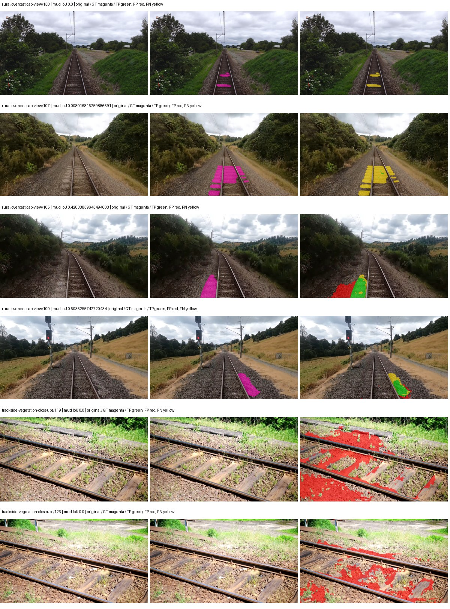
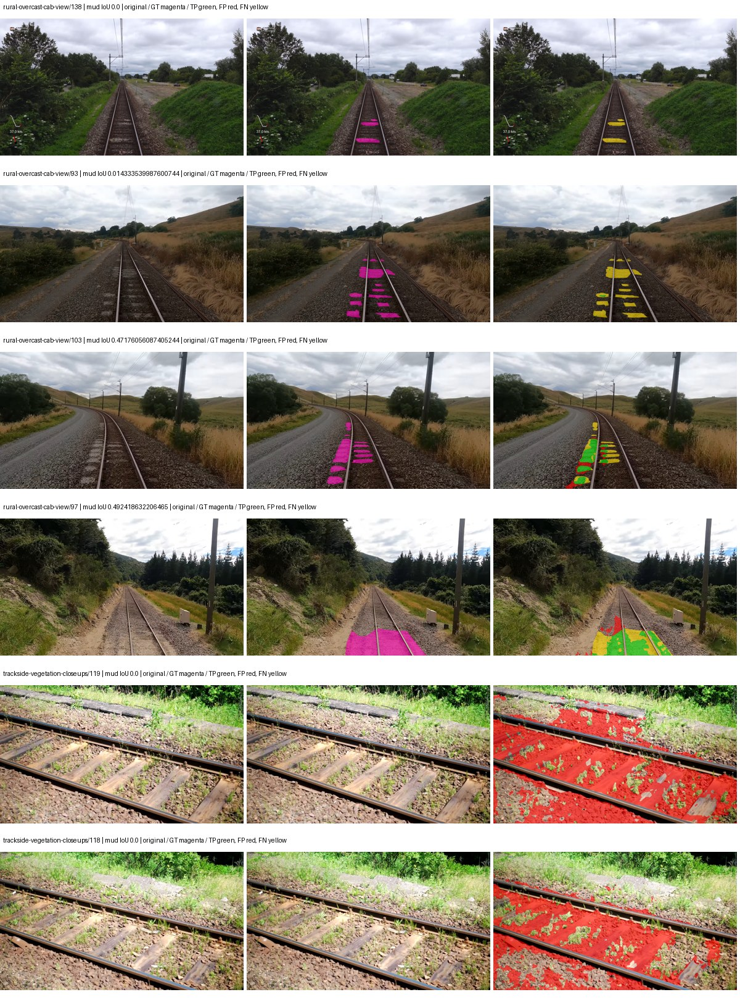
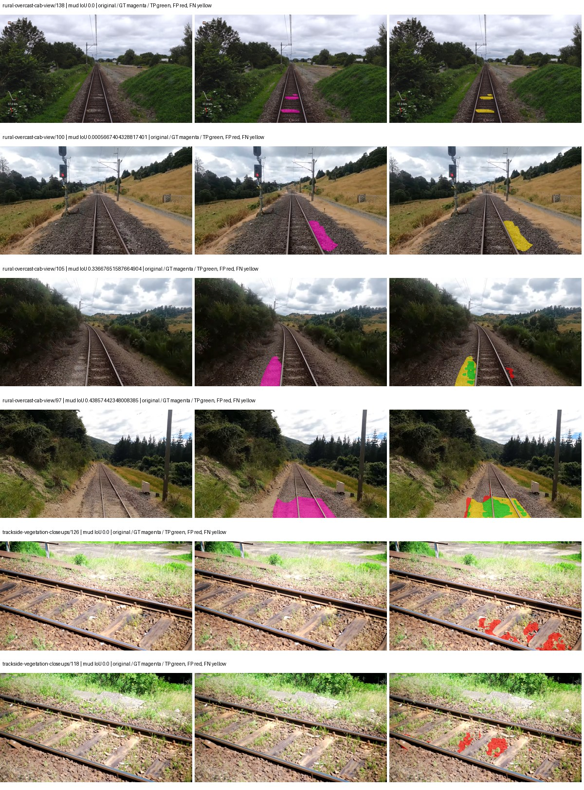
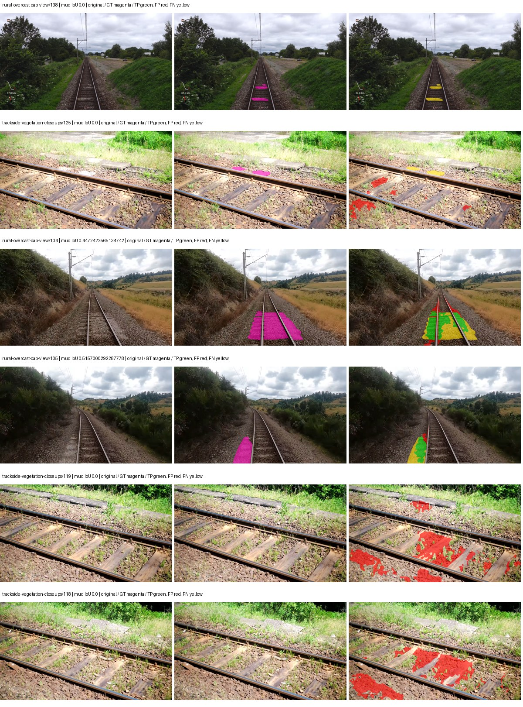

# hf_auto_upernet_swin_tiny — paul-test-rtis_v2

[RTIS comparison](../../README.md) · [Full model records](record.json)

Primary selection and early stopping: **mud-pumping validation IoU**. A job is complete only after full statistics and isolated profiling are verified.

| Model | Initialization path | Seed | Status | Steps | Best step | Mud IoU (%) | Mud precision (%) | Mud recall (%) | Final mud IoU (trainer val, %) | mIoU (%) | Fixed GT-class mIoU (%) |
| --- | --- | --- | --- | --- | --- | --- | --- | --- | --- | --- | --- |
| hf_auto_upernet_swin_tiny | rtis_only | 0 | completed | 2549 | 1274 | 12.42 | 15.76 | 37.01 | 2.61 | 33.29 | 38.84 |
| hf_auto_upernet_swin_tiny | cityscapes_to_rtis | 0 | completed | 2294 | 1019 | 6.48 | 7.63 | 30.16 | 3.14 | 31.31 | 36.53 |
| hf_auto_upernet_swin_tiny | railsem19_to_rtis | 0 | completed | 1529 | 254 | 15.17 | 44.92 | 18.63 | 3.38 | 33.56 | 35.43 |
| hf_auto_upernet_swin_tiny | cityscapes_to_railsem19_to_rtis | 0 | completed | 1529 | 254 | 16.27 | 25.79 | 30.59 | 2.02 | 31.63 | 35.14 |

Training: 205 images. Validation: 37 images. Test: 50 held out. Seeds: [0]. Seed variation measures optimization variability, not independent-recording uncertainty. Historical source checkpoints stay fixed across adaptation seeds.

Training code: `066afb2626398b7be59d4d19f5a0e4644fd59adc`. Split SHA-256: `18a84c0163a65ded46508bcc904c374e5f33ad8a09b8879e3c8add606e86aa9f`.

## rtis_only — seed 0

Status: **completed**. Started: 2026-09-09T20:37:03.187086+00:00. Finished: 2026-09-09T21:37:36.732168+00:00.

Recipe pretrained initializer: `openmmlab/upernet-swin-tiny`.

`rtis_only` uses the recipe initializer, which may include pretrained segmentation components. Transfer paths load the exact historical source checkpoint below and reset the classifier; they do not reset all query/decoder features.

Source checkpoint: `Recipe pretrained initialization`.

Config SHA-256: `06f04dfb6708a6bec348cd68ff65f7b88e07330e0ee3f92c6a234f7caff0cc58`. Weights used for validation: `raw`.

### Mud-pumping and aggregate quality

| Metric | Selected checkpoint | Final training validation |
| --- | --- | --- |
| Mud IoU | 12.42 | 2.61 |
| Mud precision | 15.76 | 3.07 |
| Mud recall | 37.01 | 14.82 |
| Mud Dice/F1 | 22.10 | 5.09 |
| mIoU | 33.29 | 32.29 |
| Mean accuracy | 50.78 | 47.41 |
| Mean precision | 54.58 | 52.49 |
| Mean Dice | 43.30 | 41.13 |
| Mean specificity | 98.75 | 98.88 |
| Pixel accuracy | 81.55 | 81.84 |
| Frequency-weighted IoU | 71.35 | 74.08 |
| Fixed GT-present class mIoU | 38.84 | 37.67 |
| Boundary F1 | 42.14 | 40.79 |

The selected checkpoint has independent evaluation evidence. Final values are the trainer's final validation record, not a new independent evaluation. mIoU averages classes with nonzero union, so false positives on absent classes can change its denominator. The fixed GT-class mean is supplementary and excludes absent classes; their false positives remain in the confusion matrix.

### Resource usage and timing

| Measurement | Value |
| --- | --- |
| Peak training VRAM, retained training invocation (GiB) | 11.71 |
| Peak evaluation VRAM (GiB) | 7.52 |
| Retained training invocation wall time (seconds) | 3417.98 |
| Retained training invocation GPU-hours (one GPU) | 0.95 |
| Evaluation wall time (seconds) | 19.79 |
| Full evaluation pipeline images/second | 1.87 |
| Best full-state checkpoint (MiB) | 900.33 |
| Final full-state checkpoint (MiB) | 900.31 |
| Verified periodic checkpoints removed (GiB) | 4.40 |

VRAM uses the recorded allocator high-water mark; it is not total device usage including CUDA context. Resumed jobs' retained training invocation times and peaks are **not whole-campaign totals**. Earlier invocation resource records are not reconstructed here. Evaluation throughput includes loader, sliding-window inference and metrics; it is not model-only latency/FPS. Missing measurements are shown as —, never inferred from another dataset's run.

### Standardized inference performance

Dedicated model-only profiling waits for an idle worker-locked L40S: BF16, batch 1, 1024x1024, 20 warmup and 100 CUDA-event-timed public forwards. It excludes loading, preprocessing, tiling and metrics.

| Status | Parameters | Weight MiB | FPS | p50 ms | p95 ms | Peak reserved GiB |
| --- | --- | --- | --- | --- | --- | --- |
| complete | 58953423 | 224.89 | 42.26 | 23.53 | 24.19 | 2.41 |

```json
{
  "schema_version": 1,
  "model_id": "hf_auto_upernet_swin_tiny",
  "measured_at": "2026-09-09T21:37:29+00:00",
  "status": "complete",
  "benchmark_scope": "rtis_selected_checkpoint_model_only",
  "applies_to": [
    "hf_auto_upernet_swin_tiny--rtis_only--seed-0"
  ],
  "source": {
    "campaign_git_sha": "066afb2626398b7be59d4d19f5a0e4644fd59adc",
    "git_dirty": false,
    "config_hash": "60744c3162d7",
    "resolved_config": "/data/izadia1/projects/segmentary-runs/paul-test-rtis_v2/seed0-20260909/configs/hf_auto_upernet_swin_tiny--rtis_only--seed-0.yaml",
    "config_sha256": "06f04dfb6708a6bec348cd68ff65f7b88e07330e0ee3f92c6a234f7caff0cc58",
    "checkpoint_sha256": "4fff3005d445b45332671f1b4d5bf5bbd81ce9fe7779deb6b2ea0fc3f6245b2e",
    "checkpoint_global_step": 1274,
    "checkpoint_bytes": 944059673,
    "checkpoint_kind": "resume checkpoint with optimizer and EMA state",
    "weights": "raw",
    "measured_checkpoint_job_id": "hf_auto_upernet_swin_tiny--rtis_only--seed-0",
    "result_sha256": "3be58384f359d2c94e31a76060beb00be7ccd8df9232b220fd0235c53734767d",
    "result_git_sha": "066afb2626398b7be59d4d19f5a0e4644fd59adc",
    "result_stage": "eval:paul-test-rtis:val",
    "result_seed": 0
  },
  "hardware": {
    "gpu_name": "NVIDIA L40S",
    "gpu_uuid": "GPU-a5ad49e5-0536-5229-ba8a-f8a902808f53",
    "logical_device": "cuda:0",
    "physical_visibility_token": "7",
    "compute_capability": [
      8,
      9
    ],
    "total_memory_bytes": 47677177856
  },
  "model": {
    "parameter_count": 58953423,
    "trainable_parameter_count": 58951887,
    "resident_parameter_bytes": 235813692,
    "parameter_dtype_counts": {
      "float32": 58953423
    }
  },
  "contract": {
    "backend": "pytorch",
    "precision": "bf16_autocast",
    "batch_size": 1,
    "input_shape_nchw": [
      1,
      3,
      1024,
      1024
    ],
    "warmup_iterations": 20,
    "measured_iterations": 100,
    "timing": "per-forward CUDA events with end-event synchronization",
    "includes_preprocessing": false,
    "includes_data_loader": false,
    "includes_sliding_window": false,
    "input_resident_on_gpu": true,
    "model_only": true,
    "entrypoint": "public model(image) dense-logits forward"
  },
  "measurements": {
    "latency": {
      "p50_ms": 23.526911735534668,
      "p95_ms": 24.18590679168701,
      "mean_ms": 23.663594512939454,
      "minimum_ms": 23.394304275512695,
      "maximum_ms": 25.2989444732666,
      "fps": 42.25900673936884,
      "raw_ms": [
        23.92678451538086,
        23.49260711669922,
        23.819263458251953,
        23.801855087280273,
        23.436288833618164,
        23.45267105102539,
        23.50694465637207,
        23.592960357666016,
        23.49056053161621,
        23.449600219726562,
        23.46188735961914,
        23.441408157348633,
        23.439359664916992,
        23.430143356323242,
        23.46393585205078,
        23.49567985534668,
        23.4967041015625,
        23.394304275512695,
        24.51251220703125,
        23.872512817382812,
        24.72755241394043,
        23.634944915771484,
        23.974912643432617,
        23.47417640686035,
        23.603168487548828,
        23.429119110107422,
        23.415807723999023,
        23.754751205444336,
        23.613439559936523,
        23.553024291992188,
        23.87558364868164,
        23.846912384033203,
        24.168447494506836,
        23.595008850097656,
        23.516159057617188,
        23.442432403564453,
        24.184831619262695,
        23.47007942199707,
        23.479263305664062,
        23.468032836914062,
        23.564287185668945,
        23.508991241455078,
        23.590911865234375,
        23.47929573059082,
        23.561216354370117,
        23.49977684020996,
        23.458816528320312,
        23.47110366821289,
        23.771072387695312,
        24.534015655517578,
        23.636991500854492,
        23.52947235107422,
        23.558143615722656,
        23.51923179626465,
        23.558143615722656,
        23.430143356323242,
        23.95136070251465,
        23.48953628540039,
        23.879680633544922,
        23.67078399658203,
        23.5100154876709,
        24.1080322265625,
        23.508991241455078,
        23.451648712158203,
        23.75881576538086,
        23.864320755004883,
        24.127487182617188,
        23.66771125793457,
        23.52025604248047,
        23.776287078857422,
        23.430143356323242,
        23.49772834777832,
        23.433216094970703,
        23.49363136291504,
        23.434240341186523,
        23.441408157348633,
        23.47315216064453,
        23.478271484375,
        23.48441505432129,
        23.508991241455078,
        23.547903060913086,
        23.50694465637207,
        23.788543701171875,
        23.73529624938965,
        24.206335067749023,
        23.577600479125977,
        23.861248016357422,
        23.536672592163086,
        23.782400131225586,
        23.982080459594727,
        23.524351119995117,
        23.51411247253418,
        23.7076473236084,
        23.440383911132812,
        23.50489616394043,
        23.91756820678711,
        23.48134422302246,
        23.545856475830078,
        24.061952590942383,
        25.2989444732666
      ],
      "percentile_method": "numpy linear interpolation"
    },
    "peak_reserved_bytes": 2583691264,
    "memory_kind": "pytorch_cuda_allocator_peak_reserved_excluding_context",
    "benchmark_wall_clock_s": 8.177450463175774
  },
  "started_at": "2026-09-09T21:37:21+00:00",
  "finished_at": "2026-09-09T21:37:29+00:00",
  "environment": {
    "hostname": "hdrfs-app-001",
    "python": "3.11.15",
    "platform": "Linux-5.15.0-139-generic-x86_64-with-glibc2.35",
    "torch": "2.11.0+cu128",
    "torch_cuda": "12.8",
    "cudnn": 91900,
    "driver_version": "570.133.20",
    "cuda_available": true,
    "gpu_count": 1,
    "gpu_names": [
      "NVIDIA L40S"
    ],
    "cuda_visible_devices": "7",
    "packages": {
      "segmentary": "0.1.0",
      "torch": "2.11.0+cu128",
      "torchvision": "0.26.0+cu128",
      "transformers": "5.15.0",
      "timm": "1.0.28",
      "segmentation-models-pytorch": "0.5.0",
      "albumentations": "2.0.8",
      "lightning": "2.6.5",
      "numpy": "2.4.4"
    }
  }
}
```

### Per-class validation results

| Class | GT pixels | IoU (%) | Precision (%) | Recall (%) | Dice (%) | Boundary F1 (%) |
| --- | --- | --- | --- | --- | --- | --- |
| car | 29664 | 6.60 | 35.90 | 7.48 | 12.39 | 39.15 |
| construction | 311585 | 28.53 | 30.57 | 81.05 | 44.39 | 45.49 |
| fence | 265137 | 15.49 | 56.13 | 17.62 | 26.82 | 40.58 |
| mud-pumping | 1226250 | 12.42 | 15.76 | 37.01 | 22.10 | 16.85 |
| on-rails | 0 | 0.00 | 0.00 | — | 0.00 | 0.00 |
| person | 0 | 0.00 | 0.00 | — | 0.00 | 0.00 |
| pole | 628038 | 71.11 | 84.07 | 82.18 | 83.11 | 90.23 |
| rail-embedded | 16799 | 16.11 | 95.12 | 16.25 | 27.75 | 16.07 |
| rail-raised | 2969797 | 74.69 | 91.47 | 80.28 | 85.51 | 93.25 |
| rail-track | 6323197 | 37.26 | 61.56 | 48.56 | 54.30 | 49.03 |
| road | 1048831 | 8.67 | 21.85 | 12.58 | 15.96 | 14.15 |
| sidewalk | 1297367 | 34.03 | 75.23 | 38.33 | 50.78 | 10.86 |
| sky | 19121606 | 98.31 | 99.64 | 98.66 | 99.15 | 95.22 |
| standing-water | 95802 | 8.87 | 9.43 | 59.83 | 16.29 | 25.63 |
| terrain | 39239306 | 80.14 | 82.19 | 96.99 | 88.98 | 55.85 |
| trackbed | 10643081 | 57.06 | 83.12 | 64.55 | 72.66 | 60.67 |
| traffic-light | 19510 | 68.62 | 91.70 | 73.17 | 81.39 | 89.17 |
| traffic-sign | 13285 | 28.69 | 45.17 | 44.03 | 44.59 | 54.93 |
| tram-track | 56179 | 27.99 | 80.72 | 30.00 | 43.74 | 31.16 |
| truck | 0 | 0.00 | 0.00 | — | 0.00 | 0.00 |
| vegetation-overgrowth | 5901821 | 24.49 | 86.63 | 25.46 | 39.35 | 56.65 |

### Full-run accounting

| Measurement | Value |
| --- | --- |
| Full GPU-reserved wall seconds, all recorded worker attempts | 3633.55 |
| Full reserved GPU-hours | 1.01 |
| Whole-run timing complete | True |

| Phase | Wall seconds including failed attempts |
| --- | --- |
| training | 3424.92 |
| diagnostics | 157.01 |
| performance | 16.56 |

GPU-reserved time includes model loading, training, validation, collection, profiling, checkpoint I/O and orchestration while the worker owns one GPU. It is not GPU kernel-active time. Phase timings and sampled device memory/power/utilization are retained separately; sampled device memory is not the allocator high-water mark.

### Train/validation and raw/EMA diagnostics

| Checkpoint / weights / split | Images | Mud IoU (%) | Mud precision (%) | Mud recall (%) |
| --- | --- | --- | --- | --- |
| best-auto-train / raw | 205 | 95.29 | 97.46 | 97.72 |
| best-auto-val / raw | 37 | 12.42 | 15.76 | 37.01 |
| best-alternate-val / ema | 37 | 7.70 | 9.69 | 27.25 |
| final-auto-val / raw | 37 | 2.61 | 3.07 | 14.83 |

Train uses the evaluation transform without augmentation. Compare mud train/validation metrics for the same selected weights. Alternate EMA on running-stat BatchNorm is explicitly uncalibrated and is diagnostic only. Score-threshold curves use uncalibrated normalized scores and are pixel-level diagnostics, not event detection rates or a selected deployment operating point.

### Downloadable evidence

- best-auto-train: [per-image.csv](rtis_only--seed-0/best-auto-train/per-image.csv) · [per-image-confusion.json.gz](rtis_only--seed-0/best-auto-train/per-image-confusion.json.gz) · [groups.json](rtis_only--seed-0/best-auto-train/groups.json) · [mud-score-curves.json](rtis_only--seed-0/best-auto-train/mud-score-curves.json)
- best-auto-val: [per-image.csv](rtis_only--seed-0/best-auto-val/per-image.csv) · [per-image-confusion.json.gz](rtis_only--seed-0/best-auto-val/per-image-confusion.json.gz) · [groups.json](rtis_only--seed-0/best-auto-val/groups.json) · [mud-score-curves.json](rtis_only--seed-0/best-auto-val/mud-score-curves.json) · [examples.jpg](rtis_only--seed-0/best-auto-val/examples.jpg)
- best-alternate-val: [per-image.csv](rtis_only--seed-0/best-alternate-val/per-image.csv) · [per-image-confusion.json.gz](rtis_only--seed-0/best-alternate-val/per-image-confusion.json.gz) · [groups.json](rtis_only--seed-0/best-alternate-val/groups.json) · [mud-score-curves.json](rtis_only--seed-0/best-alternate-val/mud-score-curves.json)
- final-auto-val: [per-image.csv](rtis_only--seed-0/final-auto-val/per-image.csv) · [per-image-confusion.json.gz](rtis_only--seed-0/final-auto-val/per-image-confusion.json.gz) · [groups.json](rtis_only--seed-0/final-auto-val/groups.json) · [mud-score-curves.json](rtis_only--seed-0/final-auto-val/mud-score-curves.json)
- resources: [telemetry.csv](rtis_only--seed-0/resources/telemetry.csv)



Examples are two lowest and two highest mud-IoU positive images, plus up to two negative images with the most false-positive mud pixels. They are targeted diagnostic examples, not random samples. Green: true positive; red: false positive; yellow: false negative. Full predictions remain on HDRFS.

### Validation tracking

| Logged step | Overall mIoU (%) | Mud IoU (%) |
| --- | --- | --- |
| 254 | 28.23 | 1.83 |
| 509 | 29.25 | 2.66 |
| 764 | 34.15 | 5.35 |
| 1019 | 32.79 | 5.50 |
| 1274 | 33.30 | 12.42 |
| 1529 | 32.42 | 6.36 |
| 1784 | 33.46 | 2.32 |
| 2038 | 31.77 | 3.11 |
| 2293 | 33.19 | 2.01 |
| 2548 | 32.29 | 2.61 |

All retained scalar curves, including training loss and per-class IoU, are in record.json. Observed best mud on a curve is not necessarily a retained checkpoint: the pilot saved its selection-metric-best and final checkpoints. Step logging and checkpoint global_step may differ by one.

### Stopping and checkpoint provenance

```json
{
  "stopping": {
    "actual_steps": 2549,
    "maximum_steps": 4000,
    "min_delta": 0.001,
    "monitor": "val_iou/mud-pumping",
    "patience": 5,
    "reason": "validation_plateau"
  },
  "checkpoints": {
    "best": {
      "path": "/data/izadia1/projects/segmentary-runs/paul-test-rtis_v2/seed0-20260909/future-runs/hf_auto_upernet_swin_tiny--rtis_only--seed-0_seed0/rtis/best.ckpt",
      "sha256": "4fff3005d445b45332671f1b4d5bf5bbd81ce9fe7779deb6b2ea0fc3f6245b2e",
      "global_step": 1274,
      "bytes": 944059673
    },
    "final": {
      "path": "/data/izadia1/projects/segmentary-runs/paul-test-rtis_v2/seed0-20260909/future-runs/hf_auto_upernet_swin_tiny--rtis_only--seed-0_seed0/rtis/last.ckpt",
      "sha256": "e318513eede224d5e93b69ca5f03dfc6e8deeb2f03698f5bfc2d54fbe8cee06a",
      "global_step": 2549,
      "bytes": 944046489
    }
  },
  "cleanup_error": null
}
```

### Resolved training, initialization and evaluation settings

The optimizer block is the base configuration. Stage LR scales are applied at runtime, and stage warmup is capped at min(base warmup, floor(stage budget / 10), stage budget - 1): 400 steps for this 4,000-step pilot. Model-internal native input grids may differ from augmentation crops (EoMT uses its 640 grid).

```json
{
  "name": "hf_auto_upernet_swin_tiny--rtis_only--seed-0",
  "model": {
    "arch": "hf_auto",
    "checkpoint": "openmmlab/upernet-swin-tiny",
    "tuning": "full",
    "head": "unified_head",
    "lora_r": 16,
    "lora_alpha": 32,
    "lora_dropout": 0.05,
    "lora_targets": [],
    "drop_path": null,
    "revision": "dc8e8c94669c6f14d5cc4c21a141daebd2280d59",
    "subfolder": null,
    "local_files_only": false,
    "trust_remote_code": false,
    "backbone_path": "backbone",
    "head_paths": [
      "decode_head"
    ],
    "classifier_path": "decode_head.classifier",
    "inactive_parameter_paths": [
      "backbone.swin.layernorm"
    ],
    "smp_arch": null,
    "encoder_name": null,
    "encoder_weights": null,
    "native": null,
    "batch_norm_momentum": null
  },
  "space": "paul-test-rtis",
  "taxonomy_root": "/data/izadia1/projects/segmentary-rtis-fullstats-066afb2/taxonomy",
  "output_root": "/data/izadia1/projects/segmentary-runs/paul-test-rtis_v2/seed0-20260909/future-runs",
  "optim": {
    "backbone_lr": 6e-05,
    "head_lr_mult": 10.0,
    "weight_decay": 0.05,
    "llrd": 0.9,
    "warmup_iters": 1500,
    "warmup_ratio": 1e-06,
    "poly_power": 0.9,
    "min_lr_ratio": 0.0,
    "betas": [
      0.9,
      0.999
    ],
    "grad_clip": 1.0
  },
  "train": {
    "iters": 4000,
    "batch_size": 2,
    "accum": 8,
    "num_workers": 2,
    "precision": "bf16-mixed",
    "ema_decay": 0.9998,
    "val_every": 250,
    "ckpt_every": 500,
    "selection_metric": "val_iou/mud-pumping",
    "early_stopping_patience": 5,
    "early_stopping_min_delta": 0.001,
    "seed": 0,
    "devices": 1
  },
  "eval": {
    "sliding_window": true,
    "window": [
      1024,
      1024
    ],
    "stride": [
      768,
      768
    ],
    "batch_size": 1,
    "num_workers": 2,
    "tta_scales": [],
    "tta_flip": false,
    "threshold": 0.5,
    "boundary_tolerance_frac": 0.0075,
    "save_confusion": true
  },
  "loss": {
    "task": "multiclass",
    "activation": "auto",
    "terms": [],
    "aux": "none",
    "aux_weight": 0.0,
    "ce_weight": 1.0,
    "label_smoothing": 0.0,
    "class_weights": null,
    "query": null
  },
  "aug": {
    "crop": [
      1024,
      1024
    ],
    "scale_min": 0.5,
    "scale_max": 2.0,
    "hflip_p": 0.5,
    "color_jitter_p": 0.5,
    "brightness": 0.25,
    "contrast": 0.25,
    "saturation": 0.25,
    "hue": 0.05
  },
  "stages": [
    {
      "name": "rtis",
      "data": [
        {
          "name": "paul-test-rtis",
          "root": "/data/izadia1/datasets/paul-test-rtis_v2",
          "variant": null,
          "split_file": "splits.json",
          "train_split": "train",
          "val_split": "val",
          "limit": null,
          "loader": "folder",
          "mapping": "paul-test-rtis",
          "loader_options": {
            "require_groups": true
          }
        }
      ],
      "iters": null,
      "lr_scale": 1.0,
      "head_group_lr_scale": 1.0,
      "init_from": "pretrained",
      "reset_head": false,
      "freeze": null,
      "sample_weights": null
    }
  ]
}
```

### Hardware and software provenance

```json
{
  "training": {
    "cuda_available": true,
    "cuda_visible_devices": "7",
    "cudnn": 91900,
    "driver_version": "570.133.20",
    "gpu_count": 1,
    "gpu_names": [
      "NVIDIA L40S"
    ],
    "hostname": "hdrfs-app-001",
    "input_normalization": {
      "channel_order": "rgb",
      "mean": [
        0.485,
        0.456,
        0.406
      ],
      "source": "hf_image_processor",
      "std": [
        0.229,
        0.224,
        0.225
      ]
    },
    "model_origins": [
      {
        "hf_commit": "dc8e8c94669c6f14d5cc4c21a141daebd2280d59",
        "hf_name_or_path": "openmmlab/upernet-swin-tiny",
        "module": "model",
        "timm_pretrained": {}
      },
      {
        "hf_commit": null,
        "hf_name_or_path": "",
        "module": "model.backbone",
        "timm_pretrained": {}
      },
      {
        "hf_commit": null,
        "hf_name_or_path": "",
        "module": "model.backbone.swin",
        "timm_pretrained": {}
      },
      {
        "hf_commit": null,
        "hf_name_or_path": "",
        "module": "model.backbone.swin.embeddings",
        "timm_pretrained": {}
      },
      {
        "hf_commit": null,
        "hf_name_or_path": "",
        "module": "model.backbone.swin.encoder",
        "timm_pretrained": {}
      },
      {
        "hf_commit": null,
        "hf_name_or_path": "",
        "module": "model.backbone.swin.encoder.layers.0",
        "timm_pretrained": {}
      },
      {
        "hf_commit": null,
        "hf_name_or_path": "",
        "module": "model.backbone.swin.encoder.layers.0.blocks.0.attention",
        "timm_pretrained": {}
      },
      {
        "hf_commit": null,
        "hf_name_or_path": "",
        "module": "model.backbone.swin.encoder.layers.0.blocks.1.attention",
        "timm_pretrained": {}
      },
      {
        "hf_commit": null,
        "hf_name_or_path": "",
        "module": "model.backbone.swin.encoder.layers.1",
        "timm_pretrained": {}
      },
      {
        "hf_commit": null,
        "hf_name_or_path": "",
        "module": "model.backbone.swin.encoder.layers.1.blocks.0.attention",
        "timm_pretrained": {}
      },
      {
        "hf_commit": null,
        "hf_name_or_path": "",
        "module": "model.backbone.swin.encoder.layers.1.blocks.1.attention",
        "timm_pretrained": {}
      },
      {
        "hf_commit": null,
        "hf_name_or_path": "",
        "module": "model.backbone.swin.encoder.layers.2",
        "timm_pretrained": {}
      },
      {
        "hf_commit": null,
        "hf_name_or_path": "",
        "module": "model.backbone.swin.encoder.layers.2.blocks.0.attention",
        "timm_pretrained": {}
      },
      {
        "hf_commit": null,
        "hf_name_or_path": "",
        "module": "model.backbone.swin.encoder.layers.2.blocks.1.attention",
        "timm_pretrained": {}
      },
      {
        "hf_commit": null,
        "hf_name_or_path": "",
        "module": "model.backbone.swin.encoder.layers.2.blocks.2.attention",
        "timm_pretrained": {}
      },
      {
        "hf_commit": null,
        "hf_name_or_path": "",
        "module": "model.backbone.swin.encoder.layers.2.blocks.3.attention",
        "timm_pretrained": {}
      },
      {
        "hf_commit": null,
        "hf_name_or_path": "",
        "module": "model.backbone.swin.encoder.layers.2.blocks.4.attention",
        "timm_pretrained": {}
      },
      {
        "hf_commit": null,
        "hf_name_or_path": "",
        "module": "model.backbone.swin.encoder.layers.2.blocks.5.attention",
        "timm_pretrained": {}
      },
      {
        "hf_commit": null,
        "hf_name_or_path": "",
        "module": "model.backbone.swin.encoder.layers.3",
        "timm_pretrained": {}
      },
      {
        "hf_commit": null,
        "hf_name_or_path": "",
        "module": "model.backbone.swin.encoder.layers.3.blocks.0.attention",
        "timm_pretrained": {}
      },
      {
        "hf_commit": null,
        "hf_name_or_path": "",
        "module": "model.backbone.swin.encoder.layers.3.blocks.1.attention",
        "timm_pretrained": {}
      },
      {
        "hf_commit": "dc8e8c94669c6f14d5cc4c21a141daebd2280d59",
        "hf_name_or_path": "openmmlab/upernet-swin-tiny",
        "module": "model.decode_head",
        "timm_pretrained": {}
      }
    ],
    "model_parameter_count": 58953423,
    "packages": {
      "albumentations": "2.0.8",
      "lightning": "2.6.5",
      "numpy": "2.4.4",
      "segmentary": "0.1.0",
      "segmentation-models-pytorch": "0.5.0",
      "timm": "1.0.28",
      "torch": "2.11.0+cu128",
      "torchvision": "0.26.0+cu128",
      "transformers": "5.15.0"
    },
    "platform": "Linux-5.15.0-139-generic-x86_64-with-glibc2.35",
    "python": "3.11.15",
    "torch": "2.11.0+cu128",
    "torch_cuda": "12.8",
    "trainable_parameter_count": 58951887,
    "training_stop": {
      "actual_steps": 2549,
      "maximum_steps": 4000,
      "min_delta": 0.001,
      "monitor": "val_iou/mud-pumping",
      "patience": 5,
      "reason": "validation_plateau"
    },
    "validation_weights": "raw"
  },
  "evaluation": {
    "cuda_available": true,
    "cuda_visible_devices": "7",
    "cudnn": 91900,
    "driver_version": "570.133.20",
    "gpu_count": 1,
    "gpu_names": [
      "NVIDIA L40S"
    ],
    "hostname": "hdrfs-app-001",
    "input_normalization": {
      "channel_order": "rgb",
      "mean": [
        0.485,
        0.456,
        0.406
      ],
      "source": "hf_image_processor",
      "std": [
        0.229,
        0.224,
        0.225
      ]
    },
    "packages": {
      "albumentations": "2.0.8",
      "lightning": "2.6.5",
      "numpy": "2.4.4",
      "segmentary": "0.1.0",
      "segmentation-models-pytorch": "0.5.0",
      "timm": "1.0.28",
      "torch": "2.11.0+cu128",
      "torchvision": "0.26.0+cu128",
      "transformers": "5.15.0"
    },
    "platform": "Linux-5.15.0-139-generic-x86_64-with-glibc2.35",
    "python": "3.11.15",
    "torch": "2.11.0+cu128",
    "torch_cuda": "12.8"
  }
}
```

## cityscapes_to_rtis — seed 0

Status: **completed**. Started: 2026-09-09T20:37:55.283497+00:00. Finished: 2026-09-09T21:32:59.333357+00:00.

Recipe pretrained initializer: `openmmlab/upernet-swin-tiny`.

`rtis_only` uses the recipe initializer, which may include pretrained segmentation components. Transfer paths load the exact historical source checkpoint below and reset the classifier; they do not reset all query/decoder features.

Source checkpoint: `{'name': 'hf_auto_upernet_swin_tiny--cityscapes--seed-0', 'model': 'hf_auto_upernet_swin_tiny', 'protocol': 'cityscapes', 'config': '/data/izadia1/projects/segmentary-runs/all-model-city-rail-seed0-rail20-b9eb3e1/accepted/hf_auto_upernet_swin_tiny--cityscapes--seed-0/resolved-config.yaml', 'checkpoint': '/data/izadia1/projects/segmentary-runs/all-model-city-rail-seed0-a7c0b67/jobs/hf_auto_upernet_swin_tiny--cityscapes--seed-0/attempt-001/train/hf_auto_upernet_swin_tiny--cityscapes_seed0/cityscapes/last.ckpt', 'recorded_sha256': 'e7102f15e3adae759eeed4520ad72904fa929dc0c2a74fdc8120e2c147d53cc3', 'exists': True}`.

Config SHA-256: `e75df974eb503ef9da8193c785102ed7679cc079d6857319cda0f9db8b524a5b`. Weights used for validation: `raw`.

### Mud-pumping and aggregate quality

| Metric | Selected checkpoint | Final training validation |
| --- | --- | --- |
| Mud IoU | 6.48 | 3.14 |
| Mud precision | 7.63 | 3.81 |
| Mud recall | 30.16 | 15.05 |
| Mud Dice/F1 | 12.18 | 6.08 |
| mIoU | 31.31 | 34.24 |
| Mean accuracy | 45.58 | 47.71 |
| Mean precision | 53.73 | 54.67 |
| Mean Dice | 40.20 | 42.96 |
| Mean specificity | 98.70 | 98.78 |
| Pixel accuracy | 79.80 | 80.47 |
| Frequency-weighted IoU | 70.05 | 71.50 |
| Fixed GT-present class mIoU | 36.53 | 39.95 |
| Boundary F1 | 38.23 | 41.13 |

The selected checkpoint has independent evaluation evidence. Final values are the trainer's final validation record, not a new independent evaluation. mIoU averages classes with nonzero union, so false positives on absent classes can change its denominator. The fixed GT-class mean is supplementary and excludes absent classes; their false positives remain in the confusion matrix.

### Resource usage and timing

| Measurement | Value |
| --- | --- |
| Peak training VRAM, retained training invocation (GiB) | 11.71 |
| Peak evaluation VRAM (GiB) | 7.52 |
| Retained training invocation wall time (seconds) | 3088.79 |
| Retained training invocation GPU-hours (one GPU) | 0.86 |
| Evaluation wall time (seconds) | 19.63 |
| Full evaluation pipeline images/second | 1.88 |
| Best full-state checkpoint (MiB) | 900.33 |
| Final full-state checkpoint (MiB) | 900.31 |
| Verified periodic checkpoints removed (GiB) | 3.52 |

VRAM uses the recorded allocator high-water mark; it is not total device usage including CUDA context. Resumed jobs' retained training invocation times and peaks are **not whole-campaign totals**. Earlier invocation resource records are not reconstructed here. Evaluation throughput includes loader, sliding-window inference and metrics; it is not model-only latency/FPS. Missing measurements are shown as —, never inferred from another dataset's run.

### Standardized inference performance

Dedicated model-only profiling waits for an idle worker-locked L40S: BF16, batch 1, 1024x1024, 20 warmup and 100 CUDA-event-timed public forwards. It excludes loading, preprocessing, tiling and metrics.

| Status | Parameters | Weight MiB | FPS | p50 ms | p95 ms | Peak reserved GiB |
| --- | --- | --- | --- | --- | --- | --- |
| complete | 58953423 | 224.89 | 41.61 | 23.79 | 25.26 | 2.41 |

```json
{
  "schema_version": 1,
  "model_id": "hf_auto_upernet_swin_tiny",
  "measured_at": "2026-09-09T21:32:53+00:00",
  "status": "complete",
  "benchmark_scope": "rtis_selected_checkpoint_model_only",
  "applies_to": [
    "hf_auto_upernet_swin_tiny--cityscapes_to_rtis--seed-0"
  ],
  "source": {
    "campaign_git_sha": "066afb2626398b7be59d4d19f5a0e4644fd59adc",
    "git_dirty": false,
    "config_hash": "503c3451b175",
    "resolved_config": "/data/izadia1/projects/segmentary-runs/paul-test-rtis_v2/seed0-20260909/configs/hf_auto_upernet_swin_tiny--cityscapes_to_rtis--seed-0.yaml",
    "config_sha256": "e75df974eb503ef9da8193c785102ed7679cc079d6857319cda0f9db8b524a5b",
    "checkpoint_sha256": "065de389cba697839df92003cf5751bd6dcd5c71ab40db61a90cff0c5eabc732",
    "checkpoint_global_step": 1019,
    "checkpoint_bytes": 944059737,
    "checkpoint_kind": "resume checkpoint with optimizer and EMA state",
    "weights": "raw",
    "measured_checkpoint_job_id": "hf_auto_upernet_swin_tiny--cityscapes_to_rtis--seed-0",
    "result_sha256": "8ab912ff581d8eef5c839982bc176505c768e4bedee4ad4c7211b05ed0df3ede",
    "result_git_sha": "066afb2626398b7be59d4d19f5a0e4644fd59adc",
    "result_stage": "eval:paul-test-rtis:val",
    "result_seed": 0
  },
  "hardware": {
    "gpu_name": "NVIDIA L40S",
    "gpu_uuid": "GPU-84f5ca4d-68db-ae98-d056-40654d859dd9",
    "logical_device": "cuda:0",
    "physical_visibility_token": "0",
    "compute_capability": [
      8,
      9
    ],
    "total_memory_bytes": 47677177856
  },
  "model": {
    "parameter_count": 58953423,
    "trainable_parameter_count": 58951887,
    "resident_parameter_bytes": 235813692,
    "parameter_dtype_counts": {
      "float32": 58953423
    }
  },
  "contract": {
    "backend": "pytorch",
    "precision": "bf16_autocast",
    "batch_size": 1,
    "input_shape_nchw": [
      1,
      3,
      1024,
      1024
    ],
    "warmup_iterations": 20,
    "measured_iterations": 100,
    "timing": "per-forward CUDA events with end-event synchronization",
    "includes_preprocessing": false,
    "includes_data_loader": false,
    "includes_sliding_window": false,
    "input_resident_on_gpu": true,
    "model_only": true,
    "entrypoint": "public model(image) dense-logits forward"
  },
  "measurements": {
    "latency": {
      "p50_ms": 23.788543701171875,
      "p95_ms": 25.25614204406738,
      "mean_ms": 24.03333381652832,
      "minimum_ms": 23.475200653076172,
      "maximum_ms": 25.605119705200195,
      "fps": 41.608875723778084,
      "raw_ms": [
        23.957504272460938,
        23.66262435913086,
        23.563264846801758,
        23.71686363220215,
        23.666688919067383,
        23.64313507080078,
        23.555072784423828,
        23.550975799560547,
        23.547903060913086,
        24.69273567199707,
        23.591936111450195,
        23.96156883239746,
        23.959423065185547,
        24.786975860595703,
        25.039871215820312,
        24.61382484436035,
        23.993215560913086,
        23.969663619995117,
        24.236032485961914,
        23.846912384033203,
        24.51759910583496,
        24.29952049255371,
        23.824352264404297,
        23.880704879760742,
        23.804927825927734,
        23.625728607177734,
        23.561279296875,
        23.625728607177734,
        24.882144927978516,
        24.68239974975586,
        25.26006317138672,
        23.613439559936523,
        23.567359924316406,
        23.622655868530273,
        23.86636734008789,
        24.259584426879883,
        25.378816604614258,
        23.73529624938965,
        24.399871826171875,
        23.657472610473633,
        23.633920669555664,
        23.553024291992188,
        23.53868865966797,
        23.578624725341797,
        23.597055435180664,
        25.255935668945312,
        25.605119705200195,
        24.584192276000977,
        23.597055435180664,
        23.51103973388672,
        23.63279914855957,
        23.73734474182129,
        24.836095809936523,
        24.45408058166504,
        23.786495208740234,
        23.558271408081055,
        23.8786563873291,
        23.543807983398438,
        23.475200653076172,
        23.575456619262695,
        23.632768630981445,
        24.602624893188477,
        24.191999435424805,
        24.31385612487793,
        23.790592193603516,
        23.53766441345215,
        23.72096061706543,
        24.768512725830078,
        25.42076873779297,
        24.1429443359375,
        23.574527740478516,
        23.50387191772461,
        23.52128028869629,
        23.609344482421875,
        23.588863372802734,
        24.637344360351562,
        23.6810245513916,
        24.880128860473633,
        24.33126449584961,
        24.215551376342773,
        24.373247146606445,
        23.588863372802734,
        24.71625518798828,
        25.357311248779297,
        24.3024959564209,
        24.588319778442383,
        24.459264755249023,
        23.578624725341797,
        23.630847930908203,
        24.189952850341797,
        23.612415313720703,
        24.08140754699707,
        23.654272079467773,
        23.606271743774414,
        24.423583984375,
        24.464384078979492,
        23.628799438476562,
        23.598079681396484,
        23.624704360961914,
        23.634016036987305
      ],
      "percentile_method": "numpy linear interpolation"
    },
    "peak_reserved_bytes": 2583691264,
    "memory_kind": "pytorch_cuda_allocator_peak_reserved_excluding_context",
    "benchmark_wall_clock_s": 8.319631271064281
  },
  "started_at": "2026-09-09T21:32:44+00:00",
  "finished_at": "2026-09-09T21:32:53+00:00",
  "environment": {
    "hostname": "hdrfs-app-001",
    "python": "3.11.15",
    "platform": "Linux-5.15.0-139-generic-x86_64-with-glibc2.35",
    "torch": "2.11.0+cu128",
    "torch_cuda": "12.8",
    "cudnn": 91900,
    "driver_version": "570.133.20",
    "cuda_available": true,
    "gpu_count": 1,
    "gpu_names": [
      "NVIDIA L40S"
    ],
    "cuda_visible_devices": "0",
    "packages": {
      "segmentary": "0.1.0",
      "torch": "2.11.0+cu128",
      "torchvision": "0.26.0+cu128",
      "transformers": "5.15.0",
      "timm": "1.0.28",
      "segmentation-models-pytorch": "0.5.0",
      "albumentations": "2.0.8",
      "lightning": "2.6.5",
      "numpy": "2.4.4"
    }
  }
}
```

### Per-class validation results

| Class | GT pixels | IoU (%) | Precision (%) | Recall (%) | Dice (%) | Boundary F1 (%) |
| --- | --- | --- | --- | --- | --- | --- |
| car | 29664 | 39.82 | 79.74 | 44.30 | 56.96 | 54.49 |
| construction | 311585 | 30.55 | 34.11 | 74.53 | 46.80 | 42.54 |
| fence | 265137 | 3.19 | 38.95 | 3.35 | 6.18 | 15.30 |
| mud-pumping | 1226250 | 6.48 | 7.63 | 30.16 | 12.18 | 15.14 |
| on-rails | 0 | 0.00 | 0.00 | — | 0.00 | 0.00 |
| person | 0 | 0.00 | 0.00 | — | 0.00 | 0.00 |
| pole | 628038 | 70.70 | 87.92 | 78.30 | 82.83 | 92.35 |
| rail-embedded | 16799 | 8.75 | 91.99 | 8.82 | 16.09 | 16.23 |
| rail-raised | 2969797 | 74.53 | 81.31 | 89.95 | 85.41 | 88.88 |
| rail-track | 6323197 | 33.45 | 68.22 | 39.63 | 50.13 | 41.60 |
| road | 1048831 | 1.56 | 5.25 | 2.17 | 3.07 | 9.76 |
| sidewalk | 1297367 | 25.38 | 71.56 | 28.22 | 40.48 | 13.16 |
| sky | 19121606 | 90.35 | 99.53 | 90.73 | 94.93 | 89.34 |
| standing-water | 95802 | 0.68 | 0.75 | 6.60 | 1.35 | 9.05 |
| terrain | 39239306 | 80.93 | 83.37 | 96.52 | 89.46 | 58.07 |
| trackbed | 10643081 | 53.99 | 78.86 | 63.13 | 70.12 | 54.85 |
| traffic-light | 19510 | 63.00 | 73.21 | 81.87 | 77.30 | 67.02 |
| traffic-sign | 13285 | 30.50 | 67.58 | 35.72 | 46.74 | 55.17 |
| tram-track | 56179 | 3.40 | 71.27 | 3.45 | 6.58 | 9.97 |
| truck | 0 | 0.00 | 0.00 | — | 0.00 | 0.00 |
| vegetation-overgrowth | 5901821 | 40.34 | 87.04 | 42.92 | 57.49 | 69.90 |

### Full-run accounting

| Measurement | Value |
| --- | --- |
| Full GPU-reserved wall seconds, all recorded worker attempts | 3304.96 |
| Full reserved GPU-hours | 0.92 |
| Whole-run timing complete | True |

| Phase | Wall seconds including failed attempts |
| --- | --- |
| training | 3096.31 |
| diagnostics | 157.59 |
| performance | 16.61 |

GPU-reserved time includes model loading, training, validation, collection, profiling, checkpoint I/O and orchestration while the worker owns one GPU. It is not GPU kernel-active time. Phase timings and sampled device memory/power/utilization are retained separately; sampled device memory is not the allocator high-water mark.

### Train/validation and raw/EMA diagnostics

| Checkpoint / weights / split | Images | Mud IoU (%) | Mud precision (%) | Mud recall (%) |
| --- | --- | --- | --- | --- |
| best-auto-train / raw | 205 | 94.27 | 96.16 | 97.96 |
| best-auto-val / raw | 37 | 6.48 | 7.63 | 30.16 |
| best-alternate-val / ema | 37 | 5.00 | 5.88 | 25.09 |
| final-auto-val / raw | 37 | 3.14 | 3.81 | 15.06 |

Train uses the evaluation transform without augmentation. Compare mud train/validation metrics for the same selected weights. Alternate EMA on running-stat BatchNorm is explicitly uncalibrated and is diagnostic only. Score-threshold curves use uncalibrated normalized scores and are pixel-level diagnostics, not event detection rates or a selected deployment operating point.

### Downloadable evidence

- best-auto-train: [per-image.csv](cityscapes_to_rtis--seed-0/best-auto-train/per-image.csv) · [per-image-confusion.json.gz](cityscapes_to_rtis--seed-0/best-auto-train/per-image-confusion.json.gz) · [groups.json](cityscapes_to_rtis--seed-0/best-auto-train/groups.json) · [mud-score-curves.json](cityscapes_to_rtis--seed-0/best-auto-train/mud-score-curves.json)
- best-auto-val: [per-image.csv](cityscapes_to_rtis--seed-0/best-auto-val/per-image.csv) · [per-image-confusion.json.gz](cityscapes_to_rtis--seed-0/best-auto-val/per-image-confusion.json.gz) · [groups.json](cityscapes_to_rtis--seed-0/best-auto-val/groups.json) · [mud-score-curves.json](cityscapes_to_rtis--seed-0/best-auto-val/mud-score-curves.json) · [examples.jpg](cityscapes_to_rtis--seed-0/best-auto-val/examples.jpg)
- best-alternate-val: [per-image.csv](cityscapes_to_rtis--seed-0/best-alternate-val/per-image.csv) · [per-image-confusion.json.gz](cityscapes_to_rtis--seed-0/best-alternate-val/per-image-confusion.json.gz) · [groups.json](cityscapes_to_rtis--seed-0/best-alternate-val/groups.json) · [mud-score-curves.json](cityscapes_to_rtis--seed-0/best-alternate-val/mud-score-curves.json)
- final-auto-val: [per-image.csv](cityscapes_to_rtis--seed-0/final-auto-val/per-image.csv) · [per-image-confusion.json.gz](cityscapes_to_rtis--seed-0/final-auto-val/per-image-confusion.json.gz) · [groups.json](cityscapes_to_rtis--seed-0/final-auto-val/groups.json) · [mud-score-curves.json](cityscapes_to_rtis--seed-0/final-auto-val/mud-score-curves.json)
- resources: [telemetry.csv](cityscapes_to_rtis--seed-0/resources/telemetry.csv)



Examples are two lowest and two highest mud-IoU positive images, plus up to two negative images with the most false-positive mud pixels. They are targeted diagnostic examples, not random samples. Green: true positive; red: false positive; yellow: false negative. Full predictions remain on HDRFS.

### Validation tracking

| Logged step | Overall mIoU (%) | Mud IoU (%) |
| --- | --- | --- |
| 254 | 26.21 | 5.29 |
| 509 | 25.91 | 1.36 |
| 764 | 33.25 | 1.13 |
| 1019 | 31.32 | 6.49 |
| 1274 | 32.07 | 2.91 |
| 1529 | 31.00 | 0.44 |
| 1784 | 32.98 | 2.10 |
| 2038 | 32.84 | 3.65 |
| 2293 | 34.24 | 3.14 |

All retained scalar curves, including training loss and per-class IoU, are in record.json. Observed best mud on a curve is not necessarily a retained checkpoint: the pilot saved its selection-metric-best and final checkpoints. Step logging and checkpoint global_step may differ by one.

### Stopping and checkpoint provenance

```json
{
  "stopping": {
    "actual_steps": 2294,
    "maximum_steps": 4000,
    "min_delta": 0.001,
    "monitor": "val_iou/mud-pumping",
    "patience": 5,
    "reason": "validation_plateau"
  },
  "checkpoints": {
    "best": {
      "path": "/data/izadia1/projects/segmentary-runs/paul-test-rtis_v2/seed0-20260909/future-runs/hf_auto_upernet_swin_tiny--cityscapes_to_rtis--seed-0_seed0/rtis/best.ckpt",
      "sha256": "065de389cba697839df92003cf5751bd6dcd5c71ab40db61a90cff0c5eabc732",
      "global_step": 1019,
      "bytes": 944059737
    },
    "final": {
      "path": "/data/izadia1/projects/segmentary-runs/paul-test-rtis_v2/seed0-20260909/future-runs/hf_auto_upernet_swin_tiny--cityscapes_to_rtis--seed-0_seed0/rtis/last.ckpt",
      "sha256": "8b059f242e8a63b279060322720a2bd2f04f01e333642f83010cd3be533d73ca",
      "global_step": 2294,
      "bytes": 944046553
    }
  },
  "cleanup_error": null
}
```

### Resolved training, initialization and evaluation settings

The optimizer block is the base configuration. Stage LR scales are applied at runtime, and stage warmup is capped at min(base warmup, floor(stage budget / 10), stage budget - 1): 400 steps for this 4,000-step pilot. Model-internal native input grids may differ from augmentation crops (EoMT uses its 640 grid).

```json
{
  "name": "hf_auto_upernet_swin_tiny--cityscapes_to_rtis--seed-0",
  "model": {
    "arch": "hf_auto",
    "checkpoint": "openmmlab/upernet-swin-tiny",
    "tuning": "full",
    "head": "unified_head",
    "lora_r": 16,
    "lora_alpha": 32,
    "lora_dropout": 0.05,
    "lora_targets": [],
    "drop_path": null,
    "revision": "dc8e8c94669c6f14d5cc4c21a141daebd2280d59",
    "subfolder": null,
    "local_files_only": false,
    "trust_remote_code": false,
    "backbone_path": "backbone",
    "head_paths": [
      "decode_head"
    ],
    "classifier_path": "decode_head.classifier",
    "inactive_parameter_paths": [
      "backbone.swin.layernorm"
    ],
    "smp_arch": null,
    "encoder_name": null,
    "encoder_weights": null,
    "native": null,
    "batch_norm_momentum": null
  },
  "space": "paul-test-rtis",
  "taxonomy_root": "/data/izadia1/projects/segmentary-rtis-fullstats-066afb2/taxonomy",
  "output_root": "/data/izadia1/projects/segmentary-runs/paul-test-rtis_v2/seed0-20260909/future-runs",
  "optim": {
    "backbone_lr": 6e-05,
    "head_lr_mult": 10.0,
    "weight_decay": 0.05,
    "llrd": 0.9,
    "warmup_iters": 1500,
    "warmup_ratio": 1e-06,
    "poly_power": 0.9,
    "min_lr_ratio": 0.0,
    "betas": [
      0.9,
      0.999
    ],
    "grad_clip": 1.0
  },
  "train": {
    "iters": 4000,
    "batch_size": 2,
    "accum": 8,
    "num_workers": 2,
    "precision": "bf16-mixed",
    "ema_decay": 0.9998,
    "val_every": 250,
    "ckpt_every": 500,
    "selection_metric": "val_iou/mud-pumping",
    "early_stopping_patience": 5,
    "early_stopping_min_delta": 0.001,
    "seed": 0,
    "devices": 1
  },
  "eval": {
    "sliding_window": true,
    "window": [
      1024,
      1024
    ],
    "stride": [
      768,
      768
    ],
    "batch_size": 1,
    "num_workers": 2,
    "tta_scales": [],
    "tta_flip": false,
    "threshold": 0.5,
    "boundary_tolerance_frac": 0.0075,
    "save_confusion": true
  },
  "loss": {
    "task": "multiclass",
    "activation": "auto",
    "terms": [],
    "aux": "none",
    "aux_weight": 0.0,
    "ce_weight": 1.0,
    "label_smoothing": 0.0,
    "class_weights": null,
    "query": null
  },
  "aug": {
    "crop": [
      1024,
      1024
    ],
    "scale_min": 0.5,
    "scale_max": 2.0,
    "hflip_p": 0.5,
    "color_jitter_p": 0.5,
    "brightness": 0.25,
    "contrast": 0.25,
    "saturation": 0.25,
    "hue": 0.05
  },
  "stages": [
    {
      "name": "rtis",
      "data": [
        {
          "name": "paul-test-rtis",
          "root": "/data/izadia1/datasets/paul-test-rtis_v2",
          "variant": null,
          "split_file": "splits.json",
          "train_split": "train",
          "val_split": "val",
          "limit": null,
          "loader": "folder",
          "mapping": "paul-test-rtis",
          "loader_options": {
            "require_groups": true
          }
        }
      ],
      "iters": null,
      "lr_scale": 0.1,
      "head_group_lr_scale": 1.0,
      "init_from": "/data/izadia1/projects/segmentary-runs/all-model-city-rail-seed0-a7c0b67/jobs/hf_auto_upernet_swin_tiny--cityscapes--seed-0/attempt-001/train/hf_auto_upernet_swin_tiny--cityscapes_seed0/cityscapes/last.ckpt",
      "reset_head": true,
      "freeze": null,
      "sample_weights": null
    }
  ]
}
```

### Hardware and software provenance

```json
{
  "training": {
    "cuda_available": true,
    "cuda_visible_devices": "0",
    "cudnn": 91900,
    "driver_version": "570.133.20",
    "gpu_count": 1,
    "gpu_names": [
      "NVIDIA L40S"
    ],
    "hostname": "hdrfs-app-001",
    "input_normalization": {
      "channel_order": "rgb",
      "mean": [
        0.485,
        0.456,
        0.406
      ],
      "source": "hf_image_processor",
      "std": [
        0.229,
        0.224,
        0.225
      ]
    },
    "model_origins": [
      {
        "hf_commit": "dc8e8c94669c6f14d5cc4c21a141daebd2280d59",
        "hf_name_or_path": "openmmlab/upernet-swin-tiny",
        "module": "model",
        "timm_pretrained": {}
      },
      {
        "hf_commit": null,
        "hf_name_or_path": "",
        "module": "model.backbone",
        "timm_pretrained": {}
      },
      {
        "hf_commit": null,
        "hf_name_or_path": "",
        "module": "model.backbone.swin",
        "timm_pretrained": {}
      },
      {
        "hf_commit": null,
        "hf_name_or_path": "",
        "module": "model.backbone.swin.embeddings",
        "timm_pretrained": {}
      },
      {
        "hf_commit": null,
        "hf_name_or_path": "",
        "module": "model.backbone.swin.encoder",
        "timm_pretrained": {}
      },
      {
        "hf_commit": null,
        "hf_name_or_path": "",
        "module": "model.backbone.swin.encoder.layers.0",
        "timm_pretrained": {}
      },
      {
        "hf_commit": null,
        "hf_name_or_path": "",
        "module": "model.backbone.swin.encoder.layers.0.blocks.0.attention",
        "timm_pretrained": {}
      },
      {
        "hf_commit": null,
        "hf_name_or_path": "",
        "module": "model.backbone.swin.encoder.layers.0.blocks.1.attention",
        "timm_pretrained": {}
      },
      {
        "hf_commit": null,
        "hf_name_or_path": "",
        "module": "model.backbone.swin.encoder.layers.1",
        "timm_pretrained": {}
      },
      {
        "hf_commit": null,
        "hf_name_or_path": "",
        "module": "model.backbone.swin.encoder.layers.1.blocks.0.attention",
        "timm_pretrained": {}
      },
      {
        "hf_commit": null,
        "hf_name_or_path": "",
        "module": "model.backbone.swin.encoder.layers.1.blocks.1.attention",
        "timm_pretrained": {}
      },
      {
        "hf_commit": null,
        "hf_name_or_path": "",
        "module": "model.backbone.swin.encoder.layers.2",
        "timm_pretrained": {}
      },
      {
        "hf_commit": null,
        "hf_name_or_path": "",
        "module": "model.backbone.swin.encoder.layers.2.blocks.0.attention",
        "timm_pretrained": {}
      },
      {
        "hf_commit": null,
        "hf_name_or_path": "",
        "module": "model.backbone.swin.encoder.layers.2.blocks.1.attention",
        "timm_pretrained": {}
      },
      {
        "hf_commit": null,
        "hf_name_or_path": "",
        "module": "model.backbone.swin.encoder.layers.2.blocks.2.attention",
        "timm_pretrained": {}
      },
      {
        "hf_commit": null,
        "hf_name_or_path": "",
        "module": "model.backbone.swin.encoder.layers.2.blocks.3.attention",
        "timm_pretrained": {}
      },
      {
        "hf_commit": null,
        "hf_name_or_path": "",
        "module": "model.backbone.swin.encoder.layers.2.blocks.4.attention",
        "timm_pretrained": {}
      },
      {
        "hf_commit": null,
        "hf_name_or_path": "",
        "module": "model.backbone.swin.encoder.layers.2.blocks.5.attention",
        "timm_pretrained": {}
      },
      {
        "hf_commit": null,
        "hf_name_or_path": "",
        "module": "model.backbone.swin.encoder.layers.3",
        "timm_pretrained": {}
      },
      {
        "hf_commit": null,
        "hf_name_or_path": "",
        "module": "model.backbone.swin.encoder.layers.3.blocks.0.attention",
        "timm_pretrained": {}
      },
      {
        "hf_commit": null,
        "hf_name_or_path": "",
        "module": "model.backbone.swin.encoder.layers.3.blocks.1.attention",
        "timm_pretrained": {}
      },
      {
        "hf_commit": "dc8e8c94669c6f14d5cc4c21a141daebd2280d59",
        "hf_name_or_path": "openmmlab/upernet-swin-tiny",
        "module": "model.decode_head",
        "timm_pretrained": {}
      }
    ],
    "model_parameter_count": 58953423,
    "packages": {
      "albumentations": "2.0.8",
      "lightning": "2.6.5",
      "numpy": "2.4.4",
      "segmentary": "0.1.0",
      "segmentation-models-pytorch": "0.5.0",
      "timm": "1.0.28",
      "torch": "2.11.0+cu128",
      "torchvision": "0.26.0+cu128",
      "transformers": "5.15.0"
    },
    "platform": "Linux-5.15.0-139-generic-x86_64-with-glibc2.35",
    "python": "3.11.15",
    "torch": "2.11.0+cu128",
    "torch_cuda": "12.8",
    "trainable_parameter_count": 58951887,
    "training_stop": {
      "actual_steps": 2294,
      "maximum_steps": 4000,
      "min_delta": 0.001,
      "monitor": "val_iou/mud-pumping",
      "patience": 5,
      "reason": "validation_plateau"
    },
    "validation_weights": "raw"
  },
  "evaluation": {
    "cuda_available": true,
    "cuda_visible_devices": "0",
    "cudnn": 91900,
    "driver_version": "570.133.20",
    "gpu_count": 1,
    "gpu_names": [
      "NVIDIA L40S"
    ],
    "hostname": "hdrfs-app-001",
    "input_normalization": {
      "channel_order": "rgb",
      "mean": [
        0.485,
        0.456,
        0.406
      ],
      "source": "hf_image_processor",
      "std": [
        0.229,
        0.224,
        0.225
      ]
    },
    "packages": {
      "albumentations": "2.0.8",
      "lightning": "2.6.5",
      "numpy": "2.4.4",
      "segmentary": "0.1.0",
      "segmentation-models-pytorch": "0.5.0",
      "timm": "1.0.28",
      "torch": "2.11.0+cu128",
      "torchvision": "0.26.0+cu128",
      "transformers": "5.15.0"
    },
    "platform": "Linux-5.15.0-139-generic-x86_64-with-glibc2.35",
    "python": "3.11.15",
    "torch": "2.11.0+cu128",
    "torch_cuda": "12.8"
  }
}
```

## railsem19_to_rtis — seed 0

Status: **completed**. Started: 2026-09-09T20:39:04.565003+00:00. Finished: 2026-09-09T21:16:31.159327+00:00.

Recipe pretrained initializer: `openmmlab/upernet-swin-tiny`.

`rtis_only` uses the recipe initializer, which may include pretrained segmentation components. Transfer paths load the exact historical source checkpoint below and reset the classifier; they do not reset all query/decoder features.

Source checkpoint: `{'name': 'hf_auto_upernet_swin_tiny--railsem19--seed-0', 'model': 'hf_auto_upernet_swin_tiny', 'protocol': 'railsem19', 'config': '/data/izadia1/projects/segmentary-runs/all-model-city-rail-seed0-rail20-b9eb3e1/accepted/hf_auto_upernet_swin_tiny--railsem19--seed-0/resolved-config.yaml', 'checkpoint': '/data/izadia1/projects/segmentary-runs/all-model-city-rail-seed0-a7c0b67/jobs/hf_auto_upernet_swin_tiny--railsem19--seed-0/attempt-001/train/hf_auto_upernet_swin_tiny--railsem19_seed0/railsem19/last.ckpt', 'recorded_sha256': '1a00f7ff228b31ec3367dca876e5bfa14a671d1f320cf84fcb4f8cbae11b7431', 'exists': True}`.

Config SHA-256: `d4a6c874915d8d7eae1dfcac4daafcf0b8e090bc45d0eaa887eda6f4b7f3175f`. Weights used for validation: `raw`.

### Mud-pumping and aggregate quality

| Metric | Selected checkpoint | Final training validation |
| --- | --- | --- |
| Mud IoU | 15.17 | 3.38 |
| Mud precision | 44.92 | 10.18 |
| Mud recall | 18.63 | 4.82 |
| Mud Dice/F1 | 26.34 | 6.54 |
| mIoU | 33.56 | 45.34 |
| Mean accuracy | 42.20 | 59.57 |
| Mean precision | 50.59 | 61.98 |
| Mean Dice | 41.28 | 55.53 |
| Mean specificity | 99.14 | 99.05 |
| Pixel accuracy | 86.85 | 85.52 |
| Frequency-weighted IoU | 77.80 | 76.52 |
| Fixed GT-present class mIoU | 35.43 | 50.38 |
| Boundary F1 | 37.01 | 52.53 |

The selected checkpoint has independent evaluation evidence. Final values are the trainer's final validation record, not a new independent evaluation. mIoU averages classes with nonzero union, so false positives on absent classes can change its denominator. The fixed GT-class mean is supplementary and excludes absent classes; their false positives remain in the confusion matrix.

### Resource usage and timing

| Measurement | Value |
| --- | --- |
| Peak training VRAM, retained training invocation (GiB) | 11.71 |
| Peak evaluation VRAM (GiB) | 7.52 |
| Retained training invocation wall time (seconds) | 2031.90 |
| Retained training invocation GPU-hours (one GPU) | 0.56 |
| Evaluation wall time (seconds) | 19.70 |
| Full evaluation pipeline images/second | 1.88 |
| Best full-state checkpoint (MiB) | 900.33 |
| Final full-state checkpoint (MiB) | 900.31 |
| Verified periodic checkpoints removed (GiB) | 2.64 |

VRAM uses the recorded allocator high-water mark; it is not total device usage including CUDA context. Resumed jobs' retained training invocation times and peaks are **not whole-campaign totals**. Earlier invocation resource records are not reconstructed here. Evaluation throughput includes loader, sliding-window inference and metrics; it is not model-only latency/FPS. Missing measurements are shown as —, never inferred from another dataset's run.

### Standardized inference performance

Dedicated model-only profiling waits for an idle worker-locked L40S: BF16, batch 1, 1024x1024, 20 warmup and 100 CUDA-event-timed public forwards. It excludes loading, preprocessing, tiling and metrics.

| Status | Parameters | Weight MiB | FPS | p50 ms | p95 ms | Peak reserved GiB |
| --- | --- | --- | --- | --- | --- | --- |
| complete | 58953423 | 224.89 | 42.13 | 23.58 | 24.83 | 2.41 |

```json
{
  "schema_version": 1,
  "model_id": "hf_auto_upernet_swin_tiny",
  "measured_at": "2026-09-09T21:16:25+00:00",
  "status": "complete",
  "benchmark_scope": "rtis_selected_checkpoint_model_only",
  "applies_to": [
    "hf_auto_upernet_swin_tiny--railsem19_to_rtis--seed-0"
  ],
  "source": {
    "campaign_git_sha": "066afb2626398b7be59d4d19f5a0e4644fd59adc",
    "git_dirty": false,
    "config_hash": "c7190d333014",
    "resolved_config": "/data/izadia1/projects/segmentary-runs/paul-test-rtis_v2/seed0-20260909/configs/hf_auto_upernet_swin_tiny--railsem19_to_rtis--seed-0.yaml",
    "config_sha256": "d4a6c874915d8d7eae1dfcac4daafcf0b8e090bc45d0eaa887eda6f4b7f3175f",
    "checkpoint_sha256": "8bbdb06067ca7971963e32ef623ad480ccdc1f8723585da11f43b6dc827690b4",
    "checkpoint_global_step": 254,
    "checkpoint_bytes": 944059545,
    "checkpoint_kind": "resume checkpoint with optimizer and EMA state",
    "weights": "raw",
    "measured_checkpoint_job_id": "hf_auto_upernet_swin_tiny--railsem19_to_rtis--seed-0",
    "result_sha256": "e40df0a3be77b2b6e70fc2173c9756d6e385a32e151c288740a7534e99b94047",
    "result_git_sha": "066afb2626398b7be59d4d19f5a0e4644fd59adc",
    "result_stage": "eval:paul-test-rtis:val",
    "result_seed": 0
  },
  "hardware": {
    "gpu_name": "NVIDIA L40S",
    "gpu_uuid": "GPU-931d0911-fc78-1638-e3d7-1ba868cbd286",
    "logical_device": "cuda:0",
    "physical_visibility_token": "2",
    "compute_capability": [
      8,
      9
    ],
    "total_memory_bytes": 47677177856
  },
  "model": {
    "parameter_count": 58953423,
    "trainable_parameter_count": 58951887,
    "resident_parameter_bytes": 235813692,
    "parameter_dtype_counts": {
      "float32": 58953423
    }
  },
  "contract": {
    "backend": "pytorch",
    "precision": "bf16_autocast",
    "batch_size": 1,
    "input_shape_nchw": [
      1,
      3,
      1024,
      1024
    ],
    "warmup_iterations": 20,
    "measured_iterations": 100,
    "timing": "per-forward CUDA events with end-event synchronization",
    "includes_preprocessing": false,
    "includes_data_loader": false,
    "includes_sliding_window": false,
    "input_resident_on_gpu": true,
    "model_only": true,
    "entrypoint": "public model(image) dense-logits forward"
  },
  "measurements": {
    "latency": {
      "p50_ms": 23.577088356018066,
      "p95_ms": 24.826418495178224,
      "mean_ms": 23.734324531555174,
      "minimum_ms": 23.202816009521484,
      "maximum_ms": 25.92969512939453,
      "fps": 42.13307181632591,
      "raw_ms": [
        23.910400390625,
        23.29190444946289,
        23.202816009521484,
        23.29395294189453,
        23.432191848754883,
        23.854015350341797,
        23.649280548095703,
        24.166400909423828,
        23.724031448364258,
        23.990400314331055,
        23.73017692565918,
        25.064544677734375,
        23.818111419677734,
        24.383487701416016,
        23.791648864746094,
        23.394304275512695,
        23.439359664916992,
        24.72857666015625,
        23.981056213378906,
        23.995391845703125,
        23.69126319885254,
        23.408639907836914,
        23.299072265625,
        23.46086311340332,
        23.910400390625,
        24.69273567199707,
        23.439359664916992,
        23.236608505249023,
        23.638080596923828,
        23.447519302368164,
        25.12076759338379,
        23.535615921020508,
        23.41993522644043,
        23.655424118041992,
        23.255935668945312,
        23.444480895996094,
        23.32467269897461,
        23.347200393676758,
        23.27347183227539,
        24.72038459777832,
        23.608320236206055,
        23.402496337890625,
        23.657472610473633,
        23.3155517578125,
        23.326688766479492,
        24.043519973754883,
        23.741439819335938,
        23.508991241455078,
        23.836671829223633,
        23.30009651184082,
        23.414783477783203,
        23.70355224609375,
        23.219200134277344,
        23.609344482421875,
        23.262208938598633,
        23.29088020324707,
        23.372800827026367,
        23.66771125793457,
        24.046560287475586,
        24.344575881958008,
        23.844863891601562,
        23.29088020324707,
        23.359487533569336,
        23.3984317779541,
        23.20479965209961,
        23.75775909423828,
        23.40355110168457,
        23.371776580810547,
        23.375871658325195,
        23.43731117248535,
        24.02297592163086,
        23.434240341186523,
        24.242271423339844,
        23.347200393676758,
        23.591936111450195,
        24.29644775390625,
        23.351295471191406,
        23.235584259033203,
        23.33286476135254,
        23.30521583557129,
        24.825855255126953,
        23.777280807495117,
        24.605632781982422,
        25.92969512939453,
        23.817216873168945,
        23.70364761352539,
        24.92620849609375,
        23.562240600585938,
        24.837120056152344,
        24.352767944335938,
        24.34867286682129,
        23.431232452392578,
        23.32364845275879,
        23.333919525146484,
        23.459840774536133,
        23.298080444335938,
        23.27859115600586,
        23.90630340576172,
        24.10495948791504,
        24.167423248291016
      ],
      "percentile_method": "numpy linear interpolation"
    },
    "peak_reserved_bytes": 2583691264,
    "memory_kind": "pytorch_cuda_allocator_peak_reserved_excluding_context",
    "benchmark_wall_clock_s": 8.345568791031837
  },
  "started_at": "2026-09-09T21:16:17+00:00",
  "finished_at": "2026-09-09T21:16:25+00:00",
  "environment": {
    "hostname": "hdrfs-app-001",
    "python": "3.11.15",
    "platform": "Linux-5.15.0-139-generic-x86_64-with-glibc2.35",
    "torch": "2.11.0+cu128",
    "torch_cuda": "12.8",
    "cudnn": 91900,
    "driver_version": "570.133.20",
    "cuda_available": true,
    "gpu_count": 1,
    "gpu_names": [
      "NVIDIA L40S"
    ],
    "cuda_visible_devices": "2",
    "packages": {
      "segmentary": "0.1.0",
      "torch": "2.11.0+cu128",
      "torchvision": "0.26.0+cu128",
      "transformers": "5.15.0",
      "timm": "1.0.28",
      "segmentation-models-pytorch": "0.5.0",
      "albumentations": "2.0.8",
      "lightning": "2.6.5",
      "numpy": "2.4.4"
    }
  }
}
```

### Per-class validation results

| Class | GT pixels | IoU (%) | Precision (%) | Recall (%) | Dice (%) | Boundary F1 (%) |
| --- | --- | --- | --- | --- | --- | --- |
| car | 29664 | 0.00 | 0.00 | 0.00 | 0.00 | 0.00 |
| construction | 311585 | 52.31 | 58.45 | 83.27 | 68.69 | 60.68 |
| fence | 265137 | 29.14 | 67.27 | 33.96 | 45.13 | 49.33 |
| mud-pumping | 1226250 | 15.17 | 44.92 | 18.63 | 26.34 | 26.02 |
| on-rails | 0 | 0.00 | 0.00 | — | 0.00 | 0.00 |
| person | 0 | — | — | — | — | — |
| pole | 628038 | 69.81 | 86.80 | 78.11 | 82.22 | 88.56 |
| rail-embedded | 16799 | 0.00 | 0.00 | 0.00 | 0.00 | 0.00 |
| rail-raised | 2969797 | 73.89 | 86.29 | 83.73 | 84.99 | 91.52 |
| rail-track | 6323197 | 58.48 | 69.84 | 78.24 | 73.80 | 60.61 |
| road | 1048831 | 7.54 | 32.47 | 8.95 | 14.03 | 21.04 |
| sidewalk | 1297367 | 44.15 | 84.17 | 48.14 | 61.25 | 15.93 |
| sky | 19121606 | 98.47 | 99.10 | 99.35 | 99.23 | 95.47 |
| standing-water | 95802 | 2.92 | 3.65 | 12.72 | 5.67 | 6.58 |
| terrain | 39239306 | 87.45 | 88.79 | 98.30 | 93.30 | 63.20 |
| trackbed | 10643081 | 66.13 | 77.14 | 82.25 | 79.61 | 62.74 |
| traffic-light | 19510 | 0.00 | 0.00 | 0.00 | 0.00 | 0.00 |
| traffic-sign | 13285 | 0.00 | 0.00 | 0.00 | 0.00 | 0.00 |
| tram-track | 56179 | 1.52 | 77.09 | 1.53 | 3.00 | 4.74 |
| truck | 0 | — | — | — | — | — |
| vegetation-overgrowth | 5901821 | 30.72 | 85.28 | 32.44 | 47.00 | 56.83 |

### Full-run accounting

| Measurement | Value |
| --- | --- |
| Full GPU-reserved wall seconds, all recorded worker attempts | 2247.43 |
| Full reserved GPU-hours | 0.62 |
| Whole-run timing complete | True |

| Phase | Wall seconds including failed attempts |
| --- | --- |
| training | 2039.43 |
| diagnostics | 158.10 |
| performance | 16.51 |

GPU-reserved time includes model loading, training, validation, collection, profiling, checkpoint I/O and orchestration while the worker owns one GPU. It is not GPU kernel-active time. Phase timings and sampled device memory/power/utilization are retained separately; sampled device memory is not the allocator high-water mark.

### Train/validation and raw/EMA diagnostics

| Checkpoint / weights / split | Images | Mud IoU (%) | Mud precision (%) | Mud recall (%) |
| --- | --- | --- | --- | --- |
| best-auto-train / raw | 205 | 87.79 | 95.58 | 91.50 |
| best-auto-val / raw | 37 | 15.17 | 44.92 | 18.63 |
| best-alternate-val / ema | 37 | 1.86 | 13.83 | 2.10 |
| final-auto-val / raw | 37 | 3.39 | 10.20 | 4.84 |

Train uses the evaluation transform without augmentation. Compare mud train/validation metrics for the same selected weights. Alternate EMA on running-stat BatchNorm is explicitly uncalibrated and is diagnostic only. Score-threshold curves use uncalibrated normalized scores and are pixel-level diagnostics, not event detection rates or a selected deployment operating point.

### Downloadable evidence

- best-auto-train: [per-image.csv](railsem19_to_rtis--seed-0/best-auto-train/per-image.csv) · [per-image-confusion.json.gz](railsem19_to_rtis--seed-0/best-auto-train/per-image-confusion.json.gz) · [groups.json](railsem19_to_rtis--seed-0/best-auto-train/groups.json) · [mud-score-curves.json](railsem19_to_rtis--seed-0/best-auto-train/mud-score-curves.json)
- best-auto-val: [per-image.csv](railsem19_to_rtis--seed-0/best-auto-val/per-image.csv) · [per-image-confusion.json.gz](railsem19_to_rtis--seed-0/best-auto-val/per-image-confusion.json.gz) · [groups.json](railsem19_to_rtis--seed-0/best-auto-val/groups.json) · [mud-score-curves.json](railsem19_to_rtis--seed-0/best-auto-val/mud-score-curves.json) · [examples.jpg](railsem19_to_rtis--seed-0/best-auto-val/examples.jpg)
- best-alternate-val: [per-image.csv](railsem19_to_rtis--seed-0/best-alternate-val/per-image.csv) · [per-image-confusion.json.gz](railsem19_to_rtis--seed-0/best-alternate-val/per-image-confusion.json.gz) · [groups.json](railsem19_to_rtis--seed-0/best-alternate-val/groups.json) · [mud-score-curves.json](railsem19_to_rtis--seed-0/best-alternate-val/mud-score-curves.json)
- final-auto-val: [per-image.csv](railsem19_to_rtis--seed-0/final-auto-val/per-image.csv) · [per-image-confusion.json.gz](railsem19_to_rtis--seed-0/final-auto-val/per-image-confusion.json.gz) · [groups.json](railsem19_to_rtis--seed-0/final-auto-val/groups.json) · [mud-score-curves.json](railsem19_to_rtis--seed-0/final-auto-val/mud-score-curves.json)
- resources: [telemetry.csv](railsem19_to_rtis--seed-0/resources/telemetry.csv)



Examples are two lowest and two highest mud-IoU positive images, plus up to two negative images with the most false-positive mud pixels. They are targeted diagnostic examples, not random samples. Green: true positive; red: false positive; yellow: false negative. Full predictions remain on HDRFS.

### Validation tracking

| Logged step | Overall mIoU (%) | Mud IoU (%) |
| --- | --- | --- |
| 254 | 33.56 | 15.15 |
| 509 | 45.14 | 6.15 |
| 764 | 46.21 | 3.80 |
| 1019 | 46.00 | 4.87 |
| 1274 | 39.81 | 2.24 |
| 1529 | 45.34 | 3.38 |

All retained scalar curves, including training loss and per-class IoU, are in record.json. Observed best mud on a curve is not necessarily a retained checkpoint: the pilot saved its selection-metric-best and final checkpoints. Step logging and checkpoint global_step may differ by one.

### Stopping and checkpoint provenance

```json
{
  "stopping": {
    "actual_steps": 1529,
    "maximum_steps": 4000,
    "min_delta": 0.001,
    "monitor": "val_iou/mud-pumping",
    "patience": 5,
    "reason": "validation_plateau"
  },
  "checkpoints": {
    "best": {
      "path": "/data/izadia1/projects/segmentary-runs/paul-test-rtis_v2/seed0-20260909/future-runs/hf_auto_upernet_swin_tiny--railsem19_to_rtis--seed-0_seed0/rtis/best.ckpt",
      "sha256": "8bbdb06067ca7971963e32ef623ad480ccdc1f8723585da11f43b6dc827690b4",
      "global_step": 254,
      "bytes": 944059545
    },
    "final": {
      "path": "/data/izadia1/projects/segmentary-runs/paul-test-rtis_v2/seed0-20260909/future-runs/hf_auto_upernet_swin_tiny--railsem19_to_rtis--seed-0_seed0/rtis/last.ckpt",
      "sha256": "0b64303c7fcc104ae710943bac625c997b84d1e179e5653deda0b2de703efde0",
      "global_step": 1529,
      "bytes": 944046553
    }
  },
  "cleanup_error": null
}
```

### Resolved training, initialization and evaluation settings

The optimizer block is the base configuration. Stage LR scales are applied at runtime, and stage warmup is capped at min(base warmup, floor(stage budget / 10), stage budget - 1): 400 steps for this 4,000-step pilot. Model-internal native input grids may differ from augmentation crops (EoMT uses its 640 grid).

```json
{
  "name": "hf_auto_upernet_swin_tiny--railsem19_to_rtis--seed-0",
  "model": {
    "arch": "hf_auto",
    "checkpoint": "openmmlab/upernet-swin-tiny",
    "tuning": "full",
    "head": "unified_head",
    "lora_r": 16,
    "lora_alpha": 32,
    "lora_dropout": 0.05,
    "lora_targets": [],
    "drop_path": null,
    "revision": "dc8e8c94669c6f14d5cc4c21a141daebd2280d59",
    "subfolder": null,
    "local_files_only": false,
    "trust_remote_code": false,
    "backbone_path": "backbone",
    "head_paths": [
      "decode_head"
    ],
    "classifier_path": "decode_head.classifier",
    "inactive_parameter_paths": [
      "backbone.swin.layernorm"
    ],
    "smp_arch": null,
    "encoder_name": null,
    "encoder_weights": null,
    "native": null,
    "batch_norm_momentum": null
  },
  "space": "paul-test-rtis",
  "taxonomy_root": "/data/izadia1/projects/segmentary-rtis-fullstats-066afb2/taxonomy",
  "output_root": "/data/izadia1/projects/segmentary-runs/paul-test-rtis_v2/seed0-20260909/future-runs",
  "optim": {
    "backbone_lr": 6e-05,
    "head_lr_mult": 10.0,
    "weight_decay": 0.05,
    "llrd": 0.9,
    "warmup_iters": 1500,
    "warmup_ratio": 1e-06,
    "poly_power": 0.9,
    "min_lr_ratio": 0.0,
    "betas": [
      0.9,
      0.999
    ],
    "grad_clip": 1.0
  },
  "train": {
    "iters": 4000,
    "batch_size": 2,
    "accum": 8,
    "num_workers": 2,
    "precision": "bf16-mixed",
    "ema_decay": 0.9998,
    "val_every": 250,
    "ckpt_every": 500,
    "selection_metric": "val_iou/mud-pumping",
    "early_stopping_patience": 5,
    "early_stopping_min_delta": 0.001,
    "seed": 0,
    "devices": 1
  },
  "eval": {
    "sliding_window": true,
    "window": [
      1024,
      1024
    ],
    "stride": [
      768,
      768
    ],
    "batch_size": 1,
    "num_workers": 2,
    "tta_scales": [],
    "tta_flip": false,
    "threshold": 0.5,
    "boundary_tolerance_frac": 0.0075,
    "save_confusion": true
  },
  "loss": {
    "task": "multiclass",
    "activation": "auto",
    "terms": [],
    "aux": "none",
    "aux_weight": 0.0,
    "ce_weight": 1.0,
    "label_smoothing": 0.0,
    "class_weights": null,
    "query": null
  },
  "aug": {
    "crop": [
      1024,
      1024
    ],
    "scale_min": 0.5,
    "scale_max": 2.0,
    "hflip_p": 0.5,
    "color_jitter_p": 0.5,
    "brightness": 0.25,
    "contrast": 0.25,
    "saturation": 0.25,
    "hue": 0.05
  },
  "stages": [
    {
      "name": "rtis",
      "data": [
        {
          "name": "paul-test-rtis",
          "root": "/data/izadia1/datasets/paul-test-rtis_v2",
          "variant": null,
          "split_file": "splits.json",
          "train_split": "train",
          "val_split": "val",
          "limit": null,
          "loader": "folder",
          "mapping": "paul-test-rtis",
          "loader_options": {
            "require_groups": true
          }
        }
      ],
      "iters": null,
      "lr_scale": 0.1,
      "head_group_lr_scale": 1.0,
      "init_from": "/data/izadia1/projects/segmentary-runs/all-model-city-rail-seed0-a7c0b67/jobs/hf_auto_upernet_swin_tiny--railsem19--seed-0/attempt-001/train/hf_auto_upernet_swin_tiny--railsem19_seed0/railsem19/last.ckpt",
      "reset_head": true,
      "freeze": null,
      "sample_weights": null
    }
  ]
}
```

### Hardware and software provenance

```json
{
  "training": {
    "cuda_available": true,
    "cuda_visible_devices": "2",
    "cudnn": 91900,
    "driver_version": "570.133.20",
    "gpu_count": 1,
    "gpu_names": [
      "NVIDIA L40S"
    ],
    "hostname": "hdrfs-app-001",
    "input_normalization": {
      "channel_order": "rgb",
      "mean": [
        0.485,
        0.456,
        0.406
      ],
      "source": "hf_image_processor",
      "std": [
        0.229,
        0.224,
        0.225
      ]
    },
    "model_origins": [
      {
        "hf_commit": "dc8e8c94669c6f14d5cc4c21a141daebd2280d59",
        "hf_name_or_path": "openmmlab/upernet-swin-tiny",
        "module": "model",
        "timm_pretrained": {}
      },
      {
        "hf_commit": null,
        "hf_name_or_path": "",
        "module": "model.backbone",
        "timm_pretrained": {}
      },
      {
        "hf_commit": null,
        "hf_name_or_path": "",
        "module": "model.backbone.swin",
        "timm_pretrained": {}
      },
      {
        "hf_commit": null,
        "hf_name_or_path": "",
        "module": "model.backbone.swin.embeddings",
        "timm_pretrained": {}
      },
      {
        "hf_commit": null,
        "hf_name_or_path": "",
        "module": "model.backbone.swin.encoder",
        "timm_pretrained": {}
      },
      {
        "hf_commit": null,
        "hf_name_or_path": "",
        "module": "model.backbone.swin.encoder.layers.0",
        "timm_pretrained": {}
      },
      {
        "hf_commit": null,
        "hf_name_or_path": "",
        "module": "model.backbone.swin.encoder.layers.0.blocks.0.attention",
        "timm_pretrained": {}
      },
      {
        "hf_commit": null,
        "hf_name_or_path": "",
        "module": "model.backbone.swin.encoder.layers.0.blocks.1.attention",
        "timm_pretrained": {}
      },
      {
        "hf_commit": null,
        "hf_name_or_path": "",
        "module": "model.backbone.swin.encoder.layers.1",
        "timm_pretrained": {}
      },
      {
        "hf_commit": null,
        "hf_name_or_path": "",
        "module": "model.backbone.swin.encoder.layers.1.blocks.0.attention",
        "timm_pretrained": {}
      },
      {
        "hf_commit": null,
        "hf_name_or_path": "",
        "module": "model.backbone.swin.encoder.layers.1.blocks.1.attention",
        "timm_pretrained": {}
      },
      {
        "hf_commit": null,
        "hf_name_or_path": "",
        "module": "model.backbone.swin.encoder.layers.2",
        "timm_pretrained": {}
      },
      {
        "hf_commit": null,
        "hf_name_or_path": "",
        "module": "model.backbone.swin.encoder.layers.2.blocks.0.attention",
        "timm_pretrained": {}
      },
      {
        "hf_commit": null,
        "hf_name_or_path": "",
        "module": "model.backbone.swin.encoder.layers.2.blocks.1.attention",
        "timm_pretrained": {}
      },
      {
        "hf_commit": null,
        "hf_name_or_path": "",
        "module": "model.backbone.swin.encoder.layers.2.blocks.2.attention",
        "timm_pretrained": {}
      },
      {
        "hf_commit": null,
        "hf_name_or_path": "",
        "module": "model.backbone.swin.encoder.layers.2.blocks.3.attention",
        "timm_pretrained": {}
      },
      {
        "hf_commit": null,
        "hf_name_or_path": "",
        "module": "model.backbone.swin.encoder.layers.2.blocks.4.attention",
        "timm_pretrained": {}
      },
      {
        "hf_commit": null,
        "hf_name_or_path": "",
        "module": "model.backbone.swin.encoder.layers.2.blocks.5.attention",
        "timm_pretrained": {}
      },
      {
        "hf_commit": null,
        "hf_name_or_path": "",
        "module": "model.backbone.swin.encoder.layers.3",
        "timm_pretrained": {}
      },
      {
        "hf_commit": null,
        "hf_name_or_path": "",
        "module": "model.backbone.swin.encoder.layers.3.blocks.0.attention",
        "timm_pretrained": {}
      },
      {
        "hf_commit": null,
        "hf_name_or_path": "",
        "module": "model.backbone.swin.encoder.layers.3.blocks.1.attention",
        "timm_pretrained": {}
      },
      {
        "hf_commit": "dc8e8c94669c6f14d5cc4c21a141daebd2280d59",
        "hf_name_or_path": "openmmlab/upernet-swin-tiny",
        "module": "model.decode_head",
        "timm_pretrained": {}
      }
    ],
    "model_parameter_count": 58953423,
    "packages": {
      "albumentations": "2.0.8",
      "lightning": "2.6.5",
      "numpy": "2.4.4",
      "segmentary": "0.1.0",
      "segmentation-models-pytorch": "0.5.0",
      "timm": "1.0.28",
      "torch": "2.11.0+cu128",
      "torchvision": "0.26.0+cu128",
      "transformers": "5.15.0"
    },
    "platform": "Linux-5.15.0-139-generic-x86_64-with-glibc2.35",
    "python": "3.11.15",
    "torch": "2.11.0+cu128",
    "torch_cuda": "12.8",
    "trainable_parameter_count": 58951887,
    "training_stop": {
      "actual_steps": 1529,
      "maximum_steps": 4000,
      "min_delta": 0.001,
      "monitor": "val_iou/mud-pumping",
      "patience": 5,
      "reason": "validation_plateau"
    },
    "validation_weights": "raw"
  },
  "evaluation": {
    "cuda_available": true,
    "cuda_visible_devices": "2",
    "cudnn": 91900,
    "driver_version": "570.133.20",
    "gpu_count": 1,
    "gpu_names": [
      "NVIDIA L40S"
    ],
    "hostname": "hdrfs-app-001",
    "input_normalization": {
      "channel_order": "rgb",
      "mean": [
        0.485,
        0.456,
        0.406
      ],
      "source": "hf_image_processor",
      "std": [
        0.229,
        0.224,
        0.225
      ]
    },
    "packages": {
      "albumentations": "2.0.8",
      "lightning": "2.6.5",
      "numpy": "2.4.4",
      "segmentary": "0.1.0",
      "segmentation-models-pytorch": "0.5.0",
      "timm": "1.0.28",
      "torch": "2.11.0+cu128",
      "torchvision": "0.26.0+cu128",
      "transformers": "5.15.0"
    },
    "platform": "Linux-5.15.0-139-generic-x86_64-with-glibc2.35",
    "python": "3.11.15",
    "torch": "2.11.0+cu128",
    "torch_cuda": "12.8"
  }
}
```

## cityscapes_to_railsem19_to_rtis — seed 0

Status: **completed**. Started: 2026-09-09T20:52:15.234288+00:00. Finished: 2026-09-09T21:29:54.603754+00:00.

Recipe pretrained initializer: `openmmlab/upernet-swin-tiny`.

`rtis_only` uses the recipe initializer, which may include pretrained segmentation components. Transfer paths load the exact historical source checkpoint below and reset the classifier; they do not reset all query/decoder features.

Source checkpoint: `{'name': 'hf_auto_upernet_swin_tiny--cityscapes_to_railsem19--seed-0', 'model': 'hf_auto_upernet_swin_tiny', 'protocol': 'cityscapes_to_railsem19', 'config': '/data/izadia1/projects/segmentary-runs/all-model-city-rail-seed0-rail20-b9eb3e1/accepted/hf_auto_upernet_swin_tiny--cityscapes_to_railsem19--seed-0/resolved-config.yaml', 'checkpoint': '/data/izadia1/projects/segmentary-runs/city-rail-transfer-rail20/hf_auto_upernet_swin_tiny/railsem19/last.ckpt', 'recorded_sha256': 'ebdfc5ac3d69bb58c8c396908b2b1d3f1c1e6d195f24b3b634a5ea4844173915', 'exists': True}`.

Config SHA-256: `94c9e031bfbbd60d0cbe18cb643ebba515b69f5660ee3e79ec8feaf6207d6852`. Weights used for validation: `raw`.

### Mud-pumping and aggregate quality

| Metric | Selected checkpoint | Final training validation |
| --- | --- | --- |
| Mud IoU | 16.27 | 2.02 |
| Mud precision | 25.79 | 2.54 |
| Mud recall | 30.59 | 8.86 |
| Mud Dice/F1 | 27.99 | 3.95 |
| mIoU | 31.63 | 35.30 |
| Mean accuracy | 42.91 | 51.10 |
| Mean precision | 48.26 | 56.87 |
| Mean Dice | 39.47 | 44.01 |
| Mean specificity | 99.07 | 98.97 |
| Pixel accuracy | 85.58 | 83.39 |
| Frequency-weighted IoU | 76.32 | 75.42 |
| Fixed GT-present class mIoU | 35.14 | 41.19 |
| Boundary F1 | 35.46 | 43.44 |

The selected checkpoint has independent evaluation evidence. Final values are the trainer's final validation record, not a new independent evaluation. mIoU averages classes with nonzero union, so false positives on absent classes can change its denominator. The fixed GT-class mean is supplementary and excludes absent classes; their false positives remain in the confusion matrix.

### Resource usage and timing

| Measurement | Value |
| --- | --- |
| Peak training VRAM, retained training invocation (GiB) | 11.71 |
| Peak evaluation VRAM (GiB) | 7.52 |
| Retained training invocation wall time (seconds) | 2043.39 |
| Retained training invocation GPU-hours (one GPU) | 0.57 |
| Evaluation wall time (seconds) | 19.88 |
| Full evaluation pipeline images/second | 1.86 |
| Best full-state checkpoint (MiB) | 900.33 |
| Final full-state checkpoint (MiB) | 900.31 |
| Verified periodic checkpoints removed (GiB) | 2.64 |

VRAM uses the recorded allocator high-water mark; it is not total device usage including CUDA context. Resumed jobs' retained training invocation times and peaks are **not whole-campaign totals**. Earlier invocation resource records are not reconstructed here. Evaluation throughput includes loader, sliding-window inference and metrics; it is not model-only latency/FPS. Missing measurements are shown as —, never inferred from another dataset's run.

### Standardized inference performance

Dedicated model-only profiling waits for an idle worker-locked L40S: BF16, batch 1, 1024x1024, 20 warmup and 100 CUDA-event-timed public forwards. It excludes loading, preprocessing, tiling and metrics.

| Status | Parameters | Weight MiB | FPS | p50 ms | p95 ms | Peak reserved GiB |
| --- | --- | --- | --- | --- | --- | --- |
| complete | 58953423 | 224.89 | 42.58 | 23.38 | 23.96 | 2.41 |

```json
{
  "schema_version": 1,
  "model_id": "hf_auto_upernet_swin_tiny",
  "measured_at": "2026-09-09T21:29:48+00:00",
  "status": "complete",
  "benchmark_scope": "rtis_selected_checkpoint_model_only",
  "applies_to": [
    "hf_auto_upernet_swin_tiny--cityscapes_to_railsem19_to_rtis--seed-0"
  ],
  "source": {
    "campaign_git_sha": "066afb2626398b7be59d4d19f5a0e4644fd59adc",
    "git_dirty": false,
    "config_hash": "c6522d5397aa",
    "resolved_config": "/data/izadia1/projects/segmentary-runs/paul-test-rtis_v2/seed0-20260909/configs/hf_auto_upernet_swin_tiny--cityscapes_to_railsem19_to_rtis--seed-0.yaml",
    "config_sha256": "94c9e031bfbbd60d0cbe18cb643ebba515b69f5660ee3e79ec8feaf6207d6852",
    "checkpoint_sha256": "ceff7f91293717884ba2fd1ebc026db912e1a3db7d9d5fe845678aec22d4a032",
    "checkpoint_global_step": 254,
    "checkpoint_bytes": 944059609,
    "checkpoint_kind": "resume checkpoint with optimizer and EMA state",
    "weights": "raw",
    "measured_checkpoint_job_id": "hf_auto_upernet_swin_tiny--cityscapes_to_railsem19_to_rtis--seed-0",
    "result_sha256": "613f7227017be77e473c2408fb75a0616f0559fb9711c43e84d6302be4242a39",
    "result_git_sha": "066afb2626398b7be59d4d19f5a0e4644fd59adc",
    "result_stage": "eval:paul-test-rtis:val",
    "result_seed": 0
  },
  "hardware": {
    "gpu_name": "NVIDIA L40S",
    "gpu_uuid": "GPU-804aea8b-5f62-423e-72c6-49e1ed15c4e4",
    "logical_device": "cuda:0",
    "physical_visibility_token": "6",
    "compute_capability": [
      8,
      9
    ],
    "total_memory_bytes": 47677177856
  },
  "model": {
    "parameter_count": 58953423,
    "trainable_parameter_count": 58951887,
    "resident_parameter_bytes": 235813692,
    "parameter_dtype_counts": {
      "float32": 58953423
    }
  },
  "contract": {
    "backend": "pytorch",
    "precision": "bf16_autocast",
    "batch_size": 1,
    "input_shape_nchw": [
      1,
      3,
      1024,
      1024
    ],
    "warmup_iterations": 20,
    "measured_iterations": 100,
    "timing": "per-forward CUDA events with end-event synchronization",
    "includes_preprocessing": false,
    "includes_data_loader": false,
    "includes_sliding_window": false,
    "input_resident_on_gpu": true,
    "model_only": true,
    "entrypoint": "public model(image) dense-logits forward"
  },
  "measurements": {
    "latency": {
      "p50_ms": 23.382015228271484,
      "p95_ms": 23.964005756378175,
      "mean_ms": 23.486719951629638,
      "minimum_ms": 23.224319458007812,
      "maximum_ms": 25.218048095703125,
      "fps": 42.577252254017466,
      "raw_ms": [
        23.559167861938477,
        23.359487533569336,
        23.351295471191406,
        23.395328521728516,
        23.786495208740234,
        23.3123836517334,
        23.27142333984375,
        23.48236846923828,
        23.354368209838867,
        23.337984085083008,
        23.399423599243164,
        23.67897605895996,
        23.346176147460938,
        23.4833927154541,
        23.563264846801758,
        23.342079162597656,
        23.388160705566406,
        23.310335159301758,
        23.30624008178711,
        25.218048095703125,
        23.826431274414062,
        23.412736892700195,
        23.47929573059082,
        23.414783477783203,
        23.804927825927734,
        23.798784255981445,
        23.948287963867188,
        23.342079162597656,
        24.009727478027344,
        23.961599349975586,
        23.393280029296875,
        23.328767776489258,
        23.382015228271484,
        23.2857608795166,
        23.30419158935547,
        23.30112075805664,
        23.28371238708496,
        23.2857608795166,
        23.30419158935547,
        23.31443214416504,
        23.414783477783203,
        23.547903060913086,
        23.580671310424805,
        23.391263961791992,
        23.262208938598633,
        23.443456649780273,
        23.448575973510742,
        23.45267105102539,
        23.355392456054688,
        23.29088020324707,
        23.29088020324707,
        23.224319458007812,
        23.382015228271484,
        23.342079162597656,
        23.449600219726562,
        23.33184051513672,
        23.69536018371582,
        23.89811134338379,
        23.747583389282227,
        23.431167602539062,
        23.327743530273438,
        23.30419158935547,
        23.32569694519043,
        23.393280029296875,
        23.344127655029297,
        23.49977684020996,
        23.416831970214844,
        23.298015594482422,
        23.235584259033203,
        23.28371238708496,
        23.345151901245117,
        23.407615661621094,
        23.261184692382812,
        23.398399353027344,
        23.339008331298828,
        24.127487182617188,
        23.941120147705078,
        23.30112075805664,
        23.413759231567383,
        23.366655349731445,
        23.365631103515625,
        23.820287704467773,
        24.033279418945312,
        23.70252799987793,
        23.30419158935547,
        23.31648063659668,
        23.352319717407227,
        23.348224639892578,
        23.318527221679688,
        23.2806396484375,
        23.380992889404297,
        23.535615921020508,
        23.760896682739258,
        23.404544830322266,
        23.346176147460938,
        23.30828857421875,
        23.30112075805664,
        23.861248016357422,
        23.840768814086914,
        24.350719451904297
      ],
      "percentile_method": "numpy linear interpolation"
    },
    "peak_reserved_bytes": 2583691264,
    "memory_kind": "pytorch_cuda_allocator_peak_reserved_excluding_context",
    "benchmark_wall_clock_s": 8.231028869748116
  },
  "started_at": "2026-09-09T21:29:40+00:00",
  "finished_at": "2026-09-09T21:29:48+00:00",
  "environment": {
    "hostname": "hdrfs-app-001",
    "python": "3.11.15",
    "platform": "Linux-5.15.0-139-generic-x86_64-with-glibc2.35",
    "torch": "2.11.0+cu128",
    "torch_cuda": "12.8",
    "cudnn": 91900,
    "driver_version": "570.133.20",
    "cuda_available": true,
    "gpu_count": 1,
    "gpu_names": [
      "NVIDIA L40S"
    ],
    "cuda_visible_devices": "6",
    "packages": {
      "segmentary": "0.1.0",
      "torch": "2.11.0+cu128",
      "torchvision": "0.26.0+cu128",
      "transformers": "5.15.0",
      "timm": "1.0.28",
      "segmentation-models-pytorch": "0.5.0",
      "albumentations": "2.0.8",
      "lightning": "2.6.5",
      "numpy": "2.4.4"
    }
  }
}
```

### Per-class validation results

| Class | GT pixels | IoU (%) | Precision (%) | Recall (%) | Dice (%) | Boundary F1 (%) |
| --- | --- | --- | --- | --- | --- | --- |
| car | 29664 | 0.00 | 0.00 | 0.00 | 0.00 | 0.00 |
| construction | 311585 | 53.38 | 59.08 | 84.70 | 69.61 | 57.19 |
| fence | 265137 | 26.92 | 60.84 | 32.56 | 42.42 | 41.26 |
| mud-pumping | 1226250 | 16.27 | 25.79 | 30.59 | 27.99 | 27.40 |
| on-rails | 0 | 0.00 | 0.00 | — | 0.00 | 0.00 |
| person | 0 | — | — | — | — | — |
| pole | 628038 | 69.64 | 86.70 | 77.96 | 82.10 | 89.12 |
| rail-embedded | 16799 | 0.00 | 0.00 | 0.00 | 0.00 | 0.00 |
| rail-raised | 2969797 | 72.81 | 77.76 | 91.96 | 84.27 | 87.36 |
| rail-track | 6323197 | 46.94 | 67.69 | 60.50 | 63.89 | 59.02 |
| road | 1048831 | 5.53 | 42.62 | 5.98 | 10.48 | 19.76 |
| sidewalk | 1297367 | 47.00 | 83.07 | 51.97 | 63.94 | 12.80 |
| sky | 19121606 | 97.68 | 99.18 | 98.47 | 98.82 | 93.68 |
| standing-water | 95802 | 10.05 | 15.85 | 21.56 | 18.27 | 14.69 |
| terrain | 39239306 | 87.37 | 88.48 | 98.58 | 93.26 | 64.13 |
| trackbed | 10643081 | 59.25 | 73.46 | 75.40 | 74.42 | 60.75 |
| traffic-light | 19510 | 0.00 | 0.00 | 0.00 | 0.00 | 0.00 |
| traffic-sign | 13285 | 3.59 | 100.00 | 3.59 | 6.93 | 19.82 |
| tram-track | 56179 | 0.00 | 0.00 | 0.00 | 0.00 | 0.00 |
| truck | 0 | 0.00 | 0.00 | — | 0.00 | 0.00 |
| vegetation-overgrowth | 5901821 | 36.12 | 84.76 | 38.63 | 53.07 | 62.21 |

### Full-run accounting

| Measurement | Value |
| --- | --- |
| Full GPU-reserved wall seconds, all recorded worker attempts | 2260.37 |
| Full reserved GPU-hours | 0.63 |
| Whole-run timing complete | True |

| Phase | Wall seconds including failed attempts |
| --- | --- |
| training | 2051.00 |
| diagnostics | 157.63 |
| performance | 16.97 |

GPU-reserved time includes model loading, training, validation, collection, profiling, checkpoint I/O and orchestration while the worker owns one GPU. It is not GPU kernel-active time. Phase timings and sampled device memory/power/utilization are retained separately; sampled device memory is not the allocator high-water mark.

### Train/validation and raw/EMA diagnostics

| Checkpoint / weights / split | Images | Mud IoU (%) | Mud precision (%) | Mud recall (%) |
| --- | --- | --- | --- | --- |
| best-auto-train / raw | 205 | 87.90 | 94.76 | 92.40 |
| best-auto-val / raw | 37 | 16.27 | 25.79 | 30.59 |
| best-alternate-val / ema | 37 | 5.75 | 10.41 | 11.38 |
| final-auto-val / raw | 37 | 2.02 | 2.55 | 8.87 |

Train uses the evaluation transform without augmentation. Compare mud train/validation metrics for the same selected weights. Alternate EMA on running-stat BatchNorm is explicitly uncalibrated and is diagnostic only. Score-threshold curves use uncalibrated normalized scores and are pixel-level diagnostics, not event detection rates or a selected deployment operating point.

### Downloadable evidence

- best-auto-train: [per-image.csv](cityscapes_to_railsem19_to_rtis--seed-0/best-auto-train/per-image.csv) · [per-image-confusion.json.gz](cityscapes_to_railsem19_to_rtis--seed-0/best-auto-train/per-image-confusion.json.gz) · [groups.json](cityscapes_to_railsem19_to_rtis--seed-0/best-auto-train/groups.json) · [mud-score-curves.json](cityscapes_to_railsem19_to_rtis--seed-0/best-auto-train/mud-score-curves.json)
- best-auto-val: [per-image.csv](cityscapes_to_railsem19_to_rtis--seed-0/best-auto-val/per-image.csv) · [per-image-confusion.json.gz](cityscapes_to_railsem19_to_rtis--seed-0/best-auto-val/per-image-confusion.json.gz) · [groups.json](cityscapes_to_railsem19_to_rtis--seed-0/best-auto-val/groups.json) · [mud-score-curves.json](cityscapes_to_railsem19_to_rtis--seed-0/best-auto-val/mud-score-curves.json) · [examples.jpg](cityscapes_to_railsem19_to_rtis--seed-0/best-auto-val/examples.jpg)
- best-alternate-val: [per-image.csv](cityscapes_to_railsem19_to_rtis--seed-0/best-alternate-val/per-image.csv) · [per-image-confusion.json.gz](cityscapes_to_railsem19_to_rtis--seed-0/best-alternate-val/per-image-confusion.json.gz) · [groups.json](cityscapes_to_railsem19_to_rtis--seed-0/best-alternate-val/groups.json) · [mud-score-curves.json](cityscapes_to_railsem19_to_rtis--seed-0/best-alternate-val/mud-score-curves.json)
- final-auto-val: [per-image.csv](cityscapes_to_railsem19_to_rtis--seed-0/final-auto-val/per-image.csv) · [per-image-confusion.json.gz](cityscapes_to_railsem19_to_rtis--seed-0/final-auto-val/per-image-confusion.json.gz) · [groups.json](cityscapes_to_railsem19_to_rtis--seed-0/final-auto-val/groups.json) · [mud-score-curves.json](cityscapes_to_railsem19_to_rtis--seed-0/final-auto-val/mud-score-curves.json)
- resources: [telemetry.csv](cityscapes_to_railsem19_to_rtis--seed-0/resources/telemetry.csv)



Examples are two lowest and two highest mud-IoU positive images, plus up to two negative images with the most false-positive mud pixels. They are targeted diagnostic examples, not random samples. Green: true positive; red: false positive; yellow: false negative. Full predictions remain on HDRFS.

### Validation tracking

| Logged step | Overall mIoU (%) | Mud IoU (%) |
| --- | --- | --- |
| 254 | 31.62 | 16.28 |
| 509 | 36.01 | 1.25 |
| 764 | 38.92 | 1.65 |
| 1019 | 40.02 | 5.98 |
| 1274 | 36.18 | 4.31 |
| 1529 | 35.30 | 2.02 |

All retained scalar curves, including training loss and per-class IoU, are in record.json. Observed best mud on a curve is not necessarily a retained checkpoint: the pilot saved its selection-metric-best and final checkpoints. Step logging and checkpoint global_step may differ by one.

### Stopping and checkpoint provenance

```json
{
  "stopping": {
    "actual_steps": 1529,
    "maximum_steps": 4000,
    "min_delta": 0.001,
    "monitor": "val_iou/mud-pumping",
    "patience": 5,
    "reason": "validation_plateau"
  },
  "checkpoints": {
    "best": {
      "path": "/data/izadia1/projects/segmentary-runs/paul-test-rtis_v2/seed0-20260909/future-runs/hf_auto_upernet_swin_tiny--cityscapes_to_railsem19_to_rtis--seed-0_seed0/rtis/best.ckpt",
      "sha256": "ceff7f91293717884ba2fd1ebc026db912e1a3db7d9d5fe845678aec22d4a032",
      "global_step": 254,
      "bytes": 944059609
    },
    "final": {
      "path": "/data/izadia1/projects/segmentary-runs/paul-test-rtis_v2/seed0-20260909/future-runs/hf_auto_upernet_swin_tiny--cityscapes_to_railsem19_to_rtis--seed-0_seed0/rtis/last.ckpt",
      "sha256": "809a4b795b49b65b2692bae0ad90185592a3d3d9c31c4ebca1f5616dfd2675bd",
      "global_step": 1529,
      "bytes": 944046617
    }
  },
  "cleanup_error": null
}
```

### Resolved training, initialization and evaluation settings

The optimizer block is the base configuration. Stage LR scales are applied at runtime, and stage warmup is capped at min(base warmup, floor(stage budget / 10), stage budget - 1): 400 steps for this 4,000-step pilot. Model-internal native input grids may differ from augmentation crops (EoMT uses its 640 grid).

```json
{
  "name": "hf_auto_upernet_swin_tiny--cityscapes_to_railsem19_to_rtis--seed-0",
  "model": {
    "arch": "hf_auto",
    "checkpoint": "openmmlab/upernet-swin-tiny",
    "tuning": "full",
    "head": "unified_head",
    "lora_r": 16,
    "lora_alpha": 32,
    "lora_dropout": 0.05,
    "lora_targets": [],
    "drop_path": null,
    "revision": "dc8e8c94669c6f14d5cc4c21a141daebd2280d59",
    "subfolder": null,
    "local_files_only": false,
    "trust_remote_code": false,
    "backbone_path": "backbone",
    "head_paths": [
      "decode_head"
    ],
    "classifier_path": "decode_head.classifier",
    "inactive_parameter_paths": [
      "backbone.swin.layernorm"
    ],
    "smp_arch": null,
    "encoder_name": null,
    "encoder_weights": null,
    "native": null,
    "batch_norm_momentum": null
  },
  "space": "paul-test-rtis",
  "taxonomy_root": "/data/izadia1/projects/segmentary-rtis-fullstats-066afb2/taxonomy",
  "output_root": "/data/izadia1/projects/segmentary-runs/paul-test-rtis_v2/seed0-20260909/future-runs",
  "optim": {
    "backbone_lr": 6e-05,
    "head_lr_mult": 10.0,
    "weight_decay": 0.05,
    "llrd": 0.9,
    "warmup_iters": 1500,
    "warmup_ratio": 1e-06,
    "poly_power": 0.9,
    "min_lr_ratio": 0.0,
    "betas": [
      0.9,
      0.999
    ],
    "grad_clip": 1.0
  },
  "train": {
    "iters": 4000,
    "batch_size": 2,
    "accum": 8,
    "num_workers": 2,
    "precision": "bf16-mixed",
    "ema_decay": 0.9998,
    "val_every": 250,
    "ckpt_every": 500,
    "selection_metric": "val_iou/mud-pumping",
    "early_stopping_patience": 5,
    "early_stopping_min_delta": 0.001,
    "seed": 0,
    "devices": 1
  },
  "eval": {
    "sliding_window": true,
    "window": [
      1024,
      1024
    ],
    "stride": [
      768,
      768
    ],
    "batch_size": 1,
    "num_workers": 2,
    "tta_scales": [],
    "tta_flip": false,
    "threshold": 0.5,
    "boundary_tolerance_frac": 0.0075,
    "save_confusion": true
  },
  "loss": {
    "task": "multiclass",
    "activation": "auto",
    "terms": [],
    "aux": "none",
    "aux_weight": 0.0,
    "ce_weight": 1.0,
    "label_smoothing": 0.0,
    "class_weights": null,
    "query": null
  },
  "aug": {
    "crop": [
      1024,
      1024
    ],
    "scale_min": 0.5,
    "scale_max": 2.0,
    "hflip_p": 0.5,
    "color_jitter_p": 0.5,
    "brightness": 0.25,
    "contrast": 0.25,
    "saturation": 0.25,
    "hue": 0.05
  },
  "stages": [
    {
      "name": "rtis",
      "data": [
        {
          "name": "paul-test-rtis",
          "root": "/data/izadia1/datasets/paul-test-rtis_v2",
          "variant": null,
          "split_file": "splits.json",
          "train_split": "train",
          "val_split": "val",
          "limit": null,
          "loader": "folder",
          "mapping": "paul-test-rtis",
          "loader_options": {
            "require_groups": true
          }
        }
      ],
      "iters": null,
      "lr_scale": 0.1,
      "head_group_lr_scale": 1.0,
      "init_from": "/data/izadia1/projects/segmentary-runs/city-rail-transfer-rail20/hf_auto_upernet_swin_tiny/railsem19/last.ckpt",
      "reset_head": true,
      "freeze": null,
      "sample_weights": null
    }
  ]
}
```

### Hardware and software provenance

```json
{
  "training": {
    "cuda_available": true,
    "cuda_visible_devices": "6",
    "cudnn": 91900,
    "driver_version": "570.133.20",
    "gpu_count": 1,
    "gpu_names": [
      "NVIDIA L40S"
    ],
    "hostname": "hdrfs-app-001",
    "input_normalization": {
      "channel_order": "rgb",
      "mean": [
        0.485,
        0.456,
        0.406
      ],
      "source": "hf_image_processor",
      "std": [
        0.229,
        0.224,
        0.225
      ]
    },
    "model_origins": [
      {
        "hf_commit": "dc8e8c94669c6f14d5cc4c21a141daebd2280d59",
        "hf_name_or_path": "openmmlab/upernet-swin-tiny",
        "module": "model",
        "timm_pretrained": {}
      },
      {
        "hf_commit": null,
        "hf_name_or_path": "",
        "module": "model.backbone",
        "timm_pretrained": {}
      },
      {
        "hf_commit": null,
        "hf_name_or_path": "",
        "module": "model.backbone.swin",
        "timm_pretrained": {}
      },
      {
        "hf_commit": null,
        "hf_name_or_path": "",
        "module": "model.backbone.swin.embeddings",
        "timm_pretrained": {}
      },
      {
        "hf_commit": null,
        "hf_name_or_path": "",
        "module": "model.backbone.swin.encoder",
        "timm_pretrained": {}
      },
      {
        "hf_commit": null,
        "hf_name_or_path": "",
        "module": "model.backbone.swin.encoder.layers.0",
        "timm_pretrained": {}
      },
      {
        "hf_commit": null,
        "hf_name_or_path": "",
        "module": "model.backbone.swin.encoder.layers.0.blocks.0.attention",
        "timm_pretrained": {}
      },
      {
        "hf_commit": null,
        "hf_name_or_path": "",
        "module": "model.backbone.swin.encoder.layers.0.blocks.1.attention",
        "timm_pretrained": {}
      },
      {
        "hf_commit": null,
        "hf_name_or_path": "",
        "module": "model.backbone.swin.encoder.layers.1",
        "timm_pretrained": {}
      },
      {
        "hf_commit": null,
        "hf_name_or_path": "",
        "module": "model.backbone.swin.encoder.layers.1.blocks.0.attention",
        "timm_pretrained": {}
      },
      {
        "hf_commit": null,
        "hf_name_or_path": "",
        "module": "model.backbone.swin.encoder.layers.1.blocks.1.attention",
        "timm_pretrained": {}
      },
      {
        "hf_commit": null,
        "hf_name_or_path": "",
        "module": "model.backbone.swin.encoder.layers.2",
        "timm_pretrained": {}
      },
      {
        "hf_commit": null,
        "hf_name_or_path": "",
        "module": "model.backbone.swin.encoder.layers.2.blocks.0.attention",
        "timm_pretrained": {}
      },
      {
        "hf_commit": null,
        "hf_name_or_path": "",
        "module": "model.backbone.swin.encoder.layers.2.blocks.1.attention",
        "timm_pretrained": {}
      },
      {
        "hf_commit": null,
        "hf_name_or_path": "",
        "module": "model.backbone.swin.encoder.layers.2.blocks.2.attention",
        "timm_pretrained": {}
      },
      {
        "hf_commit": null,
        "hf_name_or_path": "",
        "module": "model.backbone.swin.encoder.layers.2.blocks.3.attention",
        "timm_pretrained": {}
      },
      {
        "hf_commit": null,
        "hf_name_or_path": "",
        "module": "model.backbone.swin.encoder.layers.2.blocks.4.attention",
        "timm_pretrained": {}
      },
      {
        "hf_commit": null,
        "hf_name_or_path": "",
        "module": "model.backbone.swin.encoder.layers.2.blocks.5.attention",
        "timm_pretrained": {}
      },
      {
        "hf_commit": null,
        "hf_name_or_path": "",
        "module": "model.backbone.swin.encoder.layers.3",
        "timm_pretrained": {}
      },
      {
        "hf_commit": null,
        "hf_name_or_path": "",
        "module": "model.backbone.swin.encoder.layers.3.blocks.0.attention",
        "timm_pretrained": {}
      },
      {
        "hf_commit": null,
        "hf_name_or_path": "",
        "module": "model.backbone.swin.encoder.layers.3.blocks.1.attention",
        "timm_pretrained": {}
      },
      {
        "hf_commit": "dc8e8c94669c6f14d5cc4c21a141daebd2280d59",
        "hf_name_or_path": "openmmlab/upernet-swin-tiny",
        "module": "model.decode_head",
        "timm_pretrained": {}
      }
    ],
    "model_parameter_count": 58953423,
    "packages": {
      "albumentations": "2.0.8",
      "lightning": "2.6.5",
      "numpy": "2.4.4",
      "segmentary": "0.1.0",
      "segmentation-models-pytorch": "0.5.0",
      "timm": "1.0.28",
      "torch": "2.11.0+cu128",
      "torchvision": "0.26.0+cu128",
      "transformers": "5.15.0"
    },
    "platform": "Linux-5.15.0-139-generic-x86_64-with-glibc2.35",
    "python": "3.11.15",
    "torch": "2.11.0+cu128",
    "torch_cuda": "12.8",
    "trainable_parameter_count": 58951887,
    "training_stop": {
      "actual_steps": 1529,
      "maximum_steps": 4000,
      "min_delta": 0.001,
      "monitor": "val_iou/mud-pumping",
      "patience": 5,
      "reason": "validation_plateau"
    },
    "validation_weights": "raw"
  },
  "evaluation": {
    "cuda_available": true,
    "cuda_visible_devices": "6",
    "cudnn": 91900,
    "driver_version": "570.133.20",
    "gpu_count": 1,
    "gpu_names": [
      "NVIDIA L40S"
    ],
    "hostname": "hdrfs-app-001",
    "input_normalization": {
      "channel_order": "rgb",
      "mean": [
        0.485,
        0.456,
        0.406
      ],
      "source": "hf_image_processor",
      "std": [
        0.229,
        0.224,
        0.225
      ]
    },
    "packages": {
      "albumentations": "2.0.8",
      "lightning": "2.6.5",
      "numpy": "2.4.4",
      "segmentary": "0.1.0",
      "segmentation-models-pytorch": "0.5.0",
      "timm": "1.0.28",
      "torch": "2.11.0+cu128",
      "torchvision": "0.26.0+cu128",
      "transformers": "5.15.0"
    },
    "platform": "Linux-5.15.0-139-generic-x86_64-with-glibc2.35",
    "python": "3.11.15",
    "torch": "2.11.0+cu128",
    "torch_cuda": "12.8"
  }
}
```
