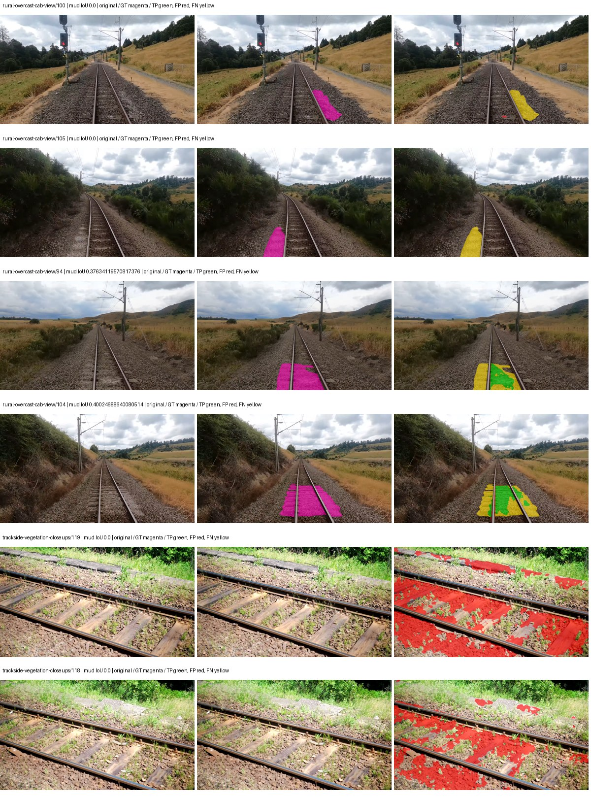
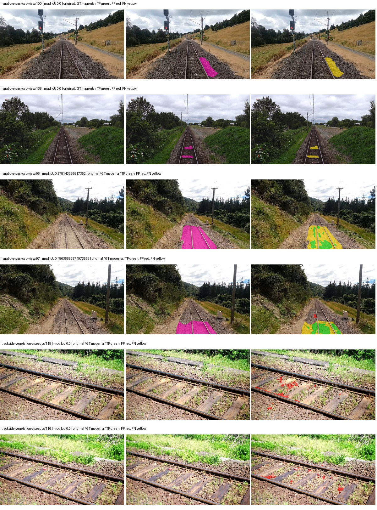
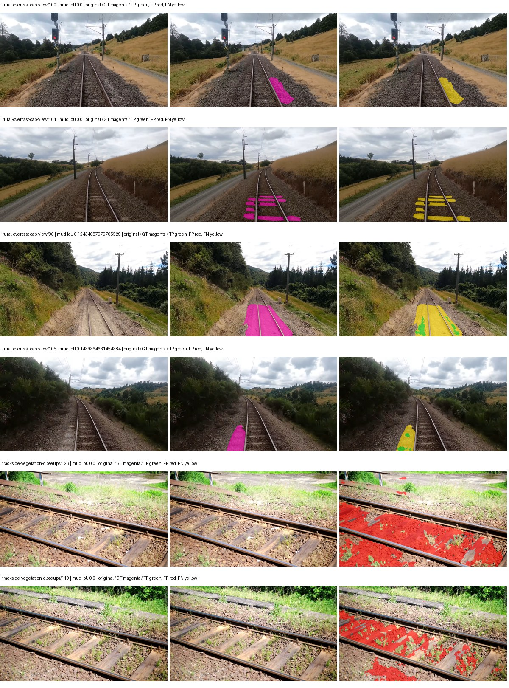

# hrnet_w48_ocr — paul-test-rtis_v2

[RTIS comparison](../../README.md) · [Full model records](record.json)

Primary selection and early stopping: **mud-pumping validation IoU**. A job is complete only after full statistics and isolated profiling are verified.

| Model | Initialization path | Seed | Status | Steps | Best step | Mud IoU (%) | Mud precision (%) | Mud recall (%) | Final mud IoU (trainer val, %) | mIoU (%) | Fixed GT-class mIoU (%) |
| --- | --- | --- | --- | --- | --- | --- | --- | --- | --- | --- | --- |
| hrnet_w48_ocr | rtis_only | 0 | completed | 2039 | 764 | 5.54 | 7.28 | 18.79 | 4.79 | 32.22 | 37.59 |
| hrnet_w48_ocr | cityscapes_to_rtis | 0 | completed | 2803 | 1529 | 11.45 | 59.18 | 12.43 | 2.14 | 36.83 | 40.92 |
| hrnet_w48_ocr | railsem19_to_rtis | 0 | completed | 2294 | 1019 | 1.44 | 2.19 | 4.08 | 0.50 | 46.11 | 53.80 |
| hrnet_w48_ocr | cityscapes_to_railsem19_to_rtis | 0 | training | 2999 | — | — | — | — | — | — | — |

Training: 205 images. Validation: 37 images. Test: 50 held out. Seeds: [0]. Seed variation measures optimization variability, not independent-recording uncertainty. Historical source checkpoints stay fixed across adaptation seeds.

Training code: `066afb2626398b7be59d4d19f5a0e4644fd59adc`. Split SHA-256: `18a84c0163a65ded46508bcc904c374e5f33ad8a09b8879e3c8add606e86aa9f`.

## rtis_only — seed 0

Status: **completed**. Started: 2026-09-09T20:53:49.103494+00:00. Finished: 2026-09-09T21:55:57.950513+00:00.

Recipe pretrained initializer: `timm hrnet_w48 pretrained ImageNet backbone; fresh OCR head`.

`rtis_only` uses the recipe initializer, which may include pretrained segmentation components. Transfer paths load the exact historical source checkpoint below and reset the classifier; they do not reset all query/decoder features.

Source checkpoint: `Recipe pretrained initialization`.

Config SHA-256: `b2ec3a0eb750694eece497d8ec61220d70525fcbe1818c46916f9ca7877ca7f0`. Weights used for validation: `raw`.

### Mud-pumping and aggregate quality

| Metric | Selected checkpoint | Final training validation |
| --- | --- | --- |
| Mud IoU | 5.54 | 4.79 |
| Mud precision | 7.28 | 6.11 |
| Mud recall | 18.79 | 18.11 |
| Mud Dice/F1 | 10.49 | 9.13 |
| mIoU | 32.22 | 33.56 |
| Mean accuracy | 46.46 | 48.83 |
| Mean precision | 50.53 | 52.41 |
| Mean Dice | 41.71 | 42.92 |
| Mean specificity | 98.95 | 98.84 |
| Pixel accuracy | 82.93 | 81.93 |
| Frequency-weighted IoU | 74.54 | 72.59 |
| Fixed GT-present class mIoU | 37.59 | 39.15 |
| Boundary F1 | 40.80 | 38.95 |

The selected checkpoint has independent evaluation evidence. Final values are the trainer's final validation record, not a new independent evaluation. mIoU averages classes with nonzero union, so false positives on absent classes can change its denominator. The fixed GT-class mean is supplementary and excludes absent classes; their false positives remain in the confusion matrix.

### Resource usage and timing

| Measurement | Value |
| --- | --- |
| Peak training VRAM, retained training invocation (GiB) | 17.35 |
| Peak evaluation VRAM (GiB) | 7.58 |
| Retained training invocation wall time (seconds) | 3506.37 |
| Retained training invocation GPU-hours (one GPU) | 0.97 |
| Evaluation wall time (seconds) | 18.86 |
| Full evaluation pipeline images/second | 1.96 |
| Best full-state checkpoint (MiB) | 1119.23 |
| Final full-state checkpoint (MiB) | 1119.18 |
| Verified periodic checkpoints removed (GiB) | 4.37 |

VRAM uses the recorded allocator high-water mark; it is not total device usage including CUDA context. Resumed jobs' retained training invocation times and peaks are **not whole-campaign totals**. Earlier invocation resource records are not reconstructed here. Evaluation throughput includes loader, sliding-window inference and metrics; it is not model-only latency/FPS. Missing measurements are shown as —, never inferred from another dataset's run.

### Standardized inference performance

Dedicated model-only profiling waits for an idle worker-locked L40S: BF16, batch 1, 1024x1024, 20 warmup and 100 CUDA-event-timed public forwards. It excludes loading, preprocessing, tiling and metrics.

| Status | Parameters | Weight MiB | FPS | p50 ms | p95 ms | Peak reserved GiB |
| --- | --- | --- | --- | --- | --- | --- |
| complete | 73168490 | 279.12 | 29.47 | 33.88 | 35.55 | 1.26 |

```json
{
  "schema_version": 1,
  "model_id": "hrnet_w48_ocr",
  "measured_at": "2026-09-09T21:55:50+00:00",
  "status": "complete",
  "benchmark_scope": "rtis_selected_checkpoint_model_only",
  "applies_to": [
    "hrnet_w48_ocr--rtis_only--seed-0"
  ],
  "source": {
    "campaign_git_sha": "066afb2626398b7be59d4d19f5a0e4644fd59adc",
    "git_dirty": false,
    "config_hash": "a00860716799",
    "resolved_config": "/data/izadia1/projects/segmentary-runs/paul-test-rtis_v2/seed0-20260909/configs/hrnet_w48_ocr--rtis_only--seed-0.yaml",
    "config_sha256": "b2ec3a0eb750694eece497d8ec61220d70525fcbe1818c46916f9ca7877ca7f0",
    "checkpoint_sha256": "d1532c70b26a45ab2ca65c1ef9b2f30f6a10026b5d216056ea08a1c9c7d33f75",
    "checkpoint_global_step": 764,
    "checkpoint_bytes": 1173602750,
    "checkpoint_kind": "resume checkpoint with optimizer and EMA state",
    "weights": "raw",
    "measured_checkpoint_job_id": "hrnet_w48_ocr--rtis_only--seed-0",
    "result_sha256": "42446fd200f3929b047b3979cefab852017e61f5f2dc695e2d917e6940575cda",
    "result_git_sha": "066afb2626398b7be59d4d19f5a0e4644fd59adc",
    "result_stage": "eval:paul-test-rtis:val",
    "result_seed": 0
  },
  "hardware": {
    "gpu_name": "NVIDIA L40S",
    "gpu_uuid": "GPU-2f8008a1-9b67-11f6-987b-b393a672322c",
    "logical_device": "cuda:0",
    "physical_visibility_token": "3",
    "compute_capability": [
      8,
      9
    ],
    "total_memory_bytes": 47677177856
  },
  "model": {
    "parameter_count": 73168490,
    "trainable_parameter_count": 73168490,
    "resident_parameter_bytes": 292673960,
    "parameter_dtype_counts": {
      "float32": 73168490
    }
  },
  "contract": {
    "backend": "pytorch",
    "precision": "bf16_autocast",
    "batch_size": 1,
    "input_shape_nchw": [
      1,
      3,
      1024,
      1024
    ],
    "warmup_iterations": 20,
    "measured_iterations": 100,
    "timing": "per-forward CUDA events with end-event synchronization",
    "includes_preprocessing": false,
    "includes_data_loader": false,
    "includes_sliding_window": false,
    "input_resident_on_gpu": true,
    "model_only": true,
    "entrypoint": "public model(image) dense-logits forward"
  },
  "measurements": {
    "latency": {
      "p50_ms": 33.88006401062012,
      "p95_ms": 35.55200119018555,
      "mean_ms": 33.93681339263916,
      "minimum_ms": 32.20377731323242,
      "maximum_ms": 36.45849609375,
      "fps": 29.466526171160737,
      "raw_ms": [
        33.928192138671875,
        32.25894546508789,
        32.20377731323242,
        32.39014434814453,
        32.75775909423828,
        32.48640060424805,
        32.308223724365234,
        33.25849533081055,
        34.01113510131836,
        32.84684753417969,
        32.35532760620117,
        33.392608642578125,
        33.152000427246094,
        32.333824157714844,
        32.74854278564453,
        32.661376953125,
        33.14585494995117,
        34.52006530761719,
        36.27008056640625,
        34.44121551513672,
        34.01420974731445,
        34.90611267089844,
        35.42118453979492,
        33.97727966308594,
        35.54304122924805,
        34.654144287109375,
        34.31516647338867,
        33.86675262451172,
        33.04447937011719,
        35.525630950927734,
        34.78105545043945,
        34.18214416503906,
        36.2239990234375,
        35.72224044799805,
        34.755489349365234,
        35.28908920288086,
        34.35007858276367,
        34.17087936401367,
        33.841121673583984,
        33.21343994140625,
        35.00851058959961,
        34.504703521728516,
        33.9159049987793,
        34.733055114746094,
        34.37567901611328,
        34.171905517578125,
        34.44940948486328,
        32.66447830200195,
        32.636863708496094,
        32.635902404785156,
        33.58515167236328,
        35.06790542602539,
        34.08793640136719,
        33.148929595947266,
        33.470462799072266,
        32.65843200683594,
        35.77241516113281,
        34.806785583496094,
        34.755584716796875,
        33.63532638549805,
        32.95948791503906,
        33.76947021484375,
        33.886207580566406,
        33.916831970214844,
        33.87392044067383,
        33.86374282836914,
        32.47001647949219,
        34.914302825927734,
        33.10182571411133,
        35.31980895996094,
        33.658878326416016,
        33.660926818847656,
        32.768001556396484,
        34.513919830322266,
        33.81862258911133,
        33.8072624206543,
        32.41676712036133,
        32.78131103515625,
        32.738304138183594,
        35.34025573730469,
        35.130367279052734,
        34.086910247802734,
        33.23596954345703,
        33.22880172729492,
        35.05766296386719,
        33.7336311340332,
        34.85286331176758,
        34.19136047363281,
        33.27692794799805,
        33.65273666381836,
        33.72032165527344,
        36.45849609375,
        33.918975830078125,
        33.62918472290039,
        35.06687927246094,
        35.01567840576172,
        33.56159973144531,
        35.24710464477539,
        33.760257720947266,
        33.92204666137695
      ],
      "percentile_method": "numpy linear interpolation"
    },
    "peak_reserved_bytes": 1350565888,
    "memory_kind": "pytorch_cuda_allocator_peak_reserved_excluding_context",
    "benchmark_wall_clock_s": 17.254029102623463
  },
  "started_at": "2026-09-09T21:55:33+00:00",
  "finished_at": "2026-09-09T21:55:50+00:00",
  "environment": {
    "hostname": "hdrfs-app-001",
    "python": "3.11.15",
    "platform": "Linux-5.15.0-139-generic-x86_64-with-glibc2.35",
    "torch": "2.11.0+cu128",
    "torch_cuda": "12.8",
    "cudnn": 91900,
    "driver_version": "570.133.20",
    "cuda_available": true,
    "gpu_count": 1,
    "gpu_names": [
      "NVIDIA L40S"
    ],
    "cuda_visible_devices": "3",
    "packages": {
      "segmentary": "0.1.0",
      "torch": "2.11.0+cu128",
      "torchvision": "0.26.0+cu128",
      "transformers": "5.15.0",
      "timm": "1.0.28",
      "segmentation-models-pytorch": "0.5.0",
      "albumentations": "2.0.8",
      "lightning": "2.6.5",
      "numpy": "2.4.4"
    }
  }
}
```

### Per-class validation results

| Class | GT pixels | IoU (%) | Precision (%) | Recall (%) | Dice (%) | Boundary F1 (%) |
| --- | --- | --- | --- | --- | --- | --- |
| car | 29664 | 35.97 | 73.45 | 41.34 | 52.91 | 48.94 |
| construction | 311585 | 40.46 | 46.84 | 74.81 | 57.61 | 53.85 |
| fence | 265137 | 6.10 | 49.66 | 6.50 | 11.49 | 23.33 |
| mud-pumping | 1226250 | 5.54 | 7.28 | 18.79 | 10.49 | 9.44 |
| on-rails | 0 | 0.00 | 0.00 | — | 0.00 | 0.00 |
| person | 0 | 0.00 | 0.00 | — | 0.00 | 0.00 |
| pole | 628038 | 69.65 | 80.56 | 83.73 | 82.11 | 88.15 |
| rail-embedded | 16799 | 19.56 | 46.16 | 25.33 | 32.71 | 34.53 |
| rail-raised | 2969797 | 78.13 | 85.69 | 89.85 | 87.72 | 93.17 |
| rail-track | 6323197 | 32.95 | 76.79 | 36.59 | 49.57 | 45.15 |
| road | 1048831 | 7.92 | 20.20 | 11.54 | 14.69 | 11.15 |
| sidewalk | 1297367 | 13.08 | 47.21 | 15.32 | 23.13 | 37.04 |
| sky | 19121606 | 94.72 | 99.44 | 95.22 | 97.29 | 85.99 |
| standing-water | 95802 | 0.26 | 0.28 | 3.70 | 0.52 | 1.45 |
| terrain | 39239306 | 87.19 | 88.75 | 98.02 | 93.16 | 64.96 |
| trackbed | 10643081 | 60.37 | 72.80 | 77.95 | 75.29 | 57.79 |
| traffic-light | 19510 | 32.35 | 98.42 | 32.52 | 48.88 | 48.80 |
| traffic-sign | 13285 | 34.35 | 61.17 | 43.93 | 51.13 | 59.83 |
| tram-track | 56179 | 17.17 | 24.57 | 36.30 | 29.30 | 22.65 |
| truck | 0 | 0.00 | 0.00 | — | 0.00 | 0.00 |
| vegetation-overgrowth | 5901821 | 40.79 | 81.86 | 44.84 | 57.95 | 70.52 |

### Full-run accounting

| Measurement | Value |
| --- | --- |
| Full GPU-reserved wall seconds, all recorded worker attempts | 3728.85 |
| Full reserved GPU-hours | 1.04 |
| Whole-run timing complete | True |

| Phase | Wall seconds including failed attempts |
| --- | --- |
| training | 3513.89 |
| diagnostics | 152.84 |
| performance | 26.80 |

GPU-reserved time includes model loading, training, validation, collection, profiling, checkpoint I/O and orchestration while the worker owns one GPU. It is not GPU kernel-active time. Phase timings and sampled device memory/power/utilization are retained separately; sampled device memory is not the allocator high-water mark.

### Train/validation and raw/EMA diagnostics

| Checkpoint / weights / split | Images | Mud IoU (%) | Mud precision (%) | Mud recall (%) |
| --- | --- | --- | --- | --- |
| best-auto-train / raw | 205 | 90.81 | 94.02 | 96.38 |
| best-auto-val / raw | 37 | 5.54 | 7.28 | 18.79 |
| best-alternate-val / ema | 37 | 0.22 | 0.26 | 1.23 |
| final-auto-val / raw | 37 | 4.78 | 6.10 | 18.09 |

Train uses the evaluation transform without augmentation. Compare mud train/validation metrics for the same selected weights. Alternate EMA on running-stat BatchNorm is explicitly uncalibrated and is diagnostic only. Score-threshold curves use uncalibrated normalized scores and are pixel-level diagnostics, not event detection rates or a selected deployment operating point.

### Downloadable evidence

- best-auto-train: [per-image.csv](rtis_only--seed-0/best-auto-train/per-image.csv) · [per-image-confusion.json.gz](rtis_only--seed-0/best-auto-train/per-image-confusion.json.gz) · [groups.json](rtis_only--seed-0/best-auto-train/groups.json) · [mud-score-curves.json](rtis_only--seed-0/best-auto-train/mud-score-curves.json)
- best-auto-val: [per-image.csv](rtis_only--seed-0/best-auto-val/per-image.csv) · [per-image-confusion.json.gz](rtis_only--seed-0/best-auto-val/per-image-confusion.json.gz) · [groups.json](rtis_only--seed-0/best-auto-val/groups.json) · [mud-score-curves.json](rtis_only--seed-0/best-auto-val/mud-score-curves.json) · [examples.jpg](rtis_only--seed-0/best-auto-val/examples.jpg)
- best-alternate-val: [per-image.csv](rtis_only--seed-0/best-alternate-val/per-image.csv) · [per-image-confusion.json.gz](rtis_only--seed-0/best-alternate-val/per-image-confusion.json.gz) · [groups.json](rtis_only--seed-0/best-alternate-val/groups.json) · [mud-score-curves.json](rtis_only--seed-0/best-alternate-val/mud-score-curves.json)
- final-auto-val: [per-image.csv](rtis_only--seed-0/final-auto-val/per-image.csv) · [per-image-confusion.json.gz](rtis_only--seed-0/final-auto-val/per-image-confusion.json.gz) · [groups.json](rtis_only--seed-0/final-auto-val/groups.json) · [mud-score-curves.json](rtis_only--seed-0/final-auto-val/mud-score-curves.json)
- resources: [telemetry.csv](rtis_only--seed-0/resources/telemetry.csv)



Examples are two lowest and two highest mud-IoU positive images, plus up to two negative images with the most false-positive mud pixels. They are targeted diagnostic examples, not random samples. Green: true positive; red: false positive; yellow: false negative. Full predictions remain on HDRFS.

### Validation tracking

| Logged step | Overall mIoU (%) | Mud IoU (%) |
| --- | --- | --- |
| 254 | 22.62 | 1.03 |
| 509 | 25.07 | 3.64 |
| 764 | 32.22 | 5.55 |
| 1019 | 31.89 | 4.29 |
| 1274 | 32.85 | 3.28 |
| 1529 | 32.21 | 1.51 |
| 1784 | 30.95 | 1.34 |
| 2038 | 33.56 | 4.79 |

All retained scalar curves, including training loss and per-class IoU, are in record.json. Observed best mud on a curve is not necessarily a retained checkpoint: the pilot saved its selection-metric-best and final checkpoints. Step logging and checkpoint global_step may differ by one.

### Stopping and checkpoint provenance

```json
{
  "stopping": {
    "actual_steps": 2039,
    "maximum_steps": 4000,
    "min_delta": 0.001,
    "monitor": "val_iou/mud-pumping",
    "patience": 5,
    "reason": "validation_plateau"
  },
  "checkpoints": {
    "best": {
      "path": "/data/izadia1/projects/segmentary-runs/paul-test-rtis_v2/seed0-20260909/future-runs/hrnet_w48_ocr--rtis_only--seed-0_seed0/rtis/best.ckpt",
      "sha256": "d1532c70b26a45ab2ca65c1ef9b2f30f6a10026b5d216056ea08a1c9c7d33f75",
      "global_step": 764,
      "bytes": 1173602750
    },
    "final": {
      "path": "/data/izadia1/projects/segmentary-runs/paul-test-rtis_v2/seed0-20260909/future-runs/hrnet_w48_ocr--rtis_only--seed-0_seed0/rtis/last.ckpt",
      "sha256": "59a66cf7523e5d104af84069e81964323002f11bada7e48cbd054bcaf37690cc",
      "global_step": 2039,
      "bytes": 1173541502
    }
  },
  "cleanup_error": null
}
```

### Resolved training, initialization and evaluation settings

The optimizer block is the base configuration. Stage LR scales are applied at runtime, and stage warmup is capped at min(base warmup, floor(stage budget / 10), stage budget - 1): 400 steps for this 4,000-step pilot. Model-internal native input grids may differ from augmentation crops (EoMT uses its 640 grid).

```json
{
  "name": "hrnet_w48_ocr--rtis_only--seed-0",
  "model": {
    "arch": "hrnet_w48_ocr",
    "checkpoint": null,
    "tuning": "full",
    "head": "unified_head",
    "lora_r": 16,
    "lora_alpha": 32,
    "lora_dropout": 0.05,
    "lora_targets": [],
    "drop_path": null,
    "revision": null,
    "subfolder": null,
    "local_files_only": false,
    "trust_remote_code": false,
    "backbone_path": null,
    "head_paths": [],
    "classifier_path": null,
    "inactive_parameter_paths": [],
    "smp_arch": null,
    "encoder_name": null,
    "encoder_weights": null,
    "native": null,
    "batch_norm_momentum": null
  },
  "space": "paul-test-rtis",
  "taxonomy_root": "/data/izadia1/projects/segmentary-rtis-fullstats-066afb2/taxonomy",
  "output_root": "/data/izadia1/projects/segmentary-runs/paul-test-rtis_v2/seed0-20260909/future-runs",
  "optim": {
    "backbone_lr": 0.0001,
    "head_lr_mult": 10.0,
    "weight_decay": 0.05,
    "llrd": 1.0,
    "warmup_iters": 1500,
    "warmup_ratio": 1e-06,
    "poly_power": 0.9,
    "min_lr_ratio": 0.0,
    "betas": [
      0.9,
      0.999
    ],
    "grad_clip": 1.0
  },
  "train": {
    "iters": 4000,
    "batch_size": 2,
    "accum": 8,
    "num_workers": 2,
    "precision": "bf16-mixed",
    "ema_decay": 0.9998,
    "val_every": 250,
    "ckpt_every": 500,
    "selection_metric": "val_iou/mud-pumping",
    "early_stopping_patience": 5,
    "early_stopping_min_delta": 0.001,
    "seed": 0,
    "devices": 1
  },
  "eval": {
    "sliding_window": true,
    "window": [
      1024,
      1024
    ],
    "stride": [
      768,
      768
    ],
    "batch_size": 1,
    "num_workers": 2,
    "tta_scales": [],
    "tta_flip": false,
    "threshold": 0.5,
    "boundary_tolerance_frac": 0.0075,
    "save_confusion": true
  },
  "loss": {
    "task": "multiclass",
    "activation": "auto",
    "terms": [],
    "aux": "none",
    "aux_weight": 0.0,
    "ce_weight": 1.0,
    "label_smoothing": 0.0,
    "class_weights": null,
    "query": null
  },
  "aug": {
    "crop": [
      1024,
      1024
    ],
    "scale_min": 0.5,
    "scale_max": 2.0,
    "hflip_p": 0.5,
    "color_jitter_p": 0.5,
    "brightness": 0.25,
    "contrast": 0.25,
    "saturation": 0.25,
    "hue": 0.05
  },
  "stages": [
    {
      "name": "rtis",
      "data": [
        {
          "name": "paul-test-rtis",
          "root": "/data/izadia1/datasets/paul-test-rtis_v2",
          "variant": null,
          "split_file": "splits.json",
          "train_split": "train",
          "val_split": "val",
          "limit": null,
          "loader": "folder",
          "mapping": "paul-test-rtis",
          "loader_options": {
            "require_groups": true
          }
        }
      ],
      "iters": null,
      "lr_scale": 1.0,
      "head_group_lr_scale": 1.0,
      "init_from": "pretrained",
      "reset_head": false,
      "freeze": null,
      "sample_weights": null
    }
  ]
}
```

### Hardware and software provenance

```json
{
  "training": {
    "cuda_available": true,
    "cuda_visible_devices": "3",
    "cudnn": 91900,
    "driver_version": "570.133.20",
    "gpu_count": 1,
    "gpu_names": [
      "NVIDIA L40S"
    ],
    "hostname": "hdrfs-app-001",
    "input_normalization": {
      "channel_order": "rgb",
      "mean": [
        0.485,
        0.456,
        0.406
      ],
      "source": "imagenet",
      "std": [
        0.229,
        0.224,
        0.225
      ]
    },
    "model_origins": [
      {
        "hf_commit": null,
        "hf_name_or_path": null,
        "module": "trunk",
        "timm_pretrained": {
          "architecture": "hrnet_w48",
          "hf_hub_id": "timm/hrnet_w48.ms_in1k",
          "tag": "ms_in1k",
          "url": ""
        }
      }
    ],
    "model_parameter_count": 73168490,
    "packages": {
      "albumentations": "2.0.8",
      "lightning": "2.6.5",
      "numpy": "2.4.4",
      "segmentary": "0.1.0",
      "segmentation-models-pytorch": "0.5.0",
      "timm": "1.0.28",
      "torch": "2.11.0+cu128",
      "torchvision": "0.26.0+cu128",
      "transformers": "5.15.0"
    },
    "platform": "Linux-5.15.0-139-generic-x86_64-with-glibc2.35",
    "python": "3.11.15",
    "torch": "2.11.0+cu128",
    "torch_cuda": "12.8",
    "trainable_parameter_count": 73168490,
    "training_stop": {
      "actual_steps": 2039,
      "maximum_steps": 4000,
      "min_delta": 0.001,
      "monitor": "val_iou/mud-pumping",
      "patience": 5,
      "reason": "validation_plateau"
    },
    "validation_weights": "raw"
  },
  "evaluation": {
    "cuda_available": true,
    "cuda_visible_devices": "3",
    "cudnn": 91900,
    "driver_version": "570.133.20",
    "gpu_count": 1,
    "gpu_names": [
      "NVIDIA L40S"
    ],
    "hostname": "hdrfs-app-001",
    "input_normalization": {
      "channel_order": "rgb",
      "mean": [
        0.485,
        0.456,
        0.406
      ],
      "source": "imagenet",
      "std": [
        0.229,
        0.224,
        0.225
      ]
    },
    "packages": {
      "albumentations": "2.0.8",
      "lightning": "2.6.5",
      "numpy": "2.4.4",
      "segmentary": "0.1.0",
      "segmentation-models-pytorch": "0.5.0",
      "timm": "1.0.28",
      "torch": "2.11.0+cu128",
      "torchvision": "0.26.0+cu128",
      "transformers": "5.15.0"
    },
    "platform": "Linux-5.15.0-139-generic-x86_64-with-glibc2.35",
    "python": "3.11.15",
    "torch": "2.11.0+cu128",
    "torch_cuda": "12.8"
  }
}
```

## cityscapes_to_rtis — seed 0

Status: **completed**. Started: 2026-09-09T20:54:31.306081+00:00. Finished: 2026-09-09T22:18:10.003746+00:00.

Recipe pretrained initializer: `timm hrnet_w48 pretrained ImageNet backbone; fresh OCR head`.

`rtis_only` uses the recipe initializer, which may include pretrained segmentation components. Transfer paths load the exact historical source checkpoint below and reset the classifier; they do not reset all query/decoder features.

Source checkpoint: `{'name': 'hrnet_w48_ocr--cityscapes--seed-0', 'model': 'hrnet_w48_ocr', 'protocol': 'cityscapes', 'config': '/data/izadia1/projects/segmentary-runs/all-model-city-rail-seed0-rail20-b9eb3e1/accepted/hrnet_w48_ocr--cityscapes--seed-0/resolved-config.yaml', 'checkpoint': '/data/izadia1/projects/segmentary-runs/current-main-fill-v2/jobs/hrnet_w48_ocr--cityscapes--seed-0/train/hrnet_w48_ocr--cityscapes_seed0/cityscapes/last.ckpt', 'recorded_sha256': '38fb6ca68c932ae2a8224708568d0825f3d188f076da708d6eca79932cde4e84', 'exists': True}`.

Config SHA-256: `0aa132f62eecc8d8cd958dd381c411ca3e4e6061153f4e47f894b98e54ce1926`. Weights used for validation: `raw`.

### Mud-pumping and aggregate quality

| Metric | Selected checkpoint | Final training validation |
| --- | --- | --- |
| Mud IoU | 11.45 | 2.14 |
| Mud precision | 59.18 | 56.15 |
| Mud recall | 12.43 | 2.18 |
| Mud Dice/F1 | 20.55 | 4.19 |
| mIoU | 36.83 | 35.71 |
| Mean accuracy | 48.83 | 50.49 |
| Mean precision | 63.50 | 59.47 |
| Mean Dice | 45.88 | 44.74 |
| Mean specificity | 98.36 | 98.43 |
| Pixel accuracy | 77.44 | 76.85 |
| Frequency-weighted IoU | 63.60 | 63.78 |
| Fixed GT-present class mIoU | 40.92 | 39.67 |
| Boundary F1 | 39.70 | 40.41 |

The selected checkpoint has independent evaluation evidence. Final values are the trainer's final validation record, not a new independent evaluation. mIoU averages classes with nonzero union, so false positives on absent classes can change its denominator. The fixed GT-class mean is supplementary and excludes absent classes; their false positives remain in the confusion matrix.

### Resource usage and timing

| Measurement | Value |
| --- | --- |
| Peak training VRAM, retained training invocation (GiB) | 17.35 |
| Peak evaluation VRAM (GiB) | 7.58 |
| Retained training invocation wall time (seconds) | 4787.87 |
| Retained training invocation GPU-hours (one GPU) | 1.33 |
| Evaluation wall time (seconds) | 19.67 |
| Full evaluation pipeline images/second | 1.88 |
| Best full-state checkpoint (MiB) | 1119.23 |
| Final full-state checkpoint (MiB) | 1119.18 |
| Verified periodic checkpoints removed (GiB) | 5.47 |

VRAM uses the recorded allocator high-water mark; it is not total device usage including CUDA context. Resumed jobs' retained training invocation times and peaks are **not whole-campaign totals**. Earlier invocation resource records are not reconstructed here. Evaluation throughput includes loader, sliding-window inference and metrics; it is not model-only latency/FPS. Missing measurements are shown as —, never inferred from another dataset's run.

### Standardized inference performance

Dedicated model-only profiling waits for an idle worker-locked L40S: BF16, batch 1, 1024x1024, 20 warmup and 100 CUDA-event-timed public forwards. It excludes loading, preprocessing, tiling and metrics.

| Status | Parameters | Weight MiB | FPS | p50 ms | p95 ms | Peak reserved GiB |
| --- | --- | --- | --- | --- | --- | --- |
| complete | 73168490 | 279.12 | 28.42 | 34.99 | 36.54 | 1.26 |

```json
{
  "schema_version": 1,
  "model_id": "hrnet_w48_ocr",
  "measured_at": "2026-09-09T22:18:00+00:00",
  "status": "complete",
  "benchmark_scope": "rtis_selected_checkpoint_model_only",
  "applies_to": [
    "hrnet_w48_ocr--cityscapes_to_rtis--seed-0"
  ],
  "source": {
    "campaign_git_sha": "066afb2626398b7be59d4d19f5a0e4644fd59adc",
    "git_dirty": false,
    "config_hash": "9c88066ba5a6",
    "resolved_config": "/data/izadia1/projects/segmentary-runs/paul-test-rtis_v2/seed0-20260909/configs/hrnet_w48_ocr--cityscapes_to_rtis--seed-0.yaml",
    "config_sha256": "0aa132f62eecc8d8cd958dd381c411ca3e4e6061153f4e47f894b98e54ce1926",
    "checkpoint_sha256": "3da72e09b3c8c85e50dee4ac618b674cf8f3f35ee0ca6261f6a511396503de35",
    "checkpoint_global_step": 1529,
    "checkpoint_bytes": 1173602814,
    "checkpoint_kind": "resume checkpoint with optimizer and EMA state",
    "weights": "raw",
    "measured_checkpoint_job_id": "hrnet_w48_ocr--cityscapes_to_rtis--seed-0",
    "result_sha256": "034b7bf540ce442189d0e06e251685368d337053f56993e0b03e146d95076aaa",
    "result_git_sha": "066afb2626398b7be59d4d19f5a0e4644fd59adc",
    "result_stage": "eval:paul-test-rtis:val",
    "result_seed": 0
  },
  "hardware": {
    "gpu_name": "NVIDIA L40S",
    "gpu_uuid": "GPU-fc5dde96-210d-0afa-ac74-7f88477d622b",
    "logical_device": "cuda:0",
    "physical_visibility_token": "4",
    "compute_capability": [
      8,
      9
    ],
    "total_memory_bytes": 47677177856
  },
  "model": {
    "parameter_count": 73168490,
    "trainable_parameter_count": 73168490,
    "resident_parameter_bytes": 292673960,
    "parameter_dtype_counts": {
      "float32": 73168490
    }
  },
  "contract": {
    "backend": "pytorch",
    "precision": "bf16_autocast",
    "batch_size": 1,
    "input_shape_nchw": [
      1,
      3,
      1024,
      1024
    ],
    "warmup_iterations": 20,
    "measured_iterations": 100,
    "timing": "per-forward CUDA events with end-event synchronization",
    "includes_preprocessing": false,
    "includes_data_loader": false,
    "includes_sliding_window": false,
    "input_resident_on_gpu": true,
    "model_only": true,
    "entrypoint": "public model(image) dense-logits forward"
  },
  "measurements": {
    "latency": {
      "p50_ms": 34.98548698425293,
      "p95_ms": 36.54323387145996,
      "mean_ms": 35.181487159729,
      "minimum_ms": 33.695743560791016,
      "maximum_ms": 39.90633773803711,
      "fps": 28.42404004867266,
      "raw_ms": [
        35.60345458984375,
        35.02592086791992,
        34.33574295043945,
        35.260414123535156,
        35.86249542236328,
        35.02284622192383,
        34.56819152832031,
        36.42572784423828,
        35.02592086791992,
        35.25017547607422,
        36.48310470581055,
        35.6577262878418,
        34.761695861816406,
        36.53734588623047,
        35.2542724609375,
        34.80268859863281,
        36.421630859375,
        35.81430435180664,
        34.67161560058594,
        35.994625091552734,
        34.62041473388672,
        36.49856185913086,
        35.4969596862793,
        34.79244613647461,
        35.313663482666016,
        34.18521499633789,
        35.3647346496582,
        37.27360153198242,
        37.01555252075195,
        34.83340835571289,
        35.30547332763672,
        33.695743560791016,
        34.572288513183594,
        34.544639587402344,
        35.77036666870117,
        34.37055969238281,
        34.681854248046875,
        36.24345779418945,
        34.97267150878906,
        36.13993453979492,
        35.64748764038086,
        34.9983024597168,
        34.84569549560547,
        34.89894485473633,
        34.45552062988281,
        33.702911376953125,
        34.5272331237793,
        39.044193267822266,
        34.932640075683594,
        34.6767692565918,
        36.201473236083984,
        35.0013427734375,
        34.45759963989258,
        34.6060791015625,
        34.475006103515625,
        35.286014556884766,
        34.507774353027344,
        34.541568756103516,
        35.09145736694336,
        34.229248046875,
        36.203521728515625,
        35.75193786621094,
        36.15129470825195,
        35.17542266845703,
        34.888702392578125,
        34.22630310058594,
        33.963134765625,
        33.95993423461914,
        34.93580627441406,
        34.53644943237305,
        36.65510559082031,
        35.96601486206055,
        35.85638427734375,
        35.21535873413086,
        35.01567840576172,
        34.29487991333008,
        34.79644775390625,
        34.555904388427734,
        34.26508712768555,
        34.360321044921875,
        34.367454528808594,
        34.083839416503906,
        35.381248474121094,
        34.5978889465332,
        35.31059265136719,
        35.56556701660156,
        35.20000076293945,
        35.14982223510742,
        34.14726257324219,
        34.03366470336914,
        34.67161560058594,
        34.557952880859375,
        34.539520263671875,
        34.44633483886719,
        35.56351852416992,
        39.90633773803711,
        36.536319732666016,
        34.63167953491211,
        34.69414520263672,
        35.39155197143555
      ],
      "percentile_method": "numpy linear interpolation"
    },
    "peak_reserved_bytes": 1350565888,
    "memory_kind": "pytorch_cuda_allocator_peak_reserved_excluding_context",
    "benchmark_wall_clock_s": 17.407669112086296
  },
  "started_at": "2026-09-09T22:17:42+00:00",
  "finished_at": "2026-09-09T22:18:00+00:00",
  "environment": {
    "hostname": "hdrfs-app-001",
    "python": "3.11.15",
    "platform": "Linux-5.15.0-139-generic-x86_64-with-glibc2.35",
    "torch": "2.11.0+cu128",
    "torch_cuda": "12.8",
    "cudnn": 91900,
    "driver_version": "570.133.20",
    "cuda_available": true,
    "gpu_count": 1,
    "gpu_names": [
      "NVIDIA L40S"
    ],
    "cuda_visible_devices": "4",
    "packages": {
      "segmentary": "0.1.0",
      "torch": "2.11.0+cu128",
      "torchvision": "0.26.0+cu128",
      "transformers": "5.15.0",
      "timm": "1.0.28",
      "segmentation-models-pytorch": "0.5.0",
      "albumentations": "2.0.8",
      "lightning": "2.6.5",
      "numpy": "2.4.4"
    }
  }
}
```

### Per-class validation results

| Class | GT pixels | IoU (%) | Precision (%) | Recall (%) | Dice (%) | Boundary F1 (%) |
| --- | --- | --- | --- | --- | --- | --- |
| car | 29664 | 79.39 | 91.55 | 85.67 | 88.51 | 82.55 |
| construction | 311585 | 40.48 | 46.15 | 76.73 | 57.63 | 42.35 |
| fence | 265137 | 14.24 | 63.36 | 15.51 | 24.92 | 33.38 |
| mud-pumping | 1226250 | 11.45 | 59.18 | 12.43 | 20.55 | 12.67 |
| on-rails | 0 | 0.00 | 0.00 | — | 0.00 | 0.00 |
| person | 0 | 0.00 | 0.00 | — | 0.00 | 0.00 |
| pole | 628038 | 74.09 | 88.80 | 81.73 | 85.12 | 92.85 |
| rail-embedded | 16799 | 3.08 | 92.51 | 3.09 | 5.98 | 9.50 |
| rail-raised | 2969797 | 72.95 | 78.48 | 91.20 | 84.36 | 87.12 |
| rail-track | 6323197 | 34.44 | 61.34 | 44.00 | 51.24 | 42.33 |
| road | 1048831 | 5.79 | 23.99 | 7.10 | 10.95 | 9.58 |
| sidewalk | 1297367 | 40.62 | 70.97 | 48.71 | 57.77 | 11.14 |
| sky | 19121606 | 84.04 | 99.56 | 84.35 | 91.33 | 75.64 |
| standing-water | 95802 | 0.77 | 0.83 | 9.44 | 1.52 | 11.02 |
| terrain | 39239306 | 73.65 | 74.91 | 97.75 | 84.82 | 44.87 |
| trackbed | 10643081 | 54.56 | 74.10 | 67.41 | 70.60 | 49.95 |
| traffic-light | 19510 | 79.18 | 94.71 | 82.84 | 88.38 | 88.41 |
| traffic-sign | 13285 | 56.23 | 91.88 | 59.17 | 71.98 | 78.58 |
| tram-track | 56179 | 8.21 | 100.00 | 8.21 | 15.18 | 5.24 |
| truck | 0 | — | — | — | — | — |
| vegetation-overgrowth | 5901821 | 3.46 | 57.76 | 3.55 | 6.68 | 16.74 |

### Full-run accounting

| Measurement | Value |
| --- | --- |
| Full GPU-reserved wall seconds, all recorded worker attempts | 5019.67 |
| Full reserved GPU-hours | 1.39 |
| Whole-run timing complete | True |

| Phase | Wall seconds including failed attempts |
| --- | --- |
| training | 4796.55 |
| diagnostics | 155.22 |
| performance | 27.55 |

GPU-reserved time includes model loading, training, validation, collection, profiling, checkpoint I/O and orchestration while the worker owns one GPU. It is not GPU kernel-active time. Phase timings and sampled device memory/power/utilization are retained separately; sampled device memory is not the allocator high-water mark.

### Train/validation and raw/EMA diagnostics

| Checkpoint / weights / split | Images | Mud IoU (%) | Mud precision (%) | Mud recall (%) |
| --- | --- | --- | --- | --- |
| best-auto-train / raw | 205 | 90.82 | 96.10 | 94.29 |
| best-auto-val / raw | 37 | 11.45 | 59.18 | 12.43 |
| best-alternate-val / ema | 37 | 6.59 | 17.00 | 9.71 |
| final-auto-val / raw | 37 | 2.13 | 55.83 | 2.17 |

Train uses the evaluation transform without augmentation. Compare mud train/validation metrics for the same selected weights. Alternate EMA on running-stat BatchNorm is explicitly uncalibrated and is diagnostic only. Score-threshold curves use uncalibrated normalized scores and are pixel-level diagnostics, not event detection rates or a selected deployment operating point.

### Downloadable evidence

- best-auto-train: [per-image.csv](cityscapes_to_rtis--seed-0/best-auto-train/per-image.csv) · [per-image-confusion.json.gz](cityscapes_to_rtis--seed-0/best-auto-train/per-image-confusion.json.gz) · [groups.json](cityscapes_to_rtis--seed-0/best-auto-train/groups.json) · [mud-score-curves.json](cityscapes_to_rtis--seed-0/best-auto-train/mud-score-curves.json)
- best-auto-val: [per-image.csv](cityscapes_to_rtis--seed-0/best-auto-val/per-image.csv) · [per-image-confusion.json.gz](cityscapes_to_rtis--seed-0/best-auto-val/per-image-confusion.json.gz) · [groups.json](cityscapes_to_rtis--seed-0/best-auto-val/groups.json) · [mud-score-curves.json](cityscapes_to_rtis--seed-0/best-auto-val/mud-score-curves.json) · [examples.jpg](cityscapes_to_rtis--seed-0/best-auto-val/examples.jpg)
- best-alternate-val: [per-image.csv](cityscapes_to_rtis--seed-0/best-alternate-val/per-image.csv) · [per-image-confusion.json.gz](cityscapes_to_rtis--seed-0/best-alternate-val/per-image-confusion.json.gz) · [groups.json](cityscapes_to_rtis--seed-0/best-alternate-val/groups.json) · [mud-score-curves.json](cityscapes_to_rtis--seed-0/best-alternate-val/mud-score-curves.json)
- final-auto-val: [per-image.csv](cityscapes_to_rtis--seed-0/final-auto-val/per-image.csv) · [per-image-confusion.json.gz](cityscapes_to_rtis--seed-0/final-auto-val/per-image-confusion.json.gz) · [groups.json](cityscapes_to_rtis--seed-0/final-auto-val/groups.json) · [mud-score-curves.json](cityscapes_to_rtis--seed-0/final-auto-val/mud-score-curves.json)
- resources: [telemetry.csv](cityscapes_to_rtis--seed-0/resources/telemetry.csv)



Examples are two lowest and two highest mud-IoU positive images, plus up to two negative images with the most false-positive mud pixels. They are targeted diagnostic examples, not random samples. Green: true positive; red: false positive; yellow: false negative. Full predictions remain on HDRFS.

### Validation tracking

| Logged step | Overall mIoU (%) | Mud IoU (%) |
| --- | --- | --- |
| 254 | 20.88 | 0.58 |
| 509 | 22.06 | 7.62 |
| 764 | 27.17 | 4.39 |
| 1019 | 35.07 | 5.65 |
| 1274 | 33.43 | 2.32 |
| 1529 | 36.85 | 11.45 |
| 1784 | 37.70 | 1.61 |
| 2038 | 37.84 | 1.23 |
| 2293 | 39.23 | 3.06 |
| 2548 | 33.83 | 2.32 |
| 2803 | 35.71 | 2.14 |

All retained scalar curves, including training loss and per-class IoU, are in record.json. Observed best mud on a curve is not necessarily a retained checkpoint: the pilot saved its selection-metric-best and final checkpoints. Step logging and checkpoint global_step may differ by one.

### Stopping and checkpoint provenance

```json
{
  "stopping": {
    "actual_steps": 2803,
    "maximum_steps": 4000,
    "min_delta": 0.001,
    "monitor": "val_iou/mud-pumping",
    "patience": 5,
    "reason": "validation_plateau"
  },
  "checkpoints": {
    "best": {
      "path": "/data/izadia1/projects/segmentary-runs/paul-test-rtis_v2/seed0-20260909/future-runs/hrnet_w48_ocr--cityscapes_to_rtis--seed-0_seed0/rtis/best.ckpt",
      "sha256": "3da72e09b3c8c85e50dee4ac618b674cf8f3f35ee0ca6261f6a511396503de35",
      "global_step": 1529,
      "bytes": 1173602814
    },
    "final": {
      "path": "/data/izadia1/projects/segmentary-runs/paul-test-rtis_v2/seed0-20260909/future-runs/hrnet_w48_ocr--cityscapes_to_rtis--seed-0_seed0/rtis/last.ckpt",
      "sha256": "8909933d2459bdc553c24f353f61c2413c7363e406839d6bb0ad1e4cd45abaec",
      "global_step": 2803,
      "bytes": 1173541502
    }
  },
  "cleanup_error": null
}
```

### Resolved training, initialization and evaluation settings

The optimizer block is the base configuration. Stage LR scales are applied at runtime, and stage warmup is capped at min(base warmup, floor(stage budget / 10), stage budget - 1): 400 steps for this 4,000-step pilot. Model-internal native input grids may differ from augmentation crops (EoMT uses its 640 grid).

```json
{
  "name": "hrnet_w48_ocr--cityscapes_to_rtis--seed-0",
  "model": {
    "arch": "hrnet_w48_ocr",
    "checkpoint": null,
    "tuning": "full",
    "head": "unified_head",
    "lora_r": 16,
    "lora_alpha": 32,
    "lora_dropout": 0.05,
    "lora_targets": [],
    "drop_path": null,
    "revision": null,
    "subfolder": null,
    "local_files_only": false,
    "trust_remote_code": false,
    "backbone_path": null,
    "head_paths": [],
    "classifier_path": null,
    "inactive_parameter_paths": [],
    "smp_arch": null,
    "encoder_name": null,
    "encoder_weights": null,
    "native": null,
    "batch_norm_momentum": null
  },
  "space": "paul-test-rtis",
  "taxonomy_root": "/data/izadia1/projects/segmentary-rtis-fullstats-066afb2/taxonomy",
  "output_root": "/data/izadia1/projects/segmentary-runs/paul-test-rtis_v2/seed0-20260909/future-runs",
  "optim": {
    "backbone_lr": 0.0001,
    "head_lr_mult": 10.0,
    "weight_decay": 0.05,
    "llrd": 1.0,
    "warmup_iters": 1500,
    "warmup_ratio": 1e-06,
    "poly_power": 0.9,
    "min_lr_ratio": 0.0,
    "betas": [
      0.9,
      0.999
    ],
    "grad_clip": 1.0
  },
  "train": {
    "iters": 4000,
    "batch_size": 2,
    "accum": 8,
    "num_workers": 2,
    "precision": "bf16-mixed",
    "ema_decay": 0.9998,
    "val_every": 250,
    "ckpt_every": 500,
    "selection_metric": "val_iou/mud-pumping",
    "early_stopping_patience": 5,
    "early_stopping_min_delta": 0.001,
    "seed": 0,
    "devices": 1
  },
  "eval": {
    "sliding_window": true,
    "window": [
      1024,
      1024
    ],
    "stride": [
      768,
      768
    ],
    "batch_size": 1,
    "num_workers": 2,
    "tta_scales": [],
    "tta_flip": false,
    "threshold": 0.5,
    "boundary_tolerance_frac": 0.0075,
    "save_confusion": true
  },
  "loss": {
    "task": "multiclass",
    "activation": "auto",
    "terms": [],
    "aux": "none",
    "aux_weight": 0.0,
    "ce_weight": 1.0,
    "label_smoothing": 0.0,
    "class_weights": null,
    "query": null
  },
  "aug": {
    "crop": [
      1024,
      1024
    ],
    "scale_min": 0.5,
    "scale_max": 2.0,
    "hflip_p": 0.5,
    "color_jitter_p": 0.5,
    "brightness": 0.25,
    "contrast": 0.25,
    "saturation": 0.25,
    "hue": 0.05
  },
  "stages": [
    {
      "name": "rtis",
      "data": [
        {
          "name": "paul-test-rtis",
          "root": "/data/izadia1/datasets/paul-test-rtis_v2",
          "variant": null,
          "split_file": "splits.json",
          "train_split": "train",
          "val_split": "val",
          "limit": null,
          "loader": "folder",
          "mapping": "paul-test-rtis",
          "loader_options": {
            "require_groups": true
          }
        }
      ],
      "iters": null,
      "lr_scale": 0.1,
      "head_group_lr_scale": 1.0,
      "init_from": "/data/izadia1/projects/segmentary-runs/current-main-fill-v2/jobs/hrnet_w48_ocr--cityscapes--seed-0/train/hrnet_w48_ocr--cityscapes_seed0/cityscapes/last.ckpt",
      "reset_head": true,
      "freeze": null,
      "sample_weights": null
    }
  ]
}
```

### Hardware and software provenance

```json
{
  "training": {
    "cuda_available": true,
    "cuda_visible_devices": "4",
    "cudnn": 91900,
    "driver_version": "570.133.20",
    "gpu_count": 1,
    "gpu_names": [
      "NVIDIA L40S"
    ],
    "hostname": "hdrfs-app-001",
    "input_normalization": {
      "channel_order": "rgb",
      "mean": [
        0.485,
        0.456,
        0.406
      ],
      "source": "imagenet",
      "std": [
        0.229,
        0.224,
        0.225
      ]
    },
    "model_origins": [
      {
        "hf_commit": null,
        "hf_name_or_path": null,
        "module": "trunk",
        "timm_pretrained": {
          "architecture": "hrnet_w48",
          "hf_hub_id": "timm/hrnet_w48.ms_in1k",
          "tag": "ms_in1k",
          "url": ""
        }
      }
    ],
    "model_parameter_count": 73168490,
    "packages": {
      "albumentations": "2.0.8",
      "lightning": "2.6.5",
      "numpy": "2.4.4",
      "segmentary": "0.1.0",
      "segmentation-models-pytorch": "0.5.0",
      "timm": "1.0.28",
      "torch": "2.11.0+cu128",
      "torchvision": "0.26.0+cu128",
      "transformers": "5.15.0"
    },
    "platform": "Linux-5.15.0-139-generic-x86_64-with-glibc2.35",
    "python": "3.11.15",
    "torch": "2.11.0+cu128",
    "torch_cuda": "12.8",
    "trainable_parameter_count": 73168490,
    "training_stop": {
      "actual_steps": 2803,
      "maximum_steps": 4000,
      "min_delta": 0.001,
      "monitor": "val_iou/mud-pumping",
      "patience": 5,
      "reason": "validation_plateau"
    },
    "validation_weights": "raw"
  },
  "evaluation": {
    "cuda_available": true,
    "cuda_visible_devices": "4",
    "cudnn": 91900,
    "driver_version": "570.133.20",
    "gpu_count": 1,
    "gpu_names": [
      "NVIDIA L40S"
    ],
    "hostname": "hdrfs-app-001",
    "input_normalization": {
      "channel_order": "rgb",
      "mean": [
        0.485,
        0.456,
        0.406
      ],
      "source": "imagenet",
      "std": [
        0.229,
        0.224,
        0.225
      ]
    },
    "packages": {
      "albumentations": "2.0.8",
      "lightning": "2.6.5",
      "numpy": "2.4.4",
      "segmentary": "0.1.0",
      "segmentation-models-pytorch": "0.5.0",
      "timm": "1.0.28",
      "torch": "2.11.0+cu128",
      "torchvision": "0.26.0+cu128",
      "transformers": "5.15.0"
    },
    "platform": "Linux-5.15.0-139-generic-x86_64-with-glibc2.35",
    "python": "3.11.15",
    "torch": "2.11.0+cu128",
    "torch_cuda": "12.8"
  }
}
```

## railsem19_to_rtis — seed 0

Status: **completed**. Started: 2026-09-09T20:58:23.670119+00:00. Finished: 2026-09-09T22:08:31.838139+00:00.

Recipe pretrained initializer: `timm hrnet_w48 pretrained ImageNet backbone; fresh OCR head`.

`rtis_only` uses the recipe initializer, which may include pretrained segmentation components. Transfer paths load the exact historical source checkpoint below and reset the classifier; they do not reset all query/decoder features.

Source checkpoint: `{'name': 'hrnet_w48_ocr--railsem19--seed-0', 'model': 'hrnet_w48_ocr', 'protocol': 'railsem19', 'config': '/data/izadia1/projects/segmentary-runs/all-model-city-rail-seed0-rail20-b9eb3e1/accepted/hrnet_w48_ocr--railsem19--seed-0/resolved-config.yaml', 'checkpoint': '/data/izadia1/projects/segmentary-runs/all-model-city-rail-seed0-a7c0b67/jobs/hrnet_w48_ocr--railsem19--seed-0/attempt-001/train/hrnet_w48_ocr--railsem19_seed0/railsem19/last.ckpt', 'recorded_sha256': '0331c7ee6a029ad5e05837084fbb02cfe48f29dcf82ae3d4edef249af3990510', 'exists': True}`.

Config SHA-256: `65027ead0d2b77d5dced4370798125df9b125c5ba083c1d8990f772995f89e6c`. Weights used for validation: `raw`.

### Mud-pumping and aggregate quality

| Metric | Selected checkpoint | Final training validation |
| --- | --- | --- |
| Mud IoU | 1.44 | 0.50 |
| Mud precision | 2.19 | 0.71 |
| Mud recall | 4.08 | 1.69 |
| Mud Dice/F1 | 2.85 | 1.00 |
| mIoU | 46.11 | 43.45 |
| Mean accuracy | 63.70 | 58.25 |
| Mean precision | 60.09 | 61.61 |
| Mean Dice | 56.18 | 53.44 |
| Mean specificity | 99.09 | 99.06 |
| Pixel accuracy | 85.35 | 84.70 |
| Frequency-weighted IoU | 77.15 | 76.90 |
| Fixed GT-present class mIoU | 53.80 | 50.69 |
| Boundary F1 | 52.52 | 51.01 |

The selected checkpoint has independent evaluation evidence. Final values are the trainer's final validation record, not a new independent evaluation. mIoU averages classes with nonzero union, so false positives on absent classes can change its denominator. The fixed GT-class mean is supplementary and excludes absent classes; their false positives remain in the confusion matrix.

### Resource usage and timing

| Measurement | Value |
| --- | --- |
| Peak training VRAM, retained training invocation (GiB) | 17.35 |
| Peak evaluation VRAM (GiB) | 7.58 |
| Retained training invocation wall time (seconds) | 3983.87 |
| Retained training invocation GPU-hours (one GPU) | 1.11 |
| Evaluation wall time (seconds) | 18.91 |
| Full evaluation pipeline images/second | 1.96 |
| Best full-state checkpoint (MiB) | 1119.23 |
| Final full-state checkpoint (MiB) | 1119.18 |
| Verified periodic checkpoints removed (GiB) | 4.37 |

VRAM uses the recorded allocator high-water mark; it is not total device usage including CUDA context. Resumed jobs' retained training invocation times and peaks are **not whole-campaign totals**. Earlier invocation resource records are not reconstructed here. Evaluation throughput includes loader, sliding-window inference and metrics; it is not model-only latency/FPS. Missing measurements are shown as —, never inferred from another dataset's run.

### Standardized inference performance

Dedicated model-only profiling waits for an idle worker-locked L40S: BF16, batch 1, 1024x1024, 20 warmup and 100 CUDA-event-timed public forwards. It excludes loading, preprocessing, tiling and metrics.

| Status | Parameters | Weight MiB | FPS | p50 ms | p95 ms | Peak reserved GiB |
| --- | --- | --- | --- | --- | --- | --- |
| complete | 73168490 | 279.12 | 30.24 | 32.87 | 35.10 | 1.26 |

```json
{
  "schema_version": 1,
  "model_id": "hrnet_w48_ocr",
  "measured_at": "2026-09-09T22:08:23+00:00",
  "status": "complete",
  "benchmark_scope": "rtis_selected_checkpoint_model_only",
  "applies_to": [
    "hrnet_w48_ocr--railsem19_to_rtis--seed-0"
  ],
  "source": {
    "campaign_git_sha": "066afb2626398b7be59d4d19f5a0e4644fd59adc",
    "git_dirty": false,
    "config_hash": "85b9300811f3",
    "resolved_config": "/data/izadia1/projects/segmentary-runs/paul-test-rtis_v2/seed0-20260909/configs/hrnet_w48_ocr--railsem19_to_rtis--seed-0.yaml",
    "config_sha256": "65027ead0d2b77d5dced4370798125df9b125c5ba083c1d8990f772995f89e6c",
    "checkpoint_sha256": "d5584baf1ecf4b3ae94216f623b65f3ec3a5e96db3e53ed627efb9066d8d9121",
    "checkpoint_global_step": 1019,
    "checkpoint_bytes": 1173602814,
    "checkpoint_kind": "resume checkpoint with optimizer and EMA state",
    "weights": "raw",
    "measured_checkpoint_job_id": "hrnet_w48_ocr--railsem19_to_rtis--seed-0",
    "result_sha256": "7c62e772a91be44a498c7a0eb129c78636c666b9ddce05119db0085bc31733eb",
    "result_git_sha": "066afb2626398b7be59d4d19f5a0e4644fd59adc",
    "result_stage": "eval:paul-test-rtis:val",
    "result_seed": 0
  },
  "hardware": {
    "gpu_name": "NVIDIA L40S",
    "gpu_uuid": "GPU-e2e96741-aec9-e90b-5c46-d0d58be90a56",
    "logical_device": "cuda:0",
    "physical_visibility_token": "8",
    "compute_capability": [
      8,
      9
    ],
    "total_memory_bytes": 47677177856
  },
  "model": {
    "parameter_count": 73168490,
    "trainable_parameter_count": 73168490,
    "resident_parameter_bytes": 292673960,
    "parameter_dtype_counts": {
      "float32": 73168490
    }
  },
  "contract": {
    "backend": "pytorch",
    "precision": "bf16_autocast",
    "batch_size": 1,
    "input_shape_nchw": [
      1,
      3,
      1024,
      1024
    ],
    "warmup_iterations": 20,
    "measured_iterations": 100,
    "timing": "per-forward CUDA events with end-event synchronization",
    "includes_preprocessing": false,
    "includes_data_loader": false,
    "includes_sliding_window": false,
    "input_resident_on_gpu": true,
    "model_only": true,
    "entrypoint": "public model(image) dense-logits forward"
  },
  "measurements": {
    "latency": {
      "p50_ms": 32.8719367980957,
      "p95_ms": 35.09616603851318,
      "mean_ms": 33.06383089065552,
      "minimum_ms": 31.895551681518555,
      "maximum_ms": 35.58399963378906,
      "fps": 30.244529235195778,
      "raw_ms": [
        32.05324935913086,
        33.59846496582031,
        33.534976959228516,
        32.67891311645508,
        35.58399963378906,
        32.899070739746094,
        32.5928955078125,
        32.426944732666016,
        31.901695251464844,
        32.07270431518555,
        31.99692726135254,
        32.17715072631836,
        32.06553649902344,
        31.99078369140625,
        32.66559982299805,
        35.18569564819336,
        33.254398345947266,
        34.79654312133789,
        35.08940887451172,
        33.06496047973633,
        33.723392486572266,
        35.28294372558594,
        33.02809524536133,
        33.1223030090332,
        33.629215240478516,
        34.667518615722656,
        32.84889602661133,
        34.98495864868164,
        33.53395080566406,
        33.514495849609375,
        33.42643356323242,
        33.170433044433594,
        35.26959991455078,
        33.62611389160156,
        32.2242546081543,
        32.05324935913086,
        32.33689498901367,
        32.16896057128906,
        32.34406280517578,
        31.895551681518555,
        32.071678161621094,
        31.929344177246094,
        32.39424133300781,
        33.67113494873047,
        33.65785598754883,
        34.21696090698242,
        35.16620635986328,
        33.27180862426758,
        32.429054260253906,
        32.22118377685547,
        32.47206497192383,
        32.15359878540039,
        31.97337532043457,
        32.08601760864258,
        32.41676712036133,
        32.15046310424805,
        34.06643295288086,
        33.79404830932617,
        33.14380645751953,
        33.44793701171875,
        34.02035140991211,
        33.17452621459961,
        32.50892639160156,
        31.96518325805664,
        32.125953674316406,
        33.3199348449707,
        32.574462890625,
        33.238014221191406,
        32.84070587158203,
        32.49555206298828,
        32.06243133544922,
        33.574913024902344,
        33.64044952392578,
        33.57593536376953,
        35.062782287597656,
        33.22880172729492,
        33.40902328491211,
        33.06905746459961,
        32.45158386230469,
        32.01740646362305,
        32.533504486083984,
        32.23759841918945,
        31.98361587524414,
        32.12083053588867,
        32.89497756958008,
        34.909183502197266,
        35.02694320678711,
        33.142784118652344,
        35.09247970581055,
        32.79558563232422,
        32.58163070678711,
        32.719871520996094,
        32.101375579833984,
        33.07929611206055,
        33.188865661621094,
        32.20479965209961,
        32.34815979003906,
        32.32767868041992,
        32.38092803955078,
        33.141761779785156
      ],
      "percentile_method": "numpy linear interpolation"
    },
    "peak_reserved_bytes": 1350565888,
    "memory_kind": "pytorch_cuda_allocator_peak_reserved_excluding_context",
    "benchmark_wall_clock_s": 17.214249648153782
  },
  "started_at": "2026-09-09T22:08:06+00:00",
  "finished_at": "2026-09-09T22:08:23+00:00",
  "environment": {
    "hostname": "hdrfs-app-001",
    "python": "3.11.15",
    "platform": "Linux-5.15.0-139-generic-x86_64-with-glibc2.35",
    "torch": "2.11.0+cu128",
    "torch_cuda": "12.8",
    "cudnn": 91900,
    "driver_version": "570.133.20",
    "cuda_available": true,
    "gpu_count": 1,
    "gpu_names": [
      "NVIDIA L40S"
    ],
    "cuda_visible_devices": "8",
    "packages": {
      "segmentary": "0.1.0",
      "torch": "2.11.0+cu128",
      "torchvision": "0.26.0+cu128",
      "transformers": "5.15.0",
      "timm": "1.0.28",
      "segmentation-models-pytorch": "0.5.0",
      "albumentations": "2.0.8",
      "lightning": "2.6.5",
      "numpy": "2.4.4"
    }
  }
}
```

### Per-class validation results

| Class | GT pixels | IoU (%) | Precision (%) | Recall (%) | Dice (%) | Boundary F1 (%) |
| --- | --- | --- | --- | --- | --- | --- |
| car | 29664 | 72.53 | 83.25 | 84.92 | 84.08 | 77.74 |
| construction | 311585 | 51.88 | 59.11 | 80.92 | 68.31 | 59.04 |
| fence | 265137 | 40.17 | 75.50 | 46.19 | 57.31 | 52.41 |
| mud-pumping | 1226250 | 1.44 | 2.19 | 4.08 | 2.85 | 2.83 |
| on-rails | 0 | 0.00 | 0.00 | — | 0.00 | 0.00 |
| person | 0 | 0.00 | 0.00 | — | 0.00 | 0.00 |
| pole | 628038 | 79.03 | 88.83 | 87.76 | 88.29 | 93.91 |
| rail-embedded | 16799 | 52.34 | 79.08 | 60.75 | 68.71 | 87.70 |
| rail-raised | 2969797 | 70.53 | 73.96 | 93.84 | 82.72 | 85.65 |
| rail-track | 6323197 | 41.62 | 70.95 | 50.16 | 58.77 | 57.37 |
| road | 1048831 | 25.42 | 48.06 | 35.05 | 40.54 | 33.64 |
| sidewalk | 1297367 | 45.25 | 91.09 | 47.34 | 62.30 | 28.52 |
| sky | 19121606 | 97.90 | 99.51 | 98.37 | 98.94 | 92.22 |
| standing-water | 95802 | 0.03 | 0.03 | 0.11 | 0.05 | 0.55 |
| terrain | 39239306 | 87.67 | 89.55 | 97.66 | 93.43 | 61.88 |
| trackbed | 10643081 | 64.98 | 78.60 | 78.95 | 78.77 | 63.28 |
| traffic-light | 19510 | 67.63 | 87.93 | 74.55 | 80.69 | 87.20 |
| traffic-sign | 13285 | 58.06 | 75.86 | 71.22 | 73.47 | 82.55 |
| tram-track | 56179 | 72.30 | 77.86 | 91.02 | 83.93 | 66.85 |
| truck | 0 | 0.00 | 0.00 | — | 0.00 | 0.00 |
| vegetation-overgrowth | 5901821 | 39.54 | 80.63 | 43.69 | 56.67 | 69.64 |

### Full-run accounting

| Measurement | Value |
| --- | --- |
| Full GPU-reserved wall seconds, all recorded worker attempts | 4209.09 |
| Full reserved GPU-hours | 1.17 |
| Whole-run timing complete | True |

| Phase | Wall seconds including failed attempts |
| --- | --- |
| training | 3992.02 |
| diagnostics | 152.31 |
| performance | 26.87 |

GPU-reserved time includes model loading, training, validation, collection, profiling, checkpoint I/O and orchestration while the worker owns one GPU. It is not GPU kernel-active time. Phase timings and sampled device memory/power/utilization are retained separately; sampled device memory is not the allocator high-water mark.

### Train/validation and raw/EMA diagnostics

| Checkpoint / weights / split | Images | Mud IoU (%) | Mud precision (%) | Mud recall (%) |
| --- | --- | --- | --- | --- |
| best-auto-train / raw | 205 | 91.50 | 95.65 | 95.48 |
| best-auto-val / raw | 37 | 1.44 | 2.19 | 4.08 |
| best-alternate-val / ema | 37 | 0.06 | 0.11 | 0.13 |
| final-auto-val / raw | 37 | 0.50 | 0.71 | 1.70 |

Train uses the evaluation transform without augmentation. Compare mud train/validation metrics for the same selected weights. Alternate EMA on running-stat BatchNorm is explicitly uncalibrated and is diagnostic only. Score-threshold curves use uncalibrated normalized scores and are pixel-level diagnostics, not event detection rates or a selected deployment operating point.

### Downloadable evidence

- best-auto-train: [per-image.csv](railsem19_to_rtis--seed-0/best-auto-train/per-image.csv) · [per-image-confusion.json.gz](railsem19_to_rtis--seed-0/best-auto-train/per-image-confusion.json.gz) · [groups.json](railsem19_to_rtis--seed-0/best-auto-train/groups.json) · [mud-score-curves.json](railsem19_to_rtis--seed-0/best-auto-train/mud-score-curves.json)
- best-auto-val: [per-image.csv](railsem19_to_rtis--seed-0/best-auto-val/per-image.csv) · [per-image-confusion.json.gz](railsem19_to_rtis--seed-0/best-auto-val/per-image-confusion.json.gz) · [groups.json](railsem19_to_rtis--seed-0/best-auto-val/groups.json) · [mud-score-curves.json](railsem19_to_rtis--seed-0/best-auto-val/mud-score-curves.json) · [examples.jpg](railsem19_to_rtis--seed-0/best-auto-val/examples.jpg)
- best-alternate-val: [per-image.csv](railsem19_to_rtis--seed-0/best-alternate-val/per-image.csv) · [per-image-confusion.json.gz](railsem19_to_rtis--seed-0/best-alternate-val/per-image-confusion.json.gz) · [groups.json](railsem19_to_rtis--seed-0/best-alternate-val/groups.json) · [mud-score-curves.json](railsem19_to_rtis--seed-0/best-alternate-val/mud-score-curves.json)
- final-auto-val: [per-image.csv](railsem19_to_rtis--seed-0/final-auto-val/per-image.csv) · [per-image-confusion.json.gz](railsem19_to_rtis--seed-0/final-auto-val/per-image-confusion.json.gz) · [groups.json](railsem19_to_rtis--seed-0/final-auto-val/groups.json) · [mud-score-curves.json](railsem19_to_rtis--seed-0/final-auto-val/mud-score-curves.json)
- resources: [telemetry.csv](railsem19_to_rtis--seed-0/resources/telemetry.csv)



Examples are two lowest and two highest mud-IoU positive images, plus up to two negative images with the most false-positive mud pixels. They are targeted diagnostic examples, not random samples. Green: true positive; red: false positive; yellow: false negative. Full predictions remain on HDRFS.

### Validation tracking

| Logged step | Overall mIoU (%) | Mud IoU (%) |
| --- | --- | --- |
| 254 | 30.29 | 0.03 |
| 509 | 34.90 | 0.26 |
| 764 | 46.45 | 0.59 |
| 1019 | 46.11 | 1.44 |
| 1274 | 44.95 | 0.63 |
| 1529 | 42.14 | 0.79 |
| 1784 | 44.73 | 0.85 |
| 2038 | 46.00 | 0.90 |
| 2293 | 43.45 | 0.50 |

All retained scalar curves, including training loss and per-class IoU, are in record.json. Observed best mud on a curve is not necessarily a retained checkpoint: the pilot saved its selection-metric-best and final checkpoints. Step logging and checkpoint global_step may differ by one.

### Stopping and checkpoint provenance

```json
{
  "stopping": {
    "actual_steps": 2294,
    "maximum_steps": 4000,
    "min_delta": 0.001,
    "monitor": "val_iou/mud-pumping",
    "patience": 5,
    "reason": "validation_plateau"
  },
  "checkpoints": {
    "best": {
      "path": "/data/izadia1/projects/segmentary-runs/paul-test-rtis_v2/seed0-20260909/future-runs/hrnet_w48_ocr--railsem19_to_rtis--seed-0_seed0/rtis/best.ckpt",
      "sha256": "d5584baf1ecf4b3ae94216f623b65f3ec3a5e96db3e53ed627efb9066d8d9121",
      "global_step": 1019,
      "bytes": 1173602814
    },
    "final": {
      "path": "/data/izadia1/projects/segmentary-runs/paul-test-rtis_v2/seed0-20260909/future-runs/hrnet_w48_ocr--railsem19_to_rtis--seed-0_seed0/rtis/last.ckpt",
      "sha256": "6759a401d43c01f214a02e9ae7a3f7c9471961a5365f23c05f2035250bee21df",
      "global_step": 2294,
      "bytes": 1173541502
    }
  },
  "cleanup_error": null
}
```

### Resolved training, initialization and evaluation settings

The optimizer block is the base configuration. Stage LR scales are applied at runtime, and stage warmup is capped at min(base warmup, floor(stage budget / 10), stage budget - 1): 400 steps for this 4,000-step pilot. Model-internal native input grids may differ from augmentation crops (EoMT uses its 640 grid).

```json
{
  "name": "hrnet_w48_ocr--railsem19_to_rtis--seed-0",
  "model": {
    "arch": "hrnet_w48_ocr",
    "checkpoint": null,
    "tuning": "full",
    "head": "unified_head",
    "lora_r": 16,
    "lora_alpha": 32,
    "lora_dropout": 0.05,
    "lora_targets": [],
    "drop_path": null,
    "revision": null,
    "subfolder": null,
    "local_files_only": false,
    "trust_remote_code": false,
    "backbone_path": null,
    "head_paths": [],
    "classifier_path": null,
    "inactive_parameter_paths": [],
    "smp_arch": null,
    "encoder_name": null,
    "encoder_weights": null,
    "native": null,
    "batch_norm_momentum": null
  },
  "space": "paul-test-rtis",
  "taxonomy_root": "/data/izadia1/projects/segmentary-rtis-fullstats-066afb2/taxonomy",
  "output_root": "/data/izadia1/projects/segmentary-runs/paul-test-rtis_v2/seed0-20260909/future-runs",
  "optim": {
    "backbone_lr": 0.0001,
    "head_lr_mult": 10.0,
    "weight_decay": 0.05,
    "llrd": 1.0,
    "warmup_iters": 1500,
    "warmup_ratio": 1e-06,
    "poly_power": 0.9,
    "min_lr_ratio": 0.0,
    "betas": [
      0.9,
      0.999
    ],
    "grad_clip": 1.0
  },
  "train": {
    "iters": 4000,
    "batch_size": 2,
    "accum": 8,
    "num_workers": 2,
    "precision": "bf16-mixed",
    "ema_decay": 0.9998,
    "val_every": 250,
    "ckpt_every": 500,
    "selection_metric": "val_iou/mud-pumping",
    "early_stopping_patience": 5,
    "early_stopping_min_delta": 0.001,
    "seed": 0,
    "devices": 1
  },
  "eval": {
    "sliding_window": true,
    "window": [
      1024,
      1024
    ],
    "stride": [
      768,
      768
    ],
    "batch_size": 1,
    "num_workers": 2,
    "tta_scales": [],
    "tta_flip": false,
    "threshold": 0.5,
    "boundary_tolerance_frac": 0.0075,
    "save_confusion": true
  },
  "loss": {
    "task": "multiclass",
    "activation": "auto",
    "terms": [],
    "aux": "none",
    "aux_weight": 0.0,
    "ce_weight": 1.0,
    "label_smoothing": 0.0,
    "class_weights": null,
    "query": null
  },
  "aug": {
    "crop": [
      1024,
      1024
    ],
    "scale_min": 0.5,
    "scale_max": 2.0,
    "hflip_p": 0.5,
    "color_jitter_p": 0.5,
    "brightness": 0.25,
    "contrast": 0.25,
    "saturation": 0.25,
    "hue": 0.05
  },
  "stages": [
    {
      "name": "rtis",
      "data": [
        {
          "name": "paul-test-rtis",
          "root": "/data/izadia1/datasets/paul-test-rtis_v2",
          "variant": null,
          "split_file": "splits.json",
          "train_split": "train",
          "val_split": "val",
          "limit": null,
          "loader": "folder",
          "mapping": "paul-test-rtis",
          "loader_options": {
            "require_groups": true
          }
        }
      ],
      "iters": null,
      "lr_scale": 0.1,
      "head_group_lr_scale": 1.0,
      "init_from": "/data/izadia1/projects/segmentary-runs/all-model-city-rail-seed0-a7c0b67/jobs/hrnet_w48_ocr--railsem19--seed-0/attempt-001/train/hrnet_w48_ocr--railsem19_seed0/railsem19/last.ckpt",
      "reset_head": true,
      "freeze": null,
      "sample_weights": null
    }
  ]
}
```

### Hardware and software provenance

```json
{
  "training": {
    "cuda_available": true,
    "cuda_visible_devices": "8",
    "cudnn": 91900,
    "driver_version": "570.133.20",
    "gpu_count": 1,
    "gpu_names": [
      "NVIDIA L40S"
    ],
    "hostname": "hdrfs-app-001",
    "input_normalization": {
      "channel_order": "rgb",
      "mean": [
        0.485,
        0.456,
        0.406
      ],
      "source": "imagenet",
      "std": [
        0.229,
        0.224,
        0.225
      ]
    },
    "model_origins": [
      {
        "hf_commit": null,
        "hf_name_or_path": null,
        "module": "trunk",
        "timm_pretrained": {
          "architecture": "hrnet_w48",
          "hf_hub_id": "timm/hrnet_w48.ms_in1k",
          "tag": "ms_in1k",
          "url": ""
        }
      }
    ],
    "model_parameter_count": 73168490,
    "packages": {
      "albumentations": "2.0.8",
      "lightning": "2.6.5",
      "numpy": "2.4.4",
      "segmentary": "0.1.0",
      "segmentation-models-pytorch": "0.5.0",
      "timm": "1.0.28",
      "torch": "2.11.0+cu128",
      "torchvision": "0.26.0+cu128",
      "transformers": "5.15.0"
    },
    "platform": "Linux-5.15.0-139-generic-x86_64-with-glibc2.35",
    "python": "3.11.15",
    "torch": "2.11.0+cu128",
    "torch_cuda": "12.8",
    "trainable_parameter_count": 73168490,
    "training_stop": {
      "actual_steps": 2294,
      "maximum_steps": 4000,
      "min_delta": 0.001,
      "monitor": "val_iou/mud-pumping",
      "patience": 5,
      "reason": "validation_plateau"
    },
    "validation_weights": "raw"
  },
  "evaluation": {
    "cuda_available": true,
    "cuda_visible_devices": "8",
    "cudnn": 91900,
    "driver_version": "570.133.20",
    "gpu_count": 1,
    "gpu_names": [
      "NVIDIA L40S"
    ],
    "hostname": "hdrfs-app-001",
    "input_normalization": {
      "channel_order": "rgb",
      "mean": [
        0.485,
        0.456,
        0.406
      ],
      "source": "imagenet",
      "std": [
        0.229,
        0.224,
        0.225
      ]
    },
    "packages": {
      "albumentations": "2.0.8",
      "lightning": "2.6.5",
      "numpy": "2.4.4",
      "segmentary": "0.1.0",
      "segmentation-models-pytorch": "0.5.0",
      "timm": "1.0.28",
      "torch": "2.11.0+cu128",
      "torchvision": "0.26.0+cu128",
      "transformers": "5.15.0"
    },
    "platform": "Linux-5.15.0-139-generic-x86_64-with-glibc2.35",
    "python": "3.11.15",
    "torch": "2.11.0+cu128",
    "torch_cuda": "12.8"
  }
}
```

## cityscapes_to_railsem19_to_rtis — seed 0

Status: **training**. Started: 2026-09-09T20:59:34.450852+00:00. Finished: —.

Recipe pretrained initializer: `timm hrnet_w48 pretrained ImageNet backbone; fresh OCR head`.

`rtis_only` uses the recipe initializer, which may include pretrained segmentation components. Transfer paths load the exact historical source checkpoint below and reset the classifier; they do not reset all query/decoder features.

Source checkpoint: `{'name': 'hrnet_w48_ocr--cityscapes_to_railsem19--seed-0', 'model': 'hrnet_w48_ocr', 'protocol': 'cityscapes_to_railsem19', 'config': '/data/izadia1/projects/segmentary-runs/all-model-city-rail-seed0-rail20-b9eb3e1/jobs/hrnet_w48_ocr--cityscapes_to_railsem19--seed-0/attempt-001/resolved-config.yaml', 'checkpoint': '/data/izadia1/projects/segmentary-runs/all-model-city-rail-seed0-rail20-b9eb3e1/jobs/hrnet_w48_ocr--cityscapes_to_railsem19--seed-0/attempt-001/train/hrnet_w48_ocr--cityscapes_to_railsem19_seed0/railsem19/last.ckpt', 'recorded_sha256': '35f0c4ae7228f09da7b511df61a84d5a379d8f28830f8f91149fde0a44b6f3d3', 'exists': True}`.

Config SHA-256: `670b3cc5cbc416cd9f001f7ae5c414cfd640face3d25be4258146894f9970b7b`. Weights used for validation: `—`.

### Mud-pumping and aggregate quality

| Metric | Selected checkpoint | Final training validation |
| --- | --- | --- |
| Mud IoU | — | — |
| Mud precision | — | — |
| Mud recall | — | — |
| Mud Dice/F1 | — | — |
| mIoU | — | — |
| Mean accuracy | — | — |
| Mean precision | — | — |
| Mean Dice | — | — |
| Mean specificity | — | — |
| Pixel accuracy | — | — |
| Frequency-weighted IoU | — | — |
| Fixed GT-present class mIoU | — | — |
| Boundary F1 | — | — |

The selected checkpoint has independent evaluation evidence. Final values are the trainer's final validation record, not a new independent evaluation. mIoU averages classes with nonzero union, so false positives on absent classes can change its denominator. The fixed GT-class mean is supplementary and excludes absent classes; their false positives remain in the confusion matrix.

### Resource usage and timing

| Measurement | Value |
| --- | --- |
| Peak training VRAM, retained training invocation (GiB) | — |
| Peak evaluation VRAM (GiB) | — |
| Retained training invocation wall time (seconds) | — |
| Retained training invocation GPU-hours (one GPU) | — |
| Evaluation wall time (seconds) | — |
| Full evaluation pipeline images/second | — |
| Best full-state checkpoint (MiB) | — |
| Final full-state checkpoint (MiB) | — |
| Verified periodic checkpoints removed (GiB) | — |

VRAM uses the recorded allocator high-water mark; it is not total device usage including CUDA context. Resumed jobs' retained training invocation times and peaks are **not whole-campaign totals**. Earlier invocation resource records are not reconstructed here. Evaluation throughput includes loader, sliding-window inference and metrics; it is not model-only latency/FPS. Missing measurements are shown as —, never inferred from another dataset's run.

### Standardized inference performance

Dedicated model-only profiling waits for an idle worker-locked L40S: BF16, batch 1, 1024x1024, 20 warmup and 100 CUDA-event-timed public forwards. It excludes loading, preprocessing, tiling and metrics.

| Status | Parameters | Weight MiB | FPS | p50 ms | p95 ms | Peak reserved GiB |
| --- | --- | --- | --- | --- | --- | --- |
| waiting_for_idle_gpu | — | — | — | — | — | — |

```json
{
  "status": "waiting_for_idle_gpu",
  "contract": "L40S; batch 1; 1024x1024; BF16; 20 warmup; 100 timed forwards"
}
```

### Per-class validation results

| Class | GT pixels | IoU (%) | Precision (%) | Recall (%) | Dice (%) | Boundary F1 (%) |
| --- | --- | --- | --- | --- | --- | --- |

### Validation tracking

| Logged step | Overall mIoU (%) | Mud IoU (%) |
| --- | --- | --- |
| 254 | 26.68 | 0.05 |
| 509 | 32.75 | 4.51 |
| 764 | 45.25 | 2.75 |
| 1019 | 44.23 | 1.32 |
| 1274 | 41.32 | 3.68 |
| 1529 | 40.59 | 4.18 |
| 1784 | 44.13 | 6.42 |
| 2038 | 45.62 | 6.21 |
| 2293 | 44.04 | 3.00 |
| 2548 | 40.77 | 2.07 |
| 2803 | 42.81 | 1.22 |

All retained scalar curves, including training loss and per-class IoU, are in record.json. Observed best mud on a curve is not necessarily a retained checkpoint: the pilot saved its selection-metric-best and final checkpoints. Step logging and checkpoint global_step may differ by one.

### Stopping and checkpoint provenance

```json
{
  "stopping": null,
  "checkpoints": null,
  "cleanup_error": null
}
```

### Resolved training, initialization and evaluation settings

The optimizer block is the base configuration. Stage LR scales are applied at runtime, and stage warmup is capped at min(base warmup, floor(stage budget / 10), stage budget - 1): 400 steps for this 4,000-step pilot. Model-internal native input grids may differ from augmentation crops (EoMT uses its 640 grid).

```json
{
  "name": "hrnet_w48_ocr--cityscapes_to_railsem19_to_rtis--seed-0",
  "model": {
    "arch": "hrnet_w48_ocr",
    "checkpoint": null,
    "tuning": "full",
    "head": "unified_head",
    "lora_r": 16,
    "lora_alpha": 32,
    "lora_dropout": 0.05,
    "lora_targets": [],
    "drop_path": null,
    "revision": null,
    "subfolder": null,
    "local_files_only": false,
    "trust_remote_code": false,
    "backbone_path": null,
    "head_paths": [],
    "classifier_path": null,
    "inactive_parameter_paths": [],
    "smp_arch": null,
    "encoder_name": null,
    "encoder_weights": null,
    "native": null,
    "batch_norm_momentum": null
  },
  "space": "paul-test-rtis",
  "taxonomy_root": "/data/izadia1/projects/segmentary-rtis-fullstats-066afb2/taxonomy",
  "output_root": "/data/izadia1/projects/segmentary-runs/paul-test-rtis_v2/seed0-20260909/future-runs",
  "optim": {
    "backbone_lr": 0.0001,
    "head_lr_mult": 10.0,
    "weight_decay": 0.05,
    "llrd": 1.0,
    "warmup_iters": 1500,
    "warmup_ratio": 1e-06,
    "poly_power": 0.9,
    "min_lr_ratio": 0.0,
    "betas": [
      0.9,
      0.999
    ],
    "grad_clip": 1.0
  },
  "train": {
    "iters": 4000,
    "batch_size": 2,
    "accum": 8,
    "num_workers": 2,
    "precision": "bf16-mixed",
    "ema_decay": 0.9998,
    "val_every": 250,
    "ckpt_every": 500,
    "selection_metric": "val_iou/mud-pumping",
    "early_stopping_patience": 5,
    "early_stopping_min_delta": 0.001,
    "seed": 0,
    "devices": 1
  },
  "eval": {
    "sliding_window": true,
    "window": [
      1024,
      1024
    ],
    "stride": [
      768,
      768
    ],
    "batch_size": 1,
    "num_workers": 2,
    "tta_scales": [],
    "tta_flip": false,
    "threshold": 0.5,
    "boundary_tolerance_frac": 0.0075,
    "save_confusion": true
  },
  "loss": {
    "task": "multiclass",
    "activation": "auto",
    "terms": [],
    "aux": "none",
    "aux_weight": 0.0,
    "ce_weight": 1.0,
    "label_smoothing": 0.0,
    "class_weights": null,
    "query": null
  },
  "aug": {
    "crop": [
      1024,
      1024
    ],
    "scale_min": 0.5,
    "scale_max": 2.0,
    "hflip_p": 0.5,
    "color_jitter_p": 0.5,
    "brightness": 0.25,
    "contrast": 0.25,
    "saturation": 0.25,
    "hue": 0.05
  },
  "stages": [
    {
      "name": "rtis",
      "data": [
        {
          "name": "paul-test-rtis",
          "root": "/data/izadia1/datasets/paul-test-rtis_v2",
          "variant": null,
          "split_file": "splits.json",
          "train_split": "train",
          "val_split": "val",
          "limit": null,
          "loader": "folder",
          "mapping": "paul-test-rtis",
          "loader_options": {
            "require_groups": true
          }
        }
      ],
      "iters": null,
      "lr_scale": 0.1,
      "head_group_lr_scale": 1.0,
      "init_from": "/data/izadia1/projects/segmentary-runs/all-model-city-rail-seed0-rail20-b9eb3e1/jobs/hrnet_w48_ocr--cityscapes_to_railsem19--seed-0/attempt-001/train/hrnet_w48_ocr--cityscapes_to_railsem19_seed0/railsem19/last.ckpt",
      "reset_head": true,
      "freeze": null,
      "sample_weights": null
    }
  ]
}
```

### Hardware and software provenance

```json
{
  "training": null,
  "evaluation": null
}
```
