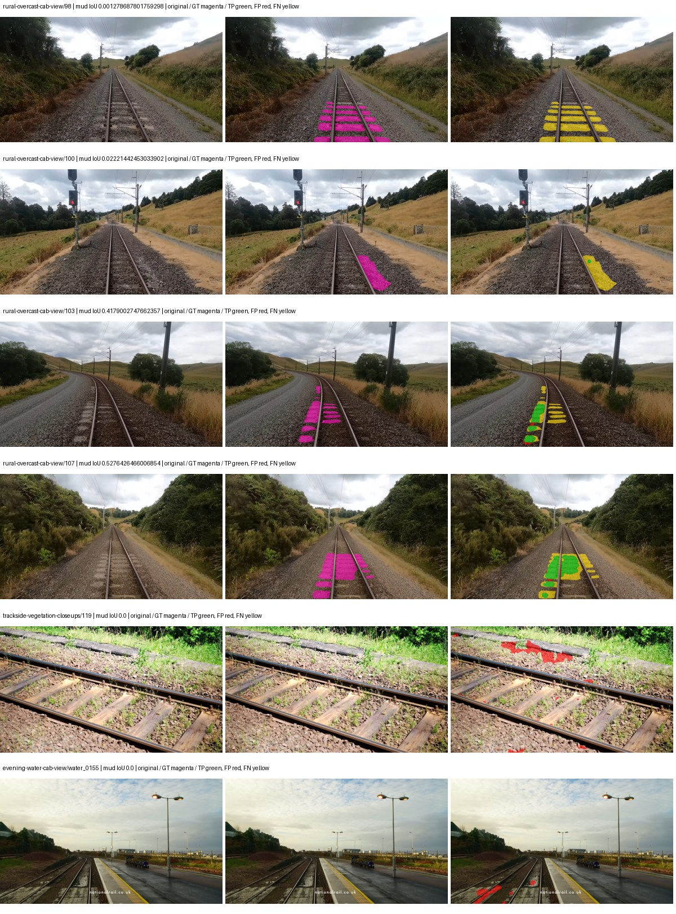
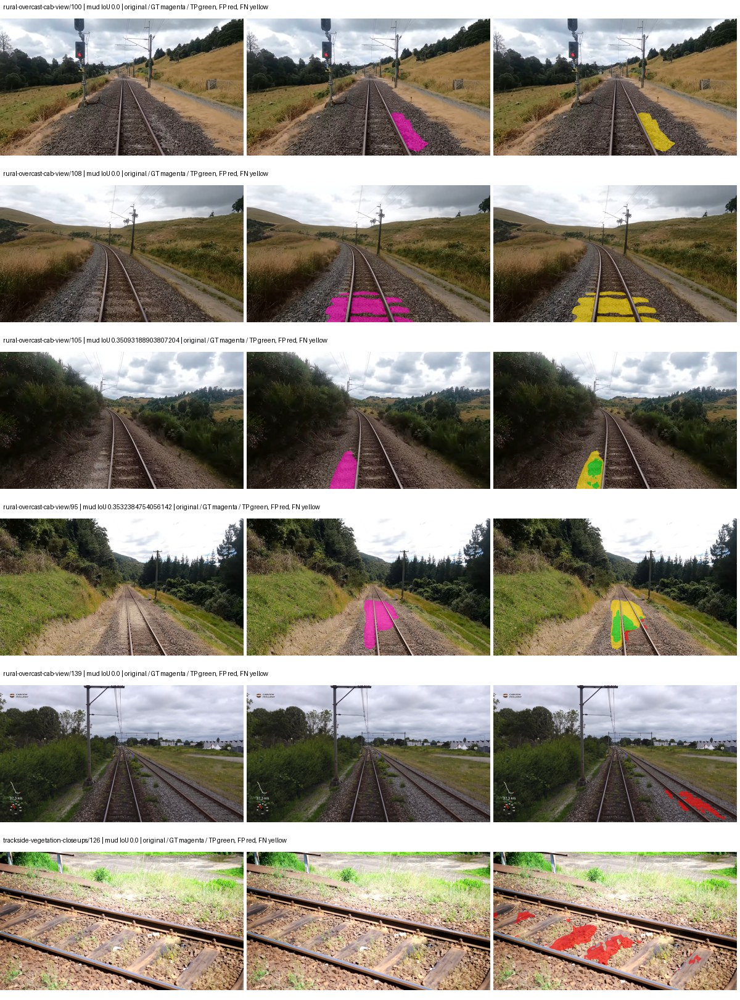

# native_convnext_tiny_uper — paul-test-rtis_v2

[RTIS comparison](../../README.md) · [Full model records](record.json)

Primary selection and early stopping: **mud-pumping validation IoU**. A job is complete only after full statistics and isolated profiling are verified.

| Model | Initialization path | Seed | Status | Steps | Best step | Mud IoU (%) | Mud precision (%) | Mud recall (%) | Final mud IoU (trainer val, %) | mIoU (%) | Fixed GT-class mIoU (%) |
| --- | --- | --- | --- | --- | --- | --- | --- | --- | --- | --- | --- |
| native_convnext_tiny_uper | rtis_only | 0 | completed | 2803 | 1529 | 17.29 | 64.29 | 19.13 | 13.76 | 38.02 | 44.36 |
| native_convnext_tiny_uper | cityscapes_to_rtis | 0 | completed | 1784 | 509 | 5.54 | 16.60 | 7.67 | 2.71 | 29.99 | 34.98 |
| native_convnext_tiny_uper | railsem19_to_rtis | 0 | collecting | 2039 | 764 | 2.14 | 3.51 | 5.23 | 1.96 | 42.50 | 49.58 |
| native_convnext_tiny_uper | cityscapes_to_railsem19_to_rtis | 0 | training | 1449 | — | — | — | — | — | — | — |

Training: 205 images. Validation: 37 images. Test: 50 held out. Seeds: [0]. Seed variation measures optimization variability, not independent-recording uncertainty. Historical source checkpoints stay fixed across adaptation seeds.

Training code: `066afb2626398b7be59d4d19f5a0e4644fd59adc`. Split SHA-256: `18a84c0163a65ded46508bcc904c374e5f33ad8a09b8879e3c8add606e86aa9f`.

## rtis_only — seed 0

Status: **completed**. Started: 2026-09-09T21:33:06.536888+00:00. Finished: 2026-09-09T22:15:05.797028+00:00.

Recipe pretrained initializer: `{"arch": "native", "backbone_path": null, "batch_norm_momentum": null, "checkpoint": null, "classifier_path": null, "drop_path": null, "encoder_name": null, "encoder_weights": null, "head": "unified_head", "head_paths": [], "inactive_parameter_paths": [], "local_files_only": false, "lora_alpha": 32, "lora_dropout": 0.05, "lora_r": 16, "lora_targets": [], "native": {"auxiliary_heads": [], "backbone": {"in_channels": 3, "kind": "timm", "name": "convnext_tiny.fb_in22k_ft_in1k", "out_indices": [0, 1, 2, 3], "weights": "pretrained"}, "head": {"activation": "relu", "channels": 256, "dropout": 0.1, "in_indices": [0, 1, 2, 3], "kind": "uper", "norm": "group", "pool_bins": [1, 2, 3, 6]}, "neck": {"kind": "identity"}, "task": "multiclass"}, "revision": null, "smp_arch": null, "subfolder": null, "trust_remote_code": false, "tuning": "full"}`.

`rtis_only` uses the recipe initializer, which may include pretrained segmentation components. Transfer paths load the exact historical source checkpoint below and reset the classifier; they do not reset all query/decoder features.

Source checkpoint: `Recipe pretrained initialization`.

Config SHA-256: `6798b09c0a857a9fd48c28c586f0d45b3ab748a6aba1cfa4adf7b275155d2f20`. Weights used for validation: `ema`.

### Mud-pumping and aggregate quality

| Metric | Selected checkpoint | Final training validation |
| --- | --- | --- |
| Mud IoU | 17.29 | 13.76 |
| Mud precision | 64.29 | 29.75 |
| Mud recall | 19.13 | 20.38 |
| Mud Dice/F1 | 29.48 | 24.19 |
| mIoU | 38.02 | 37.67 |
| Mean accuracy | 55.42 | 55.36 |
| Mean precision | 53.58 | 51.57 |
| Mean Dice | 48.81 | 48.33 |
| Mean specificity | 99.07 | 99.05 |
| Pixel accuracy | 85.17 | 84.66 |
| Frequency-weighted IoU | 76.31 | 75.90 |
| Fixed GT-present class mIoU | 44.36 | 43.95 |
| Boundary F1 | 45.49 | 45.74 |

The selected checkpoint has independent evaluation evidence. Final values are the trainer's final validation record, not a new independent evaluation. mIoU averages classes with nonzero union, so false positives on absent classes can change its denominator. The fixed GT-class mean is supplementary and excludes absent classes; their false positives remain in the confusion matrix.

### Resource usage and timing

| Measurement | Value |
| --- | --- |
| Peak training VRAM, retained training invocation (GiB) | 10.20 |
| Peak evaluation VRAM (GiB) | 7.42 |
| Retained training invocation wall time (seconds) | 2339.68 |
| Retained training invocation GPU-hours (one GPU) | 0.65 |
| Evaluation wall time (seconds) | 16.70 |
| Full evaluation pipeline images/second | 2.21 |
| Best full-state checkpoint (MiB) | 562.63 |
| Final full-state checkpoint (MiB) | 562.62 |
| Verified periodic checkpoints removed (GiB) | 2.75 |

VRAM uses the recorded allocator high-water mark; it is not total device usage including CUDA context. Resumed jobs' retained training invocation times and peaks are **not whole-campaign totals**. Earlier invocation resource records are not reconstructed here. Evaluation throughput includes loader, sliding-window inference and metrics; it is not model-only latency/FPS. Missing measurements are shown as —, never inferred from another dataset's run.

### Standardized inference performance

Dedicated model-only profiling waits for an idle worker-locked L40S: BF16, batch 1, 1024x1024, 20 warmup and 100 CUDA-event-timed public forwards. It excludes loading, preprocessing, tiling and metrics.

| Status | Parameters | Weight MiB | FPS | p50 ms | p95 ms | Peak reserved GiB |
| --- | --- | --- | --- | --- | --- | --- |
| complete | 36849525 | 140.57 | 75.75 | 13.20 | 13.24 | 1.24 |

```json
{
  "schema_version": 1,
  "model_id": "native_convnext_tiny_uper",
  "measured_at": "2026-09-09T22:15:00+00:00",
  "status": "complete",
  "benchmark_scope": "rtis_selected_checkpoint_model_only",
  "applies_to": [
    "native_convnext_tiny_uper--rtis_only--seed-0"
  ],
  "source": {
    "campaign_git_sha": "066afb2626398b7be59d4d19f5a0e4644fd59adc",
    "git_dirty": false,
    "config_hash": "9d2035d36169",
    "resolved_config": "/data/izadia1/projects/segmentary-runs/paul-test-rtis_v2/seed0-20260909/configs/native_convnext_tiny_uper--rtis_only--seed-0.yaml",
    "config_sha256": "6798b09c0a857a9fd48c28c586f0d45b3ab748a6aba1cfa4adf7b275155d2f20",
    "checkpoint_sha256": "e3f0f7be10ec4e3723519b94ecbb2555746838c04b3ebe24512d6974638f06b0",
    "checkpoint_global_step": 1529,
    "checkpoint_bytes": 589961677,
    "checkpoint_kind": "resume checkpoint with optimizer and EMA state",
    "weights": "ema",
    "measured_checkpoint_job_id": "native_convnext_tiny_uper--rtis_only--seed-0",
    "result_sha256": "17d3f7b9788812da9c77393abeb9683ef408c2fe9ab52130e55569d6a3bcdd24",
    "result_git_sha": "066afb2626398b7be59d4d19f5a0e4644fd59adc",
    "result_stage": "eval:paul-test-rtis:val",
    "result_seed": 0
  },
  "hardware": {
    "gpu_name": "NVIDIA L40S",
    "gpu_uuid": "GPU-84f5ca4d-68db-ae98-d056-40654d859dd9",
    "logical_device": "cuda:0",
    "physical_visibility_token": "0",
    "compute_capability": [
      8,
      9
    ],
    "total_memory_bytes": 47677177856
  },
  "model": {
    "parameter_count": 36849525,
    "trainable_parameter_count": 36849525,
    "resident_parameter_bytes": 147398100,
    "parameter_dtype_counts": {
      "float32": 36849525
    }
  },
  "contract": {
    "backend": "pytorch",
    "precision": "bf16_autocast",
    "batch_size": 1,
    "input_shape_nchw": [
      1,
      3,
      1024,
      1024
    ],
    "warmup_iterations": 20,
    "measured_iterations": 100,
    "timing": "per-forward CUDA events with end-event synchronization",
    "includes_preprocessing": false,
    "includes_data_loader": false,
    "includes_sliding_window": false,
    "input_resident_on_gpu": true,
    "model_only": true,
    "entrypoint": "public model(image) dense-logits forward"
  },
  "measurements": {
    "latency": {
      "p50_ms": 13.201408386230469,
      "p95_ms": 13.241805219650269,
      "mean_ms": 13.201983699798584,
      "minimum_ms": 13.155327796936035,
      "maximum_ms": 13.343744277954102,
      "fps": 75.74619259795455,
      "raw_ms": [
        13.300736427307129,
        13.179903984069824,
        13.174783706665039,
        13.197312355041504,
        13.201408386230469,
        13.211647987365723,
        13.200384140014648,
        13.155327796936035,
        13.202400207519531,
        13.199359893798828,
        13.208576202392578,
        13.197312355041504,
        13.198335647583008,
        13.204480171203613,
        13.181023597717285,
        13.217791557312012,
        13.20956802368164,
        13.206527709960938,
        13.18899154663086,
        13.156415939331055,
        13.206560134887695,
        13.163519859313965,
        13.196288108825684,
        13.202431678771973,
        13.173760414123535,
        13.2608003616333,
        13.202431678771973,
        13.18502426147461,
        13.193216323852539,
        13.221887588500977,
        13.192192077636719,
        13.198335647583008,
        13.211647987365723,
        13.211647987365723,
        13.198335647583008,
        13.204480171203613,
        13.1778564453125,
        13.194239616394043,
        13.343744277954102,
        13.194239616394043,
        13.25055980682373,
        13.161343574523926,
        13.229056358337402,
        13.188096046447754,
        13.1942720413208,
        13.206527709960938,
        13.200384140014648,
        13.171711921691895,
        13.208576202392578,
        13.16864013671875,
        13.178879737854004,
        13.199359893798828,
        13.17683219909668,
        13.239295959472656,
        13.237248420715332,
        13.18502426147461,
        13.211647987365723,
        13.193344116210938,
        13.217791557312012,
        13.19331169128418,
        13.212672233581543,
        13.16966438293457,
        13.20143985748291,
        13.191167831420898,
        13.17683219909668,
        13.211647987365723,
        13.178879737854004,
        13.178879737854004,
        13.181952476501465,
        13.217856407165527,
        13.212800025939941,
        13.209600448608398,
        13.186047554016113,
        13.163519859313965,
        13.214719772338867,
        13.1778564453125,
        13.186047554016113,
        13.222911834716797,
        13.207551956176758,
        13.227007865905762,
        13.190048217773438,
        13.173760414123535,
        13.174912452697754,
        13.205504417419434,
        13.212608337402344,
        13.212672233581543,
        13.241344451904297,
        13.201408386230469,
        13.228032112121582,
        13.17580795288086,
        13.208576202392578,
        13.201408386230469,
        13.210623741149902,
        13.178879737854004,
        13.261823654174805,
        13.204480171203613,
        13.206527709960938,
        13.214624404907227,
        13.215744018554688,
        13.213695526123047
      ],
      "percentile_method": "numpy linear interpolation"
    },
    "peak_reserved_bytes": 1335885824,
    "memory_kind": "pytorch_cuda_allocator_peak_reserved_excluding_context",
    "benchmark_wall_clock_s": 9.179193407297134
  },
  "started_at": "2026-09-09T22:14:51+00:00",
  "finished_at": "2026-09-09T22:15:00+00:00",
  "environment": {
    "hostname": "hdrfs-app-001",
    "python": "3.11.15",
    "platform": "Linux-5.15.0-139-generic-x86_64-with-glibc2.35",
    "torch": "2.11.0+cu128",
    "torch_cuda": "12.8",
    "cudnn": 91900,
    "driver_version": "570.133.20",
    "cuda_available": true,
    "gpu_count": 1,
    "gpu_names": [
      "NVIDIA L40S"
    ],
    "cuda_visible_devices": "0",
    "packages": {
      "segmentary": "0.1.0",
      "torch": "2.11.0+cu128",
      "torchvision": "0.26.0+cu128",
      "transformers": "5.15.0",
      "timm": "1.0.28",
      "segmentation-models-pytorch": "0.5.0",
      "albumentations": "2.0.8",
      "lightning": "2.6.5",
      "numpy": "2.4.4"
    }
  }
}
```

### Per-class validation results

| Class | GT pixels | IoU (%) | Precision (%) | Recall (%) | Dice (%) | Boundary F1 (%) |
| --- | --- | --- | --- | --- | --- | --- |
| car | 29664 | 32.41 | 46.61 | 51.55 | 48.96 | 39.11 |
| construction | 311585 | 49.35 | 57.98 | 76.83 | 66.09 | 61.23 |
| fence | 265137 | 24.60 | 61.67 | 29.04 | 39.49 | 44.08 |
| mud-pumping | 1226250 | 17.29 | 64.29 | 19.13 | 29.48 | 24.98 |
| on-rails | 0 | 0.00 | 0.00 | — | 0.00 | 0.00 |
| person | 0 | 0.00 | 0.00 | — | 0.00 | 0.00 |
| pole | 628038 | 72.79 | 84.30 | 84.20 | 84.25 | 91.07 |
| rail-embedded | 16799 | 36.07 | 86.51 | 38.22 | 53.01 | 44.89 |
| rail-raised | 2969797 | 76.50 | 83.03 | 90.67 | 86.68 | 90.95 |
| rail-track | 6323197 | 39.64 | 63.47 | 51.37 | 56.78 | 56.90 |
| road | 1048831 | 12.77 | 27.06 | 19.48 | 22.65 | 23.18 |
| sidewalk | 1297367 | 16.19 | 30.35 | 25.77 | 27.87 | 19.09 |
| sky | 19121606 | 96.58 | 99.32 | 97.22 | 98.26 | 90.35 |
| standing-water | 95802 | 2.89 | 4.10 | 8.91 | 5.62 | 11.81 |
| terrain | 39239306 | 88.68 | 89.92 | 98.47 | 94.00 | 71.38 |
| trackbed | 10643081 | 57.20 | 69.14 | 76.81 | 72.77 | 58.79 |
| traffic-light | 19510 | 64.71 | 80.62 | 76.63 | 78.58 | 80.67 |
| traffic-sign | 13285 | 38.63 | 56.07 | 55.39 | 55.73 | 58.40 |
| tram-track | 56179 | 27.13 | 38.38 | 48.07 | 42.68 | 15.70 |
| truck | 0 | 0.00 | 0.00 | — | 0.00 | 0.00 |
| vegetation-overgrowth | 5901821 | 45.02 | 82.38 | 49.81 | 62.08 | 72.63 |

### Full-run accounting

| Measurement | Value |
| --- | --- |
| Full GPU-reserved wall seconds, all recorded worker attempts | 2519.27 |
| Full reserved GPU-hours | 0.70 |
| Whole-run timing complete | True |

| Phase | Wall seconds including failed attempts |
| --- | --- |
| training | 2346.56 |
| diagnostics | 126.30 |
| performance | 17.30 |

GPU-reserved time includes model loading, training, validation, collection, profiling, checkpoint I/O and orchestration while the worker owns one GPU. It is not GPU kernel-active time. Phase timings and sampled device memory/power/utilization are retained separately; sampled device memory is not the allocator high-water mark.

### Train/validation and raw/EMA diagnostics

| Checkpoint / weights / split | Images | Mud IoU (%) | Mud precision (%) | Mud recall (%) |
| --- | --- | --- | --- | --- |
| best-auto-train / ema | 205 | 97.71 | 98.77 | 98.91 |
| best-auto-val / ema | 37 | 17.29 | 64.29 | 19.13 |
| best-alternate-val / raw | 37 | 16.53 | 56.86 | 18.90 |
| final-auto-val / ema | 37 | 13.77 | 29.78 | 20.39 |

Train uses the evaluation transform without augmentation. Compare mud train/validation metrics for the same selected weights. Alternate EMA on running-stat BatchNorm is explicitly uncalibrated and is diagnostic only. Score-threshold curves use uncalibrated normalized scores and are pixel-level diagnostics, not event detection rates or a selected deployment operating point.

### Downloadable evidence

- best-auto-train: [per-image.csv](rtis_only--seed-0/best-auto-train/per-image.csv) · [per-image-confusion.json.gz](rtis_only--seed-0/best-auto-train/per-image-confusion.json.gz) · [groups.json](rtis_only--seed-0/best-auto-train/groups.json) · [mud-score-curves.json](rtis_only--seed-0/best-auto-train/mud-score-curves.json)
- best-auto-val: [per-image.csv](rtis_only--seed-0/best-auto-val/per-image.csv) · [per-image-confusion.json.gz](rtis_only--seed-0/best-auto-val/per-image-confusion.json.gz) · [groups.json](rtis_only--seed-0/best-auto-val/groups.json) · [mud-score-curves.json](rtis_only--seed-0/best-auto-val/mud-score-curves.json) · [examples.jpg](rtis_only--seed-0/best-auto-val/examples.jpg)
- best-alternate-val: [per-image.csv](rtis_only--seed-0/best-alternate-val/per-image.csv) · [per-image-confusion.json.gz](rtis_only--seed-0/best-alternate-val/per-image-confusion.json.gz) · [groups.json](rtis_only--seed-0/best-alternate-val/groups.json) · [mud-score-curves.json](rtis_only--seed-0/best-alternate-val/mud-score-curves.json)
- final-auto-val: [per-image.csv](rtis_only--seed-0/final-auto-val/per-image.csv) · [per-image-confusion.json.gz](rtis_only--seed-0/final-auto-val/per-image-confusion.json.gz) · [groups.json](rtis_only--seed-0/final-auto-val/groups.json) · [mud-score-curves.json](rtis_only--seed-0/final-auto-val/mud-score-curves.json)
- resources: [telemetry.csv](rtis_only--seed-0/resources/telemetry.csv)



Examples are two lowest and two highest mud-IoU positive images, plus up to two negative images with the most false-positive mud pixels. They are targeted diagnostic examples, not random samples. Green: true positive; red: false positive; yellow: false negative. Full predictions remain on HDRFS.

### Validation tracking

| Logged step | Overall mIoU (%) | Mud IoU (%) |
| --- | --- | --- |
| 254 | 26.73 | 5.60 |
| 509 | 31.81 | 13.39 |
| 764 | 33.07 | 12.64 |
| 1019 | 36.67 | 13.61 |
| 1274 | 37.32 | 14.11 |
| 1529 | 38.02 | 17.29 |
| 1784 | 37.58 | 14.52 |
| 2038 | 37.66 | 14.11 |
| 2293 | 37.67 | 14.15 |
| 2548 | 37.69 | 13.92 |
| 2803 | 37.67 | 13.76 |

All retained scalar curves, including training loss and per-class IoU, are in record.json. Observed best mud on a curve is not necessarily a retained checkpoint: the pilot saved its selection-metric-best and final checkpoints. Step logging and checkpoint global_step may differ by one.

### Stopping and checkpoint provenance

```json
{
  "stopping": {
    "actual_steps": 2803,
    "maximum_steps": 4000,
    "min_delta": 0.001,
    "monitor": "val_iou/mud-pumping",
    "patience": 5,
    "reason": "validation_plateau"
  },
  "checkpoints": {
    "best": {
      "path": "/data/izadia1/projects/segmentary-runs/paul-test-rtis_v2/seed0-20260909/future-runs/native_convnext_tiny_uper--rtis_only--seed-0_seed0/rtis/best.ckpt",
      "sha256": "e3f0f7be10ec4e3723519b94ecbb2555746838c04b3ebe24512d6974638f06b0",
      "global_step": 1529,
      "bytes": 589961677
    },
    "final": {
      "path": "/data/izadia1/projects/segmentary-runs/paul-test-rtis_v2/seed0-20260909/future-runs/native_convnext_tiny_uper--rtis_only--seed-0_seed0/rtis/last.ckpt",
      "sha256": "68858cb162d2ad3dfa5798fa36da978d281b995220c745e0e20238e22f137d44",
      "global_step": 2803,
      "bytes": 589951245
    }
  },
  "cleanup_error": null
}
```

### Resolved training, initialization and evaluation settings

The optimizer block is the base configuration. Stage LR scales are applied at runtime, and stage warmup is capped at min(base warmup, floor(stage budget / 10), stage budget - 1): 400 steps for this 4,000-step pilot. Model-internal native input grids may differ from augmentation crops (EoMT uses its 640 grid).

```json
{
  "name": "native_convnext_tiny_uper--rtis_only--seed-0",
  "model": {
    "arch": "native",
    "checkpoint": null,
    "tuning": "full",
    "head": "unified_head",
    "lora_r": 16,
    "lora_alpha": 32,
    "lora_dropout": 0.05,
    "lora_targets": [],
    "drop_path": null,
    "revision": null,
    "subfolder": null,
    "local_files_only": false,
    "trust_remote_code": false,
    "backbone_path": null,
    "head_paths": [],
    "classifier_path": null,
    "inactive_parameter_paths": [],
    "smp_arch": null,
    "encoder_name": null,
    "encoder_weights": null,
    "native": {
      "task": "multiclass",
      "backbone": {
        "kind": "timm",
        "name": "convnext_tiny.fb_in22k_ft_in1k",
        "weights": "pretrained",
        "out_indices": [
          0,
          1,
          2,
          3
        ],
        "in_channels": 3
      },
      "neck": {
        "kind": "identity"
      },
      "head": {
        "kind": "uper",
        "in_indices": [
          0,
          1,
          2,
          3
        ],
        "channels": 256,
        "pool_bins": [
          1,
          2,
          3,
          6
        ],
        "dropout": 0.1,
        "norm": "group",
        "activation": "relu"
      },
      "auxiliary_heads": []
    },
    "batch_norm_momentum": null
  },
  "space": "paul-test-rtis",
  "taxonomy_root": "/data/izadia1/projects/segmentary-rtis-fullstats-066afb2/taxonomy",
  "output_root": "/data/izadia1/projects/segmentary-runs/paul-test-rtis_v2/seed0-20260909/future-runs",
  "optim": {
    "backbone_lr": 0.0001,
    "head_lr_mult": 10.0,
    "weight_decay": 0.05,
    "llrd": 1.0,
    "warmup_iters": 1500,
    "warmup_ratio": 1e-06,
    "poly_power": 0.9,
    "min_lr_ratio": 0.0,
    "betas": [
      0.9,
      0.999
    ],
    "grad_clip": 1.0
  },
  "train": {
    "iters": 4000,
    "batch_size": 2,
    "accum": 8,
    "num_workers": 2,
    "precision": "bf16-mixed",
    "ema_decay": 0.9998,
    "val_every": 250,
    "ckpt_every": 500,
    "selection_metric": "val_iou/mud-pumping",
    "early_stopping_patience": 5,
    "early_stopping_min_delta": 0.001,
    "seed": 0,
    "devices": 1
  },
  "eval": {
    "sliding_window": true,
    "window": [
      1024,
      1024
    ],
    "stride": [
      768,
      768
    ],
    "batch_size": 1,
    "num_workers": 2,
    "tta_scales": [],
    "tta_flip": false,
    "threshold": 0.5,
    "boundary_tolerance_frac": 0.0075,
    "save_confusion": true
  },
  "loss": {
    "task": "multiclass",
    "activation": "auto",
    "terms": [],
    "aux": "none",
    "aux_weight": 0.0,
    "ce_weight": 1.0,
    "label_smoothing": 0.0,
    "class_weights": null,
    "query": null
  },
  "aug": {
    "crop": [
      1024,
      1024
    ],
    "scale_min": 0.5,
    "scale_max": 2.0,
    "hflip_p": 0.5,
    "color_jitter_p": 0.5,
    "brightness": 0.25,
    "contrast": 0.25,
    "saturation": 0.25,
    "hue": 0.05
  },
  "stages": [
    {
      "name": "rtis",
      "data": [
        {
          "name": "paul-test-rtis",
          "root": "/data/izadia1/datasets/paul-test-rtis_v2",
          "variant": null,
          "split_file": "splits.json",
          "train_split": "train",
          "val_split": "val",
          "limit": null,
          "loader": "folder",
          "mapping": "paul-test-rtis",
          "loader_options": {
            "require_groups": true
          }
        }
      ],
      "iters": null,
      "lr_scale": 1.0,
      "head_group_lr_scale": 1.0,
      "init_from": "pretrained",
      "reset_head": false,
      "freeze": null,
      "sample_weights": null
    }
  ]
}
```

### Hardware and software provenance

```json
{
  "training": {
    "cuda_available": true,
    "cuda_visible_devices": "0",
    "cudnn": 91900,
    "driver_version": "570.133.20",
    "gpu_count": 1,
    "gpu_names": [
      "NVIDIA L40S"
    ],
    "hostname": "hdrfs-app-001",
    "input_normalization": {
      "channel_order": "rgb",
      "mean": [
        0.485,
        0.456,
        0.406
      ],
      "source": "timm_pretrained_cfg",
      "std": [
        0.229,
        0.224,
        0.225
      ]
    },
    "model_origins": [
      {
        "hf_commit": null,
        "hf_name_or_path": null,
        "module": "backbone",
        "timm_pretrained": {
          "architecture": "convnext_tiny",
          "hf_hub_id": "timm/convnext_tiny.fb_in22k_ft_in1k",
          "tag": "fb_in22k_ft_in1k",
          "url": "https://dl.fbaipublicfiles.com/convnext/convnext_tiny_22k_1k_224.pth"
        }
      },
      {
        "hf_commit": null,
        "hf_name_or_path": null,
        "module": "backbone.model",
        "timm_pretrained": {
          "architecture": "convnext_tiny",
          "hf_hub_id": "timm/convnext_tiny.fb_in22k_ft_in1k",
          "tag": "fb_in22k_ft_in1k",
          "url": "https://dl.fbaipublicfiles.com/convnext/convnext_tiny_22k_1k_224.pth"
        }
      }
    ],
    "model_parameter_count": 36849525,
    "packages": {
      "albumentations": "2.0.8",
      "lightning": "2.6.5",
      "numpy": "2.4.4",
      "segmentary": "0.1.0",
      "segmentation-models-pytorch": "0.5.0",
      "timm": "1.0.28",
      "torch": "2.11.0+cu128",
      "torchvision": "0.26.0+cu128",
      "transformers": "5.15.0"
    },
    "platform": "Linux-5.15.0-139-generic-x86_64-with-glibc2.35",
    "python": "3.11.15",
    "torch": "2.11.0+cu128",
    "torch_cuda": "12.8",
    "trainable_parameter_count": 36849525,
    "training_stop": {
      "actual_steps": 2803,
      "maximum_steps": 4000,
      "min_delta": 0.001,
      "monitor": "val_iou/mud-pumping",
      "patience": 5,
      "reason": "validation_plateau"
    },
    "validation_weights": "ema"
  },
  "evaluation": {
    "cuda_available": true,
    "cuda_visible_devices": "0",
    "cudnn": 91900,
    "driver_version": "570.133.20",
    "gpu_count": 1,
    "gpu_names": [
      "NVIDIA L40S"
    ],
    "hostname": "hdrfs-app-001",
    "input_normalization": {
      "channel_order": "rgb",
      "mean": [
        0.485,
        0.456,
        0.406
      ],
      "source": "timm_pretrained_cfg",
      "std": [
        0.229,
        0.224,
        0.225
      ]
    },
    "packages": {
      "albumentations": "2.0.8",
      "lightning": "2.6.5",
      "numpy": "2.4.4",
      "segmentary": "0.1.0",
      "segmentation-models-pytorch": "0.5.0",
      "timm": "1.0.28",
      "torch": "2.11.0+cu128",
      "torchvision": "0.26.0+cu128",
      "transformers": "5.15.0"
    },
    "platform": "Linux-5.15.0-139-generic-x86_64-with-glibc2.35",
    "python": "3.11.15",
    "torch": "2.11.0+cu128",
    "torch_cuda": "12.8"
  }
}
```

## cityscapes_to_rtis — seed 0

Status: **completed**. Started: 2026-09-09T21:37:45.058372+00:00. Finished: 2026-09-09T22:05:16.732567+00:00.

Recipe pretrained initializer: `{"arch": "native", "backbone_path": null, "batch_norm_momentum": null, "checkpoint": null, "classifier_path": null, "drop_path": null, "encoder_name": null, "encoder_weights": null, "head": "unified_head", "head_paths": [], "inactive_parameter_paths": [], "local_files_only": false, "lora_alpha": 32, "lora_dropout": 0.05, "lora_r": 16, "lora_targets": [], "native": {"auxiliary_heads": [], "backbone": {"in_channels": 3, "kind": "timm", "name": "convnext_tiny.fb_in22k_ft_in1k", "out_indices": [0, 1, 2, 3], "weights": "pretrained"}, "head": {"activation": "relu", "channels": 256, "dropout": 0.1, "in_indices": [0, 1, 2, 3], "kind": "uper", "norm": "group", "pool_bins": [1, 2, 3, 6]}, "neck": {"kind": "identity"}, "task": "multiclass"}, "revision": null, "smp_arch": null, "subfolder": null, "trust_remote_code": false, "tuning": "full"}`.

`rtis_only` uses the recipe initializer, which may include pretrained segmentation components. Transfer paths load the exact historical source checkpoint below and reset the classifier; they do not reset all query/decoder features.

Source checkpoint: `{'name': 'native_convnext_tiny_uper--cityscapes--seed-0', 'model': 'native_convnext_tiny_uper', 'protocol': 'cityscapes', 'config': '/data/izadia1/projects/segmentary-runs/all-model-city-rail-seed0-rail20-b9eb3e1/accepted/native_convnext_tiny_uper--cityscapes--seed-0/resolved-config.yaml', 'checkpoint': '/data/izadia1/projects/segmentary-runs/all-model-city-rail-seed0-a7c0b67/jobs/native_convnext_tiny_uper--cityscapes--seed-0/attempt-001/train/native_convnext_tiny_uper--cityscapes_seed0/cityscapes/last.ckpt', 'recorded_sha256': '5b371ccbb1c2f1ad354d205d07f867135039dd82de6fffac6c27c76b1cbc88ea', 'exists': True}`.

Config SHA-256: `3e934d1190d9e766f8738b7db3d88848c7c7852f842605f4bc31e77f696e7484`. Weights used for validation: `ema`.

### Mud-pumping and aggregate quality

| Metric | Selected checkpoint | Final training validation |
| --- | --- | --- |
| Mud IoU | 5.54 | 2.71 |
| Mud precision | 16.60 | 7.64 |
| Mud recall | 7.67 | 4.03 |
| Mud Dice/F1 | 10.49 | 5.28 |
| mIoU | 29.99 | 34.62 |
| Mean accuracy | 45.98 | 52.26 |
| Mean precision | 45.66 | 47.44 |
| Mean Dice | 39.01 | 44.36 |
| Mean specificity | 98.87 | 98.87 |
| Pixel accuracy | 82.20 | 81.91 |
| Frequency-weighted IoU | 71.88 | 71.96 |
| Fixed GT-present class mIoU | 34.98 | 40.39 |
| Boundary F1 | 36.84 | 40.97 |

The selected checkpoint has independent evaluation evidence. Final values are the trainer's final validation record, not a new independent evaluation. mIoU averages classes with nonzero union, so false positives on absent classes can change its denominator. The fixed GT-class mean is supplementary and excludes absent classes; their false positives remain in the confusion matrix.

### Resource usage and timing

| Measurement | Value |
| --- | --- |
| Peak training VRAM, retained training invocation (GiB) | 10.20 |
| Peak evaluation VRAM (GiB) | 7.42 |
| Retained training invocation wall time (seconds) | 1477.61 |
| Retained training invocation GPU-hours (one GPU) | 0.41 |
| Evaluation wall time (seconds) | 15.93 |
| Full evaluation pipeline images/second | 2.32 |
| Best full-state checkpoint (MiB) | 562.63 |
| Final full-state checkpoint (MiB) | 562.62 |
| Verified periodic checkpoints removed (GiB) | 1.65 |

VRAM uses the recorded allocator high-water mark; it is not total device usage including CUDA context. Resumed jobs' retained training invocation times and peaks are **not whole-campaign totals**. Earlier invocation resource records are not reconstructed here. Evaluation throughput includes loader, sliding-window inference and metrics; it is not model-only latency/FPS. Missing measurements are shown as —, never inferred from another dataset's run.

### Standardized inference performance

Dedicated model-only profiling waits for an idle worker-locked L40S: BF16, batch 1, 1024x1024, 20 warmup and 100 CUDA-event-timed public forwards. It excludes loading, preprocessing, tiling and metrics.

| Status | Parameters | Weight MiB | FPS | p50 ms | p95 ms | Peak reserved GiB |
| --- | --- | --- | --- | --- | --- | --- |
| complete | 36849525 | 140.57 | 76.53 | 13.06 | 13.11 | 1.24 |

```json
{
  "schema_version": 1,
  "model_id": "native_convnext_tiny_uper",
  "measured_at": "2026-09-09T22:05:12+00:00",
  "status": "complete",
  "benchmark_scope": "rtis_selected_checkpoint_model_only",
  "applies_to": [
    "native_convnext_tiny_uper--cityscapes_to_rtis--seed-0"
  ],
  "source": {
    "campaign_git_sha": "066afb2626398b7be59d4d19f5a0e4644fd59adc",
    "git_dirty": false,
    "config_hash": "849e765ae7e9",
    "resolved_config": "/data/izadia1/projects/segmentary-runs/paul-test-rtis_v2/seed0-20260909/configs/native_convnext_tiny_uper--cityscapes_to_rtis--seed-0.yaml",
    "config_sha256": "3e934d1190d9e766f8738b7db3d88848c7c7852f842605f4bc31e77f696e7484",
    "checkpoint_sha256": "eddfc12a4371651237a6c1739bb1418a5f0b0d03a3138724add84faf32fb077d",
    "checkpoint_global_step": 509,
    "checkpoint_bytes": 589961677,
    "checkpoint_kind": "resume checkpoint with optimizer and EMA state",
    "weights": "ema",
    "measured_checkpoint_job_id": "native_convnext_tiny_uper--cityscapes_to_rtis--seed-0",
    "result_sha256": "fb2eafcef0567a227b0b18dd113f460c0dc9c93a345f3dae159b80139151dd28",
    "result_git_sha": "066afb2626398b7be59d4d19f5a0e4644fd59adc",
    "result_stage": "eval:paul-test-rtis:val",
    "result_seed": 0
  },
  "hardware": {
    "gpu_name": "NVIDIA L40S",
    "gpu_uuid": "GPU-a5ad49e5-0536-5229-ba8a-f8a902808f53",
    "logical_device": "cuda:0",
    "physical_visibility_token": "7",
    "compute_capability": [
      8,
      9
    ],
    "total_memory_bytes": 47677177856
  },
  "model": {
    "parameter_count": 36849525,
    "trainable_parameter_count": 36849525,
    "resident_parameter_bytes": 147398100,
    "parameter_dtype_counts": {
      "float32": 36849525
    }
  },
  "contract": {
    "backend": "pytorch",
    "precision": "bf16_autocast",
    "batch_size": 1,
    "input_shape_nchw": [
      1,
      3,
      1024,
      1024
    ],
    "warmup_iterations": 20,
    "measured_iterations": 100,
    "timing": "per-forward CUDA events with end-event synchronization",
    "includes_preprocessing": false,
    "includes_data_loader": false,
    "includes_sliding_window": false,
    "input_resident_on_gpu": true,
    "model_only": true,
    "entrypoint": "public model(image) dense-logits forward"
  },
  "measurements": {
    "latency": {
      "p50_ms": 13.06060791015625,
      "p95_ms": 13.110272407531738,
      "mean_ms": 13.066340475082397,
      "minimum_ms": 13.026304244995117,
      "maximum_ms": 13.25875186920166,
      "fps": 76.53252277537135,
      "raw_ms": [
        13.128704071044922,
        13.05395221710205,
        13.071359634399414,
        13.031423568725586,
        13.030400276184082,
        13.090815544128418,
        13.102080345153809,
        13.055999755859375,
        13.046784400939941,
        13.039615631103516,
        13.063167572021484,
        13.05292797088623,
        13.046784400939941,
        13.06822395324707,
        13.064191818237305,
        13.030400276184082,
        13.029376029968262,
        13.04371166229248,
        13.049856185913086,
        13.071359634399414,
        13.066240310668945,
        13.032447814941406,
        13.06931209564209,
        13.0447359085083,
        13.049856185913086,
        13.047807693481445,
        13.054976463317871,
        13.06828784942627,
        13.0447359085083,
        13.05292797088623,
        13.100031852722168,
        13.090815544128418,
        13.08672046661377,
        13.048831939697266,
        13.054976463317871,
        13.027327537536621,
        13.088768005371094,
        13.080575942993164,
        13.08672046661377,
        13.055999755859375,
        13.07033634185791,
        13.04371166229248,
        13.058048248291016,
        13.06009578704834,
        13.090815544128418,
        13.038592338562012,
        13.059040069580078,
        13.049856185913086,
        13.109312057495117,
        13.082592010498047,
        13.06112003326416,
        13.066240310668945,
        13.048831939697266,
        13.056991577148438,
        13.033439636230469,
        13.08569622039795,
        13.066240310668945,
        13.026304244995117,
        13.050880432128906,
        13.075455665588379,
        13.055999755859375,
        13.049856185913086,
        13.08569622039795,
        13.054976463317871,
        13.04371166229248,
        13.07750415802002,
        13.074432373046875,
        13.184991836547852,
        13.055999755859375,
        13.057024002075195,
        13.047807693481445,
        13.034496307373047,
        13.095935821533203,
        13.05395221710205,
        13.06828784942627,
        13.083647727966309,
        13.110272407531738,
        13.063167572021484,
        13.08569622039795,
        13.042688369750977,
        13.083647727966309,
        13.06214427947998,
        13.25875186920166,
        13.036543846130371,
        13.096927642822266,
        13.0764799118042,
        13.06112003326416,
        13.047807693481445,
        13.06828784942627,
        13.040639877319336,
        13.05395221710205,
        13.071359634399414,
        13.118464469909668,
        13.071359634399414,
        13.110272407531738,
        13.073408126831055,
        13.040639877319336,
        13.046784400939941,
        13.06931209564209,
        13.063167572021484
      ],
      "percentile_method": "numpy linear interpolation"
    },
    "peak_reserved_bytes": 1335885824,
    "memory_kind": "pytorch_cuda_allocator_peak_reserved_excluding_context",
    "benchmark_wall_clock_s": 9.019978769123554
  },
  "started_at": "2026-09-09T22:05:03+00:00",
  "finished_at": "2026-09-09T22:05:12+00:00",
  "environment": {
    "hostname": "hdrfs-app-001",
    "python": "3.11.15",
    "platform": "Linux-5.15.0-139-generic-x86_64-with-glibc2.35",
    "torch": "2.11.0+cu128",
    "torch_cuda": "12.8",
    "cudnn": 91900,
    "driver_version": "570.133.20",
    "cuda_available": true,
    "gpu_count": 1,
    "gpu_names": [
      "NVIDIA L40S"
    ],
    "cuda_visible_devices": "7",
    "packages": {
      "segmentary": "0.1.0",
      "torch": "2.11.0+cu128",
      "torchvision": "0.26.0+cu128",
      "transformers": "5.15.0",
      "timm": "1.0.28",
      "segmentation-models-pytorch": "0.5.0",
      "albumentations": "2.0.8",
      "lightning": "2.6.5",
      "numpy": "2.4.4"
    }
  }
}
```

### Per-class validation results

| Class | GT pixels | IoU (%) | Precision (%) | Recall (%) | Dice (%) | Boundary F1 (%) |
| --- | --- | --- | --- | --- | --- | --- |
| car | 29664 | 0.00 | 0.00 | 0.00 | 0.00 | 0.00 |
| construction | 311585 | 29.88 | 32.06 | 81.49 | 46.01 | 37.87 |
| fence | 265137 | 32.34 | 54.75 | 44.13 | 48.87 | 43.97 |
| mud-pumping | 1226250 | 5.54 | 16.60 | 7.67 | 10.49 | 14.37 |
| on-rails | 0 | 0.00 | 0.00 | — | 0.00 | 0.00 |
| person | 0 | 0.00 | 0.00 | — | 0.00 | 0.00 |
| pole | 628038 | 72.12 | 81.47 | 86.28 | 83.80 | 90.38 |
| rail-embedded | 16799 | 2.09 | 41.40 | 2.15 | 4.09 | 17.55 |
| rail-raised | 2969797 | 71.77 | 81.51 | 85.74 | 83.57 | 87.63 |
| rail-track | 6323197 | 39.26 | 58.27 | 54.62 | 56.39 | 54.31 |
| road | 1048831 | 3.03 | 9.98 | 4.16 | 5.87 | 12.55 |
| sidewalk | 1297367 | 21.12 | 62.69 | 24.16 | 34.88 | 14.79 |
| sky | 19121606 | 90.79 | 99.49 | 91.22 | 95.17 | 79.83 |
| standing-water | 95802 | 5.65 | 6.72 | 26.16 | 10.69 | 20.68 |
| terrain | 39239306 | 84.05 | 87.26 | 95.81 | 91.34 | 61.22 |
| trackbed | 10643081 | 56.95 | 65.86 | 80.79 | 72.57 | 55.16 |
| traffic-light | 19510 | 17.90 | 78.95 | 18.80 | 30.36 | 41.46 |
| traffic-sign | 13285 | 40.80 | 64.75 | 52.46 | 57.96 | 62.08 |
| tram-track | 56179 | 21.33 | 37.04 | 33.47 | 35.16 | 14.29 |
| truck | 0 | 0.00 | 0.00 | — | 0.00 | 0.00 |
| vegetation-overgrowth | 5901821 | 35.10 | 80.09 | 38.46 | 51.96 | 65.57 |

### Full-run accounting

| Measurement | Value |
| --- | --- |
| Full GPU-reserved wall seconds, all recorded worker attempts | 1652.78 |
| Full reserved GPU-hours | 0.46 |
| Whole-run timing complete | True |

| Phase | Wall seconds including failed attempts |
| --- | --- |
| training | 1484.40 |
| diagnostics | 124.03 |
| performance | 16.50 |

GPU-reserved time includes model loading, training, validation, collection, profiling, checkpoint I/O and orchestration while the worker owns one GPU. It is not GPU kernel-active time. Phase timings and sampled device memory/power/utilization are retained separately; sampled device memory is not the allocator high-water mark.

### Train/validation and raw/EMA diagnostics

| Checkpoint / weights / split | Images | Mud IoU (%) | Mud precision (%) | Mud recall (%) |
| --- | --- | --- | --- | --- |
| best-auto-train / ema | 205 | 94.22 | 97.02 | 97.03 |
| best-auto-val / ema | 37 | 5.54 | 16.60 | 7.67 |
| best-alternate-val / raw | 37 | 4.60 | 8.99 | 8.59 |
| final-auto-val / ema | 37 | 2.71 | 7.65 | 4.03 |

Train uses the evaluation transform without augmentation. Compare mud train/validation metrics for the same selected weights. Alternate EMA on running-stat BatchNorm is explicitly uncalibrated and is diagnostic only. Score-threshold curves use uncalibrated normalized scores and are pixel-level diagnostics, not event detection rates or a selected deployment operating point.

### Downloadable evidence

- best-auto-train: [per-image.csv](cityscapes_to_rtis--seed-0/best-auto-train/per-image.csv) · [per-image-confusion.json.gz](cityscapes_to_rtis--seed-0/best-auto-train/per-image-confusion.json.gz) · [groups.json](cityscapes_to_rtis--seed-0/best-auto-train/groups.json) · [mud-score-curves.json](cityscapes_to_rtis--seed-0/best-auto-train/mud-score-curves.json)
- best-auto-val: [per-image.csv](cityscapes_to_rtis--seed-0/best-auto-val/per-image.csv) · [per-image-confusion.json.gz](cityscapes_to_rtis--seed-0/best-auto-val/per-image-confusion.json.gz) · [groups.json](cityscapes_to_rtis--seed-0/best-auto-val/groups.json) · [mud-score-curves.json](cityscapes_to_rtis--seed-0/best-auto-val/mud-score-curves.json) · [examples.jpg](cityscapes_to_rtis--seed-0/best-auto-val/examples.jpg)
- best-alternate-val: [per-image.csv](cityscapes_to_rtis--seed-0/best-alternate-val/per-image.csv) · [per-image-confusion.json.gz](cityscapes_to_rtis--seed-0/best-alternate-val/per-image-confusion.json.gz) · [groups.json](cityscapes_to_rtis--seed-0/best-alternate-val/groups.json) · [mud-score-curves.json](cityscapes_to_rtis--seed-0/best-alternate-val/mud-score-curves.json)
- final-auto-val: [per-image.csv](cityscapes_to_rtis--seed-0/final-auto-val/per-image.csv) · [per-image-confusion.json.gz](cityscapes_to_rtis--seed-0/final-auto-val/per-image-confusion.json.gz) · [groups.json](cityscapes_to_rtis--seed-0/final-auto-val/groups.json) · [mud-score-curves.json](cityscapes_to_rtis--seed-0/final-auto-val/mud-score-curves.json)
- resources: [telemetry.csv](cityscapes_to_rtis--seed-0/resources/telemetry.csv)



Examples are two lowest and two highest mud-IoU positive images, plus up to two negative images with the most false-positive mud pixels. They are targeted diagnostic examples, not random samples. Green: true positive; red: false positive; yellow: false negative. Full predictions remain on HDRFS.

### Validation tracking

| Logged step | Overall mIoU (%) | Mud IoU (%) |
| --- | --- | --- |
| 254 | 23.92 | 0.96 |
| 509 | 29.99 | 5.53 |
| 764 | 33.48 | 3.06 |
| 1019 | 33.80 | 3.32 |
| 1274 | 34.68 | 2.72 |
| 1529 | 34.55 | 2.68 |
| 1784 | 34.62 | 2.71 |

All retained scalar curves, including training loss and per-class IoU, are in record.json. Observed best mud on a curve is not necessarily a retained checkpoint: the pilot saved its selection-metric-best and final checkpoints. Step logging and checkpoint global_step may differ by one.

### Stopping and checkpoint provenance

```json
{
  "stopping": {
    "actual_steps": 1784,
    "maximum_steps": 4000,
    "min_delta": 0.001,
    "monitor": "val_iou/mud-pumping",
    "patience": 5,
    "reason": "validation_plateau"
  },
  "checkpoints": {
    "best": {
      "path": "/data/izadia1/projects/segmentary-runs/paul-test-rtis_v2/seed0-20260909/future-runs/native_convnext_tiny_uper--cityscapes_to_rtis--seed-0_seed0/rtis/best.ckpt",
      "sha256": "eddfc12a4371651237a6c1739bb1418a5f0b0d03a3138724add84faf32fb077d",
      "global_step": 509,
      "bytes": 589961677
    },
    "final": {
      "path": "/data/izadia1/projects/segmentary-runs/paul-test-rtis_v2/seed0-20260909/future-runs/native_convnext_tiny_uper--cityscapes_to_rtis--seed-0_seed0/rtis/last.ckpt",
      "sha256": "5bb9b6ed5fa10398a46297ffb3ff8c6f16a9d604e3a8a332b21d88cdfb2e322b",
      "global_step": 1784,
      "bytes": 589951309
    }
  },
  "cleanup_error": null
}
```

### Resolved training, initialization and evaluation settings

The optimizer block is the base configuration. Stage LR scales are applied at runtime, and stage warmup is capped at min(base warmup, floor(stage budget / 10), stage budget - 1): 400 steps for this 4,000-step pilot. Model-internal native input grids may differ from augmentation crops (EoMT uses its 640 grid).

```json
{
  "name": "native_convnext_tiny_uper--cityscapes_to_rtis--seed-0",
  "model": {
    "arch": "native",
    "checkpoint": null,
    "tuning": "full",
    "head": "unified_head",
    "lora_r": 16,
    "lora_alpha": 32,
    "lora_dropout": 0.05,
    "lora_targets": [],
    "drop_path": null,
    "revision": null,
    "subfolder": null,
    "local_files_only": false,
    "trust_remote_code": false,
    "backbone_path": null,
    "head_paths": [],
    "classifier_path": null,
    "inactive_parameter_paths": [],
    "smp_arch": null,
    "encoder_name": null,
    "encoder_weights": null,
    "native": {
      "task": "multiclass",
      "backbone": {
        "kind": "timm",
        "name": "convnext_tiny.fb_in22k_ft_in1k",
        "weights": "pretrained",
        "out_indices": [
          0,
          1,
          2,
          3
        ],
        "in_channels": 3
      },
      "neck": {
        "kind": "identity"
      },
      "head": {
        "kind": "uper",
        "in_indices": [
          0,
          1,
          2,
          3
        ],
        "channels": 256,
        "pool_bins": [
          1,
          2,
          3,
          6
        ],
        "dropout": 0.1,
        "norm": "group",
        "activation": "relu"
      },
      "auxiliary_heads": []
    },
    "batch_norm_momentum": null
  },
  "space": "paul-test-rtis",
  "taxonomy_root": "/data/izadia1/projects/segmentary-rtis-fullstats-066afb2/taxonomy",
  "output_root": "/data/izadia1/projects/segmentary-runs/paul-test-rtis_v2/seed0-20260909/future-runs",
  "optim": {
    "backbone_lr": 0.0001,
    "head_lr_mult": 10.0,
    "weight_decay": 0.05,
    "llrd": 1.0,
    "warmup_iters": 1500,
    "warmup_ratio": 1e-06,
    "poly_power": 0.9,
    "min_lr_ratio": 0.0,
    "betas": [
      0.9,
      0.999
    ],
    "grad_clip": 1.0
  },
  "train": {
    "iters": 4000,
    "batch_size": 2,
    "accum": 8,
    "num_workers": 2,
    "precision": "bf16-mixed",
    "ema_decay": 0.9998,
    "val_every": 250,
    "ckpt_every": 500,
    "selection_metric": "val_iou/mud-pumping",
    "early_stopping_patience": 5,
    "early_stopping_min_delta": 0.001,
    "seed": 0,
    "devices": 1
  },
  "eval": {
    "sliding_window": true,
    "window": [
      1024,
      1024
    ],
    "stride": [
      768,
      768
    ],
    "batch_size": 1,
    "num_workers": 2,
    "tta_scales": [],
    "tta_flip": false,
    "threshold": 0.5,
    "boundary_tolerance_frac": 0.0075,
    "save_confusion": true
  },
  "loss": {
    "task": "multiclass",
    "activation": "auto",
    "terms": [],
    "aux": "none",
    "aux_weight": 0.0,
    "ce_weight": 1.0,
    "label_smoothing": 0.0,
    "class_weights": null,
    "query": null
  },
  "aug": {
    "crop": [
      1024,
      1024
    ],
    "scale_min": 0.5,
    "scale_max": 2.0,
    "hflip_p": 0.5,
    "color_jitter_p": 0.5,
    "brightness": 0.25,
    "contrast": 0.25,
    "saturation": 0.25,
    "hue": 0.05
  },
  "stages": [
    {
      "name": "rtis",
      "data": [
        {
          "name": "paul-test-rtis",
          "root": "/data/izadia1/datasets/paul-test-rtis_v2",
          "variant": null,
          "split_file": "splits.json",
          "train_split": "train",
          "val_split": "val",
          "limit": null,
          "loader": "folder",
          "mapping": "paul-test-rtis",
          "loader_options": {
            "require_groups": true
          }
        }
      ],
      "iters": null,
      "lr_scale": 0.1,
      "head_group_lr_scale": 1.0,
      "init_from": "/data/izadia1/projects/segmentary-runs/all-model-city-rail-seed0-a7c0b67/jobs/native_convnext_tiny_uper--cityscapes--seed-0/attempt-001/train/native_convnext_tiny_uper--cityscapes_seed0/cityscapes/last.ckpt",
      "reset_head": true,
      "freeze": null,
      "sample_weights": null
    }
  ]
}
```

### Hardware and software provenance

```json
{
  "training": {
    "cuda_available": true,
    "cuda_visible_devices": "7",
    "cudnn": 91900,
    "driver_version": "570.133.20",
    "gpu_count": 1,
    "gpu_names": [
      "NVIDIA L40S"
    ],
    "hostname": "hdrfs-app-001",
    "input_normalization": {
      "channel_order": "rgb",
      "mean": [
        0.485,
        0.456,
        0.406
      ],
      "source": "timm_pretrained_cfg",
      "std": [
        0.229,
        0.224,
        0.225
      ]
    },
    "model_origins": [
      {
        "hf_commit": null,
        "hf_name_or_path": null,
        "module": "backbone",
        "timm_pretrained": {
          "architecture": "convnext_tiny",
          "hf_hub_id": "timm/convnext_tiny.fb_in22k_ft_in1k",
          "tag": "fb_in22k_ft_in1k",
          "url": "https://dl.fbaipublicfiles.com/convnext/convnext_tiny_22k_1k_224.pth"
        }
      },
      {
        "hf_commit": null,
        "hf_name_or_path": null,
        "module": "backbone.model",
        "timm_pretrained": {
          "architecture": "convnext_tiny",
          "hf_hub_id": "timm/convnext_tiny.fb_in22k_ft_in1k",
          "tag": "fb_in22k_ft_in1k",
          "url": "https://dl.fbaipublicfiles.com/convnext/convnext_tiny_22k_1k_224.pth"
        }
      }
    ],
    "model_parameter_count": 36849525,
    "packages": {
      "albumentations": "2.0.8",
      "lightning": "2.6.5",
      "numpy": "2.4.4",
      "segmentary": "0.1.0",
      "segmentation-models-pytorch": "0.5.0",
      "timm": "1.0.28",
      "torch": "2.11.0+cu128",
      "torchvision": "0.26.0+cu128",
      "transformers": "5.15.0"
    },
    "platform": "Linux-5.15.0-139-generic-x86_64-with-glibc2.35",
    "python": "3.11.15",
    "torch": "2.11.0+cu128",
    "torch_cuda": "12.8",
    "trainable_parameter_count": 36849525,
    "training_stop": {
      "actual_steps": 1784,
      "maximum_steps": 4000,
      "min_delta": 0.001,
      "monitor": "val_iou/mud-pumping",
      "patience": 5,
      "reason": "validation_plateau"
    },
    "validation_weights": "ema"
  },
  "evaluation": {
    "cuda_available": true,
    "cuda_visible_devices": "7",
    "cudnn": 91900,
    "driver_version": "570.133.20",
    "gpu_count": 1,
    "gpu_names": [
      "NVIDIA L40S"
    ],
    "hostname": "hdrfs-app-001",
    "input_normalization": {
      "channel_order": "rgb",
      "mean": [
        0.485,
        0.456,
        0.406
      ],
      "source": "timm_pretrained_cfg",
      "std": [
        0.229,
        0.224,
        0.225
      ]
    },
    "packages": {
      "albumentations": "2.0.8",
      "lightning": "2.6.5",
      "numpy": "2.4.4",
      "segmentary": "0.1.0",
      "segmentation-models-pytorch": "0.5.0",
      "timm": "1.0.28",
      "torch": "2.11.0+cu128",
      "torchvision": "0.26.0+cu128",
      "transformers": "5.15.0"
    },
    "platform": "Linux-5.15.0-139-generic-x86_64-with-glibc2.35",
    "python": "3.11.15",
    "torch": "2.11.0+cu128",
    "torch_cuda": "12.8"
  }
}
```

## railsem19_to_rtis — seed 0

Status: **collecting**. Started: 2026-09-09T21:56:05.625330+00:00. Finished: —.

Recipe pretrained initializer: `{"arch": "native", "backbone_path": null, "batch_norm_momentum": null, "checkpoint": null, "classifier_path": null, "drop_path": null, "encoder_name": null, "encoder_weights": null, "head": "unified_head", "head_paths": [], "inactive_parameter_paths": [], "local_files_only": false, "lora_alpha": 32, "lora_dropout": 0.05, "lora_r": 16, "lora_targets": [], "native": {"auxiliary_heads": [], "backbone": {"in_channels": 3, "kind": "timm", "name": "convnext_tiny.fb_in22k_ft_in1k", "out_indices": [0, 1, 2, 3], "weights": "pretrained"}, "head": {"activation": "relu", "channels": 256, "dropout": 0.1, "in_indices": [0, 1, 2, 3], "kind": "uper", "norm": "group", "pool_bins": [1, 2, 3, 6]}, "neck": {"kind": "identity"}, "task": "multiclass"}, "revision": null, "smp_arch": null, "subfolder": null, "trust_remote_code": false, "tuning": "full"}`.

`rtis_only` uses the recipe initializer, which may include pretrained segmentation components. Transfer paths load the exact historical source checkpoint below and reset the classifier; they do not reset all query/decoder features.

Source checkpoint: `{'name': 'native_convnext_tiny_uper--railsem19--seed-0', 'model': 'native_convnext_tiny_uper', 'protocol': 'railsem19', 'config': '/data/izadia1/projects/segmentary-runs/all-model-city-rail-seed0-rail20-b9eb3e1/jobs/native_convnext_tiny_uper--railsem19--seed-0/attempt-001/resolved-config.yaml', 'checkpoint': '/data/izadia1/projects/segmentary-runs/all-model-city-rail-seed0-rail20-b9eb3e1/jobs/native_convnext_tiny_uper--railsem19--seed-0/attempt-001/train/native_convnext_tiny_uper--railsem19_seed0/railsem19/last.ckpt', 'recorded_sha256': 'c9d8b86e7010fbe8b3f53c0683701f659ed08d6326c16e1de022bfdb51de7a79', 'exists': True}`.

Config SHA-256: `9aca3a645e224f99300604c80095842a9c3d92dbfb36c9f1bed63b7ec684e4f4`. Weights used for validation: `ema`.

### Mud-pumping and aggregate quality

| Metric | Selected checkpoint | Final training validation |
| --- | --- | --- |
| Mud IoU | 2.14 | 1.96 |
| Mud precision | 3.51 | 3.08 |
| Mud recall | 5.23 | 5.08 |
| Mud Dice/F1 | 4.20 | 3.84 |
| mIoU | 42.50 | 41.63 |
| Mean accuracy | 58.38 | 57.18 |
| Mean precision | 58.08 | 57.59 |
| Mean Dice | 52.30 | 51.50 |
| Mean specificity | 99.06 | 99.05 |
| Pixel accuracy | 85.04 | 84.89 |
| Frequency-weighted IoU | 76.30 | 76.34 |
| Fixed GT-present class mIoU | 49.58 | 48.56 |
| Boundary F1 | 51.65 | 50.94 |

The selected checkpoint has independent evaluation evidence. Final values are the trainer's final validation record, not a new independent evaluation. mIoU averages classes with nonzero union, so false positives on absent classes can change its denominator. The fixed GT-class mean is supplementary and excludes absent classes; their false positives remain in the confusion matrix.

### Resource usage and timing

| Measurement | Value |
| --- | --- |
| Peak training VRAM, retained training invocation (GiB) | 10.20 |
| Peak evaluation VRAM (GiB) | 7.42 |
| Retained training invocation wall time (seconds) | 1691.98 |
| Retained training invocation GPU-hours (one GPU) | 0.47 |
| Evaluation wall time (seconds) | 16.64 |
| Full evaluation pipeline images/second | 2.22 |
| Best full-state checkpoint (MiB) | 562.63 |
| Final full-state checkpoint (MiB) | 562.62 |
| Verified periodic checkpoints removed (GiB) | — |

VRAM uses the recorded allocator high-water mark; it is not total device usage including CUDA context. Resumed jobs' retained training invocation times and peaks are **not whole-campaign totals**. Earlier invocation resource records are not reconstructed here. Evaluation throughput includes loader, sliding-window inference and metrics; it is not model-only latency/FPS. Missing measurements are shown as —, never inferred from another dataset's run.

### Standardized inference performance

Dedicated model-only profiling waits for an idle worker-locked L40S: BF16, batch 1, 1024x1024, 20 warmup and 100 CUDA-event-timed public forwards. It excludes loading, preprocessing, tiling and metrics.

| Status | Parameters | Weight MiB | FPS | p50 ms | p95 ms | Peak reserved GiB |
| --- | --- | --- | --- | --- | --- | --- |
| waiting_for_idle_gpu | — | — | — | — | — | — |

```json
{
  "status": "waiting_for_idle_gpu",
  "contract": "L40S; batch 1; 1024x1024; BF16; 20 warmup; 100 timed forwards"
}
```

### Per-class validation results

| Class | GT pixels | IoU (%) | Precision (%) | Recall (%) | Dice (%) | Boundary F1 (%) |
| --- | --- | --- | --- | --- | --- | --- |
| car | 29664 | 75.87 | 81.98 | 91.05 | 86.28 | 73.72 |
| construction | 311585 | 51.15 | 58.29 | 80.68 | 67.68 | 61.35 |
| fence | 265137 | 37.08 | 71.17 | 43.63 | 54.10 | 52.04 |
| mud-pumping | 1226250 | 2.14 | 3.51 | 5.23 | 4.20 | 5.89 |
| on-rails | 0 | 0.00 | 0.00 | — | 0.00 | 0.00 |
| person | 0 | 0.00 | 0.00 | — | 0.00 | 0.00 |
| pole | 628038 | 77.57 | 89.21 | 85.59 | 87.37 | 93.60 |
| rail-embedded | 16799 | 46.84 | 79.75 | 53.16 | 63.80 | 89.10 |
| rail-raised | 2969797 | 79.17 | 87.14 | 89.65 | 88.38 | 93.07 |
| rail-track | 6323197 | 42.47 | 65.65 | 54.61 | 59.62 | 57.64 |
| road | 1048831 | 3.61 | 12.14 | 4.88 | 6.96 | 21.38 |
| sidewalk | 1297367 | 40.14 | 77.31 | 45.51 | 57.29 | 20.93 |
| sky | 19121606 | 98.96 | 99.34 | 99.62 | 99.48 | 97.83 |
| standing-water | 95802 | 3.32 | 7.54 | 5.59 | 6.42 | 17.62 |
| terrain | 39239306 | 87.98 | 89.38 | 98.25 | 93.60 | 72.01 |
| trackbed | 10643081 | 63.07 | 71.77 | 83.88 | 77.36 | 59.78 |
| traffic-light | 19510 | 64.62 | 96.08 | 66.37 | 78.51 | 86.49 |
| traffic-sign | 13285 | 49.64 | 80.38 | 56.48 | 66.34 | 71.92 |
| tram-track | 56179 | 44.08 | 61.29 | 61.08 | 61.19 | 47.25 |
| truck | 0 | 0.00 | 0.00 | — | 0.00 | 0.00 |
| vegetation-overgrowth | 5901821 | 24.76 | 87.68 | 25.66 | 39.70 | 63.10 |

### Validation tracking

| Logged step | Overall mIoU (%) | Mud IoU (%) |
| --- | --- | --- |
| 254 | 29.40 | 0.54 |
| 509 | 42.76 | 1.66 |
| 764 | 42.50 | 2.15 |
| 1019 | 42.22 | 1.90 |
| 1274 | 42.02 | 2.02 |
| 1529 | 41.59 | 1.92 |
| 1784 | 41.62 | 1.95 |
| 2038 | 41.63 | 1.96 |

All retained scalar curves, including training loss and per-class IoU, are in record.json. Observed best mud on a curve is not necessarily a retained checkpoint: the pilot saved its selection-metric-best and final checkpoints. Step logging and checkpoint global_step may differ by one.

### Stopping and checkpoint provenance

```json
{
  "stopping": {
    "actual_steps": 2039,
    "maximum_steps": 4000,
    "min_delta": 0.001,
    "monitor": "val_iou/mud-pumping",
    "patience": 5,
    "reason": "validation_plateau"
  },
  "checkpoints": {
    "best": {
      "path": "/data/izadia1/projects/segmentary-runs/paul-test-rtis_v2/seed0-20260909/future-runs/native_convnext_tiny_uper--railsem19_to_rtis--seed-0_seed0/rtis/best.ckpt",
      "sha256": "be370b5b1946aa9e8f6d83cb4a7ecd5a770dfb15f32e799ba6063e75d5e570d9",
      "global_step": 764,
      "bytes": 589961677
    },
    "final": {
      "path": "/data/izadia1/projects/segmentary-runs/paul-test-rtis_v2/seed0-20260909/future-runs/native_convnext_tiny_uper--railsem19_to_rtis--seed-0_seed0/rtis/last.ckpt",
      "sha256": "691e026d453049e5d25b185fa6922300b2f544e821a4231c28355d35d959464e",
      "global_step": 2039,
      "bytes": 589951309
    }
  },
  "cleanup_error": null
}
```

### Resolved training, initialization and evaluation settings

The optimizer block is the base configuration. Stage LR scales are applied at runtime, and stage warmup is capped at min(base warmup, floor(stage budget / 10), stage budget - 1): 400 steps for this 4,000-step pilot. Model-internal native input grids may differ from augmentation crops (EoMT uses its 640 grid).

```json
{
  "name": "native_convnext_tiny_uper--railsem19_to_rtis--seed-0",
  "model": {
    "arch": "native",
    "checkpoint": null,
    "tuning": "full",
    "head": "unified_head",
    "lora_r": 16,
    "lora_alpha": 32,
    "lora_dropout": 0.05,
    "lora_targets": [],
    "drop_path": null,
    "revision": null,
    "subfolder": null,
    "local_files_only": false,
    "trust_remote_code": false,
    "backbone_path": null,
    "head_paths": [],
    "classifier_path": null,
    "inactive_parameter_paths": [],
    "smp_arch": null,
    "encoder_name": null,
    "encoder_weights": null,
    "native": {
      "task": "multiclass",
      "backbone": {
        "kind": "timm",
        "name": "convnext_tiny.fb_in22k_ft_in1k",
        "weights": "pretrained",
        "out_indices": [
          0,
          1,
          2,
          3
        ],
        "in_channels": 3
      },
      "neck": {
        "kind": "identity"
      },
      "head": {
        "kind": "uper",
        "in_indices": [
          0,
          1,
          2,
          3
        ],
        "channels": 256,
        "pool_bins": [
          1,
          2,
          3,
          6
        ],
        "dropout": 0.1,
        "norm": "group",
        "activation": "relu"
      },
      "auxiliary_heads": []
    },
    "batch_norm_momentum": null
  },
  "space": "paul-test-rtis",
  "taxonomy_root": "/data/izadia1/projects/segmentary-rtis-fullstats-066afb2/taxonomy",
  "output_root": "/data/izadia1/projects/segmentary-runs/paul-test-rtis_v2/seed0-20260909/future-runs",
  "optim": {
    "backbone_lr": 0.0001,
    "head_lr_mult": 10.0,
    "weight_decay": 0.05,
    "llrd": 1.0,
    "warmup_iters": 1500,
    "warmup_ratio": 1e-06,
    "poly_power": 0.9,
    "min_lr_ratio": 0.0,
    "betas": [
      0.9,
      0.999
    ],
    "grad_clip": 1.0
  },
  "train": {
    "iters": 4000,
    "batch_size": 2,
    "accum": 8,
    "num_workers": 2,
    "precision": "bf16-mixed",
    "ema_decay": 0.9998,
    "val_every": 250,
    "ckpt_every": 500,
    "selection_metric": "val_iou/mud-pumping",
    "early_stopping_patience": 5,
    "early_stopping_min_delta": 0.001,
    "seed": 0,
    "devices": 1
  },
  "eval": {
    "sliding_window": true,
    "window": [
      1024,
      1024
    ],
    "stride": [
      768,
      768
    ],
    "batch_size": 1,
    "num_workers": 2,
    "tta_scales": [],
    "tta_flip": false,
    "threshold": 0.5,
    "boundary_tolerance_frac": 0.0075,
    "save_confusion": true
  },
  "loss": {
    "task": "multiclass",
    "activation": "auto",
    "terms": [],
    "aux": "none",
    "aux_weight": 0.0,
    "ce_weight": 1.0,
    "label_smoothing": 0.0,
    "class_weights": null,
    "query": null
  },
  "aug": {
    "crop": [
      1024,
      1024
    ],
    "scale_min": 0.5,
    "scale_max": 2.0,
    "hflip_p": 0.5,
    "color_jitter_p": 0.5,
    "brightness": 0.25,
    "contrast": 0.25,
    "saturation": 0.25,
    "hue": 0.05
  },
  "stages": [
    {
      "name": "rtis",
      "data": [
        {
          "name": "paul-test-rtis",
          "root": "/data/izadia1/datasets/paul-test-rtis_v2",
          "variant": null,
          "split_file": "splits.json",
          "train_split": "train",
          "val_split": "val",
          "limit": null,
          "loader": "folder",
          "mapping": "paul-test-rtis",
          "loader_options": {
            "require_groups": true
          }
        }
      ],
      "iters": null,
      "lr_scale": 0.1,
      "head_group_lr_scale": 1.0,
      "init_from": "/data/izadia1/projects/segmentary-runs/all-model-city-rail-seed0-rail20-b9eb3e1/jobs/native_convnext_tiny_uper--railsem19--seed-0/attempt-001/train/native_convnext_tiny_uper--railsem19_seed0/railsem19/last.ckpt",
      "reset_head": true,
      "freeze": null,
      "sample_weights": null
    }
  ]
}
```

### Hardware and software provenance

```json
{
  "training": {
    "cuda_available": true,
    "cuda_visible_devices": "3",
    "cudnn": 91900,
    "driver_version": "570.133.20",
    "gpu_count": 1,
    "gpu_names": [
      "NVIDIA L40S"
    ],
    "hostname": "hdrfs-app-001",
    "input_normalization": {
      "channel_order": "rgb",
      "mean": [
        0.485,
        0.456,
        0.406
      ],
      "source": "timm_pretrained_cfg",
      "std": [
        0.229,
        0.224,
        0.225
      ]
    },
    "model_origins": [
      {
        "hf_commit": null,
        "hf_name_or_path": null,
        "module": "backbone",
        "timm_pretrained": {
          "architecture": "convnext_tiny",
          "hf_hub_id": "timm/convnext_tiny.fb_in22k_ft_in1k",
          "tag": "fb_in22k_ft_in1k",
          "url": "https://dl.fbaipublicfiles.com/convnext/convnext_tiny_22k_1k_224.pth"
        }
      },
      {
        "hf_commit": null,
        "hf_name_or_path": null,
        "module": "backbone.model",
        "timm_pretrained": {
          "architecture": "convnext_tiny",
          "hf_hub_id": "timm/convnext_tiny.fb_in22k_ft_in1k",
          "tag": "fb_in22k_ft_in1k",
          "url": "https://dl.fbaipublicfiles.com/convnext/convnext_tiny_22k_1k_224.pth"
        }
      }
    ],
    "model_parameter_count": 36849525,
    "packages": {
      "albumentations": "2.0.8",
      "lightning": "2.6.5",
      "numpy": "2.4.4",
      "segmentary": "0.1.0",
      "segmentation-models-pytorch": "0.5.0",
      "timm": "1.0.28",
      "torch": "2.11.0+cu128",
      "torchvision": "0.26.0+cu128",
      "transformers": "5.15.0"
    },
    "platform": "Linux-5.15.0-139-generic-x86_64-with-glibc2.35",
    "python": "3.11.15",
    "torch": "2.11.0+cu128",
    "torch_cuda": "12.8",
    "trainable_parameter_count": 36849525,
    "training_stop": {
      "actual_steps": 2039,
      "maximum_steps": 4000,
      "min_delta": 0.001,
      "monitor": "val_iou/mud-pumping",
      "patience": 5,
      "reason": "validation_plateau"
    },
    "validation_weights": "ema"
  },
  "evaluation": {
    "cuda_available": true,
    "cuda_visible_devices": "3",
    "cudnn": 91900,
    "driver_version": "570.133.20",
    "gpu_count": 1,
    "gpu_names": [
      "NVIDIA L40S"
    ],
    "hostname": "hdrfs-app-001",
    "input_normalization": {
      "channel_order": "rgb",
      "mean": [
        0.485,
        0.456,
        0.406
      ],
      "source": "timm_pretrained_cfg",
      "std": [
        0.229,
        0.224,
        0.225
      ]
    },
    "packages": {
      "albumentations": "2.0.8",
      "lightning": "2.6.5",
      "numpy": "2.4.4",
      "segmentary": "0.1.0",
      "segmentation-models-pytorch": "0.5.0",
      "timm": "1.0.28",
      "torch": "2.11.0+cu128",
      "torchvision": "0.26.0+cu128",
      "transformers": "5.15.0"
    },
    "platform": "Linux-5.15.0-139-generic-x86_64-with-glibc2.35",
    "python": "3.11.15",
    "torch": "2.11.0+cu128",
    "torch_cuda": "12.8"
  }
}
```

## cityscapes_to_railsem19_to_rtis — seed 0

Status: **training**. Started: 2026-09-09T22:05:24.585753+00:00. Finished: —.

Recipe pretrained initializer: `{"arch": "native", "backbone_path": null, "batch_norm_momentum": null, "checkpoint": null, "classifier_path": null, "drop_path": null, "encoder_name": null, "encoder_weights": null, "head": "unified_head", "head_paths": [], "inactive_parameter_paths": [], "local_files_only": false, "lora_alpha": 32, "lora_dropout": 0.05, "lora_r": 16, "lora_targets": [], "native": {"auxiliary_heads": [], "backbone": {"in_channels": 3, "kind": "timm", "name": "convnext_tiny.fb_in22k_ft_in1k", "out_indices": [0, 1, 2, 3], "weights": "pretrained"}, "head": {"activation": "relu", "channels": 256, "dropout": 0.1, "in_indices": [0, 1, 2, 3], "kind": "uper", "norm": "group", "pool_bins": [1, 2, 3, 6]}, "neck": {"kind": "identity"}, "task": "multiclass"}, "revision": null, "smp_arch": null, "subfolder": null, "trust_remote_code": false, "tuning": "full"}`.

`rtis_only` uses the recipe initializer, which may include pretrained segmentation components. Transfer paths load the exact historical source checkpoint below and reset the classifier; they do not reset all query/decoder features.

Source checkpoint: `{'name': 'native_convnext_tiny_uper--cityscapes_to_railsem19--seed-0', 'model': 'native_convnext_tiny_uper', 'protocol': 'cityscapes_to_railsem19', 'config': '/data/izadia1/projects/segmentary-runs/all-model-city-rail-seed0-rail20-b9eb3e1/accepted/native_convnext_tiny_uper--cityscapes_to_railsem19--seed-0/resolved-config.yaml', 'checkpoint': '/data/izadia1/projects/segmentary-runs/city-rail-transfer-rail20/native_convnext_tiny_uper/railsem19/last.ckpt', 'recorded_sha256': '4c64ebd37d92449a029c1a9161c4a35cdd0453c05d49baea6d23458e21ff4c30', 'exists': True}`.

Config SHA-256: `2d1d79b511b022ccd846d99244d928ddcae231d4185fefad929cb68aecfa2c0d`. Weights used for validation: `—`.

### Mud-pumping and aggregate quality

| Metric | Selected checkpoint | Final training validation |
| --- | --- | --- |
| Mud IoU | — | — |
| Mud precision | — | — |
| Mud recall | — | — |
| Mud Dice/F1 | — | — |
| mIoU | — | — |
| Mean accuracy | — | — |
| Mean precision | — | — |
| Mean Dice | — | — |
| Mean specificity | — | — |
| Pixel accuracy | — | — |
| Frequency-weighted IoU | — | — |
| Fixed GT-present class mIoU | — | — |
| Boundary F1 | — | — |

The selected checkpoint has independent evaluation evidence. Final values are the trainer's final validation record, not a new independent evaluation. mIoU averages classes with nonzero union, so false positives on absent classes can change its denominator. The fixed GT-class mean is supplementary and excludes absent classes; their false positives remain in the confusion matrix.

### Resource usage and timing

| Measurement | Value |
| --- | --- |
| Peak training VRAM, retained training invocation (GiB) | — |
| Peak evaluation VRAM (GiB) | — |
| Retained training invocation wall time (seconds) | — |
| Retained training invocation GPU-hours (one GPU) | — |
| Evaluation wall time (seconds) | — |
| Full evaluation pipeline images/second | — |
| Best full-state checkpoint (MiB) | — |
| Final full-state checkpoint (MiB) | — |
| Verified periodic checkpoints removed (GiB) | — |

VRAM uses the recorded allocator high-water mark; it is not total device usage including CUDA context. Resumed jobs' retained training invocation times and peaks are **not whole-campaign totals**. Earlier invocation resource records are not reconstructed here. Evaluation throughput includes loader, sliding-window inference and metrics; it is not model-only latency/FPS. Missing measurements are shown as —, never inferred from another dataset's run.

### Standardized inference performance

Dedicated model-only profiling waits for an idle worker-locked L40S: BF16, batch 1, 1024x1024, 20 warmup and 100 CUDA-event-timed public forwards. It excludes loading, preprocessing, tiling and metrics.

| Status | Parameters | Weight MiB | FPS | p50 ms | p95 ms | Peak reserved GiB |
| --- | --- | --- | --- | --- | --- | --- |
| waiting_for_idle_gpu | — | — | — | — | — | — |

```json
{
  "status": "waiting_for_idle_gpu",
  "contract": "L40S; batch 1; 1024x1024; BF16; 20 warmup; 100 timed forwards"
}
```

### Per-class validation results

| Class | GT pixels | IoU (%) | Precision (%) | Recall (%) | Dice (%) | Boundary F1 (%) |
| --- | --- | --- | --- | --- | --- | --- |

### Validation tracking

| Logged step | Overall mIoU (%) | Mud IoU (%) |
| --- | --- | --- |
| 254 | 31.76 | 1.68 |
| 509 | 42.93 | 6.47 |
| 764 | 41.92 | 8.34 |
| 1019 | 45.73 | 7.66 |
| 1274 | 43.72 | 7.38 |

All retained scalar curves, including training loss and per-class IoU, are in record.json. Observed best mud on a curve is not necessarily a retained checkpoint: the pilot saved its selection-metric-best and final checkpoints. Step logging and checkpoint global_step may differ by one.

### Stopping and checkpoint provenance

```json
{
  "stopping": null,
  "checkpoints": null,
  "cleanup_error": null
}
```

### Resolved training, initialization and evaluation settings

The optimizer block is the base configuration. Stage LR scales are applied at runtime, and stage warmup is capped at min(base warmup, floor(stage budget / 10), stage budget - 1): 400 steps for this 4,000-step pilot. Model-internal native input grids may differ from augmentation crops (EoMT uses its 640 grid).

```json
{
  "name": "native_convnext_tiny_uper--cityscapes_to_railsem19_to_rtis--seed-0",
  "model": {
    "arch": "native",
    "checkpoint": null,
    "tuning": "full",
    "head": "unified_head",
    "lora_r": 16,
    "lora_alpha": 32,
    "lora_dropout": 0.05,
    "lora_targets": [],
    "drop_path": null,
    "revision": null,
    "subfolder": null,
    "local_files_only": false,
    "trust_remote_code": false,
    "backbone_path": null,
    "head_paths": [],
    "classifier_path": null,
    "inactive_parameter_paths": [],
    "smp_arch": null,
    "encoder_name": null,
    "encoder_weights": null,
    "native": {
      "task": "multiclass",
      "backbone": {
        "kind": "timm",
        "name": "convnext_tiny.fb_in22k_ft_in1k",
        "weights": "pretrained",
        "out_indices": [
          0,
          1,
          2,
          3
        ],
        "in_channels": 3
      },
      "neck": {
        "kind": "identity"
      },
      "head": {
        "kind": "uper",
        "in_indices": [
          0,
          1,
          2,
          3
        ],
        "channels": 256,
        "pool_bins": [
          1,
          2,
          3,
          6
        ],
        "dropout": 0.1,
        "norm": "group",
        "activation": "relu"
      },
      "auxiliary_heads": []
    },
    "batch_norm_momentum": null
  },
  "space": "paul-test-rtis",
  "taxonomy_root": "/data/izadia1/projects/segmentary-rtis-fullstats-066afb2/taxonomy",
  "output_root": "/data/izadia1/projects/segmentary-runs/paul-test-rtis_v2/seed0-20260909/future-runs",
  "optim": {
    "backbone_lr": 0.0001,
    "head_lr_mult": 10.0,
    "weight_decay": 0.05,
    "llrd": 1.0,
    "warmup_iters": 1500,
    "warmup_ratio": 1e-06,
    "poly_power": 0.9,
    "min_lr_ratio": 0.0,
    "betas": [
      0.9,
      0.999
    ],
    "grad_clip": 1.0
  },
  "train": {
    "iters": 4000,
    "batch_size": 2,
    "accum": 8,
    "num_workers": 2,
    "precision": "bf16-mixed",
    "ema_decay": 0.9998,
    "val_every": 250,
    "ckpt_every": 500,
    "selection_metric": "val_iou/mud-pumping",
    "early_stopping_patience": 5,
    "early_stopping_min_delta": 0.001,
    "seed": 0,
    "devices": 1
  },
  "eval": {
    "sliding_window": true,
    "window": [
      1024,
      1024
    ],
    "stride": [
      768,
      768
    ],
    "batch_size": 1,
    "num_workers": 2,
    "tta_scales": [],
    "tta_flip": false,
    "threshold": 0.5,
    "boundary_tolerance_frac": 0.0075,
    "save_confusion": true
  },
  "loss": {
    "task": "multiclass",
    "activation": "auto",
    "terms": [],
    "aux": "none",
    "aux_weight": 0.0,
    "ce_weight": 1.0,
    "label_smoothing": 0.0,
    "class_weights": null,
    "query": null
  },
  "aug": {
    "crop": [
      1024,
      1024
    ],
    "scale_min": 0.5,
    "scale_max": 2.0,
    "hflip_p": 0.5,
    "color_jitter_p": 0.5,
    "brightness": 0.25,
    "contrast": 0.25,
    "saturation": 0.25,
    "hue": 0.05
  },
  "stages": [
    {
      "name": "rtis",
      "data": [
        {
          "name": "paul-test-rtis",
          "root": "/data/izadia1/datasets/paul-test-rtis_v2",
          "variant": null,
          "split_file": "splits.json",
          "train_split": "train",
          "val_split": "val",
          "limit": null,
          "loader": "folder",
          "mapping": "paul-test-rtis",
          "loader_options": {
            "require_groups": true
          }
        }
      ],
      "iters": null,
      "lr_scale": 0.1,
      "head_group_lr_scale": 1.0,
      "init_from": "/data/izadia1/projects/segmentary-runs/city-rail-transfer-rail20/native_convnext_tiny_uper/railsem19/last.ckpt",
      "reset_head": true,
      "freeze": null,
      "sample_weights": null
    }
  ]
}
```

### Hardware and software provenance

```json
{
  "training": null,
  "evaluation": null
}
```
