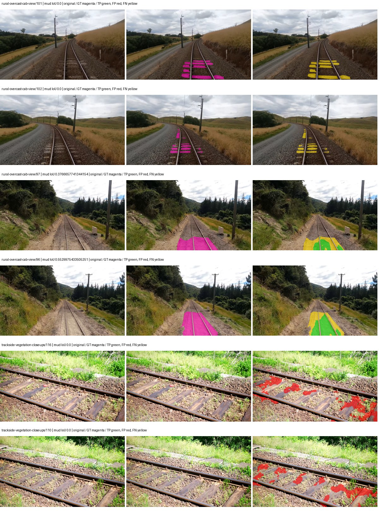
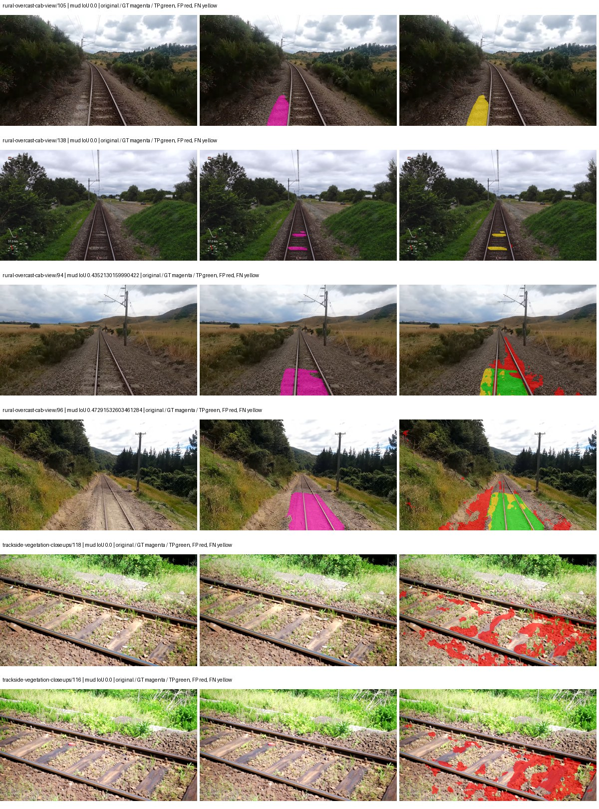
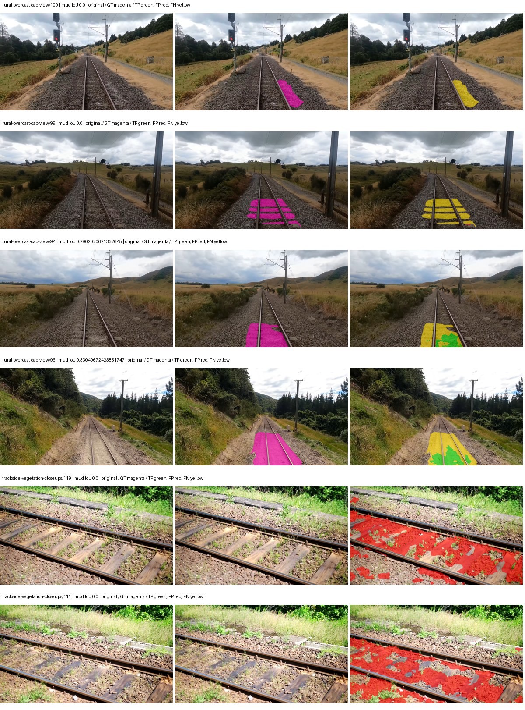
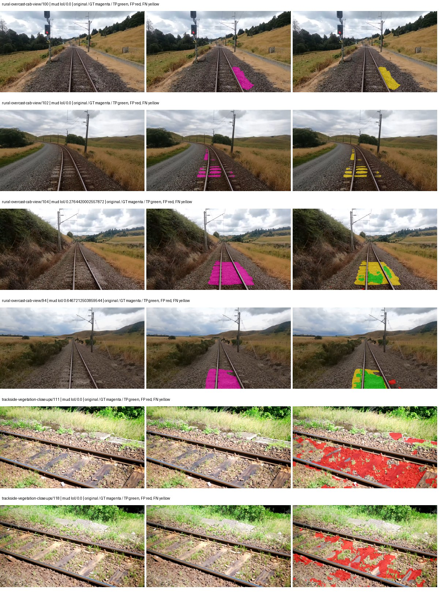

# native_efficientnet_b0_deeplabv3plus — paul-test-rtis_v2

[RTIS comparison](../../README.md) · [Full model records](record.json)

Primary selection and early stopping: **mud-pumping validation IoU**. A job is complete only after full statistics and isolated profiling are verified.

| Model | Initialization path | Seed | Status | Steps | Best step | Mud IoU (%) | Mud precision (%) | Mud recall (%) | Final mud IoU (trainer val, %) | mIoU (%) | Fixed GT-class mIoU (%) |
| --- | --- | --- | --- | --- | --- | --- | --- | --- | --- | --- | --- |
| native_efficientnet_b0_deeplabv3plus | rtis_only | 0 | completed | 3568 | 2294 | 5.76 | 11.93 | 10.01 | 1.54 | 26.83 | 31.30 |
| native_efficientnet_b0_deeplabv3plus | cityscapes_to_rtis | 0 | completed | 2549 | 1274 | 14.15 | 18.96 | 35.83 | 1.36 | 23.80 | 27.76 |
| native_efficientnet_b0_deeplabv3plus | railsem19_to_rtis | 0 | completed | 2803 | 1529 | 3.45 | 4.43 | 13.50 | 0.37 | 35.31 | 39.23 |
| native_efficientnet_b0_deeplabv3plus | cityscapes_to_railsem19_to_rtis | 0 | completed | 3568 | 2294 | 5.73 | 8.33 | 15.50 | 0.84 | 35.47 | 41.38 |

Training: 205 images. Validation: 37 images. Test: 50 held out. Seeds: [0]. Seed variation measures optimization variability, not independent-recording uncertainty. Historical source checkpoints stay fixed across adaptation seeds.

Training code: `066afb2626398b7be59d4d19f5a0e4644fd59adc`. Split SHA-256: `18a84c0163a65ded46508bcc904c374e5f33ad8a09b8879e3c8add606e86aa9f`.

## rtis_only — seed 0

Status: **completed**. Started: 2026-09-09T22:08:39.079072+00:00. Finished: 2026-09-09T22:47:36.929697+00:00.

Recipe pretrained initializer: `{"arch": "native", "backbone_path": null, "batch_norm_momentum": null, "checkpoint": null, "classifier_path": null, "drop_path": null, "encoder_name": null, "encoder_weights": null, "head": "unified_head", "head_paths": [], "inactive_parameter_paths": [], "local_files_only": false, "lora_alpha": 32, "lora_dropout": 0.05, "lora_r": 16, "lora_targets": [], "native": {"auxiliary_heads": [], "backbone": {"in_channels": 3, "kind": "timm", "name": "efficientnet_b0.ra_in1k", "out_indices": [1, 2, 3, 4], "weights": "pretrained"}, "head": {"activation": "relu", "channels": 160, "dilation_rates": [6, 12, 18], "dropout": 0.1, "high_index": 3, "kind": "deeplabv3plus", "low_channels": 32, "low_index": 0, "norm": "group"}, "neck": {"kind": "identity"}, "task": "multiclass"}, "revision": null, "smp_arch": null, "subfolder": null, "trust_remote_code": false, "tuning": "full"}`.

`rtis_only` uses the recipe initializer, which may include pretrained segmentation components. Transfer paths load the exact historical source checkpoint below and reset the classifier; they do not reset all query/decoder features.

Source checkpoint: `Recipe pretrained initialization`.

Config SHA-256: `f3df8b00541b218d37e87d071f50d29c40b87d55989e060ea3d97e2b3496a9bd`. Weights used for validation: `raw`.

### Mud-pumping and aggregate quality

| Metric | Selected checkpoint | Final training validation |
| --- | --- | --- |
| Mud IoU | 5.76 | 1.54 |
| Mud precision | 11.93 | 9.16 |
| Mud recall | 10.01 | 1.82 |
| Mud Dice/F1 | 10.89 | 3.04 |
| mIoU | 26.83 | 29.09 |
| Mean accuracy | 39.23 | 41.55 |
| Mean precision | 51.92 | 49.09 |
| Mean Dice | 34.85 | 37.73 |
| Mean specificity | 98.81 | 98.87 |
| Pixel accuracy | 81.84 | 82.78 |
| Frequency-weighted IoU | 71.01 | 71.93 |
| Fixed GT-present class mIoU | 31.30 | 33.94 |
| Boundary F1 | 33.20 | 36.23 |

The selected checkpoint has independent evaluation evidence. Final values are the trainer's final validation record, not a new independent evaluation. mIoU averages classes with nonzero union, so false positives on absent classes can change its denominator. The fixed GT-class mean is supplementary and excludes absent classes; their false positives remain in the confusion matrix.

### Resource usage and timing

| Measurement | Value |
| --- | --- |
| Peak training VRAM, retained training invocation (GiB) | 8.31 |
| Peak evaluation VRAM (GiB) | 6.78 |
| Retained training invocation wall time (seconds) | 2208.77 |
| Retained training invocation GPU-hours (one GPU) | 0.61 |
| Evaluation wall time (seconds) | 11.64 |
| Full evaluation pipeline images/second | 3.18 |
| Best full-state checkpoint (MiB) | 88.07 |
| Final full-state checkpoint (MiB) | 88.06 |
| Verified periodic checkpoints removed (GiB) | 0.60 |

VRAM uses the recorded allocator high-water mark; it is not total device usage including CUDA context. Resumed jobs' retained training invocation times and peaks are **not whole-campaign totals**. Earlier invocation resource records are not reconstructed here. Evaluation throughput includes loader, sliding-window inference and metrics; it is not model-only latency/FPS. Missing measurements are shown as —, never inferred from another dataset's run.

### Standardized inference performance

Dedicated model-only profiling waits for an idle worker-locked L40S: BF16, batch 1, 1024x1024, 20 warmup and 100 CUDA-event-timed public forwards. It excludes loading, preprocessing, tiling and metrics.

| Status | Parameters | Weight MiB | FPS | p50 ms | p95 ms | Peak reserved GiB |
| --- | --- | --- | --- | --- | --- | --- |
| complete | 5721681 | 21.83 | 148.01 | 6.61 | 7.60 | 0.43 |

```json
{
  "schema_version": 1,
  "model_id": "native_efficientnet_b0_deeplabv3plus",
  "measured_at": "2026-09-09T22:47:34+00:00",
  "status": "complete",
  "benchmark_scope": "rtis_selected_checkpoint_model_only",
  "applies_to": [
    "native_efficientnet_b0_deeplabv3plus--rtis_only--seed-0"
  ],
  "source": {
    "campaign_git_sha": "066afb2626398b7be59d4d19f5a0e4644fd59adc",
    "git_dirty": false,
    "config_hash": "860930604a18",
    "resolved_config": "/data/izadia1/projects/segmentary-runs/paul-test-rtis_v2/seed0-20260909/configs/native_efficientnet_b0_deeplabv3plus--rtis_only--seed-0.yaml",
    "config_sha256": "f3df8b00541b218d37e87d071f50d29c40b87d55989e060ea3d97e2b3496a9bd",
    "checkpoint_sha256": "cba01e65af55bf7d6406fdfae1d1d64d32017ce8b73305912bd5cb73deb72fe2",
    "checkpoint_global_step": 2294,
    "checkpoint_bytes": 92351256,
    "checkpoint_kind": "resume checkpoint with optimizer and EMA state",
    "weights": "raw",
    "measured_checkpoint_job_id": "native_efficientnet_b0_deeplabv3plus--rtis_only--seed-0",
    "result_sha256": "913b61f4dcff3b9d9a8f2a6bef24e0a70fce13348530a7f3e64689760c3db258",
    "result_git_sha": "066afb2626398b7be59d4d19f5a0e4644fd59adc",
    "result_stage": "eval:paul-test-rtis:val",
    "result_seed": 0
  },
  "hardware": {
    "gpu_name": "NVIDIA L40S",
    "gpu_uuid": "GPU-e2e96741-aec9-e90b-5c46-d0d58be90a56",
    "logical_device": "cuda:0",
    "physical_visibility_token": "8",
    "compute_capability": [
      8,
      9
    ],
    "total_memory_bytes": 47677177856
  },
  "model": {
    "parameter_count": 5721681,
    "trainable_parameter_count": 5721681,
    "resident_parameter_bytes": 22886724,
    "parameter_dtype_counts": {
      "float32": 5721681
    }
  },
  "contract": {
    "backend": "pytorch",
    "precision": "bf16_autocast",
    "batch_size": 1,
    "input_shape_nchw": [
      1,
      3,
      1024,
      1024
    ],
    "warmup_iterations": 20,
    "measured_iterations": 100,
    "timing": "per-forward CUDA events with end-event synchronization",
    "includes_preprocessing": false,
    "includes_data_loader": false,
    "includes_sliding_window": false,
    "input_resident_on_gpu": true,
    "model_only": true,
    "entrypoint": "public model(image) dense-logits forward"
  },
  "measurements": {
    "latency": {
      "p50_ms": 6.611952066421509,
      "p95_ms": 7.600179123878479,
      "mean_ms": 6.756402564048767,
      "minimum_ms": 6.304768085479736,
      "maximum_ms": 8.855551719665527,
      "fps": 148.00775864378795,
      "raw_ms": [
        6.62937593460083,
        6.466559886932373,
        6.775807857513428,
        6.5075201988220215,
        6.6263041496276855,
        7.525375843048096,
        7.015423774719238,
        7.659520149230957,
        7.318528175354004,
        6.987775802612305,
        6.618112087249756,
        7.385087966918945,
        7.119872093200684,
        7.797760009765625,
        6.611968040466309,
        6.395904064178467,
        6.447103977203369,
        6.401023864746094,
        6.367231845855713,
        6.4040961265563965,
        6.8587517738342285,
        7.557119846343994,
        8.855551719665527,
        6.8976640701293945,
        6.731776237487793,
        7.064576148986816,
        7.022592067718506,
        7.181312084197998,
        8.047679901123047,
        7.582719802856445,
        7.008255958557129,
        7.329792022705078,
        7.0215678215026855,
        6.917119979858398,
        6.490111827850342,
        6.387743949890137,
        7.597055912017822,
        7.14035177230835,
        6.964223861694336,
        7.920639991760254,
        6.610943794250488,
        6.420479774475098,
        6.469632148742676,
        6.401023864746094,
        6.427648067474365,
        6.42252779006958,
        6.393856048583984,
        7.4199042320251465,
        6.715392112731934,
        6.393856048583984,
        6.354944229125977,
        6.336512088775635,
        6.611936092376709,
        6.386688232421875,
        6.356991767883301,
        6.304768085479736,
        6.813695907592773,
        6.657023906707764,
        6.351871967315674,
        6.328320026397705,
        6.3897600173950195,
        6.4040961265563965,
        6.4778242111206055,
        6.379519939422607,
        6.870016098022461,
        6.944767951965332,
        6.785024166107178,
        6.395904064178467,
        6.376448154449463,
        6.328320026397705,
        6.336512088775635,
        7.026688098907471,
        6.544384002685547,
        6.6263041496276855,
        6.379519939422607,
        6.770688056945801,
        6.939648151397705,
        6.366208076477051,
        6.349792003631592,
        7.43833589553833,
        6.473728179931641,
        6.328320026397705,
        7.000063896179199,
        6.38156795501709,
        6.408192157745361,
        6.404032230377197,
        6.78707218170166,
        6.341631889343262,
        6.581247806549072,
        6.375423908233643,
        6.370304107666016,
        7.130080223083496,
        7.1833600997924805,
        6.353919982910156,
        6.4194560050964355,
        6.339583873748779,
        6.707200050354004,
        6.38156795501709,
        6.779903888702393,
        6.948863983154297
      ],
      "percentile_method": "numpy linear interpolation"
    },
    "peak_reserved_bytes": 457179136,
    "memory_kind": "pytorch_cuda_allocator_peak_reserved_excluding_context",
    "benchmark_wall_clock_s": 17.086486853659153
  },
  "started_at": "2026-09-09T22:47:17+00:00",
  "finished_at": "2026-09-09T22:47:34+00:00",
  "environment": {
    "hostname": "hdrfs-app-001",
    "python": "3.11.15",
    "platform": "Linux-5.15.0-139-generic-x86_64-with-glibc2.35",
    "torch": "2.11.0+cu128",
    "torch_cuda": "12.8",
    "cudnn": 91900,
    "driver_version": "570.133.20",
    "cuda_available": true,
    "gpu_count": 1,
    "gpu_names": [
      "NVIDIA L40S"
    ],
    "cuda_visible_devices": "8",
    "packages": {
      "segmentary": "0.1.0",
      "torch": "2.11.0+cu128",
      "torchvision": "0.26.0+cu128",
      "transformers": "5.15.0",
      "timm": "1.0.28",
      "segmentation-models-pytorch": "0.5.0",
      "albumentations": "2.0.8",
      "lightning": "2.6.5",
      "numpy": "2.4.4"
    }
  }
}
```

### Per-class validation results

| Class | GT pixels | IoU (%) | Precision (%) | Recall (%) | Dice (%) | Boundary F1 (%) |
| --- | --- | --- | --- | --- | --- | --- |
| car | 29664 | 0.00 | 0.00 | 0.00 | 0.00 | 0.00 |
| construction | 311585 | 27.83 | 30.67 | 75.02 | 43.54 | 36.13 |
| fence | 265137 | 19.20 | 34.95 | 29.88 | 32.21 | 38.19 |
| mud-pumping | 1226250 | 5.76 | 11.93 | 10.01 | 10.89 | 5.93 |
| on-rails | 0 | 0.00 | 0.00 | — | 0.00 | 0.00 |
| person | 0 | 0.00 | 0.00 | — | 0.00 | 0.00 |
| pole | 628038 | 59.71 | 72.65 | 77.02 | 74.78 | 87.15 |
| rail-embedded | 16799 | 10.27 | 90.32 | 10.39 | 18.63 | 28.71 |
| rail-raised | 2969797 | 71.02 | 84.20 | 81.94 | 83.05 | 91.82 |
| rail-track | 6323197 | 33.87 | 79.56 | 37.10 | 50.61 | 46.03 |
| road | 1048831 | 0.56 | 6.92 | 0.61 | 1.12 | 5.75 |
| sidewalk | 1297367 | 44.61 | 95.31 | 45.61 | 61.70 | 13.71 |
| sky | 19121606 | 97.13 | 99.51 | 97.59 | 98.54 | 89.06 |
| standing-water | 95802 | 0.05 | 0.48 | 0.06 | 0.10 | 1.20 |
| terrain | 39239306 | 84.41 | 85.38 | 98.67 | 91.55 | 58.36 |
| trackbed | 10643081 | 49.11 | 57.07 | 77.87 | 65.87 | 50.19 |
| traffic-light | 19510 | 29.14 | 72.73 | 32.72 | 45.13 | 31.95 |
| traffic-sign | 13285 | 11.27 | 88.67 | 11.43 | 20.26 | 37.41 |
| tram-track | 56179 | 2.65 | 99.93 | 2.65 | 5.16 | 21.67 |
| truck | 0 | 0.00 | 0.00 | — | 0.00 | 0.00 |
| vegetation-overgrowth | 5901821 | 16.78 | 80.11 | 17.51 | 28.74 | 53.93 |

### Full-run accounting

| Measurement | Value |
| --- | --- |
| Full GPU-reserved wall seconds, all recorded worker attempts | 2337.86 |
| Full reserved GPU-hours | 0.65 |
| Whole-run timing complete | True |

| Phase | Wall seconds including failed attempts |
| --- | --- |
| training | 2215.47 |
| diagnostics | 78.06 |
| performance | 24.10 |

GPU-reserved time includes model loading, training, validation, collection, profiling, checkpoint I/O and orchestration while the worker owns one GPU. It is not GPU kernel-active time. Phase timings and sampled device memory/power/utilization are retained separately; sampled device memory is not the allocator high-water mark.

### Train/validation and raw/EMA diagnostics

| Checkpoint / weights / split | Images | Mud IoU (%) | Mud precision (%) | Mud recall (%) |
| --- | --- | --- | --- | --- |
| best-auto-train / raw | 205 | 95.27 | 97.23 | 97.93 |
| best-auto-val / raw | 37 | 5.76 | 11.93 | 10.01 |
| best-alternate-val / ema | 37 | 1.63 | 2.29 | 5.32 |
| final-auto-val / raw | 37 | 1.55 | 9.15 | 1.83 |

Train uses the evaluation transform without augmentation. Compare mud train/validation metrics for the same selected weights. Alternate EMA on running-stat BatchNorm is explicitly uncalibrated and is diagnostic only. Score-threshold curves use uncalibrated normalized scores and are pixel-level diagnostics, not event detection rates or a selected deployment operating point.

### Downloadable evidence

- best-auto-train: [per-image.csv](rtis_only--seed-0/best-auto-train/per-image.csv) · [per-image-confusion.json.gz](rtis_only--seed-0/best-auto-train/per-image-confusion.json.gz) · [groups.json](rtis_only--seed-0/best-auto-train/groups.json) · [mud-score-curves.json](rtis_only--seed-0/best-auto-train/mud-score-curves.json)
- best-auto-val: [per-image.csv](rtis_only--seed-0/best-auto-val/per-image.csv) · [per-image-confusion.json.gz](rtis_only--seed-0/best-auto-val/per-image-confusion.json.gz) · [groups.json](rtis_only--seed-0/best-auto-val/groups.json) · [mud-score-curves.json](rtis_only--seed-0/best-auto-val/mud-score-curves.json) · [examples.jpg](rtis_only--seed-0/best-auto-val/examples.jpg)
- best-alternate-val: [per-image.csv](rtis_only--seed-0/best-alternate-val/per-image.csv) · [per-image-confusion.json.gz](rtis_only--seed-0/best-alternate-val/per-image-confusion.json.gz) · [groups.json](rtis_only--seed-0/best-alternate-val/groups.json) · [mud-score-curves.json](rtis_only--seed-0/best-alternate-val/mud-score-curves.json)
- final-auto-val: [per-image.csv](rtis_only--seed-0/final-auto-val/per-image.csv) · [per-image-confusion.json.gz](rtis_only--seed-0/final-auto-val/per-image-confusion.json.gz) · [groups.json](rtis_only--seed-0/final-auto-val/groups.json) · [mud-score-curves.json](rtis_only--seed-0/final-auto-val/mud-score-curves.json)
- resources: [telemetry.csv](rtis_only--seed-0/resources/telemetry.csv)



Examples are two lowest and two highest mud-IoU positive images, plus up to two negative images with the most false-positive mud pixels. They are targeted diagnostic examples, not random samples. Green: true positive; red: false positive; yellow: false negative. Full predictions remain on HDRFS.

### Validation tracking

| Logged step | Overall mIoU (%) | Mud IoU (%) |
| --- | --- | --- |
| 254 | 21.24 | 0.17 |
| 509 | 20.27 | 0.00 |
| 764 | 22.98 | 1.23 |
| 1019 | 23.65 | 0.24 |
| 1274 | 24.86 | 1.08 |
| 1529 | 24.67 | 0.92 |
| 1784 | 26.61 | 4.37 |
| 2038 | 27.00 | 1.23 |
| 2293 | 26.82 | 5.74 |
| 2548 | 28.37 | 5.43 |
| 2803 | 26.60 | 5.42 |
| 3058 | 27.71 | 5.64 |
| 3313 | 29.36 | 1.05 |
| 3568 | 29.09 | 1.54 |

All retained scalar curves, including training loss and per-class IoU, are in record.json. Observed best mud on a curve is not necessarily a retained checkpoint: the pilot saved its selection-metric-best and final checkpoints. Step logging and checkpoint global_step may differ by one.

### Stopping and checkpoint provenance

```json
{
  "stopping": {
    "actual_steps": 3568,
    "maximum_steps": 4000,
    "min_delta": 0.001,
    "monitor": "val_iou/mud-pumping",
    "patience": 5,
    "reason": "validation_plateau"
  },
  "checkpoints": {
    "best": {
      "path": "/data/izadia1/projects/segmentary-runs/paul-test-rtis_v2/seed0-20260909/future-runs/native_efficientnet_b0_deeplabv3plus--rtis_only--seed-0_seed0/rtis/best.ckpt",
      "sha256": "cba01e65af55bf7d6406fdfae1d1d64d32017ce8b73305912bd5cb73deb72fe2",
      "global_step": 2294,
      "bytes": 92351256
    },
    "final": {
      "path": "/data/izadia1/projects/segmentary-runs/paul-test-rtis_v2/seed0-20260909/future-runs/native_efficientnet_b0_deeplabv3plus--rtis_only--seed-0_seed0/rtis/last.ckpt",
      "sha256": "a7d5c2ec2f11379829a5bcad843a0901ea23cfe25895d51fc25e4f638a94a915",
      "global_step": 3568,
      "bytes": 92337624
    }
  },
  "cleanup_error": null
}
```

### Resolved training, initialization and evaluation settings

The optimizer block is the base configuration. Stage LR scales are applied at runtime, and stage warmup is capped at min(base warmup, floor(stage budget / 10), stage budget - 1): 400 steps for this 4,000-step pilot. Model-internal native input grids may differ from augmentation crops (EoMT uses its 640 grid).

```json
{
  "name": "native_efficientnet_b0_deeplabv3plus--rtis_only--seed-0",
  "model": {
    "arch": "native",
    "checkpoint": null,
    "tuning": "full",
    "head": "unified_head",
    "lora_r": 16,
    "lora_alpha": 32,
    "lora_dropout": 0.05,
    "lora_targets": [],
    "drop_path": null,
    "revision": null,
    "subfolder": null,
    "local_files_only": false,
    "trust_remote_code": false,
    "backbone_path": null,
    "head_paths": [],
    "classifier_path": null,
    "inactive_parameter_paths": [],
    "smp_arch": null,
    "encoder_name": null,
    "encoder_weights": null,
    "native": {
      "task": "multiclass",
      "backbone": {
        "kind": "timm",
        "name": "efficientnet_b0.ra_in1k",
        "weights": "pretrained",
        "out_indices": [
          1,
          2,
          3,
          4
        ],
        "in_channels": 3
      },
      "neck": {
        "kind": "identity"
      },
      "head": {
        "kind": "deeplabv3plus",
        "low_index": 0,
        "high_index": 3,
        "channels": 160,
        "low_channels": 32,
        "dilation_rates": [
          6,
          12,
          18
        ],
        "dropout": 0.1,
        "norm": "group",
        "activation": "relu"
      },
      "auxiliary_heads": []
    },
    "batch_norm_momentum": null
  },
  "space": "paul-test-rtis",
  "taxonomy_root": "/data/izadia1/projects/segmentary-rtis-fullstats-066afb2/taxonomy",
  "output_root": "/data/izadia1/projects/segmentary-runs/paul-test-rtis_v2/seed0-20260909/future-runs",
  "optim": {
    "backbone_lr": 0.0001,
    "head_lr_mult": 10.0,
    "weight_decay": 0.05,
    "llrd": 1.0,
    "warmup_iters": 1500,
    "warmup_ratio": 1e-06,
    "poly_power": 0.9,
    "min_lr_ratio": 0.0,
    "betas": [
      0.9,
      0.999
    ],
    "grad_clip": 1.0
  },
  "train": {
    "iters": 4000,
    "batch_size": 2,
    "accum": 8,
    "num_workers": 2,
    "precision": "bf16-mixed",
    "ema_decay": 0.9998,
    "val_every": 250,
    "ckpt_every": 500,
    "selection_metric": "val_iou/mud-pumping",
    "early_stopping_patience": 5,
    "early_stopping_min_delta": 0.001,
    "seed": 0,
    "devices": 1
  },
  "eval": {
    "sliding_window": true,
    "window": [
      1024,
      1024
    ],
    "stride": [
      768,
      768
    ],
    "batch_size": 1,
    "num_workers": 2,
    "tta_scales": [],
    "tta_flip": false,
    "threshold": 0.5,
    "boundary_tolerance_frac": 0.0075,
    "save_confusion": true
  },
  "loss": {
    "task": "multiclass",
    "activation": "auto",
    "terms": [],
    "aux": "none",
    "aux_weight": 0.0,
    "ce_weight": 1.0,
    "label_smoothing": 0.0,
    "class_weights": null,
    "query": null
  },
  "aug": {
    "crop": [
      1024,
      1024
    ],
    "scale_min": 0.5,
    "scale_max": 2.0,
    "hflip_p": 0.5,
    "color_jitter_p": 0.5,
    "brightness": 0.25,
    "contrast": 0.25,
    "saturation": 0.25,
    "hue": 0.05
  },
  "stages": [
    {
      "name": "rtis",
      "data": [
        {
          "name": "paul-test-rtis",
          "root": "/data/izadia1/datasets/paul-test-rtis_v2",
          "variant": null,
          "split_file": "splits.json",
          "train_split": "train",
          "val_split": "val",
          "limit": null,
          "loader": "folder",
          "mapping": "paul-test-rtis",
          "loader_options": {
            "require_groups": true
          }
        }
      ],
      "iters": null,
      "lr_scale": 1.0,
      "head_group_lr_scale": 1.0,
      "init_from": "pretrained",
      "reset_head": false,
      "freeze": null,
      "sample_weights": null
    }
  ]
}
```

### Hardware and software provenance

```json
{
  "training": {
    "cuda_available": true,
    "cuda_visible_devices": "8",
    "cudnn": 91900,
    "driver_version": "570.133.20",
    "gpu_count": 1,
    "gpu_names": [
      "NVIDIA L40S"
    ],
    "hostname": "hdrfs-app-001",
    "input_normalization": {
      "channel_order": "rgb",
      "mean": [
        0.485,
        0.456,
        0.406
      ],
      "source": "timm_pretrained_cfg",
      "std": [
        0.229,
        0.224,
        0.225
      ]
    },
    "model_origins": [
      {
        "hf_commit": null,
        "hf_name_or_path": null,
        "module": "backbone",
        "timm_pretrained": {
          "architecture": "efficientnet_b0",
          "hf_hub_id": "timm/efficientnet_b0.ra_in1k",
          "tag": "ra_in1k",
          "url": "https://github.com/rwightman/pytorch-image-models/releases/download/v0.1-weights/efficientnet_b0_ra-3dd342df.pth"
        }
      },
      {
        "hf_commit": null,
        "hf_name_or_path": null,
        "module": "backbone.model",
        "timm_pretrained": {
          "architecture": "efficientnet_b0",
          "hf_hub_id": "timm/efficientnet_b0.ra_in1k",
          "tag": "ra_in1k",
          "url": "https://github.com/rwightman/pytorch-image-models/releases/download/v0.1-weights/efficientnet_b0_ra-3dd342df.pth"
        }
      }
    ],
    "model_parameter_count": 5721681,
    "packages": {
      "albumentations": "2.0.8",
      "lightning": "2.6.5",
      "numpy": "2.4.4",
      "segmentary": "0.1.0",
      "segmentation-models-pytorch": "0.5.0",
      "timm": "1.0.28",
      "torch": "2.11.0+cu128",
      "torchvision": "0.26.0+cu128",
      "transformers": "5.15.0"
    },
    "platform": "Linux-5.15.0-139-generic-x86_64-with-glibc2.35",
    "python": "3.11.15",
    "torch": "2.11.0+cu128",
    "torch_cuda": "12.8",
    "trainable_parameter_count": 5721681,
    "training_stop": {
      "actual_steps": 3568,
      "maximum_steps": 4000,
      "min_delta": 0.001,
      "monitor": "val_iou/mud-pumping",
      "patience": 5,
      "reason": "validation_plateau"
    },
    "validation_weights": "raw"
  },
  "evaluation": {
    "cuda_available": true,
    "cuda_visible_devices": "8",
    "cudnn": 91900,
    "driver_version": "570.133.20",
    "gpu_count": 1,
    "gpu_names": [
      "NVIDIA L40S"
    ],
    "hostname": "hdrfs-app-001",
    "input_normalization": {
      "channel_order": "rgb",
      "mean": [
        0.485,
        0.456,
        0.406
      ],
      "source": "timm_pretrained_cfg",
      "std": [
        0.229,
        0.224,
        0.225
      ]
    },
    "packages": {
      "albumentations": "2.0.8",
      "lightning": "2.6.5",
      "numpy": "2.4.4",
      "segmentary": "0.1.0",
      "segmentation-models-pytorch": "0.5.0",
      "timm": "1.0.28",
      "torch": "2.11.0+cu128",
      "torchvision": "0.26.0+cu128",
      "transformers": "5.15.0"
    },
    "platform": "Linux-5.15.0-139-generic-x86_64-with-glibc2.35",
    "python": "3.11.15",
    "torch": "2.11.0+cu128",
    "torch_cuda": "12.8"
  }
}
```

## cityscapes_to_rtis — seed 0

Status: **completed**. Started: 2026-09-09T22:11:17.999654+00:00. Finished: 2026-09-09T22:39:23.635772+00:00.

Recipe pretrained initializer: `{"arch": "native", "backbone_path": null, "batch_norm_momentum": null, "checkpoint": null, "classifier_path": null, "drop_path": null, "encoder_name": null, "encoder_weights": null, "head": "unified_head", "head_paths": [], "inactive_parameter_paths": [], "local_files_only": false, "lora_alpha": 32, "lora_dropout": 0.05, "lora_r": 16, "lora_targets": [], "native": {"auxiliary_heads": [], "backbone": {"in_channels": 3, "kind": "timm", "name": "efficientnet_b0.ra_in1k", "out_indices": [1, 2, 3, 4], "weights": "pretrained"}, "head": {"activation": "relu", "channels": 160, "dilation_rates": [6, 12, 18], "dropout": 0.1, "high_index": 3, "kind": "deeplabv3plus", "low_channels": 32, "low_index": 0, "norm": "group"}, "neck": {"kind": "identity"}, "task": "multiclass"}, "revision": null, "smp_arch": null, "subfolder": null, "trust_remote_code": false, "tuning": "full"}`.

`rtis_only` uses the recipe initializer, which may include pretrained segmentation components. Transfer paths load the exact historical source checkpoint below and reset the classifier; they do not reset all query/decoder features.

Source checkpoint: `{'name': 'native_efficientnet_b0_deeplabv3plus--cityscapes--seed-0', 'model': 'native_efficientnet_b0_deeplabv3plus', 'protocol': 'cityscapes', 'config': '/data/izadia1/projects/segmentary-runs/all-model-city-rail-seed0-rail20-b9eb3e1/jobs/native_efficientnet_b0_deeplabv3plus--cityscapes--seed-0/attempt-001/resolved-config.yaml', 'checkpoint': '/data/izadia1/projects/segmentary-runs/all-model-city-rail-seed0-rail20-b9eb3e1/jobs/native_efficientnet_b0_deeplabv3plus--cityscapes--seed-0/attempt-001/train/native_efficientnet_b0_deeplabv3plus--cityscapes_seed0/cityscapes/last.ckpt', 'recorded_sha256': 'f287c443ed0dff9b4ba6966e8cfd4e0e4e74e6694b2a74a49948df30ba979f8f', 'exists': True}`.

Config SHA-256: `920e6968bd7a01535cb261351aaf1cd41cdf5182d7f48cd1d6f0c1bca4c0200a`. Weights used for validation: `raw`.

### Mud-pumping and aggregate quality

| Metric | Selected checkpoint | Final training validation |
| --- | --- | --- |
| Mud IoU | 14.15 | 1.36 |
| Mud precision | 18.96 | 2.49 |
| Mud recall | 35.83 | 2.93 |
| Mud Dice/F1 | 24.80 | 2.69 |
| mIoU | 23.80 | 25.70 |
| Mean accuracy | 35.53 | 38.81 |
| Mean precision | 41.28 | 40.24 |
| Mean Dice | 31.02 | 33.25 |
| Mean specificity | 98.79 | 98.85 |
| Pixel accuracy | 80.34 | 80.54 |
| Frequency-weighted IoU | 70.74 | 71.71 |
| Fixed GT-present class mIoU | 27.76 | 29.98 |
| Boundary F1 | 29.66 | 31.68 |

The selected checkpoint has independent evaluation evidence. Final values are the trainer's final validation record, not a new independent evaluation. mIoU averages classes with nonzero union, so false positives on absent classes can change its denominator. The fixed GT-class mean is supplementary and excludes absent classes; their false positives remain in the confusion matrix.

### Resource usage and timing

| Measurement | Value |
| --- | --- |
| Peak training VRAM, retained training invocation (GiB) | 8.31 |
| Peak evaluation VRAM (GiB) | 6.78 |
| Retained training invocation wall time (seconds) | 1555.05 |
| Retained training invocation GPU-hours (one GPU) | 0.43 |
| Evaluation wall time (seconds) | 11.37 |
| Full evaluation pipeline images/second | 3.25 |
| Best full-state checkpoint (MiB) | 88.07 |
| Final full-state checkpoint (MiB) | 88.06 |
| Verified periodic checkpoints removed (GiB) | 0.43 |

VRAM uses the recorded allocator high-water mark; it is not total device usage including CUDA context. Resumed jobs' retained training invocation times and peaks are **not whole-campaign totals**. Earlier invocation resource records are not reconstructed here. Evaluation throughput includes loader, sliding-window inference and metrics; it is not model-only latency/FPS. Missing measurements are shown as —, never inferred from another dataset's run.

### Standardized inference performance

Dedicated model-only profiling waits for an idle worker-locked L40S: BF16, batch 1, 1024x1024, 20 warmup and 100 CUDA-event-timed public forwards. It excludes loading, preprocessing, tiling and metrics.

| Status | Parameters | Weight MiB | FPS | p50 ms | p95 ms | Peak reserved GiB |
| --- | --- | --- | --- | --- | --- | --- |
| complete | 5721681 | 21.83 | 130.27 | 7.53 | 9.11 | 0.43 |

```json
{
  "schema_version": 1,
  "model_id": "native_efficientnet_b0_deeplabv3plus",
  "measured_at": "2026-09-09T22:39:21+00:00",
  "status": "complete",
  "benchmark_scope": "rtis_selected_checkpoint_model_only",
  "applies_to": [
    "native_efficientnet_b0_deeplabv3plus--cityscapes_to_rtis--seed-0"
  ],
  "source": {
    "campaign_git_sha": "066afb2626398b7be59d4d19f5a0e4644fd59adc",
    "git_dirty": false,
    "config_hash": "0df8bc17f781",
    "resolved_config": "/data/izadia1/projects/segmentary-runs/paul-test-rtis_v2/seed0-20260909/configs/native_efficientnet_b0_deeplabv3plus--cityscapes_to_rtis--seed-0.yaml",
    "config_sha256": "920e6968bd7a01535cb261351aaf1cd41cdf5182d7f48cd1d6f0c1bca4c0200a",
    "checkpoint_sha256": "e9df210a81376b32579deb5449eac2ec511c5b45372c93b38b4b05972804e482",
    "checkpoint_global_step": 1274,
    "checkpoint_bytes": 92351256,
    "checkpoint_kind": "resume checkpoint with optimizer and EMA state",
    "weights": "raw",
    "measured_checkpoint_job_id": "native_efficientnet_b0_deeplabv3plus--cityscapes_to_rtis--seed-0",
    "result_sha256": "350c56514c5be170a2e51fc9a744ef52bbd2d2b0593c6fcaae855d0f0384e433",
    "result_git_sha": "066afb2626398b7be59d4d19f5a0e4644fd59adc",
    "result_stage": "eval:paul-test-rtis:val",
    "result_seed": 0
  },
  "hardware": {
    "gpu_name": "NVIDIA L40S",
    "gpu_uuid": "GPU-d411d86a-6d1d-1967-55e7-9f9ec85d13f5",
    "logical_device": "cuda:0",
    "physical_visibility_token": "1",
    "compute_capability": [
      8,
      9
    ],
    "total_memory_bytes": 47677177856
  },
  "model": {
    "parameter_count": 5721681,
    "trainable_parameter_count": 5721681,
    "resident_parameter_bytes": 22886724,
    "parameter_dtype_counts": {
      "float32": 5721681
    }
  },
  "contract": {
    "backend": "pytorch",
    "precision": "bf16_autocast",
    "batch_size": 1,
    "input_shape_nchw": [
      1,
      3,
      1024,
      1024
    ],
    "warmup_iterations": 20,
    "measured_iterations": 100,
    "timing": "per-forward CUDA events with end-event synchronization",
    "includes_preprocessing": false,
    "includes_data_loader": false,
    "includes_sliding_window": false,
    "input_resident_on_gpu": true,
    "model_only": true,
    "entrypoint": "public model(image) dense-logits forward"
  },
  "measurements": {
    "latency": {
      "p50_ms": 7.525887966156006,
      "p95_ms": 9.105254554748536,
      "mean_ms": 7.676398439407349,
      "minimum_ms": 6.837247848510742,
      "maximum_ms": 12.014592170715332,
      "fps": 130.2694235966736,
      "raw_ms": [
        7.915520191192627,
        6.890495777130127,
        6.839295864105225,
        6.8770880699157715,
        7.5141119956970215,
        7.7045440673828125,
        7.2867841720581055,
        7.927840232849121,
        8.386560440063477,
        7.122943878173828,
        7.400447845458984,
        7.545760154724121,
        8.19916820526123,
        7.5438079833984375,
        7.497727870941162,
        7.13318395614624,
        7.185311794281006,
        7.113759994506836,
        8.069120407104492,
        7.912447929382324,
        8.059904098510742,
        7.073791980743408,
        7.007232189178467,
        7.168000221252441,
        7.111680030822754,
        9.02246379852295,
        8.327168464660645,
        8.062848091125488,
        7.3891520500183105,
        7.922688007354736,
        7.620607852935791,
        7.150464057922363,
        8.168448448181152,
        7.75270414352417,
        7.746560096740723,
        7.43939208984375,
        7.391232013702393,
        7.062528133392334,
        7.378943920135498,
        6.999040126800537,
        6.837247848510742,
        7.093120098114014,
        7.717887878417969,
        9.752575874328613,
        7.422976016998291,
        7.667712211608887,
        7.476223945617676,
        8.047616004943848,
        7.462912082672119,
        7.621632099151611,
        7.937024116516113,
        6.891520023345947,
        6.913951873779297,
        8.713184356689453,
        7.1966400146484375,
        7.098368167877197,
        10.480640411376953,
        7.857151985168457,
        8.821760177612305,
        8.863743782043457,
        9.141247749328613,
        9.103360176086426,
        7.795711994171143,
        7.2478718757629395,
        7.105535984039307,
        7.2284159660339355,
        7.9134721755981445,
        7.572544097900391,
        7.823359966278076,
        7.856128215789795,
        7.322624206542969,
        7.103487968444824,
        7.018496036529541,
        7.059455871582031,
        7.121920108795166,
        7.145472049713135,
        7.063551902770996,
        7.592959880828857,
        7.7117438316345215,
        7.148543834686279,
        7.341055870056152,
        7.690239906311035,
        7.287807941436768,
        7.088128089904785,
        6.979584217071533,
        6.884352207183838,
        7.469056129455566,
        7.546879768371582,
        7.937024116516113,
        12.014592170715332,
        9.243712425231934,
        8.328191757202148,
        7.6472320556640625,
        7.784448146820068,
        7.394303798675537,
        7.706719875335693,
        7.329792022705078,
        7.85811185836792,
        7.700384140014648,
        7.53766393661499
      ],
      "percentile_method": "numpy linear interpolation"
    },
    "peak_reserved_bytes": 457179136,
    "memory_kind": "pytorch_cuda_allocator_peak_reserved_excluding_context",
    "benchmark_wall_clock_s": 17.239991430193186
  },
  "started_at": "2026-09-09T22:39:04+00:00",
  "finished_at": "2026-09-09T22:39:21+00:00",
  "environment": {
    "hostname": "hdrfs-app-001",
    "python": "3.11.15",
    "platform": "Linux-5.15.0-139-generic-x86_64-with-glibc2.35",
    "torch": "2.11.0+cu128",
    "torch_cuda": "12.8",
    "cudnn": 91900,
    "driver_version": "570.133.20",
    "cuda_available": true,
    "gpu_count": 1,
    "gpu_names": [
      "NVIDIA L40S"
    ],
    "cuda_visible_devices": "1",
    "packages": {
      "segmentary": "0.1.0",
      "torch": "2.11.0+cu128",
      "torchvision": "0.26.0+cu128",
      "transformers": "5.15.0",
      "timm": "1.0.28",
      "segmentation-models-pytorch": "0.5.0",
      "albumentations": "2.0.8",
      "lightning": "2.6.5",
      "numpy": "2.4.4"
    }
  }
}
```

### Per-class validation results

| Class | GT pixels | IoU (%) | Precision (%) | Recall (%) | Dice (%) | Boundary F1 (%) |
| --- | --- | --- | --- | --- | --- | --- |
| car | 29664 | 2.38 | 23.28 | 2.59 | 4.65 | 19.97 |
| construction | 311585 | 19.07 | 22.93 | 53.12 | 32.04 | 28.92 |
| fence | 265137 | 3.71 | 6.29 | 8.29 | 7.16 | 12.67 |
| mud-pumping | 1226250 | 14.15 | 18.96 | 35.83 | 24.80 | 23.36 |
| on-rails | 0 | 0.00 | 0.00 | — | 0.00 | 0.00 |
| person | 0 | 0.00 | 0.00 | — | 0.00 | 0.00 |
| pole | 628038 | 59.30 | 81.97 | 68.20 | 74.45 | 86.66 |
| rail-embedded | 16799 | 0.42 | 8.57 | 0.43 | 0.83 | 2.97 |
| rail-raised | 2969797 | 63.31 | 73.07 | 82.58 | 77.54 | 83.80 |
| rail-track | 6323197 | 33.45 | 66.75 | 40.14 | 50.14 | 49.76 |
| road | 1048831 | 4.40 | 16.37 | 5.68 | 8.44 | 8.08 |
| sidewalk | 1297367 | 15.51 | 62.83 | 17.07 | 26.85 | 10.85 |
| sky | 19121606 | 97.68 | 99.23 | 98.43 | 98.83 | 92.02 |
| standing-water | 95802 | 0.32 | 0.35 | 3.31 | 0.63 | 1.51 |
| terrain | 39239306 | 83.23 | 87.34 | 94.65 | 90.85 | 48.27 |
| trackbed | 10643081 | 48.16 | 62.52 | 67.70 | 65.01 | 48.03 |
| traffic-light | 19510 | 17.07 | 95.00 | 17.23 | 29.17 | 23.24 |
| traffic-sign | 13285 | 7.37 | 78.37 | 7.53 | 13.74 | 32.77 |
| tram-track | 56179 | 0.00 | 0.00 | 0.00 | 0.00 | 0.00 |
| truck | 0 | 0.00 | 0.00 | — | 0.00 | 0.00 |
| vegetation-overgrowth | 5901821 | 30.21 | 62.96 | 36.74 | 46.40 | 49.97 |

### Full-run accounting

| Measurement | Value |
| --- | --- |
| Full GPU-reserved wall seconds, all recorded worker attempts | 1685.71 |
| Full reserved GPU-hours | 0.47 |
| Whole-run timing complete | True |

| Phase | Wall seconds including failed attempts |
| --- | --- |
| training | 1561.89 |
| diagnostics | 79.60 |
| performance | 24.16 |

GPU-reserved time includes model loading, training, validation, collection, profiling, checkpoint I/O and orchestration while the worker owns one GPU. It is not GPU kernel-active time. Phase timings and sampled device memory/power/utilization are retained separately; sampled device memory is not the allocator high-water mark.

### Train/validation and raw/EMA diagnostics

| Checkpoint / weights / split | Images | Mud IoU (%) | Mud precision (%) | Mud recall (%) |
| --- | --- | --- | --- | --- |
| best-auto-train / raw | 205 | 90.12 | 96.18 | 93.46 |
| best-auto-val / raw | 37 | 14.15 | 18.96 | 35.83 |
| best-alternate-val / ema | 37 | 5.82 | 11.98 | 10.17 |
| final-auto-val / raw | 37 | 1.36 | 2.49 | 2.93 |

Train uses the evaluation transform without augmentation. Compare mud train/validation metrics for the same selected weights. Alternate EMA on running-stat BatchNorm is explicitly uncalibrated and is diagnostic only. Score-threshold curves use uncalibrated normalized scores and are pixel-level diagnostics, not event detection rates or a selected deployment operating point.

### Downloadable evidence

- best-auto-train: [per-image.csv](cityscapes_to_rtis--seed-0/best-auto-train/per-image.csv) · [per-image-confusion.json.gz](cityscapes_to_rtis--seed-0/best-auto-train/per-image-confusion.json.gz) · [groups.json](cityscapes_to_rtis--seed-0/best-auto-train/groups.json) · [mud-score-curves.json](cityscapes_to_rtis--seed-0/best-auto-train/mud-score-curves.json)
- best-auto-val: [per-image.csv](cityscapes_to_rtis--seed-0/best-auto-val/per-image.csv) · [per-image-confusion.json.gz](cityscapes_to_rtis--seed-0/best-auto-val/per-image-confusion.json.gz) · [groups.json](cityscapes_to_rtis--seed-0/best-auto-val/groups.json) · [mud-score-curves.json](cityscapes_to_rtis--seed-0/best-auto-val/mud-score-curves.json) · [examples.jpg](cityscapes_to_rtis--seed-0/best-auto-val/examples.jpg)
- best-alternate-val: [per-image.csv](cityscapes_to_rtis--seed-0/best-alternate-val/per-image.csv) · [per-image-confusion.json.gz](cityscapes_to_rtis--seed-0/best-alternate-val/per-image-confusion.json.gz) · [groups.json](cityscapes_to_rtis--seed-0/best-alternate-val/groups.json) · [mud-score-curves.json](cityscapes_to_rtis--seed-0/best-alternate-val/mud-score-curves.json)
- final-auto-val: [per-image.csv](cityscapes_to_rtis--seed-0/final-auto-val/per-image.csv) · [per-image-confusion.json.gz](cityscapes_to_rtis--seed-0/final-auto-val/per-image-confusion.json.gz) · [groups.json](cityscapes_to_rtis--seed-0/final-auto-val/groups.json) · [mud-score-curves.json](cityscapes_to_rtis--seed-0/final-auto-val/mud-score-curves.json)
- resources: [telemetry.csv](cityscapes_to_rtis--seed-0/resources/telemetry.csv)



Examples are two lowest and two highest mud-IoU positive images, plus up to two negative images with the most false-positive mud pixels. They are targeted diagnostic examples, not random samples. Green: true positive; red: false positive; yellow: false negative. Full predictions remain on HDRFS.

### Validation tracking

| Logged step | Overall mIoU (%) | Mud IoU (%) |
| --- | --- | --- |
| 254 | 20.56 | 0.00 |
| 509 | 20.59 | 0.04 |
| 764 | 21.04 | 4.03 |
| 1019 | 22.98 | 10.87 |
| 1274 | 23.81 | 14.12 |
| 1529 | 25.00 | 6.42 |
| 1784 | 27.86 | 7.70 |
| 2038 | 26.09 | 8.09 |
| 2293 | 25.35 | 10.24 |
| 2548 | 25.70 | 1.36 |

All retained scalar curves, including training loss and per-class IoU, are in record.json. Observed best mud on a curve is not necessarily a retained checkpoint: the pilot saved its selection-metric-best and final checkpoints. Step logging and checkpoint global_step may differ by one.

### Stopping and checkpoint provenance

```json
{
  "stopping": {
    "actual_steps": 2549,
    "maximum_steps": 4000,
    "min_delta": 0.001,
    "monitor": "val_iou/mud-pumping",
    "patience": 5,
    "reason": "validation_plateau"
  },
  "checkpoints": {
    "best": {
      "path": "/data/izadia1/projects/segmentary-runs/paul-test-rtis_v2/seed0-20260909/future-runs/native_efficientnet_b0_deeplabv3plus--cityscapes_to_rtis--seed-0_seed0/rtis/best.ckpt",
      "sha256": "e9df210a81376b32579deb5449eac2ec511c5b45372c93b38b4b05972804e482",
      "global_step": 1274,
      "bytes": 92351256
    },
    "final": {
      "path": "/data/izadia1/projects/segmentary-runs/paul-test-rtis_v2/seed0-20260909/future-runs/native_efficientnet_b0_deeplabv3plus--cityscapes_to_rtis--seed-0_seed0/rtis/last.ckpt",
      "sha256": "087b31c28cabbee237b9f779c67a746b07599ff854272af45cd571128c53ad72",
      "global_step": 2549,
      "bytes": 92337624
    }
  },
  "cleanup_error": null
}
```

### Resolved training, initialization and evaluation settings

The optimizer block is the base configuration. Stage LR scales are applied at runtime, and stage warmup is capped at min(base warmup, floor(stage budget / 10), stage budget - 1): 400 steps for this 4,000-step pilot. Model-internal native input grids may differ from augmentation crops (EoMT uses its 640 grid).

```json
{
  "name": "native_efficientnet_b0_deeplabv3plus--cityscapes_to_rtis--seed-0",
  "model": {
    "arch": "native",
    "checkpoint": null,
    "tuning": "full",
    "head": "unified_head",
    "lora_r": 16,
    "lora_alpha": 32,
    "lora_dropout": 0.05,
    "lora_targets": [],
    "drop_path": null,
    "revision": null,
    "subfolder": null,
    "local_files_only": false,
    "trust_remote_code": false,
    "backbone_path": null,
    "head_paths": [],
    "classifier_path": null,
    "inactive_parameter_paths": [],
    "smp_arch": null,
    "encoder_name": null,
    "encoder_weights": null,
    "native": {
      "task": "multiclass",
      "backbone": {
        "kind": "timm",
        "name": "efficientnet_b0.ra_in1k",
        "weights": "pretrained",
        "out_indices": [
          1,
          2,
          3,
          4
        ],
        "in_channels": 3
      },
      "neck": {
        "kind": "identity"
      },
      "head": {
        "kind": "deeplabv3plus",
        "low_index": 0,
        "high_index": 3,
        "channels": 160,
        "low_channels": 32,
        "dilation_rates": [
          6,
          12,
          18
        ],
        "dropout": 0.1,
        "norm": "group",
        "activation": "relu"
      },
      "auxiliary_heads": []
    },
    "batch_norm_momentum": null
  },
  "space": "paul-test-rtis",
  "taxonomy_root": "/data/izadia1/projects/segmentary-rtis-fullstats-066afb2/taxonomy",
  "output_root": "/data/izadia1/projects/segmentary-runs/paul-test-rtis_v2/seed0-20260909/future-runs",
  "optim": {
    "backbone_lr": 0.0001,
    "head_lr_mult": 10.0,
    "weight_decay": 0.05,
    "llrd": 1.0,
    "warmup_iters": 1500,
    "warmup_ratio": 1e-06,
    "poly_power": 0.9,
    "min_lr_ratio": 0.0,
    "betas": [
      0.9,
      0.999
    ],
    "grad_clip": 1.0
  },
  "train": {
    "iters": 4000,
    "batch_size": 2,
    "accum": 8,
    "num_workers": 2,
    "precision": "bf16-mixed",
    "ema_decay": 0.9998,
    "val_every": 250,
    "ckpt_every": 500,
    "selection_metric": "val_iou/mud-pumping",
    "early_stopping_patience": 5,
    "early_stopping_min_delta": 0.001,
    "seed": 0,
    "devices": 1
  },
  "eval": {
    "sliding_window": true,
    "window": [
      1024,
      1024
    ],
    "stride": [
      768,
      768
    ],
    "batch_size": 1,
    "num_workers": 2,
    "tta_scales": [],
    "tta_flip": false,
    "threshold": 0.5,
    "boundary_tolerance_frac": 0.0075,
    "save_confusion": true
  },
  "loss": {
    "task": "multiclass",
    "activation": "auto",
    "terms": [],
    "aux": "none",
    "aux_weight": 0.0,
    "ce_weight": 1.0,
    "label_smoothing": 0.0,
    "class_weights": null,
    "query": null
  },
  "aug": {
    "crop": [
      1024,
      1024
    ],
    "scale_min": 0.5,
    "scale_max": 2.0,
    "hflip_p": 0.5,
    "color_jitter_p": 0.5,
    "brightness": 0.25,
    "contrast": 0.25,
    "saturation": 0.25,
    "hue": 0.05
  },
  "stages": [
    {
      "name": "rtis",
      "data": [
        {
          "name": "paul-test-rtis",
          "root": "/data/izadia1/datasets/paul-test-rtis_v2",
          "variant": null,
          "split_file": "splits.json",
          "train_split": "train",
          "val_split": "val",
          "limit": null,
          "loader": "folder",
          "mapping": "paul-test-rtis",
          "loader_options": {
            "require_groups": true
          }
        }
      ],
      "iters": null,
      "lr_scale": 0.1,
      "head_group_lr_scale": 1.0,
      "init_from": "/data/izadia1/projects/segmentary-runs/all-model-city-rail-seed0-rail20-b9eb3e1/jobs/native_efficientnet_b0_deeplabv3plus--cityscapes--seed-0/attempt-001/train/native_efficientnet_b0_deeplabv3plus--cityscapes_seed0/cityscapes/last.ckpt",
      "reset_head": true,
      "freeze": null,
      "sample_weights": null
    }
  ]
}
```

### Hardware and software provenance

```json
{
  "training": {
    "cuda_available": true,
    "cuda_visible_devices": "1",
    "cudnn": 91900,
    "driver_version": "570.133.20",
    "gpu_count": 1,
    "gpu_names": [
      "NVIDIA L40S"
    ],
    "hostname": "hdrfs-app-001",
    "input_normalization": {
      "channel_order": "rgb",
      "mean": [
        0.485,
        0.456,
        0.406
      ],
      "source": "timm_pretrained_cfg",
      "std": [
        0.229,
        0.224,
        0.225
      ]
    },
    "model_origins": [
      {
        "hf_commit": null,
        "hf_name_or_path": null,
        "module": "backbone",
        "timm_pretrained": {
          "architecture": "efficientnet_b0",
          "hf_hub_id": "timm/efficientnet_b0.ra_in1k",
          "tag": "ra_in1k",
          "url": "https://github.com/rwightman/pytorch-image-models/releases/download/v0.1-weights/efficientnet_b0_ra-3dd342df.pth"
        }
      },
      {
        "hf_commit": null,
        "hf_name_or_path": null,
        "module": "backbone.model",
        "timm_pretrained": {
          "architecture": "efficientnet_b0",
          "hf_hub_id": "timm/efficientnet_b0.ra_in1k",
          "tag": "ra_in1k",
          "url": "https://github.com/rwightman/pytorch-image-models/releases/download/v0.1-weights/efficientnet_b0_ra-3dd342df.pth"
        }
      }
    ],
    "model_parameter_count": 5721681,
    "packages": {
      "albumentations": "2.0.8",
      "lightning": "2.6.5",
      "numpy": "2.4.4",
      "segmentary": "0.1.0",
      "segmentation-models-pytorch": "0.5.0",
      "timm": "1.0.28",
      "torch": "2.11.0+cu128",
      "torchvision": "0.26.0+cu128",
      "transformers": "5.15.0"
    },
    "platform": "Linux-5.15.0-139-generic-x86_64-with-glibc2.35",
    "python": "3.11.15",
    "torch": "2.11.0+cu128",
    "torch_cuda": "12.8",
    "trainable_parameter_count": 5721681,
    "training_stop": {
      "actual_steps": 2549,
      "maximum_steps": 4000,
      "min_delta": 0.001,
      "monitor": "val_iou/mud-pumping",
      "patience": 5,
      "reason": "validation_plateau"
    },
    "validation_weights": "raw"
  },
  "evaluation": {
    "cuda_available": true,
    "cuda_visible_devices": "1",
    "cudnn": 91900,
    "driver_version": "570.133.20",
    "gpu_count": 1,
    "gpu_names": [
      "NVIDIA L40S"
    ],
    "hostname": "hdrfs-app-001",
    "input_normalization": {
      "channel_order": "rgb",
      "mean": [
        0.485,
        0.456,
        0.406
      ],
      "source": "timm_pretrained_cfg",
      "std": [
        0.229,
        0.224,
        0.225
      ]
    },
    "packages": {
      "albumentations": "2.0.8",
      "lightning": "2.6.5",
      "numpy": "2.4.4",
      "segmentary": "0.1.0",
      "segmentation-models-pytorch": "0.5.0",
      "timm": "1.0.28",
      "torch": "2.11.0+cu128",
      "torchvision": "0.26.0+cu128",
      "transformers": "5.15.0"
    },
    "platform": "Linux-5.15.0-139-generic-x86_64-with-glibc2.35",
    "python": "3.11.15",
    "torch": "2.11.0+cu128",
    "torch_cuda": "12.8"
  }
}
```

## railsem19_to_rtis — seed 0

Status: **completed**. Started: 2026-09-09T22:15:13.238867+00:00. Finished: 2026-09-09T22:46:21.909596+00:00.

Recipe pretrained initializer: `{"arch": "native", "backbone_path": null, "batch_norm_momentum": null, "checkpoint": null, "classifier_path": null, "drop_path": null, "encoder_name": null, "encoder_weights": null, "head": "unified_head", "head_paths": [], "inactive_parameter_paths": [], "local_files_only": false, "lora_alpha": 32, "lora_dropout": 0.05, "lora_r": 16, "lora_targets": [], "native": {"auxiliary_heads": [], "backbone": {"in_channels": 3, "kind": "timm", "name": "efficientnet_b0.ra_in1k", "out_indices": [1, 2, 3, 4], "weights": "pretrained"}, "head": {"activation": "relu", "channels": 160, "dilation_rates": [6, 12, 18], "dropout": 0.1, "high_index": 3, "kind": "deeplabv3plus", "low_channels": 32, "low_index": 0, "norm": "group"}, "neck": {"kind": "identity"}, "task": "multiclass"}, "revision": null, "smp_arch": null, "subfolder": null, "trust_remote_code": false, "tuning": "full"}`.

`rtis_only` uses the recipe initializer, which may include pretrained segmentation components. Transfer paths load the exact historical source checkpoint below and reset the classifier; they do not reset all query/decoder features.

Source checkpoint: `{'name': 'native_efficientnet_b0_deeplabv3plus--railsem19--seed-0', 'model': 'native_efficientnet_b0_deeplabv3plus', 'protocol': 'railsem19', 'config': '/data/izadia1/projects/segmentary-runs/all-model-city-rail-seed0-rail20-b9eb3e1/jobs/native_efficientnet_b0_deeplabv3plus--railsem19--seed-0/attempt-001/resolved-config.yaml', 'checkpoint': '/data/izadia1/projects/segmentary-runs/all-model-city-rail-seed0-rail20-b9eb3e1/jobs/native_efficientnet_b0_deeplabv3plus--railsem19--seed-0/attempt-001/train/native_efficientnet_b0_deeplabv3plus--railsem19_seed0/railsem19/last.ckpt', 'recorded_sha256': 'f9bd05eae50f95fcfa125c631ddaa796c1b5806c5e2eb0bbe7aec493beaffc87', 'exists': True}`.

Config SHA-256: `324b9296c270db9785a244dec42adaebfafe99d590cbc3a9551748f79cbd2519`. Weights used for validation: `raw`.

### Mud-pumping and aggregate quality

| Metric | Selected checkpoint | Final training validation |
| --- | --- | --- |
| Mud IoU | 3.45 | 0.37 |
| Mud precision | 4.43 | 0.49 |
| Mud recall | 13.50 | 1.54 |
| Mud Dice/F1 | 6.67 | 0.75 |
| mIoU | 35.31 | 32.80 |
| Mean accuracy | 47.10 | 45.67 |
| Mean precision | 59.10 | 57.02 |
| Mean Dice | 44.16 | 41.51 |
| Mean specificity | 98.92 | 98.88 |
| Pixel accuracy | 82.39 | 81.97 |
| Frequency-weighted IoU | 73.49 | 72.79 |
| Fixed GT-present class mIoU | 39.23 | 38.27 |
| Boundary F1 | 41.56 | 39.76 |

The selected checkpoint has independent evaluation evidence. Final values are the trainer's final validation record, not a new independent evaluation. mIoU averages classes with nonzero union, so false positives on absent classes can change its denominator. The fixed GT-class mean is supplementary and excludes absent classes; their false positives remain in the confusion matrix.

### Resource usage and timing

| Measurement | Value |
| --- | --- |
| Peak training VRAM, retained training invocation (GiB) | 8.31 |
| Peak evaluation VRAM (GiB) | 6.78 |
| Retained training invocation wall time (seconds) | 1738.81 |
| Retained training invocation GPU-hours (one GPU) | 0.48 |
| Evaluation wall time (seconds) | 11.64 |
| Full evaluation pipeline images/second | 3.18 |
| Best full-state checkpoint (MiB) | 88.07 |
| Final full-state checkpoint (MiB) | 88.06 |
| Verified periodic checkpoints removed (GiB) | 0.43 |

VRAM uses the recorded allocator high-water mark; it is not total device usage including CUDA context. Resumed jobs' retained training invocation times and peaks are **not whole-campaign totals**. Earlier invocation resource records are not reconstructed here. Evaluation throughput includes loader, sliding-window inference and metrics; it is not model-only latency/FPS. Missing measurements are shown as —, never inferred from another dataset's run.

### Standardized inference performance

Dedicated model-only profiling waits for an idle worker-locked L40S: BF16, batch 1, 1024x1024, 20 warmup and 100 CUDA-event-timed public forwards. It excludes loading, preprocessing, tiling and metrics.

| Status | Parameters | Weight MiB | FPS | p50 ms | p95 ms | Peak reserved GiB |
| --- | --- | --- | --- | --- | --- | --- |
| complete | 5721681 | 21.83 | 140.18 | 6.84 | 9.15 | 0.43 |

```json
{
  "schema_version": 1,
  "model_id": "native_efficientnet_b0_deeplabv3plus",
  "measured_at": "2026-09-09T22:46:19+00:00",
  "status": "complete",
  "benchmark_scope": "rtis_selected_checkpoint_model_only",
  "applies_to": [
    "native_efficientnet_b0_deeplabv3plus--railsem19_to_rtis--seed-0"
  ],
  "source": {
    "campaign_git_sha": "066afb2626398b7be59d4d19f5a0e4644fd59adc",
    "git_dirty": false,
    "config_hash": "be00dde6bf02",
    "resolved_config": "/data/izadia1/projects/segmentary-runs/paul-test-rtis_v2/seed0-20260909/configs/native_efficientnet_b0_deeplabv3plus--railsem19_to_rtis--seed-0.yaml",
    "config_sha256": "324b9296c270db9785a244dec42adaebfafe99d590cbc3a9551748f79cbd2519",
    "checkpoint_sha256": "d4c1c305f584e5edc254433338afeebb93ffd802dfeddc25ab74267e74c22c1b",
    "checkpoint_global_step": 1529,
    "checkpoint_bytes": 92351256,
    "checkpoint_kind": "resume checkpoint with optimizer and EMA state",
    "weights": "raw",
    "measured_checkpoint_job_id": "native_efficientnet_b0_deeplabv3plus--railsem19_to_rtis--seed-0",
    "result_sha256": "bed93ac183d5c0d6a538bd1d0e8e9e4f54170b1ee51ba386801f3fc0a35ee7c9",
    "result_git_sha": "066afb2626398b7be59d4d19f5a0e4644fd59adc",
    "result_stage": "eval:paul-test-rtis:val",
    "result_seed": 0
  },
  "hardware": {
    "gpu_name": "NVIDIA L40S",
    "gpu_uuid": "GPU-84f5ca4d-68db-ae98-d056-40654d859dd9",
    "logical_device": "cuda:0",
    "physical_visibility_token": "0",
    "compute_capability": [
      8,
      9
    ],
    "total_memory_bytes": 47677177856
  },
  "model": {
    "parameter_count": 5721681,
    "trainable_parameter_count": 5721681,
    "resident_parameter_bytes": 22886724,
    "parameter_dtype_counts": {
      "float32": 5721681
    }
  },
  "contract": {
    "backend": "pytorch",
    "precision": "bf16_autocast",
    "batch_size": 1,
    "input_shape_nchw": [
      1,
      3,
      1024,
      1024
    ],
    "warmup_iterations": 20,
    "measured_iterations": 100,
    "timing": "per-forward CUDA events with end-event synchronization",
    "includes_preprocessing": false,
    "includes_data_loader": false,
    "includes_sliding_window": false,
    "input_resident_on_gpu": true,
    "model_only": true,
    "entrypoint": "public model(image) dense-logits forward"
  },
  "measurements": {
    "latency": {
      "p50_ms": 6.8387839794158936,
      "p95_ms": 9.151641178131102,
      "mean_ms": 7.133852491378784,
      "minimum_ms": 6.501376152038574,
      "maximum_ms": 10.667008399963379,
      "fps": 140.17671394362216,
      "raw_ms": [
        6.783071994781494,
        7.549952030181885,
        7.425119876861572,
        6.810624122619629,
        6.925312042236328,
        7.977024078369141,
        7.704576015472412,
        7.409664154052734,
        7.304192066192627,
        7.066624164581299,
        7.665664196014404,
        6.8137922286987305,
        6.579232215881348,
        6.501376152038574,
        7.1741437911987305,
        7.135231971740723,
        6.576128005981445,
        6.819839954376221,
        7.420928001403809,
        10.667008399963379,
        9.630720138549805,
        9.621503829956055,
        9.359359741210938,
        9.21292781829834,
        9.148415565490723,
        9.038847923278809,
        7.5316481590271,
        7.3461761474609375,
        6.768511772155762,
        6.811776161193848,
        6.74508810043335,
        6.68671989440918,
        6.847487926483154,
        6.8730878829956055,
        6.842368125915527,
        7.219200134277344,
        7.003136157989502,
        6.931456089019775,
        6.795263767242432,
        6.711359977722168,
        6.550528049468994,
        6.574079990386963,
        6.550528049468994,
        6.693888187408447,
        6.591487884521484,
        6.565887928009033,
        6.623231887817383,
        6.5423359870910645,
        6.564864158630371,
        6.701056003570557,
        6.68671989440918,
        6.650879859924316,
        6.918144226074219,
        7.920639991760254,
        8.364031791687012,
        7.155712127685547,
        7.029759883880615,
        6.7993597984313965,
        6.579071998596191,
        6.5382399559021,
        7.667712211608887,
        7.287807941436768,
        6.632448196411133,
        6.5423359870910645,
        6.58838415145874,
        6.652927875518799,
        6.63756799697876,
        6.856704235076904,
        7.278592109680176,
        6.771711826324463,
        6.90393590927124,
        8.096768379211426,
        6.898687839508057,
        6.8239359855651855,
        6.878208160400391,
        6.780928134918213,
        6.7399678230285645,
        6.998015880584717,
        7.267327785491943,
        7.158783912658691,
        6.585216045379639,
        7.838719844818115,
        6.7348480224609375,
        6.766592025756836,
        6.543360233306885,
        6.689792156219482,
        6.701056003570557,
        6.6569600105285645,
        6.651904106140137,
        6.7358717918396,
        6.831103801727295,
        7.060480117797852,
        6.93452787399292,
        7.223296165466309,
        7.664639949798584,
        7.349247932434082,
        7.007232189178467,
        6.83519983291626,
        6.571008205413818,
        6.506432056427002
      ],
      "percentile_method": "numpy linear interpolation"
    },
    "peak_reserved_bytes": 457179136,
    "memory_kind": "pytorch_cuda_allocator_peak_reserved_excluding_context",
    "benchmark_wall_clock_s": 17.141123451292515
  },
  "started_at": "2026-09-09T22:46:02+00:00",
  "finished_at": "2026-09-09T22:46:19+00:00",
  "environment": {
    "hostname": "hdrfs-app-001",
    "python": "3.11.15",
    "platform": "Linux-5.15.0-139-generic-x86_64-with-glibc2.35",
    "torch": "2.11.0+cu128",
    "torch_cuda": "12.8",
    "cudnn": 91900,
    "driver_version": "570.133.20",
    "cuda_available": true,
    "gpu_count": 1,
    "gpu_names": [
      "NVIDIA L40S"
    ],
    "cuda_visible_devices": "0",
    "packages": {
      "segmentary": "0.1.0",
      "torch": "2.11.0+cu128",
      "torchvision": "0.26.0+cu128",
      "transformers": "5.15.0",
      "timm": "1.0.28",
      "segmentation-models-pytorch": "0.5.0",
      "albumentations": "2.0.8",
      "lightning": "2.6.5",
      "numpy": "2.4.4"
    }
  }
}
```

### Per-class validation results

| Class | GT pixels | IoU (%) | Precision (%) | Recall (%) | Dice (%) | Boundary F1 (%) |
| --- | --- | --- | --- | --- | --- | --- |
| car | 29664 | 23.66 | 61.55 | 27.76 | 38.27 | 26.36 |
| construction | 311585 | 60.50 | 80.59 | 70.83 | 75.39 | 73.32 |
| fence | 265137 | 21.09 | 34.42 | 35.24 | 34.83 | 30.72 |
| mud-pumping | 1226250 | 3.45 | 4.43 | 13.50 | 6.67 | 6.69 |
| on-rails | 0 | — | — | — | — | — |
| person | 0 | 0.00 | 0.00 | — | 0.00 | 0.00 |
| pole | 628038 | 72.23 | 85.78 | 82.06 | 83.88 | 91.20 |
| rail-embedded | 16799 | 0.08 | 100.00 | 0.08 | 0.17 | 5.50 |
| rail-raised | 2969797 | 71.01 | 79.33 | 87.12 | 83.05 | 87.59 |
| rail-track | 6323197 | 39.86 | 78.59 | 44.71 | 56.99 | 50.72 |
| road | 1048831 | 7.84 | 55.74 | 8.36 | 14.54 | 11.18 |
| sidewalk | 1297367 | 33.92 | 48.92 | 52.53 | 50.66 | 14.49 |
| sky | 19121606 | 97.60 | 99.46 | 98.12 | 98.79 | 92.98 |
| standing-water | 95802 | 0.00 | 0.00 | 0.00 | 0.00 | 0.00 |
| terrain | 39239306 | 87.07 | 88.91 | 97.69 | 93.09 | 65.04 |
| trackbed | 10643081 | 54.04 | 65.39 | 75.69 | 70.17 | 50.50 |
| traffic-light | 19510 | 75.70 | 84.22 | 88.20 | 86.17 | 76.61 |
| traffic-sign | 13285 | 37.24 | 71.90 | 43.58 | 54.27 | 64.77 |
| tram-track | 56179 | 3.03 | 70.61 | 3.07 | 5.89 | 33.98 |
| truck | 0 | 0.00 | 0.00 | — | 0.00 | 0.00 |
| vegetation-overgrowth | 5901821 | 17.86 | 72.22 | 19.18 | 30.31 | 49.62 |

### Full-run accounting

| Measurement | Value |
| --- | --- |
| Full GPU-reserved wall seconds, all recorded worker attempts | 1868.87 |
| Full reserved GPU-hours | 0.52 |
| Whole-run timing complete | True |

| Phase | Wall seconds including failed attempts |
| --- | --- |
| training | 1745.79 |
| diagnostics | 78.91 |
| performance | 24.23 |

GPU-reserved time includes model loading, training, validation, collection, profiling, checkpoint I/O and orchestration while the worker owns one GPU. It is not GPU kernel-active time. Phase timings and sampled device memory/power/utilization are retained separately; sampled device memory is not the allocator high-water mark.

### Train/validation and raw/EMA diagnostics

| Checkpoint / weights / split | Images | Mud IoU (%) | Mud precision (%) | Mud recall (%) |
| --- | --- | --- | --- | --- |
| best-auto-train / raw | 205 | 93.76 | 96.12 | 97.45 |
| best-auto-val / raw | 37 | 3.45 | 4.43 | 13.50 |
| best-alternate-val / ema | 37 | 0.85 | 1.22 | 2.75 |
| final-auto-val / raw | 37 | 0.37 | 0.49 | 1.53 |

Train uses the evaluation transform without augmentation. Compare mud train/validation metrics for the same selected weights. Alternate EMA on running-stat BatchNorm is explicitly uncalibrated and is diagnostic only. Score-threshold curves use uncalibrated normalized scores and are pixel-level diagnostics, not event detection rates or a selected deployment operating point.

### Downloadable evidence

- best-auto-train: [per-image.csv](railsem19_to_rtis--seed-0/best-auto-train/per-image.csv) · [per-image-confusion.json.gz](railsem19_to_rtis--seed-0/best-auto-train/per-image-confusion.json.gz) · [groups.json](railsem19_to_rtis--seed-0/best-auto-train/groups.json) · [mud-score-curves.json](railsem19_to_rtis--seed-0/best-auto-train/mud-score-curves.json)
- best-auto-val: [per-image.csv](railsem19_to_rtis--seed-0/best-auto-val/per-image.csv) · [per-image-confusion.json.gz](railsem19_to_rtis--seed-0/best-auto-val/per-image-confusion.json.gz) · [groups.json](railsem19_to_rtis--seed-0/best-auto-val/groups.json) · [mud-score-curves.json](railsem19_to_rtis--seed-0/best-auto-val/mud-score-curves.json) · [examples.jpg](railsem19_to_rtis--seed-0/best-auto-val/examples.jpg)
- best-alternate-val: [per-image.csv](railsem19_to_rtis--seed-0/best-alternate-val/per-image.csv) · [per-image-confusion.json.gz](railsem19_to_rtis--seed-0/best-alternate-val/per-image-confusion.json.gz) · [groups.json](railsem19_to_rtis--seed-0/best-alternate-val/groups.json) · [mud-score-curves.json](railsem19_to_rtis--seed-0/best-alternate-val/mud-score-curves.json)
- final-auto-val: [per-image.csv](railsem19_to_rtis--seed-0/final-auto-val/per-image.csv) · [per-image-confusion.json.gz](railsem19_to_rtis--seed-0/final-auto-val/per-image-confusion.json.gz) · [groups.json](railsem19_to_rtis--seed-0/final-auto-val/groups.json) · [mud-score-curves.json](railsem19_to_rtis--seed-0/final-auto-val/mud-score-curves.json)
- resources: [telemetry.csv](railsem19_to_rtis--seed-0/resources/telemetry.csv)



Examples are two lowest and two highest mud-IoU positive images, plus up to two negative images with the most false-positive mud pixels. They are targeted diagnostic examples, not random samples. Green: true positive; red: false positive; yellow: false negative. Full predictions remain on HDRFS.

### Validation tracking

| Logged step | Overall mIoU (%) | Mud IoU (%) |
| --- | --- | --- |
| 254 | 28.88 | 0.05 |
| 509 | 30.65 | 1.21 |
| 764 | 35.63 | 0.50 |
| 1019 | 35.32 | 0.28 |
| 1274 | 38.87 | 2.33 |
| 1529 | 35.32 | 3.47 |
| 1784 | 35.53 | 1.36 |
| 2038 | 34.84 | 1.52 |
| 2293 | 33.83 | 1.56 |
| 2548 | 34.66 | 1.03 |
| 2803 | 32.80 | 0.37 |

All retained scalar curves, including training loss and per-class IoU, are in record.json. Observed best mud on a curve is not necessarily a retained checkpoint: the pilot saved its selection-metric-best and final checkpoints. Step logging and checkpoint global_step may differ by one.

### Stopping and checkpoint provenance

```json
{
  "stopping": {
    "actual_steps": 2803,
    "maximum_steps": 4000,
    "min_delta": 0.001,
    "monitor": "val_iou/mud-pumping",
    "patience": 5,
    "reason": "validation_plateau"
  },
  "checkpoints": {
    "best": {
      "path": "/data/izadia1/projects/segmentary-runs/paul-test-rtis_v2/seed0-20260909/future-runs/native_efficientnet_b0_deeplabv3plus--railsem19_to_rtis--seed-0_seed0/rtis/best.ckpt",
      "sha256": "d4c1c305f584e5edc254433338afeebb93ffd802dfeddc25ab74267e74c22c1b",
      "global_step": 1529,
      "bytes": 92351256
    },
    "final": {
      "path": "/data/izadia1/projects/segmentary-runs/paul-test-rtis_v2/seed0-20260909/future-runs/native_efficientnet_b0_deeplabv3plus--railsem19_to_rtis--seed-0_seed0/rtis/last.ckpt",
      "sha256": "8f75ba982205c986079c2675e512fa46b3bd3d88bcea5b924176324584e67ea5",
      "global_step": 2803,
      "bytes": 92337624
    }
  },
  "cleanup_error": null
}
```

### Resolved training, initialization and evaluation settings

The optimizer block is the base configuration. Stage LR scales are applied at runtime, and stage warmup is capped at min(base warmup, floor(stage budget / 10), stage budget - 1): 400 steps for this 4,000-step pilot. Model-internal native input grids may differ from augmentation crops (EoMT uses its 640 grid).

```json
{
  "name": "native_efficientnet_b0_deeplabv3plus--railsem19_to_rtis--seed-0",
  "model": {
    "arch": "native",
    "checkpoint": null,
    "tuning": "full",
    "head": "unified_head",
    "lora_r": 16,
    "lora_alpha": 32,
    "lora_dropout": 0.05,
    "lora_targets": [],
    "drop_path": null,
    "revision": null,
    "subfolder": null,
    "local_files_only": false,
    "trust_remote_code": false,
    "backbone_path": null,
    "head_paths": [],
    "classifier_path": null,
    "inactive_parameter_paths": [],
    "smp_arch": null,
    "encoder_name": null,
    "encoder_weights": null,
    "native": {
      "task": "multiclass",
      "backbone": {
        "kind": "timm",
        "name": "efficientnet_b0.ra_in1k",
        "weights": "pretrained",
        "out_indices": [
          1,
          2,
          3,
          4
        ],
        "in_channels": 3
      },
      "neck": {
        "kind": "identity"
      },
      "head": {
        "kind": "deeplabv3plus",
        "low_index": 0,
        "high_index": 3,
        "channels": 160,
        "low_channels": 32,
        "dilation_rates": [
          6,
          12,
          18
        ],
        "dropout": 0.1,
        "norm": "group",
        "activation": "relu"
      },
      "auxiliary_heads": []
    },
    "batch_norm_momentum": null
  },
  "space": "paul-test-rtis",
  "taxonomy_root": "/data/izadia1/projects/segmentary-rtis-fullstats-066afb2/taxonomy",
  "output_root": "/data/izadia1/projects/segmentary-runs/paul-test-rtis_v2/seed0-20260909/future-runs",
  "optim": {
    "backbone_lr": 0.0001,
    "head_lr_mult": 10.0,
    "weight_decay": 0.05,
    "llrd": 1.0,
    "warmup_iters": 1500,
    "warmup_ratio": 1e-06,
    "poly_power": 0.9,
    "min_lr_ratio": 0.0,
    "betas": [
      0.9,
      0.999
    ],
    "grad_clip": 1.0
  },
  "train": {
    "iters": 4000,
    "batch_size": 2,
    "accum": 8,
    "num_workers": 2,
    "precision": "bf16-mixed",
    "ema_decay": 0.9998,
    "val_every": 250,
    "ckpt_every": 500,
    "selection_metric": "val_iou/mud-pumping",
    "early_stopping_patience": 5,
    "early_stopping_min_delta": 0.001,
    "seed": 0,
    "devices": 1
  },
  "eval": {
    "sliding_window": true,
    "window": [
      1024,
      1024
    ],
    "stride": [
      768,
      768
    ],
    "batch_size": 1,
    "num_workers": 2,
    "tta_scales": [],
    "tta_flip": false,
    "threshold": 0.5,
    "boundary_tolerance_frac": 0.0075,
    "save_confusion": true
  },
  "loss": {
    "task": "multiclass",
    "activation": "auto",
    "terms": [],
    "aux": "none",
    "aux_weight": 0.0,
    "ce_weight": 1.0,
    "label_smoothing": 0.0,
    "class_weights": null,
    "query": null
  },
  "aug": {
    "crop": [
      1024,
      1024
    ],
    "scale_min": 0.5,
    "scale_max": 2.0,
    "hflip_p": 0.5,
    "color_jitter_p": 0.5,
    "brightness": 0.25,
    "contrast": 0.25,
    "saturation": 0.25,
    "hue": 0.05
  },
  "stages": [
    {
      "name": "rtis",
      "data": [
        {
          "name": "paul-test-rtis",
          "root": "/data/izadia1/datasets/paul-test-rtis_v2",
          "variant": null,
          "split_file": "splits.json",
          "train_split": "train",
          "val_split": "val",
          "limit": null,
          "loader": "folder",
          "mapping": "paul-test-rtis",
          "loader_options": {
            "require_groups": true
          }
        }
      ],
      "iters": null,
      "lr_scale": 0.1,
      "head_group_lr_scale": 1.0,
      "init_from": "/data/izadia1/projects/segmentary-runs/all-model-city-rail-seed0-rail20-b9eb3e1/jobs/native_efficientnet_b0_deeplabv3plus--railsem19--seed-0/attempt-001/train/native_efficientnet_b0_deeplabv3plus--railsem19_seed0/railsem19/last.ckpt",
      "reset_head": true,
      "freeze": null,
      "sample_weights": null
    }
  ]
}
```

### Hardware and software provenance

```json
{
  "training": {
    "cuda_available": true,
    "cuda_visible_devices": "0",
    "cudnn": 91900,
    "driver_version": "570.133.20",
    "gpu_count": 1,
    "gpu_names": [
      "NVIDIA L40S"
    ],
    "hostname": "hdrfs-app-001",
    "input_normalization": {
      "channel_order": "rgb",
      "mean": [
        0.485,
        0.456,
        0.406
      ],
      "source": "timm_pretrained_cfg",
      "std": [
        0.229,
        0.224,
        0.225
      ]
    },
    "model_origins": [
      {
        "hf_commit": null,
        "hf_name_or_path": null,
        "module": "backbone",
        "timm_pretrained": {
          "architecture": "efficientnet_b0",
          "hf_hub_id": "timm/efficientnet_b0.ra_in1k",
          "tag": "ra_in1k",
          "url": "https://github.com/rwightman/pytorch-image-models/releases/download/v0.1-weights/efficientnet_b0_ra-3dd342df.pth"
        }
      },
      {
        "hf_commit": null,
        "hf_name_or_path": null,
        "module": "backbone.model",
        "timm_pretrained": {
          "architecture": "efficientnet_b0",
          "hf_hub_id": "timm/efficientnet_b0.ra_in1k",
          "tag": "ra_in1k",
          "url": "https://github.com/rwightman/pytorch-image-models/releases/download/v0.1-weights/efficientnet_b0_ra-3dd342df.pth"
        }
      }
    ],
    "model_parameter_count": 5721681,
    "packages": {
      "albumentations": "2.0.8",
      "lightning": "2.6.5",
      "numpy": "2.4.4",
      "segmentary": "0.1.0",
      "segmentation-models-pytorch": "0.5.0",
      "timm": "1.0.28",
      "torch": "2.11.0+cu128",
      "torchvision": "0.26.0+cu128",
      "transformers": "5.15.0"
    },
    "platform": "Linux-5.15.0-139-generic-x86_64-with-glibc2.35",
    "python": "3.11.15",
    "torch": "2.11.0+cu128",
    "torch_cuda": "12.8",
    "trainable_parameter_count": 5721681,
    "training_stop": {
      "actual_steps": 2803,
      "maximum_steps": 4000,
      "min_delta": 0.001,
      "monitor": "val_iou/mud-pumping",
      "patience": 5,
      "reason": "validation_plateau"
    },
    "validation_weights": "raw"
  },
  "evaluation": {
    "cuda_available": true,
    "cuda_visible_devices": "0",
    "cudnn": 91900,
    "driver_version": "570.133.20",
    "gpu_count": 1,
    "gpu_names": [
      "NVIDIA L40S"
    ],
    "hostname": "hdrfs-app-001",
    "input_normalization": {
      "channel_order": "rgb",
      "mean": [
        0.485,
        0.456,
        0.406
      ],
      "source": "timm_pretrained_cfg",
      "std": [
        0.229,
        0.224,
        0.225
      ]
    },
    "packages": {
      "albumentations": "2.0.8",
      "lightning": "2.6.5",
      "numpy": "2.4.4",
      "segmentary": "0.1.0",
      "segmentation-models-pytorch": "0.5.0",
      "timm": "1.0.28",
      "torch": "2.11.0+cu128",
      "torchvision": "0.26.0+cu128",
      "transformers": "5.15.0"
    },
    "platform": "Linux-5.15.0-139-generic-x86_64-with-glibc2.35",
    "python": "3.11.15",
    "torch": "2.11.0+cu128",
    "torch_cuda": "12.8"
  }
}
```

## cityscapes_to_railsem19_to_rtis — seed 0

Status: **completed**. Started: 2026-09-09T22:18:17.456199+00:00. Finished: 2026-09-09T22:56:57.662488+00:00.

Recipe pretrained initializer: `{"arch": "native", "backbone_path": null, "batch_norm_momentum": null, "checkpoint": null, "classifier_path": null, "drop_path": null, "encoder_name": null, "encoder_weights": null, "head": "unified_head", "head_paths": [], "inactive_parameter_paths": [], "local_files_only": false, "lora_alpha": 32, "lora_dropout": 0.05, "lora_r": 16, "lora_targets": [], "native": {"auxiliary_heads": [], "backbone": {"in_channels": 3, "kind": "timm", "name": "efficientnet_b0.ra_in1k", "out_indices": [1, 2, 3, 4], "weights": "pretrained"}, "head": {"activation": "relu", "channels": 160, "dilation_rates": [6, 12, 18], "dropout": 0.1, "high_index": 3, "kind": "deeplabv3plus", "low_channels": 32, "low_index": 0, "norm": "group"}, "neck": {"kind": "identity"}, "task": "multiclass"}, "revision": null, "smp_arch": null, "subfolder": null, "trust_remote_code": false, "tuning": "full"}`.

`rtis_only` uses the recipe initializer, which may include pretrained segmentation components. Transfer paths load the exact historical source checkpoint below and reset the classifier; they do not reset all query/decoder features.

Source checkpoint: `{'name': 'native_efficientnet_b0_deeplabv3plus--cityscapes_to_railsem19--seed-0', 'model': 'native_efficientnet_b0_deeplabv3plus', 'protocol': 'cityscapes_to_railsem19', 'config': '/data/izadia1/projects/segmentary-runs/all-model-city-rail-seed0-rail20-b9eb3e1/jobs/native_efficientnet_b0_deeplabv3plus--cityscapes_to_railsem19--seed-0/attempt-001/resolved-config.yaml', 'checkpoint': '/data/izadia1/projects/segmentary-runs/all-model-city-rail-seed0-rail20-b9eb3e1/jobs/native_efficientnet_b0_deeplabv3plus--cityscapes_to_railsem19--seed-0/attempt-001/train/native_efficientnet_b0_deeplabv3plus--cityscapes_to_railsem19_seed0/railsem19/last.ckpt', 'recorded_sha256': 'def1cb26954a96bb0bdacdee18807e1ff201dcc97cdfc01a03521c401e0c1392', 'exists': True}`.

Config SHA-256: `8b53d37de821cb10685c2d715e702bfb5e9daea90e26b20c61750bf9bfcd333f`. Weights used for validation: `raw`.

### Mud-pumping and aggregate quality

| Metric | Selected checkpoint | Final training validation |
| --- | --- | --- |
| Mud IoU | 5.73 | 0.84 |
| Mud precision | 8.33 | 1.06 |
| Mud recall | 15.50 | 4.00 |
| Mud Dice/F1 | 10.83 | 1.67 |
| mIoU | 35.47 | 33.81 |
| Mean accuracy | 50.58 | 46.88 |
| Mean precision | 53.40 | 53.02 |
| Mean Dice | 45.55 | 43.06 |
| Mean specificity | 98.95 | 98.90 |
| Pixel accuracy | 83.61 | 82.18 |
| Frequency-weighted IoU | 74.11 | 73.57 |
| Fixed GT-present class mIoU | 41.38 | 39.44 |
| Boundary F1 | 43.72 | 42.39 |

The selected checkpoint has independent evaluation evidence. Final values are the trainer's final validation record, not a new independent evaluation. mIoU averages classes with nonzero union, so false positives on absent classes can change its denominator. The fixed GT-class mean is supplementary and excludes absent classes; their false positives remain in the confusion matrix.

### Resource usage and timing

| Measurement | Value |
| --- | --- |
| Peak training VRAM, retained training invocation (GiB) | 8.31 |
| Peak evaluation VRAM (GiB) | 6.78 |
| Retained training invocation wall time (seconds) | 2192.83 |
| Retained training invocation GPU-hours (one GPU) | 0.61 |
| Evaluation wall time (seconds) | 11.51 |
| Full evaluation pipeline images/second | 3.21 |
| Best full-state checkpoint (MiB) | 88.07 |
| Final full-state checkpoint (MiB) | 88.06 |
| Verified periodic checkpoints removed (GiB) | 0.60 |

VRAM uses the recorded allocator high-water mark; it is not total device usage including CUDA context. Resumed jobs' retained training invocation times and peaks are **not whole-campaign totals**. Earlier invocation resource records are not reconstructed here. Evaluation throughput includes loader, sliding-window inference and metrics; it is not model-only latency/FPS. Missing measurements are shown as —, never inferred from another dataset's run.

### Standardized inference performance

Dedicated model-only profiling waits for an idle worker-locked L40S: BF16, batch 1, 1024x1024, 20 warmup and 100 CUDA-event-timed public forwards. It excludes loading, preprocessing, tiling and metrics.

| Status | Parameters | Weight MiB | FPS | p50 ms | p95 ms | Peak reserved GiB |
| --- | --- | --- | --- | --- | --- | --- |
| complete | 5721681 | 21.83 | 144.89 | 6.84 | 7.68 | 0.43 |

```json
{
  "schema_version": 1,
  "model_id": "native_efficientnet_b0_deeplabv3plus",
  "measured_at": "2026-09-09T22:56:55+00:00",
  "status": "complete",
  "benchmark_scope": "rtis_selected_checkpoint_model_only",
  "applies_to": [
    "native_efficientnet_b0_deeplabv3plus--cityscapes_to_railsem19_to_rtis--seed-0"
  ],
  "source": {
    "campaign_git_sha": "066afb2626398b7be59d4d19f5a0e4644fd59adc",
    "git_dirty": false,
    "config_hash": "ad35d50493e3",
    "resolved_config": "/data/izadia1/projects/segmentary-runs/paul-test-rtis_v2/seed0-20260909/configs/native_efficientnet_b0_deeplabv3plus--cityscapes_to_railsem19_to_rtis--seed-0.yaml",
    "config_sha256": "8b53d37de821cb10685c2d715e702bfb5e9daea90e26b20c61750bf9bfcd333f",
    "checkpoint_sha256": "f08675aa279bcf15a9c2f21fa5c5908c526c1d96acf42fa92f4e6560302b3590",
    "checkpoint_global_step": 2294,
    "checkpoint_bytes": 92351320,
    "checkpoint_kind": "resume checkpoint with optimizer and EMA state",
    "weights": "raw",
    "measured_checkpoint_job_id": "native_efficientnet_b0_deeplabv3plus--cityscapes_to_railsem19_to_rtis--seed-0",
    "result_sha256": "7481f665b9b84280f21be05b1636ec51b857deb617117aab713027c933cc55f5",
    "result_git_sha": "066afb2626398b7be59d4d19f5a0e4644fd59adc",
    "result_stage": "eval:paul-test-rtis:val",
    "result_seed": 0
  },
  "hardware": {
    "gpu_name": "NVIDIA L40S",
    "gpu_uuid": "GPU-fc5dde96-210d-0afa-ac74-7f88477d622b",
    "logical_device": "cuda:0",
    "physical_visibility_token": "4",
    "compute_capability": [
      8,
      9
    ],
    "total_memory_bytes": 47677177856
  },
  "model": {
    "parameter_count": 5721681,
    "trainable_parameter_count": 5721681,
    "resident_parameter_bytes": 22886724,
    "parameter_dtype_counts": {
      "float32": 5721681
    }
  },
  "contract": {
    "backend": "pytorch",
    "precision": "bf16_autocast",
    "batch_size": 1,
    "input_shape_nchw": [
      1,
      3,
      1024,
      1024
    ],
    "warmup_iterations": 20,
    "measured_iterations": 100,
    "timing": "per-forward CUDA events with end-event synchronization",
    "includes_preprocessing": false,
    "includes_data_loader": false,
    "includes_sliding_window": false,
    "input_resident_on_gpu": true,
    "model_only": true,
    "entrypoint": "public model(image) dense-logits forward"
  },
  "measurements": {
    "latency": {
      "p50_ms": 6.8439040184021,
      "p95_ms": 7.683324861526489,
      "mean_ms": 6.901848640441894,
      "minimum_ms": 6.443007946014404,
      "maximum_ms": 9.636863708496094,
      "fps": 144.88871780531753,
      "raw_ms": [
        7.805952072143555,
        7.084959983825684,
        6.495359897613525,
        6.9027838706970215,
        6.499328136444092,
        6.628352165222168,
        6.591487884521484,
        7.010303974151611,
        6.863872051239014,
        6.693888187408447,
        6.5279998779296875,
        6.4798078536987305,
        6.841343879699707,
        6.506495952606201,
        6.4686079025268555,
        6.459392070770264,
        6.534143924713135,
        6.529024124145508,
        7.2038397789001465,
        6.996992111206055,
        6.995967864990234,
        6.692863941192627,
        6.833119869232178,
        6.571008205413818,
        7.727039813995361,
        6.924287796020508,
        7.420928001403809,
        7.681024074554443,
        7.007232189178467,
        6.583263874053955,
        7.263232231140137,
        6.611968040466309,
        6.5873918533325195,
        6.520736217498779,
        6.4983038902282715,
        7.612415790557861,
        6.5320000648498535,
        6.494207859039307,
        6.913023948669434,
        6.990848064422607,
        6.531007766723633,
        6.510591983795166,
        6.443007946014404,
        6.564864158630371,
        6.519680023193359,
        6.473728179931641,
        6.525951862335205,
        6.526976108551025,
        6.523903846740723,
        6.504447937011719,
        6.937727928161621,
        6.957056045532227,
        6.874112129211426,
        7.4055681228637695,
        6.7788801193237305,
        6.713344097137451,
        6.673439979553223,
        6.667263984680176,
        6.535168170928955,
        6.5557122230529785,
        6.532095909118652,
        6.913023948669434,
        7.0348801612854,
        7.278592109680176,
        7.161856174468994,
        6.660096168518066,
        6.543360233306885,
        6.547359943389893,
        6.529024124145508,
        6.502399921417236,
        6.887423992156982,
        7.732223987579346,
        7.3369598388671875,
        6.933504104614258,
        7.312384128570557,
        6.9653120040893555,
        6.978559970855713,
        6.78604793548584,
        6.846464157104492,
        9.636863708496094,
        8.19814395904541,
        7.29088020324707,
        7.18233585357666,
        6.949888229370117,
        6.975488185882568,
        6.768640041351318,
        6.853631973266602,
        6.775807857513428,
        7.031807899475098,
        7.360511779785156,
        7.123968124389648,
        6.6211838722229,
        6.733823776245117,
        7.019519805908203,
        7.572480201721191,
        7.201791763305664,
        6.850560188293457,
        7.04204797744751,
        7.365632057189941,
        7.341055870056152
      ],
      "percentile_method": "numpy linear interpolation"
    },
    "peak_reserved_bytes": 457179136,
    "memory_kind": "pytorch_cuda_allocator_peak_reserved_excluding_context",
    "benchmark_wall_clock_s": 16.599706709384918
  },
  "started_at": "2026-09-09T22:56:38+00:00",
  "finished_at": "2026-09-09T22:56:55+00:00",
  "environment": {
    "hostname": "hdrfs-app-001",
    "python": "3.11.15",
    "platform": "Linux-5.15.0-139-generic-x86_64-with-glibc2.35",
    "torch": "2.11.0+cu128",
    "torch_cuda": "12.8",
    "cudnn": 91900,
    "driver_version": "570.133.20",
    "cuda_available": true,
    "gpu_count": 1,
    "gpu_names": [
      "NVIDIA L40S"
    ],
    "cuda_visible_devices": "4",
    "packages": {
      "segmentary": "0.1.0",
      "torch": "2.11.0+cu128",
      "torchvision": "0.26.0+cu128",
      "transformers": "5.15.0",
      "timm": "1.0.28",
      "segmentation-models-pytorch": "0.5.0",
      "albumentations": "2.0.8",
      "lightning": "2.6.5",
      "numpy": "2.4.4"
    }
  }
}
```

### Per-class validation results

| Class | GT pixels | IoU (%) | Precision (%) | Recall (%) | Dice (%) | Boundary F1 (%) |
| --- | --- | --- | --- | --- | --- | --- |
| car | 29664 | 54.66 | 79.98 | 63.32 | 70.68 | 57.83 |
| construction | 311585 | 36.38 | 41.28 | 75.38 | 53.35 | 40.65 |
| fence | 265137 | 17.43 | 45.62 | 22.00 | 29.68 | 34.25 |
| mud-pumping | 1226250 | 5.73 | 8.33 | 15.50 | 10.83 | 5.49 |
| on-rails | 0 | 0.00 | 0.00 | — | 0.00 | 0.00 |
| person | 0 | 0.00 | 0.00 | — | 0.00 | 0.00 |
| pole | 628038 | 68.48 | 85.39 | 77.57 | 81.29 | 91.40 |
| rail-embedded | 16799 | 13.95 | 54.89 | 15.76 | 24.49 | 49.40 |
| rail-raised | 2969797 | 65.24 | 69.33 | 91.71 | 78.97 | 82.92 |
| rail-track | 6323197 | 40.58 | 77.60 | 45.97 | 57.74 | 59.02 |
| road | 1048831 | 17.50 | 44.97 | 22.26 | 29.78 | 21.63 |
| sidewalk | 1297367 | 46.36 | 79.01 | 52.88 | 63.35 | 25.75 |
| sky | 19121606 | 98.34 | 99.43 | 98.90 | 99.16 | 95.04 |
| standing-water | 95802 | 6.90 | 11.59 | 14.59 | 12.92 | 18.48 |
| terrain | 39239306 | 85.34 | 87.09 | 97.70 | 92.09 | 57.95 |
| trackbed | 10643081 | 58.79 | 72.58 | 75.58 | 74.05 | 53.13 |
| traffic-light | 19510 | 63.50 | 93.74 | 66.31 | 77.68 | 76.97 |
| traffic-sign | 13285 | 36.34 | 70.03 | 43.03 | 53.30 | 61.65 |
| tram-track | 56179 | 2.66 | 25.26 | 2.89 | 5.19 | 25.99 |
| truck | 0 | 0.00 | 0.00 | — | 0.00 | 0.00 |
| vegetation-overgrowth | 5901821 | 26.60 | 75.22 | 29.16 | 42.03 | 60.49 |

### Full-run accounting

| Measurement | Value |
| --- | --- |
| Full GPU-reserved wall seconds, all recorded worker attempts | 2320.29 |
| Full reserved GPU-hours | 0.64 |
| Whole-run timing complete | True |

| Phase | Wall seconds including failed attempts |
| --- | --- |
| training | 2199.45 |
| diagnostics | 77.77 |
| performance | 23.38 |

GPU-reserved time includes model loading, training, validation, collection, profiling, checkpoint I/O and orchestration while the worker owns one GPU. It is not GPU kernel-active time. Phase timings and sampled device memory/power/utilization are retained separately; sampled device memory is not the allocator high-water mark.

### Train/validation and raw/EMA diagnostics

| Checkpoint / weights / split | Images | Mud IoU (%) | Mud precision (%) | Mud recall (%) |
| --- | --- | --- | --- | --- |
| best-auto-train / raw | 205 | 93.46 | 95.95 | 97.29 |
| best-auto-val / raw | 37 | 5.73 | 8.33 | 15.50 |
| best-alternate-val / ema | 37 | 3.64 | 6.29 | 7.98 |
| final-auto-val / raw | 37 | 0.84 | 1.05 | 4.00 |

Train uses the evaluation transform without augmentation. Compare mud train/validation metrics for the same selected weights. Alternate EMA on running-stat BatchNorm is explicitly uncalibrated and is diagnostic only. Score-threshold curves use uncalibrated normalized scores and are pixel-level diagnostics, not event detection rates or a selected deployment operating point.

### Downloadable evidence

- best-auto-train: [per-image.csv](cityscapes_to_railsem19_to_rtis--seed-0/best-auto-train/per-image.csv) · [per-image-confusion.json.gz](cityscapes_to_railsem19_to_rtis--seed-0/best-auto-train/per-image-confusion.json.gz) · [groups.json](cityscapes_to_railsem19_to_rtis--seed-0/best-auto-train/groups.json) · [mud-score-curves.json](cityscapes_to_railsem19_to_rtis--seed-0/best-auto-train/mud-score-curves.json)
- best-auto-val: [per-image.csv](cityscapes_to_railsem19_to_rtis--seed-0/best-auto-val/per-image.csv) · [per-image-confusion.json.gz](cityscapes_to_railsem19_to_rtis--seed-0/best-auto-val/per-image-confusion.json.gz) · [groups.json](cityscapes_to_railsem19_to_rtis--seed-0/best-auto-val/groups.json) · [mud-score-curves.json](cityscapes_to_railsem19_to_rtis--seed-0/best-auto-val/mud-score-curves.json) · [examples.jpg](cityscapes_to_railsem19_to_rtis--seed-0/best-auto-val/examples.jpg)
- best-alternate-val: [per-image.csv](cityscapes_to_railsem19_to_rtis--seed-0/best-alternate-val/per-image.csv) · [per-image-confusion.json.gz](cityscapes_to_railsem19_to_rtis--seed-0/best-alternate-val/per-image-confusion.json.gz) · [groups.json](cityscapes_to_railsem19_to_rtis--seed-0/best-alternate-val/groups.json) · [mud-score-curves.json](cityscapes_to_railsem19_to_rtis--seed-0/best-alternate-val/mud-score-curves.json)
- final-auto-val: [per-image.csv](cityscapes_to_railsem19_to_rtis--seed-0/final-auto-val/per-image.csv) · [per-image-confusion.json.gz](cityscapes_to_railsem19_to_rtis--seed-0/final-auto-val/per-image-confusion.json.gz) · [groups.json](cityscapes_to_railsem19_to_rtis--seed-0/final-auto-val/groups.json) · [mud-score-curves.json](cityscapes_to_railsem19_to_rtis--seed-0/final-auto-val/mud-score-curves.json)
- resources: [telemetry.csv](cityscapes_to_railsem19_to_rtis--seed-0/resources/telemetry.csv)



Examples are two lowest and two highest mud-IoU positive images, plus up to two negative images with the most false-positive mud pixels. They are targeted diagnostic examples, not random samples. Green: true positive; red: false positive; yellow: false negative. Full predictions remain on HDRFS.

### Validation tracking

| Logged step | Overall mIoU (%) | Mud IoU (%) |
| --- | --- | --- |
| 254 | 25.29 | 0.00 |
| 509 | 31.90 | 1.68 |
| 764 | 32.60 | 2.09 |
| 1019 | 32.63 | 2.86 |
| 1274 | 32.99 | 2.10 |
| 1529 | 34.44 | 1.42 |
| 1784 | 33.25 | 3.05 |
| 2038 | 35.69 | 1.88 |
| 2293 | 35.48 | 5.74 |
| 2548 | 32.23 | 2.00 |
| 2803 | 32.97 | 2.78 |
| 3058 | 34.13 | 1.14 |
| 3313 | 34.09 | 1.81 |
| 3568 | 33.81 | 0.84 |

All retained scalar curves, including training loss and per-class IoU, are in record.json. Observed best mud on a curve is not necessarily a retained checkpoint: the pilot saved its selection-metric-best and final checkpoints. Step logging and checkpoint global_step may differ by one.

### Stopping and checkpoint provenance

```json
{
  "stopping": {
    "actual_steps": 3568,
    "maximum_steps": 4000,
    "min_delta": 0.001,
    "monitor": "val_iou/mud-pumping",
    "patience": 5,
    "reason": "validation_plateau"
  },
  "checkpoints": {
    "best": {
      "path": "/data/izadia1/projects/segmentary-runs/paul-test-rtis_v2/seed0-20260909/future-runs/native_efficientnet_b0_deeplabv3plus--cityscapes_to_railsem19_to_rtis--seed-0_seed0/rtis/best.ckpt",
      "sha256": "f08675aa279bcf15a9c2f21fa5c5908c526c1d96acf42fa92f4e6560302b3590",
      "global_step": 2294,
      "bytes": 92351320
    },
    "final": {
      "path": "/data/izadia1/projects/segmentary-runs/paul-test-rtis_v2/seed0-20260909/future-runs/native_efficientnet_b0_deeplabv3plus--cityscapes_to_railsem19_to_rtis--seed-0_seed0/rtis/last.ckpt",
      "sha256": "894d494b6e0a56af8375f4bed61fe222411d008c5b768448608c3ca76302cd36",
      "global_step": 3568,
      "bytes": 92337688
    }
  },
  "cleanup_error": null
}
```

### Resolved training, initialization and evaluation settings

The optimizer block is the base configuration. Stage LR scales are applied at runtime, and stage warmup is capped at min(base warmup, floor(stage budget / 10), stage budget - 1): 400 steps for this 4,000-step pilot. Model-internal native input grids may differ from augmentation crops (EoMT uses its 640 grid).

```json
{
  "name": "native_efficientnet_b0_deeplabv3plus--cityscapes_to_railsem19_to_rtis--seed-0",
  "model": {
    "arch": "native",
    "checkpoint": null,
    "tuning": "full",
    "head": "unified_head",
    "lora_r": 16,
    "lora_alpha": 32,
    "lora_dropout": 0.05,
    "lora_targets": [],
    "drop_path": null,
    "revision": null,
    "subfolder": null,
    "local_files_only": false,
    "trust_remote_code": false,
    "backbone_path": null,
    "head_paths": [],
    "classifier_path": null,
    "inactive_parameter_paths": [],
    "smp_arch": null,
    "encoder_name": null,
    "encoder_weights": null,
    "native": {
      "task": "multiclass",
      "backbone": {
        "kind": "timm",
        "name": "efficientnet_b0.ra_in1k",
        "weights": "pretrained",
        "out_indices": [
          1,
          2,
          3,
          4
        ],
        "in_channels": 3
      },
      "neck": {
        "kind": "identity"
      },
      "head": {
        "kind": "deeplabv3plus",
        "low_index": 0,
        "high_index": 3,
        "channels": 160,
        "low_channels": 32,
        "dilation_rates": [
          6,
          12,
          18
        ],
        "dropout": 0.1,
        "norm": "group",
        "activation": "relu"
      },
      "auxiliary_heads": []
    },
    "batch_norm_momentum": null
  },
  "space": "paul-test-rtis",
  "taxonomy_root": "/data/izadia1/projects/segmentary-rtis-fullstats-066afb2/taxonomy",
  "output_root": "/data/izadia1/projects/segmentary-runs/paul-test-rtis_v2/seed0-20260909/future-runs",
  "optim": {
    "backbone_lr": 0.0001,
    "head_lr_mult": 10.0,
    "weight_decay": 0.05,
    "llrd": 1.0,
    "warmup_iters": 1500,
    "warmup_ratio": 1e-06,
    "poly_power": 0.9,
    "min_lr_ratio": 0.0,
    "betas": [
      0.9,
      0.999
    ],
    "grad_clip": 1.0
  },
  "train": {
    "iters": 4000,
    "batch_size": 2,
    "accum": 8,
    "num_workers": 2,
    "precision": "bf16-mixed",
    "ema_decay": 0.9998,
    "val_every": 250,
    "ckpt_every": 500,
    "selection_metric": "val_iou/mud-pumping",
    "early_stopping_patience": 5,
    "early_stopping_min_delta": 0.001,
    "seed": 0,
    "devices": 1
  },
  "eval": {
    "sliding_window": true,
    "window": [
      1024,
      1024
    ],
    "stride": [
      768,
      768
    ],
    "batch_size": 1,
    "num_workers": 2,
    "tta_scales": [],
    "tta_flip": false,
    "threshold": 0.5,
    "boundary_tolerance_frac": 0.0075,
    "save_confusion": true
  },
  "loss": {
    "task": "multiclass",
    "activation": "auto",
    "terms": [],
    "aux": "none",
    "aux_weight": 0.0,
    "ce_weight": 1.0,
    "label_smoothing": 0.0,
    "class_weights": null,
    "query": null
  },
  "aug": {
    "crop": [
      1024,
      1024
    ],
    "scale_min": 0.5,
    "scale_max": 2.0,
    "hflip_p": 0.5,
    "color_jitter_p": 0.5,
    "brightness": 0.25,
    "contrast": 0.25,
    "saturation": 0.25,
    "hue": 0.05
  },
  "stages": [
    {
      "name": "rtis",
      "data": [
        {
          "name": "paul-test-rtis",
          "root": "/data/izadia1/datasets/paul-test-rtis_v2",
          "variant": null,
          "split_file": "splits.json",
          "train_split": "train",
          "val_split": "val",
          "limit": null,
          "loader": "folder",
          "mapping": "paul-test-rtis",
          "loader_options": {
            "require_groups": true
          }
        }
      ],
      "iters": null,
      "lr_scale": 0.1,
      "head_group_lr_scale": 1.0,
      "init_from": "/data/izadia1/projects/segmentary-runs/all-model-city-rail-seed0-rail20-b9eb3e1/jobs/native_efficientnet_b0_deeplabv3plus--cityscapes_to_railsem19--seed-0/attempt-001/train/native_efficientnet_b0_deeplabv3plus--cityscapes_to_railsem19_seed0/railsem19/last.ckpt",
      "reset_head": true,
      "freeze": null,
      "sample_weights": null
    }
  ]
}
```

### Hardware and software provenance

```json
{
  "training": {
    "cuda_available": true,
    "cuda_visible_devices": "4",
    "cudnn": 91900,
    "driver_version": "570.133.20",
    "gpu_count": 1,
    "gpu_names": [
      "NVIDIA L40S"
    ],
    "hostname": "hdrfs-app-001",
    "input_normalization": {
      "channel_order": "rgb",
      "mean": [
        0.485,
        0.456,
        0.406
      ],
      "source": "timm_pretrained_cfg",
      "std": [
        0.229,
        0.224,
        0.225
      ]
    },
    "model_origins": [
      {
        "hf_commit": null,
        "hf_name_or_path": null,
        "module": "backbone",
        "timm_pretrained": {
          "architecture": "efficientnet_b0",
          "hf_hub_id": "timm/efficientnet_b0.ra_in1k",
          "tag": "ra_in1k",
          "url": "https://github.com/rwightman/pytorch-image-models/releases/download/v0.1-weights/efficientnet_b0_ra-3dd342df.pth"
        }
      },
      {
        "hf_commit": null,
        "hf_name_or_path": null,
        "module": "backbone.model",
        "timm_pretrained": {
          "architecture": "efficientnet_b0",
          "hf_hub_id": "timm/efficientnet_b0.ra_in1k",
          "tag": "ra_in1k",
          "url": "https://github.com/rwightman/pytorch-image-models/releases/download/v0.1-weights/efficientnet_b0_ra-3dd342df.pth"
        }
      }
    ],
    "model_parameter_count": 5721681,
    "packages": {
      "albumentations": "2.0.8",
      "lightning": "2.6.5",
      "numpy": "2.4.4",
      "segmentary": "0.1.0",
      "segmentation-models-pytorch": "0.5.0",
      "timm": "1.0.28",
      "torch": "2.11.0+cu128",
      "torchvision": "0.26.0+cu128",
      "transformers": "5.15.0"
    },
    "platform": "Linux-5.15.0-139-generic-x86_64-with-glibc2.35",
    "python": "3.11.15",
    "torch": "2.11.0+cu128",
    "torch_cuda": "12.8",
    "trainable_parameter_count": 5721681,
    "training_stop": {
      "actual_steps": 3568,
      "maximum_steps": 4000,
      "min_delta": 0.001,
      "monitor": "val_iou/mud-pumping",
      "patience": 5,
      "reason": "validation_plateau"
    },
    "validation_weights": "raw"
  },
  "evaluation": {
    "cuda_available": true,
    "cuda_visible_devices": "4",
    "cudnn": 91900,
    "driver_version": "570.133.20",
    "gpu_count": 1,
    "gpu_names": [
      "NVIDIA L40S"
    ],
    "hostname": "hdrfs-app-001",
    "input_normalization": {
      "channel_order": "rgb",
      "mean": [
        0.485,
        0.456,
        0.406
      ],
      "source": "timm_pretrained_cfg",
      "std": [
        0.229,
        0.224,
        0.225
      ]
    },
    "packages": {
      "albumentations": "2.0.8",
      "lightning": "2.6.5",
      "numpy": "2.4.4",
      "segmentary": "0.1.0",
      "segmentation-models-pytorch": "0.5.0",
      "timm": "1.0.28",
      "torch": "2.11.0+cu128",
      "torchvision": "0.26.0+cu128",
      "transformers": "5.15.0"
    },
    "platform": "Linux-5.15.0-139-generic-x86_64-with-glibc2.35",
    "python": "3.11.15",
    "torch": "2.11.0+cu128",
    "torch_cuda": "12.8"
  }
}
```
