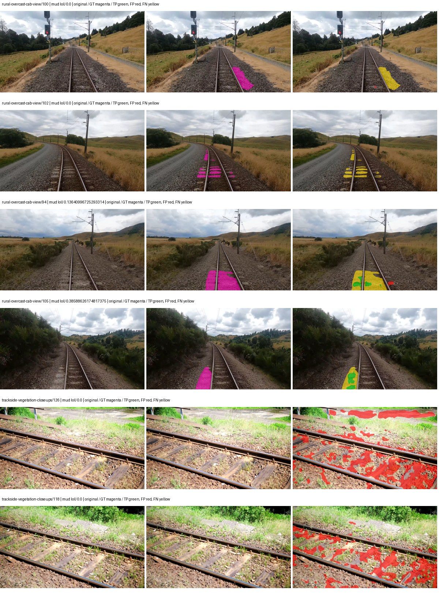
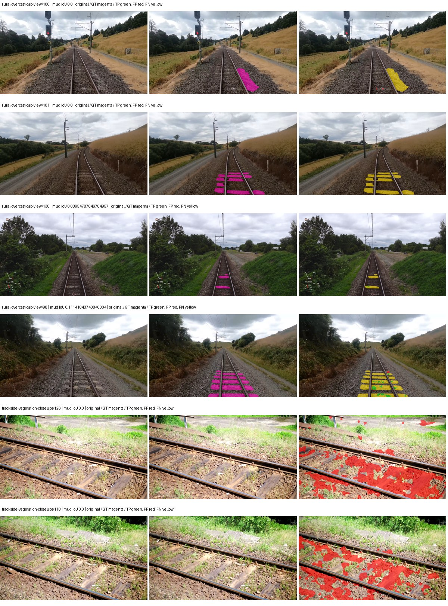
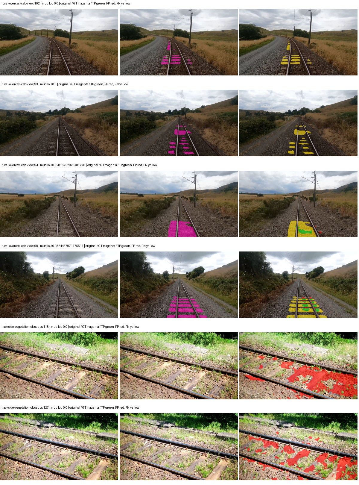
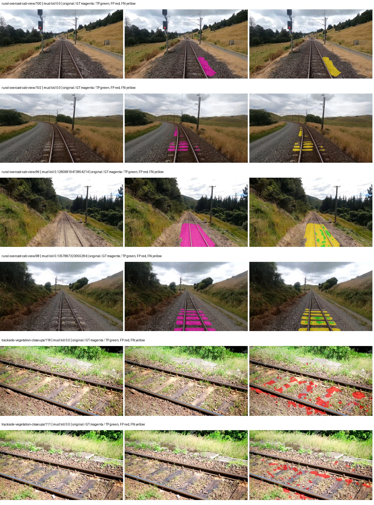

# native_mobilenetv3_large_deeplabv3plus — paul-test-rtis_v2

[RTIS comparison](../../README.md) · [Full model records](record.json)

Primary selection and early stopping: **mud-pumping validation IoU**. A job is complete only after full statistics and isolated profiling are verified.

| Model | Initialization path | Seed | Status | Steps | Best step | Mud IoU (%) | Mud precision (%) | Mud recall (%) | Final mud IoU (trainer val, %) | mIoU (%) | Fixed GT-class mIoU (%) |
| --- | --- | --- | --- | --- | --- | --- | --- | --- | --- | --- | --- |
| native_mobilenetv3_large_deeplabv3plus | rtis_only | 0 | completed | 2039 | 764 | 3.31 | 4.90 | 9.23 | 0.29 | 25.78 | 30.08 |
| native_mobilenetv3_large_deeplabv3plus | cityscapes_to_rtis | 0 | completed | 2039 | 764 | 0.61 | 0.93 | 1.78 | 0.14 | 23.40 | 27.30 |
| native_mobilenetv3_large_deeplabv3plus | railsem19_to_rtis | 0 | completed | 2039 | 764 | 2.22 | 3.48 | 5.80 | 0.85 | 35.69 | 39.65 |
| native_mobilenetv3_large_deeplabv3plus | cityscapes_to_railsem19_to_rtis | 0 | completed | 2039 | 764 | 3.15 | 8.36 | 4.82 | 0.49 | 33.14 | 38.67 |

Training: 205 images. Validation: 37 images. Test: 50 held out. Seeds: [0]. Seed variation measures optimization variability, not independent-recording uncertainty. Historical source checkpoints stay fixed across adaptation seeds.

Training code: `066afb2626398b7be59d4d19f5a0e4644fd59adc`. Split SHA-256: `18a84c0163a65ded46508bcc904c374e5f33ad8a09b8879e3c8add606e86aa9f`.

## rtis_only — seed 0

Status: **completed**. Started: 2026-09-09T22:27:23.278006+00:00. Finished: 2026-09-09T22:50:38.584005+00:00.

Recipe pretrained initializer: `{"arch": "native", "backbone_path": null, "batch_norm_momentum": null, "checkpoint": null, "classifier_path": null, "drop_path": null, "encoder_name": null, "encoder_weights": null, "head": "unified_head", "head_paths": [], "inactive_parameter_paths": [], "local_files_only": false, "lora_alpha": 32, "lora_dropout": 0.05, "lora_r": 16, "lora_targets": [], "native": {"auxiliary_heads": [], "backbone": {"in_channels": 3, "kind": "timm", "name": "mobilenetv3_large_100.ra_in1k", "out_indices": [1, 2, 3, 4], "weights": "pretrained"}, "head": {"activation": "relu", "channels": 160, "dilation_rates": [6, 12, 18], "dropout": 0.1, "high_index": 3, "kind": "deeplabv3plus", "low_channels": 32, "low_index": 0, "norm": "group"}, "neck": {"kind": "identity"}, "task": "multiclass"}, "revision": null, "smp_arch": null, "subfolder": null, "trust_remote_code": false, "tuning": "full"}`.

`rtis_only` uses the recipe initializer, which may include pretrained segmentation components. Transfer paths load the exact historical source checkpoint below and reset the classifier; they do not reset all query/decoder features.

Source checkpoint: `Recipe pretrained initialization`.

Config SHA-256: `0a411a771ea62e8db7ffd9edf229930844f78301eb260bf0c8ff89093ec71966`. Weights used for validation: `raw`.

### Mud-pumping and aggregate quality

| Metric | Selected checkpoint | Final training validation |
| --- | --- | --- |
| Mud IoU | 3.31 | 0.29 |
| Mud precision | 4.90 | 0.44 |
| Mud recall | 9.23 | 0.83 |
| Mud Dice/F1 | 6.40 | 0.58 |
| mIoU | 25.78 | 27.11 |
| Mean accuracy | 39.38 | 39.59 |
| Mean precision | 39.40 | 39.27 |
| Mean Dice | 33.78 | 34.52 |
| Mean specificity | 98.88 | 98.98 |
| Pixel accuracy | 81.48 | 83.49 |
| Frequency-weighted IoU | 72.20 | 74.70 |
| Fixed GT-present class mIoU | 30.08 | 31.63 |
| Boundary F1 | 30.63 | 32.19 |

The selected checkpoint has independent evaluation evidence. Final values are the trainer's final validation record, not a new independent evaluation. mIoU averages classes with nonzero union, so false positives on absent classes can change its denominator. The fixed GT-class mean is supplementary and excludes absent classes; their false positives remain in the confusion matrix.

### Resource usage and timing

| Measurement | Value |
| --- | --- |
| Peak training VRAM, retained training invocation (GiB) | 7.46 |
| Peak evaluation VRAM (GiB) | 6.82 |
| Retained training invocation wall time (seconds) | 1269.76 |
| Retained training invocation GPU-hours (one GPU) | 0.35 |
| Evaluation wall time (seconds) | 10.67 |
| Full evaluation pipeline images/second | 3.47 |
| Best full-state checkpoint (MiB) | 123.69 |
| Final full-state checkpoint (MiB) | 123.68 |
| Verified periodic checkpoints removed (GiB) | 0.48 |

VRAM uses the recorded allocator high-water mark; it is not total device usage including CUDA context. Resumed jobs' retained training invocation times and peaks are **not whole-campaign totals**. Earlier invocation resource records are not reconstructed here. Evaluation throughput includes loader, sliding-window inference and metrics; it is not model-only latency/FPS. Missing measurements are shown as —, never inferred from another dataset's run.

### Standardized inference performance

Dedicated model-only profiling waits for an idle worker-locked L40S: BF16, batch 1, 1024x1024, 20 warmup and 100 CUDA-event-timed public forwards. It excludes loading, preprocessing, tiling and metrics.

| Status | Parameters | Weight MiB | FPS | p50 ms | p95 ms | Peak reserved GiB |
| --- | --- | --- | --- | --- | --- | --- |
| complete | 8067845 | 30.78 | 165.56 | 5.90 | 6.97 | 0.44 |

```json
{
  "schema_version": 1,
  "model_id": "native_mobilenetv3_large_deeplabv3plus",
  "measured_at": "2026-09-09T22:50:36+00:00",
  "status": "complete",
  "benchmark_scope": "rtis_selected_checkpoint_model_only",
  "applies_to": [
    "native_mobilenetv3_large_deeplabv3plus--rtis_only--seed-0"
  ],
  "source": {
    "campaign_git_sha": "066afb2626398b7be59d4d19f5a0e4644fd59adc",
    "git_dirty": false,
    "config_hash": "93eb063cf458",
    "resolved_config": "/data/izadia1/projects/segmentary-runs/paul-test-rtis_v2/seed0-20260909/configs/native_mobilenetv3_large_deeplabv3plus--rtis_only--seed-0.yaml",
    "config_sha256": "0a411a771ea62e8db7ffd9edf229930844f78301eb260bf0c8ff89093ec71966",
    "checkpoint_sha256": "31fe0a15311ca4737912144c3b7acba9616e0ddc2af16dba12d855dbf2e49def",
    "checkpoint_global_step": 764,
    "checkpoint_bytes": 129696290,
    "checkpoint_kind": "resume checkpoint with optimizer and EMA state",
    "weights": "raw",
    "measured_checkpoint_job_id": "native_mobilenetv3_large_deeplabv3plus--rtis_only--seed-0",
    "result_sha256": "3c4bbe7b3f5562fc92be9ca2ecda723ac80a35b8065b5a5ba7ad017143bf9eb2",
    "result_git_sha": "066afb2626398b7be59d4d19f5a0e4644fd59adc",
    "result_stage": "eval:paul-test-rtis:val",
    "result_seed": 0
  },
  "hardware": {
    "gpu_name": "NVIDIA L40S",
    "gpu_uuid": "GPU-2f8008a1-9b67-11f6-987b-b393a672322c",
    "logical_device": "cuda:0",
    "physical_visibility_token": "3",
    "compute_capability": [
      8,
      9
    ],
    "total_memory_bytes": 47677177856
  },
  "model": {
    "parameter_count": 8067845,
    "trainable_parameter_count": 8067845,
    "resident_parameter_bytes": 32271380,
    "parameter_dtype_counts": {
      "float32": 8067845
    }
  },
  "contract": {
    "backend": "pytorch",
    "precision": "bf16_autocast",
    "batch_size": 1,
    "input_shape_nchw": [
      1,
      3,
      1024,
      1024
    ],
    "warmup_iterations": 20,
    "measured_iterations": 100,
    "timing": "per-forward CUDA events with end-event synchronization",
    "includes_preprocessing": false,
    "includes_data_loader": false,
    "includes_sliding_window": false,
    "input_resident_on_gpu": true,
    "model_only": true,
    "entrypoint": "public model(image) dense-logits forward"
  },
  "measurements": {
    "latency": {
      "p50_ms": 5.895167827606201,
      "p95_ms": 6.973900723457336,
      "mean_ms": 6.040029439926148,
      "minimum_ms": 5.628928184509277,
      "maximum_ms": 7.417856216430664,
      "fps": 165.56210693109256,
      "raw_ms": [
        5.891071796417236,
        7.027711868286133,
        5.917632102966309,
        7.417856216430664,
        6.405119895935059,
        6.214655876159668,
        6.057983875274658,
        5.880832195281982,
        5.720064163208008,
        5.91974401473999,
        7.002111911773682,
        7.01964807510376,
        6.862847805023193,
        5.993408203125,
        6.1091837882995605,
        6.785024166107178,
        6.972415924072266,
        5.882847785949707,
        5.725183963775635,
        5.68012809753418,
        5.673984050750732,
        6.040575981140137,
        5.696479797363281,
        5.688320159912109,
        6.319104194641113,
        5.637119770050049,
        5.665791988372803,
        6.262656211853027,
        5.917727947235107,
        5.628928184509277,
        5.700736045837402,
        5.738399982452393,
        5.716991901397705,
        5.825535774230957,
        6.112256050109863,
        6.139904022216797,
        6.138879776000977,
        5.965792179107666,
        5.980160236358643,
        6.260735988616943,
        6.196224212646484,
        5.6985602378845215,
        5.704576015472412,
        5.786623954772949,
        5.780447959899902,
        6.48086404800415,
        5.82041597366333,
        5.755904197692871,
        6.401984214782715,
        5.798912048339844,
        5.790719985961914,
        5.7876482009887695,
        5.796864032745361,
        6.146048069000244,
        5.813248157501221,
        5.782527923583984,
        6.267903804779053,
        5.87059211730957,
        7.264256000518799,
        6.414336204528809,
        6.486015796661377,
        6.2320637702941895,
        5.668863773345947,
        5.646336078643799,
        5.665791988372803,
        5.837823867797852,
        5.655551910400391,
        6.072319984436035,
        6.707200050354004,
        6.17574405670166,
        6.712319850921631,
        6.180863857269287,
        5.710783958435059,
        6.767615795135498,
        5.797887802124023,
        5.756800174713135,
        5.905407905578613,
        6.179840087890625,
        6.099967956542969,
        5.899263858795166,
        6.05401611328125,
        6.443007946014404,
        6.106112003326416,
        5.668863773345947,
        5.642240047454834,
        5.646336078643799,
        5.68012809753418,
        5.660672187805176,
        5.650432109832764,
        6.53004789352417,
        6.440959930419922,
        6.313983917236328,
        6.100992202758789,
        5.742591857910156,
        5.701632022857666,
        5.657599925994873,
        5.655551910400391,
        5.647456169128418,
        5.683199882507324,
        5.864448070526123
      ],
      "percentile_method": "numpy linear interpolation"
    },
    "peak_reserved_bytes": 471859200,
    "memory_kind": "pytorch_cuda_allocator_peak_reserved_excluding_context",
    "benchmark_wall_clock_s": 16.042926274240017
  },
  "started_at": "2026-09-09T22:50:20+00:00",
  "finished_at": "2026-09-09T22:50:36+00:00",
  "environment": {
    "hostname": "hdrfs-app-001",
    "python": "3.11.15",
    "platform": "Linux-5.15.0-139-generic-x86_64-with-glibc2.35",
    "torch": "2.11.0+cu128",
    "torch_cuda": "12.8",
    "cudnn": 91900,
    "driver_version": "570.133.20",
    "cuda_available": true,
    "gpu_count": 1,
    "gpu_names": [
      "NVIDIA L40S"
    ],
    "cuda_visible_devices": "3",
    "packages": {
      "segmentary": "0.1.0",
      "torch": "2.11.0+cu128",
      "torchvision": "0.26.0+cu128",
      "transformers": "5.15.0",
      "timm": "1.0.28",
      "segmentation-models-pytorch": "0.5.0",
      "albumentations": "2.0.8",
      "lightning": "2.6.5",
      "numpy": "2.4.4"
    }
  }
}
```

### Per-class validation results

| Class | GT pixels | IoU (%) | Precision (%) | Recall (%) | Dice (%) | Boundary F1 (%) |
| --- | --- | --- | --- | --- | --- | --- |
| car | 29664 | 0.00 | 0.00 | 0.00 | 0.00 | 0.00 |
| construction | 311585 | 24.63 | 27.46 | 70.52 | 39.53 | 33.23 |
| fence | 265137 | 13.51 | 29.40 | 20.01 | 23.81 | 30.03 |
| mud-pumping | 1226250 | 3.31 | 4.90 | 9.23 | 6.40 | 5.33 |
| on-rails | 0 | 0.00 | 0.00 | — | 0.00 | 0.00 |
| person | 0 | 0.00 | 0.00 | — | 0.00 | 0.00 |
| pole | 628038 | 58.57 | 67.66 | 81.35 | 73.88 | 86.76 |
| rail-embedded | 16799 | 16.03 | 51.33 | 18.90 | 27.63 | 26.37 |
| rail-raised | 2969797 | 59.61 | 63.99 | 89.70 | 74.69 | 81.00 |
| rail-track | 6323197 | 37.32 | 65.00 | 46.71 | 54.36 | 50.79 |
| road | 1048831 | 17.82 | 56.91 | 20.60 | 30.24 | 33.48 |
| sidewalk | 1297367 | 39.19 | 86.22 | 41.81 | 56.31 | 10.58 |
| sky | 19121606 | 97.52 | 99.16 | 98.34 | 98.75 | 91.64 |
| standing-water | 95802 | 0.22 | 0.26 | 1.67 | 0.45 | 4.74 |
| terrain | 39239306 | 85.61 | 88.84 | 95.92 | 92.25 | 59.34 |
| trackbed | 10643081 | 50.91 | 64.99 | 70.15 | 67.47 | 49.05 |
| traffic-light | 19510 | 6.36 | 15.21 | 9.86 | 11.96 | 13.37 |
| traffic-sign | 13285 | 0.00 | 0.00 | 0.00 | 0.00 | 0.00 |
| tram-track | 56179 | 7.12 | 26.81 | 8.83 | 13.29 | 14.52 |
| truck | 0 | 0.00 | 0.00 | — | 0.00 | 0.00 |
| vegetation-overgrowth | 5901821 | 23.69 | 79.28 | 25.26 | 38.31 | 53.00 |

### Full-run accounting

| Measurement | Value |
| --- | --- |
| Full GPU-reserved wall seconds, all recorded worker attempts | 1395.31 |
| Full reserved GPU-hours | 0.39 |
| Whole-run timing complete | True |

| Phase | Wall seconds including failed attempts |
| --- | --- |
| training | 1276.04 |
| diagnostics | 77.09 |
| performance | 23.48 |

GPU-reserved time includes model loading, training, validation, collection, profiling, checkpoint I/O and orchestration while the worker owns one GPU. It is not GPU kernel-active time. Phase timings and sampled device memory/power/utilization are retained separately; sampled device memory is not the allocator high-water mark.

### Train/validation and raw/EMA diagnostics

| Checkpoint / weights / split | Images | Mud IoU (%) | Mud precision (%) | Mud recall (%) |
| --- | --- | --- | --- | --- |
| best-auto-train / raw | 205 | 86.53 | 95.75 | 89.99 |
| best-auto-val / raw | 37 | 3.31 | 4.90 | 9.23 |
| best-alternate-val / ema | 37 | 0.22 | 0.33 | 0.68 |
| final-auto-val / raw | 37 | 0.29 | 0.45 | 0.83 |

Train uses the evaluation transform without augmentation. Compare mud train/validation metrics for the same selected weights. Alternate EMA on running-stat BatchNorm is explicitly uncalibrated and is diagnostic only. Score-threshold curves use uncalibrated normalized scores and are pixel-level diagnostics, not event detection rates or a selected deployment operating point.

### Downloadable evidence

- best-auto-train: [per-image.csv](rtis_only--seed-0/best-auto-train/per-image.csv) · [per-image-confusion.json.gz](rtis_only--seed-0/best-auto-train/per-image-confusion.json.gz) · [groups.json](rtis_only--seed-0/best-auto-train/groups.json) · [mud-score-curves.json](rtis_only--seed-0/best-auto-train/mud-score-curves.json)
- best-auto-val: [per-image.csv](rtis_only--seed-0/best-auto-val/per-image.csv) · [per-image-confusion.json.gz](rtis_only--seed-0/best-auto-val/per-image-confusion.json.gz) · [groups.json](rtis_only--seed-0/best-auto-val/groups.json) · [mud-score-curves.json](rtis_only--seed-0/best-auto-val/mud-score-curves.json) · [examples.jpg](rtis_only--seed-0/best-auto-val/examples.jpg)
- best-alternate-val: [per-image.csv](rtis_only--seed-0/best-alternate-val/per-image.csv) · [per-image-confusion.json.gz](rtis_only--seed-0/best-alternate-val/per-image-confusion.json.gz) · [groups.json](rtis_only--seed-0/best-alternate-val/groups.json) · [mud-score-curves.json](rtis_only--seed-0/best-alternate-val/mud-score-curves.json)
- final-auto-val: [per-image.csv](rtis_only--seed-0/final-auto-val/per-image.csv) · [per-image-confusion.json.gz](rtis_only--seed-0/final-auto-val/per-image-confusion.json.gz) · [groups.json](rtis_only--seed-0/final-auto-val/groups.json) · [mud-score-curves.json](rtis_only--seed-0/final-auto-val/mud-score-curves.json)
- resources: [telemetry.csv](rtis_only--seed-0/resources/telemetry.csv)



Examples are two lowest and two highest mud-IoU positive images, plus up to two negative images with the most false-positive mud pixels. They are targeted diagnostic examples, not random samples. Green: true positive; red: false positive; yellow: false negative. Full predictions remain on HDRFS.

### Validation tracking

| Logged step | Overall mIoU (%) | Mud IoU (%) |
| --- | --- | --- |
| 254 | 21.07 | 0.13 |
| 509 | 20.75 | 0.94 |
| 764 | 25.77 | 3.31 |
| 1019 | 25.36 | 0.18 |
| 1274 | 26.68 | 0.17 |
| 1529 | 26.02 | 0.24 |
| 1784 | 26.85 | 0.23 |
| 2038 | 27.11 | 0.29 |

All retained scalar curves, including training loss and per-class IoU, are in record.json. Observed best mud on a curve is not necessarily a retained checkpoint: the pilot saved its selection-metric-best and final checkpoints. Step logging and checkpoint global_step may differ by one.

### Stopping and checkpoint provenance

```json
{
  "stopping": {
    "actual_steps": 2039,
    "maximum_steps": 4000,
    "min_delta": 0.001,
    "monitor": "val_iou/mud-pumping",
    "patience": 5,
    "reason": "validation_plateau"
  },
  "checkpoints": {
    "best": {
      "path": "/data/izadia1/projects/segmentary-runs/paul-test-rtis_v2/seed0-20260909/future-runs/native_mobilenetv3_large_deeplabv3plus--rtis_only--seed-0_seed0/rtis/best.ckpt",
      "sha256": "31fe0a15311ca4737912144c3b7acba9616e0ddc2af16dba12d855dbf2e49def",
      "global_step": 764,
      "bytes": 129696290
    },
    "final": {
      "path": "/data/izadia1/projects/segmentary-runs/paul-test-rtis_v2/seed0-20260909/future-runs/native_mobilenetv3_large_deeplabv3plus--rtis_only--seed-0_seed0/rtis/last.ckpt",
      "sha256": "77e6164368ae6d67c03447d2e69e050ab3b3937c1b4c2fc0f4940d886f419efa",
      "global_step": 2039,
      "bytes": 129684578
    }
  },
  "cleanup_error": null
}
```

### Resolved training, initialization and evaluation settings

The optimizer block is the base configuration. Stage LR scales are applied at runtime, and stage warmup is capped at min(base warmup, floor(stage budget / 10), stage budget - 1): 400 steps for this 4,000-step pilot. Model-internal native input grids may differ from augmentation crops (EoMT uses its 640 grid).

```json
{
  "name": "native_mobilenetv3_large_deeplabv3plus--rtis_only--seed-0",
  "model": {
    "arch": "native",
    "checkpoint": null,
    "tuning": "full",
    "head": "unified_head",
    "lora_r": 16,
    "lora_alpha": 32,
    "lora_dropout": 0.05,
    "lora_targets": [],
    "drop_path": null,
    "revision": null,
    "subfolder": null,
    "local_files_only": false,
    "trust_remote_code": false,
    "backbone_path": null,
    "head_paths": [],
    "classifier_path": null,
    "inactive_parameter_paths": [],
    "smp_arch": null,
    "encoder_name": null,
    "encoder_weights": null,
    "native": {
      "task": "multiclass",
      "backbone": {
        "kind": "timm",
        "name": "mobilenetv3_large_100.ra_in1k",
        "weights": "pretrained",
        "out_indices": [
          1,
          2,
          3,
          4
        ],
        "in_channels": 3
      },
      "neck": {
        "kind": "identity"
      },
      "head": {
        "kind": "deeplabv3plus",
        "low_index": 0,
        "high_index": 3,
        "channels": 160,
        "low_channels": 32,
        "dilation_rates": [
          6,
          12,
          18
        ],
        "dropout": 0.1,
        "norm": "group",
        "activation": "relu"
      },
      "auxiliary_heads": []
    },
    "batch_norm_momentum": null
  },
  "space": "paul-test-rtis",
  "taxonomy_root": "/data/izadia1/projects/segmentary-rtis-fullstats-066afb2/taxonomy",
  "output_root": "/data/izadia1/projects/segmentary-runs/paul-test-rtis_v2/seed0-20260909/future-runs",
  "optim": {
    "backbone_lr": 0.0001,
    "head_lr_mult": 10.0,
    "weight_decay": 0.05,
    "llrd": 1.0,
    "warmup_iters": 1500,
    "warmup_ratio": 1e-06,
    "poly_power": 0.9,
    "min_lr_ratio": 0.0,
    "betas": [
      0.9,
      0.999
    ],
    "grad_clip": 1.0
  },
  "train": {
    "iters": 4000,
    "batch_size": 2,
    "accum": 8,
    "num_workers": 2,
    "precision": "bf16-mixed",
    "ema_decay": 0.9998,
    "val_every": 250,
    "ckpt_every": 500,
    "selection_metric": "val_iou/mud-pumping",
    "early_stopping_patience": 5,
    "early_stopping_min_delta": 0.001,
    "seed": 0,
    "devices": 1
  },
  "eval": {
    "sliding_window": true,
    "window": [
      1024,
      1024
    ],
    "stride": [
      768,
      768
    ],
    "batch_size": 1,
    "num_workers": 2,
    "tta_scales": [],
    "tta_flip": false,
    "threshold": 0.5,
    "boundary_tolerance_frac": 0.0075,
    "save_confusion": true
  },
  "loss": {
    "task": "multiclass",
    "activation": "auto",
    "terms": [],
    "aux": "none",
    "aux_weight": 0.0,
    "ce_weight": 1.0,
    "label_smoothing": 0.0,
    "class_weights": null,
    "query": null
  },
  "aug": {
    "crop": [
      1024,
      1024
    ],
    "scale_min": 0.5,
    "scale_max": 2.0,
    "hflip_p": 0.5,
    "color_jitter_p": 0.5,
    "brightness": 0.25,
    "contrast": 0.25,
    "saturation": 0.25,
    "hue": 0.05
  },
  "stages": [
    {
      "name": "rtis",
      "data": [
        {
          "name": "paul-test-rtis",
          "root": "/data/izadia1/datasets/paul-test-rtis_v2",
          "variant": null,
          "split_file": "splits.json",
          "train_split": "train",
          "val_split": "val",
          "limit": null,
          "loader": "folder",
          "mapping": "paul-test-rtis",
          "loader_options": {
            "require_groups": true
          }
        }
      ],
      "iters": null,
      "lr_scale": 1.0,
      "head_group_lr_scale": 1.0,
      "init_from": "pretrained",
      "reset_head": false,
      "freeze": null,
      "sample_weights": null
    }
  ]
}
```

### Hardware and software provenance

```json
{
  "training": {
    "cuda_available": true,
    "cuda_visible_devices": "3",
    "cudnn": 91900,
    "driver_version": "570.133.20",
    "gpu_count": 1,
    "gpu_names": [
      "NVIDIA L40S"
    ],
    "hostname": "hdrfs-app-001",
    "input_normalization": {
      "channel_order": "rgb",
      "mean": [
        0.485,
        0.456,
        0.406
      ],
      "source": "timm_pretrained_cfg",
      "std": [
        0.229,
        0.224,
        0.225
      ]
    },
    "model_origins": [
      {
        "hf_commit": null,
        "hf_name_or_path": null,
        "module": "backbone",
        "timm_pretrained": {
          "architecture": "mobilenetv3_large_100",
          "hf_hub_id": "timm/mobilenetv3_large_100.ra_in1k",
          "tag": "ra_in1k",
          "url": "https://github.com/rwightman/pytorch-image-models/releases/download/v0.1-weights/mobilenetv3_large_100_ra-f55367f5.pth"
        }
      },
      {
        "hf_commit": null,
        "hf_name_or_path": null,
        "module": "backbone.model",
        "timm_pretrained": {
          "architecture": "mobilenetv3_large_100",
          "hf_hub_id": "timm/mobilenetv3_large_100.ra_in1k",
          "tag": "ra_in1k",
          "url": "https://github.com/rwightman/pytorch-image-models/releases/download/v0.1-weights/mobilenetv3_large_100_ra-f55367f5.pth"
        }
      }
    ],
    "model_parameter_count": 8067845,
    "packages": {
      "albumentations": "2.0.8",
      "lightning": "2.6.5",
      "numpy": "2.4.4",
      "segmentary": "0.1.0",
      "segmentation-models-pytorch": "0.5.0",
      "timm": "1.0.28",
      "torch": "2.11.0+cu128",
      "torchvision": "0.26.0+cu128",
      "transformers": "5.15.0"
    },
    "platform": "Linux-5.15.0-139-generic-x86_64-with-glibc2.35",
    "python": "3.11.15",
    "torch": "2.11.0+cu128",
    "torch_cuda": "12.8",
    "trainable_parameter_count": 8067845,
    "training_stop": {
      "actual_steps": 2039,
      "maximum_steps": 4000,
      "min_delta": 0.001,
      "monitor": "val_iou/mud-pumping",
      "patience": 5,
      "reason": "validation_plateau"
    },
    "validation_weights": "raw"
  },
  "evaluation": {
    "cuda_available": true,
    "cuda_visible_devices": "3",
    "cudnn": 91900,
    "driver_version": "570.133.20",
    "gpu_count": 1,
    "gpu_names": [
      "NVIDIA L40S"
    ],
    "hostname": "hdrfs-app-001",
    "input_normalization": {
      "channel_order": "rgb",
      "mean": [
        0.485,
        0.456,
        0.406
      ],
      "source": "timm_pretrained_cfg",
      "std": [
        0.229,
        0.224,
        0.225
      ]
    },
    "packages": {
      "albumentations": "2.0.8",
      "lightning": "2.6.5",
      "numpy": "2.4.4",
      "segmentary": "0.1.0",
      "segmentation-models-pytorch": "0.5.0",
      "timm": "1.0.28",
      "torch": "2.11.0+cu128",
      "torchvision": "0.26.0+cu128",
      "transformers": "5.15.0"
    },
    "platform": "Linux-5.15.0-139-generic-x86_64-with-glibc2.35",
    "python": "3.11.15",
    "torch": "2.11.0+cu128",
    "torch_cuda": "12.8"
  }
}
```

## cityscapes_to_rtis — seed 0

Status: **completed**. Started: 2026-09-09T22:31:14.901130+00:00. Finished: 2026-09-09T22:54:57.432404+00:00.

Recipe pretrained initializer: `{"arch": "native", "backbone_path": null, "batch_norm_momentum": null, "checkpoint": null, "classifier_path": null, "drop_path": null, "encoder_name": null, "encoder_weights": null, "head": "unified_head", "head_paths": [], "inactive_parameter_paths": [], "local_files_only": false, "lora_alpha": 32, "lora_dropout": 0.05, "lora_r": 16, "lora_targets": [], "native": {"auxiliary_heads": [], "backbone": {"in_channels": 3, "kind": "timm", "name": "mobilenetv3_large_100.ra_in1k", "out_indices": [1, 2, 3, 4], "weights": "pretrained"}, "head": {"activation": "relu", "channels": 160, "dilation_rates": [6, 12, 18], "dropout": 0.1, "high_index": 3, "kind": "deeplabv3plus", "low_channels": 32, "low_index": 0, "norm": "group"}, "neck": {"kind": "identity"}, "task": "multiclass"}, "revision": null, "smp_arch": null, "subfolder": null, "trust_remote_code": false, "tuning": "full"}`.

`rtis_only` uses the recipe initializer, which may include pretrained segmentation components. Transfer paths load the exact historical source checkpoint below and reset the classifier; they do not reset all query/decoder features.

Source checkpoint: `{'name': 'native_mobilenetv3_large_deeplabv3plus--cityscapes--seed-0', 'model': 'native_mobilenetv3_large_deeplabv3plus', 'protocol': 'cityscapes', 'config': '/data/izadia1/projects/segmentary-runs/all-model-city-rail-seed0-rail20-b9eb3e1/jobs/native_mobilenetv3_large_deeplabv3plus--cityscapes--seed-0/attempt-001/resolved-config.yaml', 'checkpoint': '/data/izadia1/projects/segmentary-runs/all-model-city-rail-seed0-rail20-b9eb3e1/jobs/native_mobilenetv3_large_deeplabv3plus--cityscapes--seed-0/attempt-001/train/native_mobilenetv3_large_deeplabv3plus--cityscapes_seed0/cityscapes/last.ckpt', 'recorded_sha256': '3f4ba18645bef15308a37d53615f8c1e284e4869f790f489059857c04872a11f', 'exists': True}`.

Config SHA-256: `c8f2a411c4d7da2cb217642a4804fe4de20b56b331b993d173c226b4930fdd3a`. Weights used for validation: `raw`.

### Mud-pumping and aggregate quality

| Metric | Selected checkpoint | Final training validation |
| --- | --- | --- |
| Mud IoU | 0.61 | 0.14 |
| Mud precision | 0.93 | 0.16 |
| Mud recall | 1.78 | 0.95 |
| Mud Dice/F1 | 1.22 | 0.28 |
| mIoU | 23.40 | 28.52 |
| Mean accuracy | 33.99 | 38.22 |
| Mean precision | 42.56 | 48.21 |
| Mean Dice | 29.99 | 35.97 |
| Mean specificity | 98.82 | 98.77 |
| Pixel accuracy | 80.66 | 79.10 |
| Frequency-weighted IoU | 70.97 | 71.10 |
| Fixed GT-present class mIoU | 27.30 | 33.28 |
| Boundary F1 | 29.54 | 34.74 |

The selected checkpoint has independent evaluation evidence. Final values are the trainer's final validation record, not a new independent evaluation. mIoU averages classes with nonzero union, so false positives on absent classes can change its denominator. The fixed GT-class mean is supplementary and excludes absent classes; their false positives remain in the confusion matrix.

### Resource usage and timing

| Measurement | Value |
| --- | --- |
| Peak training VRAM, retained training invocation (GiB) | 7.46 |
| Peak evaluation VRAM (GiB) | 6.82 |
| Retained training invocation wall time (seconds) | 1294.35 |
| Retained training invocation GPU-hours (one GPU) | 0.36 |
| Evaluation wall time (seconds) | 11.42 |
| Full evaluation pipeline images/second | 3.24 |
| Best full-state checkpoint (MiB) | 123.69 |
| Final full-state checkpoint (MiB) | 123.68 |
| Verified periodic checkpoints removed (GiB) | 0.48 |

VRAM uses the recorded allocator high-water mark; it is not total device usage including CUDA context. Resumed jobs' retained training invocation times and peaks are **not whole-campaign totals**. Earlier invocation resource records are not reconstructed here. Evaluation throughput includes loader, sliding-window inference and metrics; it is not model-only latency/FPS. Missing measurements are shown as —, never inferred from another dataset's run.

### Standardized inference performance

Dedicated model-only profiling waits for an idle worker-locked L40S: BF16, batch 1, 1024x1024, 20 warmup and 100 CUDA-event-timed public forwards. It excludes loading, preprocessing, tiling and metrics.

| Status | Parameters | Weight MiB | FPS | p50 ms | p95 ms | Peak reserved GiB |
| --- | --- | --- | --- | --- | --- | --- |
| complete | 8067845 | 30.78 | 166.87 | 5.93 | 6.86 | 0.44 |

```json
{
  "schema_version": 1,
  "model_id": "native_mobilenetv3_large_deeplabv3plus",
  "measured_at": "2026-09-09T22:54:55+00:00",
  "status": "complete",
  "benchmark_scope": "rtis_selected_checkpoint_model_only",
  "applies_to": [
    "native_mobilenetv3_large_deeplabv3plus--cityscapes_to_rtis--seed-0"
  ],
  "source": {
    "campaign_git_sha": "066afb2626398b7be59d4d19f5a0e4644fd59adc",
    "git_dirty": false,
    "config_hash": "deac7c6331a7",
    "resolved_config": "/data/izadia1/projects/segmentary-runs/paul-test-rtis_v2/seed0-20260909/configs/native_mobilenetv3_large_deeplabv3plus--cityscapes_to_rtis--seed-0.yaml",
    "config_sha256": "c8f2a411c4d7da2cb217642a4804fe4de20b56b331b993d173c226b4930fdd3a",
    "checkpoint_sha256": "d7dff6000d4eed146d5eb3537bb091718e9f84c3d11c1f2ec9531cf3f1279872",
    "checkpoint_global_step": 764,
    "checkpoint_bytes": 129696354,
    "checkpoint_kind": "resume checkpoint with optimizer and EMA state",
    "weights": "raw",
    "measured_checkpoint_job_id": "native_mobilenetv3_large_deeplabv3plus--cityscapes_to_rtis--seed-0",
    "result_sha256": "4d6c4e089325aed52e0dc61662fc316dc0fcc3a91c21528f75ac641c16366a1d",
    "result_git_sha": "066afb2626398b7be59d4d19f5a0e4644fd59adc",
    "result_stage": "eval:paul-test-rtis:val",
    "result_seed": 0
  },
  "hardware": {
    "gpu_name": "NVIDIA L40S",
    "gpu_uuid": "GPU-1c9b612f-e0b5-fbbc-150f-8c2ef13453c9",
    "logical_device": "cuda:0",
    "physical_visibility_token": "5",
    "compute_capability": [
      8,
      9
    ],
    "total_memory_bytes": 47677177856
  },
  "model": {
    "parameter_count": 8067845,
    "trainable_parameter_count": 8067845,
    "resident_parameter_bytes": 32271380,
    "parameter_dtype_counts": {
      "float32": 8067845
    }
  },
  "contract": {
    "backend": "pytorch",
    "precision": "bf16_autocast",
    "batch_size": 1,
    "input_shape_nchw": [
      1,
      3,
      1024,
      1024
    ],
    "warmup_iterations": 20,
    "measured_iterations": 100,
    "timing": "per-forward CUDA events with end-event synchronization",
    "includes_preprocessing": false,
    "includes_data_loader": false,
    "includes_sliding_window": false,
    "input_resident_on_gpu": true,
    "model_only": true,
    "entrypoint": "public model(image) dense-logits forward"
  },
  "measurements": {
    "latency": {
      "p50_ms": 5.9263999462127686,
      "p95_ms": 6.861824011802673,
      "mean_ms": 5.992816634178162,
      "minimum_ms": 5.506048202514648,
      "maximum_ms": 7.184383869171143,
      "fps": 166.86644378484928,
      "raw_ms": [
        5.837823867797852,
        5.767168045043945,
        5.619711875915527,
        5.921792030334473,
        6.391808032989502,
        6.262784004211426,
        7.165952205657959,
        6.99289608001709,
        6.041600227355957,
        6.115327835083008,
        6.096896171569824,
        6.181888103485107,
        6.859776020050049,
        6.458367824554443,
        5.891071796417236,
        6.131711959838867,
        6.625279903411865,
        5.9310078620910645,
        6.009856224060059,
        6.469632148742676,
        5.643263816833496,
        5.558271884918213,
        5.548031806945801,
        5.6842241287231445,
        6.345727920532227,
        6.437888145446777,
        5.986303806304932,
        5.91974401473999,
        5.846015930175781,
        5.744639873504639,
        5.739520072937012,
        6.051839828491211,
        5.799935817718506,
        5.971968173980713,
        5.905407905578613,
        5.536767959594727,
        5.947391986846924,
        6.115327835083008,
        6.569983959197998,
        7.184383869171143,
        6.459392070770264,
        5.855231761932373,
        5.7651519775390625,
        5.5808000564575195,
        5.599232196807861,
        6.504447937011719,
        6.307839870452881,
        5.6104960441589355,
        5.57366418838501,
        5.904384136199951,
        5.962751865386963,
        5.527552127838135,
        5.6453118324279785,
        6.598656177520752,
        6.900735855102539,
        6.096896171569824,
        6.056960105895996,
        5.735424041748047,
        5.506048202514648,
        5.766143798828125,
        5.661695957183838,
        5.785600185394287,
        6.193151950836182,
        5.76204776763916,
        6.646783828735352,
        7.097343921661377,
        6.420479774475098,
        6.122496128082275,
        5.975039958953857,
        6.062079906463623,
        6.367231845855713,
        6.057983875274658,
        6.17574405670166,
        6.07539176940918,
        5.660672187805176,
        5.534719944000244,
        5.568511962890625,
        5.553152084350586,
        5.537792205810547,
        5.566431999206543,
        5.604351997375488,
        5.567488193511963,
        5.67193603515625,
        5.601280212402344,
        5.537792205810547,
        5.841919898986816,
        5.772255897521973,
        5.707776069641113,
        5.690368175506592,
        5.542912006378174,
        5.594111919403076,
        5.984255790710449,
        6.2126078605651855,
        5.569536209106445,
        5.932032108306885,
        6.573056221008301,
        5.950463771820068,
        6.063104152679443,
        6.1675519943237305,
        5.606400012969971
      ],
      "percentile_method": "numpy linear interpolation"
    },
    "peak_reserved_bytes": 471859200,
    "memory_kind": "pytorch_cuda_allocator_peak_reserved_excluding_context",
    "benchmark_wall_clock_s": 16.228608198463917
  },
  "started_at": "2026-09-09T22:54:38+00:00",
  "finished_at": "2026-09-09T22:54:55+00:00",
  "environment": {
    "hostname": "hdrfs-app-001",
    "python": "3.11.15",
    "platform": "Linux-5.15.0-139-generic-x86_64-with-glibc2.35",
    "torch": "2.11.0+cu128",
    "torch_cuda": "12.8",
    "cudnn": 91900,
    "driver_version": "570.133.20",
    "cuda_available": true,
    "gpu_count": 1,
    "gpu_names": [
      "NVIDIA L40S"
    ],
    "cuda_visible_devices": "5",
    "packages": {
      "segmentary": "0.1.0",
      "torch": "2.11.0+cu128",
      "torchvision": "0.26.0+cu128",
      "transformers": "5.15.0",
      "timm": "1.0.28",
      "segmentation-models-pytorch": "0.5.0",
      "albumentations": "2.0.8",
      "lightning": "2.6.5",
      "numpy": "2.4.4"
    }
  }
}
```

### Per-class validation results

| Class | GT pixels | IoU (%) | Precision (%) | Recall (%) | Dice (%) | Boundary F1 (%) |
| --- | --- | --- | --- | --- | --- | --- |
| car | 29664 | 0.00 | 0.00 | 0.00 | 0.00 | 0.00 |
| construction | 311585 | 21.95 | 26.50 | 56.10 | 36.00 | 35.35 |
| fence | 265137 | 8.10 | 53.37 | 8.72 | 14.99 | 20.79 |
| mud-pumping | 1226250 | 0.61 | 0.93 | 1.78 | 1.22 | 2.72 |
| on-rails | 0 | 0.00 | 0.00 | — | 0.00 | 0.00 |
| person | 0 | 0.00 | 0.00 | — | 0.00 | 0.00 |
| pole | 628038 | 63.39 | 82.35 | 73.36 | 77.59 | 87.77 |
| rail-embedded | 16799 | 1.52 | 15.53 | 1.66 | 3.00 | 8.32 |
| rail-raised | 2969797 | 69.27 | 77.14 | 87.17 | 81.85 | 88.45 |
| rail-track | 6323197 | 30.80 | 71.88 | 35.03 | 47.10 | 42.69 |
| road | 1048831 | 4.90 | 13.05 | 7.28 | 9.35 | 17.50 |
| sidewalk | 1297367 | 12.48 | 87.89 | 12.70 | 22.19 | 6.89 |
| sky | 19121606 | 97.86 | 98.89 | 98.95 | 98.92 | 90.91 |
| standing-water | 95802 | 0.06 | 0.23 | 0.09 | 0.13 | 0.51 |
| terrain | 39239306 | 85.80 | 88.99 | 95.99 | 92.36 | 58.05 |
| trackbed | 10643081 | 49.81 | 56.24 | 81.34 | 66.50 | 47.70 |
| traffic-light | 19510 | 17.93 | 50.40 | 21.78 | 30.41 | 29.16 |
| traffic-sign | 13285 | 7.66 | 90.96 | 7.72 | 14.24 | 35.00 |
| tram-track | 56179 | 3.78 | 10.24 | 5.64 | 7.28 | 4.72 |
| truck | 0 | 0.00 | 0.00 | — | 0.00 | 0.00 |
| vegetation-overgrowth | 5901821 | 15.38 | 69.25 | 16.51 | 26.66 | 43.92 |

### Full-run accounting

| Measurement | Value |
| --- | --- |
| Full GPU-reserved wall seconds, all recorded worker attempts | 1422.68 |
| Full reserved GPU-hours | 0.40 |
| Whole-run timing complete | True |

| Phase | Wall seconds including failed attempts |
| --- | --- |
| training | 1301.41 |
| diagnostics | 78.08 |
| performance | 22.79 |

GPU-reserved time includes model loading, training, validation, collection, profiling, checkpoint I/O and orchestration while the worker owns one GPU. It is not GPU kernel-active time. Phase timings and sampled device memory/power/utilization are retained separately; sampled device memory is not the allocator high-water mark.

### Train/validation and raw/EMA diagnostics

| Checkpoint / weights / split | Images | Mud IoU (%) | Mud precision (%) | Mud recall (%) |
| --- | --- | --- | --- | --- |
| best-auto-train / raw | 205 | 86.76 | 96.81 | 89.31 |
| best-auto-val / raw | 37 | 0.61 | 0.93 | 1.78 |
| best-alternate-val / ema | 37 | 0.12 | 0.15 | 0.55 |
| final-auto-val / raw | 37 | 0.14 | 0.16 | 0.95 |

Train uses the evaluation transform without augmentation. Compare mud train/validation metrics for the same selected weights. Alternate EMA on running-stat BatchNorm is explicitly uncalibrated and is diagnostic only. Score-threshold curves use uncalibrated normalized scores and are pixel-level diagnostics, not event detection rates or a selected deployment operating point.

### Downloadable evidence

- best-auto-train: [per-image.csv](cityscapes_to_rtis--seed-0/best-auto-train/per-image.csv) · [per-image-confusion.json.gz](cityscapes_to_rtis--seed-0/best-auto-train/per-image-confusion.json.gz) · [groups.json](cityscapes_to_rtis--seed-0/best-auto-train/groups.json) · [mud-score-curves.json](cityscapes_to_rtis--seed-0/best-auto-train/mud-score-curves.json)
- best-auto-val: [per-image.csv](cityscapes_to_rtis--seed-0/best-auto-val/per-image.csv) · [per-image-confusion.json.gz](cityscapes_to_rtis--seed-0/best-auto-val/per-image-confusion.json.gz) · [groups.json](cityscapes_to_rtis--seed-0/best-auto-val/groups.json) · [mud-score-curves.json](cityscapes_to_rtis--seed-0/best-auto-val/mud-score-curves.json) · [examples.jpg](cityscapes_to_rtis--seed-0/best-auto-val/examples.jpg)
- best-alternate-val: [per-image.csv](cityscapes_to_rtis--seed-0/best-alternate-val/per-image.csv) · [per-image-confusion.json.gz](cityscapes_to_rtis--seed-0/best-alternate-val/per-image-confusion.json.gz) · [groups.json](cityscapes_to_rtis--seed-0/best-alternate-val/groups.json) · [mud-score-curves.json](cityscapes_to_rtis--seed-0/best-alternate-val/mud-score-curves.json)
- final-auto-val: [per-image.csv](cityscapes_to_rtis--seed-0/final-auto-val/per-image.csv) · [per-image-confusion.json.gz](cityscapes_to_rtis--seed-0/final-auto-val/per-image-confusion.json.gz) · [groups.json](cityscapes_to_rtis--seed-0/final-auto-val/groups.json) · [mud-score-curves.json](cityscapes_to_rtis--seed-0/final-auto-val/mud-score-curves.json)
- resources: [telemetry.csv](cityscapes_to_rtis--seed-0/resources/telemetry.csv)



Examples are two lowest and two highest mud-IoU positive images, plus up to two negative images with the most false-positive mud pixels. They are targeted diagnostic examples, not random samples. Green: true positive; red: false positive; yellow: false negative. Full predictions remain on HDRFS.

### Validation tracking

| Logged step | Overall mIoU (%) | Mud IoU (%) |
| --- | --- | --- |
| 254 | 20.38 | 0.00 |
| 509 | 23.24 | 0.16 |
| 764 | 23.36 | 0.61 |
| 1019 | 26.62 | 0.15 |
| 1274 | 26.68 | 0.24 |
| 1529 | 28.93 | 0.31 |
| 1784 | 26.96 | 0.31 |
| 2038 | 28.52 | 0.14 |

All retained scalar curves, including training loss and per-class IoU, are in record.json. Observed best mud on a curve is not necessarily a retained checkpoint: the pilot saved its selection-metric-best and final checkpoints. Step logging and checkpoint global_step may differ by one.

### Stopping and checkpoint provenance

```json
{
  "stopping": {
    "actual_steps": 2039,
    "maximum_steps": 4000,
    "min_delta": 0.001,
    "monitor": "val_iou/mud-pumping",
    "patience": 5,
    "reason": "validation_plateau"
  },
  "checkpoints": {
    "best": {
      "path": "/data/izadia1/projects/segmentary-runs/paul-test-rtis_v2/seed0-20260909/future-runs/native_mobilenetv3_large_deeplabv3plus--cityscapes_to_rtis--seed-0_seed0/rtis/best.ckpt",
      "sha256": "d7dff6000d4eed146d5eb3537bb091718e9f84c3d11c1f2ec9531cf3f1279872",
      "global_step": 764,
      "bytes": 129696354
    },
    "final": {
      "path": "/data/izadia1/projects/segmentary-runs/paul-test-rtis_v2/seed0-20260909/future-runs/native_mobilenetv3_large_deeplabv3plus--cityscapes_to_rtis--seed-0_seed0/rtis/last.ckpt",
      "sha256": "8226c449fde7e34595075b41c2568457f651d51c26a9d5a6a551f830778d6194",
      "global_step": 2039,
      "bytes": 129684642
    }
  },
  "cleanup_error": null
}
```

### Resolved training, initialization and evaluation settings

The optimizer block is the base configuration. Stage LR scales are applied at runtime, and stage warmup is capped at min(base warmup, floor(stage budget / 10), stage budget - 1): 400 steps for this 4,000-step pilot. Model-internal native input grids may differ from augmentation crops (EoMT uses its 640 grid).

```json
{
  "name": "native_mobilenetv3_large_deeplabv3plus--cityscapes_to_rtis--seed-0",
  "model": {
    "arch": "native",
    "checkpoint": null,
    "tuning": "full",
    "head": "unified_head",
    "lora_r": 16,
    "lora_alpha": 32,
    "lora_dropout": 0.05,
    "lora_targets": [],
    "drop_path": null,
    "revision": null,
    "subfolder": null,
    "local_files_only": false,
    "trust_remote_code": false,
    "backbone_path": null,
    "head_paths": [],
    "classifier_path": null,
    "inactive_parameter_paths": [],
    "smp_arch": null,
    "encoder_name": null,
    "encoder_weights": null,
    "native": {
      "task": "multiclass",
      "backbone": {
        "kind": "timm",
        "name": "mobilenetv3_large_100.ra_in1k",
        "weights": "pretrained",
        "out_indices": [
          1,
          2,
          3,
          4
        ],
        "in_channels": 3
      },
      "neck": {
        "kind": "identity"
      },
      "head": {
        "kind": "deeplabv3plus",
        "low_index": 0,
        "high_index": 3,
        "channels": 160,
        "low_channels": 32,
        "dilation_rates": [
          6,
          12,
          18
        ],
        "dropout": 0.1,
        "norm": "group",
        "activation": "relu"
      },
      "auxiliary_heads": []
    },
    "batch_norm_momentum": null
  },
  "space": "paul-test-rtis",
  "taxonomy_root": "/data/izadia1/projects/segmentary-rtis-fullstats-066afb2/taxonomy",
  "output_root": "/data/izadia1/projects/segmentary-runs/paul-test-rtis_v2/seed0-20260909/future-runs",
  "optim": {
    "backbone_lr": 0.0001,
    "head_lr_mult": 10.0,
    "weight_decay": 0.05,
    "llrd": 1.0,
    "warmup_iters": 1500,
    "warmup_ratio": 1e-06,
    "poly_power": 0.9,
    "min_lr_ratio": 0.0,
    "betas": [
      0.9,
      0.999
    ],
    "grad_clip": 1.0
  },
  "train": {
    "iters": 4000,
    "batch_size": 2,
    "accum": 8,
    "num_workers": 2,
    "precision": "bf16-mixed",
    "ema_decay": 0.9998,
    "val_every": 250,
    "ckpt_every": 500,
    "selection_metric": "val_iou/mud-pumping",
    "early_stopping_patience": 5,
    "early_stopping_min_delta": 0.001,
    "seed": 0,
    "devices": 1
  },
  "eval": {
    "sliding_window": true,
    "window": [
      1024,
      1024
    ],
    "stride": [
      768,
      768
    ],
    "batch_size": 1,
    "num_workers": 2,
    "tta_scales": [],
    "tta_flip": false,
    "threshold": 0.5,
    "boundary_tolerance_frac": 0.0075,
    "save_confusion": true
  },
  "loss": {
    "task": "multiclass",
    "activation": "auto",
    "terms": [],
    "aux": "none",
    "aux_weight": 0.0,
    "ce_weight": 1.0,
    "label_smoothing": 0.0,
    "class_weights": null,
    "query": null
  },
  "aug": {
    "crop": [
      1024,
      1024
    ],
    "scale_min": 0.5,
    "scale_max": 2.0,
    "hflip_p": 0.5,
    "color_jitter_p": 0.5,
    "brightness": 0.25,
    "contrast": 0.25,
    "saturation": 0.25,
    "hue": 0.05
  },
  "stages": [
    {
      "name": "rtis",
      "data": [
        {
          "name": "paul-test-rtis",
          "root": "/data/izadia1/datasets/paul-test-rtis_v2",
          "variant": null,
          "split_file": "splits.json",
          "train_split": "train",
          "val_split": "val",
          "limit": null,
          "loader": "folder",
          "mapping": "paul-test-rtis",
          "loader_options": {
            "require_groups": true
          }
        }
      ],
      "iters": null,
      "lr_scale": 0.1,
      "head_group_lr_scale": 1.0,
      "init_from": "/data/izadia1/projects/segmentary-runs/all-model-city-rail-seed0-rail20-b9eb3e1/jobs/native_mobilenetv3_large_deeplabv3plus--cityscapes--seed-0/attempt-001/train/native_mobilenetv3_large_deeplabv3plus--cityscapes_seed0/cityscapes/last.ckpt",
      "reset_head": true,
      "freeze": null,
      "sample_weights": null
    }
  ]
}
```

### Hardware and software provenance

```json
{
  "training": {
    "cuda_available": true,
    "cuda_visible_devices": "5",
    "cudnn": 91900,
    "driver_version": "570.133.20",
    "gpu_count": 1,
    "gpu_names": [
      "NVIDIA L40S"
    ],
    "hostname": "hdrfs-app-001",
    "input_normalization": {
      "channel_order": "rgb",
      "mean": [
        0.485,
        0.456,
        0.406
      ],
      "source": "timm_pretrained_cfg",
      "std": [
        0.229,
        0.224,
        0.225
      ]
    },
    "model_origins": [
      {
        "hf_commit": null,
        "hf_name_or_path": null,
        "module": "backbone",
        "timm_pretrained": {
          "architecture": "mobilenetv3_large_100",
          "hf_hub_id": "timm/mobilenetv3_large_100.ra_in1k",
          "tag": "ra_in1k",
          "url": "https://github.com/rwightman/pytorch-image-models/releases/download/v0.1-weights/mobilenetv3_large_100_ra-f55367f5.pth"
        }
      },
      {
        "hf_commit": null,
        "hf_name_or_path": null,
        "module": "backbone.model",
        "timm_pretrained": {
          "architecture": "mobilenetv3_large_100",
          "hf_hub_id": "timm/mobilenetv3_large_100.ra_in1k",
          "tag": "ra_in1k",
          "url": "https://github.com/rwightman/pytorch-image-models/releases/download/v0.1-weights/mobilenetv3_large_100_ra-f55367f5.pth"
        }
      }
    ],
    "model_parameter_count": 8067845,
    "packages": {
      "albumentations": "2.0.8",
      "lightning": "2.6.5",
      "numpy": "2.4.4",
      "segmentary": "0.1.0",
      "segmentation-models-pytorch": "0.5.0",
      "timm": "1.0.28",
      "torch": "2.11.0+cu128",
      "torchvision": "0.26.0+cu128",
      "transformers": "5.15.0"
    },
    "platform": "Linux-5.15.0-139-generic-x86_64-with-glibc2.35",
    "python": "3.11.15",
    "torch": "2.11.0+cu128",
    "torch_cuda": "12.8",
    "trainable_parameter_count": 8067845,
    "training_stop": {
      "actual_steps": 2039,
      "maximum_steps": 4000,
      "min_delta": 0.001,
      "monitor": "val_iou/mud-pumping",
      "patience": 5,
      "reason": "validation_plateau"
    },
    "validation_weights": "raw"
  },
  "evaluation": {
    "cuda_available": true,
    "cuda_visible_devices": "5",
    "cudnn": 91900,
    "driver_version": "570.133.20",
    "gpu_count": 1,
    "gpu_names": [
      "NVIDIA L40S"
    ],
    "hostname": "hdrfs-app-001",
    "input_normalization": {
      "channel_order": "rgb",
      "mean": [
        0.485,
        0.456,
        0.406
      ],
      "source": "timm_pretrained_cfg",
      "std": [
        0.229,
        0.224,
        0.225
      ]
    },
    "packages": {
      "albumentations": "2.0.8",
      "lightning": "2.6.5",
      "numpy": "2.4.4",
      "segmentary": "0.1.0",
      "segmentation-models-pytorch": "0.5.0",
      "timm": "1.0.28",
      "torch": "2.11.0+cu128",
      "torchvision": "0.26.0+cu128",
      "transformers": "5.15.0"
    },
    "platform": "Linux-5.15.0-139-generic-x86_64-with-glibc2.35",
    "python": "3.11.15",
    "torch": "2.11.0+cu128",
    "torch_cuda": "12.8"
  }
}
```

## railsem19_to_rtis — seed 0

Status: **completed**. Started: 2026-09-09T22:35:44.680153+00:00. Finished: 2026-09-09T22:59:16.061238+00:00.

Recipe pretrained initializer: `{"arch": "native", "backbone_path": null, "batch_norm_momentum": null, "checkpoint": null, "classifier_path": null, "drop_path": null, "encoder_name": null, "encoder_weights": null, "head": "unified_head", "head_paths": [], "inactive_parameter_paths": [], "local_files_only": false, "lora_alpha": 32, "lora_dropout": 0.05, "lora_r": 16, "lora_targets": [], "native": {"auxiliary_heads": [], "backbone": {"in_channels": 3, "kind": "timm", "name": "mobilenetv3_large_100.ra_in1k", "out_indices": [1, 2, 3, 4], "weights": "pretrained"}, "head": {"activation": "relu", "channels": 160, "dilation_rates": [6, 12, 18], "dropout": 0.1, "high_index": 3, "kind": "deeplabv3plus", "low_channels": 32, "low_index": 0, "norm": "group"}, "neck": {"kind": "identity"}, "task": "multiclass"}, "revision": null, "smp_arch": null, "subfolder": null, "trust_remote_code": false, "tuning": "full"}`.

`rtis_only` uses the recipe initializer, which may include pretrained segmentation components. Transfer paths load the exact historical source checkpoint below and reset the classifier; they do not reset all query/decoder features.

Source checkpoint: `{'name': 'native_mobilenetv3_large_deeplabv3plus--railsem19--seed-0', 'model': 'native_mobilenetv3_large_deeplabv3plus', 'protocol': 'railsem19', 'config': '/data/izadia1/projects/segmentary-runs/all-model-city-rail-seed0-rail20-b9eb3e1/jobs/native_mobilenetv3_large_deeplabv3plus--railsem19--seed-0/attempt-001/resolved-config.yaml', 'checkpoint': '/data/izadia1/projects/segmentary-runs/all-model-city-rail-seed0-rail20-b9eb3e1/jobs/native_mobilenetv3_large_deeplabv3plus--railsem19--seed-0/attempt-001/train/native_mobilenetv3_large_deeplabv3plus--railsem19_seed0/railsem19/last.ckpt', 'recorded_sha256': '62dbec28bb0b351894ccd9cc55f7a227ae749df3518702e51876d4ff54490854', 'exists': True}`.

Config SHA-256: `25b41fe535e57d0ff5b1ff7dccececd9565caf2dc4bcb596f4732a763a534185`. Weights used for validation: `raw`.

### Mud-pumping and aggregate quality

| Metric | Selected checkpoint | Final training validation |
| --- | --- | --- |
| Mud IoU | 2.22 | 0.85 |
| Mud precision | 3.48 | 1.07 |
| Mud recall | 5.80 | 3.94 |
| Mud Dice/F1 | 4.35 | 1.68 |
| mIoU | 35.69 | 37.10 |
| Mean accuracy | 47.96 | 50.56 |
| Mean precision | 54.41 | 55.66 |
| Mean Dice | 45.47 | 46.80 |
| Mean specificity | 99.02 | 99.02 |
| Pixel accuracy | 84.29 | 83.76 |
| Frequency-weighted IoU | 75.44 | 76.03 |
| Fixed GT-present class mIoU | 39.65 | 43.29 |
| Boundary F1 | 45.50 | 45.21 |

The selected checkpoint has independent evaluation evidence. Final values are the trainer's final validation record, not a new independent evaluation. mIoU averages classes with nonzero union, so false positives on absent classes can change its denominator. The fixed GT-class mean is supplementary and excludes absent classes; their false positives remain in the confusion matrix.

### Resource usage and timing

| Measurement | Value |
| --- | --- |
| Peak training VRAM, retained training invocation (GiB) | 7.46 |
| Peak evaluation VRAM (GiB) | 6.82 |
| Retained training invocation wall time (seconds) | 1284.42 |
| Retained training invocation GPU-hours (one GPU) | 0.36 |
| Evaluation wall time (seconds) | 11.52 |
| Full evaluation pipeline images/second | 3.21 |
| Best full-state checkpoint (MiB) | 123.69 |
| Final full-state checkpoint (MiB) | 123.68 |
| Verified periodic checkpoints removed (GiB) | 0.48 |

VRAM uses the recorded allocator high-water mark; it is not total device usage including CUDA context. Resumed jobs' retained training invocation times and peaks are **not whole-campaign totals**. Earlier invocation resource records are not reconstructed here. Evaluation throughput includes loader, sliding-window inference and metrics; it is not model-only latency/FPS. Missing measurements are shown as —, never inferred from another dataset's run.

### Standardized inference performance

Dedicated model-only profiling waits for an idle worker-locked L40S: BF16, batch 1, 1024x1024, 20 warmup and 100 CUDA-event-timed public forwards. It excludes loading, preprocessing, tiling and metrics.

| Status | Parameters | Weight MiB | FPS | p50 ms | p95 ms | Peak reserved GiB |
| --- | --- | --- | --- | --- | --- | --- |
| complete | 8067845 | 30.78 | 163.53 | 5.79 | 8.15 | 0.44 |

```json
{
  "schema_version": 1,
  "model_id": "native_mobilenetv3_large_deeplabv3plus",
  "measured_at": "2026-09-09T22:59:13+00:00",
  "status": "complete",
  "benchmark_scope": "rtis_selected_checkpoint_model_only",
  "applies_to": [
    "native_mobilenetv3_large_deeplabv3plus--railsem19_to_rtis--seed-0"
  ],
  "source": {
    "campaign_git_sha": "066afb2626398b7be59d4d19f5a0e4644fd59adc",
    "git_dirty": false,
    "config_hash": "7da08809c635",
    "resolved_config": "/data/izadia1/projects/segmentary-runs/paul-test-rtis_v2/seed0-20260909/configs/native_mobilenetv3_large_deeplabv3plus--railsem19_to_rtis--seed-0.yaml",
    "config_sha256": "25b41fe535e57d0ff5b1ff7dccececd9565caf2dc4bcb596f4732a763a534185",
    "checkpoint_sha256": "12cde4334ec153cc1ae37bee05ff8bdd33c91fb5f0bb354e7533adf4fdd643e4",
    "checkpoint_global_step": 764,
    "checkpoint_bytes": 129696354,
    "checkpoint_kind": "resume checkpoint with optimizer and EMA state",
    "weights": "raw",
    "measured_checkpoint_job_id": "native_mobilenetv3_large_deeplabv3plus--railsem19_to_rtis--seed-0",
    "result_sha256": "f8b41e2ac83fa806528b105d55d644e7d38118041ec9bf555abb765d44a61541",
    "result_git_sha": "066afb2626398b7be59d4d19f5a0e4644fd59adc",
    "result_stage": "eval:paul-test-rtis:val",
    "result_seed": 0
  },
  "hardware": {
    "gpu_name": "NVIDIA L40S",
    "gpu_uuid": "GPU-c76642eb-64c1-b0ac-b051-d2efd47b32c4",
    "logical_device": "cuda:0",
    "physical_visibility_token": "9",
    "compute_capability": [
      8,
      9
    ],
    "total_memory_bytes": 47677177856
  },
  "model": {
    "parameter_count": 8067845,
    "trainable_parameter_count": 8067845,
    "resident_parameter_bytes": 32271380,
    "parameter_dtype_counts": {
      "float32": 8067845
    }
  },
  "contract": {
    "backend": "pytorch",
    "precision": "bf16_autocast",
    "batch_size": 1,
    "input_shape_nchw": [
      1,
      3,
      1024,
      1024
    ],
    "warmup_iterations": 20,
    "measured_iterations": 100,
    "timing": "per-forward CUDA events with end-event synchronization",
    "includes_preprocessing": false,
    "includes_data_loader": false,
    "includes_sliding_window": false,
    "input_resident_on_gpu": true,
    "model_only": true,
    "entrypoint": "public model(image) dense-logits forward"
  },
  "measurements": {
    "latency": {
      "p50_ms": 5.792783975601196,
      "p95_ms": 8.149759817123412,
      "mean_ms": 6.1149715280532835,
      "minimum_ms": 5.476352214813232,
      "maximum_ms": 9.506815910339355,
      "fps": 163.5330590522557,
      "raw_ms": [
        5.5654401779174805,
        5.518335819244385,
        6.01804780960083,
        5.703680038452148,
        5.500927925109863,
        7.13318395614624,
        9.506815910339355,
        7.973887920379639,
        7.910399913787842,
        7.966720104217529,
        8.030207633972168,
        8.2227201461792,
        6.8382720947265625,
        6.504447937011719,
        6.060031890869141,
        6.364128112792969,
        6.245376110076904,
        5.800992012023926,
        5.807104110717773,
        5.7292799949646,
        5.979135990142822,
        5.602303981781006,
        5.678080081939697,
        5.62278413772583,
        5.561344146728516,
        5.499904155731201,
        5.9555840492248535,
        5.566495895385742,
        5.601280212402344,
        5.623807907104492,
        5.9310078620910645,
        5.963776111602783,
        6.239232063293457,
        6.210559844970703,
        6.0313920974731445,
        5.631999969482422,
        5.966847896575928,
        5.974016189575195,
        6.050816059112549,
        8.658944129943848,
        8.99891185760498,
        8.623135566711426,
        8.145919799804688,
        7.83462381362915,
        5.961728096008301,
        6.008831977844238,
        6.350848197937012,
        5.776383876800537,
        5.584896087646484,
        5.528575897216797,
        5.510144233703613,
        5.561344146728516,
        5.568511962890625,
        5.907455921173096,
        5.784575939178467,
        5.834752082824707,
        5.685247898101807,
        5.582848072052002,
        5.520448207855225,
        5.9555840492248535,
        5.706751823425293,
        5.697535991668701,
        6.149119853973389,
        7.179264068603516,
        6.009856224060059,
        5.641280174255371,
        5.534719944000244,
        5.520383834838867,
        5.982207775115967,
        5.5214080810546875,
        6.095871925354004,
        5.537792205810547,
        5.501952171325684,
        5.499904155731201,
        6.061056137084961,
        5.577727794647217,
        5.529600143432617,
        5.535776138305664,
        6.53004789352417,
        5.540863990783691,
        5.509056091308594,
        5.628928184509277,
        5.608448028564453,
        5.867519855499268,
        5.557248115539551,
        5.532671928405762,
        5.57260799407959,
        5.915647983551025,
        5.888000011444092,
        5.982207775115967,
        5.837823867797852,
        5.508096218109131,
        6.751232147216797,
        5.744639873504639,
        5.534719944000244,
        5.504000186920166,
        5.57260799407959,
        5.488639831542969,
        5.476352214813232,
        7.189504146575928
      ],
      "percentile_method": "numpy linear interpolation"
    },
    "peak_reserved_bytes": 471859200,
    "memory_kind": "pytorch_cuda_allocator_peak_reserved_excluding_context",
    "benchmark_wall_clock_s": 16.005722414702177
  },
  "started_at": "2026-09-09T22:58:57+00:00",
  "finished_at": "2026-09-09T22:59:13+00:00",
  "environment": {
    "hostname": "hdrfs-app-001",
    "python": "3.11.15",
    "platform": "Linux-5.15.0-139-generic-x86_64-with-glibc2.35",
    "torch": "2.11.0+cu128",
    "torch_cuda": "12.8",
    "cudnn": 91900,
    "driver_version": "570.133.20",
    "cuda_available": true,
    "gpu_count": 1,
    "gpu_names": [
      "NVIDIA L40S"
    ],
    "cuda_visible_devices": "9",
    "packages": {
      "segmentary": "0.1.0",
      "torch": "2.11.0+cu128",
      "torchvision": "0.26.0+cu128",
      "transformers": "5.15.0",
      "timm": "1.0.28",
      "segmentation-models-pytorch": "0.5.0",
      "albumentations": "2.0.8",
      "lightning": "2.6.5",
      "numpy": "2.4.4"
    }
  }
}
```

### Per-class validation results

| Class | GT pixels | IoU (%) | Precision (%) | Recall (%) | Dice (%) | Boundary F1 (%) |
| --- | --- | --- | --- | --- | --- | --- |
| car | 29664 | 3.91 | 30.80 | 4.28 | 7.52 | 20.81 |
| construction | 311585 | 46.40 | 58.67 | 68.95 | 63.39 | 55.25 |
| fence | 265137 | 19.63 | 34.56 | 31.25 | 32.82 | 29.51 |
| mud-pumping | 1226250 | 2.22 | 3.48 | 5.80 | 4.35 | 6.07 |
| on-rails | 0 | — | — | — | — | — |
| person | 0 | 0.00 | 0.00 | — | 0.00 | 0.00 |
| pole | 628038 | 69.57 | 81.60 | 82.52 | 82.05 | 90.05 |
| rail-embedded | 16799 | 17.84 | 61.31 | 20.11 | 30.28 | 72.66 |
| rail-raised | 2969797 | 70.19 | 77.07 | 88.73 | 82.49 | 88.75 |
| rail-track | 6323197 | 42.77 | 67.02 | 54.17 | 59.91 | 56.96 |
| road | 1048831 | 5.18 | 19.32 | 6.61 | 9.85 | 13.37 |
| sidewalk | 1297367 | 38.62 | 90.06 | 40.34 | 55.72 | 17.94 |
| sky | 19121606 | 98.66 | 99.21 | 99.45 | 99.33 | 96.16 |
| standing-water | 95802 | 1.14 | 2.93 | 1.82 | 2.25 | 7.30 |
| terrain | 39239306 | 88.25 | 89.64 | 98.27 | 93.76 | 66.30 |
| trackbed | 10643081 | 58.02 | 68.94 | 78.55 | 73.43 | 55.26 |
| traffic-light | 19510 | 66.40 | 79.91 | 79.71 | 79.81 | 77.58 |
| traffic-sign | 13285 | 27.81 | 91.81 | 28.51 | 43.51 | 52.82 |
| tram-track | 56179 | 30.30 | 47.04 | 45.98 | 46.50 | 43.63 |
| truck | 0 | 0.00 | 0.00 | — | 0.00 | 0.00 |
| vegetation-overgrowth | 5901821 | 26.85 | 84.90 | 28.20 | 42.34 | 59.58 |

### Full-run accounting

| Measurement | Value |
| --- | --- |
| Full GPU-reserved wall seconds, all recorded worker attempts | 1411.49 |
| Full reserved GPU-hours | 0.39 |
| Whole-run timing complete | True |

| Phase | Wall seconds including failed attempts |
| --- | --- |
| training | 1291.72 |
| diagnostics | 77.20 |
| performance | 22.65 |

GPU-reserved time includes model loading, training, validation, collection, profiling, checkpoint I/O and orchestration while the worker owns one GPU. It is not GPU kernel-active time. Phase timings and sampled device memory/power/utilization are retained separately; sampled device memory is not the allocator high-water mark.

### Train/validation and raw/EMA diagnostics

| Checkpoint / weights / split | Images | Mud IoU (%) | Mud precision (%) | Mud recall (%) |
| --- | --- | --- | --- | --- |
| best-auto-train / raw | 205 | 88.57 | 98.08 | 90.13 |
| best-auto-val / raw | 37 | 2.22 | 3.48 | 5.80 |
| best-alternate-val / ema | 37 | 1.08 | 1.63 | 3.07 |
| final-auto-val / raw | 37 | 0.85 | 1.07 | 3.95 |

Train uses the evaluation transform without augmentation. Compare mud train/validation metrics for the same selected weights. Alternate EMA on running-stat BatchNorm is explicitly uncalibrated and is diagnostic only. Score-threshold curves use uncalibrated normalized scores and are pixel-level diagnostics, not event detection rates or a selected deployment operating point.

### Downloadable evidence

- best-auto-train: [per-image.csv](railsem19_to_rtis--seed-0/best-auto-train/per-image.csv) · [per-image-confusion.json.gz](railsem19_to_rtis--seed-0/best-auto-train/per-image-confusion.json.gz) · [groups.json](railsem19_to_rtis--seed-0/best-auto-train/groups.json) · [mud-score-curves.json](railsem19_to_rtis--seed-0/best-auto-train/mud-score-curves.json)
- best-auto-val: [per-image.csv](railsem19_to_rtis--seed-0/best-auto-val/per-image.csv) · [per-image-confusion.json.gz](railsem19_to_rtis--seed-0/best-auto-val/per-image-confusion.json.gz) · [groups.json](railsem19_to_rtis--seed-0/best-auto-val/groups.json) · [mud-score-curves.json](railsem19_to_rtis--seed-0/best-auto-val/mud-score-curves.json) · [examples.jpg](railsem19_to_rtis--seed-0/best-auto-val/examples.jpg)
- best-alternate-val: [per-image.csv](railsem19_to_rtis--seed-0/best-alternate-val/per-image.csv) · [per-image-confusion.json.gz](railsem19_to_rtis--seed-0/best-alternate-val/per-image-confusion.json.gz) · [groups.json](railsem19_to_rtis--seed-0/best-alternate-val/groups.json) · [mud-score-curves.json](railsem19_to_rtis--seed-0/best-alternate-val/mud-score-curves.json)
- final-auto-val: [per-image.csv](railsem19_to_rtis--seed-0/final-auto-val/per-image.csv) · [per-image-confusion.json.gz](railsem19_to_rtis--seed-0/final-auto-val/per-image-confusion.json.gz) · [groups.json](railsem19_to_rtis--seed-0/final-auto-val/groups.json) · [mud-score-curves.json](railsem19_to_rtis--seed-0/final-auto-val/mud-score-curves.json)
- resources: [telemetry.csv](railsem19_to_rtis--seed-0/resources/telemetry.csv)



Examples are two lowest and two highest mud-IoU positive images, plus up to two negative images with the most false-positive mud pixels. They are targeted diagnostic examples, not random samples. Green: true positive; red: false positive; yellow: false negative. Full predictions remain on HDRFS.

### Validation tracking

| Logged step | Overall mIoU (%) | Mud IoU (%) |
| --- | --- | --- |
| 254 | 26.58 | 0.61 |
| 509 | 30.41 | 0.92 |
| 764 | 35.69 | 2.22 |
| 1019 | 36.44 | 0.70 |
| 1274 | 36.78 | 0.54 |
| 1529 | 37.43 | 0.86 |
| 1784 | 38.42 | 1.25 |
| 2038 | 37.10 | 0.85 |

All retained scalar curves, including training loss and per-class IoU, are in record.json. Observed best mud on a curve is not necessarily a retained checkpoint: the pilot saved its selection-metric-best and final checkpoints. Step logging and checkpoint global_step may differ by one.

### Stopping and checkpoint provenance

```json
{
  "stopping": {
    "actual_steps": 2039,
    "maximum_steps": 4000,
    "min_delta": 0.001,
    "monitor": "val_iou/mud-pumping",
    "patience": 5,
    "reason": "validation_plateau"
  },
  "checkpoints": {
    "best": {
      "path": "/data/izadia1/projects/segmentary-runs/paul-test-rtis_v2/seed0-20260909/future-runs/native_mobilenetv3_large_deeplabv3plus--railsem19_to_rtis--seed-0_seed0/rtis/best.ckpt",
      "sha256": "12cde4334ec153cc1ae37bee05ff8bdd33c91fb5f0bb354e7533adf4fdd643e4",
      "global_step": 764,
      "bytes": 129696354
    },
    "final": {
      "path": "/data/izadia1/projects/segmentary-runs/paul-test-rtis_v2/seed0-20260909/future-runs/native_mobilenetv3_large_deeplabv3plus--railsem19_to_rtis--seed-0_seed0/rtis/last.ckpt",
      "sha256": "b8c0606a85d3c9406419f55b75cfcc00387f2a9f9db3100b2934d6ac97104678",
      "global_step": 2039,
      "bytes": 129684642
    }
  },
  "cleanup_error": null
}
```

### Resolved training, initialization and evaluation settings

The optimizer block is the base configuration. Stage LR scales are applied at runtime, and stage warmup is capped at min(base warmup, floor(stage budget / 10), stage budget - 1): 400 steps for this 4,000-step pilot. Model-internal native input grids may differ from augmentation crops (EoMT uses its 640 grid).

```json
{
  "name": "native_mobilenetv3_large_deeplabv3plus--railsem19_to_rtis--seed-0",
  "model": {
    "arch": "native",
    "checkpoint": null,
    "tuning": "full",
    "head": "unified_head",
    "lora_r": 16,
    "lora_alpha": 32,
    "lora_dropout": 0.05,
    "lora_targets": [],
    "drop_path": null,
    "revision": null,
    "subfolder": null,
    "local_files_only": false,
    "trust_remote_code": false,
    "backbone_path": null,
    "head_paths": [],
    "classifier_path": null,
    "inactive_parameter_paths": [],
    "smp_arch": null,
    "encoder_name": null,
    "encoder_weights": null,
    "native": {
      "task": "multiclass",
      "backbone": {
        "kind": "timm",
        "name": "mobilenetv3_large_100.ra_in1k",
        "weights": "pretrained",
        "out_indices": [
          1,
          2,
          3,
          4
        ],
        "in_channels": 3
      },
      "neck": {
        "kind": "identity"
      },
      "head": {
        "kind": "deeplabv3plus",
        "low_index": 0,
        "high_index": 3,
        "channels": 160,
        "low_channels": 32,
        "dilation_rates": [
          6,
          12,
          18
        ],
        "dropout": 0.1,
        "norm": "group",
        "activation": "relu"
      },
      "auxiliary_heads": []
    },
    "batch_norm_momentum": null
  },
  "space": "paul-test-rtis",
  "taxonomy_root": "/data/izadia1/projects/segmentary-rtis-fullstats-066afb2/taxonomy",
  "output_root": "/data/izadia1/projects/segmentary-runs/paul-test-rtis_v2/seed0-20260909/future-runs",
  "optim": {
    "backbone_lr": 0.0001,
    "head_lr_mult": 10.0,
    "weight_decay": 0.05,
    "llrd": 1.0,
    "warmup_iters": 1500,
    "warmup_ratio": 1e-06,
    "poly_power": 0.9,
    "min_lr_ratio": 0.0,
    "betas": [
      0.9,
      0.999
    ],
    "grad_clip": 1.0
  },
  "train": {
    "iters": 4000,
    "batch_size": 2,
    "accum": 8,
    "num_workers": 2,
    "precision": "bf16-mixed",
    "ema_decay": 0.9998,
    "val_every": 250,
    "ckpt_every": 500,
    "selection_metric": "val_iou/mud-pumping",
    "early_stopping_patience": 5,
    "early_stopping_min_delta": 0.001,
    "seed": 0,
    "devices": 1
  },
  "eval": {
    "sliding_window": true,
    "window": [
      1024,
      1024
    ],
    "stride": [
      768,
      768
    ],
    "batch_size": 1,
    "num_workers": 2,
    "tta_scales": [],
    "tta_flip": false,
    "threshold": 0.5,
    "boundary_tolerance_frac": 0.0075,
    "save_confusion": true
  },
  "loss": {
    "task": "multiclass",
    "activation": "auto",
    "terms": [],
    "aux": "none",
    "aux_weight": 0.0,
    "ce_weight": 1.0,
    "label_smoothing": 0.0,
    "class_weights": null,
    "query": null
  },
  "aug": {
    "crop": [
      1024,
      1024
    ],
    "scale_min": 0.5,
    "scale_max": 2.0,
    "hflip_p": 0.5,
    "color_jitter_p": 0.5,
    "brightness": 0.25,
    "contrast": 0.25,
    "saturation": 0.25,
    "hue": 0.05
  },
  "stages": [
    {
      "name": "rtis",
      "data": [
        {
          "name": "paul-test-rtis",
          "root": "/data/izadia1/datasets/paul-test-rtis_v2",
          "variant": null,
          "split_file": "splits.json",
          "train_split": "train",
          "val_split": "val",
          "limit": null,
          "loader": "folder",
          "mapping": "paul-test-rtis",
          "loader_options": {
            "require_groups": true
          }
        }
      ],
      "iters": null,
      "lr_scale": 0.1,
      "head_group_lr_scale": 1.0,
      "init_from": "/data/izadia1/projects/segmentary-runs/all-model-city-rail-seed0-rail20-b9eb3e1/jobs/native_mobilenetv3_large_deeplabv3plus--railsem19--seed-0/attempt-001/train/native_mobilenetv3_large_deeplabv3plus--railsem19_seed0/railsem19/last.ckpt",
      "reset_head": true,
      "freeze": null,
      "sample_weights": null
    }
  ]
}
```

### Hardware and software provenance

```json
{
  "training": {
    "cuda_available": true,
    "cuda_visible_devices": "9",
    "cudnn": 91900,
    "driver_version": "570.133.20",
    "gpu_count": 1,
    "gpu_names": [
      "NVIDIA L40S"
    ],
    "hostname": "hdrfs-app-001",
    "input_normalization": {
      "channel_order": "rgb",
      "mean": [
        0.485,
        0.456,
        0.406
      ],
      "source": "timm_pretrained_cfg",
      "std": [
        0.229,
        0.224,
        0.225
      ]
    },
    "model_origins": [
      {
        "hf_commit": null,
        "hf_name_or_path": null,
        "module": "backbone",
        "timm_pretrained": {
          "architecture": "mobilenetv3_large_100",
          "hf_hub_id": "timm/mobilenetv3_large_100.ra_in1k",
          "tag": "ra_in1k",
          "url": "https://github.com/rwightman/pytorch-image-models/releases/download/v0.1-weights/mobilenetv3_large_100_ra-f55367f5.pth"
        }
      },
      {
        "hf_commit": null,
        "hf_name_or_path": null,
        "module": "backbone.model",
        "timm_pretrained": {
          "architecture": "mobilenetv3_large_100",
          "hf_hub_id": "timm/mobilenetv3_large_100.ra_in1k",
          "tag": "ra_in1k",
          "url": "https://github.com/rwightman/pytorch-image-models/releases/download/v0.1-weights/mobilenetv3_large_100_ra-f55367f5.pth"
        }
      }
    ],
    "model_parameter_count": 8067845,
    "packages": {
      "albumentations": "2.0.8",
      "lightning": "2.6.5",
      "numpy": "2.4.4",
      "segmentary": "0.1.0",
      "segmentation-models-pytorch": "0.5.0",
      "timm": "1.0.28",
      "torch": "2.11.0+cu128",
      "torchvision": "0.26.0+cu128",
      "transformers": "5.15.0"
    },
    "platform": "Linux-5.15.0-139-generic-x86_64-with-glibc2.35",
    "python": "3.11.15",
    "torch": "2.11.0+cu128",
    "torch_cuda": "12.8",
    "trainable_parameter_count": 8067845,
    "training_stop": {
      "actual_steps": 2039,
      "maximum_steps": 4000,
      "min_delta": 0.001,
      "monitor": "val_iou/mud-pumping",
      "patience": 5,
      "reason": "validation_plateau"
    },
    "validation_weights": "raw"
  },
  "evaluation": {
    "cuda_available": true,
    "cuda_visible_devices": "9",
    "cudnn": 91900,
    "driver_version": "570.133.20",
    "gpu_count": 1,
    "gpu_names": [
      "NVIDIA L40S"
    ],
    "hostname": "hdrfs-app-001",
    "input_normalization": {
      "channel_order": "rgb",
      "mean": [
        0.485,
        0.456,
        0.406
      ],
      "source": "timm_pretrained_cfg",
      "std": [
        0.229,
        0.224,
        0.225
      ]
    },
    "packages": {
      "albumentations": "2.0.8",
      "lightning": "2.6.5",
      "numpy": "2.4.4",
      "segmentary": "0.1.0",
      "segmentation-models-pytorch": "0.5.0",
      "timm": "1.0.28",
      "torch": "2.11.0+cu128",
      "torchvision": "0.26.0+cu128",
      "transformers": "5.15.0"
    },
    "platform": "Linux-5.15.0-139-generic-x86_64-with-glibc2.35",
    "python": "3.11.15",
    "torch": "2.11.0+cu128",
    "torch_cuda": "12.8"
  }
}
```

## cityscapes_to_railsem19_to_rtis — seed 0

Status: **completed**. Started: 2026-09-09T22:36:41.170020+00:00. Finished: 2026-09-09T23:00:02.689532+00:00.

Recipe pretrained initializer: `{"arch": "native", "backbone_path": null, "batch_norm_momentum": null, "checkpoint": null, "classifier_path": null, "drop_path": null, "encoder_name": null, "encoder_weights": null, "head": "unified_head", "head_paths": [], "inactive_parameter_paths": [], "local_files_only": false, "lora_alpha": 32, "lora_dropout": 0.05, "lora_r": 16, "lora_targets": [], "native": {"auxiliary_heads": [], "backbone": {"in_channels": 3, "kind": "timm", "name": "mobilenetv3_large_100.ra_in1k", "out_indices": [1, 2, 3, 4], "weights": "pretrained"}, "head": {"activation": "relu", "channels": 160, "dilation_rates": [6, 12, 18], "dropout": 0.1, "high_index": 3, "kind": "deeplabv3plus", "low_channels": 32, "low_index": 0, "norm": "group"}, "neck": {"kind": "identity"}, "task": "multiclass"}, "revision": null, "smp_arch": null, "subfolder": null, "trust_remote_code": false, "tuning": "full"}`.

`rtis_only` uses the recipe initializer, which may include pretrained segmentation components. Transfer paths load the exact historical source checkpoint below and reset the classifier; they do not reset all query/decoder features.

Source checkpoint: `{'name': 'native_mobilenetv3_large_deeplabv3plus--cityscapes_to_railsem19--seed-0', 'model': 'native_mobilenetv3_large_deeplabv3plus', 'protocol': 'cityscapes_to_railsem19', 'config': '/data/izadia1/projects/segmentary-runs/all-model-city-rail-seed0-rail20-b9eb3e1/jobs/native_mobilenetv3_large_deeplabv3plus--cityscapes_to_railsem19--seed-0/attempt-001/resolved-config.yaml', 'checkpoint': '/data/izadia1/projects/segmentary-runs/all-model-city-rail-seed0-rail20-b9eb3e1/jobs/native_mobilenetv3_large_deeplabv3plus--cityscapes_to_railsem19--seed-0/attempt-001/train/native_mobilenetv3_large_deeplabv3plus--cityscapes_to_railsem19_seed0/railsem19/last.ckpt', 'recorded_sha256': '84a6f062b8a824a862de9df2710794905aa04d9824b9011d86a814421ca5258a', 'exists': True}`.

Config SHA-256: `072b31ec839443329b7221b90fec1833690a694aa9e0bbc297194c0a9dc31765`. Weights used for validation: `raw`.

### Mud-pumping and aggregate quality

| Metric | Selected checkpoint | Final training validation |
| --- | --- | --- |
| Mud IoU | 3.15 | 0.49 |
| Mud precision | 8.36 | 0.59 |
| Mud recall | 4.82 | 2.74 |
| Mud Dice/F1 | 6.11 | 0.97 |
| mIoU | 33.14 | 34.40 |
| Mean accuracy | 43.94 | 45.83 |
| Mean precision | 53.60 | 55.02 |
| Mean Dice | 41.81 | 42.67 |
| Mean specificity | 98.99 | 98.95 |
| Pixel accuracy | 84.40 | 82.25 |
| Frequency-weighted IoU | 74.65 | 74.66 |
| Fixed GT-present class mIoU | 38.67 | 40.13 |
| Boundary F1 | 40.70 | 40.78 |

The selected checkpoint has independent evaluation evidence. Final values are the trainer's final validation record, not a new independent evaluation. mIoU averages classes with nonzero union, so false positives on absent classes can change its denominator. The fixed GT-class mean is supplementary and excludes absent classes; their false positives remain in the confusion matrix.

### Resource usage and timing

| Measurement | Value |
| --- | --- |
| Peak training VRAM, retained training invocation (GiB) | 7.46 |
| Peak evaluation VRAM (GiB) | 6.82 |
| Retained training invocation wall time (seconds) | 1278.34 |
| Retained training invocation GPU-hours (one GPU) | 0.36 |
| Evaluation wall time (seconds) | 10.83 |
| Full evaluation pipeline images/second | 3.42 |
| Best full-state checkpoint (MiB) | 123.69 |
| Final full-state checkpoint (MiB) | 123.68 |
| Verified periodic checkpoints removed (GiB) | 0.48 |

VRAM uses the recorded allocator high-water mark; it is not total device usage including CUDA context. Resumed jobs' retained training invocation times and peaks are **not whole-campaign totals**. Earlier invocation resource records are not reconstructed here. Evaluation throughput includes loader, sliding-window inference and metrics; it is not model-only latency/FPS. Missing measurements are shown as —, never inferred from another dataset's run.

### Standardized inference performance

Dedicated model-only profiling waits for an idle worker-locked L40S: BF16, batch 1, 1024x1024, 20 warmup and 100 CUDA-event-timed public forwards. It excludes loading, preprocessing, tiling and metrics.

| Status | Parameters | Weight MiB | FPS | p50 ms | p95 ms | Peak reserved GiB |
| --- | --- | --- | --- | --- | --- | --- |
| complete | 8067845 | 30.78 | 170.47 | 5.73 | 6.47 | 0.44 |

```json
{
  "schema_version": 1,
  "model_id": "native_mobilenetv3_large_deeplabv3plus",
  "measured_at": "2026-09-09T23:00:00+00:00",
  "status": "complete",
  "benchmark_scope": "rtis_selected_checkpoint_model_only",
  "applies_to": [
    "native_mobilenetv3_large_deeplabv3plus--cityscapes_to_railsem19_to_rtis--seed-0"
  ],
  "source": {
    "campaign_git_sha": "066afb2626398b7be59d4d19f5a0e4644fd59adc",
    "git_dirty": false,
    "config_hash": "8c99032c090b",
    "resolved_config": "/data/izadia1/projects/segmentary-runs/paul-test-rtis_v2/seed0-20260909/configs/native_mobilenetv3_large_deeplabv3plus--cityscapes_to_railsem19_to_rtis--seed-0.yaml",
    "config_sha256": "072b31ec839443329b7221b90fec1833690a694aa9e0bbc297194c0a9dc31765",
    "checkpoint_sha256": "32f62828a05686665543536feafb349a2ae7e74eba8c90c61478f0c3a54174cf",
    "checkpoint_global_step": 764,
    "checkpoint_bytes": 129696418,
    "checkpoint_kind": "resume checkpoint with optimizer and EMA state",
    "weights": "raw",
    "measured_checkpoint_job_id": "native_mobilenetv3_large_deeplabv3plus--cityscapes_to_railsem19_to_rtis--seed-0",
    "result_sha256": "619b573420535e56b19aed5371ca2a7efc6581064f24ffed0b026c2913f3e4ff",
    "result_git_sha": "066afb2626398b7be59d4d19f5a0e4644fd59adc",
    "result_stage": "eval:paul-test-rtis:val",
    "result_seed": 0
  },
  "hardware": {
    "gpu_name": "NVIDIA L40S",
    "gpu_uuid": "GPU-a5ad49e5-0536-5229-ba8a-f8a902808f53",
    "logical_device": "cuda:0",
    "physical_visibility_token": "7",
    "compute_capability": [
      8,
      9
    ],
    "total_memory_bytes": 47677177856
  },
  "model": {
    "parameter_count": 8067845,
    "trainable_parameter_count": 8067845,
    "resident_parameter_bytes": 32271380,
    "parameter_dtype_counts": {
      "float32": 8067845
    }
  },
  "contract": {
    "backend": "pytorch",
    "precision": "bf16_autocast",
    "batch_size": 1,
    "input_shape_nchw": [
      1,
      3,
      1024,
      1024
    ],
    "warmup_iterations": 20,
    "measured_iterations": 100,
    "timing": "per-forward CUDA events with end-event synchronization",
    "includes_preprocessing": false,
    "includes_data_loader": false,
    "includes_sliding_window": false,
    "input_resident_on_gpu": true,
    "model_only": true,
    "entrypoint": "public model(image) dense-logits forward"
  },
  "measurements": {
    "latency": {
      "p50_ms": 5.728255987167358,
      "p95_ms": 6.469939088821411,
      "mean_ms": 5.866249589920044,
      "minimum_ms": 5.538815975189209,
      "maximum_ms": 7.613471984863281,
      "fps": 170.4666643775772,
      "raw_ms": [
        5.676032066345215,
        5.623807907104492,
        5.560319900512695,
        5.57257604598999,
        5.5951361656188965,
        5.9258880615234375,
        5.647359848022461,
        5.628928184509277,
        5.63097620010376,
        7.4055681228637695,
        5.899295806884766,
        5.602303981781006,
        5.586944103240967,
        5.986303806304932,
        6.534143924713135,
        6.296576023101807,
        5.847040176391602,
        5.67091178894043,
        5.603328227996826,
        6.090752124786377,
        5.6985602378845215,
        5.838848114013672,
        6.114304065704346,
        7.2867841720581055,
        5.841919898986816,
        5.777408123016357,
        5.758975982666016,
        5.76204776763916,
        5.796832084655762,
        5.796864032745361,
        5.769216060638428,
        7.613471984863281,
        6.190080165863037,
        5.816319942474365,
        5.63097620010376,
        5.71289587020874,
        5.639167785644531,
        5.636096000671387,
        5.583871841430664,
        5.641215801239014,
        5.642208099365234,
        5.638144016265869,
        5.690368175506592,
        5.947391986846924,
        5.6453118324279785,
        5.646336078643799,
        5.592063903808594,
        6.009856224060059,
        5.668863773345947,
        5.77126407623291,
        5.6893439292907715,
        5.814271926879883,
        5.801983833312988,
        5.87059211730957,
        6.244351863861084,
        5.9607038497924805,
        6.268928050994873,
        5.794816017150879,
        5.727231979370117,
        5.6156158447265625,
        5.901311874389648,
        5.9903998374938965,
        5.716991901397705,
        5.61356782913208,
        5.581823825836182,
        5.5654401779174805,
        6.1972479820251465,
        5.661695957183838,
        5.5859198570251465,
        5.602303981781006,
        5.579775810241699,
        5.576704025268555,
        5.574624061584473,
        5.626880168914795,
        6.4389119148254395,
        6.1030402183532715,
        6.128640174865723,
        5.7292799949646,
        5.661695957183838,
        6.140927791595459,
        6.148096084594727,
        5.933055877685547,
        6.169600009918213,
        5.935103893280029,
        6.4235520362854,
        6.701056003570557,
        5.826560020446777,
        6.009856224060059,
        5.61356782913208,
        5.583871841430664,
        5.538815975189209,
        5.596159934997559,
        5.609471797943115,
        5.646336078643799,
        5.67193603515625,
        5.705728054046631,
        6.139904022216797,
        5.60537576675415,
        5.993472099304199,
        6.466559886932373
      ],
      "percentile_method": "numpy linear interpolation"
    },
    "peak_reserved_bytes": 471859200,
    "memory_kind": "pytorch_cuda_allocator_peak_reserved_excluding_context",
    "benchmark_wall_clock_s": 15.619673356413841
  },
  "started_at": "2026-09-09T22:59:44+00:00",
  "finished_at": "2026-09-09T23:00:00+00:00",
  "environment": {
    "hostname": "hdrfs-app-001",
    "python": "3.11.15",
    "platform": "Linux-5.15.0-139-generic-x86_64-with-glibc2.35",
    "torch": "2.11.0+cu128",
    "torch_cuda": "12.8",
    "cudnn": 91900,
    "driver_version": "570.133.20",
    "cuda_available": true,
    "gpu_count": 1,
    "gpu_names": [
      "NVIDIA L40S"
    ],
    "cuda_visible_devices": "7",
    "packages": {
      "segmentary": "0.1.0",
      "torch": "2.11.0+cu128",
      "torchvision": "0.26.0+cu128",
      "transformers": "5.15.0",
      "timm": "1.0.28",
      "segmentation-models-pytorch": "0.5.0",
      "albumentations": "2.0.8",
      "lightning": "2.6.5",
      "numpy": "2.4.4"
    }
  }
}
```

### Per-class validation results

| Class | GT pixels | IoU (%) | Precision (%) | Recall (%) | Dice (%) | Boundary F1 (%) |
| --- | --- | --- | --- | --- | --- | --- |
| car | 29664 | 0.56 | 5.75 | 0.61 | 1.11 | 21.74 |
| construction | 311585 | 57.40 | 82.09 | 65.62 | 72.94 | 74.74 |
| fence | 265137 | 17.42 | 53.31 | 20.56 | 29.67 | 31.16 |
| mud-pumping | 1226250 | 3.15 | 8.36 | 4.82 | 6.11 | 9.29 |
| on-rails | 0 | 0.00 | 0.00 | — | 0.00 | 0.00 |
| person | 0 | 0.00 | 0.00 | — | 0.00 | 0.00 |
| pole | 628038 | 67.12 | 84.81 | 76.30 | 80.33 | 89.43 |
| rail-embedded | 16799 | 12.31 | 69.44 | 13.01 | 21.92 | 29.51 |
| rail-raised | 2969797 | 70.79 | 79.52 | 86.57 | 82.90 | 88.08 |
| rail-track | 6323197 | 39.09 | 77.30 | 44.15 | 56.20 | 53.75 |
| road | 1048831 | 3.83 | 20.00 | 4.52 | 7.38 | 16.77 |
| sidewalk | 1297367 | 48.79 | 92.63 | 50.76 | 65.58 | 19.70 |
| sky | 19121606 | 98.35 | 98.80 | 99.54 | 99.17 | 94.63 |
| standing-water | 95802 | 0.51 | 9.62 | 0.53 | 1.01 | 1.45 |
| terrain | 39239306 | 86.62 | 87.93 | 98.30 | 92.83 | 64.38 |
| trackbed | 10643081 | 53.54 | 62.78 | 78.45 | 69.74 | 52.59 |
| traffic-light | 19510 | 63.86 | 94.51 | 66.32 | 77.94 | 67.18 |
| traffic-sign | 13285 | 26.46 | 88.50 | 27.41 | 41.85 | 53.97 |
| tram-track | 56179 | 9.85 | 35.32 | 12.02 | 17.94 | 17.76 |
| truck | 0 | 0.00 | 0.00 | — | 0.00 | 0.00 |
| vegetation-overgrowth | 5901821 | 36.35 | 74.85 | 41.41 | 53.32 | 68.67 |

### Full-run accounting

| Measurement | Value |
| --- | --- |
| Full GPU-reserved wall seconds, all recorded worker attempts | 1401.63 |
| Full reserved GPU-hours | 0.39 |
| Whole-run timing complete | True |

| Phase | Wall seconds including failed attempts |
| --- | --- |
| training | 1285.26 |
| diagnostics | 75.21 |
| performance | 22.12 |

GPU-reserved time includes model loading, training, validation, collection, profiling, checkpoint I/O and orchestration while the worker owns one GPU. It is not GPU kernel-active time. Phase timings and sampled device memory/power/utilization are retained separately; sampled device memory is not the allocator high-water mark.

### Train/validation and raw/EMA diagnostics

| Checkpoint / weights / split | Images | Mud IoU (%) | Mud precision (%) | Mud recall (%) |
| --- | --- | --- | --- | --- |
| best-auto-train / raw | 205 | 89.35 | 97.15 | 91.75 |
| best-auto-val / raw | 37 | 3.15 | 8.36 | 4.82 |
| best-alternate-val / ema | 37 | 0.86 | 1.38 | 2.23 |
| final-auto-val / raw | 37 | 0.49 | 0.59 | 2.74 |

Train uses the evaluation transform without augmentation. Compare mud train/validation metrics for the same selected weights. Alternate EMA on running-stat BatchNorm is explicitly uncalibrated and is diagnostic only. Score-threshold curves use uncalibrated normalized scores and are pixel-level diagnostics, not event detection rates or a selected deployment operating point.

### Downloadable evidence

- best-auto-train: [per-image.csv](cityscapes_to_railsem19_to_rtis--seed-0/best-auto-train/per-image.csv) · [per-image-confusion.json.gz](cityscapes_to_railsem19_to_rtis--seed-0/best-auto-train/per-image-confusion.json.gz) · [groups.json](cityscapes_to_railsem19_to_rtis--seed-0/best-auto-train/groups.json) · [mud-score-curves.json](cityscapes_to_railsem19_to_rtis--seed-0/best-auto-train/mud-score-curves.json)
- best-auto-val: [per-image.csv](cityscapes_to_railsem19_to_rtis--seed-0/best-auto-val/per-image.csv) · [per-image-confusion.json.gz](cityscapes_to_railsem19_to_rtis--seed-0/best-auto-val/per-image-confusion.json.gz) · [groups.json](cityscapes_to_railsem19_to_rtis--seed-0/best-auto-val/groups.json) · [mud-score-curves.json](cityscapes_to_railsem19_to_rtis--seed-0/best-auto-val/mud-score-curves.json) · [examples.jpg](cityscapes_to_railsem19_to_rtis--seed-0/best-auto-val/examples.jpg)
- best-alternate-val: [per-image.csv](cityscapes_to_railsem19_to_rtis--seed-0/best-alternate-val/per-image.csv) · [per-image-confusion.json.gz](cityscapes_to_railsem19_to_rtis--seed-0/best-alternate-val/per-image-confusion.json.gz) · [groups.json](cityscapes_to_railsem19_to_rtis--seed-0/best-alternate-val/groups.json) · [mud-score-curves.json](cityscapes_to_railsem19_to_rtis--seed-0/best-alternate-val/mud-score-curves.json)
- final-auto-val: [per-image.csv](cityscapes_to_railsem19_to_rtis--seed-0/final-auto-val/per-image.csv) · [per-image-confusion.json.gz](cityscapes_to_railsem19_to_rtis--seed-0/final-auto-val/per-image-confusion.json.gz) · [groups.json](cityscapes_to_railsem19_to_rtis--seed-0/final-auto-val/groups.json) · [mud-score-curves.json](cityscapes_to_railsem19_to_rtis--seed-0/final-auto-val/mud-score-curves.json)
- resources: [telemetry.csv](cityscapes_to_railsem19_to_rtis--seed-0/resources/telemetry.csv)



Examples are two lowest and two highest mud-IoU positive images, plus up to two negative images with the most false-positive mud pixels. They are targeted diagnostic examples, not random samples. Green: true positive; red: false positive; yellow: false negative. Full predictions remain on HDRFS.

### Validation tracking

| Logged step | Overall mIoU (%) | Mud IoU (%) |
| --- | --- | --- |
| 254 | 25.70 | 0.02 |
| 509 | 32.34 | 1.39 |
| 764 | 33.15 | 3.17 |
| 1019 | 34.90 | 0.34 |
| 1274 | 34.02 | 0.62 |
| 1529 | 34.96 | 0.43 |
| 1784 | 35.07 | 0.24 |
| 2038 | 34.40 | 0.49 |

All retained scalar curves, including training loss and per-class IoU, are in record.json. Observed best mud on a curve is not necessarily a retained checkpoint: the pilot saved its selection-metric-best and final checkpoints. Step logging and checkpoint global_step may differ by one.

### Stopping and checkpoint provenance

```json
{
  "stopping": {
    "actual_steps": 2039,
    "maximum_steps": 4000,
    "min_delta": 0.001,
    "monitor": "val_iou/mud-pumping",
    "patience": 5,
    "reason": "validation_plateau"
  },
  "checkpoints": {
    "best": {
      "path": "/data/izadia1/projects/segmentary-runs/paul-test-rtis_v2/seed0-20260909/future-runs/native_mobilenetv3_large_deeplabv3plus--cityscapes_to_railsem19_to_rtis--seed-0_seed0/rtis/best.ckpt",
      "sha256": "32f62828a05686665543536feafb349a2ae7e74eba8c90c61478f0c3a54174cf",
      "global_step": 764,
      "bytes": 129696418
    },
    "final": {
      "path": "/data/izadia1/projects/segmentary-runs/paul-test-rtis_v2/seed0-20260909/future-runs/native_mobilenetv3_large_deeplabv3plus--cityscapes_to_railsem19_to_rtis--seed-0_seed0/rtis/last.ckpt",
      "sha256": "8785dee7d68f01cd66b3fcebdce0a80deefdc76a9302c2b4de19f4b17e170829",
      "global_step": 2039,
      "bytes": 129684642
    }
  },
  "cleanup_error": null
}
```

### Resolved training, initialization and evaluation settings

The optimizer block is the base configuration. Stage LR scales are applied at runtime, and stage warmup is capped at min(base warmup, floor(stage budget / 10), stage budget - 1): 400 steps for this 4,000-step pilot. Model-internal native input grids may differ from augmentation crops (EoMT uses its 640 grid).

```json
{
  "name": "native_mobilenetv3_large_deeplabv3plus--cityscapes_to_railsem19_to_rtis--seed-0",
  "model": {
    "arch": "native",
    "checkpoint": null,
    "tuning": "full",
    "head": "unified_head",
    "lora_r": 16,
    "lora_alpha": 32,
    "lora_dropout": 0.05,
    "lora_targets": [],
    "drop_path": null,
    "revision": null,
    "subfolder": null,
    "local_files_only": false,
    "trust_remote_code": false,
    "backbone_path": null,
    "head_paths": [],
    "classifier_path": null,
    "inactive_parameter_paths": [],
    "smp_arch": null,
    "encoder_name": null,
    "encoder_weights": null,
    "native": {
      "task": "multiclass",
      "backbone": {
        "kind": "timm",
        "name": "mobilenetv3_large_100.ra_in1k",
        "weights": "pretrained",
        "out_indices": [
          1,
          2,
          3,
          4
        ],
        "in_channels": 3
      },
      "neck": {
        "kind": "identity"
      },
      "head": {
        "kind": "deeplabv3plus",
        "low_index": 0,
        "high_index": 3,
        "channels": 160,
        "low_channels": 32,
        "dilation_rates": [
          6,
          12,
          18
        ],
        "dropout": 0.1,
        "norm": "group",
        "activation": "relu"
      },
      "auxiliary_heads": []
    },
    "batch_norm_momentum": null
  },
  "space": "paul-test-rtis",
  "taxonomy_root": "/data/izadia1/projects/segmentary-rtis-fullstats-066afb2/taxonomy",
  "output_root": "/data/izadia1/projects/segmentary-runs/paul-test-rtis_v2/seed0-20260909/future-runs",
  "optim": {
    "backbone_lr": 0.0001,
    "head_lr_mult": 10.0,
    "weight_decay": 0.05,
    "llrd": 1.0,
    "warmup_iters": 1500,
    "warmup_ratio": 1e-06,
    "poly_power": 0.9,
    "min_lr_ratio": 0.0,
    "betas": [
      0.9,
      0.999
    ],
    "grad_clip": 1.0
  },
  "train": {
    "iters": 4000,
    "batch_size": 2,
    "accum": 8,
    "num_workers": 2,
    "precision": "bf16-mixed",
    "ema_decay": 0.9998,
    "val_every": 250,
    "ckpt_every": 500,
    "selection_metric": "val_iou/mud-pumping",
    "early_stopping_patience": 5,
    "early_stopping_min_delta": 0.001,
    "seed": 0,
    "devices": 1
  },
  "eval": {
    "sliding_window": true,
    "window": [
      1024,
      1024
    ],
    "stride": [
      768,
      768
    ],
    "batch_size": 1,
    "num_workers": 2,
    "tta_scales": [],
    "tta_flip": false,
    "threshold": 0.5,
    "boundary_tolerance_frac": 0.0075,
    "save_confusion": true
  },
  "loss": {
    "task": "multiclass",
    "activation": "auto",
    "terms": [],
    "aux": "none",
    "aux_weight": 0.0,
    "ce_weight": 1.0,
    "label_smoothing": 0.0,
    "class_weights": null,
    "query": null
  },
  "aug": {
    "crop": [
      1024,
      1024
    ],
    "scale_min": 0.5,
    "scale_max": 2.0,
    "hflip_p": 0.5,
    "color_jitter_p": 0.5,
    "brightness": 0.25,
    "contrast": 0.25,
    "saturation": 0.25,
    "hue": 0.05
  },
  "stages": [
    {
      "name": "rtis",
      "data": [
        {
          "name": "paul-test-rtis",
          "root": "/data/izadia1/datasets/paul-test-rtis_v2",
          "variant": null,
          "split_file": "splits.json",
          "train_split": "train",
          "val_split": "val",
          "limit": null,
          "loader": "folder",
          "mapping": "paul-test-rtis",
          "loader_options": {
            "require_groups": true
          }
        }
      ],
      "iters": null,
      "lr_scale": 0.1,
      "head_group_lr_scale": 1.0,
      "init_from": "/data/izadia1/projects/segmentary-runs/all-model-city-rail-seed0-rail20-b9eb3e1/jobs/native_mobilenetv3_large_deeplabv3plus--cityscapes_to_railsem19--seed-0/attempt-001/train/native_mobilenetv3_large_deeplabv3plus--cityscapes_to_railsem19_seed0/railsem19/last.ckpt",
      "reset_head": true,
      "freeze": null,
      "sample_weights": null
    }
  ]
}
```

### Hardware and software provenance

```json
{
  "training": {
    "cuda_available": true,
    "cuda_visible_devices": "7",
    "cudnn": 91900,
    "driver_version": "570.133.20",
    "gpu_count": 1,
    "gpu_names": [
      "NVIDIA L40S"
    ],
    "hostname": "hdrfs-app-001",
    "input_normalization": {
      "channel_order": "rgb",
      "mean": [
        0.485,
        0.456,
        0.406
      ],
      "source": "timm_pretrained_cfg",
      "std": [
        0.229,
        0.224,
        0.225
      ]
    },
    "model_origins": [
      {
        "hf_commit": null,
        "hf_name_or_path": null,
        "module": "backbone",
        "timm_pretrained": {
          "architecture": "mobilenetv3_large_100",
          "hf_hub_id": "timm/mobilenetv3_large_100.ra_in1k",
          "tag": "ra_in1k",
          "url": "https://github.com/rwightman/pytorch-image-models/releases/download/v0.1-weights/mobilenetv3_large_100_ra-f55367f5.pth"
        }
      },
      {
        "hf_commit": null,
        "hf_name_or_path": null,
        "module": "backbone.model",
        "timm_pretrained": {
          "architecture": "mobilenetv3_large_100",
          "hf_hub_id": "timm/mobilenetv3_large_100.ra_in1k",
          "tag": "ra_in1k",
          "url": "https://github.com/rwightman/pytorch-image-models/releases/download/v0.1-weights/mobilenetv3_large_100_ra-f55367f5.pth"
        }
      }
    ],
    "model_parameter_count": 8067845,
    "packages": {
      "albumentations": "2.0.8",
      "lightning": "2.6.5",
      "numpy": "2.4.4",
      "segmentary": "0.1.0",
      "segmentation-models-pytorch": "0.5.0",
      "timm": "1.0.28",
      "torch": "2.11.0+cu128",
      "torchvision": "0.26.0+cu128",
      "transformers": "5.15.0"
    },
    "platform": "Linux-5.15.0-139-generic-x86_64-with-glibc2.35",
    "python": "3.11.15",
    "torch": "2.11.0+cu128",
    "torch_cuda": "12.8",
    "trainable_parameter_count": 8067845,
    "training_stop": {
      "actual_steps": 2039,
      "maximum_steps": 4000,
      "min_delta": 0.001,
      "monitor": "val_iou/mud-pumping",
      "patience": 5,
      "reason": "validation_plateau"
    },
    "validation_weights": "raw"
  },
  "evaluation": {
    "cuda_available": true,
    "cuda_visible_devices": "7",
    "cudnn": 91900,
    "driver_version": "570.133.20",
    "gpu_count": 1,
    "gpu_names": [
      "NVIDIA L40S"
    ],
    "hostname": "hdrfs-app-001",
    "input_normalization": {
      "channel_order": "rgb",
      "mean": [
        0.485,
        0.456,
        0.406
      ],
      "source": "timm_pretrained_cfg",
      "std": [
        0.229,
        0.224,
        0.225
      ]
    },
    "packages": {
      "albumentations": "2.0.8",
      "lightning": "2.6.5",
      "numpy": "2.4.4",
      "segmentary": "0.1.0",
      "segmentation-models-pytorch": "0.5.0",
      "timm": "1.0.28",
      "torch": "2.11.0+cu128",
      "torchvision": "0.26.0+cu128",
      "transformers": "5.15.0"
    },
    "platform": "Linux-5.15.0-139-generic-x86_64-with-glibc2.35",
    "python": "3.11.15",
    "torch": "2.11.0+cu128",
    "torch_cuda": "12.8"
  }
}
```
