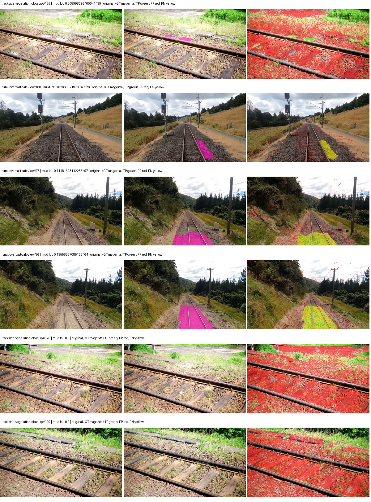
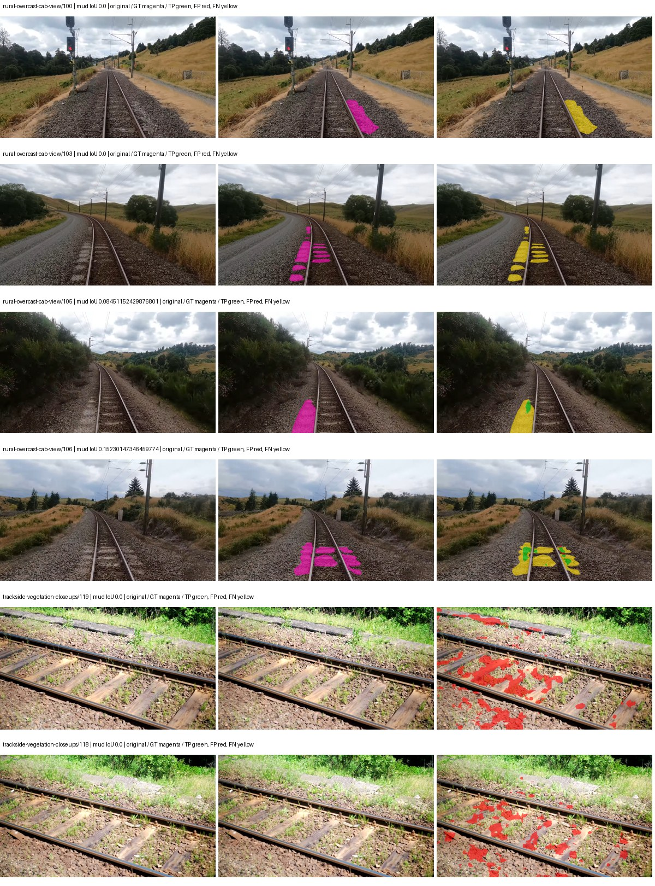
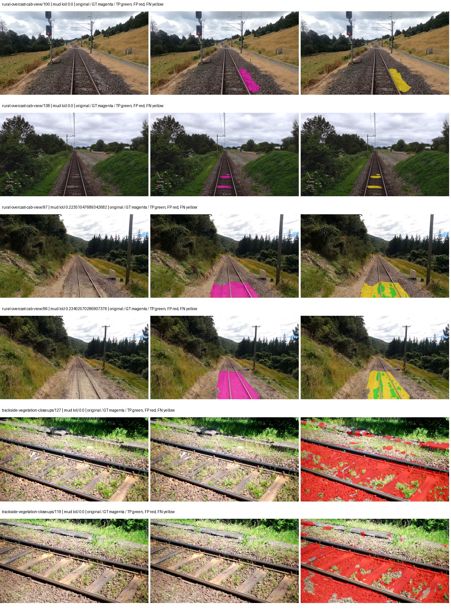
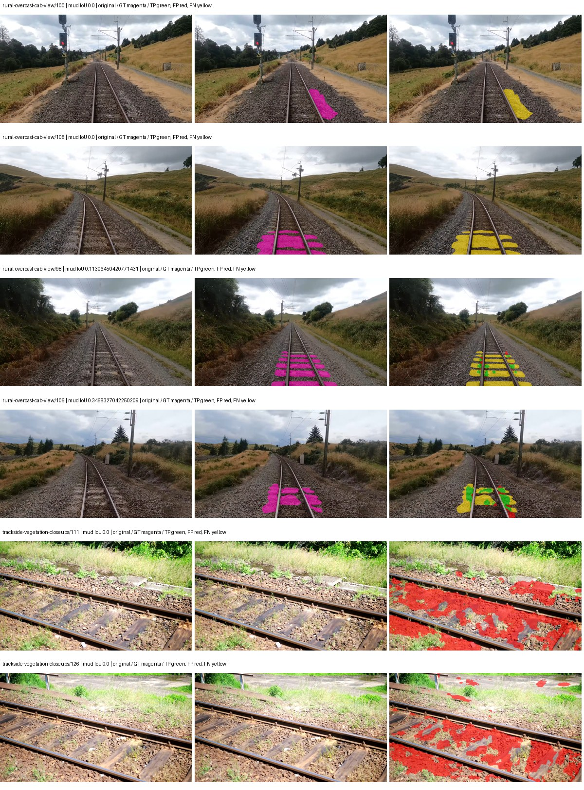

# native_mobilenetv3_large_lraspp — paul-test-rtis_v2

[RTIS comparison](../../README.md) · [Full model records](record.json)

Primary selection and early stopping: **mud-pumping validation IoU**. A job is complete only after full statistics and isolated profiling are verified.

| Model | Initialization path | Seed | Status | Steps | Best step | Mud IoU (%) | Mud precision (%) | Mud recall (%) | Final mud IoU (trainer val, %) | mIoU (%) | Fixed GT-class mIoU (%) |
| --- | --- | --- | --- | --- | --- | --- | --- | --- | --- | --- | --- |
| native_mobilenetv3_large_lraspp | rtis_only | 0 | completed | 1529 | 254 | 2.13 | 2.34 | 18.81 | 0.50 | 15.89 | 18.54 |
| native_mobilenetv3_large_lraspp | cityscapes_to_rtis | 0 | completed | 2549 | 1274 | 1.49 | 3.25 | 2.67 | 1.24 | 24.88 | 29.02 |
| native_mobilenetv3_large_lraspp | railsem19_to_rtis | 0 | completed | 2549 | 1274 | 1.74 | 2.08 | 9.70 | 0.78 | 33.07 | 38.58 |
| native_mobilenetv3_large_lraspp | cityscapes_to_railsem19_to_rtis | 0 | completed | 2549 | 1274 | 1.38 | 1.88 | 4.91 | 0.42 | 27.81 | 32.45 |

Training: 205 images. Validation: 37 images. Test: 50 held out. Seeds: [0]. Seed variation measures optimization variability, not independent-recording uncertainty. Historical source checkpoints stay fixed across adaptation seeds.

Training code: `066afb2626398b7be59d4d19f5a0e4644fd59adc`. Split SHA-256: `18a84c0163a65ded46508bcc904c374e5f33ad8a09b8879e3c8add606e86aa9f`.

## rtis_only — seed 0

Status: **completed**. Started: 2026-09-09T22:36:51.374560+00:00. Finished: 2026-09-09T22:54:58.585376+00:00.

Recipe pretrained initializer: `{"arch": "native", "backbone_path": null, "batch_norm_momentum": null, "checkpoint": null, "classifier_path": null, "drop_path": null, "encoder_name": null, "encoder_weights": null, "head": "unified_head", "head_paths": [], "inactive_parameter_paths": [], "local_files_only": false, "lora_alpha": 32, "lora_dropout": 0.05, "lora_r": 16, "lora_targets": [], "native": {"auxiliary_heads": [], "backbone": {"in_channels": 3, "kind": "timm", "name": "mobilenetv3_large_100.ra_in1k", "out_indices": [1, 2, 3, 4], "weights": "pretrained"}, "head": {"activation": "relu", "channels": 128, "dropout": 0.1, "high_index": 3, "kind": "lraspp", "low_index": 0, "norm": "group"}, "neck": {"kind": "identity"}, "task": "multiclass"}, "revision": null, "smp_arch": null, "subfolder": null, "trust_remote_code": false, "tuning": "full"}`.

`rtis_only` uses the recipe initializer, which may include pretrained segmentation components. Transfer paths load the exact historical source checkpoint below and reset the classifier; they do not reset all query/decoder features.

Source checkpoint: `Recipe pretrained initialization`.

Config SHA-256: `2ffa106015baca288c6c2a0190c5d97d9d2f927a981c49c9d15ac57c9fbe1c4a`. Weights used for validation: `raw`.

### Mud-pumping and aggregate quality

| Metric | Selected checkpoint | Final training validation |
| --- | --- | --- |
| Mud IoU | 2.13 | 0.50 |
| Mud precision | 2.34 | 1.71 |
| Mud recall | 18.81 | 0.70 |
| Mud Dice/F1 | 4.17 | 0.99 |
| mIoU | 15.89 | 24.18 |
| Mean accuracy | 26.45 | 36.35 |
| Mean precision | 24.03 | 39.82 |
| Mean Dice | 20.56 | 31.04 |
| Mean specificity | 98.27 | 98.90 |
| Pixel accuracy | 69.43 | 81.70 |
| Frequency-weighted IoU | 61.41 | 72.41 |
| Fixed GT-present class mIoU | 18.54 | 28.21 |
| Boundary F1 | 17.72 | 29.35 |

The selected checkpoint has independent evaluation evidence. Final values are the trainer's final validation record, not a new independent evaluation. mIoU averages classes with nonzero union, so false positives on absent classes can change its denominator. The fixed GT-class mean is supplementary and excludes absent classes; their false positives remain in the confusion matrix.

### Resource usage and timing

| Measurement | Value |
| --- | --- |
| Peak training VRAM, retained training invocation (GiB) | 6.72 |
| Peak evaluation VRAM (GiB) | 6.51 |
| Retained training invocation wall time (seconds) | 961.77 |
| Retained training invocation GPU-hours (one GPU) | 0.27 |
| Evaluation wall time (seconds) | 10.10 |
| Full evaluation pipeline images/second | 3.66 |
| Best full-state checkpoint (MiB) | 49.71 |
| Final full-state checkpoint (MiB) | 49.70 |
| Verified periodic checkpoints removed (GiB) | 0.15 |

VRAM uses the recorded allocator high-water mark; it is not total device usage including CUDA context. Resumed jobs' retained training invocation times and peaks are **not whole-campaign totals**. Earlier invocation resource records are not reconstructed here. Evaluation throughput includes loader, sliding-window inference and metrics; it is not model-only latency/FPS. Missing measurements are shown as —, never inferred from another dataset's run.

### Standardized inference performance

Dedicated model-only profiling waits for an idle worker-locked L40S: BF16, batch 1, 1024x1024, 20 warmup and 100 CUDA-event-timed public forwards. It excludes loading, preprocessing, tiling and metrics.

| Status | Parameters | Weight MiB | FPS | p50 ms | p95 ms | Peak reserved GiB |
| --- | --- | --- | --- | --- | --- | --- |
| complete | 3221330 | 12.29 | 230.01 | 4.24 | 4.74 | 0.30 |

```json
{
  "schema_version": 1,
  "model_id": "native_mobilenetv3_large_lraspp",
  "measured_at": "2026-09-09T22:54:56+00:00",
  "status": "complete",
  "benchmark_scope": "rtis_selected_checkpoint_model_only",
  "applies_to": [
    "native_mobilenetv3_large_lraspp--rtis_only--seed-0"
  ],
  "source": {
    "campaign_git_sha": "066afb2626398b7be59d4d19f5a0e4644fd59adc",
    "git_dirty": false,
    "config_hash": "7f3fab91e609",
    "resolved_config": "/data/izadia1/projects/segmentary-runs/paul-test-rtis_v2/seed0-20260909/configs/native_mobilenetv3_large_lraspp--rtis_only--seed-0.yaml",
    "config_sha256": "2ffa106015baca288c6c2a0190c5d97d9d2f927a981c49c9d15ac57c9fbe1c4a",
    "checkpoint_sha256": "6ba785ba3a8f623c495cad0d4fdad3d9cbf22f7355dfca2f74210d7a748b4bbe",
    "checkpoint_global_step": 254,
    "checkpoint_bytes": 52121473,
    "checkpoint_kind": "resume checkpoint with optimizer and EMA state",
    "weights": "raw",
    "measured_checkpoint_job_id": "native_mobilenetv3_large_lraspp--rtis_only--seed-0",
    "result_sha256": "ed5a0604d4ffb95142d4fd22ff11fd10e93cf52cf86be9430f3af5204f5cbc3c",
    "result_git_sha": "066afb2626398b7be59d4d19f5a0e4644fd59adc",
    "result_stage": "eval:paul-test-rtis:val",
    "result_seed": 0
  },
  "hardware": {
    "gpu_name": "NVIDIA L40S",
    "gpu_uuid": "GPU-931d0911-fc78-1638-e3d7-1ba868cbd286",
    "logical_device": "cuda:0",
    "physical_visibility_token": "2",
    "compute_capability": [
      8,
      9
    ],
    "total_memory_bytes": 47677177856
  },
  "model": {
    "parameter_count": 3221330,
    "trainable_parameter_count": 3221330,
    "resident_parameter_bytes": 12885320,
    "parameter_dtype_counts": {
      "float32": 3221330
    }
  },
  "contract": {
    "backend": "pytorch",
    "precision": "bf16_autocast",
    "batch_size": 1,
    "input_shape_nchw": [
      1,
      3,
      1024,
      1024
    ],
    "warmup_iterations": 20,
    "measured_iterations": 100,
    "timing": "per-forward CUDA events with end-event synchronization",
    "includes_preprocessing": false,
    "includes_data_loader": false,
    "includes_sliding_window": false,
    "input_resident_on_gpu": true,
    "model_only": true,
    "entrypoint": "public model(image) dense-logits forward"
  },
  "measurements": {
    "latency": {
      "p50_ms": 4.235775947570801,
      "p95_ms": 4.735131025314331,
      "mean_ms": 4.34762752532959,
      "minimum_ms": 4.123551845550537,
      "maximum_ms": 6.292479991912842,
      "fps": 230.01050438979152,
      "raw_ms": [
        4.839424133300781,
        4.324351787567139,
        4.304895877838135,
        4.2690558433532715,
        4.281343936920166,
        4.216832160949707,
        4.463615894317627,
        4.3089280128479,
        4.124576091766357,
        6.292479991912842,
        4.734975814819336,
        4.3673601150512695,
        4.306943893432617,
        4.155392169952393,
        4.157440185546875,
        4.256768226623535,
        4.161471843719482,
        4.45030403137207,
        4.193183898925781,
        4.143104076385498,
        4.710400104522705,
        4.2096638679504395,
        4.530176162719727,
        4.279295921325684,
        4.383743762969971,
        4.520832061767578,
        4.513792037963867,
        4.289535999298096,
        4.265984058380127,
        4.332543849945068,
        4.2188801765441895,
        4.142208099365234,
        4.141056060791016,
        4.5136637687683105,
        4.214784145355225,
        4.611072063446045,
        4.137983798980713,
        4.187136173248291,
        4.129727840423584,
        4.314015865325928,
        4.547584056854248,
        4.301727771759033,
        4.517888069152832,
        4.639711856842041,
        4.558847904205322,
        4.733952045440674,
        4.213888168334961,
        4.197375774383545,
        4.187136173248291,
        4.195328235626221,
        5.263360023498535,
        4.789247989654541,
        4.2045440673828125,
        4.1656317710876465,
        4.2639360427856445,
        4.473855972290039,
        4.287487983703613,
        4.236288070678711,
        4.223999977111816,
        4.3130879402160645,
        4.187136173248291,
        4.235263824462891,
        4.206592082977295,
        4.1605119705200195,
        4.688896179199219,
        4.261888027191162,
        4.163584232330322,
        4.214784145355225,
        4.123551845550537,
        4.133887767791748,
        4.203519821166992,
        4.140031814575195,
        4.15334415435791,
        4.149248123168945,
        4.211711883544922,
        4.184063911437988,
        4.596735954284668,
        4.187136173248291,
        4.133887767791748,
        4.163584232330322,
        4.229119777679443,
        4.228096008300781,
        4.212736129760742,
        4.208576202392578,
        4.389823913574219,
        4.168704032897949,
        4.176896095275879,
        4.1605119705200195,
        4.157440185546875,
        4.738080024719238,
        4.5649919509887695,
        4.128767967224121,
        4.195199966430664,
        4.593664169311523,
        4.373504161834717,
        4.69708776473999,
        4.568064212799072,
        4.6530561447143555,
        4.371456146240234,
        4.133791923522949
      ],
      "percentile_method": "numpy linear interpolation"
    },
    "peak_reserved_bytes": 318767104,
    "memory_kind": "pytorch_cuda_allocator_peak_reserved_excluding_context",
    "benchmark_wall_clock_s": 13.690475352108479
  },
  "started_at": "2026-09-09T22:54:43+00:00",
  "finished_at": "2026-09-09T22:54:56+00:00",
  "environment": {
    "hostname": "hdrfs-app-001",
    "python": "3.11.15",
    "platform": "Linux-5.15.0-139-generic-x86_64-with-glibc2.35",
    "torch": "2.11.0+cu128",
    "torch_cuda": "12.8",
    "cudnn": 91900,
    "driver_version": "570.133.20",
    "cuda_available": true,
    "gpu_count": 1,
    "gpu_names": [
      "NVIDIA L40S"
    ],
    "cuda_visible_devices": "2",
    "packages": {
      "segmentary": "0.1.0",
      "torch": "2.11.0+cu128",
      "torchvision": "0.26.0+cu128",
      "transformers": "5.15.0",
      "timm": "1.0.28",
      "segmentation-models-pytorch": "0.5.0",
      "albumentations": "2.0.8",
      "lightning": "2.6.5",
      "numpy": "2.4.4"
    }
  }
}
```

### Per-class validation results

| Class | GT pixels | IoU (%) | Precision (%) | Recall (%) | Dice (%) | Boundary F1 (%) |
| --- | --- | --- | --- | --- | --- | --- |
| car | 29664 | 0.04 | 0.12 | 0.06 | 0.08 | 0.54 |
| construction | 311585 | 6.17 | 6.42 | 61.20 | 11.63 | 10.00 |
| fence | 265137 | 2.25 | 2.80 | 10.27 | 4.40 | 3.83 |
| mud-pumping | 1226250 | 2.13 | 2.34 | 18.81 | 4.17 | 7.68 |
| on-rails | 0 | 0.00 | 0.00 | — | 0.00 | 0.00 |
| person | 0 | 0.00 | 0.00 | — | 0.00 | 0.00 |
| pole | 628038 | 26.88 | 48.77 | 37.46 | 42.38 | 64.72 |
| rail-embedded | 16799 | 0.09 | 0.17 | 0.22 | 0.19 | 1.24 |
| rail-raised | 2969797 | 55.68 | 67.89 | 75.57 | 71.53 | 81.03 |
| rail-track | 6323197 | 20.65 | 41.31 | 29.23 | 34.23 | 40.20 |
| road | 1048831 | 0.75 | 7.80 | 0.82 | 1.48 | 7.41 |
| sidewalk | 1297367 | 11.76 | 61.57 | 12.69 | 21.05 | 13.89 |
| sky | 19121606 | 91.79 | 96.67 | 94.80 | 95.72 | 53.66 |
| standing-water | 95802 | 0.16 | 0.19 | 0.83 | 0.31 | 1.10 |
| terrain | 39239306 | 75.95 | 85.99 | 86.67 | 86.33 | 28.98 |
| trackbed | 10643081 | 37.66 | 70.35 | 44.77 | 54.72 | 42.53 |
| traffic-light | 19510 | 0.03 | 0.04 | 0.16 | 0.06 | 0.03 |
| traffic-sign | 13285 | 0.03 | 0.05 | 0.10 | 0.07 | 0.28 |
| tram-track | 56179 | 0.40 | 0.67 | 1.00 | 0.81 | 0.69 |
| truck | 0 | 0.00 | 0.00 | — | 0.00 | 0.00 |
| vegetation-overgrowth | 5901821 | 1.34 | 11.36 | 1.49 | 2.64 | 14.27 |

### Full-run accounting

| Measurement | Value |
| --- | --- |
| Full GPU-reserved wall seconds, all recorded worker attempts | 1087.22 |
| Full reserved GPU-hours | 0.30 |
| Whole-run timing complete | True |

| Phase | Wall seconds including failed attempts |
| --- | --- |
| training | 968.61 |
| diagnostics | 80.35 |
| performance | 20.36 |

GPU-reserved time includes model loading, training, validation, collection, profiling, checkpoint I/O and orchestration while the worker owns one GPU. It is not GPU kernel-active time. Phase timings and sampled device memory/power/utilization are retained separately; sampled device memory is not the allocator high-water mark.

### Train/validation and raw/EMA diagnostics

| Checkpoint / weights / split | Images | Mud IoU (%) | Mud precision (%) | Mud recall (%) |
| --- | --- | --- | --- | --- |
| best-auto-train / raw | 205 | 61.85 | 68.61 | 86.26 |
| best-auto-val / raw | 37 | 2.13 | 2.34 | 18.81 |
| best-alternate-val / ema | 37 | 2.12 | 2.31 | 20.72 |
| final-auto-val / raw | 37 | 0.50 | 1.71 | 0.70 |

Train uses the evaluation transform without augmentation. Compare mud train/validation metrics for the same selected weights. Alternate EMA on running-stat BatchNorm is explicitly uncalibrated and is diagnostic only. Score-threshold curves use uncalibrated normalized scores and are pixel-level diagnostics, not event detection rates or a selected deployment operating point.

### Downloadable evidence

- best-auto-train: [per-image.csv](rtis_only--seed-0/best-auto-train/per-image.csv) · [per-image-confusion.json.gz](rtis_only--seed-0/best-auto-train/per-image-confusion.json.gz) · [groups.json](rtis_only--seed-0/best-auto-train/groups.json) · [mud-score-curves.json](rtis_only--seed-0/best-auto-train/mud-score-curves.json)
- best-auto-val: [per-image.csv](rtis_only--seed-0/best-auto-val/per-image.csv) · [per-image-confusion.json.gz](rtis_only--seed-0/best-auto-val/per-image-confusion.json.gz) · [groups.json](rtis_only--seed-0/best-auto-val/groups.json) · [mud-score-curves.json](rtis_only--seed-0/best-auto-val/mud-score-curves.json) · [examples.jpg](rtis_only--seed-0/best-auto-val/examples.jpg)
- best-alternate-val: [per-image.csv](rtis_only--seed-0/best-alternate-val/per-image.csv) · [per-image-confusion.json.gz](rtis_only--seed-0/best-alternate-val/per-image-confusion.json.gz) · [groups.json](rtis_only--seed-0/best-alternate-val/groups.json) · [mud-score-curves.json](rtis_only--seed-0/best-alternate-val/mud-score-curves.json)
- final-auto-val: [per-image.csv](rtis_only--seed-0/final-auto-val/per-image.csv) · [per-image-confusion.json.gz](rtis_only--seed-0/final-auto-val/per-image-confusion.json.gz) · [groups.json](rtis_only--seed-0/final-auto-val/groups.json) · [mud-score-curves.json](rtis_only--seed-0/final-auto-val/mud-score-curves.json)
- resources: [telemetry.csv](rtis_only--seed-0/resources/telemetry.csv)



Examples are two lowest and two highest mud-IoU positive images, plus up to two negative images with the most false-positive mud pixels. They are targeted diagnostic examples, not random samples. Green: true positive; red: false positive; yellow: false negative. Full predictions remain on HDRFS.

### Validation tracking

| Logged step | Overall mIoU (%) | Mud IoU (%) |
| --- | --- | --- |
| 254 | 15.90 | 2.13 |
| 509 | 21.41 | 0.80 |
| 764 | 21.66 | 0.91 |
| 1019 | 21.69 | 0.75 |
| 1274 | 22.94 | 0.33 |
| 1529 | 24.18 | 0.50 |

All retained scalar curves, including training loss and per-class IoU, are in record.json. Observed best mud on a curve is not necessarily a retained checkpoint: the pilot saved its selection-metric-best and final checkpoints. Step logging and checkpoint global_step may differ by one.

### Stopping and checkpoint provenance

```json
{
  "stopping": {
    "actual_steps": 1529,
    "maximum_steps": 4000,
    "min_delta": 0.001,
    "monitor": "val_iou/mud-pumping",
    "patience": 5,
    "reason": "validation_plateau"
  },
  "checkpoints": {
    "best": {
      "path": "/data/izadia1/projects/segmentary-runs/paul-test-rtis_v2/seed0-20260909/future-runs/native_mobilenetv3_large_lraspp--rtis_only--seed-0_seed0/rtis/best.ckpt",
      "sha256": "6ba785ba3a8f623c495cad0d4fdad3d9cbf22f7355dfca2f74210d7a748b4bbe",
      "global_step": 254,
      "bytes": 52121473
    },
    "final": {
      "path": "/data/izadia1/projects/segmentary-runs/paul-test-rtis_v2/seed0-20260909/future-runs/native_mobilenetv3_large_lraspp--rtis_only--seed-0_seed0/rtis/last.ckpt",
      "sha256": "98b53fd0d013ff88fd3a3ed1c2a4d429fe783f3f7a13da227edf6be5810dfcf6",
      "global_step": 1529,
      "bytes": 52110849
    }
  },
  "cleanup_error": null
}
```

### Resolved training, initialization and evaluation settings

The optimizer block is the base configuration. Stage LR scales are applied at runtime, and stage warmup is capped at min(base warmup, floor(stage budget / 10), stage budget - 1): 400 steps for this 4,000-step pilot. Model-internal native input grids may differ from augmentation crops (EoMT uses its 640 grid).

```json
{
  "name": "native_mobilenetv3_large_lraspp--rtis_only--seed-0",
  "model": {
    "arch": "native",
    "checkpoint": null,
    "tuning": "full",
    "head": "unified_head",
    "lora_r": 16,
    "lora_alpha": 32,
    "lora_dropout": 0.05,
    "lora_targets": [],
    "drop_path": null,
    "revision": null,
    "subfolder": null,
    "local_files_only": false,
    "trust_remote_code": false,
    "backbone_path": null,
    "head_paths": [],
    "classifier_path": null,
    "inactive_parameter_paths": [],
    "smp_arch": null,
    "encoder_name": null,
    "encoder_weights": null,
    "native": {
      "task": "multiclass",
      "backbone": {
        "kind": "timm",
        "name": "mobilenetv3_large_100.ra_in1k",
        "weights": "pretrained",
        "out_indices": [
          1,
          2,
          3,
          4
        ],
        "in_channels": 3
      },
      "neck": {
        "kind": "identity"
      },
      "head": {
        "kind": "lraspp",
        "low_index": 0,
        "high_index": 3,
        "channels": 128,
        "dropout": 0.1,
        "norm": "group",
        "activation": "relu"
      },
      "auxiliary_heads": []
    },
    "batch_norm_momentum": null
  },
  "space": "paul-test-rtis",
  "taxonomy_root": "/data/izadia1/projects/segmentary-rtis-fullstats-066afb2/taxonomy",
  "output_root": "/data/izadia1/projects/segmentary-runs/paul-test-rtis_v2/seed0-20260909/future-runs",
  "optim": {
    "backbone_lr": 0.0001,
    "head_lr_mult": 10.0,
    "weight_decay": 0.05,
    "llrd": 1.0,
    "warmup_iters": 1500,
    "warmup_ratio": 1e-06,
    "poly_power": 0.9,
    "min_lr_ratio": 0.0,
    "betas": [
      0.9,
      0.999
    ],
    "grad_clip": 1.0
  },
  "train": {
    "iters": 4000,
    "batch_size": 2,
    "accum": 8,
    "num_workers": 2,
    "precision": "bf16-mixed",
    "ema_decay": 0.9998,
    "val_every": 250,
    "ckpt_every": 500,
    "selection_metric": "val_iou/mud-pumping",
    "early_stopping_patience": 5,
    "early_stopping_min_delta": 0.001,
    "seed": 0,
    "devices": 1
  },
  "eval": {
    "sliding_window": true,
    "window": [
      1024,
      1024
    ],
    "stride": [
      768,
      768
    ],
    "batch_size": 1,
    "num_workers": 2,
    "tta_scales": [],
    "tta_flip": false,
    "threshold": 0.5,
    "boundary_tolerance_frac": 0.0075,
    "save_confusion": true
  },
  "loss": {
    "task": "multiclass",
    "activation": "auto",
    "terms": [],
    "aux": "none",
    "aux_weight": 0.0,
    "ce_weight": 1.0,
    "label_smoothing": 0.0,
    "class_weights": null,
    "query": null
  },
  "aug": {
    "crop": [
      1024,
      1024
    ],
    "scale_min": 0.5,
    "scale_max": 2.0,
    "hflip_p": 0.5,
    "color_jitter_p": 0.5,
    "brightness": 0.25,
    "contrast": 0.25,
    "saturation": 0.25,
    "hue": 0.05
  },
  "stages": [
    {
      "name": "rtis",
      "data": [
        {
          "name": "paul-test-rtis",
          "root": "/data/izadia1/datasets/paul-test-rtis_v2",
          "variant": null,
          "split_file": "splits.json",
          "train_split": "train",
          "val_split": "val",
          "limit": null,
          "loader": "folder",
          "mapping": "paul-test-rtis",
          "loader_options": {
            "require_groups": true
          }
        }
      ],
      "iters": null,
      "lr_scale": 1.0,
      "head_group_lr_scale": 1.0,
      "init_from": "pretrained",
      "reset_head": false,
      "freeze": null,
      "sample_weights": null
    }
  ]
}
```

### Hardware and software provenance

```json
{
  "training": {
    "cuda_available": true,
    "cuda_visible_devices": "2",
    "cudnn": 91900,
    "driver_version": "570.133.20",
    "gpu_count": 1,
    "gpu_names": [
      "NVIDIA L40S"
    ],
    "hostname": "hdrfs-app-001",
    "input_normalization": {
      "channel_order": "rgb",
      "mean": [
        0.485,
        0.456,
        0.406
      ],
      "source": "timm_pretrained_cfg",
      "std": [
        0.229,
        0.224,
        0.225
      ]
    },
    "model_origins": [
      {
        "hf_commit": null,
        "hf_name_or_path": null,
        "module": "backbone",
        "timm_pretrained": {
          "architecture": "mobilenetv3_large_100",
          "hf_hub_id": "timm/mobilenetv3_large_100.ra_in1k",
          "tag": "ra_in1k",
          "url": "https://github.com/rwightman/pytorch-image-models/releases/download/v0.1-weights/mobilenetv3_large_100_ra-f55367f5.pth"
        }
      },
      {
        "hf_commit": null,
        "hf_name_or_path": null,
        "module": "backbone.model",
        "timm_pretrained": {
          "architecture": "mobilenetv3_large_100",
          "hf_hub_id": "timm/mobilenetv3_large_100.ra_in1k",
          "tag": "ra_in1k",
          "url": "https://github.com/rwightman/pytorch-image-models/releases/download/v0.1-weights/mobilenetv3_large_100_ra-f55367f5.pth"
        }
      }
    ],
    "model_parameter_count": 3221330,
    "packages": {
      "albumentations": "2.0.8",
      "lightning": "2.6.5",
      "numpy": "2.4.4",
      "segmentary": "0.1.0",
      "segmentation-models-pytorch": "0.5.0",
      "timm": "1.0.28",
      "torch": "2.11.0+cu128",
      "torchvision": "0.26.0+cu128",
      "transformers": "5.15.0"
    },
    "platform": "Linux-5.15.0-139-generic-x86_64-with-glibc2.35",
    "python": "3.11.15",
    "torch": "2.11.0+cu128",
    "torch_cuda": "12.8",
    "trainable_parameter_count": 3221330,
    "training_stop": {
      "actual_steps": 1529,
      "maximum_steps": 4000,
      "min_delta": 0.001,
      "monitor": "val_iou/mud-pumping",
      "patience": 5,
      "reason": "validation_plateau"
    },
    "validation_weights": "raw"
  },
  "evaluation": {
    "cuda_available": true,
    "cuda_visible_devices": "2",
    "cudnn": 91900,
    "driver_version": "570.133.20",
    "gpu_count": 1,
    "gpu_names": [
      "NVIDIA L40S"
    ],
    "hostname": "hdrfs-app-001",
    "input_normalization": {
      "channel_order": "rgb",
      "mean": [
        0.485,
        0.456,
        0.406
      ],
      "source": "timm_pretrained_cfg",
      "std": [
        0.229,
        0.224,
        0.225
      ]
    },
    "packages": {
      "albumentations": "2.0.8",
      "lightning": "2.6.5",
      "numpy": "2.4.4",
      "segmentary": "0.1.0",
      "segmentation-models-pytorch": "0.5.0",
      "timm": "1.0.28",
      "torch": "2.11.0+cu128",
      "torchvision": "0.26.0+cu128",
      "transformers": "5.15.0"
    },
    "platform": "Linux-5.15.0-139-generic-x86_64-with-glibc2.35",
    "python": "3.11.15",
    "torch": "2.11.0+cu128",
    "torch_cuda": "12.8"
  }
}
```

## cityscapes_to_rtis — seed 0

Status: **completed**. Started: 2026-09-09T22:39:31.175762+00:00. Finished: 2026-09-09T23:07:48.095541+00:00.

Recipe pretrained initializer: `{"arch": "native", "backbone_path": null, "batch_norm_momentum": null, "checkpoint": null, "classifier_path": null, "drop_path": null, "encoder_name": null, "encoder_weights": null, "head": "unified_head", "head_paths": [], "inactive_parameter_paths": [], "local_files_only": false, "lora_alpha": 32, "lora_dropout": 0.05, "lora_r": 16, "lora_targets": [], "native": {"auxiliary_heads": [], "backbone": {"in_channels": 3, "kind": "timm", "name": "mobilenetv3_large_100.ra_in1k", "out_indices": [1, 2, 3, 4], "weights": "pretrained"}, "head": {"activation": "relu", "channels": 128, "dropout": 0.1, "high_index": 3, "kind": "lraspp", "low_index": 0, "norm": "group"}, "neck": {"kind": "identity"}, "task": "multiclass"}, "revision": null, "smp_arch": null, "subfolder": null, "trust_remote_code": false, "tuning": "full"}`.

`rtis_only` uses the recipe initializer, which may include pretrained segmentation components. Transfer paths load the exact historical source checkpoint below and reset the classifier; they do not reset all query/decoder features.

Source checkpoint: `{'name': 'native_mobilenetv3_large_lraspp--cityscapes--seed-0', 'model': 'native_mobilenetv3_large_lraspp', 'protocol': 'cityscapes', 'config': '/data/izadia1/projects/segmentary-runs/all-model-city-rail-seed0-rail20-b9eb3e1/jobs/native_mobilenetv3_large_lraspp--cityscapes--seed-0/attempt-001/resolved-config.yaml', 'checkpoint': '/data/izadia1/projects/segmentary-runs/all-model-city-rail-seed0-rail20-b9eb3e1/jobs/native_mobilenetv3_large_lraspp--cityscapes--seed-0/attempt-001/train/native_mobilenetv3_large_lraspp--cityscapes_seed0/cityscapes/last.ckpt', 'recorded_sha256': 'a944c542712e2c055dd03a1f5a27e2b4cc3ed8fa6a407d464a93891a790e7eae', 'exists': True}`.

Config SHA-256: `cb4688571cd047b410ec8cd45e241fea41e9483d7b96e97c8aaff569e073ef81`. Weights used for validation: `raw`.

### Mud-pumping and aggregate quality

| Metric | Selected checkpoint | Final training validation |
| --- | --- | --- |
| Mud IoU | 1.49 | 1.24 |
| Mud precision | 3.25 | 2.90 |
| Mud recall | 2.67 | 2.12 |
| Mud Dice/F1 | 2.93 | 2.45 |
| mIoU | 24.88 | 26.64 |
| Mean accuracy | 36.77 | 38.38 |
| Mean precision | 41.47 | 41.11 |
| Mean Dice | 31.96 | 34.36 |
| Mean specificity | 98.83 | 98.91 |
| Pixel accuracy | 80.57 | 82.28 |
| Frequency-weighted IoU | 71.08 | 72.49 |
| Fixed GT-present class mIoU | 29.02 | 31.08 |
| Boundary F1 | 30.24 | 34.29 |

The selected checkpoint has independent evaluation evidence. Final values are the trainer's final validation record, not a new independent evaluation. mIoU averages classes with nonzero union, so false positives on absent classes can change its denominator. The fixed GT-class mean is supplementary and excludes absent classes; their false positives remain in the confusion matrix.

### Resource usage and timing

| Measurement | Value |
| --- | --- |
| Peak training VRAM, retained training invocation (GiB) | 6.72 |
| Peak evaluation VRAM (GiB) | 6.51 |
| Retained training invocation wall time (seconds) | 1581.23 |
| Retained training invocation GPU-hours (one GPU) | 0.44 |
| Evaluation wall time (seconds) | 10.86 |
| Full evaluation pipeline images/second | 3.41 |
| Best full-state checkpoint (MiB) | 49.71 |
| Final full-state checkpoint (MiB) | 49.70 |
| Verified periodic checkpoints removed (GiB) | 0.24 |

VRAM uses the recorded allocator high-water mark; it is not total device usage including CUDA context. Resumed jobs' retained training invocation times and peaks are **not whole-campaign totals**. Earlier invocation resource records are not reconstructed here. Evaluation throughput includes loader, sliding-window inference and metrics; it is not model-only latency/FPS. Missing measurements are shown as —, never inferred from another dataset's run.

### Standardized inference performance

Dedicated model-only profiling waits for an idle worker-locked L40S: BF16, batch 1, 1024x1024, 20 warmup and 100 CUDA-event-timed public forwards. It excludes loading, preprocessing, tiling and metrics.

| Status | Parameters | Weight MiB | FPS | p50 ms | p95 ms | Peak reserved GiB |
| --- | --- | --- | --- | --- | --- | --- |
| complete | 3221330 | 12.29 | 224.03 | 4.31 | 5.15 | 0.30 |

```json
{
  "schema_version": 1,
  "model_id": "native_mobilenetv3_large_lraspp",
  "measured_at": "2026-09-09T23:07:46+00:00",
  "status": "complete",
  "benchmark_scope": "rtis_selected_checkpoint_model_only",
  "applies_to": [
    "native_mobilenetv3_large_lraspp--cityscapes_to_rtis--seed-0"
  ],
  "source": {
    "campaign_git_sha": "066afb2626398b7be59d4d19f5a0e4644fd59adc",
    "git_dirty": false,
    "config_hash": "4cca8607af2b",
    "resolved_config": "/data/izadia1/projects/segmentary-runs/paul-test-rtis_v2/seed0-20260909/configs/native_mobilenetv3_large_lraspp--cityscapes_to_rtis--seed-0.yaml",
    "config_sha256": "cb4688571cd047b410ec8cd45e241fea41e9483d7b96e97c8aaff569e073ef81",
    "checkpoint_sha256": "5bc83a8d09d42d240a43e570e70f706cfb562508c0354503197e78349a31e694",
    "checkpoint_global_step": 1274,
    "checkpoint_bytes": 52121665,
    "checkpoint_kind": "resume checkpoint with optimizer and EMA state",
    "weights": "raw",
    "measured_checkpoint_job_id": "native_mobilenetv3_large_lraspp--cityscapes_to_rtis--seed-0",
    "result_sha256": "e697e282f7c3c979540c6506229a9ea258a0303569b9ac064ad1d3b340c16303",
    "result_git_sha": "066afb2626398b7be59d4d19f5a0e4644fd59adc",
    "result_stage": "eval:paul-test-rtis:val",
    "result_seed": 0
  },
  "hardware": {
    "gpu_name": "NVIDIA L40S",
    "gpu_uuid": "GPU-d411d86a-6d1d-1967-55e7-9f9ec85d13f5",
    "logical_device": "cuda:0",
    "physical_visibility_token": "1",
    "compute_capability": [
      8,
      9
    ],
    "total_memory_bytes": 47677177856
  },
  "model": {
    "parameter_count": 3221330,
    "trainable_parameter_count": 3221330,
    "resident_parameter_bytes": 12885320,
    "parameter_dtype_counts": {
      "float32": 3221330
    }
  },
  "contract": {
    "backend": "pytorch",
    "precision": "bf16_autocast",
    "batch_size": 1,
    "input_shape_nchw": [
      1,
      3,
      1024,
      1024
    ],
    "warmup_iterations": 20,
    "measured_iterations": 100,
    "timing": "per-forward CUDA events with end-event synchronization",
    "includes_preprocessing": false,
    "includes_data_loader": false,
    "includes_sliding_window": false,
    "input_resident_on_gpu": true,
    "model_only": true,
    "entrypoint": "public model(image) dense-logits forward"
  },
  "measurements": {
    "latency": {
      "p50_ms": 4.306943893432617,
      "p95_ms": 5.152307105064392,
      "mean_ms": 4.463594546318054,
      "minimum_ms": 4.099071979522705,
      "maximum_ms": 7.004159927368164,
      "fps": 224.03468541399747,
      "raw_ms": [
        4.10214376449585,
        4.110335826873779,
        4.109248161315918,
        4.255743980407715,
        5.5859198570251465,
        4.230144023895264,
        4.554719924926758,
        4.288479804992676,
        4.25164794921875,
        7.004159927368164,
        4.853759765625,
        4.523007869720459,
        4.455423831939697,
        4.404287815093994,
        4.418560028076172,
        4.315135955810547,
        4.6560959815979,
        4.639743804931641,
        4.304895877838135,
        4.634496212005615,
        4.25984001159668,
        4.230144023895264,
        4.258815765380859,
        4.2782721519470215,
        4.281343936920166,
        4.25164794921875,
        4.244480133056641,
        4.455455780029297,
        5.1517438888549805,
        4.874239921569824,
        4.498432159423828,
        4.471807956695557,
        4.5629119873046875,
        4.306943893432617,
        4.909056186676025,
        4.736000061035156,
        4.142208099365234,
        4.148191928863525,
        4.15334415435791,
        4.1154561042785645,
        4.105216026306152,
        4.125696182250977,
        4.112383842468262,
        4.9838080406188965,
        4.171775817871094,
        4.118527889251709,
        4.099071979522705,
        4.3848958015441895,
        5.163008213043213,
        4.285439968109131,
        4.170752048492432,
        4.214784145355225,
        4.2096638679504395,
        4.219903945922852,
        4.242432117462158,
        4.227039813995361,
        4.212831974029541,
        4.266016006469727,
        4.3948798179626465,
        4.982783794403076,
        4.740096092224121,
        4.296703815460205,
        4.29475212097168,
        4.574207782745361,
        4.2690558433532715,
        4.412415981292725,
        5.099391937255859,
        4.55075216293335,
        4.476928234100342,
        4.692992210388184,
        5.571584224700928,
        5.284800052642822,
        4.77177619934082,
        4.229184150695801,
        4.212736129760742,
        4.228096008300781,
        4.221951961517334,
        4.257791996002197,
        4.299776077270508,
        4.3376641273498535,
        4.347904205322266,
        4.343808174133301,
        4.3581438064575195,
        4.326399803161621,
        4.306943893432617,
        4.620287895202637,
        4.467711925506592,
        4.378623962402344,
        5.040128231048584,
        4.531199932098389,
        4.746240139007568,
        4.283391952514648,
        4.188159942626953,
        4.187136173248291,
        4.202432155609131,
        4.184063911437988,
        4.177919864654541,
        4.5404157638549805,
        4.60697603225708,
        4.979712009429932
      ],
      "percentile_method": "numpy linear interpolation"
    },
    "peak_reserved_bytes": 318767104,
    "memory_kind": "pytorch_cuda_allocator_peak_reserved_excluding_context",
    "benchmark_wall_clock_s": 13.499821919947863
  },
  "started_at": "2026-09-09T23:07:32+00:00",
  "finished_at": "2026-09-09T23:07:46+00:00",
  "environment": {
    "hostname": "hdrfs-app-001",
    "python": "3.11.15",
    "platform": "Linux-5.15.0-139-generic-x86_64-with-glibc2.35",
    "torch": "2.11.0+cu128",
    "torch_cuda": "12.8",
    "cudnn": 91900,
    "driver_version": "570.133.20",
    "cuda_available": true,
    "gpu_count": 1,
    "gpu_names": [
      "NVIDIA L40S"
    ],
    "cuda_visible_devices": "1",
    "packages": {
      "segmentary": "0.1.0",
      "torch": "2.11.0+cu128",
      "torchvision": "0.26.0+cu128",
      "transformers": "5.15.0",
      "timm": "1.0.28",
      "segmentation-models-pytorch": "0.5.0",
      "albumentations": "2.0.8",
      "lightning": "2.6.5",
      "numpy": "2.4.4"
    }
  }
}
```

### Per-class validation results

| Class | GT pixels | IoU (%) | Precision (%) | Recall (%) | Dice (%) | Boundary F1 (%) |
| --- | --- | --- | --- | --- | --- | --- |
| car | 29664 | 0.30 | 2.73 | 0.34 | 0.61 | 18.15 |
| construction | 311585 | 32.48 | 38.82 | 66.56 | 49.04 | 32.70 |
| fence | 265137 | 6.86 | 13.14 | 12.55 | 12.84 | 14.67 |
| mud-pumping | 1226250 | 1.49 | 3.25 | 2.67 | 2.93 | 4.15 |
| on-rails | 0 | 0.00 | 0.00 | — | 0.00 | 0.00 |
| person | 0 | 0.00 | 0.00 | — | 0.00 | 0.00 |
| pole | 628038 | 60.39 | 77.84 | 72.93 | 75.30 | 85.81 |
| rail-embedded | 16799 | 0.28 | 35.82 | 0.29 | 0.57 | 2.48 |
| rail-raised | 2969797 | 64.47 | 71.08 | 87.40 | 78.40 | 80.97 |
| rail-track | 6323197 | 30.47 | 58.65 | 38.82 | 46.71 | 46.12 |
| road | 1048831 | 5.37 | 14.53 | 7.84 | 10.19 | 14.07 |
| sidewalk | 1297367 | 9.20 | 90.32 | 9.29 | 16.85 | 8.26 |
| sky | 19121606 | 97.29 | 98.92 | 98.33 | 98.63 | 86.18 |
| standing-water | 95802 | 0.09 | 0.10 | 1.74 | 0.18 | 0.62 |
| terrain | 39239306 | 86.85 | 89.53 | 96.67 | 92.96 | 53.49 |
| trackbed | 10643081 | 51.06 | 59.27 | 78.66 | 67.60 | 47.72 |
| traffic-light | 19510 | 33.33 | 76.32 | 37.18 | 50.00 | 48.40 |
| traffic-sign | 13285 | 29.78 | 59.30 | 37.43 | 45.90 | 47.32 |
| tram-track | 56179 | 0.05 | 0.16 | 0.07 | 0.10 | 0.00 |
| truck | 0 | 0.00 | 0.00 | — | 0.00 | 0.00 |
| vegetation-overgrowth | 5901821 | 12.61 | 81.12 | 12.99 | 22.39 | 44.01 |

### Full-run accounting

| Measurement | Value |
| --- | --- |
| Full GPU-reserved wall seconds, all recorded worker attempts | 1696.97 |
| Full reserved GPU-hours | 0.47 |
| Whole-run timing complete | True |

| Phase | Wall seconds including failed attempts |
| --- | --- |
| training | 1588.26 |
| diagnostics | 70.09 |
| performance | 20.15 |

GPU-reserved time includes model loading, training, validation, collection, profiling, checkpoint I/O and orchestration while the worker owns one GPU. It is not GPU kernel-active time. Phase timings and sampled device memory/power/utilization are retained separately; sampled device memory is not the allocator high-water mark.

### Train/validation and raw/EMA diagnostics

| Checkpoint / weights / split | Images | Mud IoU (%) | Mud precision (%) | Mud recall (%) |
| --- | --- | --- | --- | --- |
| best-auto-train / raw | 205 | 82.44 | 93.17 | 87.74 |
| best-auto-val / raw | 37 | 1.49 | 3.25 | 2.67 |
| best-alternate-val / ema | 37 | 0.92 | 2.28 | 1.52 |
| final-auto-val / raw | 37 | 1.24 | 2.89 | 2.11 |

Train uses the evaluation transform without augmentation. Compare mud train/validation metrics for the same selected weights. Alternate EMA on running-stat BatchNorm is explicitly uncalibrated and is diagnostic only. Score-threshold curves use uncalibrated normalized scores and are pixel-level diagnostics, not event detection rates or a selected deployment operating point.

### Downloadable evidence

- best-auto-train: [per-image.csv](cityscapes_to_rtis--seed-0/best-auto-train/per-image.csv) · [per-image-confusion.json.gz](cityscapes_to_rtis--seed-0/best-auto-train/per-image-confusion.json.gz) · [groups.json](cityscapes_to_rtis--seed-0/best-auto-train/groups.json) · [mud-score-curves.json](cityscapes_to_rtis--seed-0/best-auto-train/mud-score-curves.json)
- best-auto-val: [per-image.csv](cityscapes_to_rtis--seed-0/best-auto-val/per-image.csv) · [per-image-confusion.json.gz](cityscapes_to_rtis--seed-0/best-auto-val/per-image-confusion.json.gz) · [groups.json](cityscapes_to_rtis--seed-0/best-auto-val/groups.json) · [mud-score-curves.json](cityscapes_to_rtis--seed-0/best-auto-val/mud-score-curves.json) · [examples.jpg](cityscapes_to_rtis--seed-0/best-auto-val/examples.jpg)
- best-alternate-val: [per-image.csv](cityscapes_to_rtis--seed-0/best-alternate-val/per-image.csv) · [per-image-confusion.json.gz](cityscapes_to_rtis--seed-0/best-alternate-val/per-image-confusion.json.gz) · [groups.json](cityscapes_to_rtis--seed-0/best-alternate-val/groups.json) · [mud-score-curves.json](cityscapes_to_rtis--seed-0/best-alternate-val/mud-score-curves.json)
- final-auto-val: [per-image.csv](cityscapes_to_rtis--seed-0/final-auto-val/per-image.csv) · [per-image-confusion.json.gz](cityscapes_to_rtis--seed-0/final-auto-val/per-image-confusion.json.gz) · [groups.json](cityscapes_to_rtis--seed-0/final-auto-val/groups.json) · [mud-score-curves.json](cityscapes_to_rtis--seed-0/final-auto-val/mud-score-curves.json)
- resources: [telemetry.csv](cityscapes_to_rtis--seed-0/resources/telemetry.csv)



Examples are two lowest and two highest mud-IoU positive images, plus up to two negative images with the most false-positive mud pixels. They are targeted diagnostic examples, not random samples. Green: true positive; red: false positive; yellow: false negative. Full predictions remain on HDRFS.

### Validation tracking

| Logged step | Overall mIoU (%) | Mud IoU (%) |
| --- | --- | --- |
| 254 | 18.18 | 1.31 |
| 509 | 20.73 | 0.41 |
| 764 | 23.98 | 0.43 |
| 1019 | 24.59 | 0.44 |
| 1274 | 24.85 | 1.48 |
| 1529 | 24.85 | 0.58 |
| 1784 | 26.07 | 0.67 |
| 2038 | 25.61 | 0.54 |
| 2293 | 24.18 | 0.37 |
| 2548 | 26.64 | 1.24 |

All retained scalar curves, including training loss and per-class IoU, are in record.json. Observed best mud on a curve is not necessarily a retained checkpoint: the pilot saved its selection-metric-best and final checkpoints. Step logging and checkpoint global_step may differ by one.

### Stopping and checkpoint provenance

```json
{
  "stopping": {
    "actual_steps": 2549,
    "maximum_steps": 4000,
    "min_delta": 0.001,
    "monitor": "val_iou/mud-pumping",
    "patience": 5,
    "reason": "validation_plateau"
  },
  "checkpoints": {
    "best": {
      "path": "/data/izadia1/projects/segmentary-runs/paul-test-rtis_v2/seed0-20260909/future-runs/native_mobilenetv3_large_lraspp--cityscapes_to_rtis--seed-0_seed0/rtis/best.ckpt",
      "sha256": "5bc83a8d09d42d240a43e570e70f706cfb562508c0354503197e78349a31e694",
      "global_step": 1274,
      "bytes": 52121665
    },
    "final": {
      "path": "/data/izadia1/projects/segmentary-runs/paul-test-rtis_v2/seed0-20260909/future-runs/native_mobilenetv3_large_lraspp--cityscapes_to_rtis--seed-0_seed0/rtis/last.ckpt",
      "sha256": "14dd6cfeaa393fb0a9d119bf1dc00e55e03d873b093fde28e8171bf423e11d37",
      "global_step": 2549,
      "bytes": 52110849
    }
  },
  "cleanup_error": null
}
```

### Resolved training, initialization and evaluation settings

The optimizer block is the base configuration. Stage LR scales are applied at runtime, and stage warmup is capped at min(base warmup, floor(stage budget / 10), stage budget - 1): 400 steps for this 4,000-step pilot. Model-internal native input grids may differ from augmentation crops (EoMT uses its 640 grid).

```json
{
  "name": "native_mobilenetv3_large_lraspp--cityscapes_to_rtis--seed-0",
  "model": {
    "arch": "native",
    "checkpoint": null,
    "tuning": "full",
    "head": "unified_head",
    "lora_r": 16,
    "lora_alpha": 32,
    "lora_dropout": 0.05,
    "lora_targets": [],
    "drop_path": null,
    "revision": null,
    "subfolder": null,
    "local_files_only": false,
    "trust_remote_code": false,
    "backbone_path": null,
    "head_paths": [],
    "classifier_path": null,
    "inactive_parameter_paths": [],
    "smp_arch": null,
    "encoder_name": null,
    "encoder_weights": null,
    "native": {
      "task": "multiclass",
      "backbone": {
        "kind": "timm",
        "name": "mobilenetv3_large_100.ra_in1k",
        "weights": "pretrained",
        "out_indices": [
          1,
          2,
          3,
          4
        ],
        "in_channels": 3
      },
      "neck": {
        "kind": "identity"
      },
      "head": {
        "kind": "lraspp",
        "low_index": 0,
        "high_index": 3,
        "channels": 128,
        "dropout": 0.1,
        "norm": "group",
        "activation": "relu"
      },
      "auxiliary_heads": []
    },
    "batch_norm_momentum": null
  },
  "space": "paul-test-rtis",
  "taxonomy_root": "/data/izadia1/projects/segmentary-rtis-fullstats-066afb2/taxonomy",
  "output_root": "/data/izadia1/projects/segmentary-runs/paul-test-rtis_v2/seed0-20260909/future-runs",
  "optim": {
    "backbone_lr": 0.0001,
    "head_lr_mult": 10.0,
    "weight_decay": 0.05,
    "llrd": 1.0,
    "warmup_iters": 1500,
    "warmup_ratio": 1e-06,
    "poly_power": 0.9,
    "min_lr_ratio": 0.0,
    "betas": [
      0.9,
      0.999
    ],
    "grad_clip": 1.0
  },
  "train": {
    "iters": 4000,
    "batch_size": 2,
    "accum": 8,
    "num_workers": 2,
    "precision": "bf16-mixed",
    "ema_decay": 0.9998,
    "val_every": 250,
    "ckpt_every": 500,
    "selection_metric": "val_iou/mud-pumping",
    "early_stopping_patience": 5,
    "early_stopping_min_delta": 0.001,
    "seed": 0,
    "devices": 1
  },
  "eval": {
    "sliding_window": true,
    "window": [
      1024,
      1024
    ],
    "stride": [
      768,
      768
    ],
    "batch_size": 1,
    "num_workers": 2,
    "tta_scales": [],
    "tta_flip": false,
    "threshold": 0.5,
    "boundary_tolerance_frac": 0.0075,
    "save_confusion": true
  },
  "loss": {
    "task": "multiclass",
    "activation": "auto",
    "terms": [],
    "aux": "none",
    "aux_weight": 0.0,
    "ce_weight": 1.0,
    "label_smoothing": 0.0,
    "class_weights": null,
    "query": null
  },
  "aug": {
    "crop": [
      1024,
      1024
    ],
    "scale_min": 0.5,
    "scale_max": 2.0,
    "hflip_p": 0.5,
    "color_jitter_p": 0.5,
    "brightness": 0.25,
    "contrast": 0.25,
    "saturation": 0.25,
    "hue": 0.05
  },
  "stages": [
    {
      "name": "rtis",
      "data": [
        {
          "name": "paul-test-rtis",
          "root": "/data/izadia1/datasets/paul-test-rtis_v2",
          "variant": null,
          "split_file": "splits.json",
          "train_split": "train",
          "val_split": "val",
          "limit": null,
          "loader": "folder",
          "mapping": "paul-test-rtis",
          "loader_options": {
            "require_groups": true
          }
        }
      ],
      "iters": null,
      "lr_scale": 0.1,
      "head_group_lr_scale": 1.0,
      "init_from": "/data/izadia1/projects/segmentary-runs/all-model-city-rail-seed0-rail20-b9eb3e1/jobs/native_mobilenetv3_large_lraspp--cityscapes--seed-0/attempt-001/train/native_mobilenetv3_large_lraspp--cityscapes_seed0/cityscapes/last.ckpt",
      "reset_head": true,
      "freeze": null,
      "sample_weights": null
    }
  ]
}
```

### Hardware and software provenance

```json
{
  "training": {
    "cuda_available": true,
    "cuda_visible_devices": "1",
    "cudnn": 91900,
    "driver_version": "570.133.20",
    "gpu_count": 1,
    "gpu_names": [
      "NVIDIA L40S"
    ],
    "hostname": "hdrfs-app-001",
    "input_normalization": {
      "channel_order": "rgb",
      "mean": [
        0.485,
        0.456,
        0.406
      ],
      "source": "timm_pretrained_cfg",
      "std": [
        0.229,
        0.224,
        0.225
      ]
    },
    "model_origins": [
      {
        "hf_commit": null,
        "hf_name_or_path": null,
        "module": "backbone",
        "timm_pretrained": {
          "architecture": "mobilenetv3_large_100",
          "hf_hub_id": "timm/mobilenetv3_large_100.ra_in1k",
          "tag": "ra_in1k",
          "url": "https://github.com/rwightman/pytorch-image-models/releases/download/v0.1-weights/mobilenetv3_large_100_ra-f55367f5.pth"
        }
      },
      {
        "hf_commit": null,
        "hf_name_or_path": null,
        "module": "backbone.model",
        "timm_pretrained": {
          "architecture": "mobilenetv3_large_100",
          "hf_hub_id": "timm/mobilenetv3_large_100.ra_in1k",
          "tag": "ra_in1k",
          "url": "https://github.com/rwightman/pytorch-image-models/releases/download/v0.1-weights/mobilenetv3_large_100_ra-f55367f5.pth"
        }
      }
    ],
    "model_parameter_count": 3221330,
    "packages": {
      "albumentations": "2.0.8",
      "lightning": "2.6.5",
      "numpy": "2.4.4",
      "segmentary": "0.1.0",
      "segmentation-models-pytorch": "0.5.0",
      "timm": "1.0.28",
      "torch": "2.11.0+cu128",
      "torchvision": "0.26.0+cu128",
      "transformers": "5.15.0"
    },
    "platform": "Linux-5.15.0-139-generic-x86_64-with-glibc2.35",
    "python": "3.11.15",
    "torch": "2.11.0+cu128",
    "torch_cuda": "12.8",
    "trainable_parameter_count": 3221330,
    "training_stop": {
      "actual_steps": 2549,
      "maximum_steps": 4000,
      "min_delta": 0.001,
      "monitor": "val_iou/mud-pumping",
      "patience": 5,
      "reason": "validation_plateau"
    },
    "validation_weights": "raw"
  },
  "evaluation": {
    "cuda_available": true,
    "cuda_visible_devices": "1",
    "cudnn": 91900,
    "driver_version": "570.133.20",
    "gpu_count": 1,
    "gpu_names": [
      "NVIDIA L40S"
    ],
    "hostname": "hdrfs-app-001",
    "input_normalization": {
      "channel_order": "rgb",
      "mean": [
        0.485,
        0.456,
        0.406
      ],
      "source": "timm_pretrained_cfg",
      "std": [
        0.229,
        0.224,
        0.225
      ]
    },
    "packages": {
      "albumentations": "2.0.8",
      "lightning": "2.6.5",
      "numpy": "2.4.4",
      "segmentary": "0.1.0",
      "segmentation-models-pytorch": "0.5.0",
      "timm": "1.0.28",
      "torch": "2.11.0+cu128",
      "torchvision": "0.26.0+cu128",
      "transformers": "5.15.0"
    },
    "platform": "Linux-5.15.0-139-generic-x86_64-with-glibc2.35",
    "python": "3.11.15",
    "torch": "2.11.0+cu128",
    "torch_cuda": "12.8"
  }
}
```

## railsem19_to_rtis — seed 0

Status: **completed**. Started: 2026-09-09T22:43:38.728437+00:00. Finished: 2026-09-09T23:11:50.058857+00:00.

Recipe pretrained initializer: `{"arch": "native", "backbone_path": null, "batch_norm_momentum": null, "checkpoint": null, "classifier_path": null, "drop_path": null, "encoder_name": null, "encoder_weights": null, "head": "unified_head", "head_paths": [], "inactive_parameter_paths": [], "local_files_only": false, "lora_alpha": 32, "lora_dropout": 0.05, "lora_r": 16, "lora_targets": [], "native": {"auxiliary_heads": [], "backbone": {"in_channels": 3, "kind": "timm", "name": "mobilenetv3_large_100.ra_in1k", "out_indices": [1, 2, 3, 4], "weights": "pretrained"}, "head": {"activation": "relu", "channels": 128, "dropout": 0.1, "high_index": 3, "kind": "lraspp", "low_index": 0, "norm": "group"}, "neck": {"kind": "identity"}, "task": "multiclass"}, "revision": null, "smp_arch": null, "subfolder": null, "trust_remote_code": false, "tuning": "full"}`.

`rtis_only` uses the recipe initializer, which may include pretrained segmentation components. Transfer paths load the exact historical source checkpoint below and reset the classifier; they do not reset all query/decoder features.

Source checkpoint: `{'name': 'native_mobilenetv3_large_lraspp--railsem19--seed-0', 'model': 'native_mobilenetv3_large_lraspp', 'protocol': 'railsem19', 'config': '/data/izadia1/projects/segmentary-runs/all-model-city-rail-seed0-rail20-b9eb3e1/jobs/native_mobilenetv3_large_lraspp--railsem19--seed-0/attempt-001/resolved-config.yaml', 'checkpoint': '/data/izadia1/projects/segmentary-runs/all-model-city-rail-seed0-rail20-b9eb3e1/jobs/native_mobilenetv3_large_lraspp--railsem19--seed-0/attempt-001/train/native_mobilenetv3_large_lraspp--railsem19_seed0/railsem19/last.ckpt', 'recorded_sha256': 'be9b84bff577ee280a91b6f8bd828630210517609183f6721503ff08ca459ff1', 'exists': True}`.

Config SHA-256: `71726cfe0f9d2953eaab8f35b193297774907c1aa78d89eb5d1871d86e691907`. Weights used for validation: `raw`.

### Mud-pumping and aggregate quality

| Metric | Selected checkpoint | Final training validation |
| --- | --- | --- |
| Mud IoU | 1.74 | 0.78 |
| Mud precision | 2.08 | 1.06 |
| Mud recall | 9.70 | 2.84 |
| Mud Dice/F1 | 3.42 | 1.54 |
| mIoU | 33.07 | 32.41 |
| Mean accuracy | 46.63 | 45.63 |
| Mean precision | 56.80 | 54.21 |
| Mean Dice | 43.02 | 42.04 |
| Mean specificity | 98.94 | 99.00 |
| Pixel accuracy | 82.27 | 83.26 |
| Frequency-weighted IoU | 74.49 | 75.17 |
| Fixed GT-present class mIoU | 38.58 | 37.81 |
| Boundary F1 | 37.11 | 36.06 |

The selected checkpoint has independent evaluation evidence. Final values are the trainer's final validation record, not a new independent evaluation. mIoU averages classes with nonzero union, so false positives on absent classes can change its denominator. The fixed GT-class mean is supplementary and excludes absent classes; their false positives remain in the confusion matrix.

### Resource usage and timing

| Measurement | Value |
| --- | --- |
| Peak training VRAM, retained training invocation (GiB) | 6.72 |
| Peak evaluation VRAM (GiB) | 6.51 |
| Retained training invocation wall time (seconds) | 1576.52 |
| Retained training invocation GPU-hours (one GPU) | 0.44 |
| Evaluation wall time (seconds) | 10.22 |
| Full evaluation pipeline images/second | 3.62 |
| Best full-state checkpoint (MiB) | 49.71 |
| Final full-state checkpoint (MiB) | 49.70 |
| Verified periodic checkpoints removed (GiB) | 0.24 |

VRAM uses the recorded allocator high-water mark; it is not total device usage including CUDA context. Resumed jobs' retained training invocation times and peaks are **not whole-campaign totals**. Earlier invocation resource records are not reconstructed here. Evaluation throughput includes loader, sliding-window inference and metrics; it is not model-only latency/FPS. Missing measurements are shown as —, never inferred from another dataset's run.

### Standardized inference performance

Dedicated model-only profiling waits for an idle worker-locked L40S: BF16, batch 1, 1024x1024, 20 warmup and 100 CUDA-event-timed public forwards. It excludes loading, preprocessing, tiling and metrics.

| Status | Parameters | Weight MiB | FPS | p50 ms | p95 ms | Peak reserved GiB |
| --- | --- | --- | --- | --- | --- | --- |
| complete | 3221330 | 12.29 | 231.29 | 4.25 | 4.93 | 0.30 |

```json
{
  "schema_version": 1,
  "model_id": "native_mobilenetv3_large_lraspp",
  "measured_at": "2026-09-09T23:11:48+00:00",
  "status": "complete",
  "benchmark_scope": "rtis_selected_checkpoint_model_only",
  "applies_to": [
    "native_mobilenetv3_large_lraspp--railsem19_to_rtis--seed-0"
  ],
  "source": {
    "campaign_git_sha": "066afb2626398b7be59d4d19f5a0e4644fd59adc",
    "git_dirty": false,
    "config_hash": "b37344d25220",
    "resolved_config": "/data/izadia1/projects/segmentary-runs/paul-test-rtis_v2/seed0-20260909/configs/native_mobilenetv3_large_lraspp--railsem19_to_rtis--seed-0.yaml",
    "config_sha256": "71726cfe0f9d2953eaab8f35b193297774907c1aa78d89eb5d1871d86e691907",
    "checkpoint_sha256": "773b2fa53649796d2e72097ddb4947679c9ca5034e9650f75f235eeddb0f28d1",
    "checkpoint_global_step": 1274,
    "checkpoint_bytes": 52121665,
    "checkpoint_kind": "resume checkpoint with optimizer and EMA state",
    "weights": "raw",
    "measured_checkpoint_job_id": "native_mobilenetv3_large_lraspp--railsem19_to_rtis--seed-0",
    "result_sha256": "ec9958b94b8e9ac4d537e53fc2bfb05149cbd31094fa5e4c70464cb209e8b8ca",
    "result_git_sha": "066afb2626398b7be59d4d19f5a0e4644fd59adc",
    "result_stage": "eval:paul-test-rtis:val",
    "result_seed": 0
  },
  "hardware": {
    "gpu_name": "NVIDIA L40S",
    "gpu_uuid": "GPU-804aea8b-5f62-423e-72c6-49e1ed15c4e4",
    "logical_device": "cuda:0",
    "physical_visibility_token": "6",
    "compute_capability": [
      8,
      9
    ],
    "total_memory_bytes": 47677177856
  },
  "model": {
    "parameter_count": 3221330,
    "trainable_parameter_count": 3221330,
    "resident_parameter_bytes": 12885320,
    "parameter_dtype_counts": {
      "float32": 3221330
    }
  },
  "contract": {
    "backend": "pytorch",
    "precision": "bf16_autocast",
    "batch_size": 1,
    "input_shape_nchw": [
      1,
      3,
      1024,
      1024
    ],
    "warmup_iterations": 20,
    "measured_iterations": 100,
    "timing": "per-forward CUDA events with end-event synchronization",
    "includes_preprocessing": false,
    "includes_data_loader": false,
    "includes_sliding_window": false,
    "input_resident_on_gpu": true,
    "model_only": true,
    "entrypoint": "public model(image) dense-logits forward"
  },
  "measurements": {
    "latency": {
      "p50_ms": 4.246527910232544,
      "p95_ms": 4.929638481140136,
      "mean_ms": 4.323511667251587,
      "minimum_ms": 3.9720959663391113,
      "maximum_ms": 5.258240222930908,
      "fps": 231.29346627522574,
      "raw_ms": [
        4.272128105163574,
        4.262911796569824,
        4.2915520668029785,
        4.229119777679443,
        4.073472023010254,
        4.121600151062012,
        4.468736171722412,
        4.073472023010254,
        4.065279960632324,
        4.06220817565918,
        4.889599800109863,
        4.908031940460205,
        4.928512096405029,
        4.033535957336426,
        3.9976959228515625,
        4.021247863769531,
        4.019199848175049,
        4.015103816986084,
        4.018176078796387,
        4.084735870361328,
        4.05299186706543,
        4.064256191253662,
        4.0960001945495605,
        4.158463954925537,
        4.147200107574463,
        4.855807781219482,
        4.520959854125977,
        4.077568054199219,
        4.031487941741943,
        4.024320125579834,
        4.051968097686768,
        4.073472023010254,
        4.090879917144775,
        4.783103942871094,
        4.951039791107178,
        4.5404157638549805,
        4.141056060791016,
        4.247551918029785,
        4.217855930328369,
        4.112383842468262,
        4.114431858062744,
        4.068352222442627,
        4.039680004119873,
        4.1011199951171875,
        4.139008045196533,
        4.223999977111816,
        4.421631813049316,
        4.184031963348389,
        5.221375942230225,
        4.655104160308838,
        4.6981120109558105,
        4.038656234741211,
        4.267007827758789,
        4.7861762046813965,
        5.097472190856934,
        4.573184013366699,
        4.501503944396973,
        4.355072021484375,
        4.322303771972656,
        4.275199890136719,
        4.407296180725098,
        4.282368183135986,
        4.541440010070801,
        4.133887767791748,
        4.029439926147461,
        4.403200149536133,
        4.79641580581665,
        4.082687854766846,
        4.329472064971924,
        4.807680130004883,
        4.1113600730896,
        4.112383842468262,
        4.074495792388916,
        4.245503902435303,
        4.273151874542236,
        4.1902079582214355,
        4.104191780090332,
        4.014080047607422,
        3.9720959663391113,
        3.9864320755004883,
        4.3520002365112305,
        4.009984016418457,
        4.46668815612793,
        4.637695789337158,
        4.029439926147461,
        4.320256233215332,
        4.325376033782959,
        4.225024223327637,
        4.456448078155518,
        4.736000061035156,
        4.9244160652160645,
        4.2987518310546875,
        4.3089919090271,
        4.573184013366699,
        4.382719993591309,
        4.280320167541504,
        4.262911796569824,
        4.258815765380859,
        5.187583923339844,
        5.258240222930908
      ],
      "percentile_method": "numpy linear interpolation"
    },
    "peak_reserved_bytes": 318767104,
    "memory_kind": "pytorch_cuda_allocator_peak_reserved_excluding_context",
    "benchmark_wall_clock_s": 13.848341390490532
  },
  "started_at": "2026-09-09T23:11:34+00:00",
  "finished_at": "2026-09-09T23:11:48+00:00",
  "environment": {
    "hostname": "hdrfs-app-001",
    "python": "3.11.15",
    "platform": "Linux-5.15.0-139-generic-x86_64-with-glibc2.35",
    "torch": "2.11.0+cu128",
    "torch_cuda": "12.8",
    "cudnn": 91900,
    "driver_version": "570.133.20",
    "cuda_available": true,
    "gpu_count": 1,
    "gpu_names": [
      "NVIDIA L40S"
    ],
    "cuda_visible_devices": "6",
    "packages": {
      "segmentary": "0.1.0",
      "torch": "2.11.0+cu128",
      "torchvision": "0.26.0+cu128",
      "transformers": "5.15.0",
      "timm": "1.0.28",
      "segmentation-models-pytorch": "0.5.0",
      "albumentations": "2.0.8",
      "lightning": "2.6.5",
      "numpy": "2.4.4"
    }
  }
}
```

### Per-class validation results

| Class | GT pixels | IoU (%) | Precision (%) | Recall (%) | Dice (%) | Boundary F1 (%) |
| --- | --- | --- | --- | --- | --- | --- |
| car | 29664 | 30.69 | 67.10 | 36.13 | 46.97 | 32.19 |
| construction | 311585 | 43.86 | 52.81 | 72.12 | 60.97 | 40.47 |
| fence | 265137 | 22.43 | 42.16 | 32.39 | 36.64 | 27.18 |
| mud-pumping | 1226250 | 1.74 | 2.08 | 9.70 | 3.42 | 5.79 |
| on-rails | 0 | 0.00 | 0.00 | — | 0.00 | 0.00 |
| person | 0 | 0.00 | 0.00 | — | 0.00 | 0.00 |
| pole | 628038 | 66.65 | 80.30 | 79.67 | 79.99 | 89.02 |
| rail-embedded | 16799 | 8.49 | 90.22 | 8.57 | 15.65 | 16.02 |
| rail-raised | 2969797 | 65.96 | 82.38 | 76.79 | 79.49 | 87.30 |
| rail-track | 6323197 | 34.82 | 73.08 | 39.94 | 51.65 | 46.65 |
| road | 1048831 | 15.70 | 73.64 | 16.63 | 27.14 | 25.98 |
| sidewalk | 1297367 | 48.43 | 90.05 | 51.17 | 65.26 | 15.40 |
| sky | 19121606 | 98.54 | 99.15 | 99.38 | 99.26 | 96.42 |
| standing-water | 95802 | 0.00 | 0.00 | 0.00 | 0.00 | 0.61 |
| terrain | 39239306 | 88.70 | 90.06 | 98.34 | 94.01 | 60.13 |
| trackbed | 10643081 | 56.67 | 69.89 | 74.98 | 72.35 | 53.71 |
| traffic-light | 19510 | 46.25 | 75.78 | 54.27 | 63.25 | 55.70 |
| traffic-sign | 13285 | 22.73 | 90.06 | 23.31 | 37.04 | 56.76 |
| tram-track | 56179 | 23.32 | 32.24 | 45.73 | 37.82 | 21.80 |
| truck | 0 | 0.00 | 0.00 | — | 0.00 | 0.00 |
| vegetation-overgrowth | 5901821 | 19.39 | 81.76 | 20.27 | 32.48 | 48.14 |

### Full-run accounting

| Measurement | Value |
| --- | --- |
| Full GPU-reserved wall seconds, all recorded worker attempts | 1691.38 |
| Full reserved GPU-hours | 0.47 |
| Whole-run timing complete | True |

| Phase | Wall seconds including failed attempts |
| --- | --- |
| training | 1583.08 |
| diagnostics | 69.88 |
| performance | 20.28 |

GPU-reserved time includes model loading, training, validation, collection, profiling, checkpoint I/O and orchestration while the worker owns one GPU. It is not GPU kernel-active time. Phase timings and sampled device memory/power/utilization are retained separately; sampled device memory is not the allocator high-water mark.

### Train/validation and raw/EMA diagnostics

| Checkpoint / weights / split | Images | Mud IoU (%) | Mud precision (%) | Mud recall (%) |
| --- | --- | --- | --- | --- |
| best-auto-train / raw | 205 | 87.74 | 91.23 | 95.83 |
| best-auto-val / raw | 37 | 1.74 | 2.08 | 9.70 |
| best-alternate-val / ema | 37 | 0.90 | 1.08 | 4.90 |
| final-auto-val / raw | 37 | 0.78 | 1.06 | 2.84 |

Train uses the evaluation transform without augmentation. Compare mud train/validation metrics for the same selected weights. Alternate EMA on running-stat BatchNorm is explicitly uncalibrated and is diagnostic only. Score-threshold curves use uncalibrated normalized scores and are pixel-level diagnostics, not event detection rates or a selected deployment operating point.

### Downloadable evidence

- best-auto-train: [per-image.csv](railsem19_to_rtis--seed-0/best-auto-train/per-image.csv) · [per-image-confusion.json.gz](railsem19_to_rtis--seed-0/best-auto-train/per-image-confusion.json.gz) · [groups.json](railsem19_to_rtis--seed-0/best-auto-train/groups.json) · [mud-score-curves.json](railsem19_to_rtis--seed-0/best-auto-train/mud-score-curves.json)
- best-auto-val: [per-image.csv](railsem19_to_rtis--seed-0/best-auto-val/per-image.csv) · [per-image-confusion.json.gz](railsem19_to_rtis--seed-0/best-auto-val/per-image-confusion.json.gz) · [groups.json](railsem19_to_rtis--seed-0/best-auto-val/groups.json) · [mud-score-curves.json](railsem19_to_rtis--seed-0/best-auto-val/mud-score-curves.json) · [examples.jpg](railsem19_to_rtis--seed-0/best-auto-val/examples.jpg)
- best-alternate-val: [per-image.csv](railsem19_to_rtis--seed-0/best-alternate-val/per-image.csv) · [per-image-confusion.json.gz](railsem19_to_rtis--seed-0/best-alternate-val/per-image-confusion.json.gz) · [groups.json](railsem19_to_rtis--seed-0/best-alternate-val/groups.json) · [mud-score-curves.json](railsem19_to_rtis--seed-0/best-alternate-val/mud-score-curves.json)
- final-auto-val: [per-image.csv](railsem19_to_rtis--seed-0/final-auto-val/per-image.csv) · [per-image-confusion.json.gz](railsem19_to_rtis--seed-0/final-auto-val/per-image-confusion.json.gz) · [groups.json](railsem19_to_rtis--seed-0/final-auto-val/groups.json) · [mud-score-curves.json](railsem19_to_rtis--seed-0/final-auto-val/mud-score-curves.json)
- resources: [telemetry.csv](railsem19_to_rtis--seed-0/resources/telemetry.csv)



Examples are two lowest and two highest mud-IoU positive images, plus up to two negative images with the most false-positive mud pixels. They are targeted diagnostic examples, not random samples. Green: true positive; red: false positive; yellow: false negative. Full predictions remain on HDRFS.

### Validation tracking

| Logged step | Overall mIoU (%) | Mud IoU (%) |
| --- | --- | --- |
| 254 | 23.99 | 0.16 |
| 509 | 31.21 | 0.10 |
| 764 | 34.27 | 0.85 |
| 1019 | 35.31 | 0.66 |
| 1274 | 33.07 | 1.74 |
| 1529 | 32.31 | 0.62 |
| 1784 | 33.86 | 1.09 |
| 2038 | 33.98 | 1.46 |
| 2293 | 34.43 | 1.50 |
| 2548 | 32.41 | 0.78 |

All retained scalar curves, including training loss and per-class IoU, are in record.json. Observed best mud on a curve is not necessarily a retained checkpoint: the pilot saved its selection-metric-best and final checkpoints. Step logging and checkpoint global_step may differ by one.

### Stopping and checkpoint provenance

```json
{
  "stopping": {
    "actual_steps": 2549,
    "maximum_steps": 4000,
    "min_delta": 0.001,
    "monitor": "val_iou/mud-pumping",
    "patience": 5,
    "reason": "validation_plateau"
  },
  "checkpoints": {
    "best": {
      "path": "/data/izadia1/projects/segmentary-runs/paul-test-rtis_v2/seed0-20260909/future-runs/native_mobilenetv3_large_lraspp--railsem19_to_rtis--seed-0_seed0/rtis/best.ckpt",
      "sha256": "773b2fa53649796d2e72097ddb4947679c9ca5034e9650f75f235eeddb0f28d1",
      "global_step": 1274,
      "bytes": 52121665
    },
    "final": {
      "path": "/data/izadia1/projects/segmentary-runs/paul-test-rtis_v2/seed0-20260909/future-runs/native_mobilenetv3_large_lraspp--railsem19_to_rtis--seed-0_seed0/rtis/last.ckpt",
      "sha256": "30048c27fa673310035ad9668704bc49668fd777f9d339ce246b4ae8817eae58",
      "global_step": 2549,
      "bytes": 52110849
    }
  },
  "cleanup_error": null
}
```

### Resolved training, initialization and evaluation settings

The optimizer block is the base configuration. Stage LR scales are applied at runtime, and stage warmup is capped at min(base warmup, floor(stage budget / 10), stage budget - 1): 400 steps for this 4,000-step pilot. Model-internal native input grids may differ from augmentation crops (EoMT uses its 640 grid).

```json
{
  "name": "native_mobilenetv3_large_lraspp--railsem19_to_rtis--seed-0",
  "model": {
    "arch": "native",
    "checkpoint": null,
    "tuning": "full",
    "head": "unified_head",
    "lora_r": 16,
    "lora_alpha": 32,
    "lora_dropout": 0.05,
    "lora_targets": [],
    "drop_path": null,
    "revision": null,
    "subfolder": null,
    "local_files_only": false,
    "trust_remote_code": false,
    "backbone_path": null,
    "head_paths": [],
    "classifier_path": null,
    "inactive_parameter_paths": [],
    "smp_arch": null,
    "encoder_name": null,
    "encoder_weights": null,
    "native": {
      "task": "multiclass",
      "backbone": {
        "kind": "timm",
        "name": "mobilenetv3_large_100.ra_in1k",
        "weights": "pretrained",
        "out_indices": [
          1,
          2,
          3,
          4
        ],
        "in_channels": 3
      },
      "neck": {
        "kind": "identity"
      },
      "head": {
        "kind": "lraspp",
        "low_index": 0,
        "high_index": 3,
        "channels": 128,
        "dropout": 0.1,
        "norm": "group",
        "activation": "relu"
      },
      "auxiliary_heads": []
    },
    "batch_norm_momentum": null
  },
  "space": "paul-test-rtis",
  "taxonomy_root": "/data/izadia1/projects/segmentary-rtis-fullstats-066afb2/taxonomy",
  "output_root": "/data/izadia1/projects/segmentary-runs/paul-test-rtis_v2/seed0-20260909/future-runs",
  "optim": {
    "backbone_lr": 0.0001,
    "head_lr_mult": 10.0,
    "weight_decay": 0.05,
    "llrd": 1.0,
    "warmup_iters": 1500,
    "warmup_ratio": 1e-06,
    "poly_power": 0.9,
    "min_lr_ratio": 0.0,
    "betas": [
      0.9,
      0.999
    ],
    "grad_clip": 1.0
  },
  "train": {
    "iters": 4000,
    "batch_size": 2,
    "accum": 8,
    "num_workers": 2,
    "precision": "bf16-mixed",
    "ema_decay": 0.9998,
    "val_every": 250,
    "ckpt_every": 500,
    "selection_metric": "val_iou/mud-pumping",
    "early_stopping_patience": 5,
    "early_stopping_min_delta": 0.001,
    "seed": 0,
    "devices": 1
  },
  "eval": {
    "sliding_window": true,
    "window": [
      1024,
      1024
    ],
    "stride": [
      768,
      768
    ],
    "batch_size": 1,
    "num_workers": 2,
    "tta_scales": [],
    "tta_flip": false,
    "threshold": 0.5,
    "boundary_tolerance_frac": 0.0075,
    "save_confusion": true
  },
  "loss": {
    "task": "multiclass",
    "activation": "auto",
    "terms": [],
    "aux": "none",
    "aux_weight": 0.0,
    "ce_weight": 1.0,
    "label_smoothing": 0.0,
    "class_weights": null,
    "query": null
  },
  "aug": {
    "crop": [
      1024,
      1024
    ],
    "scale_min": 0.5,
    "scale_max": 2.0,
    "hflip_p": 0.5,
    "color_jitter_p": 0.5,
    "brightness": 0.25,
    "contrast": 0.25,
    "saturation": 0.25,
    "hue": 0.05
  },
  "stages": [
    {
      "name": "rtis",
      "data": [
        {
          "name": "paul-test-rtis",
          "root": "/data/izadia1/datasets/paul-test-rtis_v2",
          "variant": null,
          "split_file": "splits.json",
          "train_split": "train",
          "val_split": "val",
          "limit": null,
          "loader": "folder",
          "mapping": "paul-test-rtis",
          "loader_options": {
            "require_groups": true
          }
        }
      ],
      "iters": null,
      "lr_scale": 0.1,
      "head_group_lr_scale": 1.0,
      "init_from": "/data/izadia1/projects/segmentary-runs/all-model-city-rail-seed0-rail20-b9eb3e1/jobs/native_mobilenetv3_large_lraspp--railsem19--seed-0/attempt-001/train/native_mobilenetv3_large_lraspp--railsem19_seed0/railsem19/last.ckpt",
      "reset_head": true,
      "freeze": null,
      "sample_weights": null
    }
  ]
}
```

### Hardware and software provenance

```json
{
  "training": {
    "cuda_available": true,
    "cuda_visible_devices": "6",
    "cudnn": 91900,
    "driver_version": "570.133.20",
    "gpu_count": 1,
    "gpu_names": [
      "NVIDIA L40S"
    ],
    "hostname": "hdrfs-app-001",
    "input_normalization": {
      "channel_order": "rgb",
      "mean": [
        0.485,
        0.456,
        0.406
      ],
      "source": "timm_pretrained_cfg",
      "std": [
        0.229,
        0.224,
        0.225
      ]
    },
    "model_origins": [
      {
        "hf_commit": null,
        "hf_name_or_path": null,
        "module": "backbone",
        "timm_pretrained": {
          "architecture": "mobilenetv3_large_100",
          "hf_hub_id": "timm/mobilenetv3_large_100.ra_in1k",
          "tag": "ra_in1k",
          "url": "https://github.com/rwightman/pytorch-image-models/releases/download/v0.1-weights/mobilenetv3_large_100_ra-f55367f5.pth"
        }
      },
      {
        "hf_commit": null,
        "hf_name_or_path": null,
        "module": "backbone.model",
        "timm_pretrained": {
          "architecture": "mobilenetv3_large_100",
          "hf_hub_id": "timm/mobilenetv3_large_100.ra_in1k",
          "tag": "ra_in1k",
          "url": "https://github.com/rwightman/pytorch-image-models/releases/download/v0.1-weights/mobilenetv3_large_100_ra-f55367f5.pth"
        }
      }
    ],
    "model_parameter_count": 3221330,
    "packages": {
      "albumentations": "2.0.8",
      "lightning": "2.6.5",
      "numpy": "2.4.4",
      "segmentary": "0.1.0",
      "segmentation-models-pytorch": "0.5.0",
      "timm": "1.0.28",
      "torch": "2.11.0+cu128",
      "torchvision": "0.26.0+cu128",
      "transformers": "5.15.0"
    },
    "platform": "Linux-5.15.0-139-generic-x86_64-with-glibc2.35",
    "python": "3.11.15",
    "torch": "2.11.0+cu128",
    "torch_cuda": "12.8",
    "trainable_parameter_count": 3221330,
    "training_stop": {
      "actual_steps": 2549,
      "maximum_steps": 4000,
      "min_delta": 0.001,
      "monitor": "val_iou/mud-pumping",
      "patience": 5,
      "reason": "validation_plateau"
    },
    "validation_weights": "raw"
  },
  "evaluation": {
    "cuda_available": true,
    "cuda_visible_devices": "6",
    "cudnn": 91900,
    "driver_version": "570.133.20",
    "gpu_count": 1,
    "gpu_names": [
      "NVIDIA L40S"
    ],
    "hostname": "hdrfs-app-001",
    "input_normalization": {
      "channel_order": "rgb",
      "mean": [
        0.485,
        0.456,
        0.406
      ],
      "source": "timm_pretrained_cfg",
      "std": [
        0.229,
        0.224,
        0.225
      ]
    },
    "packages": {
      "albumentations": "2.0.8",
      "lightning": "2.6.5",
      "numpy": "2.4.4",
      "segmentary": "0.1.0",
      "segmentation-models-pytorch": "0.5.0",
      "timm": "1.0.28",
      "torch": "2.11.0+cu128",
      "torchvision": "0.26.0+cu128",
      "transformers": "5.15.0"
    },
    "platform": "Linux-5.15.0-139-generic-x86_64-with-glibc2.35",
    "python": "3.11.15",
    "torch": "2.11.0+cu128",
    "torch_cuda": "12.8"
  }
}
```

## cityscapes_to_railsem19_to_rtis — seed 0

Status: **completed**. Started: 2026-09-09T22:46:29.680705+00:00. Finished: 2026-09-09T23:14:56.001254+00:00.

Recipe pretrained initializer: `{"arch": "native", "backbone_path": null, "batch_norm_momentum": null, "checkpoint": null, "classifier_path": null, "drop_path": null, "encoder_name": null, "encoder_weights": null, "head": "unified_head", "head_paths": [], "inactive_parameter_paths": [], "local_files_only": false, "lora_alpha": 32, "lora_dropout": 0.05, "lora_r": 16, "lora_targets": [], "native": {"auxiliary_heads": [], "backbone": {"in_channels": 3, "kind": "timm", "name": "mobilenetv3_large_100.ra_in1k", "out_indices": [1, 2, 3, 4], "weights": "pretrained"}, "head": {"activation": "relu", "channels": 128, "dropout": 0.1, "high_index": 3, "kind": "lraspp", "low_index": 0, "norm": "group"}, "neck": {"kind": "identity"}, "task": "multiclass"}, "revision": null, "smp_arch": null, "subfolder": null, "trust_remote_code": false, "tuning": "full"}`.

`rtis_only` uses the recipe initializer, which may include pretrained segmentation components. Transfer paths load the exact historical source checkpoint below and reset the classifier; they do not reset all query/decoder features.

Source checkpoint: `{'name': 'native_mobilenetv3_large_lraspp--cityscapes_to_railsem19--seed-0', 'model': 'native_mobilenetv3_large_lraspp', 'protocol': 'cityscapes_to_railsem19', 'config': '/data/izadia1/projects/segmentary-runs/all-model-city-rail-seed0-rail20-b9eb3e1/jobs/native_mobilenetv3_large_lraspp--cityscapes_to_railsem19--seed-0/attempt-001/resolved-config.yaml', 'checkpoint': '/data/izadia1/projects/segmentary-runs/all-model-city-rail-seed0-rail20-b9eb3e1/jobs/native_mobilenetv3_large_lraspp--cityscapes_to_railsem19--seed-0/attempt-001/train/native_mobilenetv3_large_lraspp--cityscapes_to_railsem19_seed0/railsem19/last.ckpt', 'recorded_sha256': 'ed42edf6c6eb7af834c9a784514d57e6de894c766a20be5c160b6c67734ad822', 'exists': True}`.

Config SHA-256: `940553fd9d825fe7f581f1e6febaf23b1d5b03b8ad8fef9aa72a6c15108f86f3`. Weights used for validation: `raw`.

### Mud-pumping and aggregate quality

| Metric | Selected checkpoint | Final training validation |
| --- | --- | --- |
| Mud IoU | 1.38 | 0.42 |
| Mud precision | 1.88 | 0.72 |
| Mud recall | 4.91 | 1.01 |
| Mud Dice/F1 | 2.72 | 0.84 |
| mIoU | 27.81 | 30.41 |
| Mean accuracy | 39.81 | 43.27 |
| Mean precision | 42.56 | 44.92 |
| Mean Dice | 35.62 | 38.85 |
| Mean specificity | 98.92 | 98.98 |
| Pixel accuracy | 82.45 | 83.65 |
| Frequency-weighted IoU | 73.71 | 74.71 |
| Fixed GT-present class mIoU | 32.45 | 35.47 |
| Boundary F1 | 33.69 | 34.83 |

The selected checkpoint has independent evaluation evidence. Final values are the trainer's final validation record, not a new independent evaluation. mIoU averages classes with nonzero union, so false positives on absent classes can change its denominator. The fixed GT-class mean is supplementary and excludes absent classes; their false positives remain in the confusion matrix.

### Resource usage and timing

| Measurement | Value |
| --- | --- |
| Peak training VRAM, retained training invocation (GiB) | 6.72 |
| Peak evaluation VRAM (GiB) | 6.51 |
| Retained training invocation wall time (seconds) | 1589.70 |
| Retained training invocation GPU-hours (one GPU) | 0.44 |
| Evaluation wall time (seconds) | 10.56 |
| Full evaluation pipeline images/second | 3.50 |
| Best full-state checkpoint (MiB) | 49.71 |
| Final full-state checkpoint (MiB) | 49.70 |
| Verified periodic checkpoints removed (GiB) | 0.24 |

VRAM uses the recorded allocator high-water mark; it is not total device usage including CUDA context. Resumed jobs' retained training invocation times and peaks are **not whole-campaign totals**. Earlier invocation resource records are not reconstructed here. Evaluation throughput includes loader, sliding-window inference and metrics; it is not model-only latency/FPS. Missing measurements are shown as —, never inferred from another dataset's run.

### Standardized inference performance

Dedicated model-only profiling waits for an idle worker-locked L40S: BF16, batch 1, 1024x1024, 20 warmup and 100 CUDA-event-timed public forwards. It excludes loading, preprocessing, tiling and metrics.

| Status | Parameters | Weight MiB | FPS | p50 ms | p95 ms | Peak reserved GiB |
| --- | --- | --- | --- | --- | --- | --- |
| complete | 3221330 | 12.29 | 232.27 | 4.18 | 4.77 | 0.30 |

```json
{
  "schema_version": 1,
  "model_id": "native_mobilenetv3_large_lraspp",
  "measured_at": "2026-09-09T23:14:54+00:00",
  "status": "complete",
  "benchmark_scope": "rtis_selected_checkpoint_model_only",
  "applies_to": [
    "native_mobilenetv3_large_lraspp--cityscapes_to_railsem19_to_rtis--seed-0"
  ],
  "source": {
    "campaign_git_sha": "066afb2626398b7be59d4d19f5a0e4644fd59adc",
    "git_dirty": false,
    "config_hash": "daba5d8e2387",
    "resolved_config": "/data/izadia1/projects/segmentary-runs/paul-test-rtis_v2/seed0-20260909/configs/native_mobilenetv3_large_lraspp--cityscapes_to_railsem19_to_rtis--seed-0.yaml",
    "config_sha256": "940553fd9d825fe7f581f1e6febaf23b1d5b03b8ad8fef9aa72a6c15108f86f3",
    "checkpoint_sha256": "b68de6c0dbf258247bfbe1f64f0585675d5b9095a011268c7173200cf65bbcb1",
    "checkpoint_global_step": 1274,
    "checkpoint_bytes": 52121729,
    "checkpoint_kind": "resume checkpoint with optimizer and EMA state",
    "weights": "raw",
    "measured_checkpoint_job_id": "native_mobilenetv3_large_lraspp--cityscapes_to_railsem19_to_rtis--seed-0",
    "result_sha256": "b05c891209e0353232e105d53e1153fb6c65c6f962d49831581fd7d3f9b6fa54",
    "result_git_sha": "066afb2626398b7be59d4d19f5a0e4644fd59adc",
    "result_stage": "eval:paul-test-rtis:val",
    "result_seed": 0
  },
  "hardware": {
    "gpu_name": "NVIDIA L40S",
    "gpu_uuid": "GPU-84f5ca4d-68db-ae98-d056-40654d859dd9",
    "logical_device": "cuda:0",
    "physical_visibility_token": "0",
    "compute_capability": [
      8,
      9
    ],
    "total_memory_bytes": 47677177856
  },
  "model": {
    "parameter_count": 3221330,
    "trainable_parameter_count": 3221330,
    "resident_parameter_bytes": 12885320,
    "parameter_dtype_counts": {
      "float32": 3221330
    }
  },
  "contract": {
    "backend": "pytorch",
    "precision": "bf16_autocast",
    "batch_size": 1,
    "input_shape_nchw": [
      1,
      3,
      1024,
      1024
    ],
    "warmup_iterations": 20,
    "measured_iterations": 100,
    "timing": "per-forward CUDA events with end-event synchronization",
    "includes_preprocessing": false,
    "includes_data_loader": false,
    "includes_sliding_window": false,
    "input_resident_on_gpu": true,
    "model_only": true,
    "entrypoint": "public model(image) dense-logits forward"
  },
  "measurements": {
    "latency": {
      "p50_ms": 4.184064149856567,
      "p95_ms": 4.769536066055298,
      "mean_ms": 4.3054204845428465,
      "minimum_ms": 4.119552135467529,
      "maximum_ms": 6.547455787658691,
      "fps": 232.2653509895633,
      "raw_ms": [
        4.24345588684082,
        4.386816024780273,
        4.354976177215576,
        4.157440185546875,
        4.216832160949707,
        4.168704032897949,
        4.536320209503174,
        4.211711883544922,
        4.236288070678711,
        4.61516809463501,
        4.237311840057373,
        4.3427839279174805,
        4.631552219390869,
        6.547455787658691,
        4.262911796569824,
        4.124671936035156,
        4.1748480796813965,
        4.163584232330322,
        4.168704032897949,
        4.176896095275879,
        4.155327796936035,
        4.165599822998047,
        4.162559986114502,
        4.157440185546875,
        4.262911796569824,
        4.45849609375,
        4.168704032897949,
        4.1872639656066895,
        4.132863998413086,
        4.14412784576416,
        4.142079830169678,
        4.139008045196533,
        4.625408172607422,
        4.260863780975342,
        4.168704032897949,
        4.35097599029541,
        4.178944110870361,
        4.600831985473633,
        4.986879825592041,
        4.740096092224121,
        4.217887878417969,
        4.172800064086914,
        4.148223876953125,
        4.155392169952393,
        4.173823833465576,
        4.554751873016357,
        4.833280086517334,
        4.370431900024414,
        4.121632099151611,
        4.119552135467529,
        4.183040142059326,
        4.15231990814209,
        5.134335994720459,
        4.297728061676025,
        4.146175861358643,
        4.51584005355835,
        4.5946879386901855,
        4.767744064331055,
        4.155392169952393,
        4.192255973815918,
        4.185088157653809,
        4.14412784576416,
        4.161439895629883,
        4.334591865539551,
        4.279295921325684,
        4.494336128234863,
        4.156415939331055,
        4.13705587387085,
        4.51584005355835,
        4.803584098815918,
        4.175871849060059,
        4.164608001708984,
        4.142079830169678,
        4.123648166656494,
        4.126719951629639,
        4.178944110870361,
        4.1565117835998535,
        4.17193603515625,
        4.162559986114502,
        4.151296138763428,
        4.178815841674805,
        4.168704032897949,
        4.127744197845459,
        4.193280220031738,
        4.212736129760742,
        4.226047992706299,
        4.198400020599365,
        4.2394561767578125,
        4.274176120758057,
        4.172800064086914,
        4.1451520919799805,
        4.1565117835998535,
        4.488192081451416,
        4.191232204437256,
        4.20147180557251,
        4.185088157653809,
        4.169727802276611,
        4.1860480308532715,
        4.138976097106934,
        4.766719818115234
      ],
      "percentile_method": "numpy linear interpolation"
    },
    "peak_reserved_bytes": 318767104,
    "memory_kind": "pytorch_cuda_allocator_peak_reserved_excluding_context",
    "benchmark_wall_clock_s": 13.737556714564562
  },
  "started_at": "2026-09-09T23:14:40+00:00",
  "finished_at": "2026-09-09T23:14:54+00:00",
  "environment": {
    "hostname": "hdrfs-app-001",
    "python": "3.11.15",
    "platform": "Linux-5.15.0-139-generic-x86_64-with-glibc2.35",
    "torch": "2.11.0+cu128",
    "torch_cuda": "12.8",
    "cudnn": 91900,
    "driver_version": "570.133.20",
    "cuda_available": true,
    "gpu_count": 1,
    "gpu_names": [
      "NVIDIA L40S"
    ],
    "cuda_visible_devices": "0",
    "packages": {
      "segmentary": "0.1.0",
      "torch": "2.11.0+cu128",
      "torchvision": "0.26.0+cu128",
      "transformers": "5.15.0",
      "timm": "1.0.28",
      "segmentation-models-pytorch": "0.5.0",
      "albumentations": "2.0.8",
      "lightning": "2.6.5",
      "numpy": "2.4.4"
    }
  }
}
```

### Per-class validation results

| Class | GT pixels | IoU (%) | Precision (%) | Recall (%) | Dice (%) | Boundary F1 (%) |
| --- | --- | --- | --- | --- | --- | --- |
| car | 29664 | 7.20 | 26.34 | 9.01 | 13.43 | 34.75 |
| construction | 311585 | 31.84 | 38.07 | 66.03 | 48.30 | 32.60 |
| fence | 265137 | 4.02 | 5.48 | 13.09 | 7.72 | 10.53 |
| mud-pumping | 1226250 | 1.38 | 1.88 | 4.91 | 2.72 | 4.85 |
| on-rails | 0 | 0.00 | 0.00 | — | 0.00 | 0.00 |
| person | 0 | 0.00 | 0.00 | — | 0.00 | 0.00 |
| pole | 628038 | 65.99 | 79.50 | 79.53 | 79.51 | 87.81 |
| rail-embedded | 16799 | 0.37 | 1.63 | 0.47 | 0.73 | 4.35 |
| rail-raised | 2969797 | 65.91 | 79.17 | 79.73 | 79.45 | 84.47 |
| rail-track | 6323197 | 33.12 | 69.42 | 38.77 | 49.76 | 44.76 |
| road | 1048831 | 4.83 | 16.74 | 6.35 | 9.21 | 12.34 |
| sidewalk | 1297367 | 27.69 | 93.12 | 28.27 | 43.38 | 12.65 |
| sky | 19121606 | 98.23 | 99.16 | 99.05 | 99.11 | 94.30 |
| standing-water | 95802 | 1.13 | 2.83 | 1.84 | 2.23 | 6.17 |
| terrain | 39239306 | 87.36 | 88.80 | 98.18 | 93.25 | 54.48 |
| trackbed | 10643081 | 57.67 | 68.10 | 79.01 | 73.15 | 52.02 |
| traffic-light | 19510 | 41.71 | 72.81 | 49.41 | 58.87 | 56.45 |
| traffic-sign | 13285 | 29.14 | 63.99 | 34.86 | 45.13 | 56.99 |
| tram-track | 56179 | 0.38 | 0.72 | 0.82 | 0.76 | 0.00 |
| truck | 0 | 0.00 | 0.00 | — | 0.00 | 0.00 |
| vegetation-overgrowth | 5901821 | 26.10 | 86.01 | 27.26 | 41.40 | 57.99 |

### Full-run accounting

| Measurement | Value |
| --- | --- |
| Full GPU-reserved wall seconds, all recorded worker attempts | 1706.40 |
| Full reserved GPU-hours | 0.47 |
| Whole-run timing complete | True |

| Phase | Wall seconds including failed attempts |
| --- | --- |
| training | 1596.45 |
| diagnostics | 71.10 |
| performance | 20.65 |

GPU-reserved time includes model loading, training, validation, collection, profiling, checkpoint I/O and orchestration while the worker owns one GPU. It is not GPU kernel-active time. Phase timings and sampled device memory/power/utilization are retained separately; sampled device memory is not the allocator high-water mark.

### Train/validation and raw/EMA diagnostics

| Checkpoint / weights / split | Images | Mud IoU (%) | Mud precision (%) | Mud recall (%) |
| --- | --- | --- | --- | --- |
| best-auto-train / raw | 205 | 87.85 | 94.33 | 92.74 |
| best-auto-val / raw | 37 | 1.38 | 1.88 | 4.91 |
| best-alternate-val / ema | 37 | 0.85 | 1.10 | 3.50 |
| final-auto-val / raw | 37 | 0.42 | 0.71 | 1.01 |

Train uses the evaluation transform without augmentation. Compare mud train/validation metrics for the same selected weights. Alternate EMA on running-stat BatchNorm is explicitly uncalibrated and is diagnostic only. Score-threshold curves use uncalibrated normalized scores and are pixel-level diagnostics, not event detection rates or a selected deployment operating point.

### Downloadable evidence

- best-auto-train: [per-image.csv](cityscapes_to_railsem19_to_rtis--seed-0/best-auto-train/per-image.csv) · [per-image-confusion.json.gz](cityscapes_to_railsem19_to_rtis--seed-0/best-auto-train/per-image-confusion.json.gz) · [groups.json](cityscapes_to_railsem19_to_rtis--seed-0/best-auto-train/groups.json) · [mud-score-curves.json](cityscapes_to_railsem19_to_rtis--seed-0/best-auto-train/mud-score-curves.json)
- best-auto-val: [per-image.csv](cityscapes_to_railsem19_to_rtis--seed-0/best-auto-val/per-image.csv) · [per-image-confusion.json.gz](cityscapes_to_railsem19_to_rtis--seed-0/best-auto-val/per-image-confusion.json.gz) · [groups.json](cityscapes_to_railsem19_to_rtis--seed-0/best-auto-val/groups.json) · [mud-score-curves.json](cityscapes_to_railsem19_to_rtis--seed-0/best-auto-val/mud-score-curves.json) · [examples.jpg](cityscapes_to_railsem19_to_rtis--seed-0/best-auto-val/examples.jpg)
- best-alternate-val: [per-image.csv](cityscapes_to_railsem19_to_rtis--seed-0/best-alternate-val/per-image.csv) · [per-image-confusion.json.gz](cityscapes_to_railsem19_to_rtis--seed-0/best-alternate-val/per-image-confusion.json.gz) · [groups.json](cityscapes_to_railsem19_to_rtis--seed-0/best-alternate-val/groups.json) · [mud-score-curves.json](cityscapes_to_railsem19_to_rtis--seed-0/best-alternate-val/mud-score-curves.json)
- final-auto-val: [per-image.csv](cityscapes_to_railsem19_to_rtis--seed-0/final-auto-val/per-image.csv) · [per-image-confusion.json.gz](cityscapes_to_railsem19_to_rtis--seed-0/final-auto-val/per-image-confusion.json.gz) · [groups.json](cityscapes_to_railsem19_to_rtis--seed-0/final-auto-val/groups.json) · [mud-score-curves.json](cityscapes_to_railsem19_to_rtis--seed-0/final-auto-val/mud-score-curves.json)
- resources: [telemetry.csv](cityscapes_to_railsem19_to_rtis--seed-0/resources/telemetry.csv)



Examples are two lowest and two highest mud-IoU positive images, plus up to two negative images with the most false-positive mud pixels. They are targeted diagnostic examples, not random samples. Green: true positive; red: false positive; yellow: false negative. Full predictions remain on HDRFS.

### Validation tracking

| Logged step | Overall mIoU (%) | Mud IoU (%) |
| --- | --- | --- |
| 254 | 21.14 | 0.48 |
| 509 | 26.34 | 0.41 |
| 764 | 28.72 | 0.62 |
| 1019 | 29.49 | 1.17 |
| 1274 | 27.83 | 1.38 |
| 1529 | 29.57 | 0.41 |
| 1784 | 29.96 | 0.15 |
| 2038 | 30.63 | 0.19 |
| 2293 | 28.51 | 0.25 |
| 2548 | 30.41 | 0.42 |

All retained scalar curves, including training loss and per-class IoU, are in record.json. Observed best mud on a curve is not necessarily a retained checkpoint: the pilot saved its selection-metric-best and final checkpoints. Step logging and checkpoint global_step may differ by one.

### Stopping and checkpoint provenance

```json
{
  "stopping": {
    "actual_steps": 2549,
    "maximum_steps": 4000,
    "min_delta": 0.001,
    "monitor": "val_iou/mud-pumping",
    "patience": 5,
    "reason": "validation_plateau"
  },
  "checkpoints": {
    "best": {
      "path": "/data/izadia1/projects/segmentary-runs/paul-test-rtis_v2/seed0-20260909/future-runs/native_mobilenetv3_large_lraspp--cityscapes_to_railsem19_to_rtis--seed-0_seed0/rtis/best.ckpt",
      "sha256": "b68de6c0dbf258247bfbe1f64f0585675d5b9095a011268c7173200cf65bbcb1",
      "global_step": 1274,
      "bytes": 52121729
    },
    "final": {
      "path": "/data/izadia1/projects/segmentary-runs/paul-test-rtis_v2/seed0-20260909/future-runs/native_mobilenetv3_large_lraspp--cityscapes_to_railsem19_to_rtis--seed-0_seed0/rtis/last.ckpt",
      "sha256": "7d7b4e5810b6bf7af6c883300a062e427b37ccb60cf2bd51bbc01856c542d303",
      "global_step": 2549,
      "bytes": 52110913
    }
  },
  "cleanup_error": null
}
```

### Resolved training, initialization and evaluation settings

The optimizer block is the base configuration. Stage LR scales are applied at runtime, and stage warmup is capped at min(base warmup, floor(stage budget / 10), stage budget - 1): 400 steps for this 4,000-step pilot. Model-internal native input grids may differ from augmentation crops (EoMT uses its 640 grid).

```json
{
  "name": "native_mobilenetv3_large_lraspp--cityscapes_to_railsem19_to_rtis--seed-0",
  "model": {
    "arch": "native",
    "checkpoint": null,
    "tuning": "full",
    "head": "unified_head",
    "lora_r": 16,
    "lora_alpha": 32,
    "lora_dropout": 0.05,
    "lora_targets": [],
    "drop_path": null,
    "revision": null,
    "subfolder": null,
    "local_files_only": false,
    "trust_remote_code": false,
    "backbone_path": null,
    "head_paths": [],
    "classifier_path": null,
    "inactive_parameter_paths": [],
    "smp_arch": null,
    "encoder_name": null,
    "encoder_weights": null,
    "native": {
      "task": "multiclass",
      "backbone": {
        "kind": "timm",
        "name": "mobilenetv3_large_100.ra_in1k",
        "weights": "pretrained",
        "out_indices": [
          1,
          2,
          3,
          4
        ],
        "in_channels": 3
      },
      "neck": {
        "kind": "identity"
      },
      "head": {
        "kind": "lraspp",
        "low_index": 0,
        "high_index": 3,
        "channels": 128,
        "dropout": 0.1,
        "norm": "group",
        "activation": "relu"
      },
      "auxiliary_heads": []
    },
    "batch_norm_momentum": null
  },
  "space": "paul-test-rtis",
  "taxonomy_root": "/data/izadia1/projects/segmentary-rtis-fullstats-066afb2/taxonomy",
  "output_root": "/data/izadia1/projects/segmentary-runs/paul-test-rtis_v2/seed0-20260909/future-runs",
  "optim": {
    "backbone_lr": 0.0001,
    "head_lr_mult": 10.0,
    "weight_decay": 0.05,
    "llrd": 1.0,
    "warmup_iters": 1500,
    "warmup_ratio": 1e-06,
    "poly_power": 0.9,
    "min_lr_ratio": 0.0,
    "betas": [
      0.9,
      0.999
    ],
    "grad_clip": 1.0
  },
  "train": {
    "iters": 4000,
    "batch_size": 2,
    "accum": 8,
    "num_workers": 2,
    "precision": "bf16-mixed",
    "ema_decay": 0.9998,
    "val_every": 250,
    "ckpt_every": 500,
    "selection_metric": "val_iou/mud-pumping",
    "early_stopping_patience": 5,
    "early_stopping_min_delta": 0.001,
    "seed": 0,
    "devices": 1
  },
  "eval": {
    "sliding_window": true,
    "window": [
      1024,
      1024
    ],
    "stride": [
      768,
      768
    ],
    "batch_size": 1,
    "num_workers": 2,
    "tta_scales": [],
    "tta_flip": false,
    "threshold": 0.5,
    "boundary_tolerance_frac": 0.0075,
    "save_confusion": true
  },
  "loss": {
    "task": "multiclass",
    "activation": "auto",
    "terms": [],
    "aux": "none",
    "aux_weight": 0.0,
    "ce_weight": 1.0,
    "label_smoothing": 0.0,
    "class_weights": null,
    "query": null
  },
  "aug": {
    "crop": [
      1024,
      1024
    ],
    "scale_min": 0.5,
    "scale_max": 2.0,
    "hflip_p": 0.5,
    "color_jitter_p": 0.5,
    "brightness": 0.25,
    "contrast": 0.25,
    "saturation": 0.25,
    "hue": 0.05
  },
  "stages": [
    {
      "name": "rtis",
      "data": [
        {
          "name": "paul-test-rtis",
          "root": "/data/izadia1/datasets/paul-test-rtis_v2",
          "variant": null,
          "split_file": "splits.json",
          "train_split": "train",
          "val_split": "val",
          "limit": null,
          "loader": "folder",
          "mapping": "paul-test-rtis",
          "loader_options": {
            "require_groups": true
          }
        }
      ],
      "iters": null,
      "lr_scale": 0.1,
      "head_group_lr_scale": 1.0,
      "init_from": "/data/izadia1/projects/segmentary-runs/all-model-city-rail-seed0-rail20-b9eb3e1/jobs/native_mobilenetv3_large_lraspp--cityscapes_to_railsem19--seed-0/attempt-001/train/native_mobilenetv3_large_lraspp--cityscapes_to_railsem19_seed0/railsem19/last.ckpt",
      "reset_head": true,
      "freeze": null,
      "sample_weights": null
    }
  ]
}
```

### Hardware and software provenance

```json
{
  "training": {
    "cuda_available": true,
    "cuda_visible_devices": "0",
    "cudnn": 91900,
    "driver_version": "570.133.20",
    "gpu_count": 1,
    "gpu_names": [
      "NVIDIA L40S"
    ],
    "hostname": "hdrfs-app-001",
    "input_normalization": {
      "channel_order": "rgb",
      "mean": [
        0.485,
        0.456,
        0.406
      ],
      "source": "timm_pretrained_cfg",
      "std": [
        0.229,
        0.224,
        0.225
      ]
    },
    "model_origins": [
      {
        "hf_commit": null,
        "hf_name_or_path": null,
        "module": "backbone",
        "timm_pretrained": {
          "architecture": "mobilenetv3_large_100",
          "hf_hub_id": "timm/mobilenetv3_large_100.ra_in1k",
          "tag": "ra_in1k",
          "url": "https://github.com/rwightman/pytorch-image-models/releases/download/v0.1-weights/mobilenetv3_large_100_ra-f55367f5.pth"
        }
      },
      {
        "hf_commit": null,
        "hf_name_or_path": null,
        "module": "backbone.model",
        "timm_pretrained": {
          "architecture": "mobilenetv3_large_100",
          "hf_hub_id": "timm/mobilenetv3_large_100.ra_in1k",
          "tag": "ra_in1k",
          "url": "https://github.com/rwightman/pytorch-image-models/releases/download/v0.1-weights/mobilenetv3_large_100_ra-f55367f5.pth"
        }
      }
    ],
    "model_parameter_count": 3221330,
    "packages": {
      "albumentations": "2.0.8",
      "lightning": "2.6.5",
      "numpy": "2.4.4",
      "segmentary": "0.1.0",
      "segmentation-models-pytorch": "0.5.0",
      "timm": "1.0.28",
      "torch": "2.11.0+cu128",
      "torchvision": "0.26.0+cu128",
      "transformers": "5.15.0"
    },
    "platform": "Linux-5.15.0-139-generic-x86_64-with-glibc2.35",
    "python": "3.11.15",
    "torch": "2.11.0+cu128",
    "torch_cuda": "12.8",
    "trainable_parameter_count": 3221330,
    "training_stop": {
      "actual_steps": 2549,
      "maximum_steps": 4000,
      "min_delta": 0.001,
      "monitor": "val_iou/mud-pumping",
      "patience": 5,
      "reason": "validation_plateau"
    },
    "validation_weights": "raw"
  },
  "evaluation": {
    "cuda_available": true,
    "cuda_visible_devices": "0",
    "cudnn": 91900,
    "driver_version": "570.133.20",
    "gpu_count": 1,
    "gpu_names": [
      "NVIDIA L40S"
    ],
    "hostname": "hdrfs-app-001",
    "input_normalization": {
      "channel_order": "rgb",
      "mean": [
        0.485,
        0.456,
        0.406
      ],
      "source": "timm_pretrained_cfg",
      "std": [
        0.229,
        0.224,
        0.225
      ]
    },
    "packages": {
      "albumentations": "2.0.8",
      "lightning": "2.6.5",
      "numpy": "2.4.4",
      "segmentary": "0.1.0",
      "segmentation-models-pytorch": "0.5.0",
      "timm": "1.0.28",
      "torch": "2.11.0+cu128",
      "torchvision": "0.26.0+cu128",
      "transformers": "5.15.0"
    },
    "platform": "Linux-5.15.0-139-generic-x86_64-with-glibc2.35",
    "python": "3.11.15",
    "torch": "2.11.0+cu128",
    "torch_cuda": "12.8"
  }
}
```
