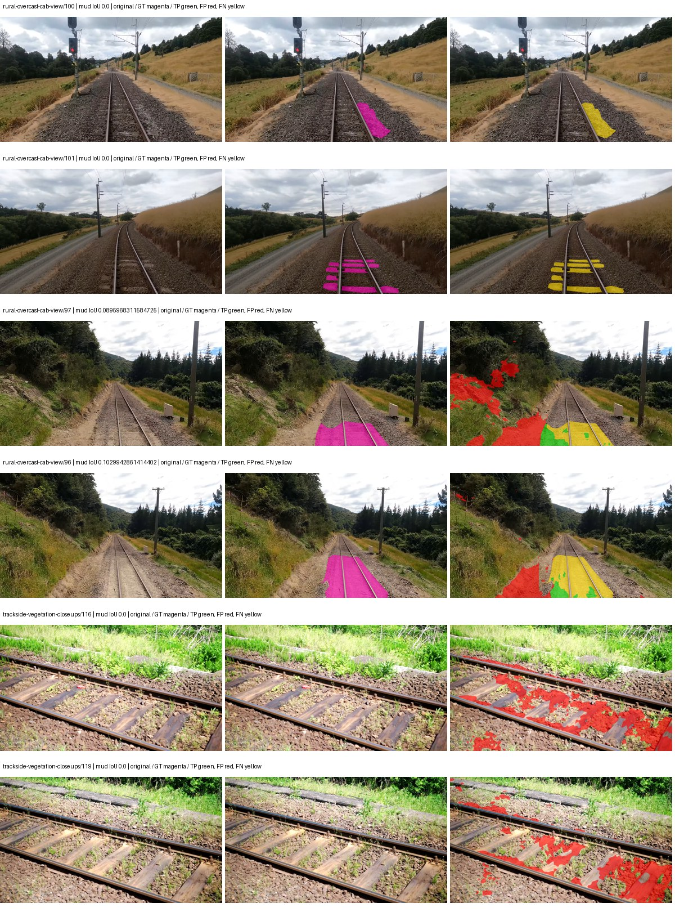
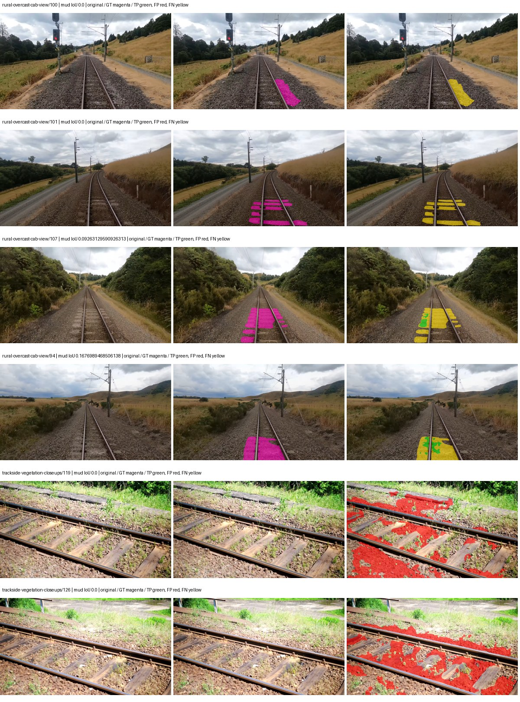
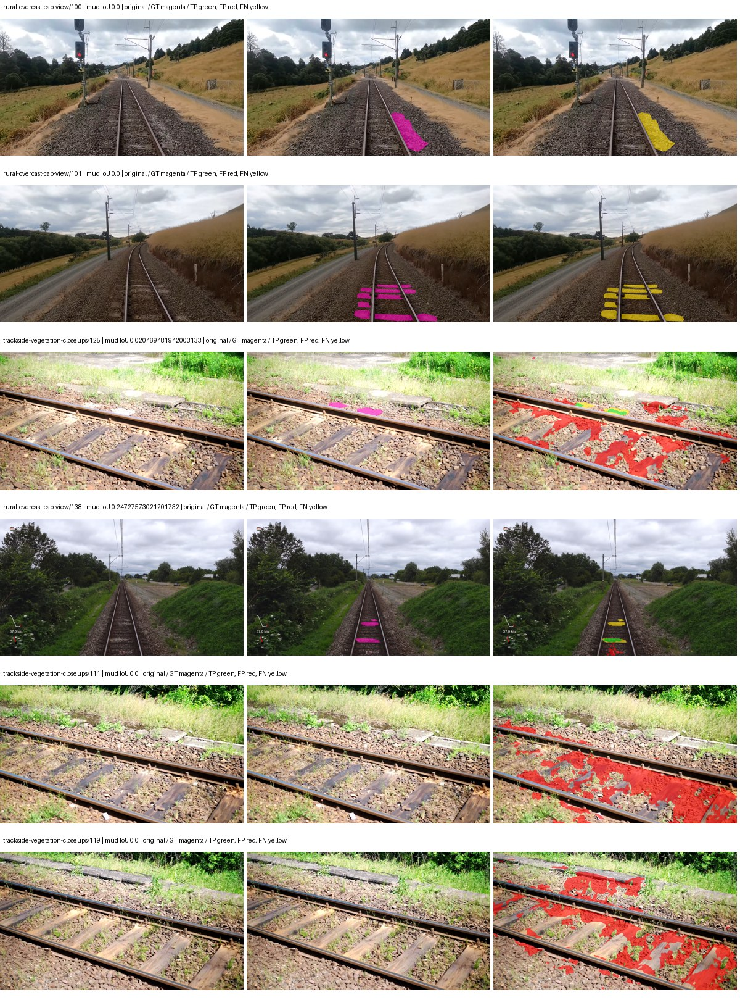

# native_resnet101_uper — paul-test-rtis_v2

[RTIS comparison](../../README.md) · [Full model records](record.json)

Primary selection and early stopping: **mud-pumping validation IoU**. A job is complete only after full statistics and isolated profiling are verified.

| Model | Initialization path | Seed | Status | Steps | Best step | Mud IoU (%) | Mud precision (%) | Mud recall (%) | Final mud IoU (trainer val, %) | mIoU (%) | Fixed GT-class mIoU (%) |
| --- | --- | --- | --- | --- | --- | --- | --- | --- | --- | --- | --- |
| native_resnet101_uper | rtis_only | 0 | completed | 3313 | 2039 | 1.70 | 2.49 | 5.12 | 0.97 | 29.63 | 34.57 |
| native_resnet101_uper | cityscapes_to_rtis | 0 | completed | 2294 | 1019 | 1.04 | 1.50 | 3.33 | 0.47 | 29.48 | 32.76 |
| native_resnet101_uper | railsem19_to_rtis | 0 | completed | 1784 | 509 | 0.49 | 0.72 | 1.52 | 0.21 | 41.68 | 48.63 |
| native_resnet101_uper | cityscapes_to_railsem19_to_rtis | 0 | completed | 2803 | 1529 | 0.58 | 0.93 | 1.51 | 0.20 | 38.18 | 42.43 |

Training: 205 images. Validation: 37 images. Test: 50 held out. Seeds: [0]. Seed variation measures optimization variability, not independent-recording uncertainty. Historical source checkpoints stay fixed across adaptation seeds.

Training code: `066afb2626398b7be59d4d19f5a0e4644fd59adc`. Split SHA-256: `18a84c0163a65ded46508bcc904c374e5f33ad8a09b8879e3c8add606e86aa9f`.

## rtis_only — seed 0

Status: **completed**. Started: 2026-09-09T22:47:44.517681+00:00. Finished: 2026-09-09T23:41:39.035956+00:00.

Recipe pretrained initializer: `{"arch": "native", "backbone_path": null, "batch_norm_momentum": null, "checkpoint": null, "classifier_path": null, "drop_path": null, "encoder_name": null, "encoder_weights": null, "head": "unified_head", "head_paths": [], "inactive_parameter_paths": [], "local_files_only": false, "lora_alpha": 32, "lora_dropout": 0.05, "lora_r": 16, "lora_targets": [], "native": {"auxiliary_heads": [], "backbone": {"in_channels": 3, "kind": "timm", "name": "resnet101.a1_in1k", "out_indices": [1, 2, 3, 4], "weights": "pretrained"}, "head": {"activation": "relu", "channels": 256, "dropout": 0.1, "in_indices": [0, 1, 2, 3], "kind": "uper", "norm": "group", "pool_bins": [1, 2, 3, 6]}, "neck": {"kind": "identity"}, "task": "multiclass"}, "revision": null, "smp_arch": null, "subfolder": null, "trust_remote_code": false, "tuning": "full"}`.

`rtis_only` uses the recipe initializer, which may include pretrained segmentation components. Transfer paths load the exact historical source checkpoint below and reset the classifier; they do not reset all query/decoder features.

Source checkpoint: `Recipe pretrained initialization`.

Config SHA-256: `1b5e43614319a131c1da4601e8b5588900aa93f7e4016cb1f86476aef20b614c`. Weights used for validation: `raw`.

### Mud-pumping and aggregate quality

| Metric | Selected checkpoint | Final training validation |
| --- | --- | --- |
| Mud IoU | 1.70 | 0.97 |
| Mud precision | 2.49 | 2.16 |
| Mud recall | 5.12 | 1.72 |
| Mud Dice/F1 | 3.35 | 1.92 |
| mIoU | 29.63 | 34.13 |
| Mean accuracy | 43.39 | 51.22 |
| Mean precision | 55.02 | 48.47 |
| Mean Dice | 38.61 | 43.86 |
| Mean specificity | 98.96 | 99.06 |
| Pixel accuracy | 82.66 | 84.77 |
| Frequency-weighted IoU | 73.75 | 75.70 |
| Fixed GT-present class mIoU | 34.57 | 39.82 |
| Boundary F1 | 37.14 | 41.06 |

The selected checkpoint has independent evaluation evidence. Final values are the trainer's final validation record, not a new independent evaluation. mIoU averages classes with nonzero union, so false positives on absent classes can change its denominator. The fixed GT-class mean is supplementary and excludes absent classes; their false positives remain in the confusion matrix.

### Resource usage and timing

| Measurement | Value |
| --- | --- |
| Peak training VRAM, retained training invocation (GiB) | 10.94 |
| Peak evaluation VRAM (GiB) | 7.54 |
| Retained training invocation wall time (seconds) | 3050.82 |
| Retained training invocation GPU-hours (one GPU) | 0.85 |
| Evaluation wall time (seconds) | 15.39 |
| Full evaluation pipeline images/second | 2.40 |
| Best full-state checkpoint (MiB) | 937.27 |
| Final full-state checkpoint (MiB) | 937.24 |
| Verified periodic checkpoints removed (GiB) | 5.49 |

VRAM uses the recorded allocator high-water mark; it is not total device usage including CUDA context. Resumed jobs' retained training invocation times and peaks are **not whole-campaign totals**. Earlier invocation resource records are not reconstructed here. Evaluation throughput includes loader, sliding-window inference and metrics; it is not model-only latency/FPS. Missing measurements are shown as —, never inferred from another dataset's run.

### Standardized inference performance

Dedicated model-only profiling waits for an idle worker-locked L40S: BF16, batch 1, 1024x1024, 20 warmup and 100 CUDA-event-timed public forwards. It excludes loading, preprocessing, tiling and metrics.

| Status | Parameters | Weight MiB | FPS | p50 ms | p95 ms | Peak reserved GiB |
| --- | --- | --- | --- | --- | --- | --- |
| complete | 61323093 | 233.93 | 63.91 | 15.56 | 16.61 | 1.36 |

```json
{
  "schema_version": 1,
  "model_id": "native_resnet101_uper",
  "measured_at": "2026-09-09T23:41:30+00:00",
  "status": "complete",
  "benchmark_scope": "rtis_selected_checkpoint_model_only",
  "applies_to": [
    "native_resnet101_uper--rtis_only--seed-0"
  ],
  "source": {
    "campaign_git_sha": "066afb2626398b7be59d4d19f5a0e4644fd59adc",
    "git_dirty": false,
    "config_hash": "a10fe1fd230f",
    "resolved_config": "/data/izadia1/projects/segmentary-runs/paul-test-rtis_v2/seed0-20260909/configs/native_resnet101_uper--rtis_only--seed-0.yaml",
    "config_sha256": "1b5e43614319a131c1da4601e8b5588900aa93f7e4016cb1f86476aef20b614c",
    "checkpoint_sha256": "e7490419b97d18770a5ab878c4f1f6f3d0031724af863cd45e3d7f33df8d4804",
    "checkpoint_global_step": 2039,
    "checkpoint_bytes": 982793791,
    "checkpoint_kind": "resume checkpoint with optimizer and EMA state",
    "weights": "raw",
    "measured_checkpoint_job_id": "native_resnet101_uper--rtis_only--seed-0",
    "result_sha256": "a1ccf28a958197d7298047b252fc176fe8c4b7127c06b41dc14b9b4dcc778b62",
    "result_git_sha": "066afb2626398b7be59d4d19f5a0e4644fd59adc",
    "result_stage": "eval:paul-test-rtis:val",
    "result_seed": 0
  },
  "hardware": {
    "gpu_name": "NVIDIA L40S",
    "gpu_uuid": "GPU-e2e96741-aec9-e90b-5c46-d0d58be90a56",
    "logical_device": "cuda:0",
    "physical_visibility_token": "8",
    "compute_capability": [
      8,
      9
    ],
    "total_memory_bytes": 47677177856
  },
  "model": {
    "parameter_count": 61323093,
    "trainable_parameter_count": 61323093,
    "resident_parameter_bytes": 245292372,
    "parameter_dtype_counts": {
      "float32": 61323093
    }
  },
  "contract": {
    "backend": "pytorch",
    "precision": "bf16_autocast",
    "batch_size": 1,
    "input_shape_nchw": [
      1,
      3,
      1024,
      1024
    ],
    "warmup_iterations": 20,
    "measured_iterations": 100,
    "timing": "per-forward CUDA events with end-event synchronization",
    "includes_preprocessing": false,
    "includes_data_loader": false,
    "includes_sliding_window": false,
    "input_resident_on_gpu": true,
    "model_only": true,
    "entrypoint": "public model(image) dense-logits forward"
  },
  "measurements": {
    "latency": {
      "p50_ms": 15.557631969451904,
      "p95_ms": 16.607436180114746,
      "mean_ms": 15.646710023880004,
      "minimum_ms": 14.77939224243164,
      "maximum_ms": 17.124351501464844,
      "fps": 63.91119912580985,
      "raw_ms": [
        15.60371208190918,
        15.39788818359375,
        15.679488182067871,
        15.950847625732422,
        15.328255653381348,
        14.960639953613281,
        14.77939224243164,
        15.118335723876953,
        15.461376190185547,
        15.492095947265625,
        15.882240295410156,
        15.499263763427734,
        15.561727523803711,
        16.235519409179688,
        15.077376365661621,
        14.836735725402832,
        15.356927871704102,
        15.592448234558105,
        16.747520446777344,
        15.440896034240723,
        16.044031143188477,
        15.4900484085083,
        15.887359619140625,
        15.029248237609863,
        15.76854419708252,
        14.799872398376465,
        14.8920316696167,
        15.196160316467285,
        16.186431884765625,
        15.79417610168457,
        15.773695945739746,
        16.167936325073242,
        15.50438404083252,
        15.243264198303223,
        16.068607330322266,
        16.60006332397461,
        15.284223556518555,
        15.515647888183594,
        15.649855613708496,
        15.546367645263672,
        15.935487747192383,
        15.19001579284668,
        15.853568077087402,
        16.00921630859375,
        15.559679985046387,
        15.195136070251465,
        16.524288177490234,
        15.18899154663086,
        16.305152893066406,
        15.947775840759277,
        15.251456260681152,
        16.892927169799805,
        15.56991958618164,
        16.83660888671875,
        16.530431747436523,
        15.09887981414795,
        15.781888008117676,
        16.178176879882812,
        16.456703186035156,
        15.254528045654297,
        16.273408889770508,
        16.076799392700195,
        15.310848236083984,
        15.040512084960938,
        15.519743919372559,
        14.830592155456543,
        16.306175231933594,
        15.812607765197754,
        15.376383781433105,
        15.433728218078613,
        15.625215530395508,
        15.928319931030273,
        15.606783866882324,
        15.278079986572266,
        15.276032447814941,
        15.337471961975098,
        15.400927543640137,
        15.641599655151367,
        15.391743659973145,
        15.446016311645508,
        15.429632186889648,
        16.58675193786621,
        15.09171199798584,
        14.87564754486084,
        14.945280075073242,
        15.555583953857422,
        16.773120880126953,
        15.635456085205078,
        15.691776275634766,
        15.614975929260254,
        15.2739839553833,
        16.322559356689453,
        15.435775756835938,
        15.77676773071289,
        15.393792152404785,
        15.77676773071289,
        15.443967819213867,
        15.24630355834961,
        17.124351501464844,
        15.758336067199707
      ],
      "percentile_method": "numpy linear interpolation"
    },
    "peak_reserved_bytes": 1461714944,
    "memory_kind": "pytorch_cuda_allocator_peak_reserved_excluding_context",
    "benchmark_wall_clock_s": 14.97978999838233
  },
  "started_at": "2026-09-09T23:41:15+00:00",
  "finished_at": "2026-09-09T23:41:30+00:00",
  "environment": {
    "hostname": "hdrfs-app-001",
    "python": "3.11.15",
    "platform": "Linux-5.15.0-139-generic-x86_64-with-glibc2.35",
    "torch": "2.11.0+cu128",
    "torch_cuda": "12.8",
    "cudnn": 91900,
    "driver_version": "570.133.20",
    "cuda_available": true,
    "gpu_count": 1,
    "gpu_names": [
      "NVIDIA L40S"
    ],
    "cuda_visible_devices": "8",
    "packages": {
      "segmentary": "0.1.0",
      "torch": "2.11.0+cu128",
      "torchvision": "0.26.0+cu128",
      "transformers": "5.15.0",
      "timm": "1.0.28",
      "segmentation-models-pytorch": "0.5.0",
      "albumentations": "2.0.8",
      "lightning": "2.6.5",
      "numpy": "2.4.4"
    }
  }
}
```

### Per-class validation results

| Class | GT pixels | IoU (%) | Precision (%) | Recall (%) | Dice (%) | Boundary F1 (%) |
| --- | --- | --- | --- | --- | --- | --- |
| car | 29664 | 24.36 | 57.42 | 29.73 | 39.18 | 41.17 |
| construction | 311585 | 19.77 | 21.55 | 70.48 | 33.01 | 55.22 |
| fence | 265137 | 10.18 | 44.53 | 11.66 | 18.48 | 28.37 |
| mud-pumping | 1226250 | 1.70 | 2.49 | 5.12 | 3.35 | 2.06 |
| on-rails | 0 | 0.00 | 0.00 | — | 0.00 | 0.00 |
| person | 0 | 0.00 | 0.00 | — | 0.00 | 0.00 |
| pole | 628038 | 64.42 | 76.93 | 79.85 | 78.36 | 87.34 |
| rail-embedded | 16799 | 7.71 | 76.06 | 7.91 | 14.32 | 12.12 |
| rail-raised | 2969797 | 72.13 | 78.65 | 89.68 | 83.81 | 86.96 |
| rail-track | 6323197 | 40.60 | 62.63 | 53.57 | 57.75 | 56.60 |
| road | 1048831 | 8.71 | 58.14 | 9.29 | 16.02 | 17.26 |
| sidewalk | 1297367 | 37.27 | 85.77 | 39.73 | 54.31 | 15.45 |
| sky | 19121606 | 95.48 | 99.28 | 96.15 | 97.69 | 91.82 |
| standing-water | 95802 | 0.08 | 0.55 | 0.10 | 0.17 | 3.64 |
| terrain | 39239306 | 86.97 | 90.51 | 95.70 | 93.03 | 65.63 |
| trackbed | 10643081 | 56.36 | 64.98 | 80.94 | 72.09 | 52.34 |
| traffic-light | 19510 | 43.27 | 65.43 | 56.09 | 60.40 | 56.96 |
| traffic-sign | 13285 | 16.10 | 99.77 | 16.11 | 27.74 | 47.01 |
| tram-track | 56179 | 10.31 | 88.14 | 10.46 | 18.70 | 6.26 |
| truck | 0 | 0.00 | 0.00 | — | 0.00 | 0.00 |
| vegetation-overgrowth | 5901821 | 26.88 | 82.65 | 28.49 | 42.37 | 53.71 |

### Full-run accounting

| Measurement | Value |
| --- | --- |
| Full GPU-reserved wall seconds, all recorded worker attempts | 3234.52 |
| Full reserved GPU-hours | 0.90 |
| Whole-run timing complete | True |

| Phase | Wall seconds including failed attempts |
| --- | --- |
| training | 3057.78 |
| diagnostics | 120.21 |
| performance | 24.13 |

GPU-reserved time includes model loading, training, validation, collection, profiling, checkpoint I/O and orchestration while the worker owns one GPU. It is not GPU kernel-active time. Phase timings and sampled device memory/power/utilization are retained separately; sampled device memory is not the allocator high-water mark.

### Train/validation and raw/EMA diagnostics

| Checkpoint / weights / split | Images | Mud IoU (%) | Mud precision (%) | Mud recall (%) |
| --- | --- | --- | --- | --- |
| best-auto-train / raw | 205 | 91.26 | 93.08 | 97.90 |
| best-auto-val / raw | 37 | 1.70 | 2.49 | 5.12 |
| best-alternate-val / ema | 37 | 0.41 | 1.01 | 0.68 |
| final-auto-val / raw | 37 | 0.96 | 2.15 | 1.72 |

Train uses the evaluation transform without augmentation. Compare mud train/validation metrics for the same selected weights. Alternate EMA on running-stat BatchNorm is explicitly uncalibrated and is diagnostic only. Score-threshold curves use uncalibrated normalized scores and are pixel-level diagnostics, not event detection rates or a selected deployment operating point.

### Downloadable evidence

- best-auto-train: [per-image.csv](rtis_only--seed-0/best-auto-train/per-image.csv) · [per-image-confusion.json.gz](rtis_only--seed-0/best-auto-train/per-image-confusion.json.gz) · [groups.json](rtis_only--seed-0/best-auto-train/groups.json) · [mud-score-curves.json](rtis_only--seed-0/best-auto-train/mud-score-curves.json)
- best-auto-val: [per-image.csv](rtis_only--seed-0/best-auto-val/per-image.csv) · [per-image-confusion.json.gz](rtis_only--seed-0/best-auto-val/per-image-confusion.json.gz) · [groups.json](rtis_only--seed-0/best-auto-val/groups.json) · [mud-score-curves.json](rtis_only--seed-0/best-auto-val/mud-score-curves.json) · [examples.jpg](rtis_only--seed-0/best-auto-val/examples.jpg)
- best-alternate-val: [per-image.csv](rtis_only--seed-0/best-alternate-val/per-image.csv) · [per-image-confusion.json.gz](rtis_only--seed-0/best-alternate-val/per-image-confusion.json.gz) · [groups.json](rtis_only--seed-0/best-alternate-val/groups.json) · [mud-score-curves.json](rtis_only--seed-0/best-alternate-val/mud-score-curves.json)
- final-auto-val: [per-image.csv](rtis_only--seed-0/final-auto-val/per-image.csv) · [per-image-confusion.json.gz](rtis_only--seed-0/final-auto-val/per-image-confusion.json.gz) · [groups.json](rtis_only--seed-0/final-auto-val/groups.json) · [mud-score-curves.json](rtis_only--seed-0/final-auto-val/mud-score-curves.json)
- resources: [telemetry.csv](rtis_only--seed-0/resources/telemetry.csv)



Examples are two lowest and two highest mud-IoU positive images, plus up to two negative images with the most false-positive mud pixels. They are targeted diagnostic examples, not random samples. Green: true positive; red: false positive; yellow: false negative. Full predictions remain on HDRFS.

### Validation tracking

| Logged step | Overall mIoU (%) | Mud IoU (%) |
| --- | --- | --- |
| 254 | 19.43 | 0.35 |
| 509 | 21.72 | 0.16 |
| 764 | 20.00 | 0.15 |
| 1019 | 22.06 | 0.07 |
| 1274 | 26.94 | 0.65 |
| 1529 | 25.93 | 0.00 |
| 1784 | 27.45 | 0.43 |
| 2038 | 29.66 | 1.71 |
| 2293 | 30.33 | 0.39 |
| 2548 | 32.22 | 0.76 |
| 2803 | 32.17 | 0.56 |
| 3058 | 34.11 | 0.97 |
| 3313 | 34.13 | 0.97 |

All retained scalar curves, including training loss and per-class IoU, are in record.json. Observed best mud on a curve is not necessarily a retained checkpoint: the pilot saved its selection-metric-best and final checkpoints. Step logging and checkpoint global_step may differ by one.

### Stopping and checkpoint provenance

```json
{
  "stopping": {
    "actual_steps": 3313,
    "maximum_steps": 4000,
    "min_delta": 0.001,
    "monitor": "val_iou/mud-pumping",
    "patience": 5,
    "reason": "validation_plateau"
  },
  "checkpoints": {
    "best": {
      "path": "/data/izadia1/projects/segmentary-runs/paul-test-rtis_v2/seed0-20260909/future-runs/native_resnet101_uper--rtis_only--seed-0_seed0/rtis/best.ckpt",
      "sha256": "e7490419b97d18770a5ab878c4f1f6f3d0031724af863cd45e3d7f33df8d4804",
      "global_step": 2039,
      "bytes": 982793791
    },
    "final": {
      "path": "/data/izadia1/projects/segmentary-runs/paul-test-rtis_v2/seed0-20260909/future-runs/native_resnet101_uper--rtis_only--seed-0_seed0/rtis/last.ckpt",
      "sha256": "619af936bee7c3c9f2f0f6240cbbe6cd991e204f79266271be7d8d94e443ee7e",
      "global_step": 3313,
      "bytes": 982771647
    }
  },
  "cleanup_error": null
}
```

### Resolved training, initialization and evaluation settings

The optimizer block is the base configuration. Stage LR scales are applied at runtime, and stage warmup is capped at min(base warmup, floor(stage budget / 10), stage budget - 1): 400 steps for this 4,000-step pilot. Model-internal native input grids may differ from augmentation crops (EoMT uses its 640 grid).

```json
{
  "name": "native_resnet101_uper--rtis_only--seed-0",
  "model": {
    "arch": "native",
    "checkpoint": null,
    "tuning": "full",
    "head": "unified_head",
    "lora_r": 16,
    "lora_alpha": 32,
    "lora_dropout": 0.05,
    "lora_targets": [],
    "drop_path": null,
    "revision": null,
    "subfolder": null,
    "local_files_only": false,
    "trust_remote_code": false,
    "backbone_path": null,
    "head_paths": [],
    "classifier_path": null,
    "inactive_parameter_paths": [],
    "smp_arch": null,
    "encoder_name": null,
    "encoder_weights": null,
    "native": {
      "task": "multiclass",
      "backbone": {
        "kind": "timm",
        "name": "resnet101.a1_in1k",
        "weights": "pretrained",
        "out_indices": [
          1,
          2,
          3,
          4
        ],
        "in_channels": 3
      },
      "neck": {
        "kind": "identity"
      },
      "head": {
        "kind": "uper",
        "in_indices": [
          0,
          1,
          2,
          3
        ],
        "channels": 256,
        "pool_bins": [
          1,
          2,
          3,
          6
        ],
        "dropout": 0.1,
        "norm": "group",
        "activation": "relu"
      },
      "auxiliary_heads": []
    },
    "batch_norm_momentum": null
  },
  "space": "paul-test-rtis",
  "taxonomy_root": "/data/izadia1/projects/segmentary-rtis-fullstats-066afb2/taxonomy",
  "output_root": "/data/izadia1/projects/segmentary-runs/paul-test-rtis_v2/seed0-20260909/future-runs",
  "optim": {
    "backbone_lr": 0.0001,
    "head_lr_mult": 10.0,
    "weight_decay": 0.05,
    "llrd": 1.0,
    "warmup_iters": 1500,
    "warmup_ratio": 1e-06,
    "poly_power": 0.9,
    "min_lr_ratio": 0.0,
    "betas": [
      0.9,
      0.999
    ],
    "grad_clip": 1.0
  },
  "train": {
    "iters": 4000,
    "batch_size": 2,
    "accum": 8,
    "num_workers": 2,
    "precision": "bf16-mixed",
    "ema_decay": 0.9998,
    "val_every": 250,
    "ckpt_every": 500,
    "selection_metric": "val_iou/mud-pumping",
    "early_stopping_patience": 5,
    "early_stopping_min_delta": 0.001,
    "seed": 0,
    "devices": 1
  },
  "eval": {
    "sliding_window": true,
    "window": [
      1024,
      1024
    ],
    "stride": [
      768,
      768
    ],
    "batch_size": 1,
    "num_workers": 2,
    "tta_scales": [],
    "tta_flip": false,
    "threshold": 0.5,
    "boundary_tolerance_frac": 0.0075,
    "save_confusion": true
  },
  "loss": {
    "task": "multiclass",
    "activation": "auto",
    "terms": [],
    "aux": "none",
    "aux_weight": 0.0,
    "ce_weight": 1.0,
    "label_smoothing": 0.0,
    "class_weights": null,
    "query": null
  },
  "aug": {
    "crop": [
      1024,
      1024
    ],
    "scale_min": 0.5,
    "scale_max": 2.0,
    "hflip_p": 0.5,
    "color_jitter_p": 0.5,
    "brightness": 0.25,
    "contrast": 0.25,
    "saturation": 0.25,
    "hue": 0.05
  },
  "stages": [
    {
      "name": "rtis",
      "data": [
        {
          "name": "paul-test-rtis",
          "root": "/data/izadia1/datasets/paul-test-rtis_v2",
          "variant": null,
          "split_file": "splits.json",
          "train_split": "train",
          "val_split": "val",
          "limit": null,
          "loader": "folder",
          "mapping": "paul-test-rtis",
          "loader_options": {
            "require_groups": true
          }
        }
      ],
      "iters": null,
      "lr_scale": 1.0,
      "head_group_lr_scale": 1.0,
      "init_from": "pretrained",
      "reset_head": false,
      "freeze": null,
      "sample_weights": null
    }
  ]
}
```

### Hardware and software provenance

```json
{
  "training": {
    "cuda_available": true,
    "cuda_visible_devices": "8",
    "cudnn": 91900,
    "driver_version": "570.133.20",
    "gpu_count": 1,
    "gpu_names": [
      "NVIDIA L40S"
    ],
    "hostname": "hdrfs-app-001",
    "input_normalization": {
      "channel_order": "rgb",
      "mean": [
        0.485,
        0.456,
        0.406
      ],
      "source": "timm_pretrained_cfg",
      "std": [
        0.229,
        0.224,
        0.225
      ]
    },
    "model_origins": [
      {
        "hf_commit": null,
        "hf_name_or_path": null,
        "module": "backbone",
        "timm_pretrained": {
          "architecture": "resnet101",
          "hf_hub_id": "timm/resnet101.a1_in1k",
          "tag": "a1_in1k",
          "url": "https://github.com/huggingface/pytorch-image-models/releases/download/v0.1-rsb-weights/resnet101_a1_0-cdcb52a9.pth"
        }
      },
      {
        "hf_commit": null,
        "hf_name_or_path": null,
        "module": "backbone.model",
        "timm_pretrained": {
          "architecture": "resnet101",
          "hf_hub_id": "timm/resnet101.a1_in1k",
          "tag": "a1_in1k",
          "url": "https://github.com/huggingface/pytorch-image-models/releases/download/v0.1-rsb-weights/resnet101_a1_0-cdcb52a9.pth"
        }
      }
    ],
    "model_parameter_count": 61323093,
    "packages": {
      "albumentations": "2.0.8",
      "lightning": "2.6.5",
      "numpy": "2.4.4",
      "segmentary": "0.1.0",
      "segmentation-models-pytorch": "0.5.0",
      "timm": "1.0.28",
      "torch": "2.11.0+cu128",
      "torchvision": "0.26.0+cu128",
      "transformers": "5.15.0"
    },
    "platform": "Linux-5.15.0-139-generic-x86_64-with-glibc2.35",
    "python": "3.11.15",
    "torch": "2.11.0+cu128",
    "torch_cuda": "12.8",
    "trainable_parameter_count": 61323093,
    "training_stop": {
      "actual_steps": 3313,
      "maximum_steps": 4000,
      "min_delta": 0.001,
      "monitor": "val_iou/mud-pumping",
      "patience": 5,
      "reason": "validation_plateau"
    },
    "validation_weights": "raw"
  },
  "evaluation": {
    "cuda_available": true,
    "cuda_visible_devices": "8",
    "cudnn": 91900,
    "driver_version": "570.133.20",
    "gpu_count": 1,
    "gpu_names": [
      "NVIDIA L40S"
    ],
    "hostname": "hdrfs-app-001",
    "input_normalization": {
      "channel_order": "rgb",
      "mean": [
        0.485,
        0.456,
        0.406
      ],
      "source": "timm_pretrained_cfg",
      "std": [
        0.229,
        0.224,
        0.225
      ]
    },
    "packages": {
      "albumentations": "2.0.8",
      "lightning": "2.6.5",
      "numpy": "2.4.4",
      "segmentary": "0.1.0",
      "segmentation-models-pytorch": "0.5.0",
      "timm": "1.0.28",
      "torch": "2.11.0+cu128",
      "torchvision": "0.26.0+cu128",
      "transformers": "5.15.0"
    },
    "platform": "Linux-5.15.0-139-generic-x86_64-with-glibc2.35",
    "python": "3.11.15",
    "torch": "2.11.0+cu128",
    "torch_cuda": "12.8"
  }
}
```

## cityscapes_to_rtis — seed 0

Status: **completed**. Started: 2026-09-09T22:50:47.567339+00:00. Finished: 2026-09-09T23:29:21.726197+00:00.

Recipe pretrained initializer: `{"arch": "native", "backbone_path": null, "batch_norm_momentum": null, "checkpoint": null, "classifier_path": null, "drop_path": null, "encoder_name": null, "encoder_weights": null, "head": "unified_head", "head_paths": [], "inactive_parameter_paths": [], "local_files_only": false, "lora_alpha": 32, "lora_dropout": 0.05, "lora_r": 16, "lora_targets": [], "native": {"auxiliary_heads": [], "backbone": {"in_channels": 3, "kind": "timm", "name": "resnet101.a1_in1k", "out_indices": [1, 2, 3, 4], "weights": "pretrained"}, "head": {"activation": "relu", "channels": 256, "dropout": 0.1, "in_indices": [0, 1, 2, 3], "kind": "uper", "norm": "group", "pool_bins": [1, 2, 3, 6]}, "neck": {"kind": "identity"}, "task": "multiclass"}, "revision": null, "smp_arch": null, "subfolder": null, "trust_remote_code": false, "tuning": "full"}`.

`rtis_only` uses the recipe initializer, which may include pretrained segmentation components. Transfer paths load the exact historical source checkpoint below and reset the classifier; they do not reset all query/decoder features.

Source checkpoint: `{'name': 'native_resnet101_uper--cityscapes--seed-0', 'model': 'native_resnet101_uper', 'protocol': 'cityscapes', 'config': '/data/izadia1/projects/segmentary-runs/all-model-city-rail-seed0-rail20-b9eb3e1/accepted/native_resnet101_uper--cityscapes--seed-0/resolved-config.yaml', 'checkpoint': '/data/izadia1/projects/segmentary-runs/all-model-city-rail-seed0-a7c0b67/jobs/native_resnet101_uper--cityscapes--seed-0/attempt-001/train/native_resnet101_uper--cityscapes_seed0/cityscapes/last.ckpt', 'recorded_sha256': 'afa826b49282e2029b80737cc2f65d93f1cb70275d61bef4c399b264d96a4617', 'exists': True}`.

Config SHA-256: `bdf5477064c75e0b4525cf9169df0c026eb16635f5c0ac4482c49253a000ae41`. Weights used for validation: `raw`.

### Mud-pumping and aggregate quality

| Metric | Selected checkpoint | Final training validation |
| --- | --- | --- |
| Mud IoU | 1.04 | 0.47 |
| Mud precision | 1.50 | 0.60 |
| Mud recall | 3.33 | 2.19 |
| Mud Dice/F1 | 2.07 | 0.94 |
| mIoU | 29.48 | 30.04 |
| Mean accuracy | 41.91 | 43.81 |
| Mean precision | 50.87 | 49.43 |
| Mean Dice | 38.62 | 39.19 |
| Mean specificity | 98.57 | 98.80 |
| Pixel accuracy | 78.27 | 80.66 |
| Frequency-weighted IoU | 67.53 | 71.64 |
| Fixed GT-present class mIoU | 32.76 | 35.04 |
| Boundary F1 | 36.29 | 35.39 |

The selected checkpoint has independent evaluation evidence. Final values are the trainer's final validation record, not a new independent evaluation. mIoU averages classes with nonzero union, so false positives on absent classes can change its denominator. The fixed GT-class mean is supplementary and excludes absent classes; their false positives remain in the confusion matrix.

### Resource usage and timing

| Measurement | Value |
| --- | --- |
| Peak training VRAM, retained training invocation (GiB) | 10.87 |
| Peak evaluation VRAM (GiB) | 7.54 |
| Retained training invocation wall time (seconds) | 2131.40 |
| Retained training invocation GPU-hours (one GPU) | 0.59 |
| Evaluation wall time (seconds) | 15.57 |
| Full evaluation pipeline images/second | 2.38 |
| Best full-state checkpoint (MiB) | 937.27 |
| Final full-state checkpoint (MiB) | 937.24 |
| Verified periodic checkpoints removed (GiB) | 3.66 |

VRAM uses the recorded allocator high-water mark; it is not total device usage including CUDA context. Resumed jobs' retained training invocation times and peaks are **not whole-campaign totals**. Earlier invocation resource records are not reconstructed here. Evaluation throughput includes loader, sliding-window inference and metrics; it is not model-only latency/FPS. Missing measurements are shown as —, never inferred from another dataset's run.

### Standardized inference performance

Dedicated model-only profiling waits for an idle worker-locked L40S: BF16, batch 1, 1024x1024, 20 warmup and 100 CUDA-event-timed public forwards. It excludes loading, preprocessing, tiling and metrics.

| Status | Parameters | Weight MiB | FPS | p50 ms | p95 ms | Peak reserved GiB |
| --- | --- | --- | --- | --- | --- | --- |
| complete | 61323093 | 233.93 | 62.40 | 15.77 | 17.67 | 1.31 |

```json
{
  "schema_version": 1,
  "model_id": "native_resnet101_uper",
  "measured_at": "2026-09-09T23:29:14+00:00",
  "status": "complete",
  "benchmark_scope": "rtis_selected_checkpoint_model_only",
  "applies_to": [
    "native_resnet101_uper--cityscapes_to_rtis--seed-0"
  ],
  "source": {
    "campaign_git_sha": "066afb2626398b7be59d4d19f5a0e4644fd59adc",
    "git_dirty": false,
    "config_hash": "c1ac918ae869",
    "resolved_config": "/data/izadia1/projects/segmentary-runs/paul-test-rtis_v2/seed0-20260909/configs/native_resnet101_uper--cityscapes_to_rtis--seed-0.yaml",
    "config_sha256": "bdf5477064c75e0b4525cf9169df0c026eb16635f5c0ac4482c49253a000ae41",
    "checkpoint_sha256": "b9050d256fb2691646f885d24861bdfdacbec5dee5783efd6a8a419815ebdf75",
    "checkpoint_global_step": 1019,
    "checkpoint_bytes": 982793791,
    "checkpoint_kind": "resume checkpoint with optimizer and EMA state",
    "weights": "raw",
    "measured_checkpoint_job_id": "native_resnet101_uper--cityscapes_to_rtis--seed-0",
    "result_sha256": "932e9113441b40046ce76225cddd544b0af7c98565129d90a7d0e16983a20254",
    "result_git_sha": "066afb2626398b7be59d4d19f5a0e4644fd59adc",
    "result_stage": "eval:paul-test-rtis:val",
    "result_seed": 0
  },
  "hardware": {
    "gpu_name": "NVIDIA L40S",
    "gpu_uuid": "GPU-2f8008a1-9b67-11f6-987b-b393a672322c",
    "logical_device": "cuda:0",
    "physical_visibility_token": "3",
    "compute_capability": [
      8,
      9
    ],
    "total_memory_bytes": 47677177856
  },
  "model": {
    "parameter_count": 61323093,
    "trainable_parameter_count": 61323093,
    "resident_parameter_bytes": 245292372,
    "parameter_dtype_counts": {
      "float32": 61323093
    }
  },
  "contract": {
    "backend": "pytorch",
    "precision": "bf16_autocast",
    "batch_size": 1,
    "input_shape_nchw": [
      1,
      3,
      1024,
      1024
    ],
    "warmup_iterations": 20,
    "measured_iterations": 100,
    "timing": "per-forward CUDA events with end-event synchronization",
    "includes_preprocessing": false,
    "includes_data_loader": false,
    "includes_sliding_window": false,
    "input_resident_on_gpu": true,
    "model_only": true,
    "entrypoint": "public model(image) dense-logits forward"
  },
  "measurements": {
    "latency": {
      "p50_ms": 15.770112037658691,
      "p95_ms": 17.666047382354737,
      "mean_ms": 16.025773677825928,
      "minimum_ms": 14.898176193237305,
      "maximum_ms": 23.550975799560547,
      "fps": 62.39948348850394,
      "raw_ms": [
        15.548416137695312,
        14.898176193237305,
        15.542271614074707,
        15.385600090026855,
        14.941184043884277,
        15.769599914550781,
        15.961088180541992,
        16.116735458374023,
        16.15667152404785,
        16.40959930419922,
        15.540224075317383,
        15.46127986907959,
        16.36966323852539,
        15.764479637145996,
        15.439871788024902,
        15.562751770019531,
        16.748544692993164,
        15.213567733764648,
        15.39686393737793,
        16.63795280456543,
        16.08086395263672,
        15.1080961227417,
        14.904319763183594,
        15.649791717529297,
        16.705535888671875,
        15.630335807800293,
        15.438847541809082,
        15.922176361083984,
        16.448511123657227,
        15.887359619140625,
        16.83353614807129,
        15.319040298461914,
        17.662975311279297,
        17.551359176635742,
        15.816703796386719,
        15.466496467590332,
        15.424511909484863,
        16.762880325317383,
        16.18022346496582,
        16.037887573242188,
        15.769599914550781,
        15.124480247497559,
        15.739904403686523,
        15.946751594543457,
        15.943679809570312,
        15.565823554992676,
        16.966655731201172,
        16.054271697998047,
        15.772576332092285,
        15.16543960571289,
        15.770624160766602,
        23.550975799560547,
        15.850560188293457,
        16.548864364624023,
        15.799296379089355,
        15.417344093322754,
        15.17363166809082,
        17.386560440063477,
        20.438016891479492,
        18.357248306274414,
        15.154175758361816,
        15.285247802734375,
        15.882240295410156,
        17.724416732788086,
        21.494783401489258,
        16.488447189331055,
        15.160320281982422,
        15.724543571472168,
        15.976448059082031,
        15.836159706115723,
        15.660032272338867,
        15.871999740600586,
        16.481279373168945,
        15.036416053771973,
        16.879615783691406,
        15.09887981414795,
        15.770624160766602,
        16.672767639160156,
        16.19353675842285,
        15.937536239624023,
        15.1910400390625,
        14.911487579345703,
        15.354880332946777,
        15.51360034942627,
        15.502335548400879,
        15.427583694458008,
        16.365631103515625,
        15.859711647033691,
        15.051775932312012,
        15.08249568939209,
        17.60665512084961,
        14.989312171936035,
        15.374336242675781,
        15.756287574768066,
        15.089664459228516,
        15.843328475952148,
        16.072704315185547,
        15.1080961227417,
        15.106047630310059,
        15.002623558044434
      ],
      "percentile_method": "numpy linear interpolation"
    },
    "peak_reserved_bytes": 1405091840,
    "memory_kind": "pytorch_cuda_allocator_peak_reserved_excluding_context",
    "benchmark_wall_clock_s": 14.490671306848526
  },
  "started_at": "2026-09-09T23:29:00+00:00",
  "finished_at": "2026-09-09T23:29:14+00:00",
  "environment": {
    "hostname": "hdrfs-app-001",
    "python": "3.11.15",
    "platform": "Linux-5.15.0-139-generic-x86_64-with-glibc2.35",
    "torch": "2.11.0+cu128",
    "torch_cuda": "12.8",
    "cudnn": 91900,
    "driver_version": "570.133.20",
    "cuda_available": true,
    "gpu_count": 1,
    "gpu_names": [
      "NVIDIA L40S"
    ],
    "cuda_visible_devices": "3",
    "packages": {
      "segmentary": "0.1.0",
      "torch": "2.11.0+cu128",
      "torchvision": "0.26.0+cu128",
      "transformers": "5.15.0",
      "timm": "1.0.28",
      "segmentation-models-pytorch": "0.5.0",
      "albumentations": "2.0.8",
      "lightning": "2.6.5",
      "numpy": "2.4.4"
    }
  }
}
```

### Per-class validation results

| Class | GT pixels | IoU (%) | Precision (%) | Recall (%) | Dice (%) | Boundary F1 (%) |
| --- | --- | --- | --- | --- | --- | --- |
| car | 29664 | 43.98 | 77.86 | 50.27 | 61.10 | 59.11 |
| construction | 311585 | 19.79 | 21.17 | 75.23 | 33.04 | 39.51 |
| fence | 265137 | 18.60 | 32.73 | 30.12 | 31.37 | 35.79 |
| mud-pumping | 1226250 | 1.04 | 1.50 | 3.33 | 2.07 | 2.52 |
| on-rails | 0 | 0.00 | 0.00 | — | 0.00 | 0.00 |
| person | 0 | — | — | — | — | — |
| pole | 628038 | 68.90 | 81.33 | 81.84 | 81.58 | 90.39 |
| rail-embedded | 16799 | 9.46 | 94.78 | 9.51 | 17.29 | 12.72 |
| rail-raised | 2969797 | 73.56 | 82.49 | 87.18 | 84.77 | 90.81 |
| rail-track | 6323197 | 31.97 | 59.58 | 40.82 | 48.45 | 44.85 |
| road | 1048831 | 5.66 | 26.06 | 6.74 | 10.72 | 13.25 |
| sidewalk | 1297367 | 25.06 | 39.61 | 40.55 | 40.07 | 7.75 |
| sky | 19121606 | 94.59 | 99.72 | 94.85 | 97.22 | 87.39 |
| standing-water | 95802 | 0.03 | 0.04 | 0.38 | 0.07 | 0.84 |
| terrain | 39239306 | 78.65 | 81.11 | 96.28 | 88.05 | 51.18 |
| trackbed | 10643081 | 49.31 | 74.06 | 59.61 | 66.05 | 51.58 |
| traffic-light | 19510 | 18.88 | 83.79 | 19.60 | 31.77 | 39.58 |
| traffic-sign | 13285 | 34.42 | 66.13 | 41.78 | 51.21 | 48.99 |
| tram-track | 56179 | 0.89 | 10.59 | 0.96 | 1.76 | 3.83 |
| truck | 0 | 0.00 | 0.00 | — | 0.00 | 0.00 |
| vegetation-overgrowth | 5901821 | 14.85 | 84.96 | 15.25 | 25.86 | 45.77 |

### Full-run accounting

| Measurement | Value |
| --- | --- |
| Full GPU-reserved wall seconds, all recorded worker attempts | 2315.46 |
| Full reserved GPU-hours | 0.64 |
| Whole-run timing complete | True |

| Phase | Wall seconds including failed attempts |
| --- | --- |
| training | 2139.20 |
| diagnostics | 120.38 |
| performance | 23.23 |

GPU-reserved time includes model loading, training, validation, collection, profiling, checkpoint I/O and orchestration while the worker owns one GPU. It is not GPU kernel-active time. Phase timings and sampled device memory/power/utilization are retained separately; sampled device memory is not the allocator high-water mark.

### Train/validation and raw/EMA diagnostics

| Checkpoint / weights / split | Images | Mud IoU (%) | Mud precision (%) | Mud recall (%) |
| --- | --- | --- | --- | --- |
| best-auto-train / raw | 205 | 90.60 | 93.12 | 97.10 |
| best-auto-val / raw | 37 | 1.04 | 1.50 | 3.33 |
| best-alternate-val / ema | 37 | 0.50 | 0.70 | 1.74 |
| final-auto-val / raw | 37 | 0.48 | 0.60 | 2.20 |

Train uses the evaluation transform without augmentation. Compare mud train/validation metrics for the same selected weights. Alternate EMA on running-stat BatchNorm is explicitly uncalibrated and is diagnostic only. Score-threshold curves use uncalibrated normalized scores and are pixel-level diagnostics, not event detection rates or a selected deployment operating point.

### Downloadable evidence

- best-auto-train: [per-image.csv](cityscapes_to_rtis--seed-0/best-auto-train/per-image.csv) · [per-image-confusion.json.gz](cityscapes_to_rtis--seed-0/best-auto-train/per-image-confusion.json.gz) · [groups.json](cityscapes_to_rtis--seed-0/best-auto-train/groups.json) · [mud-score-curves.json](cityscapes_to_rtis--seed-0/best-auto-train/mud-score-curves.json)
- best-auto-val: [per-image.csv](cityscapes_to_rtis--seed-0/best-auto-val/per-image.csv) · [per-image-confusion.json.gz](cityscapes_to_rtis--seed-0/best-auto-val/per-image-confusion.json.gz) · [groups.json](cityscapes_to_rtis--seed-0/best-auto-val/groups.json) · [mud-score-curves.json](cityscapes_to_rtis--seed-0/best-auto-val/mud-score-curves.json) · [examples.jpg](cityscapes_to_rtis--seed-0/best-auto-val/examples.jpg)
- best-alternate-val: [per-image.csv](cityscapes_to_rtis--seed-0/best-alternate-val/per-image.csv) · [per-image-confusion.json.gz](cityscapes_to_rtis--seed-0/best-alternate-val/per-image-confusion.json.gz) · [groups.json](cityscapes_to_rtis--seed-0/best-alternate-val/groups.json) · [mud-score-curves.json](cityscapes_to_rtis--seed-0/best-alternate-val/mud-score-curves.json)
- final-auto-val: [per-image.csv](cityscapes_to_rtis--seed-0/final-auto-val/per-image.csv) · [per-image-confusion.json.gz](cityscapes_to_rtis--seed-0/final-auto-val/per-image-confusion.json.gz) · [groups.json](cityscapes_to_rtis--seed-0/final-auto-val/groups.json) · [mud-score-curves.json](cityscapes_to_rtis--seed-0/final-auto-val/mud-score-curves.json)
- resources: [telemetry.csv](cityscapes_to_rtis--seed-0/resources/telemetry.csv)



Examples are two lowest and two highest mud-IoU positive images, plus up to two negative images with the most false-positive mud pixels. They are targeted diagnostic examples, not random samples. Green: true positive; red: false positive; yellow: false negative. Full predictions remain on HDRFS.

### Validation tracking

| Logged step | Overall mIoU (%) | Mud IoU (%) |
| --- | --- | --- |
| 254 | 22.68 | 0.41 |
| 509 | 24.35 | 0.42 |
| 764 | 27.89 | 0.22 |
| 1019 | 29.49 | 1.04 |
| 1274 | 30.97 | 0.48 |
| 1529 | 32.74 | 0.32 |
| 1784 | 31.43 | 0.37 |
| 2038 | 28.99 | 0.71 |
| 2293 | 30.04 | 0.47 |

All retained scalar curves, including training loss and per-class IoU, are in record.json. Observed best mud on a curve is not necessarily a retained checkpoint: the pilot saved its selection-metric-best and final checkpoints. Step logging and checkpoint global_step may differ by one.

### Stopping and checkpoint provenance

```json
{
  "stopping": {
    "actual_steps": 2294,
    "maximum_steps": 4000,
    "min_delta": 0.001,
    "monitor": "val_iou/mud-pumping",
    "patience": 5,
    "reason": "validation_plateau"
  },
  "checkpoints": {
    "best": {
      "path": "/data/izadia1/projects/segmentary-runs/paul-test-rtis_v2/seed0-20260909/future-runs/native_resnet101_uper--cityscapes_to_rtis--seed-0_seed0/rtis/best.ckpt",
      "sha256": "b9050d256fb2691646f885d24861bdfdacbec5dee5783efd6a8a419815ebdf75",
      "global_step": 1019,
      "bytes": 982793791
    },
    "final": {
      "path": "/data/izadia1/projects/segmentary-runs/paul-test-rtis_v2/seed0-20260909/future-runs/native_resnet101_uper--cityscapes_to_rtis--seed-0_seed0/rtis/last.ckpt",
      "sha256": "443417b1c924edbf26bf8a383ad057c96faa2efa212bace7772cc45d32ddcbcd",
      "global_step": 2294,
      "bytes": 982771711
    }
  },
  "cleanup_error": null
}
```

### Resolved training, initialization and evaluation settings

The optimizer block is the base configuration. Stage LR scales are applied at runtime, and stage warmup is capped at min(base warmup, floor(stage budget / 10), stage budget - 1): 400 steps for this 4,000-step pilot. Model-internal native input grids may differ from augmentation crops (EoMT uses its 640 grid).

```json
{
  "name": "native_resnet101_uper--cityscapes_to_rtis--seed-0",
  "model": {
    "arch": "native",
    "checkpoint": null,
    "tuning": "full",
    "head": "unified_head",
    "lora_r": 16,
    "lora_alpha": 32,
    "lora_dropout": 0.05,
    "lora_targets": [],
    "drop_path": null,
    "revision": null,
    "subfolder": null,
    "local_files_only": false,
    "trust_remote_code": false,
    "backbone_path": null,
    "head_paths": [],
    "classifier_path": null,
    "inactive_parameter_paths": [],
    "smp_arch": null,
    "encoder_name": null,
    "encoder_weights": null,
    "native": {
      "task": "multiclass",
      "backbone": {
        "kind": "timm",
        "name": "resnet101.a1_in1k",
        "weights": "pretrained",
        "out_indices": [
          1,
          2,
          3,
          4
        ],
        "in_channels": 3
      },
      "neck": {
        "kind": "identity"
      },
      "head": {
        "kind": "uper",
        "in_indices": [
          0,
          1,
          2,
          3
        ],
        "channels": 256,
        "pool_bins": [
          1,
          2,
          3,
          6
        ],
        "dropout": 0.1,
        "norm": "group",
        "activation": "relu"
      },
      "auxiliary_heads": []
    },
    "batch_norm_momentum": null
  },
  "space": "paul-test-rtis",
  "taxonomy_root": "/data/izadia1/projects/segmentary-rtis-fullstats-066afb2/taxonomy",
  "output_root": "/data/izadia1/projects/segmentary-runs/paul-test-rtis_v2/seed0-20260909/future-runs",
  "optim": {
    "backbone_lr": 0.0001,
    "head_lr_mult": 10.0,
    "weight_decay": 0.05,
    "llrd": 1.0,
    "warmup_iters": 1500,
    "warmup_ratio": 1e-06,
    "poly_power": 0.9,
    "min_lr_ratio": 0.0,
    "betas": [
      0.9,
      0.999
    ],
    "grad_clip": 1.0
  },
  "train": {
    "iters": 4000,
    "batch_size": 2,
    "accum": 8,
    "num_workers": 2,
    "precision": "bf16-mixed",
    "ema_decay": 0.9998,
    "val_every": 250,
    "ckpt_every": 500,
    "selection_metric": "val_iou/mud-pumping",
    "early_stopping_patience": 5,
    "early_stopping_min_delta": 0.001,
    "seed": 0,
    "devices": 1
  },
  "eval": {
    "sliding_window": true,
    "window": [
      1024,
      1024
    ],
    "stride": [
      768,
      768
    ],
    "batch_size": 1,
    "num_workers": 2,
    "tta_scales": [],
    "tta_flip": false,
    "threshold": 0.5,
    "boundary_tolerance_frac": 0.0075,
    "save_confusion": true
  },
  "loss": {
    "task": "multiclass",
    "activation": "auto",
    "terms": [],
    "aux": "none",
    "aux_weight": 0.0,
    "ce_weight": 1.0,
    "label_smoothing": 0.0,
    "class_weights": null,
    "query": null
  },
  "aug": {
    "crop": [
      1024,
      1024
    ],
    "scale_min": 0.5,
    "scale_max": 2.0,
    "hflip_p": 0.5,
    "color_jitter_p": 0.5,
    "brightness": 0.25,
    "contrast": 0.25,
    "saturation": 0.25,
    "hue": 0.05
  },
  "stages": [
    {
      "name": "rtis",
      "data": [
        {
          "name": "paul-test-rtis",
          "root": "/data/izadia1/datasets/paul-test-rtis_v2",
          "variant": null,
          "split_file": "splits.json",
          "train_split": "train",
          "val_split": "val",
          "limit": null,
          "loader": "folder",
          "mapping": "paul-test-rtis",
          "loader_options": {
            "require_groups": true
          }
        }
      ],
      "iters": null,
      "lr_scale": 0.1,
      "head_group_lr_scale": 1.0,
      "init_from": "/data/izadia1/projects/segmentary-runs/all-model-city-rail-seed0-a7c0b67/jobs/native_resnet101_uper--cityscapes--seed-0/attempt-001/train/native_resnet101_uper--cityscapes_seed0/cityscapes/last.ckpt",
      "reset_head": true,
      "freeze": null,
      "sample_weights": null
    }
  ]
}
```

### Hardware and software provenance

```json
{
  "training": {
    "cuda_available": true,
    "cuda_visible_devices": "3",
    "cudnn": 91900,
    "driver_version": "570.133.20",
    "gpu_count": 1,
    "gpu_names": [
      "NVIDIA L40S"
    ],
    "hostname": "hdrfs-app-001",
    "input_normalization": {
      "channel_order": "rgb",
      "mean": [
        0.485,
        0.456,
        0.406
      ],
      "source": "timm_pretrained_cfg",
      "std": [
        0.229,
        0.224,
        0.225
      ]
    },
    "model_origins": [
      {
        "hf_commit": null,
        "hf_name_or_path": null,
        "module": "backbone",
        "timm_pretrained": {
          "architecture": "resnet101",
          "hf_hub_id": "timm/resnet101.a1_in1k",
          "tag": "a1_in1k",
          "url": "https://github.com/huggingface/pytorch-image-models/releases/download/v0.1-rsb-weights/resnet101_a1_0-cdcb52a9.pth"
        }
      },
      {
        "hf_commit": null,
        "hf_name_or_path": null,
        "module": "backbone.model",
        "timm_pretrained": {
          "architecture": "resnet101",
          "hf_hub_id": "timm/resnet101.a1_in1k",
          "tag": "a1_in1k",
          "url": "https://github.com/huggingface/pytorch-image-models/releases/download/v0.1-rsb-weights/resnet101_a1_0-cdcb52a9.pth"
        }
      }
    ],
    "model_parameter_count": 61323093,
    "packages": {
      "albumentations": "2.0.8",
      "lightning": "2.6.5",
      "numpy": "2.4.4",
      "segmentary": "0.1.0",
      "segmentation-models-pytorch": "0.5.0",
      "timm": "1.0.28",
      "torch": "2.11.0+cu128",
      "torchvision": "0.26.0+cu128",
      "transformers": "5.15.0"
    },
    "platform": "Linux-5.15.0-139-generic-x86_64-with-glibc2.35",
    "python": "3.11.15",
    "torch": "2.11.0+cu128",
    "torch_cuda": "12.8",
    "trainable_parameter_count": 61323093,
    "training_stop": {
      "actual_steps": 2294,
      "maximum_steps": 4000,
      "min_delta": 0.001,
      "monitor": "val_iou/mud-pumping",
      "patience": 5,
      "reason": "validation_plateau"
    },
    "validation_weights": "raw"
  },
  "evaluation": {
    "cuda_available": true,
    "cuda_visible_devices": "3",
    "cudnn": 91900,
    "driver_version": "570.133.20",
    "gpu_count": 1,
    "gpu_names": [
      "NVIDIA L40S"
    ],
    "hostname": "hdrfs-app-001",
    "input_normalization": {
      "channel_order": "rgb",
      "mean": [
        0.485,
        0.456,
        0.406
      ],
      "source": "timm_pretrained_cfg",
      "std": [
        0.229,
        0.224,
        0.225
      ]
    },
    "packages": {
      "albumentations": "2.0.8",
      "lightning": "2.6.5",
      "numpy": "2.4.4",
      "segmentary": "0.1.0",
      "segmentation-models-pytorch": "0.5.0",
      "timm": "1.0.28",
      "torch": "2.11.0+cu128",
      "torchvision": "0.26.0+cu128",
      "transformers": "5.15.0"
    },
    "platform": "Linux-5.15.0-139-generic-x86_64-with-glibc2.35",
    "python": "3.11.15",
    "torch": "2.11.0+cu128",
    "torch_cuda": "12.8"
  }
}
```

## railsem19_to_rtis — seed 0

Status: **completed**. Started: 2026-09-09T22:55:05.952560+00:00. Finished: 2026-09-09T23:26:13.933510+00:00.

Recipe pretrained initializer: `{"arch": "native", "backbone_path": null, "batch_norm_momentum": null, "checkpoint": null, "classifier_path": null, "drop_path": null, "encoder_name": null, "encoder_weights": null, "head": "unified_head", "head_paths": [], "inactive_parameter_paths": [], "local_files_only": false, "lora_alpha": 32, "lora_dropout": 0.05, "lora_r": 16, "lora_targets": [], "native": {"auxiliary_heads": [], "backbone": {"in_channels": 3, "kind": "timm", "name": "resnet101.a1_in1k", "out_indices": [1, 2, 3, 4], "weights": "pretrained"}, "head": {"activation": "relu", "channels": 256, "dropout": 0.1, "in_indices": [0, 1, 2, 3], "kind": "uper", "norm": "group", "pool_bins": [1, 2, 3, 6]}, "neck": {"kind": "identity"}, "task": "multiclass"}, "revision": null, "smp_arch": null, "subfolder": null, "trust_remote_code": false, "tuning": "full"}`.

`rtis_only` uses the recipe initializer, which may include pretrained segmentation components. Transfer paths load the exact historical source checkpoint below and reset the classifier; they do not reset all query/decoder features.

Source checkpoint: `{'name': 'native_resnet101_uper--railsem19--seed-0', 'model': 'native_resnet101_uper', 'protocol': 'railsem19', 'config': '/data/izadia1/projects/segmentary-runs/all-model-city-rail-seed0-rail20-b9eb3e1/accepted/native_resnet101_uper--railsem19--seed-0/resolved-config.yaml', 'checkpoint': '/data/izadia1/projects/segmentary-runs/all-model-city-rail-seed0-a7c0b67/jobs/native_resnet101_uper--railsem19--seed-0/attempt-001/train/native_resnet101_uper--railsem19_seed0/railsem19/last.ckpt', 'recorded_sha256': 'cc281f26902e994dc44ecc9be89ae89bc49c62fbca7504b77767379156685e4b', 'exists': True}`.

Config SHA-256: `aacfdf6ae415d10eca2119e1b3e1521ff24ad86cd45fe70b0ec321ad2fd4bc78`. Weights used for validation: `raw`.

### Mud-pumping and aggregate quality

| Metric | Selected checkpoint | Final training validation |
| --- | --- | --- |
| Mud IoU | 0.49 | 0.21 |
| Mud precision | 0.72 | 0.33 |
| Mud recall | 1.52 | 0.61 |
| Mud Dice/F1 | 0.98 | 0.43 |
| mIoU | 41.68 | 41.64 |
| Mean accuracy | 58.52 | 59.11 |
| Mean precision | 56.79 | 55.25 |
| Mean Dice | 51.74 | 51.70 |
| Mean specificity | 98.98 | 99.09 |
| Pixel accuracy | 83.34 | 84.95 |
| Frequency-weighted IoU | 74.95 | 76.72 |
| Fixed GT-present class mIoU | 48.63 | 48.58 |
| Boundary F1 | 48.82 | 48.45 |

The selected checkpoint has independent evaluation evidence. Final values are the trainer's final validation record, not a new independent evaluation. mIoU averages classes with nonzero union, so false positives on absent classes can change its denominator. The fixed GT-class mean is supplementary and excludes absent classes; their false positives remain in the confusion matrix.

### Resource usage and timing

| Measurement | Value |
| --- | --- |
| Peak training VRAM, retained training invocation (GiB) | 10.94 |
| Peak evaluation VRAM (GiB) | 7.54 |
| Retained training invocation wall time (seconds) | 1685.50 |
| Retained training invocation GPU-hours (one GPU) | 0.47 |
| Evaluation wall time (seconds) | 15.80 |
| Full evaluation pipeline images/second | 2.34 |
| Best full-state checkpoint (MiB) | 937.27 |
| Final full-state checkpoint (MiB) | 937.24 |
| Verified periodic checkpoints removed (GiB) | 2.75 |

VRAM uses the recorded allocator high-water mark; it is not total device usage including CUDA context. Resumed jobs' retained training invocation times and peaks are **not whole-campaign totals**. Earlier invocation resource records are not reconstructed here. Evaluation throughput includes loader, sliding-window inference and metrics; it is not model-only latency/FPS. Missing measurements are shown as —, never inferred from another dataset's run.

### Standardized inference performance

Dedicated model-only profiling waits for an idle worker-locked L40S: BF16, batch 1, 1024x1024, 20 warmup and 100 CUDA-event-timed public forwards. It excludes loading, preprocessing, tiling and metrics.

| Status | Parameters | Weight MiB | FPS | p50 ms | p95 ms | Peak reserved GiB |
| --- | --- | --- | --- | --- | --- | --- |
| complete | 61323093 | 233.93 | 66.96 | 14.81 | 15.44 | 1.31 |

```json
{
  "schema_version": 1,
  "model_id": "native_resnet101_uper",
  "measured_at": "2026-09-09T23:26:07+00:00",
  "status": "complete",
  "benchmark_scope": "rtis_selected_checkpoint_model_only",
  "applies_to": [
    "native_resnet101_uper--railsem19_to_rtis--seed-0"
  ],
  "source": {
    "campaign_git_sha": "066afb2626398b7be59d4d19f5a0e4644fd59adc",
    "git_dirty": false,
    "config_hash": "b3f1799f22e3",
    "resolved_config": "/data/izadia1/projects/segmentary-runs/paul-test-rtis_v2/seed0-20260909/configs/native_resnet101_uper--railsem19_to_rtis--seed-0.yaml",
    "config_sha256": "aacfdf6ae415d10eca2119e1b3e1521ff24ad86cd45fe70b0ec321ad2fd4bc78",
    "checkpoint_sha256": "ae5282212c376e03710e49b3770fb8dd8966a57e2eef147793148e12f94f9be4",
    "checkpoint_global_step": 509,
    "checkpoint_bytes": 982793791,
    "checkpoint_kind": "resume checkpoint with optimizer and EMA state",
    "weights": "raw",
    "measured_checkpoint_job_id": "native_resnet101_uper--railsem19_to_rtis--seed-0",
    "result_sha256": "a9629eeef6478e86344ca70b6f9925583d387b2e5ec41290358d4a37950ab4fc",
    "result_git_sha": "066afb2626398b7be59d4d19f5a0e4644fd59adc",
    "result_stage": "eval:paul-test-rtis:val",
    "result_seed": 0
  },
  "hardware": {
    "gpu_name": "NVIDIA L40S",
    "gpu_uuid": "GPU-1c9b612f-e0b5-fbbc-150f-8c2ef13453c9",
    "logical_device": "cuda:0",
    "physical_visibility_token": "5",
    "compute_capability": [
      8,
      9
    ],
    "total_memory_bytes": 47677177856
  },
  "model": {
    "parameter_count": 61323093,
    "trainable_parameter_count": 61323093,
    "resident_parameter_bytes": 245292372,
    "parameter_dtype_counts": {
      "float32": 61323093
    }
  },
  "contract": {
    "backend": "pytorch",
    "precision": "bf16_autocast",
    "batch_size": 1,
    "input_shape_nchw": [
      1,
      3,
      1024,
      1024
    ],
    "warmup_iterations": 20,
    "measured_iterations": 100,
    "timing": "per-forward CUDA events with end-event synchronization",
    "includes_preprocessing": false,
    "includes_data_loader": false,
    "includes_sliding_window": false,
    "input_resident_on_gpu": true,
    "model_only": true,
    "entrypoint": "public model(image) dense-logits forward"
  },
  "measurements": {
    "latency": {
      "p50_ms": 14.812160015106201,
      "p95_ms": 15.436799764633179,
      "mean_ms": 14.935366106033324,
      "minimum_ms": 14.58892822265625,
      "maximum_ms": 17.795072555541992,
      "fps": 66.95517156395903,
      "raw_ms": [
        15.148032188415527,
        15.435775756835938,
        17.795072555541992,
        16.20070457458496,
        15.139840126037598,
        15.148032188415527,
        14.816255569458008,
        14.69542407989502,
        14.810111999511719,
        14.727168083190918,
        14.643199920654297,
        14.7128324508667,
        15.110143661499023,
        14.682111740112305,
        14.629887580871582,
        15.1244478225708,
        14.705663681030273,
        15.286272048950195,
        15.79417610168457,
        14.700544357299805,
        14.691328048706055,
        14.764032363891602,
        14.753791809082031,
        15.224831581115723,
        14.58892822265625,
        14.861311912536621,
        14.97702407836914,
        14.978048324584961,
        14.78553581237793,
        14.668800354003906,
        14.70361614227295,
        15.343615531921387,
        15.051775932312012,
        14.736384391784668,
        14.830592155456543,
        14.767104148864746,
        14.727168083190918,
        14.735360145568848,
        14.847999572753906,
        14.668800354003906,
        14.696415901184082,
        15.162367820739746,
        14.66982364654541,
        15.115263938903809,
        15.034367561340332,
        14.798848152160645,
        14.801919937133789,
        15.456255912780762,
        15.10912036895752,
        15.292415618896484,
        15.234047889709473,
        15.032320022583008,
        14.69644832611084,
        15.112192153930664,
        14.691328048706055,
        14.789631843566895,
        14.747648239135742,
        14.673919677734375,
        15.101951599121094,
        14.816255569458008,
        14.718976020812988,
        14.757823944091797,
        14.864383697509766,
        14.652416229248047,
        14.822400093078613,
        15.121408462524414,
        14.631936073303223,
        14.7128324508667,
        15.101951599121094,
        14.798848152160645,
        14.815232276916504,
        14.734335899353027,
        14.76915168762207,
        14.740480422973633,
        15.022080421447754,
        14.641152381896973,
        14.717951774597168,
        14.690303802490234,
        14.744576454162598,
        14.792703628540039,
        14.990336418151855,
        14.700544357299805,
        14.924799919128418,
        15.101951599121094,
        14.888959884643555,
        16.00713539123535,
        14.866432189941406,
        14.835712432861328,
        14.814208030700684,
        14.822400093078613,
        14.718976020812988,
        14.724096298217773,
        14.950400352478027,
        14.684160232543945,
        14.750720024108887,
        15.245311737060547,
        15.17363166809082,
        14.772224426269531,
        14.841856002807617,
        14.827520370483398
      ],
      "percentile_method": "numpy linear interpolation"
    },
    "peak_reserved_bytes": 1405091840,
    "memory_kind": "pytorch_cuda_allocator_peak_reserved_excluding_context",
    "benchmark_wall_clock_s": 14.50843907520175
  },
  "started_at": "2026-09-09T23:25:53+00:00",
  "finished_at": "2026-09-09T23:26:07+00:00",
  "environment": {
    "hostname": "hdrfs-app-001",
    "python": "3.11.15",
    "platform": "Linux-5.15.0-139-generic-x86_64-with-glibc2.35",
    "torch": "2.11.0+cu128",
    "torch_cuda": "12.8",
    "cudnn": 91900,
    "driver_version": "570.133.20",
    "cuda_available": true,
    "gpu_count": 1,
    "gpu_names": [
      "NVIDIA L40S"
    ],
    "cuda_visible_devices": "5",
    "packages": {
      "segmentary": "0.1.0",
      "torch": "2.11.0+cu128",
      "torchvision": "0.26.0+cu128",
      "transformers": "5.15.0",
      "timm": "1.0.28",
      "segmentation-models-pytorch": "0.5.0",
      "albumentations": "2.0.8",
      "lightning": "2.6.5",
      "numpy": "2.4.4"
    }
  }
}
```

### Per-class validation results

| Class | GT pixels | IoU (%) | Precision (%) | Recall (%) | Dice (%) | Boundary F1 (%) |
| --- | --- | --- | --- | --- | --- | --- |
| car | 29664 | 50.30 | 76.02 | 59.79 | 66.93 | 58.45 |
| construction | 311585 | 66.56 | 78.92 | 80.95 | 79.92 | 72.26 |
| fence | 265137 | 22.70 | 62.29 | 26.32 | 37.01 | 45.00 |
| mud-pumping | 1226250 | 0.49 | 0.72 | 1.52 | 0.98 | 1.23 |
| on-rails | 0 | 0.00 | 0.00 | — | 0.00 | 0.00 |
| person | 0 | 0.00 | 0.00 | — | 0.00 | 0.00 |
| pole | 628038 | 72.90 | 89.80 | 79.48 | 84.33 | 91.58 |
| rail-embedded | 16799 | 51.88 | 72.72 | 64.43 | 68.32 | 83.81 |
| rail-raised | 2969797 | 73.74 | 77.56 | 93.75 | 84.89 | 89.79 |
| rail-track | 6323197 | 39.50 | 69.65 | 47.71 | 56.63 | 52.65 |
| road | 1048831 | 34.42 | 48.53 | 54.22 | 51.22 | 28.95 |
| sidewalk | 1297367 | 41.83 | 69.84 | 51.06 | 58.99 | 50.83 |
| sky | 19121606 | 98.67 | 99.23 | 99.43 | 99.33 | 96.03 |
| standing-water | 95802 | 0.02 | 0.03 | 0.33 | 0.05 | 0.19 |
| terrain | 39239306 | 87.48 | 89.20 | 97.84 | 93.32 | 65.03 |
| trackbed | 10643081 | 58.71 | 73.53 | 74.44 | 73.98 | 59.69 |
| traffic-light | 19510 | 81.96 | 93.52 | 86.89 | 90.08 | 85.09 |
| traffic-sign | 13285 | 38.42 | 49.54 | 63.13 | 55.51 | 53.77 |
| tram-track | 56179 | 38.27 | 56.77 | 54.01 | 55.36 | 45.74 |
| truck | 0 | 0.00 | 0.00 | — | 0.00 | 0.00 |
| vegetation-overgrowth | 5901821 | 17.48 | 84.78 | 18.05 | 29.77 | 45.03 |

### Full-run accounting

| Measurement | Value |
| --- | --- |
| Full GPU-reserved wall seconds, all recorded worker attempts | 1869.13 |
| Full reserved GPU-hours | 0.52 |
| Whole-run timing complete | True |

| Phase | Wall seconds including failed attempts |
| --- | --- |
| training | 1693.83 |
| diagnostics | 120.40 |
| performance | 23.22 |

GPU-reserved time includes model loading, training, validation, collection, profiling, checkpoint I/O and orchestration while the worker owns one GPU. It is not GPU kernel-active time. Phase timings and sampled device memory/power/utilization are retained separately; sampled device memory is not the allocator high-water mark.

### Train/validation and raw/EMA diagnostics

| Checkpoint / weights / split | Images | Mud IoU (%) | Mud precision (%) | Mud recall (%) |
| --- | --- | --- | --- | --- |
| best-auto-train / raw | 205 | 90.42 | 98.17 | 91.97 |
| best-auto-val / raw | 37 | 0.49 | 0.72 | 1.52 |
| best-alternate-val / ema | 37 | 0.25 | 0.34 | 0.95 |
| final-auto-val / raw | 37 | 0.21 | 0.33 | 0.60 |

Train uses the evaluation transform without augmentation. Compare mud train/validation metrics for the same selected weights. Alternate EMA on running-stat BatchNorm is explicitly uncalibrated and is diagnostic only. Score-threshold curves use uncalibrated normalized scores and are pixel-level diagnostics, not event detection rates or a selected deployment operating point.

### Downloadable evidence

- best-auto-train: [per-image.csv](railsem19_to_rtis--seed-0/best-auto-train/per-image.csv) · [per-image-confusion.json.gz](railsem19_to_rtis--seed-0/best-auto-train/per-image-confusion.json.gz) · [groups.json](railsem19_to_rtis--seed-0/best-auto-train/groups.json) · [mud-score-curves.json](railsem19_to_rtis--seed-0/best-auto-train/mud-score-curves.json)
- best-auto-val: [per-image.csv](railsem19_to_rtis--seed-0/best-auto-val/per-image.csv) · [per-image-confusion.json.gz](railsem19_to_rtis--seed-0/best-auto-val/per-image-confusion.json.gz) · [groups.json](railsem19_to_rtis--seed-0/best-auto-val/groups.json) · [mud-score-curves.json](railsem19_to_rtis--seed-0/best-auto-val/mud-score-curves.json) · [examples.jpg](railsem19_to_rtis--seed-0/best-auto-val/examples.jpg)
- best-alternate-val: [per-image.csv](railsem19_to_rtis--seed-0/best-alternate-val/per-image.csv) · [per-image-confusion.json.gz](railsem19_to_rtis--seed-0/best-alternate-val/per-image-confusion.json.gz) · [groups.json](railsem19_to_rtis--seed-0/best-alternate-val/groups.json) · [mud-score-curves.json](railsem19_to_rtis--seed-0/best-alternate-val/mud-score-curves.json)
- final-auto-val: [per-image.csv](railsem19_to_rtis--seed-0/final-auto-val/per-image.csv) · [per-image-confusion.json.gz](railsem19_to_rtis--seed-0/final-auto-val/per-image-confusion.json.gz) · [groups.json](railsem19_to_rtis--seed-0/final-auto-val/groups.json) · [mud-score-curves.json](railsem19_to_rtis--seed-0/final-auto-val/mud-score-curves.json)
- resources: [telemetry.csv](railsem19_to_rtis--seed-0/resources/telemetry.csv)


Examples are two lowest and two highest mud-IoU positive images, plus up to two negative images with the most false-positive mud pixels. They are targeted diagnostic examples, not random samples. Green: true positive; red: false positive; yellow: false negative. Full predictions remain on HDRFS.

### Validation tracking

| Logged step | Overall mIoU (%) | Mud IoU (%) |
| --- | --- | --- |
| 254 | 31.06 | 0.00 |
| 509 | 41.70 | 0.48 |
| 764 | 39.33 | 0.23 |
| 1019 | 39.62 | 0.47 |
| 1274 | 40.23 | 0.18 |
| 1529 | 41.26 | 0.26 |
| 1784 | 41.64 | 0.21 |

All retained scalar curves, including training loss and per-class IoU, are in record.json. Observed best mud on a curve is not necessarily a retained checkpoint: the pilot saved its selection-metric-best and final checkpoints. Step logging and checkpoint global_step may differ by one.

### Stopping and checkpoint provenance

```json
{
  "stopping": {
    "actual_steps": 1784,
    "maximum_steps": 4000,
    "min_delta": 0.001,
    "monitor": "val_iou/mud-pumping",
    "patience": 5,
    "reason": "validation_plateau"
  },
  "checkpoints": {
    "best": {
      "path": "/data/izadia1/projects/segmentary-runs/paul-test-rtis_v2/seed0-20260909/future-runs/native_resnet101_uper--railsem19_to_rtis--seed-0_seed0/rtis/best.ckpt",
      "sha256": "ae5282212c376e03710e49b3770fb8dd8966a57e2eef147793148e12f94f9be4",
      "global_step": 509,
      "bytes": 982793791
    },
    "final": {
      "path": "/data/izadia1/projects/segmentary-runs/paul-test-rtis_v2/seed0-20260909/future-runs/native_resnet101_uper--railsem19_to_rtis--seed-0_seed0/rtis/last.ckpt",
      "sha256": "672d7d1a7cbe02ebb6b202e81bafb8635e6cf01954843b3873134818cbccba4a",
      "global_step": 1784,
      "bytes": 982771711
    }
  },
  "cleanup_error": null
}
```

### Resolved training, initialization and evaluation settings

The optimizer block is the base configuration. Stage LR scales are applied at runtime, and stage warmup is capped at min(base warmup, floor(stage budget / 10), stage budget - 1): 400 steps for this 4,000-step pilot. Model-internal native input grids may differ from augmentation crops (EoMT uses its 640 grid).

```json
{
  "name": "native_resnet101_uper--railsem19_to_rtis--seed-0",
  "model": {
    "arch": "native",
    "checkpoint": null,
    "tuning": "full",
    "head": "unified_head",
    "lora_r": 16,
    "lora_alpha": 32,
    "lora_dropout": 0.05,
    "lora_targets": [],
    "drop_path": null,
    "revision": null,
    "subfolder": null,
    "local_files_only": false,
    "trust_remote_code": false,
    "backbone_path": null,
    "head_paths": [],
    "classifier_path": null,
    "inactive_parameter_paths": [],
    "smp_arch": null,
    "encoder_name": null,
    "encoder_weights": null,
    "native": {
      "task": "multiclass",
      "backbone": {
        "kind": "timm",
        "name": "resnet101.a1_in1k",
        "weights": "pretrained",
        "out_indices": [
          1,
          2,
          3,
          4
        ],
        "in_channels": 3
      },
      "neck": {
        "kind": "identity"
      },
      "head": {
        "kind": "uper",
        "in_indices": [
          0,
          1,
          2,
          3
        ],
        "channels": 256,
        "pool_bins": [
          1,
          2,
          3,
          6
        ],
        "dropout": 0.1,
        "norm": "group",
        "activation": "relu"
      },
      "auxiliary_heads": []
    },
    "batch_norm_momentum": null
  },
  "space": "paul-test-rtis",
  "taxonomy_root": "/data/izadia1/projects/segmentary-rtis-fullstats-066afb2/taxonomy",
  "output_root": "/data/izadia1/projects/segmentary-runs/paul-test-rtis_v2/seed0-20260909/future-runs",
  "optim": {
    "backbone_lr": 0.0001,
    "head_lr_mult": 10.0,
    "weight_decay": 0.05,
    "llrd": 1.0,
    "warmup_iters": 1500,
    "warmup_ratio": 1e-06,
    "poly_power": 0.9,
    "min_lr_ratio": 0.0,
    "betas": [
      0.9,
      0.999
    ],
    "grad_clip": 1.0
  },
  "train": {
    "iters": 4000,
    "batch_size": 2,
    "accum": 8,
    "num_workers": 2,
    "precision": "bf16-mixed",
    "ema_decay": 0.9998,
    "val_every": 250,
    "ckpt_every": 500,
    "selection_metric": "val_iou/mud-pumping",
    "early_stopping_patience": 5,
    "early_stopping_min_delta": 0.001,
    "seed": 0,
    "devices": 1
  },
  "eval": {
    "sliding_window": true,
    "window": [
      1024,
      1024
    ],
    "stride": [
      768,
      768
    ],
    "batch_size": 1,
    "num_workers": 2,
    "tta_scales": [],
    "tta_flip": false,
    "threshold": 0.5,
    "boundary_tolerance_frac": 0.0075,
    "save_confusion": true
  },
  "loss": {
    "task": "multiclass",
    "activation": "auto",
    "terms": [],
    "aux": "none",
    "aux_weight": 0.0,
    "ce_weight": 1.0,
    "label_smoothing": 0.0,
    "class_weights": null,
    "query": null
  },
  "aug": {
    "crop": [
      1024,
      1024
    ],
    "scale_min": 0.5,
    "scale_max": 2.0,
    "hflip_p": 0.5,
    "color_jitter_p": 0.5,
    "brightness": 0.25,
    "contrast": 0.25,
    "saturation": 0.25,
    "hue": 0.05
  },
  "stages": [
    {
      "name": "rtis",
      "data": [
        {
          "name": "paul-test-rtis",
          "root": "/data/izadia1/datasets/paul-test-rtis_v2",
          "variant": null,
          "split_file": "splits.json",
          "train_split": "train",
          "val_split": "val",
          "limit": null,
          "loader": "folder",
          "mapping": "paul-test-rtis",
          "loader_options": {
            "require_groups": true
          }
        }
      ],
      "iters": null,
      "lr_scale": 0.1,
      "head_group_lr_scale": 1.0,
      "init_from": "/data/izadia1/projects/segmentary-runs/all-model-city-rail-seed0-a7c0b67/jobs/native_resnet101_uper--railsem19--seed-0/attempt-001/train/native_resnet101_uper--railsem19_seed0/railsem19/last.ckpt",
      "reset_head": true,
      "freeze": null,
      "sample_weights": null
    }
  ]
}
```

### Hardware and software provenance

```json
{
  "training": {
    "cuda_available": true,
    "cuda_visible_devices": "5",
    "cudnn": 91900,
    "driver_version": "570.133.20",
    "gpu_count": 1,
    "gpu_names": [
      "NVIDIA L40S"
    ],
    "hostname": "hdrfs-app-001",
    "input_normalization": {
      "channel_order": "rgb",
      "mean": [
        0.485,
        0.456,
        0.406
      ],
      "source": "timm_pretrained_cfg",
      "std": [
        0.229,
        0.224,
        0.225
      ]
    },
    "model_origins": [
      {
        "hf_commit": null,
        "hf_name_or_path": null,
        "module": "backbone",
        "timm_pretrained": {
          "architecture": "resnet101",
          "hf_hub_id": "timm/resnet101.a1_in1k",
          "tag": "a1_in1k",
          "url": "https://github.com/huggingface/pytorch-image-models/releases/download/v0.1-rsb-weights/resnet101_a1_0-cdcb52a9.pth"
        }
      },
      {
        "hf_commit": null,
        "hf_name_or_path": null,
        "module": "backbone.model",
        "timm_pretrained": {
          "architecture": "resnet101",
          "hf_hub_id": "timm/resnet101.a1_in1k",
          "tag": "a1_in1k",
          "url": "https://github.com/huggingface/pytorch-image-models/releases/download/v0.1-rsb-weights/resnet101_a1_0-cdcb52a9.pth"
        }
      }
    ],
    "model_parameter_count": 61323093,
    "packages": {
      "albumentations": "2.0.8",
      "lightning": "2.6.5",
      "numpy": "2.4.4",
      "segmentary": "0.1.0",
      "segmentation-models-pytorch": "0.5.0",
      "timm": "1.0.28",
      "torch": "2.11.0+cu128",
      "torchvision": "0.26.0+cu128",
      "transformers": "5.15.0"
    },
    "platform": "Linux-5.15.0-139-generic-x86_64-with-glibc2.35",
    "python": "3.11.15",
    "torch": "2.11.0+cu128",
    "torch_cuda": "12.8",
    "trainable_parameter_count": 61323093,
    "training_stop": {
      "actual_steps": 1784,
      "maximum_steps": 4000,
      "min_delta": 0.001,
      "monitor": "val_iou/mud-pumping",
      "patience": 5,
      "reason": "validation_plateau"
    },
    "validation_weights": "raw"
  },
  "evaluation": {
    "cuda_available": true,
    "cuda_visible_devices": "5",
    "cudnn": 91900,
    "driver_version": "570.133.20",
    "gpu_count": 1,
    "gpu_names": [
      "NVIDIA L40S"
    ],
    "hostname": "hdrfs-app-001",
    "input_normalization": {
      "channel_order": "rgb",
      "mean": [
        0.485,
        0.456,
        0.406
      ],
      "source": "timm_pretrained_cfg",
      "std": [
        0.229,
        0.224,
        0.225
      ]
    },
    "packages": {
      "albumentations": "2.0.8",
      "lightning": "2.6.5",
      "numpy": "2.4.4",
      "segmentary": "0.1.0",
      "segmentation-models-pytorch": "0.5.0",
      "timm": "1.0.28",
      "torch": "2.11.0+cu128",
      "torchvision": "0.26.0+cu128",
      "transformers": "5.15.0"
    },
    "platform": "Linux-5.15.0-139-generic-x86_64-with-glibc2.35",
    "python": "3.11.15",
    "torch": "2.11.0+cu128",
    "torch_cuda": "12.8"
  }
}
```

## cityscapes_to_railsem19_to_rtis — seed 0

Status: **completed**. Started: 2026-09-09T22:55:06.846276+00:00. Finished: 2026-09-09T23:41:19.052352+00:00.

Recipe pretrained initializer: `{"arch": "native", "backbone_path": null, "batch_norm_momentum": null, "checkpoint": null, "classifier_path": null, "drop_path": null, "encoder_name": null, "encoder_weights": null, "head": "unified_head", "head_paths": [], "inactive_parameter_paths": [], "local_files_only": false, "lora_alpha": 32, "lora_dropout": 0.05, "lora_r": 16, "lora_targets": [], "native": {"auxiliary_heads": [], "backbone": {"in_channels": 3, "kind": "timm", "name": "resnet101.a1_in1k", "out_indices": [1, 2, 3, 4], "weights": "pretrained"}, "head": {"activation": "relu", "channels": 256, "dropout": 0.1, "in_indices": [0, 1, 2, 3], "kind": "uper", "norm": "group", "pool_bins": [1, 2, 3, 6]}, "neck": {"kind": "identity"}, "task": "multiclass"}, "revision": null, "smp_arch": null, "subfolder": null, "trust_remote_code": false, "tuning": "full"}`.

`rtis_only` uses the recipe initializer, which may include pretrained segmentation components. Transfer paths load the exact historical source checkpoint below and reset the classifier; they do not reset all query/decoder features.

Source checkpoint: `{'name': 'native_resnet101_uper--cityscapes_to_railsem19--seed-0', 'model': 'native_resnet101_uper', 'protocol': 'cityscapes_to_railsem19', 'config': '/data/izadia1/projects/segmentary-runs/all-model-city-rail-seed0-rail20-b9eb3e1/jobs/native_resnet101_uper--cityscapes_to_railsem19--seed-0/attempt-001/resolved-config.yaml', 'checkpoint': '/data/izadia1/projects/segmentary-runs/all-model-city-rail-seed0-rail20-b9eb3e1/jobs/native_resnet101_uper--cityscapes_to_railsem19--seed-0/attempt-001/train/native_resnet101_uper--cityscapes_to_railsem19_seed0/railsem19/last.ckpt', 'recorded_sha256': '2534fb4a2c21e6d162e9a0134a78eab309142db45037ce392476c1bef155d91b', 'exists': True}`.

Config SHA-256: `e907ec438408f298aef79d8bee20ed18df8facd49fda061f5720945240454dee`. Weights used for validation: `raw`.

### Mud-pumping and aggregate quality

| Metric | Selected checkpoint | Final training validation |
| --- | --- | --- |
| Mud IoU | 0.58 | 0.20 |
| Mud precision | 0.93 | 0.31 |
| Mud recall | 1.51 | 0.57 |
| Mud Dice/F1 | 1.15 | 0.40 |
| mIoU | 38.18 | 39.75 |
| Mean accuracy | 52.26 | 52.71 |
| Mean precision | 54.77 | 59.09 |
| Mean Dice | 48.41 | 49.93 |
| Mean specificity | 98.79 | 98.98 |
| Pixel accuracy | 81.34 | 83.75 |
| Frequency-weighted IoU | 70.77 | 74.82 |
| Fixed GT-present class mIoU | 42.43 | 44.17 |
| Boundary F1 | 46.15 | 46.32 |

The selected checkpoint has independent evaluation evidence. Final values are the trainer's final validation record, not a new independent evaluation. mIoU averages classes with nonzero union, so false positives on absent classes can change its denominator. The fixed GT-class mean is supplementary and excludes absent classes; their false positives remain in the confusion matrix.

### Resource usage and timing

| Measurement | Value |
| --- | --- |
| Peak training VRAM, retained training invocation (GiB) | 10.87 |
| Peak evaluation VRAM (GiB) | 7.54 |
| Retained training invocation wall time (seconds) | 2586.89 |
| Retained training invocation GPU-hours (one GPU) | 0.72 |
| Evaluation wall time (seconds) | 15.08 |
| Full evaluation pipeline images/second | 2.45 |
| Best full-state checkpoint (MiB) | 937.27 |
| Final full-state checkpoint (MiB) | 937.24 |
| Verified periodic checkpoints removed (GiB) | 4.58 |

VRAM uses the recorded allocator high-water mark; it is not total device usage including CUDA context. Resumed jobs' retained training invocation times and peaks are **not whole-campaign totals**. Earlier invocation resource records are not reconstructed here. Evaluation throughput includes loader, sliding-window inference and metrics; it is not model-only latency/FPS. Missing measurements are shown as —, never inferred from another dataset's run.

### Standardized inference performance

Dedicated model-only profiling waits for an idle worker-locked L40S: BF16, batch 1, 1024x1024, 20 warmup and 100 CUDA-event-timed public forwards. It excludes loading, preprocessing, tiling and metrics.

| Status | Parameters | Weight MiB | FPS | p50 ms | p95 ms | Peak reserved GiB |
| --- | --- | --- | --- | --- | --- | --- |
| complete | 61323093 | 233.93 | 63.26 | 15.53 | 17.45 | 1.31 |

```json
{
  "schema_version": 1,
  "model_id": "native_resnet101_uper",
  "measured_at": "2026-09-09T23:41:10+00:00",
  "status": "complete",
  "benchmark_scope": "rtis_selected_checkpoint_model_only",
  "applies_to": [
    "native_resnet101_uper--cityscapes_to_railsem19_to_rtis--seed-0"
  ],
  "source": {
    "campaign_git_sha": "066afb2626398b7be59d4d19f5a0e4644fd59adc",
    "git_dirty": false,
    "config_hash": "57de0a14b711",
    "resolved_config": "/data/izadia1/projects/segmentary-runs/paul-test-rtis_v2/seed0-20260909/configs/native_resnet101_uper--cityscapes_to_railsem19_to_rtis--seed-0.yaml",
    "config_sha256": "e907ec438408f298aef79d8bee20ed18df8facd49fda061f5720945240454dee",
    "checkpoint_sha256": "d737c70a2283c420e09e075d925f743c4bd4eb15b4868678e74aaa0b09df9d71",
    "checkpoint_global_step": 1529,
    "checkpoint_bytes": 982793855,
    "checkpoint_kind": "resume checkpoint with optimizer and EMA state",
    "weights": "raw",
    "measured_checkpoint_job_id": "native_resnet101_uper--cityscapes_to_railsem19_to_rtis--seed-0",
    "result_sha256": "2fd1ed59a853b032976edec26d79bf7e04cba533f62efd3c37c1d8c87daf1999",
    "result_git_sha": "066afb2626398b7be59d4d19f5a0e4644fd59adc",
    "result_stage": "eval:paul-test-rtis:val",
    "result_seed": 0
  },
  "hardware": {
    "gpu_name": "NVIDIA L40S",
    "gpu_uuid": "GPU-931d0911-fc78-1638-e3d7-1ba868cbd286",
    "logical_device": "cuda:0",
    "physical_visibility_token": "2",
    "compute_capability": [
      8,
      9
    ],
    "total_memory_bytes": 47677177856
  },
  "model": {
    "parameter_count": 61323093,
    "trainable_parameter_count": 61323093,
    "resident_parameter_bytes": 245292372,
    "parameter_dtype_counts": {
      "float32": 61323093
    }
  },
  "contract": {
    "backend": "pytorch",
    "precision": "bf16_autocast",
    "batch_size": 1,
    "input_shape_nchw": [
      1,
      3,
      1024,
      1024
    ],
    "warmup_iterations": 20,
    "measured_iterations": 100,
    "timing": "per-forward CUDA events with end-event synchronization",
    "includes_preprocessing": false,
    "includes_data_loader": false,
    "includes_sliding_window": false,
    "input_resident_on_gpu": true,
    "model_only": true,
    "entrypoint": "public model(image) dense-logits forward"
  },
  "measurements": {
    "latency": {
      "p50_ms": 15.534016132354736,
      "p95_ms": 17.44905834197998,
      "mean_ms": 15.806615047454834,
      "minimum_ms": 14.832639694213867,
      "maximum_ms": 19.365856170654297,
      "fps": 63.264651982589974,
      "raw_ms": [
        15.57811164855957,
        16.488447189331055,
        17.01683235168457,
        15.868927955627441,
        15.29753589630127,
        15.344672203063965,
        16.40959930419922,
        15.265791893005371,
        15.195136070251465,
        15.433728218078613,
        16.61337661743164,
        15.938559532165527,
        16.18329620361328,
        15.28320026397705,
        16.145408630371094,
        16.508928298950195,
        16.185344696044922,
        15.28320026397705,
        15.70304012298584,
        15.47878360748291,
        15.474687576293945,
        15.10092830657959,
        14.87769603729248,
        15.204352378845215,
        15.98259162902832,
        17.447935104370117,
        16.279552459716797,
        15.469568252563477,
        15.636480331420898,
        15.47980785369873,
        15.52883243560791,
        14.929920196533203,
        14.838784217834473,
        15.645695686340332,
        15.047679901123047,
        16.22425651550293,
        17.00454330444336,
        15.358847618103027,
        16.3450870513916,
        15.993856430053711,
        15.48697566986084,
        15.941632270812988,
        15.546367645263672,
        15.065088272094727,
        16.00716781616211,
        14.850048065185547,
        14.946271896362305,
        16.158720016479492,
        15.539199829101562,
        16.236480712890625,
        14.98521614074707,
        16.525312423706055,
        15.354880332946777,
        15.997952461242676,
        15.28115177154541,
        15.783935546875,
        15.218688011169434,
        15.635456085205078,
        15.79315185546875,
        15.321087837219238,
        15.120384216308594,
        15.459424018859863,
        15.208383560180664,
        15.26476764678955,
        17.26464080810547,
        15.451135635375977,
        15.055871963500977,
        16.477184295654297,
        14.952447891235352,
        15.193087577819824,
        19.365856170654297,
        17.161216735839844,
        15.950847625732422,
        18.992128372192383,
        16.274431228637695,
        16.669727325439453,
        15.361023902893066,
        15.5863037109375,
        16.492544174194336,
        15.614975929260254,
        15.725567817687988,
        17.713151931762695,
        18.25382423400879,
        15.672320365905762,
        15.388671875,
        15.175680160522461,
        15.465472221374512,
        15.448063850402832,
        15.136768341064453,
        15.219776153564453,
        15.761407852172852,
        15.284223556518555,
        15.106047630310059,
        14.832639694213867,
        14.908415794372559,
        15.461376190185547,
        15.13475227355957,
        16.479232788085938,
        17.470399856567383,
        15.339520454406738
      ],
      "percentile_method": "numpy linear interpolation"
    },
    "peak_reserved_bytes": 1405091840,
    "memory_kind": "pytorch_cuda_allocator_peak_reserved_excluding_context",
    "benchmark_wall_clock_s": 15.065465979278088
  },
  "started_at": "2026-09-09T23:40:55+00:00",
  "finished_at": "2026-09-09T23:41:10+00:00",
  "environment": {
    "hostname": "hdrfs-app-001",
    "python": "3.11.15",
    "platform": "Linux-5.15.0-139-generic-x86_64-with-glibc2.35",
    "torch": "2.11.0+cu128",
    "torch_cuda": "12.8",
    "cudnn": 91900,
    "driver_version": "570.133.20",
    "cuda_available": true,
    "gpu_count": 1,
    "gpu_names": [
      "NVIDIA L40S"
    ],
    "cuda_visible_devices": "2",
    "packages": {
      "segmentary": "0.1.0",
      "torch": "2.11.0+cu128",
      "torchvision": "0.26.0+cu128",
      "transformers": "5.15.0",
      "timm": "1.0.28",
      "segmentation-models-pytorch": "0.5.0",
      "albumentations": "2.0.8",
      "lightning": "2.6.5",
      "numpy": "2.4.4"
    }
  }
}
```

### Per-class validation results

| Class | GT pixels | IoU (%) | Precision (%) | Recall (%) | Dice (%) | Boundary F1 (%) |
| --- | --- | --- | --- | --- | --- | --- |
| car | 29664 | 51.62 | 78.48 | 60.13 | 68.09 | 64.95 |
| construction | 311585 | 38.40 | 42.74 | 79.08 | 55.49 | 43.08 |
| fence | 265137 | 25.52 | 57.63 | 31.42 | 40.67 | 42.41 |
| mud-pumping | 1226250 | 0.58 | 0.93 | 1.51 | 1.15 | 1.67 |
| on-rails | 0 | 0.00 | 0.00 | — | 0.00 | 0.00 |
| person | 0 | — | — | — | — | — |
| pole | 628038 | 75.24 | 87.15 | 84.64 | 85.87 | 92.74 |
| rail-embedded | 16799 | 5.77 | 36.51 | 6.41 | 10.91 | 38.24 |
| rail-raised | 2969797 | 72.67 | 80.62 | 88.05 | 84.17 | 89.37 |
| rail-track | 6323197 | 33.67 | 60.65 | 43.07 | 50.37 | 43.32 |
| road | 1048831 | 10.44 | 37.65 | 12.62 | 18.91 | 21.24 |
| sidewalk | 1297367 | 32.56 | 45.69 | 53.13 | 49.13 | 23.74 |
| sky | 19121606 | 89.22 | 99.57 | 89.56 | 94.30 | 85.14 |
| standing-water | 95802 | 0.00 | 0.00 | 0.00 | 0.00 | 0.00 |
| terrain | 39239306 | 83.97 | 85.05 | 98.50 | 91.29 | 63.27 |
| trackbed | 10643081 | 57.05 | 69.39 | 76.23 | 72.65 | 55.29 |
| traffic-light | 19510 | 80.12 | 92.04 | 86.08 | 88.96 | 82.83 |
| traffic-sign | 13285 | 43.64 | 62.49 | 59.13 | 60.77 | 62.46 |
| tram-track | 56179 | 37.69 | 70.37 | 44.80 | 54.74 | 51.46 |
| truck | 0 | 0.00 | 0.00 | — | 0.00 | 0.00 |
| vegetation-overgrowth | 5901821 | 25.49 | 88.46 | 26.37 | 40.63 | 61.82 |

### Full-run accounting

| Measurement | Value |
| --- | --- |
| Full GPU-reserved wall seconds, all recorded worker attempts | 2772.95 |
| Full reserved GPU-hours | 0.77 |
| Whole-run timing complete | True |

| Phase | Wall seconds including failed attempts |
| --- | --- |
| training | 2595.08 |
| diagnostics | 120.25 |
| performance | 24.54 |

GPU-reserved time includes model loading, training, validation, collection, profiling, checkpoint I/O and orchestration while the worker owns one GPU. It is not GPU kernel-active time. Phase timings and sampled device memory/power/utilization are retained separately; sampled device memory is not the allocator high-water mark.

### Train/validation and raw/EMA diagnostics

| Checkpoint / weights / split | Images | Mud IoU (%) | Mud precision (%) | Mud recall (%) |
| --- | --- | --- | --- | --- |
| best-auto-train / raw | 205 | 95.16 | 98.56 | 96.50 |
| best-auto-val / raw | 37 | 0.58 | 0.93 | 1.51 |
| best-alternate-val / ema | 37 | 0.11 | 0.18 | 0.26 |
| final-auto-val / raw | 37 | 0.20 | 0.31 | 0.57 |

Train uses the evaluation transform without augmentation. Compare mud train/validation metrics for the same selected weights. Alternate EMA on running-stat BatchNorm is explicitly uncalibrated and is diagnostic only. Score-threshold curves use uncalibrated normalized scores and are pixel-level diagnostics, not event detection rates or a selected deployment operating point.

### Downloadable evidence

- best-auto-train: [per-image.csv](cityscapes_to_railsem19_to_rtis--seed-0/best-auto-train/per-image.csv) · [per-image-confusion.json.gz](cityscapes_to_railsem19_to_rtis--seed-0/best-auto-train/per-image-confusion.json.gz) · [groups.json](cityscapes_to_railsem19_to_rtis--seed-0/best-auto-train/groups.json) · [mud-score-curves.json](cityscapes_to_railsem19_to_rtis--seed-0/best-auto-train/mud-score-curves.json)
- best-auto-val: [per-image.csv](cityscapes_to_railsem19_to_rtis--seed-0/best-auto-val/per-image.csv) · [per-image-confusion.json.gz](cityscapes_to_railsem19_to_rtis--seed-0/best-auto-val/per-image-confusion.json.gz) · [groups.json](cityscapes_to_railsem19_to_rtis--seed-0/best-auto-val/groups.json) · [mud-score-curves.json](cityscapes_to_railsem19_to_rtis--seed-0/best-auto-val/mud-score-curves.json) · [examples.jpg](cityscapes_to_railsem19_to_rtis--seed-0/best-auto-val/examples.jpg)
- best-alternate-val: [per-image.csv](cityscapes_to_railsem19_to_rtis--seed-0/best-alternate-val/per-image.csv) · [per-image-confusion.json.gz](cityscapes_to_railsem19_to_rtis--seed-0/best-alternate-val/per-image-confusion.json.gz) · [groups.json](cityscapes_to_railsem19_to_rtis--seed-0/best-alternate-val/groups.json) · [mud-score-curves.json](cityscapes_to_railsem19_to_rtis--seed-0/best-alternate-val/mud-score-curves.json)
- final-auto-val: [per-image.csv](cityscapes_to_railsem19_to_rtis--seed-0/final-auto-val/per-image.csv) · [per-image-confusion.json.gz](cityscapes_to_railsem19_to_rtis--seed-0/final-auto-val/per-image-confusion.json.gz) · [groups.json](cityscapes_to_railsem19_to_rtis--seed-0/final-auto-val/groups.json) · [mud-score-curves.json](cityscapes_to_railsem19_to_rtis--seed-0/final-auto-val/mud-score-curves.json)
- resources: [telemetry.csv](cityscapes_to_railsem19_to_rtis--seed-0/resources/telemetry.csv)



Examples are two lowest and two highest mud-IoU positive images, plus up to two negative images with the most false-positive mud pixels. They are targeted diagnostic examples, not random samples. Green: true positive; red: false positive; yellow: false negative. Full predictions remain on HDRFS.

### Validation tracking

| Logged step | Overall mIoU (%) | Mud IoU (%) |
| --- | --- | --- |
| 254 | 28.46 | 0.00 |
| 509 | 37.87 | 0.00 |
| 764 | 37.67 | 0.00 |
| 1019 | 38.84 | 0.32 |
| 1274 | 40.55 | 0.15 |
| 1529 | 38.21 | 0.59 |
| 1784 | 39.40 | 0.09 |
| 2038 | 38.77 | 0.13 |
| 2293 | 38.05 | 0.10 |
| 2548 | 36.97 | 0.14 |
| 2803 | 39.75 | 0.20 |

All retained scalar curves, including training loss and per-class IoU, are in record.json. Observed best mud on a curve is not necessarily a retained checkpoint: the pilot saved its selection-metric-best and final checkpoints. Step logging and checkpoint global_step may differ by one.

### Stopping and checkpoint provenance

```json
{
  "stopping": {
    "actual_steps": 2803,
    "maximum_steps": 4000,
    "min_delta": 0.001,
    "monitor": "val_iou/mud-pumping",
    "patience": 5,
    "reason": "validation_plateau"
  },
  "checkpoints": {
    "best": {
      "path": "/data/izadia1/projects/segmentary-runs/paul-test-rtis_v2/seed0-20260909/future-runs/native_resnet101_uper--cityscapes_to_railsem19_to_rtis--seed-0_seed0/rtis/best.ckpt",
      "sha256": "d737c70a2283c420e09e075d925f743c4bd4eb15b4868678e74aaa0b09df9d71",
      "global_step": 1529,
      "bytes": 982793855
    },
    "final": {
      "path": "/data/izadia1/projects/segmentary-runs/paul-test-rtis_v2/seed0-20260909/future-runs/native_resnet101_uper--cityscapes_to_railsem19_to_rtis--seed-0_seed0/rtis/last.ckpt",
      "sha256": "d0b31f6bc70c3c4458c365ce62df1fee3108bb7a490eca54c2e87d4c0946df60",
      "global_step": 2803,
      "bytes": 982771775
    }
  },
  "cleanup_error": null
}
```

### Resolved training, initialization and evaluation settings

The optimizer block is the base configuration. Stage LR scales are applied at runtime, and stage warmup is capped at min(base warmup, floor(stage budget / 10), stage budget - 1): 400 steps for this 4,000-step pilot. Model-internal native input grids may differ from augmentation crops (EoMT uses its 640 grid).

```json
{
  "name": "native_resnet101_uper--cityscapes_to_railsem19_to_rtis--seed-0",
  "model": {
    "arch": "native",
    "checkpoint": null,
    "tuning": "full",
    "head": "unified_head",
    "lora_r": 16,
    "lora_alpha": 32,
    "lora_dropout": 0.05,
    "lora_targets": [],
    "drop_path": null,
    "revision": null,
    "subfolder": null,
    "local_files_only": false,
    "trust_remote_code": false,
    "backbone_path": null,
    "head_paths": [],
    "classifier_path": null,
    "inactive_parameter_paths": [],
    "smp_arch": null,
    "encoder_name": null,
    "encoder_weights": null,
    "native": {
      "task": "multiclass",
      "backbone": {
        "kind": "timm",
        "name": "resnet101.a1_in1k",
        "weights": "pretrained",
        "out_indices": [
          1,
          2,
          3,
          4
        ],
        "in_channels": 3
      },
      "neck": {
        "kind": "identity"
      },
      "head": {
        "kind": "uper",
        "in_indices": [
          0,
          1,
          2,
          3
        ],
        "channels": 256,
        "pool_bins": [
          1,
          2,
          3,
          6
        ],
        "dropout": 0.1,
        "norm": "group",
        "activation": "relu"
      },
      "auxiliary_heads": []
    },
    "batch_norm_momentum": null
  },
  "space": "paul-test-rtis",
  "taxonomy_root": "/data/izadia1/projects/segmentary-rtis-fullstats-066afb2/taxonomy",
  "output_root": "/data/izadia1/projects/segmentary-runs/paul-test-rtis_v2/seed0-20260909/future-runs",
  "optim": {
    "backbone_lr": 0.0001,
    "head_lr_mult": 10.0,
    "weight_decay": 0.05,
    "llrd": 1.0,
    "warmup_iters": 1500,
    "warmup_ratio": 1e-06,
    "poly_power": 0.9,
    "min_lr_ratio": 0.0,
    "betas": [
      0.9,
      0.999
    ],
    "grad_clip": 1.0
  },
  "train": {
    "iters": 4000,
    "batch_size": 2,
    "accum": 8,
    "num_workers": 2,
    "precision": "bf16-mixed",
    "ema_decay": 0.9998,
    "val_every": 250,
    "ckpt_every": 500,
    "selection_metric": "val_iou/mud-pumping",
    "early_stopping_patience": 5,
    "early_stopping_min_delta": 0.001,
    "seed": 0,
    "devices": 1
  },
  "eval": {
    "sliding_window": true,
    "window": [
      1024,
      1024
    ],
    "stride": [
      768,
      768
    ],
    "batch_size": 1,
    "num_workers": 2,
    "tta_scales": [],
    "tta_flip": false,
    "threshold": 0.5,
    "boundary_tolerance_frac": 0.0075,
    "save_confusion": true
  },
  "loss": {
    "task": "multiclass",
    "activation": "auto",
    "terms": [],
    "aux": "none",
    "aux_weight": 0.0,
    "ce_weight": 1.0,
    "label_smoothing": 0.0,
    "class_weights": null,
    "query": null
  },
  "aug": {
    "crop": [
      1024,
      1024
    ],
    "scale_min": 0.5,
    "scale_max": 2.0,
    "hflip_p": 0.5,
    "color_jitter_p": 0.5,
    "brightness": 0.25,
    "contrast": 0.25,
    "saturation": 0.25,
    "hue": 0.05
  },
  "stages": [
    {
      "name": "rtis",
      "data": [
        {
          "name": "paul-test-rtis",
          "root": "/data/izadia1/datasets/paul-test-rtis_v2",
          "variant": null,
          "split_file": "splits.json",
          "train_split": "train",
          "val_split": "val",
          "limit": null,
          "loader": "folder",
          "mapping": "paul-test-rtis",
          "loader_options": {
            "require_groups": true
          }
        }
      ],
      "iters": null,
      "lr_scale": 0.1,
      "head_group_lr_scale": 1.0,
      "init_from": "/data/izadia1/projects/segmentary-runs/all-model-city-rail-seed0-rail20-b9eb3e1/jobs/native_resnet101_uper--cityscapes_to_railsem19--seed-0/attempt-001/train/native_resnet101_uper--cityscapes_to_railsem19_seed0/railsem19/last.ckpt",
      "reset_head": true,
      "freeze": null,
      "sample_weights": null
    }
  ]
}
```

### Hardware and software provenance

```json
{
  "training": {
    "cuda_available": true,
    "cuda_visible_devices": "2",
    "cudnn": 91900,
    "driver_version": "570.133.20",
    "gpu_count": 1,
    "gpu_names": [
      "NVIDIA L40S"
    ],
    "hostname": "hdrfs-app-001",
    "input_normalization": {
      "channel_order": "rgb",
      "mean": [
        0.485,
        0.456,
        0.406
      ],
      "source": "timm_pretrained_cfg",
      "std": [
        0.229,
        0.224,
        0.225
      ]
    },
    "model_origins": [
      {
        "hf_commit": null,
        "hf_name_or_path": null,
        "module": "backbone",
        "timm_pretrained": {
          "architecture": "resnet101",
          "hf_hub_id": "timm/resnet101.a1_in1k",
          "tag": "a1_in1k",
          "url": "https://github.com/huggingface/pytorch-image-models/releases/download/v0.1-rsb-weights/resnet101_a1_0-cdcb52a9.pth"
        }
      },
      {
        "hf_commit": null,
        "hf_name_or_path": null,
        "module": "backbone.model",
        "timm_pretrained": {
          "architecture": "resnet101",
          "hf_hub_id": "timm/resnet101.a1_in1k",
          "tag": "a1_in1k",
          "url": "https://github.com/huggingface/pytorch-image-models/releases/download/v0.1-rsb-weights/resnet101_a1_0-cdcb52a9.pth"
        }
      }
    ],
    "model_parameter_count": 61323093,
    "packages": {
      "albumentations": "2.0.8",
      "lightning": "2.6.5",
      "numpy": "2.4.4",
      "segmentary": "0.1.0",
      "segmentation-models-pytorch": "0.5.0",
      "timm": "1.0.28",
      "torch": "2.11.0+cu128",
      "torchvision": "0.26.0+cu128",
      "transformers": "5.15.0"
    },
    "platform": "Linux-5.15.0-139-generic-x86_64-with-glibc2.35",
    "python": "3.11.15",
    "torch": "2.11.0+cu128",
    "torch_cuda": "12.8",
    "trainable_parameter_count": 61323093,
    "training_stop": {
      "actual_steps": 2803,
      "maximum_steps": 4000,
      "min_delta": 0.001,
      "monitor": "val_iou/mud-pumping",
      "patience": 5,
      "reason": "validation_plateau"
    },
    "validation_weights": "raw"
  },
  "evaluation": {
    "cuda_available": true,
    "cuda_visible_devices": "2",
    "cudnn": 91900,
    "driver_version": "570.133.20",
    "gpu_count": 1,
    "gpu_names": [
      "NVIDIA L40S"
    ],
    "hostname": "hdrfs-app-001",
    "input_normalization": {
      "channel_order": "rgb",
      "mean": [
        0.485,
        0.456,
        0.406
      ],
      "source": "timm_pretrained_cfg",
      "std": [
        0.229,
        0.224,
        0.225
      ]
    },
    "packages": {
      "albumentations": "2.0.8",
      "lightning": "2.6.5",
      "numpy": "2.4.4",
      "segmentary": "0.1.0",
      "segmentation-models-pytorch": "0.5.0",
      "timm": "1.0.28",
      "torch": "2.11.0+cu128",
      "torchvision": "0.26.0+cu128",
      "transformers": "5.15.0"
    },
    "platform": "Linux-5.15.0-139-generic-x86_64-with-glibc2.35",
    "python": "3.11.15",
    "torch": "2.11.0+cu128",
    "torch_cuda": "12.8"
  }
}
```
